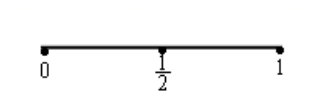
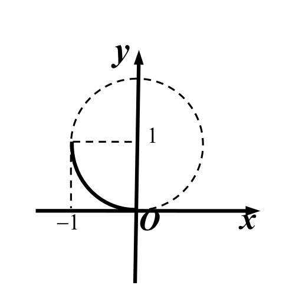
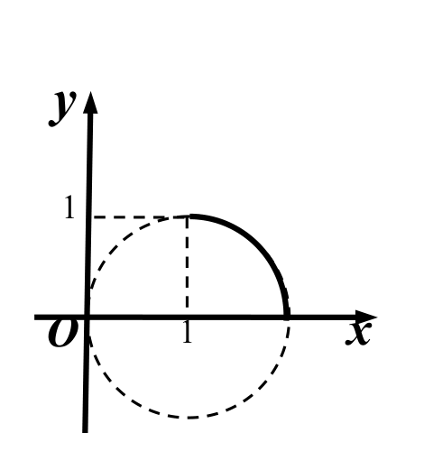
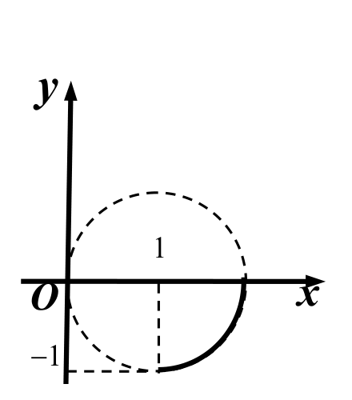
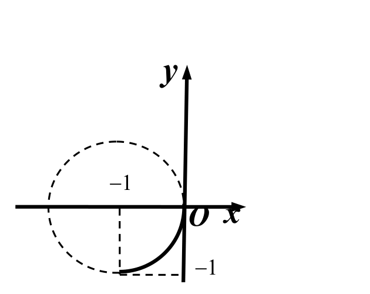
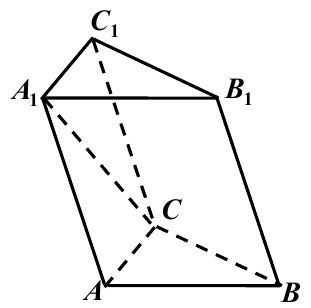
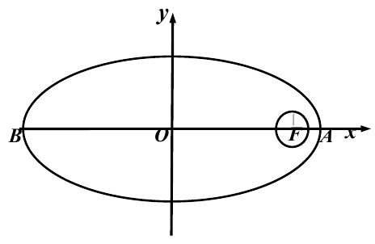
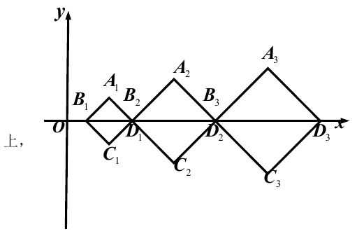

# 2009年上海卷（春）

## 填空题

### 第 1 题

函数 $y=\log_{2}(x-1)$ 的定义域是＿＿＿＿＿＿.

#### 答案

$(1,+\infty)$.

#### 解析

对数的真数必须为正，因此 $x-1>0$，解得 $x>1$. 所以定义域为 $(1,+\infty)$.

### 第 2 题

计算： $(1-\i)^{2}=$＿＿＿＿＿＿（$\i$ 为虚数单位）.

#### 答案

$-2\i$.

#### 解析

由 $\i^{2}=-1$，有 $(1-\i)^2=1-2\i+\i^2=1-2\i-1=-2\i$.

### 第 3 题

函数 $y = \cos \frac{x}{2}$ 的最小正周期 $T=$＿＿＿＿＿＿.

#### 答案

$4\pi$.

#### 解析

余弦函数的最小正周期为 $2\pi$. 令 $\frac{T}{2}=2\pi$，得 $T=4\pi$.

### 第 4 题

若集合 $A = \{x \mid |x| > 1\}$，集合 $B = \{x \mid 0 < x < 2\}$，则 $A \cap B =$＿＿＿＿＿＿.

#### 答案

$\{x\mid 1<x<2\}$.

#### 解析

由 $|x|>1$ 得 $x<-1$ 或 $x>1$，所以 $A=(-\infty,-1)\cup(1,+\infty)$. 与 $B=(0,2)$ 取交集，得到 $A\cap B=(1,2)=\{x\mid1<x<2\}$.

### 第 5 题

抛物线 $y^{2}=x$ 的准线方程是＿＿＿＿＿＿.

#### 答案

$x=-\frac14$.

#### 解析

抛物线的标准方程为 $y^2=4px$，其准线为 $x=-p$. 由 $4p=1$ 得 $p=\frac14$，故准线方程为 $x=-\frac14$.

### 第 6 题

已知 $\left|\boldsymbol{a}\right|=3$，$\left|\boldsymbol{b}\right|=2$. 若 $\boldsymbol{a}\cdot\boldsymbol{b}=-3$，则 $\boldsymbol{a}$ 与 $\boldsymbol{b}$ 夹角的大小为＿＿＿＿＿＿.

#### 答案

$\frac{2}{3}\pi$.

#### 解析

设 $\boldsymbol{a}$ 与 $\boldsymbol{b}$ 的夹角为 $\theta$，则

$$

\cos\theta=\frac{\boldsymbol{a}\cdot\boldsymbol{b}}{\left|\boldsymbol{a}\right|\left|\boldsymbol{b}\right|}=\frac{-3}{3\times2}=-\frac12

$$

由于 $0\leqslant\theta\leqslant\pi$，故 $\theta=\frac{2\pi}{3}$.

### 第 7 题

过点 $A(4, -1)$ 和双曲线 $\frac{x^{2}}{9} - \frac{y^{2}}{16} = 1$ 右焦点的直线方程为＿＿＿＿＿＿.

#### 答案

$y=x-5$.

#### 解析

双曲线的焦距参数满足 $c^2=9+16=25$，所以右焦点为 $F(5,0)$. 直线 $AF$ 的斜率为 $\frac{0-(-1)}{5-4}=1$，故其方程为 $y+1=x-4$，即 $y=x-5$.

### 第 8 题

在 $\triangle ABC$ 中，若 $AB = 3$， $\angle ABC = 75^\circ$， $\angle ACB = 60^\circ$，则 $BC$ 等于＿＿＿＿＿＿.

#### 答案

$\sqrt6$.

#### 解析

三角形内角和给出 $\angle A=180^\circ-75^\circ-60^\circ=45^\circ$. 由正弦定理，$\frac{BC}{\sin45^\circ}=\frac{AB}{\sin60^\circ}$，所以

$$

BC=3\frac{\sin45^\circ}{\sin60^\circ}=3\frac{\sqrt2/2}{\sqrt3/2}=\sqrt6

$$

### 第 9 题

已知对于任意实数 $x$，函数 $f(x)$ 满足 $f(-x) = f(x)$. 若方程 $f(x) = 0$ 有 2009 个实数解，则这 2009 个实数解之和为＿＿＿＿＿＿.

#### 答案

$0$.

#### 解析

若 $x_0$ 是方程 $f(x)=0$ 的非零实数解，则由偶性 $f(-x_0)=f(x_0)=0$，所以 $-x_0$ 也是解，非零解成相反数的成对出现. 解的总数为奇数 $2009$，因此必有 $x=0$ 这个解；其余解的和均为零，故全部解之和为 $0$.

### 第 10 题

一只猴子随机敲击只有$26$个小写英文字母的练习键盘. 若每敲$1$次在屏幕上出现一个字母，它连续敲击$10$次，屏幕上的$10$个字母依次排成一行，则出现单词“”的概率为＿＿＿＿＿＿（结果用数值表示）.

#### 答案

$\frac{5}{26^6}$.

#### 解析

连续敲击得到的全部长度为 $10$ 的字母序列共有 $26^{10}$ 种且等可能. 单词“”有 $10-6+1=5$ 个可能的起始位置，每固定一个起始位置后，其余 $4$ 个字母任意，共有 $26^4$ 种. 不同起始位置不能同时出现“”，所以有利序列数为 $5\times26^4$，所求概率为 $\frac{5\times26^4}{26^{10}}=\frac{5}{26^6}$.

### 第 11 题

以下是面点师一个工作环节的数学模型：如图，在数轴上截取与闭区间 $[0,1]$ 对应的线段，对折后（坐标 $1$ 所对应的点与原点重合）再均匀地拉成$1$个单位长度的线段，这一过程称为一次操作（例如在第一次操作完成后，原来的坐标 $\frac{1}{4}$， $\frac{3}{4}$变成 $\frac{1}{2}$，原来的坐标 $\frac{1}{2}$变成$1$，等等）. 那么原闭区间 $[0,1]$ 上（除两个端点外）的点，在第二次操作完成后，恰好被拉到与$1$重合的点所对应的坐标是＿＿＿＿＿＿；原闭区间 $[0,1]$ 上（除两个端点外）的点，在第$n$ 次操作完成后（$n\geq 1$），恰好被拉到与$1$重合的点所对应的坐标为＿＿＿＿＿＿. 

#### 答案

$\frac14$，$\frac34$；$\frac{j}{2^n}$，$j$为$[1,2^n]$中的所有奇数.

#### 解析

一次操作把原坐标 $x$ 变为帐篷函数

$$

T(x)=
\begin{cases}
2x,&0\leqslant x\leqslant\frac12,\\
2(1-x),&\frac12\leqslant x\leqslant1.
\end{cases}

$$

因为 $T(\frac12)=1$，第二次操作恰好到达 $1$ 的原坐标是 $T(x)=\frac12$ 的两个解，即 $x=\frac14$ 或 $x=\frac34$.

更一般地，用归纳法证明 $T^n(x)=1$ 的充要条件是 $x=\frac{j}{2^n}$，其中 $j$ 是 $[1,2^n]$ 中的奇数. 当 $n=1$ 时结论由 $T(x)=1$ 得到. 若结论对 $n-1$ 成立，则 $T^{n}(x)=1$ 等价于 $T(x)=\frac{k}{2^{n-1}}$，其中 $k$ 为奇数. 由 $T(x)=u$ 的两个解 $x=\frac{u}{2}$ 和 $x=1-\frac{u}{2}$，得到 $x=\frac{k}{2^n}$ 或 $x=\frac{2^n-k}{2^n}$，两个分子均为奇数，且这给出全部解. 因此第 $n$ 次操作后恰好与 $1$ 重合的原坐标正是所给集合.

## 单选题

### 第 12 题

在空间中，“两条直线没有公共点”是“这两条直线平行”的（）

A.  
充分不必要条件

B.  
必要不充分条件

C.  
充要条件

D.  
既不充分也不必要条件

#### 答案

B

#### 解析

空间中两条平行直线没有公共点，所以“平行”能推出“没有公共点”，即“没有公共点”是“平行”的必要条件. 但空间中的两条异面直线也没有公共点，却不平行，因此该条件不是充分条件，故选 B.

### 第 13 题

过点 $P(0,1)$ 与圆 $x^{2}+y^{2}-2x-3=0$ 相交的所有直线中，被圆截得的弦最长时的直线方程是（）

A.  
$x=0$

B.  
$y=1$

C.  
$x + y - 1 = 0$

D.  
$x - y + 1 = 0$

#### 答案

C

#### 解析

圆的方程化为 $(x-1)^2+y^2=4$，圆心为 $O_1(1,0)$，半径为 $2$. 点 $P(0,1)$ 在圆内，因为 $PO_1=\sqrt2<2$，过圆内一点的最长弦是过该点和圆心的直径. 直线 $PO_1$ 的斜率为 $-1$，方程为 $y-1=-(x-0)$，即 $x+y-1=0$，故选 C.

### 第 14 题

已知函数

$$

f(x)=\begin{cases}
3^{x+1}, & x \leq 0,\\
\log_{2} x, & x > 0.
\end{cases}

$$

若 $f(x_{0})>3$，则 $x_{0}$ 的取值范围是（）

A.  
$x_{0} > 8$

B.  
$x_{0} < 0$ 或 $x_{0} > 8$

C.  
$0 < x_{0} < 8$

D.  
$x_{0} < 0$ 或 $0 < x_{0} < 8$

#### 答案

A

#### 解析

当 $x_0\leqslant0$ 时，$f(x_0)=3^{x_0+1}\leqslant3$，不满足题意. 当 $x_0>0$ 时，$f(x_0)=\log_2x_0$，于是 $\log_2x_0>3$，解得 $x_0>2^3=8$. 所以取值范围为 $x_0>8$，故选 A.

### 第 15 题

函数 $y = 1 + \sqrt{1 - x^{2}}$（$-1 \leq x \leq 0$）的反函数图像是（）

A.  

B.  

C.  

D.  

#### 答案

C

#### 解析

原函数在 $[-1,0]$ 上严格递增，因而存在反函数. 原函数满足 $(y-1)^2+x^2=1$，且 $-1\leqslant x\leqslant0$，所以其图像是圆心 $(0,1)$ 的左上四分之一圆弧，端点为 $(-1,1)$ 和 $(0,2)$. 反函数图像关于直线 $y=x$ 对称，端点变为 $(1,-1)$ 和 $(2,0)$，并满足 $(x-1)^2+y^2=1$，是第四象限内相应的四分之一圆弧. 与图形逐项对照，只有 C 符合，故选 C.

## 解答题

### 第 16 题

如图，在斜三棱柱 $ABC - A_1B_1C_1$ 中， $\angle A_1AC = \angle ACB = \frac{\pi}{2}$， $\angle AA_1C = \frac{\pi}{6}$，侧棱 $BB_1$ 与底面所成的角为 $\frac{\pi}{3}$， $AA_1 = 4\sqrt{3}$， $BC = 4$. 求斜三棱柱 $ABC - A_1B_1C_1$ 的体积 $V$.

#### 解析

在直角三角形 $AA_1C$ 中，$\angle A_1AC=\frac\pi2$，所以

$$

AC=AA_1\tan\angle AA_1C=4\sqrt3\tan\frac\pi6=4

$$

又因为 $\angle ACB=\frac\pi2$，底面三角形的面积为 $S_{\triangle ABC}=\frac12AC\cdot BC=\frac12\times4\times4=8$.

设从 $B_1$ 向平面 $ABC$ 作垂线，垂足为 $H$. 由于 $BB_1$ 与平面 $ABC$ 所成的角为 $\frac\pi3$，有 $\angle B_1BH=\frac\pi3$. 斜三棱柱的侧棱等长，故 $BB_1=AA_1=4\sqrt3$. 在直角三角形 $B_1BH$ 中，三棱柱的高为

$$

B_1H=BB_1\sin\angle B_1BH=4\sqrt3\sin\frac\pi3=6

$$

因此

$$

V=S_{\triangle ABC}\cdot B_1H=8\times6=48

$$

### 第 17 题

已知数列 $\left\{a_{n}\right\}$ 的前 $n$ 项和为 $S_{n}$， $a_{1}=1$，且 $3a_{n+1}+2S_{n}=3$（ $n$ 为正整数）.

1.  求数列 $\{a_{n}\}$ 的通项公式；

2.  记 $S = a_1 + a_2 + \cdots + a_n + \cdots$. 若对任意正整数 $n$， $kS \leq S_n$ 恒成立，求实数 $k$ 的最大值.

#### 解析

1.  当 $n\geqslant2$ 时，原递推式分别给出 $3a_{n+1}+2S_n=3$ 和 $3a_n+2S_{n-1}=3$. 两式相减，并利用 $S_n-S_{n-1}=a_n$，得

$$

3a_{n+1}-3a_n+2a_n=0

$$

    即 $a_{n+1}=\frac13a_n$. 取原式中的 $n=1$，有 $3a_2+2a_1=3$，结合 $a_1=1$ 得 $a_2=\frac13$. 因而数列为首项 $1$、公比 $\frac13$ 的等比数列，故

$$

a_n=\left(\frac13\right)^{n-1}

$$

    其中 $n\in\mathbb Z_{>0}$.

2.  由于公比满足 $\left|\frac13\right|<1$，无穷级数收敛，且

$$

S=\frac{1}{1-\frac13}=\frac32

$$

    又

$$

S_n=\frac{1-\left(\frac13\right)^n}{1-\frac13}=\frac32\left[1-\left(\frac13\right)^n\right]

$$

    条件 $kS\leqslant S_n$ 对一切正整数 $n$ 成立，等价于

$$

k\leqslant1-\left(\frac13\right)^n

$$

    右端随 $n$ 增大而增大，其最小值在 $n=1$ 时取得，为 $\frac23$. 所以 $k\leqslant\frac23$，且取 $k=\frac23$ 时条件确实对所有 $n$ 成立，故 $k$ 的最大值为 $\frac23$.

### 第 18 题

我国计划发射火星探测器，该探测器的运行轨道是以火星的中心 $F$ 为一个焦点的椭圆，火星半径为 $R=34\text{ 百公里}$. 如图，已知探测器的近火星点（轨道上离火星表面最近的点）$A$ 到火星表面的距离为 $8\text{ 百公里}$，远火星点（轨道上离火星表面最远的点）$B$ 到火星表面的距离为 $800\text{ 百公里}$. 假定探测器由近火星点 $A$ 第一次逆时针运行到与轨道中心 $O$ 的距离为 $\sqrt{ab}\text{ 百公里}$ 时进行变轨，其中 $a$，$b$ 分别为椭圆的长半轴，短半轴的长，求此时探测器与火星表面的距离（精确到 $1\text{ 百公里}$）.

#### 解析

取椭圆中心为原点，长轴在 $x$ 轴上，令焦点 $F=(c,0)$，近火星点和远火星点分别为 $A=(a,0)$、$B=(-a,0)$. 由题意，

$$

a-c=R+8=42

$$

又

$$

a+c=R+800=834

$$

解得 $a=438$，$c=396$. 因而

$$

b^2=a^2-c^2=438^2-396^2=35028

$$

即 $b=\sqrt{35028}\approx187.158$.

设第一次逆时针运行到指定位置时探测器为 $P(x,y)$. 从右端点 $A$ 出发逆时针运行，故取第一象限的交点 $x>0$，$y>0$. 由 $OP=\sqrt{ab}$ 及椭圆方程，得

$$

x^2+y^2=ab

$$

同时

$$

\frac{x^2}{a^2}+\frac{y^2}{b^2}=1

$$

代入 $y^2=ab-x^2$，有

$$

x^2\left(\frac1{a^2}-\frac1{b^2}\right)=1-\frac ab

$$

从而

$$

x^2=\frac{a^2b}{a+b}

$$

从而 $x\approx239.653$，且 $y=\sqrt{ab-x^2}\approx156.657$. 探测器到火星中心的距离为

$$

PF=\sqrt{(x-c)^2+y^2}\approx221.327

$$

所以探测器到火星表面的距离为

$$

PF-R\approx221.327-34=187.327\text{ 百公里}

$$

精确到 $1\text{ 百公里}$ 为 $187\text{ 百公里}$.

### 第 19 题

如图，在直角坐标系 $xOy$ 中，有一组对角线长为 $a_{n}$ 的正方形 $A_{n}B_{n}C_{n}D_{n}$（$n=1$，$2$，$\cdots$），其对角线 $B_n D_n$ 依次放置在 $x$ 轴上（相邻顶点重合）. 设 $\{a_n\}$ 是首项为 $a$，公差为 $d$（$d > 0$）的等差数列，点 $B_1$ 的坐标为 $(d, 0)$.

1.  当 $a = 8$，$d = 4$ 时，证明：顶点 $A_{1}$， $A_{2}$，$A_{3}$ 不在同一条直线上；

2.  在（1）的条件下，证明：所有顶点 $A_{n}$ 均落在抛物线 $y^{2}=2x$ 上；

3.  为使所有顶点 $A_{n}$ 均落在抛物线 $y^{2}=2px$（$p>0$）上，求 $a$ 与 $d$ 之间所应满足的关系式.

#### 解析

1.  当 $a=8$，$d=4$ 时，$a_1=8$，$a_2=12$，$a_3=16$. 由图形位置， $A_1=(8,4)$，$A_2=(18,6)$，$A_3=(32,8)$. 因此 $k_{A_1A_2}=\frac{6-4}{18-8}=\frac15$，$k_{A_2A_3}=\frac{8-6}{32-18}=\frac17$. 两斜率不相等，故三点不在同一直线上.

2.  一般地，因 $a_n=a+(n-1)d$，且 $B_1=(d,0)$，有

$$

x_n=d+\sum_{i=1}^{n-1}a_i+\frac12a_n

$$

    且 $y_n=\frac12a_n$. 在本小题条件下，$a_n=4(n+1)$，所以

$$

x_n=4+\sum_{i=1}^{n-1}4(i+1)+2(n+1)=2(n+1)^2

$$

    且 $y_n=2(n+1)$. 于是 $y_n^2=4(n+1)^2=2x_n$，故所有顶点 $A_n$ 均在抛物线 $y^2=2x$ 上.

3.  令 $t=n-1$，则

$$

x_n=d+\frac a2+at+\frac d2t^2

$$

    且 $y_n=\frac12(a+dt)$. 由 $t=\frac{2y_n-a}{d}$ 消去 $t$，得

$$

x_n=\frac{2}{d}y_n^2+d+\frac{a(d-a)}{2d}

$$

    若所有顶点均在 $y^2=2px$ 上，则对无穷多个不同的 $y_n$ 有

$$

\frac{2}{d}y_n^2+d+\frac{a(d-a)}{2d}=\frac{1}{2p}y_n^2

$$

    由于这些 $y_n$ 互不相同，上式两端关于 $y_n$ 的二次式在无穷多个点相等，故比较二次项系数和常数项，得到

$$

d=4p

$$

    且 $d+\frac{a(d-a)}{2d}=0$. 第二式化为 $a^2-ad-2d^2=0$，即 $(a-2d)(a+d)=0$. 因为 $a=a_1$ 是正方形的对角线长，故 $a>0$，而 $d>0$，只能取 $a=2d$. 反之，若 $a=2d$，则常数项为零且 $p=\frac d4>0$，上式给出所有顶点都满足 $y^2=2px$. 所以所求关系式为 $a=2d$.

### 第 20 题

设函数 $f_{n}(\theta)=\sin^{n}\theta+(-1)^{n}\cos^{n}\theta$，$0\leq\theta\leq\frac{\pi}{4}$，其中 $n$ 为正整数.

1.  判断函数 $f_{1}(\theta)$， $f_{3}(\theta)$ 的单调性，并就 $f_{1}(\theta)$ 的情形证明你的结论；

2.  证明： $2f_{6}(\theta)-f_{4}(\theta)=\left(\cos^{4}\theta-\sin^{4}\theta\right)\left(\cos^{2}\theta-\sin^{2}\theta\right)$；

3.  对于任意给定的正整数 $n$，求函数 $f_{n}(\theta)$ 的最大值和最小值.

#### 解析

1.  $f_1(\theta)=\sin\theta-\cos\theta$，$f_3(\theta)=\sin^3\theta-\cos^3\theta$. 对任意 $0\leqslant\theta_1<\theta_2\leqslant\frac\pi4$，有 $\sin\theta_1<\sin\theta_2$ 且 $\cos\theta_2<\cos\theta_1$，因此

$$

f_1(\theta_1)-f_1(\theta_2)=(\sin\theta_1-\sin\theta_2)+(\cos\theta_2-\cos\theta_1)<0

$$

    所以 $f_1(\theta_1)<f_1(\theta_2)$，即 $f_1$ 在 $\left[0,\frac\pi4\right]$ 上单调递增. 又因为 $0\leqslant\sin\theta_1<\sin\theta_2$ 且 $0\leqslant\cos\theta_2<\cos\theta_1$，非负数的三次方保持大小关系，所以 $\sin^3\theta_1<\sin^3\theta_2$ 且 $\cos^3\theta_2<\cos^3\theta_1$. 并且

$$

f_3(\theta_1)-f_3(\theta_2)=(\sin^3\theta_1-\sin^3\theta_2)+(\cos^3\theta_2-\cos^3\theta_1)<0

$$

    从而 $f_3(\theta_1)<f_3(\theta_2)$，故 $f_3$ 也在该区间上单调递增.

2.  记 $s=\sin\theta$，$c=\cos\theta$. 由 $s^2+c^2=1$，

$$

2f_6-f_4=2(s^6+c^6)-(s^4+c^4)=2(1-3s^2c^2)-(1-2s^2c^2)=1-4s^2c^2=1-\sin^22\theta=\cos^22\theta

$$

    另一方面，

$$

(c^4-s^4)(c^2-s^2)=(c^2-s^2)^2(c^2+s^2)=\cos^22\theta

$$

    两边相等，等式得证.

3.  当 $n$ 为奇数时，$f_n(\theta)=\sin^n\theta-\cos^n\theta$. 对区间内任意 $\theta_1<\theta_2$，由于函数 $t\mapsto t^n$ 在 $[0,+\infty)$ 上严格递增，有 $\sin^n\theta_1<\sin^n\theta_2$ 及 $\cos^n\theta_2<\cos^n\theta_1$，并且

$$

f_n(\theta_1)-f_n(\theta_2)=(\sin^n\theta_1-\sin^n\theta_2)+(\cos^n\theta_2-\cos^n\theta_1)<0

$$

    故 $f_n(\theta_1)<f_n(\theta_2)$，因而函数单调递增，且

$$

f_n(0)=-1

$$

    且 $f_n\left(\frac\pi4\right)=0$. 所以奇数 $n$ 时最大值为 $0$，最小值为 $-1$.

    当 $n=2$ 时，$f_2(\theta)=\sin^2\theta+\cos^2\theta=1$，所以最大值和最小值均为 $1$.

    当 $n=2l$ 且 $l\geqslant2$ 时，$f_n(\theta)=\sin^n\theta+\cos^n\theta\leqslant\sin^2\theta+\cos^2\theta=1$，故最大值为 $f_n(0)=1$. 又因为 $0\leqslant\sin\theta\leqslant\cos\theta$，有

$$

2f_{2l}(\theta)-f_{2l-2}(\theta)=\left(\cos^{2l-2}\theta-\sin^{2l-2}\theta\right)\left(\cos^2\theta-\sin^2\theta\right)\geqslant0

$$

    所以 $f_{2l}(\theta)\geqslant\frac12f_{2l-2}(\theta)$. 迭代并利用 $f_2(\theta)=1$，得到

$$

f_n(\theta)\geqslant\frac{1}{2^{l-1}}

$$

    在 $\theta=\frac\pi4$ 时，$f_n\left(\frac\pi4\right)=2\left(\frac1{\sqrt2}\right)^n=\frac1{2^{l-1}}$，故这是最小值. 因此偶数 $n$ 时最大值为 $1$，最小值为 $2\left(\frac12\right)^{n/2}$.
