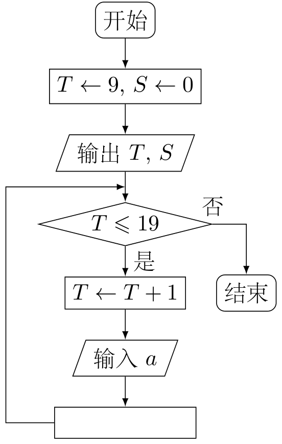
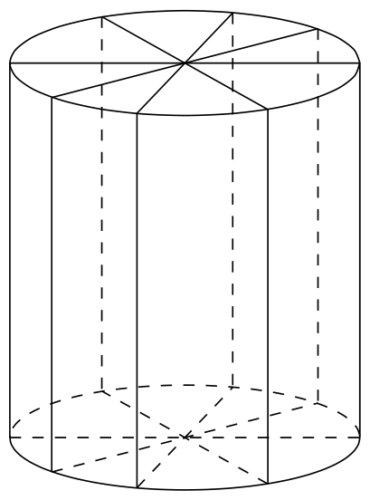

# 2010年上海卷（秋文）

## 填空题

### 第 1 题

已知集合 $A = \{1, 3, m\}$，$B = \{3, 4\}$，$A \cup B = \{1, 2, 3, 4\}$，则 $m =\underline{\qquad\qquad}$.

#### 答案

$2$

#### 解析

因为 $B$ 已含有 $3$，而 $A$ 中已有 $1,3$，所以 $A\cup B=\{1,3,4,m\}$. 要使并集恰为 $\{1,2,3,4\}$，只能有 $m=2$.

### 第 2 题

不等式 $\frac{2 - x}{x + 4} > 0$ 的解集是＿＿＿＿＿＿.

#### 答案

$(-4,2)$

#### 解析

分子 $2-x$ 的零点为 $2$，分母 $x+4$ 的零点为 $-4$，且 $x=-4$ 不在定义域内. 在三个区间上考察符号，只有 $-4<x<2$ 时分子、分母同号，因此解集为 $(-4,2)$.

### 第 3 题

行列式 $\begin{vmatrix} \cos \frac{\pi}{6} & \sin \frac{\pi}{6} \\ \sin \frac{\pi}{6} & \cos \frac{\pi}{6} \end{vmatrix}$ 的值是＿＿＿＿＿＿.

#### 答案

$0.5$

#### 解析

二阶行列式的值为 $\cos ^2\frac{\pi}{6}-\sin ^2\frac{\pi}{6}=\cos\frac{\pi}{3}=\frac{1}{2}=0.5$.

### 第 4 题

若复数 $z = 1 - 2\i$（$\i$ 为虚数单位），则 $z \cdot \overline{z} + z =\underline{\qquad\qquad}$.

#### 答案

$6-2\i$

#### 解析

由 $z=1-2\i$ 得 $\overline z=1+2\i$，所以 $z\overline z=1^2+2^2=5$. 因而 $z\overline z+z=5+(1-2\i)=6-2\i$.

### 第 5 题

将一个总体分为 A，B，C 三层，其个体数之比为 $5:3:2$. 若用分层抽样方法抽取容量为100的样本，则应从 C 中抽取＿＿＿＿＿＿ 个个体.

#### 答案

$20$

#### 解析

三层个体数的总比例为 $5+3+2=10$，C 层占比例 $\frac{2}{10}$. 分层抽取保持各层比例，所以应抽取 $100\times\frac{2}{10}=20$ 个.

### 第 6 题

已知四棱锥 $P - ABCD$ 的底面是边长为 6 的正方形，侧棱 $PA \perp$ 底面 $ABCD$，且 $PA = 8$，则该四棱锥的体积是＿＿＿＿＿＿.

#### 答案

$96$

#### 解析

底面正方形面积为 $6^2=36$，且 $PA\perp$ 底面，所以棱锥高为 $PA=8$. 因此体积 $V=\frac{1}{3}\times36\times8=96$.

### 第 7 题

圆 $C: x^{2} + y^{2} - 2x - 4y + 4 = 0$ 的圆心到直线 $l: 3x + 4y + 4 = 0$ 的距离 $d =\underline{\qquad\qquad}$.

#### 答案

$3$

#### 解析

将圆的方程配方得 $(x-1)^2+(y-2)^2=1$，故圆心为 $(1,2)$. 圆心到直线的距离为 $d=\frac{|3\times1+4\times2+4|}{\sqrt{3^2+4^2}}=\frac{15}{5}=3$.

### 第 8 题

动点 $P$ 到点 $F(2,0)$ 的距离与它到直线 $x + 2 = 0$ 的距离相等，则点 $P$ 的轨迹方程为＿＿＿＿＿＿.

#### 答案

$y^{2}=8x$

#### 解析

设动点 $P(x,y)$. 由抛物线定义， $\sqrt{(x-2)^2+y^2}=|x+2|$. 两边均非负，平方得 $(x-2)^2+y^2=(x+2)^2$，化简为 $y^2=8x$. 反过来，满足该方程的点也满足原距离等式，故轨迹方程为 $y^2=8x$.

### 第 9 题

函数 $f(x) = \log_3(x + 3)$ 的反函数的图象与 $y$ 轴的交点坐标是＿＿＿＿＿＿.

#### 答案

$(0,-2)$

#### 解析

由 $y=\log_3(x+3)$ 交换 $x$，$y$，得反函数 $y=3^x-3$. 图象与 $y$ 轴交点的横坐标为 $0$，代入得 $y=3^0-3=-2$，所以交点为 $(0,-2)$.

### 第 10 题

从一副混合后的扑克牌（52 张）中随机抽取 2 张，则“抽出的 2 张均为红桃”的概率为＿＿＿＿＿＿.（结果用最简分数表示）

#### 答案

$\frac{1}{17}$

#### 解析

52 张牌中有 13 张红桃. 等可能的两张牌组合总数为 $\mathrm C_{52}^{2}$，两张均为红桃的组合数为 $\mathrm C_{13}^{2}$，所以概率为 $\frac{\mathrm C_{13}^{2}}{\mathrm C_{52}^{2}}=\frac{13\times12}{52\times51}=\frac{1}{17}$.

### 第 11 题

2010 年上海世博会园区每天 9：00 开园，20：00 停止入园. 在右边的框图中，$S$ 表示上海世博会官方网站在每个整点报道的入园总人数，$a$ 表示整点报道前 1 个小时内入园人数. 则空白的执行框内应填入＿＿＿＿＿＿.

#### 答案

$S\leftarrow S+a$

#### 解析

每次循环开始时，$S$ 是此前各整点报道人数的总和，$a$ 是刚经过的一个小时内新增人数. 因而更新总人数时应把新增人数累加到原总数，即填入 $S\leftarrow S+a$.

### 第 12 题

在 $n$ 行 $n$ 列矩阵 $\begin{pmatrix}1 & 2 & 3 & \cdots & n - 2 & n - 1 & n\\ 2 & 3 & 4 & \cdots & n - 1 & n & 1\\ 3 & 4 & 5 & \cdots & n & 1 & 2\\ \vdots & \ddots & \vdots & \ddots & \vdots & \cdots & \vdots\\ n & 1 & 2 & \cdots & n - 3 & n - 2 & n - 1 \end{pmatrix}$ 中，记位于第 $i$ 行第 $j$ 列的数为 $a_{ij}$，$i$，$j = 1$，$2$，$\cdots$，$n$. 当 $n = 9$ 时， $a_{11} + a_{22} + a_{33} + \cdots + a_{99} =$＿＿＿＿＿＿.

#### 答案

$45$

#### 解析

矩阵每行相对上一行向左循环移一位，因此第 $i$ 行第 $i$ 列的元素为 $a_{ii}=((2i-2)\bmod 9)+1$. 当 $i=1$，$2$，$\ldots$，$9$ 时，这些数恰为 $1$，$2$，$\ldots$，$9$ 的一个排列，所以 $a_{11}+a_{22}+\cdots+a_{99}=1+2+\cdots+9=45$.

### 第 13 题

在平面直角坐标系中，双曲线 $\Gamma$ 的中心在原点，它的一个焦点坐标为 $(\sqrt{5},0)$，$\boldsymbol{e}_1 = (2,1)$，$\boldsymbol{e}_2 = (2,-1)$ 分别是两条渐近线的方向向量. 任取双曲线 $\Gamma$ 上的点 $P$，若 $\overrightarrow{OP} = a\boldsymbol{e}_1 + b\boldsymbol{e}_2$（$a$，$b \in \mathbb{R}$），则 $a$，$b$ 满足的一个等式是＿＿＿＿＿＿.

#### 答案

$4ab=1$

#### 解析

两条渐近线的斜率分别为 $\frac{1}{2}$ 和 $-\frac{1}{2}$，故双曲线可写为 $\frac{x^2}{4}-y^2=1$，因为其渐近线为 $y=\pm\frac{x}{2}$，且焦距参数满足 $c^2=4+1=5$. 若 $\overrightarrow{OP}=a\boldsymbol{e}_1+b\boldsymbol{e}_2$，则 $P$ 的坐标为 $(2a+2b,a-b)$. 代入双曲线方程得 $\frac{(2a+2b)^2}{4}-(a-b)^2=(a+b)^2-(a-b)^2=4ab=1$.

### 第 14 题

将直线 $l_1: x + y - 1 = 0$，$l_2: nx + y - n = 0$，$l_3: x + ny - n = 0$ （$n \in \mathbb{N}^*$，$n \geqslant 2$）围成的三角形面积记为 $S_n$. 则 $\displaystyle\lim_{n \to \infty} S_n =$＿＿＿＿＿＿.

#### 答案

$\frac{1}{2}$

#### 解析

三条直线的交点分别为 $l_1\cap l_2=(1,0)$，$l_1\cap l_3=(0,1)$，以及 $l_2\cap l_3=\left(\frac{n}{n+1},\frac{n}{n+1}\right)$. 前两个点连线为 $x+y=1$，长度为 $\sqrt2$. 第三个点到该直线的距离为 $\frac{\left|\frac{2n}{n+1}-1\right|}{\sqrt2}=\frac{n-1}{\sqrt2(n+1)}$. 因此 $S_n=\frac12\times\sqrt2\times\frac{n-1}{\sqrt2(n+1)}=\frac{n-1}{2(n+1)}$，从而 $\lim_{n\to\infty}S_n=\frac12$.

## 单选题

### 第 15 题

满足线性约束条件

$$

\begin{cases}
2x + y \leqslant 3,\\
x + 2y \leqslant 3,\\
x \geqslant 0,\\
y \geqslant 0
\end{cases}

$$

的目标函数 $z = x + y$ 的最大值是（）

A.  
$1$

B.  
$\frac{3}{2}$

C.  
$2$

D.  
$3$

#### 答案

C

#### 解析

可行域的顶点为 $(0,0)$、$(\frac32,0)$、$(1,1)$、$(0,\frac32)$. 在这些顶点处，目标函数 $z=x+y$ 的值依次为 $0$，$\frac32$，$2$，$\frac32$，所以最大值为 $2$，选 C.

### 第 16 题

“$x = 2k\pi + \frac{\pi}{4}$（$k \in \mathbb{Z}$）”是“$\tan x = 1$”成立的（）

A.  
充分不必要条件

B.  
必要不充分条件

C.  
充要条件

D.  
既不充分也不必要条件

#### 答案

A

#### 解析

若 $x=2k\pi+\frac{\pi}{4}$，则 $\tan x=\tan\frac{\pi}{4}=1$，所以前者是后者的充分条件. 而 $\tan x=1$ 的全部解为 $x=k\pi+\frac{\pi}{4}$，例如 $x=\frac{5\pi}{4}$ 满足后者但不能写成 $2k\pi+\frac{\pi}{4}$. 因此不是必要条件，选 A.

### 第 17 题

若 $x_0$ 是方程 $\lg x + x = 2$ 的解，则 $x_0$ 属于区间（）

A.  
$(0,1)$

B.  
$(1, 1.25)$

C.  
$(1.25, 1.75)$

D.  
$(1.75, 2)$

#### 答案

D

#### 解析

令 $g(x)=\lg x+x-2$，其定义域为 $x>0$，且 $g'(x)=\frac{1}{x\ln10}+1>0$，所以 $g$ 严格递增. 计算得 $g(1.75)=\lg1.75-0.25\approx-0.007<0$，$g(2)=\lg2>0$. 因此方程的唯一根属于 $(1.75,2)$，应选 D.

### 第 18 题

若 $\triangle ABC$ 的三个内角满足 $\sin A: \sin B: \sin C = 5:11:13$，则 $\triangle ABC$（）

A.  
一定是锐角三角形

B.  
一定是直角三角形

C.  
一定是钝角三角形

D.  
可能是锐角三角形，也可能是钝角三角形

#### 答案

C

#### 解析

由正弦定理，三角形的边长之比等于对应角的正弦之比，所以可设三边为 $5t$，$11t$，$13t$，其中 $t>0$. 最大边 $13t$ 所对的角为 $C$. 因为 $(13t)^2>(5t)^2+(11t)^2$，即 $169>146$，由余弦定理 $\cos C=\frac{(5t)^2+(11t)^2-(13t)^2}{2\cdot5t\cdot11t}=-\frac{23}{110}<0$，故 $C$ 为钝角，三角形一定是钝角三角形，选 C.

## 解答题

### 第 19 题

已知 $0 < x < \frac{\pi}{2}$，化简：$\lg\left(\cos x \cdot \tan x + 1 - 2\sin^2\frac{x}{2}\right) + \lg\left[\sqrt{2}\cos\left(x - \frac{\pi}{4}\right)\right] - \lg(1 + \sin 2x)$.

#### 解析

因为 $0<x<\frac{\pi}{2}$，所以 $\sin x>0$，$\cos x>0$. 先化简第一个对数的真数：

$$

\cos x\cdot\tan x+1-2\sin^2\frac{x}{2}
=\sin x+1-(1-\cos x)=\sin x+\cos x

$$

又有 $\sqrt{2}\cos\left(x-\frac{\pi}{4}\right)=\sin x+\cos x>0$，$1+\sin 2x=(\sin x+\cos x)^2>0$. 因此原式为

$$

\lg(\sin x+\cos x)+\lg(\sin x+\cos x)
-\lg\bigl((\sin x+\cos x)^2\bigr)=0

$$

### 第 20 题

如图所示，为了制作一个圆柱形灯笼，先要制作 4 个全等的矩形骨架，总计耗用 $9.6\text{ 米}$ 铁丝，再用 $S\text{ 平方米}$ 塑料片制成圆柱的侧面和下底面（不安装上底面）.

1.  当圆柱底面半径 $r$ 取何值时，$S$ 取得最大值？并求出该最大值（结果精确到 $0.01\text{ 平方米}$）；

2.  若要制作一个如图放置的、底面半径为 $0.3\text{ 米}$ 的灯笼，请作出用于制作灯笼的三视图（作图时，不需考虑骨架等因素）.

#### 解析

设圆柱的母线长为 $l$. 每个矩形骨架的两条长边长为 $l$，两条短边为底面直径 $2r$，所以 4 个矩形骨架耗用铁丝

$$

4(2l+4r)=9.6

$$

从而 $l+2r=1.2$，即 $l=1.2-2r$. 由于 $l>0$，有 $0<r<0.6$.

1.  塑料片包括圆柱侧面和一个下底面，因此

$$

S=2\pi rl+\pi r^2
    =2\pi r(1.2-2r)+\pi r^2
    =-3\pi r^2+2.4\pi r

$$

    配方得

$$

S=-3\pi(r-0.4)^2+0.48\pi

$$

    当 $r=0.4$ 时平方项为 $0$，$S$ 取得最大值

$$

S_{\max}=0.48\pi\approx1.51\text{ m}^2

$$

2.  当 $r=0.3$ 时，$l=1.2-2\times0.3=0.6\text{ m}$. 因而主视图、左视图都是宽 $2r=0.6\text{ m}$、高 $l=0.6\text{ m}$ 的矩形；俯视图是半径 $0.3\text{ m}$ 的圆. 按此尺寸分别画出矩形和圆，即得三视图.

### 第 21 题

1.  已知数列 $\{a_{n}\}$ 的前 $n$ 项和为 $S_{n}$，且 $S_{n} = n - 5a_{n} - 85$，$n \in \mathbb{N}^*$，证明：$\{a_{n} - 1\}$ 是等比数列；

2.  求数列 $\{S_{n}\}$ 的通项公式，并求出使得 $S_{n+1} > S_{n}$ 成立的最小正整数 $n$.

#### 解析

取 $n=1$，由 $S_1=a_1$ 及题设得

$$

a_1=1-5a_1-85

$$

所以 $a_1=-14$.

当 $n\geqslant2$ 时，由 $a_n=S_n-S_{n-1}$ 及题设，

$$

a_n=S_n-S_{n-1}=(n-5a_n-85)-\bigl[(n-1)-5a_{n-1}-85\bigr]
=1-5a_n+5a_{n-1}

$$

于是 $6a_n=1+5a_{n-1}$，从而 $a_n-1=\frac56(a_{n-1}-1)$. 因此 $\{a_n-1\}$ 是首项 $a_1-1=-15$、公比 $\frac56$ 的等比数列，即 $a_n-1=-15\left(\frac56\right)^{n-1}$，从而 $a_n=1-15\left(\frac56\right)^{n-1}$.

再由 $S_n=n-5a_n-85$，得到

$$

S_n=75\left(\frac56\right)^{n-1}+n-90

$$

于是

$$

S_{n+1}-S_n
=1+75\left[\left(\frac56\right)^n-\left(\frac56\right)^{n-1}\right]
=1-\frac{25}{2}\left(\frac56\right)^{n-1}

$$

所以 $S_{n+1}>S_n$ 等价于

$$

\left(\frac56\right)^{n-1}<\frac{2}{25}=0.08

$$

计算得 $\left(\frac56\right)^{13}\approx0.0935>0.08$，$\left(\frac56\right)^{14}\approx0.0779<0.08$. 故满足条件的最小正整数为 $n=15$.

### 第 22 题

1.  若实数 $x$，$y$，$m$ 满足 $|x - m| < |y - m|$，则称 $x$ 比 $y$ 接近 $m$. 若 $x^{2} - 1$ 比 $3$ 接近 $0$，求 $x$ 的取值范围；

2.  对任意两个不相等的正数 $a$，$b$，证明：$a^{2}b + ab^{2}$ 比 $a^{3} + b^{3}$ 接近 $2ab\sqrt{ab}$；

3.  已知函数 $f(x)$ 的定义域 $D = \{x \mid x \neq k\pi, k \in \mathbb{Z}, x \in \mathbb{R}\}$. 任取 $x \in D$，$f(x)$ 等于 $1 + \sin x$ 和 $1 - \sin x$ 中接近 $0$ 的那个值. 写出函数 $f(x)$ 的解析式，并指出它的奇偶性，最小正周期，最小值和单调性（结论不要求证明）.

#### 解析

1.  由“$x^2-1$ 比 $3$ 接近 $0$”的定义，

$$

|x^2-1|<|3|=3

$$

    因此 $-3<x^2-1<3$，$-2<x^2<4$. 由于 $x^2\geqslant0$，左侧不等式自动满足，故 $x^2<4$，从而

$$

-2<x<2

$$

2.  设 $X=a^2b+ab^2$，$Y=a^3+b^3$，$Z=2ab\sqrt{ab}$. 因 $a$，$b>0$ 且 $a\ne b$，有

$$

X-Z=ab(a+b-2\sqrt{ab})
    =ab(\sqrt a-\sqrt b)^2>0

$$

    另一方面，

$$

Y-X=a^3+b^3-a^2b-ab^2
    =(a+b)(a-b)^2>0

$$

    所以 $Y>X>Z$，于是

$$

|X-Z|=X-Z<Y-Z=|Y-Z|

$$

    即 $X$ 比 $Y$ 接近 $Z$.

3.  在定义域 $D$ 内，$1+\sin x$ 与 $1-\sin x$ 均非负，且由于 $x\ne k\pi$，有 $\sin x\ne0$，两者不相等. 距离 $0$ 较近者是较小者，因此

$$

f(x)=\min\{1+\sin x,1-\sin x\}=1-|\sin x|

$$

    因为 $|\sin(-x)|=|\sin x|$，$f$ 是偶函数；又因为

$$

|\sin(x+\pi)|=|\sin x|

$$

    且 $|\sin x|$ 的最小正周期为 $\pi$，所以 $f$ 的最小正周期为 $\pi$. 当 $x=\frac{\pi}{2}+k\pi$ 时，$|\sin x|=1$，故 $f_{\min}=0$. 对任意 $k\in\mathbb{Z}$，$f$ 在

$$

\left[k\pi-\frac{\pi}{2},\,k\pi\right)

$$

    上单调递增，在

$$

\left(k\pi,\,k\pi+\frac{\pi}{2}\right]

$$

    上单调递减.

### 第 23 题

1.  已知椭圆 $\Gamma$ 的方程为 $\frac{x^2}{a^2} + \frac{y^2}{b^2} = 1$（$a > b > 0$），$A(0, b)$，$B(0, -b)$ 和 $Q(a, 0)$ 为 $\Gamma$ 的三个顶点. 若点 $M$ 满足 $\overrightarrow{AM} = \frac{1}{2}\left(\overrightarrow{AQ} + \overrightarrow{AB}\right)$，求点 $M$ 的坐标；

2.  设直线 $l_{1}: y = k_{1}x + p$ 交椭圆 $\Gamma$ 于 $C$，$D$ 两点，交直线 $l_{2}: y = k_{2}x$ 于点 $E$. 若 $k_{1} \cdot k_{2} = -\frac{b^{2}}{a^{2}}$，证明：$E$ 为 $CD$ 的中点；

3.  设点 $P$ 在椭圆 $\Gamma$ 内且不在 $x$ 轴上，如何作过 $PQ$ 中点 $F$ 的直线 $l$，使得 $l$ 与椭圆 $\Gamma$ 两个交点 $P_{1}$，$P_{2}$ 满足 $\overrightarrow{PP_{1}} + \overrightarrow{PP_{2}} = \overrightarrow{PQ}$？令 $a = 10$，$b = 5$，点 $P$ 的坐标是 $(-8, -1)$. 若椭圆 $\Gamma$ 上的点 $P_{1}$，$P_{2}$ 满足 $\overrightarrow{PP_{1}} + \overrightarrow{PP_{2}} = \overrightarrow{PQ}$，求点 $P_{1}$，$P_{2}$ 的坐标.

#### 解析

1.  由

$$

\overrightarrow{AM}
    =\frac12\left(\overrightarrow{AQ}+\overrightarrow{AB}\right)

$$

    得

$$

M=A+\frac12(Q-A+B-A)=\frac12(Q+B)

$$

    代入 $Q(a,0)$、$B(0,-b)$，得到

$$

M\left(\frac a2,-\frac b2\right)

$$

2.  直线 $l_1$ 与椭圆的交点横坐标 $x_C$，$x_D$ 满足

$$

\frac{x^2}{a^2}+\frac{(k_1x+p)^2}{b^2}=1

$$

    即

$$

(b^2+a^2k_1^2)x^2+2a^2k_1px+a^2(p^2-b^2)=0

$$

    由韦达定理，弦 $CD$ 中点的横坐标为

$$

\bar x=-\frac{a^2k_1p}{b^2+a^2k_1^2}

$$

    纵坐标为

$$

\bar y=k_1\bar x+p=\frac{b^2p}{b^2+a^2k_1^2}

$$

    由 $k_1k_2=-\frac{b^2}{a^2}\ne0$，知 $k_1\ne0$、$k_2\ne0$，且 $k_1$ 与 $k_2$ 异号. 因此 $k_2-k_1\ne0$，并有 $k_2=-\frac{b^2}{a^2k_1}$. 因而直线 $l_2$ 与 $l_1$ 的交点 $E$ 的横坐标为

$$

x_E=\frac{p}{k_2-k_1}
    =-\frac{a^2k_1p}{b^2+a^2k_1^2}=\bar x

$$

    纵坐标为

$$

y_E=k_2x_E=\frac{b^2p}{b^2+a^2k_1^2}=\bar y

$$

    所以 $E$ 的坐标等于 $CD$ 中点的坐标，$E$ 为 $CD$ 的中点.

3.  令 $F$ 为 $PQ$ 的中点. 若 $P_1$，$P_2$ 满足题设，则

$$

(P_1-P)+(P_2-P)=Q-P

$$

    所以

$$

\frac{P_1+P_2}{2}=\frac{P+Q}{2}=F

$$

    也就是说，所求直线必须使 $F$ 成为弦 $P_1P_2$ 的中点. 由于椭圆内部是凸集，且 $P$ 为内点、$Q$ 为椭圆边界点，所以其中点 $F$ 在椭圆内部，过 $F$ 的任一直线与椭圆有两个交点. 设 $F=(u,v)$. 因为 $Q=(a,0)$ 且 $P$ 在椭圆内部，所以 $u>0$；又因 $P$ 不在 $x$ 轴上，所以 $v\ne0$. 作直线 $OF$，其斜率为 $k_2=\frac vu$. 再过 $F$ 作斜率为

$$

k_1=-\frac{b^2}{a^2k_2}

$$

    的直线 $l$. 由第（2）问，这条直线的弦中点是 $l$ 与 $OF$ 的交点，即 $F$，故它满足要求.

    当 $a=10$，$b=5$，$P=(-8,-1)$ 时， $Q=(10,0)$，$F=\left(1,-\frac12\right)$，$k_2=-\frac12$，$k_1=-\frac{25}{100(-1/2)}=\frac12$. 所以所求直线为

$$

y+\frac12=\frac12(x-1),\qquad\text{即}\qquad y=\frac{x}{2}-1

$$

    将 $y=\frac{x}{2}-1$ 代入椭圆

$$

\frac{x^2}{100}+\frac{y^2}{25}=1

$$

    得 $\frac{x^2}{100}+\frac{(x/2-1)^2}{25}=1$，$\Longrightarrow$，$x^2+4\left(\frac{x}{2}-1\right)^2=100$. 由于 $4\left(\frac{x}{2}-1\right)^2=(x-2)^2$，上式化为 $x^2+(x-2)^2=100$，$\Longrightarrow$，$x^2-2x-48=0$. 所以 $x=8$ 或 $x=-6$，相应地 $y=3$ 或 $y=-4$. 因而

$$

\{P_1,P_2\}=\{(8,3),(-6,-4)\}

$$

