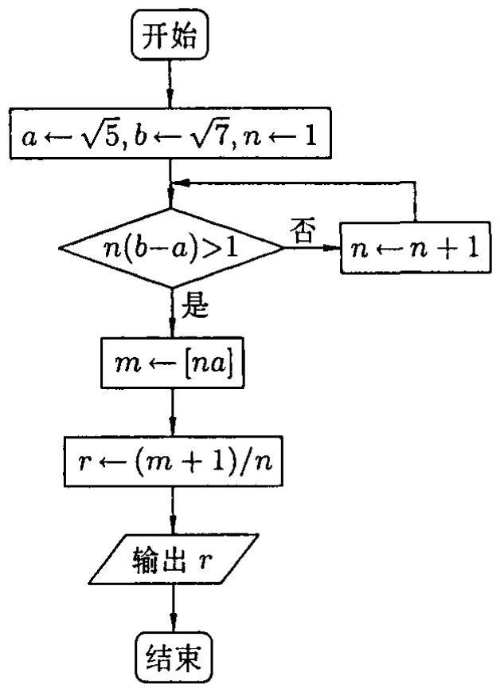
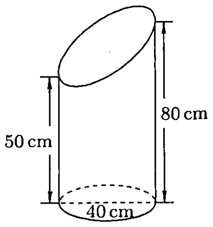
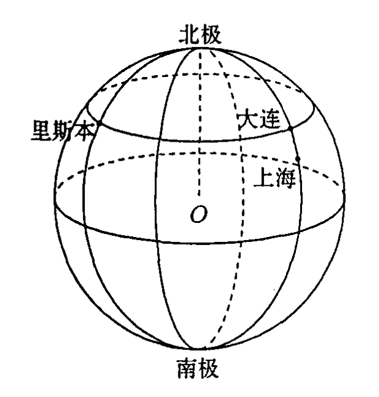

# 2010年上海卷（春）

## 填空题

### 第 1 题

函数 $y=\frac{1}{2}\sin2x$ 的最小正周期 $T=$＿＿＿＿＿＿.

#### 答案

$\pi$

#### 解析

正弦函数 $\sin u$ 的最小正周期为 $2\pi$. 令 $u=2x$，当 $2T=2\pi$ 时函数值重复，因此 $T=\pi$.

### 第 2 题

已知函数 $f(x)=ax^2+2x$ 是奇函数，则实数 $a=$＿＿＿＿＿＿.

#### 答案

$0$

#### 解析

奇函数满足 $f(-x)=-f(x)$. 由题设，$f(-x)=ax^2-2x$，而 $-f(x)=-ax^2-2x$，所以对任意实数 $x$ 有 $ax^2-2x=-ax^2-2x$，即 $2ax^2=0$. 取 $x=1$，得 $a=0$.

### 第 3 题

计算：$\dfrac{2\i}{1+\i}=$＿＿＿＿＿＿（$\i$ 为虚数单位）.

#### 答案

$1+\i$

#### 解析

分母不为零，分子分母同乘以 $1-\i$，得 $\dfrac{2\i}{1+\i}=\dfrac{2\i(1-\i)}{(1+\i)(1-\i)}=\dfrac{2\i-2\i^2}{2}=\dfrac{2\i+2}{2}=1+\i$.

### 第 4 题

已知集合 $A=\{x\mid |x|<2\}$，$B=\left\{x\mid \dfrac{1}{x+1}>0\right\}$，则 $A\cap B=$＿＿＿＿＿＿.

#### 答案

$\{x\mid -1<x<2\}$

#### 解析

由 $|x|<2$ 得 $-2<x<2$. 因为分子 $1>0$，所以 $\dfrac{1}{x+1}>0$ 等价于 $x+1>0$，即 $x>-1$，且 $x=-1$ 本来不在定义域内. 因此 $A\cap B=(-2,2)\cap(-1,+\infty)=(-1,2)=\{x\mid -1<x<2\}$.

### 第 5 题

若椭圆 $\dfrac{x^2}{25}+\dfrac{y^2}{16}=1$ 上一点 $P$ 到焦点 $F_1$ 的距离为 $6$，则点 $P$ 到另一个焦点 $F_2$ 的距离是＿＿＿＿＿＿.

#### 答案

$4$

#### 解析

椭圆的长半轴为 $a=5$，所以椭圆上任一点到两焦点的距离之和为 $2a=10$. 已知 $PF_1=6$，故 $PF_2=10-6=4$.

### 第 6 题

某社区对居民进行上海世博会知晓情况的分层抽样调查. 已知该社区有青年人，中年人和老年人分别有 $800\text{ 人}$，$1600\text{ 人}$，$1400\text{ 人}$. 若在老年人中的抽样人数是 $70$ 人，则在中年人中的抽样人数应该是＿＿＿＿＿＿.

#### 答案

$80$

#### 解析

分层抽样的抽样比相同. 设中年人的抽样人数为 $m$，则 $\dfrac{m}{1600}=\dfrac{70}{1400}$，所以 $m=1600\times\dfrac{70}{1400}=80$.

### 第 7 题

已知双曲线 $C$ 经过点 $(1,1)$，它的一条渐近线方程为 $y=\sqrt{3}x$，则双曲线 $C$ 的标准方程是＿＿＿＿＿＿.

#### 答案

$\dfrac{x^2}{2/3}-\dfrac{y^2}{2}=1$

#### 解析

若双曲线为竖轴型 $\dfrac{y^2}{b^2}-\dfrac{x^2}{a^2}=1$，则由渐近线得 $b^2=3a^2$，而点 $(1,1)$ 在双曲线上将给出 $\dfrac{1}{b^2}-\dfrac{1}{a^2}=1$，即 $-\dfrac{2}{3a^2}=1$，不可能成立. 因此双曲线为横轴型，设其标准方程为 $\dfrac{x^2}{a^2}-\dfrac{y^2}{b^2}=1$. 其渐近线斜率的绝对值为 $\dfrac{b}{a}$，由已知渐近线得 $\dfrac{b^2}{a^2}=3$，即 $b^2=3a^2$. 又点 $(1,1)$ 在双曲线上，所以 $\dfrac{1}{a^2}-\dfrac{1}{b^2}=1$. 代入 $b^2=3a^2$，得 $\dfrac{1}{a^2}-\dfrac{1}{3a^2}=1$，从而 $a^2=\dfrac{2}{3}$，$b^2=2$. 因此标准方程为 $\dfrac{x^2}{2/3}-\dfrac{y^2}{2}=1$.

### 第 8 题

在 $\left(2x^2+\dfrac{1}{x}\right)^6$ 的二项展开式中，常数项是＿＿＿＿＿＿.

#### 答案

$60$

#### 解析

展开式的通项为 $\mathrm C_6^k(2x^2)^k\left(\dfrac{1}{x}\right)^{6-k}=\mathrm C_6^k2^kx^{3k-6}$，其中 $k=0$，$1$，$\ldots$，$6$. 常数项要求 $3k-6=0$，所以 $k=2$. 因此常数项的系数为 $\mathrm C_6^2 2^2=15\times4=60$.

### 第 9 题

连续掷两次骰子，出现点数之和等于 $4$ 的概率为＿＿＿＿＿＿（结果用数值表示）.

#### 答案

$\dfrac{1}{12}$

#### 解析

两次掷骰子的有序结果共有 $6\times6=36$ 种，且等可能. 点数和为 $4$ 的有序结果为 $(1,3)$、$(2,2)$、$(3,1)$，共有 $3$ 种，所以所求概率为 $\dfrac{3}{36}=\dfrac{1}{12}$.

### 第 10 题

各棱长都为 $1$ 的正四棱锥的体积 $V=$＿＿＿＿＿＿.

#### 答案

$\dfrac{\sqrt{2}}{6}$

#### 解析

正四棱锥的底面是边长为 $1$ 的正方形，底面面积为 $1$. 设顶点为 $P$，底面中心为 $O$，底面任一顶点为 $A$，则 $PA=1$，且 $OA$ 是正方形的外接半径，$OA=\dfrac{\sqrt{2}}{2}$. 由 $PO\perp$ 底面，三角形 $POA$ 为直角三角形，故 $PO=\sqrt{PA^2-OA^2}=\sqrt{1-\dfrac12}=\dfrac{\sqrt2}{2}$. 因此 $V=\dfrac13\times1\times\dfrac{\sqrt2}{2}=\dfrac{\sqrt2}{6}$.

### 第 11 题

方程 $\begin{vmatrix}1 & 2 & 4 \\ 1 & x & x^2 \\ 1 & -3 & 9\end{vmatrix}=0$ 的解集为＿＿＿＿＿＿.

#### 答案

$\{-3,2\}$

#### 解析

行列式的三行分别是 $(1,t,t^2)$，其中 $t=2$，$x$，$-3$. 因而它是范德蒙德行列式，值为 $(x-2)(-3-2)(-3-x)=5(x-2)(x+3)$. 令其为零，得 $x=2$ 或 $x=-3$，所以解集为 $\{-3,2\}$.

### 第 12 题

根据所示的程序框图（其中 $[x]$ 表示不大于 $x$ 的最大整数），输出 $r=$＿＿＿＿＿＿.

#### 答案

$\dfrac{7}{3}$

#### 解析

程序开始时 $a=\sqrt5$，$b=\sqrt7$，$n=1$. 循环判断条件为 $n(\sqrt7-\sqrt5)>1$. 当 $n=1$ 时，$\sqrt7-\sqrt5<1$，因为 $\sqrt7<\sqrt5+1$ 等价于 $7<6+2\sqrt5$，而 $1<2\sqrt5$. 当 $n=2$ 时，$2(\sqrt7-\sqrt5)<1$ 等价于 $28<21+4\sqrt5$，而 $7<4\sqrt5$（两边为正且 $49<80$），所以不等式成立. 当 $n=3$ 时，$3(\sqrt7-\sqrt5)>1$ 等价于 $63>46+6\sqrt5$，而 $17>6\sqrt5$（两边为正且 $289>180$），所以不等式成立. 因此 $n=1$，$2$ 时判断均为否，$n=3$ 时判断为是，循环两次后 $n=3$. 此时 $m=[3\sqrt5]=6$，因为 $6<3\sqrt5<7$，所以 $r=\dfrac{m+1}{n}=\dfrac{7}{3}$.

### 第 13 题

在下图所示的斜截圆柱中，已知圆柱底面的直径为 $40\mathrm{~cm}$，母线长最短 $50\mathrm{~cm}$，最长 $80\mathrm{~cm}$.

则斜截圆柱侧面面积 $S=$＿＿＿＿＿＿$\mathrm{cm}^2$.

#### 答案

$2600\pi$

#### 解析

底面半径为 $20\mathrm{~cm}$. 取底面圆心为原点，令母线方向为 $z$ 轴，则斜截面可表示为平面 $z=u+vx+wy$. 底面圆周上参数为 $\varphi$ 的点为 $(20\cos\varphi,20\sin\varphi,0)$，因此从该点引出的母线长为

$$

l(\varphi)=u+20v\cos\varphi+20w\sin\varphi

$$

令 $R_0=20\sqrt{v^2+w^2}$，则 $l(\varphi)$ 的最大值和最小值分别为 $u+R_0$ 和 $u-R_0$. 由题设得 $u+R_0=80$，$u-R_0=50$，所以 $u=65$. 斜截圆柱侧面展开时，圆周上参数区间 $\mathrm d\varphi$ 的弧长为 $20\mathrm d\varphi$，对应的侧面积为 $20l(\varphi)\mathrm d\varphi$，故

$$

S=20\int_0^{2\pi}l(\varphi)\mathrm d\varphi=20\int_0^{2\pi}\left(u+20v\cos\varphi+20w\sin\varphi\right)\mathrm d\varphi=20\times2\pi\times65=2600\pi\mathrm{~cm}^2

$$

因此填 $2600\pi$.

### 第 14 题

设 $n$ 阶方阵 $A_n=\begin{pmatrix} 1 & 3 & 5 & \cdots & 2n-1 \\ 2n+1 & 2n+3 & 2n+5 & \cdots & 4n-1 \\ 4n+1 & 4n+3 & 4n+5 & \cdots & 6n-1 \\ \vdots & \vdots & \vdots & \vdots & \vdots \\ 2n(n-1)+1 & 2n(n-1)+3 & 2n(n-1)+5 & \cdots & 2n^2-1 \end{pmatrix}$. 任取 $A_n$ 中的一个元素，记为 $x_1$；划去 $x_1$ 所在的行和列，将剩下的元素按原来的位置关系组成 $n-1$ 阶方阵 $A_{n-1}$，任取 $A_{n-1}$ 中的一个元素，记为 $x_2$；划去 $x_2$ 所在的行和列，……；将最后剩下的一个元素记为 $x_n$. 记 $S_n=x_1+x_2+\cdots+x_n$，则 $\displaystyle\lim_{n\to\infty}\dfrac{S_n}{n^3+1}=$＿＿＿＿＿＿.

#### 答案

$1$

#### 解析

第 $i$ 行第 $j$ 列元素为 $2n(i-1)+2j-1$. 每次划去一行和一列，最终每一行、每一列恰好选出一个元素，因此存在一个排列 $\sigma$，使得所选元素之和为

$$

S_n=\sum_{i=1}^n\left(2n(i-1)+2\sigma(i)-1\right)

$$

因为 $\sum_{i=1}^n(i-1)=\dfrac{n(n-1)}{2}$，且 $\sum_{i=1}^n\sigma(i)=\dfrac{n(n+1)}{2}$，所以

$$

S_n=2n\cdot\frac{n(n-1)}{2}+2\cdot\frac{n(n+1)}{2}-n=n^3

$$

故 $\displaystyle\lim_{n\to\infty}\frac{S_n}{n^3+1}=\lim_{n\to\infty}\frac{n^3}{n^3+1}=1$.

## 单选题

### 第 15 题

若空间三条直线 $a$，$b$，$c$ 满足 $a\perp b$，$b\perp c$，则直线 $a$ 与 $c$（）

A.  
一定平行.

B.  
一定相交.

C.  
一定是异面直线.

D.  
平行，相交，是异面直线都有可能.

#### 答案

D

#### 解析

取 $b$ 的方向为竖直方向，则与 $b$ 垂直的直线方向都在水平面内，两个这样的方向可以相同、相交或不同. 例如取两条同向水平直线可使 $a\parallel c$；取同一点出发的两条不同水平直线可使 $a$ 与 $c$ 相交；取不同水平面内且不相交的两条水平直线可使它们异面. 因而三种情形都有可能，故选 D.

### 第 16 题

已知 $a_1$，$a_2\in(0,1)$. 记 $M=a_1a_2$，$N=a_1+a_2-1$，则 $M$ 与 $N$ 的大小关系是（）

A.  
$M<N$.

B.  
$M>N$.

C.  
$M=N$.

D.  
不确定.

#### 答案

B

#### 解析

直接作差，得 $M-N=a_1a_2-a_1-a_2+1=(1-a_1)(1-a_2)$. 由于 $0<a_1<1$ 且 $0<a_2<1$，所以两个因子都为正，从而 $M-N>0$，即 $M>N$，故选 B.

### 第 17 题

已知抛物线 $C:y^2=x$ 与直线 $l:y=kx+1$. “$k\ne0$”是“直线 $l$ 与抛物线 $C$ 有两个不同的交点”的（）

A.  
充分不必要条件.

B.  
必要不充分条件.

C.  
充要条件.

D.  
既不充分也不必要条件.

#### 答案

B

#### 解析

联立 $y=kx+1$ 与 $y^2=x$，得到 $k^2x^2+(2k-1)x+1=0$. 若有两个不同交点，必须是二次方程，故 $k\ne0$；所以 $k\ne0$ 是必要条件. 但取 $k=1$ 时，判别式为 $(2-1)^2-4=-3<0$，没有交点，因此 $k\ne0$ 不是充分条件. 故选 B.

### 第 18 题

已知函数 $f(x)=\dfrac{1}{4-2^x}$ 的图像关于点 $P$ 对称，则点 $P$ 的坐标是（）

A.  
$\left(2,\frac{1}{2}\right)$.

B.  
$\left(2,\frac{1}{4}\right)$.

C.  
$\left(2,\frac{1}{8}\right)$.

D.  
$(0,0)$.

#### 答案

C

#### 解析

函数定义域为 $x\ne2$. 对任意 $t\ne0$，有

$$

f(2+t)+f(2-t)=\frac{1}{4(1-2^t)}+\frac{1}{4(1-2^{-t})}=\frac14

$$

因此图像上横坐标分别为 $2+t$ 和 $2-t$ 的两点，其中点的横坐标为 $2$，纵坐标为 $\dfrac18$，且这些点关于 $(2,\frac18)$ 中心对称. 故选 C.

## 解答题

### 第 19 题

已知 $\tan\theta=a$（$a>1$），求 $\dfrac{\sin\left(\frac{\pi}{4}+\theta\right)}{\sin\left(\frac{\pi}{2}-\theta\right)}\cdot\tan2\theta$ 的值.

#### 解析

因为 $\sin\left(\frac\pi2-\theta\right)=\cos\theta$，且 $\tan\theta=a$，所以

$$

\frac{\sin\left(\frac\pi4+\theta\right)}{\sin\left(\frac\pi2-\theta\right)}=\frac{\frac{\sqrt2}{2}\cos\theta+\frac{\sqrt2}{2}\sin\theta}{\cos\theta}=\frac{\sqrt2}{2}(1+\tan\theta)=\frac{\sqrt2}{2}(1+a)

$$

又因为 $a>1$，$1-a^2\ne0$，故 $\tan2\theta=\dfrac{2\tan\theta}{1-\tan^2\theta}=\dfrac{2a}{1-a^2}$. 因此原式为 $\dfrac{\sqrt2}{2}(1+a)\cdot\dfrac{2a}{1-a^2}=\dfrac{\sqrt2 a}{1-a}$.

### 第 20 题

已知函数 $f(x)=\log_a(8-2^x)$（$a>0$，且 $a\ne1$）.

1.  若函数 $f(x)$ 的反函数是其本身，求 $a$ 的值；

2.  当 $a>1$ 时，求函数 $y=f(x)+f(-x)$ 的最大值.

#### 解析

1.  由对数真数为正，原函数的定义域为 $8-2^x>0$，即 $x<3$. 当 $a>1$ 时，$f(x)$ 的值域为 $(-\infty,\log_a8)$；当 $0<a<1$ 时，值域为 $(\log_a8,+\infty)$. 若反函数是其本身，则函数必须把定义域双射到自身，因此定义域和值域相同. 当 $0<a<1$ 时，值域有下界而定义域无下界，不可能相同；当 $a>1$ 时，必须有 $\log_a8=3$，所以 $a^3=8$，得 $a=2$. 反之，当 $a=2$ 时，若 $y=f(x)=\log_2(8-2^x)$，则 $x<3$ 且 $y<3$，并且 $2^y=8-2^x$，从而 $f(y)=\log_2(8-2^y)=\log_2(2^x)=x$. 因此 $f^{-1}=f$，故 $a=2$.

2.  要使 $f(x)$ 与 $f(-x)$ 都有意义，需同时满足 $x<3$ 和 $-x<3$，所以定义域为 $(-3,3)$. 在此定义域内，

$$

y=\log_a(8-2^x)+\log_a(8-2^{-x})=\log_a\left((8-2^x)(8-2^{-x})\right)=\log_a\left(65-8(2^x+2^{-x})\right)

$$

    由基本不等式 $2^x+2^{-x}\geq2$，且等号当且仅当 $x=0$ 时成立，得 $0<65-8(2^x+2^{-x})\leq49$. 因为 $a>1$ 时对数函数单调递增，所以 $y$ 在 $x=0$ 处取得最大值 $\log_a49$.

### 第 21 题

已知地球的半径约为 $6371\text{ 千米}$. 上海的位置约为东经 $121^\circ$，北纬 $31^\circ$，大连的位置为东经 $121^\circ$，北纬 $39^\circ$，里斯本的位置约为西经 $10^\circ$，北纬 $39^\circ$.

1.  若飞机以平均速度 $720\text{ 千米/小时}$ 飞行，则从上海到大连的最短飞行时间约为多少小时（飞机飞行高度忽略不计，结果精确到 $0.1\text{ 小时}$）；

2.  求大连与里斯本之间的球面距离（结果精确到 $1\text{ 千米}$）.

#### 解析

1.  上海和大连经度相同，最短航线沿过这两点的大圆小弧. 两点纬度相差 $39^\circ-31^\circ=8^\circ$，故弧长为 $6371\times\dfrac{8\pi}{180}\approx889.56\text{ 千米}$. 飞行时间约为 $\dfrac{889.56}{720}\approx1.2355\text{ 小时}$，精确到 $0.1\text{ 小时}$ 得 $1.2\text{ 小时}$.

2.  设地心为 $O$，大连和里斯本分别为 $B$ 和 $C$. 两点纬度均为 $39^\circ$，经度差为 $121^\circ+10^\circ=131^\circ$. 设中心角 $\angle BOC=\alpha$. 将地球半径归一化为 $1$，则纬度为 $39^\circ$、经度分别为 $\lambda_1$、$\lambda_2$ 的两点的地心向量内积为 $\sin^2 39^\circ+\cos^2 39^\circ\cos(\lambda_1-\lambda_2)$，因此

$$

\cos\alpha=\sin^2 39^\circ+\cos^2 39^\circ\cos131^\circ=1-\cos^2 39^\circ(1-\cos131^\circ)\approx-1.865\times10^{-4}

$$

    所以 $\alpha\approx90.0107^\circ$. 大连与里斯本之间的球面距离为大圆弧长 $6371\times\dfrac{90.0107\pi}{180}\approx10008.73\text{ 千米}$，精确到 $1\text{ 千米}$ 得 $10009\text{ 千米}$.

### 第 22 题

在平面上，给定非零向量 $\boldsymbol{b}$. 对任意向量 $\boldsymbol{a}$，定义 $\boldsymbol{a}'=\boldsymbol{a}-\dfrac{2(\boldsymbol{a}\cdot\boldsymbol{b})}{|\boldsymbol{b}|^2}\boldsymbol{b}$.

1.  若 $\boldsymbol{a}=(2,3)$，$\boldsymbol{b}=(-1,3)$，求 $\boldsymbol{a}'$；

2.  若 $\boldsymbol{b}=(2,1)$，证明：若位置向量 $\boldsymbol{a}$ 的终点在直线 $Ax+By+C=0$ 上，则位置向量 $\boldsymbol{a}'$ 的终点也在一条直线上；

3.  已知存在单位向量 $\boldsymbol{b}$，当位置向量 $\boldsymbol{a}$ 的终点在抛物线 $C:x^2=y$ 上时，位置向量 $\boldsymbol{a}'$ 的终点总在抛物线 $C':y^2=x$ 上. 曲线 $C$ 与 $C'$ 关于直线 $l$ 对称，问直线 $l$ 与向量 $\boldsymbol{b}$ 满足什么关系？

#### 解析

1.  $\boldsymbol{a}\cdot\boldsymbol{b}=2\times(-1)+3\times3=7$，$|\boldsymbol{b}|^2=(-1)^2+3^2=10$，所以 $\boldsymbol{a}'=(2,3)-\dfrac{14}{10}(-1,3)=\left(\dfrac{17}{5},-\dfrac65\right)$.

2.  设 $\boldsymbol{a}=(x,y)$，$\boldsymbol{a}'=(x',y')$. 因为 $|\boldsymbol{b}|^2=5$，所以

$$

(x',y')=(x,y)-\frac{2(2x+y)}{5}(2,1)=\left(-\frac35x-\frac45y,-\frac45x+\frac35y\right)

$$

    将变换矩阵记为 $R=\dfrac15\begin{pmatrix}-3&-4\\-4&3\end{pmatrix}$，则 $R^2=I$，故反解为 $x=-\dfrac35x'-\dfrac45y'$，$y=-\dfrac45x'+\dfrac35y'$. 将其代入原直线方程，得

$$

-\frac{3A+4B}{5}x'+\frac{-4A+3B}{5}y'+C=0

$$

    若两个新系数同时为零，则由 $3A+4B=0$ 与 $-4A+3B=0$ 可得 $A=B=0$，这与原式表示直线矛盾. 因此该方程确实是一条直线，且 $\boldsymbol{a}'$ 的终点在此直线上.

3.  设单位向量 $\boldsymbol{b}=(b_1,b_2)$，则 $b_1^2+b_2^2=1$. 抛物线 $C$ 上的点可写为 $\boldsymbol{a}=(t,t^2)$，其中 $t$ 为任意实数. 由定义，

$$

\boldsymbol{a}'=(t,t^2)-2(tb_1+t^2b_2)(b_1,b_2)

$$

$$

=\left((1-2b_1^2)t-2b_1b_2t^2,-2b_1b_2t+(1-2b_2^2)t^2\right)

$$

    由于 $\boldsymbol{a}'$ 总在 $C'$ 上，必须恒有 $(y')^2=x'$，即

$$

\left(-2b_1b_2t+(1-2b_2^2)t^2\right)^2=(1-2b_1^2)t-2b_1b_2t^2

$$

    比较关于任意实数 $t$ 的多项式两边系数，得到 $1-2b_1^2=0$，$(-2b_1b_2)^2=-2b_1b_2$，以及 $(1-2b_2^2)^2=0$. 因而 $b_1^2=b_2^2=\dfrac12$，并且 $b_1b_2=-\dfrac12$，所以 $\boldsymbol{b}=\pm\left(\dfrac{\sqrt2}{2},-\dfrac{\sqrt2}{2}\right)$.

    $C:x^2=y$ 上的点 $(x_0,x_0^2)$ 关于直线 $y=x$ 的对称点为 $(x_0^2,x_0)$，满足 $y^2=x$，所以 $C$ 与 $C'$ 的对称轴为 $l:y=x$. 直线 $l$ 的方向向量为 $(1,1)$，与 $\boldsymbol{b}$ 的内积为零. 因此 $l\perp\boldsymbol{b}$.

### 第 23 题

已知首项为 $x_1$ 的数列 $\{x_n\}$ 满足 $x_{n+1}=\dfrac{ax_n}{x_n+1}$（$a$ 为常数）.

1.  若对任意的 $x_1\ne-1$，有 $x_{n+2}=x_n$ 对任意的 $n\in\mathbb{N}^*$ 都成立，求 $a$ 的值；

2.  当 $a=1$ 时，若 $x_1>0$，数列 $\{x_n\}$ 是递增数列还是递减数列？请说明理由；

3.  当 $a$ 确定后，数列 $\{x_n\}$ 由其首项 $x_1$ 确定. 当 $a=2$ 时，通过对数列 $\{x_n\}$ 的探究，写出“$\{x_n\}$ 是有穷数列”的一个真命题（不必证明）.

#### 解析

1.  由递推关系，

$$

x_{n+2}=\frac{a\cdot\dfrac{ax_n}{x_n+1}}{\dfrac{ax_n}{x_n+1}+1}=\frac{a^2x_n}{(a+1)x_n+1}

$$

    取 $n=1$，题设要求对任意允许的 $x_1$ 都有 $x_3=x_1$，所以恒有 $a^2x_1=(a+1)x_1^2+x_1$. 这是关于任意 $x_1$ 的恒等式，故比较系数得 $a+1=0$ 且 $a^2=1$，从而 $a=-1$. 反之，当 $a=-1$ 时，$x_{n+1}=-\dfrac{x_n}{x_n+1}$，并且 $x_{n+1}+1=\dfrac{1}{x_n+1}$，所以由 $x_1\ne-1$ 可归纳得到各项有定义，且直接计算得 $x_{n+2}=x_n$，条件确实成立.

2.  此时递推式为 $x_{n+1}=\dfrac{x_n}{x_n+1}$. 由 $x_1>0$ 归纳可得每一项都为正，因而分母始终为正. 又

$$

x_{n+1}-x_n=\frac{x_n}{x_n+1}-x_n=-\frac{x_n^2}{x_n+1}<0

$$

    所以 $\{x_n\}$ 是递减数列.

3.  给出如下真命题：当 $a=2$ 且 $x_1=\dfrac{1}{1-2^m}$，其中 $m\in\mathbb{N}^*$ 时，$\{x_n\}$ 是有穷数列且共有 $m$ 项.

    为核对该命题，令 $y_n=\dfrac{1}{x_n}$. 在各项有定义且非零时，递推式给出 $y_{n+1}=\dfrac{y_n+1}{2}$，从而 $y_n=1+\dfrac{y_1-1}{2^{n-1}}$. 当 $x_1=\dfrac{1}{1-2^m}$ 时，$y_1=1-2^m$，所以 $y_m=-1$，即 $x_m=-1$. 于是下一项的分母 $x_m+1$ 为零，数列恰有 $m$ 项，故所述命题为真.
