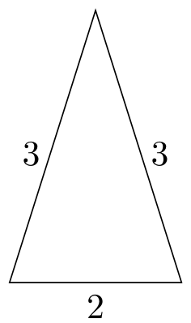
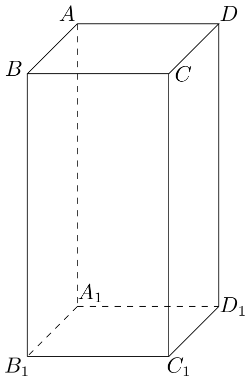

# 2011年上海卷（秋文）

## 填空题

### 第 1 题

若全集 $U = \mathbb{R}$，集合 $A = \{x \mid x \geqslant 1\}$，则 $\complement_U A =\underline{\qquad\qquad}$.

#### 答案

$\{x\mid x<1\}$

#### 解析

补集 $\complement_U A$ 由全集 $U$ 中不属于 $A$ 的元素组成. 因为 $A=\{x\mid x\geqslant1\}$，所以不属于 $A$ 的实数满足 $x<1$，从而 $\complement_U A=\{x\mid x<1\}$.

### 第 2 题

$\lim\limits_{n\to \infty}\left(1 - \frac{3n}{n + 3}\right) =\underline{\qquad\qquad}$.

#### 答案

$-2$

#### 解析

将括号内的式子通分，并把分子、分母同除以 $n$，得 $1-\frac{3n}{n+3}=\frac{3-2n}{n+3}=\frac{\frac{3}{n}-2}{1+\frac{3}{n}}$. 当 $n\to\infty$ 时，$\frac{3}{n}\to0$，所以原极限为 $\frac{0-2}{1+0}=-2$.

### 第 3 题

若函数 $f(x) = 2x + 1$ 的反函数为 $f^{-1}(x)$，则 $f^{-1}(-2) =$＿＿＿＿＿＿.

#### 答案

$-\frac{3}{2}$

#### 解析

令 $y=2x+1$，解得 $x=\frac{y-1}{2}$. 交换 $x$，$y$ 得 $f^{-1}(x)=\frac{x-1}{2}$，因此 $f^{-1}(-2)=\frac{-2-1}{2}=-\frac{3}{2}$.

### 第 4 题

函数 $y = 2\sin x - \cos x$ 的最大值为＿＿＿＿＿＿.

#### 答案

$\sqrt{5}$

#### 解析

由柯西不等式， $2\sin x-\cos x\leqslant\sqrt{2^2+(-1)^2}\sqrt{\sin^2x+\cos^2x}=\sqrt5$. 当 $\sin x=\frac{2}{\sqrt5}$，$\cos x=-\frac{1}{\sqrt5}$ 时等号成立，所以最大值为 $\sqrt5$.

### 第 5 题

若直线 $l$ 过点 $(3,4)$，且 $(1,2)$ 是它的一个法向量，则直线 $l$ 的方程为＿＿＿＿＿＿.

#### 答案

$x+2y-11=0$

#### 解析

法向量为 $(1,2)$ 的直线可写成 $x+2y+c=0$. 代入直线上的点 $(3,4)$，得 $3+2\times4+c=0$，即 $c=-11$. 所以直线方程为 $x+2y-11=0$.

### 第 6 题

不等式 $\frac{1}{x} < 1$ 的解集为＿＿＿＿＿＿.

#### 答案

$\{x\mid x<0\text{ 或 }x>1\}$

#### 解析

定义域要求 $x\neq0$. 移项通分得 $\frac{1-x}{x}<0$，临界点为 $0$，$1$. 在 $(-\infty,0)$ 上分子为正、分母为负，商为负；在 $(0,1)$ 上商为正；在 $(1,+\infty)$ 上分子为负、分母为正，商为负. 因此解集为 $\left(-\infty,0\right)\cup\left(1,+\infty\right)$.

### 第 7 题

若一个圆锥的主视图（如图所示）是边长为 $3$，$3$，$2$ 的三角形，则该圆锥的侧面积为＿＿＿＿＿＿. 

#### 答案

$3\pi$

#### 解析

圆锥的轴截面是以母线为腰、底面直径为底的等腰三角形. 由题图可知母线长 $l=3$，底面直径为 $2$，故底面半径 $r=1$. 圆锥侧面积为 $S=\pi rl=\pi\times1\times3=3\pi$.

### 第 8 题

在相距 $2\mathrm{~km}$ 的 $A$，$B$ 两点处测量目标点 $C$，若 $\angle CAB = 75^{\circ}$，$\angle CBA = 60^{\circ}$，则 $A$，$C$ 两点之间的距离是＿＿＿＿＿＿$\mathrm{~km}$.

#### 答案

$\sqrt{6}$

#### 解析

在三角形 $ABC$ 中，$\angle ACB=180^{\circ}-75^{\circ}-60^{\circ}=45^{\circ}$. 由正弦定理， $\frac{AC}{\sin60^{\circ}}=\frac{AB}{\sin45^{\circ}}$. 代入 $AB=2$，得 $AC=2\frac{\sin60^{\circ}}{\sin45^{\circ}}=2\frac{\sqrt3/2}{\sqrt2/2}=\sqrt6$. 所以距离为 $\sqrt6\mathrm{~km}$.

### 第 9 题

若变量 $x$，$y$ 满足条件

$$

\begin{cases}
3x - y \leqslant 0,\\
x - 3y + 5 \geqslant 0,
\end{cases}

$$

则 $z = x + y$ 的最大值为＿＿＿＿＿＿.

#### 答案

$\frac{5}{2}$

#### 解析

约束条件等价于 $y\geqslant3x$ 且 $y\leqslant\frac{x+5}{3}$. 因而可行时 $3x\leqslant\frac{x+5}{3}$，即 $x\leqslant\frac58$. 同时 $z=x+y\leqslant x+\frac{x+5}{3}=\frac{4x+5}{3}\leqslant\frac{4\times\frac58+5}{3}=\frac52$. 当 $x=\frac58$，$y=3x=\frac{15}{8}$ 时两个约束均取等号，且 $z=\frac58+\frac{15}{8}=\frac52$. 所以最大值为 $\frac52$.

### 第 10 题

课题组进行城市空气质量调查，按地域把 $24$ 个城市分成甲，乙，丙三组，对应的城市数分别为 $4$，$12$，$8$，若用分层抽样抽取 $6$ 个城市，则丙组中应抽取的城市数为＿＿＿＿＿＿.

#### 答案

$2$

#### 解析

分层抽样保持各层抽取比例相同. 总体抽取比例为 $\frac{6}{24}=\frac14$，所以丙组应抽取 $8\times\frac14=2$ 个城市.

### 第 11 题

行列式 $\begin{vmatrix}a & b\\ c & d \end{vmatrix}$ （$a$，$b$，$c$，$d \in \{-1,1,2\}$） 所有可能的值中，最大的是＿＿＿＿＿＿.

#### 答案

$6$

#### 解析

行列式的值为 $ad-bc$. 因为 $a$，$d\in\{-1,1,2\}$，有 $ad\leqslant2\times2=4$；又因为 $b$，$c\in\{-1,1,2\}$，有 $bc\geqslant-1\times2=-2$. 所以 $ad-bc\leqslant4-(-2)=6$. 取 $a=d=2$，$b=-1$，$c=2$ 时等号成立，故最大值为 $6$.

### 第 12 题

在正三角形 $ABC$ 中，$D$ 是 $BC$ 上的点. 若 $AB = 3$，$BD = 1$，则 $\overrightarrow{AB} \cdot \overrightarrow{AD} =$＿＿＿＿＿＿.

#### 答案

$\frac{15}{2}$

#### 解析

由向量加法，$\overrightarrow{AD}=\overrightarrow{AB}+\overrightarrow{BD}$. 正三角形的内角为 $60^{\circ}$，而 $\overrightarrow{AB}$ 与 $\overrightarrow{BD}$ 的夹角为 $120^{\circ}$，所以 $\overrightarrow{AB}\cdot\overrightarrow{BD}=AB\cdot BD\cos120^{\circ}=3\times1\times\left(-\frac12\right)=-\frac32$. 因此 $\overrightarrow{AB}\cdot\overrightarrow{AD}=\overrightarrow{AB}\cdot\left(\overrightarrow{AB}+\overrightarrow{BD}\right)=AB^2+\overrightarrow{AB}\cdot\overrightarrow{BD}=9-\frac32=\frac{15}{2}$.

### 第 13 题

随机抽取的 $9$ 位同学中，至少有 $2$ 位同学在同一月份出生的概率为＿＿＿＿＿＿（默认每个月的天数相同，结果精确到 $0.001$）.

#### 答案

$0.985$

#### 解析

用对立事件计算. 9 位同学没有人在同一月份出生，等价于 9 人的出生月份互不相同. 在每人的月份等可能且相互独立时，该事件的概率为 $\frac{12\times11\times10\times9\times8\times7\times6\times5\times4}{12^9}$. 所求概率为 $1-\frac{12\times11\times10\times9\times8\times7\times6\times5\times4}{12^9}\approx0.984529$. 精确到 $0.001$ 得 $0.985$.

### 第 14 题

设 $g(x)$ 是定义在 $\mathbb{R}$ 上，以 1 为周期的函数，若函数 $f(x) = x + g(x)$ 在区间 $[0,1]$ 上的值域为 $[-2,5]$，则 $f(x)$ 在区间 $[0,3]$ 上的值域为＿＿＿＿＿＿.

#### 答案

$[-2,7]$

#### 解析

任取 $t\in[0,1]$ 和 $k=0$，$1$，$2$，由周期性有 $g(t+k)=g(t)$，从而 $f(t+k)=t+k+g(t)=f(t)+k$. 因此 $f([k,k+1])=[k-2,k+5]$. 三个区间的并为 $[-2,5]\cup[-1,6]\cup[0,7]=[-2,7]$，所以值域为 $[-2,7]$.

## 单选题

### 第 15 题

下列函数中，既是偶函数，又在区间 $(0, +\infty)$ 上单调递减的是（）

A.  
$y = x^{-2}$

B.  
$y = x^{-1}$

C.  
$y = x^{2}$

D.  
$y = x^{\frac{1}{3}}$

#### 答案

A

#### 解析

函数 $x^{-2}$ 的定义域为 $\mathbb{R}\setminus\{0\}$，且 $(-x)^{-2}=x^{-2}$，所以它是偶函数；当 $x>0$ 时，指数为负，或由导数 $(x^{-2})'=-2x^{-3}<0$，可知它单调递减. 函数 $x^{-1}$ 和 $x^{1/3}$ 为奇函数，函数 $x^2$ 在正半轴上递增. 因此选 A.

### 第 16 题

若 $a$，$b \in \mathbb{R}$，且 $ab > 0$，则下列不等式中，恒成立的是（）

A.  
$a^2 + b^2 > 2ab$

B.  
$a + b \geqslant 2\sqrt{ab}$

C.  
$\frac{1}{a} + \frac{1}{b} > \frac{2}{\sqrt{ab}}$

D.  
$\frac{b}{a} + \frac{a}{b} \geqslant 2$

#### 答案

D

#### 解析

由 $ab>0$，有 $a$，$b$ 同号. 选项 A 只能得到 $a^2+b^2\geqslant2ab$，当 $a=b$ 时等号成立，故不恒有严格不等号. 选项 B、C 在 $a$，$b<0$ 时不成立，例如取 $a=b=-1$. 对选项 D，$\frac ba>0$，且 $\frac ba+\frac ab-2=\frac{(a-b)^2}{ab}\geqslant0$. 因此 D 恒成立，选 D.

### 第 17 题

若三角方程 $\sin x = 0$ 与 $\sin 2x = 0$ 的解集分别为 $E$，$F$，则（）

A.  
$E \subsetneq F$

B.  
$E \supsetneq F$

C.  
$E = F$

D.  
$E \cap F = \varnothing$

#### 答案

A

#### 解析

$\sin x=0$ 的解为 $x=k\pi$，$k\in\mathbb{Z}$，所以 $E=\{k\pi\mid k\in\mathbb{Z}\}$. $\sin2x=0$ 的解为 $2x=k\pi$，即 $x=\frac{k\pi}{2}$，所以 $F=\{\frac{k\pi}{2}\mid k\in\mathbb{Z}\}$. 每个 $k\pi$ 都属于 $F$，但 $\frac\pi2\in F$ 而 $\frac\pi2\notin E$，故 $E\subsetneq F$，选 A.

### 第 18 题

设 $A_{1}$，$A_{2}$，$A_{3}$，$A_{4}$ 是平面上给定的 4 个不同点，则使 $\overrightarrow{MA_{1}} + \overrightarrow{MA_{2}} + \overrightarrow{MA_{3}} + \overrightarrow{MA_{4}} = \overrightarrow{0}$ 成立的点 $M$ 的个数为（）

A.  
0

B.  
1

C.  
2

D.  
4

#### 答案

B

#### 解析

取平面内任意原点 $O$. 由 $\overrightarrow{MA_i}=\overrightarrow{OA_i}-\overrightarrow{OM}$，原条件等价于 $\overrightarrow{OA_1}+\overrightarrow{OA_2}+\overrightarrow{OA_3}+\overrightarrow{OA_4}-4\overrightarrow{OM}=\overrightarrow0$. 因而 $\overrightarrow{OM}=\frac14\left(\overrightarrow{OA_1}+\overrightarrow{OA_2}+\overrightarrow{OA_3}+\overrightarrow{OA_4}\right)$，右端唯一确定. 这是四个点的位置向量的平均，仍在该平面内，所以恰有一个点 $M$ 满足条件，选 B.

## 解答题

### 第 19 题

已知复数 $z_{1}$ 满足 $(z_{1} - 2)(1 + \i) = 1 - \i$（$\i$ 为虚数单位），复数 $z_{2}$ 的虚部为 2，且 $z_{1} \cdot z_{2}$ 是实数，求 $z_{2}$.

#### 解析

由 $(z_1-2)(1+\i)=1-\i$，得 $z_1-2=\frac{1-\i}{1+\i}=\frac{(1-\i)^2}{(1+\i)(1-\i)}=-\i$，所以 $z_1=2-\i$.

设 $z_2=u+2\i$，其中 $u\in\mathbb{R}$. 则 $z_1z_2=(2-\i)(u+2\i)=(2u+2)+(4-u)\i$. 因为 $z_1z_2$ 是实数，所以虚部为零，即 $4-u=0$，解得 $u=4$. 因而 $z_2=4+2\i$.

### 第 20 题

已知 $ABCD - A_{1}B_{1}C_{1}D_{1}$ 是底面边长为 $1$ 的正四棱柱，高 $AA_{1} = 2$，求：

1.  异面直线 $BD$ 与 $AB_{1}$ 所成角的余弦值；

2.  四面体 $AB_{1}D_{1}C$ 的体积.

#### 解析

建立空间直角坐标系，取 $A_1=(0,0,0)$，$B_1=(1,0,0)$，$C_1=(1,1,0)$，$D_1=(0,1,0)$，并令 $A=(0,0,2)$，$B=(1,0,2)$，$C=(1,1,2)$，$D=(0,1,2)$.

1.  取直线 $BD$ 与 $AB_1$ 的方向向量 $\overrightarrow{BD}=(-1,1,0)$，$\overrightarrow{AB_1}=(1,0,-2)$. 因而 $\left|\overrightarrow{BD}\cdot\overrightarrow{AB_1}\right|=1$，$\left|\overrightarrow{BD}\right|=\sqrt2$，$\left|\overrightarrow{AB_1}\right|=\sqrt5$. 异面直线所成角取锐角，故其余弦为 $\frac{1}{\sqrt2\sqrt5}=\frac{\sqrt{10}}{10}$.

2.  以 $A$ 为共同顶点，取 $\overrightarrow{AB_1}=(1,0,-2)$，$\overrightarrow{AD_1}=(0,1,-2)$，$\overrightarrow{AC}=(1,1,0)$. 四面体体积为 $V=\frac16\left|\begin{vmatrix}1&0&1\\0&1&1\\-2&-2&0\end{vmatrix}\right|=\frac16\left|4\right|=\frac23$.

### 第 21 题

已知函数 $f(x) = a \cdot 2^{x} + b \cdot 3^{x}$，其中常数 $a$，$b$ 满足 $a \cdot b \neq 0$.

1.  若 $a \cdot b > 0$，判断函数 $f(x)$ 的单调性；

2.  若 $a \cdot b < 0$，求 $f(x + 1) > f(x)$ 时的 $x$ 的取值范围.

#### 解析

1.  当 $a>0$，$b>0$ 时，$2^x$ 与 $3^x$ 均在 $\mathbb{R}$ 上递增，正系数倍仍递增，所以 $f(x)$ 在 $\mathbb{R}$ 上单调递增. 当 $a<0$，$b<0$ 时，两个正的递增函数分别乘以负数后均递减，所以 $f(x)$ 在 $\mathbb{R}$ 上单调递减.

2.  有 $f(x+1)-f(x)=a2^x+b3^x=2^x\left(a+2b\left(\frac32\right)^x\right)$. 因为 $2^x>0$，故只需讨论 $a+2b\left(\frac32\right)^x>0$.

    当 $a>0$，$b<0$ 时，移项并除以负数 $2b$，不等号方向改变，得 $\left(\frac32\right)^x<-\frac{a}{2b}$. 右端为正，且 $\frac32>1$，所以 $x<\log_{\frac32}\left(-\frac{a}{2b}\right)$.

    当 $a<0$，$b>0$ 时，得 $\left(\frac32\right)^x>-\frac{a}{2b}$，从而 $x>\log_{\frac32}\left(-\frac{a}{2b}\right)$.

### 第 22 题

已知椭圆 $C: \frac{x^2}{m^2} + y^{2} = 1$（常数 $m > 1$），$P$ 是曲线 $C$ 上的动点，$M$ 是曲线 $C$ 的右顶点，定点 $A$ 的坐标为 $(2,0)$.

1.  若 $M$ 与 $A$ 重合，求曲线 $C$ 的焦点坐标；

2.  若 $m = 3$，求 $|PA|$ 的最大值与最小值；

3.  若 $|PA|$ 的最小值为 $|MA|$，求实数 $m$ 的取值范围.

#### 解析

设 $P=(x,y)$. 由椭圆方程，$y^2=1-\frac{x^2}{m^2}$，且 $-m\leqslant x\leqslant m$. 因而 $|PA|^2=(x-2)^2+y^2=\left(1-\frac1{m^2}\right)x^2-4x+5$.

1.  右顶点为 $M=(m,0)$. 若 $M=A=(2,0)$，则 $m=2$. 此时椭圆长半轴为 $2$，短半轴为 $1$，焦半距满足 $c^2=2^2-1^2=3$，所以焦点坐标为 $(\sqrt3,0)$，$(-\sqrt3,0)$.

2.  当 $m=3$ 时， $|PA|^2=\frac89x^2-4x+5=\frac89\left(x-\frac94\right)^2+\frac12$，其中 $-3\leqslant x\leqslant3$. 因此最小值在 $x=\frac94$ 处取得，为 $\frac12$. 由于该二次函数在区间上开口向上，最大值在端点取得，且 $\left.|PA|^2\right|_{x=-3}=25$，$\left.|PA|^2\right|_{x=3}=1$. 所以 $|PA|$ 的最大值为 $5$，最小值为 $\frac{\sqrt2}{2}$.

3.  记 $q(x)=\left(1-\frac1{m^2}\right)x^2-4x+5$. 因为 $m>1$，$q(x)$ 为开口向上的二次函数，其对称轴为 $x=\frac{2}{1-1/m^2}=\frac{2m^2}{m^2-1}$. 条件“$|PA|$ 的最小值为 $|MA|$”表示右顶点 $M$ 必须是距离最小的点，因此对定义域 $[-m,m]$，二次函数的顶点应在右端点 $m$ 的右侧或恰在该端点，即 $\frac{2m^2}{m^2-1}\geqslant m$. 由于 $m>1$，化简得 $m^2-2m-1\leqslant0$. 所以 $1<m\leqslant1+\sqrt2$.

### 第 23 题

已知数列 $\{a_{n}\}$ 和 $\{b_{n}\}$ 的通项公式分别为 $a_{n} = 3n + 6$，$b_{n} = 2n + 7$（$n \in \mathbf{N}^{*}$），将集合 $\{x \mid x = a_{n}, n \in \mathbf{N}^{*}\} \cup \{x \mid x = b_{n}, n \in \mathbf{N}^{*}\}$ 中的元素从小到大依次排列，构成数列 $c_{1}$，$c_{2}$，$c_{3}$，$\cdots$，$c_{n}$，$\cdots$.

1.  求三个最小的数，使它们既是数列 $\{a_{n}\}$ 中的项，又是数列 $\{b_{n}\}$ 中的项；

2.  数列 $c_{1}$，$c_{2}$，$c_{3}$，$\cdots$，$c_{40}$ 中有多少项不是数列 $\{b_{n}\}$ 中的项？请说明理由；

3.  求数列 $\{c_{n}\}$ 的前 $4n$ 项和 $S_{4n}$（$n \in \mathbf{N}^{*}$）.

#### 解析

1.  若某项同时属于两个数列，则存在正整数 $r$，$s$ 使 $3r+6=2s+7$，即 $3r-2s=1$. 因此 $r$ 必为奇数，令 $r=2k-1$，便得 $s=3k-2$，且公共项为 $3(2k-1)+6=6k+3$. 当 $k=1$，$2$，$3$ 时，三个最小公共项为 $9$，$15$，$21$.

2.  当 $r=2k-1$ 为奇数时，$a_r=6k+3=b_{3k-2}$，所以奇数项 $a_r$ 都属于数列 $\{b_n\}$. 当 $r=2k$ 为偶数时，$a_r=6k+6$ 为偶数，而每个 $b_n=2n+7$ 都是奇数，所以这些偶数项不属于 $\{b_n\}$.

    对每个 $k\in\mathbf N^*$，有 $b_{3k-2}=6k+3$，$b_{3k-1}=6k+5$，$a_{2k}=6k+6$，$b_{3k}=6k+7$，且 $6k+3<6k+5<6k+6<6k+7<6k+9$. 因而数列 $\{c_n\}$ 每四项为一组，前 40 项对应 $k=1$，$2$，$\ldots$，$10$，其中不属于 $\{b_n\}$ 的恰为 $a_2$，$a_4$，$\ldots$，$a_{20}$，共有 $10$ 项.

3.  由上面的排列，对任意 $k\in\mathbf N^*$， $c_{4k-3}=6k+3$，$c_{4k-2}=6k+5$，$c_{4k-1}=6k+6$，$c_{4k}=6k+7$. 所以每四项的和为 $c_{4k-3}+c_{4k-2}+c_{4k-1}+c_{4k}=24k+21$. 因而 $S_{4n}=\sum_{k=1}^{n}(24k+21)=24\frac{n(n+1)}{2}+21n=12n^2+33n$.
