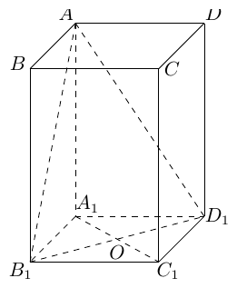

# 2011年上海卷（秋理）

## 填空题

### 第 1 题

函数 $f(x) = \frac{1}{x - 2}$ 的反函数为 $f^{-1}(x) =$＿＿＿＿＿＿.

#### 答案

$\frac{1}{x}+2$

#### 解析

设 $y=f(x)=\dfrac{1}{x-2}$，则 $y(x-2)=1$，从而 $x=2+\dfrac{1}{y}$. 交换 $x$，$y$ 得 $f^{-1}(x)=2+\dfrac{1}{x}$，其中 $x\ne0$.

### 第 2 题

若全集 $U = \mathbb{R}$，集合 $A = \{x \mid x \geqslant 1\} \cup \{x \mid x \leqslant 0\}$，则 $\complement_U A =\underline{\qquad\qquad}$.

#### 答案

$(0,1)$

#### 解析

集合 $A$ 包含所有满足 $x\leqslant0$ 或 $x\geqslant1$ 的实数，因此在全集 $\mathbb{R}$ 中不属于 $A$ 的数恰好满足 $0<x<1$. 所以 $\complement_U A=(0,1)$.

### 第 3 题

设 $m$ 为常数，若点 $F(0,5)$ 是双曲线 $\frac{y^2}{m} - \frac{x^2}{9} = 1$ 的一个焦点，则 $m =\underline{\qquad\qquad}$.

#### 答案

16

#### 解析

由于双曲线的焦点在 $y$ 轴上，必须有 $m>0$，且其标准形式中的 $a^2=m$，$b^2=9$. 双曲线焦半距满足 $c^2=a^2+b^2$，而焦点 $F(0,5)$ 给出 $c=5$. 因而 $m+9=25$，解得 $m=16$.

### 第 4 题

不等式 $\frac{x + 1}{x} \leqslant 3$ 的解集为＿＿＿＿＿＿.

#### 答案

$x<0$ 或 $x\geqslant\frac{1}{2}$

#### 解析

定义域要求 $x\ne0$. 移项通分得

$$

\frac{x+1}{x}-3=\frac{1-2x}{x}\leqslant0

$$

即 $\dfrac{2x-1}{x}\geqslant0$. 临界点为 $0$ 和 $\dfrac12$，作符号判断可知在 $(-\infty,0)$ 和 $[\frac12,+\infty)$ 上成立，故解集为 $(-\infty,0)\cup[\frac12,+\infty)$.

### 第 5 题

在极坐标系中，直线 $\rho(2\cos \theta + \sin \theta) = 2$ 与直线 $\rho\cos \theta = 1$ 的夹角大小为＿＿＿＿＿＿. （结果用反三角函数值表示）

#### 答案

$\arctan\frac{1}{2}$

#### 解析

利用 $x=\rho\cos\theta$，$y=\rho\sin\theta$，两条直线分别化为 $2x+y=2$ 和 $x=1$. 第一条直线的斜率为 $-2$，第二条为竖直直线，因此两直线的锐角夹角 $\varphi$ 满足 $\tan\varphi=\dfrac{1}{2}$. 所以 $\varphi=\arctan\dfrac{1}{2}$.

### 第 6 题

在相距 2 千米的 $A$，$B$ 两点处测量目标 $C$，若 $\angle CAB = 75^{\circ}$，$\angle CBA = 60^{\circ}$，则 $A$，$C$ 两点之间的距离为＿＿＿＿＿＿.

#### 答案

$\sqrt{6}$

#### 解析

在三角形 $ABC$ 中，$\angle ACB=180^{\circ}-75^{\circ}-60^{\circ}=45^{\circ}$. 由正弦定理，

$$

\frac{AC}{\sin60^{\circ}}=\frac{AB}{\sin45^{\circ}}=\frac{2}{\sin45^{\circ}}

$$

因此 $AC=2\dfrac{\sqrt3/2}{\sqrt2/2}=\sqrt6$ 千米.

### 第 7 题

若圆锥的侧面积为 $2\pi$，底面积为 $\pi$，则该圆锥的体积为＿＿＿＿＿＿.

#### 答案

$\frac{\pi\sqrt{3}}{3}$

#### 解析

设圆锥底面半径为 $r$，母线长为 $l$，高为 $h$. 由 $\pi r^2=\pi$ 得 $r=1$，再由侧面积 $\pi rl=2\pi$ 得 $l=2$. 在轴截面的直角三角形中，$h^2+r^2=l^2$，所以 $h=\sqrt3$. 因而体积为 $V=\dfrac13\pi r^2h=\dfrac{\pi\sqrt3}{3}$.

### 第 8 题

函数 $y = \sin \left(\frac{\pi}{2} + x\right) \cos \left(\frac{\pi}{6} - x\right)$ 的最大值为＿＿＿＿＿＿.

#### 答案

$\frac{2+\sqrt{3}}{4}$

#### 解析

由诱导公式 $\sin(\frac\pi2+x)=\cos x$，并利用积化和差公式，

$$

y=\cos x\cos\left(\frac\pi6-x\right)=\frac12\left[\cos\left(2x-\frac\pi6\right)+\cos\frac\pi6\right]
=\frac12\cos\left(2x-\frac\pi6\right)+\frac{\sqrt3}{4}

$$

因为余弦函数的最大值为 $1$，所以 $y_{\max}=\dfrac12+\dfrac{\sqrt3}{4}=\dfrac{2+\sqrt3}{4}$.

### 第 9 题

马老师从课本上抄录一个随机变量 $\xi$ 的概率分布列如下表：

|    $X$     |  1  |  2  |  3  |
|:------------:|:---:|:---:|:---:|
| $P(\xi=x)$ |  ?  |  !  |  ?  |

请小牛同学计算 $\xi$ 的数学期望，尽管“!”处无法完全看清，且两个“?”处字迹模糊，但能肯定这两个“?”处的数值相同. 据此，小牛给出了正确答案 $E(\xi)=$＿＿＿＿＿＿.

#### 答案

2

#### 解析

设 $P(\xi=1)=P(\xi=3)=p$，$P(\xi=2)=q$. 概率分布列满足 $2p+q=1$，且

$$

E(\xi)=1\cdot p+2\cdot q+3\cdot p=4p+2q=2(2p+q)=2

$$

因此无论“!”处的具体概率是多少，数学期望都等于 $2$.

### 第 10 题

行列式 $\begin{vmatrix}a & b\\ c & d \end{vmatrix}$ （$a$，$b$，$c$，$d\in \{-1,1,2\}$）所有可能的值中，最大的是＿＿＿＿＿＿.

#### 答案

6

#### 解析

行列式的值为 $ad-bc$. 因为 $a$，$d\leqslant2$，所以 $ad\leqslant4$；又因为 $b$，$c\in\{-1,1,2\}$，有 $bc\geqslant-2$. 因而 $ad-bc\leqslant4-(-2)=6$. 取 $a=d=2$，$b=2$，$c=-1$ 时行列式等于 $4-(-2)=6$，故最大值为 $6$.

### 第 11 题

在正三角形 $ABC$ 中，$D$ 是 $BC$ 上的点. 若 $AB = 3$，$BD = 1$，则 $\overrightarrow{AB} \cdot \overrightarrow{AD} =$＿＿＿＿＿＿.

#### 答案

$\frac{15}{2}$

#### 解析

由向量加法，$\overrightarrow{AD}=\overrightarrow{AB}+\overrightarrow{BD}$. 正三角形的内角为 $60^{\circ}$，而 $\overrightarrow{AB}$ 与 $\overrightarrow{BD}$ 的夹角为 $120^{\circ}$. 所以

$$

\overrightarrow{AB}\cdot\overrightarrow{AD}=\overrightarrow{AB}\cdot\left(\overrightarrow{AB}+\overrightarrow{BD}\right)=|AB|^2+|AB||BD|\cos120^{\circ}=9+3\cdot1\cdot\left(-\frac12\right)=\frac{15}{2}

$$

### 第 12 题

随机抽取的 9 位同学中，至少有 2 位同学在同一月份出生的概率为＿＿＿＿＿＿. （默认每个月的天数相同，结果精确到 0.001）

#### 答案

0.985

#### 解析

考虑对立事件“9 位同学的出生月份各不相同”. 9 位同学的出生月份共有 $12^9$ 种等可能结果，而各不相同的结果数为 $12\cdot11\cdot10\cdots4$. 因此所求概率为

$$

1-\frac{12\cdot11\cdot10\cdots4}{12^9}=0.984527\cdots

$$

精确到 $0.001$ 得 $0.985$.

### 第 13 题

设 $g(x)$ 是定义在 $\mathbb{R}$ 上，以 1 为周期的函数，若函数 $f(x) = x + g(x)$ 在区间 $[3,4]$ 上的值域为 $[-2,5]$，则 $f(x)$ 在区间 $[-10,10]$ 上的值域为＿＿＿＿＿＿.

#### 答案

$[-15,11]$

#### 解析

由 $g(x+1)=g(x)$，可得 $f(x+1)=f(x)+1$. 对任意整数 $k$，当 $x\in[3,4]$ 时，$f(x+k)=f(x)+k$，所以 $f$ 在 $[3+k,4+k]$ 上的值域为 $[-2+k,5+k]$. 取 $k=-13$，$-12$，$\ldots$，$6$，这些区间覆盖 $[-10,10]$，对应的值域区间依次相邻重叠，最小值为 $-2-13=-15$，最大值为 $5+6=11$. 故所求值域为 $[-15,11]$.

### 第 14 题

已知点 $O(0,0)$，$Q_0(0,1)$ 和点 $R_0(3,1)$，记 $Q_0R_0$ 的中点为 $P_1$，取 $Q_0P_1$ 和 $P_1R_0$ 中的一条，记其端点为 $Q_1$，$R_1$，使之满足 $(|OQ_1| - 2)(|OR_1| - 2) < 0$，记 $Q_1R_1$ 的中点为 $P_2$，取 $Q_1P_2$ 和 $P_2R_1$ 中的一条，记其端点为 $Q_2$，$R_2$，使之满足 $(|OQ_2| - 2)(|OR_2| - 2) < 0$. 依次下去，得到 $P_1$，$P_2$，$\cdots$，$P_n$，$\cdots$，则 $\lim\limits_{n \to \infty} \left|Q_0P_n\right| =\underline{\qquad\qquad}$.

#### 答案

$\sqrt{3}$

#### 解析

有 $P_1=(\frac32,1)$，故 $|OP_1|=\frac{\sqrt{13}}{2}<2$，而 $|OR_0|=\sqrt{10}>2$. 因此第一次只能取线段 $P_1R_0$. 此后每次都在当前端点分属圆 $|OP|<2$ 和 $|OP|>2$ 的线段中继续二等分，所以所得点列是在线段 $P_1R_0$ 上对圆 $|OP|=2$ 的二分逼近.

线段 $P_1R_0$ 位于直线 $y=1$ 上，且在相关部分横坐标为正. 直线 $y=1$ 与圆 $x^2+y^2=4$ 的交点满足 $x^2+1=4$，故分界点为 $T(\sqrt3,1)$. 二分逼近给出 $P_n\to T$，从而

$$

\lim_{n\to\infty}|Q_0P_n|=|Q_0T|=\sqrt3

$$

## 单选题

### 第 15 题

若 $a$，$b \in \mathbb{R}$，且 $ab > 0$，则下列不等式中，恒成立的是（）

A.  
$a^{2} + b^{2} > 2ab$

B.  
$a + b \geqslant 2\sqrt{ab}$

C.  
$\frac{1}{a} + \frac{1}{b} > \frac{2}{\sqrt{ab}}$

D.  
$\frac{b}{a} + \frac{a}{b} \geqslant 2$

#### 答案

D

#### 解析

因为 $ab>0$，所以 $a$，$b$ 同号. 选项 A 在 $a=b$ 时取等号，不满足严格不等式；选项 B、C 在 $a<0$，$b<0$ 时左侧分别为负数，不能恒成立. 对选项 D，$\dfrac ba>0$，$\dfrac ab>0$，且两者乘积为 $1$，由基本不等式得

$$

\frac ba+\frac ab\geqslant2\sqrt{\frac ba\cdot\frac ab}=2

$$

因此选 D.

### 第 16 题

下列函数中，既是偶函数，又是在区间 $(0,+\infty)$ 上单调递减的函数是（）

A.  
$y = \ln \frac{1}{|x|}$

B.  
$y = x^{3}$

C.  
$y = 2^{|x|}$

D.  
$y = \cos x$

#### 答案

A

#### 解析

选项 A 的定义域为 $x\ne0$，且 $\ln\dfrac1{|{-x}|}=\ln\dfrac1{|x|}$，所以它是偶函数. 当 $x>0$ 时，$\ln\dfrac1x=-\ln x$，其导数为 $-\dfrac1x<0$，故在 $(0,+\infty)$ 上单调递减. 选项 B 为奇函数，选项 C 在正半轴上递增，选项 D 在整个正半轴上不单调，因此选 A.

### 第 17 题

设 $A_1$，$A_2$，$A_3$，$A_4$，$A_5$ 是平面上给定的 5 个不同点，则使 $\overrightarrow{MA_1} + \overrightarrow{MA_2} + \overrightarrow{MA_3} + \overrightarrow{MA_4} + \overrightarrow{MA_5} = \boldsymbol{0}$ 成立的点 $M$ 的个数为（）

A.  
$0$

B.  
$1$

C.  
$5$

D.  
$10$

#### 答案

B

#### 解析

设各点的位置向量分别为 $\boldsymbol{a}_1$，$\boldsymbol{a}_2$，$\boldsymbol{a}_3$，$\boldsymbol{a}_4$，$\boldsymbol{a}_5$，点 $M$ 的位置向量为 $\bs m$. 由 $\overrightarrow{MA_i}=\boldsymbol{a}_i-\bs m$，原式等价于

$$

\sum_{i=1}^{5}(\boldsymbol{a}_i-\bs m)=\bs0

$$

即 $5\bs m=\boldsymbol{a}_1+\boldsymbol{a}_2+\boldsymbol{a}_3+\boldsymbol{a}_4+\boldsymbol{a}_5$. 因而 $\bs m$ 唯一确定，恰有一个点 $M$，所以选 B.

### 第 18 题

设 $\{a_n\}$ 是各项为正数的无穷数列，$A_i$ 是边长为 $a_i$，$a_{i+1}$ 的矩形面积 （$i = 1$，$2$，$\cdots$），则 $\{A_n\}$ 为等比数列的充要条件为（）

A.  
$\{a_n\}$ 是等比数列

B.  
$\{a_1, a_3, \cdots, a_{2n-1}, \cdots\}$ 或 $\{a_2, a_4, \cdots, a_{2n}, \cdots\}$ 是等比数列

C.  
$\{a_1, a_3, \cdots, a_{2n-1}, \cdots\}$ 和 $\{a_2, a_4, \cdots, a_{2n}, \cdots\}$ 均是等比数列

D.  
$\{a_1, a_3, \cdots, a_{2n-1}, \cdots\}$ 和 $\{a_2, a_4, \cdots, a_{2n}, \cdots\}$ 均是等比数列，且公比相同

#### 答案

D

#### 解析

由矩形面积定义，$A_i=a_i a_{i+1}$. 若 $\{A_i\}$ 为等比数列，设公比为 $q>0$，则

$$

\frac{A_{i+1}}{A_i}=\frac{a_{i+1}a_{i+2}}{a_i a_{i+1}}=\frac{a_{i+2}}{a_i}=q

$$

因此奇数项子列和偶数项子列分别都为等比数列，且公比都为 $q$. 反过来，若两条子列均为等比数列且公比相同为 $q$，则 $a_{i+2}=q a_i$，从而 $A_{i+1}/A_i=q$，所以 $\{A_i\}$ 为等比数列. 故充要条件为 D.

## 解答题

### 第 19 题

已知复数 $z_1$ 满足 $(z_1 - 2)(1 + \i) = 1 - \i$（$\i$ 为虚数单位），复数 $z_2$ 的虚部为 2，且 $z_1 \cdot z_2$ 是实数，求 $z_2$.

#### 解析

由题设

$$

z_1-2=\frac{1-\i}{1+\i}=\frac{(1-\i)^2}{(1+\i)(1-\i)}=-\i

$$

所以 $z_1=2-\i$. 设 $z_2=u+2\i$，其中 $u\in\mathbb{R}$，则

$$

z_1z_2=(2-\i)(u+2\i)=(2u+2)+(4-u)\i

$$

因为该复数为实数，所以虚部 $4-u=0$，得 $u=4$. 因此 $z_2=4+2\i$.

### 第 20 题

已知函数 $f(x) = a \cdot 2^{x} + b \cdot 3^{x}$，其中常数 $a$，$b$ 满足 $a \cdot b \neq 0$.

1.  若 $a \cdot b > 0$，判断函数 $f(x)$ 的单调性；

2.  若 $a \cdot b < 0$，求 $f(x+1) > f(x)$ 时的 $x$ 的取值范围.

#### 解析

1.  当 $a>0$，$b>0$ 时，$2^x$，$3^x$ 都在 $\mathbb{R}$ 上递增，正系数倍仍递增，故 $f(x)$ 在 $\mathbb{R}$ 上单调递增. 当 $a<0$，$b<0$ 时，两个正指数函数分别乘以负数后都递减，故 $f(x)$ 在 $\mathbb{R}$ 上单调递减.

2.  

$$

f(x+1)-f(x)=a2^x+2b3^x

$$

    由于 $2^x>0$，不等式等价于 $a+2b(\frac32)^x>0$. 若 $a<0<b$，则 $(\frac32)^x> -\frac{a}{2b}>0$，所以 $x>\log_{\frac32}\left(-\frac{a}{2b}\right)$. 若 $b<0<a$，则 $(\frac32)^x< -\frac{a}{2b}$，所以 $x<\log_{\frac32}\left(-\frac{a}{2b}\right)$.

### 第 21 题

已知 $ABCD - A_{1}B_{1}C_{1}D_{1}$ 是底面边长为 1 的正四棱柱，$O_1$ 为 $A_1C_1$ 与 $B_1D_1$ 的交点.

1.  设 $AB_1$ 与底面 $A_1B_1C_1D_1$ 所成角的大小为 $\alpha$，二面角 $A - B_{1}D_{1} - A_1$ 的大小为 $\beta$. 求证：$\tan \beta = \sqrt{2}\tan \alpha$；

2.  若点 $C$ 到平面 $AB_1D_1$ 的距离为 $\frac{4}{3}$，求正四棱柱 $ABCD - A_{1}B_{1}C_{1}D_{1}$ 的高.

#### 解析

设正四棱柱的高为 $h>0$，建立直角坐标系：$A_1=(0,0,0)$，$B_1=(1,0,0)$，$C_1=(1,1,0)$，$D_1=(0,1,0)$，$A=(0,0,h)$，$C=(1,1,h)$.

1.  线段 $AB_1$ 在底面上的射影为 $A_1B_1$，故 $\tan\alpha=\dfrac{AA_1}{A_1B_1}=h$. 因为 $O_1$ 是正方形对角线的交点，$A O_1\perp B_1D_1$，且 $A_1O_1\perp B_1D_1$，所以二面角的平面角为 $\angle AO_1A_1$. 又 $A_1O_1=\dfrac{\sqrt2}{2}$，故

$$

\tan\beta=\frac{AA_1}{A_1O_1}=\sqrt2h=\sqrt2\tan\alpha

$$

2.  由三点 $A$，$B_1$，$D_1$ 可得平面 $AB_1D_1$ 的方程为 $hx+hy+z-h=0$. 因而点 $C$ 到该平面的距离为

$$

\frac{|h+h+h-h|}{\sqrt{h^2+h^2+1}}=\frac{2h}{\sqrt{2h^2+1}}

$$

    由题设 $\dfrac{2h}{\sqrt{2h^2+1}}=\dfrac43$，且 $h>0$，平方并整理得 $36h^2=16(2h^2+1)$，即 $h^2=4$. 所以正四棱柱的高为 $h=2$.

### 第 22 题

已知数列 $\{a_n\}$ 和 $\{b_n\}$ 的通项公式分别为 $a_n = 3n + 6$，$b_n = 2n + 7$ （$n \in \mathbf{N}^{*}$），将集合 $\{x \mid x = a_n, n \in \mathbf{N}^{*}\} \cup \{x \mid x = b_n, n \in \mathbf{N}^{*}\}$ 中的元素从小到大依次排列，构成数列 $c_1$，$c_2$，$c_3$，$c_4$，$\cdots$，$c_n$，$\cdots$.

1.  求 $c_1$，$c_2$，$c_3$，$c_4$；

2.  求证：在数列 $\{a_n\}$ 中，但不在数列 $\{b_n\}$ 中的项恰为 $a_2$，$a_4$，$\cdots$，$a_{2n}$，$\cdots$；

3.  求数列 $\{c_n\}$ 的通项公式.

#### 解析

1.  $a_1=9$，$a_2=12$，$b_1=9$，$b_2=11$，$b_3=13$. 合并集合时重复的 $9$ 只保留一次，所以 $c_1=9$，$c_2=11$，$c_3=12$，$c_4=13$.

2.  若 $a_n$ 也是 $\{b_n\}$ 中的项，则存在 $m\in\mathbb{N}^*$ 使

$$

3n+6=2m+7

$$

    即 $m=\dfrac{3n-1}{2}$. 当 $n=2k+1$ 为奇数时，$m=3k+1\in\mathbb{N}^*$，所以 $a_{2k+1}=b_{3k+1}$. 当 $n=2k$ 为偶数时，$\dfrac{3n-1}{2}=3k-\dfrac12$ 不是整数，故 $a_{2k}$ 不在 $\{b_n\}$ 中. 因而所求各项恰为 $a_2$，$a_4$，$\ldots$，$a_{2k}$，$\ldots$.

3.  由上一步，奇数项 $a_{2k-1}=6k+3$ 与 $b_{3k-2}=6k+3$ 重合，偶数项 $a_{2k}=6k+6$ 不重合. 另外 $b_{3k-1}=6k+5$，$b_{3k}=6k+7$. 所以每四个相邻的不同元素依次为 $6k+3<6k+5<6k+6<6k+7$，从而

$$

c_n=\begin{cases}
    6k+3,&n=4k-3,\\
    6k+5,&n=4k-2,\\
    6k+6,&n=4k-1,\\
    6k+7,&n=4k,
    \end{cases}\qquad k\in\mathbb{N}^*

$$

### 第 23 题

已知平面上的线段 $l$ 及点 $P$，在 $l$ 上任取一点 $Q$，线段 $PQ$ 长度的最小值称为点 $P$ 到线段 $l$ 的距离，记作 $d(P, l)$.

1.  求点 $P(1,1)$ 到线段 $l: x - y - 3 = 0$（$3 \leqslant x \leqslant 5$）的距离 $d(P, l)$；

2.  设 $l$ 是长为 2 的线段，求点的集合 $D = \{P \mid d(P, l) \leqslant 1\}$ 所表示的图形面积；

3.  写出到两条线段 $l_1$，$l_2$ 距离相等的点的集合 $\Omega = \{P \mid d(P, l_1) = d(P, l_2)\}$，其中 $l_1 = AB$，$l_2 = CD$，$A$，$B$，$C$，$D$ 是下列三组点中的一组.

    1.  $A(1,3)$，$B(1,0)$，$C(-1,3)$，$D(-1,0)$.

    2.  $A(1,3)$，$B(1,0)$，$C(-1,3)$，$D(-1,-2)$.

    3.  $A(0,1)$，$B(0,0)$，$C(0,0)$，$D(2,0)$.

#### 解析

1.  线段上的点可写为 $Q=(x,x-3)$，其中 $3\leqslant x\leqslant5$. 因而

$$

|PQ|^2=(x-1)^2+(x-4)^2

$$

    其导数为 $4x-10>0$（当 $x\geqslant3$），所以最小值在 $x=3$ 处取得. 此时 $Q=(3,0)$，故 $d(P,l)=\sqrt{(3-1)^2+(0-1)^2}=\sqrt5$.

2.  将线段平移不影响面积. 以线段为中心线，距离不超过 $1$ 的点集由一个长为 $2$、宽为 $2$ 的矩形和两个半径为 $1$ 的半圆组成. 因而图形面积为 $2\times2+\pi\times1^2=4+\pi$.

3.  对每一组点按纵坐标区间分段比较到两条线段的距离.

    第一组中，两条线段分别为 $x=1$ 与 $x=-1$，且纵坐标范围相同，关于 $y$ 轴对称. 对任意点 $(x,y)$，两距离相等当且仅当 $x=0$，所以

$$

\Omega=\{(x,y)\mid x=0\}

$$

    第二组中，当 $y\geqslant0$ 时，两条线段的垂足或相应端点具有相同纵坐标，距离相等给出 $x=0$. 当 $-2\leqslant y<0$ 时，到第一条线段的最近点为 $B=(1,0)$，到第二条线段的最近点为 $(-1,y)$，故

$$

(x-1)^2+y^2=(x+1)^2

$$

    即 $y^2=4x$. 当 $y<-2$ 时，最近点分别为 $B=(1,0)$ 和 $D=(-1,-2)$，故

$$

(x-1)^2+y^2=(x+1)^2+(y+2)^2

$$

    即 $x+y+1=0$. 因此

$$

\Omega=\{(x,y)\mid x=0, y\geqslant0\}\cup\{(x,y)\mid y^2=4x, -2\leqslant y<0\}\cup\{(x,y)\mid x+y+1=0, x>1\}

$$

    第三组中，$l_1$ 是 $y$ 轴上从 $(0,0)$ 到 $(0,1)$ 的线段，$l_2$ 是 $x$ 轴上从 $(0,0)$ 到 $(2,0)$ 的线段. 当 $x\leqslant0$，$y\leqslant0$ 时，两条线段的最近点都是原点，故这一象限部分全部满足条件. 当 $0<x\leqslant1$ 且两点的垂足在线段内部时，距离分别为 $x$ 和 $y$，得到 $y=x$. 当 $1<x\leqslant2$ 且第一条线段的最近点为 $(0,1)$、第二条线段的垂足在线段内部时，

$$

x^2+(y-1)^2=y^2

$$

    即 $x^2=2y-1$. 当 $x>2$ 且两条线段的最近点分别为 $(0,1)$ 和 $(2,0)$ 时，

$$

x^2+(y-1)^2=(x-2)^2+y^2

$$

    即 $4x-2y-3=0$. 综上

$$

\begin{gathered}
    \Omega=\{(x,y)\mid x\leqslant0, y\leqslant0\}\cup\{(x,y)\mid y=x, 0<x\leqslant1\}\\
    \cup\{(x,y)\mid x^2=2y-1, 1<x\leqslant2\}\cup\{(x,y)\mid 4x-2y-3=0, x>2\}.
    \end{gathered}

$$

