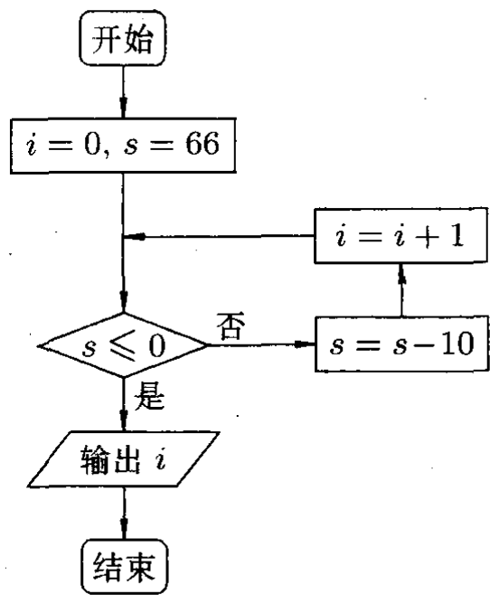
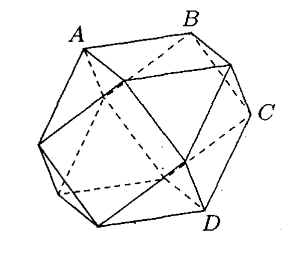
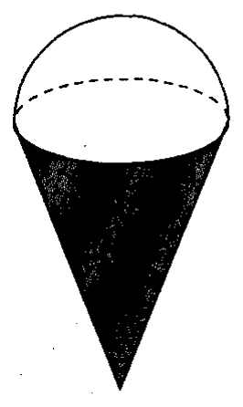

# 2011年上海卷（春）

## 填空题

### 第 1 题

函数 $y=\lg\left(x-2\right)$ 的定义域是＿＿＿＿＿＿.

#### 答案

$(2,+\infty)$

#### 解析

对数的真数必须为正，因此

$$

x-2>0\Longrightarrow x>2

$$

所以函数的定义域为 $(2,+\infty)$.

### 第 2 题

若集合 $A = \{x \mid x \geqslant 1\}$，$B = \{x \mid x^2 \leqslant 4\}$，则 $A \cap B =$＿＿＿＿＿＿.

#### 答案

$\{x\mid1\le x\le2\}$

#### 解析

由 $x^2\le4$ 得 $-2\le x\le2$，故

$$

B=\{x\mid-2\le x\le2\}

$$

再与 $A=\{x\mid x\ge1\}$ 取交集，得到

$$

A\cap B=\{x\mid1\le x\le2\}

$$

### 第 3 题

在 $\triangle ABC$ 中，若 $\tan A = \frac{\sqrt{2}}{3}$，则 $\sin A =$＿＿＿＿＿＿.

#### 答案

$\frac{\sqrt{22}}{11}$

#### 解析

因为 $A$ 是三角形的内角，所以 $0<A<\pi$. 又因 $\tan A>0$，故 $A$ 为锐角，$\sin A>0$，$\cos A>0$. 由 $\tan A=\frac{\sin A}{\cos A}=\frac{\sqrt{2}}{3}$，$\sin^2A+\cos^2A=1$ 可得

$$

\sin A=\frac{\tan A}{\sqrt{1+\tan^2A}}
 =\frac{\frac{\sqrt{2}}{3}}{\sqrt{1+\frac{2}{9}}}
 =\frac{\sqrt{2}}{\sqrt{11}}=\frac{\sqrt{22}}{11}

$$

### 第 4 题

若行列式 $\begin{vmatrix}2^{x}&4\\1&2\end{vmatrix}=0$，则 $x=$＿＿＿＿＿＿.

#### 答案

$1$

#### 解析

二阶行列式为零等价于

$$

2\cdot2^x-4\cdot1=0

$$

于是 $2^{x+1}=2^2$，所以 $x=1$.

### 第 5 题

若 $\sin x = \frac{1}{3}$，$x \in \left[-\frac{\pi}{2}, \frac{\pi}{2}\right]$，则 $x =$＿＿＿＿＿＿（结果用反三角函数值表示）.

#### 答案

$\arcsin\frac{1}{3}$

#### 解析

反正弦函数在 $\left[-\frac{\pi}{2},\frac{\pi}{2}\right]$ 上是正弦函数的反函数，并且题目已给出 $x$ 属于该区间. 因此

$$

x=\arcsin\frac{1}{3}

$$

### 第 6 题

$\left(x + \frac{1}{x}\right)^6$ 的二项展开式的常数项为＿＿＿＿＿＿.

#### 答案

$20$

#### 解析

在二项式展开式的通项中，取 $\frac{1}{x}$ 共 $r$ 次，可得 $T_{r+1}=\mathrm C_6^r x^{6-r}\left(\frac{1}{x}\right)^r =\mathrm C_6^r x^{6-2r}$，$r=0$，$1$，$\ldots$，$6$. 常数项要求 $6-2r=0$，所以 $r=3$，常数项为

$$

\mathrm C_6^3=20

$$

### 第 7 题

两条直线 $l_1: x - \sqrt{3} y + 2 = 0$ 与 $l_2: x - y + 2 = 0$ 夹角的大小是＿＿＿＿＿＿.

#### 答案

$\frac{\pi}{12}$

#### 解析

将两直线化为斜截式，得斜率 $m_1=\frac{1}{\sqrt{3}}$，$m_2=1$. 设两直线的锐角夹角为 $\theta$，则

$$

\tan\theta=\left|\frac{m_2-m_1}{1+m_1m_2}\right|
 =\frac{1-\frac{1}{\sqrt{3}}}{1+\frac{1}{\sqrt{3}}}
 =2-\sqrt{3}=\tan\frac{\pi}{12}

$$

由于 $0<\theta<\frac{\pi}{2}$，所以 $\theta=\frac{\pi}{12}$.

### 第 8 题

若 $S_{n}$ 为等比数列 $\{a_{n}\}$ 的前 $n$ 项和，$8a_{2} + a_{5} = 0$，则 $\frac{S_{6}}{S_{3}} =$＿＿＿＿＿＿.

#### 答案

$-7$

#### 解析

设等比数列的公比为 $q$. 因为题目中的比值有意义，所以 $S_3\ne0$，从而 $a_1\ne0$，进而 $a_2\ne0$. 由 $a_5=a_2q^3$ 及已知条件，得

$$

8a_2+a_5=a_2(8+q^3)=0

$$

从而 $q^3=-8$，即 $q=-2$. 因此

$$

\frac{S_6}{S_3}
 =\frac{a_1\frac{1-q^6}{1-q}}{a_1\frac{1-q^3}{1-q}}
 =\frac{1-q^6}{1-q^3}
 =\frac{1-64}{1-(-8)}=-7

$$

### 第 9 题

若椭圆 $C$ 的焦点和顶点分别是双曲线 $\frac{x^{2}}{5}-\frac{y^{2}}{4}=1$ 的顶点和焦点，则椭圆 $C$ 的方程是＿＿＿＿＿＿.

#### 答案

$\frac{x^2}{9}+\frac{y^2}{4}=1$

#### 解析

双曲线的实半轴、虚半轴分别为 $\sqrt{5}$、$2$，故其焦半距满足

$$

c=\sqrt{5+2^2}=3

$$

所以双曲线的顶点为 $(\pm3,0)$，焦点为 $(\pm\sqrt{5},0)$. 题设说明椭圆的顶点为 $(\pm3,0)$，焦点为 $(\pm\sqrt{5},0)$，于是椭圆的长半轴 $a=3$，焦半距 $c=\sqrt{5}$. 由 $b^2=a^2-c^2$ 得

$$

b^2=9-5=4

$$

故椭圆方程为 $\frac{x^2}{9}+\frac{y^2}{4}=1$.

### 第 10 题

若点 $O$ 和点 $F$ 分别为椭圆 $\frac{x^2}{2} + y^2 = 1$ 的中心和左焦点，点 $P$ 为椭圆上的任意一点，则 $|OP|^2 + |PF|^2$ 的最小值为＿＿＿＿＿＿.

#### 答案

$2$

#### 解析

椭圆可写为 $\frac{x^2}{2}+y^2=1$，所以中心为 $O=(0,0)$，焦半距为 $1$，左焦点为 $F=(-1,0)$. 设 $P=(x,y)$，则

$$

|OP|^2+|PF|^2=x^2+y^2+(x+1)^2+y^2

$$

由椭圆方程 $y^2=1-\frac{x^2}{2}$，代入得

$$

|OP|^2+|PF|^2
 =2x^2+2y^2+2x+1
 =x^2+2x+3
 =(x+1)^2+2\ge2

$$

当 $x=-1$ 且 $y=\pm\frac{\sqrt{2}}{2}$ 时，点 $P$ 在椭圆上并取到等号，故最小值为 $2$.

### 第 11 题

根据如图所示的程序框图，输出结果 $i=$＿＿＿＿＿＿.

#### 答案

$7$

#### 解析

初始化时 $i=0$，$s=66$. 每次先判断 $s\le0$，若不成立就令 $s$ 减去 $10$，再令 $i$ 增加 $1$. 经过 $k$ 次循环后 $s=66-10k$，$i=k$. 停止条件是 $66-10k\le0$，即 $k\ge6.6$. 最小的整数 $k$ 为 $7$，此时 $s=-4$，满足停止条件，故输出 $i=7$.

### 第 12 题

2011年上海春季高考有8所高校招生，如果某3位同学恰好被其中2所高校录取，那么录取方法的种数为＿＿＿＿＿＿.

#### 答案

$168$

#### 解析

先从 $8$ 所高校中选出恰好被录取的两所，有 $\mathrm C_8^2$ 种选法. 对固定的两所高校，3 位有区别的同学分别选择其中一所共有 $2^3$ 种分配方法；去掉全部被第一所录取和全部被第二所录取的两种情形，才能保证两所高校都录取到同学. 因此种数为

$$

\mathrm C_8^2(2^3-2)=28\times6=168

$$

### 第 13 题

有一种多面体的饰品，其表面由6个正方形和8个正三角形组成（如图），$AB$ 与 $CD$ 所成角的大小是＿＿＿＿＿＿.

#### 答案

$\frac{\pi}{3}$

#### 解析

该多面体是由正方形和正三角形组成的多面体. 取其中心为原点，并按边长作相似缩放，可将其顶点表示为 $(\pm1,\pm1,0)$，$(\pm1,0,\pm1)$，$(0,\pm1,\pm1)$. 根据图中四个顶点的相邻关系，可取 $A=(1,1,0)$，$B=(1,0,1)$，$C=(-1,1,0)$，$D=(0,1,1)$. 于是 $\overrightarrow{AB}=(0,-1,1)$，$\overrightarrow{CD}=(1,0,1)$ 且 $|\overrightarrow{AB}|=|\overrightarrow{CD}|=\sqrt{2}$. 所以两异面直线所成的锐角 $\theta$ 满足

$$

\cos\theta=\frac{|\overrightarrow{AB}\cdot\overrightarrow{CD}|}{|\overrightarrow{AB}|\,|\overrightarrow{CD}|}
 =\frac{1}{2}

$$

由于 $0<\theta<\frac{\pi}{2}$，故 $\theta=\frac{\pi}{3}$.

### 第 14 题

为求解方程 $x^{5} - 1 = 0$ 的虚根，可以把原方程变形为 $(x - 1)(x^4 + x^3 + x^2 + x + 1) = 0$，再变形为 $(x - 1)(x^2 + ax + 1)(x^2 + bx + 1) = 0$，由此可得原方程的一个虚根为＿＿＿＿＿＿.

#### 答案

$\frac{-1-\sqrt{5}\pm\sqrt{10-2\sqrt{5}}\i}{4}$，$\frac{-1+\sqrt{5}\pm\sqrt{10+2\sqrt{5}}\i}{4}$ 中的一个虚根

#### 解析

比较二次因式的系数，得到 $a+b=1$，$ab+2=1$ 即 $a+b=1$，$ab=-1$. 因而 $a$，$b$ 是方程 $t^2-t-1=0$ 的两个根，即 $a=\frac{1+\sqrt{5}}{2}$，$b=\frac{1-\sqrt{5}}{2}$. 对因式 $x^2+ax+1=0$，有

$$

x=\frac{-a\pm\sqrt{a^2-4}}{2}
 =\frac{-1-\sqrt{5}\pm\sqrt{10-2\sqrt{5}}\i}{4}

$$

因此取其中一个，例如

$$

x=\frac{-1-\sqrt{5}+\sqrt{10-2\sqrt{5}}\i}{4}

$$

就是原方程的一个虚根. 另一个二次因式给出题目答案中列出的另一对共轭虚根.

## 单选题

### 第 15 题

若向量 $\boldsymbol{a}= (2,0)$，$\boldsymbol{b}= (1,1)$，则下列结论正确的是（）

A.  
$\boldsymbol{a}\cdot \boldsymbol{b}= 1$.

B.  
$|\boldsymbol{a}| = |\boldsymbol{b}|$.

C.  
$(\boldsymbol{a}- \boldsymbol{b})\perp \boldsymbol{b}$.

D.  
$\boldsymbol{a}\parallel \boldsymbol{b}$.

#### 答案

C

#### 解析

逐项计算可得

$$

\boldsymbol{a}\cdot\boldsymbol{b}=2\cdot1+0\cdot1=2\ne1

$$

$|\boldsymbol{a}|=2$，$|\boldsymbol{b}|=\sqrt{2}$ 所以前两项均不正确. 又 $\boldsymbol{a}-\boldsymbol{b}=(1,-1)$，$qquad (\boldsymbol{a}-\boldsymbol{b})\cdot\boldsymbol{b}=1-1=0$ 故 $(\boldsymbol{a}-\boldsymbol{b})\perp\boldsymbol{b}$. 两向量的坐标不成比例，故 $\boldsymbol{a}$ 不平行于 $\boldsymbol{b}$. 因此选 C.

### 第 16 题

函数 $f(x) = \frac{4^x - 1}{2^x}$ 的图像关于（）

A.  
原点对称.

B.  
直线 $y=x$ 对称.

C.  
直线 $y=-x$ 对称.

D.  
$y$ 轴对称.

#### 答案

A

#### 解析

化简函数得

$$

f(x)=\frac{2^{2x}-1}{2^x}=2^x-2^{-x}

$$

于是

$$

f(-x)=2^{-x}-2^x=-f(x)

$$

所以函数为奇函数，函数图像关于原点对称，故选 A.

### 第 17 题

直线 $l: y = k\left(x + \frac{1}{2}\right)$ 与圆 $C: x^2 + y^2 = 1$ 的位置关系为（）

A.  
相交或相切.

B.  
相交或相离.

C.  
相切.

D.  
相交.

#### 答案

D

#### 解析

直线 $l$ 恒过点 $\left(-\frac12,0\right)$，而该点到圆心 $O=(0,0)$ 的距离为 $\frac12<1$，位于圆 $C$ 的内部. 过圆内一点的直线必与圆有两个交点，因此直线与圆恒相交，故选 D.

### 第 18 题

若 $\boldsymbol{a}_1$，$\boldsymbol{a}_2$，$\boldsymbol{a}_3$ 均为单位向量，则 $\boldsymbol{a}_1 = \left(\frac{\sqrt{3}}{3}, \frac{\sqrt{6}}{3}\right)$ 是 $\boldsymbol{a}_1 + \boldsymbol{a}_2 + \boldsymbol{a}_3 = (\sqrt{3}, \sqrt{6})$ 的（）

A.  
充分不必要条件.

B.  
必要不充分条件.

C.  
充分必要条件.

D.  
既不充分又不必要条件.

#### 答案

B

#### 解析

记 $P:\boldsymbol{a}_1=\left(\frac{\sqrt{3}}{3},\frac{\sqrt{6}}{3}\right)$，$Q:\boldsymbol{a}_1+\boldsymbol{a}_2+\boldsymbol{a}_3=(\sqrt{3},\sqrt{6})$. 若 $Q$ 成立，则

$$

|\boldsymbol{a}_1+\boldsymbol{a}_2+\boldsymbol{a}_3|=\sqrt{3+6}=3

$$

三个单位向量的和的模不超过模的和 $3$，等号成立时三个向量方向相同，因此

$$

\boldsymbol{a}_1=\boldsymbol{a}_2=\boldsymbol{a}_3
 =\frac{1}{3}(\sqrt{3},\sqrt{6})
 =\left(\frac{\sqrt{3}}{3},\frac{\sqrt{6}}{3}\right)

$$

所以 $P$ 是 $Q$ 的必要条件. 但 $P$ 不充分：例如取 $\boldsymbol{a}_2=\boldsymbol{a}_3=-\boldsymbol{a}_1$，则三个向量仍为单位向量，而

$$

\boldsymbol{a}_1+\boldsymbol{a}_2+\boldsymbol{a}_3=-\boldsymbol{a}_1\ne(\sqrt{3},\sqrt{6})

$$

故选 B.

## 解答题

### 第 19 题

已知向量 $\boldsymbol{a}= (\sin 2x - 1, \cos x)$， $\boldsymbol{b}= (1, 2\cos x)$. 设函数 $f(x) = \boldsymbol{a}\cdot \boldsymbol{b}$，求：

1.  函数 $f(x)$ 的最小正周期；

2.  $x \in \left[0, \frac{\pi}{2}\right]$ 时函数 $f(x)$ 的最大值.

#### 解析

1.  

$$

f(x)=\boldsymbol{a}\cdot\boldsymbol{b}=\sin2x-1+2\cos^2x
    =\sin2x+\cos2x
     =\sqrt{2}\sin\left(2x+\frac{\pi}{4}\right)

$$

    正弦函数的最小正周期为 $2\pi$，所以要求 $2T=2\pi$，从而函数 $f(x)$ 的最小正周期为 $T=\pi$.

2.  当 $x\in\left[0,\frac{\pi}{2}\right]$ 时，

$$

2x+\frac{\pi}{4}\in\left[\frac{\pi}{4},\frac{5\pi}{4}\right]

$$

    该区间包含正弦函数取最大值 $1$ 的点 $\frac{\pi}{2}$. 当 $2x+\frac{\pi}{4}=\frac{\pi}{2}$，$x=\frac{\pi}{8}$ 时，$f(x)=\sqrt{2}$，故最大值为 $\sqrt{2}$.

### 第 20 题

某甜品店制作一种蛋筒冰淇淋，其上半部分呈半球形，下半部分呈圆锥形（如图）. 现把半径为 $10\mathrm{~cm}$ 的圆形蛋皮等分成 5 个扇形，用一个扇形蛋皮围成圆锥的侧面（蛋皮厚度忽略不计），求该蛋筒冰淇淋的表面积和体积（精确到 0.01）.

#### 解析

设圆锥的底面半径为 $r$，高为 $h$. 扇形蛋皮的半径是圆锥的母线长，扇形圆心角为 $\frac{2\pi}{5}$. 因此由弧长相等得 $2\pi r=\frac{2\pi}{5}\cdot10$，$r=2$. 由圆锥的母线、底面半径和高组成直角三角形，

$$

h=\sqrt{10^2-2^2}=4\sqrt{6}

$$

表面积不包含半球和圆锥的公共底面，故

$$

S=\frac{\pi\cdot10^2}{5}+2\pi\cdot2^2
 =28\pi\approx87.96\mathrm{~cm}^{2}

$$

体积为圆锥体积与半球体积之和，

$$

V=\frac{1}{3}\pi\cdot2^2\cdot4\sqrt{6}+\frac{2}{3}\pi\cdot2^3
 =\frac{16}{3}(\sqrt{6}+1)\pi\approx57.80\mathrm{~cm}^{3}

$$

故该蛋筒冰淇淋的表面积约为 $87.96\mathrm{~cm}^{2}$，体积约为 $57.80\mathrm{~cm}^{3}$.

### 第 21 题

已知抛物线 $F: x^{2} = 4y$.

1.  $\triangle ABC$ 的三个顶点在抛物线 $F$ 上，记：$\triangle ABC$ 的三边 $AB$，$BC$，$CA$ 所在直线的斜率分别为 $k_{AB}$，$k_{BC}$，$k_{CA}$，若点 $A$ 在坐标原点，求 $k_{AB} - k_{BC} + k_{CA}$ 的值；

2.  请你给出一个以 $P(2,1)$ 为顶点，且其余各顶点均为抛物线 $F$ 上的动点的多边形，写出多边形各边所在直线的斜率之间的关系式，并说明理由.

#### 解析

1.  设 $B(x_1,y_1)$，$C(x_2,y_2)$. $x_1^2=4y_1$，$x_2^2=4y_2$.

$$

k_{AB}-k_{BC}+k_{CA}
    =\frac{y_1}{x_1}-\frac{y_2-y_1}{x_2-x_1}+\frac{y_2}{x_2}
    =\frac{1}{4}x_1-\frac{1}{4}(x_1+x_2)+\frac{1}{4}x_2=0

$$

2.  例如取横坐标互不相同的 $n$ 边形 $P_1P_2\cdots P_n$（$n\ge3$），其中 $P_1=P=(x_1,y_1)=(2,1)$，其余各点 $P_j=(x_j,y_j)$（$2\le j\le n$）在抛物线 $F$ 上. 记 $x_{n+1}=x_1$. 对任意相邻两点，由 $y_j=\frac{x_j^2}{4}$ 得

    1.  研究 $\triangle PBC$.

$$

k_{PB}-k_{BC}+k_{CP}
        =\frac{y_B-y_P}{x_B-x_P}-\frac{y_C-y_B}{x_C-x_B}+\frac{y_P-y_C}{x_P-x_C}
        =\frac{x_P+x_B}{4}-\frac{x_B+x_C}{4}+\frac{x_C+x_P}{4}=\frac{x_P}{2}=1

$$

    2.  研究四边形 $PBCD$.

$$

k_{PB}-k_{BC}+k_{CD}-k_{DP}
        =\frac{x_P+x_B}{4}-\frac{x_B+x_C}{4}+\frac{x_C+x_D}{4}-\frac{x_D+x_P}{4}=0

$$

    3.  研究五边形 $PBCDE$.

$$

k_{PB}-k_{BC}+k_{CD}-k_{DE}+k_{EP}
        =\frac{x_P+x_B}{4}-\frac{x_B+x_C}{4}+\frac{x_C+x_D}{4}-\frac{x_D+x_E}{4}+\frac{x_E+x_P}{4}=\frac{x_P}{2}=1

$$

    4.  研究 $n=2k$ 边形 $P_1P_2\cdots P_{2k}$（$k\in\mathbb{N}$，$k\ge2$），其中 $P_1=P$. 有

$$

k_{P_1P_2}-k_{P_2P_3}+k_{P_3P_4}-\cdots+(-1)^{2k-1}k_{P_{2k}P_1}=0

$$

        证明：左边

$$

\begin{gathered}
        =\frac{1}{4}(x_{P_1}+x_{P_2})-\frac{1}{4}(x_{P_2}+x_{P_3})+\cdots+(-1)^{2k-1}\frac{1}{4}(x_{P_{2k}}+x_{P_1}) \\
        =\frac{x_{P_1}}{4}\bigl[1+(-1)^{2k-1}\bigr]=\frac{1+(-1)^{2k-1}}{2}=0.
        \end{gathered}

$$

    5.  研究 $n=2k-1$ 边形 $P_1P_2\cdots P_{2k-1}$（$k\in\mathbb{N}$，$k\ge2$），其中 $P_1=P$. 有

$$

k_{P_1P_2}-k_{P_2P_3}+k_{P_3P_4}-\cdots+(-1)^{2k-2}k_{P_{2k-1}P_1}=1

$$

        证明：左边

$$

\begin{gathered}
        =\frac{1}{4}(x_{P_1}+x_{P_2})-\frac{1}{4}(x_{P_2}+x_{P_3})+\cdots+(-1)^{2k-2}\frac{1}{4}(x_{P_{2k-1}}+x_{P_1}) \\
        =\frac{x_{P_1}}{4}\bigl[1+(-1)^{2k-2}\bigr]=\frac{1+(-1)^{2k-2}}{2}=1.
        \end{gathered}

$$

    6.  研究 $n$ 边形 $P_1P_2\cdots P_n$（$n\in\mathbb{N}$，$n\ge3$），其中 $P_1=P$. 有

$$

k_{P_1P_2}-k_{P_2P_3}+k_{P_3P_4}-\cdots+(-1)^{n-1}k_{P_nP_1}=\frac{1+(-1)^{n-1}}{2}

$$

        证明：左边

$$

\begin{gathered}
        =\frac{1}{4}(x_{P_1}+x_{P_2})-\frac{1}{4}(x_{P_2}+x_{P_3})+\cdots+(-1)^{n-1}\frac{1}{4}(x_{P_n}+x_{P_1}) \\
        =\frac{x_{P_1}}{4}\bigl[1+(-1)^{n-1}\bigr]=\frac{1+(-1)^{n-1}}{2}.
        \end{gathered}

$$

### 第 22 题

定义域为 $\mathbb{R}$，且对任意实数 $x_{1}$，$x_{2}$ 都满足不等式 $f\left(\frac{x_{1} + x_{2}}{2}\right) \leqslant \frac{f(x_{1}) + f(x_{2})}{2}$ 的所有函数 $f(x)$ 组成的集合记为 $M$. 例如，函数 $f(x) = kx + b \in M$.

1.  已知函数

$$

f(x) = \begin{cases}
    x, & x \geqslant 0,\\
    \frac{1}{2} x, & x < 0.
    \end{cases}

$$

证明：$f(x)\in M$；

2.  写出一个函数 $f(x)$，使得 $f(x)\notin M$，并说明理由；

3.  写出一个函数 $f(x)\in M$，使得数列极限 $\displaystyle\lim_{n\to\infty}\frac{f(n)}{n^2}=1$，$\displaystyle\lim_{n\to\infty}\frac{f(-n)}{-n}=1$.

#### 解析

1.  不妨设 $x_1\le x_2$，记 $m=\frac{x_1+x_2}{2}$. 当 $x_2\le0$ 或 $x_1\ge0$ 时，三个数在同一个分段内，函数分别为一次函数 $\frac12x$ 或 $x$，不等式均取等号.

    下面设 $x_1\le0\le x_2$. 若 $m<0$，则

$$

\frac{f(x_1)+f(x_2)}{2}-f\left(\frac{x_1+x_2}{2}\right)
    =\frac{1}{2}\left(\frac{1}{2}x_1+x_2\right)-\frac{1}{2}\cdot\frac{x_1+x_2}{2}
    =\frac{x_2}{4}\ge0

$$

    故不等式成立. 若 $m\ge0$，则

$$

\frac{f(x_1)+f(x_2)}{2}-f\left(\frac{x_1+x_2}{2}\right)
    =\frac{1}{2}\left(\frac{1}{2}x_1+x_2\right)-\frac{x_1+x_2}{2}
    =-\frac{x_1}{4}\ge0

$$

    故不等式也成立. 所有实数对都已覆盖，所以 $f(x)\in M$.

2.  取 $f(x)=-x^2$. 令 $x_1=-1$，$x_2=1$，则 $f\left(\frac{x_1+x_2}{2}\right)=f(0)=0$，$\frac{f(x_1)+f(x_2)}{2}=-1$. 于是 $0\le-1$ 不成立，所以 $f(x)\notin M$.

3.  如函数

$$

f(x)=\begin{cases}
    x^2,& x\ge1,\\
    x,& x<1,
    \end{cases}

$$

    证明它属于 $M$. 不妨设 $x_1\le x_2$，记 $m=\frac{x_1+x_2}{2}$. 若 $x_2\le1$，则 $f$ 在这三个点上均为 $x$，不等式取等号；若 $x_1\ge1$，则

$$

\frac{f(x_1)+f(x_2)}{2}-f(m)
     =\frac{x_1^2+x_2^2}{2}-\left(\frac{x_1+x_2}{2}\right)^2
     =\frac{(x_2-x_1)^2}{4}\ge0

$$

    只需考虑 $x_1<1<x_2$. 若 $m<1$，则

$$

\frac{f(x_1)+f(x_2)}{2}-f(m)
     =\frac{x_1+x_2^2}{2}-\frac{x_1+x_2}{2}
     =\frac{x_2(x_2-1)}{2}\ge0

$$

    若 $m\ge1$，令 $t=1-x_1>0$，$s=x_2-1>0$，则 $s\ge t$，并且

$$

\begin{gathered}
    \frac{f(x_1)+f(x_2)}{2}-f(m)
    =\frac{(1-t)+(1+s)^2}{2}-\left(1+\frac{s-t}{2}\right)^2
    \\
    \frac{f(x_1)+f(x_2)}{2}-f(m)
     =\frac{s^2+2st+2t-t^2}{4}
     =\frac{(s-t)(s+t)+2t(s+1)}{4}.
    \end{gathered}

$$

    因为 $s\ge t>0$，所以 $(s-t)(s+t)\ge0$ 且 $2t(s+1)>0$，故上式不小于 $0$. 所以该函数满足定义中的不等式，故 $f(x)\in M$. 又当 $n\to\infty$ 时，$n\ge1$，而 $-n<1$，所以

$$

\lim_{n\to\infty}\frac{f(n)}{n^2}
    =\lim_{n\to\infty}\frac{n^2}{n^2}=1

$$

$$

\lim_{n\to\infty}\frac{f(-n)}{-n}
     =\lim_{n\to\infty}\frac{-n}{-n}=1

$$

### 第 23 题

对于给定首项 $x_0 > \sqrt[3]{a}$（$a > 0$），由递推式 $x_{n+1} = \frac{1}{2}\left(x_n + \sqrt{\frac{a}{x_n}}\right)$（$n \in \mathbb{N}$）得到数列 $\{x_n\}$，且对于任意的 $n \in \mathbb{N}$，都有 $x_n > \sqrt[3]{a}$. 用数列 $\{x_n\}$ 可以计算 $\sqrt[3]{a}$ 的近似值.

1.  取 $x_0 = 5$，$a = 100$，计算 $x_1$，$x_2$，$x_3$ 的值（精确到 0.01）；归纳出 $x_n$，$x_{n+1}$ 的大小关系；

2.  当 $n \geqslant 1$ 时，证明 $x_n - x_{n+1} < \frac{1}{2}(x_{n-1} - x_n)$；

3.  当 $x_0 \in [5, 10]$ 时，用数列 $\{x_n\}$ 计算 $\sqrt[3]{100}$ 的近似值，要求 $|x_n - x_{n+1}| < 10^{-4}$，请你估计 $n$，并说明理由.

#### 解析

1.  

$$

x_1=\frac12\left(5+\sqrt{\frac{100}{5}}\right)=\frac{5+2\sqrt5}{2}\approx4.74

$$

    $x_2=\frac12\left(x_1+\sqrt{\frac{100}{x_1}}\right)\approx4.67$，$x_3=\frac12\left(x_2+\sqrt{\frac{100}{x_2}}\right)\approx4.65$. 由于题设 $x_n>\sqrt[3]{a}>0$，所以 $x_n^3>a$，从而 $x_n>\sqrt{\frac{a}{x_n}}$，$x_n-x_{n+1}=\frac12\left(x_n-\sqrt{\frac{a}{x_n}}\right)>0$. 因此 $x_n>x_{n+1}$.

2.  先证明上述大小关系. 因为 $x_n>\sqrt[3]{a}>0$，所以 $x_n^3>a$，从而 $x_n>\sqrt{\frac{a}{x_n}}$，$x_n-x_{n+1}=\frac12\left(x_n-\sqrt{\frac{a}{x_n}}\right)>0$. 因此 $x_n>x_{n+1}$. 令

$$

\delta_n=x_n-x_{n+1}>0

$$

    当 $n\ge1$ 时，利用递推式分别表示 $x_n$ 和 $x_{n+1}$，得

$$

\delta_n-\frac12\delta_{n-1}
    =x_n-\frac12\left(x_n+\sqrt{\frac{a}{x_n}}\right)-\frac12(x_{n-1}-x_n)
    =\frac12\left(\sqrt{\frac{a}{x_{n-1}}}-\sqrt{\frac{a}{x_n}}\right)<0

$$

    最后一个不等号利用了 $x_{n-1}>x_n>0$. 所以

$$

x_n-x_{n+1}<\frac12(x_{n-1}-x_n)

$$

3.  仍记 $\delta_n=x_n-x_{n+1}$. 由上一问反复使用不等式，得到

$$

0<\delta_n<\frac{1}{2^n}\delta_0

$$

    当 $a=100$ 时，

$$

\delta_0=x_0-x_1
     =\frac12\left(x_0-\frac{10}{\sqrt{x_0}}\right)

$$

    函数 $x_0-10x_0^{-1/2}$ 在 $[5,10]$ 上的导数为 $1+5x_0^{-3/2}>0$，所以

$$

\delta_0\le\frac{10-\sqrt{10}}{2}

$$

    因此只要

$$

\frac{1}{2^n}\cdot\frac{10-\sqrt{10}}{2}<10^{-4}

$$

    即

$$

n>\log_2\left(10^4\cdot\frac{10-\sqrt{10}}{2}\right)\approx15.06

$$

    取整数 $n=16$，即可对所有 $x_0\in[5,10]$ 保证 $|x_n-x_{n+1}|<10^{-4}$. 这是由上述估计得到的统一充分次数.
