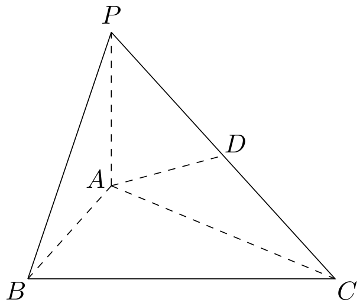

# 2012年上海卷（秋文）

## 填空题

### 第 1 题

计算： $\frac{3 - \i}{1 + \i} =$＿＿＿＿＿＿.（$\i$ 为虚数单位）

#### 答案

$1-2\i$

#### 解析

分子、分母同乘以分母的共轭复数，得 $\frac{3-\i}{1+\i}=\frac{(3-\i)(1-\i)}{(1+\i)(1-\i)}=\frac{2-4\i}{2}=1-2\i$，所以填 $1-2\i$.

### 第 2 题

若集合 $A = \{x \mid 2x - 1 > 0\}$，$B = \{x \mid |x| < 1\}$，则 $A \cap B =$＿＿＿＿＿＿.

#### 答案

$\left\{x \mid \frac{1}{2}<x<1\right\}$

#### 解析

由 $2x-1>0$ 得 $x>\frac{1}{2}$，由 $|x|<1$ 得 $-1<x<1$. 两个解集取交集，得到 $A\cap B=\left\{x\mid \frac{1}{2}<x<1\right\}$.

### 第 3 题

函数 $f(x) = \left| \begin{matrix} \sin x & 2 \\ -1 & \cos x \end{matrix} \right|$ 的最小正周期是＿＿＿＿＿＿.

#### 答案

$\pi$

#### 解析

按二阶行列式展开，$f(x)=\sin x\cos x-2(-1)=\frac{1}{2}\sin 2x+2$. 因为 $\sin 2x$ 的最小正周期为 $\pi$，且其系数不为零，所以 $f(x)$ 的最小正周期为 $\pi$.

### 第 4 题

若 $\boldsymbol{d}= (2,1)$ 是直线 $l$ 的一个方向向量，则 $l$ 的倾斜角的大小为＿＿＿＿＿＿. （结果用反三角函数值表示）

#### 答案

$\arctan\frac{1}{2}$

#### 解析

设直线 $l$ 的倾斜角为 $\alpha$，则其斜率为方向向量纵坐标与横坐标之比，即 $\tan\alpha=\frac{1}{2}$. 由于方向向量的横、纵坐标均为正，$0<\alpha<\frac{\pi}{2}$，所以 $\alpha=\arctan\frac{1}{2}$.

### 第 5 题

一个高为 $2$ 的圆柱，底面周长为 $2\pi$. 该圆柱的表面积为＿＿＿＿＿＿.

#### 答案

$6\pi$

#### 解析

设底面半径为 $r$. 由 $2\pi r=2\pi$ 得 $r=1$. 圆柱表面积为侧面积与两个底面积之和，因此 $S=2\pi r\cdot2+2\pi r^2=4\pi+2\pi=6\pi$.

### 第 6 题

方程 $4^{x} - 2^{x + 1} - 3 = 0$ 的解是＿＿＿＿＿＿.

#### 答案

$\log_{2}3$

#### 解析

令 $t=2^x$，则 $t>0$，且 $4^x=t^2$，原方程化为 $t^2-2t-3=0$，即 $(t-3)(t+1)=0$. 因为 $t>0$，舍去 $t=-1$，得 $t=3$，所以 $2^x=3$，从而 $x=\log_2 3$.

### 第 7 题

有一列正方体，棱长组成以 $1$ 为首项，$\frac{1}{2}$ 为公比的等比数列，体积分别记为 $V_{1}$，$V_{2}$，$\cdots$，$V_{n}$，$\cdots$，则 $\displaystyle\lim_{n \to \infty} (V_{1} + V_{2} + \cdots + V_{n}) =$＿＿＿＿＿＿.

#### 答案

$\frac{8}{7}$

#### 解析

第 $n$ 个正方体的棱长为 $\left(\frac{1}{2}\right)^{n-1}$，所以 $V_n=\left(\frac{1}{2}\right)^{3n-3}=\left(\frac{1}{8}\right)^{n-1}$. 因而 $V_1+\cdots+V_n=\frac{1-\left(\frac{1}{8}\right)^n}{1-\frac{1}{8}}=\frac{8}{7}\left(1-\left(\frac{1}{8}\right)^n\right)$. 令 $n\to\infty$，得到极限为 $\frac{8}{7}$.

### 第 8 题

在 $\left(x - \frac{1}{x}\right)^{6}$ 的二项展开式中，常数项等于＿＿＿＿＿＿.

#### 答案

$-20$

#### 解析

通项为 $\mathrm C_6^k x^{6-k}\left(-\frac{1}{x}\right)^k=\mathrm C_6^k(-1)^k x^{6-2k}$. 要成为常数项，需 $6-2k=0$，故 $k=3$. 因此常数项的系数为 $\mathrm C_6^3(-1)^3=-20$.

### 第 9 题

已知 $y = f(x)$ 是奇函数，若 $g(x) = f(x) + 2$ 且 $g(1) = 1$，则 $g(-1) =$＿＿＿＿＿＿.

#### 答案

$3$

#### 解析

由 $g(1)=f(1)+2=1$ 得 $f(1)=-1$. 因为 $f$ 是奇函数，所以 $f(-1)=-f(1)=1$，从而 $g(-1)=f(-1)+2=3$.

### 第 10 题

满足约束条件 $|x| + 2|y| \leqslant 2$ 的目标函数 $z = y - x$ 的最小值是＿＿＿＿＿＿.

#### 答案

$-2$

#### 解析

由 $|x|+2|y|\leqslant2$ 可得 $|x|+|y|\leqslant2$. 因此 $z=y-x\geqslant-|y|-|x|\geqslant-2$. 当 $(x,y)=(2,0)$ 时满足约束条件，且 $z=0-2=-2$，所以目标函数的最小值为 $-2$.

### 第 11 题

三位同学参加跳高，跳远，铅球项目的比赛. 若每人只选择一个项目，则有且仅有两人选择的项目相同的概率是＿＿＿＿＿＿. （结果用最简分数表示）

#### 答案

$\frac{2}{3}$

#### 解析

每位同学都有 $3$ 种选择，所有等可能结果共有 $3^3=27$ 个. 恰有两人选择同一项目时，先选出这两人有 $\mathrm C_3^2$ 种选法，再选相同项目有 $3$ 种，剩下的一人选择另外一个项目有 $2$ 种，因此有利结果数为 $\mathrm C_3^2\cdot3\cdot2=18$. 所求概率为 $\frac{18}{27}=\frac{2}{3}$.

### 第 12 题

在矩形 $ABCD$ 中，边 $AB$、$AD$ 的长分别为 $2$、$1$. 若 $M$、$N$ 分别是 $BC$、$CD$ 上的点，且满足 $\frac{|BM|}{|BC|} = \frac{|CN|}{|CD|}$，则 $\overrightarrow{AM} \cdot \overrightarrow{AN}$ 的取值范围是＿＿＿＿＿＿.

#### 答案

$[1,4]$

#### 解析

以 $A$ 为原点，以 $\overrightarrow{AB}$、$\overrightarrow{AD}$ 所在直线为坐标轴，取 $B(2,0)$、$C(2,1)$、$D(0,1)$. 设 $M=(2,t)$，其中 $0\leqslant t\leqslant1$，设 $N=(s,1)$，其中 $0\leqslant s\leqslant2$. 由条件 $\frac{|BM|}{|BC|}=\frac{|CN|}{|CD|}$ 得 $t=\frac{2-s}{2}$，即 $s=2-2t$. 所以 $\overrightarrow{AM}=(2,t)$，$\overrightarrow{AN}=(2-2t,1)$，从而 $\overrightarrow{AM}\cdot\overrightarrow{AN}=2(2-2t)+t=4-3t$. 当 $0\leqslant t\leqslant1$ 时，$1\leqslant4-3t\leqslant4$，故取值范围为 $[1,4]$.

### 第 13 题

已知函数 $y = f(x)$ 的图象是折线段 $ABC$，其中 $A(0,0)$，$B\left(\frac{1}{2}, 1\right)$，$C(1,0)$. 函数 $y = xf(x)$ （$0 \leqslant x \leqslant 1$） 的图象与 $x$ 轴围成的图形的面积为＿＿＿＿＿＿.

#### 答案

$\frac{1}{4}$

#### 解析

直线段 $AB$ 的斜率为 $2$，直线段 $BC$ 的斜率为 $-2$，所以

$$

f(x)=\begin{cases}
2x,&0\leqslant x\leqslant\frac{1}{2},\\
-2x+2,&\frac{1}{2}\leqslant x\leqslant1.
\end{cases}

$$

因此所求面积为 $\displaystyle\int_0^{1/2}2x^2\,\mathrm dx+\int_{1/2}^1\left(-2x^2+2x\right)\,\mathrm dx=\frac{1}{12}+\frac{1}{6}=\frac{1}{4}$.

### 第 14 题

已知 $f(x) = \frac{1}{1 + x}$，各项均为正数的数列 $\{a_n\}$ 满足 $a_{1} = 1$，$a_{n + 2} = f(a_n)$. 若 $a_{2010} = a_{2012}$，则 $a_{20} + a_{11}$ 的值是＿＿＿＿＿＿.

#### 答案

$\frac{3+13\sqrt{5}}{26}$

#### 解析

由递推关系，$a_{2012}=f(a_{2010})$. 结合 $a_{2010}=a_{2012}$，可知 $a_{2010}$ 是方程 $x=\frac{1}{1+x}$ 的正根，即 $x^2+x-1=0$，所以 $a_{2010}=\frac{\sqrt5-1}{2}$. 函数 $f(x)=\frac{1}{1+x}$ 在正数范围内严格递减，因而是单射；由 $f(a_{2008})=a_{2010}=f(a_{2010})$ 得 $a_{2008}=a_{2010}$，依次向前推得所有偶数项都等于 $\frac{\sqrt5-1}{2}$，特别地 $a_{20}=\frac{\sqrt5-1}{2}$. 另一方面，奇数项由 $a_1=1$ 依次得到 $a_3=\frac12$，$a_5=\frac23$，$a_7=\frac35$，$a_9=\frac58$，$a_{11}=\frac8{13}$. 所以 $a_{20}+a_{11}=\frac{\sqrt5-1}{2}+\frac8{13}=\frac{3+13\sqrt5}{26}$.

## 单选题

### 第 15 题

若 $1 + \sqrt{2}\i$ 是关于 $x$ 的实系数方程 $x^{2} + bx + c = 0$ 的一个复数根，则（）

A.  
$b = 2, c = 3$

B.  
$b = 2$，$c = -1$

C.  
$b = -2$，$c = -1$

D.  
$b = -2$，$c = 3$

#### 答案

D

#### 解析

实系数方程的非实复根成共轭对，因此另一个根为 $1-\sqrt2\i$. 由韦达定理，$-b=(1+\sqrt2\i)+(1-\sqrt2\i)=2$，且 $c=(1+\sqrt2\i)(1-\sqrt2\i)=1+2=3$. 所以 $b=-2$，$c=3$，故选 D.

### 第 16 题

对于常数 $m$，$n$，“$mn > 0$”是“方程 $mx^{2} + ny^{2} = 1$ 表示的曲线是椭圆”的（）

A.  
充分不必要条件

B.  
必要不充分条件

C.  
充分必要条件

D.  
既不充分也不必要条件

#### 答案

B

#### 解析

若方程表示椭圆，则必须有 $m>0$ 且 $n>0$，从而必有 $mn>0$，所以前者是后者的必要条件. 但 $mn>0$ 还可能出现 $m<0$ 且 $n<0$ 的情况，此时左端恒不大于零，不可能等于 $1$，故不是充分条件. 所以选 B.

### 第 17 题

在 $\triangle ABC$ 中，若 $\sin^{2} A + \sin^{2} B < \sin^{2} C$，则 $\triangle ABC$ 的形状是（）

A.  
钝角三角形

B.  
直角三角形

C.  
锐角三角形

D.  
不能确定

#### 答案

A

#### 解析

设三角形的外接圆半径为 $R$，对应边长为 $a$，$b$，$c$. 由正弦定理，$a=2R\sin A$，$b=2R\sin B$，$c=2R\sin C$，所以题设不等式等价于 $a^2+b^2<c^2$. 由余弦定理，$c^2=a^2+b^2-2ab\cos C$，故 $\cos C<0$，从而 $C$ 为钝角，三角形为钝角三角形，故选 A.

### 第 18 题

若 $S_{n} = \sin \frac{\pi}{7} + \sin \frac{2\pi}{7} + \cdots + \sin \frac{n\pi}{7}$ （$n \in \mathbb{N}^{*}$），则在 $S_{1}$，$S_{2}$，$\cdots$，$S_{100}$ 中，正数的个数是（）

A.  
16

B.  
72

C.  
86

D.  
100

#### 答案

C

#### 解析

利用正弦和公式，$S_n=\frac{\sin\frac{n\pi}{14}\sin\frac{(n+1)\pi}{14}}{\sin\frac{\pi}{14}}$，由正弦函数的周期性可知 $S_{n+28}=S_n$，且分母为正. 在每个长度为 $28$ 的周期中，$S_n>0$ 的下标为 $n=1$，$2$，$\ldots$，$12$，$15$，$16$，$\ldots$，$26$，共有 $24$ 个；$n=13$，$14$，$27$，$28$ 时为零. 前 $84$ 项包含三个完整周期，得到 $3\times24=72$ 个正数. 在 $85$ 至 $100$ 中，对应周期内的下标为 $1$ 至 $16$，其中 $1$ 至 $12$ 以及 $15$，$16$ 对应正数，共 $14$ 个. 所以正数共有 $72+14=86$ 个，故选 C.

## 解答题

### 第 19 题

如图，在三棱锥 $P - ABC$ 中，$PA \perp$ 底面 $ABC$，$D$ 是 $PC$ 的中点. 已知 $\angle BAC = \frac{\pi}{2}$，$AB = 2$，$AC = 2\sqrt{3}$，$PA = 2$. 求：

1.  三棱锥 $P - ABC$ 的体积；

2.  异面直线 $BC$ 与 $AD$ 所成的角的大小（结果用反三角函数值表示）.

#### 解析

1.  因为 $\angle BAC=\frac{\pi}{2}$，所以 $S_{\triangle ABC}=\frac12 AB\cdot AC=\frac12\cdot2\cdot2\sqrt3=2\sqrt3$. 又因为三棱锥的高为 $PA=2$，所以 $V_{P-ABC}=\frac13S_{\triangle ABC}\cdot PA=\frac13\cdot2\sqrt3\cdot2=\frac{4\sqrt3}{3}$.

2.  建立空间直角坐标系，取 $A(0,0,0)$，$B(2,0,0)$，$C(0,2\sqrt3,0)$，$P(0,0,2)$. 因为 $D$ 是 $PC$ 的中点，所以 $D=(0,\sqrt3,1)$. 取直线 $BC$ 和 $AD$ 的方向向量 $\overrightarrow{BC}=(-2,2\sqrt3,0)$，$\overrightarrow{AD}=(0,\sqrt3,1)$，则 $\overrightarrow{BC}\cdot\overrightarrow{AD}=6$，$|\overrightarrow{BC}|=4$，$|\overrightarrow{AD}|=2$. 设两异面直线所成的角为 $\theta$，则 $\cos\theta=\frac{|\overrightarrow{BC}\cdot\overrightarrow{AD}|}{|\overrightarrow{BC}|\,|\overrightarrow{AD}|}=\frac{3}{4}$. 因此 $\theta=\arccos\frac34$.

### 第 20 题

已知函数 $f(x) = \lg (x + 1)$.

1.  若 $0 < f(1 - 2x) - f(x) < 1$，求 $x$ 的取值范围；

2.  若 $g(x)$ 是以 $2$ 为周期的偶函数，且当 $0 \leqslant x \leqslant 1$ 时，有 $g(x) = f(x)$，求函数 $y = g(x)$ （$x \in [1,2]$） 的反函数.

#### 解析

1.  由对数函数的定义域，需满足 $1-2x>-1$ 和 $x>-1$，即 $x<1$ 且 $x>-1$. 在此条件下，$f(1-2x)-f(x)=\lg\frac{2-2x}{x+1}$，所以 $0<\lg\frac{2-2x}{x+1}<1$ 等价于 $1<\frac{2-2x}{x+1}<10$. 因为 $x+1>0$，故 $x+1<2-2x<10x+10$，即 $-\frac23<x<\frac13$. 这一区间已经满足定义域条件，所以 $x$ 的取值范围为 $\left(-\frac23,\frac13\right)$.

2.  当 $x\in[1,2]$ 时，$2-x\in[0,1]$. 由周期性和偶性，$g(x)=g(x-2)=g(2-x)=f(2-x)=\lg(3-x)$. 当 $x$ 从 $1$ 变化到 $2$ 时，$3-x$ 从 $2$ 变化到 $1$，故 $y=\lg(3-x)$ 在 $[1,2]$ 上严格递减，值域为 $[0,\lg2]$. 由 $y=\lg(3-x)$ 得 $x=3-10^y$，交换自变量与因变量，所求反函数为 $y=3-10^x$，其中 $x\in[0,\lg2]$.

### 第 21 题

海事救援船对一艘失事船进行定位：以失事船的当前位置为原点，以正北方向为 $y$ 轴正方向建立平面直角坐标系（以 $1\text{ 海里}$ 为单位长度），则救援船恰好在失事船正南方向 $12\text{ 海里}$ $A$ 处，如图. 现假设：

1.  失事船的移动路径可视为抛物线 $y = \frac{12}{49} x^{2}$；

2.  定位后救援船即刻沿直线匀速前往救援；

3.  救援船出发 $t$ 小时后，失事船所在位置的横坐标为 $7t$.

<!-- -->

1.  当 $t = 0.5$ 时，写出失事船所在位置 $P$ 的纵坐标. 若此时两船恰好会合，求救援船速度的大小和方向；

2.  问救援船的时速至少是多少海里才能追上失事船？

#### 解析

1.  当 $t=0.5$ 时，失事船的横坐标为 $x=7t=\frac72$，代入抛物线方程得 $y=\frac{12}{49}\left(\frac72\right)^2=3$. 所以 $P\left(\frac72,3\right)$，而救援船在 $A(0,-12)$，故 $|AP|=\sqrt{\left(\frac72\right)^2+15^2}=\frac{\sqrt{949}}{2}$. 用时 $0.5$ 小时，所以救援船速度大小为 $\frac{|AP|}{0.5}=\sqrt{949}\text{ 海里/时}$. 速度方向为从 $A$ 指向 $P$，相对于正北方向的正切值为 $\frac{7/2}{15}=\frac7{30}$，因此方向为北偏东 $\arctan\frac7{30}$.

2.  设救援船速度为 $v$，在 $t$ 小时后追上失事船，其中 $t>0$. 此时失事船的位置为 $P_t=(7t,12t^2)$，所以 $AP_t=\sqrt{(7t)^2+(12t^2+12)^2}$. 因为救援船匀速直线行驶，$vt=AP_t$，从而 $v^2=49+144\left(t+\frac1t\right)^2$. 由 $t+\frac1t\geqslant2$，得 $v^2\geqslant49+144\cdot4=625$，即 $v\geqslant25$. 当且仅当 $t=1$ 时取等号，所以救援船的时速至少为 $25\text{ 海里/时}$.

### 第 22 题

在平面直角坐标系 $xOy$ 中，已知双曲线 $C: 2x^{2} - y^{2} = 1$.

1.  设 $F$ 是 $C$ 的左焦点，点 $M$ 是 $C$ 右支上一点. 若 $|MF| = 2\sqrt{2}$，求点 $M$ 的坐标；

2.  过 $C$ 的左顶点作 $C$ 的两条渐近线的平行线. 求这两组平行线围成的平行四边形的面积；

3.  设斜率为 $k$ （$|k| < \sqrt{2}$） 的直线 $l$ 交 $C$ 于 $P$，$Q$ 两点. 若 $l$ 与圆 $x^{2} + y^{2} = 1$ 相切，求证：$OP \perp OQ$.

#### 解析

1.  将双曲线写成 $\frac{x^2}{1/2}-y^2=1$，故半长轴为 $\frac{\sqrt2}{2}$，焦距半长为 $c=\sqrt{\frac12+1}=\frac{\sqrt6}{2}$，左焦点为 $F\left(-\frac{\sqrt6}{2},0\right)$. 设 $M=(x,y)$. 因为 $M$ 在右支上，$x\geqslant\frac{\sqrt2}{2}$，且 $y^2=2x^2-1$. 由 $|MF|=2\sqrt2$ 得 $\left(x+\frac{\sqrt6}{2}\right)^2+y^2=8$，代入 $y^2=2x^2-1$，得到 $6x^2+2\sqrt6x-15=0$. 解得 $x=\frac{\sqrt6}{2}$ 或 $x=-\frac{5\sqrt6}{6}$，由右支条件舍去后者. 再由 $y^2=2x^2-1$ 得 $y^2=2$，所以 $M\left(\frac{\sqrt6}{2},\sqrt2\right)$ 或 $M\left(\frac{\sqrt6}{2},-\sqrt2\right)$.

2.  双曲线的左顶点为 $A\left(-\frac{\sqrt2}{2},0\right)$，两条渐近线为 $y=\sqrt2x$ 和 $y=-\sqrt2x$. 过 $A$ 作它们的平行线，分别为 $y=\sqrt2x+1$ 和 $y=-\sqrt2x-1$. 这四条直线围成的平行四边形的四个顶点可取为 $O(0,0)$，$A\left(-\frac{\sqrt2}{2},0\right)$，$B\left(-\frac{\sqrt2}{4},-\frac12\right)$，$C\left(-\frac{\sqrt2}{4},\frac12\right)$. 因此其面积为 $\left|\overrightarrow{OB}\times\overrightarrow{OC}\right|=\frac{\sqrt2}{4}$.

3.  设直线 $l$ 的方程为 $y=kx+b$. 因为它与单位圆相切，所以原点到直线的距离为 $1$，即 $\frac{|b|}{\sqrt{1+k^2}}=1$，从而 $b^2=1+k^2$. 将直线方程代入双曲线方程，得 $(2-k^2)x^2-2kbx-b^2-1=0$. 设交点 $P$，$Q$ 的横坐标分别为 $x_1$，$x_2$，由韦达定理得 $x_1+x_2=\frac{2kb}{2-k^2}$，$x_1x_2=-\frac{b^2+1}{2-k^2}$. 又 $y_i=kx_i+b$，所以

$$

\overrightarrow{OP}\cdot\overrightarrow{OQ}=x_1x_2+y_1y_2=(1+k^2)x_1x_2+kb(x_1+x_2)+b^2

$$

    代入上述两式，得到 $\overrightarrow{OP}\cdot\overrightarrow{OQ}=\frac{b^2-(1+k^2)}{2-k^2}=0$. 因为 $P$，$Q$ 均不为原点，所以 $OP\perp OQ$.

### 第 23 题

对于项数为 $m$ 的有穷数列 $\{a_{n}\}$，记 $b_{k} = \max \{a_{1}, a_{2}, \cdots , a_{k}\}$ （$k = 1$，$2$，$\cdots$，$m$），即 $b_{k}$ 为 $a_{1}$，$a_{2}$，$\cdots$，$a_{k}$ 中的最大值，并称数列 $\{b_{k}\}$ 是 $\{a_{n}\}$ 的控制数列. 如 $1$，$3$，$2$，$5$，$5$ 的控制数列是 $1$，$3$，$3$，$5$，$5$.

1.  若各项均为正整数的数列 $\{a_{n}\}$ 的控制数列为 $2$，$3$，$4$，$5$，$5$，写出所有的 $\{a_{n}\}$；

2.  设 $\{b_{n}\}$ 是 $\{a_{n}\}$ 的控制数列，满足 $a_{k} + b_{m - k + 1} = C$ （$C$ 为常数，$k = 1$，$2$，$\cdots$，$m$）. 求证：$b_{k} = a_{k}$ （$k = 1$，$2$，$\cdots$，$m$）；

3.  设 $m = 100$，常数 $a \in \left(\frac{1}{2}, 1\right)$，若 $a_{n} = a n^{2} - (-1)^{\frac{n(n + 1)}{2}} n$，$\{b_{n}\}$ 是 $\{a_{n}\}$ 的控制数列，求 $(b_{1} - a_{1}) + (b_{2} - a_{2}) + \cdots + (b_{100} - a_{100})$.

#### 解析

1.  因为 $b_1=2$，所以 $a_1=2$. 又因为 $b_2=3$，必须有 $a_2=3$；由 $b_3=4$ 和 $b_4=5$，分别得到 $a_3=4$ 和 $a_4=5$. 最后 $b_5=5$ 只要求正整数 $a_5\leqslant5$，所以所有数列为 $\{2,3,4,5,1\}$，$\{2,3,4,5,2\}$，$\{2,3,4,5,3\}$，$\{2,3,4,5,4\}$，$\{2,3,4,5,5\}$.

2.  由控制数列的定义，$b_{k+1}\geqslant b_k$. 对 $k=1$，$2$，$\ldots$，$m-1$，由题设分别有 $a_k+b_{m-k+1}=C$ 和 $a_{k+1}+b_{m-k}=C$. 两式相减得 $a_{k+1}-a_k=b_{m-k+1}-b_{m-k}\geqslant0$，所以 $a_1\leqslant a_2\leqslant\cdots\leqslant a_m$. 因此前 $k$ 项的最大值就是第 $k$ 项，即 $b_k=a_k$（$k=1$，$2$，$\ldots$，$m$）.

3.  为避免与数列下标混淆，以下把题设中的常数 $a$ 记为 $\alpha$. 当 $n$ 分别为 $4k-3$，$4k-2$，$4k-1$，$4k$ 时，$(-1)^{n(n+1)/2}$ 的值依次为 $-1$，$-1$，$1$，$1$. 因而 $a_{4k-3}=\alpha(4k-3)^2+4k-3$，$a_{4k-2}=\alpha(4k-2)^2+4k-2$ $a_{4k-1}=\alpha(4k-1)^2-(4k-1)$，$a_{4k}=\alpha(4k)^2-4k$. 其中 $k=1$，$2$，$\ldots$，$25$. 先比较相邻各项，有 $a_{4k-2}-a_{4k-3}=\alpha(8k-5)+1>0$，且 $a_{4k-2}-a_{4k-1}=(1-\alpha)(8k-3)>0$. 另外，$a_{4k}-a_{4k-2}=2(2\alpha-1)(4k-1)>0$. 对 $k\geqslant2$，还需与前一组的最大值比较，而 $a_{4k-3}-a_{4k-4}=(\alpha+1)(8k-7)>0$. 所以每组四项的控制数依次为 $a_{4k-3}$，$a_{4k-2}$，$a_{4k-2}$，$a_{4k}$. 于是只有下标 $4k-1$ 产生差值，所求和为

$$

\sum_{k=1}^{25}(a_{4k-2}-a_{4k-1})=(1-\alpha)\sum_{k=1}^{25}(8k-3)=2525(1-\alpha)

$$

    将 $\alpha=a$ 代回，所求结果为 $2525(1-a)$.
