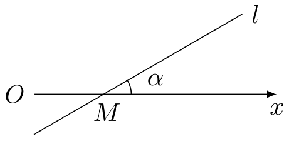
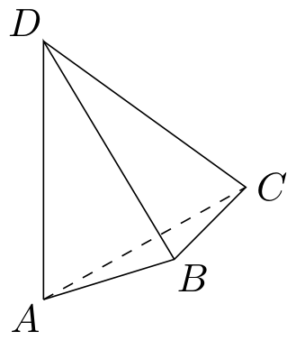
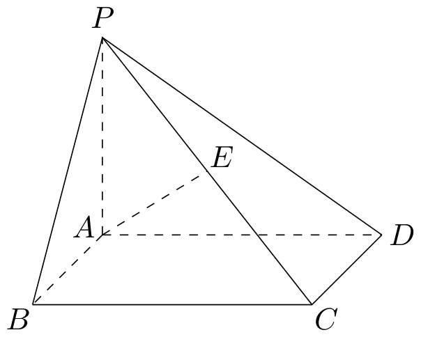
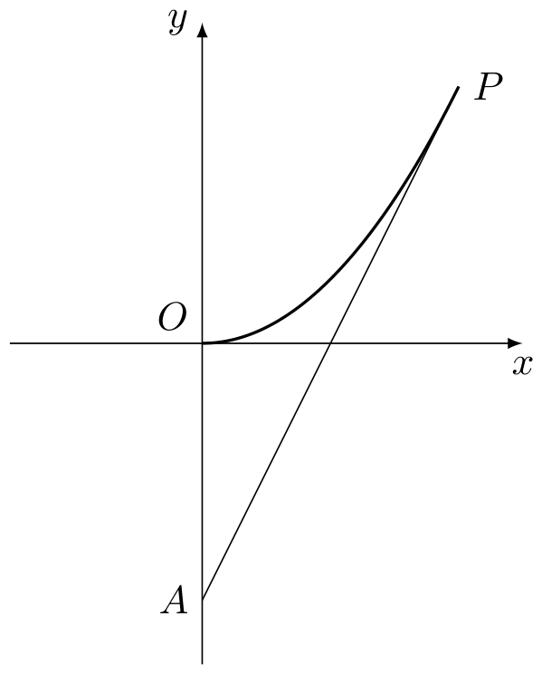

# 2012年上海卷（秋理）

## 填空题

### 第 1 题

计算： $\frac{3-\i}{1+\i}=$＿＿＿＿＿＿（$\i$ 为虚数单位）.

#### 答案

$1-2\i$

#### 解析

分母的共轭复数为 $1-\i$，因此

$$

\frac{3-\i}{1+\i}
=\frac{(3-\i)(1-\i)}{(1+\i)(1-\i)}
=\frac{2-4\i}{2}
=1-2\i

$$

### 第 2 题

若集合 $A = \{x \mid 2x + 1 > 0\}$，$B = \{x \mid |x - 1| < 2\}$，则 $A \cap B =$＿＿＿＿＿＿.

#### 答案

$\left(-\frac{1}{2},3\right)$

#### 解析

由 $2x+1>0$ 得 $x>-\frac{1}{2}$，由 $|x-1|<2$ 得 $-2<x-1<2$，即 $-1<x<3$.所以

$$

A\cap B=\left(-\frac{1}{2},3\right)

$$

### 第 3 题

函数 $f(x) = \left| \begin{matrix} 2 & \cos x \\ \sin x & -1 \end{matrix} \right|$ 的值域是＿＿＿＿＿＿.

#### 答案

$\left[-\frac{5}{2},-\frac{3}{2}\right]$

#### 解析

由二阶行列式的计算公式，

$$

f(x)=2(-1)-\sin x\cos x=-2-\frac{1}{2}\sin 2x

$$

因为 $-1\leqslant\sin 2x\leqslant 1$，所以

$$

-\frac{5}{2}\leqslant f(x)\leqslant-\frac{3}{2}

$$

故函数的值域为 $\left[-\frac{5}{2},-\frac{3}{2}\right]$.

### 第 4 题

若 $\boldsymbol{n}= (-2,1)$ 是直线 $l$ 的一个法向量，则 $l$ 的倾斜角的大小为＿＿＿＿＿＿. （结果用反三角函数值表示）

#### 答案

$\arctan 2$

#### 解析

取直线 $l$ 的一个方向向量为 $(1,2)$，因为

$$

(-2,1)\cdot(1,2)=0

$$

设 $l$ 的倾斜角为 $\theta$，则 $0\leqslant\theta<\pi$，且

$$

\tan\theta=2

$$

因此 $\theta=\arctan 2$.

### 第 5 题

在 $\left(x - \frac{2}{x}\right)^6$ 的二项展开式中，常数项等于＿＿＿＿＿＿.

#### 答案

$-160$

#### 解析

二项展开式的第 $k+1$ 项为 $\mathrm C_6^k x^{6-k}\left(-\frac{2}{x}\right)^k =\mathrm C_6^k(-2)^k x^{6-2k}$，$k=0$，$1$，$\ldots$，$6$. 要得到常数项，必须有 $6-2k=0$，所以 $k=3$.常数项为

$$

\mathrm C_6^3(-2)^3=20\times(-8)=-160

$$

### 第 6 题

有一列正方体，棱长组成以 1 为首项，$\frac{1}{2}$ 为公比的等比数列，体积分别记为 $V_{1}$，$V_{2}$，$\cdots$，$V_{n}$，$\cdots$，则 $\displaystyle\lim_{n \to \infty} (V_{1} + V_{2} + \cdots + V_{n}) =\underline{\qquad\qquad}$.

#### 答案

$\frac{8}{7}$

#### 解析

设第 $n$ 个正方体的棱长为 $l_n$，则 $l_n=\left(\frac{1}{2}\right)^{n-1}$，$V_n=l_n^3=\left(\frac{1}{8}\right)^{n-1}$. 因此

$$

V_1+V_2+\cdots+V_n
=\frac{1-\left(\frac{1}{8}\right)^n}{1-\frac{1}{8}}

$$

令 $n\to\infty$，得到

$$

\lim_{n\to\infty}(V_1+V_2+\cdots+V_n)=\frac{1}{1-\frac18}=\frac87

$$

### 第 7 题

已知函数 $f(x) = \e^{|x - a|}$ （$a$ 为常数）. 若 $f(x)$ 在区间 $[1, +\infty)$ 上是增函数，则 $a$ 的取值范围是＿＿＿＿＿＿.

#### 答案

$(-\infty,1]$

#### 解析

指数函数 $\e^u$ 在实数范围内严格增，因此只需考察 $|x-a|$ 在 $[1,+\infty)$ 上的单调性.

当 $a\leqslant1$ 时，对任意 $x\geqslant1$ 有

$$

|x-a|=x-a

$$

它随 $x$ 增大而增大，所以 $f(x)$ 在该区间上是增函数.

当 $a>1$ 时，$|x-a|=a-x$ 在 $[1,a]$ 上递减，故 $f(x)$ 不可能在 $[1,+\infty)$ 上是增函数.

所以 $a$ 的取值范围是 $(-\infty,1]$.

### 第 8 题

若一个圆锥的侧面展开图是面积为 $2\pi$ 的半圆面，则该圆锥的体积为＿＿＿＿＿＿.

#### 答案

$\frac{\sqrt{3}}{3}\pi$

#### 解析

设半圆面的半径，也就是圆锥的母线长为 $l$.由半圆面积为 $2\pi$，得

$$

\frac12\pi l^2=2\pi

$$

所以 $l=2$.半圆弧长为 $\pi l=2\pi$，它等于圆锥底面圆的周长 $2\pi r$，故 $r=1$.

圆锥的高为

$$

h=\sqrt{l^2-r^2}=\sqrt{4-1}=\sqrt3

$$

于是圆锥体积为

$$

V=\frac13\pi r^2h=\frac{\sqrt3}{3}\pi

$$

### 第 9 题

已知 $y = f(x) + x^2$ 是奇函数，且 $f(1) = 1$. 若 $g(x) = f(x) + 2$，则 $g(-1) =$＿＿＿＿＿＿.

#### 答案

$-1$

#### 解析

令 $h(x)=f(x)+x^2$，则 $h(x)$ 是奇函数.由 $f(1)=1$ 得 $h(1)=2$，所以 $h(-1)=-2$.因此

$$

f(-1)+(-1)^2=-2

$$

即 $f(-1)=-3$.从而

$$

g(-1)=f(-1)+2=-1

$$

### 第 10 题

如图，在极坐标系中，过点 $M(2,0)$ 的直线 $l$ 与极轴的夹角 $\alpha = \frac{\pi}{6}$. 若将 $l$ 的极坐标方程写成 $\rho = f(\theta)$ 的形式，则 $f(\theta) =\underline{\qquad\qquad}$. 

#### 答案

$\frac{1}{\sin\left(\frac{\pi}{6}-\theta\right)}$

#### 解析

直线 $l$ 的方向角为 $\alpha=\frac{\pi}{6}$，且经过 $M(2,0)$.对于直线上的点 $(\rho\cos\theta,\rho\sin\theta)$，其位置向量与方向向量 $(\cos\alpha,\sin\alpha)$ 的二维叉积为零，故

$$

\rho\sin(\theta-\alpha)=-2\sin\alpha

$$

于是

$$

\rho=\frac{2\sin\alpha}{\sin(\alpha-\theta)}
=\frac{1}{\sin\left(\frac{\pi}{6}-\theta\right)}

$$

所以 $f(\theta)=\frac{1}{\sin\left(\frac{\pi}{6}-\theta\right)}$.

### 第 11 题

三位同学参加跳高，跳远，铅球项目的比赛. 若每人都选择其中两个项目，则有且仅有两人选择的项目完全相同的概率是＿＿＿＿＿＿. （结果用最简分数表示）

#### 答案

$\frac{2}{3}$

#### 解析

每位同学从三个项目中选择两个项目，因此每人的选择有 $\mathrm C_3^2=3$ 种，三人的所有选择共有

$$

3^3=27

$$

种.

要使恰有两人的选择完全相同，先选出被两人共同选择的项目组合，有 $3$ 种；再选出这两人，有 $3$ 种；最后一个人的项目组合须为另外两个组合之一，有 $2$ 种.因此符合条件的选择有

$$

3\times3\times2=18

$$

种，所求概率为

$$

\frac{18}{27}=\frac23

$$

### 第 12 题

在平行四边形 $ABCD$ 中，$\angle A = \frac{\pi}{3}$，边 $AB$，$AD$ 的长分别为 $2$，$1$. 若 $M$，$N$ 分别是边 $BC$，$CD$ 上的点，且满足 $\frac{|BM|}{|BC|} = \frac{|CN|}{|CD|}$，则 $\overrightarrow{AM} \cdot \overrightarrow{AN}$ 的取值范围是＿＿＿＿＿＿.

#### 答案

$[2,5]$

#### 解析

设 $t=\frac{|BM|}{|BC|}=\frac{|CN|}{|CD|}$，其中 $0\leqslant t\leqslant1$. 记 $\overrightarrow{AB}=\bs u$，$\overrightarrow{AD}=\bs v$，则 $|\bs u|=2$，$|\bs v|=1$，且 $\bs u\cdot\bs v=2\cdot1\cdot\cos\frac{\pi}{3}=1$. 由点 $M$，$N$ 的位置可得 $\overrightarrow{AM}=\bs u+t\bs v$，$\overrightarrow{AN}=(1-t)\bs u+\bs v$. 所以

$$

\overrightarrow{AM}\cdot\overrightarrow{AN}
=(\bs u+t\bs v)\cdot((1-t)\bs u+\bs v)
=4(1-t)+1+t(1-t)+t
=5-2t-t^2

$$

当 $0\leqslant t\leqslant1$ 时，$5-2t-t^2$ 单调递减，故其最大值为 $5$，最小值为 $2$.因此取值范围是 $[2,5]$.

### 第 13 题

已知函数 $y = f(x)$ 的图象是折线段 $ABC$，其中 $A(0,0)$，$B\left(\frac{1}{2}, 5\right)$，$C(1,0)$. 函数 $y = xf(x)$（$0 \leqslant x \leqslant 1$）的图象与 $x$ 轴围成的图形的面积为＿＿＿＿＿＿.

#### 答案

$\frac{5}{4}$

#### 解析

由 $A(0,0)$，$B\left(\frac12,5\right)$，$C(1,0)$ 可得

$$

f(x)=
\begin{cases}
10x,&0\leqslant x\leqslant\frac12,\\
10(1-x),&\frac12\leqslant x\leqslant1.
\end{cases}

$$

因此 $xf(x)\geqslant0$，所求面积为

$$

S=\int_0^{1/2}10x^2\,\mathrm dx
+\int_{1/2}^1 10x(1-x)\,\mathrm dx
=\frac{5}{12}+\frac56=\frac54

$$

### 第 14 题

如图，$AD$ 与 $BC$ 是四面体 $ABCD$ 中互相垂直的棱，$BC = 2$. 若 $AD = 2c$，且 $AB + BD = AC + CD = 2a$，其中 $a$，$c$ 为常数，则四面体 $ABCD$ 的体积的最大值是＿＿＿＿＿＿. 

#### 答案

$\frac{2}{3}c\sqrt{a^{2}-c^{2}-1}$

#### 解析

建立直角坐标系，使 $AD$ 在 $z$ 轴上，$BC$ 平行于 $x$ 轴，并设两异面直线 $AD$，$BC$ 的距离为 $|h|$.取 $A=(0,0,0)$，$D=(0,0,2c)$，并写成 $B=(u,h,z)$，$C=(u+2,h,z)$， 其中 $BC=2$.

由 $AB+BD=2a$，点 $B$ 在以 $A$，$D$ 为焦点、焦距为 $2c$ 的椭球面上；同理由 $AC+CD=2a$，点 $C$ 也在该椭球面上.该椭球面的方程为

$$

\frac{x^2+y^2}{a^2-c^2}+\frac{(z-c)^2}{a^2}=1

$$

将 $B$，$C$ 的坐标分别代入并相减，得到

$$

u^2=(u+2)^2

$$

所以 $u=-1$.于是

$$

\frac{1+h^2}{a^2-c^2}+\frac{(z-c)^2}{a^2}=1

$$

从而

$$

h^2=(a^2-c^2)\left(1-\frac{(z-c)^2}{a^2}\right)-1
\leqslant a^2-c^2-1

$$

当 $z=c$ 时等号成立，故两棱距离的最大值为 $\sqrt{a^2-c^2-1}$.

四面体体积等于两条互相垂直的对棱长及其距离的乘积除以 $6$，因此

$$

V_{\max}=\frac16\cdot(2c)\cdot2\cdot\sqrt{a^2-c^2-1}
=\frac23c\sqrt{a^2-c^2-1}

$$

## 单选题

### 第 15 题

若 $1 + \sqrt{2}i$ 是关于 $x$ 的实系数方程 $x^{2} + bx + c = 0$ 的一个复数根，则（）

A.  
$b = 2$，$c = 3$

B.  
$b = -2$，$c = 3$

C.  
$b = -2$，$c = -1$

D.  
$b = 2$，$c = -1$

#### 答案

B

#### 解析

实系数方程的非实复数根必与其共轭复数成对出现，所以 $1-\sqrt{2}\i$ 也是方程的根.于是

$$

x^2+bx+c
=\bigl(x-(1+\sqrt{2}\i)\bigr)\bigl(x-(1-\sqrt{2}\i)\bigr)
=x^2-2x+3

$$

因此 $b=-2$，$c=3$，选择 B.

### 第 16 题

在 $\triangle ABC$ 中，若 $\sin^2 A + \sin^2 B < \sin^2 C$，则 $\triangle ABC$ 的形状是（）

A.  
锐角三角形

B.  
直角三角形

C.  
钝角三角形

D.  
不能确定

#### 答案

C

#### 解析

三角形内角均在 $(0,\pi)$ 内，且 $A+B+C=\pi$.利用 $C=\pi-(A+B)$，有

$$

\sin^2 A+\sin^2 B-\sin^2 C
=2\sin A\sin B\cos C

$$

题设不等式使左边小于 $0$.由于 $\sin A>0$，$\sin B>0$，所以 $\cos C<0$，从而

$$

\frac{\pi}{2}<C<\pi

$$

因此三角形为钝角三角形，选择 C.

### 第 17 题

设 $10 \leqslant x_{1} < x_{2} < x_{3} < x_{4} \leqslant 10^{4}$，$x_{5} = 10^{5}$. 随机变量 $\xi_{1}$ 取值 $x_{1}$，$x_{2}$，$x_{3}$，$x_{4}$，$x_{5}$ 的概率均为 0.2. 随机变量 $\xi_{2}$ 取值 $\frac{x_{1} + x_{2}}{2}$，$\frac{x_{2} + x_{3}}{2}$，$\frac{x_{3} + x_{4}}{2}$，$\frac{x_{4} + x_{5}}{2}$，$\frac{x_{5} + x_{1}}{2}$ 的概率也均为 0.2. 若记 $D(\xi_{1})$，$D(\xi_{2})$ 分别为 $\xi_{1}$，$\xi_{2}$ 的方差，则（）

A.  
$D(\xi_{1}) > D(\xi_{2})$

B.  
$D(\xi_{1}) = D(\xi_{2})$

C.  
$D(\xi_{1}) < D(\xi_{2})$

D.  
$D(\xi_{1})$ 与 $D(\xi_{2})$ 的大小关系与 $x_{1}$，$x_{2}$，$x_{3}$，$x_{4}$ 的取值有关

#### 答案

A

#### 解析

记 $\mu=\frac15\sum_{i=1}^5x_i$，并令 $x_6=x_1$，$u_i=x_i-\mu$.因为每个 $x_i$ 在 $\xi_2$ 的五个取值中出现两次，所以

$$

E(\xi_1)=E(\xi_2)=\mu

$$

因此 $D(\xi_1)=\frac15\sum_{i=1}^5u_i^2$，$D(\xi_2)=\frac15\sum_{i=1}^5\left(\frac{u_i+u_{i+1}}2\right)^2$. 两者之差为

$$

D(\xi_1)-D(\xi_2)
=\frac1{20}\sum_{i=1}^5(u_i-u_{i+1})^2

$$

由于 $x_1<x_2<x_3<x_4<x_5$，这些数不全相等，故上式严格大于 $0$.所以 $D(\xi_1)>D(\xi_2)$，选择 A.

### 第 18 题

设 $a_{n} = \frac{1}{n}\sin \frac{n\pi}{25}$，$S_{n} = a_{1} + a_{2} + \cdots + a_{n}$. 在 $S_{1}$，$S_{2}$，$\cdots$，$S_{100}$ 中，正数的个数是（）

A.  
25

B.  
50

C.  
75

D.  
100

#### 答案

D

#### 解析

令 $\theta=\frac{\pi}{25}$.对任意 $j=0$，$1$ 及 $r=1$，$2$，$\ldots$，$24$，有

$$

\sin((50j+r)\theta)=\sin(r\theta)>0

$$

且

$$

\sin((50j+50-r)\theta)=-\sin(r\theta)

$$

所以同一组中对应的两项之和为

$$

\frac{\sin(r\theta)}{50j+r}+\frac{\sin((50j+50-r)\theta)}{50j+50-r}
=\sin(r\theta)\left(\frac1{50j+r}-\frac1{50j+50-r}\right)>0

$$

另外，$k=50j+25$ 和 $k=50j+50$ 时正弦值为 $0$.

在每个区间 $50j<k\leqslant50j+50$ 内，前 $24$ 项为正；进入后面的负项后，每一项负项都与前面已经出现的对应正项组成上面的正和.因此，从该区间起点开始的任意部分和都为正.第一个区间从 $S_0=0$ 开始，第二个区间从 $S_{50}>0$ 开始，所以 $S_n>0$（$n=1$，$2$，$\ldots$，$100$）. 故正数的个数为 $100$，选择 D.

## 解答题

### 第 19 题

如图，在四棱锥 $P - ABCD$ 中，底面 $ABCD$ 是矩形，$PA \perp$ 底面 $ABCD$，$E$ 是 $PC$ 的中点. 已知 $AB = 2$，$AD = 2\sqrt{2}$，$PA = 2$. 求：

1.  三角形 $PCD$ 的面积；

2.  异面直线 $BC$ 与 $AE$ 所成角的大小.

#### 解析

1.  建立空间直角坐标系，取 $A=(0,0,0)$，$B=(2,0,0)$，$D=(0,2\sqrt2,0)$，$C=(2,2\sqrt2,0)$，$P=(0,0,2)$.于是 $\overrightarrow{PD}=(0,2\sqrt2,-2)$，$\overrightarrow{PC}=(2,2\sqrt2,-2)$. 从而

$$

\left|\overrightarrow{PD}\times\overrightarrow{PC}\right|
    =\sqrt{(-4)^2+(-4\sqrt2)^2}=4\sqrt3

$$

    所以

$$

S_{\triangle PCD}=\frac12\left|\overrightarrow{PD}\times\overrightarrow{PC}\right|=2\sqrt3

$$

2.  由 $E$ 是 $PC$ 的中点，得 $E=(1,\sqrt2,1)$.取 $BC$ 的方向向量 $\overrightarrow{BC}=(0,2\sqrt2,0)$，取 $AE$ 的方向向量 $\overrightarrow{AE}=(1,\sqrt2,1)$.设两直线所成的锐角为 $\theta$，则

$$

\cos\theta
    =\frac{|\overrightarrow{BC}\cdot\overrightarrow{AE}|}{|\overrightarrow{BC}|\,|\overrightarrow{AE}|}
    =\frac{4}{2\sqrt2\cdot2}
    =\frac{\sqrt2}{2}

$$

    因此 $\theta=\frac{\pi}{4}=45^\circ$.

### 第 20 题

已知函数 $f(x) = \lg (x + 1)$.

1.  若 $0 < f(1 - 2x) - f(x) < 1$，求 $x$ 的取值范围；

2.  若 $g(x)$ 是以 2 为周期的偶函数，且当 $0 \leqslant x \leqslant 1$ 时，有 $g(x) = f(x)$，求函数 $y = g(x)$ （$x \in [1, 2]$） 的反函数.

#### 解析

1.  对数有意义要求 $1-2x>-1$ 且 $x>-1$， 即 $-1<x<1$.在此范围内，

$$

0<\lg(1-2x+1)-\lg(x+1)<1

$$

    等价于

$$

0<\lg\frac{2-2x}{x+1}<1

$$

    由于常用对数函数单调递增，得到

$$

1<\frac{2-2x}{x+1}<10

$$

    又因为 $x+1>0$，所以

$$

x+1<2-2x<10x+10

$$

    即

$$

-\frac23<x<\frac13

$$

    这个区间已包含在定义域 $(-1,1)$ 内，故 $x$ 的取值范围为 $\left(-\frac23,\frac13\right)$.

2.  当 $x\in[1,2]$ 时，$x-2\in[-1,0]$.由 $g(x)$ 的周期性和偶性，

$$

y=g(x)=g(x-2)=g(2-x)=f(2-x)=\lg(3-x)

$$

    当 $x$ 从 $1$ 增大到 $2$ 时，$3-x$ 从 $2$ 减小到 $1$，所以 $y$ 的值域为 $[0,\lg2]$，且反函数存在.由

$$

10^y=3-x

$$

    得

$$

x=3-10^y

$$

    因此反函数为 $y=3-10^x$，定义域为 $x\in[0,\lg2]$.

### 第 21 题

海事救援船对一艘失事船进行定位：以失事船的当前位置为原点，以正北方向为 $y$ 轴正方向建立平面直角坐标系（以 $1\text{ 海里}$ 为单位长度），则救援船恰好在失事船正南方向 $12\text{ 海里}$ $A$ 处，如图. 现假设：

1.  失事船的移动路径可视为抛物线 $y = \frac{12}{49} x^2$；

2.  定位后救援船即刻沿直线匀速前往救援；

3.  救援船出发 $t$ 小时后，失事船所在位置的横坐标为 $7t$.

<!-- -->

1.  当 $t = 0.5$ 时，写出失事船所在位置 $P$ 的纵坐标. 若此时两船恰好会合，求救援船速度的大小和方向；

2.  问救援船的时速至少是多少海里才能追上失事船？

#### 解析

1.  失事船出发 $t$ 小时后横坐标为 $7t$，所以纵坐标为

$$

y=\frac{12}{49}(7t)^2=12t^2

$$

    当 $t=0.5$ 时，

$$

P=\left(\frac72,3\right)

$$

    救援船位于 $A=(0,-12)$，故 $\overrightarrow{AP}=\left(\frac72,15\right)$，且

$$

|AP|=\sqrt{\left(\frac72\right)^2+15^2}=\frac{\sqrt{949}}2

$$

    在 $0.5$ 小时内到达 $P$，救援船速度大小为

$$

v=\frac{|AP|}{0.5}=\sqrt{949}\ \text{海里/时}

$$

    若方向为北偏东 $\theta$，则

$$

\tan\theta=\frac{7/2}{15}=\frac7{30}

$$

    所以方向为北偏东 $\arctan\frac7{30}$.

2.  设救援船以时速 $v$ 行驶，经过 $t>0$ 小时追上失事船.此时失事船的位置为

$$

P=(7t,12t^2)

$$

    而救援船从 $A=(0,-12)$ 出发，所需路程为

$$

\sqrt{(7t)^2+(12t^2+12)^2}

$$

    因此

$$

vt=\sqrt{(7t)^2+(12t^2+12)^2}

$$

    两边平方并除以 $t^2$，得

$$

v^2=49+144\left(t+\frac1t\right)^2

$$

    由基本不等式 $t+\frac1t\geqslant2$，等号当且仅当 $t=1$，所以

$$

v^2\geqslant49+144\cdot4=625

$$

    故救援船的时速至少为 $25\text{ 海里/时}$，且在 $t=1$ 时可以达到.

### 第 22 题

在平面直角坐标系 $xOy$ 中，已知双曲线 $C_1: 2x^2 - y^2 = 1$.

1.  过 $C_{1}$ 的左顶点引 $C_{1}$ 的一条渐近线的平行线，求该直线与另一条渐近线及 $x$ 轴围成的三角形的面积；

2.  设斜率为 1 的直线 $l$ 交 $C_{1}$ 于 $P$，$Q$ 两点. 若 $l$ 与圆 $x^{2} + y^{2} = 1$ 相切. 求证： $OP \perp OQ$；

3.  设椭圆 $C_{2}: 4x^{2} + y^{2} = 1$. 若 $M$，$N$ 分别是 $C_{1}$，$C_{2}$ 上的动点，且 $OM \perp ON$，求证：$O$ 到直线 $MN$ 的距离是定值.

#### 解析

1.  双曲线可写为

$$

\frac{x^2}{1/2}-y^2=1

$$

    所以左顶点为 $A\left(-\frac{\sqrt2}{2},0\right)$，两条渐近线为 $y=\pm\sqrt2x$.取过左顶点且平行于 $y=\sqrt2x$ 的直线，则其方程为

$$

y=\sqrt2x+1

$$

    它与另一条渐近线 $y=-\sqrt2x$ 的交点为

$$

\left(-\frac{\sqrt2}{4},\frac12\right)

$$

    与 $x$ 轴的交点为 $A$，而另一条渐近线与 $x$ 轴的交点为 $O$.因此所围三角形的底为

$$

|AO|=\frac{\sqrt2}{2}

$$

    高为 $\frac12$，面积为

$$

S=\frac12\cdot\frac{\sqrt2}{2}\cdot\frac12=\frac{\sqrt2}{8}

$$

2.  设直线 $l$ 的方程为 $y=x+b$.它与单位圆相切，所以原点到直线的距离满足

$$

\frac{|b|}{\sqrt2}=1

$$

    从而 $b^2=2$.将 $y=x+b$ 代入双曲线方程，得

$$

x^2-2bx-b^2-1=0

$$

    设 $P=(x_1,y_1)$，$Q=(x_2,y_2)$，则由韦达定理 $x_1+x_2=2b$，$x_1x_2=-b^2-1$， 且 $y_1=x_1+b$，$y_2=x_2+b$.于是

$$

\overrightarrow{OP}\cdot\overrightarrow{OQ}
    =x_1x_2+y_1y_2
    =2x_1x_2+b(x_1+x_2)+b^2
    =2(-b^2-1)+2b^2+b^2
    =b^2-2=0

$$

    所以 $OP\perp OQ$.

3.  设 $|OM|=r$，$|ON|=s$，并令 $\overrightarrow{OM}$ 的方向角为 $\theta$.由于 $OM\perp ON$，$ON$ 的两种垂直方向只使坐标同时变号，而曲线方程只含坐标平方，故可取 $\overrightarrow{OM}=r(\cos\theta,\sin\theta)$，$\overrightarrow{ON}=s(-\sin\theta,\cos\theta)$.由 $M\in C_1$，$N\in C_2$，得 $r^2(2\cos^2\theta-\sin^2\theta)=1$，$s^2(4\sin^2\theta+\cos^2\theta)=1$.记 $u=\cos^2\theta$，则 $r^2=\frac1{3u-1}$，$s^2=\frac1{4-3u}$. 在直角三角形 $OMN$ 中，

$$

|MN|^2=r^2+s^2

$$

    若 $O$ 到直线 $MN$ 的距离为 $d$，由同一三角形的面积可得

$$

\frac12rs=\frac12|MN|d

$$

    所以

$$

d^2=\frac{r^2s^2}{r^2+s^2}
    =\frac13

$$

    因此

$$

d=\frac{\sqrt3}{3}

$$

    为定值.

### 第 23 题

对于数集 $X = \{-1, x_1, x_2, \cdots, x_n\}$，其中 $0 < x_1 < x_2 < \cdots < x_n$，$n \geqslant 2$，定义向量集 $Y = \{\boldsymbol{a}\mid \boldsymbol{a}= (s, t), s \in X, t \in X\}$. 若对任意 $\boldsymbol{a}_1 \in Y$，存在 $\boldsymbol{a}_2 \in Y$，使得 $\boldsymbol{a}_1 \cdot \boldsymbol{a}_2 = 0$，则称 $X$ 具有性质 $P$. 例如 $\{-1, 1, 2\}$ 具有性质 $P$.

1.  若 $x > 2$，且 $\{-1, 1, 2, x\}$ 具有性质 $P$，求 $x$ 的值；

2.  若 $X$ 具有性质 $P$，求证： $1 \in X$，且当 $x_n > 1$ 时，$x_1 = 1$；

3.  若 $X$ 具有性质 $P$，且 $x_{1} = 1$，$x_{2} = q$ （$q$ 为常数），求有穷数列 $x_{1}$，$x_{2}$，$\cdots$，$x_{n}$ 的通项公式.

#### 解析

1.  取正向量 $\bs a=(x,2)$.与它垂直的向量 $(s,t)\in Y$ 满足

$$

xs+2t=0

$$

    由于 $X=\{-1,1,2,x\}$ 中只有 $-1$ 为负数，$s$，$t$ 必须异号.因此 $s=-1$ 时 $t=x/2$，或 $t=-1$ 时 $s=2/x$.因 $x>2$，有 $2/x\in(0,1)$，不属于 $X$，所以 $x/2\in X$.又 $x/2$ 不可能等于 $1$（否则 $x=2$），也不可能等于 $x$，故只能 $x/2=2$，从而 $x=4$.

    当 $x=4$ 时，任意两个正数 $u$，$v\in\{1,2,4\}$ 中，较大者除以较小者仍属于 $\{1,2,4\}$，故每个正向量都有垂直向量；含 $-1$ 的向量中，$(-1,u)$ 可取 $(u,1)$，$(u,-1)$ 可取 $(1,u)$，$(-1,-1)$ 可取 $(-1,1)$ 与之垂直.因此 $x=4$ 确实满足性质 $P$.

2.  取 $\bs a_1=(-1,-1)\in Y$.若 $\bs a_2=(s,t)\in Y$ 与它垂直，则

$$

s+t=0

$$

    由于 $X$ 中只有一个负数 $-1$，且 $0\notin X$，所以 $s$，$t$ 必为 $-1$ 与 $1$，从而 $1\in X$.

    现设 $x_n>1$.若反设 $x_1<1$，则 $x_1<1<x_n$.对正向量 $(x_n,x_1)$ 应用下述事实：若 $u$，$v$ 为 $X$ 中的正数，则其垂直向量的两个坐标必须一正一负，因此 $u/v$ 或 $v/u$ 至少有一个属于 $X$.这里

$$

\frac{x_n}{x_1}>x_n

$$

    不可能属于 $X$，而

$$

\frac{x_1}{x_n}<x_1

$$

    又小于 $X$ 的最小正数，也不属于 $X$，矛盾.因此 $x_1\geqslant1$.另一方面 $1\in X$ 且 $x_n>1$，所以 $x_1\leqslant1$，故 $x_1=1$.

3.  由 $x_1=1<x_2=q$，得 $q>1$.先有 $x_1=q^0$，$x_2=q$. 下面用数学归纳法证明 $x_k=q^{k-1}$.假设 $k\geqslant2$ 且 $x_j=q^{j-1}$，$j=1$，$2$，$\ldots$，$k$. 对正向量 $(x_{k+1},q)$，由于 $x_{k+1}>q$，其倒数比 $q/x_{k+1}\in(0,1)$ 不属于 $X$，所以由性质 $P$ 必有

$$

\frac{x_{k+1}}q\in X

$$

    又 $x_{k+1}/q<x_{k+1}$，故它等于某个 $x_j$，其中 $1\leqslant j\leqslant k$.由归纳假设，

$$

x_{k+1}=q x_j=q^j

$$

    同时 $x_{k+1}>x_k=q^{k-1}$，而 $q>1$，所以 $j=k$，即

$$

x_{k+1}=q^k

$$

    归纳可得 $x_k=q^{k-1}$，$k=1$，$2$，$\ldots$，$n$.
