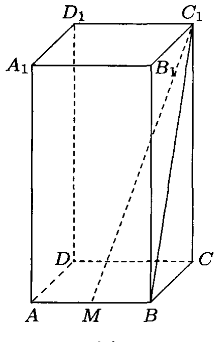

# 2012年上海卷（春）

## 填空题

### 第 1 题

已知集合 $A=\{1,2,k\}$，$B=\{2,5\}$. 若 $A\cup B=\{1,2,3,5\}$，则 $k=\underline{\qquad\qquad}$.

#### 答案

$3$

#### 解析

集合 $A\cup B$ 中已有 $1$，$2$，$5$，要得到题目给出的集合还必须有元素 $3$. 由于 $B$ 中没有 $3$，所以 $3$ 必须由 $k$ 提供，即 $k=3$.

### 第 2 题

函数 $y=\sqrt{x+1}$ 的定义域为＿＿＿＿＿＿.

#### 答案

$[-1,\infty)$

#### 解析

平方根内的代数式必须非负，因此 $x+1\ge0$，解得 $x\ge-1$. 所以函数的定义域为 $[-1,\infty)$.

### 第 3 题

抛物线 $y^2=8x$ 的焦点坐标为＿＿＿＿＿＿.

#### 答案

$(2,0)$

#### 解析

抛物线的标准方程为 $y^2=4ax$，其焦点为 $(a,0)$. 由 $4a=8$ 得 $a=2$，所以焦点坐标为 $(2,0)$.

### 第 4 题

若复数 $z$ 满足 $\i z=1+\i$（$\i$ 为虚数单位），则 $z=\underline{\qquad\qquad}$.

#### 答案

$1-\i$

#### 解析

由 $\i^2=-1$，可知 $\dfrac{1}{\i}=-\i$. 两边同除以 $\i$，得

$$

z=\frac{1+\i}{\i}=\frac{1}{\i}+1=1-\i

$$

因此 $z=1-\i$.

### 第 5 题

函数 $f(x)=\sin\left(2x+\frac{\pi}{4}\right)$ 的最小正周期为＿＿＿＿＿＿.

#### 答案

$\pi$

#### 解析

正弦函数 $\sin u$ 的最小正周期为 $2\pi$. 当 $u=2x+\frac{\pi}{4}$ 时，自变量的系数为 $2$，所以

$$

T=\frac{2\pi}{2}=\pi

$$

因此最小正周期为 $\pi$.

### 第 6 题

方程 $4^x-2^{x+1}=0$ 的解为＿＿＿＿＿＿.

#### 答案

$x=1$

#### 解析

将 $4^x$ 写成以 $2$ 为底的幂，原方程化为

$$

2^{2x}=2^{x+1}

$$

由于指数函数 $2^x$ 为单调函数，故 $2x=x+1$，解得 $x=1$.

### 第 7 题

若 $(2x-1)^5=a_0+a_1x+a_2x^2+a_3x^3+a_4x^4+a_5x^5$，则 $a_0+a_1+a_2+a_3+a_4+a_5=\underline{\qquad\qquad}$.

#### 答案

$1$

#### 解析

令多项式 $p(x)=(2x-1)^5$. 按多项式的展开式，系数和等于 $p(1)$，因此

$$

a_0+a_1+a_2+a_3+a_4+a_5=p(1)=(2-1)^5=1

$$

所以系数和为 $1$.

### 第 8 题

若 $f(x)=\dfrac{(x+2)(x+m)}{x}$ 为奇函数，则实数 $m=\underline{\qquad\qquad}$.

#### 答案

$-2$

#### 解析

函数定义域为 $\mathbb{R}\backslash\{0\}$，关于原点对称. 将函数化为

$$

f(x)=x+(m+2)+\frac{2m}{x}

$$

奇函数满足 $f(-x)=-f(x)$. 对任意 $x\ne0$，有

$$

-x+(m+2)-\frac{2m}{x}=-x-(m+2)-\frac{2m}{x}

$$

故 $m+2=-(m+2)$，解得 $m=-2$.

### 第 9 题

函数 $y=\log_2 x+\dfrac{4}{\log_2 x}$（$x\in[2,4]$）的最大值是＿＿＿＿＿＿.

#### 答案

$5$

#### 解析

令 $t=\log_2x$. 由 $x\in[2,4]$，得 $t\in[1,2]$，函数值为

$$

g(t)=t+\frac{4}{t}

$$

在 $[1,2]$ 上，

$$

g'(t)=1-\frac{4}{t^2}\le0

$$

所以 $g(t)$ 在该区间上单调递减，最大值在 $t=1$ 时取得. 因而最大值为

$$

g(1)=1+4=5

$$

### 第 10 题

若复数 $z$ 满足 $|z-\i|\le\sqrt2$（$\i$ 为虚数单位），则 $z$ 在复平面内所对应的图形的面积为＿＿＿＿＿＿.

#### 答案

$2\pi$

#### 解析

设复数 $z=x+y\i$，则

$$

|z-\i|=|x+(y-1)\i|=\sqrt{x^2+(y-1)^2}

$$

因此条件等价于

$$

x^2+(y-1)^2\le2

$$

这表示复平面上以 $(0,1)$ 为圆心、半径 $\sqrt2$ 的圆面，其面积为

$$

\pi(\sqrt2)^2=2\pi

$$

### 第 11 题

某校要从 $2$ 名男生和 $4$ 名女生中选出 $4$ 人担任某游泳赛事的志愿者工作，则在选出的志愿者中，男，女都有的概率为＿＿＿＿＿＿（结果用数值表示）.

#### 答案

$\dfrac{14}{15}$

#### 解析

从 $6$ 人中选出 $4$ 人的基本事件总数为 $\mathrm C_6^4=15$. 选出的志愿者中男、女都有的反面事件是全为女生，因为男生只有 $2$ 人，不可能全为男生. 全为女生的选法有 $\mathrm C_4^4=1$ 种，所以所求概率为

$$

1-\frac{\mathrm C_4^4}{\mathrm C_6^4}=1-\frac{1}{15}=\frac{14}{15}

$$

### 第 12 题

若不等式 $x^2-kx+k-1>0$ 对 $x\in(1,2)$ 恒成立，则实数 $k$ 的取值范围是＿＿＿＿＿＿.

#### 答案

$(-\infty,2]$

#### 解析

将左端因式分解，得

$$

x^2-kx+k-1=(x-1)(x+1-k)

$$

当 $x\in(1,2)$ 时，$x-1>0$，所以恒有不等式成立等价于对一切 $x\in(1,2)$ 有 $x+1-k>0$. 由于 $x+1$ 在该开区间上的下确界为 $2$，这等价于 $k\le2$. 因此 $k$ 的取值范围为 $(-\infty,2]$.

### 第 13 题

已知等差数列 $\{a_n\}$ 的首项及公差均为正数，令 $b_n=\sqrt{a_n}+\sqrt{a_{2012-n}}$（$n\in\mathbb{N}^*$，$n<2012$）. 当 $b_k$ 是数列 $\{b_n\}$ 的最大项时，$k=\underline{\qquad\qquad}$.

#### 答案

$1006$

#### 解析

设等差数列首项为 $a_1$，公差为 $d>0$. 对 $1\le n\le2011$，有

$$

a_n+a_{2012-n}=\bigl(a_1+(n-1)d\bigr)+\bigl(a_1+(2011-n)d\bigr)=2a_1+2010d

$$

该和与 $n$ 无关. 令 $u=a_n>0$，$v=a_{2012-n}>0$，则

$$

(\sqrt u+\sqrt v)^2=u+v+2\sqrt{uv}

$$

在 $u+v$ 固定时，$\sqrt{uv}$ 在 $u=v$ 时最大，因为 $(\sqrt u-\sqrt v)^2\ge0$. 所以 $b_n$ 在 $a_n=a_{2012-n}$ 时取得最大值. 由 $d>0$，等式等价于

$$

a_1+(n-1)d=a_1+(2011-n)d

$$

从而 $2n=2012$，故 $k=1006$.

### 第 14 题

若矩阵 $\begin{pmatrix}a_{11}&a_{12}\\a_{21}&a_{22}\end{pmatrix}$ 满足：$a_{11}$，$a_{12}$，$a_{21}$，$a_{22}\in\{-1,1\}$，且 $\begin{vmatrix}a_{11}&a_{12}\\a_{21}&a_{22}\end{vmatrix}=0$，则这样的互不相等的矩阵共有＿＿＿＿＿＿ 个.

#### 答案

$8$

#### 解析

矩阵行列式为零，即两行成比例. 两行的元素都只能取 $1$ 或 $-1$，所以第二行只能等于第一行或第一行的相反数. 第一行有 $2^2=4$ 种取法，第二行有 $2$ 种取法，故矩阵总数为

$$

4\times2=8

$$

## 单选题

### 第 15 题

已知椭圆 $C_1:\dfrac{x^2}{12}+\dfrac{y^2}{4}=1$，$C_2:\dfrac{x^2}{16}+\dfrac{y^2}{8}=1$，则（）

A.  
$C_1$ 与 $C_2$ 顶点相同.

B.  
$C_1$ 与 $C_2$ 长轴长相等.

C.  
$C_1$ 与 $C_2$ 短轴长相等.

D.  
$C_1$ 与 $C_2$ 焦距相等.

#### 答案

D

#### 解析

对 $C_1$，半长轴为 $2\sqrt3$，半短轴为 $2$，故长轴长为 $4\sqrt3$，短轴长为 $4$，顶点为 $(\pm2\sqrt3,0)$、$(0,\pm2)$. 对 $C_2$，半长轴为 $4$，半短轴为 $2\sqrt2$，故长轴长为 $8$，短轴长为 $4\sqrt2$，顶点为 $(\pm4,0)$、$(0,\pm2\sqrt2)$. 因此前三项均不成立. 又由 $c^2=a^2-b^2$，有 $c_1^2=12-4=8$、$c_2^2=16-8=8$，所以两椭圆的焦距均为 $2\sqrt8=4\sqrt2$，故选 D.

### 第 16 题

记函数 $y=f(x)$ 的反函数为 $y=f^{-1}(x)$. 如果函数 $y=f(x)$ 的图像过点 $(1,0)$，那么函数 $y=f^{-1}(x)+1$ 的图像过点（）

A.  
$(0,0)$.

B.  
$(0,2)$.

C.  
$(1,1)$.

D.  
$(2,0)$.

#### 答案

B

#### 解析

因为点 $(1,0)$ 在 $y=f(x)$ 的图像上，所以 $f(1)=0$. 反函数图像关于直线 $y=x$ 对称，因此点 $(0,1)$ 在 $y=f^{-1}(x)$ 的图像上. 将函数值整体加 $1$ 后，图像向上平移 $1$ 个单位，点 $(0,1)$ 变为 $(0,2)$. 故选 B.

### 第 17 题

已知空间三条直线 $l$，$m$，$n$. 若 $l$ 与 $m$ 异面，且 $l$ 与 $n$ 异面，则（）

A.  
$m$ 与 $n$ 异面.

B.  
$m$ 与 $n$ 相交.

C.  
$m$ 与 $n$ 平行.

D.  
$m$ 与 $n$ 异面，相交，平行均有可能.

#### 答案

D

#### 解析

题设只限制 $m$、$n$ 分别与 $l$ 的位置关系，并不能唯一确定 $m$ 与 $n$ 的位置关系. 取 $l:\ (x,y,z)=(0,0,t)$，其中 $t\in\mathbb{R}$；$m:\ (x,y,z)=(1,s,0)$，其中 $s\in\mathbb{R}$. 则 $m$ 与 $l$ 异面. 分别取下列三条直线作为 $n$： $n_1:\ (x,y,z)=(1+u,1,0)$，$n_2:\ (x,y,z)=(1,u,1)$，$n_3:\ (x,y,z)=(1+u,1,1)$，其中 $u\in\mathbb{R}$. 直线 $n_1$ 与 $m$ 在 $(1,1,0)$ 相交，$n_2$ 与 $m$ 平行，$n_3$ 与 $m$ 不平行且不相交，所以分别得到相交、平行、异面三种情形. 三条 $n_i$ 都不与 $l$ 相交，且均不与 $l$ 平行，因此都与 $l$ 异面. 所以三种位置关系均可能，故选 D.

### 第 18 题

设 $O$ 为 $\triangle ABC$ 所在平面上一点. 若实数 $x$，$y$，$z$ 满足 $x\overrightarrow{OA}+y\overrightarrow{OB}+z\overrightarrow{OC}=\overrightarrow{0}$（$x^2+y^2+z^2\ne0$），则“$xyz=0$”是“点 $O$ 在 $\triangle ABC$ 的边所在直线上”的（）

A.  
充分不必要条件.

B.  
必要不充分条件.

C.  
充要条件.

D.  
既不充分又不必要条件.

#### 答案

C

#### 解析

先证充分性. 若 $xyz=0$，分三种情况讨论. 当 $z=0$ 时，由 $x^2+y^2+z^2\ne0$ 知 $x$，$y$ 不同时为零，于是

$$

x\overrightarrow{OA}+y\overrightarrow{OB}=\overrightarrow{0}

$$

给出两个向量 $\overrightarrow{OA}$、$\overrightarrow{OB}$ 线性相关. 因而 $O$，$A$，$B$ 共线，即点 $O$ 在边 $AB$ 所在直线上. 当 $x=0$ 时，$y\overrightarrow{OB}+z\overrightarrow{OC}=\overrightarrow{0}$，且 $y$，$z$ 不同时为零，所以 $O$，$B$，$C$ 共线，即 $O$ 在边 $BC$ 所在直线上. 当 $y=0$ 时，$x\overrightarrow{OA}+z\overrightarrow{OC}=\overrightarrow{0}$，且 $x$，$z$ 不同时为零，所以 $O$，$A$，$C$ 共线，即 $O$ 在边 $CA$ 所在直线上.

再证必要性. 若 $O$ 在 $AB$ 所在直线上，则 $\overrightarrow{OA}$、$\overrightarrow{OB}$ 线性相关，存在不全为零的实数 $x$，$y$ 使 $x\overrightarrow{OA}+y\overrightarrow{OB}=\overrightarrow{0}$. 取 $z=0$，就得到题设向量等式且 $xyz=0$. 若 $O$ 在 $BC$ 所在直线上，则取不全为零的 $y$，$z$ 使 $y\overrightarrow{OB}+z\overrightarrow{OC}=\overrightarrow{0}$，再取 $x=0$；若 $O$ 在 $CA$ 所在直线上，则取不全为零的 $x$，$z$ 使 $x\overrightarrow{OA}+z\overrightarrow{OC}=\overrightarrow{0}$，再取 $y=0$. 因此两个条件等价，故选 C.

## 解答题

### 第 19 题

如图，正四棱柱 $ABCD-A_1B_1C_1D_1$ 的底面边长为 $1$，高为 $2$，$M$ 为线段 $AB$ 的中点. 求：

1.  三棱锥 $C_1-MBC$ 的体积；

2.  异面直线 $CD$ 与 $MC_1$ 所成角的大小（结果用反三角函数值表示）.

#### 解析

1.  在底面中，$MB=\dfrac12$，$BC=1$，且 $MB\perp BC$，所以

$$

S_{\triangle MBC}=\frac12\times\frac12\times1=\frac14

$$

    因为正四棱柱的侧棱垂直于底面，$C_1C=2$ 是三棱锥 $C_1-MBC$ 的高，故

$$

V_{C_1-MBC}=\frac13S_{\triangle MBC}\cdot C_1C=\frac13\times\frac14\times2=\frac16

$$

2.  由 $CD\parallel AB$，可将直线 $CD$ 平移到过 $M$ 的直线 $MB$，所以异面直线 $CD$ 与 $MC_1$ 所成的角等于 $\angle C_1MB$. 又因为 $AB\perp$ 平面 $BCC_1B_1$，所以 $AB\perp BC_1$，从而 $MB\perp BC_1$. 在直角三角形 $\triangle MBC_1$ 中，

$$

BC_1=\sqrt{BC^2+CC_1^2}=\sqrt5

$$

    又 $MB=\frac12$，所以

$$

\tan\angle C_1MB=\frac{BC_1}{MB}=2\sqrt5

$$

    所求角为 $\arctan(2\sqrt5)$.

### 第 20 题

某环线地铁按内，外环线同时运行，内，外环线的长均为 $30\text{ 千米}$（忽略内，外环线长度差异）.

1.  当 $9$ 列列车同时在内环线上运行时，要使内环线乘客最长候车时间为 $10\text{ 分钟}$，求内环线列车的最小平均速度；

2.  新调整的方案要求内环线列车平均速度为 $25\text{ 千米/小时}$，外环线列车平均速度为 $30\text{ 千米/小时}$. 现内，外环线共有 $18$ 列列车全部投入运行，要使内，外环线乘客的最长候车时间之差不超过 $1\text{ 分钟}$，问：内，外环线应各投入几列列车运行？

#### 解析

1.  设内环线列车的平均速度为 $v\text{ 千米/小时}$. 设相邻列车在环线上的最大间距为 $d$ 千米，则 $d\ge\dfrac{30}{9}$，且列车均匀分布时取等号. 因而要使最长候车时间不超过 $10$ 分钟，最小速度对应于均匀分布，此时

$$

\frac{30}{9v}\times60\le10

$$

    解得 $v\ge20$. 因而满足条件的最小平均速度为 $20\text{ 千米/小时}$.

2.  设内环线投入 $x$ 列列车，则外环线投入 $18-x$ 列，其中 $x\in\{1,2,\ldots,17\}$. 两环线最长候车时间分别为

$$

t_1=\frac{30}{25x}\times60=\frac{72}{x}

$$

$$

t_2=\frac{30}{30(18-x)}\times60=\frac{60}{18-x}

$$

    由 $|t_1-t_2|\le1$，且 $x(18-x)>0$，得

$$

\left|\frac{1296-132x}{x(18-x)}\right|\le1

$$

    即

$$

\begin{cases}
    x^2-150x+1296\le0,\\
    x^2+114x-1296\le0.
    \end{cases}

$$

    第一式给出

$$

\frac{150-\sqrt{17316}}2\le x\le\frac{150+\sqrt{17316}}2

$$

    第二式给出

$$

\frac{-114-\sqrt{18180}}2\le x\le\frac{-114+\sqrt{18180}}2

$$

    结合 $x\in\{1,2,\ldots,17\}$，只有整数 $x=10$ 满足条件. 所以内环线投入 $10$ 列，外环线投入 $8$ 列.

### 第 21 题

已知双曲线 $C_1:x^2-\dfrac{y^2}{4}=1$.

1.  求与双曲线 $C_1$ 有相同的焦点，且过点 $P(4,\sqrt3)$ 的双曲线 $C_2$ 的标准方程；

2.  直线 $l:y=x+m$ 分别交双曲线 $C_1$ 的两条渐近线于 $A$，$B$ 两点. 当 $\overrightarrow{OA}\cdot\overrightarrow{OB}=3$ 时，求实数 $m$ 的值.

#### 解析

1.  将 $C_1$ 写成 $\dfrac{x^2}{1}-\dfrac{y^2}{4}=1$，所以其焦半距满足 $c^2=1+4=5$，焦点为 $(\pm\sqrt5,0)$. 设 $C_2$ 的标准方程为 $\frac{x^2}{a^2}-\frac{y^2}{b^2}=1$，$a>0$，$b>0$. 与 $C_1$ 同焦点给出 $a^2+b^2=5$. 又因为点 $P(4,\sqrt3)$ 在 $C_2$ 上，故

$$

\frac{16}{a^2}-\frac{3}{b^2}=1

$$

    令 $A=a^2$，则 $b^2=5-A$，且 $0<A<5$. 代入上式并整理得

$$

\frac{16}{A}-\frac{3}{5-A}=1

$$

    两边同乘以 $A(5-A)>0$，得

$$

16(5-A)-3A=A(5-A)

$$

    整理得

$$

A^2-24A+80=0

$$

    所以 $A=4$ 或 $A=20$. 由 $0<A<5$ 舍去 $A=20$，得 $a^2=4$，$b^2=1$. 因此

$$

C_2:\frac{x^2}{4}-y^2=1

$$

2.  $C_1$ 的两条渐近线为 $y=2x$ 和 $y=-2x$. 设

$$

A=(m,2m)

$$

$$

B=\left(-\frac m3,\frac{2m}3\right)

$$

    这是分别将 $y=2x$、$y=-2x$ 与 $y=x+m$ 联立所得. 因而

$$

\overrightarrow{OA}\cdot\overrightarrow{OB}
    =m\left(-\frac m3\right)+2m\left(\frac{2m}3\right)=m^2

$$

    由题意 $m^2=3$，所以 $m=\pm\sqrt3$.

### 第 22 题

已知数列 $\{a_n\}$，$\{b_n\}$，$\{c_n\}$ 满足 $(a_{n+1}-a_n)(b_{n+1}-b_n)=c_n$（$n\in\mathbb{N}^*$）.

1.  设 $c_n=3n+6$，$\{a_n\}$ 是公差为 $3$ 的等差数列. 当 $b_1=1$ 时，求 $b_2$，$b_3$ 的值；

2.  设 $c_n=n^3$，$a_n=n^2-8n$，求正整数 $k$，使得一切 $n\in\mathbb{N}^*$，均有 $b_n\ge b_k$；

3.  设 $c_n=2^n+n$，$a_n=\dfrac{1+(-1)^n}{2}$. 当 $b_1=1$ 时，求数列 $\{b_n\}$ 的通项公式.

#### 解析

1.  因为 $a_{n+1}-a_n=3$，所以

$$

b_{n+1}-b_n=\frac{3n+6}{3}=n+2

$$

    于是 $b_2=b_1+3=4$，$b_3=b_2+4=8$.

2.  

$$

a_{n+1}-a_n=(n+1)^2-8(n+1)-(n^2-8n)=2n-7

$$

    所以

$$

b_{n+1}-b_n=\frac{n^3}{2n-7}

$$

    当 $n=1$，$2$，$3$ 时，分母为负，故 $b_1>b_2>b_3>b_4$. 当 $n\ge4$ 时，分母为正，故 $b_4<b_5<b_6<\cdots$. 因此 $b_4$ 小于数列中的其他各项，满足 $b_n\ge b_k$ 对一切正整数 $n$ 成立的正整数为 $k=4$.

3.  由

$$

a_{n+1}-a_n=(-1)^{n+1}

$$

    得

$$

b_{n+1}-b_n=(-1)^{n+1}(2^n+n)

$$

    对 $n\ge2$，于是

$$

b_n-b_{n-1}=(-1)^n\left(2^{n-1}+n-1\right)

$$

    结合 $b_1=1$，有

$$

b_n=1+\sum_{j=1}^{n-1}(-1)^{j+1}(2^j+j)

$$

    当 $n=2k$ 时，

$$

\sum_{j=1}^{n-1}(-1)^{j+1}2^j=\frac{2+2^n}{3}

$$

$$

\sum_{j=1}^{n-1}(-1)^{j+1}j=\frac n2

$$

    这是因为前一和可按 $(2-2^2)+(2^3-2^4)+\cdots+(2^{n-3}-2^{n-2})+2^{n-1}$ 分组，后一和可按 $(1-2)+(3-4)+\cdots+(n-3-(n-2))+(n-1)$ 分组. 所以

$$

b_n=\frac{2^n}{3}+\frac n2+\frac53

$$

    当 $n=2k-1$ 时，

$$

\sum_{j=1}^{n-1}(-1)^{j+1}2^j=\frac{2-2^n}{3}

$$

$$

\sum_{j=1}^{n-1}(-1)^{j+1}j=-\frac{n-1}{2}

$$

    这是因为前一和可按 $(2-2^2)+(2^3-2^4)+\cdots+(2^{n-2}-2^{n-1})$ 分组，后一和可按 $(1-2)+(3-4)+\cdots+((n-2)-(n-1))$ 分组. 所以

$$

b_n=-\frac{2^n}{3}-\frac n2+\frac{13}{6}

$$

    综上，

$$

b_n=
    \begin{cases}
    -\dfrac{2^n}{3}-\dfrac n2+\dfrac{13}{6},&n=2k-1,\\
    \dfrac{2^n}{3}+\dfrac n2+\dfrac53,&n=2k,
    \end{cases}
    \qquad k\in\mathbb{N}^*

$$

### 第 23 题

定义向量 $\overrightarrow{OM}=(a,b)$ 的“相伴函数”为 $f(x)=a\sin x+b\cos x$；函数 $f(x)=a\sin x+b\cos x$ 的“相伴向量”为 $\overrightarrow{OM}=(a,b)$（其中 $O$ 为坐标原点）. 记平面内所有向量的“相伴函数”构成的集合为 $S$.

1.  设 $g(x)=3\sin\left(x+\dfrac{\pi}{2}\right)+4\sin x$，求证：$g(x)\in S$；

2.  已知 $h(x)=\cos(x+\alpha)+2\cos x$，且 $h(x)\in S$，求其“相伴向量”的模；

3.  已知 $M(a,b)$（$b\ne0$）为圆 $C:(x-2)^2+y^2=1$ 上一点，向量 $\overrightarrow{OM}$ 的“相伴函数” $f(x)$ 在 $x=x_0$ 处取到最大值. 当点 $M$ 在圆 $C$ 上运动时，求 $\tan 2x_0$ 的取值范围.

#### 解析

1.  利用和角公式，

$$

g(x)=3\cos x+4\sin x=4\sin x+3\cos x

$$

    它是向量 $\overrightarrow{OM}=(4,3)$ 的相伴函数，所以 $g(x)\in S$.

2.  由和角公式，

$$

h(x)=\cos x\cos\alpha-\sin x\sin\alpha+2\cos x
    =-\sin\alpha\sin x+(\cos\alpha+2)\cos x

$$

    故其相伴向量为 $\overrightarrow{OM}=(-\sin\alpha,\cos\alpha+2)$，模为

$$

\left|\overrightarrow{OM}\right|
    =\sqrt{\sin^2\alpha+(\cos\alpha+2)^2}
    =\sqrt{5+4\cos\alpha}

$$

3.  令 $R=\sqrt{a^2+b^2}$. 由于 $M$ 在圆 $C$ 上且 $b\ne0$，有 $R>0$. 取角 $\varphi$ 使

$$

\cos\varphi=\frac aR

$$

$$

\sin\varphi=\frac bR

$$

    则

$$

f(x)=a\sin x+b\cos x=R\sin(x+\varphi)

$$

    函数在 $x_0=\dfrac\pi2-\varphi+2k\pi$（$k\in\mathbb{Z}$）处取最大值，从而

$$

\tan x_0=\cot\varphi=\frac ab

$$

    圆 $(a-2)^2+b^2=1$ 给出 $1\le a\le3$，所以 $a>0$. 令 $t=\dfrac ba$，则 $b=ta$，代入圆方程得

$$

(1+t^2)a^2-4a+3=0

$$

    要存在实数 $a$，判别式必须满足

$$

16-12(1+t^2)\ge0

$$

    即 $|t|\le\dfrac{\sqrt3}{3}$. 又因 $b\ne0$，故 $t\ne0$. 反过来，当 $|t|\le\dfrac{\sqrt3}{3}$ 时，该二次方程的判别式非负，且两根的和与积均为正，所以至少有正根 $a$，从而确实得到圆上的点；因此

$$

t\in\left[-\frac{\sqrt3}{3},0\right)\cup\left(0,\frac{\sqrt3}{3}\right]

$$

    由 $\tan x_0=1/t$，且 $t^2\ne1$，

$$

\tan2x_0=\frac{2/t}{1-1/t^2}=\frac{2t}{t^2-1}

$$

    函数 $\dfrac{2t}{t^2-1}$ 的导数为

$$

-\frac{2(t^2+1)}{(t^2-1)^2}<0

$$

    因此当 $-\dfrac{\sqrt3}{3}\le t<0$ 时，$\tan2x_0$ 的取值为 $(0,\sqrt3]$；当 $0<t\le\dfrac{\sqrt3}{3}$ 时，取值为 $[-\sqrt3,0)$. 综上，

$$

\tan2x_0\in[-\sqrt3,0)\cup(0,\sqrt3]

$$

