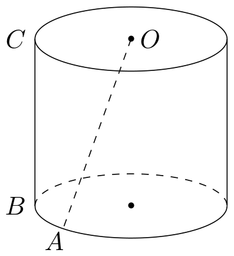
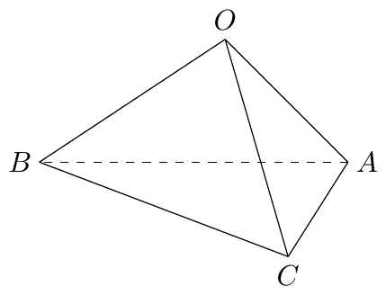
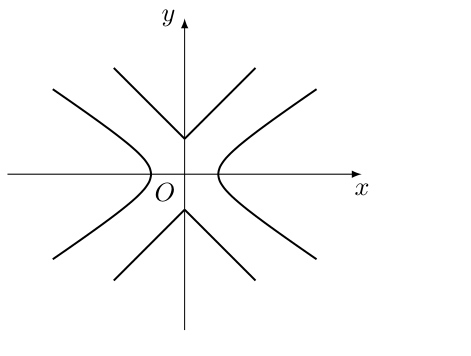

# 2013年上海卷（秋文）

## 填空题

### 第 1 题

不等式 $\frac{x}{2x - 1} < 0$ 的解为＿＿＿＿＿＿.

#### 答案

$0 < x < \frac{1}{2}$

#### 解析

分式有意义要求 $x\ne\frac{1}{2}$. 分式小于零，说明分子与分母异号，即 $x>0$ 且 $2x-1<0$，或 $x<0$ 且 $2x-1>0$. 后一种情形无解，前一种情形给出 $0<x<\frac{1}{2}$. 所以不等式的解集为 $0<x<\frac{1}{2}$.

### 第 2 题

在等差数列 $\{a_n\}$ 中，若 $a_1 + a_2 + a_3 + a_4 = 30$，则 $a_2 + a_3 =\underline{\qquad\qquad}$.

#### 答案

$15$

#### 解析

等差数列中，首末两项之和等于中间两项之和，因此 $a_1+a_4=a_2+a_3$. 由题设

$$

30=a_1+a_2+a_3+a_4=2(a_2+a_3)

$$

所以 $a_2+a_3=15$.

### 第 3 题

设 $m \in \mathbb{R}$，$m^2 + m - 2 + \left(m^2 - 1\right)\i$ 是纯虚数，其中 $\i$ 是虚数单位，则 $m =\underline{\qquad\qquad}$.

#### 答案

$-2$

#### 解析

复数为纯虚数，要求实部为零且虚部不为零，因此 $m^2+m-2=0$，$m^2-1\ne0$. 由 $m^2+m-2=(m-1)(m+2)$，得 $m=1$ 或 $m=-2$. 当 $m=1$ 时 $m^2-1=0$，复数为零，不是纯虚数，故只能取 $m=-2$.

### 第 4 题

若 $\begin{vmatrix} x & 2 \\ 1 & 1 \end{vmatrix} = 0$，$\begin{vmatrix} x & y \\ 1 & 1 \end{vmatrix} = 1$，则 $x + y =\underline{\qquad\qquad}$.

#### 答案

$3$

#### 解析

由第一个行列式等于零，得 $x-2=0$，所以 $x=2$. 由第二个行列式等于 $1$，得 $x-y=1$，代入 $x=2$ 得 $y=1$. 因此 $x+y=2+1=3$.

### 第 5 题

已知 $\triangle ABC$ 的内角 $A$，$B$，$C$ 所对的边分别是 $a$，$b$，$c$. 若 $a^2 + ab + b^2 - c^2 = 0$，则角 $C$ 的大小是＿＿＿＿＿＿.

#### 答案

$\frac{2\pi}{3}$

#### 解析

由余弦定理，

$$

c^2=a^2+b^2-2ab\cos C

$$

题设 $a^2+ab+b^2-c^2=0$，所以 $c^2=a^2+ab+b^2$. 比较两式并利用 $a$，$b>0$，得 $-2ab\cos C=ab$，$\cos C=-\frac{1}{2}$. 因为 $C$ 是三角形内角，故 $C=\frac{2\pi}{3}$.

### 第 6 题

某学校高一年级男生人数占该年级学生人数的 $40\%$. 在一次考试中，男、女生平均分数分别为 $75$，$80$，则这次考试该年级学生平均分数为＿＿＿＿＿＿.

#### 答案

$78$

#### 解析

男生占全体的 $40\%$，女生占 $60\%$. 因而全体学生的平均分为加权平均数

$$

0.4\times75+0.6\times80=30+48=78

$$

所以这次考试该年级学生平均分数为 $78$.

### 第 7 题

设常数 $a \in \mathbb{R}$. 若 $\left(x^2 + \frac{a}{x}\right)^5$ 的二项展开式中 $x^7$ 项的系数为 $-10$，则 $a =\underline{\qquad\qquad}$.

#### 答案

$-2$

#### 解析

展开式的通项为 $\mathrm C_5^k(x^2)^{5-k}\left(\frac{a}{x}\right)^k=\mathrm C_5^k a^k x^{10-3k}$，$k=0$，$1$，$\ldots$，$5$. 要得到 $x^7$ 项，必须满足 $10-3k=7$，所以 $k=1$. 此时 $x^7$ 项的系数为 $\mathrm C_5^1a=5a$. 由 $5a=-10$，得 $a=-2$.

### 第 8 题

方程 $\frac{9}{3^x - 1} + 1 = 3^x$ 的实数解为＿＿＿＿＿＿.

#### 答案

$x = \log_{3}4$

#### 解析

令 $t=3^x$，则 $t>0$ 且 $t\ne1$. 原方程化为

$$

\frac{9}{t-1}+1=t

$$

即 $\frac{9}{t-1}=t-1$，$(t-1)^2=9$. 所以 $t=4$ 或 $t=-2$. 由于 $t>0$，只能取 $t=4$，从而 $x=\log_3 4$，且该值满足原方程的定义域要求.

### 第 9 题

若 $\cos x\cos y+\sin x\sin y=\frac{1}{3}$，则 $\cos\left(2x-2y\right)=$＿＿＿＿＿＿.

#### 答案

$-\frac{7}{9}$

#### 解析

由两角差的余弦公式，

$$

\cos(x-y)=\cos x\cos y+\sin x\sin y=\frac{1}{3}

$$

因此

$$

\cos(2x-2y)=2\cos^2(x-y)-1=2\left(\frac{1}{3}\right)^2-1=-\frac{7}{9}

$$

### 第 10 题

已知圆柱 $\Omega$ 的母线长为 $l$，底面半径为 $r$，$O$ 是上底面圆心，$A$，$B$ 是下底面圆周上两个不同的点，$BC$ 是母线，如图. 若直线 $OA$ 与 $BC$ 所成角的大小为 $\frac{\pi}{6}$，则 $\frac{l}{r} =\underline{\qquad\qquad}$.

#### 答案

$\sqrt{3}$

#### 解析

过下底面点 $A$ 作母线 $AD$，交上底面于 $D$，则 $AD\parallel BC$，且 $OD\perp AD$、$OD=r$、$AD=l$. 因此 $\angle OAD$ 就是直线 $OA$ 与 $BC$ 所成的角，大小为 $\frac{\pi}{6}$. 在直角三角形 $ODA$ 中，

$$

\tan\frac{\pi}{6}=\frac{OD}{AD}=\frac{r}{l}

$$

所以 $\frac{r}{l}=\frac{1}{\sqrt{3}}$，即 $\frac{l}{r}=\sqrt{3}$.

### 第 11 题

盒子中装有编号为 $1$，$2$，$3$，$4$，$5$，$6$，$7$ 的七个球，从中任意取出两个，则这两个球的编号之积为偶数的概率是＿＿＿＿＿＿.（结果用最简分数表示）

#### 答案

$\frac{5}{7}$

#### 解析

从 $7$ 个球中任取 $2$ 个，共有 $\mathrm C_7^2=21$ 种等可能取法. 两球编号之积为奇数，当且仅当两球都是奇数；奇数球有 $1$，$3$，$5$，$7$ 共 $4$ 个，故这种取法有 $\mathrm C_4^2=6$ 种. 因而积为偶数的取法有 $21-6=15$ 种，所求概率为

$$

\frac{15}{21}=\frac{5}{7}

$$

### 第 12 题

设 $AB$ 是椭圆 $\Gamma$ 的长轴，点 $C$ 在 $\Gamma$ 上，且 $\angle CBA = \frac{\pi}{4}$，若 $AB = 4$，$BC = \sqrt{2}$，则 $\Gamma$ 的两个焦点之间的距离为＿＿＿＿＿＿.

#### 答案

$\frac{4\sqrt{6}}{3}$

#### 解析

取椭圆中心为原点，令长轴水平，设 $A=(-2,0)$、$B=(2,0)$. 由 $BC=\sqrt{2}$ 且 $\angle CBA=\frac{\pi}{4}$，可取 $C=(1,1)$；取关于长轴对称的另一点时计算相同. 设椭圆方程为

$$

\frac{x^2}{4}+\frac{y^2}{b^2}=1

$$

将 $C=(1,1)$ 代入，得 $\frac14+\frac{1}{b^2}=1$，$b^2=\frac43$. 椭圆的焦半距满足 $c^2=4-b^2=\frac83$，所以两个焦点之间的距离为

$$

2c=2\sqrt{\frac83}=\frac{4\sqrt6}{3}

$$

### 第 13 题

设常数 $a > 0$. 若 $9x + \frac{a^2}{x} \geqslant a + 1$ 对一切正实数 $x$ 成立，则 $a$ 的取值范围为＿＿＿＿＿＿.

#### 答案

$a \geqslant \frac{1}{5}$

#### 解析

因为 $a>0$、$x>0$，由基本不等式

$$

9x+\frac{a^2}{x}\geqslant2\sqrt{9x\cdot\frac{a^2}{x}}=6a

$$

当 $9x=\frac{a^2}{x}$，即 $x=\frac{a}{3}>0$ 时等号成立，所以左端的最小值为 $6a$. 题设不等式对一切正实数 $x$ 成立，当且仅当 $6a\geqslant a+1$，即 $a\geqslant\frac15$.

### 第 14 题

已知正方形 $ABCD$ 的边长为 $1$. 记以 $A$ 为起点，其余顶点为终点的向量分别为 $\boldsymbol{a}_1$，$\boldsymbol{a}_2$，$\boldsymbol{a}_3$；以 $C$ 为起点，其余顶点为终点的向量分别为 $\boldsymbol{c}_1$，$\boldsymbol{c}_2$，$\boldsymbol{c}_3$. 若 $i$，$j$，$k$，$l \in \{1, 2, 3\}$ 且 $i \neq j$，$k \neq l$，则 $\left(\boldsymbol{a}_i + \boldsymbol{a}_j\right) \cdot \left(\boldsymbol{c}_k + \boldsymbol{c}_l\right)$ 的最小值是＿＿＿＿＿＿.

#### 答案

$-5$

#### 解析

不妨按 $B$，$C$，$D$ 的顺序编号从 $A$ 引出的三个向量，按 $A$，$B$，$D$ 的顺序编号从 $C$ 引出的三个向量. 建立坐标系 $A=(0,0)$，$B=(1,0)$，$C=(1,1)$，$D=(0,1)$. 于是 $\boldsymbol{a}_1=(1,0)$，$\boldsymbol{a}_2=(1,1)$，$\boldsymbol{a}_3=(0,1)$ 以及 $\boldsymbol{c}_1=(-1,-1)$，$\boldsymbol{c}_2=(0,-1)$，$\boldsymbol{c}_3=(-1,0)$. 任取两个不同下标时，两个向量和分别可能为

$$

\boldsymbol{a}_i+\boldsymbol{a}_j\in\{(2,1),(1,1),(1,2)\}

$$

$$

\boldsymbol{c}_k+\boldsymbol{c}_l\in\{(-1,-2),(-2,-1),(-1,-1)\}

$$

当第一向量和依次取 $(2,1)$、$(1,1)$、$(1,2)$ 时，与上述三个第二向量和的数量积依次为 $(-4,-5,-3)$、$(-3,-3,-2)$、$(-5,-4,-3)$. 因而所有可能值的最小值为 $-5$.

## 选择题

### 第 15 题

函数 $f(x) = x^2 - 1$ （$x \geqslant 1$）的反函数为 $f^{-1}(x)$，则 $f^{-1}(2)$ 的值是（$\quad$）

A.  
$\sqrt{3}$

B.  
$-\sqrt{3}$

C.  
$1 + \sqrt{2}$

D.  
$1 - \sqrt{2}$

#### 答案

A

#### 解析

由 $y=x^2-1$ 且 $x\geqslant1$，反解得 $x=\sqrt{y+1}$. 因而 $f^{-1}(x)=\sqrt{x+1}$，所以

$$

f^{-1}(2)=\sqrt3

$$

因此选 A.

### 第 16 题

设常数 $a \in \mathbb{R}$，集合 $A = \{x \mid \left(x - 1\right)\left(x - a\right) \geqslant 0\}$，$B = \{x \mid x \geqslant a - 1\}$. 若 $A \cup B = \mathbb{R}$，则 $a$ 的取值范围为（$\quad$）

A.  
$\left(-\infty, 2\right)$

B.  
$\left(-\infty, 2\right]$

C.  
$\left(2, +\infty\right)$

D.  
$\left[2, +\infty\right)$

#### 答案

B

#### 解析

若 $a\leqslant1$，则

$$

A=(-\infty,a]\cup[1,+\infty),\qquad B=[a-1,+\infty)

$$

由于 $a-1\leqslant a$，此时 $A\cup B=\mathbb{R}$.

若 $a>1$，则

$$

A=(-\infty,1]\cup[a,+\infty),\qquad B=[a-1,+\infty)

$$

要覆盖区间 $(1,a)$，必须且只需 $a-1\leqslant1$，即 $a\leqslant2$. 综合两种情形，$a\leqslant2$，故选 B.

### 第 17 题

钱大姐常说“便宜没好货”，她这句话的意思是：“不便宜”是“好货”的（$\quad$）

A.  
充分条件

B.  
必要条件

C.  
充分必要条件

D.  
既非充分也非必要条件

#### 答案

B

#### 解析

把“便宜”记为 $p$，把“好货”记为 $q$. “便宜没好货”表示 $p\mathbb{R}ightarrow\lnot q$，其逆否命题为 $q\mathbb{R}ightarrow\lnot p$. 因而“好货”是“不便宜”的充分条件，等价地说“不便宜”是“好货”的必要条件. 题目问的是后者，所以选 B.

### 第 18 题

记椭圆 $\frac{x^2}{4} + \frac{ny^2}{4n + 1} = 1$ 围成的区域（含边界）为 $\Omega_n$ （$n = 1$，$2$，$\cdots$），当点 $\left(x, y\right)$ 分别在 $\Omega_1$，$\Omega_2$，$\cdots$ 上时，$x + y$ 的最大值分别是 $M_1$，$M_2$，$\cdots$，则 $\displaystyle\lim_{n \to \infty} M_n =$（$\quad$）

A.  
$0$

B.  
$\frac{1}{4}$

C.  
$2$

D.  
$2\sqrt{2}$

#### 答案

D

#### 解析

区域 $\Omega_n$ 满足

$$

\frac{x^2}{4}+\frac{ny^2}{4n+1}\leqslant1

$$

令 $u=\frac{x}{2}$，$v=\sqrt{\frac{n}{4n+1}}y$，则 $u^2+v^2\leqslant1$，且

$$

x+y=2u+\sqrt{\frac{4n+1}{n}}v

$$

由柯西不等式，

$$

x+y\leqslant\sqrt{4+\frac{4n+1}{n}}\sqrt{u^2+v^2}
\leqslant\sqrt{8+\frac1n}

$$

取 $(u,v)$ 与 $\left(2,\sqrt{\frac{4n+1}{n}}\right)$ 同方向且在单位圆上时可取到等号，因此

$$

M_n=\sqrt{8+\frac1n}

$$

所以

$$

\lim_{n\to\infty}M_n=\sqrt8=2\sqrt2

$$

因此选 D.

## 解答题

### 第 19 题

如图，正三棱锥 $O - ABC$ 底面边长为 $2$，高为 $1$，求该三棱锥的体积及表面积.

#### 解析

正三角形 $ABC$ 的高为 $\sqrt{2^2-1^2}=\sqrt{3}$，所以底面积为 $\frac{1}{2}\times2\times\sqrt{3}=\sqrt{3}$. 因此三棱锥的体积为

$$

V=\frac{1}{3}\times\sqrt{3}\times1=\frac{\sqrt{3}}{3}

$$

设 $H$ 是正三角形 $ABC$ 的中心，$D$ 是 $AB$ 的中点. 则 $HD$ 是正三角形的内切半径，$HD=\frac{\sqrt{3}}{3}$，且正三棱锥的高 $OH=1$，所以侧面三角形 $OAB$ 的高为

$$

OD=\sqrt{OH^2+HD^2}=\sqrt{1^2+\left(\frac{\sqrt{3}}{3}\right)^2}=\frac{2\sqrt{3}}{3}

$$

每个侧面三角形的面积为 $\frac{1}{2}\times2\times\frac{2\sqrt{3}}{3}=\frac{2\sqrt{3}}{3}$，三个侧面的总面积为 $2\sqrt{3}$. 故三棱锥的表面积为

$$

S=\sqrt{3}+2\sqrt{3}=3\sqrt{3}

$$

### 第 20 题

甲厂以 $x\text{ 千克/小时}$ 的速度匀速生产某种产品（生产条件要求 $1 \leqslant x \leqslant 10$），每一小时可获得的利润是 $100\left(5x + 1 - \frac{3}{x}\right)\text{ 元}$.

1.  求证：生产 $a\text{ 千克}$ 该产品所获得的利润为 $100a\left(5 + \frac{1}{x} - \frac{3}{x^2}\right)\text{ 元}$；

2.  要使生产 $900\text{ 千克}$ 该产品获得的利润最大，问：甲厂应该选取何种生产速度？并求最大利润.

#### 解析

1.  生产 $a\text{ 千克}$ 产品需要 $\frac{a}{x}$ 小时，所以所获得的利润为

$$

\frac{a}{x}\times100\left(5x+1-\frac{3}{x}\right)=100a\left(5+\frac{1}{x}-\frac{3}{x^2}\right)\text{ 元}

$$

2.  当生产 $900\text{ 千克}$ 产品时，利润函数为 $P(x)=90000\left(5+\frac{1}{x}-\frac{3}{x^2}\right)$，$1\leqslant x\leqslant10$. 其导数为

$$

P'(x)=90000\left(-\frac{1}{x^2}+\frac{6}{x^3}\right)=\frac{90000(6-x)}{x^3}

$$

    由于 $x>0$，当 $1\leqslant x<6$ 时 $P'(x)>0$，当 $6<x\leqslant10$ 时 $P'(x)<0$，所以 $P(x)$ 在 $[1,6]$ 上递增，在 $[6,10]$ 上递减，最大值在 $x=6$ 时取得. 最大利润为

$$

P(6)=90000\left(5+\frac{1}{6}-\frac{3}{36}\right)=90000\times\frac{61}{12}=457500\text{ 元}

$$

    因此甲厂应选择 $6\text{ 千克/小时}$ 的生产速度，最大利润为 $457500\text{ 元}$.

### 第 21 题

已知函数 $f(x) = 2\sin \omega x$. 其中常数 $\omega > 0$.

1.  令 $\omega = 1$，判断函数 $F(x) = f(x) + f\left(x + \frac{\pi}{2}\right)$ 的奇偶性并说明理由；

2.  令 $\omega = 2$，将函数 $y = f(x)$ 的图象向左平移 $\frac{\pi}{6}$ 个单位，再向上平移 $1$ 个单位，得到函数 $y = g(x)$ 的图象. 对任意的 $a \in \mathbb{R}$，求 $y = g(x)$ 在区间 $[a, a + 10\pi]$ 上零点个数的所有可能值.

#### 解析

1.  当 $\omega=1$ 时，$f(x)=2\sin x$，所以

$$

F(x)=2\sin x+2\sin\left(x+\frac{\pi}{2}\right)=2\sin x+2\cos x

$$

    于是 $F(-x)=2\cos x-2\sin x$. 又 $F(0)=2\neq-2=-F(0)$，故 $F(x)$ 不是奇函数；并且 $F\left(\frac{\pi}{2}\right)=2$，$F\left(-\frac{\pi}{2}\right)=-2$，故 $F(x)$ 不是偶函数. 因此 $F(x)$ 既不是奇函数，也不是偶函数.

2.  当 $\omega=2$ 时，$f(x)=2\sin2x$. 图象向左平移 $\frac{\pi}{6}$ 后，横坐标 $x$ 处的函数值为 $f\left(x+\frac{\pi}{6}\right)$，再向上平移 $1$ 个单位，故

$$

g(x)=2\sin\left(2x+\frac{\pi}{3}\right)+1

$$

    令 $g(x)=0$，得

$$

\sin\left(2x+\frac{\pi}{3}\right)=-\frac{1}{2}

$$

    因此 $2x+\frac{\pi}{3}=-\frac{\pi}{6}+2k\pi\quad\text{或}\quad2x+\frac{\pi}{3}=\frac{7\pi}{6}+2k\pi$，$k\in\mathbb{Z}$ 即零点为 $x=-\frac{\pi}{4}+k\pi\quad\text{或}\quad x=\frac{5\pi}{12}+k\pi$，$k\in\mathbb{Z}$. 函数 $g(x)$ 的周期为 $\pi$，每个周期内有两个零点. 区间 $[a,a+10\pi]$ 的长度是 $10$ 个周期，因此当 $a$ 不是零点时，区间内有 $20$ 个零点；当 $a$ 是零点时，$a+10\pi$ 也是零点，两个端点同时计入，区间内有 $21$ 个零点. 故所有可能值为 $20$，$21$.

### 第 22 题

已知函数 $f(x) = 2 - |x|$，无穷数列 $\{a_n\}$ 满足 $a_{n+1} = f(a_n)$，$n \in \mathbb{N}^*$.

1.  若 $a_1 = 0$，求 $a_2$，$a_3$，$a_4$；

2.  若 $a_1 > 0$，且 $a_1$，$a_2$，$a_3$ 成等比数列，求 $a_1$ 的值；

3.  是否存在 $a_1$，使得 $a_1$，$a_2$，$a_3$，$\cdots$，$a_n$，$\cdots$ 成等差数列？若存在，求出所有这样的 $a_1$；若不存在，说明理由.

#### 解析

1.  当 $a_1=0$ 时，$a_2=2-|0|=2$，$a_3=2-|2|=0$，$a_4=2-|0|=2$.

2.  设 $a_1=t>0$.

    当 $0<t\leqslant2$ 时，$a_2=2-t\geqslant0$，从而 $a_3=2-(2-t)=t$. 由 $a_1$，$a_2$，$a_3$ 成等比数列，得 $(2-t)^2=t^2$， 所以 $4-4t=0$，即 $t=1$.

    当 $t>2$ 时，$a_2=2-t<0$，从而 $a_3=2-|2-t|=4-t$. 于是 $(2-t)^2=t(4-t)$， 即 $2t^2-8t+4=0$，解得 $t=2\pm\sqrt{2}$. 结合 $t>2$，得 $t=2+\sqrt{2}$. 因此 $a_1=1$ 或 $a_1=2+\sqrt{2}$.

3.  假设数列成等差数列，公差为 $d$，则 $a_n=a_1+(n-1)d$. 由于对任意 $n$ 都有 $a_{n+1}=2-|a_n|\leqslant2$，若 $d>0$，则等差表达式使 $a_{n+1}$ 在 $n$ 足够大时大于 $2$，矛盾. 若 $d<0$，则 $a_n$ 在 $n$ 足够大时为负数，此时递推式变为 $a_{n+1}=2+a_n$，所以 $d=2$，又与 $d<0$ 矛盾. 因此只能有 $d=0$.

    此时所有 $a_n$ 都等于 $a_1$，由递推式得 $a_1=2-|a_1|$. 当 $a_1\geqslant0$ 时，$a_1=2-a_1$，得 $a_1=1$；当 $a_1<0$ 时，$a_1=2+a_1$，矛盾. 因此存在且唯一的取值为 $a_1=1$.

### 第 23 题

如图，已知双曲线 $C_1: \frac{x^2}{2} - y^2 = 1$，曲线 $C_2: |y| = |x| + 1$. $P$ 是平面内一点，若存在过点 $P$ 的直线 $l$ 与 $C_1$，$C_2$ 都有公共点，则称 $P$ 为“$C_1 - C_2$ 型点”.

1.  在正确证明 $C_1$ 的左焦点是“$C_1 - C_2$ 型点”时，要使用一条过该焦点的直线，试写出一条这样的直线的方程（不要求验证）；

2.  设直线 $y = kx$ 与 $C_2$ 有公共点. 求证 $|k| > 1$，进而证明原点不是“$C_1 - C_2$ 型点”；

3.  求证：圆 $x^2 + y^2 = \frac{1}{2}$ 内的点都不是“$C_1 - C_2$ 型点”.

#### 解析

1.  双曲线 $C_1$ 的左焦点为 $F=(-\sqrt{3},0)$，直线 $y=\frac{x}{\sqrt{3}}+1$ 经过点 $F$，且经过 $C_2$ 上的点 $(0,1)$，可作为所需直线.

2.  设直线 $y=kx$ 与 $C_2$ 的公共点为 $(x,y)$. 若 $x=0$，则由 $y=kx$ 得 $y=0$，这与 $C_2$ 的方程 $|y|=|x|+1$ 矛盾，所以 $x\neq0$. 于是

$$

|k|=\frac{|y|}{|x|}=\frac{|x|+1}{|x|}>1

$$

    若原点是 $C_1-C_2$ 型点，则存在过原点的直线同时与 $C_1$，$C_2$ 有公共点. 直线 $x=0$ 与 $C_1$ 联立得 $-y^2=1$，无实数解；其他过原点的直线可写为 $y=kx$. 由上面结论，这样的直线若与 $C_2$ 相交则 $|k|>1$，而它与 $C_1$ 相交需满足

$$

\frac{x^2}{2}-k^2x^2=1

$$

    从而 $\left(\frac{1}{2}-k^2\right)x^2=1$，必有 $k^2<\frac{1}{2}$，即 $|k|<\frac{1}{\sqrt{2}}$，矛盾. 因此原点不是 $C_1-C_2$ 型点.

3.  设点 $P=(x_0,y_0)$ 在圆 $x^2+y^2=\frac{1}{2}$ 的内部，即 $x_0^2+y_0^2<\frac{1}{2}$. 反设 $P$ 是 $C_1-C_2$ 型点，设过 $P$ 且与两条曲线都有公共点的直线为 $\ell$.

    若 $\ell$ 为竖直直线 $x=c$，由于它与 $C_1$ 相交，必有 $c^2/2\geqslant1$，即 $|c|\geqslant\sqrt{2}>\frac{1}{\sqrt{2}}$. 所以 $\ell$ 上任一点到原点的距离不可能小于 $\frac{1}{\sqrt{2}}$，与 $P$ 在圆内矛盾.

    若 $\ell$ 非竖直，设其方程为 $y=kx+b$. 当 $|k|\leqslant1$ 时，取 $\ell$ 与 $C_2$ 的公共点 $(x,y)$，则

$$

|b|=|y-kx|\geqslant\bigl||y|-|k||x|\bigr|=1+(1-|k|)|x|\geqslant1

$$

    因此原点到 $\ell$ 的距离 $d$ 满足

$$

d=\frac{|b|}{\sqrt{1+k^2}}\geqslant\frac{1}{\sqrt{1+k^2}}\geqslant\frac{1}{\sqrt{2}}

$$

    当 $|k|>1$ 时，将 $y=kx+b$ 代入 $C_1$，得

$$

\left(\frac{1}{2}-k^2\right)x^2-2kbx-(b^2+1)=0

$$

    该方程有实数解，所以其判别式满足

$$

\Delta=2\left(b^2+1-2k^2\right)\geqslant0

$$

    从而 $b^2\geqslant2k^2-1$. 于是

$$

d^2=\frac{b^2}{1+k^2}\geqslant\frac{2k^2-1}{1+k^2}\geqslant\frac{1}{2}

$$

    其中最后一个不等号等价于 $k^2\geqslant1$. 综上，任何同时与 $C_1$，$C_2$ 相交的直线到原点的距离都不小于 $\frac{1}{\sqrt{2}}$. 但 $P\in\ell$，所以该距离不大于 $OP=\sqrt{x_0^2+y_0^2}<\frac{1}{\sqrt{2}}$，矛盾. 因此圆内的点都不是 $C_1-C_2$ 型点.
