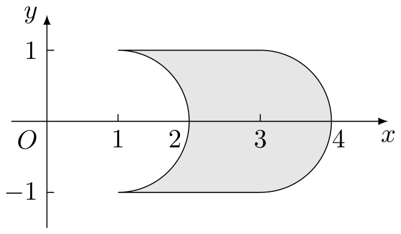
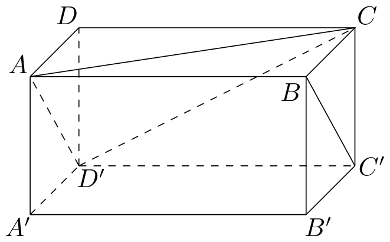
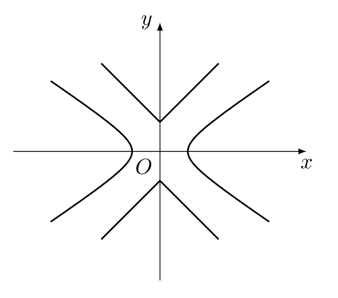

# 2013年上海卷（秋理）

## 填空题

### 第 1 题

计算： $\displaystyle\lim_{n\to\infty}\frac{n+20}{3n+13}=\underline{\qquad\qquad}$

#### 答案

$\frac{1}{3}$

#### 解析

将分子、分母同除以 $n$，得

$$

\lim_{n\to\infty}\frac{n+20}{3n+13}
=\lim_{n\to\infty}\frac{1+\frac{20}{n}}{3+\frac{13}{n}}
=\frac{1}{3}

$$

### 第 2 题

设 $m \in \mathbb{R}$，$m^2 + m - 2 + (m^2 - 1)\i$ 是纯虚数，其中 $\i$ 是虚数单位，则 $m=$＿＿＿＿＿＿.

#### 答案

$-2$

#### 解析

复数为纯虚数时其实部为零，且虚部不为零. 因此

$$

m^2+m-2=0

$$

解得 $m=1$ 或 $m=-2$. 当 $m=1$ 时虚部系数 $m^2-1=0$，复数为零，不是纯虚数；当 $m=-2$ 时虚部系数为 $3\ne0$. 所以 $m=-2$.

### 第 3 题

若 $\left|\begin{matrix}x^2 & y^2 \\ -1 & 1\end{matrix}\right| = \left|\begin{matrix}x & x \\ y & -y\end{matrix}\right|$，则 $x+y=$＿＿＿＿＿＿.

#### 答案

$0$

#### 解析

计算两个行列式，原等式化为

$$

x^2+y^2=-2xy

$$

移项得

$$

x^2+2xy+y^2=(x+y)^2=0

$$

所以 $x+y=0$.

### 第 4 题

已知 $\triangle ABC$ 的内角 $A$，$B$，$C$ 所对的边分别为 $a$，$b$，$c$. 若 $3a^2+2ab+3b^2-3c^2=0$，则角 $C$ 的大小是＿＿＿＿＿＿. （结果用反三角函数值表示）

#### 答案

$\pi-\arccos\left(\frac{1}{3}\right)$

#### 解析

由余弦定理，

$$

c^2=a^2+b^2-2ab\cos C

$$

将其代入题设条件，得

$$

3a^2+2ab+3b^2-3(a^2+b^2-2ab\cos C)=0

$$

即 $2ab(1+3\cos C)=0$. 三角形边长 $a$，$b>0$，故

$$

\cos C=-\frac{1}{3}

$$

由于 $0<C<\pi$，

$$

C=\arccos\left(-\frac{1}{3}\right)=\pi-\arccos\left(\frac{1}{3}\right)

$$

### 第 5 题

设常数 $a \in \mathbb{R}$. 若 $\left(x^2+\frac{a}{x}\right)^5$ 的二项展开式中 $x^7$ 项的系数为 $-10$，则 $a=$＿＿＿＿＿＿.

#### 答案

$-2$

#### 解析

展开式的第 $k+1$ 项为 $\mathrm C_5^k(x^2)^{5-k}\left(\frac{a}{x}\right)^k =\mathrm C_5^k a^k x^{10-3k}$，$k=0$，$1$，$\ldots$，$5$. 含 $x^7$ 项时 $10-3k=7$，所以 $k=1$，该项系数为 $\mathrm C_5^1 a=5a$. 由 $5a=-10$，得 $a=-2$.

### 第 6 题

方程 $\frac{3}{3^x-1}+\frac{1}{3}=3^{x-1}$ 的实数解为＿＿＿＿＿＿.

#### 答案

$\log_{3}4$

#### 解析

原方程的定义域要求 $3^x-1\ne0$，即 $x\ne0$. 令 $t=3^x$，则 $t>0$ 且 $t\ne1$. 方程化为

$$

\frac{3}{t-1}+\frac{1}{3}=\frac{t}{3}

$$

两边同乘 $3(t-1)$，得

$$

9+t-1=t(t-1)

$$

即 $t^2-2t-8=0$，所以 $t=4$ 或 $t=-2$. 因 $t>0$，只能取 $t=4$，从而

$$

x=\log_3 4

$$

该值不为零，满足定义域要求.

### 第 7 题

在极坐标系中，曲线 $\rho=\cos\theta+1$ 与 $\rho\cos\theta=1$ 的公共点到极点的距离为＿＿＿＿＿＿.

#### 答案

$\frac{1+\sqrt{5}}{2}$

#### 解析

极坐标中 $\rho\cos\theta=1$，故 $\cos\theta=\frac{1}{\rho}$. 与 $\rho=\cos\theta+1$ 联立，得

$$

\rho=\frac{1}{\rho}+1,
\qquad\text{即}\qquad
\rho^2-\rho-1=0

$$

其根为 $\frac{1+\sqrt5}{2}$ 和 $\frac{1-\sqrt5}{2}$. 后一个根的绝对值小于 $1$，不可能满足 $\left|\cos\theta\right|=\left|1/\rho\right|\leqslant1$，故公共点到极点的距离为正根

$$

\rho=\frac{1+\sqrt5}{2}

$$

### 第 8 题

盒子中装有编号为 $1$，$2$，$3$，$4$，$5$，$6$，$7$，$8$，$9$ 的九个球，从中任意取出两个，则这两个球的编号之积为偶数的概率是＿＿＿＿＿＿.（结果用最简分数表示）

#### 答案

$\frac{13}{18}$

#### 解析

任取两个球的总数为

$$

\mathrm C_9^2=36

$$

乘积为奇数当且仅当两个球的编号都是奇数，故不满足条件的取法有

$$

\mathrm C_5^2=10

$$

因此乘积为偶数的取法有 $36-10=26$ 种，所求概率为

$$

\frac{26}{36}=\frac{13}{18}

$$

### 第 9 题

设 $AB$ 是椭圆 $\Gamma$ 的长轴，点 $C$ 在 $\Gamma$ 上，且 $\angle CBA=\frac{\pi}{4}$，若 $AB=4$，$BC=\sqrt{2}$，则 $\Gamma$ 的两个焦点之间的距离为＿＿＿＿＿＿.

#### 答案

$\frac{4\sqrt{6}}{3}$

#### 解析

设椭圆的长半轴为 $a$，短半轴为 $b$，焦半距为 $c$. 由 $AB=4$，得 $a=2$. 取 $B=(2,0)$，使 $BA$ 沿负 $x$ 轴；由 $BC=\sqrt2$ 且 $\angle CBA=\frac{\pi}{4}$，可取

$$

C=(1,1)

$$

（取 $C=(1,-1)$ 时计算相同）. 因 $C$ 在椭圆上，

$$

\frac{1^2}{2^2}+\frac{1^2}{b^2}=1

$$

所以 $b^2=\frac{4}{3}$. 于是

$$

c^2=a^2-b^2=4-\frac{4}{3}=\frac{8}{3}

$$

两个焦点之间的距离为 $2c$，故

$$

2c=2\sqrt{\frac{8}{3}}=\frac{4\sqrt6}{3}

$$

### 第 10 题

设非零常数 $d$ 是等差数列 $x_1$，$x_2$，$x_3$，$\cdots$，$x_{19}$ 的公差，随机变量 $\xi$ 等可能地取值 $x_1$，$x_2$，$\cdots$，$x_{19}$，则方差 $D(\xi)=$＿＿＿＿＿＿.

#### 答案

$30d^2$

#### 解析

等差数列可写为 $x_i=x_1+(i-1)d$. 由于 $\xi$ 等可能取这 $19$ 个值，其平均数为

$$

E(\xi)=\frac{x_1+x_{19}}{2}=x_1+9d

$$

因此

$$

D(\xi)=\frac{1}{19}\sum_{i=1}^{19}(x_i-x_1-9d)^2
=\frac{d^2}{19}\sum_{i=1}^{19}(i-10)^2

$$

令 $r=i-10$，则

$$

\sum_{i=1}^{19}(i-10)^2=2\sum_{r=1}^{9}r^2
=2\cdot\frac{9\cdot10\cdot19}{6}=570

$$

所以 $D(\xi)=\frac{570}{19}d^2=30d^2$.

### 第 11 题

若 $\cos x\cos y+\sin x\sin y=\frac{1}{2}$，$\sin 2x+\sin 2y=\frac{2}{3}$，则 $\sin(x+y)=$＿＿＿＿＿＿.

#### 答案

$\frac{2}{3}$

#### 解析

由三角恒等式，第一式左边为

$$

\cos x\cos y+\sin x\sin y=\cos(x-y)=\frac{1}{2}

$$

又

$$

\sin2x+\sin2y=2\sin(x+y)\cos(x-y)=\frac{2}{3}

$$

代入 $\cos(x-y)=\frac12$，得

$$

\sin(x+y)=\frac{2/3}{2\cdot(1/2)}=\frac{2}{3}

$$

### 第 12 题

设 $a$ 为实常数，$y=f(x)$ 是定义在 $\mathbb{R}$ 上的奇函数，当 $x<0$ 时， $f(x)=9x+\frac{a^2}{x}+7$. 若 $f(x)\geqslant a+1$ 对一切 $x\geqslant 0$ 成立，则 $a$ 的取值范围为＿＿＿＿＿＿.

#### 答案

$\left(-\infty,-\frac{8}{7}\right]$

#### 解析

奇函数满足 $f(0)=0$，由题设不等式在 $x=0$ 时得 $0\geqslant a+1$，即 $a\leqslant-1$，所以 $a<0$. 当 $x>0$ 时，由奇性和题设中负数部分的表达式，

$$

f(x)=-f(-x)=9x+\frac{a^2}{x}-7

$$

故所需条件等价于 $9x+\frac{a^2}{x}\geqslant a+8$，$x>0$. 因为 $a<0$，由基本不等式

$$

9x+\frac{a^2}{x}\geqslant2\sqrt{9x\cdot\frac{a^2}{x}}=6|a|=-6a

$$

且在 $x=\frac{-a}{3}>0$ 时取等号. 因此上式对所有 $x>0$ 成立，当且仅当

$$

-6a\geqslant a+8

$$

即 $a\leqslant-\frac87$. 该范围自动满足 $a\leqslant-1$，所以

$$

a\in\left(-\infty,-\frac87\right]

$$

### 第 13 题

在 $xOy$ 平面上，将两个半圆弧 $(x-1)^2+y^2=1$ （$x\geqslant 1$）和 $(x-3)^2+y^2=1$（$x\geqslant 3$），两条直线 $y=1$ 和 $y=-1$ 围成的封闭图形记为 $D$，如图中阴影部分. 记 $D$ 绕 $y$ 轴旋转一周而成的几何体为 $\Omega$，过 $(0,y)$ （$|y|\leqslant 1$）作 $\Omega$ 的水平截面，所得截面面积为 $4\pi\sqrt{1-y^2}+8\pi$，试利用祖暅原理，一个平放的圆柱和一个长方体，得出 $\Omega$ 的体积为＿＿＿＿＿＿. 

#### 答案

$2\pi^2+16\pi$

#### 解析

考虑一个半径为 $1$、轴向长度为 $2\pi$ 的平放圆柱. 在高度 $y$（$|y|\leqslant1$）处，其水平截面为矩形，面积为

$$

2\pi\cdot2\sqrt{1-y^2}=4\pi\sqrt{1-y^2}

$$

再取一个高为 $2$、水平截面面积恒为 $8\pi$ 的长方体. 两者组成的几何体在每个 $|y|\leqslant1$ 处的水平截面面积均为

$$

4\pi\sqrt{1-y^2}+8\pi

$$

与 $\Omega$ 的对应截面面积相等. 由祖暅原理，

$$

V(\Omega)=\pi\cdot1^2\cdot2\pi+8\pi\cdot2=2\pi^2+16\pi

$$

### 第 14 题

对区间 $I$ 上有定义的函数 $g(x)$，记 $g(I)=\{y\mid y=g(x),x\in I\}$，已知定义域为 $[0,3]$ 的函数 $y=f(x)$ 有反函数 $y=f^{-1}(x)$，且 $f^{-1}([0,1))=[1,2)$，$f^{-1}((2,4])=[0,1)$，若方程 $f(x)-x=0$ 有解 $x_0$，则 $x_0=\underline{\qquad\qquad}$.

#### 答案

$2$

#### 解析

由反函数的定义，题设等式分别等价于 $x\in[1,2)\Longleftrightarrow f(x)\in[0,1)$，$x\in[0,1)\Longleftrightarrow f(x)\in(2,4]$. 设 $x_0\in[0,3]$ 且 $f(x_0)=x_0$. 若 $x_0\in[0,1)$，则由第二个等价关系 $f(x_0)\in(2,4]$，与 $f(x_0)=x_0<1$ 矛盾. 若 $x_0\in[1,2)$，则由第一个等价关系 $f(x_0)\in[0,1)$，与 $f(x_0)=x_0\geqslant1$ 矛盾. 若 $x_0\in(2,3]$，则由第二个等价关系的逆向使用，$f(x_0)=x_0\in(2,4]$ 将推出 $x_0\in[0,1)$，仍矛盾. 因此只能有 $x_0=2$.

## 单选题

### 第 15 题

设常数 $a \in \mathbb{R}$，集合 $A=\{x\mid(x-1)(x-a)\geqslant 0\}$，$B=\{x\mid x\geqslant a-1\}$. 若 $A\cup B=\mathbb{R}$，则 $a$ 的取值范围为（）

A.  
$(-\infty,2)$

B.  
$(-\infty,2]$

C.  
$(2,+\infty)$

D.  
$[2,+\infty)$

#### 答案

B

#### 解析

当 $a\leqslant1$ 时，

$$

A=(-\infty,a]\cup[1,+\infty)

$$

而 $B=[a-1,+\infty)$. 因为 $a-1<a$，三段合起来覆盖整个实数轴.

当 $a>1$ 时，

$$

A=(-\infty,1]\cup[a,+\infty)

$$

要使 $A\cup B=\mathbb{R}$，必须使 $B$ 的左端点满足 $a-1\leqslant1$，即 $a\leqslant2$；反之 $1<a\leqslant2$ 时确实有 $A\cup B=\mathbb{R}$. 综上 $a\leqslant2$，故选 B.

### 第 16 题

钱大姐常说“便宜没好货”，她这句话的意思是：“不便宜”是“好货”的（）

A.  
充分条件

B.  
必要条件

C.  
充分必要条件

D.  
既非充分也非必要条件

#### 答案

B

#### 解析

“便宜没好货”表示好货一定不便宜，即若一件货物是好货，则它不便宜. 因此“不便宜”是“好货”的必要条件，故选 B.

### 第 17 题

在数列 $\{a_n\}$ 中，$a_n=2^n-1$，若一个 $7$ 行 $12$ 列的矩阵的第 $i$ 行第 $j$ 列的元素 $a_{ij}=a_i\cdot a_j+a_i+a_j$ （$i=1$，$2$，$\cdots$，$7;\ j=1$，$2$，$\cdots$，$12$），则该矩阵元素能取到的不同数值的个数为（）

A.  
18

B.  
28

C.  
48

D.  
63

#### 答案

A

#### 解析

由 $a_n=2^n-1$，有

$$

a_{ij}=a_i a_j+a_i+a_j=(a_i+1)(a_j+1)-1=2^{i+j}-1

$$

其中 $i=1$，$\ldots$，$7$，$j=1$，$\ldots$，$12$，所以 $i+j$ 可以取从 $2$ 到 $19$ 的每一个整数，共有 $19-2+1=18$ 个不同值. 故选 A.

### 第 18 题

在边长为 $1$ 的正六边形 $ABCDEF$ 中，记以 $A$ 为起点，其余顶点为终点的向量分别为 $\boldsymbol{a}_1$，$\boldsymbol{a}_2$，$\boldsymbol{a}_3$，$\boldsymbol{a}_4$，$\boldsymbol{a}_5$；以 $D$ 为起点，其余顶点为终点的向量分别为 $\boldsymbol{d}_1$，$\boldsymbol{d}_2$，$\boldsymbol{d}_3$，$\boldsymbol{d}_4$，$\boldsymbol{d}_5$. 若 $m$，$M$ 分别为 $(\boldsymbol{a}_i+\boldsymbol{a}_j+\boldsymbol{a}_k)\cdot(\boldsymbol{d}_r+\boldsymbol{d}_s+\boldsymbol{d}_t)$ 的最小值，最大值，其中 $\{i,j,k\}\subseteq\{1,2,3,4,5\}$，$\{r,s,t\}\subseteq\{1,2,3,4,5\}$，则 $m$，$M$ 满足（）

A.  
$m=0$，$M>0$

B.  
$m<0$，$M>0$

C.  
$m<0$，$M=0$

D.  
$m<0$，$M<0$

#### 答案

D

#### 解析

取正六边形外接圆圆心为原点，令 $A=(1,0)$，$\ B=\left(\frac12,\frac{\sqrt3}{2}\right)$，$\ C=\left(-\frac12,\frac{\sqrt3}{2}\right)$，$\ D=(-1,0)$ 并按顺序取 $E$，$F$. 则从 $A$ 出发的五个向量的 $x$ 分量为 $-\frac12$，$-\frac32$，$-2$，$-\frac32$，$-\frac12$ 从 $D$ 出发的五个向量的 $x$ 分量为 $2$，$\frac32$，$\frac12$，$\frac12$，$\frac32$. 任取其中三个，前一组向量和的 $x$ 分量不大于

$$

-\frac12-\frac12-\frac32=-\frac52

$$

后一组向量和的 $x$ 分量不小于

$$

\frac12+\frac12+\frac32=\frac52

$$

两组向量的 $y$ 分量分别由两个 $\frac{\sqrt3}{2}$、两个 $-\frac{\sqrt3}{2}$ 和一个 $0$ 中任取三个相加，故各自绝对值不超过 $\sqrt3$. 设两组和分别为 $(X,Y)$、$(U,V)$，则 $XU\leqslant-\frac{25}{4}$，$YV\leqslant|Y||V|\leqslant3$. 所以任意一个题设点积均满足

$$

(X,Y)\cdot(U,V)=XU+YV\leqslant-\frac{25}{4}+3=-\frac{13}{4}<0

$$

因此其最大值 $M<0$，最小值自然也满足 $m<0$，故选 D.

## 解答题

### 第 19 题

如图，在长方体 $ABCD-A'B'C'D'$ 中，$AB=2$，$AD=1$，$AA'=1$，证明直线 $BC'$ 平行于平面 $D'AC$，并求直线 $BC'$ 到平面 $D'AC$ 的距离. 

#### 解析

1.  建立空间直角坐标系，取 $A$ 为原点，令 $AB$，$AD$，$AA'$ 分别为 $x$ 轴，$y$ 轴，$z$ 轴，则 $A(0,0,0)$，$B(2,0,0)$，$C(2,1,0)$，$D'(0,1,1)$，$C'(2,1,1)$.

    平面 $D'AC$ 内有两个不共线向量 $\overrightarrow{AC}=(2,1,0)$ 和 $\overrightarrow{AD'}=(0,1,1)$. 取它们的向量积，得平面 $D'AC$ 的一个法向量

$$

\boldsymbol{n}=\overrightarrow{AC}\times\overrightarrow{AD'}=(1,-2,2)

$$

    又 $\overrightarrow{BC'}=C'-B=(0,1,1)$，所以

$$

\boldsymbol{n}\cdot\overrightarrow{BC'}=1\cdot0-2\cdot1+2\cdot1=0

$$

    因此 $BC'$ 的方向向量与平面 $D'AC$ 的法向量垂直，即 $BC'$ 平行于平面 $D'AC$. 另外，点 $B$ 不在平面 $D'AC$ 内，所以直线不在该平面内.

    由平面 $D'AC$ 过原点，且法向量为 $\boldsymbol{n}$，其方程为

$$

x-2y+2z=0

$$

    直线 $BC'$ 与该平面平行，故所求距离等于点 $B$ 到平面 $D'AC$ 的距离，即

$$

d=\frac{|2-2\cdot0+2\cdot0|}{\sqrt{1^2+(-2)^2+2^2}}=\frac{2}{3}

$$

### 第 20 题

甲厂以 $x$ 千克/小时的速度运输生产某种产品（生产条件要求 $1\leqslant x\leqslant 10$），每一小时可获得利润是 $100\left(5x+1-\frac{3}{x}\right)$ 元.

1.  要使生产该产品 $2$ 小时获得的利润不低于 $3000$ 元，求 $x$ 的取值范围；

2.  要使生产 $900$ 千克该产品获得的利润最大，问：甲厂应该选取何种生产速度？并求最大利润.

#### 解析

1.  生产该产品 $2$ 小时所获利润为 $200\left(5x+1-\frac{3}{x}\right)$ 元. 由题意，

$$

200\left(5x+1-\frac{3}{x}\right)\geqslant3000

$$

    因为 $x\geqslant1>0$，上式等价于

$$

5x+1-\frac{3}{x}\geqslant15
    \Longleftrightarrow 5x^2-14x-3\geqslant0
    \Longleftrightarrow (5x+1)(x-3)\geqslant0

$$

    结合 $1\leqslant x\leqslant10$，得 $3\leqslant x\leqslant10$. 因此 $x$ 的取值范围为 $[3,10]$.

2.  生产 $900$ 千克产品需要 $\dfrac{900}{x}$ 小时，所以总利润为 $P(x)=\frac{900}{x}\cdot100\left(5x+1-\frac{3}{x}\right)=90000\left(5+\frac{1}{x}-\frac{3}{x^2}\right)$，$1\leqslant x\leqslant10$. 求导得

$$

P'(x)=90000\left(-\frac{1}{x^2}+\frac{6}{x^3}\right)=\frac{90000(6-x)}{x^3}

$$

    由于 $x>0$，当 $1\leqslant x<6$ 时 $P'(x)>0$，当 $6<x\leqslant10$ 时 $P'(x)<0$，故 $P(x)$ 在 $[1,6]$ 上递增，在 $[6,10]$ 上递减，最大值在 $x=6$ 处取得.

    此时最大利润为

$$

P(6)=90000\left(5+\frac{1}{6}-\frac{3}{36}\right)=90000\cdot\frac{61}{12}=457500\text{ 元}

$$

    所以甲厂应选取 $6$ 千克/小时的生产速度，最大利润为 $457500$ 元.

### 第 21 题

已知函数 $f(x)=2\sin\omega x$. 其中常数 $\omega>0$.

1.  若 $y=f(x)$ 在 $\left[-\frac{\pi}{4},\frac{2\pi}{3}\right]$ 上单调递增，求 $\omega$ 的取值范围；

2.  令 $\omega=2$，将函数 $y=f(x)$ 的图象向左平移 $\frac{\pi}{6}$ 个单位，再向上平移 $1$ 个单位，得到函数 $y=g(x)$ 的图象. 区间 $[a,b]$ （$a$，$b\in\mathbb{R}$ 且 $a<b$）满足：$y=g(x)$ 在 $[a,b]$ 上至少含有 $30$ 个零点. 在所有满足上述条件的 $[a,b]$ 中，求 $b-a$ 的最小值.

#### 解析

1.  函数的导数为 $f'(x)=2\omega\cos\omega x$. 因为 $\omega>0$，要使函数在给定区间上单调递增，需使 $\cos\omega x\geqslant0$ 对区间内所有 $x$ 成立.

    由于区间 $\left[-\dfrac{\pi}{4},\dfrac{2\pi}{3}\right]$ 含有 $0$，且 $\cos0=1>0$，区间 $\left[-\dfrac{\omega\pi}{4},\dfrac{2\omega\pi}{3}\right]$ 必须包含在余弦函数在 $0$ 附近的非负区间 $\left[-\dfrac{\pi}{2},\dfrac{\pi}{2}\right]$ 内. 因而 $\frac{\omega\pi}{4}\leqslant\frac{\pi}{2}$，$\frac{2\omega\pi}{3}\leqslant\frac{\pi}{2}$. 这给出 $\omega\leqslant2$ 和 $\omega\leqslant\dfrac{3}{4}$. 结合 $\omega>0$，得

$$

0<\omega\leqslant\frac{3}{4}

$$

2.  函数图象向左平移 $\dfrac{\pi}{6}$ 个单位、再向上平移 $1$ 个单位后，

$$

g(x)=2\sin\left(2\left(x+\frac{\pi}{6}\right)\right)+1=2\sin\left(2x+\frac{\pi}{3}\right)+1

$$

    零点满足

$$

\sin\left(2x+\frac{\pi}{3}\right)=-\frac{1}{2}

$$

    因此 $2x+\frac{\pi}{3}=-\frac{\pi}{6}+2k\pi \quad\text{或}\quad 2x+\frac{\pi}{3}=\frac{7\pi}{6}+2k\pi$，$k\in\mathbb{Z}$ 即零点为

$$

x=-\frac{\pi}{4}+k\pi\quad\text{或}\quad x=\frac{5\pi}{12}+k\pi

$$

    将这些零点按从小到大排列，相邻零点之间的距离交替为 $\dfrac{2\pi}{3}$ 和 $\dfrac{\pi}{3}$. 为使区间包含至少 $30$ 个零点，只需考察连续的 $30$ 个零点；区间端点取这 $30$ 个零点中的最左点和最右点时长度最小. 若最左点取第二类零点 $\dfrac{5\pi}{12}+k\pi$，则从它到第 $30$ 个零点之间有 $14$ 个长度为 $\dfrac{2\pi}{3}$ 的间隔和 $15$ 个长度为 $\dfrac{\pi}{3}$ 的间隔，故

$$

b-a=14\cdot\frac{2\pi}{3}+15\cdot\frac{\pi}{3}=\frac{43\pi}{3}

$$

    若最左点取第一类零点，则间隔数为 $15$ 个 $\dfrac{2\pi}{3}$ 和 $14$ 个 $\dfrac{\pi}{3}$，长度为 $\dfrac{44\pi}{3}$. 所以最小值为 $\dfrac{43\pi}{3}$.

### 第 22 题

如图，已知双曲线 $C_1:\frac{x^2}{2}-y^2=1$，曲线 $C_2:|y|=|x|+1$. $P$ 是平面内一点，若存在过点 $P$ 的直线与 $C_1$，$C_2$ 都有公共点，则称 $P$ 为 “$C_1-C_2$ 型点”.

1.  在正确证明 $C_1$ 的左焦点是“$C_1-C_2$ 型点”时，要使用一条过该焦点的直线，试写出一条这样的直线的方程（不要求验证）；

2.  设直线 $y=kx$ 与 $C_2$ 有公共点. 求证 $|k|>1$，进而证明原点不是“$C_1-C_2$ 型点”；

3.  求证：圆 $x^2+y^2=\frac{1}{2}$ 内的点都不是 “$C_1-C_2$ 型点”.

#### 解析

1.  双曲线 $C_1$ 的焦点横坐标满足

$$

c=\sqrt{2+1}=\sqrt{3}

$$

    故左焦点为 $F(-\sqrt{3},0)$. 例如取过该点的直线 $x=-\sqrt{3}$. 它与 $C_1$ 及 $C_2$ 都有公共点，所以这条直线符合要求.

2.  直线 $y=kx$ 与 $C_2$ 有公共点时，存在实数 $x$ 使

$$

|kx|=|x|+1

$$

    此时 $x\neq0$，从而

$$

(|k|-1)|x|=1

$$

    所以 $|k|-1>0$，即 $|k|>1$.

    若原点是 $C_1-C_2$ 型点，则过原点的直线应与两条曲线都相交. 对于非竖直直线，它可写为 $y=kx$. 由上面的结论，若它与 $C_2$ 相交，则 $|k|>1$. 但将 $y=kx$ 代入 $C_1$ 得

$$

\left(\frac{1}{2}-k^2\right)x^2=1

$$

    这要求 $k^2<\dfrac{1}{2}$，与 $|k|>1$ 矛盾. 竖直直线 $x=0$ 不与 $C_1$ 相交. 因此原点不是 $C_1-C_2$ 型点.

3.  设一条非竖直直线为 $l:y=kx+b$，并假设它同时与 $C_1$，$C_2$ 相交. 若 $|k|<1$，取 $Q=(u,v)\in C_2\cap l$，则

$$

|b|=|v-ku|\geqslant\bigl||v|-|k||u|\bigr|=1+(1-|k|)|u|\geqslant1

$$

    于是该直线到原点的距离满足

$$

d^2=\frac{b^2}{1+k^2}\geqslant\frac{1}{1+k^2}>\frac{1}{2}

$$

    若 $|k|\geqslant1$，把 $y=kx+b$ 代入 $C_1$，得到关于 $x$ 的方程

$$

\left(\frac{1}{2}-k^2\right)x^2-2kbx-(b^2+1)=0

$$

    其判别式为

$$

\Delta=2\left(b^2+1-2k^2\right)

$$

    因直线与 $C_1$ 相交，必有 $\Delta\geqslant0$，即 $b^2\geqslant2k^2-1$. 因此

$$

d^2=\frac{b^2}{1+k^2}\geqslant\frac{2k^2-1}{1+k^2}\geqslant\frac{1}{2}

$$

    若直线竖直，则写成 $x=b$. 它与 $C_1$ 相交时，由 $\dfrac{b^2}{2}-y^2=1$ 得 $b^2\geqslant2$，所以其到原点的距离至少为 $\sqrt{2}>\dfrac{1}{\sqrt{2}}$. 综上，任何同时与 $C_1$，$C_2$ 相交的直线到原点的距离都不小于 $\dfrac{1}{\sqrt{2}}$.

    若点 $P=(p,q)$ 在圆 $x^2+y^2=\dfrac{1}{2}$ 内，则 $OP<\dfrac{1}{\sqrt{2}}$. 过 $P$ 的任意直线到原点的距离不超过 $OP$，故不可能同时与 $C_1$，$C_2$ 相交. 所以圆内的点都不是 $C_1-C_2$ 型点.

### 第 23 题

给定常数 $c>0$，定义函数 $f(x)=2|x+c+4|-|x+c|$，数列 $a_1$，$a_2$，$a_3$，$\ldots$ 满足 $a_{n+1}=f(a_n)$，$n\in \mathbf{N}^*$.

1.  若 $a_1=-c-2$，求 $a_2$ 及 $a_3$；

2.  求证：对任意 $n\in \mathbf{N}^*$，$a_{n+1}-a_n\geqslant c$；

3.  是否存在 $a_1$，使得 $a_1$，$a_2$，$\cdots$，$a_n$，$\cdots$ 成等差数列？ 若存在，求出所有这样的 $a_1$，若不存在，说明理由.

#### 解析

1.  因为 $a_1=-c-2$，所以

$$

a_2=f(-c-2)=2\left|-c-2+c+4\right|-\left|-c-2+c\right|=2\cdot2-2=2

$$

    又因为 $c>0$，有

$$

a_3=f(2)=2(c+6)-(c+2)=c+10

$$

2.  令 $t=x+c$，则

$$

f(x)-x=2|t+4|-|t|-t+c

$$

    按 $t$ 的取值分三种情况：

$$

2|t+4|-|t|-t=
    \begin{cases}
    -2t-8, & t<-4,\\
    2t+8, & -4\leqslant t<0,\\
    8, & t\geqslant0.
    \end{cases}

$$

    其中三段的值都不小于 $0$. 因此对任意实数 $x$，都有 $f(x)-x\geqslant c$. 取 $x=a_n$，即得

$$

a_{n+1}-a_n=f(a_n)-a_n\geqslant c

$$

3.  由上问，数列严格递增. 先写出 $f(x)$ 的分段表达式：

$$

f(x)=
    \begin{cases}
    -x-c-8, & x<-c-4,\\
    3x+3c+8, & -c-4\leqslant x<-c,\\
    x+c+8, & x\geqslant-c.
    \end{cases}

$$

    当 $a_1\geqslant-c$ 时，递推始终处于第三段，故 $a_{n+1}=a_n+c+8$，$n\in\mathbf{N}^*$ 数列为等差数列.

    再考虑 $a_1<-c$. 记 $t_1=a_1+c$，则 $t_1<0$. 若 $-4\leqslant t_1<0$，则首项所在的第二段中

$$

a_2-a_1=c+8+2t_1

$$

    因为数列严格递增，后续项不可能回到更左的分段；若后续项仍在第二段，差值随项的增大而增大，不可能保持常数；若下一项进入第三段，则后续公差为 $c+8$，而首项公差等于 $c+8$ 只会在 $t_1=0$ 时发生，与 $-4\leqslant t_1<0$ 矛盾. 所以此时不存在等差数列.

    若 $t_1<-4$，则

$$

a_2-a_1=c-2t_1-8

$$

    第二项不可能仍在第一段. 若第二项落在第二段，则第二项的相邻差为 $c+8+2t_2$，$t_2=a_2+c=c-t_1-8$ 与首项公差相等将导致 $c-2t_1-8=c+8+2t_2$，即 $c=3c$，这与 $c>0$ 矛盾. 因而若数列为等差数列，第二项必须进入第三段，此时其公差为 $c+8$. 于是首项公差也必须满足

$$

c-2t_1-8=c+8

$$

    从而 $t_1=-8$，即 $a_1=-c-8$. 这时 $a_2=0>-c$，以后每一步都增加 $c+8$，确实构成等差数列.

    所以所有满足条件的首项为

$$

a_1\in[-c,+\infty)\quad\text{或}\quad a_1=-c-8

$$

