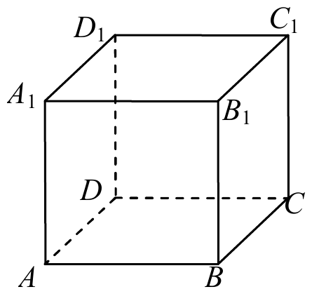
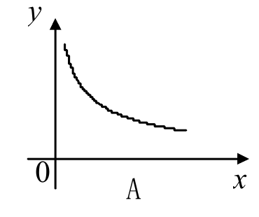
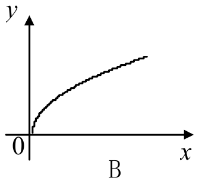
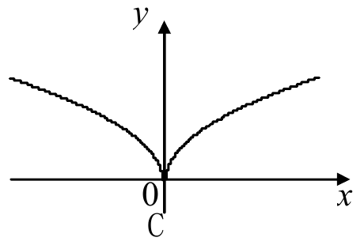
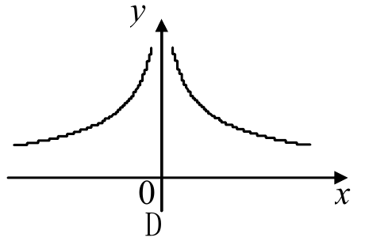
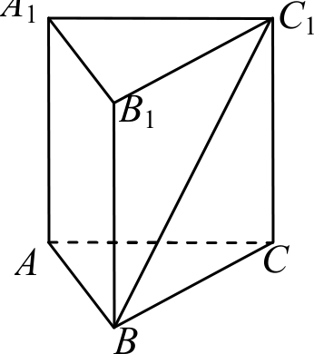
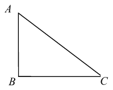
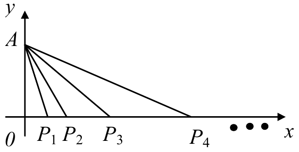

# 2013年上海卷（春）

## 填空题

### 第 1 题

函数 $y = \log_{2}(x + 2)$ 的定义域是＿＿＿＿＿＿.

#### 答案

$(-2, +\infty)$

#### 解析

对数的真数必须为正，因此必须满足 $x+2>0$，解得 $x>-2$. 所以函数的定义域为 $(-2,+\infty)$.

### 第 2 题

方程 $2^{x}=8$ 的解是＿＿＿＿＿＿.

#### 答案

$3$

#### 解析

因为 $8=2^3$，所以原方程化为 $2^x=2^3$. 指数函数 $2^x$ 在 $\mathbb{R}$ 上单调递增，故 $x=3$.

### 第 3 题

抛物线 $y^{2}=8x$ 的准线方程是＿＿＿＿＿＿.

#### 答案

$x=-2$

#### 解析

抛物线的标准方程为 $y^2=4px$，其准线方程为 $x=-p$. 由 $4p=8$ 得 $p=2$，所以准线方程为 $x=-2$.

### 第 4 题

函数 $y = 2 \sin x$ 的最小正周期是＿＿＿＿＿＿.

#### 答案

$2\pi$

#### 解析

正弦函数 $\sin x$ 的最小正周期为 $2\pi$，前面的系数 $2$ 只改变函数值的振幅，不改变周期. 因此 $y=2\sin x$ 的最小正周期为 $2\pi$.

### 第 5 题

已知向量 $\boldsymbol{a}= (1, k)$，$\boldsymbol{b}= (9, k - 6)$. 若 $\boldsymbol{a}\parallel \boldsymbol{b}$，则实数 $k =\underline{\qquad\qquad}$.

#### 答案

$-\frac{3}{4}$

#### 解析

两向量平行的充要条件是其坐标行列式为零. 因而

$$

\begin{vmatrix}1&k\\9&k-6\end{vmatrix}=1\cdot(k-6)-9k=0

$$

解得 $-8k-6=0$，即 $k=-\frac34$. 两向量的第一坐标均非零，不存在零向量的额外情形.

### 第 6 题

函数 $y = 4 \sin x + 3 \cos x$ 的最大值是＿＿＿＿＿＿.

#### 答案

$5$

#### 解析

由 $\sin^2x+\cos^2x=1$，有

$$

4\sin x+3\cos x=5\left(\frac45\sin x+\frac35\cos x\right)

$$

取满足 $\cos\varphi=\frac45$、$\sin\varphi=\frac35$ 的角 $\varphi$，上式为 $5\sin(x+\varphi)$. 因为 $-1\le\sin(x+\varphi)\le1$，其最大值为 $5$，且可以取得.

### 第 7 题

复数 $2+3\i$（$\i$ 是虚数单位）的模是＿＿＿＿＿＿.

#### 答案

$\sqrt{13}$

#### 解析

复数 $z=2+3\i$ 的模满足 $|z|=\sqrt{(\operatorname{Re}z)^2+(\operatorname{Im}z)^2}$. 因此

$$

|2+3\i|=\sqrt{2^2+3^2}=\sqrt{13}

$$

### 第 8 题

在 $\triangle ABC$ 中，角 $A$，$B$，$C$ 所对边长分别为 $a$，$b$，$c$，若 $a = 5$，$b = 8$，$B = 60^\circ$，则 $b =\underline{\qquad\qquad}$.

#### 答案

$8$

#### 解析

按原题题面，已知条件中直接给出边 $b=8$，所以填空处所求的 $b$ 就是 $8$. 原参考答案中的 $7$ 与该题面不一致；$7$ 是把题面改为 $c=8$ 后由余弦定理求得的数值，不能作为原题 $b$ 的答案.

### 第 9 题

在如图所示的正方体 $ABCD - A_{1}B_{1}C_{1}D_{1}$ 中，异面直线 $A_{1}B$ 与 $B_{1}C$ 所成角的大小为＿＿＿＿＿＿.

#### 答案

$\frac{\pi}{3}$

#### 解析

设正方体棱长为 $s$. 取坐标 $A(0,0,0)$、$B(s,0,0)$、$C(s,s,0)$、$A_1(0,0,s)$、$B_1(s,0,s)$. 则 $\overrightarrow{A_1B}=(s,0,-s)$，$\overrightarrow{B_1C}=(0,s,-s)$. 两向量的夹角就是两异面直线所成的锐角，且

$$

\cos\theta=\frac{\overrightarrow{A_1B}\cdot\overrightarrow{B_1C}}{|\overrightarrow{A_1B}|\,|\overrightarrow{B_1C}|}
=\frac{s^2}{(s\sqrt2)(s\sqrt2)}=\frac12

$$

由于 $0<\theta<\frac\pi2$，故 $\theta=\frac\pi3$.

### 第 10 题

从 $4$ 名男同学和 $6$ 名女同学中随机选取 $3$ 人参加某社团活动，选出的 $3$ 人中男女同学都有的概率为＿＿＿＿＿＿（结果用数值表示）.

#### 答案

$\frac{4}{5}$

#### 解析

从 $10$ 人中任选 $3$ 人，共有 $\mathrm C_{10}^{3}$ 种等可能选法. 选出的 $3$ 人男女都有的反面是全为男生或全为女生，分别有 $\mathrm C_4^3$ 种和 $\mathrm C_6^3$ 种，故

$$

P=1-\frac{\mathrm C_4^3+\mathrm C_6^3}{\mathrm C_{10}^3}
=1-\frac{4+20}{120}=\frac45

$$

### 第 11 题

若等差数列的前 $6$ 项和为 $23$，前 $9$ 项和为 $57$，则数列的前 $n$ 项和 $S_{n}=$＿＿＿＿＿＿.

#### 答案

$\frac{5n^{2}-7n}{6}$

#### 解析

设等差数列首项为 $a_1$，公差为 $d$. 由 $S_6=\frac{6}{2}(2a_1+5d)=23$，$S_9=\frac{9}{2}(2a_1+8d)=57$ 得 $2a_1+5d=\frac{23}{3}$、$2a_1+8d=\frac{38}{3}$. 两式相减得 $d=\frac53$，代回得 $a_1=-\frac13$. 因而

$$

S_n=\frac n2\left(2a_1+(n-1)d\right)
=\frac n2\left(-\frac23+\frac{5(n-1)}3\right)
=\frac{5n^2-7n}{6}

$$

### 第 12 题

$36$ 的所有正约数之和可按如下方法得到：因为 $36=2^{2}\times3^{2}$，所以 $36$ 的所有正约数之和为 $\displaystyle (1+3+3^{2})+(2+2\times3+2\times3^{2})+(2^{2}+2^{2}\times3+2^{2}\times3^{2})=(1+2+2^{2})(1+3+3^{2})=91$. 参照上述方法，可求得 $2000$ 的所有正约数之和为＿＿＿＿＿＿.

#### 答案

$4836$

#### 解析

分解 $2000=2^4\times5^3$. 每个正约数唯一写成 $2^i5^j$，其中 $0\le i\le4$、$0\le j\le3$，所以所有正约数之和为

$$

(1+2+2^2+2^3+2^4)(1+5+5^2+5^3)=31\times156=4836

$$

## 单选题

### 第 13 题

展开式为 $ad-bc$ 的行列式是（）

A.  
$\begin{vmatrix} a & b \\ d & c \end{vmatrix}$

B.  
$\begin{vmatrix} a & c \\ b & d \end{vmatrix}$

C.  
$\begin{vmatrix} a & d \\ b & c \end{vmatrix}$

D.  
$\begin{vmatrix} b & a \\ d & c \end{vmatrix}$

#### 答案

B

#### 解析

二阶行列式满足 $\begin{vmatrix}u&v\\w&t\end{vmatrix}=ut-vw$. 四个选项的展开式中，只有

$$

\begin{vmatrix}a&c\\b&d\end{vmatrix}=ad-bc

$$

因此应选 B.

### 第 14 题

设 $f^{-1}(x)$ 为函数 $f(x)=\sqrt{x}$ 的反函数，下列结论正确的是（）

A.  
$f^{-1}(2)=2$

B.  
$f^{-1}(2)=4$

C.  
$f^{-1}(4)=2$

D.  
$f^{-1}(4)=4$

#### 答案

B

#### 解析

函数 $f(x)=\sqrt{x}$ 的定义域和值域均为 $[0,+\infty)$. 由 $y=\sqrt{x}$ 得 $x=y^2$，所以 $f^{-1}(x)=x^2$（$x\ge0$）. 因而 $f^{-1}(2)=4$，而 $f^{-1}(4)=16$，只有选项 B 正确.

### 第 15 题

直线 $2x - 3y + 1 = 0$ 的一个方向向量是（）

A.  
$(2, -3)$

B.  
$(2, 3)$

C.  
$(-3, 2)$

D.  
$(3, 2)$

#### 答案

D

#### 解析

直线 $2x-3y+1=0$ 的法向量为 $(2,-3)$. 设方向向量为 $(u,v)$，则必须满足 $2u-3v=0$. 检查四个选项，只有 $(3,2)$ 满足 $2\times3-3\times2=0$，所以应选 D.

### 第 16 题

函数 $f(x)=x^{-\frac{1}{2}}$ 的大致图像是（）

A.  

B.  

C.  

D.  

#### 答案

A

#### 解析

函数 $f(x)=x^{-1/2}=\frac1{\sqrt{x}}$ 的定义域为 $x>0$，函数值始终为正. 且 $f'(x)=-\frac{1}{2x^{3/2}}<0$，$(x>0)$ 所以图像在第一象限内从左上方向右下方递减. 四个图像中符合这一特征的是 A.

### 第 17 题

如果 $a < b < 0$，那么下列不等式成立的是（）

A.  
$\frac{1}{a} < \frac{1}{b}$

B.  
$ab < b^{2}$

C.  
$-ab < -a^{2}$

D.  
$-\frac{1}{a} < -\frac{1}{b}$

#### 答案

D

#### 解析

因为 $a<b<0$，函数 $y=\frac1x$ 在负半轴上递减，所以 $\frac1a>\frac1b$，选项 A 不成立. 又因 $b<0$，由 $a<b$ 得 $ab>b^2$，选项 B 不成立；由 $a<0$ 且 $b-a>0$ 得 $a(b-a)<0$，即 $ab<a^2$，所以 $-ab>-a^2$，选项 C 不成立. 将 $\frac1a>\frac1b$ 两边乘以 $-1$，得 $-\frac1a<-\frac1b$，故应选 D.

### 第 18 题

若复数 $z_{1}$，$z_{2}$ 满足 $z_{1}=\overline{z_{2}}$，则 $z_{1}$，$z_{2}$ 在复数平面上对应的点 $Z_{1}$，$Z_{2}$（）

A.  
关于 $x$ 轴对称

B.  
关于 $y$ 轴对称

C.  
关于原点对称

D.  
关于直线 $y = x$ 对称

#### 答案

A

#### 解析

设 $z_2=u+v\i$，则 $z_1=\overline{z_2}=u-v\i$. 在复平面上，$z_2$ 对应点的坐标为 $(u,v)$，$z_1$ 对应点的坐标为 $(u,-v)$，两点关于 $x$ 轴对称. 因此应选 A.

### 第 19 题

$(1+x)^{10}$ 的二项展开式中的一项是（）

A.  
$45x$

B.  
$90x^{2}$

C.  
$120x^{3}$

D.  
$252x^{4}$

#### 答案

C

#### 解析

由二项式定理，$x^k$ 的系数为 $\mathrm C_{10}^{k}$. 四个选项分别对应 $45x\ne10x$，$90x^2\ne\mathrm C_{10}^{2}x^2=45x^2$ $\mathrm C_{10}^{3}x^3=120x^3$，$\mathrm C_{10}^{4}x^4=210x^4\ne252x^4$. 所以应选 C.

### 第 20 题

既是偶函数又在区间 $(0, \pi)$ 上单调递减的函数是（）

A.  
$y = \sin x$

B.  
$y = \cos x$

C.  
$y = \sin 2x$

D.  
$y = \cos 2x$

#### 答案

B

#### 解析

$y=\sin x$ 和 $y=\sin2x$ 都是奇函数，不符合偶函数条件. $y=\cos x$ 是偶函数，且在 $0<x<\pi$ 时有 $y'=-\sin x<0$，因此单调递减. 虽然 $y=\cos2x$ 也是偶函数，但其导数 $-2\sin2x$ 在 $(0,\frac\pi2)$ 与 $(\frac\pi2,\pi)$ 上符号不同，不是整个区间上的单调递减函数. 故选 B.

### 第 21 题

若两个球的表面积之比为 $1:4$，则这两个球的体积之比为（）

A.  
$1:2$

B.  
$1:4$

C.  
$1:8$

D.  
$1:16$

#### 答案

C

#### 解析

设两个球的半径分别为 $r_1$，$r_2$. 由表面积比得

$$

4\pi r_1^2:4\pi r_2^2=1:4

$$

所以 $r_1:r_2=1:2$. 体积与半径的三次方成正比，故

$$

V_1:V_2=r_1^3:r_2^3=1:8

$$

因此应选 C.

### 第 22 题

设全集 $U = \mathbb{R}$，下列集合运算结果为 $\mathbb{R}$ 的是（）

A.  
$\mathbb{Z} \cup \complement_U \mathbb{N}$

B.  
$\mathbb{N} \cap \complement_U \mathbb{N}$

C.  
$\complement_U (\complement_U \emptyset)$

D.  
$\complement_U \{0\}$

#### 答案

A

#### 解析

全集为 $\mathbb{R}$. 对选项 A，任意实数若属于 $\mathbb{N}$，则也属于 $\mathbb{Z}$；若不属于 $\mathbb{N}$，则属于 $\complement_{\mathbb{R}}\mathbb{N}$，故

$$

\mathbb{Z}\cup\complement_{\mathbb{R}}\mathbb{N}=\mathbb{R}

$$

选项 B 的交集为空，选项 C 为 $\complement_{\mathbb{R}}(\complement_{\mathbb{R}}\emptyset)=\emptyset$，选项 D 为 $\mathbb{R}\smallsetminus\{0\}$，均不等于 $\mathbb{R}$. 所以应选 A.

### 第 23 题

已知 $a$，$b$，$c \in \mathbb{R}$，“$b^2 - 4ac < 0$”是“函数 $f(x) = ax^2 + bx + c$ 的图像恒在 $x$ 轴上方”的（）

A.  
充分非必要条件

B.  
必要非充分条件

C.  
充要条件

D.  
既非充分又非必要条件

#### 答案

D

#### 解析

按题面只给出 $a$，$b$，$c\in\mathbb{R}$，因此允许 $a=0$. 先看充分性：取 $a=-1$，$b=0$，$c=-1$，则 $b^2-4ac=-4<0$，但 $f(x)=-x^2-1<0$，图像在 $x$ 轴下方，故该条件不是充分条件.

再看必要性：取 $a=0$，$b=0$，$c=1$，则 $f(x)=1$ 的图像恒在 $x$ 轴上方，但 $b^2-4ac=0$，不满足小于零，故该条件也不是必要条件. 因而它既非充分又非必要，应选 D.

### 第 24 题

已知 $A$，$B$ 为平面内两定点，过该平面内动点 $M$ 作直线 $AB$ 的垂线，垂足为 $N$. 若 $\overrightarrow{MN}^{2} = \lambda \overrightarrow{AN} \cdot \overrightarrow{NB}$，其中 $\lambda$ 为常数，则动点 $M$ 的轨迹不可能是（）

A.  
圆

B.  
椭圆

C.  
抛物线

D.  
双曲线

#### 答案

C

#### 解析

设 $AB=L>0$，取 $AB$ 为 $x$ 轴，令 $A=(0,0)$、$B=(L,0)$、$N=(t,0)$、$M=(t,y)$. 则 $\overrightarrow{MN}=(0,-y)$，$\overrightarrow{AN}=(t,0)$，$\overrightarrow{NB}=(L-t,0)$ 从而轨迹满足

$$

y^2=\lambda t(L-t)

$$

当 $\lambda>0$ 且 $0\le t\le L$ 时，配方得

$$

\frac{(t-L/2)^2}{L^2/4}+\frac{y^2}{\lambda L^2/4}=1

$$

这是椭圆，且 $\lambda=1$ 时为圆. 当 $\lambda<0$ 时，令 $\mu=-\lambda>0$，则

$$

y^2=\mu t(t-L)

$$

即

$$

\frac{(t-L/2)^2}{L^2/4}-\frac{y^2}{\mu L^2/4}=1

$$

这是双曲线. 当 $\lambda=0$ 时，轨迹退化为直线 $y=0$. 因而无论哪种情况都不可能得到抛物线，所以应选 C.

## 解答题

### 第 25 题

如图，在正三棱柱 $ABC-A_{1}B_{1}C_{1}$ 中，$AA_{1}=6$，异面直线 $BC_{1}$ 与 $AA_{1}$ 所成角的大小为 $\frac{\pi}{6}$，求该三棱柱的体积.

#### 解析

因为 $CC_{1}\parallel AA_{1}$，所以 $\angle BC_{1}C$ 为异面直线 $BC_{1}$ 与 $AA_{1}$ 所成的角，即 $\angle BC_{1}C=\frac{\pi}{6}$. 在直角三角形 $BC_{1}C$ 中，

$$

BC=CC_{1}\tan\frac{\pi}{6}=6\cdot\frac{1}{\sqrt{3}}=2\sqrt{3}

$$

从而 $S_{\triangle ABC}=\frac{\sqrt{3}}{4}\cdot BC^{2}=3\sqrt{3}$. 因此该三棱柱的体积为 $V=S_{\triangle ABC}\cdot AA_{1}=3\sqrt{3}\cdot 6=18\sqrt{3}$.

### 第 26 题

如图，某校有一块形如直角三角形 $ABC$ 的空地，其中 $\angle B$ 为直角，$AB$ 长 $40\text{ 米}$，$BC$ 长 $50\text{ 米}$，现欲在此空地上建造一间健身房，其占地形状为矩形，且 $B$ 为矩形的一个顶点，求该健身房的最大占地面积.

#### 解析

设矩形为 $EBFP$，$FP$ 长为 $x\text{ 米}$，其中 $0<x<40$. 健身房占地面积为 $y\text{ 平方米}$. 因为 $\triangle CFP\sim\triangle CBA$，$\frac{FP}{BA}=\frac{CF}{CB}$，即 $\frac{x}{40}=\frac{50-BF}{50}$，求得 $BF=50-\frac{5}{4}x$. 从而

$$

y=BF\cdot FP=\left(50-\frac{5}{4}x\right)x=-\frac{5}{4}x^2+50x=-\frac{5}{4}(x-20)^2+500\le 500

$$

当且仅当 $x=20$ 时，等号成立. 答：该健身房的最大占地面积为 $500\text{ 平方米}$.

### 第 27 题

已知数列 $\{a_n\}$ 的前 $n$ 项和为 $S_n = -n^2 + n$，数列 $\{b_n\}$ 满足 $b_n = 2^{a_n}$，求 $\lim\limits_{n \to \infty} (b_1 + b_2 + \cdots + b_n)$.

#### 解析

当 $n\ge 2$ 时，

$$

a_n=S_n-S_{n-1}=(-n^{2}+n)-\bigl(-(n-1)^{2}+(n-1)\bigr)=-2n+2

$$

且 $a_1=S_1=0$. 因此 $b_n=2^{a_n}=2^{-2n+2}=\bigl(\frac14\bigr)^{n-1}$. 所以数列 $\{b_n\}$ 是首项为 $1$，公比为 $\frac14$ 的无穷等比数列， $\lim\limits_{n\to\infty}(b_1+b_2+\cdots+b_n)=\frac{1}{1-\frac14}=\frac43$.

### 第 28 题

已知椭圆 $C$ 的两个焦点分别为 $F_{1}(-1,0)$，$F_{2}(1,0)$，短轴的两个端点分别为 $B_{1}$，$B_{2}$.

1.  若 $\triangle F_{1}B_{1}B_{2}$ 为等边三角形，求椭圆 $C$ 的方程；

2.  若椭圆 $C$ 的短轴长为 $2$，过点 $F_{2}$ 的直线 $l$ 与椭圆 $C$ 相交于 $P$，$Q$ 两点，且 $\overrightarrow{F_{1}P} \perp \overrightarrow{F_{1}Q}$，求直线 $l$ 的方程.

#### 解析

1.  设椭圆 $C$ 的方程为 $\frac{x^2}{a^2}+\frac{y^2}{b^2}=1$（$a>b>0$），则 $c=1$，$a^2=b^2+c^2$. 由 $\triangle F_1B_1B_2$ 为等边三角形，得 $F_1B_1^2=1+b^2=(2b)^2$，所以 $b^2=\frac13$，$a^2=\frac43$. 故椭圆 $C$ 的方程为 $\frac{x^2}{4/3}+\frac{y^2}{1/3}=1$.

2.  短轴长为 $2$，故 $b=1$，$a^2=2$，椭圆方程为 $\frac{x^2}{2}+y^2=1$. 当直线 $l$ 的斜率不存在时，其方程为 $x=1$，交点为 $(1,1)$、$(1,-1)$，且 $\overrightarrow{F_1P}=(2,1)$，$\overrightarrow{F_1Q}=(2,-1)$，$\overrightarrow{F_1P}\cdot\overrightarrow{F_1Q}=3\ne0$ 不符合垂直条件；当直线 $l$ 的斜率存在时，设直线 $l$ 的方程为 $y=k(x-1)$. 联立椭圆方程得 $(2k^2+1)x^2-4k^2x+2(k^2-1)=0$. 设 $P(x_1,y_1)$，$Q(x_2,y_2)$，则 $x_1+x_2=\frac{4k^2}{2k^2+1}$，$x_1x_2=\frac{2(k^2-1)}{2k^2+1}$， 且 $y_i=k(x_i-1)$. 由 $\overrightarrow{F_1P}\perp\overrightarrow{F_1Q}$，

$$

0=(x_1+1)(x_2+1)+y_1y_2
    =(k^2+1)x_1x_2-(k^2-1)(x_1+x_2)+k^2+1
    =\frac{7k^2-1}{2k^2+1}

$$

    上述关于 $x_1$，$x_2$ 的二次方程的判别式为

$$

\Delta=8(k^2+1)>0

$$

    所以所得斜率对应两个不同的交点；故 $k=\pm\frac{\sqrt7}{7}$ 均满足题设条件，直线 $l$ 的方程为 $x+\sqrt7y-1=0$ 或 $x-\sqrt7y-1=0$.

### 第 29 题

已知抛物线 $C: y^{2} = 4x$ 的焦点为 $F$.

1.  点 $A$，$P$ 满足 $\overrightarrow{AP} = -2\overrightarrow{FA}$. 当点 $A$ 在抛物线 $C$ 上运动时，求动点 $P$ 的轨迹方程；

2.  在 $x$ 轴上是否存在点 $Q$，使得点 $Q$ 关于直线 $y = 2x$ 的对称点在抛物线 $C$ 上？如果存在，求所有满足条件的点 $Q$ 的坐标；如果不存在，请说明理由.

#### 解析

1.  设动点 $P$ 的坐标为 $(x,y)$，点 $A$ 的坐标为 $(x_A,y_A)$. 由 $F=(1,0)$ 及 $\overrightarrow{AP}=-2\overrightarrow{FA}$，得 $(x-x_A,y-y_A)=-2(x_A-1,y_A)$， 从而 $x_A=2-x$，$y_A=-y$. 又 $A$ 在抛物线 $C:y^2=4x$ 上，故 $y_A^2=4x_A$，即动点 $P$ 的轨迹方程为 $y^2=8-4x$.

2.  设点 $Q$ 的坐标为 $(t,0)$，对称点为 $Q'(u,v)$. 因为 $QQ'\perp y=2x$，且 $QQ'$ 的中点在 $y=2x$ 上，所以 $(u-t)+2v=0$，$\frac v2=2\cdot\frac{t+u}{2}$. 解得 $u=-\frac35t$，$v=\frac45t$，即 $Q'=\left(-\frac35t,\frac45t\right)$. 若 $Q'$ 在 $C$ 上，则 $\left(\frac45t\right)^2=4\left(-\frac35t\right)$， 解得 $t=0$ 或 $t=-\frac{15}{4}$. 所以存在满足题意的点 $Q$，其坐标为 $(0,0)$ 和 $\left(-\frac{15}{4},0\right)$.

### 第 30 题

在平面直角坐标系 $xOy$ 中，点 $A$ 在 $y$ 轴正半轴上，点 $P_{n}$ 在 $x$ 轴上，其横坐标为 $x_{n}$，且 $\{x_{n}\}$ 是首项为 $1$，公比为 $2$ 的等比数列，记 $\angle P_{n}AP_{n+1} = \theta_{n}$，$n \in \mathbb{N}^{*}$.

1.  若 $\theta_{3}=\arctan\frac{1}{3}$，求点 $A$ 的坐标；

2.  若点 $A$ 的坐标为 $(0, 8\sqrt{2})$，求 $\theta_{n}$ 的最大值及相应 $n$ 的值.

#### 解析

1.  设 $A(0,t)$. 根据题意，$P_n=(2^{n-1},0)$. 由 $\theta_3=\arctan\frac13$，

$$

\tan\theta_3=\tan(\angle OAP_4-\angle OAP_3)=\frac{\frac{x_4}{t}-\frac{x_3}{t}}{1+\frac{x_4x_3}{t^2}}=\frac{4t}{t^2+32}=\frac13

$$

    解得 $t=4$ 或 $t=8$，故点 $A$ 的坐标为 $(0,4)$ 或 $(0,8)$.

2.  由题意 $A=(0,8\sqrt2)$，且 $\tan\angle OAP_n=\frac{2^{n-1}}{8\sqrt2}$. 因此

$$

\tan\theta_n=\frac{\frac{2^n}{8\sqrt2}-\frac{2^{n-1}}{8\sqrt2}}{1+\frac{2^n}{8\sqrt2}\cdot\frac{2^{n-1}}{8\sqrt2}}=\frac{1}{\frac{16\sqrt2}{2^n}+\frac{2^n}{8\sqrt2}}

$$

    由均值不等式，

$$

\frac{16\sqrt2}{2^n}+\frac{2^n}{8\sqrt2}\ge 2\sqrt2

$$

    且当且仅当 $n=4$ 时取等号. 由于 $0<\theta_n<\frac\pi2$，故 $\theta_n$ 的最大值为 $\arctan\frac{\sqrt2}{4}$，相应 $n=4$.

### 第 31 题

已知真命题：“函数 $y = f(x)$ 的图像关于点 $P(a, b)$ 成中心对称图形”的充要条件为“函数 $y = f(x + a) - b$ 是奇函数”.

1.  将函数 $g(x)=x^{3}-3x^{2}$ 的图像向左平移 $1$ 个单位，再向上平移 $2$ 个单位，求此时图像对应的函数解析式，并利用题设中的真命题求函数 $g(x)$ 图像对称中心的坐标；

2.  求函数 $h(x)=\log_{2}\frac{2x}{4-x}$ 图像对称中心的坐标；

3.  已知命题：“函数 $y = f(x)$ 的图像关于某直线成轴对称图像”的充要条件为“存在实数 $a$ 和 $b$，使得函数 $y = f(x + a) - b$ 是偶函数”. 判断该命题的真假. 如果是真命题，请给予证明；如果是假命题，请说明理由，并类比题设的真命题对它进行修改，使之成为真命题（不必证明）.

#### 解析

1.  平移后图像对应的函数解析式为 $y=(x+1)^3-3(x+1)^2+2=x^3-3x$. 由于函数 $y=x^3-3x$ 是奇函数，由题设真命题知，函数 $g(x)$ 图像对称中心的坐标是 $(1,-2)$.

2.  设 $h(x)=\log_2\frac{2x}{4-x}$ 的对称中心为 $P(a,b)$. 由题设知函数 $h(x+a)-b$ 是奇函数. 令 $f(x)=h(x+a)-b$，则 $f(x)=\log_2\frac{2x+2a}{4-a-x}-b$. 由不等式 $\frac{2x+2a}{4-a-x}>0$ 的解集为 $(-a,4-a)$，其区间中点为 $2-a$. 因 $f$ 为奇函数，其定义域须关于原点对称，故 $2-a=0$，得 $a=2$. 此时 $f(x)=\log_2\frac{2(x+2)}{2-x}-b$，$x\in(-2,2)$. 任取 $x\in(-2,2)$，有

$$

f(-x)+f(x)
    =\log_2\left(\frac{2(2-x)}{2+x}\cdot\frac{2(x+2)}{2-x}\right)-2b
    =\log_2 4-2b
    =2-2b

$$

    由 $f$ 为奇函数，$f(-x)+f(x)=0$，故 $b=1$. 所以函数 $h(x)$ 图像对称中心的坐标是 $(2,1)$.

3.  该命题是假命题. 举反例说明：函数 $f(x)=x$ 的图像关于直线 $y=x$ 成轴对称图像，但是对任意实数 $a$ 和 $b$，函数 $y=f(x+a)-b$，即 $y=x+a-b$ 总不是偶函数.

    修改后的真命题：“函数 $y=f(x)$ 的图像关于直线 $x=a$ 成轴对称图像”的充要条件是“函数 $y=f(x+a)$ 是偶函数”.
