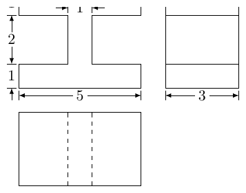
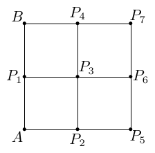
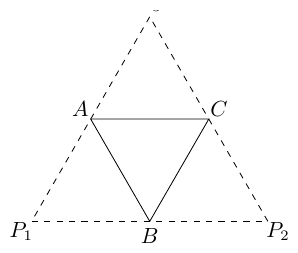
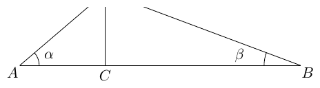

# 2014年上海卷（秋文）

## 填空题

### 第 1 题

函数 $y = 1 - 2\cos^{2}(2x)$ 的最小正周期是＿＿＿＿＿＿.

#### 答案

$\frac{\pi}{2}$

#### 解析

由降幂公式，$y=1-\left(1+\cos4x\right)=-\cos4x$. 函数 $\cos4x$ 的最小正周期为 $\dfrac{2\pi}{4}=\dfrac{\pi}{2}$，乘以 $-1$ 不改变周期，因此所求最小正周期为 $\dfrac{\pi}{2}$.

### 第 2 题

若复数 $z = 1 + 2\i$，其中 $\i$ 是虚数单位，则 $\left(z + \frac{1}{\overline{z}}\right) \cdot \overline{z} =$＿＿＿＿＿＿.

#### 答案

$6$

#### 解析

因为 $\overline z=1-2\i$，所以 $z\overline z=1^2+2^2=5$，且 $\dfrac{1}{\overline z}=\dfrac{z}{z\overline z}=\dfrac{z}{5}$. 因而 $\left(z+\dfrac{1}{\overline z}\right)\overline z=z\overline z+1=5+1=6$.

### 第 3 题

设常数 $a \in \mathbb{R}$，函数 $f(x) = |x - 1| + |x^2 - a|$，若 $f(2) = 1$，则 $f(1) =$＿＿＿＿＿＿.

#### 答案

$3$

#### 解析

由 $f(2)=|2-1|+|4-a|=1+|4-a|=1$，得 $|4-a|=0$，所以 $a=4$. 因此 $f(1)=|1-1|+|1-4|=3$.

### 第 4 题

若抛物线 $y^{2} = 2px$ 的焦点与椭圆 $\frac{x^2}{9} + \frac{y^2}{5} = 1$ 的右焦点重合，则该抛物线的准线方程为＿＿＿＿＿＿.

#### 答案

$x=-2$

#### 解析

椭圆的焦半距满足 $c^2=9-5=4$，故右焦点为 $(2,0)$. 对抛物线 $y^2=2px$，焦点为 $\left(\dfrac p2,0\right)$，准线为 $x=-\dfrac p2$. 由焦点重合得 $\dfrac p2=2$，所以 $p=4$，准线方程为 $x=-2$.

### 第 5 题

某校高一，高二，高三分别有学生 $1600\text{ 名}$、$1200\text{ 名}$、$800\text{ 名}$. 为了解该校高中学生的牙齿健康状况，按各年级的学生数进行分层抽样. 若高三抽出 $20\text{ 名}$学生，则高一，高二共抽取的学生数为＿＿＿＿＿＿.

#### 答案

$70$

#### 解析

分层抽样中各层抽取人数与该层学生人数成比例. 三个年级人数之比为 $1600:1200:800=4:3:2$. 高三的 $2$ 份对应 $20$ 人，因此每份对应 $10$ 人，高一、高二共对应 $4+3=7$ 份，抽取人数为 $7\times10=70$.

### 第 6 题

若实数 $x$，$y$ 满足 $xy = 1$，则 $x^2 + 2y^2$ 的最小值为＿＿＿＿＿＿.

#### 答案

$2\sqrt{2}$

#### 解析

由 $xy=1$ 知 $x\ne0$，且 $y^2=\dfrac{1}{x^2}$. 令 $u=x^2>0$，则 $x^2+2y^2=u+\dfrac{2}{u}\geqslant2\sqrt{2}$，其中等号成立当且仅当 $u=\sqrt2$. 此时可取 $x=2^{1/4}$、$y=2^{-1/4}$，满足 $xy=1$，所以最小值为 $2\sqrt2$.

### 第 7 题

在长方体中割去两个小长方体后的几何体的三视图如图，则切割掉的两个小长方体的体积之和等于＿＿＿＿＿＿.

#### 答案

$24$

#### 解析

由主视图可知，两个缺口在横向上的宽均为 $2$，在竖直方向上的高均为 $2$：大长方形的总宽为 $5$，中间保留部分的宽为 $1$，所以两侧缺口的宽为 $(5-1)/2=2$，缺口的高度由图中标注为 $2$. 由左视图和俯视图可知，两个缺口均贯穿长方体的整个深度，深度为 $3$. 因此每个被切去的小长方体的体积为 $2\times3\times2=12$，两个小长方体的体积之和为 $2\times12=24$.

### 第 8 题

若圆锥的侧面积是底面积的 $3$ 倍，则其母线与轴所成角的大小为＿＿＿＿＿＿.（结果用反三角函数值表示）

#### 答案

$\arcsin\frac{1}{3}$

#### 解析

设圆锥底面半径为 $r>0$，母线长为 $l$. 由圆锥侧面积为 $\pi rl$、底面积为 $\pi r^2$，且侧面积是底面积的 $3$ 倍，得 $\pi rl=3\pi r^2$，从而 $l=3r$. 设母线与轴所成的锐角为 $\theta$. 在圆锥的轴截面中，母线是斜边，底面半径是与 $\theta$ 对应的对边，因此 $\sin\theta=\dfrac r l=\dfrac13$. 由于 $0<\theta<\dfrac\pi2$，所以 $\theta=\arcsin\dfrac13$.

### 第 9 题

设

$$

f(x) = \begin{cases}
(x - a)^2, & x \leqslant 0,\\
x + \frac{1}{x} + a, & x > 0,
\end{cases}

$$

若 $f(0)$ 是 $f(x)$ 的最小值，则 $a$ 的取值范围为＿＿＿＿＿＿.

#### 答案

$\left[0,2\right]$

#### 解析

有 $f(0)=a^2$. 若 $a<0$，则点 $x=a\leqslant0$ 属于第一段定义域，且 $f(a)=0<a^2=f(0)$，不合题意，所以必须有 $a\geqslant0$. 此时对任意 $x\leqslant0$，有 $a-x\geqslant a$，从而 $f(x)=(a-x)^2\geqslant a^2=f(0)$. 对任意 $x>0$，由基本不等式得 $x+\dfrac1x+a\geqslant2+a$，且在 $x=1$ 时取等号. 因而 $f(0)$ 为全局最小值的充要条件是 $a^2\leqslant a+2$. 联立 $a\geqslant0$，得 $(a-2)(a+1)\leqslant0$，所以 $0\leqslant a\leqslant2$.

### 第 10 题

设无穷等比数列 $\{a_{n}\}$ 的公比为 $q$，若 $a_{1} = \lim\limits_{n\to \infty}(a_{3} + a_{4} + \dots + a_{n})$，则 $q =\underline{\qquad\qquad}$.

#### 答案

$\frac{\sqrt{5}-1}{2}$

#### 解析

按非零首项的无穷等比数列定义，尾项和存在必须有 $|q|<1$. 由等比数列求和公式， $\lim\limits_{n\to\infty}(a_3+a_4+\cdots+a_n)=\dfrac{a_1q^2}{1-q}$. 与题设相等并约去非零的 $a_1$，得 $1=\dfrac{q^2}{1-q}$，即 $q^2+q-1=0$. 解得 $q=\dfrac{-1\pm\sqrt5}{2}$，其中只有 $\dfrac{\sqrt5-1}{2}$ 满足 $|q|<1$，故所求为 $\dfrac{\sqrt5-1}{2}$.

### 第 11 题

若 $f(x) = x^{\frac{2}{3}} - x^{-\frac{1}{2}}$，则满足 $f(x) < 0$ 的 $x$ 的取值范围是＿＿＿＿＿＿.

#### 答案

$\left(0,1\right)$

#### 解析

由于含有 $x^{-1/2}=\dfrac1{\sqrt x}$，函数定义域为 $x>0$. 在此范围内，$f(x)<0$ 等价于 $x^{2/3}<x^{-1/2}$. 两边同乘正数 $x^{1/2}$，得 $x^{7/6}<1$，所以 $0<x<1$.

### 第 12 题

方程 $\sin x + \sqrt{3}\cos x = 1$ 在区间 $[0, 2\pi]$ 上的所有解的和等于＿＿＿＿＿＿.

#### 答案

$\frac{7\pi}{3}$

#### 解析

由辅助角公式，$\sin x+\sqrt3\cos x=2\sin\left(x+\dfrac\pi3\right)$，故方程等价于 $\sin\left(x+\dfrac\pi3\right)=\dfrac12$. 令 $t=x+\dfrac\pi3$，则 $t\in\left[\dfrac\pi3,\dfrac{7\pi}3\right]$. 在此区间内，只有 $t=\dfrac{5\pi}6$ 和 $t=\dfrac{13\pi}6$ 满足正弦值为 $\dfrac12$，所以 $x=\dfrac\pi2$ 或 $x=\dfrac{11\pi}6$. 所有解的和为 $\dfrac\pi2+\dfrac{11\pi}6=\dfrac{7\pi}3$.

### 第 13 题

为强化安全意识，某商场拟在未来的连续 $10\text{ 天}$ 中随机选择 $3\text{ 天}$进行紧急疏散演练，则选择的 $3\text{ 天}$恰好为连续 $3\text{ 天}$的概率是＿＿＿＿＿＿.（结果用最简分数表示）

#### 答案

$\frac{1}{15}$

#### 解析

从连续十天中任选三天，基本事件总数为 $\mathrm C_{10}^{3}=120$. 恰为连续三天时，起始日可以是第 $1$ 天至第 $8$ 天，共有 $8$ 种. 因此所求概率为 $\dfrac{8}{120}=\dfrac1{15}$.

### 第 14 题

已知曲线 $C: x = -\sqrt{4 - y^2}$，直线 $l: x = 6$. 若对于点 $A(m,0)$，存在 $C$ 上的点 $P$ 和 $l$ 上的 $Q$ 使得 $\overrightarrow{AP} + \overrightarrow{AQ} = \overrightarrow{0}$，则 $m$ 的取值范围为＿＿＿＿＿＿.

#### 答案

$[2,3]$

#### 解析

设 $P=(x,y)$，则由曲线方程知 $-2\leqslant x\leqslant0$，且 $Q$ 在直线 $x=6$ 上. 向量等式等价于 $P+Q=2A=(2m,0)$，所以 $Q=(6,-y)$，并且 $2m=x+6$. 因此 $m=\dfrac{x+6}{2}$，随 $x\in[-2,0]$ 取遍 $[2,3]$. 反过来，左半圆上每个 $x\in[-2,0]$ 都有相应的 $y$，故区间内每个 $m$ 都能实现，所求范围为 $[2,3]$.

## 单选题

### 第 15 题

设 $a$，$b \in \mathbb{R}$，则“$a + b > 4$”是“$a > 2$ 且 $b > 2$”的（）

A.  
充分非必要条件

B.  
必要非充分条件

C.  
充要条件

D.  
既不充分也不必要条件

#### 答案

B

#### 解析

若 $a>2$ 且 $b>2$，则 $a+b>4$，所以“$a+b>4$”是“$a>2$ 且 $b>2$”的必要条件. 但取 $a=3$、$b=2$，有 $a+b=5>4$，而 $b>2$ 不成立，故不是充分条件，选 B.

### 第 16 题

已知互异的复数 $a$，$b$ 满足 $ab \neq 0$，集合 $\{a, b\} = \{a^2, b^2\}$，则 $a + b =$（）

A.  
$2$

B.  
$1$

C.  
$0$

D.  
$-1$

#### 答案

D

#### 解析

由于 $a\ne b$，集合相等时不可能同时有 $a=a^2$ 和 $b=b^2$，否则由 $ab\ne0$ 得 $a=b=1$. 因而只能有 $a=b^2$、$b=a^2$. 代入得 $a=a^4$，而 $a\ne0$，所以 $a^3=1$. 若 $a=1$，则 $b=a^2=1$，与互异矛盾；故 $a$ 是非实的三次单位根，且 $b=a^2$. 由 $1+a+a^2=0$，得 $a+b=a+a^2=-1$，选 D.

### 第 17 题

如图，四个边长为 1 的小正方形排成一个大正方形，$AB$ 是大正方形的一边，$P_i$（$i=1$，$2$，$\cdots$，$7$） 是小正方形的其余顶点，则 $\overrightarrow{AB} \cdot \overrightarrow{AP_i}$（$i=1$，$2$，$\cdots$，$7$） 的不同值的个数为（）

A.  
$7$

B.  
$5$

C.  
$3$

D.  
$1$

#### 答案

C

#### 解析

以 $A$ 为原点，令 $AB$ 方向为纵轴正方向，建立直角坐标系，则 $A=(0,0)$、$B=(0,2)$，且七个点的纵坐标分别只能为 $0$、$1$、$2$. 对任一点 $P_i=(u,v)$，有 $\overrightarrow{AB}=(0,2)$、$\overrightarrow{AP_i}=(u,v)$，所以 $\overrightarrow{AB}\cdot\overrightarrow{AP_i}=2v$. 其不同值为 $0$、$2$、$4$，共 $3$ 个，选 C.

### 第 18 题

已知 $P_{1}(a_{1}, b_{1})$ 与 $P_{2}(a_{2}, b_{2})$ 是直线 $y = kx + 1$（$k$ 为常数）上两个不同的点，则关于 $x$ 和 $y$ 的方程组

$$

\begin{cases}
a_{1}x + b_{1}y = 1,\\
a_{2}x + b_{2}y = 1
\end{cases}

$$

的解的情况是（）

A.  
无论 $k, P_{1}, P_{2}$ 如何，总是无解

B.  
无论 $k$，$P_{1}$，$P_{2}$ 如何，总有唯一解

C.  
存在 $k$，$P_{1}$，$P_{2}$，使之恰有两解

D.  
存在 $k$，$P_{1}$，$P_{2}$，使之有无穷多解

#### 答案

B

#### 解析

由 $P_i$ 在直线 $y=kx+1$ 上，有 $b_i=ka_i+1$（$i=1$，$2$）. 方程组的系数行列式为 $a_1b_2-a_2b_1=a_1(ka_2+1)-a_2(ka_1+1)=a_1-a_2$. 若 $a_1=a_2$，则由同一直线方程可得 $b_1=b_2$，与两点不同矛盾，因此 $a_1-a_2\ne0$. 系数行列式非零，方程组始终有唯一解，选 B.

## 解答题

### 第 19 题

底面边长为 $2$ 的正三棱锥 $P-ABC$，其表面展开图是三角形 $P_{1}P_{2}P_{3}$，如图，求 $\triangle P_{1}P_{2}P_{3}$ 的各边长及此三棱锥的体积 $V$.

#### 解析

设正三棱锥的侧棱长为 $l$. 由展开图，$P_1$，$B$，$P_2$ 共线，且 $P_1B=BP_2=l$，所以 $P_1P_2=2l$. 又因 $P_2$，$C$，$P_3$ 共线且 $P_2C=CP_3=l$，有 $P_2P_3=2l$；因 $P_3$，$A$，$P_1$ 共线且 $P_3A=AP_1=l$，有 $P_3P_1=2l$. 因此 $\triangle P_1P_2P_3$ 的三边相等.

在展开图中，$A$、$B$、$C$ 分别位于外三角形 $P_1P_2P_3$ 的三边上，且每个点把相应边分成长度均为 $l$ 的两段，所以 $A$、$B$、$C$ 分别是三边的中点. 由三角形中位线定理，$AB$、$BC$、$CA$ 分别等于外三角形对应边长的一半，即 $AB=BC=CA=l$. 底面边长为 $2$，故 $l=2$，于是 $P_1P_2=P_2P_3=P_3P_1=2l=4$.

设底面中心为 $O$. 正三角形 $ABC$ 的高为 $\sqrt{2^2-1^2}=\sqrt3$，所以其外接圆半径为 $AO=\dfrac23\sqrt3=\dfrac{2\sqrt3}{3}$. 正三棱锥的高 $PO$ 垂直于底面，且 $PA=l=2$. 在直角三角形 $PAO$ 中， $PO=\sqrt{PA^2-AO^2}=\sqrt{4-\dfrac43}=\dfrac{2\sqrt6}{3}$.

底面面积为 $S_{ABC}=\dfrac12\times2\times\sqrt3=\sqrt3$，故三棱锥体积为 $V=\dfrac13S_{ABC}\cdot PO=\dfrac13\times\sqrt3\times\dfrac{2\sqrt6}{3}=\dfrac{2\sqrt2}{3}$.

### 第 20 题

设常数 $a \geqslant 0$，函数 $f(x) = \dfrac{2^x + a}{2^x - a}$.

1.  若 $a = 4$，求函数 $y = f(x)$ 的反函数 $y = f^{-1}(x)$；

2.  根据 $a$ 的不同取值，讨论函数 $y = f(x)$ 的奇偶性，并说明理由.

#### 解析

1.  当 $a=4$ 时，函数定义域为 $x\ne2$. 设 $y=\dfrac{2^x+4}{2^x-4}$，则 $y(2^x-4)=2^x+4$，所以 $(y-1)2^x=4(y+1)$，即 $2^x=\dfrac{4(y+1)}{y-1}$. 因而 $x=\log_2\dfrac{4(y+1)}{y-1}$. 当 $0<2^x<4$ 时，$y<-1$；当 $2^x>4$ 时，$y>1$，所以值域为 $(-\infty,-1)\cup(1,+\infty)$. 交换自变量与因变量，得 $f^{-1}(x)=\log_2\dfrac{4x+4}{x-1}$，定义域为 $x\in(-\infty,-1)\cup(1,+\infty)$.

2.  当 $a=0$ 时，$f(x)=1$，定义域为 $\mathbb{R}$，且 $f(-x)=f(x)$，所以是偶函数. 当 $a=1$ 时，定义域为 $\mathbb{R}\mathbin{\backslash}\{0\}$，且 $f(-x)=\dfrac{2^{-x}+1}{2^{-x}-1}=\dfrac{1+2^x}{1-2^x}=-\dfrac{2^x+1}{2^x-1}=-f(x)$，所以是奇函数. 当 $a>0$ 且 $a\ne1$ 时，定义域为 $\mathbb{R}\mathbin{\backslash}\{\log_2a\}$，被排除的点不为 $0$，定义域不关于原点对称，因而既不是奇函数也不是偶函数.

### 第 21 题

如图，某公司要在 $A$，$B$ 两地连线上的定点 $C$ 处建造广告牌 $CD$，其中 $D$ 为顶端，$AC$ 长 $35\text{ 米}$，$CB$ 长 $80\text{ 米}$. 设点 $A$，$B$ 在同一水平面上，从 $A$ 和 $B$ 看 $D$ 的仰角分别为 $\alpha$ 和 $\beta$.

1.  设计中 $CD$ 是铅垂方向. 若要求 $\alpha \geqslant 2\beta$，问 $CD$ 的长至多为多少（结果精确到 $0.01\text{ 米}$）？

2.  施工完成后，$CD$ 与铅垂方向有偏差. 现在实测得 $\alpha = 38.12^{\circ}$，$\beta = 18.45^{\circ}$，求 $CD$ 的长（结果精确到 $0.01\text{ 米}$）.

#### 解析

1.  设 $CD=h\text{ 米}$. 因为 $CD$ 铅垂，所以在两个直角三角形中有 $\tan\alpha=\dfrac h{35}$、$\tan\beta=\dfrac h{80}$. 由 $\alpha\geqslant2\beta$ 且 $\alpha<\dfrac\pi2$，可知 $2\beta<\dfrac\pi2$，故 $h<80$，正切函数在相关区间上单调递增. 因此 $\dfrac h{35}\geqslant\tan2\beta=\dfrac{2\tan\beta}{1-\tan^2\beta}=\dfrac{2h/80}{1-h^2/80^2}$. 由于 $h>0$ 且 $h<80$，可约去 $h$，并得到 $\dfrac1{35}\geqslant\dfrac{2/80}{1-h^2/80^2}=\dfrac1{40\left(1-h^2/6400\right)}$. 分母为正，交叉相乘得 $40\left(1-h^2/6400\right)\geqslant35$，即 $h^2\leqslant800$. 所以 $h\leqslant20\sqrt2\approx28.2843$，故 $CD$ 至多为 $28.28\text{ 米}$.

2.  由 $AB=AC+CB=115\text{ 米}$，在三角形 $ADB$ 中有 $\angle DAB=38.12^{\circ}$、$\angle ABD=18.45^{\circ}$. 由正弦定理， $\dfrac{BD}{\sin38.12^{\circ}}=\dfrac{115}{\sin\left(38.12^{\circ}+18.45^{\circ}\right)}$，所以 $BD=\dfrac{115\sin38.12^{\circ}}{\sin56.57^{\circ}}\approx85.0637\text{ 米}$. 在三角形 $BCD$ 中，$BC=80\text{ 米}$，且 $\angle CBD=18.45^{\circ}$. 由余弦定理， $CD^2=BC^2+BD^2-2\cdot BC\cdot BD\cos18.45^{\circ}$，从而 $CD\approx\sqrt{80^2+85.0637^2-2\cdot80\cdot85.0637\cos18.45^{\circ}}\approx26.9296\text{ 米}$. 精确到 $0.01\text{ 米}$ 得 $CD=26.93\text{ 米}$.

### 第 22 题

在平面直角坐标系 $xOy$ 中，对于直线 $l: ax + by + c = 0$ 和点 $P_{1}(x_{1}, y_{1})$，$P_{2}(x_{2}, y_{2})$，记 $\eta = (ax_{1} + by_{1} + c)(ax_{2} + by_{2} + c)$. 若 $\eta < 0$，则称点 $P_{1}$，$P_{2}$ 被直线 $l$ 分隔. 若曲线 $C$ 与直线 $l$ 没有公共点，且曲线 $C$ 上存在点 $P_{1}$，$P_{2}$ 被直线 $l$ 分隔，则称直线 $l$ 为曲线 $C$ 的一条分隔线.

1.  求证：点 $A(1,2)$，$B(-1,0)$ 被直线 $x + y - 1 = 0$ 分隔；

2.  若直线 $y = kx$ 是曲线 $x^2 - 4y^2 = 1$ 的分隔线，求实数 $k$ 的取值范围；

3.  动点 $M$ 到点 $Q(0,2)$ 的距离与到 $y$ 轴的距离之积为 $1$，设点 $M$ 的轨迹为 $E$. 求 $E$ 的方程，并证明 $y$ 轴为曲线 $E$ 的分隔线.

#### 解析

1.  对直线 $x+y-1=0$，分别计算得 $1+2-1=2$、$-1+0-1=-2$，两者乘积为 $-4<0$，所以点 $A$、$B$ 被该直线分隔.

2.  将直线 $y=kx$ 代入曲线方程，得 $(1-4k^2)x^2=1$. 直线与曲线没有公共点的充要条件是 $1-4k^2\leqslant0$，即 $|k|\geqslant\dfrac12$. 当 $|k|\geqslant\dfrac12$ 时，曲线上两点 $(1,0)$、$(-1,0)$ 对直线 $y-kx=0$ 的代数式值分别为 $-k$、$k$，其乘积为 $-k^2<0$，所以确实存在被直线分隔的两点. 因此 $k\in\left(-\infty,-\dfrac12\right]\cup\left[\dfrac12,+\infty\right)$.

3.  设 $M=(x,y)$. 到点 $Q(0,2)$ 的距离为 $\sqrt{x^2+(y-2)^2}$，到 $y$ 轴的距离为 $|x|$. 由题意得 $|x|\sqrt{x^2+(y-2)^2}=1$. 两边均非负，平方后得到轨迹方程 $\bigl(x^2+(y-2)^2\bigr)x^2=1$. $y$ 轴的方程为 $x=0$，代入上述方程得 $0=1$，所以 $y$ 轴与曲线 $E$ 没有公共点. 又 $(1,2)$、$(-1,2)$ 均满足曲线方程，而它们代入直线 $x=0$ 的代数式所得值为 $1$、$-1$，乘积小于零，因此这两点被 $y$ 轴分隔，故 $y$ 轴是曲线 $E$ 的分隔线.

### 第 23 题

已知数列 $\{a_{n}\}$ 满足 $\frac{1}{3} a_{n} \leqslant a_{n+1} \leqslant 3a_{n}$，$n \in \mathbf{N}^{*}$，$a_{1} = 1$.

1.  若 $a_{2} = 2$，$a_{3} = x$，$a_{4} = 9$，求 $x$ 的取值范围；

2.  若 $\{a_{n}\}$ 是等比数列，且 $a_{m} = \frac{1}{1000}$，求正整数 $m$ 的最小值，以及 $m$ 取最小值时相应 $\{a_{n}\}$ 的公比；

3.  若 $a_1$，$a_2$，$\cdots$，$a_{100}$ 成等差数列，求 $a_1$，$a_2$，$\cdots$，$a_{100}$ 的公差的取值范围.

#### 解析

1.  由 $n=2$ 时的不等式，得 $\dfrac23\leqslant x\leqslant6$. 由 $n=3$ 时的不等式，得 $\dfrac x3\leqslant9\leqslant3x$，即 $3\leqslant x\leqslant27$. 两个范围取交集，得到 $x\in[3,6]$.

2.  设公比为 $q$. 由 $n=1$ 时的条件，$\dfrac13\leqslant q\leqslant3$，所以 $q>0$. 因为 $a_1=1$，有 $a_m=q^{m-1}=10^{-3}$，故 $q=10^{-3/(m-1)}$. 条件 $q\geqslant\dfrac13$ 等价于 $10^{3/(m-1)}\leqslant3$. 当 $m=7$ 时，$q=10^{-1/2}<\dfrac13$，不满足条件；当 $m=8$ 时，$q=10^{-3/7}>\dfrac13$，且 $q<1<3$，满足上界条件. 因为 $10^{-3/(m-1)}$ 随正整数 $m$ 增大而增大，故 $m=7$ 不可而 $m=8$ 可行，最小值为 $8$，相应公比为 $q=10^{-3/7}$.

3.  设公差为 $d$，则 $a_n=1+(n-1)d$. 对 $n=1$，$2$，$\ldots$，$99$，原条件分别等价于 $a_n+d\geqslant\dfrac{a_n}{3}$ 和 $a_n+d\leqslant3a_n$. 代入 $a_n$ 后，前一个不等式化为 $(2n+1)d\geqslant-2$，即 $d\geqslant-\dfrac{2}{2n+1}$；后一个不等式化为 $(3-2n)d\leqslant2$. 当 $n=1$ 时给出 $d\leqslant2$，当 $n\geqslant2$ 时给出 $d\geqslant-\dfrac{2}{2n-3}$. 前一组下界中，$2n+1$ 随 $n$ 增大而增大，故最强条件来自 $n=99$，即 $d\geqslant-\dfrac{2}{199}$. 对 $n\geqslant2$，有 $2n-3<2n+1$，从而 $-\dfrac{2}{2n-3}< -\dfrac{2}{2n+1}$，所以后一组下界不比前一组的最强下界严格. 综合得公差范围为 $d\in\left[-\dfrac{2}{199},2\right]$. 代回上述两组不等式可知该范围内各不等式均成立，所以这是充要范围.
