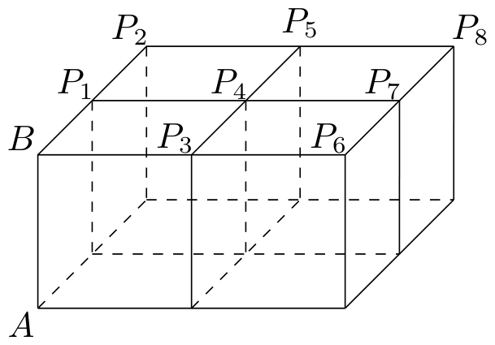
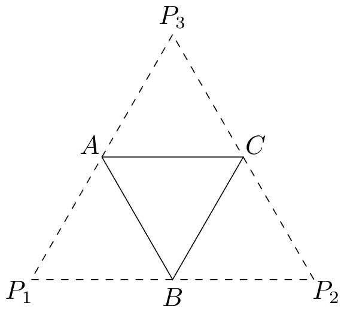
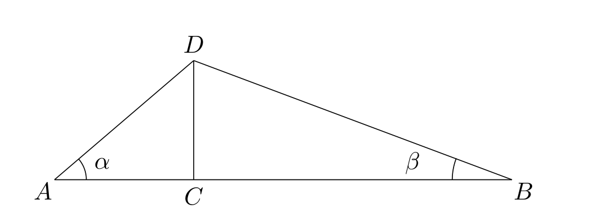

# 2014年上海卷（秋理）

## 填空题

### 第 1 题

函数 $y = 1 - 2\cos^2(2x)$ 的最小正周期是＿＿＿＿＿＿.

#### 答案

$\frac{\pi}{2}$

#### 解析

利用 $2\cos^2(2x)=1+\cos(4x)$，得

$$

y=1-\bigl(1+\cos(4x)\bigr)=-\cos(4x)

$$

因此函数的最小正周期为 $\dfrac{2\pi}{4}=\dfrac{\pi}{2}$.

### 第 2 题

若复数 $z = 1 + 2\i$，其中 $\i$ 是虚数单位，则 $\left(z + \frac{1}{\overline{z}}\right) \cdot \overline{z} =$＿＿＿＿＿＿.

#### 答案

$6$

#### 解析

由 $z=1+2\i$，得 $\overline{z}=1-2\i$，且

$$

\left(z+\frac{1}{\overline z}\right)\overline z
=z\overline z+1=5+1=6

$$

因此填 $6$.

### 第 3 题

若抛物线 $y^{2}=2px$ 的焦点与椭圆 $\frac{x^{2}}{9}+\frac{y^{2}}{5}=1$ 的右焦点重合，则该抛物线的准线方程为＿＿＿＿＿＿.

#### 答案

$x=-2$

#### 解析

椭圆的半长轴为 $3$，半短轴为 $\sqrt5$，所以其焦距的一半为

$$

c=\sqrt{3^2-(\sqrt5)^2}=2

$$

椭圆的右焦点为 $(2,0)$. 抛物线 $y^2=2px$ 的焦点为 $\left(\dfrac p2,0\right)$，由焦点重合得 $p=4$. 因此准线方程为

$$

x=-\frac p2=-2

$$

### 第 4 题

设

$$

f(x) = \begin{cases}
x, & x \in (-\infty, a),\\
x^2, & x \in [a, +\infty),
\end{cases}

$$

若 $f(2) = 4$，则 $a$ 的取值范围为＿＿＿＿＿＿.

#### 答案

$(-\infty,2]$

#### 解析

若 $a>2$，则 $2\in(-\infty,a)$，从而 $f(2)=2$，与题设矛盾.

若 $a\leqslant2$，则 $2\in[a,+\infty)$，从而 $f(2)=2^2=4$，满足题设. 因此

$$

a\in(-\infty,2]

$$

### 第 5 题

若实数 $x$，$y$ 满足 $xy = 1$，则 $x^2 + 2y^2$ 的最小值为＿＿＿＿＿＿.

#### 答案

$2\sqrt{2}$

#### 解析

由 $xy=1$ 可知 $x\neq0$，且 $y=\dfrac1x$. 令 $t=x^2>0$，则

$$

x^2+2y^2=t+\frac2t\geqslant2\sqrt{t\cdot\frac2t}=2\sqrt2

$$

当且仅当 $t=\dfrac2t$，即 $t=\sqrt2$ 时等号成立，此时可取 $x=\pm\sqrt[4]{2}$，并取 $y=1/x$. 所以最小值为 $2\sqrt2$.

### 第 6 题

若圆锥的侧面积是底面积的 $3\text{ 倍}$，则其母线与底面夹角的大小为＿＿＿＿＿＿.（结果用反三角函数值表示）

#### 答案

$\arccos\frac{1}{3}$

#### 解析

设圆锥底面半径为 $r$，母线长为 $l$. 由侧面积是底面积的 $3$ 倍，得

$$

\pi rl=3\pi r^2

$$

所以 $l=3r$.

设母线与底面的夹角为 $\varphi$. 母线在底面上的射影长为半径 $r$，故

$$

\cos\varphi=\frac rl=\frac13

$$

由于夹角为锐角，得 $\varphi=\arccos\dfrac13$.

### 第 7 题

已知曲线 $C$ 的极坐标方程为 $\rho(3\cos\theta-4\sin\theta)=1$，则 $C$ 与极轴的交点到极点的距离是＿＿＿＿＿＿.

#### 答案

$\frac{1}{3}$

#### 解析

由 $x=\rho\cos\theta$，$y=\rho\sin\theta$，原方程化为

$$

3x-4y=1

$$

极轴为 $x$ 轴，令 $y=0$，得交点横坐标为 $x=\dfrac13$. 所以该点到极点的距离为 $\dfrac13$.

### 第 8 题

设无穷等比数列 $\{a_{n}\}$ 的公比为 $q$，若 $a_{1} = \displaystyle\lim_{n\to \infty}(a_{3} + a_{4} + \dots + a_{n})$，则 $q =$＿＿＿＿＿＿.

#### 答案

$\frac{\sqrt{5}-1}{2}$

#### 解析

按等比数列的定义，首项 $a_1\neq0$. 要使从第三项开始的无穷等比级数收敛，必须有 $\lvert q\rvert<1$. 于是

$$

\lim_{n\to\infty}(a_3+a_4+\cdots+a_n)
=\frac{a_3}{1-q}=\frac{a_1q^2}{1-q}

$$

由题设并约去非零的首项 $a_1$，得 $1=\frac{q^2}{1-q}$，$q^2+q-1=0$. 故 $q=\dfrac{-1\pm\sqrt5}{2}$. 其中 $\dfrac{-1-\sqrt5}{2}<-1$，不满足收敛条件，所以

$$

q=\frac{\sqrt5-1}{2}

$$

### 第 9 题

若 $f(x) = x^{\frac{2}{3}} - x^{-\frac{1}{2}}$，则满足 $f(x) < 0$ 的 $x$ 的取值范围是＿＿＿＿＿＿.

#### 答案

$(0,1)$

#### 解析

函数含有 $x^{-1/2}$，要取实数值必须有 $x>0$. 在此条件下，

$$

x^{\frac23}-x^{-\frac12}<0
\iff x^{\frac23}<x^{-\frac12}

$$

两边乘以正数 $x^{1/2}$，得 $x^{7/6}<1$. 由于 $x^{7/6}$ 在正数范围内递增，故 $0<x<1$.

### 第 10 题

为强化安全意识，某商场拟在未来的连续 $10\text{ 天}$ 中随机选择 $3\text{ 天}$ 进行紧急疏散演练. 则选择的 $3\text{ 天}$ 恰好为连续 $3\text{ 天}$ 的概率是＿＿＿＿＿＿.（结果用最简分数表示）

#### 答案

$\frac{1}{15}$

#### 解析

从连续的 $10$ 天中任选 $3$ 天，共有

$$

\mathrm C_{10}^{3}=120

$$

种等可能的选择. 恰好连续的三天只能以第 $1$，$2$，$\ldots$，$8$ 天为起始日，共有 $8$ 种. 因此所求概率为

$$

\frac8{120}=\frac1{15}

$$

### 第 11 题

已知互异的复数 $a$，$b$ 满足 $ab \neq 0$，集合 $\{a, b\} = \{a^2, b^2\}$，则 $a + b =$＿＿＿＿＿＿.

#### 答案

$-1$

#### 解析

由集合相等且 $a\neq b$，元素只能按以下两种方式对应.

若 $a^2=a$ 且 $b^2=b$，由于 $ab\neq0$，只能有 $a=b=1$，与 $a\neq b$ 矛盾.

因此必有 $a^2=b$，$b^2=a$. 代入得 $a^4=a$. 因为 $a\neq0$，所以 $a^3=1$. 又因 $a\neq b=a^2$，$a$ 不是 $1$，故 $a$，$b$ 是方程 $u^2+u+1=0$ 的两个根. 于是

$$

a+b=-1

$$

### 第 12 题

设常数 $a$ 使方程 $\sin x + \sqrt{3}\cos x = a$ 在区间 $[0, 2\pi]$ 上恰有三个解 $x_1$，$x_2$，$x_3$，则 $x_1 + x_2 + x_3 =\underline{\qquad\qquad}$.

#### 答案

$\frac{7\pi}{3}$

#### 解析

将左边化为

$$

\sin x+\sqrt3\cos x=2\sin\left(x+\frac\pi3\right)

$$

在 $[0,2\pi]$ 上恰有三个解时，水平线必须经过函数图像在区间两个端点的共同函数值. 因为

$$

2\sin\frac\pi3=2\sin\left(2\pi+\frac\pi3\right)=\sqrt3

$$

取 $a=\sqrt3$ 时，解为 $x_1=0$，$x_2=\frac\pi3$，$x_3=2\pi$. 确实共有三个不同解. 由于左端函数值的范围是 $[-2,2]$，当 $\lvert a\rvert>2$ 时方程无解；当 $a=\pm2$ 时方程各有一个解. 对于 $-2<a<2$ 且 $a\neq\sqrt3$ 的情形，区间 $[\frac\pi3,\frac{7\pi}3]$ 恰为一个周期，且两端函数值相同但不等于 $a$，所以方程有两个解. 因而只能是上述 $a=\sqrt3$ 的情形. 因此

$$

x_1+x_2+x_3=0+\frac\pi3+2\pi=\frac{7\pi}{3}

$$

### 第 13 题

某游戏的得分为 $1$，$2$，$3$，$4$，$5$，随机变量 $\xi$ 表示小白玩该游戏的得分. 若 $E(\xi) = 4.2$，则小白得 $5\text{ 分}$ 的概率至少为＿＿＿＿＿＿.

#### 答案

$0.2$

#### 解析

设得 $5$ 分的概率为 $p_5$. 其余得分均不超过 $4$，所以

$$

E(\xi)\leqslant4(1-p_5)+5p_5=4+p_5

$$

由 $E(\xi)=4.2$，得 $p_5\geqslant0.2$.

当得 $4$ 分的概率为 $0.8$，得 $5$ 分的概率为 $0.2$，其他得分的概率为 $0$ 时，期望恰为 $4.2$，故下界可以取得. 因此至少为 $0.2$.

### 第 14 题

已知曲线 $C: x = -\sqrt{4 - y^2}$，直线 $l: x = 6$. 若对于点 $A(m,0)$，存在 $C$ 上的点 $P$ 和 $l$ 上的 $Q$ 使得 $\overrightarrow{AP} + \overrightarrow{AQ} = \overrightarrow{0}$，则 $m$ 的取值范围为＿＿＿＿＿＿.

#### 答案

$[2,3]$

#### 解析

设 $P=(x,y)\in C$，$Q=(6,t)\in l$，且 $A=(m,0)$. 条件 $\overrightarrow{AP}+\overrightarrow{AQ}=\overrightarrow0$ 给出

$$

(x-m,y)+(6-m,t)=(0,0)

$$

因此 $x=2m-6$，$t=-y$. 对任意满足第一个等式的 $P\in C$，取 $Q=(6,-y)$ 即可满足第二个等式.

曲线 $C$ 的点满足 $x=-\sqrt{4-y^2}$，所以其横坐标恰好取遍 $[-2,0]$. 因而存在这样的点 $P$，$Q$ 当且仅当

$$

-2\leqslant2m-6\leqslant0

$$

解得 $2\leqslant m\leqslant3$，故 $m$ 的取值范围为 $[2,3]$.

## 单选题

### 第 15 题

设 $a$，$b \in \mathbb{R}$，则“$a + b > 4$”是“$a > 2$ 且 $b > 2$”的（）

A.  
充分非必要条件

B.  
必要非充分条件

C.  
充要条件

D.  
既不充分也不必要条件

#### 答案

B

#### 解析

若 $a>2$ 且 $b>2$，则 $a+b>4$，所以“$a>2$ 且 $b>2$”是“$a+b>4$”的充分条件，即“$a+b>4$”是后者的必要条件.

反之不成立. 例如取 $a=3$，$\ b=\dfrac32$，有 $a+b=\dfrac92>4$，但 $b=\dfrac32<2$. 因此“$a+b>4$”不是“$a>2$ 且 $b>2$”的充分条件.

故选 B.

### 第 16 题

如图，$4$ 个棱长为 $1$ 的正方体排成一个正四棱柱，$AB$ 是一条侧棱，$P_{i}$ （$i=1$，$2$，$\cdots$，$8$） 是上底面上其余的八个点，则 $\overrightarrow{AB} \cdot \overrightarrow{AP_{i}}$ （$i=1$，$2$，$\cdots$，$8$） 的不同值的个数为（）

A.  
1

B.  
2

C.  
4

D.  
8

#### 答案

A

#### 解析

四个单位正方体组成一个高为 $1$ 的正四棱柱，$AB$ 是其侧棱. 点 $P_i$ 都在上底面上，所以从 $A$ 到任意 $P_i$ 的位移在 $AB$ 方向上的分量均为 $1$，而其余分量与 $AB$ 垂直. 因此 $\overrightarrow{AP_i}=\overrightarrow{AB}+\boldsymbol{v}_{i}$，$\boldsymbol{v}_{i}\perp\overrightarrow{AB}$. 于是

$$

\overrightarrow{AB}\cdot\overrightarrow{AP_i}
=\overrightarrow{AB}\cdot\overrightarrow{AB}
+\overrightarrow{AB}\cdot\boldsymbol{v}_{i}
=1^2+0=1

$$

所有 $8$ 个点所得的值都相同，故不同值的个数为 $1$，选 A.

### 第 17 题

已知 $P_{1}(a_{1}, b_{1})$ 与 $P_{2}(a_{2}, b_{2})$ 是直线 $y = kx + 1$（$k$ 为常数）上两个不同的点，则关于 $x$ 和 $y$ 的方程组

$$

\begin{cases}
a_{1}x + b_{1}y = 1,\\
a_{2}x + b_{2}y = 1
\end{cases}

$$

的解的情况是（）

A.  
无论 $k, P_{1}, P_{2}$ 如何，总是无解

B.  
无论 $k$，$P_{1}$，$P_{2}$ 如何，总有唯一解

C.  
存在 $k$，$P_{1}$，$P_{2}$，使之恰有两解

D.  
存在 $k$，$P_{1}$，$P_{2}$，使之有无穷多解

#### 答案

B

#### 解析

由于 $P_i(a_i,b_i)$ 在直线 $y=kx+1$ 上，有 $b_i=ka_i+1$，$(i=1,2)$. 方程组的系数行列式为

$$

\begin{vmatrix}
a_1&b_1\\
a_2&b_2
\end{vmatrix}
=a_1b_2-a_2b_1
=a_1(ka_2+1)-a_2(ka_1+1)
=a_1-a_2

$$

直线上两个不同的点不可能有相同的横坐标，所以 $a_1\neq a_2$，从而行列式不为零. 故方程组无论 $k$，$P_1$，$P_2$ 如何取，始终有唯一解，选 B.

### 第 18 题

设

$$

f(x) = \begin{cases}
(x - a)^2, & x \leqslant 0,\\
x + \frac{1}{x} + a, & x > 0,
\end{cases}

$$

若 $f(0)$ 是 $f(x)$ 的最小值，则 $a$ 的取值范围为（）

A.  
$[-1, 2]$

B.  
$[-1,0]$

C.  
$[1, 2]$

D.  
$[0,2]$

#### 答案

D

#### 解析

当 $a=0$ 时，$f(0)=0$. 对 $x\leqslant0$，有 $f(x)=x^2\geqslant0$；对 $x>0$，由基本不等式

$$

x+\frac1x\geqslant2

$$

得 $f(x)=x+\dfrac1x\geqslant2>0$. 因此 $f(0)$ 是最小值.

当 $a<0$ 时，$x=a\leqslant0$，且 $f(a)=0<a^2=f(0)$，所以 $f(0)$ 不是最小值.

当 $a>0$ 时，对 $x\leqslant0$，有 $x-a\leqslant-a<0$，从而

$$

(x-a)^2\geqslant a^2=f(0)

$$

对 $x>0$，由基本不等式得

$$

f(x)=x+\frac1x+a\geqslant a+2

$$

所以还需且只需

$$

a^2\leqslant a+2
\iff (a-2)(a+1)\leqslant0

$$

在 $a>0$ 下得到 $0<a\leqslant2$. 与前两种情形合并，$a\in[0,2]$，选 D.

## 解答题

### 第 19 题

底面边长为 $2$ 的正三棱锥 $P-ABC$，其表面展开图是三角形 $P_{1}P_{2}P_{3}$，如图，求 $\triangle P_{1}P_{2}P_{3}$ 的各边长及此三棱锥的体积 $V$.

#### 解析

设正三棱锥的侧棱长为 $l$. 在展开图中，$P_1A=P_1B=P_2B=P_2C=P_3C=P_3A=l$，且 $P_1$，$B$，$P_2$，$P_2$，$C$，$P_3$，$P_3$，$A$，$P_1$ 分别共线. 因此 $P_1P_2=P_1B+BP_2=2l$，$P_2P_3=P_2C+CP_3=2l$，$P_3P_1=P_3A+AP_1=2l$. 所以 $\triangle P_1P_2P_3$ 是边长为 $2l$ 的正三角形. 由共线关系，$A$，$B$ 分别是 $P_1P_3$，$P_1P_2$ 的中点，故 $AB$ 是该正三角形的中位线，$AB=l$. 由 $AB=2$，得 $l=2$. 因此 $\triangle P_1P_2P_3$ 的各边长均为 $4$，且三棱锥 $P-ABC$ 的三条侧棱均为 $2$，它是棱长为 $2$ 的正四面体.

设正四面体的高为 $h$，底面中心为 $O$. 在正三角形 $ABC$ 中，

$$

AO=\frac{2\sqrt3}{3}

$$

由 $PO\perp\text{平面 }ABC$ 及 $PA=2$，得

$$

h=PO=\sqrt{PA^2-AO^2}
=\sqrt{4-\frac43}
=\frac{2\sqrt6}{3}

$$

底面面积为 $S_{\triangle ABC}=\sqrt3$，所以

$$

V=\frac13S_{\triangle ABC}\cdot h
=\frac13\cdot\sqrt3\cdot\frac{2\sqrt6}{3}
=\frac{2\sqrt2}{3}

$$

### 第 20 题

设常数 $a \geqslant 0$，函数 $f(x) = \frac{2^x + a}{2^x - a}$.

1.  若 $a = 4$，求函数 $y = f(x)$ 的反函数 $y = f^{-1}(x)$；

2.  根据 $a$ 的不同取值，讨论函数 $y = f(x)$ 的奇偶性，并说明理由.

#### 解析

1.  当 $a=4$ 时，令 $y=f(x)$，则

$$

y=\frac{2^x+4}{2^x-4}

$$

    整理得

$$

y(2^x-4)=2^x+4
    \iff (y-1)2^x=4(y+1)

$$

    因此 $2^x=\frac{4(y+1)}{y-1}$，$x=\log_2\frac{4(y+1)}{y-1}$. 因为 $2^x>0$，必须有

$$

\frac{y+1}{y-1}>0

$$

    即 $y<-1$ 或 $y>1$. 所以 $f^{-1}(x)=\log_2\frac{4(x+1)}{x-1}$，$x\in(-\infty,-1)\cup(1,+\infty)$.

2.  当 $a=0$ 时，定义域为 $\mathbb{R}$，且 $f(x)=1$，所以 $f(-x)=f(x)$，函数为偶函数.

    当 $a>0$ 时，定义域为

$$

D=\mathbb{R}\mathbin{\backslash}\{\log_2a\}

$$

    若函数为奇函数或偶函数，定义域必须关于原点对称. 因此除去点 $\log_2a$ 后仍关于原点对称，只可能有 $\log_2a=0$，即 $a=1$.

    直接计算

$$

f(-x)=\frac{2^{-x}+a}{2^{-x}-a}
    =\frac{1+a2^x}{1-a2^x}

$$

    当 $a=1$ 时，在定义域 $\mathbb{R}\mathbin{\backslash}\{0\}$ 上有

$$

f(-x)=\frac{1+2^x}{1-2^x}
    =-\frac{2^x+1}{2^x-1}
    =-f(x)

$$

    所以函数为奇函数.

    当 $a>0$，$\ a\neq1$ 时，定义域已经不关于原点对称，故函数既不是奇函数也不是偶函数.

### 第 21 题

如图，某公司要在 $A$，$B$ 两地连线上的定点 $C$ 处建造广告牌 $CD$，其中 $D$ 为顶端，$AC$ 长 $35\text{ 米}$，$CB$ 长 $80\text{ 米}$. 设点 $A$，$B$ 在同一水平面上，从 $A$ 和 $B$ 看 $D$ 的仰角分别为 $\alpha$ 和 $\beta$.

1.  设计中 $CD$ 是铅垂方向. 若要求 $\alpha \geqslant 2\beta$，问 $CD$ 的长至多为多少（结果精确到 0.01 米）？

2.  施工完成后，$CD$ 与铅垂方向有偏差. 现在实测得 $\alpha = 38.12^{\circ}$，$\beta = 18.45^{\circ}$，求 $CD$ 的长（结果精确到 0.01 米）.

#### 解析

1.  设 $CD=h>0$. 因为 $CD$ 垂直于 $AB$，所以 $\tan\alpha=\frac h{35}$，$\tan\beta=\frac h{80}$. 若 $\alpha\geqslant2\beta$，则 $2\beta<\dfrac\pi2$，从而由正切函数在 $\left(0,\dfrac\pi2\right)$ 上递增，

$$

\frac h{35}\geqslant\tan2\beta
    =\frac{2\tan\beta}{1-\tan^2\beta}
    =\frac{h/40}{1-h^2/6400}

$$

    在 $h>0$ 下约去 $h$，得

$$

\frac1{35}\geqslant\frac1{40(1-h^2/6400)}

$$

    此时分母为正，故

$$

40\left(1-\frac{h^2}{6400}\right)\geqslant35
    \iff h^2\leqslant800

$$

    所以

$$

h\leqslant20\sqrt2\approx28.28

$$

    当 $h=20\sqrt2$ 时等号成立，故 $CD$ 的长度至多为 $28.28\mathrm{~m}$.

2.  在三角形 $ADB$ 中， $\angle ADB=180^\circ-\alpha-\beta$，$AB=AC+CB=115$. 由正弦定理，

$$

\frac{BD}{\sin\alpha}
    =\frac{AB}{\sin(\alpha+\beta)}

$$

    所以

$$

BD=\frac{115\sin38.12^\circ}{\sin56.57^\circ}
    \approx85.06\mathrm{~m}

$$

    在三角形 $BCD$ 中，$\angle CBD=\beta$. 由余弦定理，

$$

CD^2=CB^2+BD^2-2\cdot CB\cdot BD\cos\beta

$$

    代入 $CB=80$、$BD\approx85.06$、$\beta=18.45^\circ$，得

$$

CD\approx\sqrt{80^2+85.06^2-2\cdot80\cdot85.06\cos18.45^\circ}
    \approx26.93\mathrm{~m}

$$

### 第 22 题

在平面直角坐标系 $xOy$ 中，对于直线 $l: ax + by + c = 0$ 和点 $P_{1}(x_{1}, y_{1})$，$P_{2}(x_{2}, y_{2})$，记 $\eta = (ax_{1} + by_{1} + c)(ax_{2} + by_{2} + c)$. 若 $\eta < 0$，则称点 $P_{1}$，$P_{2}$ 被直线 $l$ 分隔. 若曲线 $C$ 与直线 $l$ 没有公共点，且曲线 $C$ 上存在点 $P_{1}$，$P_{2}$ 被直线 $l$ 分隔，则称直线 $l$ 为曲线 $C$ 的一条分隔线.

1.  求证：点 $A(1,2)$，$B(-1,0)$ 被直线 $x + y - 1 = 0$ 分隔；

2.  若直线 $y = kx$ 是曲线 $x^2 - 4y^2 = 1$ 的分隔线，求实数 $k$ 的取值范围；

3.  动点 $M$ 到点 $Q(0,2)$ 的距离与到 $y$ 轴的距离之积为 1，设点 $M$ 的轨迹为 $E$，求证：通过原点的直线中，有且仅有一条直线是 $E$ 的分隔线.

#### 解析

1.  对直线 $x+y-1=0$，有

$$

\eta=(1+2-1)(-1+0-1)=2\cdot(-2)=-4<0

$$

    所以点 $A$，$B$ 被该直线分隔.

2.  将直线 $y=kx$ 代入曲线方程，得

$$

x^2-4k^2x^2=1
    \iff (1-4k^2)x^2=1

$$

    当 $\lvert k\rvert<\dfrac12$ 时，$1-4k^2>0$，方程有实数解，直线与曲线有公共点，不能成为分隔线. 当 $\lvert k\rvert\geqslant\dfrac12$ 时，方程无实数解，直线与曲线没有公共点.

    再取曲线上的两点 $P_1=(-1,0)$，$P_2=(1,0)$. 对直线 $y-kx=0$，两点对应的值为 $0-k(-1)=k$，$0-k(1)=-k$ 其乘积为 $-k^2<0$. 因而当 $\lvert k\rvert\geqslant\dfrac12$ 时，两点被直线分隔，直线确为分隔线. 因此

$$

k\in\left(-\infty,-\frac12\right]\cup\left[\frac12,+\infty\right)

$$

3.  设 $M=(x,y)$. 由题意

$$

\sqrt{x^2+(y-2)^2}\cdot\lvert x\rvert=1

$$

    平方后，轨迹 $E$ 满足

$$

x^2\bigl[x^2+(y-2)^2\bigr]=1

$$

    先考察直线 $x=0$. 轨迹上所有点都满足 $x\neq0$，所以该直线与 $E$ 没有公共点. 点 $(1,2)$、$(-1,2)$ 都在 $E$ 上，且它们对直线 $x=0$ 的取值乘积为 $1\cdot(-1)<0$，故 $x=0$ 是 $E$ 的一条分隔线.

    再设通过原点的非竖直直线为 $y=kx$. 代入轨迹方程，令

$$

F_k(x)=x^2\bigl[x^2+(kx-2)^2\bigr]-1

$$

    则 $F_k(0)=-1$，且当 $x\to+\infty$ 时，$F_k(x)\to+\infty$. 由连续函数的介值定理，存在 $x_0>0$ 使 $F_k(x_0)=0$. 于是 $(x_0,kx_0)\in E$，该直线必与 $E$ 有公共点，不能成为分隔线.

    所以通过原点的直线中，有且仅有 $x=0$ 是 $E$ 的分隔线.

### 第 23 题

已知数列 $\{a_{n}\}$ 满足 $\frac{1}{3} a_{n} \leqslant a_{n+1} \leqslant 3a_{n}$，$n \in \mathbb{N}^{*}$，$a_{1} = 1$.

1.  若 $a_{2} = 2$，$a_{3} = x$，$a_{4} = 9$，求 $x$ 的取值范围；

2.  设 $\{a_{n}\}$ 是公比为 $q$ 的等比数列，$S_{n} = a_{1} + a_{2} + \dots + a_{n}$. 若 $\frac{1}{3} S_{n} \leqslant S_{n+1} \leqslant 3S_{n}$，$n \in \mathbb{N}^{*}$，求 $q$ 的取值范围；

3.  若 $a_{1}$，$a_{2}$，$\cdots$，$a_{k}$ 成等差数列，且 $a_{1} + a_{2} + \cdots + a_{k} = 1000$，求正整数 $k$ 的最大值，以及 $k$ 取最大值时相应数列 $a_{1}$，$a_{2}$，$\cdots$，$a_{k}$ 的公差.

#### 解析

1.  由 $a_2=2$ 及题设不等式，得到

$$

\frac13a_2\leqslant a_3\leqslant3a_2
    \iff \frac23\leqslant x\leqslant6

$$

    由 $a_3=x$，$\ a_4=9$，得到

$$

\frac13x\leqslant9\leqslant3x
    \iff 3\leqslant x\leqslant27

$$

    合并两组条件，得

$$

x\in[3,6]

$$

2.  因为 $a_1=1$，等比数列的各项为 $a_n=q^{n-1}$. 原题的项间条件给出

$$

\frac13q^{n-1}\leqslant q^n\leqslant3q^{n-1}

$$

    由正项递推可知各项均为正，故

$$

\frac13\leqslant q\leqslant3

$$

    又 $S_1=1$，$\ S_2=1+q$，由题设的和的上界

$$

S_2\leqslant3S_1

$$

    得 $q\leqslant2$. 因而必要条件为 $q\in\left[\dfrac13,2\right]$.

    下面验证该范围内的每个 $q$ 都满足和的条件. 由于 $q>0$，$S_n>0$，且

$$

S_{n+1}=S_n+q^n>S_n>\frac13S_n

$$

    当 $\dfrac13\leqslant q\leqslant1$ 时，$q^n\leqslant1\leqslant2S_n$. 当 $1<q\leqslant2$ 时，$q^n\leqslant2q^{n-1}\leqslant2S_n$. 两种情形都给出

$$

S_{n+1}=S_n+q^n\leqslant3S_n

$$

    所以

$$

q\in\left[\frac13,2\right]

$$

3.  设等差数列的公差为 $d$，则 $a_n=1+(n-1)d$，$1000=\sum_{n=1}^k a_n =k+\frac{k(k-1)}2d$. 题设不等式从 $a_1=1>0$ 出发递推可知所有相关项均为正.

    若 $d\geqslant0$，则每项 $a_n\geqslant1$，所以 $1000\geqslant k$.

    若 $d<0$，数列递减，约束中最严格的是最后一项处的下界：

$$

a_k\geqslant\frac13a_{k-1}

$$

    事实上，所有项均为正，且

$$

\frac{a_{n+1}}{a_n}=1+\frac{d}{a_n}

$$

    随 $n$ 增大而减小；同时上界 $a_{n+1}\leqslant3a_n$ 自动成立. 因此只需检查上述最后一项的下界. 代入 $a_k=1+(k-1)d$，$\ a_{k-1}=1+(k-2)d$，得

$$

1+(k-1)d\geqslant\frac13\bigl(1+(k-2)d\bigr)
    \iff d\geqslant-\frac2{2k-1}

$$

    当 $k>1$ 时，由和式解得

$$

d=\frac{2(1000-k)}{k(k-1)}

$$

    结合上式并注意 $k(k-1)(2k-1)>0$，得

$$

\frac{2(1000-k)}{k(k-1)}\geqslant-\frac2{2k-1}
    \iff k^2-2000k+1000\leqslant0

$$

    因此

$$

k\leqslant1000+\sqrt{999000}<2000

$$

    所以正整数 $k$ 的最大值不超过 $1999$.

    取 $k=1999$，由和式得到

$$

d=\frac{2(1000-1999)}{1999\cdot1998}
    =-\frac1{1999}

$$

    此时 $a_n=1-\dfrac{n-1}{1999}>0$，且对递减数列只需检查最后一个下界；有

$$

a_{1999}=\frac1{1999}
    \geqslant\frac13\cdot\frac2{1999}
    =\frac2{5997}

$$

    上界自动成立. 因此该数列满足题设条件，最大值确为 $k_{\max}=1999$，$d=-\frac1{1999}$.
