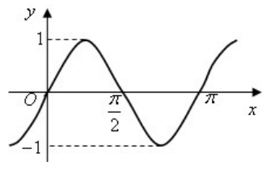
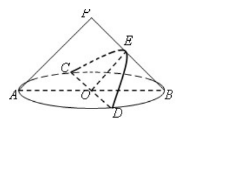
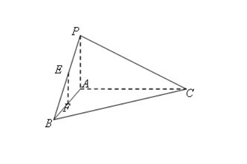
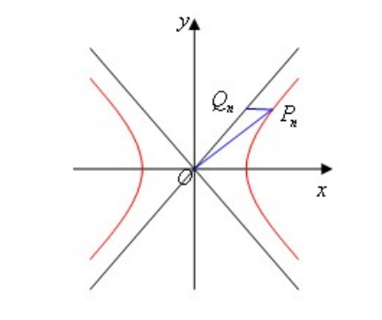
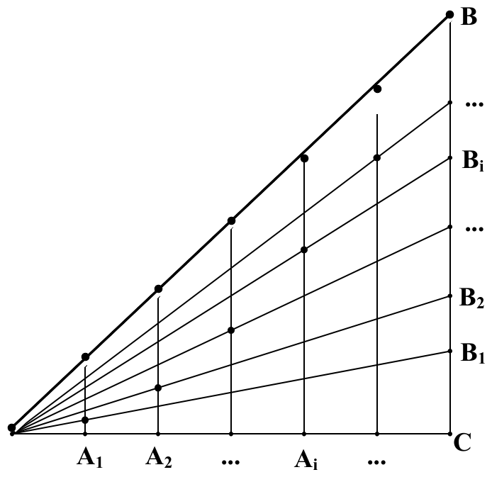
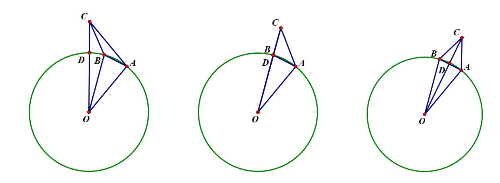

# 2014年上海卷（春）

## 填空题

### 第 1 题

若 $4^{x}=16$，则 $x=$＿＿＿＿＿＿.

#### 答案

$2$

#### 解析

因为 $16=4^2$，且指数函数 $4^x$ 在 $\mathbb{R}$ 上是单调函数，所以 $4^x=4^2$ 等价于 $x=2$.

### 第 2 题

计算：$\i(1+\i)=$＿＿＿＿＿＿（$\i$ 为虚数单位）.

#### 答案

$-1+\i$

#### 解析

利用 $\i^2=-1$，得

$$

\i(1+\i)=\i+\i^2=\i-1=-1+\i

$$

因此填 $-1+\i$.

### 第 3 题

$1$，$1$，$2$，$2$，$5$ 这五个数的中位数是＿＿＿＿＿＿.

#### 答案

$2$

#### 解析

这五个数已经按非降序排列，中间的第三个数是 $2$，所以中位数为 $2$.

### 第 4 题

若函数 $f(x)=x^{3}+a$ 为奇函数，则实数 $a=$＿＿＿＿＿＿.

#### 答案

$0$

#### 解析

奇函数满足 $f(0)=0$. 由 $f(0)=0^3+a=a$，得 $a=0$.

### 第 5 题

点 $O(0,0)$ 到直线 $x + y - 4 = 0$ 的距离是＿＿＿＿＿＿.

#### 答案

$2\sqrt{2}$

#### 解析

点 $O(0,0)$ 到直线 $x+y-4=0$ 的距离为

$$

\frac{|0+0-4|}{\sqrt{1^2+1^2}}=\frac{4}{\sqrt{2}}=2\sqrt{2}

$$

### 第 6 题

函数 $y=\frac{1}{x+1}$ 的反函数为＿＿＿＿＿＿.

#### 答案

$y=\frac{1}{x}-1$

#### 解析

设 $y=\dfrac{1}{x+1}$，则原函数的定义域为 $x\ne-1$. 交换 $x$，$y$，得 $x=\frac{1}{y+1}$，$\Longrightarrow$，$x(y+1)=1$，$\Longrightarrow$，$y=\frac{1}{x}-1$. 反函数的定义域为 $x\ne0$，故反函数为 $y=\dfrac{1}{x}-1$.

### 第 7 题

已知等差数列 $\left\{a_{n}\right\}$ 的首项为 $1$，公差为 $2$，则该数列的前 $n$ 项和 $S_{n}=$＿＿＿＿＿＿.

#### 答案

$n^2$

#### 解析

等差数列的第 $n$ 项为

$$

a_n=1+(n-1)\cdot2=2n-1

$$

因此

$$

S_n=\frac{n(a_1+a_n)}{2}=\frac{n(1+2n-1)}{2}=n^2

$$

### 第 8 题

已知 $\cos\alpha=\frac{1}{3}$，则 $\cos2\alpha=$＿＿＿＿＿＿.

#### 答案

$-\frac{7}{9}$

#### 解析

由二倍角公式，

$$

\cos2\alpha=2\cos^2\alpha-1=2\left(\frac13\right)^2-1=-\frac79

$$

### 第 9 题

已知 $a$，$b\in\mathbb{R}^+$. 若 $a+b=1$，则 $ab$ 的最大值是＿＿＿＿＿＿.

#### 答案

$\frac{1}{4}$

#### 解析

由 $a+b=1$ 及平方非负性，

$$

0\le(a-b)^2=(a+b)^2-4ab=1-4ab

$$

所以 $ab\le\dfrac14$. 当 $a=b=\dfrac12$ 时取等号，且满足 $a$，$b\in\mathbb{R}^+$. 因此 $ab$ 的最大值为 $\dfrac14$.

### 第 10 题

在 $10$ 件产品中，有 $3$ 件次品，从中随机取出 $5$ 件，则恰含 $1$ 件次品的概率是＿＿＿＿＿＿（结果用数值表示）.

#### 答案

$\frac{5}{12}$

#### 解析

从 $10$ 件产品中任取 $5$ 件共有 $\mathrm C_{10}^{5}$ 种取法. 恰含 $1$ 件次品时，要从 $3$ 件次品中取 $1$ 件，再从 $7$ 件正品中取 $4$ 件，因此所求概率为

$$

\frac{\mathrm C_{3}^{1}\mathrm C_{7}^{4}}{\mathrm C_{10}^{5}}
=\frac{3\cdot35}{252}=\frac5{12}

$$

### 第 11 题

某货船在 $O$ 处看灯塔 $M$ 在北偏东 $30^{\circ}$ 方向，它以每小时 $18\text{ 海里}$ 的速度向正北方向航行，经过 $40\text{ 分钟}$ 到达 $B$ 处，看到灯塔 $M$ 在北偏东 $75^{\circ}$ 方向，此时货船到灯塔 $M$ 的距离为＿＿＿＿＿＿$\text{海里}$.

#### 答案

$6\sqrt{2}$

#### 解析

货船从 $O$ 到 $B$ 航行的距离为

$$

|OB|=18\times\frac{40}{60}=12\text{ 海里}

$$

在三角形 $OBM$ 中，$\angle BOM=30^\circ$，而 $BO$ 的方向为正南、$BM$ 为北偏东 $75^\circ$，所以 $\angle OBM=105^\circ$，从而 $\angle OMB=45^\circ$. 由正弦定理， $\frac{|BM|}{\sin30^\circ}=\frac{|OB|}{\sin45^\circ}$，$\Longrightarrow$，$|BM|=12\cdot\frac{\sin30^\circ}{\sin45^\circ}=6\sqrt2\text{ 海里}$.

### 第 12 题

已知函数 $f(x)=\frac{x-2}{x-1}$ 与 $g(x)=mx+1-m$ 的图像相交于 $A$，$B$ 两点. 若动点 $P$ 满足 $\left|\overrightarrow{PA}+\overrightarrow{PB}\right|=2$，则 $P$ 的轨迹方程为＿＿＿＿＿＿.

#### 答案

$(x-1)^2+(y-1)^2=1$

#### 解析

令 $t=x-1$. 交点的横坐标满足 $1-\frac1t=1+mt$，$\Longrightarrow$，$mt^2=-1$. 因为有两个交点，所以 $m<0$，两个根 $t_1$，$t_2$ 互为相反数. 交点的纵坐标为 $1+mt$，故若点 $A$，点 $B$ 分别对应 $t_1$，$t_2$，则 $x_A+x_B=2+t_1+t_2=2$，$y_A+y_B=2+m(t_1+t_2)=2$. 设 $P(x,y)$，则

$$

\overrightarrow{PA}+\overrightarrow{PB}
=(x_A+x_B-2x,\,y_A+y_B-2y)
=2(1-x,\,1-y)

$$

题设条件等价于 $4((x-1)^2+(y-1)^2)=4$，所以 $P$ 的轨迹方程为

$$

(x-1)^2+(y-1)^2=1

$$

## 单选题

### 第 13 题

两条异面直线所成的角的范围是（）

A.  
$\left(0, \frac{\pi}{2}\right)$

B.  
$\left(0, \frac{\pi}{2}\right]$

C.  
$\left[0, \frac{\pi}{2}\right)$

D.  
$\left[0, \frac{\pi}{2}\right]$

#### 答案

B

#### 解析

两条异面直线不能平行，因此它们所成的较小角不为 $0$；但它们的方向可以互相垂直，所以可以取到 $\dfrac{\pi}{2}$. 故所成角的范围是 $\left(0,\dfrac{\pi}{2}\right]$，选 B.

### 第 14 题

复数 $2+\i$（$\i$ 为虚数单位）的共轭复数为（）

A.  
$2-\i$

B.  
$-2+\i$

C.  
$-2-\i$

D.  
$1+2\i$

#### 答案

A

#### 解析

复数 $u+v\i$ 的共轭复数为 $u-v\i$. 因此 $2+\i$ 的共轭复数是 $2-\i$，选 A.

### 第 15 题

右图是下列函数中某个函数的部分图像，则该函数是（）

A.  
$y = \sin x$

B.  
$y = \sin 2x$

C.  
$y = \cos x$

D.  
$y = \cos 2x$

#### 答案

B

#### 解析

从图像可读出函数过原点，在 $x=\dfrac{\pi}{4}$ 附近取得最大值 $1$，在 $x=\dfrac{\pi}{2}$ 处过 $x$ 轴，在 $x=\dfrac{3\pi}{4}$ 附近取得最小值 $-1$，并在 $x=\pi$ 处再次过 $x$ 轴. 这正是 $y=\sin2x$ 的图像特征，故选 B.

### 第 16 题

在 $(x+1)^{4}$ 的二项展开式中，$x^{2}$ 项的系数为（）

A.  
$6$

B.  
$4$

C.  
$2$

D.  
$1$

#### 答案

A

#### 解析

由二项式定理，$(x+1)^4=\sum_{k=0}^{4}\mathrm C_4^k x^k$. 其中 $x^2$ 项的系数为 $\mathrm C_4^2=6$，故选 A.

### 第 17 题

下列函数中，在 $\mathbb{R}$ 上为增函数的是（）

A.  
$y = x^{2}$

B.  
$y = |x|$

C.  
$y = \sin x$

D.  
$y = x^{3}$

#### 答案

D

#### 解析

函数 $x^2$ 在 $\mathbb{R}$ 上先减后增，函数 $|x|$ 也在 $0$ 左右改变单调性，函数 $\sin x$ 在 $\mathbb{R}$ 上周期变化，均不是增函数. 对任意 $x_1<x_2$，有 $x_2^3-x_1^3=(x_2-x_1)(x_2^2+x_1x_2+x_1^2)>0$，所以 $y=x^3$ 在 $\mathbb{R}$ 上为增函数，选 D.

### 第 18 题

$\begin{vmatrix}\cos\theta & -\sin\theta \\ \sin\theta & \cos\theta\end{vmatrix} =$（）

A.  
$\cos 2\theta$

B.  
$\sin 2\theta$

C.  
$1$

D.  
$-1$

#### 答案

C

#### 解析

按二阶行列式定义计算，$\begin{vmatrix}\cos\theta & -\sin\theta \\ \sin\theta & \cos\theta\end{vmatrix}=\cos^2\theta-(-\sin\theta)\sin\theta=\cos^2\theta+\sin^2\theta=1$，故选 C.

### 第 19 题

设 $x_{0}$ 为函数 $f(x)=2^{x}+x-2$ 的零点，则 $x_{0}\in$（）

A.  
$(-2,-1)$

B.  
$(-1,0)$

C.  
$(0,1)$

D.  
$(1,2)$

#### 答案

C

#### 解析

函数 $f(x)=2^x+x-2$ 是 $\mathbb{R}$ 上的增函数，因为 $2^x$ 和 $x$ 都是增函数. 又 $f(0)=1+0-2=-1<0$，$f(1)=2+1-2=1>0$. 由连续性，零点在 $(0,1)$ 内；由增性知零点唯一. 因此 $x_0\in(0,1)$，选 C.

### 第 20 题

若 $a > b$，$c \in \mathbb{R}$，则下列不等式中恒成立的是（）

A.  
$\frac{1}{a}<\frac{1}{b}$

B.  
$a^{2}>b^{2}$

C.  
$a|c|>b|c|$

D.  
$\frac{a}{c^{2}+1}>\frac{b}{c^{2}+1}$

#### 答案

D

#### 解析

因为 $c^2+1>0$，所以不等式 $a>b$ 两边同除以 $c^2+1$ 后不改变方向，得到 $\dfrac{a}{c^2+1}>\dfrac{b}{c^2+1}$. 其余选项均不恒成立：取 $a=1$，$b=-1$ 可否定 A，取 $a=1$，$b=-2$ 可否定 B，取 $c=0$ 可否定 C. 因此选 D.

### 第 21 题

若两个球的体积之比为 $8:27$，则它们的表面积之比为（）

A.  
$2:3$

B.  
$4:9$

C.  
$8:27$

D.  
$2\sqrt{2}:3\sqrt{3}$

#### 答案

B

#### 解析

球的体积与半径的三次方成正比，所以由体积比 $8:27$ 得半径比为 $2:3$. 球的表面积与半径的平方成正比，因此表面积之比为 $2^2:3^2=4:9$，选 B.

### 第 22 题

已知数列 $\left\{a_{n}\right\}$ 是以 $q$ 为公比的等比数列，若 $b_{n}=-2a_{n}$，则数列 $\left\{b_{n}\right\}$ 是（）

A.  
以 $q$ 为公比的等比数列

B.  
以 $-q$ 为公比的等比数列

C.  
以 $2q$ 为公比的等比数列

D.  
以 $-2q$ 为公比的等比数列

#### 答案

A

#### 解析

由 $a_{n+1}=qa_n$ 及 $b_n=-2a_n$，有 $b_{n+1}=-2a_{n+1}=-2qa_n=qb_n$. 所以 $\{b_n\}$ 仍是以 $q$ 为公比的等比数列，选 A.

### 第 23 题

若点 $P$ 的坐标为 $(a,b)$，曲线 $C$ 的方程为 $F(x,y)=0$，则“$F(a,b)=0$”是“点 $P$ 在曲线 $C$ 上”的（）

A.  
充分非必要条件

B.  
必要非充分条件

C.  
充分必要条件

D.  
既非充分又非必要条件

#### 答案

C

#### 解析

曲线 $C$ 的方程 $F(x,y)=0$ 的定义就是曲线上点的坐标必须满足该方程. 因此 $P(a,b)$ 在 $C$ 上当且仅当 $F(a,b)=0$，两个条件可以互相推出，故为充分必要条件，选 C.

### 第 24 题

如图，在底面半径和高均为 $1$ 的圆锥中，$AB$，$CD$ 是底面圆 $O$ 的两条互相垂直的直径，$E$ 是母线 $PB$ 的中点. 已知过 $CD$ 与 $E$ 的平面与圆锥侧面的交线是以 $E$ 为顶点的抛物线的一部分，则该抛物线的焦点到圆锥顶点 $P$ 的距离为（）

A.  
$1$

B.  
$\frac{\sqrt{3}}{2}$

C.  
$\frac{\sqrt{6}}{2}$

D.  
$\frac{\sqrt{10}}{4}$

#### 答案

D

#### 解析

建立空间直角坐标系，取圆锥顶点 $P=(0,0,1)$，底面圆心 $O=(0,0,0)$，并令 $A=(1,0,0)$，$B=(-1,0,0)$，$C=(0,1,0)$，$D=(0,-1,0)$. 则 $E$ 是 $PB$ 的中点，故 $E=\left(-\dfrac12,0,\dfrac12\right)$. 圆锥满足 $x^2+y^2=(1-z)^2$，平面 $CDE$ 的方程为 $x+z=0$. 代入 $z=-x$，得截线方程 $y^2=2\left(x+\dfrac12\right)$.

在平面 $CDE$ 内，以 $E$ 为原点，取单位轴方向 $\boldsymbol{e}_1=\dfrac{(1,0,-1)}{\sqrt2}$，另一个单位轴方向为 $\boldsymbol{e}_2=(0,1,0)$. 令相应坐标为 $u$，$v$，则 $u=\sqrt2\left(x+\dfrac12\right)$，$v=y$，所以

$v^2=\sqrt2\,u=4pu$，$p=\frac{\sqrt2}{4}$. 抛物线焦点 $F_0$ 到顶点 $E$ 的距离为 $EF_0=p$. 又 $P-E=\left(\dfrac12,0,\dfrac12\right)$ 垂直于平面 $CDE$，所以 $PE=\dfrac1{\sqrt2}$，且 $PE\perp EF_0$. 因而

$PF_0^2=PE^2+EF_0^2=\frac12+\frac18=\frac58$，$PF_0=\frac{\sqrt{10}}4$. 故选 D.

## 解答题

### 第 25 题

已知不等式 $\frac{x-2}{x+1}<0$ 的解集为集合 $A$，函数 $y=\lg(x-1)$ 的定义域为集合 $B$，求 $A\cap B$.

#### 解析

不等式的关键点为 $x=-1$ 和 $x=2$. 当 $x<-1$ 或 $x>2$ 时，$\dfrac{x-2}{x+1}>0$；当 $-1<x<2$ 时，分子为负、分母为正，故 $\dfrac{x-2}{x+1}<0$. 因而 $A=(-1,2)$.

由对数真数必须为正，函数 $y=\lg(x-1)$ 的定义域满足 $x-1>0$，所以 $B=(1,+\infty)$. 因此

$$

A\cap B=(-1,2)\cap(1,+\infty)=(1,2)

$$

### 第 26 题

已知函数 $f(x)=x^{2}-4x+a$，$x\in[-3,3]$. 若 $f(1)=2$，求 $y=f(x)$ 的最大值和最小值.

#### 解析

由 $f(1)=1-4+a=2$，得 $a=5$. 因而

$$

f(x)=x^2-4x+5=(x-2)^2+1

$$

在区间 $[-3,3]$ 上，抛物线顶点横坐标为 $2$，所以最小值在 $x=2$ 处取得，$f(2)=1$. 最大值只需比较两个端点，$f(-3)=26$，$f(3)=2$，故最大值为 $26$，最小值为 $1$.

### 第 27 题

如图，在体积为 $\frac{1}{3}$ 的三棱锥 $P-ABC$ 中，$PA$ 与平面 $ABC$ 垂直，$AP=AB=1$，$\angle BAC=\frac{\pi}{2}$，$E$，$F$ 分别是 $PB$，$AB$ 的中点. 求异面直线 $EF$ 与 $PC$ 所成的角的大小（结果用反三角函数值表示）.

#### 解析

因为 $\angle BAC=\dfrac{\pi}{2}$，所以

$$

S_{\triangle ABC}=\frac12|AB||AC|=\frac12|AC|

$$

由三棱锥体积公式及 $PA=1$，得

$$

\frac13=\frac13S_{\triangle ABC}|PA|=\frac13\cdot\frac12|AC|\cdot1

$$

所以 $|AC|=2$. 在三角形 $PAB$ 中，$E$，$F$ 分别是 $PB$，$AB$ 的中点，由中位线定理 $EF\parallel PA$. 因而异面直线 $EF$ 与 $PC$ 所成的角等于直线 $PA$ 与 $PC$ 所成的锐角，即 $\angle APC$.

又因为 $PA\perp$ 平面 $ABC$，所以 $PA\perp AC$，三角形 $PAC$ 在 $A$ 处为直角. 于是

$$

\tan\angle APC=\frac{|AC|}{|PA|}=2

$$

故所求角为 $\arctan 2$.

### 第 28 题

已知椭圆 $C:\frac{x^{2}}{a^{2}}+y^{2}=1$（$a>1$）的左焦点为 $F$，上顶点为 $B$.

1.  若直线 $FB$ 的一个方向向量为 $\left(1,\frac{\sqrt{3}}{3}\right)$，求实数 $a$ 的值；

2.  若 $a=\sqrt{2}$，直线 $l:y=kx-2$ 与椭圆 $C$ 相交于 $M$，$N$ 两点，且 $\overrightarrow{FM}\cdot\overrightarrow{FN}=3$，求实数 $k$ 的值.

#### 解析

1.  椭圆的上顶点为 $B(0,1)$，左焦点为 $F(-\sqrt{a^2-1},0)$，所以

$$

\overrightarrow{FB}=(\sqrt{a^2-1},1)

$$

    给定方向向量 $\left(1,\dfrac{\sqrt3}{3}\right)$ 与 $\overrightarrow{FB}$ 平行，因此

$$

\frac{1}{\sqrt{a^2-1}}=\frac{\sqrt3}{3}

$$

    由 $a>1$ 得 $\sqrt{a^2-1}=\sqrt3$，从而 $a^2=4$，所以 $a=2$.

2.  当 $a=\sqrt2$ 时，左焦点为 $F(-1,0)$. 将 $y=kx-2$ 代入椭圆方程，得 $\frac{x^2}{2}+(kx-2)^2=1$，$\Longrightarrow$，$(1+2k^2)x^2-8kx+6=0$. 设 $M(x_1,y_1)$，$N(x_2,y_2)$. 由韦达定理， $x_1+x_2=\frac{8k}{1+2k^2}$，$x_1x_2=\frac{6}{1+2k^2}$. 又 $y_1=kx_1-2$，$y_2=kx_2-2$，所以

$$

\overrightarrow{FM}\cdot\overrightarrow{FN}
    =(x_1+1)(x_2+1)+(kx_1-2)(kx_2-2)

$$

    整理并代入韦达定理，得

$$

\overrightarrow{FM}\cdot\overrightarrow{FN}
    =(1+k^2)x_1x_2+(1-2k)(x_1+x_2)+5
    =\frac{8k+11}{1+2k^2}

$$

    由题设 $\frac{8k+11}{1+2k^2}=3$，$\Longrightarrow$，$3k^2-4k-4=0$ 解得 $k=2$ 或 $k=-\dfrac23$. 因为 $M$，$N$ 是两个不同交点，故交点方程的判别式

$$

\Delta=(-8k)^2-4(1+2k^2)\cdot6=16k^2-24

$$

    必须大于 $0$. 当 $k=2$ 时 $\Delta=40>0$，当 $k=-\dfrac23$ 时 $\Delta<0$，所以 $k=2$.

### 第 29 题

已知数列 $\{a_{n}\}$ 满足 $a_{n}>0$，双曲线 $C_{n}:\frac{x^{2}}{a_{n}}-\frac{y^{2}}{a_{n+1}}=1$（$n\in\mathbb{N}^{*}$）.

1.  若 $a_{1}=1$，$a_{2}=2$，双曲线 $C_{n}$ 的焦距为 $2c_{n}$，$c_{n}=\sqrt{4n-1}$，求 $\{a_{n}\}$ 的通项公式；

2.  如图，在双曲线 $C_{n}$ 的右支上取点 $P_{n}(x_{P_{n}},n)$，过 $P_{n}$ 作 $y$ 轴的垂线，在第一象限内交 $C_{n}$ 的渐近线于点 $Q_{n}$，联结 $OP_{n}$，记 $\triangle OP_{n}Q_{n}$ 的面积为 $S_{n}$. 若 $\lim\limits_{n\to\infty}a_{n}=2$，求 $\lim\limits_{n\to\infty}S_{n}$.

（关于数列极限的运算，还可参考如下性质：若 $\lim\limits_{n\to\infty}u_{n}=A$（$u_{n}\ge0$），则 $\lim\limits_{n\to\infty}\sqrt{u_{n}}=\sqrt{A}$）

#### 解析

1.  双曲线 $C_n$ 的半实轴、半虚轴分别为 $\sqrt{a_n}$，$\sqrt{a_{n+1}}$，所以焦距参数满足

$$

c_n^2=a_n+a_{n+1}

$$

    由 $c_n=\sqrt{4n-1}$，得

$$

a_n+a_{n+1}=4n-1

$$

    将 $n$ 换成 $n+1$，得 $a_{n+1}+a_{n+2}=4n+3$. 两式相减，得到 $a_{n+2}-a_n=4$. 因而奇数项和偶数项分别构成公差为 $4$ 的等差数列： $a_{2k-1}=a_1+4(k-1)=4k-3$，$a_{2k}=a_2+4(k-1)=4k-2$. 所以

$$

a_n=
    \begin{cases}
    2n-1,&n=2k-1,\\
    2n-2,&n=2k,
    \end{cases}
    \qquad k\in\mathbb{N}^*

$$

2.  点 $P_n(x_{P_n},n)$ 在双曲线 $C_n$ 上，故

$$

\frac{x_{P_n}^2}{a_n}-\frac{n^2}{a_{n+1}}=1

$$

    以下按第2小题明示的条件 $\lim\limits_{n\to\infty}a_n=2$ 计算. 由于 $P_n$ 在右支，$x_{P_n}>0$，所以

$$

x_{P_n}=\sqrt{\frac{a_n}{a_{n+1}}n^2+a_n}

$$

    双曲线的第一象限渐近线为 $y=\sqrt{\dfrac{a_{n+1}}{a_n}}x$. 由于 $Q_n$ 的纵坐标也是 $n$，得

$$

x_{Q_n}=n\sqrt{\frac{a_n}{a_{n+1}}}

$$

    三角形 $OP_nQ_n$ 以 $P_nQ_n$ 为底，底边长为 $x_{P_n}-x_{Q_n}$，高为 $n$，因此

$$

S_n=\frac n2\left(\sqrt{\frac{a_n}{a_{n+1}}n^2+a_n}-n\sqrt{\frac{a_n}{a_{n+1}}}\right)

$$

    有理化得

$$

S_n=\frac12\cdot
    \frac{a_n}{\sqrt{\dfrac{a_n}{a_{n+1}}+\dfrac{a_n}{n^2}}+\sqrt{\dfrac{a_n}{a_{n+1}}}}

$$

    由 $\lim\limits_{n\to\infty}a_n=2$，也有 $\lim\limits_{n\to\infty}a_{n+1}=2$，且 $\lim\limits_{n\to\infty}\dfrac{a_n}{n^2}=0$. 于是

$$

\lim\limits_{n\to\infty}S_n
    =\frac12\cdot\frac{2}{\sqrt{1+0}+\sqrt1}
    =\frac12

$$

## 附加题

### 第 30 题

已知直角三角形 $ABC$ 的两直角边 $AC$，$BC$ 的边长分别为 $b$，$a$，如图，过 $AC$ 边的 $n$ 等分点 $A_{i}$ 作 $AC$ 边的垂线 $d_{i}$，过 $BC$ 边的 $n$ 等分点 $B_{i}$ 和顶点 $A$ 作直线 $l_{i}$，记 $d_{i}$ 与 $l_{i}$ 的交点为 $P_{i}$（$i=1$，$2$，$\cdots$，$n-1$）. 是否存在一条圆锥曲线，对任意的正整数 $n\ge2$，点 $P_{i}$（$i=1$，$2$，$\cdots$，$n-1$）都在这条曲线上？说明理由.

#### 解析

以 $A$ 为坐标原点，$AC$ 方向为 $x$ 轴，过 $A$ 作 $AC$ 的垂线为 $y$ 轴建立直角坐标系. 对 $1\le i\le n-1$，有 $A_i=\left(\frac{ib}{n},0\right)$，$B_i=\left(b,\frac{ia}{n}\right)$. 因此，直线 $l_i=AB_i$ 的方程为 $y=\dfrac{ai}{bn}x$，直线 $d_i$ 的方程为 $x=\dfrac{ib}{n}$. 联立两式，得

$$

P_i=\left(\frac{ib}{n},\frac{ai^2}{n^2}\right)

$$

设 $P_i=(x_i,y_i)$，则 $x_i=\dfrac{ib}{n}$，从而

$$

y_i=\frac{ai^2}{n^2}=\frac{a}{b^2}x_i^2

$$

所以对于任意正整数 $n\ge2$ 及所有 $i=1$，$2$，$\ldots$，$n-1$，点 $P_i$ 都在同一条抛物线

$$

y=\frac{a}{b^2}x^2

$$

上. 故所求圆锥曲线存在，且为该抛物线.

### 第 31 题

某人造卫星在地球赤道平面绕地球飞行，甲，乙两个监测点分别位于赤道上东经 $131^{\circ}$ 和 $147^{\circ}$，在某时刻测得甲监测点到卫星的距离为 $1537.45\text{ 千米}$，乙监测点到卫星的距离为 $887.64\text{ 千米}$. 假设地球赤道是一个半径为 $6378\text{ 千米}$ 的圆，求此时卫星所在位置的高度（结果精确到 $0.01\text{ 千米}$）和经度（结果精确到 $0.01^{\circ}$).

#### 解析

如图建立赤道截面平面图，其中 $O$ 为地心，$A$，$B$ 分别为甲、乙监测点，$C$ 为卫星位置. 由经度差可得 $|OA|=|OB|=6378$，$\angle AOB=147^\circ-131^\circ=16^\circ$ 且 $|AC|=1537.45$，$|BC|=887.64$.

先在 $\triangle AOB$ 中用余弦定理求弦长：

$$

|AB|=\sqrt{6378^2+6378^2-2\cdot6378^2\cos16^\circ}
\approx1775.292

$$

于是 $|AB|>|AC|>|BC|$，所以在 $\triangle ABC$ 中，$\angle ACB$ 最大；由余弦定理

$$

\cos\angle BAC
=\frac{|AB|^2+|AC|^2-|BC|^2}{2|AB||AC|}
\approx0.8660

$$

从而

$$

\angle BAC\approx30.00^\circ

$$

在等腰三角形 $AOB$ 中，

$$

\angle OAB=\frac{180^\circ-16^\circ}{2}=82^\circ

$$

因此根据卫星 $C$ 所在的两种几何分支，$\angle OAC$ 可能约为

$$

82^\circ-30^\circ=52^\circ
\quad\text{或}\quad
82^\circ+30^\circ=112^\circ

$$

若 $\angle OAC\approx52^\circ$，由 $\triangle AOC$ 的余弦定理得 $|OC|\approx5564.93<6378$，卫星位于地球内部，不合题意；故取 $\angle OAC\approx112^\circ$.

再次在 $\triangle AOC$ 中用余弦定理：

$$

|OC|
=\sqrt{|AO|^2+|AC|^2-2|AO||AC|\cos112^\circ}
\approx7098.543

$$

卫星高度为

$$

h=|OC|-6378\approx720.543

$$

所以高度为 $720.54\text{ 千米}$.

由上面的几何位置，$C$ 位于 $A$，$B$ 两点对应的东经之间. 在 $\triangle BOC$ 中，

$$

\cos\angle BOC
=\frac{|OB|^2+|OC|^2-|BC|^2}{2|OB||OC|}
\approx0.9970

$$

从而 $\angle BOC\approx4.415^\circ$. 等价地，由 $\triangle AOC$ 的余弦定理可得 $\angle AOC\approx11.585^\circ<16^\circ$，这也验证了 $C$ 确实位于 $A$，$B$ 之间. 因此卫星经度为

$$

147^\circ-4.415^\circ\approx142.58^\circ

$$

即东经 $142.58^\circ$.

### 第 32 题

如果存在非零常数 $c$，对于函数 $y=f(x)$ 定义域 $\mathbb{R}$ 上的任意 $x$，都有 $f(x+c)>f(x)$ 成立，那么称函数为“$Z$ 函数”.

1.  求证：若 $y=f(x)$（$x\in\mathbb{R}$）是单调函数，则它是“$Z$ 函数”；

2.  若函数 $g(x)=ax^{3}+bx^{2}$ 是“$Z$ 函数”，求实数 $a$，$b$ 满足的条件.

#### 解析

1.  若 $f$ 在 $\mathbb{R}$ 上严格递增，则对任意 $x$，有 $x+1>x$，从而 $f(x+1)>f(x)$. 取非零常数 $c=1$，即得 $f(x+c)>f(x)$. 若 $f$ 在 $\mathbb{R}$ 上严格递减，则对任意 $x$，有 $x-1<x$，从而 $f(x-1)>f(x)$. 取非零常数 $c=-1$，同样满足定义. 因此严格单调函数都是 $Z$ 函数.

2.  若 $g$ 是 $Z$ 函数，则存在 $c\ne0$，使得对任意 $x\in\mathbb{R}$，

$$

g(x+c)-g(x)
    =3acx^2+(3ac^2+2bc)x+(ac^3+bc^2)>0

$$

    这是关于 $x$ 的二次式. 要使它对所有实数都严格为正，必须且只须满足二次项系数为正且判别式为负，即 $3ac>0$，$\Delta=(3ac^2+2bc)^2-12ac(ac^3+bc^2)<0$. 将判别式因式分解：

$$

\Delta=c^2\left(4b^2-3a^2c^2\right)

$$

    因为 $c\ne0$，所以 $|c|>\frac{2\sqrt3\,|b|}{3|a|}$，$ac>0$. 若 $a>0$，可取满足

$$

c>\frac{2\sqrt3\,|b|}{3a}

$$

    的正数 $c$；若 $a<0$，可取满足

$$

c<-\frac{2\sqrt3\,|b|}{3|a|}

$$

    的负数 $c$. 这说明 $a\ne0$ 时，对任意 $b\in\mathbb{R}$ 总能找到合适的 $c$.

    反之，若 $a=0$，则

$$

g(x+c)-g(x)=2bcx+bc^2

$$

    当 $b\ne0$ 时这是非常数一次式，不可能对所有实数 $x$ 恒为正；当 $b=0$ 时恒为零，也不满足严格不等式. 因此 $a=0$ 时不存在这样的 $c$. 综上，所求条件为 $a\ne0$，$b\in\mathbb{R}$.
