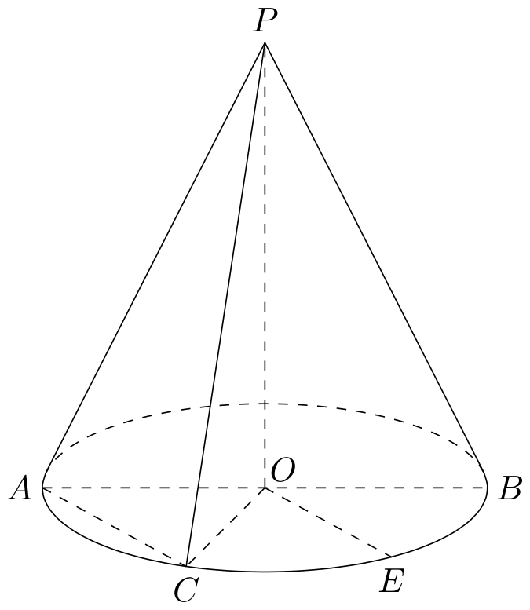
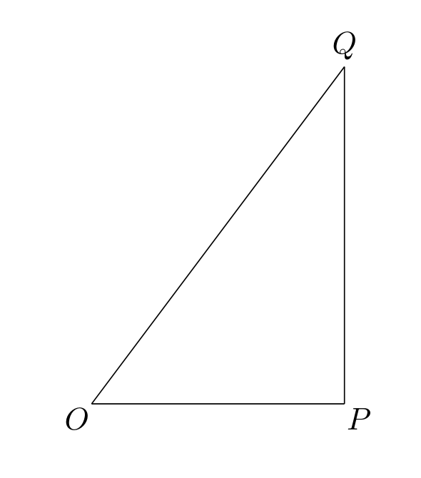

# 2015年上海卷（秋文）

## 填空题

### 第 1 题

函数 $f(x)=1-3\sin^{2}x$ 的最小正周期为＿＿＿＿＿＿.

#### 答案

$\pi$

#### 解析

由降幂公式，$f(x)=1-\dfrac{3}{2}\left(1-\cos 2x\right)=-\dfrac{1}{2}+\dfrac{3}{2}\cos 2x$. 因为 $\cos 2x$ 的最小正周期为 $\pi$，且前面的系数不为零，所以 $f(x)$ 的最小正周期为 $\pi$.

### 第 2 题

设全集 $U = \mathbb{R}$. 若集合 $A = \{1, 2, 3, 4\}$，$B = \{x \mid 2 \leqslant x < 3\}$，则 $A \cap \complement_U B =$＿＿＿＿＿＿.

#### 答案

$\{1,3,4\}$

#### 解析

由 $B=\{x\mid 2\leqslant x<3\}$，可知 $2\in B$，而 $3\notin B$. 因此在集合 $A=\{1,2,3,4\}$ 中，属于 $U$ 的补集 $\complement_U B$ 的元素为 $1$，$3$，$4$，故 $A\cap\complement_U B=\{1,3,4\}$.

### 第 3 题

若复数 $z$ 满足 $3z + \overline{z} = 1 + \i$，其中 $\i$ 为虚数单位，则 $z =$＿＿＿＿＿＿.

#### 答案

$\frac{1}{4}+\frac{1}{2}\i$

#### 解析

设 $z=u+v\i$，其中 $u$，$v\in\mathbb{R}$，则 $\overline{z}=u-v\i$. 代入已知等式，得 $3z+\overline{z}=4u+2v\i=1+\i$. 比较实部和虚部，得 $4u=1$，$2v=1$，所以 $u=\dfrac14$，$v=\dfrac12$. 因而 $z=\dfrac14+\dfrac12\i$.

### 第 4 题

设 $f^{-1}(x)$ 为 $f(x)=\frac{x}{2x+1}$ 的反函数，则 $f^{-1}(2)=$＿＿＿＿＿＿.

#### 答案

$-\frac{2}{3}$

#### 解析

要求 $f^{-1}(2)$，就是解方程 $f(x)=2$，即 $\dfrac{x}{2x+1}=2$. 因为 $2x+1\neq0$，两边同乘 $2x+1$，得 $x=4x+2$，所以 $x=-\dfrac23$. 此时 $2x+1=-\dfrac13\neq0$，满足定义域要求，故 $f^{-1}(2)=-\dfrac23$.

### 第 5 题

若线性方程组的增广矩阵为 $\begin{pmatrix} 2 & 3 & c_{1} \\ 0 & 1 & c_{2} \end{pmatrix}$，解为

$$

\begin{cases}
x = 3,\\
y = 5,
\end{cases}

$$

则 $c_{1}-c_{2}=$＿＿＿＿＿＿.

#### 答案

16

#### 解析

增广矩阵对应的方程组为 $2x+3y=c_1$，$y=c_2$. 将已知解 $x=3$，$y=5$ 代入，得 $c_1=2\times3+3\times5=21$，$c_2=5$. 因此 $c_1-c_2=21-5=16$.

### 第 6 题

若正三棱柱的所有棱长均为 $a$，且其体积为 $16\sqrt{3}$，则 $a =$＿＿＿＿＿＿.

#### 答案

4

#### 解析

正三棱柱的底面是边长为 $a$ 的正三角形，底面积为 $\dfrac{\sqrt{3}}{4}a^2$，高为 $a$. 由体积条件，$\dfrac{\sqrt{3}}{4}a^3=16\sqrt{3}$，所以 $a^3=64$. 由于棱长 $a>0$，得 $a=4$.

### 第 7 题

抛物线 $y^{2}=2px$ （$p>0$） 上的动点 $Q$ 到焦点的距离的最小值为 1，则 $p=$＿＿＿＿＿＿.

#### 答案

2

#### 解析

将抛物线写成标准形式 $y^2=4\left(\dfrac p2\right)x$，故其焦点为 $F\left(\dfrac p2,0\right)$. 对抛物线上任意点 $Q(x,y)$，由 $y^2=2px$ 得

$$

QF^2=\left(x-\frac p2\right)^2+y^2=x^2+px+\frac{p^2}{4}=\left(x+\frac p2\right)^2

$$

由于抛物线上的点满足 $x\geqslant0$，所以 $QF=x+\dfrac p2$，其最小值在顶点处取得，等于 $\dfrac p2$. 由题意 $\dfrac p2=1$，故 $p=2$.

### 第 8 题

方程 $\log_{2}(9^{x-1}-5)=\log_{2}(3^{x-1}-2)+2$ 的解为＿＿＿＿＿＿.

#### 答案

2

#### 解析

令 $t=3^{x-1}>0$，则 $9^{x-1}=t^2$. 原方程的定义域要求 $t^2-5>0$ 且 $t-2>0$，即 $t>\sqrt{5}$. 由对数的运算性质，原方程等价于

$$

t^2-5=4(t-2)

$$

即 $t^2-4t+3=0$，所以 $t=1$ 或 $t=3$. 其中 $t=1$ 不满足定义域，舍去；由 $3^{x-1}=3$ 得 $x=2$.

### 第 9 题

若 $x$，$y$ 满足

$$

\begin{cases}
x - y \geqslant 0,\\
x + y \leqslant 2,\\
y \geqslant 0,
\end{cases}

$$

则目标函数 $f = x + 2y$ 的最大值为＿＿＿＿＿＿.

#### 答案

3

#### 解析

不等式组表示的可行域由 $y\leqslant x$、$y\leqslant2-x$ 和 $y\geqslant0$ 确定，其顶点为 $(0,0)$、$(2,0)$ 和 $(1,1)$. 目标函数 $f=x+2y$ 在这三个顶点处的值分别为 $0$、$2$ 和 $3$. 线性目标函数在三角形可行域上的最大值为顶点值中的最大者，故最大值为 $3$.

### 第 10 题

在报名的 3 名男教师和 6 名女教师中，选取 5 人参加义务献血. 要求男、女教师都有，则不同的选取方式的种数为＿＿＿＿＿＿. （结果用数值表示）

#### 答案

120

#### 解析

按选出的男教师人数分类. 选 $1$、$2$、$3$ 名男教师时，分别选 $4$、$3$、$2$ 名女教师，因此选取方式总数为

$$

\mathrm C_3^1\mathrm C_6^4+\mathrm C_3^2\mathrm C_6^3+\mathrm C_3^3\mathrm C_6^2=45+60+15=120

$$

所以不同的选取方式有 $120$ 种.

### 第 11 题

在 $\left(2x + \frac{1}{x^2}\right)^6$ 的二项展开式中，常数项等于＿＿＿＿＿＿. （结果用数值表示）

#### 答案

240

#### 解析

展开式的通项为 $T_{r+1}=\mathrm C_6^r(2x)^{6-r}\left(\frac{1}{x^2}\right)^r=\mathrm C_6^r2^{6-r}x^{6-3r}$，$r=0$，$1$，$\dots$，$6$. 要取得常数项，须有 $6-3r=0$，所以 $r=2$. 因而常数项为 $\mathrm C_6^2 2^4=15\times16=240$.

### 第 12 题

已知双曲线 $C_1$，$C_2$ 的顶点重合，$C_1$ 的方程为 $\frac{x^2}{4} - y^2 = 1$，若 $C_2$ 的一条渐近线的斜率是 $C_1$ 的一条渐近线的斜率的 2 倍，则 $C_2$ 的方程为＿＿＿＿＿＿.

#### 答案

$\frac{x^2}{4}-\frac{y^2}{4}=1$

#### 解析

双曲线 $C_1$ 的顶点为 $(\pm2,0)$，其渐近线方程为 $y=\pm\dfrac12x$，所以渐近线斜率为 $\pm\dfrac12$. 由于 $C_2$ 与 $C_1$ 的顶点重合，$C_2$ 仍为焦点在 $x$ 轴上的双曲线，可设其方程为 $\dfrac{x^2}{4}-\dfrac{y^2}{b^2}=1$. 其渐近线斜率为 $\pm\dfrac b2$. 题设说明其中一条斜率的绝对值为 $1$，故 $b=2$. 因而 $C_2$ 的方程为 $\dfrac{x^2}{4}-\dfrac{y^2}{4}=1$.

### 第 13 题

已知平面向量 $\boldsymbol{a}$，$\boldsymbol{b}$，$\boldsymbol{c}$ 满足 $\boldsymbol{a}\perp \boldsymbol{b}$，且 $\{|\boldsymbol{a}|, |\boldsymbol{b}|, |\boldsymbol{c}|\} = \{1, 2, 3\}$，则 $|\boldsymbol{a}+ \boldsymbol{b}+ \boldsymbol{c}|$ 的最大值是＿＿＿＿＿＿.

#### 答案

$3+\sqrt{5}$

#### 解析

由于 $\boldsymbol{a}\perp\boldsymbol{b}$，有 $|\boldsymbol{a}+\boldsymbol{b}|=\sqrt{|\boldsymbol{a}|^2+|\boldsymbol{b}|^2}$. 对于固定的 $|\boldsymbol{a}|$、$|\boldsymbol{b}|$、$|\boldsymbol{c}|$，由三角不等式，且当 $\boldsymbol{c}$ 与 $\boldsymbol{a}+\boldsymbol{b}$ 同向时取等号，得

$$

|\boldsymbol{a}+\boldsymbol{b}+\boldsymbol{c}|\leqslant\sqrt{|\boldsymbol{a}|^2+|\boldsymbol{b}|^2}+|\boldsymbol{c}|

$$

将 $1$，$2$，$3$ 分别作为 $|\boldsymbol{c}|$ 及 $|\boldsymbol{a}|$，$|\boldsymbol{b}|$ 的取值，可能的上界为 $1+\sqrt{13}$、$2+\sqrt{10}$、$3+\sqrt5$. 比较可得 $3+\sqrt5$ 最大，且取 $|\boldsymbol{c}|=3$、$|\boldsymbol{a}|=1$、$|\boldsymbol{b}|=2$ 并令 $\boldsymbol{c}$ 与 $\boldsymbol{a}+\boldsymbol{b}$ 同向时可以达到该上界. 所以最大值为 $3+\sqrt5$.

### 第 14 题

已知函数 $f(x) = \sin x$. 若存在 $x_1$，$x_2$，$\dots$，$x_m$ 满足 $0 \leqslant x_1 < x_2 < \dots < x_m \leqslant 6\pi$，且 $|f(x_1) - f(x_2)| + |f(x_2) - f(x_3)| + \dots + |f(x_{m-1}) - f(x_m)| = 12$（$m \geqslant 2$，$m \in \mathbb{N}^*$），则 $m$ 的最小值为＿＿＿＿＿＿.

#### 答案

8

#### 解析

因为对任意 $i<j$，都有 $|\sin x_i-\sin x_j|\leqslant2$，所以每一项相邻差的绝对值都不超过 $2$. 若 $m\leqslant6$，则总和至多为 $2(m-1)\leqslant10$，不可能等于 $12$. 还需排除 $m=7$：此时共有 $6$ 项，每项都必须等于 $2$，因此相邻的正弦值必须交替为 $1$，$-1$，$1$，$-1$，$1$，$-1$，$1$ 或 $-1$，$1$，$-1$，$1$，$-1$，$1$，$-1$. 但在区间 $[0,6\pi]$ 内，$\sin x=1$ 和 $\sin x=-1$ 各自都只有 $3$ 个取值点，不可能出现上述需要某一种极值出现 $4$ 次的序列，故 $m\neq7$，从而 $m\geqslant8$.

取 $x_1=0$，$x_2=\frac\pi2$，$x_3=\frac{3\pi}{2}$，$x_4=\frac{5\pi}{2}$，$x_5=\frac{7\pi}{2}$，$x_6=\frac{9\pi}{2}$，$x_7=\frac{11\pi}{2}$，$x_8=6\pi$. 对应的正弦值为 $0$，$1$，$-1$，$1$，$-1$，$1$，$-1$，$0$，相邻差的绝对值之和为 $1+2+2+2+2+2+1=12$. 因此 $m=8$ 可以达到，故最小值为 $8$.

## 单选题

### 第 15 题

设 $z_{1}$，$z_{2} \in \mathbf{C}$，则“$z_{1}$，$z_{2}$ 均为实数”是“$z_{1} - z_{2}$ 是实数”的（）

A.  
充分非必要条件

B.  
必要非充分条件

C.  
充要条件

D.  
既非充分又非必要条件

#### 答案

A

#### 解析

若 $z_1$、$z_2$ 均为实数，则 $z_1-z_2$ 仍为实数，因此“$z_1$、$z_2$ 均为实数”是“$z_1-z_2$ 是实数”的充分条件. 但反过来不成立，例如取 $z_1=1+\i$，$z_2=\i$，则 $z_1-z_2=1$ 是实数，而 $z_1$、$z_2$ 并非均为实数. 所以它是充分非必要条件，故选 A.

### 第 16 题

下列不等式中，与不等式 $\frac{x + 8}{x^2 + 2x + 3} < 2$ 解集相同的是（）

A.  
$(x + 8)(x^2 + 2x + 3) < 2$

B.  
$x + 8 < 2(x^{2} + 2x + 3)$

C.  
$\frac{1}{x^2 + 2x + 3} < \frac{2}{x + 8}$

D.  
$\frac{x^2 + 2x + 3}{x + 8} > \frac{1}{2}$

#### 答案

B

#### 解析

因为 $x^2+2x+3=(x+1)^2+2>0$ 对任意实数 $x$ 成立，所以原不等式两边同乘这个正数后，得到与原不等式完全等价的不等式 $x+8<2(x^2+2x+3)$. 这正是选项 B，故选 B.

### 第 17 题

已知点 $A$ 的坐标为 $(4\sqrt{3}, 1)$，将 $OA$ 绕坐标原点 $O$ 逆时针旋转 $\frac{\pi}{3}$ 至 $OB$，则点 $B$ 的纵坐标为（）

A.  
$\frac{3\sqrt{3}}{2}$

B.  
$\frac{5\sqrt{3}}{2}$

C.  
$\frac{11}{2}$

D.  
$\frac{13}{2}$

#### 答案

D

#### 解析

逆时针旋转 $\dfrac\pi3$ 后，点的纵坐标按旋转公式变为

$$

y_B=x_A\sin\frac\pi3+y_A\cos\frac\pi3=4\sqrt3\cdot\frac{\sqrt3}{2}+1\cdot\frac12=\frac{13}{2}

$$

因此点 $B$ 的纵坐标为 $\dfrac{13}{2}$，故选 D.

### 第 18 题

设 $P_{n}(x_{n}, y_{n})$ 是直线 $2x - y = \frac{n}{n + 1}$ （$n \in \mathbb{N}^*$）与圆 $x^{2} + y^{2} = 2$ 在第一象限的交点，则极限 $\displaystyle\lim_{n \to \infty} \frac{y_{n} - 1}{x_{n} - 1} =$（）

A.  
$-1$

B.  
$-\frac{1}{2}$

C.  
$1$

D.  
$2$

#### 答案

A

#### 解析

令 $c_n=\dfrac{n}{n+1}$，则 $c_n\to1$. 第一象限内满足 $2x-y=1$ 和 $x^2+y^2=2$ 的点只有 $(1,1)$，所以由 $P_n$ 的定义可知 $(x_n,y_n)\to(1,1)$. 又因 $c_n<1$，有限的 $n$ 不会使 $P_n=(1,1)$，故 $x_n\neq1$.

由 $x_n^2+y_n^2=2=1^2+1^2$，得

$$

(x_n-1)(x_n+1)+(y_n-1)(y_n+1)=0

$$

除以 $x_n-1$，并令 $n\to\infty$，得到 $x_n+1+(y_n+1)\frac{y_n-1}{x_n-1}=0$，$\Longrightarrow$，$\lim_{n\to\infty}\frac{y_n-1}{x_n-1}=-\frac{2}{2}=-1$. 因此极限为 $-1$，故选 A.

## 解答题

### 第 19 题

如图，圆锥的顶点为 $P$，底面圆心为 $O$，底面的一条直径为 $AB$，$C$ 为半圆弧 $\widehat{AB}$ 的中点，$E$ 为劣弧 $\widehat{CB}$ 的中点. 已知 $PO = 2$，$OA = 1$，求三棱锥 $P - AOC$ 的体积，并求异面直线 $PA$ 与 $OE$ 所成角的余弦值.

#### 解析

在底面所在平面内建立直角坐标系，取 $O$ 为原点，令 $A=(-1,0,0)$，$B=(1,0,0)$，$C=(0,-1,0)$，则 $E=\left(\frac{\sqrt{2}}{2},-\frac{\sqrt{2}}{2},0\right)$. 由于 $PO=2$，可取 $P=(0,0,2)$.

三角形 $AOC$ 是直角三角形，且 $OA=OC=1$，所以其面积为 $\frac{1}{2}$. 因而三棱锥 $P-AOC$ 的体积为

$$

V=\frac{1}{3}\cdot\frac{1}{2}\cdot PO=\frac{1}{3}

$$

直线 $PA$ 的一个方向向量可取 $\overrightarrow{AP}=(1,0,2)$，直线 $OE$ 的一个方向向量可取 $\overrightarrow{OE}=\left(\frac{\sqrt{2}}{2},-\frac{\sqrt{2}}{2},0\right)$. 设两异面直线所成的角为 $\theta$，则

$$

\cos\theta=\frac{|\overrightarrow{AP}\cdot\overrightarrow{OE}|}{|\overrightarrow{AP}|\,|\overrightarrow{OE}|}=\frac{\frac{\sqrt{2}}{2}}{\sqrt{5}\cdot1}=\frac{\sqrt{10}}{10}

$$

所以三棱锥 $P-AOC$ 的体积为 $\frac{1}{3}$，异面直线 $PA$ 与 $OE$ 所成角的余弦值为 $\frac{\sqrt{10}}{10}$.

### 第 20 题

已知函数 $f(x) = ax^2 + \frac{1}{x}$，其中 $a$ 为常数.

1.  根据 $a$ 的不同取值，判断函数 $f(x)$ 的奇偶性，并说明理由；

2.  若 $a \in (1,3)$，判断函数 $f(x)$ 在 $[1,2]$ 上的单调性，并说明理由.

#### 解析

1.  函数的定义域为 $\{x\in\mathbb{R}\mid x\neq0\}$，关于原点对称. 对任意 $x\neq0$，有 $f(-x)=ax^{2}-\frac{1}{x}$. 若 $f$ 为偶函数，则应有 $f(-x)=f(x)$，从而 $ax^{2}-\frac{1}{x}=ax^{2}+\frac{1}{x}$，这对 $x\neq0$ 不可能成立，所以 $f$ 不是偶函数. 若 $f$ 为奇函数，则应有 $f(-x)=-f(x)$，即 $ax^{2}-\frac{1}{x}=-ax^{2}-\frac{1}{x}$，于是 $2ax^{2}=0$. 对任意 $x\neq0$ 成立的充要条件是 $a=0$. 因此，当 $a=0$ 时，$f(x)=\frac{1}{x}$ 为奇函数；当 $a\neq0$ 时，$f(x)$ 既不是奇函数，也不是偶函数.

2.  当 $x\in[1,2]$ 且 $a\in(1,3)$ 时，$f$ 可导，且 $f'(x)=2ax-\frac{1}{x^{2}}$. 因为 $a>1$ 且 $x\geqslant1$，所以 $f'(x)\geqslant2a-1>1>0$. 因此 $f(x)$ 在 $[1,2]$ 上单调递增.

### 第 21 题

如图，$O$，$P$，$Q$ 三地有直道相通，$OP = 3\text{ 千米}$，$PQ = 4\text{ 千米}$，$OQ = 5\text{ 千米}$. 现甲，乙两警员同时从 $O$ 地出发匀速前往 $Q$ 地. 经过 $t$ 小时，他们之间的距离为 $f(t)$（单位：千米）. 甲的路线是 $OQ$，速度为 $5\text{ 千米/小时}$，乙的路线是 $OPQ$，速度为 $8\text{ 千米/小时}$. 乙到达 $Q$ 地后在原地等待. 设 $t = t_1$ 时，乙到达 $P$ 地；$t = t_2$ 时，乙到达 $Q$ 地.

1.  求 $t_{1}$ 与 $f(t_{1})$ 的值；

2.  已知警员的对讲机的有效通话距离是 3 千米. 当 $t_1 \leqslant t \leqslant t_2$ 时，求 $f(t)$ 的表达式，并判断 $f(t)$ 在 $[t_1, t_2]$ 上的最大值是否超过 3？ 说明理由.

#### 解析

1.  乙沿 $OP$ 以 $8\text{ 千米/小时}$ 的速度行驶，所以 $t_{1}=\frac{OP}{8}=\frac{3}{8}$. 取 $O=(0,0)$，$P=(3,0)$，$Q=(3,4)$. 甲沿 $OQ$ 行驶，经过 $t_{1}$ 小时走过的路程为 $5t_{1}=\frac{15}{8}$，故此时甲的位置为 $A=\left(\frac{9}{8},\frac{3}{2}\right)$. 因而

$$

f(t_{1})=AP=\sqrt{\left(3-\frac{9}{8}\right)^{2}+\left(0-\frac{3}{2}\right)^{2}}=\sqrt{\frac{225}{64}+\frac{144}{64}}=\frac{\sqrt{369}}{8}\text{ 千米}

$$

2.  乙到达 $Q$ 所需的时间为 $t_{2}=\frac{OP+PQ}{8}=\frac{7}{8}$. 当 $t_{1}\leqslant t\leqslant t_{2}$ 时，甲的位置为 $M=(3t,4t)$，乙已经经过 $P$，其位置为 $N=(3,8t-3)$. 所以 $f(t)=MN=\sqrt{(3t-3)^{2}+(4t-8t+3)^{2}}=\sqrt{25t^{2}-42t+18}$，$\frac{3}{8}\leqslant t\leqslant\frac{7}{8}$. 令 $g(t)=f^{2}(t)=25t^{2}-42t+18$. 因为 $g'(t)=50t-42$，其顶点 $t=\frac{21}{25}$ 位于区间 $\left[\frac{3}{8},\frac{7}{8}\right]$ 内，且二次函数 $g$ 开口向上，所以最大值在端点处取得. 计算得 $g\left(\frac{3}{8}\right)=\frac{369}{64}$，$g\left(\frac{7}{8}\right)=\frac{25}{64}$. 因此

$$

\max_{t\in[t_{1},t_{2}]}f(t)=\frac{\sqrt{369}}{8}<3

$$

    所以 $f(t)$ 在 $[t_{1},t_{2}]$ 上的最大值不超过 $3\text{ 千米}$.

### 第 22 题

已知椭圆 $x^{2} + 2y^{2} = 1$，过原点的两条直线 $l_{1}$ 和 $l_{2}$ 分别与椭圆交于点 $A$，$B$ 和 $C$，$D$. 记 $\triangle AOC$ 的面积为 $S$.

1.  设 $A(x_{1}, y_{1})$，$C(x_{2}, y_{2})$. 用 $A$，$C$ 的坐标表示点 $C$ 到直线 $l_{1}$ 的距离，并证明 $S = \frac{1}{2} |x_{1}y_{2} - x_{2}y_{1}|$；

2.  设 $l_{1}: y = kx$，$C\left(\frac{\sqrt{3}}{3}, \frac{\sqrt{3}}{3}\right)$，$S = \frac{1}{3}$. 求 $k$ 的值.

3.  设 $l_{1}$ 与 $l_{2}$ 的斜率之积为 $m$，求 $m$ 的值，使得无论 $l_{1}$ 与 $l_{2}$ 如何变动，面积 $S$ 保持不变.

#### 解析

1.  直线 $l_{1}$ 经过 $O$ 和 $A(x_{1},y_{1})$，其方程可写为 $y_{1}x-x_{1}y=0$. 因而点 $C(x_{2},y_{2})$ 到直线 $l_{1}$ 的距离为

$$

d=\frac{|y_{1}x_{2}-x_{1}y_{2}|}{\sqrt{x_{1}^{2}+y_{1}^{2}}}=\frac{|x_{1}y_{2}-x_{2}y_{1}|}{\sqrt{x_{1}^{2}+y_{1}^{2}}}

$$

    又 $OA=\sqrt{x_{1}^{2}+y_{1}^{2}}$，所以

$$

S=\frac{1}{2}OA\cdot d=\frac{1}{2}|x_{1}y_{2}-x_{2}y_{1}|

$$

2.  因为 $A\in l_{1}$，且 $l_{1}:y=kx$，所以 $y_{1}=kx_{1}$，代入椭圆方程得 $x_{1}^{2}(1+2k^{2})=1$，从而 $|x_{1}|=\frac{1}{\sqrt{1+2k^{2}}}$. 由 $C\left(\frac{\sqrt{3}}{3},\frac{\sqrt{3}}{3}\right)$ 和第（1）问的面积公式，得

$$

\frac{2}{3}=2S=\frac{\sqrt{3}}{3}|x_{1}(1-k)|=\frac{\sqrt{3}}{3}\frac{|1-k|}{\sqrt{1+2k^{2}}}

$$

    两边平方并化简，得 $3(1-k)^{2}=4(1+2k^{2})$，即 $5k^{2}+6k+1=0$. 因此 $k=-1$ 或 $k=-\frac{1}{5}$.

3.  设 $l_{1}$ 的斜率为 $k$，则 $l_{2}$ 的斜率为 $\frac{m}{k}$. 先取 $k\neq0$，由两条过原点的直线与椭圆的交点坐标，取绝对值后有

$$

S^{2}=\frac{\left(\frac{m}{k}-k\right)^{2}}{4(1+2k^{2})\left(1+2\left(\frac{m}{k}\right)^{2}\right)}=\frac{(m-k^{2})^{2}}{4(1+2k^{2})(k^{2}+2m^{2})}

$$

    令 $u=k^{2}>0$. 若 $m=0$，则对任意非零 $k$，上式化为 $S^{2}=\frac{u}{4(1+2u)}$，随 $u$ 变化，不能保持不变. 当 $m\neq0$ 时，若 $S$ 与 $u$ 无关，则存在常数 $c$，使

$$

u^{2}-2mu+m^{2}=c\left(2u^{2}+(1+4m^{2})u+2m^{2}\right)

$$

    比较二次项和常数项系数，得 $c=\frac{1}{2}$. 再比较一次项系数，得 $-2m=\frac{1+4m^{2}}{2}$，即 $(2m+1)^{2}=0$，所以 $m=-\frac{1}{2}$. 反之，当 $m=-\frac{1}{2}$ 时，

$$

S^{2}=\frac{\left(u+\frac{1}{2}\right)^{2}}{4(1+2u)\left(u+\frac{1}{2}\right)}=\frac{1}{8}

$$

    与 $u$ 无关. 因此所求 $m=-\frac{1}{2}$.

### 第 23 题

已知数列 $\{a_{n}\}$ 与 $\{b_{n}\}$ 满足 $a_{n + 1} - a_n = 2(b_{n + 1} - b_n)$，$n \in \mathbb{N}^*$.

1.  若 $b_{n} = 3n + 5$，且 $a_{1} = 1$，求 $\{a_{n}\}$ 的通项公式；

2.  设 $\{a_{n}\}$ 的第 $n_0$ 项是最大项，即 $a_{n_0} \geqslant a_n$（$n \in \mathbb{N}^*$），求证： $\{b_n\}$ 的第 $n_0$ 项是最大项；

3.  设 $a_{1} = 3\lambda < 0$，$b_{n} = \lambda^{n}$（$n \in \mathbb{N}^{*}$），求 $\lambda$ 的取值范围，使得对任意 $m$，$n \in \mathbb{N}^{*}$，$a_{n} \neq 0$，且 $\frac{a_{m}}{a_{n}} \in \left(\frac{1}{6}, 6\right)$.

#### 解析

1.  因为 $b_{n}=3n+5$，所以 $b_{n+1}-b_{n}=3$，从而 $a_{n+1}-a_{n}=6$. 数列 $\{a_{n}\}$ 是首项为 $a_{1}=1$、公差为 $6$ 的等差数列，因此

$$

a_{n}=1+6(n-1)=6n-5

$$

2.  由已知关系得 $a_{n+1}-2b_{n+1}=a_{n}-2b_{n}$，所以 $a_{n}-2b_{n}$ 是常数列，即 $a_{n}=2b_{n}+a_{1}-2b_{1}$. 由 $a_{n_{0}}\geqslant a_{n}$ 得

$$

2b_{n_{0}}+a_{1}-2b_{1}\geqslant2b_{n}+a_{1}-2b_{1}

$$

    于是 $b_{n_{0}}\geqslant b_{n}$. 因此 $\{b_{n}\}$ 的第 $n_{0}$ 项是最大项.

3.  由 $a_{1}=3\lambda<0$ 得 $\lambda<0$. 令 $r=-\lambda>0$. 由恒等关系 $a_{n}-2b_{n}=a_{1}-2b_{1}$，得

$$

a_{n}=2\lambda^{n}+\lambda=\lambda+2\lambda^{n}

$$

    先求必要条件. 有 $a_{1}=-3r$，$a_{2}=-r+2r^{2}=-r(1-2r)$. 因为任意两项之比都属于正数区间 $\left(\frac{1}{6},6\right)$，各项必须同号且不能为零，所以 $0<r<\frac{1}{2}$. 又

$$

\frac{a_{1}}{a_{2}}=\frac{3}{1-2r}<6

$$

    解得 $r<\frac{1}{4}$. 所以必要条件是 $0<r<\frac{1}{4}$.

    再证其充分性. 当 $0<r<\frac{1}{4}$ 时，若 $n$ 为奇数，则 $a_{n}=-r-2r^{n}<0$；若 $n$ 为偶数，则 $n\geqslant2$，且 $2r^{n}\leqslant2r^{2}<\frac{r}{2}$，所以 $a_{n}=-r+2r^{n}<0$. 因而所有 $a_{n}$ 均非零且同为负数. 令 $c_{n}=-a_{n}>0$. 当 $n$ 为奇数时，$c_{n}=r+2r^{n}\leqslant3r$；当 $n$ 为偶数时，$c_{n}=r-2r^{n}\geqslant r-2r^{2}=r(1-2r)$. 因此对任意 $m$，$n\in\mathbb{N}^*$，有

$$

\frac{1-2r}{3}\leqslant\frac{a_{m}}{a_{n}}=\frac{c_{m}}{c_{n}}\leqslant\frac{3}{1-2r}

$$

    由于 $0<r<\frac{1}{4}$，有 $\frac{1-2r}{3}>\frac{1}{6}$ 且 $\frac{3}{1-2r}<6$. 所以题设条件成立. 综上，

$$

\lambda=-r\in\left(-\frac{1}{4},0\right)

$$

