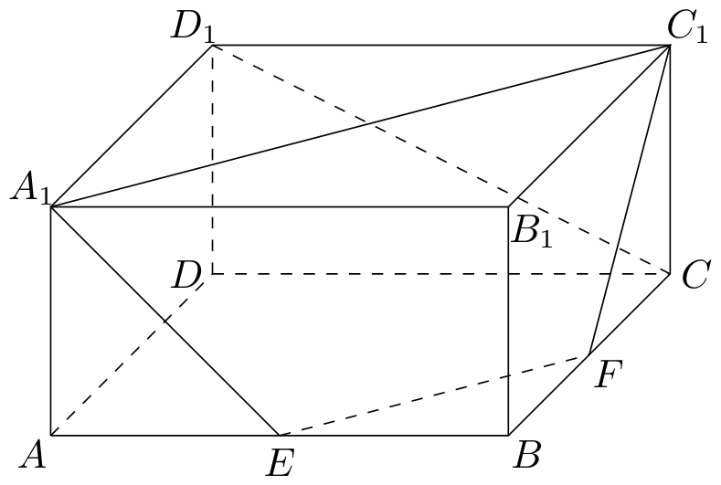
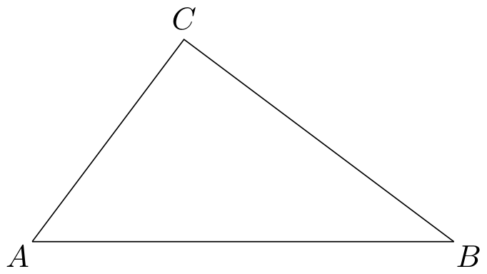

# 2015年上海卷（秋理）

## 填空题

### 第 1 题

设全集 $U = \mathbb{R}$. 若集合 $A = \{1, 2, 3, 4\}$，$B = \{x \mid 2 \leqslant x \leqslant 3\}$，则 $A \cap \complement_U B =$＿＿＿＿＿＿.

#### 答案

$\{1,4\}$

#### 解析

因为 $B=[2,3]$，所以 $\complement_U B=(-\infty,2)\cup(3,+\infty)$. 从 $A$ 中去掉属于 $B$ 的元素 $2,3$，得到 $A\cap\complement_U B=\{1,4\}$.

### 第 2 题

若复数 $z$ 满足 $3z + \overline{z} = 1 + \i$，其中 $\i$ 为虚数单位，则 $z =\underline{\qquad\qquad}$.

#### 答案

$\frac{1}{4}+\frac{1}{2}\i$

#### 解析

设 $z=a+b\i$，其中 $a$，$b\in\mathbb{R}$，则 $\overline{z}=a-b\i$. 代入已知等式，得

$$

3z+\overline{z}=3(a+b\i)+(a-b\i)=4a+2b\i=1+\i

$$

比较实部与虚部，得 $4a=1$，$2b=1$，所以 $a=\frac14$，$b=\frac12$. 因此 $z=\frac14+\frac12\i$.

### 第 3 题

若线性方程组的增广矩阵为 $\begin{pmatrix}2 & 3 & c_1\\ 0 & 1 & c_2 \end{pmatrix}$，解为

$$

\begin{cases}
x = 3,\\
y = 5
\end{cases}

$$

，则 $c_{1} - c_{2} =$＿＿＿＿＿＿.

#### 答案

16

#### 解析

增广矩阵对应的方程组为

$$

\begin{cases}
2x+3y=c_1,\\
y=c_2.
\end{cases}

$$

代入解 $x=3$，$y=5$，得 $c_1=2\times3+3\times5=21$，$c_2=5$. 因此 $c_1-c_2=21-5=16$.

### 第 4 题

若正三棱柱的所有棱长均为 $a$，且其体积为 $16\sqrt{3}$，则 $a =$＿＿＿＿＿＿.

#### 答案

4

#### 解析

正三棱柱的底面是边长为 $a$ 的正三角形，底面积为 $\frac{\sqrt{3}}{4}a^2$，高为 $a$. 因而

$$

V=\frac{\sqrt{3}}{4}a^2\cdot a=\frac{\sqrt{3}}{4}a^3=16\sqrt{3}

$$

约去 $\sqrt{3}$，得 $a^3=64$. 因为 $a>0$，所以 $a=4$.

### 第 5 题

抛物线 $y^{2} = 2px$ （$p > 0$）上的动点 $Q$ 到焦点的距离的最小值为 1，则 $p =$＿＿＿＿＿＿.

#### 答案

2

#### 解析

将 $y^2=2px$ 与标准方程 $y^2=4ax$ 对比，得焦点为 $F\left(\frac p2,0\right)$，顶点为原点. 抛物线上点到焦点的距离等于点到准线的距离，最小值在顶点处取得，且等于焦点到顶点的距离 $\frac p2$. 因此 $\frac p2=1$，所以 $p=2$.

### 第 6 题

若圆锥的侧面积与过轴的截面面积之比为 $2\pi$，则其母线与轴的夹角的大小为＿＿＿＿＿＿.

#### 答案

$\frac{\pi}{3}$

#### 解析

设圆锥底面半径为 $r$，高为 $h$，母线长为 $l$. 圆锥侧面积为 $\pi rl$，过轴的截面是底为 $2r$、高为 $h$ 的等腰三角形，面积为 $rh$. 由题意

$$

\frac{\pi rl}{rh}=2\pi

$$

所以 $\frac lh=2$. 若母线与轴的夹角为 $\theta$，则 $\cos\theta=\frac hl=\frac12$. 由于 $0<\theta<\frac\pi2$，得 $\theta=\frac\pi3$.

### 第 7 题

方程 $\log_2(9^{x - 1} - 5) = \log_2(3^{x - 1} - 2) + 2$ 的解为＿＿＿＿＿＿.

#### 答案

2

#### 解析

令 $t=3^{x-1}$，则 $t>0$，且 $9^{x-1}=t^2$. 对数有意义要求 $t^2-5>0$ 且 $t-2>0$，故 $t>\sqrt5$. 原方程化为

$$

\log_2(t^2-5)=\log_2(t-2)+2=\log_2\bigl(4(t-2)\bigr)

$$

由对数函数的单调性，得 $t^2-5=4t-8$，即 $(t-1)(t-3)=0$. 结合 $t>\sqrt5$，只能取 $t=3$. 所以 $3^{x-1}=3$，得 $x=2$.

### 第 8 题

在报名的 $3$ 名男教师和 $6$ 名女教师中，选取 $5$ 人参加义务献血. 要求男、女教师都有，则不同的选取方式的种数为＿＿＿＿＿＿. （结果用数值表示）

#### 答案

120

#### 解析

不限制性别时共有 $\mathrm C_9^5$ 种选法. 不满足要求的选法只有全部选女教师，共 $\mathrm C_6^5$ 种；不可能全部选男教师，因为男教师只有3名. 因此所求种数为

$$

\mathrm C_9^5-\mathrm C_6^5=126-6=120

$$

### 第 9 题

已知点 $P$ 和 $Q$ 的横坐标相同，$P$ 的纵坐标是 $Q$ 的纵坐标的 2 倍，$P$ 和 $Q$ 的轨迹分别为双曲线 $C_1$ 和 $C_2$. 若 $C_1$ 的渐近线方程为 $y = \pm \sqrt{3} x$，则 $C_2$ 的渐近线方程为＿＿＿＿＿＿.

#### 答案

$y=\pm\frac{\sqrt{3}}{2}x$

#### 解析

设 $P=(x,y_1)$，$Q=(x,y_2)$. 题设给出 $y_1=2y_2$. 轨迹 $C_1$ 的渐近线满足 $y_1=\pm\sqrt3 x$，因此

$$

2y_2=\pm\sqrt3 x

$$

所以 $C_2$ 的渐近线方程为 $y_2=\pm\frac{\sqrt3}{2}x$，即 $y=\pm\frac{\sqrt3}{2}x$.

### 第 10 题

设 $f^{-1}(x)$ 为 $f(x) = 2^{x - 2} + \frac{x}{2}$，$x \in [0,2]$ 的反函数，则 $y = f(x) + f^{-1}(x)$ 的最大值为＿＿＿＿＿＿.

#### 答案

4

#### 解析

当 $0\leqslant x_1<x_2\leqslant2$ 时，$2^{x_1-2}<2^{x_2-2}$，且 $\frac{x_1}{2}<\frac{x_2}{2}$，所以 $f(x_1)<f(x_2)$. 因此 $f$ 在 $[0,2]$ 上严格递增，且 $f(0)=\frac14$，$f(2)=2$. 因而 $f^{-1}$ 的定义域为 $\left[\frac14,2\right]$，并且在该区间上严格递增. 所以 $y=f(x)+f^{-1}(x)$ 的定义域为 $\left[\frac14,2\right]$，且在此区间上严格递增，最大值在 $x=2$ 处取得. 由于 $f(2)=2$，有 $f^{-1}(2)=2$，故最大值为 $2+2=4$.

### 第 11 题

在 $\left(1 + x + \frac{1}{x^{2015}}\right)^{10}$ 的展开式中，$x^2$ 项的系数为＿＿＿＿＿＿. （结果用数值表示）

#### 答案

45

#### 解析

从每个因子中选取 $x$ 的次数记为 $r$，选取 $x^{-2015}$ 的次数记为 $s$，则对应项的次数为 $r-2015s$，且 $r+s\leqslant10$. 要得到 $x^2$，需满足 $r-2015s=2$. 若 $s\geqslant1$，则 $r=2+2015s>10$，不可能；所以只能取 $s=0$，$r=2$. 此时从10个因子中选2个取 $x$，其余取1，系数为 $\mathrm C_{10}^{2}=45$.

### 第 12 题

赌博有陷阱. 某种赌博每局的规则是：赌客先在标记有 $1$，$2$，$3$，$4$，$5$ 的卡片中随机摸取一张，将卡片上的数字作为其赌金（单位：元）；随后放回该卡片，再随机摸取两张，将这两张卡片上数字之差的绝对值的 $1.4$ 倍作为其奖金（单位：元）. 若随机变量 $\xi_{1}$ 和 $\xi_{2}$ 分别表示赌客在一局赌博中的赌金和奖金，则 $E(\xi_{1}) - E(\xi_{2}) =$＿＿＿＿＿＿（元）.

#### 答案

0.2

#### 解析

五张卡片等可能被第一次摸到，所以

$$

E(\xi_1)=\frac{1+2+3+4+5}{5}=3

$$

设第二次摸出的两张卡片数字之差的绝对值为 $D$. 两张卡片不放回抽取时，所有有序结果共有 $5\times4=20$ 个. 对于 $k=1$，$2$，$3$，$4$，差为 $k$ 的有序结果有 $2(5-k)$ 个，故

$$

P(D=k)=\frac{5-k}{10}

$$

因此

$$

E(D)=\frac{1\cdot4+2\cdot3+3\cdot2+4\cdot1}{10}=2

$$

奖金为 $\xi_2=1.4D$，所以 $E(\xi_2)=1.4E(D)=2.8$. 最终

$$

E(\xi_1)-E(\xi_2)=3-2.8=0.2

$$

### 第 13 题

已知函数 $f(x) = \sin x$. 若存在 $x_1$，$x_2$，$\cdots$，$x_m$ 满足 $0 \leqslant x_1 < x_2 < \cdots < x_m \leqslant 6\pi$. 且 $|f(x_1) - f(x_2)| + |f(x_2) - f(x_3)| + \cdots + |f(x_{m-1}) - f(x_m)| = 12$（$m \geqslant 2$，$m \in \mathbb{N}^*$），则 $m$ 的最小值为＿＿＿＿＿＿.

#### 答案

8

#### 解析

任意两点处的正弦值都在 $[-1,1]$ 内，所以每一项满足 $\lvert f(x_i)-f(x_{i+1})\rvert\leqslant2$. 若 $m\leqslant6$，则总和至多为 $2(m-1)\leqslant10$，不可能等于12，故 $m\geqslant7$. 若 $m=7$，总和由6项组成且等于12，则每一项都必须等于2，于是 $\sin x_i$ 必须在 $1$，$-1$，$1$，$-1$，$1$，$-1$，$1$ 或相反的序列中交替出现. 但在 $[0,6\pi]$ 内，$\sin x=1$ 只有 $x=\frac\pi2$，$\frac{5\pi}2$，$\frac{9\pi}2$ 三个点，$\sin x=-1$ 也只有 $x=\frac{3\pi}2$，$\frac{7\pi}2$，$\frac{11\pi}2$ 三个点，不可能出现7个交替的极值点. 因而 $m\geqslant8$.

取 $x_1=0$，$x_2=\frac\pi2$，$x_3=\frac{3\pi}2$，$x_4=\frac{5\pi}2$，$x_5=\frac{7\pi}2$，$x_6=\frac{9\pi}2$，$x_7=\frac{11\pi}2$，$x_8=6\pi$. 对应的正弦值为 $0$，$1$，$-1$，$1$，$-1$，$1$，$-1$，$0$，相邻绝对差之和为 $1+2+2+2+2+2+1=12$. 所以最小值为 $m=8$.

### 第 14 题

在锐角三角形 $ABC$ 中，$\tan A = \frac{1}{2}$，$D$ 为边 $BC$ 上的点，$\triangle ABD$ 与 $\triangle ACD$ 的面积分别为 2 和 4. 过 $D$ 作 $DE \perp AB$ 于 $E$，$DF \perp AC$ 于 $F$，则 $\overrightarrow{DE} \cdot \overrightarrow{DF} =$＿＿＿＿＿＿.

#### 答案

$-\frac{16}{15}$

#### 解析

由三角形面积公式，得 $AB\cdot DE=4$，$AC\cdot DF=8$. 又因为 $D$ 在 $BC$ 上，所以 $[ABC]=[ABD]+[ACD]=6$，从而 $\frac12AB\cdot AC\sin A=6$，所以 $AB\cdot AC=\frac{12}{\sin A}$. 由 $\tan A=\frac12$ 且 $A$ 为锐角，得 $\sin A=\frac1{\sqrt5}$，$\cos A=\frac2{\sqrt5}$，所以 $AB\cdot AC=12\sqrt5$.

四边形 $AEDF$ 为圆内接四边形，因为 $\angle AED=\angle AFD=90^\circ$，其对角线为 $AD$. 因而 $\angle EDF=\pi-A$，于是

$$

\overrightarrow{DE}\cdot\overrightarrow{DF}=DE\cdot DF\cos(\pi-A)=-DE\cdot DF\cos A

$$

代入前面的关系，得

$$

\overrightarrow{DE}\cdot\overrightarrow{DF}=-\frac4{AB}\cdot\frac8{AC}\cdot\frac2{\sqrt5}=-\frac{16}{15}

$$

## 单选题

### 第 15 题

设 $z_{1}$，$z_{2} \in \mathbf{C}$，则“$z_{1}$，$z_{2}$ 中至少有一个数是虚数”是“$z_{1} - z_{2}$ 是虚数”的（）

A.  
充分非必要条件

B.  
必要非充分条件

C.  
充要条件

D.  
既非充分又非必要条件

#### 答案

B

#### 解析

若 $z_1-z_2$ 是虚数，而 $z_1$，$z_2$ 都是实数，则它们的差仍是实数，矛盾. 所以 $z_1-z_2$ 是虚数时，$z_1$，$z_2$ 中至少有一个是虚数，前者是后者的必要条件.

反之不成立，例如取 $z_1=z_2=\i$，则至少有一个数是虚数，但 $z_1-z_2=0$ 是实数. 因此所给条件是必要非充分条件，故选 B.

### 第 16 题

已知点 $A$ 的坐标为 $(4\sqrt{3}, 1)$，将 $OA$ 绕坐标原点 $O$ 逆时针旋转 $\frac{\pi}{3}$ 至 $OB$，则点 $B$ 的纵坐标为（）

A.  
$\frac{3\sqrt{3}}{2}$

B.  
$\frac{5\sqrt{3}}{2}$

C.  
$\frac{11}{2}$

D.  
$\frac{13}{2}$

#### 答案

D

#### 解析

逆时针旋转角 $\frac\pi3$ 后，点的纵坐标为

$$

4\sqrt3\sin\frac\pi3+1\cos\frac\pi3=4\sqrt3\cdot\frac{\sqrt3}{2}+\frac12=\frac{13}{2}

$$

故选 D.

### 第 17 题

记方程1⃝： $x^{2} + a_{1}x + 1 = 0$，方程2⃝： $x^{2} + a_{2}x + 2 = 0$，方程3⃝： $x^{2} + a_{3}x + 4 = 0$，其中 $a_{1}$，$a_{2}$，$a_{3}$ 是正实数. 当 $a_{1}$，$a_{2}$，$a_{3}$ 成等比数列时，下列选项中，能推出方程3⃝无实根的是（）

A.  
方程1⃝有实根，且2⃝有实根

B.  
方程1⃝有实根，且2⃝无实根

C.  
方程1⃝无实根，且2⃝有实根

D.  
方程1⃝无实根，且2⃝无实根

#### 答案

B

#### 解析

记三个方程的判别式分别为 $\Delta_1=a_1^2-4$，$\Delta_2=a_2^2-8$，$\Delta_3=a_3^2-16$. 因 $a_1$，$a_2$，$a_3>0$ 且成等比数列，有 $a_2^2=a_1a_3$.

若方程1⃝有实根且方程2⃝无实根，则 $a_1\geqslant2$，$a_2^2<8$. 因而

$$

a_3=\frac{a_2^2}{a_1}<\frac8{2}=4

$$

从而 $\Delta_3=a_3^2-16<0$，方程3⃝无实根.

其余选项不能推出该结论：第一种情形可取 $a_1=2$，$a_2=3$，$a_3=\frac92$，此时方程3⃝有实根；第三种情形中 $a_1<2$，$a_2\geqslant2\sqrt2$，故 $a_3=\frac{a_2^2}{a_1}>4$，方程3⃝有实根；第四种情形可分别取 $(a_1,a_2,a_3)=(1,1,1)$ 和 $\left(1,\frac52,\frac{25}{4}\right)$，两组都满足该情形，但方程3⃝的根的情况不同. 因此选 B.

### 第 18 题

设 $P_{n}(x_{n}, y_{n})$ 是直线 $2x - y = \frac{n}{n + 1}$（$n \in \mathbf{N}^{*}$）与圆 $x^{2} + y^{2} = 2$ 在第一象限的交点，则极限 $\displaystyle\lim_{n \to \infty} \frac{y_{n} - 1}{x_{n} - 1} =$（）

A.  
$-1$

B.  
$-\frac{1}{2}$

C.  
1

D.  
2

#### 答案

A

#### 解析

令 $c_n=\frac{n}{n+1}$，则 $0<c_n<1$ 且 $c_n\to1$. 联立 $y=2x-c_n$ 与圆的方程，得 $5x^2-4c_nx+c_n^2-2=0$. 该方程的两个根为 $\frac{2c_n\pm\sqrt{10-c_n^2}}5$，其中负号对应的根小于0，因此第一象限交点满足 $x_n=\frac{2c_n+\sqrt{10-c_n^2}}5$，$y_n=2x_n-c_n$. 令 $n\to\infty$，得到 $(x_n,y_n)\to(1,1)$.

由 $x_n^2+y_n^2=2$，得

$$

(x_n-1)(x_n+1)+(y_n-1)(y_n+1)=0

$$

对有限的 $n$，若 $x_n=1$，由圆的方程及第一象限条件得 $y_n=1$，进而 $c_n=2x_n-y_n=1$，与 $c_n<1$ 矛盾，所以 $x_n\neq1$. 故

$$

\frac{y_n-1}{x_n-1}=-\frac{x_n+1}{y_n+1}

$$

令 $n\to\infty$，得到极限为 $-\frac{2}{2}=-1$，故选 A.

## 解答题

### 第 19 题

如图，在长方体 $ABCD - A_{1}B_{1}C_{1}D_{1}$ 中，$AA_{1} = 1$，$AB = AD = 2$，$E$，$F$ 分别是棱 $AB$，$BC$ 的中点. 证明 $A_{1}$，$C_{1}$，$F$，$E$ 四点共面，并求直线 $CD_{1}$ 与平面 $A_{1}C_{1}FE$ 所成角的正弦值.

#### 解析

1.  建立空间直角坐标系，取 $A$ 为原点，令 $AB$、$AD$、$AA_1$ 分别为三个坐标轴正方向，则 $A_1=(0,0,1)$，$C_1=(2,2,1)$，$E=(1,0,0)$，$F=(2,1,0)$，$D_1=(0,2,1)$，$C=(2,2,0)$. 有 $\overrightarrow{A_1E}=(1,0,-1)$，$\overrightarrow{A_1F}=(2,1,-1)$，$\overrightarrow{A_1C_1}=(2,2,0)$. 计算得 $\overrightarrow{A_1E}\times\overrightarrow{A_1F}=(1,-1,1)$，且 $(1,-1,1)\cdot\overrightarrow{A_1C_1}=0$. 因此直线 $A_1C_1$ 的方向与平面 $A_1FE$ 平行；又直线 $A_1C_1$ 经过平面内的点 $A_1$，所以直线 $A_1C_1$ 在平面 $A_1FE$ 内，从而 $C_1$ 在该平面内，即 $A_1$，$C_1$，$F$，$E$ 四点共面. 该平面方程为

$$

x-y+z=1

$$

2.  取直线 $CD_1$ 的方向向量 $\boldsymbol{e}=\overrightarrow{CD_1}=(-2,0,1)$，平面 $A_1C_1FE$ 的一个法向量为 $\boldsymbol{n}=(1,-1,1)$. 设直线与平面所成的角为 $\theta$，则

$$

\sin\theta=\frac{|\boldsymbol{e}\cdot\boldsymbol{n}|}{|\boldsymbol{e}|\,|\boldsymbol{n}|}=\frac{|-2+1|}{\sqrt5\sqrt3}=\frac{1}{\sqrt{15}}=\frac{\sqrt{15}}{15}

$$

    所以所成角的正弦值为 $\frac{\sqrt{15}}{15}$.

### 第 20 题

如图，$A$，$B$，$C$ 三地有直道相通，$AB = 5\text{ 千米}$，$AC = 3\text{ 千米}$，$BC = 4\text{ 千米}$. 现甲，乙两警员同时从 $A$ 地出发匀速前往 $B$ 地，过 $t\text{ 小时}$，他们之间的距离为 $f(t)$ （单位：千米）. 甲的路线是 $AB$，速度为 $5\text{ 千米/小时}$，乙的路线是 $ACB$，速度为 $8\text{ 千米/小时}$. 乙到达 $B$ 地后在原地等待. 设 $t = t_1$ 时，乙到达 $C$ 地.

1.  求 $t_{1}$ 与 $f(t_{1})$ 的值；

2.  已知警员的对讲机的有效通话距离是 $3\text{ 千米}$. 当 $t_{1} \leqslant t \leqslant 1$ 时，求 $f(t)$ 的表达式，并判断 $f(t)$ 在 $[t_{1}, 1]$ 上的最大值是否超过 $3$. 说明理由.

#### 解析

1.  乙从 $A$ 到 $C$ 的路程为 $3\text{ 千米}$，速度为 $8\text{ 千米/小时}$，所以

$$

t_1=\frac38

$$

    为计算距离，建立平面直角坐标系，取 $A=(0,0)$，$B=(5,0)$. 设 $C=(u,v)$，其中 $v>0$，由边长得 $u^2+v^2=9$，$(u-5)^2+v^2=16$. 两式相减得 $u=\frac95$，再由第一式得 $v=\frac{12}{5}$. 当 $t=t_1$ 时，甲的位置为 $\left(\frac{15}{8},0\right)$，乙在 $C$，故

$$

f(t_1)^2=\left(\frac{15}{8}-\frac95\right)^2+\left(\frac{12}{5}\right)^2=\frac{9}{1600}+\frac{144}{25}=\frac{369}{64}

$$

    所以 $f(t_1)=\frac{3\sqrt{41}}8$.

2.  乙到达 $B$ 所需时间为 $\frac{3+4}{8}=\frac78$. 当 $\frac38\leqslant t\leqslant\frac78$ 时，乙从 $C$ 沿 $CB$ 前进的路程为 $8t-3$，其位置为

$$

C+\frac{8t-3}{4}(B-C)=\left(\frac{32t-3}{5},\frac{21-24t}{5}\right)

$$

    甲的位置为 $(5t,0)$，因此

$$

f(t)=\sqrt{\left(5t-\frac{32t-3}{5}\right)^2+\left(\frac{21-24t}{5}\right)^2}=\sqrt{25t^2-42t+18}

$$

    当 $\frac78<t\leqslant1$ 时，乙已在 $B$ 等待，甲在 $(5t,0)$，故 $f(t)=5-5t$. 于是

$$

f(t)=\begin{cases}
    \sqrt{25t^2-42t+18},&\frac38\leqslant t\leqslant\frac78,\\
    5-5t,&\frac78<t\leqslant1.
    \end{cases}

$$

    在第一段中，根号内二次函数在区间端点的值分别为 $25\left(\frac38\right)^2-42\left(\frac38\right)+18=\frac{369}{64}$ 和 $25\left(\frac78\right)^2-42\left(\frac78\right)+18=\frac{25}{64}$. 该二次函数开口向上，故区间上的最大值在端点取得，第一段最大值为 $\frac{3\sqrt{41}}8$. 第二段的值不超过 $\frac58$，所以全区间最大值为 $\frac{3\sqrt{41}}8$. 又因为 $\frac{3\sqrt{41}}8<3$，故最大值不超过 $3$，不会超过有效通话距离.

### 第 21 题

已知椭圆 $x^{2} + 2y^{2} = 1$，过原点的两条直线 $l_{1}$ 和 $l_{2}$ 分别与椭圆交于点 $A$，$B$ 和 $C$，$D$. 记得到的平行四边形 $ACBD$ 的面积为 $S$.

1.  设 $A(x_{1}, y_{1})$，$C(x_{2}, y_{2})$. 用 $A$，$C$ 的坐标表示点 $C$ 到直线 $l_{1}$ 的距离，并证明 $S = 2|x_{1}y_{2} - x_{2}y_{1}|$.

2.  设 $l_{1}$ 与 $l_{2}$ 的斜率之积为 $-\frac{1}{2}$，求面积 $S$ 的值.

#### 解析

1.  直线 $l_1$ 经过原点和 $A(x_1,y_1)$，所以点 $C(x_2,y_2)$ 到 $l_1$ 的距离为

$$

d=\frac{|x_1y_2-y_1x_2|}{\sqrt{x_1^2+y_1^2}}

$$

    由于 $O$ 是弦 $AB$ 的中点，$|AB|=2|AO|=2\sqrt{x_1^2+y_1^2}$. 这里 $AB$ 是平行四边形 $ACBD$ 的对角线，三角形 $ACB$ 的面积为 $\frac12|AB|d$，而平行四边形 $ACBD$ 的面积是该三角形面积的2倍，故

$$

S=|AB|d=2\sqrt{x_1^2+y_1^2}\cdot\frac{|x_1y_2-y_1x_2|}{\sqrt{x_1^2+y_1^2}}=2|x_1y_2-x_2y_1|

$$

2.  设 $l_1$，$l_2$ 的斜率分别为 $k_1$，$k_2$，则 $k_1k_2=-\frac12$. 椭圆与直线 $y=kx$ 的交点在该直线上的位置向量可写为

$$

\pm\frac{(1,k)}{\sqrt{1+2k^2}}

$$

    因此由（1）

$$

S=\frac{2|k_2-k_1|}{\sqrt{(1+2k_1^2)(1+2k_2^2)}}

$$

    令 $p=k_1+k_2$. 由 $k_1k_2=-\frac12$，有

$$

(k_2-k_1)^2=p^2-4k_1k_2=p^2+2

$$

    以及

$$

(1+2k_1^2)(1+2k_2^2)=1+2(k_1^2+k_2^2)+4k_1^2k_2^2=2(p^2+2)

$$

    所以 $S^2=\frac{4(p^2+2)}{2(p^2+2)}=2$. 因为面积为正，得 $S=\sqrt2$.

### 第 22 题

已知数列 $\{a_{n}\}$ 与 $\{b_{n}\}$ 满足 $a_{n + 1} - a_n = 2(b_{n + 1} - b_n)$，$n \in \mathbf{N}^*$.

1.  若 $b_{n} = 3n + 5$，且 $a_{1} = 1$，求 $\{a_{n}\}$ 的通项公式；

2.  设 $\{a_{n}\}$ 的第 $n_0$ 项是最大项，即 $a_{n_0} \geqslant a_n$ （$n \in \mathbf{N}^*$）. 求证： $\{b_n\}$ 的第 $n_0$ 项是最大项；

3.  设 $a_1 = \lambda < 0$，$b_n = \lambda^n$（$n \in \mathbf{N}^*$）. 求 $\lambda$ 的取值范围，使得 $\{a_n\}$ 有最大值 $M$ 与最小值 $m$，且 $\frac{M}{m} \in (-2, 2)$.

#### 解析

1.  由已知递推关系，数列 $\{a_n-2b_n\}$ 为常数列，所以

$$

a_n-2b_n=a_1-2b_1

$$

    当 $b_n=3n+5$ 时，$b_1=8$，从而

$$

a_n=2(3n+5)+1-2\times8=6n-5

$$

2.  同样由递推关系可得 $a_n=2b_n+a_1-2b_1$. 因为系数2为正数，任意 $n\in\mathbf N^*$ 都有

$$

a_{n_0}\geqslant a_n
    \Longrightarrow 2b_{n_0}+a_1-2b_1\geqslant2b_n+a_1-2b_1
    \Longrightarrow b_{n_0}\geqslant b_n

$$

    所以 $b_{n_0}$ 是数列 $\{b_n\}$ 的最大项.

3.  由 $a_n-2b_n=a_1-2b_1$，且 $a_1=b_1=\lambda$，得

$$

a_n=2\lambda^n-\lambda

$$

    分情况讨论. 当 $-1<\lambda<0$ 时，令 $r=-\lambda\in(0,1)$. 奇数项 $a_n=-2r^n+r$ 随奇数 $n$ 增大而增大，最小值为 $m=a_1=-r=\lambda$；偶数项 $a_n=2r^n+r$ 随偶数 $n$ 增大而减小，最大值为 $M=a_2=2r^2+r$. 因而

$$

\frac{M}{m}=-(2r+1)

$$

    条件 $-2<\frac Mm<2$ 等价于 $r<\frac12$，即 $-\frac12<\lambda<0$.

    当 $\lambda=-1$ 时，奇数项为 $-1$，偶数项为 $3$，所以 $\frac Mm=-3$，不符合条件. 当 $\lambda<-1$ 时，偶数项 $2\lambda^n-\lambda$ 无上界，奇数项无下界，数列没有最大值和最小值. 综上，$\lambda$ 的取值范围为 $\left(-\frac12,0\right)$.

### 第 23 题

对于定义域为 $\mathbb{R}$ 的函数 $g(x)$. 若存在正常数 $T$，使 $\cos g(x)$ 是以 $T$ 为周期的函数，则称 $g(x)$ 为余弦周期函数，且称 $T$ 为其余周期. 已知 $f(x)$ 是以 $T$ 为余弦周期的余弦周期函数，其值域为 $\mathbb{R}$. 设 $f(x)$ 单调递增，$f(0) = 0$，$f(T) = 4\pi$.

1.  验证 $h(x) = x + \sin \frac{x}{3}$ 是以 $6\pi$ 为余弦周期的余弦周期函数；

2.  设 $a < b$，证明对任意 $c \in [f(a), f(b)]$，存在 $x_0 \in [a, b]$，使得 $f(x_0) = c$；

3.  证明：“$u_0$ 为方程 $\cos f(x) = 1$ 在 $[0, T]$ 上的解”的充要条件是“$u_0 + T$ 为方程 $\cos f(x) = 1$ 在 $[T, 2T]$ 上的解”，并证明对任意 $x \in [0, T]$ 都有 $f(x + T) = f(x) + f(T)$.

#### 解析

1.  对任意 $x\in\mathbb{R}$，有

$$

h(x+6\pi)=x+6\pi+\sin\left(\frac x3+2\pi\right)=x+6\pi+\sin\frac x3=h(x)+6\pi

$$

    因此 $\cos h(x+6\pi)=\cos(h(x)+6\pi)=\cos h(x)$，故 $h(x)$ 是以 $6\pi$ 为余弦周期的余弦周期函数.

2.  由 $f$ 的值域为 $\mathbb{R}$，存在 $x_1\in\mathbb{R}$，使 $f(x_1)=c$. 若 $x_1<a$，由单调性有 $f(x_1)\leqslant f(a)\leqslant c=f(x_1)$，于是 $c=f(a)$，此时取 $x_0=a$. 若 $x_1>b$，则由单调性有 $c=f(x_1)\geqslant f(b)$，而 $c\leqslant f(b)$，故 $c=f(b)$，此时取 $x_0=b$. 其余情况下 $x_1\in[a,b]$，取 $x_0=x_1$ 即可. 所以总能找到 $x_0\in[a,b]$，使 $f(x_0)=c$.

3.  由余弦周期的定义，对任意 $u_0\in[0,T]$，有

$$

\cos f(u_0+T)=\cos f(u_0)

$$

    因此 $\cos f(u_0)=1$ 当且仅当 $\cos f(u_0+T)=1$. 由于 $u_0\in[0,T]$ 当且仅当 $u_0+T\in[T,2T]$，两句话等价.

    下面证明平移关系. 由于 $f$ 单调递增且值域为 $\mathbb{R}$，它在每一点连续：固定 $x_0\in\mathbb{R}$，令 $L=\sup_{x<x_0}f(x)$，$R=\inf_{x>x_0}f(x)$. 若 $L<f(x_0)$，取 $c\in(L,f(x_0))$，由值域为 $\mathbb{R}$ 可取 $x\in\mathbb{R}$ 使 $f(x)=c$，但 $x<x_0$ 时 $f(x)\leqslant L<c$，$x\geqslant x_0$ 时 $f(x)\geqslant f(x_0)>c$，矛盾. 若 $f(x_0)<R$，取 $c\in(f(x_0),R)$. 对 $x\leqslant x_0$，有 $f(x)\leqslant f(x_0)<c$；对 $x>x_0$，有 $f(x)\geqslant R>c$，所以不存在 $x\in\mathbb{R}$ 使 $f(x)=c$，这与值域为 $\mathbb{R}$ 矛盾. 因此 $L=f(x_0)=R$，$f$ 连续.

    由连续性和 $f(0)=0$，$f(T)=4\pi$，对 $k=0$，$1$，$2$，$3$，$4$，令 $x_k$ 为区间 $[0,T]$ 内满足 $f(x)=k\pi$ 的最小值点. 这些点存在，且 $x_0=0$，$x_0<x_1<\cdots<x_4\leqslant T$. 由 $x_{k+1}$ 的最小性，若 $x\in[x_k,x_{k+1})$，则 $f(x)\in[k\pi,(k+1)\pi)$.

    令 $H(x)=f(x+T)$. 对 $x\in[0,T]$，有 $x+T\geqslant T$，所以 $H(x)\geqslant f(T)=4\pi$，且由余弦周期性有 $\cos H(x)=\cos f(x)$. 假设 $H(x_k)=(k+4)\pi$，其中 $k\in\{0,1,2,3\}$. 对 $x\in[x_k,x_{k+1}]$，由 $H$ 单调递增知 $H(x)\geqslant(k+4)\pi$. 若某点处 $H(x)>(k+5)\pi$，由 $H$ 的连续性可取 $x^\ast\in[x_k,x_{k+1})$ 使 $H(x^\ast)=(k+5)\pi$. 于是

$$

\cos f(x^\ast)=\cos H(x^\ast)=\cos((k+5)\pi)=\cos((k+1)\pi)

$$

    但 $f(x^\ast)\in[k\pi,(k+1)\pi)$，而余弦函数在 $[k\pi,(k+1)\pi]$ 上一一对应，故矛盾. 因而 $H(x)\leqslant(k+5)\pi$. 余弦函数在 $[k\pi,(k+1)\pi]$ 与 $[(k+4)\pi,(k+5)\pi]$ 上的单调方向相同，故由 $\cos H(x)=\cos f(x)$ 得

$$

H(x)=f(x)+4\pi

$$

    初始时 $H(x_0)=f(T)=4\pi$，所以由 $k=0$，$1$，$2$，$3$ 依次归纳，得到对任意 $x\in[x_0,x_4]$，都有

$$

H(x)=f(x)+4\pi

$$

    若 $x_4<T$，则单调性及 $f(x_4)=f(T)=4\pi$ 给出 $f(x)=4\pi$（$x\in[x_4,T]$）. 同时 $H(x_4)=8\pi$，而 $H$ 连续、$H(x)\geqslant8\pi$，且 $\cos H(x)=\cos f(x)=1$，所以 $H(x)\in\{2k\pi\mid k\in\mathbb{Z},\ k\geqslant4\}$. 由于 $H$ 在连通区间 $[x_4,T]$ 上连续，而上述取值集合是离散的，故 $H(x)=H(x_4)=8\pi$（$x\in[x_4,T]$）. 因此对任意 $x\in[0,T]$，都有

$$

f(x+T)=H(x)=f(x)+4\pi=f(x)+f(T)

$$

