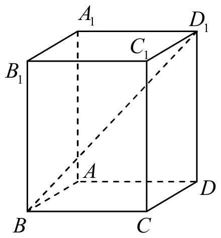

# 2015年上海卷（春）

## 填空题

### 第 1 题

设全集为 $U = \{1, 2, 3\}$， $A = \{1, 2\}$，若集合则 $\complement_U A =$＿＿＿＿＿＿.

#### 答案

$\{3\}$

#### 解析

全集中属于 $U$ 而不属于 $A$ 的元素只有 $3$，所以 $\complement_U A=U\mathbin{\backslash} A=\{3\}$.

### 第 2 题

计算： $\frac{1 + \i}{\i} =$＿＿＿＿＿＿（其中 $\i$ 为虚数单位）.

#### 答案

$1-\i$

#### 解析

因为 $\i^2=-1$，所以 $\frac{1+\i}{\i}=\frac{1}{\i}+1=-\i+1=1-\i$.

### 第 3 题

函数 $y = \sin\left(2x + \frac{\pi}{4}\right)$ 的最小正周期为＿＿＿＿＿＿.

#### 答案

$\pi$

#### 解析

正弦函数 $\sin(\omega x+\varphi)$ 的最小正周期为 $\frac{2\pi}{|\omega|}$. 这里 $|\omega|=2$，因此最小正周期为 $\frac{2\pi}{2}=\pi$.

### 第 4 题

计算： $\displaystyle\lim_{n \to \infty} \frac{n^2 - 3}{2n^2 + n} =$＿＿＿＿＿＿.

#### 答案

$\frac{1}{2}$

#### 解析

分子、分母同除以 $n^2$，得 $\frac{n^2-3}{2n^2+n}=\frac{1-\frac{3}{n^2}}{2+\frac{1}{n}}$. 令 $n\to\infty$，有 $\frac{1-0}{2+0}=\frac12$.

### 第 5 题

以 $(2, 6)$ 为圆心，$1$ 为半径的圆的标准方程为＿＿＿＿＿＿.

#### 答案

$(x-2)^2+(y-6)^2=1$

#### 解析

圆心为 $(x_0,y_0)$、半径为 $r$ 的圆的标准方程是 $(x-x_0)^2+(y-y_0)^2=r^2$. 代入 $(x_0,y_0)=(2,6)$ 和 $r=1$，得 $(x-2)^2+(y-6)^2=1$.

### 第 6 题

已知向量 $\boldsymbol{a}= (1, 3)$， $\boldsymbol{b}= (m, -1)$，若 $\boldsymbol{a}\perp \boldsymbol{b}$，则 $m =$＿＿＿＿＿＿.

#### 答案

$3$

#### 解析

由两向量垂直，得 $\boldsymbol{a}\cdot\boldsymbol{b}=0$. 因而 $1\cdot m+3\cdot(-1)=0$，即 $m-3=0$，所以 $m=3$.

### 第 7 题

函数 $y = x^2 - 2x + 4$，$x \in [0, 2]$ 的值域为＿＿＿＿＿＿.

#### 答案

$[3,4]$

#### 解析

将函数配方，得 $y=x^2-2x+4=(x-1)^2+3$. 当 $x\in[0,2]$ 时，$(x-1)^2\in[0,1]$，所以 $y\in[3,4]$. 当 $x=1$ 时取得最小值 $3$，当 $x=0$ 或 $x=2$ 时取得最大值 $4$.

### 第 8 题

若线性方程组的增广矩阵为 $\begin{pmatrix} a & 0 & 2 \\ 0 & 1 & b \end{pmatrix}$，解为

$$

\begin{cases}
x = 2,\\
y = 1
\end{cases}

$$

，则 $a + b =$＿＿＿＿＿＿.

#### 答案

$2$

#### 解析

增广矩阵对应的方程组为

$$

\begin{cases}
ax=2,\\
y=b
\end{cases}

$$

. 将解 $x=2$、$y=1$ 代入，得 $2a=2$ 和 $b=1$，即 $a=1$、$b=1$. 因此 $a+b=2$.

### 第 9 题

方程 $\lg(2x+1)+\lg x=1$ 的解集为＿＿＿＿＿＿.

#### 答案

$\{2\}$

#### 解析

定义域要求 $x>0$，此时 $2x+1>0$. 由对数运算法则，原方程等价于 $\lg\bigl(x(2x+1)\bigr)=1$，所以 $2x^2+x=10$，即 $2x^2+x-10=0$. 因式分解得 $(2x+5)(x-2)=0$，故 $x=-\frac52$ 或 $x=2$. 由定义域舍去 $-\frac52$，解集为 $\{2\}$.

### 第 10 题

在 $\left(x+\frac{1}{x^{2}}\right)^{9}$ 的二项展开式中，常数项的值为＿＿＿＿＿＿.

#### 答案

$84$

#### 解析

展开式的通项为 $\mathrm C_9^k x^{9-k}\left(x^{-2}\right)^k=\mathrm C_9^k x^{9-3k}$，其中 $k=0$，$1$，$\ldots$，$9$. 要得到常数项，必须有 $9-3k=0$，所以 $k=3$. 因此常数项的值为 $\mathrm C_9^3=84$.

### 第 11 题

用数字组成无重复数字的三位数，其中奇数的个数为＿＿＿＿＿＿（结果用数值表示）.

#### 答案

题面缺少所用数字集合，答案无法唯一确定.

#### 解析

原 PDF 题干只写“用数字组成”，没有给出所用数字的集合，因此答案不能由题面唯一确定. 例如，若所用数字为 $1$，$2$，$3$，则个位有 $2$ 种奇数可选，百位、十位依次有 $2$、$1$ 种选择，奇数共有 $2\times2\times1=4$ 个；若所用数字为 $0$，$1$，$\ldots$，$9$，则三位数为奇数当且仅当个位为奇数，个位有 $5$ 种选择，百位不能为 $0$ 且不能与个位重复，有 $8$ 种选择，十位有 $8$ 种选择，奇数共有 $5\times8\times8=320$ 个. 所以在不补充所用数字集合前，本题没有唯一确定的数值答案.

### 第 12 题

已知点 $A(1,0)$，直线 $l$：$x=-1$，两个动圆均过点 $A$ 且与 $l$ 相切，其圆心分别为 $C_1$，$C_2$，若动点 $M$ 满足 $2\overrightarrow{C_2M} = \overrightarrow{C_2C_1} + \overrightarrow{C_2A}$，则 $M$ 的轨迹方程为＿＿＿＿＿＿.

#### 答案

$y^2=2x-1$

#### 解析

设任一动圆圆心为 $C=(u,v)$. 因为圆过 $A(1,0)$ 且与直线 $x=-1$ 相切，所以圆心到 $A$ 的距离等于圆心到直线 $x=-1$ 的距离，即 $(u-1)^2+v^2=(u+1)^2$. 化简得 $v^2=4u$.

由向量关系，$2(M-C_2)=(C_1-C_2)+(A-C_2)$，从而 $2M=C_1+A$. 设 $C_1=(u,v)$、$M=(x,y)$，则 $x=\frac{u+1}{2}$、$y=\frac v2$，即 $u=2x-1$、$v=2y$. 代入 $v^2=4u$，得 $4y^2=4(2x-1)$，所以轨迹方程为 $y^2=2x-1$.

## 单选题

### 第 13 题

若 $a < 0 < b$，则下列不等式恒成立的是（）

A.  
$\frac{1}{a} > \frac{1}{b}$

B.  
$-a > b$

C.  
$a^2 > b^2$

D.  
$a^3 < b^3$

#### 答案

D

#### 解析

由 $a<0<b$，可知 $a^3<0<b^3$，因此 $a^3<b^3$ 恒成立. 选项 A 中左边为负、右边为正，不成立；选项 B、C 分别需要比较 $-a$ 与 $b$、$|a|$ 与 $b$，均不能由已知条件确定. 故选 D.

### 第 14 题

函数 $y = x^{2}$（$x \geq 1$） 的反函数为（）

A.  
$y = \sqrt{x}$（$x \geq 1$）

B.  
$y = \sqrt{-x}$（$x \leq -1$）

C.  
$y = \sqrt{x}$（$x \geq 0$）

D.  
$y = \sqrt{-x}$（$x \leq 0$）

#### 答案

A

#### 解析

原函数限制在 $x\geq1$ 上，值域为 $y\geq1$. 交换 $x$、$y$ 得 $x=y^2$，又因反函数的函数值满足 $y\geq1$，所以 $y=\sqrt{x}$ 且 $x\geq1$. 故选 A.

### 第 15 题

不等式 $\frac{2-3x}{x-1}>0$的解集为（）

A.  
$\left(-\infty,\frac{3}{4}\right)$

B.  
$\left(-\infty,\frac{2}{3}\right)$

C.  
$\left(-\infty,\frac{2}{3}\right)\cup(1,+\infty)$

D.  
$\left(\frac{2}{3},1\right)$

#### 答案

D

#### 解析

分子、分母的零点分别为 $x=\frac23$ 和 $x=1$. 在 $(-\infty,\frac23)$、$(\frac23,1)$、$(1,+\infty)$ 上分别判断符号，只有 $(\frac23,1)$ 内分子、分母同号且分式为正. 两个端点均不能取，故解集为 $\left(\frac23,1\right)$. 选 D.

### 第 16 题

下列函数中，是奇函数且在 $(0,+\infty)$上单调递增的为（）

A.  
$y = x^{2}$

B.  
$y = x^{\frac{1}{3}}$

C.  
$y = x^{-1}$

D.  
$y = x^{-\frac{1}{2}}$

#### 答案

B

#### 解析

函数 $y=x^2$ 不是奇函数；函数 $y=x^{-1}$ 虽为奇函数，但在正半轴上单调递减；函数 $y=x^{-\frac12}$ 的定义域不是关于原点对称，且在正半轴上递减. 函数 $y=x^{\frac13}$ 满足 $(-x)^{\frac13}=-x^{\frac13}$，是奇函数，并且在 $(0,+\infty)$ 上单调递增. 故选 B.

### 第 17 题

直线 $3x - 4y - 5 = 0$ 的倾斜角为（）

A.  
$\arctan\frac{3}{4}$

B.  
$\pi - \arctan\frac{3}{4}$

C.  
$\arctan\frac{4}{3}$

D.  
$\pi - \arctan\frac{4}{3}$

#### 答案

A

#### 解析

将直线方程化为斜截式，得 $y=\frac34x-\frac54$，所以直线斜率为 $\frac34>0$. 倾斜角 $\alpha\in[0,\pi)$ 满足 $\tan\alpha=\frac34$，故 $\alpha=\arctan\frac34$. 选 A.

### 第 18 题

底面半径为$1$，母线长为$2$的圆锥的体积为（）

A.  
$2\pi$

B.  
$\sqrt{3}\pi$

C.  
$\frac{2\pi}{3}$

D.  
$\frac{\sqrt{3}\pi}{3}$

#### 答案

D

#### 解析

圆锥的高为 $h=\sqrt{2^2-1^2}=\sqrt3$. 因而体积为 $V=\frac13\pi r^2h=\frac13\pi\cdot1^2\cdot\sqrt3=\frac{\sqrt3\pi}{3}$. 故选 D.

### 第 19 题

以 $(-3,0)$和 $(3,0)$为焦点，长轴长为8的椭圆方程为（）

A.  
$\frac{x^{2}}{16}+\frac{y^{2}}{25}=1$

B.  
$\frac{x^{2}}{16}+\frac{y^{2}}{7}=1$

C.  
$\frac{x^{2}}{25}+\frac{y^{2}}{16}=1$

D.  
$\frac{x^{2}}{7}+\frac{y^{2}}{16}=1$

#### 答案

B

#### 解析

焦点为 $(-3,0)$、$(3,0)$，所以焦半距 $c=3$. 长轴长为 $8$，故 $a=4$. 由 $b^2=a^2-c^2$，得 $b^2=16-9=7$. 因此椭圆方程为 $\frac{x^2}{16}+\frac{y^2}{7}=1$. 选 B.

### 第 20 题

在复平面上，满足 $|z-1|=|z+\i|$（$\i$ 为虚数单位）的复数 $z$ 对应的点的轨迹为（）

A.  
椭圆

B.  
圆

C.  
线段

D.  
直线

#### 答案

D

#### 解析

$|z-1|=|z+\i|$ 表示点 $z$ 到点 $1$ 和点 $-\i$ 的距离相等. 两个定点不同，满足到它们距离相等的点在这两个定点连线的垂直平分线上，是一条直线. 故选 D.

### 第 21 题

若无穷等差数列 $\{a_{n}\}$ 的首项 $a_{1} > 0$，公差 $d < 0$， $\{a_{n}\}$ 的前 $n$ 项和为 $S_{n}$，则（）

A.  
$S_{n}$ 单调递减

B.  
$S_{n}$ 单调递增

C.  
$S_{n}$ 有最大值

D.  
$S_{n}$ 有最小值

#### 答案

C

#### 解析

因为 $a_n=a_1+(n-1)d$，且 $d<0$，所以 $a_n$ 随 $n$ 严格递减，并且 $a_n\to-\infty$. 又 $S_{n+1}-S_n=a_{n+1}$，而 $a_{n+1}$ 随 $n$ 严格递减且最终为负，所以 $S_n$ 的增减趋势至多从增大变为减小；若某项 $a_{n+1}=0$，则相邻两项 $S_n$ 和 $S_{n+1}$ 相等. 因此 $S_n$ 必有最大值. 又

$$

S_n=\frac{n}{2}\bigl(2a_1+(n-1)d\bigr)\to-\infty

$$

所以没有最小值. 故选 C.

### 第 22 题

已知 $a > 0$，$b > 0$，若 $a + b = 4$，则（）

A.  
$a^2 + b^2$有最小值

B.  
$\sqrt{ab}$有最小值

C.  
$\frac{1}{a} + \frac{1}{b}$有最大值

D.  
$\frac{1}{\sqrt{a} + \sqrt{b}}$有最大值

#### 答案

A

#### 解析

由 $a+b=4$，有 $a^2+b^2\geq\frac{(a+b)^2}{2}=8$，且当 $a=b=2$ 时取等号，所以选项 A 正确. 另一方面，$\sqrt{ab}$ 在 $a=b$ 时取得最大值；$\frac1a+\frac1b=\frac4{ab}$ 在 $a=b$ 时取得最小值而无最大值；由 $\sqrt a+\sqrt b\leq2\sqrt2$，得 $\frac{1}{\sqrt a+\sqrt b}\geq\frac{1}{2\sqrt2}$，其在 $a=b=2$ 时取得最小值，且上确界 $\frac12$ 不取到，因而没有最大值. 故选 A.

### 第 23 题

组合数 $\mathrm C_n^m + 2\mathrm C_n^{m-1} + \mathrm C_n^{m-2}$（$n \geq m \geq 2$，$m$，$n \in \mathbb{N}^{*}$）恒等于（）

A.  
$\mathrm C_{n+2}^{m}$

B.  
$\mathrm C_{n+2}^{m+1}$

C.  
$\mathrm C_{n+1}^{m}$

D.  
$\mathrm C_{n+1}^{m+1}$

#### 答案

A

#### 解析

利用组合数递推公式，$\mathrm C_n^m+\mathrm C_n^{m-1}=\mathrm C_{n+1}^m$，且 $\mathrm C_n^{m-1}+\mathrm C_n^{m-2}=\mathrm C_{n+1}^{m-1}$. 因而原式等于 $\mathrm C_{n+1}^m+\mathrm C_{n+1}^{m-1}=\mathrm C_{n+2}^m$. 故选 A.

### 第 24 题

设集合 $P_1 = \left\{ x \mid x^2 + ax + 1 > 0 \right\}$， $P_2 = \left\{ x \mid x^2 + ax + 2 > 0 \right\}$， $Q_1 = \left\{ x \mid x^2 + x + b > 0 \right\}$， $Q_2 = \left\{ x \mid x^2 + 2x + b > 0 \right\}$ 其中 $a$，$b \in \mathbb{R}$，下列说法正确的是（）

A.  
对任意 $a$， $P_1$ 是 $P_2$ 的子集；对任意的 $b$， $Q_1$ 不是 $Q_2$ 的子集

B.  
对任意 $a$， $P_1$ 是 $P_2$ 的子集；存在 $b$，使得 $Q_1$ 是 $Q_2$ 的子集

C.  
存在 $a$，使得 $P_1$ 不是 $P_2$ 的子集；对任意的 $b$， $Q_1$ 不是 $Q_2$ 的子集

D.  
存在 $a$，使得 $P_1$ 不是 $P_2$ 的子集；存在 $b$，使得 $Q_1$ 是 $Q_2$ 的子集

#### 答案

B

#### 解析

若 $x\in P_1$，则 $x^2+ax+1>0$，从而 $x^2+ax+2=(x^2+ax+1)+1>0$，所以对任意 $a$，都有 $P_1\subseteq P_2$.

取 $b>1$，则 $x^2+x+b>0$ 和 $x^2+2x+b>0$ 的判别式分别为 $1-4b<0$ 和 $4-4b<0$，于是 $Q_1=Q_2=\mathbb{R}$，特别地 $Q_1\subseteq Q_2$. 因此选项 B 正确.

## 解答题

### 第 25 题

如图，在正四棱柱中 $ABCD-A_{1}B_{1}C_{1}D_{1}$， $AB=1$， $D_{1}B$ 和平面 $ABCD$ 所成的角的大小为 $\arctan\frac{3\sqrt{2}}{4}$，求该四棱柱的表面积. 

#### 解析

设正四棱柱的高为 $h$. 线段 $D_1B$ 在底面 $ABCD$ 上的射影为底面对角线 $DB$，所以 $DB=\sqrt2$. 设 $D_1B$ 与底面所成的角为 $\theta$，则 $\tan\theta=\frac{h}{DB}=\frac{h}{\sqrt2}$. 由题意 $\tan\theta=\frac{3\sqrt2}{4}$，故 $h=\sqrt2\cdot\frac{3\sqrt2}{4}=\frac32$.

正四棱柱的表面积为两个底面积与四个侧面积之和，因此 $S=2\cdot1^2+4\cdot1\cdot\frac32=8$. 所以该四棱柱的表面积为 $8$.

### 第 26 题

已知 $a$ 为实数，函数 $f(x)=\frac{x^{2}+ax+4}{x}$ 是奇函数，求 $f(x)$ 在 $(0,+\infty)$ 上的最小值及取到最小值时所对应的 $x$ 的值.

#### 解析

函数定义域为 $\mathbb{R}\mathbin{\backslash}\{0\}$，且 $f(x)=x+a+\frac4x$. 由奇函数条件，对任意 $x\neq0$，有 $f(-x)=-x+a-\frac4x$，而 $-f(x)=-x-a-\frac4x$. 比较两式，得 $a=-a$，所以 $a=0$. 因而在正半轴上 $f(x)=x+\frac4x$.

当 $x>0$ 时，由基本不等式，$x+\frac4x\geq2\sqrt{x\cdot\frac4x}=4$，等号成立的条件是 $x=\frac4x$，即 $x=2$. 所以 $f(x)$ 的最小值为 $4$，此时 $x=2$.

### 第 27 题

某船在海平面 $A$ 处测得灯塔 $B$ 在北偏东 $30^{\circ}$ 方向，与 $A$ 相距 $6.0\text{ 海里}$. 船由 $A$ 向正北方向航行 $8.1\text{ 海里}$ 到达 $C$ 处，这时灯塔 $B$ 与船相距多少海里（精确到 $0.1\text{ 海里}$ ）？$B$ 在船的什么方向（精确到 $1^{\circ}$）？

#### 解析

以 $A$ 为原点，正东方向为横轴正向，正北方向为纵轴正向. 由 $AB=6.0$ 海里且 $B$ 在北偏东 $30^{\circ}$ 方向，得 $B$ 的坐标为 $\left(6\sin30^{\circ},6\cos30^{\circ}\right)=\left(3,3\sqrt3\right)$. 船向正北航行 $8.1$ 海里，所以 $C=(0,8.1)$.

因此 $\overrightarrow{CB}=\left(3,3\sqrt3-8.1\right)$，从而

$$

CB=\sqrt{3^2+(8.1-3\sqrt3)^2}\approx4.175\text{ 海里}

$$

精确到 $0.1$ 海里为 $4.2$ 海里.

由于 $3\sqrt3<8.1$，点 $B$ 位于点 $C$ 的东南方向. 设 $\alpha$ 为南偏东的角，则 $\tan\alpha=\frac{3}{8.1-3\sqrt3}$，所以 $\alpha\approx45.96^{\circ}$. 精确到 $1^{\circ}$，得 $B$ 在船的南偏东 $46^{\circ}$ 方向.

### 第 28 题

已知点 $F_{1}$，$F_{2}$ 依次为双曲线 $C$：$\frac{x^{2}}{a^{2}}-\frac{y^{2}}{b^{2}}=1$（$a$，$b>0$）的左右焦点，$\left|F_{1}F_{2}\right|=6$，$B_{1}(0,-b)$，$B_{2}(0,b)$

1.  若 $a=\sqrt{5}$，以 $\boldsymbol{d}=(3,-4)$ 为方向向量的直线 $l$ 经过 $B_{1}$，求 $F_{2}$ 到 $l$ 的距离；

2.  若双曲线 $C$ 上存在点 $P$，使得 $\overrightarrow{PB_{1}} \cdot \overrightarrow{PB_{2}} = -2$，求实数 $b$ 的取值范围.

#### 解析

由双曲线焦半距关系 $c^2=a^2+b^2$，以及 $|F_1F_2|=2c=6$，得 $c=3$.

1.  当 $a=\sqrt5$ 时，$b^2=3^2-a^2=4$，所以 $b=2$，即 $B_1=(0,-2)$、$F_2=(3,0)$. 直线 $l$ 的方向向量为 $(3,-4)$，故可取法向量 $(4,3)$. 由直线经过 $B_1$，其方程为 $4x+3y+6=0$. 因此

$$

d(F_2,l)=\frac{|4\cdot3+3\cdot0+6|}{\sqrt{4^2+3^2}}=\frac{18}{5}

$$

2.  设 $P=(x,y)$. 则 $\overrightarrow{PB_1}=(-x,-b-y)$、$\overrightarrow{PB_2}=(-x,b-y)$，所以

$$

\overrightarrow{PB_1}\cdot\overrightarrow{PB_2}=x^2+y^2-b^2=-2

$$

    即 $x^2+y^2=b^2-2$. 记 $t=b^2$，则 $0<t<9$，且由 $x^2+y^2=t-2$ 必有 $t\geq2$. 又双曲线方程为 $\frac{x^2}{9-t}-\frac{y^2}{t}=1$. 令 $X=x^2$、$Y=y^2$，联立

$$

\begin{cases}
    X+Y=t-2,\\
    \dfrac{X}{9-t}-\dfrac{Y}{t}=1.
    \end{cases}

$$

    由第一式得 $Y=t-2-X$，代入第二式，得

$$

\frac{X}{9-t}-\frac{t-2-X}{t}=1
    \Longrightarrow \frac{9X}{t(9-t)}=\frac{2(t-1)}{t}
    \Longrightarrow X=\frac{2(9-t)(t-1)}9

$$

    于是 $Y=t-2-X=\frac{t(2t-11)}9$. 因为 $X\geq0$、$Y\geq0$，且 $2\leq t<9$，所以只需 $2t-11\geq0$，即 $t\geq\frac{11}{2}$. 反之，当 $\frac{11}{2}\leq t<9$ 时，上述 $X$，$Y$ 均非负，取相应的 $x$，$y$ 即可得到双曲线上的点 $P$. 因此

$$

\frac{11}{2}\leq b^2<9

$$

    即 $\sqrt{\frac{11}{2}}\leq b<3$.

### 第 29 题

已知函数 $f(x)=\left|2^{x-2}-2\right|$（$x\in\mathbb{R}$）.

1.  解不等式 $f(x)<2$；

2.  数列 $\left\{a_{n}\right\}$ 满足 $a_{n}=f(n)$（$n\in\mathbf{N}^{*}$）， $S_{n}$ 为 $\left\{a_{n}\right\}$ 的前 $n$ 项和，对任意的 $n\geq4$，不等式 $S_{n}+\frac{1}{2}\geq ka_{n}$ 恒成立，求实数 $k$ 的取值范围.

#### 解析

1.  令 $t=2^{x-2}>0$. 原不等式等价于 $|t-2|<2$，即 $-2<t-2<2$，所以 $0<t<4$. 因为 $t>0$ 恒成立，故只需 $2^{x-2}<4=2^2$，即 $x<4$.

2.  先计算数列的前几项：$a_1=\left|2^{-1}-2\right|=\frac32$、$a_2=1$、$a_3=0$. 当 $n\geq4$ 时，$a_n=2^{n-2}-2$，故

$$

S_n=\frac32+1+\sum_{j=2}^{n-2}2^j-2(n-3)=2^{n-1}-2n+\frac92

$$

    因此 $a_n=2^{n-2}-2>0$，原不等式对所有 $n\geq4$ 成立，当且仅当

$$

k\leq\frac{S_n+\frac12}{a_n}=\frac{2^{n-1}-2n+5}{2^{n-2}-2}

$$

    要确定右侧的最小值，只需证明其不小于 $\frac{25}{14}$. 由于分母为正，这等价于

$$

14(2^{n-1}-2n+5)-25(2^{n-2}-2)\geq0

$$

    即 $3\cdot2^{n-2}-28n+120\geq0$. 当 $n=4$，$5$，$6$ 时，左侧分别为 $20$，$4$，$0$. 对于 $n\geq6$，相邻两项之差为

$$

\bigl(3\cdot2^{n-1}-28(n+1)+120\bigr)-\bigl(3\cdot2^{n-2}-28n+120\bigr)=3\cdot2^{n-2}-28\geq20>0

$$

    所以该式对所有 $n\geq6$ 均成立. 当 $n=6$ 时等号成立，故右侧最小值为 $\frac{25}{14}$. 因而 $k\leq\frac{25}{14}$，实数 $k$ 的取值范围为 $\left(-\infty,\frac{25}{14}\right]$.

## 附加题：选择题

### 第 30 题

对于集合 $A$， $B$， “$A \neq B$”是“$A \cap B \subsetneq A \cup B$”的（）

A.  
充分非必要条件

B.  
必要非充分条件

C.  
充要条件

D.  
既非充分又非必要条件

#### 答案

C

#### 解析

总有 $A\cap B\subseteq A\cup B$. 当且仅当存在元素属于 $A\cup B$ 而不属于 $A\cap B$ 时，这个包含关系为真包含；这等价于存在元素只属于 $A$ 或只属于 $B$，也就等价于 $A\neq B$. 因此两个条件互为充要条件，选 C.

### 第 31 题

对于任意实数 $a$， $b$， $(a-b)^2 \geq kab$ 均成立，则实数 $k$ 的取值范围是（）

A.  
$\{-4,0\}$

B.  
$[-4, 0]$

C.  
$(- \infty, 0]$

D.  
$(- \infty, -4] \cup [0, +\infty)$

#### 答案

B

#### 解析

原不等式等价于 $a^2-(k+2)ab+b^2\geq0$ 对任意实数 $a$，$b$ 成立. 当 $b\neq0$ 时令 $t=\frac ab$，则必须有 $t^2-(k+2)t+1\geq0$ 对任意实数 $t$ 成立. 这要求该二次式的判别式不大于零，即 $(k+2)^2-4\leq0$，从而 $-4\leq k\leq0$. 当 $b=0$ 时原不等式显然成立，所以取值范围为 $[-4,0]$. 选 B.

### 第 32 题

已知数列 $\{a_{n}\}$ 满足 $a_{n} + a_{n+4} = a_{n+1} + a_{n+3}$（$n \in \mathbb{N}^{*}$），那么（）

A.  
$\left\{a_{n}\right\}$ 是等差数列

B.  
$\left\{a_{2n-1}\right\}$ 是等差数列

C.  
$\left\{a_{2n}\right\}$ 是等差数列

D.  
$\left\{a_{3n}\right\}$ 是等差数列

#### 答案

D

#### 解析

令 $d_n=a_{n+1}-a_n$. 由已知等式，得 $a_{n+4}-a_{n+3}=a_{n+1}-a_n$，即 $d_{n+3}=d_n$. 因而差数列以 3 为周期. 对数列 $\{a_{3n}\}$，有

$$

a_{3(n+1)}-a_{3n}=d_{3n}+d_{3n+1}+d_{3n+2}=d_3+d_1+d_2

$$

右端与 $n$ 无关，所以 $\{a_{3n}\}$ 是等差数列. 为说明其余三个选项不一定成立，取 $d_1=1$、$d_2=2$、$d_3=0$，令 $a_1=0$，并按 $d_{n+3}=d_n$ 定义后续各项. 此时 $\{a_n\}$ 的相邻差不恒定，$\{a_{2n-1}\}$ 的相邻差依次为 $3$，$1$，$2$，$\ldots$，$\{a_{2n}\}$ 的相邻差依次为 $2$，$3$，$1$，$\ldots$，故这三个数列均不一定是等差数列. 因此选 D.

## 附加题：填空题

### 第 33 题

关于 $x$ 的实系数一元二次方程 $x^2 + px + 2 = 0$ 的两个虚数根为 $z_1$， $z_2$，若 $z_1$， $z_2$ 在复平面上对应的点是经过原点的椭圆的两个焦点，则该椭圆的长轴长为＿＿＿＿＿＿.

#### 答案

$2\sqrt2$

#### 解析

因为方程系数为实数且两根为非实根，所以两根互为共轭，可设 $z_1=u+v\i$、$z_2=u-v\i$，其中 $v\neq0$. 由韦达定理 $z_1z_2=2$，得 $u^2+v^2=2$.

椭圆的两个焦点为这两个点，原点在椭圆上，所以原点到两个焦点的距离之和等于长轴长 $2a$. 两个距离都等于 $\sqrt{u^2+v^2}=\sqrt2$，故 $2a=2\sqrt2$. 因此该椭圆的长轴长为 $2\sqrt2$.

### 第 34 题

已知圆心为 $O$，半径为 $1$ 的圆上有三点 $A$， $B$， $C$，若 $7\overrightarrow{OA} + 5\overrightarrow{OB} + 8\overrightarrow{OC} = \overrightarrow{0}$，则 $\left|\overrightarrow{BC}\right|=$＿＿＿＿＿＿.

#### 答案

$\sqrt3$

#### 解析

记 $\boldsymbol{a}=\overrightarrow{OA}$、$\boldsymbol{b}=\overrightarrow{OB}$、$\boldsymbol{c}=\overrightarrow{OC}$. 因为三点在单位圆上，所以 $|\boldsymbol{a}|=|\boldsymbol{b}|=|\boldsymbol{c}|=1$. 由 $7\boldsymbol{a}+5\boldsymbol{b}+8\boldsymbol{c}=\boldsymbol{0}$，得 $7\boldsymbol{a}=-(5\boldsymbol{b}+8\boldsymbol{c})$. 两边平方，得

$$

49=25+64+80\boldsymbol{b}\cdot\boldsymbol{c}

$$

所以 $\boldsymbol{b}\cdot\boldsymbol{c}=-\frac12$. 于是

$$

|\overrightarrow{BC}|^2=|\boldsymbol{c}-\boldsymbol{b}|^2=|\boldsymbol{b}|^2+|\boldsymbol{c}|^2-2\boldsymbol{b}\cdot\boldsymbol{c}=1+1+1=3

$$

因此 $|\overrightarrow{BC}|=\sqrt3$.

### 第 35 题

函数 $f(x)$ 与 $g(x)$ 的图像拼成如图所示的“Z”字形折线段 $ABOCD$，不含 $A(0,1)$， $B(1,1)$， $O(0,0)$， $C(-1,-1)$， $D(0,-1)$ 五个点，若 $f(x)$ 的图像关于原点对称的图形即为 $g(x)$ 的图像，则其中一个函数的解析式可以为＿＿＿＿＿＿.

#### 答案

$$

f(x)=\begin{cases}
x,&-1<x<0,\\
1,&0<x<1.
\end{cases}

$$

#### 解析

取 $f$ 的图像为线段 $OC$ 与 $AB$ 去掉端点后的部分. 线段 $OC$ 的两个端点为 $(0,0)$、$(-1,-1)$，故其方程为 $y=x$，对应定义域为 $-1<x<0$；线段 $AB$ 的方程为 $y=1$，对应定义域为 $0<x<1$. 因此可取

$$

f(x)=\begin{cases}
x,&-1<x<0,\\
1,&0<x<1.
\end{cases}

$$

其图像关于原点对称后为线段 $BO$ 与 $CD$ 去掉端点后的部分，和原图像恰好拼成折线段 $ABOCD$（不含题中五个点），所以该函数符合条件.

## 附加题：解答题

### 第 36 题

对于函数 $f(x)$，$g(x)$，若存在函数 $h(x)$，使得 $f(x)=g(x)\cdot h(x)$，则称 $f(x)$ 是 $g(x)$ 的“$h(x)$ 关联函数”.

1.  已知 $f(x)=\sin x$， $g(x)=\cos x$，是否存在定义域为 $\mathbb{R}$ 的函数 $h(x)$，使得 $f(x)$ 是 $g(x)$ 的“$h(x)$ 关联函数”？若存在，写出 $h(x)$ 的解析式；若不存在，说明理由；

2.  已知函数 $f(x)$， $g(x)$ 的定义域为 $[1,+\infty)$，当 $x\in[n,n+1)$，（$n\in\mathbb{N}^*$）时， $f(x)=2^{n-1}\sin\frac{x}{n}-1$，若存在函数 $h_1(x)$ 及 $h_2(x)$，使得 $f(x)$ 是 $g(x)$ 的“$h_1(x)$ 关联函数”，且 $g(x)$ 是 $f(x)$ 的“$h_2(x)$ 关联函数”，求方程 $g(x)=0$ 的解.

#### 解析

1.  若存在定义域为 $\mathbb{R}$ 的函数 $h$，则必须有 $\sin x=\cos x\cdot h(x)$ 对所有 $x\in\mathbb{R}$ 成立. 当 $x=\frac\pi2$ 时，$\sin x=1$ 而 $\cos x=0$，等式变为 $1=0\cdot h\left(\frac\pi2\right)=0$，矛盾. 所以不存在这样的函数 $h(x)$.

2.  由 $f(x)=g(x)h_1(x)$ 和 $g(x)=f(x)h_2(x)$，可知 $f(x)=0$ 与 $g(x)=0$ 互相推出，所以二者的零点集合相同. 只需求出 $f(x)=0$ 的解.

    当 $n=1$ 时，$x\in[1,2)$，方程为 $\sin x=1$，所以 $x=\frac\pi2$，且 $\frac\pi2\in[1,2)$.

    当 $n\geq2$ 时，$x\in[n,n+1)$ 蕴含 $1\leq\frac{x}{n}<1+\frac1n\leq\frac32<\frac\pi2$. 又因 $1>\frac\pi6$，且正弦函数在 $\left[0,\frac\pi2\right]$ 上单调递增，所以 $\sin\frac{x}{n}\geq\sin1>\sin\frac\pi6=\frac12$，而 $2^{1-n}\leq\frac12$，方程 $2^{n-1}\sin\frac{x}{n}-1=0$，即 $\sin\frac{x}{n}=2^{1-n}$，不可能成立. 所以 $f(x)=0$ 的解集为 $\left\{\frac\pi2\right\}$，从而 $g(x)=0$ 的解也是 $x=\frac\pi2$.
