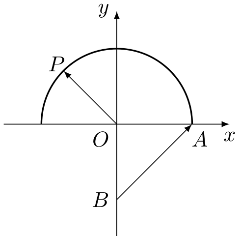
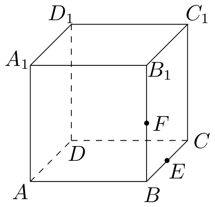
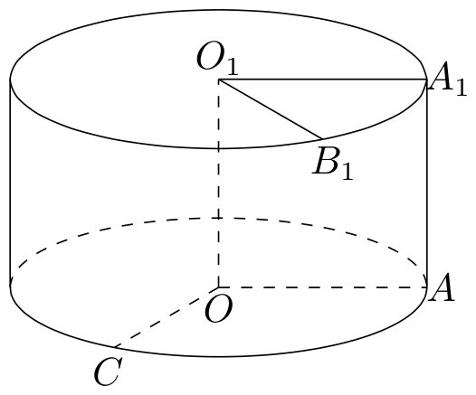
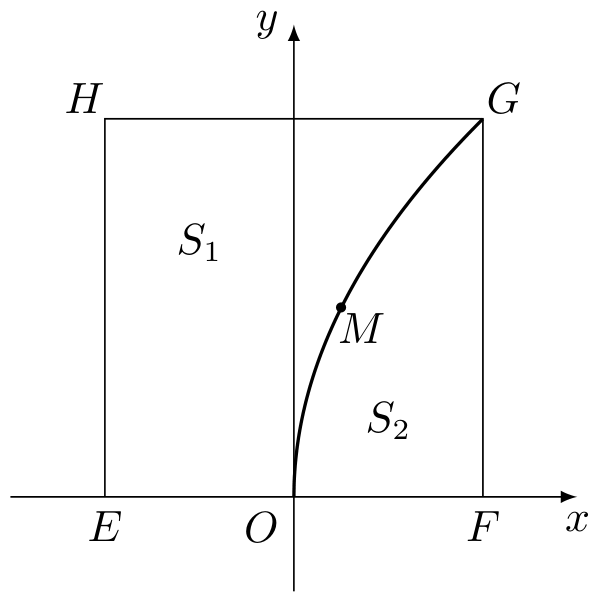

# 2016年上海卷（秋文）

## 填空题

### 第 1 题

设 $x\in\mathbb{R}$，则不等式 $|x-3|<1$ 的解集为＿＿＿＿＿＿.

#### 答案

$(2,4)$

#### 解析

由绝对值不等式的定义，$|x-3|<1$ 等价于 $-1<x-3<1$，所以 $2<x<4$. 故解集为 $(2,4)$.

### 第 2 题

设 $z=\dfrac{3+2\i}{\i}$，其中 $\i$ 为虚数单位，则 $z$ 的虚部等于＿＿＿＿＿＿.

#### 答案

$-3$

#### 解析

因为 $1/\i=-\i$，所以 $z=(3+2\i)(-\i)=2-3\i$. 因此 $z$ 的虚部为 $-3$.

### 第 3 题

已知平行直线 $l_1:2x+y-1=0$，$l_2:2x+y+1=0$，则 $l_1$ 与 $l_2$ 的距离是＿＿＿＿＿＿.

#### 答案

$\dfrac{2\sqrt{5}}{5}$

#### 解析

两条平行直线的距离为对应常数项之差的绝对值除以 $\sqrt{A^2+B^2}$，故 $d=\dfrac{|1-(-1)|}{\sqrt{2^2+1^2}}=\dfrac{2}{\sqrt5}=\dfrac{2\sqrt5}{5}$.

### 第 4 题

某次体检，$5$ 位同学的身高（单位：米）分别为 $1.72$，$1.78$，$1.80$，$1.69$，$1.76$，则这组数据的中位数是＿＿＿＿＿＿$\text{米}$.

#### 答案

$1.76$

#### 解析

将数据按从小到大排列为 $1.69$，$1.72$，$1.76$，$1.78$，$1.80$. 共有 $5$ 个数据，中间第 $3$ 个数就是中位数，因此中位数为 $1.76$.

### 第 5 题

若函数 $f(x)=4\sin x+a\cos x$ 的最大值为 $5$，则常数 $a=\underline{\qquad\qquad}$.

#### 答案

$\pm 3$

#### 解析

对任意实数 $x$，有 $4\sin x+a\cos x\leqslant\sqrt{4^2+a^2}$，且等号可以取得，所以函数的最大值为 $\sqrt{16+a^2}$. 由题意，$\sqrt{16+a^2}=5$，从而 $a^2=9$，故 $a=\pm3$.

### 第 6 题

已知点 $(3,9)$ 在函数 $f(x)=1+a^x$ 的图像上，则 $f(x)$ 的反函数 $f^{-1}(x)=\underline{\qquad\qquad}$.

#### 答案

$\log_2(x-1)$

#### 解析

点 $(3,9)$ 在图像上，故 $9=1+a^3$，得到 $a^3=8$，所以 $a=2$. 于是 $y=1+2^x$. 交换 $x$，$y$ 得 $x=1+2^y$，所以 $y=\log_2(x-1)$，即 $f^{-1}(x)=\log_2(x-1)$，其定义域为 $x>1$.

### 第 7 题

若 $x$，$y$ 满足

$$

\begin{cases}
x\ge0,\\
y\ge0,\\
y\ge x+1,
\end{cases}

$$

则 $x-2y$ 的最大值为＿＿＿＿＿＿.

#### 答案

$-2$

#### 解析

由 $y\geqslant x+1$，有 $x-2y\leqslant x-2(x+1)=-x-2$. 又因为 $x\geqslant0$，所以 $-x-2\leqslant-2$，从而 $x-2y\leqslant-2$. 当 $x=0$，$y=1$ 时满足所有条件且等号成立，因此最大值为 $-2$.

### 第 8 题

方程 $3\sin x=1+\cos2x$ 在区间 $[0,2\pi]$ 上的解为＿＿＿＿＿＿.

#### 答案

$\frac{\pi}{6}$，$\frac{5\pi}{6}$

#### 解析

利用二倍角公式，原方程化为 $3\sin x=2\cos^2x=2(1-\sin^2x)$，即 $2\sin^2x+3\sin x-2=0$. 因此 $\sin x=\dfrac12$ 或 $\sin x=-2$. 后者不可能，故在 $[0,2\pi]$ 上 $x=\dfrac\pi6$ 或 $x=\dfrac{5\pi}6$.

### 第 9 题

在 $\left(\sqrt[3]{x}-\dfrac2x\right)^n$ 的二项展开式中，所有项的二项式系数之和为 $256$，则常数项等于＿＿＿＿＿＿.

#### 答案

$112$

#### 解析

所有二项式系数之和为 $2^n$，所以 $2^n=256=2^8$，得到 $n=8$. 展开式通项为 $T_{r+1}=\mathrm C_8^r\left(\sqrt[3]{x}\right)^{8-r}\left(-\dfrac2x\right)^r=\mathrm C_8^r(-2)^r x^{(8-4r)/3}$. 常数项要求 $(8-4r)/3=0$，故 $r=2$，常数项为 $\mathrm C_8^2(-2)^2=28\times4=112$.

### 第 10 题

已知 $\triangle ABC$ 的三边长分别为 $3$，$5$，$7$，则该三角形的外接圆半径等于＿＿＿＿＿＿.

#### 答案

$\dfrac{7\sqrt{3}}{3}$

#### 解析

设三角形面积为 $\Delta$，半周长为 $s=\dfrac{3+5+7}{2}=\dfrac{15}{2}$. 由海伦公式，$\Delta=\sqrt{\dfrac{15}{2}\cdot\dfrac92\cdot\dfrac52\cdot\dfrac12}=\dfrac{15\sqrt3}{4}$. 外接圆半径满足 $\Delta=\dfrac{abc}{4R}$，所以 $R=\dfrac{3\times5\times7}{4\Delta}=\dfrac{105}{15\sqrt3}=\dfrac{7\sqrt3}{3}$.

### 第 11 题

某食堂规定，每份午餐可以在四种水果中任选两种，则甲，乙两同学各自所选的两种水果相同的概率为＿＿＿＿＿＿.

#### 答案

$\dfrac{1}{6}$

#### 解析

甲选择两种水果共有 $\mathrm C_4^2=6$ 种等可能结果，乙也有 $6$ 种选择，因此有序选择结果共有 $6\times6=36$ 种. 甲、乙所选水果相同的情形是两人的选择完全相同，共有 $6$ 种，所以所求概率为 $\dfrac6{36}=\dfrac16$.

### 第 12 题

如图，已知点 $O(0,0)$，$A(1,0)$，$B(0,-1)$，$P$ 是曲线 $y=\sqrt{1-x^2}$ 上一个动点，则 $\overrightarrow{OP}\cdot\overrightarrow{BA}$ 的取值范围是＿＿＿＿＿＿.

#### 答案

$[-1,\sqrt{2}]$

#### 解析

设 $P=(x,y)$，则 $x^2+y^2=1$，且 $y\geqslant0$. 由 $\overrightarrow{OP}=(x,y)$，$\overrightarrow{BA}=A-B=(1,1)$，得 $\overrightarrow{OP}\cdot\overrightarrow{BA}=x+y$. 在上半单位圆上，柯西不等式给出 $x+y\leqslant\sqrt{x^2+y^2}\sqrt{1^2+1^2}=\sqrt2$，且在 $P=(\frac{\sqrt2}{2},\frac{\sqrt2}{2})$ 处取得；又因 $x\geqslant-1$、$y\geqslant0$，有 $x+y\geqslant-1$，且 $P=(-1,0)$ 时取等号. 故取值范围为 $[-1,\sqrt2]$.

### 第 13 题

设 $a>0$，$b>0$，若关于 $x$，$y$ 的方程组

$$

\begin{cases}
ax+y=1,\\
x+by=1
\end{cases}

$$

无解，则 $a+b$ 的取值范围是＿＿＿＿＿＿.

#### 答案

$(2,+\infty)$

#### 解析

方程组的系数行列式为 $ab-1$. 无解时两直线必须平行且不重合，所以 $ab=1$，并且不能有 $a=b=1$. 由 $b=1/a$ 及 $a>0$，得 $a+b=a+\dfrac1a\geqslant2$，等号仅在 $a=1$ 时成立；此时两方程相同，有无穷多解而不是无解. 因此 $a+b>2$，取值范围为 $(2,+\infty)$.

### 第 14 题

无穷数列 $\{a_n\}$ 由 $k$ 个不同的数组成，$S_n$ 为 $\{a_n\}$ 的前 $n$ 项和. 若对任意的 $n\in\mathbb{N}^*$，$S_n\in\{2,3\}$，则 $k$ 的最大值为＿＿＿＿＿＿.

#### 答案

4

#### 解析

令 $S_0=0$，则 $a_n=S_n-S_{n-1}$. 因为每个 $S_n$ 只能取 $2$ 或 $3$，所以 $a_1$ 只能取 $2$ 或 $3$，而对 $n\geqslant2$，$a_n\in\{-1,0,1\}$. 因此数列中不同的数至多有 $4$ 个：首项占据 $2$ 或 $3$ 中的一个，后续项至多取 $-1$，$0$，$1$ 三个值.

取 $S_1=2$，并令部分和依次为 $2$，$2$，$3$，$2$，$3$，$2$，$3$，$\ldots$，则对应的数列开始为 $2$，$0$，$1$，$-1$，$1$，$-1$，$\ldots$，恰有四个不同的数. 因此 $k$ 的最大值为 $4$.

## 单选题

### 第 15 题

设 $a\in\mathbb{R}$，则“$a>1$”是“$a^2>1$”的（）

A.  
充分非必要条件

B.  
必要非充分条件

C.  
充要条件

D.  
既非充分也非必要条件

#### 答案

A

#### 解析

若 $a>1$，则显然 $a^2>1$，所以前者是后者的充分条件. 反之，$a^2>1$ 还可能由 $a<-1$ 造成，例如 $a=-2$ 时 $a^2>1$ 但 $a>1$ 不成立，所以前者不是必要条件. 故选 A.

### 第 16 题

如图，在正方体 $ABCD-A_1B_1C_1D_1$ 中，$E$，$F$ 分别为 $BC$，$BB_1$ 的中点，则下列直线中与直线 $EF$ 相交的是（）

A.  
直线 $AA_1$

B.  
直线 $A_1B_1$

C.  
直线 $A_1D_1$

D.  
直线 $B_1C_1$

#### 答案

D

#### 解析

取正方体棱长为 $1$，建立坐标系：$A=(0,0,0)$，$B=(1,0,0)$，$C=(1,1,0)$，$A_1=(0,0,1)$. 则 $E=(1,\frac12,0)$，$F=(1,0,\frac12)$，直线 $EF$ 上的点满足 $x=1$，$y+z=\frac12$.

直线 $AA_1$、$A_1D_1$ 上的点分别满足 $x=0$，不可能与 $EF$ 相交；直线 $A_1B_1$ 上有 $y=0$，$z=1$，不满足 $y+z=\frac12$. 直线 $B_1C_1$ 上有 $x=1$，$z=1$，取其中 $y=-\frac12$ 的点即可满足直线 $EF$ 的方程，所以它与 $EF$ 相交. 故选 D.

### 第 17 题

设 $a\in\mathbb{R}$，$b\in[0,2\pi)$. 若对任意实数 $x$ 都有 $\sin\!\left(3x-\dfrac{\pi}{3}\right)=\sin(ax+b)$，则满足条件的有序实数对 $(a,b)$ 的对数为（）

A.  
$1$

B.  
$2$

C.  
$3$

D.  
$4$

#### 答案

B

#### 解析

令 $Y(x)=\sin\left(3x-\frac\pi3\right)=\sin(ax+b)$. 左端不是常函数；对等式两边求两阶导数，分别得到 $Y''(x)=-9Y(x)$ 和 $Y''(x)=-a^2Y(x)$. 因此 $a^2=9$，即 $a=3$ 或 $a=-3$.

当 $a=3$ 时，比较 $\sin\left(3x-\frac\pi3\right)=\frac12\sin3x-\frac{\sqrt3}{2}\cos3x$ 与 $\sin(3x+b)=\cos b\sin3x+\sin b\cos3x$ 的系数，得 $\cos b=\frac12$、$\sin b=-\frac{\sqrt3}{2}$. 结合 $0\leqslant b<2\pi$，得 $b=\frac{5\pi}{3}$.

当 $a=-3$ 时，$\sin(-3x+b)=-\cos b\sin3x+\sin b\cos3x$. 比较系数得 $\cos b=-\frac12$、$\sin b=-\frac{\sqrt3}{2}$，故 $b=\frac{4\pi}{3}$. 因此共有 $2$ 个有序实数对，故选 B.

### 第 18 题

设 $f(x)$，$g(x)$，$h(x)$ 是定义域为 $\mathbb{R}$ 的三个函数. 对于命题：

1.  若 $f(x)+g(x)$，$f(x)+h(x)$，$g(x)+h(x)$ 均为增函数，则 $f(x)$，$g(x)$，$h(x)$ 中至少有一个为增函数；

2.  若 $f(x)+g(x)$，$f(x)+h(x)$，$g(x)+h(x)$ 均是以 $T$ 为周期的函数，则 $f(x)$，$g(x)$，$h(x)$ 均是以 $T$ 为周期的函数.

则下列判断正确的是（）

A.  
$\textcircled{1}$ 和 $\textcircled{2}$ 均为真命题

B.  
$\textcircled{1}$ 和 $\textcircled{2}$ 均为假命题

C.  
$\textcircled{1}$ 为真命题，$\textcircled{2}$ 为假命题

D.  
$\textcircled{1}$ 为假命题，$\textcircled{2}$ 为真命题

#### 答案

D

#### 解析

命题 $\textcircled{1}$ 不成立. 令 $f(0)=g(0)=h(0)=0$，在各区间上令连续折线的斜率三元组 $(f',g',h')$ 为

$$

\begin{cases}
(1,1,1),&x<0,\\
(-1,2,2),&0\leqslant x<1,\\
(2,-1,2),&1\leqslant x<2,\\
(2,2,-1),&2\leqslant x<3,\\
(1,1,1),&x\geqslant3.
\end{cases}

$$

在分界点连续连接. 三个和函数的斜率依次为 $(2,1,1,4,2)$、$(2,1,4,1,2)$、$(2,4,1,1,2)$，均为正，所以 $f+g$、$f+h$、$g+h$ 均为增函数. 但 $f$ 在 $[0,1]$、$g$ 在 $[1,2]$、$h$ 在 $[2,3]$ 上分别下降，所以 $f$、$g$、$h$ 均不是增函数. 故命题 $\textcircled{1}$ 为假.

命题 $\textcircled{2}$ 成立. 令 $\Delta_f=f(x+T)-f(x)$，$\Delta_g=g(x+T)-g(x)$，$\Delta_h=h(x+T)-h(x)$. 由三个和函数以 $T$ 为周期，得到 $\Delta_f+\Delta_g=0$，$\Delta_f+\Delta_h=0$，$\Delta_g+\Delta_h=0$. 前两式相加再减去第三式，得 $2\Delta_f=0$，所以 $\Delta_f=0$；同理 $\Delta_g=\Delta_h=0$. 因此 $f$，$g$，$h$ 均以 $T$ 为周期. 故选 D.

## 解答题

### 第 19 题

将边长为 $1$ 的正方形 $AA_1O_1O$（及其内部）绕 $OO_1$ 旋转一周形成圆柱，如图，$\widehat{AC}$ 长为 $\dfrac{5\pi}{6}$，$\widehat{A_1B_1}$ 长为 $\dfrac{\pi}{3}$，其中 $B_1$ 与 $C$ 在平面 $AA_1O_1O$ 的同侧.

1.  求圆柱的体积与侧面积；

2.  求异面直线 $O_1B_1$ 与 $OC$ 所成的角的大小.

#### 解析

1.  正方形边长为 $1$，且绕 $OO_1$ 旋转，所以圆柱的高为 $h=OO_1=1$，底面半径为正方形边长 $r=1$. 因此圆柱的体积为 $V=\pi r^2h=\pi$，侧面积为 $S=2\pi rh=2\pi$.

2.  设过 $B_1$ 的母线与下底面交于 $B$，则 $O_1B_1\parallel OB$. 因为底面半径为 $1$，弧长等于对应圆心角，所以 $\angle AOC=\dfrac{5\pi}{6}$，$\angle A_1O_1B_1=\dfrac\pi3$. 又因 $B_1$ 与 $C$ 在平面 $AA_1O_1O$ 的同侧，射线 $OB$ 与 $OC$ 的方向差为 $\dfrac{5\pi}{6}-\dfrac\pi3=\dfrac\pi2$. 因此异面直线 $O_1B_1$ 与 $OC$ 所成的角为 $\dfrac\pi2$.

### 第 20 题

有一块正方形菜地 $EFGH$，$EH$ 所在直线是一条小河，收获的蔬菜可送到 $F$ 点或河边运走. 于是，菜地分为两个区域 $S_1$ 和 $S_2$，其中 $S_1$ 中的蔬菜运到河边较近，$S_2$ 中的蔬菜运到 $F$ 点较近，而菜地内 $S_1$ 和 $S_2$ 的分界线 $C$ 上的点到河边与到 $F$ 点的距离相等. 现建立平面直角坐标系，其中原点 $O$ 为 $EF$ 的中点，点 $F$ 的坐标为 $(1,0)$，如图.

1.  求菜地内的分界线 $C$ 的方程；

2.  菜农从蔬菜运量估计出 $S_1$ 面积是 $S_2$ 面积的两倍，由此得到 $S_1$ 面积的“经验值”为 $\dfrac83$. 设 $M$ 是 $C$ 上纵坐标为 $1$ 的点，请计算以 $EH$ 为一边，另一边过点 $M$ 的矩形的面积，及五边形 $EOMGH$ 的面积，并判断哪一个更接近于 $S_1$ 面积的“经验值”.

#### 解析

1.  由 $O$ 是 $EF$ 的中点且 $F=(1,0)$，得 $E=(-1,0)$. 正方形边长为 $2$，故河边所在直线 $EH$ 的方程为 $x=-1$. 设分界线上一点为 $(x,y)$，则它到河边的距离为 $x+1$，到 $F$ 的距离为 $\sqrt{(x-1)^2+y^2}$. 由距离相等，$(x+1)^2=(x-1)^2+y^2$，化简得 $y^2=4x$. 在菜地内部还需满足 $0<y<2$，所以分界线为 $y^2=4x$，$0<y<2$.

2.  令 $y=1$，代入分界线得 $x=\dfrac14$，所以 $M=\left(\dfrac14,1\right)$. 矩形的高为 $EH=2$，宽为 $\dfrac14-(-1)=\dfrac54$，面积为 $2\times\dfrac54=\dfrac52$.

    五边形 $EOMGH$ 的顶点依次为 $(-1,0)$，$(0,0)$，$(\frac14,1)$，$(1,2)$，$(-1,2)$. 用鞋带公式，面积为 $\dfrac12\left|(-1)\cdot0+0\cdot1+\frac14\cdot2+1\cdot2+(-1)\cdot0-\left(0\cdot0+0\cdot\frac14+1\cdot1+2\cdot(-1)+2\cdot(-1)\right)\right|=\dfrac{11}{4}$. 矩形面积与经验值 $\dfrac83$ 的差的绝对值为 $\left|\dfrac52-\dfrac83\right|=\dfrac16$，五边形面积与经验值的差的绝对值为 $\left|\dfrac{11}{4}-\dfrac83\right|=\dfrac1{12}$，所以五边形面积更接近经验值.

### 第 21 题

双曲线 $x^2-\dfrac{y^2}{b^2}=1$（$b>0$）的左，右焦点分别为 $F_1$，$F_2$，直线 $l$ 过 $F_2$ 且与双曲线交于 $A$，$B$ 两点.

1.  若 $l$ 的倾斜角为 $\dfrac{\pi}{2}$，$\triangle F_1AB$ 是等边三角形，求双曲线的渐近线方程；

2.  设 $b=\sqrt3$，若 $l$ 的斜率存在，且 $|AB|=4$，求 $l$ 的斜率.

#### 解析

1.  设双曲线的半焦距为 $c$，则 $c^2=1+b^2$，焦点为 $F_1=(-c,0)$，$F_2=(c,0)$. 因 $l$ 的倾斜角为 $\dfrac\pi2$，故 $l$ 为直线 $x=c$. 代入双曲线方程，得 $c^2-\dfrac{y^2}{b^2}=1$，所以交点可设为 $A=(c,b^2)$，$B=(c,-b^2)$. 于是 $|AB|=2b^2$，而 $|F_1A|^2=4c^2+b^4$. 由 $\triangle F_1AB$ 为等边三角形，$4c^2+b^4=4b^4$，即 $4(1+b^2)=3b^4$. 令 $u=b^2>0$，则 $3u^2-4u-4=0$，解得 $u=2$（另一根为负数），所以 $b=\sqrt2$. 双曲线的渐近线为 $y=\pm bx$，故方程为 $y=\pm\sqrt2x$.

2.  当 $b=\sqrt3$ 时，$c=\sqrt{1+b^2}=2$，所以 $F_2=(2,0)$. 设直线 $l$ 的斜率为 $k$，则其方程为 $y=k(x-2)$. 代入双曲线得 $3x^2-k^2(x-2)^2=3$，即 $(3-k^2)x^2+4k^2x-(4k^2+3)=0$. 若 $k^2=3$，该方程退化为一次方程，不会有两个交点，故 $k^2\ne3$. 设两个交点的横坐标为 $x_1$，$x_2$，上式的判别式为 $\Delta=36(1+k^2)$，从而 $(x_1-x_2)^2=\dfrac{36(1+k^2)}{(3-k^2)^2}$. 又因两点在斜率为 $k$ 的直线上，$|AB|^2=(x_1-x_2)^2(1+k^2)=\dfrac{36(1+k^2)^2}{(3-k^2)^2}=16$. 令 $u=k^2$，取正平方根得 $3(1+u)=2|3-u|$. 当 $u<3$ 时，$3+3u=6-2u$，解得 $u=\dfrac35$；当 $u>3$ 时，$3+3u=2u-6$，得到负值，不合题意. 因此 $k=\pm\sqrt{\dfrac35}=\pm\dfrac{\sqrt{15}}5$.

### 第 22 题

对于无穷数列 $\{a_n\}$ 与 $\{b_n\}$，记 $A=\{x\mid x=a_n,\ n\in\mathbb{N}^*\}$，$B=\{x\mid x=b_n,\ n\in\mathbb{N}^*\}$. 若同时满足条件：

1.  $\{a_n\}$，$\{b_n\}$ 均单调递增；

2.  $A\cap B=\varnothing$ 且 $A\cup B=\mathbb{N}^*$，则称 $\{a_n\}$ 与 $\{b_n\}$ 是无穷互补数列.

<!-- -->

1.  若 $a_n=2n-1$，$b_n=4n-2$，判断 $\{a_n\}$ 与 $\{b_n\}$ 是否为无穷互补数列，并说明理由；

2.  若 $a_n=2^n$ 且 $\{a_n\}$ 与 $\{b_n\}$ 是无穷互补数列，求数列 $\{b_n\}$ 的前 $16$ 项的和；

3.  若 $\{a_n\}$ 与 $\{b_n\}$ 是无穷互补数列，$\{a_n\}$ 为等差数列且 $a_{16}=36$，求 $\{a_n\}$ 与 $\{b_n\}$ 的通项公式.

#### 解析

1.  $a_n=2n-1$ 取遍所有正奇数，$b_n=4n-2$ 取遍形如 $4n-2$ 的偶数. 两者的数值集合不相交，但正整数 $4$，$8$，$12$ 等既不属于 $\{a_n\}$ 也不属于 $\{b_n\}$，所以并集不是 $\mathbb{N}^*$. 因此它们不是无穷互补数列.

2.  $a_n=2^n$ 的集合是所有正整数幂 $2$，$4$，$8$，$16$，$\ldots$. 因此 $\{b_n\}$ 必须按递增顺序取所有不是 $2$ 的幂的正整数，其前 $16$ 项为 $1$，$3$，$5$，$6$，$7$，$9$，$10$，$11$，$12$，$13$，$14$，$15$，$17$，$18$，$19$，$20$. 所以 $\displaystyle\sum_{n=1}^{16}b_n=1+3+5+6+7+9+10+11+12+13+14+15+17+18+19+20=180$.

3.  由 $A\cup B=\mathbb{N}^*$ 且 $A\cap B=\varnothing$，可知 $\{a_n\}$ 的每一项都是正整数. 设 $\{a_n\}$ 的公差为 $d$. 因为它是递增等差数列，$d$ 为正整数，且 $a_{16}=a_1+15d=36$，所以 $a_1=36-15d\geqslant1$，从而 $d=1$ 或 $d=2$. 若 $d=1$，则 $a_n=n+20$，集合 $A$ 只包含从 $21$ 开始的正整数，补集只有有限个数；而递增的无穷数列 $\{b_n\}$ 有无穷多个不同项，矛盾，故 $d\ne1$. 于是 $d=2$，$a_1=6$，得到 $a_n=2n+4$.

    此时 $A=\{6,8,10,12,\ldots\}$，其在 $\mathbb{N}^*$ 中的补集按递增顺序为 $1$，$2$，$3$，$4$，$5$，$7$，$9$，$11$，$\ldots$. 因此

$$

b_n=\begin{cases}
    n, & n\leqslant 5,\\
    2n-5, & n>5.
    \end{cases}

$$

### 第 23 题

已知 $a\in\mathbb{R}$，函数 $f(x)=\log_2\!\left(\dfrac1x+a\right)$.

1.  当 $a=1$ 时，解不等式 $f(x)>1$；

2.  若关于 $x$ 的方程 $f(x)+\log_2(x^2)=0$ 的解集中恰有一个元素，求 $a$ 的值；

3.  设 $a>0$，若对任意 $t\in\left[\dfrac12,1\right]$，函数 $f(x)$ 在区间 $[t,t+1]$ 上的最大值与最小值的差不超过 $1$，求 $a$ 的取值范围.

#### 解析

1.  当 $a=1$ 时，定义域要求 $\dfrac1x+1>0$. 由于底数 $2>1$，不等式 $f(x)>1$ 等价于 $\dfrac1x+1>2$，即 $\dfrac1x>1$. 这只在 $0<x<1$ 时成立，所以解集为 $(0,1)$.

2.  方程有意义时 $x\ne0$，且 $\dfrac1x+a>0$. 由对数运算，原方程等价于 $\log_2\left[\left(\dfrac1x+a\right)x^2\right]=0$，所以 $ax^2+x-1=0$. 当 $a=0$ 时，方程化为 $x-1=0$，有唯一解 $x=1$. 当 $a\ne0$ 时，判别式为 $\Delta=1+4a$：若 $a<-\dfrac14$，无实根；若 $a=-\dfrac14$，有一个重根 $x=2$；若 $a>-\dfrac14$，有两个不同实根. 二次方程的根不可能为 $0$，且由方程可知 $\dfrac1x+a=\dfrac1{x^2}>0$，所以这些根均满足原方程的定义域. 故恰有一个解时 $a=0$ 或 $a=-\dfrac14$.

3.  因为 $a>0$ 且 $t\in[\frac12,1]$，区间 $[t,t+1]$ 上的 $x$ 始终为正. 求导得 $f'(x)=-\dfrac{1}{x(ax+1)\ln2}<0$，所以 $f(x)$ 在该区间上递减，最大值与最小值之差为 $f(t)-f(t+1)=\log_2\dfrac{a+1/t}{a+1/(t+1)}=\log_2\left(1+\dfrac{1}{t\left(a(t+1)+1\right)}\right)$. 条件要求对任意 $t\in[\frac12,1]$ 该差不超过 $1$，等价于 $t\left(a(t+1)+1\right)\geqslant1$. 设 $q(t)=t\left(a(t+1)+1\right)=at^2+(a+1)t$，则 $q'(t)=2at+a+1>0$，所以 $q(t)$ 在给定区间上递增，最小值为 $q(\frac12)=\frac{3a}{4}+\frac12$. 于是 $\frac{3a}{4}+\frac12\geqslant1$，即 $a\geqslant\frac23$. 故 $a$ 的取值范围为 $\left[\frac23,+\infty\right)$.
