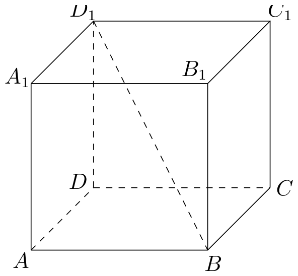
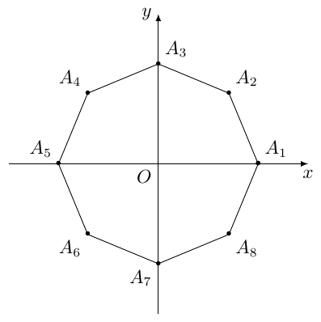
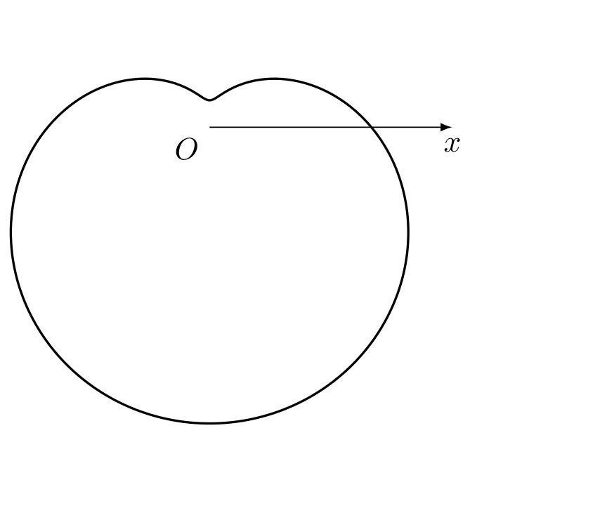
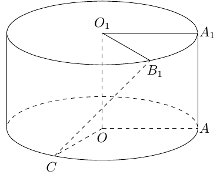
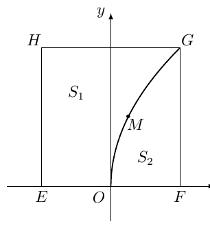

# 2016年上海卷（秋理）

## 填空题

### 第 1 题

设 $x\in\mathbb{R}$，则不等式 $|x-3|<1$ 的解集为＿＿＿＿＿＿.

#### 答案

$(2,4)$

#### 解析

由绝对值不等式的定义，$-1<x-3<1$，所以 $(2<x<4)$，解集为 $(2,4)$.

### 第 2 题

设 $z=\dfrac{3+2\i}{\i}$，其中 $\i$ 为虚数单位，则 $\operatorname{Im}z=\underline{\qquad\qquad}$.

#### 答案

$-3$

#### 解析

因为 $1/\i=-\i$，所以

$$

z=(3+2\i)(-\i)=2-3\i

$$

因此 $\operatorname{Im}z=-3$.

### 第 3 题

已知平行直线 $l_1:2x+y-1=0$，$l_2:2x+y+1=0$，则 $l_1$ 与 $l_2$ 的距离是＿＿＿＿＿＿.

#### 答案

$\dfrac{2\sqrt5}{5}$

#### 解析

两条直线的左端系数相同，故可用平行直线距离公式. 取 $l_1$ 上任一点，得到

$$

d=\frac{|(-1)-1|}{\sqrt{2^2+1^2}}=\frac{2}{\sqrt5}=\frac{2\sqrt5}{5}

$$

### 第 4 题

某次体检，$6$ 位同学的身高（单位：米）分别为 $1.72$，$1.78$，$1.75$，$1.80$，$1.69$，$1.77$，则这组数据的中位数是＿＿＿＿＿＿（米）.

#### 答案

$1.76$

#### 解析

将身高从小到大排列为 $1.69$，$1.72$，$1.75$，$1.77$，$1.78$，$1.80$. 数据个数为 $6$，中位数是第3、4个数据的平均数，因此中位数为

$$

\frac{1.75+1.77}{2}=1.76

$$

### 第 5 题

已知点 $(3,9)$ 在函数 $f(x)=1+a^x$ 的图像上，则 $f(x)$ 的反函数 $f^{-1}(x)=\underline{\qquad\qquad}$.

#### 答案

$\log_2(x-1)$

#### 解析

由点 $(3,9)$ 在图像上，得 $9=1+a^3$，所以 $a=2$. 令 $y=1+2^x$，则 $2^x=y-1$，从而 $x=\log_2(y-1)$. 交换 $x$，$y$，并注意反函数的定义域为 $x>1$，得 $f^{-1}(x)=\log_2(x-1)$，$(x>1)$.

### 第 6 题

如图，在正四棱柱 $ABCD-A_1B_1C_1D_1$ 中，底面 $ABCD$ 的边长为 $3$，$BD_1$ 与底面所成角的大小为 $\arctan\dfrac23$，则该正四棱柱的高等于＿＿＿＿＿＿.

#### 答案

$2\sqrt2$

#### 解析

设正四棱柱的高为 $h$. 线段 $BD_1$ 在底面上的射影为 $BD$，且 $DD_1\perp$ 底面，所以 $\angle DBD_1$ 是 $BD_1$ 与底面所成的角. 正方形底面边长为 $3$，故 $BD=3\sqrt2$. 因而

$$

\tan\angle DBD_1=\frac{DD_1}{BD}=\frac{h}{3\sqrt2}=\frac23

$$

解得 $h=2\sqrt2$.

### 第 7 题

方程 $3\sin x=1+\cos2x$ 在区间 $[0,2\pi]$ 上的解为＿＿＿＿＿＿.

#### 答案

$\dfrac{\pi}{6}$，$\dfrac{5\pi}{6}$

#### 解析

利用 $\cos2x=1-2\sin^2x$，原方程化为

$$

3\sin x=2-2\sin^2x

$$

即 $2\sin^2x+3\sin x-2=0$，$(2\sin x-1)(\sin x+2)=0$. 因为 $-1\leq\sin x\leq1$，只能有 $\sin x=\dfrac12$. 在 $[0,2\pi]$ 内，解为 $x=\dfrac\pi6$，$\dfrac{5\pi}6$.

### 第 8 题

在 $\left(\sqrt[3]{x}-\dfrac2x\right)^n$ 的二项展开式中，所有项的二项式系数之和为 $256$，则常数项等于＿＿＿＿＿＿.

#### 答案

$112$

#### 解析

二项式系数之和为 $2^n$，所以 $2^n=256=2^8$，即 $n=8$. 展开式通项可写为

$$

T_{r+1}=\mathrm C_8^r\left(\sqrt[3]{x}\right)^{8-r}\left(-\frac2x\right)^r
 =\mathrm C_8^r(-2)^r x^{(8-4r)/3}

$$

常数项要求 $(8-4r)/3=0$，故 $r=2$，其系数为

$$

\mathrm C_8^2(-2)^2=28\times4=112

$$

### 第 9 题

已知 $\triangle ABC$ 的三边长分别为 $3$，$5$，$7$，则该三角形的外接圆半径等于＿＿＿＿＿＿.

#### 答案

$\dfrac{7\sqrt3}{3}$

#### 解析

设边长 $3$，$5$，$7$ 所对的角分别为 $A$，$B$，$C$，则由余弦定理

$$

\cos C=\frac{3^2+5^2-7^2}{2\times3\times5}=-\frac12

$$

三角形内角满足 $0<C<\pi$，所以 $\sin C=\dfrac{\sqrt3}{2}$. 由正弦定理 $7=2R\sin C$，得

$$

R=\frac{7}{2\sin C}=\frac{7}{\sqrt3}=\frac{7\sqrt3}{3}

$$

### 第 10 题

设 $a>0$，$b>0$，若关于 $x$，$y$ 的方程组

$$

\begin{cases}
ax+y=1,\\
x+by=1
\end{cases}

$$

无解，则 $a+b$ 的取值范围是＿＿＿＿＿＿.

#### 答案

$(2,+\infty)$

#### 解析

若 $ab\ne1$，方程组的系数行列式不为零，方程组有唯一解. 因此无解时必须有 $ab=1$. 当 $ab=1$ 且 $a=b=1$ 时两方程相同，有无穷多解；所以还必须有 $a\ne1$. 由 $a>0$，得 $b=1/a>0$，且

$$

a+b=a+\frac1a>2

$$

反之，对任意 $a>0$ 且 $a\ne1$，令 $b=1/a$，两方程的系数成比例而常数项不成相同比例，方程组无解. 对任意 $s>2$，取 $a=(s+\sqrt{s^2-4})/2>1$，则 $a+1/a=s$，所以 $a+1/a$ 恰可取得每个大于 $2$ 的值. 因此取值范围为 $(2,+\infty)$.

### 第 11 题

无穷数列 $\{a_n\}$ 由 $k$ 个不同的数组成，$S_n$ 为 $\{a_n\}$ 的前 $n$ 项和. 若对任意的 $n\in\mathbb{N}^*$，$S_n\in\{2,3\}$，则 $k$ 的最大值为＿＿＿＿＿＿.

#### 答案

$4$

#### 解析

因为 $S_n$ 只能取 $2,3$，所以 $a_1=S_1\in\{2,3\}$，而对 $n\ge2$，有

$$

a_n=S_n-S_{n-1}\in\{-1,0,1\}

$$

故数列中的不同数至多为 $1+3=4$ 个. 取前若干项和依次为 $S_1$，$S_2$，$S_3$，$S_4$，$S_5$，$\ldots=2$，$3$，$3$，$2$，$2$，$3$，$3$，$2$，$\ldots$ 则对应的数列以 $2$，$1$，$0$，$-1$，$0$，$1$，$0$，$-1$，$\ldots$ 开头，恰有 $2$，$1$，$0$，$-1$ 四个不同的数. 因此 $k$ 的最大值为 $4$.

### 第 12 题

在平面直角坐标系中，已知 $A(1,0)$，$B(0,-1)$，$P$ 是曲线 $y=\sqrt{1-x^2}$ 上一个动点，则 $\overrightarrow{BP}\cdot\overrightarrow{BA}$ 的取值范围是＿＿＿＿＿＿.

#### 答案

$[0,1+\sqrt2]$

#### 解析

设 $P=(x,y)$，则 $-1\le x\le1$，$y=\sqrt{1-x^2}\ge0$. 又 $\overrightarrow{BP}=(x,y+1)$，$\overrightarrow{BA}=(1,1)$ 所以

$$

\overrightarrow{BP}\cdot\overrightarrow{BA}=x+y+1

$$

在上半单位圆上，$x+y\ge-1$，等号在 $(x,y)=(-1,0)$ 处取得；由柯西不等式，$x+y\le\sqrt2$，等号在 $x=y=\dfrac1{\sqrt2}$ 处取得. 因此所求范围为 $[0,1+\sqrt2]$.

### 第 13 题

设 $a$，$b\in\mathbb{R}$，$c\in[0,2\pi)$，若对任意实数 $x$ 都有 $2\sin\!\left(3x-\dfrac{\pi}{3}\right)=a\sin(bx+c)$，则满足条件的有序实数组 $(a,b,c)$ 的组数为＿＿＿＿＿＿.

#### 答案

$4$

#### 解析

左边展开为

$$

2\sin\left(3x-\frac\pi3\right)=\sin3x-\sqrt3\cos3x

$$

由于左边是非恒定的频率为 $3$ 的正弦型函数，必须有 $|b|=3$，且 $a\ne0$.

当 $b=3$ 时，比较 $\sin3x$ 与 $\cos3x$ 的系数，得 $a\cos c=1$，$a\sin c=-\sqrt3$. 故 $a=2$，$c=\dfrac{5\pi}{3}$，或 $a=-2$，$c=\dfrac{2\pi}{3}$.

当 $b=-3$ 时，$a\sin(c-3x)=-a\cos c\sin3x+a\sin c\cos3x$，从而 $a\cos c=-1$，$a\sin c=-\sqrt3$. 故 $a=2$，$c=\dfrac{4\pi}{3}$，或 $a=-2$，$c=\dfrac\pi3$. 这些 $c$ 均属于 $[0,2\pi)$，共得到 $4$ 组.

### 第 14 题

如图，在平面直角坐标系 $xOy$ 中，$O$ 为正八边形 $A_1A_2\cdots A_8$ 的中心，$A_1(1,0)$，任取不同的两点 $A_i$，$A_j$，点 $P$ 满足 $\overrightarrow{OP}+\overrightarrow{OA_i}+\overrightarrow{OA_j}=\bs0$，则点 $P$ 落在第一象限的概率是＿＿＿＿＿＿.

#### 答案

$\dfrac5{28}$

#### 解析

正八边形的顶点在单位圆上，顶点辐角依次为 $0$，$\dfrac\pi4$，$\dfrac\pi2$，$\ldots$，$\dfrac{7\pi}4$. 任选不同的两点共有 $\mathrm C_8^2=28$ 种等可能结果. 由题设

$$

\overrightarrow{OP}=-\left(\overrightarrow{OA_i}+\overrightarrow{OA_j}\right)

$$

所以 $P$ 在第一象限，当且仅当所选两顶点的坐标和的横、纵坐标都为负.

各顶点坐标为 $A_1=(1,0)$，$A_2=(\frac{\sqrt2}{2},\frac{\sqrt2}{2})$，$A_3=(0,1)$，$A_4=(-\frac{\sqrt2}{2},\frac{\sqrt2}{2})$，$A_5=(-1,0)$，$A_6=(-\frac{\sqrt2}{2},-\frac{\sqrt2}{2})$，$A_7=(0,-1)$，$A_8=(\frac{\sqrt2}{2},-\frac{\sqrt2}{2})$. 逐一检验坐标和的横、纵坐标均为负，满足条件的无序点对为 $(A_4,A_7)$，$\ (A_5,A_6)$，$\ (A_5,A_7)$，$\ (A_5,A_8)$，$\ (A_6,A_7)$ 共 $5$ 对. 因此所求概率为 $\dfrac5{28}$.

## 单选题

### 第 15 题

设 $a\in\mathbb{R}$，则“$a>1$”是“$a^2>1$”的（）

A.  
充分非必要条件

B.  
必要非充分条件

C.  
充要条件

D.  
既非充分也非必要条件

#### 答案

A

#### 解析

若 $a>1$，则 $a^2>1$，所以前者是后者的充分条件. 反之，$a^2>1$ 还可能由 $a<-1$ 导致，例如 $a=-2$ 时 $a^2>1$ 但 $a>1$ 不成立，故不是必要条件. 因此选 A.

### 第 16 题

下列极坐标方程中，对应的曲线为下图的是（）

A.  
$\rho=6+5\cos\theta$

B.  
$\rho=6+5\sin\theta$

C.  
$\rho=6-5\cos\theta$

D.  
$\rho=6-5\sin\theta$

#### 答案

D

#### 解析

曲线 $\rho=6-5\sin\theta$ 在 $\theta=\dfrac\pi2$ 时取最小值 $1$，在 $\theta=\dfrac{3\pi}2$ 时取最大值 $11$，故凹陷朝向正 $y$ 轴、主体向下方延伸，与图形相符. 因此选 D.

### 第 17 题

已知无穷等比数列 $\{a_n\}$ 的公比为 $q$，前 $n$ 项和为 $S_n$，且 $\displaystyle\lim_{n\to\infty}S_n=S$，下列条件中，使得 $2S_n<S$（$n\in\mathbb{N}^*$）恒成立的是（）

A.  
$a_1>0,\ 0.6<q<0.7$

B.  
$a_1<0$，$\ -0.7<q<-0.6$

C.  
$a_1>0$，$\ 0.7<q<0.8$

D.  
$a_1<0$，$\ -0.8<q<-0.7$

#### 答案

B

#### 解析

无穷等比数列的和存在，故 $|q|<1$，且 $S=\frac{a_1}{1-q}$，$S_n=S(1-q^n)$. 条件 $2S_n<S$ 等价于 $S(1-2q^n)<0$，$(n\in\mathbb{N}^*)$. 选项 A、C 中 $S>0$，但当 $n$ 足够大时 $q^n$ 接近 $0$，有 $1-2q^n>0$，不满足条件. 选项 B 中 $S<0$，且 $-0.7<q<-0.6$：当 $n$ 为奇数时 $1-2q^n>0$，当 $n$ 为偶数时 $0<q^n<0.7^2<\dfrac12$，仍有 $1-2q^n>0$，所以恒成立. 选项 D 中取偶数 $n=2$ 时，若 $|q|>1/\sqrt2$，则 $1-2q^2<0$，不能恒成立. 因此选 B.

### 第 18 题

设 $f(x)$，$g(x)$，$h(x)$ 是定义域为 $\mathbb{R}$ 的三个函数. 对于命题：

1.  若 $f(x)+g(x)$，$f(x)+h(x)$，$g(x)+h(x)$ 均为增函数，则 $f(x)$，$g(x)$，$h(x)$ 中至少有一个为增函数；

2.  若 $f(x)+g(x)$，$f(x)+h(x)$，$g(x)+h(x)$ 均是以 $T$ 为周期的函数，则 $f(x)$，$g(x)$，$h(x)$ 均是以 $T$ 为周期的函数.

下列判断正确的是（）

A.  
$\textcircled{1}$ 和 $\textcircled{2}$ 均为真命题

B.  
$\textcircled{1}$ 和 $\textcircled{2}$ 均为假命题

C.  
$\textcircled{1}$ 为真命题，$\textcircled{2}$ 为假命题

D.  
$\textcircled{1}$ 为假命题，$\textcircled{2}$ 为真命题

#### 答案

D

#### 解析

先判断命题 $\textcircled{1}$. 令 $p=f+g$，$q=f+h$，$r=g+h$，并定义 $f=\frac{p+q-r}{2}$，$g=\frac{p+r-q}{2}$，$h=\frac{q+r-p}{2}$. 取

$$

p(x)=\begin{cases}
x,&x\le1,\\
3x-2,&x>1,
\end{cases}\quad
q(x)=\begin{cases}
x,&x\le0,\\
3x,&0<x\le1,\\
x+2,&x>1,
\end{cases}\quad
r(x)=\begin{cases}
3x,&x\le0,\\
x,&x>0.
\end{cases}

$$

三个函数 $p$，$q$，$r$ 都是增函数，因此 $f+g=p$，$f+h=q$，$g+h=r$ 都是增函数. 但在区间 $(-\infty,0)$、$(0,1)$、$(1,+\infty)$ 上，$(f',g',h')$ 分别为 $\left(-\frac12,\frac32,\frac32\right)$，$\left(\frac32,-\frac12,\frac32\right)$，$\left(\frac32,\frac32,-\frac12\right)$. 所以 $f$，$g$，$h$ 均不是增函数，命题 $\textcircled{1}$ 为假.

再判断命题 $\textcircled{2}$. 若三个和函数都以 $T$ 为周期，记 $F=f(x+T)-f(x)$，$G=g(x+T)-g(x)$，$H=h(x+T)-h(x)$. 则 $F+G=F+H=G+H=0$. 两两相加可得 $2F=2G=2H=0$，所以 $F=G=H=0$，即 $f$，$g$，$h$ 都以 $T$ 为周期. 命题 $\textcircled{2}$ 为真. 因此选 D.

## 解答题

### 第 19 题

将边长为 $1$ 的正方形 $AA_1O_1O$（及其内部）绕 $OO_1$ 旋转一周形成圆柱，如图，$\widehat{AC}$ 长为 $\dfrac{2\pi}{3}$，$\widehat{A_1B_1}$ 长为 $\dfrac{\pi}{3}$，其中 $B_1$ 与 $C$ 在平面 $AA_1O_1O$ 的同侧.

1.  求三棱锥 $C-O_1A_1B_1$ 的体积；

2.  求异面直线 $B_1C$ 与 $AA_1$ 所成角的大小.

#### 解析

1.  取圆柱的轴线 $OO_1$ 为 $z$ 轴，并令正方形所在平面为 $y=0$. 设 $O=(0,0,0)$，$O_1=(0,0,1)$，$A=(1,0,0)$，$A_1=(1,0,1)$. 由于底面圆的半径为 $1$，且弧 $\widehat{AC}$ 长为 $2\pi/3$，弧 $\widehat{A_1B_1}$ 长为 $\pi/3$，又 $B_1$，$C$ 在所给平面的同侧，可取 $C=\left(-\frac12,\frac{\sqrt3}{2},0\right)$，$B_1=\left(\frac12,\frac{\sqrt3}{2},1\right)$. 以 $O_1$ 为顶点取三个棱向量，则 $\overrightarrow{O_1C}=\left(-\frac12,\frac{\sqrt3}{2},-1\right)$，$\overrightarrow{O_1A_1}=(1,0,0)$，$\overrightarrow{O_1B_1}=\left(\frac12,\frac{\sqrt3}{2},0\right)$. 所以三棱锥体积为

$$

V=\frac16\left|\det\begin{pmatrix}
    -\frac12&1&\frac12\\
    \frac{\sqrt3}{2}&0&\frac{\sqrt3}{2}\\
    -1&0&0
    \end{pmatrix}\right|=\frac{\sqrt3}{12}

$$

2.  由上述坐标，直线 $B_1C$ 的方向向量可取

$$

\overrightarrow{CB_1}=(1,0,1)

$$

    而直线 $AA_1$ 的方向向量为 $(0,0,1)$. 设两异面直线所成的角为 $\alpha$，则

$$

\cos\alpha=\frac{|(1,0,1)\cdot(0,0,1)|}{\sqrt{1^2+1^2}}=\frac1{\sqrt2}

$$

    由于 $0\leq\alpha\leq\pi/2$，得 $\alpha=\dfrac\pi4$.

### 第 20 题

有一块正方形菜地 $EFGH$，$EH$ 所在直线是一条小河，收获的蔬菜可送到 $F$ 点或河边运走. 于是，菜地分为两个区域 $S_1$ 和 $S_2$，其中 $S_1$ 中的蔬菜运到河边较近，$S_2$ 中的蔬菜运到 $F$ 点较近，而菜地内 $S_1$ 和 $S_2$ 的分界线 $C$ 上的点到河边与到 $F$ 点的距离相等. 现建立平面直角坐标系，其中原点 $O$ 为 $EF$ 的中点，点 $F$ 的坐标为 $(1,0)$，如图.

1.  求菜地内的分界线 $C$ 的方程；

2.  菜农从蔬菜运量估计出 $S_1$ 面积是 $S_2$ 面积的两倍，由此得到 $S_1$ 面积的“经验值”为 $\dfrac83$. 设 $M$ 是 $C$ 上纵坐标为 $1$ 的点，请计算以 $EH$ 为一边，另有一边过点 $M$ 的矩形的面积，及五边形 $EOMGH$ 的面积，并判别哪一个更接近于 $S_1$ 面积的“经验值”.

#### 解析

1.  由图可知正方形的四个顶点为 $E=(-1,0)$，$F=(1,0)$，$G=(1,2)$，$H=(-1,2)$. 设分界线上点为 $(x,y)$，则它到河边直线 $x=-1$ 的距离为 $x+1$，到 $F$ 的距离为 $\sqrt{(x-1)^2+y^2}$. 由两距离相等，得

$$

(x+1)^2=(x-1)^2+y^2

$$

    即 $y^2=4x$. 因为点在菜地 $[-1,1]\times[0,2]$ 内，分界线的实际部分为 $x=\frac{y^2}{4}$，$0\le y\le2$.

2.  令 $y=1$，得 $M=\left(\dfrac14,1\right)$. 以 $EH$ 为一边的矩形的高为 $EH=2$，另一条平行于 $EH$ 的边过 $M$，所以矩形的宽为 $\dfrac14-(-1)=\dfrac54$，面积为

$$

2\times\frac54=\frac52

$$

    五边形 $EOMGH$ 的顶点依次为 $(-1,0)$，$(0,0)$，$(1/4,1)$，$(1,2)$，$(-1,2)$. 由鞋带公式

$$

S_{EOMGH}=\frac12\left|\left(\frac12+2\right)-\left(1-2-2\right)\right|=\frac{11}{4}

$$

    与经验值 $\dfrac83$ 比较： $\left|\frac52-\frac83\right|=\frac16$，$\left|\frac{11}{4}-\frac83\right|=\frac1{12}$. 因此五边形 $EOMGH$ 的面积更接近经验值.

### 第 21 题

双曲线 $x^2-\dfrac{y^2}{b^2}=1$（$b>0$）的左、右焦点分别为 $F_1$，$F_2$，直线 $l$ 过 $F_2$ 且与双曲线交于 $A$，$B$ 两点.

1.  若 $l$ 的倾斜角为 $\dfrac{\pi}{2}$，$\triangle F_1AB$ 是等边三角形，求双曲线的渐近线方程；

2.  设 $b=\sqrt3$，若 $l$ 的斜率存在，且 $(\overrightarrow{F_1A}+\overrightarrow{F_1B})\cdot\overrightarrow{AB}=0$，求 $l$ 的斜率.

#### 解析

1.  设双曲线的半焦距为 $c$，则 $c^2=1+b^2$，焦点为 $F_1=(-c,0)$，$F_2=(c,0)$. 当 $l$ 的倾斜角为 $\pi/2$ 时，直线为 $x=c$，与双曲线的交点可设为 $A=(c,b^2)$，$B=(c,-b^2)$. 于是 $AB=2b^2$. 因为 $\triangle F_1AB$ 为等边三角形，所以 $F_1A^2=AB^2$，$(2c)^2+b^4=4b^4$. 代入 $c^2=1+b^2$，得

$$

4(1+b^2)=3b^4

$$

    令 $u=b^2>0$，则 $3u^2-4u-4=0$，解得 $u=2$，即 $b=\sqrt2$. 因而双曲线渐近线为

$$

y=\pm bx=\pm\sqrt2x

$$

2.  当 $b=\sqrt3$ 时，$c=2$，故 $F_1=(-2,0)$，$F_2=(2,0)$. 设 $l$ 的斜率为 $k$，则 $l:y=k(x-2)$. 设 $A=(x_1,y_1)$，$B=(x_2,y_2)$，联立双曲线方程得

$$

(3-k^2)x^2+4k^2x-(4k^2+3)=0

$$

    因 $l$ 与双曲线有两个交点，故 $k^2\ne3$，从而由韦达定理 $x_1+x_2=-\frac{4k^2}{3-k^2}$，$y_1+y_2=k(x_1+x_2-4)$. 又 $\overrightarrow{AB}=(x_2-x_1)(1,k)$，所以题设条件等价于

$$

0=(x_2-x_1)\bigl[x_1+x_2+4+k(y_1+y_2)\bigr]

$$

    因 $A\ne B$，有

$$

(1+k^2)(x_1+x_2)+4(1-k^2)=0

$$

    即 $x_1+x_2=\dfrac{4(k^2-1)}{1+k^2}$. 与韦达公式联立，令 $u=k^2$，得 $-\frac{4u}{3-u}=\frac{4(u-1)}{1+u}$，$u=\frac35$. 故 $k=\pm\sqrt{\dfrac35}=\pm\dfrac{\sqrt{15}}5$.

### 第 22 题

已知 $a\in\mathbb{R}$，函数 $f(x)=\log_2\!\left(\dfrac1x+a\right)$.

1.  当 $a=5$ 时，解不等式 $f(x)>0$；

2.  若关于 $x$ 的方程 $f(x)-\log_2[(a-4)x+2a-5]=0$ 的解集中恰有一个元素，求 $a$ 的取值范围；

3.  设 $a>0$，若对任意 $t\in\left[\dfrac12,1\right]$，函数 $f(x)$ 在区间 $[t,t+1]$ 上的最大值和最小值的差不超过 $1$，求 $a$ 的取值范围.

#### 解析

1.  当 $a=5$ 时，$f(x)>0$ 等价于

$$

\frac1x+5>1

$$

    即 $1/x>-4$. 当 $x>0$ 时不等式恒成立；当 $x<0$ 时不等式等价于 $x<-1/4$. 所以解集为

$$

\left(-\infty,-\frac14\right)\cup(0,+\infty)

$$

2.  方程两边的对数真数均须为正，且由对数函数的单调性，原方程等价于

$$

\frac1x+a=(a-4)x+2a-5

$$

    因为 $x\ne0$，两边乘以 $x$ 并因式分解，得

$$

(a-4)x^2+(a-5)x-1=0

$$

    即

$$

(x+1)\bigl((a-4)x-1\bigr)=0

$$

    根 $x=-1$ 有效的条件是 $a-1>0$，即 $a>1$. 当 $a\ne4$ 时，另一根为 $x=1/(a-4)$，代回真数得 $2a-4>0$，故它有效当且仅当 $a>2$. 当 $a=3$ 时两根重合，只有一个不同的解；当 $a=4$ 时方程退化为 $x=-1$，且该根有效. 于是恰有一个解的情形为

$$

a\in(1,2]\cup\{3,4\}

$$

3.  当 $a>0$ 且 $x>0$ 时，

$$

f'(x)=-\frac{1}{x(ax+1)\ln2}<0

$$

    所以在 $[t,t+1]$ 上最大值为 $f(t)$，最小值为 $f(t+1)$. 条件等价于

$$

\log_2\frac{a+1/t}{a+1/(t+1)}\le1

$$

    即

$$

\frac{a+1/t}{a+1/(t+1)}\le2

$$

    由于 $t>0$，化简为 $a t(t+1)\ge1-t$，$a\ge\frac{1-t}{t(t+1)}$. 函数 $\dfrac{1-t}{t(t+1)}$ 在 $[1/2,1]$ 上递减，最大值在 $t=1/2$ 处取得，为 $2/3$. 因而所求范围为

$$

a\in\left[\frac23,+\infty\right)

$$

### 第 23 题

若无穷数列 $\{a_n\}$ 满足：只要 $a_p=a_q$（$p$，$q\in\mathbb{N}^*$），必有 $a_{p+1}=a_{q+1}$，则称 $\{a_n\}$ 具有性质 $P$.

1.  若 $\{a_n\}$ 具有性质 $P$，且 $a_1=1$，$a_2=2$，$a_4=3$，$a_5=2$，$a_6+a_7+a_8=21$，求 $a_3$；

2.  若无穷数列 $\{b_n\}$ 是等差数列，无穷数列 $\{c_n\}$ 是公比为正数的等比数列，$b_1=c_5=1$，$b_5=c_1=81$，$a_n=b_n+c_n$，判断 $\{a_n\}$ 是否具有性质 $P$，并说明理由；

3.  设 $\{b_n\}$ 是无穷数列，已知 $a_{n+1}=b_n+\sin a_n$（$n\in\mathbb{N}^*$），求证：“对任意 $a_1$，$\{a_n\}$ 都具有性质 $P$”的充要条件为“$\{b_n\}$ 是常数列”.

#### 解析

1.  因为 $a_2=a_5=2$，由性质 $P$ 得 $a_3=a_6$. 又因 $a_3=a_6$，再次利用性质 $P$ 得 $a_4=a_7$，即 $a_7=3$. 由于 $a_4=a_7=3$，再得 $a_5=a_8$，即 $a_8=2$. 因此

$$

a_6+a_7+a_8=a_3+3+2=21

$$

    解得 $a_3=16$.

2.  由 $b_1=1$，$b_5=81$，得等差数列公差 $d=\frac{81-1}{4}=20$，$b_n=20n-19$. 由 $c_1=81$，$c_5=1$ 且公比为正，得 $q^4=\frac1{81}$，$q=\frac13$，$c_n=\frac{81}{3^{n-1}}=3^{5-n}$. 所以 $a_n=20n-19+3^{5-n}$. 特别地，

$$

a_1=1+81=82=a_5=81+1

$$

    但

$$

a_2=21+27=48\ne101+\frac13=a_6

$$

    存在 $a_1=a_5$ 而 $a_2\ne a_6$，故 $\{a_n\}$ 不具有性质 $P$.

3.  先证充分性. 若 $\{b_n\}$ 为常数列，设其各项为 $b$. 若 $a_p=a_q$，则

$$

a_{p+1}=b+\sin a_p=b+\sin a_q=a_{q+1}

$$

    故对任意初值 $a_1$，数列具有性质 $P$.

    再证必要性. 假设对任意 $a_1$，数列都具有性质 $P$. 对任意实数 $B$，方程

$$

x=B+\sin x

$$

    有解，因为函数 $x-\sin x$ 连续且当 $x\to\pm\infty$ 时分别趋于 $\pm\infty$. 固定这样的解 $x$，并取初值 $a_1=x$. 若已知 $b_1=b_2=\cdots=b_n=B$，则由递推关系可归纳得到

$$

a_1=a_2=\cdots=a_{n+1}=x

$$

    性质 $P$ 使 $a_{n+1}=a_{n+2}$，而 $a_{n+1}=B+\sin x$，$a_{n+2}=b_{n+1}+\sin x$ 从而 $b_{n+1}=B$. 先取 $n=1$，得到 $b_2=b_1$；再归纳可得所有 $b_n$ 都等于 $b_1$，即 $\{b_n\}$ 是常数列. 综上，所述充要条件成立.
