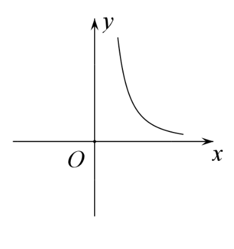
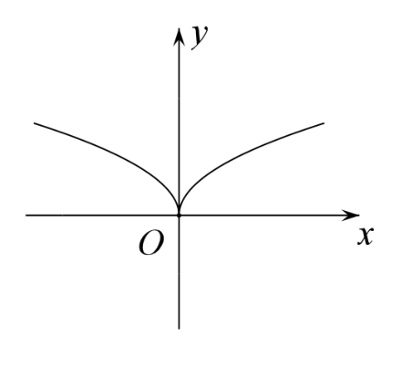
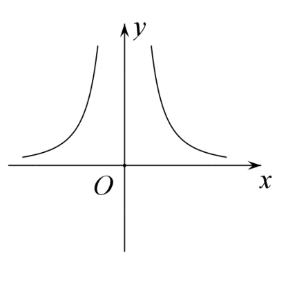
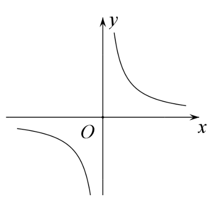
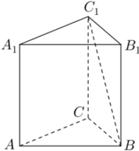
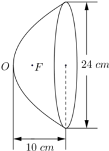
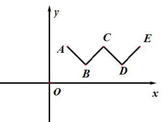

# 2016年上海卷（春）

## 填空题

### 第 1 题

复数 $3+4\i$（$\i$ 为虚数单位）的实部是＿＿＿＿＿＿.

#### 答案

$3$

#### 解析

复数的实部是形如 $a+b\i$ 中的实数 $a$.因此 $3+4\i$ 的实部为 $3$，填 $3$.

### 第 2 题

若 $\log_2(x+1)=3$，则 $x=$＿＿＿＿＿＿.

#### 答案

$7$

#### 解析

由对数定义，$x+1=2^3=8$，且此时满足对数的定义域条件 $x+1>0$.所以 $x=7$.

### 第 3 题

直线 $y=x-1$ 与直线 $y=2$ 的夹角为＿＿＿＿＿＿.

#### 答案

$\dfrac{\pi}{4}$

#### 解析

两直线的斜率分别为 $k_1=1$ 和 $k_2=0$.设它们的锐角夹角为 $\theta$，则 $\tan\theta=\left|\dfrac{k_1-k_2}{1+k_1k_2}\right|=\left|\dfrac{1-0}{1+1\cdot0}\right|=1$.由于 $0<\theta<\dfrac{\pi}{2}$，所以 $\theta=\dfrac{\pi}{4}$.

### 第 4 题

函数 $f(x)=\sqrt{x-2}$ 的定义域为＿＿＿＿＿＿.

#### 答案

$[2,+\infty)$

#### 解析

根式有意义必须满足 $x-2\geq0$，即 $x\geq2$.所以函数的定义域为 $[2,+\infty)$.

### 第 5 题

三阶行列式 $\begin{vmatrix} 1 & -3 & 5 \\ 4 & 0 & 0 \\ -1 & 2 & 1 \end{vmatrix}$ 中，元素 $5$ 的代数余子式的值为＿＿＿＿＿＿.

#### 答案

$8$

#### 解析

元素 $5$ 位于第 $1$ 行第 $3$ 列，所以其代数余子式为 $A_{13}=(-1)^{1+3}\begin{vmatrix}4&0\\-1&2\end{vmatrix}=4\cdot2-0\cdot(-1)=8$.

### 第 6 题

函数 $f(x)=\dfrac1x+a$ 的反函数的图像经过点 $(2,1)$，则实数 $a=$＿＿＿＿＿＿.

#### 答案

$1$

#### 解析

反函数图像上的点 $(2,1)$ 关于直线 $y=x$ 对称后，得到原函数图像上的点 $(1,2)$.因此 $f(1)=2$，即 $1+a=2$，解得 $a=1$.

### 第 7 题

在 $\triangle ABC$ 中，若 $A=30^\circ$，$B=45^\circ$，$BC=\sqrt6$，则 $AC=$＿＿＿＿＿＿.

#### 答案

$2\sqrt3$

#### 解析

边 $BC$ 对应角 $A$，边 $AC$ 对应角 $B$.由正弦定理， $\dfrac{AC}{\sin45^\circ}=\dfrac{BC}{\sin30^\circ}$，所以 $AC=\sqrt6\cdot\dfrac{\sin45^\circ}{\sin30^\circ}=\sqrt6\cdot\dfrac{\sqrt2/2}{1/2}=2\sqrt3$.

### 第 8 题

$4$ 个人排成一排照相，不同排列方式的种数为＿＿＿＿＿＿（结果用数值表示）.

#### 答案

$24$

#### 解析

第一个位置有 $4$ 种选法，第二个位置有 $3$ 种选法，第三个位置有 $2$ 种选法，最后一个位置有 $1$ 种选法.因此排列方式共有 $4\cdot3\cdot2\cdot1=24$ 种.

### 第 9 题

无穷等比数列 $\{a_n\}$ 的首项为 $2$，公比为 $\dfrac13$，则 $\{a_n\}$ 的各项的和为＿＿＿＿＿＿.

#### 答案

$3$

#### 解析

公比 $q=\dfrac13$ 满足 $|q|<1$，所以无穷等比数列收敛，且各项和为 $S=\dfrac{a_1}{1-q}=\dfrac{2}{1-1/3}=3$.

### 第 10 题

若 $2+\i$（$\i$ 为虚数单位）是关于 $x$ 的实系数一元二次方程 $x^2+ax+5=0$ 的一个虚根，则 $a=$＿＿＿＿＿＿.

#### 答案

$-4$

#### 解析

将虚根 $x=2+\i$ 代入方程，得 $(2+\i)^2+a(2+\i)+5=0$.由于 $(2+\i)^2=3+4\i$，上式化为 $(8+2a)+(4+a)\i=0$.实部和虚部都必须为零，因此 $8+2a=0$，解得 $a=-4$；此时 $4+a=0$ 也成立.

### 第 11 题

函数 $y=x^2-2x+1$ 在区间 $[0,m]$ 上的最小值为 $0$，最大值为 $1$，则实数 $m$ 的取值范围是＿＿＿＿＿＿.

#### 答案

$[1,2]$

#### 解析

函数可化为 $y=(x-1)^2$.区间 $[0,m]$ 有意义必须先满足 $m\geq0$.要使最小值为 $0$，顶点 $x=1$ 必须属于该区间，所以 $m\geq1$.

当 $m\geq1$ 时，区间左端点的函数值为 $1$，右端点的函数值为 $(m-1)^2$，故最大值为 $1$ 等价于 $(m-1)^2\leq1$.结合 $m\geq1$，得到 $1\leq m\leq2$.所以 $m\in[1,2]$.

### 第 12 题

在平面直角坐标系 $xOy$ 中，点 $A$，$B$ 是圆 $x^2+y^2-6x+5=0$ 上的两个动点，且满足 $\lvert AB\rvert=2\sqrt3$，则 $\lvert\overrightarrow{OA}+\overrightarrow{OB}\rvert$ 的最小值为＿＿＿＿＿＿.

#### 答案

$4$

#### 解析

圆的方程化为 $(x-3)^2+y^2=4$，所以圆心为 $C=(3,0)$，半径为 $2$.设弦 $AB$ 的中点为 $M$，则 $CM\perp AB$，且 $AM=\dfrac{|AB|}{2}=\sqrt3$.在直角三角形 $ACM$ 中， $CM=\sqrt{AC^2-AM^2}=\sqrt{2^2-(\sqrt3)^2}=1$.

因此 $M$ 在以 $C$ 为圆心、半径 $1$ 的圆上.由三角不等式， $OM\geq|OC-CM|=3-1=2$，并且当 $M$ 位于线段 $OC$ 上时可以取等号.又因为 $M$ 是 $AB$ 的中点， $\overrightarrow{OA}+\overrightarrow{OB}=2\overrightarrow{OM}$.所以目标式的最小值为 $2\cdot2=4$.

## 单选题

### 第 13 题

满足 $\sin\alpha>0$ 且 $\tan\alpha<0$ 的角 $\alpha$ 属于（）.

A.  
第一象限

B.  
第二象限

C.  
第三象限

D.  
第四象限

#### 答案

B

#### 解析

当 $\sin\alpha>0$ 时，$\alpha$ 位于第一或第二象限；当 $\tan\alpha<0$ 时正弦与余弦异号，$\alpha$ 位于第二或第四象限.两者的交集是第二象限，所以选 B.

### 第 14 题

半径为 $1$ 的球的表面积为（）.

A.  
$\pi$

B.  
$\dfrac43\pi$

C.  
$2\pi$

D.  
$4\pi$

#### 答案

D

#### 解析

球的表面积公式为 $S=4\pi r^2$.代入半径 $r=1$，得 $S=4\pi$，所以选 D.

### 第 15 题

在 $(1+x)^6$ 的二项展开式中，$x^2$ 项的系数为（）.

A.  
$2$

B.  
$6$

C.  
$15$

D.  
$20$

#### 答案

C

#### 解析

由二项式定理，$(1+x)^6$ 中的 $x^2$ 项为 $\mathrm C_6^2x^2$，其系数为 $\mathrm C_6^2=\dfrac{6\cdot5}{2\cdot1}=15$.所以选 C.

### 第 16 题

幂函数 $y=x^{-2}$ 的大致图像是（）.

A.  

B.  

C.  

D.  

#### 答案

C

#### 解析

$y=x^{-2}=\dfrac1{x^2}$ 的定义域为 $x\neq0$，且对定义域内的每个 $x$ 都有 $y>0$.又因为 $f(-x)=f(x)$，图像关于 $y$ 轴对称.因此图像有分别位于第一、第二象限的两支，符合这一特征的是选项 C.

### 第 17 题

已知向量 $\bs a=(1,0)$，$\bs b=(1,2)$，则向量 $\bs b$ 在向量 $\bs a$ 方向上的投影为（）.

A.  
$1$

B.  
$2$

C.  
$(1,0)$

D.  
$(0,2)$

#### 答案

A

#### 解析

向量 $\bs b$ 在向量 $\bs a$ 方向上的投影是标量 $\dfrac{\bs a\cdot\bs b}{|\bs a|}$.由于 $|\bs a|=1$，且 $\bs a\cdot\bs b=(1,0)\cdot(1,2)=1$，所以投影为 $1$，选 A.

### 第 18 题

设直线 $l$ 与平面 $\alpha$ 平行，直线 $m$ 在平面 $\alpha$ 上，那么（）.

A.  
直线 $l$ 平行于直线 $m$

B.  
直线 $l$ 与直线 $m$ 异面

C.  
直线 $l$ 与直线 $m$ 没有公共点

D.  
直线 $l$ 与直线 $m$ 不垂直

#### 答案

C

#### 解析

直线 $l$ 与平面 $\alpha$ 平行，表示 $l$ 与 $\alpha$ 没有公共点；又因为直线 $m$ 在平面 $\alpha$ 内，所以 $m$ 的所有点都属于 $\alpha$.因此 $l$ 不可能与 $m$ 有公共点，选 C.

### 第 19 题

用数学归纳法证明等式 $1+2+3+\cdots+2n=2n^2+n$（$n\in\mathbb{N}^*$）的第（ii）步中，假设 $n=k$ 时原等式成立，那么在 $n=k+1$ 时，需要证明的等式为（）.

A.  
$1+2+3+\cdots+2k+2(k+1)=2k^2+k+2(k+1)^2+(k+1)$

B.  
$1+2+3+\cdots+2k+2(k+1)=2(k+1)^2+(k+1)$

C.  
$1+2+3+\cdots+2k+(2k+1)+2(k+1)=2k^2+k+2(k+1)^2+(k+1)$

D.  
$1+2+3+\cdots+2k+(2k+1)+2(k+1)=2(k+1)^2+(k+1)$

#### 答案

D

#### 解析

把 $n=k+1$ 代入原等式左端，求和的最后一项为 $2(k+1)=2k+2$，所以在前 $2k$ 项之后还要加上 $2k+1$ 和 $2(k+1)$.右端应直接代入 $n=k+1$，得到 $2(k+1)^2+(k+1)$.因此需要证明 $1+2+3+\cdots+2k+(2k+1)+2(k+1)=2(k+1)^2+(k+1)$，选 D.

### 第 20 题

关于双曲线 $\dfrac{x^2}{16}-\dfrac{y^2}{4}=1$ 与 $\dfrac{y^2}{16}-\dfrac{x^2}{4}=1$ 的焦距和渐近线，下列说法正确的是（）.

A.  
焦距相等，渐近线相同

B.  
焦距相等，渐近线不相同

C.  
焦距不相等，渐近线相同

D.  
焦距不相等，渐近线不相同

#### 答案

B

#### 解析

对于第一条双曲线，$a=4$，$b=2$，所以 $c=\sqrt{a^2+b^2}=2\sqrt5$，焦距为 $2c=4\sqrt5$，渐近线为 $y=\pm\dfrac12x$.

第二条双曲线是竖轴双曲线，仍有 $a=4$，$b=2$，故焦距同样为 $4\sqrt5$，但渐近线为 $y=\pm2x$.因此焦距相等而渐近线不相同，选 B.

### 第 21 题

设函数 $y=f(x)$ 的定义域为 $\mathbb{R}$，则“$f(0)=0$”是“$y=f(x)$ 为奇函数”的（）.

A.  
充分不必要条件

B.  
必要不充分条件

C.  
充要条件

D.  
既不充分也不必要条件

#### 答案

B

#### 解析

若 $f$ 是奇函数，则由定义有 $f(-x)=-f(x)$.令 $x=0$，得到 $f(0)=-f(0)$，所以 $f(0)=0$.因此 $f(0)=0$ 是奇函数的必要条件.

但函数 $f(x)=x^2$ 的定义域为 $\mathbb{R}$，且 $f(0)=0$，而 $f(-x)=x^2=f(x)$，它不是奇函数.因此该条件不是充分条件，选 B.

### 第 22 题

下列关于实数 $a$，$b$ 的不等式中，不恒成立的是（）.

A.  
$a^2+b^2\ge2ab$

B.  
$a^2+b^2\ge-2ab$

C.  
$\left(\dfrac{a+b}{2}\right)^2\ge ab$

D.  
$\left(\dfrac{a+b}{2}\right)^2\ge-ab$

#### 答案

D

#### 解析

因为 $a^2+b^2-2ab=(a-b)^2\geq0$，所以 A 恒成立；因为 $a^2+b^2+2ab=(a+b)^2\geq0$，所以 B 恒成立.

又因为 $\left(\dfrac{a+b}{2}\right)^2-ab=\dfrac{(a-b)^2}{4}\geq0$，所以 C 恒成立.取 $a=1$，$b=-1$，D 变为 $0\geq1$，不成立.因此选 D.

### 第 23 题

设单位向量 $\bs e_1$ 与 $\bs e_2$ 既不平行也不垂直，对非零向量 $\bs a=x_1\bs e_1+y_1\bs e_2$，$\bs b=x_2\bs e_1+y_2\bs e_2$ 有结论：

1.  若 $x_1y_2-x_2y_1=0$，则 $\bs a\parallel\bs b$；

2.  若 $x_1x_2-y_1y_2=0$，则 $\bs a\perp\bs b$.

关于以上两个结论，正确的判断是（）.

A.  
（1）成立，（2）不成立

B.  
（1）不成立，（2）成立

C.  
（1）成立，（2）成立

D.  
（1）不成立，（2）不成立

#### 答案

A

#### 解析

由于 $\bs e_1$ 与 $\bs e_2$ 不平行，它们线性无关.若 $x_1y_2-x_2y_1=0$，则系数向量 $(x_1,y_1)$ 与 $(x_2,y_2)$ 线性相关.又因为 $\bs a$、$\bs b$ 均非零，所以存在非零实数 $\lambda$，使得 $\bs a=\lambda\bs b$，结论（1）成立.

结论（2）不成立.取 $\bs e_1=(1,0)$，$\bs e_2=(\cos\theta,\sin\theta)$，其中 $\cos\theta\neq0$ 且 $\sin\theta\neq0$，则 $\bs e_1$ 与 $\bs e_2$ 满足题设.令 $\bs a=\bs e_1$、$\bs b=\bs e_2$，则 $x_1x_2-y_1y_2=1\cdot0-0\cdot1=0$，但 $\bs a\cdot\bs b=\cos\theta\neq0$，所以 $\bs a\not\perp\bs b$.因此选 A.

### 第 24 题

对于椭圆 $C_{(a,b)}:\dfrac{x^2}{a^2}+\dfrac{y^2}{b^2}=1$（$a>0$，$b>0$，$a\neq b$），若点 $(x_0,y_0)$ 满足 $\dfrac{x_0^2}{a^2}+\dfrac{y_0^2}{b^2}<1$，则称该点在椭圆 $C_{(a,b)}$ 内.在平面直角坐标系中，若点 $A$ 在过点 $(2,1)$ 的任意椭圆 $C_{(a,b)}$ 内或椭圆 $C_{(a,b)}$ 上，则满足条件的点 $A$ 构成的图形为（）.

A.  
三角形及其内部

B.  
矩形及其内部

C.  
圆及其内部

D.  
椭圆及其内部

#### 答案

B

#### 解析

设 $A=(x,y)$.椭圆经过 $(2,1)$，所以 $\dfrac4{a^2}+\dfrac1{b^2}=1$.令 $u=\dfrac1{a^2}$，$v=\dfrac1{b^2}$，则 $u>0$，$v>0$，且 $4u+v=1$.

点 $A$ 在该椭圆内或椭圆上等价于 $x^2u+y^2v\leq1$.由 $v=1-4u$，并注意到 $0<u<\dfrac14$，有 $x^2u+y^2v=y^2+u(x^2-4y^2)$.这是关于 $u$ 的一次函数.要使它对所有允许的 $u$ 都不超过 $1$，只需且必须使两个端点极限均不超过 $1$，即 $y^2\leq1$，$\dfrac{x^2}{4}\leq1$.排除 $a=b$ 只排除了参数区间中的一个值，不改变所得的闭区域.

因此 $-2\leq x\leq2$，$-1\leq y\leq1$，所成图形是矩形及其内部，选 B.

## 解答题

### 第 25 题

如图，已知正三棱柱 $ABC-A_1B_1C_1$ 的体积为 $9\sqrt3$，底面边长为 $3$，求异面直线 $BC_1$ 与 $AC$ 所成的角的大小.

#### 解析

正三棱柱的底面是边长为 $3$ 的正三角形，底面积为 $S_{\text{底}}=\dfrac{\sqrt3}{4}\cdot3^2=\dfrac{9\sqrt3}{4}$.由棱柱体积公式， $9\sqrt3=S_{\text{底}}h=\dfrac{9\sqrt3}{4}h$，解得高 $h=4$.

建立空间直角坐标系，取 $A$ 为原点，令 $\overrightarrow{AB}=(3,0,0)$，$\overrightarrow{AC}=\left(\dfrac32,\dfrac{3\sqrt3}{2},0\right)$，则 $\overrightarrow{BC_1}=\left(-\dfrac32,\dfrac{3\sqrt3}{2},4\right)$.于是 $\overrightarrow{AC}\cdot\overrightarrow{BC_1}=-\dfrac94+\dfrac{27}{4}=\dfrac92$，且 $|\overrightarrow{AC}|=3$， $|\overrightarrow{BC_1}|=\sqrt{\dfrac94+\dfrac{27}{4}+16}=5$.

设两异面直线所成的锐角为 $\theta$，则 $\cos\theta=\dfrac{|\overrightarrow{AC}\cdot\overrightarrow{BC_1}|}{|\overrightarrow{AC}|\,|\overrightarrow{BC_1}|}=\dfrac{9/2}{3\cdot5}=\dfrac3{10}$.所以 $\theta=\arccos\dfrac3{10}$.

### 第 26 题

已知函数 $f(x)=\sin x+\sqrt3\cos x$，求 $f(x)$ 的最小正周期及最大值，并指出 $f(x)$ 取得最大值时 $x$ 的值.

#### 解析

利用和角公式， $f(x)=\sin x+\sqrt3\cos x=2\cos\left(x-\dfrac{\pi}{6}\right)$.因此函数的振幅为 $2$，最大值为 $2$，最小正周期为余弦函数的最小正周期 $T=2\pi$.

当且仅当 $\cos\left(x-\dfrac{\pi}{6}\right)=1$ 时取得最大值，故 $x-\dfrac{\pi}{6}=2k\pi$，其中 $k\in\mathbb{Z}$.所以 $x=\dfrac{\pi}{6}+2k\pi$，其中 $k\in\mathbb{Z}$.

### 第 27 题

如图，汽车前灯反射镜与轴截面的交线是抛物线的一部分，灯口所在的圆面与反射镜的轴垂直，灯泡位于抛物线的焦点 $F$ 处，已知灯口直径是 $24\mathrm{~cm}$，灯深 $10\mathrm{~cm}$，求灯泡与反射镜的顶点 $O$ 的距离.

#### 解析

以反射镜顶点 $O$ 为原点、反射镜的轴为 $x$ 轴建立直角坐标系，设抛物线方程为 $y^2=2px$.灯口直径为 $24\mathrm{~cm}$，所以灯口边缘在轴截面中的纵坐标为 $y=\pm12$；灯深为 $10\mathrm{~cm}$，对应横坐标为 $x=10$.代入抛物线方程，得 $12^2=2p\cdot10$，所以 $2p=14.4$.

抛物线 $y^2=2px$ 的焦点为 $F\left(\dfrac p2,0\right)$，因此 $OF=\dfrac p2=\dfrac{7.2}{2}=3.6\mathrm{~cm}$.

### 第 28 题

已知数列 $\{a_n\}$ 是公差为 $2$ 的等差数列.

1.  若 $a_1$，$a_3$，$a_4$ 成等比数列，求 $a_1$ 的值；

2.  设 $a_1=-19$，数列 $\{a_n\}$ 的前 $n$ 项和为 $S_n$.数列 $\{b_n\}$ 满足 $b_1=1$，$b_{n+1}-b_n=\left(\dfrac12\right)^n$.记 $c_n=S_n+2^{n-1}b_n$（$n\in\mathbb{N}^*$），求数列 $\{c_n\}$ 的最小项 $c_{n_0}$（即 $c_{n_0}\leq c_n$ 对任意 $n\in\mathbb{N}^*$ 成立）.

#### 解析

1.  设 $a_1=a$.由公差为 $2$，得 $a_3=a+4$，$a_4=a+6$.三项成等比数列时，中间项的平方等于两端项的积，所以 $(a+4)^2=a(a+6)$.展开得 $a^2+8a+16=a^2+6a$，解得 $a=-8$.此时三项为 $-8$，$-4$，$-2$，确实成等比数列.

2.  由 $a_1=-19$ 及公差为 $2$，得 $a_n=-19+2(n-1)=2n-21$.于是 $S_n=\dfrac{n(a_1+a_n)}2=\dfrac{n(-19+2n-21)}2=n^2-20n$.

    由 $b_1=1$ 及递推关系， $b_n=1+\sum_{j=1}^{n-1}2^{-j}=1+1-2^{1-n}=2-2^{1-n}$.因此 $2^{n-1}b_n=2^n-1$，从而 $c_n=n^2-20n+2^n-1$.

    考察相邻两项之差： $c_{n+1}-c_n=2n-19+2^n$.当 $n=1$，$2$，$3$，$4$ 时，该差分别为 $-15$，$-11$，$-5$，$5$.并且 $(c_{n+2}-c_{n+1})-(c_{n+1}-c_n)=2+2^n>0$，所以相邻项之差严格递增.于是数列先减后增，最小项为 $c_4$，且 $c_4=4^2-20\cdot4+2^4-1=-49$.

### 第 29 题

对于函数 $f(x)$ 与 $g(x)$，记集合 $D_{f>g}=\{x\mid f(x)>g(x)\}$.

1.  设 $f(x)=2\lvert x\rvert$，$g(x)=x+3$，求 $D_{f>g}$；

2.  设 $f_1(x)=x-1$，$f_2(x)=\left(\dfrac13\right)^x+a\cdot3^x+1$，$h(x)=0$.如果 $D_{f_1>h}\cup D_{f_2>h}=\mathbb{R}$，求实数 $a$ 的取值范围.

#### 解析

1.  解不等式 $2|x|>x+3$.当 $x\geq0$ 时，$2x>x+3$，得 $x>3$；当 $x<0$ 时，$-2x>x+3$，得 $x<-1$.因此 $D_{f>g}=(-\infty,-1)\cup(3,+\infty)$.

2.  $f_1(x)>h(x)$ 等价于 $x-1>0$，所以 $D_{f_1>h}=(1,+\infty)$.要使两个集合的并为 $\mathbb{R}$，必须且只需使 $(-\infty,1]\subseteq D_{f_2>h}$，即 $\left(\dfrac13\right)^x+a\cdot3^x+1>0$ 对所有 $x\leq1$ 成立.

    令 $t=\left(\dfrac13\right)^x=3^{-x}$，则 $x\leq1$ 等价于 $t\geq\dfrac13$，且 $3^x=\dfrac1t$.由于 $t>0$，原不等式等价于 $t+\dfrac at+1>0$，即 $t^2+t+a>0$.在 $t\geq\dfrac13$ 上，函数 $t^2+t+a$ 的导数为 $2t+1>0$，所以最小值在 $t=\dfrac13$ 处取得，等于 $\dfrac19+\dfrac13+a=\dfrac49+a$.题目要求严格大于 $0$，故必须有 $\dfrac49+a>0$，即 $a>-\dfrac49$.所求范围为 $\left(-\dfrac49,+\infty\right)$.

## 附加题：选择题

### 第 30 题

若函数 $f(x)=\sin(x+\varphi)$ 是偶函数，则 $\varphi$ 的一个值是（）.

A.  
$0$

B.  
$\dfrac\pi2$

C.  
$\pi$

D.  
$2\pi$

#### 答案

B

#### 解析

取 $\varphi=\dfrac\pi2$，则 $f(x)=\sin\left(x+\dfrac\pi2\right)=\cos x$.由于 $\cos(-x)=\cos x$，此时函数为偶函数.因此选 B.其余三个选项分别使函数成为 $\sin x$、$-\sin x$ 和 $\sin x$，均为奇函数.

### 第 31 题

在复平面上，满足 $\lvert z-1\rvert=4$ 的复数 $z$ 所对应的点的轨迹是（）.

A.  
两个点

B.  
一条线段

C.  
两条直线

D.  
一个圆

#### 答案

D

#### 解析

设 $z=x+y\i$，则 $\lvert z-1\rvert=\sqrt{(x-1)^2+y^2}=4$，从而 $(x-1)^2+y^2=16$.这表示以 $(1,0)$ 为圆心、半径为 $4$ 的圆，所以选 D.

### 第 32 题

已知函数 $f(x)$ 的图像是折线段 $ABCDE$，如图，其中 $A(1,2)$，$B(2,1)$，$C(3,2)$，$D(4,1)$，$E(5,2)$，设 $k$，$b\in\mathbb{R}$，若直线 $y=kx+b$ 与 $f(x)$ 的图像恰有 $4$ 个不同的公共点，则 $k$ 的取值范围是（）.

A.  
$(-1,0)\cup(0,1)$

B.  
$\left(-\dfrac13,\dfrac13\right)$

C.  
$(0,1]$

D.  
$\left[0,\dfrac13\right]$

#### 答案

B

#### 解析

令 $G(x)=f(x)-kx$.在五个顶点处，$G$ 的函数值依次为 $2-k$，$1-2k$，$2-3k$，$1-4k$，$2-5k$.直线 $y=kx+b$ 与折线的交点个数等于水平线 $G(x)=b$ 与折线 $G$ 的交点个数.

先考虑 $-1<k<1$.此时在四段 $AB$，$BC$，$CD$，$DE$ 上，$G$ 依次递减、递增、递减、递增.要使水平线在四段内部各有一个交点，必须有 $\max\{1-2k,1-4k\}<b<\min\{2-k,2-3k,2-5k\}$.

若 $k\geq0$，上式化为 $1-2k<b<2-5k$，存在这样的 $b$ 当且仅当 $1-2k<2-5k$，即 $k<\dfrac13$.若 $k\leq0$，上式化为 $1-4k<b<2-k$，存在这样的 $b$ 当且仅当 $1-4k<2-k$，即 $k>-\dfrac13$.所以在 $-1<k<1$ 内，恰有四个不同交点的范围为 $-\dfrac13<k<\dfrac13$.

当 $k>1$ 或 $k<-1$ 时，$G$ 在四段上同向变化，水平线至多有一个交点；当 $k=1$ 或 $k=-1$ 时，某些线段可能与水平线重合，或交点数至多为两个，不可能恰有四个不同交点.端点 $k=\pm\dfrac13$ 时只能在顶点处达到边界，也不能得到四个不同交点.因此最终范围为 $\left(-\dfrac13,\dfrac13\right)$，选 B.

## 附加题：填空题

### 第 33 题

椭圆的 $\dfrac{x^2}{25}+\dfrac{y^2}{9}=1$ 的长半轴的长为＿＿＿＿＿＿.

#### 答案

$5$

#### 解析

椭圆标准方程中较大的分母是长半轴平方.由于 $25=5^2>9=3^2$，所以长半轴的长为 $5$.

### 第 34 题

已知圆锥的母线长为 $10$，母线与轴的夹角为 $30^\circ$，则该圆锥的侧面积为＿＿＿＿＿＿.

#### 答案

$50\pi$

#### 解析

在圆锥的轴截面中，母线、轴和底面半径构成直角三角形.设底面半径为 $r$，由母线与轴的夹角为 $30^\circ$，得 $r=10\sin30^\circ=5$.圆锥侧面积为 $S_{\text{侧}}=\pi r l=\pi\cdot5\cdot10=50\pi$.

### 第 35 题

小明用数列 $\{a_n\}$ 记录某地区 2015 年 12 月份 $31$ 天中每天是否下过雨，方法为：当第 $k$ 天下过雨时，记 $a_k=1$；当第 $k$ 天没下过雨时，记 $a_k=-1$（$1\leq k\leq31$）.他用数列 $\{b_n\}$ 记录该地区该月每天气象台预报是否有雨，方法为：当预报第 $k$ 天有雨时，记 $b_k=1$；当预报第 $k$ 天没有雨时，记 $b_k=-1$（$1\leq k\leq31$）.记录完毕后，小明计算出 $a_1b_1+a_2b_2+a_3b_3+\cdots+a_{31}b_{31}=25$，那么该月气象台预报准确的总天数为＿＿＿＿＿＿.

#### 答案

$28$

#### 解析

当天实际情况与预报相同时，$a_kb_k=1$；不相同时，$a_kb_k=-1$.设预报准确了 $N$ 天，则不准确的天数为 $31-N$，所以 $N-(31-N)=25$.解得 $2N=56$，即 $N=28$.

## 附加题：解答题

### 第 36 题

对于数列 $\{a_n\}$ 与 $\{b_n\}$，若对数列 $\{c_n\}$ 的每一项 $c_k$，均有 $c_k=a_k$ 或 $c_k=b_k$，则称数列 $\{c_n\}$ 是 $\{a_n\}$ 与 $\{b_n\}$ 的一个“并数列”.

1.  设数列 $\{a_n\}$ 与 $\{b_n\}$ 的前三项分别为 $a_1=1$，$a_2=3$，$a_3=5$，$b_1=1$，$b_2=2$，$b_3=3$，若 $\{c_n\}$ 是 $\{a_n\}$ 与 $\{b_n\}$ 的一个“并数列”，求所有可能的有序数组 $(c_1,c_2,c_3)$；

2.  已知数列 $\{a_n\}$，$\{c_n\}$ 均为等差数列，$\{a_n\}$ 的公差为 $1$，首项为正整数 $t$；$\{c_n\}$ 的前 $10$ 项和为 $-30$，前 $20$ 项和为 $-260$，若存在唯一的数列 $\{b_n\}$，使得 $\{c_n\}$ 是 $\{a_n\}$ 与 $\{b_n\}$ 的一个“并数列”，求 $t$ 的值所构成的集合.

#### 解析

1.  由定义，$c_1$ 只能取 $a_1=b_1=1$，$c_2$ 可取 $a_2=3$ 或 $b_2=2$，$c_3$ 可取 $a_3=5$ 或 $b_3=3$.因此所有可能的有序数组为 $(1,3,5)$，$(1,3,3)$，$(1,2,5)$，$(1,2,3)$.

2.  设 $\{c_n\}$ 的首项为 $c_1$，公差为 $d$.由等差数列前 $n$ 项和公式， $S_{10}=5(2c_1+9d)=-30$，$S_{20}=10(2c_1+19d)=-260$.所以

$$

\begin{cases}
    2c_1+9d=-6,\\
    2c_1+19d=-26.
    \end{cases}

$$

    两式相减得 $10d=-20$，即 $d=-2$，代回得 $c_1=6$.因此 $c_n=6-2(n-1)=8-2n$.

    数列 $\{a_n\}$ 的首项为正整数 $t$，公差为 $1$，所以 $a_n=t+n-1$.若某个正整数 $n$ 满足 $a_n\neq c_n$，则并数列条件强制 $b_n=c_n$；若某个正整数 $n$ 满足 $a_n=c_n$，则该项的 $b_n$ 可以任意取值，因而数列 $\{b_n\}$ 不唯一.因此唯一性等价于对所有正整数 $n$ 都有 $a_n\neq c_n$.

    解方程 $a_n=c_n$，得 $t+n-1=8-2n$，即 $t=9-3n$.当 $n\in\mathbb{N}^*$ 且 $t$ 为正整数时，只有 $n=1$ 和 $n=2$ 分别产生 $t=6$ 和 $t=3$.所以 $t$ 的取值集合为 $\{t\in\mathbb{N}^*\mid t\neq3,\ t\neq6\}$.
