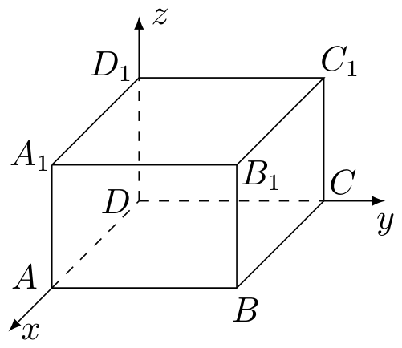
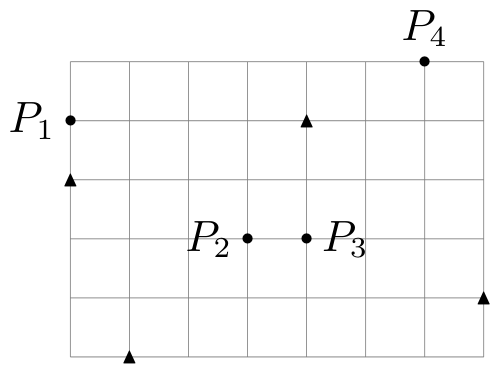
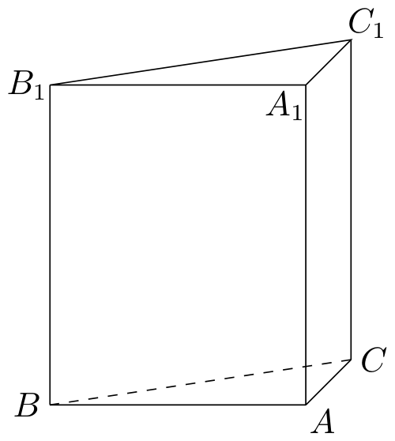

# 2017年上海卷（秋）

## 填空题

### 第 1 题

已知集合 $A=\{1,2,3,4\}$，集合 $B=\{3,4,5\}$，则 $A\cap B=\underline{\qquad\qquad}$.

#### 答案

$\{3,4\}$

#### 解析

交集由同时属于 $A$ 和 $B$ 的元素组成. 集合 $A$ 与 $B$ 的公共元素只有 $3$ 和 $4$，所以 $A\cap B=\{3,4\}$.

### 第 2 题

若排列数 $\mathrm A_6^m=6\times5\times4$，则 $m=\underline{\qquad\qquad}$.

#### 答案

$3$

#### 解析

排列数 $\mathrm A_6^m$ 是从 $6$ 个不同元素中取出 $m$ 个排列，等于 $6\times5\times\cdots$，共有 $m$ 个因数. 题中右侧 $6\times5\times4$ 恰有三个因数，因此 $m=3$.

### 第 3 题

不等式 $\dfrac{x-1}{x}>1$ 的解集为＿＿＿＿＿＿.

#### 答案

$(-\infty,0)$

#### 解析

题目要求 $x\ne0$. 移项得 $\dfrac{x-1}{x}-1=\dfrac{-1}{x}>0$. 因为分子 $-1<0$，所以分式为正当且仅当 $x<0$，故解集为 $(-\infty,0)$.

### 第 4 题

已知球的体积为 $36\pi$，则该球主视图的面积等于＿＿＿＿＿＿.

#### 答案

$9\pi$

#### 解析

设球的半径为 $R$. 由球的体积公式得 $\dfrac43\pi R^3=36\pi$，所以 $R^3=27$，从而 $R=3$. 球的主视图是半径为 $3$ 的圆，面积为 $\pi R^2=9\pi$.

### 第 5 题

已知复数 $z$ 满足 $z+\dfrac3z=0$，则 $\lvert z\rvert=\underline{\qquad\qquad}$.

#### 答案

$\sqrt3$

#### 解析

由于题目中出现 $\dfrac3z$，必有 $z\ne0$. 两边同乘 $z$，得 $z^2+3=0$，即 $z^2=-3$. 因而 $z=\pm\sqrt3\,\i$，所以 $\lvert z\rvert=\sqrt3$.

### 第 6 题

设双曲线 $\dfrac{x^2}{9}-\dfrac{y^2}{b^2}=1$（$b>0$）的焦点为 $F_1$，$F_2$，$P$ 为该双曲线上的一点，若 $\lvert PF_1\rvert=5$，则 $\lvert PF_2\rvert=\underline{\qquad\qquad}$.

#### 答案

$11$

#### 解析

双曲线的实半轴为 $a=3$，所以双曲线上任一点到两焦点距离之差的绝对值为 $2a=6$. 因此 $\bigl\lvert\lvert PF_2\rvert-\lvert PF_1\rvert\bigr\rvert=6$. 代入 $\lvert PF_1\rvert=5$，得 $\lvert PF_2\rvert=11$ 或 $-1$，距离不能为负数，故 $\lvert PF_2\rvert=11$.

### 第 7 题

如图，以长方体 $ABCD-A_1B_1C_1D_1$ 的顶点 $D$ 为坐标原点，过 $D$ 的三条棱所在的直线为坐标轴，建立空间直角坐标系. 若 $\overrightarrow{DB_1}$ 的坐标为 $(4,3,2)$，则 $\overrightarrow{AC_1}$ 的坐标是＿＿＿＿＿＿.

#### 答案

$(-4,3,2)$

#### 解析

由坐标轴分别沿着 $DA$，$DC$，$DD_1$ 可知 $\overrightarrow{DA}=(4,0,0)$，$\overrightarrow{DC}=(0,3,0)$，$\overrightarrow{DD_1}=(0,0,2)$. 因而 $A=(4,0,0)$，且 $C_1=C+D_1=(0,3,2)$. 所以 $\overrightarrow{AC_1}=C_1-A=(-4,3,2)$.

### 第 8 题

定义在 $(0,+\infty)$ 上的函数 $y=f(x)$ 的反函数为 $y=f^{-1}(x)$. 若

$$

g(x)=\begin{cases}
3^x-1,&x\le 0,\\
f(x),&x>0,
\end{cases}

$$

且 $g(x)$ 为奇函数，则 $f^{-1}(x)=2$ 的解为＿＿＿＿＿＿.

#### 答案

$\dfrac89$

#### 解析

对任意 $x>0$，由 $g$ 为奇函数有 $f(x)=g(x)=-g(-x)=-\bigl(3^{-x}-1\bigr)=1-3^{-x}$. 于是 $f(2)=1-3^{-2}=1-\dfrac19=\dfrac89$. 由反函数定义，$f^{-1}(x)=2$ 等价于 $x=f(2)$，所以解为 $x=\dfrac89$.

### 第 9 题

已知四个函数：

1.  $y=-x$；

2.  $y=-\dfrac1x$；

3.  $y=x^3$；

4.  $y=x^{\frac12}$.

从中任选 $2$ 个，则事件“所选 $2$ 个函数的图像有且仅有一个公共点”的概率为＿＿＿＿＿＿.

#### 答案

$\dfrac13$

#### 解析

从四个函数中任选两个共有 $\mathrm C_4^2=6$ 种等可能结果. 逐对求交点：$y=-x$ 与 $y=x^3$ 的交点满足 $x^3=-x$，得 $x=0$，恰有一个交点；$y=-x$ 与 $y=\sqrt{x}$ 的定义域要求 $x\ge0$，且左边不大于零、右边不小于零，只有 $x=0$，也恰有一个交点. $y=-x$ 与 $y=-1/x$ 有两个交点；$y=x^3$ 与 $y=\sqrt{x}$ 有 $x=0$，$1$ 两个交点；$y=-1/x$ 分别与 $y=x^3$、$y=\sqrt{x}$ 没有实交点. 因而符合条件的有 $2$ 种，所求概率为 $\dfrac{2}{6}=\dfrac13$.

### 第 10 题

已知数列 $\{a_n\}$ 和 $\{b_n\}$，其中 $a_n=n^2$，$n\in\mathbb{N}^*$，$\{b_n\}$ 的项是互不相等的正整数. 若对于任意 $n\in\mathbb{N}^*$，$\{b_n\}$ 的第 $a_n$ 项都等于 $\{a_n\}$ 的第 $b_n$ 项，则 $\dfrac{\lg(b_1b_4b_9b_{16})}{\lg(b_1b_2b_3b_4)}=\underline{\qquad\qquad}$.

#### 答案

$2$

#### 解析

条件等价于 $b_{n^2}=a_{b_n}=b_n^2$. 令 $n=1$，得 $b_1=b_1^2$. 因为 $b_1$ 是正整数，所以 $b_1=1$. 再分别取 $n=2$，$3$，$4$，得 $b_4=b_2^2$，$b_9=b_3^2$，$b_{16}=b_4^2=b_2^4$. 因此 $b_1b_4b_9b_{16}=b_2^6b_3^2=(b_2^3b_3)^2$，而 $b_1b_2b_3b_4=b_2^3b_3$. 由于 $b_2$，$b_3$ 都不同于正整数 $1$，分母对数非零，故比值为 $2$.

### 第 11 题

设 $\alpha_1$，$\alpha_2\in\mathbb{R}$，且 $\dfrac1{2+\sin\alpha_1}+\dfrac1{2+\sin(2\alpha_2)}=2$，则 $\lvert10\pi-\alpha_1-\alpha_2\rvert$ 的最小值等于＿＿＿＿＿＿.

#### 答案

$\dfrac\pi4$

#### 解析

因为 $-1\le\sin\alpha_1\le1$，所以 $2+\sin\alpha_1\ge1$，从而 $\dfrac1{2+\sin\alpha_1}\le1$，同理 $\dfrac1{2+\sin(2\alpha_2)}\le1$. 两项之和等于 $2$，故两项都必须等于 $1$. 因此 $\sin\alpha_1=-1$，$\sin(2\alpha_2)=-1$，即存在整数 $k$，$m$ 使得 $\alpha_1=\dfrac{3\pi}{2}+2k\pi$，$\alpha_2=\dfrac{3\pi}{4}+m\pi$. 于是 $\alpha_1+\alpha_2=\dfrac{9\pi}{4}+(2k+m)\pi$. 由于 $2k+m$ 可取任意整数，$\lvert10\pi-\alpha_1-\alpha_2\rvert=\left\lvert\dfrac{31}{4}-(2k+m)\right\rvert\pi$ 的最小值为 $\dfrac\pi4$.

### 第 12 题

如图，用 $35$ 个单位正方形拼成一个矩形，点 $P_1$，$P_2$，$P_3$，$P_4$ 以及四个标记为“▲”的点在正方形的顶点处，设集合 $\Omega=\{P_1,P_2,P_3,P_4\}$，点 $P\in\Omega$，过 $P$ 作直线 $l_P$，使得不在 $l_P$ 上的“▲”的点分布在 $l_P$ 的两侧. 用 $D_1(l_P)$ 和 $D_2(l_P)$ 分别表示 $l_P$ 一侧和另一侧的“▲”的点到 $l_P$ 的距离之和. 若过 $P$ 的直线 $l_P$ 中有且只有一条满足 $D_1(l_P)=D_2(l_P)$，则 $\Omega$ 中所有这样的 $P$ 为＿＿＿＿＿＿.

#### 答案

$P_1$，$P_3$，$P_4$

#### 解析

由图中网格坐标可取四个候选点为 $P_1(0,4)$，$P_2(3,2)$，$P_3(4,2)$，$P_4(6,5)$，四个标记点为 $A_1(1,0)$，$A_2(0,3)$，$A_3(4,4)$，$A_4(7,1)$. 设 $P=(m,n)$，过 $P$ 的直线写成 $a(x-m)+b(y-n)=0$，其中 $a$，$b$ 不同时为零. 点 $A_i=(x_i,y_i)$ 到此直线的有向距离为 $\dfrac{a(x_i-m)+b(y_i-n)}{\sqrt{a^2+b^2}}$. 由于两侧的有向距离符号相反，条件 $D_1(l_P)=D_2(l_P)$ 等价于四个有向距离之和为零，即 $a\left(\sum_{i=1}^4x_i-4m\right)+b\left(\sum_{i=1}^4y_i-4n\right)=0$. 代入四个标记点的坐标，得到 $a(12-4m)+b(8-4n)=0$.

当 $P=P_1$ 时，得 $12a-8b=0$，故直线的法向量方向唯一，直线为 $2x+3(y-4)=0$. 代入四个标记点，所得有向距离的分子符号为负、负、正、正，满足两侧分布，故 $P_1$ 符合. 当 $P=P_2$ 时，方程恒为 $0=0$，有多条直线满足等距和条件，例如 $x=3$ 与 $y=2$，不符合“有且只有一条”. 当 $P=P_3$ 时，得 $a=0$，唯一可能的直线为 $y-2=0$，四个标记点分居两侧，故 $P_3$ 符合. 当 $P=P_4$ 时，得 $a+b=0$，唯一可能的直线为 $(x-6)-(y-5)=0$，四个标记点中有一个在直线上，其余点分居两侧，符合题设. 所以所有这样的点为 $P_1$，$P_3$，$P_4$.

## 单选题

### 第 13 题

关于 $x$，$y$ 的二元一次方程组

$$

\begin{cases}
x+5y=0,\\
2x+3y=4
\end{cases}

$$

的系数行列式 $D$ 为（）

A.  
$\left|\begin{matrix}0&5\\ 4&3\end{matrix}\right|$

B.  
$\left|\begin{matrix}1&0\\ 2&4\end{matrix}\right|$

C.  
$\left|\begin{matrix}1&5\\ 2&3\end{matrix}\right|$

D.  
$\left|\begin{matrix}6&0\\ 5&4\end{matrix}\right|$

#### 答案

C

#### 解析

系数行列式只取方程组中未知数 $x$，$y$ 的系数，故 $D=\left|\begin{matrix}1&5\\2&3\end{matrix}\right|$. 这正是第三个选项，故选 C.

### 第 14 题

在数列 $\{a_n\}$ 中，$a_n=\left(-\dfrac12\right)^n$，$n\in\mathbb{N}^*$，则 $\displaystyle\lim_{n\to\infty}a_n$（）

A.  
$-\dfrac12$

B.  
$0$

C.  
$\dfrac12$

D.  

#### 答案

B

#### 解析

数列的绝对值为 $\lvert a_n\rvert=\left(\dfrac12\right)^n$. 由于公比的绝对值 $\dfrac12<1$，有 $\left(\dfrac12\right)^n\to0$，所以 $a_n\to0$. 故选 B.

### 第 15 题

已知 $a$，$b$，$c$ 为实常数，数列 $\{x_n\}$ 的通项 $x_n=an^2+bn+c$，$n\in\mathbb{N}^*$，则“存在 $k\in\mathbb{N}^*$，使得 $x_{100+k}$，$x_{200+k}$，$x_{300+k}$ 成等差数列”的一个必要条件是（）

A.  
$a\ge0$

B.  
$b\le0$

C.  
$c=0$

D.  
$a-2b+c=0$

#### 答案

A

#### 解析

令 $t=200+k$. 三项成等差数列的条件为 $x_{t-100}+x_{t+100}-2x_t=0$. 对二次通项直接展开，得 $x_{t-100}+x_{t+100}-2x_t=2a\cdot100^2=20000a$，所以必有 $a=0$. 因而必然有 $a\ge0$，而题目没有给出对 $b$ 或 $c$ 的相应限制. 故选 A.

### 第 16 题

在平面直角坐标系 $xOy$ 中，已知椭圆 $C_1:\dfrac{x^2}{36}+\dfrac{y^2}{4}=1$ 和 $C_2:x^2+\dfrac{y^2}{9}=1$. $P$ 为 $C_1$ 上的动点，$Q$ 为 $C_2$ 上的动点，$w$ 是 $\overrightarrow{OP}\cdot\overrightarrow{OQ}$ 的最大值. 记 $\Omega=\{(P,Q)\mid P\text{ 在 }C_1\text{ 上，}Q\text{ 在 }C_2\text{ 上，且}\overrightarrow{OP}\cdot\overrightarrow{OQ}=w\}$，则 $\Omega$ 中元素个数为（）

A.  
$2$个

B.  
$4$个

C.  
$8$个

D.  

#### 答案

D

#### 解析

分别用参数表示两椭圆上的点：$P=(6\cos\alpha,2\sin\alpha)$，$Q=(\cos\beta,3\sin\beta)$. 则 $\overrightarrow{OP}\cdot\overrightarrow{OQ}=6\cos\alpha\cos\beta+6\sin\alpha\sin\beta=6\cos(\alpha-\beta)$. 最大值为 $w=6$，且在 $\beta=\alpha+2k\pi$ 时取得. $\alpha$ 可任意取值，所以取得最大值的点对有无穷多个，故选 D.

## 解答题

### 第 17 题

如图，直三棱柱 $ABC-A_1B_1C_1$ 的底面为直角三角形，两直角边 $AB$ 和 $AC$ 的长分别为 $4$ 和 $2$，侧棱 $AA_1$ 的长为 $5$.

1.  求三棱柱 $ABC-A_1B_1C_1$ 的体积；

2.  设 $M$ 是 $BC$ 中点，求直线 $A_1M$ 与平面 $ABC$ 所成角的大小.

#### 解析

1.  底面 $ABC$ 是以 $AB$，$AC$ 为直角边的直角三角形，所以其面积为 $S_{ABC}=\dfrac12\times4\times2=4$. 直三棱柱的高为 $AA_1=5$，故体积为 $V=S_{ABC}\cdot AA_1=4\times5=20$.

2.  由勾股定理，$BC=\sqrt{AB^2+AC^2}=\sqrt{4^2+2^2}=2\sqrt5$. 因为 $M$ 是直角三角形斜边 $BC$ 的中点，所以 $AM=\dfrac12BC=\sqrt5$. 直线 $A_1M$ 在平面 $ABC$ 上的射影为 $AM$，设直线 $A_1M$ 与平面 $ABC$ 所成的角为 $\theta$，则在直角三角形 $AA_1M$ 中，$\tan\theta=\dfrac{AA_1}{AM}=\dfrac5{\sqrt5}=\sqrt5$. 因而 $\theta=\arctan\sqrt5$.

### 第 18 题

已知函数 $f(x)=\cos^2x-\sin^2x+\dfrac12$，$x\in(0,\pi)$.

1.  求 $f(x)$ 的单调递增区间；

2.  设 $\triangle ABC$ 为锐角三角形，角 $A$ 所对边 $a=\sqrt{19}$，角 $B$ 所对边 $b=5$. 若 $f(A)=0$，求 $\triangle ABC$ 的面积.

#### 解析

1.  由二倍角公式，$f(x)=\cos2x+\dfrac12$，所以 $f'(x)=-2\sin2x$. 当 $x\in(0,\pi)$ 时，$f'(x)>0$ 等价于 $\sin2x<0$，即 $2x\in(\pi,2\pi)$，所以单调递增区间为 $\left(\dfrac\pi2,\pi\right)$.

2.  由 $f(A)=0$ 得 $\cos2A=-\dfrac12$. 因为三角形为锐角三角形，$0<A<\dfrac\pi2$，故 $2A\in(0,\pi)$，从而 $2A=\dfrac{2\pi}{3}$，即 $A=\dfrac\pi3$. 由正弦定理，$\sin B=\dfrac{b\sin A}{a}=\dfrac{5\sqrt3}{2\sqrt{19}}$. 又因 $B$ 为锐角，$\cos B>0$，且 $\cos B=\sqrt{1-\sin^2B}=\dfrac1{2\sqrt{19}}$. 因此 $\sin(A+B)=\sin A\cos B+\cos A\sin B=\dfrac{3\sqrt3}{2\sqrt{19}}$. 于是 $C=\pi-A-B$，三角形面积为 $S_{ABC}=\dfrac12ab\sin C=\dfrac12\sqrt{19}\times5\times\sin(A+B)=\dfrac{15\sqrt3}{4}$.

### 第 19 题

根据预测，某地第 $n$（$n\in\mathbb{N}^*$）个月共享单车的投放量和损失量分别为 $a_n$ 和 $b_n$（单位：辆），其中

$$

a_n=\begin{cases}
5n^4+15,&1\le n\le 3,\\
-10n+470,&n\ge4,
\end{cases}\quad b_n=n+5

$$

，第 $n$ 个月底的共享单车的保有量是前 $n$ 个月的累计投放量与累计损失量的差.

1.  求该地区第 $4$ 个月底的共享单车的保有量；

2.  已知该地共享单车停放点第 $n$ 个月底的单车容纳量 $S_n=-4(n-46)^2+8800$（单位：辆）. 设在某月底，共享单车保有量达到最大，问该保有量是否超出了此时停放点的单车容纳量？

#### 解析

1.  设第 $n$ 个月底的保有量为 $B_n$. 前四个月的投放量之和为 $a_1+a_2+a_3+a_4=20+95+420+430=965$，损失量之和为 $b_1+b_2+b_3+b_4=6+7+8+9=30$. 因而 $B_4=965-30=935$（辆）.

2.  对 $n\ge4$，有 $B_n-B_{n-1}=a_n-b_n=(-10n+470)-(n+5)=465-11n$. 当 $n\le42$ 时该增量为正，当 $n\ge43$ 时该增量为负，所以保有量在第 $42$ 个月底达到最大. 由 $B_3=20+95+420-(6+7+8)=514$，得 $B_{42}=B_3+\sum_{n=4}^{42}(465-11n)=514+\dfrac{(42-3)(465\times2-11(4+42))}{2}=8782$. 此时停放点容纳量为 $S_{42}=-4(42-46)^2+8800=8736$. 因为 $8782>8736$，所以该最大保有量超出了此时的单车容纳量，答案为能.

### 第 20 题

在平面直角坐标系 $xOy$ 中，已知椭圆 $\Gamma:\dfrac{x^2}{4}+y^2=1$. $A$ 为 $\Gamma$ 的上顶点，$P$ 为 $\Gamma$ 上异于上，下顶点的动点，$M$ 为 $x$ 轴正半轴上的动点.

1.  若 $P$ 在第一象限，且 $\lvert OP\rvert=\sqrt2$，求 $P$ 的坐标；

2.  设 $P\left(\dfrac85,\dfrac35\right)$，若以 $A$，$P$，$M$ 为顶点的三角形是直角三角形，求 $M$ 的横坐标；

3.  若 $\lvert MA\rvert=\lvert MP\rvert$，直线 $AQ$ 与 $\Gamma$ 交于另一点 $C$，且 $\overrightarrow{AQ}=2\overrightarrow{AC}$，$\overrightarrow{PQ}=4\overrightarrow{PM}$，求直线 $AQ$ 的方程.

#### 解析

1.  设 $P=(x,y)$. 因为 $P$ 在第一象限，$x>0$，$y>0$，且 $\lvert OP\rvert=\sqrt2$，所以 $x^2+y^2=2$. 又因 $P$ 在椭圆上，$\dfrac{x^2}{4}+y^2=1$. 两式相减得 $\dfrac34x^2=1$，故 $x=\dfrac{2\sqrt3}{3}$，再由 $y>0$ 得 $y=\dfrac{\sqrt6}{3}$. 所以 $P\left(\dfrac{2\sqrt3}{3},\dfrac{\sqrt6}{3}\right)$.

2.  由椭圆方程知 $A=(0,1)$. 设 $M=(m,0)$，其中 $m>0$. 若直角在 $A$，则 $\overrightarrow{AP}\cdot\overrightarrow{AM}=0$，即 $\left(\dfrac85,-\dfrac25\right)\cdot(m,-1)=0$，得 $m=-\dfrac14$，不符合 $m>0$. 若直角在 $P$，则 $\overrightarrow{PA}\cdot\overrightarrow{PM}=0$，即 $\left(-\dfrac85,\dfrac25\right)\cdot\left(m-\dfrac85,-\dfrac35\right)=0$，解得 $m=\dfrac{29}{20}$. 若直角在 $M$，则 $\overrightarrow{MA}\cdot\overrightarrow{MP}=0$，即 $(-m,1)\cdot\left(\dfrac85-m,\dfrac35\right)=0$，化为 $5m^2-8m+3=0$，解得 $m=\dfrac35$ 或 $m=1$. 所以 $M$ 的横坐标为 $\dfrac{29}{20}$，$\dfrac35$，$1$.

3.  设 $P=(x_0,y_0)$，则 $x_0\ne0$，且 $\dfrac{x_0^2}{4}+y_0^2=1$. 设 $M=(m,0)$，由 $\lvert MA\rvert=\lvert MP\rvert$ 得 $m^2+1=(m-x_0)^2+y_0^2$. 利用椭圆方程化简为 $2mx_0=\dfrac34x_0^2$，故 $m=\dfrac38x_0$. 因为 $m>0$，所以 $x_0>0$. 由 $\overrightarrow{PQ}=4\overrightarrow{PM}$，有 $Q=P+4(M-P)$，从而 $Q=\left(-\dfrac32x_0,-3y_0\right)$. 又由 $\overrightarrow{AQ}=2\overrightarrow{AC}$，点 $C$ 是线段 $AQ$ 的中点，故 $C=\left(-\dfrac34x_0,\dfrac{1-3y_0}{2}\right)$. 将 $C$ 代入椭圆方程，并利用 $x_0^2=4(1-y_0^2)$，得 $9y_0^2-8y_0-1=0$，所以 $y_0=1$ 或 $y_0=-\dfrac19$. $y_0=1$ 对应椭圆上顶点，违反 $P$ 异于上、下顶点，故 $y_0=-\dfrac19$. 再由椭圆方程和 $x_0>0$，得 $x_0=\dfrac{8\sqrt5}{9}$，于是 $Q=\left(-\dfrac{4\sqrt5}{3},\dfrac13\right)$. 直线 $AQ$ 过 $A=(0,1)$，斜率为 $\dfrac{1/3-1}{-4\sqrt5/3}=\dfrac{\sqrt5}{10}$，所以其方程为 $y=\dfrac{\sqrt5}{10}x+1$.

### 第 21 题

设定义在 $\mathbb{R}$ 上的函数 $f(x)$ 满足：对于任意的 $x_1$，$x_2\in\mathbb{R}$，当 $x_1<x_2$ 时，都有 $f(x_1)\le f(x_2)$.

1.  若 $f(x)=ax^3+1$，求 $a$ 的取值范围；

2.  若 $f(x)$ 为周期函数，证明：$f(x)$ 是常值函数；

3.  设 $f(x)$ 恒大于零，$g(x)$ 是定义在 $\mathbb{R}$ 上，恒大于零的周期函数，$M$ 是 $g(x)$ 的最大值. 函数 $h(x)=f(x)g(x)$. 证明：“$h(x)$ 是周期函数”的充要条件是“$f(x)$ 是常值函数”.

#### 解析

1.  因为 $x^3$ 在 $\mathbb{R}$ 上严格递增，当 $a>0$ 时 $ax^3+1$ 递增，当 $a=0$ 时为常值函数，二者都满足题设. 当 $a<0$ 时，若 $x_1<x_2$，则 $x_1^3<x_2^3$，从而 $ax_1^3>ax_2^3$，函数反而递减，不满足题设. 所以 $a\ge0$.

2.  设 $T>0$ 是 $f$ 的一个周期. 任取 $x<y$，取正整数 $N$ 使 $x+NT>y$. 由单调性有 $f(x)\le f(y)\le f(x+NT)$，而周期性给出 $f(x+NT)=f(x)$. 因此 $f(x)=f(y)$. 任意两个实数之间都可这样比较，所以 $f$ 为常值函数.

3.  若 $f$ 为常值函数，设 $f(x)=c>0$，则 $h(x)=cg(x)$，因此 $h$ 与 $g$ 具有同一个周期，故 $h$ 是周期函数.

    反之，设 $h$ 是周期函数，取其一个正周期 $T$，再取 $g$ 的一个正周期 $S$. 对任意满足 $g(z)=M$ 的点 $z$，任取 $y\in\mathbb{R}$，选取非负整数 $N$ 使 $y-NT\le z$. 由 $h$ 的周期性、$f$ 的单调性及 $g\le M$，并注意 $f$，$g$ 都为正数，得 $h(y)=h(y-NT)=f(y-NT)g(y-NT)\le f(z)M$. 因此对该最大值点 $z$，全体 $y$ 都满足 $h(y)\le f(z)M$.

    固定一个最大值点 $z_0$，则 $z_0+kS$ 对任意整数 $k$ 也都是最大值点. 对 $k\ge0$，用 $z=z_0$ 的上界估计并取 $y=z_0+kS$，得到 $f(z_0+kS)M=h(z_0+kS)\le f(z_0)M$. 又因 $f$ 单调不减且 $z_0+kS\ge z_0$，所以 $f(z_0+kS)\ge f(z_0)$，从而 $f(z_0+kS)=f(z_0)$. 对 $k<0$，用最大值点 $z=z_0+kS$ 的上界估计并取 $y=z_0$，得到 $f(z_0)M=h(z_0)\le f(z_0+kS)M$. 此时 $z_0+kS<z_0$，单调性又给出 $f(z_0+kS)\le f(z_0)$，故仍有 $f(z_0+kS)=f(z_0)$. 所以所有 $z_0+kS$ 处的函数值都相等.

    任取 $x\in\mathbb{R}$，取足够大的正整数 $k$，使 $z_0-kS\le x\le z_0+kS$. 单调性给出 $f(z_0-kS)\le f(x)\le f(z_0+kS)$，而两端均等于 $f(z_0)$，故 $f(x)=f(z_0)$. 因而 $f$ 是常值函数.
