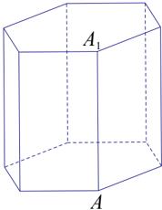
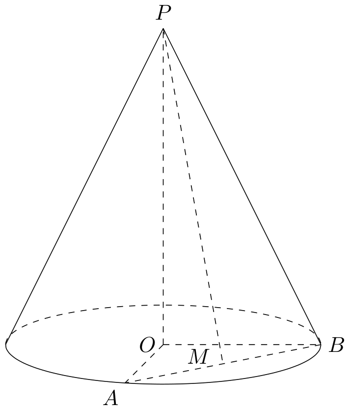

# 2018年上海卷（秋）

## 填空题

### 第 1 题

行列式 $\begin{vmatrix}4 & 1\\2 & 5\end{vmatrix}$ 的值为＿＿＿＿＿＿.

#### 答案

18

#### 解析

二阶行列式的值为主对角线元素乘积减去副对角线元素乘积，因此 $\begin{vmatrix}4 & 1\\2 & 5\end{vmatrix}=4\times5-1\times2=18$. 所以填 $18$.

### 第 2 题

双曲线 $\frac{x^2}{4}-y^2=1$ 的渐近线方程为＿＿＿＿＿＿.

#### 答案

$y=\pm\frac{x}{2}$

#### 解析

双曲线的标准方程为 $\frac{x^2}{a^2}-\frac{y^2}{b^2}=1$，其渐近线为 $y=\pm\frac{b}{a}x$. 题中 $a=2$，$b=1$，所以渐近线方程为 $y=\pm\frac{x}{2}$.

### 第 3 题

在 $(1+x)^7$ 的二项展开式中，$x^2$ 项的系数为＿＿＿＿＿＿. （结果用数值表示）

#### 答案

21

#### 解析

由二项式定理，$(1+x)^7=\sum_{k=0}^{7}\mathrm C_7^k x^k$. 取 $k=2$ 时得到 $x^2$ 项，其系数为 $\mathrm C_7^2=\frac{7\times6}{2\times1}=21$.

### 第 4 题

设常数 $a\in\mathbb{R}$，函数 $f(x)=\log_2(x+a)$. 若 $f(x)$ 的反函数的图像经过点 $(3,1)$，则 $a=$＿＿＿＿＿＿.

#### 答案

7

#### 解析

反函数的图像与原函数图像关于直线 $y=x$ 对称，所以反函数图像经过 $(3,1)$ 等价于原函数图像经过 $(1,3)$. 因而 $\log_2(1+a)=3$，得 $1+a=2^3=8$，所以 $a=7$.

### 第 5 题

已知复数 $z$ 满足 $(1+\i)z=1-7\i$（$\i$ 是虚数单位），则 $\lvert z\rvert=$＿＿＿＿＿＿.

#### 答案

5

#### 解析

由复数模的乘法性质，$\lvert1+\i\rvert\lvert z\rvert=\lvert1-7\i\rvert$. 因此 $\lvert z\rvert=\frac{\sqrt{1^2+7^2}}{\sqrt{1^2+1^2}}=\frac{\sqrt{50}}{\sqrt2}=5$.

### 第 6 题

记等差数列 $\{a_n\}$ 的前 $n$ 项和为 $S_n$，若 $a_3=0$，$a_6+a_7=14$，则 $S_7=$＿＿＿＿＿＿.

#### 答案

14

#### 解析

设等差数列的公差为 $d$. 由 $a_3=0$，有 $a_1=-2d$，从而 $a_6=3d$，$a_7=4d$. 由 $a_6+a_7=14$ 得 $7d=14$，所以 $d=2$. 因此 $a_1=-4$，$a_7=8$，$S_7=\frac{7(a_1+a_7)}2=\frac{7(-4+8)}2=14$.

### 第 7 题

已知 $\alpha\in\{-2,-1,-\frac12,\frac12,1,2,3\}$. 若幂函数 $f(x)=x^\alpha$ 为奇函数，且在 $(0,+\infty)$ 上递减，则 $\alpha=$＿＿＿＿＿＿.

#### 答案

$-1$

#### 解析

在给出的候选值中，$\alpha=-2$ 和 $\alpha=2$ 对应偶函数，$\alpha=-\frac12$ 与 $\alpha=\frac12$ 不能在整个实数范围上构成奇函数；$\alpha=1$ 与 $\alpha=3$ 虽为奇函数，但在正半轴上递增. 只有 $\alpha=-1$ 既使 $f(x)=x^{-1}$ 为奇函数，又满足在 $(0,+\infty)$ 上 $f'(x)=-x^{-2}<0$. 所以 $\alpha=-1$.

### 第 8 题

在平面直角坐标系中，已知点 $A(-1,0)$，$B(2,0)$，$E$，$F$ 是 $y$ 轴上的两个动点，且 $\lvert\overrightarrow{EF}\rvert=2$，则 $\overrightarrow{AE}\cdot\overrightarrow{BF}$ 的最小值为＿＿＿＿＿＿.

#### 答案

$-3$

#### 解析

设 $E=(0,u)$，$F=(0,v)$. 则 $\lvert u-v\rvert=2$，且 $\overrightarrow{AE}=(1,u)$，$\overrightarrow{BF}=(-2,v)$. 因此 $\overrightarrow{AE}\cdot\overrightarrow{BF}=-2+uv$. 由 $u=v\pm2$，有 $uv=v(v\pm2)=(v\pm1)^2-1\ge-1$，故 $\overrightarrow{AE}\cdot\overrightarrow{BF}\ge-3$. 当 $(u,v)=(-1,1)$ 或 $(1,-1)$ 时等号成立，所以最小值为 $-3$.

### 第 9 题

有编号互不相同的五个砝码，其中 $5$ 克，$3$ 克，$1$ 克砝码各一个，$2$ 克砝码两个. 从中随机选取三个，则这三个砝码的总质量为 $9$ 克的概率是＿＿＿＿＿＿. （结果用最简分数表示）

#### 答案

$\frac15$

#### 解析

五个砝码编号互不相同，所以随机选取三个共有 $\mathrm C_5^3=10$ 种等可能结果. 总质量为 $9$ 克的情况有两种：选取 $5$，$3$，$1$ 克砝码，或选取 $5$ 克砝码和编号不同的两个 $2$ 克砝码. 因此有 $2$ 种有利结果，所求概率为 $\frac{2}{10}=\frac15$.

### 第 10 题

设等比数列 $\{a_n\}$ 的通项公式为 $a_n=q^{n-1}$（$n\in\mathbb{N}^*$），前 $n$ 项和为 $S_n$. 若 $\displaystyle\lim_{n\to\infty}\frac{S_n}{a_{n+1}}=\frac12$，则 $q=$＿＿＿＿＿＿.

#### 答案

3

#### 解析

若 $\lvert q\rvert>1$，则 $q\ne1$，且 $\frac{S_n}{a_{n+1}}=\frac{1+q+\cdots+q^{n-1}}{q^n}=\frac{1-q^{-n}}{q-1}\to\frac1{q-1}$. 题设极限为 $\frac12$，所以 $\frac1{q-1}=\frac12$，得 $q=3$. 另一方面，$q=1$ 时该比值为 $n$，$0<\lvert q\rvert<1$ 时分子趋于非零常数而分母趋于零，$q=-1$ 时比值也无此极限，均不符合题设. 因此 $q=3$.

### 第 11 题

已知常数 $a>0$，函数 $f(x)=\frac{2^x}{2^x+ax}$ 的图像经过点 $P\left(p,\frac65\right)$，$Q\left(q,-\frac15\right)$. 若 $2^{p+q}=36pq$，则 $a=$＿＿＿＿＿＿.

#### 答案

6

#### 解析

由 $f(p)=\frac65$ 得 $\frac{2^p+ap}{2^p}=\frac56$，所以 $\frac{ap}{2^p}=-\frac16$，即 $2^p=-6ap$. 由 $f(q)=-\frac15$ 得 $\frac{2^q+aq}{2^q}=-5$，所以 $\frac{aq}{2^q}=-6$，即 $2^q=-\frac{aq}{6}$. 于是 $p<0$，$q<0$，从而 $pq\ne0$，并且 $2^{p+q}=2^p2^q=(-6ap)\left(-\frac{aq}{6}\right)=a^2pq$. 结合题设 $2^{p+q}=36pq$，得 $a^2=36$. 因为 $a>0$，所以 $a=6$.

### 第 12 题

已知实数 $x_1$，$x_2$，$y_1$，$y_2$ 满足：$x_1^2+y_1^2=1$，$x_2^2+y_2^2=1$，$x_1x_2+y_1y_2=\frac12$，则 $\frac{\lvert x_1+y_1-1\rvert}{\sqrt2}+\frac{\lvert x_2+y_2-1\rvert}{\sqrt2}$ 的最大值为＿＿＿＿＿＿.

#### 答案

$\sqrt2+\sqrt3$

#### 解析

记 $\bs u_i=(x_i,y_i)$，$\bs e=\frac{(1,1)}{\sqrt2}$，并令 $t_i=\bs u_i\cdot\bs e=\frac{x_i+y_i}{\sqrt2}$，$c=\frac1{\sqrt2}$. 题设说明 $\lvert\bs u_1\rvert=\lvert\bs u_2\rvert=1$，$\bs u_1\cdot\bs u_2=\frac12$，所以 $\lvert\bs u_1+\bs u_2\rvert=\sqrt3$，$\lvert\bs u_1-\bs u_2\rvert=1$. 令 $A=\frac{t_1+t_2}{2}$，$B=\frac{t_1-t_2}{2}$，则由恒等式 $\lvert U+V\rvert+\lvert U-V\rvert=2\max\{\lvert U\rvert,\lvert V\rvert\}$ 得 $\lvert t_1-c\rvert+\lvert t_2-c\rvert=2\max\{\lvert A-c\rvert,\lvert B\rvert\}$.

又由柯西不等式，$\lvert A\rvert\le\frac{\sqrt3}{2}$，$\lvert B\rvert\le\frac12$，故 $\lvert A-c\rvert\le\frac{\sqrt3}{2}+\frac1{\sqrt2}$，且 $\lvert B\rvert\le\frac12<\frac{\sqrt3}{2}+\frac1{\sqrt2}$. 因此原式不超过 $2\left(\frac{\sqrt3}{2}+\frac1{\sqrt2}\right)=\sqrt3+\sqrt2$.

取 $\bs m=\frac{(-1,1)}{\sqrt2}$，$\bs u_1=-\frac{\sqrt3}{2}\bs e+\frac12\bs m$，$\bs u_2=-\frac{\sqrt3}{2}\bs e-\frac12\bs m$，则两向量的模均为 $1$，点积为 $\frac12$，并且 $t_1=t_2=-\frac{\sqrt3}{2}$，原式取得 $\sqrt3+\sqrt2$. 所以最大值为 $\sqrt2+\sqrt3$.

## 单选题

### 第 13 题

设 $P$ 是椭圆 $\frac{x^2}{5}+\frac{y^2}{3}=1$ 上的动点，则 $P$ 到该椭圆的两个焦点的距离之和为（）

A.  
$2\sqrt2$

B.  
$2\sqrt3$

C.  
$2\sqrt5$

D.  
$4\sqrt2$

#### 答案

C

#### 解析

椭圆的标准方程中 $a^2=5$，故长半轴长为 $a=\sqrt5$. 根据椭圆定义，椭圆上任一点到两个焦点的距离之和恒为 $2a=2\sqrt5$. 所以选 C.

### 第 14 题

已知 $a\in\mathbb{R}$，则“$a>1$”是“$\frac1a<1$”的（）

A.  
充分非必要条件

B.  
必要非充分条件

C.  
充要条件

D.  
既非充分又非必要条件

#### 答案

A

#### 解析

若 $a>1$，则 $a>0$，取倒数时不等号反向，得到 $\frac1a<1$，所以“$a>1$”是“$\frac1a<1$”的充分条件. 但取 $a=-1$ 时 $\frac1a=-1<1$，而 $a>1$ 不成立，故它不是必要条件. 所以选 A.

### 第 15 题

《九章算术》中，称底面为矩形而有一侧棱垂直于底面的四棱锥为阳马. 设 $AA_1$ 是正六棱柱的一条侧棱，如图，若阳马以该正六棱柱的顶点为顶点，以 $AA_1$ 为底面矩形的一边，则这样的阳马的个数是（）

A.  
$4$

B.  
$8$

C.  
$12$

D.  
$16$

#### 答案

D

#### 解析

设底面矩形的另一条侧棱为 $CC_1$，其中 $C\ne A$. 把底面正六边形的顶点记为 $V_k=(\cos\frac{k\pi}{3},\sin\frac{k\pi}{3})$，取 $A=V_0$，并令 $C=V_j$. 若棱柱顶点 $V_k$（或其上方对应顶点）作为阳马顶点，则它到矩形底面某个顶点 $V_i$（$i=0$ 或 $i=j$）的连线必须垂直于底面矩形；在水平面内这等价于 $(V_k-V_i)\cdot(V_j-V_0)=0$. 直接代入六个顶点可得：$j=1$，$2$，$4$，$5$ 时各有 $2$ 个满足条件的水平顶点，$j=3$ 时没有满足条件的水平顶点. 因而可作为第二条侧棱的有 $4$ 种选择，每种有 $2$ 个水平顶点.

对每一个这样的水平投影，棱柱有上、下两个对应顶点可选，且从该顶点连向底面相应顶点的侧棱垂直于底面矩形. 因而每个 $CC_1$ 有 $2\times2=4$ 个阳马，阳马总数为 $4\times4=16$. 所以选 D.

### 第 16 题

设 $D$ 是含数 $1$ 的有限实数集，$f(x)$ 是定义在 $D$ 上的函数. 若 $f(x)$ 的图像绕原点逆时针旋转 $\frac\pi6$ 后与原图像重合，则在以下各项中，$f(1)$ 的可能取值只能是（）

A.  
$\sqrt3$

B.  
$\frac{\sqrt3}{2}$

C.  
$\frac{\sqrt3}{3}$

D.  
$0$

#### 答案

B

#### 解析

记旋转 $\frac\pi6$ 为 $R$. 因为图像有限且绕原点旋转后与自身重合，所以图像中任一点的 $R$ 的全部迭代像也都在图像中. 若点 $(1,f(1))$ 的极角是 $\frac{k\pi}{12}$ 的整数倍，则这组旋转像中会出现关于 $x$ 轴对称的两个不同点，它们的横坐标相同而纵坐标不同，这与图像是函数相矛盾.

对选项 A，点 $(1,\sqrt3)$ 的极角为 $\frac\pi3$，旋转 $8$ 次后得到同横坐标的点 $(1,-\sqrt3)$，不可能. 对选项 C，点 $(1,\frac{\sqrt3}{3})$ 的极角为 $\frac\pi6$，旋转 $10$ 次后得到同横坐标的点 $(1,-\frac{\sqrt3}{3})$，也不可能. 对选项 D，虽然初始点在 $x$ 轴上，但其旋转像中角度 $\frac\pi6$ 与 $-\frac\pi6$ 的两个点横坐标相同而纵坐标相反，同样不可能.

对于选项 B，令 $G=\{R^k(1,\frac{\sqrt3}{2})\mid k=0,1,\ldots,11\}$. 点 $(1,\frac{\sqrt3}{2})$ 的极角不是 $\frac{k\pi}{12}$，所以这 $12$ 个点的横坐标互不相同，因而它们构成某个有限定义域上的函数图像，并且旋转 $\frac\pi6$ 后仍为 $G$. 所以只有 B 可能.

## 解答题

### 第 17 题

已知圆锥的顶点为 $P$，底面圆心为 $O$，半径为 $2$.

1.  设圆锥的母线长为 $4$，求圆锥的体积；

2.  设 $PO=4$，$OA$，$OB$ 是底面半径，且 $\angle AOB=90^\circ$，$M$ 为线段 $AB$ 的中点，如图，求异面直线 $PM$ 与 $OB$ 所成的角的大小.

#### 解析

1.  圆锥的高为 $PO=\sqrt{4^2-2^2}=2\sqrt3$. 因此体积为 $V=\frac13\pi\cdot2^2\cdot2\sqrt3=\frac{8\sqrt3}{3}\pi$.

2.  建立直角坐标系，令 $O=(0,0,0)$，$P=(0,0,4)$，$A=(2,0,0)$，$B=(0,2,0)$. 则 $M=(1,1,0)$，可取直线 $PM$ 的方向向量为 $\overrightarrow{PM}=(1,1,-4)$，直线 $OB$ 的方向向量为 $(0,1,0)$. 设两直线所成的锐角为 $\theta$. 沿 $OB$ 方向的分量长度为 $1$，而 $\lvert\overrightarrow{PM}\rvert=\sqrt{1^2+1^2+(-4)^2}=3\sqrt2$，故垂直于 $OB$ 的分量长度为 $\sqrt{(3\sqrt2)^2-1^2}=\sqrt{17}$. 所以 $\tan\theta=\sqrt{17}$，从而 $\theta=\arctan\sqrt{17}$.

### 第 18 题

设常数 $a\in\mathbb{R}$，函数 $f(x)=a\sin2x+2\cos^2x$.

1.  若 $f(x)$ 为偶函数，求 $a$ 的值；

2.  若 $f\left(\frac\pi4\right)=\sqrt3+1$，求方程 $f(x)=1-\sqrt2$ 在区间 $[-\pi,\pi]$ 上的解.

#### 解析

1.  由 $f(-x)=-a\sin2x+2\cos^2x$，而偶函数满足 $f(-x)=f(x)$，所以 $-a\sin2x=a\sin2x$ 对任意 $x$ 成立. 取 $x=\frac\pi4$，得 $a=0$.

2.  由 $f\left(\frac\pi4\right)=a+1=\sqrt3+1$，得 $a=\sqrt3$. 于是原方程等价于 $\sqrt3\sin2x+1+\cos2x=1-\sqrt2$，即 $\sqrt3\sin2x+\cos2x=-\sqrt2$. 利用辅助角公式，$\sqrt3\sin2x+\cos2x=2\sin\left(2x+\frac\pi6\right)$，所以 $\sin\left(2x+\frac\pi6\right)=-\frac{\sqrt2}{2}$.

    因此 $2x+\frac\pi6=-\frac\pi4+2k\pi$ 或 $2x+\frac\pi6=\frac{5\pi}{4}+2k\pi$，即 $x=-\frac{5\pi}{24}+k\pi$ 或 $x=\frac{13\pi}{24}+k\pi$. 在 $[-\pi,\pi]$ 内取值，得到 $x=-\frac{11\pi}{24}$，$-\frac{5\pi}{24}$，$\frac{13\pi}{24}$，$\frac{19\pi}{24}$.

### 第 19 题

某群体的人均通勤时间，是指单日内该群体中成员从居住地到工作地的平均用时. 某地上班族 $S$ 中的成员仅以自驾或公交方式通勤. 分析显示：当 $S$ 中 $x\%$（$0<x<100$）的成员自驾时，自驾群体的人均通勤时间 $f(x)$（单位：分钟）为

$$

f(x)=\begin{cases}

30, & 0<x\le30,\\
2x+\frac{1800}{x}-90, & 30<x<100

\end{cases}

$$

而公交群体的人均通勤时间不受 $x$ 影响，恒为 $40$ 分钟. 试根据上述分析结果回答下列问题：

1.  当 $x$ 在什么范围内时，公交群体的人均通勤时间少于自驾群体的人均通勤时间？

2.  求该地上班族 $S$ 的人均通勤时间 $g(x)$ 的表达式；讨论 $g(x)$ 的单调性，并说明其实际意义.

#### 解析

1.  当 $0<x\le30$ 时，$f(x)=30<40$，不满足公交时间少于自驾时间. 当 $30<x<100$ 时，需有 $2x+\frac{1800}{x}-90>40$. 由于 $x>0$，不等式等价于 $2x^2-130x+1800>0$，即 $2(x-20)(x-45)>0$. 结合 $30<x<100$，得到 $45<x<100$.

2.  自驾成员占总人数的 $\frac{x}{100}$，公交成员占 $1-\frac{x}{100}$，所以

$$

g(x)=
    \begin{cases}
    \dfrac{x}{100}\cdot30+\left(1-\dfrac{x}{100}\right)\cdot40=40-\dfrac{x}{10}, & 0<x\le30,\\
    \dfrac{x}{100}\left(2x+\dfrac{1800}{x}-90\right)+\left(1-\dfrac{x}{100}\right)\cdot40=\dfrac{x^2}{50}-\dfrac{13x}{10}+58, & 30<x<100.
    \end{cases}

$$

    在 $(0,30)$ 上，$g'(x)=-\frac1{10}<0$. 在 $(30,100)$ 上，$g'(x)=\frac{x}{25}-\frac{13}{10}$，所以当 $30<x<\frac{65}{2}$ 时 $g'(x)<0$，当 $\frac{65}{2}<x<100$ 时 $g'(x)>0$. 且两段在 $x=30$ 处的函数值均为 $37$，故 $g(x)$ 在 $(0,32.5)$ 上单调递减，在 $(32.5,100)$ 上单调递增，并在 $x=32.5$ 时取得最小值. 实际意义是：自驾人数比例低于 $32.5\%$ 时，提高自驾比例会降低全体上班族的人均通勤时间；超过 $32.5\%$ 后继续提高自驾比例，反而会使人均通勤时间增加.

### 第 20 题

设常数 $t>2$. 在平面直角坐标系 $xOy$ 中，已知点 $F(2,0)$，直线 $l:x=t$，曲线 $\Gamma:y^2=8x$（$0\le x\le t$，$y\ge0$），$l$ 与 $x$ 轴交于点 $A$，与 $\Gamma$ 交于点 $B$. $P$，$Q$ 分别是曲线 $\Gamma$ 与线段 $AB$ 上的动点.

1.  用 $t$ 表示点 $B$ 到点 $F$ 的距离；

2.  设 $t=3$，$\lvert FQ\rvert=2$，线段 $OQ$ 的中点在直线 $FP$ 上，求 $\triangle AQP$ 的面积；

3.  设 $t=8$，是否存在以 $FP$，$FQ$ 为邻边的矩形 $FPEQ$，使得点 $E$ 在 $\Gamma$ 上？若存在，求点 $P$ 的坐标；若不存在，说明理由.

#### 解析

1.  由 $B=(t,\sqrt{8t})$，有 $BF=\sqrt{(t-2)^2+8t}=\sqrt{(t+2)^2}=t+2$，其中使用了 $t>2$.

2.  当 $t=3$ 时，$A=(3,0)$，设 $Q=(3,q)$，因为 $Q$ 在上半轴线段 $AB$ 上，所以 $q\ge0$. 由 $\lvert FQ\rvert=2$，得 $1+q^2=4$，故 $Q=(3,\sqrt3)$. 线段 $OQ$ 的中点为 $N=\left(\frac32,\frac{\sqrt3}{2}\right)$，所以直线 $FN$ 的斜率为 $\frac{\sqrt3/2}{3/2-2}=-\sqrt3$，直线 $FP$ 的方程为 $y=-\sqrt3(x-2)$.

    设 $P=(x,y)$. 联立 $y^2=8x$ 与 $y=-\sqrt3(x-2)$，得 $3(x-2)^2=8x$，即 $3x^2-20x+12=0$，所以 $x=\frac23$ 或 $x=6$. 由于 $P$ 在 $0\le x\le3$ 的曲线段上，取 $x=\frac23$，再由直线方程得 $P=\left(\frac23,\frac{4\sqrt3}{3}\right)$. 于是 $AQ=\sqrt3$，点 $P$ 到直线 $AQ$ 的距离为 $3-\frac23=\frac73$，从而 $\triangle AQP$ 的面积为 $\frac12\cdot\sqrt3\cdot\frac73=\frac{7\sqrt3}{6}$.

3.  当 $t=8$ 时，$A=(8,0)$. 设 $P=(2u^2,4u)$，其中 $u\ge0$，这是曲线 $\Gamma$ 的参数表示；设 $Q=(8,q)$，其中 $0\le q\le8$. 矩形的两条邻边垂直，所以 $\overrightarrow{FP}\cdot\overrightarrow{FQ}=(2u^2-2,4u)\cdot(6,q)=0$，即 $uq=3(1-u^2)$. 若 $u=0$，此式不成立，故 $u>0$. 又矩形的第四个顶点为 $E=P+Q-F=(2u^2+6,4u+q)$. 由 $E\in\Gamma$，有 $(4u+q)^2=8(2u^2+6)$，化简为 $q^2+8uq=48$. 代入 $q=\frac{3(1-u^2)}{u}$，并令 $w=u^2$，得 $5w^2+14w-3=0$，所以 $w=\frac15$ 或 $w=-3$. 因 $w\ge0$，得 $u=\frac1{\sqrt5}$，进而 $P=\left(\frac25,\frac{4\sqrt5}{5}\right)$，且 $q=\frac{12\sqrt5}{5}\in[0,8]$. 因而满足条件的矩形存在，点 $P$ 的坐标为 $\left(\frac25,\frac{4\sqrt5}{5}\right)$.

### 第 21 题

给定无穷数列 $\{a_n\}$，若无穷数列 $\{b_n\}$ 满足：对任意 $n\in\mathbb{N}^*$，都有 $\lvert b_n-a_n\rvert\le1$，则称 $\{b_n\}$ 与 $\{a_n\}$“接近”.

1.  设 $\{a_n\}$ 是首项为 $1$，公比为 $\frac12$ 的等比数列，$b_n=a_{n+1}+1$，$n\in\mathbb{N}^*$. 判断数列 $\{b_n\}$ 是否与 $\{a_n\}$ 接近，并说明理由；

2.  设数列 $\{a_n\}$ 的前四项为：$a_1=1$，$a_2=2$，$a_3=4$，$a_4=8$，$\{b_n\}$ 是一个与 $\{a_n\}$ 接近的数列，记集合 $M=\{x\mid x=b_i,\ i=1,2,3,4\}$，求 $M$ 中元素的个数 $m$；

3.  已知 $\{a_n\}$ 是公差为 $d$ 的等差数列. 若存在数列 $\{b_n\}$ 满足：$\{b_n\}$ 与 $\{a_n\}$ 接近，且在 $b_2-b_1$，$b_3-b_2$，…，$b_{201}-b_{200}$ 中至少有 $100$ 个为正数，求 $d$ 的取值范围.

#### 解析

1.  因为 $a_n=\left(\frac12\right)^{n-1}$，所以 $b_n=a_{n+1}+1=\left(\frac12\right)^n+1$. 从而 $b_n-a_n=1-\left(\frac12\right)^n$，且对任意 $n\in\mathbb{N}^*$ 都有 $0<1-\left(\frac12\right)^n<1$. 因此 $\lvert b_n-a_n\rvert\le1$，数列 $\{b_n\}$ 与 $\{a_n\}$ 接近.

2.  由接近的定义，$b_1\in[0,2]$，$b_2\in[1,3]$，$b_3\in[3,5]$，$b_4\in[7,9]$. 前三个区间中，$[0,2]$ 与 $[3,5]$ 不相交，所以 $b_1\ne b_3$；而 $[7,9]$ 与前三个区间均不相交，所以 $b_4$ 与 $b_1$，$b_2$，$b_3$ 都不同. 因而 $M$ 至少有 $3$ 个元素，至多有 $4$ 个元素. 取例如 $b_1=b_2=1$，$b_3=3$，$b_4=7$，可得 $m=3$；取四个区间中彼此不同的数，又可得 $m=4$. 所以 $m=3$ 或 $m=4$.

3.  设 $b_n=a_n+e_n$，其中 $\lvert e_n\rvert\le1$. 则 $b_{n+1}-b_n=d+e_{n+1}-e_n$. 若 $d\le-2$，由于 $e_{n+1}-e_n\le2$，有 $b_{n+1}-b_n\le d+2\le0$，不可能出现正数，更不可能至少有 $100$ 个正数. 所以必须有 $d>-2$.

    反之，若 $d>-2$，取 $e_n=(-1)^n$，即令 $b_n=a_n+(-1)^n$. 此时 $\lvert b_n-a_n\rvert=1$，所以 $\{b_n\}$ 与 $\{a_n\}$ 接近；当 $n$ 为奇数时，$b_{n+1}-b_n=d+2>0$. 在 $n=1$，$2$，$\ldots$，$200$ 中有恰好 $100$ 个奇数，因此至少有 $100$ 个相邻差为正数. 故 $d>-2$ 也充分，取值范围为 $(-2,+\infty)$.
