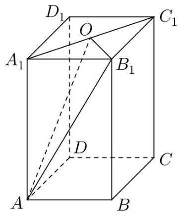
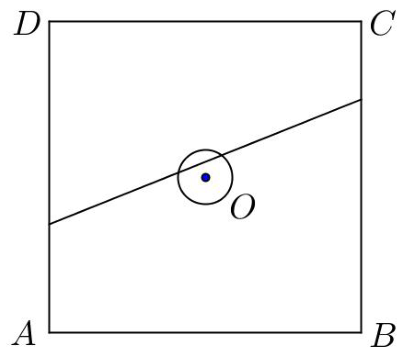
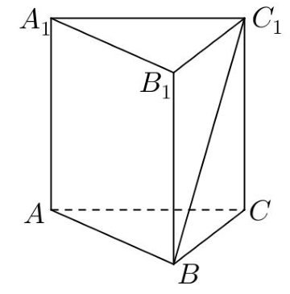
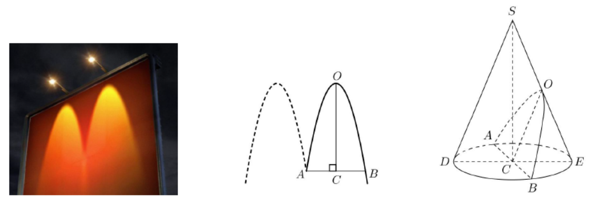

# 2018年上海卷（春）

## 填空题

### 第 1 题

不等式 $\lvert x\rvert>1$ 的解集为＿＿＿＿＿＿.

#### 答案

$(-\infty,-1)\cup(1,+\infty)$

#### 解析

由绝对值不等式的定义，$\lvert x\rvert>1$ 等价于 $x<-1$ 或 $x>1$，所以解集为 $(-\infty,-1)\cup(1,+\infty)$.

### 第 2 题

计算 $\lim\limits_{n\to\infty}\frac{3n-1}{n+2}=\underline{\qquad\qquad}$.

#### 答案

$3$

#### 解析

分子、分母同除以 $n$，得

$$

\lim\limits_{n\to\infty}\frac{3n-1}{n+2}=\lim\limits_{n\to\infty}\frac{3-\frac1n}{1+\frac2n}=\frac{3-0}{1+0}=3

$$

### 第 3 题

设集合 $A=\{x\mid 0<x<2\}$，$B=\{x\mid -1<x<1\}$，则 $A\cap B=\underline{\qquad\qquad}$.

#### 答案

$(0,1)$

#### 解析

集合 $A$ 中元素满足 $0<x<2$，集合 $B$ 中元素满足 $-1<x<1$. 同时满足两组不等式时，必须有 $0<x<1$，因此 $A\cap B=(0,1)$.

### 第 4 题

若复数 $z=1+\i$（$\i$ 是虚数单位），则 $z+\frac{2}{z}=\underline{\qquad\qquad}$.

#### 答案

$2$

#### 解析

因为 $z=1+\i$，所以

$$

\frac2z=\frac{2(1-\i)}{(1+\i)(1-\i)}=1-\i

$$

从而 $z+\frac2z=(1+\i)+(1-\i)=2$.

### 第 5 题

已知 $\{a_n\}$ 是等差数列，若 $a_2+a_8=10$，则 $a_3+a_5+a_7=\underline{\qquad\qquad}$.

#### 答案

$15$

#### 解析

设等差数列的公差为 $d$. 由等差数列的性质，$a_2+a_8=2a_5$，所以 $a_5=5$. 又有 $a_3+a_7=2a_5$，故

$$

a_3+a_5+a_7=3a_5=15

$$

### 第 6 题

已知平面上动点 $P$ 到两个定点 $(1,0)$ 和 $(-1,0)$ 的距离之和等于 $4$，则动点 $P$ 的轨迹方程为＿＿＿＿＿＿.

#### 答案

$\frac{x^2}{4}+\frac{y^2}{3}=1$

#### 解析

动点 $P$ 到两个定点的距离之和为 $4$，因此轨迹是以 $(1,0)$、$(-1,0)$ 为焦点的椭圆. 椭圆的长半轴为 $a=4/2=2$，焦半距为 $c=1$，所以短半轴满足 $b^2=a^2-c^2=4-1=3$. 故轨迹方程为 $\frac{x^2}{4}+\frac{y^2}{3}=1$.

### 第 7 题

如图，在长方体 $ABCD-A_1B_1C_1D_1$ 中，$AB=3$，$BC=4$，$AA_1=5$，$O$ 是 $A_1C_1$ 的中点，则三棱锥 $A-A_1OB_1$ 的体积为＿＿＿＿＿＿.

#### 答案

$5$

#### 解析

在长方体中，$A_1$、$O$、$B_1$ 都在上底面内，三角形 $A_1OB_1$ 的底边可取 $A_1B_1=3$. 由于 $O$ 是上底面对角线 $A_1C_1$ 的中点，点 $O$ 到直线 $A_1B_1$ 的距离为 $BC/2=2$，所以

$$

S_{\triangle A_1OB_1}=\frac12\times3\times2=3

$$

三棱锥的高为 $AA_1=5$，因此

$$

V_{A-A_1OB_1}=\frac13\times3\times5=5

$$

### 第 8 题

某校组队参加辩论赛，从 $6$ 名学生中选出 $4$ 人分别担任一，二，三，四辩，若其中学生甲必须参赛且不担任四辩，则不同的安排方法种数为＿＿＿＿＿＿（结果用数值表示）.

#### 答案

$180$

#### 解析

学生甲必须担任一、二、三辩中的一个位置，有 $3$ 种选法. 确定甲的位置后，从其余 $5$ 名学生中选出另外三人并分别安排到剩余三个位置，有

$$

\mathrm A_5^3=5\times4\times3=60

$$

种方法. 因此不同的安排方法共有 $3\times60=180$ 种.

### 第 9 题

设 $a\in\mathbb{R}$，若 $\left(x^2+\frac{2}{x}\right)^9$ 与 $\left(x+\frac{a}{x^2}\right)^9$ 的二项展开式中的常数项相等，则 $a=\underline{\qquad\qquad}$.

#### 答案

$4$

#### 解析

在 $\left(x^2+\frac2x\right)^9$ 的展开式中，取 $k$ 个 $\frac2x$ 的项时，幂为 $x^{2(9-k)-k}=x^{18-3k}$. 常数项要求 $18-3k=0$，故 $k=6$，常数项为 $\mathrm C_9^6 2^6$.

在 $\left(x+\frac{a}{x^2}\right)^9$ 的展开式中，取 $k$ 个 $\frac{a}{x^2}$ 的项时，幂为 $x^{9-k-2k}=x^{9-3k}$. 常数项要求 $9-3k=0$，故 $k=3$，常数项为 $\mathrm C_9^3a^3$. 由题意

$$

\mathrm C_9^6 2^6=\mathrm C_9^3a^3

$$

因 $\mathrm C_9^6=\mathrm C_9^3$，得 $a^3=64$. 又 $a\in\mathbb{R}$，所以 $a=4$.

### 第 10 题

设 $m\in\mathbb{R}$，若 $z$ 是关于 $x$ 的方程 $x^2+mx+m^2-1=0$ 的一个虚根，则 $\lvert z\rvert$ 的取值范围是＿＿＿＿＿＿.

#### 答案

$\left(\frac{\sqrt3}{3},+\infty\right)$

#### 解析

方程有虚根的条件是判别式小于零，即

$$

\Delta=m^2-4(m^2-1)=4-3m^2<0

$$

所以 $m^2>\frac43$. 设虚根为 $z$，另一个根为 $\overline z$，由韦达定理

$$

\lvert z\rvert^2=z\overline z=m^2-1>\frac13

$$

反之，任取 $r>\frac{\sqrt3}{3}$，令 $m=\sqrt{r^2+1}$，则 $4-3m^2<0$，方程有虚根，且任一虚根 $z$ 满足 $\lvert z\rvert^2=m^2-1=r^2$. 因此 $\lvert z\rvert$ 的取值范围为 $\left(\frac{\sqrt3}{3},+\infty\right)$.

### 第 11 题

设 $a>0$，函数 $f(x)=x+2(1-x)\sin(ax)$，$x\in(0,1)$. 若函数 $y=2x-1$ 与 $y=f(x)$ 的图像有且仅有两个不同的公共点，则 $a$ 的取值范围是＿＿＿＿＿＿.

#### 答案

$\left(\frac{11\pi}{6},\frac{19\pi}{6}\right]$

#### 解析

令两图像的公共点横坐标为 $x$. 由方程

$$

2x-1=x+2(1-x)\sin(ax)

$$

得 $(1-x)(-1-2\sin(ax))=0$. 由于题设 $x\in(0,1)$，所以 $1-x\ne0$，从而 $\sin(ax)=-\frac12$.

令 $t=ax$. 因为 $a>0$ 且 $x\in(0,1)$，所以 $t\in(0,a)$. 正弦值为 $-\frac12$ 的正数解依次为 $\frac{7\pi}{6}$，$\frac{11\pi}{6}$，$\frac{19\pi}{6}$，$\ldots$ 区间 $(0,a)$ 中恰有两个这样的解，当且仅当第二个解被包含而第三个解不被包含，即 $\frac{11\pi}{6}<a\le\frac{19\pi}{6}$.

### 第 12 题

如图，正方形 $ABCD$ 的边长为 $20$ 米，圆 $O$ 的半径为 $1$ 米，圆心是正方形的中心，点 $P$，$Q$ 分别在线段 $AD$，$CB$ 上，若线段 $PQ$ 与圆 $O$ 有公共点，则称点 $Q$ 在点 $P$ 的“盲区”中，已知点 $P$ 以 $1.5$ 米/秒的速度从 $A$ 出发向 $D$ 移动，同时，点 $Q$ 以 $1$ 米/秒的速度从 $C$ 出发向 $B$ 移动，则在点 $P$ 从 $A$ 移动到 $D$ 的过程中，点 $Q$ 在点 $P$ 的盲区中的时长约为＿＿＿＿＿＿秒（精确到 $0.1$）.

#### 答案

$4.4$

#### 解析

取正方形中心 $O$ 为原点，令 $A=(-10,-10)$、$B=(10,-10)$、$C=(10,10)$、$D=(-10,10)$. 设运动时间为 $t$ 秒，则在点 $P$ 到达 $D$ 前 $P=(-10,-10+1.5t)$，$Q=(10,10-t)$，$0\le t\le\frac{40}{3}$ 直线 $PQ$ 的斜率为 $1-\frac t8$，且在 $y$ 轴上的截距为 $\frac t4$，故其方程可写为

$$

\left(1-\frac t8\right)x-y+\frac t4=0

$$

记 $\bs v=Q-P=(20,20-\frac52t)$，则原点到直线 $PQ$ 的垂足对应的参数为

$$

\lambda_0=-\frac{P\cdot\bs v}{\lvert\bs v\rvert^2}
=\frac{400-55t+\frac{15}{4}t^2}{400+\left(20-\frac52t\right)^2}

$$

在 $0\le t\le\frac{40}{3}$ 上，分子恒为正，且分母减去分子为 $400-45t+\frac52t^2$，其最小值为 $\frac{395}{2}>0$，故 $0<\lambda_0<1$，垂足确在线段 $PQ$ 上. 因此线段与半径为 $1$ 的圆有公共点，当且仅当原点到直线的距离不超过 $1$：

$$

\frac{t/4}{\sqrt{\left(1-\frac t8\right)^2+1}}\le1

$$

两边平方并化简，得

$$

3t^2+16t-128\le0

$$

其正根为 $\frac{8(\sqrt7-1)}3$，所以符合条件的时间区间为 $0\le t\le\frac{8(\sqrt7-1)}3$，时长为

$$

\frac{8(\sqrt7-1)}3\approx4.3888\ \mathrm{s}

$$

精确到 $0.1$ 为 $4.4$ 秒.

## 单选题

### 第 13 题

下列函数中，为偶函数的是（）

A.  
$y=x^{-2}$

B.  
$y=x^{\frac13}$

C.  
$y=x^{-\frac12}$

D.  
$y=x^3$

#### 答案

A

#### 解析

函数 $y=x^{-2}=\frac1{x^2}$ 的定义域为 $\mathbb{R}\setminus\{0\}$，关于原点对称，且 $f(-x)=(-x)^{-2}=x^{-2}=f(x)$，所以它是偶函数. 函数 $x^{1/3}$ 与 $x^3$ 为奇函数，$x^{-1/2}$ 的定义域不是关于原点对称，故选 A.

### 第 14 题

如图，在直三棱柱 $ABC-A_1B_1C_1$ 的棱所在的直线中，与直线 $BC_1$ 异面的直线的条数为（）

A.  
$1$

B.  
$2$

C.  
$3$

D.  
$4$

#### 答案

C

#### 解析

直线 $BC_1$ 经过顶点 $B$、$C_1$，所以棱所在的直线 $AB$、$BC$、$BB_1$、$B_1C_1$、$C_1A_1$、$CC_1$ 都与它相交.

剩下的三条直线为 $A_1B_1$、$AC$、$AA_1$. 以 $A$ 为原点，取 $AB$、$AC$、$AA_1$ 为三个坐标方向，则直线 $BC_1$ 的方向同时具有三个方向分量，而上述三条直线分别只有一个方向分量，均不与 $BC_1$ 平行；再由它们与 $BC_1$ 没有公共点，三者均与 $BC_1$ 异面. 因此异面直线有 $3$ 条，故选 C.

### 第 15 题

设 $S_n$ 为数列 $\{a_n\}$ 的前 $n$ 项和，“$\{a_n\}$ 是递增数列”是“$\{S_n\}$ 是递增数列”的（）

A.  
充分非必要条件

B.  
必要非充分条件

C.  
充要条件

D.  
既非充分又非必要条件

#### 答案

D

#### 解析

“$\{a_n\}$ 是递增数列”不是“$\{S_n\}$ 是递增数列”的充分条件. 例如取 $a_n=n-3$，数列 $\{a_n\}$ 递增，但 $S_1=-2>S_2=-3$，所以 $\{S_n\}$ 不递增.

反之也不成立. 例如取 $a_1=1$、$a_2=2$，且 $a_n=1$（$n\ge3$），则每一项均为正数，故 $S_n$ 递增，但 $a_2>a_3$，所以 $\{a_n\}$ 不递增. 因此二者既非充分条件又非必要条件，故选 D.

### 第 16 题

已知 $A$，$B$ 为平面上的两个定点，且 $\lvert AB\rvert=2$，该平面上的动线段 $PQ$ 的端点 $P$，$Q$，满足 $\lvert AP\rvert\le5$，$\overrightarrow{AP}\cdot\overrightarrow{AB}=6$，$\overrightarrow{AQ}=-2\overrightarrow{AP}$，则动线段 $PQ$ 所形成图形的面积为（）

A.  
$36$

B.  
$60$

C.  
$72$

D.  
$108$

#### 答案

B

#### 解析

建立平面直角坐标系，取 $A=(0,0)$、$B=(2,0)$，设 $P=(x,y)$. 由 $\lvert AP\rvert\le5$ 和 $\overrightarrow{AP}\cdot\overrightarrow{AB}=6$，有 $x^2+y^2\le25$，$2x=6$ 所以 $x=3$，且 $-4\le y\le4$. 又由 $\overrightarrow{AQ}=-2\overrightarrow{AP}$，得 $Q=(-6,-2y)$.

设线段 $PQ$ 上的点为 $(X,Y)$，用 $\lambda\in[0,1]$ 表示其位置，则

$$

(X,Y)=P+\lambda(Q-P)=(3-9\lambda,(1-3\lambda)y)

$$

因此 $-6\le X\le3$，且 $\lambda=(3-X)/9$，从而 $Y=Xy/3$. 当 $-4\le y\le4$ 时，固定 $X$ 所得到的纵坐标范围为 $\lvert Y\rvert\le\frac43\lvert X\rvert$.

所形成图形的面积为

$$

\int_{-6}^{3}2\cdot\frac43\lvert X\rvert\,\mathrm dX
=\frac83\left(\int_{-6}^{0}(-X)\,\mathrm dX+\int_{0}^{3}X\,\mathrm dX\right)
=\frac83\left(18+\frac92\right)=60

$$

故选 B.

## 解答题

### 第 17 题

已知 $y=\cos x$.

1.  若 $f(\alpha)=\frac13$，且 $\alpha\in[0,\pi]$，求 $f\!\left(\alpha-\frac\pi3\right)$ 的值；

2.  求函数 $y=f(2x)-2f(x)$ 的最小值.

#### 解析

题干中的 $y=\cos x$ 即为下列小问所记的函数 $f(x)=\cos x$.

1.  因为 $f(\alpha)=\cos\alpha=\frac13$，且 $\alpha\in[0,\pi]$，所以 $\sin\alpha=\frac{2\sqrt2}{3}$. 于是

$$

f\!\left(\alpha-\frac\pi3\right)=\cos\left(\alpha-\frac\pi3\right)=\frac13\cdot\frac12+\frac{2\sqrt2}{3}\cdot\frac{\sqrt3}{2}=\frac{1+2\sqrt6}{6}

$$

2.  令 $t=\cos x$，则 $t\in[-1,1]$，并且

$$

f(2x)-2f(x)=\cos2x-2\cos x=2t^2-2t-1=2\left(t-\frac12\right)^2-\frac32

$$

    当 $t=\frac12$ 时取到最小值，因此最小值为 $-\frac32$.

### 第 18 题

已知 $a\in\mathbb{R}$，双曲线 $\Gamma:\frac{x^2}{a^2}-y^2=1$.

1.  若点 $(2,1)$ 在上，求 $\Gamma$ 的焦点坐标；

2.  若 $a=1$，直线 $y=kx+1$ 与 $\Gamma$ 相交于 $A$，$B$ 两点，且线段 $AB$ 中点的横坐标为 $1$，求实数 $k$ 的值.

#### 解析

1.  将点 $(2,1)$ 代入双曲线方程，得 $\frac4{a^2}-1=1$，所以 $a^2=2$. 双曲线的标准形式中 $b^2=1$，故焦半距满足 $c^2=a^2+b^2=3$，焦点坐标为 $(\sqrt3,0)$、$(-\sqrt3,0)$.

2.  当 $a=1$ 时，双曲线为 $x^2-y^2=1$. 将 $y=kx+1$ 代入，得

$$

(1-k^2)x^2-2kx-2=0

$$

    两交点横坐标为该方程的两个不同实根，因此 $k\ne\pm1$. 由根的平均值等于弦中点横坐标，得

$$

\frac12\cdot\frac{2k}{1-k^2}=\frac{k}{1-k^2}=1

$$

    所以 $k^2+k-1=0$，候选值为 $k=\frac{-1\pm\sqrt5}{2}$. 关于 $x$ 的二次方程判别式为 $4(2-k^2)$，必须为正. 负根 $\frac{-1-\sqrt5}{2}$ 的平方大于 $2$，不符合；故 $k=\frac{\sqrt5-1}{2}$.

### 第 19 题

如图，利用“平行于圆锥母线的平面截圆锥面，所得截线是抛物线”的几何原理，某快餐店用两个射灯（射出的光锥为圆锥）在广告牌上投影出其标识，如图1所示，图2是投影出的抛物线的平面图，图3是一个射灯投影的直观图，在图2与图3中，点 $O$，$A$，$B$ 在抛物线上，$OC$ 是抛物线的对称轴，$OC\perp AB$ 于 $C$，$AB=3$ 米，$OC=4.5$ 米.

1.  求抛物线的焦点到准线的距离；

2.  在图3中，已知 $OC$ 平行于圆锥的母线 $SD$，$AB$，$DE$ 是圆锥底面的直径，求圆锥的母线与轴的夹角的大小（精确到 $0.01^\circ$）.

#### 解析

1.  取 $C$ 为原点，令抛物线的对称轴为 $y$ 轴. 由于 $O$ 在对称轴上且在抛物线上，$O$ 是抛物线的顶点. 由 $AB=3$ 及 $OC\perp AB$，可取 $A=(-\frac32,0)$、$B=(\frac32,0)$、$O=(0,\frac92)$. 设抛物线方程为 $y=\frac92-bx^2$，代入 $A$ 得 $b=2$，所以抛物线为 $y=\frac92-2x^2$. 写成标准形式为 $x^2=-\frac12(y-\frac92)$，故 $4p=-\frac12$，即 $p=-\frac18$. 焦点到准线的距离为 $2\lvert p\rvert=\frac14$.

2.  设圆锥底面半径为 $r$，高为 $h$. 由 $AB$ 是底面直径，得 $r=AB/2=3/2$. 取底面圆心 $C$ 为原点，令圆锥轴为 $z$ 轴，并令截面内的另一水平坐标为 $y$. 圆锥方程可写为

$$

x^2+y^2=\frac{r^2}{h^2}(h-z)^2

$$

    由于截面经过直径 $AB$ 且平行于母线 $SD$，其方程可取为 $y=\frac rhz$. 代入圆锥方程得

$$

x^2=r^2-\frac{2r^2}{h}z

$$

    所以抛物线顶点 $O$ 的坐标满足 $z=h/2$、$y=r/2$，从而

$$

OC=\frac12\sqrt{r^2+h^2}=\frac12SD

$$

    因此 $SD=2OC=9$. 在直角三角形 $SCD$ 中，设母线与轴的夹角为 $\theta$，则

$$

\sin\theta=\frac{CD}{SD}=\frac{3/2}{9}=\frac16

$$

    故 $\theta=\arcsin\frac16\approx9.59^\circ$.

### 第 20 题

设 $a>0$，函数 $f(x)=\frac{1}{1+a\cdot2^x}$.

1.  若 $a=1$，求 $f(x)$ 的反函数 $f^{-1}(x)$；

2.  求函数 $y=f(x)\cdot f(-x)$ 的最大值（用 $a$ 表示）；

3.  设 $g(x)=f(x)-f(x-1)$，若对任意 $x\in(-\infty,0]$，$g(x)\ge g(0)$ 恒成立，求 $a$ 取值范围.

#### 解析

1.  当 $a=1$ 时，令 $y=f(x)=\frac1{1+2^x}$. 因为 $0<y<1$，且 $2^x=\frac{1-y}{y}$，所以

$$

x=\log_2\frac{1-y}{y}

$$

    故 $f^{-1}(x)=\log_2\frac{1-x}{x}$，其定义域为 $(0,1)$.

2.  令 $t=2^x>0$，则

$$

y=f(x)f(-x)=\frac1{(1+at)(1+a/t)}=\frac1{1+a^2+a\left(t+\frac1t\right)}

$$

    由 $t+\frac1t\ge2$，分母不小于 $(1+a)^2$，所以 $y\le\frac1{(1+a)^2}$. 当 $t=1$，即 $x=0$ 时取到，故最大值为 $\frac1{(1+a)^2}$.

3.  令 $t=2^x$，则 $x\le0$ 等价于 $0<t\le1$，并且 $g(x)=-\frac{at}{(1+at)(2+at)}$，$g(0)=-\frac{a}{(1+a)(2+a)}$ 由于各分母均为正，条件 $g(x)\ge g(0)$ 等价于

$$

\frac{t}{(1+at)(2+at)}\le\frac1{(1+a)(2+a)}

$$

    交叉相乘并化简，得到

$$

(1-t)(2-a^2t)\ge0

$$

    当 $a^2\le2$ 时，对所有 $0<t\le1$ 都有 $2-a^2t\ge2-a^2\ge0$，条件成立；当 $a^2>2$ 时，取 $2/a^2<t<1$，则上式为负，条件不成立. 因此 $0<a\le\sqrt2$.

### 第 21 题

若 $\{c_n\}$ 是递增数列，数列 $\{a_n\}$ 满足：对任意 $n\in\mathbb{N}^*$，存在 $m\in\mathbb{N}^*$，使得 $\frac{a_m-c_n}{a_m-c_{n+1}}\le0$，则称 $\{a_n\}$ 是 $\{c_n\}$ 的“分隔数列”.

1.  设 $c_n=2n$，$a_n=n+1$，证明：数列 $\{a_n\}$ 是 $\{c_n\}$ 的分隔数列；

2.  设 $c_n=n-4$，$S_n$ 是 $\{c_n\}$ 的前 $n$ 项和，$d_n=c_{3n-2}$，判断数列 $\{S_n\}$ 是否是数列 $\{d_n\}$ 的分隔数列，并说明理由；

3.  设 $c_n=aq^{n-1}$，$T_n$ 是 $\{c_n\}$ 的前 $n$ 项和，若数列 $\{T_n\}$ 是 $\{c_n\}$ 的分隔数列，求实数 $a$，$q$ 的取值范围.

#### 解析

1.  对任意 $n\in\mathbb{N}^*$，取 $m=2n-1$，则 $a_m=m+1=2n=c_n$，且 $a_m-c_{n+1}=-2$. 因此

$$

\frac{a_m-c_n}{a_m-c_{n+1}}=\frac0{-2}=0\le0

$$

    所以 $\{a_n\}$ 是 $\{c_n\}$ 的分隔数列.

2.  有 $S_m=\sum_{j=1}^{m}(j-4)=\frac{m(m-7)}2$，$d_n=c_{3n-2}=3n-6$ 取 $n=4$，则 $d_4=6$、$d_5=9$. 若存在相应的 $m$，由分式不大于零且分母不能为零，必须有 $6\le S_m<9$. 但当 $m\le8$ 时 $S_m\le4$，当 $m\ge9$ 时 $S_m\ge S_9=9$，不存在这样的 $m$. 因此 $\{S_n\}$ 不是 $\{d_n\}$ 的分隔数列.

3.  因 $\{c_n\}$ 递增，参数只能落在 $a>0$，$q>1$ 或 $a<0$，$0<q<1$ 两种情形中. 若 $a<0$，$0<q<1$，则 $c_1=a$，而 $T_1=a$，对所有 $m\ge2$ 有 $T_m<a<c_2$，所以区间 $[c_2,c_3)$ 中没有任何 $T_m$，不满足条件.

    下面设 $a>0$，$q>1$，记 $I_n=[c_n,c_{n+1})$. 因为 $c_n<c_{n+1}$，定义中的分式不大于零等价于存在 $m$ 使 $T_m\in I_n$. 当 $q\ge2$ 时，取 $m=n$，有

$$

T_n=a\frac{q^n-1}{q-1}\ge aq^{n-1}=c_n

$$

    又因为

$$

T_n<c_{n+1}\ \Longleftrightarrow\ q^n-1<q^{n+1}-q^n\ \Longleftrightarrow\ q^n(q-2)+1>0

$$

    所以 $T_n\in I_n$，条件成立.

    反之，若 $1<q<2$，假设每个 $I_n$ 都含有某个 $T_m$. 先有 $T_1=c_1\in I_1$. 若 $T_j\in I_j$，则对 $m\le j$ 有 $T_m\le T_j<c_{j+1}$，这些项不能落入 $I_{j+1}$；而任一落入 $I_{j+1}$ 的项的下标至少为 $j+1$，故递增性给出 $T_{j+1}\le T_m<c_{j+2}$，又因 $T_{j+1}=T_j+c_{j+1}>c_{j+1}$，所以 $T_{j+1}\in I_{j+1}$. 归纳可知第 $n$ 个区间只能由 $T_n$ 命中，于是必须有 $T_{n+1}<c_{n+2}$ 对所有 $n$ 成立. 但

$$

\frac{T_{n+1}}{c_{n+2}}=\frac{1-q^{-(n+1)}}{q-1}\longrightarrow\frac1{q-1}>1

$$

    故当 $n$ 足够大时 $T_{n+1}\ge c_{n+2}$，矛盾. 因此必须有 $q\ge2$.

    综上，参数范围为 $a>0$，$q\ge2$.
