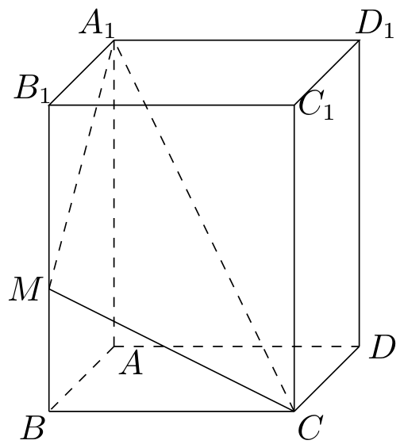
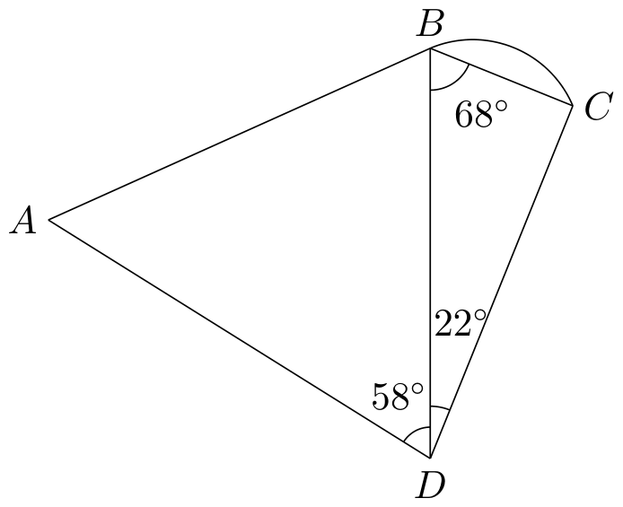

# 2019年上海卷（秋）

## 填空题

### 第 1 题

已知集合 $A=(-\infty,3)$，$B=(2,+\infty)$，则 $A\cap B=$＿＿＿＿＿＿.

#### 答案

$(2,3)$

#### 解析

同时满足 $x<3$ 和 $x>2$ 的实数构成区间 $(2,3)$，所以 $A\cap B=(2,3)$.

### 第 2 题

已知 $z\in\mathbb{C}$ 且满足 $\frac1{z-5}=\i$，求 $z=$＿＿＿＿＿＿.

#### 答案

$5-\i$

#### 解析

由 $\frac1{z-5}=\i$ 得 $z-5=\frac1{\i}=-\i$，所以 $z=5-\i$.

### 第 3 题

已知向量 $\boldsymbol{a}=(1,0,2)$，$\boldsymbol{b}=(2,1,0)$，则 $\boldsymbol{a}$ 与 $\boldsymbol{b}$ 的夹角为＿＿＿＿＿＿.

#### 答案

$\arccos\dfrac{2}{5}$

#### 解析

由向量数量积公式，$\boldsymbol{a}\cdot\boldsymbol{b}=1\cdot2+0\cdot1+2\cdot0=2$，且 $|\boldsymbol{a}|=\sqrt{1^2+0^2+2^2}=\sqrt5$，$|\boldsymbol{b}|=\sqrt{2^2+1^2+0^2}=\sqrt5$. 设两向量的夹角为 $\theta$，则 $\cos\theta=\frac{\boldsymbol{a}\cdot\boldsymbol{b}}{|\boldsymbol{a}||\boldsymbol{b}|}=\frac25$，从而 $\theta=\arccos\dfrac25$.

### 第 4 题

已知二项式 $(2x+1)^5$，则展开式中含 $x^2$ 项的系数为＿＿＿＿＿＿.

#### 答案

$40$

#### 解析

展开式的通项为 $\mathrm C_5^k(2x)^k$. 含 $x^2$ 的项对应 $k=2$，所以该项的系数为 $\mathrm C_5^2\cdot2^2=10\cdot4=40$.

### 第 5 题

已知 $x$，$y$ 满足

$$

\begin{cases}
x\ge0,\\
y\ge0,\\
x+y\le2
\end{cases}

$$

，求 $z=2x-3y$ 的最小值为＿＿＿＿＿＿.

#### 答案

$-6$

#### 解析

由 $x\ge0$ 和 $x+y\le2$ 得 $0\le y\le2$，又因为 $x\ge0$，所以 $2x\ge0$. 因此 $z=2x-3y\ge-3y\ge-6$. 当 $(x,y)=(0,2)$ 时，所有条件均满足且 $z=-6$，故最小值为 $-6$.

### 第 6 题

已知函数 $f(x)$ 周期为 $1$，且当 $0<x\le1$ 时，$f(x)=-\log_2x$，则 $f\left(\frac32\right)=$＿＿＿＿＿＿.

#### 答案

$1$

#### 解析

因为 $1$ 是函数的周期，所以 $f\left(\frac32\right)=f\left(\frac32-1\right)=f\left(\frac12\right)$. 由于 $0<\frac12\le1$，有 $f\left(\frac12\right)=-\log_2\frac12=1$，故 $f\left(\frac32\right)=1$.

### 第 7 题

若 $x$，$y\in\mathbb{R}^+$，且 $\frac1x+2y=3$，则 $\frac yx$ 的最大值为＿＿＿＿＿＿.

#### 答案

$\dfrac{9}{8}$

#### 解析

由 $y>0$ 及 $\frac1x+2y=3$ 得 $x>\frac13$，并且 $y=\frac{3-1/x}{2}$. 因而 $\frac yx=\frac{3}{2x}-\frac{1}{2x^2}=g(x)$，$x>\frac13$. 求导得 $g'(x)=\frac{2-3x}{2x^3}$. 所以 $g(x)$ 在 $\left(\frac13,\frac23\right)$ 上递增，在 $\left(\frac23,+\infty\right)$ 上递减，最大值在 $x=\frac23$ 时取得. 此时 $y=\frac34$，故

$$

\max\frac yx=\frac{3/4}{2/3}=\frac98

$$

### 第 8 题

已知数列 $\{a_n\}$ 前 $n$ 项和为 $S_n$，且满足 $S_n+a_n=2$，则 $S_5=$＿＿＿＿＿＿.

#### 答案

$\dfrac{31}{16}$

#### 解析

取 $n=1$，由 $S_1=a_1$ 得 $2a_1=2$，所以 $S_1=a_1=1$. 对 $n\ge2$，由 $a_n=S_n-S_{n-1}$ 及题设得 $2S_n-S_{n-1}=2$，$S_n=1+\frac12S_{n-1}$. 于是 $2-S_n=\frac12(2-S_{n-1})$. 结合 $S_1=1$，可得 $2-S_n=\frac1{2^{n-1}}$，即 $S_n=2-\frac1{2^{n-1}}$. 因此 $S_5=2-\frac1{16}=\frac{31}{16}$.

### 第 9 题

过 $y^2=4x$ 的焦点 $F$ 并垂直于 $x$ 轴的直线分别与 $y^2=4x$ 交于 $A$，$B$，$A$ 在 $B$ 上方，$M$ 为抛物线上一点，$\overrightarrow{OM}=\lambda\overrightarrow{OA}+(\lambda-2)\overrightarrow{OB}$，则 $\lambda=$＿＿＿＿＿＿.

#### 答案

$3$

#### 解析

抛物线 $y^2=4x$ 的焦点为 $F=(1,0)$，所以过焦点且垂直于 $x$ 轴的直线为 $x=1$. 与抛物线联立得 $y=\pm2$，结合 $A$ 在 $B$ 上方，取 $A=(1,2)$，$B=(1,-2)$. 于是

$$

\overrightarrow{OM}=\lambda(1,2)+(\lambda-2)(1,-2)=(2\lambda-2,4)

$$

所以 $M=(2\lambda-2,4)$. 因为 $M$ 在抛物线上，故 $4^2=4(2\lambda-2)$，解得 $\lambda=3$.

### 第 10 题

某三位数密码锁，每位数字在 $0\sim9$ 数字中选取，其中恰有两位数字相同的概率是＿＿＿＿＿＿.

#### 答案

$\dfrac{27}{100}$

#### 解析

三位密码的每一位均有 $10$ 种取法，所以所有密码共有 $10^3=1000$ 个. 先选取相同的数字，有 $10$ 种；再选取不同数字所在的位置，有 $3$ 种；最后选取与其不同的数字，有 $9$ 种. 因而恰有两位数字相同的密码有 $10\cdot3\cdot9=270$ 个，所求概率为 $\frac{270}{1000}=\frac{27}{100}$.

### 第 11 题

已知数列 $\{a_n\}$ 满足 $a_n<a_{n+1}$（$n\in\mathbb{N}^*$），若点 $P_n(n,a_n)$ 在双曲线 $\frac{x^2}{6}-\frac{y^2}{2}=1$ 上，则 $\displaystyle\lim_{n\to\infty}|P_nP_{n+1}|=$＿＿＿＿＿＿.

#### 答案

$\dfrac{2\sqrt{3}}{3}$

#### 解析

由点 $P_n(n,a_n)$ 在双曲线上，得 $a_n^2=\frac{n^2-6}{3}$. 对充分大的 $n$，双曲线的下支上的纵坐标随 $n$ 增大而减小，与 $a_n<a_{n+1}$ 不相容，因此从某一项起只能取上支，即

$$

a_n=\sqrt{\frac{n^2-6}{3}}

$$

于是

$$

a_{n+1}-a_n=\frac{2n+1}{\sqrt3\left(\sqrt{(n+1)^2-6}+\sqrt{n^2-6}\right)}\longrightarrow\frac1{\sqrt3}

$$

又因为 $P_nP_{n+1}$ 的横坐标差为 $1$，所以

$$

\lim_{n\to\infty}|P_nP_{n+1}|=\sqrt{1+\left(\frac1{\sqrt3}\right)^2}=\frac{2\sqrt3}{3}

$$

### 第 12 题

常数 $a>0$，将函数 $y=\frac2x$（$x>0$）的图象先向右平移 $1$ 个单位，再向下平移 $a$ 个单位，然后将所得的图象在 $x$ 轴下方的部分沿 $x$ 轴向上翻折，其余部分保持不变，得到函数 $f(x)=\left|\frac2{x-1}-a\right|$（$x>1$）的图象 $L$，当 $a=a_0$ 时，$L$ 与 $x$ 轴交点为 $A$，在 $L$ 上任意一点 $P$（$P$ 异于 $A$），总存在一点 $Q$ 使得 $AP\perp AQ$ 且 $|AP|=|AQ|$，则 $a_0=$＿＿＿＿＿＿.

#### 答案

$\sqrt{2}$

#### 解析

设 $A$ 的横坐标为 $x_A=1+\frac2a$，并令 $u=x-x_A$，$v=y$. 因为 $x-1=\frac2a+u$，图象 $L$ 在以 $A$ 为原点的坐标中可写为 $v=\frac{a|u|}{\frac2a+u}$，$u>-\frac2a$. 取左支上一点 $P=(u,v)$，令 $s=-u$，则 $0<s<\frac2a$，且 $v=\frac{as}{2/a-s}$. 将向量 $AP=(u,v)=(-s,v)$ 顺时针旋转 $90^\circ$，得到向量 $AQ=(v,s)$. 它自动满足 $AP\perp AQ$ 且 $|AP|=|AQ|$，而 $Q$ 在右支上当且仅当

$$

s=\frac{av}{2/a+v}

$$

代入 $v=\frac{as}{2/a-s}$ 并约去 $s>0$，得

$$

\frac4{a^2}+s\left(a-\frac2a\right)=a^2

$$

该等式对左支上的任意 $s$ 都成立，因此必须有 $a-\frac2a=0$ 且 $\frac4{a^2}=a^2$. 由 $a>0$ 得 $a^2=2$，即 $a_0=\sqrt2$. 当 $a=\sqrt2$ 时，上述旋转把左支逐点对应到右支，反向旋转又把右支逐点对应到左支，条件确实成立.

## 单选题

### 第 13 题

已知直线方程 $2x-y+c=0$ 的一个方向向量 $d$ 可以是（）

A.  
$(2,-1)$

B.  
$(2,1)$

C.  
$(-1,2)$

D.  
$(1,2)$

#### 答案

D

#### 解析

设方向向量为 $d=(u,v)$. 方向向量与直线的法向量 $(2,-1)$ 垂直，所以 $2u-v=0$，即 $v=2u$. 四个选项中只有 $(1,2)$ 满足该条件，故选 D.

### 第 14 题

一个直角三角形的两条直角边长分别为 $1$ 和 $2$，将该三角形分别绕其两个直角边旋转得到的两个圆锥的体积之比为（）

A.  
$1$

B.  
$2$

C.  
$4$

D.  
$8$

#### 答案

B

#### 解析

绕长为 $1$ 的直角边旋转时，圆锥的高为 $1$，底面半径为 $2$，体积为 $V_1=\frac13\pi\cdot2^2\cdot1=\frac{4\pi}{3}$. 绕长为 $2$ 的直角边旋转时，圆锥的高为 $2$，底面半径为 $1$，体积为 $V_2=\frac13\pi\cdot1^2\cdot2=\frac{2\pi}{3}$. 因而 $V_1:V_2=2:1$，故选 B.

### 第 15 题

已知 $\omega\in\mathbb{R}$，函数 $f(x)=(x-6)^2\sin(\omega x)$，存在常数 $a\in\mathbb{R}$，使得 $f(x+a)$ 为偶函数，则 $\omega$ 可能的值为（）

A.  
$\frac\pi2$

B.  
$\frac\pi3$

C.  
$\frac\pi4$

D.  
$\frac\pi5$

#### 答案

C

#### 解析

令 $b=a-6$，$\phi=\omega a$，则

$$

f(x+a)=(x+b)^2\sin(\omega x+\phi)

$$

要求该函数为偶函数，比较它与取 $-x$ 后的表达式，得到

$$

2b\sin\phi\,x\cos(\omega x)+(x^2+b^2)\cos\phi\,\sin(\omega x)=0

$$

题中各选项均满足 $\omega\ne0$. 令上式左端为 $h(x)$. 因为 $h(x)$ 恒等于零，所以计算 $h'(0)=0$ 和 $h'''(0)=0$，等价于比较 $x$ 次和 $x^3$ 次系数，得 $2b\sin\phi+b^2\omega\cos\phi=0$，$-b\omega^2\sin\phi+\omega\left(1-\frac{b^2\omega^2}{6}\right)\cos\phi=0$. 若 $\cos\phi\ne0$，由第一式代入第二式可得 $\omega\left(1+\frac{b^2\omega^2}{3}\right)\cos\phi=0$，矛盾；所以 $\cos\phi=0$. 再由第一式得 $b=0$，即 $a=6$. 因而必须有 $\cos(6\omega)=0$. 检验四个选项，只有 $\omega=\frac\pi4$ 时 $\cos(6\omega)=\cos\frac{3\pi}{2}=0$，故选 C.

### 第 16 题

已知 $\tan\alpha\cdot\tan\beta=\tan(\alpha+\beta)$.

1.  存在角 $\alpha$ 在第一象限，角 $\beta$ 在第三象限；

2.  存在角 $\alpha$ 在第二象限，角 $\beta$ 在第四象限.

那么（）

A.  
$\textcircled{1}\textcircled{2}$均正确

B.  
$\textcircled{1}\textcircled{2}$均错误

C.  
$\textcircled{1}$正确，$\textcircled{2}$错误

D.  
$\textcircled{1}$错误，$\textcircled{2}$正确

#### 答案

D

#### 解析

设 $p=\tan\alpha$，$q=\tan\beta$. 由正切和角公式，题设等价于

$$

pq(1-pq)=p+q

$$

其中 $1-pq\ne0$. 对命题 $\textcircled{1}$，有 $p>0$，$q>0$. 令 $r=pq$，则等式右侧为正，故 $0<r<1$. 但由基本不等式，$p+q\ge2\sqrt r$，而 $r(1-r)<r<\sqrt r$，不可能有 $p+q=r(1-r)$，所以命题 $\textcircled{1}$ 错误.

对命题 $\textcircled{2}$，有 $p<0$，$q<0$. 取 $p=q=-t$，其中 $t>1$ 为方程 $t^3-t-2=0$ 的正根. 因为该方程在 $1$ 和 $2$ 处的值分别为 $-2$ 和 $4$，这样的 $t$ 确实存在，且

$$

pq(1-pq)=t^2(1-t^2)=-2t=p+q

$$

所以可取第二象限的 $\alpha$ 和第四象限的 $\beta$，命题 $\textcircled{2}$ 正确，故选 D.

## 解答题

### 第 17 题

如图，在长方体 $ABCD-A_1B_1C_1D_1$ 中，$M$ 为 $BB_1$ 上一点，已知 $BM=2$，$AD=4$，$CD=3$，$AA_1=5$.

1.  求直线 $A_1C$ 与平面 $ABCD$ 的夹角；

2.  求点 $A$ 到平面 $A_1MC$ 的距离.

#### 解析

1.  直线 $A_1C$ 在平面 $ABCD$ 上的射影为 $AC$. 在矩形 $ABCD$ 中，$AC=\sqrt{AD^2+CD^2}=\sqrt{4^2+3^2}=5$，又 $A_1A=5$，所以 $A_1C=\sqrt{AA_1^2+AC^2}=5\sqrt2$. 设所求夹角为 $\theta$，则 $\sin\theta=\frac{AA_1}{A_1C}=\frac1{\sqrt2}$，故 $\theta=45^\circ$.

2.  建立直角坐标系，令 $A=(0,0,0)$，$D=(4,0,0)$，$B=(0,3,0)$，$C=(4,3,0)$. 由 $AA_1=5$ 和 $BM=2$，得 $A_1=(0,0,5)$，$M=(0,3,2)$. 平面 $A_1MC$ 内的两个方向向量可取 $\overrightarrow{A_1M}=(0,3,-3)$ 和 $\overrightarrow{A_1C}=(4,3,-5)$，它们的一个法向量为 $\bs n=(1,2,2)$. 因此平面 $A_1MC$ 的方程为 $x+2y+2z-10=0$，从而点 $A$ 到该平面的距离为

$$

\frac{|0+2\cdot0+2\cdot0-10|}{\sqrt{1^2+2^2+2^2}}=\frac{10}{3}

$$

### 第 18 题

已知 $f(x)=ax+\frac1{x+1}$（$a\in\mathbb{R}$）.

1.  当 $a=1$ 时，求不等式 $f(x)+1<f(x+1)$ 的解集；

2.  若 $x\in[1,2]$ 时，$f(x)$ 有零点，求 $a$ 的范围.

#### 解析

1.  当 $a=1$ 时，定义域要求 $x\ne-1$，$-2$. 不等式化为

$$

x+\frac1{x+1}+1<x+1+\frac1{x+2}

$$

    即 $\frac1{x+1}<\frac1{x+2}$，所以 $\frac1{(x+1)(x+2)}<0$. 结合定义域，解得 $x\in(-2,-1)$.

2.  $f(x)$ 在 $[1,2]$ 内有零点，等价于存在 $x\in[1,2]$ 使 $ax+\frac1{x+1}=0$，即 $a=-\frac1{x(x+1)}$. 因为 $x(x+1)$ 在 $[1,2]$ 上递增，取值范围为 $[2,6]$，所以 $a\in\left[-\frac12,-\frac16\right]$.

### 第 19 题

如图，某段海岸线可近似看作一条曲线，该曲线由线段 $AB$ 和四分之一圆弧 $\widehat{BC}$ 构成，$D$ 为一海岛，$B$ 在 $D$ 的正北方向，且 $B$，$D$ 相距 $39.2\text{ 千米}$，$A$ 在 $D$ 的北偏西 $58^\circ$ 方向，$C$ 在 $D$ 的北偏东 $22^\circ$ 方向，$C$ 在 $B$ 的南偏东 $68^\circ$ 方向.

1.  若沿弧 $\widehat{BC}$ 建观光道，计算该观光道的长度；（精确到 $0.001\text{ 千米}$）

2.  现规划在该海岸线上选取一点 $E$，修建从 $E$ 直通 $D$ 的公路桥，已知 $A$，$B$ 相距 $40\text{ 千米}$，求公路桥 $DE$ 的最短长度.（精确到 $0.001\text{ 千米}$）

#### 解析

1.  在 $\triangle BCD$ 中，$\angle BCD=180^\circ-68^\circ-22^\circ=90^\circ$，所以 $BC=BD\cos68^\circ=39.2\cos68^\circ$. 设四分之一圆弧所在圆的半径为 $r$，因为弦 $BC$ 所对的圆心角为 $90^\circ$，所以 $BC=2r\sin45^\circ=r\sqrt2$. 因而观光道长度为

$$

\frac\pi2r=\frac{\pi\cdot39.2\cos68^\circ}{2\sqrt2}\approx16.310\mathrm{~km}

$$

2.  在 $\triangle ADB$ 中，$\angle ADB=58^\circ$，$AB=40$，$BD=39.2$. 由正弦定理，

$$

\sin\angle DAB=\frac{BD\sin58^\circ}{AB}=\frac{39.2\sin58^\circ}{40}

$$

    由三角形内角和得 $\angle DAB\approx56.211^\circ$，所以 $\angle ABD\approx65.789^\circ$. 过 $D$ 作 $AB$ 的垂线，垂足为 $H$. 因为 $\angle DAB$ 和 $\angle ABD$ 均为锐角，故 $H$ 在线段 $AB$ 上，且

$$

DH=BD\sin\angle ABD\approx35.752\mathrm{~km}

$$

    另一方面，$\triangle BCD$ 在 $C$ 处为直角，$DC=BD\sin68^\circ\approx36.346\mathrm{~km}$. 任取弧 $\widehat{BC}$ 上一点 $X$，由图可知 $X$ 与 $D$ 分居直线 $BC$ 两侧；又 $DC\perp BC$，所以 $X$ 到直线 $BC$ 的距离为 $DC+\operatorname{dist}(X,BC)\ge DC$，从而 $DX\ge DC$. 由于 $DH<DC$，海岸线 $AB\cup\widehat{BC}$ 上到 $D$ 的最短距离为 $DH$，即公路桥 $DE$ 的最短长度为 $35.752\mathrm{~km}$.

### 第 20 题

已知椭圆 $\frac{x^2}{8}+\frac{y^2}{4}=1$，$F_1$，$F_2$ 分别为左，右焦点，直线 $l$ 过 $F_2$ 交椭圆于 $A$，$B$ 两点.

1.  若 $AB$ 垂直于 $x$ 轴时，求 $|AB|$；

2.  当 $\angle F_1AB=90^\circ$ 时，$A$ 在 $x$ 轴上方时，求 $A$，$B$ 的坐标；

3.  若直线 $AF_1$ 交 $y$ 轴于 $M$，直线 $BF_1$ 交 $y$ 轴于 $N$，是否存在直线 $l$，使 $S_{\triangle F_1AB}=S_{\triangle F_1MN}$，若存在，求出直线 $l$ 的方程；若不存在，请说明理由.

#### 解析

1.  椭圆的长半轴为 $2\sqrt2$，短半轴为 $2$，焦距的一半为 $c=\sqrt{8-4}=2$，所以 $F_2=(2,0)$. 当 $AB\perp x$ 轴时，直线 $l$ 为 $x=2$. 代入椭圆方程得 $\frac12+\frac{y^2}{4}=1$，即 $y=\pm\sqrt2$，故 $|AB|=2\sqrt2$.

2.  设 $A=(x,y)$. 因为 $AB$ 与过 $F_2$ 的直线 $l$ 重合，条件 $\angle F_1AB=90^\circ$ 等价于 $\overrightarrow{AF_1}\cdot\overrightarrow{AF_2}=0$，即 $(x+2,y)\cdot(x-2,y)=0$，$x^2+y^2=4$. 与椭圆方程 $x^2+2y^2=8$ 联立，得 $y^2=4$，再由 $A$ 在 $x$ 轴上方知 $A=(0,2)$. 直线 $l$ 过 $(2,0)$ 和 $(0,2)$，故方程为 $x+y=2$. 与椭圆联立得 $x^2+2(2-x)^2=8$，$x(3x-8)=0$. 除去点 $A$ 对应的根 $x=0$，得到 $B=\left(\frac83,-\frac23\right)$.

3.  先考虑非竖直直线，设 $l:y=k(x-2)$，它与椭圆的交点为 $A=(x_1,y_1)$，$B=(x_2,y_2)$，其中 $y_i=k(x_i-2)$. 若 $x_i=-2$，则相应的直线 $F_1A$ 或 $F_1B$ 与 $y$ 轴平行，题设中的交点不存在，故只需考虑 $x_i\ne-2$. 由直线 $F_1A$ 和 $F_1B$ 与 $y$ 轴的交点，得 $M=\left(0,\frac{2y_1}{x_1+2}\right)$，$N=\left(0,\frac{2y_2}{x_2+2}\right)$. 因此 $S_{\triangle F_1AB}=2|k||x_1-x_2|$，$S_{\triangle F_1MN}=\frac{8|k||x_1-x_2|}{|(x_1+2)(x_2+2)|}$. 当三角形不退化且 $k\ne0$ 时，面积相等等价于 $|(x_1+2)(x_2+2)|=4$. 将直线方程代入椭圆，得

$$

x^2+2k^2(x-2)^2=8

$$

    由韦达定理， $x_1+x_2=\frac{8k^2}{1+2k^2}$，$x_1x_2=\frac{8k^2-8}{1+2k^2}$. 所以

$$

(x_1+2)(x_2+2)=x_1x_2+2(x_1+x_2)+4=\frac{4(8k^2-1)}{1+2k^2}

$$

    从而

$$

|8k^2-1|=1+2k^2

$$

    解得 $k^2=\frac13$ 或 $k=0$. 当 $k=0$ 时，$l$ 为 $x$ 轴，$F_1$，$A$，$B$ 三点共线且 $M=N$，相关三角形退化，不符合题设中的三角形，舍去. 对竖直直线 $x=2$，椭圆交点为 $A=(2,\sqrt2)$，$B=(2,-\sqrt2)$，相应地 $M=(0,\frac{\sqrt2}{2})$，$N=(0,-\frac{\sqrt2}{2})$. 此时 $S_{\triangle F_1AB}=\frac12\cdot2\sqrt2\cdot4=4\sqrt2$，$S_{\triangle F_1MN}=\frac12\cdot\sqrt2\cdot2=\sqrt2$ 两面积不相等. 因此 $k=\pm\frac1{\sqrt3}$，所求直线为

$$

x-\sqrt3y-2=0\quad\text{或}\quad x+\sqrt3y-2=0

$$

### 第 21 题

数列 $\{a_n\}$ 有 $100$ 项，$a_1=a$，对任意 $n\in[2,100]$，存在 $i$ 使得 $a_n=a_i+d$，$i\in[1,n-1]$，若 $a_k$ 与其之前中某一项相等，则称 $a_k$ 具有性质 $P$.

1.  若 $a_1=1$，$d=2$，求 $a_4$ 所有可能的值；

2.  若 $\{a_n\}$ 不是等差数列，求证：$\{a_n\}$ 中存在具有性质 $P$ 的项；

3.  若 $\{a_n\}$ 中恰有三项具有性质 $P$，这三项和为 $c$，试用 $a$，$d$，$c$ 表示 $a_1+a_2+\cdots+a_{100}$.

#### 解析

1.  因为 $a_2=a_1+d=3$，所以 $a_3$ 可以取 $a_1+d=3$ 或 $a_2+d=5$. 若 $a_3=3$，则 $a_4$ 可以取 $a_1+d=3$ 或 $a_2+d=5$；若 $a_3=5$，则 $a_4$ 可以取 $3$，$5$ 或 $7$. 因此 $a_4$ 的所有可能值为 $3$，$5$，$7$.

2.  用反证法. 假设数列中不存在具有性质 $P$ 的项，即每一项都不等于它之前的任何一项. 对 $n=2$，由条件只能有 $a_2=a_1+d$. 假设对所有 $j<n$ 有 $a_j=a+(j-1)d$. 由条件存在 $i<n$ 使得 $a_n=a_i+d=a+id$. 若 $i<n-1$，则 $a_n=a+id=a_{i+1}$，这使 $a_n$ 与之前一项相等，矛盾. 所以只能有 $i=n-1$，从而 $a_n=a_{n-1}+d=a+(n-1)d$. 归纳可知数列是等差数列，和题设“不是等差数列”矛盾，因此数列中必存在具有性质 $P$ 的项.

3.  先说明 $d\ne0$. 若 $d=0$，则对每个 $n\ge2$ 都有 $a_n=a_i$，从而至少有 $99$ 项具有性质 $P$，与题设矛盾. 令

$$

b_n=\frac{a_n-a}{d}

$$

    则 $b_1=0$，且每个 $n\ge2$ 都满足 $b_n=b_i+1$. 若当前已经出现的不同数值为 $0$，$1$，$\ldots$，$m$，则下一项只能取 $1$，$2$，$\ldots$，$m+1$：取其中已经出现的数值时产生性质 $P$，取未出现的数值时只能取新的最大值 $m+1$. 因而每个不具有性质 $P$ 的项依次给出新的数值 $0$，$1$，$\ldots$.

    总共有 $100-3=97$ 项不具有性质 $P$，它们的数值正好为 $a$，$a+d$，$\ldots$，$a+96d$. 设三项具有性质 $P$ 的项对应的增量分别为 $r_1d$，$r_2d$，$r_3d$，则这三项的和为 $c=3a+(r_1+r_2+r_3)d$. 所以

$$

a_1+a_2+\cdots+a_{100}=\left(97a+d\sum_{j=0}^{96}j\right)+c=97a+4656d+c

$$

