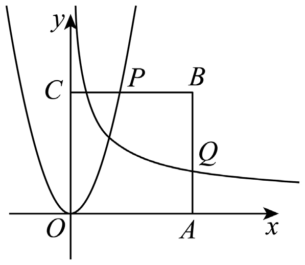
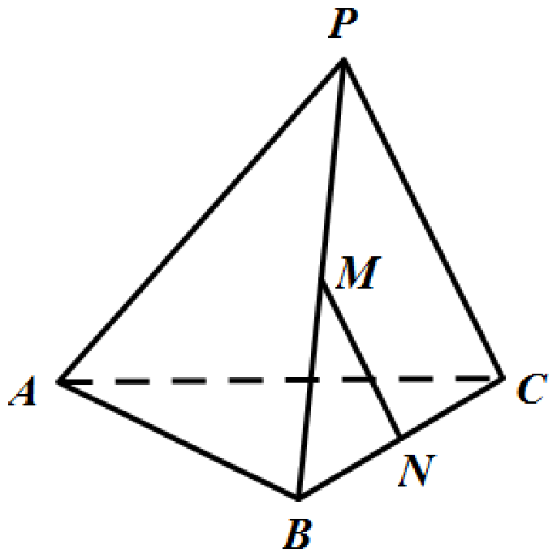

# 2019年上海卷（春）

## 填空题

### 第 1 题

已知集合 $A=\{1,2,3,4,5\}$，$B=\{3,5,6\}$，则 $A\cap B=$＿＿＿＿＿＿.

#### 答案

$\{3,5\}$

#### 解析

由交集的定义可知，$A\cap B$ 由两集合共同含有的元素组成. 因为 $A=\{1,2,3,4,5\}$，$B=\{3,5,6\}$，所以 $A\cap B=\{3,5\}$.

### 第 2 题

计算 $\displaystyle\lim_{n\to\infty}\dfrac{2n^2-3n+1}{n^2-4n+1}=$＿＿＿＿＿＿.

#### 答案

$2$

#### 解析

将分子分母同除以 $n^2$，得 $\displaystyle\lim_{n\to\infty}\frac{2n^2-3n+1}{n^2-4n+1}=\displaystyle\lim_{n\to\infty}\frac{2-\frac3n+\frac1{n^2}}{1-\frac4n+\frac1{n^2}}=2$.

### 第 3 题

不等式 $|x+1|<5$ 的解集为＿＿＿＿＿＿.

#### 答案

$(-6,4)$

#### 解析

由 $|x+1|<5$ 得 $-5<x+1<5$，解得 $-6<x<4$，所以解集为 $(-6,4)$.

### 第 4 题

函数 $f(x)=x^2$（$x>0$）的反函数为＿＿＿＿＿＿.

#### 答案

$y=\sqrt{x}$，$\,x>0$

#### 解析

因为 $f(x)=x^2$（$x>0$） 的值域为 $(0,+\infty)$，设 $y=x^2$ 则 $x=\sqrt{y}$. 交换变量后，反函数为 $y=\sqrt{x}$，$\,x>0$.

### 第 5 题

设 $i$ 为虚数单位，$3z-i=6+5i$，则 $|z|$ 的值为＿＿＿＿＿＿.

#### 答案

$2\sqrt2$

#### 解析

由 $3z-i=6+5i$ 得 $3z=6+6i$，故 $z=2+2i$. 于是 $|z|=\sqrt{2^2+2^2}=2\sqrt2$.

### 第 6 题

已知

$$

\begin{cases}
2x+2y=-1,\\
4x+a^2y=a,
\end{cases}

$$

当方程有无穷多解时，$a$ 的值为＿＿＿＿＿＿.

#### 答案

$-2$

#### 解析

方程有无穷多解时，两方程应表示同一个一次方程组. 把第二个方程同除以 2，得 $2x+\dfrac{a^2}{2}y=\dfrac a2$. 与 $2x+2y=-1$ 比较系数，得到 $\dfrac{a^2}{2}=2$ 且 $\dfrac a2=-1$，所以 $a=-2$.

### 第 7 题

在 $\left(x+\dfrac{1}{\sqrt{x}}\right)^6$ 的二项展开式中，常数项的值为＿＿＿＿＿＿.

#### 答案

$15$

#### 解析

展开 $\left(x+\dfrac1{\sqrt x}\right)^6$ 的通项为 $\mathrm C_6^r x^{6-r}\left(\dfrac1{\sqrt x}\right)^r=\mathrm C_6^r x^{6-\frac{3r}{2}}$. 常数项对应指数 $6-\dfrac{3r}{2}=0$，解得 $r=4$. 故常数项为 $\mathrm C_6^4=15$.

### 第 8 题

在 $\triangle ABC$ 中，$AC=3$，$3\sin A=2\sin B$，且 $\cos C=\dfrac14$，则 $AB=$＿＿＿＿＿＿.

#### 答案

$\sqrt{10}$

#### 解析

由正弦定理， $\frac{BC}{\sin A}=\frac{AC}{\sin B}$. 又已知 $3\sin A=2\sin B$，所以 $BC=\dfrac23AC=2$. 再由余弦定理，

$$

AB^2=AC^2+BC^2-2\cdot AC\cdot BC\cos C
=9+4-2\cdot3\cdot2\cdot\dfrac14=10

$$

因此 $AB=\sqrt{10}$.

### 第 9 题

首届中国国际进口博览会在上海举行，某高校拟派 4 人参加连续 5 天的志愿者活动，其中甲连续参加 2 天，其他人各参加 1 天，则不同的安排方法有＿＿＿＿＿＿种（结果用数值表示）.

#### 答案

$24$

#### 解析

先安排甲连续参加 2 天. 这样的起始位置共有 4 种. 确定甲后，剩下 3 人分别安排在余下 3 天中，共有 $\mathrm A_3^3=6$ 种排法. 故总数为 $4\times 6=24$ 种.

### 第 10 题

如图，已知正方形 $OABC$，其中 $OA=a$（$a>1$），函数 $y=3x^2$ 交 $BC$ 于点 $P$，函数 $y=x^{-1/2}$ 交 $AB$ 于点 $Q$，当 $|AQ|+|CP|$ 最小时，则 $a$ 的值为＿＿＿＿＿＿.

#### 答案

$\sqrt3$

#### 解析

由图可知，$O=(0,0)$，$A=(a,0)$，$B=(a,a)$，$C=(0,a)$. 函数 $y=3x^2$ 与 $BC$ 交于 $P$，所以 $P\bigl(\sqrt{a/3},a\bigr)$；函数 $y=x^{-1/2}$ 与 $AB$ 交于 $Q$，所以 $Q\bigl(a,1/\sqrt a\bigr)$. 因此 $|CP|=\sqrt{\frac a3}$，$|AQ|=\frac1{\sqrt a}$， 从而

$$

|AQ|+|CP|=\frac{\sqrt a}{\sqrt3}+\frac1{\sqrt a}\ge 2\sqrt{\frac{\sqrt a}{\sqrt3}\cdot\frac1{\sqrt a}}=\frac{2}{\sqrt[4]{3}}

$$

当且仅当 $\dfrac{\sqrt a}{\sqrt3}=\dfrac1{\sqrt a}$，即 $a=\sqrt3$ 时取等号，所以所求为 $\sqrt3$.

### 第 11 题

在椭圆 $\dfrac{x^2}{4}+\dfrac{y^2}{2}=1$ 上任意一点 $P$，$Q$ 与 $P$ 关于 $x$ 轴对称，若有 $\overrightarrow{F_1P}\cdot\overrightarrow{F_2P}\le1$，则 $\overrightarrow{F_1P}$ 与 $\overrightarrow{F_2Q}$ 的夹角范围为＿＿＿＿＿＿.

#### 答案

$\left[\pi-\arccos\dfrac13,\pi\right]$

#### 解析

设椭圆焦点为 $F_1(-\sqrt2,0)$，$F_2(\sqrt2,0)$，且 $P(x,y)$ 在椭圆上，$Q(x,-y)$. 由

$$

\overrightarrow{F_1P}\cdot\overrightarrow{F_2P}
=(x+\sqrt2,y)\cdot(x-\sqrt2,y)=x^2+y^2-2\le 1

$$

并结合椭圆方程 $\dfrac{x^2}{4}+\dfrac{y^2}{2}=1$，可得 $y^2\in[1,2]$. 又 $\overrightarrow{F_2Q}=(x-\sqrt2,-y)$，所以夹角 $\theta$ 满足

$$

\cos\theta
=\frac{(x+\sqrt2)(x-\sqrt2)-y^2}{\sqrt{(x+\sqrt2)^2+y^2}\sqrt{(x-\sqrt2)^2+y^2}}
=\frac{2-3y^2}{y^2+2}

$$

当 $y^2\in[1,2]$ 时，$\cos\theta\in[-1,-\tfrac13]$，故 $\theta\in\left[\pi-\arccos\dfrac13,\pi\right]$.

### 第 12 题

已知集合 $A=[t,t+1]\cup[t+4,t+9]$，$0\notin A$，存在正数 $\lambda$，使得对任意 $a\in A$，都有 $\dfrac{\lambda}{a}\in A$，则 $t$ 的值是＿＿＿＿＿＿.

#### 答案

$1$ 或 $-3$

#### 解析

因为 $\lambda>0$，且要求对任意 $a\in A$ 都有 $\dfrac{\lambda}{a}\in A$，所以 $A$ 在取倒数后仍要落回原来的两个区间中. 先根据 $0\notin A$ 分情况讨论：

若 $t>0$，则 $A\subset(0,+\infty)$. 这时 $\dfrac{\lambda}{a}\in A$ 会把 $[t,t+1]$ 与 $[t+4,t+9]$ 对应起来，整理得 $\lambda=t(t+9)=(t+1)(t+4)$，解得 $t=1$.

若 $t<-9$，则 $A\subset(-\infty,0)$. 此时取倒数后的区间对应关系与 $t>0$ 时一致，整理后仍得到 $t=1$，不合题意.

若 $-4<t<-1$，则 $[t,t+1]$ 与 $[t+4,t+9]$ 分居零点两侧，整理得 $\lambda=t(t+1)=(t+4)(t+9)$，解得 $t=-3$.

所以 $t=1$ 或 $-3$.

## 单选题

### 第 13 题

下列函数中，值域为 $[0,+\infty)$ 的是

A.  
$y=2^x$

B.  
$y=x^{1/2}$

C.  
$y=\tan x$

D.  
$y=\cos x$

#### 答案

B

#### 解析

逐项判断值域：$y=2^x$ 的值域是 $(0,+\infty)$，$y=x^{1/2}$ 的值域是 $[0,+\infty)$，$y=\tan x$ 的值域是 $\mathbb{R}$，$y=\cos x$ 的值域是 $[-1,1]$. 因此选 B.

### 第 14 题

已知 $a$，$b\in\mathbb{R}$，则“$a^2>b^2$”是“$|a|>|b|$”的

A.  
充分非必要条件

B.  
必要非充分条件

C.  
充要条件

D.  
既非充分又非必要条件

#### 答案

C

#### 解析

由 $a^2>b^2$ 可得 $|a|>|b|$；反过来，若 $|a|>|b|$，平方后仍得 $a^2>b^2$. 所以“$a^2>b^2$”与“$|a|>|b|$”等价，故它是“$|a|>|b|$”的充要条件，选 C.

### 第 15 题

已知平面 $\alpha$，$\beta$，$\gamma$ 两两垂直，直线 $a$，$b$，$c$ 满足 $a\subset\alpha$，$b\subset\beta$，$c\subset\gamma$，则直线 $a$，$b$，$c$ 不可能满足以下哪种关系（）

A.  
两两垂直

B.  
两两异面

C.  
两两相交

D.  
两两平行

#### 答案

D

#### 解析

对 A，取三条分别沿三条互相垂直方向的直线即可，能够两两垂直；对 B，可构造三条空间异面直线；对 C，也可以构造三条两两相交的直线. 若三条直线两两平行，设 $l=\alpha\cap\beta$，则由 $a\parallel b$ 可知 $a\parallel l$，$b\parallel l$，再由 $a\parallel b\parallel c$ 得 $c\parallel l$. 但 $c\subset\gamma$，而 $\gamma$ 与 $\alpha$，$\beta$ 两两垂直，$l$ 不可能与 $\gamma$ 平行，矛盾，所以 D 不可能.

### 第 16 题

以 $(a_1,0)$，$(a_2,0)$ 为圆心的两圆均过 $(1,0)$，与 $y$ 轴正半轴分别交于 $(0,y_1)$，$(0,y_2)$，且满足 $\ln y_1+\ln y_2=0$，则点 $\left(\dfrac1{a_1},\dfrac1{a_2}\right)$ 的轨迹是

A.  
直线

B.  
圆

C.  
椭圆

D.  
双曲线

#### 答案

A

#### 解析

设两圆分别以 $(a_1,0)$，$(a_2,0)$ 为圆心，且都过 $(1,0)$. 由圆的半径关系， $y_1^2=(1-a_1)^2-a_1^2=1-2a_1$，$y_2^2=(1-a_2)^2-a_2^2=1-2a_2$. 又 $\ln y_1+\ln y_2=0$，所以 $y_1y_2=1$. 于是 $(1-2a_1)(1-2a_2)=1$， 化简得 $2a_1a_2=a_1+a_2$，即 $\frac1{a_1}+\frac1{a_2}=2$. 令 $x=\dfrac1{a_1}$，$y=\dfrac1{a_2}$，则轨迹方程为 $x+y=2$，所以选 A.

## 解答题

### 第 17 题

如图，在正三棱锥 $P-ABC$ 中，$PA=PB=PC=2$，$AB=BC=AC=\sqrt3$.

1.  若 $PB$ 的中点为 $M$，$BC$ 的中点为 $N$，求 $AC$ 与 $MN$ 的夹角；

2.  求 $P-ABC$ 的体积.

#### 解析

1.  $M$ 是 $PB$ 的中点，$N$ 是 $BC$ 的中点，所以在三角形 $PBC$ 中，$MN\parallel PC$. 因此 $AC$ 与 $MN$ 的夹角就是 $AC$ 与 $PC$ 的夹角，即 $\angle PCA$. 在三角形 $PCA$ 中，由余弦定理得

$$

\cos\angle PCA=\frac{PC^2+AC^2-PA^2}{2\cdot PC\cdot AC}
    =\frac{4+3-4}{2\cdot2\cdot\sqrt3}
    =\frac{\sqrt3}{4}

$$

    故所求角为 $\arccos\dfrac{\sqrt3}{4}$.

2.  正三棱锥的顶点 $P$ 在底面正三角形 $ABC$ 的中心 $O$ 的垂线上. 底面边长为 $\sqrt3$，其外接圆半径 $OA=1$. 由 $PA=2$ 得 $PO=\sqrt{PA^2-OA^2}=\sqrt{4-1}=\sqrt3$. 又 $S_{\triangle ABC}=\dfrac{\sqrt3}{4}\cdot(\sqrt3)^2=\dfrac{3\sqrt3}{4}$，所以 $V_{P-ABC}=\frac13 S_{\triangle ABC}\cdot PO=\frac13\cdot\frac{3\sqrt3}{4}\cdot\sqrt3=\frac34$.

### 第 18 题

已知数列 $\{a_n\}$，$a_1=3$，前 $n$ 项和为 $S_n$.

1.  若 $\{a_n\}$ 为等差数列，且 $a_4=15$，求 $S_n$；

2.  若 $\{a_n\}$ 为等比数列，且 $\displaystyle\lim_{n\to\infty}S_n<12$，求公比 $q$ 的取值范围.

#### 解析

1.  由 $a_4=a_1+3d=15$ 且 $a_1=3$，得 $d=4$. 于是

$$

S_n=\frac n2\bigl(2a_1+(n-1)d\bigr)
    =\frac n2\bigl(6+4n-4\bigr)
    =2n^2+n

$$

2.  等比数列前 $n$ 项和为 $S_n=\dfrac{a_1(1-q^n)}{1-q}=\dfrac{3(1-q^n)}{1-q}$. 要使 $\displaystyle\lim_{n\to\infty}S_n<12$，先要有 $|q|<1$，再由 $\displaystyle\lim_{n\to\infty}S_n=\frac3{1-q}<12$ 得 $\dfrac1{1-q}<4$，即 $q<\dfrac34$. 综合起来，$q\in(-1,0)\cup\left(0,\dfrac34\right)$.

### 第 19 题

已知抛物线方程 $y^2=4x$，$F$ 为焦点，$P$ 为抛物线准线上一点，$Q$ 为线段 $PF$ 与抛物线的交点，定义：$d(P)=\dfrac{|PF|}{|FQ|}$.

1.  当 $P\left(-1,-\dfrac83\right)$ 时，求 $d(P)$；

2.  证明：存在常数 $a$，使得 $2d(P)=|PF|+a$；

3.  $P_1$，$P_2$，$P_3$ 为抛物线准线上三点，且 $|P_1P_2|=|P_2P_3|$，判断 $d(P_1)+d(P_3)$ 与 $2d(P_2)$ 的关系.

#### 解析

1.  抛物线 $y^2=4x$ 的焦点为 $F(1,0)$，准线为 $x=-1$. 点 $P\left(-1,-\dfrac83\right)$ 在准线上，直线 $PF$ 的斜率为 $\dfrac43$，故其方程为 $y=\dfrac43(x-1)$. 与抛物线联立可得交点 $Q\left(\dfrac14,-1\right)$. 于是 $|PF|=\sqrt{(1+1)^2+\left(0+\frac83\right)^2}=\frac{10}{3}$，$|FQ|=\sqrt{\left(1-\frac14\right)^2+(0+1)^2}=\frac54$. 所以 $d(P)=\dfrac{|PF|}{|FQ|}=\dfrac83$.

2.  设 $P=(-1,s)$. 将线段 $FP$ 参数化为 $(X,Y)=(1-2u,su)$（$0\le u\le1$），代入 $Y^2=4X$ 得 $s^2u^2=4(1-2u)$. 对应于交点 $Q$ 的参数 $u$ 为 $\dfrac{2}{\sqrt{s^2+4}+2}$，因此 $|FQ|=u|PF|$，从而

$$

d(P)=\frac{|PF|}{|FQ|}=\frac{1}{u}=\frac{\sqrt{s^2+4}+2}{2}=\frac{|PF|+2}{2}

$$

    故可取 $a=2$.

3.  设 $P_i=(-1,y_i)$（$i=1$，$2$，$3$）. 由 $|P_1P_2|=|P_2P_3|$ 可知 $P_2$ 是 $P_1$，$P_3$ 的中点，所以 $y_2=\dfrac{y_1+y_3}{2}$. 由（2）知 $d(P_i)=\frac{\sqrt{y_i^2+4}+2}{2}$. 于是只需证明 $\sqrt{y_1^2+4}+\sqrt{y_3^2+4}>2\sqrt{y_2^2+4}$. 这可由函数 $\sqrt{y^2+4}$ 的严格凸性得到，因此 $d(P_1)+d(P_3)>2d(P_2)$.

### 第 20 题

已知等差数列 $\{a_n\}$ 的公差 $d\in(0,\pi]$，数列 $\{b_n\}$ 满足 $b_n=\sin(a_n)$，集合 $S=\{x\mid x=b_n,n\in\mathbb{N}^*\}$.

1.  若 $a_1=0$，$d=\dfrac{2\pi}{3}$，求集合 $S$；

2.  若 $a_1=\dfrac{\pi}{2}$，求 $d$ 使得集合 $S$ 恰好有两个元素；

3.  若集合 $S$ 恰好有三个元素：$b_{n+T}=b_n$，$T$ 是不超过 7 的正整数，求 $T$ 的所有可能的值.

#### 解析

1.  $a_1=0$，$d=\dfrac{2\pi}{3}$ 时， $b_1=\sin0=0$，$b_2=\sin\dfrac{2\pi}{3}=\dfrac{\sqrt3}{2}$，$b_3=\sin\dfrac{4\pi}{3}=-\dfrac{\sqrt3}{2}$. 由正弦函数的周期性，之后的值重复出现，所以 $S=\left\{-\dfrac{\sqrt3}{2},0,\dfrac{\sqrt3}{2}\right\}$.

2.  若 $S$ 恰有两个元素，则前三项中必须有一对相等. 这里 $b_1=\sin\dfrac\pi2=1$，而 $b_2=\sin\left(\frac\pi2+d\right)$，$b_3=\sin\left(\frac\pi2+2d\right)$. 由于 $d>0$，$b_1=b_2$ 不可能. 若 $b_1=b_3$，则 $\cos 2d=1$，得 $d=\pi$；若 $b_2=b_3$，则 $\cos d=\cos 2d$，得 $d=\dfrac{2\pi}{3}$. 当 $d=\pi$ 时，$S=\{1,-1\}$；当 $d=\dfrac{2\pi}{3}$ 时，$S=\{1,-\dfrac12\}$. 故 $d=\dfrac{2\pi}{3}$ 或 $\pi$.

3.  因为 $S$ 恰有三个元素，所以 $T\ge3$. 当 $T=3$，$4$，$5$，$6$ 时，都可以分别构造出符合条件的等差正弦序列：$T=3$ 可取 $a_1=0$，$d=\dfrac{2\pi}{3}$；$T=4$ 可取 $a_1=0$，$d=\dfrac\pi2$；$T=5$ 可取 $a_1=\dfrac\pi{10}$，$d=\dfrac{2\pi}{5}$；$T=6$ 可取 $a_1=0$，$d=\dfrac\pi3$，均得到恰有三个元素的集合 $S$. 若 $T=7$，由于等式对所有 $n$ 成立且 $d>0$，只能有 $7d=2k\pi$，其中 $k=1$，$2$，$3$. 此时前 7 项对应模 $2\pi$ 两两不同的 7 个角，而每个正弦值至多对应模 $2\pi$ 的两个角，所以前 7 项至少有 4 个不同的值，不可能恰有三个元素. 故 $T$ 的所有可能值为 $3$，$4$，$5$，$6$.
