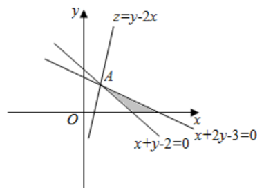
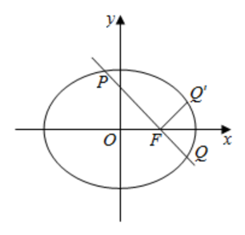
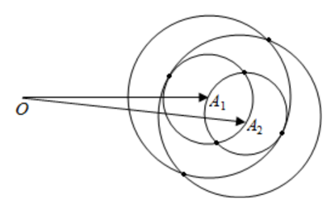
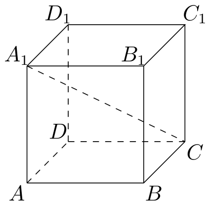
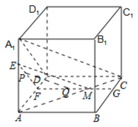
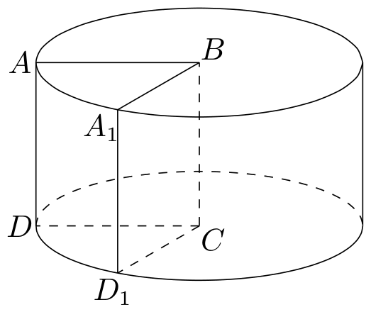

# 2020年上海卷（秋）

## 填空题

### 第 1 题

已知集合 $A=\{1,2,4\}$，集合 $B=\{2,4,5\}$，则 $A\cap B=$＿＿＿＿＿＿.

#### 答案

$\{2,4\}$

#### 解析

因为 $A=\{1,2,4\}$，$B=\{2,4,5\}$， $A\cap B=\{2,4\}$. 故答案为 $\{2,4\}$.

### 第 2 题

计算：$\lim\limits_{n\to\infty}\frac{n+1}{3n-1}=$＿＿＿＿＿＿.

#### 答案

$\frac13$

#### 解析

因为 $\lim\limits_{n\to\infty}\frac{n+1}{3n-1} =\lim\limits_{n\to\infty}\frac{1+\frac1n}{3-\frac1n} =\frac13$， 故答案为 $\frac13$.

### 第 3 题

已知复数 $z=1-2\i$（$\i$ 为虚数单位），则 $|z|=$＿＿＿＿＿＿.

#### 答案

$\sqrt5$

#### 解析

由 $z=1-2\i$，得 $|z|=\sqrt{1^2+(-2)^2}=\sqrt5$. 故答案为 $\sqrt5$.

### 第 4 题

已知函数 $f(x)=x^3$，$f^{-1}(x)$ 是 $f(x)$ 的反函数，则 $f^{-1}(x)=$＿＿＿＿＿＿.

#### 答案

$\sqrt[3]{x}$

#### 解析

由 $y=f(x)=x^3$，得 $x=\sqrt[3]{y}$. 把 $x$ 与 $y$ 互换，可得 $f(x)=x^3$ 的反函数为 $f^{-1}(x)=\sqrt[3]{x}$. 故答案为 $\sqrt[3]{x}$.

### 第 5 题

已知 $x$，$y$ 满足 $x+y-2\ge0$，$x+2y-3\le0$，$y\ge0$， 则 $z=y-2x$ 的最大值为＿＿＿＿＿＿.

#### 答案

$-1$

#### 解析

由约束条件作出可行域如图阴影部分. 化目标函数 $z=y-2x$ 为 $y=2x+z$. 由图可知，当直线 $y=2x+z$ 过点 $A$ 时，直线在 $y$ 轴上的截距最大. 联立

$$

\begin{cases}

x+y-2=0,\\
x+2y-3=0,

\end{cases}

$$

解得 $x=1$，$y=1$，即 $A(1,1)$. 所以 $z$ 有最大值为 $1-2\times1=-1$. 故答案为 $-1$.

### 第 6 题

已知行列式

$$

\left|\begin{matrix}
1 & a & b\\
2 & c & d\\
3 & 0 & 0
\end{matrix}\right|=6

$$

，则

$$

\left|\begin{matrix}
a & b\\
c & d
\end{matrix}\right|

$$

=＿＿＿＿＿＿.

#### 答案

$2$

#### 解析

由行列式

$$

\left|\begin{matrix}
1 & a & b\\
2 & c & d\\
3 & 0 & 0
\end{matrix}\right|=6

$$

，可得 $3\left|\begin{matrix}a & b\\ c & d\end{matrix}\right|=6$，解得

$$

\left|\begin{matrix}
a & b\\
c & d
\end{matrix}\right|=2

$$

. 故答案为 $2$.

### 第 7 题

已知有四个数 $1$，$2$，$a$，$b$，这四个数的中位数是 $3$，平均数是 $4$，则 $ab=$＿＿＿＿＿＿.

#### 答案

$36$

#### 解析

因为四个数的平均数为 $4$，所以 $a+b=4\times4-1-2=13$. 因为中位数是 $3$，所以 $\frac{2+a}{2}=3$， 解得 $a=4$，代入上式得 $b=9$. 所以 $ab=36$. 故答案为 $36$.

### 第 8 题

已知数列 $\{a_n\}$ 是公差不为零的等差数列，且 $a_1+a_{10}=a_9$，则 $\frac{a_1+a_2+\cdots+a_9}{a_{10}}$=＿＿＿＿＿＿.

#### 答案

$\frac{27}{8}$

#### 解析

根据题意，等差数列 $\{a_n\}$ 满足 $a_1+a_{10}=a_9$，即 $a_1+a_1+9d=a_1+8d$， 变形可得 $a_1=-d$. 所以 $\frac{a_1+a_2+\cdots+a_9}{a_{10}} =\frac{9a_1+36d}{a_1+9d} =\frac{9a_1+36d}{-d+9d} =\frac{27}{8}$. 故答案为 $\frac{27}{8}$.

### 第 9 题

从 $6$ 个人挑选 $4$ 个人去值班，每人值班一天，第一天安排 $1$ 个人，第二天安排 $1$ 个人，第三天安排 $2$ 个人，则共有＿＿＿＿＿＿ 种安排情况.

#### 答案

$180$

#### 解析

根据题意，可得排法共有 $\binom{6}{1}\binom{5}{1}\binom{4}{2}=180$ 种. 故答案为 $180$.

### 第 10 题

已知椭圆 $C:\frac{x^2}{4}+\frac{y^2}{3}=1$ 的右焦点为 $F$，直线 $l$ 经过椭圆右焦点 $F$，交椭圆 $C$ 于 $P$，$Q$ 两点（点 $P$ 在第二象限），若点 $Q$ 关于 $x$ 轴对称点为 $Q'$，且满足 $PQ\perp FQ'$，求直线 $l$ 的方程是＿＿＿＿＿＿.

#### 答案

$x+y-1=0$

#### 解析

椭圆 $C:\frac{x^2}{4}+\frac{y^2}{3}=1$ 的右焦点为 $F(1,0)$. 直线 $l$ 经过椭圆右焦点 $F$，交椭圆 $C$ 于 $P$，$Q$ 两点（点 $P$ 在第二象限）. 若点 $Q$ 关于 $x$ 轴对称点为 $Q'$，且满足 $PQ\perp FQ'$， 可知直线 $l$ 的斜率为 $-1$，所以直线 $l$ 的方程是 $y=-(x-1)$， 即 $x+y-1=0$. 故答案为 $x+y-1=0$.

### 第 11 题

设 $a\in\mathbb{R}$，若存在定义域为 $\mathbb{R}$ 的函数 $f(x)$ 同时满足下列两个条件：

1.  对任意的 $x_0\in\mathbb{R}$，$f(x_0)$ 的值为 $x_0$ 或 $x_0^2$；

2.  关于 $x$ 的方程 $f(x)=a$ 无实数解，

则 $a$ 的取值范围是＿＿＿＿＿＿.

#### 答案

$(-\infty,0)\cup(0,1)\cup(1,+\infty)$

#### 解析

根据条件（1）可得 $f(0)=0$ 或 $f(1)=1$. 又因为关于 $x$ 的方程 $f(x)=a$ 无实数解，所以 $a\neq0$ 或 $1$. 故 $a\in(-\infty,0)\cup(0,1)\cup(1,+\infty)$. 故答案为 $(-\infty,0)\cup(0,1)\cup(1,+\infty)$.

### 第 12 题

已知 $\boldsymbol{a}_1$，$\boldsymbol{a}_2$，$\boldsymbol{b}_1$，$\boldsymbol{b}_2$，$\ldots$，$\boldsymbol{b}_k$（$k\in\mathbb{N}^*$）是平面内两两互不相等的向量，满足 $|\boldsymbol{a}_1-\boldsymbol{a}_2|=1$，且 $|\boldsymbol{a}_i-\boldsymbol{b}_j|\in\{1,2\}$（其中 $i=1$，$2$，$j=1$，$2$，$\ldots$，$k$），则 $k$ 的最大值是＿＿＿＿＿＿.

#### 答案

$6$

#### 解析

如图，设 $\overrightarrow{OA_1}=\boldsymbol{a}_1$，$\overrightarrow{OA_2}=\boldsymbol{a}_2$. 由 $|\boldsymbol{a}_1-\boldsymbol{a}_2|=1$，且 $|\boldsymbol{a}_i-\boldsymbol{b}_j|\in\{1,2\}$，分别以 $A_1$，$A_2$ 为圆心，以 $1$ 和 $2$ 为半径画圆，其中任意两圆的公共点共有 $6$ 个. 故满足条件的 $k$ 的最大值为 $6$. 故答案为 $6$.

## 单选题

### 第 13 题

下列不等式恒成立的是（）

A.  
$a^2+b^2\le2ab$

B.  
$a^2+b^2\ge-2ab$

C.  
$a+b\ge2\sqrt{|ab|}$

D.  
$a^2+b^2\le-2ab$

#### 答案

B

#### 解析

A. 当 $a<0$，$b>0$ 时，不等式 $a^2+b^2\le2ab$ 不成立，故 A 错误；

B. 因为 $(a+b)^2\ge0$，所以 $a^2+b^2+2ab\ge0$，即 $a^2+b^2\ge-2ab$，故 B 正确；

C. 当 $a<0$，$b<0$ 时，不等式 $a+b\ge2\sqrt{|ab|}$ 不成立，故 C 错误；

D. 当 $a>0$，$b>0$ 时，不等式 $a^2+b^2\le-2ab$ 不成立，故 D 错误.

故选 B.

### 第 14 题

已知直线方程 $3x+4y+1=0$ 的一个参数方程可以是（）

A.  
$x=1+3t$，$y=-1-4t$（$t$ 为参数）

B.  
$x=1-4t$，$y=-1+3t$（$t$ 为参数）

C.  
$x=1-3t$，$y=-1+4t$（$t$ 为参数）

D.  
$x=1+4t$，$y=1-3t$（$t$ 为参数）

#### 答案

B

#### 解析

B 选项的普通方程为 $\frac{x-1}{-4}=\frac{y+1}{3}$， 即 $3x+4y+1=0$， 正确.

A 选项的普通方程为 $4x+3y-1=0$，不正确； C 选项的普通方程为 $4x+3y-1=0$，不正确； D 选项的普通方程为 $3x+4y-7=0$，不正确.

故选 B.

### 第 15 题

在棱长为 $10$ 的正方体 $ABCD-A_1B_1C_1D_1$ 中，$P$ 为左侧面 $ADD_1A_1$ 上一点，已知点 $P$ 到 $A_1D_1$ 的距离为 $3$，$P$ 到 $AA_1$ 的距离为 $2$，则过点 $P$ 且与 $A_1C$ 平行的直线交正方体于 $P$，$Q$ 两点，则 $Q$ 点所在的平面是（）

A.  
$AA_1B_1B$

B.  
$BB_1C_1C$

C.  
$CC_1D_1D$

D.  
$ABCD$

#### 答案

D

#### 解析

如图，

由点 $P$ 到 $A_1D_1$ 的距离为 $3$，$P$ 到 $AA_1$ 的距离为 $2$， 可得 $P$ 在 $\triangle AA_1D$ 内，过 $P$ 作 $EF\parallel A_1D$，且 $EF\cap AA_1$ 于 $E$，$EF\cap AD$ 于 $F$. 在平面 $ABCD$ 中，过 $F$ 作 $FG\parallel CD$，交 $BC$ 于 $G$，则平面 $EFG\parallel$ 平面 $A_1DC$. 连接 $AC$，交 $FG$ 于 $M$，连接 $EM$. 因为平面 $EFG\parallel$ 平面 $A_1DC$，所以平面 $A_1AC\cap$ 平面 $A_1DC=A_1C$，平面 $A_1AC\cap$ 平面 $EFM=EM$， 所以 $EM\parallel A_1C$. 在 $\triangle EFM$ 中，过 $P$ 作 $PQ\parallel EM$，且 $PQ\cap FM$ 于 $Q$，则 $PQ\parallel A_1C$. 因为线段 $FM$ 在四边形 $ABCD$ 内，$Q$ 在线段 $FM$ 上，所以 $Q$ 在四边形 $ABCD$ 内. 所以 $Q$ 点所在的平面是平面 $ABCD$.

故选 D.

### 第 16 题

命题 $p$：存在 $a\in\mathbb{R}$ 且 $a\neq0$，对于任意的 $x\in\mathbb{R}$，使得 $f(x+a)<f(x)+f(a)$；

命题 $q_1$：$f(x)$ 单调递减且 $f(x)>0$ 恒成立；

命题 $q_2$：$f(x)$ 单调递增，存在 $x_0<0$ 使得 $f(x_0)=0$，

则下列说法正确的是（）

A.  
只有 $q_1$ 是 $p$ 的充分条件

B.  
只有 $q_2$ 是 $p$ 的充分条件

C.  
$q_1$，$q_2$ 都是 $p$ 的充分条件

D.  
$q_1$，$q_2$ 都不是 $p$ 的充分条件

#### 答案

C

#### 解析

对于命题 $q_1$：当 $f(x)$ 单调递减且 $f(x)>0$ 恒成立时， 当 $a>0$ 时，此时 $x+a>x$，又因为 $f(x)$ 单调递减，所以 $f(x+a)<f(x)$. 又因为 $f(x)>0$ 恒成立，所以 $f(x)<f(x)+f(a)$，从而 $f(x+a)<f(x)+f(a)$. 所以命题 $q_1\mathbb{R}ightarrow p$.

对于命题 $q_2$：当 $f(x)$ 单调递增，存在 $x_0<0$ 使得 $f(x_0)=0$ 时， 取 $a=x_0<0$，此时 $x+a<x$，又因为 $f(x)$ 单调递增，所以 $f(x+a)<f(x)$. 同时 $f(a)=f(x_0)=0$，故 $f(x+a)<f(x)+f(a)$. 所以命题 $q_2\mathbb{R}ightarrow p$.

所以 $q_1$，$q_2$ 都是 $p$ 的充分条件. 故选 C.

## 解答题

### 第 17 题

已知 $ABCD$ 是边长为 $1$ 的正方形，正方形 $ABCD$ 绕 $AB$ 旋转形成一个圆柱.

1.  求该圆柱的表面积；

2.  正方形 $ABCD$ 绕 $AB$ 逆时针旋转 $\frac{\pi}{2}$ 至 $ABC_1D_1$，求线段 $CD_1$ 与平面 $ABCD$ 所成的角.

#### 解析

1.  该圆柱的表面由上下两个半径为 $1$ 的圆面和一个长为 $2\pi$，宽为 $1$ 的矩形组成， $S=2\times\pi\times1^2+2\pi\times1=4\pi$. 故该圆柱的表面积为 $4\pi$.

2.  因为正方形 $ABC_1D_1$，所以 $AD_1\perp AB$. 又 $\angle DAD_1=\frac{\pi}{2}$，所以 $AD_1\perp AD$. 因为 $AD\cap AB=A$，且 $AD$，$AB\subset$ 平面 $ADB$，所以 $AD_1\perp$ 平面 $ADB$，即 $D_1$ 在面 $ADB$ 上的投影为 $A$. 连接 $CD_1$，则 $\angle D_1CA$ 即为线段 $CD_1$ 与平面 $ABCD$ 所成的角. 由题意可得 $\cos\angle D_1CA=\frac{AC}{CD_1}=\frac{\sqrt2}{\sqrt3}=\frac{\sqrt6}{3}$. 所以线段 $CD_1$ 与平面 $ABCD$ 所成的角为 $\arccos\frac{\sqrt6}{3}$.

### 第 18 题

已知函数 $f(x)=\sin\omega x$，$\omega>0$.

1.  $f(x)$ 的周期是 $4\pi$，求 $\omega$，并求 $f(x)=\frac12$ 的解集；

2.  已知 $\omega=1$，$g(x)=f^2(x)+\sqrt3\,f(-x)f\!\left(\frac\pi2-x\right)$，$x\in\left[0,\frac\pi4\right]$，求 $g(x)$ 的值域.

#### 解析

1.  由于 $f(x)$ 的周期是 $4\pi$，所以 $\omega=\frac{2\pi}{4\pi}=\frac12$， 所以 $f(x)=\sin\frac{x}{2}$. 令 $\sin\frac{x}{2}=\frac12$， 故 $\frac{x}{2}=\frac{\pi}{6}+2k\pi$或$\frac{x}{2}=\frac{5\pi}{6}+2k\pi$， 整理得 $x=4k\pi+\frac{\pi}{3}$或$x=4k\pi+\frac{5\pi}{3}$，$k\in\mathbb{Z}$.

2.  由于 $\omega=1$，所以 $f(x)=\sin x$. 所以 $g(x)=\sin^2x+\sqrt3\sin(-x)\sin\left(\frac\pi2-x\right)$ $=\frac{1-\cos2x}{2}-\frac{\sqrt3}{2}\sin2x$ $=\frac12-\frac12\left(\cos2x+\sqrt3\sin2x\right)$ $=\frac12-\sin\left(2x+\frac\pi6\right)$. 由于 $x\in\left[0,\frac\pi4\right]$，所以 $\frac\pi6\le2x+\frac\pi6\le\frac{2\pi}{3}$. 于是 $\frac12\le\sin\left(2x+\frac\pi6\right)\le1$， 故 $-1\le-\sin\left(2x+\frac\pi6\right)\le-\frac12$. 故 $-\frac12\le g(x)\le0$. 所以函数 $g(x)$ 的值域为 $\left[-\frac12,0\right]$.

### 第 19 题

在研究某市交通情况时，道路密度是指该路段上一定时间内通过的车辆数除以时间，车辆密度是该路段一定时间内通过的车辆数除以该路段的长度，现定义交通流量 $v=f(x)=\frac{q}{x}$，其中 $x$ 为道路密度，$q$ 为车辆密度，且 $f(x)=100-135\left(\frac13\right)^{\frac{80}{x}}$（$0<x<40$）， $f(x)=-k(x-40)+85$（$40\le x\le80$）.

1.  若交通流量 $v>95$，求道路密度 $x$ 的取值范围；

2.  已知道路密度 $x=80$ 时，测得交通流量 $v=50$，求车辆密度 $q$ 的最大值.

#### 解析

1.  按实际情况而言，交通流量 $v$ 随着道路密度 $x$ 的增大而减小，故 $v=f(x)$ 是单调递减函数，所以 $k>0$. 当 $40\le x\le80$ 时，$v$ 最大为 $85$. 于是只需令 $100-135\left(\frac13\right)^{\frac{80}{x}}>95$， 解得 $\left(\frac13\right)^{\frac{80}{x}}<\frac1{27}$， 所以 $\frac{80}{x}>3$， 即 $x<\frac{80}{3}$. 故道路密度 $x$ 的取值范围为 $\left(0,\frac{80}{3}\right)$.

2.  把 $x=80$，$v=50$ 代入 $v=f(x)=-k(x-40)+85$ 中， $50=-k\cdot40+85$， 解得 $k=\frac78$. 所以

$$

q=vx=
    \begin{cases}
    x\left(100-135\left(\frac13\right)^{\frac{80}{x}}\right), & 0<x<40,\\
    \left(-\frac78(x-40)+85\right)x, & 40\le x\le80.
    \end{cases}

$$

    当 $0<x<40$ 时， $v=100-135\left(\frac13\right)^{\frac{80}{x}}<100$， 所以 $q=vx<100\times40=4000$.

    当 $40\le x\le80$ 时， $q=-\frac78x^2+120x$， 对称轴为 $x=\frac{480}{7}$， 此时 $q$ 有最大值，为 $\frac{28800}{7}$， 且 $\frac{28800}{7}>4000$.

    综上所述，车辆密度 $q$ 的最大值为 $\frac{28800}{7}$.

### 第 20 题

已知双曲线 $\Gamma_1:\frac{x^2}{4}-\frac{y^2}{b^2}=1$ 与圆 $\Gamma_2:x^2+y^2=4+b^2$（$b>0$）交于点 $A(x_A,y_A)$（第一象限），曲线 $\Gamma$ 为 $\Gamma_1$，$\Gamma_2$ 上取满足 $x>|x_A|$ 的部分.

1.  若 $x_A=\sqrt6$，求 $b$ 的值；

2.  当 $b=\sqrt5$，$\Gamma_2$ 与 $x$ 轴交点记作点 $F_1$，$F_2$，$P$ 是曲线 $\Gamma$ 上一点，且在第一象限，且 $|PF_1|=8$，求 $\angle F_1PF_2$；

3.  过点 $D\left(0,\frac{b^2}{2}+2\right)$ 斜率为 $-\frac{b}{2}$ 的直线 $l$ 与曲线 $\Gamma$ 只有两个交点，记为 $M$，$N$，用 $b$ 表示 $\overrightarrow{OM}\cdot\overrightarrow{ON}$，并求 $\overrightarrow{OM}\cdot\overrightarrow{ON}$ 的取值范围.

#### 解析

1.  由 $x_A=\sqrt6$，点 $A$ 为曲线 $\Gamma_1$ 与曲线 $\Gamma_2$ 的交点，联立

$$

\begin{cases}

    \frac{x_A^2}{4}-\frac{y_A^2}{b^2}=1,\\
    x_A^2+y_A^2=4+b^2,

    \end{cases}

$$

    解得 $y_A=\sqrt2$，$b=2$.

2.  由题意可得 $F_1$，$F_2$ 为曲线 $\Gamma_1$ 的两个焦点. 由双曲线的定义可得 $|PF_1|-|PF_2|=2a$， 又 $|PF_1|=8$，$2a=4$，所以 $|PF_2|=8-4=4$. 因为 $b=\sqrt5$，则 $c=\sqrt{4+5}=3$， 所以 $|F_1F_2|=6$. 在 $\triangle PF_1F_2$ 中，由余弦定理可得 $\cos\angle F_1PF_2=\frac{|PF_1|^2+|PF_2|^2-|F_1F_2|^2}{2|PF_1|\cdot|PF_2|}=\frac{64+16-36}{2\times8\times4}=\frac{11}{16}$. 由 $0<\angle F_1PF_2<\pi$，可得 $\angle F_1PF_2=\arccos\frac{11}{16}$.

3.  设直线 $l:y=-\frac{b}{2}x+\frac{b^2}{2}+2$，可得原点 $O$ 到直线 $l$ 的距离 $d=\frac{\frac{b^2+4}{2}}{\sqrt{1+\frac{b^2}{4}}}=\sqrt{4+b^2}$， 所以直线 $l$ 是圆的切线，设切点为 $M$.

    所以 $k_{OM}=\frac{2}{b}$，并设 $OM:y=\frac{2}{b}x$ 与圆 $x^2+y^2=4+b^2$ 联立，可得 $x^2+\frac{4}{b^2}x^2=4+b^2$， $x=b$，$y=2$， 即 $M(b,2)$. 注意直线 $l$ 与双曲线的斜率为负的渐近线平行，所以只有当 $y_A>2$ 时，直线 $l$ 才能与曲线 $\Gamma$ 有两个交点. 由

$$

\begin{cases}

    \frac{x_A^2}{4}-\frac{y_A^2}{b^2}=1,\\
    x_A^2+y_A^2=4+b^2

    \end{cases}

$$

    可得 $y_A^2=\frac{b^4}{4+b^2}$. 所以有 $4<\frac{b^4}{4+b^2}$， 解得 $b^2>2+2\sqrt5$ 或 $b^2<2-2\sqrt5$（舍去）. 因为 $\overrightarrow{OM}$ 为 $\overrightarrow{ON}$ 在 $\overrightarrow{OM}$ 上的投影，可得 $\overrightarrow{OM}\cdot\overrightarrow{ON}=4+b^2$. 所以 $\overrightarrow{OM}\cdot\overrightarrow{ON}>6+2\sqrt5$， 则 $\overrightarrow{OM}\cdot\overrightarrow{ON}\in(6+2\sqrt5,+\infty)$.

### 第 21 题

已知数列 $\{a_n\}$ 为有限数列，满足 $|a_1-a_2|\le|a_1-a_3|\le\cdots\le|a_1-a_m|$，则称 $\{a_n\}$ 满足性质 $P$.

1.  判断数列 $3$，$2$，$5$，$1$ 和 $4$，$3$，$2$，$5$，$1$ 是否具有性质 $P$，请说明理由；

2.  若 $a_1=1$，公比为 $q$ 的等比数列，项数为 $10$，具有性质 $P$，求 $q$ 的取值范围；

3.  若 $\{a_n\}$ 是 $1$，$2$，$3$，$\ldots$，$m$ 的一个排列（$m\ge4$），$\{b_n\}$ 符合 $b_k=a_{k+1}$（$k=1$，$2$，$\ldots$，$m-1$），$\{a_n\}$，$\{b_n\}$ 都具有性质 $P$，求所有满足条件的数列 $\{a_n\}$.

#### 解析

1.  对于数列 $3$，$2$，$5$，$1$，有 $|2-3|=1$，$|5-3|=2$，$|1-3|=2$，满足题意，该数列满足性质 $P$.

    对于第二个数列 $4$，$3$，$2$，$5$，$1$，有 $|3-4|=1$，$|2-4|=2$，$|5-4|=1$，不满足题意，该数列不满足性质 $P$.

2.  由题意， $|a_1-a_1q^n|\ge|a_1-a_1q^{n-1}|$，$n\in\{2,3,\ldots,9\}$， 可得 $|q^n-1|\ge|q^{n-1}-1|$. 两边平方可得 $q^{2n}-2q^n+1\ge q^{2n-2}-2q^{n-1}+1$. 整理可得 $(q-1)q^{n-1}\big[q^{n-1}(q+1)-2\big]\ge0$. 当 $q\ge1$ 时，得 $q^{n-1}(q+1)-2\ge0$，此时关于 $n$ 恒成立，所以等价于 $n=2$ 时 $q(q+1)-2\ge0$. 所以 $(q+2)(q-1)\ge0$， 所以 $q\le-2$ 或 $q\ge1$，所以取 $q\ge1$.

    当 $0<q\le1$ 时，得 $q^{n-1}(q+1)-2\le0$，此时关于 $n$ 恒成立，所以等价于 $n=2$ 时 $q(q+1)-2\le0$. 所以 $(q+2)(q-1)\le0$， 所以 $-2\le q\le1$，所以取 $0<q\le1$.

    当 $-1\le q<0$ 时矛盾，舍去.

    当 $q<-1$ 时，得 $q^{n-1}\big[q^{n-1}(q+1)-2\big]\le0$. 当 $n$ 为奇数时，得 $q^{n-1}(q+1)-2\le0$，恒成立；当 $n$ 为偶数时，$q^{n-1}(q+1)-2\ge0$，恒成立. 故等价于 $n=2$ 时 $q(q+1)-2\ge0$. 所以 $(q+2)(q-1)\ge0$， 所以 $q\le-2$ 或 $q\ge1$，所以取 $q\le-2$.

    综上 $q\in(-\infty,-2]\cup(0,+\infty)$.

3.  设 $a_1=p$，$p\in\{3,4,\ldots,m-3,m-2\}$. 因为 $a_1=p$，$a_2$ 可以取 $p-1$ 或 $p+1$，$a_3$ 可以取 $p-2$ 或 $p+2$. 如果 $a_2$ 或 $a_3$ 取了 $p-3$ 或 $p+3$，将使 $\{a_n\}$ 不满足性质 $P$；所以 $\{a_n\}$ 的前 $5$ 项有以下组合：

    1.  $a_1=p$，$a_2=p-1$，$a_3=p+1$，$a_4=p-2$，$a_5=p+2$；

    2.  $a_1=p$，$a_2=p-1$，$a_3=p+1$，$a_4=p+2$，$a_5=p-2$；

    3.  $a_1=p$，$a_2=p+1$，$a_3=p-1$，$a_4=p-2$，$a_5=p+2$；

    4.  $a_1=p$，$a_2=p+1$，$a_3=p-1$，$a_4=p+2$，$a_5=p-2$.

    <!-- -->

    1.  对于 $b_1=p-1$，$|b_2-b_1|=2$，$|b_3-b_1|=1$，与 $\{b_n\}$ 满足性质 $P$ 矛盾，舍去；

    2.  对于 $b_1=p-1$，$|b_2-b_1|=2$，$|b_3-b_1|=3$，$|b_4-b_1|=1$，与 $\{b_n\}$ 满足性质 $P$ 矛盾，舍去；

    3.  对于 $b_1=p+1$，$|b_2-b_1|=2$，$|b_3-b_1|=3$，$|b_4-b_1|=1$，与 $\{b_n\}$ 满足性质 $P$ 矛盾，舍去；

    4.  对于 $b_1=p+1$，$|b_2-b_1|=2$，$|b_3-b_1|=1$，与 $\{b_n\}$ 满足性质 $P$ 矛盾，舍去.

    所以 $p\in\{3,4,\ldots,m-3,m-2\}$ 时，均不能同时使 $\{a_n\}$，$\{b_n\}$ 都具有性质 $P$.

    当 $p=1$ 时，有数列 $\{a_n\}:1$，$2$，$3$，$\ldots$，$m-1$，$m$ 满足题意.

    当 $p=m$ 时，有数列 $\{a_n\}:m$，$m-1$，$\ldots$，$3$，$2$，$1$ 满足题意.

    当 $p=2$ 时，有数列 $\{a_n\}:2$，$1$，$3$，$\ldots$，$m-1$，$m$ 满足题意.

    当 $p=m-1$ 时，有数列 $\{a_n\}:m-1$，$m$，$m-2$，$m-3$，$\ldots$，$3$，$2$，$1$ 满足题意.

    所以满足题意的数列 $\{a_n\}$ 只有以上四种.
