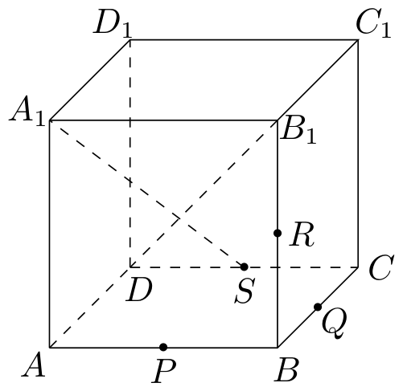
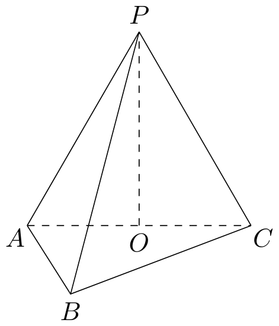
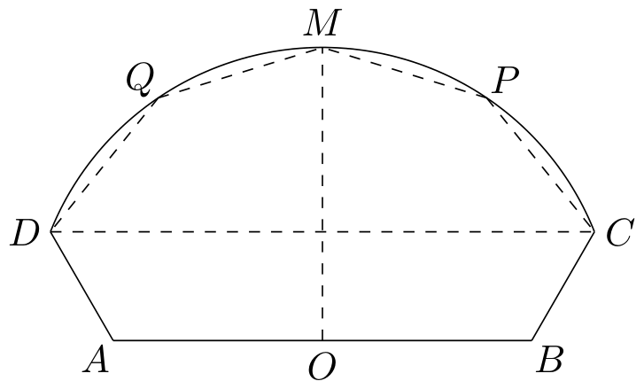

# 2022年上海卷（秋）

## 填空题

### 第 1 题

若复数 $z=1+\i$（其中 $\i$ 为虚数单位），则 $2z=\underline{\qquad\qquad}$.

#### 答案

$2+2\i$

### 第 2 题

双曲线 $\frac{x^2}{9}-y^2=1$ 的实轴长为＿＿＿＿＿＿.

#### 答案

$6$

### 第 3 题

函数 $y=\cos^2x-\sin^2x+1$ 的最小正周期为＿＿＿＿＿＿.

#### 答案

$\pi$

### 第 4 题

设 $a$ 为常数，若行列式 $\begin{vmatrix}a&1\\3&2\end{vmatrix}$ 的值与行列式 $\begin{vmatrix}a&0\\4&1\end{vmatrix}$ 的值相等，则 $a=\underline{\qquad\qquad}$.

#### 答案

$3$

### 第 5 题

若圆柱的高为 $4$，底面积为 $9\pi$，则该圆柱的侧面积为＿＿＿＿＿＿.

#### 答案

$24\pi$

### 第 6 题

若实数 $x$，$y$ 满足 $x-y\le0$，$x+y-1\ge0$，则 $z=x+2y$ 的最小值为＿＿＿＿＿＿.

#### 答案

$\frac32$

### 第 7 题

在 $(3+x)^n$ 的二项展开式中，若 $x^2$ 的系数是常数项的 $5$ 倍，则 $n=\underline{\qquad\qquad}$.

#### 答案

$10$

### 第 8 题

已知 $f(x)$ 为奇函数，且

$$

f(x)=\begin{cases}
a^2x-1, & x<0,\\
x+a, & x>0,
\end{cases}

$$

则实数 $a=\underline{\qquad\qquad}$.

#### 答案

$1$

### 第 9 题

为了检测学生的身体素质指标，需从游泳类 $1$ 项，球类 $3$ 项，田径类 $4$ 项，共 $8$ 项项目中随机抽取 $4$ 项进行测试，每一类都被抽到的概率为＿＿＿＿＿＿（结果用最简分数表示）.

#### 答案

$\frac37$

### 第 10 题

已知等差数列 $\{a_n\}$ 的公差不为零，$S_n$ 为其前 $n$ 项和. 若 $S_5=0$，则 $S_1$，$S_2$，…，$S_{100}$ 这 $100$ 个数中所有不同数值的个数为＿＿＿＿＿＿.

#### 答案

$98$

### 第 11 题

已知平面非零向量 $\boldsymbol{a}$，$\boldsymbol{b}$，$\boldsymbol{c}$ 的模均为 $\lambda$，若 $\boldsymbol{a}\cdot\boldsymbol{b}=0$，$\boldsymbol{a}\cdot\boldsymbol{c}=2$，$\boldsymbol{b}\cdot\boldsymbol{c}=1$，则 $\lambda=\underline{\qquad\qquad}$.

#### 答案

$\sqrt[4]{5}$

### 第 12 题

设函数 $y=f(x)$，定义域为 $[0,+\infty)$，值域为 $A$，且对定义域中任意实数 $x$ 都成立 $f(x)=f\left(\frac1{x+1}\right)$. 若 $\{y\mid y=f(x),x\in[0,a]\}=A$，则实数 $a$ 的取值范围是＿＿＿＿＿＿.

#### 答案

$\left[\frac{\sqrt5-1}{2},+\infty\right)$

#### 解析

令变换 $T(x)=\dfrac1{x+1}$. 方程 $T(x)=x$ 的非负解满足

$$

x^2+x-1=0

$$

所以

$$

\alpha=\frac{\sqrt5-1}{2}

$$

当 $x\geq\alpha$ 时，$T(x)=\dfrac1{x+1}\leq\dfrac1{\alpha+1}=\alpha$，且 $T(x)>0$. 根据题设，$f(x)=f(T(x))$，因此定义域中任意 $x\geq\alpha$ 所对应的函数值，都能在区间 $[0,\alpha]$ 上取得. 区间 $[0,\alpha]$ 中的函数值本来就属于值域 $A$，故

$$

A=\{y\mid y=f(x),\ x\in[0,\alpha]\}

$$

要使区间 $[0,a]$ 取得值域 $A$ 中的全部函数值，必须且只需覆盖这个代表区间，即 $a\geq\alpha$. 因而

$$

a\in\left[\frac{\sqrt5-1}{2},+\infty\right)

$$

## 单选题

### 第 13 题

若集合 $A=[-1,2)$，$B=\mathbb{Z}$，则 $A\cap B=$（）

A.  
$\{-2,-1,0,1\}$

B.  
$\{-1,0,1\}$

C.  
$\{-1,0\}$

D.  
$\{-1\}$

#### 答案

B

### 第 14 题

若实数 $a$，$b$ 满足 $a>b>0$，则下列不等式中，恒成立的是（）

A.  
$a+b>2\sqrt{ab}$

B.  
$a+b<2\sqrt{ab}$

C.  
$\frac a2+2b>2\sqrt{ab}$

D.  
$\frac a2+2b<2\sqrt{ab}$

#### 答案

A

### 第 15 题

如图，在正方体 $ABCD-A_1B_1C_1D_1$ 中，$P$，$Q$，$R$，$S$ 分别为棱 $AB$，$BC$，$BB_1$，$CD$ 的中点，连接 $A_1S$，$B_1D$. 对于空间任意两点 $M$，$N$，若线段 $MN$ 上不存在也在线段 $A_1S$，$B_1D$ 上的点，则称 $M$，$N$ 两点“可视”，则下列选项中与点 $D_1$“可视”的点为（）

A.  
点 $P$

B.  
点 $B$

C.  
点 $R$

D.  
点 $Q$

#### 答案

D

### 第 16 题

设 $\Omega=\{(x,y)\mid (x-k)^2+(y-k^2)^2=4|k|,\ k\in\mathbb{Z}\}$，有结论：

1.  存在直线 $l$，使得 $\Omega$ 中不存在点在 $l$ 上，但存在点在 $l$ 两侧；

2.  存在直线 $l$，使得 $\Omega$ 中存在无数个点在 $l$ 上.

关于以上两个结论，正确的判断是（）

A.  
$\textcircled{1}$成立，$\textcircled{2}$成立

B.  
$\textcircled{1}$成立，$\textcircled{2}$不成立

C.  
$\textcircled{1}$不成立，$\textcircled{2}$成立

D.  
$\textcircled{1}$不成立，$\textcircled{2}$不成立

#### 答案

B

## 解答题

### 第 17 题

如图，已知三棱锥 $P-ABC$，底面 $ABC$ 为等边三角形，$O$ 为 $AC$ 的中点，$AP=AC=2$，且 $PO\perp$ 底面 $ABC$.

1.  求三棱锥 $P-ABC$ 的体积 $V$；

2.  若 $M$ 为 $BC$ 中点，求 $PM$ 与平面 $PAC$ 所成角的大小.

#### 解析

1.  由 $O$ 为 $AC$ 的中点，得 $AO=1$. 又因为 $PO\perp$ 底面 $ABC$，所以 $PO\perp AO$. 在直角三角形 $AOP$ 中，

$$

PO=\sqrt{AP^2-AO^2}=\sqrt{2^2-1^2}=\sqrt3

$$

    底面 $ABC$ 是边长为 $2$ 的等边三角形，所以

$$

S_{\triangle ABC}=\frac{\sqrt3}{4}\times2^2=\sqrt3

$$

    因此三棱锥的体积为

$$

V=\frac13S_{\triangle ABC}\cdot PO=\frac13\times\sqrt3\times\sqrt3=1

$$

2.  以 $O$ 为原点，$AC$ 所在直线为 $x$ 轴，$PO$ 所在直线为 $z$ 轴建立空间直角坐标系，并取 $B$ 在 $y$ 轴正半轴上，则 $A(-1,0,0)$，$C(1,0,0)$，$B(0,\sqrt3,0)$，$P(0,0,\sqrt3)$. 由于 $M$ 为 $BC$ 的中点，得 $M\left(\frac12,\frac{\sqrt3}{2},0\right)$. 平面 $PAC$ 的方程为 $y=0$，且 $\overrightarrow{PM}=\left(\frac12,\frac{\sqrt3}{2},-\sqrt3\right)$，$PM=\sqrt{\frac14+\frac34+3}=2$. 设 $PM$ 与平面 $PAC$ 所成的角为 $\alpha$，则

$$

\sin\alpha=\frac{\left|\frac{\sqrt3}{2}\right|}{PM}=\frac{\sqrt3}{4}

$$

    所以 $\alpha=\arcsin\frac{\sqrt3}{4}$.

### 第 18 题

设 $a$ 为常数，$f(x)=\log_3(a+x)+\log_3(6-x)$.

1.  若将函数 $y=f(x)$ 的图像向下平移 $m$（$m>0$）个单位后，其图像经过 $(3,0)$，$(5,0)$ 两点，求实数 $a$ 和 $m$ 的值；

2.  若 $a>-3$ 且 $a\ne0$，解不等式 $f(x)\le f(6-x)$.

#### 解析

1.  函数图像向下平移 $m$ 个单位后为 $y=f(x)-m$. 该图像经过 $(3,0)$，$(5,0)$，所以 $f(3)=f(5)=m$. 由定义域可知 $a>-3$. 又 $f(3)=\log_3\bigl(3(a+3)\bigr)$，$f(5)=\log_3(a+5)$. 由 $f(3)=f(5)$ 和对数函数的单调性，得

$$

3(a+3)=a+5

$$

    解得 $a=-2$. 于是

$$

m=f(5)=\log_3(3)=1

$$

2.  要使 $f(x)$ 与 $f(6-x)$ 同时有意义，需要 $a+x>0$，$6-x>0$，$a+6-x>0$，$x>0$. 因此

$$

x\in\bigl(\max\{-a,0\},\min\{6,a+6\}\bigr)

$$

    在这个公共定义域内，由于底数 $3>1$，

$$

f(x)\le f(6-x)\Longleftrightarrow (a+x)(6-x)\le x(a+6-x)\Longleftrightarrow 6a\le2ax

$$

    当 $a>0$ 时，公共定义域为 $(0,6)$，不等式等价于 $x\ge3$，故解集为 $[3,6)$.

    当 $-3<a<0$ 时，公共定义域为 $(-a,a+6)$，并且 $-a<3<a+6$. 不等式等价于 $x\le3$，故解集为 $(-a,3]$.

    综上，原不等式的解集为

$$

\begin{cases}
    (-a,3],&-3<a<0,\\
    [3,6),&a>0.
    \end{cases}

$$

### 第 19 题

如图，$AD=BC=6$，$AB=20$，$\angle DAB=\angle ABC=120^\circ$，$O$ 为 $AB$ 中点，曲线 $CD$ 上任意一点到点 $O$ 的距离均相等，$P$，$M$，$Q$ 为曲线 $CD$ 上的点，且 $MO\perp AB$，点 $P$ 与点 $Q$ 关于直线 $OM$ 对称.

1.  若点 $P$ 与点 $C$ 重合，求 $\angle POB$ 的大小；

2.  点 $P$ 在何位置时，五边形 $CPMQD$ 的面积 $S$ 取到最大值，并求出该最大值.

#### 解析

1.  以 $O$ 为原点，$AB$ 所在直线为 $x$ 轴建立平面直角坐标系，取 $y$ 轴正方向指向曲线 $CD$ 一侧，则 $A(-10,0)$，$B(10,0)$. 由 $AD=6$ 及 $\angle DAB=120^\circ$，得

$$

D\bigl(-10+6\cos120^\circ,6\sin120^\circ\bigr)=(-13,3\sqrt3)

$$

    同理，由 $BC=6$ 及 $\angle ABC=120^\circ$，得 $C=(13,3\sqrt3)$. 因而

$$

OD=OC=\sqrt{13^2+(3\sqrt3)^2}=14

$$

    若 $P$ 与 $C$ 重合，则 $P=(13,3\sqrt3)$，所以

$$

\cos\angle POB=\frac{\overrightarrow{OP}\cdot\overrightarrow{OB}}{OP\cdot OB}=\frac{13\times10}{14\times10}=\frac{13}{14}

$$

    故 $\angle POB=\arccos\frac{13}{14}$.

2.  由 $MO\perp AB$ 及 $OM=14$，得 $M=(0,14)$. 设 $h=3\sqrt3$，$P=(x,y)$，$Q=(-x,y)$，$y=\sqrt{196-x^2}$ 其中 $0\le x\le13$. 按顶点 $C$，$P$，$M$，$Q$，$D$ 的顺序计算五边形面积，得

$$

S=13(y-h)+(14-h)x=13\sqrt{196-x^2}+(14-h)x-13h

$$

    令 $k=14-h=14-3\sqrt3$. 因为 $x^2+y^2=196$，由柯西不等式，

$$

13y+kx\le14\sqrt{13^2+k^2}

$$

    当且仅当 $(x,y)$ 与 $(k,13)$ 同方向时取等号. 注意到

$$

13^2+k^2=169+(14-3\sqrt3)^2=28(14-3\sqrt3)=28k

$$

    所以取最大值时 $x^2=\frac{14^2k^2}{13^2+k^2}=7k=98-21\sqrt3$，$y^2=196-x^2=98+21\sqrt3$. 即点 $P$ 在所建坐标系中的位置为

$$

P\left(\sqrt{98-21\sqrt3},\sqrt{98+21\sqrt3}\right)

$$

    点 $Q$ 为其关于 $OM$ 的对称点. 此时

$$

S_{\max}=14\sqrt{169+k^2}-13h=14\sqrt{28(14-3\sqrt3)}-39\sqrt3=28\sqrt{98-21\sqrt3}-39\sqrt3

$$

### 第 20 题

设椭圆 $\Gamma:\frac{x^2}{a^2}+\frac{y^2}{b^2}=1$（$a>b>0$），$F_1(-\sqrt2,0)$，$F_2(\sqrt2,0)$ 为 $\Gamma$ 的焦点，$A$ 为 $\Gamma$ 的下顶点，$M$ 为直线 $l:x+y-4\sqrt2=0$ 上一点.

1.  若 $a=2$，且 $AM$ 的中点在 $x$ 轴上，求点 $M$ 的坐标；

2.  若直线 $l$ 与 $y$ 轴的交点为 $B$，直线 $AM$ 经过点 $F_2$，且在 $\triangle ABM$ 中有一内角的余弦值为 $\frac35$，求 $b$ 的值；

3.  若 $\Gamma$ 上一点 $P$ 到 $l$ 的距离为 $d$，且 $|PF_1|+|PF_2|+d=6$，求 $d$ 的最小值.

#### 解析

1.  由焦点坐标可知椭圆的半焦距为 $c=\sqrt2$，所以 $a^2-b^2=c^2=2$. 当 $a=2$ 时，$b=\sqrt2$，从而 $A=(0,-\sqrt2)$. 设 $M=(x_M,y_M)$，由 $AM$ 的中点在 $x$ 轴上，得 $\frac{-\sqrt2+y_M}{2}=0$，$y_M=\sqrt2$. 又 $M\in l$，所以 $x_M+\sqrt2=4\sqrt2$，$x_M=3\sqrt2$. 故 $M=(3\sqrt2,\sqrt2)$.

2.  直线 $l$ 与 $y$ 轴的交点为 $B=(0,4\sqrt2)$. 令

$$

t=\frac{b}{\sqrt2}>0

$$

    由于 $A=(0,-b)$，且直线 $AM$ 经过 $F_2=(\sqrt2,0)$，直线 $AM$ 的方程为

$$

y=tx-\sqrt2t

$$

    联立 $x+y=4\sqrt2$，得

$$

M\left(\frac{\sqrt2(4+t)}{1+t},\frac{3\sqrt2t}{1+t}\right)

$$

    直接由向量夹角公式，三角形 $ABM$ 的三个内角满足 $\cos\angle BAM=\frac{t}{\sqrt{1+t^2}}$，$\cos\angle ABM=\frac1{\sqrt2}$，$\cos\angle AMB=\frac{1-t}{\sqrt{2(1+t^2)}}$. 其中 $\cos\angle ABM\ne\frac35$. 若 $\cos\angle BAM=\frac35$，则 $\frac{t}{\sqrt{1+t^2}}=\frac35$，$t=\frac34$，$b=\frac{3\sqrt2}{4}$. 若 $\cos\angle AMB=\frac35$，则因右端为正数，先得 $t<1$. 再平方得 $25(1-t)^2=18(1+t^2)$，$7t^2-50t+7=0$. 所以 $t=7$ 或 $t=\frac17$，结合 $t<1$ 得 $t=\frac17$，从而 $b=\frac{\sqrt2}{7}$. 综上，

$$

b=\frac{3\sqrt2}{4}\quad\text{或}\quad b=\frac{\sqrt2}{7}

$$

3.  椭圆的焦半距为 $\sqrt2$，故椭圆上任意点 $P$ 都满足

$$

|PF_1|+|PF_2|=2a

$$

    由 $d\ge0$ 及题设，得 $a\le3$. 又 $b^2=a^2-2$，所以当 $a\le3$ 时，椭圆上任意点均满足

$$

x+y\le\sqrt{a^2+b^2}=\sqrt{2a^2-2}\le4<4\sqrt2

$$

    因此点 $P$ 在线 $l$ 的下方，且

$$

d=\frac{4\sqrt2-x-y}{\sqrt2}=4-\frac{x+y}{\sqrt2}

$$

    设 $P=(a\cos\theta,b\sin\theta)$，由题设得

$$

2a+4-\frac{a\cos\theta+b\sin\theta}{\sqrt2}=6

$$

    即

$$

a\cos\theta+b\sin\theta=2\sqrt2(a-1)

$$

    由柯西不等式，必须有

$$

2\sqrt2(a-1)\le\sqrt{a^2+b^2}=\sqrt{2a^2-2}

$$

    由于 $a>\sqrt2$，两边非负，平方并整理得 $4(a-1)^2\le a^2-1$，$(3a-5)(a-1)\le0$ 从而 $a\le\frac53$. 于是

$$

d=6-2a\ge6-2\times\frac53=\frac83

$$

    当 $a=\frac53$，$b=\frac{\sqrt7}{3}$，并取 $(\cos\theta,\sin\theta)$ 与 $(a,b)$ 同方向时，柯西不等式取等号，题设条件可以实现. 因此

$$

d_{\min}=\frac83

$$

### 第 21 题

在数列 $\{a_n\}$ 中，$a_1=1$，$a_2=3$，对任意 $n\in\mathbb{N}^*$ 且 $n\ge2$，均存在正整数 $i\in[1,n-1]$，满足 $a_{n+1}=2a_n-a_i$.

1.  求 $a_4$ 所有可能的值；

2.  命题 $p$：若 $a_1$，$a_2$，…，$a_8$ 成等差数列，则 $a_9<30$，证明 $p$ 是真命题，同时写出 $p$ 的逆命题 $q$，并判断命题 $q$ 是真命题还是假命题，说明理由；

3.  若 $a_{2m}=3^m$（$m\in\mathbb{N}^*$），求数列 $\{a_n\}$ 的通项公式.

#### 解析

1.  当 $n=2$ 时，$i=1$，所以

$$

a_3=2a_2-a_1=2\times3-1=5

$$

    当 $n=3$ 时，$i$ 可以取 $1$ 或 $2$，故

$$

a_4=2a_3-a_i\in\{2\times5-1,2\times5-3\}=\{9,7\}

$$

    所以 $a_4$ 的所有可能值为 $7$，$9$.

2.  若 $a_1$，$a_2$，$\ldots$，$a_8$ 成等差数列，则其公差为

$$

a_2-a_1=3-1=2

$$

    从而 $a_n=2n-1$，$1\le n\le8$. 由递推关系，在 $n=8$ 时存在 $i\in[1,7]$，使得

$$

a_9=2a_8-a_i=30-(2i-1)=31-2i\le29<30

$$

    所以命题 $p$ 是真命题.

    命题 $p$ 的逆命题为

    “若 $a_9<30$，则 $a_1$，$a_2$，$\ldots$，$a_8$ 成等差数列.”

    该逆命题为假命题. 例如取 $a_1=1$，$a_2=3$，$a_3=5$，$a_4=7$，$a_5=11$，$a_6=15$，$a_7=19$，$a_8=23$，$a_9=27$. 这些数满足 $a_3=2a_2-a_1$，$a_4=2a_3-a_2$，$a_5=2a_4-a_2$ $a_6=2a_5-a_4$，$a_7=2a_6-a_5$，$a_8=2a_7-a_6$，$a_9=2a_8-a_7$ 其中每一步所用下标均满足规定范围. 但 $a_4-a_3=2$，$a_5-a_4=4$，故前八项不成等差数列，而 $a_9=27<30$. 所以逆命题为假命题. 将 $n\ge9$ 时的后续项定义为 $a_{n+1}=2a_n-a_{n-1}$，则后续每一步取 $i=n-1$ 即满足题设递推条件，故上述前九项确实可以延拓为满足题设的数列.

3.  先证明数列严格递增. 已知 $a_1<a_2$. 若 $a_1<a_2<\cdots<a_n$，则对任意满足条件的 $i<n$，有 $a_i<a_n$，从而

$$

a_{n+1}=2a_n-a_i>a_n

$$

    由数学归纳法，数列严格递增.

    记 $b_m=a_{2m-1}$. 已知 $b_2=a_3=5=5\times3^0$. 下面用归纳法证明对 $m\ge2$，都有 $b_m=5\times3^{m-2}$.

    假设 $2\le r<m$ 时结论成立. 在 $n=2m-2$ 时，存在 $i\in[1,2m-3]$，使得

$$

b_m=a_{2m-1}=2a_{2m-2}-a_i=2\times3^{m-1}-a_i

$$

    记 $x=a_i$. 再在 $n=2m-1$ 时，由 $a_{2m}=3^m$，存在 $j\in[1,2m-2]$，使得

$$

a_j=2b_m-3^m=3^{m-1}-2x

$$

    记 $y=a_j$，则

$$

2x+y=3^{m-1}

$$

    根据归纳假设，$x$，$y$ 均来自数值集合

$$

\{3^r:0\le r\le m-1\}\cup\{5\times3^s:0\le s\le m-3\}

$$

    逐类考察上式：若 $x$，$y$ 都是 $3$ 的幂，指数不同时除以较小的幂次后左端模 $3$ 为 $1$ 或 $2$，不可能等于右端；指数相同时只能有 $2\times3^r+3^r=3^{m-1}$，即 $r=m-2$. 若恰有一个数为 $5$ 乘以 $3$ 的幂，指数不同时同样模 $3$ 矛盾，指数相同时左端系数为 $7$ 或 $11$，也不可能是 $3$ 的幂. 若两个数都为 $5$ 乘以 $3$ 的幂，指数不同时模 $3$ 矛盾，指数相同时左端系数为 $15$，仍不可能是 $3$ 的幂. 因此只能有

$$

x=y=3^{m-2}

$$

    于是

$$

b_m=2\times3^{m-1}-3^{m-2}=5\times3^{m-2}

$$

    归纳得 $a_{2m-1}=5\times3^{m-2}$（$m\ge2$）.

    因此数列通项为

$$

a_n=\begin{cases}
    1,&n=1,\\
    3^m,&n=2m,\ m\in\mathbb{N}^*,\\
    5\times3^{m-2},&n=2m-1,\ m\ge2.
    \end{cases}

$$

    最后验证该通项确实满足题设递推关系. 先有 $a_3=2a_2-a_1=5$，且 $a_4=2a_3-a_1=9=3^2$. 当 $m\ge3$ 时，取 $i=2m-4$，则

$$

a_{2m-1}=2a_{2m-2}-a_{2m-4}=2\times3^{m-1}-3^{m-2}=5\times3^{m-2}

$$

    同样，当 $m\ge3$ 时，在 $n=2m-1$ 的递推中取 $i=2m-4$，有

$$

a_{2m}=2a_{2m-1}-a_{2m-4}=2\times5\times3^{m-2}-3^{m-2}=3^m

$$

    当 $m\ge2$ 时，在 $n=2m$ 的递推中取 $i=2m-2$，有

$$

a_{2m+1}=2a_{2m}-a_{2m-2}=2\times3^m-3^{m-1}=5\times3^{m-1}

$$

    上述各式中所取下标均满足 $1\le i\le n-1$，并覆盖 $n\ge2$ 的全部情形，因此该通项与题设递推关系一致.
