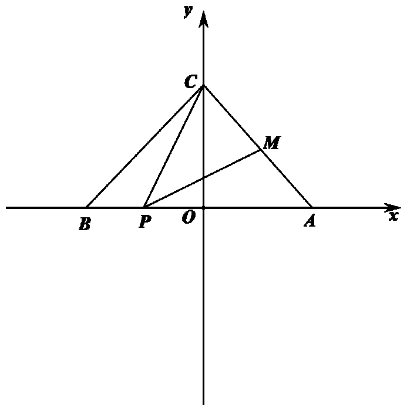
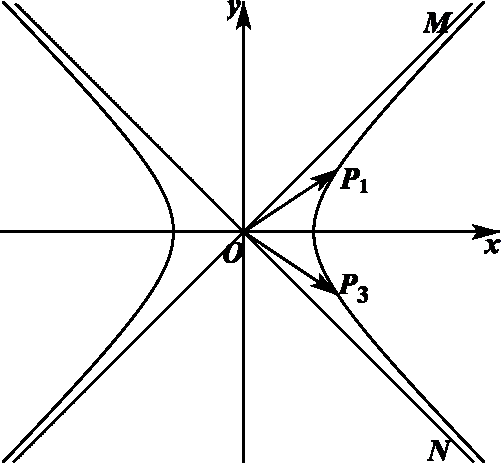
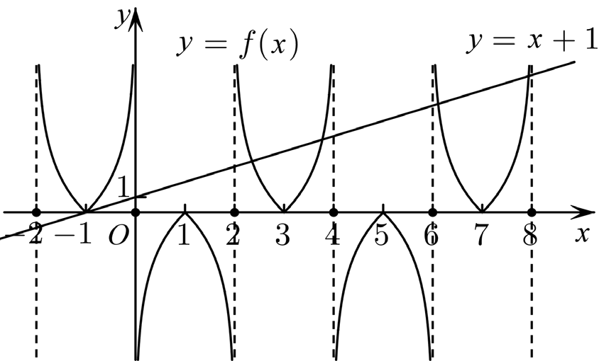
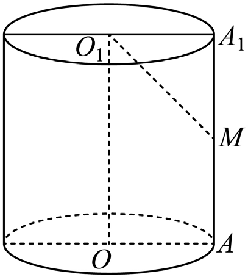
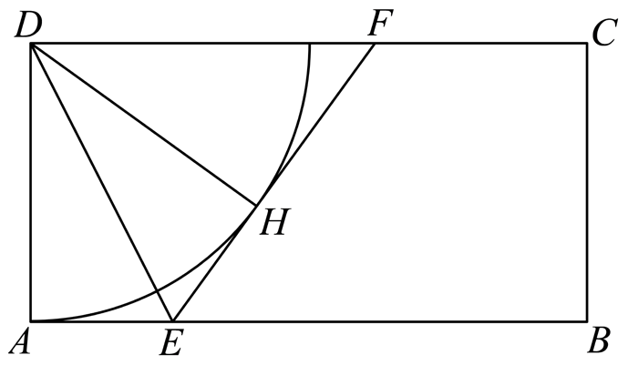

# 2022年上海卷（春）

## 填空题

### 第 1 题

已知 $z=2+i$，则 $\bar z=\underline{\qquad\qquad}$.

#### 答案

$2-i$

#### 解析

由共轭复数的定义，$\bar z=2-i$.

### 第 2 题

已知 $A=(-1,2)$，$B=(1,3)$，则 $A\cap B=\underline{\qquad\qquad}$.

#### 答案

$(1,2)$

#### 解析

由集合交集的定义，$A\cap B=(1,2)$.

### 第 3 题

不等式 $\dfrac{x-1}{x}<0$ 的解集为＿＿＿＿＿＿.

#### 答案

$\{x\mid 0<x<1\}$

#### 解析

由分式不等式的运算性质，分子，分母异号，故解集为 $\{x\mid 0<x<1\}$.

### 第 4 题

已知 $\tan\alpha=3$，则 $\tan\left(\alpha+\dfrac\pi4\right)=\underline{\qquad\qquad}$.

#### 答案

$-2$

#### 解析

由和角公式，$\tan\left(\alpha+\dfrac\pi4\right)=\dfrac{\tan\alpha+\tan\dfrac\pi4}{1-\tan\alpha\tan\dfrac\pi4}=\dfrac{3+1}{1-3}=-2$.

### 第 5 题

已知方程组

$$

\begin{cases}
x+my=2,\\
mx+16y=8
\end{cases}

$$

有无穷解，则 $m$ 的值为＿＿＿＿＿＿.

#### 答案

$4$

#### 解析

方程组有无穷解，故两条直线重合，系数对应成比例，从而 $1\times16=m^2$，且 $1\times8=2m$，解得 $m=4$.

### 第 6 题

已知函数 $f(x)=x^3$ 的反函数为 $y=f^{-1}(x)$，则 $f^{-1}(27)=\underline{\qquad\qquad}$.

#### 答案

$3$

#### 解析

由 $y=x^3$ 得 $x=\sqrt[3]{y}$，故 $f^{-1}(x)=\sqrt[3]{x}$，所以 $f^{-1}(27)=3$.

### 第 7 题

在 $\left(x^3+\dfrac1x\right)^{12}$ 的展开式中，含 $\dfrac1{x^4}$ 项的系数为＿＿＿＿＿＿.

#### 答案

$66$

#### 解析

展开式的通项为 $T_{r+1}=\mathrm C_{12}^{r}(x^3)^{12-r}\left(\dfrac1x\right)^r=\mathrm C_{12}^{r}x^{36-4r}$. 令 $36-4r=-4$，得 $r=10$，所以所求系数为 $\mathrm C_{12}^{10}=66$.

### 第 8 题

在 $\triangle ABC$ 中，$\angle A=\dfrac\pi3$，$AB=2$，$AC=3$，则 $\triangle ABC$ 的外接圆半径为＿＿＿＿＿＿.

#### 答案

$\dfrac{\sqrt{21}}3$

#### 解析

由余弦定理，$BC^2=AB^2+AC^2-2AB\cdot AC\cos A=4+9-2\times2\times3\times\dfrac12=7$，得 $BC=\sqrt7$. 由正弦定理，$R=\dfrac{BC}{2\sin A}=\dfrac{\sqrt7}{2\sin\dfrac\pi3}=\dfrac{\sqrt{21}}3$.

### 第 9 题

已知有 $1$，$2$，$3$，$4$ 四个数字组成无重复数字，则比 $2134$ 大的四位数的个数为＿＿＿＿＿＿.

#### 答案

$17$

#### 解析

千位为 $3$ 或 $4$ 时，有 $2\mathrm A_3^3=12$ 个；千位为 $2$，百位为 $3$ 或 $4$ 时，有 $2\mathrm A_2^2=4$ 个；千位为 $2$，百位为 $1$ 时，只有 $2143$ 比 $2134$ 大，有 $1$ 个. 所以共有 $17$ 个.

### 第 10 题

在 $\triangle ABC$ 中，$\angle C=\dfrac\pi2$，$AC=BC=2$，$M$ 为 $AC$ 的中点，$P$ 在线段 $AB$ 上，则 $\overrightarrow{MP}\cdot\overrightarrow{CP}$ 的最小值为＿＿＿＿＿＿.

#### 答案

$\dfrac78$

#### 解析

以线段 $AB$ 的中点为原点，$AB$ 所在直线为 $x$ 轴，$AB$ 的垂直平分线为 $y$ 轴建立平面直角坐标系，则 $M\left(\dfrac{\sqrt2}{2},\dfrac{\sqrt2}{2}\right)$，$C(0,\sqrt2)$. 设 $P(x,0)$，$-\sqrt2\le x\le\sqrt2$，则

$\overrightarrow{MP}\cdot\overrightarrow{CP}=\left(x-\dfrac{\sqrt2}{2},-\dfrac{\sqrt2}{2}\right)\cdot(x,-\sqrt2)=x^2-\dfrac{\sqrt2}{2}x+1$. 当 $x=\dfrac{\sqrt2}{4}$ 时，取得最小值 $\dfrac78$.

### 第 11 题

已知双曲线 $\dfrac{x^2}{a^2}-y^2=1$，其中 $a>0$，双曲线右支上有任意两点 $P_1(x_1,y_1)$，$P_2(x_2,y_2)$，满足 $x_1x_2-y_1y_2>0$ 恒成立，则 $a$ 的取值范围是＿＿＿＿＿＿.

#### 答案

$a\ge1$

#### 解析

设 $P_3(x_2,-y_2)$，则 $\overrightarrow{OP_1}\cdot\overrightarrow{OP_3}=x_1x_2-y_1y_2>0$，所以 $\overrightarrow{OP_1}=\overrightarrow{OP_3}$ 或 $\angle P_1OP_3$ 为锐角. 设双曲线两条渐近线分别与第一，第四象限相交于 $M$，$N$，则

$0<\angle MON\le\dfrac\pi2$，即 $0<\dfrac1a\le\tan\dfrac\pi4=1$，故 $a\ge1$.

### 第 12 题

已知 $f(x)$ 为奇函数，当 $x\in(0,1]$ 时，$f(x)=\ln x$，且 $f(x)$ 关于直线 $x=1$ 对称. 设 $f(x)=x+1$ 的正数解依次为 $x_1$，$x_2$，$x_3$，$\ldots$，$x_n$，$\ldots$，则 $\displaystyle\lim_{n\to\infty}(x_{n+1}-x_n)=\underline{\qquad\qquad}$.

#### 答案

$2$

#### 解析

由 $f(x)$ 为奇函数，得 $f(x)=-f(-x)$ 且 $f(0)=0$. 又由 $f(x)$ 关于直线 $x=1$ 对称，得 $f(1+x)=f(1-x)$，所以 $f(2+x)=f(-x)=-f(x)$，从而 $f(4+x)=-f(2+x)=f(x)$，故 $f(x)$ 是以 $4$ 为周期的周期函数. 作出 $y=f(x)$ 与 $y=x+1$ 的图象可知

正数解相邻两项之差的极限为两条渐近线之间的距离 $2$，所以 $\displaystyle\lim_{n\to\infty}(x_{n+1}-x_n)=2$.

## 单选题

### 第 13 题

下列函数定义域为 $\mathbb{R}$ 的是（）

A.  
$y=x^{-\frac12}$

B.  
$y=x^{-1}$

C.  
$y=x^{\frac13}$

D.  
$y=x^{\frac12}$

#### 答案

C

#### 解析

$x^{1/3}$ 在全体实数上有定义，其余函数的定义域均受限制，故选 C.

### 第 14 题

已知 $a>b>c>d$，下列选项中正确的是（）

A.  
$a+d>b+c$

B.  
$a+c>b+d$

C.  
$ad>bc$

D.  
$ac>bd$

#### 答案

B

#### 解析

由 $a>c$，$b>d$，两式相加得 $a+c>b+d$，故 B 正确. 例如 $3>2>1>0$，但 $3+0=2+1$，$3\times0<2\times1$，故 A，C 错误；例如 $30>2>-1>-2$，但 $30\times(-1)<2\times(-2)$，故 D 错误. 所以选 B.

### 第 15 题

如图，上海海关大楼的上面可以看作一个正四棱柱，四个侧面有四个时钟，则相邻两个时钟的时针从 $0$ 时转到 $12$ 时（含 $0$ 时不含 $12$ 时）的过程中，能够相互垂直（）次.

A.  
$0$

B.  
$2$

C.  
$4$

D.  
$12$

#### 答案

B

#### 解析

根据正四棱柱相邻侧面的线线关系，时针在 $3$ 时或 $9$ 时相互垂直，在 $0$ 时或 $6$ 时相互平行，其余时刻不垂直，故共 $2$ 次，选 B.

### 第 16 题

已知等比数列 $\{a_n\}$ 的前 $n$ 项和为 $S_n$，前 $n$ 项积为 $T_n$，则下列选项判断正确的是（）

A.  
若 $S_{2022}>S_{2021}$，则数列 $\{a_n\}$ 是递增数列

B.  
若 $T_{2022}>T_{2021}$，则数列 $\{a_n\}$ 是递增数列

C.  
若数列 $\{S_n\}$ 是递增数列，则 $a_{2022}\ge a_{2021}$

D.  
若数列 $\{T_n\}$ 是递增数列，则 $a_{2022}\ge a_{2021}$

#### 答案

D

#### 解析

对于 A，取 $a_1=-1$，公比 $q=-2$，则 $S_{2022}>S_{2021}$，但数列不是递增数列；对于 B，取 $a_1=-1$，公比 $q=2$，则 $T_{2022}>T_{2021}$，但数列不是递增数列；对于 C，取 $a_1=1$，公比 $q=\dfrac12$，则 $\{S_n\}$ 递增，但 $a_{2022}<a_{2021}$. 对于 D，若 $\{T_n\}$ 递增，则 $T_n>T_{n-1}$，从而 $a_n>1$，故 $q\ge1$，所以 $a_{2022}\ge a_{2021}$，选 D.

## 解答题

### 第 17 题

如图，在圆柱 $OO_1$ 中，底面半径为 $1$，$AA_1$ 为圆柱 $OO_1$ 的母线.

1.  若 $AA_1=4$，$M$ 为 $AA_1$ 的中点，求直线 $MO_1$ 与底面的夹角大小；

2.  若圆柱的轴截面为正方形，求该圆柱的侧面积和体积.

#### 解析

1.  直线 $MO_1$ 与底面的夹角等于 $\angle MO_1A_1$. 因为 $AA_1\perp O_1A_1$，且 $MA_1=\dfrac12AA_1=2$，$O_1A_1=1$，所以在直角三角形 $MO_1A_1$ 中，$\tan\angle MO_1A_1=\dfrac{MA_1}{O_1A_1}=2$，故夹角为 $\arctan2$.

2.  轴截面为正方形，故 $AA_1=2$. 所以侧面积为 $2\pi\times1\times2=4\pi$，体积为 $\pi\times1^2\times2=2\pi$.

### 第 18 题

已知数列 $\{a_n\}$，$a_2=1$，$\{a_n\}$ 的前 $n$ 项和为 $S_n$.

1.  若 $\{a_n\}$ 为等比数列，$S_2=3$，求 $\displaystyle\lim_{n\to\infty}S_n$；

2.  若 $\{a_n\}$ 为等差数列，公差为 $d$，对任意 $n\in\mathbb{N}^*$，均满足 $S_{2n}\ge n$，求 $d$ 的取值范围.

#### 解析

1.  由 $S_2=a_1+a_2=3$ 得 $a_1=2$，所以等比数列的公比 $q=\dfrac12$. 因此 $S_n=\dfrac{2\left(1-\left(\frac12\right)^n\right)}{1-\frac12}=4\left(1-\left(\dfrac12\right)^n\right)$，故 $\displaystyle\lim_{n\to\infty}S_n=4$.

2.  由 $a_2=1$ 得 $a_1=1-d$，且 $S_{2n}=\dfrac{2n(a_1+a_{2n})}{2}=n(a_2+a_{2n-1})\ge n$，所以 $(2n-3)d\ge-1$. 当 $n=1$ 时，得 $d\le1$；当 $n\ge2$ 时，得 $d\ge\dfrac1{3-2n}$. 因为 $\left\{\dfrac1{3-2n}\right\}$（$n\ge2$）单调递增，且 $-1\le\dfrac1{3-2n}<0$，所以 $d\ge0$. 综上，$0\le d\le1$.

### 第 19 题

如图，矩形 $ABCD$ 区域内，$D$ 处有一棵古树，为保护古树，以 $D$ 为圆心，$DA$ 为半径划定圆 $D$ 作为保护区域，已知 $AB=30\mathrm{~m}$，$AD=15\mathrm{~m}$，点 $E$ 为 $AB$ 上的动点，点 $F$ 为 $CD$ 上的动点，满足 $EF$ 与圆 $D$ 相切.

1.  若 $\angle ADE=20^\circ$，求 $EF$ 的长；

2.  当点 $E$ 在 $AB$ 的什么位置时，梯形 $FEBC$ 的面积有最大值，最大面积为多少？

（长度精确到 $0.1\mathrm{~m}$，面积精确到 $0.01\mathrm{~m}^2$）

#### 解析

1.  设 $EF$ 与圆 $D$ 相切于 $H$，连接 $DH$，则 $DH\perp EF$，且 $DH=AD=15$. 因为 $AE=EH$，所以 $\angle ADE=\angle HDE=20^\circ$，从而 $EH=15\tan20^\circ$. 又 $\angle HDF=90^\circ-2\angle ADE=50^\circ$，所以 $HF=15\tan50^\circ$. 因此 $EF=EH+HF=15(\tan20^\circ+\tan50^\circ)\approx23.3\mathrm{~m}$.

2.  设 $\angle ADE=\theta$，则 $AE=15\tan\theta$，$FH=15\tan(90^\circ-2\theta)$. 梯形 $AEFD$ 的面积为 $S=\dfrac{225}{4}\left(3\tan\theta+\dfrac1{\tan\theta}\right)\ge\dfrac{225\sqrt3}{2}$，当 $\tan\theta=\dfrac{\sqrt3}{3}$ 时取等号，此时 $AE=15\tan\theta=5\sqrt3\approx8.7\mathrm{~m}$. 故当 $AE=8.7\mathrm{~m}$ 时，梯形 $FEBC$ 的面积最大，最大值为 $15\times30-\dfrac{225\sqrt3}{2}\approx255.14\mathrm{~m}^2$.

### 第 20 题

在椭圆 $\Gamma:\dfrac{x^2}{a^2}+y^2=1$ 中，直线 $l:x=a$ 上有两点 $C$，$D$（$C$ 点在第一象限），左顶点为 $A$，下顶点为 $B$，右焦点为 $F$.

1.  若 $\angle AFB=\dfrac\pi6$，求椭圆 $\Gamma$ 的标准方程；

2.  若点 $C$ 的纵坐标为 $2$，点 $D$ 的纵坐标为 $1$，则 $BC$ 与 $AD$ 的交点是否在椭圆上？请说明理由；

3.  已知直线 $BC$ 与椭圆 $\Gamma$ 相交于点 $P$，直线 $AD$ 与椭圆 $\Gamma$ 相交于点 $Q$，若 $P$ 与 $Q$ 关于原点对称，求 $\lvert CD\rvert$ 的最小值.

#### 解析

1.  设椭圆焦距为 $c$，则 $A(-a,0)$，$B(0,-1)$，$F(c,0)$. 由 $\tan\angle AFB=\dfrac1c=\tan\dfrac\pi6=\dfrac{\sqrt3}{3}$，得 $c=\sqrt3$. 又 $a^2=c^2+1=4$，故椭圆 $\Gamma$ 的标准方程为 $\dfrac{x^2}{4}+y^2=1$.

2.  由 $B(0,-1)$，$C(a,2)$ 得 $BC:y=\dfrac3a x+1$；由 $A(-a,0)$，$D(a,1)$ 得 $AD:y=\dfrac1{2a}(x+a)$. 联立得交点为 $\left(\dfrac{3a}{5},\dfrac45\right)$. 代入椭圆方程左边，得 $\dfrac{\left(\frac{3a}{5}\right)^2}{a^2}+\left(\dfrac45\right)^2=\dfrac9{25}+\dfrac{16}{25}=1$，故交点在椭圆上.

3.  设 $P(a\cos\theta,\sin\theta)$，$Q(-a\cos\theta,-\sin\theta)$. 由直线 $BP$，$AQ$ 的方程，得 $C\left(a,\dfrac{\sin\theta+1}{\cos\theta}-1\right)$，$D\left(a,\dfrac{2\sin\theta}{\cos\theta-1}\right)$. 令 $t=\tan\dfrac\theta2$，则 $\lvert CD\rvert=2\left\lvert\dfrac1{1-t}+\dfrac1t-1\right\rvert$. 在相应取值范围 $0<t<1$ 内，由基本不等式，$\dfrac1{1-t}+\dfrac1t\ge4$，所以 $\lvert CD\rvert\ge6$，故最小值为 $6$.

### 第 21 题

已知函数 $f(x)$，甲变化：$f(x)-f(x-t)$；乙变化：$\lvert f(x+t)-f(x)\rvert$，$t>0$.

1.  若 $t=1$，$f(x)=2^x$，$f(x)$ 经甲变化得到 $g(x)$，求方程 $g(x)=2$ 的解；

2.  若 $f(x)=x^2$，$f(x)$ 经乙变化得到 $h(x)$，求不等式 $h(x)\le f(x)$ 的解集；

3.  若 $f(x)$ 在 $(-infty,0)$ 上单调递增，将 $f(x)$ 先进行甲变化得到 $u(x)$，再将 $u(x)$ 进行乙变化得到 $h_1(x)$；将 $f(x)$ 先进行乙变化得到 $v(x)$，再将 $v(x)$ 进行甲变化得到 $h_2(x)$，若对任意 $t>0$，总存在 $h_1(x)=h_2(x)$ 成立，求证：$f(x)$ 在 $\mathbb{R}$ 上单调递增.

#### 解析

1.  由甲变化，$g(x)=f(x)-f(x-1)=2^x-2^{x-1}=2^{x-1}$. 令 $g(x)=2$，解得 $x=2$.

2.  由乙变化，$h(x)=\lvert(x+t)^2-x^2\rvert=t\lvert2x+t\rvert$. 当 $2x+t<0$，即 $x<-\dfrac t2$ 时，$t\lvert2x+t\rvert\le x^2$ 恒成立；当 $2x+t\ge0$，即 $x\ge-\dfrac t2$ 时，解 $t(2x+t)\le x^2$，得 $x\le(1-\sqrt2)t$ 或 $x\ge(1+\sqrt2)t$. 所以解集为 $\left(-\infty,(1-\sqrt2)t\right]\cup\left[(1+\sqrt2)t,+\infty\right)$.

3.  记 $u(x)=f(x)-f(x-t)$，则 $h_1(x)=\lvert u(x+t)-u(x)\rvert=\lvert f(x+t)-2f(x)+f(x-t)\rvert$. 记 $v(x)=\lvert f(x+t)-f(x)\rvert$，则 $h_2(x)=v(x)-v(x-t)=\lvert f(x+t)-f(x)\rvert-\lvert f(x)-f(x-t)\rvert$. 由题设，对任意 $t>0$，总存在 $x$ 使 $h_1(x)=h_2(x)$，即 $\left\lvert[f(x+t)-f(x)]-[f(x)-f(x-t)]\right\rvert=\lvert f(x+t)-f(x)\rvert-\lvert f(x)-f(x-t)\rvert$. 因而存在 $x$ 使 $f(x+t)>f(x)>f(x-t)$，且 $f(x+t)-f(x)>f(x)-f(x-t)$. 于是对任意 $t>0$，存在正增量，结合 $f(x)$ 在 $(-infty,0)$ 上单调递增，可得 $f(x+t)>f(x)$ 对任意 $x\in\mathbb{R}$ 成立，故 $f(x)$ 在 $\mathbb{R}$ 上单调递增.
