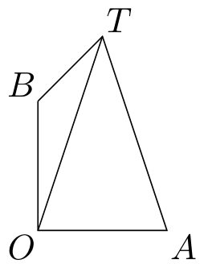
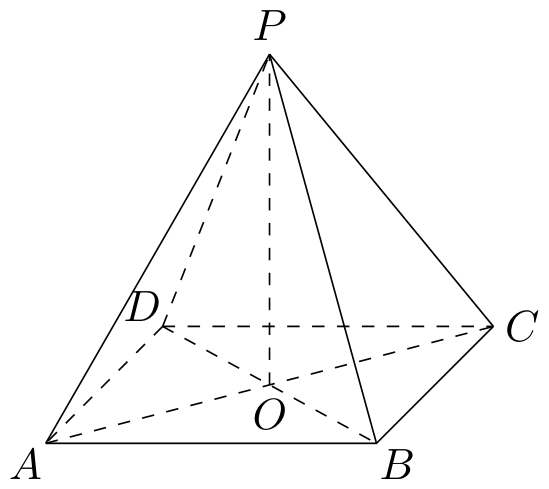
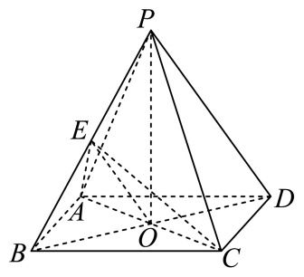
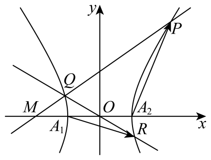

# 2024年上海卷（秋）

## 填空题

### 第 1 题

设全集 $U=\{1,2,3,4,5\}$，集合 $A=\{2,4\}$，则 $\bar{A}=$＿＿＿＿＿＿.

#### 答案

$\{1,3,5\}$

#### 解析

由题设，$A$ 在全集 $U$ 中的补集为 $\bar{A}=\{1,3,5\}$. 故答案为 $\{1,3,5\}$.

### 第 2 题

已知

$$

f(x)=\begin{cases}
\sqrt{x}, & x>0,\\
1, & x\le 0,
\end{cases}

$$

则 $f(3)=$＿＿＿＿＿＿.

#### 答案

$\sqrt{3}$

#### 解析

因为 $3>0$，所以 $f(3)=\sqrt{3}$. 故答案为 $\sqrt{3}$.

### 第 3 题

已知 $x\in \mathbb{R}$，则不等式 $x^2-2x-3<0$ 的解集为＿＿＿＿＿＿.

#### 答案

$\{x\mid -1<x<3\}$

#### 解析

方程 $x^2-2x-3=0$ 的两根为 $-1$ 与 3，因此不等式 $x^2-2x-3<0$ 的解集为 $\{x\mid -1<x<3\}$.

### 第 4 题

已知 $f(x)=x^3+a$，$x\in \mathbb{R}$，且 $f(x)$ 是奇函数，则 $a=$＿＿＿＿＿＿.

#### 答案

0

#### 解析

因为 $f(x)$ 为奇函数，所以 $f(-x)+f(x)=0$. 即 $(-x)^3+a+x^3+a=0$， 解得 $a=0$.

### 第 5 题

已知 $k\in \mathbb{R}$，$\boldsymbol{a}=(2,5)$，$\boldsymbol{b}=(6,k)$，且 $\boldsymbol{a}\parallel\boldsymbol{b}$，则 $k=$＿＿＿＿＿＿.

#### 答案

15

#### 解析

因为 $\boldsymbol{a}\parallel\boldsymbol{b}$，所以对应坐标成比例，即 $2k=5\times 6$. 解得 $k=15$.

### 第 6 题

在 $(x+1)^n$ 的二项展开式中，若各项系数和为 32，则 $x^2$ 项的系数为＿＿＿＿＿＿.

#### 答案

10

#### 解析

令 $x=1$，则 $(1+1)^n=32$， 即 $2^n=32$， 解得 $n=5$. $(x+1)^5$ 的展开式通项为 $T_{r+1}=\mathrm{C}_5^r x^{5-r}$. 令 $5-r=2$，得 $r=3$，故 $x^2$ 项的系数为 $\mathrm{C}_5^3=10$.

### 第 7 题

已知抛物线 $y^2=4x$ 上有一点 $P$ 到准线的距离为 9，那么点 $P$ 到 $x$ 轴的距离为＿＿＿＿＿＿.

#### 答案

$4\sqrt{2}$

#### 解析

由抛物线 $y^2=4x$ 的定义，准线方程为 $x=-1$. 设点 $P(x_0,y_0)$，则 $x_0+1=9$， 解得 $x_0=8$. 代入抛物线方程得 $y_0^2=4x_0=32$， 所以 $y_0=\pm 4\sqrt{2}$. 因此点 $P$ 到 $x$ 轴的距离为 $4\sqrt{2}$.

### 第 8 题

小王参加知识竞赛，题库中 A 组题有 $5000$ 道，B 组题有 $4000$ 道，C 组题有 $3000$ 道，若小王做对这三组题的概率依次为 $0.92$，$0.86$，$0.72$，则随机从题库中抽取一道题，小王做对的概率是＿＿＿＿＿＿.

#### 答案

0.85

#### 解析

根据题意，三种题库数量比为 $5000:4000:3000=5:4:3$， 故所占比重分别为 $\frac{5}{12}$，$\frac{4}{12}$，$\frac{3}{12}$. 所以随机选一题答对的概率为 $\frac{5}{12}\times 0.92+\frac{4}{12}\times 0.86+\frac{3}{12}\times 0.72=0.85$.

### 第 9 题

设 $m\in \mathbb{R}$，若虚数 $z$ 的实部为 1，且 $z+\frac{2}{z}=m$，则 $m=$＿＿＿＿＿＿.

#### 答案

2

#### 解析

设 $z=1+b\i$，$b\in \mathbb{R}$，$b\ne 0$. 则 $z+\frac{2}{z}=1+b\i+\frac{2}{1+b\i} =\left( \frac{b^2+3}{1+b^2} \right)+\left( \frac{b^3-b}{1+b^2} \right)\i$. 因为 $m\in \mathbb{R}$，所以虚部为 0，即 $\frac{b^3-b}{1+b^2}=0$. 解得 $b=\pm 1$. 于是 $m=\frac{b^2+3}{1+b^2}=2$.

### 第 10 题

已知某集合中的元素是不重复的数字组成的三位正整数，若该集合中任意两个数的积均为偶数，则该集合的元素个数的最大值为＿＿＿＿＿＿.

#### 答案

329

#### 解析

根据题意，集合中至多只有一个奇数，其余均是偶数. 首先讨论三位数中的偶数.

1.  当个位为 $0$ 时，则百位和十位在剩余的 $9$ 个数字中选择两个进行排列，则这样的偶数有 $\mathrm A_9^2=72$ 个；

2.  当个位不为 $0$ 时，则个位有 $\mathrm C_4^1$ 个数字可选，百位有 $\mathrm C_8^1$ 个数字可选，十位有 $\mathrm C_8^1$ 个数字可选，由分步乘法这样的偶数共有 $\mathrm C_4^1\mathrm C_8^1\mathrm C_8^1=256$ 个.

最后再加上单独的奇数，所以集合中元素个数的最大值为 $72+256+1=329$.

### 第 11 题

海上有灯塔 $O$，$A$，$B$ 和船只 $T$，$A$ 在 $O$ 的正东方向，$B$ 在 $O$ 的正北方向，$OA=OB$，$O$，$A$，$T$，$B$ 按逆时针排列. 若 $\angle ATO=37^\circ$，$\angle BTO=16.5^\circ$，则 $\angle BOT=$＿＿＿＿＿＿（精确到 $0.1^\circ$）.

#### 答案

$7.8^\circ$

#### 解析

设 $\angle AOT=\alpha$，则 $\angle BOT=90^\circ-\alpha$. 在 $\triangle AOT$ 中，由正弦定理得 $\frac{OT}{OA}=\frac{\sin(143^\circ-\alpha)}{\sin 37^\circ}$. 在 $\triangle BOT$ 中，由正弦定理得 $\frac{OT}{OB}=\frac{\sin(73.5^\circ+\alpha)}{\sin 16.5^\circ}$. 因为 $OA=OB$，所以 $\frac{\sin(143^\circ-\alpha)}{\sin 37^\circ}=\frac{\sin(73.5^\circ+\alpha)}{\sin 16.5^\circ}$. 利用计算器解得 $\alpha\approx82.2^\circ$，故 $\angle BOT=90^\circ-\alpha\approx7.8^\circ$. 故答案为 $7.8^\circ$.

### 第 12 题

等比数列 $\{a_n\}$ 满足首项 $a_1>0$，公比 $q>1$，记 $I_n=\{x-y\mid x,y\in [a_1,a_2]\cup [a_n,a_{n+1}]\}$，若对任意正整数 $n$，集合 $I_n$ 都是闭区间，则 $q$ 的取值范围是＿＿＿＿＿＿.

#### 答案

$q\ge 2$

#### 解析

由题设， $a_n=a_1q^{n-1}$. 因为 $a_1>0$，$q>1$，所以 $a_{n+1}>a_n$. 当 $n\ge 2$ 时，不妨设 $x\ge y$. 则 $x-y\in [0,a_2-a_1]\cup [a_n-a_2,a_{n+1}-a_1]\cup [0,a_{n+1}-a_n]$. 要使 $I_n$ 为闭区间，就必须有 $a_{n+1}-a_n\ge a_n-a_2$. 即 $a_1q^{n-1}(q-2)+a_2\ge 0$. 等价于 $q-2\ge -\frac{1}{q^{n-2}}$. 由于 $q>1$，当 $n\to +\infty$ 时，$-\frac{1}{q^{n-2}}\to 0$，故必有 $q-2\ge 0$. 因此 $q\ge 2$. 反之，若 $q\ge 2$，则对任意 $n\ge 2$，有 $a_{n+1}-a_n\ge a_2-a_1$，且

$a_{n+1}-a_n-(a_n-a_2)=a_1\bigl(q^{n-1}(q-2)+q\bigr)\ge 0$.

所以差集中的三个区间首尾相接，$I_n$ 为闭区间；$n=1$ 时结论显然成立. 故 $q$ 的取值范围为 $[2,+\infty)$.

## 单选题

### 第 13 题

已知气温（单位 $^{\circ}\mathrm C$）和海水表层温度（单位：摄氏度）相关，且相关系数为正数，对此描述正确的是（）

A.  
随着气温由低变高，海水表层温度由低变高

B.  
随着气温由低变高，海水表层温度由高变低

C.  
随着气温由低变高，海水表层温度有由低变高的趋势

D.  
随着气温由低变高，海水表层温度有由高变低的趋势

#### 答案

C

#### 解析

A，B. 当气温高时，海水表层温度变高变低不确定，故 A，B 错误.

C，D. 因为相关系数为正，故随着气温由低变高时，海水表层温度呈上升趋势，故 C 正确，D 错误.

故选 C.

### 第 14 题

下列函数 $f(x)$ 的最小正周期是 $2\pi$ 的是（）

A.  
$y=\sin x+\cos x$

B.  
$y=\sin x\cos x$

C.  
$y=\sin^2 x+\cos^2 x$

D.  
$y=\sin^2 x-\cos^2 x$

#### 答案

A

#### 解析

因为 $\sin x+\cos x=\sqrt{2}\sin\left( x+\frac{\pi}{4} \right)$， 其最小正周期为 $2\pi$.

又 $\sin x\cos x=\frac{1}{2}\sin 2x$， 最小正周期为 $\pi$； $\sin^2 x+\cos^2 x=1$ 为常值函数； $\sin^2 x-\cos^2 x=-\cos 2x$ 最小正周期为 $\pi$. 故选 A.

### 第 15 题

已知空间直角坐标系 $Oxyz$ 中的点集 $\Omega$，对任意的 $P_1$，$P_2$，$P_3\in \Omega$，均存在不全为 $0$ 的实数 $\lambda_1$，$\lambda_2$，$\lambda_3$，使得 $\lambda_1\overrightarrow{OP_1}+\lambda_2\overrightarrow{OP_2}+\lambda_3\overrightarrow{OP_3}=\boldsymbol{0}$. 若 $(1,0,0)\in \Omega$，则 $(0,0,1)\notin \Omega$ 的一个充分条件是（）

A.  
$(0,0,0)\in \Omega$

B.  
$(-1,0,0)\in \Omega$

C.  
$(0,-1,0)\in \Omega$

D.  
$(0,0,-1)\in \Omega$

#### 答案

C

#### 解析

根据题意，这三个向量 $\overrightarrow{OP_1}$，$\overrightarrow{OP_2}$，$\overrightarrow{OP_3}$ 共面，即这三个向量不能构成空间的一个基底.

A. 在空间直角坐标系中，$(0,0,0)$，$(1,0,0)$，$(0,0,1)$ 三个向量共面，则当 $(0,0,0)$，$(1,0,0)\in \Omega$ 时无法推出 $(0,0,1)\notin \Omega$，A 错误；

B. 在空间直角坐标系中，$(-1,0,0)$，$(1,0,0)$，$(0,0,1)$ 三个向量共面，则当 $(-1,0,0)$，$(1,0,0)\in \Omega$ 时无法推出 $(0,0,1)\notin \Omega$，B 错误；

C. 在空间直角坐标系中，$(1,0,0)$，$(0,0,1)$，$(0,-1,0)$ 三个向量不共面，可构成空间的一个基底，则由 $(1,0,0)$，$(0,-1,0)\in \Omega$ 能推出 $(0,0,1)\notin \Omega$，C 正确；

D. 在空间直角坐标系中，$(1,0,0)$，$(0,0,1)$，$(0,0,-1)$ 三个向量共面，则当 $(0,0,-1)$，$(1,0,0)\in \Omega$ 时无法推出 $(0,0,1)\notin \Omega$，D 错误.

故选 C.

### 第 16 题

已知函数 $f(x)$ 的定义域为 $\mathbb{R}$，定义集合 $M=\{x_0\mid x_0\in \mathbb{R},\ \forall x\in(-\infty,x_0),\ f(x)<f(x_0)\}$. 在使得 $M=[-1,1]$ 的所有 $f(x)$ 中，下列成立的是（）

A.  
存在 $y=f(x)$ 是偶函数

B.  
存在 $y=f(x)$ 在 $x=2$ 处取最大值

C.  
存在 $y=f(x)$ 是严格增函数

D.  
存在 $y=f(x)$ 在 $x=-1$ 处取到极小值

#### 答案

B

#### 解析

A：若 $f(x)$ 是偶函数，取 $x_0=1\in[-1,1]$，则对任意 $x<1$ 有 $f(x)<f(1)$，但 $f(-1)=f(1)$，矛盾.

B：可构造

$$

f(x)=
\begin{cases}
-2, & x<-1,\\
x, & -1\le x\le 1,\\
1, & x>1,
\end{cases}

$$

此时 $M=[-1,1]$，且 $f(2)=1$ 为最大值.

C：若 $f(x)$ 严格递增，则对任意 $x_0\in \mathbb{R}$ 均满足定义，因此 $M=\mathbb{R}$，矛盾.

D：若 $f(x)$ 在 $x=-1$ 处取极小值，则不可能对所有 $x<-1$ 都有 $f(x)<f(-1)$，与 $M$ 的定义矛盾.

故选 B.

## 解答题

### 第 17 题

如图，在正四棱锥 $P-ABCD$ 中，$O$ 为底面 $ABCD$ 的中心.

1.  若 $AP=5$，$AD=3\sqrt{2}$，将 $\triangle POA$ 绕直线 $PO$ 旋转一周，求所得旋转体的体积；

2.  若 $AP=AD$，$E$ 为 $PB$ 的中点，求直线 $BD$ 与平面 $AEC$ 所成角的大小.

#### 解析

1.  因为正四棱锥满足 $PO\perp \text{平面 }ABCD$，而 $AO\subset \text{平面 }ABCD$，故 $PO\perp AO$. 又底面 $ABCD$ 是正方形，且 $AD=3\sqrt{2}$，所以 $AO=3$. 由勾股定理， $PO=\sqrt{PA^2-AO^2}=\sqrt{25-9}=4$. $\triangle POA$ 绕 $PO$ 旋转一周形成的是圆锥，其高为 4，底面半径为 3，因此体积为 $V=\frac{1}{3}\pi\times 3^2\times 4=12\pi$.

2.  连接 $EA$，$EO$，$EC$. 根据题意结合正四棱锥的性质，每个侧面都是等边三角形.

    由 $E$ 是 $PB$ 的中点，得 $AE\perp PB$，$CE\perp PB$. 又 $AE\cap CE=E$，且 $AE$，$CE\subset \text{平面 }ACE$，故 $PB\perp \text{平面 }ACE$. 于是 $BE\perp \text{平面 }ACE$. 又 $BD\cap \text{平面 }ACE=O$， 所以直线 $BD$ 与平面 $AEC$ 所成角为 $\angle BOE$. 不妨设 $AP=AD=6$， 则 $BO=3\sqrt{2}$，$BE=3$. 因此 $\sin \angle BOE=\frac{BE}{BO}=\frac{3}{3\sqrt{2}}=\frac{\sqrt{2}}{2}$. 又线面角属于 $\left[ 0,\frac{\pi}{2} \right]$，故 $\angle BOE=\frac{\pi}{4}$.

### 第 18 题

若 $f(x)=\log_a x$（$a>0$，$a\ne 1$）.

1.  $y=f(x)$ 过 $(4,2)$，求 $f(2x-2)<f(x)$ 的解集；

2.  存在 $x$ 使得 $f(x+1)$，$f(ax)$，$f(x+2)$ 成等差数列，求 $a$ 的取值范围.

#### 解析

1.  因为 $y=f(x)$ 过 $(4,2)$，所以 $\log_a 4=2$， 即 $a^2=4$. 又 $a>0$，$a\ne 1$，故 $a=2$. 于是 $f(x)=\log_2 x$ 在 $(0,+\infty)$ 上单调递增，所以 $f(2x-2)<f(x) \iff 0<2x-2<x$. 解得 $1<x<2$.

2.  由 $f(x+1)$，$f(ax)$，$f(x+2)$ 成等差数列，得 $2f(ax)=f(x+1)+f(x+2)$. 即 $2\log_a(ax)=\log_a(x+1)+\log_a(x+2)$. 因此 $a^2x^2=(x+1)(x+2)$. 又 $x>0$，所以

$$

a^2=\frac{x^2+3x+2}{x^2}=1+\frac{3}{x}+\frac{2}{x^2}=2\left( \frac{1}{x}+\frac{3}{4} \right)^2-\frac{1}{8}

$$

    令 $t=\frac{1}{x}\in(0,+\infty)$， 则 $a^2=2\left( t+\frac{3}{4} \right)^2-\frac{1}{8}$. 其在 $(0,+\infty)$ 上的值域为 $(1,+\infty)$，故 $a^2>1$. 由于 $a>0$，得 $a>1$.

### 第 19 题

某地区为调查初中学生体育锻炼时长与学业成绩的关系，从该地区 29000 名初中生中抽取 580 人，得到日均体育锻炼时长（表中简称时长）与学业成绩的数据如下表所示：

|  时长  | $[0,0.5)$ | $[0.5,1)$ | $[1,1.5)$ | $[1.5,2)$ | $[2,2.5)$ | 合计 |
|:------:|:-----------:|:-----------:|:-----------:|:-----------:|:-----------:|:----:|
|  优秀  |      5      |     44      |     42      |      3      |      1      |  95  |
| 不优秀 |     134     |     147     |     137     |     40      |     27      | 485  |
|  合计  |     139     |     191     |     179     |     43      |     28      | 580  |

1.  估计该地区 29000 名初中生中体育锻炼时长大于 1 小时人数；

2.  估计该地区初中生平均日均体育锻炼时长（结果精确到 0.1 小时）；

3.  判断是否有 95% 的把握认为该地区初中生学业成绩优秀与日均体育锻炼时长不小于 1 小时且小于 2 小时有关？ （附：$\chi^2=\frac{n(ad-bc)^2}{(a+b)(c+d)(a+c)(b+d)}$，其中 $n=a+b+c+d$，$P(\chi^2\ge 3.841)\approx 0.05$.）

#### 解析

1.  锻炼时长大于 1 小时的人数占比为 $\frac{179+43+28}{580}=\frac{25}{58}$. 故估计该地区 29000 名初中生中体育锻炼时长大于 1 小时的人数约为 $29000\times \frac{25}{58}=12500$.

2.  各组中值加权平均为 $\frac{540}{580}\approx 0.9$， 所以估计该地区初中生平均日均体育锻炼时长为 0.9 小时.

3.  由题列联表如下：

    |  时长  | $[1,2)$ |  其他   |    合计     |
    |:------:|:---------:|:-------:|:-----------:|
    |  优秀  |   $a$   |  $b$  |   $a+b$   |
    | 不优秀 |   $c$   |  $d$  |   $c+d$   |
    |  合计  |  $a+c$  | $b+d$ | $a+b+c+d$ |

    提出零假设 $H_0$：该地区初中生学业成绩优秀与日均体育锻炼时长不少于 1 小时但少于 2 小时无关，其中 $\alpha=0.05$.

$$

\chi^2=\frac{580\times (45\times 308-177\times 50)^2}{95\times 485\times 222\times 358}\approx 3.976>3.841

$$

    故零假设不成立，即有 95% 的把握认为该地区初中生学业成绩优秀与日均体育锻炼时长不小于 1 小时且小于 2 小时有关.

### 第 20 题

已知双曲线 $\Gamma:x^2-\frac{y^2}{b^2}=1$（$b>0$），左右顶点分别为 $A_1$，$A_2$，过点 $M(-2,0)$ 的直线 $l$ 交双曲线 $\Gamma$ 于 $P$，$Q$ 两点.

1.  若离心率 $e=2$，求 $b$ 的值；

2.  若 $b=\frac{2\sqrt{6}}{3}$，点 $P$ 在第一象限，$\triangle MA_2P$ 为等腰三角形，求点 $P$ 的坐标；

3.  连接 $QO$（$O$ 为坐标原点）并延长交双曲线 $\Gamma$ 于点 $R$，若 $\overrightarrow{A_1R}\cdot\overrightarrow{A_2P}=1$，求 $b$ 的取值范围.

#### 解析

1.  对于双曲线 $x^2-\frac{y^2}{b^2}=1$， 有 $a=1$. 因为 $e=\frac{c}{a}=2$，所以 $c=2$. 又 $c^2=a^2+b^2$，故 $b=\sqrt{c^2-a^2}=\sqrt{4-1}=\sqrt{3}$.

2.  当 $b=\frac{2\sqrt{6}}{3}$ 时，双曲线方程为 $x^2-\frac{3y^2}{8}=1$. 其中 $M(-2,0)$，$A_2(1,0)$.

    若以 $MA_2$ 为底，则点 $P$ 落在直线 $x=-\frac{1}{2}$ 上，与点 $P$ 在第一象限矛盾，舍去.

    若以 $A_2P$ 为底，则 $MP=MA_2=3$. 联立

$$

\begin{cases}
    x^2-\frac{3y^2}{8}=1,\\
    (x+2)^2+y^2=9,
    \end{cases}

$$

    解得 $\left( -\frac{23}{11},\frac{8\sqrt{17}}{11} \right)$，$\left(-\frac{23}{11},-\frac{8\sqrt{17}}{11}\right)$，$(1,0)$. 这些点都不在第一象限，故舍去.

    若以 $MP$ 为底，则 $A_2P=MA_2=3$. 设 $P(x_0,y_0)$，其中 $x_0>0$，$y_0>0$，则

$$

\begin{cases}
    (x_0-1)^2+y_0^2=9,\\
    x_0^2-\frac{3y_0^2}{8}=1.
    \end{cases}

$$

    解得 $x_0=2$，$y_0=2\sqrt{2}$. 故 $P(2,2\sqrt{2})$.

3.  根据题意，$A_1(-1,0)$，$A_2(1,0)$. 水平直线 $y=0$ 与双曲线的交点为 $A_1$，$A_2$，不满足 $\overrightarrow{A_1R}\cdot\overrightarrow{A_2P}=1$，故设 $l:x=my-2$，其中 $m$ 可为 $0$（此时为直线 $x=-2$）. 设 $P(x_1,y_1)$，$Q(x_2,y_2)$. 由双曲线的对称性知 $R(-x_2,-y_2)$. 联立

$$

\begin{cases}
    x=my-2,\\
    x^2-\frac{y^2}{b^2}=1
    \end{cases}

$$

    可得关于 $y$ 的方程 $(b^2m^2-1)y^2-4b^2my+3b^2=0$. 因此 $y_1+y_2=\frac{4b^2m}{b^2m^2-1}$，$y_1y_2=\frac{3b^2}{b^2m^2-1}$.

    又 $\overrightarrow{A_1R}=(-x_2+1,-y_2)$，$\overrightarrow{A_2P}=(x_1-1,y_1)$， 由 $\overrightarrow{A_1R}\cdot\overrightarrow{A_2P}=1$，并结合 $x_1=my_1-2$，$x_2=my_2-2$，得

$$

(-x_2+1)(x_1-1)-y_1y_2=1
    \iff -(my_2-3)(my_1-3)-y_1y_2=1

$$

    从而

$$

y_1y_2(m^2+1)-3m(y_1+y_2)+10=0

$$

    将 $y_1+y_2=\frac{4b^2m}{b^2m^2-1}$，$y_1y_2=\frac{3b^2}{b^2m^2-1}$ 代入上式，得

$$

(m^2+1)\cdot \frac{3b^2}{b^2m^2-1}-3m\cdot \frac{4b^2m}{b^2m^2-1}+10=0
    \iff b^2m^2+3b^2-10=0

$$

    所以 $m^2=\frac{10}{b^2}-3$. 由 $m^2\ge 0$ 得 $0<b^2\le\frac{10}{3}$. 又由 $b^2m^2-1\ne 0$ 得 $10-3b^2\ne 1$， 即 $b^2\ne 3$. 故 $b^2\in \left( 0,3 \right)\cup \left( 3,\frac{10}{3} \right]$. 因为 $b>0$，所以 $b\in (0,\sqrt{3})\cup \left( \sqrt{3},\frac{\sqrt{30}}{3} \right]$.

### 第 21 题

设 $D$ 是 $\mathbb{R}$ 的一个非空子集，$y=f(x)$ 是定义在 $D$ 上的函数. 对于点 $M(a,b)$，记 $s(x)=(x-a)^2+\left( f(x)-b \right)^2$. 若对于点 $P(x_0,f(x_0))$，函数 $y=s(x)$ 在 $x=x_0$ 处取得最小值，则称 $P$ 是 $M$ 的 $f$ 最近点.

1.  对于 $f(x)=\frac{1}{x}$，$M(0,0)$，$D=(0,+\infty)$，求证：存在 $M$ 的 $f$ 最近点；

2.  对于 $f(x)=\e^x$，$M(1,0)$，$D=\mathbb{R}$，若曲线 $y=f(x)$ 上一点 $P$ 满足 $MP$ 垂直于 $y=f(x)$ 在点 $P(x_0,f(x_0))$ 处的切线，则 $P$ 是否为 $M$ 的 $f$ 最近点？

3.  已知 $D=\mathbb{R}$，$y=f(x)$ 的导函数为 $y=f'(x)$，且 $y=g(x)$ 在 $\mathbb{R}$ 上的函数值恒正. 对任意 $t\in \mathbb{R}$，点 $M_1$ 的坐标为 $(t-1,f(t)-g(t))$，点 $M_2$ 的坐标为 $(t+1,f(t)+g(t))$. 若对任意的 $t\in \mathbb{R}$，总存在 $y=f(x)$ 上一点 $P$，使得 $P$ 既是 $M_1$ 的 $f$ 最近点，又是 $M_2$ 的 $f$ 最近点，试求 $y=f(x)$ 的单调性.

#### 解析

1.  当 $M(0,0)$ 时，

$$

s(x)=x^2+\left( \frac{1}{x} \right)^2=x^2+\frac{1}{x^2}\ge 2\sqrt{x^2\cdot \frac{1}{x^2}}=2

$$

    当且仅当 $x^2=\frac{1}{x^2}$， 即 $x=1$ 时取等号. 因此存在点 $P(1,1)$， 使它是 $M(0,0)$ 在 $f(x)$ 上的“最近点”.

2.  由题设， $s(x)=(x-1)^2+\left( \e^x-0 \right)^2=(x-1)^2+\e^{2x}$. 则 $s'(x)=2(x-1)+2\e^{2x}$. 因为 $2(x-1)$ 与 $2\e^{2x}$ 都是严格增函数，所以 $s'(x)$ 也是严格增函数. 又 $s'(0)=0$， 因此 $x=0$ 为 $s(x)$ 的最小值点，此时 $P(0,1)$. 又 $f'(x)=\e^x$， 故 $f(x)$ 在点 $P$ 处的切线斜率为 $f'(0)=1$. 而 $k_{MP}=\frac{0-1}{1-0}=-1$， 所以 $k_{MP}\cdot 1=-1$. 因此直线 $MP$ 与切线垂直. 故这样的点存在，且 $P(0,1)$.

3.  设 $s_1(x)=(x-t+1)^2+\left( f(x)-f(t)+g(t) \right)^2$， $s_2(x)=(x-t-1)^2+\left( f(x)-f(t)-g(t) \right)^2$. 若点 $P(x_0,f(x_0))$ 同时是 $M_1$，$M_2$ 的最近点，则 $x_0$ 同时是 $s_1$，$s_2$ 的最小值点，所以 $s_1'(x_0)=0$，$s_2'(x_0)=0$. 即

$$

\begin{cases}
    2(x_0-t+1)+2f'(x_0)\left( f(x_0)-f(t)+g(t) \right)=0,\\
    2(x_0-t-1)+2f'(x_0)\left( f(x_0)-f(t)-g(t) \right)=0.
    \end{cases}

$$

    两式相减得 $1+f'(x_0)g(t)=0$， 故 $f'(x_0)=-\frac{1}{g(t)}<0$. 再由“最近点”定义，有 $s_1(x_0)\le s_1(t)$，$s_2(x_0)\le s_2(t)$. 两式相加可得 $(x_0-t)^2+\left( f(x_0)-f(t) \right)^2\le 0$. 因此 $x_0=t$，$f(x_0)=f(t)$. 于是 $f'(t)=f'(x_0)=-\frac{1}{g(t)}<0$. 由于 $t\in \mathbb{R}$ 任意，故 $f'(t)<0$，$\text{对任意 }t\in \mathbb{R}\text{ 都成立}$. 所以 $f(x)$ 在 $\mathbb{R}$ 上严格单调递减.
