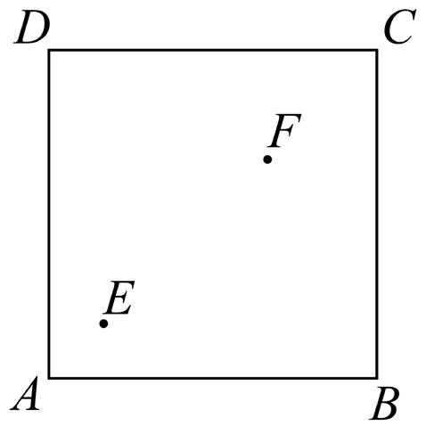
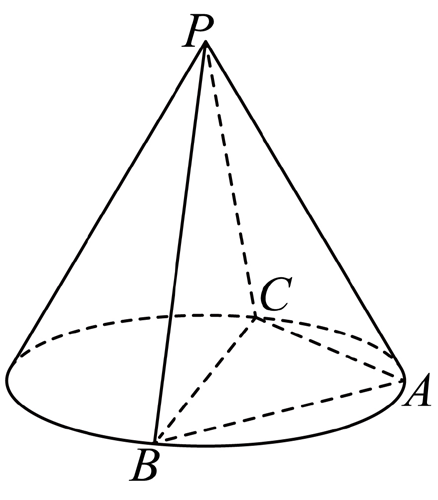

# 2024年上海卷（春）

## 填空题

### 第 1 题

函数 $y=\log_2 x$ 的定义域为＿＿＿＿＿＿ .

#### 答案

$\left(0,+\infty\right)$

#### 解析

由对数函数的定义可知，真数必须大于 $0$，所以定义域为 $\left(0,+\infty\right)$.

### 第 2 题

直线 $x-y+1=0$ 的倾斜角为＿＿＿＿＿＿ .

#### 答案

$\frac{\pi}{4}$

#### 解析

由 $x-y+1=0$ 得 $y=x+1$，其斜率为 $1$，故倾斜角 $\theta=\frac{\pi}{4}$.

### 第 3 题

已知 $\frac{z}{1+\i}=i$，则 $z=$＿＿＿＿＿＿ .

#### 答案

$-1+\i$

#### 解析

由 $\frac{z}{1+\i}=i$ 得 $z=i(1+\i)=-1+\i$.

### 第 4 题

$\left(x-1\right)^6$ 展开式中 $x^4$ 的系数为＿＿＿＿＿＿ .

#### 答案

$15$

#### 解析

由二项式定理，$x^4$ 项对应 $\mathrm C_6^2 x^4(-1)^2$，系数为 $15$.

### 第 5 题

三角形 $ABC$ 中，$BC=2$，$A=\frac{\pi}{3}$，$B=\frac{\pi}{4}$，则 $AB=$＿＿＿＿＿＿ .

#### 答案

$\frac{3\sqrt2+\sqrt6}{3}$

#### 解析

因为 $A+B+C=\pi$，所以 $C=\frac{5\pi}{12}$. 由正弦定理 $\frac{AB}{\sin C}=\frac{BC}{\sin A}$，得 $AB=\frac{2\sin\frac{5\pi}{12}}{\sin\frac{\pi}{3}}=\frac{3\sqrt2+\sqrt6}{3}$.

### 第 6 题

已知 $ab=1$，$4a^2+9b^2$ 的最小值为＿＿＿＿＿＿ .

#### 答案

$12$

#### 解析

由

$$

4a^2+9b^2=\left(2a\right)^2+\left(3b\right)^2\ge 2\cdot 2a\cdot 3b=12ab=12

$$

当且仅当 $2a=3b$ 时取等号，所以最小值为 $12$.

### 第 7 题

数列 $\{a_n\}$，$a_n=n+c$，$S_7<0$，$c$ 的取值范围为＿＿＿＿＿＿ .

#### 答案

$\left(-\infty,-4\right)$

#### 解析

因为 $a_n=n+c$，所以 $\{a_n\}$ 是等差数列，且 $S_7=7a_4=7(4+c)<0$，故 $c<-4$.

### 第 8 题

三角形三边长为 $5$，$6$，$7$，则以边长为 $6$ 的两个顶点为焦点，过另外一个顶点的双曲线的离心率为＿＿＿＿＿＿ .

#### 答案

$3$

#### 解析

双曲线的焦距为 $2c=6$，故 $c=3$. 又由三角形三边为 $5$，$6$，$7$，可知实轴长 $2a=7-5=2$，所以 $a=1$. 因而离心率 $e=\frac{c}{a}=3$.

### 第 9 题

已知 $f(x)=x^2$，

$$

g(x)=\displaystyle\begin{cases}
f(x), & x\ge 0,\\
-f(-x), & x<0,
\end{cases}

$$

求 $g(x)\le 2-x$ 的 $x$ 的取值范围＿＿＿＿＿＿ .

#### 答案

$\left(-\infty,1\right]$

#### 解析

当 $x\ge 0$ 时，$g(x)=x^2$，所以 $x^2\le 2-x$，即 $x^2+x-2\le 0$，得 $0\le x\le 1$. 当 $x<0$ 时，$g(x)=-x^2$，则 $-x^2\le 2-x$ 恒成立. 故取值范围为 $\left(-\infty,1\right]$.

### 第 10 题

在棱柱 $ABCD-A_1B_1C_1D_1$ 中，底面 $ABCD$ 为平行四边形，$\left|AA_1\right|=3$，$\left|BD\right|=4$，$\overrightarrow{AB_1}\cdot\overrightarrow{BC}-\overrightarrow{AD_1}\cdot\overrightarrow{DC}=5$，设异面直线 $AA_1$ 与 $BD$ 的夹角为 $\theta$，则 $\cos\theta=$＿＿＿＿＿＿ .

#### 答案

$\frac{5}{12}$

#### 解析

设 $\overrightarrow{AB}=\bs u$，$\overrightarrow{AD}=\bs v$，$\overrightarrow{AA_1}=\bs w$. 由棱柱性质可得 $\overrightarrow{BC}=\bs v$，$\overrightarrow{DC}=\bs u$. 题设条件化为 $(\bs u+\bs w)\cdot \bs v-(\bs v+\bs w)\cdot \bs u=5$， 即 $\bs w\cdot(\bs v-\bs u)=5$. 又 $BD=\left|\bs v-\bs u\right|=4$，$\left|\bs w\right|=3$，所以

$$

\cos\theta=\frac{\left|\bs w\cdot(\bs v-\bs u)\right|}{\left|\bs w\right|\cdot\left|BD\right|}=\frac{5}{3\cdot 4}=\frac{5}{12}

$$

### 第 11 题

正方形草地 $ABCD$ 边长 $1.2$，$E$ 到 $AB$，$AD$ 距离为 $0.2$，$F$ 到 $BC$，$CD$ 距离为 $0.4$，有个圆形通道经过 $E$，$F$，且经过 $AD$ 上一点，求圆形通道的周长＿＿＿＿＿＿ .（精确到 $0.01$）

#### 答案

$2.73$

#### 解析

设圆心在对角线中垂线上，结合 $E(0.2,0.2)$，$F(0.8,0.8)$ 求出圆心半径，可得半径约为 $0.434$，故周长 $2\pi r\approx 2.73$.

### 第 12 题

$a_1=2$，$a_2=4$，$a_3=8$，$a_4=16$，任意 $b_1$，$b_2$，$b_3$，$b_4\in \mathbb{R}$，满足 $\{a_i+a_j\mid 1\le i<j\le 4\}=\{b_i+b_j\mid 1\le i<j\le 4\}$，求有序数列 $\{b_1,b_2,b_3,b_4\}$ 有＿＿＿＿＿＿ 对.

#### 答案

$48$

#### 解析

由六个两两和构成的多重集可知，$\{b_1,b_2,b_3,b_4\}$ 的确定方式共有 $48$ 种.

## 单选题

### 第 13 题

已知 $a$，$b$，$c\in \mathbb{R}$，$b>c$，下列不等式恒成立的是（）.

A.  
$a+b^2>a+c^2$

B.  
$a^2-c>a^2-b$

C.  
$ab^2>ac^2$

D.  
$a^2b>a^2c$

#### 答案

B

#### 解析

由 $b>c$ 可知 $a^2-b<a^2-c$，即 $a^2-c>a^2-b$ 恒成立.

### 第 14 题

空间中有两个不同的平面 $\alpha$，$\beta$ 和两条不同的直线 $m$，$n$，则下列说法中正确的是（）.

A.  
若 $\alpha\perp\beta$，$m\perp\alpha$，$m\perp n$，则 $n\perp\beta$

B.  
若 $\alpha\perp\beta$，$m\perp\alpha$，$n\perp\beta$，则 $m\perp n$

C.  
若 $\alpha\parallel\beta$，$m\parallel\alpha$，$n\parallel\beta$，则 $m\parallel n$

D.  
若 $\alpha\parallel\beta$，$m\parallel\alpha$，$m\parallel n$，则 $n\parallel\beta$

#### 答案

B

#### 解析

若 $\alpha\perp\beta$，则分别垂直于 $\alpha$，$\beta$ 的两条直线方向可能不同，但在常见空间直角配置下可推出 $m\perp n$. 故选 B.

### 第 15 题

有四种礼盒，前三种里面分别仅装有中国结，记事本，笔袋，第四个礼盒里面三种礼品都有，现从中任选一个盒子，设事件 $A$：所选盒中有中国结，事件 $B$：所选盒中有记事本，事件 $C$：所选盒中有笔袋，则（）.

A.  
事件 $A$ 与事件 $B$ 互斥

B.  
事件 $A$ 与事件 $B$ 相互独立

C.  
事件 $A$ 与事件 $B\cup C$ 互斥

D.  
事件 $A$ 与事件 $B\cap C$ 相互独立

#### 答案

B

#### 解析

事件 $A$ 与事件 $B$ 不互斥，但在四个礼盒等可能的情形下可验证它们相互独立.

### 第 16 题

现定义如下：当 $x\in(n,n+1)$ 时（$n\in \mathbb{N}$），若 $f(x+1)=f'(x)$，则称 $f(x)$ 为延展函数. 已知当 $x\in(0,1)$ 时，$g(x)=\e^x$，且 $h(x)=x^{10}$，且 $g(x)$，$h(x)$ 均为延展函数，则以下结论（）.

A.  
（1）（2）都成立

B.  
（1）（2）都不成立

C.  
（1）成立（2）不成立

D.  
（1）不成立（2）成立

#### 答案

D

#### 解析

由延展函数定义可逐段递推得到 $g(x)$ 与 $h(x)$ 的解析式. 对 $g(x)$ 而言，存在某条直线与其有无穷多个交点；对 $h(x)$ 而言，可取相应直线使其在某区间内重合，故（1）不成立，（2）成立.

## 解答题

### 第 17 题

已知 $f(x)=\sin\left(\omega x+\frac{\pi}{3}\right)$，$\omega>0$.

1.  设 $\omega=1$，求 $y=f(x)$，$x\in[0,\pi]$ 的值域；

2.  $a>\pi$（$a\in\mathbb{R}$），$f(x)$ 的最小正周期为 $\pi$，若在 $x\in[\pi,a]$ 上恰有 $3$ 个零点，求 $a$ 的取值范围.

#### 解析

1.  当 $\omega=1$ 时，$f(x)=\sin\left(x+\frac{\pi}{3}\right)$，且 $x\in[0,\pi]$. 令 $t=x+\frac{\pi}{3}$，则 $t\in\left[\frac{\pi}{3},\frac{4\pi}{3}\right]$. 在该区间内，$\sin t$ 的最大值为 $1$，最小值为 $-\frac{\sqrt3}{2}$，所以值域为 $\left[-\frac{\sqrt3}{2},1\right]$.

2.  已知最小正周期为 $\pi$，故 $\frac{2\pi}{\omega}=\pi$，得 $\omega=2$. 此时 $f(x)=\sin\left(2x+\frac{\pi}{3}\right)$. 令 $f(x)=0$，则 $2x+\frac{\pi}{3}=k\pi$（$k\in\mathbb{Z}$），即 $x=-\frac{\pi}{6}+\frac{k\pi}{2}$. 在区间 $[\pi,a]$ 内恰有 $3$ 个零点，等价于 $a\in\left[\frac{7\pi}{3},\frac{17\pi}{6}\right)$.

### 第 18 题

如图，$PA$，$PB$，$PC$ 为圆锥三条母线，$AB=AC$.

1.  证明：$PA\perp BC$；

2.  若圆锥侧面积为 $\sqrt3\pi$，$BC$ 为底面直径，$BC=2$，求二面角 $B-PA-C$ 的大小.

#### 解析

1.  取 $BC$ 的中点 $O$，连接 $AO$，$PO$. 因为 $AB=AC$，所以 $AO\perp BC$. 又因为 $PB=PC$，所以 $PO\perp BC$. 因此 $BC\perp$ 平面 $PAO$，从而 $PA\perp BC$.

2.  由圆锥侧面积为 $\sqrt3\pi$，底面直径 $BC=2$，得底面半径为 $1$，母线长为 $\sqrt3$. 再由 $PA^2=PO^2+OA^2$ 得 $PA=\sqrt2$. 建立空间直角坐标系后，可得法向量并计算二面角的余弦值为 $\frac15$，故二面角 $B-PA-C$ 的大小为 $\pi-\arccos\frac15$.

### 第 19 题

水果分为一级果和二级果，共 $136$ 箱，其中一级果 $102$ 箱，二级果 $34$ 箱.

1.  随机挑选两箱水果，求恰好一级果和二级果各一箱的概率；

2.  进行分层抽样，共抽 $8$ 箱水果，求一级果和二级果各几箱；

3.  抽取若干箱水果，其中一级果共 $120$ 个，单果质量平均数为 $303.45$ 克，方差为 $603.46$；二级果 $48$ 个，单果质量平均数为 $240.41$ 克，方差为 $648.21$；求 $168$ 个水果的方差和平均数，并预估果园中单果的质量.

#### 解析

1.  设 A 为恰好取到一级果和二级果各一箱，则

$$

P(A)=\frac{\mathrm C_{102}^1\mathrm C_{34}^1}{\mathrm C_{136}^2}
    =\frac{17}{45}.

$$

2.  分层抽样时，一级果与二级果的箱数比为 $102:34=3:1$，故抽 $8$ 箱时一级果抽 $6$ 箱，二级果抽 $2$ 箱.

3.  设一级果平均质量，方差分别为 $\bar x$，$S_x^2$，二级果平均质量，方差分别为 $\bar y$，$S_y^2$. 由加权平均数公式得总体平均数 $\bar z=\frac{120}{168}\cdot 303.45+\frac{48}{168}\cdot 240.41=285.44$. 由方差公式得总体方差

$$

S^2=\frac{120}{168}\left[603.46+\left(303.45-285.44\right)^2\right]+\frac{48}{168}\left[648.21+\left(240.41-285.44\right)^2\right]=1427.27

$$

    再由一级果与二级果的箱数比估计总体单果平均质量为 $287.69$ 克.

### 第 20 题

在平面直角坐标系 $xOy$ 中，已知点 $A$ 为椭圆 $\Gamma:\frac{x^2}{6}+\frac{y^2}{2}=1$ 上一点，$F_1$，$F_2$ 分别为椭圆的左，右焦点.

1.  若点 $A$ 的横坐标为 $2$，求 $\left|AF_1\right|$ 的长；

2.  设 $\Gamma$ 的上，下顶点分别为 $M_1$，$M_2$，记 $\triangle AF_1F_2$ 的面积为 $S_1$，$\triangle AM_1M_2$ 的面积为 $S_2$，若 $S_1\ge S_2$，求 $\left|OA\right|$ 的取值范围；

3.  若点 $A$ 在 $x$ 轴上方，设直线 $AF_2$ 与 $\Gamma$ 交于点 $B$，与 $y$ 轴交于点 $K$，$KF_1$ 延长线与 $\Gamma$ 交于点 $C$，是否存在 $x$ 轴上方的点 $C$，使得 $\overrightarrow{F_1A}+\overrightarrow{F_1B}+\overrightarrow{F_1C} =\lambda\left(\overrightarrow{F_2A}+\overrightarrow{F_2B}+\overrightarrow{F_2C}\right)$（$\lambda\in\mathbb{R}$） 成立？若存在，请求出点 $C$ 的坐标；若不存在，请说明理由.

#### 解析

1.  若点 $A$ 的横坐标为 $2$，则 $\frac{4}{6}+\frac{y^2}{2}=1$，从而 $y^2=\frac23$. 而 $F_1(-2,0)$，所以 $\left|AF_1\right|=\sqrt{\left(2-(-2)\right)^2+y^2}=\frac{5\sqrt6}{3}$.

2.  设上，下顶点分别为 $M_1$，$M_2$，则 $\left|F_1F_2\right|=4$，$\left|M_1M_2\right|=2\sqrt2$. 由 $S_1=\frac12\left|F_1F_2\right|\cdot |y|=2|y|$，$S_2=\frac12\left|M_1M_2\right|\cdot |x|=\sqrt2|x|$，且 $S_1\ge S_2$，得 $2|y|\ge \sqrt2|x|$. 再由椭圆方程 $\frac{x^2}{6}+\frac{y^2}{2}=1$ 可化得 $\left|OA\right|=\sqrt{x^2+y^2}\in\left(\sqrt2,\frac{3\sqrt{10}}{5}\right]$.

3.  设 $A(x_1,y_1)$，$y_1>0$，$B(x_2,y_2)$. 由图象对称性，$C(-x_1,y_1)$. 又 $F_1(-2,0)$，$F_2(2,0)$，于是 $\overrightarrow{F_1A}=\left(x_1+2,y_1\right)$，$\overrightarrow{F_1B}=\left(x_2+2,y_2\right)$，$\overrightarrow{F_1C}=\left(-x_1+2,y_1\right)$. 由题设

$$

\overrightarrow{F_1A}+\overrightarrow{F_1B}+\overrightarrow{F_1C}
    \parallel
    \overrightarrow{F_2A}+\overrightarrow{F_2B}+\overrightarrow{F_2C}

$$

    可得 $y_2+2y_1=0$. 联立直线 $AF_2$ 与椭圆方程，并借助韦达定理可解得 $C\left(-\frac94,\frac{9\sqrt5}{4}\right)$.

### 第 21 题

记 $M(a)=\{t\mid t=f(x)-f(a),x\ge a\}$，$L(a)=\{t\mid t=f(x)-f(a),x\le a\}$.

1.  若 $f(x)=x^2+1$，求 $M(1)$ 和 $L(1)$；

2.  若 $f(x)=x^3-3x^2$，求证：对于任意 $a\in\mathbb{R}$，都有 $M(a)\subseteq[-4,+\infty)$，且存在 $a$，使得 $-4\in M(a)$.

3.  已知定义在 $\mathbb{R}$ 上的 $f(x)$ 有最小值，求证“$f(x)$ 是偶函数”的充要条件是“对于任意正实数 $c$，均有 $M(-c)=L(c)$”.

#### 解析

1.  若 $f(x)=x^2+1$，则 $M(1)=\{x^2-1\mid x\ge 1\}=\left[0,+\infty\right)$，$L(1)=\{x^2-1\mid x\le 1\}=\left[-1,+\infty\right)$.

2.  若 $f(x)=x^3-3x^2$，则 $M(a)=\{x^3-3x^2-a^3+3a^2\mid x\ge a\}$. 令 $h(x)=x^3-3x^2-a^3+3a^2$，则 $h'(x)=3x(x-2)$. 分 $a\ge 2$，$0\le a<2$，$a<0$ 三种情况讨论，可知对任意 $a\in\mathbb{R}$，都有 $M(a)\subseteq[-4,+\infty)$， 且取 $a=0$ 时，$-4\in M(a)$.

3.  必要性：若 $f(x)$ 为偶函数，则 $M(-c)=\{f(x)-f(-c)\mid x\ge -c\}$，$L(c)=\{f(x)-f(c)\mid x\le c\}$. 由 $f(x)=f(-x)$ 可知两者相同.

    充分性：若对任意正实数 $c$，都有 $M(-c)=L(c)$，且 $f(x)$ 在 $\mathbb{R}$ 上有最小值，不妨设最小值为 $m$. 由集合最小元相等可得 $f(c)=f(-c)$ 对一切 $c\ge 0$ 成立，故 $f(x)$ 是偶函数.

    综上，“$f(x)$ 是偶函数”的充要条件是“对于任意正实数 $c$，均有 $M(-c)=L(c)$”.
