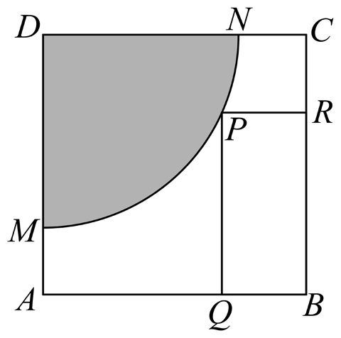
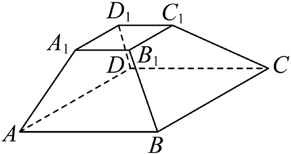
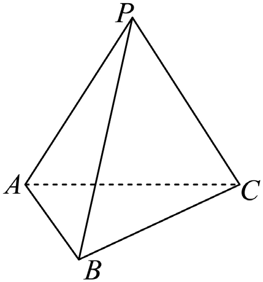
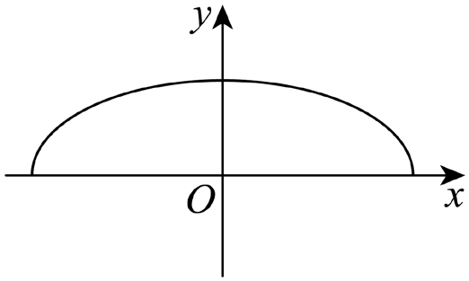

# 2025年上海卷（春）

## 填空题

### 第 1 题

已知集合 $A=\{x\mid x>0\}$，$B=\{-1,0,1,2\}$，则 $A\cap B=\underline{\qquad\qquad}$.

#### 答案

$\{1,2\}$

#### 解析

由交集定义，取 $B$ 中满足 $x>0$ 的元素，得 $A\cap B=\{1,2\}$.

### 第 2 题

不等式 $\dfrac{x}{x-1}<0$ 的解集为＿＿＿＿＿＿.

#### 答案

$(0,1)$

#### 解析

不等式等价于 $x(x-1)<0$，故 $0<x<1$，解集为 $(0,1)$.

### 第 3 题

已知复数 $z=\dfrac{2+\i}{\i}$，其中 $\i$ 为虚数单位，则 $|z|=\underline{\qquad\qquad}$.

#### 答案

$\sqrt5$

#### 解析

$z=\dfrac{\i(2+\i)}{\i^2}=1-2\i$，所以 $|z|=\sqrt{1^2+(-2)^2}=\sqrt5$.

### 第 4 题

已知 $\boldsymbol{a}=(2,1)$，$\boldsymbol{b}=(1,x)$，若 $\boldsymbol{a}\parallel\boldsymbol{b}$，则 $x=\underline{\qquad\qquad}$.

#### 答案

$\dfrac12$

#### 解析

由平面向量共线条件，$2x-1=0$，故 $x=\dfrac12$.

### 第 5 题

已知 $\tan\alpha=1$，则 $\cos\left(\alpha+\dfrac{\pi}{4}\right)=\underline{\qquad\qquad}$.

#### 答案

$0$

#### 解析

由 $\tan\alpha=1$ 得 $\sin\alpha=\cos\alpha$，因此 $\cos\left(\alpha+\dfrac{\pi}{4}\right)=\dfrac{\sqrt2}{2}(\cos\alpha-\sin\alpha)=0$.

### 第 6 题

已知 $\left(x+\dfrac{m}{x}\right)^6$ 的展开式中常数项为 $20$，则实数 $m$ 的值为＿＿＿＿＿＿.

#### 答案

$1$

#### 解析

通项为 $\mathrm C_6^r m^r x^{6-2r}$. 常数项对应 $r=3$，故 $\mathrm C_6^3m^3=20$，即 $m=1$.

### 第 7 题

已知 $\{a_n\}$ 是首项为 $1$，公差为 $1$ 的等差数列，$\{b_n\}$ 是首项为 $1$，公比为 $q(q>0)$ 的等比数列. 若数列 $\{a_nb_n\}$ 的前三项和为 $2$，则 $q=\underline{\qquad\qquad}$.

#### 答案

$\dfrac13$

#### 解析

$a_n=n$，$b_n=q^{n-1}$，故前三项和为 $1+2q+3q^2=2$. 解得 $q=\dfrac13$ 或 $-1$，由 $q>0$ 知 $q=\dfrac13$.

### 第 8 题

关于 $x$ 的方程 $|x-1|+|\pi-x|=\pi-1$ 的解集为＿＿＿＿＿＿.

#### 答案

$[1,\pi]$

#### 解析

分三段讨论：当 $x\le1$ 时左端为 $\pi+1-2x$，仅 $x=1$ 成立；当 $1<x<\pi$ 时左端恒为 $\pi-1$；当 $x\ge\pi$ 时左端为 $2x-\pi-1$，仅 $x=\pi$ 成立. 故解集为 $[1,\pi]$.

### 第 9 题

已知 $P$ 是一个圆锥的顶点，$PA$ 是母线，$PA=2$，该圆锥的底面半径是 $1$. $B$，$C$ 分别在圆锥的底面上，则异面直线 $PA$ 与 $BC$ 所成角的最小值为＿＿＿＿＿＿.

#### 答案

$\dfrac{\pi}{3}$

#### 解析

过 $A$ 作底面弦 $AD\parallel BC$，并连接 $PD$，则 $PA=PD=2$. 在等腰三角形 $PAD$ 中，底面弦 $AD\le2$，故 $\cos\angle PAD=\dfrac{PA^2+AD^2-PD^2}{2PA\cdot AD}=\dfrac{AD}{4}\le\dfrac12$. 由于 $\angle PAD\in(0,\frac\pi2)$，得 $\angle PAD\ge\frac\pi3$，且当 $AD=2$ 时取等号. 因而最小值为 $\dfrac\pi3$.

### 第 10 题

已知双曲线 $\dfrac{x^2}{a^2}-\dfrac{y^2}{6-a^2}=1(a>0)$ 的左，右焦点分别为 $F_1$，$F_2$. 通过 $F_2$ 且倾斜角为 $\dfrac\pi3$ 的直线与双曲线交于第一象限的点 $A$，延长 $AF_2$ 至 $B$ 使得 $AB=AF_1$. 若 $\triangle BF_1F_2$ 的面积为 $3\sqrt6$，则 $a=\underline{\qquad\qquad}$.

#### 答案

$\sqrt3$

#### 解析

令 $b^2=6-a^2$，则焦半距 $c=\sqrt{a^2+b^2}=\sqrt6$，所以 $F_1=(-\sqrt6,0)$，$F_2=(\sqrt6,0)$. 设 $B=(x_B,y_B)$，由面积条件 $\dfrac12\lvert y_B\rvert\cdot2\sqrt6=3\sqrt6$，得 $y_B=-3$. 直线 $AB$ 斜率为 $\tan\dfrac\pi3=\sqrt3$，故其方程为 $y=\sqrt3(x-\sqrt6)$，从而 $x_B=\sqrt6-\sqrt3$. 又双曲线定义给出 $\lvert AF_1\rvert-\lvert AF_2\rvert=2a$，而 $AB=AF_1$，故 $BF_2=2a$. 计算 $BF_2=\sqrt{(x_B-\sqrt6)^2+y_B^2}=2\sqrt3$，得 $a=\sqrt3$.

### 第 11 题

如图，正方形 $ABCD$ 是一块边长为 $4$ 的工程用料，阴影部分是被腐蚀的区域，其余部分完好，曲线 $MN$ 为以 $AD$ 为对称轴的抛物线的一部分，且 $DM=DN=3$. 工人师傅现要从完好的部分中截取一块矩形原料 $BQPR$，当其面积有最大值时，$AQ$ 的长为＿＿＿＿＿＿.

#### 答案

$\dfrac{4+\sqrt7}{3}$

#### 解析

以 $A$ 为原点，$AD$ 为 $y$ 轴建立直角坐标系，则 $M(0,1)$，$N(3,4)$. 设抛物线为 $y=\alpha x^2+1$，由 $N$ 得 $\alpha=\dfrac13$. 令 $AQ=x$. 当 $x\ge3$ 时矩形面积不超过 $4$；当 $0<x<3$ 时，$P\left(x,\dfrac13x^2+1\right)$，矩形面积 $S=(4-x)\left(\dfrac13x^2+1\right)=-\dfrac13x^3+\dfrac43x^2-x+4$. $S'=-x^2+\dfrac83x-1$，故驻点为 $x=\dfrac{4\pm\sqrt7}{3}$. 比较单调性及端点值，最大值在 $x=\dfrac{4+\sqrt7}{3}$ 处取得.

### 第 12 题

在平面中，$\boldsymbol{e}_1$ 和 $\boldsymbol{e}_2$ 是互相垂直的单位向量，向量 $\boldsymbol{a}$ 满足 $|\boldsymbol{a}-4\boldsymbol{e}_1|=2$，向量 $\boldsymbol{b}$ 满足 $|\boldsymbol{b}-6\boldsymbol{e}_2|=1$，求 $\boldsymbol{b}$ 在 $\boldsymbol{a}$ 方向上的数量投影的最大值＿＿＿＿＿＿.

#### 答案

$4$

#### 解析

取 $\boldsymbol{e}_1=(1,0)$，$\boldsymbol{e}_2=(0,1)$，令 $\boldsymbol{u}=\boldsymbol{a}/|\boldsymbol{a}|$，则 $A=|\boldsymbol{a}|\boldsymbol{u}$ 在圆 $C_1:(x-4)^2+y^2=4$ 上. 设 $\boldsymbol{u}=(\cos\theta,\sin\theta)$，直线 $O\boldsymbol{u}$ 与 $C_1$ 有交点，故圆心到该直线的距离不超过半径，即 $|\sin\theta|\le\dfrac12$. 又 $\boldsymbol{b}=6\boldsymbol{e}_2+\boldsymbol{v}$，其中 $|\boldsymbol{v}|=1$，所以 $\boldsymbol{b}\cdot\boldsymbol{u}=6\sin\theta+\boldsymbol{v}\cdot\boldsymbol{u}\le6\sin\theta+1\le4$. 当 $\theta=\dfrac\pi6$ 且 $\boldsymbol{v}=\boldsymbol{u}$ 时取等号，故最大值为 $4$.

## 单选题

### 第 13 题

如图，$ABCD-A_1B_1C_1D_1$ 是正四棱台，则下列各组直线中属于异面直线的是（）.

A.  
$AB$ 和 $C_1D_1$

B.  
$AA_1$ 和 $CC_1$

C.  
$BD_1$ 和 $B_1D$

D.  
$A_1D_1$ 和 $AB$

#### 答案

D

#### 解析

$AB\parallel C_1D_1$，选项 A 错；侧棱延长后相交，故 $AA_1$ 与 $CC_1$ 相交，选项 B 错；B，$D_1$，$B_1$，D 共面，选项 C 错. $A_1D_1$ 与 $AB$ 既不平行，不相交，又不共面，故选 D.

### 第 14 题

幂函数 $y=x^\alpha$ 在 $(0,+\infty)$ 上是严格减函数，且经过 $(-1,-1)$，则 $\alpha$ 的值可能是（）.

A.  
$-\dfrac23$

B.  
$-\dfrac13$

C.  
$\dfrac13$

D.  
$3$

#### 答案

B

#### 解析

严格递减要求 $\alpha<0$. 当 $\alpha=-\dfrac23$ 时，$(-1)^{-2/3}=1$；当 $\alpha=-\dfrac13$ 时，$(-1)^{-1/3}=-1$. 故选 B.

### 第 15 题

有一四边形 $ABCD$，对其四边 $AB$，$BC$，$CD$，$DA$ 按顺序分别抛掷一枚质量均匀的硬币：如硬币正面朝上，则将其擦去；如硬币反面朝上，则不擦去. 最后，以 $A$ 为起点沿着尚未擦去的边出发，可以到达 $C$ 点的概率为（）.

A.  
$\dfrac12$

B.  
$\dfrac7{16}$

C.  
$\dfrac14$

D.  
$\dfrac3{16}$

#### 答案

B

#### 解析

四条边保留或擦去共有 $2^4=16$ 种等可能结果. 保留 $AB$，$BC$ 时，$CD$，$DA$ 可任意；保留 $AD$，$DC$ 时，$AB$，$BC$ 可任意，但有一种与前者重复. 故可达情形有 $4+4-1=7$ 种，概率为 $\dfrac7{16}$，选 B.

### 第 16 题

已知 $a\in\mathbb{R}$，不等式 $\left[\tan\left(\dfrac\pi6x\right)-a\right]\left[\tan\left(\dfrac\pi6x\right)-a-1\right]<0$ 在 $(0,2025)$ 中的整数解有 $m$ 个. 关于 $m$ 的个数，以下不可能的是（）.

A.  
$0$

B.  
$338$

C.  
$674$

D.  
$1012$

#### 答案

D

#### 解析

不等式等价于 $a<\tan\left(\dfrac\pi6x\right)<a+1$. 函数周期为 $6$，且在每个周期的整数点 $0$，$1$，$2$，$4$，$5$，$6$ 上取值为 $0$，$\dfrac{\sqrt3}{3}$，$\sqrt3$，$-\sqrt3$，$-\dfrac{\sqrt3}{3}$，$0$. 在 $1\le x\le2024$ 的整数中，余数为 $0$，$4$，$5$ 的各有 $337$ 个，余数为 $1,2$ 的各有 $338$ 个，余数为 $3$ 时正切无定义. 区间 $(a,a+1)$ 至多包含上述五个函数值中的两个，因此解数至多为 $338+338=676<1012$，选 D.

## 解答题

### 第 17 题

在三棱锥 $P-ABC$ 中，平面 $PAC\perp$ 平面 $ABC$，$PA=AC=CP=2$，$AB=BC=\sqrt2$.

1.  若 $O$ 是棱 $AC$ 的中点，证明：$BO\perp$ 平面 $PAC$，并求三棱锥 $B-OPA$ 的体积；

2.  求二面角 $B-PC-A$ 的大小.

#### 解析

1.  连接 $BO$. 因为 $AB=BC$，且 $O$ 是 $AC$ 的中点，所以 $BO\perp AC$. 又平面 $PAC\perp$ 平面 $ABC$，交线为 $AC$，故 $BO\perp$ 平面 $PAC$. 在等腰三角形 $PAC$ 中，$PO\perp AC$，$AO=1$，故 $PO=\sqrt{PA^2-AO^2}=\sqrt3$. 在直角三角形 $ABO$ 中，$BO=\sqrt{AB^2-AO^2}=1$. 因而 $V_{B-OPA}=\dfrac13\cdot\dfrac12\cdot OP\cdot AO\cdot BO=\dfrac{\sqrt3}{6}$.

2.  由（1）知 $BO\perp OC$，$BO\perp OP$，且 $OP\perp OC$，所以 $OB$，$OC$，$OP$ 两两垂直. 以 $O$ 为原点，令 $B(1,0,0)$，$P(0,0,\sqrt3)$，$C(0,1,0)$，$A(0,-1,0)$. 则 $\overrightarrow{BP}=(-1,0,\sqrt3)$，$\overrightarrow{CP}=(0,-1,\sqrt3)$. 设平面 $BPC$，$PCA$ 的法向量分别为 $\boldsymbol{m}=(x,y,z)$，$\boldsymbol{n}=(1,0,0)$. 由 $\boldsymbol{m}\cdot\overrightarrow{BP}=\boldsymbol{m}\cdot\overrightarrow{CP}=0$，取 $\boldsymbol{m}=(\sqrt3,\sqrt3,1)$. 因而 $\cos\langle\boldsymbol{m},\boldsymbol{n}\rangle=\dfrac{\sqrt3}{\sqrt7}=\dfrac{\sqrt{21}}7$. 二面角为锐角，故其大小为 $\arccos\dfrac{\sqrt{21}}7$.

### 第 18 题

在 $\triangle ABC$ 中，角 $A$，$B$，$C$ 所对的边分别为 $a$，$b$，$c$，且 $c=5$.

1.  若 $\dfrac{a}{4b}=\dfrac{\sin B}{\sin A}$，$C=\dfrac\pi2$，求 $a$；

2.  若 $ab=20$，求 $\triangle ABC$ 面积的最大值.

#### 解析

1.  由正弦定理，$\dfrac{\sin B}{\sin A}=\dfrac ba$，故 $a=2b$. 又 $C=\dfrac\pi2$，所以 $a^2+b^2=25$，得 $b=\sqrt5$，$a=2\sqrt5$.

2.  由余弦定理，$\cos C=\dfrac{a^2+b^2-25}{40}\ge\dfrac{2ab-25}{40}=\dfrac38$，等号当且仅当 $a=b=2\sqrt5$. 因而 $\sin C\le\sqrt{1-(3/8)^2}=\dfrac{\sqrt{55}}8$，面积 $S=\dfrac12ab\sin C=10\sin C\le\dfrac{5\sqrt{55}}4$. 最大值为 $\dfrac{5\sqrt{55}}4$.

### 第 19 题

甲，乙是两个体育社团的小组，给出两组组员身高的茎叶图（单位：厘米），以身高的百位数和十位数作为“茎”排列在中间，个位数作为“叶”分列在两边.

| 甲 | 茎 | 乙 |
|:--:|:--:|:--:|
|  | $15$ | $9$ |
| $7$，$7$，$5$，$5$，$4$ | $16$ | $0$，$3$，$5$，$5$，$6$，$7$，$8$，$8$ |
| $8$，$5$，$4$，$3$，$2$，$2$ | $17$ | $2$ |
| $3$ | $18$ |  |

1.  分别求甲，乙两组组员身高的第 $60$ 百分位数；

2.  从甲，乙两组各选取一个组员，求两人身高均在 $170\text{ 厘米}$ 以上的概率；

3.  为使两组人数相同，从甲组中调派一个队员到乙组. 是否存在甲组的一个组员，将他调派至乙组后，甲，乙两组的平均身高都增大？

#### 解析

1.  甲组有 $12$ 人，$12\times60\%=7.2$，故第 $60$ 百分位数为从小到大排列的第 $8$ 个数 $173$. 乙组有 $10$ 人，第 $60$ 百分位数为第 $6$，第 $7$ 个数的平均值，即 $\dfrac{166+167}{2}=166.5$.

2.  甲组身高不低于 $170\text{ 厘米}$ 的有 $7$ 人，乙组有 $1$ 人，故所求概率为 $\dfrac{\mathrm C_7^1\mathrm C_1^1}{\mathrm C_{12}^1\mathrm C_{10}^1}=\dfrac7{120}$.

3.  甲，乙两组原平均身高分别为：

    甲组平均身高 $\bar x_{\text{甲}}=\dfrac{167\times2+165\times2+164+178+175+174+173+172\times2+183}{12}=171.25$，乙组平均身高 $\bar x_{\text{乙}}=\dfrac{159+160+163+165\times2+166+167+168\times2+172}{10}=165.3$. 调派身高在两平均数之间的成员时，甲组去掉该成员后平均身高增大，乙组加入后平均身高也增大. 因而调派甲组中身高 $167\text{ 厘米}$ 的成员即可.

### 第 20 题

在平面直角坐标系中，已知曲线 $\Gamma:\dfrac{x^2}{4}+y^2=1(y\ge0)$，点 $P$，$Q$ 分别为 $\Gamma$ 上不同的两点，$T(t,0)$.

1.  求 $\Gamma$ 所在椭圆的离心率；

2.  若 $T(1,0)$，$Q$ 在 $y$ 轴上，且 $T$ 到直线 $PQ$ 的距离为 $\dfrac{\sqrt5}{5}$，求 $P$ 的坐标；

3.  是否存在 $t$，使得 $\triangle TPQ$ 是以 $T$ 为直角顶点的等腰直角三角形？若存在，求 $t$ 的取值范围；若不存在，请说明理由.

#### 解析

1.  椭圆长半轴 $a=2$，短半轴 $b=1$，焦半距 $c=\sqrt3$，故离心率 $e=\dfrac{\sqrt3}{2}$.

2.  由 $Q$ 在 $y$ 轴上且在上半椭圆上知 $Q=(0,1)$. 设直线 $PQ$ 为 $y=nx+1$. 由点到直线距离公式，$\dfrac{|n+1|}{\sqrt{1+n^2}}=\dfrac{\sqrt5}{5}$，得 $n=-\dfrac12$ 或 $n=-2$. 当 $n=-\dfrac12$ 时，与椭圆联立得交点 $(0,1)$，$(2,0)$；当 $n=-2$ 时另一交点不在上半椭圆. 故 $P=(2,0)$.

3.  设 $PQ:y=kx+m$，与椭圆联立. 由判别式得 $\sqrt{4k^2+1}>m>2|k|\ge0$. 当 $k=0$ 时由对称性得到 $t=0$. 当 $k\ne0$ 时，弦中点为 $A\left(-\dfrac{4km}{1+4k^2},\dfrac{m}{1+4k^2}\right)$，且 $TA\perp PQ$ 要求 $t=-\dfrac{3km}{1+4k^2}$. 再由 $\overrightarrow{TP}\cdot\overrightarrow{TQ}=0$ 得 $t^2=\dfrac{9k^2m^2}{(1+4k^2)^2}$，化简为 $m^2=\dfrac45(4k^2+1)$，从而 $0<k^2\le1$ 且 $t^2\le\dfrac{36}{25}$. 合并 $k=0$ 情形，得 $t\in\left[-\dfrac65,\dfrac65\right]$.

### 第 21 题

已知函数 $y=f(x)$ 的定义域是 $D$. 对于 $t\in D$，定义集合 $S_f(t)=\{x\mid f(x)\ge f(t)\}$.

1.  $f(x)=\log_2x$，求 $S_f(16)$；

2.  对于集合 $A$，若对任意 $x\in A$ 都有 $-x\in A$，则称 $A$ 是对称集. 若 $D$ 是对称集，证明：“函数 $y=f(x)$ 是偶函数”的充要条件是“对任意 $t\in D$，$S_f(t)$ 是对称集”；

3.  若 $x\in\mathbb{R}$，$f(x)=\e^x-\dfrac12mx^2$. 求 $m$ 的取值范围，使得对于任意 $t_1<t_2\in D$，都有 $S_f(t_2)\subseteq S_f(t_1)$.

#### 解析

1.  $S_f(16)=\{x\mid\log_2x\ge4\}=\{x\mid x\ge16\}=[16,+\infty)$.

2.  若 $f$ 为偶函数，则 $x\in S_f(t)\mathbb{R}ightarrow f(-x)=f(x)\ge f(t)$，故 $-x\in S_f(t)$，每个 $S_f(t)$ 都是对称集. 反之，任取 $t\in D$. 由 $t\in S_f(t)$ 及对称性知 $-t\in S_f(t)$，故 $f(-t)\ge f(t)$. 再将 $t$ 换为 $-t$，得 $f(t)\ge f(-t)$. 因而 $f(t)=f(-t)$，即 $f$ 为偶函数.

3.  条件等价于 $f$ 在 $\mathbb{R}$ 上单调不减，故需 $f'(x)=\e^x-mx\ge0$ 对任意 $x$ 成立. 当 $x>0$ 时要求 $m\le\dfrac{\e^x}{x}$，而 $\dfrac{\e^x}{x}$ 在 $(0,1)$ 上递减，在 $(1,+\infty)$ 上递增，最小值为 $\e$，故 $m\le\e$. 当 $x<0$ 时要求 $m\ge\dfrac{\e^x}{x}$，右端趋于 $-\infty$，故只需 $m\ge0$. 综上 $m\in[0,\e]$.
