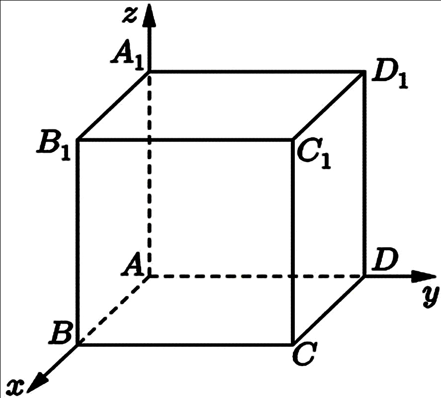
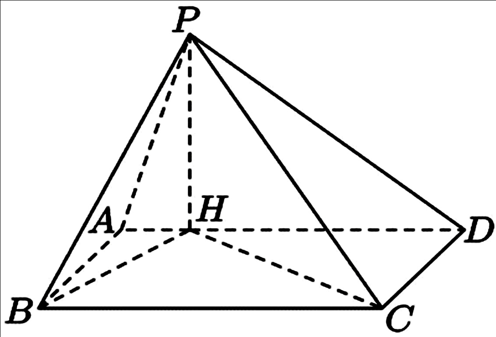

# 2026年上海卷（秋）

## 填空题

### 第 1 题

已知集合 $A=\left\{ 2,1+a \right\}$，且 $-1\in A$，则 $a=\underline{\qquad\qquad}$.

#### 答案

$-2$

#### 解析

由 $-1\in A$ 知，$-1$ 只能等于 $1+a$. 所以 $1+a=-1$，解得 $a=-2$.

### 第 2 题

已知数列 $\left\{ a_n \right\}$ 是等比数列，且 $a_1=2$，$a_2=6$，则 $a_4=\underline{\qquad\qquad}$.

#### 答案

$54$

#### 解析

设等比数列的公比为 $q$，则 $q=\frac{a_2}{a_1}=3$. 所以 $a_4=a_1 q^3=2\times 3^3=54$.

### 第 3 题

已知 $\sin \alpha=\frac{1}{5}$，则 $\cos 2\alpha=\underline{\qquad\qquad}$.

#### 答案

$\frac{23}{25}$

#### 解析

由二倍角公式，$\cos 2\alpha=1-2\sin^2\alpha=1-2\times \frac{1}{25}=\frac{23}{25}$.

### 第 4 题

已知事件 $A$，$B$ 互斥，$P\left( A \right)=0.2$，$P\left( B \right)=0.5$，则 $P\left( A\cup B \right)=\underline{\qquad\qquad}$.

#### 答案

$0.7$

#### 解析

因为事件 $A$，$B$ 互斥，所以 $P\left( A\cup B \right)=P\left( A \right)+P\left( B \right)=0.2+0.5=0.7$.

### 第 5 题

函数 $f(x)$ 是偶函数. 当 $x\ge 0$ 时，$f(x)=\sqrt{x}-a$. 若 $f(-4)=3$，则 $a=\underline{\qquad\qquad}$.

#### 答案

$-1$

#### 解析

因为 $f(x)$ 是偶函数，所以 $f(-4)=f(4)$. 又 $f(4)=\sqrt{4}-a=2-a$，故 $2-a=3$，解得 $a=-1$.

### 第 6 题

在 $\left( x^2+x \right)^5$ 的二项展开式中，$x^7$ 项的系数为＿＿＿＿＿＿.

#### 答案

$10$

#### 解析

因为 $\left( x^2+x \right)^5=x^5\left( x+1 \right)^5$，所以 $x^7$ 项来自 $\left( x+1 \right)^5$ 中的 $x^2$ 项. 故所求系数为 $\mathrm C_5^2=10$.

### 第 7 题

已知 $a^2+4b^2=1$，则 $ab$ 的最大值为＿＿＿＿＿＿.

#### 答案

$\frac{1}{4}$

#### 解析

由 $\left( a-2b \right)^2\ge 0$ 得 $a^2-4ab+4b^2\ge 0$. 又 $a^2+4b^2=1$，所以 $1-4ab\ge 0$，即 $ab\le \frac{1}{4}$. 当 $a=2b$ 时取等号，此时确有 $a^2+4b^2=8b^2=1$. 所以 $ab$ 的最大值为 $\frac{1}{4}$.

### 第 8 题

已知随机变量 $X$ 的分布为 $\left( \begin{smallmatrix} -1 & 0 & 1 \\ a & 0.3 & b \end{smallmatrix} \right)$，$E\left( X \right)=0.5$，则 $b=\underline{\qquad\qquad}$.

#### 答案

$0.6$

#### 解析

由分布列知 $a+0.3+b=1$，所以 $a+b=0.7$. 又 $E\left( X \right)=\left( -1 \right)a+0\times 0.3+1\times b=b-a=0.5$. 联立 $a+b=0.7$ 与 $b-a=0.5$，解得 $b=0.6$.

### 第 9 题

已知等差数列 $\left\{ a_n \right\}$ 中，$a_1=0$，$d$ 为公差，$S_n$ 为前 $n$ 项和. 至少有两项 $S_n$ 介于 $\left( 0,1 \right)$，则 $d$ 的取值范围为 $\underline{\qquad\qquad}$.

#### 答案

$\left( 0,\frac{1}{3} \right)$

#### 解析

因为 $a_1=0$，所以 $a_n=\left( n-1 \right)d$. 从而 $S_n=\frac{n}{2}\left( a_1+a_n \right)=\frac{n\left( n-1 \right)}{2}d$. 若 $d\le 0$，则 $S_n\le 0$，不可能有两项落在 $\left( 0,1 \right)$ 内. 所以 $d>0$.

此时 $\frac{n\left( n-1 \right)}{2}$ 随 $n$ 的增大而增大，所以 $S_n$ 也随 $n$ 的增大而增大. 要使至少有两项 $S_n$ 落在 $\left( 0,1 \right)$ 内，只需且只需 $S_2$ 与 $S_3$ 都落在 $\left( 0,1 \right)$ 内. 由 $S_2=d$，$S_3=3d$，得 $0<d<1$ 且 $0<3d<1$. 故 $0<d<\frac{1}{3}$.

### 第 10 题

已知 $k\in \mathbb{R}$，向量 $\boldsymbol{a}$，$\boldsymbol{b}$，$\boldsymbol{c}$ 是两两不平行的向量，且 $\boldsymbol{a}+3\boldsymbol{b}\parallel \boldsymbol{b}+\boldsymbol{c}$，$2\boldsymbol{a}+k\boldsymbol{c}\parallel \boldsymbol{b}+\boldsymbol{c}$，则 $k=\underline{\qquad\qquad}$.

#### 答案

$-6$

#### 解析

由 $\boldsymbol{a}+3\boldsymbol{b}\parallel \boldsymbol{b}+\boldsymbol{c}$，设 $\boldsymbol{a}+3\boldsymbol{b}=\lambda \left( \boldsymbol{b}+\boldsymbol{c}\right)$，则 $\boldsymbol{a}=\left( \lambda-3 \right)\boldsymbol{b}+\lambda \boldsymbol{c}$. 于是 $2\boldsymbol{a}+k\boldsymbol{c}=2\left( \lambda-3 \right)\boldsymbol{b}+\left( 2\lambda+k \right)\boldsymbol{c}$. 又 $2\boldsymbol{a}+k\boldsymbol{c}\parallel \boldsymbol{b}+\boldsymbol{c}$，设 $2\boldsymbol{a}+k\boldsymbol{c}=\mu \left( \boldsymbol{b}+\boldsymbol{c}\right)$. 比较 $\boldsymbol{b}$，$\boldsymbol{c}$ 的系数，得 $\mu=2\lambda-6$ 且 $\mu=2\lambda+k$，所以 $k=-6$.

### 第 11 题

已知三角函数 $f(t)=A\sin\left( \omega t+\varphi \right)+B$（$A>0$，$B\in \mathbb{R}$，$\omega>0$，$0\le \varphi<2\pi$），若 $\nu=f(t)$，当 $\nu=0$ 或 $\nu=4$ 时其导数为 $0$，初始速度为 $0$，且速度第一次达到 $4$ 时用时为 $0.1$ 秒，则 $f(t)=\underline{\qquad\qquad}$.

#### 答案

$2-2\cos\left( 10\pi t \right)$

#### 解析

由题意，$v=0$ 与 $v=4$ 时导数为 $0$，说明 $0$ 与 $4$ 分别是函数的最小值与最大值. 所以 $B-A=0$，$B+A=4$，解得 $A=2$，$B=2$. 又初始速度为 $0$，即 $f(0)=0$. 所以 $2\sin \varphi+2=0$，从而 $\sin \varphi=-1$. 结合 $0\le \varphi<2\pi$，得 $\varphi=\frac{3\pi}{2}$. 速度第一次从 $0$ 达到 $4$，对应正弦函数从最小值到最大值，相位变化为 $\pi$. 因此 $0.1\omega=\pi$，故 $\omega=10\pi$. 所以 $f(t)=2\sin\left( 10\pi t+\frac{3\pi}{2} \right)+2=2-2\cos\left( 10\pi t \right)$.

### 第 12 题

在 $\triangle ABC$ 中，$AB=3$，$AC=5$，$BC=\sqrt{14}$. 已知点 $A$，$B$，$C$ 分别为椭圆 $4$ 个顶点和 $2$ 个焦点中的三点，则该椭圆的离心率为＿＿＿＿＿＿.

#### 答案

$\frac{2}{3}$

#### 解析

设椭圆的长半轴，短半轴，半焦距分别为 $a$，$b$，$c$，则 $a^2=b^2+c^2$. 因为题设三条边分别为 $3$，$\sqrt{14}$，$5$，且三边互不相等，所以这三个点不可能取成关于坐标轴对称的一对顶点或焦点与另一个点，否则会出现两条相等的边. 因而只能是一个长轴顶点，一个短轴顶点与一个异侧焦点. 此时这三点之间的距离分别为 $a$，$a+c$，$\sqrt{a^2+b^2}$. 与题设对照可得 $a=3$，$a+c=5$，所以 $c=2$. 于是 $b^2=a^2-c^2=9-4=5$，并且 $\sqrt{a^2+b^2}=\sqrt{9+5}=\sqrt{14}$， 与题设一致. 故椭圆的离心率为 $e=\frac{c}{a}=\frac{2}{3}$.

## 单选题

### 第 13 题

已知 $a\in\mathbb{R}$，且 $a\neq 1$，则 $a\cdot \sqrt[3]{a}=$（）

A.  
$\frac{3}{a^2}$

B.  
$\frac{4}{a^3}$

C.  
$\frac{5}{a^2}$

D.  
$\frac{5}{a^3}$

#### 答案

原卷选项无正确答案

#### 解析

因为 $\sqrt[3]{a}=a^{\frac{1}{3}}$，所以 $a\cdot \sqrt[3]{a}=a\cdot a^{\frac{1}{3}}=a^{\frac{4}{3}}$. 该结果不在原卷所列四个选项中.

### 第 14 题

事件 $A$ 和事件 $B$ 相互独立，“$A$ 和 $B$ 至少一个发生”的对立事件是（）

A.  
$A\cap B$

B.  
$A\cup B$

C.  
$\overline{A}\cap \overline{B}$

D.  
$\overline{A}\cup \overline{B}$

#### 答案

C

#### 解析

“A 和 B 至少一个发生”的对立事件是 A，B 都不发生，即 $\overline{A}\cap \overline{B}$. 故选 C.

### 第 15 题

对于任意两个复数 $z$，$w$，如果满足 $z-w$ 为实数，或 $z-\overline{w}$ 为实数，那么就称 $z$ 与 $w$ 伴随. 如果 $z$ 与 $w$ 伴随，则 $w-\i$ 与 $z+\i$ 伴随的充要条件是（）

A.  
$\mathrm{Re} z+\mathrm{Re} w=0$

B.  
$\mathrm{Re} z-\mathrm{Re} w=0$

C.  
$\mathrm{Im} z+\mathrm{Im} w=0$

D.  
$\mathrm{Im} z-\mathrm{Im} w=0$

#### 答案

C

#### 解析

设 $z=x+y\i$，$w=u+v\i$（$x$，$u$，$y$，$v\in\mathbb{R}$）. 由定义，$z$ 与 $w$ 伴随，当且仅当 $z-w$ 为实数或 $z-\overline{w}$ 为实数，也就是 $y-v=0$ 或 $y+v=0$，即 $y=v$ 或 $y=-v$. 再看 $w-\i$ 与 $z+\i$ 伴随的条件. 若 $\left( w-\i \right)-\left( z+\i \right)$ 为实数，则 $\left( v-1 \right)-\left( y+1 \right)=0$，即 $v-y=2$. 若 $\left( w-\i \right)-\overline{\left( z+\i \right)}$ 为实数，则 $\left( v-1 \right)+\left( y+1 \right)=0$，即 $v+y=0$. 若 $v+y=0$，则 $w-\i$ 与 $z+\i$ 伴随. 反之，若 $v-y=2$，由 $y=v$ 或 $y=-v$ 知只能有 $y=-v$，此时仍有 $v+y=0$. 因此充要条件为 $y+v=0$，即 $\mathrm{Im} z+\mathrm{Im} w=0$. 故选 C.

### 第 16 题

已知空间直角坐标系中有一正方体，其三组棱分别与 $x$ 轴，$y$ 轴，$z$ 轴重合，顶点 $A$ 与坐标原点重合，点 $C$ 是正方体底面中与 $A$ 相对的对角顶点，点 $C_1$ 在点 $C$ 的正上方. 将正方体绕直线 $AC_1$ 旋转一周，点 $C$ 的运动轨迹会经过（）个空间卦限.

A.  
$1$

B.  
$3$

C.  
$4$

D.  
$7$

#### 答案

A

#### 解析

设正方体棱长为 $1$. 以 $A$ 为原点，$AB$，$AD$，$AA_1$ 所在方向分别为 $x$ 轴，$y$ 轴，$z$ 轴正方向，则 $C\left( 1,1,0 \right)$，$C_1\left( 1,1,1 \right)$，旋转轴 $AC_1$ 的方向可用 $\left( 1,1,1 \right)$ 表示. 【法一】先证明旋转轨迹圆的两个不变量. 设 $H$ 为 $C$ 到直线 $AC_1$ 的垂足，令 $H\left( t,t,t \right)$. 由 $\overrightarrow{HC}\perp AC_1$，得 $\left( 1-t \right)+\left( 1-t \right)-t=0$，所以 $t=\frac{2}{3}$，即 $H\left( \frac{2}{3},\frac{2}{3},\frac{2}{3} \right)$. 点绕直线 $AC_1$ 旋转时，轴上点不动，到轴的距离不变，所以 $C$ 的轨迹是以 $H$ 为圆心，在垂直于 $AC_1$ 的平面内的圆. 因此若旋转后点为 $C'\left( x,y,z \right)$，则 $C'$ 仍在过 $H$ 且垂直于 $AC_1$ 的平面内，故 $\left( x-\frac{2}{3} \right)+\left( y-\frac{2}{3} \right)+\left( z-\frac{2}{3} \right)=0$，即 $x+y+z=2$. 又 $A$ 在旋转轴上，旋转不改变 $AC'$ 的长度，所以 $AC'=AC=\sqrt{2}$，即 $x^2+y^2+z^2=2$.

下面证明坐标不会变负. 若 $x<0$，则 $y+z=2-x>2$，由 $y^2+z^2\ge \frac{\left( y+z \right)^2}{2}$ 得 $x^2+y^2+z^2\ge x^2+\frac{\left( 2-x \right)^2}{2}>2$，这与 $x^2+y^2+z^2=2$ 矛盾. 所以 $x\ge0$. 同理 $y\ge0$，$z\ge0$. 因此轨迹始终在 $x\ge0$，$y\ge0$，$z\ge0$ 的闭区域内，不会进入其他卦限.

还要说明它确实经过第一卦限. 旋转半周时，$C'$ 是轨迹圆上与 $C$ 关于圆心 $H$ 对称的点，坐标为 $2H-C=\left( \frac{1}{3},\frac{1}{3},\frac{4}{3} \right)$，三个坐标都为正，故轨迹经过第一卦限. 所以只经过 $1$ 个卦限.

【法二】也可以直接看轨迹圆与三个坐标平面的关系. 已知轨迹圆同时满足 $x+y+z=2$ 与 $x^2+y^2+z^2=2$. 在坐标平面 $z=0$ 上，若轨迹圆与它相交，则 $x+y=2$，$x^2+y^2=2$，于是 $xy=1$，从而 $x=y=1$，交点只有 $C\left( 1,1,0 \right)$. 因此平面 $z=0$ 只是与轨迹圆相切，轨迹圆不会穿过它进入 $z<0$ 的一侧. 同理，平面 $x=0$ 只在 $\left( 0,1,1 \right)$ 处与轨迹圆相切，平面 $y=0$ 只在 $\left( 1,0,1 \right)$ 处与轨迹圆相切. 圆心 $H$ 的三个坐标都为正，所以轨迹圆除这些切点外均在三个坐标平面的正侧，也就是第一卦限内部. 故点 C 绕 $AC_1$ 旋转一周只经过第一卦限，故选 A.

## 解答题

### 第 17 题

工厂为了保护和改善环境，记录了颗粒物密度和二氧化硫密度. 下表是 $2023$ 年前九年数据：

| 颗粒物密度 | $101.02$ | $87.02$ | $57.46$ | $21.85$ | $11.76$ | $8.86$ | $5.03$ | $4.63$ | $3.86$ |
|:--:|:--:|:--:|:--:|:--:|:--:|:--:|:--:|:--:|:--:|
| 二氧化硫密度 | $119.47$ | $81.94$ | $53.20$ | $9.16$ | $6.60$ | $4.40$ | $3.31$ | $3.35$ | $3.86$ |

1.  从九年中任意抽取一年，该年份颗粒物密度比二氧化硫密度高的概率是多少？

2.  想要研究颗粒物密度和二氧化硫密度的线性关系，你准备选择扇形图，茎叶图还是散点图？研究颗粒物密度和二氧化硫密度的相关系数，你认为在区间 $(-1,0)$，$(0,1)$ 还是 $(1,2)$ 内？直接写出答案；

3.  九年中的平均年份是 $2018$ 年. 设 $x$ 为年份，颗粒物密度为 $y$，现在有两个选择：$y_1=106.55\e^{-0.461\left( x-2014 \right)}$，$y_2=a\left( x-2014 \right)+83.743$（$a\in\mathbb{R}$），其中 $y_1$ 是回归方程，$y_2$ 是线性回归方程. 通过预测值与实际值之差的绝对值来比较精确度，已知在 $2023$ 年实际颗粒物密度为 $3.88$，预测值与实际值之差的绝对值哪个更小（精确到 $0.01$）？

#### 解析

1.  逐年比较可知，颗粒物密度大于二氧化硫密度的共有 $7$ 年，所以所求概率为 $\frac{7}{9}$.

2.  这里研究的是两组数值变量之间的相关性，应选用散点图. 从数据变化趋势看，两组数据同向变化明显，故相关系数为正，且其值应落在 $\left( 0,1 \right)$ 内.

3.  先求前 $9$ 年颗粒物密度的平均数：$\bar y=\frac{101.02+87.02+57.46+21.85+11.76+8.86+5.03+4.63+3.86}{9}=\frac{301.49}{9}\approx33.4989$. 因为线性回归方程经过样本中心点 $\left( \bar x,\bar y \right)=\left( 2018,\frac{301.49}{9} \right)$，所以 $\frac{301.49}{9}=a\left( 2018-2014 \right)+83.743$，解得 $a=\frac{\frac{301.49}{9}-83.743}{4}\approx-12.56103$. 于是线性模型在 $2023$ 年的预测值约为 $-12.56103\times 9+83.743\approx-29.30625$，与实际值 $3.88$ 的差值绝对值约为 $33.19$. 指数模型在 $2023$ 年的预测值为 $106.55\e^{-0.461\times 9}\approx1.681$，与实际值 $3.88$ 的差值绝对值约为 $2.20$. 因此 $y_1$ 的预测值与实际值之差的绝对值更小.

### 第 18 题

四棱锥 $P-ABCD$ 的底面 $ABCD$ 是矩形，点 $H$ 在线段 $AD$ 上，$PH\perp\text{平面 }ABCD$，$AB=2$，$AH=1$，$HD=4$.

1.  证明：$HC \perp PB$；

2.  若四棱锥体积 $V_{P-ABCD}=\frac{10\sqrt{5}}{3}$，求二面角 $C-PB-H$ 的大小.

#### 解析

1.  以 $A$ 为坐标原点，令 $A\left( 0,0,0 \right)$，$B\left( 2,0,0 \right)$，$D\left( 0,5,0 \right)$. 则 $H\left( 0,1,0 \right)$，$C\left( 2,5,0 \right)$. 又因为 $PH\perp\text{平面 }ABCD$，设 $P\left( 0,1,h \right)$. 于是 $\overrightarrow{HC}=\left( 2,4,0 \right)$，$\overrightarrow{PB}=\left( 2,-1,-h \right)$. 从而 $\overrightarrow{HC}\cdot \overrightarrow{PB}=2\times 2+4\times \left( -1 \right)+0\times \left( -h \right)=0$，故 $HC\perp PB$.

2.  底面矩形 $ABCD$ 的面积为 $AB\cdot AD=2\times 5=10$. 由体积公式 $\frac{1}{3}\times 10\times PH=\frac{10\sqrt{5}}{3}$，得 $PH=\sqrt{5}$，故 $P\left( 0,1,\sqrt{5} \right)$.

    取 $\overrightarrow{PB}=\left( 2,-1,-\sqrt{5} \right)$，$\overrightarrow{PC}=\left( 2,4,-\sqrt{5} \right)$，$\overrightarrow{PH}=\left( 0,0,-\sqrt{5} \right)$. 则平面 $CPB$ 的一个法向量可取 $\boldsymbol{n}_1=\left( \sqrt{5},0,2 \right)$，平面 $HPB$ 的一个法向量可取 $\boldsymbol{n}_2=\left( 1,2,0 \right)$.

    设二面角 $C-PB-H$ 的大小为 $\theta$，则 $\cos \theta=\frac{\left| \boldsymbol{n}_1\cdot \boldsymbol{n}_2 \right|}{\left| \boldsymbol{n}_1 \right|\left| \boldsymbol{n}_2 \right|}=\frac{\sqrt{5}}{3\sqrt{5}}=\frac{1}{3}$. 所以 $\tan \theta=\frac{\sqrt{1-\cos^2\theta}}{\cos \theta}=\frac{\sqrt{1-\frac{1}{9}}}{\frac{1}{3}}=2\sqrt{2}$，故 $\theta=\arctan\left( 2\sqrt{2} \right)$.

### 第 19 题

已知 $a\in \mathbb{R}$，函数 $f(x)=x^2+ax+3$，$g(x)=4x+\frac{1}{x^2}$.

1.  解不等式 $f(x)+\frac{1}{x^2}>g(x)$；

2.  $a\neq 0$. $l_1$ 是 $f(x)$ 在点 $\left( 0,3 \right)$ 处的切线，$l_2$ 是过点 $\left( 0,3 \right)$ 且垂直于 $l_1$ 的直线. $g(x)$ 与 $l_1$，$l_2$ 在第一象限内均无公共点，求 $a$ 的取值范围.

#### 解析

1.  原不等式的定义域为 $x\neq 0$，化简得 $x^2+\left( a-4 \right)x+3>0$. 其判别式为 $\Delta=\left( a-4 \right)^2-12$. 当 $4-2\sqrt{3}<a<4+2\sqrt{3}$ 时，解集为 $\mathbb{R}\setminus\{0\}$. 当 $a=4\pm2\sqrt{3}$ 时，解集为 $\mathbb{R}\setminus\left\{ 0,\frac{4-a}{2} \right\}$. 当 $a<4-2\sqrt{3}$ 或 $a>4+2\sqrt{3}$ 时，记 $x_1=\frac{4-a-\sqrt{\left( a-4 \right)^2-12}}{2}$，$x_2=\frac{4-a+\sqrt{\left( a-4 \right)^2-12}}{2}$，则解集为 $\left( -\infty,x_1 \right)\cup\left( x_2,+\infty \right)\setminus\{0\}$.

2.  因为 $f'(x)=2x+a$，所以 $l_1$ 在点 $\left( 0,3 \right)$ 处的斜率为 $a$. 故 $l_1:\ y=ax+3$. 又 $l_2 \perp l_1$，且过点 $\left( 0,3 \right)$，所以 $l_2:\ y=-\frac{x}{a}+3$. 由于 $g(x)>0$（$x>0$），所以 $g(x)$ 与 $l_1$，$l_2$ 在第一象限内无公共点，等价于下面两个方程在 $x>0$ 时都无解. 先看 $g(x)$ 与 $l_1$ 的交点：$4x+\frac{1}{x^2}=ax+3$. 化简得 $\left( 4-a \right)x^3-3x^2+1=0$. 设 $\phi(x)=\left( 4-a \right)x^3-3x^2+1$. 若 $4-a\le 0$，即 $a\ge 4$，则 $\phi(0)=1$，$\phi(1)=2-a<0$，由连续性知 $\phi(x)$ 在 $\left( 0,1 \right)$ 内有正根. 所以 $4-a>0$.

    此时 $\phi'(x)=3x\left( \left( 4-a \right)x-2 \right)$. 故 $x=\frac{2}{4-a}$ 是 $\phi(x)$ 在 $\left( 0,+\infty \right)$ 内的极小值点. 要使 $\phi(x)$ 在 $x>0$ 时无零点，必须且只需 $\phi\left( \frac{2}{4-a} \right)>0$. 计算得 $\phi\left( \frac{2}{4-a} \right)=1-\frac{4}{\left( 4-a \right)^2}$，所以 $1-\frac{4}{\left( 4-a \right)^2}>0$，即 $4-a>2$，从而 $a<2$. 再看 $g(x)$ 与 $l_2$ 的交点：$4x+\frac{1}{x^2}=-\frac{x}{a}+3$. 化简得 $\left( 4+\frac{1}{a} \right)x^3-3x^2+1=0$. 设 $\psi(x)=\left( 4+\frac{1}{a} \right)x^3-3x^2+1$. 按照分析 $\phi(x)$ 时的同样方法，要使 $\psi(x)$ 在 $x>0$ 时无零点，必须且只需 $4+\frac{1}{a}>2$，即 $\frac{1}{a}>-2$. 所以 $a<-\frac{1}{2}$ 或 $a>0$. 综上，$a\in \left( -\infty,-\frac{1}{2} \right)\cup \left( 0,2 \right)$.

### 第 20 题

已知双曲线 $\Gamma:x^2-y^2=1$，点 $P$ 在 $\Gamma$ 上，$F_1$，$F_2$ 分别为双曲线的左，右焦点.

1.  求点 $\left( 2,0 \right)$ 到 $\Gamma$ 渐近线的距离；

2.  若 $\overrightarrow{PF_1}\cdot \overrightarrow{PF_2}=1$，求 $\triangle PF_1F_2$ 的面积；

3.  记 $\Omega$ 为双曲线 $x^2-y^2=1$ 中满足 $\left( x>0,\ y\ge -1 \right)$ 或 $\left( x<0,\ y\le -1 \right)$ 的部分. 过点 $F_2$ 的直线 $l$ 交 $\Omega$ 于 $P$，$Q$ 两点（分别位于第一，第四象限），过点 $F_2$ 的直线 $m$ 交 $\Omega$ 于 $M$，$N$ 两点（分别位于第三，第四象限）. 是否存在常数 $\lambda$，使得对任意直线 $l$，都存在唯一对应的直线 $m$ 满足 $\lambda \left| PQ \right|=\left| MN \right|$？若存在，求出 $\lambda$ 的值；若不存在，请说明理由.

#### 解析

1.  双曲线 $\Gamma$ 的渐近线为 $y=x$ 与 $y=-x$. 点 $\left( 2,0 \right)$ 到直线 $y=x$ 的距离为 $\frac{\left| 2-0 \right|}{\sqrt{2}}=\sqrt{2}$，到直线 $y=-x$ 的距离也为 $\sqrt{2}$. 所以所求距离为 $\sqrt{2}$.

2.  由 $\Gamma:x^2-y^2=1$ 知焦点为 $F_1\left( -\sqrt{2},0 \right)$ 与 $F_2\left( \sqrt{2},0 \right)$. 设 $P\left( x,y \right)\in \Gamma$，则 $x^2-y^2=1$. 由向量数量积，$\overrightarrow{PF_1}\cdot \overrightarrow{PF_2}=\left( -\sqrt{2}-x \right)\left( \sqrt{2}-x \right)+y^2$. 化简得 $\overrightarrow{PF_1}\cdot \overrightarrow{PF_2}=x^2+y^2-2$. 又 $y^2=x^2-1$，所以 $\overrightarrow{PF_1}\cdot \overrightarrow{PF_2}=2x^2-3$. 由题意 $2x^2-3=1$，得 $x^2=2$，从而 $y^2=1$. 因此点 $P$ 到 $x$ 轴的距离为 $1$，而 $\left| F_1F_2 \right|=2\sqrt{2}$. 所以 $S_{\triangle PF_1F_2}=\frac{1}{2}\times 2\sqrt{2}\times 1=\sqrt{2}$.

3.  设 $F_2\left( \sqrt{2},0 \right)$. 因为直线 $l$ 与 $\Omega$ 交于第一，第四象限两点，所以 $l$ 的斜率为正，且大于 $1$. 设 $l:\ y=\frac{1}{t}\left( x-\sqrt{2} \right)$（$0<t<1$）. 代入 $x^2-y^2=1$，得 $\left( t^2-1 \right)x^2+2\sqrt{2}x-\left( t^2+2 \right)=0$. 设两交点的横坐标为 $x_P$，$x_Q$，则 $\left| x_P-x_Q \right|=\frac{2t\sqrt{1+t^2}}{1-t^2}$. 又直线 $l$ 的方向向量可取 $\left( t,1 \right)$，所以 $\left| PQ \right|=\sqrt{1+\frac{1}{t^2}}\left| x_P-x_Q \right|=\frac{2\left( 1+t^2 \right)}{1-t^2}$. 故 $\left| PQ \right|$ 的值域为 $\left( 2,+\infty \right)$. 再设 $m:\ y=s\left( x-\sqrt{2} \right)$（$0<s<1$）. 代入 $x^2-y^2=1$，得 $\left( 1-s^2 \right)x^2+2\sqrt{2}s^2x-\left( 2s^2+1 \right)=0$. 设两交点的横坐标为 $x_M$，$x_N$，则 $\left| x_M-x_N \right|=\frac{2\sqrt{1+s^2}}{1-s^2}$. 从而 $\left| MN \right|=\sqrt{1+s^2}\left| x_M-x_N \right|=\frac{2\left( 1+s^2 \right)}{1-s^2}$.

    为了使左支交点属于 $\Omega$ 的第三象限部分，必须有该点满足 $y\le -1$. 这等价于 $s\ge \frac{1}{2\sqrt{2}}$，所以 $\frac{1}{2\sqrt{2}}\le s<1$.

    设 $\phi(u)=\frac{2\left( 1+u^2 \right)}{1-u^2}$，则 $\left| PQ \right|=\phi(t)$，$\left| MN \right|=\phi(s)$. 又 $\phi'(u)=\frac{8u}{\left( 1-u^2 \right)^2}>0$， 所以 $\phi(u)$ 在 $\left( 0,1 \right)$ 上严格增. 由 $\phi\left( \frac{1}{2\sqrt{2}} \right)=\frac{2\left( 1+\frac{1}{8} \right)}{1-\frac{1}{8}}=\frac{18}{7}$， 可知 $\left| MN \right|$ 的值域为 $\left[ \frac{18}{7},+\infty \right)$.

    现要对任意直线 $l$ 都存在唯一的直线 $m$，使 $\lambda \left| PQ \right|=\left| MN \right|$ 成立. 因为 $\left| PQ \right| \in \left( 2,+\infty \right)$，$\left| MN \right| \in \left[ \frac{18}{7},+\infty \right)$，且 $\phi$ 严格增，所以这等价于对任意 $R>2$，都有 $\lambda R\in \left[ \frac{18}{7},+\infty \right)$.

    当 $\lambda\ge \frac{9}{7}$ 时，对任意 $R>2$，都有 $\lambda R>2\lambda\ge \frac{18}{7}$，由 $\phi$ 在区间 $\left[ \frac{1}{2\sqrt{2}},1 \right)$ 上严格增，必存在唯一的 $s$ 与之对应，也就存在唯一的直线 $m$. 当 $\lambda<\frac{9}{7}$ 时，若 $\lambda\le 0$，取 $R=3$，则 $\lambda R<\frac{18}{7}$；若 $0<\lambda<\frac{9}{7}$，取 $R=1+\frac{9}{7\lambda}$，则 $R>2$，且 $\lambda R=\lambda+\frac{9}{7}<\frac{18}{7}$. 由 $\left| PQ \right|$ 的值域可取直线 $l$ 使 $\left| PQ \right|=R$，此时不存在满足条件的直线 $m$.

    所以所求 $\lambda$ 的取值范围为 $\lambda\in \left[ \frac{9}{7},+\infty \right)$.

### 第 21 题

$\left( i,j,k \right)$ 是 $1$，$2$，$3$ 的一个排列. 对函数 $f_1(x)$，$f_2(x)$，$f_3(x)$，对于任意 $x\in I$，都有 $f_1(x)\le f_i(x)$ 且 $f_1(x)+f_2(x)\le f_i(x)+f_j(x)$，则称 $\left( i,j,k \right)$ 是关于 $f_1(x)$，$f_2(x)$，$f_3(x)$ 的一个 $I$ 排列. 关于 $f_1(x)$，$f_2(x)$，$f_3(x)$ 的 $I$ 排列总数记为 $n_I$.

1.  对 $I=\left[ 3,+\infty \right)$，$f_1(x)=x$，$f_2(x)=0$，$f_3(x)=x^2+1$，判断 $\left( 3,1,2 \right)$ 是否为 $I$ 排列；

2.  对 $I=\left( 0,+\infty \right)$，$f_1(x)=x-1$，$f_2(x)=x+m$，$f_3(x)=x^2$ 满足条件的 $n_I=6$，求 $m$ 的取值范围；

3.  对任意 $x\in \left[ 0,+\infty \right)$，都有 $0<F'(x)<1$. 令 $I=\left[ a,+\infty \right)$，$f_1(x)=F'(x)$，$f_2(x)=\frac{1}{2}\left( F'\left( x+a \right)+F'\left( x-a \right) \right)$，$f_3(x)=1-\e^{-x}$. 证明：若 $F'(x)$ 严格减，则存在 $a>0$，使 $n_I\ge 4$；若 $F'(x)$ 严格增，则存在 $a\in \left( 0,1 \right)$，$n_I\neq 2$.

#### 解析

先把 $6$ 个排列逐一写开：$\left( 1,2,3 \right)$ 恒成立；$\left( 1,3,2 \right)$ 等价于 $f_2\le f_3$；$\left( 2,1,3 \right)$ 等价于 $f_1\le f_2$；$\left( 2,3,1 \right)$ 等价于 $f_1\le f_2$ 且 $f_1\le f_3$；$\left( 3,1,2 \right)$ 等价于 $f_1\le f_3$ 且 $f_2\le f_3$；$\left( 3,2,1 \right)$ 等价于 $f_1\le f_3$.

1.  这里 $f_1(x)=x$，$f_2(x)=0$，$f_3(x)=x^2+1$（$x\ge 3$）. 对任意 $x\ge 3$，都有 $f_1(x)=x\le x^2+1=f_3(x)$，且 $f_2(x)=0\le x^2+1=f_3(x)$. 所以 $\left( 3,1,2 \right)$ 是 $I$ 排列.

2.  要有 $n_I=6$，就必须 $6$ 个排列全部成立. 由上面的等价条件，只需同时有 $f_1(x)\le f_2(x)$，$f_2(x)\le f_3(x)$，$f_1(x)\le f_3(x)$（$x>0$）.

    先看 $f_1(x)\le f_2(x)\iff x-1\le x+m\iff m\ge -1$. 再看 $f_2(x)\le f_3(x)\iff x+m\le x^2\iff x^2-x-m\ge 0$ 对一切 $x>0$ 成立. 函数 $x^2-x$ 在 $x=\frac{1}{2}$ 处取最小值 $-\frac{1}{4}$，所以 $x^2-x-m\ge 0$ 对一切 $x>0$ 成立，当且仅当 $m\le -\frac{1}{4}$. 最后 $f_1(x)\le f_3(x)\iff x-1\le x^2\iff x^2-x+1\ge 0$ 恒成立. 综上，$m\in \left[ -1,-\frac{1}{4} \right]$.

3.  先证 $F'(x)$ 严格减时存在 $a>0$，使 $n_I\ge 4$.

    因为 $F'(x)$ 严格减，故 $f_1(x)=F'(x)$ 与 $f_2(x)=\frac{1}{2}\left( F'\left( x+a \right)+F'\left( x-a \right) \right)$ 都在 $\left[ a,+\infty \right)$ 上严格减，而 $f_3(x)=1-\e^{-x}$ 在 $\left[ a,+\infty \right)$ 上严格增.

    取 $a=\ln \frac{2}{1-F'(0)}$，则 $a>0$，且 $1-\e^{-a}=\frac{1+F'(0)}{2}>F'(0)$. 因为 $F'(x)$ 严格减，所以 $f_1(a)=F'(a)<F'(0)$，且 $f_2(a)=\frac{1}{2}\left( F'\left( 2a \right)+F'(0) \right)<F'(0)$. 因此 $f_1(a)<f_3(a)$，$f_2(a)<f_3(a)$.

    又因为 $f_1$，$f_2$ 在 $\left[ a,+\infty \right)$ 上递减，$f_3$ 在 $\left[ a,+\infty \right)$ 上递增，所以对任意 $x\ge a$，都有 $f_1(x)\le f_3(x)$，$f_2(x)\le f_3(x)$. 于是排列 $\left( 1,2,3 \right)$，$\left( 1,3,2 \right)$，$\left( 3,1,2 \right)$，$\left( 3,2,1 \right)$ 都成立，故 $n_I\ge 4$.

    再证 $F'(x)$ 严格增时，存在 $a\in \left( 0,1 \right)$，使 $n_I\neq 2$.

    取 $a=\frac{1}{2}\min\left\{ 1,-\ln\left( 1-F'(0) \right) \right\}$，则 $a\in \left( 0,1 \right)$，且 $1-\e^{-a}<F'(0)\le F'(a)$. 又 $F'(x)$ 严格增，所以 $f_2(a)=\frac{1}{2}\left( F'\left( 2a \right)+F'(0) \right)>F'(0)>1-\e^{-a}=f_3(a)$，并且 $f_1(a)=F'(a)>1-\e^{-a}=f_3(a)$. 故在 $x=a$ 处，$f_1(a)\le f_3(a)$，$f_2(a)\le f_3(a)$ 都不成立，所以 $\left( 1,3,2 \right)$，$\left( 2,3,1 \right)$，$\left( 3,1,2 \right)$，$\left( 3,2,1 \right)$ 全都不是 $I$ 排列.

    下面说明 $\left( 2,1,3 \right)$ 也不是 $I$ 排列. 若它是 $I$ 排列，则对任意 $x\ge a$ 都有 $f_1(x)\le f_2(x)$，即 $F'(x)\le \frac{1}{2}\left( F'\left( x+a \right)+F'\left( x-a \right) \right)$. 特别地，令 $u_n=F'\left( \left( n+1 \right)a \right)$（$n\ge 0$），则 $2u_n\le u_{n-1}+u_{n+1}$（$n\ge 1$）. 于是差分 $u_n-u_{n-1}$ 构成一个单调不减数列.

    但 $F'(x)$ 严格增且 $0<F'(x)<1$，所以 $u_1-u_0>0$. 由差分单调不减可知，对任意正整数 $N$，都有 $u_N\ge u_0+N\left( u_1-u_0 \right)$. 取正整数 $N>\frac{1-u_0}{u_1-u_0}$，则 $u_N>1$，这与 $u_N=F'\left( \left( N+1 \right)a \right)<1$ 矛盾. 所以 $\left( 2,1,3 \right)$ 不是 $I$ 排列.

    因此此时只有 $\left( 1,2,3 \right)$ 成立，从而 $n_I=1\neq 2$.
