上海交通大学附属中学2022-2023学年高二上学期摸底数学试题

姓名:___

## 一、填空题

1 填空题

不等式 $\frac{1}{x + 1} > 1$ 的解集为___.

解析

根据分式不等式的解法进行求解.

\$\\dfrac\{1\}\{x+1\}>1\\Rightarrow \\dfrac\{1\}\{x+1\}-1>0\\Rightarrow \\dfrac\{-x\}\{x+1\}>0\\Rightarrow

\\\\dfrac\{x\}\{x+1\}<0\\Rightarrow -1<0\$,

故答案为: $\left( {-1,0}\right)$ .

2 填空题

函数 $f\left( x\right)  = {\cos }^{4}x - {\sin }^{4}x - 1$ 的最小正周期为___.

## 解析

因为 $f\left( x\right)  = {\cos }^{4}x - {\sin }^{4}x - 1$

$= \left( {{\cos }^{2}x - {\sin }^{2}x}\right) \left( {{\cos }^{2}x + {\sin }^{2}x}\right)  - 1$

$= {\cos }^{2}x - {\sin }^{2}x - 1$

$= \cos {2x} - 1$ ,即 $f\left( x\right)  = \cos {2x} - 1$ ,

所以 $f\left( x\right)  = \cos {2x} - 1$ 的最小正周期 $T = \frac{2\pi }{2} = \pi$ ;

故答案为: $\pi$

3 填空题

已知 $\overrightarrow{a} = \left( {1,1}\right) ,\overrightarrow{b} = \left( {-2,3}\right)$ ，则 $\overrightarrow{b}$ 在 $\overrightarrow{a}$ 方向上的投影数量是___.

解析

首先求出 $\overrightarrow{a} \cdot  \overrightarrow{b},\left| \overrightarrow{a}\right|$ ,再根据数量积的几何意义计算可得.

解: 因为 $\overrightarrow{a} = \left( {1,1}\right) ,\overrightarrow{b} = \left( {-2,3}\right)$ ,

所以 $\overrightarrow{a} \cdot  \overrightarrow{b} =  - 2 \times  1 + 1 \times  3 = 1,\left| \overrightarrow{a}\right|  = \sqrt{2}$ ,

所以 $\overrightarrow{b}$ 在 $\overrightarrow{a}$ 方向上的投影数量为 $\frac{\overrightarrow{a} \cdot  \overrightarrow{b}}{\left| \overrightarrow{a}\right| } = \frac{1}{\sqrt{2}} = \frac{\sqrt{2}}{2}$ ;

故答案为: $\frac{\sqrt{2}}{2}$

4 填空题

已知 $a, b \in  \mathbf{R}, a + {3i} = \left( {b + \mathrm{i}}\right) \mathrm{i}$ ( $\mathrm{i}$ 为虚数单位)，则 $\arg \left( {a + b\mathrm{i}}\right)  =$ ___.(用反三角比形式书写)

解析

首先根据题意得到 $a =  - 1, b = 3$ ，从而得到幅角的正切值为 -3，再求 $\arg \left( {-1 + 3\mathrm{i}}\right)$ 即可.

因为 $a + 3\mathrm{i} = \left( {b + \mathrm{i}}\right) \mathrm{i} =  - 1 + b\mathrm{i}$ ，所以 $a =  - 1, b = 3$ .

所以 $\arg \left( {a + b\mathrm{i}}\right)  = \arg \left( {-1 + 3\mathrm{i}}\right)$ ,幅角的正切值为 $- 3,\left( {-1,3}\right)$ 在第二象限,

因为 $\arg \left( {-1 + 3\mathrm{i}}\right)  \in  \left( {\frac{\pi }{2},\pi }\right)$ ,所以 $\arg \left( {-1 + 3\mathrm{i}}\right)  = \pi  - \arctan 3$ .

故答案为: $\pi  - \arctan 3$

5 填空题

已知角 $\alpha$ 的终边上一点的坐标为 $\left( {\sin \frac{2\pi }{3},\cos \frac{2\pi }{3}}\right)$ ，则角 $\alpha$ 的最小正值为___.

解析

试题分析: 由正切函数的定义 $\tan \alpha  =  - \frac{\sqrt{3}}{3}$ ,又由题设可知点 $\left( {\sin \frac{2\pi }{3},\cos \frac{2\pi }{3}}\right)$ 在第四象限,所以 $\alpha  = \frac{11\pi }{6}$ . 故应填 $\frac{11\pi }{6}$ .

考点:三角函数的定义及运用.

6 填空题

若 $\left\{  {a}_{n}\right\}$ 是等比数列,且 $\mathop{\lim }\limits_{{n \rightarrow  \infty }}\left( {{a}_{1} + {a}_{2} + \cdots  + {a}_{n}}\right)  = \mathop{\lim }\limits_{{n \rightarrow  \infty }}\left( {{a}_{1}^{2} + {a}_{2}^{2} + \cdots  + {a}_{n}^{2}}\right)  = 2$ ,则 ${a}_{1} =$ ___

解析

设等比数列公比q，根据无穷递缩等比数列的各项和公式，列出方程组即可得解.

设等比数列 $\left\{  {a}_{n}\right\}$ 公比q,则 $0 < \left| q\right|  < 1$ ，数列 $\left\{  {a}_{n}^{2}\right\}$ 是首项为 ${a}_{1}^{2}$ ，公比为 ${q}^{2}$ 的等比数列，

依题意得 $\frac{{a}_{1}}{1 - q} = \frac{{a}_{1}^{2}}{1 - {q}^{2}} = 2$ ,解得 $q = \frac{1}{3},{a}_{1} = \frac{4}{3}$ ,

所以 ${a}_{1} = \frac{4}{3}$ .

故答案为: $\frac{4}{3}$

7 填空题

已知数列 $\left\{  {a}_{n}\right\}$ 满足 ${a}_{n - 1} = {a}_{n} + {a}_{n - 2}\left( {n \geq  3}\right)$ ，设数列 $\left\{  {a}_{n}\right\}$ 的前 $n$ 项和为 ${S}_{n}$ ，若 ${S}_{4} = 2$ ， ${S}_{5} = 2$ ，则 ${S}_{2023} =$

解析

根据已知递推式得出 ${a}_{n} + {a}_{n + 3} = 0,{a}_{n + 3} + {a}_{n + 6} = 0$ ,则 ${a}_{n} = {a}_{n + 6}$ ,且 ${S}_{6} = 0$ ,在根据已知条件求出 ${a}_{1}$ ,由此即可求解.

解: 因为 ${a}_{n - 1} = {a}_{n} + {a}_{n - 2},\left( {n \geq  3}\right)$ ,

所以 ${a}_{n} = {a}_{n + 1} + {a}_{n - 1}$ ,则 ${a}_{n + 1} + {a}_{n - 2} = 0$ ,所以 ${a}_{n} + {a}_{n + 3} = 0,{a}_{n + 3} + {a}_{n + 6} = 0$ ,

则 ${a}_{n} = {a}_{n + 6}$ ,可知 ${a}_{1} + {a}_{4} = 0,{a}_{2} + {a}_{5} = 0,{a}_{3} + {a}_{6} = 0$ ,

所以 ${S}_{6} = {a}_{1} + {a}_{2} + \ldots  + {a}_{6} = 0$ ,

又 ${S}_{4} = 2,{S}_{5} = 2$ ,所以 ${a}_{5} = {S}_{5} - {S}_{4} = 0$ ,则 ${a}_{2} = 0$ ,又 ${a}_{2} = {a}_{3} + {a}_{1}$ ,

所以 ${a}_{3} = 2,{a}_{6} =  - 2$ ,所以 ${a}_{1} = {a}_{2} - {a}_{3} =  - 2$ ,

因为 ${2023} = 6 \times  {337} + 1$ ,所以 ${S}_{2023} = 0 + {a}_{2023} =  - 2$ ,

故答案为: -2 .

8 填空题

若 $f\left( x\right)  = {\log }_{2}\left( {4 \cdot  {2}^{x} - {4}^{x} + m}\right)$ 在区间 $\left( {0,2}\right)$ 上有且仅有一个零点，则 $m$ 的取值范围为___.

## 解析

首先根据 $f\left( x\right)  = 0$ 得到 $m = {4}^{x} - 4 \cdot  {2}^{x} + 1$ ,从而将题意等价于函数 $y = {4}^{x} - 4 \cdot  {2}^{x} + 1$ 与 $y = m$ 的图象在 $\left( {0,2}\right)$ 只有一个交点,从而得到 $m$ 范围.

令 $f\left( x\right)  = 0$ ,得 $4 \cdot  {2}^{x} - {4}^{x} + m = 1$ ,即 $m = {4}^{x} - 4 \cdot  {2}^{x} + 1$ ,

因为 $f\left( x\right)  = {\log }_{2}\left( {4 \cdot  {2}^{x} - {4}^{x} + m}\right)$ 在区间 $\left( {0,2}\right)$ 上有且仅有一个零点,

所以等价于函数 $y = {4}^{x} - 4 \cdot  {2}^{x} + 1$ 与 $y = m$ 的图象在 $\left( {0,2}\right)$ 只有一个交点.

$y = {4}^{x} - 4 \cdot  {2}^{x} + 1$ ,令 ${2}^{x} = t$ ,因为 $\$ 0 < 2\$$ ,所以 $\$ 1 < 4\$$ .

所以 $y = {t}^{2} - {4t} + 1 = {\left( t - 2\right) }^{2} - 3, t \in  \left( {1,4}\right)$ ,

当 $t = 1$ 时， $y =  - 2$ ，当 $t = 2$ 时， $y =  - 3$ ，当 $t = 4$ 时， $y = 1$ ，

所以 $\mathrm{m} \in  \left( {-2,1}\right)  \cup  \{  - 3\}$ .

故答案为: $\left( {-2,1}\right)  \cup  \{  - 3\}$

9 填空题

边长为4的正三角形 ${ABC}, M$ 为边 ${AC}$ 的中点，若 $P$ 在边 ${AB}$ 上运动(点 $P$ 可与 $A, B$ 重合)，则 $\overrightarrow{MP} \cdot  \overrightarrow{CP}$ 的最小值为___.

## 解析

根据向量的线性运算以及数量积的运算即可求解.

由于 $\overrightarrow{MP} = \overrightarrow{AP} - \overrightarrow{AM},\overrightarrow{CP} = \overrightarrow{AP} - \overrightarrow{AC} = \overrightarrow{AP} - 2\overrightarrow{AM}$ ,

所以 $\overrightarrow{MP} \cdot  \overrightarrow{CP} = \left( {\overrightarrow{AP} - \overrightarrow{AM}}\right)  \cdot  \left( {\overrightarrow{AP} - 2\overrightarrow{AM}}\right)  = {\overrightarrow{AP}}^{2} - 3\overrightarrow{AP} \cdot  \overrightarrow{AM} + 2{\overrightarrow{AM}}^{2}$ ,

设 $\left| {AP}\right|  = x,\left( {0 \leq  x \leq  4}\right)$ ,

则 $\overrightarrow{MP} \cdot  \overrightarrow{CP} = {x}^{2} - {3x} \cdot  2 \times  \frac{1}{2} + 2 \times  {2}^{2} = {x}^{2} - {3x} + 8$ ,

当 $x = \frac{3}{2}$ 时, $\overrightarrow{MP} \cdot  \overrightarrow{CP}$ 取最小值,且最小值为 $\frac{23}{4}$ ,

故答案为: $\frac{23}{4}$

10 填空题

在棱长为 1 的正方体 ${ABCD} - {A}_{1}{B}_{1}{C}_{1}{D}_{1}$ 中， $M$ 为 ${AB}$ 的中点， $N$ 为 $B{B}_{1}$ 的中点， $O$ 为平面 ${BC}{C}_{1}{B}_{1}$ 的中心，过 $O$ 作一直线与 ${AN}$ 交于 $P$ ，与 ${CM}$ 交于 $Q$ ，则 ${PQ}$ 的长为___.

解析

连接ON，由ON∥AD知，AD与ON确定一个平面α. 又O、C、M三点确定一个平面β(如图所示). $\because$ 三个平面 $\alpha ,\beta$ 和ABCD两两相交，有三条交线OP、CM、DA，其中交线DA与交线CM 不平行且共面. $\therefore \mathrm{{DA}}$ 与CM必相交,记交点为Q, $\therefore \mathrm{{OQ}}$ 是 $\alpha$ 与 $\beta$ 的交线. 连接 $\mathrm{{OQ}}$ 与 $\mathrm{{AN}}$ 交于P, 与CM交于Q，故直线OPQ即为所求作的直线. 在 ${Rt}{\Delta APQ}$ 中， ${AQ} = 1$ ，又 ${\Delta APQ} \sim  {\Delta OPN}$ ， $\therefore \frac{AP}{PN} = \frac{AQ}{NO} = 2,{AN} = \frac{\sqrt{5}}{2},\therefore {AP} = \frac{\sqrt{5}}{3},\therefore {PQ} = \sqrt{A{Q}^{2} + A{P}^{2}} = \frac{\sqrt{14}}{3}$ ,故填 $\frac{\sqrt{14}}{3}$ .

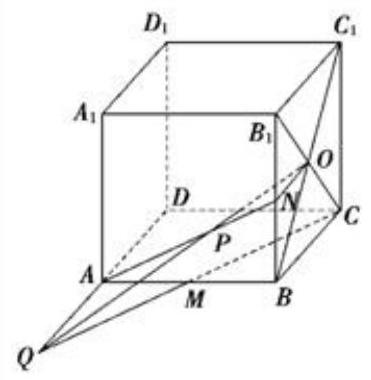

11 填空题

定义: 各项均不为零的数列 $\left\{  {a}_{n}\right\}$ 中,所有满足 ${a}_{i} \cdot  {a}_{i + 1} < 0$ 的正整数 $i$ 的个数称为这个数列 $\left\{  {a}_{n}\right\}$ 的变号数. 已知数列 $\left\{  {b}_{n}\right\}$ 的前 $n$ 项和 ${S}_{n} = {n}^{2} - {6n} + a\left( {n \in  {\mathbf{N}}^{ * }, a \neq  5}\right)$ ,令 ${a}_{n} = 1 - \frac{4}{{b}_{n}}\left( {n \in  {\mathbf{N}}^{ * }}\right)$ ,若数列 $\left\{  {a}_{n}\right\}$ 的变号数为2，则实数 $a$ 的取值范围是___.

解析

根据 ${b}_{n} = \left\{  \begin{array}{l} {S}_{1}, n = 1 \\  {S}_{n} - {S}_{n - 1}, n \geq  2 \end{array}\right.$ ,求出 $\left\{  {b}_{n}\right\}$ 的通项公式,即可得到 $\left\{  {a}_{n}\right\}$ 的通项公式,再列出前几项，得到 ${a}_{1} > 0$ ，即可求出参数的取值范围.

解: 依题意当 $n = 1$ 时, ${b}_{1} = {S}_{1} = a - 5$ ,

$\therefore {a}_{1} = 1 - \frac{4}{{b}_{1}} = 1 - \frac{4}{a - 5}$ ,

当 $n \geq  2$ 时, ${b}_{n} = {S}_{n} - {S}_{n - 1} = {n}^{2} - {6n} + a - \left\lbrack  {{\left( n - 1\right) }^{2} - 6\left( {n - 1}\right)  + a}\right\rbrack   = {2n} - 7$

$\therefore {a}_{n} = 1 - \frac{4}{{b}_{n}} = 1 - \frac{4}{{2n} - 7} = \frac{{2n} - {11}}{{2n} - 7},\left( {n \geq  2}\right)$

$\therefore {a}_{2} = \frac{7}{3},{a}_{3} = 5,{a}_{4} =  - 3,{a}_{5} =  - \frac{1}{3},{a}_{6} = \frac{1}{5}$ ,且 $n \geq  6$ 时, ${a}_{n} > 0$ ,

$\therefore {a}_{3} \cdot  {a}_{4} < 0,{a}_{5} \cdot  {a}_{6} < 0$

要使数列 $\left\{  {a}_{n}\right\}$ 的变号数为 2,则 ${a}_{1} = 1 - \frac{4}{a - 5} > 0$ ,解得 $a > 9$ 或 $a < 5$ ,即

$a \in  \left( {-\infty ,5}\right) \bigcup \left( {9, + \infty }\right) .$

故答案为: $\left( {-\infty ,5}\right) \bigcup \left( {9, + \infty }\right)$

12 填空题

对于函数 $f\left( x\right)  = \left\{  \begin{array}{l} \cos {2\pi x}, x \in  \lbrack 0,1) \\  \frac{1}{2}f\left( {x - 1}\right) , x \in  \lbrack 1, + \infty ) \end{array}\right.$ ，下列5个结论正确的是___

(1)任取 ${x}_{1},{x}_{2} \in  \lbrack 0, + \infty )$ ，都有 $\left| {f\left( {x}_{1}\right)  - f\left( {x}_{2}\right) }\right|  \leq  2$ ；

(2) 函数 $y = f\left( x\right)$ 在 $\left\lbrack  {\frac{5}{2},3}\right\rbrack$ 上严格递减;

(3) $f\left( x\right)  = {2}^{k}f\left( {x + k}\right) \;\left( {k \in  {\mathbf{N}}^{ * }}\right)$ ,对一切 $x \in  \lbrack 0, + \infty )$ 恒成立;

(4) 函数 $y = f\left( x\right)  + \ln \left( {x - 1}\right)$ 有 3 个零点;

(5) 若关于 $x$ 的方程 $f\left( x\right)  = m$ 有且只有两个不同的实根 ${x}_{1},{x}_{2}$ ,则 ${x}_{1} + {x}_{2} = 1$ .

解析

$f\left( x\right)  = \left\{  \begin{array}{l} \cos {2\pi x}, x \in  \lbrack 0,1) \\  \frac{1}{2}f\left( {x - 1}\right) , x \in  \lbrack 1, + \infty ) \end{array}\right.$ 的图象如图所示, $f{\left( x\right) }_{\max } = 1, f{\left( x\right) }_{\min } =  - 1$ ,所以对 $\forall {x}_{1},{x}_{2} \in  \lbrack 0, + \infty )$ ,都有 $\left| {f\left( {x}_{1}\right)  - f\left( {x}_{2}\right) }\right|  \leq  2$ ,故 (1) 正确; 由 $f\left( x\right)$ 的图象可知: $f\left( x\right)$ 在 $\left\lbrack  {\frac{5}{2},3}\right\rbrack$ 上严格递增; 故 (2) 错误; 由于当 $x \geq  1$ 时, $f\left( x\right)  = \frac{1}{2}f\left( {x - 1}\right)$ ,因此当 $x \geq  0$ 时, $f\left( x\right)  = {2f}\left( {x + 1}\right)$ ,所以

$f\left( x\right)  = {2f}\left( {x + 1}\right)  = {2}^{2}f\left( {x + 2}\right)  = {2}^{3}f\left( {x + 3}\right)  = \cdots  = {2}^{k}f\left( {x + k}\right) \left( {k \in  {\mathbf{N}}^{ * }}\right)$ ,故 (3) 正确; 在同一直角坐标系中画出 $f\left( x\right)$ 与 $g\left( x\right)  =  - \ln \left( {x - 1}\right)$ 的图象,当 $x = \frac{5}{2}$ 时,

$f\left( \frac{5}{2}\right)  =  - \frac{1}{4}, g\left( \frac{5}{2}\right)  =  - \ln \frac{3}{2}$ ,由于 $\frac{1}{\mathrm{e}} > \frac{1}{3} > \frac{16}{81} = {\left( \frac{2}{3}\right) }^{4}$ 所以 $\frac{1}{4} >  - \ln \frac{3}{2}$ ,结合两者的图象可知只有一个交点, 故 (4) 错误;

根据图象可知: 当 $\frac{1}{2} < m < 1$ 时, $f\left( x\right)  = m$ 有且只有两个不同的实根 ${x}_{1},{x}_{2}$ ,此时 ${x}_{1},{x}_{2}$ 关于 $x = \frac{1}{2}$ 对称,故 ${x}_{1} + {x}_{2} = 1$ ,因此 (5) 正确;

故答案为: (1)(3)(5)

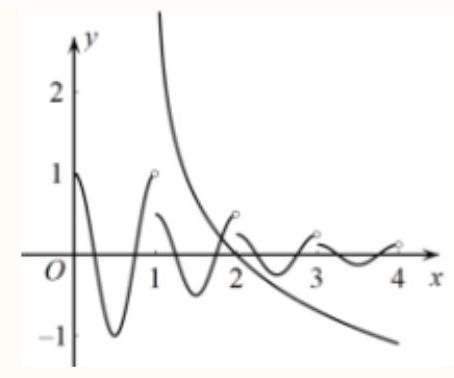

## 二、选择题

13 单选题

已知 $\alpha ,\beta$ 表示两个不同的平面，m为平面 $\alpha$ 内的一条直线，则 “ $\alpha  \bot  \beta$ ” 是 “ $m \bot  \beta$ ” 的

A. 充分不必要条件

B. 必要不充分条件

C. 充要条件

D. 既不充分也不必要条件

## 解析

当α⊥β时，平面α内的直线m不一定和平面β垂直，但当直线m垂直于平面β时，根据面面垂直的判定定理，知两个平面一定垂直，故“ $\alpha \bot \beta$ ”是“m⊥β”的必要不充分条件.

14 单选题

若 $1 + \sqrt{2}\mathrm{i}$ 是关于 $x$ 的实系数方程 ${x}^{2} + {bx} + c = 0$ 的一个复数根，则()

A. $b = 2, c = 3$

B. $b = 2, c =  - \sqrt{3}$

C. $b =  - 2, c =  - \sqrt{3}$

D. $b =  - 2, c = 3$

解析

由一元二次方程求根公式即可建立方程组 $\left\{  \begin{array}{l}  - \frac{b}{2} = 1 \\  \frac{{b}^{2} - {4c}}{4} =  - 2 \end{array}\right.$ 求解

方程的根为 $x = \frac{-b \pm  \sqrt{{b}^{2} - {4c}}}{2} =  - \frac{b}{2} \pm  \sqrt{\frac{{b}^{2} - {4c}}{4}}$ ,

$1 + \sqrt{2}\mathrm{i}$ 为其中一个复数根,则有 $\left\{  \begin{array}{l}  - \frac{b}{2} = 1 \\  \frac{{b}^{2} - {4c}}{4} =  - 2 \end{array}\right.$ ,解得 $\left\{  \begin{array}{l} b =  - 2 \\  c = 3 \end{array}\right.$ .

故选: D.

15 单选题

正方体 ${ABCD} - {A}_{1}{B}_{1}{C}_{1}{D}_{1}, P\text{ 、 }Q\text{ 、 }R\text{ 、 }G$ 分别为棱 ${AD}\text{ 、 }{A}_{1}{B}_{1}\text{ 、 }C{C}_{1}\text{ 、 }{AB}$ 的中点，则: $\odot  {QR}//{PC}$ ； ② ${BP}\bot {GR}$ ； $\text{ ③ }{AC}//$ 平面 ${PQR}$ ；④ $B{D}_{1}\bot$ 平面 ${PQR}$ ，上述正确的结论个数为( )

A. 1

B. 2

C. 3

D. 4

## 解析

建立空间直角坐标系, 利用空间向量的坐标运算逐一判断即可求解

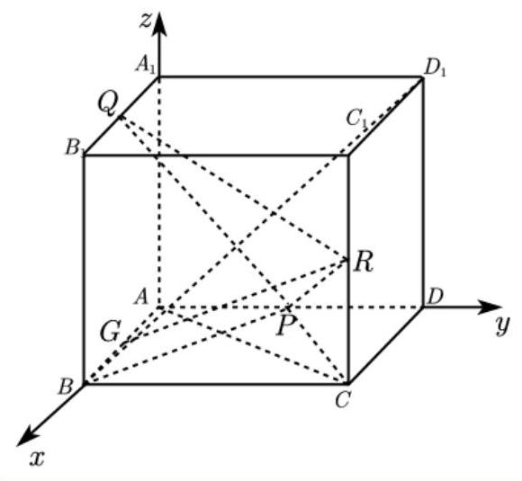

建立如图所示的空间直角坐标系,设正方体的边长为2,则 $A\left( {0,0,0}\right) , B\left( {2,0,0}\right) , C\left( {2,2,0}\right)$ , ${D}_{1}\left( {0,2,2}\right) , P\left( {0,1,0}\right) , Q\left( {1,0,2}\right) , R\left( {2,2,1}\right) , G\left( {1,0,0}\right) ,$

因为 $\overrightarrow{QR} = \left( {1,2, - 1}\right) ,\overrightarrow{PC} = \left( {2,1,0}\right)$ ，所以 $\overrightarrow{QR} \neq  \lambda \overrightarrow{PC}$ (λ为实数)

所以 ${QR}$ 与 ${PC}$ 不平行，故①错误

因为 $\overrightarrow{BP} = \left( {-2,1,0}\right) ,\overrightarrow{GR} = \left( {1,2,1}\right)$ ,所以 $\overrightarrow{BP} \cdot  \overrightarrow{GR} =  - 2 \times  1 + 1 \times  2 + 0 \times  1 = 0$

所以 $\overrightarrow{BP} \bot  \overrightarrow{GR}$ ,所以 ${BP} \bot  {GR}$ ,故②正确

$\overrightarrow{PQ} = \left( {1, - 1,2}\right) ,\overrightarrow{PR} = \left( {2,1,1}\right)$ ,设 $\overrightarrow{n} = \left( {x, y, z}\right)$ 为平面 ${PQR}$ 的法向量

则 $\left\{  \begin{array}{l} \overrightarrow{n} \cdot  \overrightarrow{PQ} = 0 \\  \overrightarrow{n} \cdot  \overrightarrow{PR} = 0 \end{array}\right.$ 即 $\left\{  \begin{array}{l} x - y + {2z} = 0 \\  {2x} + y + z = 0 \end{array}\right.$

令 $x = 1$ ,则 $y =  - 1, z =  - 1$

即 $\overrightarrow{n} = \left( {1, - 1, - 1}\right)$ 为平面 ${PQR}$ 的一个法向量

$\overrightarrow{AC} = \left( {2,2,0}\right) ,\overrightarrow{AC} \cdot  \overrightarrow{n} = 2 \times  1 + 2 \times  \left( {-1}\right)  + 0 \times  \left( {-1}\right)  = 0$

所以 $\overrightarrow{AC} \bot  \overrightarrow{n},{AC}$ 不在平面 ${PQR}$ ,所以 ${AC}//$ 平面 ${PQR}$ ,故③正确

$\overrightarrow{B{D}_{1}} = \left( {-2,2,2}\right) ,\overrightarrow{B{D}_{1}} =  - 2\overrightarrow{n}$ ，所以 $\overrightarrow{B{D}_{1}}//\overrightarrow{n}$ ，所以 $B{D}_{1}\bot$ 平面 ${PQR}$ ，故④正确

故选:C.

16 单选题

若平面向量 $\overrightarrow{a},\overrightarrow{b},\overrightarrow{c}$ 满足 $\left| \overrightarrow{c}\right|  = 1,\overrightarrow{a} \cdot  \overrightarrow{c} = 1,\overrightarrow{b} \cdot  \overrightarrow{c} = 3,\overrightarrow{a} \cdot  \overrightarrow{b} = 2$ ，则 $\overrightarrow{a},\overrightarrow{b}$ 夹角的取值范围是 ( )

A. $\left\lbrack  {\frac{\pi }{6},\frac{\pi }{2}}\right)$

B. $\left\lbrack  {\frac{\pi }{6},\pi }\right)$

C. $\left\lbrack  {\frac{\pi }{3},\frac{\pi }{2}}\right)$

D. $\left\lbrack  {\frac{\pi }{3},\pi }\right)$

解析

利用 $\overrightarrow{a} \cdot  \overrightarrow{c} = 1,\overrightarrow{b} \cdot  \overrightarrow{c} = 3$ 与 $\left| \overrightarrow{c}\right|  = 1$ 即可确定 $\overrightarrow{a}$ 在 $\overrightarrow{c}$ 上的投影与 $\overrightarrow{b}$ 在 $\overrightarrow{c}$ 上的投影, $\overrightarrow{c}$ 方向为 $\mathrm{x}$ 轴正方向建立平面直角坐标系,即可确定 $\overrightarrow{a},\overrightarrow{b}$ 的横坐标,设出坐标由 $\overrightarrow{a} \cdot  \overrightarrow{b} = 2$ 得到两向量纵坐标的关系后，列出 $\overrightarrow{a}$ ， $\overrightarrow{b}$ 夹角的余弦值的式子，利用基本不等式确定余弦值的范围，即可确定 $\overrightarrow{a}$ , $\overrightarrow{b}$ 夹角的范围,注意 $\overrightarrow{a} \cdot  \overrightarrow{b} = 2 > 0$ 即 $\overrightarrow{a},\overrightarrow{b}$ 的夹角为锐角.

设 $\overrightarrow{OA} = \overrightarrow{a},\overrightarrow{OB} = \overrightarrow{b},\overrightarrow{OC} = \overrightarrow{c}$ ,以 $\mathrm{O}$ 为原点, $\overrightarrow{c}$ 方向为 $\mathrm{x}$ 轴正方向建立平面直角坐标系,

$\because \overrightarrow{a} \cdot  \overrightarrow{c} = 1 > 0,\overrightarrow{b} \cdot  \overrightarrow{c} = 3 > 0,\overrightarrow{a} \cdot  \overrightarrow{b} = 2 > 0$ ,

$\therefore \overrightarrow{a},\overrightarrow{b},\overrightarrow{c}$ 三者直接各自的夹角都为锐角,

$\because \left| \overrightarrow{c}\right|  = 1,\overrightarrow{a} \cdot  \overrightarrow{c} = \left| \overrightarrow{a}\right|  \cdot  \left| \overrightarrow{c}\right| \cos \langle \overrightarrow{a},\overrightarrow{c}\rangle  = 1,\overrightarrow{b} \cdot  \overrightarrow{c} = \left| \overrightarrow{b}\right|  \cdot  \left| \overrightarrow{c}\right| \cos \left\langle  {\overrightarrow{b},\overrightarrow{c}}\right\rangle   = 3,$

$\therefore \left| \overrightarrow{a}\right| \cos \langle \overrightarrow{a},\overrightarrow{c}\rangle  = 1,\left| \overrightarrow{b}\right| \cos \left\langle  {\overrightarrow{b},\overrightarrow{c}}\right\rangle   = 3$ ,即 $\overrightarrow{a}$ 在 $\overrightarrow{c}$ 上的投影为 $1,\overrightarrow{b}$ 在 $\overrightarrow{c}$ 上的投影为 3, $\therefore A\left( {1, m}\right) , B\left( {3, n}\right)$ ,如图

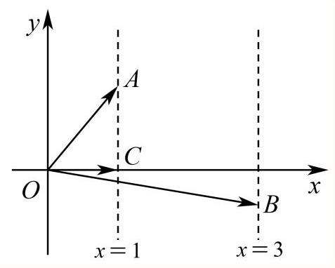

$\therefore \overrightarrow{a} = \left( {1, m}\right) ,\overrightarrow{b} = \left( {3, n}\right)$

$\therefore \overrightarrow{a} \cdot  \overrightarrow{b} = 3 + {mn} = 2$ 即 ${mn} =  - 1$ ,且 $\cos \langle \overrightarrow{a},\overrightarrow{b}\rangle  = \frac{\left| \overrightarrow{a} \cdot  \overrightarrow{b}\right| }{\left| \overrightarrow{a}\right|  \cdot  \left| \overrightarrow{b}\right| } = \frac{2}{\sqrt{1 + {m}^{2}} \cdot  \sqrt{9 + {n}^{2}}}$

则 ${\cos }^{2}\left\langle  {\overrightarrow{a},\overrightarrow{b}}\right\rangle   = {\left( \frac{2}{\sqrt{1 + {m}^{2}} \cdot  \sqrt{9 + {n}^{2}}}\right) }^{2} = \frac{4}{9 + {n}^{2} + 9{m}^{2} + {m}^{2}{n}^{2}} = \frac{4}{{10} + {n}^{2} + 9{m}^{2}}$ ,

由基本不等式得 ${n}^{2} + 9{m}^{2} \geq  2\sqrt{{n}^{2} \cdot  9{m}^{2}} = \left| {6mn}\right|  = 6$ ,

$\therefore {\cos }^{2}\left\langle  {\overrightarrow{a},\overrightarrow{b}}\right\rangle   \leq  \frac{1}{4},$

$\because \overrightarrow{a}$ 与 $\overrightarrow{b}$ 的夹角为锐角,

$\therefore 0 < \cos \left\langle  {\overrightarrow{a},\overrightarrow{b}}\right\rangle   \leq  \frac{1}{2},$

由余弦函数可得: $\overrightarrow{a}$ 与 $\overrightarrow{b}$ 夹角的取值范围是 $\left\lbrack  {\frac{\pi }{3},\frac{\pi }{2}}\right)$ ,

故选: C.

## 三、解答题

17 解答题

如图，在正方体 ${ABCD} - {A}_{1}{B}_{1}{C}_{1}{D}_{1}$ 中， $E$ 为 ${AB}$ 中点， $F$ 为 $A{A}_{1}$ 中点，

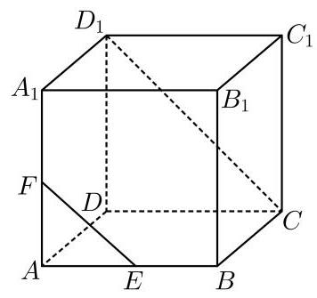

(1)求证: $E$ 、 $C$ 、 ${D}_{1}$ 、 $F$ 四点共面；

(2)求异面直线 ${C}_{1}E$ 与 $C{D}_{1}$ 所成的角.

## 解析

(1) 证明: 连接 $B{A}_{1}$ ,在正方体 ${ABCD} - {A}_{1}{B}_{1}{C}_{1}{D}_{1},{A}_{1}{D}_{1}//{BC}$ 且 ${A}_{1}{D}_{1} = {BC}$ ,

所以 ${A}_{1}{BC}{D}_{1}$ 为平行四边形,所以 ${A}_{1}B//C{D}_{1}$ ,

又 $E$ 为 ${AB}$ 中点， $F$ 为 $A{A}_{1}$ 中点，

所以 ${A}_{1}B//{EF}$ ,

所以 ${EF}//C{D}_{1}$ ,

所以 $E\text{ 、 }C\text{ 、 }{D}_{1}\text{ 、 }F$ 四点共面;

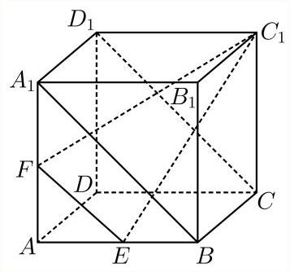

(2) 解: 连接 ${C}_{1}E,{C}_{1}F$ ,由 (1) 可知 ${EF}//C{D}_{1}$ ,

所以 $\angle {C}_{1}{EF}$ 即为异面直线 ${C}_{1}E$ 与 $C{D}_{1}$ 所成的角,

令正方体的棱长为2,则 ${EF} = \sqrt{2},{C}_{1}E = \sqrt{{1}^{2} + {2}^{2} + {2}^{2}} = 3,{C}_{1}F = \sqrt{{1}^{2} + {2}^{2} + {2}^{2}} = 3$ ,

由余弦定理 ${C}_{1}{F}^{2} = {C}_{1}{E}^{2} + E{F}^{2} - 2{C}_{1}E \cdot  {EF}\cos \angle {C}_{1}{EF}$ ,

即 ${3}^{2} = {3}^{2} + {\left( \sqrt{2}\right) }^{2} - 2\sqrt{2} \times  3\cos \angle {C}_{1}{EF}$ ,解得 $\cos \angle {C}_{1}{EF} = \frac{\sqrt{2}}{6}$ ,

所以异面直线 ${C}_{1}E$ 与 $C{D}_{1}$ 所成的角为 $\arccos \frac{\sqrt{2}}{6}$ .

18 解答题

设函数 $f\left( x\right)  = \sqrt{2}\cos \left( {{\omega x} + \varphi }\right) \left( {\omega  > 0, - \pi  < \varphi  < 0}\right)$ ,该函数图像上相邻两个最高点间的距离为 $\frac{A}{\pi }$ ,且 $f\left( x\right)$ 为奇函数.

(1)求ω和φ的值；

(2)在锐角 $\bigtriangleup {ABC}$ 中，角 $A, B, C$ 的对边分别为 $a, b, c$ ，若 $\left( {{2a} - c}\right) \cos B = b\cos C$ ，求 ${f}^{2}\left( A\right)  + {f}^{2}\left( C\right)$ 的取值范围.

## 解析

由函数图像上相邻两个最高点间的距离为 $\frac{\pi }{4}$ ，所以可得 $\frac{\frac{2}{\pi }}{\omega } = 4$ ，解得 $\omega  = \frac{1}{2}$ ，

所以函数解析式为 $f\left( x\right)  = \sqrt{2}\cos \left( {\frac{1}{2}x + \varphi }\right)$ ,

又因为 $f\left( x\right)$ 为奇函数，所以 $\varphi  = {k\pi } + \frac{\pi }{2}$ ，又 $- \pi  < \varphi  < 0$ ，所以 $\varphi  =  - \frac{\pi }{2}$ ，

所以 $\omega  = \frac{1}{2},\varphi  =  - \frac{\pi }{2}$ ,

(2) $\because \left( {{2a} - c}\right) \cos B = b\cos C$ ,

由正弦定理得 $\left( {2\sin A - \sin C}\right) \cos B = \sin B\cos C$

$\therefore 2\sin A\cos B - \sin C\cos B = \sin B\cos C,\therefore 2\sin A\cos B = \sin \left( {B + C}\right)$

$\therefore A + B + C = ,\therefore \sin \left( {B + C}\right)  = \sin A \neq  0.\therefore \cos B = \frac{1}{2}$

\$\\because 0<\\text\{\}\\\\\\\\\\\\text\{\}\$, $\therefore B = \frac{\pi }{3}$ ,所以 $A + C = \frac{\frac{2}{\pi }}{3}$ ,所以 $A + C = \frac{\frac{2}{\pi }}{3}$ ,所以 $C = \frac{\frac{2}{\pi }}{3} - A$ ,

由 (1) 知 $f\left( x\right)  = \sqrt{2}\sin \frac{1}{2}x$

所以 ${f}^{2}\left( A\right)  + {f}^{2}(C$

$= 2{\sin }^{2}\frac{A}{2} + 2{\sin }^{2}\frac{C}{2} =  - \left( {\cos A + \cos C}\right)  + 2 =  - \left\lbrack  {\cos A + \cos (\frac{\frac{2}{\pi }}{3} - A)}\right\rbrack   + 2$

$=  - \cos A + \frac{1}{2}\cos A - \frac{\sqrt{3}}{2}\sin A + 2 =  - \left( {\frac{\sqrt{3}}{2}\sin A + \frac{1}{2}\cos A}\right)  + 2 =  - \sin \left( {A + \frac{\pi }{6}}\right)  + 2$

又因为\$\\left\\\{\\begin\{align\} & 0<\\dfrac\{\\text\{ \}\\\\\\\\pi\\\\\\\\text\{ \}\}\{2\}, \\\\& 0<\\dfrac\{2\\text\{

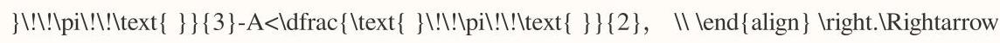

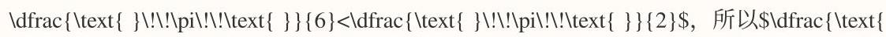

\}\\\\\\\\pi\\\\\\\\text\{ \}\}/\\text\{3\}\}, 所以 $\sin \left( {A + \frac{\pi }{6}}\right)  \in  \left( {\frac{\sqrt{3}}{2},1}\right\rbrack$

所以 ${f}^{2}\left( A\right)  + {f}^{2}\left( C\right)$ 的取值范围为 $\left\lbrack  {1,2 - \frac{\sqrt{3}}{2}}\right)$ .

19 解答题

数学家斐波那契在其所著《计算之书》中，记有“二鸟饮泉”问题，题意如下:“如图1，两塔相距** 步, 高分别为**步和**步.两塔间有喷泉, 塔顶各有一鸟.两鸟同时自塔顶出发, 沿直线飞往喷泉, 同时抵达(假设两鸟速度相同)求两塔与喷泉中心之距.”如图2，现有两塔 ${AC}\text{ 、 }{BD}$ ，底部 $A\text{ 、 }B$ 相距 12米，塔 ${AC}$ 高3米，塔 ${BD}$ 高9米. 假设塔与地面垂直，小鸟飞行路线与两塔在同一竖直平面内，

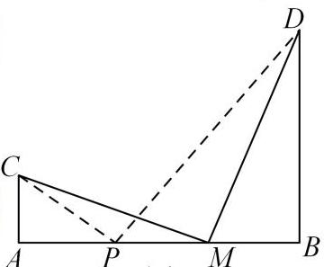

图2

图1

(1)若如《计算之书》所述，有飞行速度相同的两鸟，同时从塔顶出发，同时抵达喷泉所在点 $M$ ，分别求喷泉 $M$ 对塔顶 $C\text{ 、 }D$ 仰角 $\angle {AMC}\text{ 、 }\angle {BMD}$ 的大小；

(2)若塔底 $A\text{ 、 }B$ 之间为喷泉形成的宽阔的水面，一只小鸟从塔顶 $C$ 出发，飞抵水面 $A\text{ 、 }B$ 之间的某点 $P$ 处饮水，求当小鸟在 $A\text{ 、 }B$ 之间的饮水点 $P$ 观察塔顶 $C\text{ 、 }D$ 的张角 $\angle {CPD}$ 达到最大时，饮水点 $P$ 到塔底 $A$ 的距离，并求 $\angle {CPD}$ 的最大值.

解析

(1)

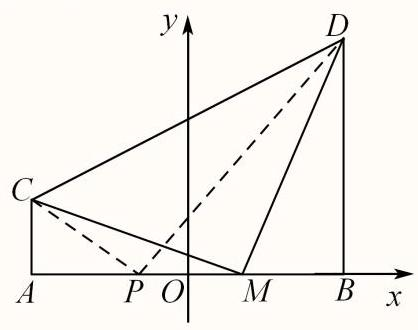

以 ${AB}$ 所在的直线为 $x$ 轴,以 ${AB}$ 的垂直平分线为 $y$ 轴,建立如图所示的平面直角坐标系. 因为 $A\text{ 、 }B$ 相距 12 米,塔 ${AC}$ 高 3 米,塔 ${BD}$ 高 9 米,

所以 $A\left( {-6,0}\right) , B\left( {6,0}\right) , C\left( {-6,3}\right) , D\left( {6,9}\right)$ .

因为两鸟飞行的速度相同，且同时从塔顶出发，同时抵达喷泉所在点 $M$ ，

所以 ${CM} = {DM}$ ，

所以点 $M$ 在线段 ${CD}$ 的垂直平分线上.

因为 ${k}_{CD} = \frac{1}{2},{CD}$ 的中点为 $\left( {0,6}\right)$ ,

所以线段 ${CD}$ 的垂直平分线的方程为 $y =  - {2x} + 6$ .

令 $y = 0$ ,则 $x = 3$ ,

所以 ${AM} = 9$ ，所以 ${BM} = 3$

在Rt $\bigtriangleup {MAC}$ 中 $\tan \angle {AMC} = \frac{\left| AC\right| }{\left| AM\right| } = \frac{3}{9} = \frac{1}{3}$ ，所以 $\angle {AMC} = \arctan \frac{1}{3}$

在Rt $\bigtriangleup {DBM}$ 中, $\tan \angle {BMD} = \frac{\left| DB\right| }{\left| BM\right| } = \frac{9}{3} = 3$ ,所以 $\angle {BMD} = \arctan 3$

(2)设 $P\left( {x,0}\right)$ (\$-6<6\$)，则 ${k}_{PD} = \frac{9}{6 - x},{k}_{PC} = \frac{3}{-6 - x}$

记 $\angle {CPB} = \alpha ,\angle {DPB} = \beta$ ,则 $\angle {CPD} = \alpha  - \beta$

当不为直角时,所以 $\tan \angle {CPD} = \tan \left( {\alpha  - \beta }\right)  = \frac{\tan \alpha  - \tan \beta }{1 + \tan \alpha \tan \beta }$

$= \frac{\frac{3}{-6 - x} - \frac{9}{6 - x}}{1 + \frac{3}{-6 - x} \times  \frac{9}{6 - x}} = \frac{{72} + {6x}}{{x}^{2} - 9} = \frac{6\left( {{12} + x}\right) }{{x}^{2} - 9}, x \neq   \pm  3$

设 $t = {12} + x,\left( {\$ 6 < {18}, t \smallsetminus  \operatorname{ne}9, t \smallsetminus  }\right.$ ne 15\$) 则 $x = t - {12}$ 代入上式中整理可得

$\tan \angle {CPD} = \frac{6t}{{t}^{2} - {24t} + {135}} = \frac{6}{t + \frac{135}{t} - {24}}$

$t + \frac{135}{t} - {24} \geq  2\sqrt{t \cdot  \frac{135}{t}} - {24} = 6\sqrt{15} - {24}$

当且仅当 $t = \frac{135}{t}$ ,即 $t = 3\sqrt{15}$ 时取等号此时 $x = 3\sqrt{15} - {12}$

当 $t + \frac{135}{t} - {24} > 0$ 时, $\angle {CPD}$ 为锐角

当 $t + \frac{135}{t} - {24} < 0$ 时, $\angle {CPD}$ 为钝角

当 $6\sqrt{15} - {24} \leq  t + \frac{135}{t} - {24} < 0$ 时, $\frac{1}{t + \frac{135}{t} - {24}} \leq  \frac{1}{6\sqrt{15} - {24}}$

$\Rightarrow  \frac{6}{t + \frac{135}{t} - {24}} \leq  \frac{1}{\sqrt{15} - 4} =  - 4 - \sqrt{15}$

所以 $\angle {CPD}$ 的最大值为 $\pi  - \arctan \left( {4 + \sqrt{15}}\right)$ ,

此时饮水点 $P$ 到塔底 $A$ 的距离为 $\left| {3\sqrt{15} - {12} - \left( {-6}\right) }\right|  = 3\sqrt{15} - 6$

20 解答题

如图, 已知 ${ABCD}$ 和 ${CDEF}$ 都是直角梯形, ${AB}//{DC},{DC}//{EF},{AB} = 5,{DC} = 3,{EF} = 1$ , $\angle {BAD} = \angle {CDE} = {60}^{ \circ  }$ ，二面角 $F - {DC} - B$ 的平面角为 ${60}^{ \circ  }$ .设 $M$ ， $N$ 分别为 ${AE}$ ， ${BC}$ 的中点.

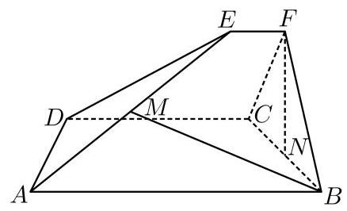

(1) 求证: ${FN} \bot$ 平面 ${ABCD}$ .

(2)求直线 ${BD}$ 与平面 ${DCFE}$ 所成的角.

(3) 求点 $D$ 到平面 ${ABFE}$ 的距离.

## 解析

(1) 由于 ${CD} \bot  {CB},{CD} \bot  {CF},{CF} \cap  {CB} = C,{CF},{CB} \subset$ 平面 ${CBF}$ ,

平面 ${ABCD} \cap$ 平面 ${CDEF} = {CD},{CF} \subset$ 平面 ${CDEF},{CB} \subset$ 平面 ${ABCD}$ ,

所以 $\angle {FCB}$ 为二面角 $F - {DC} - B$ 的平面角,

则 $\angle {FCB} = {60}^{ \circ  },{CD} \bot$ 平面 ${CBF},{FN} \subset$ 平面 ${CBF}$ ,则 ${CD} \bot  {FN}$ .

又 ${CF} = \sqrt{3}\left( {{CD} - {EF}}\right)  = 2\sqrt{3},{CB} = \sqrt{3}\left( {{AB} - {CD}}\right)  = 2\sqrt{3}$ ,

则 $\bigtriangleup  {BCF}$ 是等边三角形，则 ${CB}\bot {FN}$ ，

又因为 ${DC} \cap  {CB} = C,{DC} \subset$ 平面 ${ABCD},{CB} \subset$ 平面 ${ABCD}$ ,

所以 ${FN} \bot$ 平面 ${ABCD}$ ,

(2)由于 ${FN} \bot$ 平面 ${ABCD}$ ，建立如图所示的空间直角坐标系；

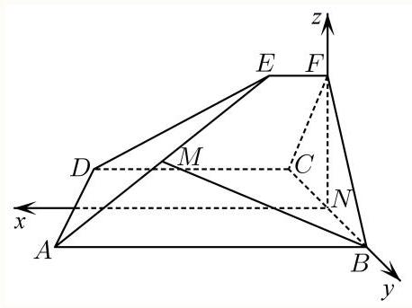

于是 $B\left( {0,\sqrt{3},0}\right) , A\left( {5,\sqrt{3},0}\right) , F\left( {0,0,3}\right) , E\left( {1,0,3}\right) , D\left( {3, - \sqrt{3},0}\right) , C\left( {0, - \sqrt{3},0}\right)$ ,

$\overrightarrow{BD} = \left( {3, - 2\sqrt{3},0}\right) ,\overrightarrow{DC} = \left( {-3,0,0}\right) ,\overrightarrow{DE} = \left( {-2,\sqrt{3},3}\right) ,$

设平面 ${DCFE}$ 的法向量 $\overrightarrow{n} = \left( {x, y, z}\right)$ ,

则 $\left\{  {\begin{array}{l} \overrightarrow{n} \cdot  \overrightarrow{DC} = 0 \\  \overrightarrow{n} \cdot  \overrightarrow{DE} = 0 \end{array},\therefore \left\{  \begin{array}{l}  - {3x} = 0 \\   - {2x} + \sqrt{3}y + {3z} = 0 \end{array}\right. }\right.$ ,令 $y = \sqrt{3}$ ,则 $x = 0, z =  - 1$ ,

$\therefore$ 平面 ${DCFE}$ 的法向量 $\overrightarrow{n} = \left( {0,\sqrt{3}, - 1}\right)$ ,

设 ${BD}$ 与平面 ${DCFE}$ 所成角为 $\theta  \in  \left\lbrack  {0,\frac{\pi }{2}}\right\rbrack$ ,

则 $\sin \theta  = \frac{\left| \overrightarrow{BD} \cdot  \overrightarrow{n}\right| }{\left| \overrightarrow{BD}\right| \left| \overrightarrow{n}\right| } = \frac{6}{\sqrt{21} \times  2} = \frac{\sqrt{21}}{7}$ .

故 $\theta  = \arcsin \frac{\sqrt{21}}{7}$

(3) 由于 $B\left( {0,\sqrt{3},0}\right) , A\left( {5,\sqrt{3},0}\right) , F\left( {0,0,3}\right) , E\left( {1,0,3}\right) , D\left( {3, - \sqrt{3},0}\right) , C\left( {0, - \sqrt{3},0}\right)$ ,

所以 $\overrightarrow{FE} = \left( {1,0,0}\right) ,\overrightarrow{FB} = \left( {0,\sqrt{3}, - 3}\right) ,\overrightarrow{BD} = \left( {3, - 2\sqrt{3},0}\right)$ ,

设平面 ${ABEF}$ 的法向量为 $\overrightarrow{m} = \left( {{x}_{1},{y}_{1},{z}_{1}}\right)$ ,

则 $\left\{  {\begin{array}{l} \overrightarrow{m} \cdot  \overrightarrow{FE} = 0 \\  \overrightarrow{m} \cdot  \overrightarrow{FB} = 0 \end{array},\therefore \left\{  \begin{array}{l} {x}_{1} = 0 \\  \sqrt{3}{y}_{1} - 3{z}_{1} = 0 \end{array}\right. }\right.$ ,令 ${y}_{1} = \sqrt{3}$ ,则 ${x}_{1} = 0,{z}_{1} = 1$ ,

所以 $\overrightarrow{m} = \left( {0,\sqrt{3},1}\right)$ ,

故点 $D$ 到平面 ${ABEF}$ 的距离 $d = \frac{\left| \overrightarrow{BD} \cdot  \overrightarrow{m}\right| }{\left| \overrightarrow{m}\right| } = \frac{6}{2} = 3$

21 解答题

已知数列 $\left\{  {a}_{n}\right\}$ 满足: $\text{ ① }{a}_{n} \in  \mathbf{N}\left( {n \in  {\mathbf{N}}^{ * }}\right)$ ；②当 $n = {2}^{k}\left( {k \in  {\mathbf{N}}^{ * }}\right)$ 时， ${a}_{n} = \frac{n}{2}$ ；当 $n \neq  {2}^{k}\left( {k \in  {\mathbf{N}}^{ * }}\right.$ )时， ${a}_{n} < {a}_{n + 1}.$ 记数列 $\left\{  {a}_{n}\right\}$ 的前 $n$ 项和为 ${S}_{n}.$

(1)求满足条件的所有 ${a}_{1},{a}_{3},{a}_{9}$ 的值；

(2)若 ${S}_{n} = {2022}$ ，求 $n$ 的最小值；

(3)求证: ${S}_{2n} = 4{S}_{n} - n + 2$ 的充要条件是 ${a}_{{2}^{n} + 1} = 1\left( {n \in  {\mathbf{N}}^{ * }}\right)$ .

## 解析

(1)因 ${a}_{2} = 1,{a}_{1} < {a}_{2}$ ，且 ${a}_{1}$ 是自然数， $\therefore {a}_{1} = 0$ ；

${a}_{4} = 2,0 \leq  {a}_{3} < {a}_{4}$ ,且 ${a}_{3},{a}_{4}$ 都是自然数; $\therefore {a}_{3} = 0$ 或 ${a}_{3} = 1$ ;

${a}_{16} = 8,\;0 \leq  {a}_{9} < {a}_{10} < \cdots  < {a}_{16} = 8,$ 且 ${a}_{i} \in  \mathbf{N}\left( {i \in  {\mathbf{N}}^{ * }}\right) ,\;\therefore {a}_{9} = 0$ 或 ${a}_{9} = 1.$

(2)由题意可得: ${a}_{{2}^{k}} = {2}^{k - 1}\left( {k \in  {N}^{ * }}\right)$ ，当 ${2}^{k - 1}$ \\bef\{n, k\\\\in\{\{\\\\mathbf\{N\}\}^\{*\}\}\\\\right)\$时，

$0 \leq  {a}_{{2}^{k - 1} + 1} < {a}_{{2}^{k - 1} + 2} < {a}_{{2}^{k - 1} + 3} < \cdots  < {a}_{{2}^{k}} = {2}^{k - 1}$ ,由于 ${a}_{n} \in  \mathbf{N}$ ,

所以 ${a}_{{2}^{k - 1} + m} = m - 1$ 或 $m, m = 1,2,3,\cdots ,{2}^{k - 1} - 1$ .

$\therefore {\left( {S}_{64}\right) }_{\max } = \left( {0 + 1}\right)  + \left( {1 + 2}\right)  + \left( {1 + 2 + 3 + 4}\right)  + \left( {1 + 2 + \cdots  + 8}\right)  + \left( {1 + 2 + \cdots  + {16}}\right)$

$+ \left( {1 + 2 + \cdots  + {32}}\right)  = 1 + \frac{2 \times  3}{2} + \frac{4 \times  5}{2} + \frac{8 \times  9}{2} + \frac{{16} \times  {17}}{2} + \frac{{32} \times  {33}}{2} = {714},$

${\left( {S}_{128}\right) }_{\max } = {714} + \frac{{64} \times  {65}}{2} = {2794},$

$\because {714} < {2022} < {2794},\$$ \\ ( therefore 64<128\$,

又 ${2022} - {714} = {1308}$ ,

$1 + 2 + 3 + \ldots  + {50} = {1275} < {1308} < 1 + 2 + 3 + \ldots  + {50} + {51} = {1326},{a}_{3},{a}_{4};{a}_{5}$ 到 ${a}_{8}$ ; ${a}_{9}$ 到 ${a}_{16};{a}_{17}$ 到 ${a}_{32};{a}_{33}$ 到 ${a}_{64}$ ,一共五组数,目前 ${a}_{3} = {a}_{5} = {a}_{9} = {a}_{17} = {a}_{33} = 1$ ,可将其调整成 0,此时 ${a}_{6} = {a}_{10} = {a}_{18} = {a}_{34} = 2$ 受到刚才5个数调整过的关系,可从 2 调整到 1,此时由于本次调整，可继续选取 ${a}_{7} = {a}_{11} = {a}_{19} = {a}_{35} = 3$ 调成 2，按此步骤调整18个数减小1即可， 所以 ${n}_{\min } = {64} + {51} = {115}$ .

(3) 必要性: 若 ${S}_{2n} = 4{S}_{n} - n + 2$ ,

则: ${S}_{{2}^{n + 1}} = 4{S}_{{2}^{n}} - {2}^{n} + 2$ ①

${S}_{{2}^{n + 1} + 2} = 4{S}_{{2}^{n} + 1} - \left( {{2}^{n} + 1}\right)  + 2\text{ ② }$

①-②得: ${a}_{{2}^{n + 1} + 1} + {a}_{{2}^{n + 1} + 2} = 4{a}_{{2}^{n} + 1} - 1\left( {n \in  {\mathbf{N}}^{ * }}\right)$ ③

由于 $\left\{  \begin{array}{l} {a}_{{2}^{n + 1} + 1} = 0 \\  {a}_{{2}^{n + 1} + 2} = 1 \end{array}\right.$ ,或 $\left\{  \begin{array}{l} {a}_{{2}^{n + 1} + 1} = 1 \\  {a}_{{2}^{n + 1} + 2} = 2 \end{array}\right.$ ,或 $\left\{  \begin{array}{l} {a}_{{2}^{n + 1} + 1} = 0 \\  {a}_{{2}^{n + 1} + 2} = 2 \end{array}\right.$ ,且 ${a}_{{2}^{n} + 1} = 0$ 或

只有当 ${a}_{{2}^{n} + 1} = 1,{a}_{{2}^{n + 1} + 1} = 1,{a}_{{2}^{n + 1} + 2} = 2$ 同时成立时,等式③才成立，

$\therefore {a}_{{2}^{n} + 1} = 1\left( {n \in  {\mathbf{N}}^{ * }}\right)$ ;

充分性: 若 ${a}_{{2}^{n} + 1} = 1\left( {n \in  {\mathbf{N}}^{ * }}\right)$ ,由于 $1 = {a}_{{2}^{n} + 1} < {a}_{{2}^{n} + 2} < {a}_{{2}^{n} + 3} < \cdots  < {a}_{{2}^{n + 1}} = {2}^{n}$

所以 ${a}_{{2}^{n} + k} = k\left( {n \in  {\mathbf{N}}^{ * }, k \in  {\mathrm{N}}^{ * }, k \leq  {2}^{n}}\right)$ ,

即 ${a}_{{2}^{n} + 1} = 1,{a}_{{2}^{n} + 2} = 2,{a}_{{2}^{n} + 3} = 3,\ldots ,{a}_{{2}^{n + 1} - 1} = {2}^{n} - 1$ ,又 ${a}_{{2}^{n + 1}} = {2}^{n}$

所以对任意的 $n \in  {N}^{ * }$ ,都有 ${a}_{2n} = {a}_{{2n} - 1} + 1\ldots$ (I)

另一方面,由 ${a}_{{2}^{n} + k} = k,{a}_{{2}^{n + 1} + {2k}} = {2k}\left( {n \in  {\mathbf{N}}^{ * }, k \in  {\mathbf{N}}^{ * }, k \leq  {2}^{n}}\right)$

所以对任意的 $n \in  {\mathbf{N}}^{ * }$ ,都有 ${a}_{2n} = 2{a}_{n}\ldots$ (II)

$$
\therefore {S}_{2n} = {a}_{1} + {a}_{2} + \cdots  + {a}_{2n} = \left( {{a}_{1} + {a}_{3} + \cdots  + {a}_{{2n} - 1}}\right)  + \left( {{a}_{2} + {a}_{4} + \cdots  + {a}_{2n}}\right)
$$

$$
= 2\left( {{a}_{2} + {a}_{4} + \cdots  + {a}_{2n}}\right)  - n = 2{a}_{2} + 4\left( {{a}_{2} + {a}_{3} + \cdots  + {a}_{n}}\right)  - n,
$$

由于 ${a}_{1} = 0,{a}_{2} = 1\therefore {S}_{2n} = 4\left( {{a}_{1} + {a}_{2} + \cdots  + {a}_{n}}\right)  - n + 2 = 4{S}_{n} - n + 2$ .

上海交通大学附属中学2024-2025学年高一下学期期末考试数学试卷

姓名:___

## 一、填空题

1 填空题

若直线 ${l}_{1} : {2ax} + y + 7 = 0$ 与直线 ${l}_{2} : x + \left( {a - 1}\right) y + 2 = 0$ 垂直，则实数 $a$ 的值等于___.

解析

写出两直线斜率,由直线垂直得到斜率乘积为 -1 , 建立方程后解出参数 $a$ 的值.

由题意知两直线斜率存在,

${k}_{{l}_{1}} =  - {2a},\;{k}_{{l}_{2}} =  - \frac{1}{a - 1},$

${k}_{{l}_{1}} \cdot  {k}_{{l}_{2}} = \left( {-\frac{1}{a - 1}}\right)  \times  \left( {-{2a}}\right)  = \frac{2a}{a - 1} =  - 1,$

解得 $a = \frac{1}{3}$ .

故答案为: $\frac{1}{3}$

2 填空题

已知 $f\left( x\right)  = {x}^{2} + {ax} + 1$ . 若 $y = f\left( x\right)$ 为偶函数，则 $a =$ ___.

解析

利用偶函数的定义求出参数值.

函数 $f\left( x\right)  = {x}^{2} + {ax} + 1$ 的定义域为R，由 $y = f\left( x\right)$ 为偶函数，得 $f\left( x\right)  - f\left( {-x}\right)  = 0$ ，

即 ${x}^{2} + {ax} + 1 - \left( {{x}^{2} - {ax} + 1}\right)  = {2ax} = 0$ ,而 $x$ 不恒为 0,

所以 $a = 0$ .

故答案为:0

3 填空题

函数 $f\left( x\right)  = \left( {\sin x + \cos x}\right)  \cdot  \left( {\sin x - \cos x}\right)$ 的最小正周期为___.

解析

根据二倍角余弦公式可知 $f\left( x\right)  =  - \cos {2x}$ ,结合余弦函数的性质,即可求最小正周期.

$f\left( x\right)  = \left( {\sin x + \cos x}\right)  \cdot  \left( {\sin x - \cos x}\right)  = {\sin }^{2}x - {\cos }^{2}x =  - \cos {2x},$

$\therefore T = \frac{2\pi }{2} = \pi$ .

故答案为: $\pi$

4 填空题

函数 $y = {\log }_{2}\sqrt{3 - x}$ 的定义域为___.

解析

根据对数真数大于零以及二次根式有意义的条件列不等式求解即可.

要使函数 $y = {\log }_{2}\sqrt{3 - x}$ 有意义,

则 $\left\{  \begin{array}{l} \sqrt{3 - x} > 0 \\  3 - x \geq  0 \end{array}\right.$ ,解得 $x < 3$ ,

所以函数 $y = {\log }_{2}\sqrt{3 - x}$ 的定义域为 $\left( {-\infty ,3}\right)$ ,

故答案为: $\left( {-\infty ,3}\right)$ .

5 填空题

已知向量 $\overrightarrow{a}$ 在向量 $\overrightarrow{b}$ 方向上的投影向量为 $- 2\overrightarrow{b}$ ，且 $\left| \overrightarrow{b}\right|  = 2$ ，则 $\overrightarrow{a} \cdot  \overrightarrow{b} =$ ___(结果用数值表示)

解析

根据投影向量的概念结合已知条件，求解即可得出答案.

由已知可得,向量 $\overrightarrow{a}$ 在向量 $\overrightarrow{b}$ 方向上的投影向量为 $\frac{\overrightarrow{a} \cdot  \overrightarrow{b}}{\left| \overrightarrow{b}\right| } \cdot  \frac{\overrightarrow{b}}{\left| \overrightarrow{b}\right| } = \frac{\overrightarrow{a} \cdot  \overrightarrow{b}}{{\left| \overrightarrow{b}\right| }^{2}}\overrightarrow{b} =  - 2\overrightarrow{b}$ ,

所以有 $\overrightarrow{a} \cdot  \overrightarrow{b} =  - 2{\left| \overrightarrow{b}\right| }^{2} =  - 8$ .

故答案为: -8 .

6 填空题

等差数列 $\left\{  {a}_{n}\right\}$ 的前 $n$ 项和为 ${S}_{n}$ ，已知 ${a}_{1} = {13}$ ， ${S}_{3} = {S}_{9}$ ，当 ${S}_{n}$ 最大时， $n$ 的值是___.

## 解析

根据给定条件, 利用等差数列性质求出公差, 确定数列单调性即可求解.

令等差数列 $\left\{  {a}_{n}\right\}$ 公差为 $d$ ,由 ${S}_{3} = {S}_{9}$ ,得 ${a}_{4} + {a}_{5} + {a}_{6} + {a}_{7} + {a}_{8} + {a}_{9} = 3\left( {{a}_{6} + {a}_{7}}\right)  = 0$ , 则 ${a}_{6} + {a}_{7} = 2{a}_{1} + {11d} = 0$ ,解得 $d =  - \frac{2{a}_{1}}{11} =  - \frac{26}{11},{a}_{n} = {a}_{1} + \left( {n - 1}\right) d =  - \frac{26}{11}n + \frac{169}{11}$ , 显然数列 $\left\{  {a}_{n}\right\}$ 是递减数列,由 ${a}_{n} \geq  0$ ,得 $n \leq  \frac{13}{2}$ ,即数列 $\left\{  {a}_{n}\right\}$ 前 6 项都为正,从第 7 项起为负,

所以 ${S}_{n}$ 最大时, $n$ 的值是 6 .

故答案为: 6

7 填空题

已知函数 $f\left( x\right)  = {x}^{2} + {6x} + c$ 有零点，但不能用二分法求解，则实数 $\mathrm{c}$ 的值是___.

解析

由题意知函数 $f\left( x\right)$ 在零点两侧同号,所以 $\Delta  = {6}^{2} - {4c} = 0$ ,解得 $c = 9$ .

8 填空题

在区间 $\left\lbrack  {0,{2\pi }}\right\rbrack$ 上，函数 $y = \sin x$ 与 $y = \tan x$ 图象的公共点个数为___.

解析

根据给定条件，求出方程 $\sin x = \tan x$ 在 $\left\lbrack  {0,{2\pi }}\right\rbrack$ 的根即可.

依题意, $\sin x = \tan x$ ,即 $\sin x\left( {1 - \frac{1}{\cos x}}\right)  = 0$ ,解得 $\sin x = 0$ 或 $\cos x = 1$ ,

而 $x \in  \left\lbrack  {0,{2\pi }}\right\rbrack$ ,因此 $x \in  \{ 0,\pi ,{2\pi }\}$ ,

所以函数 $y = \sin x$ 与 $y = \tan x$ 图象的公共点个数为3 .

故答案为:3.

9 填空题

若直线 $y = {kx} - 2$ (常数 $k \in  \mathbf{R}$ ) 与曲线 $x = \sqrt{1 - {y}^{2}}$ 有两个不同的公共点,则 $k$ 的取值范围是 ___.

解析

根据给定条件, 确定曲线表示的图形并作出, 再利用直线与圆的位置关系求出范围.

由 $x = \sqrt{1 - {y}^{2}}$ ,得 ${x}^{2} + {y}^{2} = 1, x \geq  0$ ,则曲线 $x = \sqrt{1 - {y}^{2}}$ 表示以原点为圆心,1为半径的圆在 $y$ 及右侧部分，

直线 $y = {kx} - 2$ 恒过定点 $\left( {0, - 2}\right)$ ,斜率为 $k$ ,在同一坐标系内作出直线 $y = {kx} - 2$ 与曲线 $x = \sqrt{1 - {y}^{2}}$

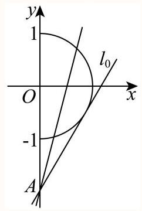

观察图象知 $k > 0$ ,且 $\frac{2}{\sqrt{{k}^{2} + {\left( -1\right) }^{2}}} < 1$ ,解得 $k > \sqrt{3}$ ,

所以 $k$ 的取值范围是 $\left( {\sqrt{3}, + \infty }\right)$ .

故答案为: $\left( {\sqrt{3}, + \infty }\right)$

10 填空题

设无穷等比数列所有奇数项之和为-3，则等比数列所有项的和的取值范围是___.

## 解析

根据给定条件, 利用无穷等比数列所有项和公式, 结合公比的范围分类求解.

设无穷等比数列 $\left\{  {a}_{n}\right\}$ 的公比为 $q$ ,则 $0 < \left| q\right|  < 1$ ,

由无穷等比数列所有奇数项之和为 -3,得 $\frac{{a}_{1}}{1 - {q}^{2}} =  - 3$ ,

则该无穷等比数列所有项和为 $\frac{{a}_{1}}{1 - q} =  - 3\left( {1 + q}\right)$ ,

当 $- 1 < q < 0$ 时， $- 3\left( {1 + q}\right)  \in  \left( {-3,0}\right)$ ，当 $0 < q < 1$ 时， $- 3\left( {1 + q}\right)  \in  \left( {-6, - 3}\right)$ ，

所以所求范围是 $\left( {-6, - 3}\right)  \cup  \left( {-3,0}\right)$ .

故答案为: $\left( {-6, - 3}\right)  \cup  \left( {-3,0}\right)$ .

11 填空题

已知向量 $\overrightarrow{a}$ 与 $\overrightarrow{b}$ 满足 $\left| \overrightarrow{b}\right|  = {2025}$ ,且对 $\forall x \in  \mathrm{R}$ ,满足 $\left| {\overrightarrow{b} - x\overrightarrow{a}}\right|  \geq  \left| {\overrightarrow{a} - \overrightarrow{b}}\right|$ ,则 $\left| {\overrightarrow{a} - \overrightarrow{b}}\right|  + \left| \overrightarrow{a}\right|$ 的最大值为___.

解析

可先对 $\left| {\overrightarrow{b} - x\overrightarrow{a}}\right|  \geq  \left| {\overrightarrow{a} - \overrightarrow{b}}\right|$ 两边平方,根据二次函数性质得到 $\overrightarrow{a} \cdot  \overrightarrow{b}$ 与 $\left| \overrightarrow{a}\right|$ 的关系,再利用向量模长公式和基本不等式求解 $\left| {\overrightarrow{a} - \overrightarrow{b}}\right|  + \left| \overrightarrow{a}\right|$ 的最大值.

已知 $\left| {\overrightarrow{b} - x\overrightarrow{a}}\right|  \geq  \left| {\overrightarrow{a} - \overrightarrow{b}}\right|$ ,两边平方可得 ${\left( \overrightarrow{b} - x\overrightarrow{a}\right) }^{2} \geq  {\left( \overrightarrow{a} - \overrightarrow{b}\right) }^{2}$ .

展开得 ${\overrightarrow{b}}^{2} - {2x}\overrightarrow{a} \cdot  \overrightarrow{b} + {x}^{2}{\overrightarrow{a}}^{2} \geq  {\overrightarrow{a}}^{2} - 2\overrightarrow{a} \cdot  \overrightarrow{b} + {\overrightarrow{b}}^{2}$ .

移项整理得 ${x}^{2}{\overrightarrow{a}}^{2} - {2x}\overrightarrow{a} \cdot  \overrightarrow{b} - {\overrightarrow{a}}^{2} + 2\overrightarrow{a} \cdot  \overrightarrow{b} \geq  0$ .

因为对于 $\forall x \in  R$ ,上式恒成立,所以二次函数 $y = {x}^{2}{\overrightarrow{a}}^{2} - {2x}\overrightarrow{a} \cdot  \overrightarrow{b} - {\overrightarrow{a}}^{2} + 2\overrightarrow{a} \cdot  \overrightarrow{b}$ 的判别式

$\Delta  = {\left( -2\overrightarrow{a} \cdot  \overrightarrow{b}\right) }^{2} - 4{\overrightarrow{a}}^{2}\left( {-{\overrightarrow{a}}^{2} + 2\overrightarrow{a} \cdot  \overrightarrow{b}}\right)  \leq  0.$

即 $4{\left( \overrightarrow{a} \cdot  \overrightarrow{b}\right) }^{2} + 4{\overrightarrow{a}}^{4} - 8{\overrightarrow{a}}^{2}\overrightarrow{a} \cdot  \overrightarrow{b} \leq  0$ ,进一步化简得 ${\left( \overrightarrow{a} \cdot  \overrightarrow{b}\right) }^{2} - 2{\overrightarrow{a}}^{2}\overrightarrow{a} \cdot  \overrightarrow{b} + {\overrightarrow{a}}^{4} \leq  0$ ,即

${\left( \overrightarrow{a} \cdot  \overrightarrow{b} - {\overrightarrow{a}}^{2}\right) }^{2} \leq  0.$

因为一个数的平方是非负的,所以 $\overrightarrow{a} \cdot  \overrightarrow{b} - {\overrightarrow{a}}^{2} = 0$ ,即 $\overrightarrow{a} \cdot  \overrightarrow{b} = {\overrightarrow{a}}^{2}$ .

可得 ${\left| \overrightarrow{a} - \overrightarrow{b}\right| }^{2} = {\left( \overrightarrow{a} - \overrightarrow{b}\right) }^{2} = {\overrightarrow{a}}^{2} - 2\overrightarrow{a} \cdot  \overrightarrow{b} + {\overrightarrow{b}}^{2}$ .

将 $\overrightarrow{a} \cdot  \overrightarrow{b} = {\overrightarrow{a}}^{2}$ 代入上式得 ${\left| \overrightarrow{a} - \overrightarrow{b}\right| }^{2} = {\overrightarrow{b}}^{2} - {\overrightarrow{a}}^{2} = {2025}^{2} - {\left| \overrightarrow{a}\right| }^{2}$ .

令 $y = \left| {\overrightarrow{a} - \overrightarrow{b}}\right|  + \left| \overrightarrow{a}\right|$ ,设 $\left| \overrightarrow{a}\right|  = t\left( {0 \leq  t \leq  {2025}}\right) ,\left| {\overrightarrow{a} - \overrightarrow{b}}\right|  = \sqrt{{2025}^{2} - {t}^{2}}$ ,令

$y = \sqrt{{2025}^{2} - {t}^{2}} + t.$

将 $y$ 变形为

${y}^{2} = {\left( \sqrt{{2025}^{2} - {t}^{2}} + t\right) }^{2} = {2025}^{2} - {t}^{2} + {t}^{2} + {2t}\sqrt{{2025}^{2} - {t}^{2}} = {2025}^{2} + {2t}\sqrt{{2025}^{2} - {t}^{2}}.$

由基本不等式 ${ab} \leq  \frac{{a}^{2} + {b}^{2}}{2}$ (当且仅当 $a = b$ 时等号成立),这里 $a = t, b = \sqrt{{2025}^{2} - {t}^{2}}$ ,则 ${2t}\sqrt{{2025}^{2} - {t}^{2}} \leq  {t}^{2} + \left( {{2025}^{2} - {t}^{2}}\right)  = {2025}^{2}.$

所以 ${y}^{2} \leq  {2025}^{2} + {2025}^{2} = 2 \times  {2025}^{2}$ ,即 $y \leq  {2025}\sqrt{2}$ ,当且仅当 $t = \sqrt{{2025}^{2} - {t}^{2}}$ ,

$t = \frac{{2025}\sqrt{2}}{2}$ 时取等号.

故 $\left| {\overrightarrow{a} - \overrightarrow{b}}\right|  + \left| \overrightarrow{a}\right|$ 最大值是 ${2025}\sqrt{2}$ .

故答案为: ${2025}\sqrt{2}$ .

12 填空题

平面上有三点 $A\left( {-1,1}\right) , B\left( {2,1}\right) , C\left( {0,4}\right)$ 到直线 ${ax} + {by} + c = 0$ ( $a\text{ 、 }b$ 不全为 0)距离之和的最小值为 ___.

解析

根据给定条件, 利用点到直线的距离公式, 结合不等式的性质求出最小值.

点 $A\left( {-1,1}\right) , B\left( {2,1}\right) , C\left( {0,4}\right)$ 到直线 ${ax} + {by} + c = 0$ 的距离分别为 ${d}_{1} = \frac{\left| -a + b + c\right| }{\sqrt{{a}^{2} + {b}^{2}}}$ ,

${d}_{2} = \frac{\left| 2a + b + c\right| }{\sqrt{{a}^{2} + {b}^{2}}},{d}_{3} = \frac{\left| 4b + c\right| }{\sqrt{{a}^{2} + {b}^{2}}}$ ,则距离之和为 $d = {d}_{1} + {d}_{2} + {d}_{3}$ ,

$d \geq  {d}_{1}$ ,当且仅当 ${d}_{2} = {d}_{3} = 0$ ,即 $\left\{  \begin{array}{l} {2a} + b + c = 0 \\  {4b} + c = 0 \end{array}\right.$ 时取等号,此时 $\left\{  \begin{array}{l} a = \frac{3}{2}b \\  c =  - {4b} \end{array}\right.$ , ${d}_{1} = \frac{9}{\sqrt{13}}$ ;

$d \geq  {d}_{2}$ ,当且仅当 ${d}_{1} = {d}_{3} = 0$ ,即 $\left\{  \begin{array}{l}  - a + b + c = 0 \\  {4b} + c = 0 \end{array}\right.$ 时取等号,此时 $\left\{  \begin{array}{l} a =  - {3b} \\  c =  - {4b} \end{array}\right.$ , ${d}_{2} = \frac{9}{\sqrt{10}}$ ;

$d \geq  {d}_{3}$ ,当且仅当 ${d}_{1} = {d}_{2} = 0$ ,即 $\left\{  \begin{array}{l}  - a + b + c = 0 \\  {2a} + b + c = 0 \end{array}\right.$ 时取等号,此时 $\left\{  \begin{array}{l} a = 0 \\  c =  - b \end{array}\right.$ , ${d}_{3} = 3$ ,

而 ${d}_{1} < {d}_{2} < {d}_{3}$ ,因此 ${d}_{\min } = {d}_{1} = \frac{9\sqrt{13}}{13}$ ,所以所求最小值为 $\frac{9\sqrt{13}}{13}$ .

故答案为: $\frac{9\sqrt{13}}{13}$

## 二、选择题

13 单选题

“ $\alpha$ 为锐角”是“ $\alpha  < \frac{\pi }{2}$ ”的( )

A. 充分而不必要条件

B. 必要而不充分条件

C. 充分必要条件

D. 既不充分也不必要条件

## 解析

利用充分条件、必要条件的定义，结合弧度制表示角的意义判断即可.

若 $\alpha$ 为锐角,则 $0 < \alpha  < \frac{\pi }{2}$ ,而 $\alpha  < \frac{\pi }{2}$ ,则 $\alpha$ 可以为锐角,也可以为零角,还可以为负角, 所以“ $\alpha$ 为锐角”是 “ $\alpha  < \frac{\pi }{2}$ ” 的充分而不必要条件.

故选: A

14 单选题

点 $M\left( {{x}_{0},{y}_{0}}\right)$ 为圆 ${x}^{2} + {y}^{2} = {a}^{2}\left( {a > 0}\right)$ 外一点，则直线 ${x}_{0}x + {y}_{0}y = {a}^{2}$ 与该圆的位置关系为( )

A. 相交

B. 相切

C. 相离

D. 不确定

## 解析

利用点与圆的位置关系及直线与圆的位置关系的判断方法, 结合点到直线的距离公式即可求解;

因为点 $M\left( {{x}_{0},{y}_{0}}\right)$ 为圆 ${x}^{2} + {y}^{2} = {a}^{2}\left( {a > 0}\right)$ 外一点,

所以 ${x}_{0}^{2} + {y}_{0}^{2} > {a}^{2}$ .

圆 ${x}^{2} + {y}^{2} = {a}^{2}\left( {a > 0}\right)$ 的圆心 $\left( {0,0}\right)$ ,半径为 $r = a$ ,

所以圆心 $\left( {0,0}\right)$ 到直线 ${x}_{0}x + {y}_{0}y = {a}^{2}$ 的距离为

$d = \frac{\left| 0 + 0 - {a}^{2}\right| }{\sqrt{{x}_{0}^{2} + {y}_{0}^{2}}} < \frac{{a}^{2}}{\sqrt{{a}^{2}}} = a$ ,即 $d < r.$

所以直线 ${x}_{0}x + {y}_{0}y = {a}^{2}$ 与该圆的位置关系为相交.

故选: A.

15 单选题

复数 $\alpha$ 、 $\beta$ 分别对应复平面内的点 $P$ 、 $Q$ ，若 ${\alpha }^{2} - {2\alpha \beta } + 2{\beta }^{2} = 0$ ，则 $\bigtriangleup  {POQ}$ (其中 $O$ 为坐标原点)， 是( )

A. 锐角三角形

B. 钝角三角形

C. 等腰直角三角形

D. 有一个锐角为 ${60}^{ \circ  }$ 的直角三角形

## 解析

本题考查复数运算与复平面几何意义, 通过对等式变形分析复数关系, 判断三角形形状.

依题意, ${\alpha }^{2} - {2\alpha \beta } + 2{\beta }^{2} = 0$ ,若 $\alpha  = 0$ ,则 $\beta  = 0$ (反之亦成立),

则 $P, Q$ 与原点重合,与已知 $P, O, Q$ 能组成三角形矛盾,所以 $\alpha  \neq  0,\beta  \neq  0$ .

由 ${\alpha }^{2} - {2\alpha \beta } + 2{\beta }^{2} = 0$ ,两边除以 ${\beta }^{2}\left( {\beta  \neq  0}\right)$ ,设 $z = \frac{\alpha }{\beta }$ ,则方程变为:

${z}^{2} - {2z} + 2 = 0,$ 解得 $z = \frac{2 \pm  \sqrt{4 - 8}}{2} = 1 \pm  \mathrm{i}$

由 $z = 1 \pm  \mathrm{i}$ ,得 $\alpha  = \left( {1 \pm  \mathrm{i}}\right) \beta$ .

所以 $\left| \alpha \right|  = \left| {1 \pm  \mathrm{i}}\right|  \cdot  \left| \beta \right|  = \sqrt{2}\left| \beta \right|$ ,

$\alpha  - \beta  =  \pm  \mathrm{i}\beta$ ,故 $\left| {\alpha  - \beta }\right|  = \left| {\pm \mathrm{i}\beta }\right|  = \left| \beta \right|$ .

在 $\bigtriangleup {POQ}$ 中:

$\left| {OQ}\right|  = \left| \beta \right| ,\left| {PQ}\right|  = \left| {\alpha  - \beta }\right|  = \left| \beta \right|$ ,即 $\left| {OQ}\right|  = \left| {PQ}\right|$ (等腰) .

由勾股定理: ${\left| OQ\right| }^{2} + {\left| PQ\right| }^{2} = {\left| \beta \right| }^{2} + {\left| \beta \right| }^{2} = 2{\left| \beta \right| }^{2}$ ,

而 ${\left| OP\right| }^{2} = {\left| \alpha \right| }^{2} = 2{\left| \beta \right| }^{2}$ ，故 $\angle {OQP} = {90}^{ \circ  }$ (直角).

综上, $\bigtriangleup {POQ}$ 是等腰直角三角形.

故选: C

16 单选题

已知 $\tan \alpha  \cdot  \tan \beta  = \tan \left( {\alpha  + \beta }\right)$ . 有下列三个结论:

①存在 $\alpha$ 在第一象限， $\beta$ 在第三象限.

②存在α在第二象限，β在第四象限.

③存在α在第一象限，β在第四象限.

则( )

A. ①②均正确

B. ①③均正确

C. ②③均正确

D. ①②③均不正确

## 解析

利用换元法，结合二次函数的性质、三角恒等变换、函数图像即可求解.

因为 $\tan \alpha  \cdot  \tan \beta  = \tan \left( {\alpha  + \beta }\right) ,\tan \left( {\alpha  + \beta }\right)  = \frac{\tan \alpha  + \tan \beta }{1 - \tan \alpha  \cdot  \tan \beta }$ ,

所以 $\tan \alpha  \cdot  \tan \beta  = \frac{\tan \alpha  + \tan \beta }{1 - \tan \alpha  \cdot  \tan \beta }$ ,

令 $x = \tan \alpha , y = \tan \beta$ ,则 ${xy} = \frac{x + y}{1 - {xy}}$ ,整理得 ${x}^{2}{y}^{2} + \left( {1 - x}\right) y + x = 0$ ,且方程有解,

有 $\Delta  = {\left( 1 - x\right) }^{2} - {4x} \cdot  {x}^{2} \geq  0,{\left( x - 1\right) }^{2} \geq  4{x}^{3}$ ,

作函数 $\mathrm{y} = {\left( x - 1\right) }^{2}, y = 4{x}^{3}$ 图像:

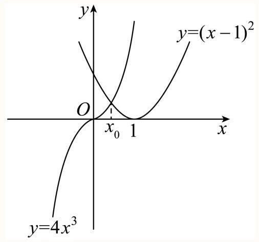

则由图像可知存在 ${x}_{0} \in  \left( {0,1}\right)$ ,有 $f\left( {x}_{0}\right)  = 0$ ,

所以当 $x < 0$ 时, $\Delta  \geq  0$ 恒成立,则 ${y}_{1} + {y}_{2} = \frac{x - 1}{{x}^{2}} < 0,{y}_{1}{y}_{2} = \frac{1}{x} < 0$ ,

因此 ${y}_{1},{y}_{2}$ 一正一负,

说明当 $\alpha$ 在第二象限时， $\beta$ 在四个象限均可，

当 $x \in  \left( {0,{x}_{0}}\right)$ 时, $\Delta  \geq  0$ 成立,

此时 ${y}_{1} + {y}_{2} = \frac{x - 1}{{x}^{2}} < 0,{y}_{1}{y}_{2} = \frac{1}{x} > 0$ ,

因此 ${y}_{1},{y}_{2}$ 皆为负,

说明当 $\alpha$ 在第一象限时， $\beta$ 只能在第二象限或第四象限，

综上所述，②③正确，①错误.

故选: C

## 三、解答题

17 解答题

已知单位向量 $\overrightarrow{a}$ 、 $\overrightarrow{b}$ 满足 $\sqrt{3}\left| {k\overrightarrow{a} + \overrightarrow{b}}\right|  = \left| {\overrightarrow{a} - k\overrightarrow{b}}\right| , k > 0$ .

(1)将 $\overrightarrow{a}$ 、 $\overrightarrow{b}$ 的数量积表示为关于 $k$ 的函数 $y = f\left( k\right)$ ；

(2)求函数 $y = f\left( k\right)$ 的最大值及取得最大值时 $\overrightarrow{a}$ 与 $\overrightarrow{b}$ 的夹角 $\theta$ .

解析

(1) $\sqrt{3}\left| {k\overrightarrow{a} + \overrightarrow{b}}\right|  = \left| {\overrightarrow{a} - k\overrightarrow{b}}\right|$ 平方得 $3{k}^{2} + {6k}\overrightarrow{a} \cdot  \overrightarrow{b} + 3 = 1 - {2k}\overrightarrow{a} \cdot  \overrightarrow{b} + {k}^{2}$ .

化简得 $\overrightarrow{a} \cdot  \overrightarrow{b} = \frac{-1 - {k}^{2}}{4k} < 0$ .

因为 $\overrightarrow{a} \cdot  \overrightarrow{b} = \left| \overrightarrow{a}\right| \left| \overrightarrow{b}\right| \cos \langle \overrightarrow{a},\overrightarrow{b}\rangle  = \cos \left\langle  {\overrightarrow{a},\overrightarrow{b}}\right\rangle   \in  \lbrack  - 1,0)$ .

所以 $- 1 \leq  \frac{-1 - {k}^{2}}{4k} < 0$ ,化简得 $- {4k} \leq  1 + {k}^{2} < {4k}$ ,解得 $2 - \sqrt{3} < k < 2 + \sqrt{3}$ .

所以 $y = f\left( k\right)  =  - \frac{1}{4}\left( {k + \frac{1}{k}}\right) , k \in  \left( {2 - \sqrt{3},2 + \sqrt{3}}\right)$ .

根据基本不等式的性质 $k + \frac{1}{k} \geq  2\sqrt{k \cdot  \frac{1}{k}} = 2$ ,所以 $f\left( k\right)  =  - \frac{1}{4}\left( {k + \frac{1}{k}}\right)  \leq   - \frac{1}{2}$ .

当且仅当 $k = 1$ 时取到等号,所以 $y = f\left( k\right)$ 的最大值为 $- \frac{1}{2}$ .

此时 $\cos \theta  = \frac{\overrightarrow{a} \cdot  \overrightarrow{b}}{\left| \overrightarrow{a}\right|  \cdot  \left| \overrightarrow{b}\right| } = \frac{-\frac{1}{2}}{1 \times  1} =  - \frac{1}{2}$ ,所以 $\theta  = \frac{2\pi }{3}$ .

18 解答题

已知 $z \in  \mathbf{C}$ ,关于 $z$ 的实系数一元二次方程 ${z}^{2} - {2z} + a = 0$ .

(1) 若方程的一个根大于1，另一个根小于1，求实数 $a$ 的取值范围；

(2)方程的两根模均小于2，求实数 $a$ 的取值范围.

## 解析

(1)依题意，方程 ${z}^{2} - {2z} + a = 0$ 有两个不等实根，则 $\Delta  = 4 - {4a} > 0$ ，解得 $a < 1$ ， 由方程的一个根大于 1,另一个根小于 1,得 ${1}^{2} - 2 + a < 0$ ,解得 $a < 1$ .

所以实数 $a$ 的取值范围为 $\left( {-\infty ,1}\right)$ .

(2)依题意， $\Delta  = 4 - {4a}$ ，

当 $\Delta  \geq  0$ 时，方程有两个实根， $a \leq  1$ ，对称轴为 $x = 1$ ，

则 ${2}^{2} - 4 + a > 0$ ,解得 $a > 0$ ,因此 $0 < a \leq  1$ ;

当 $\Delta  < 0$ 时,方程有两个共轭虚根, $a > 1,{z}_{1} = 1 - \sqrt{a - 1}\mathrm{i},{z}_{2} = 1 + \sqrt{a - 1}\mathrm{i}$ ,

由 $\left| {z}_{1}\right|  = \left| {z}_{2}\right|  = \sqrt{a} < 2$ ,得 $a < 4$ ,因此 $1 < a < 4$ ,

所以实数 $a$ 的取值范围为 $\left( {0,4}\right)$ .

19 解答题

最近国际局势波云诡谲，我国在某地区进行军事演练，如图， $O, A, B$ 是三个军事基地， $C$ 为一个军事要塞，在线段 ${AB}$ 上. 已知 $\tan \angle {AOB} =  - 3,{OA} = {10}\mathrm{\;{km}}$ ， ${C\text{ 到 }{OA}}$ ， ${OB}$ 的距离分别为 $5\mathrm{\;{km}}$ ， $2\sqrt{10}\mathrm{{km}}$ .以点 $O$ 为坐标原点，直线 ${OA}$ 为 $x$ 轴，建立平面直角坐标系如图所示， $C$ 位于第一象限.

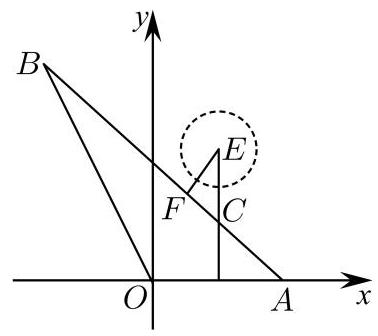

(1)求两个军事基地 ${AB}$ 的长；

(2)若要塞 $C$ 正北方向距离要塞10km处有一 $E$ 处正在进行爆破试验，爆炸波生成 $t\mathrm{h}$ 时的半径为 $r = 5\sqrt{at}$ (参数 $a$ 为大于零的常数)，爆炸波开始生成时，一飞行器以 ${30}\sqrt{2}\mathrm{{km}}/\mathrm{h}$ 的速度自基地A 开往基地 $B$ ,问参数 $a$ 控制在什么范围内时,爆炸波不会波及到飞行器的飞行.

## 解析

(1) 则由题设得: $A\left( {{10},0}\right)$ ，直线 ${OB}$ 的方程为 ${{3x} + y = 0}$ ， $C\left( {{x}_{0},5}\right) \left( {{x}_{0} > 0}\right)$ ，

由 $\frac{\left| 3{x}_{0} + 5\right| }{\sqrt{{3}^{2} + {1}^{2}}} = 2\sqrt{10}$ ,且 ${x}_{0} > 0$ ,解得 ${x}_{0} = 5$ ,所以 $C\left( {5,5}\right)$ .

所以直线 ${AC}$ 的方程为 $y =  - \left( {x - {10}}\right)$ ,即 $x + y - {10} = 0$ ,

联立方程 $\left\{  \begin{array}{l} y =  - {3x} \\  x + y - {10} = 0 \end{array}\right.$ ,解得 $\left\{  \begin{array}{l} x =  - 5 \\  y = {15} \end{array}\right.$ ,即 $B\left( {-5,{15}}\right)$ ,

所以 $\left| {AB}\right|  = \sqrt{{\left( -5 - {10}\right) }^{2} + {\left( {15} - 0\right) }^{2}} = {15}\sqrt{2}$ ,

即基地 ${AB}$ 的长为 ${15}\sqrt{2}\mathrm{\;{km}}$ .

(2)设爆炸产生的爆炸波圆 $E$ ，

由题意可得 $E\left( {5,{15}}\right)$ ，爆炸波生成 $t$ 小时后，飞行在线段 ${AB}$ 上的点 $F$ 处，

则 $\left| {AF}\right|  = {30}\sqrt{2}t,0 \leq  t \leq  \frac{1}{2}$ ，所以 $F\left( {{10} - {30t},{30t}}\right)$ ，

爆炸波不会波及飞行器的通行，即 $\left| {EF}\right|  > r$ 对 $t \in  \left\lbrack  {0,\frac{1}{2}}\right\rbrack$ 恒成立.

所以 ${\left| EF\right| }^{2} = {\left( {30}t - 5\right) }^{2} + {\left( {30}t - {15}\right) }^{2} > {r}^{2} = {25at}$ ,即 ${\left( {30}t - 5\right) }^{2} + {\left( {30}t - {15}\right) }^{2} > {25at}$ , 当 $t = 0$ 时,上式恒成立;

当 $t \in  \left( {0,\frac{1}{2}}\right\rbrack$ 时,整理得 $a < {72t} + \frac{10}{t} - {48}$ ,

因为 ${72t} + \frac{10}{t} - {48} \geq  2\sqrt{{72t} \times  \frac{10}{t}} - {48} = {24}\sqrt{5} - {48}$ ,

当且仅当 ${72t} = \frac{10}{t}$ ,即 $t = \frac{\sqrt{5}}{6}$ 时,等号成立,

所以在 $0 < a < {24}\sqrt{5} - {48}$ 时, $r < \left| {EF}\right|$ 恒成立,亦即爆炸波不会波及飞行的通行.

当 $0 < a < {24}\sqrt{5} - {48}$ 时,爆炸波不会波及飞行器的飞行.

20 解答题

已知函数 $f\left( x\right)  = \sin {kx} \cdot  {\sin }^{k}x + \cos {kx} \cdot  {\cos }^{k}x - {\cos }^{k}{2x}$ ,其中 $k \in  {\mathbf{N}}^{ * }$ .

(1)当 $k = 1$ 时，求方程 $f\left( x\right)  = 1 - \frac{\sqrt{3}}{2}$ 的解集；

(2)若 $f\left( x\right)$ 是偶函数，当 $k$ 取最小值时，求函数 $g\left( x\right)  = \frac{f\left( x\right) }{\tan x} + \sin x + \cos x$ 的取值范围；

(3)若 $f\left( x\right)$ 是常数函数，求 $k$ 的值.

## 解析

(1) 当 $k = 1$ 时, $f\left( x\right)  = \sin x \cdot  \sin x + \cos x \cdot  \cos x - \cos {2x} = 1 - \cos {2x}$ , 由 $f\left( x\right)  = 1 - \frac{\sqrt{3}}{2}$ 得: $\cos {2x} = \frac{\sqrt{3}}{2}$ ,解得 ${2x} = {2k\pi } + \frac{\pi }{6}$ ,或 ${2x} = {2k\pi } - \frac{\pi }{6}, k \in  \mathbf{Z}$ , 即 $x = {k\pi } + \frac{\pi }{12}$ ,或 $x = {k\pi } - \frac{\pi }{12}, k \in  \mathbf{Z}$ , 故所求方程的解集为 $\left\{  {x \mid  x = {k\pi } + \frac{\pi }{12},\text{ 或 }x = {k\pi } - \frac{\pi }{12}, k \in  \mathbf{Z}}\right\}$ ;

(2) $f\left( x\right)$ 的定义域为 $\mathbf{R}$ ，由 $f\left( x\right)$ 是偶函数得: $\forall x \in  \mathbf{R}, f\left( {-x}\right)  = f\left( x\right)$ ，即:

$\sin \left( {-{kx}}\right)  \cdot  {\sin }^{k}\left( {-x}\right)  + \cos \left( {-{kx}}\right)  \cdot  {\cos }^{k}\left( {-x}\right)  - {\cos }^{k}\left( {-{2x}}\right)  = \sin {kx} \cdot  {\sin }^{k}x + \cos {kx} \cdot  {\cos }^{k}x - \; {\cos }^{k}{2x}$

,

所以

$- \sin {kx} \cdot  {\left( -1\right) }^{k}{\sin }^{k}x + \cos {kx} \cdot  {\cos }^{k}x - {\cos }^{k}{2x} = \sin {kx} \cdot  {\sin }^{k}x + \cos {kx} \cdot  {\cos }^{k}x - {\cos }^{k}{2x}$ ,

从而 $\sin {kx} \cdot  {\sin }^{k}x\left\lbrack  {1 + {\left( -1\right) }^{k}}\right\rbrack   = 0$ ,进而 $1 + {\left( -1\right) }^{k} = 0$ ,所以 $k$ 为正奇数,

当 $k$ 取最小值即 $k = 1$ 时， $f\left( x\right)  = 1 - \cos {2x} = 2{\sin }^{2}x$ ，

所以 $g\left( x\right)  = \frac{f\left( x\right) }{\tan x} + \sin x + \cos x = \frac{2{\sin }^{2}x}{\frac{\sin x}{\cos x}} + \sin x + \cos x = 2\sin x\cos x + \sin x + \cos x$ , $x \neq  \frac{m\pi }{2}\left( {m \in  \mathbf{Z}}\right) ,$

令 $t = \sin x + \cos x = \sqrt{2}\sin \left( {x + \frac{\pi }{4}}\right) ,\;x \neq  \frac{m\pi }{2}\left( {m \in  \mathbf{Z}}\right)$ ,则 $2\sin x\cos x = {t}^{2} - 1$ , $t \in  \left\lbrack  {-\sqrt{2},\sqrt{2}}\right\rbrack$ 且 $t \neq   \pm  1,$

所以函数 $g\left( x\right)$ 的值域转化为 $y = {t}^{2} + t - 1, t \in  \left\lbrack  {-\sqrt{2},\sqrt{2}}\right\rbrack$ 且 $t \neq   \pm  1$ 的值域,

对称轴 $t =  - \frac{1}{2}$ ,所以 $y = {t}^{2} + t - 1$ 在 $\left\lbrack  {-\sqrt{2}, - 1}\right) ,\left( {-1, - \frac{1}{2}}\right\rbrack$ 上单调递减,在 $\left\lbrack  {-\frac{1}{2},1}\right) ,\left( {1,\sqrt{2}}\right\rbrack$ 上单调递增,

所以当 $t =  - \frac{1}{2}$ 时,取得最小值 ${y}_{\min } = \frac{1}{4} - \frac{1}{2} - 1 =  - \frac{5}{4}$ ; 当 $t = \sqrt{2}$ 时,取得最大值 ${y}_{\max } = 2 + \sqrt{2} - 1 = 1 + \sqrt{2}$

又当 $t =  \pm  1$ 时， $y = {t}^{2} + t - 1 =  \pm  1$ ；

故函数 $g\left( x\right)  = \frac{f\left( x\right) }{\tan x} + \sin x + \cos x$ 的取值范围为 $\left\lbrack  {-\frac{5}{4}, - 1}\right)  \cup  \left( {-1,1}\right)  \cup  (1,1 + \sqrt{2}\rbrack$ ;

(3)因为 $\forall k \in  {\mathbf{N}}^{ * }$ ， $f\left( 0\right)  = 0$ ，所以若 $f\left( x\right)$ 是常数函数，则 $f\left( x\right)  = 0$ ，

①当 $k = 1$ 时，由(1)知， $f\left( x\right)  = 1 - \cos {2x}$ 不是常数函数；

② 当 $k = 2$ 时， $f\left( x\right)  = \sin {2x} \cdot  {\sin }^{2}x + \cos {2x} \cdot  {\cos }^{2}x - {\cos }^{2}{2x}$ ，此时， $f\left( \frac{\pi }{2}\right)  =  - 1 \neq  0$ ，

$f\left( x\right)$ 不是常数函数;

③ 当 $k = 3$ 时， $f\left( x\right)  = \sin {3x} \cdot  {\sin }^{3}x + \cos {3x} \cdot  {\cos }^{3}x - {\cos }^{3}{2x}$

$= \left( {\sin {2x}\cos x{\sin }^{3}x + \cos {2x}{\sin }^{4}x}\right)  + \left( {\cos {2x}{\cos }^{4}x - \sin {2x}\sin x{\cos }^{3}x}\right)  - {\cos }^{3}{2x}$

$= \left( {\sin {2x}\cos x{\sin }^{3}x + {\cos }^{2}x{\sin }^{4}x - {\sin }^{6}x}\right)  + \left( {{\cos }^{6}x - {\sin }^{2}x{\cos }^{4}x - \sin {2x}\sin x{\cos }^{3}x}\right)  - \; {\cos }^{3}{2x}$

$= 3{\cos }^{2}x{\sin }^{4}x - {\sin }^{6}x + {\cos }^{6}x - 3{\sin }^{2}x{\cos }^{4}x - {\cos }^{3}{2x}$

$= {\left( {\cos }^{2}x - {\sin }^{2}x\right) }^{3} - {\cos }^{3}{2x} = {\cos }^{3}{2x} - {\cos }^{3}{2x} = 0,$

所以， $f\left( x\right)$ 是常数函数；

④ 当 $k \geq  4$ 时， $f\left( \frac{\pi }{k}\right)  =  - {\cos }^{k}\frac{\pi }{k} - {\cos }^{k}\frac{2\pi }{k} < 0$ ， $f\left( x\right)$ 不是常数函数；

综上所述: $k = 3$ .

21 解答题

无穷数列 $\left\{  {a}_{n}\right\}$ . 定义集合 $P = \{ n \mid$ 存在正整数 $m$ ,使得 $m > n$ 且 ${a}_{m} > {a}_{n}\}$ ,集合 $Q = \{ n \mid$ 存在正整数 $m$ ,使得 $m < n$ 且 ${a}_{m} > {a}_{n}$ \}.

(1)已知 ${a}_{n} = {\left( -2\right) }^{n}$ ，请直接写出集合 $P$ 、 $Q$ ；

(2)已知 ${a}_{n} = \sin \left( {\frac{n\pi }{3} + \varphi }\right)$ ， $\varphi  \in  \lbrack 0,{2\pi })$ ，若 $P \subseteq  Q$ ，求 $\varphi$ 的取值范围；

(3)已知 $A = \left\{  {x \mid  x = {a}_{n}, n \in  \mathbf{N}, n \geq  1}\right\}$ 为无限集，求证: “ $\left\{  {a}_{n}\right\}$ 是增数列”的充要条件是“

$P \cup  Q = \{ n \mid  n \in  \mathbf{N}, n \geq  1\}$ 且 $P \cap  Q = \varnothing$ ".

## 解析

(1) 由题意可得下表:

<table><tr><td>$n$</td><td>1</td><td>2</td><td>3</td><td>...</td><td>${2k} - 1 *$</td><td>$\left( {k \in  {\mathrm{N}}^{ * }}\right.$</td></tr><tr><td>${a}_{n}$</td><td>-2</td><td>4</td><td>-8</td><td>...</td><td>$- {2}^{{2k} - 1}$</td><td>${2}^{2k}$</td></tr></table>

由函数 $y = {2}^{x}$ 在 $\mathrm{R}$ 上单调递增,则 ${b}_{n} =  - {2}^{{2n} - 1}$ 单调递减, ${c}_{n} = {2}^{2n}$ 单调递增,

所以 $P = \{ n \mid  n \in  \mathbf{N}, n \geq  1\} , Q = \{ n \mid  n = {2k} + 3, k \in  \mathbf{N}\}$ .

(2)由于 $1 \notin  Q$ ，故 $1 \notin  P$ ，从而 ${a}_{1}$ 为数列最大项.

反之, ${a}_{1}$ 为数列最大项. 任取 $n \in  P$ ,则存在 ${a}_{m} > {a}_{n},{a}_{n}$ 必然不是数列最大项,

故必有 ${a}_{1} > {a}_{n}$ ,从而 $n \in  Q$ ,即 $P \subseteq  Q$ .

所以 $P \subseteq  Q$ 的充要条件是 ${a}_{1}$ 为数列最大项.

由周期性,只需考虑 $1 \leq  n \leq  6$ 的情况,利用单位圆可知 $\frac{\pi }{3} \leq  \frac{\pi }{3} + \varphi  \leq  \frac{2\pi }{3}$ ,

故 $\varphi$ 的取值范围 $\left\lbrack  {0,\frac{\pi }{3}}\right\rbrack$ .

(3)(必要性) $\left\{  {a}_{n}\right\}$ 是增数列，任取 ${n}_{0} \in  \mathbf{N}$ 且 ${n}_{0} \geq  1$ ，下证 ${n}_{0} \notin  Q$ ， ${n}_{0} \in  P$ .

由单调性,一切 $m < {n}_{0}$ ,有 ${a}_{m} \leq  {a}_{{n}_{0}},{n}_{0} \notin  Q$ ,故 $Q = \varnothing$ .

假设 ${n}_{0} \notin  P$ ,则一切 $m > {n}_{0}$ ,有 ${a}_{m} \leq  {a}_{{n}_{0}}$ ,由增数列, ${a}_{m} \geq  {a}_{{n}_{0}}$ ,从而 ${a}_{m} = {a}_{{n}_{0}}$ .

此时 $\left\{  {x \mid  x = {a}_{n}, n \in  \mathbf{N}, n \geq  1}\right\}   = \left\{  {x \mid  x = {a}_{n}, n \in  \mathbf{N},1 \leq  n \leq  {n}_{0}}\right\}$ ,为有限集,矛盾.

故 ${n}_{0} \in  P$ ,从而 $P = \{ n \mid  n \in  \mathbf{N}, n \geq  1\}$ .

(充分性) 任取 ${n}_{0} \in  \mathbf{N}$ 且 ${n}_{0} \geq  1$ ,则 ${n}_{0} \in  P$ 或 ${n}_{0} \in  Q$ ,从而 ${a}_{{n}_{0}}$ 必不是数列最大项.

同理可知, ${a}_{1},{a}_{2},\ldots ,{a}_{{n}_{0}}$ 均不是数列最大项,记这前 ${n}_{0}$ 项中最大项为 ${M}_{{n}_{0}}$ ,

因为不是数列最大项,故存在 $m > {n}_{0}$ ,使得 ${a}_{m} > {M}_{{n}_{0}} \geq  {a}_{{n}_{0}}$ ,从而 ${n}_{0} \in  P$ .

因为 ${n}_{0}$ 是任取的,从而 $P = \{ n \mid  n \in  \mathbf{N}, n \geq  1\}$ ,而 $P \cap  Q = \varnothing$ ,从而 $Q = \varnothing$ .

所以对任意 $m < n, n \notin  Q$ ,所以 ${a}_{m} \leq  {a}_{n}$ ,从而 $\left\{  {a}_{n}\right\}$ 是增数列.

上海交通大学附属中学2024-2025学年高三上学期开学考试数学试题

姓名:___

## 一、填空题

1 填空题

已知全集 $\mathrm{U} = \mathrm{R}$ ，集合 $A = \{ x \mid  x < a\}$ ， $B = \{ x \mid   - 1 < x < 3\}$ ，且 $B \subseteq  A$ ，则实数 $a$ 的取值范围是 ___.

## 解析

利用子集的含义求解即可.

因为 $B \subseteq  A$ ,又因为 $A = \{ x \mid  x < a\} , B = \{ x \mid   - 1 < x < 3\}$ ,所以 $a \geq  3$ .

故答案为: $a \geq  3$ .

2 填空题

已知常数 $a > 0$ 且 $a \neq  1$ ，假设无论 $a$ 为何值，函数 $y = {a}^{x - 2} + 1$ 的图像恒经过一个定点，则这个点的坐标为___.

## 解析

根据指数函数恒过定点 $\left( {0,1}\right)$ 求解即可.

因为当 $x - 2 = 0$ 时,即 $x = 2$ 时, $y = {a}^{0} + 1 = 2$ ,

所以函数 $y = {a}^{x - 2} + 1$ 的图像恒经过定点 $\left( {2,2}\right)$ ,

故答案为: $\left( {2,2}\right)$ .

3 填空题

用简单随机抽样的方法从含n个个体的总体中，逐个抽取一个样本量为3的样本，若其中个体a在第一次就被抽取的可能性为 $\frac{1}{8}$ ，那么n=___.

## 解析

根据简单随机抽样的定义求解.

因为用简单随机抽样的方法从含n个个体的总体中逐个抽取, 个体a在第一次就被抽取的可能

性为 $\frac{1}{8}$ ,

因此 $\frac{1}{n} = \frac{1}{8}$ ,所以 $n = 8$ .

故答案为:8

4 填空题

两正数a与b的几何平均值为2，则 ${a}^{2}$ 与 ${b}^{2}$ 的算术平均值的最小值为___.

解析

根据题意结合重要不等式运算求解即可.

因为两正数 $a$ 与 $b$ 的几何平均值为2,所以 $\sqrt{ab} = 2$ ,所以 ${ab} = 4$ ,

因为 $\frac{{a}^{2} + {b}^{2}}{2} \geq  \frac{2ab}{2} = {ab} = 4$ ,所以 ${a}^{2}$ 与 ${b}^{2}$ 的算术平均值最小值为 4 .

故答案为: 4 .

5 填空题

已知二项式 ${\left( {x}^{3} + \frac{1}{x}\right) }^{n}$ 的展开式中存在常数项，正整数 $n$ 的最小值为___.

解析

应用二项式展开式计算通项，根据存在常数项利用赋值法计算参数即可.

二项式 ${\left( {x}^{3} + \frac{1}{x}\right) }^{n}$ 的通项为 ${T}_{n + 1} = {\mathrm{C}}_{n}^{r}{\left( {x}^{3}\right) }^{n - r}{\left( \frac{1}{x}\right) }^{r} = {\mathrm{C}}_{n}^{r}{x}^{{3n} - {4r}}$ ,

若展开式中存在常数项，只需 ${3n} - {4r} = 0,0 \leq  r \leq  n, r \in  \mathrm{Z}$ ,

则 $r = \frac{3}{4}n$ ,所以正整数 $n$ 最小取 4 .

故答案为: 4 .

6 填空题

不等式 ${\log }_{2}x <  - x + 1$ 的解集是___.

## 解析

依题意可得 ${\log }_{2}x + x - 1 < 0$ ,令 $f\left( x\right)  = {\log }_{2}x + x - 1$ ,判断函数的单调性,结合 $f\left( 1\right)  = 0$ ，即可求出不等式的解集.

不等式 ${\log }_{2}x <  - x + 1$ ,即 ${\log }_{2}x + x - 1 < 0$ ,

令 $f\left( x\right)  = {\log }_{2}x + x - 1, x \in  \left( {0, + \infty }\right)$ ,

因为 $y = {\log }_{2}x$ 与 $y = x - 1$ 均在 $\left( {0, + \infty }\right)$ 上单调递增,

所以 $f\left( x\right)$ 在 $\left( {0, + \infty }\right)$ 上单调递增,

又 $f\left( 1\right)  = 0$ ,所以当 $0 < x < 1$ 时 $f\left( x\right)  < 0$ ,

则不等式 ${\log }_{2}x <  - x + 1$ 的解集是 $\left( {0,1}\right)$ .

故答案为: $\left( {0,1}\right)$

7 填空题

已知等差数列 $\left\{  {a}_{n}\right\}$ 的首项 ${a}_{1} =  - 1,{S}_{n}$ 表示 $\left\{  {a}_{n}\right\}$ 的前 $n$ 项和,若数列 $\left\{  {S}_{n}\right\}$ 是严格增数列,则 $\left\{  {a}_{n}\right\}$ 的公差 $d$ 取值范围是

解析

由 ${S}_{n}$ 与 ${a}_{n}$ 的关系再结合等差数列通项公式的基本量计算即可;

若数列 $\left\{  {S}_{n}\right\}$ 是严格增数列,

则 ${S}_{n + 1} - {S}_{n} = {a}_{n + 1} > 0$ 恒成立，

即 $- 1 + {nd} > 0$ 恒成立，

又 $n \in  {\mathrm{N}}^{ * }$ ,

所以 $d > 1$ ,

所以 $\left\{  {a}_{n}\right\}$ 的公差 $d$ 取值范围是 $\left( {1, + \infty }\right)$ ,

故答案为: $\left( {1, + \infty }\right)$ .

8 填空题

已知 $f\left( x\right)  = \left( {x + 1}\right) \left( {x + a}\right) \left( {x + b}\right)$ . 若 $y = f\left( x\right)$ 为奇函数，则 ${f}^{\prime }\left( 0\right)  =$ ___.

## 解析

根据题意,求得 $f\left( x\right)  = {x}^{3} - x$ ,得到 ${f}^{\prime }\left( x\right)  = 3{x}^{2} - 1$ ,即可求解.

由函数 $f\left( x\right)  = \left( {x + 1}\right) \left( {x + a}\right) \left( {x + b}\right)  = {x}^{3} + \left( {a + b + 1}\right) {x}^{2} + \left( {a + b + {ab}}\right) x + {ab}$ ,

可得 $f\left( {-x}\right)  =  - {x}^{3} + \left( {a + b + 1}\right) {x}^{2} - \left( {a + b + {ab}}\right) x + {ab}$

因为函数 $f\left( x\right)$ 为 $\mathrm{R}$ 上的奇函数,可得 $f\left( {-x}\right)  =  - f\left( x\right)$ ,

即 $- {x}^{3} + \left( {a + b + 1}\right) {x}^{2} - \left( {a + b + {ab}}\right) x + {ab} =  - {x}^{3} - \left( {a + b + 1}\right) {x}^{2} - \left( {a + b + {ab}}\right) x - {ab}$ ,

所以 $\left\{  \begin{array}{l} a + b + 1 = 0 \\  {ab} = 0 \end{array}\right.$ ，解得 $\left\{  \begin{array}{l} a = 0 \\  b =  - 1 \end{array}\right.$ 或 $\left\{  \begin{array}{l} a =  - 1 \\  b = 0 \end{array}\right.$ ，所以 $f\left( x\right)  = {x}^{3} - x$ ，

可得 ${f}^{\prime }\left( x\right)  = 3{x}^{2} - 1$ ,所以 ${f}^{\prime }\left( 0\right)  =  - 1$ .

故答案为: -1 .

9 填空题

满足定义域为 $\{ 1,2,3,4\}$ 且值域为 $\{ 1,2,3\}$ 的函数共有___个.

解析

根据分组分配方法计算.

将 $\{ 1,2,3,4\}$ 中的4个元素分为3组，分别对应 1,2,3,

则有 $\frac{{\mathrm{C}}_{4}^{2}{\mathrm{C}}_{2}^{1}{\mathrm{C}}_{1}^{1}}{{\mathrm{\;A}}_{2}^{2}}{\mathrm{\;A}}_{3}^{3} = {36}$ 个.

故答案为: 36 .

10 填空题

已知函数 $y = A\sin \left( {{\omega x} + \varphi }\right) \left( {A > 0,\omega  > 0,0 \leq  \varphi  < {2\pi }}\right)$ 的图像与直线 $y = b\left( {0 < b < A}\right)$ 的三个相邻交点的横坐标依次是1,2,4，则 $\varphi  =$

解析

根据题意,利用三角函数的性质,得到 $T = \frac{2\pi }{\omega } = 3$ ,求得 $\omega  = \frac{2\pi }{3}$ ,再由 1 与 2 的中点必为函数 $y = f\left( x\right)$ 的最大值点,求得 $\varphi  =  - \frac{\pi }{2} + {2k\pi }, k \in  \mathrm{Z}$ ,即可求解.

因为函数 $y = A\sin \left( {{\omega x} + \varphi }\right)$ 与直线 $y = b$ 的三个相邻交点的横坐标依次是1,2,4,

可得函数 $f\left( x\right)$ 的最小正周期为 $T = \frac{2\pi }{\omega } = 4 - 1 = 3$ ,解得 $\omega  = \frac{2\pi }{3}$ ,

结合三角函数的性质，可得1与2的中点必为函数 $y = f\left( x\right)$ 的最大值点，

且2与4的中点必为函数 $y = f\left( x\right)$ 的最小值点，

可得 $\frac{2\pi }{3} \times  \frac{3}{2} + \varphi  = \frac{\pi }{2} + {2k\pi }, k \in  \mathrm{Z}$ ,解得 $\varphi  =  - \frac{\pi }{2} + {2k\pi }, k \in  \mathrm{Z}$ ,

因为 $0 \leq  \varphi  < {2\pi }$ ,所以 $\varphi  = \frac{3\pi }{2}$

故答案为: $\frac{3\pi }{2}$ .

11 填空题

已知实数 $a, b, c$ 成公比为 $q$ 的等比数列，抛物线 $x = {y}^{2}$ 上每一点到直线 ${ax} + {by} + c = 0$ 的距离均大于 $\frac{9}{8}$ ，则 $q$ 的取值范围是___.

解析

由已知得出直线必过点 $\left( {-{q}^{2},0}\right)$ ，取抛物线位于 $x$ 轴上方部分，设 $y = {x}^{\frac{1}{2}}$ 上一点 $\left( {{y}_{0}^{2},{y}_{0}}\right)$ 到直线 ${ax} + {by} + c = 0$ 的距离最小,由几何关系得出 ${y}_{0} =  - \frac{1}{2}q$ ,再根据点到直线的距离公式列出不等式, 即可求解.

因为实数 $a, b, c$ 成公比为 $q$ 的等比数列,所以 ${abcq} \neq  0, b = {aq}, c = a{q}^{2}$ ,

所以 ${ax} + {by} + c = a\left( {x + {qy} + {q}^{2}}\right)  = 0$ ,即直线必过点 $\left( {-{q}^{2},0}\right)$ ,且斜率 $k =  - \frac{1}{q}$ ,

不妨取抛物线位于 $x$ 轴上方部分，则 $y = {x}^{\frac{1}{2}}$ ， ${y}^{\prime } = \frac{1}{2}{x}^{-\frac{1}{2}}$ ， $x > 0$ ， $y > 0$ ，

由题可知, $k =  - \frac{1}{q} > 0$ ,则 $q < 0$ ,

设 $y = {x}^{\frac{1}{2}}$ 上一点 $\left( {{y}_{0}^{2},{y}_{0}}\right)$ 到直线 ${ax} + {by} + c = 0$ 的距离最小,

则 $\left( {{y}_{0}^{2},{y}_{0}}\right)$ 处的斜率等于直线 ${ax} + {by} + c = 0$ 的斜率，即 $\frac{1}{2}{\left( {y}_{0}^{2}\right) }^{-\frac{1}{2}} =  - \frac{1}{q}$ ，所以 ${y}_{0} =  - \frac{1}{2}q$ ，

点 $\left( {{y}_{0}^{2},{y}_{0}}\right)$ 到直线 ${ax} + {by} + c = 0$ 的距离 $d = \frac{\left| a{y}_{0}^{2} + b{y}_{0} + c\right| }{\sqrt{{a}^{2} + {b}^{2}}} = \frac{\left| \frac{1}{4}a{q}^{2} - \frac{1}{2}a{q}^{2} + a{q}^{2}\right| }{\sqrt{{a}^{2} + {a}^{2}{q}^{2}}}$

$= \frac{\frac{3}{4}{q}^{2}}{\sqrt{1 + {q}^{2}}} > \frac{9}{8},$

整理得 $4{q}^{4} - 9{q}^{2} - 9 > 0$ ,解得 ${q}^{2} > 3$ ,因为 $q < 0$ ,所以 $q \in  \left( {-\infty , - \sqrt{3}}\right)$ ,

根据直线和抛物线得对称性得, $q \in  \left( {-\infty , - \sqrt{3}}\right)  \cup  \left( {\sqrt{3}, + \infty }\right)$ ,

故答案为: $\left( {-\infty , - \sqrt{3}}\right)  \cup  \left( {\sqrt{3}, + \infty }\right)$ .

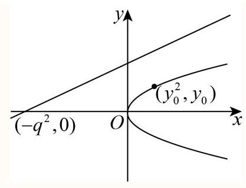

12 填空题

在边长为 1 的正六边形 ${ABDEFG}$ 中，以 $A$ 为起点其它5个顶点之一为终点的向量分别记为 $\overrightarrow{{a}_{1}}\text{ 、 }\overrightarrow{{a}_{2}}\text{ 、 }\overrightarrow{{a}_{3}}\text{ 、 }\overrightarrow{{a}_{4}}\text{ 、 }\overrightarrow{{a}_{5}}$ ，以 $D$ 为起点其它5个顶点之一为终点的向量分别记为 $\overrightarrow{{d}_{1}}\text{ 、 }\overrightarrow{{d}_{2}}\text{ 、 }\overrightarrow{{d}_{3}}\text{ 、 }\overrightarrow{{d}_{4}}\text{ 、 }\overrightarrow{{d}_{5}}$ ，若 $m\text{ 、 }M$ 分别为 $\left( {\overrightarrow{{a}_{l}} + \overrightarrow{{a}_{j}} + \overrightarrow{{a}_{k}}}\right)  \cdot  \left( {\overrightarrow{{d}_{r}} + \overrightarrow{{d}_{s}} + \overrightarrow{{d}_{t}}}\right)$ 的最小值、最大值,其中 $\{ i, j, k\}  \subset  \{ 1,2,3,4,5\} ,\{ r, s, t\}  \subset  \{ 1,2,3,4,5\}$ . 则 $m + M$ 的值为___.

## 解析

由余弦定理和勾股定理分别求出 ${AC},{AD}$ ,再由向量的加法法则结合图形的关系和向量的数量积公式求出结果即可;

如图:

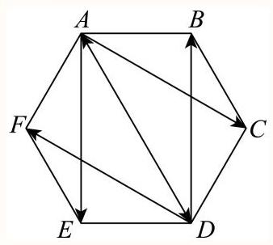

由向量的加法法则可得, 两个向量的夹角越小, 模长越大, 和向量就越大; 反之越小;

正六边形可得 $\overrightarrow{AE} + \overrightarrow{AD} + \overrightarrow{AC} = \frac{3}{2}\overrightarrow{AD} + \overrightarrow{AD} = \frac{5}{2}\overrightarrow{AD}$ ,

同理 $\overrightarrow{DF} + \overrightarrow{DA} + \overrightarrow{DB} = \frac{3}{2}\overrightarrow{DA} + \overrightarrow{DA} = \frac{5}{2}\overrightarrow{DA}$ ,

因为正六边形 ${ABDEFG}$ 的边长为 1,

由余弦定理可得 $\cos {120}^{ \circ  } = \frac{A{B}^{2} + B{C}^{2} - A{C}^{2}}{{2AB} \cdot  {BC}}$ ,解得 ${AC} = \sqrt{3}$ ,

所以 ${AE} = {AC} = \sqrt{3}$ ，

所以由图形关系可得 $A{D}^{2} = A{C}^{2} + C{D}^{2} \Rightarrow  {AD} = 2$ ，

所以 $m = \frac{5}{2}\left| \overrightarrow{AD}\right|  \cdot  \frac{5}{2}\left| \overrightarrow{DA}\right|  \cdot  \cos {180}^{ \circ  } =  - {25}$ ,

同理, 两个向量的模长越小, 夹角越大, 和向量就越小, 两个括号的乘积就越小,

所以 $M = \left( {\overrightarrow{AB} + \overrightarrow{AF} + \overrightarrow{AE}}\right)  \cdot  \left( {\overrightarrow{DE} + \overrightarrow{DC} + \overrightarrow{DF}}\right)$ ,

如图:

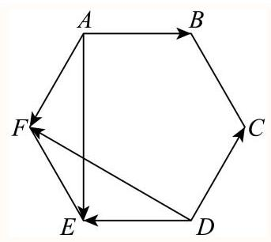

由图可得 $M = \left( {\overrightarrow{AB} + \overrightarrow{AF} + \overrightarrow{AE}}\right)  \cdot  \left( {\overrightarrow{DE} + \overrightarrow{DC} + \overrightarrow{DF}}\right)$

$= \overrightarrow{AB} \cdot  \overrightarrow{DE}\cos {180}^{ \circ  } + \overrightarrow{AB} \cdot  \overrightarrow{DC}\cos {60}^{ \circ  } + \overrightarrow{AB} \cdot  \overrightarrow{DF}\cos {120}^{ \circ  } + \overrightarrow{AF} \cdot  \overrightarrow{DE}\cos {60}^{ \circ  } + \overrightarrow{AF} \cdot  \overrightarrow{DC}\cos$

$+ \overrightarrow{AF} \cdot  \overrightarrow{DF}\cos {60}^{ \circ  } + \overrightarrow{AE} \cdot  \overrightarrow{DE}\cos {90}^{ \circ  } + \overrightarrow{AE} \cdot  \overrightarrow{DC}\cos {150}^{ \circ  } + \overrightarrow{AE} \cdot  \overrightarrow{DF}\cos {120}^{ \circ  }$

$=  - \frac{11}{2}$ ,

所以 $m + M =  - {25} - \frac{11}{2} =  - \frac{61}{2}$ ,

故答案为: $- \frac{61}{2}$ .

关键点点睛:本题关键是能用图形表示 $m$ 、 $M$ ，再结合向量的数量积公式计算即可.

## 二、选择题

13 单选题

若 $1 - \mathrm{i}$ 是关于 $x$ 的实系数方程 ${x}^{2} + {ax} + b = 0$ 的一根，则 $a + b$ 的值为( )

A. -1

B. 1

C. 0

D. 4

解析

将方程的根代入方程进行运算化简，然后利用复数相等的条件即得答案.

由题意可得 ${\left( 1 - \mathrm{i}\right) }^{2} + a\left( {1 - \mathrm{i}}\right)  + b = 0$ ,即 $\left( {a + b}\right)  - \left( {a + 2}\right) \mathrm{i} = 0$ ,

所以 $a + b = 0$ .

故选: C.

14 单选题

在 $\bigtriangleup {ABC}$ 中，若 $\overrightarrow{AB} \cdot  \overrightarrow{BC} - {\overrightarrow{AB}}^{2} = 0$ ，则 $\bigtriangleup {ABC}$ 的形状一定是( )

A. 等边三角形

B. 直角三角形

C. 锐角三角形

D. 钝角三角形

解析

由平面向量数量积的定义及运算律得出 $\cos B < 0$ ,结合余弦函数的正负及 $B \in  \left( {0,\pi }\right)$ 即可判断.

由 $\overrightarrow{AB} \cdot  \overrightarrow{BC} - {\overrightarrow{AB}}^{2} = 0$ 得, ${ac} \cdot  \left( {-\cos B}\right)  = {c}^{2}$ ,即 $\cos B =  - \frac{c}{a} < 0$ ,

因为 $B \in  \left( {0,\pi }\right)$ ,所以 $B$ 为钝角,

所以 $\bigtriangleup {ABC}$ 的形状一定是钝角三角形,

故选: D.

15 单选题

正方体 ${ABCD} - {A}_{1}{B}_{1}{C}_{1}{D}_{1}$ 有六个面，每个面有两条对角线，则这十二条对角线所在的十二条直线中，可以组成异面直线( )

A. 24对

B. 30对

C. 32对

D. 64对

解析

由正方体的面对角线的性质结合异面直线的特征计算即可;

由正方体的特征可知每一条对角线与5条面对角线成异面直线,

所以共有 $5 \times  {12} \times  \frac{1}{2} = {30}$ 对.

故选: B.

16 单选题

定义在 $\mathrm{R}$ 上的函数 $y = f\left( x\right)$ 和 $y = g\left( x\right)$ 的最小周期分别是 ${T}_{1}$ 和 ${T}_{2}$ ，已知 $y = f\left( x\right)  + g\left( x\right)$ 的最小正周期为1 ，则下列选项中可能成立的是( )

A. ${T}_{1} = 1,{T}_{2} = 2$

B. ${T}_{1} = \frac{1}{2},{T}_{2} = \frac{3}{4}$

C. ${T}_{1} = \frac{3}{4},{T}_{2} = \frac{5}{4}$

D. ${T}_{1} = \frac{3}{2},{T}_{2} = 3$

解析

先设 $h\left( x\right)  = f\left( x\right)  + g\left( x\right)$ ,可知 $h\left( {x + 1}\right)  = h\left( x\right)$ ,然后根据每一个选项的 ${T}_{1}$ ,去求 ${T}_{2}$ ,判断选项是否成立即可.

令 $h\left( x\right)  = f\left( x\right)  + g\left( x\right)$ ,则有 $h\left( {x + 1}\right)  = h\left( x\right)$ ,

若 ${T}_{1} = 1$ ,则 $f\left( {x + 1}\right)  = f\left( x\right)$ ,此时 $g\left( x\right)  = h\left( x\right)  - f\left( x\right)$ ,有

$g\left( {x + 1}\right)  = h\left( {x + 1}\right)  - f\left( {x + 1}\right)  = h\left( x\right)  - f\left( x\right)  = g\left( x\right)$ ,此时 ${T}_{2} = 1 \neq  2$ ,故A错误;

若 ${T}_{1} = \frac{1}{2}$ ,则 $f\left( {x + \frac{1}{2}}\right)  = f\left( x\right)$ ,因为 $h\left( {x + 1}\right)  = h\left( x\right)$ ,此时 $g\left( x\right)  = h\left( x\right)  - f\left( x\right)$ ,而 $1,\frac{1}{2}$ 的整数倍, 相同的最小的数为1,

所以 $g\left( {x + 1}\right)  = h\left( {x + 1}\right)  - f\left( {x + 1}\right)  = h\left( x\right)  - f\left( x\right)  = g\left( x\right)$ ,此时 ${T}_{2} = 1 \neq  \frac{3}{4}$ ,故B错误; 若 ${T}_{1} = \frac{3}{4}$ ,则 $f\left( {x + \frac{3}{4}}\right)  = f\left( x\right)$ ,因为 $h\left( {x + 1}\right)  = h\left( x\right)$ ,此时 $g\left( x\right)  = h\left( x\right)  - f\left( x\right)$ ,而 $1,\frac{3}{4}$ 的整数倍，相同的最小的数为3,

所以 $g\left( {x + 3}\right)  = h\left( {x + 3}\right)  - f\left( {x + 3}\right)  = h\left( x\right)  - f\left( x\right)  = g\left( x\right)$ ,此时 ${T}_{2} = 3 \neq  \frac{5}{4}$ ,故C错误; 若 ${T}_{1} = \frac{3}{2}$ ,则 $f\left( {x + \frac{3}{2}}\right)  = f\left( x\right)$ ,因为 $h\left( {x + 1}\right)  = h\left( x\right)$ ,此时 $g\left( x\right)  = h\left( x\right)  - f\left( x\right)$ ,而 $1,\frac{3}{2}$ 的整数倍，相同的最小的数为3，

所以 $g\left( {x + 3}\right)  = h\left( {x + 3}\right)  - f\left( {x + 3}\right)  = h\left( x\right)  - f\left( x\right)  = g\left( x\right)$ ,此时 ${T}_{2} = 3$ ,故D正确；

故选: D

关键点点睛:当两个最小正周期不同的函数相互加或减的时候，形成的新函数的周期为初始两个函数周期的整数倍, 且相同的最小的数.

## 三、解答题

17 解答题

如图，已知圆锥的顶点为 $P$ ，底面圆心为 $O$ ，高为 $2\sqrt{2}$ ，底面半径为 2.

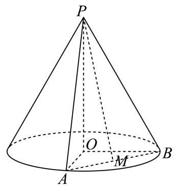

(1)求该圆锥的侧面积:

(2)设 ${OA}\text{ 、 }{OB}$ 为该圆锥的底面半径，且 $\angle {AOB} = {90}^{ \circ  }, M$ 为线段 ${AB}$ 的中点，求直线 ${PM}$ 与直线 ${OB}$ 所成的角的余弦值.

## 解析

(1) 在 Rt $\bigtriangleup {POB}$ 中, ${PB} = \sqrt{P{O}^{2} + O{B}^{2}} = \sqrt{8 + 4} = 2\sqrt{3}$ ,

所以圆锥的侧面积为 $\pi  \times  2 \times  2\sqrt{3} = 4\sqrt{3}\pi$ .

(2)取 ${AO}$ 中点 $N$ ，连接 ${MN},{PN},{OM}$ ，则 ${MN}//{OB}$ ， ${MN} = \frac{1}{2}{OB} = {ON} = 1$ ，

所以直线 ${PM}$ 与直线 ${OB}$ 所成的角即为直线 ${PM},{MN}$ 的夹角，

因为 ${PO} \bot$ 平面 ${AOB},{ON} \subset$ 平面 ${AOB}$ ,所以 ${PO} \bot  {ON}$ ,

在Rt $\bigtriangleup {PON}$ 中, ${PN} = \sqrt{8 + 1} = 3$ ,同理可得 ${PM} = \sqrt{10}$ ,

在 $\bigtriangleup {PMN}$ 中,由余弦定理得, $\cos \angle {PMN} = \frac{P{M}^{2} + M{N}^{2} - P{N}^{2}}{{2PM} \cdot  {MN}} = \frac{{10} + 1 - 9}{2\sqrt{10}} = \frac{\sqrt{10}}{10}$

所以直线 ${PM}$ 与直线 ${OB}$ 所成的角的余弦值为 $\frac{\sqrt{10}}{10}$ .

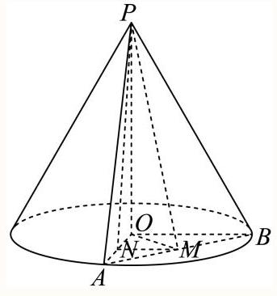

18 解答题

已知 $f\left( x\right)  = {x}^{2} + 2\left| {x - a}\right| , a$ 为常数.

(1)若 $y = f\left( x\right)$ 为偶函数，求 $a$ 的值；

(2)设 $a > 0, g\left( x\right)  = \frac{f\left( x\right) }{x}$ ，若函数 $y = g\left( x\right) , x \in  (0, a\rbrack$ 为减函数，求实数 $a$ 的取值范围.

## 解析

(1) $f\left( x\right)$ 的定义域是R，若 $f\left( x\right)$ 是偶函数，则 $f\left( {-x}\right)  = f\left( x\right)$ ，

即 ${\left( -x\right) }^{2} + 2\left| {-x - a}\right|  = {x}^{2} + 2\left| {x - a}\right|$ ,即 $\left| {x + a}\right|  = \left| {x - a}\right|$ ,

两边平方并化简得 ${2ax} = 0$ ,所以 $a = 0$ ,

此时 $f\left( x\right)  = {x}^{2} + 2\left| x\right|$ 是偶函数,符合题意.

所以 $a$ 的值为 0 .

( 2 ) $g\left( x\right)  = \frac{f\left( x\right) }{x} = \frac{{x}^{2} + 2\left| {x - a}\right| }{x} = x + 2\left| {1 - \frac{a}{x}}\right|$ ，

由于 $a > 0$ ,当 $0 < x \leq  a$ 时, $\frac{1}{x} \geq  \frac{1}{a},\frac{a}{x} \geq  1,1 - \frac{a}{x} \leq  0$ ,

所以 $g\left( x\right)  = x - 2\left( {1 - \frac{a}{x}}\right)  = x + \frac{2a}{x} - 2$ ,

${g}^{\prime }\left( x\right)  = 1 - \frac{2a}{{x}^{2}} = \frac{{x}^{2} - {2a}}{{x}^{2}} = \frac{\left( {x + \sqrt{2a}}\right) \left( {x - \sqrt{2a}}\right) }{{x}^{2}}$

若函数 $y = g\left( x\right) , x \in  (0, a\rbrack$ 为减函数,

则 $\left\{  \begin{array}{l} a \leq  \sqrt{2a} \\  a > 0 \end{array}\right.$ ,解得 $0 < a \leq  2$ .

19 解答题

我国某西部地区进行沙漠治理，该地区有土地1万平方千米，其中70%是沙漠，从今年起，该地区进行绿化改造，每年把原有沙漠的16%改造为绿洲，同时原有绿洲的4%被沙漠所侵蚀又变成沙漠. 设从今年起第 $n$ 年绿洲面积为 ${a}_{n}$ 万平方千米.

(1)求第 $n$ 年绿洲面积 ${a}_{n}$ 与上一年绿洲面积 ${a}_{n - 1}\left( {n \geq  2}\right)$ 的关系；

(2)至少经过几年，绿洲面积可超过60%？(lg 2 ≈ 0.3010)

## 解析

(1) 由题意得 ${a}_{n} = \left( {1 - 4\% }\right) {a}_{n - 1} + \left( {1 - {a}_{n - 1}}\right)  \times  {16}\%  = {0.96}{a}_{n - 1} + {0.16} - {0.16}{a}_{n - 1} \; = {0.8}{a}_{n - 1} + {0.16} = \frac{4}{5}{a}_{n - 1} + \frac{4}{25}$ , 所以 ${a}_{n} = \frac{4}{5}{a}_{n - 1} + \frac{4}{25}\left( {n \in  \mathrm{N}, n \geq  2}\right)$ .

(2)由(1)得 ${a}_{n} = \frac{4}{5}{a}_{n - 1} + \frac{4}{25}$ ，

$\therefore {a}_{n} - \frac{4}{5} = \frac{4}{5}\left( {{a}_{n - 1} - \frac{4}{5}}\right)$ .

又 ${a}_{1} = \frac{3}{10}$ ，所以 ${a}_{1} - \frac{4}{5} =  - \frac{1}{2}$ ，所以 $\left\{  {{a}_{n} - \frac{4}{5}}\right\}$ 是以 $- \frac{1}{2}$ 为首项， $\frac{4}{5}$ 为公比的等比数列，

$\therefore {a}_{n} - \frac{4}{5} =  - \frac{1}{2}{\left( \frac{4}{5}\right) }^{n - 1}$ ,

即 ${a}_{n} =  - \frac{1}{2}{\left( \frac{4}{5}\right) }^{n - 1} + \frac{4}{5}$ .

令 ${a}_{n} =  - \frac{1}{2}{\left( \frac{4}{5}\right) }^{n - 1} + \frac{4}{5} > \frac{3}{5}$ ，即 ${\left( \frac{4}{5}\right) }^{n - 1} < \frac{2}{5}$ ，

两边取常用对数得 $\left( {n - 1}\right) \lg \frac{4}{5} < \lg \frac{2}{5}$ ,

所以 $n - 1 > \frac{\lg \frac{2}{5}}{\lg \frac{4}{5}} = \frac{\lg 2 - \lg 5}{2\lg 2 - \lg 5} = \frac{\lg 2 - \left( {1 - \lg 2}\right) }{2\lg 2 - \left( {1 - \lg 2}\right) }$

$= \frac{2\lg 2 - 1}{3\lg 2 - 1} \approx  \frac{2 \times  {0.3010} - 1}{3 \times  {0.3010} - 1} = \frac{0.398}{0.097} \approx  {4.1},$

$\therefore n > {5.1}$ ,

$\therefore$ 至少经过6年，绿洲面积可超过60%.

20 解答题

已知抛物线 ${x}^{2} = {2py}\left( {p > 0}\right)$ 的焦点为 $F$ ，过圆 ${x}^{2} + {\left( y - 1\right) }^{2} = 1$ 的圆心的直线交抛物线与圆分别为 $A\text{ 、 }C\text{ 、 }D\text{ 、 }B$ (从左到右).

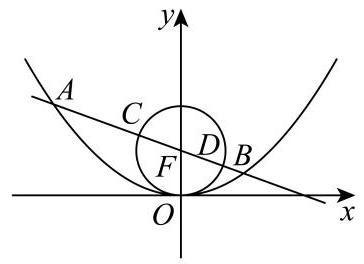

(1)若抛物线的焦点与圆心重合，求抛物线的方程；

(2)若抛物线和圆只有一个公共点，求 $p$ 的取值范围；

(3)在(1)的条件下， $\bigtriangleup  {AOC}, \bigtriangleup  {BOC}$ 的面积满足: ${S}_{\bigtriangleup {AOC}} = 4{S}_{\bigtriangleup {BOD}}$ ，求弦 ${AB}$ 的长.

解析

(1)由 ${x}^{2} + {\left( y - 1\right) }^{2} = 1$ 可知圆心坐标为 $\left( {0,1}\right)$ ,

因为抛物线的焦点与圆心重合,

所以 $\frac{1}{2}p = 1 \Rightarrow  p = 2$ ,

所以抛物线的方程 ${x}^{2} = {4y}$ .

(2) $\left\{  \begin{array}{l} {x}^{2} = {2py}\left( {p > 0}\right) \\  {x}^{2} + {\left( y - 1\right) }^{2} = 1 \end{array}\right.$ ，消去 $x$ 并整理方程可得 ${y}^{2} + \left( {{2p} - 2}\right) y = 0$ ，

解得 ${y}_{1} = 0,{y}_{2} = 2 - {2p}$ ,

抛物线和圆恒有一个公共点 $\left( {0,0}\right)$ ,且 $y \geq  0$ 恒成立,

所以令 ${2p} - 2 \leq  0$ ,解得 $p \geq  1$ .

(3) 设 $A\left( {{x}_{1},{y}_{1}}\right) , B\left( {{x}_{2},{y}_{2}}\right)$ ,直线 ${AB}$ 的方程为 $y = {kx} + 1$ ,原点 $O$ 到直线 ${AB}$ 的距离为 $d$ ,

由 $\left\{  \begin{array}{l} y = {kx} + 1 \\  {x}^{2} = {4y} \end{array}\right.$ 消去 $y$ 可得 ${x}^{2} - {4kx} - 4 = 0$ ,其中 $\Delta  = {16}{k}^{2} + {16} > 0$ ,

${x}_{1}{x}_{2} =  - 4,{y}_{1}{y}_{2} = \frac{{\left( {x}_{1}{x}_{2}\right) }^{2}}{16} = 1,$

所以 ${S}_{\bigtriangleup {AOC}} = \frac{1}{2}\left| {AC}\right|  \cdot  d,{S}_{\bigtriangleup {BOD}} = \frac{1}{2}\left| {BD}\right|  \cdot  d$ ,

则 $\frac{{S}_{\bigtriangleup {AOC}}}{{S}_{\bigtriangleup {BOD}}} = \frac{\left| AC\right| }{\left| BD\right| } = 4$ ，①

因为 $\left| {AC}\right|  \cdot  \left| {BD}\right|  = \left( {\left| {AF}\right|  - \left| {CF}\right| }\right)  \cdot  \left( {\left| {BF}\right|  - \left| {DF}\right| }\right)  = \left| {AF}\right|  \cdot  \left| {BF}\right|  - \left( {\left| {AF}\right|  + \left| {BF}\right| }\right)  + 1$

$= \left( {{y}_{1} + 1}\right) \left( {{y}_{2} + 1}\right)  - \left( {{y}_{1} + 1 + {y}_{2} + 1}\right)  + 1 = {y}_{1}{y}_{2} = 1$ ,②

由①②解得 $\left| {AC}\right|  = 2,\left| {BD}\right|  = \frac{1}{2}$ ，

所以 $\left| {AB}\right|  = \left| {AC}\right|  + \left| {BD}\right|  + \left| {CD}\right|  = 2 + \frac{1}{2} + 2 = \frac{9}{2}$ .

21 解答题

已知函数 $y = f\left( x\right)$ 的定义域为 $\left( {0, + \infty }\right)$ ，若存在常数 $T > 0$ ，使得对任意的 $x \in  \left( {0, + \infty }\right)$ ，都有 $f\left( {Tx}\right)  = f\left( x\right)  + T$ ,则称函数 $y = f\left( x\right)$ 具有性质 $P\left( T\right)$ .

(1)若函数 $y = f\left( x\right)$ 具有性质 $P\left( 3\right)$ ，求: $f\left( 3\right)  - f\left( 1\right)$ 的值；

(2)设 $f\left( x\right)  = {\log }_{\frac{1}{2}}x$ ，求证:存在常数 $T > 0$ ，使得 $y = f\left( x\right)$ 具有性质 $P\left( T\right)$ ；

(3)若函数 $y = f\left( x\right)$ 具有性质 $P\left( T\right)$ ，且 $y = f\left( x\right)$ 的图像是一条连续不断的曲线，求证:函数 $y = f\left( x\right)$ 的值域为R.

## 解析

(1)因为函数 $y = f\left( x\right)$ 具有性质 $P\left( 3\right)$ ，所以 $f\left( {3 \times  1}\right)  = f\left( 1\right)  + 3$ ，

所以 $f\left( 3\right)  - f\left( 1\right)  = f\left( 1\right)  + 3 - f\left( 1\right)  = 3$ .

(2) 证明: 设 $T > 0$ ,则 $f\left( {Tx}\right)  = {\log }_{\frac{1}{2}}\left( {Tx}\right)  = {\log }_{\frac{1}{2}}T + {\log }_{\frac{1}{2}}x$ ,

令 ${\log }_{\frac{1}{2}}T = T$ ,即 ${\log }_{\frac{1}{2}}T - T = 0$ ,

设 $g\left( x\right)  = {\log }_{\frac{1}{2}}x - x, x > 0$ ,

因为 $g\left( 1\right)  =  - 1 < 0, g\left( \frac{1}{2}\right)  = \frac{1}{2} > 0$ ,

所以在区间 $\left( {\frac{1}{2},1}\right)$ 上函数 $g\left( x\right)$ 存在零点 ${x}_{0}$ ,

当 $T = {x}_{0}$ 时,则 ${\log }_{\frac{1}{2}}T = T$ ,此时函数 $f\left( x\right)$ 具有性质 $P\left( T\right)$ .

(3)证明:设 $n \in  {\mathrm{N}}^{ * }$ ，因为 $f\left( {Tx}\right)  = f\left( x\right)  + T$ ，所以 $f\left( {{T}^{n}x}\right)  = f\left( x\right)  + {nT}$ ，

设 $g\left( x\right)  = f\left( x\right)  - m, m \in  \mathrm{R}$ ,

因为 $g\left( {Tx}\right)  = f\left( {Tx}\right)  - m = f\left( x\right)  - m + T = g\left( x\right)  + T$ ,

所以 $g\left( x\right)$ 具有性质 $P\left( T\right) , g\left( {{T}^{n} \cdot  x}\right)  = f\left( x\right)  + {nT} - m$ ,

令 $x = 1$ 得, $g\left( {T}^{n}\right)  = f\left( 1\right)  + {nT} - m$ ,

①若 $g\left( 1\right)  = f\left( 1\right)  - m = 0$ ，则函数 $g\left( x\right)$ 在 $\left( {0, + \infty }\right)$ 存在零点；

②若 $g\left( 1\right)  = f\left( 1\right)  - m < 0$ ，即 $f\left( 1\right)  < m$ 时，

当 ${n}_{0} > \frac{m - f\left( 1\right) }{T}$ 时, $g\left( {T}^{{n}_{0}}\right)  = f\left( 1\right)  + {n}_{0}T - m > f\left( 1\right)  + T\left( \frac{m - f\left( 1\right) }{T}\right)  - m = 0$ ,即 $g\left( {T}^{{n}_{0}}\right)  > 0$

所以 $g\left( x\right)$ 在区间 $\left( {0, + \infty }\right)$ 存在零点;

③ 若 $g\left( 1\right)  = f\left( 1\right)  - m > 0$ ，即 $f\left( 1\right)  > m$ ，

因为 $f\left( x\right)  = f\left( {{T}^{n}x}\right)  - {nT}$ ,

所以 $f\left( {T}^{-n}\right)  = f\left( 1\right)  - {nT}$ ,所以 $g\left( {T}^{-n}\right)  = f\left( 1\right)  - {nT} - m$ ,

当 ${n}_{0} > \frac{f\left( 1\right)  - m}{T}$ 时, $g\left( {T}^{{n}_{0}}\right)  = f\left( 1\right)  - {n}_{0}T - m < f\left( 1\right)  - T\left( \frac{f\left( 1\right)  - m}{T}\right)  - m = 0$ ,即 $g\left( {T}^{{n}_{0}}\right)  < 0,$

所以 $g\left( x\right)$ 在区间 $\left( {0, + \infty }\right)$ 存在零点;

综上所述, $\forall m \in  \mathrm{R}, g\left( x\right)  = f\left( x\right)  - m$ 都存在零点,即都有 $f\left( x\right)  = m \in  \mathrm{R}$ ,

故 $f\left( x\right)$ 的值域为R.

上海交通大学附属中学2024-2025学年高二上学期期末考试数学试卷姓名:___

## 一、填空题

1 填空题

已知数列 $\left\{  {a}_{n}\right\}$ 的前 $\mathrm{n}$ 项和 ${S}_{n} = {\log }_{2}n$ ，那么 ${a}_{3} + {a}_{4}$ 的值为___.

解析

根据 ${a}_{3} + {a}_{4} = {S}_{4} - {S}_{2}$ ,结合对数运算即可求解.

${a}_{3} + {a}_{4} = {S}_{4} - {S}_{2} = {\log }_{2}4 - {\log }_{2}2 = 1,$

故答案为:1.

2 填空题

椭圆 $\frac{{x}^{2}}{4} + \frac{{y}^{2}}{3} = 1$ 的焦距是___.

解析

分析: 由椭圆方程可求 $a, b$ ,然后由 $c = \sqrt{{a}^{2} - {b}^{2}}$ 可求 $c$ ,进而可求焦距

详解: $\because$ 椭圆 $\frac{{x}^{2}}{4} + \frac{{y}^{2}}{3} = 1,\therefore a = 2, b = \sqrt{3}$

$\therefore c = \sqrt{{a}^{2} - {b}^{2}} = 1\text{ ， }\therefore {2c} = 2$ .

即答案为2.

点睛:本题主要考查了椭圆的性质的简单应用，属基础题

3 填空题

若圆锥的底面半径与高均为2，则其侧面积为___.

解析

依题意可求得其母线长, 代入侧面积公式计算可得结果.

由题可知圆锥母线为 $l = \sqrt{{2}^{2} + {2}^{2}} = 2\sqrt{2}$ ,

所以其侧面积为 $S = {\pi rl} = 4\sqrt{2}\pi$ .

故答案为: $4\sqrt{2}\pi$

4 填空题

将一张坐标纸折叠一次,使点 $\left( {2,0}\right)$ 与点 $\left( {1,1}\right)$ 重合,此时点 $\left( {m, n}\right)$ 与原点 $\left( {0,0}\right)$ 重合,则 $m \cdot  n$ 的值是 ___.

解析

折痕为点 $\left( {2,0}\right)$ 与点 $\left( {1,1}\right)$ 的中垂线，得方程 $x - y - 1 = 0$ ，再根据点 $\left( {m, n}\right)$ 与原点 $\left( {0,0}\right)$ 对称可得答案.

如图: 可知折痕为点 $\left( {2,0}\right)$ 与点 $\left( {1,1}\right)$ 的中垂线,

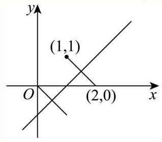

中点坐标为 $\left( {\frac{3}{2},\frac{1}{2}}\right)$ ,

设折痕直线的斜率为 $k$ ,则 $k \times  \frac{1 - 0}{1 - 2} =  - 1$ ,得 $k = 1$ ,

故折痕直线方程为 $y - \frac{1}{2} = x - \frac{3}{2}$ ,即 $x - y - 1 = 0$ ,

由题意点 $\left( {m, n}\right)$ 与原点 $\left( {0,0}\right)$ 关于折痕对称，

故 $\left\{  \begin{array}{l} \frac{m}{2} - \frac{n}{2} - 1 = 0 \\  \frac{m}{n} \times  1 =  - 1 \end{array}\right.$ 得 $\left\{  \begin{array}{l} m = 1 \\  n =  - 1 \end{array}\right.$ ，故 $m \cdot  n = 1 \cdot  \left( {-1}\right)  =  - 1$ .

故答案为: -1

5 填空题

已知直线 $l : x + {2y} - 1 = 0$ 的倾斜角为 $\theta$ ，则 $\theta$ 的余弦 $\cos \theta$ 的值为___.

解析

由倾斜角与斜率的关系 $k = \tan \theta$ ,利用同角三角函数的商数关系与平方关系即可求得结果.

$\tan \theta  =  - \frac{1}{2}$ ,所以 $\left\{  \begin{array}{l} \frac{\sin \theta }{\cos \theta } =  - \frac{1}{2} \\  {\sin }^{2}\theta  + {\cos }^{2}\theta  = 1 \end{array}\right.$ 又 $\theta  \in  \lbrack 0,\pi )$ ,所以 $\cos \theta  =  - \frac{2\sqrt{5}}{5}$ .

故答案为: $- \frac{2\sqrt{5}}{5}$ .

6 填空题

一种卫星接收天线(如下图左所示)曲面与轴截面的交线为抛物线，在轴截面内的卫星波束呈近似平行状态射入形为抛物线的接收天线，经反射聚焦到焦点处(如下图右所示).已知接收天线的口径(直径)为4米，深度为0.5米，则该抛物线的焦点到顶点的距离为___米.

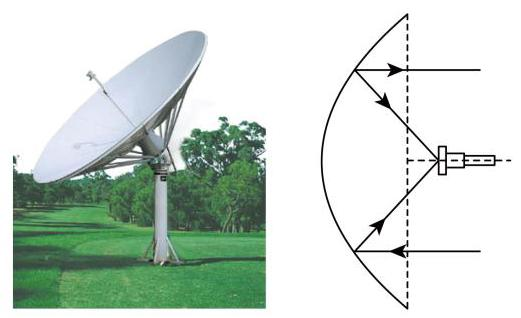

解析

由题意建系,设抛物线的方程为 ${y}^{2} = {2px}$ ,由抛物线经过的点 $\left( {\frac{1}{2},2}\right)$ 求出 $p$ 的值,则易得焦点到顶点的距离.

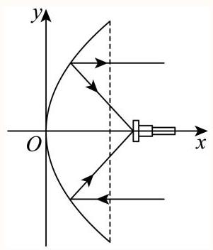

如图建系,设抛物线的方程为 ${y}^{2} = {2px}$ ,由题意抛物线过点 $\left( {\frac{1}{2},2}\right)$ ,

代入解得 $p = 4$ ，故抛物线的焦点到顶点的距离为 $\frac{p}{2} = 2$ 米.

故答案为:2.

7 填空题

向量 $\overrightarrow{a} = \left( {1, - 2,1}\right) ,\overrightarrow{b} = \left( {1,1, - 2}\right)$ 的夹角 $\langle \overrightarrow{a},\overrightarrow{b}\rangle  =$ ___.

解析

利用两个向量夹角的余弦公式即可求得结果.

$\cos \left\langle  {\overrightarrow{a},\overrightarrow{b}}\right\rangle   = \frac{\overrightarrow{a} \cdot  \overrightarrow{b}}{\left| \overrightarrow{a}\right|  \cdot  \left| \overrightarrow{b}\right| } = \frac{1 \cdot  1 + \left( {-2}\right)  \cdot  1 + 1 \cdot  \left( {-2}\right) }{\sqrt{1 + 4 + 1} \cdot  \sqrt{1 + 1 + 4}} =  - \frac{1}{2}$ ,又因为夹角范围为: $\left\lbrack  {0,\pi }\right\rbrack$ ,故 $\left\langle  {\overrightarrow{a},\overrightarrow{b}}\right\rangle   = \frac{2\pi }{3}.$ 故答案为: $\frac{2\pi }{3}$ .

8 填空题

已知 $f\left( x\right)  = a{x}^{2} + {2x} - a\left( {a > 0}\right)$ ，函数 $y = f\left( x\right)$ ， $x \in  \mathbf{R}$ 有最小值 $m\left( a\right)$ ，则 $m\left( a\right)$ 的最大值为___

解析

由 $f\left( x\right)  = a{x}^{2} + {2x} - a\left( {a > 0}\right)$ 有 $f\left( x\right)  = a{\left( x + \frac{1}{a}\right) }^{2} - \frac{1}{a} - a$ ,即可得 $m\left( a\right)  =  - \frac{1}{a} - a$ ,根据基本不等式即可求解.

由题意可得, $f\left( x\right)  = a{\left( x + \frac{1}{a}\right) }^{2} - \frac{1}{a} - a$ ,

故 $m\left( a\right)  =  - \frac{1}{a} - a, a > 0, m\left( a\right)  =  - \left( {a + \frac{1}{a}}\right)  \leq   - 2$ ,

当且仅当 $a = \frac{1}{a}$ ,即 $a = 1$ 时,等号成立,所以 $m\left( a\right)$ 的最大值为 -2 .

故答案为: -2 .

9 填空题

如图, 在平行六面体 ${ABCD} - {A}_{1}{B}_{1}{C}_{1}{D}_{1}$ 中, $\angle {A}_{1}{AB} = \angle {A}_{1}{AD} = \angle {BAD} = {60}^{ \circ  }$ , ${AB} = {AD} = {A{A}_{1}} = 2$ ，若 $M$ 为 ${A}_{1}{D}_{1}$ 中点，则 $\left| {BM}\right|  =$ ___.

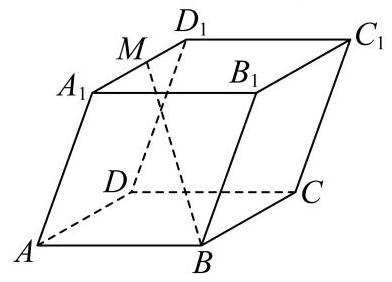

解析

将 $\overrightarrow{BM}$ 用基底 $\left\{  {\overrightarrow{AB},\overrightarrow{AD},\overrightarrow{A{A}_{1}}}\right\}$ ，结合空间向量的数量积可求得 $\left| {BM}\right|$ 的值.

在平行六面体 ${ABCD} - {A}_{1}{B}_{1}{C}_{1}{D}_{1}$ 中, $\angle {A}_{1}{AB} = \angle {A}_{1}{AD} = \angle {BAD} = {60}^{ \circ  }$ ,

${AB} = {AD} = A{A}_{1} = 2,$

由空间向量数量积的定义可得 $\overrightarrow{AB} \cdot  \overrightarrow{AD} = \left| \overrightarrow{AB}\right|  \cdot  \left| \overrightarrow{AD}\right| \cos {60}^{ \circ  } = {2}^{2} \times  \frac{1}{2} = 2$ ,

同理可得 $\overrightarrow{AB} \cdot  \overrightarrow{A{A}_{1}} = \overrightarrow{AD} \cdot  \overrightarrow{A{A}_{1}} = 2$ ,且 $M$ 为 ${A}_{1}{D}_{1}$ 中点,

则 $\overrightarrow{BM} = \overrightarrow{B{B}_{1}} + \overrightarrow{{B}_{1}{A}_{1}} + \overrightarrow{{A}_{1}M} =  - \overrightarrow{AB} + \overrightarrow{A{A}_{1}} + \frac{1}{2}\overrightarrow{{A}_{1}{D}_{1}} =  - \overrightarrow{AB} + \frac{1}{2}\overrightarrow{AD} + \overrightarrow{A{A}_{1}}$ ,

所以

${\left| \begin{array}{l} \overrightarrow{BM} \\  \overrightarrow{A{A}_{1}} \end{array}\right| }^{2} = {\left( -\overrightarrow{AB} + \frac{1}{2}\overrightarrow{AD} + \overrightarrow{A{A}_{1}}\right) }^{2} = {\overrightarrow{AB}}^{2} + \frac{1}{4}{\overrightarrow{AD}}^{2} + {\overrightarrow{A{A}_{1}}}^{2} - \overrightarrow{AB} \cdot  \overrightarrow{AD} - 2\overrightarrow{AB} \cdot  \overrightarrow{A{A}_{1}} + \overrightarrow{AD}$

$= 4 + 1 + 4 - 2 - 4 + 2 = 5$ ,

因此, $\left| {BM}\right|  = \sqrt{5}$ .

故答案为: $\sqrt{5}$ .

10 填空题

平行直线 ${l}_{1} : {ax} + {2y} + {3a} = 0$ 与 ${l}_{2} : {3x} + {4y} + 5 = 0$ 间的距离为___.

解析

利用平行线之间的距离即可得到结果.

易知 $a = \frac{3}{2}$ ,即有 ${l}_{1} : {3x} + {4y} + 9 = 0$ ,

${l}_{1}$ 与 ${l}_{2}$ 间的距离 $d = \frac{9 - 5}{\sqrt{{3}^{2} + {4}^{2}}} = \frac{4}{5}$ .

故答案为: $\frac{4}{5}$

11 填空题

已知 $\mathrm{F}$ 是双曲线 $C : \frac{{x}^{2}}{4} - {y}^{2} = 1$ 的右焦点,动点 $\mathrm{P}$ 在双曲线的左支上,点 $\mathrm{Q}$ 为圆 $G : {x}^{2} + {\left( y + 2\right) }^{2} = 1$ 上一动点,则 $\left| {PQ}\right|  + \left| {PF}\right|$ 的最小值为___.

## 解析

设 ${F}_{1}$ 是左焦点,由双曲线定义转化 $\left| {PF}\right|  = \left| {P{F}_{1}}\right|  + {2a}$ ,取最小值时 $\left| {PQ}\right|  = \left| {PG}\right|  - r$ , $\left| {P{F}_{1}}\right|  + \left| {PG}\right|$ 的最小值是 $P$ 在线段 ${F}_{1}G$ 上即得.

双曲线 $C : \frac{{x}^{2}}{4} - {y}^{2} = 1, a = 2, b = 1, c = \sqrt{5},{F}_{1}\left( {-\sqrt{5},0}\right) ,{F}_{2}\left( {\sqrt{5},0}\right) , F$ 即为 ${F}_{2}$ ,

圆 $G : {x}^{2} + {\left( y + 2\right) }^{2} = 1$ 的圆心为 $G\left( {0, - 2}\right)$ ,半径 $r = 1$ ,

P在双曲线的左支上， $\left| {PF}\right|  - \left| {P{F}_{1}}\right|  = {2a} = 4$ ， $\left| {PF}\right|  = 4 + \left| {P{F}_{1}}\right|$ ，

所以 $\left| {PQ}\right|  + \left| {PF}\right|  = \left| {PQ}\right|  + \left| {P{F}_{1}}\right|  + 4$ ,

根据圆的几何性质可知,

$\left| {PQ}\right|  + \left| {P{F}_{1}}\right|$ 的最小值是 $\left| {G{F}_{1}}\right|  - r = \sqrt{5 + 4} - 1 = 2$ ,

所以 $\left| {PQ}\right|  + \left| {PF}\right|$ 的最小值是 $2 + 4 = 6$ .

故答案为:6

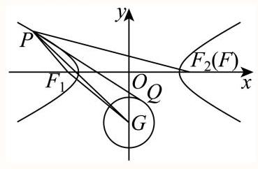

12 填空题

已知实系数一元二次方程 ${x}^{2} + {px} + q = 0$ 的两个根 ${x}_{1}\text{ 、 }{x}_{2}$ 满足 $\left| {{x}_{1} - 3 - \mathrm{i}}\right|  \leq  2,\left| {{x}_{2} - 3 - \mathrm{i}}\right|  \leq  2$ ,其中i是虚数单位，则 ${p}^{2} - {4q}$ 的取值范围是___.

解析

根据虚根特点及模的几何意义, 分两种情况分别求出参数范围即可.

若方程有两个虚数根,设 ${x}_{1} = a + b\mathrm{i}\left( {a\text{ 、 }b \in  \mathrm{R}}\right)$ ,

所以 ${x}_{2} = a - b\mathrm{i},{x}_{1} + {x}_{2} =  - p = {2a},{x}_{1}{x}_{2} = q = {a}^{2} + {b}^{2}$ ,两个根 ${x}_{1}\text{ 、 }{x}_{2}$ 满足 $\left| {{x}_{1} - 3 - \mathrm{i}}\right|  \leq  2$ , $\left| {{x}_{2} - 3 - \mathrm{i}}\right|  \leq  2$ ,

${x}_{1},{x}_{2}$ 表示在以 $\left( {3,1}\right)$ 为圆心2为半径的圆上，所以 ${\left( a - 3\right) }^{2} + {\left( b - 1\right) }^{2} = 4$ ，所以 $- 1 \leq  b \leq  3$ ，

所以 ${p}^{2} - {4q} = 4{a}^{2} - 4\left( {{a}^{2} + {b}^{2}}\right)  =  - 4{b}^{2} \in  \lbrack  - 4,0)$ .

若方程有两个实数根,同理有 ${p}^{2} - {4q} = {\left( {x}_{1} + {x}_{2}\right) }^{2} - 4{x}_{1}{x}_{2} = {\left( {x}_{1} - {x}_{2}\right) }^{2} \in  \left\lbrack  {0,{12}}\right\rbrack$ ,

综上, ${p}^{2} - {4q}$ 的取值范围是 $\left\lbrack  {-4,{12}}\right\rbrack$ .

故答案为: $\left\lbrack  {-4,{12}}\right\rbrack$ .

## 二、选择题

13 单选题

已知 $a\text{ 、 }b \in  \mathbf{R}$ ,则 “ ${ab} \geq  0$ ” 是 “ $\left| {a + b}\right|  = \left| a\right|  + \left| b\right|$ ”的( )

A. 充分非必要条件

B. 必要非充分条件

C. 充分必要条件

D. 既非充分又非必要条件

## 解析

根据充分条件和必要条件来判断.

当 ${ab} \geq  0$ 时，即 $\left| {a + b}\right|  = \left| a\right|  + \left| b\right|$ ，所以充分性成立；当 $\left| {a + b}\right|  = \left| a\right|  + \left| b\right|$ 时，即可得到 ${ab} \geq  0$ , 所以必要性成立.

故选: C

14 单选题

直线 $x - \sqrt{3}y = 0$ 绕原点按顺时针方向旋转 ${30}^{ \circ  }$ 后所得的直线 $l$ 与圆 ${\left( x - 2\right) }^{2} + {y}^{2} = 3$ 的位置关系是 ( )

A. 直线 $l$ 过圆心

B. 直线 $l$ 与圆相交,但不过圆心

C. 直线 $l$ 与圆相切

D. 直线 $l$ 与圆无公共点

解析

根据给定条件，求出直线 $l$ 的方程，再根据圆心与直线 $l$ 的关系判断作答.

直线 $x - \sqrt{3}y = 0$ 过原点，斜率为 $\frac{\sqrt{3}}{3}$ ，倾斜角为 ${30}^{ \circ  }$ ，

依题意，直线 $l$ 的倾斜角为 ${0}^{ \circ  }$ ，斜率为 0，而 $l$ 过原点，因此直线 $l$ 的方程为: $y = 0$ ，

而圆 ${\left( x - 2\right) }^{2} + {y}^{2} = 3$ 的圆心为 $\left( {2,0}\right)$ ，半径为 $\sqrt{3}$ ，于是得圆心 $\left( {2,0}\right)$ 在直线 $l$ 上，

所以直线l与圆相交, 过圆心.

故选: A

15 单选题

设 $a > 1$ ,则双曲线 $\frac{{x}^{2}}{{a}^{2}} - \frac{{y}^{2}}{{\left( a + 1\right) }^{2}} = 1$ 的离心率 $e$ 的取值范围是( )

A. $\left( {\sqrt{2},2}\right)$

B. $\left( {\sqrt{2},\sqrt{5}}\right)$

C. $\left( {2,5}\right)$

D. $\left( {2,\sqrt{5}}\right)$

解析

由题意得,双曲线的离心率 ${e}^{2} = {\left( \frac{c}{a}\right) }^{2} = \frac{{a}^{2} + {\left( a + 1\right) }^{2}}{{a}^{2}} = 1 + {\left( 1 + \frac{1}{a}\right) }^{2}$ ,

因为 $\frac{1}{a}$ 是减函数,所以当 $a > 1$ 时, $0 < \frac{1}{a} < 1$ ,所以 $2 < {e}^{2} < 5$ ,所以 $\sqrt{2} < e < \sqrt{5}$ ,故选B. 考点: 双曲线的几何性质.

本题主要考查了双曲线的几何性质及其应用, 其中解答中涉及到双曲线的标准方程及简单的几何性质的应用, 函数的单调性及函数的最值等知识点的综合考查, 着重考查了学生分析问题和解答问题的能力，以及推理与运算、转化与化归思想的应用，本题的解得中把双曲线的离心率转化为 $\frac{1}{a}$ 的函数,利用函数的单调性是解答的关键,试题有一定的难度,属于中档题.

16 单选题

已知 $f\overline{\left( x\right) } = \sqrt{3}\sin {\omega x} + \cos {\omega x}$ ,把函数 $y = f\left( x\right)$ 的图像向左平移 $\frac{\pi }{6}$ 个单位长度,得到的函数图像恰好关于y轴对称. 定义: $\mathop{\sum }\limits_{{\left| x\right|  < a}}x$ 为符合 $\left| x\right|  < a$ 的所有 $\mathrm{x}$ 的和，则 $\mathop{\sum }\limits_{{\left| \omega \right|  < {100}}}\omega$ 的值为( )

A. -34

B. -32

C. 62

D. 66

## 解析

利用三角恒等变换结合图象变换可得 $y = 2\sin \left( {{\omega x} + \frac{\pi }{6}\omega  + \frac{\pi }{6}}\right)$ ,根据偶函数可得 $\omega  = {6k} - 4$ , $k \in  \mathbf{Z}$ ,进而分析求解即可.

因为 $f\left( x\right)  = \sqrt{3}\sin {\omega x} + \cos {\omega x} = 2\sin \left( {{\omega x} + \frac{\pi }{6}}\right)$ ,

把函数 $y = f\left( x\right)$ 的图像向左平移 $\frac{\pi }{6}$ 个单位长度,

得到 $y = f\left( {x + \frac{\pi }{6}}\right)  = 2\sin \left\lbrack  {\omega \left( {x + \frac{\pi }{6}}\right)  + \frac{\pi }{6}}\right\rbrack   = 2\sin \left( {{\omega x} + \frac{\pi }{6}\omega  + \frac{\pi }{6}}\right)$ ,

因为 $y = 2\sin \left( {{\omega x} + \frac{\pi }{6}\omega  + \frac{\pi }{6}}\right)$ 关于 $y$ 轴对称,即 $y = 2\sin \left( {{\omega x} + \frac{\pi }{6}\omega  + \frac{\pi }{6}}\right)$ 为偶函数,

则 $\frac{\pi }{6}\omega  + \frac{\pi }{6} = \frac{\left( {{2k} - 1}\right) \pi }{2}, k \in  \mathbf{Z}$ ,解得 $\omega  = {6k} - 4, k \in  \mathbf{Z}$ .

令 $\left| {{6k} - 4}\right|  < {100}$ ,得 $- {16} < k \leq  {17}$ .

所以 $\mathop{\sum }\limits_{{\left| \omega \right|  < {100}}}\omega  = \frac{6 \cdot  \left( {-{15}}\right)  - 4 + 6 \cdot  {17} - 4}{2} \cdot  {33} = 2 \cdot  {33} = {66}$ .

故选: D.

## 三、解答题

17 解答题

设 $f\left( x\right)  = \sin {\omega x}\left( {\omega  > 0}\right)$ .

(1)当函数 $y = f\left( x\right)$ 的最小正周期为 ${2\pi }$ 时，求 $y = f\left( x\right)  + \cos x$ 在 $\left\lbrack  {0,\frac{\pi }{2}}\right\rbrack$ 上的最大值；

(2)若 $\omega  = 2$ ，且在 $\bigtriangleup {ABC}$ 中，角 $A$ 、 $B$ 、 $C$ 所对的边长为 $a$ 、 $b$ 、 $c$ ，锐角 $A$ 满足 $f\left( {A + \frac{\pi }{6}}\right)  = 0$ ， $\overrightarrow{AB} \cdot  \overrightarrow{AC} = 4$ ，求 $a$ 的最小值.

## 解析

(1)因为 $f\left( x\right)  = \sin {\omega x}\left( {\omega  > 0}\right)$ 且函数 $y = f\left( x\right)$ 的最小正周期为 ${2\pi }$ ，

所以 $T = \frac{2\pi }{\omega } = {2\pi }$ ,解得 $\omega  = 1$ ,所以 $f\left( x\right)  = \sin x$ ,

则 $y = f\left( x\right)  + \cos x = \sin x + \cos x = \sqrt{2}\sin \left( {x + \frac{\pi }{4}}\right)$ ,

由 $x \in  \left\lbrack  {0,\frac{\pi }{2}}\right\rbrack$ ,则 $x + \frac{\pi }{4} \in  \left\lbrack  {\frac{\pi }{4},\frac{3\pi }{4}}\right\rbrack$ ,

所以当 $x + \frac{\pi }{4} = \frac{\pi }{2}$ ，即 $x = \frac{\pi }{4}$ 时 $y = f\left( x\right)  + \cos x$ 取得最大值 $\sqrt{2}$ .

(2) 当 $\omega  = 2$ 时, $f\left( x\right)  = \sin {2x}$ ,则 $f\left( {A + \frac{\pi }{6}}\right)  = \sin \left( {{2A} + \frac{\pi }{3}}\right)  = 0$ ,

因为 $0 < A < \frac{\pi }{2}$ ,所以 $\frac{\pi }{3} < {2A} + \frac{\pi }{3} < \frac{4\pi }{3}$ ,则 ${2A} + \frac{\pi }{3} = \pi$ ,解得 $A = \frac{\pi }{3}$ ;

因为 $\overrightarrow{AB} \cdot  \overrightarrow{AC} = {bc}\cos A = \frac{1}{2}{bc} = 4$ ,所以 ${bc} = 8$ ,

由余弦定理 ${a}^{2} = {b}^{2} + {c}^{2} - {2bc}\cos A$ ,

所以 ${a}^{2} = {b}^{2} + {c}^{2} - 8 \geq  {2bc} - 8 = 8$ ,所以 $a \geq  2\sqrt{2}$ ,当且仅当 $b = c = 2\sqrt{2}$ 时取等号,

故 $a$ 的最小值为 $2\sqrt{2}$ .

18 解答题

如图,在直棱柱 ${ABC} - {A}_{1}{B}_{1}{C}_{1}$ 中, $\left| {A{A}_{1}}\right|  = \left| {AB}\right|  = \left| {AC}\right|  = 2,{AB} \bot  {AC}$ ,点 $D\text{ 、 }E\text{ 、 }F$ 分别是 ${A}_{1}{B}_{1}\text{ 、 }C{C}_{1}\text{ 、 }{BC}$ 的中点.

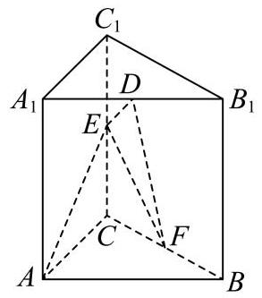

(1)求 ${AE}$ 与平面 ${DEF}$ 所成角的大小；

(2)求 $A$ 到平面 ${DEF}$ 的距离.

解析

(1)以 $A$ 为坐标原点、 $\overrightarrow{AB}$ 为 $x$ 轴、 $\overrightarrow{CA}$ 为 $y$ 轴、 $\overrightarrow{A{A}_{1}}$ 为 $z$ 轴建立如图的空间直角坐标系.

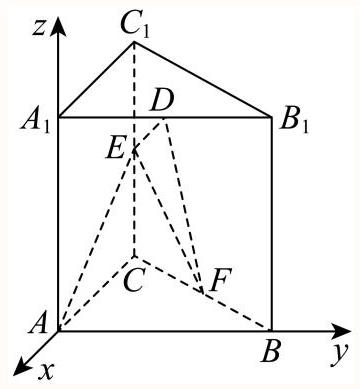

由题意可知 $A\left( {0,0,0}\right) , D\left( {0,1,2}\right) , E\left( {-2,0,1}\right) , F\left( {-1,1,0}\right)$ .

故 $\overrightarrow{AE} = \left( {-2,0,1}\right)$

设 $\overrightarrow{n} = \left( {x, y, z}\right)$ 是平面 ${DEF}$ 的一个法向量,

又 $\overrightarrow{DF} = \left( {-1,0, - 2}\right) ,\overrightarrow{EF} = \left( {1,1, - 1}\right)$ ,

故由 $\left\{  \begin{array}{l} \overrightarrow{DF} \cdot  \overrightarrow{n} =  - x - {2z} = 0 \\  \overrightarrow{EF} \cdot  \overrightarrow{n} = x + y - z = 0 \end{array}\right.$ ,令 $z = 1$ ,解得 $\left\{  \begin{array}{l} x =  - 2 \\  y = 3 \end{array}\right.$ ,故 $\overrightarrow{n} = \left( {-2,3,1}\right)$ .

设 ${AE}$ 与平面 ${DEF}$ 所成角为 $\theta$ ,则 $\sin \theta  = \left| \frac{\overrightarrow{n} \cdot  \overrightarrow{AE}}{\left| \overrightarrow{n}\right|  \cdot  \left| \overrightarrow{AE}\right| }\right|  = \frac{5}{\sqrt{14} \cdot  \sqrt{5}} = \frac{\sqrt{70}}{14}$ ,

所以 ${AE}$ 与平面 ${DEF}$ 所成角为 $\arcsin \frac{\sqrt{70}}{14}$ .

2) 由(1)知平面 ${DEF}$ 的法向量为 $\overrightarrow{n} = \left( {-2,3,1}\right) ,\overrightarrow{AE} = \left( {-2,0,1}\right)$ .

设 $A$ 到平面 ${DEF}$ 的距离为 $d$ ，

故 $d = \frac{\left| \overrightarrow{AE} \cdot  \overrightarrow{n}\right| }{\left| \overrightarrow{n}\right| } = \frac{\left| -2 \times  \left( -2\right)  + 0 \times  3 + 1 \times  1\right| }{\sqrt{14}} = \frac{5}{14}\sqrt{14}$

所以 $A$ 到平面 ${DEF}$ 的距离为 $\frac{5}{14}\sqrt{14}$ .

19 解答题

如图, 半球内有一内接正四棱柱 (即正四棱柱的一个面在半球的底面圆上, 其余顶点在半球面上).

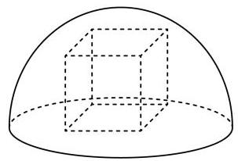

(1)若正四棱柱的各棱长均为 $\sqrt{6}$ (即为正方体)，求半球的表面积和体积；

(2)若半球的底面圆的半径为10，求正四棱柱表面积的最大值.

## 解析

(1)依题意，半球内接正方体下底面正方形中心为半球底面圆圆心， 而正方体下底面正方形外接圆半径为 $\frac{\sqrt{2}}{2} \cdot  \sqrt{6} = \sqrt{3}$ , 因此半球的半径 $R = \sqrt{{\left( \sqrt{3}\right) }^{2} + {\left( \sqrt{6}\right) }^{2}} = 3$ , 所以半球表面积 $S = \pi {R}^{2} + {2\pi }{R}^{2} = {3\pi } \cdot  {3}^{2} = {27\pi }$ ,体积 $V = \frac{1}{2} \cdot  \frac{4}{3}\pi {R}^{3} = {18\pi }$ .

(2)设半球内接正四棱柱的底边长为2a，高为b， 依题意， ${\left( \sqrt{2}a\right) }^{2} + {b}^{2} = {10}^{2}$ ，即 $2{a}^{2} + {b}^{2} = {100}$ ，令 $\left\{  {\begin{array}{l} a = 5\sqrt{2}\cos \theta \\  b = {10}\sin \theta  \end{array}\text{ ， }0 < \theta  < \frac{\pi }{2}}\right.$ ， 该正四棱柱的表面积 ${S}^{\prime } = 2 \cdot  {\left( 2a\right) }^{2} + 4 \cdot  {2ab} = 8{a}^{2} + {8ab} \; = 8 \cdot  {\left( 5\sqrt{2}\cos \theta \right) }^{2} + 8 \cdot  5\sqrt{2}\cos \theta  \cdot  {10}\sin \theta \; = {400} \cdot  \frac{1 + \cos {2\theta }}{2} + {400}\sqrt{2} \cdot  \frac{\sin {2\theta }}{2} = {200} \cdot  \left( {\sqrt{2}\sin {2\theta } + \cos {2\theta } + 1}\right) \; = {200}\left\lbrack  {\sqrt{3}\sin \left( {{2\theta } + \varphi }\right)  + 1}\right\rbrack$ ,其中锐角 $\varphi$ 由 $\sin \varphi  = \frac{1}{\sqrt{3}},\cos \varphi  = \frac{\sqrt{2}}{\sqrt{3}}$ 确定, 则当 ${2\theta } + \varphi  = \frac{\pi }{2}$ ，即 $\theta  = \frac{\pi }{4} - \frac{1}{2}\arccos \frac{\sqrt{6}}{3}$ 时， ${S}_{\max }^{\prime } = {200}\left( {\sqrt{3} + 1}\right)$ ， 所以正四棱柱表面积的最大值 ${200}\left( {\sqrt{3} + 1}\right)$ .

20 解答题

已知椭圆 $\Gamma  : \frac{{x}^{2}}{{a}^{2}} + \frac{{y}^{2}}{{b}^{2}} = 1\left( {a > b > 0}\right)$ 的离心率 $e = \frac{1}{2}$ ，左顶点为 $\mathrm{A}$ ，下顶点为 $\mathrm{B}$ ， $\mathrm{C}$ 是线段 ${OB}$ 的中点,其中 ${S}_{\bigtriangleup {ABC}} = \frac{3\sqrt{3}}{2}$ .

(1)求椭圆 $\Gamma$ 方程；

(2)记椭圆 $\Gamma$ 的左右焦点分别为 ${F}_{1}$ 、 ${F}_{2}$ ， $\mathrm{M}$ 为椭圆 $\Gamma$ 上的点，若 $\bigtriangleup M{F}_{1}{F}_{2}$ 的面积为 ${S}_{1}$ ， $\bigtriangleup {MOB}$ 的面积为 ${S}_{2}$ ,若 ${S}_{1} \leq  {S}_{2}$ ,求 $\left| {OM}\right|$ 的取值范围;

(3)过点 $\left( {0, - \frac{3}{2}}\right)$ 的动直线与椭圆Γ有两个交点P、Q，在y轴上是否存在点T使得 $\overrightarrow{TP} \cdot  \overrightarrow{TQ} \leq  0$ 恒成立.若存在, 求出这个T点纵坐标的取值范围; 若不存在, 请说明理由.

## 解析

(1)因为椭圆的离心率为 $e = \frac{1}{2}$ ，

所以 $\frac{c}{a} = \frac{1}{2}$ ,即 $a = {2c}$ ,其中 $\mathrm{c}$ 为半焦距, ${a}^{2} = {b}^{2} + {c}^{2}$ ,则 $b = \sqrt{3}c$ ,

所以 $A\left( {-{2c},0}\right) , B\left( {0, - \sqrt{3}c}\right) , C\left( {0, - \frac{\sqrt{3}c}{2}}\right)$ ,

${S}_{\bigtriangleup {ABC}} = \frac{1}{2} \times  {2c} \times  \frac{\sqrt{3}}{2}c = \frac{3\sqrt{3}}{2}$ ,解得 $c = \sqrt{3}$ ,

故 $a = 2\sqrt{3}, b = 3$ ,故椭圆方程为 $\frac{{x}^{2}}{12} + \frac{{y}^{2}}{9} = 1$ .

(2)设 $M\left( {x, y}\right)$ ，由 ${S}_{1} \leq  {S}_{2}$ ，有 $\frac{1}{2} \cdot  2\sqrt{3} \cdot  \left| y\right|  \leq  \frac{1}{2} \cdot  3 \cdot  \left| x\right|$ ，

故而 $\left| y\right|  \leq  \frac{\sqrt{3}}{2} \cdot  \left| x\right|$ ,所以 ${x}^{2} \geq  6$ ,

所以 ${\left| OM\right| }^{2} = {x}^{2} + {y}^{2} = {x}^{2} + 9 - \frac{3}{4}{x}^{2} = 9 + \frac{1}{4}{x}^{2} \geq  9 + \frac{1}{4} \cdot  6 = \frac{21}{2}$ .

又 ${\left| OM\right| }^{2} < {a}^{2} = {12}$ ，所以 $\left| {OM}\right|$ 的取值范围是 $\left\lbrack  {\frac{\sqrt{42}}{2},2\sqrt{3}}\right)$ .

(3)① 若过点 $\left( {0, - \frac{3}{2}}\right)$ 的动直线的斜率不存在，

则 $P\left( {0,3}\right) , Q\left( {0, - 3}\right)$ 或 $P\left( {0, - 3}\right) , Q\left( {0,3}\right)$ ，此时 $- 3 \leq  t \leq  3$ .

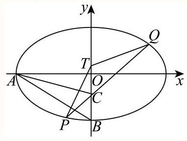

②若过点 $\left( {0, - \frac{3}{2}}\right)$ 的动直线的斜率存在，则可设该直线方程为: $y = {kx} - \frac{3}{2}$ ，

设 $P\left( {{x}_{1},{y}_{1}}\right) , Q\left( {{x}_{2},{y}_{2}}\right) , T\left( {0, t}\right) ,\left\{  \begin{array}{l} y = {kx} - \frac{3}{2} \\  3{x}^{2} + 4{y}^{2} = {36} \end{array}\right.$ ,

化简整理可得 $\left( {3 + 4{k}^{2}}\right) {x}^{2} - {12kx} - {27} = 0$ ,

故 $\Delta  = {144}{k}^{2} + {108}\left( {3 + 4{k}^{2}}\right)  = {324} + {576}{k}^{2} > 0$ ,

${x}_{1} + {x}_{2} = \frac{12k}{3 + 4{k}^{2}},\;{x}_{1}{x}_{2} =  - \frac{27}{3 + 4{k}^{2}}.$

$\overrightarrow{TP} = \left( {{x}_{1},{y}_{1} - t}\right) ,\overrightarrow{TQ} = \left( {{x}_{2},{y}_{2} - t}\right) ,$

故 $\overrightarrow{TP} \cdot  \overrightarrow{TQ} = {x}_{1}{x}_{2} + \left( {{y}_{1} - t}\right) \left( {{y}_{2} - t}\right)  = {x}_{1}{x}_{2} + \left( {k{x}_{1} - \frac{3}{2} - t}\right) \left( {k{x}_{2} - \frac{3}{2} - t}\right)$

$= \left( {1 + {k}^{2}}\right) {x}_{1}{x}_{2} - k\left( {\frac{3}{2} + t}\right) \left( {{x}_{1} + {x}_{2}}\right)  + {\left( \frac{3}{2} + t\right) }^{2}$

$= \left( {1 + {k}^{2}}\right)  \times  \left( {-\frac{27}{3 + 4{k}^{2}}}\right)  - k\left( {\frac{3}{2} + t}\right)  \times  \frac{12k}{3 + 4{k}^{2}} + {\left( \frac{3}{2} + t\right) }^{2}$

$= \frac{-{27}{k}^{2} - {27} - {18}{k}^{2} - {12}{k}^{2}t + 3{\left( \frac{3}{2} + t\right) }^{2} + {\left( 3 + 2t\right) }^{2}{k}^{2}}{3 + 4{k}^{2}}$

$= \frac{\left\lbrack  {{\left( 3 + 2t\right) }^{2} - {12t} - {45}}\right\rbrack  {k}^{2} + 3{\left( \frac{3}{2} + t\right) }^{2} - {27}}{3 + 4{k}^{2}}.$

$\overrightarrow{TP} \cdot  \overrightarrow{TQ} \leq  0$ 恒成立,故 $\left\{  \begin{array}{l} 3{\left( \frac{3}{2} + t\right) }^{2} - {27} \leq  0 \\  {\left( 3 + 2t\right) }^{2} - {12t} - {45} \leq  0 \end{array}\right.$ ,解得 $- 3 \leq  t \leq  \frac{3}{2}$ ,

若 $\overrightarrow{TP} \cdot  \overrightarrow{TQ} \leq  0$ 恒成立. 结合①②可知， $- 3 \leq  t \leq  \frac{3}{2}$ .

故T点纵坐标的取值范围为 $\left( {-3,\frac{3}{2}}\right)$ .

21 解答题

已知函数 $y = f\left( x\right)$ 的定义域为R. 定义: 若存在实数 $\mathrm{a}\text{ 、 }\mathrm{\;b}\left( {b \neq  0}\right)$ 使得 $\frac{f\left( x\right)  - f\left( a\right) }{x - a} \geq  0$ 对任意 $x \in  \left( {a - \left| b\right| , a}\right)  \cup  \left( {a, a + \left| b\right| }\right)$ 恒成立,则称函数 $y = f\left( x\right)$ 具有性质 $P\left( {a, b}\right)$ .

(1)幂函数 $y = {x}^{2}$ 是否具有性质 $P\left( {1,2}\right)$ ，说明理由；

(2)设 $f\left( x\right)  = \sin x$ ，若函数 $y = f\left( x\right)$ 具有性质 $P\left( {a,\frac{\pi }{3}}\right)$ ，求实数 $\mathrm{a}$ 的取值范围；

(3)设 $f\left( x\right)  = \left\{  \begin{array}{l} {4x} - {x}^{2}, x \geq  0 \\  {4x} + {x}^{2}, x < 0 \end{array}\right.$ ，集合 $M = \{ \left( {m, n}\right)  \mid$ 函数 $y = f\left( x\right)$ 具有性质 $P\left( {m, n}\right) \}$ ，求集合M在坐标平面上的对应的区域的面积.

(4) 设 $f\left( x\right)  = x - {x}^{3}$ ，集合 $M = \{ \left( {m, n}\right)  \mid$ 函数 $y = f\left( x\right)$ 具有性质 $P\left( {m, n}\right) \} .Q$ 为集合M在坐标平面上对应的区域边界上的点,且Q不在x轴上,求 $\left| {OQ}\right|$ 的最小值.

## 解析

(1) 任取 $x \in  \left( {-1,1}\right)  \cup  \left( {1,3}\right)$ ,

有 $\frac{f\left( x\right)  - f\left( 1\right) }{x - 1} = \frac{{x}^{2} - {1}^{2}}{x - 1} = x + 1 \geq  0$ 恒成立,

所以幂函数 $y = {x}^{2}$ 是否具有性质 $P\left( {1,2}\right)$ .

(2)因为函数 $y = f\left( x\right)$ 具有性质 $P\left( {a,\frac{\pi }{3}}\right)$ ，

故对任意 $x \in  \left( {a - \frac{\pi }{3}, a}\right)  \cup  \left( {a, a + \frac{\pi }{3}}\right)$ ，

有 $\frac{f\left( x\right)  - f\left( a\right) }{x - a} = \frac{\sin x - \sin a}{x - a} = \frac{2\cos \frac{x + a}{2} \cdot  \sin \frac{x - a}{2}}{x - a} \geq  0$ 恒成立.

由 $x \in  \left( {a - \frac{\pi }{3}, a}\right)  \cup  \left( {a, a + \frac{\pi }{3}}\right)$ ,得 $x - a \in  \left( {-\frac{\pi }{3},0}\right)  \cup  \left( {0,\frac{\pi }{3}}\right)$ ,

故 $\frac{x - a}{2} \in  \left( {-\frac{\pi }{6},0}\right)  \cup  \left( {0,\frac{\pi }{6}}\right)$ ,所以 $\frac{2\sin \frac{x - a}{2}}{x - a} > 0$ ,所以 $\cos \frac{x + a}{2} \geq  0$ ,

又令 $t = \frac{x + a}{2} \in  \left( {a - \frac{\pi }{6}, a}\right)  \cup  \left( {a, a + \frac{\pi }{6}}\right)$ ,

故 $\cos t \geq  0$ 对任意 $t \in  \left( {a - \frac{\pi }{6}, a}\right)  \cup  \left( {a, a + \frac{\pi }{6}}\right)$ 恒成立，

所以 ${2k\pi } - \frac{\pi }{2} \leq  a - \frac{\pi }{6}$ 且 $a + \frac{\pi }{6} \leq  {2k\pi } + \frac{\pi }{2}$ ,

所以 ${2k\pi } - \frac{\pi }{3} \leq  a$ 且 $a \leq  {2k\pi } + \frac{\pi }{3}$ ,

所以，实数 $\mathrm{a}$ 的取值范围是 $\left\{  {a \mid  {2k\pi } - \frac{\pi }{3} \leq  a \leq  {2k\pi } + \frac{\pi }{3}, k \in  \mathbf{Z}}\right\}$ .

(3)函数 $y = f\left( x\right)$ 具为奇函数，且在 $( - \infty , - 2\rbrack$ 上为严格增函数，

在 $\left\lbrack  {-2,2}\right\rbrack$ 上为严格减函数,在 $\lbrack 2, + \infty )$ 上为严格增函数.

当 $m \geq  0$ 时，函数 $y = f\left( x\right)$ 具有性质 $P\left( {m, n}\right)$ ，

仅需考虑 $\frac{f\left( x\right)  - f\left( m\right) }{x - m} \geq  0$ 对任意 $x \in  \left( {m, m + \left| n\right| }\right)$ 恒成立.

有 $\frac{\left( {4 - x}\right)  \cdot  x - \left( {4 - m}\right)  \cdot  m}{x - m} = 4 - m - x \geq  0$ ,

即 $x \leq  4 - m$ 对任意 $x \in  \left( {m, m + \left| n\right| }\right)$ 恒成立. 所以 $\left| n\right|  \leq  4 - {2m}$ .

当 $m \leq  0$ 时，同理有 $\left| n\right|  \leq  4 + {2m}$ .

所以,集合 $\mathrm{M}$ 在坐标平面上的对应的区域的面积为 $\frac{1}{2} \cdot  4 \cdot  8 = {16}$ .

4) $f\left( x\right)  = x - {x}^{3}$ ,函数 $y = f\left( x\right)$ 具为奇函数,且在 $\left( {-\infty , - \frac{\sqrt{3}}{3}}\right\rbrack$ 上为严格增函数, 在 $\left\lbrack  {-\frac{\sqrt{3}}{3},\frac{\sqrt{3}}{3}}\right\rbrack$ 上为严格减函数,在 $\lbrack c, + \infty )$ 上为严格增函数.

当 $m \geq  0$ 时，函数 $y = f\left( x\right)$ 具有性质 $P\left( {m, n}\right)$ ，

不妨 $n > 0$ 仅需考虑 $\frac{f\left( x\right)  - f\left( m\right) }{x - m} \geq  0$ 对任意 $x \in  \left( {m, m + n}\right)$ 恒成立.

有 $\frac{x - {x}^{3} - \left( {m - {m}^{3}}\right) }{x - m} = 1 - \left( {{x}^{2} + {mx} + {m}^{2}}\right)  \geq  0$ ,对任意 $x \in  \left( {m, m + n}\right)$ 恒成立.

所以 ${\left( m + n\right) }^{2} + m \cdot  \left( {m + n}\right)  + {m}^{2} = 3{m}^{2} + {3mn} + {n}^{2} \leq  1$ ,

所以区域 $\mathrm{M}$ 的边界为 $3{m}^{2} + {3mn} + {n}^{2} = 1$ ,(不包括 $\mathrm{x}$ 轴)

设 ${m}^{2} + {n}^{2} = {r}^{2}\left( {r > 0}\right)$ ,设 $m = r\cos \theta , n = r\sin \theta ,\theta  \in  \left( {0,\frac{\pi }{2}}\right\rbrack$

所以 $3{\left( r\cos \theta \right) }^{2} + {3r}\cos \theta  \cdot  r\sin \theta  + {\left( r\sin \theta \right) }^{2} = 1$ ,

所以 ${r}^{2} = \frac{1}{3{\cos }^{2}\theta  + 3\cos \theta  \cdot  \sin \theta  + {\sin }^{2}\theta }$ ,

$3{\cos }^{2}\theta  + 3\cos \theta  \cdot  \sin \theta  + {\sin }^{2}\theta  = 3 \cdot  \frac{1 + \cos {2\theta }}{2} + 3 \cdot  \frac{\sin {2\theta }}{2} + \frac{1 - \cos {2\theta }}{2}$

$= \cos {2\theta } + \frac{3}{2} \cdot  \sin {2\theta } + 2 = \frac{\sqrt{13}}{2}\sin \left( {{2\theta } + \varphi }\right)  + 2,$

其中 $\sin \varphi  = \frac{2}{\sqrt{13}},\cos \varphi  = \frac{3}{\sqrt{13}}$ .

所以 ${\left( \frac{\sqrt{13}}{2}\sin \left( 2\theta  + \varphi \right)  + 2\right) }_{\max } = \frac{\sqrt{13}}{2} + 2$ ,

所以 ${r}_{\min } = \sqrt{\frac{1}{\frac{\sqrt{13}}{2} + 2}} = \sqrt{\frac{8 - 2\sqrt{13}}{3}}$

上海市上海中学2022-2023学年高二上学期期末数学试题姓名:___

## 一、填空题

1 填空题

小陈掷两次骰子都出现6的概率为___.

解析

利用古典概型的概率公式直接求解.

掷两次骰子共有36个基本事件，所以掷两次骰子都出现6的概率为 $\frac{1}{36}$ .

故答案为: $\frac{1}{36}$

2 填空题

从 $\{ 1,2,3,4,5\}$ 中随机取两个元素(可相同)，则这两个元素的积不是6的倍数的概率为___.

解析

列举出积是6的倍数的情况，即可得积是6的倍数的概率，再由对立事件的概率计算公式即可得积不是6的倍数的概率.

解: 这两个元素的积是6的倍数的有 $\left( {2,3}\right) ,\left( {3,2}\right) ,\left( {3,4}\right) ,\left( {4,3}\right)$ ,

则这两个元素的积不是 6 的倍数的概率为 $P = 1 - \frac{4}{5 \times  5} = \frac{21}{25}$ .

故答案为: $\frac{21}{25}$

3 填空题

若等比数列的前 $n$ 项和 ${S}_{n} = {4}^{n - 1} + a$ ，则 $a =$ ___.

解析

由题知, ${S}_{n} = {4}^{n - 1} + a = \frac{1}{4} \cdot  {4}^{n} + a$ ,

因为 ${S}_{n} = \frac{{a}_{1}\left( {1 - {q}^{n}}\right) }{1 - q} = \frac{{a}_{1}}{1 - q} - \frac{{a}_{1}}{1 - q} \cdot  {q}^{n}$ ,

所以由等比数列的性质, $a =  - \frac{1}{4}$ .

故答案为: $- \frac{1}{4}$

4 填空题

若数列 $\left\{  {a}_{n}\right\}$ 满足 ${a}_{n + 1} = \left\{  \begin{array}{l} 2{a}_{n},0 \leq  {a}_{n} \leq  \frac{1}{2} \\  2{a}_{n} - 1,\frac{1}{2} \leq  {a}_{n} < 1 \end{array}\right.$ . 若 ${a}_{1} = \frac{6}{7}$ ,则 ${a}_{2023} =$ ___.

## 解析

判断出数列 $\left\{  {a}_{n}\right\}$ 周期为 3 的周期数列,即可求解.

因为数列 $\left\{  {a}_{n}\right\}$ 满足 ${a}_{n + 1} = \left\{  \begin{array}{l} 2{a}_{n},0 \leq  {a}_{n} \leq  \frac{1}{2} \\  2{a}_{n} - 1,\frac{1}{2} \leq  {a}_{n} < 1 \end{array}\right.$ , ${a}_{1} = \frac{6}{7}$ ,

所以 ${a}_{2} = 2 \times  \frac{6}{7} - 1 = \frac{5}{7}$ ,

${a}_{3} = 2 \times  \frac{5}{7} - 1 = \frac{3}{7}$

${a}_{4} = 2 \times  \frac{3}{7} = \frac{6}{7}$

所以 ${a}_{4} = {a}_{1} = \frac{6}{7}$ ,

同理可求: ${a}_{5} = {a}_{2} = \frac{5}{7}$ ,

${a}_{6} = {a}_{3} = \frac{3}{7}$

......

所以数列 $\left\{  {a}_{n}\right\}$ 周期为 3 的周期数列.

所以 ${a}_{2023} = {a}_{1} = \frac{6}{7}$ .

故答案为: $\frac{6}{7}$ .

5 填空题

为了解某校高三年级男生的体重，从该校高三年级男生中抽取17名，测得他们的体重数据如下(按从小到大的顾序排列，单位:kg)

$\begin{array}{lllllllllllllllll} {56} & {56} & {57} & {58} & {59} & {59} & {61} & {63} & {64} & {65} & {66} & {68} & {69} & {70} & {73} & {74} & {83} \end{array}$

据此估计该校高三年级男生体重的第75百分位数为___ $\mathrm{{kg}}$

解析

根据百分位数的求法求得正确答案.

${17} \times  {0.75} = {12.75}$ ,

数据从小到大第13个数是69,

所以第75百分位数为 ${69}\mathrm{{kg}}$

故答案为: 69

6 填空题

已知 $\left\{  {a}_{n}\right\}$ 为等差数列， ${a}_{1} + {a}_{3} + {a}_{5} = {105}$ ， ${a}_{2} + {a}_{4} + {a}_{6} = {99}$ ，以 ${S}_{n}$ 表示 $\left\{  {a}_{n}\right\}$ 的前 $n$ 项和，则使得 ${S}_{n}$ 达到最大值的 $n$ 是___.

## 解析

根据等差数列性质得 $d =  - 2,{a}_{3} = {35}$ ,得 ${a}_{n} = {a}_{3} + \left( {n - 3}\right) d =  - {2n} + {41}$ ,由于 ${a}_{20} > 0$ , ${a}_{21} < 0$ ,即可解决.

由题知, $\left\{  {a}_{n}\right\}$ 为等差数列, ${a}_{1} + {a}_{3} + {a}_{5} = {105},{a}_{2} + {a}_{4} + {a}_{6} = {99}$

设公差为d,

所以 $\left( {{a}_{2} + {a}_{4} + {a}_{6}}\right)  - \left( {{a}_{1} + {a}_{3} + {a}_{5}}\right)  = {3d} =  - 6$ ,

所以 $d =  - 2$ ,

因为 ${a}_{1} + {a}_{3} + {a}_{5} = 3{a}_{3} = {105}$ ,

所以 ${a}_{3} = {35}$ ,

所以 ${a}_{n} = {a}_{3} + \left( {n - 3}\right) d =  - {2n} + {41}$ ,

因为 ${a}_{20} =  - {40} + {41} = 1 > 0,{a}_{21} =  - {42} + {41} =  - 1 < 0$ ,

所以使得 ${S}_{n}$ 达到最大值的 $n$ 是 20 .

故答案为:20

7 填空题

已知某社区的家庭年收入的频率分布如下表所示，可以估计该社区内家庭的平均年收入为___ 万元.

<table><tr><td>家庭年收入   (以万元为单位)</td><td>$\lbrack 4,5)$</td><td>$\lbrack 5,6)$</td><td>$\lbrack 6,7)$</td><td>$\lbrack 7,8)$</td><td>$\lbrack 8,9)$</td><td>$\lbrack 9,{10})$</td></tr><tr><td>频率 $f$</td><td>0.2</td><td>0.2</td><td>0.2</td><td>0.26</td><td>0.07</td><td>0.07</td></tr></table>

## 解析

将表格中各区间家庭收入的中间值乘以频率, 然后加总即可.

由表格数据知: 家庭的平均年收入

$\left( {{4.5} + {5.5} + {6.5}}\right)  \times  {0.2} + {7.5} \times  {0.26} + \left( {{8.5} + {9.5}}\right)  \times  {0.07} = {6.51}$ 万元.

故答案为: 6.51 .

8 填空题

第14届国际数学教育大会 (ICME-14) 于2021年7月12日至18日在上海举办，已知张老师和李老师都在7天中随机选择了连续的3天参会，则两位老师所选的日期恰好都不相同的概率为___.

## 解析

先确定随机试验张老师和李老师各在7天中随机选择了连续的3天参会的基本事件数, 再确定事件两位老师所选的日期恰好都不相同所包含的基本事件数，由古典概型概率公式求事件两位老师所选的日期恰好都不相同的概率.

因为张老师在7天中随机选择连续的3天参会共有5种选法,即 $\left( {{12},{13},{14}}\right) ,\left( {{13},{14},{15}}\right)$ , $\left( {{14},{15},{16}}\right) ,\left( {{15},{16},{17}}\right) ,\left( {{16},{17},{18}}\right)$ ,所以随机试验张老师和李老师各在7天中随机选择连续的3天参会的基本事件数为25，其中两位老师所选的日期恰好都不相同选法有:张老师选 $\left( {{12},{13},{14}}\right)$ ,李老师选 $\left( {{15},{16},{17}}\right)$ 或 $\left( {{16},{17},{18}}\right)$ ,张老师选 $\left( {{13},{14},{15}}\right)$ ,李老师选 $\left( {{16},{17},{18}}\right)$ , 张老师选 $\left( {{15},{16},{17}}\right)$ ,李老师选 $\left( {{12},{13},{14}}\right)$ ,张老师选 $\left( {{16},{17},{18}}\right)$ ,李老师选 $\left( {{12},{13},{14}}\right)$ 或 $\left( {{13},{14},{15}}\right)$ ，即事件两位老师所选的日期恰好都不相同包含6个基本事件，所以事件两位老师所选的日期恰好都不相同的概率 $P = \frac{6}{25}$ .

故答案为: $\frac{6}{25}$ .

9 填空题

${S}_{1} = 1 + 2 + \cdots  + n,{S}_{2} = {1}^{2} + {2}^{2} + \cdots  + {n}^{2},{S}_{3} = {1}^{3} + {2}^{3} + \cdots  + {n}^{3}$ ,使 ${S}_{1},{S}_{2},{S}_{3}$ 成等差数列的自然数n的所有可能的值为___.

解析

根据公式法可化简 ${S}_{1},{S}_{2},{S}_{3}$ ,进而根据等差中项即可列方程求解.

${S}_{1} = \frac{n\left( {n + 1}\right) }{2},{S}_{2} = \frac{n\left( {n + 1}\right) \left( {{2n} + 1}\right) }{6},{S}_{3} = \frac{{n}^{2}{\left( n + 1\right) }^{2}}{4}$ ,由 $2{S}_{2} = {S}_{1} + {S}_{3}$ ,

得 $\frac{n\left( {n + 1}\right) \left( {{2n} + 1}\right) }{3} = \frac{n\left( {n + 1}\right) }{2} + \frac{{n}^{2}{\left( n + 1\right) }^{2}}{4}$ ,即 $3{n}^{2} - {5n} + 2 = 0$ ,解得 $n = 1$ 或 $n = \frac{2}{3}$

(舍去)

故答案为: 1

10 填空题

已知 ${a}_{n} = \left\{  {\begin{array}{l} {2n} + 3, n = {2k} - 1 \\  {4}^{n}, n = {2k} \end{array}, k \in  {\mathrm{N}}^{ * }}\right.$ ,则数列 $\left\{  {a}_{n}\right\}$ 前 $2\mathrm{\;m}$ 项之和为___.

解析

利用分组求和法即可求得数列 $\left\{  {a}_{n}\right\}$ 前 $2\mathrm{\;m}$ 项之和.

${S}_{2m} = \left( {{a}_{1} + {a}_{3} + \cdots  + {a}_{{2m} - 1}}\right)  + \left( {{a}_{2} + {a}_{4} + \cdots  + {a}_{2m}}\right)$

$= \frac{\left( {5 + {4m} + 1}\right)  \cdot  m}{2} + \frac{{4}^{2} \times  \left( {1 - {16}^{m}}\right) }{1 - {16}}$

$= \left( {{2m} + 3}\right)  \cdot  m + \frac{{16}^{m + 1} - {16}}{15} = 2{m}^{2} + {3m} + \frac{{16}^{m + 1}}{15} - \frac{16}{15}.$

故答案为: $2{m}^{2} + {3m} + \frac{{16}^{m + 1}}{15} - \frac{16}{15}$

11 填空题

已知数列 $\left\{  {a}_{n}\right\}$ 满足: ${a}_{1} = 1,{a}_{n + 1} = \frac{1}{8}{a}_{n}^{2} + m\left( {n \in  {\mathrm{N}}^{ * }}\right)$ ,若对任意的正整数 $n$ 均有 ${a}_{n} < 4$ ,则实数 $m$ 的最大值是___.

## 解析

根据递推公式可考虑分析 ${a}_{n + 1} - {a}_{n}$ ,再累加求出关于 ${a}_{n}$ 关于参数 $m, n$ 的关系,根据表达式的取值分析出 $m \leq  2$ ,再用数学归纳法证明 $m = 2$ 满足条件即可.

$\therefore {a}_{n + 1} - {a}_{n} = \frac{1}{8}{a}_{n}^{2} - {a}_{n} + m = \frac{1}{8}{\left( {a}_{n} - 4\right) }^{2} + m - 2 \geq  m - 2$ ,

累加可得 ${a}_{n} = {a}_{1} + \mathop{\sum }\limits_{{k = 1}}^{{n - 1}}\left( {{a}_{k + 1} - {a}_{k}}\right)  \geq  1 + \left( {m - 2}\right) \left( {n - 1}\right)$ .

若 $\mathrm{m} > 2$ ,注意到当 $n \rightarrow   + \infty$ 时, $\left( {m - 2}\right) \left( {n - 1}\right)  \rightarrow   + \infty$ ,

不满足对任意的正整数 $n$ 均有 ${a}_{n} < 4.\therefore m \leq  2$ .

当 $m = 2$ 时,证明: 对任意的正整数 $n$ 都有 $0 < {a}_{n} < 4$ .

当 $n = 1$ 时， ${a}_{1} = 1 < 4$ 成立.

假设当 $n = k,\left( {k \geq  1}\right)$ 时结论成立，即 $0 < {a}_{k} < 4$ ，

则 $0 < {a}_{k + 1} = 2 + \frac{1}{8}{a}_{k}^{2} < 2 + \frac{1}{8} \times  {4}^{2} = 4$ ,即结论对 $n = k + 1$ 也成立.

由数学归纳法可知，对任意的正整数 $n$ 都有 $0 < {a}_{n} < 4$ .

综上可知，所求实数 $m$ 的最大值是2.

故答案为:2.

12 填空题

设数列 $\left\{  {a}_{n}\right\}$ 满足 ${a}_{1} = \frac{1}{2},{a}_{n + 1} = {a}_{n} + \frac{{\left( {a}_{n}\right) }^{2}}{2023}\left( {n \in  {\mathrm{N}}^{ * }}\right)$ ,记 ${T}_{n} = \left( {1 - {a}_{1}}\right) \left( {1 - {a}_{2}}\right) \cdots \left( {1 - {a}_{n}}\right)$ ,则使得 ${T}_{n} < 0$ 成立的最小正整数 $\mathrm{n}$ 是___.

解析

由 ${a}_{n + 1} = {a}_{n} + \frac{{a}_{n}^{2}}{2023}$ 可得 ${a}_{n + 1} - {a}_{n} = \frac{{a}_{n}^{2}}{2023} > 0$ ,从而得数列 $\left\{  {a}_{n}\right\}$ 为严格递增数列,又因为 ${a}_{1} = \frac{1}{2}$ ,所以要求出使 ${T}_{n} < 0$ 成立的最小正整数 $n$ ,只需求出 ${a}_{n} < 1,{a}_{n + 1} > 1$ 成立时 $n + 1$ 的值即可，由题意可得 ${a}_{2024} < 1,{a}_{2025} > 1$ ，即可得答案.

解: 因为 ${a}_{n + 1} = {a}_{n} + \frac{{a}_{n}^{2}}{2023}$ ,又 ${a}_{1} = \frac{1}{2}$ ,

所以 ${a}_{n + 1} - {a}_{n} = \frac{{a}_{n}^{2}}{2023} > 0$ ,

故数列 $\left\{  {a}_{n}\right\}$ 为严格递增数列,则 ${a}_{n} \geq  \frac{1}{2}$ ,

由 ${a}_{n + 1} = {a}_{n} + \frac{{a}_{n}^{2}}{2023}$ ,得 ${2023}{a}_{n + 1} = {2023}{a}_{n} + {a}_{n}^{2}$ ,

进而有 ${2023}{a}_{n + 1} = \left( {{2023} + {a}_{n}}\right) {a}_{n}$ ,

进而有 $\frac{1}{{a}_{n + 1}} = \frac{2023}{\left( {{2023} + {a}_{n}}\right) {a}_{n}} = \frac{1}{{a}_{n}} - \frac{1}{{a}_{n} + {2023}}$ ,

所以有 $\frac{1}{{a}_{n}} - \frac{1}{{a}_{n + 1}} = \frac{1}{{a}_{n} + {2023}}$ ,

所以 $\frac{1}{{a}_{1}} - \frac{1}{{a}_{n + 1}} = \mathop{\sum }\limits_{{i = 1}}^{n}\frac{1}{{a}_{n} + {2023}}$ ,

即 $2 - \frac{1}{{a}_{n + 1}} = \mathop{\sum }\limits_{{i = 1}}^{n}\frac{1}{{a}_{n} + {2023}}$ ,

所以 $\frac{1}{{a}_{2024}} = 2 - \mathop{\sum }\limits_{{i = 1}}^{{2023}}\frac{1}{{a}_{i} + {2023}} > 2 - {2023} \times  \frac{1}{{2023} + \frac{1}{2}} > 1$ ,

所以 ${a}_{2024} < 1$ ,

所以 $\frac{1}{{a}_{2025}} = 2 - \mathop{\sum }\limits_{{i = 1}}^{{2024}}\frac{1}{{a}_{i} + {2023}} < 2 - {2024} \times  \frac{1}{{2023} + 1} = 1$ ,

所以 ${a}_{2025} > 1$ ,

综上, ${T}_{1} > {T}_{2} > \cdots  > {T}_{2024} > 0,{T}_{2025} < 0$ ,

所以要使 ${T}_{n} < 0$ 的正整数 $\mathrm{n}$ 的最小值为2025 .

故答案为: 2025.

## 二、选择题

13 单选题

某社区有500个家庭，其中高收入家庭125户，中等收入家庭280户，低收入家庭95户，为了调查社会购买力的某项指标，要从中抽取一个容量为100户的样本，记作①；某学校高一年级有12名女排球运动员，要从中选出3人调查学习负担情况，记作②，那么完成上述2项调查应采用的抽样方法是

A. ①用随机抽样法，②用系统抽样法

B. ①用分层抽样法，②用随机抽样法

C. ①用系统抽样法，②用分层抽样法

D. ①用分层抽样法，②用系统抽样法

## 解析

调查社会购买力的某项指标，受到家庭收入的影响，而社区中各个家庭收入差别明显，所以分层抽样最佳；由于②样本容量不大，且抽取的人数较少，故可用随机抽样法. 对于①，因为社会购买力的某项指标，受到家庭收入的影响，而社区中各个家庭收入差别明显，

所以要从中抽一个样本容量是100的样本应该用分层抽样法;

对于②，由于样本容量不大，且抽取的人数较少，故可采用简单随机抽样法抽取样本所以选B

本题考查收集数据的方法, 当总体中的个体较少时, 一般用简单随机抽样; 当总体中的个体较多时, 一般用系统抽样; 当总体由差异明显的几部分组成时, 一般用分层抽样, 属于基础题.

14 单选题

已知数据 ${x}_{1},{x}_{2},\ldots ,{x}_{n}\left( {n \geq  3, n \in  {\mathrm{N}}^{ * }}\right)$ 是上海普通职工n个人的年收入，这n个数据的中位数为x,平均数为y,方差为z,如果加上世界首富的年收入 ${x}_{n + 1}$ ,则这 $n + 1$ 个数据中,下列说法正确的是( )

A. 年收入平均数增加，中位数一定变大，方差可能不变；

B. 年收入平均数增加, 中位数可能不变, 方差变大;

C. 年收入平均数增加，中位数可能不变，方差可能不变；

D. 年收入平均数增加，中位数可能变大，方差不变.

## 解析

由于数据 ${x}_{1},{x}_{2},{x}_{3},\ldots ,{x}_{n}$ 是上海普通职工 $n\left( {n \geq  3, n \in  {\mathrm{N}}^{ * }}\right)$ 个人的年收入,如果再加上世界首富的年收入 ${x}_{n + 1}$ ，我们根据平均数的意义，中位数的定义，及方差的意义，分析由于加入 ${x}_{n + 1}$ 后,数据的变化特征,易得到答案.

数据 ${x}_{1},{x}_{2},{x}_{3},\ldots ,{x}_{n}$ 是上海普通职工 $n\left( {n \geq  3, n \in  {\mathrm{N}}^{ * }}\right)$ 个人的年收入,

而 ${x}_{n + 1}$ 为世界首富的年收入,

则 ${x}_{n + 1}$ 会远大于 ${x}_{1},\;{x}_{2},\;{x}_{3},\;\ldots ,\;{x}_{n}$ ,

故这 $n + 1$ 个数据中，年收入平均数大大增大，

但中位数可能不变, 也可能稍微变大,

但由于数据的集中程度也受到 ${x}_{n + 1}$ 比较大的影响,而更加离散,则方差变大

故选: B

15 单选题

设 $\left\{  {a}_{n}\right\}$ 是等比数列,下列说法一定正确的是 ( )

A. ${a}_{1},{a}_{3},{a}_{9}$ 成等比数列

B. ${a}_{2},{a}_{3},{a}_{6}$ 成等比数列

C. ${a}_{2},{a}_{4},{a}_{8}$ 成等比数列

D. ${a}_{3},{a}_{6},{a}_{9}$ 成等比数列

## 解析

$A$ 项中 ${a}_{3} = {a}_{1} \cdot  {q}^{2},{a}_{1} \cdot  {a}_{9} = {a}_{1}^{2} \cdot  {q}^{8},{\left( {a}_{3}\right) }^{2} \neq  {a}_{1} \cdot  {a}_{9}$ ,故 $A$ 项说法错误; $B$ 项中

${\left( {a}_{3}\right) }^{2} = {\left( {a}_{1} \cdot  {q}^{2}\right) }^{2} \neq  {a}_{2} \cdot  {a}_{6} = {a}_{1}^{2} \cdot  {q}^{6}$ ,故 $B$ 项说法错误; $C$ 项中

${\left( {a}_{4}\right) }^{2} = {\left( {a}_{1} \cdot  {q}^{3}\right) }^{2} \neq  {a}_{2} \cdot  {a}_{8} = {a}_{1}^{2} \cdot  {q}^{8}$ ,故 $C$ 项说法错误; 故 $D$ 项中

${\left( {a}_{6}\right) }^{2} = {\left( {a}_{1} \cdot  {q}^{5}\right) }^{2} = {a}_{3} \cdot  {a}_{9} = {a}_{1}^{2} \cdot  {q}^{10}$ ,故 $D$ 项说法正确,故选D.

16 单选题

已知数列 $\left\{  {a}_{n}\right\}  ,\left\{  {b}_{n}\right\}$ 满足 ${a}_{1} = 2,{b}_{1} = \frac{1}{2}$ ， $\left\{  \begin{array}{l} {a}_{n + 1} = {b}_{n} + \frac{1}{{a}_{n}} \\  {b}_{n + 1} = {a}_{n} + \frac{1}{{b}_{n}} \end{array}\right.$ ， $n \in  {\mathrm{N}}^{ * }$ ，则下列选项错误的是 ( )

A. $\frac{{a}_{50}}{{b}_{50}} = \frac{1}{4}$

B. ${a}_{50}{b}_{50} < {112}$

C. ${a}_{50} + {b}_{50} = \frac{5}{2}\sqrt{{a}_{50}{b}_{50}}$

D. $\left| {{a}_{50} - {b}_{50}}\right|  \leq  {15}$

解析

求得 $\frac{{a}_{50}}{{b}_{50}}$ 的值判断选项A；求得 ${a}_{50}{b}_{50}$ 的范围判断选项B；求得 ${a}_{50} + {b}_{50}$ 与 $\frac{5}{2}\sqrt{{a}_{50}{b}_{50}}$ 的关系判断选项C；求得 $\left| {{a}_{50} - {b}_{50}}\right|$ 的范围判断选项D.

选项A: ${a}_{2} = {b}_{1} + \frac{1}{{a}_{1}} = \frac{1}{2} + \frac{1}{2} = 1$ ， ${b}_{2} = {a}_{1} + \frac{1}{{b}_{1}} = 2 + 2 = 4$ ，则 $\frac{{a}_{2}}{{b}_{2}} = \frac{1}{4}$

又 $\frac{{a}_{n + 1}}{{b}_{n + 1}} = \frac{{b}_{n} + \frac{1}{{a}_{n}}}{{a}_{n} + \frac{1}{{b}_{n}}} = \frac{{b}_{n}}{{a}_{n}}$ ，则 $\frac{{a}_{n + 1}}{{b}_{n + 1}} = \frac{{b}_{n}}{{a}_{n}} = \frac{{a}_{n - 1}}{{b}_{n - 1}}$ ，

则 $\frac{{a}_{50}}{{b}_{50}} = \frac{{a}_{48}}{{b}_{48}} = \cdots  = \frac{{a}_{2}}{{b}_{2}} = \frac{1}{4}$ . 判断正确；

选项B: ${a}_{n + 1}{b}_{n + 1} = \left( {{b}_{n} + \frac{1}{{a}_{n}}}\right) \left( {{a}_{n} + \frac{1}{{b}_{n}}}\right)  = {a}_{n}{b}_{n} + 2 + \frac{1}{{a}_{n}{b}_{n}} \geq  4$

(当且仅当 ${a}_{n}{b}_{n} = 1$ 时等号成立)

则 ${a}_{50}{b}_{50} = {a}_{1}{b}_{1} + 2 \times  {49} + \frac{1}{{a}_{1}{b}_{1}} + \frac{1}{{a}_{2}{b}_{2}} + \cdots  + \frac{1}{{a}_{49}{b}_{49}}$

$< 2 + 2 \times  {49} + \frac{1}{4} \times  {48} = {112}$ . 判断正确;

选项 C: ${a}_{n + 1} + {b}_{n + 1} = {a}_{n} + {b}_{n} + \frac{1}{{a}_{n}} + \frac{1}{{b}_{n}} = \left( {{a}_{n} + {b}_{n}}\right) \left( {1 + \frac{1}{{a}_{n}{b}_{n}}}\right)$ ,

则 ${\left( {a}_{n + 1} + {b}_{n + 1}\right) }^{2} = {\left( {a}_{n} + {b}_{n}\right) }^{2}{\left( 1 + \frac{1}{{a}_{n}{b}_{n}}\right) }^{2}$

$= {\left( {a}_{n} + {b}_{n}\right) }^{2}\left( {1 + \frac{2}{{a}_{n}{b}_{n}} + \frac{1}{{a}_{n}^{2}{b}_{n}^{2}}}\right)  = {\left( {a}_{n} + {b}_{n}\right) }^{2}\frac{{a}_{n + 1}{b}_{n + 1}}{{a}_{n}{b}_{n}}$

则 $\frac{{\left( {a}_{n + 1} + {b}_{n + 1}\right) }^{2}}{{a}_{n + 1}{b}_{n + 1}} = \frac{{\left( {a}_{n} + {b}_{n}\right) }^{2}}{{a}_{n}{b}_{n}} = \cdots  = \frac{{\left( {a}_{1} + {b}_{1}\right) }^{2}}{{a}_{1}{b}_{1}} = \frac{25}{4}$ ,

则 ${a}_{50} + {b}_{50} = \frac{5}{2}\sqrt{{a}_{50}{b}_{50}}$ . 判断正确;

选项D: ${a}_{n + 1} - {b}_{n + 1} = {b}_{n} - {a}_{n} + \frac{1}{{a}_{n}} - \frac{1}{{b}_{n}} = \left( {{b}_{n} - {a}_{n}}\right) \left( {1 + \frac{1}{{a}_{n}{b}_{n}}}\right)$ ,

则 ${\left( {a}_{n + 1} - {b}_{n + 1}\right) }^{2} = {\left( {b}_{n} - {a}_{n}\right) }^{2}{\left( 1 + \frac{1}{{a}_{n}{b}_{n}}\right) }^{2}$

$= {\left( {b}_{n} - {a}_{n}\right) }^{2}\left( {1 + \frac{2}{{a}_{n}{b}_{n}} + \frac{1}{{a}_{n}^{2}{b}_{n}^{2}}}\right)  = {\left( {b}_{n} - {a}_{n}\right) }^{2}\frac{{a}_{n + 1}{b}_{n + 1}}{{a}_{n}{b}_{n}}$

则 $\frac{{\left( {a}_{n + 1} - {b}_{n + 1}\right) }^{2}}{{a}_{n + 1}{b}_{n + 1}} = \frac{{\left( {a}_{n} - {b}_{n}\right) }^{2}}{{a}_{n}{b}_{n}} = \cdots  = \frac{{\left( {a}_{1} - {b}_{1}\right) }^{2}}{{a}_{1}{b}_{1}} = \frac{9}{4}$ ,

而 ${a}_{50}{b}_{50} = {a}_{1}{b}_{1} + 2 \times  {49} + \frac{1}{{a}_{1}{b}_{1}} + \frac{1}{{a}_{2}{b}_{2}} + \cdots  + \frac{1}{{a}_{49}{b}_{49}} > 2 + 2 \times  {49} = {100}$ ,

则 $\left| {{a}_{50} - {b}_{50}}\right|  = \frac{3}{2}\sqrt{{a}_{50}{b}_{50}} > {15}$ . 判断错误.

故选: D

关键点点睛: 推导出 ${a}_{n + 1}{b}_{n + 1} = {a}_{n}{b}_{n} + 2 + \frac{1}{{a}_{n}{b}_{n}}$ 化简求解出 $\frac{{\left( {a}_{n + 1} + {b}_{n + 1}\right) }^{2}}{{a}_{n + 1}{b}_{n + 1}} = \frac{25}{4}$ 和 $\frac{{\left( {a}_{n + 1} - {b}_{n + 1}\right) }^{2}}{{a}_{n + 1}{b}_{n + 1}} = \frac{9}{4}$ 是关键

## 三、解答题

17 解答题

某超市从一家食品有限公司购进一批茶叶，每罐茶叶的标准质量是125g，为了解该批茶叶的质量情况，从中随机抽取20罐，称得各罐质量(单位:g)如下:

124.9、124.7、126.2、124.9、124.2、124.9、123.7、121.4、126.4、127.7、

121.9、124.4、125.2、123.7、122.7、124.2、126.2、125.2、122.2、125.4;

求:20罐茶叶的平均质量 $\bar{x}$ 和标准差s.(精确到 0.01)

## 解析

根据20个数的平均数的计算和标准差的计算即可求解.

$$
\overset{\text{ ― }}{x} = \frac{{124.9} + {124.7} + {126.2} + {124.9} + \cdots  + {125.2} + {122.2} + {125.4}}{20} = \frac{2490.1}{20} \approx  {124.51},
$$

标准差为

$\begin{array}{l} s = \sqrt{\frac{{\left( {124.9} - {124.51}\right) }^{2} + {\left( {124.7} - {124.51}\right) }^{2} + \cdots  + {\left( {122.2} - {124.51}\right) }^{2} + {\left( {125.4} - {124.51}\right) }^{2}}{20}} \approx  \\  {10.08} \end{array}$

18 解答题

俞女士每次投篮的命中率只有0.2，她在某次投篮练习中决定只要连续两次命中就结束投篮练习， 求她至多四次投篮就能结束的概率.

## 解析

由题知,俞女士每次投篮结果互不影响,记俞女士每次投篮命中为事件 ${A}_{i}$ ,即 $P\left( {A}_{i}\right)  = \frac{1}{5}$ , 她至多四次投篮就能结束分篮次数为2次，篮次数为3次，篮次数为4次解决即可.

由题知, 俞女士每次投篮的命中率只有0.2, 每次投篮结果互不影响,

记俞女士每次投篮命中为事件 ${A}_{i},\left( {i = 1,2,3,4}\right)$ ,即 $P\left( {A}_{i}\right)  = \frac{1}{5}$ ,

因为连续两次命中就结束投篮练习,

所以

投篮次数为 2 次就能结束的概率为 $P = P\left( {{A}_{1}{A}_{2}}\right)  = \frac{1}{5} \cdot  \frac{1}{5} = \frac{1}{25}$ ,

投篮次数为3次就能结束的概率为 $P = P\left( {\overline{{A}_{1}}{A}_{2}{A}_{3}}\right)  = \frac{4}{5} \cdot  \frac{1}{5} \cdot  \frac{1}{5} = \frac{4}{125}$ ,

投篮次数为4次就能结束的概率为

$P = P\left( {\overline{{A}_{1}{A}_{2}}{A}_{3}{A}_{4}}\right)  + P\left( {{A}_{1}\overline{{A}_{2}}{A}_{3}{A}_{4}}\right)  = \frac{4}{5} \cdot  \frac{4}{5} \cdot  \frac{1}{5} \cdot  \frac{1}{5} + \frac{1}{5} \cdot  \frac{4}{5} \cdot  \frac{1}{5} \cdot  \frac{1}{5} = \frac{20}{625} = \frac{4}{125},$

所以她至多四次投篮就能结束的概率为 $P = \frac{1}{25} + \frac{4}{125} + \frac{4}{125} = \frac{13}{125}$ .

19 填空题

设等差数列 $\left\{  {a}_{n}\right\}$ 的前 $n$ 项和为 ${S}_{n}$ ,且 ${a}_{4} = {10}$ .

(1)若 ${S}_{20} = {590}$ ，求 $\left\{  {a}_{n}\right\}$ 的公差；

(2)若 ${a}_{1} \in  \mathrm{Z}$ ，且 ${S}_{7}$ 是数列 $\left\{  {S}_{n}\right\}$ 中最大的项，求 ${a}_{1}$ 所有可能的值.

## 解析

(1)(1)设等差数列 $\left\{  {a}_{n}\right\}$ 的公差为 $d$ ，则

$\left\{  \begin{array}{l} {a}_{4} = {a}_{1} + {3d} = {10} \\  {S}_{20} = {20}{a}_{1} + {190d} = {590} \end{array}\right.$ ,解得 $d = 3$ .

(2)由(1)得 ${a}_{4} = {a}_{1} + {3d} = {10}, d = \frac{{10} - {a}_{1}}{3}$ ，

由于 ${S}_{7}$ 是数列 $\left\{  {S}_{n}\right\}$ 中最大的项， $d = \frac{{10} - {a}_{1}}{3} < 0,{a}_{1} > {10}$ ①，

所以 $\left\{  \begin{array}{l} {a}_{7} \geq  0 \\  {a}_{8} \leq  0 \end{array}\right.$ ，即 $\left\{  \begin{array}{l} {a}_{1} + {6d} \geq  0 \\  {a}_{1} + {7d} \leq  0 \end{array}\right.$

即 $\left\{  \begin{array}{l} {a}_{1} + 6 \times  \frac{{10} - {a}_{1}}{3} = {20} - {a}_{1} \geq  0 \\  {a}_{1} + 7 \times  \frac{{10} - {a}_{1}}{3} = \frac{{70} - 4{a}_{1}}{3} \leq  0 \end{array}\right.$

解得 $\frac{35}{2} \leq  {a}_{1} \leq  {20}$ ,由于 ${a}_{1}$ 是整数,所以 ${a}_{1}$ 的可能取值是18,19,20

(2)同(1)题详解

20 解答题

已知等差数列 $\left\{  {a}_{n}\right\}$ 的公差为 $d$ ，且关于 $x$ 的不等式 ${a}_{1}{x}^{2} - {dx} - 3 < 0$ 的解集为 $\left( {-1,3}\right)$ .

(1)求数列 $\left\{  {a}_{n}\right\}$ 的通项公式；

(2) 若 ${b}_{n} = {2}^{\frac{{a}_{n} + 1}{2}}{a}_{n}$ ，求数列 $\left\{  {b}_{n}\right\}$ 前 $\mathrm{n}$ 项和 ${S}_{n}$ .

解析

(1)由题意得 ${a}_{1} \neq  0$ ，方程 ${a}_{1}{x}^{2} - {dx} - 3 = 0$ 的两个根分别为-1和3，

则 $\left\{  \begin{array}{l} \frac{d}{{a}_{1}} = 2 \\   - \frac{3}{{a}_{1}} =  - 3 \end{array}\right.$ ,解得 $\left\{  \begin{array}{l} d = 2 \\  {a}_{1} = 1 \end{array}\right.$ .

故数列 $\left\{  {a}_{n}\right\}$ 的通项公式为 ${a}_{n} = {a}_{1} + \left( {n - 1}\right) d = {2n} - 1, n \in  {\mathrm{N}}^{ * }$ .

(2)由(1)得 ${b}_{n} = \left( {{2n} - 1}\right) {2}^{n}$ ，故 ${S}_{n} = 1 \times  {2}^{1} + 3 \times  {2}^{2} + \cdots  + \left( {{2n} - 1}\right) {2}^{n}$ ①，

$2{S}_{n} = 1 \times  {2}^{2} + 3 \times  {2}^{3} + \cdots  + \left( {{2n} - 1}\right) {2}^{n + 1}\text{ ② },$

两式相减得 $- {S}_{n} = {2}^{1} + 2 \times  \left( {{2}^{2} + {2}^{3} + \cdots  + {2}^{n}}\right)  - \left( {{2n} - 1}\right) {2}^{n + 1}$ ,

整理得 ${S}_{n} = \left( {{2n} - 3}\right)  \times  {2}^{n + 1} + 6, n \in  {\mathrm{N}}^{ * }$ .

21 解答题

已知数列 $\left\{  {a}_{n}\right\}$ 满足 ${a}_{1} = 1,{a}_{n + 1} = {a}_{n} + \frac{1}{{a}_{n}}$ .

(1)写出数列 $\left\{  {a}_{n}\right\}$ 的前四项；

(2)判断数列 $\left\{  {\left( {a}_{n}\right) }^{2}\right\}$ 的单调性；

(3)求证: ${{2n} + 1} < {\left( {a}_{n + 1}\right) }^{2} < {\left( \sqrt{2n} + 1\right) }^{2}$ .

## 解析

(1) 因为数列 $\left\{  {a}_{n}\right\}$ 满足 ${a}_{1} = 1,{a}_{n + 1} = {a}_{n} + \frac{1}{{a}_{n}}$ ,

所以 ${a}_{2} = {a}_{1} + \frac{1}{{a}_{1}} = 1 + \frac{1}{1} = 2,{a}_{3} = {a}_{2} + \frac{1}{{a}_{2}} = 2 + \frac{1}{2} = \frac{5}{2}$ ,

${a}_{4} = {a}_{3} + \frac{1}{{a}_{3}} = \frac{5}{2} + \frac{1}{\frac{5}{2}} = \frac{29}{10}.$

(2)因为 ${a}_{n} \geq  1,{a}_{n + 1} - {a}_{n} = \frac{1}{{a}_{n}} > 0$ ，所以 ${a}_{n + 1} > {a}_{n} \geq  1$ ，所以 ${a}_{n + 1}^{2} > {a}_{n}^{2} \geq  1$ . 所以数列 $\left\{  {\left( {a}_{n}\right) }^{2}\right\}$ 为严格增数列.

(3) 用数学归纳法证明:

当 $n = 1$ 时，有 $\sqrt{3} < {a}_{2} = 2 < 1 + \sqrt{2}$ 显然成立；

假设 $n = k$ 时，命题成立，即 $\sqrt{{2k} + 1} < {a}_{k + 1} < \sqrt{2k} + 1$ .

所以当 $n = k + 1$ 时，只需证明 $\sqrt{{2k} + 3} < {a}_{k + 2} < \sqrt{{2k} + 2} + 1$ 成立即可.

先证明左边 $\sqrt{{2k} + 3} < {a}_{k + 2}$ .

由于 ${a}_{k + 1} + \frac{1}{{a}_{k + 1}}$ 随 $k$ 的增大而增大,所以有 ${a}_{k + 1} + \frac{1}{{a}_{k + 1}} > \sqrt{{2k} + 1} + \frac{1}{\sqrt{{2k} + 1}}$ ,

只需证 $\sqrt{{2k} + 1} + \frac{1}{\sqrt{{2k} + 1}} > \sqrt{{2k} + 3}$ ,两边平方得: ${2k} + 1 + \frac{1}{{2k} + 1} + 2 > {2k} + 3$ ,化简得: $\frac{1}{{2k} + 1} > 0$ ,显然成立.

再证右边 ${a}_{k + 1} + \frac{1}{{a}_{k + 1}} < \sqrt{{2k} + 2} + 1$ .

由于 ${a}_{k + 1} + \frac{1}{{a}_{k + 1}}$ 随 $k$ 的增大而增大,所以有 ${a}_{k + 1} + \frac{1}{{a}_{k + 1}} < \sqrt{2k} + 1 + \frac{1}{\sqrt{2k} + 1}$ ,

只需证 $\sqrt{2k} + 1 + \frac{1}{\sqrt{2k} + 1} < \sqrt{{2k} + 2} + 1$ ,

化简得: ${\left( \sqrt{2k} + 1\right) }^{2} + 1 < \left( {\sqrt{{2k} + 2} + 1}\right)  \cdot  \left( {\sqrt{2k} + 1}\right)$ ,

展开,整理得: ${2k} + 1 + \sqrt{2k} < \sqrt{{2k} + 2} \cdot  \sqrt{2k} + \sqrt{{2k} + 2}$ ,

再平方,左边 $= 4{k}^{2} + 1 + {4k} + {2k} + 2\left( {{2k} + 1}\right) \sqrt{2k} = 4{k}^{2} + {6k} + 2\left( {{2k} + 1}\right) \sqrt{2k} + 1$ ,

右边 $= 4{k}^{2} + {4k} + {2k} + 2 + 2\left( {{2k} + 2}\right) \sqrt{2k} = 4{k}^{2} + {6k} + 2\left( {{2k} + 2}\right) \sqrt{2k} + 2$ ,

所以左边 $<$ 右边.

综上所述: 原命题成立,即 ${2n} + 1 < {\left( {a}_{n + 1}\right) }^{2} < {\left( \sqrt{2n} + 1\right) }^{2}$ .

上海市上海中学2022-2023学年高二下学期期中数学试题姓名:___

## 一、填空题

## 1 填空题 (3分)

已知直线 $l$ 在 $x$ 轴上的截距是3，在 $y$ 轴上的截距是-2，则 $l$ 的方程是___.

## 解析

由题意利用截距式求直线的方程, 再化为一般式.

因为直线 $l$ 在 $x$ 轴上的截距是 3, 在 $y$ 轴上的截距是 -2,

则直线 $l$ 的方程是 $\frac{x}{3} + \frac{y}{-2} = 1$ ,即 ${2x} - {3y} - 6 = 0$ ,

故答案为: ${2x} - {3y} - 6 = 0$ .

2 填空题 (3分)

若动点 $A, B$ 分别在直线 ${l}_{1} : x + y - 7 = 0$ 和直线 ${l}_{2} : x + y - 5 = 0$ 上移动，求线段 ${AB}$ 的中点 $M$ 到原点的距离的最小值为___.

## 解析

由题意线段 ${AB}$ 的中点 $M$ 的集合为与直线 ${l}_{1} : x + y - 7 = 0$ 和直线 ${l}_{2} : x + y - 5 = 0$ 距离相等的直线,记为 $l$ ,则 $M$ 到原点距离最小值为原点到 $l$ 的距离,结合点到直线的距离公式可求.

由题意线段 ${AB}$ 的中点 $M$ 的集合为与直线 ${l}_{1} : x + y - 7 = 0$ 和直线 ${l}_{2} : x + y - 5 = 0$ 距离相等的直线,记为 $l$ ,

则 $M$ 到原点距离最小值为原点到 $l$ 的距离,

设直线 $l : x + y + m = 0$ ,

则 $\frac{\left| m + 7\right| }{\sqrt{2}} = \frac{\left| m + 5\right| }{\sqrt{2}}$ ,

解得 $m =  - 6$ ,

所以 $l : x + y - 6 = 0$ ,

根据点到直线的距离公式可得, $M$ 到原点的距离的最小值为 $\frac{6}{\sqrt{2}} = 3\sqrt{2}$ .

故答案为: $3\sqrt{2}$ .

3 填空题 (3分)

点 $M$ 与两个定点 $O\left( {0,0}\right)$ ， $P\left( {2,0}\right)$ 的距离的比为3:1，则点 $M$ 的轨迹方程为___.

解析解析

设出动点 $M\left( {x, y}\right)$ ,利用条件得到 $\frac{\sqrt{{x}^{2} + {y}^{2}}}{\sqrt{{\left( x - 2\right) }^{2} + {y}^{2}}} = 3$ ,再化简即可得到结果.

设点 $M\left( {x, y}\right)$ ,由题知 $\frac{\sqrt{{x}^{2} + {y}^{2}}}{\sqrt{{\left( x - 2\right) }^{2} + {y}^{2}}} = 3$ ,两边平方化简得 $2{x}^{2} + 2{y}^{2} - {9x} + 9 = 0$ ,即 ${\left( x - \frac{9}{4}\right) }^{2} + {y}^{2} = \frac{9}{16}$

所以点 $M$ 的轨迹方程为 ${\left( x - \frac{9}{4}\right) }^{2} + {y}^{2} = \frac{9}{16}$ .

故答案为: ${\left( x - \frac{9}{4}\right) }^{2} + {y}^{2} = \frac{9}{16}$ .

4 填空题 (3分)

将序号分别为1, 2, 3, 4, 5的5张参观券全部分给4人，每人至少一张，如果分给同一人的两张参观券连号，那么不同的分法种数是___.

## 解析

试题分析: 5张参观券全部分给4人，分给同一人的2张参观券连号，方法数为: 1和2，2和3， 3和4，4和5，四种连号，其它号码各为一组，分给4人，共有4× ${A}_{4}^{4} = {96}$ 种

考点:排列、组合及简单计数问题

5 填空题 (3分)

将3个红球，4个篮球，2个黄球排成一排(相同颜色的球是一样的)，有___种排法.

解析

利用排列知识即可求出结果.

因为相同颜色的球是一样的, 所以将3个红球, 4个篮球, 2个黄球排成一排, 共有 $\frac{{\mathrm{A}}_{9}^{9}}{{\mathrm{\;A}}_{3}^{3}{\mathrm{\;A}}_{4}^{4}{\mathrm{\;A}}_{2}^{2}} = {1260}$ 种.

故答案为:1260.

6 填空题 (3分)

点 $A\left( {1,2}\right)$ ，点 $B\left( {-2, - 4}\right)$ ，点 $P$ 在坐标轴上，且 $\angle {APB}$ 为直角，这样的点 $P$ 有___个.

解析

分情况讨论,设出轴上 $P$ 点坐标,利用向量的数量积为0建立方程,由判别式确定解得个数即可.

若 $P$ 在 $x$ 轴上,可设 $P\left( {x,0}\right)$ ,

则 $\overrightarrow{AP} = \left( {x - 1, - 2}\right) ,\overrightarrow{BP} = \left( {x + 2,4}\right)$ ,

由 $\angle {APB}$ 为直角可得 $\overrightarrow{AP} \cdot  \overrightarrow{BP} = \left( {x - 1}\right) \left( {x + 2}\right)  - 8 = 0$ ,

即 ${x}^{2} + x - {10} = 0,\Delta  = {1}^{2} - 4 \times  \left( {-{10}}\right)  > 0$ ,故有两解;

当 $P$ 在 $y$ 轴上，可设 $P\left( {0, y}\right)$ ，

则 $\overrightarrow{AP} = \left( {-1, y - 2}\right) ,\overrightarrow{BP} = \left( {2, y + 4}\right)$ ,

由 $\angle {APB}$ 为直角可得 $\overrightarrow{AP} \cdot  \overrightarrow{BP} =  - 2 + \left( {y - 2}\right) \left( {y + 4}\right)  = 0$ ,

即 ${y}^{2} + {2y} - {10} = 0,\Delta  = {2}^{2} - 4 \times  \left( {-{10}}\right)  > 0$ ,故两解.

综上, 四个解且无重合点, 可知符合条件的点有4个,

故答案为:4

7 填空题 (3分)

二项式 ${\left( {x}^{3} + \frac{1}{{x}^{2}}\right) }^{n}$ 的展开式中含有非零常数项，则正整数 $n$ 的最小值为___.

## 解析

利用二项展开式的通项公式求出展开式的通项,令 $x$ 的指数为 0 方程有解,即可求出正整数 $n$ 的最小值.

由题意,

在 ${\left( {x}^{3} + \frac{1}{{x}^{2}}\right) }^{n}$ 中,展开式中含有非零常数项,

展开式的通项为 ${T}_{r + 1} = {\mathrm{C}}_{n}^{r}{\left( {x}^{3}\right) }^{n - r}{\left( \frac{1}{{x}^{2}}\right) }^{r} = {\mathrm{C}}_{r}^{n}{x}^{{3n} - {5r}}$ ,

$\because$ 展开式中含有非零常数项,

$\therefore$ 当 ${3n} - {5r} = 0$ 时,解得: $n = \frac{5r}{3}$

$\therefore$ 当 $r = 3$ 时, $n$ 最小,为 5

故答案为: 5 .

8 填空题 (3分)

已知点 $A\left( {-2,0}\right)$ ，动点 $B$ 的纵坐标小于等于零，且点 $B$ 的坐标满足方程 ${x}^{2} + {y}^{2} = 1$ ，则直线 ${AB}$ 的斜率的取值范围是___.

## 解析

利用条件，将问题转化成求直线 ${AB}$ 与圆相切时的斜率，再根据图形即可得出结果.

由题知,动点 $B$ 的纵坐标小于等于零,且点 $B$ 的坐标满足方程 ${x}^{2} + {y}^{2} = 1$ ,所以点 $B$ 的轨迹方程为 ${x}^{2} + {y}^{2} = 1\left( {y \leq  0}\right)$ ,

当直线 ${AB}$ 与圆相切时,设直线 ${AB}$ 方程为 $y = k\left( {x + 2}\right)$ ,即 ${kx} - y + {2k} = 0$ ,

所以 $\frac{\left| 2k\right| }{\sqrt{{k}^{2} + 1}} = 1$ ,解得 $k =  \pm  \frac{\sqrt{3}}{3}$ ,因为 $B$ 的纵坐标小于等于零,所以 $k =  - \frac{\sqrt{3}}{3}$ ,

由图易知,直线 ${AB}$ 的斜率的取值范围 $k \in  \left\lbrack  {-\frac{\sqrt{3}}{3},0}\right\rbrack$ ,

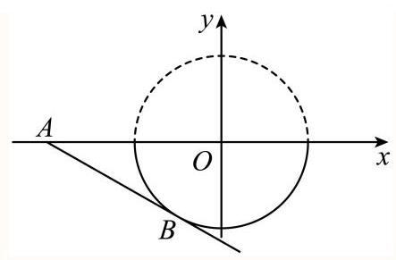

故答案为: $\left\lbrack  {-\frac{\sqrt{3}}{3},0}\right\rbrack$

9 填空题 (3分)

将6位志愿者分成4组，其中两个组各2人，另两个组各1人，分赴世博会的四个不同场馆服务，不同的分配方案有___ 种(用数字作答).

## 解析

该问题属于平均分组(堆)再分配的问题，先将6位志愿者分成4组，其中两个组各2人，另两个组各1人，再将其分配到四个不同场馆即得.

将6位志愿者分成4组，其中两个组各2人，另两个组各1人有 $\frac{{\mathrm{C}}_{6}^{2}{\mathrm{C}}_{4}^{2}{\mathrm{C}}_{2}^{1}}{{\mathrm{\;A}}_{2}^{2}{\mathrm{\;A}}_{2}^{2}} = {45}$ 种方法，进而将其分配到四个不同场馆,有 ${\mathrm{A}}_{4}^{4} = {24}$ 种情况,

由分步计数原理可得,不同的分配方案有 ${45} \times  {24} = {1080}$ 种.

故答案为:1080.

易错题,在分组过程中,要注意分组重复的情况,理解 $\frac{{\mathrm{C}}_{6}^{2}{\mathrm{C}}_{4}^{2}{\mathrm{C}}_{2}^{1}}{{\mathrm{\;A}}_{2}^{2}{\mathrm{\;A}}_{2}^{2}}$ 中分母的意义.

10 填空题 (3分)

在某种没有平局的比赛中, 选手每赢一局可以得到1点积分, 每输一局会失去1点积分, 若选手连赢了3局或更多的比赛，则从连赢的第三局开始，每赢一局会得到2点积分，现在设某选手的胜率为 60%，则他第六局的获得的分数的数学期望是___.

## 解析

第六局获得2分，即第四、五、六局全胜，概率为 ${0.6}^{3} = {0.216}$ ；

第六局获得-1分，即第六局输，概率为0.4；

第六局获得1分，概率为 $1 - {0.216} - {0.4} = {0.384}$ ,

故期望为 $2 \times  {0.216} + 1 \times  {0.384} + \left( {-1}\right)  \times  {0.4} = {0.416}$

故答案为:0.416

11 填空题 (3分)

如图，在 $5 \times  5$ 的方格表中按照下面的条件填入6个圆圈，满足各行. 各列至少有一个圆圈；同一格不能填2个圆圈. 则不同的符合条件的填入方法有___种.

I II III IV V

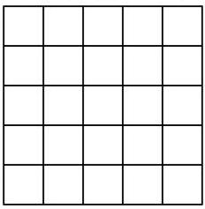

解析

6个圆圈填入5行、5列的表格中，按照题目要求，易知必有某行2个，其他行1个；某列2个， 其他列1个, 据此分两类讨论, 分别求出安排种数, 再由分类加法计数原理得解.

6个圆圈填入5行、5列的表格中，按照题目要求，易知必有某行2个，其他行1个；某列2个， 其他列1个.

①如果该行和该列的交界处有圆圈，则去掉这个圆圈恰好每行每列1个，有5!=120种，新增的这个交界处圆圈有 20 种填法，共计: ${{120} \times  {20}} = {2400}$ 种；

②如果该行和该列的交界处没有圆圈,选定该行该列的方式有 ${\mathrm{C}}_{5}^{1}{\mathrm{C}}_{5}^{1} = {25}$ 种，在该行该列分别填入2个圆圈的方法有 ${\mathrm{C}}_{4}^{2}{\mathrm{C}}_{4}^{2} = {36}$ 种，最后再把剩下2个圆圈填入方格，有2种填法，共计:

${25} \times  {36} \times  2 = {1800}$ 种;

综上, 不同的符合条件的填入方法有4200种.

故答案为: 4200 种

12 填空题 (3分)

已知 $A, B, C, D, E, F$ 六个字母以随机顺序排成一行，若小明每次操作可以互换2个字母的位置，则小明必须进行5次操作才能将六个字母排成 ${ABCDEF}$ 的顺序的排列情况有___ 种.

## 解析

利用条件，分析得到每个字母均不在自己位置，且交换过程中只存在一次，即最后一次交换使两个字母同时归位，再利用分步计数原理即可求出结果.

因为小明必须经过5次操作才能将六个字母排成ABCDEF的顺序，

这里研究排序混乱到什么程度才需要“必须经过5次操作”排成ABCDEF的顺序，

这里不妨记A，B，C，D，E，F六个字母对应的位次分别为1，2，3，4，5，6，

首先, 考虑一种情况: 假设字母“A”已经排在自己的位置, 即排在1号位,

其他字母均不在自己位置, 易知把其他五个字母调换到自己的位置至少需要经过4次操作, 即第一次让“B”归位，第二次让“C”归位，第三次让“D”归位，第四次将“E”与“F”同时归位， 这样仅需进行4次操作，不满足题意；

若A, B, C, D, E, F均不在对应的自己位置，但经过一次交换后，可使得两个字母同时归位,

此时也不能满足“必须进行5次操作”的情况，

例如, $C, E, F, A, B, D$ ,同时交换 $B, E$ 可使两者同时归位,此时只需交换四次即可,

而 $F, E, D, C, B, A$ ,只需交换三次即可,不合要求,

所以，要满足“必须进行5次操作”的情况，则每个字母均不在自己位置，

且交换过程中只存在一次, 即最后一次交换使两个字母同时归位,

1号位可放 $B, C, D, E, F$ 中的一个,有 5 种选择,不妨设放的为 $C$ ,

则3号位不能放 $A$ ,可从剩余 $B, D, E, F$ 中选一个,有4种选择,不妨设放的为 $F$ ,

则5号位不能放 $A$ ,否则可先交换 $A, F$ ,再交换 $A, C$ ,交换过程中出现交换一次使两个字母同时归位的情况，

故5号位可从 $B, D, E$ 种选择一个，有3种选择，不妨设放的为 $B$ ,

字母 $A$ 可选择4号位或5号位，有2种选择，剩余 $D, E$ 只有1种放法，才能满足要求，

综上,总的排序方法有 $5 \times  4 \times  3 \times  2 \times  1 = {120}$ 种.

故答案为: 120

关键点点睛:

解决本题的关键在于，分析出要满足“必须进行5次操作”的情况，则每个字母均不在自己位置, 且交换过程中只存在一次, 即最后一次交换使两个字母同时归位.

## 二、选择题

## 13 单选题 (3分)

已知一个圆的方程满足: 圆心在点 $\left( {-3,4}\right)$ ,且过原点,则它的方程为( )

A. ${\left( x - 3\right) }^{2} + {\left( y - 4\right) }^{2} = 5$

B. ${\left( x + 3\right) }^{2} + {\left( y + 4\right) }^{2} = {25}$

C. ${\left( x + 3\right) }^{2} + {\left( y - 4\right) }^{2} = 5$

D. ${\left( x + 3\right) }^{2} + {\left( y - 4\right) }^{2} = {25}$

## 解析

利用条件求出半径, 再根据圆的标准方程求解.

设圆的半径为 $r$ ,因为圆心是 $C\left( {-3,4}\right)$ ,且过点 $\left( {0,0}\right)$ ,所以 $r = \sqrt{9 + {16}} = 5$ ,所以半圆的方程为 ${\left( x + 3\right) }^{2} + {\left( y - 4\right) }^{2} = {25}$ ,

故选: D.

14 单选题 (3分)

掷两颗均匀的大小不同的骰子，记“两颗骰子的点数和为10”为事件A，“小骰子出现的点数大于大骰子出现的点数”为事件B，则 $P\left( {B \mid  A}\right)$ 为( )

A. $\frac{1}{2}$

B. $\frac{1}{6}$

C. $\frac{1}{15}$

D. $\frac{1}{3}$

解析

根据题意, 利用古典概型公式分别计算事件A发生的概率与事件AB发生的概率, 再利用条件概率计算公式即可算出P (BIA)的值.

根据题意,记小骰子的点数为 $x$ ,大骰子的点数为 $y$ ,

事件A包含的基本事件有“ $x = 4, y = 6$ ”，“ $x = y = 5$ ”，“ $x = 6, y = 4$ ”共3个，

$\therefore$ 事件 $\mathrm{A}$ 发生的概率 $P\left( A\right)  = \frac{3}{6 \times  6} = \frac{1}{12}$ ,

而事件 $\mathrm{{AB}}$ 包含的基本事件有“ $x = 6, y = 4$ ”一个，

可得事件 $\mathrm{{AB}}$ 发生的概率 $P\left( {AB}\right)  = \frac{1}{36}$ ,

$\therefore P\left( {B \mid  A}\right)  = \frac{P\left( {AB}\right) }{P\left( A\right) } = \frac{1}{3}$ .

故选: D

15 单选题 (3分)

过点 $P\left( {3,0}\right)$ 作一条直线 $l$ ，它夹在两条直线 ${l}_{1} : {{2x} - y - 2 = 0}$ 和 ${l}_{2} : {x + y + 3 = 0}$ 之间的线段恰被点 P平分, 则直线 $l$ 的方程为 ( )

A. ${8x} + y - {24} = 0$

B. ${8x} - y - {24} = 0$

C. ${8x} + y + {24} = 0$

D. $x + {8y} + {24} = 0$

## 解析

当斜率不存在时,不符合题意,当斜率存在时,设所求直线方程为 $y = k\left( {x - 3}\right)$ ,进而得出交点,根据点 $P$ 为两交点的中点建立等式,求出 $k$ 的值,从而即可解决问题.

如果直线斜率不存在时,直线方程为: $x = 3$ ,不符合题意;

所以直线斜率存在设为 $k$ ,

则直线 $l$ 方程为 $y = k\left( {x - 3}\right)$ ,

联立直线 ${l}_{1}$ 得: $\left\{  {\begin{array}{l} y = k\left( {x - 3}\right) \\  {2x} - y - 2 = 0 \end{array} \Rightarrow  \left\{  \begin{array}{l} x = \frac{{3k} - 2}{k - 2} \\  y = \frac{4k}{k - 2} \end{array}\right. }\right.$ ,

联立直线 ${l}_{2}$ 得: $\left\{  {\begin{array}{l} y = k\left( {x - 3}\right) \\  x + y + 3 = 0 \end{array} \Rightarrow  \left\{  \begin{array}{l} x = \frac{{3k} - 3}{k + 1} \\  y = \frac{-{6k}}{k + 1} \end{array}\right. }\right.$ ,

所以直线 $l$ 与直线 ${l}_{1}$ ,直线 ${l}_{2}$ 的交点为:

$\left( {\frac{{3k} - 2}{k - 2},\frac{4k}{k - 2}}\right) ,\left( {\frac{{3k} - 3}{k + 1},\frac{-{6k}}{k + 1}}\right) ,$

又直线 $l$ 夹在两条直线 ${l}_{1}$ 和 ${l}_{2}$ 之间的线段恰被点 $P$ 平分，

所以 $\frac{{3k} - 2}{k - 2} + \frac{{3k} - 3}{k + 1} = 6,\frac{4k}{k - 2} + \frac{-{6k}}{k + 1} = 0$ ,

解得: $k = 8$ ,

所以直线 $l$ 的方程为: ${8x} - y - {24} = 0$ ,

故选: B.

16 单选题 (3分)

两个黑帮帮主甲和乙决定以如下方式决斗:甲带了一名手下A，而乙带了两名手下 $B$ 和 $C$ ，规定任意一名手下向敌方成员开枪时，会随机命中敌方的一个尚未倒下的人，且命中每个人的概率相等， 并且, 三名手下被命中一次之后就会倒下, 而甲被命中三次后倒下, 乙被命中两次后倒下, 只要甲或者乙任意一人倒下，决斗立刻结束，未倒下的一人胜出.决斗开始时，A先向敌方成员开枪，之后若B未倒下，则B向敌方成员开枪，之后按C，A，B，C，A，B，......的顺序依次进行，则甲最终获胜的概率是( )

A. $\frac{5}{18}$

B. $\frac{7}{36}$

C. $\frac{1}{4}$

D. $\frac{1}{9}$

## 解析

分析按被击中顺序来表示的甲获胜的事件，分别求出概率，利用互斥事件概率加法公式求和得解.

对于甲来说, 一旦唯一一名手下 A被击毙, 则甲方必败, 同理, 若乙方B、

C两名手下被击毙，则乙方必败(题目定义开枪顺序是三名手下轮流开枪，甲与乙不参与开枪), 按照被击中的顺序表示事件，易知甲获胜的方式有如下几种:

乙甲甲乙, $B$ 甲 $C, C$ 甲 $B, B$ 甲乙甲, $C$ 甲乙甲,事件概率分别记为 ${P}_{i}\left( {i = 1,2,3,4,5}\right)$ , 则 ${P}_{1} = \frac{1}{3} \times  \frac{1}{2} \times  \frac{1}{2} \times  \frac{1}{3} = \frac{1}{36},{P}_{2} = \frac{1}{3} \times  \frac{1}{2} \times  \frac{1}{2} = \frac{1}{12},{P}_{3} = \frac{1}{3} \times  \frac{1}{2} \times  \frac{1}{2} = \frac{1}{12}$ , ${P}_{4} = \frac{1}{3} \times  \frac{1}{2} \times  \frac{1}{2} \times  \frac{1}{2} = \frac{1}{24},{P}_{5} = \frac{1}{3} \times  \frac{1}{2} \times  \frac{1}{2} \times  \frac{1}{2} = \frac{1}{24},$ 所以甲最终获胜的概率是 $P = \frac{1}{36} + \frac{1}{12} \times  2 + \frac{1}{24} \times  2 = \frac{5}{18}$ ,

## 三、解答题

17 解答题 (8 分)

已知随机变量 $X \sim  B\left( {n, p}\right)$ ,若 $E\left( x\right)  = 2, D\left( x\right)  = \frac{4}{3}$ ,求 $p$ 的值.

解析

根据二项分布的期望、方差公式计算可得.

因为随机变量 $X \sim  B\left( {n, p}\right)$ ,

所以 $E\left( x\right)  = {np} = 2, D\left( x\right)  = {np}\left( {1 - p}\right)  = \frac{4}{3}$ ,

两式相除可得 $1 - p = \frac{2}{3}$ ,

解得 $p = \frac{1}{3}$ .

18 解答题] (8分)

求抛物线 $C : y = {x}^{2}$ 上的点到直线 $l : y = \frac{1}{2}x - 1$ 的最小距离.

解析

设出抛物线上的点坐标，利用点到直线的距离公式求解作答.

设抛物线 $y = {x}^{2}$ 上的点 $P\left( {{x}_{0},{x}_{0}^{2}}\right)$ ,则点 $\mathrm{P}$ 到直线 $y = \frac{1}{2}x - 1$ ,

即 $x - {2y} - 2 = 0$ 的距离 $d = \frac{\left| {x}_{0} - 2{x}_{0}^{2} - 2\right| }{\sqrt{{\left( -2\right) }^{2} + {1}^{2}}} = \frac{2{\left( {x}_{0} - \frac{1}{4}\right) }^{2} + \frac{15}{8}}{\sqrt{5}} \geq  \frac{3\sqrt{5}}{8}$ ,当且仅当 ${x}_{0} = \frac{1}{4}$ 时取等号, 所以所求最小距离为 $\frac{3\sqrt{5}}{8}$ .

19 解答题 (11分)

某校举行了一次数学竞赛，为了了解本次竞赛学生的成绩情况，从中抽取了部分学生(男女生各一半)的分数(得分取正整数，满分为100分)作为样本(样本容量为n)进行统计，按照 $\lbrack {50},{60})$ ， $\lbrack {60},{70}),\lbrack {70},{80}),\lbrack {80},{90}),\left\lbrack  {{90},{100}}\right\rbrack$ 的分组作出如图所示的频率分布直方图,已知得分在 $\lbrack {50},{60})$ , $\left\lbrack  {{90},{100}}\right\rbrack$ 的频数分别为16,4.

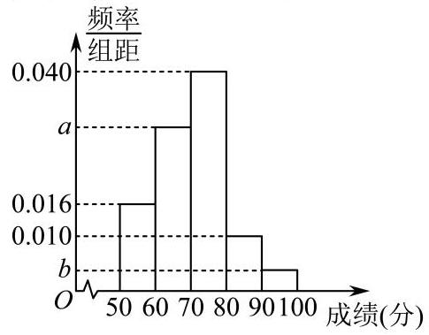

(1)(5分)求样本容量 $n$ 和频率分布直方图中的 $a$ ， $b$ 的值；

(2)(6分)70分以下称为“不优秀”，其中男. 女姓中成绩优秀的分别有24人和30人，请完成列联表,并判断是否有 ${90}\%$ 的把握认为“学生的成绩优秀与性别有关”？

<table><tr><td colspan="2"></td><td colspan="2">男生</td><td colspan="2">女生</td><td>总计</td></tr><tr><td colspan="2">优秀</td><td colspan="2"></td><td colspan="2"></td><td></td></tr><tr><td colspan="2">不优秀</td><td colspan="2"></td><td colspan="2"></td><td></td></tr><tr><td colspan="2">总计</td><td colspan="2"></td><td colspan="2"></td><td></td></tr><tr><td>$P\left( {{K}^{2} \geq  {k}_{0}}\right)$</td><td>0.10</td><td>0.05</td><td colspan="2">0.010</td><td>0.005</td><td>0.001</td></tr><tr><td>${k}_{0}$</td><td>2.706</td><td>3.841</td><td colspan="2">6.635</td><td>7.879</td><td>10.828</td></tr></table>

附: ${K}^{2} = \frac{n{\left( ad - bc\right) }^{2}}{\left( {a + b}\right) \left( {c + d}\right) \left( {a + c}\right) \left( {b + d}\right) }, n = a + b + c + d$ .

## 解析

(1)由题意可知,样本容量 $n = \frac{16}{{0.016} \times  {10}} = {100}, b = \frac{4}{{100} \times  {10}} = {0.004}$ , $a = {0.100} - {0.004} - {0.010} - {0.016} - {0.040} = {0.030}.$

(2)100位学生中男女生各有50名，成绩优秀共有54名，所以学生的成绩优秀与性别列联表如下表;

<table><tr><td></td><td>男生</td><td>女生</td><td>总计</td></tr><tr><td>优秀</td><td>24</td><td>30</td><td>54</td></tr><tr><td>不优秀</td><td>26</td><td>20</td><td>46</td></tr><tr><td>总计</td><td>50</td><td>50</td><td>100</td></tr></table>

$\because {K}^{2} = \frac{{100} \times  {\left( {24} \times  {20} - {30} \times  {26}\right) }^{2}}{{50} \times  {50} \times  {46} \times  {54}} = \frac{100}{69} \approx  {1.449} < {2.70}$ ,

$\therefore$ 没有90%的把握认为“学生的成绩优秀与性别有关”.

20 解答题 (11分)

为评估设备 $M$ 生产某种零件的性能，从设备 $M$ 生产零件的流水线上随机抽取 100 件零件作为样本， 测量其直径后, 整理得到下表:

<table><tr><td>直径mm</td><td>58</td><td>59</td><td>61</td><td>62</td><td>63</td><td>64</td><td>65</td><td>66</td><td>67</td><td>68</td><td>69</td><td>70</td><td>71</td><td>73</td><td>合计</td></tr><tr><td>件数</td><td>1</td><td>1</td><td>3</td><td>5</td><td>6</td><td>19</td><td>33</td><td>18</td><td>4</td><td>4</td><td>2</td><td>1</td><td>2</td><td>1</td><td>100</td></tr></table>

经计算，样本的平均值 $\mu  = {65}$ ，标准差 $\sigma  = {2.2}$ ，以频率值作为概率的估计值，用样本估计总体.

(1)将直径小于等于 $\mu  - {2\sigma }$ 或直径大于 $\mu  + {2\sigma }$ 的零件认为是次品，从设备 $M$ 的生产流水线上随意抽取3个零件，计算其中次品个数 $Y$ 的数学期望 $E\left( Y\right)$ ;

(2)为评判一台设备的性能，从该设备加工的零件中任意抽取一件，记其直径为 $X$ ，并根据以下不等式进行评判 ( $P$ 表示相应事件的概率): $\oplus  P\left( {\mu  - \sigma  < X \leq  \mu  + \sigma }\right)  \geq  {0.6827}$ ; ②

$P\left( {\mu  - {2\sigma } < X \leq  \mu  + {2\sigma }}\right)  \geq  {0.9545};\text{ ③ }P\left( {\mu  - {3\sigma } < X \leq  \mu  + {3\sigma }}\right)  \geq  {0.9973}$ . 评判规则为: 若同时满足上述三个不等式, 则设备等级为甲; 仅满足其中两个, 则等级为乙; 若仅满足其中一个, 则等级为丙；若全部不满足，则等级为丁，试判断设备 $M$ 的性能等级并说明理由.

## 解析

(1)对于次品个数 $Y$ 的数学期望 $E\left( Y\right)$ 的求法可采取古典概率的算法，先求出次品率，用符合条件的次品数/样本总数,次品可通过寻找直径小于等于 $\mu  - {2\sigma }$ 或直径大于 $\mu  + {2\sigma }$ 的零件个数求得,再根据该分布符合 $Y \sim  B\left( {3,\frac{3}{50}}\right)$ ,进行期望的求值

(2)根据(2)提供的评判标准，再结合样本数据算出在每个对应事件下的概率，通过比较发现 $P\left( {\mu  - \sigma  < X \leq  \mu  + \sigma }\right)  = \frac{80}{100} = {0.80} > {0.6826}$ ,

$P\left( {\mu  - {2\sigma } < X \leq  \mu  + {2\sigma }}\right)  = \frac{94}{100} = {0.94} < {0.9544},$

$P\left( {\mu  - {3\sigma } < X \leq  \mu  + {3\sigma }}\right)  = \frac{98}{100} = {0.98} < {0.9974},$

三个条件中只有一个符合, 等级为丙

解: (1) 由图表知道: 直径小于或等于 $\mu  - {2\sigma }$ 的零件有2件,大于 $\mu  + {2\sigma }$ 的零件有4件,共计 6 件,

从设备 $M$ 的生产流水线上任取一件,取到次品的概率为 $\frac{6}{100} = \frac{3}{50}$ ,依题意 $Y \sim  B\left( {3,\frac{3}{50}}\right)$ , 故 $E\left( Y\right)  = 3 \times  \frac{3}{50} = \frac{9}{50}$ ;

(2)由题意知, $\mu  - \sigma  = {62.8},\mu  + \sigma  = {67.2}$ ,

$\mu  - {2\sigma } = {60.6},\mu  + {2\sigma } = {69.4},\mu  - {3\sigma } = {58.4},\mu  + {3\sigma } = {71.6}$ ,

所以由图表知道:

$P\left( {\mu  - \sigma  < X \leq  \mu  + \sigma }\right)  = \frac{80}{100} = {0.80} > {0.6826},$

$P\left( {\mu  - {2\sigma } < X \leq  \mu  + {2\sigma }}\right)  = \frac{94}{100} = {0.94} < {0.9544},$

$P\left( {\mu  - {3\sigma } < X \leq  \mu  + {3\sigma }}\right)  = \frac{98}{100} = {0.98} < {0.9974},$

所以该设备 $M$ 的性能为丙级别.

对于正态分布题型的数据分析,需要结合 $\mu ,\sigma$ 的含义来进行理解,根据题设中如

$P\left( {\mu  - \sigma  < X \leq  \mu  + \sigma }\right)  \geq  {0.6827};\text{ ② }P\left( {\mu  - {2\sigma } < X \leq  \mu  + {2\sigma }}\right)  \geq  {0.9545};$

$\text{ ③ }P\left( {\mu  - {3\sigma } < X \leq  \mu  + {3\sigma }}\right)  \geq  {0.9973}$ 来寻找对应条件下的样品数,计算出概率值,再根据题设进行求解，此类题型对数据分析能力要求较高，在统计数据时必须够保证数据的准确性，特别是统计个数和计算 $\mu  - \sigma ,\mu  + \sigma$ 等数据时

21 解答题 (14分)

(1)已知 $k$ 、 $n$ 为正整数， $k \leq  n$ ，求证: $k{\mathrm{C}}_{n}^{k} = n{\mathrm{C}}_{n - 1}^{k - 1}$ :

(2)已知 $k$ 、 $n$ 为正整数，求证: ${\mathrm{C}}_{n}^{n} + {\mathrm{C}}_{n + 1}^{n} + {\mathrm{C}}_{n + 2}^{n} + \cdots  + {\mathrm{C}}_{n + k}^{n} = {\mathrm{C}}_{n + k + 1}^{n + 1}$ ;

(3) $m$ 、 $n$ 为正整数， $n \geq  2$ ，求证:

$\frac{1}{n}{\mathrm{C}}_{n - 1}^{n - 1} + \frac{1}{n + 1}{\mathrm{C}}_{n}^{n - 1} + \frac{1}{n + 2}{\mathrm{C}}_{n + 1}^{n - 1} + \cdots  + \frac{1}{n + m}{\mathrm{C}}_{n + m - 1}^{n - 1} < \frac{n{\mathrm{C}}_{n + m}^{n}}{\left( {n + m}\right) \left( {n - 1}\right) }.$

## 解析

(1)根据组合数的公式及阶乘的定义化简变形即可得证;

(2)由组合数的性质 ${\mathrm{C}}_{n}^{m} + {\mathrm{C}}_{n}^{m - 1} = {\mathrm{C}}_{n + 1}^{m}$ 可证明;

(3)利用(1)和(2)的结论，及 $\frac{n - 1}{n + k}{\mathrm{C}}_{n + k - 1}^{n - 1} = \frac{\left( {n + k - 1}\right) {\mathrm{C}}_{n + k - 2}^{n - 2}}{n + k} < {\mathrm{C}}_{n + k - 2}^{n - 2}$ 可证明.

(1) $\because k{\mathrm{C}}_{n}^{k} = k\frac{n!}{k!\left( {n - k}\right) !} = \frac{n \cdot  \left( {n - 1}\right) !}{\left( {k - 1}\right) !\left\lbrack  {\left( {n - 1}\right)  - \left( {k - 1}\right) }\right\rbrack  !} = n{\mathrm{C}}_{n - 1}^{k - 1}$ ,

$\therefore k{\mathrm{C}}_{n}^{k} = n{\mathrm{C}}_{n - 1}^{k - 1}$ .

(2)由 ${\mathrm{C}}_{n}^{m} + {\mathrm{C}}_{n}^{m - 1} = {\mathrm{C}}_{n + 1}^{m}$ 知,

${\mathrm{C}}_{n}^{n} + {\mathrm{C}}_{n + 1}^{n} + {\mathrm{C}}_{n + 2}^{n} + \cdots  + {\mathrm{C}}_{n + k}^{n}$

$= {\mathrm{C}}_{n + 1}^{n + 1} + {\mathrm{C}}_{n + 1}^{n} + {\mathrm{C}}_{n + 2}^{n} + \cdots  + {\mathrm{C}}_{n + k}^{n}$

$= {\mathrm{C}}_{n + 2}^{n + 1} + {\mathrm{C}}_{n + 2}^{n} + \cdots  + {\mathrm{C}}_{n + k}^{n}$

$= {\mathrm{C}}_{n + 3}^{n + 1} + {\mathrm{C}}_{n + 3}^{n} + \cdots  + {\mathrm{C}}_{n + k}^{n}$

......

$= {\mathrm{C}}_{n + k + 1}^{n + 1}$ .

(3)由(1)可知， $n \geq  2$ 时， $\frac{n{\mathrm{C}}_{n + m}^{n}}{\left( {n + m}\right) \left( {n - 1}\right) } = \frac{\left( {m + n}\right) {\mathrm{C}}_{n + m - 1}^{n - 1}}{\left( {m + n}\right) \left( {n - 1}\right) } = \frac{{\mathrm{C}}_{n + m - 1}^{n - 1}}{n - 1}$ ，

而 $\frac{n - 1}{n + k}{\mathrm{C}}_{n + k - 1}^{n - 1} = \frac{\left( {n + k - 1}\right) {\mathrm{C}}_{n + k - 2}^{n - 2}}{n + k} < {\mathrm{C}}_{n + k - 2}^{n - 2}$ ,

故 $\frac{n - 1}{n}{\mathrm{C}}_{n - 1}^{n - 1} + \frac{n - 1}{n + 1}{\mathrm{C}}_{n}^{n - 1} + \frac{n - 1}{n + 2}{\mathrm{C}}_{n + 1}^{n - 1} + \cdots  + \frac{n - 1}{n + m}{\mathrm{C}}_{n + m - 1}^{n - 1}$ ,

$< {\mathrm{C}}_{n - 2}^{n - 2} + {\mathrm{C}}_{n - 1}^{n - 2} + {\mathrm{C}}_{n}^{n - 2} + \cdots  + {\mathrm{C}}_{n + m - 2}^{n - 2} = {C}_{n + m - 1}^{n - 1},$

故 $\frac{1}{n}{\mathrm{C}}_{n - 1}^{n - 1} + \frac{1}{n + 1}{\mathrm{C}}_{n}^{n - 1} + \frac{1}{n + 2}{\mathrm{C}}_{n + 1}^{n - 1} + \cdots  + \frac{1}{n + m}{\mathrm{C}}_{n + m - 1}^{n - 1} < \frac{n{\mathrm{C}}_{n + m}^{n}}{\left( {n + m}\right) \left( {n - 1}\right) }$ ,其中 $n \geq  2$ .

# 上海市上海中学2022届高三下学期 高考模拟1数学试题

姓名:___

## 一、填空题

1 填空题

若 $\cos \alpha  =  - \frac{3}{5}$ ，则 $\cos {2\alpha } =$ ___.

解析

用二倍角公式 $\cos {2\alpha } = 2{\cos }^{2}\alpha  - 1$ 展开代入计算.

$\because \cos \alpha  =  - \frac{3}{5}\therefore \cos {2\alpha } = 2{\cos }^{2}\alpha  - 1 = 2 \times  {\left( -\frac{3}{5}\right) }^{2} - 1 =  - \frac{7}{25}$

故答案为: $- \frac{7}{25}$

2 填空题

$\frac{\overline{\left( {1 + \mathrm{i}}\right) \left( {1 - \mathrm{i}}\right) }}{\mathrm{i}} =$ ___

解析

【分析】根据复数运算的相关知识进行求解即可.

【详解】 $\frac{\left( {1 + \mathrm{i}}\right) \left( {1 - \mathrm{i}}\right) }{\mathrm{i}} = \frac{1 - {\mathrm{i}}^{2}}{\mathrm{i}} = \frac{1 - \left( {-1}\right) }{\mathrm{i}} = \frac{2}{\mathrm{i}} = \frac{2\mathrm{i}}{{\mathrm{i}}^{2}} = \frac{2\mathrm{i}}{-1} =  - 2\mathrm{i}$ .

故答案为: $- 2\mathrm{i}$ .

3 填空题

某校有教职工200人，男学生1000人，女学生1200人，现用分层抽样的方法从所有师生中抽取一个容量为 $\mathrm{n}$ 的样本，已知从教职工中抽取的人数为 10，则 $n =$ ___.

解析

由分层抽样的定义即可求得

由教职工200人，男学生1000人，女学生1200人得抽取人数比例为 $1 : 5 : 6$ ，从教职工中抽取的人数为 10 , 故 $n = {10} \times  \left( {1 + 5 + 6}\right)  = {120}$

故答案为:120

4 填空题

若行列式 $\left| \begin{matrix} 1 & 2 & 3 \\  1 & 1 - a & {3a} \\  1 & a - 1 & a \end{matrix}\right|$ 中第一行第二列元素的代数余子式的值为 4，则 $a =$ ___.

## 解析

本题直接根据行列式的代数余子式的定义进行计算,即可得到本题结论: $\because$ 行列式

$\left| \begin{matrix} 1 & 2 & 3 \\  1 & 1 - a & {3a} \\  1 & a - 1 & a \end{matrix}\right|$ 中第一行第二列元素的代数余子式的值为4,

$\therefore  - \left| \begin{matrix} 1 & {3a} \\  1 & a \end{matrix}\right|  = 4$ ,

$\therefore  = \left( {a - {3a}}\right)  = 4$ ,

$\therefore a = 2$ .

故答案为: 2 .

本题考查行列式的概念, 考查代数余子式的定义, 属于基础题.

5 填空题

${\left( 1 - x\right) }^{4} \cdot  {\left( 1 + x\right) }^{2}$ 的展开式中 ${x}^{3}$ 的系数是___

解析

【分析】根据题意, 将式子展开即可得到结果.

【详解】 ${\left( 1 - x\right) }^{4} \cdot  {\left( 1 + x\right) }^{2} = {\left( 1 - {x}^{2}\right) }^{2}{\left( 1 - x\right) }^{2} = \left( {1 - 2{x}^{2} + {x}^{4}}\right) \left( {1 - {2x} + {x}^{2}}\right)$ ,

所以 ${x}^{3}$ 的系数是 $- 2 \times  \left( {-2}\right)  = 4$ .

故答案为:4

6 填空题

已知 $\lg a\text{ 、 }\lg b\text{ 、 }\lg c$ 成等差数列，且公差 $d < 0.a\text{ 、 }b\text{ 、 }c$ 分别是Rt $\bigtriangleup  {ABC}$ 的角 $A\text{ 、 }B\text{ 、 }C$ 的对边，则 $\sin C =$ ___.

## 解析

根据等差数列确定 $a > b > c,{b}^{2} = {ac},{b}^{2} + {c}^{2} = {a}^{2}$ ,变换得到 $\sin C + {\sin }^{2}C = 1$ ,解得答案.

$\lg a\text{ 、 }\lg b\text{ 、 }\lg c$ 成等差数列,且公差 $d < 0$ ,所以 $\lg a - \lg b = \lg b - \lg c > 0$ ,

所以 $a > b > c$ ,且 $\frac{a}{b} = \frac{b}{c}$ ,即 ${b}^{2} = {ac}, A$ 是直角, ${b}^{2} + {c}^{2} = {a}^{2}$ ,

即 ${ac} + {c}^{2} = {a}^{2}$ ,即 $\frac{c}{a} + {\left( \frac{c}{a}\right) }^{2} = 1$ ,即 $\sin C + {\sin }^{2}C = 1, C \in  \left( {0,\frac{\pi }{2}}\right) ,\sin C \in  \left( {0,1}\right)$ ,

解得 $\sin C = \frac{\sqrt{5} - 1}{2}$ 或 $\sin C = \frac{-\sqrt{5} - 1}{2}$ (舍去)

故答案为: $\frac{\sqrt{5} - 1}{2}$

7 填空题

正三棱锥 $P - {ABC}$ 的四个顶点同在一个半径为2的球面上，若正三棱锥的侧棱长为 $2\sqrt{3}$ ，则正三棱锥的底面边长是___.

## 解析

先画出该三棱锥图像, 然后利用边角关系求解即可.

画出正三棱锥的图形如图,

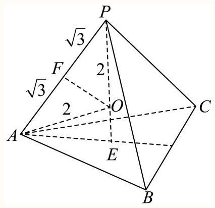

三角形 ${ABC}$ 的中心为 $E$ ,连接 ${PE}$ ,球的球心 $O$ 在 ${PE}$ 上,连接 ${OA}$ ,

取 ${PA}$ 的中点 $F$ ,连接 ${OF}$ ,则 ${PO} = 2 = {OA},{PF} = \sqrt{3},{OF} = 1$ ,

$\bigtriangleup {PFO} \backsim  \bigtriangleup {PEA}$ ,所以 $\frac{OF}{AE} = \frac{PO}{PA},\frac{1}{AE} = \frac{2}{2\sqrt{3}},{AE} = \sqrt{3}$ ,

底面三角形的高为 $\frac{3\sqrt{3}}{2}$ ，底面三角形的边长为 $a,\frac{\sqrt{3}}{2}a = \frac{3\sqrt{3}}{2}, a = 3$ .

故答案为: 3

8 填空题

设点 $M\text{ 、 }N\text{ 、 }P\text{ 、 }Q$ 为圆 ${x}^{2} + {y}^{2} = {r}^{2}\left( {r > 0}\right)$ 上四个互不相同的点,若 $\overrightarrow{MP} \cdot  \overrightarrow{PN} = 0$ ,且 $(\overrightarrow{PM} + \; \overrightarrow{PN}) \cdot  \overrightarrow{PQ} = 2$ ，则 $\left| \overrightarrow{PQ}\right|  =$ ___.

解析

根据 $\overrightarrow{MP} \cdot  \overrightarrow{PN} = 0$ 得到 ${MN}$ 过圆的圆心 $O$ ,再利用向量的加法法则得 $\overrightarrow{PM} + \overrightarrow{PN} = 2\overrightarrow{PO}$ ,由向量数量积的几何意义得到等式 $\left| \overrightarrow{PO}\right| \cos \theta  = \frac{1}{2}\left| \overrightarrow{PQ}\right|$ ，最后求得 $\left| \overrightarrow{PQ}\right|$ 的值. 因为 $\overrightarrow{MP} \cdot  \overrightarrow{PN} = 0$ ， 所以 $\overrightarrow{MP} \bot  \overrightarrow{PN}$ ,

所以 ${MN}$ 过圆的圆心 $O$ ,

所以 $\left( {\overrightarrow{PM} + \overrightarrow{PN}}\right)  \cdot  \overrightarrow{PQ} = 2\overrightarrow{PO} \cdot  \overrightarrow{PQ} = 2\left| \overrightarrow{PO}\right|  \cdot  \left| \overrightarrow{PQ}\right| \cos \theta  = 2$ ,

因为 $\overrightarrow{PO}$ 在 $\overrightarrow{PQ}$ 向量方向上的投影为: $\left| \overrightarrow{PO}\right| \cos \theta  = \frac{1}{2}\left| \overrightarrow{PQ}\right|$ ,代入上式得:

$\frac{{\left| \overrightarrow{PQ}\right| }^{2}}{2} = 1 \Rightarrow  \left| \overrightarrow{PQ}\right|  = \sqrt{2}.$

故答案为: $\sqrt{2}$ .

本题考查向量与圆知识的交会、向量的垂直、加法法则、数量积的几何意义等知识, 考查方程思想的运用, 求解时注意向量几何意义的灵活运用, 考查逻辑推理能力和运算求解能力.

9 填空题

中国古代数学名著《张丘建算经》中记载:“今有马行转迟，次日减半，疾七日，行七百里”.其大意为: 现有一匹马行走的速度逐渐变慢, 每天走的里数是前一天的一半, 连续走了7天, 共走了700公里. 则这匹马第7天所走的路程为___里.

## 解析

每天走的里程是等比数列 $\left\{  {a}_{n}\right\}$ ,公比 $q = \frac{1}{2}$ ,可得 ${S}_{7} = \frac{{a}_{1}\left\lbrack  {1 - {\left( \frac{1}{2}\right) }^{7}}\right\rbrack  }{1 - \frac{1}{2}} = {700}$ ,解得 ${a}_{1}$ , 利用通项公式可得 ${a}_{7}$ 每天走的里程是等比数列 $\left\{  {a}_{n}\right\}$ ，公比 $q = \frac{1}{2}$

可得 ${S}_{7} = \frac{{a}_{1}\left\lbrack  {1 - {\left( \frac{1}{2}\right) }^{7}}\right\rbrack  }{1 - \frac{1}{2}} = {700}$ ,解得 ${a}_{1} = \frac{{128} \times  {350}}{127}$

$\therefore {a}_{7} = \frac{{128} \times  {350}}{127} \times  {\left( \frac{1}{2}\right) }^{6} = \frac{700}{127}$

故答案为 $\frac{700}{127}$ .

本题考查了等比数列的性质和求和公式，需要注意的是计算的技巧，属于基础题.

10 填空题

在平面直角坐标系 ${xOy}$ 中，已知圆 $C$ 的半径为 $\sqrt{2}$ ，圆心在直线 $l : y = {2x} - 1$ 上，若圆 $C$ 上存在一点 $P$ ， 使得直线 ${l}_{1} : {ax} - y - 2 = 0$ 与直线 ${l}_{2} : x + {ay} - 2 = 0$ 交于点 $P$ ，则当实数 $a$ 变化时，圆心 $C$ 的横坐标 $x$ 的取值范围是___.

## 解析

先判断出点 $P$ 所在的轨迹，利用 $P$ 点在圆 $C$ 上，表示出圆心距 $d$ 的范围即可求出圆心 $C$ 的横坐标的取值范围

因为直线 ${l}_{1} : {ax} - y - 2 = 0$ 与直线 ${l}_{2} : {x + {ay}} - 2 = 0$ 相互垂直，且分别过定点 $A\left( {0, - 2}\right)$ 和 $B\left( {2,0}\right)$ ， 故点 $P$ 在以 ${AB}$ 为直径的圆上运动,直径 $d = \sqrt{4 + 4} = 2\sqrt{2}$ ,半径为 $\sqrt{2}$ ,圆心为 $\left( {1, - 1}\right)$ ,又因为点 $P$ 在圆 $C$ 上,故两圆有公共点,所以两圆的圆心距满足 $0 \leq  d \leq  2\sqrt{2}$ ,即

$0 \leq  \sqrt{{\left( x - 1\right) }^{2} + {\left( 2x - 1 + 1\right) }^{2}} \leq  2\sqrt{2}$ ,解得 $x \in  \left\lbrack  {-1,\frac{7}{5}}\right\rbrack$ ,

故答案为: $\left\lbrack  {-1,\frac{7}{5}}\right\rbrack$

本题考查直线与圆、圆与圆位置关系的应用, 考查数学转化思想方法, 考查计算能力, 属于中档题.

11 填空题

定义集合 $D = \left\{  {\left( {x, y}\right) \left| {\;\left\{  \begin{array}{l} x - y + 2 \geq  0 \\  x + y - 2 \leq  0, x, y \in  \mathbf{R} \\  y \geq  0 \end{array}\right\}  .}\right. }\right.$ 若对任意的 $\left( {x, y}\right)  \in  D$ ,有 $y \geq  a\left( {x + 3}\right)  - 1$ 恒成立，且存在 $\left( {x, y}\right)  \in  D$ ，使得 $x - y \leq  a$ 成立，则实数 $a$ 的取值范围为___.

## 解析

画出可行域, 由斜率型和截距型目标函数进行求解即可.

二元一次不等式组 $\left\{  \begin{array}{l} x - y + 2 \geq  0 \\  x + y - 2 \leq  0 \\  y \geq  0 \end{array}\right.$ 表示的可行域如图:

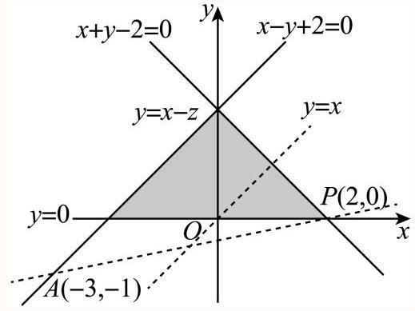

则集合 $D = \left\{  {\left( {x, y}\right) \left| {\;\left\{  \begin{array}{l} x - y + 2 \geq  0 \\  x + y - 2 \leq  0, x, y \in  \mathbf{R} \\  y \geq  0 \end{array}\right\}  }\right. }\right.$ 为表示图中阴影区域(含边界)的点集，

$\therefore  - 2 \leq  x \leq  2,\therefore x + 3 > 0$ ,

$\therefore$ 若 $y \geq  a\left( {x + 3}\right)  - 1$ 恒成立,则 $a \leq  \frac{y + 1}{x + 3}$ 恒成立,

$\because \frac{y + 1}{x + 3}$ 表示过阴影区域 (含边界) 内一点 $Q\left( {x, y}\right)$ 与定点 $A\left( {-3, - 1}\right)$ 的直线的斜率,即 ${k}_{AQ} = \frac{y + 1}{x + 3}$

$\therefore$ 当 $Q\left( {x, y}\right)$ 与 $P\left( {2,0}\right)$ 重合时, ${k}_{AQ} = \frac{y + 1}{x + 3}$ 取最小值 $\frac{0 + 1}{2 + 3} = \frac{1}{5},\therefore a \leq  \frac{1}{5}$ ;

又 $\because$ 存在 $\left( {x, y}\right)  \in  D$ ,使得 $x - y \leq  a$ 成立, $\therefore x - y$ 的最小值 ${\left( x - y\right) }_{\min } \leq  a$ ,

设 $x - y = z$ ,则 $y = x - z$ ,当 $z = 0$ 时,画出 $y = x$ ,平移 $y = x$ 即得到 $y = x - z$ ,

当目标函数 $y = x - z$ 与边界 $x - y + 2 = 0$ 重合时, $y = x - z$ 在 $y$ 轴的截距 $- z$ 取最大值,即 $z = x - y$ 取最小值,

$\therefore x - y$ 的最小值 ${\left( x - y\right) }_{\min } =  - 2,\therefore a \geq   - 2$ ,

综上所述， $a$ 的取值范围为 $\left\lbrack  {-2,\frac{1}{5}}\right\rbrack$ .

故答案为: $\left\lbrack  {-2,\frac{1}{5}}\right\rbrack$ .

12 填空题

已知函数 $f\left( x\right)  = \left( {1 + a}\right) x + \frac{3}{x} + \left| {\left( {1 - a}\right) x + \frac{3}{x} - 4}\right| \left( {x > 0}\right)$ 的最小值为3，则 $a$ 的值为___.

## 解析

将所给函数转化为其他函数, 进而通过数形结合得解.

设 $f\left( x\right)  = g\left( x\right)  + h\left( x\right)  + \left| {g\left( x\right)  - h\left( x\right) }\right|  = \max \{ {2g}\left( x\right) ,{2h}\left( x\right) \}$ ,

则 $\left\{  \begin{array}{l} g\left( x\right)  + h\left( x\right)  = \left( {1 + a}\right) x + \frac{3}{x} \\  g\left( x\right)  - h\left( x\right)  = \left( {1 - a}\right) x + \frac{3}{x} - 4 \end{array}\right.$ ,解得 $\left\{  \begin{array}{l} g\left( x\right)  = x + \frac{3}{x} - 2 \\  h\left( x\right)  = {ax} + 2 \end{array}\right.$ ,

可知 $\frac{1}{2}f\left( x\right)  = \max \{ g\left( x\right) , h\left( x\right) \}$ ,

依题意, $\frac{1}{2}f\left( x\right)$ 的最大值为 $\frac{3}{2}$ ,如图所示:

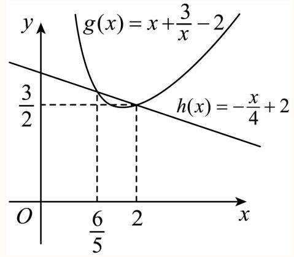

由 $g\left( x\right)  = x + \frac{3}{x} - 2 = \frac{3}{2}$ ,解得 ${x}_{1} = 2$ 或 ${x}_{2} = \frac{3}{2}$ (舍),

将点 $\left( {2,\frac{3}{2}}\right)$ 代入 $h\left( x\right)$ ，则 ${2a} + 2 = \frac{3}{2}$ ，解得 $a =  - \frac{1}{4}$ .

故答案为: $- \frac{1}{4}$ .

本题考查函数图象的运用, 考查转化思想及数形结合思想, 解决本题的难点在于将所给函数转化为取大函数，属于难题.

## 二、选择题

## 13 单选题

$\bigtriangleup  {ABC}$ 中，“ $A$ 为锐角”是“sin $A > 0$ ”的( )

A. 充分不必要条件

B. 必要不充分条件

C. 充要条件

D. 既不充分又不必要条件

## 解析

由三角形的几何性质和任意角的三角函数的定义结合充分性和必要性进行辨析即可.

在 $\bigtriangleup {ABC}$ 中，由“ $A$ 为锐角”，易得“ $\sin A > 0$ ”，

$\therefore$ " $A$ 为锐角"是“ $\sin A > 0$ "的充分条件;

在 $\bigtriangleup {ABC}$ 中，由 " $\sin A > 0$ "，不能得出 " $A$ 为锐角， " $\left( {\text{ 如 }\sin A = 1 > 0\text{ , }A}\right.$ 为直角，实际上，当 $A \in  \left( {0,\pi }\right)$ 时， $\sin A > 0$ 恒成立),

$\therefore$ “ $A$ 为锐角”不是 “ $\sin A > 0$ ” 的必要条件;

综上所述，“ $A$ 为锐角”是 “ $\sin A > 0$ ” 的充分不必要条件.

故选: A.

14 单选题

两人掷一枚硬币，掷出正面多者为胜，但这枚硬币质地不均匀，以致出现正面的概率 ${P}_{1}$ 与出现反面的概率 ${P}_{2}$ 不相等，已知出现正面与出现反面是对立事件，设两人各掷一次成平局的概率为 $P$ ，则 $P$ 与0.5的大小关系是( )

A. $P < {0.5}$

B. $P = {0.5}$

C. $P > {0.5}$

D. 不确定

解析

由已知得 $P = 2{P}_{1}^{2} - 2{P}_{1} + 1$ ,利用作差法能比较 $\mathrm{P}$ 与 0.5 的大小关系.

这枚硬币质地不均匀，以致出现正面的概率 ${P}_{1}$ 与出现反面的概率 ${P}_{2}$ 不相等，

出现正面与出现反面是对立事件，设两人各掷一次成平局的概率为 $P$ ，

所以 $P = {P}_{1}^{2} + {P}_{2}^{2} = {P}_{1}^{2} + {\left( 1 - {P}_{1}\right) }^{2} = 2{P}_{1}^{2} - 2{P}_{1} + 1$ ,

因为 $0 \leq  {P}_{1} \leq  1$ 且 ${P}_{1} \neq  {0.5}$ ,所以 $P - {0.5} = 2{P}_{1}^{2} - 2{P}_{1} + 1 - {0.5} = 2{\left( {P}_{1} - \frac{1}{2}\right) }^{2} > 0$ ,

所以 $P > {0.5}$ .

故选: C.

15 单选题

设函数 $f\left( x\right)$ 与 $g\left( x\right)$ 的定义域为 $\mathrm{R}$ ，且 $f\left( x\right)$ 单调递增， $F\left( x\right)  = f\left( x\right)  + g\left( x\right)$ ， $G\left( x\right)  = f\left( x\right)  - g\left( x\right)$ ，若对任意 ${x}_{1},{x}_{2} \in  \mathrm{R}\left( {{x}_{1} \neq  {x}_{2}}\right) ,{\left\lbrack  f\left( {x}_{1}\right)  - f\left( {x}_{2}\right) \right\rbrack  }^{2} > {\left\lbrack  g\left( {x}_{1}\right)  - g\left( {x}_{2}\right) \right\rbrack  }^{2}$ 恒成立，则( )

A. $F\left( x\right) , G\left( x\right)$ 都是减函数

B. $F\left( x\right) , G\left( x\right)$ 都是增函数

C. $F\left( x\right)$ 是增函数, $G\left( x\right)$ 是减函数

D. $F\left( x\right)$ 是减函数, $G\left( x\right)$ 是增函数

## 解析

根据 $f\left( x\right)$ 单调递增，不妨设 ${x}_{1} > {x}_{2}$ ，可得 $f\left( {x}_{1}\right)  - f\left( {x}_{2}\right)  > 0$ ，结合已知可得

$f\left( {x}_{1}\right)  - f\left( {x}_{2}\right)  - \left\lbrack  {g\left( {x}_{1}\right)  - g\left( {x}_{2}\right) }\right\rbrack   > 0$ 且 $f\left( {x}_{1}\right)  - f\left( {x}_{2}\right)  + g\left( {x}_{1}\right)  - g\left( {x}_{2}\right)  > 0$ ,由此利用函数单调性定义判断 $F\left( {x}_{1}\right)  - F\left( {x}_{2}\right) , G\left( {x}_{1}\right)  - G\left( {x}_{2}\right)$ 的正负,可得答案.

不妨设 ${x}_{1},{x}_{2} \in  \mathrm{R},{x}_{1} > {x}_{2}$ ,因为 $f\left( x\right)$ 单调递增,所以 $f\left( {x}_{1}\right)  - f\left( {x}_{2}\right)  > 0$ ,

由于 ${\left\lbrack  f\left( {x}_{1}\right)  - f\left( {x}_{2}\right) \right\rbrack  }^{2} > {\left\lbrack  g\left( {x}_{1}\right)  - g\left( {x}_{2}\right) \right\rbrack  }^{2}$ ,

所以 $f\left( {x}_{1}\right)  - f\left( {x}_{2}\right)  > g\left( {x}_{1}\right)  - g\left( {x}_{2}\right)$ 且 $f\left( {x}_{1}\right)  - f\left( {x}_{2}\right)  >  - g\left( {x}_{1}\right)  + g\left( {x}_{2}\right)$ ,

即 $f\left( {x}_{1}\right)  - f\left( {x}_{2}\right)  - \left\lbrack  {g\left( {x}_{1}\right)  - g\left( {x}_{2}\right) }\right\rbrack   > 0$ 且 $f\left( {x}_{1}\right)  - f\left( {x}_{2}\right)  + g\left( {x}_{1}\right)  - g\left( {x}_{2}\right)  > 0$ ,

则 $F\left( {x}_{1}\right)  - F\left( {x}_{2}\right)  = \left\lbrack  {f\left( {x}_{1}\right)  + g\left( {x}_{1}\right) }\right\rbrack   - \left\lbrack  {f\left( {x}_{2}\right)  + g\left( {x}_{2}\right) }\right\rbrack   = \left\lbrack  {f\left( {x}_{1}\right)  - f\left( {x}_{2}\right) }\right\rbrack   + \left\lbrack  {g\left( {x}_{1}\right)  - g\left( {x}_{2}\right) }\right\rbrack   > 0$ ,

所以 $F\left( x\right)$ 是增函数,

同理 $G\left( {x}_{1}\right)  - G\left( {x}_{2}\right)  = \left\lbrack  {f\left( {x}_{1}\right)  - g\left( {x}_{1}\right) }\right\rbrack   - \left\lbrack  {f\left( {x}_{2}\right)  - g\left( {x}_{2}\right) }\right\rbrack$

$= \left\lbrack  {f\left( {x}_{1}\right)  - f\left( {x}_{2}\right) }\right\rbrack   - \left\lbrack  {g\left( {x}_{1}\right)  - g\left( {x}_{2}\right) }\right\rbrack   > 0$ ,故 $G\left( x\right)$ 也是增函数.

故选: B.

16 单选题

已知点F为抛物线 $C : {y}^{2} = {2px}\left( {p > 0}\right)$ 的焦点，点K为点F关于原点的对称点，点M在抛物线C上，则下列说法错误的是( )

A. 使得 $\bigtriangleup {MFK}$ 为等腰三角形的点 $\mathrm{M}$ 有且仅有 4 个

B. 使得 $\bigtriangleup {MFK}$ 为直角三角形的点M有且仅有4个

C. 使得 $\angle {MKF} = \frac{\pi }{4}$ 的点M有且仅有 4 个

D. 使得 $\angle {MKF} = \frac{\pi }{6}$ 的点M有且仅有 4 个

## 解析

$\bigtriangleup  {MFK}$ 为等腰三角形，考虑两边相等，结合图形，可得有4个点； $\bigtriangleup  {MFK}$ 为直角三角形，考虑直角顶点,结合图形,可得有 4 个点; 考虑直线 $y = x + \frac{p}{2}$ ,与抛物线的方程联立,解方程可得交点个数; 由对称性可得 $M$ 有 2 个; 考虑直线 $y = \frac{\sqrt{3}}{3}\left( {x + \frac{p}{2}}\right)$ ,代入抛物线的方程,解方程可得交点个数，由对称性可得点 $M$ 有 4 个.

由 $\bigtriangleup {MFK}$ 为等腰三角形，若 ${KF} = {MF}$ ，则 $M$ 有两个点；

若 ${MK} = {MF}$ ,则不存在,若 ${MK} = {FK}$ ,则 $M$ 有两个点,

则使得 $\bigtriangleup {MFK}$ 为等腰三角形的点 $M$ 有且仅有4个;

由 $\bigtriangleup {MFK}$ 中 $\angle {MFK}$ 为直角的点 $M$ 有两个;

$\angle {MKF}$ 为直角的点 $M$ 不存在; $\angle {FMK}$ 为直角的点 $M$ 有两个,

则使得 $\bigtriangleup {MFK}$ 为直角三角形的点 $M$ 有且仅有4个;

若 $\angle {MKF} = \frac{\pi }{4}$ 的 $M$ 在第一象限,可得直线 ${MK} : y = x + \frac{p}{2}$ ,

代入抛物线的方程可得 ${x}^{2} - {px} + \frac{{p}^{2}}{4} = 0$ ，解得 $x = \frac{p}{2}$ ，

由对称性可得 $M$ 在第四象限只有一个,

则满足 $\angle {MKF} = \frac{\pi }{4}$ 的 $M$ 有且只有 2 个;

使得 $\angle {MKF} = \frac{\pi }{6}$ 的点 $M$ 在第一象限,可得直线 ${MK} : y = \frac{\sqrt{3}}{3}\left( {x + \frac{p}{2}}\right)$ ,

代入抛物线的方程，可得 ${x}^{2} - {5px} + \frac{{p}^{2}}{4} = 0,\Delta  = {25}{p}^{2} - {p}^{2} = {24}{p}^{2} > 0$ ，

可得点 $M$ 有 2 个；

若 $M$ 在第四象限，由对称性可得也有2个，

则使得 $\angle {MKF} = \frac{\pi }{6}$ 的点 $M$ 有且只有 4 个.

故选: C

## 三、解答题

17 解答题

已知角 $\alpha$ 为锐角,且 ${\sin }^{2}\alpha  - \sin \alpha \cos \alpha  - 2{\cos }^{2}\alpha  = 0$ .

(1)求 $\tan \alpha$ 的值；

(2)求 $\sin \left( {\alpha  - \frac{\pi }{3}}\right)$ .

解析

(1)由题知， $\alpha$ 为锐角，所以 $\cos \alpha  \neq  0$ ， $\tan \alpha  > 0$ ，

因为 ${\sin }^{2}\alpha  - \sin \alpha \cos \alpha  - 2{\cos }^{2}\alpha  = 0$ ，

两边同时除以 ${\cos }^{2}\alpha$ ,得 ${\tan }^{2}\alpha  - \tan \alpha  - 2 = 0$ ,

所以 $\tan \alpha  = 2$ .

(2)由(1)知， $\tan \alpha  = \frac{\sin \alpha }{\cos \alpha } = 2$ ，又 ${\sin }^{2}\alpha  + {\cos }^{2}\alpha  = 1$ ，

$\alpha$ 为锐角,所以 $\sin \alpha  = \frac{2\sqrt{5}}{5},\cos \alpha  = \frac{\sqrt{5}}{5}$ ,

所以 $\sin \left( {\alpha  - \frac{\pi }{3}}\right)  = \frac{1}{2}\sin \alpha  - \frac{\sqrt{3}}{2}\cos \alpha  = \frac{2\sqrt{5} - \sqrt{15}}{10}$ .

18 解答题

如图，正三棱柱 ${ABC} - {A}_{1}{B}_{1}{C}_{1}$ 的底面边长为 $a$ ，点 $M$ 在边 ${BC}$ 上， $\bigtriangleup  {AM}{C}_{1}$ 是以点 $M$ 为直角顶点的等腰直角三角形.

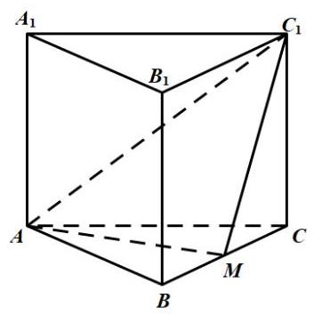

(1)求证:点 $M$ 为 ${BC}$ 边的中点；

(2)求点 $C$ 到平面 ${AM}{C}_{1}$ 的距离.

## 解析

(1)根据等腰直角三角形，可得 ${AM}\bot {C}_{1}M$ 且 ${AM} = {C}_{1}M$ ，根据三垂线定理可知 ${AM}\bot {CM}$ ，而底面 ${ABC}$ 为边长为 $a$ 的正三角形，则即可证得点 $M$ 为 ${BC}$ 边的中点；

(2)过点 $C$ 作 ${CH}\bot {M{C}_{1}}$ ，根据线面垂直的判定定理可知 ${AM}\bot$ 平面 ${C}_{1}{CM}$ ， ${CH}\bot$ 平面 ${C}_{1}{AM}$ ，则 ${CH}$ 即为点 $C$ 到平面 ${AM}{C}_{1}$ 的距离，根据等面积法可求出 ${CH}$ 的长.

(1)证: $\because  \bigtriangleup  {AM}{C}_{1}$ 为以点 $M$ 为直角顶点的等腰直角三角形，

$\therefore {AM}\bot {C}_{1}M$ 且 ${AM} = {C}_{1}M$ ，

$\because$ 三棱柱 ${ABC} - {A}_{1}{B}_{1}{C}_{1},\therefore C{C}_{1}\bot$ 底面 ${ABC}$ ，

$\therefore {C}_{1}M$ 在底面内射影为 ${CM},{AM} \bot  {CM}$ ,

$\because$ 底面 ${ABC}$ 为边长为 $a$ 的正三角形,

$\therefore$ 点 $M$ 为 ${BC}$ 边的中点；

(2)解:由(1)知 ${AM}\bot$ 平面 ${BC}{C}_{1}{B}_{1}$ ，则平面 ${AM}{C}_{1}\bot$ 平面 ${BC}{C}_{1}{B}_{1}$ .

在平面 ${BC}{C}_{1}{B}_{1}$ 内过点 $C$ 作 ${CH} \bot  {C}_{1}M$ 于 $H$ ，

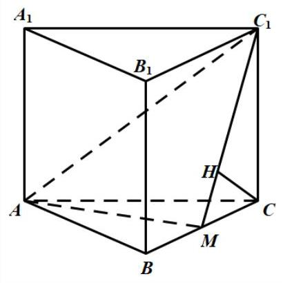

且平面 ${AM}{C}_{1} \cap$ 平面 ${BC}{C}_{1}{B}_{1} = {C}_{1}M$ ,

$\therefore {CH} \bot$ 平面 ${AM}{C}_{1}$ ,

$\therefore {CH}$ 即为 $C$ 到平面 ${AM}{C}_{1}$ 的距离,

在正三角形 ${ABC}$ 内, $\because {AB} = a$ ,

$\therefore {AM} = \frac{\sqrt{3}}{2}a$ ,则 ${C}_{1}M = \frac{\sqrt{3}}{2}a$ ,

在 ${Rt}\bigtriangleup {C}_{1}{CM}$ 中, ${CM} = \frac{a}{2}$ ,

则 $C{C}_{1} = \frac{\sqrt{2}}{2}a$ ,

$\therefore {CH} = \frac{{CM} \cdot  C{C}_{1}}{{C}_{1}M} = \frac{\sqrt{6}}{6}a,$

$\therefore C$ 到平面 ${AM}{C}_{1}$ 的距离为 $\frac{\sqrt{6}}{6}a$ .

本题主要考查点线的位置关系，以及点到平面的距离，同时考查了空间想象能力和计算能力, 以及转化与化归的思想, 属于中档题.

19 解答题

某工厂生产某种零件的固定成本为20000元，每生产一个零件要增加投入100元，已知总收入 $Q$ (单位: 元) 关于产量 $x$ (单位: 个) 满足函数: $Q = \left\{  \begin{array}{l} {400x} - \frac{1}{2}{x}^{2},0 \leq  x \leq  {400} \\  {80000}, x > {400} \end{array}\right.$ .

(1)将利润 $P$ (单位:元)表示为产量 $x$ 的函数；(总收入=总成本+利润)

(2)当产量为何值时，零件的单位利润最大？最大单位利润是多少元？(单位利润=利润÷产量)

解析

(1) $P\left( x\right)  = \left\{  \begin{array}{l}  - \frac{1}{2}{x}^{2} + {300x} - {20000},0 \leq  x \leq  {400} \\  {60000} - {100x}, x > {400} \end{array}\right.$

(2)当产量为20个，零件的单位利润最大，最大单位利润是100元.

【分析】(1)根据已知条件，结合利润公式，即可直接求得.

(2)设零件的单位利润为 $g\left( x\right)$ ，得到 $g\left( x\right)$ 的解析式，再结合基本不等式的公式，即可 【详解】(1)

当 $0 \leq  x \leq  {400}$ 时， $P\left( x\right)  = {400x} - \frac{1}{2}{x}^{2} - {20000} - {100x} =  - \frac{1}{2}{x}^{2} + {300x} - {20000}$ ,

当 $x > {400}$ 时, $P\left( x\right)  = {80000} - {100x} - {20000} = {60000} - {100x}$ ,

故 $P\left( x\right)  = \left\{  \begin{array}{l}  - \frac{1}{2}{x}^{2} + {300x} - {20000},0 \leq  x \leq  {400} \\  {60000} - {100x}, x > {400} \end{array}\right.$ .

(2)设零件的单位利润为 $g\left( x\right)$ ，

则 $g\left( x\right)  = \left\{  \begin{array}{l}  - \frac{1}{2}x - \frac{20000}{x} + {3000} \leq  x \leq  {400} \\  \frac{60000}{x} - {100}, x > {400} \end{array}\right.$ ,

当 $0 \leq  x \leq  {400}$ 时, $g\left( x\right)  = {300} - \left( {\frac{1}{2}x + \frac{20000}{x}}\right)  \leq  {300} - 2\sqrt{\frac{x}{2} \cdot  \frac{20000}{x}} = {100}$ ,

当且仅当 $\frac{x}{2} = \frac{20000}{x}$ ,即 $x = {200}$ 时,等号成立,

当 $x > {400}$ 时, $g\left( x\right)  = \frac{60000}{x} - {100} < {50}$ ,

故当产量为 200 个，零件的单位利润最大，最大单位利润是 100 元.

20 解答题

椭圆C: $\frac{{x}^{2}}{{a}^{2}} + \frac{{y}^{2}}{{b}^{2}} = 1\left( {a > b > 0}\right)$ 的离心率为 $\frac{\sqrt{3}}{2}$ ，以椭圆C的上顶点T为圆心作圆T: ${x}^{2} + {\left( y - 1\right) }^{2} = {r}^{2}\left( {r > 0}\right)$ ，圆 $\mathrm{T}$ 与椭圆C在第一象限交于点A，在第二象限交于点B.

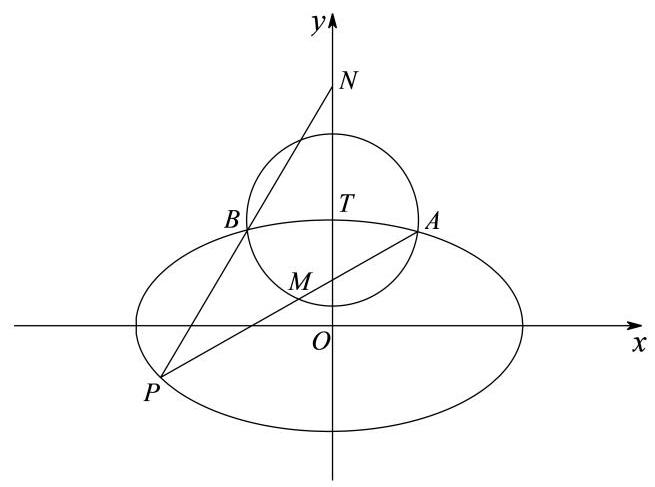

(1)求椭圆C的方程；

(2)求 $\overrightarrow{TA} \cdot  \overrightarrow{TB}$ 的最小值，并求出此时圆 $\mathrm{T}$ 的方程；

(3)设点P是椭圆C上异于A，B的一点，且直线PA，PB分别与y轴交于点M，N，O为坐标原点， 求证: $\left| {OM}\right|  \cdot  \left| {ON}\right|$ 为定值.

## 解析

解: 由题意知, $b = 1, e = \frac{c}{a} = \frac{\sqrt{3}}{2}$ ,所 ${a}^{2} - {c}^{2} = 1,\frac{{c}^{2}}{{a}^{2}} = \frac{3}{4}$ ,

得 ${a}^{2} = 4,{c}^{2} = 3,{b}^{2} = 1$ ,故椭圆 $\mathrm{C}$ 的方程为 $\frac{{x}^{2}}{4} + {y}^{2} = 1$ .

(2)点A与点B关于y轴对称，设 $A\left( {{x}_{1},{y}_{1}}\right)$ ， $B\left( {-{x}_{1},{y}_{1}}\right)$ ，由点A在圆C上，则 ${x}_{1}^{2} = 4 - 4{y}_{1}^{2}$ ，因为 $T\left( {0,1}\right)$ ,得 $\overrightarrow{TA} = \left( {{x}_{1},{y}_{1} - 1}\right) ,\overrightarrow{TB} = \left( {-{x}_{1},{y}_{1} - 1}\right)$

所以 $\overrightarrow{TA} \cdot  \overrightarrow{TB} =  - {x}_{1}^{2} + {\left( {y}_{1} - 1\right) }^{2} = 5{\left( {y}_{1} - \frac{1}{5}\right) }^{2} - \frac{16}{5}$ ,由题意得 $0 < {y}_{1} < 1$

当 ${y}_{1} = \frac{1}{5}$ 时， $\overrightarrow{TA} \cdot  \overrightarrow{TB}$ 取最小值 $- \frac{16}{5}$ ，此时 ${x}_{1}^{2} = 4 - \frac{4}{25}$ ， ${x}_{1} = \frac{4\sqrt{6}}{5}$

故 $A\left( {\frac{4\sqrt{6}}{5},\frac{1}{5}}\right)$ ,又点 $\mathrm{A}$ 在圆 $\mathrm{T}$ 上,代入圆的方程,得 ${r}^{2} = \frac{112}{25}$

故圆 $\mathrm{T}$ 的方程是 ${x}^{2} + {\left( y - 1\right) }^{2} = \frac{112}{25}$ .

(3)证明:设 $P\left( {{x}_{0},{y}_{0}}\right)$ ，则PA的方程为 $y - {y}_{0} = \frac{{y}_{0} - {y}_{1}}{{x}_{0} - {x}_{1}} \cdot  \left( {x - {x}_{0}}\right)$ 令 $x = 0$ ,得 ${y}_{M} = {y}_{0} - \frac{\left( {{y}_{0} - {y}_{1}}\right) {x}_{0}}{{x}_{0} - {x}_{1}} = \frac{{x}_{0}{y}_{1} - {x}_{1}{y}_{0}}{{x}_{0} - {x}_{1}}$ ,同理 ${y}_{N} = \frac{{x}_{0}{y}_{1} + {x}_{1}{y}_{0}}{{x}_{0} + {x}_{1}}$ 故 ${y}_{M} \cdot  {y}_{N} = \frac{{x}_{0}^{2}{y}_{1}^{2} - {x}_{1}^{2}{y}_{0}^{2}}{{x}_{0}^{2} - {x}_{1}^{2}}$ ,① 因为P, A都在椭圆C上所以 ${y}_{0}^{2} = 1 - \frac{{x}_{0}^{2}}{4},{y}_{1}^{2} = 1 - \frac{{x}_{1}^{2}}{4}$ ,代入①可得:

$\left| {{y}_{M} \cdot  {y}_{N}}\right|  = \frac{{x}_{0}^{2}\left( {1 - \frac{{x}_{1}^{2}}{4}}\right)  - {x}_{1}^{2}\left( {1 - \frac{{x}_{0}^{2}}{4}}\right) }{{x}_{0}^{2} - {x}_{1}^{2}} = 1$ ,即得 $\left| {OM}\right|  \cdot  \left| {ON}\right|  = \left| {{y}_{M} \cdot  {y}_{N}}\right|  = 1$ .

21 解答题

对于数列 $\left\{  {a}_{n}\right\}$ ，若存在正数 $k$ ，使得对任意 $m, n \in  {N}^{ * }$ ， $m \neq  n$ ，都满足 $\left| {{a}_{m} - {a}_{n}}\right|  \leq  k\left| {m - n}\right|$ ，则称数列 $\left\{  {a}_{n}\right\}$ 符合“ $L\left( k\right)$ 条件”.

(1)试判断公差为2的等差数列 $\left\{  {a}_{n}\right\}$ 是否符合“ $L\left( 2\right)$ 条件”？

(2)若首项为1，公比为 $q$ 的正项等比数列 $\left\{  {a}_{n}\right\}$ 符合“ $L\left( \frac{1}{2}\right)$ 条件”. 求 $q$ 的范围；

(3)在(2)的条件下，记数列 $\left\{  {a}_{n}\right\}$ 的前 $n$ 项和为 ${S}_{n}$ ，证明:存在正数 ${k}_{0}$ ，使得数列 $\left\{  {S}_{n}\right\}$ 符合“ $L\left( {k}_{0}\right)$ 条件”.

## 解析

(1)因为 $\left\{  {a}_{n}\right\}$ 是等差数列且公差为2，所以 ${a}_{n} = {a}_{1} + 2\left( {n - 1}\right)$ ，

所以对任意 $m, n \in  {\mathbf{N}}^{ * }, m \neq  n$ ,

$\left| {{a}_{m} - {a}_{n}}\right|  = \left| {\left\lbrack  {{a}_{1} + 2\left( {m - 1}\right) }\right\rbrack   - \left\lbrack  {{a}_{1} + 2\left( {n - 1}\right) }\right\rbrack  }\right|  = \left| {2\left( {m - n}\right) }\right|  \leq  2\left| {m - n}\right|$ 恒成立, 所以数列 $\left\{  {a}_{n}\right\}$ 符合“ $L\left( 2\right)$ 条件”.

(2)因为 ${a}_{n} > 0$ ，所以 $q > 0$ .

若 $q = 1$ ,则 $\left| {{a}_{m} - {a}_{n}}\right|  = 0 \leq  \frac{1}{2}\left| {m - n}\right|$ ,数列 $\left\{  {a}_{n}\right\}$ 符合“ $L\left( \frac{1}{2}\right)$ 条件”;

若 $q > 1$ ,因为数列 $\left\{  {a}_{n}\right\}$ 递增,不妨设 $m < n$ ,

则 ${a}_{n} - {a}_{m} \leq  \frac{1}{2}\left( {n - m}\right)$ ,即 ${a}_{n} - \frac{1}{2}n \leq  {a}_{m} - \frac{1}{2}m,\left( *\right)$

设 ${b}_{n} = {a}_{n} - \frac{1}{2}n$ ,由 $\left( *\right)$ 式中的 $m, n$ 任意性得数列 $\left\{  {b}_{n}\right\}$ 不递增,

所以 ${b}_{n + 1} - {b}_{n} = \left( {{a}_{n + 1} - {a}_{n}}\right)  - \frac{1}{2} = {q}^{n - 1}\left( {q - 1}\right)  - \frac{1}{2} \leq  0, n \in  {\mathbf{N}}^{ * }$ ,

则当 $n > 1 - {\log }_{4}^{\left\lbrack  2\left( q - 1\right) \right\rbrack  }$ 时, ${q}^{n - 1}\left( {q - 1}\right)  - \frac{1}{2} > 0$ ,矛盾.

若 $0 < q < 1$ ,则数列 $\left\{  {a}_{n}\right\}$ 单调递减,不妨设 $m < n$ ,

则 ${a}_{n} - {a}_{m} \leq  \frac{1}{2}\left( {n - m}\right)$ ，即 ${a}_{m} + \frac{1}{2}m \leq  {a}_{n} + \frac{1}{2}n,\left( {* * }\right)$

设 ${c}_{n} = {a}_{n} + \frac{1}{2}n$ ,由 $\left( {* * }\right)$ 式中的 $m, n$ 任意性得,数列 $\left\{  {a}_{n}\right\}$ 不递减,

所以 ${c}_{n + 1} - {c}_{n} = \left( {{a}_{n + 1} - {a}_{n}}\right)  + \frac{1}{2} = {q}^{n + 1}\left( {q - 1}\right)  + \frac{1}{2} \geq  0, n \in  {\mathbf{N}}^{ * }$ .

因为 $0 < q < 1$ 时, $f\left( n\right)  = {q}^{n - 1}\left( {q - 1}\right)  + \frac{1}{2}$ 单调递增,

所以 $f{\left( n\right) }_{\max } = f\left( 1\right)  = \left( {q - 1}\right)  + \frac{1}{2} \geq  0$ ,因为 $0 < q < 1$ ,所以 $\frac{1}{2} \leq  q < 1$ .

综上,公比 $q$ 的范围为 $\left\lbrack  {\frac{1}{2},1}\right\rbrack$ .

(3) 由 (2) 得, ${S}_{n} = \frac{1 - {q}^{n}}{1 - q},\frac{1}{2} \leq  q < 1$ ,

当 $q = 1$ 时， ${S}_{n} = n$ ，要存在 ${k}_{0}$ 使得 $\left| {{S}_{n} - {S}_{m}}\right|  \leq  {k}_{0}\left| {n - m}\right|$ ，只要 ${k}_{0} \geq  1$ 即可.

当 $\frac{1}{2} \leq  q < 1$ 时,要证数列 $\left\{  {S}_{n}\right\}$ 符合“ $L\left( {k}_{0}\right)$ 条件”,

只要证存在 ${k}_{0} > 0$ ,使得 $\left| {\frac{1 - {q}^{n}}{1 - q} - \frac{1 - {q}^{m}}{1 - q}}\right|  \leq  {k}_{0}\left| {n - m}\right| , n \in  {\mathbf{N}}^{ * }$ ,

不妨设 $m < n$ ,则只要证 ${q}^{m} - {q}^{n} \leq  {k}_{0}\left( {1 - q}\right) \left( {n - m}\right)$ ,

只要证 ${q}^{m} + {k}_{0}{\left( 1 - q\right) }^{m} \leq  {q}^{n} + {k}_{0}{\left( 1 - q\right) }^{n}$ .

设 $g\left( n\right)  = {q}^{n} + {k}_{0}{\left( 1 - q\right) }^{n}$ ，由 $m$ ， $n$ 的任意性，

只要证 $g\left( {n + 1}\right)  - g\left( n\right)  = {q}^{n}\left( {q - 1}\right)  + {k}_{0}\left( {1 - q}\right)  = \left( {1 - q}\right) \left( {{k}_{0} - {q}^{n}}\right)  \geq  0$ ,

只要证 ${k}_{0} \geq  {q}^{n}, n \in  {\mathbf{N}}^{ * }$ ,

因为 $\frac{1}{2} \leq  q < 1$ ,所以存在 ${k}_{0} \geq  q$ ,上式对 $n \in  {\mathbf{N}}^{ * }$ 成立.

所以，存在正数 ${k}_{0}$ ，使得数列 $\left\{  {S}_{n}\right\}$ 符合“ $L\left( {k}_{0}\right)$ 条件”.

# 上海市上海中学2022届高三下学期 高考模拟3数学试题

姓名:___

## 一、填空题

1 填空题

已知集合 $U = R$ ，集合 $P = \{ x\left| \right| x - 2 \mid   \geq  1\}$ ，则 ${\complement }_{\mathrm{U}}P =$ ___

解析

解绝对值不等式求得集合 $P$ ，再求得 ${\complement }_{\mathrm{U}}P$ . 由 $\left| {x - 2}\right|  \geq  1$ ，得 $x - 2 \leq   - 1$ 或 $x - 2 \geq  1$ ，即 $x \leq  1$ 或 $x \geq  3$ . 所以 $P = \{ x \mid  x \leq  1$ 或 $x \geq  3\}$ ,所以 ${C}_{U}P = \{ x \mid  1 < x < 3\}$

故答案为: $\{ x \mid  1 < x < 3\}$

本小题主要考查绝对值不等式的解法, 考查补集的概念和运算, 属于基础题.

2 填空题

在 ${\left( 2\sqrt{x} - \frac{1}{x}\right) }^{9}$ 的展开式中，各项系数之和为___.

解析

令 $x = 1$ ，即得各项系数的和 ${\left( 2 \times  1 - 1\right) }^{9} = 1$ .

考点:赋值法.

3 填空题

写出系数矩阵为 $\left( \begin{array}{ll} 1 & 2 \\  2 & 1 \end{array}\right)$ ，且解为 $\left( \begin{array}{l} x \\  y \end{array}\right)  = \left( \begin{array}{l} 1 \\  1 \end{array}\right)$ 的一个线性方程组是___.

解析

根据系数矩阵为 $\left( \begin{array}{ll} 1 & 2 \\  2 & 1 \end{array}\right)$ 求解.

由题意得:线性方程组是 $\left\{  \begin{array}{l} x + {2y} = 3 \\  {2x} + y = 3 \end{array}\right.$ ，

解得 $\left\{  \begin{array}{l} x = 1 \\  y = 1 \end{array}\right.$ ,

故所求的一个线性方程组是 $\left\{  \begin{array}{l} x + {2y} = 3 \\  {2x} + y = 3 \end{array}\right.$ ,

故答案为: $\left\{  \begin{array}{l} x + {2y} = 3 \\  {2x} + y = 3 \end{array}\right.$

4 填空题

已知函数 $f\left( x\right)  = \sin {\omega x} - \sin \left( {{\omega x} + \frac{\pi }{3}}\right) \left( {\omega  > 0}\right)$ 的最小正周期是 $\frac{\pi }{2}$ ，则 $\omega  =$ ___.

解析

根据三角恒等变换化简三角函数, 然后利用周期计算公式列方程, 解方程即可求值 $f\left( x\right)  = \sin {\omega x} - \sin \left( {{\omega x} + \frac{\pi }{3}}\right)  = \sin {\omega x} - \frac{1}{2}\sin {\omega x} - \frac{\sqrt{3}}{2}\cos {\omega x} = \sin \left( {{\omega x} - \frac{\pi }{3}}\right) ,$ 所以最小正周期是 $T = \frac{2\pi }{\omega } = \frac{\pi }{2}$ ,所以 $\omega  = 4$ . 故答案为: 4

5 填空题

若三阶行列式 $\left| \begin{matrix}  - 1 & 3 & 0 \\  {2n} + 1 &  - 2 &  - m \\  {4m} & 1 & {2n} - 1 \end{matrix}\right|$ 中第1行第2列的元素3的代数余子式的值是-15，则 $\left| {n + m\mathrm{i}}\right|$ (其中i是虚数单位, $m\text{ 、 }n \in  \mathrm{R}$ ) 的值是___.

解析

试题分析: 由已知条件得 ${\left( -1\right) }^{1 + 2}\left| \begin{matrix} {2n} + 1 &  - m \\  {4m} & {2n} - 1 \end{matrix}\right|  =  - {15}$ ,

即 $\left( {{2n} + 1}\right) \left( {{2n} - 1}\right)  - \left( {-m}\right)  \times  {4m} = {15}$ ,

从而有 ${n}^{2} + {m}^{2} = 4$ ,

故 $\left| {n + m\mathrm{i}}\right|  = \sqrt{{n}^{2} + {m}^{2}} = \sqrt{4} = 2$ ,

故答案为2.

考点: 1. 行列式; 2. 复数的模.

6 填空题

函数 $f\left( x\right)  = {\log }_{2}\left( {{4}^{x} - {2}^{x + 1} + 3}\right)$ 的值域为___

解析

先利用配方可得到 ${4}^{x} - {2}^{x + 1} + 3 = {\left( {2}^{x} - 1\right) }^{2} + 2 \geq  2$ ,然后利用对数函数的性质即可求解因为 ${4}^{x} - {2}^{x + 1} + 3 = {\left( {2}^{x} - 1\right) }^{2} + 2 \geq  2$ ,

所以根据对数函数的性质可得 $f\left( x\right)  = {\log }_{2}\left( {{4}^{x} - {2}^{x + 1} + 3}\right)  \geq  {\log }_{2}2 = 1$ ,

可知函数的值域为 $\lbrack 1, + \infty )$ .

故答案为: $\lbrack 1, + \infty )$

7 填空题

某校举行数学文化知识竞赛，现在要从进入决赛的5名选手中随机选出2名代表学校参加市级比赛. 某班有甲、乙两名同学进入决赛，则在这次竞赛中该班有同学参加市级比赛的概率为___.

解析

得出这次竞赛中该班没有同学参加市级比赛的概率, 即只从除甲、乙两名同学外的三名同学中选两个的概率, 在根据互斥事件的概率计算即可得出答案.

在这次竞赛中该班有同学参加市级比赛的概率为 $1 - \frac{{\mathrm{C}}_{3}^{2}}{{\mathrm{C}}_{5}^{2}} = \frac{7}{10}$ .

故答案为:0.7

8 填空题

在 $\bigtriangleup {ABC}$ 中， $a\text{ 、 }b\text{ 、 }c$ 分别为角 $A\text{ 、 }B\text{ 、 }C$ 的对边，且满足 $4{\cos }^{2}\frac{A}{2} - \cos 2\left( {B + C}\right)  = \frac{7}{2}$ ，则角 $A$ 的大小是___.

解析

根据题意结合三角恒等变换运算求解即可得答案.

由 $A + B + C = \pi$ ,即 $B + C = \pi  - A$ ,故 $2\left( {B + C}\right)  = {2\pi } - {2A}$

则

$4{\cos }^{2}\frac{A}{2} - \cos 2\left( {B + C}\right)  = 4 \times  \frac{1 + \cos A}{2} - \cos \left( {{2\pi } - {2A}}\right)  = 2 + 2\cos A - \cos {2A} = 2 + 2\cos \; A - \left( {2{\cos }^{2}A - 1}\right)  =  - 2{\cos }^{2}A + 2\cos A + 3 = \frac{7}{2}$

可得 $4{\cos }^{2}A - 4\cos A + 1 = 0$ ，解得 $\cos A = \frac{1}{2}$ ，

因为 $0 < A < \pi$ ,所以 $A = \frac{\pi }{3}$ .

故答案为: $\frac{\pi }{3}$ .

9 填空题

关于 $x$ 的不等式 ${\log }_{a}\left( {{x}^{2} - {2x} + 3}\right)  \leq   - 1$ 在 $\mathbf{R}$ 上恒成立，则实数 $a$ 的取值范围是___.

解析

分类讨论, 根据对数函数单调性, 结合恒成立思想解决即可.

由题意得, ${\log }_{a}\left( {{x}^{2} - {2x} + 3}\right)  \leq   - 1 = {\log }_{a}\left( \frac{1}{a}\right)$ ,

所以

$\left\{  \begin{array}{l} a > 1 \\  {x}^{2} - {2x} + 3 \leq  \frac{1}{a} \end{array}\right.$ 恒成立,或 $\left\{  \begin{array}{l} 0 < a < 1 \\  {x}^{2} - {2x} + 3 \geq  \frac{1}{a} \end{array}\right.$ 恒成立,

即 $\left\{  \begin{array}{l} a > 1 \\  {\left( {x}^{2} - 2x + 3\right) }_{\max } \leq  \frac{1}{a} \end{array}\right.$ ,或 $\left\{  \begin{array}{l} 0 < a < 1 \\  {\left( {x}^{2} - 2x + 3\right) }_{\min } \geq  \frac{1}{a} \end{array}\right.$ ,

因为 ${x}^{2} - {2x} + 3$ 无最大值,所以 $\left\{  \begin{array}{l} a > 1 \\  {\left( {x}^{2} - 2x + 3\right) }_{\max } \leq  \frac{1}{a} \end{array}\right.$ 无解;

因为 ${x}^{2} - {2x} + 3$ 最小值为 2,

所以 $\left\{  \begin{array}{l} 0 < a < 1 \\  {\left( {x}^{2} - 2x + 3\right) }_{\min } \geq  \frac{1}{a} \end{array}\right.  \Leftrightarrow  \left\{  \begin{array}{l} 0 < a < 1 \\  2 \geq  \frac{1}{a} \end{array}\right.$ ,解得 $\frac{1}{2} \leq  a < 1$ ,

综上, $a \in  \left\lbrack  {\frac{1}{2},1}\right)$ .

故答案为: $\left\lbrack  {\frac{1}{2},1}\right)$

10 填空题

在平面直角坐标系 ${xOy}$ 中，动点 $P$ 在椭圆 $\frac{{x}^{2}}{4} + \frac{{y}^{2}}{3} = 1$ 上，点 $M$ 是 ${OP}$ 的中点，过点 $M$ 作直线 $l$ (和直线 ${OP}$ 不重合)与椭圆相交于 $Q, R$ 两点，若直线 ${OP},{OQ}$ 的斜率分别为 ${k}_{1}\text{ 、 }{k}_{2}$ ，且 $\overrightarrow{MR} = \frac{3}{5}\overrightarrow{QM}$ ，则 ${k}_{1}{k}_{2}$ 的值是___.

解析

分别设 $Q\left( {{x}_{1},{y}_{1}}\right) , R\left( {{x}_{2},{y}_{2}}\right) , M\left( {{x}_{0},{y}_{0}}\right)$ ,则 $P\left( {2{x}_{0},2{y}_{0}}\right)$ . 将 $P, Q, R$ 点的坐标分别代入椭圆方程,结合已知 $\overrightarrow{MR} = \frac{3}{5}\overrightarrow{QM}$ ,即可推得

${64}\left( {3{x}_{0}^{2} + 4{y}_{0}^{2}}\right)  + 9\left( {3{x}_{1}^{2} + 4{y}_{1}^{2}}\right)  - {48}\left( {3{x}_{0}{x}_{1} + 4{y}_{0}{y}_{1}}\right)  = {300}$ ,整理可得 ${x}_{0}{x}_{1} =  - \frac{4}{3}{y}_{0}{y}_{1}$ ,即可求出答案.

设点 $Q\left( {{x}_{1},{y}_{1}}\right) , R\left( {{x}_{2},{y}_{2}}\right) , M$ 的坐标为 $\left( {{x}_{0},{y}_{0}}\right)$ ,则点 $P\left( {2{x}_{0},2{y}_{0}}\right)$ .

则 $\frac{{y}_{1}}{{x}_{1}} = {k}_{2},\frac{{y}_{0}}{{x}_{0}} = {k}_{1}$ .

因为点 $P$ 在椭圆上，所以 $\frac{4{x}_{0}^{2}}{4} + \frac{4{y}_{0}^{2}}{3} = 1$ ，即 $3{x}_{0}^{2} + 4{y}_{0}^{2} = 3$ .

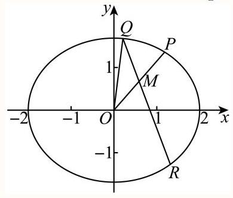

因为 $\overrightarrow{MR} = \frac{3}{5}\overrightarrow{QM}$ ,所以 $\left( {{x}_{2} - {x}_{0},{y}_{2} - {y}_{0}}\right)  = \frac{3}{5}\left( {{x}_{0} - {x}_{1},{y}_{0} - {y}_{1}}\right)$ ,

所以 ${x}_{2} - {x}_{0} = \frac{3}{5}\left( {{x}_{0} - {x}_{1}}\right) ,{y}_{2} - {y}_{0} = \frac{3}{5}\left( {{y}_{0} - {y}_{1}}\right)$ ,

所以 ${x}_{2} = \frac{8}{5}{x}_{0} - \frac{3}{5}{x}_{1},{y}_{2} = \frac{8}{5}{y}_{0} - \frac{3}{5}{y}_{1}$ .

又 $Q, R$ 在椭圆上，

所以有 $3{x}_{1}^{2} + 4{y}_{1}^{2} = {12},3{x}_{2}^{2} + 4{y}_{2}^{2} = {12}$ ,

代入有 $3{\left( \frac{8}{5}{x}_{0} - \frac{3}{5}{x}_{1}\right) }^{2} + 4{\left( \frac{8}{5}{y}_{0} - \frac{3}{5}{y}_{1}\right) }^{2} = {12}$ ,

展开得 ${64}\left( {3{x}_{0}^{2} + 4{y}_{0}^{2}}\right)  + 9\left( {3{x}_{1}^{2} + 4{y}_{1}^{2}}\right)  - {48}\left( {3{x}_{0}{x}_{1} + 4{y}_{0}{y}_{1}}\right)  = {300}$ ,

即 ${64} \times  3 + 9 \times  {12} - {48}\left( {3{x}_{0}{x}_{1} + 4{y}_{0}{y}_{1}}\right)  = {300}$ ,所以 $3{x}_{0}{x}_{1} + 4{y}_{0}{y}_{1} = 0$ ,

所以 ${x}_{0}{x}_{1} =  - \frac{4}{3}{y}_{0}{y}_{1}$ .

所以 ${k}_{1}{k}_{2} = \frac{{y}_{0}}{{x}_{0}} \cdot  \frac{{y}_{1}}{{x}_{1}} = \frac{{y}_{0}{y}_{1}}{{x}_{0}{x}_{1}} = \frac{{y}_{0}{y}_{1}}{-\frac{4}{3}{y}_{0}{y}_{1}} =  - \frac{3}{4}$ .

故答案为: $- \frac{3}{4}$ .

11 填空题

若一个整数数列的首项和末项都是1，且任意相邻两项之差的绝对值不大于1，则我们称这个数列为“好数列”，例如:1, 2, 2, 3, 4, 3, 2, 1, 1是一个好数列，若一个好数列的各项之和是 2021, 则这个数列至少有___ 项.

## 解析

根据题意分析可得数列要想项数最少, 需要各项最大, 可设这个“好数列”为: $1,2,3,\cdots ,\left( {n - 1}\right) , n,\left( {n - 1}\right) ,\cdots ,3,2,1$ ,求这个“好数列”各项之和为 ${n}^{2}$ ,令 ${n}^{2} \leq  {2021}$ 得 $n \leq  {44}$ ,此时 ${2021} - {44}^{2} = {85}$ ,将 85 分成小于或等于44的项,最少可以分成两项,由此即可求解.

由题意得数列要想项数最少，需要各项最大；

又因为数列首项和末项都是1，且任意相邻两项之差的绝对值不大于1，

所以需要数列前面递增，后面对称递减，

又各项之和是2021，中间可能存在相等的项，

设除去相等项后的各项为 $1,2,3,\cdots ,\left( {n - 1}\right) , n,\left( {n - 1}\right) ,\cdots ,3,2,1$ ,

令各项和 $1 + 2 + 3 + \cdots  + \left( {n - 1}\right)  + n + \left( {n - 1}\right)  + \cdots  + 2 + 1$

$= 2\left\lbrack  {1 + 2 + 3 + \cdots  + \left( {n - 1}\right) }\right\rbrack   + n = 2 \times  \frac{\left( {n - 1}\right) \left\lbrack  {1 + \left( {n - 1}\right) }\right\rbrack  }{2} + n$

$= n\left( {n - 1}\right)  + n = {n}^{2} \leq  {2021}$ ,得 $n \leq  {44}$ ,

当 $n$ 为 44 时，项数为 ${43} \times  2 + 1 = {87}$ 项， ${2021} - {44}^{2} = {85}$ ，

将85分成小于或等于44的项，最少可以分成两项，

故这个数列至少有 ${87} + 2 = {89}$ 项,

故答案为: 89

本题考查数列新定义和等差数列求和，关键在于理解数列新定义中各项数的特点，严格按照运用定义进行求和和数列的项的探索, 属于中档题.

12 填空题

已知函数 $f\left( x\right)  = \left\{  \begin{array}{ll} \left| {x + a}\right|  + \left| {x - 1}\right| , & x > 0 \\  {x}^{2} - {ax} + 2, & x \leq  0 \end{array}\right.$ 的最小值为 $a + 1$ ，则实数 $a$ 的取值范围为___.

解析

对参数 $a$ 进行分类讨论，结合二次函数的最值，由已知条件，求得不同情况下对应的参数范围, 再求并集即可.

分情况进行讨论:

当 $a \geq  0$ 时， $f\left( x\right)  = \left\{  \begin{array}{ll} x + a + \left| {x - 1}\right| , & x > 0 \\  {x}^{2} - {ax} + 2, & x \leq  0 \end{array}\right.$ ，

$x > 0$ 时 $f\left( x\right)$ 在 $\left\lbrack  {-a,1}\right\rbrack$ 取得最小值 $a + 1$ ，

$x \leq  0$ 时在 $x = 0$ 时取得最小值 2，故 $a + 1 \leq  2$ ，解得 $a \leq  1$ ，

又因为此时 $a \geq  0$ ，所以 $0 \leq  a \leq  1$ 。

当 $- 1 \leq  a < 0$ 时 $f\left( x\right)  = \left\{  \begin{array}{ll} \left| {x + a}\right|  + \left| {x - 1}\right| , & x > 0 \\  {x}^{2} - {ax} + 2, & x \leq  0 \end{array}\right.$ ,

$x > 0$ 时 $f\left( x\right)$ 在 $\left\lbrack  {-a,1}\right\rbrack$ 之间取得最小值 $a + 1$ ,

$x \leq  0$ 时在 $x = \frac{a}{2}$ 处取得最小值 $2 - \frac{{a}^{2}}{4}$ ,故 $a + 1 \leq  2 - \frac{{a}^{2}}{4}$ ,解得 $- 2\sqrt{2} - 2 \leq  a \leq  2\sqrt{2} - 2$ ,

又因为此时 $- 1 \leq  a < 0$ ,所以 $- 1 \leq  a < 0$ 。

当 $a <  - 1$ 时， $f\left( x\right)  = \left\{  \begin{array}{ll} \left| {x + a}\right|  + \left| {x - 1}\right| , & x > 0 \\  {x}^{2} - {ax} + 2, & x \leq  0 \end{array}\right.$ ，

$x > 0$ 时 $f\left( x\right)$ 在 $\left\lbrack  {1, - a}\right\rbrack$ 之间取得最小值 $- \left( {a + 1}\right)$ ,而此时 $- \left( {a + 1}\right)  > a + 1$ ,

所以 $x \leq  0$ 时的最小值为 $a + 1$ 。

又根据二次函数性质， $x \leq  0$ 时在 $x = \frac{a}{2}$ 处取得最小值 $2 - \frac{{a}^{2}}{4}$ ，

故 $a + 1 = 2 - \frac{{a}^{2}}{4}$ ，解得 $x =  - 2\sqrt{2} - 2$ 或 $x = 2\sqrt{2} - 2$ ，

而此时 $a <  - 1$ ,故 $x =  - 2\sqrt{2} - 2$ 。

所以实数 $a$ 的取值范围为 $\{  - 2 - 2\sqrt{2}\}  \cup  \left\lbrack  {-1,1}\right\rbrack$ 。

故答案为: $\{  - 2 - 2\sqrt{2}\}  \cup  \left\lbrack  {-1,1}\right\rbrack$

本题考查由分段函数的最值, 求参数范围, 涉及二次函数的最值, 注意分类讨论, 属综合基础题.

## 二、选择题

## 13 单选题

已知集合 $A = \{ \left( {x, y}\right)  \mid  x + y = 2\} , B = \{ \left( {x, y}\right)  \mid  x - {2y} =  - 4\}$ ，则 $A \cap  B =$ ( )

A. $\{ 0,2\}$

B. $\left( {0,2}\right)$

C. $\varnothing$

D. $\{ \left( {0,2}\right) \}$

## 解析

两点集的交集，即这两条直线的交点.

$A \cap  B = \left\{  {\left( {x, y}\right) \left| {\;\left\{  \begin{array}{l} x + y = 2 \\  x - {2y} =  - 4 \end{array}\right\}   = \{ \left( {0,2}\right) \} }\right. }\right.$

14 单选题

数列 $\left\{  {a}_{n}\right\}$ 的前 $n$ 项和记为 ${S}_{n}$ ，则 “数列 $\left\{  {S}_{n}\right\}$ 为等差数列” 是 “数列 $\left\{  {a}_{n}\right\}$ 为常数列”的( )

A. 充分不必要条件

B. 必要不充分条件

C. 充分必要条件

D. 既不充分也不必要条件

## 解析

先证必要性,由 “数列 $\left\{  {a}_{n}\right\}$ 为常数列” 出发,得出 “数列 $\left\{  {S}_{n}\right\}$ 为等差数列”; 再证充分性,由 “数列 $\left\{  {S}_{n}\right\}$ 为等差数列”,设公差为 $d,{S}_{n} = {S}_{1} + \left( {n - 1}\right) d$ ,得出当 ${a}_{1} \neq  d$ 时,数列 $\left\{  {a}_{n}\right\}$ 不是常数列, 即可得出答案.

若数列 $\left\{  {a}_{n}\right\}$ 为常数列,则设 ${a}_{n} = a$ ,所以 ${S}_{n} = {na}$ ,

于是 ${S}_{1} = {a}_{1} = a,{S}_{n + 1} - {S}_{n} = \left( {n + 1}\right) a - {na} = a$ ,所以 $\left\{  {S}_{n}\right\}$ 为等差数列;

即“数列 $\left\{  {S}_{n}\right\}$ 为等差数列”是“数列 $\left\{  {a}_{n}\right\}$ 为常数列”的必要条件；

若数列 $\left\{  {S}_{n}\right\}$ 为等差数列,设公差为 $d,{S}_{n} = {S}_{1} + \left( {n - 1}\right) d$ ,

于是 ${a}_{1} = {S}_{1},{a}_{n} = {S}_{n} - {S}_{n - 1} = {S}_{1} + \left( {n - 1}\right) d - {S}_{1} - \left( {n - 2}\right) d = d$ ,

当 ${a}_{1} \neq  d$ 时,数列 $\left\{  {a}_{n}\right\}$ 不是常数列,

所以“数列 $\left\{  {S}_{n}\right\}$ 为等差数列”不是“数列 $\left\{  {a}_{n}\right\}$ 为常数列”的充分条件;

综上所述，“数列 $\left\{  {S}_{n}\right\}$ 为等差数列”是“数列 $\left\{  {a}_{n}\right\}$ 为常数列”的必要不充分条件，

故选: B

注意充分性及必要性的证明,利用等差数列,常数列的相关知识,特别是当 ${a}_{1} \neq  d$ 时,数列 $\left\{  {a}_{n}\right\}$ 不是常数列.

15 单选题

如图, $B\text{ 、 }D$ 是以 ${AC}$ 为直径的圆上的两点,其中 ${AB} = \sqrt{t + 1},{AD} = \sqrt{t + 2}$ ,则 $\overrightarrow{AC} \cdot  \overrightarrow{BD} =$ ( )

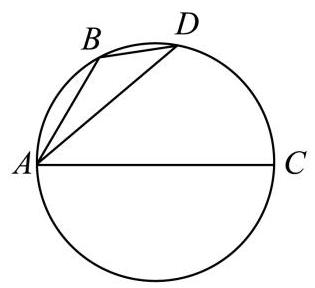

A. 1

B. 2

C. $t$

D. ${2t}$

## 解析

连结 ${BC}\text{ 、 }{CD}$ ,则 有 $\overrightarrow{AB} \cdot  \overrightarrow{AC} = A{B}^{2} = t + 1,\overrightarrow{AD} \cdot  \overrightarrow{AC} = A{D}^{2} = t + 2$ ,根据 $\overrightarrow{AC} \cdot  \overrightarrow{BD} = \overrightarrow{AC} \cdot  \left( {\overrightarrow{AD} - \overrightarrow{AB}}\right)$ 求解即可.

解: 连结 ${BC}\text{ 、 }{CD}$ .

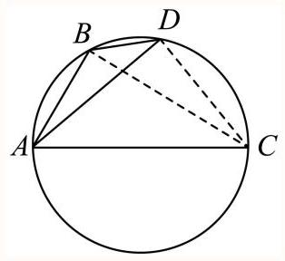

则 ${AD} \bot  {CD},{AB} \bot  {BC}$ .

所以 $\overrightarrow{AB} \cdot  \overrightarrow{AC} = {AB} \times  {AC} \times  \cos \angle {BAC} = {AB} \times  \left( {{AC} \times  \cos \angle {BAC}}\right)  = A{B}^{2} = t + 1$ .

$\overrightarrow{AD} \cdot  \overrightarrow{AC} = {AD} \times  {AC} \times  \cos \angle {CAD} = {AD} \times  \left( {{AC} \times  \cos \angle {CAD}}\right)  = A{D}^{2} = t + 2.$

因为 $\overrightarrow{BD} = \overrightarrow{AD} - \overrightarrow{AB}$ ,

所以 $\overrightarrow{AC} \cdot  \overrightarrow{BD} = \overrightarrow{AC} \cdot  \left( {\overrightarrow{AD} - \overrightarrow{AB}}\right)  = \overrightarrow{AC} \cdot  \overrightarrow{AD} - \overrightarrow{AC} \cdot  \overrightarrow{AB} = t + 2 - \left( {t + 1}\right)  = 1$ .

故选: $A$ .

16 单选题

已知集合 $M = \left\{  {\left( {x, y}\right)  \mid  {x}^{2} + {y}^{2} \leq  1}\right\}$ ，若实数 $\lambda$ ， $\mu$ 满足:对任意的 $\left( {x, y}\right)  \in  M$ ，都有 $\left( {{\lambda x},{\mu y}}\right)  \in  M$ ， 则称 $\left( {\lambda ,\mu }\right)$ 是集合 $M$ 的“和谐实数对”，则以下集合中，存在“和谐实数对”的是

A. $\{ \left( {\lambda ,\mu }\right)  \mid  \lambda  + \mu  = 4\}$

B. $\left\{  {\left( {\lambda ,\mu }\right)  \mid  {\lambda }^{2} + {\mu }^{2} = 4}\right\}$

C. $\left\{  {\left( {\lambda ,\mu }\right)  \mid  {\lambda }^{2} - {4\mu } = 4}\right\}$

D. $\left\{  {\left( {\lambda ,\mu }\right)  \mid  {\lambda }^{2} - {\mu }^{2} = 4}\right\}$

解析

试题分析: 分析题意可知,所有满足题意的有序实数对 $\left( {\lambda ,\mu }\right)$ 所构成的集合为

$\{ \left( {\lambda ,\mu }\right)  \mid   - 1 \leq  \lambda  \leq  1, - 1 \leq  \mu  \leq  1\}$ ,将其看作点的集合,为中心在原点, $\left( {-1,1}\right) ,\left( {-1, - 1}\right)$ , $\left( {1, - 1}\right) ,\left( {1,1}\right)$ 为顶点的正方形及其内部, $\mathrm{A},\mathrm{\;B},\mathrm{D}$ 选项分别表示直线,圆,双曲线,与该正方形及其内部无公共点,选项C为抛物线,有公共点 $\left( {0, - 1}\right)$ ,故选C.

考点:以集合为背景的创新题.

## 三、解答题

17 解答题

如图，在四棱锥 $P - {ABCD}$ 中，四边形 ${ABCD}$ 为正方形， $P$ 点在平面 ${ABCD}$ 内的射影为A，且 ${PA} = {AB} = 2, E$ 为 ${PD}$ 中点.

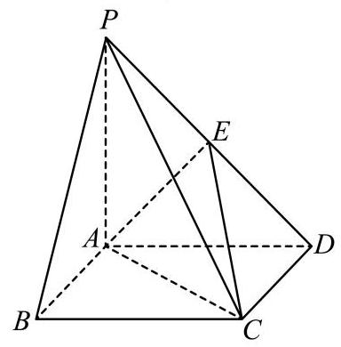

(1) 证明: ${PB}//$ 平面 ${AEC}$

(2) 证明: 平面 ${PCD} \bot$ 平面 ${PAD}$ .

## 解析

(1) 连接 ${BD}$ 交 ${AC}$ 于点 $O$ ,连接 ${EO}$ .

因为 $O$ 为 ${BD}$ 中点， $E$ 为 ${PD}$ 中点，所以 ${EO}//{PB}$ ，

因为 ${EO} \subset$ 平面 ${AEC},{PB}$ 上平面 ${AEC}$ ,所以 ${PB}//$ 平面 ${AEC}$ ;

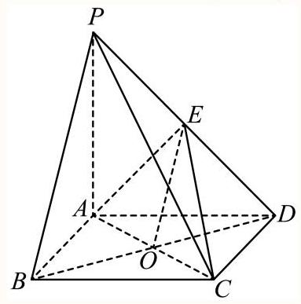

(2) 因为 $P$ 点在平面 ${ABCD}$ 内的射影为A，所以 ${PA}\bot$ 平面 ${ABCD}$ ，

因为 ${CD} \subset$ 平面 ${ABCD}$ ，所以 ${PA}\bot {CD}$ .

又在正方形 ${ABCD}$ 中， ${CD}\bot {AD}$ 且 ${PA} \cap  {AD} = A$ ，所以 ${CD}\bot$ 平面 ${PAD}$ ，

又 ${CD} \subset$ 平面 ${PCD}$ ，所以平面 ${PCD} \bot$ 平面 ${PAD}$ .

18 解答题

如图，摩天轮上一点 $P$ 在时刻 $t$ (单位:分钟)距离地面的高度 $y$ (单位:米)满足

$y = A\sin \left( {{\omega t} + \varphi }\right)  + b,\left( {A > 0,\omega  > 0,\varphi  \in  \left\lbrack  {-\pi ,\pi }\right\rbrack  }\right)$ ，已知该摩天轮的半径为50米，圆心 $O$ 距地面的高度为 60 米，摩天轮做匀速转动，每3分钟转一圈，点 $P$ 的起始位置在摩天轮的最低点处.

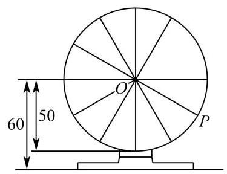

(1)根据条件写出 $y$ 关于 $t$ 的函数解析式；

(2)在摩天轮转动的一圈内，有多长时间点 $P$ 距离地面的高度超过 85 米？

解析

(1)根据题意得到 $\left\{  \begin{array}{l} A + b = {110} \\   - A + b = {10} \end{array}\right.$ ， $T = \frac{2\pi }{\omega } = 3$ ，当 $t = 0$ 时， $y = {50}\sin \varphi  + {60} = {10}$ ，解得答案.

( 2 )解不等式 $\sin \left( {\frac{2\pi }{3}t - \frac{\pi }{2}}\right)  > \frac{1}{2}$ 得到答案.

(1)根据题意: $\left\{  \begin{array}{l} A + b = {110} \\   - A + b = {10} \end{array}\right.$ ,故 $A = {50}, b = {60}, T = \frac{2\pi }{\omega } = 3$ ,故 $\omega  = \frac{2\pi }{3}$ .

当 $t = 0$ 时, $y = {50}\sin \varphi  + {60} = {10}$ ,即 $\sin \varphi  =  - 1,\varphi  \in  \left\lbrack  {-\pi ,\pi }\right\rbrack$ ,故 $\varphi  =  - \frac{\pi }{2}$ .

$y = f\left( t\right)  = {50}\sin \left( {\frac{2\pi }{3}t - \frac{\pi }{2}}\right)  + {60} =  - {50}\cos \frac{2\pi }{3}t + {60}.$

( 2 ) $y = f\left( t\right)  = {50}\sin \left( {\frac{2\pi }{3}t - \frac{\pi }{2}}\right)  + {60} > {85}$ ，故 $\sin \left( {\frac{2\pi }{3}t - \frac{\pi }{2}}\right)  > \frac{1}{2}, t \in  \left\lbrack  {0,3}\right\rbrack$ .

解得 $\frac{\pi }{6} < \frac{2\pi }{3}t - \frac{\pi }{2} < \frac{5\pi }{6}$ ,解得 $1 < t < 2$ ,

故有1分钟长的时间点 $P$ 距离地面的高度超过 85 米.

本题考查了三角函数的应用, 意在考查学生的计算能力和应用能力.

19 解答题

已知函数 $f\left( x\right)  = \frac{x + a}{{x}^{2} + 2}\left( {x \in  \mathbf{R}}\right)$ .

(1)写出函数 $y = f\left( x\right)$ 的奇偶性；

(2)当 $x > 0$ 时，是否存在实数 $a$ ，使 $y = f\left( x\right)$ 的图象在函数 $g\left( x\right)  = \frac{2}{x}$ 图象的下方，若存在，求 $a$ 的取值范围；若不存在，说明理由.

## 解析

(1)对 $a$ 分 $a = 0$ 和 $a \neq  0$ 两种情况分类讨论，结合奇偶性的定义可判断出函数 $y = f\left( x\right)$ 的奇偶性;

(2)由题意得出 $\frac{x + a}{{x}^{2} + 2} < \frac{2}{x}$ ，利用参变量分离法得出 $a < x + \frac{4}{x}$ ，然后利用基本不等式求出函数 $y = x + \frac{4}{x}$ 在 $x \in  \left( {0, + \infty }\right)$ 时的最小值，即可得出实数 $a$ 的取值范围.

(1)因为 $y = f\left( x\right)$ 的定义域为 $\mathbf{R}$ ，关于原点对称.

当 $a = 0$ 时, $f\left( x\right)  = \frac{x}{{x}^{2} + 2}$ ,则 $f\left( {-x}\right)  = \frac{-x}{{\left( -x\right) }^{2} + 2} =  - \frac{x}{{x}^{2} + 2} =  - f\left( x\right)$ ,

此时,函数 $y = f\left( x\right)$ 是奇函数;

当 $a \neq  0$ 时, $f\left( x\right)  = \frac{x + a}{{x}^{2} + 2}, f\left( {-x}\right)  = \frac{-x + a}{{\left( -x\right) }^{2} + 2} = \frac{a - x}{{x}^{2} + 2}$ ,则 $f\left( {-x}\right)  \neq  f\left( x\right)$ ,

$f\left( {-x}\right)  \neq   - f\left( x\right)$ ,此时,函数 $y = f\left( x\right)$ 是非奇非偶函数;

( 2 )若 $y = f\left( x\right)$ 的图象在函数 $g\left( x\right)  = \frac{2}{x}$ 图象的下方，

则 $\frac{x + a}{{x}^{2} + 2} < \frac{2}{x}$ ,化简得 $a < \frac{4}{x} + x$ 恒成立,

当 $x > 0$ 时,由基本不等式得 $x + \frac{4}{x} \geq  2\sqrt{x \cdot  \frac{4}{x}} = 4$ ,当且仅当 $x = 2$ 时,等号成立.

$\therefore a < 4$ ,因此,当 $a < 4$ 时,函数 $y = f\left( x\right)$ 的图象都在函数 $g\left( x\right)  = \frac{2}{x}$ 图象的下方.

本题考查函数奇偶性的判断, 同时也考查函数不等式恒成立问题的求解, 在含单参数的不等式问题中, 可以充分利用参变量分离法, 转化为函数最值来求解, 可简化分类讨论, 考查分析问题和解决问题的能力, 属于中等题.

20 解答题

已知椭圆 $C : \frac{{x}^{2}}{{a}^{2}} + \frac{{y}^{2}}{{b}^{2}} = 1\left( {a > b > 0}\right)$ 的短轴长为2，离心率为 $\frac{\sqrt{2}}{2}$ ， $A$ ， $B$ 分别是椭圆的右顶点和下顶点.

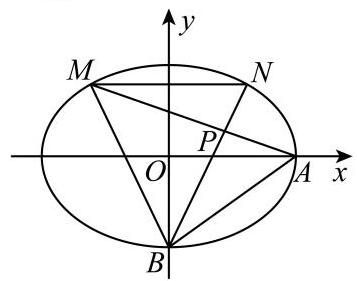

(1)求椭圆 $C$ 的标准方程；

(2)已知 $P$ 是椭圆 $C$ 内一点，直线 ${AP}$ 与 ${BP}$ 的斜率之积为 $- \frac{1}{2}$ ，直线 ${AP}$ ， ${BP}$ 分别交椭圆于 $M, N$ 两点,记 $\bigtriangleup  {PAB}$ ， $\bigtriangleup  {PMN}$ 的面积分别为 ${S}_{\Delta PAB}$ ， ${S}_{\Delta PMN}$ .

①若 $M, N$ 两点关于 $y$ 轴对称，求直线 ${PA}$ 的斜率；

②证明: ${S}_{\Delta PAB} = {S}_{\Delta PMN}$ .

## 解析

(1)根据短轴长得 $b = 1$ ，再根据离心率 $e$ 以及 $a, b, c$ 的关系式可解得 $a$ ，从而可求得椭圆 $C$ 的标准方程;

(2)①设出 ${PA}$ 的斜率 $k$ ，写出 ${PA}$ 的方程与椭圆联立解出 $M$ 的坐标，再根据 ${PA},{PB}$ 的斜率关系得 ${PB}$ 的斜率和方程与椭圆联立解出 $N$ 的坐标,根据 $M, N$ 关于 $y$ 轴对称,列式可求得 $k$ ; ②用 ${PA},{PB}$ 的方程联立解得 $P$ 的坐标，通过两点间的距离算得 ${PA},{PB},{PM},{PN}$ ，只要证明 ${PA} \cdot  {PB} = {PM} \cdot  {PN}$ ，就可证明 ${S}_{\Delta PAB} = {S}_{\Delta PMN}$ .

(1)椭圆 $C : \frac{{x}^{2}}{{a}^{2}} + \frac{{y}^{2}}{{b}^{2}} = 1\left( {a > b > 0}\right)$ 的短轴长为2，离心率为 $\frac{\sqrt{2}}{2}$ ，

所以 ${2b} = 2, b = 1, e = \frac{c}{a} = \sqrt{1 - \frac{{b}^{2}}{{a}^{2}}} = \frac{\sqrt{2}}{2}$ ,

解得 $a = \sqrt{2},{a}^{2} = 2$ .

所以椭圆方程为 $\frac{{x}^{2}}{2} + {y}^{2} = 1$ .

(2)

①设直线 ${PA}$ 的斜率为 $k$ ，则直线 ${PA}$ 的方程为 $y = k\left( {x - \sqrt{2}}\right)$ ，

联立 $\left\{  \begin{array}{l} y = k\left( {x - \sqrt{2}}\right) \\  {x}^{2} + 2{y}^{2} = 2 \end{array}\right.$ ，消去 $y$ 并化简得 $\left( {1 + 2{k}^{2}}\right) {x}^{2} - 4\sqrt{2}{k}^{2}x + 4{k}^{2} - 2 = 0$ ，

解得 ${x}_{1} = \sqrt{2},{x}_{2} = \frac{2\sqrt{2}{k}^{2} - \sqrt{2}}{1 + 2{k}^{2}}$ ,所以 $M\left( {\frac{2\sqrt{2}{k}^{2} - \sqrt{2}}{1 + 2{k}^{2}},\frac{-2\sqrt{2}k}{1 + 2{k}^{2}}}\right)$ .

因为直线 ${PA},{PB}$ 的斜率乘积为 $- \frac{1}{2}$ ，所以直线 ${PB}$ 的方程为 $y =  - \frac{1}{2k}x - 1$ ，

联立 $\left\{  \begin{array}{l} y =  - \frac{1}{2k}x - 1 \\  {x}^{2} + 2{y}^{2} = 2 \end{array}\right.$ ,消去 $y$ 并化简得 $\left( {1 + 2{k}^{2}}\right) {x}^{2} + {4kx} = 0$ ,

解得 ${x}_{3} = 0,{x}_{4} =  - \frac{4k}{1 + 2{k}^{2}}$ ,所以 $N\left( {\frac{-{4k}}{1 + 2{k}^{2}},\frac{1 - 2{k}^{2}}{1 + 2{k}^{2}}}\right)$ . 因为 $M, N$ 关于 $y$ 轴对称,所以 $\frac{2\sqrt{2}{k}^{2} - \sqrt{2}}{1 + 2{k}^{2}} + \frac{-{4k}}{1 + 2{k}^{2}} = 0$ ,

即 $2{k}^{2} - 2\sqrt{2}k - 1 = 0$ ,解得 $k = \frac{\sqrt{2} \pm  2}{2}$ .

当 $k = \frac{\sqrt{2} + 2}{2}$ 时,由 $\left\{  \begin{array}{l} y =  - \frac{x}{2 + \sqrt{2}} - 1 \\  y = \frac{\sqrt{2} + 2}{2}\left( {x - \sqrt{2}}\right)  \end{array}\right.$ ,解得 $P\left( {\frac{\sqrt{2}}{2}, - \frac{1 + \sqrt{2}}{2}}\right)$ ,在椭圆 $C$ 外,不满足题意.

所以直线 ${PA}$ 的斜率为 $\frac{\sqrt{2} - 2}{2}$ .

②由①得 $M\left( {\frac{2\sqrt{2}{k}^{2} - \sqrt{2}}{1 + 2{k}^{2}},\frac{-2\sqrt{2}k}{1 + 2{k}^{2}}}\right)$ ， $N\left( {\frac{-{4k}}{1 + 2{k}^{2}},\frac{1 - 2{k}^{2}}{1 + 2{k}^{2}}}\right)$ ， $A\left( {\sqrt{2},0}\right)$ ， $B = \left( {0, - 1}\right)$ ，

由 $\left\{  \begin{array}{l} y = k\left( {x - \sqrt{2}}\right) \\  y =  - \frac{1}{2k}x - 1 \end{array}\right.$ ,解得 ${x}_{P} = \frac{2\sqrt{2}{k}^{2} - {2k}}{1 + 2{k}^{2}},{y}_{P} =  - \frac{2{k}^{2} + \sqrt{2}k}{1 + 2{k}^{2}}$ .

即 $P\left( {\frac{2\sqrt{2}{k}^{2} - {2k}}{1 + 2{k}^{2}}, - \frac{2{k}^{2} + \sqrt{2}k}{1 + 2{k}^{2}}}\right)$ .

所以 $P{A}^{2} = {\left( \frac{2\sqrt{2}{k}^{2} - {2k}}{1 + 2{k}^{2}} - \sqrt{2}\right) }^{2} + {\left( \frac{2{k}^{2} + \sqrt{2}k}{1 + 2{k}^{2}}\right) }^{2} = \frac{2\left( {1 + {k}^{2}}\right) {\left( 1 + \sqrt{2}k\right) }^{2}}{{\left( 1 + 2{k}^{2}\right) }^{2}}$ ,

$P{B}^{2} = {\left( \frac{2\sqrt{2}{k}^{2} - {2k}}{1 + 2{k}^{2}}\right) }^{2} + {\left( 1 - \frac{2{k}^{2} + \sqrt{2}k}{1 + 2{k}^{2}}\right) }^{2} = \frac{{\left( 1 - \sqrt{2}k\right) }^{2}\left( {1 + 4{k}^{2}}\right) }{{\left( 1 + 2{k}^{2}\right) }^{2}},$

${\left( PA \cdot  PB\right) }^{2} = \frac{2\left( {1 - 2{k}^{2}}\right) \left( {1 + {k}^{2}}\right) \left( {1 + 4{k}^{2}}\right) }{{\left( 1 + 2{k}^{2}\right) }^{4}}.$

同理利用两点间的距离公式求得 $P{M}^{2} = \frac{2\left( {1 + {k}^{2}}\right) {\left( 1 - \sqrt{2}k\right) }^{2}}{{\left( 1 + 2{k}^{2}\right) }^{2}}$ ,

$P{N}^{2} = \frac{{\left( 1 + \sqrt{2}k\right) }^{2}\left( {1 + 4{k}^{2}}\right) }{{\left( 1 + 2{k}^{2}\right) }^{2}},$

所以 ${\left( PM \cdot  PN\right) }^{2} = \frac{2\left( {1 - 2{k}^{2}}\right) \left( {1 + {k}^{2}}\right) \left( {1 + 4{k}^{2}}\right) }{{\left( 1 + 2{k}^{2}\right) }^{4}}$ .

所以 ${PA} \cdot  {PB} = {PM} \cdot  {PN}$ ,

因为 $\angle {APB} = \angle {MPN}$ ,所以

${S}_{\Delta PAB} = \frac{1}{2}{PA} \cdot  {PB} \cdot  \sin \angle {APB} = {S}_{\Delta PMN} = \frac{1}{2}{PM} \cdot  {PN} \cdot  \sin \angle {MPN}.$

即 ${S}_{\Delta PAB} = {S}_{\Delta PMN}$ .

本小题主要考查椭圆标准方程的求法, 考查直线和椭圆的位置关系, 考查椭圆中三角形面积有关问题, 考查运算求解能力, 属于难题.

21 解答题

已知集合 $M \subseteq  {N}^{ * }$ ，且 $M$ 中的元素个数 $n$ 大于等于 5. 若集合 $M$ 中存在四个不同的元素 $a, b, c, d$ ，使得 $a + b = c + d$ ，则称集合 $M$ 是“关联的”，并称集合 $\{ a, b, c, d\}$ 是集合 $M$ 的“关联子集”；若集合 $M$ 不存在“关联子集”，则称集合 $M$ 是“独立的”.

(1)分别判断集合 $\{ 2,4,6,8,{10}\}$ 和集合 $\{ 1,2,3,5,8\}$ 是“关联的”还是“独立的”？若是“关联的”，写出其所有的关联子集;

(2)已知集合 $\left\{  {{a}_{1},{a}_{2},{a}_{3},{a}_{4},{a}_{5}}\right\}$ 是“关联的”，且任取集合 $\left\{  {{a}_{i},{a}_{j}}\right\}   \subseteq  M$ ，总存在 $M$ 的关联子集 $A$ ，使得 $\left\{  {{a}_{i},{a}_{j}}\right\}   \subseteq  A$ . 若 ${a}_{1} < {a}_{2} < {a}_{3} < {a}_{4} < {a}_{5}$ ,求证: ${a}_{1},{a}_{2},{a}_{3},{a}_{4},{a}_{5}$ 是等差数列;

(3) 集合 $M$ 是“独立的”，求证:存在 $x \in  M$ ，使得 $x > \frac{{n}^{2} - n + 9}{4}$ .

## 解析

(1)根据题中所给的新定义，即可求解；

(2)根据题意， ${A}_{1} = \left\{  {{a}_{2},{a}_{3},{a}_{4},{a}_{5}}\right\}  ,\;{A}_{2} = \left\{  {{a}_{1},{a}_{3},{a}_{4},{a}_{5}}\right\}  ,\;{A}_{3} = \left\{  {{a}_{1},{a}_{2},{a}_{4},{a}_{5}}\right\}$ , ${A}_{4} = \left\{  {{a}_{1},{a}_{2},{a}_{3},{a}_{5}}\right\}  ,\;{A}_{5} = \left\{  {{a}_{1},{a}_{2},{a}_{3},{a}_{4}}\right\}$ ,进而利用反证法求解;

(3)不妨设集合 $M = \left\{  {{a}_{1},{a}_{2},\cdots ,{a}_{n}}\right\}  \left( {n \geq  5}\right) ,{a}_{i} \in  {N}^{ * }, i = 1,2,\ldots , n$ ,且 ${a}_{1} < {a}_{2} < \ldots  < {a}_{n}$ . 记 $T = \left\{  {t \mid  t = {a}_{i} + {a}_{j},1 < i < j, j \in  {N}^{ * }}\right\}$ ,进而利用反证法求解;

解: $\left( 1\right) \{ 2,4,6,8,{10}\}$ 是“关联的”关联子集有 $\{ 2,4,6,8\} ,\{ 4,6,8,{10}\} ,\{ 2,4,8,{10}\}$ ;

$\{ 1,2,3,5,8\}$ 是“独立的”

(2)记集合 $M$ 的含有四个元素的集合分别为:

${A}_{1} = \left\{  {{a}_{2},{a}_{3},{a}_{4},{a}_{5}}\right\}  ,\;{A}_{2} = \left\{  {{a}_{1},{a}_{3},{a}_{4},{a}_{5}}\right\}  ,\;{A}_{3} = \left\{  {{a}_{1},{a}_{2},{a}_{4},{a}_{5}}\right\}  ,\;{A}_{4} = \left\{  {{a}_{1},{a}_{2},{a}_{3},{a}_{5}}\right\}  , \; {A}_{5} = \left\{  {{a}_{1},{a}_{2},{a}_{3},{a}_{4}}\right\}$

所以， $M$ 至多有5个“关联子集”.

若 ${A}_{2} = \left\{  {{a}_{1},{a}_{3},{a}_{4},{a}_{5}}\right\}$ 为“关联子集”，则 ${A}_{1} = \left\{  {{a}_{2},{a}_{3},{a}_{4},{a}_{5}}\right\}$ 不是 “关联子集”，否则 ${a}_{1} = {a}_{2}$ 同理可得若 ${A}_{2} = \left\{  {{a}_{1},{a}_{3},{a}_{4},{a}_{5}}\right\}$ 为“关联子集”,则 ${A}_{3},{A}_{4}$ 不是 “关联子集”.

所以集合 $M$ 没有同时含有元素 ${a}_{2},{a}_{5}$ 的 “关联子集”，与已知矛盾.

所以 ${A}_{2} = \left\{  {{a}_{1},{a}_{3},{a}_{4},{a}_{5}}\right\}$ 一定不是“关联子集”

同理 ${A}_{4} = \left\{  {{a}_{1},{a}_{2},{a}_{3},{a}_{5}}\right\}$ 一定不是“关联子集”.

所以集合 $M$ 的“关联子集”至多为 ${A}_{1},{A}_{3},{A}_{5}$ .

若 ${A}_{1}$ 不是“关联子集”，则此时集合 $M$ 一定不含有元素 ${a}_{3},{a}_{5}$ 的“关联子集”，与已知矛盾； 若 ${A}_{3}$ 不是“关联子集”，则此时集合 $M$ 一定不含有元素 ${a}_{1},{a}_{5}$ 的“关联子集”，与已知矛盾； 若 ${A}_{5}$ 不是“关联子集”，则此时集合 $M$ 一定不含有元素 ${a}_{1},{a}_{3}$ 的“关联子集”，与已知矛盾； 所以 ${A}_{1},{A}_{3},{A}_{5}$ 都是 “关联子集”

所以有 ${a}_{2} + {a}_{5} = {a}_{3} + {a}_{4}$ ,即 ${a}_{5} - {a}_{4} = {a}_{3} - {a}_{2}$

${a}_{1} + {a}_{5} = {a}_{2} + {a}_{4},$ 即 ${a}_{5} - {a}_{4} = {a}_{2} - {a}_{1}.$

${a}_{1} + {a}_{4} = {a}_{2} + {a}_{3},$ 即 ${a}_{4} - {a}_{3} = {a}_{2} - {a}_{1},$

所以 ${a}_{5} - {a}_{4} = {a}_{4} - {a}_{3} = {a}_{3} - {a}_{2} = {a}_{2} - {a}_{1}$ .

所以 ${a}_{1},{a}_{2},{a}_{3},{a}_{4},{a}_{5}$ 是等差数列.

(3)不妨设集合 $M = \left\{  {{a}_{1},{a}_{2},\cdots ,{a}_{n}}\right\}  \left( {n \geq  5}\right) ,{a}_{i} \in  {N}^{ * }, i = 1,2,\ldots , n$ ,且 ${a}_{1} < {a}_{2} < \ldots  < {a}_{n}$ .

记 $T = \left\{  {t \mid  t = {a}_{i} + {a}_{j},1 < i < j, j \in  {N}^{ * }}\right\}$ .

因为集合 $M$ 是 “独立的” 的，所以容易知道 $T$ 中恰好有 ${C}_{n}^{2} = \frac{n\left( {n - 1}\right) }{2}$ 个元素.

假设结论错误,即不存在 $x \in  M$ ,使得 $x > \frac{{n}^{2} - n + 9}{4}$

所以任取 $x \in  M, x \leq  \frac{{n}^{2} - n + 9}{4}$ ,因为 $x \in  {N}^{ * }$ ,所以 $x \leq  \frac{{n}^{2} - n + 8}{4}$

所以 ${a}_{i} + {a}_{j} \leq  \frac{{n}^{2} - n + 8}{4} + \frac{{n}^{2} - n + 8}{4} - 1 = \frac{{n}^{2} - n + 8}{2} - 1 = \frac{{n}^{2} - n}{2} + 3$

所以任取 $t \in  T, t \leq  \frac{{n}^{2} - n}{2} + 3$

任取 $t \in  T, t \geq  1 + 2 = 3$ ,

所以 $T \subseteq  \left\{  {3,4,\cdots ,\frac{{n}^{2} - n}{2} + 3}\right\}$ ,且 $T$ 中含有 ${C}_{n}^{2} = \frac{n\left( {n - 1}\right) }{2}$ 个元素.

(i) 若 $3 \in  T$ ，则必有 ${a}_{1} = 1,{a}_{2} = 2$ 成立.

因为 $n \geq  5$ ,所以一定有 ${a}_{n} - {a}_{n - 1} > {a}_{2} - {a}_{1}$ 成立. 所以 ${a}_{n} - {a}_{n - 1} \geq  2$ .

所以 ${a}_{n} + {a}_{n - 1} \leq  \frac{{n}^{2} - n + 8}{4} + \frac{{n}^{2} - n + 8}{4} - 2 = \frac{{n}^{2} - n}{2} + 2$

$T = \left\{  {t\left| {\;3 \leq  t \leq  \frac{{n}^{2} - n}{2} + 2}\right. , t \in  {N}^{ * }}\right\}  ,{a}_{n} = \frac{{n}^{2} - n + 8}{4},{a}_{n - 1} = \frac{{n}^{2} - n + 8}{4} - 2$

所以 $4 \in  T$ ,所以 ${a}_{3} = 3,{a}_{n} + {a}_{1} = {a}_{n - 1} + {a}_{3}$ 有矛盾,

(ii) 若 $3 \notin  T, T \subseteq  \left\{  {3,4,\cdots ,\frac{{n}^{2} - n}{2} + 3}\right\}$

而 $T$ 中含有 ${C}_{n}^{2} = \frac{n\left( {n - 1}\right) }{2}$ 个元素,所以 $T = \left\{  {t\left| {\;4 \leq  t \leq  \frac{{n}^{2} - n}{2} + 3}\right. , t \in  {N}^{ * }}\right\}$

所以 ${a}_{n} = \frac{{n}^{2} - n + 8}{4},{a}_{n - 1} = \frac{{n}^{2} - n + 8}{4} - 1$

因为 $4 \in  T$ ,所以 ${a}_{1} = 1,{a}_{2} = 3$ .

因为 $\frac{{n}^{2} - n}{2} + 2 \in  T$ ,所以 $\frac{{n}^{2} - n}{2} + 2 = {a}_{n - 2} + {a}_{n}$

所以 ${a}_{n - 2} = \frac{{n}^{2} - n + 8}{4} - 2$

所以 ${a}_{n} + {a}_{1} = {a}_{n - 2} + {a}_{3}$ ,矛盾.

所以命题成立.

本题属于新定义题, 考查接受新知识, 理解新知识的能力, 反证法, 等差数列, 不等式缩放法, 排列组合, 本题属于难题.

上海市上海中学2023-2024学年高二上学期期末考试数学试题姓名:___

## 一、填空题

## 填空题

等差数列 $\left\{  {a}_{n}\right\}$ 中， ${a}_{1} = 2$ ， ${a}_{5} = {14}$ ，则 $\left\{  {a}_{n}\right\}$ 的公差为___.

## 解析

设出公差, 利用等差数列通项公式基本量计算得到方程, 求出公差

设 $\left\{  {a}_{n}\right\}$ 的公差为 $d$ ,则 ${4d} = {a}_{5} - {a}_{1} = {14} - 2 = {12}$ ,

解得 $d = 3$ .

故答案为:3

2 填空题

已知 $\left\{  {a}_{n}\right\}$ 为等比数列， ${a}_{2}{a}_{4}{a}_{5} = {a}_{3}{a}_{6}$ ， ${a}_{9}{a}_{10} =  - 8$ ，则 ${a}_{7} =$ ___.

解析

根据等比数列公式对 ${a}_{2}{a}_{4}{a}_{5} = {a}_{3}{a}_{6}$ 化简得 ${a}_{1}q = 1$ ，联立 ${a}_{9}{a}_{10} =  - 8$ 求出 ${q}^{5} =  - 2$ ，最后得 ${a}_{7} = {a}_{1}q \cdot  {q}^{5} = {q}^{5} =  - 2.$

设 $\left\{  {a}_{n}\right\}$ 的公比为 $q\left( {q \neq  0}\right)$ ,则 ${a}_{2}{a}_{4}{a}_{5} = {a}_{3}{a}_{6} = {a}_{2}q \cdot  {a}_{5}q$ ,显然 ${a}_{n} \neq  0$ ,

则 ${a}_{4} = {q}^{2}$ ,即 ${a}_{1}{q}^{3} = {q}^{2}$ ,则 ${a}_{1}q = 1$ ,因为 ${a}_{9}{a}_{10} =  - 8$ ,则 ${a}_{1}{q}^{8} \cdot  {a}_{1}{q}^{9} =  - 8$ ,

则 ${q}^{15} = {\left( {q}^{5}\right) }^{3} =  - 8 = {\left( -2\right) }^{3}$ ,则 ${q}^{5} =  - 2$ ,则 ${a}_{7} = {a}_{1}q \cdot  {q}^{5} = {q}^{5} =  - 2$ ,

故答案为: -2 .

3 填空题

某地一年内各月的平均气温 $\left( {{}^{ \circ  }\mathrm{C}}\right)$ 均在 ${5}^{ \circ  }\mathrm{C}$ 到 ${35}^{ \circ  }\mathrm{C}$ 的范围内,各月的平均气温的茎叶图如图所示,则这组数据的中位数是___.

---

			0.89

1 | 2 5 8

2 | 0 0 3 3 8

3 | 1 2

---

## 解析

将数据从小到大排列后即可得中位数.

将数据从小到大排列得8,9,12,15,18,20,20,23,23,28,31,32,

则其中位数是 $\frac{{20} + {20}}{2} = {20}$ .

故答案为:20.

4 填空题

某高中二年级共有学生425名，其中男生204名，女生221名，为了解该校高二年级学生的身高情况，现从中抽取50名学生测量身高，应当采用___的方法求出男女生分别要抽取___、___ 名，然后在此基础上进行简单随机抽样.

## 解析

根据个体的差异性明显选择分层抽样, 然后根据比例确定人数.

由于男生和女生在身高上有明显的差异, 故应该采用分层抽样的方法来进行抽样,

其中男生抽 ${50} \times  \frac{204}{425} = {24}$ 人，女生抽 ${50} - {24} = {26}$ 人.

故答案为: 分层抽样; 24; 26.

5 填空题

已知无穷等比数列 $\left\{  {a}_{n}\right\}  ,\mathop{\sum }\limits_{{i = 1}}^{{+\infty }}{a}_{i} = 3,\mathop{\sum }\limits_{{i = 1}}^{{+\infty }}{a}_{i}^{2} = \frac{9}{2}$ ,则公比 $q =$ ___.

解析

依题意得到 $\left| q\right|  < 1$ ,再利用无穷等比数列和的公式得到 $\frac{{a}_{1}}{1 - q} = 3$ 与 $\frac{{a}_{1}^{2}}{1 - {q}^{2}} = \frac{9}{2}$ ,解方程组即可得解.

因为无穷等比数列 $\left\{  {a}_{n}\right\}  ,\mathop{\sum }\limits_{{i = 1}}^{{+\infty }}{a}_{i} = 3$ ,则 $\left| q\right|  < 1,\frac{{a}_{1}}{1 - q} = 3$ ,

所以 $\left\{  {a}_{n}^{2}\right\}$ 是首项为 ${a}_{1}^{2}$ ，公比为 ${q}^{2} < 1$ 的等比数列，

又 $\mathop{\sum }\limits_{{i = 1}}^{{+\infty }}{a}_{i}^{2} = \frac{9}{2}$ ,得 $\frac{{a}_{1}^{2}}{1 - {q}^{2}} = \frac{9}{2}$ ,即 $\frac{{a}_{1}^{2}}{\left( {1 - q}\right) \left( {1 + q}\right) } = \frac{9}{2}$ ,

则 $\frac{{a}_{1}}{1 + q} = \frac{3}{2}$ ，又 $\frac{{a}_{1}}{1 - q} = 3$ ，

则 $\frac{3}{2}\left( {1 + q}\right)  = 3\left( {1 - q}\right)$ ,得 $q = \frac{1}{3}$ .

故答案为: $\frac{1}{3}$ .

6 填空题

某学校组织全校学生参加网络安全知识竞赛，成绩(单位:分)的频率分布直方图如图所示，数据的分组依次为 $\lbrack {20},{40}),\lbrack {40},{60}),\lbrack {60},{80}),\left\lbrack  {{80},{100}}\right\rbrack$ ,若该校的学生总人数为1000,则成绩不低于60分的学生人数为___.

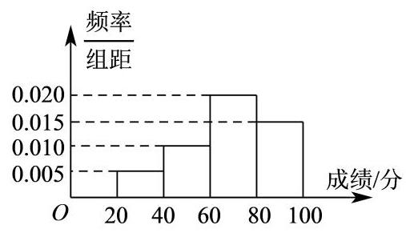

## 解析

直接根据频率计算人数即可.

根据频率分布直方图得

该校的学生成绩不低于60分的学生人数为 ${1000} \times  \left( {{0.015} + {0.02}}\right)  \times  {20} = {700}$ .

故答案为:700

7 填空题

某射击运动员连续射击5次，命中的环数(环数为整数)形成的一组数据中，中位数为8，唯一的众数为9，极差为3，则该组的平均数为___.

## 解析

首先分析数据的情况，再根据平均数公式计算即可.

这组数据共5个数，中位数为8，则从小到大排列时，8的前面有两个数，

后面也有两个数，又唯一的众数为9，则有两个9，

其余数字均只出现一次,则最大数字为9,

又极差为3，所以最小数字为6，

所以这组数据为 $6\text{ 、 }7\text{ 、 }8\text{ 、 }9\text{ 、 }9$ ,

则平均数为 $\frac{6 + 7 + 8 + 9 + 9}{5} = {7.8}$ ,

故答案为:7.8.

8 填空题

当一个不均匀的骰子滚动的时候, 出现偶数的概率是奇数的3倍. 骰子滚动了两次则出现的数字之和为偶数的概率是___.

## 解析

先确定出现一次偶数或一次奇数的概率, 然后求出两次都是偶数和两次都是奇数的概率, 最后相加即可.

根据题意可得出现偶数的概率为 $\frac{3}{4}$ ，出现奇数的概率为 $\frac{1}{4}$ ，

则骰子滚动了两次，两次都是偶数的概率为 $\frac{3}{4} \times  \frac{3}{4} = \frac{9}{16}$ ，

两次都是奇数的概率为 $\frac{1}{4} \times  \frac{1}{4} = \frac{1}{16}$ ，

则两次出现的数字之和为偶数的概率是 $\frac{9}{16} + \frac{1}{16} = \frac{5}{8}$ .

故答案为: $\frac{5}{8}$

9 填空题

事件A，B互斥，它们都不发生的概率为 $\frac{2}{5}$ ，且P(A) =2P(B)，则P( $\bar{A}$ ) =___.

解析

分析: 由已知中事件A、B互斥,由它们都不发生的概率为 $\frac{2}{5}$ ,且 $\mathrm{P}\left( \mathrm{A}\right)  = 2\mathrm{P}\left( \mathrm{B}\right)$ ,可求 $P\left( A\right)$ , 进而根据对立事件概率减法公式得到答案.

详解: $\because$ 事件 $\mathrm{A}\text{ 、 }\mathrm{\;B}$ 互斥,且 $\mathrm{P}\left( \mathrm{A}\right)  = 2\mathrm{P}\left( \mathrm{B}\right)$ ,

$\because$ 它们都不发生的概率为 $\frac{2}{5}$

$\therefore 1 - P\left( A\right)  - P\left( B\right)  = 1 - {2P}\left( B\right)  - P\left( B\right)  = \frac{2}{5}$

解得 $P\left( B\right)  = \frac{1}{5}$ ,

$\therefore P\left( A\right)  = {2P}\left( B\right)  = \frac{2}{5}$ ,

$\therefore P\left( \bar{A}\right)  = 1 - P\left( A\right)  = 1 - \frac{2}{5} = \frac{3}{5}$ .

故答案为 $\frac{3}{5}$ .

点睛:本题考查的知识点是互斥事件概率加法公式，对立事件概率减法公式，难度不大，属于基础题.

10 填空题

已知 ${a}_{n}$ 是离 $\sqrt{n}$ 最近的整数，如 ${a}_{2} = 1\text{ ， }{a}_{3} = 2$ ，则无穷数列 $\left\{  {a}_{n}\right\}$ 中共有___项的值等于100.

解析

根据题意列式 ${99.5}^{2} < n < {100.5}^{2}$ ,然后确定 $n$ 的取值情况即可.

由已知得 ${99.5} < \sqrt{n} < {100.5}$ ,此时不等式取等号和不取等号对结果没有影响,

所以 ${99.5}^{2} < n < {100.5}^{2}$ ,

又 ${100.5}^{2} = {10100.25},{99.5}^{2} = {9900.25}$ ,

所以 ${9901} \leq  n \leq  {10100}$ ,

所以共有 ${10100} - {9901} + 1 = {200}$ 项的值等于100.

故答案为:200.

11 填空题

给定数列 $A$ ,定义 $A$ 上的加密算法 ${f}_{i}$ :当 $i$ 为奇数时,将 $A$ 中各个奇数项的值均增加 $i$ ,各个偶数项的值均减去1；当 $i$ 为偶数时，将 $A$ 中各个偶数项的值均增加 ${2i}$ ，各个奇数项的值均减去2，并记新得到的

数列为 $\left\{  {{f}_{i}\left( A\right) }\right\}  \left( {i \in  {\mathrm{N}}^{ * }}\right)$ . 设数列 ${B}_{0} : 2,0,2,3,5,7$ ,数列 ${B}_{n} = {f}_{n}\left( {B}_{n - 1}\right) , n \in  {\mathrm{N}}^{ * }$ ,则数列 ${B}_{2n}$ 的所有项的和为___.

## 解析

设 ${T}_{{B}_{n}}$ 为数列 ${B}_{n}$ 的所有项的和,先根据题意得到递推式 ${T}_{{B}_{2n}} - {T}_{{B}_{{2n} - 2}} = {18n} - {12}$ ,然后再用累加法求解即可.

设 ${T}_{{B}_{n}}$ 为数列 ${B}_{n}$ 的所有项的和,

因为 ${B}_{2n} = {f}_{2n}\left( {B}_{{2n} - 1}\right)  = {f}_{2n}\left( {{f}_{{2n} - 1}\left( {B}_{{2n} - 2}\right) }\right)$ ， ${2n}$ 为偶数， ${2n} - 1$ 为奇数，

所以对于偶数项，

${T}_{{B}_{{2n} - 1}} - {T}_{{B}_{{2n} - 2}} = {T}_{{f}_{{2n} - 1}\left( {B}_{{2n} - 2}\right) } - {T}_{{B}_{{2n} - 2}} = 3\left( {{2n} - 1}\right)  - 3 = {6n} - 6$ ,

${T}_{{B}_{2n}} - {T}_{{B}_{{2n} - 1}} = {T}_{{f}_{2n}\left( {B}_{{2n} - 1}\right) } - {T}_{{B}_{{2n} - 1}} = 3 \times  {4n} - 6 = {12n} - 6$

所以 ${T}_{{B}_{2n}} - {T}_{{B}_{{2n} - 2}} = {18n} - {12}$

所以 $\left\{  \begin{array}{l} {T}_{{B}_{2n}} - {T}_{{B}_{{2n} - 2}} = {18n} - {12} \\  {T}_{{B}_{{2n} - 2}} - {T}_{{B}_{{2n} - 4}} = {18}\left( {n - 1}\right)  - {12} \\  \cdots \\  {T}_{{B}_{2}} - {T}_{{B}_{0}} = {18} \times  1 - {12} \end{array}\right.$ ,

上述式子相加可得 ${T}_{{B}_{2n}} - {T}_{{B}_{0}} = {18} \times  \frac{\left( {1 + n}\right) n}{2} - {12n} = 9{n}^{2} - {3n}$ ,

即 ${T}_{{B}_{2n}} = 9{n}^{2} - {3n} + {T}_{{B}_{0}} = 9{n}^{2} - {3n} + {19}$

故答案为: $9{n}^{2} - {3n} + {19}$ .

关键点点睛: 题目既然求数列 ${B}_{2n}$ 的所有项的和,即求角标为偶数时所有项的和,所以接替的关键就是找到角标为偶数时所有项的和的递推关系, 进一步理解题意即可做到.

12 填空题

已知数列 $\left\{  {a}_{n}\right\}$ 满足 ${a}_{1} = 1,{a}_{n + 1} = \left\{  \begin{array}{l} 2{a}_{n} + 1, n\text{ 是偶数, } \\  {a}_{n} - 3, n\text{ 是奇数, } \end{array}\right.$ 设 ${S}_{n}$ 表示 $\left\{  {a}_{n}\right\}$ 的前 $n$ 项和,则使得 ${S}_{n} + {10}^{6} < 0$ 成立的最小的正整数 $n$ 的值为___.

## 解析

先通过递推式得当 $n$ 为偶数时,数列 $\left\{  {{a}_{n} - 2}\right\}$ 是以 -4 为首项,以 2 为公比的等比数列,即可求出数列 $\left\{  {a}_{n}\right\}$ 的通项公式,根据通项公式观察到数列 $\left\{  {S}_{n}\right\}$ 为递减数列,故求出 ${S}_{n}$ 后,以 ${2}^{20} = {1048576}$ 为基础,通过一定的估算可得到答案.

当 $n \geq  2$ ,且 $n$ 为偶数时, ${a}_{n} = {a}_{n - 1} - 3 = 2{a}_{n - 2} + 1 - 3 = 2{a}_{n - 2} - 2$ ,

得 ${a}_{n} - 2 = 2\left( {{a}_{n - 2} - 2}\right)$ ,又 ${a}_{2} = {a}_{1} - 3 =  - 2$ ,

所以数列 $\left\{  {{a}_{n} - 2}\right\}$ 是以 -4 为首项,以 2为公比的等比数列,

所以 ${a}_{n} - 2 =  - 4 \times  {2}^{\frac{n}{2} - 1}$ ,即 ${a}_{n} =  - {2}^{\frac{n}{2} + 1} + 2$ ,

当 $n \geq  1$ ，且 $n$ 为奇数时， ${a}_{n} = {a}_{n + 1} + 3 =  - {2}^{\frac{n + 1}{2} + 1} + 2 + 3 =  - {2}^{\frac{n + 3}{2}} + 5$ ，

所以 ${a}_{n} = \left\{  \begin{array}{l}  - {2}^{\frac{n}{2} + 1} + 2, n\text{ 是偶数, } \\   - {2}^{\frac{n + 3}{2}} + 5, n\text{ 是奇数, } \end{array}\right.$

明显数列 $\left\{  {a}_{n}\right\}$ 从第二项起 ${a}_{n} < 0$ ,故数列 $\left\{  {S}_{n}\right\}$ 为递减数列,

当 $n$ 为偶数时,

${S}_{n} = \left( {{a}_{1} + {a}_{3} + \cdots  + {a}_{n - 1}}\right)  + \left( {{a}_{2} + {a}_{4} + \cdots  + {a}_{n}}\right)  = \frac{-4\left( {1 - {2}^{\frac{n}{2}}}\right) }{1 - 2} + 5 \times  \frac{n}{2} +$

$\frac{-4\left( {1 - {2}^{\frac{n}{2}}}\right) }{1 - 2} + 2 \times  \frac{n}{2}$

$= 8 - {2}^{\frac{n}{2} + 3} + \frac{7n}{2},$

对于 ${S}_{n} + {10}^{6} = 8 - {2}^{\frac{n}{2} + 3} + \frac{7n}{2} + {10}^{6}$ ,由于 ${2}^{20} = {\left( {2}^{10}\right) }^{2} = {1024}^{2} = {1048576}$ ,

当 $n = {32}$ 时， ${S}_{32} + {10}^{6} = 8 - {2}^{\frac{32}{2} + 3} + \frac{7 \times  {32}}{2} + {10}^{6} > 0$ ，

当 $n = {34}$ 时， ${S}_{34} + {10}^{6} = 8 - {2}^{\frac{34}{2} + 3} + \frac{7 \times  {34}}{2} + {10}^{6} < 0$ ，

又当 $n = {33}$ 时， ${S}_{33} + {10}^{6} = {S}_{34} - {a}_{34} + {10}^{6} = 8 - {2}^{\frac{34}{2} + 3} - \left( {-{2}^{18} + 2}\right)  + \frac{7 \times  {34}}{2} + {10}^{6} > 0$ , 故使得 ${S}_{n} + {10}^{6} < 0$ 成立的最小的正整数 $n$ 的值为 34,

故答案为: 34 .

方法点睛:对于通过奇偶来的分段数列，可分奇偶来研究数列的通项公式，先求出偶数项的通项公式后，奇数项的通项公式就好求了.

## 二、选择题

13 单选题

设数列 $\left\{  {a}_{n}\right\}$ 满足 ${a}_{1} = \frac{1}{2}$ ， ${a}_{n + 1} = \frac{1 + {a}_{n}}{1 - {a}_{n}}$ ，则 ${a}_{2024} =$ ()

A. -2

B. $- \frac{1}{3}$

C. $\frac{1}{2}$

D. 3

## 解析

根据递推式求出 ${a}_{2},{a}_{3},{a}_{4},{a}_{5}$ 即可得到数列 $\left\{  {a}_{n}\right\}$ 的周期,根据周期可得 ${a}_{2024}$ 的值.

$\because {a}_{1} = \frac{1}{2}$ ,

$\therefore {a}_{2} = \frac{1 + {a}_{1}}{1 - {a}_{1}} = \frac{1 + \frac{1}{2}}{1 - \frac{1}{2}} = 3,{a}_{3} = \frac{1 + {a}_{2}}{1 - {a}_{2}} = \frac{1 + 3}{1 - 3} =  - 2,{a}_{4} = \frac{1 + {a}_{3}}{1 - {a}_{3}} = \frac{1 - 2}{1 + 2} =  - \frac{1}{3}$ , ${a}_{5} = \frac{1 + {a}_{4}}{1 - {a}_{4}} = \frac{1 - \frac{1}{3}}{1 + \frac{1}{3}} = \frac{1}{2},$

所以数列 $\left\{  {a}_{n}\right\}$ 是以 4 为周期的周期数列,

所以 ${a}_{2024} = {a}_{4 \times  {505} + 4} = {a}_{4} =  - \frac{1}{3}$ .

故选: B.

14 单选题

为调研某地空气质量,连续 10 天测得该地 ${PM2.5}$ 的日均值(单位为 $\mathrm{{ug}}/{\mathrm{m}}^{3}$ )，依次为 36,26,17,23,33,106,42,31,30,33,则下列四个结论中正确的个数为( )

①前4天的极差大于后4天的极差；②前4天的方差小于后4天的方差；③这组数据的中位数为31或 33; ④这组数据的第60百分位数与众数相同.

A. 0

B. 1

C. 2

D. 3

## 解析

计算该组数据前四个和后四个的极差, 及方差, 中位数, 第60百分位数, 众数来判断命题的正误.

前4天的极差为 ${36} - {17} = {19}$ ，后4天的极差为 ${42} - {30} = {12}$ ，所以①正确；

前4天的平均数为25.5，方差为 $\frac{1}{4} \times  \left( {{10.5}^{2} + {0.5}^{2} + {8.5}^{2} + {2.5}^{2}}\right)  = {47.25}$ ，后4天的平均数为34

,方差为 $\frac{1}{4} \times  \left( {{8}^{2} + {3}^{2} + {4}^{2} + {1}^{2}}\right)  = {22.5}$ ,所以②错误;

数据从小到大排列为17,23,26,30,31,33,33,36,42,106,中位数为 $\frac{{31} + {33}}{2} = {32}$ , 所以③错误；

数据的第60百分位数为 $\frac{{33} + {33}}{2} = {33}$ ,众数也为33,所以④正确,正确的有两个.

故选:C.

15 单选题

已知等差数列 $\left\{  {a}_{n}\right\}$ 的公差为 $\frac{2\pi }{3}$ ，集合 $S = \left\{  {\cos {a}_{n} \mid  n \in  {\mathrm{N}}^{ * }}\right\}$ ，若 $S = \{ a, b\}$ ，则 ${ab} =$ ( )

A. -1

B. $- \frac{1}{2}$

C. 0

D. $\frac{1}{2}$

解析

根据给定的等差数列, 写出通项公式, 再结合余弦型函数的周期及集合只有两个元素分析、 推理作答.

依题意,等差数列 $\left\{  {a}_{n}\right\}$ 中, ${a}_{n} = {a}_{1} + \left( {n - 1}\right)  \cdot  \frac{2\pi }{3} = \frac{2\pi }{3}n + \left( {{a}_{1} - \frac{2\pi }{3}}\right)$ ,

显然函数 $y = \cos \left\lbrack  {\frac{2\pi }{3}n + \left( {{a}_{1} - \frac{2\pi }{3}}\right) }\right\rbrack$ 的周期为 3,而 $n \in  {\mathrm{N}}^{ * }$ ,即 $\cos {a}_{n}$ 最多 3 个不同取值,又 $\left\{  {\cos {a}_{n} \mid  n \in  {\mathrm{N}}^{ * }}\right\}   = \{ a, b\} ,$

则在 $\cos {a}_{1},\cos {a}_{2},\cos {a}_{3}$ 中, $\cos {a}_{1} = \cos {a}_{2} \neq  \cos {a}_{3}$ 或 $\cos {a}_{1} \neq  \cos {a}_{2} = \cos {a}_{3}$ ,

于是有 $\cos \theta  = \cos \left( {\theta  + \frac{2\pi }{3}}\right)$ ,即有 $\theta  + \left( {\theta  + \frac{2\pi }{3}}\right)  = {2k\pi }, k \in  \mathrm{Z}$ ,解得 $\theta  = {k\pi } - \frac{\pi }{3}, k \in  \mathrm{Z}$ ,

所以 $k \in  \mathrm{Z}$ ，

${ab} = \cos \left( {{k\pi } - \frac{\pi }{3}}\right) \cos \left\lbrack  {\left( {{k\pi } - \frac{\pi }{3}}\right)  + \frac{4\pi }{3}}\right\rbrack   =  - \cos \left( {{k\pi } - \frac{\pi }{3}}\right) \cos {k\pi } =  - {\cos }^{2}{k\pi }\cos \frac{\pi }{3} =  - \frac{1}{2}$ .

故选: B

16 单选题

设 ${S}_{n}$ 为数列 $\left\{  {a}_{n}\right\}$ 的前 $n$ 项和， ${a}_{1} = 2,{a}_{n + 1} - {a}_{n} \in  \{ 1,3,5\} ,{S}_{k} = {1000}$ ，则满足已知条件的 $k$ 的个数是( ).

A. 0

B. 10

C. 11

D. 21

解析

讨论 ${a}_{n}$ 的奇偶性,再对 ${S}_{n}$ 进行调整,解出 $k$ 的范围,再利用 ${S}_{k}$ 的奇偶性取舍即可.

由题设可得 ${a}_{n} = 2 + {d}_{1} + {d}_{2} + \cdots  + {d}_{n - 1}$ ,其中 ${d}_{i} \in  \{ 1,3,5\}$ ,

故 $n + 1 \leq  {a}_{n} \leq  {5n} - 3$ ,且 $\left\{  {a}_{n}\right\}$ 奇偶交错出现.

(1)若 ${a}_{n}$ 为奇数，由 ${d}_{i} \in  \{ 1,3,5\}$ 可得对 ${a}_{n}$ 可取遍 $\left\lbrack  {n + 1,{5n} - 3}\right\rbrack$ 中的每一个奇数，

(2)若 ${a}_{n}$ 为偶数，由 ${d}_{i} \in  \{ 1,3,5\}$ 可得对 ${a}_{n}$ 可取遍 $\left\lbrack  {n + 1,{5n} - 3}\right\rbrack$ 中的每一个偶数，

又 ${S}_{n} = {2n} + \left( {n - 1}\right) {d}_{1} + \left( {n - 2}\right) {d}_{2} + \cdots  + {d}_{n - 1}$ ,

当 ${d}_{i} = 1\left( {i = 1,2,\cdots , n - 1}\right)$ 时, ${S}_{n} = \frac{n\left( {n + 3}\right) }{2}$ ;

当 ${d}_{i} = 5\left( {i = 1,2,\cdots , n - 1}\right)$ 时, ${S}_{n} = \frac{n\left( {{5n} - 1}\right) }{2}$ .

考虑 ${d}_{i} = 1\left( {i = 1,2,\cdots , n - 1}\right)$ 时, ${d}_{i}$ 调整为 3,则其对于的 ${S}_{n}$ 可相应增加 $2\left( {n - i}\right)$ ,

依次对诸 ${d}_{i}$ (至少一个)调整为 3 后

$\frac{n\left( {n + 3}\right) }{2} + 2 \leq  {S}_{n} \leq  \frac{n\left( {n + 3}\right) }{2} + 2 + 2 \times  2 + 2 \times  3 + 2\left( {n - 1}\right) ,$

即 $\frac{n\left( {n + 3}\right) }{2} + 2 \leq  {S}_{n} \leq  \frac{n\left( {{3n} - 1}\right) }{2}$ ,

从上述的调整过程可得 ${S}_{n}$ 取遍了 $\left\lbrack  {\frac{n\left( {n + 3}\right) }{2},\frac{n\left( {{3n} - 1}\right) }{2}}\right\rbrack$ 中的奇数或偶数 (取奇数还是偶数取决于 $\frac{n\left( {n + 3}\right) }{2}$ 的奇偶性),

同理再将诸 ${d}_{i}$ (至少一个)调整为 3 或 5 后:

$\frac{n\left( {n + 3}\right) }{2} + 2 \leq  {S}_{n} \leq  \frac{n\left( {{3n} - 1}\right) }{2} + 2 + 2 \times  2 + 2 \times  3 + 2\left( {n - 1}\right)$

即 $\frac{n\left( {n + 3}\right) }{2} + 2 \leq  {S}_{n} \leq  \frac{n\left( {{5n} - 3}\right) }{2}$ ,

且 ${S}_{n}$ 取遍了 $\left\lbrack  {\frac{n\left( {n + 3}\right) }{2},\frac{n\left( {{5n} - 3}\right) }{2}}\right\rbrack$ 中的奇数或偶数(取奇数还是偶数取决于 $\frac{n\left( {n + 3}\right) }{2}$ 的奇偶性) .

因为 ${S}_{k} = {1000}$ ,令 $\frac{k\left( {k + 3}\right) }{2} \leq  {1000} \leq  \frac{k\left( {{5k} - 3}\right) }{2}$ ,则 ${21} \leq  k \leq  {43}$ ,

当 $k$ 除4余0,或 $k$ 除4余1时, ${S}_{k}$ 为偶数,

当 $k$ 除4余2或 $k$ 除4余3时， ${S}_{k}$ 为奇数，

故 $k = {21},{24},{25},{28},{29},{32},{33},{36},{37},{40},{41}$ ,共11个

故选: C

关键点点睛: 本题考查数列,解题关键是讨论 ${a}_{n}$ 的奇偶性,再对 ${S}_{n}$ 进行调整,然后表示,解出 $k$ 的范围,再利用 ${S}_{k}$ 的奇偶性取舍求解.

## 三、解答题

17 解答题

设 ${S}_{n}$ 为等差数列 $\left\{  {a}_{n}\right\}$ 的前 $n$ 项和，已知 ${a}_{2} = {11}$ ， ${S}_{10} = {40}$ .

(1)求数列 $\left\{  {a}_{n}\right\}$ 的通项公式；

(2)当 $n$ 为何值时， ${S}_{n}$ 最大，并求出 ${S}_{n}$ 的最大值.

## 解析

(1) 设等差数列 $\left\{  {a}_{n}\right\}$ 的公差为 $d$ ，

则 $\left\{  \begin{array}{l} {a}_{2} = {a}_{1} + d = {11} \\  {S}_{10} = {10}{a}_{1} + {45d} = {40} \end{array}\right.$ ,解得 $\left\{  \begin{array}{l} {a}_{1} = {13} \\  d =  - 2 \end{array}\right.$ ,

所以数列 $\left\{  {a}_{n}\right\}$ 的通项公式为 ${a}_{n} = {13} - 2\left( {n - 1}\right)$ ,

即 ${a}_{n} =  - {2n} + {15}$ ;

(2)由(1)得 ${S}_{n} = \frac{\left( {{13} - {2n} + {15}}\right) n}{2} =  - {n}^{2} + {14n}$ ,

由二次函数的性质可得,

当 $n = 7$ 时, ${S}_{n}$ 最大,且最大值为 49 .

18 解答题

用数学归纳法证明: 对于任意正整数 $n$ 都有: ${1}^{2} + {2}^{2} + {3}^{2} + \ldots  + {n}^{2} = \frac{n\left( {n + 1}\right) \left( {{2n} + 1}\right) }{6}$ .

解析

先验证 $n = 1$ 时成立,再假设 $n = k, k \in  {\mathrm{N}}^{ * }$ 时成立,最后计算 $n = k + 1$ 时成立即可.

当 $n = 1$ 时, ${1}^{2} = \frac{\left( {1 + 1}\right) \left( {2 + 1}\right) }{6}$ ,结论成立;

假设①当 $n = k, k \in  {\mathrm{N}}^{ * }$ 时， ${1}^{2} + {2}^{2} + {3}^{2} + \ldots  + {k}^{2} = \frac{k\left( {k + 1}\right) \left( {{2k} + 1}\right) }{6}$ ，

② 则当 $n = k + 1$ 时，

${1}^{2} + {2}^{2} + {3}^{2} + \ldots  + {k}^{2} + {\left( k + 1\right) }^{2} = \frac{k\left( {k + 1}\right) \left( {{2k} + 1}\right) }{6} + {\left( k + 1\right) }^{2}$

$= \frac{k\left( {k + 1}\right) \left( {{2k} + 1}\right)  + 6{\left( k + 1\right) }^{2}}{6} = \frac{\left( {k + 1}\right) \left\lbrack  {k\left( {{2k} + 1}\right)  + 6\left( {k + 1}\right) }\right\rbrack  }{6}$

$= \frac{\left( {k + 1}\right) \left( {2{k}^{2} + {7k} + 6}\right) }{6} = \frac{\left( {k + 1}\right) \left( {k + 2}\right) \left\lbrack  {2\left( {k + 1}\right)  + 1}\right\rbrack  }{6}$ ,结论成立;

综合由①②知，对于任意正整数 $n$ 都有: ${1}^{2} + {2}^{2} + {3}^{2} + \ldots  + {n}^{2} = \frac{n\left( {n + 1}\right) \left( {{2n} + 1}\right) }{6}$ .

19 综合题

设 ${S}_{n}$ 为数列 $\left\{  {a}_{n}\right\}$ 的前 $n$ 项和,已知 ${a}_{2} = 1,2{S}_{n} = n{a}_{n}$ .

(1)求 $\left\{  {a}_{n}\right\}$ 的通项公式；

(2)求数列 $\left\{  \frac{{a}_{n + 1}}{{2}^{n}}\right\}$ 的前 $n$ 项和 ${T}_{n}$ .

## 解析

(1)因为 $2{S}_{n} = n{a}_{n}$ ，

当 $n = 1$ 时， $2{a}_{1} = {a}_{1}$ ，即 ${a}_{1} = 0$ ；

当 $n = 3$ 时， $2\left( {1 + {a}_{3}}\right)  = 3{a}_{3}$ ，即 ${a}_{3} = 2$ ，

当 $n \geq  2$ 时， $2{S}_{n - 1} = \left( {n - 1}\right) {a}_{n - 1}$ ，所以 $2\left( {{S}_{n} - {S}_{n - 1}}\right)  = n{a}_{n} - \left( {n - 1}\right) {a}_{n - 1} = 2{a}_{n}$ ，

化简得: $\left( {n - 2}\right) {a}_{n} = \left( {n - 1}\right) {a}_{n - 1}$ ,当 $n \geq  3$ 时, $\frac{{a}_{n}}{n - 1} = \frac{{a}_{n - 1}}{n - 2} = \cdots  = \frac{{a}_{3}}{2} = 1$ ,即 ${a}_{n} = n - 1$

当 $n = 1,2$ 时都满足上式,所以 ${a}_{n} = n - 1\left( {n \in  {\mathrm{N}}^{ * }}\right)$ .

( 2 )因为 $\frac{{a}_{n + 1}}{{2}^{n}} = \frac{n}{{2}^{n}}$ ，

所以 ${T}_{n} = 1 \times  {\left( \frac{1}{2}\right) }^{1} + 2 \times  {\left( \frac{1}{2}\right) }^{2} + 3 \times  {\left( \frac{1}{2}\right) }^{3} + \cdots  + n \times  {\left( \frac{1}{2}\right) }^{n}$ ，

$\frac{1}{2}{T}_{n} = 1 \times  {\left( \frac{1}{2}\right) }^{2} + 2 \times  {\left( \frac{1}{2}\right) }^{3} + \cdots  + \left( {n - 1}\right)  \times  {\left( \frac{1}{2}\right) }^{n} + n \times  {\left( \frac{1}{2}\right) }^{n + 1},$

两式相减得,

$$
\frac{1}{2}{T}_{n} = {\left( \frac{1}{2}\right) }^{1} + {\left( \frac{1}{2}\right) }^{2} + {\left( \frac{1}{2}\right) }^{3} + \cdots  + {\left( \frac{1}{2}\right) }^{n} - n \times  {\left( \frac{1}{2}\right) }^{n + 1} = \frac{\frac{1}{2} \times  \left\lbrack  {1 - {\left( \frac{1}{2}\right) }^{n}}\right\rbrack  }{1 - \frac{1}{2}} - n
$$

$$
\times  {\left( \frac{1}{2}\right) }^{n + 1}
$$

$= 1 - \left( {1 + \frac{n}{2}}\right) {\left( \frac{1}{2}\right) }^{n}$ ,即 ${T}_{n} = 2 - \left( {2 + n}\right) {\left( \frac{1}{2}\right) }^{n}, n \in  {\mathrm{N}}^{ * }$ .

20 解答题

在信道内传输0,1信号，信号的传输相互独立. 发送0时，收到1的概率为 $\frac{1}{2}$ ，收到0的概率为 $\frac{1}{2}$ ；发送1时，收到0的概率为 $\frac{1}{3}$ ，收到1的概率为 $\frac{2}{3}$ .

(1)重复发送信号1三次，计算至少收到两次1的概率；

(2)依次发送1，1，0，判断以下两个事件:①事件A:至少收到一个正确信号；②事件B:至少收到两个0，是否互相独立，并给出证明.

## 解析

(1)重复发送信号1三次，“至少收到两次1”的可能情况为:

$\left( {1,1,1}\right) ,\left( {1,0,1}\right) ,\left( {1,1,0}\right) ,\left( {0,1,1}\right)$ ,

因为信号的传输相互独立,

故“至少收到两次1”的概率为:

$\frac{2}{3} \times  \frac{2}{3} \times  \frac{2}{3} + \frac{2}{3} \times  \frac{1}{3} \times  \frac{2}{3} + \frac{2}{3} \times  \frac{2}{3} \times  \frac{1}{3} + \frac{1}{3} \times  \frac{2}{3} \times  \frac{2}{3} = \frac{20}{27}$ .

(2)事件A与事件B不互相独立，证明如下:

若依次发送1,1,0，则三次都没收到正确信号的概率为 $\frac{1}{3} \times  \frac{1}{3} \times  \frac{1}{2} = \frac{1}{18}$ ，

故至少收到一个正确信号的概率为 $P\left( A\right)  = 1 - \frac{1}{18} = \frac{17}{18}$ ;

若依次发送1,1,0,“至少收到两个0”的可能情况为:

$\left( {0,0,0}\right) ,\left( {0,0,1}\right) ,\left( {0,1,0}\right) ,\left( {1,0,0}\right)$ ,根据事件的相互独立性,

故 $P\left( B\right)  = \frac{1}{3} \times  \frac{1}{3} \times  \frac{1}{2} + \frac{1}{3} \times  \frac{1}{3} \times  \frac{1}{2} + \frac{1}{3} \times  \frac{2}{3} \times  \frac{1}{2} + \frac{2}{3} \times  \frac{1}{3} \times  \frac{1}{2} = \frac{6}{18} = \frac{1}{3}$ ,

若依次发送1,1,0， “至少收到两个0且至少收到一个正确信号”的可能情况为:

$\left( {0,0,0}\right) ,\left( {0,1,0}\right) ,\left( {1,0,0}\right)$ ,根据事件的相互独立性,

故 $P\left( {AB}\right)  = \frac{1}{3} \times  \frac{1}{3} \times  \frac{1}{2} + \frac{1}{3} \times  \frac{2}{3} \times  \frac{1}{2} + \frac{2}{3} \times  \frac{1}{3} \times  \frac{1}{2} = \frac{5}{18}$ ,

因为 $P\left( A\right) P\left( B\right)  \neq  P\left( {AB}\right)$ ,所以事件 $\mathrm{A}$ 与事件 $\mathrm{B}$ 不互相独立.

21 解答题

已知数表 $\overline{{A}_{2n} = }\left( \begin{array}{llll} {a}_{11} & {a}_{12} & \cdots & {a}_{1n} \\  {a}_{21} & {a}_{22} & \cdots & {a}_{2n} \end{array}\right)$ 中的项 ${a}_{ij}\left( {i = 1,2;j = 1,2,\cdots , n}\right)$ 互不相同，且满足下列条件:

① ${a}_{ij} \in  \{ 1,2,\cdots ,{2n}\}$ ；

$\text{ ② }{\left( -1\right) }^{m + 1}\left( {{a}_{1m} - {a}_{2m}}\right)  < 0\left( {m = 1,2,\cdots , n}\right)$ .

则称这样的数表 ${A}_{2n}$ 具有性质 $P$ .

(1)若数表 ${A}_{22}$ 具有性质 $P$ ，且 ${a}_{12} = 4$ ，写出所有满足条件的数表 ${A}_{22}$ ，并求出 ${a}_{11} + {a}_{12}$ 的值；

(2)对于具有性质 $P$ 的数表 ${A}_{2n}$ ，当 ${a}_{11} + {a}_{12} + \cdots  + {a}_{1n}$ 取最大值时，求证:存在正整数

$k\left( {1 \leq  k \leq  n}\right)$ ,使得 ${a}_{1k} = {2n}$ ;

(3)对于具有性质 $P$ 的数表 ${A}_{2n}$ ，当 $\mathrm{n}$ 为偶数时，求 ${a}_{11} + {a}_{12} + \cdots  + {a}_{1n}$ 的最大值.

## 解析

(1)满足条件的数表 ${A}_{22}$ 为 $\left( \begin{array}{ll} 1 & 4 \\  2 & 3 \end{array}\right) ,\left( \begin{array}{ll} 1 & 4 \\  3 & 2 \end{array}\right) ,\left( \begin{array}{ll} 2 & 4 \\  3 & 1 \end{array}\right)$ ，

所以 ${a}_{11} + {a}_{12}$ 的值分别为5,5,6.

(2)若当 ${a}_{11} + {a}_{12} + \cdots  + {a}_{1n}$ 取最大值时，存在 $1 \leq  j \leq  n$ ，使得 ${a}_{2j} = {2n}$ .

由数表 ${A}_{2n}$ 具有性质 $P$ 可得 $j$ 为奇数,

不妨设此时数表为 ${A}_{2n} = \left( \begin{matrix} {a}_{11} & {a}_{12} & \cdots & {a}_{1n} \\  {2n} & {a}_{22} & \cdots & {a}_{2n} \end{matrix}\right)$ .

①若存在 ${a}_{1k}$ ( $k$ 为偶数， $1 \leq  k \leq  n$ )，使得 ${a}_{1k} > {a}_{11}$ ，交换 ${a}_{1k}$ 和 ${2n}$ 的位置，所得到的新数表也具有性质 $P$ ,

调整后数表第一行和大于原数表第一行和，与题设矛盾，所以存在 $1 \leq  i \leq  n$ ，使得 ${a}_{1i} = {2n}$

② 若对任意的 ${a}_{1k}$ ( $k$ 为偶数， $1 \leq  k \leq  n$ )，都有 ${a}_{1k} < {a}_{11}$ ，交换 ${a}_{12}$ 和 ${a}_{11}$ 的位置，所得到的新数表也具有性质 $P$ ,此时转化为①的情况.

综上可知，存在正整数 $k\left( {1 \leq  k \leq  n}\right)$ ，使得 ${a}_{1k} = {2n}$ .

(3) 当 $\mathrm{n}$ 为偶数时,令 $n = {2k},\;\left( {1 \leq  k \leq  n}\right)$ ，对任意具有性质 $P$ 数 表 ${A}_{2n} = \left( \begin{array}{llll} {a}_{11} & {a}_{12} & \cdots & {a}_{1n} \\  {a}_{21} & {a}_{22} & \cdots & {a}_{2n} \end{array}\right) ,$

一方面,

$\left( {{a}_{12} - {a}_{22}}\right)  + \left( {{a}_{14} - {a}_{24}}\right)  + \cdots  + \left( {{a}_{1,{2k}} - {a}_{2,{2k}}}\right)  \leq  \left( {{4k} - 1}\right)  + \left( {{4k} - 3}\right)  + \cdots  + \left( {{2k} + 1}\right) ,$

因此 $\left( {{a}_{12} + {a}_{14} + \cdots  + {a}_{1,{2k}}}\right)  \leq  \left( {{a}_{22} + {a}_{24} + \cdots  + {a}_{2,{2k}}}\right)  + 3{k}^{2}$ . ①

另一方面, ${a}_{2i} - {a}_{1i} \geq  1\left( {i = 1,3,5,\cdots , n - 1}\right)$ ,

因此 $\left( {{a}_{11} + {a}_{13} + \cdots  + {a}_{1,{2k} - 1}}\right)  \leq  \left( {{a}_{21} + {a}_{23} + \cdots  + {a}_{2,{2k} - 1}}\right)  - k$ . ②

记 ${S}_{1} = {a}_{11} + {a}_{12} + \cdots  + {a}_{1,{2n}},{S}_{2} = {a}_{21} + {a}_{22} + \cdots  + {a}_{2,{2n}}$ .

由①+②得 ${S}_{1} \leq  {S}_{2} + 3{k}^{2} - k$ .

又 ${S}_{1} + {S}_{2} = 8{k}^{2} + {2k}$ ,可得 ${S}_{1} \leq  \frac{{11}{k}^{2} + k}{2}$ .

构造数表

$\begin{array}{l} {A}_{2n} = \\  \left( {k + 1\;{4k}\;k + 3\;{4k} - 1\;k + 5\;{4k} - 2\;k + 7\;{4k} - 3\;\cdots \;{3k} + 2\;{3k} - 1\;{3k} + 1}\right. \\  {\left( k + 2\;1\;k + 4\;2\;2\;k + 6\;3\;k + 8\;4\;\cdots \;k - 1\right) }^{n} \\   \end{array}$

可知数表 ${A}_{2n}$ 具有性质 $P$ ,且 ${S}_{1} = \frac{{11}{k}^{2} + k}{2} = \frac{{11}{n}^{2} + {2n}}{8}$ .

综上可知,当 $\mathrm{n}$ 为偶数时, ${a}_{11} + {a}_{12} + \cdots  + {a}_{1n}$ 的最大值为 $\frac{{11}{n}^{2} + {2n}}{8}$ .

上海市上海中学2023-2024学年高二下学期期终考试数学试题

姓名:___

## 一、填空题

1 填空题

已知事件 $A$ 满足 $P\left( A\right)  = {0.3}$ ，则 $P\left( \bar{A}\right)  =$ ___.

解析

根据 $P\left( A\right)  + P\left( \bar{A}\right)  = 1$ 计算即可求解.

因为 $P\left( A\right)  = {0.3}$ ,

所以 $P\left( \bar{A}\right)  = 1 - P\left( A\right)  = 1 - {0.3} = {0.7}$ .

故答案为:0.7

2 填空题

把4封不同的信投入3个不同的信箱，不同的投法种数共有___种.

## 解析

每封信都有3中不同的投法，由分步计数原理可得，4封信共有3 ${}^{4}$ 种投法.解:每封信都有3中不同的投法, 由分步计数原理可得,

4 封信共有 $3 \times  3 \times  3 \times  3 = {3}^{4} = {81}$ 种投法.

故答案为: 81 .

本题主要考查了分步计数原理的应用, 属于基础题.

3 填空题

已知 $2{\mathrm{C}}_{n}^{3} = 3{\mathrm{P}}_{n}^{2}$ ，则 $n =$

解析

化简可得 $2\frac{n\left( {n - 1}\right) \left( {n - 2}\right) }{1 \times  2 \times  3} = 3 \times  n\left( {n - 1}\right)$

$2\frac{\left( n - 2\right) }{1 \times  2 \times  3} = 3,$

${2n} - 4 = {18},$

可得 $n = {11}$ .

故答案为: 11

4 填空题

在 ${\left( 1 + x\right) }^{10}$ 的展开式中， ${x}^{3}$ 的系数为___(以数字作答)

解析

写出展开式的通项，利用通项计算可得.

二项式 ${\left( 1 + x\right) }^{10}$ 展开式的通项为 ${T}_{r + 1} = {\mathrm{C}}_{10}^{r}{x}^{r}\left( {0 \leq  r \leq  {10}\text{ 且 }r \in  \mathrm{N}}\right)$ ,

所以 ${T}_{4} = {\mathrm{C}}_{10}^{3}{x}^{3} = {120}{x}^{3}$ ,

即 ${x}^{3}$ 的系数为120.

故答案为:120

5 填空题

函数 $f\left( x\right)  = 4\ln x - {x}^{2} - {2x}$ 的驻点为___

解析

函数 $f\left( x\right)  = 4\ln x - {x}^{2} - {2x}$ ,求导得 ${f}^{\prime }\left( x\right)  = \frac{4}{x} - {2x} - 2$ ,

由 ${f}^{\prime }\left( x\right)  = 0$ ,得 $x = 1$ 或 $x =  - 2$ (舍去),所以函数的驻点为 1

故答案为: 1 .

6 填空题

若随机变量 $X$ 服从正态分布 $N\left( {1,3}\right) , Y = {2X} + 1$ ，则 $D\left( Y\right)  =$ ___.

解析

由已知求得 $D\left( X\right)  = 3$ ,再由方差的性质可求得 $D\left( Y\right)$ .

因为随机变量 $X$ 服从正态分布 $N\left( {1,3}\right)$ ，所以 $D\left( X\right)  = 3$ ，

又 $Y = {2X} + 1$ ,所以 $D\left( Y\right)  = D\left( {{2X} + 1}\right)  = {2}^{2}D\left( X\right)  = {12}$ .

故答案为: 12 .

7 单选题

集合 $A$ 是 $\{ 1,2,3,4,5,6,7,8,9,{10}\}$ 的子集，且 $A$ 中的元素有完全平方数，则满足条件的集合 $A$ 共有 ___个.

解析

令 $B = \{ 1,4,9\} , C = \{ 2,3,5,6,7,8,{10}\}$ ,求出集合 $B$ 的非空子集数,与集合 $C$ 的子集数,再由分步乘法计数原理计算可得.

集合 $\{ 1,2,3,4,5,6,7,8,9,{10}\}$ 中的完全平方数有1,4,9,

令 $B = \{ 1,4,9\} , C = \{ 2,3,5,6,7,8,{10}\}$ ,

则集合 $B = \{ 1,4,9\}$ 的非空子集有 ${2}^{3} - 1 = 7$ 个,

集合 $C = \{ 2,3,5,6,7,8,{10}\}$ 的子集有 ${2}^{7} = {128}$ 个,

则满足条件的集合 $A$ 为集合 $B$ 的非空子集与集合 $C$ 的子集的并集,

故一共有 $7 \times  {128} = {896}$ 个.

故答案为: 896

8 填空题

从正方体的12条棱中选择两条，这两条棱所在直线异面的概率为___.

## 解析

先求得12条棱中任选2条方法数，再求得异面的取法数，可求概率.

从12条棱中任选2条有 ${\mathrm{C}}_{12}^{2}$ 中选法,

从12条棱中任选一条,其任11条中有3条与其平行,有4条与其相交,

只有4条与其异面，故异面直线有 $\frac{1}{2} \times  {12} \times  4$ 对，

所以从正方体的 12 条棱中选择两条,这两条棱所在直线异面的概率为 $P = \frac{\frac{{12} \times  4}{2}}{{\mathrm{C}}_{12}^{2}} = \frac{4}{11}$ .

故答案为: $\frac{4}{11}$ .

9 填空题

若不等式 ${\mathrm{e}}^{x} \geq  {ax}$ 对任意 $x \geq   - 1$ 成立，则 $a$ 的取值范围是___.

解析

令 $f\left( x\right)  = {\mathrm{e}}^{x} - {ax}, x \in  \lbrack  - 1, + \infty )$ ,依题意可得 $f\left( x\right)  \geq  0$ 在 $\lbrack  - 1, + \infty )$ 上恒成立,求出函数的导函数,分 $a \leq  0\text{ 、 }0 < a \leq  \frac{1}{\mathrm{e}}\text{ 、 }a > \frac{1}{\mathrm{e}}$ 三种情况讨论,结合函数的单调性,求出函数的最小值, 即可求出参数的取值范围.

令 $f\left( x\right)  = {\mathrm{e}}^{x} - {ax}, x \in  \lbrack  - 1, + \infty )$ ,

依题意 $f\left( x\right)  \geq  0$ 在 $\lbrack  - 1, + \infty )$ 上恒成立,

又 ${f}^{\prime }\left( x\right)  = {\mathrm{e}}^{x} - a$ ,

当 $a \leq  0$ 时， ${f}^{\prime }\left( x\right)  > 0$ 恒成立，所以 $f\left( x\right)$ 在 $\lbrack  - 1, + \infty )$ 上单调递增，

所以 $f{\left( x\right) }_{\min } = f\left( {-1}\right)  = {\mathrm{e}}^{-1} + a \geq  0$ ,则 $a \geq   - \frac{1}{\mathrm{e}}$ ,所以 $- \frac{1}{\mathrm{e}} \leq  a \leq  0$ ;

当 $a > 0$ 时,令 ${f}^{\prime }\left( x\right)  = 0$ ,解得 $x = \ln a$ ,

若 $\ln a \leq   - 1$ ,即 $0 < a \leq  \frac{1}{\mathrm{e}}$ 时, ${f}^{\prime }\left( x\right)  \geq  0$ 在 $\lbrack  - 1, + \infty )$ 上恒成立,

所以 $f\left( x\right)$ 在 $\lbrack  - 1, + \infty )$ 上单调递增,则 $f{\left( x\right) }_{\min } = f\left( {-1}\right)  = {\mathrm{e}}^{-1} + a > 0$ ,满足题意;

若 $\ln a >  - 1$ ,即 $a > \frac{1}{\mathrm{e}}$ 时,当 $- 1 < x < \ln a$ 时 ${f}^{\prime }\left( x\right)  < 0$ ,当 $x > \ln a$ 时 ${f}^{\prime }\left( x\right)  > 0$ ,

所以 $f\left( x\right)$ 在 $\left( {-1,\ln a}\right)$ 上单调递减,在 $\left( {\ln a, + \infty }\right)$ 上单调递增,

所以 $f{\left( x\right) }_{\min } = f\left( {\ln a}\right)  = a - a\ln a = a\left( {1 - \ln a}\right)  \geq  0$ ,解得 $a \leq  \mathrm{e}$ ,所以 $\frac{1}{\mathrm{e}} < a \leq  \mathrm{e}$ ,

综上可得 $- \frac{1}{\mathrm{e}} \leq  a \leq  \mathrm{e}$ ,即 $a$ 的取值范围是 $\left\lbrack  {-\frac{1}{\mathrm{e}},\mathrm{e}}\right\rbrack$ .

故答案为: $\left\lbrack  {-\frac{1}{\mathrm{e}},\mathrm{e}}\right\rbrack$

10 填空题

对于在定义域上恒大于 0 的函数 $f\left( x\right)$ ,令 $g\left( x\right)  = \ln f\left( x\right)$ . 已知 $f\left( x\right)$ 与 $g\left( x\right)$ 的导函数满足关系式 ${f}^{\prime }\left( x\right)  = f\left( x\right) {g}^{\prime }\left( x\right)$ . 由此可知，函数 $f\left( x\right)  = {x}^{2x}$ 在 $x = 1$ 处的切线方程为___.

解析

根据题意,令 $g\left( x\right)  = \ln {x}^{2x} = {2x}\ln x$ ,求导得 ${f}^{\prime }\left( x\right)  = f\left( x\right) {g}^{\prime }\left( x\right)  = 2{x}^{2x}\left( {\ln x + 1}\right)$ ,再通过点斜式方程求切线方程.

由题意可知, $f\left( x\right)  = {x}^{2x}\left( {x > 0}\right)$ ,

令 $g\left( x\right)  = \ln {x}^{2x} = {2x}\ln x$ ,

又因为 ${f}^{\prime }\left( x\right)  = f\left( x\right) {g}^{\prime }\left( x\right)$ ,

且 ${g}^{\prime }\left( x\right)  = 2\left( {\ln x + 1}\right)$ ,

所以 ${f}^{\prime }\left( x\right)  = f\left( x\right) {g}^{\prime }\left( x\right)  = 2{x}^{2x}\left( {\ln x + 1}\right)$ ,

又因为 $f\left( 1\right)  = 1,{f}^{\prime }\left( 1\right)  = 2$ ,

所以由点斜式方程得: $y - 1 = 2\left( {x - 1}\right)$ ,

故切线方程为: ${2x} - y - 1 = 0$ .

故答案为: ${2x} - y - 1 = 0$ .

11 填空题

甲、乙、丙、丁、戊乘坐高铁结伴出行并购买了位于同一排座位的五张车票, 因此 他们决定自行安排这些座位. 高铁列车的座位安排如图, 甲希望坐在靠窗的座位上, 乙不希望坐在 B 座, 丙和丁希望坐在相邻的座位上(中间不能隔着过道)，则满足要求的座位安排方式共有___种___

## 解析

根据特殊位置要求分类讨论各种情况即可.

丙和丁希望坐在相邻的座位上,分类讨论:

丙和丁在DF位置上，甲在A座位上，乙坐在 C 座位上，戊 坐在 B 座位上共有 ${\mathrm{A}}_{2}^{2} = 2$ 种排法;

丙和丁在 $\mathrm{{AB}}$ 位置上，甲在 $\mathrm{F}$ 座位上，乙戊坐在 $\mathrm{{CD}}$ 座位上，共有 ${\mathrm{A}}_{2}^{2}{\mathrm{\;A}}_{2}^{2} = 2 \times  2 = 4$ 种排法； 丙和丁在BC位置上，甲在F或A座位上，乙戊坐在剩下的座位上，共有

${\mathrm{A}}_{2}^{2}{\mathrm{C}}_{2}^{1}{\mathrm{\;A}}_{2}^{2} = 2 \times  2 \times  2 = 8$ 种排法;

则满足要求的座位安排方式共有 $2 + 8 + 4 = {14}$ 种排法.

故答案为: 14 .

12 填空题

将1,2,3,4,5,6的所有排列按如下方式排序: 首先比较从左至右第一个数的大小，较 大的排列在后; 若第一个数相同, 则比较第二个数的大小, 较大的排列在后, 依此类推. 按这种排序方式，排列2，3，4，5，6，1的后一个排列是___.

## 解析

通过比较各个位数得出后一个排列.

根据题意, 已知排列与后一个排列位置关系应当由最后两个数进行大小比较得来的, 但是将后两个数比较所得排列为2,3,4,5,1,6,

根据规则, 此排列应该为已知排列的前一个排列。

因此，应当从第四个数开始比较，前三个数相同，第四个数比5大，然后要保证第五个数尽量小. 即2,3,4,6,1,5.

故答案为:2,3,4,6,1,5.

## 二、选择题

13 单选题

设 $f\left( x\right)  = \sin {2x}$ ，则 ${f}^{\prime }\left( x\right)  =$ ( )

A. $\cos {2x}$

B. $2\cos {2x}$

C. $- \cos {2x}$

D. $- 2\cos {2x}$

解析

由复合函数导数公式直接计算可得结果.

---

$\because {f}^{\prime }\left( x\right)  = \cos {2x} \cdot  {\left( 2x\right) }^{\prime } = 2\cos {2x}$ .

	故选: B.

---

14 单选题

某班级共有 40 名同学，其中 15 人是团员. 现从该班级通过抽签选择 10 名同学参加活动，定义随机变量 $X$ 为其中团员的人数，则 $X$ 服从( )

A. 二项分布

B. 超几何分布

C. 正态分布

D. 伯努利分布

## 解析

由二项分布、超几何分布、正态分布、伯努利分布定义判断即可.

一次试验只包含两个试验结果，则称此试验分布为伯努利分布；

将一个伯努利试验重复做 $n$ 次，叫做 $n$ 重伯努利试验，

一般地，在 $n$ 重伯努利试验中，每次试验事件 $A$ 发生的概率记为 $p$ ，

在 $n$ 次试验中事件 $A$ 发生的次数记为 $X$ ,则 $X$ 服从二项分布;

$N$ 件产品中包含 $M$ 件次品,从中抽取 $n$ 件产品,记 $n$ 件产品中次品数为 $X$ ,

则 $X$ 服从超几何分布;

若随机变量 $X$ 的概率分布密度曲线满足正态密度函数 $f\left( x\right)$ ，则称机变量 $X$ 服从正态分布； 所以某班级共有 40 名同学，其中 15 人是团员，现从该班级通过抽签选择 10 名同学参加活动， 设随机变量 $X$ 为其中团员的人数，则随机变量 $X$ 服从超几何分布.

故选: B

## 单选题

将一枚硬币连续抛掷三次，每次得到正面或反面的概率均为 $\frac{1}{2}$ ，且三次抛掷的结果互相独立. 记事件 $A$ 为 “至少两次结果为正面”,事件 $B$ 为 “第三次结果为正面”,则 $P\left( {B \mid  A}\right)  =$ (   )

A. $\frac{1}{2}$

B. $\frac{2}{3}$

C. $\frac{3}{4}$

D. $\frac{7}{8}$

解析

由题意,先计算 $P\left( {AB}\right) , P\left( A\right)$ ,再利用条件概率的公式,即可求得结论.

由题意, $P\left( {AB}\right)  = {\mathrm{C}}_{2}^{1}{\left( \frac{1}{2}\right) }^{2} \cdot  \frac{1}{2} + {\left( \frac{1}{2}\right) }^{3} = \frac{3}{8}, P\left( A\right)  = {\mathrm{C}}_{3}^{2}{\left( \frac{1}{2}\right) }^{3} + {\left( \frac{1}{2}\right) }^{3} = \frac{1}{2}$ ,

则 $P\left( {B \mid  A}\right)  = \frac{P\left( {AB}\right) }{P\left( A\right) } = \frac{\overline{8}}{\frac{1}{2}} = \frac{3}{4}$ .

故选: C

16 单选题

现有编号分别为 $1,2,\ldots , n\left( {n \in  {\mathrm{N}}^{ * }}\right)$ 的小球各两个，每个球的大小与质地均相同. 将这 ${2n}$ 个球排成一列，使得任意编号相同的球均不相邻，记满足条件的排列个数为 ${a}_{n}$ ，则( )

① 对任意 $n \in  {\mathrm{N}}^{ * },{a}_{n}$ 都是偶数; ② ${a}_{n} > \left( {n - 1}\right) \left( {{2n} - 1}\right) {a}_{n - 1}\left( {n \geq  2}\right)$ .

A. ①②都是真命题

B. ①是真命题， ②是假命题

C. ①是假命题， ②是真命题

D. ①②都是假命题

## 解析

将 ${2n}$ 个球的排列等同于分配到 ${2n}$ 个位置上，任意两个位置作为一组放置相同编号的球共有 ${\mathrm{C}}_{2n}^{2}$ 组，任意编号相同的球均不相邻，故可先求出位置不相邻的组数有 ${\mathrm{C}}_{2n}^{2} - \left( {{2n} - 1}\right)$ 组，再依次一组一组的选出来依次排编号相同的两个小球结合即可求出满足条件的排列个数 ${a}_{n}$ ,进而即可判断①②.

由题意可知 ${a}_{1} = 0, n \in  {\mathrm{N}}^{ * }$ ,

当 $n \geq  2$ 时,则共有 ${2n}$ 个球,不妨设有 ${2n}$ 个位置,则将 ${2n}$ 个球排成一列就是将这 ${2n}$ 个球排列在这 ${2n}$ 个位置上的排列,

任意两个位置作为一组放置相同编号的球则这 ${2n}$ 个位置共分成 ${\mathrm{C}}_{2n}^{2}$ 组，其中两个位置相邻的有 ${2n} - 1$ 组,

则共有 ${\mathrm{C}}_{2n}^{2} - \left( {{2n} - 1}\right)  = \frac{{2n}\left( {{2n} - 1}\right) }{2} - \left( {{2n} - 1}\right)  = \left( {n - 1}\right) \left( {{2n} - 1}\right)$ 组位置用来放置这 ${2n}$ 个球可使得任意编号相同的球均不相邻,

接着从 $\left( {n - 1}\right) \left( {{2n} - 1}\right)$ 组位置选第 1 组出来排放编号为 1 的两个球有 ${\mathrm{C}}_{\left( {n - 1}\right) \left( {{2n} - 1}\right) }^{1}{\mathrm{\;A}}_{2}^{2}$ 种排法;

从剩下的 $\left( {n - 1}\right) \left( {{2n} - 1}\right)  - 1$ 组位置选第 2 组出来排放编号为 2 的两个球有 ${\mathrm{C}}_{\left( {n - 1}\right) \left( {{2n} - 1}\right)  - 1}^{1}{\mathrm{\;A}}_{2}^{2}$ 种排法;

...

从剩下的 $\left( {n - 1}\right) \left( {{2n} - 1}\right)  - \left( {n - 1}\right)$ 组位置选第 $n$ 组出来排放编号为 $n$ 的两个球有

${\mathrm{C}}_{\left( {n - 1}\right) \left( {{2n} - 1}\right)  - \left( {n - 1}\right) }^{1}{\mathrm{\;A}}_{2}^{2}$ 种排法;

所以这 ${2n}$ 个球排成一列,任意编号相同的球均不相邻的排列个数为:

$\left( {n - 1}\right) \left( {{2n} - 1}\right) {\mathrm{C}}_{\left( {n - 1}\right) \left( {{2n} - 1}\right) }^{1}{\mathrm{\;A}}_{2}^{2} \cdot  {\mathrm{C}}_{\left( {n - 1}\right) \left( {{2n} - 1}\right)  - 1}^{1}{\mathrm{\;A}}_{2}^{2} \cdot  \ldots  \cdot  {\mathrm{C}}_{\left( {n - 1}\right) \left( {{2n} - 1}\right)  - \left( {n - 1}\right) }^{1}{\mathrm{\;A}}_{2}^{2} = \left( {n - 1}\right) \left( {{2n} - 1}\right)$ . ${2}^{n}{\mathrm{\;A}}_{\left( {n - 1}\right) \left( {{2n} - 1}\right) }^{n}$

所以 ${a}_{n} = \left( {n - 1}\right) \left( {{2n} - 1}\right)  \cdot  {2}^{n}{\mathrm{\;A}}_{\left( {n - 1}\right) \left( {{2n} - 1}\right) }^{n}\left( {n \geq  2}\right)$ ,又 ${a}_{1} = 0$ ,

故对任意 $n \in  {\mathrm{N}}^{ * },{a}_{n}$ 都是偶数,故①正确；

显然 ${a}_{1} = 0$ 满足 ${a}_{n} = \left( {n - 1}\right) \left( {{2n} - 1}\right)  \cdot  {2}^{n}{\mathrm{\;A}}_{\left( {n - 1}\right) \left( {{2n} - 1}\right) }^{n}$ ,

故 ${a}_{n} = \left( {n - 1}\right) \left( {{2n} - 1}\right)  \cdot  {2}^{n}{\mathrm{\;A}}_{\left( {n - 1}\right) \left( {{2n} - 1}\right) }^{n}\left( {n \in  {\mathrm{N}}^{ * }}\right)$ ,

所以当 $n \geq  2$ 时, ${a}_{n - 1} = \left( {n - 2}\right) \left( {{2n} - 3}\right)  \cdot  {2}^{n - 1}{\mathrm{\;A}}_{\left( {n - 2}\right) \left( {{2n} - 3}\right) }^{n - 1}$ ,

因为当 $n \geq  2$ 时， $\left( {n - 1}\right) \left( {{2n} - 1}\right)  - \left( {n - 2}\right) \left( {{2n} - 3}\right)  = {4n} - 7 > 0$ ,

所以当 $n \geq  2$ 时, $\left( {n - 1}\right) \left( {{2n} - 1}\right)  > \left( {n - 2}\right) \left( {{2n} - 3}\right)$ ,且

$\left( {n - 1}\right) \left( {{2n} - 1}\right)  - 1 \geq  \left( {n - 2}\right) \left( {{2n} - 3}\right)$ ,

故 $\frac{{a}_{n}}{\left( {n - 1}\right) \left( {{2n} - 1}\right) } = {2}^{n}{\mathrm{\;A}}_{\left( {n - 1}\right) \left( {{2n} - 1}\right) }^{n} = 2\left( {n - 1}\right) \left( {{2n} - 1}\right)  \cdot  {2}^{n - 1}{\mathrm{\;A}}_{\left( {n - 1}\right) \left( {{2n} - 1}\right)  - 1}^{n - 1}$

$> \left( {n - 2}\right) \left( {{2n} - 3}\right) {2}^{n - 1}{\mathrm{\;A}}_{\left( {n - 1}\right) \left( {{2n} - 1}\right)  - 1}^{n - 1} \geq  \left( {n - 2}\right) \left( {{2n} - 3}\right) {2}^{n - 1}{\mathrm{\;A}}_{\left( {n - 2}\right) \left( {{2n} - 3}\right) }^{n - 1} = {a}_{n - 1}\left( {n \geq  2}\right)$ ,

所以 ${a}_{n} > \left( {n - 1}\right) \left( {{2n} - 1}\right) {a}_{n - 1}\left( {n \geq  2}\right)$ ,故②正确.

故选: A.

思路点睛: 先将 ${2n}$ 个球的排列等同于分配到 ${2n}$ 个位置上,任意编号相同的球均不相邻,所以可将 ${2n}$ 个位置的任意两个位置作为一组放置相同编号的球,把两个位置不相邻的组数求出来,再依次选出 $n$ 组依次排列编号相同的两个球即可求解.

## 三、解答题

17 解答题

求函数 $f\left( x\right)  = {\mathrm{e}}^{x} \cdot  \left( {{x}^{2} - {3x} + 1}\right)$ 的单调区间.

## 解析

由题可得: $f\left( x\right)$ 的定义域为 $\mathrm{R}$ ,

则 $f\left( x\right)  = {\mathrm{e}}^{\mathrm{x}}\left( {{x}^{2} - {3x} + 1}\right)  + {\mathrm{e}}^{\mathrm{x}}\left( {{2x} - 3}\right)  = {\mathrm{e}}^{\mathrm{x}}\left( {{x}^{2} - x - 2}\right)  = {\mathrm{e}}^{\mathrm{x}}\left( {x - 2}\right) \left( {x + 1}\right)$

由 ${f}^{\prime }\left( x\right)  > 0$ ,得 $\left( {x + 1}\right) \left( {x - 2}\right)  > 0$ ,解得 $x <  - 1$ 或 $x > 2$ ,

由 ${f}^{\prime }\left( x\right)  < 0$ ,得 $\left( {x - 2}\right) \left( {x + 1}\right)  < 0$ ,解得 $- 1 < x < 2$ ,

$\therefore f\left( x\right)$ 单调递增区间为 $\left( {-\infty , - 1}\right) ,\left( {2, + \infty }\right)$ ,单调递减区间为 $\left( {-1,2}\right)$ .

18 解答题

某公司对购买其产品的消费者进行了调研，已知这些消费者在一年内再次购买产品的概率为 33%， 且这些消费者可以分为 $A, B, C$ 三类. 其中 $A$ 类消费者占 ${30}\%$ ,其在一年内再次购买产品的概率为 60%； $B$ 类消费者占 ${40}\%$ ，其在一年内再次购买产品的概率为 30%； $C$ 类消费者占比 $x\%$ ，其在一年内再次购买产品的概率为 $y\%$ .

(1)求 $x$ 与 $y$ 的值.

(2)若一名消费者在一年内再次购买了产品，求其是 $B$ 类消费者的概率.

## 解析

(1)记一年内再次购买产品为事件 $D$ ，消费者是 $A$ 类消费者记为事件 $A$ ，

消费者是 $B$ 类消费者记为事件 $B$ ,消费者是 $C$ 类消费者记为事件 $C$ ,

则 $P\left( A\right)  = {30}\% , P\left( B\right)  = {40}\% , P\left( C\right)  = x\%$ ,

$P\left( {D \mid  A}\right)  = {60}\% ,\;P\left( {D \mid  B}\right)  = {30}\% ,\;P\left( {D \mid  C}\right)  = y\% ,$

所以 $P\left( A\right)  + P\left( B\right)  + P\left( C\right)  = {30}\%  + {40}\%  + x\%  = 1$ ,解得 $x = {30}$ ,

则 $P\left( D\right)  = {30}\%  \times  {60}\%  + {40}\%  \times  {30}\%  + {30}\%  \times  y\%  = {33}\%$ ,解得 $y = {10}$ ;

(2)依题意可得 $P\left( {B \mid  D}\right)  = \frac{P\left( {BD}\right) }{P\left( D\right) } = \frac{P\left( {D \mid  B}\right) P\left( B\right) }{P\left( D\right) } = \frac{{40}\%  \times  {30}\% }{{33}\% } = \frac{12}{33}$ .

19 解答题

某学校举办知识竞赛，该竞赛共有三道问题，参赛同学须回答这些问题，以其答对的问题的得分之和作为最终得分. 每个问题的得分与参赛同学答对的概率如下表 (每次回答是否正确相互独立). 定义随机变量 $X$ 为最终得分.

<table><tr><td></td><td>问题一</td><td>问题二</td><td>问题三</td></tr><tr><td>得分</td><td>20</td><td>30</td><td>50</td></tr><tr><td>答对概率</td><td>0.8</td><td>0.7</td><td>0.4</td></tr></table>

(1) 求 $P\left( {X = {50}}\right)$ .

(2) 求 $E\left\lbrack  X\right\rbrack$ 与 $D\left\lbrack  X\right\rbrack$ .

## 解析

(1)事件 $X = {50}$ 包含了2种可能性:

①答对问题一和问题二答错问题三

②答错问题一答错问题二答对问题三

$P\left( {X = {50}}\right)  = {0.8} \times  {0.7} \times  {0.6} + {0.2} \times  {0.3} \times  {0.4} = {0.36}.$

(2) $X$ 的所有可能取值为:0,20,30,50,70,80,100.

$P\left( {X = 0}\right)  = {0.2} \times  {0.3} \times  {0.6} = {0.036}$

$P\left( {X = {20}}\right)  = {0.8} \times  {0.3} \times  {0.6} = {0.144}$

$P\left( {X = {30}}\right)  = {0.2} \times  {0.7} \times  {0.6} = {0.084}$

$P\left( {X = {50}}\right)  = {0.8} \times  {0.7} \times  {0.6} + {0.2} \times  {0.3} \times  {0.4} = {0.36}$

$P\left( {X = {70}}\right)  = {0.8} \times  {0.3} \times  {0.4} = {0.096}$

$P\left( {X = {80}}\right)  = {0.2} \times  {0.7} \times  {0.4} = {0.056}$

$P\left( {X = {100}}\right)  = {0.8} \times  {0.7} \times  {0.4} = {0.224}$

所以随机变量 $X$ 的分布列为:

<table><tr><td>$X$</td><td>0</td><td>20</td><td>30</td><td>50</td><td>70</td><td>80</td><td>100</td></tr><tr><td>$P$</td><td>0.036</td><td>0.144</td><td>0.084</td><td>0.36</td><td>0.096</td><td>0.056</td><td>0.224</td></tr></table>

$E\left( X\right)  = 0 \times  {0.036} + {20} \times  {0.144} + {30} \times  {0.084} + {50} \times  {0.36} + {70} \times  {0.096} + {80} \times  {0.056} + {100} \times$ 0.224 = 57

所以随机变量 $X$ 的期望为 57 .

$D\left( X\right)  = {\left( 0 - {57}\right) }^{2} \times  {0.036} + {\left( {20} - {57}\right) }^{2} \times  {0.144} + {\left( {30} - {57}\right) }^{2} \times  {0.084} + {\left( {50} - {57}\right) }^{2} \times  {0.36} + \; {\left( {70} - {57}\right) }^{2} \times  {0.096} + {\left( {80} - {57}\right) }^{2} \times  {0.056} + {\left( {100} - {57}\right) }^{2} \times  {0.224} = {853}$

20 解答题

设函数 $f\left( x\right)  = x\left( {x - 1}\right) \left( {x - a}\right)$ ,其中 $a > 1$ . 且 $f\left( x\right)$ 在 $x = 0$ 与 $x = a$ 处的切线分别为 ${l}_{1},{l}_{2}$

(1) 若 ${l}_{1}$ 与 ${l}_{2}$ 平行,求 $a$ 的值.

(2)记(1)中 $a$ 的值为 ${a}_{0}$ . 当 $a > {a}_{0}$ 时，记 ${l}_{1},{l}_{2}$ 与 $x$ 轴围成的三角形面积为 $S$ . 当 $S$ 取到最小值时, 求 $a$ 的值.

## 解析

(1) $f\left( x\right)  = x\left( {x - 1}\right) \left( {x - a}\right)  = {x}^{3} - \left( {a + 1}\right) {x}^{2} + {ax}$ ,则 ${f}^{\prime }\left( x\right)  = 3{x}^{2} - 2\left( {a + 1}\right) x + a$ ,

所以 ${f}^{\prime }\left( 0\right)  = a,{f}^{\prime }\left( a\right)  = {a}^{2} - a$ ,

又 ${l}_{1}//{l}_{2}$ ,所以 $a = {a}^{2} - a$ ,即 ${a}^{2} - {2a} = a\left( {a - 2}\right)  = 0$ ,

由 $a > 1$ ,解得 $a = 2$ ;

(2)由(1)知， $a > 2$ ，又 $f\left( 0\right)  = 0, f\left( a\right)  = 0$ ，则两切点为 $\left( {0,0}\right) ,\left( {a,0}\right)$ ， 所以 ${l}_{1} : y = {ax},{l}_{2} : y = \left( {{a}^{2} - a}\right) \left( {x - a}\right)$ ,由 $\left\{  \begin{array}{l} y = {ax} \\  y = \left( {{a}^{2} - a}\right) \left( {x - a}\right)  \end{array}\right.$ ,解得 $\left\{  \begin{array}{l} x = \frac{{a}^{2} - a}{a - 2} \\  y = \frac{{a}^{3} - {a}^{2}}{a - 2} \end{array}\right.$ , 即 ${l}_{1},{l}_{2}$ 的交点坐标为 $\left( {\frac{{a}^{2} - a}{a - 2},\frac{{a}^{3} - {a}^{2}}{a - 2}}\right)$ , 所以 $S = \frac{1}{2}a \cdot  \frac{{a}^{3} - {a}^{2}}{a - 2} = \frac{1}{2} \cdot  \frac{{a}^{4} - {a}^{3}}{a - 2}$ ,则 ${S}^{\prime }\left( a\right)  = \frac{{a}^{2}\left( {3{a}^{2} - {10a} + 6}\right) }{2{\left( a - 2\right) }^{2}}$ , 对于方程 $3{a}^{2} - {10a} + 6 = 0,\Delta  = {100} - {12} \times  6 = {28} > 0$ , 所以方程有两个不同的实根,且 $a = \frac{{10} \pm  2\sqrt{7}}{6}$ ,又 $a > 2$ ,故 $a = \frac{{10} + 2\sqrt{7}}{6}$ , 当 $a \in  \left( {2,\frac{{10} + 2\sqrt{7}}{6}}\right)$ 时， ${S}^{\prime }\left( a\right)  < 0$ ，当 $a \in  \left( {\frac{{10} + 2\sqrt{7}}{6}, + \infty }\right)$ 时， ${S}^{\prime }\left( a\right)  > 0$ ， 所以 $S\left( a\right)$ 在 $\left( {2,\frac{{10} + 2\sqrt{7}}{6}}\right)$ 上单调递减,在 $\left( {\frac{{10} + 2\sqrt{7}}{6}, + \infty }\right)$ 上单调递增, 所以当 $a = \frac{{10} + 2\sqrt{7}}{6}$ 时, $S$ 取到最小值.

21 解答题

仿照二项式系数，可以定义“三项式系数” ${\mathrm{T}}_{n}^{k}$ 为 ${\left( 1 + x + {x}^{2}\right) }^{n}$ 的展开式中 ${x}^{k}$ 的系数 $\left( {0 \leq  k \leq  {2n}}\right)$ ，即 ${\left( 1 + x + {x}^{2}\right) }^{n} = {\mathrm{T}}_{n}^{0} + {\mathrm{T}}_{n}^{1}{x}^{1} + {\mathrm{T}}_{n}^{2}{x}^{2} + \cdots  + {\mathrm{T}}_{n}^{2n}{x}^{2n}$ . 其中 ${\mathrm{T}}_{n}^{0},{\mathrm{\;T}}_{n}^{1},{\mathrm{\;T}}_{n}^{2},\ldots ,{\mathrm{T}}_{n}^{2n} \in  \mathrm{Z}$ .

(1)求 ${\mathrm{T}}_{3}^{2},{\mathrm{\;T}}_{3}^{3},{\mathrm{\;T}}_{3}^{4}$ 的值:

(2)对于给定的 $n \in  {\mathrm{N}}^{ * }$ ，计算以下两式的值: $\mathop{\sum }\limits_{{k = 0}}^{{2n}}{\mathrm{\;T}}_{n}^{k}$ 与 $\mathop{\sum }\limits_{{k = 0}}^{{2n}}k{\mathrm{\;T}}_{n}^{k}$

(3) 对于 $n \in  {\mathrm{N}}^{ * }$ ,记 ${\mathrm{\;T}}_{n}^{0},{\mathrm{\;T}}_{n}^{1},{\mathrm{\;T}}_{n}^{2},\ldots ,{\mathrm{T}}_{n}^{2n}$ 中偶数的个数为 ${a}_{n}$ ,奇数的个数为 ${b}_{n}$ . 是否存在 $n$ 使得 ${a}_{n} - {b}_{n} \geq  {2024}$ ? 若存在,请给出一个满足要求的 $n$ 并说明理由; 若不存在,请给出证明.

## 解析

(1) 因为 ${\left( 1 + x + {x}^{2}\right) }^{3} = 1 + {3x} + 6{x}^{2} + 7{x}^{3} + 6{x}^{4} + 3{x}^{5} + {x}^{6}$ , 所以 ${\mathrm{T}}_{3}^{2} = 6,{\mathrm{\;T}}_{3}^{3} = 7,{\mathrm{\;T}}_{3}^{4} = 6$ .

(2) ${\left( 1 + x + {x}^{2}\right) }^{n} = {\mathrm{T}}_{n}^{0} + {\mathrm{T}}_{n}^{1}x + \cdots  + {\mathrm{T}}_{n}^{2n}{x}^{2n}$ ,取 $x = 1$ 得:

${3}^{n} = {\mathrm{T}}_{n}^{0} + {\mathrm{T}}_{n}^{1} + \cdots  + {\mathrm{T}}_{n}^{2n} = \mathop{\sum }\limits_{{k = 0}}^{{2n}}{\mathrm{\;T}}_{n}^{k}.$

${\left( 1 + x + {x}^{2}\right) }^{n} = {\mathrm{T}}_{n}^{0} + {\mathrm{T}}_{n}^{1}{x}^{1} + {\mathrm{T}}_{n}^{2}{x}^{2} + \cdots  + {\mathrm{T}}_{n}^{2n}{x}^{2n}.$

两边同时求导于是有 $n{\left( 1 + x + {x}^{2}\right) }^{n - 1}\left( {1 + {2x}}\right)  = {\mathrm{T}}_{n}^{1} + 2{\mathrm{\;T}}_{n}^{2}x\cdots  + {2n}{\mathrm{\;T}}_{n}^{2n}{x}^{{2n} - 1}$

取 $x = 1$ 得: ${3}^{n}n = {\mathrm{T}}_{n}^{1} + 2{\mathrm{\;T}}_{n}^{2}\cdots  + {2n}{\mathrm{\;T}}_{n}^{2n} = \mathop{\sum }\limits_{{k = 0}}^{{2n}}k{\mathrm{\;T}}_{n}^{k}$ .

(3)引理: ${\left( 1 + x + {x}^{2}\right) }^{{2}^{\mathrm{m}}} \equiv  1 + {x}^{{2}^{m}} + {x}^{{2}^{m + 1}}\left( {\;\operatorname{mod}\;2}\right)$ .

当 $n = 1$ 时， ${\left( 1 + x + {x}^{2}\right) }^{2} \equiv  1 + {x}^{2} + {x}^{4}\left( {\;\operatorname{mod}\;2}\right)$ 成立.

若 $m = k$ 时命题成立,则当 $m = k + 1$ 时,

${\left( 1 + x + {x}^{2}\right) }^{{2}^{k + 1}} \equiv  {\left\lbrack  {\left( 1 + x + {x}^{2}\right) }^{{2}^{k}}\right\rbrack  }^{2} \equiv  {\left( 1 + {x}^{{2}^{k}} + {x}^{{2}^{k + 1}}\right) }^{2} \equiv  1 + {x}^{{2}^{k + 1}} + {x}^{{2}^{k + 2}}\left( {\;\operatorname{mod}\;2}\right) .$

引理得证.

则取 $m = {10}$ 有 ${\left( 1 + x + {x}^{2}\right) }^{{2}^{10}} \equiv  1 + {x}^{{2}^{10}} + {x}^{{2}^{11}}\left( {\;\operatorname{mod}\;2}\right)$

于是当 $n = {1024}$ 时,有 ${\mathrm{T}}_{1024}^{0},{\mathrm{\;T}}_{1024}^{1024},{\mathrm{\;T}}_{1024}^{2048}$ 是奇数,其余时 ${\mathrm{T}}_{1024}^{k}$ 是偶数.

所以 ${a}_{1024} = {2046},{b}_{1024} = 3$ ，所以 ${a}_{1024} - {b}_{1024} = {2043} \geq  {2024}$ .

# 上海市上海中学2024-2025学年高一 下学期3月月考数学试题(B卷)

姓名:___

## 一、填空题

1 填空题

把时钟拨快1小时，则时针走过的弧度数是___.

## 解析

始终拨快1小时，则时针顺时针旋转 ${30}^{ \circ  }$ ，故走过的弧度数为 $- \frac{\pi }{6}$ .

2 填空题

已知 $\tan {100}^{ \circ  } = k$ ，则 $\sin {80}^{ \circ  }$ 可用k表示为___.

## 解析

根据同角关系即可求解.

由 $\tan {100}^{ \circ  } = k$ 可得 $\tan \left( {{180}^{ \circ  } - {80}^{ \circ  }}\right)  = k \Rightarrow  \tan {80}^{ \circ  } =  - k \Rightarrow  \frac{\sin {80}^{ \circ  }}{\cos {80}^{ \circ  }} =  - k$ ,

故 $\cos {80}^{ \circ  } =  - \frac{1}{k}\sin {80}^{ \circ  }$ ,且 $k < 0$ ,

又 ${\cos }^{2}{80}^{ \circ  } + {\sin }^{2}{80}^{ \circ  } = \left( {\frac{1}{{k}^{2}} + 1}\right) {\sin }^{2}{80}^{ \circ  } = 1 \Rightarrow  {\sin }^{2}{80}^{ \circ  } = \frac{{k}^{2}}{{k}^{2} + 1}$ ,

故 $\sin {80}^{ \circ  } = \frac{-k}{\sqrt{{k}^{2} + 1}}$ ,

故答案为: $\sin {80}^{ \circ  } = \frac{-k}{\sqrt{{k}^{2} + 1}}$

3 填空题

已知 $\sin \left( {\alpha  - \beta }\right) \cos \alpha  - \cos \left( {\beta  - a}\right) \sin \alpha  = \frac{\sqrt{3}}{2}$ ，且 $\beta  \in  \left( {\frac{\pi }{2},\frac{\frac{3}{\pi }}{2}}\right)$ ，则 $\beta  =$ ___.

## 解析

根据题意利用两角和差公式分析求解.

【详解】因为 $\sin \left( {\alpha  - \beta }\right) \cos \alpha  - \cos \left( {\beta  - a}\right) \sin \alpha  = \sin \left\lbrack  {\left( {\alpha  - \beta }\right)  - \alpha }\right\rbrack   = \sin \left( {-\beta }\right)  =  - \sin \beta$ ,

由题意可得 $- \sin \beta  = \frac{\sqrt{3}}{2}$ ，即 $\sin \beta  =  - \frac{\sqrt{3}}{2}$ ，

且 $\beta  \in  \left( {\frac{\pi }{2},\frac{\frac{3}{\pi }}{2}}\right)$ ，可知 $\beta  = \frac{\frac{4}{\pi }}{3}$ .

故答案为: $\frac{4}{3}$ .

4 填空题

在 $\bigtriangleup  {ABC}$ 中， ${AC} = 8$ ， $A = {45}^{ \circ  }$ ，要使 $\bigtriangleup  {ABC}$ 被唯一确定，那么 ${BC}$ 的取值范围是___.

解析

根据利用正弦定理, 结合三角形有1个解的条件即可求解.

根据题意, $A = {45}^{ \circ  },{AC} = 8$ ,

由正弦定理得: $\frac{BC}{\sin A} = \frac{AC}{\sin B}$ ，则 ${BC} = \frac{{AC}\sin A}{\sin B}$ ，

三角形只有一个解,则 $\sin B = 1$ 或 $0 < \sin B \leq  \sin A$ ,

则 ${BC} = {AC}\sin A$ 或 ${BC} \geq  {AC}$ ，即 ${BC} = 4\sqrt{2}$ 或 ${BC} \geq  8$ ，

所以 ${BC}$ 的取值范围是 $\{ 4\sqrt{2}\}  \cup  \lbrack 8, + \infty )$ .

故答案为: $\left\{  {4\sqrt{2}}\right\}   \cup  \lbrack 8, + \infty )$ .

5 解答题

化简: $\frac{\frac{\sin \left( {{2\pi } + \theta }\right) \tan \left( {\theta  - \pi }\right) \tan \left( {\frac{3\pi }{2} + \theta }\right) }{\cos \left( {\frac{\pi }{2} - \theta }\right) \cot \left( {{3\pi } - \theta }\right) }}{\cos \left( {\frac{\pi }{2} - \theta }\right) \cot \left( {{3\pi } - \theta }\right) } - \frac{\sqrt{2}\sin \left( {\theta  + \frac{\pi }{4}}\right) }{\cos \theta }$

解析

根据题意利用诱导公式和两角和差公式分析求解.

由题意可得:原式 $= \frac{\sin \theta \tan \theta \left( {-\cot \theta }\right) }{\sin \theta \left( {-\cot \theta }\right) } - \frac{\sin \theta  + \cos \theta }{\cos \theta } = \tan \theta  - \tan \theta  - 1 =  - 1$ .

6 填空题

已知 $2{\cos }^{2}\frac{\alpha }{2} + \sqrt{3}\sin \alpha  = \frac{11}{5}, - \frac{2\pi }{3} < \alpha  < \frac{\pi }{6}$ ，则 $\sin \left( {{2\alpha } + \frac{\pi }{3}}\right)$ 的值为___.

解析

利用辅助角公式化简可得 $\sin \left( {\alpha  + \frac{\pi }{6}}\right)  = \frac{3}{5}$ ,结合角的范围确定 $\cos \left( {\alpha  + \frac{\pi }{6}}\right)$ 的值,利用二倍角公式, 即可求得答案.

由 $2{\cos }^{2}\frac{\alpha }{2} + \sqrt{3}\sin \alpha  = \frac{11}{5}$ ,

得 $1 + \cos \alpha  + \sqrt{3}\sin \alpha  = \frac{11}{5}$ ,则 $\cos \alpha  + \sqrt{3}\sin \alpha  = \frac{6}{5}$ ,即 $\sin \left( {\alpha  + \frac{\pi }{6}}\right)  = \frac{3}{5}$ ,

由于 $- \frac{2\pi }{3} < \alpha  < \frac{\pi }{6}$ ,故 $- \frac{\pi }{2} < \alpha  + \frac{\pi }{6} < \frac{\pi }{3}$ ,结合 $\sin \left( {\alpha  + \frac{\pi }{6}}\right)  = \frac{3}{5}$ ,

可知 $\cos \left( {\alpha  + \frac{\pi }{6}}\right)  = \frac{4}{5}$ ,

故 $\sin \left( {{2\alpha } + \frac{\pi }{3}}\right)  = 2\sin \left( {\alpha  + \frac{\pi }{6}}\right) \cos \left( {\alpha  + \frac{\pi }{6}}\right)  = \frac{24}{25}$ ,

故答案为: $\frac{24}{25}$

7 填空题

已知集合 $A = \{ \alpha  \mid  \tan \alpha  > 0\}$ ，集合 $B = \left\{  {\beta \left| {\;\cot \frac{\beta }{2} > 0}\right. }\right\}$ ，则 $\bar{B} \cap  A =$ ___.

解析

利用正切函数、余切函数的定义求出集合 $A, B$ ，再利用补集、交集的定义求解.

集合 $A = \{ \alpha  \mid  \tan \alpha  > 0\}  = \left( {{k\pi },{k\pi } + \frac{\pi }{2}}\right) \left( {k \in  \mathrm{Z}}\right)$ ,

集合 $B = \left\{  {\beta \left| {\;\cot \frac{\beta }{2} > 0}\right. }\right\}   = \left\{  {\beta \left| {\;{k\pi } < \frac{\beta }{2} < {k\pi } + \frac{\pi }{2}}\right. , k \in  \mathrm{Z}}\right\}   = \left( {{2k\pi },{2k\pi } + \pi }\right) \left( {k \in  \mathrm{Z}}\right)$ ,

则 $\bar{B} = \left\lbrack  {{2k\pi } - \pi ,{2k\pi }}\right\rbrack  \left( {k \in  \mathrm{Z}}\right)$ ,所以 $\bar{B} \cap  A = \left( {{2k\pi } - \pi ,{2k\pi } - \frac{\pi }{2}}\right) \left( {k \in  \mathrm{Z}}\right)$ .

故答案为: $\left( {{2k\pi } - \pi ,{2k\pi } - \frac{\pi }{2}}\right) \left( {k \in  \mathrm{Z}}\right)$

8 填空题

若实数x满足 $\left| {x - {2010}^{ \circ  }}\right|  + \left| {x - {2025}^{ \circ  }}\right|  = {15}^{ \circ  }$ ，则cosx的取值范围为___.

解析

先分段考虑去掉绝对值，求出方程的解集，再利用余弦函数的单调性即得.

对于 $\left| {x - {2010}^{ \circ  }}\right|  + \left| {x - {2025}^{ \circ  }}\right|  = {15}^{ \circ  }$ ,

当 $x < {2010}^{ \circ  }$ 时,可得 ${2010}^{ \circ  } - x + {2025}^{ \circ  } - x = {15}^{ \circ  }$ ,解得 $x = {2010}^{ \circ  }$ ,舍去;

当 ${2010}^{ \circ  } \leq  x \leq  {2025}^{ \circ  }$ 时,可得 $x - {2010}^{ \circ  } + {2025}^{ \circ  } - x = {15}^{ \circ  }$ 恒成立,故 ${2010}^{ \circ  } \leq  x \leq  {2025}^{ \circ  }$ ;

当 $x > {2025}^{ \circ  }$ 时,可得 $x - {2010}^{ \circ  } + x - {2025}^{ \circ  } = {15}^{ \circ  }$ ,解得 $x = {2025}^{ \circ  }$ ,舍去.

综上可得, ${2010}^{ \circ  } \leq  x \leq  {2025}^{ \circ  }$ ,即 $5 \times  {360}^{ \circ  } + {210}^{ \circ  } \leq  x \leq  5 \times  {360}^{ \circ  } + {225}^{ \circ  }$ ,

因函数 $y = \cos x$ 在 ${210}^{ \circ  } \leq  x \leq  {225}^{ \circ  }$ 时为增函数,故得 $- \frac{\sqrt{3}}{2} \leq  \cos x \leq   - \frac{\sqrt{2}}{2}$ .

故答案为: $\left\lbrack  {-\frac{\sqrt{3}}{2}, - \frac{\sqrt{2}}{2}}\right\rbrack$ .

9 填空题

命题: $\overline{\tan \left( {\frac{\pi }{4} + \alpha }\right) } = \frac{1 + \tan \alpha }{1 - \tan \alpha }$ 的充要条件为 $\alpha  \in$

解析

使 $\tan \left( {\frac{\pi }{4} + \alpha }\right) \text{ 、 }\tan \alpha$ 有意义以及分母不为 0 即可.

欲使 $\tan \left( {\frac{\pi }{4} + \alpha }\right)  = \frac{1 + \tan \alpha }{1 - \tan \alpha }$ 有意义,

则 $\alpha  + \frac{\pi }{4} \neq  \frac{\pi }{2} + {k\pi }$ ,且 $\alpha  \neq  \frac{\pi }{2} + {k\pi }$ ,且 $\tan \alpha  \neq  1$ 即 $\alpha  \neq  \frac{\pi }{4} + {k\pi }$ ,

则 $\alpha  \neq  \frac{\pi }{4} + {k\pi }$ 且 $\alpha  \neq  \frac{\pi }{2} + {k\pi }$ ，其中 $k \in  \mathbf{Z}$

则 $\alpha$ 的取值范围为 $\left\{  {\alpha  \mid  \alpha  \neq  \frac{\pi }{4} + {k\pi }}\right.$ 且 $\left. {\alpha  \neq  \frac{\pi }{2} + {k\pi }, k \in  \mathbf{Z}}\right\}$

故答案为: $\left\{  {\alpha  \mid  \alpha  \neq  \frac{\pi }{4} + {k\pi }}\right.$ 且 $\left. {\alpha  \neq  \frac{\pi }{2} + {k\pi }, k \in  \mathbf{Z}}\right\}$

10 填空题

对于单位圆上任意截取两点连接圆心构成的扇形，其弧长与面积的比值为___.

解析

根据扇形的弧长和面积的公式运算求解.

设扇形的圆心角为 $\alpha  \in  \left( {0,{2\pi }}\right)$ ，半径为 1，

则其弧长 $l = \alpha$ ，面积 $S = \frac{1}{2}{lr} = \frac{1}{2}\alpha$ ，

所以弧长与面积的比值为 $\frac{\alpha }{\frac{1}{2}\alpha } = 2$ .

故答案为:2.

11 填空题

已知 $\mathrm{x},\mathrm{y}$ 均为正数， $\theta  \in  \left( {0,\frac{\pi }{4}}\right)$ ，且满足 $\frac{\sin \theta }{x} = \frac{\cos \theta }{y},\frac{{\cos }^{2}\theta }{{x}^{2}} + \frac{{\sin }^{2}\theta }{{y}^{2}} = \frac{17}{4\left( {{x}^{2} + {y}^{2}}\right) }$ ，则 $\frac{x}{y}$ 的值为___.

解析

试题分析: 因为 $\frac{\sin \theta }{x} = \frac{\cos \theta }{y}$ ,所以 $\frac{{\sin }^{2}\theta }{{x}^{2}} = \frac{{\cos }^{2}\theta }{{y}^{2}}$ ,而 ${\sin }^{2}\theta  + {\cos }^{2}\theta  = 1$ ,所以 ${\sin }^{2}\theta  = \frac{{x}^{2}}{{x}^{2} + {y}^{2}},{\cos }^{2}\theta  = \frac{{y}^{2}}{{x}^{2} + {y}^{2}}$ ,由 $\frac{{\cos }^{2}\theta }{{x}^{2}} + \frac{{\sin }^{2}\theta }{{y}^{2}} = \frac{17}{4\left( {{x}^{2} + {y}^{2}}\right) }$ 得 $\frac{{y}^{2}}{{x}^{2}} + \frac{{x}^{2}}{{y}^{2}} = \frac{17}{4}$ ,因此 $\frac{{y}^{2}}{{x}^{2}} = 4$ 或 $\frac{{y}^{2}}{{x}^{2}} = \frac{1}{4}\because \mathrm{x}\text{ 、 }\mathrm{y}$ 为正数, $\theta  \in  \left( {0,\frac{\pi }{4}}\right) \therefore y > x,\frac{x}{y} = \frac{1}{2}$ .

考点:同角三角函数关系，消参数

12 填空题

已知 $\alpha$ 、 $\beta$ 、 $\gamma$ 均为锐角，在 $\sin \alpha \cos \beta$ 、 $\sin \beta \cos \gamma$ 、 $\sin \gamma \cos \alpha$ 三个值中，大于 $\frac{1}{2}$ 的个数的最大值为 $m$ ，小于 $\frac{1}{4}$ 的个数的最大值为 $n$ ，则 $m + n =$ ___.

解析

由题意可得 $\sin \alpha \cos \beta  \leq  \frac{{\sin }^{2}\alpha  + {\cos }^{2}\beta }{2},\sin \alpha \cos \beta  + \sin \beta \cos \gamma  + \sin \gamma \cos \alpha  \leq  \frac{3}{2}$ ,从而可求的 $\mathrm{m}$ 的值,举例可得 $\mathrm{n}$ 的值,即可得出答案.

由 $\alpha ,\beta ,\gamma$ 为锐角,得 $\sin \alpha \cos \beta  \leq  \frac{{\sin }^{2}\alpha  + {\cos }^{2}\beta }{2}$ ,当且仅当 $\sin \alpha  = \cos \beta$ 时取等号,

同理 $\sin \beta \cos \gamma  \leq  \frac{{\sin }^{2}\beta  + {\cos }^{2}\gamma }{2}$ ,当且仅当 $\sin \beta  = \cos \gamma$ 时取等号,

$\sin \gamma \cos \alpha  \leq  \frac{{\sin }^{2}\gamma  + {\cos }^{2}\alpha }{2}$ ,当且仅当 $\sin \gamma  = \cos \beta$ 时取等号,

则 $\sin \alpha \cos \beta  + \sin \beta \cos \gamma  + \sin \gamma \cos \alpha  \leq  \frac{{\sin }^{2}\alpha  + {\cos }^{2}\beta  + {\sin }^{2}\beta  + {\cos }^{2}\gamma  + {\sin }^{2}\gamma  + {\cos }^{2}\alpha }{2} = \frac{3}{2}$

因此不可能有 3 个数都大于 $\frac{1}{2}$ ,即最多 2 个数大于 $\frac{1}{2}$ ,例如 $\alpha  = {45}^{ \circ  },\beta  = {30}^{ \circ  },\gamma  = {30}^{ \circ  }, m = 2$ ; 取 $\alpha  = \beta  = \gamma  = {80}^{ \circ  }$ ,则 $\sin \alpha \cos \beta  = \sin \beta \cos \gamma  = \sin \gamma \cos \alpha  = \frac{1}{2}\sin {160}^{ \circ  } < \frac{1}{2}\sin {150}^{ \circ  } = \frac{1}{4}$ , 因此三个数均可能小于 $\frac{1}{4}$ ,则 $n = 3$ ;

所以 $m + n = 5$ .

故答案为: 5

【点睛】关键点点睛: 利用基本不等式推导得到 $\sin \alpha \cos \beta  + \sin \beta \cos \gamma  + \sin \gamma \cos \alpha  \leq  \frac{3}{2}$ 是求解的关键.

## 二、选择题

13 单选题

" $\tan \theta  = a$ " 是 " $\frac{1 - \cos {2\theta }}{\sin {2\theta }} = a$ "的( )

A. 充分非必要条件

B. 必要非充分条件

C. 充要条件

D. 既非充分也非必要条件

## 解析

先考查充分性，再考虑必要性得解.当 $\tan \theta  = a$ 时， $\frac{1 - \cos {2\theta }}{\sin {2\theta }} = \frac{2{\sin }^{2}\theta }{2\sin \theta \cos \theta } = \frac{\sin \theta }{\cos \theta } = a$ ，

但是当 $\theta  = 0$ 时， $\frac{1 - \cos {2\theta }}{\sin {2\theta }}$ 分母为零，没有意义.

所以 “ $\tan \theta  = a$ ” 是 “ $\frac{1 - \cos {2\theta }}{\sin {2\theta }} = a$ ”的非充分条件；

当 $\frac{1 - \cos {2\theta }}{\sin {2\theta }} = a$ 时, ${2\theta } \neq  {k\pi }\left( {k \in  Z}\right) ,\therefore x \neq  \frac{k\pi }{2}$ .

所以 $\frac{1 - \cos {2\theta }}{\sin {2\theta }} = \frac{2{\sin }^{2}\theta }{2\sin \theta \cos \theta } = \frac{\sin \theta }{\cos \theta } = \tan \theta  = a$ ,

所以 “ $\tan \theta  = a$ ” 是 “ $\frac{1 - \cos {2\theta }}{\sin {2\theta }} = a$ ” 的必要条件.

所以 “ $\tan \theta  = a$ ” 是 “ $\frac{1 - \cos {2\theta }}{\sin {2\theta }} = a$ ” 的必要非充分条件.

故选B

本题主要考查三角函数的定义域和三角恒等变换, 考查充分必要条件的判定, 意在考查学生对这些知识的理解掌握水平和分析推理能力.

14 单选题

若 $x \in  \left( {-\pi , - \frac{\pi }{2}}\right)$ ，则化简 $\sqrt{1 - \sin x} + \sqrt{1 + \sin x}$ 的结果是( )

A. $2\cos \frac{x}{2}$

B. $2\sin \frac{x}{2}$

C. $- 2\cos \frac{x}{2}$

D. $- 2\sin \frac{x}{2}$

## 解析

根据二倍角公式化简, 结合三角函数的性质判断正负即可求解.

$\sqrt{1 - \sin x} + \sqrt{1 + \sin x} = \sqrt{1 - 2\sin \frac{x}{2}\cos \frac{x}{2}} + \sqrt{1 + 2\sin \frac{x}{2}\cos \frac{x}{2}} = \sqrt{{\left( \sin \frac{x}{2} - \cos \frac{x}{2}\right) }^{2}} +$

$\sqrt{{\left( \sin \frac{x}{2} + \cos \frac{x}{2}\right) }^{2}}$

$= \left| {\sin \frac{x}{2} - \cos \frac{x}{2}}\right|  + \left| {\sin \frac{x}{2} + \cos \frac{x}{2}}\right| ,$

由于 $x \in  \left( {-\pi , - \frac{\pi }{2}}\right)$ ，所以 $\frac{x}{2} \in  \left( {-\frac{\pi }{2}, - \frac{\pi }{4}}\right)$ ，故 $\sin \frac{x}{2} < 0,\cos \frac{x}{2} > 0,\left| {\sin \frac{x}{2}}\right|  > \left| {\cos \frac{x}{2}}\right|$ ，

故 $\sin \frac{x}{2} - \cos \frac{x}{2} < 0,\sin \frac{x}{2} + \cos \frac{x}{2} < 0$ ,

进而 $\left| {\sin \frac{x}{2} - \cos \frac{x}{2}}\right|  + \left| {\sin \frac{x}{2} + \cos \frac{x}{2}}\right|  = \left( {\cos \frac{x}{2} - \sin \frac{x}{2}}\right)  - \left( {\sin \frac{x}{2} + \cos \frac{x}{2}}\right)  =  - 2\sin \frac{x}{2}$

,

故选: D

15 单选题

关于函数 $f\left( x\right)  = \cos \left( {\sin x}\right) , g\left( x\right)  = \sin \left( {\cos x}\right)$ 有以下结论:

①函数 $f\left( x\right)$ ， $g\left( x\right)$ 均为偶函数；②函数 $f\left( x\right)$ ， $g\left( x\right)$ 均为周期函数；

③函数 $f\left( x\right)$ ， $g\left( x\right)$ 定义域均为 $\left\lbrack  {-1,1}\right\rbrack$ ；④函数 $f\left( x\right)$ ， $g\left( x\right)$ 值域均为 $\left\lbrack  {-1,1}\right\rbrack$ .

其中正确命题的个数是( )

A. 1 个

B. 2 个

C. 3 个

D. 4 个

## 解析

易得两函数的定义域都是R，即可判断③；根据偶函数的定义即可判断②；根据正余弦函数的周期性即可判断③；根据正余弦函数的值域及单调性即可判断④.

函数 $f\left( x\right)$ ， $g\left( x\right)$ 的定义域都是R，关于原点对称，故③错误；

因为 $f\left( {-x}\right)  = \cos \left\lbrack  {\sin \left( {-x}\right) }\right\rbrack   = \cos \left( {-\sin x}\right)  = \cos \left( {\sin x}\right)  = f\left( x\right)$ ,

所以函数 $f\left( x\right)$ 为偶函数，

因为 $g\left( {-x}\right)  = \sin \left\lbrack  {\cos \left( {-x}\right) }\right\rbrack   = \sin \left( {\cos x}\right)  = g\left( x\right)$ ,

所以函数 $g\left( x\right)$ 为偶函数,故①正确；

因为 $f\left( {x + {2\pi }}\right)  = \cos \left\lbrack  {\sin \left( {x + {2\pi }}\right) }\right\rbrack   = \cos \left( {\sin x}\right)  = f\left( x\right)$ ,

所以 $f\left( x\right)$ 是以 ${2\pi }$ 为周期的周期函数,

因为 $g\left( {x + {2\pi }}\right)  = \sin \left\lbrack  {\cos \left( {x + {2\pi }}\right) }\right\rbrack   = \sin \left( {\cos x}\right)  = g\left( x\right)$ ,

所以 $g\left( x\right)$ 是以 ${2\pi }$ 为周期的周期函数，故②正确；

因为 $\sin x \in  \left\lbrack  {-1,1}\right\rbrack$ ,所以 $\cos \left( {\sin x}\right)  \in  \left\lbrack  {\cos 1,1}\right\rbrack$ ,即 $f\left( x\right)  \in  \left\lbrack  {\cos 1,1}\right\rbrack$ ,

因为 $\cos x \in  \left\lbrack  {-1,1}\right\rbrack$ ,所以 $\sin \left( {\cos x}\right)  \in  \left\lbrack  {-\sin 1,\sin 1}\right\rbrack$ ,即 $g\left( x\right)  \in  \left\lbrack  {-\sin 1,\sin 1}\right\rbrack$ ,故④错误,

所以正确的个数有2个.

故选: B.

16 单选题

在平面直角坐标系中，对任意角 $\alpha$ ,设 $\alpha$ 的终边上异于原点的任意一点 $P$ 的坐标为 $\left( {x, y}\right)$ ，它与原点的距离是 $r$ . 我们规定:比值 $\frac{r}{x},\frac{r}{y},\frac{x}{y}$ 分别叫做角 $\alpha$ 的正割、余割、余切，分别记作 $\sec \alpha ,\csc \alpha ,\cot \alpha$ ， 则下列叙述正确的有( )个.

① $\cot \frac{3}{4}\pi  = 1$ ；

② $\sin \alpha  \cdot  \csc \alpha  = 1$ ；

3) ${\sec }^{2}\alpha  + {\csc }^{2}\alpha  \geq  4$ ;

④sec $\alpha$ 有意义的条件是 $\alpha  \neq  {k\pi }, k \in  \mathbf{Z}$ ；

⑤ $\cot {2\alpha } = \frac{{\cot }^{2}\alpha  - 1}{2\cot \alpha }$ .

A. 0

B. 1

C. 2

D. 3

解析

利用题目给出的定义结合正余弦和正切的运算逐项判断即可.

对①， $\cot \frac{3\pi }{4} = \frac{1}{\tan \frac{3\pi }{4}} =  - 1$ ，故①错误；

对②， $\sin \alpha  \cdot  \csc \alpha  = \sin \alpha  \cdot  \frac{1}{\sin \alpha } = 1$ ，故②正确；

对③， ${\sec }^{2}\alpha  + {\csc }^{2}\alpha  = \frac{1}{{\cos }^{2}\alpha } + \frac{1}{{\sin }^{2}\alpha } = \frac{{\sin }^{2}\alpha  + {\cos }^{2}\alpha }{{\cos }^{2}\alpha  \cdot  {\sin }^{2}\alpha } = \frac{1}{\frac{1}{4}{\sin }^{2}{2\alpha }} = \frac{4}{{\sin }^{2}{2\alpha }}$ ,

$\because 0 \leq  {\sin }^{2}{2\alpha } \leq  1\therefore \frac{4}{{\sin }^{2}{2\alpha }} \geq  1$ ,即 ${\sec }^{2}\alpha  + {\csc }^{2}\alpha  \geq  4$ ; 故③正确；

对④, $\sec \alpha  = \frac{1}{\cos \alpha },\because \cos \alpha  \neq  0,\therefore \alpha  \neq  \frac{\pi }{2} + {k\pi }, k \in  \mathbf{Z}$ ,故④错误;

对⑤， $\cot {2\alpha } = \frac{1}{\tan {2\alpha }} = \frac{1 - {\tan }^{2}\alpha }{2\tan \alpha } = \frac{1 - \frac{1}{{\cot }^{2}\alpha }}{2 \cdot  \frac{1}{\cot \alpha }} = \frac{{\cot }^{2}\alpha  - 1}{2\cot \alpha }$ ，故⑤正确.

综上, 正确的有 ②③⑤三个.

## 三、解答题

17 解答题

已知函数 $f\left( x\right)  = \sqrt{3}{\sin }^{2}x + \sin x \cdot  \cos x$ .

(1)求 $f\left( x\right)$ 的单调递增区间；

(2)若对任意 $x \in  \left\lbrack  {t,\frac{\pi }{3}}\right\rbrack$ 都有 $\left| {f\left( x\right)  - \frac{\sqrt{3}}{2}}\right|  \leq  \frac{\sqrt{3}}{2}$ ，求实数 $t$ 的取值范围.

## 解析

(1) 由

$f\left( x\right)  = \sqrt{3} \times  \frac{1 - \cos {2x}}{2} + \frac{1}{2}\sin {2x} = \frac{1}{2}\sin {2x} - \frac{\sqrt{3}}{2}\cos {2x} + \frac{\sqrt{3}}{2} = \sin \left( {{2x} - \frac{\pi }{3}}\right)  + \frac{\sqrt{3}}{2}$ , 令 $- \frac{\pi }{2} + {2k\pi } \leq  {2x} - \frac{\pi }{3} \leq  \frac{\pi }{2} + {2k\pi }, k \in  \mathrm{Z}$ ,则 $- \frac{\pi }{12} + {k\pi } \leq  x \leq  \frac{5\pi }{12} + {k\pi }, k \in  \mathrm{Z}$ , 所以 $f\left( x\right)$ 的单调递增区间为 $\left\lbrack  {-\frac{\pi }{12} + {k\pi },\frac{5\pi }{12} + {k\pi }}\right\rbrack  , k \in  \mathrm{Z}$ .

2) 由 $\left| {f\left( x\right)  - \frac{\sqrt{3}}{2}}\right|  \leq  \frac{\sqrt{3}}{2}$ ,则 $- \frac{\sqrt{3}}{2} \leq  f\left( x\right)  - \frac{\sqrt{3}}{2} \leq  \frac{\sqrt{3}}{2}$ ,故 $- \frac{\sqrt{3}}{2} \leq  \sin \left( {{2x} - \frac{\pi }{3}}\right)  \leq  \frac{\sqrt{3}}{2}$ 又 $x \in  \left\lbrack  {t,\frac{\pi }{3}}\right\rbrack$ ,则 ${2x} - \frac{\pi }{3} \in  \left\lbrack  {{2t} - \frac{\pi }{3},\frac{\pi }{3}}\right\rbrack$ ,所以 $- \frac{\pi }{3} \leq  {2t} - \frac{\pi }{3} < \frac{\pi }{3}$ ,即 $0 \leq  t < \frac{\pi }{3}$ .

18 解答题

记 $\bigtriangleup  {ABC}$ 的内角 $A, B, C$ 所对的边分别是 $a, b, c$ ，且满足 $2\sin C = 3\sin \left( {A - B}\right)$ .

(1)证明: $\tan A = 5\tan B$ ;

(2)若 $\bigtriangleup {ABC}$ 的面积为 $\frac{5}{12}{c}^{2}$ ，求 $\tan C$ ；

## 解析

(1) 由 $2\sin C = 3\sin \left( {A - B}\right)$ 得 $2\sin \left( {A + B}\right)  = 3\sin \left( {A - B}\right)$ ， 则 $2\sin A\cos B + 2\cos A\sin B = 3\sin A\cos B - 3\cos A\sin B$ , 得 $\sin A\cos B = 5\cos A\sin B,$ 若 $\cos A = 0$ ,则 $\cos B = 0$ , 则 $A, B$ 均为直角,与题设矛盾,故 $\cos A \neq  0$ ,故 $\cos B \neq  0$ , 故 $\cos A\cos B \neq  0$ ,故 $\tan A = 5\tan B$ .

(2) ${S}_{\bigtriangleup {ABC}} = \frac{1}{2}{ab}\sin C = \frac{5}{12}{c}^{2}$ ,

所以 $\sin A\sin B\sin C = \frac{5}{6}{\sin }^{2}C$ ,则 $\sin A\sin B = \frac{5}{6}\sin C = \frac{5}{6}\sin \left( {A + B}\right)$ ,

$\sin A\sin B = \frac{5}{6}\sin A\cos B + \frac{5}{6}\cos A\sin B,$

从而 $\tan A\tan B = \frac{5}{6}\left( {\tan A + \tan B}\right)$ ,

又 $\tan A = 5\tan B$ ,从而 $\tan B = 1,\tan A = 5$ ,

所以 $\tan C =  - \tan \left( {A + B}\right)  =  - \frac{\tan A + \tan B}{1 - \tan A\tan B} = \frac{3}{2}$ .

19 解答题

已知 $f\left( \theta \right)  = {\sin }^{2}\theta  + {\sin }^{2}\left( {\theta  + \alpha }\right)  + {\sin }^{2}\left( {\theta  + \beta }\right)$ ,其中 $\alpha ,\beta$ 都是常数,且满足 $0 < \alpha  < \beta  < \pi$ .

(1)当 $\alpha  = \frac{\pi }{4},\beta  = \frac{3\pi }{4}$ 时，求 $f\left( \theta \right)$ 的取值范围；

(2)是否存在 $\alpha ,\beta$ ，使 $f\left( \theta \right)$ 的值是与 $\theta$ 无关的定值？若存在，求出 $\alpha ,\beta$ 的值；若不存在，说明理由.

## 解析

(1) 由题意可得: $f\left( \theta \right)  = {\sin }^{2}\theta  + {\sin }^{2}\left( {\theta  + \alpha }\right)  + {\sin }^{2}\left( {\theta  + \beta }\right)$

$= \frac{1 - \cos {2\theta }}{2} + \frac{1 - \cos \left( {{2\theta } + {2\alpha }}\right) }{2} + \frac{1 - \cos \left( {{2\theta } + {2\beta }}\right) }{2}$

$= \frac{3}{2} - \frac{1}{2}\left\lbrack  {\cos {2\theta } + \cos \left( {{2\theta } + {2\alpha }}\right)  + \cos \left( {{2\theta } + {2\beta }}\right) }\right\rbrack$

$= \frac{3}{2} - \frac{1}{2}\left( {\cos {2\theta } + \cos {2\theta }\cos {2\alpha } - \sin {2\theta }\sin {2\alpha } + \cos {2\theta }\cos {2\beta } - \sin {2\theta }\sin {2\beta }}\right)$

$= \frac{3}{2} - \frac{1}{2}\left\lbrack  {\cos {2\theta }\left( {1 + \cos {2\alpha } + \cos {2\beta }}\right)  - \sin {2\theta }\left( {\sin {2\alpha } + \sin {2\beta }}\right) }\right\rbrack  ,$

若 $\alpha  = \frac{\pi }{4},\beta  = \frac{3\pi }{4}$ ,

则 $f\left( \theta \right)  = \frac{3}{2} - \frac{1}{2}\left\lbrack  {\cos {2\theta }\left( {1 + \cos \frac{\pi }{2} + \cos \frac{3\pi }{2}}\right)  - \sin {2\theta }\left( {\sin \frac{\pi }{2} + \sin \frac{3\pi }{2}}\right) }\right\rbrack   = \frac{3}{2} - \frac{1}{2}\cos {2\theta }$

,

因为 $\cos {2\theta } \in  \left\lbrack  {-1,1}\right\rbrack$ ,可得 $f\left( \theta \right)  \in  \left\lbrack  {1,2}\right\rbrack$ ,

所以 $f\left( \theta \right)$ 的取值范围为 $\left\lbrack  {1,2}\right\rbrack$ .

(2)存在， $\alpha  = \frac{\pi }{3}$ ， $\beta  = \frac{2\pi }{3}$ ，理由如下:

由( 1 )可知: $f\left( \theta \right)  = \frac{3}{2} - \frac{1}{2}\left\lbrack  {\cos {2\theta }\left( {1 + \cos {2\alpha } + \cos {2\beta }}\right)  - \sin {2\theta }\left( {\sin {2\alpha } + \sin {2\beta }}\right) }\right\rbrack$ ,

若 $f\left( \theta \right)$ 是一个与 $\theta$ 无关的定值,

可知 $\left\{  \begin{array}{l} 1 + \cos {2\alpha } + \cos {2\beta } = 0 \\  \sin {2\alpha } + \sin {2\beta } = 0 \end{array}\right.$ ,此时 $f\left( \theta \right)  = \frac{3}{2}$ 为常数.

即 $\left\{  \begin{array}{l} \cos {2\alpha } + \cos {2\beta } =  - 1 \\  \sin {2\alpha } + \sin {2\beta } = 0 \end{array}\right.$ ,两式平方相加得: $\cos \left( {{2\alpha } - {2\beta }}\right)  =  - \frac{1}{2}$ ,

且 $0 < \alpha  < \beta  < \pi$ ,则 $- {2\pi } < {2\alpha } - {2\beta } < 0$ ,

可得 ${2\alpha } - {2\beta } =  - \frac{2\pi }{3}$ 或 ${2\alpha } - {2\beta } =  - \frac{4\pi }{3}$ ,

① 若 ${2\alpha } - {2\beta } =  - \frac{2\pi }{3}$ ，即 ${2\beta } = {2\alpha } + \frac{2\pi }{3}$ ，

由 $\sin {2\alpha } + \sin {2\beta } = 0$ 得 $\sin {2\alpha } + \sin \left( {{2\alpha } + \frac{2\pi }{3}}\right)  = \sin {2\alpha } - \frac{1}{2}\sin {2\alpha } + \frac{\sqrt{3}}{2}\cos {2\alpha } = 0$ ，

则 $\tan {2\alpha } =  - \sqrt{3}$ ，且 $0 < {2\alpha } < {2\pi }$ ，可得 ${2\alpha } = \frac{2\pi }{3}$ 或 ${2\alpha } = \frac{5\pi }{3}$ ，

可得 $\left\{  \begin{array}{l} \alpha  = \frac{\pi }{3} \\  \beta  = \frac{2\pi }{3} \end{array}\right.$ (经检验满足方程)，或 $\left\{  \begin{array}{l} \alpha  = \frac{5\pi }{6} \\  \beta  = \frac{7\pi }{6} \end{array}\right.$ (舍去)，

②若 ${2\alpha } - {2\beta } =  - \frac{4\pi }{3}$ ，即 ${2\beta } = {2\alpha } + \frac{4\pi }{3}$ ，

由 $\sin {2\alpha } + \sin {2\beta } = 0$ 得 $\sin {2\alpha } + \sin \left( {{2\alpha } + \frac{4\pi }{3}}\right)  = \sin {2\alpha } - \frac{1}{2}\sin {2\alpha } - \frac{\sqrt{3}}{2}\cos {2\alpha } = 0$ ，

则 $\tan {2\alpha } = \sqrt{3}$ ，且 $0 < {2\alpha } < {2\pi }$ ，可得 ${2\alpha } = \frac{\pi }{3}$ 或 ${2\alpha } = \frac{4\pi }{3}$ ，

可得 $\left\{  \begin{array}{l} \alpha  = \frac{\pi }{6} \\  \beta  = \frac{5\pi }{6} \end{array}\right.$ 或 $\left\{  \begin{array}{l} \alpha  = \frac{2\pi }{3} \\  \beta  = \frac{4\pi }{3} \end{array}\right.$ (舍去),

将 $\left\{  \begin{array}{l} \alpha  = \frac{\pi }{6} \\  \beta  = \frac{5\pi }{6} \end{array}\right.$ 代入 $1 + \cos {2\alpha } + \cos {2\beta } = 0$ 检验不成立;

综上所述: $\alpha  = \frac{\pi }{3},\beta  = \frac{2\pi }{3}$ .

20 解答题

已知函数 $y = f\left( x\right) , x \in  D$ . 若对于给定的非零常数 $m$ ,存在非零常数 $T$ ,使得 $f\left( {x + T}\right)  = m \cdot  f\left( x\right)$ 对于 $x \in  D$ 恒成立,则称函数 $y = f\left( x\right)$ 是 $D$ 上的 “ $m$ 级类周期函数”,周期为 $T$ .

(1) 已知 $y = f\left( x\right)$ 是 $\mathbf{R}$ 上的周期为1的“2级类周期函数”，且当 $x \in  (0,1\rbrack$ 时， $f\left( x\right)  = x\left( {x - 1}\right)$ . 求 $f\left( \frac{3}{2}\right)$ 的值;

(2)在(1)的条件下，若对任意 $x \in  ( - \infty , t\rbrack$ ，都有 $f\left( x\right)  \geq   - \frac{8}{9}$ ，求实数 $t$ 的取值范围；

(3)是否存在非零实数 $k$ ，使函数 $f\left( x\right)  = \sin {kx}$ 是 $\mathbf{R}$ 上的周期为 $T$ 的 $T$ 级类周期函数，若存在，求出实数 $k$ 和 $T$ 的值,若不存在,说明理由.

## 解析

(1) $f\left( {x + 1}\right)  = {2f}\left( x\right)$ ,且当 $x \in  (0,1\rbrack$ 时, $f\left( x\right)  = x\left( {x - 1}\right)$ ,

故 $f\left( \frac{3}{2}\right)  = {2f}\left( \frac{1}{2}\right)  = 2 \times  \frac{1}{2} \times  \left( {\frac{1}{2} - 1}\right)  =  - \frac{1}{2}$ ;

(2) $f\left( {x + 1}\right)  = {2f}\left( x\right)$ ,当 $x \in  (0,1\rbrack$ 时, $f\left( x\right)  = x\left( {x - 1}\right)$ ,

......,

当 $x \in  ( - 1,0\rbrack$ 时, $x + 1 \in  (0,1\rbrack , f\left( x\right)  = \frac{1}{2}f\left( {x + 1}\right)  = \frac{1}{2}x\left( {x + 1}\right)$ ,

当 $x \in  (1,2\rbrack$ 时， $x - 1 \in  (0,1\rbrack$ ， $f\left( x\right)  = {2f}\left( {x - 1}\right)  = 2\left( {x - 1}\right) \left( {x - 2}\right)$ ，

当 $x \in  (2,3\rbrack$ 时， $x - 1 \in  (1,2\rbrack$ ， $f\left( x\right)  = {2f}\left( {x - 1}\right)  = 4\left( {x - 2}\right) \left( {x - 3}\right)$ ，

......,

画出 $y = f\left( x\right)$ 的图象如下:

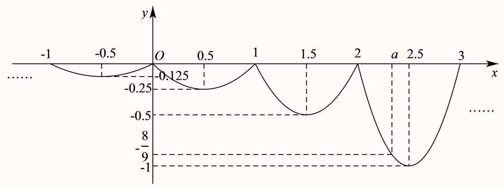

设当 $a \in  \left( {2,{2.5}}\right)$ 时， $f\left( a\right)  =  - \frac{8}{9}$ ，即 $4\left( {a - 2}\right) \left( {a - 3}\right)  =  - \frac{8}{9}$ ，

解得 $a = \frac{7}{3}$ 或 $\frac{8}{3}$ ，

因为 $a \in  \left( {2,{2.5}}\right)$ ,所以 $a = \frac{7}{3}$ ,

对任意 $x \in  ( - \infty , t\rbrack$ ,都有 $f\left( x\right)  \geq   - \frac{8}{9}$ ,故 $t \leq  \frac{7}{3}$

故实数 $t$ 的取值范围是 $\left( {-\infty ,\frac{7}{3}}\right\rbrack$ ,

(3)假设存在非零实数 $k$ ，使函数 $f\left( x\right)  = \sin {kx}$ 是 $\mathbf{R}$ 上的周期为 $T$ 的 $T$ 级类周期函数， 即 $f\left( {x + T}\right)  = T \cdot  f\left( x\right) ,\sin k\left( {x + T}\right)  = T \cdot  \sin {kx}$ ,

因为 $\sin k\left( {x + T}\right)$ 的值域为 $\left\lbrack  {-1,1}\right\rbrack$ ,而 $T \cdot  \sin {kx} \in  \left\lbrack  {-\left| T\right| ,\left| T\right| }\right\rbrack$ ,

故 $\left| T\right|  = 1$ ,解得 $T = 1$ 或 -1,

当 $T = 1$ 时, $\sin k\left( {x + 1}\right)  = \sin {kx}$ ,故 $k = 2{n}_{1}\pi ,{n}_{1} \in  \mathrm{Z},,{n}_{1} \neq  0$ ,

当 $T =  - 1$ 时, $\sin k\left( {x - 1}\right)  =  - \sin {kx}$ ,故 $k = \left( {2{n}_{2} + 1}\right) \pi ,{n}_{2} \in  \mathrm{Z}$ ,

综上, $\left\{  \begin{array}{l} k = 2{n}_{1}\pi ,{n}_{1} \in  \mathrm{Z},{n}_{1} \neq  0 \\  T = 1 \end{array}\right.$ 或 $\left\{  \begin{array}{l} k = \left( {2{n}_{2} + 1}\right) \pi ,{n}_{2} \in  \mathrm{Z} \\  T =  - 1 \end{array}\right.$ .

21 解答题

已知若存在整数 $\mathrm{x}$ ，使满足 $\sin \alpha  = x\cos \beta$ 或 $\sin \beta  = x\cos \alpha$ ，则称 $\alpha$ 和 $\beta$ 互为“x级绝配角”

(1)已知在 $\bigtriangleup  {ABC}$ 中，角 $A, B, C$ 所对边分别为 $a, b, c$ ，若 $\frac{a}{\cos A} = \frac{b}{2\cos B} = \frac{c}{3\cos C}$ ，若角 $\mathrm{A}$ 与自己本身互为“x级绝配角”，求:x的值；

(2)若对任意 $\beta$ ，存在常数 $\alpha$ ，均有 $\alpha$ 和 $\beta$ 互为“x级绝配角”，求: $\alpha$ ；

(3)是否存在某一三角形，存在整数 $x$ 使得其所有内角均互为“x级绝配角”，若存在，请给出该三角形的三个内角, 若不存在, 请说明理由.

## 解析

(1)因角 $\mathrm{A}$ 与自己本身互为“ $\mathrm{x}$ 级绝配角”，则 $\sin A = x\cos A$ ，

因 $A \in  \left( {0,\pi }\right)$ ,则 $\sin A > 0$ ,故 $x\cos A > 0$ ,则 $\cos A \neq  0, x \neq  0$ ,则 $\tan A = x$ ,

在 $\bigtriangleup {ABC}$ 中利用正弦定理,则 $\frac{a}{\cos A} = \frac{b}{2\cos B} = \frac{c}{3\cos C}$ 化简为

$\frac{\sin A}{\cos A} = \frac{\sin B}{2\cos B} = \frac{\sin C}{3\cos C},$

即 $\tan A = \frac{1}{2}\tan B = \frac{1}{3}\tan C = x$ ,

在 $\bigtriangleup {ABC}$ 中, $\tan A =  - \tan \left( {B + C}\right)  = \frac{\tan B + \tan C}{\tan B\tan C - 1}$ ,则 $x = \frac{{2x} + {3x}}{\left( {2x}\right)  \times  \left( {3x}\right)  - 1}$ ,

得 $x =  \pm  1$ ,若 $x =  - 1$ ,则 $\tan A =  - 1,\tan B =  - 2,\tan C =  - 3$ ,

则角 $A\text{ 、 }B\text{ 、 }C$ 均为钝角,不满足题意; 若 $x = 1$ ,则 $\tan A = 1,\tan B = 2,\tan C = 3$ ,

则角 $A\text{ 、 }B\text{ 、 }C$ 均为锐角,满足题意,故 $x = 1$ .

(2)对任意 $\beta$ ，存在常数 $\alpha$ ，均有 $\alpha$ 和 $\beta$ 互为“x级绝配角”，

则对 $\forall \beta ,\exists x \in  \mathrm{Z}$ ,有 $\sin \alpha  = x\cos \beta$ 或 $\sin \beta  = x\cos \alpha$ ,其中 $\alpha$ 为常数,

若 $\sin \beta  = x\cos \alpha$ ,由 $\beta$ 的任意性可得 $\cos \alpha  \neq  0$ ,

取 $\beta  = {m\pi }, m \in  \mathrm{Z}$ ,则 $x = 0$ ;

取 $\beta  = \alpha  + \frac{\pi }{4}$ ，则 $\sin \left( {\alpha  + \frac{\pi }{4}}\right)  = {x}_{1}\cos \alpha$ ，故 $\frac{\sqrt{2}}{2}\left( {\tan \alpha  + 1}\right)  = {x}_{1}$ ，其中 ${x}_{1}$ 为整数；

取 $\beta  = \alpha  - \frac{\pi }{4}$ ，则 $\sin \left( {\alpha  - \frac{\pi }{4}}\right)  = {x}_{2}\cos \alpha$ ，故 $\frac{\sqrt{2}}{2}\left( {\tan \alpha  - 1}\right)  = {x}_{2}$ ，其中 ${x}_{2}$ 为整数；

故 $\sqrt{2} = {x}_{1} - {x}_{2}$ ,矛盾;

故 $\sin \alpha  = x\cos \beta$ ,

则当 $\beta  = \frac{\pi }{2} + {m\pi }, m \in  \mathrm{Z}$ 时, $\sin \alpha  = x\cos \beta  = 0$ ,则 $\alpha  = {k\pi }, k \in  \mathrm{Z}$ ,

检验: 当 $\alpha  = {k\pi }, k \in  \mathrm{Z}$ 时, $\sin \alpha  = x\cos \beta  = 0$ ,若 $\beta  = \frac{\pi }{2} + {m\pi }, m \in  \mathrm{Z}$ ,则 $x$ 为任意整数均可; 若 $\beta  \neq  \frac{\pi }{2} + {m\pi }, m \in  \mathrm{Z}$ ,则 $x$ 为整数0,

故而当 $\alpha  = {k\pi }, k \in  \mathrm{Z}$ 时，对任意 $\beta$ ，均有 $\mathrm{x}$ 满足 $\alpha$ 和 $\beta$ 互为“x级绝配角”.

(3) 不存在, 理由如下:

假设存在 $\bigtriangleup {ABC}$ ，存在整数 $x$ 使得其角 $A$ 、 $B$ 、 $C$ 均互为“x级绝配角”，

若 $A$ 、 $B$ 互为 “ $\mathrm{x}$ 级绝配角” 有 $\sin A = x\cos B$ 或 $\sin B = x\cos A$ ①；

若 $B\text{ 、 }C$ 互为 “ $\mathrm{x}$ 级绝配角” 有 $\sin B = x\cos C$ 或 $\sin C = x\cos B$ ②；

若 $C\text{ 、 }A$ 互为 “ $\mathrm{x}$ 级绝配角” 有 $\sin C = x\cos A$ 或 $\sin A = x\cos C$ ③，

则角 $A\text{ 、 }B\text{ 、 }C$ 均互为“ $\mathrm{x}$ 级绝配角” 时,则角 $A\text{ 、 }B\text{ 、 }C$ 在①②③中各满足 1 个，

共8种情况，由于 $A$ 、 $B$ 、 $C$ 三个字符的轮换性，故而只需研究以下两类即可，

即 $\left\{  \begin{array}{l} \sin A = x\cos B \\  \sin B = x\cos C \\  \sin A = x\cos C \end{array}\right.$ ,或 $\left\{  \begin{array}{l} \sin A = x\cos B \\  \sin B = x\cos C \\  \sin C = x\cos A \end{array}\right.$ ,

(i) 若 $\left\{  \begin{array}{l} \sin A = x\cos B \\  \sin B = x\cos C \\  \sin A = x\cos C \end{array}\right.$

因 $A\text{ 、 }B\text{ 、 }C \in  \left( {0,\pi }\right)$ ,则 $\sin A\text{ 、 }\sin B\text{ 、 }\sin C$ 均为正数,

则 $x \neq  0,\cos A \neq  0,\cos B \neq  0,\cos C \neq  0$ ,

由 $\left\{  \begin{array}{l} \sin A = x\cos B \\  \sin A = x\cos C \end{array}\right.$ ,则 $x\cos B = x\cos C$ ,则 $\cos B = \cos C$ ,

因函数 $y = \cos x$ 在 $\left( {0,\pi }\right)$ 上单调递减，则 $B = C$ ，故 $B$ 、 $C$ 均为锐角，

则 $\left\{  \begin{array}{l} \sin A = x\cos B \\  \sin B = x\cos C \end{array}\right.$ 化简为 $\left\{  \begin{array}{l} \sin A = x\cos B \\  \sin B = x\cos B \end{array}\right.$ ,

则 $\sin A = \sin B$ ，则 $A = B$ 或 $A + B = \pi$ (舍)，

故 $A = B = C = \frac{\pi }{3}$ ,

检验: 当 $A = B = C = \frac{\pi }{3}$ 时, $\sin A = x\cos B$ 化简为 $\frac{\sqrt{3}}{2} = \frac{1}{2}x$ ,

则不存在整数 $x$ 使得其角 $A\text{ 、 }B\text{ 、 }C$ 均互为“x级绝配角”.

(ii) 若 $\left\{  \begin{array}{l} \sin A = x\cos B \\  \sin B = x\cos C \\  \sin C = x\cos A \end{array}\right.$ ,

若角 $A$ 为钝角，则由 $\sin C = x\cos A > 0,\cos A < 0$ 可得， $x < 0$ ，

则由 $\sin B = x\cos C > 0$ ,得 $\cos C < 0$ ,则角 $C$ 为钝角,不符合题意,

故 $\bigtriangleup {ABC}$ 为锐角三角形且 $x > 0$ ；

又 ${\sin }^{2}A = {x}^{2}{\cos }^{2}B = {x}^{2}\left( {1 - {\sin }^{2}B}\right)  = {x}^{2} - {x}^{2}{\sin }^{2}B = {x}^{2} - {x}^{2}{\left( x\cos C\right) }^{2}$

$= {x}^{2} - {x}^{4}{\cos }^{2}C = {x}^{2} - {x}^{4}\left( {1 - {\sin }^{2}C}\right)  = {x}^{2} - {x}^{4} + {x}^{4}{\sin }^{2}C = {x}^{2} - {x}^{4} + {x}^{4}{\left( x\cos A\right) }^{2}$

$= {x}^{2} - {x}^{4} + {x}^{6}{\cos }^{2}A = {x}^{2} - {x}^{4} + {x}^{6}\left( {1 - {\sin }^{2}A}\right)  = {x}^{2} - {x}^{4} + {x}^{6} - {x}^{6}{\sin }^{2}A,$

则 ${\sin }^{2}A = \frac{{x}^{2} - {x}^{4} + {x}^{6}}{{x}^{6} + 1}$ ，即 $\sin A = \sqrt{\frac{{x}^{6} - {x}^{4} + {x}^{2}}{{x}^{6} + 1}}$ ，则 $\cos A = \sqrt{\frac{{x}^{4} - {x}^{2} + 1}{{x}^{6} + 1}}$ ，

将其代入 $\left\{  \begin{array}{l} \sin A = x\cos B \\  \sin B = x\cos C \\  \sin C = x\cos A \end{array}\right.$ 中得,

$\sin A = \sin B = \sin C = \sqrt{\frac{{x}^{6} - {x}^{4} + {x}^{2}}{{x}^{6} + 1}},\cos A = \cos B = \cos C = \sqrt{\frac{{x}^{4} - {x}^{2} + 1}{{x}^{6} + 1}},$

则 $\bigtriangleup {ABC}$ 为等边三角形,

检验: 当 $A = B = C = \frac{\pi }{3}$ 时, $\sin A = x\cos B$ 化简为 $\frac{\sqrt{3}}{2} = \frac{1}{2}x$ ,

则不存在整数 $x$ 使得其角 $A\text{ 、 }B\text{ 、 }C$ 均互为 “ $x$ 级绝配角”.

综上,不存在三角形,使存在整数 $x$ 使得其所有内角均互为 “ $x$ 级绝配角”

# 上海市上海中学2024-2025学年高一 下学期4月期中测试数学试题 (B卷)

姓名:___

## 一、填空题

1 填空题

1小时内秒针转过了___。(用弧度制表示)

## 解析

利用任意角的定义结合弧度制的性质求解即可.

因为1小时内分针转过了 $- {2\pi }$ ，所以1小时内秒针转过了 $- {120\pi }$ .

故答案为: $- {120\pi }$

2 填空题

已知 $\cos \overline{\left( \theta  - \frac{\pi }{12}\right) } = \frac{3}{4}$ ，则 $\sin \left( {{2\theta } + \frac{\pi }{3}}\right)  =$

解析

由 ${2\theta } + \frac{\pi }{3} = 2\left( {\theta  - \frac{\pi }{12}}\right)  + \frac{\pi }{2}$ ,根据二倍角公式即可求解.

由 ${2\theta } + \frac{\overline{\pi }}{3} = 2\left( {\theta  - \frac{\overline{\pi }}{12}}\right)  + \frac{\overline{\pi }}{2}$ ,所以

$\sin \left( {{2\theta } + \frac{\pi }{3}}\right)  = \sin \left\lbrack  {2\left( {\theta  - \frac{\pi }{12}}\right)  + \frac{\pi }{2}}\right\rbrack   = \cos \left\lbrack  {2\left( {\theta  - \frac{\pi }{12}}\right) }\right\rbrack$

$= 2{\cos }^{2}\left( {\theta  - \frac{\pi }{12}}\right)  - 1 = 2 \times  {\left( \frac{3}{4}\right) }^{2} - 1 = \frac{1}{8}$ ,

故答案为: $\frac{1}{8}$ .

3 填空题

函数 $f\left( x\right)  = A\sin \left( {{\omega x} + \varphi }\right)  + 2\left( {A > 0,\left| \varphi \right|  < \pi }\right)$ 的图象的一部分如图所示，则 $f\left( x\right)$ 的初相为___.

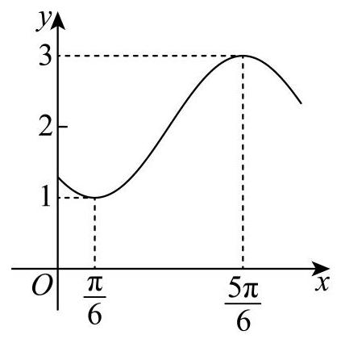

## 解析

由图象利用“五点法”求出函数的解析式，从而可求出初相.

由图可知 $A = \frac{3 - 1}{2} = 1$ ,

周期 $T = 2\left( {\frac{5\pi }{6} - \frac{\pi }{6}}\right)  = \frac{4\pi }{3} = \frac{2\pi }{\omega }$ ,所以 $\omega  = \frac{3}{2}$ ,所以 $f\left( x\right)  = \sin \left( {\frac{3}{2}x + \varphi }\right)  + 2$ ,

因为点 $\left( {\frac{\pi }{6},1}\right)$ 在函数图象上,

所以 $\sin \left( {\frac{3}{2} \times  \frac{\pi }{6} + \varphi }\right)  + 2 = 1$ ,所以 $\sin \left( {\frac{\pi }{4} + \varphi }\right)  =  - 1$ ,

所以 $\varphi  =  - \frac{3\pi }{4} + {2k\pi }, k \in  \mathrm{Z}$ ,

因为 $\left| \varphi \right|  < \pi$ ,所以 $\varphi  =  - \frac{3\pi }{4}$ ,

所以 $f\left( x\right)  = \sin \left( {\frac{3}{2}x - \frac{3\pi }{4}}\right)  + 2$ ,

所以初相为 $- \frac{3\pi }{4}$ ,

故答案为: $- \frac{3\pi }{4}$

4 填空题

函数 $y = \frac{1}{\sin \left( {{3x} + \frac{\pi }{6}}\right) } + 1$ 的图象的对称中心的坐标是___.

## 解析

方法一:根据正弦函数的性质，利用图象变换方法；方法二:根据正弦函数的性质，利用整体代入方法求解.

方法一:图象变换法:

函数 $y = \sin x$ 的对称中心是形如 $\left( {{k\pi },0}\right)$ 的点，其中 $k$ 为整数.

变换后的函数分析:函数 $y = \sin \left( {{3x} + \frac{\pi }{6}}\right)  + 1$ 是由原函数 $y = \sin x$ 经过横向压缩3倍、

向左平移 $\frac{\pi }{18}$ 个单位,再向上平移 1 个单位得到的.

对称中心的变换:

横向压缩3倍后，原对称中心的横坐标 ${k\pi }$ 变为 $\frac{k\pi }{3}$

向左平移 $\frac{\pi }{18}$ 个单位后,横坐标变为 $\frac{k\pi }{3} - \frac{\pi }{18}$ .

向上平移1个单位后，纵坐标变为1.

函数 $y = \sin \left( {{3x} + \frac{\pi }{6}}\right)  + 1$ 的图像的对称中心的坐标为: $\left( {\frac{k\pi }{3} - \frac{\pi }{18},1}\right) , k \in  \mathbf{Z}$ .

方法二: 利用正弦函数的性质直接求解法:

求解对称中心: 对称中心的横坐标满足方程 ${3x} + \frac{\pi }{6} = {k\pi }$ ,解得 $x = \frac{{k\pi } - \frac{\pi }{6}}{3} = \frac{\left( {{6k} - 1}\right) \pi }{18}$ , 纵坐标恒为1.

最终，函数 $y = \sin \left( {{3x} + \frac{\pi }{6}}\right)  + 1$ 的图象的对称中心的坐标为:: $\left( {\frac{k\pi }{3} - \frac{\pi }{18},1}\right)$ ， $k \in  \mathbf{Z}$ .

故答案为: $\left( {\frac{k\pi }{3} - \frac{\pi }{18},1}\right) , k \in  \mathbf{Z}$ .

5 填空题

已知函数 $f\left( x\right)  = \sin \left( {{\omega x} - \frac{\pi }{6}}\right)$ ，其中 $\omega  > 0$ ，若 $f\left( x\right)$ 在区间 $\left( {0,\frac{\pi }{3}}\right)$ 上恰有2个零点，则 $\omega$ 的取值范围是___.

解析

求出 ${\omega x} - \frac{\pi }{6}$ 的范围，利用正弦函数图像的性质计算即可；

$\because$ 函数 $f\left( x\right)  = \sin \left( {{\omega x} - \frac{\pi }{6}}\right)$ ，其中 $\omega  > 0$ ， $f\left( x\right)$ 在区间 $\left( {0,\frac{\pi }{3}}\right)$ 上恰有2个零点，

${\omega x} - \frac{\pi }{6} \in  \left( {-\frac{\pi }{6},\frac{\omega \pi }{3} - \frac{\pi }{6}}\right) ,\therefore \pi  < \frac{\omega \pi }{3} - \frac{\pi }{6} \leq  {2\pi }$ . 求得 $\frac{7}{2} < \omega  \leq  \frac{13}{2}$ ,则 $\omega$ 的取值范围为 $\left( {\frac{7}{2},\frac{13}{2}}\right\rbrack$

故答案为: $\left( {\frac{7}{2},\frac{13}{2}}\right\rbrack$ .

6 填空题

已知函数 $y = \sin \left( {{\omega x} + \frac{\pi }{6}}\right) \left( {\omega  > 0}\right)$ 在区间 $\left( {-\frac{\pi }{2},\frac{\pi }{3}}\right)$ 上是严格增函数，则 $\omega$ 的取值范围是___.

解析

问题化为 $y = \sin t$ 在 $\left( {-\frac{\omega \pi }{2} + \frac{\pi }{6},\frac{\omega \pi }{3} + \frac{\pi }{6}}\right)$ 上单调递增,且 $\omega  > 0$ ,结合正弦函数的图象及相关性质列不等式求参数范围.

由 $x \in  \left( {-\frac{\pi }{2},\frac{\pi }{3}}\right)$ ,则 $t = {\omega x} + \frac{\pi }{6} \in  \left( {-\frac{\omega \pi }{2} + \frac{\pi }{6},\frac{\omega \pi }{3} + \frac{\pi }{6}}\right)$ ,

由题意 $y = \sin t$ 在 $\left( {-\frac{\omega \pi }{2} + \frac{\pi }{6},\frac{\omega \pi }{3} + \frac{\pi }{6}}\right)$ 上单调递增,且 $\omega  > 0$ ,

所以 $\left( {\frac{\omega \pi }{3} + \frac{\pi }{6}}\right)  - \left( {-\frac{\omega \pi }{2} + \frac{\pi }{6}}\right)  = \frac{5\omega \pi }{6} \leq  \pi$ ,则 $\omega  \leq  \frac{6}{5}$ ,故 $\frac{\omega \pi }{3} + \frac{\pi }{6} \leq  \frac{17\pi }{30}$ ,

综上, $\left\{  \begin{array}{l}  - \frac{\omega \pi }{2} + \frac{\pi }{6} \geq   - \frac{\pi }{2} \\  \frac{\omega \pi }{3} + \frac{\pi }{6} \leq  \frac{\pi }{2} \end{array}\right.$ ,则 $\left\{  \begin{array}{l} \omega  \leq  \frac{4}{3} \\  \omega  \leq  1 \end{array}\right.$ ,故 $0 < \omega  \leq  1$ .

故答案为: $0 < \omega  \leq  1$

7 填空题

已知函数 $f\left( x\right)  = \sin {\omega x} + \cos {\omega x}\left( {\omega  > 0}\right) , x \in  \mathbf{R}$ ，若函数 $f\left( x\right)$ 在区间 $\left( {-\omega ,\omega }\right)$ 内单调递增，且函数 $f\left( x\right)$ 的图像关于直线 $x = \omega$ 对称，则 $\omega$ 的值为___.

解析

由 $f\left( x\right)$ 在区间 $\left( {-\omega ,\omega }\right)$ 内单调递增,且 $f\left( x\right)$ 的图像关于直线 $x = \omega$ 对称,可得 ${2\omega } \leq  \frac{\pi }{\omega }$ ,且

$f\left( \omega \right)  = \sin {\omega }^{2} + \cos {\omega }^{2} = \sqrt{2} \Rightarrow  \sin \left( {{\omega }^{2} + \frac{\pi }{4}}\right)  = 1$ ,所以 ${\omega }^{2} + \frac{\pi }{4} = \frac{\pi }{2} \Rightarrow  \omega  = \frac{\sqrt{\pi }}{2}$ .

8 填空题

已知函数 $f\left( x\right)  = \left\{  \begin{array}{l} \sin {\pi x}, x \in  \left\lbrack  {0,2}\right\rbrack  \\  {\log }_{2025}\left( {x - 1}\right) , x \in  \left( {2, + \infty }\right)  \end{array}\right.$ ,若满足 $f\left( a\right)  = f\left( b\right)  = f\left( c\right)$ (a、b、c互不相等), 则 $a + b + c$ 的取值范围是___.

解析

根据对称性求得 $a + b$ ,结合对数函数的性质求得正确答案.

不妨设 $a < b < c$ ，画出 $f\left( x\right)$ 的图象如下图所示，

$f\left( \frac{1}{2}\right)  = \sin \frac{\pi }{2} = 1$ ,所以 $\frac{a + b}{2} = \frac{1}{2}, a + b = 1$ .

令 ${\log }_{2025}\left( {x - 1}\right)  = 1$ ,解得 $x = {2026}$ ,

所以 $2 < c < {2026}$ ,所以 $a + b + c = 1 + c \in  \left( {3,{2027}}\right)$ .

故答案为: $\left( {3,{2027}}\right)$

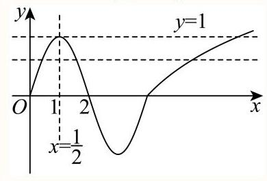

9 填空题

设函数 $y = \sin \left( {{2x} + \varphi }\right) \left( {0 < \varphi  < \frac{\pi }{2}}\right.$ ) 的图象与直线 $y = t$ 相交的连续的三个公共点从左到右依次记为 $A, B, C$ ,若 $\left| {BC}\right|  = 2\left| {AB}\right|$ ,则正实数 $t$ 的值为___.

解析

作出正弦型三角函数的图象，利用其对称性和周期性求出 $A$ 点横坐标，再代入计算即可.

作出函数 $y = \sin \left( {{2x} + \varphi }\right)$ ,的大致图象,如图,令 ${2x} + \varphi  = {2k\pi } + \frac{\pi }{2}, k \in  \mathrm{Z}$ ,

解得 $x = {k\pi } + \frac{\pi }{4} - \frac{\varphi }{2}, k \in  \mathbf{Z}$ ,

则函数 $y = \sin \left( {{2x} + \varphi }\right)$ 的图象与直线 $y = t\left( {0 < t < 1}\right)$ 连续的三个公共点 $A, B, C$ ,(可以同时往左或往右移动正整数倍周期长度)

即 $A, B$ 关于直线 $x = {k\pi } + \frac{\pi }{4} - \frac{\varphi }{2}, k \in  \mathrm{Z}$ 对称, $\left| {AC}\right|  = T = \frac{2\pi }{2} = \pi$ ,

由于 $\left| {BC}\right|  = 2\left| {AB}\right|$ ,故 $\left| {AB}\right|  = \frac{1}{3}\left| {AC}\right|  = \frac{\pi }{3}$ ,

而 $A, B$ 关于直线 $x = {k\pi } + \frac{\pi }{4} - \frac{\varphi }{2}, k \in  \mathrm{Z}$ 对称,

故 $A$ 点横坐标为 ${k\pi } + \frac{\pi }{4} - \frac{\varphi }{2} - \frac{\pi }{6} = {k\pi } + \frac{\pi }{12} - \frac{\varphi }{2}$ ,

将 $A$ 点横坐标代入 $y = \sin \left( {{2x} + \varphi }\right)$ ，得 $\sin \left( {\frac{\pi }{6} + {2k\pi }}\right)  = t = \frac{1}{2}$ .

故答案为: $\frac{1}{2}$ .

10 填空题

定义: 余割 $\csc \alpha  = \frac{1}{\sin \alpha }$ . 已知 $m$ 为正实数,且 $m \cdot  {\csc }^{2}x + {\tan }^{2}x \geq  {15}$ 对任意的实数 $x$ , $\left( {x \neq  {k\pi } + \frac{\pi }{2}, k \in  \mathrm{Z}}\right)$ 均成立，则 $m$ 的取值范围为___.

解析

由三角函数新定义,将已知不等式等价转化成 $m \geq  {15}{\sin }^{2}x - \frac{{\sin }^{4}x}{{\cos }^{2}x}$ ,利用同角的三角函数基本关系式化简右式, 借助于基本不等式即可求得其最值即可.

由已知可得 $m \cdot  {\csc }^{2}x + {\tan }^{2}x = \frac{m}{{\sin }^{2}x} + \frac{{\sin }^{2}x}{{\cos }^{2}x} \geq  {15}$ ,

即 $m \geq  {15}{\sin }^{2}x - \frac{{\sin }^{4}x}{{\cos }^{2}x}$ ,

因为 $x \neq  {k\pi } + \frac{\pi }{2}\left( {k \in  \mathrm{Z}}\right)$ ,所以 ${\cos }^{2}x \in  (0,1\rbrack$ ,

则 ${15}{\sin }^{2}x - \frac{{\sin }^{4}x}{{\cos }^{2}x} = {15}\left( {1 - {\cos }^{2}x}\right)  - \frac{{\left( 1 - {\cos }^{2}x\right) }^{2}}{{\cos }^{2}x} = {17} - \left( {\frac{1}{{\cos }^{2}x} + {16}{\cos }^{2}x}\right)$ ,

因 $\frac{1}{{\cos }^{2}x} + {16}{\cos }^{2}x \geq  2\sqrt{\frac{1}{{\cos }^{2}x} \cdot  {16}{\cos }^{2}x} = 8$ ,当且仅当 ${\cos }^{2}x = \frac{1}{4}$ 时等号成立,

此时 ${15}{\sin }^{2}x - \frac{{\sin }^{4}x}{{\cos }^{2}x} \leq  {17} - 8 = 9$ ,故 $m \geq  9$ .

故答案为: $\lbrack 9, + \infty )$ .

11 填空题

已知 $\omega  > 0$ ,顺次连接函数 $f\left( x\right)  = \sqrt{6}\sin {\omega x}\left( {\omega  > 0}\right)$ 与 $g\left( x\right)  = \sqrt{6}\cos {\omega x}$ 的任意三个相邻的交点都构成一个等腰直角三角形，则 $\omega  =$ ___.

解析

根据题意作图,通过图象可知,等腰直角三角形的斜边 ${AC}$ 的长度为三角函数的一个周期,利用等腰直角三角形的性质求出边长 $\left| {AC}\right|$ ，再由三角函数的周期公式求得 $\omega$ 的值.

如图所示 (根据对称性, 其它情况与此本质相同),

在函数 $f\left( x\right)  = \sqrt{6}\sin {\omega x}\left( {\omega  > 0}\right)$ 与 $g\left( x\right)  = \sqrt{6}\cos {\omega x}$ 的交点中, $\left| {AC}\right|  = T = \frac{2\pi }{\omega }$ ,

令 $\sqrt{6}\sin {\omega x} = \sqrt{6}\cos {\omega x}$ ,又 ${\sin }^{2}{\omega x} + {\cos }^{2}{\omega x} = 1$ ,所以 $\sin {\omega x} = \cos {\omega x} =  \pm  \frac{\sqrt{2}}{2}$ ,

因为三个相邻的交点构成一个等腰直角三角形,

故等腰直角三角形斜边上的高为 $\frac{\sqrt{2}}{2} \times  \sqrt{6} \times  2 = 2\sqrt{3}$ ,即 $\frac{1}{2}\left| {AC}\right|  = 2\sqrt{3}$ ,

所以 $\left| {AC}\right|  = \frac{2\pi }{\omega } = 4\sqrt{3}$ ，则 $\omega  = \frac{\sqrt{3}\pi }{6}$ .

故答案为: $\frac{\sqrt{3}}{6}\pi$ .

12 填空题

设集合 $A = \left\{  {x \mid  x = \sin \frac{2\pi }{2025} + \sin \frac{4\pi }{2025} + \sin \frac{6\pi }{2025} + \cdots  + \sin \frac{2k\pi }{2025}, k \in  \mathrm{Z}, k > 0}\right\}$ 有___个真子集.

解析

依题意由表达式中角的特征可知当 $0 < k \leq  {1012}, k \in  \mathrm{Z}$ 时, $\sin \frac{2k\pi }{2025}$ 的取值各不相同,当 $k \geq  {1013}$ 时,利用诱导公式以及集合元素的互异性即可求得集合 $A$ 的元素个数为1013,继而得到真子集个数.

由题意,当 $0 < k \leq  {1012}, k \in  \mathrm{Z}$ 时, $\frac{2k\pi }{2025} \in  \left( {0,\pi }\right)$ ,此时, $\sin \frac{2k\pi }{2025} \in  \left( {0,1}\right)$ ,

因2025是奇数， ${2k}$ 是偶数，且 $\frac{2k\pi }{2025}$ 中的任意两组角都不关于 $\frac{\pi }{2}$ 对称，所以 $\sin \frac{2k\pi }{2025}$ 的取值各不相同,

因此当 $0 < k \leq  {1012}, k \in  \mathrm{Z}$ 时,集合 $A$ 中 $x$ 的取值会随着 $k$ 的增大而增大,所以当 $k = {1012}$ 时, 集合 $A$ 中共有 1012 个元素;

当 $k = {1013}$ 时,易知 $x = \sin \frac{2\pi }{2025} + \sin \frac{4\pi }{2025} + \sin \frac{6\pi }{2025} + \cdots  + \sin \frac{2024\pi }{2025} + \sin \left( {\pi  + \frac{\pi }{2025}}\right) \; = \sin \frac{2\pi }{2025} + \sin \frac{4\pi }{2025} + \sin \frac{6\pi }{2025} + \cdots  + \sin \frac{2024\pi }{2025} - \sin \frac{\pi }{2025}$ 又因 $\sin \frac{2024\pi }{2025} = \sin \frac{\pi }{2025}$ ,故 $x = \sin \frac{2\pi }{2025} + \sin \frac{4\pi }{2025} + \sin \frac{6\pi }{2025} + \cdots  + \sin \frac{2022\pi }{2025}$ , 即 $k = {1013}$ 时 $x$ 的取值与 $k = {1011}$ 时的取值相同,

根据集合元素的互异性可知, $k = {1013}$ 时,并没有增加集合中的元素个数,

当 $k = {2024}$ ,易得: $x = \sin \frac{2\pi }{2025} + \sin \frac{4\pi }{2025} + \sin \frac{6\pi }{2025} + \cdots  + \sin \frac{4046\pi }{2025} + \sin \frac{4048\pi }{2025} \; = \sin \frac{2\pi }{2025} + \sin \frac{4\pi }{2025} + \sin \frac{6\pi }{2025} + \cdots  + \sin \frac{2024\pi }{2025} - \sin \frac{2024\pi }{2025} - \cdots  - \sin \frac{4\pi }{2025} - \sin \; \frac{2\pi }{2025} = 0$

,

可得当 $k \geq  {1013}$ 时，集合 $A$ 中的元素个数只增加了一个0，

故可得集合 $A$ 的元素个数为 1013 个，故集合 $A$ 的真子集有 ${2}^{1013} - 1$ 个.

故答案为: ${2}^{1013} - 1$ .

## 二、选择题

13 单选题

函数 $f\left( x\right)  = \sin \left( {x + {2\varphi }}\right)  - 2\sin \varphi \cos \left( {x + \varphi }\right)$ 的最大值为( )

A. 1

B. $\sqrt{2}$

C. 2

D. 3

解析

运用拆角变换, 逆用差角的正弦公式, 化简函数式, 即可求得其最值.

因 $f\left( x\right)  = \sin \left( {x + {2\varphi }}\right)  - 2\sin \varphi \cos \left( {x + \varphi }\right)$

$= \sin \left\lbrack  {\varphi  + \left( {x + \varphi }\right) }\right\rbrack   - 2\sin \varphi \cos \left( {x + \varphi }\right)$

$= \sin \varphi \cos \left( {x + \varphi }\right)  + \cos \varphi \sin \left( {x + \varphi }\right)  - 2\sin \varphi \cos \left( {x + \varphi }\right)$

$= \sin \left( {x + \varphi }\right) \cos \varphi  - \cos \left( {x + \varphi }\right) \sin \varphi$

$= \sin \left\lbrack  {\left( {x + \varphi }\right)  - \varphi }\right\rbrack   = \sin x$ ,故其最大值为 1 .

故选: A.

14 单选题

已知函数 $f\left( x\right)  = {2x}\cos x$ ，则函数 $f\left( x\right)$ 的部分图象可以为( )

A.

B.

C.

D.

解析

由奇偶性可排除BD,再取特殊值 $f\left( \frac{\pi }{4}\right)$ 可判断AC,从而得解

因为 $f\left( x\right)$ 的定义域为 $R$ ,且

$f\left( {-x}\right)  = 2\left( {-x}\right) \cos \left( {-x}\right)  =  - {2x}\cos x =  - f\left( x\right) ,$

所以 $f\left( x\right)$ 为奇函数，

故BD错误;

当 $x > 0$ 时,令 $f\left( x\right)  = {2x}\cos x = 0$ ,易得 $\cos x = 0$ ,

解得 $x = \frac{\pi }{2} + {k\pi }\left( {k \in  Z}\right)$ ,

故易知 $f\left( x\right)$ 的图象在 $y$ 轴右侧的第一个交点为 $\left( {\frac{\pi }{2},0}\right)$ ,

又 $f\left( \frac{\pi }{4}\right)  = 2 \times  \frac{\pi }{4} \times  \cos \frac{\pi }{4} = \frac{\sqrt{2}\pi }{4} > 0$ ,故C错误, $\mathrm{A}$ 正确；

故选: A

15 单选题

在 $\bigtriangleup  \mathrm{{ABC}}$ 中，三个角A、B、C所对的边分别为a、b、c，下列四个条件中有几个是 $\bigtriangleup  \mathrm{{ABC}}$ 为直角三角形的充分条件 ( )

① $a\cos A = b\cos B$ ；

② $\sin A + \sin C = \cos A - \cos C$ ；

③ $\frac{\sin B + \sin C}{\cos B + \cos C} = \sin A$ ；

④ $\frac{c}{a - b} = \frac{1}{\cos B - \cos A}$ .

A. 1

B. 2

C. 3

D. 4

解析

分别对各选项化简，分析是否能得出 $\bigtriangleup  \mathrm{{ABC}}$ 为直角三角形即可.

①由正弦定理， $a\cos A = b\cos B$ ，则 $\sin A\cos A = \sin B\cos B$ ，即 $\sin {2A} = \sin {2B}$ ，

故 $A = B$ 或 ${2A} + {2B} = \pi$ ，即 $A = B$ 或 $A + B = \frac{\pi }{2}$ ，

故 $a\cos A = b\cos B$ 不能推出 $\bigtriangleup  \mathrm{{ABC}}$ 为直角三角形，故①错误；

② $\sin A + \sin C = \cos A - \cos C$ ，则 $\sin A - \cos A =  - \sin C - \cos C$ ，

即 $\sqrt{2}\sin \left( {A - \frac{\pi }{4}}\right)  =  - \sqrt{2}\sin \left( {C + \frac{\pi }{4}}\right)$ ,故 $\sin \left( {\frac{\pi }{4} - A}\right)  = \sin \left( {C + \frac{\pi }{4}}\right)$ .

因为 $A, C \in  \left( {0,\pi }\right)$ ,故 $\frac{\pi }{4} - A = C + \frac{\pi }{4}$ 或 $\frac{\pi }{4} - A + C + \frac{\pi }{4} = \pi$ ,

即 $A + C = 0$ (舍)或 $C - A = \frac{\pi }{2}$ ，则不能推出 $\bigtriangleup \mathrm{{ABC}}$ 为直角三角形，故②错误；

③ $\frac{\sin B + \sin C}{\cos B + \cos C} = \sin A$ ，则 $\sin B + \sin C = \sin A\left( {\cos B + \cos C}\right)$ ，

即 $\sin B + \sin C = \sin A\cos B + \sin A\cos C$ ,

故 $\sin \left( {A + C}\right)  + \sin \left( {A + B}\right)  = \sin A\cos B + \sin A\cos C$ ,

即 $\sin A\cos C + \cos A\sin C + \sin A\cos B + \cos A\sin B = \sin A\cos B + \sin A\cos C$ ,

即 $\cos A\sin C + \cos A\sin B = 0$ ,故 $\cos A\left( {\sin C + \sin B}\right)  = 0$ .

因为 $A, B, C \in  \left( {0,\pi }\right)$ ,故 $\cos A = 0$ ,即 $A = \frac{\pi }{2}$ ,则 $\bigtriangleup \mathrm{{ABC}}$ 为直角三角形,故③正确；

④ $\frac{c}{a - b} = \frac{1}{\cos B - \cos A}$ ，则 $\frac{\sin C}{\sin A - \sin B} = \frac{1}{\cos B - \cos A}\left( {A \neq  B}\right)$ ，

即 $\sin C\left( {\cos B - \cos A}\right)  = \sin A - \sin B$ ,

故 $\sin C\cos B - \sin C\cos A = \sin \left( {B + C}\right)  - \sin \left( {A + C}\right)$ ,

故 $\sin C\cos B - \sin C\cos A = \sin B\cos C + \cos B\sin C - \sin A\cos C - \cos A\sin C$ ,

即 $\sin B\cos C - \sin A\cos C = 0$ ,故 $\left( {\sin B - \sin A}\right) \cos C = 0$ .

因为 $A, B, C \in  \left( {0,\pi }\right) ,\left( {A \neq  B}\right)$ ,故 $\cos C = 0$ ,即 $C = \frac{\pi }{2}$ ,则 $\bigtriangleup  \mathrm{{ABC}}$ 为直角三角形,故④正确.

综上有③④是 $\bigtriangleup  \mathrm{{ABC}}$ 为直角三角形的充分条件.

故选: B

16 单选题

已知函数 $f\left( x\right)  = \left( {\sin x + \cos x}\right) \left| {\sin x - \cos x}\right|$ ,给出下列结论:

① $f\left( x\right)$ 是周期函数；

③若 $\left| {f\left( {x}_{1}\right) }\right|  + \left| {f\left( {x}_{2}\right) }\right|  = 2$ ，则 ${x}_{1} + {x}_{2} = \frac{k\pi }{2}\left( {k \in  \mathbf{Z}}\right)$ ；④函数 $g\left( x\right)  = f\left( x\right)  + 1$ 在区间 $\left\lbrack  {0,{2\pi }}\right\rbrack$ 上有且仅有1个零点.

则上述结论中正确的序号为( )

A. ①

B. ①③

C. ①②③

D. ②③④

## 解析

先求出解析式，再对①②③④一一验证:对于①:利用周期的定义验证；对于②:取特殊数值排除; 对于③: 利用三角函数的有界性进行计算, 即可判断; 对于④: 可以求出零点, 进行判断.

函数 $f\left( x\right)  = \left( {\sin x + \cos x}\right) \left| {\sin x - \cos x}\right|  = \left\{  \begin{array}{l}  - \cos {2x}\left( {\sin x \geq  \cos x}\right) \\  \cos {2x}\left( {\sin x < \cos x}\right)  \end{array}\right.$ ,

对于①:由 $f\left( {x + {2\pi }}\right)  = f\left( x\right)$ 所以函数的最小正周期为 ${2\pi }$ ，故①正确；

对于②: 由于 $f\left( {-\frac{\pi }{2}}\right)  =  - 1, f\left( 0\right)  = 1, f\left( \frac{\pi }{2}\right)  = 1, f\left( \frac{\pi }{4}\right)  = 0$ ,

故函数 $f\left( x\right)$ 在 $\left\lbrack  {-\frac{\pi }{2},\frac{\pi }{2}}\right\rbrack$ 上不是单调增函数，故②错误；

对于③:函数 $f\left( x\right)$ 的最大值为 1，若 $\left| {f\left( {x}_{1}\right) }\right|  + \left| {f\left( {x}_{2}\right) }\right|  = 2$ ，

则 $\left| {f\left( {x}_{1}\right) }\right|  = \left| {f\left( {x}_{2}\right) }\right|  = 1$ ,

所以 ${x}_{1} = \frac{1}{2}{k}_{1}\pi ,{x}_{2} = \frac{1}{2}{k}_{2}\pi ,\left( {{k}_{1},{k}_{2} \in  \mathbf{N}}\right)$ ,

故 ${x}_{1} + {x}_{2} = \frac{k\pi }{2}\left( {k \in  \mathbf{Z}}\right)$ ; 故③正确；

对于④:当 $x \in  \left\lbrack  {0,{2\pi }}\right\rbrack$ 时， $f\left( x\right)  = \left\{  \begin{array}{l}  - \cos {2x}\left( {\frac{\pi }{4} \leq  x \leq  \frac{5\pi }{4}}\right) \\  \cos {2x}\left( {0 \leq  x \leq  \frac{\pi }{4}\text{ 或 }\frac{5\pi }{4} \leq  x \leq  {2\pi }}\right)  \end{array}\right.$ ，

由于 $g\left( x\right)  = f\left( x\right)  + 1 = 0$ ,即 $f\left( x\right)  =  - 1$ ,解得 $x = \pi$ 或 $\frac{3\pi }{2}$ ,

所以函数有两个零点, 故④错误.

故选: B.

## 三、解答题

17 解答题

记 $\bigtriangleup  {ABC}$ 的内角 $A, B, C$ 所对的边分别为 $a, b, c$ ，且 $\frac{b\cos C - {2a}\cos A}{\cos B} =  - c$ .

(1)求 $A$ ；

(2)若 ${bc} = 4$ ，求 $\bigtriangleup  {ABC}$ 外接圆面积的最小值.

## 解析

(1)由 $\frac{b\cos C - {2a}\cos A}{\cos B} =  - c$ 整理得: $b\cos C + c\cos B = {2a}\cos A$ ,

由正弦定理,可得 $\sin B\cos C + \sin C\cos B = 2\sin A\cos A$

即 $\sin A = \sin \left( {B + C}\right)  = 2\sin A\cos A$ ,

因为 $\sin A \neq  0$ ,所以 $2\cos A = 1$ ,即 $\cos A = \frac{1}{2}$ ,

又因为 $A \in  \left( {0,\pi }\right)$ ,所以 $A = \frac{\pi }{3}$ .

(2)由正弦定理， $\bigtriangleup {ABC}$ 外接圆的半径 $r = \frac{a}{2\sin A} = \frac{a}{\sqrt{3}}$ ，

要使外接圆的半径最小,只需 $a$ 最小,

由余弦定理, ${a}^{2} = {b}^{2} + {c}^{2} - {2bc}\cos A = {b}^{2} + {c}^{2} - {bc} \geq  {2bc} - {bc} = {bc} = 4$ ,

当且仅当 $b = c = 2$ 时取等号,此时 $a = 2$ ,则 ${r}_{\min } = \frac{2\sqrt{3}}{3}$ .

故 $\bigtriangleup {ABC}$ 外接圆面积的最小值为 $\pi  \times  {\left( \frac{2\sqrt{3}}{3}\right) }^{2} = \frac{4\pi }{3}$ .

## 18 解答题

幂函数 $f\left( x\right)  = {x}^{{m}^{2} - {2m} - 3}\left( {m \in  \mathbf{Z}}\right)$ 的图像关于y轴对称，且在区间 $\left( {-\infty ,0}\right)$ 上是严格增函数.

(1)求 $\mathrm{f}\left( \mathrm{x}\right)$ 的表达式；

(2)对任意实数 $x \in  \left\lbrack  {\frac{1}{2},1}\right\rbrack$ ，不等式 $f\left( x\right)  \leq  t + {4}^{x}$ 恒成立，求实数 $\mathrm{t}$ 的取值范围.

## 解析

(1)因为幂函数 $f\left( x\right)  = {x}^{{m}^{2} - {2m} - 3}$ 为偶函数，在区间 $\left( {-\infty ,0}\right)$ 上是严格增函数，

则 $f\left( x\right)  = {x}^{{m}^{2} - {2m} - 3}$ 在区间 $\left( {0, + \infty }\right)$ 上单调递减，所以 ${m}^{2} - {2m} - 3 < 0$ ，解得 $- 1 < m < 3$ ， 又因为 $m \in  \mathrm{Z}$ ,所以 $m = 0,1$ 或2,

当 $m = 0$ 或 2 时， $f\left( x\right)  = {x}^{-3}$ 不是偶函数，舍去；

当 $m = 1$ 时， $f\left( x\right)  = {x}^{-4}$ 是偶函数，合题意，所以 $f\left( x\right)  = {x}^{-4}$ .

(2)对任意实数 $x \in  \left\lbrack  {\frac{1}{2},1}\right\rbrack$ ，不等式 $f\left( x\right)  \leq  t + {4}^{x}$ 恒成立，

即 $t \geq  {x}^{-4} - {4}^{x}$ 在 $x \in  \left\lbrack  {\frac{1}{2},1}\right\rbrack$ 上恒成立，

设 $g\left( x\right)  = {x}^{-4} - {4}^{x}, x \in  \left\lbrack  {\frac{1}{2},1}\right\rbrack$ ,

因为 $g\left( x\right)$ 在 $x \in  \left\lbrack  {\frac{1}{2},1}\right\rbrack$ 上单调递减，所以 $g\left( x\right)  \leq  g\left( \frac{1}{2}\right)  = {14}$ ,

所以 $t \geq  {14}$ ,即 $t \in  \lbrack {14}, + \infty )$ .

19 解答题

如图，游客从某旅游景区的景点 $A$ 处下上至 $C$ 处有两种路径. 一种是从 $A$ 沿直线步行到 $C$ ，另一种是先从 $A$ 沿索道乘缆车到 $B$ ，然后从 $B$ 沿直线步行到 $C$ . 现有甲、乙两位游客从 $A$ 处下山，甲沿 ${AC}$ 匀速步行，速度为 ${50m}/\mathrm{{min}}$ . 在甲出发 $2\mathrm{\;{min}}$ 后，乙从 $A$ 乘缆车到 $B$ ，在 $B$ 处停留 $1\mathrm{\;{min}}$ 后，再从 $B$ 匀速步行到 $C$ ,假设缆车匀速直线运动的速度为 ${130m}/\mathrm{{min}}$ ,山路 ${AC}$ 长为 ${1260m}$ ,经测量 $\cos A = \frac{12}{13}$ , $\cos C = \frac{3}{5}.$

(1)求索道 ${AB}$ 的长；

(2)问:乙出发多少min后，乙在缆车上与甲的距离最短？

(3)为使两位游客在 $C$ 处互相等待的时间不超过 $3\mathrm{\;{min}}$ ，乙步行的速度应控制在什么范围内？

## 解析

(1)在 $\bigtriangleup  {ABC}$ 中，因为 $\cos A = \frac{12}{13},\cos C = \frac{3}{5}$ ，

所以 $\sin A = \frac{5}{13},\sin C = \frac{4}{5}$ ,

从而 $\sin B = \sin \left\lbrack  {\pi  - \left( {A + C}\right) }\right\rbrack   = \sin \left( {A + C}\right)$

$= \sin A\cos C + \sin C\cos A = \frac{5}{13} \times  \frac{3}{5} + \frac{12}{13} \times  \frac{4}{5} = \frac{63}{65}.$

由正弦定理 $\frac{AB}{\sin C} = \frac{AC}{\sin B}$ ，得 ${AB} = \frac{AC}{\sin B} \times  \sin C = \frac{1260}{\frac{63}{65}} \times  \frac{4}{5} = {1040}\left( \mathrm{\;m}\right)$ .

(2)假设乙出发 $t\mathrm{{min}}$ 后，甲、乙两游客距离为 $d$ ，此时，甲行走了 $\left( {{100} + {50t}}\right) \mathrm{m}$ ，乙距离 $A$ 处 130 tm,

所以由余弦定理得 ${d}^{2} = {\left( {100} + {50}t\right) }^{2} + {\left( {130}t\right) }^{2} - 2 \times  {130t} \times  \left( {{100} + {50t}}\right)  \times  \frac{12}{13}$

$= {200}\left( {{37}{t}^{2} - {70t} + {50}}\right)$ ,

由于 $0 \leq  t \leq  \frac{1040}{130}$ ,即 $0 \leq  t \leq  8$ ,

故当 $t = \frac{35}{37}\mathrm{\;{min}}$ 时，甲、乙两游客距离最短.

(3)由正弦定理 $\frac{BC}{\sin A} = \frac{AC}{\sin B}$ ,

得 ${BC} = \frac{AC}{\sin B} \times  \sin A = \frac{1260}{\frac{63}{65}} \times  \frac{5}{13} = {500}\left( m\right)$ .

乙从 $B$ 出发时，甲已走了 ${50} \times  \left( {2 + 8 + 1}\right)  = {550}\left( m\right)$ ，还需走 ${710m}$ 才能到达 $C$ .

设乙步行的速度为 ${vm}/\min$ ，由题意得 $- 3 \leq  \frac{500}{v} - \frac{710}{50} \leq  3$ ，解得 $\frac{1250}{43} \leq  v \leq  \frac{625}{14}$ ，

所以为使两位游客在 $C$ 处互相等待的时间不超过 $3\mathrm{\;{min}}$ ，乙步行的速度应控制在 $\left\lbrack  {\frac{1250}{43},\frac{625}{14}}\right\rbrack$

(单位: $m/\mathrm{{min}}$ ) 范围内.

考点:正弦、余弦定理在实际问题中的应用.

本题主要考查了正弦、余弦定理在实际问题中的应用, 考查了考生分析问题和利用所学知识

解决问题的能力, 属于中档题.解答应用问题, 首先要读懂题意, 设出变量建立题目中的各个量与变量的关系, 建立函数关系和不等关系求解.本题解得时, 利用正余弦定理建立各边长的关系, 通过二次函数和解不等式求解, 充分体现了数学在实际问题中的应用.

20 解答题

已知函数 $f\left( x\right)  = {\cos }^{2}x + \sqrt{3}\sin x\sin \left( {x + \frac{\pi }{2}}\right)$

(1)求函数 $f\left( x\right)$ 的最小正周期

( 2 )当 $x \in  \left\lbrack  {0,\frac{\pi }{2}}\right\rbrack$ 时，求函数 $f\left( x\right)$ 的最大值和最小值

(3)已知函数 $g\left( x\right)  = f\left( {\frac{x}{2} + \frac{\pi }{4}}\right)$ ，若对任意的 $a, b \in  \left\lbrack  {\pi  - m, m}\right\rbrack$ ，当 $a > b$ 时，

$f\left( a\right)  - f\left( b\right)  < g\left( {2a}\right)  - g\left( {2b}\right)$ 恒成立,求实数 $m$ 的取值范围

解析

) $f\left( x\right)  = {\cos }^{2}x + \sqrt{3}\sin x\sin \left( {x + \frac{\pi }{2}}\right)  = \frac{1 + \cos {2x}}{2} + \sqrt{3}\sin x\cos x = \frac{1 + \cos {2x}}{2} + \frac{\sqrt{3}}{2}\sin \; {2x} = \sin \left( {{2x} + \frac{\pi }{6}}\right)  + \frac{1}{2}$ , 则最小正周期为 $T = \frac{2\pi }{2} = \pi$ .

2) $\because x \in  \left\lbrack  {0,\frac{\pi }{2}}\right\rbrack  ,\therefore {2x} + \frac{\pi }{6} \in  \left\lbrack  {\frac{\pi }{6},\frac{7\pi }{6}}\right\rbrack  ,\therefore \sin \left( {x + \frac{\pi }{6}}\right)  \in  \left\lbrack  {-\frac{1}{2},1}\right\rbrack  ,\therefore f\left( x\right)  \in  \left\lbrack  {0,\frac{3}{2}}\right\rbrack$ ; 则函数的最大值为 $\frac{3}{2}$ ，最小值为 0 .

(3) $g\left( x\right)  = f\left( {\frac{x}{2} + \frac{\pi }{4}}\right)  = \sin \left\lbrack  {2\left( {\frac{x}{2} + \frac{\pi }{4}}\right)  + \frac{\pi }{6}}\right\rbrack   + \frac{1}{2} = \sin \left( {x + \frac{\pi }{2} + \frac{\pi }{6}}\right)  + \frac{1}{2} = \cos \left( {x + \frac{\pi }{6}}\right) \; + \frac{1}{2}$ ,

因为 $f\left( a\right)  - f\left( b\right)  < g\left( {2a}\right)  - g\left( {2b}\right)$ ,

$\therefore \sin \left( {{2a} + \frac{\pi }{6}}\right)  - \sin \left( {{2b} + \frac{\pi }{6}}\right)  < \cos \left( {{2a} + \frac{\pi }{6}}\right)  - \cos \left( {{2b} + \frac{\pi }{6}}\right)$

$\therefore \sin \left( {{2a} + \frac{\pi }{6}}\right)  - \cos \left( {{2a} + \frac{\pi }{6}}\right)  < \sin \left( {{2b} + \frac{\pi }{6}}\right)  - \cos \left( {{2b} + \frac{\pi }{6}}\right)$

$\therefore \sqrt{2}\sin \left( {{2a} + \frac{\pi }{6} - \frac{\pi }{4}}\right)  < \sqrt{2}\sin \left( {{2b} + \frac{\pi }{6} - \frac{\pi }{4}}\right)  \Rightarrow  \sin \left( {{2a} - \frac{\pi }{12}}\right)  < \sin \left( {{2b} - \frac{\pi }{12}}\right)$

因为对任意的 $a, b \in  \left\lbrack  {\pi  - m, m}\right\rbrack$ ,当 $a > b$ 时, $f\left( a\right)  - f\left( b\right)  < g\left( {2a}\right)  - g\left( {2b}\right)$ 恒成立,

则对任意的 $a, b \in  \left\lbrack  {\pi  - m, m}\right\rbrack$ ，当 $a > b$ 时，

${2a} - \frac{\pi }{12} > {2b} - \frac{\pi }{12},\sin \left( {{2a} - \frac{\pi }{12}}\right)  < \sin \left( {{2b} - \frac{\pi }{12}}\right)$ 恒成立,

$x \in  \left\lbrack  {\pi  - m, m}\right\rbrack  ,{2x} - \frac{\pi }{12} \in  \left\lbrack  {\frac{23\pi }{12} - {2m},{2m} - \frac{\pi }{12}}\right\rbrack  ,$

不妨设 $t = {2x} - \frac{\pi }{12}$ ,则问题转化成 $h\left( t\right)  = \sin t$ 在 $t \in  \left\lbrack  {\frac{23\pi }{12} - {2m},{2m} - \frac{\pi }{12}}\right\rbrack$ 上单调递减,

所以 $\left\{  \begin{array}{l} \frac{23\pi }{12} - {2m} \geq  \frac{\pi }{2} + {2k\pi } \\  {2m} - \frac{\pi }{12} \leq  \frac{3\pi }{2} + {2k\pi } \\  \pi  - m < m \end{array}\right.$ ,其中 $k \in  \mathrm{Z}$ ,解得 $\frac{\pi }{2} < m \leq  \frac{17\pi }{24}$ ,

所以 $m$ 的取值范围为 $\left( {\frac{\pi }{2},\frac{17\pi }{24}}\right\rbrack$ .

21 解答题

已知函数 $f\left( x\right)$ 的定义域为 $\mathrm{R}$ 且满足:对任意的 ${x}_{1} \neq  {x}_{2}$ ，有 $\left| {f\left( {x}_{1}\right)  - f\left( {x}_{2}\right) }\right|  < 2\left| {{x}_{1} - {x}_{2}}\right|$ 恒成立，则称 $y = f\left( x\right)$ 为“LP”函数.

(1) 分别判断 $y = \tan x$ 和 $y = \sin x$ 是否为“LP”函数；

(2)若函数 $y = {kx}$ 是“LP”函数，求 $k$ 的取值范围；

(3)若 $y = f\left( x\right)$ 为R上的“LP”函数，且 $y = f\left( x\right)$ 是以4为周期的周期函数，证明:对任意的 ${x}_{1},{x}_{2} \in  \mathrm{R}$ ,都有: $\left| {f\left( {x}_{1}\right)  - f\left( {x}_{2}\right) }\right|  < 4$ .

## 解析

(1)对于 $y = \tan x$ ,

由正切函数性质得 $y = \tan x$ 的定义域不为 $\mathrm{R}$ ，则 $y = \tan x$ 不为“LP”函数，

对于 $y = \sin x, f\left( {x}_{1}\right)  - f\left( {x}_{2}\right)  = \sin {x}_{1} - \sin {x}_{2}$ ,

由和差化积公式得 $\sin {x}_{1} - \sin {x}_{2} = 2\cos \left( \frac{{x}_{1} + {x}_{2}}{2}\right) \sin \left( \frac{{x}_{1} - {x}_{2}}{2}\right)$ ,

两侧同时取绝对值得 $\left| {\sin {x}_{1} - \sin {x}_{2}}\right|  = 2\left| {\cos \left( \frac{{x}_{1} + {x}_{2}}{2}\right) }\right|  \cdot  \left| {\sin \left( \frac{{x}_{1} - {x}_{2}}{2}\right) }\right|$ ,

由余弦函数性质得 $0 \leq  \left| {\cos \left( \frac{{x}_{1} + {x}_{2}}{2}\right) }\right|  \leq  1$ ,

则 $2\left| {\cos \left( \frac{{x}_{1} + {x}_{2}}{2}\right) }\right|  \cdot  \left| {\sin \left( \frac{{x}_{1} - {x}_{2}}{2}\right) }\right|  \leq  2 \cdot  \left| {\sin \left( \frac{{x}_{1} - {x}_{2}}{2}\right) }\right|$ ,

如图,我们设 $\angle {AOB} = x \in  \left( {0,\frac{\pi }{2}}\right)$ ,则 ${BC} = \sin x$ ,圆 $O$ 为单位圆,

则扇形 ${AOB}$ 的弧长为 $x$ ,扇形面积为 $\frac{1}{2}x \times  1 = \frac{1}{2}x,{S}_{\bigtriangleup {AOB}} = \frac{1}{2} \times  1 \times  \sin x = \frac{1}{2}\sin x$ , 由图象得三角形面积一定小于扇形面积,故 $\frac{1}{2}\sin x < \frac{1}{2}x$ ,即 $\sin x < x$ .

当 $x \geq  \frac{\pi }{2}$ 时, $\sin x \leq  1 < \frac{\pi }{2} \leq  x$ ,故 $\left| {\sin x}\right|  < \left| x\right|$ 对于 $x > 0$ 恒成立;

当 $x = 0$ 时， $\left| {\sin x}\right|  \leq  \left| x\right|$ 显然成立；

当 $- \frac{\pi }{2} < x < 0$ 时，由上可得， $0 < \sin \left( {-x}\right)  <  - x$ ，所以 $\left| {\sin x}\right|  < \left| x\right|$ ；

当 $x \leq   - \frac{\pi }{2}$ 时， $\left| {\sin x}\right|  \leq  1 < \frac{\pi }{2} \leq  \left| x\right|$ ，故 $\left| {\sin x}\right|  \leq  \left| x\right|$ 对于 $x < 0$ 恒成立，

综上可得 $\left| {\sin x}\right|  \leq  \left| x\right|$ 对于 $x \in  \mathrm{R}$ 恒成立，

故 $2 \cdot  \left| {\sin \left( \frac{{x}_{1} - {x}_{2}}{2}\right) }\right|  \leq  2 \cdot  \left| \frac{{x}_{1} - {x}_{2}}{2}\right|  = \left| {{x}_{1} - {x}_{2}}\right|  < 2\left| {{x}_{1} - {x}_{2}}\right|$ ,

即 $\left| {\sin {x}_{1} - \sin {x}_{2}}\right|  < 2\left| {{x}_{1} - {x}_{2}}\right|$ ,则 $y = \sin x$ 是 “LP” 函数.

(2)若函数 $y = {kx}$ 是 “LP” 函数，则 $\left| {f\left( {x}_{1}\right)  - f\left( {x}_{2}\right) }\right|  < 2\left| {{x}_{1} - {x}_{2}}\right|$ ，

即 $\left| {k{x}_{1} - k{x}_{2}}\right|  < 2\left| {{x}_{1} - {x}_{2}}\right|$ ,故 $\left| k\right|  \cdot  \left| {{x}_{1} - {x}_{2}}\right|  < 2\left| {{x}_{1} - {x}_{2}}\right|$ ,

因为 ${x}_{1} \neq  {x}_{2}$ ,所以 $\left| {{x}_{1} - {x}_{2}}\right|  > 0$ ,得到 $\left| k\right|  < 2$ , 解得 $k \in  \left( {-2,2}\right)$ ,即 $k$ 的取值范围为 $\left( {-2,2}\right)$ .

(3) 由题意得 $y = f\left( x\right)$ 是以 4 为周期的周期函数,不妨设 ${x}_{1},{x}_{2} \in  \left\lbrack  {0,4}\right\rbrack$ ,

当 $\left| {{x}_{1} - {x}_{2}}\right|  \leq  2$ 时，而函数 $y = f\left( x\right)$ 为R上的“LP”函数，

则 $\left| {f\left( {x}_{1}\right)  - f\left( {x}_{2}\right) }\right|  < 2\left| {{x}_{1} - {x}_{2}}\right|  \leq  4$ ,

当 $\left| {{x}_{1} - {x}_{2}}\right|  > 2$ 时,不妨设 $0 \leq  {x}_{1} < {x}_{2} \leq  4$ ,且 ${x}_{2} - {x}_{1} > 2$ ,

由题意得 $y = f\left( x\right)$ 是以 4 为周期的周期函数,得 $f\left( 0\right)  = f\left( 4\right)$ ,

又因为函数 $y = f\left( x\right)$ 为R上的“LP”函数，

所以 $\left| {f\left( {x}_{1}\right)  - f\left( {x}_{2}\right) }\right|  = \left| {f\left( {x}_{1}\right)  - f\left( 0\right)  + f\left( 4\right)  - f\left( {x}_{2}\right) }\right|  \leq  \left| {f\left( {x}_{1}\right)  - f\left( 0\right) }\right|  + \left| {f\left( 4\right)  - f\left( {x}_{2}\right) }\right|$

$< 2\left| {{x}_{1} - 0}\right|  + 2\left| {4 - {x}_{2}}\right|  =  - 2\left( {{x}_{2} - {x}_{1}}\right)  + 8 < 4,$

则对任意的 ${x}_{1},{x}_{2} \in  \left\lbrack  {0,4}\right\rbrack$ ,均有 $\left| {f\left( {x}_{1}\right)  - f\left( {x}_{2}\right) }\right|  < 4$ ,

由于 $y = f\left( x\right)$ 是以 4 为周期的周期函数,则对任意 ${x}_{1},{x}_{2} \in  \mathrm{R}\left( {{x}_{1} \neq  {x}_{2}}\right)$ ,

存在 ${t}_{1},{t}_{2} \in  \left\lbrack  {0,4}\right\rbrack$ ,使得 $f\left( {x}_{1}\right)  = f\left( {t}_{1}\right) , f\left( {x}_{2}\right)  = f\left( {t}_{2}\right)$ ,

从而 $\left| {f\left( {x}_{1}\right)  - f\left( {x}_{2}\right) }\right|  = \left| {f\left( {t}_{1}\right)  - f\left( {t}_{2}\right) }\right|  < 4$ ,

故对任意的 ${x}_{1},{x}_{2} \in  \mathrm{R}\left( {{x}_{1} \neq  {x}_{2}}\right)$ ,均有 $\left| {f\left( {x}_{1}\right)  - f\left( {x}_{2}\right) }\right|  < 4$ .

# 上海市上海中学2024-2025学年高一 下学期5月练习卷 (B) 数学试题

姓名:___

## 一、填空题

填空题

若集合 $M = \left\{  {y \mid  y = {2}^{x}}\right\}  , P = \left\{  {x \mid  y = {\log }_{{2x} - 1}\sqrt{{3x} - 2}}\right\}$ ,则 $M \cap  P =$ ___.

## 解析

求出函数的定义域、值域分别化简集合 $P, M$ ,再利用交集的定义求解.

依题意, $M = \left( {0, + \infty }\right)$ ,由 $y = {\log }_{{2x} - 1}\sqrt{{3x} - 2}$ 有意义,得 $\left\{  \begin{array}{l} {3x} - 2 > 0 \\  {2x} - 1 \neq  1 \\  {2x} - 1 > 0 \end{array}\right.$ ,解得 $x > \frac{2}{3}$ 且 $x \neq  1$

因此 $P = \left( {\frac{2}{3},1}\right)  \cup  \left( {1, + \infty }\right)$ ,所以 $M \cap  P = \left( {\frac{2}{3},1}\right)  \cup  \left( {1, + \infty }\right)$ .

故答案为: $\left( {\frac{2}{3},1}\right)  \cup  \left( {1, + \infty }\right)$

2 填空题

已知向量 $\overrightarrow{a} = \left( {3,4}\right) ,\overrightarrow{b} = \left( {1,0}\right) ,\overrightarrow{c} = \overrightarrow{a} + \overrightarrow{tb}$ ，若 $\left\langle  {\overrightarrow{a},\overrightarrow{c}}\right\rangle   = \left\langle  {\overrightarrow{b},\overrightarrow{c}}\right\rangle$ ，则 $t =$ ___.

## 解析

根据数量积的坐标运算，结合向量的夹角公式求解即可

$\overrightarrow{c} = \left( {3 + t,4}\right) ,\cos \langle \overrightarrow{a},\overrightarrow{c}\rangle  = \cos \left\langle  {\overrightarrow{b},\overrightarrow{c}}\right\rangle$ ,即 $\frac{9 + {3t} + {16}}{5\left| \overrightarrow{c}\right| } = \frac{3 + t}{\left| \overrightarrow{c}\right| }$ ,所以 ${25} + {3t} = {15} + {5t}$ ,

解得 $t = 5$ .

故答案为:5

3 填空题

已知向量 $\overrightarrow{m} = \left( {\cos \theta ,\sin \theta }\right) ,\overrightarrow{n} = \left( {-1,2}\right)$ ，且 $\overrightarrow{m}//\overrightarrow{n}$ ，则 ${\cos }^{2}\theta  - \frac{1}{2}\sin {2\theta } =$ ___.

解析

首先利用向量平行得到 $\tan \theta  =  - 2$ ，然后利用齐次化法将所求式子化成含有 $\tan \theta$ 的式子即可运算求解.

因为 $\overrightarrow{m} = \left( {\cos \theta ,\sin \theta }\right) ,\overrightarrow{n} = \left( {-1,2}\right)$ ,且 $\overrightarrow{m}//\overrightarrow{n}$ ,

所以 $2\cos \theta  + \sin \theta  = 0$ ,所以 $\tan \theta  =  - 2$ ,

从而 ${\cos }^{2}\theta  - \frac{1}{2}\sin {2\theta } = \frac{{\cos }^{2}\theta  - \sin \theta \cos \theta }{{\cos }^{2}\theta  + {\sin }^{2}\theta } = \frac{1 - \tan \theta }{1 + {\tan }^{2}\theta } = \frac{1 + 2}{1 + {\left( -2\right) }^{2}} = \frac{3}{5}$ .

故答案为: $\frac{3}{5}$ .

4 填空题

函数 $f\left( x\right)  = \cos \left( {{3x} + \frac{\pi }{6}}\right)$ 在 $\left\lbrack  {0,\pi }\right\rbrack$ 的零点个数为___.

解析

方法一:求出 ${3x} + \frac{\pi }{6}$ 的范围，再由函数值为零，得到 ${3x} + \frac{\pi }{6}$ 的取值即得零点个数.

[方法一]:【最优解】

$\because 0 \leq  x \leq  \pi \therefore \frac{\pi }{6} \leq  {3x} + \frac{\pi }{6} \leq  \frac{19\pi }{6}$

由题可知 ${3x} + \frac{\pi }{6} = \frac{\pi }{2},{3x} + \frac{\pi }{6} = \frac{3\pi }{2}$ ,或 ${3x} + \frac{\pi }{6} = \frac{5\pi }{2}$

解得 $x = \frac{\pi }{9},\frac{4\pi }{9}$ ，或 $\frac{7\pi }{9}$ 故有 3 个零点.

故答案为: 3 .

方法二:

令 $f\left( x\right)  = \cos \left( {{3x} + \frac{\pi }{6}}\right)  = 0$ ,即 ${3x} + \frac{\pi }{6} = {k\pi } + \frac{\pi }{2}, k \in  \mathbf{Z}$ ,解得, $x = \frac{k}{3}\pi  + \frac{\pi }{9}, k \in  \mathbf{Z}$ ,分别令 $k = 0,1,2$ ,得 $x = \frac{\pi }{9}, x = \frac{4\pi }{9}, x = \frac{7\pi }{9}$ ,所以函数 $f\left( x\right)  = \cos \left( {{3x} + \frac{\pi }{6}}\right)$ 在 $\left\lbrack  {0,\pi }\right\rbrack$ 的零点的个数为3.

故答案为: 3 .

方法一:先求出 ${3x} + \frac{\pi }{6}$ 的范围，再根据余弦函数在该范围内的零点，从而解出，是该题的最优解;

方法二:先求出函数的所有零点，再根据题中范围限制，找出符合题意的零点.

5 填空题

求与直线 ${l}_{1} : x - \sqrt{3}y + 3 = 0$ 的夹角为 ${60}^{ \circ  }$ ，且经过点 $\left( {3,2\sqrt{3}}\right)$ 的直线 ${l}_{2}$ 的直线方程可以是___.

解析

讨论当直线 ${l}_{2}$ 的斜率不存在,检验满足题意; 当直线 ${l}_{2}$ 的斜率存在,设为 $k$ ,由两直线的夹角公式, 解方程可得 $k$ ,再由直线的点斜式方程可得所求方程.

直线 ${l}_{1} : x - \sqrt{3}y + 3 = 0$ 的斜率为 $\frac{\sqrt{3}}{3}$ ,可得倾斜角为 ${30}^{ \circ  }$ ,

当直线 ${l}_{2}$ 的斜率不存在,即倾斜角为 ${90}^{ \circ  }$ 时,满足题意,

直线 ${l}_{2}$ 的方程为 $x = 3$ ;

当直线 ${l}_{2}$ 的斜率存在,设为 $k$ ,由题意可得 $\tan {60}^{ \circ  } = \left| \frac{k - \frac{\sqrt{3}}{3}}{1 + \frac{\sqrt{3}}{3}k}\right|  = \sqrt{3}$ ,

解得: $k =  - \frac{\sqrt{3}}{3}$ ,可得直线 ${l}_{2}$ 的方程为 $y - 2\sqrt{3} =  - \frac{\sqrt{3}}{3}\left( {x - 3}\right)$ ,

即为 $x + \sqrt{3}y - 9 = 0$ .

故答案为: $x = 3$ 或 $x + \sqrt{3}y - 9 = 0$ .

易错点睛:本题易忽略斜率不存在的情况，可以先画出直线 ${l}_{1}$ ，以便于判断 ${l}_{2}$ 的情况.

6 填空题

已知角 $\theta  \in  \left( {\pi ,{2\pi }}\right) ,\theta$ 的终边经过点 $\left( {\cos 1 + \sin 1,\cos 1 - \sin 1}\right)$ ，则 $\theta  =$ ___.

解析

求出 $\tan \theta$ ，根据 $\theta$ 的范围可得答案.

角 $\theta$ 的终边经过点 $\left( {\cos 1 + \sin 1,\cos 1 - \sin 1}\right)$ ,

可得 $\tan \theta  = \frac{\cos 1 - \sin 1}{\cos 1 + \sin 1} = \frac{1 - \frac{\sin 1}{\cos 1}}{1 + \frac{\sin 1}{\cos 1}} = \frac{1 - \tan 1}{1 + \tan 1} = \tan \left( {\frac{\pi }{4} - 1}\right)$ ,

因为 $- \frac{\pi }{2} < \frac{\pi }{4} - 1 < 0,\theta  \in  \left( {\pi ,{2\pi }}\right)$ ,所以 $\tan \theta  = \tan \left( {{2\pi } + \frac{\pi }{4} - 1}\right)$ ,

可得 $\theta  = \frac{9\pi }{4} - 1$ .

故答案为: $\theta  = \frac{9\pi }{4} - 1$ .

7 填空题

若复数 $z$ 满足 $\operatorname{Re}z \geq  0$ ， $\operatorname{Im}z \geq  0$ ，且 $\left| z\right|  = \left| {z - 1 - \mathrm{i}}\right|$ ( $\mathrm{i}$ 为虚数单位)，则 $\left| z\right|$ 的最小值为___.

解析

根据已知关系求得变量关系, 然后统一未知量, 最后根据二次函数性质可得答案.

设 $z = a + b\mathrm{i}\left( {a, b \in  \mathrm{R}}\right) ,\because \left| z\right|  = \left| {z - 1 - \mathrm{i}}\right|$ ,

$\therefore \left| {a + b\mathrm{i}}\right|  = \left| {\left( {a - 1}\right)  + \left( {b - 1}\right) \mathrm{i}}\right|$ ,即 $\sqrt{{a}^{2} + {b}^{2}} = \sqrt{{\left( a - 1\right) }^{2} + {\left( b - 1\right) }^{2}}$ ,

化简得 $a + b = 1, b = 1 - a$ ,

$\therefore \left| z\right|  = \sqrt{{a}^{2} + {b}^{2}} = \sqrt{2{a}^{2} - {2a} + 1},$

根据二次函数性质可知,当 $a = \frac{1}{2}$ 时, $\left| z\right|$ 取得最小值 $\frac{\sqrt{2}}{2}$ ,此时 $b = \frac{1}{2}$ ,符合 $\operatorname{Re}z \geq  0$ ,

$\operatorname{Im}z \geq  0,$

$\therefore \left| z\right|$ 的最小值为 $\frac{\sqrt{2}}{2}$ .

故答案为: $\frac{\sqrt{2}}{2}$ .

8 填空题

作用于同一点的三个力 $\overrightarrow{{F}_{1}},\overrightarrow{{F}_{2}},\overrightarrow{{F}_{3}}$ 平衡,已知 $\left| \overrightarrow{{F}_{1}}\right|  = {30}\mathrm{\;N},\left| \overrightarrow{{F}_{2}}\right|  = {50}\mathrm{\;N}$ ,且 $\overrightarrow{{F}_{1}}$ 与 $\overrightarrow{{F}_{2}}$ 之间的夹角是 $\frac{\pi }{3}$ ，则 $\overrightarrow{{F}_{3}}$ 的大小是___ $\mathrm{N}$ .

解析

根据题意得到 $\overrightarrow{{F}_{3}} =  - \left( {\overrightarrow{{F}_{1}} + \overrightarrow{{F}_{2}}}\right)$ ,然后两边平方求解.

解: 由题意得 $\overrightarrow{{F}_{1}} + \overrightarrow{{F}_{2}} + \overrightarrow{{F}_{3}} = \overrightarrow{0}$ ,

所以 $\overrightarrow{{F}_{3}} =  - \left( {\overrightarrow{{F}_{1}} + \overrightarrow{{F}_{2}}}\right)$ ,

两边同时平方得 ${\left| \overrightarrow{{F}_{3}}\right| }^{2} = {\left( \overrightarrow{{F}_{1}} + \overrightarrow{{F}_{2}}\right) }^{2} = {\left| \overrightarrow{{F}_{1}}\right| }^{2} + {\left| \overrightarrow{{F}_{2}}\right| }^{2} + 2\overrightarrow{{F}_{1}} \cdot  \overrightarrow{{F}_{2}}$ ,

$= {30}^{2} + {50}^{2} + 2 \times  {30} \times  {50} \times  \cos \frac{\pi }{3} = {4900}$

所以 $\left| \overrightarrow{{F}_{3}}\right|  = {70}\mathrm{\;N}$ ,

故答案为: 70

9 填空题

已知 $A\left( {0,2}\right)$ ,点 $P\left( {\sin \left( {{2t} - \frac{\pi }{3}}\right) ,\cos \left( {{2t} - \frac{\pi }{3}}\right) }\right)$ 是平面上一个动点,则当 $t$ 由 0 连续变到 $\frac{\pi }{3}$ 时,线段 ${AP}$ 扫过的面积是___.

解析

根据三角函数的平方式以及函数性质, 求得动点轨迹, 结合题意, 作图, 利用图形的组成, 可得答案.

由 $t \in  \left\lbrack  {0,\frac{\pi }{3}}\right\rbrack$ ,则 ${2t} - \frac{\pi }{3} \in  \left\lbrack  {-\frac{\pi }{3},\frac{\pi }{3}}\right\rbrack$ ,即 $\sin \left( {{2t} - \frac{\pi }{3}}\right)  \in  \left\lbrack  {-\frac{\sqrt{3}}{2},\frac{\sqrt{3}}{2}}\right\rbrack$ ,

$\cos \left( {{2t} - \frac{\pi }{3}}\right)  \in  \left\lbrack  {\frac{1}{2},1}\right\rbrack  ,$

由 ${\sin }^{2}\left( {{2t} - \frac{\pi }{3}}\right)  + {\cos }^{2}\left( {{2t} - \frac{\pi }{3}}\right)  = 1$ ,则如图:

点 $P$ 在劣弧 $\overset{\text{ ⏜ }}{BC}$ 上，即线段 ${AP}$ 扫过的部分为图中的阴影部分，设其面积为 $S$ ，

易知 $B\left( {-\frac{\sqrt{3}}{2},\frac{1}{2}}\right) , C\left( {\frac{\sqrt{3}}{2},\frac{1}{2}}\right)$ ,在四边形 ${ABOC}$ 中对角线 ${AO} \bot  {BC}$ ,

则四边形 ${ABOC}$ 的面积 ${S}^{\prime } = \frac{1}{2} \cdot  {AO} \cdot  {BC} = \frac{1}{2} \times  \sqrt{3} \times  2 = \sqrt{3}$ ,

在 $\bigtriangleup {BOC}$ 中, $\cos \angle {BOC} = \frac{O{B}^{2} + O{C}^{2} - B{C}^{2}}{2 \cdot  {OB} \cdot  {OC}} =  - \frac{1}{2}$ ,解得 $\angle {BOC} = \frac{2\pi }{3}$ ,

扇形 ${BOC}$ 的面积 ${S}^{\prime \prime } = \frac{\frac{2\pi }{3}}{2\pi }\pi  \cdot  {1}^{2} = \frac{\pi }{3}$ ,

故 $S = {S}^{\prime } - {S}^{\prime \prime } = \sqrt{3} - \frac{\pi }{3}$ .

故答案为: $\sqrt{3} - \frac{\pi }{3}$ .

10 填空题

函数 $f\left( x\right)  = {\log }_{2}\frac{x}{4} \cdot  {\log }_{4}\left( {4{x}^{2}}\right)$ 的最小值为___.

解析

函数转化为关于 ${\log }_{2}x$ 的二次函数,结合二次函数性质可得最小值.

函数定义域是 $\left( {0, + \infty }\right) ,{\log }_{2}x \in  \mathrm{R}$ ,

$f\left( x\right)  = {\log }_{2}\frac{x}{4} \cdot  {\log }_{4}\left( {4{x}^{2}}\right)  = \left( {{\log }_{2}x - 2}\right) \left( {1 + {\log }_{4}{x}^{2}}\right)  = \left( {{\log }_{2}x - 2}\right) \left( {1 + {\log }_{2}x}\right)$

$= {\log }_{2}^{2}x - {\log }_{2}x - 2 = {\left( {\log }_{2} - \frac{1}{2}\right) }^{2} - \frac{9}{4}$ ,

所以 $x = \sqrt{2}$ 时， $f{\left( x\right) }_{\min } =  - \frac{9}{4}$ .

故答案为: $- \frac{9}{4}$ .

11 填空题

设全集 $U = \mathrm{C}, A = \{ z\left| \right| \left| z\right|  - 1\left| { = 1 - }\right| z \mid  , z \in  \mathrm{C}\} , B = \{ z\left| \right| z\left|  < \right| z - 1 \mid  , z \in  \mathrm{C}\}$ ,若 $z \in  A \cap  \bar{B}$ ,则复数 $z$ 在复平面内对应的点形成图形的面积为___.

## 解析

根据题意可得，集合A在复平面内表示的图形为圆 ${a}^{2} + {b}^{2} = 1$ 及其内部，集合B在复平面内表示的图形为直线 $a = \frac{1}{2}$ 的左侧,作出图象,可得复数 $z$ 在复平面内对应的点形成的图形即为图中的弓形MNP部分..

设 $z = a + b\mathrm{i}\left( {a, b \in  \mathrm{R}}\right)$ .

由 $A = \{ z\left| \right| \left| z\right|  - 1\left| { = 1 - }\right| z \mid  , z \in  \mathrm{C}\}$ ,可知 $\left| z\right|  - 1 \mid   \leq  0$ ,即 $\left| z\right|  = \sqrt{{a}^{2} + {b}^{2}} \leq  1$ ,即 ${a}^{2} + {b}^{2} \leq  1$ .

因为, $z - 1 = a - 1 + b\mathrm{i},\left| z\right|  = \sqrt{{a}^{2} + {b}^{2}}$ ,所以 $\left| {z - 1}\right|  = \sqrt{{\left( a - 1\right) }^{2} + {b}^{2}}$ ,

则 $\left| z\right|  < \left| {z - 1}\right|$ 可化为 $\sqrt{{a}^{2} + {b}^{2}} < \sqrt{{\left( a - 1\right) }^{2} + {b}^{2}}$ ,解得 $a < \frac{1}{2}$ .

即集合A在复平面内表示的图形为圆 ${a}^{2} + {b}^{2} = 1$ 及其内部,集合B在复平面内表示的图形为直线 $a = \frac{1}{2}$ 的左侧,集合 $\bar{B}$ 在复平面内表示的图形为直线 $a = \frac{1}{2}$ 的右侧 (包括直线 $a = \frac{1}{2}$ ),如图所示.所以，复数 $z$ 在复平面内对应的点形成的图形即为图中的弓形 ${MNP}$ 部分.

弓形 ${MNP}$ 的面积为扇形 ${OMNP}$ 的面积减去 $\bigtriangleup {OMP}$ 的面积，易知扇形的圆心角

$\alpha  = \angle {POM} = {120}^{ \circ  } = \frac{2\pi }{3}$ ,圆的半径 $R = 1$ ,

则扇形的面积 ${S}_{1} = \frac{1}{2}{\alpha R} = \frac{1}{2} \times  \frac{2}{3}\pi  \times  1 = \frac{\pi }{3},{S}_{\bigtriangleup {POM}} = \frac{1}{2}{R}^{2}\sin \alpha  = \frac{1}{2} \times  {1}^{2} \times  \frac{\sqrt{3}}{2} = \frac{\sqrt{3}}{4}$ ,

所以弓形 ${MNP}$ 的面积为 ${S}_{1} - {S}_{\bigtriangleup {POM}} = \frac{\pi }{3} - \frac{\sqrt{3}}{4}$ .

故答案为: $\frac{\pi }{3} - \frac{\sqrt{3}}{4}$ .

12 填空题

在边长为 1 的正六边形 ${ABCDEF}$ 中，记以 $A$ 为起点，其余顶点为终点的向量分别为 $\overrightarrow{{a}_{1}},\overrightarrow{{a}_{2}},\overrightarrow{{a}_{3}},\overrightarrow{{a}_{4}}$ ， $\overrightarrow{{a}_{5}}$ ，以 $D$ 为起点，其余顶点为终点的向量分别为 $\overrightarrow{{d}_{1}}$ ， $\overrightarrow{{d}_{2}}$ ， $\overrightarrow{{d}_{3}}$ ， $\overrightarrow{{d}_{4}}$ ， $\overrightarrow{{d}_{5}}$ . 记 $\{ i, j, k\}$ ， $\{ r, s, t\}$ 为 $\{ 1,2,3,4,5\}$ 的两个三元子集,则 $\left( {\overrightarrow{{a}_{i}} + \overrightarrow{{a}_{j}} + \overrightarrow{{a}_{k}}}\right)  \cdot  \left( {\overrightarrow{{d}_{r}} + \overrightarrow{{d}_{s}} + \overrightarrow{{d}_{t}}}\right)$ 的最小值为___.

解析

由“两个向量模长越大、夹角越小则两个向量的和向量的模长越大”结合可知正六边形结构特征求出 $\left| {\overrightarrow{{a}_{i}} + \overrightarrow{{a}_{j}} + \overrightarrow{{a}_{k}}}\right|$ 的最大值; 由数量积概念可知对于 $\left( {\overrightarrow{{a}_{i}} + \overrightarrow{{a}_{j}} + \overrightarrow{{a}_{k}}}\right)  \cdot  \left( {\overrightarrow{{d}_{r}} + \overrightarrow{{d}_{s}} + \overrightarrow{{d}_{t}}}\right)$ ,当 $\left| {\overrightarrow{{a}_{i}} + \overrightarrow{{a}_{j}} + \overrightarrow{{a}_{k}}}\right|$ 与 $\left| {\overrightarrow{{d}_{r}} + \overrightarrow{{d}_{s}} + \overrightarrow{{d}_{t}}}\right|$ 达到最大时 $\overrightarrow{{a}_{i}} + \overrightarrow{{a}_{j}} + \overrightarrow{{a}_{k}}$ 与 $\overrightarrow{{d}_{r}} + \overrightarrow{{d}_{s}} + \overrightarrow{{d}_{t}}$ 此时方向相反，故此时 $\left( {\overrightarrow{{a}_{i}} + \overrightarrow{{a}_{j}} + \overrightarrow{{a}_{k}}}\right)  \cdot  \left( {\overrightarrow{{d}_{r}} + \overrightarrow{{d}_{s}} + \overrightarrow{{d}_{t}}}\right)$ 达到最小值.

根据向量加法平行四边形法则以及几何意义可知:

当两个向量夹角为锐角时, 两个向量模长越大、夹角越小则两个向量的和向量的模长越大.

所以由正六边形结构特征可知 $\left| {\overrightarrow{{a}_{i}} + \overrightarrow{{a}_{j}} + \overrightarrow{{a}_{k}}}\right|$ 的最大值为 $\left| {\overrightarrow{{a}_{2}} + \overrightarrow{{a}_{3}} + \overrightarrow{{a}_{4}}}\right|  = \left| {\overrightarrow{AC} + \overrightarrow{AD} + \overrightarrow{AE}}\right|$

连接正六边形 ${CE}$ 交 ${AD}$ 于点 $G$ ，

则由正六边形结构特征可知 $\bigtriangleup {ACE}$ 为正三角形， ${AG}$ 为其 ${CE}$ 边上的中线，

且由正六边形结构特征 $\angle {CDE} = \frac{2\pi }{3},\angle {CDA} = 2\angle {CAG} = \frac{\pi }{3},\angle {DCA} = \frac{\pi }{2}$ ,

所以由题意以及余弦定理得:

$C{E}^{2} = C{D}^{2} + D{E}^{2} - {2CD} \cdot  {DE}\cos {120}^{ \circ  } = {1}^{2} + {1}^{2} - 2 \times  1 \times  1 \times  \left( {-\frac{1}{2}}\right)  = 3,$

即 ${CE} = \sqrt{3}$ ,

所以 ${AC} = {CE} = \sqrt{3},{AG} = {AC}\cos \frac{\pi }{6} = \frac{3}{2},{AD} = \frac{AC}{\cos \frac{\pi }{6}} = 2$ ，

所以 $\overrightarrow{AC} + \overrightarrow{AE} = 2\overrightarrow{AG} = \frac{3}{2}\overrightarrow{AD}$ ,

故由向量加法法则 $\left| {\overrightarrow{{a}_{2}} + \overrightarrow{{a}_{3}} + \overrightarrow{{a}_{4}}}\right|  = \left| {\overrightarrow{AC} + \overrightarrow{AD} + \overrightarrow{AE}}\right|  = \left| {2\overrightarrow{AG} + \overrightarrow{AD}}\right|  = \left| {\frac{5}{2}\overrightarrow{AD}}\right|  = 5$ ; 所以当 $\left| {\overrightarrow{{a}_{i}} + \overrightarrow{{a}_{j}} + \overrightarrow{{a}_{k}}}\right|  = \left| {\overrightarrow{AC} + \overrightarrow{AD} + \overrightarrow{AE}}\right|  = \left| {\frac{5}{2}\overrightarrow{AD}}\right|  = 5$ 时, $\left| {\overrightarrow{{a}_{i}} + \overrightarrow{{a}_{j}} + \overrightarrow{{a}_{k}}}\right|$ 最大, 同理 $\left| {\overrightarrow{{d}_{r}} + \overrightarrow{{d}_{s}} + \overrightarrow{{d}_{t}}}\right|  = \left| {\overrightarrow{DB} + \overrightarrow{DA} + \overrightarrow{DF}}\right|  = \left| {\frac{5}{2}\overrightarrow{DA}}\right|  = 5$ 时, $\left| {\overrightarrow{{d}_{r}} + \overrightarrow{{d}_{s}} + \overrightarrow{{d}_{t}}}\right|$ 最大, $\overrightarrow{{a}_{i}} + \overrightarrow{{a}_{j}} + \overrightarrow{{a}_{k}}$ 与 $\overrightarrow{{d}_{r}} + \overrightarrow{{d}_{s}} + \overrightarrow{{d}_{t}}$ 此时方向相反，

故此时 $\left( {\overrightarrow{{a}_{i}} + \overrightarrow{{a}_{j}} + \overrightarrow{{a}_{k}}}\right)  \cdot  \left( {\overrightarrow{{d}_{r}} + \overrightarrow{{d}_{s}} + \overrightarrow{{d}_{t}}}\right)$ 达到最小值为 $5 \times  5\cos \pi  =  - {25}$ .

故答案为:-25.

关键点点睛: 解决本题的关键在于明确 $\left| {\overrightarrow{{a}_{i}} + \overrightarrow{{a}_{j}} + \overrightarrow{{a}_{k}}}\right|$ 的最大值为 $\left| {\overrightarrow{AC} + \overrightarrow{AD} + \overrightarrow{AE}}\right|$ 和 $\left| {\overrightarrow{{d}_{r}} + \overrightarrow{{d}_{s}} + \overrightarrow{{d}_{t}}}\right|$ 的最大值为 $\left| {\overrightarrow{DB} + \overrightarrow{DA} + \overrightarrow{DF}}\right|$ .

## 二、选择题

## 13 单选题

在 $\bigtriangleup  {ABC}$ 中，已知 $\sin A = \cos B\cos C$ ，则下列各式必为常数的是( )

A. $\cot B + \cot C$

B. $\tan B + \tan C$

C. $\sin B + \sin C$

D. $\cos B + \cos C$

解析

由 $\sin A = \cos B\cos C$ 结合 $A + B + C = \pi$ ,可得 $\sin B\cos C + \cos B\sin C = \cos B\cos C$ ,从而可得 $\tan B + \tan C = 1$ ,即可判断B正确; 取 $\tan B = \tan C = \frac{1}{2}$ 和 $\tan B = \frac{1}{3},\tan C = \frac{2}{3}$ ,可以判断ACD错误.

在 $\bigtriangleup {ABC}$ 中,因为 $A + B + C = \pi$ ,所以 $A = \pi  - B - C$ ,

所以 $\sin A = \sin \left( {\pi  - B - C}\right)  = \sin \left( {B + C}\right)  = \sin B\cos C + \cos B\sin C$ ,

因为 $\sin A = \cos B\cos C$ ,所以 $\sin B\cos C + \cos B\sin C = \cos B\cos C$ ,

对于 $\mathrm{B}$ ,因为 $0 < A < \pi$ ,所以 $\sin A \neq  0$ ,即 $\cos B\cos C \neq  0$ ,

将上式两边同时除以 $\cos B\cos C$ ,得 $\frac{\sin B\cos C + \cos B\sin C}{\cos B\cos C} = 1$ ,

所以 $\tan B + \tan C = 1$ , $\mathrm{B}$ 正确；

由 $\tan B + \tan C = 1$ 可知,令 $\tan B = \tan C = \frac{1}{2}$ ,此时 $0 < B < \frac{\pi }{2},0 < C < \frac{\pi }{2}$ ,

则 $\cot B = \cot C = 2,\sin B = \sin C = \frac{\sqrt{5}}{5},\cos B = \cos C = \frac{2\sqrt{5}}{5}$ ;

令 $\tan B = \frac{1}{3},\tan C = \frac{2}{3}$ ，此时 $0 < B < \frac{\pi }{2},0 < C < \frac{\pi }{2}$ ，

则 $\cot B = 3,\cot C = \frac{3}{2},\sin B = \frac{\sqrt{10}}{10},\sin C = \frac{2\sqrt{13}}{13},\cos B = \frac{3\sqrt{10}}{10},\cos C = \frac{3\sqrt{13}}{13}$ .

对于 $\mathrm{A}$ ,当 $\tan B = \tan C = \frac{1}{2}$ 时, $\cot B + \cot C = 4$ ,

当 $\tan B = \frac{1}{3},\tan C = \frac{2}{3}$ 时, $\cot B + \cot C = \frac{9}{2}$ ,两者不相等, $\cot B + \cot C$ 不为常数, $\mathrm{A}$ 错误;

对于 $\mathrm{C}$ ,当 $\tan B = \tan C = \frac{1}{2}$ 时, $\sin B + \sin C = \frac{2\sqrt{5}}{5}$ ,

当 $\tan B = \frac{1}{3},\tan C = \frac{2}{3}$ 时, $\sin B + \sin C = \frac{\sqrt{10}}{10} + \frac{2\sqrt{13}}{13}$ ,两者不相等, $\sin B + \sin C$ 不为常数, C错误;

对于 $\mathrm{D}$ ,当 $\tan B = \tan C = \frac{1}{2}$ 时, $\cos B + \cos C = \frac{4\sqrt{5}}{5}$ ,

当 $\tan B = \frac{1}{3},\tan C = \frac{2}{3}$ 时, $\cos B + \cos C = \frac{3\sqrt{10}}{10} + \frac{3\sqrt{13}}{13}$ ,两者不相等, $\cos B + \cos C$ 不为常数, D错误.

故选: B

14 单选题

在 $\bigtriangleup {ABC}$ 中， $\overrightarrow{AB} \cdot  \overrightarrow{AC} = \lambda \overrightarrow{BA} \cdot  \overrightarrow{BC} = \mu \overrightarrow{CA} \cdot  \overrightarrow{CB}$ ，则下列说法一定正确的是( )

A. 若 ${\lambda \mu } > 0$ ，则 $\bigtriangleup {ABC}$ 是锐角三角形

B. 若 ${\lambda \mu } > 0$ ，则 $\bigtriangleup {ABC}$ 是钝角三角形

C. 若 ${\lambda \mu } < 0$ ，则 $\bigtriangleup {ABC}$ 是锐角三角形

D. 若 ${\lambda \mu } < 0$ ,则 $\bigtriangleup {ABC}$ 是钝角三角形

## 解析

根据题中条件利用向量的数量积运算可求得 ${\lambda \mu } = \frac{\left| \overrightarrow{AC}\right| \left| \overrightarrow{AB}\right| {\cos }^{2}A}{{\left| \overrightarrow{BC}\right| }^{2}\cos B\cos C}$ ,分情况考查 ${\lambda \mu }$ 的正负情况，转化为 $\cos B\cos C$ 的正负情况，进一步分析即可.

因为 $\overrightarrow{AB} \cdot  \overrightarrow{AC} = \lambda \overrightarrow{BA} \cdot  \overrightarrow{BC} = \mu \overrightarrow{CA} \cdot  \overrightarrow{CB}$ ,

即 $\left| \overrightarrow{AB}\right|  \cdot  \left| \overrightarrow{AC}\right| \cos A = \lambda \left| \overrightarrow{BA}\right|  \cdot  \left| \overrightarrow{BC}\right| \cos B = \mu \left| \overrightarrow{CA}\right|  \cdot  \left| \overrightarrow{CB}\right| \cos C$ ,

又 ${\lambda \mu } \neq  0$ 时,三角形一定不是直角三角形,

则有 $\lambda  = \frac{\left| \overrightarrow{AC}\right| \cos A}{\left| \overrightarrow{BC}\right| \cos B},\mu  = \frac{\left| \overrightarrow{AB}\right| \cos A}{\left| \overrightarrow{CB}\right| \cos C}$ ,

${\lambda \mu } = \frac{\left| \overrightarrow{AC}\right| \left| \overrightarrow{AB}\right| {\cos }^{2}A}{{\left| \overrightarrow{BC}\right| }^{2}\cos B\cos C},$

若 ${\lambda \mu } > 0$ ,则 $\cos B\cos C > 0, B, C$ 为锐角,但是不能判断 $A$ 的大小,

故A, B错误;

当 ${\lambda \mu } < 0$ 时,则 $\cos B\cos C < 0, B, C$ 中必有一个钝角,

故此时 $\bigtriangleup {ABC}$ 是钝角三角形, C错误, D正确,

故选: D.

15 单选题

已知正方形 ${ABCD}$ 的边长为4，点 $M$ 、 $N$ 分别在边 ${AD}$ 、 ${BC}$ 上，且 ${AM} = 1$ ， ${BN} = 2$ ，若点 $P$ 在正方形 ${ABCD}$ 的边上,则 $\overrightarrow{PM} \cdot  \overrightarrow{PN}$ 的取值范围是(   )

A. $\left\lbrack  {-6,6}\right\rbrack$

B. $\left\lbrack  {-6,2}\right\rbrack$

C. $\left\lbrack  {-2,6}\right\rbrack$

D. $\left\lbrack  {-2,2}\right\rbrack$

## 解析

由平面向量数量积的运算结合分类讨论的数学思想方法分类讨论①当点 $P$ 在 ${AB}$ 线段上运动时，②当点 $P$ 在 ${BC}$ 线段上运动时，③当点 $P$ 在 ${CD}$ 线段上运动时，④当点 $P$ 在 ${DA}$ 线段上运动时, 即可得解.

解: 建立如图所示的平面直角坐标系,

则 $A\left( {0,0}\right) , B\left( {4,0}\right) , C\left( {4,4}\right) , D\left( {0,4}\right) , M\left( {0,1}\right) , N\left( {4,2}\right)$ ,

设 $P\left( {x, y}\right)$ ,则 $\overrightarrow{PM} \cdot  \overrightarrow{PN} = \left( {-x,1 - y}\right)  \cdot  \left( {4 - x,2 - y}\right)$

$= {x}^{2} + {y}^{2} - {4x} - {3y} + 2$ ,

①当点 $P$ 在 ${AB}$ 线段上运动时， $x \in  \left\lbrack  {0,4}\right\rbrack$ ， $y = 0$ ，

则 $\overrightarrow{PM} \cdot  \overrightarrow{PN} = {x}^{2} - {4x} + 2 \in  \left\lbrack  {-2,2}\right\rbrack$ ,

②当点 $P$ 在 ${BC}$ 线段上运动时， $y \in  \left\lbrack  {0,4}\right\rbrack$ ， $x = 4$ ， $\overrightarrow{PM} \cdot  \overrightarrow{PN} = {y}^{2} - {3y} + 2 \in  \left\lbrack  {-\frac{1}{4},6}\right\rbrack$ ， ③当点 $P$ 在 ${CD}$ 线段上运动时， $x \in  \left\lbrack  {0,4}\right\rbrack$ ， $y = 4$ ， $\overrightarrow{PM} \cdot  \overrightarrow{PN} = {x}^{2} - {4x} + 6 \in  \left\lbrack  {2,6}\right\rbrack  ,$

④当点 $P$ 在 ${DA}$ 线段上运动时， $y \in  \left\lbrack  {0,4}\right\rbrack$ ， $x = 0,\overrightarrow{PM} \cdot  \overrightarrow{PN} = {y}^{2} - {3y} + 2 \in  \left\lbrack  {-\frac{1}{4},6}\right\rbrack$ ， 综合①②③④得:

当点 $P$ 在正方形的四条边上运动时， $\overrightarrow{PM} \cdot  \overrightarrow{PN}$ 的取值范围是 $\left\lbrack  {-2,6}\right\rbrack$ ，

故选: $C$ .

16 单选题

对于不为常数数列的无穷数列 $\left\{  {a}_{n}\right\}$ ,其中 ${a}_{1} > 0$ ,设其前 $n$ 项的和为 ${S}_{n}$ ,若 $\left\{  {a}_{n}\right\}$ 满足; 对任意的正整数 $n$ ,均存在正整数 $m$ ,使得 $\left| {{a}_{n} - {S}_{m}}\right|  < {a}_{1}$ 成立,则称 $\left\{  {a}_{n}\right\}$ 为 “可控数列”. 现给出下列两个命题:

(1)存在等差数列为“可控数列”;

(2)存在等比数列为“可控数列”. 则下列说法正确的是( )

A. 命题(1)(2)均成立

B. 命题(1)成立，命题(2)不成立

C. 命题(1)不成立，命题(2)成立

D. 命题(1)(2)均不成立

## 解析

对于(1)，依题意化简不等式得 ${S}_{m} - {a}_{1} < {a}_{n} < {S}_{m} + {a}_{1}$ ，根据等差数列的通项公式与求和公

式的特征,利用极限思想即可判断; 对于 (2) 取 ${a}_{n} = {\left( \frac{1}{2}\right) }^{n}$ ,计算 ${S}_{m}$ ,取 $m = 1$ ,即可判断条件满足.

(1)若等差数列 $\left\{  {a}_{n}\right\}$ 不是常数列，则公差 $d \neq  0$ ，则 ${a}_{n}$ 可看成关于 $n$ 的一次函数，

由 $\left| {{a}_{n} - {S}_{m}}\right|  < {a}_{1}$ 得 ${S}_{m} - {a}_{1} < {a}_{n} < {S}_{m} + {a}_{1},{S}_{m}$ 可看成关于 $m$ 的二次函数,

当 $n$ 足够大时,根据极限的思想可判断上式不成立,故命题 (1) 不成立;

( 2 )取 ${a}_{n} = {\left( \frac{1}{2}\right) }^{n}$ ，则 ${S}_{m} = \frac{\frac{1}{2}\left( {1 - {\left( \frac{1}{2}\right) }^{m}}\right) }{1 - \frac{1}{2}} = 1 - {\left( \frac{1}{2}\right) }^{m}$ ，

则对任意的正整数 $n$ ,不妨取 $m = 1,\left| {{a}_{n} - {S}_{m}}\right|  = \left| {\frac{1}{{2}^{n}} - \frac{1}{2}}\right|  < \frac{1}{2} = {a}_{1}$ ,符合题意.

故命题 (2) 正确.

故选: C.

方法点睛:本题主要考查新定义数列的概念应用，属于难题.

解题方法为，按照新定义数列要求，将不等式进行化简和计算判断，运用极限思想排除命题 (1)；对于等比数列，要说明存在性命题的正确，只需寻找到符合条件的数列和 $m$ 的值即可.

## 三、解答题

17 解答题

在复数范围解方程.

(1)关于 $x$ 的实系数一元二次方程 ${x}^{2} + {2x} + k = 0$ 的两根 ${x}_{1},{x}_{2}$ 满足 $\left| {{x}_{1} - {x}_{2}}\right|  = 2\sqrt{2}$ ，求实数 $k$ 的值;

(2)关于 $x$ 的实系数一元二次方程 ${x}^{2} + {2x} + k = 0$ 的两根 ${x}_{1},{x}_{2}$ ，请根据实数 $k$ 的不同取值范围讨论 $\left| {x}_{1}\right|  + \left| {x}_{2}\right|$ 的值.

## 解析

(1)当 $\Delta  = 4 - {4k} \geq  0$ ，即 $k \leq  1$ 时， ${x}_{1}$ ， ${x}_{2}$ 为实数，则 ${x}_{1} + {x}_{2} =  - 2$ ， ${x}_{1}{x}_{2} = k$ ，

所以 $\left| {{x}_{1} - {x}_{2}}\right|  = \sqrt{{\left( {x}_{1} + {x}_{2}\right) }^{2} - 4{x}_{1}{x}_{2}} = \sqrt{4 - {4k}} = 2\sqrt{2}$ ，解得: $k =  - 1$ ；

当 $\Delta  = 4 - {4k} < 0$ ,即 $k > 1$ 时, ${x}_{1},{x}_{2}$ 为复数,由 ${x}^{2} + {2x} + k = 0$ ,解得:

${x}_{1} =  - 1 - \sqrt{k - 1}\mathrm{i},\;{x}_{2} =  - 1 + \sqrt{k - 1}\mathrm{i},$

所以 $\left| {{x}_{1} - {x}_{2}}\right|  = \left| {\left( {-1 - \sqrt{1 - k}\mathrm{i}}\right)  - \left( {-1 + \sqrt{k - 1}\mathrm{i}}\right) }\right|  = \left| {-2\sqrt{k - 1}\mathrm{i}}\right|  = 2\sqrt{k - 1} = 2\sqrt{2}$

,解得: $k = 3$ ;

综上: $k =  - 1$ 或 3

(2)当 $\Delta  = 4 - {4k} \geq  0$ ，即 $k \leq  1$ 时， ${x}_{1}$ ， ${x}_{2}$ 为实数，则 ${x}_{1} + {x}_{2} =  - 2$ ， ${x}_{1}{x}_{2} = k$ ，

当 $k \leq  0$ 时， ${x}_{1}$ ， ${x}_{2}$ 为一正一负，所以

所以 $\left| {x}_{1}\right|  + \left| {x}_{2}\right|  = \left| {{x}_{1} - {x}_{2}}\right|  = \sqrt{{\left( {x}_{1} + {x}_{2}\right) }^{2} - 4{x}_{1}{x}_{2}} = \sqrt{4 - {4k}} = 2\sqrt{1 - k}$ ;

当 $0 < k \leq  1$ ， ${x}_{1}$ ， ${x}_{2}$ 为两负数， $\left| {x}_{1}\right|  + \left| {x}_{2}\right|  =  - \left( {{x}_{1} + {x}_{2}}\right)  = 2$

当 $\Delta  = 4 - {4k} < 0$ ,即 $k > 1$ 时， ${x}_{1},{x}_{2}$ 为复数，由 ${x}^{2} + {2x} + k = 0$ ，解得:

${x}_{1} =  - 1 - \sqrt{k - 1}\mathrm{i},\;{x}_{2} =  - 1 + \sqrt{k - 1}\mathrm{i},$

则 $\left| {x}_{1}\right|  = \left| {-1 - \sqrt{k - 1}\mathrm{i}}\right|  = \sqrt{1 + k - 1} = \sqrt{k}$ ,

$\left| {x}_{2}\right|  = \left| {-1 + \sqrt{k - 1}\mathrm{i}}\right|  = \sqrt{1 + k - 1} = \sqrt{k},$

所以 $\left| {x}_{1}\right|  + \left| {x}_{2}\right|  = 2\sqrt{k}$

综上: $\left| {x}_{1}\right|  + \left| {x}_{2}\right|  = \left\{  \begin{array}{l} 2\sqrt{1 - k}, k \leq  0 \\  2,0 < k \leq  1 \\  2\sqrt{k}, k > 1 \end{array}\right.$

18 解答题

已知函数 $f\left( x\right)  = m\sin x + \sqrt{2}\cos x$

(1) 若 $m > 0$ 且 $f\left( x\right)$ 的最大值为2，求函数 $y = f\left( x\right)$ 在 $\left\lbrack  {0,\frac{\pi }{2}}\right\rbrack$ 上的单调递增区间；

(2)若 $m = 0$ ，函数 $y = f\left( x\right)  + f\left( {x + \frac{\pi }{2}}\right)  - t$ 在 $\left\lbrack  {-\frac{\pi }{2},\frac{\pi }{2}}\right\rbrack$ 上有且仅有一个零点，求实数 $t$ 的取值范围;

(3)已知 $y = f\left( x\right)$ 的一条对称轴方程为 $x = \frac{\pi }{4}$ ，令 $F\left( x\right)  = {\left( x - 6\right) }^{2} \cdot  f\left( {\omega x}\right)$ ，存在常数 $a \in  \mathrm{R}$ ，使得函数 $y = F\left( {x + a}\right)$ 为偶函数，求最小的正数 $\omega$ 的值.

## 解析

(1)若 $m > 0$ 且 $f\left( x\right)$ 的最大值为2，则 $\sqrt{{m}^{2} + 2} = 2$ ，即 ${m}^{2} + 2 = 4$ ，得 ${m}^{2} = 2$ ，即 $m = \sqrt{2}$ ， 则 $f\left( x\right)  = \sqrt{2}\sin x + \sqrt{2}\cos x = 2\sin \left( {x + \frac{\pi }{4}}\right)$ ,

当 $x \in  \left\lbrack  {0,\frac{\pi }{2}}\right\rbrack$ 时, $\frac{\pi }{4} \leq  x + \frac{\pi }{4} \leq  \frac{3\pi }{4}, f\left( x\right)$ 为增函数,此时 $0 \leq  x \leq  \frac{\pi }{4}$ ,

即函数 $y = f\left( x\right)$ 在 $x \in  \left\lbrack  {0,\frac{\pi }{2}}\right\rbrack$ 上的单调递增区间是 $\left\lbrack  {0,\frac{\pi }{4}}\right\rbrack$ .

( 2 )若 $m = 0, f\left( x\right)  = \sqrt{2}\cos x$ ,

函数 $y = \sqrt{2}\cos x + \sqrt{2}\cos \left( {x + \frac{\pi }{2}}\right)  - t = \sqrt{2}\cos x - \sqrt{2}\sin x - t = 2\cos \left( {x + \frac{\pi }{4}}\right)  - t$

由 $\sqrt{2}\cos x - \sqrt{2}\sin x - t = 0$ ,得

$t = \sqrt{2}\cos x - \sqrt{2}\sin x = 2\cos \left( {x + \frac{\pi }{4}}\right)$ ,当 $x \in  \left\lbrack  {-\frac{\pi }{2},\frac{\pi }{2}}\right\rbrack$ ,则 $x + \frac{\pi }{4} \in  \left\lbrack  {-\frac{\pi }{4},\frac{3\pi }{4}}\right\rbrack$ ,

则要使在 $\left\lbrack  {-\frac{\pi }{2},\frac{\pi }{2}}\right\rbrack$ 上 $t = 2\cos \left( {x + \frac{\pi }{4}}\right)$ 有且仅有一个零点,

则 $t = 2$ 或 $- \sqrt{2} \leq  t < \sqrt{2}$ ，即实数 $t$ 的取值范围 $\{ 2\}  \cup  \left\lbrack  {-\sqrt{2},\sqrt{2}}\right)$ .

(3)因为 $y = f\left( x\right)$ 的一条对称轴方程为 $x = \frac{\pi }{4}$ ，

所以 $f\left( \frac{\pi }{4}\right)  = m\sin \frac{\pi }{4} + \sqrt{2}\cos \frac{\pi }{4} = \frac{\sqrt{2}}{2}m + 1$

则满足 $\left| {\frac{\sqrt{2}}{2}m + 1}\right|  = \sqrt{{m}^{2} + 2}$ ,

平方得 $\frac{1}{2}{m}^{2} + \sqrt{2}m + 1 = {m}^{2} + 2$ ,得 ${m}^{2} - 2\sqrt{2}m + 2 = 0$

,得 ${\left( m - \sqrt{2}\right) }^{2} = 0$ 得 $m = \sqrt{2}$ ,则 $f\left( x\right)  = \sqrt{2}\cos x + \sqrt{2}\sin x = 2\sin \left( {x + \frac{\pi }{4}}\right)$ ,

则 $F\left( x\right)  = {\left( x - 6\right) }^{2} \cdot  f\left( {\omega x}\right)  = {\left( x - 6\right) }^{2} \cdot  2\sin \left( {{\omega x} + \frac{\pi }{4}}\right)$ ,

则 $F\left( {x + a}\right)  = {\left( x + a - 6\right) }^{2} \cdot  2\sin \left( {{\omega x} + {\omega a} + \frac{\pi }{4}}\right)$ ,

存在常数 $a \in  \mathrm{R}$ ，使得函数 $y = F\left( {x + a}\right)$ 为偶函数，

则 $\left\{  {\begin{array}{l} a - 6 = 0 \\  {\omega a} + \frac{\pi }{4} = \frac{\pi }{2} + {k\pi } \end{array}, k \in  \mathrm{Z},}\right.$

即 $a = 6$ 且 $\omega  = \frac{k\pi }{6} + \frac{\pi }{24}, k \in  \mathrm{Z}$ ,

因为 $\omega  > 0$ ,所以当 $k = 0$ 时, $\omega$ 取得最小值,此时最小的正数 $\omega  = \frac{\pi }{24}$ .

19 解答题

设向量 $\overrightarrow{a} = \left( {x,2}\right) ,\overrightarrow{b} = \left( {x + n,{2x} - 1}\right) \left( {n \in  \mathbf{N}, n \geq  1}\right)$ ,函数 $y = \overrightarrow{a} \cdot  \overrightarrow{b}$ 在 $x \in  \left\lbrack  {0,1}\right\rbrack$ 上的最小值与最大值的和为 ${a}_{n}$ ,又数列 $\left\{  {b}_{n}\right\}$ 满足 ${b}_{1} = 1,{b}_{1} + {b}_{2} + \cdots  + {b}_{n} = {\left( \frac{9}{10}\right) }^{n - 1}$ .

(1)求证: ${a}_{n} = n + 1$ ；

(2)求数列 $\left\{  {b}_{n}\right\}$ 的通项公式；

(3)设 ${c}_{n} =  - {a}_{n} \cdot  {b}_{n}$ ，试问数列 $\left\{  {c}_{n}\right\}$ 中，是否存在正整数 $k$ ，使得对于任意的正整数 $n$ ，都有 ${c}_{n} \leq  {c}_{k}$ 成立? 若存在,求出所有满足条件的 $k$ 的值; 若不存在,请说明理由.

## 解析

(1) 证明: 由已知, $y = x\left( {x + n}\right)  + 2\left( {{2x} - 1}\right)  = {x}^{2} + \left( {4 + n}\right) x - 2$ 而函数 $y$ 在 $x \in  \left\lbrack  {0,1}\right\rbrack$ 上是增函数，所以 ${a}_{n} =  - 2 + 1 + 4 + n - 2 = n + 1$

( 2 )因为 ${b}_{1} + {b}_{2} + \ldots  + {b}_{n} = {\left( \frac{9}{10}\right) }^{n - 1}$ ，所以 ${b}_{1} + {b}_{2} + \ldots  + {b}_{n - 1} = {\left( \frac{9}{10}\right) }^{n - 2}\left( {n \geq  2}\right)$ ， 两式相减,得 ${b}_{n} =  - \frac{1}{10} \cdot  {\left( \frac{9}{10}\right) }^{n - 2}\left( {n \geq  2}\right)$ ,当 $n = 1$ 时不满足, 所以数列 $\left\{  {b}_{n}\right\}$ 的通项公式为 ${b}_{n} = \left\{  \begin{array}{l} 1, n = 1 \\   - \frac{1}{10} \cdot  {\left( \frac{9}{10}\right) }^{n - 2}, n \geq  2 \end{array}\right.$

因为 ${c}_{1} =  - {a}_{1} \cdot  {b}_{1} =  - 2 < 0,{c}_{n} =  - {a}_{n} \cdot  {b}_{n} = \frac{n + 1}{10} \cdot  {\left( \frac{9}{10}\right) }^{n - 2} > 0\left( {n \geq  2}\right)$ ,

又 $\frac{{c}_{n + 1}}{{c}_{n}} = \frac{\frac{n + 2}{10} \cdot  {\left( \frac{9}{10}\right) }^{n - 1}}{\frac{n + 1}{10} \cdot  {\left( \frac{9}{10}\right) }^{n - 2}} = \frac{n + 2}{n + 1} \cdot  \frac{9}{10}\left( {n \geq  2}\right)$ ,

当 $\frac{n + 2}{n + 1} \cdot  \frac{9}{10} > 1$ ,即 $n < 8$ 时 ${c}_{n}$ 随 $n$ 的增大而增大.

又 $\frac{{c}_{9}}{{c}_{8}} = 1$ ,即 ${c}_{8} = {c}_{9}$ ,即当 $k = 8$ 或 9 时 ${c}_{n}$ 取最大值.

所以存在 $k = 8$ 或 9,使得 ${c}_{n} \leq  {c}_{k}$ 成立

20 解答题

将函数 $f\left( x\right)  = \frac{\sqrt{3}}{2}\sin x - \frac{1}{2}\cos x + \frac{1}{2}$ 的图像进行如下变换: 先向下平移 $\frac{1}{2}$ 个单位长度,再向左平移 $\frac{\pi }{3}$ 个单位长度,得到函数 $y = g\left( x\right)$ 的图像

(1)求 $y = g\left( x\right)$ 的最小正周期及单调增区间

(2)当 $x \in  \left\lbrack  {0,\pi }\right\rbrack$ 时，方程 $g\left( x\right)  = m$ 有两个不等的实根 ${x}_{1},{x}_{2}$ ，求实数 $m$ 的取值范围

(3)若函数 $h\left( x\right)  =  - {\left\lbrack  g\left( x - \frac{\pi }{6}\right) \right\rbrack  }^{2} + a \cdot  g\left( {x - \frac{\pi }{6}}\right)  + \frac{1}{2}\left( {a \geq  \frac{1}{2}}\right)$ 在区间 $\left( {0,{n\pi }}\right) \left( {n \in  \mathbf{N}}\right)$ 内恰有 2022个零点,求 $n$ 的所有可能取值

解析

(1) $f\left( x\right)  = \frac{\sqrt{3}}{2}\sin x - \frac{1}{2}\cos x + \frac{1}{2} = \sin \left( {x - \frac{\pi }{6}}\right)  + \frac{1}{2}$ , 则由题意可得函数 $y = g\left( x\right)$ 的解析式为 $g\left( x\right)  = \sin \left( {x + \frac{\pi }{6}}\right)$ , 令 ${2k\pi } - \frac{\pi }{2} \leq  x + \frac{\pi }{6} \leq  {2k\pi } + \frac{\pi }{2} \Rightarrow  {2k\pi } - \frac{2\pi }{3} \leq  x \leq  {2k\pi } + \frac{\pi }{3}, k \in  \mathbf{Z}$ , 则最小正周期为 ${2\pi }$ ,单调递增区间为 $\left\lbrack  {{2k\pi } - \frac{2\pi }{3},{2k\pi } + \frac{\pi }{3}}\right\rbrack  , k \in  \mathbf{Z}$ .

(2)

$\because x \in  \left\lbrack  {0,\pi }\right\rbrack  ,\therefore x + \frac{\pi }{6} \in  \left\lbrack  {\frac{\pi }{6},\frac{7\pi }{6}}\right\rbrack$ ,则 $\sin \left( {x + \frac{\pi }{6}}\right)  \in  \left\lbrack  {-\frac{1}{2},1}\right\rbrack$ ,

若方程 $g\left( x\right)  = m$ 有两个不等的实根 ${x}_{1},{x}_{2}$ ,结合函数图像可得 $m \in  \left\lbrack  {\frac{1}{2},1}\right)$

(3) $h\left( x\right)  =  - {\sin }^{2}x + a\sin x + \frac{1}{2}$

设 $t = \sin x, t \in  \left\lbrack  {-1,1}\right\rbrack$ ,则函数等价为 $y =  - {t}^{2} + {at} + \frac{1}{2}\left( {a \geq  \frac{1}{2}}\right)$

由 $h\left( x\right)  = 0$ ,得 $- {t}^{2} + {at} + \frac{1}{2} = 0$

$\because \Delta  = {a}^{2} + 2 > 0,\therefore  - {t}^{2} + {at} + \frac{1}{2} = 0$ 有两个不等的实数根 ${t}_{1},{t}_{2}\left( {{t}_{1} < {t}_{2}}\right)$

$\therefore$ 当 $a = \frac{1}{2}$ 时， ${t}_{1} =  - \frac{1}{2},{t}_{2} = 1$ ，此时 $t = \sin x$ 在 $(0,{2\pi }\rbrack$ 上恰有3个零点

$\because {2022} = {674} \times  3,\therefore {n\pi } = {674} \times  {2\pi } = {1348\pi },\therefore n = {1348}$

当 $a > \frac{1}{2}$ 时, $\because  - 1 - a + \frac{1}{2} < 0, - 1 + a + \frac{1}{2} > 0,\therefore  - 1 < {t}_{1} < 0,{t}_{2} > 1$

此时 $t = \sin x$ 在 $(0,{2\pi }\rbrack$ 上恰有2个零点

$\because {2022} = {1011} \times  2,\therefore {n\pi } = {1011} \times  {2\pi } = {2022\pi }$ 或 ${n\pi } = {1011} \times  {2\pi } + \pi  = {2023\pi } \; \therefore n = {2022}$ 或 2023

综上所述， $n$ 的所有可能取值为2022或2023或1348

21 解答题

已知数列 $\left\{  {a}_{n}\right\}$ 和 $\left\{  {b}_{n}\right\}$ 满足 ${a}_{1} = 1,{b}_{1} = 0,4{a}_{n + 1} = 3{a}_{n} - {b}_{n} + 4,4{b}_{n + 1} = 3{b}_{n} - {a}_{n} - 4$ 成立

(1)求: $\left\{  {a}_{n}\right\}$ 和 $\left\{  {b}_{n}\right\}$ 的通项公式

(2)设 ${S}_{n} = \mathop{\sum }\limits_{{i = 1}}^{n}{a}_{i}^{2},{T}_{n} = \mathop{\sum }\limits_{{i = 1}}^{n}{b}_{i}^{2}$ ，求证: ${S}_{n} - {T}_{n} < 6$ .

(3)令 ${c}_{n} = \left\{  \begin{array}{l} {a}_{n}, n = {2k} - 1, k \in  {\mathrm{N}}^{ * } \\  {b}_{n}, n = {2k}, k \in  {\mathrm{N}}^{ * } \end{array}\right.$ ，求:数列 $\left\{  {c}_{n}\right\}$ 的前 $n$ 项和 ${S}_{n}$ 的通项公式，并直接写出数列 $\left\{  \frac{1}{{S}_{n}}\right\}$ 的最大值、最小值,并指出分别是第几项.

## 解析

(1) $\because 4{a}_{n + 1} = 3{a}_{n} - {b}_{n} + 4,4{b}_{n + 1} = 3{b}_{n} - {a}_{n} - 4$ ,

$\therefore$ 两式相加得, $4\left( {{a}_{n + 1} + {b}_{n + 1}}\right)  = 2\left( {{a}_{n} + {b}_{n}}\right)$ ,即 $\frac{{a}_{n + 1} + {b}_{n + 1}}{{a}_{n} + {b}_{n}} = \frac{2}{4} = \frac{1}{2}$ ,

$\therefore \left\{  {{a}_{n} + {b}_{n}}\right\}$ 是首项为 ${a}_{1} + {b}_{1} = 1$ ,公比为 $\frac{1}{2}$ 的等比数列,

$\therefore {a}_{n} + {b}_{n} = 1 \times  {\left( \frac{1}{2}\right) }^{n - 1} = \frac{1}{{2}^{n - 1}}$ ,①

两式相减得, $4\left( {{a}_{n + 1} - {b}_{n + 1}}\right)  = 4\left( {{a}_{n} - {b}_{n}}\right)  + 8$ ,即 $\left( {{a}_{n + 1} - {b}_{n + 1}}\right)  - \left( {{a}_{n} - {b}_{n}}\right)  = 2$ ,

$\therefore \left\{  {{a}_{n} - {b}_{n}}\right\}$ 是首项为 ${a}_{1} - {b}_{1} = 1$ ,公差为2的等差数列,

$\therefore {a}_{n} - {b}_{n} = 1 + 2\left( {n - 1}\right)  = {2n} - 1$ ,②

联立①②可得 ${a}_{n} = n - \frac{1}{2} + \frac{1}{{2}^{n}},{b}_{n} =  - n + \frac{1}{2} + \frac{1}{{2}^{n}}$ ;

(2) $\because {S}_{n} = \mathop{\sum }\limits_{{i = 1}}^{n}{a}_{i}^{2},{T}_{n} = \mathop{\sum }\limits_{{i = 1}}^{n}{b}_{i}^{2}$ ,

$\therefore {S}_{n} - {T}_{n} = \mathop{\sum }\limits_{{i = 1}}^{n}{a}_{i}^{2} - \mathop{\sum }\limits_{{i = 1}}^{n}{b}_{i}^{2} = \left( {{a}_{1}^{2} + {a}_{2}^{2} + \cdots  + {a}_{n}^{2}}\right)  - \left( {{b}_{1}^{2} + {b}_{2}^{2} + \cdots  + {b}_{n}^{2}}\right)$

$= \left( {{a}_{1}^{2} - {b}_{1}^{2}}\right)  + \left( {{a}_{2}^{2} - {b}_{2}^{2}}\right)  + \cdots  + \left( {{a}_{n}^{2} - {b}_{n}^{2}}\right) ,$

$\because {a}_{n}^{2} - {b}_{n}^{2} = \left( {{a}_{n} + {b}_{n}}\right) \left( {{a}_{n} - {b}_{n}}\right)  = \left( {{2n} - 1}\right)  \cdot  \frac{1}{{2}^{n - 1}}$ ,

$\therefore {S}_{n} - {T}_{n} = 1 \times  \frac{1}{{2}^{0}} + 3 \times  \frac{1}{{2}^{1}} + 5 \times  \frac{1}{{2}^{2}} + \cdots  + \left( {{2n} - 3}\right)  \cdot  \frac{1}{{2}^{n - 2}} + \left( {{2n} - 1}\right)  \cdot  \frac{1}{{2}^{n - 1}}$ ,

$\therefore \frac{1}{2}\left( {{S}_{n} - {T}_{n}}\right)  = 1 \times  \frac{1}{{2}^{1}} + 3 \times  \frac{1}{{2}^{2}} + 5 \times  \frac{1}{{2}^{3}} + \cdots  + \left( {{2n} - 3}\right)  \cdot  \frac{1}{{2}^{n - 1}} + \left( {{2n} - 1}\right)  \cdot  \frac{1}{{2}^{n}}$ ,

两式相减得, $\frac{1}{2}\left( {{S}_{n} - {T}_{n}}\right)  = 1 + 2\left( {\frac{1}{{2}^{1}} + \frac{1}{{2}^{2}} + \frac{1}{{2}^{3}} + \cdots  + \frac{1}{{2}^{n - 1}}}\right)  - \left( {{2n} - 1}\right)  \cdot  \frac{1}{{2}^{n}}$

$= 1 + 2 \times  \frac{\frac{1}{2}\left\lbrack  {1 - {\left( \frac{1}{2}\right) }^{n - 1}}\right\rbrack  }{1 - \frac{1}{2}} - \left( {{2n} - 1}\right)  \cdot  \frac{1}{{2}^{n}} = 3 - \frac{{2n} + 3}{{2}^{n}},$

$\therefore {S}_{n} - {T}_{n} = 6 - \frac{{2n} + 3}{{2}^{n - 1}}$ ,

$\because n \in  {\mathrm{N}}^{ * },\therefore \frac{{2n} + 3}{{2}^{n - 1}} > 0,\therefore {S}_{n} - {T}_{n} = 6 - \frac{{2n} + 3}{{2}^{n - 1}} < 6$ ,得证;

(3)

${c}_{n} = \left\{  {\begin{array}{l} {a}_{n}, n = {2k} - 1, k \in  {\mathrm{N}}^{ * } \\  {b}_{n}, n = {2k}, k \in  {\mathrm{N}}^{ * } \end{array} = \left\{  {\begin{array}{l} n - \frac{1}{2} + \frac{1}{{2}^{n}}, n = {2k} - 1, k \in  {\mathrm{N}}^{ * } \\   - n + \frac{1}{2} + \frac{1}{{2}^{n}}, n = {2k}, k \in  {\mathrm{N}}^{ * } \end{array},}\right. }\right.$

当 $n$ 是偶数时， ${S}_{n} = \left( {{c}_{1} + {c}_{2}}\right)  + \left( {{c}_{3} + {c}_{4}}\right)  + \cdots  + \left( {{c}_{n - 1} + {c}_{n}}\right)$

$= \left\lbrack  {\left( {1 - \frac{1}{2} + \frac{1}{{2}^{1}}}\right)  + \left( {-2 + \frac{1}{2} + \frac{1}{{2}^{2}}}\right) }\right\rbrack   + \left\lbrack  {\left( {3 - \frac{1}{2} + \frac{1}{{2}^{3}}}\right)  + \left( {-4 + \frac{1}{2} + \frac{1}{{2}^{4}}}\right) }\right\rbrack$

$+ \cdots  + \left\lbrack  {\left( {n - 1 - \frac{1}{2} + \frac{1}{{2}^{n - 1}}}\right)  + \left( {-n + \frac{1}{2} + \frac{1}{{2}^{n}}}\right) }\right\rbrack$

$=  - \frac{n}{2} + \left( {\frac{1}{{2}^{1}} + \frac{1}{{2}^{2}} + \cdots  + \frac{1}{{2}^{n}}}\right)  =  - \frac{n}{2} + \frac{\frac{1}{2}\left\lbrack  {1 - {\left( \frac{1}{2}\right) }^{n}}\right\rbrack  }{1 - \frac{1}{2}} =  - \frac{n}{2} + 1 - \frac{1}{{2}^{n}},$

$\because n$ 是偶数, $\therefore {S}_{n} =  - \frac{n}{2} + 1 - \frac{1}{{2}^{n}} < 0,\therefore {S}_{n + 2} =  - \frac{n + 2}{2} + 1 - \frac{1}{{2}^{n + 2}}$ ,

$\therefore {S}_{n + 2} - {S}_{n} = \left( {-\frac{n + 2}{2} + 1 - \frac{1}{{2}^{n + 2}}}\right)  - \left( {-\frac{n}{2} + 1 - \frac{1}{{2}^{n}}}\right)  =  - 1 + \frac{3}{{2}^{n + 2}} < 0$ ,

$\therefore \frac{1}{{S}_{2}} < \frac{1}{{S}_{4}} < \cdots  < \frac{1}{{S}_{2n}} < \cdots  < 0,$

当 $n$ 是奇数时, ${S}_{n} = \left( {{c}_{1} + {c}_{2}}\right)  + \left( {{c}_{3} + {c}_{4}}\right)  + \cdots  + \left( {{c}_{n - 2} + {c}_{n - 1}}\right)  + {c}_{n} \; =  - \frac{n - 1}{2} + \left( {\frac{1}{{2}^{1}} + \frac{1}{{2}^{2}} + \cdots  + \frac{1}{{2}^{n - 1}}}\right)  + n - \frac{1}{2} + \frac{1}{{2}^{n}} =  - \frac{n - 1}{2} + \frac{\frac{1}{2}\left\lbrack  {1 - {\left( \frac{1}{2}\right) }^{n - 1}}\right\rbrack  }{1 - \frac{1}{2}} + \; n - \frac{1}{2} + \frac{1}{{2}^{n}} \; = \frac{n}{2} + 1 - \frac{1}{{2}^{n}},$

$\because n$ 是奇数, $\therefore {S}_{n} = \frac{n}{2} + 1 - \frac{1}{{2}^{n}} > 0,\therefore {S}_{n + 2} = \frac{n + 2}{2} + 1 - \frac{1}{{2}^{n + 2}}$ ,

$\therefore {S}_{n + 2} - {S}_{n} = \left( {\frac{n + 2}{2} + 1 - \frac{1}{{2}^{n + 2}}}\right)  - \left( {\frac{n}{2} + 1 - \frac{1}{{2}^{n}}}\right)  = 1 + \frac{3}{{2}^{n + 2}} > 0$ ,

$\therefore \frac{1}{{S}_{1}} > \frac{1}{{S}_{3}} > \cdots  > \frac{1}{{S}_{{2n} - 1}} > \cdots  > 0,$

$\therefore$ 数列 $\left\{  \frac{1}{{S}_{n}}\right\}$ 的最大值为 $\frac{1}{{S}_{1}} = 1$ ,是第一项; 最小值为 $\frac{1}{{S}_{2}} =  - 4$ ,是第二项;

且数列 $\left\{  {c}_{n}\right\}$ 的前 $n$ 项和 ${S}_{n}$ 的通项公式为 ${S}_{n} = \left\{  \begin{array}{l}  - \frac{n}{2} + 1 - \frac{1}{{2}^{n}}, n = {2k}, k \in  {\mathrm{N}}^{ * } \\  \frac{n}{2} + 1 - \frac{1}{{2}^{n}}, n = {2k} - 1, k \in  {\mathrm{N}}^{ * } \end{array}\right.$

# 上海市上海中学2024-2025学年高二 下学期期中考试数学试卷

姓名:___

## 一、填空题

## 填空题

直线 $x = {2024}$ 的倾斜角是___.

## 解析

根据直线倾斜角定义可得结果.

易知直线 $x = {2024}$ 是垂直于 $x$ 轴的竖线，因此倾斜角是 $\frac{\pi }{2}$ .

故答案为: $\frac{\pi }{2}$

2 填空题

直线 $\frac{x}{2} + \frac{y}{5} = 1$ 的一个法向量可以是___.

解析

由题意根据所给的直线方程利用直线的法向量的意义即可得出, 从而可以得出结果直线 $\frac{x}{2} + \frac{y}{5} = 1$ 化为 ${5x} + {2y} - {10} = 0$ ,斜率为 $k =  - \frac{5}{2}$ ,一个法向量可以是 $\left( {5,2}\right)$ . 故答案为: $\left( {5,2}\right)$ . (答案不唯一)

3 填空题

圆 ${x}^{2} + {y}^{2} + {2x} + {4y} = 0$ 的圆心坐标是___.

解析

将圆的方程化为标准方程, 可得出圆心坐标.

圆 ${x}^{2} + {y}^{2} + {2x} + {4y} = 0$ 的标准方程为 ${\left( x + 1\right) }^{2} + {\left( y + 2\right) }^{2} = 5$ ,故该圆的圆心坐标为 $\left( {-1, - 2}\right)$ . 故答案为: $\left( {-1, - 2}\right)$ .

4 填空题

抛物线 ${y}^{2} = {10x}$ 的焦点到准线的距离是___.

## 解析

根据 $p$ 的几何意义即可求出.

因为 ${2p} = {10}$ ,所以 $p = 5$ ,即焦点到准线的距离是 5 .

故答案为:5.

5 填空题

双曲线 ${x}^{2} + m{y}^{2} = 1$ 的一条渐近线方程为 $y = {2x}$ ，则 $m =$ ___.

解析

写出双曲线的标准方程, 利用双曲线的渐近线方程直接求解即可.

由题意,双曲线的标准方程为 ${x}^{2} - \frac{{y}^{2}}{-\frac{1}{m}} = 1$ ,所以 $\frac{{b}^{2}}{{a}^{2}} =  - \frac{1}{m}$ ,

因为双曲线的渐近线方程为 $y = {2x}$ ,所以 $\frac{b}{a} = 2$ ,则 $\frac{{b}^{2}}{{a}^{2}} =  - \frac{1}{m} = 4$ ,

所以 $m =  - \frac{1}{4}$ .

故答案为: $- \frac{1}{4}$ .

6 填空题

一个顶点是 $A\left( {2,0}\right)$ ，长轴长是短轴长2倍的椭圆标准方程是___.

解析

依题意分别讨论椭圆焦点在 $x$ 轴, $y$ 轴上时的长轴、短轴的长,代入标准方程即可.

当 $A\left( {2,0}\right)$ 是短轴端点时,可知椭圆焦点在 $y$ 轴上,

此时短轴长为 ${2b} = 4$ ,长轴长 ${2a} = 8$ ,即 $a = 4, b = 2$ ,

所以椭圆方程为 $\frac{{x}^{2}}{4} + \frac{{y}^{2}}{16} = 1$ ;

当 $A\left( {2,0}\right)$ 是长轴端点时,可知椭圆焦点在 $x$ 轴上,

此时长轴长为 ${2a} = 4$ ,短轴长 ${2b} = 2$ ,即 $a = 2, b = 1$ ,

所以椭圆方程为 $\frac{{x}^{2}}{4} + {y}^{2} = 1$ ;

故答案为: $\frac{{x}^{2}}{4} + \frac{{y}^{2}}{16} = 1$ 或 $\frac{{x}^{2}}{4} + {y}^{2} = 1$ .

7 填空题

过抛物线 ${y}^{2} = {2px}\left( {p > 0}\right)$ 的焦点 $F$ 作直线 $m$ 交抛物线于 $A$ 、 $B$ 两点，若 $A$ 、 $B$ 的横坐标之和为5，则直线 $m$ 最多有___条.

解析

设出直线 $m$ 的方程,联立抛物线方程,根据已知条件,求得参数之间的关系,结合一元二次方程根的情况, 即可判断结果.

抛物线 ${y}^{2} = {2px}\left( {p > 0}\right)$ 的焦点 $F\left( {\frac{p}{2},0}\right)$ ，

设直线方程为 $x = {ty} + \frac{p}{2}, A\left( {{x}_{1},{y}_{1}}\right) , B\left( {{x}_{2},{y}_{2}}\right)$ ,

联立 $\left\{  \begin{matrix} {y}^{2} = {2px} \\  x = {ty} + \frac{p}{2} \end{matrix}\right.$ ,整理可得 ${y}^{2} - {2pty} - {p}^{2} = 0$ ,

则 ${y}_{1} + {y}_{2} = {2pt}$ ,所以 ${x}_{1} + {x}_{2} = t\left( {{y}_{1} + {y}_{2}}\right)  + p = 5$ ,解得: ${t}^{2} = \frac{5 - p}{2p}$ ,

当 $p > 5$ 时 $\frac{5 - p}{2p} < 0, t$ 无解,此时直线 $m$ 不存在;

当 $t = 5$ 时， $t = 0$ ，此时直线 $m$ 只有 1 条；

当 $0 < p < 5$ 时 $t =  \pm  \sqrt{\frac{5 - p}{2p}}$ ，此时直线 $m$ 有 2 条；

故当 $p > 5$ 时，直线条数为0条；当 $p = 5$ 时，直线条数为1条；当 $0 < p < 5$ 时，直线条数为2 条,

所以直线 $m$ 最多有2条.

故答案为:2

8 填空题

直线 ${mx} + y - m = 0$ 与圆 ${x}^{2} + {y}^{2} = 4$ 在第一象限有交点，则 $m$ 的范围是___.

## 解析

由直线方程可得其所过定点, 由圆的方程可得其与坐标轴正半轴的交点, 由题意可直观想象直线的位置, 进而可得斜率的范围, 可得答案.

由直线 ${mx} + y - m = 0$ ,整理可得 $m\left( {x - 1}\right)  + y = 0$ ,则直线过定点 $\left( {1,0}\right)$ ,

由圆 ${x}^{2} + {y}^{2} = 4$ ,则圆与坐标轴正半轴的交点分别为 $\left( {2,0}\right)$ 与 $\left( {0,2}\right)$ ,

由题意可得直线在点 $\left( {1,0}\right)$ 与 $\left( {2,0}\right)$ 连线与点 $\left( {1,0}\right)$ 与 $\left( {0,2}\right)$ 连线之间,

由直线斜率为 $- m$ ，则 $- m > 0$ 或 $- m < \frac{2 - 0}{0 - 1}$ ，解得 $m < 0$ 或 $m > 2$ .

故答案为: $\left( {-\infty ,0}\right)  \cup  \left( {2, + \infty }\right)$ .

9 填空题

两圆 ${\left( x - 5\right) }^{2} + {\left( y - 5\right) }^{2} = {75}$ 和 ${\left( x + 3\right) }^{2} + {\left( y + 1\right) }^{2} = {75}$ 的公共弦长为___.

## 解析

首先得到圆心坐标与半径, 再两圆方程作差得到公共弦方程, 求出圆心到直线的距离, 最后由勾股定理计算可得.

圆 ${\left( x - 5\right) }^{2} + {\left( y - 5\right) }^{2} = {75}$ 的圆心为 ${O}_{1}\left( {5,5}\right)$ ,半径 ${r}_{1} = 5\sqrt{3}$ ,

圆 ${\left( x + 3\right) }^{2} + {\left( y + 1\right) }^{2} = {75}$ 的圆心为 ${O}_{2}\left( {-3, - 1}\right)$ ,半径 ${r}_{2} = 5\sqrt{3}$ ,

又 $\left| {{O}_{1}{O}_{2}}\right|  = \sqrt{{\left( -3 - 5\right) }^{2} + {\left( -1 - 5\right) }^{2}} = {10}$ ,所以 $\left| {{r}_{1} - {r}_{2}}\right|  < \left| {{O}_{1}{O}_{2}}\right|  < {r}_{1} + {r}_{2}$ ,即两圆相交, 两圆方程作差得到公共弦方程为 ${4x} + {3y} - {10} = 0$ ,

又圆心 ${O}_{1}\left( {5,5}\right)$ 到公共弦的距离 $d = \frac{\left| 4 \times  5 + 3 \times  5 - {10}\right| }{\sqrt{{4}^{2} + {3}^{2}}} = 5$ ,

所以公共弦长为 $2\sqrt{{\left( 5\sqrt{3}\right) }^{2} - {5}^{2}} = {10}\sqrt{2}$ .

10 填空题

在 $\bigtriangleup {ABC}$ 中，已知 $C\left( {2,6}\right)$ ， $\angle A$ 的平分线所在直线方程是 $x - y = 0$ ， ${BC}$ 边上的高所在直线是 ${{2x} - y + 1} = 0$ ，则点 $B$ 的坐标为___.

解析

联立 $\angle A$ 的平分线直线方程和 ${BC}$ 边上的高所在直线方程可求出点 $A$ 坐标，利用角平分线的性质结合点关于直线的对称点的计算可求出直线 ${AB}$ 的方程,再利用 ${BC}$ 边上的高所在直线的斜率以及点 $C$ 坐标求出直线 ${BC}$ 的方程,联立求解即可得到点 $B$ 的坐标.

由 $\left\{  \begin{array}{l} x - y = 0 \\  {2x} - y + 1 = 0 \end{array}\right.$ 解得 $\left\{  \begin{array}{l} x =  - 1 \\  y =  - 1 \end{array}\right.$ ,所以 $A\left( {-1, - 1}\right)$ .

因为 $\angle A$ 的平分线所在直线方程是 $x - y = 0$ ,所以点 $C\left( {2,6}\right)$ 关于直线 $x - y = 0$ 的对称点 ${C}^{\prime }\left( {6,2}\right)$ 在 ${AB}$ 所在直线上,

所以直线 ${AB}$ 的方程为 $y + 1 = \frac{2 - \left( {-1}\right) }{6 - \left( {-1}\right) }\left( {x + 1}\right)$ ,整理得 ${3x} - {7y} - 4 = 0$ .

又 ${BC}$ 边上的高所在直线是 ${2x} - y + 1 = 0$ ,其斜率为 2,所以直线 ${BC}$ 的斜率为 $- \frac{1}{2}$ ,

所以直线 ${BC}$ 的方程为 $y - 6 =  - \frac{1}{2}\left( {x - 2}\right)$ ,整理得 $x + {2y} - {14} = 0$ .

由 $\left\{  \begin{array}{l} {3x} - {7y} - 4 = 0 \\  x + {2y} - {14} = 0 \end{array}\right.$ ,解得 $\left\{  \begin{array}{l} x = \frac{106}{13} \\  y = \frac{38}{13} \end{array}\right.$ ,所以则点 $B$ 的坐标为 $\left( {\frac{106}{13},\frac{38}{13}}\right)$ .

故答案为: $\left( {\frac{106}{13},\frac{38}{13}}\right)$ .

11 填空题

如图,已知 ${F}_{1}$ , ${F}_{2}$ 为双曲线 $E : \frac{{x}^{2}}{{a}^{2}} - \frac{{y}^{2}}{{b}^{2}} = 1\left( {a > 0, b > 0}\right)$ 的左、右焦点 ${F}_{1},{F}_{2}$ ,过点分别作直线 ${l}_{1}$ ， ${l}_{2}$ 交双曲线 $E$ 于 $A$ ， $B$ ， $C$ ， $D$ 四点，使得四边形 ${ABCD}$ 为平行四边形，且以 ${AD}$ 为直径的圆过 ${F}_{1}$ ， $\left| \overrightarrow{D{F}_{1}}\right|  = \left| \overrightarrow{A{F}_{1}}\right|$ ，则双曲线的离心率为___.

解析

利用双曲线的定义、对称性, 以及平行四边形的性质和圆的直径性质, 结合勾股定理列方程即可求解.

设 $\left| {D{F}_{1}}\right|  = \left| {A{F}_{1}}\right|  = x$ ,则 $\left| {D{F}_{2}}\right|  = x - {2a}$ .

由双曲线的对称性和平行四边形的对称性可知: $\left| {C{F}_{2}}\right|  = \left| {A{F}_{1}}\right|  = x$ .

连接 $C{F}_{1}$ ,则有 $\left| {C{F}_{1}}\right|  = \left| {C{F}_{2}}\right|  + {2a} = x + {2a},\left| {CD}\right|  = \left| {C{F}_{2}}\right|  + \left| {D{F}_{2}}\right|  = x + x - {2a} = {2x} - {2a}$ . $\because$ 点 ${F}_{1}$ 在以 ${AD}$ 为直径的圆周上, $\therefore D{F}_{1} \bot  A{F}_{1}$ .

$\because$ 四边形 ${ABCD}$ 为平行四边形, $\therefore {AB}//{CD},\therefore D{F}_{1} \bot  {CD}$ .

在 $\mathrm{{Rt}}\bigtriangleup {CD}{F}_{1}$ 中,由勾股定理可知 ${\left| C{F}_{1}\right| }^{2} = {\left| D{F}_{1}\right| }^{2} + {\left| CD\right| }^{2}$ ,即 ${\left( x + 2a\right) }^{2} = {x}^{2} + {\left( 2x - 2a\right) }^{2}$ ,

整理得: $x = {3a},\therefore \left| {D{F}_{1}}\right|  = x = {3a},\left| {D{F}_{2}}\right|  = x - {2a} = a$ .

在 $\mathrm{{Rt}}\bigtriangleup {F}_{1}D{F}_{2}$ 中,由勾股定理可知 ${\left| {F}_{1}{F}_{2}\right| }^{2} = {\left| D{F}_{1}\right| }^{2} + {\left| D{F}_{2}\right| }^{2}$ ,即 $4{c}^{2} = 9{a}^{2} + {a}^{2} = {10}{a}^{2}$ ,

$\therefore e = \frac{c}{a} = \sqrt{\frac{{c}^{2}}{{a}^{2}}} = \frac{\sqrt{10}}{2}$ .

故答案为: $\frac{\sqrt{10}}{2}$ .

12 填空题

平面直角坐标系中,已知圆 ${O}_{1}$ 与圆 ${O}_{2}$ 交于点 $P\text{ 、 }Q$ 两点,其中 $P\left( {3,2}\right)$ . 两圆半径之积为 $\frac{13}{3}$ ,若两圆均与直线 $l : y = {kx}$ 和 $x$ 轴相切，则直线 $l$ 的方程为___.

## 解析

设两个圆的方程为 ${\left( x - {a}_{i}\right) }^{2} + {\left( y - {r}_{i}\right) }^{2} = {r}_{i}^{2}\left( {i = 1,2}\right)$ ,依题意可得 ${r}_{1}{r}_{2} = \frac{13}{3}$ 且 $k > 0$ ,根据圆过点 $P\left( {3,2}\right)$ 得到 ${a}_{i}^{2} - 6{a}_{i} + {13} - 4{r}_{i} = 0$ ,设 $l : y = {kx}$ 的倾斜角为 $\alpha \left( {\alpha  \in  \left( {0,\frac{\pi }{2}}\right) }\right)$ ,则 $\tan \frac{\alpha }{2} = \frac{{r}_{i}}{{a}_{i}} > 0$ ,令 $t = \frac{{r}_{i}}{{a}_{i}}$ ,则 ${a}_{i} = \frac{{r}_{i}}{t}$ ,代入前述方程,利用韦达定理求出 $t$ ,最后由二倍角公式计算可得.

由题意设两个圆的方程为 ${\left( x - {a}_{i}\right) }^{2} + {\left( y - {r}_{i}\right) }^{2} = {r}_{i}^{2}\left( {i = 1,2}\right) \left( {{a}_{i} > 0,{r}_{i} > 0}\right)$ ,

依题意可得 ${r}_{1}{r}_{2} = \frac{13}{3}$ 且 $k > 0$ .

因为两圆均过点 $P\left( {3,2}\right)$ ,所以 ${\left( 3 - {a}_{i}\right) }^{2} + {\left( 2 - {r}_{i}\right) }^{2} = {r}_{i}^{2} \Rightarrow  {a}_{i}^{2} - 6{a}_{i} + {13} - 4{r}_{i} = 0$ ①,

设 $l : y = {kx}$ 的倾斜角为 $\alpha \left( {\alpha  \in  \left( {0,\frac{\pi }{2}}\right) }\right)$ ,则 $k = \tan \alpha ,\tan \frac{\alpha }{2} = \frac{{r}_{i}}{{a}_{i}} > 0$ .

令 $t = \tan \frac{\alpha }{2} = \frac{{r}_{i}}{{a}_{i}}$ ,则 ${a}_{i} = \frac{{r}_{i}}{t}$ . 将其代入式①整理得 ${r}_{i}^{2} - {6t}{r}_{i} - 4{t}^{2}{r}_{i} + {13}{t}^{2} = 0$ .

由韦达定理可得 ${r}_{1}{r}_{2} = \frac{13}{3} = {13}{t}^{2}$ ,从而 $t = \frac{\sqrt{3}}{3}$ (负值已舍去),

所以 $k = \tan \alpha  = \frac{2\tan \frac{\alpha }{2}}{1 - {\tan }^{2}\frac{\alpha }{2}} = \frac{2t}{1 - {t}^{2}} = \frac{2 \times  \frac{\sqrt{3}}{3}}{1 - {\left( \frac{\sqrt{3}}{3}\right) }^{2}} = \sqrt{3}$ ,

故直线 $l$ 的方程为 $y = \sqrt{3}x$ .

故答案为: $y = \sqrt{3}x$

## 二、选择题

13 单选题

“ $k <  - 1$ ”是“方程 $\frac{{x}^{2}}{k + 3} + \frac{{y}^{2}}{{2k} + 4} = 1$ 表示焦点在 $x$ 轴上的椭圆”的( )条件

A. 充分非必要

B. 必要非充分

C. 充分必要

D. 既非充分又非必要

解析

因为方程 $\frac{{x}^{2}}{k + 3} + \frac{{y}^{2}}{{2k} + 4} = 1$ 表示焦点在 $x$ 轴上的椭圆，

所以 $k + 3 > {2k} + 4 > 0$ ,解得 $- 2 < k <  - 1$ ;

因为 $- 2 < k <  - 1 \Rightarrow  k <  - 1$ ,反之不成立,所以 “ $k <  - 1$ ” 是 “方程 $\frac{{x}^{2}}{k + 3} + \frac{{y}^{2}}{{2k} + 4} = 1$ 表示焦

点在 $x$ 轴上的椭圆”的必要非充分条件.

故选: B.

本题主要考查充分必要条件的判定, 把复杂的已知条件进行化简, 结合推出关系可以进行判定，侧重考查逻辑推理的核心素养.

14 单选题

设曲线 $C$ 的参数方程为 $\left\{  \begin{array}{l} x = 2 + 3\cos \theta \\  y =  - 1 + 3\sin \theta  \end{array}\right.$ ( $\theta$ 为参数),直线 $l$ 的方程为 $x - {3y} + 2 = 0$ ,则曲线 $C$ 上到直线 $l$ 距离为 $\frac{7\sqrt{10}}{10}$ 的点的个数为

A. 1

B. 2

C. 3

D. 4

解析

试题分析: 曲线 $C$ 的普通方程为 ${\left( x - 2\right) }^{2} + {\left( y + 1\right) }^{2} = 9$ ,曲线为圆,圆心为 $C\left( {2, - 1}\right)$ ,半径为 3，圆心 $C$ 到直线 $l$ 的距离为 $d = \frac{\left| 2 - 3 \times  \left( -1\right)  + 2\right| }{\sqrt{10}} = \frac{7\sqrt{10}}{10}$ ，

$\frac{7\sqrt{10}}{10} < r = 3 < \frac{7\sqrt{10}}{10} + \frac{7\sqrt{10}}{10}$ ,因此与直线 $l$ 平行且距离为 $\frac{7\sqrt{10}}{10}$ 的两条直线只有一条与圆相交, 因此圆上有两点符合题意. 故选B.

考点: 直线与圆的位置关系.

15 单选题

曲线 ${C}_{1} : y = \sin x,{C}_{2} : {x}^{2} + {\left( y + r\right) }^{2} = {r}^{2}\left( {r > 0}\right)$ 公共点的个数( )

A. 没有

B. 有, 且为奇数个

C. 有, 且为偶数个

D. 有, 但不能确定几个

## 解析

根据圆的方程可得圆心与半径, 由半径的值不能确定, 可得答案.

由曲线 ${C}_{2} : {x}^{2} + {\left( y + r\right) }^{2} = {r}^{2}$ ,则曲线为圆,即圆心为 $\left( {0, - r}\right)$ ,半径为 $r$ ,如下图示,

易知曲线 ${C}_{1}$ 与曲线 ${C}_{2}$ 共同过原点,由半径 $r$ 不能确定,则交点个数不能确定.

故选: D.

16 单选题

在直角坐标系 ${xOy}$ 中，已知点A，B分别是定直线 $y = {kx}$ 和 $y =  - {kx}\left( {k > 0}\right)$ 上的动点，若 $\bigtriangleup  {AOB}$ 的面积为定值S，则线段 ${AB}$ 的中点的轨迹为( )

A. 圆

B. 椭圆

C. 双曲线

D. 抛物线

解析

设 $A\left( {{x}_{1}, k{x}_{1}}\right) , B\left( {{x}_{2}, - k{x}_{2}}\right)$ ，由于 $\bigtriangleup {AOB}$ 的面积为定值，可得出 $\left| {{x}_{1}{x}_{2}}\right|$ 为定值，设 $\left| {{x}_{1}{x}_{2}}\right|  = T$ ,设线段 ${AB}$ 的中点为 $\mathrm{M}$ ,因为 ${\left( 2{x}_{M}\right) }^{2} - {\left( \frac{2{y}_{M}}{k}\right) }^{2} =  \pm  {4T}$ ,即可得出线段 ${AB}$ 的中点的轨迹为双曲线.

设 $A\left( {{x}_{1}, k{x}_{1}}\right) , B\left( {{x}_{2}, - k{x}_{2}}\right)$ ,

则 $\left| {OA}\right|  = \sqrt{1 + {k}^{2}}\left| {x}_{1}\right| ,\left| {OB}\right|  = \sqrt{1 + {k}^{2}}\left| {x}_{2}\right|$ .

由于 $\bigtriangleup {AOB}$ 的面积为定值且 $\sin \angle {AOB}$ 为定值，从而 $\left| {{x}_{1}{x}_{2}}\right|$ 为定值，设 $\left| {{x}_{1}{x}_{2}}\right|  = T$ .

设线段 ${AB}$ 的中点为M,则 ${x}_{M} = \frac{{x}_{1} + {x}_{2}}{2},{y}_{M} = \frac{k\left( {{x}_{1} - {x}_{2}}\right) }{2}$ ,

故 ${\left( 2{x}_{M}\right) }^{2} - {\left( \frac{2{y}_{M}}{k}\right) }^{2} = {\left( {x}_{1} + {x}_{2}\right) }^{2} - {\left( {x}_{1} - {x}_{2}\right) }^{2} = 4{x}_{1}{x}_{2} =  \pm  {4T}$ 为定值，

从而线段 ${AB}$ 的中点的轨迹为双曲线.

故选: C.

## 三、解答题

17 解答题

已知圆 ${C}_{1} : {\left( x + 1\right) }^{2} + {\left( y + 2\right) }^{2} = 8$ 关于直线 ${l}_{1} : y = x - 3$ 对称的图形为圆 $C$ ，求圆 $C$ 的方程.

## 解析

求出圆心关于直线的对称点坐标，可求出对称后的圆的方程.

易知圆 ${C}_{1} : {\left( x + 1\right) }^{2} + {\left( y + 2\right) }^{2} = 8$ 的圆心为 ${C}_{1}\left( {-1, - 2}\right)$ ,

设圆心 ${C}_{1}\left( {-1, - 2}\right)$ 关于直线 ${l}_{1} : y = x - 3$ 对称的点坐标为 $\left( {a, b}\right)$ ,

可得 $\left\{  \begin{array}{l} \frac{b + 2}{a + 1} =  - 1 \\  \frac{b - 2}{2} = \frac{a - 1}{2} - 3 \end{array}\right.$ ,解得 $\left\{  \begin{array}{l} a = 1 \\  b =  - 4 \end{array}\right.$ ,

即圆 $C$ 的圆心坐标为 $\left( {1, - 4}\right)$ ,对称后半径不变,

所以圆 $C$ 的方程为 ${\left( x - 1\right) }^{2} + {\left( y + 4\right) }^{2} = 8$ .

18 解答题

已知直线 $l$ 过点 $P\left( {3,1}\right)$ ，且被两平行直线 ${l}_{1} : x + y = 1$ 和 ${l}_{2} : x + y = 6$ 截得的线段长度为5，求直线 $l$ 的方程.

解析

设出直线 $l$ 与直线 ${l}_{1},{l}_{2}$ 的交点坐标,根据给定条件列式探求两个交点坐标间的关系,求出直线方程作答.

设直线 $l$ 与直线 ${l}_{1},{l}_{2}$ 分别交于点 $A\left( {{x}_{1},{y}_{1}}\right) , B\left( {{x}_{2},{y}_{2}}\right)$ ,

则 $\left\{  \begin{array}{l} {x}_{1} + {y}_{1} = 1 \\  {x}_{2} + {y}_{2} = 6 \end{array}\right.$ ,两式相减得: $\left( {{x}_{2} - {x}_{1}}\right)  + \left( {{y}_{2} - {y}_{1}}\right)  = 5$ ,而 $\left| {AB}\right|  = 5$ ,

即 ${\left( {x}_{1} - {x}_{2}\right) }^{2} + {\left( {y}_{1} - {y}_{2}\right) }^{2} = {25}$ ,解得 ${x}_{1} - {x}_{2} = 0$ 或 ${y}_{1} - {y}_{2} = 0$ ,

由 ${x}_{1} - {x}_{2} = 0$ ,即 ${x}_{1} = {x}_{2}, l \bot  x$ 轴,得直线 $l$ 方程为 $x = 3$ ,经验证符合题意,

由 ${y}_{1} - {y}_{2} = 0$ ,即 ${y}_{1} = {y}_{2}, l \bot  y$ 轴,得直线 $l$ 方程为 $y = 1$ ,经验证符合题意,

所以直线 $l$ 的方程为 $x = 3$ 或 $y = 1$ .

19 解答题

已知点 $M\left( {-\sqrt{2},0}\right)$ , $N\left( {\sqrt{2},0}\right)$ ,动点 $P$ 满足 $\parallel {PM}\left| -\right| {PN}\parallel  = 2$ .

(1)求动点 $P$ 的轨迹方程；

(2)若动点 $P$ 的轨迹上存在两点关于直线 $l : y = k\left( {x + 4}\right)$ 对称，求 $k$ 的取值范围.

## 解析

(1)由题知，点 $P$ 到 $M, N$ 两定点之间距离之差的绝对值为 $2 < 2\sqrt{2}$ ，

所以动点 $P$ 的轨迹为以 $M, N$ 为焦点的双曲线,

其中焦距 ${2c} = 2\sqrt{2}$ ，实轴长 ${2a} = 2$ ，

所以 $c = \sqrt{2}, a = 1,{b}^{2} = {c}^{2} - {a}^{2} = 1$ ,

所以动点 $P$ 的轨迹方程为 ${x}^{2} - {y}^{2} = 1$ .

(2)当 $k = 0$ 时，直线 $l : y = 0$ ，符合题意；

当 $k \neq  0$ 时,设 $A\left( {{x}_{1},{y}_{1}}\right) , B\left( {{x}_{2},{y}_{2}}\right)$ 是轨迹上关于 $l$ 对称的两点,

则 ${k}_{AB} =  - \frac{1}{k}$ ，设直线 ${AB}$ 方程为 $y =  - \frac{1}{k}x + m$ ， $A$ ， $B$ 中点为 $\left( {{x}_{0},{y}_{0}}\right)$ ，

则 ${y}_{0} = k\left( {{x}_{0} + 4}\right)$ ,又 ${y}_{0} =  - \frac{1}{k}{x}_{0} + m$ ,

可得 ${x}_{0} = \frac{\left( {m - {4k}}\right) k}{{k}^{2} + 1}$ ，①

联立 $\left\{  \begin{array}{l} y =  - \frac{1}{k}x + m \\  {x}^{2} - {y}^{2} = 1 \end{array}\right.$ ,可得 $\left( {1 - \frac{1}{{k}^{2}}}\right) {x}^{2} + \frac{2m}{k}x - {m}^{2} - 1 = 0$ ,

则该方程必有两个不同的根,

即 $\Delta  = {\left( \frac{2m}{k}\right) }^{2} - 4\left( {1 - \frac{1}{{k}^{2}}}\right) \left( {-{m}^{2} - 1}\right)  > 0$ ,

可得 ${k}^{2}\left( {{m}^{2} + 1}\right)  > 1$ ,②

又 ${x}_{1} + {x}_{2} =  - \frac{\frac{2m}{k}}{1 - \frac{1}{{k}^{2}}},{x}_{0} = \frac{{x}_{1} + {x}_{2}}{2} =  - \frac{mk}{{k}^{2} - 1}$ ,③

联立①③，可得 $m = {2k} - \frac{2}{k},{m}^{2} = \frac{4{\left( {k}^{2} - 1\right) }^{2}}{{k}^{2}}$ ，

代入②，解得 $4{k}^{4} - 7{k}^{2} + 3 > 0$ ，

解得 ${k}^{2} < \frac{3}{4}$ 或 ${k}^{2} > 1$ ，所以 $- \frac{\sqrt{3}}{2} < k < \frac{\sqrt{3}}{2}$ 或 $k > 1$ 或 $k <  - 1$ ，

综上, $k$ 的取值范围为 $\left( {-\infty , - 1}\right)  \cup  \left( {-\frac{\sqrt{3}}{2},\frac{\sqrt{3}}{2}}\right)  \cup  \left( {1, + \infty }\right)$ .

20 解答题

椭圆 $C : \overline{{x}^{2} + 4{y}^{2}} = 8$ 中，动弦 ${AB}$ 长为 $\frac{5}{2}$ .

(1)请写出椭圆 $C$ 的参数方程；

(2) 求 $\bigtriangleup  {AOB}$ 面积的取值范围.

解析

由 ${x}^{2} + 4{y}^{2} = 8$ ，则 $\frac{1}{8}{x}^{2} + \frac{1}{2}{y}^{2} = 1$ ，令 $\left\{  \begin{array}{l} \frac{1}{8}{x}^{2} = {\sin }^{2}\theta \\  \frac{1}{2}{y}^{2} = {\cos }^{2}\theta  \end{array}\right.$ ，则 $\left\{  \begin{array}{l} x = 2\sqrt{2}\cos \theta \\  y = \sqrt{2}\sin \theta  \end{array}\right.$ .

(2) 设 $A\left( {2\sqrt{2}\cos \alpha ,\sqrt{2}\sin \alpha }\right) , B\left( {2\sqrt{2}\cos \beta ,\sqrt{2}\sin \beta }\right) ,\alpha ,\beta  \in  \lbrack 0,{2\pi })$ ,

则 ${\left| AB\right| }^{2} = \frac{25}{4} = 8{\left( \cos \alpha  - \cos \beta \right) }^{2} + 2{\left( \sin \alpha  - \sin \beta \right) }^{2}$

$= 6\left( {{\cos }^{2}\alpha  + {\cos }^{2}\beta }\right)  - {16}\cos \alpha \cos \beta  - 4\sin \alpha \sin \beta  + 4$ ,

所以 $3\left( {\cos {2\alpha } + \cos {2\beta }}\right)  - {16}\cos \alpha \cos \beta  - 4\sin \alpha \sin \beta  + \frac{15}{4} = 0$ ,

所以 $6\cos \left( {\alpha  + \beta }\right) \cos \left( {\alpha  - \beta }\right)  - 8\left( {\cos \left( {\alpha  + \beta }\right)  + \cos \left( {\alpha  - \beta }\right) }\right)$

$+ 2\left( {\cos \left( {\alpha  - \beta }\right)  - \cos \left( {\alpha  - \beta }\right) }\right)  + \frac{15}{4} = 0,$

从而 $\cos \left( {\alpha  - \beta }\right)  = \frac{6\cos \left( {\alpha  + \beta }\right)  - \frac{15}{4}}{6\cos \left( {\alpha  + \beta }\right)  - {10}}$ ,由 $\cos \left( {\alpha  + \beta }\right)  \in  \left\lbrack  {-1,1}\right\rbrack$ ,

可得 $\cos \left( {\alpha  - \beta }\right)  \in  \left\lbrack  {-\frac{9}{16},\frac{39}{64}}\right\rbrack$ ,则 $\left| {\sin \left( {\alpha  - \beta }\right) }\right|  \in  \left\lbrack  {\frac{5\sqrt{103}}{64},1}\right\rbrack$

又直线 ${AB}$ 的方程为 $\left( {\sin \alpha  - \sin \beta }\right) x - 2\left( {\cos \alpha  - \cos \beta }\right) y + 2\sqrt{2}\sin \left( {\beta  - \alpha }\right)  = 0$ ,

所以点 $O$ 到 ${l}_{AB}$ 的距离

$d = \frac{2\sqrt{2}\left| {\sin \left( {\alpha  - \beta }\right) }\right| }{{\left( \sin \alpha  - \sin \beta \right) }^{2} + 4{\left( \cos \alpha  - \cos \beta \right) }^{2}} = \frac{2\sqrt{2}\left| {\sin \left( {\alpha  - \beta }\right) }\right| }{\sqrt{\frac{25}{8}}} = \frac{8}{5}\left| {\sin \left( {\alpha  - \beta }\right) }\right| ,$

所以 ${S}_{\bigtriangleup {AOB}} = \frac{1}{2}d\left| {AB}\right|  = \frac{1}{2} \cdot  \frac{8}{5}\left| {\sin \left( {\alpha  - \beta }\right) }\right|  \cdot  \frac{5}{2} = 2\left| {\sin \left( {\alpha  - \beta }\right) }\right|  \in  \left\lbrack  {\frac{5\sqrt{103}}{32},2}\right\rbrack$ .

21 解答题

如图，已知抛物线 ${y}^{2} = {2px}\left( {p > 0}\right)$ 的焦点 $F$ 到准线的距离为2，过点 $F$ 的直线交抛物线于 $A, B$ 两点， 点 $C$ 在抛物线上，使得 $\bigtriangleup {ABC}$ 的重心 $G$ 在 $x$ 轴上，直线 ${AC}$ 交 $x$ 轴于点 $Q$ ，且 $Q$ 在点 $F$ 的右侧. 记 $\bigtriangleup {AFG}\text{ 、 }\bigtriangleup {CQG}$ 面积分别为 ${S}_{1}\text{ 、 }{S}_{2}$ .

(1)求抛物线的标准方程；

(2)若直线 ${AB}$ 的斜率为 $\frac{\sqrt{3}}{3}$ ，求以线段 ${AB}$ 为直径的圆的面积；

(3)求 $\frac{{S}_{1}}{{S}_{2}}$ 的最小值及此时点 $G$ 的坐标.

解析

(1)依题意由焦点 $F$ 到准线的距离为2可知 $p = 2$ ， 所以抛物线的标准方程为 ${y}^{2} = {4x}$ ;

(2)由(1)可知 $F\left( {1,0}\right)$ ，设 $A\left( {{x}_{1},{y}_{1}}\right) , B\left( {{x}_{2},{y}_{2}}\right)$ ，

易知直线 ${AB}$ 的方程为 $y = \frac{\sqrt{3}}{3}\left( {x - 1}\right)$ ，

联立 $\left\{  \begin{array}{l} y = \frac{\sqrt{3}}{3}\left( {x - 1}\right) \\  {y}^{2} = {4x} \end{array}\right.$ ,整理可得 ${x}^{2} - {14x} + 1 = 0$ ,

所以 ${x}_{1} + {x}_{2} = {14},{x}_{1}{x}_{2} = 1$ ,

因此可得 ${AB} = {AF} + {BF} = {x}_{1} + 1 + {x}_{2} + 1 = {16}$ ,

即以线段 ${AB}$ 为直径的圆直径为16，可得圆面积 ${64\pi }$

(3) 设 $A\left( {{x}_{A},{y}_{A}}\right) , B\left( {{x}_{B},{y}_{B}}\right) , C\left( {{x}_{C},{y}_{C}}\right)$ ,重心 $G\left( {{x}_{G},{y}_{G}}\right)$ .

令 ${y}_{A} = {2t}, t \neq  0$ ,则 ${x}_{A} = {t}^{2}$ .

由于直线 ${AB}$ 过 $F$ ,故直线 ${AB}$ 方程为 $x = \frac{{t}^{2} - 1}{2t}y + 1$ ,

代入 ${y}^{2} = {4x}$ ，得 ${y}^{2} - \frac{2\left( {{t}^{2} - 1}\right) }{t}y - 4 = 0$ ，故 ${2t}{y}_{B} =  - 4$ ，即 ${y}_{B} =  - \frac{2}{t}$ ，

所以 $B\left( {\frac{1}{{t}^{2}}, - \frac{2}{t}}\right)$ .

又由于 ${x}_{G} = \frac{1}{3}\left( {{x}_{A} + {x}_{B} + {x}_{C}}\right) ,{y}_{G} = \frac{1}{3}\left( {{y}_{A} + {y}_{B} + {y}_{C}}\right)$ 及重心 $G$ 在 $x$ 轴上,故

${2t} - \frac{2}{t} + {y}_{C} = 0$

得 $C\left( {{\left( \frac{1}{t} - t\right) }^{2},2\left( {\frac{1}{t} - t}\right) }\right) , G\left( {\frac{2{t}^{4} - 2{t}^{2} + 2}{3{t}^{2}},0}\right)$ .

所以直线 ${AC}$ 方程为 $y - {2t} = {2t}\left( {x - {t}^{2}}\right)$ ,得 $Q\left( {{t}^{2} - 1,0}\right)$ .

由于 $Q$ 在焦点 $F$ 的右侧,故 ${t}^{2} > 2$ .

从而 $\frac{{S}_{1}}{{S}_{2}} = \frac{\frac{1}{2}\left| {FG}\right|  \cdot  \left| {y}_{A}\right| }{\frac{1}{2}\left| {QG}\right|  \cdot  \left| {y}_{C}\right| } = \frac{\left| {\frac{2{t}^{4} - 2{t}^{2} + 2}{3{t}^{2}} - 1}\right|  \cdot  \left| {2t}\right| }{\left| {{t}^{2} - 1 - \frac{2{t}^{4} - 2{t}^{2} + 2}{3{t}^{2}}}\right|  \cdot  \left| {\frac{2}{t} - {2t}}\right| } = \frac{2{t}^{4} - {t}^{2}}{{t}^{4} - 1} = 2 - \frac{{t}^{2} - 2}{{t}^{4} - 1}$

令 $m = {t}^{2} - 2$ ,则 $m > 0$ ,

可得 $\frac{{S}_{1}}{{S}_{2}} = 2 - \frac{m}{{m}^{2} + {4m} + 3} = 2 - \frac{1}{m + \frac{3}{m} + 4} \geq  2 - \frac{1}{2\sqrt{m \cdot  \frac{3}{m}} + 4} = 1 + \frac{\sqrt{3}}{2}$ .

当 $m = \sqrt{3}$ 时， $\frac{{S}_{1}}{{S}_{2}}$ 取得最小值 $1 + \frac{\sqrt{3}}{2}$ ，此时 $G\left( {2,0}\right)$ .

# 上海市上海中学东校2023-2024学年 高二下学期3月月考数学试题

姓名:___

## 一、填空题

1 填空题 (4分) 上海市上海中学东校2023-2024学年高二下学期... 2来源

已知点 ${F}_{1}\left( {-3,0}\right) ,{F}_{2}\left( {3,0}\right)$ ，有 $\left| {P{F}_{1}}\right|  + \left| {P{F}_{2}}\right|  = 6$ ，则点 $P$ 的轨迹是___.

解析

根据 $\left| {P{F}_{1}}\right|  + \left| {P{F}_{2}}\right|  = \left| {{F}_{1}{F}_{2}}\right|$ ,得到轨迹.

由于 $\left| {P{F}_{1}}\right|  + \left| {P{F}_{2}}\right|  = 6 = \left| {{F}_{1}{F}_{2}}\right|$ ,故点 $P$ 的轨迹为线段 ${F}_{1}{F}_{2}$ .

故答案为: 线段 ${F}_{1}{F}_{2}$

2 填空题 (4分) 上海市上海中学东校2023-2024学年高二下学期... 7来源椭圆 $5{x}^{2} + k{y}^{2} = 5$ 的一个焦点是 $\left( {0,2}\right)$ ，那么 $k$ 等于___.

## 解析

根据椭圆的方程可得 ${x}^{2} + \frac{{y}^{2}}{\frac{5}{k}} = 1$ ,结合焦点 $\left( {0,2}\right)$ 和公式 ${a}^{2} = {b}^{2} + {c}^{2}$ 建立关于 $\mathrm{k}$ 的方程,解之即可求解.

由 $5{x}^{2} + k{y}^{2} = 5$ ,得 ${x}^{2} + \frac{{y}^{2}}{\frac{5}{k}} = 1$ ,

又椭圆的一个焦点为 $\left( {0,2}\right)$ ,所以 ${a}^{2} = \frac{5}{k},{b}^{2} = 1$ ,且 $c = 2$ ,

由 ${a}^{2} = {b}^{2} + {c}^{2}$ ,得 $\frac{5}{k} = 5$ ,解得 $k = 1$ .

故答案为:1

3 填空题 (4分) 上海市上海中学东校2023-2024学年高二下学期... 2来源

已知平行四边形 ${ABCD}$ 中，一组对边 ${AB}$ 、 ${CD}$ 所在直线的方程分别为 ${ax} + {4y} = a + 2$ ， $x + {ay} = a$ ，求实数 $a$ 的值___.

## 解析

根据 ${AB}//{CD}$ 得到方程和不等式，得到答案.

因为 ${ax} + {4y} = a + 2, x + {ay} = a$ ,整理可得 ${ax} + {4y} - \left( {a + 2}\right)  = 0, x + {ay} - a = 0$ ,

因为四边形 ${ABCD}$ 为平行四边形,故 ${AB}//{CD}$ ，则 ${a}^{2} - 4 = 0$ ，且 $a \cdot  \left( {-a}\right)  \neq   - \left( {a + 2}\right)  \cdot  1$ ， 解得 $a =  - 2$ .

4 填空题 (4分) 上海市上海中学东校2023-2024学年高二下学期... 2来源

以椭圆 $\frac{{x}^{2}}{5} + \frac{{y}^{2}}{4} = 1$ 的两个焦点和短轴两个顶点为四个顶点的椭圆方程为___.

解析

首先根据题意求椭圆的焦点和顶点, 再根据椭圆的四个顶点坐标求解.

由题意可知椭圆的焦点坐标为 $\left( {\pm 1,0}\right)$ ，

因为椭圆的焦点在 $x$ 轴，所以短轴两个顶点是 $\left( {0, \pm  2}\right)$ ，

由题意知,所求椭圆的四个顶点坐标为 $\left( {\pm 1,0}\right) ,\left( {0, \pm  2}\right)$ ,

即焦点在 $y$ 轴上，且 $a = 2, b = 1$ ，

则椭圆方程为 $\frac{{y}^{2}}{4} + {x}^{2} = 1$ .

故答案为: $\frac{{y}^{2}}{4} + {x}^{2} = 1$

5 填空题 (4分) 安徽省宣城市广德市实验中学2020-2021学年高... 7来源

直线 ${2x} - y + a = 0$ 与直线 $- {4x} + {2y} + 1 = 0$ 的距离为 $\frac{7\sqrt{5}}{10}$ ，则实数 $\mathrm{a}$ 的值为___.

解析

由平行线间距离公式求解.

直线方程化为 ${4x} - {2y} + {2a} = 0$ 和 ${4x} - {2y} - 1 = 0$ ,

$\therefore \frac{\left| 2a + 1\right| }{\sqrt{{16} + 4}} = \frac{7\sqrt{5}}{10}$ ,解得 $a = 3$ 或 $a =  - 4$ .

故答案为:3或-4.

6 填空题 (4分) 上海市上海中学东校2023-2024学年高二下学期... 1来源

已知 ${F}_{1}$ ， ${F}_{2}$ 是椭圆 $C : \frac{{x}^{2}}{{a}^{2}} + \frac{{y}^{2}}{{b}^{2}} = 1\left( {a > b > 0}\right)$ 的两个焦点， $P$ 为椭圆 $C$ 上的一点，且 $P{F}_{1}\bot P{F}_{2}$ ，若 $\bigtriangleup  P{F}_{1}{F}_{2}$ 的面积为9，则 $b =$ ___.

解析

根据椭圆的定义得: $\left| {P{F}_{1}}\right|  + \left| {P{F}_{2}}\right|  = {2a}$ ,然后用勾股定理解三角形,表示三角形的面积可求解.

由椭圆的定义知 $\left| {P{F}_{1}}\right|  + \left| {P{F}_{2}}\right|  = {2a}$ ,又 $P{F}_{1} \bot  P{F}_{2}$ ,

$\therefore {\left| P{F}_{1}\right| }^{2} + {\left| P{F}_{2}\right| }^{2} = {\left| {F}_{1}{F}_{2}\right| }^{2} = 4{c}^{2}$ ,

$\therefore {\left( \left| P{F}_{1}\right|  + \left| P{F}_{2}\right| \right) }^{2} - 2\left| {P{F}_{1}}\right|  \cdot  \left| {P{F}_{2}}\right|  = 4{c}^{2}$ ,

$\therefore 2\left| {P{F}_{1}}\right|  \cdot  \left| {P{F}_{2}}\right|  = {\left( \left| P{F}_{1}\right|  + \left| P{F}_{2}\right| \right) }^{2} - 4{c}^{2} = 4{a}^{2} - 4{c}^{2} = 4{b}^{2}$ ,

$\therefore \left| {P{F}_{1}}\right|  \cdot  \left| {P{F}_{2}}\right|  = 2{b}^{2}$ ,

$\therefore {S}_{\bigtriangleup P{F}_{1}{F}_{2}} = \frac{1}{2}\left| {P{F}_{1}}\right|  \cdot  \left| {P{F}_{2}}\right|  = {b}^{2} = 9$ .

$\therefore b = 3$ .

故答案为: 3

7 [填空题] (4分) 天津市和平区2017-2018学年高二上学期期中质... 8来源

圆 ${\left( x - 3\right) }^{2} + {\left( y - 3\right) }^{2} = 9$ 上到直线 ${3x} + {4y} - {11} = 0$ 的距离等于1的点有___个.

## 解析

确定圆心和半径, 求出圆心到直线的距离, 与半径比较, 数形结合可知共有三个交点 ${\left( x - 3\right) }^{2} + {\left( y - 3\right) }^{2} = 9$ 是一个以 $\left( {3,3}\right)$ 为圆心,3为半径的圆

圆心到直线 ${3x} + {4y} - {11} = 0$ 的距离为 $d = \left| \frac{3 \times  3 + 4 \times  3 - {11}}{5}\right|  = 2$

$\therefore$ 直线与圆相交,画出图象,如图所示,

由图可以看出,圆 ${\left( x - 3\right) }^{2} + {\left( y - 3\right) }^{2} = 9$ 上到直线 ${3x} + {4y} - {11} = 0$ 的距离为 1 的点的个数是 3 个

故答案为3

本题主要考查了直线与圆的位置关系以及点到直线的距离及其公式的应用, 解题的关键是得到圆心到直线的距离, 结合半径进行判别

8 [填空题] (4分) 上海市上海中学东校2023-2024学年高二下学期... 2来源

设点 $P\left( {x, y}\right)$ 是圆 ${x}^{2} + {y}^{2} = 1$ 上任意一点，则 $u = \frac{y - 2}{x + 1}$ 的取值范围是___.

解析

设 $P\left( {\cos \alpha ,\sin \alpha }\right)$ ,可得 $u\cos \alpha  + u = \sin \alpha  - 2$ ,利用辅助角公式、三角函数的有界性可得答案.

$\because$ 点 $P\left( {x, y}\right)$ 是圆 ${x}^{2} + {y}^{2} = 1$ 上任意一点,

$\therefore x = \cos \alpha , y = \sin \alpha$ ,

$\therefore u = \frac{y - 2}{x + 1} = \frac{\sin \alpha  - 2}{\cos \alpha  + 1} < 0$ ,

$\therefore u\cos \alpha  + u = \sin \alpha  - 2$ ,

$\sin \left( {\alpha  - \theta }\right)  = \frac{u + 2}{\sqrt{{u}^{2} + 1}},\tan \theta  = u,$

$\therefore  - 1 \leq  \frac{u + 2}{\sqrt{{u}^{2} + 1}} \leq  1$ ,

解得 $u \geq  \frac{5}{4}$ 或 $u \leq   - \frac{3}{4}$ (舍去).

$\therefore u = \frac{y - 2}{x + 1}$ 的取值范围是 $\left( {-\infty , - \frac{3}{4}}\right\rbrack$ .

故答案为: $\left( {-\infty , - \frac{3}{4}}\right\rbrack$ .

9 填空题 (4分) 【基础卷】期中测试 单元测试C-沪教版(2020... 10来源

已知两条直线 ${l}_{1} : y = x\text{ 、 }{l}_{2} : y = {ax}$ ,其中 $a \in  \mathbf{R}$ ,当这两条直线的夹角在 $\left( {0,\frac{\pi }{12}}\right)$ 内变化时, $\mathrm{a}$ 的取值范围为___.

解析

首先求得直线 ${l}_{1}$ 的倾斜角,进而判断出两条直线的夹角在 $\left( {0,\frac{\pi }{12}}\right)$ 内变动时 ${l}_{2}$ 的倾斜角的取值范围,进而即可求得 $a$ 的取值范围.

直线 ${l}_{1} : y = x$ 的倾斜角为 $\frac{\pi }{4}$ ,令直线 ${l}_{2} : {ax} - y = 0$ 的倾斜角为 $\theta$ ,则有 $a = \tan \theta$

$\therefore$ 过原点的直线 ${l}_{1} : y = x,{l}_{2} : {ax} - y = 0$ 的夹角在 $\left( {0,\frac{\pi }{12}}\right)$ 内变动时,可得直线 ${l}_{2}$ 的倾斜角的范围是\\left(\\dfrac\{\\pi \}\{6\}, \\d\{1\}ac\{\\pi \}\{4\}\\right)\\cup \\left(\\dfrac\{\\pi \} ，\\left\\rigid\} \}

$\therefore {l}_{2}$ 的斜率的取值范围是\\left(\\dfrac\{\\sqrt\{3\}\}\{3\},1) ∪ (1,\\sqrt\{3\}\\right),即

a\\in \\left(\\dfrac\{\\sqrt\{3\}\}\{3\}, 1) ∪ (1, \\sqrt\{3\}\\right),

故答案为: $\left( {\frac{\sqrt{3}}{3},1}\right)  \cup  \left( {1,\sqrt{3}}\right)$ .

10 填空题 (4分) 上海市上海中学东校2023-2024学年高二下学期... 2来源

已知椭圆 $\frac{{x}^{2}}{9} + \frac{{y}^{2}}{5} = 1$ 的右焦点为 $F$ ， $P$ 是椭圆上一点，点 $A\left( {0,2\sqrt{3}}\right)$ ，当 $\bigtriangleup  {APF}$ 周长最大时，直线 ${AP}$ 的方程为___.

解析

首先根据椭圆的几何性质和定义，求解 $\bigtriangleup {APF}$ 周长最大时，点 $P$ 的位置，即可求解直线方程.

椭圆方程: $\frac{{x}^{2}}{9} + \frac{{y}^{2}}{5} = 1, a = 3, b = \sqrt{5}, c = 2$ ,如图所示设椭圆的左焦点为 ${F}^{\prime }\left( {-2,0}\right)$ ,

$\left| {AF}\right|  = \sqrt{{2}^{2} + {\left( 2\sqrt{3}\right) }^{2}} = 4 = \left| {A{F}^{\prime }}\right| ,$

则 $\left| {PF}\right|  + \left| {P{F}^{\prime }}\right|  = {2a} = 6,\because \left| {PA}\right|  - \left| {P{F}^{\prime }}\right|  \leq  \left| {A{F}^{\prime }}\right|$ ,如图,当 $A,{F}^{\prime }, P$ 共线时取等号,

$\therefore \bigtriangleup {APF}$ 的周长 $= \left| {AF}\right|  + \left| {PA}\right|  + \left| {PF}\right|  = \left| {AF}\right|  + \left| {PA}\right|  + 6 - \left| {P{F}^{\prime }}\right|  \leq  4 + 6 + 4 = {14}$ ,当且仅当三点 $A,{F}^{\prime }, P$ 共线时取等号.

则直线 ${AP}$ 的方程: $\frac{y}{2\sqrt{3}} - \frac{x}{2} = 1$ ,整理得 $y = \sqrt{3}x + 2\sqrt{3}$ .

故答案为: $y = \sqrt{3}x + 2\sqrt{3}$

11 填空题 (4分) 上海市上海中学东校2023-2024学年高二下学期... 3来源

已知 $\overrightarrow{a},\overrightarrow{b}$ 是平面内两个互相垂直的单位向量,且此平面内另一向量 $\overrightarrow{c}$ 在满足 $\left( {3\overrightarrow{a} + \overrightarrow{c}}\right)  \cdot  \left( {\overrightarrow{b} - 2\overrightarrow{c}}\right)  = 0$ 时，均能使 $\left| {2\overrightarrow{c} - \overrightarrow{b}}\right|  \leq  k$ 成立，则 $k$ 的最小值是___.

解析

设 $\overrightarrow{a} = \left( {1,0}\right) ,\overrightarrow{b} = \left( {0,1}\right) ,\overrightarrow{c} = \left( {x, y}\right)$ ,根据题意得 $x\text{ 、 }y$ 的关系,利用圆的几何性质,再求出 $\left| {2\overrightarrow{c} - \overrightarrow{b}}\right|$ 的最大值,从而求出 $k$ 的最小值.

根据题意设 $\overrightarrow{a} = \left( {1,0}\right) ,\overrightarrow{b} = \left( {0,1}\right) ,\overrightarrow{c} = \left( {x, y}\right)$ ;

$\therefore 3\overrightarrow{a} + \overrightarrow{c} = \left( {x + 3, y}\right) ,\overrightarrow{b} - 2\overrightarrow{c} = \left( {-{2x},1 - {2y}}\right)$

又 $\left( {3\overrightarrow{a} + \overrightarrow{c}}\right)  \cdot  \left( {\overrightarrow{b} - 2\overrightarrow{c}}\right)  = 0,\therefore  - {2x}\left( {x + 3}\right)  + y\left( {1 - {2y}}\right)  = 0$

即 ${\left( x + \frac{3}{2}\right) }^{2} + {\left( y - \frac{1}{4}\right) }^{2} = \frac{37}{16}$ ;

它表示圆心在 $M\left( {-\frac{3}{2},\frac{1}{4}}\right)$ ，半径为 $\frac{\sqrt{37}}{4}$ 的圆；

$\left| {2\overrightarrow{c} - \overrightarrow{b}}\right|  = 2\sqrt{{x}^{2} + {\left( y - \frac{1}{2}\right) }^{2}} \leq  k$

则圆心 $M$ 到点 $\left( {0,\frac{1}{2}}\right)$ 的距离为 $\frac{\sqrt{37}}{4}$ ,

$\therefore \left| {2\overrightarrow{c} - \overrightarrow{b}}\right|$ 的最大值为 $\sqrt{37}$ ;

要使 $\left| {2\overrightarrow{c} - \overrightarrow{b}}\right|  \leq  k$ 成立，则 $k$ 的最小值是 $\sqrt{37}$ .

故答案为: $\sqrt{37}$

12 填空题 (4分) 上海市上海中学东校2023-2024学年高二下学期... 2来源

已知 ${F}_{1}\text{ 、 }{F}_{2}$ 是椭圆 $\Gamma  : \frac{{x}^{2}}{{a}^{2}} + \frac{{y}^{2}}{{b}^{2}} = 1\left( {a > b > 0}\right)$ 的左、右焦点, $Q$ 是 $\Gamma$ 上一动点,记 $\angle Q{F}_{1}{F}_{2} = {\theta }_{1}$ , $\angle Q{F}_{2}{F}_{1} = {\theta }_{2}$ ,若 $3\sin {\theta }_{1}\left( {1 - \cos {\theta }_{2}}\right)  = 2\sin {\theta }_{2}\left( {1 + \cos {\theta }_{1}}\right)$ ，则椭圆的离心率为___.

解析

首先根据正弦定理以及和比定理求得 $\therefore e = \frac{c}{a} = \frac{\sin \left( {{\theta }_{1} + {\theta }_{2}}\right) }{\sin {\theta }_{1} + \sin {\theta }_{2}}$ ,再根据三角恒等变换以及条件, 即可求解.

在 $\bigtriangleup Q{F}_{1}{F}_{2}$ 中由正弦定理可得: $\frac{\left| Q{F}_{1}\right| }{\sin {\theta }_{2}} = \frac{\left| Q{F}_{2}\right| }{\sin {\theta }_{1}} = \frac{\left| {F}_{1}{F}_{2}\right| }{\sin \left( {{\theta }_{1} + {\theta }_{2}}\right) }$

由和比性质可得 $\frac{2c}{\sin \left( {{\theta }_{1} + {\theta }_{2}}\right) } = \frac{2a}{\sin {\theta }_{1} + \sin {\theta }_{2}}$ ,

$\therefore e = \frac{c}{a} = \frac{\sin \left( {{\theta }_{1} + {\theta }_{2}}\right) }{\sin {\theta }_{1} + \sin {\theta }_{2}} = \frac{2\sin \left( \frac{{\theta }_{1} + {\theta }_{2}}{2}\right) \cos \left( \frac{{\theta }_{1} + {\theta }_{2}}{2}\right) }{2\sin \left( \frac{{\theta }_{1} + {\theta }_{2}}{2}\right) \cos \left( \frac{{\theta }_{1} - {\theta }_{2}}{2}\right) } =$

$\frac{\cos \frac{{\theta }_{1}}{2}\cos \frac{{\theta }_{2}}{2} - \sin \frac{{\theta }_{1}}{2}\sin \frac{{\theta }_{2}}{2}}{\cos \frac{{\theta }_{1}}{2}\cos \frac{{\theta }_{2}}{2} + \sin \frac{{\theta }_{1}}{2}\sin \frac{{\theta }_{2}}{2}}$

又 $\because 3\sin {\theta }_{1}\left( {1 - \cos {\theta }_{2}}\right)  = 2\sin {\theta }_{2}\left( {1 + \cos {\theta }_{1}}\right)$ ,

$\therefore 6\sin \frac{{\theta }_{1}}{2}\cos \frac{{\theta }_{1}}{2} \cdot  2{\sin }^{2}\frac{{\theta }_{2}}{2} = 4\sin \frac{{\theta }_{2}}{2}\cos \frac{{\theta }_{2}}{2} \cdot  2{\cos }^{2}\frac{{\theta }_{1}}{2}$ ,

$\therefore \cos \frac{{\theta }_{1}}{2}\cos \frac{{\theta }_{2}}{2} = \frac{3}{2}\sin \frac{{\theta }_{1}}{2}\sin \frac{{\theta }_{2}}{2}$ ,

代入上式可得离心率 $e = \frac{c}{a} = \frac{\frac{3}{2}\sin \frac{{\theta }_{1}}{2}\sin \frac{{\theta }_{2}}{2} - \sin \frac{{\theta }_{1}}{2}\sin \frac{{\theta }_{2}}{2}}{3.{\theta }_{1} - {\theta }_{2} - {\theta }_{1} - {\theta }_{2}} = \frac{1}{5}$ ,

13 [填空题] (4分) 考点45 直线与圆、圆与圆的位置关系(考点专... 17来源

已知曲线C: $x =  - \sqrt{4 - {y}^{2}}$ ，直线l: $\mathrm{x} = 6.$ 若对于点A(m，0)，存在C上的点P和l上的点Q使得 $\overrightarrow{AP} + \overrightarrow{AQ} = \overrightarrow{0}$ ，则m的取值范围为___.

解析

根据题意可设 $P\left( {x, y}\right) \left( {x \in  \left\lbrack  {-2,0}\right\rbrack  }\right) , Q\left( {6, b}\right) \left( {b \in  \mathbb{R}}\right)$ ,

则 $\overrightarrow{AP} = \left( {x - m, y}\right) ,\overrightarrow{AQ} = \left( {6 - m, b}\right)$ ,所以

$\overrightarrow{AP} + \overrightarrow{AQ} = \left( {6 + x - {2m}, y + b}\right)  = \left( {0,0}\right)$ ,所以

$6 + x - {2m} = 0$ ,解得 $m = \frac{6 + x}{2}$ ,因为 $x \in  \left\lbrack  {-2,0}\right\rbrack$ ,

所以 $m \in  \left\lbrack  {2,3}\right\rbrack$ 。

故答案为 $\left\lbrack  {2,3}\right\rbrack$ .

14 填空题 (4分) 2.1圆(作业)(夯实基础+能力提升)(2)10来源

已知曲线 $C$ 的方程是 ${\left( x - \frac{\left| x\right| }{x}\right) }^{2} + {\left( y - \frac{\left| y\right| }{y}\right) }^{2} = 8$ ，给出下列四个结论:

①曲线 $C$ 与两坐标轴有公共点；

②曲线 $C$ 既是中心对称图形，又是轴对称图形；

③若点 $P$ ， $Q$ 在曲线 $C$ 上，则 $\left| {PQ}\right|$ 的最大值是 $6\sqrt{2}$ ；

④曲线 $C$ 围成图形的面积大小在区间 $\left( {{40},{44}}\right)$ 内.

所有正确结论的序号是___.

解析

根据题意, 对绝对值里面的正负分类讨论求出方程, 作出图象, 由此分析4个结论, 即可得答案.

根据题意,曲线 $C$ 的方程是 ${\left( x - \frac{\left| x\right| }{x}\right) }^{2} + {\left( y - \frac{\left| y\right| }{y}\right) }^{2} = 8$ ,必有 $x \neq  0$ 且 $y \neq  0$ ,

当 $x > 0, y > 0$ 时,方程为 ${\left( x - 1\right) }^{2} + {\left( y - 1\right) }^{2} = 8$ ,

当 $x > 0$ ， $y < 0$ 时，方程为 ${\left( x - 1\right) }^{2} + {\left( y + 1\right) }^{2} = 8$ ，

当 $x < 0, y > 0$ 时,方程为 ${\left( x + 1\right) }^{2} + {\left( y - 1\right) }^{2} = 8$ ,

当 $x < 0, y < 0$ 时,方程为 ${\left( x + 1\right) }^{2} + {\left( y + 1\right) }^{2} = 8$ ,

作出图象:

依次分析4个结论:

对于①，由于 $x \neq  0$ ， $y \neq  0$ ，曲线 $C$ 与坐标轴没有交点，故①错误；

对于②，由图可知，曲线 $C$ 既是中心对称图形，又是轴对称图形，故②正确；

对于③，若点 $P, Q$ 在曲线 $C$ 上，则当且仅当 $P\text{ 、 }Q$ 与圆弧所在的圆心共线时取得最大值， 故 $\left| {PQ}\right|$ 的最大值是圆心距加两个半径,为 $2\sqrt{2} + 4\sqrt{2} = 6\sqrt{2}$ ,故③正确；

对于④,当 $x > 0, y > 0$ 时,方程为 ${\left( x - 1\right) }^{2} + {\left( y - 1\right) }^{2} = 8$ 与坐标轴的交点 $\left( {\sqrt{7} + 1,0}\right)$ , $\left( {0,\sqrt{7} + 1}\right) ,$

则第一象限面积为 ${S}_{1} > \frac{1}{2} \times  \left( {\sqrt{7} + 1}\right)  \times  \left( {\sqrt{7} + 1}\right)  + \frac{1}{4} \times  {\left( 2\sqrt{2}\right) }^{2} \times$

故总的面积大于 ${16} + 4\sqrt{7} + {8\pi } > {44}$ ,故④错误.

故答案为: ②③.

## 二、选择题

15 单选题 (4分) 【西安班课志高班】FY25高二数学秋季班-第1... 6来源

已知直线 $l$ 的方程是 $\left( {{3a} - 1}\right) x - \left( {a - 2}\right) y - 1 = 0$ ，则对任意的实数 $a$ ，直线 $l$ 一定经过( ).

A. 第一象限

B. 第二象限

C. 第三象限

D. 第四象限

解析

首先求直线所过定点, 再判断选项.

$\left( {{3a} - 1}\right) x - \left( {a - 2}\right) y - 1 = 0 \Rightarrow  a\left( {{3x} - y}\right)  - x + {2y} - 1 = 0,$

$\left\{  \begin{array}{l} {3x} - y = 0 \\   - x + {2y} - 1 = 0 \end{array}\right.$ ,得 $\left\{  \begin{array}{l} x = \frac{1}{5} \\  y = \frac{3}{5} \end{array}\right.$ ,定点在第一象限,则直线一定经过第一象限

故选: A

16 多选题) (4分) 上海市青浦区2020-2021学年高二下学期期末数... 10来源

已知直线 ${l}_{1} : x\sin \alpha  + y = 0$ 与 ${l}_{2} : {3x} + y + c = 0$ ，则下列结论正确的是( )

A. 直线 ${l}_{1}$ 与直线 ${l}_{2}$ 可能重合

B. 直线 ${l}_{1}$ 与直线 ${l}_{2}$ 可能垂直

C. 直线 ${l}_{1}$ 与直线 ${l}_{2}$ 可能平行

D. 存在直线 ${l}_{1}$ 上一点 $\mathrm{P}$ ，直线 ${l}_{1}$ 绕点 $\mathrm{P}$ 旋转后可与直线 ${l}_{2}$ 重合

## 解析

分别求出直线 ${l}_{1},{l}_{2}$ 的斜率,根据两直线平行和垂直斜率满足的关系即可逐一求解.

$\because$ 直线 ${l}_{1} : x\sin \alpha  + y = 0$ 的斜率为 ${k}_{1} =  - \sin \alpha$ ,

直线 ${l}_{2} : {3x} + y + c = 0$ 的斜率 ${k}_{2} =  - 3$ ，

$\because  - 1 \leq  \sin \alpha  \leq  1,\therefore {k}_{1},{k}_{2}$ 不可能相等,

$\therefore$ 直线 ${l}_{1}$ 与直线 ${l}_{2}$ 不可能重合,也不可能平行,故 $\mathrm{A},\mathrm{C}$ 均错误;

当 $\sin \alpha  =  - \frac{1}{3}$ 时， ${k}_{1}{k}_{2} =  - 1,{l}_{1} \bot  {l}_{2},\therefore$ 直线 ${l}_{1}$ 与直线 ${l}_{2}$ 可能垂直，故B正确；

$\because$ 直线 ${l}_{1}$ 与直线 ${l}_{2}$ 不可能重合,也不可能平行,

$\therefore$ 直线 ${l}_{1}$ 与直线 ${l}_{2}$ 一定有交点 $P$ ,

$\therefore$ 存在直线 ${l}_{1}$ 上一点 $P$ ,直线 ${l}_{1}$ 绕点 $P$ 旋转后可与直线 ${l}_{2}$ 重合,故 $\mathrm{D}$ 正确.

故选: BD.

17 单选题 (4分) 上海市上海中学东校2023-2024学年高二下学期... 3来源

已知实数 $a, b, c$ 满足 $3\left( {{a}^{2} + {b}^{2}}\right)  = 4{c}^{2}\left( {c \neq  0}\right)$ ,则直线 ${ax} + {by} + c = 0$ 与圆 ${x}^{2} + {y}^{2} = 1$ 的位置关系是

( )

A. 相离

B. 相切

C. 相交但直线不过圆心

D. 相交且直线过圆心

解析

根据条件，即可圆心到直线的距离，再结合直线与圆位置关系的判断方法，即可判断.

圆心 $\left( {0,0}\right)$ 到直线 ${ax} + {by} + c = 0$ 的距离为 $d = \frac{\left| a \times  0 + b \times  0 + c\right| }{\sqrt{{a}^{2} + {b}^{2}}} = \frac{\left| c\right| }{\sqrt{{a}^{2} + {b}^{2}}}$

$\because 3\left( {{a}^{2} + {b}^{2}}\right)  = 4{c}^{2}\left( {c \neq  0}\right) ,\therefore {d}^{2} = \frac{{c}^{2}}{{a}^{2} + {b}^{2}} = \frac{3}{4} < 1$ ,即 $d < r$

故直线 ${ax} + {by} + c = 0$ 与圆 ${x}^{2} + {y}^{2} = 1$ 相交，圆心 $\left( {0,0}\right)$ 代入直线方程 ${ax} + {by} + c = 0$ 得到 $c = 0$ ,不符合题意.

故选: $\mathrm{C}$

18 [单选题] (4分) 上海市黄浦区2022届高考二模数学试题 16来源

将曲线 $\frac{{x}^{2}}{16} + \frac{{y}^{2}}{9} = 1\left( {x \geq  0}\right)$ 与曲线 $\frac{{x}^{2}}{7} + \frac{{y}^{2}}{9} = 1\left( {x \leq  0}\right)$ 合成的曲线记作 $C$ . 设 $k$ 为实数，斜率为 $k$ 的直线与 $C$ 交于 $A, B$ 两点， $P$ 为线段 ${AB}$ 的中点，有下列两个结论:①存在 $k$ ，使得点 $P$ 的轨迹总落在某个椭圆上；②存在 $k$ ，使得点 $P$ 的轨迹总落在某条直线上，那么( ).

A. ①②均错误

B. ①②均错误

C. ①正确，②错误

D. ①错误，②正确

解析

对①，分析当 $k = 0$ 时点 $P$ 的轨迹总落在某个椭圆上即可；

对②，设 $A\left( {{x}_{1},{y}_{1}}\right) , B\left( {{x}_{2},{y}_{2}}\right)$ ， ${x}_{1} < {x}_{2}$ ， $P\left( {{x}_{0},{y}_{0}}\right)$ ，则 ${x}_{0} = \frac{{x}_{1} + {x}_{2}}{2}$ ， ${y}_{0} = \frac{{y}_{1} + {y}_{2}}{2}$ ，利用点差法,化简可得 ${y}_{0} = \frac{9\left( {\frac{{x}_{2}^{2}}{16} - \frac{{x}_{1}^{2}}{7}}\right) }{{2k}\left( {{x}_{1} - {x}_{2}}\right) }$ ,故若存在 $k$ ,使得点 $P$ 的轨迹总落在某条直线上则 ${y}_{0} - {k}_{0}{x}_{0}\left( {{k}_{0} \in  \mathbf{R}}\right)$ 为常数,再化简分析推出无解即可设 $A\left( {{x}_{1},{y}_{1}}\right) , B\left( {{x}_{2},{y}_{2}}\right) ,{x}_{1} < {x}_{2}, P\left( {{x}_{0},{y}_{0}}\right)$ ,则 ${x}_{0} = \frac{{x}_{1} + {x}_{2}}{2},{y}_{0} = \frac{{y}_{1} + {y}_{2}}{2}$ . 对 ①，当 $k = 0$ 时， $\frac{{x}_{1}^{2}}{7} + \frac{{y}_{1}^{2}}{9} = 1$ ， $\frac{{x}_{2}^{2}}{16} + \frac{{y}_{2}^{2}}{9} = 1$ ，易得 ${y}_{1} = {y}_{2}$ ，故两式相减有 $\frac{{x}_{2}^{2}}{16} - \frac{{x}_{1}^{2}}{7} = 0$ ,易得此时 ${x}_{1} < 0 < {x}_{2}$ ,故 ${x}_{1} =  - \frac{\sqrt{7}}{4}{x}_{2}$ ,所以 ${x}_{0} = \frac{-\frac{\sqrt{7}}{4}{x}_{2} + {x}_{2}}{2},{y}_{0} = {y}_{1}$ ,即 ${x}_{2} = \frac{8}{4 - \sqrt{7}}{x}_{0},{y}_{2} = {y}_{0}$ . 代入 $\frac{{x}_{2}^{2}}{16} + \frac{{y}_{2}^{2}}{9} = 1$ 可得 $\frac{{\left( \frac{8}{4 - \sqrt{7}}{x}_{0}\right) }^{2}}{16} + \frac{{y}_{0}^{2}}{9} = 1$ ,所以 $\frac{\frac{{x}_{0}}{{\left( 4 - \sqrt{7}\right) }^{2}} + \frac{{y}_{0}^{2}}{9} = 1}{4}$ ,故存在 $k = 0$ ,使得点 $P$ 的轨迹总落在椭圆 $\frac{{x}^{2}}{\frac{{\left( 4 - \sqrt{7}\right) }^{2}}{4}} + \frac{{y}^{2}}{9} = 1$ 上. 故①正确；

对②， $P\left( {{x}_{0},{y}_{0}}\right)$ ， ${x}_{0} = \frac{{x}_{1} + {x}_{2}}{2}$ ， ${y}_{0} = \frac{{y}_{1} + {y}_{2}}{2}$ . 由题意，若存在 $k$ ，使得点 $P$ 的轨迹总落在某条直线上,则 $\frac{{x}_{1}^{2}}{7} + \frac{{y}_{1}^{2}}{9} = 1,\frac{{x}_{2}^{2}}{16} + \frac{{y}_{2}^{2}}{9} = 1$ , 两式相减有 $\frac{{x}_{1}^{2}}{7} - \frac{{x}_{2}^{2}}{16} + \frac{{y}_{1}^{2}}{9} - \frac{{y}_{2}^{2}}{9} = 0$ ,即 $\frac{{x}_{1}^{2}}{7} - \frac{{x}_{2}^{2}}{16} + \frac{\left( {{y}_{1} + {y}_{2}}\right) \left( {{y}_{1} - {y}_{2}}\right) }{9} = 0$ ,又 $\frac{{y}_{1} - {y}_{2}}{{x}_{1} - {x}_{2}} = k$ ,故 $\frac{{x}_{1}^{2}}{7} - \frac{{x}_{2}^{2}}{16} + \frac{{2k}{y}_{0}\left( {{x}_{1} - {x}_{2}}\right) }{9} = 0$ ,即 ${y}_{0} = \frac{9\left( {\frac{{x}_{2}^{2}}{16} - \frac{{x}_{1}^{2}}{7}}\right) }{{2k}\left( {{x}_{1} - {x}_{2}}\right) }$ ,又 ${x}_{0} = \frac{{x}_{1} + {x}_{2}}{2}$ ,故若存在 $k$ ,使得点 $P$ 的轨迹总落在某条直线上,则 ${y}_{0} - {k}_{0}{x}_{0}\left( {{k}_{0} \in  \mathbf{R}}\right)$ 为常数. 即 $\frac{9\left( {\frac{{x}_{2}^{2}}{16} - \frac{{x}_{1}^{2}}{7}}\right) }{{2k}\left( {{x}_{1} - {x}_{2}}\right) } - \frac{\left( {{x}_{1} + {x}_{2}}\right) {k}_{0}}{2} = \frac{9\left( {\frac{{x}_{2}^{2}}{16} - \frac{{x}_{1}^{2}}{7}}\right) }{{2k}\left( {{x}_{1} - {x}_{2}}\right) } - \frac{\left( {{x}_{1} + {x}_{2}}\right) {k}_{0}k\left( {{x}_{1} - {x}_{2}}\right) }{{2k}\left( {{x}_{1} - {x}_{2}}\right) }$

$= \frac{9\left( {\frac{{x}_{2}^{2}}{16} - \frac{{x}_{1}^{2}}{7}}\right)  - {k}_{0}k\left( {{x}_{1}^{2} - {x}_{2}^{2}}\right) }{{2k}\left( {{x}_{1} - {x}_{2}}\right) } = \frac{\left( {\frac{9}{16} + {k}_{0}k}\right) {x}_{2}^{2} - \left( {\frac{9}{7} + {k}_{0}k}\right) {x}_{1}^{2}}{{2k}\left( {{x}_{1} - {x}_{2}}\right) }$ 为定值,因为分子分母 ${x}_{1},{x}_{2}$ 次数不同,故若为定值则 $\left( {\frac{9}{16} + {k}_{0}k}\right) {x}_{2}^{2} - \left( {\frac{9}{7} + {k}_{0}k}\right) {x}_{1}^{2} = 0$ 恒成立,即 $\frac{9}{16} + {k}_{0}k = \frac{9}{7} + {k}_{0}k = 0$ ,无解. 即不存在 $k$ ,使得点 $P$ 的轨迹总落在某条直线上故选: $\mathrm{C}$

## 三、解答题

19 解答题) (14分) 上海市上海中学东校2023-2024学年高二下学期... 4来源

判断圆 ${C}_{1} : {x}^{2} + {y}^{2} - {4x} + {6y} + 5 = 0$ 与圆 ${C}_{2} : {x}^{2} + {y}^{2} - {6x} + {4y} + {11} = 0$ 的位置关系并说明理由. 若有公共点, 则求出公共点坐标.

## 解析

首先根据圆的方程求圆心, 半径, 并计算圆心距, 结合圆与圆的位置关系, 即可判断, 求解.

圆 ${C}_{1}$ 的标准方程为 ${\left( x - 2\right) }^{2} + {\left( y + 3\right) }^{2} = 8$ ,圆心为 ${C}_{1}\left( {2, - 3}\right)$ ,半径为 ${r}_{1} = 2\sqrt{2}$ ,

圆 ${C}_{2}$ 的标准方程为 ${\left( x - 3\right) }^{2} + {\left( y + 2\right) }^{2} = 2$ ,圆心为 ${C}_{2}\left( {3, - 2}\right)$ ,半径为 ${r}_{2} = \sqrt{2}$ ,

圆心距为 $\sqrt{{\left( 2 - 3\right) }^{2} + {\left( -3 + 2\right) }^{2}} = \sqrt{2} = {r}_{1} - {r}_{2}$ ,

则两圆内切，

联立 $\left\{  \begin{array}{l} {x}^{2} + {y}^{2} - {4x} + {6y} + 5 = 0 \\  {x}^{2} + {y}^{2} - {6x} + {4y} + {11} = 0 \end{array}\right.$ ,则 $\left\{  \begin{array}{l} x = 4 \\  y =  - 1 \end{array}\right.$ ,

则公共点坐标为 $\left( {4, - 1}\right)$ .

20 解答题 (15分) 上海市上海中学东校2023-2024学年高二下学期... 5来源已知直线 $l : y = {3x} + 7$ ,试求:

(1)(4分)点 $P\left( {2,5}\right)$ 关于直线 $l$ 的对称点的坐标；

(2)(5分)直线 $y = x + 3$ 关于直线 $l$ 对称的直线方程；

(3) (6分)直线 $l$ 关于点 $A\left( {4,2}\right)$ 对称的直线方程.

## 解析

(1)设点 $P\left( {2,5}\right)$ 关于直线 $l : y = {3x} + 7$ 的对称点的坐标为 $\left( {a, b}\right)$ ，

则有题意可得 $\left\{  \begin{array}{l} \frac{b - 5}{a - 2} \times  3 =  - 1 \\  \frac{b + 5}{2} = 3 \times  \frac{a + 2}{2} + 7 \end{array}\right.$ ,解得 $\left\{  \begin{array}{l} a =  - \frac{14}{5} \\  b = \frac{33}{5} \end{array}\right.$ ,

故点 $P\left( {2,5}\right)$ 关于直线 $l : y = {3x} + 7$ 的对称点的坐标为 $\left( {-\frac{14}{5},\frac{33}{5}}\right)$ .

(2)由 $\left\{  \begin{array}{l} y = {3x} + 7 \\  y = x + 3 \end{array}\right.$ 可得 $\left\{  \begin{array}{l} x =  - 2 \\  y = 1 \end{array}\right.$ ，

直线 $y = x + 3$ 与直线 $l : y = {3x} + 7$ 的交点为 $E\left( {-2,1}\right)$ ,

再在直线 $y = x + 3$ 上取一点 $M\left( {0,3}\right)$ ,

设点 $M\left( {0,3}\right)$ 关于直线 $l : y = {3x} + 7$ 的对称点为 $N\left( {m, n}\right)$ ,

则由 $\left\{  \begin{array}{l} \frac{n - 3}{m} \times  3 =  - 1 \\  \frac{n + 3}{2} = 3 \times  \frac{m}{2} + 7 \end{array}\right.$ 解得 $\left\{  \begin{array}{l} m =  - \frac{12}{5} \\  n = \frac{19}{5} \end{array}\right.$ ,

即 $N\left( {-\frac{12}{5},\frac{19}{5}}\right)$ .

由题意可得 $E\text{ 、 }N$ 两点是所求直线上的两个点,则直线斜率为 -7,

则直线方程为 $y - 1 =  - 7\left( {x + 2}\right)$ ,

化简为 ${7x} + y + {13} = 0$ .

(3)在直线 $l : y = {{3x} + 7}$ 上任意取出两个点 $C\left( {0,7}\right) , D\left( {-1,4}\right)$ ，

求出这两个点关于点 $A\left( {4,2}\right)$ 对称点分别为 $Q\left( {8, - 3}\right) , H\left( {9,0}\right)$

由题意可得 $Q\left( {8, - 3}\right) , H\left( {9,0}\right)$ ,是所求直线上的两个点,

则直线斜率为 3 ,

则所求直线方程为 $y = 3\left( {x - 9}\right)$ ,

即 ${3x} - y - {27} = 0$ .

21 解答题 (15分) 上海市桃浦中学2024-2025学年高二下学期5月... 4来源

已知直线 $l : {kx} - y + 1 + {2k} = 0\left( {k \in  \mathrm{R}}\right)$

(1)(4分)若直线 $l$ 不经过第四象限，求 $k$ 的取值范围；

(2)(5分)判断直线 $l$ 与直线 ${4x} + {2y} - 5 = 0$ 的位置关系

(3)(6分)若直线 $l$ 交 $x$ 轴负半轴于点 $A$ ，交 $y$ 轴正半轴于点 $B$ ， $O$ 为坐标原点，设 $\bigtriangleup  {AOB}$ 的面积为 $S$ ,求 $S$ 的最小值及此时直线 $l$ 的方程.

## 解析

(1)由直线 $l$ 不经过第四象限，又 $y = {kx} + {2k} + 1$ ，

则 $\left\{  \begin{array}{l} k \geq  0 \\  {2k} + 1 \geq  0 \end{array}\right.$ ,解得 $k \geq  0$ ;

(2)令 ${2k} - \left( {-1}\right)  \times  4 = 0$ ，解得 $k =  - 2$ ，此时直线 $l :  - {2x} - y - 3 = 0$ ，显然与 ${4x} + {2y} - 5 = 0$ 平行;

当 $k \neq   - 2$ 时，两直线相交，

综上,当 $k =  - 2$ 时,两直线平行,当 $k \neq   - 2$ 时,两直线相交;

(3)直线 $l$ 交 $x$ 轴负半轴于点 $A$ ，交 $y$ 轴正半轴于点 $B$ ， $O$ 为坐标原点，设 $\bigtriangleup  {AOB}$ 的面为 $S$ ，

由直线 $l$ 的方程 ${kx} - y + 1 + {2k} = 0$ 可得与坐标轴的交点 $A\left( {-\frac{1 + {2k}}{k},0}\right) , B\left( {0,1 + {2k}}\right)$ ,

则 $\left\{  \begin{array}{l}  - \frac{1 + {2k}}{k} < 0 \\  1 + {2k} > 0 \end{array}\right.$ ,解得: $k > 0$ .

$\therefore S = \frac{1}{2}\left| {-\frac{1 + {2k}}{k}}\right|  \times  \left| {1 + {2k}}\right|  = \frac{1}{2} \cdot  \frac{1 + {2k}}{k} \cdot  \left( {1 + {2k}}\right)  = \frac{1}{2}\left( {{4k} + \frac{1}{k} + 4}\right)  \geq  \frac{1}{2}$

$\left( {2\sqrt{{4k} \cdot  \frac{1}{k}} + 4}\right)  = 4$

,

当且仅当 ${4k} = \frac{1}{k}$ ,即 $k = \frac{1}{2}$ 时取等号.

$S$ 的最小值为 4，及此时直线 $l$ 的方程为: $x - {2y} + 4 = 0$ .

22 解答题 (16分) 新疆巴音郭楞蒙古自治州普通高中2023-2024学… 34来源

如图，为保护河上古桥OA，规划建一座新桥BC，同时设立一个圆形保护区. 规划要求:新桥BC与河岸AB 垂直;保护区的边界为圆心M在线段OA上并与BC相切的圆，且古桥两端O和A到该圆上任意一点的距离均不少于80 m.经测量，点A位于点O正北方向60 m处，点C位于点O正东方向170 m处(OC为河岸), tan $\angle \mathrm{{BCO}} = \frac{4}{3}$ .

(1)求新桥BC的长;

(2)当OM多长时，圆形保护区的面积最大？

## 解析

试题分析: 本题是应用题, 我们可用解析法来解决, 为此以 $O$ 为原点,以向东, 向北为坐标轴建立直角坐标系. (1) $C$ 点坐标为 $\left( {{170},0}\right) ,\;A\left( {0,{60}}\right)$ ，因此要求 ${BC}$ 的长，就要求得 $B$ 点坐标,已知 $\tan \angle {BCO} = \frac{4}{3}$ 说明直线 ${BC}$ 斜率为 $- \frac{4}{3}$ ,这样直线 ${BC}$ 方程可立即写出,又 ${AB} \bot  {BC}$ ,故 ${AB}$ 斜率也能得出,这样 ${AB}$ 方程已知,两条直线的交点 $B$ 的坐标随之而得; (2) 实质就是圆半径最大，即线段 ${OA}$ 上哪个点到直线 ${BC}$ 的距离最大，为此设 ${OM} = t$ ，由 $M\left( {0, t}\right)$ ，圆半径 $r$ 是圆心 $M$ 到直线 ${BC}$ 的距离，而求它的最大值，要考虑条件古桥两端 $O$ 和 $A$ 到该圆上任一点的距离均不少于 ${80}\mathrm{\;m}$ ,列出不等式组,可求得 $t$ 的范围,进而求得最大值. 当然本题如果用解三角形的知识也可以解决.

试题解析:

(1)如图，以 ${OC},{OA}$ 为 $x, y$ 轴建立直角坐标系，则 $C\left( {{170},0}\right) , A\left( {0,{60}}\right)$ ，由题意 ${k}_{BC} =  - \frac{4}{3}$ ,直线 ${BC}$ 方程为 $y =  - \frac{4}{3}\left( {x - {170}}\right)$ . 又 ${k}_{AB} =  - \frac{1}{{k}_{BC}} = \frac{3}{4}$ ,故直线 ${AB}$ 方程为 $y = \frac{3}{4}x + {60}$ ,由 $\left\{  \begin{array}{l} y =  - \frac{4}{3}\left( {x - {170}}\right) \\  y = \frac{3}{4}x + {60} \end{array}\right.$ ,解得 $\left\{  \begin{array}{l} x = {80} \\  y = {120} \end{array}\right.$ ,即 $B\left( {{80},{120}}\right)$ ,所以 $\left| {BC}\right|  = \sqrt{{\left( {80} - {170}\right) }^{2} + {120}^{2}} = {150}\left( m\right) ;$

(2)设 ${OM} = t$ ，即 $M\left( {0, t}\right) \left( {0 \leq  t \leq  {60}}\right)$ ，由(1)直线 ${BC}$ 的一般方程为 ${{4x} + {3y}} - {680} = 0$

,圆 $M$ 的半径为 $r = \frac{\left| 3t - {680}\right| }{5}$ ,由题意要求 $\left\{  \begin{array}{l} r - t \geq  {80}, \\  r - \left( {{60} - t}\right)  \geq  {80}, \end{array}\right.$ ,由于 $0 \leq  t \leq  {60}$ ,因此 $r = \frac{\left| 3t - {680}\right| }{5} = \frac{{680} - {3t}}{5} = {136} - \frac{3}{5}t,\therefore \left\{  {\begin{array}{l} {136} - \frac{3}{5}t - t \geq  {80}, \\  {136} - \frac{3}{5}t - \left( {{60} - t}\right)  \geq  {80}, \end{array}\therefore {10} \leq  t \leq  {35}}\right.$ ,所以当 $t = {10}$ 时, $r$ 取得最大值 ${130m}$ ,此时圆面积最大.

【考点】解析几何的应用, 直线方程, 直线交点坐标, 两点间的距离, 点到直线的距离, 直线与圆的位置关系.

23 [解答题] (18分) 上海市上海中学东校2023-2024学年高二下学期... 2来源

已知椭圆的焦点在 $x$ 轴上，长轴长为 $4\sqrt{3}$ ，上顶点为 $P\left( {0,1}\right)$ ，设 $A, B$ 是椭圆上异于 $P\left( {0,1}\right)$ 的两点， 且点 $Q\left( {0,\frac{1}{2}}\right)$ 在线段 ${AB}$ 上，直线 ${PA},{PB}$ 分别交直线 $y =  - \frac{1}{2}x + 3$ 于 $C, D$ 两点.

(1) (4分)求椭圆的方程.

(2)(6分) 求点 $P$ 到椭圆上点的距离的最大值；

(3)(8分)求 $\left| {CD}\right|$ 的最小值.

## 解析

(1)不妨设椭圆长轴长为 ${2a}$ ，短轴长为 ${2b}$ ，椭圆方程为 $\frac{{x}^{2}}{{a}^{2}} + \frac{{y}^{2}}{{b}^{2}} = 1\left( {a, b > 0}\right)$ ， 由题意知, $a = 2\sqrt{3}, b = 1$ ,则椭圆的方程为: $\frac{{x}^{2}}{12} + {y}^{2} = 1$ ;

(2)设椭圆上任意一点 $M\left( {x, y}\right)$ ，则 $\frac{{x}^{2}}{12} + {y}^{2} = 1$ ， 所以 ${\left| PM\right| }^{2} = {x}^{2} + {\left( y - 1\right) }^{2} = {12} - {12}{y}^{2} + {y}^{2} - {2y} + 1 =  - {11}{y}^{2} - {2y} + {13}, y \in  \left\lbrack  {-1,1}\right\rbrack$ , 而函数 $z =  - {11}{y}^{2} - {2y} + {13}$ 的对称轴为 $y =  - \frac{1}{11} \in  \left\lbrack  {-1,1}\right\rbrack$ , 则其最大值为 $- {11} \times  {\left( -\frac{1}{11}\right) }^{2} + 2 \times  \frac{1}{11} + {13} = \frac{144}{11}$ , $\therefore {\left| PM\right| }_{\max } = \sqrt{\frac{144}{11}} = \frac{{12}\sqrt{11}}{11}$ ，即点 $P$ 到椭圆上点的距离的最大值为 $\frac{{12}\sqrt{11}}{11}$ ；

(3)由题意可知直线 ${AB}$ 斜率存在，不妨设直线 ${AB} : y = {kx} + \frac{1}{2}, A\left( {{x}_{1},{y}_{1}}\right) , B\left( {{x}_{2},{y}_{2}}\right)$ ， 联立直线 ${AB}$ 与椭圆方程有 $\left\{  \begin{array}{l} y = {kx} + \frac{1}{2} \\  \frac{{x}^{2}}{12} + {y}^{2} = 1 \end{array}\right.$ ,消去 $y$ 并整理可得, $\left( {{12}{k}^{2} + 1}\right) {x}^{2} + {12kx} - 9 = 0$ 由韦达定理可得, ${x}_{1} + {x}_{2} =  - \frac{12k}{{12}{k}^{2} + 1},{x}_{1}{x}_{2} =  - \frac{9}{{12}{k}^{2} + 1}$ , $\therefore \left| {{x}_{1} - {x}_{2}}\right|  = \sqrt{{\left( {x}_{1} + {x}_{2}\right) }^{2} - 4{x}_{1}{x}_{2}} = \sqrt{{\left( -\frac{12k}{{12}{k}^{2} + 1}\right) }^{2} + \frac{36}{{12}{k}^{2} + 1}} = \frac{6\sqrt{{16}{k}^{2} + 1}}{{12}{k}^{2} + 1}$ , 设 $C\left( {{x}_{3},{y}_{3}}\right) , D\left( {{x}_{4},{y}_{4}}\right)$ ,直线 ${AP} : y = \frac{{y}_{1} - 1}{{x}_{1}}x + 1$ ,直线 ${BP} : y = \frac{{y}_{2} - 1}{{x}_{2}}x + 1$ , 联立 $\left\{  \begin{array}{l} y = \frac{{y}_{1} - 1}{{x}_{1}}x + 1 \\  y =  - \frac{1}{2}x + 3 \end{array}\right.$ 以及 $\left\{  \begin{array}{l} y = \frac{{y}_{2} - 1}{{x}_{2}}x + 1 \\  y =  - \frac{1}{2}x + 3 \end{array}\right.$ , 可得 ${x}_{3} = \frac{4{x}_{1}}{\left( {{2k} + 1}\right) {x}_{1} - 1},{x}_{4} = \frac{4{x}_{2}}{\left( {{2k} + 1}\right) {x}_{2} - 1}$ , $\therefore$ 由 弦 长 公式可 得

$$
\left| {CD}\right|  = \sqrt{1 + {\left( -\frac{1}{2}\right) }^{2}} \times  \left| {{x}_{3} - {x}_{4}}\right|  = \frac{\sqrt{5}}{2}\left| {\frac{4{x}_{1}}{\left( {{2k} + 1}\right) {x}_{1} - 1} - \frac{4{x}_{2}}{\left( {{2k} + 1}\right) {x}_{2} - 1}}\right|
$$

$\begin{array}{l}  = 2\sqrt{5}\left| \frac{{x}_{1} - {x}_{2}}{\left\lbrack  {\left( {{2k} + 1}\right) {x}_{1} - 1}\right\rbrack  \left\lbrack  {\left( {{2k} + 1}\right) {x}_{2} - 1}\right\rbrack  }\right|  = 2\sqrt{5} \\  \left| \frac{{x}_{1} - {x}_{2}}{{\left( {\left( 2k + 1\right) }^{2}{x}_{1}{x}_{2} - \left( 2k + 1\right) \left( {x}_{1} + {x}_{2}\right)  + 1\right) }^{2}}\right|  = 2\sqrt{5} \end{array}$

$= \frac{3\sqrt{5}}{2}\left| \frac{\sqrt{{16}{k}^{2} + 1}}{{3k} + 1}\right|  = \frac{6\sqrt{5}}{5} \cdot  \frac{\sqrt{{16}{k}^{2} + 1} \cdot  \sqrt{\frac{9}{16} + 1}}{\left| 3k + 1\right| } \geq  \frac{6\sqrt{5}}{5} \times  \frac{\sqrt{{\left( 4k \times  \frac{3}{4} + 1 \times  1\right) }^{2}}}{\left| 3k + 1\right| } =$

$$
\frac{6\sqrt{5}}{5}
$$

,

当且仅当 $k = \frac{3}{16}$ 时等号成立,

$\therefore \left| {CD}\right|$ 的最小值为 $\frac{6\sqrt{5}}{5}$ .

上海市上海中学东校2023-2024学年高二下学期5月月考数学试卷

姓名:___

## 一、填空题

1 填空题 (4分)

已知 $f\left( x\right)  = {x}^{4}$ ，则 ${f}^{\prime }\left( 2\right)  =$ ___

解析

求导,再令 $x = 2$ 即可.

${f}^{\prime }\left( x\right)  = 4{x}^{3},{f}^{\prime }\left( 2\right)  = 4 \times  {2}^{3} = {32}.$

故答案为: 32 .

2 填空题 (4分)

直线 $x - \sqrt{3}y + 2 = 0$ 的倾斜角是 ___.

解析

根据题意,由直线的倾斜角与斜率的关系,即可得到结果.设倾斜角为 $\alpha ,\because$ 直线 $x - \sqrt{3}y + 2 = 0$ 的斜率为 $\frac{\sqrt{3}}{3},\therefore \tan \alpha  = \frac{\sqrt{3}}{3},\because 0 < \alpha  < \pi ,\therefore \alpha  = \frac{\pi }{6}$ . 故答案为: $\frac{\pi }{6}$ .

3 填空题 (4分)

曲线 $\frac{{x}^{2}}{13} + \frac{{y}^{2}}{12} = 1$ 的离心率为___

解析

根据椭圆方程求出 $a, c$ ,从而可求出离心率.

因为 $a = \sqrt{13}, c = \sqrt{{13} - {12}} = 1$ ,

所以 $e = \frac{c}{a} = \frac{1}{\sqrt{13}} = \frac{\sqrt{13}}{13}$

故答案为: $\frac{\sqrt{13}}{13}$

4 填空题 (4分)

抛物线 $x =  - {12y}$ 的焦点到其准线的距高是___

## 解析

由焦点到准线的距离为 $p$ 可求得结果由 ${x}^{2} =  - {12y}$ ,得 $p = {12}$ ,得 $p = 6$ ,因为抛物线的焦点到准线的距离为 $p$ ,所以抛物线 ${x}^{2} =  - {12y}$ 的焦点到其准线的距离是 6,故答案为: 6

5 填空题 (4分)

函数 $f\left( x\right)  = \left( {{x}^{2} - {5x} + 7}\right) {\mathrm{e}}^{x}$ 的极大值为___.

## 解析

利用导数求函数的极大值.

函数 $f\left( x\right)  = \left( {{x}^{2} - {5x} + 7}\right) {\mathrm{e}}^{x}$

${f}^{\prime }\left( x\right)  = \left( {{2x} - 5}\right) {\mathrm{e}}^{x} + \left( {{x}^{2} - {5x} + 7}\right) {\mathrm{e}}^{x} = \left( {{x}^{2} - {3x} + 2}\right) {\mathrm{e}}^{x} = \left( {x - 1}\right) \left( {x - 2}\right) {\mathrm{e}}^{x},$

当 $x \in  \left( {-\infty ,1}\right) ,\left( {2, + \infty }\right)$ 时, ${f}^{\prime }\left( x\right)  > 0, f\left( x\right)$ 严格增;

当 $x \in  \left( {1,2}\right)$ 时， ${f}^{\prime }\left( x\right)  < 0, f\left( x\right)$ 严格减，

则 $f\left( x\right)$ 的极大值为 $f\left( 1\right)  = \left( {1 - 5 + 7}\right) \mathrm{e} = 3\mathrm{e}$ .

故答案为: 3e

6 填空题 (4分)

设圆 ${x}^{2} + {y}^{2} - {2x} - {4y} + 4 = 0$ 与双曲线 $\frac{{x}^{2}}{{a}^{2}} - \frac{{y}^{2}}{{b}^{2}} = 1$ 的渐近线相切，则双曲线的离心率为___

解析

由圆的一般形式求出圆心和半径 $r$ ,再求出双曲线的渐近线方程. 利用点到直线距离公式求出圆心到渐近线的距离 $d$ ,根据直线和圆相切条件 $d = r$ ,列出方程,求出离心率即可.

根据题意知,圆的圆心为 $\left( {1,2}\right)$ ,半径为 1 . 因为圆与渐近线相切,则圆心到渐近线的距离等于半径. 设 渐 近 线 方 程 为 $y = {kx}$ ,化 为 一 般 形 式 ${kx} - y = 0$ ,则 $\frac{\left| k - 2\right| }{\sqrt{1 + {k}^{2}}} = 1 \Rightarrow  {k}^{2} - {4k} + 4 = {k}^{2} + 1 \Rightarrow  k = \frac{3}{4}$ ,再 由 离 心 率 公式 得 到 ， $e = \frac{c}{a} = \sqrt{\frac{{c}^{2}}{{a}^{2}}} = \sqrt{\frac{{a}^{2} + {b}^{2}}{{a}^{2}}} = \sqrt{1 + \frac{{b}^{2}}{{a}^{2}}} = \frac{5}{4}$ 故答案为: $\frac{5}{4}$

7 填空题 (4分)

该椭圆 $C : \frac{{x}^{2}}{36} + \frac{{y}^{2}}{9} = 1$ 的左右焦点为 ${F}_{1},{F}_{2}$ ，点 $P$ 是 $C$ 上一点，满足 $\angle {F}_{1}P{F}_{2} = {90}^{ \circ  }$ ，则 $\bigtriangleup  {F}_{1}P{F}_{2}$ 的面积为___.

## 解析

解法一:由椭圆方程求出 $a.b.c.$ 设 $\left| {P{F}_{1}}\right|  = m.\left| {P{F}_{2}}\right|  = n$ . 然后由椭圆的定义结合已知条件列

方程可求出 ${mn}$ ，从而可求出 $\bigtriangleup {F}_{1}P{F}_{2}$ 的面积，解法二: 利用焦点三角形的面积公式求解

解法一: 由 $C : \frac{{x}^{2}}{36} + \frac{{y}^{2}}{9} = 1$ ,得 ${a}^{2} = {36},{b}^{2} = 9$ ,则 $a = 6, b = 3, c = \sqrt{{a}^{2} - {b}^{2}} = 3\sqrt{3}$ ,

设 $\left| {P{F}_{1}}\right|  = m,\left| {P{F}_{2}}\right|  = n$ ，则由题意得

$\left\{  {\begin{array}{l} m + n = {2a} = {12} \\  {m}^{2} + {n}^{2} = 4{c}^{2} = {108} \end{array},}\right.$

由 $m + n = {12}$ ,得 ${m}^{2} + {n}^{2} + {2mn} = {144}$ ,

所以 ${108} + {2mn} = {144}$ ,得 ${mn} = {18}$ ,

所以 $\bigtriangleup {F}_{1}P{F}_{2}$ 的面积为 $\frac{1}{2}{mn} = 9$

解法二: 由 $C : \frac{{x}^{2}}{36} + \frac{{y}^{2}}{9} = 1$ ,得 ${a}^{2} = {36},{b}^{2} = 9$ ,

因为 $\angle {F}_{1}P{F}_{2} = {90}^{ \circ  }$

所以由焦点三角形的面积公式得 ${b}^{2}\tan \frac{{90}^{ \circ  }}{2} = 9\tan \frac{{90}^{ \circ  }}{2} = 9$ .

故答案为: 9

8 填空题 (4分)

在直角坐标系 ${xOy}$ 中，曲线 $C$ 的参数方程为 $\left\{  \begin{array}{l} x = 2 - t - {t}^{2}, \\  y = 2 - {3t} + {t}^{2} \end{array}\right.$ (t为参数且 $t \neq  1$ )， $C$ 与坐标轴交于A， B两点，则 $\bigtriangleup  {AOB}$ 的面积为___.

解析

分别令 $x = 0$ 和 $y = 0$ 即可求出 $A, B$ ,进而得出面积.

令 $y = 2 - {3t} + {t}^{2} = 0$ ,解得 $t = 1$ (舍去) 或 $t = 2$ ,可得 $A\left( {-4,0}\right)$ ,

令 $x = 2 - t - {t}^{2} = 0$ ,解得 $t = 1$ (舍去) 或 $t =  - 2$ ,可得 $B\left( {0,{12}}\right)$ ,

所以 ${S}_{\bigtriangleup {AOB}} = \frac{1}{2} \times  4 \times  {12} = {24}$ .

故答案为: 24 .

9 填空题 (4分)

$\mathop{\lim }\limits_{{h \rightarrow  0}}\frac{\sin \left( {h + \frac{\pi }{6}}\right)  - \frac{1}{2}}{h} =$

## 解析

根据导数的定义结合题意直接求解即可.

$\mathop{\lim }\limits_{{h \rightarrow  0}}\frac{\sin \left( {h + \frac{\pi }{6}}\right)  - \frac{1}{2}}{h} = \mathop{\lim }\limits_{{h \rightarrow  0}}\frac{\sin \left( {h + \frac{\pi }{6}}\right)  - \sin \frac{\pi }{6}}{h}$

$= \cos \frac{\pi }{6} = \frac{\sqrt{3}}{2}.$

故答案为: $\frac{\sqrt{3}}{2}$

10 填空题 (4分)

已知圆 ${\mathrm{C}}_{1} : {\left( x - 2\right) }^{2} + {\left( y - 3\right) }^{2} = 1$ ，圆 ${\mathrm{C}}_{2} : {\left( x - 3\right) }^{2} + {\left( y - 4\right) }^{2} = 9$ ， $\mathrm{M}$ ， $\mathrm{N}$ 分别是圆 ${\mathrm{C}}_{1}$ ， ${\mathrm{C}}_{2}$ 上的动点，P为 $x$ 轴上的动点，则 $\left| {PM}\right|  + \left| {PN}\right|$ 的最小值___.

## 解析

求出圆 ${C}_{1}$ 关于 $x$ 轴对称圆的圆心坐标 $A$ ，以及半径，然后求解圆 $A$ 与圆 ${C}_{2}$ 的圆心距减去两个圆的半径和，即可得到 $\left| {PM}\right|  + \left| {PN}\right|$ 的最小值.

如图所示,圆 ${C}_{1}$ 关于 $x$ 轴对称圆的圆心坐标 $A\left( {2, - 3}\right)$ ,以及半径1,

圆 ${C}_{2}$ 的圆心坐标为 $\left( {3,4}\right)$ ，半径为 3,

所以 $\left| {PM}\right|  + \left| {PN}\right|$ 的最小值为圆 $A$ 与圆 ${C}_{2}$ 的圆心距减去两个圆的半径和，

即 $\sqrt{{\left( 3 - 2\right) }^{2} + {\left( 4 + 3\right) }^{2}} - \left( {1 + 3}\right)  = 5\sqrt{2} - 4$ .

本题主要考查了圆的对称圆的方程的求法, 以及两圆的位置关系的应用, 其中解答中把 $\left| {PM}\right|  + \left| {PN}\right|$ 的最小值转化为圆 $A$ 与圆 ${C}_{2}$ 的圆心距减去两个圆的半径和是解答的关键,着重考查了转化思想, 以及推理与运算能力, 属于中档试题.

11 填空题 (4分)

设椭圆 $\frac{{x}^{2}}{8} + \frac{{y}^{2}}{2} = 1$ 上有一弦 ${AB}$ 长 $\frac{8}{3}$ ，则 $\bigtriangleup  {AOB}$ 的面积的取值范围是___.

解析

设 $A\left( {2\sqrt{2}\cos {\theta }_{1},\sqrt{2}\sin {\theta }_{1}}\right) , B\left( {2\sqrt{2}\cos {\theta }_{2},\sqrt{2}\sin {\theta }_{2}}\right)$ ,再设 $\alpha  = \frac{{\theta }_{1} + {\theta }_{2}}{2},\beta  = \frac{{\theta }_{1} - {\theta }_{2}}{2}$ ,由 ${\left| AB\right| }^{2} = \frac{64}{9}$ 得到 ${\sin }^{2}\beta$ 的范围，再由 ${S}_{\bigtriangleup {AOB}} = 2\left| {\sin \left( {{\theta }_{1} - {\theta }_{2}}\right) }\right|$ 计算可得.

设 $A\left( {2\sqrt{2}\cos {\theta }_{1},\sqrt{2}\sin {\theta }_{1}}\right) , B\left( {2\sqrt{2}\cos {\theta }_{2},\sqrt{2}\sin {\theta }_{2}}\right)$ ,

则 ${\left| AB\right| }^{2} = 8{\left( \cos {\theta }_{1} - \cos {\theta }_{2}\right) }^{2} + 2{\left( \sin {\theta }_{1} - \sin {\theta }_{2}\right) }^{2} = \frac{64}{9}$ ,

设 $\alpha  = \frac{{\theta }_{1} + {\theta }_{2}}{2},\beta  = \frac{{\theta }_{1} - {\theta }_{2}}{2}$ ,则 ${\theta }_{1} = \alpha  + \beta ,{\theta }_{2} = \alpha  - \beta$ ,

所以 $\cos {\theta }_{1} - \cos {\theta }_{2} = \cos \left( {\alpha  + \beta }\right)  - \cos \left( {\alpha  - \beta }\right)$

$= \cos \alpha \cos \beta  - \sin \alpha \sin \beta  - \cos \alpha \cos \beta  - \sin \alpha \sin \beta  =  - 2\sin \alpha \sin \beta$ ,

$\sin {\theta }_{1} - \sin {\theta }_{2} = \sin \left( {\alpha  + \beta }\right)  - \sin \left( {\alpha  - \beta }\right)$

$= \sin \alpha \cos \beta  + \cos \alpha \sin \beta  - \sin \alpha \cos \beta  + \cos \alpha \sin \beta  = 2\cos \alpha \sin \beta$ ,

所以 ${\left| AB\right| }^{2} = 8{\left( 2\sin \alpha \sin \beta \right) }^{2} + 2{\left( 2\sin \beta \cos \alpha \right) }^{2} = \frac{64}{9}$ ,

即 $\left( {3{\sin }^{2}\alpha  + 1}\right) {\sin }^{2}\beta  = \frac{8}{9}$ ，故 $\frac{2}{9} \leq  {\sin }^{2}\beta  \leq  \frac{8}{9}$ ，

又 ${S}_{\bigtriangleup {AOB}} = \frac{1}{2}\left| {2\sqrt{2}\cos {\theta }_{1} \cdot  \sqrt{2}\sin {\theta }_{2} - 2\sqrt{2}\sin {\theta }_{1} \cdot  \sqrt{2}\cos {\theta }_{2}}\right|  = 2\left| {\sin \left( {{\theta }_{1} - {\theta }_{2}}\right) }\right|$ ,

即 ${S}_{\bigtriangleup {AOB}} = 2\left| {\sin {2\beta }}\right|  = 4\left| {\sin \beta \cos \beta }\right|  = 4\sqrt{{\sin }^{2}\beta \left( {1 - {\sin }^{2}\beta }\right) } \in  \left\lbrack  {\frac{8\sqrt{2}}{9},2}\right\rbrack$ .

故答案为: $\left\lbrack  {\frac{8\sqrt{2}}{9},2}\right\rbrack$

12 填空题 (4分)

将函数 $y =  - {x}^{3} + x, x \in  \left\lbrack  {0,1}\right\rbrack$ 的图象绕点 $\left( {1,0}\right)$ 顺时针旋转 $\theta$ 角 $\left( {0 < \theta  < \frac{\pi }{2}}\right)$ 得到曲线 $C$ ,若曲线 $C$ 仍是一个函数的图象,则 $\theta$ 的最大值为___.

## 解析

求导确定函数单调性,并求出在 $x = 1$ 处切线的倾斜角,根据旋转 $\theta$ 后的切线倾斜角最多为 ${90}^{ \circ  }$ 计算可得答案.

函数 $f\left( x\right)  = y =  - {x}^{3} + x,{f}^{\prime }\left( x\right)  =  - 3{x}^{2} + 1$ ,

当 $x \in  \left\lbrack  {0,\frac{\sqrt{3}}{3}}\right)$ 时， ${f}^{\prime }\left( x\right)  > 0$ ，函数在 $\left\lbrack  {0,\frac{\sqrt{3}}{3}}\right)$ 上递增，

当 $x \in  \left( {\frac{\sqrt{3}}{3},1}\right\rbrack$ 时， ${f}^{\prime }\left( x\right)  < 0$ ，函数在 $\left( {\frac{\sqrt{3}}{3},1}\right\rbrack$ 上递减，

${f}^{\prime }\left( 1\right)  =  - 2$ ,可得在 $x = 1$ 处切线的倾斜角为 $\pi  - \arctan 2$ ,

因此,要使旋转后的图象仍为一个函数的图象,旋转 $\theta$ 后的切线倾斜角最多为 ${90}^{ \circ  }$ ,

也就是说,最大旋转角为 $\pi  - \arctan 2 - \frac{\pi }{2} = \frac{\pi }{2} - \arctan 2 = \arctan \frac{1}{2}$ ,

即 $\theta$ 的最大值为 $\arctan \frac{1}{2}$ .

故答案为: $\arctan \frac{1}{2}$ .

13 填空题 (4分)

已知抛物线 $\Gamma  : {y}^{2} = {8x}$ 的焦点为 $F$ ，经过 $F$ 的直线 $l$ 与抛物线 $\Gamma$ 交于 $A, B$ 两点，设点M在抛物线的准线上, 若 $\bigtriangleup  {MAB}$ 是等腰直角三角形, 则 $\left| {AB}\right|  =$ ___.

## 解析

根据抛物线方程可得焦点坐标和准线方程, 分别对直角顶点进行分类讨论, 利用三角形相似以及焦点弦公式列方程即可解得 $\left| {AB}\right|$ 的取值为 $\frac{25}{2}$ 或 8 .

如下图所示:

易知抛物线 $\Gamma  : {y}^{2} = {8x}$ 的焦点为 $F\left( {2,0}\right)$ ，准线方程为 $x =  - 2$ ，

设直线 $l$ 的方程为 $x = {my} + 2$ ， $A\left( {{x}_{1},{y}_{1}}\right)$ ， $B\left( {{x}_{2},{y}_{2}}\right)$ ， $M\left( {-2, t}\right)$ ，设 ${AB}$ 的中点为 $N\left( {{x}_{0},{y}_{0}}\right)$ ；

联立直线与抛物线方程可得 ${y}^{2} - {8my} - {16} = 0$ ,显然 $\Delta  > 0$ ,

则 ${y}_{1} + {y}_{2} = {8m},{y}_{1}{y}_{2} =  - {16}$ ,则 ${y}_{0} = \frac{{y}_{1} + {y}_{2}}{2} = {4m},{x}_{0} = m{y}_{0} + 2 = 4{m}^{2} + 2$ ;

可得 $\left| {AB}\right|  = {x}_{1} + {x}_{2} + 4 = m\left( {{y}_{1} + {y}_{2}}\right)  + 8 = 8{m}^{2} + 8$ ,

因为 $\bigtriangleup {MAB}$ 是等腰直角三角形，当点 $A$ 为直角顶点时，

过点 $A$ 作 $x$ 轴的垂线 ${M}_{1}{B}_{1}$ ,过点 $M$ 作 $M{M}_{1} \bot  {M}_{1}{B}_{1}$ ,垂足为 ${M}_{1}$ ,过点 $B$ 作 $B{B}_{1} \bot  {M}_{1}{B}_{1}$ ,垂足为 ${B}_{1}$ ,如下图所示:

易知 $\left| {AB}\right|  = \left| {MA}\right| ,\angle M{M}_{1}A = \angle B{B}_{1}A = {90}^{ \circ  },\angle {AM}{M}_{1} = {90}^{ \circ  } - \angle {MA}{M}_{1} = \angle {BA}{B}_{1}$ , 所以 $\bigtriangleup {AM}{M}_{1} \cong  \bigtriangleup {BA}{B}_{1}$ ,

可得 $\left| {A{M}_{1}}\right|  = \left| {B{B}_{1}}\right|  = \left| {{x}_{1} - {x}_{2}}\right| ,\left| {M{M}_{1}}\right|  = \left| {A{B}_{1}}\right|  = \left| {{y}_{1} - {y}_{2}}\right|$ ,可得 $- 2 + {y}_{1} - {y}_{2} = {x}_{1}$ ;

又 ${y}_{1}^{2} = 8{x}_{1},{y}_{1} + {y}_{2} = {8m},{y}_{1}{y}_{2} =  - {16}$ ,所以 $- 2 + {y}_{1} + \frac{16}{{y}_{1}} = \frac{{y}_{1}^{2}}{8}$ ,

即 $\frac{{y}_{1}^{2} + {16}}{{y}_{1}} = \frac{{y}_{1}^{2} + {16}}{8}$ ,解得 ${y}_{1} = 8$ ,可得 ${y}_{2} =  - 2, m = \frac{3}{4}$ ,

所以 $\left| {AB}\right|  = 8{m}^{2} + 8 = \frac{25}{2}$ ;

同理可得当点 $B$ 为直角顶点时， $\left| {AB}\right|  = \frac{25}{2}$ ；

当点 $M$ 为直角顶点时,点 $M$ 在以 $\left| {AB}\right|$ 为直径的圆上,如下图所示:

易知线段 ${AB}$ 的中点为 $N\left( {4{m}^{2} + 2,{4m}}\right)$ ，

可得以 $\left| {AB}\right|$ 为直径的圆的方程为 ${\left( x - 4{m}^{2} - 2\right) }^{2} + {\left( y - 4m\right) }^{2} = {\left( 4{m}^{2} + 4\right) }^{2}$ ，

当 $x =  - 2$ 时，解得 $y = {4m}$ ；

即 $M\left( {-2,{4m}}\right)$ ,此时 ${MN}$ 与 $x$ 轴平行,

又 $\bigtriangleup  {MAB}$ 是等腰直角三角形，所以 ${MN}\bot {AB}$ ，即直线 $l$ 与 $x$ 轴垂直，

显然此时 $m = 0, N\left( {2,0}\right) ,\left| {MN}\right|  = 4,\left| {AB}\right|  = 8$ 满足题意;

故答案为: $\frac{25}{2}$ 或 8

方法点睛: 求抛物线中弦长问题时往往利用焦点弦公式, 利用韦达定理以及等腰直角三角形性质, 根据圆周角性质列方程可得结果.

14 填空题 (4分)

已知函数 $f\left( x\right)  = 4\operatorname{eln}x - \frac{{x}^{2}}{x - \operatorname{eln}x} + {3mx}$ 存在4个零点，则实数 $m$ 的取值范围是___

解析

将 $4\operatorname{eln}x - \frac{{x}^{2}}{x - \mathrm{e}\ln x} + {3mx} = 0$ 化为 $4\mathrm{e}\frac{\ln x}{x} - \frac{1}{1 - \mathrm{e}\frac{\ln x}{x}} + {3m} = 0$ ,换元,令 $t = \frac{\operatorname{eln}x}{x}$ , 将方程化为 $4{t}^{2} + \left( {{3m} - 4}\right) t + 1 - {3m} = 0$ ,根据函数 $t = \frac{\operatorname{eln}x}{x}$ 的图象,化为方程 $4{t}^{2} + \left( {{3m} - 4}\right) t + 1 - {3m} = 0$ 在 $\left( {0,1}\right)$ 内有两个互不相同的根，利用二次函数知识列式可求出结果.

函数 $f\left( x\right)$ 的定义域为 $\left( {0, + \infty }\right)$ ,

因为函数 $f\left( x\right)$ 存在 4 个零点,所以 $4\operatorname{eln}x - \frac{{x}^{2}}{x - \operatorname{e}\ln x} + {3mx} = 0$ 存在 4 个正实根,即 $4\mathrm{e}\frac{\ln x}{x} - \frac{x}{x - \mathrm{e}\ln x} + {3m} = 0$ 存在 4 个正实根,即 $4\mathrm{e}\frac{\ln x}{x} - \frac{1}{1 - {\mathrm{e}}^{\frac{\ln x}{x}}} + {3m} = 0$ 存在 4 个正实根,令 $t = \frac{\operatorname{eln}x}{x}$ ,则 ${t}^{\prime } = \mathrm{e} \cdot  \frac{\frac{1}{x} \cdot  x - \ln x}{{x}^{2}} = \mathrm{e} \cdot  \frac{1 - \ln x}{{x}^{2}}$ ,

当 $0 < x < \mathrm{e}$ 时, ${t}^{\prime } > 0$ ,当 $x > \mathrm{e}$ 时, $t < 0$ ,

所以 $t = \frac{\operatorname{eln}x}{x}$ 在 $\left( {0,\mathrm{e}}\right)$ 上为增函数,在 $\left( {\mathrm{e}, + \infty }\right)$ 上为减函数,且 $x = 1$ 时, $t = 0$ ,所以函数 $t = \frac{\mathrm{e}\ln x}{x}$ 的图象如图:

则 ${4t} - \frac{1}{1 - t} + {3m} = 0, t \in  \left( {-\infty ,1}\right)$ ,化简得 $4{t}^{2} + \left( {{3m} - 4}\right) t + 1 - {3m} = 0$ ,结合

$t = \mathrm{e}\frac{\ln x}{x}$ 的图象,知道方程 $4{t}^{2} + \left( {{3m} - 4}\right) t + 1 - {3m} = 0$ 在 $\left( {0,1}\right)$ 内有两个互不相同的根, 记 $g\left( t\right)  = 4{t}^{2} + \left( {{3m} - 4}\right) t + 1 - {3m}$

利用根的分布得 $\left\{  \begin{array}{l} \Delta  = {\left( 3m - 4\right) }^{2} - {16}\left( {1 - {3m}}\right)  > 0 \\  g\left( 0\right)  = 1 - {3m} > 0 \\  g\left( 1\right)  = 4 + {3m} - 4 + 1 - {3m} > 0 \\  0 <  - \frac{{3m} - 4}{8} < 1 \end{array}\right.$ ,解得 $0 < m < \frac{1}{3}$ .

故答案为: $0 < m < \frac{1}{3}$ .

方法点睛: 已知函数有零点(方程有根)求参数值(取值范围)常用的方法:

(1)直接法:直接求解方程得到方程的根，再通过解不等式确定参数范围；

(2)分离参数法:先将参数分离，转化成求函数的值域问题加以解决；

(3)数形结合法:先对解析式变形，进而构造两个函数，然后在同一平面直角坐标系中画出函数的图象, 利用数形结合的方法求解.

## 二、选择题

15 单选题 (4分)

已知 $f\left( x\right)  = \tan x$ ，则 ${f}^{\prime }\left( x\right)  =$ (   )

A. $\frac{1}{{\sin }^{2}x}$

B. $\frac{1}{{\cos }^{2}x}$

C. $- \frac{1}{{\sin }^{2}x}$

D. $- \frac{1}{{\cos }^{2}x}$

解析

根据基本初等函数的导数公式及求导法则求导函数即可.

${f}^{\prime }\left( x\right)  = {\left( \tan x\right) }^{\prime } = {\left( \frac{\sin x}{\cos x}\right) }^{\prime } = \frac{{\cos }^{2}x + {\sin }^{2}x}{{\cos }^{2}x} = \frac{1}{{\cos }^{2}x}$

故选: B.

16 单选题 (4分)

设 $P$ 是双曲线 $\frac{{x}^{2}}{16} - \frac{{y}^{2}}{20} = 1$ 上一点, ${F}_{1},{F}_{2}$ 分别是双曲线左右两个焦点,若 $\left| {P{F}_{1}}\right|  = 9$ ,则 $\left| {P{F}_{2}}\right|$ 等于 ( )

A. 1

B. 17

C. 1或17

D. 5或13

解析

先求出 $a, b, c$ ,然后根据双曲线的定义结合 $\left| {P{F}_{1}}\right|  = 9$ 可求得 $\left| {P{F}_{2}}\right|$ .

双曲线 $\frac{{x}^{2}}{16} - \frac{{y}^{2}}{20} = 1$ 的 $a = 4, b = 2\sqrt{5}, c = 6$ ,

由双曲线的定义可得 $\begin{Vmatrix}{P{F}_{1}\left| -\right| P{F}_{2}}\end{Vmatrix} = {2a} = 8$ .

因为 $\left| {P{F}_{1}}\right|  = 9$ ,所以 $\left| {9 - }\right| P{F}_{2}\left| \right|  = 8$ ,得 $\left| {P{F}_{2}}\right|  = 1$ 或 17,

若 $\left| {P{F}_{2}}\right|  = 1$ ,则 $P$ 在右支上,应有 $\left| {P{F}_{2}}\right|  \geq  c - a = 2$ ,不成立;

若 $\left| {P{F}_{2}}\right|  = {17}$ ,则 $P$ 在左支上,应有 $\left| {P{F}_{2}}\right|  \geq  c + a = {10}$ ,成立.

故选: B.

17 单选题 (4分)

已知函数对任意 ${x}_{0} \in  \mathbf{R},{f}^{\prime }\left( {x}_{0}\right)$ 存在,有如下 4 个命题, $\alpha  : {f}^{\prime }\left( x\right)  > 0,\beta  : {f}^{\prime }\left( x\right)  \geq  0,\gamma  : f\left( x\right)$ 在 $\mathrm{R}$ 上为严格增函数， $\delta  : f\left( x\right)$ 在R上为增函数，则( )

A. $\alpha$ 是 $\gamma$ 的充要条件

B. $\alpha$ 是 $\delta$ 的必要不充分条件

C. $\beta$ 是 $\gamma$ 的充要条件

D. $\beta$ 是 $\delta$ 的充要条件.

## 解析

根据充分条件和必要条件的定义, 结合函数单调性与导数的关系分析判断即可.

当 ${f}^{\prime }\left( x\right)  > 0$ 时， $f\left( x\right)$ 在 $\mathrm{R}$ 上为严格增函数，而当 $f\left( x\right)$ 在 $\mathrm{R}$ 上为严格增函数时，有可能

${f}^{\prime }\left( x\right)  \geq  0$ ,如 $f\left( x\right)  = {x}^{3}$ 在 $\mathrm{R}$ 上为严格增函数,而 ${f}^{\prime }\left( x\right)  = 3{x}^{2} \geq  0$ ,

所以 $\alpha$ 是 $\gamma$ 的充分不必要条件, $\alpha$ 是 $\delta$ 的充分不必要条件,所以 $\mathrm{{AB}}$ 错误,

当 ${f}^{\prime }\left( x\right)  \geq  0$ 时,则 $f\left( x\right)$ 在 $\mathrm{R}$ 上为增函数,而当 $f\left( x\right)$ 在 $\mathrm{R}$ 上为增函数时, ${f}^{\prime }\left( x\right)  \geq  0$ ,

所以 $\beta$ 是 $\delta$ 的充要条件,所以 $\mathrm{D}$ 正确,

当 ${f}^{\prime }\left( x\right)  \geq  0$ 时,不能得到 $f\left( x\right)$ 在 $\mathrm{R}$ 上为严格增函数,所以 $\mathrm{C}$ 错误,

故选: D.

18 单选题 (4分)

若存在实数 $a, b$ ,对任意实数 $x \in  \left\lbrack  {0,2}\right\rbrack$ ,使得不等式 ${x}^{3} - m \leq  {ax} + b \leq  {x}^{3} + m$ 恒成立,则实数 $m$ 的取值范围是( )

A. $\left\lbrack  {\frac{2\sqrt{3}}{3}, + \infty }\right)$

B. $\left\lbrack  {\frac{8\sqrt{3}}{9}, + \infty }\right)$

C. $\lbrack \sqrt{3}, + \infty )$

D. $\left\lbrack  {\frac{3\sqrt{3}}{2}, + \infty }\right)$

解析

不等式 ${x}^{3} - m \leq  {ax} + b \leq  {x}^{3} + m$ 等价于 $\left| {-{x}^{3} + {ax} + b}\right|  \leq  m$ ,原命题等价于存在实数 $a, b$ ,对任意实数 $x \in  \left\lbrack  {0,2}\right\rbrack$ 不等式 $\left| {-{x}^{3} + {ax} + b}\right|  \leq  m$ 恒成立,等价于存在实数 $a, b$ ,不等式 ${\left| -{x}^{3} + ax + b\right| }_{\max } \leq  m$ 成立,分别讨论 $a \leq  0,0 < a \leq  4,4 < a < {12}, a \geq  {12}$ 的情况,先求出 ${\left| -{x}^{3} + ax + b\right| }_{\max }$ ,再求出 ${\left( {\left| -{x}^{3} + ax + b\right| }_{\max }\right) }_{\min }$ 即可解决问题.

不等式 ${x}^{3} - m \leq  {ax} + b \leq  {x}^{3} + m$ 等价于 $- m \leq   - {x}^{3} + {ax} + b \leq  m$ 即 $\left| {-{x}^{3} + {ax} + b}\right|  \leq  m$ , 原命题等价于存在实数 $a, b$ ,对任意实数 $x \in  \left\lbrack  {0,2}\right\rbrack$ 不等式 $\left| {-{x}^{3} + {ax} + b}\right|  \leq  m$ 恒成立, 等价于存在实数 $a, b$ ,不等式 ${\left| -{x}^{3} + ax + b\right| }_{\max } \leq  m$ 成立,

记 $f\left( x\right)  =  - {x}^{3} + {ax} + b$ ,则 ${f}^{\prime }\left( x\right)  =  - 3{x}^{2} + a$ ,

(1)当 $a \leq  0$ 时，对任意 $x \in  \left\lbrack  {0,2}\right\rbrack$ ， ${f}^{\prime }\left( x\right)  \leq  0$ 恒成立，即 $f\left( x\right)$ 在 $\left\lbrack  {0,2}\right\rbrack$ 上单调递减

${2a} + b - 8 \leq  f\left( x\right)  \leq  b$

①当 ${2a} + b - 8 + b \geq  0$ ，即 $b \geq  4 - a$ 时， ${\left| f\left( x\right) \right| }_{\max } = b$ ，

② 当 ${2a} + b - 8 + b < 0$ ，即 $b < 4 - a$ 时， ${\left| f\left( x\right) \right| }_{\max } =  - {2a} - b + 8$ ，

从而当 $a \leq  0$ 时, $g\left( b\right)  = \left\{  \begin{array}{ll} b & , b \geq  4 - a \\   - {2a} - b + 8 & , b < 4 - a \end{array}\right.$ ,

则 $g\left( b\right)$ 在 $\left( {-\infty ,4 - a}\right)$ 上单调递减，在 $\lbrack 4 - a, + \infty )$ 上单调递增，

所以 $g{\left( b\right) }_{\min } = g\left( {4 - a}\right)  = 4 - a \geq  4$ ；

(2)当 $0 < a < {12}$ 时，令 ${f}^{\prime }\left( x\right)  = 0$ ，解得 $x = \sqrt{\frac{a}{3}}$ ，

$f\left( x\right)$ 在区间 $\left\lbrack  {0,\sqrt{\frac{a}{3}}}\right\rbrack$ 上单调递增,在 $\left\lbrack  {\sqrt{\frac{a}{3}},2}\right\rbrack$ 上单调递减,

$f\left( 0\right)  = b, f\left( \sqrt{\frac{a}{3}}\right)  = \frac{2a}{3}\sqrt{\frac{a}{3}} + b, f\left( 2\right)  = {2a} + b - 8,$

①当 $0 < a \leq  4$ 时 ${2a} + b - 8 \leq  b$ ，此时 ${2a} + b - 8 \leq  f\left( x\right)  \leq  \frac{2a}{3}\sqrt{\frac{a}{3}} + b$ ，

$\alpha )$ 当 ${2a} + b - 8 + \frac{2a}{3}\sqrt{\frac{a}{3}} + b < 0$ 即 $b < 4 - a - \frac{a}{3}\sqrt{\frac{a}{3}}$ 时， ${\left| f\left( x\right) \right| }_{\max } =  - {2a} - b + 8$ ，

$\beta )$ 当 ${2a} + b - 8 + \frac{2a}{3}\sqrt{\frac{a}{3}} + b \geq  0$ 即 $b \geq  4 - a - \frac{a}{3}\sqrt{\frac{a}{3}}$ 时， ${\left| f\left( x\right) \right| }_{\max } = \frac{2a}{3}\sqrt{\frac{a}{3}} + b$ ，

从而当 $0 < a \leq  4$ 时, $g\left( b\right)  = \left\{  \begin{array}{l}  - {2a} - b + 8, b < 4 - a - \frac{a}{3}\sqrt{\frac{a}{3}} \\  \frac{2a}{3}\sqrt{\frac{a}{3}} + b, b \geq  4 - a - \frac{a}{3}\sqrt{\frac{a}{3}} \end{array}\right.$ ,

则 $g\left( b\right)$ 在区间 $\left( {-\infty ,4 - a - \frac{a}{3}\sqrt{\frac{a}{3}}}\right)$ 上单调递减,在区间 $\left\lbrack  {4 - a - \frac{a}{3}\sqrt{\frac{a}{3}}, + \infty }\right)$ 上单调递增,

所以 $g{\left( b\right) }_{\min } = g\left( {4 - a - \frac{a}{3}\sqrt{\frac{a}{3}}}\right)  = 4 - a + \frac{a}{3}\sqrt{\frac{a}{3}}$ ;

令 $t = \sqrt{\frac{a}{3}}$ ，则 $0 < t \leq  \sqrt{\frac{4}{3}}$ ， $g{\left( b\right) }_{\min } = 4 - 3{t}^{2} + {t}^{3}$ ，记 $h\left( t\right)  = 4 - 3{t}^{2} + {t}^{3}$ ，

则 ${h}^{\prime }\left( t\right)  = 3{t}^{2} - {6t} = {3t}\left( {t - 2}\right)$ ,

当 $\left( {0,\sqrt{\frac{4}{3}}}\right\rbrack$ 时, ${h}^{\prime }\left( t\right)  < 0$ 恒成立,

即 $h\left( t\right)$ 在区间 $\left( {0,\sqrt{\frac{4}{3}}}\right\rbrack$ 上单调递减，即 $h{\left( t\right) }_{\min } = h\left( \sqrt{\frac{4}{3}}\right)  = \frac{8\sqrt{3}}{9}$ ，

即 $g{\left( b\right) }_{\min } \geq  \frac{8\sqrt{3}}{9}$ ;

② 当 $4 < a < {12}$ 时 ${2a} + b - 8 > b$ ,此时 $b \leq  f\left( x\right)  \leq  \frac{2a}{3}\sqrt{\frac{a}{3}} + b$ ,

$\alpha )$ 当 $b + \frac{2a}{3}\sqrt{\frac{a}{3}} + b < 0$ 即 $b <  - \frac{a}{3}\sqrt{\frac{a}{3}}$ 时， ${\left| f\left( x\right) \right| }_{\max } =  - b$ ，

$\beta )$ 当 $b + \frac{2a}{3}\sqrt{\frac{a}{3}} + b \geq  0$ 即 $b \geq   - \frac{a}{3}\sqrt{\frac{a}{3}}$ 时， ${\left| f\left( x\right) \right| }_{\max } = \frac{2a}{3}\sqrt{\frac{a}{3}} + b$ ，

从而当 $4 < a < {12}$ 时， $g\left( b\right)  = \left\{  \begin{array}{ll}  - b & , b <  - \frac{a}{3}\sqrt{\frac{a}{3}} \\  \frac{2a}{3}\sqrt{\frac{a}{3}} + b & , b \geq   - \frac{a}{3}\sqrt{\frac{a}{3}} \end{array}\right.$ ，

则 $g\left( b\right)$ 在区间 $\left( {-\infty , - \frac{a}{3}\sqrt{\frac{a}{3}}}\right)$ 上单调递减，在区间 $\left\lbrack  {-\frac{a}{3}\sqrt{\frac{a}{3}}, + \infty }\right)$ 上单调递增，

所以 $g{\left( b\right) }_{\min } = g\left( {-\frac{a}{3}\sqrt{\frac{a}{3}}}\right)  = \frac{a}{3}\sqrt{\frac{a}{3}} > \frac{8\sqrt{3}}{9}$ ;

(3)当 $a \geq  {12}$ 时，对任意 $x \in  \left\lbrack  {0,2}\right\rbrack$ ， ${f}^{\prime }\left( x\right)  \geq  0$ 恒成立，即 $f\left( x\right)$ 在 $\left\lbrack  {0,2}\right\rbrack$ 上单调递增， $b \leq  f\left( x\right)  \leq  {2a} + b - 8$

①当 ${2a} + b - 8 + b \geq  0$ ，即 $b \geq  4 - a$ 时， ${\left| f\left( x\right) \right| }_{\max } = {2a} + b - 8$ ，

② 当 ${2a} + b - 8 + b < 0$ ，即 $b < 4 - a$ 时， ${\left| f\left( x\right) \right| }_{\max } =  - b$ ，

从而当 $a \geq  {12}$ 时, $g\left( b\right)  = \left\{  \begin{array}{l} {2a} + b - 8, b \geq  4 - a \\   - b\;, b < 4 - a \end{array}\right.$ ,

则 $g\left( b\right)$ 在 $\left( {-\infty ,4 - a}\right)$ 上单调递减，在 $\lbrack 4 - a, + \infty )$ 上单调递增，

所以 $g{\left( b\right) }_{\min } = g\left( {4 - a}\right)  = a - 4 \geq  8$ ;

综上所述， $g{\left( b\right) }_{\min } = \frac{8\sqrt{3}}{9}$ ，

所以 $m \geq  \frac{8\sqrt{3}}{9}$ .

故选: B

结论点睛: 本题考查不等式的恒成立与有解问题, 可按如下规则转化:

一般地,已知函数 $y = f\left( x\right) , x \in  \left\lbrack  {a, b}\right\rbrack  , y = g\left( x\right) , x \in  \left\lbrack  {c, d}\right\rbrack$

(1)若 $\forall {x}_{1} \in  \left\lbrack  {a, b}\right\rbrack  ,\forall {x}_{2} \in  \left\lbrack  {c, d}\right\rbrack$ ，总有 $f\left( {x}_{1}\right)  < g\left( {x}_{2}\right)$ 成立，故 $f{\left( {x}_{1}\right) }_{\max } < g{\left( {x}_{2}\right) }_{\min }$ ；

( 2 )若 $\forall {x}_{1} \in  \left\lbrack  {a, b}\right\rbrack  ,\exists {x}_{2} \in  \left\lbrack  {c, d}\right\rbrack$ ,有 $f\left( {x}_{1}\right)  < g\left( {x}_{2}\right)$ 成立，故 $f{\left( {x}_{1}\right) }_{\max } < g{\left( {x}_{2}\right) }_{\max }$ ;

(3)若 $\exists {x}_{1} \in  \left\lbrack  {a, b}\right\rbrack  ,\;\exists {x}_{2} \in  \left\lbrack  {c, d}\right\rbrack$ ，有 $f\left( {x}_{1}\right)  < g\left( {x}_{2}\right)$ 成立，故 $f{\left( {x}_{1}\right) }_{\min } < g{\left( {x}_{2}\right) }_{\min }$ ；

(4)若 $\forall {x}_{1} \in  \left\lbrack  {a, b}\right\rbrack  ,\;\exists {x}_{2} \in  \left\lbrack  {c, d}\right\rbrack$ ，有 $f\left( {x}_{1}\right)  = g\left( {x}_{2}\right)$ ，则 $f\left( x\right)$ 的值域是 $g\left( x\right)$ 值域的子集.

## 三、解答题

19 解答题 (14分)

已知 $A, B$ 是椭圆 $C : \frac{{x}^{2}}{36} + \frac{{y}^{2}}{9} = 1$ 的两点， ${AB}$ 的中点 $P$ 的坐标为 $\left( {4,1}\right)$ .

(1)(6分)求直线 ${AB}$ 的方程；

(2)(8分)求 $A, B$ 两点间距离.

## 解析

(1)由题意知 ${AB}$ 的斜率存在，设为 $k$ ，设 $A\left( {{x}_{1},{y}_{1}}\right) , B\left( {{x}_{2},{y}_{2}}\right)$ ，则直线方程为 $y - 1 = k\left( {x - 4}\right)$ , 联立方程

$\left\{  {\begin{array}{l} \frac{{x}^{2}}{36} + \frac{{y}^{2}}{9} = 1 \\  y = {kx} - {4k} + 1 \end{array} \Rightarrow  \left( {1 + 4{k}^{2}}\right) {x}^{2} + \left( {{8k} - {32}{k}^{2}}\right) x + {64}{k}^{2} - {32k} - {32} = 0}\right.$

则 ${x}_{1} + {x}_{2} = \frac{{32}{k}^{2} - {8k}}{4{k}^{2} + 1} = 8 \Rightarrow  k =  - 1$ ,

经检验符合题意,则直线 ${AB}$ 的方程为 $y - 1 =  - \left( {x - 4}\right)  \Rightarrow  x + y - 5 = 0$ .

由(1)可知联立后的方程为 $5{x}^{2} - {40x} + {64} = 0 \Rightarrow  \left\{  \begin{array}{l} {x}_{1} + {x}_{2} = 8 \\  {x}_{1}{x}_{2} = \frac{64}{5} \end{array}\right.$ ,

$\therefore \left| {AB}\right|  = \sqrt{1 + {\left( -1\right) }^{2}} \times  \sqrt{{8}^{2} - 4 \times  \frac{64}{5}} = \frac{8\sqrt{10}}{5}$ .

20 解答题] (14分)

已知函数 $f\left( x\right)  = {x}^{3} + a{x}^{2} + \left( {a + 6}\right) x + 2$ .

(1)(6分)若 $f\left( x\right)$ 是 $\mathbf{R}$ 上的单调函数，求 $a$ 的取值范围；

(2)(8分)当 $a =  - 6$ 时，求 $f\left( x\right)$ 在 $\lbrack 0, + \infty )$ 的最小值.

## 解析

(1) ${f}^{\prime }\left( x\right)  = 3{x}^{2} + {2ax} + \left( {a + 6}\right)$ ，若 $f\left( x\right)$ 是定义域内的单调函数，

则任意 $x \in  \mathbf{R},{f}^{\prime }\left( x\right)  \geq  0$ ,所以 $\Delta  = {\left( 2a\right) }^{2} - 4 \times  3 \times  \left( {a + 6}\right)  \leq  0$ ,

解得 $- 3 \leq  x \leq  6$ ,所以实数 $a$ 的取值范围为 $\left\lbrack  {-3,6}\right\rbrack$ ;

(2) 当 $a =  - 6$ 时, $f\left( x\right)  = {x}^{3} - 6{x}^{2} + 2,{f}^{\prime }\left( x\right)  = 3{x}^{2} - {12x}$ ,

令 ${f}^{\prime }\left( x\right)  = 0$ ,解得 $x = 0$ ,或 $x = 4$ ,

所以在 $\left( {-\infty ,0}\right) ,\left( {4, + \infty }\right) ,{f}^{\prime }\left( x\right)  > 0, f\left( x\right)$ 单调递增,

在 $\left( {0,4}\right)$ 上, ${f}^{\prime }\left( x\right)  < 0, f\left( x\right)$ 单调递减,

所以 $f\left( x\right)$ 在 $\lbrack 0, + \infty )$ 的最小值为 $f\left( 4\right)  =  - {30}$ .

21 解答题 (14分)

已知 ${C}_{1} : y = {ax} + b\left( {a, b \in  \{ 0,1,2,3,4\} }\right) ,{C}_{2} : {x}^{2} + {y}^{2} = 2$ . 求:

(1)(6分) ${C}_{1},{C}_{2}$ 有交点的概率 $P\left( A\right)$ ;

(2)(8分)设交点个数为 $X$ ，求 $X$ 的分布列及数学期望 $E\left( X\right)$ .

## 解析

(1)设圆心 $\left( {0,0}\right)$ 到直线 ${ax} - y + b = 0$ 的距离为 $d$ ，若 ${C}_{1},{C}_{2}$ 有交点，

则 $d = \frac{b}{\sqrt{{a}^{2} + 1}} \leq  \sqrt{2} \Rightarrow  {b}^{2} \leq  2\left( {{a}^{2} + 1}\right)$ .

$b = 0$ 时, $a = 0,1,2,3,4$ .

$b = 1$ 时, $a = 0,1,2,3,4$ ;

$b = 2$ 时, $a = 1,2,3,4$ ;

$b = 3$ 时, $a = 2,3,4$ ;

$b = 4$ 时， $a = 3,4$ ；

共 $5 + 5 + 4 + 3 + 2 = {19}$ (种)情况，所以 $P\left( A\right)  = \frac{19}{5 \times  5} = \frac{19}{25}$

(2)当交点个数为0时，直线与圆相离，有6种情况；

当交点个数为 1 时,直线与圆相切, ${b}^{2} = 2\left( {{a}^{2} + 1}\right)$ ,只有 $a = 1, b = 2$ 这一种情况;

当交点个数为2时，由(1)知直线与圆相交，有 18 种情况，

故 $X$ 的分布为:

<table><tr><td>X</td><td>0</td><td>1</td><td>2</td></tr><tr><td>$P$</td><td>6</td><td>1</td><td>18</td></tr></table>

所以 $E\left( X\right)  = 0 \times  \frac{6}{25} + 1 \times  \frac{1}{25} + 2 \times  \frac{18}{25} = \frac{37}{25}$ .

22 解答题 (18分)

已知椭圆 $E : \frac{{x}^{2}}{4} + {y}^{2} = 1, A, B, C$ 是椭圆 $E$ 上三个不同的点，原点 $O$ 为 $\bigtriangleup  {ABC}$ 的重心.

(1)(4分)求椭圆 $E$ 的离心率；

(2)(6分)如果直线 ${AB}$ 和直线 ${OC}$ 的斜率都存在，求证 ${k}_{AB} \cdot  {k}_{OC}$ 为定值；

(3)(8分)试判断 $\bigtriangleup  {ABC}$ 的面积是否为定值，若是，求出这个定值；若不是，请说明理由.

## 解析

(1)因为 ${a}^{2} = 4$ ，所以 $a = 2$ ，

又 ${b}^{2} = 1$ ，所以 ${c}^{2} = {a}^{2} - {b}^{2} = 3$ ，解得 $c = \sqrt{3}$ ，

所以椭圆 $\mathrm{E}$ 的的离心率 $e = \frac{\sqrt{3}}{2}$ .

(2)设直线 ${AB}$ 的方程为 $y = {kx} + m$ ，

联立 $\left\{  \begin{array}{l} y = {kx} + m \\  \frac{{x}^{2}}{4} + {y}^{2} = 1 \end{array}\right.$ ，得 $\left( {1 + 4{k}^{2}}\right) {x}^{2} + {8mkx} + 4{m}^{2} - 4 = 0$ ，

设 $A\left( {{x}_{1},{y}_{1}}\right) , B\left( {{x}_{2},{y}_{2}}\right) , C\left( {{x}_{3},{y}_{3}}\right)$ ,则 ${x}_{1} + {x}_{2} =  - \frac{8mk}{1 + 4{k}^{2}},{x}_{1}{x}_{2} = \frac{4{m}^{2} - 4}{1 + 4{k}^{2}}$ ,

因为原点 $O$ 为 $\bigtriangleup {ABC}$ 的重心,所以 ${x}_{3} =  - \left( {{x}_{1} + {x}_{2}}\right) ,{y}_{3} =  - \left( {{y}_{1} + {y}_{2}}\right)$ ,

所以

${k}_{AB} \cdot  {k}_{OC} = k \times  \frac{-\left( {{y}_{1} + {y}_{2}}\right) }{-\left( {{x}_{1} + {x}_{2}}\right) } = k \times  \frac{k{x}_{1} + m + k{x}_{2} + m}{{x}_{1} + {x}_{2}} = k \times  \frac{k \times  \left( {-\frac{8mk}{1 + 4{k}^{2}}}\right)  + {2m}}{-\frac{8mk}{1 + 4{k}^{2}}} = \; - \frac{1}{4}$

(3)因为原点 $O$ 为 $\bigtriangleup  {ABC}$ 的重心，所以当直线 ${AB}$ 的斜率不存在时，必有 $C\left( {-2,0}\right)$ 或 $C\left( {2,0}\right)$ ，

当 $C\left( {-2,0}\right)$ 时,直线 ${AB}$ 的方程为 $x = 1$ ; 当 $C\left( {2,0}\right)$ 时,直线 ${AB}$ 的方程为 $x =  - 1$ ,

将 $x =  - 1$ 或者 $x = 1$ 代入椭圆方程,均求得 $\left| {AB}\right|  = \sqrt{3}$ ,

又点 $C$ 到直线 ${AB}$ 的距离均为 3,因此 ${S}_{\bigtriangleup {ABC}} = \frac{1}{2} \times  \sqrt{3} \times  3 = \frac{3\sqrt{3}}{2}$ .

当直线 ${AB}$ 的斜率存在时，设直线 ${AB}$ 的方程为 $y = {kx} + m$ ，

由 (2) 知 ${x}_{1} + {x}_{2} =  - \frac{8mk}{1 + 4{k}^{2}},{x}_{1}{x}_{2} = \frac{4{m}^{2} - 4}{1 + 4{k}^{2}}$ ,

${x}_{3} =  - \left( {{x}_{1} + {x}_{2}}\right)  = \frac{8mk}{1 + 4{k}^{2}},{y}_{3} =  - \left( {{y}_{1} + {y}_{2}}\right)  = \frac{-{2m}}{1 + 4{k}^{2}},$

因为 $C\left( {{x}_{3},{y}_{3}}\right)$ 在椭圆上,代入椭圆方程可得 $\frac{{\left( \frac{8mk}{1 + 4{k}^{2}}\right) }^{2}}{4} + {\left( \frac{-{2m}}{1 + 4{k}^{2}}\right) }^{2} = 1$ ,

化简得 $4{m}^{2} = 1 + 4{k}^{2}$ ,

又 $\left| {AB}\right|  = \sqrt{1 + {k}^{2}}\left| {{x}_{1} - {x}_{2}}\right|  = \sqrt{1 + {k}^{2}}\sqrt{{\left( -\frac{8mk}{1 + 4{k}^{2}}\right) }^{2} - 4 \times  \frac{4{m}^{2} - 4}{1 + 4{k}^{2}}}$

$= \sqrt{1 + {k}^{2}}\frac{4\sqrt{4{k}^{2} - {m}^{2} + 1}}{1 + 4{k}^{2}} = \frac{4\sqrt{3}\left| m\right| \sqrt{1 + {k}^{2}}}{1 + 4{k}^{2}},$

$C$ 到直线 $\mathrm{{AB}}$ 的距离为:

$d = \frac{\left| -k\left( {x}_{1} + {x}_{2}\right)  + m - \left\lbrack  -\left( {y}_{1} + {y}_{2}\right) \right\rbrack  \right| }{\sqrt{1 + {k}^{2}}} = \frac{\left| {y}_{1} - k{x}_{1} + {y}_{2} - k{x}_{2} + m\right| }{\sqrt{1 + {k}^{2}}} = \frac{\left| 3m\right| }{\sqrt{1 + {k}^{2}}},$

所以 ${S}_{\bigtriangleup {ABC}} = \frac{1}{2} \times  \frac{3\left| m\right| }{\sqrt{1 + {k}^{2}}} \times  \frac{4\sqrt{3}\left| m\right| \sqrt{1 + {k}^{2}}}{1 + 4{k}^{2}} = \frac{6\sqrt{3}{m}^{2}}{1 + 4{k}^{2}} = \frac{3\sqrt{3}}{2}$ 为定值.

综上所述， $\bigtriangleup  {ABC}$ 的面积是为定值 $\frac{3\sqrt{3}}{2}$ .

23 解答题 (18分)

定义:若曲线 ${C}_{1}$ 和曲线 ${C}_{2}$ 有公共点 $P$ ，且在 $P$ 处的切线相同，则称 ${C}_{1}$ 与 ${C}_{2}$ 在点 $P$ 处相切.

(1)(4分)设 $f\left( x\right)  = 1 - {x}^{2}, g\left( x\right)  = {x}^{2} - {8x} + m$ . 若曲线 $y = f\left( x\right)$ 与曲线 $y = g\left( x\right)$ 在点 $P$ 处相切， 求 $m$ 的值;

(2)(6分)设 $h\left( x\right)  = {x}^{3}$ ，若圆 $M : {x}^{2} + {\left( y - b\right) }^{2} = {r}^{2}\left( {r > 0}\right)$ 与曲线 $y = h\left( x\right)$ 在点 $Q$ ( $Q$ 在第一象限) 处相切，求 $b$ 的最小值；

(3)(8分)若函数 $y = f\left( x\right)$ 是定义在 $\mathbf{R}$ 上的连续可导函数，导函数为 $y = {f}^{\prime }\left( x\right)$ ，且满足

$\left| {{f}^{\prime }\left( x\right) }\right|  \geq  \left| {f\left( x\right) }\right|$ 和 $\left| {f\left( x\right) }\right|  < \sqrt{2}$ 都恒成立. 是否存在点 $P$ ,使得曲线 $y = f\left( x\right) \sin x$ 和曲线 $y = 1$ 在点 $P$ 处相切? 证明你的结论.

## 解析

(1)设点 $P\left( {{x}_{1},{y}_{1}}\right)$ ，由 $f\left( x\right)  = 1 - {x}^{2}, g\left( x\right)  = {x}^{2} - {8x} + m$ ，求导得 ${f}^{\prime }\left( x\right)  =  - {2x},{g}^{\prime }\left( x\right)  = {2x} - 8$ ,

于是 $- 2{x}_{1} = 2{x}_{1} - 8$ ,解得 ${x}_{1} = 2$ ,由 $f\left( {x}_{1}\right)  = g\left( {x}_{1}\right)$ ,得 $1 - {2}^{2} = {2}^{2} - 8 \times  2 + m$ ,解得 $m = 9$ ,

所以 $m$ 的值为9.

(2)设切点 $Q\left( {{x}_{2},{x}_{2}^{3}}\right) ,{x}_{2} > 0$ ，由 $h\left( x\right)  = {x}^{3}$ 求导得 ${h}^{\prime }\left( x\right)  = 3{x}^{2}$ ，则切线的斜率为 ${h}^{\prime }\left( {x}_{2}\right)  = 3{x}_{2}^{2}$ ， 又圆 $M : {x}^{2} + {\left( y - b\right) }^{2} = {r}^{2}$ 的圆心 $M\left( {0, b}\right)$ ,直线 ${MQ}$ 的斜率为 $\frac{{x}_{2}^{3} - b}{{x}_{2}}$ , 则由 $\frac{{x}_{2}^{3} - b}{{x}_{2}} \cdot  3{x}_{2}^{2} =  - 1$ ,得 $b = {x}_{2}^{3} + \frac{1}{3{x}_{2}}$ ,令 $\varphi \left( x\right)  = {x}^{3} + \frac{1}{3x}, x > 0$ ,求导得 ${\varphi }^{\prime }\left( x\right)  = 3{x}^{2} - \frac{1}{3{x}^{2}},$

当 $0 < x < \frac{\sqrt{3}}{3}$ 时， ${\varphi }^{\prime }\left( x\right)  < 0$ ，当 $x > \frac{\sqrt{3}}{3}$ 时， ${\varphi }^{\prime }\left( x\right)  > 0$ ，即函数 $\varphi \left( x\right)$ 在 $\left( {0,\frac{\sqrt{3}}{3}}\right)$ 上递减， 在 $\left( {\frac{\sqrt{3}}{3}, + \infty }\right)$ 上递增,

因此当 $x = \frac{\sqrt{3}}{3}$ 时， $\varphi {\left( x\right) }_{\min } = \varphi \left( \frac{\sqrt{3}}{3}\right)  = \frac{4\sqrt{3}}{9}$ ，

所以当 ${x}_{2} = \frac{\sqrt{3}}{3}$ 时， ${b}_{\min } = \frac{4\sqrt{3}}{9}$ .

(3)假设存在 $P\left( {{x}_{0},1}\right)$ 满足题意，

则有 $f\left( {x}_{0}\right) \sin {x}_{0} = 1$ ,对函数 $y = f\left( x\right) \sin x$ 求导得: ${y}^{\prime } = {f}^{\prime }\left( x\right) \sin x + f\left( x\right) \cos x$ ,

于是 ${f}^{\prime }\left( {x}_{0}\right) \sin {x}_{0} + f\left( {x}_{0}\right) \cos {x}_{0} = 0$ ,即 ${f}^{\prime }\left( {x}_{0}\right) \sin {x}_{0} =  - f\left( {x}_{0}\right) \cos {x}_{0}$ ,

平方得 ${\left\lbrack  {f}^{\prime }\left( {x}_{0}\right) \right\rbrack  }^{2}{\sin }^{2}{x}_{0} = {\left\lbrack  f\left( {x}_{0}\right) \right\rbrack  }^{2}{\cos }^{2}{x}_{0} = {\left\lbrack  f\left( {x}_{0}\right) \right\rbrack  }^{2}\left( {1 - {\sin }^{2}{x}_{0}}\right)$ ,

即有 ${\left\lbrack  {f}^{\prime }\left( {x}_{0}\right) \right\rbrack  }^{2}{\sin }^{2}{x}_{0} + {\left\lbrack  f\left( {x}_{0}\right) \right\rbrack  }^{2}{\sin }^{2}{x}_{0} = {\left\lbrack  f\left( {x}_{0}\right) \right\rbrack  }^{2}$ ,因此 ${\left\lbrack  {f}^{\prime }\left( {x}_{0}\right) \right\rbrack  }^{2} \cdot  \frac{1}{{\left\lbrack  f\left( {x}_{0}\right) \right\rbrack  }^{2}} + 1 = {\left\lbrack  f\left( {x}_{0}\right) \right\rbrack  }^{2}$ ,

整理得 ${\left\lbrack  {f}^{\prime }\left( {x}_{0}\right) \right\rbrack  }^{2} + {\left\lbrack  f\left( {x}_{0}\right) \right\rbrack  }^{2} = {\left\lbrack  f\left( {x}_{0}\right) \right\rbrack  }^{4}$ ,而恒有 $\left| {{f}^{\prime }\left( x\right) }\right|  \geq  \left| {f\left( x\right) }\right|$ 成立,则有

${\left\lbrack  {f}^{\prime }\left( {x}_{0}\right) \right\rbrack  }^{2} \geq  {\left\lbrack  f\left( {x}_{0}\right) \right\rbrack  }^{2},$

从而 ${\left\lbrack  f\left( {x}_{0}\right) \right\rbrack  }^{4} \geq  2{\left\lbrack  f\left( {x}_{0}\right) \right\rbrack  }^{2}$ ,显然 $f\left( {x}_{0}\right)  \neq  0$ ,于是 ${\left\lbrack  f\left( {x}_{0}\right) \right\rbrack  }^{2} \geq  2$ ,即 $\left| {f\left( {x}_{0}\right) }\right|  \geq  \sqrt{2}$ 与

$\left| {f\left( x\right) }\right|  < \sqrt{2}$ 恒成立矛盾，

所以假设不成立,即不存在点 $P$ 满足条件.

上海市上海中学东校2023-2024学年高二下学期期中考试数学试卷

姓名:___

## 一、填空题

## 填空题

直线 $x + {3y} + 1 = 0$ 的倾斜角为___

解析

首先求出直线的斜率, 再根据斜率与倾斜角的关系计算可得;

解: 直线 $x + {3y} + 1 = 0$ ,即 $y =  - \frac{1}{3}x - \frac{1}{3}$ ,即斜率为 $- \frac{1}{3}$ ,设倾斜角为 $\theta$ ,则 $\tan \theta  =  - \frac{1}{3}$ ,

所以 $\theta  = \pi  - \arctan \frac{1}{3}$ ;

故答案为: $\pi  - \arctan \frac{1}{3}$

2 填空题

双曲线 $\frac{{x}^{2}}{9} - \frac{{y}^{2}}{16} = 1$ 的渐近线方程是___.

解析

直接由双曲线的方程求解即可

因为双曲线方程为 $\frac{{x}^{2}}{9} - \frac{{y}^{2}}{16} = 1$ ,

所以双曲线的渐近线方程为 $\frac{{x}^{2}}{9} - \frac{{y}^{2}}{16} = 0$ ,即 $y =  \pm  \frac{4}{3}x$ ,

故答案为: $y =  \pm  \frac{4}{3}x$

3 填空题

在平面直角坐标系xOy中，已知抛物线 ${y}^{2} = {4x}$ 上一点P到焦点的距离为5，则点P的横坐标是___

解析

由抛物线定义可知,抛物线上任一点到焦点的距离与到准线的距离是相等的,已知 $\left| {PF}\right|  = 5$ ，则 $\mathrm{P}$ 到准线的距离也为 5，即 $x + 1 = 5$ ，即可求出 $\mathrm{x}$ . 解: $\because$ 抛物线 ${y}^{2} = {4x} = {2px}$ ，

$\therefore p = 2$ ,

由抛物线定义可知, 抛物线上任一点到焦点的距离与到准线的距离是相等的,

$\therefore \left| {PF}\right|  = x + 1 = 5$ ,

$\therefore x = 4$ ,

故答案为4.

考查了抛物线的定义、焦半径到焦点的距离常转化为到准线的距离求解, 属于基础题.

4 填空题

直线 $l : x + y - 1 = 0$ 与圆 $C : {x}^{2} + {y}^{2} = 4$ 交于 $A\text{ 、 }B$ 两点,则 $\left| {AB}\right|  =$ ___

解析

先求出圆心 $C$ 到直线的距离，即得解.

圆 $C : {x}^{2} + {y}^{2} = 4$ 的圆心为原点,半径为2.

由题得圆心 $C$ 到直线的距离为 $d = \frac{\left| -1\right| }{\sqrt{{1}^{2} + {1}^{2}}} = \frac{\sqrt{2}}{2}$ ,

所以 $\left| {AB}\right|  = 2\sqrt{{2}^{2} - {\left( \frac{\sqrt{2}}{2}\right) }^{2}} = \sqrt{14}$ .

故答案为: $\sqrt{14}$

5 填空题

某公司为了解用电量 $y$ (单位: $\mathrm{{kW}} \cdot  \mathrm{h}$ )与气温 $x$ (单位: ${}^{ \circ  }\mathrm{C}$ )之间的关系，随机统计了4天的用电量与当天气温, 并制作了如下对照表:

<table><tr><td>气温 $x/{}^{ \circ  }\mathrm{C}$</td><td>18</td><td>13</td><td>10</td><td>-1</td></tr><tr><td>用电量 $y/ \; \left( {\mathrm{{kW}} \cdot  \mathrm{h}}\right)$</td><td>24</td><td>34</td><td>38</td><td>64</td></tr></table>

由表中数据可得回归方程 $y = {ax} + b$ 中 $a =  - 2$ . 试预测当气温为 $- 4{}^{ \circ  }\mathrm{C}$ 时，用电量约为___ $\mathrm{{kW}} \cdot  \mathrm{h}$ .

解析

根据样本中心在回归直线上可得回归直线方程, 进而可得估计值.

$\bar{x} = \frac{{18} + {13} + {10} - 1}{4} = {10},\bar{y} = \frac{{24} + {34} + {38} + {64}}{4} = {40},$

样本点的中心为 $\left( {{10},{40}}\right)$ ,

代入 $y = {ax} + b$ ，

$b = {40} - \left( {-2}\right)  \times  {10} = {60},$

则线性回归方程为 $y =  - {2x} + {60}$ ,

取 $x =  - 4$ ,得 $y = {68}$ ,

故答案为:68.

6 填空题

若直线 ${l}_{1} : {ax} + {2y} + a + 3 = 0,{l}_{2} : x + \left( {a - 1}\right) y - 5 = 0$ 平行，则实数 $a$ 的值为___.

解析

根据直线平行的性质直接得解.

由已知直线 ${l}_{1} : {ax} + {2y} + a + 3 = 0,{l}_{2} : x + \left( {a - 1}\right) y - 5 = 0$ 平行，

则 $\frac{a}{1} = \frac{2}{a - 1} \neq  \frac{a + 3}{-5}$ ,

解得 $a =  - 1$ 或 2,

故答案为:-1或 2.

7 填空题

已知直线 $l$ 经过两条直线 ${7x} + {7y} - {24} = 0$ 和 $x - y = 0$ 的交点，且原点到直线的距离为 $\frac{12}{5}$ ，则这条直线的方程是___.

解析

先联立方程组,求出两直线交点的坐标,点斜式设出直线的方程,据原点到直线的距离为 $\frac{12}{5}$ 求出直线的斜率, 进而得到直线的方程.

由 $\left\{  \begin{array}{l} {7x} + {7y} - {24} = 0 \\  x - y = 0 \end{array}\right.$ ,得 $\left\{  \begin{array}{l} x = \frac{12}{7} \\  y = \frac{12}{7} \end{array}\right.$ , $\therefore$ 交点为 $\left( {\frac{12}{7},\frac{12}{7}}\right)$ ,

$\because$ 原点到直线的距离为 $\frac{12}{5},\therefore$ 这条直线的斜率存在,设为 $k$ ,

则所求条直线的方程为 $y - \frac{12}{7} = k\left( {x - \frac{12}{7}}\right)$ ，即 ${7kx} - {7y} + {12} - {12k} = 0$ ，

由 $\frac{\left| {12} - {12}k\right| }{\sqrt{{49}{k}^{2} + {49}}} = \frac{12}{5}$ ,得 $k =  - \frac{4}{3}$ 或 $k =  - \frac{3}{4}$ ,

所求条直线的方程为: $y - \frac{12}{7} =  - \frac{4}{3}\left( {x - \frac{12}{7}}\right)$ ,或 $y - \frac{12}{7} =  - \frac{3}{4}\left( {x - \frac{12}{7}}\right)$ ,

即 ${4x} + {3y} - {12} = 0$ ，或 ${3x} + {4y} - {12} = 0$ .

故答案为: ${4x} + {3y} - {12} = 0$ ，或 ${3x} + {4y} - {12} = 0$ .

8 填空题

抛物线 ${y}^{2} =  - {8x}$ 的焦点与双曲线 $\frac{{x}^{2}}{{a}^{2}} - {y}^{2} = 1$ 的左焦点重合，则这条双曲线的两条渐近线的夹角为 ___.

解析

试题分析: 因为抛物线 ${y}^{2} =  - {8x}$ 的焦点为 $\left( {-2,0}\right)$ ,所以 ${a}^{2} + 1 = {2}^{2},{a}^{2} = 3$ . 所以双曲线 $\frac{{x}^{2}}{{a}^{2}} - {y}^{2} = 1$ 的渐近线方程为 $y =  \pm  \frac{x}{\sqrt{3}}$ ,其夹角为 $\frac{\pi }{3}$ .

考点: 双曲线的渐近线

考点:

## 9 填空题

已知点 $P\left( {2, - 3}\right) , Q\left( {-3, - 2}\right)$ ，直线 $y = {kx} - k + 1$ 与线段 ${PQ}$ 相交，则实数 $k$ 的取值范围是___.

解析

由直线 $y = {kx} - k + 1$ 恒过定点 $M\left( {1,1}\right)$ ,分别计算 ${k}_{MP},{k}_{MQ}$ ,结合图象即可得 $k$ 的范围. 直线 $y = {kx} - k + 1 = k\left( {x - 1}\right)  + 1$ 经过定点 $M\left( {1,1}\right)$ ，如图所示，

则 ${k}_{MP} = \frac{-3 - 1}{2 - 1} =  - 4,{k}_{MQ} = \frac{-2 - 1}{-3 - 1} = \frac{3}{4}$ ,

因为直线 $y = {kx} - k + 1$ 与连接两点 $P\left( {2, - 3}\right) , Q\left( {-3, - 2}\right)$ 的线段相交，

所以由图可知, $k \in  \left( {-\infty , - 4}\right\rbrack   \cup  \left\lbrack  {\frac{3}{4}, + \infty }\right)$ .

故答案为: $\left( {-\infty , - 4\rbrack  \cup  \left\lbrack  {\frac{3}{4}, + \infty }\right) }\right)$ .

10 填空题

从椭圆的一个焦点 ${F}_{1}$ 发出的光线射到椭圆上的点 $P$ ,反射后光线经过椭圆的另一个焦点 ${F}_{2}$ ,事实上,点 $P\left( {{x}_{0},{y}_{0}}\right)$ 处的切线 $\frac{x{x}_{0}}{{a}^{2}} + \frac{y{y}_{0}}{{b}^{2}} = 1$ 垂直于 $\angle {F}_{1}P{F}_{2}$ 的角平分线,已知椭圆 $C : \frac{{x}^{2}}{4} + \frac{{y}^{2}}{3} = 1$ 的两个焦点是 ${F}_{1},{F}_{2}$ ，点 $P$ 是椭圆上除长轴端点外的任意一点， $\angle {F}_{1}P{F}_{2}$ 的角平分线 ${PT}$ 交椭圆 $C$ 的长轴于点 $T\left( {t,0}\right)$ ，则 $t$ 的取值范围是___.

解析

由题意，椭圆 $\mathrm{C}$ 在点 $P\left( {{x}_{0},{y}_{0}}\right)$ 处的切线 $\frac{x{x}_{0}}{{a}^{2}} + \frac{y{y}_{0}}{{b}^{2}} = 1$ ，且 ${x}_{0} \in  \left( {-2,2}\right)$ ，

所以切线的斜率为 $- \frac{3{x}_{0}}{4{y}_{0}}$ ,而角 $\angle {F}_{1}P{F}_{2}$ 的角平分线的斜率为 $\frac{{y}_{0}}{{x}_{0} - t}$ ,

又由切线垂直角 $\angle {F}_{1}P{F}_{2}$ 的角平分线,所以 $- \frac{3{x}_{0}}{4{y}_{0}} \cdot  \frac{{y}_{0}}{{x}_{0} - t} =  - 1$ ,

即 $t = \frac{1}{4}{x}_{0} \in  \left( {-\frac{1}{2},\frac{1}{2}}\right)$ .

故答案为: $\left( {-\frac{1}{2},\frac{1}{2}}\right)$ .

11 填空题

已知椭圆 $\frac{{x}^{2}}{{a}^{2}} + \frac{{y}^{2}}{{b}^{2}} = 1\left( {a > b > 0}\right)$ 的离心率为 $\frac{\sqrt{3}}{2}$ ，上顶点为 $\mathrm{A}$ ，左顶点为 $\mathrm{B}$ ， ${F}_{1}$ ， ${F}_{2}$ 分别是椭圆的左、右焦点,且 $\bigtriangleup {F}_{1}{AB}$ 的面积为 $\frac{2 - \sqrt{3}}{2}$ ,点 $\mathrm{P}$ 为椭圆上的任意一点,则 $\frac{1}{\left| P{F}_{1}\right| } + \frac{1}{\left| P{F}_{2}\right| }$ 的取值范围为___.

解析

根据 $\bigtriangleup {F}_{1}{AB}$ 的面积和离心率得出 $\mathrm{a},\mathrm{b},\mathrm{c}$ 的值,从而得出 $\left| {P{F}_{1}}\right|$ 的范围,得到 $\frac{1}{\left| P{F}_{1}\right| } + \frac{1}{\left| P{F}_{2}\right| }$ 关于 $\left| {P{F}_{1}}\right|$ 的函数,从而求出答案.

$\because \bigtriangleup {F}_{1}{AB}$ 的面积为 $\frac{2 - \sqrt{3}}{2}$ ,

$\therefore \frac{1}{2}\left( {a - c}\right) b = \frac{2 - \sqrt{3}}{2}$ ,

$\therefore \left( {a - c}\right) b = 2 - \sqrt{3}$ ,

由已知得 $\frac{c}{a} = \frac{\sqrt{3}}{2}$ ，即 $c = \frac{\sqrt{3}}{2}a$ ，

所以 $\left( {a - c}\right) b = \left( {a - \frac{\sqrt{3}}{2}a}\right) b = \frac{\left( {2 - \sqrt{3}}\right) {ab}}{2} = 2 - \sqrt{3}$ ，

所以 ${ab} = 2$ ,

又 $\frac{c}{a} = \sqrt{1 - {\left( \frac{b}{a}\right) }^{2}} = \frac{\sqrt{3}}{2}$ ,

所以 $1 - {\left( \frac{b}{a}\right) }^{2} = \frac{3}{4}$ ,

由 $1 - {\left( \frac{b}{a}\right) }^{2} = \frac{3}{4}$ , ${ab} = 2$ 解得 $a = 2, b = 1$ ,进而 $c = \sqrt{3}$ ,

$\therefore \frac{1}{\left| P{F}_{1}\right| } + \frac{1}{\left| P{F}_{2}\right| } = \frac{\left| {P{F}_{1}}\right|  + \left| {P{F}_{2}}\right| }{\left| {P{F}_{1}}\right| \left| {P{F}_{2}}\right| } = \frac{2a}{\left| {P{F}_{1}}\right| \left( {4 - \left| {P{F}_{1}}\right| }\right) } = \frac{4}{-{\left| P{F}_{1}\right| }^{2} + 4\left| {P{F}_{1}}\right| },$

又 $2 - \sqrt{3} \leq  \left| {P{F}_{1}}\right|  \leq  2 + \sqrt{3}$ ,

$\therefore 1 \leq   - {\left| P{F}_{1}\right| }^{2} + 4\left| {P{F}_{1}}\right|  \leq  4$ ,

$\therefore 1 \leq  \frac{1}{\left| P{F}_{1}\right| } + \frac{1}{\left| P{F}_{2}\right| } \leq  4$ .

即 $\frac{1}{\left| P{F}_{1}\right| } + \frac{1}{\left| P{F}_{2}\right| }$ 的取值范围为 $\left\lbrack  {1,4}\right\rbrack$ .

故答案为: $\left\lbrack  {1,4}\right\rbrack$

12 填空题

已知实数 $x, y$ 满足 $x\left| x\right|  + \frac{y\left| y\right| }{3} = 1$ ，则 $\left| {\sqrt{3}x + y - 5}\right|$ 的取值范围是___.

## 解析

分情况讨论可作曲线, 再根据双曲线的渐近线, 结合目标函数的几何意义及曲线的几何性质可得解.

因为实数 $x, y$ 满足 $x\left| x\right|  + \frac{y\left| y\right| }{3} = 1$ ,

当 $x \geq  0$ ， $y \geq  0$ 时，方程为 ${x}^{2} + \frac{{y}^{2}}{3} = 1$ ，图象为椭圆在第一象限的部分；

当 $x \geq  0$ ， $y < 0$ 时，方程为 ${x}^{2} - \frac{{y}^{2}}{3} = 1$ ，图象为双曲线在第四象限的部分；

当 $x < 0, y \geq  0$ 时,方程为 $- {x}^{2} + \frac{{y}^{2}}{3} = 1$ ,图象为双曲线在第二象限的部分;

当 $x < 0, y < 0$ 时,方程为 $- {x}^{2} - \frac{{y}^{2}}{3} = 1$ ,图象不存在,

在同一坐标系中作出函数的图象如图所示,

根据双曲线的方程可知,两条双曲线的渐近线方程都是 $y =  \pm  \sqrt{3}x$ ,

令 $z = \sqrt{3}x + y - 5$ ,即直线 $y =  - \sqrt{3}x + z + 5$ 与渐近线平行,

当 $z$ 最大时，为图中①的情况，即直线与椭圆相切，

联立方程组 $\left\{  \begin{array}{l} {x}^{2} + \frac{{y}^{2}}{3} = 1 \\  y =  - \sqrt{3}x + z + 5 \end{array}\right.$ ,

可得 $6{x}^{2} - 2\sqrt{3}\left( {z + 5}\right) x + {\left( z + 5\right) }^{2} - 3 = 0$ ,

当直线与椭圆相切时,则有 $\Delta  = {12}{\left( z + 5\right) }^{2} - {24}\left\lbrack  {{\left( z + 5\right) }^{2} - 3}\right\rbrack   = 0$ ,

解得 $z =  - 5 \pm  \sqrt{6}$ ,

又因为椭圆的图象只有第一象限的部分,

故 $z =  - 5 + \sqrt{6}$ ,

当 $z$ 最小值时，恰在图中②的位置，且取不到这个最小值，

此时 $y =  - \sqrt{3}x + z + 5 =  - \sqrt{3}x$ ,则 $z >  - 5$ ,

综上可得, $z$ 的取值范围为 $- 5 < z \leq   - 5 + \sqrt{6}$ ,

所以 $\left| z\right|$ 的取值范围为 $\lbrack 5 - \sqrt{6},5)$ ,

即 $\left| {\sqrt{3}x + y - 5}\right|$ 的取值范围是 $\lbrack 5 - \sqrt{6},5)$ .

故答案为: $\lbrack 5 - \sqrt{6},5)$

## 二、选择题

13 单选题

对于 $x, y$ 两变量，有四组样本数据，分别算出它们的线性相关系数 $r$ (如下)，则线性相关性最强的是( )

A. -0.82

B. 0.78

C. -0.69

D. 0.87

解析

根据相关系数与变量间相关性的关系, 即可得答案.

由相关系数的绝对值 $\left| r\right|$ 越大,变量间的线性相关性越强知: 各选项中 $r = {0.87}$ 的绝对值最大. 故选: D

14 单选题

设抛物线的焦点坐标为 $\left( {0, - 2}\right)$ ，准线方程为 $y = 2$ ，则该抛物线的方程为( )

A. ${x}^{2} = \frac{1}{2}y$

B. ${x}^{2} =  - \frac{1}{2}y$

C. ${x}^{2} = {8y}$

D. ${x}^{2} =  - {8y}$

解析

由焦点位置确定抛物线方程为 ${x}^{2} =  - {2py}\left( {p > 0}\right)$ ,根据准线可求得 $p$ ,从而得到结果.

$\because$ 抛物线焦点在 $y$ 轴负半轴, $\therefore$ 可设抛物线方程为 ${x}^{2} =  - {2py}\left( {p > 0}\right)$ ,

则 $\frac{p}{2} = 2$ ,解得: $p = 4,\therefore$ 抛物线方程为: ${x}^{2} =  - {8y}$ .

故选: D.

15 单选题

油纸伞是中国传统工艺品，至今已有1000多年的历史，为宣传和推广这一传统工艺，北京市文化宫开展油纸伞文化艺术节活动中，某油纸伞撑开后摆放在户外展览场地上，如图所示，该伞伞沿是一个半径为2的圆，圆心到伞柄底端距离为2，当阳光与地面夹角为 ${60}^{ \circ  }$ 时，在地面形成了一个椭圆形影子，且伞柄底端正好位于该椭圆的长轴上，若该椭圆的离心率为e，则 ${e}^{2} =$ (   )

A. $\frac{1}{9}$

B. $7 - 2\sqrt{3}$

C. $3 - 2\sqrt{2}$

D. $3\sqrt{3} - 5$

解析

根据题意先求得短半轴长 $b = 2$ ,再根据正弦定理求得 $a = \sqrt{2} + \frac{\sqrt{6}}{3}$ ,进而根据离心率的公式求解即可

因伞柄底端正好位于该椭圆的长轴上,

由图可知,椭圆的短半轴长 $b = 2$ ,

在 $\bigtriangleup {ABC}$ 中， $\angle B = {60}^{ \circ  },\angle C = {45}^{ \circ  },\left| {AC}\right|  = 4$ ，

由正弦定理得:

$\frac{\left| BC\right| }{\frac{4}{\sin {60}^{ \circ  }}} = \frac{\left| AC\right| }{\sin B} \Rightarrow  \frac{2a}{\sin \left( {{180}^{ \circ  } - {60}^{ \circ  } - {45}^{ \circ  }}\right) } = \frac{4}{\sin {60}^{ \circ  }} \Rightarrow  \frac{2a}{\sin {60}^{ \circ  }\cos {45}^{ \circ  } + \cos {60}^{ \circ  }\sin {45}^{ \circ  }} =$

$\Rightarrow  {2a} = \frac{4 \times  \left( {\frac{\sqrt{3}}{2} \times  \frac{\sqrt{2}}{2} + \frac{1}{2} \times  \frac{\sqrt{2}}{2}}\right) }{\frac{\sqrt{3}}{2}} \Rightarrow  a = \sqrt{2} + \frac{\sqrt{6}}{3}$ ,

所以 ${e}^{2} = \frac{{c}^{2}}{{a}^{2}} = \frac{{a}^{2} - {b}^{2}}{{a}^{2}} = 1 - \frac{{b}^{2}}{{a}^{2}} = 1 - {\left( \frac{2}{\sqrt{2} + \frac{\sqrt{6}}{3}}\right) }^{2} = 3\sqrt{3} - 5$ ,

故选: D.

16 单选题

双曲线 $\frac{{x}^{2}}{3} - {y}^{2} = 1$ 绕坐标原点 $O$ 旋转适当角度可以成为函数 $f\left( x\right)$ 的图象,关于此函数 $f\left( x\right)$ 有如下四个命题:

① $f\left( x\right)$ 是奇函数；

$\text{ ② }f\left( x\right)$ 的图象过点 $\left( {\frac{\sqrt{3}}{2},\frac{3}{2}}\right)$ 或 $\left( {\frac{\sqrt{3}}{2}, - \frac{3}{2}}\right)$ ;

$\text{ ③ }f\left( x\right)$ 的值域是 $\left( {-\infty , - \frac{3}{2}}\right\rbrack   \cup  \left\lbrack  {\frac{3}{2}, + \infty }\right)$ ;

④函数 $y = f\left( x\right)  - x$ 有两个零点.

则其中所有真命题的序号为( )

A. ①②③

B. ①②

C. ①③

D. ①②④

解析

求出双曲线的对称中心和顶点坐标和渐近线方程,画出 $f\left( x\right)$ 的图象 (位于一三象限),对选项一一判断，由对称性可得 $f\left( x\right)$ 的图象在二四象限的情况，即可得到答案.

解: 双曲线 $\frac{{x}^{2}}{3} - {y}^{2} = 1$ 关于坐标原点对称,

可得旋转后得到的函数 $f\left( x\right)$ 的图象关于原点对称，

即有 $f\left( x\right)$ 为奇函数，故①对；

由双曲线的顶点为 $\left( {\pm \sqrt{3},0}\right)$ ,渐近线方程为 $y =  \pm  \frac{\sqrt{3}}{3}x$ ,

可得 $f\left( x\right)$ 的图象的渐近线为 $x = 0$ 和 $y =  \pm  \frac{\sqrt{3}}{3}x$ ,

图象关于直线 $y = \sqrt{3}x$ 对称，

可得 $f\left( x\right)$ 的图象过点 $\left( {\frac{\sqrt{3}}{2},\frac{3}{2}}\right)$ 或 $\left( {\frac{\sqrt{3}}{2}, - \frac{3}{2}}\right)$ ,

由对称性可得 $f\left( x\right)$ 的图象按逆时针 ${60}^{ \circ  }$ 旋转位于一三象限；

按顺时针旋转 ${60}^{ \circ  }$ 位于二四象限；

故②对；

$f\left( x\right)$ 的图象按逆时针旋转 ${60}^{ \circ  }$ 位于一三象限，

由图象可得顶点为点 $\left( {\frac{\sqrt{3}}{2},\frac{3}{2}}\right)$ 或 $\left( {\frac{\sqrt{3}}{2}, - \frac{3}{2}}\right)$ ,

不是极值点,则 $f\left( x\right)$ 的值域不是 $\left( {-\infty , - \frac{3}{2}}\right\rbrack   \cup  \left\lbrack  {\frac{3}{2}, + \infty }\right)$ ;

$f\left( x\right)$ 的图象按顺时针旋转 ${60}^{ \circ  }$ 位于二四象限,

由对称性可得 $f\left( x\right)$ 的值域也不是 $\left( {-\infty , - \frac{3}{2}}\right\rbrack   \cup  \left\lbrack  {\frac{3}{2}, + \infty }\right)$ .

故③不对；

当 $f\left( x\right)$ 的图象位于一三象限时， $f\left( x\right)$ 的图象与直线 $y = x$ 有两个交点，

函数 $y = f\left( x\right)  - x$ 有两个零点;

当 $f\left( x\right)$ 的图象位于二四象限时， $f\left( x\right)$ 的图象与直线 $y = x$ 没有交点，

函数 $y = f\left( x\right)  - x$ 没有零点.

故④错.

故选: B.

本题考查双曲线的方程和性质, 考查函数的奇偶性和对称性、值域的求法, 考查运算能力.

## 三、解答题

17 解答题

在直三棱柱 ${ABC} - {A}_{1}{B}_{1}{C}_{1}$ 中, $\angle {ABC} = \frac{\pi }{2},{AB} = {BC} = 1$ .

(1)求异面直线 ${B}_{1}{C}_{1}$ 与 ${AC}$ 所成角的大小；

(2)若 ${A}_{1}C$ 与平面 ${ABC}$ 所成角为 $\frac{\pi }{4}$ ，求三棱锥 ${A}_{1} - {ABC}$ 的体积.

## 解析

(1) $\because {BC}//{B}_{1}{C}_{1},\therefore \angle {ACB}$ 为异面直线 ${B}_{1}{C}_{1}$ 与 ${AC}$ 所成的角(或其补角).

由 $\angle {ABC} = \frac{\pi }{2},\left| {AB}\right|  = \left| {BC}\right|  = 1$ ,得 $\angle {ACB} = \frac{\pi }{4}$ .

因此异面直线 ${B}_{1}{C}_{1}$ 与 ${AC}$ 所成角的大小为 $\frac{\pi }{4}$ .

(2) $\because A{A}_{1} \bot$ 平面 ${ABC},\therefore \angle {A}_{1}{CA}$ 为 ${A}_{1}C$ 与平面 ${ABC}$ 所成角，即 $\angle {A}_{1}{CA} = \frac{\pi }{4}$ .

由 $\angle {ABC} = \frac{\pi }{2},\left| {AB}\right|  = \left| {BC}\right|  = 1$ ,得 $\left| {AC}\right|  = \sqrt{2}$ ,于是 $\left| {A{A}_{1}}\right|  = \sqrt{2}$ .

因此三棱锥 ${A}_{1} - {ABC}$ 的体积 $V = \frac{1}{3}{S}_{\bigtriangleup {ABC}} \cdot  \left| {A{A}_{1}}\right|  = \frac{\sqrt{2}}{6}$ .

18 解答题

如图,过点 $P\left( {2,1}\right)$ 的直线 $l$ 交 $x$ 轴, $y$ 轴正半轴于 $A\text{ 、 }B$ 两点,求使:

(1) $\bigtriangleup  {AOB}$ 面积最小时 $t$ 的方程；

(2) $\left| {PA}\right|  \cdot  \left| {PB}\right|$ 最小时 $l$ 的方程.

解析

(1)设直线的方程为 $\frac{x}{a} + \frac{y}{b} = 1\left( {a > 2, b > 1}\right)$ ,

$\because$ 直线 $l$ 过点 $P\left( {2,1}\right)$ ,

$\therefore \frac{2}{a} + \frac{1}{b} = 1$ .

$\because 2\sqrt{\frac{2}{a} \cdot  \frac{1}{b}} \leq  \frac{2}{a} + \frac{1}{b} = 1$ ,

$\therefore {ab} \geq  8.\therefore {S}_{\bigtriangleup {AOB}} = \frac{1}{2}{ab} \geq  \frac{1}{2} \times  8 = 4$ .

当且仅当 $\frac{2}{a} = \frac{1}{b} = \frac{1}{2}$ ,即 $a = 4, b = 2$ 时, ${S}_{\bigtriangleup {AOB}}$ 取最小值 4,

此时直线 $l$ 的方程为 $\frac{x}{4} + \frac{y}{2} = 1$ ,即 $x + {2y} - 4 = 0$ .

(2) 由 $\frac{2}{a} + \frac{1}{b} = 1$ ,得 ${ab} - a - {2b} = 0$ ,

变形得 $\left( {a - 2}\right) \left( {b - 1}\right)  = 2$ ,

$\left| {PA}\right| \left| {PB}\right|  = \sqrt{{\left( 2 - a\right) }^{2} + {\left( 1 - 0\right) }^{2}} \cdot  \sqrt{{\left( 2 - 0\right) }^{2} + {\left( 1 - b\right) }^{2}}$

$= \sqrt{\left\lbrack  {{\left( a - 2\right) }^{2} + 1}\right\rbrack   \cdot  \left\lbrack  {{\left( b - 1\right) }^{2} + 4}\right\rbrack  } \geq  \sqrt{2\left( {a - 2}\right)  \cdot  4\left( {b - 1}\right) }.$

当且仅当 $a - 2 = 1, b - 1 = 2$ ,即 $a = 3, b = 3$ 时, $\left| {PA}\right|  \cdot  \left| {PB}\right|$ 取最小值4 .

此时直线 $l$ 的方程为 $x + y - 3 = 0$ .

19 解答题

如图，点 $A$ 、 $B$ 分别是椭圆 $\frac{{x}^{2}}{36} + \frac{{y}^{2}}{20} = 1$ 长轴的左、右端点，点 $F$ 是椭圆的右焦点，点 $P$ 在椭圆上，且位于 $x$ 轴上方, ${PA} \bot  {PF}$ .

(1)求点 $P$ 的坐标；

(2) 设 $M$ 是椭圆长轴 ${AB}$ 上的一点， $M$ 到直线 ${AP}$ 的距离等于 $\left| {MB}\right|$ ，求椭圆上的点到点 $M$ 的距离 $d$ 的最小值.

解析

(1)解:由题知 $\because \frac{{x}^{2}}{36} + \frac{{y}^{2}}{20} = 1$ ，

$\therefore a = 6, b = 2\sqrt{5}, c = 4$ ,

$\therefore A\left( {-6,0}\right) , B\left( {6,0}\right) , F\left( {4,0}\right)$ ,

$\because P$ 在椭圆上，不妨设 $P\left( {x, y}\right)$ ， $\therefore \frac{{x}^{2}}{36} + \frac{{y}^{2}}{20} = 1$ ，

$\because {PA} \bot  {PF},\therefore \overrightarrow{AP} \cdot  \overrightarrow{FP} = 0$ ,

$\therefore \left( {x + 6, y}\right)  \cdot  \left( {x - 4, y}\right)  = 0$ ,

即 ${x}^{2} + {2x} - {24} + {y}^{2} = 0$ ,

$\because \frac{{x}^{2}}{36} + \frac{{y}^{2}}{20} = 1$ ,

两式联立可得:

$x = \frac{3}{2}, y = \frac{5\sqrt{3}}{2},$

故点 $P$ 的坐标为 $\left( {\frac{3}{2},\frac{5\sqrt{3}}{2}}\right)$ ;

(2) $\because M$ 是椭圆长轴 ${AB}$ 上的一点，

不妨设 $M\left( {m,0}\right) , m \in  \left\lbrack  {-6,6}\right\rbrack$ ,

$\because A\left( {-6,0}\right) , P\left( {\frac{3}{2},\frac{5\sqrt{3}}{2}}\right)$ ,

$\therefore {l}_{AP} : x - \sqrt{3}y + 6 = 0$ ,

$\because M$ 到直线 ${AP}$ 的距离等于 $\left| {MB}\right|$ ,

$\therefore \frac{\left| m + 6\right| }{\sqrt{1 + 3}} = 6 - m,$

即 $\left| {m + 6}\right|  = {12} - {2m}$ ,因为 $m \in  \left\lbrack  {-6,6}\right\rbrack$

所以 $m + 6 = {12} - {2m}$

解得 $m = 2$

设 $Q\left( {x, y}\right)$ 为椭圆任一点，

则满足 $\frac{{x}^{2}}{36} + \frac{{y}^{2}}{20} = 1$ ,即 ${y}^{2} = \frac{{180} - 5{x}^{2}}{9}$ ,

则 $d = {QM} = \sqrt{{\left( x - 2\right) }^{2} + {y}^{2}}$

$= \sqrt{{x}^{2} - {4x} + 4 + {20} - \frac{5{x}^{2}}{9}}$

$= \sqrt{\frac{4{x}^{2}}{9} - {4x} + {24}}$

$= \sqrt{\frac{4}{9}{\left( x - \frac{9}{2}\right) }^{2} + {15}},$

故当 $x = \frac{9}{2}$ 时 $d$ 有最小值为 $\sqrt{15}$ .

20 解答题

已知以点 $C\left( {t,\frac{2}{t}}\right) \left( {t > 0}\right)$ 为圆心的圆经过原点 $O$ ，且与 $x$ 轴交于点 $A$ ，与 $y$ 轴交于点 $B$ .

(1)求证: $\bigtriangleup  {AOB}$ 的面积为定值.

(2)设直线 ${2x} + y - 4 = 0$ 与圆 $C$ 交于点 $M, N$ ，若 $\left| {OM}\right|  = \left| {ON}\right|$ ，求圆 $C$ 的方程.

(3)在(2)的条件下，设 $P, Q$ 分别是直线 $l : x + y + 2 = 0$ 和圆 $C$ 上的动点，求 $\left| {PB}\right|  + \left| {PQ}\right|$ 的最小值及此时点 $P$ 的坐标.

## 解析

由题意可得圆的方程为: ${\left( x - t\right) }^{2} + {\left( y - \frac{2}{t}\right) }^{2} = {t}^{2} + \frac{4}{{t}^{2}}$ ,

化简可得 ${x}^{2} - {2tx} + {y}^{2} - \frac{4}{t}y = 0$ ,

与坐标轴的交点分别为: $A\left( {{2t},0}\right) , B\left( {0,\frac{4}{t}}\right)$ ,

$\therefore {S}_{\bigtriangleup {OAB}} = \frac{1}{2}\left| {2t}\right|  \cdot  \left| \frac{4}{t}\right|  = 4$ 为定值.

(2)如图所示，

$\because \left| {OM}\right|  = \left| {ON}\right|$ ,

$\therefore$ 原点 $O$ 在线段 ${MN}$ 的垂直平分线上,

设线段 ${MN}$ 的中点为 $H$ ，则 $C$ ， $H$ ， $O$ 三点共线，

又 ${OC}$ 的斜率 $k = \frac{2}{{t}^{2}}$ ,

$\therefore \left( \frac{2}{{t}^{2}}\right)  \times  \left( {-2}\right)  =  - 1$ ,

解得 $t =  \pm  2$ ,

又 $t > 0$ ,所以 $t = 2$ ,

可得圆心 $C\left( {2,1}\right)$ ，

$\therefore$ 圆 $C$ 的方程为: ${\left( x - 2\right) }^{2} + {\left( y - 1\right) }^{2} = 5$ ；

(3)如图所示，

由(2)可知:圆心 $C\left( {2,1}\right)$ ，半径 $r = \sqrt{5}$ ， $B\left( {0,2}\right)$ ，

设点 $B$ 关于直线 $x + y + 2 = 0$ 的对称点为 ${B}^{\prime }\left( {x, y}\right)$ ，

则 $B{B}^{\prime }$ 中点为 $\left( {\frac{x}{2},\frac{2 + y}{2}}\right)$ ,

且 $\left\{  \begin{array}{l} \frac{y - 2}{x} \cdot  \left( {-1}\right)  =  - 1 \\  \frac{x}{2} + \frac{2 + y}{2} + 2 = 0 \end{array}\right.$ ,解得 $\left\{  \begin{array}{l} x =  - 4 \\  y =  - 2 \end{array}\right.$ ,即 ${B}^{\prime }\left( {-4, - 2}\right)$ ,

则 $\left| {PB}\right|  + \left| {PQ}\right|  = \left| {P{B}^{\prime }}\right|  + \left| {PQ}\right|  \geq  \left| {{B}^{\prime }Q}\right|$ ,

又点 ${B}^{\prime }$ 到圆上点 $Q$ 的最短距离为 $\left| {{B}^{\prime }C}\right|  - r = \sqrt{{\left( 2 + 4\right) }^{2} + {\left( 1 + 3\right) }^{2}} - \sqrt{5} = 2\sqrt{5}$ ,

则 $\left| {PB}\right|  + \left| {PQ}\right|$ 的最小值为 $2\sqrt{5}$ ，

此时直线 ${B}^{\prime }C$ 的方程为: $y = \frac{x}{2}$ ，

点 $P$ 为直线 ${B}^{\prime }C$ 与直线 $l$ 的交点，

则 $\left\{  \begin{array}{l} y = \frac{x}{2} \\  x + y + 2 = 0 \end{array}\right.$ ,解得 $\left\{  \begin{array}{l} x =  - \frac{4}{3} \\  y =  - \frac{2}{3} \end{array}\right.$ ,

即点 $P\left( {-\frac{4}{3}, - \frac{2}{3}}\right)$ .

21 解答题

已知椭圆 $\Gamma  : \frac{{x}^{2}}{4} + {y}^{2} = 1$ ，斜率为 $k$ 的直线 $l$ 与椭圆 $\Gamma$ 有两个不同的公共点 $A$ 、 $B$ ， $\Gamma$ 的左、右焦点分别为 ${F}_{1}$ 、 ${F}_{2}$ .

(1)若直线 $l$ 经过点 ${F}_{1}$ ，求 $\bigtriangleup  {AB}{F}_{2}$ 的周长；

(2)若 $k = 1$ ，求 $\bigtriangleup  {AOB}$ 面积的取值范围；

(3)若 $k = 1$ ， $P\left( {-4,0}\right)$ ，直线 ${PA}$ 与椭圆 $\Gamma$ 的另一个交点为 $C$ ，直线 ${PB}$ 与椭圆 $\Gamma$ 的另一个交点为 $D$ ,求证: 直线 ${CD}$ 过定点,并求出定点的坐标.

## 解析

(1)根据椭圆的定义计算；

(2)设直线 $l$ 方程为 $y = x + m$ ，由直线与椭圆相交于两点，及直线不过原点求出 $0 < {m}^{2} < 5$ ，应用韦达定理求得弦长 $\left| {AB}\right|$ ，并求得原点到直线 $l$ 的距离得三角形面积，利用 ${m}^{2}$ 的范围结合二次函数性质得面积取值范围;

(3)在(2)基础上，写出直线 ${PA}$ 方程，与椭圆方程联立求得 $C$ 点坐标，同理得 $D$ 点坐标后再求出直线 ${CD}$ 方程,利用 ${y}_{1} = {x}_{1} + m,{y}_{2} = {x}_{2} + m$ ,由此方程关于 $m$ 是恒等式可得定点坐标.

(1)由题意 $a = 2, b = 1.\therefore c = \sqrt{4 - 1} = \sqrt{3}$ ,

$\left| {A{F}_{1}}\right|  + \left| {A{F}_{2}}\right|  = {2a} = 4,\left| {B{F}_{1}}\right|  + \left| {B{F}_{2}}\right|  = {2a} = 4,$

$\therefore \bigtriangleup {AB}{F}_{2}$ 的周长为 $\left| {A{F}_{2}}\right|  + \left| {B{F}_{2}}\right|  + \left| {AB}\right|  = \left| {A{F}_{2}}\right|  + \left| {B{F}_{2}}\right|  + \left| {A{F}_{1}}\right|  + \left| {B{F}_{1}}\right|  = 4 + 4 = 8$ ;

(2)设直线 ${AB}$ 方程为 $y = x + m$ ，

由 $\left\{  \begin{array}{l} \frac{{x}^{2}}{4} + {y}^{2} = 1 \\  y = x + m \end{array}\right.$ 得 $\frac{5}{4}{x}^{2} + {2mx} + {m}^{2} - 1 = 0,\therefore \Delta  = 4{m}^{2} - 5\left( {{m}^{2} - 1}\right)  > 0, - \sqrt{5} < m < \sqrt{5}$

设 $A\left( {{x}_{1},{y}_{1}}\right) , B\left( {{x}_{2},{y}_{2}}\right)$ ,则 ${x}_{1} + {x}_{2} =  - \frac{8m}{5},{x}_{1}{x}_{2} = \frac{4\left( {{m}^{2} - 1}\right) }{5}$ ,

$\left| {AB}\right|  = \sqrt{1 + {k}^{2}} \times  \sqrt{{\left( {x}_{1} + {x}_{2}\right) }^{2} - 4{x}_{1}{x}_{2}} = \frac{4\sqrt{2}}{5}\sqrt{5 - {m}^{2}},$

又原点 $O$ 到直线 ${AB}$ 的距离为 $d = \frac{\left| m\right| }{\sqrt{2}}$ ,

$\therefore {S}_{\bigtriangleup {AOB}} = \frac{1}{2}\left| {AB}\right| d = \frac{1}{2} \times  \frac{4\sqrt{2}}{5}\sqrt{5 - {m}^{2}} \times  \frac{\left| m\right| }{\sqrt{2}} = \frac{2}{5} \cdot  \sqrt{{m}^{2}\left( {5 - {m}^{2}}\right) }$

$= \frac{2}{5} \cdot  \sqrt{-{\left( {m}^{2} - \frac{5}{2}\right) }^{2} + \frac{25}{4}},$

直线不过原点, $\therefore 0 < {m}^{2} < 5,\therefore 0 <  - {\left( {m}^{2} - \frac{5}{2}\right) }^{2} + \frac{25}{4} \leq  \frac{25}{4}$ , $\therefore 0 < {S}_{\bigtriangleup {OAB}} \leq  1$ .

(3)由(2)直线 ${PA}$ 方程为 $y = \frac{{y}_{1}}{{x}_{1} + 4}\left( {x + 4}\right)$ ，

由 $\left\{  \begin{array}{l} y = \frac{{y}_{1}}{{x}_{1} + 4}\left( {x + 4}\right) \\  \frac{{x}^{2}}{4} + {y}^{2} = 1 \end{array}\right.$ 得 $\frac{{x}^{2}}{4} + \frac{{y}_{1}^{2}}{{\left( {x}_{1} + 4\right) }^{2}}{\left( x + 4\right) }^{2} = 1$ ,又 $4{y}_{1}^{2} = 4 - {x}_{1}^{2}$ ,代入整理得:

$\left( {2{x}_{1} + 5}\right) {x}^{2} + 2\left( {4 - {x}_{1}^{2}}\right) x - {x}_{1}\left( {5{x}_{1} + 8}\right)  = 0,{x}_{1},{x}_{C}$ 是此方程的两根,

$\therefore {x}_{C} =  - \frac{5{x}_{1} + 8}{2{x}_{1} + 5},\;\therefore {y}_{C} = \frac{{y}_{1}}{{x}_{1} + 4}\left( {{x}_{C} + 4}\right)  = \frac{3{y}_{1}}{2{x}_{1} + 5}$ ,即 $C\left( {-\frac{5{x}_{1} + 8}{2{x}_{1} + 5},\frac{3{y}_{1}}{2{x}_{1} + 5}}\right)$ ,

同理可得 $D\left( {-\frac{5{x}_{2} + 8}{2{x}_{2} + 5},\frac{3{y}_{2}}{2{x}_{2} + 5}}\right)$ ,

$\therefore {k}_{CD} = \frac{\frac{3{y}_{1}}{2{x}_{1} + 5} - \frac{3{y}_{2}}{2{x}_{2} + 5}}{-\frac{5{x}_{1} + 8}{2{x}_{1} + 5} + \frac{5{x}_{2} + 8}{2{x}_{2} + 5}} = \frac{\frac{3\left( {{x}_{1} + m}\right) }{2{x}_{1} + 5} - \frac{3\left( {{x}_{2} + m}\right) }{2{x}_{2} + 5}}{-\frac{5{x}_{1} + 8}{2{x}_{1} + 5} + \frac{5{x}_{2} + 8}{2{x}_{2} + 5}} = \frac{{2m} - 5}{3},$

$\therefore$ 直线 ${CD}$ 方程为 $y = \frac{{2m} - 5}{3}\left( {x + \frac{5{x}_{1} + 8}{2{x}_{1} + 5}}\right)  + \frac{3{y}_{1}}{2{x}_{1} + 5}$ ,注意 ${y}_{1} = {x}_{1} + m$ ,令 $x =  - \frac{5}{2}$ ,

$y = \frac{{2m} - 5}{3}\left( {-\frac{5}{2} + \frac{5{x}_{1} + 8}{2{x}_{1} + 5}}\right)  + \frac{3{y}_{1}}{2{x}_{1} + 5} = \frac{3{y}_{1}}{2{x}_{1} + 5} - \frac{3\left( {{2m} - 5}\right) }{2\left( {2{x}_{1} + 5}\right) } = \frac{3{y}_{1}}{2{x}_{1} + 5} -$

$\frac{3\left( {2{y}_{1} - 2{x}_{1} - 5}\right) }{2\left( {2{x}_{1} + 5}\right) } = \frac{3}{2}$

$\therefore$ 直线 ${CD}$ 过定点 $\left( {-\frac{5}{2},\frac{3}{2}}\right)$ .

关键点点睛: 本题考查直线与相交问题, 考查椭圆中三角形面积问题, 直线过定点问题, 对学生的运算求解能力要求较高, 属于困难题. 解题时采用“设而不求”的思想方法, 设直线方程为 $y = x + m$ ,设交点坐标为 $A\left( {{x}_{1},{y}_{1}}\right) , B\left( {{x}_{2},{y}_{2}}\right)$ ,直线方程代入椭圆方程应用韦达定理得 ${x}_{1} + {x}_{2},{x}_{1}{x}_{2}$ ,由判别式得参数 $m$ 的范围,由韦达定理求得弦长 $\left| {AB}\right|$ ,求出原点到直线 $l$ 的距离后可得三角形面积, 利用函数的性质结合参数范围可得面积的范围. 而直线过定点问题, 就是由参数求出交点 $C, D$ 坐标,写出直线 ${CD}$ 方程,由方程分析得出直线所过定点坐标.

上海市上海中学东校2024-2025学年高一上学期10月月考数学试卷

姓名:___

## 一、填空题

1 填空题

已知集合 $M = \{ x \mid   - 4 < x < 2\} , N = \left\{  {x \mid  {x}^{2} - x - 6 < 0}\right\}$ ，则 $M \cap  N =$ ___.

解析

无

2 填空题

若 $a, b \in  {\mathrm{R}}^{ + }$ ,则不等式 $- b < \frac{1}{x} < a$ 的解集是___.

解析

根据分式不等式的性质,分 $x > 0$ 或 $x < 0$ ,即可得到结论.

若 $x > 0$ ,则不等式 $- b < \frac{1}{x} < a$ 等价为 $\frac{1}{x} < a$ ,即 $x > \frac{1}{a}$ ;

若 $x < 0$ ,则不等式 $- b < \frac{1}{x} < a$ 等价为 $- b < \frac{1}{x}$ ,即 $x <  - \frac{1}{b}$ ,

即不等式的解集为 $\left( {-\infty , - \frac{1}{b}}\right)  \cup  \left( {\frac{1}{a}, + \infty }\right)$ .

故答案为: $\left( {-\infty , - \frac{1}{b}}\right)  \cup  \left( {\frac{1}{a}, + \infty }\right)$ .

本题主要考查分式不等式的解法，注意要对 $x$ 的取值进行讨论，属于基础题.

3 填空题

若正数x，y满足 $x + {3y} = {5xy}$ ，则 ${3x} + {4y}$ 的最小值是___.

解析

先由条件 $x + {3y} = {5xy}$ 得 $\frac{3}{x} + \frac{1}{y} = 5$ ,再利用 1 的代换以及基本不等式求最值.

由条件 $x + {3y} = {5xy}$ ,两边同时除以 ${xy}$ ,得到 $\frac{3}{x} + \frac{1}{y} = 5$ ,

那么 ${3x} + {4y} = \frac{1}{5}\left( {{3x} + {4y}}\right) \left( {\frac{3}{x} + \frac{1}{y}}\right)  = \frac{1}{5}\left( {{13} + \frac{12y}{x} + \frac{3x}{y}}\right)  \geq  \frac{1}{5}\left( {{13} + 2\sqrt{\frac{12y}{x} \times  \frac{3x}{y}}}\right)  = 5$

等号成立的条件是 $\frac{12y}{x} = \frac{3x}{y}$ ,即 $x = {2y}$ ,即 $x = 1, y = \frac{1}{2}$ .

所以 ${3x} + {4y}$ 的最小值是 5 ,

故答案为: 5 . 易错点睛: 利用基本不等式求最值时, 要注意其必须满足的三个条件:

(1)“一正二定三相等”“一正”就是各项必须为正数；

(2)“二定”就是要求和的最小值，必须把构成和的二项之积转化成定值；要求积的最大值， 则必须把构成积的因式的和转化成定值;

(3)“三相等”是利用基本不等式求最值时，必须验证等号成立的条件，若不能取等号则这个定值就不是所求的最值, 这也是最容易发生错误的地方, 这时改用勾型函数的单调性求最值.

4 填空题

设集合 $A = \left\{  {5,{\log }_{2}\left( {a + 3}\right) }\right\}  , B = \{ a, b\}$ ，若 $A\bigcap B = \{ 2\}$ ，则 $A\bigcup B =$ ___.

解析

试题分析: 解: $\because \mathrm{A} \cap  \mathrm{B} = \{ 2\} ,\therefore {\log }_{2}\left( {\mathrm{a} + 3}\right)  = 2.\therefore \mathrm{a} = 1.\therefore \mathrm{b} = 2.\therefore \mathrm{A} = \{ 5,2\} ,\mathrm{\;B} = \{ 1,2\} .\therefore \mathrm{A} \cup  \mathrm{B} = \; \{ 1,2,5\}$ ,故答案为 $\{ 1,2,5\}$ .

考点: 并集

点评:本题考查了并集的运算, 对数的运算性质, 属于容易题.

5 填空题

化简 $\left( \sqrt[3]{a + \sqrt[3]{b}}\right) \left( {\sqrt[3]{{a}^{2}} + \sqrt[3]{{b}^{2}} - \sqrt[3]{ab}}\right)  =$ ___。

## 解析

根据根式与分数幂之间的互化以及立方和公式即可求解.

$\left( {\sqrt[3]{a} + \sqrt[3]{b}}\right) \left( {\sqrt[3]{{a}^{2}} + \sqrt[3]{{b}^{2}} - \sqrt[3]{ab}}\right)  = \left( {{a}^{\frac{1}{3}} + {b}^{\frac{1}{3}}}\right) \left( {{a}^{\frac{2}{3}} + {b}^{\frac{2}{3}} - {a}^{\frac{1}{3}}{b}^{\frac{1}{3}}}\right)  = {\left( {a}^{\frac{1}{3}}\right) }^{3} + {\left( {b}^{\frac{1}{3}}\right) }^{3} = a + b,$ 故答案为: $a + b$

6 填空题

已知 ${\log }_{3}2 = a,{\log }_{3}5 = b$ ，则 ${\log }_{15}\sqrt{30}$ 用 $\mathrm{a}$ ， $\mathrm{b}$ 表示的值为___.

## 解析

利用对数运算公式和换底公式计算即可.

${\log }_{15}\sqrt{30} = \frac{1}{2}{\log }_{15}\left( {2 \times  {15}}\right)  = \frac{1}{2} + \frac{1}{2} \times  {\log }_{15}2 = \frac{1}{2} + \frac{1}{2{\log }_{2}{15}} = \frac{1}{2} + \frac{1}{2\left( {{\log }_{2}3 + {\log }_{2}5}\right) } \; = \frac{1}{2} + \frac{1}{2 \times  \left( {\frac{1}{{\log }_{3}2} + \frac{{\log }_{3}5}{{\log }_{3}2}}\right) } = \frac{1}{2} + \frac{1}{2\left( {\frac{1}{a} + \frac{b}{a}}\right) } = \frac{a + b + 1}{{2b} + 2}$ . 故答案为: $\frac{a + b + 1}{{2b} + 2}$ .

7 填空题

对任意实数 $x$ ,等式 $a{x}^{4} + b{x}^{3} + c{x}^{2} + {dx} + e = x\left( {x - 2}\right) \left( {{x}^{2} + 3}\right)$ 恒成立,则关于 $x$ 的不等式 $a{x}^{4} + c{x}^{2} + d + e - b \leq  0$ 的解是___.

解析

根据已知条件求出 $a\text{ 、 }b\text{ 、 }c\text{ 、 }d\text{ 、 }e\text{ 、 }f$ 的值,再利用二次函数的解法解不等式

$a{x}^{4} + c{x}^{2} + d + e - b \leq  0$ 即可得解.

$\because a{x}^{4} + b{x}^{3} + c{x}^{2} + {dx} + e = \left( {{x}^{2} - {2x}}\right) \left( {{x}^{2} + 3}\right)  = {x}^{4} - 2{x}^{3} + 3{x}^{2} - {6x}$ ,

所以, $a = 1, b =  - 2, c = 3, d =  - 6, e = 0$ ,

所以,不等式 $a{x}^{4} + b{x}^{2} + d + e - b \leq  0$ 即为 ${x}^{4} + 3{x}^{2} - 4 \leq  0$ ,即 $\left( {{x}^{2} - 1}\right) \left( {{x}^{2} + 4}\right)  \leq  0$ ,

$\because {x}^{2} + 4 > 0$ ,可得 ${x}^{2} - 1 \leq  0$ ,解得 $- 1 \leq  x \leq  1$ .

故答案为: $\{ x \mid   - 1 \leq  x \leq  1\}$ .

8 填空题

已知全集 $U = \mathbf{R}$ ，实数 $a, b$ 满足 $a > b > 0$ ，集合 $M = \left\{  {x\left| {\;b < x < \frac{a + b}{2}}\right. }\right\}$ ， $N = \left\{  {x \mid  \sqrt{ab} < x < a}\right\}$ ，则 $M \cap  {\complement }_{U}N =$ ___.

解析

先求出 ${\complement }_{U}N = \left\{  {x\left| {\;x \leq  \sqrt{ab}}\right. }\right.$ 或 $\left. {x \geq  a}\right\}$ ,由 $\mathrm{a} > \mathrm{b} > 0, b < \sqrt{ab} < \frac{a + b}{2} < a$ ,再根据交集定义即可求出结果.

因为 $N = \{ x \mid  \sqrt{ab} < x < a\}$ ,则 ${\complement }_{U}N = \{ x \mid  x \leq  \sqrt{ab}$ 或 $x \geq  a\}$ ,

又 $\mathrm{a} > \mathrm{b} > 0, b < \sqrt{ab} < \frac{a + b}{2} < a, M = \left\{  {x\left| {\;b < x < \frac{a + b}{2}}\right. }\right\}$ ,

所以 $M \cap  {\complement }_{U}N = \{ x \mid  b < x \leq  \sqrt{ab}\}$ ,

故答案为: $\left\{  {x \mid  b < x \leq  \sqrt{ab}}\right\}$ .

9 填空题

关于 $x$ 的不等式 $\left| {x + 2}\right|  + \left| {x - 3}\right|  \geq  k$ 的解集为R，则实数 $k$ 的取值范围是___

解析

由绝对值不等式求出 $\left| {x + 2}\right|  + {\left| x - 3\right| }_{\min }$ ,只需 $k$ 小于等于最小值即可得解.

由于 $\left| {x + 2}\right|  + \left| {x - 3}\right|  \geq  \left| {\left( {x + 2}\right)  - \left( {x - 3}\right) }\right|  = 5$ ,

所以要使不等式 $\left| {x + 2}\right|  + \left| {x - 3}\right|  \geq  k$ 的解集为R，只需 $k \leq  5$ 即可.

故答案为: $( - \infty ,5\rbrack$

本题考查绝对值不等式在求最值中的应用, 属于基础题.

10 填空题

若实数 $m, n$ 为方程 ${x}^{2} - {2kx} + k + 6 = 0$ 的两根，则 ${\left( m - 1\right) }^{2} + {\left( n - 1\right) }^{2}$ 的最小值为___.

解析

因为实数 $m, n$ 为方程 ${x}^{2} - {2kx} + k + 6 = 0$ 的两根,所以 $m + n = {2k}, m \cdot  n = k + 6$ ,

且 $\Delta  = 4{k}^{2} - 4\left( {k + 6}\right)  \geq  0$ ，解得 $k \geq  3$ 或 $k \leq   - 2$ ，

则 ${\left( m - 1\right) }^{2} + {\left( n - 1\right) }^{2} = {m}^{2} + {n}^{2} - 2\left( {m + n}\right)  + 2 = {\left( m + n\right) }^{2} - {2mn} - 2\left( {m + n}\right)  + 2$

$= 4{k}^{2} - 2\left( {k + 6}\right)  - {4k} + 2 = 4{k}^{2} - {6k} - {10}$ ,

设 $f\left( k\right)  = 4{k}^{2} - {6k} - {10}$ ,

当 $k \geq  3$ 时， $f\left( k\right)$ 递增，则 $f\left( k\right)  \geq  f\left( 3\right)  = 4 \times  {3}^{2} - 6 \times  3 - {10} = 8$ ；

当 $k \leq   - 2$ 时， $f\left( k\right)$ 递减，则 $f\left( k\right)  \geq  f\left( {-2}\right)  = 4 \times  {\left( -2\right) }^{2} - 6 \times  \left( {-2}\right)  - {10} = {18}$ .

即 $f\left( k\right)$ 的最小值为 8,所以 ${\left( m - 1\right) }^{2} + {\left( n - 1\right) }^{2}$ 的最小值为 8 .

故答案为: 8 .

本题考查一元二次方程、二次函数之间的联系，考查韦达定理的运用及二次函数最值的求解, 难度一般.

11 填空题

已知集合 $A = \{ 1,2,3,4,5\}$ ，直角坐标系 $\mathrm{x}$ O $\mathrm{y}$ 中的点集 $B = \{ \left( {x, y}\right)  \mid  x \in  A, y \in  A, x - y \in  A\}$ . 若用一张完整无破损的纸片去覆盖点集B中的所有点，则这张纸片的面积至少是___.

## 解析

由题意运用列举法求得集合 $B$ ，由此可求得答案.

$\because A = \{ 1,2,3,4,5\} ,\;B = \{ \left( {x, y}\right)  \mid  x \in  A, x \in  B, x - y \in  A\} ,$

$\therefore B = \{ \left( {2,1}\right) ,\left( {3,1}\right) ,\left( {4,1}\right) ,\left( {5,1}\right) ,\left( {3,2}\right) ,\left( {4,2}\right) ,\left( {5,2}\right) ,\left( {4,3}\right) ,\left( {5,3}\right) ,\left( {5,4}\right) \}$ ,

如图,

所以这张纸片的面积至少是 $\frac{1}{2} \times  3 \times  3 = \frac{9}{2}$ .

故答案为: $\frac{9}{2}$ .

12 填空题

关于 $x$ 的不等式组 $\left\{  \begin{array}{l} {x}^{2} - x - 6 > 0 \\  2{x}^{2} + \left( {7 + {2a}}\right) x + {7a} < 0 \end{array}\right.$ 的整数解只有 -3，求 $a$ 的取值范围___.

解析

由已知，先求解不等式 ${x}^{2} - x - 6 > 0$ 的解集，然后再对不等式 $2{x}^{2} + \left( {{2a} + 7}\right) x + {7a} < 0$ 进行转化,通过讨论 $a > \frac{7}{2}, a < \frac{7}{2}$ 和 $a = \frac{7}{2}$ 三种情况,分别列式作答即可.

由已知,不等式 ${x}^{2} - x - 6 > 0$ 的解集为 $\{ x \mid  x <  - 2$ 或 $x > 3\}$ ,

不等式 $2{x}^{2} + \left( {{2a} + 7}\right) x + {7a} < 0$ 可转化为 $\left( {x + a}\right) \left( {x + \frac{7}{2}}\right)  < 0$ ,

当 $a > \frac{7}{2}$ 时,不等式 $2{x}^{2} + \left( {{2a} + 7}\right) x + {7a} < 0$ 的解集为 $\left\{  {x\left| {\; - a < x <  - \frac{7}{2}}\right. }\right\}$ ,

由解集中整数为 -3 , 不合题意;

当 $a < \frac{7}{2}$ 时,不等式 $2{x}^{2} + \left( {{2a} + 7}\right) x + {7a} < 0$ 的解集为 $\left\{  {x\left| {\; - \frac{7}{2} < x <  - a}\right. }\right\}$ ,

由解集中整数为 -3，得 $- 3 <  - a \leq  4$ ，解得 $- 4 \leq  a < 3$ ，

当 $a = \frac{7}{2}$ 时，不等式 $2{x}^{2} + \left( {{2a} + 7}\right) x + {7a} < 0$ 的解集为 $\varnothing$ ，不满足题意，

综上，实数 $a$ 的取值范围是 $\lbrack  - 4,3)$ .

故答案为: $\lbrack  - 4,3)$ .

## 二、选择题

13 单选题

" ${x}^{2} + {y}^{2} < 1$ "是" ${xy} + 1 > x + y$ "成立的( )

A. 充分非必要条件

B. 必要非充分条件

C. 充要条件

D. 既非充分也非必要条件

## 解析

分别推理得到 ${x}^{2} + {y}^{2} < 1$ 和 ${xy} + 1 > x + y$ 的等价条件,再按照充要条件的判断方法即可推得结论.

由 ${x}^{2} + {y}^{2} < 1$ 等价于 $0 \leq  {x}^{2} < 1,0 \leq  {y}^{2} < 1$ ,即 $- 1 < x < 1, - 1 < y < 1$ ;

由 ${xy} + 1 > x + y$ 等价于 ${xy} - x - y + 1 > 0$ ,即 $\left( {x - 1}\right) \left( {y - 1}\right)  > 0$ .

若 $- 1 < x < 1, - 1 < y < 1$ ,则必有 $\left( {x - 1}\right) \left( {y - 1}\right)  > 0$ 成立;

而满足 $\left( {x - 1}\right) \left( {y - 1}\right)  > 0$ 时,可取 $x = y = 2$ ,显然此时 ${x}^{2} + {y}^{2} = 8 > 1$ ,即 ${x}^{2} + {y}^{2} < 1$ 不成立,

故“ ${x}^{2} + {y}^{2} < 1$ ” 是 “ ${xy} + 1 > x + y$ ” 成立的充分非必要条件.

故选: A.

14 单选题

已知 $a > b > c$ ,且 $a + b + c = 0$ ,则下列不等式一定成立的是( )

A. $a{b}^{2} > b{c}^{2}$

B. $a{b}^{2} > {b}^{2}c$

C. $\left( {{ab} - {ac}}\right) \left( {b - c}\right)  > 0$

D. $\left( {{ac} - {bc}}\right) \left( {a - c}\right)  > 0$

## 解析

用不等式的性质判断, 不一定成立的不等式可举反例说明.

由题意可知 $a > 0, c < 0$ . 当 $b = 0$ 时, $a{b}^{2} = b{c}^{2} = 0, a{b}^{2} = {b}^{2}c = 0$ ,则排除A, B; 因为 $b > c, a > 0$ ,

所以 ${ab} > {ac}$ ,

所以 ${ab} - {ac} > 0$ .

因为 $b > c$ ,

所以 $b - c > 0$ ,

所以 $\left( {{ab} - {ac}}\right) \left( {b - c}\right)  > 0$ ,则 $\mathrm{C}$ 一定成立;

因为 $a > b, c < 0$ ,

所以 ${3ac} - {bc} < 0$ .

所以 ${ac} - {bc} < 0$ .

因为 $a > c$ ，

所以 $a - c > 0$ ,

所以 $\left( {{ac} - {bc}}\right) \left( {a - c}\right)  < 0$ ,则排除D.

故选:C.

15 单选题

若代数式 $\frac{{mx} - 1}{m{x}^{2} + {4mx} + 3}$ 对任意的实数 $\mathrm{x}$ 有意义,则实数 $\mathrm{m}$ 的取值范围是 ( )

A. $\left( {0,\frac{3}{4}}\right\rbrack$

B. $\left( {0,\frac{3}{4}}\right)$

C. $\left\lbrack  {0,\frac{3}{4}}\right\rbrack$

D. $\left\lbrack  {0,\frac{3}{4}}\right)$

解析

根据分母不为 0,分类讨论 $m = 0, m \neq  0$ 求解即可.

由题意,对任意 $x \in  \mathrm{R}, m{x}^{2} + {4mx} + 3 \neq  0$ ,

当 $m = 0$ 时， $3 \neq  0$ 恒成立，符合题意；

当 $m \neq  0$ 时,只需 $\Delta  = {16}{m}^{2} - {12m} < 0$ ,解得 $0 < m < \frac{3}{4}$ ,

综上,实数 $m$ 的取值范围是 $0 \leq  m < \frac{3}{4}$ .

故选: D

16 单选题

设 $a \in  \mathrm{R}$ ,若不等式 $\left| {{x}^{2} + \frac{1}{x}}\right|  + \left| {{x}^{2} - \frac{1}{x}}\right|  + {ax} \geq  {4x} - 8$ 恒成立,则实数 $\mathrm{a}$ 的取值范围是

A. $\left\lbrack  {-2,{12}}\right\rbrack$

B. $\left\lbrack  {-2,{10}}\right\rbrack$

C. $\left\lbrack  {-4,4}\right\rbrack$

D. $\left\lbrack  {-4,{12}}\right\rbrack$

解析

由题意可得 $\left| {{x}^{2} + \frac{1}{x}}\right|  + \left| {{x}^{2} - \frac{1}{x}}\right|  + 8 \geq  \left( {4 - a}\right) x$ 恒成立,讨论 $x > 0, x < 0$ ,运用基本不等式,可得最值,进而得到所求范围. $\left| {{x}^{2} + \frac{1}{x}}\right|  + \left| {{x}^{2} - \frac{1}{x}}\right|  + {ax} \geq  {4x} - 8$ 恒成立,

即为 $\left| {{x}^{2} + \frac{1}{x}}\right|  + \left| {{x}^{2} - \frac{1}{x}}\right|  + 8 \geq  \left( {4 - a}\right) x$ 恒成立,

当 $x > 0$ 时,可得 $4 - a \leq  \left| {x + \frac{1}{{x}^{2}}}\right|  + \left| {x - \frac{1}{{x}^{2}}}\right|  + \frac{8}{x}$ 的最小值,

由 $\left| {x + \frac{1}{{x}^{2}}}\right|  + \left| {x - \frac{1}{{x}^{2}}}\right|  + \frac{8}{x} \geq  \left| {x + \frac{1}{{x}^{2}} + x - \frac{1}{{x}^{2}}}\right|  + \frac{8}{x} = {2x} + \frac{8}{x} \geq  2\sqrt{{2x} \cdot  \frac{8}{x}} = 8$ ,

当且仅当 $x = 2$ 取得最小值8,即有 $4 - a \leq  8$ ,则 $a \geq   - 4$ ;

当 $x < 0$ 时,可得 $4 - a \geq   - \left\lbrack  {\left| {x + \frac{1}{{x}^{2}}}\right|  + \left| {x - \frac{1}{{x}^{2}}}\right|  - \frac{8}{x}}\right\rbrack$ 的最大值,

由 $\left| {-x + \frac{1}{{x}^{2}}}\right|  + \left| {-x - \frac{1}{{x}^{2}}}\right|  - \frac{8}{x} \geq   - {2x} - \frac{8}{x} \geq  2\sqrt{{2x} \cdot  \frac{8}{x}} = 8$ ,

当且仅当 $x =  - 2$ 取得最大值 -8 ，即有 $4 - a \geq   - 8$ ，则 $a \leq  {12}$ ，

综上可得 $- 4 \leq  a \leq  {12}$ . 故选 $D$ .

本题主要考查不等式恒成立问题的解法，注意运用参数分离和分类讨论思想，以及基本不等式的应用, 意在考查学生的转化思想、分类讨论思想和运算能力.

## 三、解答题

17 解答题

解关于 $x$ 的不等式:

(1) $\left| {x - 1}\right|  + \left| {x - 2}\right|  < x + 2$

(2) $\frac{2{x}^{2} - x - 1}{\left( {x - 1}\right) \left| x\right| } \geq  0$

## 解析

(1)当 $x \geq  2$ 时，原不等式可化为: $x - 1 + x - 2 < x + 2$ ，解得: $2 \leq  x < 5$ ， 当 $1 < x < 2$ 时，原不等式可化为: $x - 1 + 2 - x < x + 2$ ，解得: $1 < x < 2$ ， 当 $x \leq  1$ 时，原不等式可化为: $1 - x + 2 - x < x + 2$ ，解得: $\frac{1}{3} < x \leq  1$ ， 综上可知: 原不等式的解集为: $\left( {\frac{1}{3},5}\right)$

原不等式等价于 $\left\{  \begin{array}{l} 2{x}^{2} - x - 1 \geq  0 \\  x - 1 > 0 \\  x \neq  0 \end{array}\right.$ 解得: $x > 1$

或 $\left\{  \begin{array}{l} 2{x}^{2} - x - 1 \leq  0 \\  x - 1 < 0 \\  x \neq  0 \end{array}\right.$ 解得: $- \frac{1}{2} \leq  x < 1$ 且 $x \neq  0$ ,

综上原不等式的解集为: $\left\lbrack  {-\frac{1}{2},0}\right)  \cup  \left( {0,1}\right)  \cup  \left( {1, + \infty }\right)$

18 解答题

求下列函数的取值范围.

(1) $y = 2 + {5x} + \frac{1}{x - 2},\left( {x < 2}\right)$

(2) $y = \frac{x + 1}{{x}^{2} + 5},\left( {x >  - 1}\right)$

解析

(1)

$$
y = 2 + {5x} + \frac{1}{x - 2} = {12} - 5\left\lbrack  {\left( {2 - x}\right)  + \frac{\frac{1}{5}}{2 - x}}\right\rbrack  ,
$$

令 $t = 2 - x > 0$ ,则 $y = t + \frac{\frac{1}{5}}{t}$ 在 $\left( {0,\frac{\sqrt{5}}{5}}\right)$ 上单调递减,在 $\left( {\frac{\sqrt{5}}{5}, + \infty }\right)$ 上单调递增, 所以当 $t = \frac{\sqrt{5}}{5}$ ，即 $x = 2 - \frac{\sqrt{5}}{5}$ 时， ${y}_{\min } = \frac{\sqrt{5}}{5} + \frac{\sqrt{5}}{5} = \frac{2\sqrt{5}}{5}$ ，即 $\frac{2\sqrt{5}}{5} \leq  2 - x + \frac{\frac{1}{5}}{2 - x}$ 所以 ${12} - 5\left\lbrack  {\left( {2 - x}\right)  + \frac{\frac{1}{5}}{2 - x}}\right\rbrack   \leq  {12} - 2\sqrt{5}$ , 故 $y = 2 + {5x} + \frac{1}{x - 2}$ 的值域为 $( - \infty ,{12} - 2\sqrt{5}\rbrack$ .

( 2 )由 $y = \frac{x + 1}{{x}^{2} + 5},\left( {x >  - 1}\right)$ 知 $x + 1 > 0$ ，

所以 $y = \frac{x + 1}{{x}^{2} + 5} = \frac{x + 1}{{x}^{2} - 1 + 6} = \frac{1}{x - 1 + \frac{6}{x + 1}} = \frac{1}{x + 1 + \frac{6}{x + 1} - 2}$ ,

因为 $x + 1 + \frac{6}{x + 1} - 2 \geq  2\sqrt{\left( {x + 1}\right)  \cdot  \frac{6}{x + 1}} - 2 = 2\sqrt{6} - 2$ ,

当且仅当 $x + 1 = \frac{6}{x + 1}$ ,即 $x = \sqrt{6} - 1$ 时等号成立,

所以 $0 < y = \frac{x + 1}{{x}^{2} + 5} \leq  \frac{1}{2\sqrt{6} - 2} = \frac{\sqrt{6} + 1}{10}$ ,

所以 $y = \frac{x + 1}{{x}^{2} + 5},\left( {x >  - 1}\right)$ 的值域为 $\left( {0,\frac{\sqrt{6} + 1}{10}}\right\rbrack$ .

19 解答题

已知全集 $U = R, A = \left\{  {x \mid  {x}^{2} - {3x} + 2 \leq  0}\right\}  , B = \left\{  {x \mid  {x}^{2} - {2ax} + a \leq  0}\right\}$ ，且 $A \cap  B = B$ ，求 $a$ 的取值范围。

解析

【分析】由一元二次方程根的分布求解,

【详解】由 $A \cap  B = B$ 得 $B \subseteq  A$ ,而 $A = \left\lbrack  {1,2}\right\rbrack$ ,

当 $B = \varnothing$ 时,由 $\Delta  = 4{a}^{2} - {4a} < 0$ 得 $0 < a < 1$ ,

当 $B \neq  \varnothing$ 时,对于 ${x}^{2} - {2ax} + a = 0$ 有 $1 \leq  {x}_{1} \leq  {x}_{2} \leq  2$ ,

则 $\left\{  \begin{array}{l} \Delta  = 4{a}^{2} - {4a} \geq  0 \\  1 \leq  a \leq  2 \\  1 - {2a} + a \geq  0 \\  4 - {4a} + a \geq  0 \end{array}\right.$ 解得 $a = 1$ ,

综上, $a$ 的取值范围是 $(0,1\rbrack$ .

20 解答题

市场上有一种新型的强力洗衣液,特点是去污速度快. 已知每投放 $a\left( {1 \leq  a \leq  4}\right)$ ,且 $a \in  \mathrm{R}$ ) 个单位的洗衣液在一定量水的洗衣机中，它在水中释放的浓度 $y$ (克/升)随着时间 $x$ (分钟)变化的函数关系式近似为 $y = a \cdot  f\left( x\right)$ ,其中 $f\left( x\right)  = \left\{  \begin{array}{l} \frac{16}{8 - x} - 1,0 \leq  x \leq  4 \\  5 - \frac{1}{2}x,4 < x \leq  {10} \end{array}\right.$ . 若多次投放，则某一时刻水中的洗衣液浓度为每次投放的洗衣液在相应时刻所释放的浓度之和. 根据经验, 当水中洗衣液的浓度不低于4(克/升)时，它才能起到有效去污的作用.

(1)当一次投放 $a = 4$ 个单位的洗衣液时，求在2分钟时，洗衣液在水中释放的浓度.

(2)在(1)的情况下，即一次投放4个单位的洗衣液，则有效去污时间可达几分钟？

(3)若第一次投放2个单位的洗衣液，6分钟后再投放2个单位的洗衣液，请你写出第二次投放之后洗衣液在水中释放的浓度 $y$ (克/升)与时间 $x$ (分钟)的函数关系式，求出最低浓度，并判断接下来的四分钟是否能够持续有效去污.

## 解析

(1)根据条件建立函数关系即可得到结论.

(2)根据由(1)得 $y = 4 \cdot  f\left( x\right)  = \left\{  \begin{array}{l} \frac{64}{8 - x} - 4,0 \leq  x \leq  4 \\  {20} - {2x},4 < x \leq  {10} \end{array}\right.$ ,结合已知,即可求得答案.

(3)根据条件建立第二次投放之后洗衣液在水中释放的浓度 $y$ (克/升)与时间 $x$ (分钟)的函数关系式，结合基本不等式的应用进行求解即可.

(1) $\because a = 4$ ,

$\therefore y = 4 \cdot  f\left( x\right)  = \left\{  \begin{array}{l} \frac{64}{8 - x} - 4,0 \leq  x \leq  4 \\  {20} - {2x},4 < x \leq  {10} \end{array}\right.$

当 $x = 2$ 时, $y = \frac{64}{8 - 2} - 4 = \frac{64}{6} - 4 = \frac{20}{3}$

(2)则由(1)得 $y = 4 \cdot  f\left( x\right)  = \left\{  \begin{array}{l} \frac{64}{8 - x} - 4,0 \leq  x \leq  4 \\  {20} - {2x},4 < x \leq  {10} \end{array}\right.$ ，

当 $0 \leq  x \leq  4$ 时，由 $\frac{64}{8 - x} - 4 \geq  4$ ，解得 $x \geq  0$ ，

所以此时 $0 \leq  x \leq  4$ .

当 $4 < x \leq  {10}$ 时,由 ${20} - {2x} \geq  4$ ,解得 $x \leq  8$ ,所以此时 $4 < x \leq  8$ .

综上所述，得 $0 \leq  x \leq  8$ ，若一次投放4个单位的洗衣液，则有效去污时间可达8分钟.

(3) 当 $6 \leq  x \leq  8$ 时, $y = 2 \times  \left( {5 - \frac{1}{2}x}\right)  + 2\left\lbrack  {\frac{16}{8 - \left( {x - 6}\right) } - 1}\right\rbrack   = \left( {{14} - x}\right)  + \frac{32}{{14} - x} - 6$ , $\because {14} - x \in  \left\lbrack  {4,8}\right\rbrack$ ,

$\therefore y = \left( {{14} - x}\right)  + \frac{32}{{14} - x} - 6 \geq  2\sqrt{\left( {{14} - x}\right)  \cdot  \frac{32}{{14} - x}} - 6 = 8\sqrt{2} - 6$ ,

当且仅当 ${14} - x = \frac{32}{{14} - x}$ ,即 $x = {14} - 4\sqrt{2}$ 时取等号,

$\therefore y$ 有最小值 $8\sqrt{2} - 6 \approx  {5.2} > 4$ ,

$\therefore$ 接下来的四分钟能够持续有效去污.

本题主要考查阅读能力及建模能力、分段函数的解析式.这类问题的特点是通过现实生活的事例考查书本知识，解决这类问题的关键是耐心读题、仔细理解题，只有吃透题意，才能将实际问题转化为数学模型进行解答. 理解本题题意的关键是理解分段函数数的解析式与性质，分段函数的求范围是各段的符合条件的范围的并集.

21 解答题

对正整数 $n$ ,记 ${I}_{n} = \{ 1,2,3,\cdots , n\} ,{P}_{n} = \left\{  {\left. \frac{m}{\sqrt{k}}\right| \;m \in  {I}_{n}, k \in  {I}_{n}}\right\}$ .

(1)用列举法表示集合 ${P}_{3}$ ；

(2)求集合 ${P}_{7}$ 中元素的个数；

## 解析

(1) 已知 ${I}_{n} = \{ 1,2,\cdots , n\}$ ，当 $n = 3$ 时， ${I}_{3} = \{ 1,2,3\}$ .

对于 ${P}_{3} = \left\{  {\left. \frac{m}{\sqrt{k}}\right| \;m \in  {I}_{3}, k \in  {I}_{3}}\right\}$ ,当 $k = 1, m = 1$ 时, $\frac{m}{\sqrt{k}} = 1$ ;

当 $k = 1, m = 2$ 时， $\frac{m}{\sqrt{k}} = 2$ ；当 $k = 1, m = 3$ 时， $\frac{m}{\sqrt{k}} = 3$ .

当 $k = 2, m = 1$ 时, $\frac{m}{\sqrt{k}} = \frac{1}{\sqrt{2}} = \frac{\sqrt{2}}{2}$ ; 当 $k = 2, m = 2$ 时, $\frac{m}{\sqrt{k}} = \sqrt{2}$ ;

当 $k = 2, m = 3$ 时, $\frac{m}{\sqrt{k}} = \frac{3}{\sqrt{2}} = \frac{3\sqrt{2}}{2}$ .

当 $k = 3, m = 1$ 时, $\frac{m}{\sqrt{k}} = \frac{1}{\sqrt{3}} = \frac{\sqrt{3}}{3}$ ; 当 $k = 3, m = 2$ 时, $\frac{m}{\sqrt{k}} = \frac{2}{\sqrt{3}} = \frac{2\sqrt{3}}{3}$ ;

当 $k = 3, m = 3$ 时， $\frac{m}{\sqrt{k}} = \sqrt{3}$ .

综上, ${P}_{3} = \left\{  {1,\frac{\sqrt{2}}{2},\frac{\sqrt{3}}{3},2,\sqrt{2},\frac{2\sqrt{3}}{3},3,\frac{3\sqrt{2}}{2},\sqrt{3}}\right\}$ .

(2)当 $k = 1$ 时， $m = 1,2,\cdots ,7$ ，此时 ${P}_{7}$ 中有7个元素，分别为 $1,2,\cdots ,7$ .

当 $k = 2$ 时， $m = 1,2,\cdots ,7$ ，此时 ${P}_{7}$ 又有 7 个不同的元素，

因为 $\frac{m}{\sqrt{2}}\left( {m = 1,2,\cdots ,7}\right)$ 与 $k = 1$ 时的元素不同.

当 $k = 3$ 时,同理 $m = 1,2,\cdots ,7,{P}_{7}$ 又得到 7 个不同元素.

当 $k = 4$ 时， ${P}_{7} = \left\{  {\left. \frac{m}{\sqrt{4}}\right| \;m \in  {I}_{7}}\right\}   = \left\{  {\frac{1}{2},1,\frac{3}{2},2,\frac{5}{2},3,\frac{7}{2}}\right\}$ ，这里面有 3 个数1,2,3 与 $k = 1$ 时 ${P}_{7}$ 中的数重复.

当 $k = 5$ 时， $m = 1,2,\cdots ,7$ ， ${P}_{7}$ 得到7个不同元素，因为 $\frac{m}{\sqrt{5}}\left( {m = 1,2,\cdots ,7}\right)$ 与前面的元素都不同.

当 $k = 6$ 时, $m = 1,2,\cdots ,7,{P}_{7}$ 得到 7 个不同元素,因为 $\frac{m}{\sqrt{6}}\left( {m = 1,2,\cdots ,7}\right)$ 与前面的元素都不同.

当 $k = 7$ 时， $m = 1,2,\cdots ,7$ ， ${P}_{7}$ 得到7个不同元素，因为 $\frac{m}{\sqrt{7}}\left( {m = 1,2,\cdots ,7}\right)$ 与前面的元素都不同.

计算 ${P}_{7}$ 中元素个数,总共 $7 \times  7$ 种 $\frac{m}{\sqrt{k}}$ 的组合,但是 $k = 4$ 时与前面重复了 3 个元素,所以 ${P}_{7}$ 中元素个数为 $7 \times  7 - 3 = {46}$ .

上海市上海交通大学附属中学2023- 2024学年高二上学期期中数学试题姓名:___

## 一、填空题

1 填空题

已知 $\alpha  \in  \left( {0,\frac{\pi }{2}}\right) ,\tan \alpha  = \frac{\sqrt{2}}{4}$ ，则 $\sin {2\alpha }$ 的值为___.

解析

根据角的取值范围, 求三角函数值, 利用二倍角公式, 可得答案.

解析: 由 $\alpha  \in  \left( {0,\frac{\pi }{2}}\right) ,\tan \alpha  = \frac{\sqrt{2}}{4}$ ,得 $\cos \alpha  = 2\sqrt{2}\sin \alpha$ ,

又 ${\sin }^{2}\alpha  + {\cos }^{2}\alpha  = 1$ ,解得 $\sin \alpha  = \frac{1}{3},\cos \alpha  = \frac{2\sqrt{2}}{3}$ ,则 $\sin {2\alpha } = 2\sin \alpha \cos \alpha  = \frac{4\sqrt{2}}{9}$ .

故答案为: $\frac{4\sqrt{2}}{9}$ .

2 填空题

已知向量 $\overrightarrow{a},\overrightarrow{b}$ 满足 $\left| \overrightarrow{a}\right|  = 1,\left| \overrightarrow{b}\right|  = 2,\left| {\overrightarrow{a} + 2\overrightarrow{b}}\right|  = 5$ . 则 $\overrightarrow{a} \cdot  \overrightarrow{b} =$ ___

解析

【分析】将 $\left| {\overrightarrow{a} + 2\overrightarrow{b}}\right|  = 5$ 两边平方,再将 $\left| \overrightarrow{a}\right|  = 1,\left| \overrightarrow{b}\right|  = 2$ 带入等式,即可解出答案.

【详解】因为 $\left| {\overrightarrow{a} + 2\overrightarrow{b}}\right|  = 5$ ,

所以 ${\left| \overrightarrow{a}\right| }^{2} + 4\overrightarrow{a} \cdot  \overrightarrow{b} + 4{\left| \overrightarrow{b}\right| }^{2} = {25}$ ,

又 $\left| \overrightarrow{a}\right|  = 1,\left| \overrightarrow{b}\right|  = 2$ ,

所以 $1 + 4\overrightarrow{a} \cdot  \overrightarrow{b} + {16} = {25}$ ,

解得 $\overrightarrow{a} \cdot  \overrightarrow{b} = 2$ .

故答案为:2

3 填空题

设复数 $z$ 满足 $z\left( {2 + i}\right)  = 5$ ，则 $\left| {z - i}\right|  =$ ___.

解析

解: $\because z\left( {2 + i}\right)  = 5,\therefore z = \frac{5}{2 + i} = \frac{5\left( {2 - i}\right) }{\left( {2 + i}\right) \left( {2 - i}\right) } = 2 - i$ ,

则 $\left| {z - i}\right|  = \left| {2 - i - i}\right|  = \left| {2 - {2i}}\right|  = \sqrt{{2}^{2} + {\left( -2\right) }^{2}} = 2\sqrt{2}$ .

故答案为: $2\sqrt{2}$ .

本题考查复数代数形式的乘除运算，考查复数模的求法，是基础题.

4 填空题

方程 ${x}^{2} + {y}^{2} - {2x} + {4y} + m = 0$ 表示一个圆，则 $m$ 的取值范围是___。

解析

【详解】试题分析: 由题 ${x}^{2} + {y}^{2} - {2x} + {4y} + m = 0$ 表示一个圆,可得;

$r = \frac{\sqrt{{D}^{2} + {E}^{2} - {4F}}}{2} = \frac{\sqrt{{20} - {4m}}}{2} > 0, m < 5$

5 填空题

已知 $\overrightarrow{a} = \left( {3, - 1}\right) ,\overrightarrow{b} = \left( {1, - 2}\right)$ ，则向量 $\overrightarrow{b}$ 在 $\overrightarrow{a}$ 方向上的数量投影为___.

解析

利用数量投影的定义以及平面向量数量积的坐标运算可求得向量 $\overrightarrow{b}$ 在 $\overrightarrow{a}$ 方向上的数量投影. 因为 $\overrightarrow{a} = \left( {3, - 1}\right) ,\overrightarrow{b} = \left( {1, - 2}\right)$ ，则向量 $\overrightarrow{b}$ 在 $\overrightarrow{a}$ 方向上的数量投影为

$\left| \overrightarrow{b}\right| \cos \left\langle  {\overrightarrow{a},\overrightarrow{b}}\right\rangle   = \left| \overrightarrow{b}\right|  \cdot  \frac{\overrightarrow{a} \cdot  \overrightarrow{b}}{\left| \overrightarrow{a}\right|  \cdot  \left| \overrightarrow{b}\right| } = \frac{\overrightarrow{a} \cdot  \overrightarrow{b}}{\left| \overrightarrow{a}\right| } = \frac{3 + 2}{\sqrt{10}} = \frac{\sqrt{10}}{2}.$

故答案为: $\frac{\sqrt{10}}{2}$ .

6 填空题

已知 $\left\{  {a}_{n}\right\}$ 为等差数列， ${a}_{n + 1} - {a}_{n} > 0$ ， ${a}_{4} = 6$ ，且 ${a}_{2}$ 、 ${a}_{3}$ 、 ${a}_{5}$ 成等比数列，则 ${a}_{n} =$ ___.

## 解析

设等差数列 $\left\{  {a}_{n}\right\}$ 的公差为 $d$ ,则 $d > 0$ ,根据已知条件可得出关于 ${a}_{1}\text{ 、 }d$ 的方程组,解出这两个量的值,即可求得数列 ${a}_{n}$ 的通项公式.

设等差数列 $\left\{  {a}_{n}\right\}$ 的公差为 $d$ ,则 $d = {a}_{n + 1} - {a}_{n} > 0$ ,

由 ${a}_{3}^{2} = {a}_{2} \cdot  {a}_{5}$ 可得 ${\left( {a}_{1} + 2d\right) }^{2} = \left( {{a}_{1} + d}\right) \left( {{a}_{1} + {4d}}\right)$ ,整理可得 ${a}_{1}d = 0$ ,可得 ${a}_{1} = 0$ ,

所以, ${a}_{4} = {3d} = 6$ ,可得 $d = 2$ ,因此, ${a}_{n} = {a}_{1} + \left( {n - 1}\right) d = {2n} - 2$ .

故答案为: ${2n} - 2$ .

7 填空题

若直线 $y = {kx} - 1$ 与椭圆 $\frac{{x}^{2}}{5} + \frac{{y}^{2}}{m} = 1$ 恒有公共点，则实数 $\mathrm{m}$ 的取值范围是___.

解析

根据直线方程写出其所过定点, 结合其与椭圆的位置关系, 可得答案.

由直线 $y = {kx} - 1$ ,则可知其过定点 $\left( {0, - 1}\right)$ ,

易知当该点在椭圆内或椭圆上时, 直线与椭圆恒有公共点,

则 $\left\{  \begin{array}{l} m > 0 \\  \frac{{0}^{2}}{5} + \frac{{\left( -1\right) }^{2}}{m} \leq  1 \end{array}\right.$ ,解得 $m \geq  1$ 且 $m \neq  5$ .

故答案为: $m \geq  1$ 且 $m \neq  5$ .

8 填空题

点 $M\left( {{x}_{1},{y}_{1}}\right)$ 在函数 $y = {\mathrm{e}}^{x}$ 的图象上，当 ${x}_{1} \in  \lbrack 0,1)$ ，则 $\frac{{y}_{1} + 1}{{x}_{1} - 1}$ 的取值范围为___.

解析

把 $\frac{{y}_{1} + 1}{{x}_{1} - 1}$ 转化为 $M\left( {{x}_{1},{y}_{1}}\right)$ 与点 $A\left( {1, - 1}\right)$ 所成直线的斜率,作出函数 $y = {\mathrm{e}}^{x}$ 在 $x \in  \lbrack 0,1)$ 部分图象上的动点, 结合斜率公式, 即可求解.

由 $\frac{{y}_{1} + 1}{{x}_{1} - 1}$ 表示 $M\left( {{x}_{1},{y}_{1}}\right)$ 与点 $A\left( {1, - 1}\right)$ 所成直线的斜率 $k$ ,

又由 $M\left( {{x}_{1},{y}_{1}}\right)$ 是 $y = {\mathrm{e}}^{x}$ 在 $x \in  \lbrack 0,1)$ 部分图象上的动点,

如图所示: 可得 $C\left( {0,1}\right) , B\left( {1,\mathrm{e}}\right)$ ,则 ${k}_{AC} =  - 2$ ,

所以 $k \leq   - 2$ ，即 $k$ 的取值范围为 $( - \infty , - 2\rbrack$ .

故答案为: $( - \infty , - 2\rbrack$ .

## 填空题

已知双曲线的渐近线方程为 $y =  \pm  \frac{3}{4}x$ ，则此双曲线的离心率为___.

## 解析

此题考查双曲线的离心率

解: 因为双曲线的渐近线方程为 $y =  \pm  \frac{3}{4}x$ ,所以 $a = 4, b = 3$ 或 $a = 3, b = 4$ ,故 $c = 5$ . 所以离心率 $e = \frac{5}{3}$ 或 $\frac{5}{4}$

答案: $\frac{5}{3}$ 或 $\frac{5}{4}$

10 填空题

在 $\bigtriangleup {ABC}$ 中，边 ${AB}$ 的垂直平分线交边 ${AC}$ 于 $D$ ，若 $C = \frac{\pi }{3},{BC} = 8,{BD} = 7$ ，则 $\bigtriangleup {ABC}$ 的面积为 ___.

解析

设 ${CD} = t$ ,运用余弦定理建立方程 ${49} = {64} + {t}^{2} - 2 \times  {8t} \times  \cos {60}^{ \circ  }$ ,即 ${t}^{2} - {8t} + {15} = 0$ ,求得 $t = 3$ 或 $t = 5$ . 然后分类求出当 $t = 3$ 和 $t = 5$ 时，三角形的面积，从而问题获解.

如图,在 $\bigtriangleup {CDB}$ 中,设 ${CD} = t$ ,由余弦定理得 ${49} = {64} + {t}^{2} - 2 \times  {8t} \times  \cos {60}^{ \circ  }$ ,即 ${t}^{2} - {8t} + {15} = 0$ ,解之得 $t = 3$ 或 $t = 5$ .

当 $t = 3$ 时， ${CA} = {10}$ ，三角形的面积 $S = \frac{1}{2} \times  {10} \times  8 \times  \sin {60}^{ \circ  } = {20}\sqrt{3}$ ；

当 $t = 5$ 时， ${CA} = {12}$ ，三角形的面积 $S = \frac{1}{2} \times  {12} \times  8 \times  \sin {60}^{ \circ  } = {24}\sqrt{3}$ .

故答案为: ${20}\sqrt{3}$ 或 ${24}\sqrt{3}$ .

11 填空题

已知单位向量 $\overrightarrow{a},\overrightarrow{b}$ 夹角为锐角，对 $t \in  R$ ， $\left| {\overrightarrow{a} - t \cdot  \overrightarrow{b}}\right|$ 的取值范围是 $\lbrack \frac{\sqrt{3}}{2}, + \infty )$ ，若向量 $\overrightarrow{c}$ 满足 $\left( {\overrightarrow{c} - 2\overrightarrow{a}}\right)  \cdot  \left( {\overrightarrow{c} - \overrightarrow{b}}\right)  = 0$ ，则 $\left| \overrightarrow{c}\right|$ 的最小值为___.

解析

根据 $\left| {\overrightarrow{a} - t \cdot  \overrightarrow{b}}\right|$ 的最小值可求出 $\overrightarrow{a},\overrightarrow{b}$ 的夹角为 $\theta  = {60}^{ \circ  }$ ,然后根据已知设 $\overrightarrow{a} = \left( {1,0}\right)$ ,

$\overrightarrow{b} = \left( {\frac{1}{2},\frac{\sqrt{3}}{2}}\right) ,\overrightarrow{c} = \left( {x, y}\right)$ ,条件 $\left( {\overrightarrow{c} - 2\overrightarrow{a}}\right)  \cdot  \left( {\overrightarrow{c} - \overrightarrow{b}}\right)  = 0$ 可转化为点 $C\left( {x, y}\right)$ 在一个圆上,而结论就是求这个圆的点到原点距离的最小值.

向量 $\overrightarrow{a},\overrightarrow{b}$ 夹角为 $\theta$ ，由题意 ${\left| \overrightarrow{a} - \overrightarrow{tb}\right| }^{2}$ 的取值范围是 $\lbrack \frac{3}{4}, + \infty )$ ，

因为 $\left| {\overrightarrow{a} - t \cdot  \overrightarrow{b}}\right|  \geq  \frac{\sqrt{3}}{2}$ ，所以 ${\overrightarrow{a}}^{2} - {2t}\overrightarrow{a} \cdot  \overrightarrow{b} + {t}^{2}{\overrightarrow{b}}^{2} \geq  \frac{3}{4}$ ，

即 $1 + {t}^{2} - {2t}\cos \theta  \geq  \frac{3}{4}$ ，得 ${t}^{2} - {2t}\cos \theta  + \frac{1}{4} \geq  0$ ，

因为 ${t}^{2} - {2t}\cos \theta  + \frac{1}{4}$ 的最小值为 0 ，

所以 $\Delta  = 4{\cos }^{2}\theta  - 1 = 0$ ,解得 $\cos \theta  =  \pm  \frac{1}{2}$ ,

因为 $\theta$ 为锐角,所以 $\cos \theta  = \frac{1}{2}$ ,所以 $\theta  = {60}^{ \circ  }$ ,

不妨设 $\overrightarrow{a} = \left( {1,0}\right) ,\overrightarrow{b} = \left( {\frac{1}{2},\frac{\sqrt{3}}{2}}\right) ,\overrightarrow{c} = \left( {x, y}\right)$ ,

$\left( {\overrightarrow{c} - 2\overrightarrow{a}}\right)  \cdot  \left( {\overrightarrow{c} - \overrightarrow{b}}\right)  = \left( {x - 2, y}\right)  \cdot  \left( {x - \frac{1}{2}, y - \frac{\sqrt{3}}{2}}\right)  = \left( {x - 2}\right) \left( {x - \frac{1}{2}}\right)  + y\left( {y - \frac{\sqrt{3}}{2}}\right)  = 0,$

整理得 ${\left( x - \frac{5}{4}\right) }^{2} + {\left( y - \frac{\sqrt{3}}{4}\right) }^{2} = \frac{3}{4}$ ,

因此点 $C\left( {x, y}\right)$ 在以 $M\left( {\frac{5}{4},\frac{\sqrt{3}}{4}}\right)$ 为圆心， $\frac{\sqrt{3}}{2}$ 为半径的圆上，

它到原点距离的最小值为 $\left| {OM}\right|  - \frac{\sqrt{3}}{2} = \frac{2\sqrt{7}}{4} - \frac{\sqrt{3}}{2} = \frac{\sqrt{7} - \sqrt{3}}{2}$ .

即 $\left| \overrightarrow{c}\right|$ 的最小值为 $\frac{\sqrt{7} - \sqrt{3}}{2}$ .

故答案为: $\frac{\sqrt{7} - \sqrt{3}}{2}$

关键点点睛: 本题考查平面向量数量积的应用, 它把向量的数量积与平面上点与圆的位置关系联系在一起,是一道难题. 解题的关键是首先对已知条件进行转化,如条件对 $t \in  R$ ,

$\left| {\overrightarrow{a} - t \cdot  \overrightarrow{b}}\right|$ 的取值范围是 $\lbrack \frac{\sqrt{3}}{2}, + \infty )$ ,可转化为 $\cos \theta  = \frac{1}{2}$ ,这样向量 $\overrightarrow{a},\overrightarrow{b}$ 的关系就确定了,下面为了已知 $\left( {\overrightarrow{c} - 2\overrightarrow{a}}\right)  \cdot  \left( {\overrightarrow{c} - \overrightarrow{b}}\right)  = 0$ 的明确化,设出向量坐标,从而由已知条件可得 $\overrightarrow{c}$ 的坐标的关系, 进而可求得答案, 考查数学转化思想

12 填空题

已知椭圆 $\frac{{x}^{2}}{16} + \frac{{y}^{2}}{{b}^{2}} = 1\left( {a > b > 0}\right)$ 的左右顶点为 $A$ 和 $B$ ，右焦点坐标为 $\left( {c,0}\right)$ ，点 $P$ 为直线 $l : x = \frac{16}{c}$ 上一点. 若 $\bigtriangleup  {PAB}$ 外接圆的面积的最小值为 $\frac{64}{\pi }$ ，则 $b$ 的值等于___.

## 解析

【分析】数形结合可知当 $\bigtriangleup  {PAB}$ 外接圆面积取到最小值时，圆与直线 $x = \frac{16}{c}$ 相切，得到半径 $r = \frac{16}{c} = 8$ ,由此得解.

【详解】椭圆 $\frac{{x}^{2}}{16} + \frac{{y}^{2}}{{b}^{2}} = 1\left( {a > b > 0}\right)$ ,则左、右顶点 $A\left( {-4,0}\right) , B\left( {4,0}\right)$ ,

则 $\bigtriangleup  {PAB}$ 外接圆圆心在 $y$ 轴上，

又右焦点 $\left( {c,0}\right)$ ，则 $c > 0$ ， $\frac{16}{c} > 0$ ，由点 $P$ 在直线 $l : x = \frac{16}{c}$ 上，

如图所示，当 $\bigtriangleup  {PAB}$ 外接圆面积取到最小值时，圆与直线 $l : x = \frac{16}{c}$ 相切，

又圆的面积最小值为 ${}_{\pi }^{64}$ ,则此时圆的半径 $r = \frac{16}{c} = 8$ ,

解得 $c = 2$ ,由 ${a}^{2} = {16}$ 得 $b = \sqrt{{a}^{2} - {c}^{2}} = \sqrt{{16} - 4} = 2\sqrt{3}$ .

故答案为: $2\sqrt{3}$ .

## 二、选择题

13 单选题

已知 $P\left( {{x}_{0},{y}_{0}}\right)$ 是圆 $C : {x}^{2} + {y}^{2} = {r}^{2}\left( {r > 0}\right)$ 内异于圆心的一点，则直线 ${x}_{0}x + {y}_{0}y = {r}^{2}$ 与圆 $\mathrm{C}$ 的位置关系是( )

A. 相交

B. 相切

C. 相离

D. 不能确定

## 解析

利用几何法判断.由圆心到直线的距离与半径的大小关系, 则可判断直线与圆的位置关系.

已知圆 $C : {x}^{2} + {y}^{2} = {r}^{2}\left( {r > 0}\right)$ 的圆心为 $C\left( {0,0}\right)$ ,半径为 $r$ ,

由 $P\left( {{x}_{0},{y}_{0}}\right)$ 是圆 $C$ 内异于圆心的一点,得 $0 < {x}_{0}^{2} + {y}_{0}^{2} < {r}^{2}$ ,

则有 $0 < \sqrt{{x}_{0}^{2} + {y}_{0}^{2}} < r$ ,

则圆心 $C\left( {0,0}\right)$ 到直线 ${x}_{0}x + {y}_{0}y - {r}^{2} = 0$ 的距离 $d = \frac{{r}^{2}}{\sqrt{{x}_{0}^{2} + {y}_{0}^{2}}} > r$ ,

故直线 ${x}_{0}x + {y}_{0}y - {r}^{2} = 0$ 与圆 $C$ 相离.

故选: C.

14 单选题

某人造地球卫星的运行轨道是以地心为一个焦点的椭圆,其轨道的离心率为 $e$ ,设地球半径为 $R$ , 该卫星近地点离地面的距离为 $r$ ，则该卫星远地点离地面的距离为( )

A. $\frac{1 + e}{1 - e}r + \frac{2e}{1 - e}R$

B. $\frac{1 + e}{1 - e}r + \frac{e}{1 - e}R$

C. $\frac{1 - e}{1 + e}r + \frac{2e}{1 + e}R$

D. $\frac{1 - e}{1 + e}r + \frac{e}{1 + e}R$

解析

根据椭圆离心率以及卫星近地点离地面的距离列方程,求解得出椭圆的长半轴和半焦距, 即可求得答案.

由题意, 不妨以椭圆中心为坐标原点, 建立如图所示坐标系,

则椭圆方程为 $\frac{{x}^{2}}{{a}^{2}} + \frac{{y}^{2}}{{b}^{2}} = 1\left( {a > b > 0}\right)$ ,

则 $e = \frac{c}{a}$ ,且 $r = a - c - R$ ,

解得 $a = \frac{r + R}{1 - e}, c = \frac{\left( {r + R}\right) e}{1 - e}$ ,

故该卫星远地点离地面的距离为 $a + c - R = \frac{r + R}{1 - e} + \frac{e\left( {r + R}\right) }{1 - e} - R$

$= \frac{1 + e}{1 - e}r + \frac{2e}{1 - e}R,$

故选: A

15 单选题

已知抛物线 ${C}_{1} : {y}^{2} = {8x}$ ,圆 ${C}_{2} : {\left( x - 2\right) }^{2} + {y}^{2} = 1$ ,若点 $P\text{ 、 }Q$ 分别在 ${C}_{1}\text{ 、 }{C}_{2}$ 上运动,且设点 $M\left( {4,0}\right)$ ，则 $\frac{\left| PM\right| }{\left| PQ\right| }$ 的最小值为( ).

A. $\frac{3}{5}$

B. $\frac{4}{5}$

C. $\frac{3}{4}$

D. $\frac{1}{2}$

解析

要使 $\frac{\left| PM\right| }{\left| PQ\right| }$ 最小,则 $\left| {PQ}\right|$ 需最大,根据抛物线的定义可得 ${\left| PQ\right| }_{\max } = \left| {PF}\right|  + 1 = x + 3$ , $\frac{\left| PM\right| }{\left| PQ\right| } = \frac{\sqrt{{x}^{2} + {16}}}{x + 3}$ ,然后整理换元转化为二次函数求最值.

如图,设圆心为 $F$ ,则 $F$ 为抛物线 ${y}^{2} = {8x}$ 的焦点,

该抛物线的准线方程为 $x =  - 2$ ,设 $P\left( {x, y}\right)$ ,

由抛物线的定义得 $\left| {PF}\right|  = x + 2$ ,要使 $\frac{\left| PM\right| }{\left| PQ\right| }$ 最小,则 $\left| {PQ}\right|$ 需最大,

如图, $\left| {PQ}\right|$ 最大时,经过圆心 $F$ ,且圆 $F$ 的半径为 1,

${\left| PQ\right| }_{\max } = \left| {PF}\right|  + 1 = x + 3$ ,且 $\left| {PM}\right|  = \sqrt{{\left( x - 4\right) }^{2} + {y}^{2}} = \sqrt{{\left( x - 4\right) }^{2} + {8x}} = \sqrt{{x}^{2} + {16}}$ ,

所以 $\frac{\left| PM\right| }{\left| PQ\right| } = \frac{\sqrt{{x}^{2} + {16}}}{x + 3}$ ,令 $x + 3 = t\left( {t \geq  3}\right)$ ,则 $x = t - 3$ ,

所以 $\frac{\left| PM\right| }{\left| PQ\right| } = \frac{\sqrt{{\left( t - 3\right) }^{2} + {16}}}{t} = \sqrt{\frac{25}{{t}^{2}} - \frac{6}{t} + 1}$ ,由 $0 < \frac{1}{t} \leq  \frac{1}{3}$ ,

而 $f\left( t\right)  = \frac{25}{{t}^{2}} - \frac{6}{t} + 1 = {25}{\left( \frac{1}{t} - \frac{3}{25}\right) }^{2} + \frac{16}{25}$ ,

得 $\frac{1}{t} = \frac{3}{25} < \frac{1}{3}, f\left( t\right)$ 取得最小值 $\frac{16}{25}$ ,则 $\frac{\left| PM\right| }{\left| PQ\right| }$ 的最小值为 $\frac{4}{5}$ .

故选: B.

方法点睛:求圆上的动点到一定点的距离之和最大(小)转化为求圆心到定点的距离的加半径(减半径).

16 单选题

设双曲线 $E : \frac{{x}^{2}}{{a}^{2}} - \frac{{y}^{2}}{{b}^{2}} = 1\left( {a > 0, b > 0}\right)$ 的右焦点为 $F, M\left( {0,{3b}}\right)$ ,若直线 $l$ 与 $E$ 的右支交于 $A, B$ 两点，且 $F$ 为 $\bigtriangleup  {MAB}$ 的重心，则直线 $l$ 斜率的取值范围为( )

A. $\left( {\frac{\sqrt{13}}{3},\sqrt{3}}\right)  \cup  \left( {\sqrt{3}, + \infty }\right)$

B. $\left( {\frac{2\sqrt{13}}{9},\sqrt{3}}\right)  \cup  \left( {\sqrt{3}, + \infty }\right)$

C. $\left( {-\infty , - \sqrt{6}}\right)  \cup  \left( {-\sqrt{6}, - \frac{2\sqrt{13}}{9}}\right)$

D. $\left( {-\infty , - \sqrt{6}}\right)  \cup  \left( {-\sqrt{6}, - \frac{2\sqrt{13}}{3}}\right)$

## 解析

根据重心性质得出 ${AB}$ 中点 $D$ 的坐标，根据直线 $l$ 与 $E$ 的右支交于 $A, B$ 两点可知点 $D$ 在右支内部,

将 $D$ 的坐标代入双曲线中建立不等式，即可得离心率的范围，根据点差法可得直线 $l$ 的斜率与 $a, b, c$ 之间等式关系,

由 $M, F, A, B$ 不共线建立不等式,解出离心率具体范围,根据离心率的范围及直线 $l$ 的斜率与 $a, b, c$ 之间等式关系,

即可得斜率的取值范围，解出即可.

设 $D$ 为 ${AB}$ 的中点，根据重心性质可得 $\overrightarrow{MF} = 2\overrightarrow{FD}$ ，

因为 $F\left( {c,0}\right)$ ， $M\left( {0,{3b}}\right)$ ，则 $D\left( {\frac{3c}{2}, - \frac{3b}{2}}\right)$ ，

因为直线 $l$ 与 $E$ 的右支交于 $A, B$ 两点，所以点 $D$ 在双曲线右支内部，

故有 $\frac{\frac{9{c}^{2}}{4}}{{a}^{2}} - \frac{\frac{9{b}^{2}}{4}}{{b}^{2}} > 1$ ，解得 $\frac{c}{a} > \frac{\sqrt{13}}{3}$ ，

当直线 $l$ 斜率不存在时， ${AB}$ 的中点 $D$ 在 $x$ 轴上，

故 $M, F, D$ 三点不共线，不符合题意舍，

设直线 $l$ 斜率为 ${k}_{AB}$ ,设 $A\left( {{x}_{1},{y}_{1}}\right) , B\left( {{x}_{2},{y}_{2}}\right)$ ,

所以 ${x}_{1} + {x}_{2} = {3c},{y}_{1} + {y}_{2} =  - {3b}$ ,

因为 $A, B$ 在双曲线上,所以 $\left\{  \begin{array}{l} \frac{{x}_{1}^{2}}{{a}^{2}} - \frac{{y}_{1}^{2}}{{b}^{2}} = 1 \\  \frac{{x}_{2}^{2}}{{a}^{2}} - \frac{{y}_{2}^{2}}{{b}^{2}} = 1 \end{array}\right.$ ,

两式相减可得: $\frac{{x}_{1}^{2} - {x}_{2}^{2}}{{a}^{2}} = \frac{{y}_{1}^{2} - {y}_{2}^{2}}{{b}^{2}}$ ,

即 $\frac{\left( {{x}_{1} - {x}_{2}}\right) \left( {{x}_{1} + {x}_{2}}\right) }{{a}^{2}} = \frac{\left( {{y}_{1} - {y}_{2}}\right) \left( {{y}_{1} + {y}_{2}}\right) }{{b}^{2}}$ ,

即有 $\frac{{3c}\left( {{x}_{1} - {x}_{2}}\right) }{{a}^{2}} = \frac{-{3b}\left( {{y}_{1} - {y}_{2}}\right) }{{b}^{2}}$ 成立,

即有 ${k}_{AB} =  - \frac{bc}{{a}^{2}}$ ,因为 $M, F, A, B$ 不共线,

即 ${k}_{AB} =  - \frac{bc}{{a}^{2}} \neq  {k}_{MF} =  - \frac{3b}{c}$ ,即 ${c}^{2} \neq  3{a}^{2}$ ,即 $e \neq  \sqrt{3}$ ,

所以 $E$ 的离心率的取值范围为 $\left( {\frac{\sqrt{13}}{3},\sqrt{3}}\right)  \cup  \left( {\sqrt{3}, + \infty }\right)$ ,

因为 ${k}_{AB} =  - \frac{bc}{{a}^{2}} =  - \sqrt{\frac{{b}^{2}{c}^{2}}{{a}^{4}}} =  - \sqrt{\frac{\left( {{c}^{2} - {a}^{2}}\right) {c}^{2}}{{a}^{4}}}$

$=  - \sqrt{\frac{{c}^{4} - {a}^{2}{c}^{2}}{{a}^{4}}} =  - \sqrt{{e}^{4} - {e}^{2}} =  - \sqrt{{\left( {e}^{2} - \frac{1}{2}\right) }^{2} - \frac{1}{4}},$

因为 $e \in  \left( {\frac{\sqrt{13}}{3},\sqrt{3}}\right)  \cup  \left( {\sqrt{3}, + \infty }\right)$ ,即 ${e}^{2} \in  \left( {\frac{13}{9},3}\right)  \cup  \left( {3, + \infty }\right)$ ,

所以 ${\left( {e}^{2} - \frac{1}{2}\right) }^{2} - \frac{1}{4} \in  \left( {\frac{52}{81},6}\right)  \cup  \left( {6, + \infty }\right)$ ,

所以 ${k}_{AB} =  - \sqrt{{\left( {e}^{2} - \frac{1}{2}\right) }^{2} - \frac{1}{4}} \in  \left( {-\infty , - \sqrt{6}}\right)  \cup  \left( {-\sqrt{6}, - \frac{2\sqrt{13}}{9}}\right)$ .

故选: $\mathrm{C}$

思路点睛: 该题考查直线与圆锥曲线的综合问题, 属于难题, 关于圆锥曲线中弦中点和直线斜率有关问题的思路有:

(1)设出点的坐标 $A\left( {{x}_{1},{y}_{1}}\right) , B\left( {{x}_{2},{y}_{2}}\right)$ ；

(2)根据中点坐标建立等式: ${x}_{1} + {x}_{2}$ ， ${y}_{1} + {y}_{2}$ ；

(3)将两点代入圆锥曲线中，再对两式作差，用平方差公式对等式变形；

(4)将 ${x}_{1} + {x}_{2},{y}_{1} + {y}_{2}$ 及 $k = \frac{{y}_{1} - {y}_{2}}{{x}_{1} - {x}_{2}}$ 代入等式中即可得出关系.

## 三、解答题

17 解答题

已知关于 $x$ 的方程 ${x}^{2} - \left( {\tan \theta  + i}\right) x - \left( {i + 2}\right)  = 0\left( {\theta  \in  R, x \in  C}\right)$ .

(1)若此方程有实数根，求锐角 $\theta$ 的值；

(2)求证:对任意的实数 $\theta \left( {\theta  \neq  \frac{\pi }{2} + {k\pi }, k \in  Z}\right)$ ，原方程不可能有纯虚数根.

## 解析

(1)设 $m\left( {m \in  \mathbf{R}}\right)$ 是方程 ${x}^{2} - \left( {\tan \theta  + i}\right) x - \left( {i + 2}\right)  = 0$ 的根，

则 ${m}^{2} - m\tan \theta  - 2 - i\left( {m + 1}\right)  = 0$ ,

$\left\{  {\begin{array}{l} {m}^{2} - m\tan \theta  - 2 = 0\text{ ① } \\  m + 1 = 0\text{ ② } \end{array},}\right.$

由②得 $m =  - 1$ ，代入①得 $\tan \theta  = 1$ ，又 $\theta$ 为锐角， $\theta  = \frac{\pi }{4}$ .

(2)证明:假设方程有纯虚数根，设为 $x = {ai}\left( {a \neq  0, a \in  R}\right)$ ，代入原方程并整理得

$\left( {-{a}^{2} + a - 2}\right)  - \left( {a\tan \theta  + 1}\right) i = 0,\left\{  {\begin{array}{l}  - {a}^{2} + a - 2 = 0 \\   - \left( {a\tan \theta  + 1}\right)  = 0 \end{array}\left( *\right) }\right.$

$\because$ 方程 $- {a}^{2} + a - 2 = 0$ 无实数根,方程组 (*) 无解.

故假设不成立, 因此原方程不可能有纯虚数根.

本题考查复系数一元二次方程根的问题, 考查函数与方程思想、转化与化归思想, 考查逻辑推理能力、运算求解能力, 求解时注意代入法的应用.

18 解答题

已知 $F$ 是抛物线 ${y}^{2} = {4x}$ 的焦点， $A, B$ 是该抛物线上的动点.

(1) $P\left( {4,1}\right)$ 是一个定点，求 $\left| {AP}\right|  + \left| {AF}\right|$ 的最小值:

(2)若焦点 $F$ 是 $\bigtriangleup  {AOB}$ 的垂心，求点 $A$ 、 $B$ 的坐标

## 解析

(1)由抛物线 ${y}^{2} = {4x}$ 知焦点 $F\left( {1,0}\right)$ ，准线 $l : x =  - 1$ ，

过 $A$ 作 ${AH} \bot  l$ ,垂足为 $H$ ,过点 $P$ 作 $P{H}^{\prime } \bot  l$ ,垂足为 ${H}^{\prime }, P\left( {4,1}\right)$ ,

由抛物线的定义, $\left| {AP}\right|  + \left| {AF}\right|  = \left| {AP}\right|  + \left| {AH}\right|  \geq  \left| {P{H}^{\prime }}\right|  = 4 + 1 = 5$ ,

当且仅当 $A, P, H$ 三点共线时取等号,此时 $A\left( {\frac{1}{4},1}\right)$ ,

所以 $\left| {AP}\right|  + \left| {AF}\right|$ 的最小值为 5 .

(2) 由焦点 $F$ 是 $\bigtriangleup  {ABC}$ 的垂心，则 ${OF}\bot {AB}$ ，

即 $A, B$ 关于 $x$ 轴对称,且 ${AF} \bot  {OB}$ ,

设 $A\left( {\frac{{y}_{1}^{2}}{4},{y}_{1}}\right) , B\left( {\frac{{y}_{1}^{2}}{4}, - {y}_{1}}\right)$ ,由 ${k}_{AF} \cdot  {k}_{OB} =  - 1$ ,

得 $\frac{{y}_{1}}{\frac{{y}_{1}^{2}}{4} - 1} \cdot  \frac{-{y}_{1}}{\frac{{y}_{1}^{2}}{4}} =  - 1$ ,化简得 ${y}_{1}^{2} - 4 = {16}$ ,解得 ${y}_{1} =  \pm  2\sqrt{5}$ ,

所以点 $A, B$ 的坐标为 $A\left( {5,2\sqrt{5}}\right) , B\left( {5, - 2\sqrt{5}}\right)$ 或 $A\left( {5, - 2\sqrt{5}}\right) , B\left( {5,2\sqrt{5}}\right)$ .

19 解答题

已知函数 $f\left( x\right)  = A\sin \left( {{\omega x} + \varphi }\right) \left( {A > 0,\omega  > 0,\left| \varphi \right|  < \frac{\pi }{2}}\right)$ 的部分图像如图所示.

(1) 求 $f\left( x\right)$ 的表达式:

(2)在 $\bigtriangleup  {ABC}$ 中，内角 $A, B, C$ 的对边为 $a, b, c$ . 若 $f\left( A\right)  = 1$ 且 $a = 6$ ，求 $\bigtriangleup  {ABC}$ 面积的最大值.

## 解析

(1)由图象可知， $f\left( x\right)$ 的最大值和最小值分别为2和-2，则 $A = 2$ ，

$\frac{3}{4}T = \frac{3}{4} \times  \frac{2\pi }{\omega } = \frac{7\pi }{6} - \left( {-\frac{\pi }{3}}\right)$ ,即 $\omega  = 1$ ,此时 $f\left( x\right)  = 2\sin \left( {x + \varphi }\right)$ ,

又因为函数 $f\left( x\right)$ 经过 $\left( {\frac{7\pi }{6}, - 2}\right)$ ,代入 $f\left( \frac{7\pi }{6}\right)  = 2\sin \left( {\frac{7\pi }{6} + \varphi }\right)  =  - 2$ ,则

$\frac{7\pi }{6} + \varphi  = \frac{3\pi }{2} + {2k\pi }, k \in  z$

$\varphi  = \frac{\pi }{3} + {2k\pi }\left( {\left| \varphi \right|  < \frac{\pi }{2}}\right) , k \in  z,$ 所以 $\varphi  = \frac{\pi }{3}.$

最终 $f\left( x\right)  = 2\sin \left( {x + \frac{\pi }{3}}\right)$ .

( 2 )由( 1 )可知 $f\left( x\right)  = 2\sin \left( {x + \frac{\pi }{3}}\right)$ 带入角 $A$ ，则 $f\left( A\right)  = 2\sin \left( {A + \frac{\pi }{3}}\right)  = 1$ ，

因为 $A \in  \left( {0,\pi }\right)$ ,所以 $A = \frac{\pi }{2}$ .

又因为 $a = 6$ ，则 ${b}^{2} + {c}^{2} = {36} \geq  {2bc}$ ，即 ${18} \geq  {bc}$ ，当且仅当 $b = c = 3\sqrt{2}$ 时，等号成立.

所以 ${S}_{\bigtriangleup {ABC}} = \frac{1}{2}{bc}\sin A \leq  \frac{1}{2} \times  {18} \times  1 = 9$ ，取得最大值为 9 .

20 解答题

椭圆 $E : \frac{{x}^{2}}{{a}^{2}} + \frac{{y}^{2}}{{b}^{2}} = 1\left( {a > b > 0}\right)$ 的离心率是 $\frac{\sqrt{2}}{2}$ ,点 $M\left( {\sqrt{2},1}\right)$ 是椭圆 $E$ 上一点,过点 $P\left( {0,1}\right)$ 的动直线 $l$ 与椭圆相交于 $A, B$ 两点.

(1)求椭圆 $E$ 的方程；

(2)当直线 $l$ 的斜率为1时，求 $\bigtriangleup  {AOB}$ 的面积；

(3)在平面直角坐标系 ${xOy}$ 中，是否存在与点 $P$ 不同的定点 $Q$ ，使 $\frac{\left| QA\right| }{\left| QB\right| } = \frac{\left| PA\right| }{\left| PB\right| }$ 恒成立？存在， 求出点 $Q$ 的坐标；若不存在，请说明理由.

解析

根据题意，得 $\left\{  \begin{array}{l} \frac{c}{a} = \frac{\sqrt{2}}{2} \\  {a}^{2} = {b}^{2} + {c}^{2} \\  \frac{2}{{a}^{2}} + \frac{1}{{b}^{2}} = 1 \end{array}\right.$ ，解得 $\left\{  \begin{array}{l} {a}^{2} = 4 \\  {b}^{2} = 2 \\  {c}^{2} = 2 \end{array}\right.$ ， 椭圆 $C$ 的方程为 $\frac{{x}^{2}}{4} + \frac{{y}^{2}}{2} = 1$ .

(2)依题意，设 $A\left( {{x}_{1},{y}_{1}}\right) , B\left( {{x}_{2},{y}_{2}}\right)$ ，则直线 $l$ 为 $y - 1 = x$ ，即 $y = x + 1$ ，

联立 $\left\{  \begin{array}{l} y = x + 1 \\  \frac{{x}^{2}}{4} + \frac{{y}^{2}}{2} = 1 \end{array}\right.$ ,消去 $y$ ,得 $3{x}^{2} + {4x} - 2 = 0$ ,

所以 $\Delta  = {4}^{2} - 4 \times  3 \times  \left( {-2}\right)  > 0,{x}_{1} + {x}_{2} =  - \frac{4}{3},{x}_{1}{x}_{2} =  - \frac{2}{3}$ ,

故

$\left| {AB}\right|  = \sqrt{1 + {1}^{2}}\left| {{x}_{1} - {x}_{2}}\right|  = \sqrt{2} \times  \sqrt{{\left( {x}_{1} + {x}_{2}\right) }^{2} - 4{x}_{1}{x}_{2}} = \sqrt{2} \times  \sqrt{{\left( -\frac{4}{3}\right) }^{2} - 4 \times  \left( {-\frac{2}{3}}\right) } =$

$\frac{4\sqrt{5}}{3}$

又因为 $O\left( {0,0}\right)$ 到直线 $l$ 的距离为 $d = \frac{\left| 0 - 0 + 1\right| }{\sqrt{1 + 1}} = \frac{\sqrt{2}}{2}$ ,

所以 ${S}_{\bigtriangleup {AOB}} = \frac{1}{2}\left| {AB}\right|  \cdot  d = \frac{1}{2} \times  \frac{4\sqrt{5}}{3} \times  \frac{\sqrt{2}}{2} = \frac{\sqrt{10}}{3}$ .

(3)当 $l$ 平行于 $x$ 轴时，设直线与椭圆相交于 $C, D$ 两点，如果存在点 $Q$ 满足条件，

则有 $\frac{\left| QC\right| }{\left| QD\right| } = \frac{\left| PC\right| }{\left| PD\right| } = 1$ ,即 $\left| {QC}\right|  = \left| {QD}\right|$ ,

所以 $Q$ 点在 $y$ 轴上，可设 $Q$ 的坐标为 $\left( {0,{y}_{0}}\right)$ ；

当 $l$ 垂直于 $x$ 轴时,设直线与椭圆相交于 $M, N$ 两点,如果存在点 $Q$ 满足条件,

则有 $\frac{\left| QM\right| }{\left| QN\right| } = \frac{\left| PM\right| }{\left| PN\right| }$ ,即 $\frac{\left| {y}_{0} - \sqrt{2}\right| }{\left| {y}_{0} + \sqrt{2}\right| } = \frac{\sqrt{2} - 1}{\sqrt{2} + 1}$ ,

解得 ${y}_{0} = 1$ 或 ${y}_{0} = 2$ ,

所以若存在不同于点 $P$ 的定点 $Q$ 满足条件，则点 $Q$ 的坐标为 $\left( {0,2}\right)$ ；

当 $l$ 不平行于 $x$ 轴且不垂直于 $x$ 轴时,设直线 $l$ 方程为 $y = {kx} + 1$ ,

联立 $\left\{  \begin{array}{l} y = {kx} + 1 \\  \frac{{x}^{2}}{4} + \frac{{y}^{2}}{2} = 1 \end{array}\right.$ ,消去 $y$ ,得 $\left( {1 + 2{k}^{2}}\right) {x}^{2} + {4kx} - 2 = 0$ ,

易得 $\Delta  = {\left( 4k\right) }^{2} + 8\left( {1 + 2{k}^{2}}\right)  > 0,{x}_{1} + {x}_{2} = \frac{-{4k}}{1 + 2{k}^{2}},{x}_{1}{x}_{2} = \frac{-2}{1 + 2{k}^{2}}$ ,

又因为点 $B$ 关于 $y$ 轴的对称点 ${B}^{\prime }$ 的坐标为 $\left( {-{x}_{2},{y}_{2}}\right)$ ,

又 ${k}_{QA} = \frac{{y}_{1} - 2}{{x}_{1}} = \frac{k{x}_{1} - 1}{{x}_{1}} = k - \frac{1}{{x}_{1}},{k}_{Q{B}^{\prime }} = \frac{{y}_{2} - 2}{-{x}_{2}} = \frac{k{x}_{2} - 1}{-{x}_{2}} =  - k + \frac{1}{{x}_{2}}$ ,

则 ${k}_{QA} - {k}_{Q{B}^{\prime }} = {2k} - \frac{{x}_{1} + {x}_{2}}{{x}_{1}{x}_{2}} = 0$ ,

所以 ${k}_{QA} = {k}_{Q{B}^{\prime }}$ ,则 $Q, A,{B}^{\prime }$ 三点共线,

所以 $\frac{\left| QA\right| }{\left| QB\right| } = \frac{\left| QA\right| }{\left| Q{B}^{\prime }\right| } = \frac{\left| {x}_{1}\right| }{\left| {x}_{2}\right| } = \frac{\left| PA\right| }{\left| PB\right| }$ ;

综上: 存在与点 $P$ 不同的定点 $Q$ ,使 $\frac{\left| QA\right| }{\left| QB\right| } = \frac{\left| PA\right| }{\left| PB\right| }$ 恒成立,且 $Q\left( {0,2}\right)$ .

21 解答题

设数集 $S$ 满足: ①任意 $x \in  S$ ,有 $x \geq  0$ ; ②对任意 $x, y \in  S$ ( $x, y$ 可以取相同值),有 $x + y \in  S$ 或 $\left| {x - y}\right|  \in  S$ ,则称数集 $S$ 具有性质 $P$ .

(1) 判断数集 $A = \{ 0,1,3,6\}$ 和 $B = \{ 0,3,6\}$ 是否具有性质 $P$ ，并说明理由；

(2) 若数集 $B = \left\{  {{a}_{1},{a}_{2},\cdots ,{a}_{n}}\right\}$ 且 ${a}_{i} < {a}_{i + 1}\left( {i = 1,2,\ldots n - 1}\right)$ 具有性质 $P$ .

(i) 当 $n = 4$ 时,判断 ${a}_{1},{a}_{2},{a}_{3},{a}_{4}$ 是否一定构成等差数列,说明理由;

(ii) 若 $n \geq  {100}$ ,数集 $B$ 中的每个元素均为自然数且 ${a}_{n} = {2023}$ ,求数集 $B$ 中所有元素的和的所有可能值.

## 解析

(1)对于数集 $A$ ,任意 $x \in  A$ ,有 $x \geq  0$ ; 且 $6 + 1 \notin  A,\left| {6 - 1}\right|  \notin  A$ ,所以数集 $A$ 不具有性质 $P$ , 对于数集 $B$ ,任意 $x \in  B$ ,有 $x \geq  0$ ; 因为 $\left| {0 - 0}\right|  = 0 \in  B,\left| {3 - 3}\right|  = 0 \in  B,\left| {6 - 6}\right|  = 0 \in  B$ , 且 $\left| {0 - 3}\right|  = 3 \in  B,\left| {0 - 6}\right|  = 6 \in  B,\left| {3 - 6}\right|  = 3 \in  B$ , 则对任意 $x, y \in  B,\left| {x - y}\right|  \in  B$ ,所以数集 $B$ 具有性质 $P$ .

(2) (i) 不一定是等差数列，例如 $B = \{ 0,1,3,4\}$ 时， $1 + 3 = 4 \in  B$ ，

且 $\left| {0 - 0}\right|  = \left| {1 - 1}\right|  = \left| {3 - 3}\right|  = \left| {4 - 4}\right|  = 0 \in  B$ ,

$\left| {0 - 1}\right|  = \left| {3 - 4}\right|  = 1 \in  B,\left| {0 - 3}\right|  = \left| {1 - 4}\right|  = 3 \in  B,\left| {4 - 0}\right|  = 4 \in  B,$

数集 $B$ 具有性质 $P$ ,但数集中的元素不构成等差数列;

(ii) 若数集 $B = \left\{  {{a}_{1},{a}_{2},\cdots ,{a}_{n}}\right\}$ 具有性质 $P,{a}_{i} < {a}_{i + 1}\left( {i = 1,2,\cdots , n - 1}\right)$ ,

我们给出一般结论, $n \geq  5$ 时, $\left\{  {a}_{n}\right\}$ 必为等差数列.

证明: 因为 ${a}_{n} + {a}_{n - 1} > {a}_{n} + {a}_{n - 2} > \cdots  > {a}_{n} + {a}_{2} > {a}_{n}$ ,

所以 ${a}_{n} + {a}_{i} \notin  B\left( {i = 2,3,\cdots , n - 1}\right) ,\left| {{a}_{n} - {a}_{i}}\right|  = {a}_{n} - {a}_{i} \in  B\left( {i = 2,3,\cdots , n - 1}\right)$ ,

因为 ${a}_{1} = 0 < {a}_{n} - {a}_{n - 1} < {a}_{n} - {a}_{n - 2} < \cdots  < {a}_{n}$ ,

所以 ${a}_{n} - {a}_{i} = {a}_{n + 1 - i}\left( {i = 2,3,\cdots , n - 1}\right)$ ①,

所以 ${a}_{n} = {a}_{n - 2} + {a}_{3},{a}_{n} = {a}_{n - 1} + {a}_{2}$ ,

因为 ${a}_{n - 1} + {a}_{n - 2} > {a}_{n - 1} + {a}_{n - 3} > \cdots {a}_{n - 1} + {a}_{3} > {a}_{n - 1} + {a}_{2} = {a}_{n}$

所以 ${a}_{n - 1} + {a}_{i} \notin  B\left( {i = 3,4,5,\cdots , n - 2}\right) ,{a}_{n - 1} - {a}_{i} \in  B\left( {i = 3,4,5,\cdots , n - 2}\right)$

因为 ${a}_{1} = 0 < {a}_{n - 1} - {a}_{n - 2} < {a}_{n - 1} - {a}_{n - 3} < \cdots  < {a}_{n - 1} - {a}_{3} < {a}_{n - 1}$ ,

由 $0 \leq  {a}_{1} < {a}_{2} < \cdots  < {a}_{n}$ ,分两种情况:

第一种情况: ${a}_{n - 1} - {a}_{n - 2} = {a}_{2},{a}_{n - 1} - {a}_{n - 3} = {a}_{3},\cdots ,{a}_{n - 1} - {a}_{3} = {a}_{n - 3}$ ;

第二种情况: ${a}_{n - 1} = {a}_{n - 2} + {a}_{k}\left( {k \geq  3}\right) ,{a}_{n - 1} - {a}_{3} = {a}_{i}\left( {i \geq  n - 2}\right)$

先考虑第二种情况, ${a}_{n - 1} = {a}_{n - 2} + {a}_{k} \geq  {a}_{n - 2} + {a}_{3} = {a}_{n}$ ,与题意矛盾;

${a}_{n - 1} = {a}_{3} + {a}_{i} \geq  {a}_{3} + {a}_{n - 2} = {a}_{n}$ ,与题意矛盾;

所以只能为第一种情况,得 ${a}_{n - 1} - {a}_{i} = {a}_{n - i}\left( {i = 3,4,\cdots .n - 2}\right)$ ②

由①-②得， ${a}_{n} - {a}_{n - 1} = {a}_{n + 1 - i} - {a}_{n - i}\left( {i = 3,4,\cdots n - 2\text{ , }}\right)$

即 ${a}_{n} - {a}_{n - 1} = {a}_{n - 2} - {a}_{n - 3} = \cdots  = {a}_{3} - {a}_{2} = {a}_{2} = {a}_{2} - {a}_{1}$ ,

即当 $n \geq  5$ 时， ${a}_{1},{a}_{2},\cdots ,{a}_{n}$ 是公差为 ${a}_{2}$ 的等差数列.

故一般结论: “当 $n \geq  5$ 时, $\left\{  {a}_{n}\right\}$ 为等差数列” 成立.

设公差为 ${a}_{2} = d$ ,则 ${a}_{n} = \left( {n - 1}\right) d$

因为 $n \geq  {100}$ ,且 ${a}_{n} = {2023} = 7 \times  {17}^{2}$ .,

所以 $n - 1$ 可以等于119,289,2023,即 $n = {120},{290},{2024}$ .

故 ${S}_{n} = \frac{n\left( {{a}_{1} + {a}_{n}}\right) }{2} = \frac{\left( {0 + {2023}}\right)  \times  {120}}{2} = {121380}$ 或

${S}_{n} = \frac{n\left( {{a}_{1} + {a}_{n}}\right) }{2a} = \frac{\left( {0 + {2023}}\right)  \times  {290}}{2} = {293335}$ 或

${S}_{n} = \frac{n\left( {{a}_{1} + {a}_{n}}\right) }{2} = \frac{\left( {0 + {2023}}\right)  \times  {2024}}{2} = {2047276}.$

综上,数集 $B$ 中所胡元素的和的所有可能值为121380,293335,2047276.

# 上海市上海交通大学附属中学2023- 2024学年高二上学期期末考试数学试 卷

姓名:___

## 一、填空题

1 填空题

抛物线 ${y}^{2} = {8x}$ 的焦点坐标是___

解析

试题分析:一次项系数除以4得焦点横坐标或纵坐标，所以焦点 $\left( {2,0}\right)$

考点: 抛物线焦点

点评: ${y}^{2} = {2px}$ 的焦点 $\left( {\frac{p}{2},0}\right)$

2 填空题

空间直角坐标系中，三个坐标平面将空间分为___个部分.

## 解析

根据题意, 两平面相交, 将空间分成了4部分, 然后再一平面与那两个平面都垂直相交, 则将原来的每部分一分为二, 从而得到结果.

根据题意, 两平面相交, 将空间分成了4部分, 然后再一平面与那两个平面都垂直相交,

则将原来的每部分一分为二, 故空间直角坐标系中的坐标平面把空间分成了8部分.

故答案为:8.

3 填空题

已知P是椭圆 $\frac{{x}^{2}}{4} + \frac{{y}^{2}}{3} = 1$ 上一点， ${F}_{1}$ ， ${F}_{2}$ 为椭圆的两焦点，则 $\bigtriangleup  \mathrm{P}{F}_{1}{F}_{2}$ 的周长为___.

解析

由椭圆方程确定椭圆中的 $a, b, c$ ，由椭圆的定义可知 ${\Delta P}{F}_{1}{F}_{2}$ 周长为

$\left| {P{F}_{1}}\right|  + \left| {P{F}_{2}}\right|  + \left| {{F}_{1}{F}_{2}}\right|  = {2a} + {2c}$ ,从而可得 ${\Delta P}{F}_{1}{F}_{2}$ 的周长. 椭圆 $\frac{{x}^{2}}{4} + \frac{{y}^{2}}{3} = 1$ 中，

$a = 2, b = \sqrt{3}, c = 1,$

椭圆的定义可知 ${\Delta P}{F}_{1}{F}_{2}$ 周长为 $\left| {P{F}_{1}}\right|  + \left| {P{F}_{2}}\right|  + \left| {{F}_{1}{F}_{2}}\right|  = {2a} + {2c}$

$\therefore {\Delta P}{F}_{1}{F}_{2}$ 周长为 $4 + 2 = 6$ ,故答案为 6 .

本题主要考查椭圆的方程与简单性质、椭圆的定义等基础知识, 属于基础题.解答与椭圆焦点有关的试题时往往用到椭圆的定义: $\left| {P{F}_{1}}\right|  + \left| {P{F}_{2}}\right|  = {2a}$ .

4 填空题

已知球的表面积为4π，则该球的体积为___.

解析

根据球体表面积计算公式求出球体半径, 再根据球体体积计算公式求出球体体积即可.

设球体的半径为 $R$ ,根据已知有: ${4\pi }{R}^{2} = {4\pi }$ ,解得 $R = 1$ ,所以球体体积为:

$\frac{4}{3}\pi {R}^{3} = \frac{4}{3}\pi .$

故答案为: $\frac{4}{3}\pi$ .

5 填空题

若直线 $l : y = {kx} + 3$ 平分圆 ${x}^{2} - {2x} + {y}^{2} - {4y} - 1 = 0$ 的面积，则直线 $l$ 的倾斜角的大小为___.

解析

根据圆的一般方程确定圆心坐标, 结合题意计算直线斜率即可.

对于 ${x}^{2} - {2x} + {y}^{2} - {4y} - 1 = 0 \Rightarrow  {\left( x - 1\right) }^{2} + {\left( y - 2\right) }^{2} = 4$ ,

由题意可知直线 $y = {kx} + 3$ 过圆心 $\left( {1,2}\right)$ ,故 $2 = k + 3 \Rightarrow  k =  - 1$ ,

根据直线斜率与倾斜角的关系可知该直线倾斜角为 $\frac{3}{4}\pi$ .

故答案为: $\frac{3}{4}\pi$ .

6 填空题

在正方体 ${ABCD} - {A}_{1}{B}_{1}{C}_{1}{D}_{1}$ 中，二面角 ${A}_{1} - {BD} - A$ 平面角的正切值为___.

解析

采用数形结合,取 ${BD}$ 的中点 $M$ ,可得二面角 ${A}_{1} - {BD} - A$ 的平面角为 $\angle {A}_{1}{MA}$ ,然后简单计算, 可得结果.

如图

取 ${BD}$ 的中点 $M$ ,连接 ${AM},{A}_{1}D,{A}_{1}B$

在正方体 ${ABCD} - {A}_{1}{B}_{1}{C}_{1}{D}_{1}$ 中,可知 ${A}_{1}D = {A}_{1}B,{AB} = {AD}$

所以 ${A}_{1}M \bot  {BD},{AM} \bot  {BD}$ ,

所以二面角 ${A}_{1} - {BD} - A$ 的平面角为 $\angle {A}_{1}{MA}$

设 $A{A}_{1} = 2$ ，所以 ${AM} = \frac{AC}{2} = \sqrt{2}$

所以 $\tan \angle {A}_{1}{MA} = \frac{A{A}_{1}}{AM} = \sqrt{2}$

故答案为: $\sqrt{2}$

本题考查二面角平面角的正切值，关键在于通过图形正确找到该角，考查对概念的理解，属基础题.

7 填空题

已知直线 ${l}_{1} : {mx} - {2y} + 1 = 0$ 与 ${l}_{2} : x - \left( {m - 1}\right) y + 1 = 0$ ，若 ${l}_{1}//{l}_{2}$ ，则实数 $m$ 的值为___.

## 解析

根据两直线平行的条件列式求解即可.

若 ${l}_{1}//{l}_{2}$ ,则 $m \times  \left\lbrack  {-\left( {m - 1}\right) }\right\rbrack   = \left( {-2}\right)  \times  1$ ,即 ${m}^{2} - m - 2 = 0$ ,解得 $m =  - 1$ 或 $m = 2$ ,

当 $m =  - 1$ 时,直线 ${l}_{1} : x + {2y} - 1 = 0$ 与 ${l}_{2} : x + {2y} + 1 = 0$ ,符合题意;

当 $m = 2$ 时,直线 ${l}_{1} : {2x} - {2y} + 1 = 0$ 与 ${l}_{2} : x - y + 1 = 0$ ,符合题意,

综上, $m =  - 1$ 或 $m = 2$ .

故答案为: -1或2.

8 填空题

已知圆柱的轴截面是边长为2的正方形，则圆柱的表面积为___.

## 解析

试题分析: 由题意得 ${2r} = 2, h = 2$ ,所以圆柱的表面积为 ${2\pi }{r}^{2} + {2\pi rh} = {6\pi }$ .

9 填空题

斜率为1的直线 $l$ 被椭圆 $\frac{{x}^{2}}{4} + {y}^{2} = 1$ 截得的弦长为 $\frac{4\sqrt{2}}{5}$ ，则直线 $l$ 的方程为___.

解析

设直线 $l : y = x + m$ ，联立方程，利用韦达定理结合弦长公式运算求解.

设直线 $l : y = x + m$ ，直线 $l$ 与椭圆的交点为 $A\left( {{x}_{1},{y}_{1}}\right) , B\left( {{x}_{2},{y}_{2}}\right)$ ，

联立方程 $\left\{  \begin{array}{l} y = x + m \\  \frac{{x}^{2}}{4} + {y}^{2} = 1 \end{array}\right.$ ,消去 $y$ 得 $5{x}^{2} + {8mx} + 4{m}^{2} - 4 = 0$ ,

则 $\Delta  = {64}{m}^{2} - {20}\left( {4{m}^{2} - 4}\right)  > 0$ ,解得 $- \sqrt{5} < m < \sqrt{5}$ ,

可得 ${x}_{1} + {x}_{2} =  - \frac{8m}{5},{x}_{1}{x}_{2} = \frac{4\left( {{m}^{2} - 1}\right) }{5}$ ,

由题意可得: $\left| {AB}\right|  = \sqrt{1 + {1}^{2}}\sqrt{{\left( -\frac{8m}{5}\right) }^{2} - 4 \times  \frac{4\left( {{m}^{2} - 1}\right) }{5}} = \frac{4\sqrt{2}}{5}\sqrt{5 - {m}^{2}} = \frac{4\sqrt{2}}{5}$ ,

解得 $m =  \pm  2$ ,

所以直线 $l$ 的方程为 $y = x \pm  2$ .

故答案为: $y = x \pm  2$ .

10 填空题

如图所示，在棱长为 1 的正方体 ${ABCD} - {A}_{1}{B}_{1}{C}_{1}{D}_{1}$ 中，设 $M, N$ 分别是线段 $D{A}_{1}$ 、 ${B}_{1}{D}_{1}$ 上的动点，若 ${MN}//$ 平面 $C{C}_{1}{D}_{1}D$ ，则线段 ${MN}$ 长的最小值为___.

解析

作出辅助线，得到要使 ${MN}//$ 平面 $C{C}_{1}{D}_{1}D$ ，则四边形 ${MGPN}$ 为平行四边形，故 ${NP} = {MG}$ ,设 ${D}_{1}G = m \in  \left( {0,1}\right)$ ,表达出 ${MN} = \sqrt{{m}^{2} + {\left( 1 - m\right) }^{2}}$ ,求出最小值.

过点 $M, N$ 分别作 ${MG}//{{A}_{1}{D}_{1}}$ 交 ${DD}_{1}$ 于点 $G,{NP}//{{A}_{1}{D}_{1}}$ 交 ${C}_{1}{D}_{1}$ 于点 $P$ ，

连接 ${PG}$ ,

要想 ${MN}//$ 平面 $C{C}_{1}{D}_{1}D$ ,则四边形 ${MGPN}$ 为平行四边形,故 ${NP} = {MG}$ ,

设 ${D}_{1}G = m \in  \left( {0,1}\right)$ ,则 $P{C}_{1} = m$ ,故 $P{D}_{1} = 1 - m$ ,

由勾股定理得 ${MN} = {PG} = \sqrt{{D}_{1}{G}^{2} + {D}_{1}{P}^{2}} = \sqrt{{m}^{2} + {\left( 1 - m\right) }^{2}}$ ,

其中 ${m}^{2} + {\left( 1 - m\right) }^{2} = 2{m}^{2} - {2m} + 1 = 2{\left( m - \frac{1}{2}\right) }^{2} + \frac{1}{2} \geq  \frac{1}{2}$ ,

当且仅当 $m = \frac{1}{2}$ 时,等号成立,

故 ${MN} \geq  \frac{\sqrt{2}}{2}$ .

故答案为: $\frac{\sqrt{2}}{2}$

11 填空题

过抛物线 $C : {y}^{2} = {2px}\left( {p > 0}\right)$ 的焦点 $F$ 的直线交该抛物线于 $A\text{ 、 }B$ 两点，若 $\left| {AF}\right|  = 5\left| {BF}\right|$ ， $O$ 为坐标原点,则 $\frac{\left| AF\right| }{\left| OF\right| } =$ ___.

解析

采用设线法联立抛物线方程得到韦达定理式,再根据长度关系得到 ${y}_{1} =  - 5{y}_{2}$ ,代入计算即可求出直线方程, 最后再次联立即可.

由题意得 ${y}^{2} = {2px}$ ,则 $F\left( {0,\frac{5}{2}}\right)$ ,所以 $\left| {OF}\right|  = \frac{p}{2}$ ,

设直线 ${AB}$ 的方程为 $y = k\left( {x - \frac{p}{2}}\right)$

设 $A\left( {{x}_{1},{y}_{1}}\right) , B\left( {{x}_{2},{y}_{2}}\right)$ ,且 ${x}_{1} > {x}_{2}$ ,

因为 $\left| {AF}\right|  = 5\left| {BF}\right|$ ,所以 $\overrightarrow{AF} =  - 5\overrightarrow{BF}$ ,则 ${y}_{1} =  - 5{y}_{2}$ ,

由 $\left\{  \begin{array}{l} y = k\left( {x - \frac{p}{2}}\right) \\  {y}^{2} = {2px} \end{array}\right.$ ,整理得 ${y}^{2} - \frac{2p}{k}y - {p}^{2} = 0$ ,所以 ${y}_{1} + {y}_{2} = \frac{2p}{k},{y}_{1}{y}_{2} =  - {p}^{2}$ ,

联立①②可得 $k = \frac{\sqrt{5}}{2}$ ，即直线 ${AB}$ 的方程为 $y = \frac{\sqrt{5}}{2}\left( {x - \frac{p}{2}}\right)$ ，

又 $\left\{  \begin{array}{l} y = \frac{\sqrt{5}}{2}\left( {x - \frac{p}{2}}\right) , \\  {y}^{2} = {2px} \end{array}\right.$ 整理得 ${20}{x}^{2} - {52px} + 5{p}^{2} = 0$ ,解得 $x = \frac{5}{2}p$ 或 $x = \frac{1}{10}p$ ,

所以根据抛物线的定义可知 $\left| {AF}\right|  = \frac{5}{2}P + \frac{1}{2}P = {3P}$ ,

所以 $\frac{\left| AF\right| }{\left| OF\right| } = 6$ .

12 填空题

在 ${xOy}$ 平面上,将一段圆弧 $C : {x}^{2} + {y}^{2} = 1\left( {x \geq  0}\right)$ 和一段椭圆弧 $\Gamma  : \frac{{x}^{2}}{2} + {y}^{2} = 1\left( {x \geq  0}\right)$ 围成的封闭图形记为 $D$ ,如图中阴影部分所示,

记 $D$ 绕 $y$ 轴旋转一周而成的封闭几何体为 $\Omega$ ，过 $\left( {0, y}\right)$ ( $\left| y\right|  < 1$ )作 $\Omega$ 的水平截面，利用祖暅原理和一个球，得出旋转体 $\Omega$ 的体积值为___.

解析

先根据祖暅原理得出椭球的体积，然后结合球的体积公式求出旋转体的体积即可.

椭圆 $\frac{{x}^{2}}{{a}^{2}} + \frac{{y}^{2}}{{b}^{2}} = 1\left( {a > b > 0}\right)$ 所围成的椭圆面绕其长轴旋转一周后得椭球体,

椭圆的长半轴为 $a$ ,短半轴为 $b$ ,构造一个底面半径为 $b$ ,高为 $a$ 的圆柱,

把半椭球与圆柱放在同一个平面 $\alpha$ 上(如图)，

在圆柱内挖去一个以圆柱下底面圆心为顶点, 圆柱上底面为底面的圆锥,

即挖去的圆锥底面半径为 $b$ ,高为 $a$ ; 在半椭球截面圆的面积 $\pi \frac{{b}^{2}}{{a}^{2}}\left( {{a}^{2} - {d}^{2}}\right)$ ,

在圆柱内圆环的面积为 $\pi {b}^{2} - \pi \frac{{b}^{2}}{{a}^{2}}{d}^{2} = \pi \frac{{b}^{2}}{{a}^{2}}\left( {{a}^{2} - {d}^{2}}\right)$ ,

所以距离平面 $\alpha$ 为 $d$ 的平面截取两个几何体的平面面积相等,

根据祖暅原理得出椭球体的体积为:

$V = 2\left( {{V}_{\text{ 圆柱 }} - {V}_{\text{ 圆锥 }}}\right)  = 2\left( {\pi  \cdot  {b}^{2} \cdot  a - \frac{1}{3}\pi  \cdot  {b}^{2} \cdot  a}\right)  = \frac{4\pi }{3}a{b}^{2},$

同理:

椭圆 $\frac{{x}^{2}}{{a}^{2}} + \frac{{y}^{2}}{{b}^{2}} = 1\left( {a > b > 0}\right)$ 所围成的椭圆面绕其短轴旋转一周后得到的椭球体的体积为 $V = \frac{4\pi }{3}{a}^{2}b$

所以椭圆弧 $\Gamma  : \frac{{x}^{2}}{2} + {y}^{2} = 1\left( {x \geq  0}\right)$ 旋转而成的椭球体的体积为 $\frac{4}{3}\pi  \times  2 \times  1 = \frac{8}{3}\pi$ ,

而圆弧 $C : {x}^{2} + {y}^{2} = 1\left( {x \geq  0}\right)$ 旋转而成的球的体积为 $\frac{4}{3}\pi  \times  {1}^{3} = \frac{4}{3}\pi$ ,

由题意，旋转体 $\Omega$ 的体积是椭球体的体积减去球的体积，所以旋转体 $\Omega$ 的体积为

$\frac{8}{3}\pi  - \frac{4}{3}\pi  = \frac{4}{3}\pi$

故答案为: $\frac{4}{3}\pi$

关键点点睛: 本题解题的关键是读懂题意, 构建圆柱, 根据祖暅原理得到椭球的体积, 从而利用体积割补法求解旋转体的体积.

## 二、选择题

13 单选题

已知双曲线 $\Gamma  : {x}^{2} - {y}^{2} = 4$ ，直线 $l$ 过 $\left( {0,2}\right)$ . “直线 $l$ 平行于双曲线 $\Gamma$ 的渐近线”是“直线 $l$ 与双曲线 $\Gamma$ 恰有一个公共点”的( ).

A. 充分非必要条件

B. 必要非充分条件

C. 充分必要条件

D. 既非充分又非必要条件

## 解析

设出直线方程,联立双曲线方程,得到关于 $x$ 的一元二次方程,根据方程解的情况,即可判断充分性和必要性.

根据题意，直线 $l$ 的斜率显然存在，故设直线方程为: $y = {kx} + 2$ ，

联立 ${x}^{2} - {y}^{2} = 4$ 可得: ${x}^{2} - {\left( kx + 2\right) }^{2} = 4$ ,即 $\left( {1 - {k}^{2}}\right) {x}^{2} - {4kx} - 8 = 0$ ;

直线 $l$ 平行于双曲线 $\Gamma$ 的渐近线,即 $k = 1$ 或 -1,此时 $1 - {k}^{2} = 0$ ,

方程 $\left( {1 - {k}^{2}}\right) {x}^{2} - {4kx} - 8 = 0$ 为关于 $x$ 的一次方程，只有一个解，

此时直线 $l$ 与双曲线只有一个交点,满足充分性;

若直线 $l$ 与双曲线 $\Gamma$ 恰有一个公共点:

则 $1 - {k}^{2} = 0$ ,即 $k =  \pm  1$ ;

或当 $k \neq   \pm  1$ 时， ${16}{k}^{2} + {32}\left( {1 - {k}^{2}}\right)  = 0$ ，即 ${16}{k}^{2} = {32}$ ，即 $k =  \pm  \sqrt{2}$ ；

故必要性不满足.

综上, “直线 $l$ 平行于双曲线 $\Gamma$ 的渐近线”是“直线 $l$ 与双曲线 $\Gamma$ 恰有一个公共点”

的充分不必要条件.

故选: A.

14 单选题

空间中，设 $P$ 是直线 $l$ 外一点， $\alpha$ 是一个平面，则以下列命题中，错误的是 ( ).

A. 过点 $P$ 有且仅有一条直线平行于 $l$

B. 过点 $P$ 有且仅有一条直线垂直于 $\alpha$

C. 过点 $P$ 有且仅有一条直线垂直于 $\alpha$

D. 过点 $P$ 有且仅有一个平面垂直于 $l$

## 解析

根据空间中平行、垂直关系逐项分析判断.

对于选项 $\mathrm{A}$ : 假设过点 $P$ 不止一条直线平行于 $l$ ,

设任取其中两条直线为 $m, n$ ,则 $m \cap  n = P, m//l, n//l$ ,

可得 $m//n$ ,这与 $m \cap  n = P$ 相矛盾,故假设不成立,

所以过点 $P$ 有且仅有一条直线平行于 $l$ ,故 $A$ 正确；

对于选项B:若直线 $l$ 垂直过点 $P$ 的平面 $\beta$ ，

则直线 $l$ 垂直平面 $\beta$ 内的任一条过点 $P$ 的直线，故B错误；

对于选项CD: 根据线面垂直的性质可知:

过点 $P$ 有且仅有一条直线垂直于 $\alpha$ ,且过点 $P$ 有且仅有一个平面垂直于 $l$ ,

故CD正确；

故选: B.

15 单选题

已知 $P\left( {{x}_{0},{y}_{0}}\right)$ 是圆 $C : {x}^{2} + {y}^{2} = {r}^{2}\left( {r > 0}\right)$ 内异于圆心的一点，则直线 ${x}_{0}x + {y}_{0}y = {r}^{2}$ 与圆 $\mathrm{C}$ 的位置关系是( )

A. 相交

B. 相切

C. 相离

D. 不能确定

解析

利用几何法判断.由圆心到直线的距离与半径的大小关系, 则可判断直线与圆的位置关系.

已知圆 $C : {x}^{2} + {y}^{2} = {r}^{2}\left( {r > 0}\right)$ 的圆心为 $C\left( {0,0}\right)$ ,半径为 $r$ ,

由 $P\left( {{x}_{0},{y}_{0}}\right)$ 是圆 $C$ 内异于圆心的一点,得 $0 < {x}_{0}^{2} + {y}_{0}^{2} < {r}^{2}$ ,

则有 $0 < \sqrt{{x}_{0}^{2} + {y}_{0}^{2}} < r$ ,

则圆心 $C\left( {0,0}\right)$ 到直线 ${x}_{0}x + {y}_{0}y - {r}^{2} = 0$ 的距离 $d = \frac{{r}^{2}}{\sqrt{{x}_{0}^{2} + {y}_{0}^{2}}} > r$ ,

故直线 ${x}_{0}x + {y}_{0}y - {r}^{2} = 0$ 与圆 $C$ 相离.

故选: C.

16 单选题

在长方体 ${ABCD} - {A}_{1}{B}_{1}{C}_{1}{D}_{1}$ 中, $A{A}_{1} = {AD},{AB} : {AD} = \lambda ,\left( {\lambda  > 0}\right) , E$ 是棱 ${A}_{1}{B}_{1}$ 的中点,点 $P$ 是线段 ${D}_{1}E$ 上的动点，给出以下两个命题:①无论 $\lambda$ 取何值，都存在点 $P$ ，使得 ${PC}\bot {BD}$ ；②无论 $\lambda$ 取何值，都不存在点 $P$ ，使得直线 $A{C}_{1}\bot$ 平面 ${PBC}$ . 则( ).

A. ①成立，②成立

B. ①成立，②不成立

C. ①不成立，②成立

D. ①不成立，②不成立

## 解析

根据空间中线、面的垂直关系结合长方体的特征及特殊情况一一判定即可.

如图所示，假设在长方形中必存在 $\lambda$ 使得 $P{C}_{1} \bot  {B}_{1}{D}_{1}$ ,

又易知 $C{C}_{1} \bot$ 平面 ${A}_{1}{C}_{1},{B}_{1}{D}_{1} \subset$ 平面 ${A}_{1}{C}_{1}$ ,

所以 $C{C}_{1} \bot  {B}_{1}{D}_{1}$ ,

因为 $P{C}_{1} \cap  C{C}_{1} = {C}_{1}, P{C}_{1}\text{ 、 }C{C}_{1} \subset$ 平面 $P{C}_{1}C$ ,所以 ${B}_{1}{D}_{1} \bot$ 平面 $P{C}_{1}C$ ,

又 ${B}_{1}{D}_{1}//{BD}$ ，则 ${BD} \bot$ 平面 $P{C}_{1}C$ ，

因为 ${PC} \subset$ 平面 $P{C}_{1}C$ ,所以 ${BD} \bot  {PC}$ ,即存在 $\lambda$ 使得 ${BD} \bot  {PC}$ ,

但若 $\lambda  = 2$ ,如下图所示,不妨设 ${A}_{1}{D}_{1} = {1.5x}$ ,

过 ${C}_{1}$ 作 ${C}_{1}P \bot  {B}_{1}{D}_{1}$ 交直线 ${D}_{1}E$ 于 $\mathrm{P}$ ，过 $P$ 作 ${PN} \bot  {D}_{1}{C}_{1}$ ，

易得 ${A}_{1}E = {A}_{1}{D}_{1},\angle {A}_{1}E{D}_{1} = \angle E{D}_{1}N = {45}^{ \circ  }$ ,所以 ${D}_{1}N = {NP}$ ,

又 $\angle {A}_{1}{B}_{1}{D}_{1} = \angle P{C}_{1}{B}_{1} = \angle {C}_{1}{PN} \Rightarrow  2{C}_{1}N = {PN}$ ,则

${C}_{1}N = x,{D}_{1}N = {NP} = {2x} > {D}_{1}E = \sqrt{2}x,$

则 $P$ 在 ${D}_{1}E$ 延长线上，此时 $\odot$ 不成立；

易知 $A{C}_{1}$ 与 ${B}_{1}{C}_{1}$ 不垂直， ${B}_{1}{C}_{1}//{BC}$ ，所以 $A{C}_{1}$ 与 ${BC}$ 不垂直，

又 ${BC} \subset$ 平面 ${PBC}$ ,所以 $A{C}_{1}$ 不垂直于平面 ${PBC}$ ,即②成立

故选: C

## 三、解答题

17 解答题

在空间直角坐标系中,设 $A\left( {0,2,3}\right) \text{ 、 }B\left( {-2,1,6}\right) \text{ 、 }C\left( {1, - 1,5}\right) \text{ 、 }D\left( {3,3,4}\right)$ .

(1)设 $\overrightarrow{a} = \left( {-2,0, - 8}\right) ,\overrightarrow{b} = \overrightarrow{AB} + \overrightarrow{AD}$ ，求 $\overrightarrow{b}$ 的坐标，并判断 $\overrightarrow{a}$ 、 $\overrightarrow{b}$ 是否平行；

(2)求 $\overrightarrow{AB}$ 、 $\overrightarrow{AC}$ 的夹角 $\theta$ ，以及 $\overrightarrow{AB}$ 、 $\overrightarrow{AC}$ 为相邻两边的三角形面积 $S$ .

解析

1) 由 $A\left( {0,2,3}\right) \text{ 、 }B\left( {-2,1,6}\right) \text{ 、 }C\left( {1, - 1,5}\right) \text{ 、 }D\left( {3,3,4}\right)$ ,得 $\overrightarrow{AB} = \left( {-2, - 1,3}\right) ,\overrightarrow{AD} = \left( {3,1,1}\right)$ , 所以 $\overrightarrow{b} = \overrightarrow{AB} + \overrightarrow{AD} = \left( {1,0,4}\right)$ ,而 $\overrightarrow{a} = \left( {-2,0, - 8}\right)$ ,则 $\overrightarrow{a} =  - 2\overrightarrow{b}$ , 所以 $\overrightarrow{a}\text{ 、 }\overrightarrow{b}$ 平行.

2) 由 (1) 知, $\overrightarrow{AB} = \left( {-2, - 1,3}\right) ,\overrightarrow{AC} = \left( {1, - 3,2}\right) ,\left| \overrightarrow{AB}\right|  = \left| \overrightarrow{AC}\right|  = \sqrt{14},\overrightarrow{AB} \cdot  \overrightarrow{AC} = 7$ , 因此 $\cos \theta  = \frac{\overrightarrow{AB} \cdot  \overrightarrow{AC}}{\left| \overrightarrow{AB}\right| \left| \overrightarrow{AC}\right| } = \frac{7}{\sqrt{14} \times  \sqrt{14}} = \frac{1}{2}$ ,而 $0 \leq  \theta  \leq  \pi$ ,则 $\theta  = \frac{\pi }{3}$ , 所以 $\overrightarrow{AB}\text{ 、 }\overrightarrow{AC}$ 为相邻两边的三角形面积 $S = \frac{1}{2}\left| \overrightarrow{AB}\right| \left| \overrightarrow{AC}\right| \sin \theta  = \frac{1}{2} \times  \sqrt{14} \times  \sqrt{14} \times  \frac{\sqrt{3}}{2} = \frac{7\sqrt{3}}{2}.$

18 解答题

如图,在棱长为2的正方体 ${ABCD} - {A}_{1}{B}_{1}{C}_{1}{D}_{1}$ 中， $M$ 为 ${BC}$ 的中点， $N$ 为 ${AB}$ 的中点， $P$ 为 $B{B}_{1}$ 中点.

(1)求证: $B{D}_{1}\bot$ 平面 ${MNP}$ ；

(2)求异面直线 ${B}_{1}D$ 与 ${C}_{1}M$ 所成角的余弦值.

## 解析

(1)如图以 $D$ 为原点，建立空间直角坐标系，

易得 $B\left( {2,2,0}\right)$ ， ${D}_{1}\left( {0,0,2}\right)$ ， $M\left( {1,2,0}\right)$ ， $N\left( {2,1,0}\right)$ ， $P\left( {2,2,1}\right)$ ， $\overrightarrow{{D}_{1}B} = \left( {2,2, - 2}\right)$ ， $\overrightarrow{MN} = \left( {1, - 1,0}\right)$ ， $\overrightarrow{MP} = \left( {1,0,1}\right)$ ,设面 ${MNP}$ 的法向量 $\overrightarrow{n} = \left( {x, y, z}\right)$ ,连接 ${C}_{1}M$ ,则 $x - y = 0, x + z = 0$ ,令 $x = 1$ ,解得 $y = 1, z =  - 1$ ,故 $\overrightarrow{n} = \left( {1,1, - 1}\right) ,\overrightarrow{{D}_{1}B} = 2\overrightarrow{n}$ ,则 $\overrightarrow{{D}_{1}B}$ 与 $\overrightarrow{n}$ 平行,可得 $B{D}_{1} \bot$ 平面 ${MNP}$ .

2) 易知 ${B}_{1}\left( {2,2,2}\right) , D\left( {0,0,0}\right) ,{C}_{1}\left( {0,2,2}\right) , M\left( {1,2,0}\right)$ ,故 $\overrightarrow{D{B}_{1}} = \left( {2,2,2}\right) ,\overrightarrow{{C}_{1}M} = \left( {1,0, - 2}\right)$ ,设异面直线 ${B}_{1}D$ 与 ${C}_{1}M$ 所成角为 $\theta$ ,故 $\cos \theta  = \left| \frac{2 - 4}{2\sqrt{3} \times  \sqrt{5}}\right|  = \frac{\sqrt{15}}{15}$

19 解答题

在如图所示的圆锥中， $P$ 是顶点， $O$ 是底面的圆心， $A$ 、 $B$ 是圆周上两点，且 ${OA}\bot {OB}$ ， ${OA} = {OB} = 2$ .

(1)若圆锥侧面积为 ${6\pi }$ ，求圆锥的体积；

(2)设圆锥的高为2， $M$ 是线段 ${AB}$ 上一点，且满足 ${PM}\bot {AB}$ ，求直线 ${PM}$ 与平面 ${POB}$ 所成角的正切值.

## 解析

(1)设圆锥底面半径为 $r$ ,母线长为 $l, r = 2$ ,

则侧面积 $S = {\pi rl} = {2\pi l} = {6\pi }$ ,解得 $l = 3$ ,

于是圆锥的高 ${PO} = \sqrt{{3}^{2} - {2}^{2}} = \sqrt{5}$ ,

圆锥的体积 $V = \frac{1}{3}\pi  \times  {2}^{2} \times  \sqrt{5} = \frac{4\sqrt{5}}{3}\pi$ .

(2) $\bigtriangleup {PAB}$ 中， ${PA} = {PB}$ ， ${PM}\bot {AB}$ ，则点 $M$ 是线段 ${AB}$ 中点，

取 ${OB}$ 中点 $N$ ,连接 ${MN},{PN}$ ,

则 ${MN}//{OA}$ ,又 ${OA} \bot  {OB}$ ,则 ${MN} \bot  {OB}$ ,

由直线 ${PO}\bot$ 平面 ${AOB},{MN} \subset$ 平面 ${AOB}$ ,得 ${PO}\bot {MN}$ ,

结合 ${MN} \bot  {OB}$ ,且 ${PO} \cap  {OB} = O,{PO},{OB} \subset$ 平面 ${POB}$ ,

所以 ${MN}\bot$ 平面 ${POB}$ ,

因此直线 ${PN}$ 是 ${PM}$ 在平面 ${POB}$ 内的射影,

从而 $\angle {MPN}$ 是直线 ${PM}$ 与平面 ${POB}$ 所成的角,

$\because {ON} = \frac{1}{2}{OB} = 1,{PO} = 2,\therefore {PN} = \sqrt{P{O}^{2} + O{N}^{2}} = \sqrt{5}$ ,

又 ${MN} = \frac{1}{2}{OA} = 1$ ,得 $\tan \angle {MPN} = \frac{MN}{PN} = \frac{\sqrt{5}}{5}$ ,

即直线 ${PM}$ 与平面 ${POB}$ 所成的角的正切值为 $\frac{\sqrt{5}}{5}$ .

20 解答题

已知双曲线 $\Gamma  : \frac{{x}^{2}}{4} - {y}^{2} = 1$ 的左右顶点分别为 ${A}_{1}\text{ 、 }{A}_{2}$ .

(1)求以 ${A}_{1}\text{ 、 }{A}_{2}$ 为焦点，离心率为 $\frac{1}{2}$ 的椭圆的标准方程；

(2)直线 $l$ 过点 $C\left( {1,1}\right)$ 与双曲线 $\Gamma$ 交于 $A\text{ 、 }B$ 两点，若点 $C$ 恰为弦 ${AB}$ 的中点，求出直线 $l$ 的方程；

(3)动直线 ${l}^{\prime } : x = {my} + n$ 恒过 $P\left( {4,0}\right)$ ，且与双曲线 $\Gamma$ 的交于 $M$ 、 $N$ 两点(异于 ${A}_{2}$ )，点 $Q\left( {t,0}\right)$ (常数 $t \in  \mathbf{R}$ ) 是 $x$ 轴上的一个定点，若恒有 $\angle {MQP} = \angle {NQP}$ 成立，求实数 $t$ 的值.

## 解析

(1) 由题意可得, ${A}_{1}\left( {-2,0}\right) ,{A}_{2}\left( {2,0}\right)$ ,则 $c = 2$ ,

又 $e = \frac{1}{2} = \frac{c}{a},\therefore a = 4,{b}^{2} = {a}^{2} - {c}^{2} = {12}$ ,

所以椭圆的标准方程为 $\frac{{x}^{2}}{16} + \frac{{y}^{2}}{12} = 1$ .

(2)设 $A\left( {{x}_{1},{y}_{1}}\right) , B\left( {{x}_{2},{y}_{2}}\right)$ ，点 $C$ 为 ${AB}$ 中点，则 ${x}_{1} + {x}_{2} = 2$ ， ${y}_{1} + {y}_{2} = 2$ ，

又因为 $A, B$ 两点在双曲线上，

可得 $\left\{  \begin{array}{l} \frac{{x}_{1}^{2}}{4} - {y}_{1}^{2} = 1 \\  \frac{{x}_{2}^{2}}{4} - {y}_{2}^{2} = 1 \end{array}\right.$ ,两式相减得 $\frac{{x}_{1}^{2} - {x}_{2}^{2}}{4} - \left( {{y}_{1}^{2} - {y}_{2}^{2}}\right)  = 0$ ,

化简整理得 $\frac{{y}_{1} - {y}_{2}}{{x}_{1} - {x}_{2}} = \frac{{x}_{1} + {x}_{2}}{4\left( {{y}_{1} + {y}_{2}}\right) } = \frac{1}{4}$ ,即 ${k}_{AB} = \frac{1}{4}$ ,

所以直线 $l$ 的方程为 $y - 1 = \frac{1}{4}\left( {x - 1}\right)$ ,即 $x - {4y} + 3 = 0$ . 经检验,满足题意

(3) 由动直线 ${l}^{\prime } : x = {my} + n$ 恒过点 $P\left( {4,0}\right)$ ,可得 $n = 4$ ,即直线 ${l}^{\prime } : x = {my} + 4$ ,

设 $M\left( {{x}_{3},{y}_{3}}\right) , N\left( {{x}_{4},{y}_{4}}\right)$ ,联立直线 ${l}^{\prime }$ 与双曲线 $\Gamma$ ,

$\left\{  {\begin{array}{l} x = {my} + 4 \\  \frac{{x}^{2}}{4} - {y}^{2} = 1 \end{array},\text{ 消去 }x\text{ 整理得 }\left( {{m}^{2} - 4}\right) {y}^{2} + {8my} + {12} = 0,}\right.$

因为直线 ${l}^{\prime }$ 与双曲线 $\Gamma$ 的交于 $\mathrm{M}\text{ 、 }\mathrm{\;N}$ 两点,

所以 $m \neq   \pm  2,\Delta  = {64}{m}^{2} - 4\left( {{m}^{2} - 4}\right)  \times  {12} = {16}{m}^{2} + {192} > 0$ ,

则 ${y}_{3} + {y}_{4} =  - \frac{8m}{{m}^{2} - 4},{y}_{3}{y}_{4} = \frac{12}{{m}^{2} - 4}$ ,

由 $\angle {MQP} = \angle {NQP}$ ,得 ${k}_{MQ} + {k}_{NQ} = 0$ ,即 $\frac{{y}_{3}}{{x}_{3} - t} + \frac{{y}_{4}}{{x}_{4} - t} = 0$ ,

即 ${y}_{3}\left( {{x}_{4} - t}\right)  + {y}_{4}\left( {{x}_{3} - t}\right)  = 0$ ,整理得 ${2m}{y}_{3}{y}_{4} + \left( {4 - t}\right) \left( {{y}_{3} + {y}_{4}}\right)  = 0$ ,

即 $\frac{{8mt} - {8m}}{{m}^{2} - 4} = 0$ ,当 $m = 0$ 时,上式成立,当 $m \neq  0$ 时,得 $t = 1$ ,

所以当 $t = 1$ 时,恒有 $\angle {MQP} = \angle {NQP}$ 成立.

21 解答题

类似平面解析几何中的曲线与方程,在空间直角坐标系中,可以定义曲面(含平面) $S$ 的方程,若曲面 $S$ 和三元方程 $F\left( {x, y, z}\right)  = 0$ 之间满足:①曲面 $S$ 上任意一点的坐标均为三元方程 $F\left( {x, y, z}\right)  = 0$ 的解; ②以三元方程 $F\left( {x, y, z}\right)  = 0$ 的任意解 $\left( {{x}_{0},{y}_{0},{z}_{0}}\right)$ 为坐标的点均在曲面 $S$ 上，则称曲面 $S$ 的方程为 $F\left( {x, y, z}\right)  = 0$ ,方程 $F\left( {x, y, z}\right)  = 0$ 的曲面为 $S$ . 已知曲面 $C$ 的方程为 $\frac{{x}^{2}}{1} + \frac{{y}^{2}}{1} - \frac{{z}^{2}}{4} = 1$ .

(1)写出坐标平面 ${xOy}$ 的方程(无需说明理由)，指出 ${xOy}$ 平面截曲面 $C$ 所得交线是什么曲线，说明理由;

(2)已知直线 $l$ 过曲面 $C$ 上一点 $Q\left( {1,1,2}\right)$ ，以 $\overrightarrow{d} = \left( {-2,0, - 4}\right)$ 为方向量，求证:直线 $l$ 在曲面 $C$ 上 (即 $l$ 上任意一点均在曲面 $C$ 上);

(3)已知曲面 $C$ 可视为平面 ${xOz}$ 中某双曲线的一支绕 $z$ 轴旋转一周所得的旋转面；同时，过曲面 $C$ 上任意一点，有且仅有两条直线，使得它们均在曲面 $C$ 上. 设直线 ${l}^{\prime }$ 在曲面 $C$ 上，且过点 $T\left( {\sqrt{2},0,2}\right)$ ,求异面直线 $l$ 与 ${l}^{\prime }$ 所成角的余弦值.

## 解析

(1)根据坐标平面 ${xOy}$ 内点的坐标的特征可知，坐标平面 ${xOy}$ 的方程为 $z = 0$ ，

已知曲面 $C$ 的方程为 $\frac{{x}^{2}}{1} + \frac{{y}^{2}}{1} - \frac{{z}^{2}}{4} = 1$ ，

当 $z = 0$ 时， ${xOy}$ 平面截曲面 $C$ 所得交线上的点 $M\left( {x, y,0}\right)$ 满足 ${x}^{2} + {y}^{2} = 1$ ，

即 $\sqrt{{\left( x - 0\right) }^{2} + {\left( y - 0\right) }^{2} + {\left( z - 0\right) }^{2}} = 1$ ,

也即 $M$ 在平面 ${xOy}$ 上到原点距离为定值 1,

从而 ${xOy}$ 平面截曲面 $C$ 所得交线是平面 ${xOy}$ 上,以原点 $O$ 为圆心,1为半径的圆.

(2)设 $P\left( {{x}_{0},{y}_{0},{z}_{0}}\right)$ 是直线 $l$ 上任意一点，

由 $\overrightarrow{d} = \left( {-2,0, - 4}\right) ,\overrightarrow{QP}$ 均为直线 $l$ 的方向向量,有 $\overrightarrow{QP}//\overrightarrow{d}$ ,

从而存在实数 $\lambda$ ,使得 $\overrightarrow{QP} = \lambda \overrightarrow{d}$ ,即 $\left( {{x}_{0} - 1,{y}_{0} - 1,{z}_{0} - 2}\right)  = \lambda \left( {-2,0, - 4}\right)$ ,

则 $\left\{  \begin{matrix} {x}_{0} - 1 =  - {2\lambda } \\  {y}_{0} - 1 = 0 \\  {z}_{0} - 2 =  - {4\lambda } \end{matrix}\right.$ ,解得 ${x}_{0} = 1 - {2\lambda },{y}_{0} = 1,{z}_{0} = 2 - {4\lambda }$ ,

所以点 $P$ 的坐标为 $\left( {1 - {2\lambda },1,2 - {4\lambda }}\right)$ ,

于是 $\frac{{\left( 1 - 2\lambda \right) }^{2}}{1} + \frac{{1}^{2}}{1} - \frac{{\left( 2 - 4\lambda \right) }^{2}}{4} = 1 - {4\lambda } + 4{\lambda }^{2} + 1 - \left\lbrack  {1 - {4\lambda } + 4{\lambda }^{2}}\right\rbrack   = 1$ ,

因此点 $P$ 的坐标总是满足曲面 $C$ 的方程,从而直线 $l$ 在曲面 $C$ 上.

(3)直线 ${l}^{\prime }$ 在曲面 $C$ 上，且过点 $T\left( {\sqrt{2},0,2}\right)$ ，

设 $M\left( {{x}_{1},{y}_{1},{z}_{1}}\right)$ 是直线 ${l}^{\prime }$ 上任意一点，直线 ${l}^{\prime }$ 的方向向量为 $\overrightarrow{{d}^{\prime }} = \left( {a, b, c}\right)$ ，

由 $\overrightarrow{{d}^{\prime }}$ ， $\overrightarrow{TM}$ 均为直线 ${l}^{\prime }$ 的方向向量，有 $\overrightarrow{TM}//\overrightarrow{{d}^{\prime }}$ ，

从而存在实数 $t$ ,使得 $\overrightarrow{TM} = t\overrightarrow{{d}^{\prime }}$ ,即 $\left( {{x}_{1} - \sqrt{2},{y}_{1},{z}_{1} - 2}\right)  = t\left( {a, b, c}\right)$ ,

则 $\left\{  \begin{matrix} {x}_{1} - \sqrt{2} = {at} \\  {y}_{1} = {bt} \\  {z}_{1} - 2 = {ct} \end{matrix}\right.$ ,解得 ${x}_{1} = \sqrt{2} + {at},{y}_{1} = {bt},{z}_{1} = 2 + {ct}$ ,

所以点 $M$ 的坐标为 $\left( {\sqrt{2} + {at},{bt},2 + {ct}}\right)$ ,

$\because M\left( {{x}_{1},{y}_{1},{z}_{1}}\right)$ 在曲面 $C$ 上, $\therefore \frac{{\left( \sqrt{2} + at\right) }^{2}}{1} + \frac{{\left( bt\right) }^{2}}{1} - \frac{{\left( 2 + ct\right) }^{2}}{4} = 1$ ,

整理得 $\left( {{a}^{2} + {b}^{2} - \frac{{c}^{2}}{4}}\right) {t}^{2} + \left( {2\sqrt{2}a - c}\right) t = 0$ ,

由题意,对任意的 $t$ ,有 $\left( {{a}^{2} + {b}^{2} - \frac{{c}^{2}}{4}}\right) {t}^{2} + \left( {2\sqrt{2}a - c}\right) t = 0$ 恒成立,

$\therefore {a}^{2} + {b}^{2} - \frac{{c}^{2}}{4} = 0$ ,且 $2\sqrt{2}a - c = 0$ ,

$\therefore c = 2\sqrt{2}a, b = a$ ,或 $c = 2\sqrt{2}a, b =  - a$ ,

不妨取 $a =  - \sqrt{2}$ ,则 $c =  - 4, b =  - \sqrt{2}$ ,或 $c =  - 4, b = \sqrt{2}$ ,

$\therefore \overrightarrow{{d}^{\prime }} = \left( {-\sqrt{2}, - \sqrt{2}, - 4}\right)$ ,或 $\overrightarrow{{d}^{\prime }} = \left( {-\sqrt{2},\sqrt{2}, - 4}\right)$ ,

又直线 $l$ 的方向向量为 $\overrightarrow{d} = \left( {-2,0, - 4}\right)$ ,

则异面直线 $l$ 与 ${l}^{\prime }$ 所成角的余弦值均为 $\frac{\left| \overrightarrow{d} \cdot  \overrightarrow{{d}^{\prime }}\right| }{\left| \overrightarrow{d}\right| \left| \overrightarrow{{d}^{\prime }}\right| } = \frac{2\sqrt{2} + {16}}{2\sqrt{5} \times  2\sqrt{5}} = \frac{8 + \sqrt{2}}{10}$ .

上海市上海交通大学附属中学2023- 2024学年高二下学期期末数学试题

姓名:___

时间:60分钟，满分:75分

## 一、填空题

1 填空题 (5分)

$\mathop{\lim }\limits_{{h \rightarrow  0}}\frac{\ln \left( {3 + h}\right)  - \ln 3}{h} =$ ___.

解析

根据导数的定义，以及求导公式，即可求解.

设 $f\left( x\right)  = \ln x,{f}^{\prime }\left( x\right)  = \frac{1}{x}$ ,

$\mathop{\lim }\limits_{{h \rightarrow  0}}\frac{\ln \left( {3 + h}\right)  - \ln 3}{h} = {f}^{\prime }\left( 3\right)  = \frac{1}{3}.$

故答案为: $\frac{1}{3}$

2 填空题 (5分)

设P是椭圆 $\frac{{x}^{2}}{4} + {y}^{2} = 1$ 第一象限部分上的一点，过P分别向x轴、y轴作垂线，垂足分别为M、N， 则矩形OMPN的面积的最大值为___.

解析

写出椭圆的参数方程,所以点 $P\left( {2\cos \theta ,\sin \theta }\right)$ ,进而表示出矩形 ${OMPN}$ 的面积,结合三角函数的知识求解最大值即可.

椭圆 $\frac{{x}^{2}}{4} + {y}^{2} = 1$ 的参数方程为 $\left\{  \begin{array}{l} x = 2\cos \theta \\  y = \sin \theta  \end{array}\right.$ ( $\theta$ 为参数),

则可设点 $P\left( {2\cos \theta ,\sin \theta }\right)$ ,

所以矩形 ${OMPN}$ 的面积为 $S = \left| {2\cos \theta }\right|  \cdot  \left| {\sin \theta }\right|$ ,

所以 $S = \left| {2\cos \theta }\right|  \cdot  \left| {\sin \theta }\right|  = \left| {\sin {2\theta }}\right|  \leq  1$ ,

因为点 $P$ 在第一象限,所以当且仅当 $\theta  = \frac{\pi }{4}$ ,即 $P\left( {\sqrt{2},\frac{\sqrt{2}}{2}}\right)$ 时,等号成立,

故矩形 ${OMPN}$ 面积的最大值为 1 .

故答案为: 1 .

3 填空题 (5分)

7个人站成一排，若甲和乙不能相邻排列，则不同的排法有___种。

## 解析

不相邻问题用“插空法”即可.

先将除了甲和乙外的5人全排列，有 ${\mathrm{A}}_{5}^{5}$ 种排法，

这5人排成一排，形成6个空，让甲乙去“插空”有 ${\mathrm{A}}_{6}^{2}$ 种方法，

故7人站成一排，甲和乙不能相邻有 ${\mathrm{A}}_{5}^{5}{\mathrm{\;A}}_{6}^{2} = {3600}$ 种不同的排法.

故答案为:3600.

4 填空题 (5分)

设 $f\left( x\right)  = \left( {{x}^{2} - 8}\right) {\mathrm{e}}^{x}$ ，则函数 $y = f\left( x\right)$ 的极大值点为___.

## 解析

根据已知条件，对函数 $f\left( x\right)$ 求导，利用导函数研究函数的单调性，即可求解.

由 $f\left( x\right)  = \left( {{x}^{2} - 8}\right) {\mathrm{e}}^{x}$ ,可得 ${f}^{\prime }\left( x\right)  = {2x}{\mathrm{e}}^{x} + \left( {{x}^{2} - 8}\right) {\mathrm{e}}^{x} = \left( {{x}^{2} + {2x} - 8}\right) {\mathrm{e}}^{x} = \left( {x - 2}\right) \left( {x + 4}\right) {\mathrm{e}}^{x}$ ,

令 ${f}^{\prime }\left( x\right)  = 0$ ,解得: ${x}_{1} =  - 4,{x}_{2} = 2$ ,

令 ${f}^{\prime }\left( x\right)  > 0$ ,解得: $x <  - 4$ 或 $x > 2$ ,所以 $f\left( x\right)$ 在 $\left( {-\infty  - 4}\right) ,\left( {2, + \infty }\right)$ 上单调递增;

令 ${f}^{\prime }\left( x\right)  < 0$ ,解得: $- 4 < x < 2$ ,所以 $f\left( x\right)$ 在 $\left( {-4,2}\right)$ 上单调递减;

故函数 $y = f\left( x\right)$ 的极大值点为 -4 ;

故答案为: -4

5 填空题 (5分)

设 ${\left( 1 + x\right) }^{m} + {\left( 1 + x\right) }^{n} = {a}_{0} + {a}_{1}x + {a}_{2}{x}^{2} + \cdots \left( {\mathrm{m}\text{ 、 }\mathrm{n}\text{ 为正整数 })}\right.$ 对任意实数 $\mathrm{x}$ 都成立,若 ${a}_{1} = {11}$ ，则 ${a}_{2}$ 的最小值为___.

解析

利用组合数公式,表示 ${a}_{1}$ 和 ${a}_{2}$ ,再结合条件转化为二次函数求最值.

${a}_{1} = {\mathrm{C}}_{m}^{1} + {\mathrm{C}}_{n}^{1} = m + n = {11},$

则 ${a}_{2} = {\mathrm{C}}_{m}^{2} + {\mathrm{C}}_{n}^{2} = \frac{m\left( {m - 1}\right) }{2} + \frac{n\left( {n - 1}\right) }{2} = \frac{{\left( m + n\right) }^{2} - {2mn} - \left( {m + n}\right) }{2}$ ,

$= {55} - {mn} = {55} - m\left( {{11} - m}\right)  = {\left( m - \frac{11}{2}\right) }^{2} + \frac{99}{4}, m, n \in  {\mathrm{N}}^{ * },$

当 $m = 5$ 或 6 时， ${a}_{2}$ 的最小值是25.

故答案为:25

6 填空题 (5分)

设集合A是由所有满足下面条件的有序实数组 $\left( {{x}_{1},{x}_{2},{x}_{3},{x}_{4},{x}_{5}}\right)$ 构成的:每一个元素 ${x}_{i}$ 等于0、1、 -1中之一，其中 $i = 1,2,3,4,5$ . 那么集合A中满足条件“1 $\leq  \mathop{\sum }\limits_{{i = 1}}^{5}\left| {x}_{i}\right|  \leq  3$ ”的元素个数为___.

## 解析

从条件入手,由于 $\left| {x}_{i}\right|$ 只能取 0 或 1,因此 5 个数值的有 2 个0,3 个0,或 4 个0,讨论这三种情况, 即可求解.

因为 ${x}_{i} \in  \{  - 1,0,1\} , i = 0,1,2,3,4,5$ ,集合 $A$ 中元素满足条件 $1 \leq  \mathop{\sum }\limits_{{i = 1}}^{5}\left| {x}_{i}\right|  \leq  3$ ,

由于 $\left| {x}_{i}\right|$ 只能取 0 或 1，因此5个数值中有2个0，3个0或4个0的三种情况，

$\text{ ① }{x}_{i}$ 中有2个取值为0，另外3个从-1,1中取，共有方法数: ${\mathrm{C}}_{5}^{2} \times  {2}^{3} = {80}$ ,

② ${x}_{i}$ 中有3个取值为0，另外2个从-1,1中取，共有方法数: ${\mathrm{C}}_{5}^{3} \times  {2}^{2} = {40}$ ,

③ ${x}_{i}$ 中有4个取值为0，另外1个从-1,1中取，共有方法数: ${\mathrm{C}}_{5}^{4} \times  2 = {10}$ ，

所以总共方法数为 ${80} + {40} + {10} = {130}$ ,

即集合 $A$ 中满足条件 $1 \leq  \mathop{\sum }\limits_{{i = 1}}^{5}\left| {x}_{i}\right|  \leq  3$ 的元素个数有 130 个.

故答案为:130

## 二、选择题

7 单选题 5 分)

设函数 $y = f\left( {{3x} + 1}\right)$ 是偶函数，则下列直线中，一定是函数 $y = f\left( {3x}\right)$ 图象的对称轴的是 ( ).

A. $x = 0$

B. $x = \frac{1}{3}$

C. $x =  - \frac{1}{3}$

D. $x =  - 1$

解析

先由题意得到 $y = f\left( {{3x} + 1}\right)$ 关于 $y$ 轴对称,再根据函数图象的平移变换,即可得出结果.

由 $y = f\left( {{3x} + 1}\right)$ 是偶函数,得 $y = f\left( {{3x} + 1}\right)$ 的图象关于 $y$ 轴对称,

而函数 $y = f\left( {3x}\right)$ 的图象可由 $y = f\left( {{3x} + 1}\right)$ 的图象向右平移 $\frac{1}{3}$ 个单位得到,

所以函数 $y = f\left( {3x}\right)$ 的图象的对称轴是 $x = \frac{1}{3}$ .

故选: B

8 单选题 5(5分)

若存在 $a \in  \mathbf{R}$ 且 $a \neq  0$ ,使得对任意 $x \in  \mathbf{R}$ ,均有 $f\left( {x + a}\right)  < f\left( x\right)  + f\left( a\right)$ 成立,则称函数 $y = f\left( x\right)$ 具有性质 $\beta$ .已知函数 $y = f\left( x\right)$ 的定义域为 $\mathbf{R}$ ,给出下面两个条件: ${\alpha }_{1} : y = f\left( x\right)$ 是严格减函数且 $f\left( x\right)  > 0$ 恒成立; ${\alpha }_{2} : y = f\left( x\right)$ 是严格增函数且存在 ${x}_{0} < 0$ ,使得 $f\left( {x}_{0}\right)  = 0$ . 下面关于函数 $y = f\left( x\right)$ 具有性质 $\beta$ 的充分条件的判断中正确的是 ( ).

A. 只有 ${\alpha }_{1}$ 是

B. 只有 ${\alpha }_{2}$ 是

C. ${\alpha }_{1}$ 和 ${\alpha }_{2}$ 都是

D. ${\alpha }_{1}$ 和 ${\alpha }_{2}$ 都不是

## 解析

若已知 ${\alpha }_{1}$ ,则当 $a > 0$ ,根据减函数的定义和已知条件,结合不等式的性质,可推出 $f\left( {x + a}\right)  < f\left( x\right)  < f\left( x\right)  + f\left( a\right)$ 成立,若已知 ${\alpha }_{2}$ ,取 $a = {x}_{0} < 0$ ,根据增函数的定义和已知条件,结合不等式的性质,也可推出 $f\left( {x + a}\right)  < f\left( x\right)  < f\left( x\right)  + f\left( a\right)$ .

若 ${\alpha }_{1}$ 成立,当 $a > 0$ ,有 $x + a > x$ ,

因为 $f\left( x\right)$ 单调递减,且 $f\left( x\right)  > 0$ 恒成立,所以 $f\left( a\right)  > 0$ ,

所以 $f\left( {x + a}\right)  < f\left( x\right)  < f\left( x\right)  + f\left( a\right)$ ,

故存在 $a > 0,\left( {a \in  \mathrm{R}\text{ 且 }a \neq  0}\right)$ ,对任意的 $x \in  \mathrm{R}$ ,均有 $f\left( {x + a}\right)  < f\left( x\right)  + f\left( a\right)$ 恒成立,

所以 ${\alpha }_{1}$ 是函数 $y = f\left( x\right)$ 具有性质 $\beta$ 的充分条件;

若 ${\alpha }_{2}$ 成立,当 $a = {x}_{0} < 0$ 时, $x + a = x + {x}_{0} < x, f\left( a\right)  = f\left( {x}_{0}\right)  = 0$ ,

因为 $f\left( x\right)$ 单调递增,所以 $f\left( {x + a}\right)  = f\left( {x + {x}_{0}}\right)  < f\left( x\right)  = f\left( x\right)  + f\left( a\right)$ 恒成立,

故存在 $a = {x}_{0} < 0\left( {a \in  \mathrm{R}\text{ ,且 }a \neq  0}\right)$ ,对任意的 $x \in  \mathrm{R}$ ,均有 $f\left( {x + a}\right)  < f\left( x\right)  + f\left( a\right)$ 恒成立,

所以 ${\alpha }_{2}$ 也是函数 $y = f\left( x\right)$ 具有性质 $\beta$ 的充分条件.

故选: C

## 三、解答题

9 解答题 (14分)

设 $f\left( x\right)  = {\left( {x}^{2} + \frac{a}{x}\right) }^{n}$ ,其中 $\mathrm{n}$ 是正整数, a为正实数.

(1)(6分)设 $n = 6$ ，若 $f\left( x\right)$ 展开式中含 ${x}^{9}$ 项的系数与含 ${x}^{-3}$ 的系数相等，求展开式中的常数项；

(2)(8分)设 $n = {50}$ ， $a = 2$ ，求 $f\left( x\right)$ 展开式中系数最大项的系数(保留组合数以及2的幂).

解析

(1)当 $n = 6$ 时， $f\left( x\right)  = {\left( {x}^{2} + \frac{a}{x}\right) }^{6}$ ，

其二项展开式的通项为 ${T}_{k + 1} = {\mathrm{C}}_{6}^{k}{\left( {x}^{2}\right) }^{6 - k}{\left( \frac{a}{x}\right) }^{k} = {a}^{k}{\mathrm{C}}_{6}^{k}{x}^{{12} - {3k}}$ ,

$\because f\left( x\right)$ 展开式中含 ${x}^{9}$ 项的系数与含 ${x}^{-3}$ 的系数相等,

$\therefore a{\mathrm{C}}_{6}^{1} = {a}^{5}{\mathrm{C}}_{6}^{5}$ ,又 $a > 0\therefore a = 1$ ,

$\therefore f\left( x\right)  = {\left( {x}^{2} + \frac{1}{x}\right) }^{6}$ ,

$\therefore$ 展开式中的常数项为 ${T}_{5} = {\mathrm{C}}_{6}^{4} = {15}$ .

2) 当 $n = {50}$ ， $a = 2$ 时， $f\left( x\right)  = {\left( {x}^{2} + \frac{2}{x}\right) }^{50}$ ，

其通项 ${T}_{r + 1} = {\mathrm{C}}_{50}^{r}{\left( {x}^{2}\right) }^{{50} - r}{\left( \frac{2}{x}\right) }^{r} = {2}^{r}{\mathrm{C}}_{50}^{r}{x}^{{100} - {3r}}$ .

设第 $r + 1$ 项的系数最大,

则 $\left\{  \begin{array}{l} {2}^{r}{\mathrm{C}}_{50}^{r} \geq  {2}^{r + 1}{\mathrm{C}}_{50}^{r + 1} \\  {2}^{r}{\mathrm{C}}_{50}^{r} \geq  {2}^{r - 1}{\mathrm{C}}_{50}^{r - 1} \end{array}\right.$ ,

整理得 $\left\{  \begin{array}{l} \frac{2}{r + 1} \leq  \frac{1}{{50} - r} \\  \frac{2}{r} \geq  \frac{1}{{51} - r} \end{array}\right.$ ,

解得 ${33} \leq  r \leq  {34}, r \in  \mathrm{N}$ ,

$\therefore r = {33}$ 或 $r = {34}$ .

经检验, ${\mathrm{C}}_{50}^{33}{2}^{33} = {\mathrm{C}}_{50}^{34}{2}^{34}$ .

$\therefore f\left( x\right)$ 展开式中系数最大项的系数为: ${\mathrm{C}}_{50}^{33}{2}^{33}$ 或 ${\mathrm{C}}_{50}^{34}{2}^{34}$ .

10 解答题 (21分)

如图所示(省略y轴)，设P是函数 $y = f\left( x\right)$ 图像上的一点， ${l}_{P}$ 是曲线 $y = f\left( x\right)$ 在点P处的切线. 若存在点 $\mathrm{P}$ 和 ${P}^{\prime }$ ，使得曲线 $y = f\left( x\right)$ 在 $\mathrm{P}$ 、 ${P}^{\prime }$ 处的切线相互垂直，则称曲线 $y = f\left( x\right)$ 上存在以 $\mathrm{P}$ 、 ${P}^{\prime }$ 为端点的直角弯,简称直角弯.

(1)(4分)设 $f\left( x\right)  = 2\sin x, x \in  \left\lbrack  {0,\pi }\right\rbrack$ ，横坐标为 $\frac{\pi }{3}$ 的点P是曲线 $y = f\left( x\right)$ 上一点，求以点P为端点的直角弯的另一个端点 ${P}^{\prime }$ 的坐标;

(2)(6分)设 $f\left( x\right)  = x + \frac{1}{x}, x > 0$ ,试问曲线 $y = f\left( x\right)$ 上是否存在直角弯? 若存在，求出端点横坐标的取值范围；若不存在，说明理由；

(3)(4分)数学建模社研究车辆转弯时，欲引入“平均弯曲率”来粗略地刻画曲线段的弯曲程度，并满足假设: 直观上弯曲程度越大的曲线段的“平均弯曲率”越大. 设曲线上直角弯端点 $\mathrm{P}\text{ 、 }{P}^{\prime }$ 的横坐标分别为 ${x}_{P}\text{ 、 }{x}_{{P}^{\prime }}$ ,社员想用 $\left| {{x}_{P} - {x}_{{P}^{\prime }}}\right|$ (记作①)或 $\frac{1}{\left| {x}_{P} - {x}_{{P}^{\prime }}\right| }$ (记作②)其中之一作为该段直角弯的“平均弯曲率”. 请根据圆内半径不同的圆中直角弯的直观感，帮社员们做出决定(将① 或②填在答题纸相应位置，无需说明理由);

(4)(7分)设 $f\left( x\right)  = {\mathrm{e}}^{x} - x, x \in  \mathbf{R}$ ， “平均弯曲率”如(3)中定义，求曲线 $y = f\left( x\right)$ 上所有直角弯“平均弯曲率”的最大值.

## 解析

(1) ${f}^{\prime }\left( x\right)  = 2\cos x, x \in  \left\lbrack  {0,\pi }\right\rbrack  ,{f}^{\prime }\left( \frac{\pi }{3}\right)  = 2\cos \frac{\pi }{3} = 1$ ,

设以点 $\mathrm{P}$ 为端点的直角弯的另一个端点 ${P}^{\prime }$ 的坐标为 $\left( {m,2\cos m}\right) , m \in  \left\lbrack  {0,\pi }\right\rbrack$ ,

则 ${f}^{\prime }\left( m\right)  = 2\cos m =  - 1$ ,故 $\cos m =  - \frac{1}{2}$ ,解得 $m = \frac{2\pi }{3}$ ,

故 $f\left( m\right)  = 2\sin \frac{2\pi }{3} = \sqrt{3}$ ,所以另一个端点 ${P}^{\prime }$ 的坐标为 $\left( {\frac{2\pi }{3},\sqrt{3}}\right)$ ;

2) 假设 $f\left( x\right)  = x + \frac{1}{x}$ 上存在直角弯,且两端点分别为 $\left( {{x}_{0},\frac{1}{{x}_{0}} + {x}_{0}}\right) ,\left( {{x}_{1},\frac{1}{{x}_{1}} + {x}_{1}}\right)$ , ${x}_{1,2} > 0$

则 ${f}^{\prime }\left( x\right)  = 1 - \frac{1}{{x}^{2}},{f}^{\prime }\left( {x}_{0}\right)  = 1 - \frac{1}{{x}_{0}^{2}},{f}^{\prime }\left( {x}_{1}\right)  = 1 - \frac{1}{{x}_{1}^{2}}$ ,

故 ${f}^{\prime }\left( {x}_{0}\right)  \cdot  {f}^{\prime }\left( {x}_{1}\right)  = \left( {1 - \frac{1}{{x}_{0}^{2}}}\right) \left( {1 - \frac{1}{{x}_{1}^{2}}}\right)  =  - 1$ ,

若 ${x}_{0} = 1$ 或 ${x}_{1} = 1$ ,此时 ${f}^{\prime }\left( {x}_{0}\right)  \cdot  {f}^{\prime }\left( {x}_{1}\right)  = \left( {1 - \frac{1}{{x}_{0}^{2}}}\right) \left( {1 - \frac{1}{{x}_{1}^{2}}}\right)  = 0$ ,故上式无解,

要想上式成立, $1 - \frac{1}{{x}_{0}^{2}},1 - \frac{1}{{x}_{1}^{2}}$ 需一正一负,即 ${x}_{0},{x}_{1}$ 一个比1大,一个比1小,

不妨设 ${x}_{0} \in  \left( {0,1}\right) ,{x}_{1} \in  \left( {1, + \infty }\right)$ ,

则 $1 - \frac{1}{{x}_{0}^{2}} \in  \left( {-\infty ,0}\right) ,1 - \frac{1}{{x}_{1}^{2}} \in  \left( {0,1}\right)$ ,

由于 $\frac{-1}{1 - \frac{1}{{x}_{1}^{2}}} \in  \left( {-\infty , - 1}\right)$ ,故当 $1 - \frac{1}{{x}_{0}^{2}} \in  \left( {-1,0}\right)$ ,即 $\frac{\sqrt{2}}{2} < {x}_{0} < 1$ 时,

${f}^{\prime }\left( {x}_{0}\right)  \cdot  {f}^{\prime }\left( {x}_{1}\right)  = \left( {1 - \frac{1}{{x}_{0}^{2}}}\right) \left( {1 - \frac{1}{{x}_{1}^{2}}}\right)  =  - 1$ 无解,

故端点横坐标的取值范围是 $\left( {0,\frac{\sqrt{2}}{2}}\right)  \cup  \left( {1, + \infty }\right)$ ;

(3)如图所示， $\left| {{x}_{1} - {x}_{2}}\right|  < \left| {{x}_{3} - {x}_{4}}\right|$ ， $\frac{1}{\left| {x}_{1} - {x}_{2}\right| } > \frac{1}{\left| {x}_{3} - {x}_{4}\right| }$ ，

直观看出 $\frac{1}{\left| {x}_{P} - {x}_{{P}^{\prime }}\right| }$ 满足直观上弯曲程度越大的曲线段的“平均弯曲率”越大,故选②；

(4) $f\left( x\right)  = {\mathrm{e}}^{x} - x,{f}^{\prime }\left( x\right)  = {\mathrm{e}}^{x} - 1$ ,

设 $f\left( x\right)  = {\mathrm{e}}^{x} - x$ 上两点 $\left( {{x}_{5},{\mathrm{e}}^{{x}_{5}} - {x}_{5}}\right) ,\left( {{x}_{6},{\mathrm{e}}^{{x}_{6}} - {x}_{6}}\right)$ 满足直角弯,

故 $\left( {{\mathrm{e}}^{{x}_{5}} - 1}\right) \left( {{\mathrm{e}}^{{x}_{6}} - 1}\right)  =  - 1$ ,

显然 ${\mathrm{e}}^{{x}_{5}} - 1,{\mathrm{e}}^{{x}_{6}} - 1$ 一正一负,不妨设 ${\mathrm{e}}^{{x}_{5}} - 1 < 0,{\mathrm{e}}^{{x}_{6}} - 1 > 0$ ,

故 ${x}_{5} < 0,{x}_{6} > 0$ ,

由于 ${\mathrm{e}}^{{x}_{5}} - 1 \in  \left( {-1,0}\right) ,\frac{-1}{{\mathrm{e}}^{{x}_{5}} - 1} \in  \left( {1, + \infty }\right)$ ,故 ${\mathrm{e}}^{{x}_{6}} - 1 \in  \left( {1, + \infty }\right)$ ,解得 ${x}_{6} > \ln 2$ ,

由 $\left( {{\mathrm{e}}^{{x}_{5}} - 1}\right) \left( {{\mathrm{e}}^{{x}_{6}} - 1}\right)  =  - 1$ 得 ${x}_{5} = \ln \left( {1 - \frac{1}{{\mathrm{e}}^{{x}_{6}} - 1}}\right)$ ,

要想 $\frac{1}{\left| {x}_{5} - {x}_{6}\right| }$ 取得最大值,则 $\left| {{x}_{5} - {x}_{6}}\right|  = {x}_{6} - {x}_{5}$ 取得最小值,

${x}_{6} - {x}_{5} = {x}_{6} - \ln \left( {1 - \frac{1}{{\mathrm{e}}^{{x}_{6}} - 1}}\right) ,$

设 $g\left( x\right)  = x - \ln \left( {1 - \frac{1}{{\mathrm{e}}^{x} - 1}}\right) , x > \ln 2$ ,

则 ${g}^{\prime }\left( x\right)  = 1 - \frac{1}{1 - \frac{1}{{\mathrm{e}}^{x} - 1}} \cdot  \frac{{\mathrm{e}}^{x}}{{\left( {\mathrm{e}}^{x} - 1\right) }^{2}} = \frac{{\left( {\mathrm{e}}^{x} - 2\right) }^{2} - 2}{\left( {{\mathrm{e}}^{x} - 2}\right) \left( {{\mathrm{e}}^{x} - 1}\right) }$ ,

令 ${g}^{\prime }\left( x\right)  = \frac{{\left( {\mathrm{e}}^{x} - 2\right) }^{2} - 2}{\left( {{\mathrm{e}}^{x} - 2}\right) \left( {{\mathrm{e}}^{x} - 1}\right) } > 0$ 得 $x > \ln \left( {2 + \sqrt{2}}\right)$ ,

令 ${g}^{\prime }\left( x\right)  < 0$ 得 $\ln 2 < x < \ln \left( {2 + \sqrt{2}}\right)$ ,

故 $g\left( x\right)  = x - \ln \left( {1 - \frac{1}{{\mathrm{e}}^{x} - 1}}\right)$ 在 $\left( {\ln 2,\ln \left( {2 + \sqrt{2}}\right) }\right)$ 上单调递减，

在 $\left( {\ln \left( {2 + \sqrt{2}}\right) , + \infty }\right)$ 上单调递增,

故 $g\left( x\right)  = x - \ln \left( {1 - \frac{1}{{\mathrm{e}}^{x} - 1}}\right)$ 在 $x = \ln \left( {2 + \sqrt{2}}\right)$ 处取得极小值,也是最小值,

故 $g{\left( x\right) }_{\min } = g\left( {\ln \left( {2 + \sqrt{2}}\right) }\right)  = \ln \left( {2 + \sqrt{2}}\right)  - \ln \left( {1 - \frac{1}{2 + \sqrt{2} - 1}}\right)  = 2\ln \left( {\sqrt{2} + 1}\right)$ ,

所以曲线 $y = f\left( x\right)$ 上所有直角弯 平均弯曲率” 的最大值为 $\frac{1}{\left| {x}_{5} - {x}_{6}\right| } = \frac{1}{2\ln \left( {\sqrt{2} + 1}\right) }$ .

上海市上海交通大学附属中学2024- 2025学年高一上学期期末数学试题

姓名:___

## 一、填空题

1 填空题

设集合 $A = \{ 0,1,2,3,4\} , B = \{ x \mid  0 < x < 3\}$ ，则 $A \cap  B =$ ___.

解析

根据交集的定义计算可得.

因为 $A = \{ 0,1,2,3,4\} , B = \{ x \mid  0 < x < 3\}$ ,

所以 $A \cap  B = \{ 1,2\}$ .

故答案为: $\{ 1,2\}$

2 填空题

函数 $y = {\log }_{2}\left( {4 - x}\right)$ 的定义域是___.

解析

由真数大于0得到不等式, 求出定义域.

由题意得 $4 - x > 0$ ,解得 $x < 4$ ,

故 $y = {\log }_{2}\left( {4 - x}\right)$ 的定义域为 $\left( {-\infty ,4}\right)$ .

故答案为: $\left( {-\infty ,4}\right)$

3 填空题

扇形的圆心角为 $\frac{\pi }{6}$ ，半径长为2，则此扇形的面积为___.

解析

利用扇形面积公式求面积即可.

由题设,圆心角 $\theta  = \frac{\pi }{6}$ ,半径 $r = 2$ ,

扇形面积为 $S = \frac{1}{2}\theta {r}^{2} = \frac{\pi }{3}$ .

故答案为: $\frac{\pi }{3}$

4 填空题

若 $x > 1$ ，则 $x + \frac{4}{x - 1}$ 的最小值是___.

解析

$x + \frac{4}{x - 1} = x - 1 + \frac{4}{x - 1} + 1$ ,利用基本不等式可得最值.

$\because x > 1$ ,

$\therefore x + \frac{4}{x - 1} = x - 1 + \frac{4}{x - 1} + 1 \geq  2\sqrt{\left( {x - 1}\right)  \times  \frac{4}{x - 1}} + 1 = 5$ ,

当且仅当 $x - 1 = \frac{4}{x - 1}$ 即 $x = 3$ 时取等号,

$\therefore x = 3$ 时 $x + \frac{4}{x - 1}$ 取得最小值 5 .

故答案为: 5 .

5 填空题

函数 $y = {a}^{x - 1} + 3$ (常数 $a > 0$ 且 $a \neq  1$ )的图像总是经过点___.

解析

根据指数型函数的性质判断.

当 $x = 1$ 时， $y = 4$ ，所以函数图象总经过 $\left( {1,4}\right)$ .

故答案为: $\left( {1,4}\right)$ .

6 填空题

已知 $\tan x = 3, x \in  \left( {\frac{\pi }{2},\frac{3\pi }{2}}\right)$ ，则角 $x$ 为___.

解析

根据条件,利用 $y = \tan x$ 在区间 $\left( {-\frac{\pi }{2},\frac{\pi }{2}}\right)$ 上的单调性和 $y = \tan x$ 的周期性,即可求解. 因为 $y = \tan x$ 在区间 $\left( {-\frac{\pi }{2},\frac{\pi }{2}}\right)$ 上单调递增,

当 $x \in  \left( {-\frac{\pi }{2},\frac{\pi }{2}}\right)$ 时,由 $\tan x = 3$ ,得 $x = \arctan 3$ ,又 $y = \tan x$ 的最小正周期为 $T = \pi$ ,

又 $x \in  \left( {\frac{\pi }{2},\frac{3\pi }{2}}\right)$ ,所以角 $x$ 为 $\pi  + \arctan 3$ ,

故答案为: $\pi  + \arctan 3$ .

7 填空题

若存在 $x \in  \mathbf{R}$ ，使 $3\cos x = 4\sin x + k$ 成立，则实数k的取值范围是___.

## 解析

转化为求三角函数值域问题, 结合辅助角公式和三角函数相关知识求解即可.

若存在 $x \in  \mathbf{R}$ ,使 $3\cos x = 4\sin x + k$ 成立,

即 $- k = 4\sin x - 3\cos x = 5\sin \left( {x + \varphi }\right)$ ,其中 $\tan \varphi  =  - \frac{3}{4}$ ,

由于 $y = 5\sin \left( {x + \varphi }\right)$ 值域为 $\left\lbrack  {-5,5}\right\rbrack$ ,则 $- 5 \leq   - k \leq  5$ ,则 $- 5 \leq  k \leq  5$ .

故答案为: $\left\lbrack  {-5,5}\right\rbrack$

8 填空题

已知 $\sin \alpha  + \cos \alpha  = \frac{7}{5}$ ，则 $\sin {2\alpha }$ 的值为___.

解析

将 $\sin \alpha  + \cos \alpha  = \frac{7}{5}$ 两边平方即可得解.

因为 $\sin \alpha  + \cos \alpha  = \frac{7}{5}$ ，

所以 ${\left( \sin \alpha  + \cos \alpha \right) }^{2} = {\left( \frac{7}{5}\right) }^{2}$ ，即 ${\sin }^{2}\alpha  + 2\sin \alpha \cos \alpha  + {\cos }^{2}\alpha  = \frac{49}{25}$ ，

即 $1 + \sin {2\alpha } = \frac{49}{25}$ ,所以 $\sin {2\alpha } = \frac{24}{25}$ .

故答案为: $\frac{24}{25}$

9 填空题

已知定义域为 $\mathrm{R}$ 的偶函数 $y = f\left( x\right)$ 在 $\lbrack 0, + \infty )$ 上为严格减函数，则不等式 $f\left( {x + 1}\right)  > f\left( {{2x} - 1}\right)$ 的解集为___.

解析

根据条件，利用偶函数的性质，得到 $\left| {x + 1}\right|  < \left| {{2x} - 1}\right|$ ，即可求解.

因为 $y = f\left( x\right)$ 是定义域为 $\mathrm{R}$ 的偶函数,且在 $\lbrack 0, + \infty )$ 上为严格减函数,

由 $f\left( {x + 1}\right)  > f\left( {{2x} - 1}\right)$ ,得到 $\left| {x + 1}\right|  < \left| {{2x} - 1}\right|$ ,整理得到 ${x}^{2} - {2x} > 0$ ,解得 $x > 2$ 或 $x < 0$ , 故答案为: $\left( {-\infty ,0}\right)  \cup  \left( {2, + \infty }\right)$ .

10 填空题

已知 $\tan \left( {\theta  + \frac{\pi }{4}}\right)  = 3$ ，则 $\frac{{\sin }^{5}\theta  + {\cos }^{3}\theta }{{\cos }^{3}\theta  - \sin \theta } =$ ___.

## 解析

【分析】根据 $\tan \left( {\theta  + \frac{\pi }{4}}\right)  = 3$ 得到 $\tan \theta$ 的值,然后根据 ${\sin }^{2}\theta  + {\cos }^{2}\theta  = 1$ 和 $\tan \theta  = \frac{\sin \theta }{\cos \theta }$ 构造齐次式计算.

【详解】 $\tan \left( {\theta  + \frac{\pi }{4}}\right)  = \frac{1 + \tan \theta }{1 - \tan \theta } = 3 \Rightarrow  \tan \theta  = \frac{1}{2}$ ,

$\therefore$ 原式 $= \frac{{\sin }^{5}\theta  + {\cos }^{3}\theta \left( {{\cos }^{2}\theta  + {\sin }^{2}\theta }\right) }{{\cos }^{3}\theta \left( {{\cos }^{2}\theta  + {\sin }^{2}\theta }\right)  - \sin \theta {\left( {\cos }^{2}\theta  + {\sin }^{2}\theta \right) }^{2}}$

$= \frac{{\tan }^{5}\theta  + 1 + {\tan }^{2}\theta }{1 + {\tan }^{2}\theta  - \tan \theta {\left( 1 + {\tan }^{2}\theta \right) }^{2}} = \frac{41}{15}.$

11 填空题

设实数 $a\text{ 、 }b\text{ 、 }c\text{ 、 }d$ 满足条件: $0 \leq  a \leq  1,0 \leq  b \leq  1,0 \leq  c \leq  1,0 \leq  d \leq  1$ ,则 $a\left( {1 - b}\right)  + \; b\left( {1 - c}\right)  + c\left( {1 - d}\right)  + d\left( {1 - a}\right)$ 的取值范围是___.

## 解析

根据不等式的性质和函数单调性求范围.

令 $f\left( a\right)  = \left( {1 - b - d}\right) a + b\left( {1 - c}\right)  + c\left( {1 - d}\right)  + d$ .

因为 $a \in  \left\lbrack  {0,1}\right\rbrack$ ,所以 $f\left( a\right)  \in  \left\lbrack  {f\left( 0\right) , f\left( 1\right) }\right\rbrack$ 或 $f\left( a\right)  \in  \left\lbrack  {f\left( 1\right) , f\left( 0\right) }\right\rbrack$ .

又 $f\left( 0\right)  = b - {bc} + c - {cd} + d = \left( {b + d}\right) \left( {1 - c}\right)  + c$ .

因为 $b + d \in  \left\lbrack  {0,2}\right\rbrack$ ,所以 $f\left( 0\right)  \in  \left\lbrack  {c,2 - c}\right\rbrack$ ,

因为 $c \in  \left\lbrack  {0,1}\right\rbrack$ ,所以 $f\left( 0\right)  \in  \left\lbrack  {0,2}\right\rbrack$ .

又 $f\left( 1\right)  = \left( {1 - b - d}\right) c + 1$ .

因为 $1 - b - d \in  \left\lbrack  {-1,1}\right\rbrack  , c \in  \left\lbrack  {0,1}\right\rbrack$ ,所以 $\left( {1 - b - d}\right) c \in  \left\lbrack  {-1,1}\right\rbrack$ ,

所以 $f\left( 1\right)  \in  \left\lbrack  {0,2}\right\rbrack$ . 所以原式的取值范围为 $\left\lbrack  {0,2}\right\rbrack$ .

(当 $a = 0, b = 0, c = 0, d = 0$ 时取到最小值0,当 $a = 0, b = 1, c = 0, d = 1$ 时取到最大值2) .

故答案为: $\left\lbrack  {0,2}\right\rbrack$ .

12 填空题

已知 $f\left( x\right)  = \left| {{x}^{2} - {4x}}\right|$ . 若任取 ${x}_{1}\text{ 、 }{x}_{2} \in  \left\lbrack  {m, m + \frac{3}{2}}\right\rbrack$ ,均有 $f\left( {{x}_{1} - 2}\right)  \leq  f\left( {x}_{2}\right)$ 成立,则实数 $m$ 的取值范围是___.

解析

问题转换成 $f{\left( {x}_{1} - 2\right) }_{\max } \leq  f{\left( {x}_{2}\right) }_{\min }$ . 画出 $y = f\left( x\right)$ ， $y = f\left( {x - 2}\right)$ 图像，结合图像分类讨论. 原题等价于存在 ${x}_{1},{x}_{2} \in  \left\lbrack  {m, m + \frac{3}{2}}\right\rbrack$ ,使得 $f{\left( {x}_{1} - 2\right) }_{\max } \leq  f{\left( {x}_{2}\right) }_{\min }$ .

在同一坐标系中画出 $y = f\left( x\right) , y = f\left( {x - 2}\right)$ 图像,

如图,当 $m \geq  3 + \sqrt{3}$ 时,显然成立.

当 $m < 3 - \sqrt{3}$ 或 $\frac{3}{2} < m < 3 + \sqrt{3}$ 时,显然不成立.

下面讨论 $3 - \sqrt{3} \leq  m \leq  \frac{3}{2}$ 时. 令 $f\left( x\right)  = \left| {{x}^{2} - {4x}}\right|$ ,

$g\left( x\right)  = \left| {{\left( x - 2\right) }^{2} - 4\left( {x - 2}\right) }\right|  = \left| {{x}^{2} - {8x} + {12}}\right| .$

当 $x \in  \left\lbrack  {m, m + \frac{3}{2}}\right\rbrack$ 时, $f\left( x\right)  = {4x} - {x}^{2}$ ,对称轴 $x = 2$ ,区间中点 $m + \frac{3}{4} > 2$ ,

所以 $f{\left( x\right) }_{\min } = f\left( {m + \frac{3}{2}}\right)  = 4\left( {m + \frac{3}{2}}\right)  - {\left( m + \frac{3}{2}\right) }^{2}$ .

又 $g\left( x\right)$ 在 $\left\lbrack  {m,2}\right\rbrack$ 单调递减,在 $\left\lbrack  {2, m + \frac{3}{2}}\right\rbrack$ 单调递增,所以 $g{\left( x\right) }_{\max } = \max \left\{  {g\left( m\right) , g\left( {m + \frac{3}{2}}\right) }\right\}$

$= \max \left\{  {{m}^{2} - {8m} + {12}, - {\left( m + \frac{3}{2}\right) }^{2} + 8\left( {m + \frac{3}{2}}\right)  - {12}}\right\}  ,$

所以 $\left\{  {\begin{array}{l} 4\left( {m + \frac{3}{2}}\right)  - {\left( m + \frac{3}{2}\right) }^{2} \geq  {m}^{2} - {8m} + {12} \\  4\left( {m + \frac{3}{2}}\right)  - {\left( m + \frac{3}{2}\right) }^{2} \geq   - {\left( m + \frac{3}{2}\right) }^{2} + 8\left( {m + \frac{3}{2}}\right)  - {12} \end{array} \Rightarrow  \frac{9 - \sqrt{15}}{4} \leq  m \leq  \frac{3}{2}}\right.$

综上, $m \in  \left\lbrack  {\frac{9 - \sqrt{15}}{4},\frac{3}{2}}\right\rbrack   \cup  \lbrack 3 + \sqrt{3}, + \infty )$

故答案为: $\left\lbrack  {\frac{9 - \sqrt{15}}{4},\frac{3}{2}}\right\rbrack   \cup  \lbrack 3 + \sqrt{3}, + \infty )$

关键点点睛: 当 $3 - \sqrt{3} \leq  m \leq  \frac{3}{2}$ 时. $g\left( x\right)  = \left| {{x}^{2} - {8x} + {12}}\right|$ ,此时

$g{\left( x\right) }_{\max } = \max \left\{  {g\left( m\right) , g\left( {m + \frac{3}{2}}\right) }\right\}  .$

## 二、选择题

13 单选题

幂函数 $y = f\left( x\right)$ 的图像过点 $\left( {9,3}\right)$ ，则 $f\left( 4\right)$ 的值为( )

A. 64

B. 2

C. 16

D. 8

解析

利用待定系数法求解析式，然后求函数值.

设幂函数的解析式为 $f\left( x\right)  = {x}^{a}$ ,则 $f\left( 9\right)  = {9}^{a} = 3$ ,解得 $a = \frac{1}{2}$ ,

所以 $f\left( x\right)  = {x}^{\frac{1}{2}}, f\left( 4\right)  = 2$ .

故选: B.

14 单选题

函数 $f\left( x\right)$ 在区间 $\left\lbrack  {1,2}\right\rbrack$ 上的图像是连续不断的，则 “ $f\left( 1\right) f\left( 2\right)  \geq  0$ ” 是 “函数 $f\left( x\right)$ 在区间 $\left( {1,2}\right)$ 上没有零点”的( )

A. 充分不必要条件

B. 必要不充分条件

C. 充要条件

D. 既不充分也不必要条件

## 解析

由零点存在性定理, 及充分必要条件的判定即可得解.

因为函数 $f\left( x\right)$ 在区间 $\left\lbrack  {1,2}\right\rbrack$ 上的图像是连续不断的,

由零点存在性定理,可知由 $f\left( 1\right) f\left( 2\right)  < 0$ 可得函数 $f\left( x\right)$ 在区间 $\left( {1,2}\right)$ 上有零点,

即由函数 $f\left( x\right)$ 在区间 $\left( {1,2}\right)$ 上没有零点,可得 $f\left( 1\right) f\left( 2\right)  \geq  0$ ,

而由 $f\left( 1\right) f\left( 2\right)  \geq  0$ 推不出函数 $f\left( x\right)$ 在区间 $\left( {1,2}\right)$ 上没有零点,如 $f\left( x\right)  = {\left( x - \frac{3}{2}\right) }^{2}$ ,

$f\left( 1\right) f\left( 2\right)  \geq  0$ ,函数 $f\left( x\right)$ 在区间 $\left( {1,2}\right)$ 上有零点 $\frac{3}{2}$ ,

所以“ $f\left( 1\right) f\left( 2\right)  \geq  0$ ”是“函数 $f\left( x\right)$ 在区间 $\left( {1,2}\right)$ 上没有零点”的必要不充分条件.

故选: B.

15 单选题

设 $f\left( x\right) \text{ 、 }g\left( x\right) \text{ 、 }h\left( x\right)$ 是定义域为 $\mathrm{R}$ 的三个函数,对于命题: ①若 $f\left( x\right)  + g\left( x\right) \text{ 、 }f\left( x\right)  + h\left( x\right)$ 、 $g\left( x\right)  + h\left( x\right)$ 均为严格增函数,则 $f\left( x\right) \text{ 、 }g\left( x\right) \text{ 、 }h\left( x\right)$ 中至少有一个严格增函数; ②若 $f\left( x\right)  + g\left( x\right)$ 、 $f\left( x\right)  + h\left( x\right) \text{ 、 }g\left( x\right)  + h\left( x\right)$ 均是奇函数,则 $f\left( x\right) \text{ 、 }g\left( x\right) \text{ 、 }h\left( x\right)$ 均是奇函数,下列判断正确的是 ( )

A. ①和②均为真命题

B. ①和②均为假命题

C. ①为真命题，②为假命题

D. ①为假命题，②为真命题

## 解析

举例说明判断①；利用奇偶性的性质判断②，结合选项可得答案.

对于①,取 $f\left( x\right)  = \left\{  {\begin{array}{l} {2x}, x \leq  1 \\   - x + 3, x > 1 \end{array}, g\left( x\right)  = \left\{  \begin{array}{l} {2x} + 3, x \leq  0 \\   - x + 3,0 < x \leq  1, \\  {2x}, x > 1 \end{array}\right. }\right. h\left( x\right)  = \left\{  \begin{array}{l}  - x, x \leq  0 \\  {2x}, x > 0 \end{array}\right.$ 均不是增函数,

而 $f\left( x\right)  + g\left( x\right)  = \left\{  \begin{array}{l} {4x} + 3, x \leq  0 \\  x + 3, x > 0 \end{array}\right.$ , $f\left( x\right)  + h\left( x\right)  = \left\{  \begin{array}{l} x, x \leq  0 \\  {4x},0 < x \leq  1 \\  x + 3, x > 1 \end{array}\right.$

$g\left( x\right)  + h\left( x\right)  = \left\{  \begin{array}{l} x + 3, x \leq  1 \\  {4x}, x > 1 \end{array}\right.$ 均为增函数,

因此命题①是假命题；

对于②， $f\left( x\right)  + g\left( x\right)$ ， $f\left( x\right)  + h\left( x\right)$ ， $g\left( x\right)  + h\left( x\right)$ 均是奇函数，

$f\left( x\right)  = \frac{f\left( x\right)  + g\left( x\right)  + f\left( x\right)  + h\left( x\right)  - \left\lbrack  {g\left( x\right)  + h\left( x\right) }\right\rbrack  }{2}$ 为奇函数,同理 $g\left( x\right) , h\left( x\right)$ 均是奇函数, 因此命题②是真命题，D正确.

故选: D

关键点点睛:判断命题①的真假关键在于灵活选择方法，如结合选项或通过举反例应用“排除法”等.

16 单选题

锐角 $\bigtriangleup  {ABC}$ 中，角 $A$ 、 $B$ 、 $C$ 的对边分别为 $a$ 、 $b$ 、 $c$ ，满足 ${2b}\cos \frac{A}{2} = a\cos \left( {\frac{A}{2} - B}\right)$ ，若 $\cos \left( {C - \frac{A}{2}}\right)  - \lambda \cos {2B}$ 存在最大值，则实数 $\lambda$ 的取值范围是( )

A. $\left( {-4, - 2}\right)$

B. $\left( {-\sqrt{3}, - 1}\right)$

C. $\left( {-\sqrt{2},0}\right)$

D. $\left( {-2,0}\right)$

解析

根据正弦定理及三角恒等变换化简可得 $A = {2B}$ ,据此再化简所求,利用二次函数的性质得解.

由 ${2b}\cos \frac{A}{2} = a\cos \left( {\frac{A}{2} - B}\right)$ ,正弦定理得 $2\sin B\cos \frac{A}{2} = \sin A\cos \left( {\frac{A}{2} - B}\right)$ ,即

$2\sin B\cos \frac{A}{2} = 2\sin \frac{A}{2}\cos \frac{A}{2}\cos \left( {\frac{A}{2} - B}\right) ,$

又 $A \in  \left( {0,\frac{\pi }{2}}\right)$ ,得 $\sin B = \sin \frac{A}{2}\cos \left( {\frac{A}{2} - B}\right)$ ;

又 $\sin B = \sin \left( {\frac{A}{2} - \left( {\frac{A}{2} - B}\right) }\right)  = \sin \frac{A}{2}\cos \left( {\frac{A}{2} - B}\right)  - \cos \frac{A}{2}\sin \left( {\frac{A}{2} - B}\right)$ ,

所以 $\cos \frac{A}{2}\sin \left( {\frac{A}{2} - B}\right)  = 0$ ;

因为 $\cos \frac{A}{2} \neq  0$ ,因此 $\sin \left( {\frac{A}{2} - B}\right)  = 0$ ,即 $\frac{A}{2} - B = 0$ ,得 $A = {2B}$ ,

由于 $\bigtriangleup {ABC}$ 为锐角三角形,则 $\left\{  \begin{array}{l} 0 < A < \frac{\pi }{2} \\  0 < B < \frac{\pi }{2} \\  0 < C < \frac{\pi }{2} \end{array}\right.$ ,

所以 $\left\{  \begin{array}{l} 0 < {2B} < \frac{\pi }{2} \\  0 < B < \frac{\pi }{2} \\  0 < \pi  - {3B} < \frac{\pi }{2} \end{array}\right.$ ,解得 $\frac{\pi }{6} < B < \frac{\pi }{4}$ ,

又 $\cos \left( {C - \frac{A}{2}}\right)  - \lambda \cos {2B} = \cos \left( {\pi  - {4B}}\right)  - \lambda \cos {2B} =  - \cos {4B} - \lambda \cos {2B}$

$=  - 2{\cos }^{2}{2B} - \lambda \cos {2B} + 1$ ,

因为 $\frac{\pi }{3} < {2B} < \frac{\pi }{2}$ ，所以 $0 < \cos {2B} < \frac{1}{2}$ ，

由二次函数性质得，若 $- 2{\cos }^{2}{2B} - \lambda \cos {2B} + 1$ 存在最大值，则 $0 <  - \frac{\lambda }{4} < \frac{1}{2}$ ，解得 $- 2 < \lambda  < 0.$

故选: D

## 三、解答题

17 解答题

已知集合 $A = \{ x\left| \right| x - a \mid   < 2\} , B = \left\{  {x\left| {\;\frac{x - 2}{x + 1} < 0}\right. }\right\}$ .

(1)若 $a = 2$ ，求 $A$ 和 $\mathrm{B}$ ；

(2)若“ $x \in  B$ ”是“ $x \in  A$ ”的充分不必要条件，求实数 $\mathrm{a}$ 的取值范围.

## 解析

(1) 当 $a = 2$ 时, $\left| {x - a}\right|  < 2$ 化为 $\left| {x - 2}\right|  < 2$ ,则 $- 2 < x - 2 < 2$ ,

$0 < x < 4, A = \{ x \mid  0 < x < 4\}$

$\frac{x - 2}{x + 1} < 0$ 化为 $\left( {x - 2}\right) \left( {x + 1}\right)  < 0$ ,则 $- 1 < x < 2$ ,

所以 $B = \{ x \mid   - 1 < x < 2\}$

(2)因为 “ $x \in  B$ ” 是 “ $x \in  A$ ” 的充分不必要条件，所以 $B\square A$ ，

又 $A = \{ x\left| \right| x - a \mid   < 2\}  = \{ x \mid  a - 2 < x < a + 2\}$ ,

所以 $\left\{  \begin{matrix} a - 2 \leq   - 1 \\  a + 2 \geq  2 \end{matrix}\right.$ 且等号不同时成立,

解得 $0 \leq  a \leq  1$ ,即 $a$ 的取值范围为 $\{ a \mid  0 \leq  a \leq  1\}$ .

18 解答题

已知函数 $f\left( x\right)  = {4}^{x} - a \cdot  {2}^{x} - 3, a \in  \mathbf{R}$ 且为常数.

(1)当 $a = 2$ 时，求 $f\left( x\right)  > 0$ 的解集；

(2)当 $x \in  \left\lbrack  {0,2}\right\rbrack$ ，恒有 $f\left( x\right)  >  - 4$ ，求实数 $a$ 的取值范围.

## 解析

(1) $a = 2$ 时, $f\left( x\right)  = {4}^{x} - {2}^{x + 1} - 3$ ,

令 ${2}^{x} = t > 0$ ,则 $y = {t}^{2} - {2t} - 3,{t}^{2} - {2t} - 3 > 0$ ,解得 $t > 3$ ,

故 ${2}^{x} > 3$ ，解得 $x > {\log }_{2}3$ ，故不等式 $f\left( x\right)  > 0$ 的解集为 $\left( {{\log }_{2}3, + \infty }\right)$ ；

(2) ${4}^{x} - a \cdot  {2}^{x} - 3 >  - 4 \Rightarrow  {4}^{x} - a \cdot  {2}^{x} + 1 > 0$ ,

$x \in  \left\lbrack  {0,2}\right\rbrack$ ,令 ${2}^{x} = t \in  \left\lbrack  {1,4}\right\rbrack$ ,则 ${t}^{2} - {at} + 1 > 0$ 在 $t \in  \left\lbrack  {1,4}\right\rbrack$ 上恒成立,

故 $t + \frac{1}{t} > a$ 在 $t \in  \left\lbrack  {1,4}\right\rbrack$ 上恒成立,

其中 $y = t + \frac{1}{t}$ 在 $t \in  \left\lbrack  {1,4}\right\rbrack$ 上单调递增,故当 $t = 1$ 时, $y = t + \frac{1}{t}$ 取得最小值,最小值为 2, 故 $a < 2$ .

19 解答题

在研究某市交通情况时, 道路密度是指该路段一定时间内通过的车辆除以时间, 车辆密度是该路段一定时间内通过的车辆数除以该路段的长度,现定义交通流量为 $F = \frac{q}{x}, x$ 为道路密度, $q$ 为车辆密度. 已知某道路的交通流量 $F = f\left( x\right)  = \left\{  {\begin{matrix} {100} - {45} \cdot  {\left( \frac{1}{3}\right) }^{x},0 < x < {40} \\   - k\left( {x - {40}}\right)  + {85},{40} \leq  x \leq  {80} \end{matrix}\left( {k > 0}\right) }\right.$ ,

(1)若交通流量 $F > {95}$ ，求道路密度 $x$ 的取值范围；

(2)若道路密度 $x = {80}$ 时，测得交通流量， $F = {50}$ ，求车辆密度 $q$ 的最大值.

解析

(1)由题知 $k > 0$ ，所以当 ${40} \leq  x \leq  {80}$ 时， $- k\left( {x - {40}}\right)  + {85} \leq  {85}$ ，不符题意；

当 $0 < x < {40}$ 时,由 ${100} - {45} \cdot  {\left( \frac{1}{3}\right) }^{x} > {95}$ ,整理得到 $\frac{1}{9} > {\left( \frac{1}{3}\right) }^{x}$ ,即 ${\left( \frac{1}{3}\right) }^{2} > {\left( \frac{1}{3}\right) }^{x}$ ,解得 $x > 2$ ,即 $2 < x < {40}$ ,

所以交通流量 $F > {95}$ ,道路密度 $x$ 的取值范围为 $\left( {2,{40}}\right)$ .

(2)由题意得 $x = {80}$ 时， $F = f\left( {80}\right)  =  - k\left( {{80} - {40}}\right)  + {85} = {50}$ ，得到 $k = \frac{7}{8}$ ，

当 $0 < x < {40}$ 时, $q = x\left\lbrack  {{100} - {45} \cdot  {\left( \frac{1}{3}\right) }^{x}}\right\rbrack   < {100} \cdot  x < {4000}$ ,

当 ${40} \leq  x \leq  {80}$ 时， $q =  - \frac{7}{8}{x}^{2} + {120x} =  - \frac{7}{8}{\left( x - \frac{480}{7}\right) }^{2} + \frac{28800}{7} \leq  \frac{28800}{7}$ ，

由于 ${40} < \frac{480}{7} < {80}$ ,所以当 $x = \frac{480}{7}$ 时， $q$ 取得最大值 $\frac{28800}{7}$ ，

又 $\frac{28800}{7} > {4000}$ ,所以车辆密度 $q$ 的最大值为 $\frac{28800}{7}$ .

20 解答题

已知 $f\left( x\right)  = \frac{\cos \left( {{2025\pi } - x}\right) \cos \left( {\frac{3\pi }{2} - x}\right) \sin \left( {x + \frac{\pi }{2}}\right) }{\sin \left( {-\pi  + x}\right) \sin \left( {x + {3\pi }}\right) \cos \left( {\pi  + x}\right) }$

(1)化简函数并计算 $f\left( {-\frac{\pi }{4}}\right)$ 的值；

(2)若 $f\left( {\alpha  - \beta }\right)  =  - 2, f\left( \alpha \right)  =  - 3$ . 且 $\alpha  \in  \left( {0,\frac{\pi }{2}}\right) ,\beta  \in  \left( {\frac{\pi }{2},\pi }\right)$ ，求 ${2\alpha } - \beta$ 的值.

(3) 已知 $A\text{ 、 }B\text{ 、 }C$ 为 $\bigtriangleup {ABC}$ 的内角.若 $f\left( A\right)  + f\left( C\right)  = {3f}\left( B\right)$ ，求 $\cos B$ 的最小值.

解析

因为 $f\left( x\right)  = \frac{\cos \left( {{2025\pi } - x}\right) \cos \left( {\frac{3\pi }{2} - x}\right) \sin \left( {x + \frac{\pi }{2}}\right) }{\sin \left( {-\pi  + x}\right) \sin \left( {x + {3\pi }}\right) \cos \left( {\pi  + x}\right) }$

$= \frac{\left( {-\cos x}\right)  \cdot  \left( {-\sin x}\right)  \cdot  \cos x}{\left( {-\sin x}\right)  \cdot  \left( {-\sin x}\right)  \cdot  \left( {-\cos x}\right) } =  - \frac{1}{\tan x}$ ,所以 $f\left( {-\frac{\pi }{4}}\right)  = 1$ .

( 2 )由 $f\left( {\alpha  - \beta }\right)  =  - \frac{1}{\tan \left( {\alpha  - \beta }\right) } =  - 2, f\left( \alpha \right)  =  - \frac{1}{\tan \alpha } =  - 3$ ，得 $\tan \left( {\alpha  - \beta }\right)  = \frac{1}{2}$ ，

$\tan \alpha  = \frac{1}{3}$

所以 $\tan \left( {{2\alpha } - \beta }\right)  = \tan \left\lbrack  {\left( {\alpha  - \beta }\right)  + \alpha }\right\rbrack   = \frac{\tan \left( {\alpha  - \beta }\right)  + \tan \alpha }{1 - \tan \left( {\alpha  - \beta }\right) \tan \alpha } = \frac{\frac{1}{3} + \frac{1}{2}}{1 - \frac{1}{6}} = 1$ ,

因为 $\alpha  \in  \left( {0,\frac{\pi }{2}}\right) ,\beta  \in  \left( {\frac{\pi }{2},\pi }\right)$ ,所以 $- \pi  < \alpha  - \beta  < 0$ ,且 $\tan \left( {\alpha  - \beta }\right)  = \frac{1}{2} > 0$ ,

得 $- \pi  < \alpha  - \beta  <  - \frac{\pi }{2}$ ,则 ${2\alpha } - \beta  \in  \left( {-\pi ,0}\right)$ ,所以 ${2\alpha } - \beta  =  - \frac{3\pi }{4}$ .

3) $\frac{1}{\tan A} + \frac{1}{\tan C} = \frac{\cos A}{\sin A} + \frac{\cos C}{\sin C} = \frac{\sin C\cos A + \sin A\cos C}{\sin A\sin C} = \frac{\sin \left( {A + C}\right) }{\sin A\sin C} = \frac{\sin B}{\sin A\sin C}$

又 $\frac{1}{\tan A} + \frac{1}{\tan C} = \frac{3}{\tan B}$ ，所以 $\frac{\sin B}{\sin A\sin C} = \frac{3\cos B}{\sin B}$ ，

所以 ${\sin }^{2}B = 3\sin A\sin C\cos B$ ,由正弦定理得 ${b}^{2} = {3ac}\cos B$ ,

又余弦定理 ${b}^{2} = {a}^{2} + {c}^{2} - {2ac}\cos B$ ,即 ${b}^{2} = {a}^{2} + {c}^{2} - \frac{2}{3}{b}^{2}$ ,所以 ${b}^{2} = \frac{3}{5}\left( {{a}^{2} + {c}^{2}}\right)$ ,

由余弦定理 $\cos B = \frac{{a}^{2} + {c}^{2} - {b}^{2}}{2ac} = \frac{\frac{2}{5}\left( {{a}^{2} + {c}^{2}}\right) }{2ac} \geq  \frac{\frac{4}{5}{ac}}{2ac} = \frac{2}{5}$ ,

当且仅当 $a = c$ 时取等号,即 $\cos B$ 的最小值为 $\frac{2}{5}$ .

21 解答题

定义:对于函数 $y = f\left( x\right)$ ， $x \in  D.$ 如果存在正常数 $t \in  D$ ，使得当 $x$ 取其定义域 $D$ 中任意值时，有 $x + t \in  D$ ，且成立 $\left| {f\left( {x + t}\right)  - f\left( x\right) }\right|  \leq  f\left( t\right)$ ，则称 $y = f\left( x\right)$ 是“一致变化函数”，而这个常数 $t$ 就叫做函数 $y = f\left( x\right)$ 的“一致变化系数”.

(1)给出 ${f}_{1}\left( x\right)  = {\left( \frac{1}{2}\right) }^{x}, x \in  \left( {0, + \infty }\right)$ . 判断函数 $y = {f}_{1}\left( x\right)$ 是否为 “一致变化函数”，并说明理由；

(2)给出 ${f}_{2}\left( x\right)  = \ln x$ ， $x \in  \lbrack a, + \infty ).$ 若 $y = {f}_{3}\left( x\right)$ 是“一致变化函数”，求“一致变化系数” $t$ 与 $a$ 之和 $a + t$ 的最小值;

(3)给出 ${f}_{3}\left( x\right)  = \frac{1}{1 + \left| x\right| }, x \in  \mathrm{R}$ . 求证:函数 $y = {f}_{3}\left( x\right)$ 是“一致变化函数”，并求“一致变化系数” $t$ 的取值范围.

解析

(1) 取 $t = 1,\left| {{f}_{1}\left( {x + 1}\right)  - {f}_{1}\left( x\right) }\right|  = {\left( \frac{1}{2}\right) }^{x} - {\left( \frac{1}{2}\right) }^{x + 1} = {\left( \frac{1}{2}\right) }^{x + 1} \leq  \frac{1}{2} = f\left( 1\right)$ , 所以函数 $y = {f}_{1}\left( x\right)$ 是“一致变化函数”.

(2) ${f}_{2}\left( x\right)  = \ln x$ 定义域为 $\left( {0, + \infty }\right)$ ,

因为 $y = {f}_{2}\left( x\right)$ 是 “一致变化函数”,其中 $t > 0$ ,

$\left| {{f}_{2}\left( {x + t}\right)  - {f}_{2}\left( x\right) }\right|  = \left| {\ln \left( {x + t}\right)  - \ln x}\right|  = \left| {\ln \left( {1 + \frac{t}{x}}\right) }\right|  = \ln \left( {1 + \frac{t}{x}}\right)  \leq  f\left( t\right)  = \ln t$ 对一切 $x \in  \lbrack a, + \infty )$ 成立,故有 $t > 1$ .

因为 ${\left( \ln \left( 1 + \frac{t}{x}\right) \right) }_{\max } = \ln \left( {1 + \frac{t}{a}}\right)$ ,

所以不等式恒成立等价于 $\ln \left( {1 + \frac{t}{a}}\right)  \leq  \ln t$ 成立,所以 $1 + \frac{t}{a} \leq  t$ ,故而 $\frac{t}{t - 1} \leq  a$ ,

所以 $a + t \geq  \frac{t}{t - 1} + t$ ,令 $t - 1 = u$ ,故 $t = 1 + u$ 且 $u \in  \lbrack 0, + \infty )$ ,

所以 $a + t \geq  \frac{t}{t - 1} + t = \frac{1 + u}{u} + 1 + u = \frac{1}{u} + u + 2 \geq  2\sqrt{\frac{1}{u} \cdot  u} + 2 = 4$ ,当且仅当 $u = 1$ ,

即 $t = 1 + u = 2, a = \frac{t}{t - 1} = 2$ 时等号同时取到. 所以 $a + t$ 的最小值为 4 .

(3)取 $t = 1,{f}_{3}\left( 1\right)  = \frac{1}{2}$ ，

$$
\left| {{f}_{3}\left( {x + 1}\right)  - {f}_{3}\left( x\right) }\right|  = \left| {\frac{1}{1 + \left| {1 + x}\right| } - \frac{1}{1 + \left| x\right| }}\right|  = \frac{\left| \right| x\left| -\right| 1 + x\left| \right| }{\left( {1 + \left| {1 + x}\right| }\right) \left( {1 + \left| x\right| }\right) }
$$

$= \frac{1}{\left( {1 + \left| {1 + x}\right| }\right) \left( {1 + \left| x\right| }\right) } \leq  \frac{1}{1 \times  2} = \frac{1}{2},$

所以函数 $y = {f}_{3}\left( x\right)$ 是 “一致变化函数”.

$t > 0,\left| {{f}_{3}\left( {x + t}\right)  - {f}_{3}\left( x\right) }\right|  = \left| {\frac{1}{1 + \left| {x + t}\right| } - \frac{1}{1 + \left| x\right| }}\right| ,$

因为 ${f}_{3}\left( x\right)  = \frac{1}{1 + \left| x\right| }$ 为偶函数且在 $\lbrack 0, + \infty )$ 上为减函数,

所以① 当 $x < x + t \leq  0$ 时，有 $0 \leq   - x - t <  - x = \left( {-x - t}\right)  + t$ ，设 $u =  - x - t$ ，

即 $0 \leq  u < u + t$ ,

$\left| {{f}_{3}\left( {x + t}\right)  - {f}_{3}\left( x\right) }\right|  = \left| {{f}_{3}\left( {-x}\right)  - {f}_{3}\left( {-x - t}\right) }\right|  = \left| {{f}_{3}\left( {u + t}\right)  - {f}_{3}\left( u\right) }\right|  = {f}_{3}\left( u\right)  - {f}_{3}\left( {u + t}\right) ,$

② 当 $x \leq  0 < x + t$ 时，有 $0 \leq   - x < t$ ， $0 < x + t \leq  t$ ，

$\left| {{f}_{3}\left( {x + t}\right)  - {f}_{3}\left( x\right) }\right|  = \left| {{f}_{3}\left( {x + t}\right)  - {f}_{3}\left( {-x}\right) }\right|  \leq  {f}_{3}\left( 0\right)  - {f}_{3}\left( {0 + t}\right) ,$

③当 $0 < x < x + t$ 时， $\left| {{f}_{3}\left( {x + t}\right)  - {f}_{3}\left( x\right) }\right|  = {f}_{3}\left( x\right)  - {f}_{3}\left( {x + t}\right)$ ；

综上,等价于研究 ${f}_{3}\left( x\right)  - {f}_{3}\left( {x + t}\right)  \leq  {f}_{3}\left( t\right)$ 对 $x \geq  0$ 恒成立时 $t$ 的取值范围,

${f}_{3}\left( x\right)  - {f}_{3}\left( {x + t}\right)  = \frac{1}{1 + x} - \frac{1}{1 + \left( {x + t}\right) } \leq  {f}_{3}\left( t\right)  = \frac{1}{1 + t}$ 对 $x \geq  0$ 恒成立,

$\frac{1}{1 + x} - \frac{1}{1 + \left( {x + t}\right) } \leq  \frac{1}{1 + t}$ 恒成立, $\left( {1 + x + t}\right)  - \left( {1 + x}\right)  \leq  \frac{\left( {1 + x + t}\right) \left( {1 + x}\right) }{1 + t}$ 恒成立,

$t\left( {1 + t}\right)  \leq  \left( {1 + x + t}\right) \left( {1 + x}\right)$ 对 $x \geq  0$ 恒成立,

${\left( 1 + x\right) }^{2} + \left( {1 + x}\right) t - t\left( {1 + t}\right)  \geq  0$ 对 $x \geq  0$ 恒成立,

令 $1 + x = m, g\left( m\right)  = {m}^{2} + {mt} - t\left( {1 + t}\right)  \geq  0$ 对 $m \geq  1$ 恒成立,

又 $- \frac{t}{2} \leq  0$ ,所以 $g\left( m\right)  = {m}^{2} + {mt} - t\left( {1 + t}\right)$ 在 $m \in  \lbrack 1, + \infty )$ 上为严格增函数,

只需 $g\left( 1\right)  = {1}^{2} + t - t\left( {1 + t}\right)  \geq  0$ 即可,解得 $t \in  (0,1\rbrack$ .

## 四、挑战题

22 解答题

小丁同学在某数学练习书上看到一道题:已知 $f\left( {\sin x}\right)  = \cos {17x}$ ，求 $f\left( {\cos x}\right)$ .

题目附有解答如下:

$f\left( {\cos x}\right)  = f\left( {\sin \left( {\frac{\pi }{2} - x}\right) }\right)  = \cos \left( {{17}\left( {\frac{\pi }{2} - x}\right) }\right)  = \cos \left( {\frac{17\pi }{2} - {17x}}\right)  = \sin {17x}.$

(1)小丁认真研究题目和解答，判断( )

A.题目正确，解答巧妙！ B.题目错误！ C.解答推理错误！

爱思考的她仿照老师对问题进行改编并推广，她想研究 ${T}_{n}\left( {\cos x}\right)  = \cos {nx}$ ( $n$ 为正整数)，查阅资料后她有下面的结论:若 ${T}_{n}\left( {\cos x}\right)  = \cos {nx}$ ( $n$ 为正整数)，则 ${T}_{n}\left( t\right)$ 的表达式为一个最高次为 $n$ 次的多项式 ${T}_{n}\left( t\right)  = {a}_{n}{t}^{n} + {a}_{n - 1}{t}^{n - 1} + {a}_{n - 2}{t}^{n - 2} + \cdots  + {a}_{1}t + {a}_{0}$ .

(2)求 ${T}_{5}\left( t\right)$ 的表达式；

(3)请帮她判断函数 $y = {T}_{n}\left( t\right)$ 的奇偶性；

(4)试帮她确定系数 ${a}_{n}$ (用含 $n$ 的代数式表示).

(可使用以下她预习的证明方法)

一般地，证明一个与正整数 $n$ 有关的命题，可按下列步骤进行:

(1)证明当 $n$ 取第一个值 ${n}_{0}$ ( ${n}_{0}$ 为正整数)时，命题成立；

(2)假设当 $n = k$ ( $k \geq  {n}_{0}$ ， $k$ 为正整数)时命题成立，证明当 $n = k + 1$ 时命题也成立. 那么，命题对于从 ${n}_{0}$ 开始的所有正整数 $n$ 都成立.这种证明方法叫做数学归纳法 (mathematical induction) .

## 解析

(1)B，题目中函数 $f$ 的定义存在矛盾。例如，当 $x = 0$ 和 $x = \pi$ 时， $\sin x = 0$ ，但 $\cos {17x}$ 分别取 1 和 -1,导致 $f\left( 0\right)$ 无法唯一确定,因此解答错误.

(2) ${T}_{5}\left( t\right)  = {16}{t}^{5} - {20}{t}^{3} + {5t}$

$\cos {3x} = \cos \left( {{2x} + x}\right)  = \cos {2x}\cos x - \sin {2x}\sin x = \left( {2{\cos }^{2}x - 1}\right) \cos x - 2{\sin }^{2}x\cos x \; = \left( {2{\cos }^{2}x - 1}\right) \cos x - 2\left( {1 - {\cos }^{2}x}\right) \cos x = 4{\cos }^{3}x - 3\cos x$

$\sin {3x} = \sin \left( {{2x} + x}\right)  = \sin {2x}\cos x + \cos {2x}\sin x = 2\sin x{\cos }^{2}x + \left( {2{\cos }^{2}x - 1}\right) \sin x = \sin x \; \left( {4{\cos }^{2}x - 1}\right)$

$\cos {5x} = \cos \left( {{2x} + {3x}}\right)  = \cos {2x}\cos {3x} - \sin {2x}\sin {3x} = \left( {2{\cos }^{2}x - 1}\right) \left( {4{\cos }^{3}x - 3{\cos }^{2}x}\right)  - 2 \; {\sin }^{2}x\cos x\left( {4{\cos }^{3}x - \cos x}\right)$

$= \left( {2{\cos }^{2}x - 1}\right) \left( {4{\cos }^{3}x - 3\cos x}\right)  - 2\left( {1 - {\cos }^{2}x}\right) \left( {4{\cos }^{3}x - \cos x}\right)$ ,

令 $t = \cos x$ ,则 ${T}_{5}\left( t\right)  = {16}{t}^{5} - {20}{t}^{3} + {5t}$ .

(3)判断 ${T}_{n}\left( t\right)$ 的奇偶性. 通过观察 $\cos \left( {nx}\right)$ 的性质，当 $n$ 为偶数， $\cos \left( {nx}\right)$ 是偶函数，对应的多项式 ${T}_{n}\left( t\right)$ 应仅包含偶次项，如 ${T}_{2}\left( t\right)  = 2{t}^{2} - 1$ ，故为偶函数。当 $n$ 为奇数时，虽然 $\cos \left( {nx}\right)$ 本身是偶函数,但多项式展开后仅包含奇次项,如 ${T}_{5}\left( t\right)  = {16}{t}^{5} - {20}{t}^{3} + {5t}$ ,因此为奇函数, 例如,当 $n$ 为偶数时, $\cos \left( {n\left( {-x}\right) }\right)  = \cos \left( {nx}\right)$ ,所以 ${T}_{n}\left( {-t}\right)  = {T}_{n}\left( t\right)$ ,即偶函数;

当 $n$ 为奇数时, $\cos \left( {n\left( {-x}\right) }\right)  = \cos \left( {nx}\right)$ ,但根据多项式的展开后仅包含奇次项,因此为奇函数,

所以 ${T}_{n}\left( {-\cos x}\right)  = {T}_{n}\left( {\cos \left( {x + \pi }\right) }\right)  = \cos \left( {n\left( {x + \pi }\right) }\right)  = {\left( -1\right) }^{n}\cos {n\pi } = {\left( -1\right) }^{n}{T}_{n}\left( {\cos x}\right)$

因此，可以判断，当 $n$ 为奇数时， $y = {T}_{n}\left( t\right)$ 为奇函数；当 $n$ 为偶数时， $y = {T}_{n}\left( t\right)$ 为偶函数.

(4)证明存在一个 $n$ 次项系数为 ${a}_{n} = {2}^{n - 1}$ 的 $n$ 次多项式 ${T}_{n}\left( t\right)$ ，使得 ${T}_{n}\left( {\cos x}\right)  = \cos {nx}$ :

① 当 $n = 1$ 时， ${T}_{1}\left( t\right)  = t$ ；当 $n = 2$ 时， ${T}_{2}\left( t\right)  = 2{t}^{2} - 1$ ；

②假设当 $n = k$ ， $n = k + 1$ ( $k$ 为正整数)时，结论成立，

即存在一个 $k$ 次和 $k + 1$ 次多项式 ${T}_{k}\left( t\right)$ 和 ${T}_{k + 1}\left( t\right)$ ，

使得 ${T}_{k}\left( {\cos x}\right)  = \cos {kx},{T}_{k + 1}\left( {\cos x}\right)  = \cos \left( {k + 1}\right) x$ ,

则当 $n = k + 2$ 时,由于 $\cos \left( {kx}\right)  = \cos \left( {\left( {k + 1}\right) x - x}\right)  = \cos \left( {k + 1}\right) x\cos x + \sin \left( {k + 1}\right) x\sin x$

, $\cos \left( {k + 2}\right) x = \cos \left( {\left( {k + 1}\right) x + x}\right)  = \cos \left( {k + 1}\right) x\cos x - \sin \left( {k + 1}\right) x\sin x$

两式相加得 $\cos \left( {k + 2}\right) x = 2\cos \left( {k + 1}\right) x\cos x - \cos {kx} = 2{T}_{k + 1}\left( {\cos x}\right) \cos x - {T}_{k}\left( {\cos x}\right)$ ,

综上所述,由数学归纳法得存在一个 $n$ 次多项式 ${T}_{n}\left( t\right)$ ,

使得 ${T}_{n}\left( {\cos x}\right)  = \cos {nx}$ ,且 ${T}_{n}\left( t\right)$ 的 $n$ 次项系数为 ${a}_{n} = {2}^{n - 1}$ .

# 上海市上海交通大学附属中学2024- 2025学年高二上学期9月摸底考试数 学试题

姓名:___

## 一、填空题

1 填空题

已知 ${2}^{x} = {5}^{y} = {10}$ ,则 $\frac{1}{x} + \frac{1}{y} =$ ___.

解析

因为 ${2}^{x} = {5}^{y} = {10}$ ,故 $x = {\log }_{2}{10}, y = {\log }_{5}{10},\frac{1}{x} + \frac{1}{y} = {\log }_{2}{10} + {\log }_{5}{10} = {\log }_{10}{10} = 1$ . 故答案为:1.

2 填空题

设复数 $z$ 满足 $\mathrm{i}\left( {z + 1}\right)  =  - 3 + 2\mathrm{i}$ ，则 $z$ 的虚部是___.

解析

【分析】: 把已知等式变形,利用复数代数形式的乘除运算化简得出答案.

由 $\mathrm{i}\left( {z + 1}\right)  =  - 3 + 2\mathrm{i}$ ,得 $z + 1 = \frac{-3 + 2\mathrm{i}}{\mathrm{i}} = \frac{\left( {-3 + 2\mathrm{i}}\right) \left( {-\mathrm{i}}\right) }{-{\mathrm{i}}^{2}} = 2 + 3\mathrm{i}$ ,所以复数 $z$ 的虚部是 3

故答案为:3.

3 填空题

已知向量 $\overrightarrow{a} = \left( {1,1}\right) ,\overrightarrow{b} = \left( {2, m}\right)$ ，若 $\left| {\overrightarrow{a} + \overrightarrow{b}}\right|  = \overrightarrow{a} \cdot  \overrightarrow{b}$ ，则实数 $m =$ ___.

## 解析

【分析】由向量的模与数量积的坐标运算可得关于 $m$ 的方程,求解可得 $m$ .

【详解】由 $\overrightarrow{a} = \left( {1,1}\right) ,\overrightarrow{b} = \left( {2, m}\right)$ ,得 $\overrightarrow{a} + \overrightarrow{b} = \left( {3, m + 1}\right)$ ,故

${\left| \overrightarrow{a} + \overrightarrow{b}\right| }^{2} = 9 + {\left( m + 1\right) }^{2} = {m}^{2} + {2m} + {10}$ ,且 $\overrightarrow{a} \cdot  \overrightarrow{b} = 2 + m$ . 由 $\left| {\overrightarrow{a} + \overrightarrow{b}}\right|  = \overrightarrow{a} \cdot  \overrightarrow{b} \geq  0$ ,可得 ${m}^{2} + {2m} + {10} = {\left( m + 2\right) }^{2}$ ,解得 $m = 3$ 。当 $m = 3$ 时,验证知 $\overrightarrow{a} \cdot  \overrightarrow{b} = m + 2 = 5 > 0$ 满足题意。

故答案为: 3 .

4 填空题

焦点在 $x$ 轴上，焦距为 $2\sqrt{15}$ ，且经过点 $\left( {-4,0}\right)$ 的椭圆的标准方程为___.

解析

由题意确定 $a, c$ 可得 $b$ ,进而求得标准方程.

由焦点在 $x$ 轴上，设椭圆的标准方程为 $\frac{{x}^{2}}{{a}^{2}} + \frac{{y}^{2}}{{b}^{2}} = 1\left( {a > b > 0}\right)$ ，

由焦距为 $2\sqrt{15}$ 可得 ${2c} = 2\sqrt{15}$ ，解得 $c = \sqrt{15}$ ；

又椭圆点 $\left( {-4,0}\right)$ ，故 $a = 4$ ，所以 ${b}^{2} = {a}^{2} - {c}^{2} = {16} - {\left( \sqrt{15}\right) }^{2} = 1$ ，

所以椭圆的标准方程为 $\frac{{x}^{2}}{16} + {y}^{2} = 1$ .

故答案为: $\frac{{x}^{2}}{16} + {y}^{2} = 1$ .

5 填空题

幂函数 $y = f\left( x\right)$ 的图像经过点 $\left( {\frac{1}{2},4}\right)$ ，则 $f\left( \frac{\sqrt{2}}{2}\right)$ 的值为___.

解析

根据 $f\left( x\right)$ 过点 $\left( {\frac{1}{2},4}\right)$ 求出 $f\left( x\right)$ 的解析式,从而得到 $f\left( \frac{\sqrt{2}}{2}\right)$ 的值.

设幂函数 $f\left( x\right)  = {x}^{\alpha }$ ,将 $\left( {\frac{1}{2},4}\right)$ 代入 $f\left( x\right)$ ，可得: $\alpha  =  - 2$ ，

所以 $f\left( x\right)  = {x}^{-2}$ ，所以 $f\left( \frac{\sqrt{2}}{2}\right)  = {\left( \frac{\sqrt{2}}{2}\right) }^{-2} = 2$ .

故答案为: 2 .

6 填空题

已知 $\theta$ 为任意实数，直线 $l$ : $x\cos \theta  + y + m = 0$ 的倾斜角的范围是___.

解析

根据余弦函数性质求出斜率范围, 然后利用正切函数性质求解可得.

记直线 $l$ 的倾斜角为 $\alpha  \in  \lbrack 0,\pi )$ ,则 $\tan \alpha  =  - \cos \theta$ ,

因为 $\theta  \in  \mathbf{R}$ ,所以 $\cos \theta  \in  \left\lbrack  {-1,1}\right\rbrack$ ,则 $\tan \alpha  \in  \left\lbrack  {-1,1}\right\rbrack$ ,

所以 $\alpha  \in  \left\lbrack  {0,\frac{\pi }{4}}\right\rbrack   \cup  \left\lbrack  {\frac{3\pi }{4},\pi }\right)$ .

故答案为: $\left\lbrack  {0,\frac{\pi }{4}}\right\rbrack   \cup  \left\lbrack  {\frac{3\pi }{4},\pi }\right)$

7 填空题

不等式 $x - 1 < \left| {{2x} - 1}\right|  < x$ 的解集为___.

解析

【分析】分 ${2x} - 1 \geq  0$ 和 ${2x} - 1 < 0$ ,进行分类讨论求不等式解集.

【详解】当 ${2x} - 1 \geq  0$ ,即 $x \geq  \frac{1}{2}$ 时,则原不等式转化为 $x - 1 < {2x} - 1 < x$ ,即 $\left\{  {\begin{array}{l} x - 1 < {2x} - 1 \\  {2x} - 1 \end{array},\text{ 解得 }0 < x < 1,\text{ 故 }\frac{1}{2} \leq  x < 1,}\right.$

当 ${2x} - 1 < 0$ ,即 $x < \frac{1}{2}$ 时,则原不等式转化为 $x - 1 < 1 - {2x} < x$ ,即 $\left\{  \begin{array}{l} x - 1 < 1 - {2x} \\  1 - {2x} < x \end{array}\right.$ ,解得 $\frac{1}{3} < x < \frac{2}{3}$ ,故 $\frac{1}{3} < x < \frac{1}{2}$ ,综上知不等式 $x - 1 < \left| {{2x} - 1}\right|  < x$ 的解集为 $x \in  \left( {\frac{1}{3},1}\right)$ ,故答案为: $\left( {\frac{1}{3},1}\right)$ .

8 填空题

已知 $f\left( x\right)  = {\mathrm{e}}^{x} + {\mathrm{e}}^{1 - x}$ ，若 $f\left( x\right)  \geq  f\left( {x}_{0}\right)$ 对一切 $x \in  \mathbf{R}$ 成立，则 ${x}_{0} =$ ___.

解析

依题意 ${x}_{0}$ 为函数最小值点,利用导数求解即可.

由 $f\left( x\right)  = {\mathrm{e}}^{x} + {\mathrm{e}}^{1 - x}$ ,有 ${f}^{\prime }\left( x\right)  = {\mathrm{e}}^{x} - {\mathrm{e}}^{1 - x},{f}^{\prime }\left( x\right)$ 在 $\mathbf{R}$ 上单调递增,

令 ${f}^{\prime }\left( x\right)  = 0$ ,得 $x = \frac{1}{2}$ ,

当 $x < \frac{1}{2}$ 时， ${f}^{\prime }\left( x\right)  < 0$ ， $f\left( x\right)$ 单调递减，

当 $x > \frac{1}{2}$ 时， ${f}^{\prime }\left( x\right)  > 0$ ， $f\left( x\right)$ 单调递增，

所以当 $x = \frac{1}{2}$ 时，函数 $f\left( x\right)  = {\mathrm{e}}^{x} + {\mathrm{e}}^{1 - x}$ 取最小值，最小值为 $f\left( \frac{1}{2}\right)$ ，

若 $f\left( x\right)  \geq  f\left( {x}_{0}\right)$ 对一切 $x \in  \mathbf{R}$ 成立，则 ${x}_{0} = \frac{1}{2}$ .

故答案为: $\frac{1}{2}$

9 填空题

函数 $y = \frac{x - m}{m + 1 - x}$ 的对称中心是 $\left( {3, n}\right)$ ，则 $m + {2n} =$ ___.

解析

利用反比例函数的对称中心求解即可.

$y = \frac{x - m}{m + 1 - x} = \frac{-\left( {m + 1 - x}\right)  + 1}{m + 1 - x} =  - 1 + \frac{1}{m + 1 - x},$ 故 $m + 1 - x \neq  0, x \neq  m + 1$ ,

函数 $y =  - 1 + \frac{1}{m + 1 - x}$ 的对称中心是 $\left( {3, n}\right)$ ,则 $\left\{  \begin{array}{l} m + 1 = 3 \\  n =  - 1 \end{array}\right.$ ,

故 $\left\{  \begin{array}{l} m = 2 \\  n =  - 1 \end{array}\right.$ ,则 $m + {2n} = 0$ .

故答案为: 0

10 填空题

给出下列命题:

①“ $a = 2$ ”是“ $\{ 1, a\}  \subseteq  \{ 1,2,3\}$ ”的充分非必要条件；

②“函数 $y = {\cos }^{2}{ax} - {\sin }^{2}{ax}$ 的最小正周期为 $\pi$ ”是“ $a = 1$ ”的充要条件；

③ “平面向量 $\overrightarrow{a}$ 与 $\overrightarrow{b}$ 的夹角是锐角”的充要条件是 “ $\overrightarrow{a} \cdot  \overrightarrow{b} > 0$ ”.

其中正确命题的序号是___(把所有正确命题的序号都写上)

## 解析

根据给定条件, 利用充分条件、必要条件的定义, 结合二倍角的余弦公式、向量夹角判断各个命题即得.

对于①，由 $\{ 1, a\}  \subseteq  \{ 1,2,3\}$ ，得 $a = 2$ 或 $a = 3$ ，因此 “ $a = 2$ ” 是 “ $\{ 1, a\}  \subseteq  \{ 1,2,3\}$ ”的充分非必要条件，①正确；

对于②，函数 $y = {\cos }^{2}{ax} - {\sin }^{2}{ax} = \cos {2ax}$ ，由其最小正周期为 $\pi$ ，得 $\frac{2\pi }{\left| 2a\right| } = \pi$ ，解得 $a =  \pm  1,$

因此 “函数 $y = {\cos }^{2}{ax} - {\sin }^{2}{ax}$ 的最小正周期为 $\pi$ ”是 “ $a = 1$ ” 的必要不充分条件，② 错误；

对于③，由平面向量 $\overrightarrow{a}$ 与 $\overrightarrow{b}$ 的夹角是锐角，得 $0 < \cos \left\langle  {\overrightarrow{a},\overrightarrow{b}}\right\rangle   < 1$ ，即 $\overrightarrow{a} \cdot  \overrightarrow{b} > 0$ 且向量 $\overrightarrow{a}$ 与 $\overrightarrow{b}$ 不共线,

因此 “平面向量 $\overrightarrow{a}$ 与 $\overrightarrow{b}$ 的夹角是锐角” 是 “ $\overrightarrow{a} \cdot  \overrightarrow{b} > 0$ ” 的充分不必要条件,③错误， 所以正确命题的序号是①.

故答案为:①

11 填空题

在正方形 ${ABCD}$ 所在平面上有点 $P$ ,使得 $\bigtriangleup  {PAB}, \bigtriangleup  {PBC}, \bigtriangleup  {PCD}, \bigtriangleup  {PDA}$ 都是等腰三角形. 那么具有这样性质的点 $P$ 共有___个

## 解析

以正方形的四点顶点为圆心, 边长为半径画圆, 然后观察求解即可.

易知两个对角线的交点是一个满足条件的 $P$ ;

以正方形的四个顶点为圆心, 边长为半径画圆,

如图所示，

此时四个圆一共有8个交点，易知这8个交点均使 $\bigtriangleup  {PAB}, \bigtriangleup  {PBC}, \bigtriangleup  {PCD}, \bigtriangleup  {PDA}$ 为等腰三角形.

故具有这样性质的点 $P$ 共有 $1 + 8 = 9$ 个.

故答案为: 9 .

12 填空题

已知 ${a}_{n} = \left| {{q}^{n} - 1}\right|$ ，若数列 $\left\{  {a}_{n}\right\}$ 为严格增数列，则实数 $q$ 的取值范围是___.

## 解析

对 $q$ 的值分段讨论,根据严格增数列的概念,求 $q$ 的取值范围.

若 $q > 1$ ,则 ${q}^{n} > 1$ ,所以 ${a}_{n} = {q}^{n} - 1$ ,由指数函数的性质可知,数列 $\left\{  {a}_{n}\right\}$ 为严格增数列;

若 $q = 1$ ,则 ${q}^{n} = 1$ ,所以 ${a}_{n} = 0$ ,为常数数列;

若 $0 < q < 1$ ,则 $0 < {q}^{n} < 1$ ,所以 ${a}_{n} = 1 - {q}^{n}$ ,由指数函数的性质可知,数列 $\left\{  {a}_{n}\right\}$ 为严格增数列;

若 $- 1 \leq  q < 0$ ,则 $- 1 \leq  {q}^{n} \leq  1$ ,所以 ${a}_{n} = 1 - {q}^{n}$ ,此时

${a}_{2} - {a}_{1} = \left( {1 - {q}^{2}}\right)  - \left( {1 - q}\right)  = q - {q}^{2} = q\left( {1 - q}\right)  < 0$ ,所以数列 $\left\{  {a}_{n}\right\}$ 一定不是严格增数列;

若 $q <  - 1$ ,则 ${q}^{{2n} - 1} <  - 1,{q}^{2n} > 1$ ,所以 ${a}_{n} = \left\{  \begin{array}{l} 1 - {q}^{n}, n\text{ 为奇数 } \\  {q}^{n} - 1, n\text{ 为偶数 } \end{array}\right.$ .

由 ${a}_{{2n} + 1} > {a}_{2n} \Rightarrow  1 - {q}^{{2n} + 1} > {q}^{2n} - 1 \Rightarrow  {q}^{{2n} + 1} + {q}^{2n} < 2 \Rightarrow  {q}^{2n}\left( {q + 1}\right)  < 2$ ,该式在 $q <  - 1$ 时恒成立;

由 ${a}_{2n} > {a}_{{2n} - 1} \Rightarrow  {q}^{2n} - 1 > 1 - {q}^{{2n} - 1} \Rightarrow  {q}^{2n} + {q}^{{2n} - 1} - 2 > 0$ .

当 $n = 1$ 时， ${q}^{2} + q - 2 > 0 \Rightarrow  \left( {q + 2}\right) \left( {q - 1}\right)  > 0$ ，又 $q <  - 1$ ，所以 $q <  - 2$ ，

此时: ${q}^{2n} + {q}^{{2n} - 1} = \left( {{q}^{2} + q}\right)  \cdot  {q}^{2\left( {n - 1}\right) }$ ,因为 ${q}^{2} + q > 2,{q}^{2\left( {n - 1}\right) } \geq  1$ ,所以 ${q}^{2n} + {q}^{{2n} - 1} > 2$ , 即 ${a}_{2n} > {a}_{{2n} - 1}$ 在 $q <  - 2$ 时成立.

综上可知, $q$ 的取值范围为: $\left( {-\infty , - 2}\right)  \cup  \left( {0,1}\right)  \cup  \left( {1, + \infty }\right)$ .

故答案为: $\left( {-\infty , - 2}\right)  \cup  \left( {0,1}\right)  \cup  \left( {1, + \infty }\right)$ .

关键点点睛: 当 $q <  - 1$ 时,解不等式 ${q}^{2n} + {q}^{{2n} - 1} - 2 > 0$ ,可先令 $n = 1$ ,求出 $q$ 的取值范围, 在验证所得结果对 $n$ 取其余非零自然数时仍成立,即可.

## 二、选择题

13 单选题

若 $a, b, c \in  \mathrm{R}$ ，且 $a > b$ ，则下列不等式一定成立的是( )

A. $a + c \geq  b + c$

B. ${ac} > {bc}$

C. $\frac{{c}^{2}}{a - b} > 0$

D. $\left( {a - b}\right) {c}^{2} \geq  0$

解析

根据不等式的性质及特殊值判断即可;

解: 因为 $a > b$ ,所以 $a + c > b + c$ ,故 $\mathrm{A}$ 错误;

当 $c = 0$ 时， ${ac} = {bc} = 0$ ，故B错误；

对于 $\mathrm{C}$ : 当 $c = 0$ 时， $\frac{{c}^{2}}{a - b} = 0$ ，故 $\mathrm{C}$ 错误；

对于D: 因为 $a > b$ ,所以 $a - b > 0$ ,又 ${c}^{2} \geq  0$ ,所以 $\left( {a - b}\right) {c}^{2} \geq  0$ ,故D正确；

故选: D

14 单选题

在 $\bigtriangleup  {ABC}$ 中，若 $\left( {a + b + c}\right) \left( {a + b - c}\right)  = {3ab}$ ，且 $\sin C = 2\sin A\cos B$ ，则 $\bigtriangleup  {ABC}$ 是

A. 等边三角形

B. 等腰三角形，但不是等边三角形

C. 等腰直角三角形

D. 直角三角形，但不是等腰三角形

解析

$\left( {a + b + c}\right) \left( {a + b - c}\right)  = {3ab} \Rightarrow  {a}^{2} + {b}^{2} - {c}^{2} = {ab}$ ; 则

$\cos C = \frac{{a}^{2} + {b}^{2} - {c}^{2}}{2ab} = \frac{1}{2},\therefore C = {60}^{0}$ ;

$\sin C = 2\sin A\cos B \Rightarrow  \sin \left( {A + B}\right)  = 2\sin A\cos B = \sin A\cos B + \cos A\sin B$

即 $\sin \left( {A - B}\right)  = 0,\therefore A = B$ ;为等边三角形,故选A

15 单选题

若复数 $z$ 满足 $\left| {z + 1}\right|  + \left| {z - 1}\right|  = 4$ ，则 $\left| z\right|$ 的最小值为( )

A. 3

B. 2

C.1

D. 1

## 解析

由复数的模长和两点之间的距离公式把已知等式转化为点 $\left( {x, y}\right)$ 的轨迹方程,再结合椭圆的性质求出即可;

设 $z = x + y\mathrm{i}$ ,

因为 $\left| {z + 1}\right|  + \left| {z - 1}\right|  = 4$ ,

则 $\sqrt{{\left( x + 1\right) }^{2} + {y}^{2}} + \sqrt{{\left( x - 1\right) }^{2} + {y}^{2}} = 4$ ,

即点 $\left( {x, y}\right)$ 到 $\left( {-1,0}\right)$ 和 $\left( {1,0}\right)$ 的距离之和为 4，且大于 2，

所以点 $\left( {x, y}\right)$ 在以 $\left( {-1,0}\right)$ 和 $\left( {1,0}\right)$ 为焦点的椭圆上,且 ${2a} = 4,{2c} = 2$ ,

椭圆方程为 $\frac{{x}^{2}}{4} + \frac{{y}^{2}}{3} = 1$ ,

所以 $\left| z\right|$ 的最小值为 $\sqrt{3}$ .

故选: C.

16 单选题

已知 $p, q \in  \mathrm{R}$ ，对关于 $x$ 的方程 $x\left| x\right|  + {px} + q = 0$ 的实数解情况进行讨论，下面的结论中错误的是 ( )

A. 至多有三个实根

B. 至少有一个实根

C. 当且仅当 ${p}^{2} - {4q} \geq  0$ 时有实根

D. 存在 $p < 0, q > 0$ ,使原方程有三个实根

## 解析

讨论 $x$ 的正负化简方程,当 $q > 0$ 时,研究方程 ${x}^{2} - {px} - q = 0$ 的负根,当 $q < 0$ 时,研究方程 ${x}^{2} + {px} + q = 0$ 的正根，由此可判断AB，取特殊值判断CD.

对于方程 $x\left| x\right|  + {px} + q = 0$ ,

当 $x \geq  0$ 时，原方程可化为 ${x}^{2} + {px} + q = 0$ ，

当 $x < 0$ 时，原方程可化为 ${x}^{2} - {px} - q = 0$ ，

若 $q > 0$ ,则 $- q < 0$ ,方程 ${x}^{2} - {px} - q = 0$ 的判别式 $\Delta  = {p}^{2} + {4q} > 0$ ,

所以方程 ${x}^{2} - {px} - q = 0$ 有两个不等实根,设其根为 ${x}_{1},{x}_{2},{x}_{1} < {x}_{2}$ ,

则 ${x}_{1}{x}_{2} =  - q < 0$ ,故 ${x}_{1} < 0 < {x}_{2}$ ,因为 $x < 0$ ,所以 ${x}_{2}$ 为增根,舍去,

此时,方程 $x\left| x\right|  + {px} + q = 0$ 至多有 3 个根,至少有 1 个实根,

若 $q < 0$ ,方程 ${x}^{2} + {px} + q = 0$ 的判别式 $\Delta  = {p}^{2} - {4q} > 0$ ,

所以方程 ${x}^{2} + {px} + q = 0$ 有两个不等实根,设其根为 ${x}_{3},{x}_{4},{x}_{3} < {x}_{4}$ ,

则 ${x}_{3}{x}_{4} = q < 0$ ,故 ${x}_{3} < 0 < {x}_{4}$ ,因为 $x > 0$ ,所以 ${x}_{3}$ 为增根,舍去,

此时,方程 $x\left| x\right|  + {px} + q = 0$ 至多有 3 个根,至少有 1 个实根,

若 $q = 0, p \geq  0$ ,方程 $x\left| x\right|  + {px} + q = 0$ 的根为 0,

若 $q = 0, p < 0$ ,方程 $x\left| x\right|  + {px} + q = 0$ 的根为 $0, p, - p$ ,

所以方程 $x\left| x\right|  + {px} + q = 0$ 至多有 3 个根，至少有 1 个实根，A正确，B正确；

取 $p = q = 1$ ,方程 $x\left| x\right|  + {px} + q = 0$ 可化为 $x\left| x\right|  + x + 1 = 0$ ,

当 $x < 0$ 时， $x\left| x\right|  + x + 1 = 0$ 可化为 ${x}^{2} - x - 1 = 0$ ，

所以 $x = \frac{1 - \sqrt{5}}{2}$ ,即 $x = \frac{1 - \sqrt{5}}{2}$ 为方程 $x\left| x\right|  + x + 1 = 0$ 的根，故C错误；

取 $p =  - 4, q = 3$ ,则方程 $x\left| x\right|  + {px} + q = 0$ 可化为 $x\left| x\right|  - {4x} + 3 = 0$ ,

当 $x \geq  0$ 时,可得 ${x}^{2} - {4x} + 3 = 0$ ,所以 $x = 1$ 或 $x = 3$ ,

当 $x < 0$ 时,可得 ${x}^{2} + {4x} - 3 = 0$ ,所以 $x =  - 2 - \sqrt{7}$ ,

故存在 $p < 0, q > 0$ ,使原方程有三个实根.

故选: C.

关键点点睛:本题解决的关键在于讨论 $q$ 的正负，结合判别式，根与系数关系确定对应方程的根的个数.

## 三、解答题

17 解答题

已知 $0 < \alpha  < \frac{\pi }{2},\frac{\pi }{2} < \beta  < \pi$ 且 $\tan \alpha  = \frac{1}{2},\tan \left( {\alpha  + \beta }\right)  = \frac{1}{3}$ .

(1)求 $\tan \beta$ 的值；

(2)求 ${2\alpha } + \beta$ 的大小.

## 解析

【分析】(1) 将 $\tan \beta$ 化为 $\tan \left( {\alpha  + \beta  - \alpha }\right)$ 求解;

(2) 将 $\tan \left( {{2\alpha } + \beta }\right)$ 化为 $\tan \left( {\alpha  + \beta  + \alpha }\right)$ 求解.

【详解】(1) $\tan \beta  = \tan \left( {\alpha  + \beta  - \alpha }\right)  = \frac{\tan \left( {\alpha  + \beta }\right)  - \tan \alpha }{1 + \tan \left( {\alpha  + \beta }\right) \tan \alpha } =  - \frac{1}{7}$ ;

(2) $\tan \left( {{2\alpha } + \beta }\right)  = \tan \left( {\alpha  + \beta  + \alpha }\right)  = \frac{\tan \left( {\alpha  + \beta }\right)  + \tan \alpha }{1 - \tan \left( {\alpha  + \beta }\right) \tan \alpha } = 1$ ，又 $\frac{\pi }{2} < {2\alpha } + \beta  < {2\pi }$ ，所以 ${2\alpha } + \beta  = \frac{5}{4}\pi$

18 解答题

已知 $m\text{ 、 }n \in  \mathbf{R}$ ,集合 $A = \left\{  {x \mid  {x}^{2} - \left( {m + 3}\right) x + 2\left( {m + 1}\right)  = 0}\right\}$ ,

$B = \left\{  {x \mid  2{x}^{2} + \left( {{3n} + 1}\right) x + 2 = 0}\right\}  .$

(1)若 $A \cap  B = A$ ，求 $m$ 、 $n$ 的值；

(2)若 $A \cup  B = A$ ，求 $m$ 、 $n$ 的值.

## 解析

(1) 因为 ${x}^{2} - \left( {m + 3}\right) x + 2\left( {m + 1}\right)  = \left( {x - 2}\right) \left\lbrack  {x - \left( {m + 1}\right) }\right\rbrack$ ,所以 $2 \in  A, m + 1 \in  A$ .

因为 $A \cap  B = A \Leftrightarrow  A \subseteq  B$ ,所以 $2 \in  B \Rightarrow  8 + \left( {{3n} + 1}\right) 2 + 2 = 0 \Rightarrow  n =  - 2$ .

所以 $B = \left\{  {x \mid  2{x}^{2} - {5x} + 2 = 0}\right\}   = \left\{  {2,\frac{1}{2}}\right\}$ . 于是 $A = \{ 2\}$ 或 $A = \left\{  {2,\frac{1}{2}}\right\}$ .

① $A = \{ 2\}$ ，则 $m = 1$ ；② $A = \left\{  {2,\frac{1}{2}}\right\}$ ，则 $m =  - \frac{1}{2}$ . 所以 $\left\{  \begin{array}{l} m = 1 \\  n =  - 2 \end{array}\right.$ 或 $\left\{  \begin{array}{l} m =  - \frac{1}{2} \\  n =  - 2 \end{array}\right.$ .

(2)因为 $A \cup  B = A \Leftrightarrow  B \subseteq  A$ ，对于 $2{x}^{2} + \left( {{3n} + 1}\right) x + 2 = 0$ :

$\text{ ① }\Delta  = {\left( 3n + 1\right) }^{2} - {16} < 0 \Rightarrow   - \frac{5}{3} < n < 1$ 时， $B = \varnothing  \subseteq  A$ ；

② $\Delta  = {\left( 3n + 1\right) }^{2} - {16} = 0 \Rightarrow  n =  - \frac{5}{3}$ 或 $n = 1$ .

当 $n =  - \frac{5}{3}$ 时， $2{x}^{2} + \left( {{3n} + 1}\right) x + 2 = 2{\left( x - 1\right) }^{2} = 0 \Rightarrow  B = \{ 1\}  \subseteq  A \Rightarrow  m = 0$ ，

当 $n = 1$ 时， $2{x}^{2} + \left( {{3n} + 1}\right) x + 2 = 2{\left( x + 1\right) }^{2} = 0 \Rightarrow  B = \{  - 1\}  \subseteq  A \Rightarrow  m =  - 2$ .

$\text{ ③ }\Delta  = {\left( 3n + 1\right) }^{2} - {16} > 0$ ,则集合 $B$ 有两个元素 $A = B$ ,

所以 $2 \in  B \Rightarrow  n =  - 2$ ,同 (1) 的②.

所以 $\left\{  \begin{array}{l} m \in  \mathbf{R} \\  n \in  \left( {-\frac{5}{3},1}\right)  \end{array}\right.$ ,或 $\left\{  \begin{array}{l} m = 0 \\  n =  - \frac{5}{3} \end{array}\right.$ ,或 $\left\{  \begin{array}{l} m =  - 2 \\  n = 1 \end{array}\right.$ ,或 $\left\{  \begin{array}{l} m =  - \frac{1}{2} \\  n =  - 2 \end{array}\right.$ .

19 解答题

如图，在平面直角坐标系中，方程为 ${x}^{2} + {y}^{2} - {2x} - {4y} + t = 0$ 的圆 $M$ 的内接四边形 ${ABCD}$ 的对角线 ${AC}$ 和 ${BD}$ 互相垂直，且 $A$ 、 $C$ 分别在 $x$ 轴负半轴和正半轴上， $B$ 、 $D$ 分别在 $y$ 轴负半轴和正半轴上.

(1)试用平面解析几何的方法证明: $\left| {OA}\right|  \cdot  \left| {OC}\right|  = \left| {OB}\right|  \cdot  \left| {OD}\right|  = \left| t\right|$ ；

(2) 设四边形 ${ABCD}$ 的一条边 ${CD}$ 的中点为 $G$ ，试用平面解析几何的方法证明: ${OG} \bot  {AB}$ .

解析

(1) 圆 $M : {\left( x - 1\right) }^{2} + {\left( y - 2\right) }^{2} = 5 - t$ ,则 $t < 5$ ,

设 $A\left( {a,0}\right) , C\left( {c,0}\right)$ ,则 $a < 0, c > 0$ ,且 $a, c$ 为方程 ${x}^{2} - {2x} + t = 0$ 的两根,

于是 ${ac} = t < 0$ ,即有 $\left| {OA}\right|  \cdot  \left| {OC}\right|  = \left| a\right|  \cdot  \left| c\right|  = \left| t\right|$ ,

设 $B\left( {0, b}\right) , D\left( {0, d}\right)$ ,则 $b < 0, d > 0$ ,且 $b, d$ 为方程 ${y}^{2} - {4y} + t = 0$ 的两根,

于是 ${bd} = t < 0$ ,即有 $\left| {OB}\right|  \cdot  \left| {OD}\right|  = \left| b\right|  \cdot  \left| d\right|  = \left| t\right|$ ,

所以 $\left| {OA}\right|  \cdot  \left| {OC}\right|  = \left| {OB}\right|  \cdot  \left| {OD}\right|  = \left| t\right|$ .

(2)由(1)知， $G\left( {\frac{c}{2},\frac{d}{2}}\right)$ ，则直线 ${OG}$ 的斜率 ${k}_{OG} = \frac{d}{c}$ ，而直线 ${AB}$ 的斜率 ${k}_{AB} =  - \frac{b}{a}$ 又 $a < 0, b < 0, c > 0, d > 0$ ,则 ${ac} =  - \left| t\right|  = {bd}$ ,因此 ${k}_{OG} \cdot  {k}_{AB} =  - \frac{bd}{ac} =  - 1$ , 所以 ${OG}\bot {AB}$ .

20 解答题

已知数列 $\left\{  {a}_{n}\right\}$ 为等差数列，数列 $\left\{  {b}_{n}\right\}$ 为等比数列，且 ${a}_{4} = 8,{a}_{1} = 2,{a}_{3} + {b}_{1} = {b}_{3}$ ， ${a}_{2} + {a}_{6} = 2{b}_{3}$ .

(1)求数列 $\left\{  {a}_{n}\right\}$ ， $\left\{  {b}_{n}\right\}$ 的通项公式；

(2)若 ${c}_{n} = {a}_{n}{b}_{n}$ ，求数列 $\left\{  {c}_{n}\right\}$ 的前 $n$ 项和 ${S}_{n}$ ；

(3)记 ${T}_{n} = \mathop{\sum }\limits_{{i = 1}}^{n}\frac{1}{{a}_{i} + {b}_{i}}$ ，是否存在正整数 $p\text{ 、 }q$ ，使得 $\left| {{T}_{p} - {T}_{q}}\right|  = 1$ ？若存在，求出所有符合条件的正整数 $p\text{ 、 }q$ ; 若不存在,请说明理由.

## 解析

(1)设等差数列 $\left\{  {a}_{n}\right\}$ 的公差为 $d$ ，等比数列 $\left\{  {b}_{n}\right\}$ 的公比为 $m$ ，

由 ${a}_{4} = 8,{a}_{1} = 2$ ,得 $d = \frac{{a}_{4} - {a}_{1}}{4 - 1} = 2$ ,则 ${a}_{n} = {2n}$ ,

由 ${a}_{3} + {b}_{1} = {b}_{3},{a}_{2} + {a}_{6} = 2{b}_{3}$ ,得 $\left\{  \begin{matrix} 6 + {b}_{1} = {b}_{3} \\  4 + {12} = 2{b}_{3} \end{matrix}\right.$ ,解得 $\left\{  \begin{matrix} {b}_{1} = 2 \\  {b}_{3} = 8 \end{matrix}\right.$ ,则 $m =  \pm  2$ ,

所以 ${b}_{n} = {2}^{n}$ 或 ${b}_{n} =  - {\left( -2\right) }^{n}$ ,

综上,数列 $\left\{  {a}_{n}\right\}$ 的通项公式为 ${a}_{n} = {2n}$ ,数列 $\left\{  {b}_{n}\right\}$ 的通项公式为 ${b}_{n} = {2}^{n}$ 或 ${b}_{n} =  - {\left( -2\right) }^{n}$ .

(2) ${b}_{n} = {2}^{n}$ 时, ${c}_{n} = {2n} \cdot  {2}^{n}$ ,

所以 ${S}_{n} = 2 \times  {2}^{1} + 4 \times  {2}^{2} + 6 \times  {2}^{3} + \cdots  + {2n} \times  {2}^{n}$ ,

于是 $2{S}_{n} = 2 \times  {2}^{2} + 4 \times  {2}^{3} + 6 \times  {2}^{4} + \cdots  + \left( {{2n} - 2}\right)  \times  {2}^{n} + {2n} \times  {2}^{n + 1}$ ,

两式相减得: $- {S}_{n} = 2 \times  {2}^{1} + 2 \times  {2}^{2} + 2 \times  {2}^{3} + 2 \times  {2}^{4} + \cdots  + 2 \times  {2}^{n} - {2n} \times  {2}^{n + 1}$

$= 2 \times  \left( {{2}^{1} + {2}^{2} + {2}^{3} + \cdots  + {2}^{n}}\right)  - {2n} \times  {2}^{n + 1} = 2 \times  \left( {{2}^{n + 1} - 2}\right)  - {2n} \times  {2}^{n + 1}$ ,

因此 ${S}_{n} = \left( {{2n} - 2}\right)  \cdot  {2}^{n + 1} + 4$ ;

${b}_{n} =  - {\left( -2\right) }^{n}$ 时, ${c}_{n} =  - {2n} \cdot  {\left( -2\right) }^{n}$ ,

所以 ${S}_{n} =  - 2 \times  {\left( -2\right) }^{1} - 4 \times  {\left( -2\right) }^{2} - 6 \times  {\left( -2\right) }^{3} - \cdots  - {2n} \times  {\left( -2\right) }^{n}$ ,

于是 $- 2{S}_{n} =  - 2 \times  {\left( -2\right) }^{2} - 4 \times  {\left( -2\right) }^{3} - 6 \times  {\left( -2\right) }^{4} - \cdots  - \left( {{2n} - 2}\right)  \times  {\left( -2\right) }^{n} - {2n} \times  {\left( -2\right) }^{n + 1}$ ,

两式相减得:

$3{S}_{n} =  - 2 \times  {\left( -2\right) }^{1} - 2 \times  {\left( -2\right) }^{2} - 2 \times  {\left( -2\right) }^{3} - 2 \times  {\left( -2\right) }^{4} - \cdots  - 2 \times  {\left( -2\right) }^{n} + {2n} \times  {\left( -2\right) }^{n + 1} \; =  - 2 \times  \left( {{\left( -2\right) }^{1} + {\left( -2\right) }^{2} + {\left( -2\right) }^{3} + \cdots  + {\left( -2\right) }^{n}}\right)  + {2n} \times  {\left( -2\right) }^{n + 1} = \frac{4 - \left( {4 + {12n}}\right)  \times  {\left( -2\right) }^{n}}{3},$ 因此 ${S}_{n} = \frac{4 - \left( {4 + {12n}}\right)  \times  {\left( -2\right) }^{n}}{9}$ .

(3) ${b}_{n} =  - {\left( -2\right) }^{n}$ 时， ${a}_{2} + {b}_{2} = 0$ ，所以 ${T}_{n}\left( {n \geq  2}\right)$ 无意义，固只能 ${b}_{n} = {2}^{n}$ ，

${T}_{n} = \mathop{\sum }\limits_{{i = 1}}^{n}\frac{1}{{2i} + {2}^{i}} = \frac{1}{4} + \frac{1}{8} + \cdots  + \frac{1}{{2n} + {2}^{n}},$

所以 ${T}_{n} > 0$ ,而 $\frac{1}{{2i} + {2}^{i}} < \frac{1}{{2}^{i}}$ ,所以 ${T}_{n} < \frac{1}{2} + \frac{1}{4} + \cdots  + \frac{1}{{2}^{n}} = 1 - \frac{1}{{2}^{n}} < 1$ ,

所以对于任意的正整数 $p, q$ ,有 $0 < {T}_{p} < 1,0 < {T}_{q} < 1$ ,所以 $0 \leq  \left| {{T}_{p} - {T}_{q}}\right|  < 1$ ,

因此不存在正整数 $p, q$ ,使得 $\left| {{T}_{p} - {T}_{q}}\right|  = 1$ .

21 解答题

对定义在区间 $D$ 上的函数 $y = f\left( x\right)$ ，若存在闭区间 $\left\lbrack  {a, b}\right\rbrack   \subset  D$ 和常数 $c$ ，使得对任意的 $x \in  \left\lbrack  {a, b}\right\rbrack$ 都有 $f\left( x\right)  = c$ ,则称函数为区间 $D$ 上的“ $\Gamma$ 函数”.

(1)判断:函数 $y = g\left( x\right)$ 与 $y = h\left( x\right)$ 是否是 $\mathbf{R}$ 上的“ $\Gamma$ 函数”，其中 $g\left( x\right)  = \left| x\right|  + \left| {x - 2}\right|$ ， $h\left( x\right)  = {x}^{2}$ ;

(2)对于(1)中的函数 $y = g\left( x\right)$ ，若不等式 $\left| {t - 1}\right|  + \left| {t - 2}\right|  \leq  g\left( x\right)$ 对一切的 $x \in  \mathbf{R}$ 恒成立，求实数 $t$ 的取值范围;

(3)若函数 $y = \sqrt{{x}^{2} + {mx} + 1} + \sqrt{{x}^{2} + {nx} + 1}$ 是区间 $\mathbf{R}$ 上的“ $\Gamma$ 函数”，求实数 $m$ 和 $n$ 的值.

## 解析

(1)易知 $x \in  \left\lbrack  {0,2}\right\rbrack$ 时， $g\left( x\right)  = \left| x\right|  + \left| {x - 2}\right|  = 2$ ，则 $y = g\left( x\right)$ 是 $\mathbf{R}$ 上的“ $\Gamma$ 函数”， 由二次函数的单调性知: $y = h\left( x\right)$ 不是 $\mathbf{R}$ 上的 “ $\Gamma$ 函数”;

(2)因为不等式 $\left| {t - 1}\right|  + \left| {t - 2}\right|  \leq  g\left( x\right)$ 对一切的 $x \in  \mathbf{R}$ 恒成立，

所以 $\left| {t - 1}\right|  + \left| {t - 2}\right|  \leq  g{\left( x\right) }_{\min }$ ,

可知 $g\left( x\right)  = \left| x\right|  + \left| {x - 2}\right|  = \left\{  \begin{array}{l} {2x} - 2, x > 2 \\  2,0 \leq  x \leq  2 \\  2 - {2x}, x < 0 \end{array}\right.$ ,显然 $g\left( x\right)  \geq  2$ ,

所以 $\left| {t - 1}\right|  + \left| {t - 2}\right|  \leq  2$ ,解得 $\frac{1}{2} \leq  t \leq  \frac{5}{2}$ ,

实数 $t$ 的取值范围是 $\left\lbrack  {\frac{1}{2},\frac{5}{2}}\right\rbrack$ .

(3)由解析式易知: ${x}^{2} + {mx} + 1 \geq  0$ 恒成立,且 ${x}^{2} + {nx} + 1 \geq  0$ 恒成立,所以 $\left| m\right|  \leq  2,\left| n\right|  \leq  2$ ,

而由 “ $\Gamma$ 函数” 定义知,存在闭区间 $\left\lbrack  {a, b}\right\rbrack   \subset  \mathbf{R}$ 和常数 $c$ ,

使得对任意的 $x \in  \left\lbrack  {a, b}\right\rbrack$ ,都有 $\sqrt{{x}^{2} + {mx} + 1} + \sqrt{{x}^{2} + {nx} + 1} = c$ ,

所以 ${x}^{2} + {mx} + 1 = {c}^{2} - {2c}\sqrt{{x}^{2} + {nx} + 1} + {x}^{2} + {nx} + 1$ ,得

${2c}\sqrt{{x}^{2} + {nx} + 1} = \left( {n - m}\right) x + {c}^{2},$

所以 $4{c}^{2}{x}^{2} + 4{c}^{2}{nx} + 4{c}^{2} = {\left( n - m\right) }^{2}{x}^{2} + 2\left( {n - m}\right) {c}^{2}x + {c}^{4}$ ,

因此 $\left\{  \begin{array}{l} 4{c}^{2} = {\left( n - m\right) }^{2} \\  4{c}^{2}n = 2\left( {n - m}\right) {c}^{2},\text{ 显然有 }c \geq  0, \\  4{c}^{2} = {c}^{4} \end{array}\right.$

若 $c = 0$ ,则 $m = n$ ,不符合题意,舍去;

若 $c > 0$ ,则 $m =  - n = c = 2$ 或 $n =  - m = c = 2$ ;

此时函数为 $y = \sqrt{{x}^{2} + {2x} + 1} + \sqrt{{x}^{2} - {2x} + 1} = \left| {x + 1}\right|  + \left| {x - 1}\right|$ 是 $\mathbf{R}$ 上的 “ $\Gamma$ 函数”,

所以 $\left\{  \begin{array}{l} m = 2 \\  n =  - 2 \end{array}\right.$ 或 $\left\{  \begin{array}{l} m =  - 2 \\  n = 2 \end{array}\right.$ .

四、附加题

22 解答题

已知实数 $t > 0$ 且 $t \neq  1$ ，数列 $\left\{  {a}_{n}\right\}$ 满足: ${a}_{1} = {2t} - 3$ ，

${a}_{n + 1} = \frac{\left( {2{t}^{n + 1} - 3}\right) {a}_{n} + 2\left( {t - 1}\right) {t}^{n} - 1}{{a}_{n} + 2{t}^{n} - 1}, n \in  {\mathbf{N}}^{ * }$ ,试判断数列 $\left\{  {a}_{n}\right\}$ 的单调性.

解析

先将条件等式化简为 ${a}_{n + 1} = \frac{2\left( {{t}^{n + 1} - 1}\right) \left( {{a}_{n} + 1}\right) }{{a}_{n} + 2{t}^{n} - 1} - 1$ ,再计算 $\frac{{a}_{n + 1} + 1}{{t}^{n + 1} - 1}$ ,构造新数列 ${b}_{n} = \frac{\left( {a}_{n} + 1\right) }{{t}^{n} - 1}$ ,取倒数得出其通项公式,从而得出 ${a}_{n}$ ,再作差分解因式化简计算判定符号即可.

$$
{a}_{n + 1} = \frac{\left( {2{t}^{n + 1} - 3}\right) {a}_{n} + 2\left( {t - 1}\right) {t}^{n} - 1}{{a}_{n} + 2{t}^{n} - 1} = \frac{2{t}^{n + 1}{a}_{n} + 2{t}^{n + 1} - 2{t}^{n} - 1 - 3{a}_{n}}{{a}_{n} + 2{t}^{n} - 1}
$$

$$
= \frac{2{t}^{n + 1}{a}_{n} + 2{t}^{n + 1} - 2{t}^{n} - 1 - 3{a}_{n}}{{a}_{n} + 2{t}^{n} - 1} = \frac{2{t}^{n + 1}{a}_{n} + 2{t}^{n + 1} - 2{a}_{n} - 2 - \left( {{a}_{n} + 2{t}^{n} - 1}\right) }{{a}_{n} + 2{t}^{n} - 1}
$$

$$
= \frac{2\left( {{t}^{n + 1} - 1}\right) \left( {{a}_{n} + 1}\right) }{{a}_{n} + 2{t}^{n} - 1} - 1,
$$

$\Rightarrow  \frac{{a}_{n + 1} + 1}{{t}^{n + 1} - 1} = \frac{2\left( {{a}_{n} + 1}\right) }{{a}_{n} + 2{t}^{n} - 1} = \frac{2\left( {{a}_{n} + 1}\right) }{{a}_{n} + 1 + 2\left( {{t}^{n} - 1}\right) } = \frac{\frac{2\left( {{a}_{n} + 1}\right) }{{t}^{n} - 1}}{\frac{{a}_{n} + 1}{{t}^{n} - 1} + 2}$

令 ${b}_{n} = \frac{\left( {a}_{n} + 1\right) }{{t}^{n} - 1}$ ,则 ${b}_{n + 1} = \frac{2{b}_{n}}{{b}_{n} + 2},{b}_{1} = \frac{{a}_{1} + 1}{t - 1} = \frac{{2t} - 2}{t - 1} = 2$ .

$\frac{1}{{b}_{n + 1}} = \frac{1}{{b}_{n}} + \frac{1}{2}, \Rightarrow  \frac{1}{{b}_{n}} = \frac{1}{{b}_{1}} + \left( {n - 1}\right)  \times  \frac{1}{2} = \frac{n}{2},$

于是有 ${a}_{n} = \frac{2\left( {{t}^{n} - 1}\right) }{n} - 1$ .

则 ${a}_{n + 1} - {a}_{n} = \frac{2\left( {{t}^{n + 1} - 1}\right) }{n + 1} - \frac{2\left( {{t}^{n} - 1}\right) }{n}$

$= \frac{2\left( {t - 1}\right) }{n\left( {n + 1}\right) }\left\lbrack  {n\left( {1 + t + \cdots  + {t}^{n}}\right)  - \left( {n + 1}\right) \left( {1 + t + \cdots  + {t}^{n - 1}}\right) }\right\rbrack$

$= \frac{2\left( {t - 1}\right) }{n\left( {n + 1}\right) }\left\lbrack  {n{t}^{n} - \left( {1 + t + \cdots  + {t}^{n - 1}}\right) }\right\rbrack$

$= \frac{2\left( {t - 1}\right) }{n\left( {n + 1}\right) }\left\lbrack  {\left( {{t}^{n} - 1}\right)  + \left( {{t}^{n} - t}\right)  + \cdots  + \left( {{t}^{n} - {t}^{n - 1}}\right) }\right\rbrack$

$= \frac{2\left( {t - 1}\right) }{n\left( {n + 1}\right) }\left\lbrack  {\left( {t - 1}\right) \left( {{t}^{n - 1} + {t}^{n - 2} + \cdots  + 1}\right)  + \left( {t - 1}\right) \left( {{t}^{n - 1} + \cdots  + t}\right)  + \cdots  + \left( {t - 1}\right) {t}^{n - 1}}\right\rbrack$

$= \frac{2{\left( t - 1\right) }^{2}}{n\left( {n + 1}\right) } \cdot  \left( \xi \right)$ ,显然 $\left( \xi \right)$ 式为正实数,

则在 $t > 0, t \neq  1$ 时, ${a}_{n + 1} - {a}_{n} > 0$ ,故 ${a}_{n + 1} > {a}_{n}$ ,数列 $\left\{  {a}_{n}\right\}$ 是严格增数列.

上海市上海交通大学附属中学2024- 2025学年高二下学期期中考试数学试题姓名:___

## 一、填空题

1 填空题

设全集 $U = \{ a, b, c, d, e\}$ ，集合 $A = \{ c, d, e\}$ ， $B = \{ b, e\}$ ，则 $A \cap  \bar{B} =$ ___.

解析

根据集合的补集、交集运算求解.

$A \cap  \bar{B} = \{ c, d, e\}  \cap  \{ a, c, d\}  = \{ c, d\} ,$

故答案为: $\{ c, d\}$

2 填空题

已知i是虚数单位，则复数 $\frac{5 - 5\mathrm{i}}{\left| 3 + 4\mathrm{i}\right| }$ 的虚部为___.

解析

根据复数的模, 共轭复数, 复数虚部的概念求解.

由 $\frac{5 - 5\mathrm{i}}{\left| 3 + 4\mathrm{i}\right| } = \frac{5 + 5\mathrm{i}}{5} = 1 + \mathrm{i}$ ,所以该复数的虚部为 1 .

故答案为: 1 .

3 填空题

设向量 $\overrightarrow{a} = \left( {1,2}\right) ,\overrightarrow{b} = \left( {2,0}\right)$ ，则 $\overrightarrow{a}$ 在 $\overrightarrow{b}$ 方向上的数量投影为___.

解析

根据向量在向量上的数量投影的定义求解.

因为 $\overrightarrow{a} \cdot  \overrightarrow{b} = 1 \times  2 + 2 \times  0 = 2,\left| \overrightarrow{b}\right|  = \sqrt{{2}^{2} + {0}^{2}} = 2$ ,

所以 $\overrightarrow{a}$ 在 $\overrightarrow{b}$ 方向上的数量投影为 $\frac{\overrightarrow{a} \cdot  \overrightarrow{b}}{\left| \overrightarrow{b}\right| } = \frac{2}{2} = 1$ ,

故答案为:1

4 填空题

记 ${S}_{n}$ 为等差数列 $\left\{  {a}_{n}\right\}$ 的前 $\mathrm{n}$ 项和,若 ${S}_{5} = 0,{a}_{4} = {10}$ ,则该等差数列的公差是___.

解析

由等差数列的通项公式及前n项和公式, 联立组成方程组计算即可.

$\because \left\{  {a}_{n}\right\}$ 是等差数列,设首项为 ${a}_{1}$ ,公差为 $d$ ,

又 $\because {S}_{5} = 0,{a}_{4} = {10}$ ,

$\therefore \left\{  \begin{array}{l} 5{a}_{1} + \frac{5\left( {5 - 1}\right) d}{2} = 0 \\  {a}_{1} + \left( {4 - 1}\right) d = {10} \end{array}\right.$ ,即 $\left\{  \begin{array}{l} {a}_{1} + {2d} = 0 \\  {a}_{1} + {3d} = {10} \end{array}\right.$ ,

解得: $d = {10}$ ,

故答案为: 10 .

5 填空题

${\left( 3x - \frac{1}{x}\right) }^{6}$ 的二项展开式中的常数项为___；

解析

展开式中的常数项则相乘的6项里面需要选3个 ${3x}$ 与3个 $- \frac{1}{x}$ ,再利用二项式公式求解即可.二项展开式中的常数项为 ${C}_{6}^{3}{\left( 3x\right) }^{3}{\left( -\frac{1}{x}\right) }^{3} =  - {20} \times  {27} =  - {540}$ ,

故答案为: -540

本题主要考查了二项式定理求常数项的方法,属于基础题型.

6 填空题

已知一个圆锥的底面积为 $\pi$ ，侧面积为 ${2\pi }$ ，则该圆锥的体积为___.

解析

设圆锥的底面半径、高、母线长分别为 $r, h, l$ ,则 $\left\{  \begin{array}{l} \pi {r}^{2} = \pi \\  {\pi rl} = {2\pi } \end{array}\right.$ 解得 $\left\{  \begin{array}{l} r = 1 \\  l = 2 \end{array}\right.$ 所以 $h = \sqrt{3}$ . 圆锥的体积 $V = \frac{1}{3}{Sh} = \frac{\sqrt{3}\pi }{3}$ .

故答案为: $\frac{\sqrt{3}\pi }{3}$

考查了圆锥的侧面积公式和圆锥体积公式, 考查了数学运算能力.

7 填空题

设关于 $\mathrm{x}$ 的不等式 $\frac{x - 3}{{mx} + 3} > 0$ 的解集为A，若 $1 \notin  A$ ，则实数 $\mathrm{m}$ 的取值范围是___.

解析

根据 $1 \notin  A$ 得到 $\frac{1 - 3}{m + 3} \leq  0$ 或 $m + 3 = 0$ ,然后计算即可.

由题意得 $\frac{1 - 3}{m + 3} \leq  0$ 或 $m + 3 = 0$ ,

$\frac{1 - 3}{m + 3} \leq  0$ 等价于 $m + 3 > 0$ ,解得 $m >  - 3$ ,

$m + 3 = 0$ 解得 $m =  - 3$ ,

所以 $m$ 的取值范围为 $\lbrack  - 3, + \infty )$ .

故答案为: $\lbrack  - 3, + \infty )$ .

8 填空题

函数 $y = \frac{{x}^{2} - {4x} + 3}{{x}^{2} - 1}$ 的值域是___.

解析

求出给定函数的定义域, 再利用分离常数法求出函数的值域.

函数 $y = \frac{{x}^{2} - {4x} + 3}{{x}^{2} - 1}$ 中, ${x}^{2} - 1 \neq  0$ ,则 $x \neq   - 1$ 且 $x \neq  1$ ,

于是 $y = \frac{\left( {x - 1}\right) \left( {x - 3}\right) }{\left( {x - 1}\right) \left( {x + 1}\right) } = \frac{x - 3}{x + 1} = 1 - \frac{4}{x + 1}$ ,由 $\frac{4}{x + 1} \neq  0$ ,得 $y \neq  1$ ; 由 $x \neq  1$ ,得 $y \neq   - 1$ ,

所以原函数的值域为 $\{ y \mid  y \neq   - 1$ 且 $y \neq  1\}$ .

故答案为: $\{ y \mid  y \neq   - 1$ 且 $y \neq  1\}$

9 填空题

将5名篮球新秀分配给4支篮球队，要求每支篮球队至少分配到1名新秀，那么不同的分配方法有 ___种(用数字作答)

解析

先将5名篮球新秀分为4组，再利用排列知识进行求解

将5名篮球新秀分为4组，再和4支篮球队进行全排列，

故有 $\frac{{\mathrm{C}}_{5}^{2}{\mathrm{C}}_{3}^{1}{\mathrm{C}}_{2}^{1}{\mathrm{C}}_{1}^{1}}{{\mathrm{\;A}}_{3}^{3}} \cdot  {\mathrm{A}}_{4}^{4} = {240}$ 种分配方法.

故答案为:240

10 填空题

双曲线 $C : \frac{{x}^{2}}{{a}^{2}} - \frac{{y}^{2}}{{b}^{2}} = 1\left( {a > 0, b > 0}\right)$ 的左焦点为 $F, A\text{ 、 }B$ 分别为 $C$ 的左，右支上的点， $O$ 为坐标原点，若四边形 ${ABOF}$ 为菱形，则 $C$ 的离心率为___.

解析

先根据四边形 ${ABOF}$ 为菱形，及双曲线的性质，求 $\angle {AFO}$ 的度数，再根据双曲线的定义找 $a, c$ 的关系, 最后由离心率的计算公式求结论.

设右焦点为 ${F}^{\prime }$ ,连接 $A{F}^{\prime }$ ,过 $A$ 作 ${AH} \bot  x$ 轴于 $H$ ,

因为双曲线 $C$ 关于 $y$ 轴对称,四边形 ${ABOF}$ 为菱形,

所以 $\left| {AB}\right|  = \left| {OF}\right|  = \left| {AF}\right|  = c,\left| {OH}\right|  = \left| {FH}\right|  = \frac{c}{2}$ ,

所以 $\angle {AFO} = {60}^{ \circ  }$ ,所以 ${AF} \bot  A{F}^{\prime }$ ,所以 $\left| {A{F}^{\prime }}\right|  = \sqrt{3}c$ ,

根据双曲线的定义可得 $\left| {A{F}^{\prime }}\right|  - \left| {AF}\right|  = \sqrt{3}c - c = {2a}$ ，

所以 $e = \frac{2}{\sqrt{3} - 1} = \sqrt{3} + 1$ ,

故答案为: $\sqrt{3} + 1$ .

方法点睛:该题考查的是有关双曲线离心率的求解问题，对于求解圆锥曲线离心率的值或范围的解题方法如下:

(1)一般不直接求出的值，而是根据题目给出的圆锥曲线的集合特征建立关于参数 $c, a, b$ 的方程组或不等式组, 通过解方程组或不等组求得离心率的值或范围;

(2)通常从两个方面入手研究，一是考虑几何关系，二是考虑代数关系；

(3)注意用好定义.

11 填空题

小东同学在山脚处的一条步行道上测量山顶的高度, 他先在A点处测得山顶在自己的正北方, 仰角为 ${45}^{ \circ  }$ ,随后他向正东方向走了2公里,此时测得山顶的仰角为 ${30}^{ \circ  }$ ,随后他通过计算得知,山顶的高度约为___米(精确到1米)

## 解析

由题意画出图,然后设出山顶的高度 ${CD} = h$ ,在直角三角形中有勾股定理求解即可.

如图，由题意可知， $\angle {DAC} = {45}^{ \circ  }$ ， ${AB} = {2000}$ ， $\angle {DBC} = {30}^{ \circ  }$ ， ${AB}\bot {AD}$ ，求 ${CD}$ ，

设 ${CD} = h$ ,在 ${Rt}\bigtriangleup {DAC}$ 中, ${AD} = \frac{CD}{\tan {45}^{ \circ  }} = h$ ,

在 Rt $\bigtriangleup {DBC}$ 中, ${BD} = \frac{CD}{\tan {30}^{ \circ  }} = \sqrt{3}h$ ,

在 ${Rt}\bigtriangleup {DAB}$ 中,由勾股定理得: ${h}^{2} + {2}^{2} = 3{h}^{2}$ ,所以解得 $h = \sqrt{2}$ ,

所以山顶的高度为 $\sqrt{2}$ 公里，约为1414米.

故答案为:1414

12 填空题

已知 $f\left( x\right)  = \left\{  \begin{array}{l} {\mathrm{e}}^{x}, x \leq  1 \\   - \frac{2}{\sqrt{\mathrm{e}}}{x}^{2} + \frac{6}{\sqrt{\mathrm{e}}}x, x > 1 \end{array}\right.$ ,若函数 $y = f\left( x\right)  - k\left| {x + 1}\right|$ 恰有四个零点,则实数 $\mathrm{k}$ 的取值范围是___.

解析

分离参数可得 $k = h\left( x\right)  = \frac{f\left( x\right) }{\left| x + 1\right| }$ ,判断 $h\left( x\right)$ 的单调性,计算极值,作出 $h\left( x\right)$ 的函数图象,根据直线 $y = k$ 与 $y = h\left( x\right)$ 的图象有四个交点得出 $\mathrm{k}$ 的范围.

当 $x =  - 1$ 时， $y = {\mathrm{e}}^{-1} \neq  0$ ，

令 $y = 0$ ,可得: $k = \frac{f\left( x\right) }{\left| x + 1\right| }$ ,

令 $h\left( x\right)  = \frac{f\left( x\right) }{\left| x + 1\right| } = \left\{  \begin{array}{l} \frac{{\mathrm{e}}^{x}}{-x - 1}, x <  - 1 \\  \frac{{\mathrm{e}}^{x}}{x + 1}, - 1 < x \leq  1 \\  \frac{-\frac{2}{2}{x}^{2} + \frac{6}{\sqrt{\mathrm{e}}}x}{-\frac{2}{\sqrt{\mathrm{e}}}{x}^{2} + \frac{6}{\sqrt{\mathrm{e}}}}x, x > 1 \end{array}\right.$ ,

则 ${h}^{\prime }\left( x\right)  = \left\{  \begin{array}{l} \frac{-x{\mathrm{e}}^{x}}{{\left( -x - 1\right) }^{2}}, x <  - 1 \\  \frac{x{\mathrm{e}}^{x}}{{\left( x + 1\right) }^{2}}, - 1 < x \leq  1 \\  \frac{-\frac{2}{2}{x}^{2} - \frac{4}{\sqrt{\mathrm{e}}}x + \frac{6}{\sqrt{\mathrm{e}}}}{{\left( x + 1\right) }^{2}}, x > 1 \end{array}\right.$ ,

对于函数 $g\left( x\right)  =  - \frac{2}{\sqrt{\mathrm{e}}}{x}^{2} - \frac{4}{\sqrt{\mathrm{e}}}x + \frac{6}{\sqrt{\mathrm{e}}}$ ,对称轴为 $x =  - 1$ ,所以函数 $g\left( x\right)$ 在 $\left( {1, + \infty }\right)$ 上单调递减,当 $x > 1$ 时, $g\left( x\right)  < g\left( 1\right)  = 0$ .

所以,当 $x <  - 1$ 时, ${h}^{\prime }\left( x\right)  > 0$ ,则 $h\left( x\right)$ 在 $\left( {-\infty , - 1}\right)$ 上单调递增;

当 $- 1 < x < 0$ 时, ${h}^{\prime }\left( x\right)  < 0$ ,则 $h\left( x\right)$ 在 $\left( {-1,0}\right)$ 上单调递减;

当 $0 \leq  x < 1$ 时， ${h}^{\prime }\left( x\right)  > 0$ ，则 $h\left( x\right)$ 在 $\lbrack 0, - 1)$ 上单调递增；

当 $x > 1$ 时, ${h}^{\prime }\left( x\right)  < 0$ ,则 $h\left( x\right)$ 在 $\left( {1, + \infty }\right)$ 上单调递减.

又因为当 $x \rightarrow   - 1$ 时, $h\left( x\right)  \rightarrow   + \infty$ ; 当 $x = 0$ 时, $h\left( x\right)$ 取得极小值 $h\left( 0\right)  = 1$ ;

当 $x = 1$ 时， $h\left( 1\right)  = \frac{e}{2}$ ；当 $x \in  \left( {1, + \infty }\right)$ 时， $h\left( x\right)  \in  \left( {-\infty ,\frac{2}{\sqrt{\mathrm{e}}}}\right)$ ，

作出函数 $h\left( x\right)$ 的大致图象如图所示:

因为函数 $y = f\left( x\right)  - k\left| {x + 1}\right|$ 恰有四个零点,所以直线 $y = k$ 与 $y = h\left( x\right)$ 的图象有四个交点, 所以 $1 < k < \frac{2}{\sqrt{\mathrm{e}}}$ , 故答案为: $\left( {1,\frac{2}{\sqrt{\mathrm{e}}}}\right)$ .

## 二、选择题

13 单选题

“x是有理数”是“ ${2x} - 1$ 是整数”的( )条件

A. 充分非必要

B. 必要非充分

C. 充要

D. 既非充分也非必要

解析

利用充分、必要条件的概念即得.

若 $x$ 是有理数，如 $x = \frac{1}{3}$ ，则 ${2x} - 1 =  - \frac{1}{3}$ 不是整数，所以 $x$ 是有理数不能推出 ${2x} - 1$ 为整数， 若 ${2x} - 1$ 为整数，则 $x$ 是有理数，所以 ${2x} - 1$ 为整数能够推出 $x$ 是有理数，

所以 $x$ 是有理数是 ${2x} - 1$ 为整数的必要非充分条件.

故选: B.

14 单选题

${2023}^{2026}$ 与 ${2026}^{2023}$ 的大小关系是( )

A. ${2023}^{2026} < {2026}^{2023}$

B. ${2023}^{2026} = {2026}^{2023}$

C. ${2023}^{2026} > {2026}^{2023}$

D. 不能确定

解析

构造函数 $f\left( x\right)  = \frac{\ln x}{x}, x > 3$ ,求证其单调性即可得 $f\left( {2023}\right)  > f\left( {2026}\right)$ ,最后利用对数函数的单调性即可.

令 $f\left( x\right)  = \frac{\ln x}{x}, x > 3$ ,则 ${f}^{\prime }\left( x\right)  = \frac{1 - \ln x}{{x}^{2}} < 0$ ,

则 $f\left( x\right)$ 在 $\left( {3, + \infty }\right)$ 上单调递减，则 $f\left( {2023}\right)  > f\left( {2026}\right)$ ，

即 $\frac{\ln {2023}}{2023} > \frac{\ln {2026}}{2026}$ ，即 ${2026}\ln {2023} > {2023}\ln {2026}$ ，即 $\ln {2023}^{2026} > \ln {2026}^{2023}$ ，

因 $y = \ln x$ 为增函数,则 ${2023}^{2026} > {2026}^{2023}$ .

故选: C

15 单选题

设正方体 ${ABCD} - {A}_{1}{B}_{1}{C}_{1}{D}_{1}$ 表面上到顶点 $A$ 的距离等于 $a$ 的所有点组成的图形为 $\Gamma$ ，那么在正实数 $a$ 变化的过程中， $\Gamma$ 不可能是( )

A. 三段圆弧

B. 六段圆弧

C. 一个点

D. 三个点

解析

对不同长度的 $a$ 所构成的轨迹进行分类讨论,即可得出结论.

由题意,设正方体边长为 $t$ ,

当 $0 < a < t$ 时,图形由三段 $\frac{1}{4}$ 圆弧组成,分别位于三个相邻面上,

A正确; 当 $t < a < \sqrt{2}t$ (此处 $\sqrt{2}t$ 为正方形的对角线)时，图形由六段圆弧组成，

覆盖所有相邻面的边界, 故B正确；

当 $\sqrt{2}t < a < \sqrt{3}t$ (此处 $\sqrt{2}t$ 为正方形的对角线， $\sqrt{3}t$ 为正方体的体对角线)时，除了三个点 $A$ 所在的正方形的对角线的点 $B, D,{A}_{1}$ 外,还有在其他三个面留下的圆弧,

故D错误；

当 $a = \sqrt{3}t$ (此处 $\sqrt{3}t$ 为正方体的体对角线)时，恰好只过正方体中与点 $A$ 所对应的体对角线的点,

故C正确；

故选: D.

16 单选题

已知数列 $\left\{  {a}_{n}\right\}$ 的各项均为正数，其前n项和为 ${S}_{n}$ ，满足 ${a}_{n}{S}_{n} = 1\left( {n = 1,2,\cdots }\right)$ ，给出下列四个结论:① $\left\{  {a}_{n}\right\}$ 的第2项小于1; ② $\left\{  {a}_{n}\right\}$ 为等差数列；③ $\left\{  {a}_{n}\right\}$ 为严格减数列；④ $\left\{  {a}_{n}\right\}$ 中存在小于 $\frac{1}{100}$ 的项. 其中正确结论的个数是( )

A. 1 个

B. 2 个

C. 3 个

D. 4 个

解析

令 $n = 1$ 求出 ${a}_{1} = 1$ ，进而令 $n = 2$ ，求出 ${a}_{2} = \frac{\sqrt{5} - 1}{2} < 1$ ， $\text{ ① }$ 正确；

假设 $\left\{  {a}_{n}\right\}$ 为等差数列,由等差中项得到 ${a}_{3} = \sqrt{5} - 2$ ,代入验证 ${a}_{3}{S}_{3} \neq  1$ ,故②错误;

逻辑分析及反证可得, ③④正确.

对于①，当 $n = 1$ 时， ${a}_{1}{S}_{1} = {a}_{1}^{2} = 1$ ，

因为数列 $\left\{  {a}_{n}\right\}$ 的各项均为正数,所以 ${a}_{1} = 1$ ,

当 $n = 2$ 时， ${a}_{2}{S}_{2} = {a}_{2}\left( {{a}_{1} + {a}_{2}}\right)  = {a}_{2}^{2} + {a}_{2} = 1$ ，

由数列 $\left\{  {a}_{n}\right\}$ 的各项均为正数，解得: ${a}_{2} = \frac{\sqrt{5} - 1}{2} < 1$ ，①正确；

对于②,若 $\left\{  {a}_{n}\right\}$ 为等差数列,则 $2{a}_{2} = {a}_{1} + {a}_{3}$ ,解得: ${a}_{3} = \sqrt{5} - 2$ ,

将 ${a}_{3} = \sqrt{5} - 2$ 代入 ${a}_{3}{S}_{3} = \left( {\sqrt{5} - 2}\right) \left\lbrack  {1 + \frac{\left( \sqrt{5} - 1\right) }{2} + \sqrt{5} - 2}\right\rbrack   = \frac{{21} - 9\sqrt{5}}{2} \neq  1$ ,

故 $\left\{  {a}_{n}\right\}$ 不是等差数列，②错误；

对于③，因为数列 $\left\{  {a}_{n}\right\}$ 的各项均为正数，故 ${S}_{n}$ 必单调递增，而 ${a}_{n}{S}_{n} = 1\left( {n = 1,2,\cdots }\right)$ ， 所以 $\left\{  {a}_{n}\right\}$ 单调递减,③正确；

对于④,假设 $\left\{  {a}_{n}\right\}$ 的所有项大于等于 $\frac{1}{100}$ ,取 $n > {10000}$ ,则 ${a}_{n} \geq  \frac{1}{100},{S}_{n} > {100}$ , 则 ${a}_{n}{S}_{n} > 1$ 与已知矛盾,故④正确.

故选: C

## 三、解答题

17 解答题

如图, 在四棱锥 $P - {ABCD}$ 中,底面 ${ABCD}$ 是正方形,侧面 ${PAD}$ 是正三角形,且平面 ${PAD} \bot$ 平面 ${ABCD}, M, N$ 分别为棱 ${PD},{PC}$ 的中点.

(1)求证:直线 ${MN}//$ 平面 ${PAB}$ ；

(2) 求直线 ${AM}$ 与平面 ${PBC}$ 所成的角的正弦值.

解析

(1) 因为 $M, N$ 分别为棱 ${PD},{PC}$ 的中点，

所以 ${MN}//{CD}$ ,又因为 ${AB}//{CD}$ ,

所以 ${MN}//{AB}$ ,

${MN} \text{ ⊄ }$ 平面 ${PAB},{AB} \subset$ 平面 ${PAB}$ ,

所以直线 ${MN}//$ 平面 ${PAB}$ .

(2) 取线段 ${AD}$ 中点 $O$ ,连接 ${PO}$ ,则正三角形 ${PAD}$ 中有 ${PO} \bot  {AD}$ ,

因为平面 ${PAD} \bot$ 平面 ${ABCD}$ ,平面 ${PAD} \cap$ 平面 ${ABCD} = {AD},{PO} \subset$ 平面 ${PAD}$ ,

所以 ${PO} \bot$ 平面 ${ABCD}$ ,

以 $O$ 为原点，分别以向量 $\overrightarrow{AB}$ ， $\overrightarrow{AD}$ ， $\overrightarrow{OP}$ 的方向为x轴，y轴，z轴的正方向建立空间直角坐标系,

则 $A\left( {1,0,0}\right) , B\left( {1,2,0}\right) , C\left( {-1,2,0}\right) , P\left( {0,0,\sqrt{3}}\right) , M\left( {-\frac{1}{2},0,\frac{\sqrt{3}}{2}}\right)$ ,

所以 $\overrightarrow{AM} = \left( {-\frac{3}{2},0,\frac{\sqrt{3}}{2}}\right) ,\overrightarrow{PB} = \left( {1,2, - \sqrt{3}}\right) ,\overrightarrow{CB} = \left( {2,0,0}\right)$ ,

设平面 ${PBC}$ 的法向量为 $\overrightarrow{m} = \left( {x, y, z}\right)$ ，

则 $\left\{  \begin{array}{l} \overrightarrow{PB} \cdot  \overrightarrow{m} = x + {2y} - \sqrt{3}z = 0 \\  \overrightarrow{CB} \cdot  \overrightarrow{m} = {2x} = 0 \end{array}\right.$ ,则 $\overrightarrow{m} = \left( {0,\sqrt{3},2}\right)$ ,

设直线 ${AM}$ 与平面 ${PBC}$ 所成的角为 $\theta$ ，

$\sin \theta  = \left| {\cos \langle \overrightarrow{AM},\overrightarrow{m}\rangle }\right|  = \frac{\left| \overrightarrow{AM} \cdot  \overrightarrow{m}\right| }{\left| \overrightarrow{AM}\right| \left| \overrightarrow{m}\right| } = \frac{\sqrt{3}}{\sqrt{\frac{9}{4} + \frac{3}{4}} \times  \sqrt{3 + 4}} = \frac{\sqrt{7}}{7}.$

所以直线 $\mathrm{{AM}}$ 与平面 $\mathrm{{PBC}}$ 所成角的正弦值为 $\frac{\sqrt{7}}{7}$ .

18 解答题

已知 $f\left( x\right)  = \sqrt{3}{\sin }^{2}x + {\cos }^{2}\left( {\frac{\pi }{4} - x}\right)  - \frac{1 + \sqrt{3}}{2}\left( {x \in  \mathbf{R}}\right)$ .

(1)求函数 $y = f\left( x\right)$ 在区间 $\left\lbrack  {0,\frac{\pi }{2}}\right\rbrack$ 上的最小值；

(2)在等腰 $\bigtriangleup  {ABC}$ 中， $f\left( B\right)  = \frac{\sqrt{3}}{2}$ ，若 $\bigtriangleup  {ABC}$ 的周长为6，求 $\bigtriangleup  {ABC}$ 的面积.

解析

(1) $f\left( x\right)  = \frac{\sqrt{3}}{2}\left( {1 - \cos {2x}}\right)  + \frac{1}{2}\left( {1 + \cos \left( {\frac{\pi }{2} - {2x}}\right) }\right)  - \frac{1 + \sqrt{3}}{2}$

$= \frac{1}{2}\sin {2x} - \frac{\sqrt{3}}{2}\cos {2x} = \sin \left( {{2x} - \frac{\pi }{3}}\right) ,$

由于 $x \in  \left\lbrack  {0,\frac{\pi }{2}}\right\rbrack$ ,所以 ${2x} - \frac{\pi }{3} \in  \left\lbrack  {-\frac{\pi }{3},\frac{2\pi }{3}}\right\rbrack$ ,

由正弦函数性质可知，当 ${2x} - \frac{\pi }{3} =  - \frac{\pi }{3}$ 即 $x = 0$ 时，

函数 $y = f\left( x\right)$ 在区间 $\left\lbrack  {0,\frac{\pi }{2}}\right\rbrack$ 上取到最小值 $- \frac{\sqrt{3}}{2}$ .

(2) $f\left( B\right)  = \sin \left( {{2B} - \frac{\pi }{3}}\right)  = \frac{\sqrt{3}}{2}$ ，

所以 ${2B} - \frac{\pi }{3} = \frac{\pi }{3} + {2k\pi }$ 或 ${2B} - \frac{\pi }{3} = \frac{2\pi }{3} + {2k\pi }$ ,

即 $B = {k\pi } + \frac{\pi }{3}$ 或 $B = {k\pi } + \frac{\pi }{2}\left( {k \in  \mathrm{Z}}\right)$ ,

而B为三角形内角，所以 $B = \frac{\pi }{3}$ 或 $B = \frac{\pi }{2}$ .

当 $B = \frac{\pi }{3}$ 时，等腰 $\bigtriangleup {ABC}$ 是等边三角形，周长为6，

所以边长为 2,画积为 $\frac{1}{2} \times  2 \times  2 \times  \frac{\sqrt{3}}{2} = \sqrt{3}$ ;

$B = \frac{\pi }{2}$ 时,等腰 $\bigtriangleup {ABC}$ 是等腰直角三角形,周长为 6,

设直角边 $a$ ,所以 $a + a + \sqrt{2}a = 6$ ,

所以 $a = 6 - 3\sqrt{2}$ ,面积为 $\frac{1}{2}{\left( 6 - 3\sqrt{2}\right) }^{2} = {27} - {18}\sqrt{2}$ .

综上, $\bigtriangleup {ABC}$ 的面积为 $\sqrt{3}$ 或 ${27} - {18}\sqrt{2}$ .

19 解答题

某分公司经销某种品牌产品,每件产品的成本为3元,并且每件产品需向总公司交a元 $\left( {0 \leq  a \leq  5}\right)$ 的管理费，预计当每件产品的售价为 $\mathrm{x}\mathrm{\text{ 元 }}\left( {8 \leq  x \leq  {12}}\right)$ 时，一年的销售量为 ${\left( x - {12}\right) }^{2}$ 万件.

(1)用解析法表示分公司一年的利润L(万元)与每件产品的售价x之间的函数 $L = f\left( x\right)$ ；

(2)求分公司一年的利润L的最大值M关于实数a的函数 $M = Q\left( a\right)$ .

## 解析

(1) 依题意, $L = \left( {x - 3 - a}\right) {\left( x - {12}\right) }^{2}, x \in  \left\lbrack  {8,{12}}\right\rbrack$ .

(2) 由 (1) 知, $f\left( x\right)  = \left( {x - 3 - a}\right) {\left( x - {12}\right) }^{2}, x \in  \left\lbrack  {8,{12}}\right\rbrack$ ,

${f}^{\prime }\left( x\right)  = {\left( x - {12}\right) }^{2} + \left( {x - 3 - a}\right)  \cdot  2\left( {x - {12}}\right)  = \left( {x - {12}}\right) \left( {{3x} - {2a} - {18}}\right) ,$

令 ${f}^{\prime }\left( x\right)  = 0$ ,解得 ${x}_{1} = {12},{x}_{2} = \frac{{2a} + {18}}{3}$ ,

当 $0 \leq  a \leq  3$ 时， $\frac{{2a} + {18}}{3} \leq  8$ ，当 $x \in  \left\lbrack  {8,{12}}\right\rbrack$ 时， ${f}^{\prime }\left( x\right)  \leq  0$ ， $f\left( x\right)$ 在 $\left\lbrack  {8,{12}}\right\rbrack$ 上严格单调递减，

$x = 8$ 时， $f\left( x\right)$ 的最大值为 $f\left( 8\right)  = {80} - {16a}$ ，即 $Q\left( a\right)  = {80} - {16a}$ ；

当 $3 < a \leq  5$ 时, $8 < \frac{{2a} + {18}}{3} < {12}$ ,当 $x \in  \left\lbrack  {8,\frac{{2a} + {18}}{3}}\right\rbrack$ 时, ${f}^{\prime }\left( x\right)  \geq  0, f\left( x\right)$ 在

$\left\lbrack  {8,\frac{{2a} + {18}}{3}}\right\rbrack$ 上严格单调递增,

当 $x \in  \left\lbrack  {\frac{{2a} + {18}}{3},{12}}\right\rbrack$ 时, ${f}^{\prime }\left( x\right)  \leq  0, f\left( x\right)$ 在 $\left\lbrack  {\frac{{2a} + {18}}{3},{12}}\right\rbrack$ 上严格单调递减,

则当 $x = \frac{{2a} + {18}}{3}$ 时, $f\left( x\right)$ 的最大值为 $f\left( \frac{{2a} + {18}}{3}\right)  = \frac{4}{27}{\left( 9 - a\right) }^{3}$ ,即 $Q\left( a\right)  = \frac{4}{27}{\left( 9 - a\right) }^{3}$

所以 $Q\left( a\right)  = \left\{  \begin{array}{l} {80} - {16a},0 \leq  a \leq  3 \\  \frac{4}{27}{\left( 9 - a\right) }^{3},3 < a \leq  5 \end{array}\right.$ .

20 解答题

已知椭圆 $\Gamma$ 的方程为 $\frac{{x}^{2}}{{a}^{2}} + {y}^{2} = 1\left( {a > 1}\right)$ ，椭圆 $\Gamma$ 的左、右焦点分别为 ${F}_{1}$ 、 ${F}_{2}$ ，过 ${F}_{2}$ 的直线l与椭圆 $\Gamma$ 交于P、Q两点(P、Q均不在x轴上).

(1)若椭圆 $\Gamma$ 的离心率为 $\frac{2\sqrt{2}}{3}$ ，求 $\mathrm{a}$ 的值；

(2)若 $a = 2$ ，求 $\bigtriangleup  {F}_{1}{PQ}$ 的面积的最大值；

(3) 已知 $a = \sqrt{2}$ ，点 $H\left( {2,0}\right)$ ，点 $A\left( {-\sqrt{2},0}\right)$ ，若直线 $\mathrm{{AP}}$ 、 $\mathrm{{AQ}}$ 分别与直线 $l : x = 2$ 交于M、N两点. 求 $\left| {MH}\right|  \cdot  \left| {NH}\right|$ 的取值范围.

## 解析

1) 椭圆 $\Gamma$ 的离心率为 $\frac{2\sqrt{2}}{3}$ ，故 ${e}^{2} = \frac{{c}^{2}}{{a}^{2}} = \frac{{a}^{2} - 1}{{a}^{2}} = {\left( \frac{2\sqrt{2}}{3}\right) }^{2}$ ，

解得 $a = 3$ ；

(2) $a = 2$ 时， ${c}^{2} = {a}^{2} - 1 = 3$ ，故 $c = \sqrt{3}$ ，所以 ${F}_{1}\left( {-\sqrt{3},0}\right)$ ， ${F}_{2}\left( {\sqrt{3},0}\right)$ ，

P、Q均不在x轴上，故直线l的斜率不为0，

设直线 $l$ 的方程为 $x = {my} + \sqrt{3}, P\left( {{x}_{1},{y}_{1}}\right) , Q\left( {{x}_{2},{y}_{2}}\right)$ ,

联立 $x = {my} + \sqrt{3}$ 与 $\frac{{x}^{2}}{4} + {y}^{2} = 1$ 得 $\left( {{m}^{2} + 4}\right) {y}^{2} + 2\sqrt{3}{my} - 1 = 0$ ,

所以 ${y}_{1},{y}_{2}$ 是方程 $\left( {{m}^{2} + 4}\right) {y}^{2} + 2\sqrt{3}{my} - 1 = 0$ 的两根,

$\Delta  = {12}{m}^{2} + 4\left( {{m}^{2} + 4}\right)  = {16}{m}^{2} + {16} > 0,$

${y}_{1} + {y}_{2} = \frac{-2\sqrt{3}m}{{m}^{2} + 4},\;{y}_{1}{y}_{2} = \frac{-1}{{m}^{2} + 4},$

所以 $\left| {{y}_{1} - {y}_{2}}\right|  = \sqrt{{\left( {y}_{1} + {y}_{2}\right) }^{2} - 4{y}_{1}{y}_{2}} = \sqrt{{\left( \frac{-2\sqrt{3}m}{{m}^{2} + 4}\right) }^{2} + \frac{4}{{m}^{2} + 4}} = \frac{4\sqrt{{m}^{2} + 1}}{{m}^{2} + 4}$ ,

又 $\left| {{F}_{1}{F}_{2}}\right|  = 2\sqrt{3}$ ,故 $\bigtriangleup {F}_{1}{PQ}$ 的面积 $S = \frac{1}{2}\left| {{F}_{1}{F}_{2}}\right| \left| {{y}_{1} - {y}_{2}}\right|  = 4\sqrt{3} \cdot  \frac{\sqrt{{m}^{2} + 1}}{{m}^{2} + 4}$ ,

而 $4\sqrt{3} \cdot  \frac{\sqrt{{m}^{2} + 1}}{{m}^{2} + 4} = \frac{4\sqrt{3}}{\sqrt{{m}^{2} + 1} + \frac{3}{\sqrt{{m}^{2} + 1}}} \leq  \frac{4\sqrt{3}}{2\sqrt{\sqrt{{m}^{2} + 1} \cdot  \frac{3}{\sqrt{{m}^{2} + 1}}}} = 2$ ,

当且仅当 $\sqrt{{m}^{2} + 1} = \frac{3}{\sqrt{{m}^{2} + 1}}$ ,即 ${m}^{2} = 2$ 时等号成立,

所以 $\bigtriangleup {F}_{A}{PQ}$ 的面积的最大值为2;

(3) $a = \sqrt{2}$ 时， $c = 1$ ，所以 ${F}_{1}\left( {-1,0}\right)$ ， ${F}_{2}\left( {1,0}\right)$ ，

椭圆方程为 $\frac{{x}^{2}}{2} + {y}^{2} = 1$ ,

设直线 $l$ 的方程为 $x = {my} + 1, P\left( {{x}_{1},{y}_{1}}\right) , Q\left( {{x}_{2},{y}_{2}}\right)$ ,

联立 $x = {my} + 1$ 与 $\frac{{x}^{2}}{2} + {y}^{2} = 1$ 可得 $\left( {{m}^{2} + 2}\right) {y}^{2} + {2my} - 1 = 0$ ,

所以 ${y}_{1},{y}_{2}$ 是方程 $\left( {{m}^{2} + 2}\right) {y}^{2} + {2my} - 1 = 0$ 的两根,

${y}_{1} + {y}_{2} = \frac{-{2m}}{{m}^{2} + 2},\;{y}_{1}{y}_{2} = \frac{-1}{{m}^{2} + 2},$

故 ${x}_{1} + {x}_{2} = m\left( {{y}_{1} + {y}_{2}}\right)  + 2 = \frac{-2{m}^{2}}{{m}^{2} + 2} + 2 = \frac{4}{{m}^{2} + 4}$ ,

${x}_{1}{x}_{2} = \left( {m{y}_{1} + 1}\right) \left( {m{y}_{2} + 1}\right)  = {m}^{2}{y}_{1}{y}_{2} + m\left( {{y}_{1} + {y}_{2}}\right)  + 1 = \frac{-{m}^{2}}{{m}^{2} + 2} - \frac{2{m}^{2}}{{m}^{2} + 2} + 1 = \; \frac{-2{m}^{2} + 2}{{m}^{2} + 2}$

又 $A\left( {-\sqrt{2},0}\right)$ ,故直线 $\mathrm{{AP}}$ 的方程为 $y = \frac{{y}_{1}}{{x}_{1} + \sqrt{2}}\left( {x + \sqrt{2}}\right)$ ,

令 $x = 2$ 得 $y = \frac{\left( {2 + \sqrt{2}}\right) {y}_{1}}{{x}_{1} + \sqrt{2}}$ ,故 $M\left( {2,\frac{\left( {2 + \sqrt{2}}\right) {y}_{1}}{{x}_{1} + \sqrt{2}}}\right)$ ,

所以 $\left| {HM}\right|  = \frac{\left| \left( 2 + \sqrt{2}\right) {y}_{1}\right| }{{x}_{1} + \sqrt{2}}$ ,同理可得 $\left| {HN}\right|  = \frac{\left| \left( 2 + \sqrt{2}\right) {y}_{2}\right| }{{x}_{2} + \sqrt{2}}$ ,

所以 $\left| {MH}\right|  \cdot  \left| {NH}\right|  = \frac{\left| \left( 2 + \sqrt{2}\right) {y}_{1}\right| }{{x}_{1} + \sqrt{2}} \cdot  \frac{\left| \left( 2 + \sqrt{2}\right) {y}_{2}\right| }{{x}_{2} + \sqrt{2}} = \frac{{\left( 2 + \sqrt{2}\right) }^{2} \cdot  \left| \frac{-1}{{m}^{2} + 2}\right| }{{x}_{1}{x}_{2} + \sqrt{2}\left( {{x}_{1} + {x}_{2}}\right)  + 2}$

$= \frac{\left( {6 + 4\sqrt{2}}\right)  \cdot  \frac{1}{{m}^{2} + 2}}{\frac{-2{m}^{2} + 2}{{m}^{2} + 2} + \frac{4\sqrt{2}}{{m}^{2} + 2} + 2} = \frac{\left( {6 + 4\sqrt{2}}\right)  \cdot  \frac{1}{{m}^{2} + 2}}{\frac{6 + 4\sqrt{2}}{{m}^{2} + 2}} = 1,$

所以 $\left| {MH}\right|  \cdot  \left| {NH}\right|$ 的取值范围为 $\{ 1\}$ .

21 解答题

已知 $t > 0, f\left( x\right)  = \frac{\mathrm{e}}{tx} + \ln x$ .

(1) $t = 1$ 时，求函数 $y = f\left( x\right)$ 在点 $\left( {\mathrm{e}, f\left( \mathrm{e}\right) }\right)$ 处的切线方程；

(2)若 $f\left( x\right)  \geq  0$ 在 $\left( {0, + \infty }\right)$ 上恒成立，求 $\mathrm{t}$ 的取值范围；

(3) $t = 2$ 时，已知 $a > \mathrm{e}$ ， $b \in  \mathbf{R}$ ，曲线 $y = f\left( x\right)$ 上不同的三点 $\left( {{x}_{1}, f\left( {x}_{1}\right) }\right)$ 、 $\left( {{x}_{2}, f\left( {x}_{2}\right) }\right)$ 、

$\left( {{x}_{3}, f\left( {x}_{3}\right) }\right)$ 处的切线都经过点 $\left( {a, b}\right)$ . 证明: $0 < b - f\left( a\right)  < \frac{a}{2\mathrm{e}} - \frac{1}{2}$ .

解析

(1) $t = 1$ 时， $f\left( x\right)  = \frac{\mathrm{e}}{x} + \ln x$ ，则 ${f}^{\prime }\left( x\right)  =  - \frac{\mathrm{e}}{{x}^{2}} + \frac{1}{x}$ ，所以 ${f}^{\prime }\left( \mathrm{e}\right)  = 0$ ，

又 $f\left( \mathrm{e}\right)  = 2$ ,

所以函数 $y = f\left( x\right)$ 在点 $\left( {\mathrm{e}, f\left( \mathrm{e}\right) }\right)$ 处的切线方程为 $y = 2$ .

(2) ${f}^{\prime }\left( x\right)  =  - \frac{\mathrm{e}}{t{x}^{2}} + \frac{1}{x} = \frac{{tx} - \mathrm{e}}{t{x}^{2}}$ ,

解 ${f}^{\prime }\left( x\right)  > 0$ ,得 $x > \frac{\mathrm{e}}{t},{f}^{\prime }\left( x\right)  < 0$ ,得 $0 < x < \frac{\mathrm{e}}{t}$ ,

则 $f\left( x\right)$ 在 $\left( {0,\frac{\mathrm{e}}{t}}\right)$ 上单调递减,在 $\left( {\frac{\mathrm{e}}{t}, + \infty }\right)$ 上单调递增,

所以 $y = f\left( x\right)$ 的最小值为 $f\left( \frac{\mathrm{e}}{t}\right)  = 2 - \ln t$ ,

若 $f\left( x\right)  \geq  0$ 在 $\left( {0, + \infty }\right)$ 上恒成立,则 $2 - \ln t \geq  0$ ,解得 $0 < t \leq  {\mathrm{e}}^{2}$ ,

所以 $\mathrm{t}$ 的取值范围是 $\left( {0,{\mathrm{e}}^{2}}\right\rbrack$ .

(3) $t = 2$ 时， $f\left( x\right)  = \frac{\mathrm{e}}{2x} + \ln x,{f}^{\prime }\left( x\right)  =  - \frac{\mathrm{e}}{2{x}^{2}} + \frac{1}{x}$ ，

设切点坐标为 $\left( {{x}_{0},\frac{\mathrm{e}}{2{x}_{0}} + \ln {x}_{0}}\right)$ ,则斜率 $k =  - \frac{\mathrm{e}}{2{x}_{0}^{2}} + \frac{1}{{x}_{0}}$ ,

则切线方程为 $y - \left( {\frac{\mathrm{e}}{2{x}_{0}} + \ln {x}_{0}}\right)  = \left( {-\frac{\mathrm{e}}{2{x}_{0}^{2}} + \frac{1}{{x}_{0}}}\right) \left( {x - {x}_{0}}\right)$ ,

将点 $\left( {a, b}\right)$ 代入得，得 $a\left( {-\frac{\mathrm{e}}{2{x}_{0}^{2}} + \frac{1}{{x}_{0}}}\right)  + \frac{\mathrm{e}}{{x}_{0}} + \ln {x}_{0} - 1 - b = 0$ ，

因为曲线 $y = f\left( x\right)$ 上不同的定点 $\left( {{x}_{1}, f\left( {x}_{1}\right) }\right) ,\left( {{x}_{2}, f\left( {x}_{2}\right) }\right) ,\left( {{x}_{3}, f\left( {x}_{3}\right) }\right)$ 处的切线都经过点 $\left( {a, b}\right) ,$

所以方程 $a\left( {-\frac{\mathrm{e}}{2{x}^{2}} + \frac{1}{x}}\right)  + \frac{\mathrm{e}}{x} + \ln x - 1 - b = 0$ 有三个不同的解 ${x}_{1},{x}_{2},{x}_{3}$ ,

令 $g\left( x\right)  = \left( {-\frac{\mathrm{e}}{2{x}^{2}} + \frac{1}{x}}\right) a + \frac{\mathrm{e}}{x} + \ln x - 1 - b$ ,

则 ${g}^{\prime }\left( x\right)  = \left( {\frac{\mathrm{e}}{{x}^{3}} - \frac{1}{{x}^{2}}}\right) a - \frac{\mathrm{e}}{{x}^{2}} + \frac{1}{x} = \frac{\left( {x - \mathrm{e}}\right) \left( {x - a}\right) }{{x}^{3}}$ ,

解 ${g}^{\prime }\left( x\right)  > 0$ ,得 $0 < x < \mathrm{e}$ 或 $x > a,{g}^{\prime }\left( x\right)  < 0$ ,得 $\mathrm{e} < x < a$ ,

则 $g\left( x\right)$ 在 $\left( {0,\mathrm{e}}\right)$ 和 $\left( {a, + \infty }\right)$ 上单调递增,在 $\left( {\mathrm{e}, a}\right)$ 上单调递减,

则极大值为 $g\left( \mathrm{e}\right)  = \frac{a}{2\mathrm{e}} + 1 - b$ ,极小值为 $g\left( a\right)  = \frac{\mathrm{e}}{2a} + \ln a - b$ ,

欲使函数 $y = g\left( x\right)$ 有三个不同的零点,则 $g\left( \mathrm{e}\right)  > 0, g\left( a\right)  < 0$ ,

即 $\frac{\mathrm{e}}{2a} + \ln a < b < \frac{a}{2\mathrm{e}} + 1$ ,所以 $b - f\left( a\right)  = b - \frac{\mathrm{e}}{2a} - \ln a > 0$ ,

令 $h\left( x\right)  = \ln x + \frac{\mathrm{e}}{2x}, x > \mathrm{e}$ ,则 ${h}^{\prime }\left( x\right)  = \frac{1}{x} - \frac{\mathrm{e}}{2{x}^{2}} = \frac{{2x} - \mathrm{e}}{2{x}^{2}} > 0$ ,

所以 $y = h\left( x\right)$ 在 $\left( {\mathrm{e}, + \infty }\right)$ 上单调递增,

所以 $a > \mathrm{e}$ 时, $h\left( a\right)  > h\left( \mathrm{e}\right)  = \frac{3}{2}$ ,即 $\frac{\mathrm{e}}{2a} + \ln a > \frac{3}{2}$ ,则 $- \frac{\mathrm{e}}{2a} - \ln a <  - \frac{3}{2}$ ,

所以 $b - f\left( a\right)  = b - \frac{\mathrm{e}}{2a} - \ln a < \frac{a}{2\mathrm{e}} + 1 - \frac{\mathrm{e}}{2a} - \ln a < \frac{a}{2\mathrm{e}} + 1 - \frac{3}{2} = \frac{a}{2\mathrm{e}} - \frac{1}{2}$ ,

综上, $0 < b - f\left( a\right)  < \frac{a}{2\mathrm{e}} - \frac{1}{2}$ .

# 上海市上海交通大学附属中学2024- 2025学年高二下学期阶段测试数学试 题 (2025.3)

姓名:___

## 一、填空题

1 填空题

若 $1 \in  \left\{  {{a}^{2}, a}\right\}$ ，若实数 $a$ 的值为___

解析

因为 $1 \in  \left\{  {{a}^{2}, a}\right\}$ ,故 ${a}^{2} = 1$ 或 $a = 1$ ,故 $a =  - 1$ 或 $a = 1$ ,

若 $a = 1$ 时， ${a}^{2} = a$ ，与元素的互异性矛盾；

当 $a =  - 1,\left\{  {{a}^{2}, a}\right\}   = \{  - 1,1\}$ ,符合题意;

故 $a =  - 1$ ,

故答案为: -1

2 填空题

关于 $x$ 的方程 $\left| {x - 1}\right|  + \left| {4 - x}\right|  = 3$ 的解集为___

解析

由 $\left| {x - 1}\right|  + \left| {4 - x}\right|  = 3$ ,

当 $x \leq  1$ 时,方程为 $1 - x + 4 - x = 3$ ,解得 $x = 1$ ;

当 $1 < x < 4$ 时,方程为 $x - 1 + 4 - x = 3$ ,即 $3 = 3$ ,恒成立;

当 $x \geq  4$ 时,方程为 $x - 1 + x - 4 = 3$ ,解得 $x = 4$ .

综上所述，方程 $\left| {x - 1}\right|  + \left| {4 - x}\right|  = 3$ 的解集为 $\{ x \mid  1 \leq  x \leq  4\}$ .

故答案为: $\{ x \mid  1 \leq  x \leq  4\}$ .

3 填空题

已知 $f\left( x\right)  = \sin {2x}$ ，且 $\mathop{\lim }\limits_{{h \rightarrow  0}}\frac{f\left( {\frac{\pi }{2} + h}\right)  - f\left( \frac{\pi }{2}\right) }{h} =$ ___

解析

根据导数的定义可求极限值.

由题 ${f}^{\prime }\left( x\right)  = 2\cos {2x},\mathop{\lim }\limits_{{h \rightarrow  0}}\frac{f\left( {\frac{\pi }{2} + h}\right)  - f\left( \frac{\pi }{2}\right) }{h} = {f}^{\prime }\left( \frac{\pi }{2}\right)  = 2\cos \pi  =  - 2$ ,

故答案为: -2

4 填空题

已知复数 $z$ 满足 $z \cdot  \mathrm{i} = \sqrt{3} + \mathrm{i}$ ，知复数 $z =$

解析

利用复数的除法运算即可得到答案.

$z = \frac{\sqrt{3} + \mathrm{i}}{\mathrm{i}} = \frac{\left( {\sqrt{3} + \mathrm{i}}\right) \left( {-\mathrm{i}}\right) }{\mathrm{i}\left( {-\mathrm{i}}\right) } = 1 - \sqrt{3}\mathrm{i}.$

故答案为: $1 - \sqrt{3}\mathrm{i}$ .

5 填空题

在 $\bigtriangleup  {ABC}$ ，角 $A$ 、 $B$ 、 $C$ 依次成等差数列. 若 $2\sin A = \sin C$ ，角 $C$ 的值为___.

解析

由内角和定理结合已知条件求出角 $B$ ,再利用两角和的正弦公式化简得出 $\cos C$ 的值，结合角 $C$ 的取值范围可得出角 $C$ .

在 $\bigtriangleup {ABC}$ ,角 $A\text{ 、 }B\text{ 、 }C$ 依次成等差数列,则 $A + C = {2B}$ ,

由三角形的内角和定理可得 $A + B + C = {3B} = \pi$ ,可得 $B = \frac{\pi }{3}$ ,

$\sin C = 2\sin A = 2\sin \left( {C + \frac{\pi }{3}}\right)  = \sin C + \sqrt{3}\cos C,$ 整理可得 $\cos C = 0$ ,

因为 $C \in  \left( {0,\frac{2\pi }{3}}\right)$ ,故 $C = \frac{\pi }{2}$ .

故答案为: $\frac{\pi }{2}$ .

6 填空题

已知双曲线 $\frac{{x}^{2}}{16} - \frac{{y}^{2}}{9} = 1$ ，则双曲线的两条渐近线的夹角是___.

## 解析

根据双曲线的标准方程, 求出对应的渐近线方程, 得到斜率, 利用两直线的夹角公式, 求出渐近线的夹角.

由题可知,双曲线 $\frac{{x}^{2}}{16} - \frac{{y}^{2}}{9} = 1$ 的渐近线方程为: $y =  \pm  \frac{3}{4}x$ ,

所以两条渐近线的斜率分别为: ${k}_{1} = \frac{3}{4},{k}_{2} =  - \frac{3}{4}$ .

设渐近线的夹角为 $\alpha$ ,

根据两直线夹角公式求得渐近线夹角的正切值为:

$\tan \alpha  = \left| \frac{{k}_{2} - {k}_{1}}{1 - {k}_{2}{k}_{1}}\right|  = \left| \frac{-\frac{3}{4} - \frac{3}{4}}{1 + \left( {-\frac{3}{4}}\right)  \times  \frac{3}{4}}\right|  = \left| \frac{-\frac{3}{2}}{\frac{7}{16}}\right|  = \frac{24}{7}$

所以 $\alpha  = \arctan \frac{24}{7}$ .

故答案为: $\arctan \frac{24}{7}$

7 填空题

已知集合 $A = \{ a, b, c, d\} , B = \{ 1,2,3\} , f : A \rightarrow  B$ 为从定义域 $A$ 到值域 $B$ 的函数，且 $f\left( x\right)  = 1$ 有两个不同的实数根，则这样的函数个数为___.

## 解析

由题意可知，函数值1可以从集合 $A$ 中选择两个元素与之对应，集合 $A$ 中剩余的两个元素分别与2、3对应，结合分步乘法计数原理可得结果.

由题意可知，函数值1可以从集合 $A$ 中选择两个元素与之对应，有 ${\mathrm{C}}_{4}^{2}$ 种方法，

集合 $B$ 中的元素 2 可从集合 $A$ 中剩余的两个元素选一个与之对应，有 2 种方法，

集合 $B$ 中的元素 3 只能对应集合 $A$ 中剩余的最后一个元素，有 1 种方法，

由分步乘法计数原理可知,满足条件的函数个数为 ${\mathrm{C}}_{4}^{2} \times  2 \times  1 = {12}$ 种.

故答案为: 12 .

8 填空题

已知函数 $f\left( x\right)  = \sqrt{3}\sin {\omega x}\cos {\omega x} + {\sin }^{2}{\omega x} + \frac{1}{2}\left( {\omega  > 0}\right)$ 在区间 $\left\lbrack  {0,\frac{\pi }{2}}\right)$ 上只有一个最大值点和一个零点，则 $\omega$ 的取值范围是___.

## 解析

根据二倍角公式和两角差的正弦公式化简 $f\left( x\right)  = \sin \left( {{2\omega x} - \frac{\pi }{6}}\right)  + 1$ ，由 $x \in  \left\lbrack  {0,\frac{\pi }{2}}\right)$ 即可得出 ${2\omega x} - \frac{\pi }{6}$ 的范围,根据 $f\left( x\right)$ 在 $\left\lbrack  {0,\frac{\pi }{2}}\right)$ 上只有一个最大值点和零点即可得出关于 $\omega$ 的不等式,解出 $\omega$ 的范围即可.

$f\left( x\right)  = \sqrt{3}\sin {\omega x}\cos {\omega x} + {\sin }^{2}{\omega x} + \frac{1}{2}$

$= \frac{\sqrt{3}}{2}\sin {2\omega x} + \frac{1 - \cos {2\omega x}}{2} + \frac{1}{2} = \sin \left( {{2\omega x} - \frac{\pi }{6}}\right)  + 1,$

由 $x \in  \left\lbrack  {0,\frac{\pi }{2}}\right)$ ,且 $\omega  > 0$ ,则 $\left( {{2\omega x} - \frac{\pi }{6}}\right)  \in  \left\lbrack  {-\frac{\pi }{6},{\pi \omega } - \frac{\pi }{6}}\right)$ ,

且 $f\left( x\right)$ 在区间 $\left\lbrack  {0,\frac{\pi }{2}}\right)$ 上只有一个最大值点和一个零点,

$\therefore \frac{3\pi }{2} < {\pi \omega } - \frac{\pi }{6} \leq  \frac{5\pi }{2}$ ,解得 $\frac{5}{3} < \omega  \leq  \frac{8}{3}$ ,

$\therefore \omega$ 的取值范围为: $\left( {\frac{5}{3},\frac{8}{3}}\right\rbrack$ .

故答案为: $\left( {\frac{5}{3},\frac{8}{3}}\right\rbrack$ .

9 填空题

已知 $a > 0, b > 0$ ，直线 $y = x + a$ 与曲线 $y = {\mathrm{e}}^{x - b}$ 相切，则 $\frac{12}{a} + \frac{3}{b}$ 的最小值是___.

解析

由导数几何意义和切线斜率可求得切点坐标,由此得到 $a + b = 1$ ,利用

$\frac{12}{a} + \frac{3}{b} = \left( {\frac{12}{a} + \frac{3}{b}}\right) \left( {a + b}\right)$ 配凑出符合基本不等式的形式,利用基本不等式可求得结果.

由 $y = {e}^{x - b}$ 得: ${y}^{\prime } = {e}^{x - b}$ ; 当 ${y}^{\prime } = 1$ 时, $x = b$ ,

$\therefore$ 直线 $y = x + a$ 与曲线 $y = {e}^{x - b}$ 相切的切点坐标为 $\left( {b,1}\right)$ ,

$\therefore a + b = 1$ ,又 $a, b$ 为正实数,

$\therefore \frac{12}{a} + \frac{3}{b} = \left( {\frac{12}{a} + \frac{3}{b}}\right) \left( {a + b}\right)  = {15} + \frac{12b}{a} + \frac{3a}{b} \geq  {15} + 2\sqrt{\frac{12b}{a} \cdot  \frac{3a}{b}} = {15} + {12} = {27}$ ,

(当且仅当 $\frac{12b}{a} = \frac{3a}{b}$ ,即 $a = {2b}$ ,即 $a = \frac{2}{3}, b = \frac{1}{3}$ 时取等号),

$\therefore \frac{12}{a} + \frac{3}{b}$ 的最小值为 27.

故答案为:27.

10 填空题

从集合 $M = \{ 2,3,4,5,6,7,8,9\}$ 中取两个不同的数分别作为对数的底数与真数,则不同的对数值的个数为___.

解析

先利用分步乘法计数原理得到 $8 \times  7 = {56}$ 个对数，再排除掉相等的对数值，得到答案.

第一步，取底数，有8种取法；第二步，取真数，有7种取法.

根据分步乘法计数原理,共得到 $8 \times  7 = {56}$ 个对数.

但在这些对数中, ${\log }_{2}4 = {\log }_{3}9,{\log }_{4}2 = {\log }_{9}3,{\log }_{2}3 = {\log }_{4}9$ ,

${\log }_{3}2 = {\log }_{9}4$ ,所以可以得到 ${56} - 4 = {52}$ 个不同的对数值.

故答案为:52

11 填空题

定义在区间 $I$ 上的函数 $y = f\left( x\right)$ ,若存在正数 $M$ ,使得不等式 $\left| {f\left( {x}_{1}\right)  - f\left( {x}_{2}\right) }\right|  \leq  M\left| {{x}_{1} - {x}_{2}}\right|$ 对任意 ${x}_{1},{x}_{2} \in  I$ 成立,则称函数 $y = f\left( x\right)$ 在区间 $I$ 满足 $M -$ 条件; 已知 $f\left( x\right)  = x\ln x$ ,若函数 $y = f\left( x\right)$ 在区间 $\left\lbrack  {1,\mathrm{e}}\right\rbrack$ 上满足 $M -$ 条件，则 $M$ 的最小值是___.

## 解析

根据函数的单调性以及 $M -$ 条件进行分析,从而求得 $M$ 的取值范围,进而求得 $M$ 的最小值.

对于函数 $f\left( x\right)  = x\ln x,{f}^{\prime }\left( x\right)  = \ln x + 1$ ,

当 $x \in  \left\lbrack  {1,\mathrm{e}}\right\rbrack$ 时, ${f}^{\prime }\left( x\right)  = \ln x + 1 > 0, f\left( x\right)$ 在区间 $\left\lbrack  {1,\mathrm{e}}\right\rbrack$ 上单调递增.

不妨设 ${x}_{1} > {x}_{2}$ ,则 $\left| {f\left( {x}_{1}\right)  - f\left( {x}_{2}\right) }\right|  = f\left( {x}_{1}\right)  - f\left( {x}_{2}\right)$ ,

$f\left( x\right)  = x\ln x$ 在区间 $\left\lbrack  {1,\mathrm{e}}\right\rbrack$ 上满足 $M$ -条件,

所以不等式 $\left| {f\left( {x}_{1}\right)  - f\left( {x}_{2}\right) }\right|  \leq  M\left| {{x}_{1} - {x}_{2}}\right|$ 对任意 ${x}_{1},{x}_{2} \in  \left\lbrack  {1,\mathrm{e}}\right\rbrack$ 成立,

所以不等式 $f\left( {x}_{1}\right)  - f\left( {x}_{2}\right)  \leq  M\left( {{x}_{1} - {x}_{2}}\right)$ 对任意 ${x}_{1},{x}_{2} \in  \left\lbrack  {1,\mathrm{e}}\right\rbrack$ 成立,

即 $f\left( {x}_{1}\right)  - M{x}_{1} \leq  f\left( {x}_{2}\right)  - M{x}_{2}$ 对任意 ${x}_{1},{x}_{2} \in  \left\lbrack  {1,\mathrm{e}}\right\rbrack$ 成立,

即 $f\left( x\right)  - {Mx}$ 在 $\left\lbrack  {1,\mathrm{e}}\right\rbrack$ 上单调递减，

则 ${f}^{\prime }\left( x\right)  - M \leq  0$ 在 $\left\lbrack  {1,\mathrm{e}}\right\rbrack$ 上恒成立，

所以 $M \geq  \ln x + 1$ 在 $\left\lbrack  {1,\mathrm{e}}\right\rbrack$ 上恒成立,

所以 $M \geq  \ln \mathrm{e} + 1 = 2$ ,所以 $M$ 的最小值为 2 .

故答案为:2

思路点睛:

对于判断函数是否满足 $M -$ 条件的问题,根据新定义,先对函数求导,分析函数的单调性, 然后根据 $M -$ 条件中不等式的形式,结合函数单调性进行转化,构造新的函数,再根据新函数的单调性与导数的关系,建立关于 $M$ 的不等式,通过求函数在给定区间上的最值来确定 $M$ 的取值范围. 当函数单调递减时，其导数为非正数(在区间内某点处导数可以为0)，利用这一性质将函数单调性问题转化为不等式恒成立问题，进而求解参数范围.

12 填空题

正方体 ${ABCD} - {A}_{1}{B}_{1}{C}_{1}{D}_{1}$ 棱长为4,点 $P$ 满足 $\left| \overrightarrow{PB}\right|  = 1$ ,点 $Q$ 满足 $\overrightarrow{AQ} = \lambda \overrightarrow{AD} + \left( {1 - \lambda }\right) \overrightarrow{A{D}_{1}}$ , $\lambda  \in  \mathrm{R}$ ,则 $\left| {\overrightarrow{AP} + \overrightarrow{AQ}}\right|$ 的最小值为___.

## 解析

建立空间直角坐标系,先根据题目条件得出点 $Q$ 、点 $D$ 和点 ${D}_{1}$ 三点共线,进而设出点 $P, Q$ 的坐标; 再借助二次函数得出当 $t =  - {z}_{0}$ 时, $\left| {\overrightarrow{AP} + \overrightarrow{AQ}}\right|$ 的最小值为 $\sqrt{{x}_{0}^{2} + {\left( {y}_{0} + 4\right) }^{2}}$ ; 最后再根据点 $P$ 的轨迹和 $\sqrt{{x}_{0}^{2} + {\left( {y}_{0} + 4\right) }^{2}}$ 的几何意义即可求解.

如图建立空间直角坐标系:

则由题意可得 $A\left( {0,0,0}\right) , B\left( {4,0,0}\right) , D\left( {0,4,0}\right) ,{D}_{1}\left( {0,4,4}\right)$ .

因为点 $Q$ 满足 $\overrightarrow{AQ} = \lambda \overrightarrow{AD} + \left( {1 - \lambda }\right) \overrightarrow{A{D}_{1}},\lambda  \in  \mathrm{R}$ ,

所以点 $Q$ 、点 $D$ 和点 ${D}_{1}$ 三点共线.

设 $P\left( {{x}_{0},{y}_{0},{z}_{0}}\right) , Q\left( {0,4, t}\right)$ ,

则 $\overrightarrow{AP} = \left( {{x}_{0},{y}_{0},{z}_{0}}\right) ,\overrightarrow{AQ} = \left( {0,4, t}\right)$ ,

所以 $\overrightarrow{AP} + \overrightarrow{AQ} = \left( {{x}_{0},{y}_{0} + 4,{z}_{0} + t}\right)$

则 $\left| {\overrightarrow{AP} + \overrightarrow{AQ}}\right|  = \sqrt{{x}_{0}^{2} + {\left( {y}_{0} + 4\right) }^{2} + {\left( {z}_{0} + t\right) }^{2}}$ .

令 $y = {x}_{0}^{2} + {\left( {y}_{0} + 4\right) }^{2} + {\left( {z}_{0} + t\right) }^{2}$ ,则该函数可以看做是关于 $\mathrm{t}$ 的二次函数,

则当 $t =  - {z}_{0}$ 时，函数 $y = {x}_{0}^{2} + {\left( {y}_{0} + 4\right) }^{2} + {\left( {z}_{0} + t\right) }^{2}$ 有最小值，为 $\sqrt{{x}_{0}^{2} + {\left( {y}_{0} + 4\right) }^{2}}$ .

所以要使 $\left| {\overrightarrow{AP} + \overrightarrow{AQ}}\right|$ 最小,可先取 $t =  - {z}_{0}$ ,此时 $\left| {\overrightarrow{AP} + \overrightarrow{AQ}}\right|  = \sqrt{{x}_{0}^{2} + {\left( {y}_{0} + 4\right) }^{2}}$ ,其几何意义是点 $P$ 在平面 ${xoy}$ 上的射影点 ${P}_{0}\left( {{x}_{0},{y}_{0},0}\right)$ 到点 $M\left( {0, - 4,0}\right)$ 的距离.

又因为 $\left| \overrightarrow{PB}\right|  = 1$ ,

所以点 $P$ 的轨迹是以点 $B\left( {4,0,0}\right)$ 为球心，1为半径的球面，

则射影点 ${P}_{0}\left( {{x}_{0},{y}_{0},0}\right)$ 的轨迹是以点 $B\left( {4,0,0}\right)$ 为圆心，1 为半径的圆及其内部.

所以 $\left| {\overrightarrow{AP} + \overrightarrow{AQ}}\right|  = \sqrt{{x}_{0}^{2} + {\left( {y}_{0} + 4\right) }^{2}} \geq  \left| {BM}\right|  - 1$

又因为 $\left| {BM}\right|  = \sqrt{{\left( 4 - 0\right) }^{2} + {\left\lbrack  0 - \left( -4\right) \right\rbrack  }^{2} + {\left( 0 - 0\right) }^{2}} = 4\sqrt{2}$ ,

所以 $\left| {\overrightarrow{AP} + \overrightarrow{AQ}}\right|  \geq  4\sqrt{2} - 1$

故答案为: $4\sqrt{2} - 1$ .

## 二、选择题

13 单选题

已知 $a, b \in  \mathrm{R}$ ，则 ${a}^{2} = {b}^{2}$ 是 ${2}^{a} = {2}^{b}$ 的( )

A. 充分非必要条件

B. 必要非充分条件

C. 充要条件

D. 既非充分也非必要条件

## 解析

由特殊值可判断充分性，由指数函数的单调性可判断必要性.

当 $a = 2, b =  - 2$ 时,满足 ${a}^{2} = {b}^{2}$ ,显然 ${2}^{a} = {2}^{b}$ 不成立,故充分性不成立,

若 ${2}^{a} = {2}^{b}$ ,由指数函数 $y = {2}^{x}$ 的单调性可知, $a = b$ ,则 ${a}^{2} = {b}^{2}$ ,故必要性成立,

故 ${a}^{2} = {b}^{2}$ 是 ${2}^{a} = {2}^{b}$ 的必要非充分条件,

故选: B

14 单选题

已知 $\sin \alpha  > \sin \beta$ ，那么下列命题中成立的是( ).

A. 若 $\alpha \text{ 、 }\beta$ 是第一象限角，则 $\cos \alpha  > \cos \beta$ ；

B. 若 $\alpha \text{ 、 }\beta$ 是第二象限角，则 $\tan \alpha  > \tan \beta$ ；

C. 若 $\alpha \text{ 、 }\beta$ 是第三象限角，则 $\cos \alpha  > \cos \beta$ ；

D. 若 $\alpha \text{ 、 }\beta$ 是第四象限角，则 $\tan \alpha  > \tan \beta$ .

## 解析

利用三角函数的定义，单位圆及三角函数线比较即可.

A项,若 $\alpha \text{ 、 }\beta$ 是第一象限角,由 $\sin \alpha  > \sin \beta$ ,

如下图,正弦线 ${A}_{1}{M}_{1} > {A}_{2}{M}_{2}$ ,

则 $\sin \alpha  = {A}_{1}{M}_{1},\sin \beta  = {A}_{2}{M}_{2}$ .

则由余弦线 $O{A}_{1} < O{A}_{2}$ ,得 $\cos \alpha  < \cos \beta$ . 故 $A$ 不正确.

B项，若 $\alpha$ 、 $\beta$ 是第二象限角， $\sin \alpha  > \sin \beta$ ，

如下图,正弦线 ${A}_{1}{M}_{1} > {A}_{2}{M}_{2}$ ,

则 $\sin \alpha  = {A}_{1}{M}_{1},\sin \beta  = {A}_{2}{M}_{2}$ .

则由正切线 $A{T}_{1} < A{T}_{2}$ ,得 $\tan \alpha  < \tan \beta$ . 故B不正确.

C项,若 $\alpha \text{ 、 }\beta$ 是第三象限角,由 $\sin \alpha  > \sin \beta$ ,

如下图,正弦线 ${A}_{1}{M}_{1} > {A}_{2}{M}_{2}$ ,

则 $\sin \alpha  = {A}_{1}{M}_{1},\sin \beta  = {A}_{2}{M}_{2}$ ,

则由余弦线 $O{A}_{1} < O{A}_{2}$ ,得 $\cos \alpha  < \cos \beta$ . 故 $\mathrm{C}$ 不正确.

D项,若 $\alpha \text{ 、 }\beta$ 是第四象限角, $\sin \alpha  > \sin \beta$

如下图,正弦线 ${A}_{1}{M}_{1} > {A}_{2}{M}_{2}$ ,

则 $\sin \alpha  = {A}_{1}{M}_{1},\sin \beta  = {A}_{2}{M}_{2}$ ,

则由正切线 $A{T}_{1} > A{T}_{2}$ ,得 $\tan \alpha  > \tan \beta$ . 故D正确.

故选: D.

15 单选题

设 $F$ 为抛物线 ${y}^{2} = {4x}$ 的焦点, $A\text{ 、 }B\text{ 、 }C$ 为该抛物线上三点. 若 $\overrightarrow{FA} + \overrightarrow{FB} + \overrightarrow{FC} = \overrightarrow{0}$ ,则 $\left| {FA}\right|  + \left| {FB}\right|  + \left| {FC}\right|  =$ (   )

A. 9

B. 6

C. 4

D. 3

解析

设出 $A, B, C$ 三点的坐标,把 $\left| \overrightarrow{FA}\right|  + \left| \overrightarrow{FB}\right|  + \left| \overrightarrow{FC}\right|$ (三个焦半径之和) 转化为三个点线距之和, 用上条件即可求解.

解: 设点 $A, B, C$ 的坐标分别为 $\left( {{x}_{1},{y}_{1}}\right) ,\left( {{x}_{2},{y}_{2}}\right) ,\left( {{x}_{3},{y}_{3}}\right)$ .

又 $p = 2, F\left( {1,0}\right)$ ,则 $\overrightarrow{FA} = \left( {{x}_{1} - 1,{y}_{1}}\right) ,\overrightarrow{FB} = \left( {{x}_{2} - 1,{y}_{2}}\right) ,\overrightarrow{FC} = \left( {{x}_{3} - 1,{y}_{3}}\right)$ ,

$\because \overrightarrow{FA} + \overrightarrow{FB} + \overrightarrow{FC} = \overrightarrow{0},\therefore {x}_{1} - 1 + {x}_{2} - 1 + {x}_{3} - 1 = 0,\therefore {x}_{1} + {x}_{2} + {x}_{3} = 3$ .

由抛物线的定义可得: $\left| \overrightarrow{FA}\right|  = {x}_{1} + \frac{p}{2},\left| \overrightarrow{FB}\right|  = {x}_{2} + \frac{p}{2},\left| \overrightarrow{FC}\right|  = {x}_{3} + \frac{p}{2}$

$\therefore \left| \overrightarrow{FA}\right|  + \left| \overrightarrow{FB}\right|  + \left| \overrightarrow{FC}\right|  = {x}_{1} + {x}_{2} + {x}_{3} + \frac{3p}{2} = 3 + 3 = 6$

故选: B

16 单选题

已知数列 $\left\{  {a}_{n}\right\}$ 满足 ${a}_{n + 1} = \frac{1}{4}{\left( {a}_{n} - 6\right) }^{3} + 6\left( {n = 1,2,3,\cdots }\right)$ ，则( )

A. 当 ${a}_{1} = 3$ 时， $\left\{  {a}_{n}\right\}$ 为递减数列，且存在常数 $M \leq  0$ ，使得 ${a}_{n} > M$ 恒成立

B. 当 ${a}_{1} = 5$ 时， $\left\{  {a}_{n}\right\}$ 为递增数列，且存在常数 $M \leq  6$ ，使得 ${a}_{n} < M$ 恒成立

C. 当 ${a}_{1} = 7$ 时， $\left\{  {a}_{n}\right\}$ 为递减数列，且存在常数 $M > 6$ ，使得 ${a}_{n} > M$ 恒成立

D. 当 ${a}_{1} = 9$ 时， $\left\{  {a}_{n}\right\}$ 为递增数列，且存在常数 $M > 0$ ，使得 ${a}_{n} < M$ 恒成立

## 解析

法1:利用数列归纳法可判断ACD正误，利用递推可判断数列的性质，故可判断B的正误.

法2: 构造 $f\left( x\right)  = \frac{1}{4}{\left( x - 6\right) }^{3} + 6 - x$ ,利用导数求得 $f\left( x\right)$ 的正负情况,再利用数学归纳法判断得各选项 ${a}_{n}$ 所在区间,从而判断 $\left\{  {a}_{n}\right\}$ 的单调性; 对于 $\mathrm{A}$ ,构造 $h\left( x\right)  = \frac{1}{4}{x}^{3} - \frac{9}{2}{x}^{2} + {26x} - {47}\left( {x \leq  3}\right)$ ,判断得 ${a}_{n + 1} < {a}_{n} - 1$ ,进而取 $m =  - \left\lbrack  M\right\rbrack   + 4$ 推得 ${a}_{n} > M$ 不恒成立; 对于 $\mathrm{B}$ ,证明 ${a}_{n}$ 所在区间同时证得后续结论; 对于 $\mathrm{C}$ ,记 ${m}_{0} = {\log }_{3}\left\lbrack  {2{\log }_{\frac{1}{4}}\left( {M - 6}\right)  + 1}\right\rbrack$ ,取 $m = \left\lbrack  {m}_{0}\right\rbrack   + 1$ 推得 ${a}_{n} > M$ 不恒成立; 对于 $\mathrm{D}$ ,构造 $g\left( x\right)  = \frac{1}{4}{x}^{3} - \frac{9}{2}{x}^{2} + {26x} - {49}\left( {x \geq  9}\right)$ ,判断得 ${a}_{n + 1} > {a}_{n} + 1$ ,进而取 $m = \left\lbrack  M\right\rbrack   + 1$ 推得 ${a}_{n} < M$ 不恒成立.

法1: 因为 ${a}_{n + 1} = \frac{1}{4}{\left( {a}_{n} - 6\right) }^{3} + 6$ ,故 ${a}_{n + 1} - 6 = \frac{1}{4}{\left( {a}_{n} - 6\right) }^{3}$ ,

对于 $\mathrm{A}$ ,若 ${a}_{1} = 3$ ,可用数学归纳法证明: ${a}_{n} - 6 \leq   - 3$ 即 ${a}_{n} \leq  3$ ,

证明: 当 $n = 1$ 时, ${a}_{1} - 6 =  - 3 \leq   - 3$ ,此时不等关系 ${a}_{n} \leq  3$ 成立;

设当 $n = k$ 时， ${a}_{k} - 6 \leq   - 3$ 成立，

则 ${a}_{k + 1} - 6 = \frac{1}{4}{\left( {a}_{k} - 6\right) }^{3} \in  \left( {-{54}, - \frac{27}{4}}\right)$ ,故 ${a}_{k + 1} - 6 \leq   - 3$ 成立,

由数学归纳法可得 ${a}_{n} \leq  3$ 成立.

而 ${a}_{n + 1} - {a}_{n} = \frac{1}{4}{\left( {a}_{n} - 6\right) }^{3} - \left( {{a}_{n} - 6}\right)  = \left( {{a}_{n} - 6}\right) \left\lbrack  {\frac{1}{4}{\left( {a}_{n} - 6\right) }^{2} - 1}\right\rbrack$ ,

$\frac{1}{4}{\left( {a}_{n} - 6\right) }^{2} - 1 \geq  \frac{9}{4} - 1 = \frac{5}{4} > 0,{a}_{n} - 6 < 0$ ,故 ${a}_{n + 1} - {a}_{n} < 0$ ,故 ${a}_{n + 1} < {a}_{n}$ ,

故 $\left\{  {a}_{n}\right\}$ 为减数列,注意 ${a}_{k + 1} - 6 \leq   - 3 < 0$

故 ${a}_{n + 1} - 6 = \frac{1}{4}{\left( {a}_{n} - 6\right) }^{3} = \left( {{a}_{n} - 6}\right)  \times  \frac{1}{4}{\left( {a}_{n} - 6\right) }^{2} \leq  \frac{9}{4}\left( {{a}_{n} - 6}\right)$ ,结合 ${a}_{n + 1} - 6 < 0$ ,

所以 $6 - {a}_{n + 1} \geq  \frac{9}{4}\left( {6 - {a}_{n}}\right)$ ,故 $6 - {a}_{n + 1} \geq  3{\left( \frac{9}{4}\right) }^{n}$ ,故 ${a}_{n + 1} \leq  6 - 3{\left( \frac{9}{4}\right) }^{n}$ ,

若存在常数 $M \leq  0$ ,使得 ${a}_{n} > M$ 恒成立,则 $6 - 3{\left( \frac{9}{4}\right) }^{n} > M$ ,

故 $\frac{6 - M}{3} > {\left( \frac{9}{4}\right) }^{n}$ ,故 $n < \log \frac{9}{4}\frac{6 - M}{3}$ ,故 ${a}_{n} > M$ 恒成立仅对部分 $n$ 成立, 故A不成立.

对于 $\mathrm{B}$ ,若 ${a}_{1} = 5$ ,可用数学归纳法证明: $- 1 \leq  {a}_{n} - 6 < 0$ 即 $5 \leq  {a}_{n} < 6$ ,

证明: 当 $n = 1$ 时, $- 1 \leq  {a}_{1} - 6 =  - 1 \leq  0$ ,此时不等关系 $5 \leq  {a}_{n} < 6$ 成立;

设当 $n = k$ 时， $5 \leq  {a}_{k} < 6$ 成立，

则 ${a}_{k + 1} - 6 = \frac{1}{4}{\left( {a}_{k} - 6\right) }^{3} \in  \left( {-\frac{1}{4},0}\right)$ ,故 $- 1 \leq  {a}_{k + 1} - 6 < 0$ 成立即

由数学归纳法可得 $5 \leq  {a}_{k + 1} < 6$ 成立.

而 ${a}_{n + 1} - {a}_{n} = \frac{1}{4}{\left( {a}_{n} - 6\right) }^{3} - \left( {{a}_{n} - 6}\right)  = \left( {{a}_{n} - 6}\right) \left\lbrack  {\frac{1}{4}{\left( {a}_{n} - 6\right) }^{2} - 1}\right\rbrack$ ,

$\frac{1}{4}{\left( {a}_{n} - 6\right) }^{2} - 1 < 0,{a}_{n} - 6 < 0$ ,故 ${a}_{n + 1} - {a}_{n} > 0$ ,故 ${a}_{n + 1} > {a}_{n}$ ,故 $\left\{  {a}_{n}\right\}$ 为增数列,

若 $M = 6$ ,则 ${a}_{n} < 6$ 恒成立,故B正确.

对于 $\mathrm{C}$ ,当 ${a}_{1} = 7$ 时,可用数学归纳法证明: $0 < {a}_{n} - 6 \leq  1$ 即 $6 < {a}_{n} \leq  7$ ,

证明: 当 $n = 1$ 时, $0 < {a}_{1} - 6 \leq  1$ ,此时不等关系成立;

设当 $n = k$ 时， $6 < {a}_{k} \leq  7$ 成立，

则 ${a}_{k + 1} - 6 = \frac{1}{4}{\left( {a}_{k} - 6\right) }^{3} \in  \left( {0,\frac{1}{4}}\right\rbrack$ ,故 $0 < {a}_{k + 1} - 6 \leq  1$ 成立即 $6 < {a}_{k + 1} \leq  7$

由数学归纳法可得 $6 < {a}_{n} \leq  7$ 成立.

而 ${a}_{n + 1} - {a}_{n} = \left( {{a}_{n} - 6}\right) \left\lbrack  {\frac{1}{4}{\left( {a}_{n} - 6\right) }^{2} - 1}\right\rbrack   < 0$ ,故 ${a}_{n + 1} < {a}_{n}$ ,故 $\left\{  {a}_{n}\right\}$ 为减数列,

又 ${a}_{n + 1} - 6 = \left( {{a}_{n} - 6}\right)  \times  \frac{1}{4}{\left( {a}_{n} - 6\right) }^{2} \leq  \frac{1}{4}\left( {{a}_{n} - 6}\right)$ ,结合 ${a}_{n + 1} - 6 > 0$ 可得:

${a}_{n + 1} - 6 \leq  \left( {{a}_{1} - 6}\right) {\left( \frac{1}{4}\right) }^{n}$ ,所以 ${a}_{n + 1} \leq  6 + {\left( \frac{1}{4}\right) }^{n}$ ,

若 ${a}_{n + 1} \leq  6 + {\left( \frac{1}{4}\right) }^{n}$ ,若存在常数 $M > 6$ ,使得 ${a}_{n} > M$ 恒成立,

则 $M - 6 \leq  {\left( \frac{1}{4}\right) }^{n}$ 恒成立,故 $n \leq  {\log }_{\frac{1}{4}}\left( {M - 6}\right) , n$ 的个数有限,矛盾,故C错误.

对于D,当 ${a}_{1} = 9$ 时,可用数学归纳法证明: ${a}_{n} - 6 \geq  3$ 即 ${a}_{n} \geq  9$ ,

证明: 当 $n = 1$ 时, ${a}_{1} - 6 = 3 \geq  3$ ,此时不等关系成立;

设当 $n = k$ 时， ${a}_{k} \geq  9$ 成立，

则 ${a}_{k + 1} - 6 = \frac{1}{4}{\left( {a}_{k} - 6\right) }^{3} \geq  \frac{27}{4} > 3$ ,故 ${a}_{k + 1} \geq  9$ 成立

由数学归纳法可得 ${a}_{n} \geq  9$ 成立.

而 ${a}_{n + 1} - {a}_{n} = \left( {{a}_{n} - 6}\right) \left\lbrack  {\frac{1}{4}{\left( {a}_{n} - 6\right) }^{2} - 1}\right\rbrack   > 0$ ,故 ${a}_{n + 1} > {a}_{n}$ ,故 $\left\{  {a}_{n}\right\}$ 为增数列,

又 ${a}_{n + 1} - 6 = \left( {{a}_{n} - 6}\right)  \times  \frac{1}{4}{\left( {a}_{n} - 6\right) }^{2} > \frac{9}{4}\left( {{a}_{n} - 6}\right)$ ,结合 ${a}_{n} - 6 > 0$ 可得:

${a}_{n + 1} - 6 > \left( {{a}_{1} - 6}\right) {\left( \frac{9}{4}\right) }^{n - 1} = 3{\left( \frac{9}{4}\right) }^{n - 1}$ ,所以 ${a}_{n + 1} \geq  6 + 3{\left( \frac{9}{4}\right) }^{n - 1}$ ,

若存在常数 $M > 0$ ,使得 ${a}_{n} < M$ 恒成立,则 $M > 6 + 3{\left( \frac{9}{4}\right) }^{n - 1}$ ,

故 $M > 6 + 3{\left( \frac{9}{4}\right) }^{n - 1}$ ,故 $n < {\log }_{\frac{9}{4}}\left( \frac{M - 6}{3}\right)  + 1$ ,这与 $\mathrm{n}$ 的个数有限矛盾,故D错误.

故选: B.

法2: 因为 ${a}_{n + 1} - {a}_{n} = \frac{1}{4}{\left( {a}_{n} - 6\right) }^{3} + 6 - {a}_{n} = \frac{1}{4}{a}_{n}^{3} - \frac{9}{2}{a}_{n}^{2} + {26}{a}_{n} - {48}$ ,

令 $f\left( x\right)  = \frac{1}{4}{x}^{3} - \frac{9}{2}{x}^{2} + {26x} - {48}$ ,则 ${f}^{\prime }\left( x\right)  = \frac{3}{4}{x}^{2} - {9x} + {26}$ ,

令 ${f}^{\prime }\left( x\right)  > 0$ ,得 $0 < x < 6 - \frac{2\sqrt{3}}{3}$ 或 $x > 6 + \frac{2\sqrt{3}}{3}$ ;

令 ${f}^{\prime }\left( x\right)  < 0$ ,得 $6 - \frac{2\sqrt{3}}{3} < x < 6 + \frac{2\sqrt{3}}{3}$ ;

所以 $f\left( x\right)$ 在 $\left( {-\infty ,6 - \frac{2\sqrt{3}}{3}}\right)$ 和 $\left( {6 + \frac{2\sqrt{3}}{3}, + \infty }\right)$ 上单调递增,在 $\left( {6 - \frac{2\sqrt{3}}{3},6 + \frac{2\sqrt{3}}{3}}\right)$ 上单调递减,

令 $f\left( x\right)  = 0$ ,则 $\frac{1}{4}{x}^{3} - \frac{9}{2}{x}^{2} + {26x} - {48} = 0$ ,即 $\frac{1}{4}\left( {x - 4}\right) \left( {x - 6}\right) \left( {x - 8}\right)  = 0$ ,解得 $x = 4$ 或 $x = 6$ 或 $x = 8$ ,

注意到 $4 < 6 - \frac{2\sqrt{3}}{3} < 5,7 < 6 + \frac{2\sqrt{3}}{3} < 8$ ,

所以结合 $f\left( x\right)$ 的单调性可知在 $\left( {-\infty ,4}\right)$ 和 $\left( {6,8}\right)$ 上 $f\left( x\right)  < 0$ ,在 $\left( {4,6}\right)$ 和 $\left( {8, + \infty }\right)$ 上 $f\left( x\right)  > 0$ ,

对于 $\mathrm{A}$ ,因为 ${a}_{n + 1} = \frac{1}{4}{\left( {a}_{n} - 6\right) }^{3} + 6$ ,则 ${a}_{n + 1} - 6 = \frac{1}{4}{\left( {a}_{n} - 6\right) }^{3}$ ,

当 $n = 1$ 时， ${a}_{1} = 3,{a}_{2} - 6 = \frac{1}{4}{\left( {a}_{1} - 6\right) }^{3} <  - 3$ ，则 ${a}_{2} < 3$ ，

假设当 $n = k$ 时， ${a}_{k} < 3$ ，

当 $n = k + 1$ 时， ${a}_{k + 1} - 6 = \frac{1}{4}{\left( {a}_{k} - 6\right) }^{3} < \frac{1}{4}{\left( 3 - 6\right) }^{3} <  - 3$ ，则 ${a}_{k + 1} < 3$ ，

综上: ${a}_{n} \leq  3$ ,即 ${a}_{n} \in  \left( {-\infty ,4}\right)$ ,

因为在 $\left( {-\infty ,4}\right)$ 上 $f\left( x\right)  < 0$ ,所以 ${a}_{n + 1} < {a}_{n}$ ,则 $\left\{  {a}_{n}\right\}$ 为递减数列,

因为 ${a}_{n + 1} - {a}_{n} + 1 = \frac{1}{4}{\left( {a}_{n} - 6\right) }^{3} + 6 - {a}_{n} + 1 = \frac{1}{4}{a}_{n}^{3} - \frac{9}{2}{a}_{n}^{2} + {26}{a}_{n} - {47}$ ,

令 $h\left( x\right)  = \frac{1}{4}{x}^{3} - \frac{9}{2}{x}^{2} + {26x} - {47}\left( {x \leq  3}\right)$ ,则 ${h}^{\prime }\left( x\right)  = \frac{3}{4}{x}^{2} - {9x} + {26}$ ,

因为 ${h}^{\prime }\left( x\right)$ 开口向上,对称轴为 $x =  - \frac{-9}{2 \times  \frac{3}{4}} = 6$ ,

所以 ${h}^{\prime }\left( x\right)$ 在 $( - \infty ,3\rbrack$ 上单调递减，故 ${h}^{\prime }\left( x\right)  \geq  {h}^{\prime }\left( 3\right)  = \frac{3}{4} \times  {3}^{2} - 9 \times  3 + {26} > 0$ ,

所以 $h\left( x\right)$ 在 $( - \infty ,3\rbrack$ 上单调递增,故 $h\left( x\right)  \leq  h\left( 3\right)  = \frac{1}{4} \times  {3}^{3} - \frac{9}{2} \times  {3}^{2} + {26} \times  3 - {47} < 0$ , 故 ${a}_{n + 1} - {a}_{n} + 1 < 0$ ,即 ${a}_{n + 1} < {a}_{n} - 1$ ,

假设存在常数 $M \leq  0$ ,使得 ${a}_{n} > M$ 恒成立,

取 ${m}_{1} =  - \left\lbrack  M\right\rbrack   + 4$ ,其中 $M - 1 < \left\lbrack  M\right\rbrack   \leq  M$ ,且 $\left\lbrack  M\right\rbrack   \in  \mathrm{Z}$ ,

因为 ${a}_{n + 1} < {a}_{n} - 1$ ,所以 ${a}_{2} < {a}_{1} - 1,{a}_{3} < {a}_{2} - 1,\cdots ,{a}_{-\left\lbrack  M\right\rbrack   + 4} < {a}_{-\left\lbrack  M\right\rbrack   + 3} - 1$ ,

上式相加得, ${a}_{-\left\lbrack  M\right\rbrack   + 4} < {a}_{1} - \left( {-\left\lbrack  M\right\rbrack   + 3}\right)  \leq  3 + M - 3 = M$ ,

则 $\$ a\_ \{ m\_ 1\}  = a\_ \{$ \\!eft[M\\right]+4 \},与 ${a}_{n} > M$ 恒成立矛盾,故 $A$ 错误；

对于 $\mathrm{B}$ ,因为 ${a}_{1} = 5$ ,

当 $n = 1$ 时， ${a}_{1} = 5 < 6$ ， ${a}_{2} = \frac{1}{4}{\left( {a}_{1} - 6\right) }^{3} + 6 = \frac{1}{4} \times  {\left( 5 - 6\right) }^{3} + 6 < 6$ ，

假设当 $n = k$ 时， ${a}_{k} < 6$ ，

当 $n = k + 1$ 时，因为 ${a}_{k} < 6$ ，所以 ${a}_{k} - 6 < 0$ ，则 ${\left( {a}_{k} - 6\right) }^{3} < 0$ ，

所以 ${a}_{k + 1} = \frac{1}{4}{\left( {a}_{k} - 6\right) }^{3} + 6 < 6$ ,

又当 $n = 1$ 时， ${a}_{2} - 5 = \frac{1}{4}{\left( {a}_{1} - 6\right) }^{3} + 1 = \frac{1}{4} \times  {\left( 5 - 6\right) }^{3} + 1 > 0$ ，即 ${a}_{2} > 5$ ，

假设当 $n = k$ 时， ${a}_{k} \geq  5$ ，

当 $n = k + 1$ 时,因为 ${a}_{k} \geq  5$ ,所以 ${a}_{k} - 6 \geq   - 1$ ,则 ${\left( {a}_{k} - 6\right) }^{3} \geq   - 1$ ,

所以 ${a}_{k + 1} = \frac{1}{4}{\left( {a}_{k} - 6\right) }^{3} + 6 \geq  5$ ,

综上: $5 \leq  {a}_{n} < 6$ ,

因为在 $\left( {4,6}\right)$ 上 $f\left( x\right)  > 0$ ,所以 ${a}_{n + 1} > {a}_{n}$ ,所以 $\left\{  {a}_{n}\right\}$ 为递增数列,

此时,取 $M = 6$ ,满足题意,故B正确;

对于 $\mathrm{C}$ ,因为 ${a}_{n + 1} = \frac{1}{4}{\left( {a}_{n} - 6\right) }^{3} + 6$ ,则 ${a}_{n + 1} - 6 = \frac{1}{4}{\left( {a}_{n} - 6\right) }^{3}$ ,

注意到当 ${a}_{1} = 7$ 时， ${a}_{2} = \frac{1}{4}{\left( 7 - 6\right) }^{3} + 6 = \frac{1}{4} + 6,{a}_{3} = \frac{1}{4}{\left( \frac{1}{4} + 6 - 6\right) }^{3} + 6 = {\left( \frac{1}{4}\right) }^{4} + 6$ ，

${a}_{4} = \frac{1}{4}{\left\lbrack  {\left( \frac{1}{4}\right) }^{4} + 6 - 6\right\rbrack  }^{3} + 6 = {\left( \frac{1}{4}\right) }^{13} + 6$

猜想当 $n \geq  2$ 时, ${a}_{k} = {\left( \frac{1}{4}\right) }^{\frac{1}{2}\left( {{3}^{k} - 1}\right) } + 6$ ,

当 $n = 2$ 与 $n = 3$ 时， ${a}_{2} = \frac{1}{4} + 6$ 与 ${a}_{3} = {\left( \frac{1}{4}\right) }^{4} + 6$ 满足 ${a}_{n} = {\left( \frac{1}{4}\right) }^{\frac{1}{2}\left( {{3}^{n} - 1}\right) } + 6$ ，

假设当 $n = k$ 时， ${a}_{k} = {\left( \frac{1}{4}\right) }^{\frac{1}{2}\left( {{3}^{k} - 1}\right) } + 6$ ，

当 $n = k + 1$ 时，所以

${a}_{k + 1} = \frac{1}{4}{\left( {a}_{k} - 6\right) }^{3} + 6 = \frac{1}{4}{\left\lbrack  {\left( \frac{1}{4}\right) }^{\frac{1}{2}\left( {{3}^{k} - 1}\right) } + 6 - 6\right\rbrack  }^{3} + 6 = {\left( \frac{1}{4}\right) }^{\frac{1}{2}\left( {{3}^{k + 1} - 1}\right) } + 6,$

综上: ${a}_{n} = {\left( \frac{1}{4}\right) }^{\frac{1}{2}\left( {{3}^{n} - 1}\right) } + 6\left( {n \geq  2}\right)$ ,

易知 ${3}^{n} - 1 > 0$ ,则 $0 < {\left( \frac{1}{4}\right) }^{\frac{1}{2}\left( {{3}^{n} - 1}\right) } < 1$ ,故 ${a}_{n} = {\left( \frac{1}{4}\right) }^{\frac{1}{2}\left( {{3}^{n} - 1}\right) } + 6 \in  \left( {6,7}\right) \left( {n \geq  2}\right)$ ,

所以 ${a}_{n} \in  (6,7\rbrack$ ,

因为在 $\left( {6,8}\right)$ 上 $f\left( x\right)  < 0$ ,所以 ${a}_{n + 1} < {a}_{n}$ ,则 $\left\{  {a}_{n}\right\}$ 为递减数列,

假设存在常数 $M > 6$ ,使得 ${a}_{n} > M$ 恒成立,

记 ${m}_{0} = {\log }_{3}\left\lbrack  {2{\log }_{\frac{1}{4}}\left( {M - 6}\right)  + 1}\right\rbrack$ ,取 $m = \left\lbrack  {m}_{0}\right\rbrack   + 1$ ,其中 ${m}_{0} - 1 < \left\lbrack  {m}_{0}\right\rbrack   \leq  {m}_{0},{m}_{0} \in  {\mathrm{N}}^{ * }$ , 则 ${3}^{m} > {3}^{{m}_{0}} = 2\log \frac{1}{4}\left( {M - 6}\right)  + 1$ , 故 $\frac{1}{2}\left( {{3}^{m} - 1}\right)  > {\log }_{\frac{1}{4}}\left( {M - 6}\right)$ ,所以 ${\left( \frac{1}{4}\right) }^{\frac{1}{2}\left( {{3}^{m} - 1}\right) } < M - 6$ ,即 ${\left( \frac{1}{4}\right) }^{\frac{1}{2}\left( {{3}^{m} - 1}\right) } + 6 < M$ , 所以 ${a}_{m} < M$ ,故 ${a}_{n} > M$ 不恒成立,故 $\mathrm{C}$ 错误;

对于 $\mathrm{D}$ ,因为 ${a}_{1} = 9$ ,

当 $n = 1$ 时， ${a}_{2} - 6 = \frac{1}{4}{\left( {a}_{1} - 6\right) }^{3} = \frac{27}{4} > 3$ ，则 ${a}_{2} > 9$ ，

假设当 $n = k$ 时， ${a}_{k} \geq  3$ ，

当 $n = k + 1$ 时， ${a}_{k + 1} - 6 = \frac{1}{4}{\left( {a}_{k} - 6\right) }^{3} \geq  \frac{1}{4}{\left( 9 - 6\right) }^{3} > 3$ ，则 ${a}_{k + 1} > 9$ ，

综上: ${a}_{n} \geq  9$ ,

因为在 $\left( {8, + \infty }\right)$ 上 $f\left( x\right)  > 0$ ,所以 ${a}_{n + 1} > {a}_{n}$ ,所以 $\left\{  {a}_{n}\right\}$ 为递增数列,

因为 ${a}_{n + 1} - {a}_{n} - 1 = \frac{1}{4}{\left( {a}_{n} - 6\right) }^{3} + 6 - {a}_{n} - 1 = \frac{1}{4}{a}_{n}^{3} - \frac{9}{2}{a}_{n}^{2} + {26}{a}_{n} - {49}$ ,

令 $g\left( x\right)  = \frac{1}{4}{x}^{3} - \frac{9}{2}{x}^{2} + {26x} - {49}\left( {x \geq  9}\right)$ ,则 ${g}^{\prime }\left( x\right)  = \frac{3}{4}{x}^{2} - {9x} + {26}$ ,

因为 ${g}^{\prime }\left( x\right)$ 开口向上,对称轴为 $x =  - \frac{-9}{2 \times  \frac{3}{4}} = 6$ ,

所以 ${g}^{\prime }\left( x\right)$ 在 $\lbrack 9, + \infty )$ 上单调递增,故 ${g}^{\prime }\left( x\right)  \geq  {g}^{\prime }\left( 9\right)  = \frac{3}{4} \times  {9}^{2} - 9 \times  9 + {26} > 0$ ,

所以 $g\left( x\right)  \geq  g\left( 9\right)  = \frac{1}{4} \times  {9}^{3} - \frac{9}{2} \times  {9}^{2} + {26} \times  9 - {49} > 0$ ,

故 ${a}_{n + 1} - {a}_{n} - 1 > 0$ ,即 ${a}_{n + 1} > {a}_{n} + 1$ ,

假设存在常数 $M > 0$ ,使得 ${a}_{n} < M$ 恒成立,

取 ${m}_{2} = \left\lbrack  M\right\rbrack   + 1$ ,其中 $M - 1 < \left\lbrack  M\right\rbrack   \leq  M$ ,且 $\left\lbrack  M\right\rbrack   \in  \mathrm{Z}$ ,

因为 ${a}_{n + 1} > {a}_{n} + 1$ ,所以 ${a}_{2} > {a}_{1} + 1,{a}_{3} > {a}_{2} + 1,\cdots ,{a}_{\left\lbrack  M\right\rbrack   + 1} > {a}_{\left\lbrack  M\right\rbrack  } + 1$ ,

上式相加得, ${a}_{\left\lbrack  M\right\rbrack   + 1} > {a}_{1} + \left\lbrack  M\right\rbrack   > 9 + M - 1 > M$ ,

则 ${a}_{{m}_{2}} = {a}_{\left\lbrack  M\right\rbrack   + 1} > M$ ,与 ${a}_{n} < M$ 恒成立矛盾,故 $\mathrm{D}$ 错误.

故选: B.

关键点睛: 本题解决的关键是根据首项给出与通项性质相关的相应的命题, 再根据所得命题结合放缩法得到通项所满足的不等式关系，从而可判断数列的上界或下界是否成立.

## 三、解答题

17 解答题

已知函数 $f\left( x\right)  = {\mathrm{e}}^{x} - {kx}$ ,

(1)当 $k = 1$ 时，求函数的单调区间；

(2)若 $f\left( x\right)  \geq  0$ 对任意正实数 $x$ 恒成立，正实数 $k$ 的取值范围.

## 解析

(1) 当 $k = 1$ 时， $f\left( x\right)  = {\mathrm{e}}^{x} - x$ ，则 ${f}^{\prime }\left( x\right)  = {\mathrm{e}}^{x} - 1$ ，

令 ${f}^{\prime }\left( x\right)  > 0$ ,解得 $x > 0$ ,令 ${f}^{\prime }\left( x\right)  < 0$ ,解得 $x < 0$ ,

则其单调递增区间为 $\left( {0, + \infty }\right)$ ,单调递减区间为 $\left( {-\infty ,0}\right)$ .

(2) $f\left( x\right)  = {\mathrm{e}}^{x} - {kx} \geq  0$ 对任意正实数 $x$ 恒成立，

即 $k \leq  \frac{{\mathrm{e}}^{x}}{x}$ 对任意正实数 $x$ 恒成立,

设 $h\left( x\right)  = \frac{{\mathrm{e}}^{x}}{x}, x > 0$ ,则 ${h}^{\prime }\left( x\right)  = \frac{{\mathrm{e}}^{x}\left( {x - 1}\right) }{{x}^{2}}$ ,

令 ${h}^{\prime }\left( x\right)  = 0$ ,解得 $x = 1$ ,且当 $x \in  \left( {0,1}\right)$ 时, ${h}^{\prime }\left( x\right)  < 0$ ,此时 $h\left( x\right)$ 单调递减;

且当 $x \in  \left( {1, + \infty }\right)$ 时, ${h}^{\prime }\left( x\right)  > 0$ ,此时 $h\left( x\right)$ 单调递增,

则 $h{\left( x\right) }_{\min } = h\left( 1\right)  = \mathrm{e}$ ,则 $k \leq  \mathrm{e}$ .

18 解答题

如图所示，君洪楼门前广场上有一块扇形环面区域(由扇形 ${OBC}$ 去掉扇形 ${OAD}$ 构成)种植绿植和花卉，需要用栅栏围起来进行绿化养护. 知 ${OB} = {20}$ 米， ${OA} = x$ 米，扇形环面区域面积为100平方米,圆心角为 $\theta$ 弧度 $\left( {0 < \theta  < \pi }\right)$ .

(1)求 $\theta$ 关于 $x$ 的函数解析式；

(2)记花卉周围栅栏(由弧 $\overset{\text{ ⏜ }}{AD}\text{ 、 }\overset{\text{ ⏜ }}{BC}$ ，弧线段 ${DC}\text{ 、 }{BA}$ 组成)的长度为 $y$ 米，试问 $x$ 取何值时， $y$ 的值最小? 并求出最小值.

## 解析

(1)利用扇形的面积公式可得 $\frac{1}{2}\theta  \times  {20}^{2} - \frac{1}{2}\theta  \times  {x}^{2} = {100}$ ,所以 $\theta  = \frac{200}{{400} - {x}^{2}}$ , 由 $0 < \theta  = \frac{200}{{400} - {x}^{2}} < \pi$ 可得 $0 < x < {10}\sqrt{4 - \frac{2}{\pi }}$ , 所以, $\theta  = \frac{200}{{400} - {x}^{2}},0 < x < {10}\sqrt{4 - \frac{2}{\pi }}$ .

(2)依题意可得弧长 ${AD} = {x\theta }$ ，弧长 ${BC} = {20\theta }$ ，

所以栅栏的长度 $y = {x\theta } + {20\theta } + 2 \times  \left( {{20} - x}\right)$ ,

将 $\theta  = \frac{200}{{400} - {x}^{2}}$ 代入上式,整理可得,

$y = 2\left( {{20} - x}\right)  + \frac{200}{{20} - x} = 2\left( {{20} - x + \frac{100}{{20} - x}}\right)  \geq  4\sqrt{\left( {{20} - x}\right)  \times  \frac{100}{{20} - x}} = {40}$

当且仅当 $x = {10}$ 时取等号,所以栅栏长度的最小值为 40 米.

19 解答题

如图所示，已知斜四棱柱 ${ABCD} - {A}_{1}{B}_{1}{C}_{1}{D}_{1}$ 的底面 ${ABCD}$ 是菱形，且 $\angle {C}_{1}{CB} = \angle {C}_{1}{CD} = \angle {BCD} = \theta$ ,且 $\theta  \in  \left( {0,\frac{\pi }{2}}\right)$ .

(1)求证: $C{C}_{1}\bot {BD}$ ；

(2)当 $\frac{CD}{C{C}_{1}}$ 的值为多少时，能使 ${A}_{1}C \bot$ 平面 ${C}_{1}{BD}$ ？请给出证明.

解析

(1)证明:设 $\overrightarrow{CD} = \overrightarrow{a},\overrightarrow{CB} = \overrightarrow{b},\overrightarrow{C{C}_{1}} = \overrightarrow{c}$ ，则 $\overrightarrow{BD} = \overrightarrow{CD} - \overrightarrow{CB} = \overrightarrow{a} - \overrightarrow{b}$ ， 底面 ${ABCD}$ 是菱形，有 $\left| \overrightarrow{a}\right|  = \left| \overrightarrow{b}\right|$ ， 则 $\overrightarrow{C{C}_{1}} \cdot  \overrightarrow{BD} = \overrightarrow{c} \cdot  \left( {\overrightarrow{a} - \overrightarrow{b}}\right)  = \overrightarrow{c} \cdot  \overrightarrow{a} - \overrightarrow{c} \cdot  \overrightarrow{b} = \left| \overrightarrow{c}\right|  \cdot  \left| \overrightarrow{a}\right| \cos \theta  - \left| \overrightarrow{c}\right|  \cdot  \left| \overrightarrow{b}\right| \cos \theta  = 0$ , $\therefore \overrightarrow{C{C}_{1}} \bot  \overrightarrow{BD}$ ，即 $C{C}_{1} \bot  {BD}$ .

(2)要使 ${A}_{1}C \bot$ 平面 ${C}_{1}{BD}$ ，只需 ${A}_{1}C \bot  {C}_{1}D$ 且 ${A}_{1}C \bot  {C}_{1}B$ .

欲使 ${A}_{1}C \bot  {C}_{1}D$ ,则可证明 $\overrightarrow{C{A}_{1}} \cdot  \overrightarrow{{C}_{1}D} = 0$ ,即 $\left( {\overrightarrow{CA} + \overrightarrow{A{A}_{1}}}\right)  \cdot  \left( {\overrightarrow{CD} - \overrightarrow{C{C}_{1}}}\right)  = 0$ ,

也就是 $\left( {\overrightarrow{CD} + \overrightarrow{CB} + \overrightarrow{C{C}_{1}}}\right)  \cdot  \left( {\overrightarrow{CD} - \overrightarrow{C{C}_{1}}}\right)  = 0$ ,

即 ${\left| \overrightarrow{CD}\right| }^{2} - {\left| \overrightarrow{C{C}_{1}}\right| }^{2} + \left| \overrightarrow{CB}\right|  \cdot  \left| \overrightarrow{CD}\right| \cos \angle {BCD} - \left| \overrightarrow{CB}\right| \left| \overrightarrow{C{C}_{1}}\right| \cos \angle {C}_{1}{CB} = 0$ ,

由于 $\angle {C}_{1}{CB} = \angle {BCD}$ ,显然当 $\left| \overrightarrow{CD}\right|  = \left| \overrightarrow{C{C}_{1}}\right|$ 时,上式成立.

同理可得,当 $\left| \overrightarrow{CD}\right|  = \left| \overrightarrow{C{C}_{1}}\right|$ 时, ${A}_{1}C \bot  {C}_{1}B$ .

因此,当 $\frac{CD}{C{C}_{1}} = 1$ 时,能使 ${A}_{1}C \bot$ 平面 ${C}_{1}{BD}$ .

20 解答题

已知双曲线 $C$ 的中心为坐标原点，左焦点为 $\left( {2\sqrt{5},0}\right)$ ，离心率为 $\sqrt{5}$ . 记 $C$ 的左、右顶点分别为 ${A}_{1}$ 、 ${A}_{2}$ .

(1)求双曲线 $C$ 的方程；

(2)双曲线上任意一点 $E$ (不与 ${A}_{1}$ 、 ${A}_{2}$ 重合)，求证: ${k}_{{A}_{1}E} \cdot  {k}_{{A}_{2}E}$ 为定值；

(3) 过点 $\left( {-4,0}\right)$ 的直线与 $C$ 的左支交于 $M\text{ 、 }N$ 两点,直线 $M{A}_{1}$ 与 $N{A}_{2}$ 交于点 $P$ . 证明: 点 $P$ 在定直线上.

## 解析

(1)设双曲线 $C$ 的方程为 $\frac{{x}^{2}}{{a}^{2}} - \frac{{y}^{2}}{{b}^{2}} = 1\left( {a > 0, b > 0}\right)$ ,

由题意可得 $\left\{  \begin{array}{l} c = 2\sqrt{5} \\  \frac{c}{a} = \sqrt{5} \\  {c}^{2} = {a}^{2} + {b}^{2} \end{array}\right.$ ,解得 $\left\{  \begin{array}{l} a = 2 \\  b = 4 \\  c = 2\sqrt{5} \end{array}\right.$ ,所以,双曲线 $C$ 的方程为 $\frac{{x}^{2}}{4} - \frac{{y}^{2}}{16} = 1$ .

由 (1) 可得 ${A}_{1}\left( {-2,0}\right) \text{ 、 }{A}_{2}\left( {2,0}\right)$ ,设 $E\left( {{x}_{0},{y}_{0}}\right)$ ,则 $\frac{{x}_{0}^{2}}{4} - \frac{{y}_{0}^{2}}{16} = 1$ ,可得 ${y}_{0}^{2} = 4{x}_{0}^{2} - {16}$ , 因为 ${k}_{{A}_{1}E} = \frac{{y}_{0}}{{x}_{0} + 2},{k}_{{A}_{2}E} = \frac{{y}_{0}}{{x}_{0} - 2}$ ,所以, ${k}_{{A}_{1}E} \cdot  {k}_{{A}_{2}E} = \frac{{y}_{0}^{2}}{{x}_{0}^{2} - 4} = \frac{4{x}_{0}^{2} - {16}}{{x}_{0}^{2} - 4} = 4$ 为定值.

(3)设点 $M\left( {{x}_{1},{y}_{1}}\right) \text{ 、 }N\left( {{x}_{2},{y}_{2}}\right)$ ,

若直线 ${MN}$ 与 $x$ 轴重合,此时,直线 ${MN}$ 与双曲线 $C$ 的交点为双曲线的左、右顶点,不合乎题意,

设直线 ${MN}$ 的方程为 $x = {my} - 4$ ,

联立 $\left\{  \begin{array}{l} x = {my} - 4 \\  4{x}^{2} - {y}^{2} = {16} \end{array}\right.$ 可得 $\left( {4{m}^{2} - 1}\right) {y}^{2} - {32my} + {48} = 0$ ,

由于直线 ${MN}$ 与双曲线 $C$ 的左支有两个不同的交点,

则 $\left\{  \begin{array}{l} 4{m}^{2} - 1 \neq  0 \\  \Delta  = {32}^{2}{m}^{2} - {192}\left( {4{m}^{2} - 1}\right)  > 0 \\  {y}_{1}{y}_{2} = \frac{48}{4{m}^{2} - 1} < 0 \end{array}\right.$ ,解得 $- \frac{1}{2} < m < \frac{1}{2}$ ,

由韦达定理可得 ${y}_{1} + {y}_{2} = \frac{32m}{4{m}^{2} - 1},{y}_{1}{y}_{2} = \frac{48}{4{m}^{2} - 1}$ ,

直线 $M{A}_{1}$ 的方程为 $y = \frac{{y}_{1}}{{x}_{1} + 2}\left( {x + 2}\right)$ ,直线 $N{A}_{2}$ 的方程为 $y = \frac{{y}_{2}}{{x}_{2} - 2}\left( {x - 2}\right)$ ,

联立直线 $M{A}_{1}$ 与直线 $N{A}_{2}$ 的方程可得:

$\frac{x + 2}{x - 2} = \frac{{y}_{2}\left( {{x}_{1} + 2}\right) }{{y}_{1}\left( {{x}_{2} - 2}\right) } = \frac{{y}_{2}\left( {m{y}_{1} - 2}\right) }{{y}_{1}\left( {m{y}_{2} - 6}\right) } = \frac{m{y}_{1}{y}_{2} - 2\left( {{y}_{1} + {y}_{2}}\right)  + 2{y}_{1}}{m{y}_{1}{y}_{2} - 6{y}_{1}}$

$= \frac{m \cdot  \frac{48}{4{m}^{2} - 1} - 2 \cdot  \frac{32m}{4{m}^{2} - 1} + 2{y}_{1}}{m \times  \frac{48}{4{m}^{2} - 1} - 6{y}_{1}} = \frac{\frac{-{16m}}{4{m}^{2} - 1} + 2{y}_{1}}{\frac{48m}{4{m}^{2} - 1} - 6{y}_{1}} =  - \frac{1}{3},$

由 $\frac{x + 2}{x - 2} =  - \frac{1}{3}$ 可得 $x =  - 1$ ,即 ${x}_{P} =  - 1$ ,据此可得点 $P$ 在定直线 $x =  - 1$ 上运动.

21 解答题

设函数 $f\left( x\right)  = x\sin x\left( {x \in  \mathrm{R}}\right)$ .

(1)判断函数 $y = f\left( x\right)$ 的奇偶性，并说明理由；

(2)设 ${x}_{0}$ 为 $f\left( x\right)$ 的一个极值点，证明 ${\left\lbrack  f\left( {x}_{0}\right) \right\rbrack  }^{2} = \frac{{x}_{0}^{4}}{1 + {x}_{0}^{2}}$ ；

(3)设 $f\left( x\right)$ 在 $\left( {0, + \infty }\right)$ 内的全部极值点按从小到大的顺序排列 ${a}_{1},{a}_{2},\cdots ,{a}_{n},\cdots$ ，证明 $\frac{\pi }{2} < {a}_{n + 1} - {a}_{n} < \pi \left( {n = 1,2,\ldots }\right)$

## 解析

(1)函数 $f\left( x\right)  = x\sin x$ 定义域为 $\mathrm{R}$ ,对任意 $x \in  \mathrm{R}$ ，有 $- x \in  \mathrm{R}$ ，

且 $f\left( {-x}\right)  =  - x\sin \left( {-x}\right)  = x\sin x = f\left( x\right)$ 恒成立，故函数 $y = f\left( x\right)$ 为偶函数.

(2)因为函数 $f\left( x\right)  = x\sin x\left( {x \in  \mathrm{R}}\right)$ ，

所以 ${f}^{\prime }\left( x\right)  = \sin x + x\cos x$ ,

令 ${f}^{\prime }\left( x\right)  = 0$ ,则 $\sin x + x\cos x = 0$ ,对满足方程的 $x$ 有 $\cos x \neq  0$ ,

所以 $x =  - \tan x$ ,

由函数 $y = x$ 与函数 $y =  - \tan x$ 的图象可知此方程一定有解,

故 $f\left( x\right)$ 的一个极值点 ${x}_{0}$ 满足 $\tan {x}_{0} =  - {x}_{0}$ ,

所以 ${\left\lbrack  f\left( {x}_{0}\right) \right\rbrack  }^{2} = {\left( {x}_{0}\sin {x}_{0}\right) }^{2} = {x}_{0}^{2}{\sin }^{2}{x}_{0} = \frac{{x}_{0}^{2}{\sin }^{2}{x}_{0}}{{\sin }^{2}{x}_{0} + {\cos }^{2}{x}_{0}} = \frac{{x}_{0}^{2}{\tan }^{2}{x}_{0}}{{\tan }^{2}{x}_{0} + 1} = \frac{{x}_{0}^{4}}{1 + {x}_{0}^{2}}$ ;

(3)设 ${x}_{0}$ 是 ${f}^{\prime }\left( x\right)  = 0$ 的任意正实根，则 ${x}_{0} =  - \tan {x}_{0}$ ，

则存在一个非负整数 $k$ ，使 ${x}_{0} \in  \left( {\frac{\pi }{2} + {k\pi },\pi  + {k\pi }}\right)$ ，即 ${x}_{0}$ 为第二或第四象限角，

因为 ${f}^{\prime }\left( x\right)  = \sin x + x\cos x = \cos x\left( {\tan x + x}\right)$ ,

所以在第二或第四象限 $x$ 变化时, ${f}^{\prime }\left( x\right)$ 变化如下,

<table><tr><td>$x$</td><td>$\left( {\frac{\pi }{2} + {k\pi },{x}_{0}}\right)$</td><td>${x}_{0}$</td><td>$\left( {{x}_{0},\pi  + {k\pi }}\right)$</td></tr><tr><td>${f}^{\prime }\left( x\right) \left( {k\text{ 为奇数 }}\right)$</td><td>-</td><td>0</td><td>+</td></tr><tr><td>${f}^{\prime }\left( x\right) \left( k\right)$ 偶数</td><td>+</td><td>0</td><td>-</td></tr></table>

所以满足 ${f}^{\prime }\left( x\right)  = 0$ 的正根 ${x}_{0}$ 都为函数 $f\left( x\right)$ 的极值点,

由题可知 ${a}_{1},{a}_{2},\cdots ,{a}_{n},\cdots$ 为方程 $x =  - \tan x$ 的全部正实根且满足 ${a}_{1} < {a}_{2} < \cdots  < {a}_{n} < \cdots$ , $\left( {n = 1,2,\cdots }\right)$

所以 ${a}_{n + 1} - {a}_{n} =  - \left( {\tan {a}_{n + 1} - \tan {a}_{n}}\right)  =  - \left( {1 + \tan {a}_{n + 1}\tan {a}_{n}}\right) \tan \left( {{a}_{n + 1} - {a}_{n}}\right)$ ,

因为 $\frac{\pi }{2} + \left( {n - 1}\right) \pi  < {a}_{n} < \pi  + \left( {n - 1}\right) \pi ,\frac{\pi }{2} + {n\pi } < {a}_{n + 1} < \pi  + {n\pi },\;\left( {n = 1,2,\cdots }\right)$

则 $\frac{\pi }{2} < {a}_{n + 1} - {a}_{n} < \frac{3\pi }{2}$ ,

由 $\tan {a}_{n + 1}\tan {a}_{n} > 0$ ,可得 $\tan \left( {{a}_{n + 1} - {a}_{n}}\right)  < 0$ ,

所以 $\frac{\pi }{2} < {a}_{n + 1} - {a}_{n} < \pi$ .

上海市上海交通大学附属中学2025 届高三上学期9月月考数学试卷姓名:___

## 一、填空题

1 填空题

已知集合 $M = \{ x \mid   - 1 < x < 3\} , N = \{ x \mid   - 2 < x < 1\}$ ，则 $M \cap  N =$

解析

【分析】根据集合的基本运算即可得到结论.

【详解】因为 $M = \{ x \mid   - 1 < x < 3\} , N = \{ x \mid   - 2 < x < 1\}$ ,则

$M \cap  N = \{ x \mid   - 1 < x < 1\} .$

故答案为: $\{ x \mid   - 1 < x < 1\}$ .

2 填空题

$\mathrm{i}$ 为虚数单位,若复数 $z = \frac{2\mathrm{i} + 1}{\mathrm{i} - 2}$ ,则 $\left| z\right|  =$

解析

【分析】先利用复数除法运算化简复数, 然后代入模的运算求解即可.

【详解】因为 $z = \frac{2\mathrm{i} + 1}{\mathrm{i} - 2} = \frac{\left( {2\mathrm{i} + 1}\right) \left( {-2 - \mathrm{i}}\right) }{\left( {\mathrm{i} - 2}\right) \left( {-2 - \mathrm{i}}\right) } = \frac{-5\mathrm{i}}{5} =  - \mathrm{i}$ ,所以 $\left| z\right|  = 1$ .

故答案为: 1

3 填空题

已知 $\sin \alpha  = \frac{1}{5}$ ,则 $\cos \left( {\frac{3\pi }{2} + \alpha }\right)  =$

解析

【分析】由诱导公式即可求解.

【详解】 $\cos \left( {\frac{3\pi }{2} + \alpha }\right)  = \sin \alpha  = \frac{1}{5}$ ,故答案为: $\frac{1}{5}$

4 填空题

将10个数据按照从小到大的顺序排列如下: ${11},{15},{17}, a,{23},{26},{27},{34},{37},{38}$ ，若该组数据的 40% 分位数为 22 , 则 $a =$

解析

根据百分位的计算求解即可.

因为 ${10} \times  {40}\%  = 4$ ,

所以 ${40}\%$ 分位数是第4、5个数据的平均数,

所以 $\frac{a + {23}}{2} = {22}$ ,解得 $a = {21}$ .

故答案为:21

5 填空题

若 $x > 0, y > 0$ ,且 ${\log }_{2}x = {\log }_{5}y = \lg \left( {x + y}\right)$ ,则 $\frac{1}{x} + \frac{1}{y} =$

解析

【分析】根据对数、指数运算求得正确答案.

【详解】令 ${\log }_{2}x = {\log }_{5}y = \lg \left( {x + y}\right)  = t$ ,

则 $x = {2}^{t}, y = {5}^{t}, x + y = {10}^{t}$ ,

故 $\frac{1}{x} + \frac{1}{y} = \frac{x + y}{xy} = \frac{{10}^{t}}{{2}^{t} \cdot  {5}^{t}} = 1$ .

故答案为: 1

6 填空题

已知向量 $\overrightarrow{a},\overrightarrow{b}$ 的夹角为 $\frac{5\pi }{6}$ ，且 $\left| \overrightarrow{a}\right|  = 2\sqrt{3},\overrightarrow{b} = \left( {-3,4}\right)$ ，则 $\left| {\overrightarrow{a} + 2\overrightarrow{b}}\right|  =$ ___

解析

【分析】求得 $\left| \overrightarrow{b}\right| ,\overrightarrow{a} \cdot  \overrightarrow{b}$ ,进而利用 $\left| {\overrightarrow{a} + 2\overrightarrow{b}}\right|  = \sqrt{{\overrightarrow{a}}^{2} + 4\overrightarrow{a} \cdot  \overrightarrow{b} + 4{\overrightarrow{b}}^{2}}$ 可求值.

【详解】因为 $\overrightarrow{b} = \left( {-3,4}\right)$ ,所以 $\left| \overrightarrow{b}\right|  = \sqrt{{\left( -3\right) }^{2} + {4}^{2}} = 5$ ,

所以 $\overrightarrow{a} \cdot  \overrightarrow{b} = \left| \overrightarrow{a}\right|  \cdot  \left| \overrightarrow{b}\right| \cos \langle \overrightarrow{a},\overrightarrow{b}\rangle  = 2\sqrt{3} \times  5 \times  \cos \frac{5\pi }{6} =  - {15}$ ,

所以

$\left| {\overrightarrow{a} + 2\overrightarrow{b}}\right|  = \sqrt{{\left( \overrightarrow{a} + 2\overrightarrow{b}\right) }^{2}} = \sqrt{{\overrightarrow{a}}^{2} + 4\overrightarrow{a} \cdot  \overrightarrow{b} + 4{\overrightarrow{b}}^{2}} = \sqrt{{12} + 4 \times  \left( {-{15}}\right)  + 4 \times  {5}^{2}} = 2\sqrt{13}.$

故答案为: $2\sqrt{13}$ .

7 填空题

无穷数列 ${a}_{n}$ 满足 ${a}_{1} = 1,3{a}_{n + 1} + {a}_{n} = 0$ ，则其所有项和 $S =$ ___.

解析

由题意可知数列 ${a}_{n}$ 是以 ${a}_{1} = 1$ 为首项， $q =  - \frac{1}{3}$ 为公比的等比数列，从而可得其通项公式、前 $n$ 项和,取极限即可得解.

由题意 $3{a}_{n + 1} + {a}_{n} = 0$ ,即 $\frac{{a}_{n + 1}}{{a}_{n}} =  - \frac{1}{3}$ ,所以数列 ${a}_{n}$ 是以 ${a}_{1} = 1$ 为首项, $q =  - \frac{1}{3}$ 为公比的等比数列,

则其前 $n$ 项和为 ${S}_{n} = \frac{1 \times  \left\lbrack  {1 - {\left( -\frac{1}{3}\right) }^{n}}\right\rbrack  }{1 - \left( {-\frac{1}{3}}\right) } = \frac{3}{4}\left\lbrack  {1 - {\left( -\frac{1}{3}\right) }^{n}}\right\rbrack$ ,

所以 $S = \mathop{\lim }\limits_{{n \rightarrow  \infty }}{S}_{n} = \mathop{\lim }\limits_{{n \rightarrow  \infty }}\frac{3}{4}\left\lbrack  {1 - {\left( -\frac{1}{3}\right) }^{n}}\right\rbrack   = \frac{3}{4}$ .

故答案为: $\frac{3}{4}$ .

8 填空题

燕子每年秋天都要从北方飞向南方过冬. 专家发现: 两岁燕子的飞行速度可以表示为 $v = 5{\log }_{2}\frac{q}{10}$ (米/秒)，若某只两岁的燕子耗氧量为 ${q}_{1}$ 时的飞行速度为 ${v}_{1}$ (米/秒)，另一只两岁的燕子耗氧量为 ${q}_{2}$ 时的飞行速度为 ${v}_{2}$ (米/秒),两只燕子同时起飞,当 ${q}_{1} = 4{q}_{2}$ 时,一分钟后第一只燕子比第二只燕子多飞行的路程为___ 米

## 解析

由条件列出 ${q}_{1},{v}_{1}$ 及 ${q}_{2},{v}_{2}$ 的关系,结合 ${q}_{1} = 4{q}_{2}$ ,求出 ${v}_{1} - {v}_{2}$ ,由此可得结论.

因为 $v = 5{\log }_{2}\frac{q}{10}$ ,所以 $q = {10} \cdot  {2}^{\frac{v}{5}}$ ,

所以 ${q}_{1} = {10} \cdot  {2}^{\frac{{v}_{1}}{5}},{q}_{2} = {10} \cdot  {2}^{\frac{{v}_{2}}{5}}$ ,又 ${q}_{1} = 4{q}_{2}$ ,

所以 ${10} \cdot  {2}^{\frac{{v}_{1}}{5}} = {40} \cdot  {2}^{\frac{{v}_{2}}{5}}$ ,

所以 ${2}^{\frac{{v}_{1}}{5} - \frac{{v}_{2}}{5}} = 4$ ,

所以 ${v}_{1} - {v}_{2} = {10}$ ,

所以一分钟后第一只燕子比第二只燕子多飞行的路程为 ${60} \times  {10} = {600}$ (米)，

故答案为: 600 .

9 填空题

已知抛物线 ${y}^{2} = {4x}$ 的准线为 $l$ ，若以此抛物线上一点 $P$ 为圆心的圆既与 $l$ 相切，又与 $x$ 轴相切，则所得圆的半径为___.

## 解析

根据题设及抛物线定义得到 ${PF}\bot x$ 轴,设 $P\left( {a, b}\right)$ 结合所得圆的半径 $r = \left| b\right|$ ,即可求结果.

由题意, $P$ 到准线的距离与到 $x$ 轴的距离相等,

而抛物线上一点到准线距离等于其到焦点距离,且焦点 $F\left( {1,0}\right)$ ,

所以 ${PF} \bot  x$ 轴,令 $P\left( {a, b}\right)$ ,则 $\left\{  {\begin{array}{l} a + 1 = \left| b\right| \\  {b}^{2} = {4a} \end{array} \Rightarrow  \left\{  \begin{array}{l} a = 1 \\  b =  \pm  2 \end{array}\right. }\right.$ ,

所以所得圆的半径 $r = \left| b\right|  = 2$ .

故答案为:2

10 填空题

已知 $x, y$ 是正实数，且关于 $x, y$ 的方程 $\sqrt{x} + \sqrt{y} = \frac{1}{k}\sqrt{x + y}$ 有解，则实数 $k$ 的取值范围是___.

解析

先由 $\sqrt{x} + \sqrt{y} = \frac{1}{k}\sqrt{x + y}$ 得 ${k}^{2} = \frac{1}{1 + \frac{2\sqrt{xy}}{x + y}}$ ,由基本不等式 $\frac{x + y}{2} \geq  \sqrt{xy}$ 进而可得.

因 $x, y$ 是正实数及 $\sqrt{x} + \sqrt{y} = \frac{1}{k}\sqrt{x + y}$ ,可知 $k > 0$ ,

可得 $k = \frac{\sqrt{x + y}}{\sqrt{x} + \sqrt{y}}$ ,得 ${k}^{2} = \frac{x + y}{x + y + 2\sqrt{xy}}$ ,得 ${k}^{2} = \frac{1}{1 + \frac{2\sqrt{xy}}{x + y}}$ ,

因 $x, y$ 是正实数，故 $\frac{x + y}{2} \geq  \sqrt{xy}$ ，得 $0 < \frac{2\sqrt{xy}}{x + y} \leq  1$ ，当且仅当 $x = y$ 时等号成立，

故 $1 < 1 + \frac{2\sqrt{xy}}{x + y} \leq  2$ ,故 $\frac{1}{2} \leq  \frac{1}{1 + \frac{2\sqrt{xy}}{x + y}} < 1$ ,

故 $\frac{1}{2} \leq  {k}^{2} < 1$ ,故 $\frac{\sqrt{2}}{2} \leq  k < 1$ ,

故答案为: $\left\lbrack  {\frac{\sqrt{2}}{2},1}\right)$

11 填空题

设集合 $A$ 中的元素皆为无重复数字的三位正整数，且元素中任意两个不同元素之积皆为偶数，求集合中元素个数的最大值___.

## 解析

三位数中的偶数分个位是0和个位不是0讨论即可.

由题意知集合中且至多只有一个奇数, 其余均是偶数.

首先讨论三位数中的偶数,

①当个位为0时，则百位和十位在剩余的9个数字中选择两个进行排列，则这样的偶数有 ${\mathrm{P}}_{9}^{2} = {72}$ 个;

②当个位不为0时，则个位有 ${\mathrm{C}}_{4}^{1}$ 个数字可选，百位有 ${\mathrm{C}}_{8}^{1} = {256}$ 个数字可选，十位有 ${\mathrm{C}}_{8}^{1}$ 个数字可选,

根据分步乘法这样的偶数共有 ${\mathrm{C}}_{4}^{1}{\mathrm{C}}_{8}^{1}{\mathrm{C}}_{8}^{1} = {256}$ ,

最后再加上单独的奇数，所以集合中元素个数的最大值为 ${72} + {256} + 1 = {329}$ 个.

故答案为:329.

12 填空题

在直角坐标平面 ${xOy}$ 中，已知两定点 ${F}_{1}\left( {-2,0}\right)$ 与 ${F}_{2}\left( {2,0}\right)$ 位于动直线 $l$ : ${ax} + {by} + c = 0$ 的同侧，设集合 $P = \left\{  {l \mid  \text{ 点 }{F}_{1}\text{ 与点 }{F}_{2}\text{ 到直线 }l\text{ 的距离之差等于 }2\sqrt{2}, Q = \{ \left( {x, y}\right)  \mid  {x}^{2} + {y}^{2} \leq  2, x, y \in  \mathrm{R}}\right\}$ ,记 $S = \{ \left( {x, y}\right)  \mid  \left( {x, y}\right)  \notin  l, l \in  P\} , T = \{ \left( {x, y}\right)  \mid  \left( {x, y}\right)  \in  Q \cap  S\}$ ,则由 $T$ 中的所有点所组成的图形的面积

## 解析

根据条件确定集合 ${PQ}, T$ 确定的轨迹,求面积即可.

过 ${F}_{1},{F}_{2}$ 分别作 $l$ 的垂线，垂足分别为 $M, N$ ,

由题意可知: ${F}_{1}M - {F}_{2}N = A{F}_{1} = 2\sqrt{2}$ ,

又 ${F}_{1}{F}_{2} = 4$ ,所以 $\angle A{F}_{1}{F}_{2} = {45}^{ \circ  }$ , $\angle {F}_{1}A{F}_{2} = {90}^{ \circ  }\text{ ， }A\left( {0,2}\right) ,{A}^{\prime }\left( {0, - 2}\right)$ ,

所以集合 $P$ 表示的轨迹为与 $A{F}_{2},{A}^{\prime }{F}_{2}$ 平行,且分别为直线 $A{F}_{2}$ 及其向上的部分,以及直线 ${A}^{\prime }{F}_{2}$ 及其向下的部分,

$Q$ 对应的轨迹为以原点为圆心，半径为 $r = \sqrt{2}$ 的圆及其内部，

由于 $A{F}_{1} = 2\sqrt{2},\angle {F}_{1}A{F}_{2} = {90}^{ \circ  },{OQ} = r = \sqrt{2}$ ，因此直线 $A{F}_{2}$ 与圆相切，

所以 $T$ 对应的轨迹恰好为圆及其内部,

故面积为 ${2\pi }$

故答案为: ${2\pi }$

## 二、选择题

13 单选题

在空间四边形 ${PABC}$ 中， $\overrightarrow{PB} - \overrightarrow{AB} - \overrightarrow{CA} =$ (   )

A. $\overrightarrow{AP}$

B. $\overrightarrow{PC}$

C. $\overrightarrow{AB}$

D. $\overrightarrow{AC}$

## 解析

根据向量的加减法则计算.

$\overrightarrow{PB} - \overrightarrow{AB} - \overrightarrow{CA} = \overrightarrow{PB} + \overrightarrow{BA} + \overrightarrow{AC} = \overrightarrow{PC}$ .

故选: B.

14 单选题

已知 $a, b \in  \mathrm{R}$ ,设 $M = {a}^{2} - {ab}, N = {ab} - {b}^{2}$ ,则 $M$ 与 $N$ 的值的大小关系是( )

A. $M < N$

B. $M \leq  N$

C. $M > N$

D. $M \geq  N$

解析

利用作差法比较大小即可.

因为 $M = {a}^{2} - {ab}, N = {ab} - {b}^{2}$ ,

所以 $M - N = {a}^{2} - {ab} - \left( {{ab} - {b}^{2}}\right)  = {\left( a - b\right) }^{2} \geq  0$ ,

当且仅当 $a = b$ 时等号成立,故 $M \geq  N$ .

故选: D

15 单选题

有5张相同的卡片，分别标有数字1,2,3,4,5，从中有放回地随机取两次，每次取1张卡片， ${A}_{1}$ 表示事件“第一次取出的卡片上的数字为2”， ${A}_{2}$ 表示事件“第一次取出的卡片上的数字为奇数”， ${A}_{3}$ 表示事件“两次取出的卡片上的数字之和为6”， ${A}_{4}$ 表示事件“两次取出的卡片上的数字之和为7”，则 ( )

A. ${A}_{3}$ 与 ${A}_{4}$ 为对立事件

B. ${A}_{1}$ 与 ${A}_{3}$ 为相互独立事件

C. ${A}_{2}$ 与 ${A}_{4}$ 为相互独立事件

D. ${A}_{2}$ 与 ${A}_{4}$ 为互斥事件

## 解析

根据对立事件和互斥事件的定义即可判断AD；根据相互独立事件的定义结合古典概型公式进行计算，即可判断BC.

由题意, ${A}_{3}$ 与 ${A}_{4}$ 互斥但不对立,故A错;

事件 ${A}_{3}$ 有 $\left( {1,5}\right) ,\left( {2,4}\right) ,\left( {3,3}\right) ,\left( {4,2}\right) ,\left( {5,1}\right)$ 共5种,则 $P\left( {A}_{3}\right)  = \frac{5}{5 \times  5} = \frac{1}{5}$ ,

事件 ${A}_{4}$ 有 $\left( {2,5}\right) ,\left( {3,4}\right) ,\left( {4,3}\right) ,\left( {5,2}\right)$ 共4种,则 $P\left( {A}_{4}\right)  = \frac{4}{5 \times  5} = \frac{4}{25}$ ,

其中事件 ${A}_{1}{A}_{3}$ 有 $\left( {2,4}\right)$ 共1种,事件 ${A}_{2}{A}_{4}$ 有 $\left( {3,4}\right) ,\left( {5,2}\right)$ 共2种,

$P\left( {A}_{1}\right)  = \frac{1}{5}, P\left( {A}_{2}\right)  = \frac{3}{5},$

则 $P\left( {{A}_{1}{A}_{3}}\right)  = \frac{1}{25} = P\left( {A}_{1}\right) P\left( {A}_{3}\right)$ ,所以 ${A}_{1}$ 与 ${A}_{3}$ 相互独立,故B对;

$P\left( {{A}_{2}{A}_{4}}\right)  = \frac{2}{25} \neq  P\left( {A}_{2}\right) P\left( {A}_{4}\right)$ ,所以 ${A}_{2}$ 与 ${A}_{4}$ 不独立,故 $\mathrm{C}$ 错;

因为 ${A}_{2}$ 与 ${A}_{4}$ 可同时发生,所以 ${A}_{2}$ 与 ${A}_{4}$ 不互斥,故 $\mathrm{D}$ 错.

故选: B.

16 单选题

定义集合 $M = \left\{  {{x}_{0} \mid  {x}_{0} \in  \mathrm{R}, x \in  \left( {-\infty ,{x}_{0}}\right) , f\left( x\right)  < f\left( {x}_{0}\right) }\right\}$ ,在使得 $M = \left\lbrack  {-1,1}\right\rbrack$ 的所有 $f\left( x\right)$ 中,下列成立的是( )

A. 存在 $f\left( x\right)$ 是偶函数

B. 存在 $f\left( x\right)$ 在 $x = 2$ 处取最大值

C. 存在 $f\left( x\right)$ 严格增

D. 存在 $f\left( x\right)$ 在 $x =  - 1$ 处取到极小值

## 解析

利用反证法并结合函数奇偶性、单调性以及极小值的概念即可判断ACD, 构造函数

$f\left( x\right)  = \begin{cases}  - 2 & , x <  - 1 \\  x & , - 1 \leq  x \leq  1\text{ 可判断B. } \\  1 & , x > 1 \end{cases}$

对 $\mathrm{A}$ ,若存在 $y = f\left( x\right)$ 是偶函数,取 ${x}_{0} = 1 \in  \left\lbrack  {-1,1}\right\rbrack$ ,

则对于任意 $x \in  \left( {-\infty ,1}\right) , f\left( x\right)  < f\left( 1\right)$ ,而 $f\left( {-1}\right)  = f\left( 1\right)$ 矛盾,故A错误;

对 $\mathrm{C}$ ,假设存在 $f\left( x\right)$ ,使得 $f\left( x\right)$ 严格递增,则 $M = \mathrm{R}$ ,与已知 $M = \left\lbrack  {-1,1}\right\rbrack$ 矛盾,故 $\mathrm{C}$ 错误;

对 $\mathrm{B}$ ,可构造函数 $f\left( x\right)  = \left\{  \begin{matrix}  - 2, x <  - 1 \\  x, - 1 \leq  x \leq  1 \\  1, x > 1 \end{matrix}\right.$ ,满足集合 $M = \left\lbrack  {-1,1}\right\rbrack$ ,

当 $x <  - 1$ 时,则 $f\left( x\right)  =  - 2$ . 当 $- 1 \leq  x \leq  1$ 时, $f\left( x\right)  \in  \left\lbrack  {-1,1}\right\rbrack$ ,

当 $x > 1$ 时， $f\left( x\right)  = 1$ .

则存在 $f\left( x\right)$ 在 $x = 2$ 处取最大值，故B正确；

对 D,假设存在 $f\left( x\right)$ ,使得 $f\left( x\right)$ 在 $x =  - 1$ 处取极小值,

则在-1的左侧附近存在 $\mathrm{n}$ ,使得 $f\left( n\right)  > f\left( {-1}\right)$ ,

这与已知集合 $\mathrm{M}$ 的定义矛盾，故 $\mathrm{D}$ 错误.

故选: B.

## 三、解答题

17 解答题

如图,在三棱柱 ${ABC} - {A}_{1}{B}_{1}{C}_{1}$ 中, $A{A}_{1} \bot$ 底面 ${A}_{1}{B}_{1}{C}_{1},{AC} \bot  {AB},{AC} = 2,{AB} = 4, A{A}_{1} = 6$ ,点 $E, F$ 分别为 $C{A}_{1}$ 与 ${AB}$ 的中点

(1)证明: ${EF}//$ 平面 ${BC}{C}_{1}{B}_{1}$ ；

(2)求二面角 $E - {B}_{1}F - A$ 的平面角的正切值.

## 解析

【分析】(1) 根据线面平行的判断定理, 结合中位线的性质, 即可证明;

(2) 建立空间直角坐标系,分别求平面 $E{B}_{1}F$ 和平面 ${B}_{1}{FA}$ 的法向量,利用向量公式,即可求解二面角的正切值.

【详解】(1)连结 $E{C}_{1}, B{C}_{1}$ ,因为点 $E$ 是 $C{A}_{1}$ 的中点,则 $A, E,{C}_{1}$ ,则点 $E$ 是 $A{C}_{1}$ 的中点,且 $F$ 是 ${AB}$ 的中点,

所以 ${EF}//B{C}_{1}$ ,

且 ${EF} \text{ ⊄ }$ 平面 ${BC}{C}_{1}{B}_{1}, B{C}_{1} \subset$ 平面 ${BC}{C}_{1}{B}_{1}$ ,

所以 ${EF}//$ 平面 ${BC}{C}_{1}{B}_{1}$ ;

(2)如图，建立空间直角坐标系，

$E\left( {1,0,3}\right) ,{B}_{1}\left( {0,4,0}\right) , F\left( {0,2,6}\right) ,$

$\overrightarrow{E{B}_{1}} = \left( {-1,4, - 3}\right) ,\overrightarrow{{B}_{1}F} = \left( {0, - 2,6}\right) ,$

设平面 $E{B}_{1}F$ 的法向量 $\overrightarrow{m} = \left( {x, y, z}\right)$ ，

$\left\{  \begin{array}{l} \overrightarrow{E{B}_{1}} \cdot  \overrightarrow{m} =  - x + {4y} - {3z} = 0 \\  \overrightarrow{{B}_{1}F} \cdot  \overrightarrow{m} =  - {2y} + {6z} = 0 \end{array}\right.$ ,令 $z = 1$ ,则 $x = 9, y = 3$ ,

则平面 $E{B}_{1}F$ 的法向量 $\overrightarrow{m} = \left( {9,3,1}\right)$ ,

平面 ${B}_{1}{FA}$ 的法向量为 $\overrightarrow{n} = \left( {1,0,0}\right)$ ,

设二面角 $E - {B}_{1}F - A$ 的平面角为 $\theta$ ，

则 $\cos \theta  = \left| {\cos \langle \overrightarrow{m},\overrightarrow{n}\rangle }\right|  = \frac{\left| \overrightarrow{m} \cdot  \overrightarrow{n}\right| }{\left| \overrightarrow{m}\right| \left| \overrightarrow{n}\right| } = \frac{9}{\sqrt{91}} = \frac{9\sqrt{91}}{91}$ ,

所以 $\tan \theta  = \frac{\sqrt{10}}{9}$ .

二面角 $E - {B}_{1}F - A$ 的平面角的正切值为 $\frac{\sqrt{10}}{9}$

18 解答题

已知在锐角 $\bigtriangleup  {ABC}$ 中，三边 $a, b, c$ 的对角分别为 $A, B, C$ ，且 $a\sin A + c\sin C = b\sin B + a\sin C$

(1)求角 $B$ 的值；

(2)若 $b = 2$ ，求 $\bigtriangleup  {ABC}$ 的周长 $l$ 的取值范围.

## 解析

(1)设 $\bigtriangleup  {ABC}$ 的外接圆的半径为 $R$ ，

由正弦定理得 $\frac{a}{\sin A} = \frac{b}{\sin B} = \frac{c}{\sin C} = {2R}$ ,可得 $\sin A = \frac{a}{2R},\sin B = \frac{b}{2R},\sin C = \frac{c}{2R}$ , 将其代入 $a\sin A + c\sin C = b\sin B + a\sin C$ ，可得 ${a}^{2} + {c}^{2} = {b}^{2} + {ac},$

根据余弦定理得 ${a}^{2} + {c}^{2} - {b}^{2} = {2ac}\cos B$ ,

由此可得 $\cos B = \frac{1}{2}$ ,又 $B$ 为锐角,所以 $B = \frac{\pi }{3}$ ;

由(1)正弦定理 $\frac{b}{\sin B} = \frac{2}{\frac{\sqrt{3}}{2}} = \frac{4\sqrt{3}}{3} = {2R},\;a = {2R}\sin A = \frac{4\sqrt{3}}{3}\sin A$ ,

$c = {2R}\sin C = \frac{4\sqrt{3}}{3}\sin \left\lbrack  {\pi  - \left( {A + B}\right) }\right\rbrack   = \frac{4\sqrt{3}}{3}\sin \left( {A + B}\right)  = \frac{4\sqrt{3}}{3}\sin \left( {A + \frac{\pi }{3}}\right)  = \frac{4\sqrt{3}}{3}$

$\left( {\frac{1}{2}\sin A + \frac{\sqrt{3}}{2}\cos A}\right)  = \frac{2\sqrt{3}}{3}\sin A + 2\cos A$

,

$\therefore a + c = \frac{4\sqrt{3}}{3}\sin A + \frac{2\sqrt{3}}{3}\sin A + 2\cos A = 2\sqrt{3}\sin A + 2\cos A = 4\sin \left( {A + \frac{\pi }{6}}\right)$ ,

又因为 $\bigtriangleup {ABC}$ 为锐角三角形,所以 $0 < A < \frac{\pi }{2}$ ,

又 $A + C = \frac{2\pi }{3} \Rightarrow  C = \frac{2\pi }{3} - A$ ,

$\therefore 0 < \frac{2\pi }{3} - A < \frac{\pi }{2},\therefore \frac{\pi }{6} < A < \frac{\pi }{2}$ ,

$\frac{\pi }{3} < A + \frac{\pi }{6} < \frac{2\pi }{3},\therefore \frac{\sqrt{3}}{2} < \sin \left( {A + \frac{\pi }{6}}\right)  \leq  1$ ,即 $2\sqrt{3} < 4\sin \left( {A + \frac{\pi }{6}}\right)  \leq  4,$

所以 $2\sqrt{3} < a + c \leq  4$ ,

又 $b = 2,\therefore 2\sqrt{3} + 2 < a + b + c \leq  6$ ，即Müft(2 \\sqrt\{3\}+2，\\\\left. 6\\\\right)___，

故锐角 $\bigtriangleup  {ABC}$ 的周长 $l$ 的取值范围为

19 解答题

在一次招聘会上, 应聘者小李被甲、乙两家公司同时意向录取. 甲公司给出的工资标准: 第一年的年薪为4.2万元，以后每年的年薪比上一年增加6000元；乙公司给出的工资标准:第一年的年薪为 4.8万元，以后每年的年薪比上一年增加8%.

(1)若小李在乙公司连续工作5年，则他在第5年的年薪是多少万元？

(2)为了吸引小李的加盟，乙公司决定在原有工资的基础上每年固定增加交通补贴0.72万元. 那么小李在甲公司至少要连续工作几年, 他的工资总收入才不低于在乙公司工作10年的总收入?

## 解析

(1)依题意，小李在乙公司工作第 $n$ 年的年薪为 ${b}_{n} = {4.8} \cdot  {\left( 1 + 8\% \right) }^{n - 1}\left( {n \in  \mathrm{N}, n \geq  1}\right)$ . 所以小李在乙公司连续工作5年，则 ${b}_{5} = {4.8} \cdot  {\left( 1 + 8\% \right) }^{4} \approx  {6.72}$ 万元；

(2)由题意，小李在甲公司连续工作 $n$ 年的工资总收入为 ${4.2n} + \frac{n\left( {n - 1}\right) }{2} \times  {0.6}$ ,

小李在乙公司工作10年的总收入 $\frac{{4.8}\left\lbrack  {1 - {\left( 1 + 8\% \right) }^{10}}\right\rbrack  }{1 - \left( {1 + 8\% }\right) } + {7.2}$ ,

则 ${4.2n} + \frac{n\left( {n - 1}\right) }{2} \times  {0.6} \geq  \frac{{4.8}\left\lbrack  {1 - {\left( 1 + 8\% \right) }^{10}}\right\rbrack  }{1 - \left( {1 + 8\% }\right) } + {7.2}$ ,

所以 $\left( {n + {24}}\right) \left( {n - {11}}\right)  \geq  0$ ,所以 $n \geq  {11}$ ,

所以小李在甲公司至少要连续工作11年，他的工资总收入才不低于在乙公司工作10年的总收入.

20 解答题

设 $A, B$ 是双曲线 $H : \frac{{x}^{2}}{{a}^{2}} - \frac{{y}^{2}}{{b}^{2}} = 1\left( {a > 0, b > 0}\right)$ 上的两点. 直线 $l$ 与双曲线 $H$ 的交点为 $P, Q$ 两点.

(1)若双曲线 $H$ 的离心率是 $\sqrt{3}$ ，且点 $\left( {\sqrt{2},\sqrt{2}}\right)$ 在双曲线 $H$ 上，求双曲线 $H$ 的方程；

(2)设 $A$ 、 $B$ 分别是双曲线 $H : \frac{{x}^{2}}{{a}^{2}} - \frac{{y}^{2}}{{b}^{2}} = 1\left( {a > 0, b > 0}\right)$ 的左、右顶点，直线 $l$ 平行于 $y$ 轴. 求直线 ${AP}$ 与 ${BQ}$ 斜率的乘积，并求直线 ${AP}$ 与 ${BQ}$ 的交点 $M$ 的轨迹方程；

(3)设双曲线 $H : {x}^{2} - {y}^{2} = 1$ ，其中 $A\left( {-\sqrt{2},1}\right)$ ， $B\left( {\sqrt{2},1}\right)$ ，点 $M$ 是抛物线 $C$ : ${x}^{2} = {2y}$ 上不同于点 $A$ 、 $B$ 的动点，且直线 ${MA}$ 与双曲线 $H$ 相交于另一点 $P$ ，直线 ${MB}$ 与双曲线 $H$ 相交于另一点 $Q$ ，问: 直线 ${PQ}$ 是否恒过某一定点? 若是,求该定点的坐标; 若不是,请说明理由.

解析

1) 依题意 $\left\{  \begin{array}{l} \frac{2}{{a}^{2}} - \frac{2}{{b}^{2}} = 1 \\  e = \frac{c}{a} = \sqrt{3} \\  {c}^{2} = {a}^{2} + {b}^{2} \end{array}\right.$ ,解得 $\left\{  \begin{array}{l} {a}^{2} = 1 \\  {b}^{2} = 2 \end{array}\right.$ ,所以双曲线方程为 ${x}^{2} - \frac{{y}^{2}}{2} = 1$ ;

(2)设 $P\left( {{x}_{1},{y}_{1}}\right) \left( {{x}_{1} > a\text{ 或 }{x}_{1} <  - a}\right)$ ，则 $Q\left( {{x}_{1}, - {y}_{1}}\right)$ ， $M\left( {x, y}\right)$ ， $A\left( {-a,0}\right)$ ， $B\left( {a,0}\right)$ ，

则 ${k}_{AP} = \frac{{y}_{1}}{{x}_{1} + a},{k}_{BQ} = \frac{-{y}_{1}}{{x}_{1} - a}$ ,所以 ${k}_{AP}{k}_{BQ} = \frac{{y}_{1}}{{x}_{1} + a} \cdot  \frac{-{y}_{1}}{{x}_{1} - a} = \frac{-{y}_{1}^{2}}{{x}_{1}^{2} - {a}^{2}}$ ,

又 $\frac{{x}_{1}^{2}}{{a}^{2}} - \frac{{y}_{1}^{2}}{{b}^{2}} = 1$ ,即 ${y}_{1}^{2} = \frac{{b}^{2}\left( {{x}_{1}^{2} - {a}^{2}}\right) }{{a}^{2}}$ ,

所以 ${k}_{AP}{k}_{BQ} = \frac{-{y}_{1}^{2}}{{x}_{1}^{2} - {a}^{2}} = \frac{-\frac{{b}^{2}\left( {{x}_{1}^{2} - {a}^{2}}\right) }{{a}^{2}}}{{x}_{1}^{2} - {a}^{2}} =  - \frac{{b}^{2}}{{a}^{2}}$ ,

则 $\overrightarrow{AM} = \left( {x + a, y}\right) ,\overrightarrow{AP} = \left( {{x}_{1} + a,{y}_{1}}\right)$ ,

由 $A, M, P$ 三点共线得: $\left( {{x}_{1} + a}\right) y = {y}_{1}\left( {x + a}\right)$ ;

又 $\overrightarrow{BM} = \left( {x - a, y}\right) ,\overrightarrow{BQ} = \left( {{x}_{1} - a, - {y}_{1}}\right)$ ,

由 $B, M, Q$ 三点共线得: $\left( {{x}_{1} - a}\right) y =  - {y}_{1}\left( {x - a}\right)$ ,

$\therefore {x}_{1} = \frac{{a}^{2}}{x},{y}_{1} = \frac{ay}{x}$ ,

$\because \frac{{x}_{1}^{2}}{{a}^{2}} - \frac{{y}_{1}^{2}}{{b}^{2}} = 1$ ,

$\therefore \frac{{a}^{2}}{{x}^{2}} - \frac{{a}^{2}{y}^{2}}{{x}^{2}{b}^{2}} = 1$ ,即 ${a}^{2}{b}^{2} - {a}^{2}{y}^{2} = {b}^{2}{x}^{2}$ ,则 $\frac{{x}^{2}}{{a}^{2}} + \frac{{y}^{2}}{{b}^{2}} = 1,\left( {{xy} \neq  0}\right)$ ,

$\therefore$ 直线 ${AP}$ 与直线 ${BQ}$ 的交点 $M$ 的轨迹的方程为 $\frac{{x}^{2}}{{a}^{2}} + \frac{{y}^{2}}{{b}^{2}} = 1,{xy} \neq  0$ ；

(3) 设 $M\left( {{x}_{0},{y}_{0}}\right) \left( {{x}_{0} \neq   \pm  \sqrt{2}}\right) , P\left( {{x}_{P},{y}_{P}}\right) , Q\left( {{x}_{Q},{y}_{Q}}\right)$ 则 ${x}_{0}^{2} = 2{y}_{0}$ ,

直线 ${AP} : y = \frac{{x}_{0} - \sqrt{2}}{2}\left( {x + \sqrt{2}}\right)  + 1$ ,即 $y = \frac{{x}_{0} - \sqrt{2}}{2}x + \frac{\sqrt{2}{x}_{0}}{2}$ ;

直线 ${BQ} : y = \frac{{x}_{0} + \sqrt{2}}{2}\left( {x - \sqrt{2}}\right)  + 1$ ,即 $y = \frac{{x}_{0} + \sqrt{2}}{2}x - \frac{\sqrt{2}{x}_{0}}{2}$ .

由 $\left\{  \begin{array}{l} y = \frac{{x}_{0} - \sqrt{2}}{2}x + \frac{\sqrt{2}{x}_{0}}{2} \\  {x}^{2} - {y}^{2} = 1 \end{array}\right.$ 得 $\left( {{\left( \frac{{x}_{0} - \sqrt{2}}{2}\right) }^{2} - 1}\right) {x}^{2} + \frac{\sqrt{2}}{2}{x}_{0}\left( {{x}_{0} - \sqrt{2}}\right) x + \frac{{x}_{0}^{2}}{2} + 1 = 0$

所以 ${x}_{P}{x}_{A} =  - \sqrt{2}{x}_{P} = 2\frac{{x}_{0}^{2} + 2}{{\left( {x}_{0} - \sqrt{2}\right) }^{2} - 4}$ ,即 ${x}_{P} = \sqrt{2}\frac{{x}_{0}^{2} + 2}{4 - {\left( {x}_{0} - \sqrt{2}\right) }^{2}}$ ,则

${y}_{P} = \frac{{x}_{0}^{2} + 2\sqrt{2}{x}_{0} - 2}{4 - {\left( {x}_{0} - \sqrt{2}\right) }^{2}},$

同理 ${x}_{Q} = \sqrt{2}\frac{{x}_{0}^{2} + 2}{{\left( {x}_{0} + \sqrt{2}\right) }^{2} - 4},\;{y}_{Q} = \frac{-{x}_{0}^{2} + 2\sqrt{2}{x}_{0} + 2}{{\left( {x}_{0} + \sqrt{2}\right) }^{2} - 4}$ ,

由对称性知,若过定点,则定点在 $y$ 轴上.

取 $M\left( {0,0}\right)$ ,可得 $P\left( {\sqrt{2}, - 1}\right) , Q\left( {-\sqrt{2}, - 1}\right)$ ,则直线 $\mathrm{{PQ}} : y =  - 1$ ,过点 $\left( {0, - 1}\right)$ .

下证明直线 ${PQ}$ 恒过定点为 $\left( {0, - 1}\right)$ .

由 $\frac{{y}_{P} + 1}{{x}_{P}} = \frac{4\sqrt{2}{x}_{0}}{\sqrt{2}\left( {{x}_{0}^{2} + 2}\right) }$ 且 $\frac{{y}_{Q} + 1}{{x}_{Q}} = \frac{4\sqrt{2}{x}_{0}}{\sqrt{2}\left( {{x}_{0}^{2} + 2}\right) }$ 得 $\frac{{y}_{P} + 1}{{x}_{P}} = \frac{{y}_{Q} + 1}{{x}_{Q}}$ ,

所以直线 ${PQ}$ 恒过定点为 $\left( {0, - 1}\right)$ .

21 解答题

若函数 $y = f\left( x\right)$ 的图像上有两个不同点 $P, Q$ 处的切线重合,则称该切线 ${PQ}$ 为函数 $y = f\left( x\right)$ 的图像的“自公切线”.

(1)试判断函数 $y = \cos x$ 与 $y = {\mathrm{e}}^{x}$ 的图像是否存在“自公切线”(不需要说明理由)；

(2)若 $g\left( x\right)  = \left\{  \begin{array}{l} {\mathrm{e}}^{x} - \frac{2}{\mathrm{e}}, x < 0 \\  \ln x, x > 0 \end{array}\right.$ ，求函数 $y = g\left( x\right)$ 的图像的“自公切线”方程；

(3)设 $f\left( x\right)  = a{x}^{3} + b{x}^{2} + {cx} + d\left( {a \neq  0}\right)$ ，求证:函数 $y = f\left( x\right)$ 的图像不存在“自公切线”

## 解析

(1)对于函数 $y = \cos x$ :

由函数 $y = \cos x$ 的图象可知: $y = 1$ 和 $y =  - 1$ 为函数 $y = \cos x$ 的“自公切线”,

所以函数 $y = \cos x$ 的图像存在 “自公切线”;

对于函数 $y = {\mathrm{e}}^{x}$ : 则 ${y}^{\prime } = {\mathrm{e}}^{x}$ ,可知 ${y}^{\prime } = {\mathrm{e}}^{x}$ 在 $\mathrm{R}$ 上单调递增,

可知 ${x}_{1} \neq  {x}_{2}$ ,可知 ${\mathrm{e}}^{{x}_{1}} \neq  {\mathrm{e}}^{{x}_{2}}$ ,即任意不同两点的切线斜率不相等,

所以函数 $y = {\mathrm{e}}^{x}$ 的图像不存在 “自公切线”.

函数 $g\left( x\right)  = \left\{  \begin{array}{l} {\mathrm{e}}^{x} - \frac{2}{\mathrm{e}}, x \leq  0 \\  \ln x, x > 0 \end{array}\right.$ ,求导得 ${g}^{\prime }\left( x\right)  = \left\{  \begin{array}{l} {\mathrm{e}}^{x}, x < 0 \\  \frac{1}{x}, x > 0 \end{array}\right.$ ,

显然函数 $y = {\mathrm{e}}^{x}$ 在 $\left( {-\infty ,0}\right)$ 上单调递增,函数 $y = \frac{1}{x}$ 在 $\left( {0, + \infty }\right)$ 上单调递减,

设切点 $P\left( {{x}_{1},{y}_{1}}\right) , Q\left( {{x}_{2},{y}_{2}}\right)$ ,则存在 ${x}_{1} < 0 < {x}_{2}$ ,使得 ${f}^{\prime }\left( {x}_{1}\right)  = {f}^{\prime }\left( {x}_{2}\right)$ ,

则在点 $P$ 处的切线方程为 $y - \left( {{\mathrm{e}}^{{x}_{1}} - \frac{2}{\mathrm{e}}}\right)  = {\mathrm{e}}^{{x}_{1}}\left( {x - {x}_{1}}\right)$ ,在点 $Q$ 处的切线方程为 $y - \ln {x}_{2} = \frac{1}{{x}_{2}}\left( {x - {x}_{2}}\right) ,$

因此 $\left\{  \begin{array}{l} {\mathrm{e}}^{{x}_{1}} = \frac{1}{{x}_{2}} \\  {\mathrm{e}}^{{x}_{1}} - {\mathrm{e}}^{{x}_{1}}{x}_{1} - \frac{2}{\mathrm{e}} = \ln {x}_{2} - 1 \end{array}\right.$ ,消去 ${x}_{2}$ 可得 ${\mathrm{e}}^{{x}_{1}} - {x}_{1}{\mathrm{e}}^{{x}_{1}} + {x}_{1} - \frac{2}{\mathrm{e}} + 1 = 0$ ,

令 $k\left( x\right)  = {\mathrm{e}}^{x} - x{\mathrm{e}}^{x} + x - \frac{2}{\mathrm{e}} + 1\left( {x < 0}\right)$ ,求导得 ${k}^{\prime }\left( x\right)  = {\mathrm{e}}^{x} - \left( {1 + x}\right) {\mathrm{e}}^{x} + 1 =  - x{\mathrm{e}}^{x} + 1 > 0$ ,

则函数 $k\left( x\right)$ 在 $\left( {-\infty ,0}\right)$ 上单调递增,又 $k\left( {-1}\right)  = 0$ ,函数 $k\left( x\right)$ 的零点为 -1,因此

${x}_{1} =  - 1,{x}_{2} = \mathrm{e},$

所以曲线 $y = g\left( x\right)$ 的“双重切线”的方程为 $y = \frac{x}{\mathrm{e}}$ .

(3)假设函数 $y = f\left( x\right)$ 的图像存在“自公切线”，设为 $y = {kx} + m$ ，

因为 $f\left( x\right)  = a{x}^{3} + b{x}^{2} + {cx} + d\left( {a \neq  0}\right)$ ,则 ${f}^{\prime }\left( x\right)  = {3a}{x}^{2} + {2bx} + c$ ,

则 $f\left( {x}_{0}\right)  = a{x}_{0}^{3} + b{x}_{0}^{2} + c{x}_{0} + d,{f}^{\prime }\left( {x}_{0}\right)  = {3a}{x}_{0}^{2} + {2b}{x}_{0} + c$ ,

可知 $y = f\left( x\right)$ 在 $x = {x}_{0}$ 处的切线方程为

$y - \left( {a{x}_{0}^{3} + b{x}_{0}^{2} + c{x}_{0} + d}\right)  = \left( {{3a}{x}_{0}^{2} + {2b}{x}_{0} + c}\right) \left( {x - {x}_{0}}\right) ,$

整理得 $y = \left( {{3a}{x}_{0}^{2} + {2b}{x}_{0} + c}\right) x - \left( {{2a}{x}_{0}^{3} + b{x}_{0}^{2} - d}\right)$ ,

则 $\left\{  \begin{array}{l} {3a}{x}_{0}^{2} + {2b}{x}_{0} + c = k \\   - \left( {{2a}{x}_{0}^{3} + b{x}_{0}^{2} - d}\right)  = m \end{array}\right.$ ,即 $\left\{  \begin{array}{l} {3a}{x}_{0}^{2} + {2b}{x}_{0} + c - k = 0 \\  {2a}{x}_{0}^{3} + b{x}_{0}^{2} + m - d = 0 \end{array}\right.$ ,

可知方程 ${3a}{x}_{0}^{2} + {2b}{x}_{0} + c - k = 0$ 有两个不相等的根 ${x}_{1},{x}_{2}$ ,则 $\left\{  \begin{array}{l} {x}_{1} + {x}_{2} =  - \frac{2b}{3a} \\  {x}_{1}{x}_{2} = \frac{c - k}{3a} \end{array}\right.$ ,

且 ${x}_{1},{x}_{2}$ 也为方程 ${2a}{x}_{0}^{3} + b{x}_{0}^{2} + m - d = 0$ 的根,

则 ${2a}{x}_{1}^{3} + b{x}_{1}^{2} + m - d = {2a}{x}_{2}^{3} + b{x}_{2}^{2} + m - d$ ,

整理得 ${2a}\left( {{x}_{1} - {x}_{2}}\right) \left( {{x}_{1}^{2} + {x}_{1}{x}_{2} + {x}_{2}^{2}}\right)  + b\left( {{x}_{1} - {x}_{2}}\right) \left( {{x}_{1} + {x}_{2}}\right)  = 0$ ,

且 ${x}_{1} \neq  {x}_{2}$ ,即 ${x}_{1} - {x}_{2} \neq  0$ ,

可得 ${2a}\left( {{x}_{1}^{2} + {x}_{1}{x}_{2} + {x}_{2}^{2}}\right)  + b\left( {{x}_{1} + {x}_{2}}\right)  = 0$ ,即 ${2a}\left\lbrack  {{\left( {x}_{1} + {x}_{2}\right) }^{2} - {x}_{1}{x}_{2}}\right\rbrack   + b\left( {{x}_{1} + {x}_{2}}\right)  = 0$ ,

可得 ${2a}\left\lbrack  {{\left( -\frac{2b}{3a}\right) }^{2} - \frac{c - k}{3a}}\right\rbrack   + b\left( {-\frac{2b}{3a}}\right)  = 0$ ,整理得 $c - k = \frac{{b}^{2}}{3a}$ ,

则 ${3a}{x}_{0}^{2} + {2b}{x}_{0} + \frac{{b}^{2}}{3a} = 0$ ,整理得 ${\left( 3a{x}_{0} + b\right) }^{2} = 0$ ,解得 ${x}_{0} =  - \frac{b}{3a}$ ,

即此时方程 ${3a}{x}_{0}^{2} + {2b}{x}_{0} + c - k = 0$ 只有一个解,

这与题意相矛盾, 即假设不成立,

所以函数 $y = f\left( x\right)$ 的图像不存在 “自公切线”.

# 上海市上海交通大学附属中学等四 校联考2024-2025学年高一上学期10 月数学试卷

姓名:___

## 一、填空题

1 填空题

已知全集 $U = \{ 0,1,2,3,4\}$ ，集合 $A = \{ 1,2\}$ ， $B = \{ 2,3\}$ 则 $A \cap  \bar{B} =$ ___.

解析

因为 $U = \{ 0,1,2,3,4\} , B = \{ 2,3\}$ ,所以 $\bar{B} = \{ 0,1,4\}$

所以 $A \cap  \bar{B} = \{ 1\}$ .

故答案为: $\{ 1\}$ .

2 填空题

不等式 $\frac{{3x} + 1}{x - 2} \leq  0$ 的解集是___.

解析

分式不等式可转化为整式不等式求解，但要注意分母不为零.

不等式 $\frac{{3x} + 1}{x - 2} \leq  0$ 等价于 $\left\{  \begin{array}{l} \left( {{3x} + 1}\right) \left( {x - 2}\right)  \leq  0 \\  x - 2 \neq  0 \end{array}\right.$ ,解得 $- \frac{1}{3} \leq  x < 2$ .

故解集为: $\left\lbrack  {-\frac{1}{3},2}\right)$ .

故答案为: $\left\lbrack  {-\frac{1}{3},2}\right)$

3 填空题

已知 $b, c \in  \mathrm{R}$ ，关于 $x$ 的不等式 ${x}^{2} - {bx} + c < 0$ 的解集为 $\left( {-3,2}\right)$ ，则 $b + c =$ ___.

解析

由一元二次方程的根与一元二次不等式解集的关系即可求得结果.

由题意知, $x =  - 3$ 与 $x = 2$ 是 ${x}^{2} - {bx} + c = 0$ 的两根,

所以 $\left\{  \begin{array}{l}  - 3 + 2 = b \\   - 3 \times  2 = c \end{array}\right.$ ,解得 $\left\{  \begin{array}{l} b =  - 1 \\  c =  - 6 \end{array}\right.$ ,

所以 $b + c =  - 7$ .

故答案为: -7 .

4 填空题

已知方程 $2{x}^{2} + {4x} - 3 = 0$ 的两实根为 ${x}_{1},{x}_{2}$ ，则 $\left| {{x}_{1} - {x}_{2}}\right|$ 的值为___.

解析

根据根与系数的关系写出 ${x}_{1} + {x}_{2} =  - 2,{x}_{1} \cdot  {x}_{2} =  - \frac{3}{2}$ ,由 $\left| {{x}_{1} - {x}_{2}}\right|  = \sqrt{{\left( {x}_{1} + {x}_{2}\right) }^{2} - 4{x}_{1}{x}_{2}}$ 即可求值.

方程 $2{x}^{2} + {4x} - 3 = 0$ 的两实根为 ${x}_{1},{x}_{2}$ ,则有 ${x}_{1} + {x}_{2} =  - 2,{x}_{1} \cdot  {x}_{2} =  - \frac{3}{2}$ ,

所以 $\left| {{x}_{1} - {x}_{2}}\right|  = \sqrt{{\left( {x}_{1} - {x}_{2}\right) }^{2}} = \sqrt{{\left( {x}_{1} + {x}_{2}\right) }^{2} - 4{x}_{1}{x}_{2}} = \sqrt{10}$ .

故答案为: $\sqrt{10}$ .

5 填空题

若 $\alpha  : \left| {x - m}\right|  < 1$ 是 $\beta  : 0 < x < 4$ 的充分非必要条件，则实数 $m$ 的取值范围是___.

解析

由 $\alpha$ 是 $\beta$ 的充分非必要条件,由集合的包含关系列出不等式组,解之即可.

不等式 $\left| {x - m}\right|  < 1$ ,即 $- 1 < x - m < 1$ ,解得 $m - 1 < x < m + 1$ ,

若 $\alpha  : \left| {x - m}\right|  < 1$ 是 $\beta  : 0 < x < 4$ 的充分非必要条件,

所以集合 $\{ x \mid  m - 1 < x < m + 1\}$ 是集合 $\{ x \mid  0 < x < 4\}$ 的真子集,

则有 $\left\{  \begin{array}{l} m - 1 \geq  0 \\  m + 1 \leq  4 \end{array}\right.$ ，不同时取等号，解得 $1 \leq  m \leq  3$ ，

实数 $\mathrm{m}$ 的取值范围是 $\left\lbrack  {1,3}\right\rbrack$ .

故答案为: $\left\lbrack  {1,3}\right\rbrack$

6 填空题

化简: $\frac{\left( {4{a}^{\frac{2}{3}}{b}^{\frac{1}{2}}}\right) \left( {-2{a}^{\frac{1}{2}}{b}^{\frac{1}{3}}}\right) }{5{a}^{\frac{1}{6}}{b}^{\frac{5}{6}}} =$ ___. (其中 $a > 0, b > 0$ )

## 解析

根据指数幂的运算性质化简可得结果.

因为 $a > 0, b > 0$ ,则 $\frac{\left( {4{a}^{\frac{2}{3}}{b}^{\frac{1}{2}}}\right) \left( {-2{a}^{\frac{1}{2}}{b}^{\frac{1}{3}}}\right) }{5{a}^{\frac{1}{6}}{b}^{\frac{5}{6}}} =  - \frac{8}{5}{a}^{\frac{2}{3} + \frac{1}{2} - \frac{1}{6}}{b}^{\frac{1}{2} + \frac{1}{3} - \frac{5}{6}} =  - \frac{8}{5}a$ .

故答案为: $- \frac{8}{5}a$ .

1 填空题

已知 $x, y > 0$ 且 $x + {3y} = 1$ ，则 $\frac{1}{x} + \frac{1}{y}$ 的最小值为___

解析

利用 1 的代换的方法，结合基本不等式求 $\frac{1}{x} + \frac{1}{y}$ 的最小值.

$x, y > 0$ 且 $x + {3y} = 1$ ,

则 $\frac{1}{x} + \frac{1}{y} = \left( {\frac{1}{x} + \frac{1}{y}}\right) \left( {x + {3y}}\right)  = 1 + \frac{3y}{x} + \frac{x}{y} + 3 \geq  4 + 2\sqrt{\frac{3y}{x} \cdot  \frac{x}{y}} = 4 + 2\sqrt{3}$ ,

当且仅当 $\frac{3y}{x} = \frac{x}{y}$ ,即 $x = \frac{\sqrt{3} - 1}{2}, y = \frac{3 - \sqrt{3}}{6}$ 时等号成立,

所以 $\frac{1}{x} + \frac{1}{y}$ 的最小值为 $4 + 2\sqrt{3}$ .

故答案为: $4 + 2\sqrt{3}$ .

8 填空题

若二次根式 $\sqrt{2 - m}$ 有意义,且关于 $x$ 的分式方程 $\frac{m}{1 - x} + 2 = \frac{3}{x - 1}$ 有正数解,则符合条件的整数 m的和是___.

解析

由二次根式 $\sqrt{2 - m}$ 有意义可得 $m \leq  2$ ，解 $\frac{m}{1 - x} + 2 = \frac{3}{x - 1}$ 的根，解为正数解，进而确定 $m$ 的范围，再根据为 $m$ 整数，确定的 $m$ 值，即可求解.

由 $\frac{m}{1 - x} + 2 = \frac{3}{x - 1}$ 去分母得 $- m + 2\left( {x - 1}\right)  = 3$ ,解得 $x = \frac{m + 5}{2}$ ,

关于 $x$ 的分式方程 $\frac{m}{1 - x} + 2 = \frac{3}{x - 1}$ 有正数解,则 $\frac{m + 5}{2} > 0$ ,解得 $m >  - 5$ ,

又 $x = 1$ 是增根,当 $x = 1$ 时, $\frac{m + 5}{2} = 1$ ,即 $m =  - 3$ ,所以 $m \neq   - 3$ ,

由二次根式 $\sqrt{2 - m}$ 有意义,则 $2 - m \geq  0$ ,解得 $m \leq  2$ ,

因此 $- 5 < m \leq  2$ 且 $m \neq   - 3$ ，因为 $m$ 为整数，所以 $m$ 可以为: $- 4, - 2, - 1,0,1,2$ ，

所以符合条件的整数 $m$ 的和是 $\left( {-4}\right)  + \left( {-2}\right)  + \left( {-1}\right)  + 0 + 1 + 2 =  - 4$ .

故答案为: -4

9 填空题

已知实数 $a > b > c$ ，且 $a + b + c = 0$ ，则 $\frac{c}{a}$ 的取值范围是___.

解析

根据已知条件可得 $b =  - \left( {a + c}\right) , a > 0$ ,代入 $a > b > c$ ,可求得 $\frac{c}{a}$ 的取值范围.

因为 $a > b > c$ ,且 $a + b + c = 0$ ,可得 $a > 0, b =  - \left( {a + c}\right)$ ,

所以 $a >  - a - c > c$ ,两边除以 $a$ ,

有 $1 >  - 1 - \frac{c}{a} > \frac{c}{a}$ ,得 $- 2 < \frac{c}{a} <  - \frac{1}{2}$ ,

所以 $\frac{c}{a}$ 的取值范围是 $\left( {-2, - \frac{1}{2}}\right)$ .

故答案为: $\left( {-2, - \frac{1}{2}}\right)$ .

10 填空题

若关于 $x$ 的不等式 ${x}^{2} - \left( {m + 2}\right) x + {2m} < 0$ 的解集中恰有3个整数，则实数 $m$ 的取值范围为___.

## 解析

根据已知条件及一元二次不等式的解法即可求解即可求解.

由 ${x}^{2} - \left( {m + 2}\right) x + {2m} < 0$ ,得 $\left( {x - m}\right) \left( {x - 2}\right)  < 0$ ,

当 $m = 2$ 时,不等式的解集为 $\varnothing$ ,

当 $m < 2$ 时,不等式的解集为 $\{ x \mid  m < x < 2\}$ ,

当 $m > 2$ 时,不等式的解集为 $\{ x \mid  2 < x < m\}$ ,

因为不等式的解集中恰有 3 个整数，所以 $- 2 \leq  m <  - 1$ 或 $5 < m \leq  6$ ，

所以实数 $m$ 的取值范围为 $\left\lbrack  {-2, - 1}\right)  \cup  \left( {5,6}\right\rbrack$ .

故答案为: $\left\lbrack  {-2, - 1)\cup (5,6}\right\rbrack$ .

11 填空题

已知a，b，c不全为无理数，则关于三个数 $a + b$ ， $b + c$ ， $c + a$ ，下列说法正确的是___(把所有正确选项都填上)

①可能均为有理数

②可能均为无理数

③可能恰有一个为有理数

④可能恰有两个为有理数

## 解析

根据实数的定义解答即可.

$\because \mathrm{a},\mathrm{\;b},\mathrm{c}$ 不全为无理数,

$\therefore a, b, c$ 可以都为有理数,此时三个数 $a + b, b + c, c + a$ 均为有理数,故①正确；

若 $a, b, c$ 中有 2 个无理数一个有理数时,此时三个数 $a + b, b + c, c + a$ 可能均为无理数,故② 正确;

若 $a, b, c$ 中有一对为相反数的无理数,一个有理数,则三个数 $a + b, b + c, c + a$ 恰有一个为有理数，故③正确；

$\because \mathrm{a},\mathrm{\;b},\mathrm{c}$ 不全为无理数,

$\therefore a$ 与 $b$ 或 $a$ 与 $c$ ,或 $b$ 与 $c$ 不可能均互为相反数.

$\therefore$ 关于三个数 $a + b, b + c, c + a$ ,不可能有两个为有理数.故④错误.

故答案为: ①②③

12 填空题

已知二次函数 $f\left( x\right)  = a{x}^{2} + {bx} + c\left( {a > 0}\right)$ ，若集合 $A = \{ x \mid  f\left( x\right)  = 0,1 \leq  x \leq  3\}$ 中恰有两个元素， 则 $\frac{f\left( 2\right) }{a}$ 的取值范围为___.

## 解析

依题意, $f\left( x\right)$ 在 $\left\lbrack  {1,3}\right\rbrack$ 上有两个零点,记为 ${x}_{1},{x}_{2}$ ,则 $f\left( x\right)  = a\left( {x - {x}_{1}}\right) \left( {x - {x}_{2}}\right)$ ,

$\frac{f\left( 2\right) }{a} = \left( {2 - {x}_{1}}\right) \left( {2 - {x}_{2}}\right)$ ,由 $1 \leq  {x}_{1} < {x}_{2} \leq  3$ ,讨论 $\left( {2 - {x}_{1}}\right) \left( {2 - {x}_{2}}\right)$ 的取值范围.

集合 $A = \{ x \mid  f\left( x\right)  = 0,1 \leq  x \leq  3\}$ 中恰有两个元素,则 $f\left( x\right)$ 在 $\left\lbrack  {1,3}\right\rbrack$ 上有两个零点,

设这两个零点为 ${x}_{1},{x}_{2}$ ,且 $1 \leq  {x}_{1} < {x}_{2} \leq  3$ ,则 $f\left( x\right)  = a\left( {x - {x}_{1}}\right) \left( {x - {x}_{2}}\right)$ ,

则有 $f\left( 2\right)  = a\left( {2 - {x}_{1}}\right) \left( {2 - {x}_{2}}\right) ,\frac{f\left( 2\right) }{a} = \left( {2 - {x}_{1}}\right) \left( {2 - {x}_{2}}\right)$ ,

由 $1 \leq  {x}_{1} < {x}_{2} \leq  3$ ,则 $- 1 < 2 - {x}_{1} \leq  1, - 1 \leq  2 - {x}_{2} < 1$ ,

当 $2 - {x}_{1} = 1,2 - {x}_{2} =  - 1$ ,即 ${x}_{1} = 1,{x}_{2} = 3$ 时, $\left( {2 - {x}_{1}}\right) \left( {2 - {x}_{2}}\right)$ 有最小值-1,

而 $\left( {2 - {x}_{1}}\right) \left( {2 - {x}_{2}}\right)  = 1$ ,只有当 ${x}_{1} = {x}_{2} = 1$ 或 ${x}_{1} = {x}_{2} = 3$ 才成立,不满足条件,

所以 $- 1 \leq  \left( {2 - {x}_{1}}\right) \left( {2 - {x}_{2}}\right)  < 1$ .

得 $\frac{f\left( 2\right) }{a}$ 的取值范围为 $\lbrack  - 1,1)$ .

关键点点睛:

本题的关键点是: $f\left( x\right)$ 在 $\left\lbrack  {1,3}\right\rbrack$ 上有两个零点 ${x}_{1},{x}_{2}$ ,把 $\frac{f\left( 2\right) }{a}$ 转化为 $\left( {2 - {x}_{1}}\right) \left( {2 - {x}_{2}}\right)$ ,由 $1 \leq  {x}_{1} < {x}_{2} \leq  3$ ,求 $\left( {2 - {x}_{1}}\right) \left( {2 - {x}_{2}}\right)$ 的取值范围.

## 二、选择题

13 单选题

下列结论中错误的有( )

A. 若a, b 为正实数， $a > b$ ，则 ${a}^{3} + {b}^{3} > {a}^{2}b + a{b}^{2}$

B. 若a, b, m为正实数, $a < b$ ,则 $\frac{a + m}{b + m} < \frac{a}{b}$

C. 若 $\frac{a}{{c}^{2}} > \frac{b}{{c}^{2}}$ ,则 $a > b$ ；

D. 当 $x > 0$ 时， $x + \frac{2}{x}$ 的最小值为 $2\sqrt{2}$

## 解析

由已知利用作差比较可检验选项AB，利用不等式的性质可检验选项C，利用基本不等式检验选项D.

$a, b$ 为正实数， $a > b$ ，则 ${a}^{3} + {b}^{3} - {a}^{2}b - a{b}^{2} = \left( {a - b}\right) \left( {{a}^{2} - {b}^{2}}\right)  = {\left( a - b\right) }^{2}\left( {a + b}\right)  > 0$ ， 所以 ${a}^{3} + {b}^{3} > {a}^{2}b + a{b}^{2}$ , A正确；

$a, b, m$ 为正实数, $a < b$ ,则 $\frac{a + m}{b + m} - \frac{a}{b} = \frac{{bm} - {am}}{b\left( {b + m}\right) } = \frac{\left( {b - a}\right) m}{b\left( {b + m}\right) } > 0$ ,有 $\frac{a + m}{b + m} > \frac{a}{b}$ , B 错误;

$\frac{a}{{c}^{2}} > \frac{b}{{c}^{2}}$ ,则 ${c}^{2} > 0, a > b$ 一定成立, $\mathrm{C}$ 正确;

$x > 0$ 时， $x + \frac{2}{x} \geq  2\sqrt{2}$ ，当且仅当 $x = \frac{2}{x}$ ，即 $x = \sqrt{2}$ 时取等号，即 $x + \frac{2}{x}$ 的最小值为 $2\sqrt{2}$ ， D正确.

故选: B.

14 单选题

下列问题中，a，b是不相等的正数，比较x，y，z的表达式. 下列选项正确的是( )

问题甲:一个直径a寸的披萨和一个直径b寸的披萨，面积和等于两个直径都是x寸的披萨；

问题乙:某人散步，第一圈的速度是a，第二圈的速度是b，这两圈的平均速度为y；

问题丙:将一物体放在两臂不等长的天平测量，放左边时右侧砝码质量为a(天平平衡)，放右边时左边砝码质量为b(天平平衡)，物体的实际质量为z.

A. $x > y > z$

B. $x > z > y$

C. $z > x > y$

D. $z > y > x$

## 解析

首先根据条件分别列出x, y, z与a, b的关系,再根据基本不等式比较大小,得到答案.

由问题甲,结合圆的面积公式可得 $\pi {\left( \frac{a}{2}\right) }^{2} + \pi {\left( \frac{b}{2}\right) }^{2} = {2\pi }{\left( \frac{x}{2}\right) }^{2}$ ,有 ${a}^{2} + {b}^{2} = 2{x}^{2}$ ,即 $x = \sqrt{\frac{{a}^{2} + {b}^{2}}{2}}$

由问题乙,设每圈的长度为 $s$ ,则 $\frac{2s}{\frac{s}{a} + \frac{s}{b}} = y$ ,整理为可得 $\frac{2ab}{a + b} = y$ ,

由问题丙，设天平左边的杠杆长为m，右边的杠杆长为n，

则 $\left\{  \begin{array}{l} {zm} = {an} \\  {bm} = {zn} \end{array}\right.$ ,可得 ${z}^{2} = {ab}$ ,即 $\sqrt{ab} = z$ ,

因为 $a\text{ 、 }b$ 是不相等的正数,则有 $a + b > 2\sqrt{ab}$ ,可得 $\frac{2ab}{a + b} < \sqrt{ab}$ ,

根据重要不等式可知 ${a}^{2} + {b}^{2} > {2ab}$ ,得 $\sqrt{\frac{{a}^{2} + {b}^{2}}{2}} > \sqrt{ab}$ ,

则有 $\sqrt{\frac{{a}^{2} + {b}^{2}}{2}} > \sqrt{ab} > \frac{2ab}{a + b}$ ，所以 $x > z > y$ .

故选: B.

15 单选题

设 ${A}_{1}\text{ 、 }{A}_{2}\text{ 、 }{A}_{3}\text{ 、 }\cdots \text{ 、 }{A}_{7}$ 是均含有2个元素的集合，且

${A}_{1} \cap  {A}_{7} = \varnothing \text{ 、 }{A}_{i} \cap  {A}_{i + 1} = \varnothing \left( {i = 1,2,3,\cdots ,6}\right)$ ,记 $B = {A}_{1} \cup  {A}_{2} \cup  {A}_{3} \cup  \cdots  \cup  {A}_{7}$ ,则B中元素个数的最小值是( )

A. 4

B. 5

C. 6

D. 7

## 解析

先得到 ${A}_{1}$ 与 ${A}_{2}$ 的元素不同,则 ${A}_{1} \cup  {A}_{2}$ 元素个数为 $4,{A}_{3}$ 从 ${A}_{1}$ 中选择 1 个元素,再加入一个新元素,即可得到 $B$ 中元素个数最少,求解即可.

${A}_{1} \cap  {A}_{7} = \varnothing ,\;{A}_{i} \cap  {A}_{i + 1} = \varnothing \left( {i = 1,2,3,\cdots ,6}\right) ,$

$\therefore {A}_{1}$ 与 ${A}_{2}$ 的元素不同,则 ${A}_{1} \cup  {A}_{2}$ 元素个数为 4,

若 $B$ 中元素个数的最小值是 4,则只能是 ${A}_{3} = {A}_{1} = {A}_{5} = {A}_{7},{A}_{4} = {A}_{2} = {A}_{6}$ ,与 ${A}_{1} \cap  {A}_{7} = \varnothing$ 矛盾,

若 ${A}_{3}$ 从 ${A}_{1}$ 中选择1个元素，再加入一个新元素，这样 ${A}_{1} \cup  {A}_{2} \cup  {A}_{3}$ 元素个数为5个，

这5个元素适当排列，得到 ${A}_{4},{A}_{5},{A}_{6},{A}_{7}$ ,

例如 ${A}_{1} = \{ 1,2\} ,{A}_{2} = \{ 3,4\} ,{A}_{3} = \{ 1,5\}$ ,

取 ${A}_{4} = \{ 2,4\} ,{A}_{5} = \{ 3,5\} ,{A}_{6} = \{ 1,2\} ,{A}_{7} = \{ 3,5\}$ ,符合题意,

则 $B$ 中元素个数的最小值是 $2 + 2 + 1 = 5$ ,

故选: B.

方法点睛:

由已知, ${A}_{1} \cup  {A}_{2}$ 元素个数为4,从 ${A}_{3}$ 开始讨论 $B$ 中是否还要增加元素,最少增加几个能满足题意.

16 单选题

已知集合 $S$ 是由某些正整数组成的集合，且满足:若 $a \in  S$ ，则当且仅当 $a = m + n$ (其中 $m, n \in  S$ 且 $m \neq  n)$ ,或 $a = p + q$ (其中 $p, q \notin  S, p, q \in  {\mathrm{Z}}^{ * }$ 且 $p \neq  q$ ).现有如下两个命题: $\text{ ① }4 \in  S$ ; ②集合 $\{ x \mid  x = {{3n} + 5}, n \in  \mathrm{N}\}  \subseteq  S$ . 则下列选项中正确的是 ( )

A. ①是真命题，②是真命题；

B. ①是真命题，②是假命题

C. ①是假命题，②是真命题；

D. ①是假命题，②是假命题.

## 解析

根据集合 $S$ 的定义即可判断①是假命题，根据集合 $S$ 的定义先判断 $5 \in  S$ ， ${3n} \in  S$ ，再由 $\forall x \in  A$ ,有 $x = {3n} + 5,{3n} \in  S,5 \in  S$ 且 ${3n} \neq  5$ ,所以 $x \in  S$ ,可判断 ②是真命题.

因为若 $a \in  S$ ,则当且仅当 $a = m + n\left( {\text{ 其中 }m, n \in  S\text{ 且 }m \neq  n}\right)$ ,或 $a = p + q$ (其中 $p, q \notin  S, p, q \in  {\mathrm{Z}}^{ * }$ 且 $p \neq  q)$ ,

且集合 $S$ 是由某些正整数组成的集合,

所以 $1 \notin  S,2 \notin  S$ ,

因为 $3 = 1 + 2$ ,满足 $a = p + q$ (其中 $p, q \notin  S, p, q \in  {\mathrm{Z}}^{ * }$ 且 $p \neq  q$ ),所以 $3 \in  S$ ,

因为 $4 = 1 + 3$ ,且 $1 \notin  S,3 \in  S$ ,所以 $4 \notin  S$ ,故①是假命题;

记 $A = \{ x \mid  x = {3n} + 5, n \in  \mathrm{N}\}$ ,

当 $n = 0$ 时, $5 \in  A$ ,因为 $5 = 1 + 4,1 \notin  S,4 \notin  S$ ,所以 $5 \in  S$ ;

下面讨论元素 ${3n}\left( {n \geq  1}\right)$ 与集合 $S$ 的关系,

当 $n = 1$ 时, $3 \in  S$ ,当 $n = 2$ 时, $6 = 2 + 4,2 \notin  S,4 \notin  S$ ,所以 $6 \in  S$ ,

当 $n = 3$ 时, $9 = 3 + 6,3 \in  S,6 \in  S$ ,所以 $9 \in  S$ ,

当 $n = 4$ 时, ${12} = 3 + 9,3 \in  S,9 \in  S$ ,所以 ${12} \in  S$ ,依次类推,

当 $n \geq  3$ 时, ${3n} = 3 + 3\left( {n - 1}\right) ,3 \in  S,3\left( {n - 1}\right)  \in  S$ ,所以 ${3n} \in  S$ ,

下面讨论 $n \geq  1$ 时,集合 $A$ 中元素与集合 $S$ 的关系,

因为 $\forall x \in  A$ ,有 $x = {3n} + 5,{3n} \in  S,5 \in  S$ 且 ${3n} \neq  5$ ,所以 $x \in  S$ ,

综上所述， $\forall x \in  A$ ，有 $x \in  S$ ，

即 $\{ x \mid  x = {3n} + 5, n \in  \mathrm{N}\}  \subseteq  S$ ，故②是真命题.

故选: C.

关键点睛: 本题解题的关键在于判断 $1 \notin  S,2 \notin  S,3 \in  S,4 \notin  S$ ,再根据集合 $S$ 的定义求解.

## 三、解答题

17 解答题

设集合 $P = \{ x \mid  {x}^{2} - x - 6 < 0\} , Q = \{ x \mid  {2a} \leq  x \leq  a + 3\}$ .

(1) $Q \neq  \varnothing$ 且 $P \cup  Q = P$ ，求实数 $a$ 的取值范围；

(2)若 $P \cap  Q = \varnothing$ ，求实数 $a$ 的取值范围.

解析

【详解】

(1) $\because P = \{ x \mid  {x}^{2} - x - 6 < 0\}  = \{ x \mid  \left( {x + 2}\right) \left( {x - 3}\right)  < 0\}  = \{ x \mid   - 2 < x < 3\}$ ,

$Q = \{ x \mid  {2a} \leq  x \leq  a + 3\}$

由 $P \cup  Q = P$ ,可得 $Q \subseteq  P$ ,

当 $Q \neq  \varnothing$ 时,得 $\left\{  \begin{array}{l} {2a} \leq  a + 3 \\  {2a} >  - 2 \\  a + 3 < 3 \end{array}\right.$ ,解得 $- 1 < a < 0$ .

综上,得实数 $a$ 的取值范围是 $\left( {-1,0}\right)$ .

(2) $\because P \cap  Q = \varnothing$ ，

(1)当 $Q = \varnothing$ 时，得 ${2a} > a + 3$ ，解得 $a > 3$ 。

(2)当 $Q \neq  \varnothing$ 时， $\left\{  \begin{array}{l} {2a} \leq  a + 3 \\  {2a} \geq  3 \end{array}\right.$ 或 $\left\{  \begin{array}{l} {2a} \leq  a + 3 \\  a + 3 \leq   - 2 \end{array}\right.$ ，解得 $a \leq   - 5$ 或 $\frac{3}{2} \leq  a \leq  3$ . 综上，得实数 $a$ 的取值范围是 $\left( {-\infty , - 5}\right\rbrack   \cup  \left\lbrack  {\frac{3}{2}, + \infty }\right)$ .

18 解答题

已知函数 $y = f\left( x\right)$ 满足 $f\left( x\right)  = \left| {x - {a}^{2}}\right|  + \left| {x - {2a} + 1}\right|$ .

(1)当 $a = 2$ 时，求不等式 $f\left( x\right)  \geq  4$ 的解集；

(2)若 $f\left( x\right)  \geq  4$ 恒成立，求实数 $a$ 的取值范围.

解析

(1)(1)当 $a = 2$ 时， $f\left( x\right)  = \left| {x - 4}\right|  + \left| {x - 3}\right|$ ，

$f\left( x\right)  \geq  4$ 等价为 $\left\{  \begin{array}{l} x \leq  3 \\  4 - x + 3 - x \geq  4 \end{array}\right.$ 或 $\left\{  \begin{array}{l} 3 < x < 4 \\  4 - x + x - 3 \geq  4 \end{array}\right.$ 或 $\left\{  \begin{array}{l} x \geq  4 \\  x - 4 + x - 3 \geq  4 \end{array}\right.$ 解得 $x \leq  \frac{3}{2}$ 或 $x \in  \varnothing$ 或 $x \geq  \frac{11}{2}$ , 则不等式 $f\left( x\right)  \geq  4$ 的解集为 $\left\{  {x\left| {\;x \leq  \frac{3}{2}}\right. \text{ 或 }x \geq  \frac{11}{2}}\right\}$ ;

(2) (2) $f\left( x\right)  \geq  4$ 恒成立等价为 $f{\left( x\right) }_{\min } \geq  4$ .

由 $f\left( x\right)  = \left| {x - {a}^{2}}\right|  + \left| {x - {2a} + 1}\right|  \geq  \left| {x - {a}^{2} - x + {2a} - 1}\right|  = {a}^{2} - {2a} + 1$ ,当 $\left( {x - {a}^{2}}\right) \left( {x - {2a} + 1}\right)  \leq  0$ 时,上式取得等号,则 ${a}^{2} - {2a} + 1 \geq  4$ ,解得 $a \geq  3$ 或 $a \leq   - 1$ . 所以实数 $a$ 的取值范围为 $\left( {-\infty , - 1\rbrack \cup \lbrack 3, + \infty }\right)$ .

19 解答题

某种商品原来每件售价为 25 元，年销售8万件.

(1)据市场调查，若价格每提高1元，销售量将相应减少2000件，要使销售的总收入不低于原收入, 该商品每件定价最多为多少?

(2)为了扩大商品的影响力，提高年销售量，公司决定明年对该商品进行全面技术革新和营销策略改革,并提高价格到 $x$ 元,公司拟投入 $\frac{1}{6}\left( {{x}^{2} - {600}}\right)$ 万元作为技改费用,投入 50 万元作为固定宣传费用，试问:该商品明年的销售量 $a$ 至少达到多少万件时，才可能使明年的销售收入不低于原收入与总投入之和？并求出此时每件商品的定价.

## 解析

(1)设每件定价为 $t$ 元,

则 $\left\lbrack  {8 - {0.2}\left( {t - {25}}\right) }\right\rbrack  t \geq  {25} \times  8$ ,

整理得 ${t}^{2} - {65t} + {1000} \leq  0 \Rightarrow  {25} \leq  t \leq  {40}$ ,

$\therefore$ 要满足条件,每件定价最多为 40 元;

(2)由题得当 $x > {25}$ 时: ${ax} \geq  {{25} \times  8} + \frac{1}{6}\left( {{x}^{2} - {600}}\right)  + {50}$ 有解，

即: $a \geq  \frac{150}{x} + \frac{1}{6}x, x > {25}$ 有解.

又 $\frac{150}{x} + \frac{1}{6}x \geq  2\sqrt{\frac{150}{x} \cdot  \frac{x}{6}} = {10}$ ,

当且仅当 $x = {30} > {25}$ 时取等号,

$\therefore a \geq  {10}$

即改革后销售量至少达到 10 万件，才满足条件，此时定价为 30 元/件

20 解答题

已知 $a, b, c, d$ 为正实数，利用平均不等式证明(1)(2)并指出等号成立条件，然后解决(3)中的实际问题.

(1)请根据基本不等式 $\frac{a + b}{2} \geq  \sqrt{ab}\left( {a, b \in  {R}^{ + }}\right)$ ,证明: $\frac{a + b + c + d}{4} \geq  \sqrt[4]{a \cdot  b \cdot  c \cdot  d}$ ;

(2)请利用(1)的结论，证明: $\frac{a + b + c}{3} \geq  \sqrt[3]{a \cdot  b \cdot  c}$ ；

(3)如图，将边长为1米的正方形硬纸板，在它的四个角各减去一个小正方形后，在这层一个无盖纸盒.如果要使制作的盒子容积最大, 那么剪去的小正方形的边长应为多少米?

## 解析

(1)用基本不等式，整理化简可得答案；

(2)令 $d = \sqrt[3]{abc}$ ，将 $a + b + c$ 看成整体再次用基本不等式，整理化简可证；

(3)先设出长方体的长、宽、高，表示出体积，再套用(2)中已证明的不等式即可求出最值.

(1)证明:因为 $\frac{a + b}{2} \geq  \sqrt{ab},\frac{c + d}{2} \geq  \sqrt{cd}$ ，当且仅当 $a = b$ ， $c = d$ 时等号成立， 所以 $\frac{a + b + c + d}{2} \geq  \sqrt{ab} + \sqrt{cd}$ 当且仅当 $a = b, c = d$ 时等号成立. 所以 $\frac{\sqrt{ab} + \sqrt{cd}}{2} \geq  \sqrt{\sqrt{ab} \cdot  \sqrt{cd}} = \sqrt[4]{abcd}$ ,当且仅当 $\sqrt{ab} = \sqrt{cd}$ 时等号成立, 所以 $\frac{a + b + c + d}{4} \geq  \frac{\sqrt{ab} + \sqrt{cd}}{2} \geq  \sqrt[4]{abcd}$ ,当且仅当 $a = b = c = d$ 时等号成立.

(2)证明:由于 $\frac{a + b + c + d}{4} \geq  \frac{\sqrt{ab} + \sqrt{cd}}{2} \geq  \sqrt[4]{abcd}$ ，当且仅当 $a = b = c = d$ 时等号成立，令 $d = \sqrt[3]{abc}$ ,得 $\frac{a + b + c + \sqrt[3]{abc}}{4} \geq  \sqrt[4]{{abc}\sqrt[3]{abc}} = \sqrt[4]{{\left( abc\right) }^{1 + \frac{1}{3}}} = {\left( abc\right) }^{\frac{1}{3}} = \sqrt[3]{abc}$ ,

即 $a + b + c + \sqrt[3]{abc} \geq  4\sqrt[3]{abc}$ ,故 $a + b + c \geq  3\sqrt[3]{abc}$ .

所以 $\frac{a + b + c}{3} \geq  \sqrt[3]{abc}$ ,当且仅当 $a = b = c = d$ 时等号成立.

(3)做成的长方体的底面是一个边长为 $1 - {2x}$ 的正方形，高为 $x$ .

所以 $V = \left( {1 - {2x}}\right) \left( {1 - {2x}}\right) x$ .

由 (2) 中已证的不等式,可知 $\sqrt[3]{\left( {1 - {2x}}\right) \left( {1 - {2x}}\right) \left( {4x}\right) } \leq  \frac{\left( {1 - {2x}}\right)  + \left( {1 - {2x}}\right)  + \left( {4x}\right) }{3} = \frac{2}{3}$

当且仅当 $1 - {2x} = 1 - {2x} = {4x}$ 时等号成立.

所以 $\left( {1 - {2x}}\right) \left( {1 - {2x}}\right) \left( {4x}\right)  \leq  {\left( \frac{2}{3}\right) }^{3}$ ,因此 $V = \left( {1 - {2x}}\right) \left( {1 - {2x}}\right) x \leq  \frac{2}{27}$ ,

当且仅当 $x = \frac{1}{6}$ 时等号成立.

综上所述,当 $x = \frac{1}{6}$ ,长方体盒子的容积 $\mathrm{V}$ 取到最大值 $\frac{2}{27}$ .

21 解答题

对于集合 $A = \left\{  {{a}_{1},{a}_{2},\ldots {a}_{n}}\right\}  \left( {n \in  \mathbf{Z}, n \geq  3}\right)$ ，其中每个元素均为正整数，如果任意去掉其中一个元素 ${a}_{i}\left( {i = 1,2,3\ldots , n}\right)$ 之后,剩余的所有元素组成集合 ${A}_{i}\left( {i = 1,2\ldots , n}\right)$ ,并且 ${A}_{i}$ 都能分为两个集合 $B$ 和 $C$ ,满足 $B \cap  C = \varnothing , B \cup  C = {A}_{i}$ ,其中 $B$ 和 $C$ 的所有元素之和相等,就称集合 $A$ 为 “可分集合”.

(1)判断集合 $\{ 1,2,3,4\}$ 和 $\{ 1,3,5,7,9,{11},{13}\}$ 是否是“可分集合”(不必写过程);

(2)求证:五个元素的集合 $A = \left\{  {{a}_{1},{a}_{2},{a}_{3},{a}_{4},{a}_{5}}\right\}$ 一定不是“可分集合”；

(3)若集合 $A = \left\{  {{a}_{1},{a}_{2},\ldots {a}_{n}}\right\}  \left( {n \in  Z, n \geq  3}\right)$ 是“可分集合”.

①证明: $n$ 为奇数；

②求集合 $A$ 中元素个数的最小值.

## 解析

(1)(1)根据"可分集合"定义直接判断即可得到结论；

解: (1) 对于集合 $\{ 1,2,3,4\}$ ,去掉元素 1,剩余的元素组成的集合为 ${A}_{1} = \{ 2,3,4\}$ ,显然不能分为两个集合 $B$ 和 $C$ ,满足 $B \cap  C = \varnothing , B \cup  C = {A}_{1}$ ,其中 $B$ 和 $C$ 的所有元素之和相等,故 $\{ 1,2,3,4\}$ 不是"可分集合"对于集合 $\{ 1,3,5,7,9,{11},{13}\}$ ,去掉元素

$1,{A}_{1} = \{ 3,5,7,9,{11},{13}\}$ ,显然可以分为 $B = \{ {11},{13}\} , C = \{ 3,5,7,9\}$ ,满足题意; 去掉元素 $3,\;{A}_{2} = \{ 1,5,7,9,{11},{13}\}$ ,显然可以分为 $B = \{ 1,9,{13}\} , C = \{ 5,7,{11}\}$ ,满足题意; 去掉元素5， ${A}_{3} = \{ 1,3,7,9,{11},{13}\}$ ，显然可以分为 $B = \{ 1,3,7,{11}\} , C = \{ 9,{13}\}$ ，满足题意; 去掉元素 7, ${A}_{4} = \{ 1,3,5,9,{11},{13}\}$ ,显然可以分为 $B = \{ 1,9,{11}\} , C = \{ 3,5,{13}\}$ ,满足题意; 去掉元素 $9,{A}_{5} = \{ 1,3,5,7,{11},{13}\}$ ,显然可以分为 $B = \{ 7,{13}\} , C = \{ 1,3,5,{11}\}$ ,满足题意; 去掉元素 11, ${A}_{6} = \{ 1,3,5,7,9,{13}\}$ ,显然可以分为

$B = \{ 3,7,9\} , C = \{ 1,5,{13}\}$ ,满足题意; 去掉元素 ${13},{A}_{7} = \{ 1,3,5,7,9,{11}\}$ ,显然可以分为 $B = \{ 1,3,5,9\} , C = \{ 7,{11}\}$ ,满足题意; 故 $\{ 1,3,5,7,9,{11},{13}\}$ 是可分集合.

(2)(2)不妨设 $0 < {a}_{1} < {a}_{2} < {a}_{3} < {a}_{4} < {a}_{5}$ ，

若去掉的是 ${a}_{1}$ ,则集合 ${A}_{1} = \left\{  {{a}_{2},{a}_{3},{a}_{4},{a}_{5}}\right\}$ 可以分成 $B = \left\{  {a}_{5}\right\}  , C = \left\{  {{a}_{2},{a}_{3},{a}_{4}}\right\}$ 或

$B = \left\{  {{a}_{2},{a}_{5}}\right\}  , C = \left\{  {{a}_{3},{a}_{4}}\right\}$ ,即: ${a}_{5} = {a}_{2} + {a}_{3} + {a}_{4}\left( 1\right)$ 或 ${a}_{2} + {a}_{5} = {a}_{3} + {a}_{4}\left( 2\right)$

若去掉的是 ${a}_{2}$ ,则集合 ${A}_{2} = \left\{  {{a}_{1},{a}_{3},{a}_{4},{a}_{5}}\right\}$ 可以分成 $B = \left\{  {a}_{5}\right\}  , C = \left\{  {{a}_{1},{a}_{3},{a}_{4}}\right\}$ 或

$B = \left\{  {{a}_{1},{a}_{5}}\right\}  , C = \left\{  {{a}_{3},{a}_{4}}\right\}$ ,即: ${a}_{5} = {a}_{1} + {a}_{3} + {a}_{4}\left( 3\right)$ 或 ${a}_{1} + {a}_{5} = {a}_{3} + {a}_{4}\left( 4\right)$ ,

由 $\left( 1\right) \left( 3\right)$ 得 ${a}_{2} = {a}_{1}$ ,矛盾; 由 $\left( 1\right) \left( 4\right) {a}_{2} =  - {a}_{1}$ ,矛盾;

由 $\left( 2\right) \left( 3\right)$ 得 ${a}_{2} =  - {a}_{1}$ ,矛盾; 由 $\left( 2\right) \left( 4\right) {a}_{2} = {a}_{1}$ ,矛盾;

所以五个元素的集合 $A = \left\{  {{a}_{1},{a}_{2},{a}_{3},{a}_{4},{a}_{5}}\right\}$ 一定不是"可分集合";

(3) (3) (1)证明: 设集合 $A = \left\{  {{a}_{1},{a}_{2},\cdots {a}_{n}}\right\}  \left( {n \in  Z, n \geq  3}\right)$ 所有元素之和为 $M$ ,由题可知,

$M - {a}_{i}\left( {i = 1,2,3,\cdots , n}\right)$ 均为偶数,

所以 ${a}_{i}\left( {i = 1,2,3,\cdots , n}\right)$ 的奇偶性相同,

若 $M$ 为奇数,则 ${a}_{i}\left( {i = 1,2,3,\cdots , n}\right)$ 也均为奇数,由于 $M = {a}_{1} + {a}_{2} + \cdots  + {a}_{n}$ ,所以 $n$ 为奇数;

若 $M$ 为偶数,则 ${a}_{i}\left( {i = 1,2,3,\cdots , n}\right)$ 也均为偶数,此时设 ${a}_{i} = 2{b}_{i}\left( {i = 1,2,3,\cdots , n}\right)$ ,则

$\left\{  {{b}_{1},{b}_{2},\cdots ,{b}_{n}}\right\}$ 也是"可分集合"，重复上述操作有限次，便可得各项均为奇数的"可分集合"，此时各项之和也为奇数，集合 $A$ 中的元素个数为奇数.

综上所述,集合 $A$ 中的元素个数为奇数.

(2)当 $n = 3$ 时,显然任意集合 $A = \left\{  {{a}_{1},{a}_{2},{a}_{3}}\right\}$ 不是"可分集合";

当 $n = 5$ 时,第二问已经证明集合 $A = \left\{  {{a}_{1},{a}_{2},{a}_{3},{a}_{4},{a}_{5}}\right\}$ 不是 ”可分集合”; 当 $n = 7$ 时,第一问已验证集合 $A = \{ 1,3,5,7,9,{11},{13}\}$ 是"可分集合".

所以集合 $A$ 中元素个数的最小值为 7 .

# 上海市上海交通大学附属中学闵行 分校2024-2025学年高二上学期10月 月考数学试卷

姓名:___

## 一、填空题

1 填空题

已知椭圆以原点为中心，焦点在 $x$ 轴上，长半轴的长为6，离心率为 $\frac{1}{3}$ ，则椭圆的标准方程___.

解析

先根据已知条件求出 $a$ ,再根据离心率求出 $c$ ,最后根据 ${b}^{2} = {a}^{2} - {c}^{2}$ 即可确定椭圆标准方程.

因为椭圆长半轴的长为6,所以有 $a = 6$ ,又因为椭圆的离心率为 $\frac{1}{3}$ ,

即 $\frac{c}{a} = \frac{c}{6} = \frac{1}{3}$ ,所以 $c = 2$ ; 根据 ${b}^{2} = {a}^{2} - {c}^{2}$ ,有 ${b}^{2} = {36} - 4 = {32}$ ,

因为椭圆的焦点在 $x$ 轴上，所以椭圆的标准方程为: $\frac{{x}^{2}}{36} + \frac{{y}^{2}}{32} = 1$ .

故答案为: $\frac{{x}^{2}}{36} + \frac{{y}^{2}}{32} = 1$

2 填空题

两定点 ${F}_{1}\left( {-5,0}\right) ,{F}_{2}\left( {5,0}\right)$ ，动点 $M\left( {x, y}\right)$ 满足 $\left| {M{F}_{1}}\right|  - \left| {M{F}_{2}}\right|  = 8$ ，则动点 $M$ 的轨迹方程为___.

## 解析

根据条件结合双曲线的定义确定 $M$ 的轨迹是双曲线的一支,求出 $a, b$ 即可得到结论.

解: $\because M$ 满足 $\left| {M{F}_{1}}\right|  - \left| {M{F}_{2}}\right|  = 8 < \left| {{F}_{1}{F}_{2}}\right|  = {10}$ ,

$\therefore M$ 的轨迹是以 ${F}_{1}\left( {-5,0}\right) ,{F}_{2}\left( {5,0}\right)$ 为焦点的双曲线的一支,

$\because \left| {M{F}_{1}}\right|  - \left| {M{F}_{2}}\right|  = 8 > 0,\therefore \left| {M{F}_{1}}\right|  > \left| {M{F}_{2}}\right|$ ,即 $M$ 位于双曲线的右支,

则 $c = 5,{2a} = 8$ ,则 $a = 4,{b}^{2} = {25} - {16} = 9$ ,

即动点 $M$ 的轨迹方程是 $\frac{{x}^{2}}{16} - \frac{{y}^{2}}{9} = 1\left( {x > 0}\right)$ ,

故答案为: $\frac{{x}^{2}}{16} - \frac{{y}^{2}}{9} = 1\left( {x > 0}\right)$ .

3 填空题

已知椭圆 $C : \frac{{x}^{2}}{{a}^{2}} + \frac{{y}^{2}}{{b}^{2}} = 1\left( {a > b > 0}\right)$ 经过点 $\left( {2,0}\right)$ 和 $\left( {1,\frac{3}{2}}\right)$ ，则椭圆 $C$ 的离心率为___.

## 解析

通过已知两个点求出椭圆方程即可得到离心率.

将两个点代入椭圆方程得: $\left\{  \begin{array}{l} \frac{1}{{a}^{2}} + \frac{\frac{9}{4}}{{b}^{2}} = 1 \\  \frac{4}{{a}^{2}} + \frac{0}{{b}^{2}} = 1 \end{array}\right.$ ,解得 $\left\{  \begin{array}{l} {a}^{2} = 4 \\  {b}^{2} = 3 \end{array}\right.$ ,故 ${c}^{2} = 1, e = \frac{1}{2}$ . 故答案为: $\frac{1}{2}$

4. 填空题

已知双曲线 $\frac{{x}^{2}}{{a}^{2}} - {y}^{2} = 1\left( {a > 0}\right)$ 的渐近线与圆 ${x}^{2} + {y}^{2} - {4y} + 3 = 0$ 相切，则 $a =$ ___.

解析

求出双曲线的渐近线方程, 利用圆心到渐近线的距离等于圆的半径可求得 $a$ 的值.

由 ${x}^{2} + {y}^{2} - {4y} + 3 = 0$ 得 ${x}^{2} + {\left( y - 2\right) }^{2} = 1$ ,所以圆心为 $\left( {0,2}\right)$ ,半径为 1,

双曲线 $\frac{{x}^{2}}{{a}^{2}} - {y}^{2} = 1\left( {a > 0}\right)$ 的渐近线方程为 $y =  \pm  \frac{x}{a}$ ,即 $x \pm  {ay} = 0$ ,

因为双曲线 $\frac{{x}^{2}}{{a}^{2}} - {y}^{2} = 1\left( {a > 0}\right)$ 的渐近线与圆 ${x}^{2} + {y}^{2} - {4y} + 3 = 0$ 相切，

所以 $\frac{\left| 2a\right| }{\sqrt{1 + {a}^{2}}} = 1$ ,化简得 $3{a}^{2} = 1$ ,解得 $a = \frac{\sqrt{3}}{3}$ 或 $a =  - \frac{\sqrt{3}}{3}$ (舍去).

故答案为: $\frac{\sqrt{3}}{3}$ .

5 填空题

已知椭圆 $C : \frac{{x}^{2}}{9} + \frac{{y}^{2}}{{b}^{2}} = 1\left( {b > 0}\right)$ 的左、右两个焦点分别为 ${F}_{1}\text{ 、 }{F}_{2}$ ,过 ${F}_{2}$ 的直线交椭圆 $C$ 于 $A, B$ 两点.若 $\bigtriangleup  {F}_{1}{AB}$ 是等边三角形，则 $b$ 的值等于___.

解析

因为 $\bigtriangleup {F}_{1}{AB}$ 是等边三角形,可得 ${AB} \bot  x$ 轴,再根据椭圆的定义可得 $A{F}_{2} = 2$ ,进而求得 $c$ ,再根据椭圆中 $a, b, c$ 的关系求解 $b$ 即可

因为 $\bigtriangleup {F}_{1}{AB}$ 是等边三角形,故 ${F}_{1}A = {F}_{1}B$ ,故 $A, B$ 关于 $x$ 轴对称,故 ${AB} \bot  x$ 轴. 故

$\angle {F}_{1}{F}_{2}A = {90}^{ \circ  },\angle {F}_{1}A{F}_{2} = {60}^{ \circ  }$ ,故 $A{F}_{1} = {2A}{F}_{2}$ ,又 $A{F}_{1} + A{F}_{2} = 2\sqrt{9} = 6$ ,故 $A{F}_{2} = 2$ , 故 ${F}_{1}{F}_{2} = 2\sqrt{3}$ ,即 $c = \sqrt{3}$ ,所以 $9 - {b}^{2} = 3, b = \sqrt{6}$

故答案为: $\sqrt{6}$

6 填空题

若点 $P\left( {-2, - 1}\right)$ 到直线1: $\left( {1 + {3\lambda }}\right) x + \left( {1 + {2\lambda }}\right) y = 2 + {5\lambda }$ 的距离为d，则d的取值范围是___.

解析

先确定直线恒过定点 $A\left( {1,1}\right)$ ,再计算 $\left| {PA}\right|$ ,从而可得结论.

解: 把直线 $l$ 的方程化为 $\left( {x + y - 2}\right)  + \lambda \left( {{3x} + {2y} - 5}\right)  = 0$ ,

由方程组 $\left\{  \begin{array}{l} x + y - 2 = 0, \\  {3x} + {2y} - 5 = 0, \end{array}\right.$

解得 $\left\{  \begin{array}{l} x = 1, \\  y = 1, \end{array}\right.$

所以直线 $l$ 恒过定点 $A\left( {1,1}\right)$ ,

其中直线 $l$ 不包括直线 ${3x} + {2y} - 5 = 0$ .

又 $\left| {PA}\right|  = \sqrt{{\left( -2 - 1\right) }^{2} + {\left( -1 - 1\right) }^{2}} = \sqrt{13}$ ,

且当 ${PA}$ 与直线 ${3x} + {2y} - 5 = 0$ 垂直时,点 $P$ 到直线 ${3x} + {2y} - 5 = 0$ 的距离为 $\sqrt{13}$ ,

所以点 $P$ 到直线 $l$ 的距离 $d$ 满足 $0 \leq  d < \sqrt{13}$ ,

故答案为: $\left\lbrack  {0,\sqrt{13}}\right)$ .

7 填空题

设椭圆 $\frac{{x}^{2}}{{a}^{2}} + \frac{{y}^{2}}{{b}^{2}} = 1\left( {a > b > 0}\right)$ 的两焦点为 ${F}_{1},{F}_{2}$ . 若椭圆上存在点 $\mathrm{P}$ ，使 $\angle {F}_{1}P{F}_{2} = {120}^{ \circ  }$ ，则椭的离心率e的取值范围为___.

解析

设 $\left| {P{F}_{1}}\right|  = m,\left| {P{F}_{2}}\right|  = n$ ,根据椭圆性质和余弦定理得到 $4{c}^{2} = {\left( m + n\right) }^{2} - {mn}$ ,利用均值不等式得到 ${e}^{2} \geq  \frac{3}{4}$ ,解得答案.

设 $\left| {P{F}_{1}}\right|  = m,\left| {P{F}_{2}}\right|  = n$ ,则 $m + n = {2a},4{c}^{2} = {m}^{2} + {n}^{2} - {2mn}\cos {120}^{ \circ  }$ ,

即 $4{c}^{2} = {\left( m + n\right) }^{2} - {mn}$ ,

${2a} = m + n \geq  2\sqrt{mn}$ ,即 ${mn} \leq  {a}^{2}$ ,当且仅当 $m = n = a$ 时等号成立,

故 $4{c}^{2} = {\left( m + n\right) }^{2} - {mn} \geq  3{a}^{2}$ ,即 ${e}^{2} \geq  \frac{3}{4},\frac{\sqrt{3}}{2} \leq  e < 1$ .

故答案为: $\left\lbrack  {\frac{\sqrt{3}}{2},1}\right)$

8 填空题

已知双曲线 $C : 4{x}^{2} - {y}^{2} = 1$ ，过点 $\left( {0,0}\right)$ 作直线 $l$ 和双曲线 $C$ 交于A，B两点.点A在第一象限，过点A作 $\mathrm{x}$ 轴的垂线，垂足为 $\mathrm{H}$ ，则直线 ${BH}$ 倾斜角的取值范围是___.

解析

由题意设 1 的方程为 $y = {kx},\left( {0 < k < 2}\right)$ ,设 $A\left( {{x}_{1},{y}_{1}}\right)$ ,从而表示出 ${BH}$ 的斜率,推得 ${k}_{BH} = \frac{k}{2}$ ，即可确定其取值范围，从而求得倾斜角的取值范围.

由题意知双曲线 $C : 4{x}^{2} - {y}^{2} = 1$ 的渐近线方程为 $y =  \pm  {2x}$ ,

由于直线 $l$ 过点 $\left( {0,0}\right)$ ,点 $\mathrm{A}$ 在第一象限,

故设直线 $l$ 的方程为 $y = {kx},\left( {0 < k < 2}\right)$ ,设 $A\left( {{x}_{1},{y}_{1}}\right)$ ,

则 $B\left( {-{x}_{1}, - {y}_{1}}\right) , H\left( {{x}_{1},0}\right)$ ,

故 ${k}_{BH} = \frac{{y}_{1}}{2{x}_{1}} = \frac{k}{2}$ ,则 ${k}_{BH} = \frac{k}{2} \in  \left( {0,1}\right)$ ,

由于直线倾斜角范围为 $\lbrack 0,\pi )$ ，

则直线 ${BH}$ 倾斜角的取值范围是 $\left( {0,\frac{\pi }{4}}\right)$ ,

故答案为: $\left( {0,\frac{\pi }{4}}\right)$

9 填空题

已知椭圆方程为 $\frac{{x}^{2}}{{a}^{2}} + \frac{{y}^{2}}{{b}^{2}} = 1\left( {a > b > 0}\right)$ ，双曲线方程为 $\frac{{x}^{2}}{{m}^{2}} - \frac{{y}^{2}}{{n}^{2}} = 1\left( {m > 0, n > 0}\right)$ ，若该双曲线的两条渐近线与椭圆的四个交点以及椭圆的两个焦点恰为一个正六边形的六个顶点, 则椭圆的离心率与双曲线的离心率之和为___.

## 解析

利用已知条件求出正六边形的顶点坐标, 代入椭圆方程, 求出椭圆的离心率; 利用渐近线的夹角求解双曲线的离心率即可.

椭圆方程为 $\frac{{x}^{2}}{{a}^{2}} + \frac{{y}^{2}}{{b}^{2}} = 1\left( {a > b > 0}\right)$ ,双曲线方程为 $\frac{{x}^{2}}{{m}^{2}} - \frac{{y}^{2}}{{n}^{2}} = 1\left( {m > 0, n > 0}\right)$ ,

若双曲线 $\mathrm{N}$ 的两条渐近线与椭圆 $\mathrm{M}$ 的四个交点及椭圆 $\mathrm{M}$ 的两个焦点恰为一个正六边形的顶点， 可得椭圆的焦点坐标 ${F}_{2}\left( {c,0}\right) ,{F}_{1}\left( {-c,0}\right)$ ，正六边形的一个顶点 $A\left( {\frac{c}{2},\frac{\sqrt{3}}{2}c}\right)$ .

$A{F}_{1} + A{F}_{2} = \sqrt{{\left( \frac{c}{2} + c\right) }^{2} + {\left( \frac{\sqrt{3}c}{2}\right) }^{2}} + \sqrt{{\left( \frac{c}{2} - c\right) }^{2} + {\left( \frac{\sqrt{3}c}{2}\right) }^{2}} = {2a},$

$\because \sqrt{3}c + c = {2a}$ ,

$\therefore$ 椭圆离心率 ${e}_{1} = \frac{c}{a} = \sqrt{3} - 1$ ,

同时，双曲线的渐近线的斜率为 $\sqrt{3}$ ，即 $\frac{n}{m}$ ，

可得双曲线的离心率为 ${e}_{2} = \sqrt{1 + \frac{{n}^{2}}{{m}^{2}}} = 2$ .

$\sqrt{3} - 1 + 2 = \sqrt{3} + 1$

故答案为 $\sqrt{3} + 1$ .

本题考查椭圆以及双曲线的简单性质的应用, 考查计算能力.属于中档题.

10 填空题

已知双曲线 $\frac{{x}^{2}}{9} - \frac{{y}^{2}}{8} = 1$ 的左、右焦点分别为 ${F}_{1},{F}_{2}$ ,过 ${F}_{2}$ 的直线交该双曲线于点 $A\text{ 、 }B$ ,且 $\overrightarrow{A{F}_{1}} \cdot  \overrightarrow{A{F}_{2}} = 0,\overrightarrow{{F}_{2}B} + 2\overrightarrow{{F}_{2}A} = \overrightarrow{0}$ ，则 $\bigtriangleup  {F}_{1}{AB}$ 的面积为___.

解析

设 $\left| {A{F}_{2}}\right|  = t$ ,则根据题意可知 $\left| {B{F}_{2}}\right|  = {2t},\left| {AB}\right|  = {3t},\left| {A{F}_{1}}\right|  = t + {2a},\left| {B{F}_{1}}\right|  = {2t} + {2a}$ ,又

易知 $A{F}_{1} \bot  {AB}$ ,在 $\operatorname{Rt}\bigtriangleup {F}_{1}{AB}$ 中,由勾股定理建立方程,即可求解.

设 $\left| {A{F}_{2}}\right|  = t > 0$ ,则根据题意可知 $\left| {B{F}_{2}}\right|  = {2t},\left| {AB}\right|  = {3t}$ ,

所以 $\left| {A{F}_{1}}\right|  = t + {2a},\left| {B{F}_{1}}\right|  = {2t} + {2a}$ ,又易知 $A{F}_{1} \bot  {AB}$ ,

在 $\operatorname{Rt}\bigtriangleup {F}_{1}{AB}$ 中，由勾股定理可得: ${\left( t + 2a\right) }^{2} + {\left( 3t\right) }^{2} = {\left( 2t + 2a\right) }^{2}$ ，

解得 $t = \frac{2a}{3}$ ,又 $a = 3$ ,

所以 $\left| {A{F}_{1}}\right|  = t + {2a} = \frac{8a}{3} = 8,\left| {AB}\right|  = {3t} = {2a} = 6$

所以 $\bigtriangleup {F}_{1}{AB}$ 的面积为 $\frac{1}{2} \times  8 \times  6 = {24}$ .

故答案为: 24

11 填空题

双曲线具有如下光学性质:从一个焦点发出的光线经双曲线反射后, 反射光线的反向延长线一定经过另一个焦点.已知双曲线 $C : \frac{{x}^{2}}{{a}^{2}} - \frac{{y}^{2}}{{b}^{2}} = 1\left( {a, b > 0}\right)$ ,如图从 $C$ 的一个焦点 $F$ 射出的光线,经过 $P, Q$ 两点反射后,分别经过点 $M$ 和 $N$ . 若 $\left| {\overrightarrow{PM} + \overrightarrow{PQ}}\right|  = \left| {\overrightarrow{PM} - \overrightarrow{PQ}}\right| ,\cos \angle {PQN} =  - \frac{12}{13}$ ,则 $C$ 的离心率为___.

解析

作出 ${MP},{QN}$ 的反向延长线交于双曲线的左焦点 ${F}_{1}$ ,由已知可得 $\overrightarrow{PM} \bot  \overrightarrow{PQ},\cos \angle {PQ}{F}_{1} = \frac{12}{13}$ , 设 $\left| {{F}_{1}Q}\right|  = {13t},\left| {PQ}\right|  = {12t}$ ,可得 $\left| {PF}\right|  = {2t},{2a} = {3t}$ ,由勾股定理可求得 $\left| {{F}_{1}F}\right|  = \sqrt{29}t$ ,进而可求 $C$ 的离心率.

由双曲线的光学性质可知 ${MP},{QN}$ 的反向延长线交于双曲线的左焦点 ${F}_{1}$ ,如图所示:

由 $\left| {\overrightarrow{PM} + \overrightarrow{PQ}}\right|  = \left| {\overrightarrow{PM} - \overrightarrow{PQ}}\right|$ ,

两边平方可得 ${\overrightarrow{PM}}^{2} + 2\overrightarrow{PM} \cdot  \overrightarrow{PQ} + {\overrightarrow{PQ}}^{2} = {\overrightarrow{PM}}^{2} - 2\overrightarrow{PM} \cdot  \overrightarrow{PQ} + {\overrightarrow{PQ}}^{2}$ ,

所以 $\overrightarrow{PM} \cdot  \overrightarrow{PQ} = 0$ ,所以 $\overrightarrow{PM} \bot  \overrightarrow{PQ}$ ,所以 $\angle {F}_{1}{PF} = {90}^{ \circ  }$ ,

又 $\cos \angle {PQN} =  - \frac{12}{13}$ ,所以 $\cos \angle {PQ}{F}_{1} = \frac{12}{13}$ ,

设 $\left| {{F}_{1}Q}\right|  = {13t}$ , $\left| {PQ}\right|  = {12t}$ ,则 $\left| {P{F}_{1}}\right|  = {5t}$ ,

设 $\left| {FQ}\right|  = m$ ,则 $\left| {FP}\right|  = {12t} - m$ ,

根据双曲线定义,可得 $\left| {P{F}_{1}}\right|  - \left| {PF}\right|  = \left| {Q{F}_{1}}\right|  - \left| {QF}\right|  = {2a}$ ,

所以 ${5t} - \left( {{12t} - m}\right)  = {13t} - m = {2a}$ ,解得 $m = {10t}$ ,所以 $\left| {PF}\right|  = {2t},{2a} = {3t}$ ,

在Rt $\bigtriangleup {F}_{1}{PF}$ 中, ${\left| {F}_{1}F\right| }^{2} = {\left| PF\right| }^{2} + {\left| P{F}_{1}\right| }^{2} = {29}{t}^{2}$ ,所以 $\left| {{F}_{1}F}\right|  = \sqrt{29}t$ ,

所以 $C$ 的离心率为 $e = \frac{c}{a} = \frac{\sqrt{29}}{3}$ .

故答案为: $\frac{\sqrt{29}}{3}$ .

12 填空题

考虑这样的等腰三角形:它的三个顶点都在椭圆 $\frac{{x}^{2}}{9} + {y}^{2} = 1$ 上，且其中恰有两个为椭圆的顶点， 则这样的等腰三角形个数为___.

解析

对椭圆顶点连线是等腰三角形的腰还是底, 进行讨论即可求出结果.

因为椭圆的方程为 $\frac{{x}^{2}}{9} + {y}^{2} = 1$ ,所以 ${A}_{1}\left( {-3,0}\right) ,{B}_{2}\left( {0,1}\right)$ ,

① 图1

如图1连接 ${A}_{1}{B}_{2}$ ,当 ${A}_{1}{B}_{2}$ 为等腰三角形的底时,

作 ${A}_{1}{B}_{2}$ 的垂直平分线交椭圆于 $P, Q$ 两点,

连接 $Q{A}_{1}, Q{B}_{2}, P{A}_{1}, P{B}_{2}$ ,

则此时 $\bigtriangleup Q{A}_{1}{B}_{2},\bigtriangleup P{A}_{1}{B}_{2}$ 为等腰三角形,满足题意;

同理当 ${A}_{2}{B}_{2},{A}_{2}{B}_{1},{A}_{1}{B}_{1}$ 为等腰三角形的底时,

也可以各作出2个满足题意的等腰三角形；

② 图2

如图2连接 ${A}_{1}{B}_{2}$ ,当 ${A}_{1}{B}_{2}$ 为等腰三角形的腰时,

以 ${B}_{2}$ 为圆心, ${A}_{1}{B}_{2}$ 为半径作圆,

则圆的方程为 ${x}^{2} + {\left( y - 1\right) }^{2} = {10}$ ,

联立 $\left\{  \begin{array}{l} {x}^{2} + {\left( y - 1\right) }^{2} = {10} \\  \frac{{x}^{2}}{9} + {y}^{2} = 1 \end{array}\right.$ ，解得 $\left\{  \begin{array}{l} x = 3 \\  y = 0 \end{array}\right.$ 或 $\left\{  \begin{array}{l} x = \frac{3\sqrt{15}}{4} \\  y =  - \frac{1}{4} \end{array}\right.$ 或 $\left\{  \begin{array}{l} x =  - \frac{3\sqrt{15}}{4} \\  y =  - \frac{1}{4} \end{array}\right.$ ，

即圆与椭圆交于 ${A}_{1}, M, N$ ,连接 $M{A}_{1}, M{B}_{2}, N{A}_{1}, N{B}_{2}$ ,

则此时 $\bigtriangleup M{A}_{1}{B}_{2},\bigtriangleup N{A}_{1}{B}_{2}$ 为等腰三角形,满足题意;

同理当 ${A}_{2}{B}_{2},{A}_{2}{B}_{1},{A}_{1}{B}_{1}$ 为等腰三角形的腰时,

也可以各作出2个满足题意的等腰三角形;

③

图3

如图③，以 ${B}_{2}$ 为圆心， ${B}_{1}{B}_{2}$ 为半径作圆，

同理可以证明圆与椭圆交于 ${B}_{1}, S, T$ ，

连接 $S{B}_{1}, S{B}_{2}, T{B}_{1}, T{B}_{2}$ ,

则此时 $\bigtriangleup S{B}_{1}{B}_{2},\bigtriangleup T{B}_{1}{B}_{2}$ 为等腰三角形,满足题意;

④ 图4

如图④，以 ${B}_{1}$ 为圆心， ${B}_{1}{B}_{2}$ 为半径作圆，

同理可以作出2个等腰三角形；

⑤因为由于椭圆性质知 ${A}_{1}{A}_{2}$ 为椭圆最长弦，所以它不能为等腰三角形的腰；

综上所述满足题意的等腰三角形的个数有 20 个.

故答案为: 20 .

方法点睛:多种情况的题目需要对情况进行详细讨论，做到不重不漏.

## 二、选择题

13 单选题

关于方程 ${x}^{2} - {xy} + 2{y}^{2} = 0$ 所表示的曲线，下列说法正确的是( )

A. 关于 $x$ 轴对称

B. 关于 $y$ 轴对称

C. 关于 $y = x$ 轴对称

D. 关于原点中心对称

## 解析

根据题意，由曲线方程，依次分析选项即可得出答案.

对于 $\mathrm{A}$ ,将方程中 $y$ 换为 $- y$ ,则有 ${x}^{2} - x\left( {-y}\right)  + 2{\left( -y\right) }^{2} = 0$ ,

则 ${x}^{2} + {xy} + 2{y}^{2} = 0$ ,与原方程不同,所以方程 ${x}^{2} - {xy} + 2{y}^{2} = 0$ 不关于 $x$ 轴对称;

对于 $\mathrm{B}$ ,将方程中 $x$ 换为 $- x$ ,则有 ${\left( -x\right) }^{2} - \left( {-x}\right) y + 2{y}^{2} = 0$ ,

则 ${x}^{2} + {xy} + 2{y}^{2} = 0$ ,与原方程不同,所以方程 ${x}^{2} - {xy} + 2{y}^{2} = 0$ 不关于 $y$ 轴对称;

对于 $\mathrm{C}$ ,将方程中 $x$ 换为 $y, y$ 换为 $x$ ,则有 ${y}^{2} - {yx} + 2{x}^{2} = 0$ ,

与原方程相同，所以方程 ${x}^{2} - {xy} + 2{y}^{2} = 0$ 不关于 $y = x$ 轴对称；

对于 $\mathrm{D}$ ,将方程中 $x$ 换为 $- x, y$ 换为 $- y$ ,则有 ${\left( -x\right) }^{2} - \left( {-x}\right) \left( {-y}\right)  + 2{y}^{2} = 0$ ,

则 ${x}^{2} - {xy} + 2{y}^{2} = 0$ ,与原方程相同,所以方程 ${x}^{2} - {xy} + 2{y}^{2} = 0$ 关于原点中心对称.

故选: D.

14 单选题

已知点 $A\left( {0,1}\right) , B\left( {1,0}\right)$ ，点 $\mathrm{P}$ 为椭圆 $C : \frac{{x}^{2}}{4} + \frac{{y}^{2}}{3} = 1$ 上的动点，则 $\left| {PA}\right|  + \left| {PB}\right|$ 的最小值为( )

A. $4 + \sqrt{2}$

B. $4 - \sqrt{2}$

C. $2 + \sqrt{2}$

D. $2 - \sqrt{2}$

解析

利用椭圆的定义，得到 $\left| {PA}\right|  + \left| {PB}\right|  \geq  4 - \left| {AF}\right|$ ,从而得解.

因为椭圆 $C : \frac{{x}^{2}}{4} + \frac{{y}^{2}}{3} = 1$ ,则 $a = 2, c = 1$ ,

所以 $B\left( {1,0}\right)$ 为椭圆的右焦点,设椭圆左焦点为 $\mathrm{F}$ ,则 $F\left( {-1,0}\right)$ ,

由椭圆的定义得, $\left| {PA}\right|  + \left| {PB}\right|  = \left| {PA}\right|  + {2a} - \left| {PF}\right|  = 4 + \left| {PA}\right|  - \left| {PF}\right|  \geq  4 - \left| {AF}\right|$ ,

所以P为射线FA与椭圆交点时, $\left| {PA}\right|  + \left| {PB}\right|$ 取最小值,

此时 $\left| {PA}\right|  + \left| {PB}\right|  = 4 - \left| {AF}\right|  = 4 - \sqrt{2}$ .

故选: B

15 单选题

如图,已知双曲线 $C : \frac{{x}^{2}}{{a}^{2}} - \frac{{y}^{2}}{{b}^{2}} = 1\left( {a > 0, b > 0}\right)$ 的左焦点为 $\mathrm{F}$ ,过点 $\mathrm{F}$ 的直线 $l$ 垂直于双曲线 $\mathrm{C}$ 的一条渐近线，并分别交两条渐近线于 $A, B$ 两点(其中点A为垂足)，且点 $A, B$ 分别在第二、三象限内.若 $\frac{\left| AF\right| }{\left| FB\right| } = \frac{3}{7}$ ，则双曲线C的渐近线方程为( )

A. $y =  \pm  \frac{\sqrt{5}}{5}x$

B. $y =  \pm  \frac{\sqrt{10}}{5}x$

C. $y =  \pm  \frac{2\sqrt{5}}{5}x$

D. $y =  \pm  \frac{2\sqrt{10}}{5}x$

解析

先根据点到直线距离公式求得 $\left| {FA}\right|  = b$ ,再由 $\frac{\left| AF\right| }{\left| FB\right| } = \frac{3}{7}$ 用 $b$ 表示出 $\left| {FB}\right|$ . 根据双曲线的渐近线方程及正切二倍角公式，即可求得 $a$ 与 $b$ 的等量关系式，进而求得双曲线的渐近线方程. 双曲线 $C : \frac{{x}^{2}}{{a}^{2}} - \frac{{y}^{2}}{{b}^{2}} = 1\left( {a > 0, b > 0}\right)$ ,右焦点 $F\left( {c,0}\right)$ ,渐近线方程为 $y =  \pm  \frac{b}{a}x$ . 将渐近线方程化为一般式为 ${bx} \pm  {ay} = 0,{c}^{2} = {a}^{2} + {b}^{2}$ ,

由点到直线距离公式可知 $\left| {FA}\right|  = \frac{\left| bc\right| }{\sqrt{{b}^{2} + {a}^{2}}} = b$ ,所以 $\left| {OA}\right|  = a$ ,

根据题意 $\frac{\left| AF\right| }{\left| FB\right| } = \frac{3}{7}$ ,则 $\left| {BF}\right|  = \frac{7b}{3}$ ,

设 $\angle {AOF} = \alpha$ ，由双曲线对称性可知 $\angle {AOB} = {2\alpha }$ ，

而 $\tan \alpha  = \frac{b}{a},\tan {2\alpha } = \frac{\left| AB\right| }{\left| OA\right| } = \frac{\frac{10b}{3}}{a} = \frac{10b}{3a}$ ,

由正切二倍角公式可知 $\tan {2\alpha } = \frac{2\tan \alpha }{1 - {\tan }^{2}\alpha } = \frac{2ab}{{a}^{2} - {b}^{2}}$ ,

即 $\frac{10b}{3a} = \frac{2ab}{{a}^{2} - {b}^{2}}$ ,化简可得 $2{a}^{2} = 5{b}^{2}$ ,即 $\frac{2}{5} = \frac{{b}^{2}}{{a}^{2}}$ ,

所以双曲线 $\mathrm{C}$ 的渐近线方程为 $y =  \pm  \frac{\sqrt{10}}{5}x$ ,

故选: B.

16 单选题

已知双曲线 $C : \frac{{x}^{2}}{{a}^{2}} - \frac{{y}^{2}}{{b}^{2}} = 1\left( {a > 0, b > 0}\right)$ 的左右焦点分别为 ${F}_{1},{F}_{2}$ ，过点 ${F}_{1}$ 且与渐近线垂直的直线与双曲线 $C$ 左右两支分别交于 $A, B$ 两点，若 $\tan \angle {F}_{1}B{F}_{2} = \frac{5}{12}$ ，则双曲线的离心率为( )

A. $\frac{\sqrt{61}}{5}$

B. $\frac{3\sqrt{5}}{5}$

C. $\frac{\sqrt{5}}{2}$

D. $\sqrt{2}$

解析

求得 ${F}_{1}$ 到渐近线的距离为 $b$ ，从而可求得 $\sin \angle B{F}_{1}{F}_{2}$ 的值，再在 $\bigtriangleup B{F}_{1}{F}_{2}$ 中利用正弦定理求出 $\left| {B{F}_{2}}\right|$ ,然后结合双曲线的定义和余弦定理求解即可.

由题意知,点 ${F}_{1}\left( {-c,0}\right)$ 到渐近线 $y =  - \frac{b}{a}x$ 的距离为 $d = \frac{\left| bc\right| }{\sqrt{{a}^{2} + {b}^{2}}} = \frac{bc}{c} = b$ ,

所以 $\sin \angle B{F}_{1}{F}_{2} = \frac{a}{c},\cos \angle B{F}_{1}{F}_{2} = \frac{b}{c}$ ,

因为 $\tan \angle {F}_{1}B{F}_{2} = \frac{5}{12} > 0,\angle {F}_{1}B{F}_{2} \in  \left( {0,\pi }\right)$ ,所以 $\angle {F}_{1}B{F}_{2} \in  \left( {0,\frac{\pi }{2}}\right)$ ,

所以 $\sin \angle {F}_{1}B{F}_{2} = \frac{5}{12}\cos \angle {F}_{1}B{F}_{2}$ ,

因为 ${\sin }^{2}\angle {F}_{1}B{F}_{2} + {\cos }^{2}\angle {F}_{1}B{F}_{2} = 1$ ,所以 $\frac{25}{144}{\cos }^{2}\angle {F}_{1}B{F}_{2} + {\cos }^{2}\angle {F}_{1}B{F}_{2} = 1$ ,

得 $\cos \angle {F}_{1}B{F}_{2} = \frac{12}{13}$ ,则 $\sin \angle {F}_{1}B{F}_{2} = \frac{5}{13}$ ,

在 $\bigtriangleup B{F}_{1}{F}_{2}$ 中,由正弦定理得 $\frac{\left| {F}_{1}{F}_{2}\right| }{\sin \angle {F}_{1}B{F}_{2}} = \frac{\left| B{F}_{2}\right| }{\sin \angle B{F}_{1}{F}_{2}}$ ,

即 $\frac{2c}{\frac{5}{13}} = \frac{\left| B{F}_{2}\right| }{\frac{a}{c}}$ ,得 $\left| {B{F}_{2}}\right|  = \frac{26}{5}a$ ,

由双曲线的定义知 $\left| {B{F}_{1}}\right|  - \left| {B{F}_{2}}\right|  = {2a}$ ,

所以 $\left| {B{F}_{1}}\right|  = {2a} + \left| {B{F}_{2}}\right|  = {2a} + \frac{26}{5}a = \frac{36}{5}a$ ,

在 $\bigtriangleup B{F}_{1}{F}_{2}$ 中,由余弦定理得 ${\left| {F}_{1}{F}_{2}\right| }^{2} = {\left| B{F}_{1}\right| }^{2} + {\left| B{F}_{2}\right| }^{2} - 2\left| {B{F}_{1}}\right| \left| {B{F}_{2}}\right| \cos \angle {F}_{1}B{F}_{2}$ ,

即 $4{c}^{2} = {\left( \frac{36}{5}a\right) }^{2} + {\left( \frac{26}{5}a\right) }^{2} - 2 \times  \frac{36}{5}a \times  \frac{26}{5}a \times  \frac{12}{13}$ ,

整理得 ${c}^{2} = \frac{61}{25}{a}^{2}$ ,即 ${25}{c}^{2} = {61}{a}^{2}$ ,

所以离心率为 $e = \frac{c}{a} = \frac{\sqrt{61}}{5}$ .

故选: A

关键点点睛:此题考查双曲线离心率的求法，熟练掌握双曲线的定义与几何性质结合正、余弦定理是解题的关键, 考查逻辑推理能力和计算能力, 属于较难题.

## 三、解答题

17 解答题

已知圆 $C : {x}^{2} + {y}^{2} + {ax} - {by} = 0\left( {a > 0}\right)$ 关于直线 $y =  - {2x}$ 对称,且过点 $P\left( {0,8}\right)$ .

(1) 求证: 圆 $C$ 与直线 $x + {2y} - {16} = 0$ 相切;

(2)若直线 $l$ 过点 $\left( {1,0}\right)$ 与圆 $C$ 交于 $A$ 、 $B$ 两点，且 $\left| {AB}\right|  = 4$ ，求此时直线 $l$ 的方程.

## 解析

) 圆 $C : {x}^{2} + {y}^{2} + {ax} - {by} = 0$ 化为标准方程,即 ${\left( x + \frac{a}{2}\right) }^{2} + {\left( y - \frac{b}{2}\right) }^{2} = \frac{{a}^{2} + {b}^{2}}{4}$ ,

则因为圆 $C$ 关于直线 $y =  - {2x}$ 对称，所以 $\frac{b}{2} =  - 2\left( \frac{-a}{2}\right)$ ，所以 $b = {2a}$ ，

因为圆 $\mathrm{C}$ 过点 $\left( {0,8}\right)$ ,所以 ${8}^{2} - b \times  8 = 0$ ,所以 $b = 8$ ,

得 $a = 4$ ,所以圆 $C$ 方程为 $C : {x}^{2} + {y}^{2} + {4x} - {8y} = 0$ ,

圆心坐标为 $\left( {-2,4}\right)$ ，半径为 $2\sqrt{5}$ ，

故点 $\mathrm{C}$ 到直线 $x + {2y} - {16} = 0$ 的距离为 $\frac{\left| -2 + 8 - {16}\right| }{\sqrt{5}} = 2\sqrt{5}$ ，

所以C与直线 $x + {2y} - {16} = 0$ 相切,

(2)设直线 $l$ 方程为 $y = k\left( {x - 1}\right)$ ，即 ${kx} - y - k = 0$ ，

设圆心 $C$ 到直线 $l$ 的距离为 $d = \sqrt{{\left( 2\sqrt{5}\right) }^{2} - {2}^{2}} = 4$ ,

所以 $\frac{\left| -2k - 4 - k\right| }{\sqrt{{k}^{2} + 1}} = 4$ ,

得 $7{k}^{2} + {24k} = 0$ ,所以 $k = 0, k = \frac{24}{7}$ ,

所以直线 $l$ 的方程为 $y = 0$ 或 $y = \frac{24}{7}\left( {x - 1}\right)$ .

即 $y = 0$ 或 ${24x} - {7y} - {24} = 0$ .

18 解答题

如图: 已知椭圆 ${C}_{1} : \frac{{x}^{2}}{{a}^{2}} + \frac{{y}^{2}}{{b}^{2}} = 1\left( {a > b > 0}\right)$ 的内切圆 ${C}_{2} : {x}^{2} + {y}^{2} = {b}^{2}$ 的一条切线交椭圆于 $A\text{ 、 }B$ ,且切线 ${AB}$ 与圆的切点 $Q$ 在 $y$ 轴右侧. $F\left( {c,0}\right)$ 是椭圆的右焦点.

(1)设点 $A\left( {{x}_{0},{y}_{0}}\right)$ ，试用两点间距离公式推导 $\left| {AF}\right|$ 的表达式(用 ${x}_{0}$ 与 $a, c$ 的式子表示)；

(2)判断 ${AQ} + {AF}$ 的长是否为定值？如果是定值，求出此定值；如果不是，请说明理由.

解析

(1)根据两点的距离公式表示 $\left| {AF}\right|$ ，再根据点 $A$ 是椭圆上的点，代入可得解；

(2)由 $Q$ 是圆的切点，所以有 $\left| {AQ}\right|  = \sqrt{A{O}^{2} - O{Q}^{2}}$ ，代入得 $\left| {AQ}\right|$ ，再由(1)中的结论可得解.

(1) $\left| {AF}\right|  = \sqrt{{\left( {x}_{0} - c\right) }^{2} + {y}_{0}^{2}} = \sqrt{{x}_{0}^{2} - {2c}{x}_{0} + {c}^{2} + {b}^{2} - \frac{{b}^{2}}{{a}^{2}} \cdot  {x}_{0}^{2}}$

$= \sqrt{\frac{{c}^{2}}{{a}^{2}} \cdot  {x}_{0}^{2} - {2c}{x}_{0} + {a}^{2}} = \sqrt{{\left( \frac{c}{a} \cdot  {x}_{0} - a\right) }^{2}} = a - \frac{c}{a} \cdot  {x}_{0}\left( {\because {x}_{0} < a}\right)$ ,

所以 $\left| {AF}\right|  = a - \frac{c}{a} \cdot  {x}_{0}$

(2) $\left| {AQ}\right|  + \left| {AF}\right|$ 是定值，定值为 $a$

$\because \left| {AQ}\right|  = \sqrt{A{O}^{2} - O{Q}^{2}} = \sqrt{{x}_{0}^{2} + {y}_{0}^{2} - {b}^{2}} = \sqrt{{x}_{0}^{2} + {b}^{2} - \frac{{b}^{2}}{{a}^{2}} \cdot  {x}_{0}^{2} - {b}^{2}} = \sqrt{\frac{{c}^{2}}{{a}^{2}} \cdot  {x}_{0}^{2}} = \frac{c}{a} \cdot  {x}_{0}$

$\therefore \left| {AQ}\right|  + \left| {AF}\right|  = \frac{c}{a} \cdot  {x}_{0} + a - \frac{c}{a} \cdot  {x}_{0} = a,$

所以 ${AQ} + {AF} = a$ .

故得解.

本题考查直线与圆的位置关系, 椭圆上的点与焦点的距离, 关键在于运用两点的距离公式表示所求的线段和直线与圆相切时切线长与半径的数量关系, 属于中档题.

19 解答题

动点 $\overline{M\left( {x, y}\right) }$ 到直线 ${l}_{1} : y = \sqrt{3}x$ 与直线 ${l}_{2} : y =  - \sqrt{3}x$ 的距离之积等于 $\frac{3}{4}$ ，且 $\left| y\right|  < \sqrt{3}\left| x\right|$ . 记点 $M$ 的轨迹方程为 $\Gamma$ .

(1)求 $\Gamma$ 的方程；

(2)过 $\Gamma$ 上的点P作圆 $Q : {x}^{2} + {\left( y - 4\right) }^{2} = 1$ 的切线PT，T为切点，求 $\left| {PT}\right|$ 的最小值；

(3)已知点 $G\left( {0,\frac{4}{3}}\right)$ ，直线 $l : y = {kx} + 2\left( {k > 0}\right)$ 交 $\Gamma$ 于点A，B，Γ上是否存在点C满足 $\overrightarrow{GA} + \overrightarrow{GB} + \overrightarrow{GC} = \overrightarrow{0}$ ? 若存在,求出点 $\mathrm{C}$ 的坐标; 若不存在,说明理由.

## 解析

(1)根据 $M\left( {x, y}\right)$ 到直线 ${l}_{1} : y = \sqrt{3}x$ 与直线 ${l}_{2} : y =  - \sqrt{3}x$ 的距离之积等于 $\frac{3}{4}$ ，可得 $\frac{\left| \sqrt{3}x - y\right| }{2}\frac{\left| \sqrt{3}x + y\right| }{2} = \frac{3}{4}$ ,化简得 $\left| {3{x}^{2} - {y}^{2}}\right|  = 3$ , 由于 $\left| y\right|  < \sqrt{3}\left| x\right|$ ,故 $3{x}^{2} - {y}^{2} = 3$ ,即 ${x}^{2} - \frac{{y}^{2}}{3} = 1$ .

(2)设 $P\left( {x, y}\right)$ ，

$\left| {PT}\right|  = \sqrt{P{Q}^{2} - {1}^{2}} = \sqrt{{x}^{2} + {\left( y - 4\right) }^{2} - {1}^{2}} = \sqrt{\frac{4}{3}{y}^{2} - {8y} + {16}} = \sqrt{\frac{4}{3}{\left( y - 3\right) }^{2} + 4},$ 故当 $y = 3$ 时， $\left| {PT}\right|$ 最小值为 2

(3) 联立 $l : y = {kx} + 2\left( {k > 0}\right)$ 与 $3{x}^{2} - {y}^{2} = 3$ 可得 $\left( {3 - {k}^{2}}\right) {x}^{2} - {4kx} - 7 = 0$ ,

设 $A\left( {{x}_{1},{y}_{1}}\right) , B\left( {{x}_{2},{y}_{2}}\right) , C\left( {{x}_{0},{y}_{0}}\right)$ ,

则 ${x}_{1} + {x}_{2} = \frac{4k}{3 - {k}^{2}},{x}_{1}{x}_{2} = \frac{-7}{3 - {k}^{2}}$ ,

故 ${y}_{1} + {y}_{2} = k\left( {{x}_{1} + {x}_{2}}\right)  + 4 = \frac{4{k}^{2}}{3 - {k}^{2}} + 4$ ,

设存在点 $\mathrm{C}$ 满足 $\overrightarrow{GA} + \overrightarrow{GB} + \overrightarrow{GC} = \overrightarrow{0}$ ,则 $\left\{  \begin{array}{l} {x}_{1} + {x}_{2} + {x}_{0} = 0 \\  {y}_{1} + {y}_{2} + {y}_{0} = 3 \times  \frac{4}{3} \end{array}\right.$ ,

故 $\left\{  \begin{array}{l} {x}_{0} =  - \frac{4k}{3 - {k}^{2}}, \\  {y}_{0} = 4 - \left( {{y}_{1} + {y}_{2}}\right)  = \frac{-4{k}^{2}}{3 - {k}^{2}} \end{array}\right.$ ,

由于 $C\left( {{x}_{0},{y}_{0}}\right)$ 在 $3{x}^{2} - {y}^{2} = 3$ ,故 $3{\left( -\frac{4k}{3 - {k}^{2}}\right) }^{2} - {\left( \frac{-4{k}^{2}}{3 - {k}^{2}}\right) }^{2} = 3$ ,

化简得 ${19}{k}^{4} - {66}{k}^{2} + {27} = 0$ ,即 $\left( {{k}^{2} - 3}\right) \left( {{19}{k}^{2} - 9}\right)  = 0$ ,解得 ${k}^{2} = \frac{9}{19}$ 或 ${k}^{2} = 3$ (舍去), 由于 $\Delta  = {16}{k}^{2} + {28}\left( {3 - {k}^{2}}\right)  > 0$ ,解得 ${k}^{2} < 7$ 且 ${k}^{2} \neq  3$ ,

故 ${k}^{2} = \frac{9}{19}$ 符合题意,由于 $k > 0$ ,故 $k = \frac{3\sqrt{19}}{19}$ ,

故 $\left\{  \begin{array}{l} {x}_{0} =  - \frac{4k}{3 - {k}^{2}} =  - \frac{\sqrt{19}}{4}, \\  {y}_{0} = \frac{-4{k}^{2}}{3 - {k}^{2}} =  - \frac{3}{4} \end{array}\right.$ ,故 $C\left( {-\frac{\sqrt{19}}{4}, - \frac{3}{4}}\right)$ ,

故存在 $C\left( {-\frac{\sqrt{19}}{4}, - \frac{3}{4}}\right)$ ,使得 $\overrightarrow{GA} + \overrightarrow{GB} + \overrightarrow{GC} = \overrightarrow{0}$

20 解答题

已知直线 $x + y + \sqrt{3} = 0$ 与椭圆 $E : \frac{{x}^{2}}{{a}^{2}} + {y}^{2} = 1$ 有且只有一个公共点.

(1)求椭圆 $E$ 的方程；

(2)是否存在实数 $\lambda$ ，使椭圆 $E$ 上存在不同两点 $P$ 、 $Q$ 关于直线 ${2x} - y - \lambda  = 0$ 对称？若存在，求 $\lambda$ 的取值范围；若不存在，请说明理由；

(3)椭圆 $E$ 的内接四边形 ${ABCD}$ 的对角线 ${AC}$ 与 ${BD}$ 垂直相交于椭圆的左焦点， $S$ 是四边形 ${ABCD}$ 的面积,求 $S$ 的最小值.

解析

联立 $\left\{  \begin{array}{l} x + y + \sqrt{3} = 0 \\  \frac{{x}^{2}}{{a}^{2}} + {y}^{2} = 1 \end{array}\right.$ ，消去 $y$ 得 $\left( {1 + {a}^{2}}\right) {x}^{2} + 2\sqrt{3}{a}^{2}x + 2{a}^{2} = 0$

$\because$ 直线 $x + y + \sqrt{3} = 0$ 与椭圆 $E : \frac{{x}^{2}}{{a}^{2}} + {y}^{2} = 1$ 有且只有一个公共点,

$\therefore \Delta  = {\left( 2\sqrt{3}{a}^{2}\right) }^{2} - 8{a}^{2}\left( {1 + {a}^{2}}\right)  = 0$ ,解得 ${a}^{2} = 2$

即椭圆 $E$ 的方程为 $\frac{{x}^{2}}{2} + {y}^{2} = 1$ ;

(2) 假设存在实数 $\lambda$ ,使椭圆 $E$ 上存在不同两点 $P\text{ 、 }Q$ 关于直线 ${2x} - y - \lambda  = 0$ 对称,

设 ${l}_{PQ} : x + {2y} + t = 0, P\left( {{x}_{1},{y}_{1}}\right) , Q\left( {{x}_{2},{y}_{2}}\right)$

联立 $\left\{  \begin{array}{l} x + {2y} + t = 0 \\  \frac{{x}^{2}}{2} + {y}^{2} = 1 \end{array}\right.$ ,消去 $x$ 得 $6{y}^{2} + {4ty} + {t}^{2} - 2 = 0$ ,

则 $\Delta  = {16}{t}^{2} - {24}\left( {{t}^{2} - 2}\right)  > 0$ ,解得 $- \sqrt{6} < t < \sqrt{6}$ ,

由韦达定理得 ${y}_{1} + {y}_{2} =  - \frac{2t}{3}$ ,

$\therefore {x}_{1} + {x}_{2} =  - 2\left( {{y}_{1} + {y}_{2}}\right)  - {2t} =  - \frac{2t}{3}$ ,

$\therefore 2 \times  \frac{{x}_{1} + {x}_{2}}{2} - \frac{{y}_{1} + {y}_{2}}{2} - \lambda  =  - \frac{2t}{3} + \frac{t}{3} - \lambda  =  - \frac{t}{3} - \lambda  = 0$ ,

$\therefore \lambda  =  - \frac{t}{3} \in  \left( {-\frac{\sqrt{6}}{3},\frac{\sqrt{6}}{3}}\right)$ ,

$\therefore$ 存在实数 $\lambda$ ，使椭圆 $E$ 上存在不同两点 $P$ 、 $Q$ 关于直线 ${2x} - y - \lambda  = 0$ 对称，且 $\lambda$ 的取值范围是 $\left( {-\frac{\sqrt{6}}{3},\frac{\sqrt{6}}{3}}\right)$ .

(3)椭圆的左焦点为 $\left( {-1,0}\right)$ ，

当对角线 ${AC}$ 与 ${BD}$ 中有一个斜率不存在，另一个斜率为零时，

$$
S = \frac{1}{2}\left| {AC}\right| \left| {BD}\right|  = \frac{1}{2} \times  {2a} \times  \frac{2{b}^{2}}{a} = \frac{1}{2} \times  2\sqrt{2} \times  \frac{2}{\sqrt{2}} = 2,
$$

当对角线 ${AC}$ 与 ${BD}$ 的斜率即存在，又不为零时，

设 ${l}_{AC} : x = {ty} - 1, t \neq  0, A\left( {{x}_{1},{y}_{1}}\right) , C\left( {{x}_{2},{y}_{2}}\right) , B\left( {{x}_{3},{y}_{3}}\right) , D\left( {{x}_{4},{y}_{4}}\right)$

则 ${l}_{BD} : x =  - \frac{1}{t}y - 1$ ,

联立 $\left\{  \begin{array}{l} x = {ty} - 1 \\  \frac{{x}^{2}}{2} + {y}^{2} = 1 \end{array}\right.$ ,消去 $x$ 得 $\left( {{t}^{2} + 2}\right) {y}^{2} - {2ty} - 1 = 0$ ,

则 ${y}_{1} + {y}_{2} = \frac{2t}{{t}^{2} + 2},{y}_{1}{y}_{2} =  - \frac{1}{{t}^{2} + 2}$ ,

$\therefore \left| {AC}\right|  = \sqrt{1 + {t}^{2}}\sqrt{{\left( {y}_{1} + {y}_{2}\right) }^{2} - 4{y}_{1}{y}_{2}} = \sqrt{1 + {t}^{2}}\sqrt{{\left( \frac{2t}{{t}^{2} + 2}\right) }^{2} + \frac{4}{{t}^{2} + 2}} = \frac{2\sqrt{2}\left( {{t}^{2} + 1}\right) }{{t}^{2} + 2}$ ,

同理: $\left| {BD}\right|  = \frac{2\sqrt{2}\left( {\frac{1}{{t}^{2}} + 1}\right) }{\frac{1}{{t}^{2}} + 2} = \frac{2\sqrt{2}\left( {{t}^{2} + 1}\right) }{2{t}^{2} + 1}$ ,

$\therefore S = \frac{1}{2}\left| {AC}\right| \left| {BD}\right|  = \frac{1}{2} \cdot  \frac{2\sqrt{2}\left( {{t}^{2} + 1}\right) }{{t}^{2} + 2} \cdot  \frac{2\sqrt{2}\left( {{t}^{2} + 1}\right) }{2{t}^{2} + 1} = \frac{4{\left( {t}^{2} + 1\right) }^{2}}{\left( {{t}^{2} + 2}\right) \left( {2{t}^{2} + 1}\right) }$

令 ${t}^{2} + 1 = m, m > 1$ ,

则 $\frac{4{\left( {t}^{2} + 1\right) }^{2}}{\left( {{t}^{2} + 2}\right) \left( {2{t}^{2} + 1}\right) } = \frac{4{m}^{2}}{\left( {m + 1}\right) \left( {{2m} - 1}\right) } = \frac{4{m}^{2}}{2{m}^{2} + m - 1} = \frac{4}{-\frac{1}{{m}^{2}} + \frac{1}{m} + 2}$ ,

因为 $y =  - \frac{1}{{m}^{2}} + \frac{1}{m} + 2 =  - {\left( \frac{1}{m} - \frac{1}{2}\right) }^{2} + \frac{9}{4} \leq  \frac{9}{4},\left( {0 < \frac{1}{m} < 1}\right)$ ,

$\therefore \frac{4}{-\frac{1}{{m}^{2}} + \frac{1}{m} + 2} \geq  \frac{16}{9}$

综合得 $S \geq  \frac{16}{9}$ ,当且仅当 $m = 2, t =  \pm  1$ 时,等号成立.

即 $S$ 的最小值为 $\frac{16}{9}$ .

# 上海市交通大学附属中学2022-2023 学年高二下学期期中数学试题 姓名:___

## 一、填空题

11 填空题

已知集合 $A = \left\{  {x \mid  {x}^{2} - {6x} + 8 \leq  0}\right\}  , B = \left\{  {x\left| \right| x - 1 \mid   < 2, x \in  \mathrm{Z}}\right\}$ ，则 $A \cap  B =$ ___.

解析

解不等式 ${x}^{2} - {6x} + 8 \leq  0$ ,得 $\left( {x - 2}\right) \left( {x - 4}\right)  \leq  0$ ,解得 $2 \leq  x \leq  4$ ,即 $A = \{ x \mid  2 \leq  x \leq  4\}$ ,

解不等式 $\left| {x - 1}\right|  < 2$ ,得 $- 2 < x - 1 < 2$ ,解得 $- 1 < x < 3$ ,即 $B = \{ 0,1,2\}$ ,

所以 $A \cap  B = \{ 2\}$ .

故答案为: $\{ 2\}$

2 填空题

已知 $\overrightarrow{a} = \left( {1,0}\right) ,\overrightarrow{b} = \left( {3,4}\right)$ ，则向量 $\overrightarrow{a}$ 在向量 $\overrightarrow{b}$ 方向上的数量投影为___.

解析

利用向量的数量积转化求解向量 $\overrightarrow{a},\overrightarrow{b}$ 在方向上的数量投影即可.

解: 设向量 $\overrightarrow{a}$ 与 $\overrightarrow{b}$ 的夹角是 $\theta$ ,则向量 $\overrightarrow{a}$ 在 $\overrightarrow{b}$ 方向上的数量投影为: $\left| \overrightarrow{a}\right| \cos \theta  = \frac{\overrightarrow{a} \cdot  \overrightarrow{b}}{\left| \overrightarrow{b}\right| } = \frac{3}{5}$ .

故答案为: $\frac{3}{5}$

3 填空题

已知直线 ${l}_{1} : {mx} - y + 1 = 0$ ，直线 ${l}_{2} : {4x} - {my} + 2 = 0$ ，若 ${l}_{1}//{l}_{2}$ ，则 $m =$ ___.

解析

因为 ${l}_{1}//{l}_{2}$ ,所以 $\left\{  \begin{array}{l}  - {m}^{2} =  - 4 \\  {2m} \neq  4 \end{array}\right.$ ,

解得 $m =  - 2$ .

故答案为: -2

4 填空题

已知复数 $z$ 满足 $\bar{z}\mathrm{i} = 3 + 4\mathrm{i}$ ( $\mathrm{i}$ 是虚数单位)，则 $\left| z\right|  =$ ___.

解析

根据复数的除法运算和共轭复数、模长的定义求解即可.

由 $\bar{z}\mathrm{i} = 3 + 4\mathrm{i}$ 可得 $\bar{z} = \frac{3 + 4\mathrm{i}}{\mathrm{i}} = \frac{\mathrm{i}\left( {3 + 4\mathrm{i}}\right) }{{\mathrm{i}}^{2}} = 4 - 3\mathrm{i}$ ,

所以 $z = 4 + 3\mathrm{i},\left| z\right|  = \sqrt{{4}^{2} + {\left( -3\right) }^{2}} = 5$ ,

故答案为: 5

填空题

函数 $y = \frac{{x}^{2} + 3}{\sqrt{{x}^{2} + 2}}$ 的最小值是___.

解析

将函数化为 $y = \left( {\frac{1}{2}\sqrt{{x}^{2} + 2} + \frac{1}{\sqrt{{x}^{2} + 2}}}\right)  + \frac{1}{2}\sqrt{{x}^{2} + 2}$ ,注意运用基本不等式和二次函数的最值, 同时注意最小值取得时, $x$ 的取值要一致, 即可得到所求最小值. 解: 函数

$y = \frac{{x}^{2} + 3}{\sqrt{{x}^{2} + 2}} = \frac{{x}^{2} + 2 + 1}{\sqrt{{x}^{2} + 2}}$

$= \sqrt{{x}^{2} + 2} + \frac{1}{\sqrt{{x}^{2} + 2}}$

$= \left( {\frac{1}{2}\sqrt{{x}^{2} + 2} + \frac{1}{\sqrt{{x}^{2} + 2}}}\right)  + \frac{1}{2}\sqrt{{x}^{2} + 2}$

$\geq  2\sqrt{\frac{1}{2}} + \frac{1}{2}\sqrt{2} = \frac{3\sqrt{2}}{2}$ .

当且仅当 $\frac{1}{2}\sqrt{{x}^{2} + 2} = \frac{1}{\sqrt{{x}^{2} + 2}}$ ,即有 $x = 0$ ,取得等号.

则函数的最小值为 $\frac{3\sqrt{2}}{2}$ .

故答案为: $\frac{3\sqrt{2}}{2}$ .

本题考查基本不等式的运用:求最值，注意求最值的条件:一正二定三等，属于中档题和易错题.

6 填空题

母线长为10的圆锥的侧面展开图的圆心角等于 $\frac{8\pi }{5}$ ，则该圆锥的体积为___.

解析

因为母线长为10的圆锥的侧面展开图的圆心角等于 $\frac{\frac{8}{\pi }}{5}$ ,

所以侧面展开图的弧长为: $\frac{{10} \times  \frac{8}{5}\pi  = {16}}{}$ .

设该圆锥的底面圆的半径为 $r$ ,

所以 ${2\pi r} = {16}$ ,解得 $r = 8$ ,

所以该圆锥的高 $h = \sqrt{{10}^{2} - {8}^{2}} = 6$ ,

所以该圆锥的体积 $r = \frac{1}{3}\pi {r}^{2}h = \frac{1}{3}\pi  \times  {8}^{2} \times  6 = {128}$

故答案为: $\frac{128}{\pi }$ .

7 填空题

直线 $l$ 过点 $P\left( {2,3}\right)$ ，当原点到直线 $l$ 的距离最大时，直线 $l$ 的方程为___.

解析

作图分析可知，当原点到直线 $l$ 的距离最大时， ${OP}\bot l$ ，求出 $l$ 的斜率，根据点斜式即可求出直线 $l$ 的方程.

由题意知, ${OP} \bot  l,{k}_{OP} = \frac{3}{2}$ ,所以直线 $l$ 的斜率 $k =  - \frac{2}{3}$ ,

所以直线 $l$ 的方程为: $y - 3 =  - \frac{2}{3}\left( {x - 2}\right)$ ,即 ${2x} + {3y} - {13} = 0$ .

故答案为: ${2x} + {3y} - {13} = 0$ .

8 填空题

设常数 $a$ 使方程 $\sin x + \sqrt{3}\cos x = a$ 在闭区间 $\left\lbrack  {0,{2\pi }}\right\rbrack$ 上恰有三个不同的解 ${x}_{1},{x}_{2},{x}_{3}$ ,则实数 $a$ 的取值为___.

## 解析

利用辅助角公式得到方程的解的个数即为在 $\left\lbrack  {0,{2\pi }}\right\rbrack$ 上直线 $y = a$ 与三角函数 $y = 2\sin \left( {x + \frac{\pi }{3}}\right)$ 图象的交点的个数,画出图象,数形结合得到当且仅当 $a = \sqrt{3}$ 时,直线与三角函数图象恰有三个交点, 得到答案.

$\because \sin x + \sqrt{3}\cos x = 2\left( {\frac{1}{2}\sin x + \frac{\sqrt{3}}{2}\cos x}\right)  = 2\sin \left( {x + \frac{\pi }{3}}\right)  = a$ ,

$\therefore$ 方程的解即为在 $\left\lbrack  {0,{2\pi }}\right\rbrack$ 上直线 $y = a$ 与三角函数 $y = 2\sin \left( {x + \frac{\pi }{3}}\right)$ 图象的交点的横坐标,

$\because x \in  \left\lbrack  {0,{2\pi }}\right\rbrack$ ,

$\therefore x + \frac{\pi }{3} \in  \left\lbrack  {\frac{\pi }{3},\frac{7\pi }{3}}\right\rbrack$ ,

令 $z = x + \frac{\pi }{3}$ ,

画出函数 $y = 2\sin z$ 在 $z \in  \left\lbrack  {\frac{\pi }{3},\frac{7\pi }{3}}\right\rbrack$ 上的图象,如下:

由图象可知当且仅当 $a = \sqrt{3}$ 时，直线与三角函数图象恰有三个交点.

故答案为: $\sqrt{3}$

9 填空题

设随机变量 $X \sim  B\left( {{12}, p}\right)$ ,若 $E\left( X\right)  \leq  8$ ,则 $D\left( X\right)$ 的最大值为___.

解析

根据二项分布的数学期望得 $p$ 的范围,再根据方差运算公式结合基本不等式求得 $D\left( X\right)$ 的最大值.

随机变量 $X \sim  B\left( {{12}, p}\right)$ ,由 $E\left( X\right)  \leq  8$ 可得 $0 < {12p} \leq  8$ ,所以 $0 < p \leq  \frac{2}{3}$

又 $D\left( X\right)  = {12p}\left( {1 - p}\right)  \leq  {12} \times  {\left( \frac{p + 1 - p}{2}\right) }^{2} = 3$

当且仅当 $p = \frac{1}{2}$ 时,“ $=$ ”成立，故 $D\left( X\right)$ 的最大值为3.

故答案为:3.

10 填空题

研究人员开展甲、乙两种药物的临床抗药性研究实验，事件 $A$ 为“对药物甲产生抗药性”，事件 $B$ 为“对药物乙产生抗药性”，事件 $C$ 为“对甲、乙两种药物均不产生抗药性”. 若 $P\left( A\right)  = \frac{4}{15}$ ， $P\left( B\right)  = \frac{2}{15}, P\left( C\right)  = \frac{7}{10}$ ,则 $P\left( {B \mid  A}\right)  =$ ___.

## 解析

求出 $P\left( {A \cup  B}\right)$ ,结合 $P\left( {A \cup  B}\right)  = P\left( A\right)  + P\left( B\right)  - P\left( {AB}\right)$ 求出 $P\left( {AB}\right)$ ,进而利用求条件概率公式求出答案.

由题意可知 $P\left( C\right)  = P\left( {\bar{A} \cap  \bar{B}}\right)  = \frac{7}{10}$ ,则 $P\left( {A \cup  B}\right)  = 1 - P\left( {\bar{A} \cap  \bar{B}}\right)  = 1 - \frac{7}{10} = \frac{3}{10}$ .

又 $P\left( {A \cup  B}\right)  = P\left( A\right)  + P\left( B\right)  - P\left( {AB}\right)$ ,

所以 $P\left( {AB}\right)  = P\left( A\right)  + P\left( B\right)  - P\left( {A \cup  B}\right)  = \frac{4}{15} + \frac{2}{15} - \frac{3}{10} = \frac{1}{10}$ ,

则 $P\left( {B \mid  A}\right)  = \frac{P\left( {AB}\right) }{P\left( A\right) } = \frac{\frac{1}{10}}{\frac{4}{15}} = \frac{3}{8}$ .

故答案为: $\frac{3}{8}$

11 填空题

已知椭圆 $C : \frac{{x}^{2}}{{a}^{2}} + \frac{{y}^{2}}{{b}^{2}} = 1\left( {a > b > 0}\right)$ ， $\mathrm{C}$ 的上顶点为 $\mathrm{A}$ ，两个焦点为 ${F}_{1}$ ， ${F}_{2}$ ，离心率为 $\frac{1}{2}$ . 过 ${F}_{1}$ 且垂直于 $A{F}_{2}$ 的直线与C交于D，E两点， $\left| {DE}\right|  = 6$ ，则 $\bigtriangleup  {ADE}$ 的周长是___.

解析

利用离心率得到椭圆的方程为 $\frac{{x}^{2}}{4{c}^{2}} + \frac{{y}^{2}}{3{c}^{2}} = 1$ ,即 $3{x}^{2} + 4{y}^{2} - {12}{c}^{2} = 0$ ,根据离心率得到直线 $A{F}_{2}$ 的斜率,进而利用直线的垂直关系得到直线 ${DE}$ 的斜率,写出直线 ${DE}$ 的方程:

$x = \sqrt{3}y - c$ ,代入椭圆方程 $3{x}^{2} + 4{y}^{2} - {12}{c}^{2} = 0$ ,整理化简得到: ${13}{y}^{2} - 6\sqrt{3}{cy} - 9{c}^{2} = 0$ , 利用弦长公式求得 $c = \frac{13}{8}$ ，得 $a = {2c} = \frac{13}{4}$ ，根据对称性将 $\bigtriangleup  {ADE}$ 的周长转化为 $\bigtriangleup  {{F}_{2}{DE}}$ 的周长,利用椭圆的定义得到周长为 ${4a} = {13}$ .

$\because$ 椭圆的离心率为 $e = \frac{c}{a} = \frac{1}{2},\therefore a = {2c},\therefore {b}^{2} = {a}^{2} - {c}^{2} = 3{c}^{2},\therefore$ 椭圆的方程为 $\frac{{x}^{2}}{4{c}^{2}} + \frac{{y}^{2}}{3{c}^{2}} = 1$ ,即 $3{x}^{2} + 4{y}^{2} - {12}{c}^{2} = 0$ ,不妨设左焦点为 ${F}_{1}$ ,右焦点为 ${F}_{2}$ ,如图所示, $\because \; A{F}_{2} = a, O{F}_{2} = c, a = {2c},\therefore \angle A{F}_{2}O = \frac{\pi }{3},\therefore \bigtriangleup A{F}_{1}{F}_{2}$ 为正三角形, $\because$ 过 ${F}_{1}$ 且垂直于 $A{F}_{2}$ 的直线与 $\mathrm{C}$ 交于 $\mathrm{D}$ , $\mathrm{E}$ 两点, ${DE}$ 为线段 $A{F}_{2}$ 的垂直平分线, $\therefore$ 直线 ${DE}$ 的斜率为 $\frac{\sqrt{3}}{3}$ ,斜率倒数为 $\sqrt{3}$ ,直线 ${DE}$ 的方程: $x = \sqrt{3}y - c$ ,代入椭圆方程 $3{x}^{2} + 4{y}^{2} - {12}{c}^{2} = 0$ ,整理化简得到: ${13}{y}^{2} - 6\sqrt{3}{cy} - 9{c}^{2} = 0,$

判别式 $\Delta  = {\left( 6\sqrt{3}c\right) }^{2} + 4 \times  {13} \times  9{c}^{2} = {6}^{2} \times  {16} \times  {c}^{2}$ ,

$\therefore \left| {DE}\right|  = \sqrt{1 + {\left( \sqrt{3}\right) }^{2}}\left| {{y}_{1} - {y}_{2}}\right|  = 2 \times  \frac{\sqrt{\Delta }}{13} = 2 \times  6 \times  4 \times  \frac{c}{13} = 6$ ,

$\therefore c = \frac{13}{8}$ ,得 $a = {2c} = \frac{13}{4}$ ,

$\because {DE}$ 为线段 $A{F}_{2}$ 的垂直平分线，根据对称性， ${AD} = D{F}_{2}$ ， ${AE} = E{F}_{2}$ ， $\therefore  \bigtriangleup  {ADE}$ 的周长等于 $\bigtriangleup {F}_{2}{DE}$ 的周长,利用椭圆的定义得到 $\bigtriangleup {F}_{2}{DE}$ 周长为

$\begin{array}{l} \left| {D{F}_{2}}\right|  + \left| {E{F}_{2}}\right|  + \left| {DE}\right|  = \left| {D{F}_{2}}\right|  + \left| {E{F}_{2}}\right|  + \left| {D{F}_{1}}\right|  + \left| {E{F}_{1}}\right|  = \left| {D{F}_{1}}\right|  + \left| {D{F}_{2}}\right|  + \left| {E{F}_{1}}\right|  +  \mid  E{F}_{2} \mid   = {2a} + 2 \\  a = {4a} = {13} \end{array}$

故答案为: 13 .

12 填空题

如图，探测机器人从 $O$ 点出发，准备探测道路 ${OA}$ 和 ${OB}$ 所围的三角危险区域.已知机器人在道路 ${OA}$ 和 ${OB}$ 上探测速度可达每分钟2米， $\angle {AOB} = {60}^{ \circ  }$ ，在 $\angle {AOB}$ 内为危险区域，探测速度为每分钟1米. 假设机器人可随时从道路进入危险区域且可在危险区域各方向自由行动 (不考虑转向耗时), 则理论上, 5分钟内机器人可达到探测的所有危险区域内的点组成的区域面积为___.

解析

讨论机器人探测的路线，结合直线与圆的关系计算三角形面积即可.

如图所示，机器人只在道路上前进可到达AB点，则OA=OB=10米，

作 $\angle {AOB}$ 的角平分线OC，过A作AD⊥OB，垂足为D点，交OC于C点，

设机器人先在道路OA上前进 $t$ 分钟到达P点，

此时 ${OP} = {2t},\mathrm{{AP}} = {10} - {2t}$ ,后进入危险区域,

其能探测到达的点组成以P为圆心,以 $\left( {5 - t}\right)$ 为半径的圆弧 $\overset{\text{ ⏜ }}{QR}$ ,

由题意可知: $\frac{r}{AP} = \frac{1}{2} = \sin \angle {OAD}$ ,即 $\mathrm{{AD}}$ 与该圆弧相切,设切点为 $\mathrm{E}$ ,

故随P点从O移动到A，机器人可探测的区域为 $\bigtriangleup {OAD}$ ，

结合对称性，机器人5分钟能到达的点围成区域有 $\bigtriangleup {OAD}$ 与 $\bigtriangleup {OBF}$ ，即图中阴影部分， 其面积为 $2{S}_{\bigtriangleup {OAC}}$ ,

易知 $\bigtriangleup {OAC}$ 为含 ${120}^{ \circ  }$ 的等腰三角形,所以区域面积为: $2 \times  \frac{1}{2} \times  O{A}^{2} \times  \sin {120}^{ \circ  } = \frac{{50}\sqrt{3}}{3}$ . 故答案为: $\frac{{50}\sqrt{3}}{3}$

本题关键在于对题意的理解, 然后结合直线与圆的位置关系, 利用角的对称性得出区域形状，再解三角形求区域面积，极容易出错，需要仔细审题.

## 二、选择题

13 单选题

已知 $\odot  O : {x}^{2} + {y}^{2} = {r}^{2}$ ，直线 $l : {2x} + {3y} = {r}^{2}$ ，若l与 $\odot  \mathrm{O}$ 相离，则()

A. 点 $P\left( {2,3}\right)$ 在1上

B. 点 $P\left( {2,3}\right)$ 在 $\odot  O$ 上

C. 点 $P\left( {2,3}\right)$ 在 $\odot  O$ 内

D. 点 $P\left( {2,3}\right)$ 在 $\odot  O$ 外

## 解析

根据 $1\mathrm{\;\text{ 与 }} \odot  O$ 相离,可知圆心到直线的距离大于半径,由此列不等式 $\frac{{r}^{2}}{\sqrt{13}} > r$ ,即可推出 $r > \left| {OP}\right|$ ,即可得答案.

由已知 $l$ 与 $\odot  O$ 相离，可知圆心到直线的距离大于半径，

不妨设 $r$ 为 $\odot  O : {x}^{2} + {y}^{2} = {r}^{2}$ 的半径,即有 $\frac{\left| {r}^{2}\right| }{\sqrt{{2}^{2} + {3}^{2}}} = \frac{{r}^{2}}{\sqrt{13}} > r$ ,

故 $r > \sqrt{13}$ ,由于 $P\left( {2,3}\right)$ ,则 $\left| {OP}\right|  = \sqrt{13}$ ,所以 $r > \left| {OP}\right|$ ,

则点 $P\left( {2,3}\right)$ 在 $\odot  O$ 内,

故选:C.

14 单选题

某教学软件在刚发布时有100名教师用户，发布5天后有1000名教师用户.如果教师用户人数 $R\left( t\right)$ 与天数 $t$ 之间满足关系式: $R\left( t\right)  = {R}_{0}{\mathrm{e}}^{kt}$ ,其中 $k$ 为常数, ${R}_{0}$ 是刚发布时的教师用户人数,则教师用户超过20000名至少经过的天数为()(参考数据: $\lg 2 \approx  {0.3010}$ )

A. 9

B. 10

C. 11

D. 12

解析

根据已知条件求得 $R\left( t\right)  = {100}{\mathrm{e}}^{\frac{\ln {10}}{5}t}$ ,结合 $R\left( t\right)  > {20000}$ 及指对数关系、对数运算性质求解集, 即可得结果.

由题设 $\left\{  \begin{array}{l} R\left( 0\right)  = {R}_{0}{\mathrm{e}}^{0} = {100} \\  R\left( 5\right)  = {R}_{0}{\mathrm{e}}^{5k} = {1000} \end{array}\right.$ ,可得 $\left\{  \begin{array}{l} {R}_{0} = {100} \\  k = \frac{\ln {10}}{5} \end{array}\right.$ ,

所以 $R\left( t\right)  = {100}{\mathrm{e}}^{\frac{\ln {10}}{5}t}$ ,则 ${100}{\mathrm{e}}^{\frac{\ln {10}}{5}t} > {20000}$ ,故

$t = \frac{5\ln {200}}{\ln {10}} = 5\lg {200} = 5 \times  \left( {\lg 2 + 2}\right)  \approx  {11.505} > {11},$

所以教师用户超过20000名至少经过12天.

故选: D

15 单选题

给定下列四个命题:

①图像不经过点 $\left( {-1,1}\right)$ 的幂函数一定不是偶函数；

②若一条直线垂直于平面内的无穷多条直线，则这条直线垂直于这个平面；

③有两个相邻的侧面是矩形的棱柱是直棱柱；

④设数列 $\left\{  {a}_{n}\right\}$ 的前 $n$ 项和为 ${S}_{n}$ ，若 $\left\{  {a}_{n}\right\}$ 是递增数列，则数列 $\left\{  {S}_{n}\right\}$ 也是递增数列；

以上命题是真命题的序号是( )

A. ①②

B. ②③

C. ③④

D. ①③

## 解析

对①利用幂函数和偶函数特点即可判断，对②和④举反例即可，对③利用线面垂直的判定结合直棱柱的定义即可判断.

对①， $\because$ 幂函数的图象都过 $\left( {1,1}\right)$ ，偶函数的图象关于 $y$ 轴对称，

$\therefore$ 图象不经过点 $\left( {-1,1}\right)$ 的莫函数一定不是偶函数，故①正确；

对②，若平面内的无数条直线互相平行，

则这条直线可以不垂直这个平面，故②错误；

对③，若有两个相邻的侧面是矩形，

则两侧面的交线即一条侧棱垂直于底面两相交的直线，

则这条侧棱垂直于底面, 根据棱柱侧棱互相平行,

则所有侧棱均垂直于底面, 则棱柱为直棱柱, 故③正确；

对④,当 ${a}_{n} = n - 7$ 时,满足数列 $\left\{  {a}_{n}\right\}$ 是递增数列, ${S}_{1} = {a}_{1} =  - 6$ ,

${S}_{2} = {a}_{1} + {a}_{2} =  - 6 - 5 =  - {11},$

则 ${S}_{1} > {S}_{2}$ ,不满足数列 $\left\{  {S}_{n}\right\}$ 是递增数列,故④不正确;

故选: D.

## 三、多选题

16 多选题

等轴双曲线 $\Gamma$ 的焦点 $\left( {\pm c,0}\right)$ ，圆 $C : {\left( x - c\right) }^{2} + {y}^{2} = {r}^{2}\left( {r > 0, c > 0}\right)$ ，则( )

A. 对于任意 $r$ ，存在 $c$ ，使圆 $C$ 与双曲线 $\Gamma$ 右支恰有两个公共点

B. 对于任意 $r$ ,存在 $c$ ,使圆 $C$ 与双曲线 $\Gamma$ 右支恰有三个公共点

C. 存在 $c$ ,使对于任意 $r$ ,圆 $C$ 与双曲线 $\Gamma$ 右支至少有一个公共点

D. 存在 $c$ ,使对于任意 $r$ ,圆 $C$ 与双曲线 $\Gamma$ 右支至多有两个公共点

## 解析

联立方程可得 $4{x}^{2} - {4cx} + {c}^{2} - 2{r}^{2} = 0$ ,构建 $f\left( x\right)  = 4{x}^{2} - {4cx} + {c}^{2} - 2{r}^{2}$ ,根据二次函数讨论 $f\left( x\right)$ 在 $\left\lbrack  {c - r, c + r}\right\rbrack$ 上的零点分布,并结合对称性分析 $C$ 与 $\Gamma$ 右支的交点个数.

设双曲线方程为: ${x}^{2} - {y}^{2} = \frac{{c}^{2}}{2}$ ,联立方程 $\left\{  \begin{array}{l} {x}^{2} - {y}^{2} = \frac{{c}^{2}}{2} \\  {\left( x - c\right) }^{2} + {y}^{2} = {r}^{2} \end{array}\right.$ ,

消去 $y$ 得 $4{x}^{2} - {4cx} + {c}^{2} - 2{r}^{2} = 0$ ,

由圆 $C : {\left( x - c\right) }^{2} + {y}^{2} = {r}^{2}$ 可知: x的取值范围为 $\left\lbrack  {c - r, c + r}\right\rbrack$ ,

构建 $f\left( x\right)  = 4{x}^{2} - {4cx} + {c}^{2} - 2{r}^{2}, x \in  \left\lbrack  {c - r, c + r}\right\rbrack$ ,

则 $f\left( x\right)$ 的对称轴 $x = \frac{c}{2} < c < c + r$ ,

且 $f\left( {c - r}\right)  = 2{\left( r - c\right) }^{2} - {c}^{2}, f\left( \frac{c}{2}\right)  =  - 2{r}^{2} < 0, f\left( {c + r}\right)  = 2{r}^{2} + {4cr} + {c}^{2} > 0$ ,

当 $\left\{  \begin{array}{l} f\left( {c - r}\right)  < 0 \\  c - r \geq  \frac{c}{2} \end{array}\right.$ 即 $\left( {1 - \frac{\sqrt{2}}{2}}\right) c < r \leq  \frac{c}{2}$ 时 $f\left( x\right)$ 有且只有一个零点 ${x}_{0} \in  \left( {c - r, c + r}\right)$ ,

当 $\left\{  \begin{array}{l} f\left( {c - r}\right)  = 0 \\  c - r \geq  \frac{c}{2} \end{array}\right.$ 即 $r = \left( {1 - \frac{\sqrt{2}}{2}}\right) c$ 时 $f\left( x\right)$ 有且只有一个零点 ${x}_{0} = \left( {1 - \frac{\sqrt{2}}{2}}\right) c$ .

当 $\left\{  \begin{array}{l} f\left( {c - r}\right)  > 0 \\  c - r \geq  \frac{c}{2} \end{array}\right.$ 即 $0 < r < \left( {1 - \frac{\sqrt{2}}{2}}\right) c$ 时 $f\left( x\right)$ 无零点.

当 $\left\{  \begin{array}{l} f\left( {c - r}\right)  > 0 \\  c - r < \frac{c}{2} \end{array}\right.$ 即 $r > \left( {1 + \frac{\sqrt{2}}{2}}\right) c$ 时 $f\left( x\right)$ 有且只有两个零点 ${x}_{0},{x}_{1} \in  \left( {c - r, c + r}\right)$ .

当 $\left\{  \begin{array}{l} f\left( {c - r}\right)  = 0 \\  c - r < \frac{c}{2} \end{array}\right.$ 即 $r = \left( {1 + \frac{\sqrt{2}}{2}}\right) c$ 时 $f\left( x\right)$ 有且只有两个零点 ${x}_{0} = \left( {1 + \frac{\sqrt{2}}{2}}\right) c,{x}_{1} \in  \left( {c - r, c + r}\right) .$ 当 $\left\{  \begin{array}{l} f\left( {c - r}\right)  < 0 \\  c - r < \frac{c}{2} \end{array}\right.$ 即 $\frac{c}{2} < r < \left( {1 + \frac{\sqrt{2}}{2}}\right) c$ 时有且只有一个零点 ${x}_{0} \in  \left( {c - r, c + r}\right)$ . 注意到当 $r = \left( {1 - \frac{\sqrt{2}}{2}}\right) c$ ， $C$ 与 $\Gamma$ 的交点坐标为 $\left( {\left( {1 - \frac{\sqrt{2}}{2}}\right) c,0}\right)$ ，当 $r = \left( {1 + \frac{\sqrt{2}}{2}}\right) c$ 时， $C$ 与 $\Gamma$ 的交点坐标有 $\left( {\left( {1 + \frac{\sqrt{2}}{2}}\right) c,0}\right)$ ,即会出现交点在对称轴上,结合 $C$ 与 $\Gamma$ 的对称性可得:

当 $0 < r < \left( {1 - \frac{\sqrt{2}}{2}}\right) c$ 时,使 $C$ 与 $\Gamma$ 没有公共点,即 $C$ 与 $\Gamma$ 的右支没有公共点; 当 $r = \left( {1 - \frac{\sqrt{2}}{2}}\right) c$ 时,使 $C$ 与 $\Gamma$ 有且仅有一个公共点,即 $C$ 与 $\Gamma$ 的右支有且仅有一个公共点; 当 $\left( {1 - \frac{\sqrt{2}}{2}}\right) c < r < \left( {1 + \frac{\sqrt{2}}{2}}\right) c$ 时,使 $C$ 与 $\Gamma$ 有两个公共点,此时 $C$ 与 $\Gamma$ 有且仅有两个公共点; 当 $r = \left( {1 + \frac{\sqrt{2}}{2}}\right) c$ 时,使 $C$ 与 $\Gamma$ 有三个公共点,此时 $C$ 与 $\Gamma$ 有且仅有两个公共点; 当 $r > \left( {1 + \frac{\sqrt{2}}{2}}\right) c$ 时,使 $C$ 与 $\Gamma$ 有四个公共点,此时 $C$ 与 $\Gamma$ 有且仅有两个公共点.

对A: 对于任意 $r$ ,存在 $c$ ,使得 $r > \left( {1 - \frac{\sqrt{2}}{2}}\right) c$ ,此时圆 $C$ 与双曲线 $\Gamma$ 右支恰有两个公共点, A正确;

对B: 对于任意 $r$ ,存在 $c$ ,使得 $r > \left( {1 - \frac{\sqrt{2}}{2}}\right) c$ ,此时圆 $C$ 与双曲线 $\Gamma$ 右支至多有两个公共点, B错误;

对C: 存在 $c$ ,使对于任意 $r$ ,使得 $r < \left( {1 - \frac{\sqrt{2}}{2}}\right) c$ ,此时圆 $C$ 与双曲线 $\Gamma$ 右支没有公共点, $\mathrm{C}$ 错误;

对D: 存在 $c$ ,使对于任意 $r$ ,使得 $r > \left( {1 - \frac{\sqrt{2}}{2}}\right) c$ ,此时圆 $C$ 与双曲线 $\Gamma$ 右支至多有两个公共点, D正确.

故选: AD.

## 三、解答题

17 解答题

某校学生利用解三角形有关知识进行数学实践活动. $A$ 处有一栋大楼，某学生选(与 $A$ 在同一水平面的) $B\text{ 、 }C$ 两处作为测量点,测得 ${BC}$ 的距离为 ${50}\mathrm{\;m},\angle {ABC} = {45}^{ \circ  },\angle {BCA} = {105}^{ \circ  }$ ,在 $C$ 处测得大楼楼顶 $D$ 的仰角 $\alpha$ 为 ${75}^{ \circ  }$ .

(1)求 $A, C$ 两点间的距离；

(2)求大楼的高度. (第(2)问不计测量仪的高度，计算结果精确到1m

## 解析

(1)由已知得 $\angle {BAC} = {180}^{ \circ  } - {105}^{ \circ  } - {45}^{ \circ  } = {30}^{ \circ  }$ ,

在 $\bigtriangleup {ABC}$ 中,

因为 $\frac{BC}{\sin \angle {BAC}} = \frac{AC}{\sin \angle {ABC}}$ ,

即 $\frac{50}{\sin {30}^{ \circ  }} = \frac{AC}{\sin {45}^{ \circ  }}$ ,所以 ${AC} = {50}\sqrt{2}$ ,

所以 $A, C$ 两点间的距离为 ${50}\sqrt{2}\mathrm{\;m}$ .

(2) 在 $\bigtriangleup {DCA}$ 中,

因为 $\angle {DAC} = {90}^{ \circ  },\frac{AD}{AC} = \tan \alpha$ ,

所以 ${AD} = {AC}\tan {75}^{ \circ  } = {50}\sqrt{2}\tan {75}^{ \circ  }$ ，

又因为 $\tan {75}^{ \circ  } = \tan \left( {{45}^{ \circ  } + {30}^{ \circ  }}\right)$

$= \frac{\tan {45}^{ \circ  } + \tan {30}^{ \circ  }}{1 - \tan {45}^{ \circ  }\tan {30}^{ \circ  }} = \frac{1 + \frac{\sqrt{3}}{3}}{1 - \frac{\sqrt{3}}{3}} = 2 + \sqrt{3}$

所以 ${AD} = {50}\sqrt{2}\left( {2 + \sqrt{3}}\right)  = {100}\sqrt{2} + {50}\sqrt{6}$

$\approx  {141.4} + {122.45} = {263.85} \approx  {264},$

答: 楼高约为264m.

18 解答题

已知双曲线 $C : {x}^{2} - {y}^{2} = 1$ ，及直线 $l : y = {kx} - 1$ .

(1)若 $l$ 与 $C$ 有且只有一个公共点，求实数 $k$ 的值；

(2)若 $l$ 与 $C$ 的左右两支分别交于A、B两点，且 $\bigtriangleup  {OAB}$ 的面积为 $\sqrt{2}$ ，求实数 $k$ 的值.

解析

(1)由 $\left\{  \begin{array}{l} {x}^{2} - {y}^{2} = 1 \\  y = {kx} - 1 \end{array}\right.$ ，消去 $y$ ，得 $\left( {1 - {k}^{2}}\right) {x}^{2} + {2kx} - 2 = 0$ ①， 当 $1 - {k}^{2} = 0$ ，即 $k =  \pm  1$ 时，方程①有一解， $l$ 与 $C$ 仅有一个交点(与渐近线平行时). 当 $\left\{  \begin{array}{l} 1 - {k}^{2} \neq  0, \\  \Delta  = 4{k}^{2} + 8\left( {1 - {k}^{2}}\right)  = 0 \end{array}\right.$ ,得 ${k}^{2} = 2, k =  \pm  \sqrt{2}, l$ 与 $C$ 也只有一个交点(与双曲线相切时),

综上得 $k$ 的取值是 $k =  \pm  1$ 或 $k =  \pm  \sqrt{2}$ ；

2) 设交点 $A\left( {{x}_{1},{y}_{1}}\right) , B\left( {{x}_{2},{y}_{2}}\right)$ ,由 $\left\{  \begin{array}{l} {x}^{2} - {y}^{2} = 1 \\  y = {kx} - 1 \end{array}\right.$ ,消去 $y$ ,得 $\left( {1 - {k}^{2}}\right) {x}^{2} + {2kx} - 2 = 0$ ,

首先由 $\left\{  \begin{array}{l} 1 - {k}^{2} \neq  0, \\  \Delta  = 4{k}^{2} + 8\left( {1 - {k}^{2}}\right)  > 0 \end{array}\right.$ ,得 $- \sqrt{2} < k < \sqrt{2}$ 且 $k \neq   \pm  1$ ,

并且 ${x}_{1} + {x}_{2} = \frac{-{2k}}{1 - {k}^{2}},{x}_{1}{x}_{2} = \frac{-2}{1 - {k}^{2}}$ ,

又因为 $l$ 与 $C$ 的左右两支分别交于 $\mathrm{A}\text{ 、 }\mathrm{\;B}$ 两点,

所以 ${x}_{1}{x}_{2} < 0$ ,即 $\frac{-2}{1 - {k}^{2}} < 0,1 - {k}^{2} > 0$ ,解得 $- 1 < k < 1$ ,

故 $- 1 < k < 1$ .

因为直线1与 $y$ 轴交于点 $D\left( {0, - 1}\right)$ ,

所以 ${S}_{\bigtriangleup {OAB}} = {S}_{\bigtriangleup {OAD}} + {S}_{\bigtriangleup {OBD}} = \frac{1}{2}\left| {x}_{1}\right|  + \frac{1}{2}\left| {x}_{2}\right|  = \frac{1}{2}\left| {{x}_{1} - {x}_{2}}\right|  = \sqrt{2}$ ,

故 $\left| {{x}_{1} - {x}_{2}}\right|  = 2\sqrt{2},\therefore {\left| {x}_{1} + {x}_{2}\right| }^{2} - 4{x}_{1}{x}_{2} = 8,{\left( \frac{-{2k}}{1 - {k}^{2}}\right) }^{2} - 4\left( \frac{-2}{1 - {k}^{2}}\right)  = 8$ .

解得 $k = 0$ 或 $k =  \pm  \frac{\sqrt{6}}{2}$ .

因为 $- 1 < k < 1$ ,所以 $k = 0$ .

19 其他

设 $a$ 为实数，函数 $f\left( x\right)  = {x}^{2} + \left| {x - a}\right|  + 1,\;x \in  R$ .

(1)讨论函数 $f\left( x\right)$ 的奇偶性并说明理由；

(2)求 $f\left( x\right)$ 的最小值.

## 解析

(1)考查函数的奇偶性, 用特殊值法判断函数及不是奇函数又不是偶函数;(2)先判断函数的单调性再求最值. 解:(1)当 $a = 0$ 时，函数 $f\left( {-x}\right)  = {\left( -x\right) }^{2} + \left| {-x}\right|  + 1 = f\left( x\right)$ 此时， $f\left( x\right)$ 为偶函数

当 $a \neq  0$ 时， $f\left( a\right)  = {a}^{2} + 1, f\left( {-a}\right)  = {a}^{2} + 2\left| a\right|  + 1,\;f\left( a\right)  \neq  f\left( {-a}\right) ,\;f\left( a\right)  \neq   - f\left( {-a}\right)$ 此时 $f\left( x\right)$ 既不是奇函数,也不是偶函数

( 2 ) $\text{ ① }$ 当 $x \leq  a$ 时， $f\left( x\right)  = {x}^{2} - x + a + 1 = {\left( x - \frac{1}{2}\right) }^{2} + a + \frac{3}{4}$

当 $a \leq  \frac{1}{2}$ ,则函数 $f\left( x\right)$ 在 $( - \infty , a\rbrack$ 上单调递减,从而函数 $f\left( x\right)$ 在 $( - \infty , a\rbrack$ 上的最小值为 $f\left( a\right)  = {a}^{2} + 1.$

若 $a > \frac{1}{2}$ ,则函数 $f\left( x\right)$ 在 $( - \infty , a\rbrack$ 上的最小值为 $f\left( \frac{1}{2}\right)  = \frac{3}{4} + a$ ,且 $f\left( \frac{1}{2}\right)  \leq  f\left( a\right)$ .

② 当 $x \geq  a$ 时，函数 $f\left( x\right)  = {x}^{2} + x - a + 1 = {\left( x + \frac{1}{2}\right) }^{2} - a + \frac{3}{4}$

若 $a \leq   - \frac{1}{2}$ ,则函数 $f\left( x\right)$ 在 $\lbrack a, + \infty )$ 上的最小值为 $f\left( {-\frac{1}{2}}\right)  = \frac{3}{4} - a$ ;

若 $a >  - \frac{1}{2}$ ,则函数 $f\left( x\right)$ 在 $\lbrack a, + \infty )$ 上单调递增,从而函数 $f\left( x\right)$ 在 $\lbrack a, + \infty )$ 上的最小值为 $f\left( a\right)  = {a}^{2} + 1.$

综上,当 $a \leq   - \frac{1}{2}$ 时,函数 $f\left( x\right)$ 的最小值为 $\frac{3}{4} - a$

当 $- \frac{1}{2} < a \leq  \frac{1}{2}$ 时,函数 $f\left( x\right)$ 的最小值为 ${a}^{2} + 1$

当 $a > \frac{1}{2}$ 时,函数 $f\left( x\right)$ 的最小值为 $\frac{3}{4} + a$ .

本题为函数的最值和奇偶性的考查; 是高考常考的知识点之一; 而求最值时需要注意的是先判断函数的单调性.

20 解答题

直线 $l$ 与抛物线 ${y}^{2} = {4x}$ 交于 $A$ 、 $B$ 两点， $O$ 为坐标原点，直线 ${OA}$ 、 ${OB}$ 的斜率之积为 -1，以线段 ${AB}$ 的中点为圆心， $\sqrt{2}$ 为半径的圆与直线 $l$ 交于 $P$ 、 $Q$ 两点.

(1)求证:直线 $l$ 过定点；

(2)求 ${AB}$ 中点的轨迹方程；

(3)设 $M\left( {6,0}\right)$ ，求 ${\left| MP\right| }^{2} + {\left| MQ\right| }^{2}$ 的最小值.

## 解析

(1)设直线 $l$ 的方程为 $x = {my} + t$ ，设点 $A\left( {{x}_{1},{y}_{1}}\right)$ 、 $B\left( {{x}_{2},{y}_{2}}\right)$ ，将直线 $l$ 的方程与抛物线的方程联立,列出韦达定理,分析可知 $\overrightarrow{OA} \cdot  \overrightarrow{OB} = 0$ ,利用平面向量的数量积的坐标运算并结合韦达定理求出 $t$ 的值，即可证得结论成立；

(2)设线段 ${AB}$ 的中点为 $N\left( {x, y}\right)$ ，可得出 $\left\{  \begin{array}{l} x = 2{m}^{2} + 4 \\  y = {2m} \end{array}\right.$ ，消去 $m$ 可得出线段 ${AB}$ 的中点的轨迹方程；

(3)利用平面向量的数量积推导出 $2\left( {{\left| MP\right| }^{2} + {\left| MQ\right| }^{2}}\right)  = 4{\left| M{O}^{\prime }\right| }^{2} + {\left| PQ\right| }^{2}$ ,结合两点间的距离公式以及二次函数的基本性质可求得 ${\left| MP\right| }^{2} + {\left| MQ\right| }^{2}$ 的最小值.

(1)设直线 ${AB}$ 的方程为 $x = {my} + t$ ，设点 $A\left( {{x}_{1},{y}_{1}}\right)$ 、 $B\left( {{x}_{2},{y}_{2}}\right)$ ，

由 $\left\{  \begin{array}{l} {y}^{2} = {4x} \\  x = {my} + t \end{array}\right.$ 得 ${y}^{2} - {4my} - {4t} = 0$ ,

所以 $\Delta  = {\left( 4m\right) }^{2} + {16t} = {16}\left( {t + {m}^{2}}\right)  > 0$ ,所以 ${y}_{1} + {y}_{2} = {4m},{y}_{1}{y}_{2} =  - {4t}$ ,

所以 ${x}_{1} + {x}_{2} = m\left( {{y}_{1} + {y}_{2}}\right)  + {2t} = 4{m}^{2} + {2t},{x}_{1} \cdot  {x}_{2} = \frac{{y}_{1}^{2}{y}_{2}^{2}}{16} = {t}^{2}$ ,

因为直线 ${OA}\text{ 、 }{OB}$ 的斜率之积为 -1,所以 $\overrightarrow{OA} \cdot  \overrightarrow{OB} = 0$ ,

所以 ${x}_{1}{x}_{2} + {y}_{1}{y}_{2} = {t}^{2} - {4t} = 0$ ,所以 $t = 4$ ,

所以直线 ${AB}$ 的方程为 $x = {my} + 4$ ,过定点 $\left( {4,0}\right)$ ;

(2) $\because {x}_{1} + {x}_{2} = 4{m}^{2} + 8$ ，直线 $l$ 中点为圆心 ${O}^{\prime }\left( {2{m}^{2} + 4,{2m}}\right)$ ，

设线段 ${AB}$ 的中点为 $N\left( {x, y}\right)$ ,可得 $\left\{  \begin{array}{l} x = 2{m}^{2} + 4 \\  y = {2m} \end{array}\right.$ ,消去 $m$ 得 ${y}^{2} = {2x} - 8$ ,

因此,线段 ${AB}$ 的中点的轨迹方程为 $x = \frac{1}{2}{y}^{2} + 4$ ;

(3)如下图所示，易知圆心 ${O}^{\prime }$ 为线段 ${PQ}$ 的中点，

$\overrightarrow{M{O}^{\prime }} = \overrightarrow{MP} + \overrightarrow{P{O}^{\prime }} = \overrightarrow{MP} + \frac{1}{2}\overrightarrow{PQ} = \overrightarrow{MP} + \frac{1}{2}\left( {\overrightarrow{MQ} - \overrightarrow{MP}}\right)  = \frac{1}{2}\left( {\overrightarrow{MQ} + \overrightarrow{MP}}\right) ,$

所以, $2\overrightarrow{M{O}^{\prime }} = \overrightarrow{MP} + \overrightarrow{MQ}$ ,

所以, $4{\overrightarrow{M{O}^{\prime }}}^{2} + {\overrightarrow{PQ}}^{2} = {\left( \overrightarrow{MQ} + \overrightarrow{MP}\right) }^{2} + {\left( \overrightarrow{MQ} - \overrightarrow{MP}\right) }^{2} = 2{\overrightarrow{MQ}}^{2} + 2{\overrightarrow{MP}}^{2}$ ,

即 $2\left( {{\left| MP\right| }^{2} + {\left| MQ\right| }^{2}}\right)  = 4{\left| M{O}^{\prime }\right| }^{2} + {\left| PQ\right| }^{2} = 4{\left| M{O}^{\prime }\right| }^{2} + {\left( 2\sqrt{2}\right) }^{2}$

$= 4\left\lbrack  {4{\left( {m}^{2} - 1\right) }^{2} + 4{m}^{2}}\right\rbrack   + 8 = {16}\left( {{m}^{4} - {m}^{2} + 1}\right)  + 8 = {16}{\left( {m}^{2} - \frac{1}{2}\right) }^{2} + {20}$ ,

所以 ${\left| MP\right| }^{2} + {\left| MQ\right| }^{2} = 8{\left( {m}^{2} - \frac{1}{2}\right) }^{2} + {10}$ ,

所以当 $m =  \pm  \frac{\sqrt{2}}{2}$ 时, ${\left| MP\right| }^{2} + {\left| MQ\right| }^{2}$ 的最小值为 10 .

方法点睛:圆锥曲线中的最值问题解决方法一般分两种:

一是几何法, 特别是用圆锥曲线的定义和平面几何的有关结论来求最值;

二是代数法, 常将圆锥曲线的最值问题转化为二次函数或三角函数的最值问题, 然后利用基本不等式、函数的单调性或三角函数的有界性等求最值.

21 解答题

已知 $\bigtriangleup \overset{\text{ ⏜ }}{ABC}$ 的三个顶点都在椭圆 $\Gamma  : \frac{{x}^{2}}{4} + \frac{{y}^{2}}{3} = 1$ 上.

(1)设它的三条线段 ${AB},{BC},{AC}$ 的中点分别为 $D, E, M$ ，且三条边所在线的斜率分别为 ${k}_{1},{k}_{2},{k}_{3}$ ,且 ${k}_{1},{k}_{2},{k}_{3}$ 均不为0.点 $O$ 为坐标原点,若直线 ${OD},{OE},{OM}$ 的斜率之和1. 求证: $\frac{1}{{k}_{1}} + \frac{1}{{k}_{2}} + \frac{1}{{k}_{3}}$ 为定值;

(2) 当 $O$ 是 $\bigtriangleup  {ABC}$ 的重心时，求证: $\bigtriangleup  {ABC}$ 的面积是定值；

(3) 如图，设 $\bigtriangleup  {ABC}$ 的边 ${AB}$ 所在直线与 $x$ 轴垂直，垂足为椭圆右焦点 $F$ ，过点 $F$ 分别作直线 ${l}_{1},{l}_{2}$ 与椭圆交于 $C, D, E, G$ (不同于A，B两点)，连接 ${CG},{DE}$ 与 ${AB}$ 分别交于 $M, N$ ，求证: $\left| {FM}\right|  = \left| {FN}\right|$ .

解析

(1) 设 $A\left( {{x}_{1},{y}_{1}}\right) , B\left( {{x}_{2},{y}_{2}}\right) , C\left( {{x}_{3},{y}_{3}}\right) , D\left( {{s}_{1},{t}_{1}}\right) , E\left( {{s}_{2},{t}_{2}}\right) , M\left( {{s}_{3},{t}_{3}}\right)$ ,

因为 $A, B$ 在椭圆上,所以 $\frac{{x}_{1}^{2}}{4} + \frac{{y}_{1}^{2}}{3} = 1,\frac{{x}_{2}^{2}}{4} + \frac{{y}_{2}^{2}}{3} = 1$ ,

两式相减得: ${k}_{1} = \frac{{y}_{1} - {y}_{2}}{{x}_{1} - {x}_{2}} =  - \frac{3}{4} \times  \frac{{x}_{1} + {x}_{2}}{{y}_{1} + {y}_{2}} =  - \frac{3}{4} \times  \frac{{s}_{1}}{{t}_{1}}$ ，即 $\frac{1}{{k}_{1}} =  - \frac{4{t}_{1}}{3{s}_{1}}$ ，

同理可得 $\frac{1}{{k}_{2}} =  - \frac{4{t}_{2}}{3{s}_{2}},\frac{1}{{k}_{3}} =  - \frac{4{t}_{3}}{3{s}_{3}}$ ,则 $\frac{1}{{k}_{1}} + \frac{1}{{k}_{2}} + \frac{1}{{k}_{3}} =  - \frac{4}{3}\left( {\frac{{t}_{1}}{{s}_{1}} + \frac{{t}_{2}}{{s}_{2}} + \frac{{t}_{3}}{{s}_{3}}}\right)$

因为直线 ${OD}\text{ 、 }{OE}\text{ 、 }{OM}$ 的斜率之和为 1,

所以 $\frac{1}{{k}_{1}} + \frac{1}{{k}_{2}} + \frac{1}{{k}_{3}} =  - \frac{4}{3} \times  1 =  - \frac{4}{3}$ ,即 $\frac{1}{{k}_{1}} + \frac{1}{{k}_{2}} + \frac{1}{{k}_{3}}$ 为定值.

(2)设 $A\left( {{x}_{1},{y}_{1}}\right) , B\left( {{x}_{2},{y}_{2}}\right) , C\left( {{x}_{3},{y}_{3}}\right)$

因为 $\bigtriangleup {ABC}$ 的重心为 $O$ ,故 ${x}_{1} + {x}_{2} + {x}_{3} = {y}_{1} + {y}_{2} + {y}_{3} = 0$

又 $A\text{ 、 }B\text{ 、 }C$ 都在椭圆 $\frac{{x}^{2}}{4} + \frac{{y}^{2}}{3} = 1$ 上,

故 $\frac{{x}_{1}^{2}}{4} + \frac{{y}_{1}^{2}}{3} = 1,\frac{{x}_{2}^{2}}{4} + \frac{{y}_{2}^{2}}{3} = 1,\frac{{\left( {x}_{1} + {x}_{2}\right) }^{2}}{4} + \frac{{\left( {y}_{1} + {y}_{2}\right) }^{2}}{3} = 1$

化简得 $3{x}_{1}{x}_{2} + 4{y}_{1}{y}_{2} =  - 6$ ,

设 ${x}_{1} = 2\cos \alpha ,{y}_{1} = \sqrt{3}\sin \alpha ,{x}_{2} = 2\cos \beta ,{y}_{2} = \sqrt{3}\sin \beta$ ,

代入上式可得: $2\cos \alpha \cos \beta  + 2\sin \alpha \sin \beta  =  - 1$ ,

即 $\cos \left( {\alpha  - \beta }\right)  =  - \frac{1}{2}$ ,

${S}_{\bigtriangleup {ABC}} = 3{S}_{\bigtriangleup {AOB}} = \frac{3}{2}\left| {{x}_{1}{y}_{2} - {x}_{2}{y}_{1}}\right|  = 3\sqrt{3}\left| {\sin \left( {\alpha  - \beta }\right) }\right|  = 3\sqrt{3} \times  \sqrt{1 - \frac{1}{4}} = \frac{9}{2},$ 即 $\bigtriangleup {ABC}$ 的面积为定值 $\frac{9}{2}$ .

(3) 设直线 ${CD}$ 方程为: $y = {k}_{1}\left( {x - 1}\right)$ ,直线 ${EG}$ 的方程为: $y = {k}_{2}\left( {x - 1}\right)$ ,

直线 ${CD}$ 与直线 ${EG}$ 上所有点对应的曲线方程为: $\left( {y - {k}_{1}x + {k}_{1}}\right) \left( {y - {k}_{2}x + {k}_{2}}\right)  = 0$ ,

又 $C\text{ 、 }D\text{ 、 }E\text{ 、 }G$ 都在椭圆上,则同时过 $C\text{ 、 }D\text{ 、 }E\text{ 、 }G$ 的二次曲线系可设为:

$\frac{{x}^{2}}{4} + \frac{{y}^{2}}{3} - 1 + \lambda \left( {y - {k}_{1}x + {k}_{1}}\right) \left( {y - {k}_{2}x + {k}_{2}}\right)  = 0,$

取 $x = 1$ ,得 $\left( {\lambda  + \frac{1}{3}}\right) {y}^{2} - \frac{3}{4} = 0$ ,易知该方程的两根分别为 ${y}_{M},{y}_{N}$ ,由韦达定理可

知, ${y}_{M} + {y}_{N} = 0$ ,则 $\left| {FM}\right|  = \left| {FN}\right|$ .

上海市交通大学附属中学2024-2025 学年高一上学期10月月考数学试题姓名:___

## 一、填空题

1 填空题

已知集合 $A = \left\{  {x \mid  a{x}^{2} - x + 3 = 0}\right\}$ 至多有一个元素，则 $a$ 的取值范围是___.

解析

考虑 $a = 0$ 和 $a \neq  0$ 的情况，结合根的判别式得到不等式，求出答案.

当 $a = 0$ 时， $- x + 3 = 0$ ，解得 $x = 3$ ，此时 $A$ 有一个元素，满足要求，

当 $a \neq  0$ 时，需要 $\Delta  = 1 - {12a} \leq  0$ ，解得 $a \geq  \frac{1}{12}$ ，

综上, $a \geq  \frac{1}{12}$ 或 $a = 0$ .

故答案为: $a \geq  \frac{1}{12}$ 或 $a = 0$

2 填空题

用列举法表示集合 $M = \left\{  {m\left| {\;\frac{15}{m + 1} \in  \mathbf{Z}}\right. , m \in  \mathbf{Z}}\right\}   =$ ___.

解析

根据 $\frac{15}{m + 1} \in  \mathbf{Z}, m \in  \mathbf{Z}$ ,对 $m + 1$ 列举求解即可.

$\because \frac{15}{m + 1} \in  \mathbf{Z}, m \in  \mathbf{Z}$ ,

$\therefore m + 1 =  - {15}, - 5, - 3, - 1,1,3,5,{15}$ ,

$\therefore m =  - {16}, - 6, - 4, - 2,0,2,4,{14}$ ,

故答案为: $\{  - {16}, - 6, - 4, - 2,0,2,4,{14}\}$ .

3 填空题

已知集合 $A = \{  - 2,0,2,4\} ,\;B = \left\{  {x\left| {\;\left| {x - \frac{7}{2}}\right|  \leq  m}\right. }\right\}$ ，若 $A \cap  B = A$ ，则 $m$ 的最小值为___.

解析

由 $A \cap  B = A$ 得 $A \subseteq  B$ ,进而建立不等式组 $\left\{  \begin{array}{l} 4 \leq  m + \frac{7}{2} \\   - 2 \geq   - m + \frac{7}{2} \end{array}\right.$ ,解之即可求解.

由 $A \cap  B = A$ ,得 $A \subseteq  B$ ,显然由题知 $m > 0$ ,

由 $\left| {x - \frac{7}{2}}\right|  \leq  m$ ,得 $- m + \frac{7}{2} \leq  x \leq  m + \frac{7}{2}$ ,

所以 $\left\{  \begin{array}{l} 4 \leq  m + \frac{7}{2} \\   - 2 \geq   - m + \frac{7}{2} \end{array}\right.$ ,解得 $\left\{  \begin{array}{l} m \geq  \frac{1}{2} \\  m \geq  \frac{11}{2} \end{array}\right.$ ,得 $m \geq  \frac{11}{2}$ .

所以实数 $m$ 的最小值为 $\frac{11}{2}$ .

故答案为: $\frac{11}{2}$

4 填空题

不等式 $\left( {x - 2}\right) \sqrt{{x}^{2} - {2x} - 3} \geq  0$ 的解集是___.

解析

不等式等价于 $\left\{  \begin{array}{l} x - 2 \geq  0 \\  {x}^{2} - {2x} - 3 \geq  0 \end{array}\right.$ 或 $\left\{  \begin{array}{l} x - 2 < 0 \\  \sqrt{{x}^{2} - {2x} - 3} = 0 \end{array}\right.$

解得 $x \geq  3$ 或 $x =  - 1$ .

故答案为: $\{ x \mid  x \geq  3$ 或 $x =  - 1\}$ .

5 填空题

已知 $- 1 \leq  a + b \leq  4,2 \leq  a - b \leq  3$ ，则 ${3a} - {2b}$ 的取值范围为___

解析

令 $m\left( {a + b}\right)  + n\left( {a - b}\right)  = {3a} - {2b}$ 求出 $m\text{ 、 }n$ ,再应用不等式的性质求 ${3a} - {2b}$ 的范围.

令 $m\left( {a + b}\right)  + n\left( {a - b}\right)  = {3a} - {2b}$ ,则 $\left( {m + n}\right) a + \left( {m - n}\right) b = {3a} - {2b}$ ,

所以 $\left\{  \begin{array}{l} m + n = 3 \\  m - n =  - 2 \end{array}\right.$ ,可得 $\left\{  \begin{array}{l} m = \frac{1}{2} \\  n = \frac{5}{2} \end{array}\right.$ ,故 ${3a} - {2b} = \frac{1}{2}\left( {a + b}\right)  + \frac{5}{2}\left( {a - b}\right)$ ,

而 $\frac{1}{2}\left( {a + b}\right)  \in  \left\lbrack  {-\frac{1}{2},2}\right\rbrack  ,\frac{5}{2}\left( {a - b}\right)  \in  \left\lbrack  {5,\frac{15}{2}}\right\rbrack$ ,故 ${3a} - {2b} \in  \left\lbrack  {\frac{9}{2},\frac{19}{2}}\right\rbrack$ .

故答案为: $\left\lbrack  {\frac{9}{2},\frac{19}{2}}\right\rbrack$

6 填空题

设 $a$ 为实数，若关于 $x$ 的一元一次不等式组 $\left\{  \begin{matrix} {2x} + a > 0 \\  {3x} - {6a} < 0 \end{matrix}\right.$ 的解集中有且仅有 4 个整数，则 $a$ 的取值范围是___.

解析

求得不等式组的解集为 $\left( {-\frac{a}{2},{2a}}\right)$ ,则0一定为不等式组的一个整数解,分不等式的 4 个整数解为0,1,2,3和不等式的4个整数解为-1,0,1,2两种情况讨论，即可得出答案.

解: 关于 $x$ 的一元一次不等式组 $\left\{  \begin{matrix} {2x} + a > 0 \\  {3x} - {6a} < 0 \end{matrix}\right.$ 的解集为 $\left( {-\frac{a}{2},{2a}}\right)$ ,则 $a > 0$ ,

故0一定为不等式组的一个整数解,

若不等式的4个整数解为0,1,2,3时,

则 $\left\{  \begin{matrix}  - 1 \leq   - \frac{a}{2} < 0 \\  3 < {2a} \leq  4 \end{matrix}\right.$ ，解得 $\frac{3}{2} < a \leq  2$ ；

当不等式的4个整数解为-1,0,1,2时，

则 $\left\{  \begin{matrix}  - 2 \leq   - \frac{a}{2} <  - 1 \\  2 < {2a} \leq  3 \end{matrix}\right.$ ,不等式组无解,

综上所述， $a$ 的取值范围是 $\left( {\frac{3}{2},2}\right\rbrack$ .

故答案为: $\left( {\frac{3}{2},2}\right\rbrack$ .

7 填空题

已知集合 $A = \left\{  {x\left| {\;\frac{7}{x + 3} \geq  1}\right. }\right\}  , B = \left\{  {x \mid  {x}^{2} - {3mx} + 2{m}^{2} + m - 1 < 0}\right\}$ ，若 “ $x \in  A$ ” 是 “ $x \in  B$ ” 的必要非充分条件，则实数 $m$ 的取值范围为___.

解析

解分式不等式和一元二次不等式,讨论 $m$ 的取值范围,确定 $B$ ,由充分必要条件的定义可得 $B \subsetneq  A$ ,结合集合间的包含关系建立不等式组,解之即可求解.

由题意, $A = \left\{  {x\left| {\;\frac{7}{x + 3} \geq  1}\right. }\right\}   = \{ x \mid   - 3 < x \leq  4\}  = ( - 3,4\rbrack$ ,

$B = \left\{  {x \mid  {x}^{2} - {3mx} + 2{m}^{2} + m - 1 < 0}\right\}   = \{ x \mid  \left( {x - m - 1}\right) \left( {x - {2m} + 1}\right)  < 0\} ,$

当 ${2m} - 1 > m + 1$ 即 $m > 2$ 时， $B = \left( {m + 1,{2m} - 1}\right)$ ，

因为 “ $x \in  A$ ” 是 “ $x \in  B$ ” 的必要不充分条件，

所以 $B \subsetneq  A$ ,

则 $\left\{  \begin{array}{l} {2m} - 1 \leq  4 \\  m + 1 \geq   - 3 \\  m > 2 \end{array}\right.$ ，解得 $2 < m \leq  \frac{5}{2}$ ，经检验满足题意；

当 ${2m} - 1 < m + 1$ 即 $m < 2$ 时， $B = \left( {{2m} - 1, m + 1}\right)$ ，

因为 “ $x \in  A$ ” 是 “ $x \in  B$ ” 的必要不充分条件，

所以 $B \subsetneq  A$ ,

则 $\left\{  \begin{array}{l} {2m} - 1 \geq   - 3 \\  m + 1 \leq  4 \\  m < 2 \end{array}\right.$ ,解得 $- 1 \leq  m < 2$ ; 经检验满足题意;

当 ${2m} - 1 = m + 1$ 即 $m = 2$ 时， $B = \varnothing$ ，满足 $B \subsetneq  A$ .

综上,实数 $m$ 的取值范围为 $\left\lbrack  {-1,\frac{5}{2}}\right\rbrack$ .

故答案为: $\left\lbrack  {-1,\frac{5}{2}}\right\rbrack$

8 填空题

已知集合 $A = \{ x \mid  \left( {{ax} - 1}\right) \left( {a - x}\right)  > 0\}$ ，且 $3 \in  A,4 \notin  A$ ，则实数 $a$ 的取值范围是___.

解析

根据题意可知当 $x = 3$ 时满足 $\left( {{ax} - 1}\right) \left( {a - x}\right)  > 0$ ,当 $x = 4$ 时 $\left( {{ax} - 1}\right) \left( {a - x}\right)  \leq  0$ ,两方程联立可求解.

根据题意可知集合 $A = \{ x \mid  \left( {{ax} - 1}\right) \left( {a - x}\right)  > 0\}$ ,且 $3 \in  A,4 \notin  A$ ,

所以当 $x = 3$ 时满足 $\left( {{ax} - 1}\right) \left( {a - x}\right)  > 0$ ,且当 $x = 4$ 时满足 $\left( {{ax} - 1}\right) \left( {a - x}\right)  \leq  0$ ,

联立 $\left\{  \begin{array}{l} \left( {{3a} - 1}\right) \left( {a - 3}\right)  > 0 \\  \left( {{4a} - 1}\right) \left( {a - 4}\right)  \leq  0 \end{array}\right.$ ，解之可得 $3 < a \leq  4$ 或 $\frac{1}{4} \leq  a < \frac{1}{3}$ .

实数 $a$ 的取值范围是 $(3,4\rbrack$ 或 $\left\lbrack  {\frac{1}{4},\frac{1}{3}}\right)$ .

故答案为: $\left\lbrack  {\frac{1}{4},\frac{1}{3}}\right)  \cup  (3,4\rbrack$

9 填空题

若集合 $M \subset  \{ 1,2,3,4,5,6,7,8\}$ ，且 $M$ 中至少含有两个奇数，则满足条件的集合 $M$ 的个数是___.

## 解析

考虑反面的两种情况，得到若 $M$ 中不含有奇数和 $M$ 中只含有1个奇数时的情况数，再用 $\{ 1,2,3,4,5,6,7,8\}$ 的真子集个数减去前面求解的两者即可.

考虑反面的两种情况，

若 $M$ 中不含有奇数，则集合 $M$ 的个数等价于集合 $\{ 2,4,6,8\}$ 的子集的个数，即 ${2}^{4} = {16}$ 个， 若 $M$ 中只含有 1 个奇数，集合 $M$ 中共有 4 个奇数，故有 4 种可能，

集合 $M$ 的个数等价于集合 $\{ 2,4,6,8\}$ 的子集的个数的4倍，即 ${2}^{4} \times  4 = {64}$ ，

$\{ 1,2,3,4,5,6,7,8\}$ 的真子集个数共有 ${2}^{8} - 1 = {255}$ ,

所以 $M$ 中至少含有两个奇数时,满足条件的集合 $M$ 个数为 ${255} - {16} - {64} = {175}$ .

故答案为: 175

10 填空题

已知 ${x}^{2} + \left( {2 - a}\right) x + 4 - {2a} \geq  0$ 对任意 $x \in  \left( {-2, + \infty }\right)$ 恒成立，则实数 $a$ 的取值范围为___.

解析

变形得到 $\frac{{x}^{2} + {2x} + 4}{x + 2} \geq  a$ 在 $x \in  \left( {-2, + \infty }\right)$ 上恒成立,由基本不等式求出

$\frac{{x}^{2} + {2x} + 4}{x + 2} = \left( {x + 2}\right)  + \frac{4}{x + 2} - 2 \geq  2$ ,得到 $a \leq  2$ .

${x}^{2} + \left( {2 - a}\right) x + 4 - {2a} \geq  0 \Rightarrow  {x}^{2} + {2x} + 4 \geq  a\left( {x + 2}\right) ,$

因为 $x \in  \left( {-2, + \infty }\right)$ ,所以问题等价于 $\frac{{x}^{2} + {2x} + 4}{x + 2} \geq  a$ 在 $x \in  \left( {-2, + \infty }\right)$ 上恒成立,

其中

$\frac{{x}^{2} + {2x} + 4}{x + 2} = \frac{{\left( x + 2\right) }^{2} - 2\left( {x + 2}\right)  + 4}{x + 2} = \left( {x + 2}\right)  + \frac{4}{x + 2} - 2 \geq  2\sqrt{\left( {x + 2}\right)  \cdot  \frac{4}{x + 2}} - 2 = 2$

,

当且仅当 $x + 2 = \frac{4}{x + 2}$ ,即 $x = 0$ 时,等号成立,

故 $a \leq  2$ .

故答案为: $a \leq  2$

11 填空题

设 $x >  - 1, y > 0$ 且 $x + {3y} = 1$ ，则 $\frac{1}{x + 1} + \frac{1}{y}$ 的最小值为___.

解析

变形得到 $\frac{x + 1}{2} + \frac{3y}{2} = 1$ ,利用基本不等式 “ 1 ” 的妙用求出最小值.

$x + {3y} = 1 \Rightarrow  x + 1 + {3y} = 2 \Rightarrow  \frac{x + 1}{2} + \frac{3y}{2} = 1,$

又 $x >  - 1, y > 0$ ,

由基本不等式得 $\frac{1}{x + 1} + \frac{1}{y} = \left( {\frac{1}{x + 1} + \frac{1}{y}}\right) \left( {\frac{x + 1}{2} + \frac{3y}{2}}\right)  = \frac{1}{2} + \frac{3y}{2\left( {x + 1}\right) } + \frac{x + 1}{2y} + \frac{3}{2} \; \geq  2 + 2\sqrt{\frac{3y}{2\left( {x + 1}\right) } \cdot  \frac{x + 1}{2y}} = 2 + \sqrt{3},$

当且仅当 $\frac{3y}{2\left( {x + 1}\right) } = \frac{x + 1}{2y}$ ,即 $x = \sqrt{3} - 2, y = 1 - \frac{\sqrt{3}}{3}$ 时,等号成立,

故 $\frac{1}{x + 1} + \frac{1}{y}$ 的最小值为 $2 + \sqrt{3}$ .

故答案为: $2 + \sqrt{3}$

12 填空题

设 $x, y, z, w$ 是正实数，则 $\frac{{xy} + {2yz} + {3zw}}{{x}^{2} + {y}^{2} + {z}^{2} + {w}^{2}}$ 的最大值为___.

解析

依题意变形为 $\frac{{xy} + {2yz} + {3zw}}{{x}^{2} + \lambda {y}^{2} + \left( {1 - \lambda }\right) {y}^{2} + \left( {1 - \mu }\right) {z}^{2} + \mu {z}^{2} + {w}^{2}}$ ,再结合基本不等式,令 $2\sqrt{\lambda } : 2\sqrt{\left( {1 - \lambda }\right) \left( {1 - \mu }\right) } : 2\sqrt{\mu } = 1 : 2 : 3$ ,即可求解.

$\frac{{xy} + {2yz} + {3zw}}{{x}^{2} + {y}^{2} + {z}^{2} + {w}^{2}} = \frac{{xy} + {2yz} + {3zw}}{{x}^{2} + \lambda {y}^{2} + \left( {1 - \lambda }\right) {y}^{2} + \left( {1 - \mu }\right) {z}^{2} + \mu {z}^{2} + {w}^{2}},$

$\leq  \frac{{xy} + {2yz} + {3zw}}{2\sqrt{\lambda }{xy} + 2\sqrt{\left( {1 - \lambda }\right) \left( {1 - \mu }\right) }{yz} + 2\sqrt{\mu }{zw}},\lambda  \in  \left( {0,1}\right) ,$

当 $2\sqrt{\lambda } : 2\sqrt{\left( {1 - \lambda }\right) \left( {1 - \mu }\right) } : 2\sqrt{\mu } = 1 : 2 : 3$ ,得 $\mu  = {9\lambda }$ ,

则 $\frac{\sqrt{\lambda }}{\sqrt{\left( {1 - \lambda }\right) \left( {1 - {9\lambda }}\right) }} = \frac{1}{2}$ ,得 $9{\lambda }^{2} - {14\lambda } + 1 = 0$ ,

得 $\lambda  = \frac{7 - 2\sqrt{10}}{9}$ 或 $\lambda  = \frac{7 + 2\sqrt{10}}{9}$ (舍),

所以 $\frac{{xy} + {2yz} + {3zw}}{{x}^{2} + {y}^{2} + {z}^{2} + {w}^{2}} \leq  \frac{1}{2\sqrt{\frac{7 - 2\sqrt{10}}{9}} \cdot  \frac{{xy} + {2yz} + {3zw}}{{xy} + {2yz} + {3zw}}} = \frac{3}{2\sqrt{{\left( \sqrt{5} - \sqrt{2}\right) }^{2}}} = \frac{\sqrt{5} + \sqrt{2}}{2}$

所以 $\frac{{xy} + {2yz} + {3zw}}{{x}^{2} + {y}^{2} + {z}^{2} + {w}^{2}}$ 的最大值为 $\frac{\sqrt{5} + \sqrt{2}}{2}$ .

故答案为: $\frac{\sqrt{5} + \sqrt{2}}{2}$

关键点点睛: 本题的关键是构造 $\frac{{xy} + {2yz} + {3zw}}{{x}^{2} + \lambda {y}^{2} + \left( {1 - \lambda }\right) {y}^{2} + \left( {1 - \mu }\right) {z}^{2} + \mu {z}^{2} + {w}^{2}}$ ,并根据基本不等式,结合分子每一项的比值,即可求解 $\lambda ,\mu$ .

## 二、选择题

13 单选题

用反证法证明某命题时，对结论:“自然数 $\mathrm{a}$ 、 $\mathrm{b}$ 、 $\mathrm{c}$ 中至多有一个是偶数”的正确假设为( )

A. 自然数a、b、c中至少有一个是偶数

B. 自然数a、b、c中至少有两个是偶数

C. 自然数a、b、c都是奇数

D. 自然数a、b、c都是偶数

## 解析

假设结论的反面成立.

自然数a、b、c中至多有一个是偶数的反面是:自然数a、b、c中至小有两个是偶数.

故选: B.

14 单选题

已知 $\left\lbrack  x\right\rbrack$ 表示不超过 $x$ 的最大整数，例如 $\left\lbrack  {-{3.5}}\right\rbrack   =  - 4,\left\lbrack  {3.1}\right\rbrack   = 3$ ，则关于 $x$ 的方程 $\left\lbrack  {\left| {x - 1}\right|  - 1}\right\rbrack   = 2$ 的解集为

A. $\{ x \mid  4 \leq  x \leq  5\}$

B. $\{ x \mid   - 3 \leq  x \leq   - 2$ 或 $4 \leq  x \leq  5\}$

C. $\{ x \mid  4 \leq  x < 5\}$

D. $\{ x \mid   - 3 < x \leq   - 2$ 或 $4 \leq  x < 5\}$

## 解析

根据题意先对\\textition\{toolinight\}.14px\}\{\\left|\\left|x- 由题意得\{|istyle|foj|t-bizecd\}|ep1\}\\lbrack\\style\{font-size:14px\}\{\\vert x-1\\vert\}\\style\{font-size:14px\}-\\style\{fon @tatyle|font-size: 14px \}\\leq\{\\style\{font-size: 14px \}\\vert\\style\{font-size: 14px \}x\\style\{font-size: 14px \} -\\style\{fon

化简得:\\style\{font-size:14px\}3\\style\{font-size:14px\}\\leq\{\\style\{font-size:14px\}\\vert\\style\{font-size:14px\}x\\ 得:4\\style\{font-size:14px\}\\leq\\style\{font-size:14px\}x\\style\{font-size:14px\}<\\style\{font-size:14px\}5或 \\rized\{\{font-size:14px\}-\\style\{font-size:14px\}3\\style\{font-size:14px\}<\\style\{font-size:14px\}x\\style\{font-size:14 故解集为: $\{ x \mid   - 3 < x \leq   - 2$ 或 $4 \leq  x < 5\}$ ,故D项正确.

故选: D

15 单选题

设 $a, b \in  \mathrm{R}$ ,若不等式 $\sqrt{x} > {ax} + \frac{3}{2}$ 的解集是 $\left( {4, b}\right)$ ,则 ${ab}$ 的值为 ( )

A. 9

B. $\frac{9}{2}$

C. 3

D. $\frac{9}{4}$

解析

令 $\sqrt{x} = t$ ,从而将问题转化成不等式 $a{t}^{2} - t + \frac{3}{2} < 0$ 的解集为 $\left( {2,\sqrt{b}}\right)$ ,从而有 $2,\sqrt{b}$ 是方程 $a{t}^{2} - t + \frac{3}{2} = 0$ 的两根,再利用韦达定理即可求解.

设 $\sqrt{x} = t$ ，则 $x = {t}^{2}$ ，且 $t \in  \left( {2,\sqrt{b}}\right)$ ，则不等式 $a{t}^{2} - t + \frac{3}{2} < 0$ 的解集为 $\left( {2,\sqrt{b}}\right)$ ，

所以 $2,\sqrt{b}$ 是方程 $a{t}^{2} - t + \frac{3}{2} = 0$ 的两根，

由韦达定理可知 $\left\{  \begin{array}{l} 2 + \sqrt{b} = \frac{1}{a} \\  2 \cdot  \sqrt{b} = \frac{3}{2a} \end{array}\right.$ ,解得 $a = \frac{1}{8}, b = {36}$ ,所以 ${ab} = \frac{9}{2}$ ,

故选:B.

16 单选题

设正实数 $x, y, z$ 满足 ${x}^{2} - {3xy} + 4{y}^{2} - z = 0$ ,则当 $\frac{xy}{z}$ 取得最大值时, $\frac{2}{x} + \frac{1}{y} - \frac{2}{z}$ 的最大值为()

A. 9

B. 1

C. $\frac{9}{4}$

D. 3

解析

将 $z = {x}^{2} - {3xy} + 4{y}^{2}$ 代入 $\frac{xy}{z}$ 后剩下关于 $x, y$ 的二元不等式 $\frac{xy}{{x}^{2} - {3xy} + 4{y}^{2}}$ ，经齐次化处理后使用基本不等式在 $x = {2y}$ 时最大值时,将 $x = {2y}$ 代入所求关系式 $f\left( y\right)  = \frac{2}{x} + \frac{1}{y} - \frac{2}{z}$ ,得到二次函数利用配方法即可求得其最大值.

$\because {x}^{2} - {3xy} + 4{y}^{2} - z = 0$ ,

$\therefore z = {x}^{2} - {3xy} + 4{y}^{2}$ ,又 $x, y, z$ 均为正实数,

$\therefore \frac{xy}{z} = \frac{xy}{{x}^{2} - {3xy} + 4{y}^{2}} = \frac{1}{\frac{x}{y} + \frac{4y}{x} - 3} \leq  \frac{1}{2\sqrt{\frac{x}{y} \times  \frac{4y}{x}} - 3} = 1$

(当且仅当 $x = {2y}$ 时取"="),

$\therefore {\left( \frac{xy}{z}\right) }_{\max } = 1$ ,此时 $x = {2y}$ .

$\therefore z = {x}^{2} - {3xy} + 4{y}^{2} = {\left( 2y\right) }^{2} - 3 \times  {2y} \times  y + 4{y}^{2} = 2{y}^{2}$ ,

$\therefore \frac{2}{x} + \frac{1}{y} - \frac{2}{z} = \frac{1}{y} + \frac{1}{y} - \frac{1}{{y}^{2}} =  - {\left( \frac{1}{y} - 1\right) }^{2} + 1 \leq  1$ ,当且仅当 $y = 1$ 时取得 " $=$ ",满足题意. $\therefore \frac{2}{x} + \frac{1}{y} - \frac{2}{z}$ 的最大值为 1 .

故选: B.

对含有多元变量的函数求最值时通常要减少变量的个数, 减少变量的个数方法有:①代入消元，把其中一个变量用其它变量表示后代入消元;②对齐次式可通过构造比值 $\frac{x}{y}$ 消元.

## 三、解答题

17 解答题

已知集合 $A = \{ x \mid   - 2 \leq  x \leq  5\} , B = \{ x \mid  m + 1 \leq  x \leq  {2m} - 1\}$

(1)若 $B \subseteq  A$ ，求实数 $m$ 的取值范围；

(2)若 $A \cap  B = \varnothing$ ，求实数 $m$ 的取值范围.

## 解析

(1)解:当 $m + 1 > {2m} - 1$ ，即 $m < 2$ 时， $B = \varnothing$ ，符合题意；

当 $m \geq  2$ 时， $B \neq  \varnothing$ ，因为 $B \subseteq  A$ ，

所以 $\left\{  \begin{array}{l} m + 1 \geq   - 2 \\  {2m} - 1 \leq  5 \end{array}\right.$ ，即 $\left\{  \begin{array}{l} m \geq   - 3 \\  m \leq  3 \end{array}\right.$ ，所以 $2 \leq  m \leq  3$ ，

综上: $m \leq  3$ ，

所以实数 $m$ 的取值范围是 $( - \infty ,3\rbrack$ ；

(2)当 $m + 1 > {2m} - 1$ ，即 $m < 2$ 时， $B = \varnothing$ ，符合题意；

当 $m \geq  2$ 时， $B \neq  \varnothing$ ，因为 $A \cap  B = \varnothing$ ，

所以 $m + 1 > 5$ 或 ${2m} - 1 <  - 2$ ，解得 $m > 4$ 或 $m <  - \frac{1}{2}$ ，此时 $m > 4$ ，

综上: $m < 2$ 或 $m > 4$ ,

所以实数 $m$ 的取值范围是 $\left( {-\infty ,2}\right)  \cup  \left( {4, + \infty }\right)$ ;

18 解答题

求下列关于 $x$ 的不等式的解集( $a$ 为实数).

(1) $\left| {{3x} + 2}\right|  \leq  4 - \left| {x - 1}\right|$ ；

(2) ${x}^{2} + {2x} + a < 0$ ；

(3) $\frac{{ax} - 1}{x - 2} > 0$

## 解析

(1) $\left| {{3x} + 2}\right|  + \left| {x - 1}\right|  \leq  4$ ,

当 $x \leq   - \frac{2}{3}$ 时， $- \left( {{3x} + 2}\right)  - \left( {x - 1}\right)  \leq  4$ ，得 $x \geq   - \frac{5}{4}$ ，得 $- \frac{5}{4} \leq  x \leq   - \frac{2}{3}$ ，

当 $- \frac{2}{3} < x < 1$ 时， ${3x} + 2 + 1 - x \leq  4$ ，得 $x \leq  \frac{1}{2}$ ，即 $- \frac{2}{3} < x \leq  \frac{1}{2}$ ，

当 $x \geq  1$ 时， ${3x} + 2 + x - 1 \leq  4$ ，得 $x \leq  \frac{3}{4}$ ，解集为 $\varnothing$ ，

综上可知: 不等式的解集为 $\left\{  {x\left| {\; - \frac{5}{4} \leq  x \leq  \frac{1}{2}}\right. }\right\}$ ;

(2) $\Delta  = 4 - {4a}$ ,

当 $a > 1$ 时， $\Delta  < 0$ ，不等式的解集为 $\varnothing$ ，

当 $a = 1$ 时， $\Delta  = 0$ ，不等式的解集为 $\varnothing$ ，

当 $a < 1$ 时， $\Delta  > 0$ ，方程 ${x}^{2} + {2x} + a = 0$ 的根为 $x = \frac{-2 \pm  \sqrt{4 - {4a}}}{2} =  - 1 \pm  \sqrt{1 - a}$ ，

所以不等式的解集为 $\left\{  {x\left| {\; - 1 - \sqrt{1 - a} < x <  - 1 + \sqrt{1 - a}}\right. }\right\}$ ,

综上可知, $a \geq  1$ 时,不等式的解集为 $\varnothing , a < 1$ 时,不等式的解集为 $\left\{  {x\left| {\; - 1 - \sqrt{1 - a} < x <  - 1 + \sqrt{1 - a}}\right. }\right\}$

(3) 当 $a = 0$ 时, $\frac{-1}{x - 2} > 0$ ,得 $x < 2$ ,

当 $a < 0$ 时, $\frac{{ax} - 1}{x - 2} > 0 \Leftrightarrow  \left( {{ax} - 1}\right) \left( {x - 2}\right)  > 0 \Leftrightarrow  \left( {x - \frac{1}{a}}\right) \left( {x - 2}\right)  < 0$ ,

因为 $\frac{1}{a} < 2$ ，所以不等式的解集为 $\left\{  {x\left| {\;\frac{1}{a} < x < 2}\right. }\right\}$ ，

当 $a > 0$ 时， $\frac{{ax} - 1}{x - 2} > 0 \Leftrightarrow  \left( {{ax} - 1}\right) \left( {x - 2}\right)  > 0 \Leftrightarrow  \left( {x - \frac{1}{a}}\right) \left( {x - 2}\right)  > 0$ ，

当 $0 < a < \frac{1}{2}$ 时， $\frac{1}{a} > 2$ 时，不等式的解集为 $\left\{  {x\left| {\;x > \frac{1}{a}\text{ 或 }x < 2}\right. }\right\}$ ，

当 $a = \frac{1}{2}$ 时， $\frac{{ax} - 1}{x - 2} > 0 \Leftrightarrow  {\left( x - 2\right) }^{2} > 0$ ，不等式的解集为 $\{ x \mid  x \neq  2\}$ ，

当 $a > \frac{1}{2}$ 时， $\frac{1}{a} < 2$ 时，不等式的解集为 $\left\{  {x\left| {\;x > 2\text{ 或 }x < \frac{1}{a}}\right. }\right\}$

综上可知,当 $a = 0$ 时,不等式的解集为 $\{ x \mid  x < 2\}$ ,

当 $a < 0$ 时,所以不等式的解集为 $\left\{  {x\left| {\;\frac{1}{a} < x < 2}\right. }\right\}$ ,

当 $0 < a < \frac{1}{2}$ 时,不等式的解集为 $\left\{  {x\left| {\;x > \frac{1}{a}\text{ 或 }x < 2}\right. }\right\}$ ,

当 $a = \frac{1}{2}$ 时,不等式的解集为 $\{ x \mid  x \neq  2\}$ ,

当 $a > \frac{1}{2}$ 时,不等式的解集为 $\left\{  {x\left| {\;x > 2\text{ 或 }x < \frac{1}{a}}\right. }\right\}$ .

19 解答题

已知集合 $A = \left\{  {{a}_{1},{a}_{2},{a}_{3},\cdots ,{a}_{n}}\right\}$ 中的元素均为正整数，其中 $n \in  \mathbf{N}$ 且 $n \geq  3$ . 若对任意 $x$ ， $y \in  A\left( {x \neq  y}\right)$ ,都有 $\left| {x - y}\right|  \geq  \frac{xy}{k}$ ,则称集合 $A$ 具有性质 ${M}_{k}$ .

(1)集合 $A = \{ 1,2, a\}$ 具有性质 ${M}_{3}$ ，求 $a$ 的最小值；

(2)若集合 $A$ 具有性质 ${M}_{24}$ ，且 $A$ 中最小元素和最大元素分别为 $a\text{ 、 }b$ ，求证: $\frac{1}{a} - \frac{1}{b} \geq  \frac{n - 1}{24}$ ；

(3)已知集合 $A$ 具有性质 ${M}_{24}$ ，求 $A$ 中元素个数的最大值，并说明理由.

解析

由性质 ${M}_{3}$ 定义知: $\left\{  {\begin{array}{l} a - 1 \geq  \frac{a}{3} \\  a - 2 \geq  \frac{2a}{3} \end{array} \Rightarrow  \left\{  {\begin{array}{l} a \geq  \frac{3}{2} \\  a \geq  6 \end{array} \Rightarrow  a \geq  6}\right. }\right.$ ,且 $a \subseteq  {\mathrm{N}}^{ * }$ , 所以 $a$ 的最小值为 6 .

(2) 由题设 $\left| {{a}_{i} - {a}_{i + 1}}\right|  \geq  \frac{{a}_{i}{a}_{i + 1}}{24},\left( {i = 1,2,3,\ldots , n - 1}\right)$ ,且 ${a}_{1} < \ldots \ldots  < {a}_{n}$ , 所以 ${a}_{i + 1} - {a}_{i} \geq  \frac{{a}_{i}{a}_{i + 1}}{24} \Rightarrow  \frac{1}{{a}_{i}} - \frac{1}{{a}_{i + 1}} \geq  \frac{1}{24},\left( {i = 1,2,3,\ldots , n - 1}\right)$ , 所以 $\frac{1}{{a}_{1}} - \frac{1}{{a}_{2}} + \frac{1}{{a}_{2}} - \frac{1}{{a}_{3}} + \ldots  + \frac{1}{{a}_{n - 1}} - \frac{1}{{a}_{n}} = \frac{1}{{a}_{1}} - \frac{1}{{a}_{n}} \geq  \frac{n - 1}{24}$ ,得证.

由 (2) 知: $\left\{  {\begin{array}{l} \frac{1}{{a}_{1}} > \frac{n - 1}{24} \\  {a}_{1} \geq  1 \end{array} \Rightarrow  \frac{n - 1}{24} < 1 \Rightarrow  n < {25}}\right.$ ,

同 (2) 证明得 $\frac{1}{{a}_{i}} - \frac{1}{{a}_{n}} \geq  \frac{n - i}{24}$ 且 $i = 1,2,3,\ldots , n - 1$ ,故 $\frac{1}{{a}_{i}} > \frac{n - i}{24}$ ,又 ${a}_{i} \geq  i$ ,

所以 $\frac{1}{i} > \frac{n - i}{24} \Rightarrow  i\left( {n - i}\right)  < {24}$ 在 $i = 1,2,3,\ldots , n - 1$ 上恒成立,

当 $n \geq  {10}$ ,取 $i = 5$ ,则 $i\left( {n - i}\right)  = 5\left( {n - 5}\right)  > {24}$ ,故 $n < {10}$ ,

当 $n \leq  9$ ,则 $i\left( {n - i}\right)  \leq  \frac{{\left( i + n - i\right) }^{2}}{4} = \frac{{n}^{2}}{4} < {24} \Rightarrow  n < \sqrt{96}$ ,即 $n \leq  9$ .

综上,集合 $A$ 中元素个数的最大值为 9 .

上海市华东师范大学第二附属中学2 023-2024学年高二下学期期中考试数学试题

姓名:___

## 一、填空题

1 填空题

若复数 $z$ 满足 $z\left( {1 + i}\right)  = 1 - i$ ，则 $z =$ ___

解析

【分析】利用复数除法运算求得结果即可.

【详解】由题知, $z = \frac{1 - i}{1 + i} = \frac{\left( {1 - i}\right) \left( {1 - i}\right) }{\left( {1 + i}\right) \left( {1 - i}\right) } = \frac{-{2i}}{2} =  - i$ ,

故答案为: $- i$

2 填空题

袋中有10个球，有红球和黄球两种类型.小明有放回地取10000次，有6973次取到红球，有3027次取到黄球，那么红球最有可能有___个.

## 解析

利用频率近似红球的所占比例可得答案.

因为红球所占比例为 $\frac{6973}{10000} \times  {100}\%  = {69.73}\%$ ,

所以红球的个数最有可能有 ${10} \times  {69.73}\%  \approx  7$ .

故答案为:7

3 填空题

已知 $f\left( x\right)  = x \cdot  \sin x$ ，则 ${f}^{\prime }\left( x\right)  =$ ___

解析

【分析】由导数四则运算法则即可求解.

【详解】 ${f}^{\prime }\left( x\right)  = 1 \cdot  \sin x + x \cdot  \cos x = \sin x + x\cos x$ .

故答案为: $\sin x + x\cos x$ .

4 填空题

已知集合 $A = \left\{  {x\left| {3 \leq  {x}^{2} \leq  5}\right. , x \in  \mathbf{Z}}\right\}$ ，那么 $A$ 的真子集有___个.

解析

先求解集合 $A$ ，然后可得答案.

$A = \left\{  {x \mid  3 \leq  {x}^{2} \leq  5, x \in  \mathbf{Z}}\right\}   = \{  - 2,2\}$ ,所以 $A$ 的真子集有 ${2}^{2} - 1 = 3$ 个.

故答案为:3

5 填空题

${\mathrm{C}}_{2024}^{0} - {\mathrm{C}}_{2024}^{1} + {\mathrm{C}}_{2024}^{2} - {\mathrm{C}}_{2024}^{3} + \cdots  + {\mathrm{C}}_{2024}^{2024} =$

## 解析

【分析】利用二项式定理展开式合并即可.

【详解】 ${\mathrm{C}}_{2024}^{0} - {\mathrm{C}}_{2024}^{1} + {\mathrm{C}}_{2024}^{2} - {\mathrm{C}}_{2024}^{3} + \cdots  + {\mathrm{C}}_{2024}^{2024}$

$= {\mathrm{C}}_{2024}^{0} + {\mathrm{C}}_{2024}^{1}{\left( -1\right) }^{1} + {\mathrm{C}}_{2024}^{2}{\left( -1\right) }^{2} + {\mathrm{C}}_{2024}^{3}{\left( -1\right) }^{3} + \cdots  + {\mathrm{C}}_{2024}^{2024}{\left( -1\right) }^{2024}$

$= {\left( 1 - 1\right) }^{2024} = 0$ .

故答案为:0

6 填空题

$\overrightarrow{a},\overrightarrow{b}$ 是不共线的两个向量，但 $\overrightarrow{a} + \overrightarrow{kb}$ 与 $\left( {k + 1}\right) \overrightarrow{a} + {12}\overrightarrow{b}$ 是共线向量，则 $k =$ ___.

解析

由题意引入参数 $\lambda$ ,得 $\overrightarrow{a} + k\overrightarrow{b} = \lambda \left( {k + 1}\right) \overrightarrow{a} + {12\lambda }\overrightarrow{b},\lambda  \in  \mathrm{R}$ ,结合平面向量基本定理可得关于 $k,\lambda$ 的方程组,解之即可.

由题意设 $\overrightarrow{a} + k\overrightarrow{b} = \lambda \left\lbrack  {\left( {k + 1}\right) \overrightarrow{a} + {12}\overrightarrow{b}}\right\rbrack   = \lambda \left( {k + 1}\right) \overrightarrow{a} + {12\lambda }\overrightarrow{b},\lambda  \in  \mathrm{R}$ ,

因为 $\overrightarrow{a},\overrightarrow{b}$ 是不共线的两个向量,

所以 $\left\{  \begin{array}{l} \lambda \left( {k + 1}\right)  = 1 \\  {12\lambda } = k \end{array}\right.$ ,解得 $\left\{  \begin{array}{l} \lambda  =  - \frac{1}{3} \\  k =  - 4 \end{array}\right.$ 或 $\left\{  \begin{array}{l} \lambda  = \frac{1}{4} \\  k = 3 \end{array}\right.$ .

故答案为:-4或3.

7 填空题

若 $f\left( x\right)  = {x}^{3} + {x}^{2} - x - {2024}\left( {x \in  \mathbf{R}}\right)$ ，则 $f\left( x\right)$ 的减区间是___.

解析

令 ${f}^{\prime }\left( x\right)  = 3{x}^{2} + {2x} - 1 < 0$ ,解一元二次不等式即可得解.

${f}^{\prime }\left( x\right)  = 3{x}^{2} + {2x} - 1\left( {x \in  \mathbf{R}}\right)$ ,令 ${f}^{\prime }\left( x\right)  = 3{x}^{2} + {2x} - 1 < 0$ ,解得 $- 1 < x < \frac{1}{3}$ ,

从而 $f\left( x\right)$ 的减区间是 $\left( {-1,\frac{1}{3}}\right)$ .

故答案为: $\left( {-1,\frac{1}{3}}\right)$ .

8 填空题

10件产品中有8件合格，2件次品，一次取两件产品，其中有次品的概率是___.

解析

由古典概型概率计算公式、对立事件概率关系以及组合数即可得解.

一次取两件产品,其中有次品的概率是 $P = 1 - \frac{{\mathrm{C}}_{8}^{2}}{{\mathrm{C}}_{10}^{2}} = 1 - \frac{28}{45} = \frac{17}{45}$ .

故答案为: $\frac{17}{45}$ .

9 填空题

在空间中有三点 $A, B, C$ 满足 ${AB} = {BC} = \sqrt{2},{CA} = \sqrt{3}$ ，在空间中取两个点(不计顺序)，使得这 5点可以组成正四棱锥，这两点的选法数是___.

## 解析

先证明所求的正四棱锥的侧棱长均为 $\sqrt{2}$ ，底面是边长为 $\sqrt{3}$ 的正方形或对角线长为 $\sqrt{3}$ 的正方形, 然后分两种情况讨论, 进而得到所求的正四棱锥的个数, 即两点的选法数.

正四棱锥的底面是正方形，其四条边相等且四个角都是直角；四条侧棱的长度也都相等.

这表明, 在一个正四棱锥中, 两顶点之间的距离只有三种可能的取值: 侧棱长, 底面边长, 底面对角线长. 同时, 侧棱长一定大于底面对角线长的一半.

假设点 $B$ 是底面中的一个顶点,则在四棱锥中,点 $B$ 总共引出一条侧棱,一条底面对角线,两条底面的边.

现在点 $B$ 引出了两条线段 ${AB},{BC}$ ，且长度均为 $\sqrt{2}$ .

由于 $A{B}^{2} + B{C}^{2} = 2 + 2 = 4 \neq  3 = C{A}^{2}$ ,所以 $\angle {ABC}$ 不是直角,故 ${AB},{BC}$ 不可能都是底面的边;

由于 ${AB},{BC}$ 长度相等，而底面的对角线和底面的边的长度之比是 $\sqrt{2}$ ，故 ${AB},{BC}$ 不可能一个是底面的边, 另一个是底面对角线;

由于 ${AB},{BC}$ 长度相等,正四棱锥的侧棱都相等,而由 ${CA} \neq  \sqrt{2}$ 知 $\bigtriangleup {ABC}$ 不是等边三角形, 故 ${AB},{BC}$ 不可能一个是底面的边或底面对角线,另一个是侧棱.

因此，我们排除了所有可能性，这导致矛盾，故点 $B$ 不是底面中的一个顶点.

故我们所要构成的正四棱锥只有以下两种可能:

①底面边长为 $\sqrt{3}$ ，侧棱长均为 $\sqrt{2}$ ；

②底面对角线长为 $\sqrt{3}$ ，侧棱长均为 $\sqrt{2}$ .

如果是可能性①，我们需要再选择两个点 $D, E$ ，使得四个点 $A, C, D, E$ 构成边长为 $\sqrt{3}$ 的正方形,

且 ${BA} = {BC} = {BD} = {BE} = \sqrt{2}$ ，这时，我们需要考虑的就是四个点 $A, C, D, E$ 构成的正方形的情况数目. 由于不计顺序，故我们不妨设四个点 $A, C, D, E$ 构成的四边形是 ${ACDE}$ .

如上图所示,设 $P$ 为 ${AC}$ 的中点,正方形 ${ACDE}$ 的中心为 $O$ ,

则点 $O$ 的位置和正方形 ${ACDE}$ 的位置能够互相确定对方,

所以我们只需要考虑点 $O$ 的可能情况数目.

因为点 $P$ 是 ${AC}$ 的中点， ${AB} = {BC}$ ，所以 ${BP} \bot  {AC}$ ，

因为 ${OP}//{AE},{AE} \bot  {AC}$ ,

所以 ${OP} \bot  {AC}$ ,因为 ${BP} \cap  {OP} = O,{BP} \subset$ 面 ${OBP},{OP} \subset$ 面 ${OBP}$ ,

所以 ${AC} \bot$ 面 ${OBP}$ ,

故 $P, B, O$ 都在直线 ${AC}$ 在点 $B$ 处的法平面 $\alpha$ 内.

首先, ${PA} = {PC} = \frac{\sqrt{3}}{2},{BA} = {BC} = \sqrt{2},{OA} = {OC} = \frac{\sqrt{2}}{2}{AC} = \frac{\sqrt{6}}{2}$ ,

而与此同时,有 ${OP} = {PA} = \frac{\sqrt{3}}{2}$ ,

${OB} = \sqrt{A{B}^{2} - O{A}^{2}} = \sqrt{{\left( \sqrt{2}\right) }^{2} - {\left( \frac{\sqrt{6}}{2}\right) }^{2}} = \sqrt{2 - \frac{3}{2}} = \frac{\sqrt{2}}{2}.$

从而,点 $O$ 要满足的条件是: 在一个包含 $P, B$ 的平面 $\alpha$ 内,且 ${OP} = \frac{\sqrt{3}}{2},{OB} = \frac{\sqrt{2}}{2}$ .

由于 ${PB} = \sqrt{A{B}^{2} - P{A}^{2}} = \sqrt{{\left( \sqrt{2}\right) }^{2} - {\left( \frac{\sqrt{3}}{2}\right) }^{2}} = \frac{\sqrt{5}}{2} < \frac{3}{2} < \frac{\sqrt{3} + \sqrt{2}}{2} = {OP} + {OB}$ ,

故这样的点 $O$ 总共有2个，所以满足条件的正方形 ${ACDE}$ 总共有2个.

这表明，对于可能性①，满足条件的正四棱锥总共有2个；

如果是可能性②，我们需要再选择两个点 $D, E$ ，使得四个点 $A, C, D, E$ 构成边长为 $\frac{\sqrt{6}}{2}$ 的正方形 ${ADCE}$ ,且 ${BA} = {BC} = {BD} = {BE} = \sqrt{2}$ .

如上图所示,设 $P$ 为 ${AC}$ 的中点,平面 ${ABC}$ 的过点 $P$ 的垂线为 $l$ ,

则 $P$ 为正方形 ${ADCE}$ 的中心.

此时,由于 ${BP}$ 垂直于平面 ${ADCE},{DE}$ 在平面 ${ADCE}$ 内,故 ${BP} \bot  {DE}$ .

而 ${BP} \bot  {DE},{AC} \bot  {DE},{BP},{AC}$ 在平面 ${ABC}$ 内相交于 $P$ ,故 ${DE}$ 垂直于平面 ${ABC}$ .

由 ${DE}$ 垂直于平面 ${ABC}$ ,点 $P$ 在直线 ${DE}$ 上,故 $D, E$ 在直线 $l$ 上.

而 ${PD} = {PE} = {PA} = \frac{\sqrt{3}}{2}$ ，故在不计顺序的情况下，点 $D, E$ 至多有一种选择.

由于 $\sqrt{2} > \frac{\sqrt{3}}{2}$ ,故底面对角线长为 $\sqrt{3}$ ,侧棱长均为 $\sqrt{2}$ 的正四棱锥是存在的.

这表明, 对于可能性②, 满足条件的正四棱锥总共有 1 个.

综上, 满足条件的正四棱锥总共有3个.

故答案为:3.

10 填空题

设数列 $\left\{  {a}_{n}\right\}$ 的通项公式为 ${a}_{n} = 1 + 2{\mathrm{C}}_{n}^{1} + {2}^{2}{\mathrm{C}}_{n}^{2} + {2}^{3}{\mathrm{C}}_{n}^{3} + \cdots  + {2}^{n}{\mathrm{C}}_{n}^{n}\left( {n \in  {\mathbf{N}}^{ * }}\right)$ ,其前 $n$ 项和为 ${S}_{n}$ , 则使 ${S}_{n} > {2024}$ 的最小 $n$ 是___.

解析

先利用二项式定理化简数列的通项公式, 利用等比求和公式可得答案.

${a}_{n} = 1 + 2{\mathrm{C}}_{n}^{1} + {2}^{2}{\mathrm{C}}_{n}^{2} + {2}^{3}{\mathrm{C}}_{n}^{3} + \cdots  + {2}^{n}{\mathrm{C}}_{n}^{n} = {\left( 1 + 2\right) }^{n} = {3}^{n},$

${S}_{n} = 3 + {3}^{2} + {3}^{3} + \cdots  + {3}^{n} = \frac{3\left( {1 - {3}^{n}}\right) }{1 - 3} = \frac{3}{2}\left( {{3}^{n} - 1}\right)$ ,结合指数函数单调性该数列为单调递增数列,

且 ${S}_{6} = \frac{3}{2}\left( {{3}^{6} - 1}\right)  = {1092} < {2024},{S}_{7} = \frac{3}{2}\left( {{3}^{7} - 1}\right)  = {3279} > {2024}$ ,

所以使 ${S}_{n} > {2024}$ 的最小 $n$ 是 7 .

故答案为:7

11 填空题

4位同学参加某种形式的竞赛，竞赛规则规定:每位同学必须从甲、乙两道题中任选一题作答，选甲题答对得100分，答错得 -100分；选乙题答对得90分，答错得一90分. 若4位同学的总分为0，则这4位同学不同得分情况的种数有___种.

## 解析

分三种情况，利用分类加法计数原理和分步乘法计数原理进行求解.

4个同学分别为 $a, b, c, d$ ，

因为4个同学总分为0，所以可分为三类:

第一，都选甲且两对两错，答对的情况有 ${ab},{ac},{ad},{bc},{bd},{cd}$ ，共有6种；

第二，都选乙且两对两错，同理可得有6种；

第三, 两个选甲一对一错, 另两个选乙也一对一错,

选甲的情况有 ${ab},{ac},{ad},{bc},{bd},{cd}$ ,对应选乙的情况为 ${cd},{bd},{bc},{ad},{ac},{ab}$ ,

一对一错均有两种情况,故有 $6 \times  2 \times  2 = {24}$ 种.

由分类加法计数原理 $\mathrm{N} = 6 + 6 + {24} = {36}$ 种.

故答案为:36

## 填空题

已知正方形 ${ABCD}$ 的中心在坐标原点,四个顶点都在函数 $f\left( x\right)  = {x}^{3} + {bx}$ 的图象上. 若正方形 ${ABCD}$ 唯一确定，则实数 $b$ 的值为___

解析

设直线 ${AC}$ 和 ${BD}$ 的方程,讨论 $b \geq  0, b < 0$ 两种情况,根据 ${OA} = {OB}$ 得到方程 ${\left( k - \frac{1}{k}\right) }^{2} - b\left( {k - \frac{1}{k}}\right)  + 2 = 0$ ,换元后 ${t}^{2} - {bt} + 2 = 0$ 必有两个相等的实数根,检验后即可得到结果.

因为四边形 ${ABCD}$ 为正方形, $O$ 为其中心,所以 ${AC} \bot  {BD}$ 于点 $O$ ,

且 ${OA} = {OB} = {OC} = {OD}$ ,

不妨设直线 ${AC}$ 的方程为 $y = {kx}\left( {k > 0}\right)$ ，则直线 ${BD}$ 的方程为 $y =  - \frac{1}{k}x$ ，

设点 $A\left( {{x}_{1},{y}_{1}}\right) , B\left( {{x}_{2},{y}_{2}}\right)$ ,则 $C\left( {-{x}_{1}, - {y}_{1}}\right) , D\left( {-{x}_{2}, - {y}_{2}}\right)$ ,

当 $b \geq  0$ 时， ${f}^{\prime }\left( x\right)  = 3{x}^{2} + b \geq  0$ ，

$f\left( x\right)$ 在 $\mathrm{R}$ 上单调递增,与 $y =  - \frac{1}{k}x$ 仅有 1 个交点为原点,不合题意,

当 $b < 0$ 时，联立直线 ${AC}$ 与曲线方程，得到 ${x}_{1}^{3} + b{x}_{1} = k{x}_{1}$ ，解得 ${x}_{1}^{2} = k - b$ ，

则 ${y}_{1}^{2} = {\left( k{x}_{1}\right) }^{2} = {k}^{2}\left( {k - b}\right)$ ,

联立直线 ${BD}$ 与曲线方程,得到 ${x}_{2}^{3} + b{x}_{2} =  - \frac{1}{k}{x}_{2}$ ,解得 ${x}_{2}^{2} =  - \frac{1}{k} - b$ ,

则 ${y}_{2}^{2} = {\left( -\frac{1}{k}{x}_{2}\right) }^{2} = \frac{1}{{k}^{2}}\left( {-\frac{1}{k} - b}\right)$ ,

因为 ${OA} = {OB}$ ,所以 $\sqrt{{x}_{1}^{2} + {y}_{1}^{2}} = \sqrt{{x}_{2}^{2} + {y}_{2}^{2}}$ ,

所以 $\left( {1 + {k}^{2}}\right) \left( {k - b}\right)  = \left( {1 + \frac{1}{{k}^{2}}}\right) \left( {-\frac{1}{k} - b}\right)$ ,

整理得, $\left( {{k}^{2} + \frac{1}{{k}^{2}}}\right)  - b\left( {k - \frac{1}{k}}\right)  = 0$ ,即 ${\left( k - \frac{1}{k}\right) }^{2} - b\left( {k - \frac{1}{k}}\right)  + 2 = 0$

设 $t\left( k\right)  = k - \frac{1}{k}\left( {k > 0}\right)$ ,该函数在 $\left( {0, + \infty }\right)$ 上单调递增,值域为 $\mathrm{R}$ ,

要使符合题意的正方形只有 1 个，则必有 ${t}^{2} - {bt} + 2 = 0$ 有两个相等的实数根，

即 $\Delta  = {b}^{2} - 8 = 0$ ，解得 $b =  - 2\sqrt{2}$ 或 $b = 2\sqrt{2}$ ，

因为 $b < 0$ ,所以 $b =  - 2\sqrt{2}$ ,

此时 $k - \frac{1}{k} =  - 2\sqrt{2}$ ,解得 $k =  - \sqrt{2} - \sqrt{3}$ 或 $k =  - \sqrt{2} + \sqrt{3}$ ,

因为 $k > 0$ ,所以 $k =  - \sqrt{2} + \sqrt{3}$ ,

所以 $b =  - 2\sqrt{2}$ .

故答案为: $- 2\sqrt{2}$ .

方法点睛:本题考查了函数与方程的综合应用，将正方形 ${ABCD}$ 唯一性转化为根的个数问题,分 $b \geq  0, b < 0$ 两种情况讨论.

## 二、选择题

13 单选题

已知 $a < b < 0$ ，那么下列不等式成立的是( )

A. $\frac{1}{a} < \frac{1}{b}$

B. ${ab} < {b}^{2}$

C. $\frac{b}{a} > \frac{a}{b}$

D. $\frac{a + b}{b} > 1$

解析

利用特值或不等式的性质可得答案.

对于 $\mathrm{A}, - 2 <  - 1 < 0$ ,而 $- \frac{1}{2} >  - 1$ , $\mathrm{\;A}$ 不成立;

对于 $\mathrm{B}, - 2 <  - 1 < 0$ ,而 $\left( {-2}\right)  \times  \left( {-1}\right)  > {\left( -1\right) }^{2}$ , B不成立;

对于 $\mathrm{C},\frac{b}{a} - \frac{a}{b} = \frac{{b}^{2} - {a}^{2}}{ab}$ ,因为 $a < b < 0$ ,所以 ${ab} > 0,{a}^{2} > {b}^{2}$ ,即 $\frac{b}{a} < \frac{a}{b}$ , $\mathrm{C}$ 不成立;

对于 $\mathrm{D},\frac{a + b}{b} - 1 = \frac{a}{b}$ ,因为 $a < b < 0$ ,所以 $\frac{a}{b} > 0$ ,即 $\frac{a + b}{b} > 1$ , D成立.

故选: D

14 单选题

从5位男教师和4位女教师中选出3位教师，派到3个班担任班主任(每班1位班主任)，要求这3位班主任中男、女教师都要有，则不同的选派方案共有

A. 210种

B. 420种

C. 630种

D. 840种

解析

依题意可得,3位实习教师中可能是一男两女或两男一女. 若是一男两女,则有 ${C}_{5}^{1} \cdot  {C}_{4}^{2} \cdot  {A}_{3}^{3}$ 种选派方案,若是两男一女,则有 ${C}_{5}^{2} \cdot  {C}_{4}^{1} \cdot  {A}_{3}^{3}$ 种选派方案. 所以总共有 ${C}_{5}^{1} \cdot  {C}_{4}^{2} \cdot  {A}_{3}^{3} + {C}_{5}^{2} \cdot  {C}_{4}^{1} \cdot  {A}_{3}^{3} = {420}$ 种不同选派方案,故选B

15 单选题

设函数 $f\left( x\right)  = a\cos {\omega x}\left( {a \neq  0,\omega  > 0}\right)$ ,若将 $f\left( x\right)$ 的图象向左平移 $\frac{\pi }{3\omega }$ 个单位长度后在 $\left\lbrack  {0,\frac{\pi }{2}}\right\rbrack$ 上有且仅有两个零点，则 $\omega$ 的取值范围是( )

A. $\left\lbrack  {\frac{7}{3},\frac{13}{3}}\right)$

B. $\lbrack 2,4)$

C. $\left\lbrack  {\frac{7}{3},4}\right)$

D. $\left\lbrack  {2,\frac{13}{3}}\right)$

解析

由平移变换法则得 $g\left( x\right)  = a\cos \left( {{\omega x} + \frac{\pi }{3}}\right)$ ,由题意 $g\left( x\right)$ 在 $\left\lbrack  {0,\frac{\pi }{2}}\right\rbrack$ 上有且仅有两个零点,由此可列出关于 $\omega$ 的不等式组，解出不等式组即可得解.

将 $f\left( x\right)$ 的图象向左平移 $\frac{\pi }{3\omega }$ 个单位长度后的图象所对应的函数表达式为

$g\left( x\right)  = f\left( {x + \frac{\pi }{3\omega }}\right)  = a\cos \left\lbrack  {\omega \left( {x + \frac{\pi }{3\omega }}\right) }\right\rbrack   = a\cos \left( {{\omega x} + \frac{\pi }{3}}\right) ,$

注意到 $\omega  > 0$ ,则当 $x \in  \left\lbrack  {0,\frac{\pi }{2}}\right\rbrack$ 时, ${\omega x} + \frac{\pi }{3} \in  \left\lbrack  {\frac{\pi }{3},\frac{\pi }{2}\omega  + \frac{\pi }{3}}\right\rbrack$ ,

由题意 $g\left( x\right)$ 在 $\left\lbrack  {0,\frac{\pi }{2}}\right\rbrack$ 上有且仅有两个零点,

这意味着 $\frac{\pi }{2},\frac{3\pi }{2} \in  \left\lbrack  {\frac{\pi }{3},\frac{\pi }{2}\omega  + \frac{\pi }{3}}\right\rbrack  ,\frac{5\pi }{2} \notin  \left\lbrack  {\frac{\pi }{3},\frac{\pi }{2}\omega  + \frac{\pi }{3}}\right\rbrack$ ,且显然 $\frac{5\pi }{2} > \frac{\pi }{3}$ ,

也就是说 $\left\{  \begin{array}{l} \frac{\pi }{2}\omega  + \frac{\pi }{3} \geq  \frac{3\pi }{2} \\  \frac{\pi }{2}\omega  + \frac{\pi }{3} < \frac{5\pi }{2} \end{array}\right.$ ,解得 $\frac{7}{3} \leq  \omega  < \frac{13}{3}$ .

故选: A.

16 单选题

已知函数 $f\left( x\right) , g\left( x\right)$ 的定义域是 $\mathrm{R}, g\left( x\right)$ 的导函数为 ${g}^{\prime }\left( x\right)$ ,且 $f\left( x\right)  + {g}^{\prime }\left( x\right)  = 5$ ,

$f\left( {x - 1}\right)  - {g}^{\prime }\left( {5 - x}\right)  = 5$ ，若 $g\left( x\right)$ 为偶函数，则下列说法中错误的是( )

A. $f\left( 0\right)  = 5$

B. $f\left( 1\right)  + f\left( 2\right)  + f\left( 3\right)  + \cdots  + f\left( {2024}\right)  = {10120}$

C. 若存在 ${x}_{0}$ 使 $f\left( x\right)$ 在 $\left\lbrack  {0,{x}_{0}}\right\rbrack$ 上严格增，在 $\left\lbrack  {{x}_{0},2}\right\rbrack$ 上严格减，则 2024 是 $g\left( x\right)$ 的极小值点

D. 若 $f\left( x\right)$ 为偶函数，则满足题意的 $f\left( x\right)$ 唯一， $g\left( x\right)$ 不唯一

## 解析

代入求得 $f\left( 0\right)  = 5$ 判断A；利用函数的周期判断B；利用已知条件和函数的周期性判断C；根据函数的奇偶性结合已知条件求出 $f\left( x\right)  = 5,{g}^{\prime }\left( x\right)  = 0$ 判断D.

对 $\mathrm{A}$ ,因为 $g\left( x\right)$ 为偶函数,所以 ${g}^{\prime }\left( x\right)$ 是奇函数,所以 ${g}^{\prime }\left( 0\right)  = 0$ ,又 $f\left( x\right)  + {g}^{\prime }\left( x\right)  = 5$ ,所以 $f\left( 0\right)  + {g}^{\prime }\left( 0\right)  = 5 \Rightarrow  f\left( 0\right)  = 5$ ,故 $\mathrm{A}$ 对；

对 $\mathrm{B}$ ,由 $f\left( x\right)  + {g}^{\prime }\left( x\right)  = 5, f\left( {x - 1}\right)  - {g}^{\prime }\left( {5 - x}\right)  = 5$ ,得 $f\left( {4 - x}\right)  - {g}^{\prime }\left( x\right)  = 5$ ,

所以 $f\left( {4 - x}\right)  + f\left( x\right)  = {10}$ ,所以 $f\left( 1\right)  + f\left( 3\right)  = {10}, f\left( 2\right)  = f\left( 4\right)  = 5$ ,

又 $f\left( x\right)  = 5 - {g}^{\prime }\left( x\right)  = 5 + {g}^{\prime }\left( {-x}\right)  = f\left( {x + 4}\right)$ ,所以 $f\left( x\right)$ 是周期为 4 的函数, ${g}^{\prime }\left( x\right)$ 也是周期为 4的函数,

所以 $f\left( 1\right)  + f\left( 2\right)  + f\left( 3\right)  + \cdots  + f\left( {2024}\right)  = {20} \times  {506} = {10120}$ ,故B对;

对 $\mathrm{C}, f\left( x\right)$ 在 $\left\lbrack  {0,{x}_{0}}\right\rbrack$ 上严格增,在 $\left\lbrack  {{x}_{0},2}\right\rbrack$ 上严格减,

由 $f\left( {4 - x}\right)  + f\left( x\right)  = {10}$ ,可知 $f\left( x\right)$ 在 $\left\lbrack  {2,4 - {x}_{0}}\right\rbrack$ 严格递减,在 $\left\lbrack  {4 - {x}_{0},4}\right\rbrack$ 严格递增,

又 $f\left( x\right)$ 的周期为 4,所以 $f\left( x\right)$ 在 $\left\lbrack  {-{x}_{0},0}\right\rbrack$ 严格递增,

所以 ${g}^{\prime }\left( x\right)$ 在 $\left\lbrack  {-{x}_{0},0}\right\rbrack$ 严格递减,在 $\left\lbrack  {0,{x}_{0}}\right\rbrack$ 严格递减,

又 ${g}^{\prime }\left( 0\right)  = 0$ ,所以0是 $g\left( x\right)$ 的极大值点, ${g}^{\prime }\left( x\right)$ 是周期为 4 的函数,

所以2024是 $g\left( x\right)$ 的极大值点, $\mathrm{C}$ 错.

对D,若 $f\left( x\right)$ 为偶函数,由于 ${g}^{\prime }\left( x\right)$ 是奇函数, $f\left( x\right)  + {g}^{\prime }\left( x\right)  = 5$ ,则 $f\left( {-x}\right)  + {g}^{\prime }\left( {-x}\right)  = 5$ , 即 $f\left( x\right)  - {g}^{\prime }\left( x\right)  = 5$ ,所以 $f\left( x\right)  = 5,{g}^{\prime }\left( x\right)  = 0$ ,所以 $f\left( x\right)$ 唯一, $g\left( x\right)$ 不唯一,故 $\mathrm{D}$ 对故选: C

关键点点睛:本题的关键是充分利用导数与函数单调性和极值的关系，并结合函数的奇偶性和周期性分析.

## 三、解答题

17 解答题

如图, 四棱锥P-ABCD的底面是矩形, 侧棱PA $\bot$ 底面ABCD, E是PD的中点, PA = 2, AB = 1, AD =2.

(1)求证: $\mathrm{{PB}} \parallel$ 平面 $\mathrm{{ACE}}$ ；

(2) 求直线CP与平面 $\mathrm{{ACE}}$ 所成角的正弦值；

解析

(1) 连结 ${BD}$ ,交 ${AC}$ 于点 $O$ ,连结 ${OE}$ ,

因为点 $O, E$ 分别是 ${BD},{PD}$ 的中点,

所以 ${PB}//{OE},{PB} \text{ ⊄ }$ 平面 ${ACE},{OE} \subset$ 平面 ${ACE}$ ,

所以 ${PB}//$ 平面 ${ACE}$ ;

(2)如图，以点 $A$ 为原点，以 $\overrightarrow{AB},\overrightarrow{AD},\overrightarrow{AP}$ 分别为 $x, y, z$ 轴的正方向，建立空间直角坐标系，

$A\left( {0,0,0}\right) , C\left( {1,2,0}\right) , P\left( {0,0,2}\right) , E\left( {0,1,1}\right) ,$

$\overrightarrow{AC} = \left( {1,2,0}\right) ,\overrightarrow{AE} = \left( {0,1,1}\right) ,\overrightarrow{PC} = \left( {1,2, - 2}\right) ,$

设平面 ${ACE}$ 的法向量为 $\overrightarrow{n} = \left( {x, y, z}\right)$ ,

则 $\left\{  \begin{array}{l} \overrightarrow{AC} \cdot  \overrightarrow{n} = 0 \\  \overrightarrow{AE} \cdot  \overrightarrow{n} = 0 \end{array}\right.$ ,即 $\left\{  \begin{array}{l} x + {2y} = 0 \\  y + z = 0 \end{array}\right.$ ,令 $y = 1$ ,则 $x =  - 2, z =  - 1$ ,

所以平面 ${ACE}$ 的法向量为 $\overrightarrow{n} = \left( {-2,1, - 1}\right)$ ,

设直线CP与平面 $\mathrm{{ACE}}$ 所成角为 $\theta$ ，

所以 $\sin \theta  = \left| {\cos \langle \overrightarrow{PC},\overrightarrow{n}\rangle }\right|  = \left| \frac{\overrightarrow{PC} \cdot  \overrightarrow{n}}{\left| \overrightarrow{PC}\right| \left| \overrightarrow{n}\right| }\right|  = \left| \frac{-2 + 2 + 2}{3\sqrt{6}}\right|  = \frac{\sqrt{6}}{9}$ .

18 解答题

在 $\bigtriangleup {ABC}$ 中, $a\cos C + c\cos A = \frac{2\sqrt{3}}{3}b\cos B$ .

(1)求 $\angle B$ ；

(2)若 $a = {12}, D$ 为 ${BC}$ 边的中点，且 ${AD} = 3$ ，求 $b$ 的值.

## 解析

1) 解: 因为 $a\cos C + c\cos A = \frac{2\sqrt{3}}{3}b\cos B$ ,

由正弦定理可得 $\sin A\cos C + \sin C\cos A = \frac{2\sqrt{3}}{3}\sin B\cos B$ ,

即 $\sin \left( {A + C}\right)  = \frac{2\sqrt{3}}{3}\sin B\cos B,\sin \left( {\pi  - B}\right)  = \sin B = \frac{2\sqrt{3}}{3}\sin B\cos B$ ,

又因为 $\sin B \neq  0$ ,

所以 $1 = \frac{2\sqrt{3}}{3}\cos B$ ,

解得 $\cos B = \frac{\sqrt{3}}{2}$ ,又因为 $B \in  \left( {0,\pi }\right)$ ,

所以 $B = \frac{\pi }{6}$ ;

(2)解:因为 $D$ 为 ${BC}$ 边的中点， $a = {12}$ ，

所以 ${BD} = {CD} = 6$ ，

设 $\angle {BAD} = \theta$ ，

在 $\bigtriangleup {ABD}$ 中，由正弦定理可得 $\frac{BD}{\sin \theta } = \frac{AD}{\sin B}$ ，

即 $\frac{6}{\sin \theta } = \frac{3}{\frac{1}{2}} = 6$ ,解得 $\sin \theta  = 1$ ,

又因为 $\theta  \in  \left( {0,\pi }\right)$ ,所以 $\theta  = \frac{\pi }{2}$ ,

在Rt $\bigtriangleup {ABD}$ 中, ${AB} = \sqrt{B{D}^{2} - A{D}^{2}} = \sqrt{{6}^{2} - {3}^{2}} = 3\sqrt{3}$ ,

在 $\bigtriangleup {ABC}$ 中, ${AB} = 3\sqrt{3},{BC} = {12}, B = \frac{\pi }{6}$ ,

由余弦定理可得:

$A{C}^{2} = A{B}^{2} + B{C}^{2} - {2AB} \cdot  {AC} \cdot  \cos B = {144} + {27} - 2 \times  {12} \times  3\sqrt{3} \times  \frac{\sqrt{3}}{2} = {63}$ ,

所以 ${AC} = 3\sqrt{7}$ ,

即 $b = 3\sqrt{7}$ .

19 解答题掷两次质地均匀的骰子

(1)若其中有一次点数是偶数，则在此情况下另一次也是偶数的概率.

(2)设事件 $A = \{$ 第一次的点数为4 $\}$ ，事件 $B = \{$ 两次点数和为6 $\}$ ，事件 $C = \{$ 两次点数和为7 $\}$ ， 判断事件 $A$ 和事件 $B$ 是否独立，事件 $A$ 和事件 $C$ 是否独立？

## 解析

(1)每一次点数是偶数或奇数的概率都是 $\frac{1}{2}$ ,

若其中有一次点数是偶数, 则在此情况下另一次也是偶数的概率是

$$
P = \frac{{P}_{1}}{{P}_{2}} = \frac{{\left( \frac{1}{2}\right) }^{2}}{1 - {\left( \frac{1}{2}\right) }^{2}} = \frac{1}{3},
$$

其中 ${P}_{1}$ 代表两次都是偶数的概率, ${P}_{2}$ 代表至少有一次是偶数的概率.

(2)第一次的点数可能为:1，2，3，4，5，6，

所以对于事件 $A$ 而言,它发生的概率为 $P\left( A\right)  = \frac{1}{6}$ ,

记两枚骰子的点数组成的有序数组为 $\left( {a, b}\right)$ ，则共有 $6 \times  6 = {36}$ 种可能，

其中两次点数和为6的有: $\left( {1,5}\right) ,\left( {2,4}\right) ,\left( {3,3}\right) ,\left( {4,2}\right) ,\left( {5,1}\right)$ ,共有 5 种可能,

其中两次点数和为7的有: $\left( {1,6}\right) ,\left( {2,5}\right) ,\left( {3,4}\right) ,\left( {4,3}\right) ,\left( {5,2}\right) ,\left( {6,1}\right)$ ,共有6种可能,

所以 $P\left( B\right)  = \frac{5}{36}, P\left( C\right)  = \frac{6}{36} = \frac{1}{6}$ ,

事件 $A$ 和事件 $B$ 同时发生对应的有序数组为: $\left( {4,2}\right)$ ，共有1种可能，

事件 $A$ 和事件 $C$ 同时发生对应的有序数组为: $\left( {4,3}\right)$ ，共有1种可能，

所以 $P\left( {AB}\right)  = \frac{1}{36}, P\left( {AC}\right)  = \frac{1}{36}$ ,

而 $P\left( A\right) P\left( B\right)  = \frac{1}{6} \times  \frac{5}{36} \neq  P\left( {AB}\right)  = \frac{1}{36}, P\left( A\right) P\left( C\right)  = \frac{1}{6} \times  \frac{1}{6} = P\left( {AC}\right)  = \frac{1}{36}$ ,

所以事件 $A$ 和事件 $B$ 不独立，事件 $A$ 和事件 $C$ 独立.

20 解答题

已知双曲线 $C : \frac{{x}^{2}}{{a}^{2}} - \frac{{y}^{2}}{{b}^{2}} = 1$ 的右顶点为 $A\left( {2,0}\right) , E, F$ 是双曲线 $C$ 上两点，过 $A$ 作斜率为 $\frac{\sqrt{3}}{2}$ 的直线 $l$ , $l$ 与双曲线只有 $A$ 点这一个交点.

(1)求双曲线 $C$ 的方程；

(2)若 $\bigtriangleup  {AEF}$ 是以 $A$ 为直角顶点的等腰直角三角形，求 $\bigtriangleup  {AEF}$ 的面积；

(3) 已知点 $D\left( {4,3}\right)$ 和双曲线上两动点 $M, N$ ，满足 ${DM}\bot {DN}$ ，过点 $D$ 作 ${DH}\bot {MN}$ 于 $H$ 点，证明: $H$ 点在一个定圆上,并求定圆的方程.

## 解析

(1) 因为右顶点为 $A\left( {2,0}\right)$ ,所以 $a = 2$ ,

又因为过 $A$ 斜率为 $\frac{\sqrt{3}}{2}$ 的直线与双曲线只有 $A$ 点这一个交点,

所以 $\frac{b}{a} = \frac{\sqrt{3}}{2}$ ,即 $b = \sqrt{3}$ ,所以方程为 $\frac{{x}^{2}}{4} - \frac{{y}^{2}}{3} = 1$ .

(2)由题意可知直线 ${AE}$ 的斜率存在且不为零，设 ${AE} : y = k\left( {x - 2}\right)$ ，则 ${AF} : y =  - \frac{1}{k}\left( {x - 2}\right)$ ， 联立 $\left\{  \begin{array}{l} y = k\left( {x - 2}\right) \\  3{x}^{2} - 4{y}^{2} = {12} \end{array}\right. ,\left( {3 - 4{k}^{2}}\right) {x}^{2} + {16}{k}^{2}x - {16}{k}^{2} - {12} = 0$ , $3 - 4{k}^{2} \neq  0,\Delta  = {\left( {16}{k}^{2}\right) }^{2} - 4\left( {3 - 4{k}^{2}}\right) \left( {-{16}{k}^{2} - {12}}\right)  = {144} > 0,$ 设 $E\left( {{x}_{0},{y}_{0}}\right)$ ,则 $2 + {x}_{0} =  - \frac{{16}{k}^{2}}{3 - 4{k}^{2}},2{x}_{0} =  - \frac{{16}{k}^{2} + {12}}{3 - 4{k}^{2}}$ , $\left| {AE}\right|  = \sqrt{1 + {k}^{2}}\left| {{x}_{0} - 2}\right|  = \sqrt{1 + {k}^{2}}\sqrt{{\left( 2 + {x}_{0}\right) }^{2} - 8{x}_{0}} = \frac{{12}\sqrt{1 + {k}^{2}}}{\left| 3 - 4{k}^{2}\right| },$ 利用 $- \frac{1}{k}$ 代换 $k$ 可得 $\left| {AF}\right|  = \sqrt{1 + \frac{1}{{k}^{2}}}\frac{{12}{k}^{2}}{\left| 3{k}^{2} - 4\right| }$ , 由题意 $\left| {AE}\right|  = \left| {AF}\right| ,\frac{{12}\sqrt{1 + {k}^{2}}}{\left| 3 - 4{k}^{2}\right| } = \sqrt{1 + \frac{1}{{k}^{2}}}\frac{{12}{k}^{2}}{\left| 3{k}^{2} - 4\right| }$ , 整理得 $4{\left| k\right| }^{3} + 3{\left| k\right| }^{2} - 3\left| k\right|  - 4 = 0,4{\left| k\right| }^{3} - 4{\left| k\right| }^{2} + 7{\left| k\right| }^{2} - 3\left| k\right|  - 4 = 0$ , $\left( {\left| k\right|  - 1}\right) \left( {4{\left| k\right| }^{2} + 7\left| k\right|  + 4}\right)  = 0$ ,因为 $4{\left| k\right| }^{2} + 7\left| k\right|  + 4 > 0$ ,所以 $\left| k\right|  - 1 = 0$ ,即 $k =  \pm  1$ , 此时 $\left| {AE}\right|  = {12}\sqrt{2}$ ,所以 $\bigtriangleup {AEF}$ 的面积为 $\frac{1}{2}{\left| AE\right| }^{2} = {144}$ .

若直线 ${MN}$ 的斜率为0,设 ${MN} : y = t$ ,则 $\frac{{x}^{2}}{4} - \frac{{t}^{2}}{3} = 1$ ,解得 $x =  \pm  2\sqrt{1 + \frac{{t}^{2}}{3}}$ , 不妨设 $M\left( {-2\sqrt{1 + \frac{{t}^{2}}{3}}, t}\right) , N\left( {2\sqrt{1 + \frac{{t}^{2}}{3}}, t}\right)$ ,则 $\overrightarrow{DM} = \left( {-2\sqrt{1 + \frac{{t}^{2}}{3}} - 4, t - 3}\right) ,\overrightarrow{DN} = \left( {2\sqrt{1 + \frac{{t}^{2}}{3}} - 4, t - 3}\right) ;$ 因为 ${DM} \bot  {DN}$ ,所以 ${\left( t - 3\right) }^{2} + {16} - 4\left( {1 + \frac{{t}^{2}}{3}}\right)  = 0$ ,解得 $t =  - {21}$ 或 $t = 3$ (舍) . 若直线 ${MN}$ 的斜率不为 0,设 ${MN} : x = {my} + n, M\left( {{x}_{1},{y}_{1}}\right) , N\left( {{x}_{2},{y}_{2}}\right)$ ; $\left\{  {\begin{array}{l} x = {my} + n \\  3{x}^{2} - 4{y}^{2} = {12} \end{array},\;\left( {3{m}^{2} - 4}\right) {y}^{2} + {6mny} + 3{n}^{2} - {12} = 0,}\right. \; 3{m}^{2} - 4 \neq  0,\Delta  = {\left( 6mn\right) }^{2} - 4\left( {3{m}^{2} - 4}\right) \left( {3{n}^{2} - {12}}\right)  > 0,$

$$
{y}_{1} + {y}_{2} =  - \frac{6mn}{3{m}^{2} - 4},{y}_{1}{y}_{2} = \frac{3{n}^{2} - {12}}{3{m}^{2} - 4},
$$

${x}_{1} + {x}_{2} = m\left( {{y}_{1} + {y}_{2}}\right)  + {2n} =  - \frac{8n}{3{m}^{2} - 4},$

${x}_{1}{x}_{2} = {m}^{2}{y}_{1}{y}_{2} + {mn}\left( {{y}_{1} + {y}_{2}}\right)  + {n}^{2} =  - \frac{{12}{m}^{2} + 4{n}^{2}}{3{m}^{2} - 4},$

$\overrightarrow{DM} = \left( {{x}_{1} - 4,{y}_{1} - 3}\right) ,\overrightarrow{DN} = \left( {{x}_{2} - 4,{y}_{2} - 3}\right) ,$

因为 ${DM} \bot  {DN}$ ,所以 $\overrightarrow{DM} \cdot  \overrightarrow{DN} = 0$ ,即 ${x}_{1}{x}_{2} - 4\left( {{x}_{1} + {x}_{2}}\right)  + {y}_{1}{y}_{2} - 3\left( {{y}_{1} + {y}_{2}}\right)  + {25} = 0$ , $- \frac{{12}{m}^{2} + 4{n}^{2}}{3{m}^{2} - 4} + \frac{32n}{3{m}^{2} - 4} + \frac{3{n}^{2} - {12}}{3{m}^{2} - 4} + \frac{18mn}{3{m}^{2} - 4} + {25} = 0,$

整理得 ${63}{m}^{2} + {18mn} - {n}^{2} + {32n} - {112} = 0$ ,即 $\left( {{21m} - n + {28}}\right) \left( {{3m} + n - 4}\right)  = 0$ ,

即 $n = {21m} + {28}$ 或 $n = 4 - {3m}$ ,

当 $n = 4 - {3m}$ 时, ${MN} : x = m\left( {y - 3}\right)  + 4$ 过点 $D$ ,舍去;

当 $n = {21m} + {28}$ 时, ${MN} : x = m\left( {y + {21}}\right)  + {28}$ ,此时过定点 $Q\left( {{28}, - {21}}\right)$ ;

综上可知直线 ${MN}$ 恒过定点 $Q\left( {{28}, - {21}}\right)$ .

因为 ${DH}\bot {MN}$ ，所以 $H$ 点一定在以 ${DQ}$ 为直径的圆上，

定圆的圆心为 $\left( {{16}, - 9}\right)$ ，半径为 ${12}\sqrt{2}$ ，所以方程为 ${\left( x - {16}\right) }^{2} + {\left( y + 9\right) }^{2} = {288}$ .

21 解答题

若实数集 $A, B$ 对任何 $a \in  A, b \in  B$ ,均有 ${\left( 1 + a\right) }^{b} \geq  1 + {ab}$ ,则称 $A \rightarrow  B$ 具有伯努利型关系.

(1) 若集合 $M = \{ x \mid  x \geq  1\} , N$ 表示自然数集,判断 $M \rightarrow  N$ 是否具有伯努利型关系;

(2) 设集合 $S = \{ x \mid  x >  - 1\} , T = \{ x \mid  x > t\}$ ,若 $S \rightarrow  T$ 具有伯努利型关系,求非负实数 $t$ 的取值范围;

(3)设 $n$ 为正整数，利用(2)中结论证明下面不等式:

$$
{\left( \frac{1}{\sqrt{1 + {1}^{2}}}\right) }^{-1} + {\left( \frac{2}{\sqrt{1 + {2}^{2}}}\right) }^{-\frac{1}{2}} + {\left( \frac{3}{\sqrt{1 + {3}^{2}}}\right) }^{-\frac{1}{3}} + \cdots  + {\left( \frac{n}{\sqrt{1 + {n}^{2}}}\right) }^{-\frac{1}{n}} < n + \frac{5}{8}.
$$

## 解析

(1) 由于对任意 $x \in  M, n \in  N$ ,有

${\left( 1 + x\right) }^{n} = 1 + {\mathrm{C}}_{n}^{1} \cdot  x + {\mathrm{C}}_{n}^{2} \cdot  {x}^{2} + \ldots  + {\mathrm{C}}_{n}^{n} \cdot  {x}^{n} \geq  1 + {\mathrm{C}}_{n}^{1} \cdot  x = 1 + {nx}$ ,故 $M \rightarrow  N$ 具有伯努利型关系.

(2)条件 $S \rightarrow  T$ 具有伯努利型关系等价于，对任意的 $x >  - 1$ ， $a > t$ ，都有 ${\left( 1 + x\right) }^{a} \geq  1 + {ax}$ .

设 $f\left( x\right)  = {\left( 1 + x\right) }^{a} - 1 - {ax}$ ,则 ${f}^{\prime }\left( x\right)  = a{\left( 1 + x\right) }^{a - 1} - a = a\left( {{\left( 1 + x\right) }^{a - 1} - 1}\right)$ .

当 $a \in  \left( {-\infty ,0}\right)  \cup  \left( {1, + \infty }\right)$ 时,由 ${f}^{\prime }\left( x\right)  = a\left( {{\left( 1 + x\right) }^{a - 1} - 1}\right)$ ,知对 $- 1 < x < 0$ 有 ${f}^{\prime }\left( x\right)  < 0$ ,对 $x > 0$ 有 ${f}^{\prime }\left( x\right)  > 0$ ,所以 $f\left( x\right)$ 在 $\left( {-1,0}\right)$ 上单调递减,在 $\left( {0, + \infty }\right)$ 上单调递增.

故此时对任意的 $x >  - 1$ 都有 $f\left( x\right)  \geq  f\left( 0\right)  = 0$ ,即 ${\left( 1 + x\right) }^{a} \geq  1 + {ax}$ ,等号成立当且仅当 $x = 0$

当 $a \in  \left( {0,1}\right)$ 时,由 ${f}^{\prime }\left( x\right)  = a\left( {{\left( 1 + x\right) }^{a - 1} - 1}\right)$ ,知对 $- 1 < x < 0$ 有 ${f}^{\prime }\left( x\right)  > 0$ ,对 $x > 0$ 有 ${f}^{\prime }\left( x\right)  < 0$ ,所以 $f\left( x\right)$ 在 $\left( {-1,0}\right)$ 上单调递增,在 $\left( {0, + \infty }\right)$ 上单调递减.

故此时对任意的 $x >  - 1$ 都有 $f\left( x\right)  \leq  f\left( 0\right)  = 0$ ,即 ${\left( 1 + x\right) }^{a} \leq  1 + {ax}$ ,等号成立当且仅当 $x = 0$

当 $a = 0$ 或 $a = 1$ 时,容易验证此时对任意的 $x >  - 1$ 都有 ${\left( 1 + x\right) }^{a} = 1 + {ax}$ .

以上结论表明,对任意的 $x >  - 1$ 都有 ${\left( 1 + x\right) }^{a} \geq  1 + {ax}$ 的充要条件是 $a \in  \left( {-\infty ,0\rbrack \cup \lbrack 1, + \infty }\right)$ ，从而条件等价于 $\left( {t, + \infty }\right)  \subseteq  \left( {-\infty ,0\rbrack \cup \lbrack 1, + \infty }\right)$ ，即 $t \geq  1$ ，所以 $t$ 的取值范围是 $\lbrack 1, + \infty )$ .

(3)由(2)的结论，当 $a \in  \left( {0,1}\right)$ 时，对任意 $x >  - 1$ ，有 ${\left( 1 + x\right) }^{a} \leq  1 + {ax}$ ，故对任意的正整数

$k$ ,有 ${\left( 1 + \frac{1}{{k}^{2}}\right) }^{\frac{1}{2k}} \leq  1 + \frac{1}{2k} \cdot  \frac{1}{{k}^{2}} = 1 + \frac{1}{2{k}^{3}}$ 成立,从而

$\mathop{\sum }\limits_{{k = 1}}^{n}{\left( \frac{k}{\sqrt{1 + {k}^{2}}}\right) }^{-\frac{1}{k}} = \mathop{\sum }\limits_{{k = 1}}^{n}{\left( \frac{\sqrt{1 + {k}^{2}}}{k}\right) }^{\frac{1}{k}} = \mathop{\sum }\limits_{{k = 1}}^{n}{\left( \sqrt{1 + \frac{1}{{k}^{2}}}\right) }^{\frac{1}{k}} = \mathop{\sum }\limits_{{k = 1}}^{n}{\left( 1 + \frac{1}{{k}^{2}}\right) }^{\frac{1}{2k}} \leq  \mathop{\sum }\limits_{{k = 1}}^{n}$

$\left( {1 + \frac{1}{2{k}^{3}}}\right)  = n + \frac{1}{2}\mathop{\sum }\limits_{{k = 1}}^{n}\frac{1}{{k}^{3}}$

，因此我们只需证明 $\mathop{\sum }\limits_{{k = 1}}^{n}\frac{1}{{k}^{3}} < \frac{5}{4}$ ，下面证明此结论.

因为 $\mathop{\sum }\limits_{{k = 1}}^{n}\frac{1}{{k}^{3}}$ 关于 $n$ 显然是递增的,所以我们可以不妨设 $n \geq  2$ ,此时有

$\mathop{\sum }\limits_{{k = 1}}^{n}\frac{1}{{k}^{3}} = 1 + \mathop{\sum }\limits_{{k = 2}}^{n}\frac{1}{{k}^{3}}$

$$
= 1 + \mathop{\sum }\limits_{{k = 2}}^{n}\frac{1}{k \cdot  {k}^{2}}
$$

$$
< 1 + \mathop{\sum }\limits_{{k = 2}}^{n}\frac{1}{k\left( {{k}^{2} - 1}\right) }
$$

$= 1 + \mathop{\sum }\limits_{{k = 2}}^{n}\frac{1}{k\left( {k - 1}\right) \left( {k + 1}\right) }$

$= 1 + \frac{1}{2}\mathop{\sum }\limits_{{k = 2}}^{n}\left( {\frac{1}{k - 1} + \frac{1}{k + 1} - \frac{2}{k}}\right)$

$= 1 + \frac{1}{2}\mathop{\sum }\limits_{{k = 2}}^{n}\left( {\left( {\frac{1}{k - 1} - \frac{1}{k}}\right)  - \left( {\frac{1}{k} - \frac{1}{k + 1}}\right) }\right)$

$= 1 + \frac{1}{2}\mathop{\sum }\limits_{{k = 2}}^{n}\left( {\frac{1}{\left( {k - 1}\right) k} - \frac{1}{k\left( {k + 1}\right) }}\right)$

$= 1 + \frac{1}{2}\left( {\frac{1}{2} - \frac{1}{n\left( {n + 1}\right) }}\right)$

$< 1 + \frac{1}{2} \cdot  \frac{1}{2} = \frac{5}{4},$

所以 $\mathop{\sum }\limits_{{k = 1}}^{n}{\left( \frac{k}{\sqrt{1 + {k}^{2}}}\right) }^{-\frac{1}{k}} < n + \frac{1}{2}\mathop{\sum }\limits_{{k = 1}}^{n}\frac{1}{{k}^{3}} < n + \frac{1}{2} \cdot  \frac{5}{4} = n + \frac{5}{8}$ ,结论得证.

上海市华东师范大学第二附属中学2 024-2025学年高一上学期10月月考数学试题

姓名:___

## 一、填空题

1 填空题

设全集 $U = \{ 1,2,3,4,5\}$ ，集合 $A = \{ 2,4\}$ ，则 $\bar{A} =$ ___.

## 解析

根据补集的定义可求 $\bar{A}$ .

由题设有 $\bar{A} = \{ 1,3,5\}$ ,

故答案为: $\{ 1,3,5\}$

2 填空题

已知 $2 < a < 3$ ， $- 2 < b <  - 1$ ，则 $a + {2b}$ 的取值范围为___.

解析

利用不等式的性质求解即可.

因为 $- 2 < b <  - 1$ ,所以 $- 4 < {2b} <  - 2$ ,

又 $2 < a < 3$ ,两式相加可得 $- 2 < a + {2b} < 1$ .

故答案为: $\left( {-2,1}\right)$

3 填空题

设 $a \in  \mathbf{R}$ ，“ $a > 1$ ”是“ $\frac{1}{a} < 1$ ”的一个___条件(充分不必要、必要不充分、充要、既不充分又不必要).

解析

分别验证“ $a > 1 \Rightarrow  \frac{1}{a} < 1$ ”和“ $\frac{1}{a} < 1 \Rightarrow  a > 1$ ”是否成立，即可得到结论.

①当 $a > 1$ 时， $0 < \frac{1}{a} < 1$ ，则 $\frac{1}{a} < 1$ 成立，故满足充分性；

② 当 $\frac{1}{a} < 1$ 时，则 $\frac{1}{a} - 1 < 0,\therefore \frac{1 - a}{a} < 0$ ，即 $a\left( {1 - a}\right)  < 0,\therefore a < 0$ 或 $a > 1$ ，故 $a > 1$ 不一定成立, 不满足必要性;

综上所诉: $a \in  \mathbf{R},$ “ $a > 1$ ”是 “ $\frac{1}{a} < 1$ ” 的一个充分不必要条件,

故答案为:充分不必要

4 填空题

已知集合 $A = \left\{  {x\left| {\;\frac{{2x} - 3}{x + 1} \leq  0}\right. }\right\}$ ，集合 $B = \{  - 2, - 1,0,1,2\}$ ，则 $A \cap  B =$ ___.

解析

解分式不等式化简集合 $A$ ,再利用集合的交集运算即可得解.

因为 $A = \left\{  {x\left| {\;\frac{{2x} - 3}{x + 1} \leq  0}\right. }\right\}   = \left\{  {x\left| {\; - 1 < x \leq  \frac{3}{2}}\right. }\right\}$ ,

又 $B = \{  - 2, - 1,0,1,2\}$ ,所以 $A \cap  B = \{ 0,1\}$ .

故答案为: $\{ 0,1\}$ .

5 填空题

如果集合 $A$ 满足 $\{ 0,2\}  \subseteq  A \subsetneqq  \{  - 1,0,1,2\}$ ，则满足条件的集合 $A$ 的个数为___(填数字).

解析

由 $\{ 0,2\}  \subseteq  A$ 可知集合 $A$ 中必含有元素 0 和 2,由 $A \subsetneq  \{  - 1,0,1,2\}$ 可知集合 $A$ 为 $\{  - 1,0,1,2\}$ 的真子集，由列举法求得集合 $A$ ，即可确定集合 $A$ 的个数.

集合 $A$ 满足 $\{ 0,2\}  \subseteq  A \subsetneqq  \{  - 1,0,1,2\}$ ,

则集合 $A$ 中必含有元素0和2，且集合 $A$ 为 $\{  - 1,0,1,2\}$ 的真子集，

所以集合 $A$ 可以是 $\{ 0,2\} ,\{  - 1,0,2\} ,\{ 0,1,2\}$ .

即 $A$ 满足 $\{ 0,2\}  \subseteq  A \subsetneqq  \{  - 1,0,1,2\}$ 的集合 $A$ 的个数为 3 个.

故答案为:3

6 填空题

已知集合 $A = \left\{  {x \mid  {x}^{2} - {2x} - 3 \leq  0}\right\}$ ， $B = \{ x \mid  m - 2 \leq  x \leq  m + 2\}$ ，若 $A \cap  B = \varnothing$ ，则m的取值范围是___.

解析

化简集合 $A$ ,由两集合交集为空集,列出不等式即可求解.

$A = \{ x \mid  {x}^{2} - {2x} - 3 \leq  0\}  = \{ x \mid   - 1 \leq  x \leq  3\}$

因为 $A \cap  B = \varnothing$

所以 $m + 2 <  - 1$ 或 $m - 2 > 3$

解得: $m <  - 3$ 或 $m > 5$

故答案为: $\{ m \mid  m <  - 3$ 或 $m > 5\}$

7 填空题

“若 $a > 1$ 且 $b > 2$ ，则 $a + b > 3$ ”的否命题，逆命题，逆否命题中正确的命题个数___.

## 解析

判断原命题的真假，得到逆否命题的真假，写出逆命题，举出反例，得到逆命题为假命题， 从而得到否命题也是假命题, 得到答案.

若 $a > 1$ 且 $b > 2$ ,则 $a + b > 3$ 为真命题,故逆否命题为真命题,

逆命题为若 $a + b > 3$ ,则 $a > 1$ 且 $b > 2$ ,逆命题为假命题,

理由如下:若 $a = 0, b = 4$ ，满足 $a + b > 3$ ，但不满足 $a > 1$ 且 $b > 2$ ，

故逆命题为假命题，则否命题也是假命题，

正确的命题个数为1.

故答案为:1

8 填空题

集合 $A = \{ y \mid  y = \left| x\right| , x \in  \mathrm{R}\} , B = \left\{  {x \mid  y = \sqrt{1 - x}, x \in  \mathrm{R}}\right\}$ ,则 $A \cap  B =$

解析

求出 $y = \left| x\right|$ 的值域及 $y = \sqrt{1 - x}$ 的定义域,再根据集合交运算即可求解.

$y = \left| x\right|$ ,则 $y \in  \lbrack 0, + \infty )$ ,

$\therefore A = \lbrack 0, + \infty )$ ,

$y = \sqrt{1 - x}$ 的定义域为 $1 - x \geq  0$ ,

$\therefore x \leq  1$ ,

$\therefore B = ( - \infty ,1\rbrack$ ,

$\therefore A \cap  B = \left\lbrack  {0,1}\right\rbrack$ .

9 填空题

已知关于 $x$ 的不等式 $a{x}^{2} + {bx} + c > 0$ 的解集为 $\left( {-\infty , - 2}\right)  \cup  \left( {3, + \infty }\right)$ ,

$\text{ ① }a > 0$ ；②不等式 ${bx} + c > 0$ 的解集是 $\{ x \mid  x <  - 6\}$ ；

③ $a + b + c > 0$ ；④不等式 $c{x}^{2} - {bx} + a < 0$ 的解集为 $\left( {-\infty , - \frac{1}{3}}\right)  \cup  \left( {\frac{1}{2}, + \infty }\right)$ .

以上命题正确的序号是___.

## 解析

根据不等式的解集得到-2,3为方程 $a{x}^{2} + {bx} + c = 0$ 的两根，且 $a > 0$ ， $\oplus$ 正确；利用韦达定理得到 $b =  - a < 0, c =  - {6a} < 0$ ,从而解 ${bx} + c > 0$ 得到 $x <  - 6;a + b + c =  - {6a} < 0$ ,③错误; $c{x}^{2} - {bx} + a < 0 \Rightarrow  6{x}^{2} - x - 1 > 0$ ,解不等式,得到解集.

由题意得-2,3为方程 $a{x}^{2} + {bx} + c = 0$ 的两根，且 $a > 0$ ，①正确；

$- 2 + 3 =  - \frac{b}{a}, - 2 \times  3 = \frac{c}{a},$ 故 $b =  - a < 0, c =  - {6a} < 0,$

${bx} + c > 0 \Rightarrow   - {ax} - {6a} > 0 \Rightarrow  x + 6 < 0$ ,解得 $x <  - 6$ ,②正确;

$a + b + c = a - a - {6a} =  - {6a} < 0,$ ③错误;

$c{x}^{2} - {bx} + a < 0 \Rightarrow   - {6a}{x}^{2} + {ax} + a < 0 \Rightarrow  6{x}^{2} - x - 1 > 0,$

解得 $x <  - \frac{1}{3}$ 或 $x > \frac{1}{2}$ ，④正确.

故答案为:①②④

10 填空题

已知关于 $x$ 的不等式 $2{x}^{2} - {9x} + a < 0$ 的解集非空，并且解集中的每一个 $x$ 的值至少满足不等式 ${x}^{2} - {4x} + 3 < 0$ 和 ${x}^{2} - {6x} + 8 < 0$ 中的一个，则实数 $a$ 的取值范围为___.

解析

根据根的判别式大于 0 得到 $a < \frac{81}{8}$ ,再由题意得 $2{x}^{2} - {9x} + a < 0$ 的解集为 $\{ x \mid  1 < x < 4\}$ 的子集,从而得到不等式,求出 $a$ 的取值范围是 $7 \leq  a < \frac{81}{8}$ .

$2{x}^{2} - {9x} + a < 0$ 的解集非空,故 $\Delta  = {81} - {8a} > 0$ ,解得 $a < \frac{81}{8}$ ,

${x}^{2} - {4x} + 3 < 0$ ,解得 $1 < x < 3,{x}^{2} - {6x} + 8 < 0$ 解得 $2 < x < 4$ ,

$\{ x\left| {1 < x < 3\} \cup \{ x}\right| 2 < x < 4\}  = \{ x \mid  1 < x < 4\} ,$

由题意得 $2{x}^{2} - {9x} + a < 0$ 的解集为 $\{ x \mid  1 < x < 4\}$ 的子集,

令 $f\left( x\right)  = 2{x}^{2} - {9x} + a$ ,则 $\left\{  \begin{array}{l} f\left( 1\right)  \geq  0 \\  f\left( 4\right)  \geq  0 \end{array}\right.$ ,解得 $a \geq  7$ ,

故 $a$ 的取值范围是 $7 \leq  a < \frac{81}{8}$ .

故答案为: $7 \leq  a < \frac{81}{8}$

11 填空题

若关于x的不等式 $k\left| x\right|  > \left| {x - 2}\right|$ 恰好有4个整数解，则实数 $k$ 的范围为___.

解析

由题意不等式 $\left( {{k}^{2} - 1}\right) {x}^{2} + {4x} - 4 > 0$ 恰好有 4 个整数解,且 $k > 0$ ,从而首先得出 $0 < k < 1$ , 进一步化简得不等式 $\left( {{k}^{2} - 1}\right) {x}^{2} + {4x} - 4 > 0$ 的解集为 $\frac{2}{1 + k} < x < \frac{2}{1 - k}$ ,由此即可列出不等式组求解.

因为 $k\left| x\right|  > \left| {x - 2}\right|  \geq  0$ ,

所以由题意当且仅当不等式 $\left( {{k}^{2} - 1}\right) {x}^{2} + {4x} - 4 > 0$ 恰好有 4 个整数解,且 $k > 0$ ,

所以首先 $\left\{  \begin{array}{l} {k}^{2} - 1 < 0 \\  \Delta  = {16} + {16}\left( {{k}^{2} - 1}\right)  = {16}{k}^{2} > 0 \end{array}\right.$ ,解得 $0 < k < 1$ ,

又方程 $\left( {{k}^{2} - 1}\right) {x}^{2} + {4x} - 4 = 0$ 的根为 $x = \frac{-4 \pm  {4k}}{2\left( {{k}^{2} - 1}\right) } = \frac{2 \mp  {2k}}{1 - {k}^{2}}$ ,即 $x = \frac{2}{1 + k}$ 或 $x = \frac{2}{1 - k}$ ,

所以不等式 $\left( {{k}^{2} - 1}\right) {x}^{2} + {4x} - 4 > 0$ 的解集为 $\frac{2}{1 + k} < x < \frac{2}{1 - k}$ ,

因为 $0 < k < 1$ ,所以 $1 < \frac{2}{1 + k} < 2$ ,

所以不等式 $\left( {{k}^{2} - 1}\right) {x}^{2} + {4x} - 4 > 0$ 的4个整数解只能是 2，3，4，5，

所以 $5 < \frac{2}{1 - k} \leq  6$ ,

又因为 $0 < k < 1$ ,

所以解得 $\frac{3}{5} < k \leq  \frac{2}{3}$ ，即实数 $k$ 的范围为 $\left( {\frac{3}{5},\frac{2}{3}}\right\rbrack$ .

故答案为: $\left( {\frac{3}{5},\frac{2}{3}}\right\rbrack$ .

关键点点睛: 关键是首先得出 $0 < k < 1$ ,由此即可顺利得解.

12 填空题

定义区间 $\left( {c, d}\right) ,\left\lbrack  {c, d),(c, d}\right\rbrack  ,\left\lbrack  {c, d}\right\rbrack$ 的长度均为 $d - c$ ,其中 $d > c$ . 已知实数 $a > b$ ,则满足 $\frac{1}{x - a} + \frac{2}{x - b} \geq  3$ 的 $x$ 构成的区间的长度之和为___.

## 解析

不等式变形为 $\frac{{3x} - b - {2a}}{\left( {x - a}\right) \left( {x - b}\right) } \geq  3$ ,分 $x > a$ 或 $x < b$ 和 $b < x < a$ ,两种情况,计算出 $f\left( a\right)  < 0$ , $f\left( b\right)  > 0$ ,设 $f\left( x\right)  = 0$ 的两个根分别为 ${x}_{1},{x}_{2},{x}_{1} < {x}_{2}$ ,从而求出不等式的解集,得到区间长度, 结合韦达定理, 相加得到答案

$\frac{1}{x - a} + \frac{2}{x - b} \geq  3 \Rightarrow  \frac{{3x} - b - {2a}}{\left( {x - a}\right) \left( {x - b}\right) } \geq  3,$

当 $x > a$ 或 $x < b$ 时，不等式等价于 ${3x} - b - {2a} \geq  3\left( {x - a}\right) \left( {x - b}\right)$ ，

即 $3{x}^{2} - \left( {{3a} + {3b} + 3}\right) x + {3ab} + {2a} + b \leq  0$ ,

令 $f\left( x\right)  = 3{x}^{2} - \left( {{3a} + {3b} + 3}\right) x + {3ab} + {2a} + b$ ,

则 $f\left( a\right)  = b - a < 0, f\left( b\right)  = {2a} - {2b} > 0$ ,

设 $f\left( x\right)  = 0$ 的两个根分别为 ${x}_{1},{x}_{2},{x}_{1} < {x}_{2}$ ,

由韦达定理得 ${x}_{1} + {x}_{2} = a + b + 1$ ,

则 $b < {x}_{1} < a < {x}_{2}$ ,又 $x > a$ 或 $x < b$ ,

故 $f\left( x\right)  \leq  0$ 的解集为 $a \leq  x \leq  {x}_{2}$

故满足 $\frac{1}{x - a} + \frac{2}{x - b} \geq  3$ 的 $x$ 构成的区间的长度为 ${x}_{2} - a$ ,

当 $b < x < a$ 时,不等式等价于 ${3x} - b - {2a} \leq  3\left( {x - a}\right) \left( {x - b}\right)$ ,

即 $3{x}^{2} - \left( {{3a} + {3b} + 3}\right) x + {3ab} + {2a} + b \geq  0$ ,

同理可得,满足 $\frac{1}{x - a} + \frac{2}{x - b} \geq  3$ 的 $x$ 构成的区间的长度为 ${x}_{1} - b$ ,

则满足 $\frac{1}{x - a} + \frac{2}{x - b} \geq  3$ 的 $x$ 构成的区间的长度和为 ${x}_{1} - b + {x}_{2} - a = a + b + 1 - a - b = 1$ . 故答案为: 1

## 二、选择题

13 单选题

若集合 $A = \left\{  {1,9,{a}^{2}}\right\}  , B = \{ 9,{3a}\}$ ，则满足 $A \cap  B = B$ 的实数a的个数为( )

A. 1

B. 2

C. 3

D. 4

解析

利用 $A \cap  B = B$ ,知 $B \subseteq  A$ ,求出 $a$ 的值,根据集合元素的互异性舍去不合题意的值,可得答案.

因为 $A \cap  B = B$ ,所以 $B \subseteq  A$ ,

即 ${3a} = 1$ 或者 ${3a} = {a}^{2}$ ，解之可得 $a = \frac{1}{3}$ 或 $a = 0$ 或 $a = 3$ ，

当 $a = \frac{1}{3}$ 时， $A = \left\{  {1,9,\frac{1}{9}}\right\}$ ， $B = \{ 9,1\}$ 符合题意；

当 $a = 0$ 时， $A = \{ 1,9,0\}$ ， $B = \{ 9,0\}$ 符合题意；

当 $a = 3$ 时， $A = \{ 1,9,9\}$ ， $B = \{ 9,9\}$ 根据集合元素互异性可判断不成立。

所以实数a的个数为2个.

故选: B

14 单选题

已知集合 $A = \left\{  {x\left| {\;\frac{x - 2}{x + 1} < 0}\right. }\right\}  , x \in  A$ 的一个必要条件是 $x \geq  a$ ，则实数 $a$ 的取值范围为( )

A. $a < 0$

B. $a \geq  2$

C. $a \leq   - 1$

D. $a \geq   - 1$

解析

解分式不等式求集合，根据必要条件有 $A$ 是 $\lbrack a, + \infty )$ 的子集，即可求参数范围.

解不等式 $\frac{x - 2}{x + 1} < 0$ ,即 $\left( {x + 1}\right) \left( {x - 2}\right)  < 0$ ,得 $- 1 < x < 2$ ,故 $A = \{ x \mid   - 1 < x < 2\}$ , 所以 $x \in  A$ 的一个必要条件是 $x \geq  a$ ,

对于 $\mathrm{A}, a =  - \frac{1}{2} < 0, A = \{ x \mid   - 1 < x < 2\}$ 不是 $\lbrack a, + \infty )$ 的子集,故 $\mathrm{A}$ 错误;

对于 $\mathrm{B}, a \geq  2, A = \{ x \mid   - 1 < x < 2\}$ 不是 $\lbrack a, + \infty )$ 的子集,故B错误;

对于 $\mathrm{C}, a \leq   - 1, A = \{ x \mid   - 1 < x < 2\}$ 是 $\lbrack a, + \infty )$ 的子集,故 $\mathrm{C}$ 正确;

对于 $\mathrm{D}, a =  - \frac{1}{2} \geq   - 1, A = \{ x \mid   - 1 < x < 2\}$ 不是 $\lbrack a, + \infty )$ 的子集,故 $\mathrm{D}$ 错误;

故选: C

15 单选题

已知 $\mathrm{x} \in  \mathrm{R}$ ，则 ( $x - 2)\left( {x - 3}\right)  \leq  0$ 成立”是 “ $\left| {x - 2}\right|  + \left| {x - 3}\right|  = 1$ 成立”的( )条件.

A. 充分不必要

B. 必要不充分

C. 充分必要

D. 既不充分也不必要

## 解析

先证充分性,由 $\left( {x - 2}\right) \left( {x - 3}\right)  \leq  0$ 求出 $\mathrm{x}$ 的取值范围,再根据 $\mathrm{x}$ 的取值范围化简

$\left| {x - 2}\right|  + \left| {x - 3}\right|$ 即可,再证必要性,若 $\left| {x - 2}\right|  + \left| {x - 3}\right|  = 1$ ,即

$\left| {x - 2}\right|  + \left| {x - 3}\right|  = \left| {\left( {x - 2}\right)  - \left( {x - 3}\right) }\right|$ ,再根据绝对值的性质可知 $\left( {x - 2}\right) \left( {x - 3}\right)  \leq  0$

充分性: 若 $\left( {x - 2}\right) \left( {x - 3}\right)  \leq  0$ ,则 $2 \leq  \mathrm{x} \leq  3$ ,

$\therefore \left| {x - 2}\right|  + \left| {x - 3}\right|  = x - 2 + 3 - x = 1$ ,

必要性: 若 $\left| {x - 2}\right|  + \left| {x - 3}\right|  = 1$ ,又 $\because \left| {\left( {x - 2}\right)  - \left( {x - 3}\right) }\right|  = 1$ ,

$\therefore \left| {x - 2}\right|  + \left| {x - 3}\right|  = \left| {\left( {x - 2}\right)  - \left( {x - 3}\right) }\right|$ ,

由绝对值的性质:若 $\mathrm{{ab}} \leq  0$ ，则 $\left| a\right|  + \left| b\right|  = \left| {a - b}\right|$ ，

$\therefore \left( {x - 2}\right) \left( {x - 3}\right)  \leq  0$ ,

所以“ $\left( {x - 2}\right) \left( {x - 3}\right)  \leq  0$ 成立”是“ $\left| {x - 2}\right|  + \left| {x - 3}\right|  = 1$ 成立”的充要条件,

故选: C.

16 单选题

若关于 $x$ 的不等式 ${ax} + 6 + \left| {{x}^{2} - {ax} - 6}\right|  \geq  4$ 恒成立，则实数 $a$ 的取值范围是

A. $( - \infty ,1\rbrack$

B. $\left\lbrack  {-1,1}\right\rbrack$

C. $\lbrack  - 1, + \infty )$

D. $\left( {-\infty , - 1\rbrack \cup \lbrack 1, + \infty }\right)$

## 解析

分类讨论去绝对值求解. (1) 当 $x \geq  \frac{a + \sqrt{{a}^{2} + {24}}}{2}$ 或 $x \leq  \frac{a - \sqrt{{a}^{2} + {24}}}{2}$ 时, ${x}^{2} - {ax} - 6 \geq  0$ , 不等式 ${ax} + 6 + \left| {{x}^{2} - {ax} - 6}\right|  \geq  4$ 为 ${x}^{2} \geq  4$ ,

若不等式 ${ax} + 6 + \left| {{x}^{2} - {ax} - 6}\right|  \geq  4$ 恒成立,必需

$\left\{  {\begin{array}{l} \frac{a + \sqrt{{a}^{2} + {24}}}{2} \geq  2 \\  \frac{a - \sqrt{{a}^{2} + {24}}}{2} \leq   - 2 \end{array} \Rightarrow  \left\{  \begin{array}{l} a \geq   - 1 \\  a \leq  1 \end{array}\right. }\right.$

所以 $- 1 \leq  a \leq  1$ ;

( 2 )当 $\frac{a - \sqrt{{a}^{2} + {24}}}{2} < x < \frac{a + \sqrt{{a}^{2} + {24}}}{2}$ 时， ${x}^{2} - {ax} - 6 < 0$ ，

不等式为 ${ax} + 6 - \left( {{x}^{2} - {ax} - 6}\right)  \geq  4$ 即 ${x}^{2} - {2ax} - 8 \leq  0$ ,

(i) 当 $x = 0$ 时,不等式 ${x}^{2} - {2ax} - 8 \leq  0$ 对任意 $a$ 恒成立,

(ii) 当 $0 < x < \frac{a + \sqrt{{a}^{2} + {24}}}{2}$ 时,

不等式 ${x}^{2} - {2ax} - 8 \leq  0$ 恒成立即 $a \geq  \frac{x}{2} - \frac{4}{x}$ 恒成立,

所以 $a \geq  \frac{a + \sqrt{{a}^{2} + {24}}}{4} - \frac{8}{a + \sqrt{{a}^{2} + {24}}}$ ,解得 $a \geq   - 1$ ,

(iii) 当 $\frac{a - \sqrt{{a}^{2} + {24}}}{2} < x < 0$ 时,

不等式 ${x}^{2} - {2ax} - 8 \leq  0$ 恒成立即 $a \leq  \frac{x}{2} - \frac{4}{x}$ 恒成立，

所以 $a \leq  \frac{a - \sqrt{{a}^{2} + {24}}}{4} - \frac{8}{a - \sqrt{{a}^{2} + {24}}}$ ,解得 $a \leq  1$

综上,实数 $a$ 的取值范围是 $\left\lbrack  {-1,1}\right\rbrack$

本题考查绝对值不等式, 含参数的二次不等式恒成立. 含参数的二次不等式恒成立通常有两种方法: 1、根据二次函数的性质转化为不等式组; 2、分离参数转化为求函数最值.

## 三、解答题

17 解答题

求下列关于 $x$ 的分式不等式的解集:

(1) $\frac{{x}^{2}\left( {x + 3}\right) \left( {{x}^{2} - x + 1}\right) }{{x}^{2} - {5x} + 4} > 0$ ;

(2) $\frac{3x}{{x}^{2} + 2} \geq  1$ .

图解析

(1) $\frac{{x}^{2}\left( {x + 3}\right) \left( {{x}^{2} - x + 1}\right) }{{x}^{2} - {5x} + 4} > 0 \Rightarrow  \frac{{x}^{2}\left( {x + 3}\right) \left( {{x}^{2} - x + 1}\right) }{\left( {x - 1}\right) \left( {x - 4}\right) } > 0$ ,

其中 ${x}^{2} - x + 1 = {\left( x - \frac{1}{2}\right) }^{2} + \frac{3}{4} > 0$ ,

不等式等价于 ${x}^{2}\left( {x + 3}\right) \left( {x - 1}\right) \left( {x - 4}\right)  > 0$ ,

利用穿针引线法可得不等式解集为 $\{ x \mid   - 3 < x < 0$ 或 $0 < x < 1$ 或 $x > 4\}$ ;

(2) $\frac{3x}{{x}^{2} + 2} \geq  1 \Rightarrow  \frac{3x}{{x}^{2} + 2} - 1 \geq  0 \Rightarrow  \frac{{3x} - {x}^{2} - 2}{{x}^{2} + 2} \geq  0 \Rightarrow  \frac{\left( {x - 1}\right) \left( {x - 2}\right) }{{x}^{2} + 2} \leq  0$ ,

不等式等价于 $\left( {x - 1}\right) \left( {x - 2}\right)  \leq  0$ ,

不等式解集为 $\{ x \mid  1 \leq  x \leq  2\}$ .

18 解答题

设集合 $A = \{ x\left| \right| x - 3 \mid   < 2\} , B = \{ x \mid  3 < x < {3m} + 1\}$ .

(1)当 $m = 2$ 时，求 $A \cap  B$ ；

(2)若“ $x \in  A$ ”是“ $x \in  B$ ”的必要不充分条件，求实数 $m$ 的取值范围.

## 解析

(1) 当 $m = 2$ 时, $B = \{ x \mid  3 < x < 7\}$ ,

$\because \left| {x - 3}\right|  < 2$ ,

$\therefore  - 2 < x - 3 < 2$ ,解得 $1 < x < 5$ ,

$\therefore A = \{ x \mid  1 < x < 5\}$ ,

$\therefore A \cap  B = \{ x \mid  3 < x < 5\}$ .

(2)若“ $x \in  A$ ”是“ $x \in  B$ ”的必要不充分条件，则 $B\square A$ ，

$\because A = \{ x \mid  1 < x < 5\} , B = \{ x \mid  3 < x < {3m} + 1\}$ ,

当 $B = \varnothing$ 时, ${3m} + 1 \leq  3$ ,解得 $m \leq  \frac{2}{3}$ ,

当 $B \neq  \varnothing$ 时, $\left\{  \begin{array}{l} {3m} + 1 > 3 \\  {3m} + 1 \leq  5 \end{array}\right.$ ,

解得 $\frac{2}{3} < m \leq  \frac{4}{3}$ ,

所以实数 $m$ 的取值范围为 $\left( {-\infty ,\frac{4}{3}}\right\rbrack$ .

19 解答题

设 $a, b$ 是实数,集合 $A = \left\{  {x\left| {\;{x}^{2} - {3x} - 4 \leq  0}\right. }\right\}$ ,集合 $B = \left\{  {x \mid  {x}^{2} - \left( {{2a} + 1}\right) x < 0}\right\}$ ,集合 $C = \left\lbrack  {{2b} - 1, b + 5}\right\rbrack  .$

(1)若 $B \subseteq  A$ ，求 $a$ 的取值范围；

(2)若 $A \subseteq  C$ ，求 $b$ 的取值范围；

(3) 若 $a = 6$ 且 $C \subseteq  B$ ，求 $b$ 的取值范围.

## 解析

(1) ${x}^{2} - {3x} - 4 \leq  0$ ,即 $\left( {x - 4}\right) \left( {x + 1}\right)  \leq  0$ ,解得 $- 1 \leq  x \leq  4$ ,

$\therefore A = \{ x \mid   - 1 \leq  x \leq  4\}$ ,

${x}^{2} - \left( {{2a} + 1}\right) x < 0$ ,即 $x\left\lbrack  {x - \left( {{2a} + 1}\right) }\right\rbrack   < 0$ ,

当 ${2a} + 1 = 0$ 时，即 $a =  - \frac{1}{2}$ 时，解集为 $\varnothing$ ；

当 ${2a} + 1 > 0$ 时,即 $a >  - \frac{1}{2}$ 时,解得 $0 < x < {2a} + 1$ ;

当 ${2a} + 1 < 0$ 时,即 $a <  - \frac{1}{2}$ 时,解得 ${2a} + 1 < x < 0$ ;

因为 $B \subseteq  A$ ,

当 $B = \varnothing$ 时， $a =  - \frac{1}{2}$ ；

当 $B \neq  \varnothing$ 时，当 $a >  - \frac{1}{2}$ 时， ${2a} + 1 \leq  4$ ，解得 $a \leq  \frac{3}{2}$ ， $\therefore  - \frac{1}{2} < a \leq  \frac{3}{2}$ ；

当 $a <  - \frac{1}{2}$ 时， ${2a} + 1 \geq   - 1$ ，解得 $a \geq   - 1$ ， $\therefore  - 1 \leq  a <  - \frac{1}{2}$ ；

综上,若 $B \subseteq  A, a$ 的取值范围为 $\left\lbrack  {-1,\frac{3}{2}}\right\rbrack$ .

(2) 因为 $A = \{ x \mid   - 1 \leq  x \leq  4\} , C = \left\lbrack  {{2b} - 1, b + 5}\right\rbrack  , A \subseteq  C$ ,

$\therefore \left\{  \begin{array}{l} {2b} - 1 \leq   - 1 \\  b + 5 \geq  4 \\  {2b} - 1 < b + 5 \end{array}\right.$ ,解得 $- 1 \leq  b \leq  0$ ,

所以 $b$ 的取值范围为 $\left\lbrack  {-1,0}\right\rbrack$ .

(3)当 $a = 6$ 时， $B = \left\{  {x \mid  {x}^{2} - {13x} < 0}\right\}   = \{ x \mid  0 < x < {13}\}$ ，

又 $C = \left\lbrack  {{2b} - 1, b + 5}\right\rbrack  , C \subseteq  B$ ,

所以 $\left\{  \begin{array}{l} {2b} - 1 < b + 5 \\  {2b} - 1 > 0 \\  b + 5 < {13} \end{array}\right.$ ,解得 $\frac{1}{2} < b < 6$ ,

综上: $b$ 的取值范围为 $\left( {\frac{1}{2},6}\right)$ .

20 解答题

已知 $a, b$ 为常数，函数 $f\left( x\right)  = {x}^{2} - {bx} + a$ .

(1) 当 $a = b - 1$ 时，求关于 $x$ 的不等式 $f\left( x\right)  \geq  0$ 的解集；

(2)当 $a = {2b} - 1$ 时，若函数 $f\left( x\right)$ 在 $\left( {-2,1}\right)$ 上存在零点，求实数 $b$ 的取值范围；

(3)对于给定的 ${x}_{1},{x}_{2} \in  \mathrm{R}$ ，且 ${x}_{1} < {x}_{2}, f\left( {x}_{1}\right)  \neq  f\left( {x}_{2}\right)$ ，证明:关于 $x$ 的方程

$f\left( x\right)  = \frac{1}{3}\left\lbrack  {f\left( {x}_{1}\right)  + {2f}\left( {x}_{2}\right) }\right\rbrack$ 在区间 $\left( {{x}_{1},{x}_{2}}\right)$ 内有一个实数根.

## 解析

(1) 当 $a = b - 1$ 时， $f\left( x\right)  = {x}^{2} - {bx} + b - 1 = \left\lbrack  {x - \left( {b - 1}\right) }\right\rbrack  \left( {x - 1}\right)$ .

当 $b - 1 > 1$ ,即 $b > 2$ 时,由 $f\left( x\right)  \geq  0$ 得 $x \geq  b - 1$ 或 $x \leq  1$ ,

$\therefore$ 不等式 $f\left( x\right)  \geq  0$ 的解集为 $\{ x \mid  x \geq  b - 1$ 或 $x \leq  1\}$ .

当 $b - 1 = 1$ ,即 $b = 2$ 时, $f\left( x\right)  = {\left( x - 1\right) }^{2} \geq  0$ 恒成立, $\therefore$ 不等式 $f\left( x\right)  \geq  0$ 的解集为R.

当 $b - 1 < 1$ ,即 $b < 2$ 时,由 $f\left( x\right)  \geq  0$ 得 $x \geq  1$ 或 $x \leq  b - 1$ ,

$\therefore$ 不等式 $f\left( x\right)  \geq  0$ 的解集为 $\{ x \mid  x \geq  1$ 或 $x \leq  b - 1\}$ .

综上,当 $b > 2$ 时,不等式 $f\left( x\right)  \geq  0$ 的解集为 $\{ x \mid  x \geq  b - 1$ 或 $x \leq  1\}$ ;

当 $b = 2$ 时,不等式 $f\left( x\right)  \geq  0$ 的解集为 $\mathrm{R}$ ;

当 $b < 2$ 时,不等式 $f\left( x\right)  \geq  0$ 的解集为 $\{ x \mid  x \geq  1$ 或 $x \leq  b - 1\}$ .

( 2 )当 $a = {2b} - 1$ 时， $f\left( x\right)  = {x}^{2} - {bx} + {2b} - 1$ ，其图象的对称轴为 $x = \frac{b}{2}$ .

当 $\frac{b}{2} \leq   - 2$ ,即 $b \leq   - 4$ 时, $f\left( x\right)$ 在 $\left( {-2,1}\right)$ 上单调递增,

$\because f\left( x\right)$ 在 $\left( {-2,1}\right)$ 上存在零点,

$\therefore f\left( {-2}\right) f\left( 1\right)  < 0$ ,即得 $- \frac{3}{4} < b < 0$ .

$\because b \leq   - 4,\therefore b \in  \varnothing$ .

当 $- 2 < \frac{b}{2} < 1$ ,即 $- 4 < b < 2$ 时, $\because f\left( x\right)$ 在 $\left( {-2,1}\right)$ 上存在零点,

$\therefore \left\{  \begin{array}{l} \Delta  = {\left( -b\right) }^{2} - 4\left( {{2b} - 1}\right)  \geq  0 \\  f\left( {-2}\right)  > 0 \\  f\left( 1\right)  > 0 \end{array}\right.$ 或 $\left\{  \begin{array}{l} f\left( {-2}\right)  = 0 \\  f\left( 1\right)  > 0 \end{array}\right.$ 或 $\left\{  \begin{array}{l} f\left( {-2}\right)  > 0 \\  f\left( 1\right)  = 0 \end{array}\right.$ 或 $f\left( {-2}\right) f\left( 1\right)  < 0$ ,

解得 $0 < b \leq  4 - 2\sqrt{3}$ 或 $b \geq  4 + 2\sqrt{3}$ 或 $b \in  \varnothing$ 或 $b = 0$ 或 $- \frac{3}{4} < b < 0$ .

$\because  - 4 < b < 2,\therefore  - \frac{3}{4} < b \leq  4 - 2\sqrt{3}$ .

当 $\frac{b}{2} \geq  1$ ,即 $b \geq  2$ 时, $f\left( x\right)$ 在 $\left( {-2,1}\right)$ 上单调递减,

$\because f\left( x\right)$ 在 $\left( {-2,1}\right)$ 上存在零点, $\therefore f\left( {-2}\right) f\left( 1\right)  < 0$ ,即得 $- \frac{3}{4} < b < 0$ .

$\because b \geq  2,\therefore b \in  \varnothing$ .

综上， $- \frac{3}{4} < b \leq  4 - 2\sqrt{3}$ .

$\therefore$ 实数 $b$ 的取值范围为 $\left( {-\frac{3}{4},4 - 2\sqrt{3}}\right\rbrack$ .

(3)设 $g\left( x\right)  = f\left( x\right)  - \frac{1}{3}\left\lbrack  {f\left( {x}_{1}\right)  + {2f}\left( {x}_{2}\right) }\right\rbrack$ .

当 ${x}_{1},{x}_{2}$ 给定时， $\frac{1}{3}\left\lbrack  {f\left( {x}_{1}\right)  + {2f}\left( {x}_{2}\right) }\right\rbrack$ 为定值.

$\therefore g\left( {x}_{1}\right) g\left( {x}_{2}\right)  = \left\lbrack  {\frac{2}{3}f\left( {x}_{1}\right)  - \frac{2}{3}f\left( {x}_{2}\right) }\right\rbrack  \left\lbrack  {-\frac{1}{3}f\left( {x}_{1}\right)  + \frac{1}{3}f\left( {x}_{2}\right) }\right\rbrack   =  - \frac{2}{9}{\left\lbrack  f\left( {x}_{1}\right)  - f\left( {x}_{2}\right) \right\rbrack  }^{2}$ ,

$\because f\left( {x}_{1}\right)  \neq  f\left( {x}_{2}\right) ,\therefore g\left( {x}_{1}\right) g\left( {x}_{2}\right)  < 0$ .

又对于给定的 ${x}_{1},{x}_{2} \in  \mathrm{R}$ ,且 ${x}_{1} < {x}_{2}, f\left( {x}_{1}\right)  \neq  f\left( {x}_{2}\right)$ ,

$\therefore f\left( x\right)$ 在区间 $\left( {{x}_{1},{x}_{2}}\right)$ 上单调,即 $g\left( x\right)$ 在区间 $\left( {{x}_{1},{x}_{2}}\right)$ 上单调,

$\therefore g\left( x\right)$ 在区间 $\left( {{x}_{1},{x}_{2}}\right)$ 上有且只有一个零点,

即方程 $f\left( x\right)  = \frac{1}{3}\left\lbrack  {f\left( {x}_{1}\right)  + {2f}\left( {x}_{2}\right) }\right\rbrack$ 在区间 $\left( {{x}_{1},{x}_{2}}\right)$ 内有一个实数根.

21 解答题

已知集合 $A = \left\{  {x \mid  \alpha  = \left( {{x}_{1},{x}_{2},{x}_{3},{x}_{4}}\right) ,{x}_{\mathrm{i}} \in  \mathrm{N},\mathrm{i} = 1,2,3,4}\right\}$ . 对集合 $A$ 中的任意元素 $\alpha  = \left( {{x}_{1},{x}_{2},{x}_{3},{x}_{4}}\right)$ , 定义 $T\left( \alpha \right)  = \left( {\left| {{x}_{1} - {x}_{2}}\right| ,\left| {{x}_{2} - {x}_{3}}\right| ,\left| {{x}_{3} - {x}_{4}}\right| ,\left| {{x}_{4} - {x}_{1}}\right| }\right)$ ,当正整数 $n \geq  2$ 时,定义 ${T}^{n}\left( \alpha \right)  = T\left( {{T}^{n - 1}\left( \alpha \right) }\right)$ . (约定 ${T}^{1}\left( \alpha \right)  = T\left( \alpha \right)$ ).

(1)若 $\alpha  = \left( {2,0,2,4}\right) ,\beta  = \left( {2,0,2,5}\right)$ ，求 ${T}^{4}\left( \alpha \right)$ 和 ${T}^{4}\left( \beta \right)$ ；

( 2 )若 $\alpha  = \left( {{x}_{1},{x}_{2},{x}_{3},{x}_{4}}\right)$ 满足 ${x}_{\mathrm{i}} \in  \{ 0,1\} \left( {\mathrm{i} = 1,2,3,4}\right)$ 且 ${T}^{2}\left( \alpha \right)  = \left( {1,1,1,1}\right)$ ，求 $\alpha$ 的所有可能结果;

( 3 )是否存在正整数 $n$ 使得对任意 $\alpha  = \left( {{x}_{1},{x}_{2},{x}_{3},{x}_{4}}\right)  \in  A\left( {{x}_{1} \geq  {x}_{2} \geq  {x}_{4} \geq  {x}_{3}}\right)$ 都有

${T}^{n}\left( \alpha \right)  = \left( {0,0,0,0}\right)$ ？若存在，求出 $n$ 的所有取值；若不存在，说明理由.

## 解析

(1) $\alpha  = \left( {2,0,2,4}\right) ,\beta  = \left( {2,0,2,5}\right)$

由题意 $T\left( \alpha \right)  = \left( {2,2,2,2}\right) ,{T}^{2}\left( \alpha \right)  = \left( {0,0,0,0}\right) ,{T}^{3}\left( \alpha \right)  = \left( {0,0,0,0}\right) ,{T}^{4}\left( \alpha \right)  = \left( {0,0,0,0}\right)$ , $T\left( \beta \right)  = \left( {2,2,3,3}\right) ,{T}^{2}\left( \beta \right)  = \left( {0,1,0,1}\right) ,{T}^{3}\left( \beta \right)  = \left( {1,1,1,1}\right) ,{T}^{4}\left( \beta \right)  = \left( {0,0,0,0}\right) .$

(2) 由 ${T}^{2}\left( \alpha \right)  = \left( {1,1,1,1}\right)$ 且 ${x}_{i} \in  \{ 0,1\} \left( {\mathrm{i} = 1,2,3,4}\right)$ ,

$\left\{  \begin{array}{l} \begin{Vmatrix}{{x}_{1} - {x}_{2}}\end{Vmatrix} - \left| {{x}_{2} - {x}_{3}}\right|  = 1 \\  \begin{Vmatrix}{{x}_{2} - {x}_{3}}\end{Vmatrix} - \left| {{x}_{3} - {x}_{4}}\right|  = 1 \\  \begin{Vmatrix}{{x}_{3} - {x}_{4}}\end{Vmatrix} - \left| {{x}_{4} - {x}_{1}}\right|  = 1 \\  \begin{Vmatrix}{{x}_{4} - {x}_{1}}\end{Vmatrix} - \left| {{x}_{1} - {x}_{2}}\right|  = 1 \end{array}\right.$

当 ${x}_{1} = 0$ 或 1 时, $\begin{Vmatrix}{{x}_{4} - {x}_{1}\left| {-{x}_{1} - {x}_{2}}\right| }\end{Vmatrix} = \left| {{x}_{2} - {x}_{4}}\right|  = 1$ ,

同理, ${x}_{2} = 0$ 或 1 时, $\begin{Vmatrix}{{x}_{1} - {x}_{2}\left| {-{x}_{2} - {x}_{3}}\right| }\end{Vmatrix} = \left| {{x}_{1} - {x}_{3}}\right|  = 1$ ,

${x}_{3} = 0$ 或 1 时， $\begin{Vmatrix}{{x}_{2} - {x}_{3}\left| -\right| {x}_{3} - {x}_{4}}\end{Vmatrix} = \left| {{x}_{2} - {x}_{4}}\right|  = 1$ ，

${x}_{4} = 0$ 或 1 时, $\begin{Vmatrix}{{x}_{3} - {x}_{4}}\end{Vmatrix} - \left| {{x}_{4} - {x}_{1}}\right|  \mid   = \left| {{x}_{1} - {x}_{3}}\right|  = 1$ ,

所以①等价于 $\left\{  \begin{array}{l} \left| {{x}_{1} - {x}_{3}}\right|  = 1 \\  \left| {{x}_{2} - {x}_{4}}\right|  = 1 \end{array}\right.$ ,则 ${x}_{1} \neq  {x}_{3},{x}_{2} \neq  {x}_{4}$ ,

当 ${x}_{1} = 0,{x}_{2} = 0$ ,则 $\alpha$ 为 $\left( {0,0,1,1}\right)$ 满足;

当 ${x}_{1} = 0,{x}_{2} = 1$ ,则 $\alpha$ 为 $\left( {0,1,1,0}\right)$ 满足,

当 ${x}_{1} = 1,{x}_{2} = 0$ ,则 $\alpha$ 为 $\left( {1,0,0,1}\right)$ 满足,

当 ${x}_{1} = 1,{x}_{2} = 1$ ,则 $\alpha$ 为 $\left( {1,1,0,0}\right)$ 满足,

综上, $\alpha$ 的所有可能结果 $\left( {1,0,0,1}\right) \text{ 、 }\left( {0,1,1,0}\right) \text{ 、 }\left( {1,1,0,0}\right) \text{ 、 }\left( {0,0,1,1}\right)$ .

(3)存在正整数 $\mathrm{n}$ 使 ${T}^{n}\left( \alpha \right)  = \left( {0,0,0,0}\right)$ 且 $\left\{  {n \in  {\mathrm{N}}^{ * } \mid  n \geq  6}\right\}$ ，理由如下:

由 $\alpha  = \left( {{x}_{1},{x}_{2},{x}_{3},{x}_{4}}\right)  \in  A\left( {{x}_{1} \geq  {x}_{2} \geq  {x}_{4} \geq  {x}_{3}}\right)$ ,则 $T\left( \alpha \right)  = \left( {{x}_{1} - {x}_{2},{x}_{2} - {x}_{3},{x}_{4} - {x}_{3},{x}_{1} - {x}_{4}}\right)$ ,

所以 ${T}^{2}\left( \alpha \right)  = \left( {\left| {{x}_{1} + {x}_{3} - 2{x}_{2}}\right| ,{x}_{2} - {x}_{4},\left| {{x}_{1} + {x}_{3} - 2{x}_{4}}\right| ,{x}_{2} - {x}_{4}}\right)$ ,

若 $a = \left| {{x}_{1} + {x}_{3} - 2{x}_{2}}\right| , b = \left| {{x}_{1} + {x}_{3} - 2{x}_{4}}\right|$ ,

所以 ${T}^{3}\left( \alpha \right)  = \left( {\left| {{x}_{2} - {x}_{4} - a}\right| ,\left| {{x}_{2} - {x}_{4} - b}\right| ,\left| {{x}_{2} - {x}_{4} - b}\right| ,\left| {{x}_{2} - {x}_{4} - a}\right| }\right)$ ,

若 $c = \begin{Vmatrix}{{x}_{2} - {x}_{4} - a}\end{Vmatrix} - \left| {{x}_{2} - {x}_{4} - b}\right|  \mid$ ,则 ${T}^{4}\left( \alpha \right)  = \left( {c,0, c,0}\right) ,{T}^{5}\left( \alpha \right)  = \left( {c, c, c, c}\right)$ ,

${T}^{6}\left( \alpha \right)  = \left( {0,0,0,0}\right) ,$

所以,对 $\alpha  = \left( {{x}_{1},{x}_{2},{x}_{3},{x}_{4}}\right)  \in  A\left( {{x}_{1} \geq  {x}_{2} \geq  {x}_{4} \geq  {x}_{3}}\right)$ 都有 ${T}^{6}\left( \alpha \right)  = \left( {0,0,0,0}\right)$ ,

当 $n \geq  7$ 时， ${T}^{n}\left( \alpha \right)  = \left( {0,0,0,0}\right)$ 恒成立，

综上, $\mathrm{n}$ 所有取值为 $\left\{  {n \in  {\mathrm{N}}^{ * } \mid  n \geq  6}\right\}$ 使 ${T}^{n}\left( \alpha \right)  = \left( {0,0,0,0}\right)$ 成立.

# 上海市华东师范大学第二附属中学2 024-2025学年高一上学期12月质量调 研数学试卷

姓名:___

## 一、填空题

1 填空题

函数 $f\left( x\right)  = \sqrt{x + 3} + \frac{1}{x - 2}$ 的定义域为___.

解析

根据函数定义域的求法求得正确答案.

要使 $f\left( x\right)  = \sqrt{x + 3} + \frac{1}{x - 2}$ 有意义,则 $\left\{  \begin{array}{l} x + 3 \geq  0 \\  x - 2 \neq  0 \end{array}\right.$ ,解得 $x \geq   - 3$ 且 $x \neq  2$ ,

所以函数 $f\left( x\right)  = \sqrt{x + 3} + \frac{1}{x - 2}$ 的定义域为 $\lbrack  - 3,2) \cup  \left( {2, + \infty }\right)$ .

故答案为: $\lbrack  - 3,2) \cup  \left( {2, + \infty }\right)$

2 填空题

已知 ${3}^{a} = 2,{3}^{b} = \frac{1}{5}$ ，则 ${3}^{{2a} - b} =$ ___.

解析

利用指数幂的运算性质即可求解.

${3}^{{2a} - b} = \frac{{3}^{2a}}{{3}^{b}} = \frac{{\left( {3}^{a}\right) }^{2}}{{3}^{b}} = \frac{{2}^{2}}{\frac{1}{5}} = {20}.$

故答案为:20

本题考查了指数的运算性质, 掌握指数的运算是解题的关键, 考查了基本运算能力, 属于基础题.

3 填空题

函数 $y = \frac{1}{x - 1} + 1$ 的对称中心是___.

解析

根据函数图象平移规律得到 $y = \frac{1}{x - 1} + 1$ 的对称中心是 $\left( {1,1}\right)$ .

函数 $y = \frac{1}{x}$ 图象的对称中心为 $\left( {0,0}\right)$ ,

函数 $y = \frac{1}{x}$ 向右平移 1 个单位得到函数 $y = \frac{1}{x - 1}$ 的函数图象,

故函数 $y = \frac{1}{x - 1}$ 的对称中心为 $\left( {1,0}\right)$ ,

再将函数 $y = \frac{1}{x - 1}$ 向上平移 1 个单位得到函数 $y = \frac{1}{x - 1} + 1$ 的图象，

所以函数 $y = \frac{1}{x - 1} + 1$ 的对称中心是 $\left( {1,1}\right)$ .

故答案为: $\left( {1,1}\right)$

4 填空题

若函数 $f\left( x\right)  = x + \frac{1}{x}$ 在区间 $\left( {a, + \infty }\right)$ 上是严格增函数,则实数 $a$ 的取值范围是___.

解析

根据对勾函数的知识求得正确答案.

由对勾函数性质可知, $f\left( x\right)$ 在 $\left( {1, + \infty }\right)$ 上是严格增函数,

所以 $\left( {a, + \infty }\right)  \subseteq  \left( {1, + \infty }\right)$

所以 $a \in  \lbrack 1, + \infty )$ .

故答案为: $\lbrack 1, + \infty )$

5 填空题

设 $f\left( x\right)  =  - {x}^{3} + \left( {a - 2}\right) {x}^{2} + x$ 是定义在 $\mathbf{R}$ 上的奇函数，则 $f\left( a\right)  =$

解析

根据函数的奇偶性列方程,化简求得 $a$ ,进而求得 $f\left( a\right)$ .

因为 $f\left( x\right)  =  - {x}^{3} + \left( {a - 2}\right) {x}^{2} + x$ 是定义在 $\mathbf{R}$ 上的奇函数,

则 $f\left( {-x}\right)  =  - f\left( x\right)$ ,即 $- {\left( -x\right) }^{3} + \left( {a - 2}\right) {\left( -x\right) }^{2} - x = {x}^{3} - \left( {a - 2}\right) {x}^{2} - x$ ,

解得 $a = 2$ ,所以 $f\left( x\right)  =  - {x}^{3} + x$ ,则 $f\left( a\right)  = f\left( 2\right)  =  - 8 + 2 =  - 6$ .

故答案为: -6

6 填空题

函数 $y = {x}^{2} - 4\left| x\right|  + 5$ 的严格减区间是___.

解析

画出函数图象, 数形结合得到严格减区间.

函数 $y = {x}^{2} - 4\left| x\right|  + 5 = \left\{  \begin{array}{l} {x}^{2} - {4x} + 5, x \geq  0 \\  {x}^{2} + {4x} + 5, x < 0 \end{array}\right.$ ,

可作出函数的图像, 如图,

由图可知，函数 $y = {x}^{2} - 4\left| x\right|  + 5$ 的严格减区间为: $( - \infty , - 2\rbrack$ 和 $\left\lbrack  {0,2}\right\rbrack$ .

故答案为: $( - \infty , - 2\rbrack$ 和 $\left\lbrack  {0,2}\right\rbrack$

7 填空题

已知 $x > 0, y > 0,\lg {2}^{x} + \lg {4}^{y} = \lg 2$ ，则 $\frac{1}{x} + \frac{1}{2y}$ 的最小值为___.

解析

由对数运算性质化简得 $x + {2y} = 1$ ,借助 “1” 的代换由基本不等式求最值可得.

由 $\lg {2}^{x} + \lg {4}^{y} = \lg 2$ 可得, $\left( {x + {2y}}\right) \lg 2 = \lg 2$ ,即 $x + {2y} = 1$ ,

因为 $x > 0, y > 0$ ,

由 $\frac{1}{x} + \frac{1}{2y} = \left( {\frac{1}{x} + \frac{1}{2y}}\right) \left( {x + {2y}}\right)  = 2 + \frac{2y}{x} + \frac{x}{2y} \geq  2 + 2\sqrt{\frac{2y}{x} \cdot  \frac{x}{2y}} = 4$ ,

当且仅当 $\frac{2y}{x} = \frac{x}{2y}$ 时等号成立,即当 $x = \frac{1}{2}, y = \frac{1}{4}$ 时, $\frac{1}{x} + \frac{1}{2y}$ 取得最小值为 4 .

故答案为: 4 .

8 填空题

设函数 $y = f\left( x\right)$ 的定义域为 $\mathbf{R}$ ，则函数 $y = f\left( {x - 1}\right)$ 与 $y = f\left( {1 - x}\right)$ 的图象关于___对称.

解析

先确定 $y = f\left( x\right)$ 与 $y = f\left( {-x}\right)$ 的图象关系,再同时向右平移一个单位可得答案.

由于 $x \in  \mathrm{R}$ ,恒有 $y = f\left( x\right)$ 与 $y = f\left( {-x}\right)$ 的图象关于 $y$ 轴对称,

又 $y = f\left( x\right)$ 向右平移一个单位得 $y = f\left( {x - 1}\right) , y = f\left( {-x}\right)$ 向右平移一个单位得 $y = f\left( {1 - x}\right)$ ,

故函数 $y = f\left( {x - 1}\right)$ 与 $y = f\left( {1 - x}\right)$ 的图象关于 $x = 1$ 对称.

故答案为: $x = 1$ .

填空题

已知函数 $f\left( x\right)$ 是定义在 $\left\lbrack  {-4, a - 1}\right\rbrack$ 上的偶函数,在 $\left\lbrack  {-4,0}\right\rbrack$ 上严格增函数. 若 $f\left( {x + \frac{a}{5}}\right)  < f\left( {-2}\right)$ ,则实数 $x$ 的取值范围是___.

解析

先由定义域关于原点对称解得 $a$ ,再结合函数单调性与对称性,转化不等式为 $2 < \left| {x + 1}\right|  \leq  4$ 求解可得.

因为 $f\left( x\right)$ 为偶函数，故 $- 4 + a - 1 = 0$ 即 $a = 5$ ，

$f\left( {x + \frac{a}{5}}\right)  < f\left( {-2}\right)$ 即为 $f\left( {x + 1}\right)  < f\left( {-2}\right) ,$

由 $f\left( x\right)$ 为偶函数，则 $f\left( \left| {x + 1}\right| \right)  < f\left( 2\right)$ ，

又 $f\left( x\right)$ 在 $\left\lbrack  {-4,0}\right\rbrack$ 上严格增函数，且 $f\left( x\right)$ 为偶函数，

故 $f\left( x\right)$ 在 $\left\lbrack  {0,4}\right\rbrack$ 上为严格减函数,

故 $2 < \left| {x + 1}\right|  \leq  4$ ，解得 $- 5 \leq  x <  - 3$ 或 $1 < x \leq  3$ .

则实数 $x$ 的取值范围是 $\left\lbrack  {-5, - 3}\right)  \cup  (1,3\rbrack$ .

故答案为: $\left\lbrack  {-5, - 3)\cup (1,3}\right\rbrack$ .

10 填空题

设函数 $f\left( x\right)  = \left\{  \begin{matrix}  - {x}^{2} + {2x}, x \leq  2 \\  {2x} - 6, x > 2 \end{matrix}\right.$ 关于 $x$ 的方程 $f\left( x\right)  = a$ 有三个不等实根 ${x}_{1},{x}_{2},{x}_{3}$ ,则 ${x}_{1} + {x}_{2} + {x}_{3}$ 的取值范围是___.

## 解析

画出函数图象, 数形结合求解即可;

画出函数图象,结合图形可知,仅当 $0 \leq  a < 1$ 时,方程 $f\left( x\right)  = a$ 有三个不等实根,

分别对应直线 $y = a$ 与图象三个交点的横坐标，其中两个交点位于二次函数图象上，

不妨设 ${x}_{1} < {x}_{2} < {x}_{3}$ ,显然 ${x}_{1},{x}_{2}$ 关于 $x = 1$ 对称,故 ${x}_{1} + {x}_{2} = 2$ ,

另一个交点位于一次函数图象上,令 ${2x} - 6 = 1$ ,解得 $x = \frac{7}{2}$ ,显然它在 $y = {2x} - 6$ 和 $y = 0$ 以及 $y = 1$ 的交点 $\left( {3,0}\right)$ 和 $\left( {\frac{7}{2},1}\right)$ 之间,

故 ${x}_{3} \in  \left\lbrack  {3,\frac{7}{2}}\right)$ ,所以 ${x}_{1} + {x}_{2} + {x}_{3} \in  \left\lbrack  {5,\frac{11}{2}}\right)$ ,

故答案为: $\left\lbrack  {5,\frac{11}{2}}\right)$

11 填空题

已知函数 $f\left( x\right)  = {x}^{2} + {2mx} + {2m} + 3$ 在区间 $\left( {0,2}\right)$ 内有零点，求实数 $m$ 的取值范围是___.

转化为二次方程根的分布求解,按方程的判别式 $\Delta  > 0,\Delta  = 0,\Delta  < 0$ 分三大类讨论; 当 $\Delta  > 0$ 时, 再按区间端点处函数值是否为 0 及符号分类讨论可得.

对于函数 $f\left( x\right)  = {x}^{2} + {2mx} + {2m} + 3$ ,开口向上,对称轴为 $x =  - m$ ,

令 $f\left( x\right)  = 0$ ,由题意得方程 ${x}^{2} + {2mx} + {2m} + 3 = 0$ 在区间 $\left( {0,2}\right)$ 内有根.

$\Delta  = 4{m}^{2} - 4\left( {{2m} + 3}\right)  = 4\left( {{m}^{2} - {2m} - 3}\right)  = 4\left( {m + 1}\right) \left( {m - 3}\right) ,$

当 $\Delta  < 0$ ，即 $- 1 < m < 3$ 时， $f\left( x\right)$ 没有零点，不符合题意；

当 $\Delta  = 0$ ,即 $m =  - 1$ 或 $m = 3$ 时,

当 $m =  - 1$ 时， $f\left( x\right)  = {x}^{2} - {2x} + 1 = {\left( x - 1\right) }^{2}$ ，零点为 $1,1 \in  \left( {0,2}\right)$ ，符合题意；

当 $m = 3$ 时， $f\left( x\right)  = {x}^{2} + {6x} + 9 = {\left( x + 3\right) }^{2}$ ，零点为 $- 3, - 3 \notin  \left( {0,2}\right)$ ，不符合题意；

当 $\Delta  > 0$ ,即 $m <  - 1$ 或 $m > 3$ 时,方程有两个不相等的根 ${x}_{1},{x}_{2}$ ,

由题意方程至少有一个根在区间 $\left( {0,2}\right)$ 内.

① 若 $f\left( 0\right)  = {2m} + 3 = 0$ ，解得 $m =  - \frac{3}{2}$ ，

此时 $f\left( x\right)  = {x}^{2} - {3x} = x\left( {x - 3}\right)$ ,故零点为 0 或 3 ,不符合题意;

② 若 $f\left( 2\right)  = 4 + {4m} + {2m} + 3 = {6m} + 7 = 0, m =  - \frac{7}{6}$ ，

此时 $f\left( x\right)  = {x}^{2} - \frac{7}{3}x + \frac{2}{3} = \left( {x - 2}\right) \left( {x - \frac{1}{3}}\right)$ ,零点为2或 $\frac{1}{3},\frac{1}{3} \in  \left( {0,2}\right)$ ,符合题意;

③若 $f\left( 0\right)  \cdot  f\left( 2\right)  = \left( {{2m} + 3}\right) \left( {{6m} + 7}\right)  < 0$ ，解得 $- \frac{3}{2} < m <  - \frac{7}{6}$ ，

由零点存在性定理可知，函数在 $\left( {0,2}\right)$ 有零点，符合题意；

④若 $\left\{  \begin{array}{l} f\left( 0\right)  = {2m} + 3 > 0 \\  f\left( 2\right)  = {6m} + 7 > 0 \end{array}\right.$ ，要使函数在 $\left( {0,2}\right)$ 有零点，则 $0 <  - m < 2$ ，

联立 $\left\{  \begin{array}{l} f\left( 0\right)  = {2m} + 3 > 0 \\  f\left( 2\right)  = {6m} + 7 > 0 \\  0 <  - m < 2 \end{array}\right.$ ,又 $\Delta  > 0$ ,即 $m <  - 1$ 或 $m > 3$ ,

故解得 $- \frac{7}{6} < m <  - 1$ ;

⑤若 $\left\{  \begin{array}{l} f\left( 0\right)  = {2m} + 3 < 0 \\  f\left( 2\right)  = {6m} + 7 < 0 \end{array}\right.$ ，由二次函数图象可知，

$f\left( x\right)$ 有两个零点，且一个在区间 $\left( {-\infty ,0}\right)$ 内，另一个在 $\left( {2, + \infty }\right)$ 内，不符合题意.

综上所述， $m$ 的取值范围是 $\left( {-\frac{3}{2}, - 1}\right\rbrack$ .

故答案为: $\left( {-\frac{3}{2}, - 1}\right\rbrack$ .

12 填空题

已知集合 $A = B = \mathbf{N}$ ，定义集合 $A$ 到 $B$ 的函数 $f : x \rightarrow  x$ 除以3的余数，例如 $f\left( {27}\right)  = 0, f\left( {2024}\right)  = 2$ ，则函数 $y = f\left( x\right)$ 的图象与 $y = {x}^{2} - {13x} + {43}$ 的图象的交点为___.

解析

令 ${x}^{2} - {13x} + {43} = r\left( {r = 0,1,2}\right)$ ，求解整数解验证可得.

设 $g\left( x\right)  = {x}^{2} - {13x} + {43}$ ,

设 $x = {3k} + r, k \in  \mathbf{N}, r \in  \{ 0,1,2\}$ ,则 $f\left( x\right)  = r$ ,

设两函数交点为 $\left( {x, y}\right)$ ，则 $y = 0$ 或 1 或 2 .

①当 $y = 0$ 时，令 ${x}^{2} - {13x} + {43} = 0$ ，

则 $\Delta  = {169} - 4 \times  {43} < 0$ ，方程无解，即此时两图象不相交；

② 当 $y = 1$ 时，令 ${x}^{2} - {13x} + {43} = 1$ ，即 ${x}^{2} - {13x} + {42} = 0$ 解得 $x = 6$ ，或 $x = 7$ .

当 $x = 6$ 时， $f\left( 6\right)  = 0$ ，而 $g\left( 6\right)  = 1 \neq  f\left( 6\right)$ ，即此时两函数图象不相交；

当 $x = 7$ 时, $f\left( 7\right)  = 1$ ,且 $g\left( 7\right)  = 1$ ,故 $\left( {7,1}\right)$ 是两函数图象的交点;

③ 当 $y = 2$ 时，令 ${x}^{2} - {13x} + {43} = 2$ ，即 ${x}^{2} - {13x} + {41} = 0$ ，

此时 $\Delta  = {169} - 4 \times  {41} = 5$ ,解得 $x = \frac{{13} \pm  \sqrt{5}}{2} \notin  \mathbf{N}$ ,方程无自然数解，即此时两函数图象也不相交.

综上所述， $\left( {7,1}\right)$ 是两函数图象的唯一交点.

故答案为: $\left( {7,1}\right)$ .

## 二、选择题

## 13 单选题

下列函数中，既是奇函数又在其定义域上为增函数的是( )

A. $y = {3x}$

B. $y =  - \frac{1}{x}$

C. $y = \sqrt{x}$

D. $y = \left| x\right|$

解析

根据幂函数、正比例函数、反比例函数、绝对值函数的单调性和奇函数的定义逐一判断即可.

A: 设 $y = f\left( x\right)  = {3x}$ ,显然 $f\left( {-x}\right)  =  - {3x} =  - f\left( x\right)$ 成立,因此函数 $y = {3x}$ 是奇函数, 又因为 $3 > 0$ ,所以函数 $y = {3x}$ 是实数集上的增函数,符合题意;

B: 设 $g\left( x\right)  =  - \frac{1}{x}$ ,显然 $g\left( {-1}\right)  = 1, g\left( 1\right)  =  - 1$ 不符合增函数的性质,故不符合题意;

C: 该函数的定义域为全体非负实数，不关于原点对称，不符合奇函数的定义，故不符合题意;

D: 显然 $\left| {-1}\right|  = \left| 1\right|$ ,不符合奇函数的性质,故不符合题意,

故选: A

14 单选题

霉菌有着很强的繁殖能力，主要依靠孢子进行繁殖. 已知某种霉菌的数量 $y$ 与其繁殖时间 $t$ (天)满足关系式: $y = m{a}^{t}$ . 若繁殖5天后,这种霉菌的数量为20,10天后数量为40,则要使数量达到200大约需要( ) $\left( {\lg 2 \approx  {0.3}\text{ ，结果四舍五入取整 }}\right)$

A. 20天

B. 21天

C. 22天

D. 23天

解析

利用待定系数求出参数,再求解自变量 $t$ 的值,利用对数运算即可求得结果.

由题可得: $\left\{  \begin{array}{l} {20} = m{a}^{5} \\  {40} = m{a}^{10} \end{array}\right.$ ,两式相除可得 $2 = {a}^{5}$ ,即 $a = {2}^{\frac{1}{5}}$ ,

设繁殖 $t$ 天后数量达到 200,

则 ${200} = m{a}^{t}$ ,又 ${20} = m{a}^{5}$ ,则 $\frac{200}{20} = \frac{m{a}^{t}}{m{a}^{5}}$ ,

$\therefore {10} = \frac{{a}^{t}}{{a}^{5}}$ ,则 ${a}^{t - 5} = {10}$ ,即 ${\left( {2}^{\frac{1}{5}}\right) }^{t - 5} = {10}$ ,

$\therefore {\log }_{2}{10} = \frac{t}{5} - 1$ ,

$\therefore t = 5{\log }_{2}{10} + 5 = 5 \times  \frac{\lg {10}}{\lg 2} + 5 = 5 \times  \frac{1}{0.3} + 5 \approx  {22}$ ,

则要使数量达到200大约需要22天.

故选: C.

15 单选题

已知函数 $f\left( {x + 1}\right)$ 是偶函数,当 $1 < {x}_{1} < {x}_{2}$ 时, $\left\lbrack  {f\left( {x}_{1}\right)  - f\left( {x}_{2}\right) }\right\rbrack  \left( {{x}_{1} - {x}_{2}}\right)  > 0$ 恒成立,设 $a = f\left( {-\frac{1}{2}}\right) , b = f\left( 2\right) , c = f\left( 3\right)$ ，则 $a, b, c$ 的大小关系为( )

A. $c < b < a$

B. $b < a < c$

C. $b < c < a$

D. $a < b < c$

## 解析

利用 $f\left( {x + 1}\right)$ 是偶函数可判断出函数 $f\left( x\right)$ 的对称轴,再利用当 $1 < {x}_{1} < {x}_{2}$ 时, $\left\lbrack  {f\left( {x}_{1}\right)  - f\left( {x}_{2}\right) }\right\rbrack  \left( {{x}_{1} - {x}_{2}}\right)  > 0$ 恒成立，判断出函数 $f\left( x\right)$ 的单调性，即可求解.

$\because$ 当 $1 < {x}_{1} < {x}_{2}$ 时, $\left\lbrack  {f\left( {x}_{1}\right)  - f\left( {x}_{2}\right) }\right\rbrack  \left( {{x}_{1} - {x}_{2}}\right)  > 0$ 恒成立,

$\therefore$ 当 $1 < {x}_{1} < {x}_{2}$ 时, $f\left( {x}_{2}\right)  - f\left( {x}_{1}\right)  > 0$ ,即 $f\left( {x}_{2}\right)  > f\left( {x}_{1}\right)$ ,

$\therefore$ 函数 $f\left( x\right)$ 在 $\left( {1, + \infty }\right)$ 上为增函数,

$\because$ 函数 $f\left( {x + 1}\right)$ 是偶函数，即 $f\left( {1 + x}\right)  = f\left( {1 - x}\right)$ ，

$\therefore$ 函数 $f\left( x\right)$ 的图象关于直线 $x = 1$ 对称, $\therefore a = f\left( {-\frac{1}{2}}\right)  = f\left( \frac{5}{2}\right)$ ,

又函数 $f\left( x\right)$ 在 $\left( {1, + \infty }\right)$ 上为增函数, $\therefore f\left( 2\right)  < f\left( \frac{5}{2}\right)  < f\left( 3\right)$ ,

即 $f\left( 2\right)  < f\left( {-\frac{1}{2}}\right)  < f\left( 3\right) ,\therefore b < a < c$ .

故选: B.

16 单选题

在整个数学当中, 一个首要的概念是函数. 函数的定义是在数学家的不断研究而得到发展和完善的. 德国著名数学家狄利克雷(1803—1859)给出一个数学史上著名的函数实例: $D\left( x\right)  = \left\{  \begin{array}{l} 1, x \in  \mathrm{Q} \\  0, x \notin  \mathrm{Q} \end{array}\right.$ ， 狄利克雷函数 $D\left( x\right)$ 具体而深刻地显示了函数是数集到数集的映射这个现代函数的观点. 下面给出下列四个结论: ①函数 $y = D\left( x\right)$ 是偶函数; ②存在常数 $m$ 使得函数 $y = D\left( {x + m}\right)$ 是奇函数; ③函数 $y = D\left( {x - 1}\right)  - 1$ 有无数个零点; ④ $D\left( {x + {2024}}\right)  = D\left( x\right)$ 对任意 $x \in  \mathbf{R}$ 恒成立.其中，所有正确结论的个数是( )

A. 1 个

B. 2 个

C. 3 个

D. 4 个

## 解析

结合奇偶函数以及周期函数的定义判断①②④，应用零点的定义判断③，可得出结果.

因为当 $x \in  Q$ ,则 $- x \in  \mathrm{Q}$ ,所以 $D\left( {-x}\right)  = 1 = D\left( x\right)$ ,

当 $x \notin  \mathrm{Q}$ ,则 $- x \notin  \mathrm{Q}$ ,所以 $D\left( {-x}\right)  = 0 = D\left( x\right)$ ,

所以对 $x \in  \mathrm{R}, D\left( {-x}\right)  = D\left( x\right)$ ,

所以函数 $y = D\left( x\right)$ 是偶函数,故①正确；

因为 $y = D\left( {x + m}\right)  = \left\{  \begin{array}{l} 1, x + m \in  Q \\  0, x + m \notin  Q \end{array}\right.$ ,

所以 $y = D\left( {-x + m}\right)  = \left\{  \begin{array}{l} 1, - x + m \in  Q \\  0, - x + m \notin  Q \end{array}\right.$ ,

所以 $D\left( {-x + m}\right)  \neq   - D\left( {x + m}\right)$ ,

所以不存在常数 $m$ 使得函数 $y = D\left( {x + m}\right)$ 是奇函数，故②错误；

由 $D\left( {x - 1}\right)  - 1 = 0$ ,即 $D\left( {x - 1}\right)  = 1$ 解得 $x - 1 \in  Q$ ,即 $x \in  Q$ ,

所以函数 $y = D\left( {x - 1}\right)  - 1$ 有无数个零点,故③正确；

当 $x \in  Q$ 时， $x + {2024} \in  \mathrm{Q}$ ，所以 $D\left( {x + {2024}}\right)  = 1 = D\left( x\right)$ ；

当 $x \notin  \mathrm{Q}$ 时， $x + {2024} \notin  \mathrm{Q}$ ，所以 $D\left( {x + {2024}}\right)  = 0 = D\left( x\right)$ ，

所以 $D\left( {x + {2024}}\right)  = D\left( x\right)$ 对任意 $x \in  \mathrm{R}$ 恒成立，故④正确.

故选: C

## 三、解答题

17 解答题

求下列函数的值域:

(1) $f\left( x\right)  = \frac{\sqrt{{x}^{2} + 4}}{{x}^{2} + 5}$ ；

(2) $f\left( x\right)  = \frac{2{x}^{2} + {3x} + 8}{{x}^{2} + x + 4}$

解析

因为 $\sqrt{{x}^{2} + 4} \geq  2$ ,所以 $f\left( x\right)  = \frac{\sqrt{{x}^{2} + 4}}{{x}^{2} + 5} = \frac{\sqrt{{x}^{2} + 4}}{\left( {{x}^{2} + 4}\right)  + 1} = \frac{1}{\sqrt{{x}^{2} + 4} + \frac{1}{\sqrt{{x}^{2} + 4}}}$ , 令 $y = t + \frac{1}{t}\left( {t \geq  2}\right)$ ,根据对勾函数的单调性可知 $y = t + \frac{1}{t}$ 在 $\lbrack 2, + \infty )$ 上是严格递增函数, 所以 $y \geq  2 + \frac{1}{2} = \frac{5}{2}$ ,所以 $\sqrt{{x}^{2} + 4} + \frac{1}{\sqrt{{x}^{2} + 4}} \geq  \frac{5}{2}$ ,所以 $0 < \frac{1}{\sqrt{{x}^{2} + 4} + \frac{1}{\sqrt{{x}^{2} + 4}}} \leq  \frac{2}{5}$ 所以 $f\left( x\right)$ 的值域为 $\left( {0,\frac{2}{5}}\right\rbrack$ .

( 2 )函数 $f\left( x\right)  = \frac{2{x}^{2} + {3x} + 8}{{x}^{2} + x + 4} = \frac{2\left( {{x}^{2} + x + 4}\right)  + x}{{x}^{2} + x + 4} = 2 + \frac{x}{{x}^{2} + x + 4}$ ，

当 $x = 0$ 时， $f\left( x\right)  = 2$ ；

当 $x \neq  0$ 时, $f\left( x\right)  = 2 + \frac{1}{x + \frac{4}{x} + 1}$ ,

若 $x > 0$ 时, $x + \frac{4}{x} \geq  2\sqrt{x \times  \frac{4}{x}} = 4$ ,当且仅当 $x = \frac{4}{x}$ 即 $x = 2$ 取等号,

则 $0 < \frac{1}{x + \frac{4}{x} + 1} \leq  \frac{1}{5}$ ,所以 $2 < f\left( x\right)  \leq  \frac{11}{5}$ ,

若 $x < 0$ 时, $x + \frac{4}{x} =  - \left\lbrack  {\left( {-x}\right)  + \left( {-\frac{4}{x}}\right) }\right\rbrack   \leq   - 2\sqrt{\left( {-x}\right)  \times  \left( {-\frac{4}{x}}\right) } =  - 4$ ,当且仅当 $x = \frac{4}{x}$

即 $x =  - 2$ 取等号,

则 $- \frac{1}{3} \leq  \frac{1}{x + \frac{4}{x} + 1} < 0$ ,所以 $\frac{5}{3} \leq  f\left( x\right)  < 2$ ,

综上所述,函数 $f\left( x\right)  = \frac{2{x}^{2} + {3x} + 8}{{x}^{2} + x + 4}$ 在 $x \in  \mathrm{R}$ 上的值域是 $\left\lbrack  {\frac{5}{3},\frac{11}{5}}\right\rbrack$ .

18 解答题

已知函数 $f\left( x\right)$ 是定义在 $\mathrm{R}$ 上的偶函数,且 $y = f\left( x\right)$ 的图象关于直线 $x = 2$ 对称.

(1)证明: $f\left( x\right)$ 是周期函数.

(2)若当 $x \in  \left\lbrack  {-2,2}\right\rbrack$ 时， $f\left( x\right)  = {x}^{2} + {x}^{-2}$ ，求当 $x \in  \left\lbrack  {2,6}\right\rbrack$ 时， $f\left( x\right)$ 的解析式.

## 解析

(1)由函数 $y = f\left( x\right)$ 的图象关于直线 $x = 2$ 对称，

所以 $f\left( {x + 2}\right)  = f\left( {2 - x}\right)$ ,即有 $f\left( {-x}\right)  = f\left( {x + 4}\right)$ ,

又函数 $f\left( x\right)$ 是定义在 $\mathrm{R}$ 上的偶函数,有 $f\left( {-x}\right)  = f\left( x\right)$ ,

所以 $f\left( {x + 4}\right)  = f\left( {-x}\right)  = f\left( x\right)$ ,

即 $f\left( x\right)$ 是周期为 4 的周期函数;

( 2 )当 $x \in  \left\lbrack  {-2,2}\right\rbrack$ 时， $f\left( x\right)  = {x}^{2} + {x}^{-2}$ ，又 $f\left( x\right)$ 是周期为4的周期函数，

当 $x \in  \left\lbrack  {2,6}\right\rbrack$ ,则 $x - 4 \in  \left\lbrack  {-2,2}\right\rbrack$ ,

所以 $f\left( x\right)  = f\left( {x - 4}\right)  = {\left( x - 4\right) }^{2} + {\left( x - 4\right) }^{-2}$ ,

所以 $f\left( x\right)  = {\left( x - 4\right) }^{2} + {\left( x - 4\right) }^{-2}, x \in  \left\lbrack  {2,6}\right\rbrack$ .

19 解答题

已知函数 $f\left( x\right)  = x - 2, g\left( x\right)  = m{x}^{2} - {2mx} + 1\left( {m \in  \mathbf{R}, m \neq  0}\right)$ .

(1)若对任意 $x \in  \mathbf{R}$ ，不等式 $g\left( x\right)  > f\left( x\right)$ 恒成立，求 $m$ 的取值范围；

(2)若对任意 ${x}_{1} \in  \left\lbrack  {1,2}\right\rbrack$ ，存在 ${x}_{2} \in  \left\lbrack  {3,4}\right\rbrack$ ，使得 $g\left( {x}_{1}\right)  = f\left( {x}_{2}\right)$ ，求 $m$ 的取值范围.

## 解析

(1)因为对任意 $x \in  \mathbf{R}$ ，不等式 $g\left( x\right)  > f\left( x\right)$ 恒成立，

所以 $m{x}^{2} - {2mx} + 1 > x - 2$ 即 $m{x}^{2} - \left( {{2m} + 1}\right) x + 3 > 0\left( {m \neq  0}\right)$ 对任意 $x \in  \mathbf{R}$ 恒成立, 则 $\left\{  \begin{array}{l} m > 0 \\  \Delta  = {\left( 2m + 1\right) }^{2} - {12m} < 0 \end{array}\right.$ ，解得 $\frac{2 - \sqrt{3}}{2} < m < \frac{2 + \sqrt{3}}{2}$ ， 故 $m$ 的取值范围为 $\left( {\frac{2 - \sqrt{3}}{2},\frac{2 + \sqrt{3}}{2}}\right)$ ;

(2)设函数 $f\left( x\right)$ 在区间 $\left\lbrack  {3,4}\right\rbrack$ 的值域为A， $g\left( x\right)$ 在区间 $\left\lbrack  {1,2}\right\rbrack$ 上的值域为B，

因为对任意 ${x}_{1} \in  \left\lbrack  {1,2}\right\rbrack$ ,存在 ${x}_{2} \in  \left\lbrack  {3,4}\right\rbrack$ ,使得 $g\left( {x}_{1}\right)  = f\left( {x}_{2}\right)$ ,所以 $B \subseteq  A$ ,

当 $x \in  \left\lbrack  {3,4}\right\rbrack$ 时， $f\left( x\right)  = x - 2 \in  \left\lbrack  {1,2}\right\rbrack$ ，即函数 $f\left( x\right)$ 在区间 $\left\lbrack  {3,4}\right\rbrack$ 的值域为 $A = \left\lbrack  {1,2}\right\rbrack$ ，

函数 $g\left( x\right)  = m{x}^{2} - {2mx} + 1\left( {m \in  \mathbf{R}, m \neq  0}\right)$ 的对称轴为 $x = 1$ ,

$m > 0$ ,则 $g\left( x\right)$ 在 $x \in  \left\lbrack  {1,2}\right\rbrack$ 上单调递增,故 $g\left( x\right)  \in  \left\lbrack  {g\left( 1\right) , g\left( 2\right) }\right\rbrack   = \left\lbrack  {-m + 1,1}\right\rbrack$ ,

而 $\left\lbrack  {-m + 1,1}\right\rbrack$ 不是 $\left\lbrack  {1,2}\right\rbrack$ 的子集,不符合;

当 $m < 0$ 时,则 $g\left( x\right)$ 在 $x \in  \left\lbrack  {1,2}\right\rbrack$ 上单调递减,故 $g\left( x\right)  \in  \left\lbrack  {g\left( 2\right) , g\left( 1\right) }\right\rbrack   = \left\lbrack  {1, - m + 1}\right\rbrack$ ,

要使 $\left\lbrack  {1, - m + 1}\right\rbrack   \subseteq  \left\lbrack  {1,2}\right\rbrack$ ,则 $1 <  - m + 1 \leq  2$ ,解得 $- 1 \leq  m < 0$ ,

综上, $m$ 的取值范围是 $\lbrack  - 1,0)$ .

20 解答题

若函数 $f\left( x\right)$ 在区间 $\left\lbrack  {a, b}\right\rbrack$ 上的值域恰为 $\left\lbrack  {\frac{1}{b},\frac{1}{a}}\right\rbrack$ ，则称区间 $\left\lbrack  {a, b}\right\rbrack$ 为 $f\left( x\right)$ 的一个“倒域区间”，已知定义在 $\left\lbrack  {-2,2}\right\rbrack$ 上的奇函数 $g\left( x\right)$ ,当 $x \in  \left\lbrack  {0,2}\right\rbrack$ 时, $g\left( x\right)  =  - {x}^{2} + {2x}$ .

(1)求 $g\left( x\right)$ 的解析式；

(2)若关于 $x$ 的方程 $g\left( x\right)  =  - {mx} - m$ 在 $\left( {0,2}\right)$ 上恰有两个不相等的根，求 $m$ 的取值范围；

(3)求函数 $g\left( x\right)$ 在定义域内的所有“倒域区间”.

## 解析

(1) 当 $x \in  \lbrack  - 2,0)$ 时，则 $- x \in  (0,2\rbrack$ ，

由奇函数的定义可得 $g\left( x\right)  =  - g\left( {-x}\right)  =  - \left\lbrack  {-{\left( -x\right) }^{2} + 2\left( {-x}\right) }\right\rbrack   = {x}^{2} + {2x}$ ,

所以 $g\left( x\right)  = \left\{  \begin{array}{l}  - {x}^{2} + {2x},0 \leq  x \leq  2, \\  {x}^{2} + {2x}, - 2 \leq  x < 0. \end{array}\right.$

(2) 方程 $g\left( x\right)  =  - {mx} - m$ 即 ${x}^{2} - \left( {m + 2}\right) x - m = 0$ ,设 $h\left( x\right)  = {x}^{2} - \left( {m + 2}\right) x - m,0 < x < 2$

由题意知 $\left\{  \begin{array}{l} h\left( 0\right)  =  - m > 0 \\  h\left( 2\right)  =  - {3m} > 0 \\  \Delta  = {\left( m + 2\right) }^{2} + {4m} > 0, \\  0 < \frac{m + 2}{2} < 2 \end{array}\right.$ 解得 $2\sqrt{3} - 4 < m < 0$ .

(3)因为 $g\left( x\right)$ 在区间 $\left\lbrack  {a, b}\right\rbrack$ 上的值域恰为 $\left\lbrack  {\frac{1}{b},\frac{1}{a}}\right\rbrack$ ，

其中 $a \neq  b$ 且 $a \neq  0, b \neq  0$ ，所以 $\left\{  \begin{array}{l} a < b \\  \frac{1}{b} < \frac{1}{a} \end{array}\right.$ ，则 $\left\{  \begin{array}{l} a < b \\  {ab} > 0 \end{array}\right.$ ，

所以 $0 < a < b \leq  2$ 或 $- 2 \leq  a < b < 0$ .

① 当 $0 < a < b \leq  2$ 时，因为函数 $g\left( x\right)$ 在 $\left\lbrack  {0,1}\right\rbrack$ 上单调递增，在 $\left\lbrack  {1,2}\right\rbrack$ 上单调递减，

故当 $x \in  \left\lbrack  {0,2}\right\rbrack$ 时, $g{\left( x\right) }_{\max } = g\left( 1\right)  = 1$ ,则 $\frac{1}{a} \leq  1$ ,所以 $1 \leq  a < 2$ ,所以 $1 \leq  a < b \leq  2$ ,

则 $\left\{  \begin{array}{l} g\left( b\right)  =  - {b}^{2} + {2b} = \frac{1}{b} \\  g\left( a\right)  =  - {a}^{2} + {2a} = \frac{1}{a} \\  1 \leq  a < b \leq  2 \end{array}\right.$ ,解得 $\left\{  \begin{array}{l} a = 1 \\  b = \frac{1 + \sqrt{5}}{2} \end{array}\right.$ ,

所以 $g\left( x\right)$ 在 $\left\lbrack  {1,2}\right\rbrack$ 内的 “倒域区间”为 $\left\lbrack  {1,\frac{1 + \sqrt{5}}{2}}\right\rbrack$ ;

② 当 $- 2 \leq  a < b < 0$ 时， $g\left( x\right)$ 在 $\left\lbrack  {-2, - 1}\right\rbrack$ 上单调递减，在 $\left\lbrack  {-1,0}\right\rbrack$ 上单调递增，

故当 $x \in  \left\lbrack  {-2,0}\right\rbrack$ 时, $g{\left( x\right) }_{\min } = g\left( {-1}\right)  =  - 1$ ,所以 $\frac{1}{b} \geq   - 1$ ,所以 $- 2 < b \leq   - 1$ ,所以 $- 2 \leq  a < b \leq   - 1,$

则 $\left\{  \begin{array}{l} g\left( a\right)  = {a}^{2} + {2a} = \frac{1}{a} \\  g\left( b\right)  = {b}^{2} + {2b} = \frac{1}{b} \\   - 2 \leq  a < b \leq   - 1 \end{array}\right.$ ,解得 $\left\{  \begin{array}{l} a =  - \frac{1 + \sqrt{5}}{2} \\  b =  - 1 \end{array}\right.$ ,

所以 $g\left( x\right)$ 在 $\left\lbrack  {-2, - 1}\right\rbrack$ 内的 “倒域区间”为 $\left\lbrack  {\frac{-1 - \sqrt{5}}{2}, - 1}\right\rbrack$ .

综上所述,函数 $g\left( x\right)$ 在定义域内的 “倒域区间”为 $\left\lbrack  {1,\frac{1 + \sqrt{5}}{2}}\right\rbrack$ 和 $\left\lbrack  {\frac{-1 - \sqrt{5}}{2}, - 1}\right\rbrack$ .

21 解答题

设 $f\left( x\right)$ 是定义在 $D$ 上的函数,若对任何实数 $\alpha  \in  \left( {0,1}\right)$ 以及 $D$ 中的任意两数 ${x}_{1},{x}_{2}$ ,恒有 $f\left( {\alpha {x}_{1} + \left( {1 - \alpha }\right) {x}_{2}}\right)  \leq  {\alpha f}\left( {x}_{1}\right)  + \left( {1 - \alpha }\right) f\left( {x}_{2}\right)$ ,则称 $f\left( x\right)$ 为定义在 $D$ 上的 $C$ 函数.

(1)判断函数 ${f}_{1}\left( x\right)  = {x}^{2},{f}_{2}\left( x\right)  = \frac{1}{x}\left( {x < 0}\right)$ 是否是定义域上的 $C$ 函数，说明理由;

(2)若 $f\left( x\right)$ 是 $\mathrm{R}$ 上的 $C$ 函数，设 ${a}_{n} = f\left( n\right)$ ， $n = 0,1,2,\ldots m$ ，其中 $m$ 是给定的正整数， ${a}_{0} = 0$ ， ${a}_{m} = {2m}$ ,记 ${S}_{f} = {a}_{1} + {a}_{2} + \cdots  + {a}_{m}$ ,对满足条件的函数 $f\left( x\right)$ ,试求 ${S}_{f}$ 的最大值;

(3)若 $f\left( x\right)$ 是定义域为 $\mathrm{R}$ 的函数，最小正周期为 $T$ ，试证明 $f\left( x\right)$ 不是 $\mathrm{R}$ 上的 $C$ 函数.

## 解析

(1) ${f}_{1}\left( x\right)  = {x}^{2}$ 是定义域上的 $C$ 函数，

证明如下:对任何实数 ${x}_{1},\;{x}_{2}$ 及 $\alpha  \in  \left( {0,1}\right)$ ，

有 ${f}_{1}\left( {\alpha {x}_{1} + \left( {1 - \alpha }\right) {x}_{2}}\right)  - \alpha {f}_{1}\left( {x}_{1}\right)  - \left( {1 - \alpha }\right) {f}_{1}\left( {x}_{2}\right)  = {\left( \alpha {x}_{1} + \left( 1 - \alpha \right) {x}_{2}\right) }^{2} - \alpha {x}_{1}^{2} - \left( {1 - \alpha }\right) {x}_{2}^{2}$

$=  - \alpha \left( {1 - \alpha }\right) {x}_{1}^{2} - \alpha \left( {1 - \alpha }\right) {x}_{2}^{2} + {2\alpha }\left( {1 - \alpha }\right) {x}_{1}{x}_{2} =  - \alpha \left( {1 - \alpha }\right) {\left( {x}_{1} - {x}_{2}\right) }^{2} \leq  0,$

即 ${f}_{1}\left( {\alpha {x}_{1} + \left( {1 - \alpha }\right) {x}_{2}}\right)  \leq  \alpha {f}_{1}\left( {x}_{1}\right)  + \left( {1 - \alpha }\right) {f}_{1}\left( {x}_{2}\right)$ ,

$\therefore {f}_{1}\left( x\right)  = {x}^{2}$ 是 $C$ 函数;

${f}_{2}\left( x\right)  = \frac{1}{x}\left( {x < 0}\right)$ 不是 $C$ 函数,

说明如下 (举反例):

取 ${x}_{1} =  - 3,\;{x}_{2} =  - 1,\;\alpha  = \frac{1}{2}$ ,

则 $f\left( {\alpha {x}_{1} + \left( {1 - \alpha }\right) {x}_{2}}\right)  - {\alpha f}\left( {x}_{1}\right)  - \left( {1 - \alpha }\right) f\left( {x}_{2}\right)$

$= f\left( {-2}\right)  - \frac{1}{2}f\left( {-3}\right)  - \frac{1}{2}f\left( {-1}\right)  =  - \frac{1}{2} + \frac{1}{6} + \frac{1}{2} > 0,$

即 ${f}_{1}\left( {\alpha {x}_{1} + \left( {1 - \alpha }\right) {x}_{2}}\right)  > \alpha {f}_{1}\left( {x}_{1}\right)  + \left( {1 - \alpha }\right) {f}_{1}\left( {x}_{2}\right)$ ,

$\therefore {f}_{2}\left( x\right)  = \frac{1}{x}\left( {x < 0}\right)$ 不是 $C$ 函数;

(2)对任意 $0 \leq  n \leq  m$ ,取 ${x}_{1} = m,{x}_{2} = 0,\alpha  = \frac{n}{m} \in  \left\lbrack  {0,1}\right\rbrack$ ,

$\because f\left( x\right)$ 是 $\mathrm{R}$ 上的 $C$ 函数, ${a}_{0} = 0,{a}_{m} = {2m}$ ,记 ${S}_{f} = {a}_{1} + {a}_{2} + \cdots  + {a}_{m}$ ,

$\therefore {a}_{n} = f\left( n\right)  = f\left( {\alpha {x}_{1} + \left( {1 - \alpha }\right) {x}_{2}}\right)  \leq  {\alpha f}\left( {x}_{1}\right)  + \left( {1 - \alpha }\right) f\left( {x}_{2}\right)  = \frac{n}{m} \times  {2m} = {2n}$

那么 ${S}_{f} = {a}_{1} + {a}_{2} + \cdots  + {a}_{m} \leq  2 \times  \left( {1 + 2 + \cdots  + m}\right)  = {m}^{2} + m$

可证 $f\left( x\right)  = {2x}$ 是 $C$ 函数,且使得 ${a}_{n} = {2n}\left( {n = 0,1,2,\cdots ,\mathrm{m}}\right)$ 都成立,

此时 ${S}_{f} = {m}^{2} + m$ ,

综上所述， ${S}_{f}$ 的最大值为 ${m}^{2} + m$ ；

(3) 假设 $f\left( x\right)$ 是 $\mathrm{R}$ 上的 $C$ 函数，

若存在 $m < n$ 且 $m, n \in  \lbrack 0, T)$ ,使得 $f\left( m\right)  \neq  f\left( n\right)$ ,

(i) 若 $f\left( m\right)  < f\left( n\right)$ ,记 ${x}_{1} = m,{x}_{2} = m + T,\alpha  = 1 - \frac{n - m}{T}$ ,

则 $0 < \alpha  < 1$ ,且 $n = \alpha {x}_{1} + \left( {1 - \alpha }\right) {x}_{2}$ ,

那么 $f\left( n\right)  = f\left( {\alpha {x}_{1} + \left( {1 - \alpha }\right) {x}_{2}}\right)  \leq  {\alpha f}\left( {x}_{1}\right)  + \left( {1 - \alpha }\right) f\left( {x}_{2}\right)$

$= {\alpha f}\left( m\right)  + \left( {1 - \alpha }\right) f\left( {m + T}\right)  = f\left( m\right) ,$

这与 $f\left( m\right)  < f\left( n\right)$ 矛盾；

(ii) 若 $f\left( m\right)  > f\left( n\right)$ ,记 ${x}_{1} = n,{x}_{2} = n - T,\alpha  = 1 - \frac{n - m}{T}$ ,同理也可得到矛盾;

$\therefore f\left( x\right)$ 在 $\lbrack 0, T)$ 上是常数函数,

又 $\because f\left( x\right)$ 是周期为 $T$ 的函数,

$\therefore f\left( x\right)$ 在 $\mathrm{R}$ 上是常数函数,这与 $f\left( x\right)$ 的最小正周期为 $T$ 矛盾.

$\therefore f\left( x\right)$ 不是 $\mathrm{R}$ 上的 $C$ 函数.

# 上海市华东师范大学第二附属中学2 024-2025学年高一下学期5月质量调 研数学试卷

姓名:___

## 一、填空题

1 填空题

复数 $z = 1 - 2\mathrm{i}$ 的虚部是 ___.

## 解析

根据复数虚部的定义即可得解.

复数 $z = 1 - 2\mathrm{i}$ 的虚部是 -2 .

故答案为: -2 .

2 填空题

数列1,2,3,4和数列1,3,2,4___(是/不是)同一数列.

解析

根据数列的定义判断.

因为第二, 第三项不同,

所以数列是两个不同的数列,

故答案为:不是

3 填空题

已知角 $\alpha$ 的终边经过点 $P\left( {{12}, - 5}\right)$ ，则 $\sin \left( {\alpha  + {2025\pi }}\right)  =$ ___.

## 解析

利用诱导公式结合三角函数的定义可求得所求代数式的值.

因为角 $\alpha$ 的终边经过点 $P\left( {{12}, - 5}\right)$ ，

则 $\sin \left( {\alpha  + {2025\pi }}\right)  = \sin \left( {\alpha  + \pi }\right)  =  - \sin \alpha  =  - \frac{-5}{\sqrt{{12}^{2} + {\left( -5\right) }^{2}}} = \frac{5}{13}$ .

故答案为: $\frac{5}{13}$ .

4 填空题

已知数列 $\left\{  {a}_{n}\right\}$ 是严格增数列且 ${a}_{n} = {n}^{2} + {kn} + 2$ ( $n$ 为正整数)，则实数 $k$ 的取值范围为___.

解析

由题意可知对任意的 $n \in  {\mathbf{N}}^{ * }$ ， ${a}_{n + 1} > {a}_{n}$ ，参变分离得出 $k >  - {2n} - 1$ ，结合数列的单调性可得出实数 $k$ 的取值范围.

因为数列 $\left\{  {a}_{n}\right\}$ 是严格增数列,则对任意的 $n \in  {\mathbf{N}}^{ * },{a}_{n + 1} > {a}_{n}$ ,

即 ${\left( n + 1\right) }^{2} + k\left( {n + 1}\right)  + 2 > {n}^{2} + {kn} + 2$ ,可得 $k >  - {2n} - 1$ ,

显然数列 $\{  - {2n} - 1\}$ 为递减数列,故 $k > {\left( -2n - 1\right) }_{\max } =  - 3$ ,

因此，实数 $k$ 的取值范围是 $\left( {-3, + \infty }\right)$ .

故答案为: $\left( {-3, + \infty }\right)$ .

5 填空题

复数 ${\left( \frac{1 - \mathrm{i}}{1 + \mathrm{i}}\right) }^{-{23}} =$

解析

利用复数的乘法结合复数乘方的周期性可求得结果.

因为 $\frac{1 - \mathrm{i}}{1 + \mathrm{i}} = \frac{{\left( 1 - \mathrm{i}\right) }^{2}}{\left( {1 + \mathrm{i}}\right) \left( {1 - \mathrm{i}}\right) } =  - \mathrm{i}$ ,故 ${\left( \frac{1 - \mathrm{i}}{1 + \mathrm{i}}\right) }^{-{23}} = {\left( -\mathrm{i}\right) }^{-{23}} = {\left( -\mathrm{i}\right) }^{-{23} + {24}} =  - \mathrm{i}$ .

故答案为:-i.

6 填空题

满足 $2\overline{\cos \left( {{2x} + \frac{\pi }{4}}\right) } = 1, x \in  \left\lbrack  {0,\pi }\right\rbrack$ 的角 $x$ 的集合为___.

解析

借助余弦函数的性质计算即可得.

由 $2\cos \left( {{2x} + \frac{\pi }{4}}\right)  = 1$ ,则 ${2x} + \frac{\pi }{4} =  \pm  \frac{\pi }{3} + {2k\pi }\left( {k \in  \mathbf{Z}}\right)$ ,

即 $x =  \pm  \frac{\pi }{6} - \frac{\pi }{8} + {k\pi }\left( {k \in  \mathbf{Z}}\right)$ ,又 $x \in  \left\lbrack  {0,\pi }\right\rbrack$ ,

则 $k = 0$ ,有 $x = \frac{\pi }{6} - \frac{\pi }{8} = \frac{\pi }{24}$ ,

当 $k = 1$ ,有 $x =  - \frac{\pi }{6} - \frac{\pi }{8} + \pi  = \frac{17\pi }{24}$ ,

故角 $x$ 的集合为 $\left\{  {\frac{\pi }{24},\frac{17\pi }{24}}\right\}$ .

故答案为: $\left\{  {\frac{\pi }{24},\frac{17\pi }{24}}\right\}$ .

7 填空题

将函数 $f\left( x\right)  = \cos \left( {{\omega x} + \frac{\pi }{6}}\right) \left( {\omega  > 0}\right)$ 的图象向左平移 $\frac{\pi }{3}$ 个单位长度后与函数 $g\left( x\right)  = \sin \left( {\omega x}\right)$ 的图象重合,则 $\omega$ 的最小值为___.

## 解析

利用三角函数的图象变换求出平移后所得函数的解析式,结合诱导公式可得出关于 $\omega$ 的表达式,即可解出正实数 $\omega$ 的最小值.

将函数 $f\left( x\right)  = \cos \left( {{\omega x} + \frac{\pi }{6}}\right) \left( {\omega  > 0}\right)$ 的图象向左平移 $\frac{\pi }{3}$ 个单位长度后,

得到函数 $y = \cos \left\lbrack  {\omega \left( {x + \frac{\dot{\pi }}{3}}\right)  + \frac{\pi }{6}}\right\rbrack   = \cos \left( {{\omega x} + \frac{\pi \omega }{3} + \frac{\pi }{6}}\right)$ 的图象,

因为 $g\left( x\right)  = \sin \left( {\omega x}\right)  = \cos \left( {{\omega x} - \frac{\pi }{2}}\right)$ ,

由题意可知，函数 $y = \cos \left( {{\omega x} + \frac{\overline{\pi }\omega }{3} + \frac{\pi }{6}}\right)$ 的图象与函数 $g\left( x\right)$ 的图象重合，

所以 $\frac{\pi \omega }{3} + \frac{\pi }{6} = {2k\pi } - \frac{\pi }{2}\left( {k \in  \mathbf{Z}}\right)$ ,可得 $\omega  = {6k} - 2\left( {k \in  \mathbf{Z}}\right)$ ,

因为 $\omega  > 0$ ,故当 $k = 1$ 时, $\omega$ 取最小值 4 .

故答案为: 4 .

8 填空题

数列 $\left\{  {a}_{n}\right\}$ 中， ${a}_{n + 1} = \frac{1 + {a}_{n}}{1 - {a}_{n}}$ ( $n$ 为正整数)，且 ${a}_{1} = k\left( {k \neq  0,1, - 1}\right)$ ，则 ${a}_{2025}$ 的值为___.

## 解析

根据递推关系计算得出 ${a}_{1},{a}_{2},{a}_{3},{a}_{4},{a}_{5}$ ,发现数列 $\left\{  {a}_{n}\right\}$ 是一个周期数列即可求出 ${a}_{2025}$ .

由题意可得 ${a}_{2} = \frac{1 + {a}_{1}}{1 - {a}_{1}} = \frac{1 + k}{1 - k},{a}_{3} = \frac{1 + {a}_{2}}{1 - {a}_{2}} = \frac{1 + \frac{1 + k}{1 - k}}{1 - \frac{1 + k}{1 - k}} =  - \frac{1}{k}$ ,

${a}_{4} = \frac{1 + {a}_{3}}{1 - {a}_{3}} = \frac{1 - \frac{1}{k}}{1 + \frac{1}{k}} = \frac{k - 1}{k + 1},{a}_{5} = \frac{1 + {a}_{4}}{1 - {a}_{4}} = \frac{1 + \frac{k - 1}{k + 1}}{1 - \frac{k - 1}{k + 1}} = k,$

则数列 $\left\{  {a}_{n}\right\}$ 是以 $k,\frac{1 + k}{1 - k}, - \frac{1}{k},\frac{k - 1}{k + 1}$ 为一个循环的周期数列,

故 ${a}_{2025} = {a}_{1} = k$ .

故答案为: $k$

9 填空题

塔是一种在亚洲常见的,有着特定的形式和风格的中国传统建筑. 如图,为测量某塔的总高度 ${AB}$ ，选取与塔底 $B$ 在同一水平面内的两个测量基点 $C$ 与 $D$ ，现测得 $\angle {BCD} = {30}^{ \circ  }$ ， $\angle {BDC} = {45}^{ \circ  }$ ， ${CD} = {20}$ 米，在C点测得塔顶 A 的仰角为 ${60}^{ \circ  }$ ，则塔的总高度为___.

解析

先在 $\bigtriangleup  {BCD}$ 中利用正弦定理求出 ${BC}$ 的长，再在直角 $\bigtriangleup  {ABC}$ 利用三角函数的知识可求得结果.

在 $\bigtriangleup {BCD}$ 中， $\angle {BCD} = {30}^{ \circ  }$ ， $\angle {BDC} = {45}^{ \circ  }$ ，

则 $\angle {DBC} = {180}^{ \circ  } - \angle {BCD} - \angle {BDC} = {105}^{ \circ  }$ ,

$\sin {105}^{ \circ  } = \sin \left( {{60}^{ \circ  } + {45}^{ \circ  }}\right)  = \sin {60}^{ \circ  }\cos {45}^{ \circ  } + \cos {60}^{ \circ  }\sin {45}^{ \circ  } = \frac{\sqrt{6} + \sqrt{2}}{4},$

由正弦定理得 $\frac{CD}{\sin \angle {DBC}} = \frac{BC}{\sin \angle {BDC}}$ ,

则 $\frac{20}{\frac{\sqrt{6} + \sqrt{2}}{4}} = \frac{BC}{\frac{\sqrt{2}}{2}}$ ,解得 ${BC} = {20}\left( {\sqrt{3} - 1}\right)$ ,

在直角 $\bigtriangleup {ABC}$ 中， $\angle {ACB} = {60}^{ \circ  }$ ，

则 ${AB} = {BC}\tan \angle {ACB} = {20}\left( {\sqrt{3} - 1}\right)  \times  \sqrt{3} = {20}\left( {3 - \sqrt{3}}\right)$ .

故答案为: ${20}\left( {3 - \sqrt{3}}\right)$ .

10 填空题

设点 $O$ 在 $\bigtriangleup  {ABC}$ 的内部，且 $3\overrightarrow{OA} + 4\overrightarrow{OB} + 5\overrightarrow{OC} = \overrightarrow{0}$ ，则 ${S}_{\bigtriangleup {AOB}} : {S}_{\bigtriangleup {ABC}} =$ ___.

解析

作 $\overrightarrow{OD} = 3\overrightarrow{OA},\overrightarrow{OE} = 4\overrightarrow{OB},\overrightarrow{OF} = 5\overrightarrow{OC}$ ,可知 $O$ 为 $\bigtriangleup {DEF}$ 的重心,推导出 ${S}_{\bigtriangleup {ODE}} = {S}_{\bigtriangleup {ODF}} = {S}_{\bigtriangleup {OEF}}$ ,再结合三角形的面积公式求解即可.

作 $\overrightarrow{OD} = 3\overrightarrow{OA},\overrightarrow{OE} = 4\overrightarrow{OB},\overrightarrow{OF} = 5\overrightarrow{OC}$ ,如下图所示:

由 $3\overrightarrow{OA} + 4\overrightarrow{OB} + 5\overrightarrow{OC} = \overrightarrow{0}$ 可得 $\overrightarrow{OD} + \overrightarrow{OE} + \overrightarrow{OF} = \overrightarrow{0}$ ，则 $O$ 为 $\bigtriangleup {DEF}$ 的重心，

延长 ${EO}$ 交线段 ${DF}$ 于点 $G$ ，则 $G$ 为 ${DF}$ 的中点，则 ${S}_{\bigtriangleup {ODG}} = {S}_{\bigtriangleup {OFG}}$ ，

因为 $O$ 为 $\bigtriangleup {DEF}$ 的重心，所以 $\overrightarrow{BO} = 2\overrightarrow{OG}$ ，故 ${S}_{\bigtriangleup {ODE}} = 2{S}_{\bigtriangleup {ODG}} = {S}_{\bigtriangleup {ODF}}$ ，

同理可得 ${S}_{\bigtriangleup {OEF}} = {S}_{\bigtriangleup {ODF}}$ ,故 ${S}_{\bigtriangleup {ODE}} = {S}_{\bigtriangleup {ODF}} = {S}_{\bigtriangleup {OEF}}$ ,设 ${S}_{\bigtriangleup {ODE}} = {S}_{\bigtriangleup {ODF}} = {S}_{\bigtriangleup {OEF}} = S$

$\frac{{S}_{\bigtriangleup {OAB}}}{{S}_{\bigtriangleup {ODE}}} = \frac{\frac{1}{2}\left| \overrightarrow{OA}\right|  \cdot  \left| \overrightarrow{OB}\right| \sin \angle {AOB}}{\frac{1}{2}\left| \overrightarrow{OD}\right|  \cdot  \left| \overrightarrow{OE}\right| \sin \angle {AOB}} = \frac{\left| \overrightarrow{OA}\right|  \cdot  \left| \overrightarrow{OB}\right| }{\left| \overrightarrow{OD}\right|  \cdot  \left| \overrightarrow{OE}\right| } = \frac{1}{3} \times  \frac{1}{4} = \frac{1}{12}$ ,故

${S}_{\bigtriangleup {AOB}} = \frac{1}{12}S,$

同理可得 ${S}_{\bigtriangleup {OBC}} = \frac{1}{20}S,{S}_{\bigtriangleup {OAC}} = \frac{1}{15}S$ ,

所以 ${S}_{\bigtriangleup {ABC}} = {S}_{\bigtriangleup {OAB}} + {S}_{\bigtriangleup {OBC}} + {S}_{\bigtriangleup {OAC}} = \frac{1}{12}S + \frac{1}{20}S + \frac{1}{15}S = \frac{S}{5}$ ,

因此, $\frac{{S}_{\bigtriangleup {AOB}}}{{S}_{\bigtriangleup {ABC}}} = \frac{\frac{1}{12}S}{\frac{1}{5}S} = \frac{5}{12}$ .

11 填空题

已知复数 ${z}_{1}\text{ 、 }{z}_{2}$ 在复平面上对应的点分别为 $\mathrm{A}\text{ 、 }\mathrm{\;B}$ ，且 $\left| {z}_{1}\right|  = 2,{z}_{1}^{2} - 2{z}_{1}{z}_{2} + 4{z}_{2}^{2} = 0,\mathrm{O}$ 为坐标原点， 则 $\bigtriangleup {OAB}$ 的周长为___.

解析

由 ${z}_{1}^{2} - 2{z}_{1}{z}_{2} + 4{z}_{2}^{2} = 0$ ,得 ${\left( \frac{{z}_{1}}{{z}_{2}}\right) }^{2} - 2 \cdot  \frac{{z}_{1}}{{z}_{2}} + 4 = 0$ ,所以 $\frac{{z}_{1}}{{z}_{2}} = 1 \pm  \sqrt{3}i$ ,

所以 ${z}_{1} = \left( {1 \pm  \sqrt{3}i}\right) {z}_{2},\left| {z}_{1}\right|  = \left| {\left( {1 \pm  \sqrt{3}i}\right) {z}_{2}}\right|  = 2\left| {z}_{2}\right|$ ,

又 $\left| {z}_{1}\right|  = 2$ ，所以 $\left| {z}_{2}\right|  = 1$ ， $\left| {{z}_{1} - {z}_{2}}\right|  = \left| {\left( {1 \pm  \sqrt{3}i}\right) {z}_{2} - {z}_{2}}\right|  = \sqrt{3}\left| {z}_{2}\right|  = \sqrt{3}$ ，

所以 $\bigtriangleup \mathrm{{OAB}}$ 的周长为 $3 + \sqrt{3}$ ,

故答案为: $3 + \sqrt{3}$ .

12 填空题

已知平面向量 $\overrightarrow{a},\overrightarrow{b},\overrightarrow{c}$ 对任意实数 $x, y$ 都有 $\left| {\overrightarrow{a} - x\overrightarrow{b}}\right|  \geq  \left| {\overrightarrow{a} - \overrightarrow{b}}\right| ,\left| {\overrightarrow{a} - y\overrightarrow{c}}\right|  \geq  \left| {\overrightarrow{a} - \overrightarrow{c}}\right|$ 成立. 若 $\left| \overrightarrow{a}\right|  = 2$ ，则 $\overrightarrow{b} \cdot  \left( {\overrightarrow{c} - \overrightarrow{a}}\right)$ 的取值范围是___.

解析

设 $\overrightarrow{a} = \overrightarrow{OA},\overrightarrow{b} = \overrightarrow{OB},\overrightarrow{c} = \overrightarrow{OC}$ ,由题意可得,点 $B, C$ 在以 ${OA}$ 为直径的圆上,设圆心为 $E$ ,作出图形,过点 $E$ 作 ${ED}//{AC}$ ,交 ${OC}$ 于点 $D$ ,交圆 $E$ 于点 $N$ ,结合图形,推得 $\overrightarrow{OB}$ 在 $\overrightarrow{AC}$ 上的射影长的最大值为 $\left| {DN}\right|$ ,通过设 $\angle {AOC} = \theta$ ,将 $\overrightarrow{b} \cdot  \left( {\overrightarrow{c} - \overrightarrow{a}}\right)$ 的最大值表示成关于 $\theta$ 的三角函数式 $- 2{\sin }^{2}\theta  + 2\sin \theta$ ,利用三角函数的值域即可求得范围.

如图,设 $\overrightarrow{a} = \overrightarrow{OA},\overrightarrow{b} = \overrightarrow{OB},\overrightarrow{c} = \overrightarrow{OC}$ ,则 $\overrightarrow{a} - \overrightarrow{b} = \overrightarrow{BA},\overrightarrow{a} - \overrightarrow{c} = \overrightarrow{CA}$ ,

因对任意实数 $x, y$ 都有 $\left| {\overrightarrow{a} - x\overrightarrow{b}}\right|  \geq  \left| {\overrightarrow{a} - \overrightarrow{b}}\right| ,\left| {\overrightarrow{a} - y\overrightarrow{c}}\right|  \geq  \left| {\overrightarrow{a} - \overrightarrow{c}}\right|$ 成立,

即对任意实数 $x, y$ 都有 $\left| {\overrightarrow{a} - x\overrightarrow{b}}\right|  \geq  \left| \overrightarrow{BA}\right| ,\left| {\overrightarrow{a} - y\overrightarrow{c}}\right|  \geq  \left| \overrightarrow{CA}\right|$ 成立,

因 $x\overrightarrow{b}$ 与 $\overrightarrow{b}$ 共线, $y\overrightarrow{c}$ 与 $\overrightarrow{c}$ 共线,由直线外一点到直线上的点连线中垂线段最短原则,知必有, ${BA}\bot {OB},{CA}\bot {OC}$ ,

即点 $B, C$ 在以 ${OA}$ 为直径的圆上，设圆心为 $E$ .

则 $\overrightarrow{b} \cdot  \left( {\overrightarrow{c} - \overrightarrow{a}}\right)  = \overrightarrow{OB} \cdot  \overrightarrow{AC} = \left| \overrightarrow{AC}\right|  \cdot  \left| \overrightarrow{OB}\right| \cos \left\langle  {\overrightarrow{AC},\overrightarrow{OB}}\right\rangle$ ,而 $\left| \overrightarrow{OB}\right| \cos \left\langle  {\overrightarrow{AC},\overrightarrow{OB}}\right\rangle$ 为向量 $\overrightarrow{OB}$ 在 $\overrightarrow{AC}$ 上的射影的长.

过点 $E$ 作 ${ED}//{AC}$ ，交 ${OC}$ 于点 $D$ ，交圆 $E$ 于点 $N$ ，因 ${OC}\bot {AC}$ ，则 ${OD}\bot {EN}$ ，

则 $\overrightarrow{OB}$ 在 $\overrightarrow{AC}$ 上的射影即 $\overrightarrow{OB}$ 在 $\overrightarrow{EN}$ 上的射影，而由图知 $\overrightarrow{OB}$ 在 $\overrightarrow{EN}$ 上的射影长的最大值为 $\left| {DN}\right|$ , (当 $B, N$ 重合时取得最大值),

则 $\overrightarrow{b} \cdot  \left( {\overrightarrow{c} - \overrightarrow{a}}\right)  = \left| \overrightarrow{AC}\right|  \cdot  \left| \overrightarrow{OB}\right| \cos \left\langle  {\overrightarrow{AC},\overrightarrow{OB}}\right\rangle   \leq  \left| \overrightarrow{AC}\right|  \cdot  \left| \overrightarrow{DN}\right|$ ,

不妨设 $\angle {AOC} = \theta ,\theta  \in  \left( {0,\frac{\pi }{2}}\right)$ 则 $\left| \overrightarrow{AC}\right|  = 2\sin \theta ,\left| \overrightarrow{DE}\right|  = \sin \theta ,\left| \overrightarrow{DN}\right|  = 1 - \sin \theta$ ,

于是, $\left| \overrightarrow{AC}\right|  \cdot  \left| \overrightarrow{DN}\right|  = 2\sin \theta \left( {1 - \sin \theta }\right)  =  - 2{\sin }^{2}\theta  + 2\sin \theta$ ,

因 $\theta  \in  \left( {0,\frac{\pi }{2}}\right)$ ,则 $\sin \theta  \in  \left( {0,1}\right)$ ,而 $- 2{\sin }^{2}\theta  + 2\sin \theta  =  - 2{\left( \sin \theta  - \frac{1}{2}\right) }^{2} + \frac{1}{2} \in  \left( {0,\frac{1}{2}}\right\rbrack$ ,

即 $\overrightarrow{b} \cdot  \left( {\overrightarrow{c} - \overrightarrow{a}}\right)$ 的最大值为 $\frac{1}{2}$ ,

当C与O重合, B与A重合时, $\left| \overrightarrow{AC}\right| ,\left| \overrightarrow{OB}\right|$ 均取到最大值 $2,\cos \left\langle  {\overrightarrow{AC},\overrightarrow{OB}}\right\rangle   =  - 1$ ,

此时 $\overrightarrow{b} \cdot  \left( {\overrightarrow{c} - \overrightarrow{a}}\right)$ 取得最小值-4 .

故答案为: $\left\lbrack  {-4,\frac{1}{2}}\right\rbrack$ .

关键点点睛: 本题主要考查向量数量积的范围问题, 属于难题.

解题的关键在于两点: 其一,由题设两个不等式得出 ${BA} \bot  {OB},{CA} \bot  {OC}$ ,其二,求解 $\overrightarrow{b} \cdot  \left( {\overrightarrow{c} - \overrightarrow{a}}\right)$ 时,应利用向量数量积的几何意义 — 投影向量,结合图形理解并转化求解.

## 二、选择题

13 单选题

已知 $\cos \left( {\alpha  + \beta }\right)  = \frac{2}{3},\tan \alpha \tan \beta  =  - \frac{1}{3}$ ，则 $\cos \left( {\alpha  - \beta }\right)$ 的值为( )

A. $- \frac{2}{3}$

B. $- \frac{1}{3}$

C. $\frac{1}{3}$

D. $\frac{2}{3}$

解析

由已知条件列方程组可求出 $\cos \alpha \cos \beta$ 和 $\sin \alpha \sin \beta$ ，再利用两角差的余弦公式可求得结果.

因为 $\cos \left( {\alpha  + \beta }\right)  = \frac{2}{3},\tan \alpha \tan \beta  =  - \frac{1}{3}$ ,

所以 $\left\{  \begin{array}{l} \cos \alpha \cos \beta  - \sin \alpha \sin \beta  = \frac{2}{3} \\  \frac{\sin \alpha \sin \beta }{\cos \alpha \cos \beta } =  - \frac{1}{3} \end{array}\right.$ ，解得 $\left\{  \begin{array}{l} \cos \alpha \cos \beta  = \frac{1}{2} \\  \sin \alpha \sin \beta  =  - \frac{1}{6} \end{array}\right.$ ，

所以 $\cos \left( {\alpha  - \beta }\right)  = \cos \alpha \cos \beta  + \sin \alpha \sin \beta  = \frac{1}{2} + \left( {-\frac{1}{6}}\right)  = \frac{1}{3}$ ,

故选: C

14 单选题

下列四个选项中，正确的是( )

A. 复平面内实轴上的点都表示实数，虚轴上的点都表示纯虚数

B. 若复数 ${z}_{1},{z}_{2}$ 满足 ${z}_{1}^{2} + {z}_{2}^{2} = 0$ ,则 ${z}_{1}^{2} = 0$ 且 ${z}_{2}^{2} = 0$

C. 若复数 ${z}_{1},{z}_{2}$ 满足 $\left| {z}_{1}\right|  = \left| {z}_{2}\right|$ ,则 ${z}_{1}^{2} = {z}_{2}^{2}$

D. 设 $z$ 为复数， $a, b \in  \mathrm{R}$ ，若 $z + a = 2\bar{z} + b\mathrm{i}$ ，则 $\bar{z} + a = {2z} - b\mathrm{i}$

解析

结合实轴和虚轴上的点的特征判断A；举例判断BC；根据共轭复数的定义判断D.

对于 $\mathrm{A}$ ，虚轴上的原点不表示纯虚数，故A错误；

对于 $\mathrm{B}$ ,当 ${z}_{1} = \mathrm{i},{z}_{2} = 1$ 时, ${z}_{1}^{2} + {z}_{2}^{2} = 0$ ,而 ${z}_{1}^{2} =  - 1,{z}_{2}^{2} = 1$ ,故B错误;

对于 $\mathrm{C}$ ,当 ${z}_{1} = 1,{z}_{2} = \mathrm{i}$ 时, $\left| {z}_{1}\right|  = \left| {z}_{2}\right|$ ,而 ${z}_{1}^{2} = 1,{z}_{2}^{2} =  - 1$ ,故 $\mathrm{C}$ 错误;

对于D,由 $z + a = 2\bar{z} + b\mathrm{i}$ ,得 $\overline{z + a} = \overline{2\bar{z} + b\mathrm{i}}$ ,则 $\bar{z} + a = {2z} - b\mathrm{i}$ ,故D正确.

故选: D.

15 单选题

已知 $O$ 是平面上一定点， $A$ 、 $B$ 、 $C$ 是平面上不共线的三个点，动点 $P$ 满足

$\overrightarrow{OP} = \overrightarrow{OA} + \lambda \left| \begin{matrix} \overrightarrow{AB} \\  \overrightarrow{AB}\left| {\;\sin B}\right.  \end{matrix}\right|  + \frac{\overrightarrow{AC}}{\left| \overrightarrow{AC}\right| \sin C}\left| {\;\lambda  \in  \lbrack 0, + \infty )}\right.$ ,则点 $P$ 的轨迹一定通过 $\bigtriangleup {ABC}$ 的

A. 外心

B. 内心

C. 重心

D. 垂心

解析

将 $\left| \overrightarrow{AB}\right| \sin B = \left| \overrightarrow{AC}\right| \sin C$ 提取出来,转化成 ${\lambda t}\left( {\overrightarrow{AB} + \overrightarrow{AC}}\right)$ ,

而 ${\lambda t}\left( {\overrightarrow{AB} + \overrightarrow{AC}}\right)$ 表示与 $\overrightarrow{AD}$ 共线的向量,点 $D$ 是 ${BC}$ 的中点,故 $P$ 的轨迹一定通过三角形的重心.

$\because \left| \overrightarrow{AB}\right| \sin B = \left| \overrightarrow{AC}\right| \sin C$

设 $\left| \overrightarrow{AB}\right| \sin B = \left| \overrightarrow{AC}\right| \sin C = \frac{1}{t}$

$\therefore \overrightarrow{OP} = \overrightarrow{OA} + \lambda  \cdot  \frac{1}{t}\left( {\overrightarrow{AB} + \overrightarrow{AC}}\right)$

$\therefore \overrightarrow{OP} - \overrightarrow{OA} = \lambda  \cdot  \frac{1}{t}\left( {\overrightarrow{AB} + \overrightarrow{AC}}\right)$

$\therefore \overrightarrow{AP} = \lambda  \cdot  \frac{1}{t}\left( {\overrightarrow{AB} + \overrightarrow{AC}}\right)$

而 $\overrightarrow{AB} + \overrightarrow{AC} = 2\overrightarrow{AD}$

$\lambda  \cdot  \frac{1}{t}\left( {\overrightarrow{AB} + \overrightarrow{AC}}\right)$ 表示与 $\overrightarrow{AD}$ 共线的向量 $\overrightarrow{AP}$

而点 $D$ 是 ${BC}$ 的中点,所以 $P$ 的轨迹一定通过三角形的重心.

故选: C

16 单选题

令 $M$ 表示全体平面向量构成的集合，若对于任意 $\overrightarrow{u} \in  M$ ，都存在唯一的正整数(记为 $f\left( \overrightarrow{u}\right)$ )与之对应,且对任意向量 $\overrightarrow{u},\overrightarrow{v}$ 和任意实数 $\alpha ,\beta$ 都有 ${2f}\left( {\alpha \overrightarrow{u} + \beta \overrightarrow{v}}\right)  \leq  f\left( \overrightarrow{u}\right)  + f\left( \overrightarrow{v}\right)  + \left| {f\left( \overrightarrow{u}\right)  - f\left( \overrightarrow{v}\right) }\right|$ , 则对于集合 $N = \left\{  {y\left| {\;y = f\left( \overrightarrow{u}\right) }\right. }\right\}$ 中所含元素的个数说法正确的是( )

A. $N$ 中至少有两个元素

B. $N$ 中至少有无数个元素

C. $N$ 中至多有三个元素

D. $N$ 中至多有无数个元素

## 解析

由题意可得对任意的 $\overrightarrow{u},\overrightarrow{v}$ 的线性组合对应的值小于等于 $\overrightarrow{u},\overrightarrow{v}$ 对应的值的最大值,且是唯一的, 进而举例分析求解即可.

由 ${2f}\left( {\alpha \overrightarrow{u} + \beta \overrightarrow{v}}\right)  \leq  f\left( \overrightarrow{u}\right)  + f\left( \overrightarrow{v}\right)  + \left| {f\left( \overrightarrow{u}\right)  - f\left( \overrightarrow{v}\right) }\right|  = 2\max \left\{  {f\left( \overrightarrow{u}\right) , f\left( \overrightarrow{v}\right) }\right\}$ ,

则 $f\left( {\alpha \overrightarrow{u} + \beta \overrightarrow{v}}\right)  \leq  \max \left\{  {f\left( \overrightarrow{u}\right) , f\left( \overrightarrow{v}\right) }\right\}$ ,

即对任意的 $\overrightarrow{u},\overrightarrow{v}$ 的线性组合对应的值小于等于 $\overrightarrow{u},\overrightarrow{v}$ 对应的值的最大值,且是唯一的.

若对于任意的 $\overrightarrow{u} \in  M$ ,都有 $f\left( \overrightarrow{u}\right)  = c$ ( $c$ 为常数,且 $c$ 为正整数),

满足对任意向量 $\overrightarrow{u},\overrightarrow{v}$ ,都有 $f\left( {\alpha \overrightarrow{u} + \beta \overrightarrow{v}}\right)  \leq  \max \{ f\left( \overrightarrow{u}\right) , f\left( \overrightarrow{v}\right) \}  = c$ ,

此时集合 $N = \{ c\}$ ，只有1个元素；

设对于 $\overrightarrow{u},\overrightarrow{v}$ ,对应 $f\left( \overrightarrow{u}\right)  = 1, f\left( \overrightarrow{v}\right)  = 2$ ,

任取 $\overrightarrow{w} = \alpha \overrightarrow{u} + \beta \overrightarrow{v}$ ,则 $f\left( \overrightarrow{w}\right)  = f\left( {\alpha \overrightarrow{u} + \beta \overrightarrow{v}}\right)  \leq  \max \{ f\left( \overrightarrow{u}\right) , f\left( \overrightarrow{v}\right) \}  = 2$ ,

由于 $f\left( \overrightarrow{w}\right)  \in  {\mathrm{N}}^{ * }$ ,则 $f\left( \overrightarrow{w}\right)  \in  \{ 1,2\}$ ,此时集合 $N$ 有 2 个元素;

设对于 $\overrightarrow{u},\overrightarrow{v}$ ,对应 $f\left( \overrightarrow{u}\right)  = 2, f\left( \overrightarrow{v}\right)  = 3$ ,

任取 $\overrightarrow{w} = \alpha \overrightarrow{u} + \beta \overrightarrow{v}$ ,则 $f\left( \overrightarrow{w}\right)  = f\left( {\alpha \overrightarrow{u} + \beta \overrightarrow{v}}\right)  \leq  \max \{ f\left( \overrightarrow{u}\right) , f\left( \overrightarrow{v}\right) \}  = 3$ ,

由于 $f\left( \overrightarrow{w}\right)  \in  {\mathrm{N}}^{ * }$ ,则 $f\left( \overrightarrow{w}\right)  \in  \{ 1,2,3\}$ ,此时集合 $N$ 有 3 个元素;

当集合 $N$ 中所含元素的个数有 4 个及以上时,

设 $N = \{ \cdots , a, b, c, d\} , f\left( \overrightarrow{u}\right)  = c, f\left( \overrightarrow{v}\right)  = d$ ,且 $0 < \cdots  < a < b < c < d$ ,

任取 $\overrightarrow{w} = \alpha \overrightarrow{u} + \beta \overrightarrow{v}$ ,则 $f\left( \overrightarrow{w}\right)  = f\left( {\alpha \overrightarrow{u} + \beta \overrightarrow{v}}\right)  \leq  \max \{ f\left( \overrightarrow{u}\right) , f\left( \overrightarrow{v}\right) \}  = d$ ,

当 $\overrightarrow{w} \neq  \overrightarrow{u}$ ,且 $\overrightarrow{w} \neq  \overrightarrow{v}$ 时, $f\left( \overrightarrow{w}\right)$ 对应的值并不是唯一的,可以取除 $c, d$ 以外的值,

因此, 这种情况不满足题意.

综上所述, $N$ 中至多有三个元素.

故选: C.

## 三、解答题

17 解答题

已知 $\alpha  \in  \left( {0,\frac{\pi }{2}}\right) ,\beta  \in  \left( {0,\frac{\pi }{2}}\right)$ ，且 $\cos \alpha  = \frac{2\sqrt{5}}{5},\sin \beta  = \frac{7\sqrt{2}}{10}$ .

(1)求 $\tan \left( {\alpha  + \beta }\right)$ 的值；

(2) 求 ${2\alpha } + \beta$ 的值.

解析

由题意 $\cos \alpha  = \frac{2\sqrt{5}}{5},\sin \alpha  = \frac{\sqrt{5}}{5},\cos \beta  = \frac{\sqrt{2}}{10},\sin \beta  = \frac{7\sqrt{2}}{10}$

所以 $\tan \alpha  = \frac{1}{2},\tan \beta  = 7$

所以 $\tan \left( {\alpha  + \beta }\right)  = \frac{\tan \alpha  + \tan \beta }{1 - \tan \alpha \tan \beta } = \frac{\frac{1}{2} + 7}{1 - \frac{1}{2} \times  7} =  - 3$

( 2 )由 $\alpha ,\beta$ 为锐角，可得 ${2\alpha } + \beta  \in  \left( {0,\frac{3\pi }{2}}\right)$

$\tan$  ${({2\alpha } + \beta )} = \tan$  ${\lbrack (\alpha  + \beta ) + \alpha \rbrack } = \frac{\tan {(\alpha  + \beta )} + \tan \alpha }{1 - \tan {(\alpha  + \beta )}\tan \alpha } = \frac{ - 3 + \frac{1}{2}}{1 - ( - 3) \times  \frac{1}{2}} =  - 1$

所以 ${2\alpha } + \beta  = \frac{3\pi }{4}$

18 解答题

在 $\bigtriangleup {ABC}$ 中，角A，B，C所对的边分别为a，b，c，且满足 ${2b}\cos C + c = {2a}$ .

(1) 求角B;

(2)若D为AC的中点，且 ${BD} = \frac{5}{2}$ ，b =3，求 $\bigtriangleup  {ABC}$ 的面积.

解析

(1)因为 ${2b}\cos C + c = {2a}$ ，所以 ${2b} \times  \frac{{a}^{2} + {b}^{2} - {c}^{2}}{2ab} = {2a} - c$ . 即 ${a}^{2} + {c}^{2} - {b}^{2} = {ac}$ ,即 $\cos B = \frac{{a}^{2} + {c}^{2} - {b}^{2}}{2ac} = \frac{1}{2}$ 又 $B \in  \left( {0,\pi }\right)$ ,所以 $B = \frac{\pi }{3}$ .

由 ${BD} = \frac{5}{2}$ ，得 $\left| \overrightarrow{BD}\right|  = \frac{5}{2}$ ，则由平行四边形法则可得， $\left| {\overrightarrow{BA} + \overrightarrow{BC}}\right|  = 5$

则 ${\overrightarrow{BA}}^{2} + {\overrightarrow{BC}}^{2} + 2\overrightarrow{BA} \cdot  \overrightarrow{BC} = {25}$ ，即 ${a}^{2} + {c}^{2} + {ac} = {25}$ ①

又 ${b}^{2} = {a}^{2} + {c}^{2} - {2ac}\cos B$ ，即 ${a}^{2} + {c}^{2} - {ac} = 9$ ②

由①②可得 ${ac} = 8$ .

则 ${S}_{\bigtriangleup {ABC}} = \frac{1}{2}{ac}\sin B = 4 \times  \frac{\sqrt{3}}{2} = 2\sqrt{3}$ .

19 解答题

已知 $\bigtriangleup {ABC}$ 中， ${AB} = 2$ ， ${AC} = 1$ ， $\angle {BAC} = {120}^{ \circ  }$ ，点D在边BC上且满足 ${CD} = {2BD}$ .

(1)用 $\overrightarrow{AB}$ 、 $\overrightarrow{AC}$ 表示 $\overrightarrow{AD}$ ，并求 $\left| \overrightarrow{AD}\right|$ ；

(2)若点 $\mathrm{E}$ 为边 $\mathrm{{AB}}$ 中点，求 $\overrightarrow{CE}$ 与 $\overrightarrow{AD}$ 夹角的余弦值.

解析

1) $\overrightarrow{AD} = \overrightarrow{CD} + \overrightarrow{AC} = \overrightarrow{AC} + \frac{2}{3}\overrightarrow{CB} = \overrightarrow{AC} + \frac{2}{3}\left( {\overrightarrow{AB} - \overrightarrow{AC}}\right)  = \frac{1}{3}\overrightarrow{AC} + \frac{2}{3}\overrightarrow{AB}$

,

所以

$$
\begin{array}{l} \left| \overrightarrow{AD}\right|  = \left| {\frac{2}{3}\overrightarrow{AB} + \frac{1}{3}\overrightarrow{AC}}\right|  = \sqrt{{\left( \frac{2}{3}\overrightarrow{AB} + \frac{1}{3}\overrightarrow{AC}\right) }^{2}} = \sqrt{\frac{4}{9}{\overrightarrow{AB}}^{2} + \frac{1}{9}{\overrightarrow{AC}}^{2}} + \frac{4}{9}\overrightarrow{AB} \cdot  \overrightarrow{AC} = \\  \sqrt{\frac{4}{9} \times  4 + \frac{1}{9} + \frac{4}{9} \times  2 \times  1 \times  \left( {-\frac{1}{2}}\right) } = \sqrt{\frac{13}{9}} = \frac{\sqrt{13}}{3} \end{array}
$$

( 2 )易知 $\overrightarrow{CE} = \frac{1}{2}\overrightarrow{AB} - \overrightarrow{AC}$ ，

所以

$$
\left| \begin{matrix} \overrightarrow{CE} \\  \overline{\sqrt{3}} \end{matrix}\right|  = \left| {\frac{1}{2}\overrightarrow{AB} - \overrightarrow{AC}}\right|  = \sqrt{\frac{1}{4}{\overrightarrow{AB}}^{2} + {\overrightarrow{AC}}^{2} - \overrightarrow{AB} \cdot  \overrightarrow{AC}} = \sqrt{\frac{1}{4} \times  4 + 1 - 2 \times  1 \times  \left( {-\frac{1}{2}}\right) } =
$$

又

$\overrightarrow{AD} \cdot  \overrightarrow{CE} = \left( {\frac{2}{3}\overrightarrow{AB} + \frac{1}{3}\overrightarrow{AC}}\right)  \cdot  \left( {\frac{1}{2}\overrightarrow{AB} - \overrightarrow{AC}}\right)  = \frac{1}{3}{\overrightarrow{AB}}^{2} - \frac{1}{3}{\overrightarrow{AC}}^{2} - \frac{1}{2}\overrightarrow{AB} \cdot  \overrightarrow{AC} = \frac{1}{3} \times  4 -$

$$
\frac{1}{3} - \frac{1}{2} \times  2 \times  1 \times  \left( { - \frac{1}{2}}\right)  = \frac{3}{2}
$$

所以 $\cos  < \overrightarrow{AD},\overrightarrow{CE} >  = \frac{\overrightarrow{AD} \cdot  \overrightarrow{CE}}{\left| \overrightarrow{AD}\right|  \cdot  \left| \overrightarrow{CE}\right| } = \frac{\frac{3}{2}}{\frac{\sqrt{13}}{3} \times  \sqrt{3}} = \frac{3\sqrt{39}}{26}$ ,

20 解答题

已知复数 ${\omega }_{1},{\omega }_{2}$ 满足 $\left| {\omega }_{1}\right|  < 2,\left| {\omega }_{2}\right|  < 2$ ，且存在非零实数 $a$ ，使得 ${\omega }_{1} + {\omega }_{2} =  - \frac{1}{a},{\omega }_{1} \cdot  {\omega }_{2} = \frac{1}{a}$

(1)若 $\operatorname{Im}{\omega }_{1} \neq  0$ ，求实数 $a$ 的取值范围；

(2)若 $\operatorname{Im}{\omega }_{1} = 0$ ，求实数 $a$ 的取值范围:

(3)设 $\arg {\omega }_{1} < \arg {\omega }_{2}$ ，且 $a \in  \left\lbrack  {1,2}\right\rbrack$ ，求 $\sin \left( {\arg {\omega }_{1} - \arg {\omega }_{2}}\right)$ 的取值范围.

## 解析

(1)依题意， ${\omega }_{1}$ 和 ${\omega }_{2}$ 是方程 ${z}^{2} + \frac{1}{a}z + \frac{1}{a} = 0$ 的根，即方程 $a{z}^{2} + z + 1 = 0\left( {a \neq  0}\right)$ 的根， 由 $a \in  \mathrm{R},\operatorname{Im}{\omega }_{1} \neq  0$ ,得 ${\omega }_{1}$ 和 ${\omega }_{2}$ 互为共轭虚数,则 $\Delta  = 1 - {4a} < 0$ ,解得 $a > \frac{1}{4}$ , ${\omega }_{1} = \frac{-1 + \sqrt{{4a} - 1}\mathrm{i}}{2a},{\omega }_{2} = \frac{-1 - \sqrt{{4a} - 1}\mathrm{i}}{2a} \; \left| {\omega }_{1}\right|  = \left| {\omega }_{2}\right|  = \sqrt{{\left( \frac{-1}{2a}\right) }^{2} + {\left( \frac{\sqrt{{4a} - 1}}{2a}\right) }^{2}} = \frac{1}{\sqrt{a}} < 2$ ,解得 $a > \frac{1}{4}$ ,

(2) 由 $\operatorname{Im}{\omega }_{1} = 0$ ,得 $\operatorname{Im}{\omega }_{2} = 0$ ,则方程 $a{z}^{2} + z + 1 = 0\left( {a \neq  0}\right)$ 有两个实根,

由 $\left| {\omega }_{1}\right|  < 2,\left| {\omega }_{2}\right|  < 2$ ,得方程 $f\left( z\right)  = a{z}^{2} + z + 1 = 0\left( {a \neq  0}\right)$ 在 $\left( {-2,2}\right)$ 上有两个实根,

因此 $\left\{  \begin{array}{l} \Delta  = 1 - {4a} \geq  0 \\  {af}\left( {-2}\right)  = a\left( {{4a} - 1}\right)  > 0 \\  {af}\left( 2\right)  = a\left( {{4a} + 3}\right)  > 0 \\   - 2 <  - \frac{1}{2a} < 2 \end{array}\right.$ ,解得 $a <  - \frac{3}{4}$ ,

所以实数 $a$ 的取值范围是 $a <  - \frac{3}{4}$ .

(3) 由(1)及 $a \in  \left\lbrack  {1,2}\right\rbrack$ ，得 ${\omega }_{1},{\omega }_{2}$ 互为共轭虚数，令 $\arg {\omega }_{1} = \theta \left( {0 < \theta  < {2\pi },\theta  \neq  \pi }\right)$ ， 由 $\arg {\omega }_{1} < \arg {\omega }_{2}$ ,得 $\arg {\omega }_{2} = {2\pi } - \theta ,0 < \theta  < \pi ,\arg {\omega }_{1} - \arg {\omega }_{2} = {2\theta } - {2\pi }$ , ${\omega }_{1} = \frac{-1 + \sqrt{{4a} - 1}\mathrm{i}}{2a} = \frac{1}{\sqrt{a}}\left( {\cos \theta  + \mathrm{i}\sin \theta }\right)$ ,则 $\left\{  \begin{array}{l} \frac{1}{\sqrt{a}}\cos \theta  =  - \frac{1}{2a} \\  \frac{1}{\sqrt{a}}\sin \theta  = \frac{\sqrt{{4a} - 1}}{2a} \end{array}\right.$ ,解 得 $\left\{  \begin{array}{l} \cos \theta  =  - \frac{1}{2\sqrt{a}} \\  \sin \theta  = \frac{\sqrt{{4a} - 1}}{2\sqrt{a}} \end{array}\right.$ 因此 $\sin \left( {\arg {\omega }_{1} - \arg {\omega }_{2}}\right)  = \sin \left( {{2\theta } - {2\pi }}\right)  = \sin {2\theta } = 2\sin \theta \cos \theta  =  - \frac{1}{2}\sqrt{-\frac{1}{{a}^{2}} + \frac{4}{a}} \; =  - \frac{1}{2}\sqrt{-{\left( \frac{1}{a} - 2\right) }^{2} + 4}$ ,由 $a \in  \left\lbrack  {1,2}\right\rbrack$ ,得 $\frac{1}{a} \in  \left\lbrack  {\frac{1}{2},1}\right\rbrack  ,\frac{7}{4} \leq   - {\left( \frac{1}{a} - 2\right) }^{2} + 4 \leq  3$ , 则 $\frac{\sqrt{7}}{2} \leq  \sqrt{-{\left( \frac{1}{a} - 2\right) }^{2} + 4} \leq  \sqrt{3}, - \frac{\sqrt{3}}{2} \leq   - \frac{1}{2}\sqrt{-{\left( \frac{1}{a} - 2\right) }^{2} + 4} \leq   - \frac{\sqrt{7}}{4}$ , 所以 $\sin \left( {\arg {\omega }_{1} - \arg {\omega }_{2}}\right)$ 的取值范围是 $\left\lbrack  {-\frac{\sqrt{3}}{2}, - \frac{\sqrt{7}}{4}}\right\rbrack$ .

21 解答题

复分析中的几何变换不仅是研究解析函数性质的核心工具, 更深刻揭示了复平面上的几何对称性与不变性. 此类变换能够将复杂的曲线映射成其他简单几何图形, 同时保持对称性、角度关系等关键性质. 这种“共形性” 在电磁学、流体力学等领域有着广泛应用. 在复平面上, 几何变换可通过复数运算实现.

定义 1: 任意给定 $a, b \in  \mathrm{C}, a \neq  0$ ,称 $T\left( z\right)  = {az} + b$ 是 (对复数 $z$ 的) 线性变换;

定义 2: 称 $f\left( z\right)  = \frac{1}{z}$ 是 (对非零复数 $z$ 的) 乘法逆变换;

定义 3: 给定 ${z}_{0} \in  \mathrm{C}$ 和非零实数 $R$ ,如果 ${z}_{1},{z}_{2} \in  \mathrm{C}$ 满足 $\left( {{z}_{1} - {z}_{0}}\right) \overline{\left( {z}_{2} - {z}_{0}\right) } = {R}^{2}$ ,那么称 ${z}_{1}$ 和 ${z}_{2}$ 在复平面上关于集合 $\left\{  {z \in  \mathrm{C}\left| \right| z - {z}_{0} \mid   = R}\right\}$ 对称.

(1)设线性变换 $T\left( z\right)  = \left( {1 + \mathrm{i}}\right) z + 1, U = \{ z \in  \mathrm{C} \mid  \operatorname{Re}\left( {\left( {1 - \mathrm{i}}\right) z}\right)  + 1 = 0\}$ ，请说明复数集 $U$ 在复平面对应的图像的几何形状,并求 $g\left( z\right)  = \left| {T\left( z\right) }\right| , z \in  U$ 的最小值:

(2)设 $f\left( z\right)$ 为乘法逆变换，请说明复数集 ${V}_{1} = \{ \omega  \in  \mathrm{C} \mid  \omega  = f\left( z\right)$ ， $\operatorname{Re}\left( {\left( {1 - \mathrm{i}}\right) z}\right)  = 1$ ， $z \in  \mathrm{C}\}$ 在复平面对应的图像的几何形状,并求 $d = \left| {{\omega }_{1} - {\omega }_{2}}\right| ,{\omega }_{1} \in  {V}_{1},{\omega }_{2} \in  {V}_{2}$ 的最小值,其中 ${V}_{2} = \left\{  {\omega  \in  \mathrm{C}\left| {\;{\left| \omega  - 3\right| }^{2} + 2\operatorname{Re}\left( {-\mathrm{i}\omega }\right)  - 2 = 0}\right. }\right\}  ;$

(3)给定 ${z}_{0} \in  \mathrm{C}$ ， $\left| {z}_{0}\right|  \neq  1$ ，若 ${z}_{1}$ ， ${z}_{2} \in  \mathrm{C}$ 在复平面上关于集合 ${W}_{1} = \left\{  {z \in  \mathrm{C}\left| \right| z - {z}_{0} \mid   = 1}\right\}$ 对称,是否存在 ${\omega }_{0} \in  \mathrm{C}$ 和 $R \in  \mathrm{R}$ ,使得 $f\left( {z}_{1}\right)$ 和 $f\left( {z}_{2}\right)$ 在复平面上关于集合

${W}_{2} = \left\{  {z \in  \mathrm{C}\left| \right| z - {\omega }_{0} \mid   = R}\right\}$ 对称,其中 $f\left( z\right)$ 为乘法逆变换.

## 解析

(1)设 $z = x + y\mathrm{i},\left( {x, y \in  \mathrm{R}}\right)$ ，则

$\left( {1 - \mathrm{i}}\right) z = \left( {1 - \mathrm{i}}\right) \left( {x + y\mathrm{i}}\right)  = \left( {x + y}\right)  + \left( {-x + y}\right) \mathrm{i}$

根据条件 $\operatorname{Re}\left\lbrack  {\left( {1 - \mathrm{i}}\right) z}\right\rbrack   + 1 = 0$ ,即 $x + y + 1 = 0$ ,对应斜率为 -1 的直线.

$I\left( z\right)  = \left( {1 + \mathrm{i}}\right) z + 1$ ,设 $z \in  U$ ,即 $y =  - x - 1$ .

代入得: $T\left( z\right)  = \left( {1 + \mathrm{i}}\right) \left\lbrack  {x - \left( {x + 1}\right) \mathrm{i}}\right\rbrack   + 1 = {2x} + 2 - \mathrm{i}$

因此, $g\left( z\right)  = \left| {T\left( z\right) }\right|  = \sqrt{{\left( 2x + 2\right) }^{2} + 1}$ . 当 $x =  - 1$ 时,取得最小值 1 .

2) 令 $\omega  = f\left( z\right)  = \frac{1}{z}$ ,则由 $\operatorname{Re}\left( {\left( {1 - \mathrm{i}}\right) z}\right)  = 1$ 得 $\operatorname{Re}\left( \frac{\left( {1 - \mathrm{i}}\right) \overline{\omega }}{{\left| \omega \right| }^{2}}\right)  = 1$ ,

即 $\frac{1}{{\left| \omega \right| }^{2}}\left( {\operatorname{Re}\left( {\left( {1 + \mathrm{i}}\right) \omega }\right)  - {\left| \omega \right| }^{2}}\right)  = 0$ ,

因此 ${\left| \omega \right| }^{2} - \operatorname{Re}\left( {\left( {1 + \mathrm{i}}\right) \omega }\right)  = 0$ .

设 $\omega  = x + y\mathrm{i}, x, y \in  \mathrm{R}$ ,则上式等价于 ${\left( x - \frac{1}{2}\right) }^{2} + {\left( y + \frac{1}{2}\right) }^{2} = \frac{1}{2}$ ,

说明复数集 ${V}_{1}$ 在复平面对应的几何形状为圆,圆心为 ${O}_{1}\left( {\frac{1}{2}, - \frac{1}{2}}\right)$ ,半径为 ${r}_{1} = \frac{\sqrt{2}}{2}$ ;

任取 $\omega  \in  {V}_{2}$ ,设 $\omega  = u + v\mathrm{i}, u, v \in  \mathrm{R}$ ,则 ${\left( u - 3\right) }^{2} + {\left( v + 1\right) }^{2} = 3$ ,

即复数集 ${V}_{2}$ 在复平面对应的几何形状为圆,圆心为 ${O}_{2}\left( {3, - 1}\right)$ ,半径为 ${r}_{2} = \sqrt{3}$ . 两圆相离,

因此 ${d}_{\min } = \left| {{O}_{1}{O}_{2}}\right|  - {r}_{1} - {r}_{2} = \frac{\sqrt{26} - 2\sqrt{3} - \sqrt{2}}{2}$ ;

(3)若 $\left| {z - {z}_{0}}\right|  = 1$ ,令 $\omega  = f\left( z\right)  = \frac{1}{z}$ ,则 $\left| {\frac{1}{\omega } - {z}_{0}}\right|  = 1$ ,

即 $\frac{1 - {z}_{0}\omega }{\omega } \times  \frac{1 - \overline{{z}_{0}\omega }}{\overline{\omega }} = 1$ ,

由此可知 $\left( {{\left| {z}_{0}\right| }^{2} - 1}\right) {\left| \omega \right| }^{2} - {z}_{0}\omega  + \overline{{z}_{0}\omega } + 1 = 0$ ,

等价于 ${\left| \omega \right| }^{2} - \frac{{z}_{0}\omega  + \overline{{z}_{0}\omega }}{{\left| {z}_{0}\right| }^{2} - 1} + \frac{1}{{\left| {z}_{0}\right| }^{2} - 1} = 0$ ,

变形可得 $\left( {\omega  - \frac{\overline{{z}_{0}}}{{\left| {z}_{0}\right| }^{2} - 1}}\right) \left( {\overline{\omega } - \frac{{z}_{0}}{{\left| {z}_{0}\right| }^{2} - 1}}\right)  = {\left( \frac{1}{{\left| {z}_{0}\right| }^{2} - 1}\right) }^{2}$ ,

因此 ${\left| \omega  - \frac{\overline{{z}_{0}}}{{\left| {z}_{0}\right| }^{2} - 1}\right| }^{2} = {\left( \frac{1}{{\left| {z}_{0}\right| }^{2} - 1}\right) }^{2}$ .

复数集 ${W}_{1}$ 在乘法逆变换的映射下在复平面的图像是以 $\frac{\overline{{z}_{0}}}{{\left| {z}_{0}\right| }^{2} - 1}$ 为圆心, $\left| \frac{1}{{\left| {z}_{0}\right| }^{2} - 1}\right|$ 为半径的圆.

下证 ${\omega }_{0} = \frac{\overline{{z}_{0}}}{{\left| {z}_{0}\right| }^{2} - 1}, R = \left| \frac{1}{{\left| {z}_{0}\right| }^{2} - 1}\right|$ 满足题意.

此时证明 $f\left( {z}_{1}\right)$ 和 $f\left( {z}_{2}\right)$ 在复平面上关于集合 ${W}_{2} = \left\{  {z \in  \mathrm{C}\left| \right| z - {\omega }_{0} \mid   = R}\right\}$ 对称等价于证明

$\left( {\frac{1}{{z}_{1}} - \frac{\overline{{z}_{0}}}{{\left| {z}_{0}\right| }^{2} - 1}}\right) \left( {\frac{1}{{z}_{2}} - \frac{\overline{{z}_{0}}}{{\left| {z}_{0}\right| }^{2} - 1}}\right)  = {\left( \frac{1}{{\left| {z}_{0}\right| }^{2} - 1}\right) }^{2},$

等价于 $\frac{{\left| {z}_{0}\right| }^{2} - 1 - {z}_{1}\overline{{z}_{0}}}{{z}_{1}} \times  \frac{{\left| {z}_{0}\right| }^{2} - 1 - {z}_{0}\overline{{z}_{2}}}{\overline{{z}_{2}}} = 1$ .

注意到 $\left| {z}_{0}\right|  \neq  1$ ,因此上式又等价于

${\left| {z}_{0}\right| }^{2} - 1 - {z}_{0}\overline{{z}_{2}} - {z}_{1}\overline{{z}_{0}} + {z}_{1}\overline{{z}_{2}} = 0$

即 $\left( {{z}_{1} - {z}_{0}}\right) \left( \overline{{z}_{2} - {z}_{0}}\right)  = 1$ .

由条件和定义可知，此时 ${z}_{1},{z}_{2} \in  \mathrm{C}$ 在复平面上关于集合 ${W}_{1} = \left\{  {z \in  \mathrm{C}\begin{Vmatrix}{z - {z}_{0}}\end{Vmatrix} = 1}\right\}$

对称, 故上式显然成立.

因此结论对 ${\omega }_{0} = \frac{\overline{{z}_{0}}}{{\left| {z}_{0}\right| }^{2} - 1}, R = \frac{1}{\left| {\left| {z}_{0}\right| }^{2} - 1\right| }$ 成立.

上海市华东师范大学第二附属中学2 024-2025学年高三上学期10月月考数学试题

姓名:___

## 一、填空题

1 填空题

若集合 $A = \{ x \mid  2 < x < 3\} , B = \{ x \mid  \left( {x + 4}\right) \left( {x - 2}\right)  > 0\}$ ，则 $A \cap  B =$ ___.

## 解析

先求出集合 $B = \{ x \mid  x <  - 4$ 或 $x > 2\}$ ，再根据交集运算即可求出.

由题意可知 $B = \{ x \mid  x <  - 4$ 或 $x > 2\}$ ，则 $A \cap  B = \{ x \mid  2 < x < 3\}$ .

故答案为: $\{ x \mid  2 < x < 3\}$ .

2 填空题

已知复数 $z = 1 + \mathrm{i}$ ，则 $\left| {\bar{z} - 2\mathrm{i}}\right|  =$ ___.

解析

【分析】先应用共轭复数得出 $\bar{z}$ 再根据复数模长公式计算模长即可.

【详解】因为 $\bar{z} = 1 - \mathrm{i}$ ,

所以 $\left| {\bar{z} - 2\mathrm{i}}\right|  = \left| {1 - 3\mathrm{i}}\right|  = \sqrt{{1}^{2} + {\left( -3\right) }^{2}} = \sqrt{10}$ .

故答案为: $\sqrt{10}$ .

3 填空题

${\left( x + \frac{a}{x}\right) }^{5}$ 展开式中 ${x}^{3}$ 的系数为60，则实数 $a =$ ___.

解析

求出展开式的通项，再令 $x$ 的指数等于3，结合题意即可得解.

${\left( x + \frac{a}{x}\right) }^{5}$ 展开式的通项为 ${T}_{k + 1} = {\mathrm{C}}_{5}^{k}{x}^{5 - k}{\left( \frac{a}{x}\right) }^{k} = {a}^{k}{\mathrm{C}}_{5}^{k}{x}^{5 - {2k}}$ ,

令 $5 - {2k} = 3$ ,则 $k = 1$ ,

所以 ${\left( x + \frac{a}{x}\right) }^{5}$ 展开式中 ${x}^{3}$ 的系数为 $a{\mathrm{C}}_{5}^{1} = {60}$ ,解得 $a = {12}$ .

故答案为: 12 .

4 填空题

已知 $\left\{  {a}_{n}\right\}$ 是单调递增的等比数列， ${a}_{4} + {a}_{5} = {24},{a}_{3}{a}_{6} = {128}$ ，则公比q的值是___.

解析

根据等比数列的定义与性质求解.

由等比数列性质知 ${a}_{3}{a}_{6} = {a}_{4}{a}_{5}$ ,联立 $\left\{  \begin{array}{l} {a}_{4} + {a}_{5} = {24} \\  {a}_{4}{a}_{5} = {128} \end{array}\right.$ ,解得 $\left\{  \begin{array}{l} {a}_{4} = 8 \\  {a}_{5} = {16} \end{array}\right.$ 或 $\left\{  \begin{array}{l} {a}_{4} = {16} \\  {a}_{5} = 8 \end{array}\right.$ ,

因为 $\left\{  {a}_{n}\right\}$ 是单调递增的等比数列,所以 $\left\{  \begin{array}{l} {a}_{4} = 8 \\  {a}_{5} = {16} \end{array}\right.$ ,即 $q = \frac{{a}_{5}}{{a}_{4}} = 2$ .

故答案为: 2

5 填空题

已知 $\sin \overline{\left( \alpha  + \frac{\pi }{3}\right) } = \frac{3}{5}$ ，则 $\sin \left( {{2\alpha } + \frac{\pi }{6}}\right)  =$ ___.

解析

【分析】由 $\sin \left( {\alpha  + \frac{\pi }{3}}\right)  = \frac{3}{5}$ ,利用倍角公式求出 $\cos \left( {{2\alpha } + \frac{\frac{2}{\pi }}{3}}\right)$ ,再利用 ${2\alpha } + \frac{\pi }{6} =  - \frac{\pi }{2} + \left( {{2\alpha } + \frac{\frac{2}{\pi }}{3}}\right)$ ,借助诱导公式即可求解.

$\sin \left( {\alpha  + \frac{\pi }{3}}\right)  = \frac{3}{5}$

$\cos \left( {{2\alpha } + \frac{\frac{2}{\pi }}{3}}\right)  = \cos 2\left( {\alpha  + \frac{\pi }{3}}\right)  = 1 - 2{\sin }^{2}\left( {\alpha  + \frac{\pi }{3}}\right)  = 1 - 2 \times  {\left( \frac{3}{5}\right) }^{2} = \frac{7}{25}$ ,

又 $\sin \left( {{2\alpha } + \frac{\pi }{6}}\right)  = \sin \left( {-\frac{\pi }{2} + {2\alpha } + \frac{\frac{2}{\pi }}{3}}\right)  =  - \cos \left( {{2\alpha } + \frac{\frac{2}{\pi }}{3}}\right)  =  - \frac{7}{25}$ ,

故答案为: $- \frac{7}{25}$ .

6 填空题

已知函数 $f\left( x\right)  = {px} - \frac{p}{x} - 2\ln x$ ，若 $f\left( x\right)$ 在定义域内为增函数，则实数 $p$ 的最小值为___.

解析

先求出导函数 ${f}^{\prime }\left( x\right)$ ,要使 $f\left( x\right)$ 在定义域 $\left( {0, + \infty }\right)$ 内为单调递增函数,只需 ${f}^{\prime }\left( x\right)  \geq  0$ 在 $\left( {0, + \infty }\right)$ 上恒成立,即 $p \geq  \frac{2x}{{x}^{2} + 1}$ 在 $\left( {0, + \infty }\right)$ 上恒成立,再利用基本不等式求出 $\frac{2x}{{x}^{2} + 1} \leq  1$ ,所以 $p \geq  1$ ,从而实数 $p$ 的最小值为 1,

解: $\because$ 函数 $f\left( x\right)  = {px} - \frac{p}{x} - 2\ln x, x \in  \left( {0, + \infty }\right) ,{f}^{\prime }\left( x\right)  = p + \frac{p}{{x}^{2}} - \frac{2}{x} = \frac{p{x}^{2} - {2x} + p}{{x}^{2}}$ .

要使 $f\left( x\right)$ 在定义域 $\left( {0, + \infty }\right)$ 内为增函数,

只需 ${f}^{\prime }\left( x\right)  \geq  0$ 在 $\left( {0, + \infty }\right)$ 上恒成立即可,

即 $p{x}^{2} - {2x} + p \geq  0$ 在 $\left( {0, + \infty }\right)$ 上恒成立,即 $p \geq  \frac{2x}{{x}^{2} + 1}$ 在 $\left( {0, + \infty }\right)$ 上恒成立.

$\because \frac{2x}{{x}^{2} + 1} = \frac{2}{x + \frac{1}{x}} \leq  \frac{2}{2\sqrt{x \cdot  \frac{1}{x}}} = 1$ ,当且仅当 $x = \frac{1}{x}$ ,即 $x = 1$ 时等号成立,

$\therefore p \geq  1$ ,即实数 $p$ 的最小值为 1 .

故答案为:1.

7 填空题

已知双曲线 $C : \frac{{x}^{2}}{{a}^{2}} - \frac{{y}^{2}}{{b}^{2}} = 1\left( {a > 0, b > 0}\right)$ 的离心率为 $\sqrt{5}$ ，左，右焦点分别为 ${F}_{1}{F}_{2}$ ， ${F}_{2}$ 关于 $\mathrm{C}$ 的一条渐近线的对称点为P. 若 $\left| {P{F}_{1}}\right|  = 2$ ，则 $\bigtriangleup  P{F}_{1}{F}_{2}$ 的面积为___.

解析

设 $P{F}_{2}$ 与渐近线 $y = \frac{b}{a}x$ 交于 $\mathrm{M}$ ,由对称性知 ${OM}//P{F}_{1}$ 且 $\left| {OM}\right|  = \frac{1}{2}\left| {P{F}_{1}}\right|  = 1$ ,在直角 $\bigtriangleup {OM}{F}_{2}$ 中可求得 $a, b$ ,再由 ${S}_{\bigtriangleup P{F}_{1}{F}_{2}} = 4{S}_{\bigtriangleup {OM}{F}_{2}}$ 求得 ${S}_{\bigtriangleup P{F}_{1}{F}_{2}}$ .

设 $P{F}_{2}$ 与渐近线 $y = \frac{b}{a}x$ 交于 $\mathrm{M}$ ,

则 ${F}_{2}M \bot  {OM},\tan \angle {MO}{F}_{2} = \frac{b}{a},\sin \angle {MO}{F}_{2} = \frac{b}{c}$ ,

所以 $\left| {{F}_{2}M}\right|  = \left| {O{F}_{2}}\right|  \cdot  \sin \angle {MO}{F}_{2} = b,\left| {OM}\right|  = \sqrt{{\left| O{F}_{2}\right| }^{2} - \left| {M{F}_{2}}\right| } = a$ ,

由O, M分别 ${F}_{1}{F}_{2}$ 与 $P{F}_{2}$ 的中点,

知 ${OM}//P{F}_{1}$ 且 $\left| {OM}\right|  = \frac{1}{2}\left| {P{F}_{1}}\right|  = 1$ ,即 $a = 1$ ,

由 $e = \sqrt{5}$ 得 $c = \sqrt{5}, b = 2$ ,所以 ${S}_{\bigtriangleup P{F}_{1}{F}_{2}} = 4{S}_{\bigtriangleup {OM}{F}_{2}} = 4 \times  \frac{1}{2} \times  2 \times  1 = 4$ .

故答案为: 4

8 填空题

已知 $x > 0, y > 0, x + {2y} = 3$ ，则 $\frac{{x}^{2} + {3y}}{xy}$ 的最小值为___.

解析

利用代入消元法可将问题转化为求解 $- 2 + \frac{{3y} - 9}{2{y}^{2} - {3y}}$ 的最小值问题，根据 $x > 0$ 且 $y > 0$ 求得

$\$ 0 < \left| {\operatorname{dfrac}\{ 3\} \{ 2\} \$ ,\text{ 采用换元的方式将问题转化为求解 } - 2 + \frac{9}{{2t} + \frac{81}{t} + {27}}, t \in  \left( {-9, - \frac{9}{2}}\right) \text{ 的 }}\right|$ 最小值,利用基本不等式求得结果. 由 $x + {2y} = 3$ 得: $x = 3 - {2y}$ ,由 $x > 0$ 得: $3 - {2y} > 0$

\$\\\\therefore 0<\\\\dfrac\{3\}\{2\}\$ $\therefore \frac{{x}^{2} + {3y}}{xy} = \frac{{\left( 3 - 2y\right) }^{2} + {3y}}{\left( {3 - {2y}}\right) y} = \frac{4{y}^{2} - {9y} + 9}{{3y} - 2{y}^{2}} = \frac{-2\left( {{3y} - 2{y}^{2}}\right)  - {3y} + 9}{{3y} - 2{y}^{2}} =  - 2 + \frac{{3y} - 9}{2{y}^{2} - {3y}}$ 令 ${3y} - 9 = t$ ,由 $\$ 0 <  \mid  \operatorname{dfrac}\{ 3\} \{ 2\} \$$ 得: $- 9 < {3y} - 9 <  - \frac{9}{2}$ ,即 $t \in  \left( {-9, - \frac{9}{2}}\right) \;\therefore y = \frac{t + 9}{3} \; \therefore \frac{{x}^{2} + {3y}}{xy} =  - 2 + \frac{t}{2 \times  {\left( \frac{t + 9}{3}\right) }^{2} - 3 \times  \frac{t + 9}{3}} =  - 2 + \frac{9t}{2{t}^{2} + {27t} + {81}} =  - 2 + \; \frac{9}{{2t} + \frac{81}{t} + {27}}$

当 $t \in  \left( {-9, - \frac{9}{2}}\right)$ 时, ${2t} + \frac{81}{t} =  - \left( {-{2t} - \frac{81}{t}}\right)  \leq   - 2\sqrt{-{2t} \cdot  \left( {-\frac{81}{t}}\right) } =  - {18}\sqrt{2}$

当且仅当 $- {2t} =  - \frac{81}{t}$ ,即 $t =  - \frac{9\sqrt{2}}{2}$ 时取等号

$\therefore {2t} + \frac{81}{t} + {27} \leq  {27} - {18}\sqrt{2}\;\therefore  - 2 + \frac{9}{{2t} + \frac{81}{t} + {27}} \geq   - 2 + \frac{9}{{27} - {18}\sqrt{2}} = 2\sqrt{2} + 1$

即 $\frac{{x}^{2} + {3y}}{xy} \geq  2\sqrt{2} + 1\;\therefore {\left( \frac{{x}^{2} + {3y}}{xy}\right) }_{\min } = 2\sqrt{2} + 1$

本题正确结果: $2\sqrt{2} + 1$

本题考查函数最值的求解问题, 关键是能够将问题转化为分式型函数的最值求解问题, 通过换元将问题转化为符合基本不等式的形式, 从而利用基本不等式求解出函数的最值; 易错点是在换元时没有准确求解新参数的取值范围，从而造成求解错误.

9 填空题

已知函数 $f\left( x\right)  = \frac{\tan \theta  - \tan \left( {x + \theta }\right) }{1 - 2\tan \left( {x + \theta }\right) }$ 是 $\left\lbrack  {-\frac{\pi }{2024},\frac{\pi }{2024}}\right\rbrack$ 上的奇函数，则 $\tan \theta  =$ ___.

解析

利用正切的两角和公式化简得 $f\left( x\right)  = \frac{-\left( {{\tan }^{2}\theta  + 1}\right) \tan x}{1 - 2\tan \theta  - \left( {\tan \theta  + 2}\right) \tan x}$ ,又 $y =  - \left( {{\tan }^{2}\theta  + 1}\right)  \cdot  \tan x$ 是 $\left\lbrack  {-\frac{\pi }{2024},\frac{\pi }{2024}}\right\rbrack$ 上的奇函数,结合题意得 $\tan \theta  + 2 = 0$ ,从而求出 $\tan \theta$ 的值即可.

$f\left( x\right)  = \frac{\tan \theta  - \tan \left( {x + \theta }\right) }{1 - 2\tan \left( {x + \theta }\right) }$

$= \frac{\tan \theta  - \frac{\tan x + \tan \theta }{1 - \tan x\tan \theta }}{1 - 2 \times  \frac{\tan x + \tan \theta }{1 - \tan x\tan \theta }}$

$= \frac{\tan \theta \left( {1 - \tan x\tan \theta }\right)  - \left( {\tan x + \tan \theta }\right) }{1 - \tan x\tan \theta  - 2\left( {\tan x + \tan \theta }\right) }$

$= \frac{-\left( {{\tan }^{2}\theta  + 1}\right) \tan x}{1 - 2\tan \theta  - \left( {\tan \theta  + 2}\right) \tan x}$

$\because$ 函数 $f\left( x\right)$ 是 $\left\lbrack  {-\frac{\pi }{2024},\frac{\pi }{2024}}\right\rbrack$ 上的奇函数,

又 $y =  - \left( {{\tan }^{2}\theta  + 1}\right)  \cdot  \tan x$ 上的奇函数,则分母上的函数需为偶函数,

$\therefore \tan \theta  + 2 = 0,\therefore \tan \theta  =  - 2$ ,

故答案为:-2.

10 填空题

对平面直角坐标系中两个点 ${P}_{1}\left( {{x}_{1},{y}_{1}}\right)$ 和 ${P}_{2}\left( {{x}_{2},{y}_{2}}\right)$ ,记

$\left| {{P}_{1}{P}_{2}}\right|  = \max \left\{  {\frac{\left| {x}_{1} - {x}_{2}\right| }{1 + \left| {{x}_{1} - {x}_{2}}\right| },\frac{\left| {y}_{1} - {y}_{2}\right| }{1 + \left| {{y}_{1} - {y}_{2}}\right| }}\right\}$ ,称 $\left| {{P}_{1}{P}_{2}}\right|$ ,为点 ${P}_{1}$ 与点 ${P}_{2}$ 之间的“ $t$ -距离”，其中 $\max \{ p, q\}$ 表示 $p, q$ 中较大者. 设 ${P}_{0}\left( {{x}_{0},{y}_{0}}\right)$ 是平面中一定点, $r > 0$ . 我们把平面上到点 ${P}_{0}$ 的 “ $t -$ 距离”为 $r$ 的所有点构成的集合叫做以点 ${P}_{0}$ 为圆心,以 $r$ 为半径的 “ $t$ -圆”. 以原点 $O$ 为圆心,以 $\frac{1}{2}$ 为半径的“ $t -$ 圆”的面积为___.

解析

依题意可得 $\max \left\{  {\frac{\left| x\right| }{1 + \left| x\right| },\frac{\left| y\right| }{1 + \left| y\right| }}\right\}   = \frac{1}{2}$ ,再分类讨论,从而确定 “ $t -$ 圆”的图形,即可求出其面积;

设 $P\left( {x, y}\right)$ 是以原点 $O$ 为圆心，以 $\frac{1}{2}$ 为半径的 “ $t -$ 圆”上任一点，则 $\max \left\{  {\frac{\left| x\right| }{1 + \left| x\right| },\frac{\left| y\right| }{1 + \left| y\right| }}\right\}   = \frac{1}{2}$

若 $\frac{\left| y\right| }{1 + \left| y\right| } \leq  \frac{\left| x\right| }{1 + \left| x\right| } = \frac{1}{2}$ ,则 $\left\{  \begin{array}{l} \left| x\right|  = 1 \\  \left| y\right|  \leq  1 \end{array}\right.$ ;

若 $\frac{\left| x\right| }{1 + \left| x\right| } \leq  \frac{\left| y\right| }{1 + \left| y\right| } = \frac{1}{2}$ ,则有 $\left\{  \begin{array}{l} \left| y\right|  = 1 \\  \left| x\right|  \leq  1 \end{array}\right.$ .

由此可知,以原点 $O$ 为圆心,以 $\frac{1}{2}$ 为半径的 “ $t -$ 圆” 的图形如图所示:

则“ $t -$ 圆”的面积为 $2 \times  2 = 4$ ，

故答案为: 4 .

11 填空题

长江流域水库群的修建和联合调度, 极大地降低了洪涝灾害风险, 发挥了重要的防洪减灾效益. 每年洪水来临之际, 为保证防洪需要、降低防洪风险, 水利部门需要在原有蓄水量的基础上联合调度，统一蓄水，用蓄满指数(蓄满指数=(水库实际蓄水量)÷(水库总蓄水量)×100)来衡量每座水库的水位情况. 假设某次联合调度要求如下:

(i) 调度后每座水库的蓄满指数仍属于区间 $\left\lbrack  {0,{100}}\right\rbrack$ ;

(ii) 调度后每座水库的蓄满指数都不能降低;

(iii) 调度前后, 各水库之间的蓄满指数排名不变.

记 $x$ 为调度前某水库的蓄满指数， $y$ 为调度后该水库的蓄满指数，给出下面四个 $y$ 关于 $x$ 的函数解析式:

① $y =  - \frac{1}{20}{x}^{2} + {6x}$ ; ② $y = {10}\sqrt{x}$ ; ③ $y = {10}^{\frac{x}{50}}$ ; ④ $y = {100}\sin \frac{\pi }{200}x$ .

则满足此次联合调度要求的函数解析式的序号是___.

## 解析

需满足四个条件: 1.自变量 $x$ 的取值范围为 $\left\lbrack  {0,{100}}\right\rbrack$ ;

2. 函数值域为 $\left\lbrack  {0,{100}}\right\rbrack$ 的子集;

3. 该函数在 $\left\lbrack  {0,{100}}\right\rbrack$ 上恒有 $y \geq  x$ ;

4.该函数为 $\left\lbrack  {0,{100}}\right\rbrack$ 上增函数;

逐一对照分析求解即可.

① $y =  - \frac{1}{20}{x}^{2} + {6x} =  - \frac{1}{20}\left( {{x}^{2} - {120x}}\right)  =  - \frac{1}{20}{\left( x - {60}\right) }^{2} + {180}$ ，该函数在 $x = {60}$ 时函数值为 180, 超过了范围, 不合题意;

② $y = {10}\sqrt{x}$ 为增函数，且 $x \in  \left\lbrack  {0,{100}}\right\rbrack  , y \in  \left\lbrack  {0,{100}}\right\rbrack$

且 $\sqrt{x} \leq  {10}$ ,则 $x \leq  {10}\sqrt{x}$ ,符合题意;

③ $y = {10}^{\frac{x}{50}}$ ，当 $x = {50}$ 时 ${10}^{\frac{x}{50}} = {10} < {50}$ ，不合题意

④ $y = {100}\sin \frac{\pi }{200}x$ ，当 $x \in  \left\lbrack  {0,{100}}\right\rbrack$ 时， $\frac{\pi }{200}x \in  \left\lbrack  {0,\frac{\pi }{2}}\right\rbrack$ ，故该函数在 $\left\lbrack  {0,{100}}\right\rbrack$ 上单调递增，又 $y = {100}\sin \frac{\pi }{200}x \in  \left\lbrack  {0,{100}}\right\rbrack$

设 $g\left( x\right)  = {100}\sin \frac{\pi }{200}x - x, x \in  \left\lbrack  {0,{100}}\right\rbrack$

${g}^{\prime }\left( x\right)  = {100} \cdot  \frac{\pi }{200} \cdot  \cos \frac{\pi }{200}x - 1, x \in  \left\lbrack  {0,{100}}\right\rbrack$

即 ${g}^{\prime }\left( x\right)  = \frac{\pi }{2} \cdot  \cos \frac{\pi }{200}x - 1$ ,

易知 $g\left( x\right)  = \frac{\pi }{2} \cdot  \cos \frac{\pi }{200}x - 1$ 在 $\left\lbrack  {0,{100}}\right\rbrack$ 上为减函数

令 ${g}^{\prime }\left( x\right)  = 0$ ,则存在 ${x}_{0} \in  \left\lbrack  {0,{100}}\right\rbrack$ ,有 ${g}^{\prime }\left( x\right)  = 0$

当 $x \in  \left\lbrack  {0,{x}_{0}}\right\rbrack  ,{g}^{\prime }\left( x\right)  > 0$ ; 当 $x \in  \left\lbrack  {{x}_{0},{100}}\right\rbrack  ,{g}^{\prime }\left( x\right)  < 0$ ;

故 $g\left( x\right)$ 在 $\left\lbrack  {0,{x}_{0}}\right\rbrack$ 递增,在 $\left\lbrack  {{x}_{0},{100}}\right\rbrack$ 递减.

$g\left( 0\right)  = 0, g\left( {100}\right)  = 0$

故 $\left\lbrack  {0,{100}}\right\rbrack$ 上 $g\left( x\right)  \geq  0$

即 $\left\lbrack  {0,{100}}\right\rbrack$ 上 ${100}\sin \frac{\pi }{200}x \geq  x$

故④符合题意

故答案为:②④

本题考查学生实际运用数学的能力. 需要学生具备一定的数学建模思想，将文字语言描述的要求转化为数学表达式, 再用数学方法分析求解.

12 填空题

将边长为 1 的正方体 ${ABCD} - {A}_{1}{B}_{1}{C}_{1}{D}_{1}$ 的上底面 ${A}_{1}{B}_{1}{C}_{1}{D}_{1}$ 绕着其中心旋转 ${45}^{ \circ  }$ 得到一个十面体 ${ABCD} - {EFGH}$ (如图)，则该十面体的体积为___.

解析

补全正方体,该十面体的体积等于棱长为 1 的正方体的体积去掉四个三棱锥 $A - {A}_{1}{MP}$ 体积再加上四个四棱锥 $E - {ABNM}$ 的体积，利用锥体的体积公式即可求解.

如图作出原正方体 ${ABCD} - {A}_{1}{B}_{1}{C}_{1}{D}_{1},{A}_{1}{B}_{1}$ 与 ${HE},{EF}$ 的交点分别为 $M, N,{HE}$ 与 ${A}_{1}{D}_{1}$ 的交点为 $P$ ,

上底面非重叠部分是8个全等的等腰直角三角形,

设每个等腰直角三角形的边长为 $a$ ，

则 ${2a} + \sqrt{2}a = 1$ ，所以 $a = \frac{2 - \sqrt{2}}{2}$ ，

所以 $\left| {MN}\right|  = \sqrt{2} \times  \frac{2 - \sqrt{2}}{2} = \sqrt{2} - 1$ ,

设该十面体的体积为 $V$ ,

$V = {V}_{{ABCD} - {A}_{1}{B}_{1}{C}_{1}{D}_{1}} - 4{V}_{A - {A}_{1}{MP}} + 4{V}_{E - {ABNM}}$

$= 1 - 4 \times  \frac{1}{3} \times  {S}_{\bigtriangleup {A}_{1}{MP}} \times  \left| {{A}_{1}A}\right|  + 4 \times  \frac{1}{3} \times  {S}_{\text{ 四边形 }{ABNM}} \times  \frac{1}{2}\left| {MN}\right|$

$= 1 - 4 \times  \frac{1}{3} \times  \frac{1}{2} \times  {\left( \frac{2 - \sqrt{2}}{2}\right) }^{2} \times  1 + 4 \times  \frac{1}{3} \times  \left( \frac{\sqrt{2} - 1 + 1}{2}\right)  \times  1 \times  \frac{\sqrt{2} - 1}{2} = \frac{2 + \sqrt{2}}{3}$ .

故答案为: $\frac{2 + \sqrt{2}}{3}$ .

## 二、选择题

13 单选题

" $a = 1$ "是“对任意的正整数 $x$ ,均有 $x + \frac{a}{x} \geq  2$ "的( )

A. 充分不必要条件

B. 必要不充分条件

C. 充分必要条件

D. 既不充分也不必要条件

## 解析

化简“对任意的正整数 $x$ ,均有 $x + \frac{a}{x} \geq  2$ ”得 $a \geq  1$ ,即得解.

对任意的正整数 $x$ ,均有 $x + \frac{a}{x} \geq  2$ ,

所以 ${x}^{2} + a \geq  {2x},\therefore a \geq   - {x}^{2} + {2x}$ ,

当 $x = 1$ 时， $- {x}^{2} + {2x}$ 取最大值1,

所以 $a \geq  1$ .

因为 $a = 1$ 时， $a \geq  1$ 一定成立； $a \geq  1$ 时， $a = 1$ 不一定成立.

所以 “ $a = 1$ ” 是 “对任意的正整数 $x$ ,均有 $x + \frac{a}{x} \geq  2$ ”的充分不必要条件.

故选: A

14 单选题

已知随机变量 $\xi$ 服从正态分布 $N\left( {2,{\sigma }^{2}}\right)$ ，且 $P\left( {\xi  \leq  0}\right)  = {0.2}$ ，则 $P\left( {2 < \xi  \leq  4}\right)$ 等于( )

A. 0.8

B. 0.6

C. 0.4

D. 0.3

解析

根据正态分布的均值与标准差的值, 利用正态分布图的对称性特征计算即得.

因 $\xi$ 服从正态分布 $N\left( {2,{\sigma }^{2}}\right)$ ,且 $P\left( {\xi  \leq  0}\right)  = {0.2}$ ,故 $P\left( {\xi  > 4}\right)  = {0.2}$ ,

于是 $P\left( {2 < \xi  \leq  4}\right)  = \frac{1}{2}\left\lbrack  {1 - {2P}\left( {\xi  \leq  0}\right) }\right\rbrack   = \frac{1}{2}\left( {1 - 2 \times  {0.2}}\right)  = {0.3}$ .

故选: D.

15 单选题

已知函数 $f\left( x\right)$ 不是常数函数,且满足对于任意的 $a, b \in  \mathrm{R}, f\left( {a + b}\right)  + f\left( {a - b}\right)  = {2f}\left( a\right) f\left( b\right)$ ,则 ( )

A. $f\left( 0\right)  = 0$

B. $f\left( x\right)$ 一定为周期函数

C. $f\left( x\right)$ 不可能为奇函数

D. $\exists {x}_{0} \in  \mathrm{R}, f\left( {x}_{0}\right)  =  - 2$

解析

令 $a = b = 0$ ,和 $a = x, b = 0$ ,可判定 $\mathrm{A}$ 错误; 令 $a = 0, b = x$ ,得到 $f\left( {-x}\right)  = f\left( x\right)$ ,可判定C 正确; 令 $a = b = \frac{x}{2}$ ,得到 $f\left( x\right)  \geq   - 1$ ,可判定D错误; 结合函数 $f\left( x\right)  = \frac{{\mathrm{e}}^{x} + {\mathrm{e}}^{-x}}{2}$ ,可判定B 错误.

由题意,函数 $f\left( x\right)$ 满足对于任意的 $a, b \in  \mathrm{R}, f\left( {a + b}\right)  + f\left( {a - b}\right)  = {2f}\left( a\right) f\left( b\right)$ ,

令 $a = b = 0$ ,解得 $f\left( 0\right)  = 0$ 或 $f\left( 0\right)  = 1$ .

若 $f\left( 0\right)  = 0$ ,令 $a = x, b = 0$ ,则 $f\left( x\right)  + f\left( x\right)  = 0$ ,

故 $\forall x \in  \mathrm{R}, f\left( x\right)  = 0$ ,与题设不为常数函数矛盾,所以A错误;

所以 $f\left( 0\right)  = 1$ ,此时令 $a = 0, b = x$ ,得 $f\left( x\right)  + f\left( {-x}\right)  = {2f}\left( x\right)$ ,

即 $f\left( {-x}\right)  = f\left( x\right)$ ,所以 $f\left( x\right)$ 必然为偶函数,所以C正确;

再令 $a = b = \frac{x}{2}$ ,则 $f\left( x\right)  = 2{f}^{2}\left( \frac{x}{2}\right)  - 1 \geq   - 1$ ,所以D错误;

例如,函数 $f\left( x\right)  = \frac{{\mathrm{e}}^{x} + {\mathrm{e}}^{-x}}{2}$ 符合题意,此时函数 $f\left( x\right)$ 在 $\left( {0, + \infty }\right)$ 上单调递增,且不为周期函数, 所以B错误.

故选: C.

16 单选题

如图，将线段AB，CD用一条连续不间断的曲线 $y = f\left( x\right)$ 连接在一起，需满足要求:曲线 $y = f\left( x\right)$ 经过点B，C，并且在点B，C处的切线分别为直线AB，CD，那么下列说法正确的是( )

命题甲:存在曲线 $y = \frac{\sin {ax} + \cos {bx}}{2} + c\left( {a, b, c \in  \mathbf{R}}\right)$ 满足要求

命题乙:若曲线 $y = {f}_{1}\left( x\right)$ 和 $y = {f}_{2}\left( x\right)$ 满足要求，则对任意实数 $\lambda ,\mu$ ，当 $\lambda  + \mu  = 1$ 时，曲线 $y = \lambda {f}_{1}\left( x\right)  + \mu {f}_{2}\left( x\right)$ 满足要求

A. 甲命题正确, 乙命题正确

B. 甲命题错误, 乙命题正确

C. 甲命题正确, 乙命题错误

D. 甲命题错误, 乙命题错误

## 解析

根据给定图形求出直线 ${AB},{CD}$ 的斜率及对应方程,对命题甲中函数求导,利用导数的几何意义建立关系判断方程组有的情况判断；对于乙命题中函数求导，建立方程求出在1,2处的导数值判断.

由图知点 $A\left( {0,4}\right) , B\left( {1,3}\right) , C\left( {2,1}\right) , D\left( {4,0}\right)$ ,直线 ${AB},{CD}$ 的斜率分别为 ${k}_{AB} =  - 1,{k}_{CD} =  - \frac{1}{2}$ ,

则直线 $\mathrm{{AB}}$ 的方程为 $y =  - x + 4$ ,直线 $\mathrm{{CD}}$ 的方程为 $y =  - \frac{1}{2}x + 2$ ,

对于命题甲:曲线 $y = \frac{\sin {ax} + \cos {bx}}{2} + c\left( {a, b, c \in  \mathbf{R}}\right)$ 的导函数为 ${y}^{\prime } = \frac{1}{2}\left( {a\cos {ax} - b\sin {bx}}\right)$ , 当 $x = 1$ 时， $y =  - 1$ ，当 $x = 2$ 时， $y =  - \frac{1}{2}$ ，代入 ${y}^{\prime } = \frac{1}{2}\left( {a\cos {ax} - b\sin {bx}}\right)$ 得

$\left\{  {\begin{array}{l} \frac{1}{2}\left( {a\cos a - b\sin b}\right)  =  - 1 \\  \frac{1}{2}\left( {a\cos {2a} - b\sin {2b}}\right)  =  - \frac{1}{2} \end{array},\text{ 即 }\left\{  {\begin{array}{l} a\cos a - b\sin b =  - 2 \\  a\cos {2a} - b\sin {2b} =  - 1 \end{array},}\right. }\right.$

又由 $\left\{  \begin{array}{l} \frac{\sin a + \cos b}{2} + c = 3 \\  \frac{\sin {2a} + \cos {2b}}{2} + c = 1 \end{array}\right.$ ,得 $\left( {\sin a + \cos b}\right)  - \left( {\sin {2a} + \cos {2b}}\right)  = 4$ ,

而 $\sin a,\cos b,\sin {2a},\cos {2b}$ 的取值集合为 $\left\lbrack  {-1,1}\right\rbrack$ ,要 $\left( {\sin a + \cos b}\right)  - \left( {\sin {2a} + \cos {2b}}\right)  = 4$ ,

必有 $\sin a = 1,\cos b = 1,\sin {2a} =  - 1,\cos {2b} =  - 1$ ,又当 $\sin a = 1$ 时, $\cos a = 0$ ,

$\sin {2a} = 2\sin a\cos a = 0,$

因此 $a, b$ 不存在,即方程组中 $\mathrm{a},\mathrm{\;b}$ 没有解,命题甲不正确;

对于命题乙:当 $\lambda  + \mu  = 1$ 时，由 $y = \lambda {f}_{1}\left( x\right)  + \mu {f}_{2}\left( x\right)$ ，求导得 ${y}^{\prime } = \lambda {f}_{1}^{\prime }\left( x\right)  + \mu {f}_{2}^{\prime }\left( x\right)$ ，

有 $\left\{  \begin{array}{l} {\left. {y}^{\prime }\right| }_{x = 1} = \lambda {f}_{1}^{\prime }\left( 1\right)  + \mu {f}_{2}^{\prime }\left( 1\right)  =  - \lambda  - \mu  =  - \left( {\lambda  + \mu }\right)  =  - 1 \\  {\left. {y}^{\prime }\right| }_{x = 2} = \lambda {f}_{1}^{\prime }\left( 2\right)  + \mu {f}_{2}^{\prime }\left( 2\right)  =  - \frac{1}{2}\lambda  - \frac{1}{2}\mu  =  - \frac{1}{2}\left( {\lambda  + \mu }\right)  =  - \frac{1}{2} \end{array}\right.$ ,即 $\left\{  \begin{array}{l} {\left. {y}^{\prime }\right| }_{x = 1} =  - 1 \\  {\left. {y}^{\prime }\right| }_{x = 2} =  - \frac{1}{2} \end{array}\right.$ ,

即当 $\lambda  + \mu  = 1$ 时,曲线 $y = \lambda {f}_{1}\left( x\right)  + \mu {f}_{2}\left( x\right)$ 满足要求,命题乙正确.

故选: B

思路点睛:函数在某点处的导数值，就是该函数图象在该点处切线斜率.

## 三、解答题

17 解答题

如图,在正三棱柱 ${ABC} - {{A}_{1}{B}_{1}{C}_{1}}$ 中, $D,{D}_{1}, F$ 分别是 ${BC},{B}_{1}{C}_{1},{A}_{1}{B}_{1}$ 的中点, $\overrightarrow{BC} = 4\overrightarrow{BE}$ , $\bigtriangleup {ABC}$ 的边长为2.

(1) 求证: ${EF}//$ 平面 ${AD}{D}_{1}{A}_{1}$ ;

(2)若三棱柱的高为 1，求二面角 $B - {EF} - {C}_{1}$ 的正弦值.

解析

(1)证明:取 ${A}_{1}{D}_{1}$ 的中点 $G$ ，连接 ${FG}$ ， ${DG}$ ，

根据题意可得 ${FG}//{B}_{1}{D}_{1}$ ,且 ${FG} = \frac{1}{2}{B}_{1}{D}_{1},{DE} = \frac{1}{2}{BD}$ ,

由三棱柱得性质知 ${BD}//{B}_{1}{D}_{1}$ ,所以 ${FG}//{BD}$ ,则四边形 ${DGEF}$ 是平行四边形, 所以 ${EF}//{DG}$ ,

因为 ${EF} \text{ ⊄ }$ 面 ${AD}{D}_{1}{A}_{1},{DG} \subset$ 面 ${AD}{D}_{1}{A}_{1}$ ,

所以 ${EF}//$ 面 ${AD}{D}_{1}{A}_{1}$ .

(2)因为 $\bigtriangleup  {ABC}$ 是等边三角形，且边长为2，所以 ${AD}\bot {BC}$ ，

因为三棱柱的高为1,

以 $D$ 为坐标原点, $\overrightarrow{DB},\overrightarrow{AD},\overrightarrow{D{D}_{1}}$ 的方向分别为 $x$ 轴, $y$ 轴, $z$ 轴建立空间直角坐标系:

所以 $E\left( {\frac{1}{2},0,0}\right) , F\left( {\frac{1}{2}, - \frac{\sqrt{3}}{2},1}\right) , B\left( {1,0,0}\right) ,{C}_{1}\left( {-1,0,1}\right)$ ,

所以 $\overrightarrow{BE} = \left( {-\frac{1}{2},0,0}\right) ,\overrightarrow{EF} = \left( {0, - \frac{\sqrt{3}}{2},1}\right) ,\overrightarrow{E{C}_{1}} = \left( {-\frac{3}{2},0,1}\right)$ ,

设平面 ${BEF}$ 的法向量 $\overrightarrow{m} = \left( {{x}_{1},{y}_{1},{z}_{1}}\right)$ ，

则 $\left\{  {\begin{array}{l} \overrightarrow{m} \cdot  \overrightarrow{BE} =  - \frac{1}{2}{x}_{1} = 0 \\  \overrightarrow{m} \cdot  \overrightarrow{EF} =  - \frac{\sqrt{3}}{2}{y}_{1} + {z}_{1} = 0 \end{array} \Rightarrow  \left\{  \begin{array}{l} {x}_{1} = 0 \\  {z}_{1} = \frac{\sqrt{3}}{2}{y}_{1} \end{array}\right. }\right.$ ,

令 ${y}_{1} = \sqrt{3}$ . 则 ${z}_{1} = \frac{3}{2},{x}_{1} = 0$ ,

所以 $\overrightarrow{m} = \left( {0,\sqrt{3},\frac{3}{2}}\right)$ ,

设平面 ${C}_{1}{EF}$ 的一个法向量为 $\overrightarrow{n} = \left( {{x}_{2},{y}_{2},{z}_{2}}\right)$ ,

所以 $\left\{  {\begin{array}{l} \overrightarrow{n} \cdot  \overrightarrow{E{C}_{1}} =  - \frac{3}{2}{x}_{2} + {z}_{2} = 0 \\  \overrightarrow{n} \cdot  \overrightarrow{EF} =  - \frac{\sqrt{3}}{2}{y}_{2} + {z}_{2} = 0 \end{array} \Rightarrow  \left\{  \begin{array}{l} {z}_{2} = \frac{3}{2}{x}_{2} \\  {z}_{2} = \frac{\sqrt{3}}{2}{y}_{2} \end{array}\right. }\right.$ ,

令 ${y}_{2} = 2$ ,则 ${x}_{2} = \frac{2\sqrt{3}}{3},{z}_{2} = \sqrt{3}$ ,

所以 $\overrightarrow{n} = \left( {\frac{2\sqrt{3}}{3},2,\sqrt{3}}\right)$ ,

设二面角 $B - {EF} - {C}_{1}$ 为 $\theta \left( {\theta  \in  \left\lbrack  {0,\pi }\right\rbrack  }\right)$ ,

所以 $\left| {\cos \theta }\right|  = \frac{\left| \overrightarrow{m} \cdot  \overrightarrow{n}\right| }{\left| \overrightarrow{m}\right| \left| \overrightarrow{n}\right| } = \frac{\left| \left( 0,\sqrt{3},\frac{3}{2}\right)  \cdot  \left( \frac{2\sqrt{3}}{3},2,\sqrt{3}\right) \right| }{\sqrt{3 + \frac{9}{4}} \cdot  \sqrt{\frac{12}{9} + 4 + 3}} = \frac{\sqrt{21}}{5}$ ,

所以 $\sin \theta  = \sqrt{1 - {\cos }^{2}\theta } = \frac{2}{5}$ ,

所以二面角 $B - {EF} - {C}_{1}$ 的正弦值为 $\frac{2}{5}$ .

18 解答题

放行准点率是衡量机场运行效率和服务质量的重要指标之一. 已知 2023 年该机场飞往 $A$ 地， $B$ 地及其他地区(不包含 $A, B$ 两地)航班放行准点率的估计值分别为 ${84}\% ,{80}\%$ 和 ${75}\% ,{2023}$ 年该机场飞往 $A$ 地， $B$ 地及其他地区的航班比例分别为0.2,0.2和 0.6 .

试解决一下问题:

(1)现在从2023年在该机场起飞的航班中随机抽取一个，求该航班准点放行的概率；

(2)若2023年某航班在该机场准点放行，判断该航班飞往 $A$ 地， $B$ 地、其他地区等三种情况中的哪种情况的可能性最大，说明你的理由.

## 解析

(1)设 ${A}_{1} =$ "该航班飞往 $A$ 地"， ${A}_{2} =$ "该航班飞往 $B$ 地"， ${A}_{3} =$ "该航班飞往其他地区"， $C =$ "该航班准点放行",

则 $P\left( {A}_{1}\right)  = {0.2}, P\left( {A}_{2}\right)  = {0.2}, P\left( {A}_{3}\right)  = {0.6}$ ,

$P\left( {C \mid  {A}_{1}}\right)  = {0.84}, P\left( {C \mid  {A}_{2}}\right)  = {0.8}, P\left( {C \mid  {A}_{3}}\right)  = {0.75}$ ,

由全概率公式得, $P\left( C\right)  = P\left( {A}_{1}\right) P\left( {C \mid  {A}_{1}}\right)  + P\left( {A}_{2}\right) P\left( {C \mid  {A}_{2}}\right)  + P\left( {A}_{3}\right) P\left( {C \mid  {A}_{2}}\right)$

$= {0.84} \times  {0.2} + {0.8} \times  {0.2} + {0.75} \times  {0.6} = {0.778},$

所以该航班准点放行的概率为0.778 .

(2) $P\left( {{A}_{1} \mid  C}\right)  = \frac{P\left( {{A}_{1}C}\right) }{P\left( C\right) } = \frac{P\left( {A}_{1}\right) P\left( {C \mid  {A}_{1}}\right) }{P\left( C\right) } = \frac{{0.2} \times  {0.84}}{0.778} = \frac{168}{778}$ ,

$P\left( {{A}_{2} \mid  C}\right)  = \frac{P\left( {{A}_{2}C}\right) }{P\left( C\right) } = \frac{P\left( {A}_{2}\right) P\left( {C \mid  {A}_{2}}\right) }{P\left( C\right) } = \frac{{0.2} \times  {0.8}}{0.778} = \frac{160}{778},$

$P\left( {{A}_{3} \mid  C}\right)  = \frac{P\left( {{A}_{3}C}\right) }{P\left( C\right) } = \frac{P\left( {A}_{3}\right) P\left( {C \mid  {A}_{3}}\right) }{P\left( C\right) } = \frac{{0.6} \times  {0.75}}{0.778} = \frac{450}{778},$

因为 $\frac{450}{778} > \frac{168}{778} > \frac{160}{778}$ ,所以该航班飞往其他地区的可能性最大.

19 解答题

在 $\bigtriangleup {ABC}$ 中, ${BC} = {10},\angle {ABC} = \frac{\pi }{3},\bigtriangleup {ABC}$ 内有一点 $M$ ,且 ${BM}\bot {CM},\angle {AMB} = \frac{2}{3}\pi$ .

(1)若 ${BM} = \sqrt{3}{CM}$ ，求 $\bigtriangleup  {ABC}$ 的面积；

(2)若 ${AC} = {14}$ ，求 ${BM}$ 的长.

## 解析

(1)解:在直角 $\bigtriangleup {BMC}$ 中， ${BM} = \sqrt{3}{CM}$ ，可得 $\angle {MBC} = \frac{\pi }{6},\angle {BCM} = \frac{\pi }{3}$ ，

因为 ${BC} = {10}$ ,则 ${BM} = 5\sqrt{3}$ ,

在 $\bigtriangleup {ABM}$ 中， $\angle {ABM} = \frac{\pi }{6},\angle {AMB} = \frac{2\pi }{3}$ ，则 $\angle {BAM} = \frac{\pi }{6}$ ，

所以 $\frac{AB}{\sin \frac{2\pi }{3}} = \frac{BM}{\sin \frac{\pi }{6}}$ ,即 $\frac{5\sqrt{3}}{\frac{1}{2}} = \frac{AB}{\frac{\sqrt{3}}{2}}$ ,解得 ${AB} = {15}$ ,

则 ${S}_{\bigtriangleup {ABC}} = \frac{1}{2}{AB} \cdot  {BC}\sin \angle {ABC} = \frac{1}{2} \times  {15} \times  {10} \times  \frac{\sqrt{3}}{2} = \frac{{75}\sqrt{3}}{2}$ .

(2)解:在 $\bigtriangleup {ABC}$ 中， $A{C}^{2} = A{B}^{2} + B{C}^{2} - {2AB} \cdot  {BC}\cos \frac{\pi }{3}$ ，

即 ${196} = A{B}^{2} + {100} - {2AB} \cdot  {10} \times  \frac{1}{2}$ ,即 $A{B}^{2} - {10AB} - {96} = 0$ ,

解得 ${AB} = {16}$ 或 ${AB} =  - 6$ (舍去)，

设 $\angle {CBM} = \theta$ ，则 $\angle {ABM} = \frac{\pi }{3} - \theta ,\angle {BAM} = \pi  - \frac{2\pi }{3} - \left( {\frac{\pi }{3} - \theta }\right)  = \theta$ ，

在 $\bigtriangleup {ABM}$ 中,可得 $\frac{AB}{\sin \frac{2\pi }{3}} = \frac{BM}{\sin \theta } = \frac{{10}\cos \theta }{\sin \theta }$ ,即 $\frac{16}{\frac{\sqrt{3}}{2}} = \frac{{10}\cos \theta }{\sin \theta }$ ,

可得 ${16}\sin \theta  = 5\sqrt{3}\cos \theta$ ，即 $\tan \theta  = \frac{5\sqrt{3}}{16}$ ，则 $\cos \theta  = \frac{16}{\sqrt{331}} = \frac{{16}\sqrt{331}}{331}$ ，

则 ${BM} = {BC} \cdot  \cos \theta  = \frac{{160}\sqrt{331}}{331}$

20 解答题

已知圆 ${A}_{1} : {\left( x + 1\right) }^{2} + {y}^{2} = {16}$ ，直线 ${l}_{1}$ 过点 ${A}_{2}\left( {1,0}\right)$ 且与圆 ${A}_{1}$ 交于点 $\mathrm{B}$ ， $\mathrm{C}$ ， $\mathrm{{BC}}$ 中点为 $\mathrm{D}$ ，过 ${A}_{2}C$ 中点 $\mathrm{E}$ 且平行于 ${A}_{1}D$ 的直线交 ${A}_{1}C$ 于点 $\mathrm{P}$ ，记 $\mathrm{P}$ 的轨迹为 $\Gamma$

(1)当 ${A}_{1}$ 到直线 ${l}_{1}$ 的距离为 $\sqrt{3}$ 时，求直线 ${l}_{1}$ 方程；

(2)求 $\Gamma$ 的方程；

(3)坐标原点 $\mathrm{O}$ 关于 ${A}_{1},{A}_{2}$ 的对称点分别为 ${B}_{1},{B}_{2}$ ，点 ${A}_{1},{A}_{2}$ 关于直线 $y = x$ 的对称点分别为 ${C}_{1},{C}_{2}$ ，过 ${A}_{1}$ 的直线 ${l}_{2}$ 与 $\Gamma$ 交于点M，N，直线 ${B}_{1}M,{B}_{2}N$ 相交于点Q，求 $\bigtriangleup Q{C}_{1}{C}_{2}$ 的面积.

## 解析

(1)设直线 ${l}_{1}$ 的斜率为 $k$ ，直线方程为 $y = k\left( {x - 1}\right)$ ，因为 ${A}_{1}$ 到直线 ${l}_{1}$ 的距离为 $\sqrt{3}$ ，则 $d = \frac{\left| -2k\right| }{\sqrt{{k}^{2} + 1}} = \sqrt{3}$ ,解得 $k =  \pm  \sqrt{3}$ ,所以直线 ${l}_{1}$ 的方程为 $y =  \pm  \sqrt{3}\left( {x - 1}\right)$ .

(2)由题意得， ${A}_{1}\left( {-1,0}\right) ,{A}_{2}\left( {1,0}\right)$ .

因为 $\mathrm{D}$ 为 $\mathrm{{BC}}$ 中点，所以 ${A}_{1}D\bot {BC}$ ，即 ${A}_{1}D\bot {A}_{2}C$ ，

又 ${PE}//{A}_{1}D$ ,所以 ${PE} \bot  {A}_{2}C$ ,

又 $\mathrm{E}$ 为 ${A}_{2}C$ 的中点，所以 $\left| {P{A}_{2}}\right|  = \left| {PC}\right|$ ，

所以 $\left| {P{A}_{1}}\right|  + \left| {P{A}_{2}}\right|  = \left| {P{A}_{1}}\right|  + \left| {PC}\right|  = \left| {{A}_{1}C}\right|  = 4 > \left| {{A}_{1}{A}_{2}}\right|$ ,

所以点P的轨迹 $\Gamma$ 是以 ${A}_{1},{A}_{2}$ 为焦点的椭圆(左、右顶点除外).

设 $\Gamma  : \frac{{x}^{2}}{{a}^{2}} + \frac{{y}^{2}}{{b}^{2}} = 1\left( {x \neq   \pm  a}\right)$ ,其中 $a > b > 0,{a}^{2} - {b}^{2} = {c}^{2}$ .

则 ${2a} = 4, a = 2, c = 1, b = \sqrt{{a}^{2} - {c}^{2}} = \sqrt{3}$ .

故 $\Gamma  : \frac{{x}^{2}}{4} + \frac{{y}^{2}}{3} = 1\left( {x \neq   \pm  2}\right)$ .

(3) 思路一:由题意得， ${B}_{1}\left( {-2,0}\right) ,{B}_{2}\left( {2,0}\right) ,{C}_{1}\left( {0, - 1}\right) ,{C}_{2}\left( {0,1}\right)$ ，且直线 ${l}_{2}$ 的斜率不为0， 可设直线 ${l}_{2} : x = {my} - 1, M\left( {{x}_{1},{y}_{1}}\right) , N\left( {{x}_{2},{y}_{2}}\right)$ ,且 ${x}_{1} \neq   \pm  2,{x}_{2} \neq   \pm  2$ .

由 $\left\{  \begin{array}{l} \frac{{x}^{2}}{4} + \frac{{y}^{2}}{3} = 1 \\  x = {my} - 1 \end{array}\right.$ ,得 $\left( {3{m}^{2} + 4}\right) {y}^{2} - {6my} - 9 = 0$ ,

所以 ${y}_{1} + {y}_{2} = \frac{6m}{3{m}^{2} + 4},{y}_{1}{y}_{2} = \frac{-9}{3{m}^{2} + 4}$ ,所以 ${2m}{y}_{1}{y}_{2} =  - 3\left( {{y}_{1} + {y}_{2}}\right)$ .

直线 ${B}_{1}M$ 的方程为: $y = \frac{{y}_{1}}{{x}_{1} - 2}\left( {x + 2}\right)$ ,直线 ${B}_{2}N$ 的方程为: $y = \frac{{y}_{2}}{{x}_{2} - 2}\left( {x - 2}\right)$ ,

由 $\left\{  \begin{array}{l} y = \frac{{y}_{1}}{{x}_{1} + 2}\left( {x + 2}\right) \\  y = \frac{{y}_{2}}{{x}_{2} - 2}\left( {x - 2}\right)  \end{array}\right.$ ,得 $\frac{x + 2}{x - 2} = \frac{{y}_{2}\left( {{x}_{1} + 2}\right) }{{y}_{1}\left( {{x}_{2} - 2}\right) }$ ,

$= \frac{{y}_{2}\left( {m{y}_{1} + 1}\right) }{{y}_{1}\left( {m{y}_{2} - 3}\right) } = \frac{m{y}_{1}{y}_{2} + {y}_{2}}{m{y}_{1}{y}_{2} - 3{y}_{1}} = \frac{-\frac{3}{2}\left( {{y}_{1} + {y}_{2}}\right)  + {y}_{2}}{-\frac{3}{2}\left( {{y}_{1} + {y}_{2}}\right)  - 3{y}_{1}} = \frac{-\frac{3}{2}{y}_{1} - \frac{1}{2}{y}_{2}}{-\frac{9}{2}{y}_{1} - \frac{3}{2}{y}_{2}} = \frac{1}{3},$

解得 $x =  - 4$ .

故点 $\mathrm{Q}$ 在直线 $x =  - 4$ ，所以 $\mathrm{Q}$ 到 ${C}_{1}{C}_{2}$ 的距离 $d = 4$ ，

因此 $\bigtriangleup Q{C}_{1}{C}_{2}$ 的面积是定值，为 $\frac{1}{2}\left| {{C}_{1}{C}_{2}}\right|  \cdot  d = \frac{1}{2} \times  2 \times  4 = 4$ .

思路二: 由题意得, ${B}_{1}\left( {-2,0}\right) ,{B}_{2}\left( {2,0}\right) ,{C}_{1}\left( {0, - 1}\right) ,{C}_{2}\left( {0,1}\right)$ ,且直线 ${l}_{2}$ 的斜率不为 0, 可设直线 ${l}_{2} : x = {my} - 1, M\left( {{x}_{1},{y}_{1}}\right) , N\left( {{x}_{2},{y}_{2}}\right)$ ,且 ${x}_{1} \neq   \pm  2,{x}_{2} \neq   \pm  2$ .

由 $\left\{  \begin{array}{l} \frac{{x}^{2}}{4} + \frac{{y}^{2}}{3} = 1 \\  x = {my} - 1 \end{array}\right.$ ,得 $\left( {3{m}^{2} + 4}\right) {y}^{2} - {6my} - 9 = 0$ ,

所以 ${y}_{1} + {y}_{2} = \frac{6m}{3{m}^{2} + 4},{y}_{1}{y}_{2} = \frac{-9}{3{m}^{2} + 4}$ ,

所以 ${2m}{y}_{1}{y}_{2} =  - 3\left( {{y}_{1} + {y}_{2}}\right)$ .

直线 ${B}_{1}M$ 的方程为: $y = \frac{{y}_{1}}{{x}_{1} + 2}\left( {x + 2}\right)$ ,直线 ${B}_{2}N$ 的方程为: $y = \frac{{y}_{2}}{{x}_{2} - 2}\left( {x - 2}\right)$ ,

由 $\left\{  \begin{array}{l} y = \frac{{y}_{1}}{{x}_{1} + 2}\left( {x + 2}\right) \\  y = \frac{{y}_{2}}{{x}_{2} - 2}\left( {x - 2}\right)  \end{array}\right.$ ,

得 $x = 2\left\lbrack  \frac{{y}_{2}\left( {{x}_{1} + 2}\right)  + {y}_{1}\left( {{x}_{2} - 2}\right) }{{y}_{2}\left( {{x}_{1} + 2}\right)  - {y}_{1}\left( {{x}_{2} - 2}\right) }\right\rbrack$

$= 2\left\lbrack  \frac{{y}_{2}\left( {m{y}_{1} + 1}\right)  + {y}_{1}\left( {m{y}_{2} - 3}\right) }{{y}_{2}\left( {m{y}_{1} + 1}\right)  - {y}_{1}\left( {m{y}_{2} - 3}\right) }\right\rbrack   = 2\left( \frac{{2m}{y}_{1}{y}_{2} + {y}_{2} - 3{y}_{1}}{{y}_{2} + 3{y}_{1}}\right)$

$= 2\left\lbrack  \frac{{2m}{y}_{1}{y}_{2} + 3\left( {{y}_{1} + {y}_{2}}\right)  - 2\left( {{y}_{2} + 3{y}_{1}}\right) }{{y}_{2} + 3{y}_{1}}\right\rbrack   =  - 4,$

故点 $\mathrm{Q}$ 在直线 $x =  - 4$ ，所以 $\mathrm{Q}$ 到 ${C}_{1}{C}_{2}$ 的距离 $d = 4$ ，

因此 $\bigtriangleup Q{C}_{1}{C}_{2}$ 的面积是定值，为 $\frac{1}{2}\left| {{C}_{1}{C}_{2}}\right|  \cdot  d = \frac{1}{2} \times  2 \times  4 = 4$ .

思路三: 由题意得, ${B}_{1}\left( {-2,0}\right) ,{B}_{2}\left( {2,0}\right) ,{C}_{1}\left( {0, - 1}\right) ,{C}_{2}\left( {0,1}\right)$ ,且直线 ${l}_{2}$ 的斜率不为 0 .

(i) 当直线 ${l}_{2}$ 垂直于 $\mathrm{x}$ 轴时, ${l}_{2} : x =  - 1$ ,由 $\left\{  \begin{array}{l} \frac{{x}^{2}}{4} + \frac{{y}^{2}}{3} = 1 \\  x =  - 1 \end{array}\right.$ 得 $\left\{  \begin{array}{l} x =  - 1 \\  y =  - \frac{3}{2} \end{array}\right.$ 或 $\left\{  \begin{array}{l} x =  - 1 \\  y = \frac{3}{2} \end{array}\right.$ . 不妨设 $M\left( {-1,\frac{3}{2}}\right) , N\left( {-1, - \frac{3}{2}}\right)$ ,

则直线 ${B}_{1}M$ 的方程为: $y = \frac{3}{2}\left( {x + 2}\right)$ ,直线 ${B}_{2}N$ 的方程为: $y = \frac{1}{2}\left( {x - 2}\right)$ ,

由 $\left\{  \begin{array}{l} y = \frac{3}{2}\left( {x + 2}\right) \\  y = \frac{1}{2}\left( {x - 2}\right)  \end{array}\right.$ 得, $\left\{  \begin{array}{l} x =  - 4 \\  y =  - 3 \end{array}\right.$ ,所以 $Q\left( {-4, - 3}\right)$ ,

故 $\mathrm{Q}$ 到 ${C}_{1}{C}_{2}$ 的距离 $d = 4$ ，此时 $\bigtriangleup Q{C}_{1}{C}_{2}$ 的面积是 $\frac{1}{2}\left| {{C}_{1}{C}_{2}}\right|  \cdot  d = \frac{1}{2} \times  2 \times  4 = 4$ .

(ii) 当直线 ${l}_{2}$ 不垂直于 $x$ 轴时,设直线 ${l}_{2} : y = k\left( {x + 1}\right) , M\left( {{x}_{1},{y}_{1}}\right) , N\left( {{x}_{2},{y}_{2}}\right)$ ,且 ${x}_{1} \neq   \pm  2,{x}_{2} \neq   \pm  2.$

由 $\left\{  \begin{array}{l} \frac{{x}^{2}}{4} + \frac{{y}^{2}}{3} = 1 \\  y = k\left( {x + 1}\right)  \end{array}\right.$ ,得 $\left( {4{k}^{2} + 3}\right) {x}^{2} + 8{k}^{2}x + \left( {4{k}^{2} - {12}}\right)  = 0$ ,

所以 ${x}_{1} + {x}_{2} = \frac{-8{k}^{2}}{4{k}^{2} + 3},{x}_{1}{x}_{2} = \frac{4{k}^{2} - {12}}{4{k}^{2} + 3}$ .

直线 $M{B}_{1}$ 的方程为: $y = \frac{{y}_{1}}{{x}_{1} + 2}\left( {x + 2}\right)$ ,直线 $M{B}_{2}$ 的方程为: $y = \frac{{y}_{2}}{{x}_{2} - 2}\left( {x - 2}\right)$ ,

由 $\left\{  \begin{array}{l} y = \frac{{y}_{1}}{{x}_{1} + 2}\left( {x + 2}\right) \\  y = \frac{{y}_{2}}{{x}_{2} - 2}\left( {x - 2}\right)  \end{array}\right.$ ,得 $x = 2\left\lbrack  \frac{{y}_{2}\left( {{x}_{1} + 2}\right)  + {y}_{1}\left( {{x}_{2} - 2}\right) }{{y}_{2}\left( {{x}_{1} + 2}\right)  - {y}_{1}\left( {{x}_{2} - 2}\right) }\right\rbrack$

$= 2\left\lbrack  \frac{k\left( {{x}_{2} + 1}\right) \left( {{x}_{1} + 2}\right)  + k\left( {{x}_{1} + 1}\right) \left( {{x}_{2} - 2}\right) }{k\left( {{x}_{2} + 1}\right) \left( {{x}_{1} + 2}\right)  - k\left( {{x}_{1} + 1}\right) \left( {{x}_{2} - 2}\right) }\right\rbrack   = \frac{4{x}_{1}{x}_{2} - 2{x}_{1} + 6{x}_{2}}{3{x}_{1} + {x}_{2} + 4}.$

下证: $\frac{4{x}_{1}{x}_{2} - 2{x}_{1} + 6{x}_{2}}{3{x}_{1} + {x}_{2} + 4} =  - 4$ .

即证 $4{x}_{1}{x}_{2} - 2{x}_{1} + 6{x}_{2} =  - 4\left( {3{x}_{1} + {x}_{2} + 4}\right)$ ,即证 $4{x}_{1}{x}_{2} =  - {10}\left( {{x}_{1} + {x}_{2}}\right)  - {16}$ ,

即证 $4\left( \frac{4{k}^{2} - {12}}{4{k}^{2} + 3}\right)  =  - {10}\left( \frac{-8{k}^{2}}{4{k}^{2} + 3}\right)  - {16}$ ,

即证 $4\left( {4{k}^{2} - {12}}\right)  =  - {10}\left( {-8{k}^{2}}\right)  - {16}\left( {4{k}^{2} + 3}\right)$ ,

上式显然成立,

故点Q在直线 $x =  - 4$ ,所以Q到 ${C}_{1}{C}_{2}$ 的距离 $d = 4$ ,

此时 $\bigtriangleup Q{C}_{1}{C}_{2}$ 的面积是定值,为 $\frac{1}{2}\left| {{C}_{1}{C}_{2}}\right|  \cdot  d = \frac{1}{2} \times  2 \times  4 = 4$ .

由 (i) (ii) 可知, $\bigtriangleup Q{C}_{1}{C}_{2}$ 的面积为定值.

思路四: 由题意得, ${B}_{1}\left( {-2,0}\right) ,{B}_{2}\left( {2,0}\right) ,{C}_{1}\left( {0, - 1}\right) ,{C}_{2}\left( {0,1}\right)$ ,且直线 ${l}_{2}$ 的斜率不为 0,

可设直线 ${l}_{2} : x = {my} - 1, M\left( {{x}_{1},{y}_{1}}\right) , N\left( {{x}_{2},{y}_{2}}\right)$ ,且 ${x}_{1} \neq   \pm  2,{x}_{2} \neq   \pm  2$ .

由 $\left\{  \begin{array}{l} \frac{{x}^{2}}{4} + \frac{{y}^{2}}{3} = 1 \\  x = {my} - 1 \end{array}\right.$ ,得 $\left( {3{m}^{2} + 4}\right) {y}^{2} - {6my} - 9 = 0$ ,

所以 ${y}_{1} + {y}_{2} = \frac{6m}{3{m}^{2} + 4},{y}_{1}{y}_{2} = \frac{-9}{3{m}^{2} + 4}$ .

直线 ${B}_{1}M$ 的方程为: $y = \frac{{y}_{1}}{{x}_{1} + 2}\left( {x + 2}\right)$ ,直线 ${B}_{2}N$ 的方程为: $y = \frac{{y}_{2}}{{x}_{2} - 2}\left( {x - 2}\right)$ ,

因为 $\frac{{x}_{2}^{2}}{4} + \frac{{y}_{2}^{2}}{3} = 1$ ,所以 $\frac{{y}_{2}}{{x}_{2} - 2} =  - \frac{3}{4}\left( \frac{{x}_{2} + 2}{{y}_{2}}\right)$ ,

故直线 ${B}_{2}N$ 的方程为: $y =  - \frac{3}{4}\left( \frac{{x}_{2} + 2}{{y}_{2}}\right) \left( {x - 2}\right)$

由 $\left\{  \begin{matrix} y = \frac{{y}_{1}}{{x}_{1} + 2}\left( {x + 2}\right) \\  y =  - \frac{3}{4}\left( \frac{{x}_{2} + 2}{{y}_{2}}\right) \left( {x - 2}\right)  \end{matrix}\right.$ ,得 $\frac{x - 2}{x + 2} =  - \frac{4{y}_{1}{y}_{2}}{3\left( {{x}_{1} + 2}\right) \left( {{x}_{2} + 2}\right) }$

$=  - \frac{4{y}_{1}{y}_{2}}{3\left( {m{x}_{1} + 1}\right) \left( {m{y}_{2} + 1}\right) } =  - \frac{4}{3}\left\lbrack  \frac{{y}_{1}{y}_{2}}{{m}^{2}{y}_{1}{y}_{2} + m\left( {{y}_{1} + {y}_{2}}\right)  + 1}\right\rbrack   =  - \frac{4}{3}$

$\left\lbrack  \frac{-9}{-9{m}^{2} + 6{m}^{2} + \left( {3{m}^{2} + 4}\right) }\right\rbrack   = 3$

,

解得 $x =  - 4$ .

故点 $\mathrm{Q}$ 在直线 $x =  - 4$ ，所以 $\mathrm{Q}$ 到 ${C}_{1}{C}_{2}$ 的距离 $d = 4$ ，

因此 $\bigtriangleup Q{C}_{1}{C}_{2}$ 的面积是定值,为 $\frac{1}{2}\left| {{C}_{1}{C}_{2}}\right|  \cdot  d = \frac{1}{2} \times  2 \times  4 = 4$ .

21 解答题

对于函数 $f\left( x\right)$ ，定义域 $\mathrm{R}$ ，为若存在实数 ${x}_{0}$ ，使 $f\left( {x}_{0}\right) f\left( {{x}_{0} + \lambda }\right)  = 1$ ，其中 $\lambda  \neq  0$ ，则称 $f\left( x\right)$ 为“倒数函数”, ${x}_{0}$ 为“ $f\left( x\right)$ 的 $\lambda$ 倒数点”. 已知 $g\left( x\right)  = {\mathrm{e}}^{x}, h\left( x\right)  = x + a\left( {a > 0}\right)$ .

(1)如果 $f\left( x\right) f\left( {x + 1}\right)  = 1$ 对 $x \in  \mathrm{R}$ 成立. 求证: $f\left( x\right)$ 为周期函数;

(2)若 $\sqrt{2}$ 为“ $h\left( x\right)$ 的 -2 倒数点”，且 $\frac{m}{g\left( x\right) } = {h}^{2}\left( x\right)$ 只有两个不同的解，求函数 $m$ 的值；

$\left( 3\right)$ 设 $\omega \left( x\right)  = \left\{  \begin{array}{l} g\left( x\right) , x > 0 \\  \frac{1}{h\left( x\right) }, x < 0 \end{array}\right.$ ,若函数 $\omega \left( x\right)$ 恰有 3 个 “ $\omega \left( x\right)$ 的 1 倒数点”,求 $a$ 的取值范围.

解析

(1) $f\left( x\right) f\left( {x + 1}\right)  = 1$ 对 $x \in  \mathrm{R}$ 成立,得 $f\left( x\right)  = \frac{1}{f\left( {x + 1}\right) } = f\left( {x + 2}\right)$ , 所以 2 为函数 $f\left( x\right)$ 的周期.

(2)由 $\sqrt{2}$ 为“ $h\left( x\right)$ 关于 -2 倒数点”，得 $h\left( \sqrt{2}\right) h\left( {\sqrt{2} - 2}\right)  = 1$ ，

即 $\left( {\sqrt{2} + a}\right) \left( {\sqrt{2} - 2 + a}\right)  = 1,{a}^{2} + \left( {2\sqrt{2} - 2}\right) a + 1 - 2\sqrt{2} = 0$ ,

即 $\left( {a + 2\sqrt{2} - 1}\right) \left( {a - 1}\right)  = 0$ ,得 $a = 1$ ,

设 $\varphi \left( x\right)  = {\mathrm{e}}^{x}{\left( x + 1\right) }^{2}$ 的定义域为 $\mathrm{R}$ ,

求导得 ${\varphi }^{\prime }\left( x\right)  = {\mathrm{e}}^{x}{\left( x + 1\right) }^{2} + 2{\mathrm{e}}^{x}\left( {x + 1}\right)  = {\mathrm{e}}^{x}\left( {x + 1}\right) \left( {x + 3}\right)$ ,

当 $x \in  \left( {-\infty , - 3}\right)$ 时， ${\varphi }^{\prime }\left( x\right)  > 0,\varphi \left( x\right)$ 严格递增；

$x \in  \left( {-3, - 1}\right)$ 时， ${\varphi }^{\prime }\left( x\right)  < 0,\varphi \left( x\right)$ 严格递减；

$x \in  \left( {-1, + \infty }\right)$ 时, ${\varphi }^{\prime }\left( x\right)  > 0,\varphi \left( x\right)$ 严格递增,

所以 $\varphi \left( x\right)$ 的单调递增区间为 $\left( {-\infty , - 3}\right) ,\left( {-1, + \infty }\right)$ ,递减区间为 $\left( {-3, - 1}\right)$ ,

所以 $\varphi \left( x\right)$ 的极大值为 $\varphi \left( {-3}\right)  = 4{\mathrm{e}}^{-3}$ ,极小值为 $\varphi \left( {-1}\right)  = 0$ ,

当 $x \rightarrow   - \infty$ 时, $y \rightarrow  0$ ,当 $x \rightarrow   + \infty$ 时, $y \rightarrow   + \infty$ ,

作出函数 $\varphi \left( x\right)$ 的大致图象如下,

$\frac{m}{g\left( x\right) } = {h}^{2}\left( x\right)$ 只有两个不同的解转化为 $\varphi \left( x\right)  = {\mathrm{e}}^{x}{\left( x + 1\right) }^{2} \geq  0$ 与 $y = m$ 有两个交点, 所以 $m = \varphi \left( {-3}\right)  = 4{\mathrm{e}}^{-3}$ .

依题意, $\omega \left( x\right)  = \left\{  \begin{array}{l} {\mathrm{e}}^{x}, x > 0 \\  \frac{1}{x + a}, x < 0 \end{array}\right.$ ,

由 $\varphi \left( x\right)$ 恰有 3 个 “ $\omega \left( x\right)$ 的 1 倒数点”，得方程 $\omega \left( x\right) \omega \left( {x + 1}\right)  = 1$ 恰有 3 个不等实数根，

① 当 $x > 0$ 时， $x + 1 > 0$ ，方程 $\omega \left( x\right) \omega \left( {x + 1}\right)  = 1$ 可化为 ${\mathrm{e}}^{{2x} + 1} = 1$ ，解得 $x =  - \frac{1}{2}$ ，

这与 $x > 0$ 不符,因此在 $\left( {0, + \infty }\right)$ 内 $\omega \left( x\right) \omega \left( {x + 1}\right)  = 0$ 没有实数根;

② 当 $- 1 < x < 0$ 时， $x + 1 > 0$ ，方程 $\omega \left( x\right) \omega \left( {x + 1}\right)  = 1$ 可化为 $\frac{{\mathrm{e}}^{x + 1}}{x + a} = 1$ ，

该方程又可化为 $a = {\mathrm{e}}^{x + 1} - x$ .

设 $k\left( x\right)  = {\mathrm{e}}^{x + 1} - x$ ,则 ${k}^{\prime }\left( x\right)  = {\mathrm{e}}^{x + 1} - 1$ ,

因为当 $x \in  \left( {-1,0}\right)$ 时, ${k}^{\prime }\left( x\right)  > 0$ ,所以 $k\left( x\right)$ 在 $\left( {-1,0}\right)$ 内严格递增,

又因为 $k\left( {-1}\right)  = 2, k\left( 0\right)  = \mathrm{e}$ ,所以当 $x \in  \left( {-1,0}\right)$ 时, $k\left( x\right)  \in  \left( {2,\mathrm{e}}\right)$ ,

因此,当 $a \in  \left( {2,\mathrm{e}}\right)$ 时,方程 $\omega \left( x\right) \omega \left( {x + 1}\right)  = 1$ 在 $\left( {-1,0}\right)$ 内恰有一个实数根;

当 $a \in  \left( {0,2\rbrack \cup \lbrack \mathrm{e}, + \infty }\right)$ 时,方程 $\omega \left( x\right) \omega \left( {x + 1}\right)  = 1$ 在 $\left( {-1,0}\right)$ 内没有实数根.

③ 当 $x =  - 1$ 时， $x + 1 = 0,\omega \left( {x + 1}\right)$ 没有意义，所以 $x =  - 1$ 不是 $\omega \left( x\right) \omega \left( {x + 1}\right)  = 1$ 的实数根.

④当 $x <  - 1$ 时， $x + 1 < 0$ ，方程 $\omega \left( x\right) \omega \left( {x + 1}\right)  = 1$ 可化为 $\frac{1}{x + a} \cdot  \frac{1}{x + a + 1} = 1$ ，

化为 ${x}^{2} + \left( {{2a} + 1}\right) x + {a}^{2} + a - 1 = 0$ ，于是此方程在 $\left( {-\infty , - 1}\right)$ 内恰有两个实数根，

则有 $\left\{  \begin{array}{l} {\left( 2a + 1\right) }^{2} - 4\left( {{a}^{2} + a - 1}\right)  > 0 \\   - \frac{{2a} + 1}{2} <  - 1 \\  1 - \left( {{2a} + 1}\right)  + {a}^{2} + a - 1 > 0 \end{array}\right.$ ,解得 $a > \frac{1 + \sqrt{5}}{2}$ ,

因此当 $a > \frac{1 + \sqrt{5}}{2}$ 时,方程 $\omega \left( x\right) \omega \left( {x + 1}\right)  = 1$ 在 $\left( {-\infty , - 1}\right)$ 内恰有两个实数根,

当 $0 < a \leq  \frac{1 + \sqrt{5}}{2}$ 时,方程 $\omega \left( x\right) \omega \left( {x + 1}\right)  = 1$ 在 $\left( {-\infty , - 1}\right)$ 内至多有一个实数根,

综上, $\mathrm{a}$ 的取值范围为 $\left( {2,\mathrm{e}}\right)  \cap  \left( {\frac{1 + \sqrt{5}}{2}, + \infty }\right)  = \left( {2,\mathrm{e}}\right)$ .

# 上海市华东师范大学第二附属中学2 024-2025学年高三下学期3月质量调 研数学试卷

姓名:___

## 一、填空题

1 填空题

设集合 $A = \left( {2,4}\right) , B = \left( {1,3}\right)$ ，则 $A \cap  B =$ ___.

解析

根据交集的定义计算即可.

集合 $A = \left( {2,4}\right) , B = \left( {1,3}\right)$ ,则 $A \cap  B = \left( {2,3}\right)$ .

故答案为: $\left( {2,3}\right)$ .

2 填空题

已知 $f\left( x\right)  = \left\{  \begin{array}{l} {3x}, x \leq  0, \\  \ln x, x > 0, \end{array}\right.$ 则 $f\left( {-1}\right)  =$ ___.

解析

根据分段函数计算函数值即可.

因为 $f\left( x\right)  = \left\{  \begin{array}{l} {3x}, x \leq  0, \\  \ln x, x > 0, \end{array}\right.$ 则 $f\left( {-1}\right)  =  - 3$ .

故答案为: -3 .

3 填空题

已知 $f\left( x\right)  = \left( {x - a}\right) \sin x + 2, x \in  \mathrm{R}$ ，且 $y = f\left( x\right)$ 是偶函数，则实数 $a =$ ___.

## 解析

利用特殊值求参数并检验.

$f\left( x\right)  = \left( {x - a}\right) \sin x + 2, x \in  \mathrm{R}$ ,且 $y = f\left( x\right)$ 是偶函数,

则 $f\left( 1\right)  = f\left( {-1}\right)$ ,所以 $\left( {1 - a}\right) \sin 1 + 2 = \left( {-1 - a}\right) \sin \left( {-1}\right)  + 2$ ,

所以 $\left( {1 - a}\right) \sin 1 = \left( {1 + a}\right) \sin 1$ ,又因为 $\sin 1 > 0$ ,所以 $1 + a = 1 - a$ ,

则实数 $a = 0$ .

当 $a = 0$ 时， $f\left( x\right)  = x\sin x + 2$ 为偶函数，符合题意.

故答案为:0

4 填空题

设 $k \in  \mathrm{R},\overrightarrow{a} = \left( {1,3}\right) ,\overrightarrow{b} = \left( {k,5}\right)$ ，若 $\overrightarrow{a}//\overrightarrow{b}$ ，则 $k =$ ___.

解析

根据向量平行的坐标运算计算即可.

设 $k \in  \mathrm{R},\overrightarrow{a} = \left( {1,3}\right) ,\overrightarrow{b} = \left( {k,5}\right)$ ,

若 $\overrightarrow{a}//\overrightarrow{b}$ ,则 $5 = {3k}$ ,则 $k = \frac{5}{3}$ .

故答案为: $\frac{5}{3}$ .

5 填空题

关于 $\mathrm{x}$ 的不等式 $\frac{x - 1}{x - 2} \leq  0$ 的解集为___.

解析

应用分式不等式转化为一元二次不等式计算求解.

关于 $x$ 的不等式 $\frac{x - 1}{x - 2} \leq  0$ 转化为 $\left( {x - 1}\right) \left( {x - 2}\right)  < 0$ 或 $x - 1 = 0$ ,

所以解集为 $\lbrack 1,2)$ .

故答案为: $\lbrack 1,2)$ .

6 填空题

在 ${\left( x + 1\right) }^{n}$ 的二项展开式中，若各项系数和为16，则 ${x}^{3}$ 项的系数为___.

解析

利用赋值法求出 $n$ ，再求出 ${x}^{3}$ 项的系数.

依题意, ${\left( x + 1\right) }^{n}$ 的二项展开式的各项系数和为 ${2}^{n}$ ,则 ${2}^{n} = {16}$ ,解得 $n = 4$ ,

所以 ${\left( x + 1\right) }^{4}$ 展开式中 ${x}^{3}$ 项为 ${\mathrm{C}}_{4}^{1}{x}^{3} = 4{x}^{3}$ ,其系数为 4 .

故答案为: 4

7 填空题

已知抛物线 ${y}^{2} = {2x}$ 上有一点P到焦点的距离为3，则P到y轴的距离为___.

解析

由抛物线的定义得 $\mathrm{P}$ 到抛物线 $\mathrm{C}$ 的焦点的距离为 ${x}_{0} + \frac{1}{2}$ ，进而得到 ${x}_{0} + \frac{1}{2} = 3$ ，化简即可求解. 由题意知: 抛物线 ${y}^{2} = {2x}$ 的准线为 $x =  - \frac{1}{2}$ ,设点 $P\left( {{x}_{0},{y}_{0}}\right)$ , 则 $\mathrm{P}$ 到 $\mathrm{y}$ 轴的距离为 ${x}_{0}$ ,

由抛物线的定义得 $\mathrm{P}$ 到抛物线 $\mathrm{C}$ 的焦点的距离为 ${x}_{0} + \frac{1}{2}$ ，

即 ${x}_{0} + \frac{1}{2} = 3$ ,化简得 ${x}_{0} = \frac{5}{2}$ .

故答案为: $\frac{5}{2}$ .

8 填空题

某测试由8道四选一的单选题组成. 学生小胡有把握答对其中4道题，且在剩下的4道题中，他对2道有思路，其余2道则完全不会. 若小胡答对每道有思路的题的概率为 $\frac{1}{2}$ ，答对每道不会的题的概率为 $\frac{1}{4}$ ，则当他从这8道题中任抽1题作答时，能答对的概率为___.

解析

设“小胡从这8题中任选1题且答对”为事件A，“选到能完整做对的4道题”为事件B，“选到有思路的2道题”为事件 $C$ ，“选到完全没有思路的题”为事件 $D$ ，利用全概率公式进行求解即可.

设“小胡从这8题中任选1题且作对”为事件 $A$ ，“选到能完整做对的4道题”为事件 $B$ ，“选到有思路的2道题”为事件 $C$ ，“选到完全没有思路的题”为事件 $D$ ，

则 $P\left( B\right)  = \frac{4}{8} = \frac{1}{2}, P\left( C\right)  = \frac{2}{8} = \frac{1}{4}, P\left( D\right)  = \frac{2}{8} = \frac{1}{4}$ ,

$P\left( {A \mid  B}\right)  = 1, P\left( {A \mid  C}\right)  = \frac{1}{2}, P\left( {A \mid  D}\right)  = \frac{1}{4},$

由全概率公式可得 $P\left( A\right)  = P\left( B\right) P\left( {A \mid  B}\right)  + P\left( C\right) P\left( {A \mid  C}\right)  + P\left( D\right) P\left( {A \mid  D}\right)$

$= \frac{1}{2} \times  1 + \frac{1}{4} \times  \frac{1}{2} + \frac{1}{4} \times  \frac{1}{4} = \frac{11}{16}.$

故答案为: $\frac{11}{16}$ .

9 填空题

已知复数 $\mathrm{z}$ 的虚部为 1,且 $m = z + \frac{3}{z}$ 为实数,则 $m =$ ___.

解析

令 $z = a + \mathrm{i}$ ,由复数的四则运算即可求解;

令 $\left( {a \in  \mathbf{R}}\right) z = a + \mathrm{i}$ ,则 $\frac{3}{z} = \frac{3}{a + \mathrm{i}} = \frac{3\left( {a - \mathrm{i}}\right) }{\left( {a + \mathrm{i}}\right) \left( {a - \mathrm{i}}\right) } = \frac{{3a} - 3\mathrm{i}}{{a}^{2} + 1} = \frac{3a}{{a}^{2} + 1} - \frac{3\mathrm{i}}{{a}^{2} + 1}$

因为 $m = z + \frac{3}{z}$ 为实数,

所以 $1 - \frac{3}{{a}^{2} + 1} = 0$ ,解得: $a =  \pm  \sqrt{2}$ ,

$m = z + \frac{3}{z} = a + \frac{3a}{{a}^{2} + 1},$

当 $a = \sqrt{2}$ 时， $m = 2\sqrt{2}$ ，

当 $a =  - \sqrt{2}$ 时， $m =  - 2\sqrt{2}$ ，

所以 $m =  \pm  2\sqrt{2}$

故答案为: $\pm  2\sqrt{2}$

10 填空题

设集合A中的元素均为无重复数字的三位正整数，且从中任取两个相乘所得均为5的倍数，则A的元素个数最多为___.

## 解析

三位数中的5的倍数分个位是0和个位是5讨论即可.

由题意知集合中且至多只有一个不是5的倍数，其余均是5的倍数.

首先讨论三位数中的5的倍数,

①当个位为0时，则百位和十位在剩余的9个数字中选择两个进行排列，则这样的偶数有 ${\mathrm{A}}_{9}^{2} = {72}$ 个;

②当个位为5时，则百位有 ${\mathrm{C}}_{8}^{1}$ 个数字可选，十位有 ${\mathrm{C}}_{8}^{1}$ 个数字可选，

根据分步乘法这样的5的倍数共有 ${\mathrm{C}}_{8}^{1}{\mathrm{C}}_{8}^{1} = {64}$ ,

最后再加上单独的不是5的倍数的数,所以集合中元素个数的最大值为 ${72} + {64} + 1 = {137}$ 个. 故答案为: 137 .

11 填空题

如图,要在 $A$ 和 $D$ 两地之间修建一条笔直的隧道. 现从 $B$ 地和 $C$ 地测量得: $\angle {DBC} = {24.2}^{ \circ  }$ ,

$\angle {DCB} = {35.4}^{ \circ  },\angle {CBA} = {55.8}^{ \circ  },\angle {BCA} = {52.9}^{ \circ  }$ . 若 $B\text{ 、 }C$ 的直线距离为5.8公里，则隧道 ${AD}$ 长 ___. (结果精确到0.1公里)

解析

设 $\angle {DAB} = \theta$ ,在 $\bigtriangleup {ADB},\bigtriangleup {ADC},\bigtriangleup {BDC}$ 正利用正弦定理,可求 $\theta$ ,进而可求 ${AD}$ .

由题意: $\angle {BAC} = {180}^{ \circ  } - {55.8}^{ \circ  } - {52.9}^{ \circ  } = {71.3}^{ \circ  }$ .

设 $\angle {DAB} = \theta$ ,则 $\angle {DAC} = {71.3}^{ \circ  } - \theta$ .

在 $\bigtriangleup {ADC}$ 中, $\frac{AD}{\sin \left( {{52.9}^{ \circ  } - {35.4}^{ \circ  }}\right) } = \frac{DC}{\sin \left( {{71.3}^{ \circ  } - \theta }\right) }$ 即 $\frac{AD}{\sin {17.5}^{ \circ  }} = \frac{DC}{\sin \left( {{71.3}^{ \circ  } - \theta }\right) }$ .

在 $\bigtriangleup {BDC}$ 中, $\frac{DC}{\sin {24.2}^{ \circ  }} = \frac{BD}{\sin {35.4}^{ \circ  }}$ .

在 $\bigtriangleup {ADB}$ 中, $\frac{BD}{\sin \theta } = \frac{AD}{\sin \left( {{55.8}^{ \circ  } - {24.2}^{ \circ  }}\right) }$ ,即 $\frac{BD}{\sin \theta } = \frac{AD}{\sin {31.6}^{ \circ  }}$ .

将以上三式相乘，得: $\sin {17.5}^{ \circ  }\sin {24.2}^{ \circ  }\sin \theta  = \sin \left( {{71.3}^{ \circ  } - \theta }\right) \sin {35.4}^{ \circ  }\sin {31.6}^{ \circ  }$ ，

从而有: $\sin {17.5}^{ \circ  }\sin {24.2}^{ \circ  } = \left( {\sin {71.3}^{ \circ  }\cot \theta  - \cos {71.3}^{ \circ  }}\right) \sin {35.4}^{ \circ  }\sin {31.6}^{ \circ  }$ ,

所以: $\cot \theta  = \left( {\frac{\sin {17.5}^{ \circ  }\sin {24.2}^{ \circ  }}{\sin {35.4}^{ \circ  }\sin {31.6}^{ \circ  }} + \cos {71.3}^{ \circ  }}\right)  \cdot  \frac{1}{\sin {71.3}^{ \circ  }} \approx  {0.7672}$ .

所以 $\Theta  \approx  \operatorname{arccot}{0.7672} \approx  {52.50}^{ \circ  }$ .

在 $\bigtriangleup {BDC}$ 中, $\angle {BDC} = {180}^{ \circ  } - {35.4}^{ \circ  } - {24.2}^{ \circ  } = {120.4}^{ \circ  },\frac{BD}{\sin {35.4}^{ \circ  }} = \frac{BC}{\sin {120.4}^{ \circ  }}$ ,

所以 ${BD} = \frac{{5.8}\sin {35.4}^{ \circ  }}{\sin {120.4}^{ \circ  }} \approx  {3.9}$ .

在 $\bigtriangleup {ADB}$ 中, $\frac{BD}{\sin {52.5}^{ \circ  }} = \frac{AD}{\sin {31.6}^{ \circ  }} \Rightarrow  \frac{BD}{\sin {52.5}^{ \circ  }} = \frac{AD}{\sin {31.6}^{ \circ  }} \Rightarrow  {AD} = \frac{{3.9}\sin {31.6}^{ \circ  }}{\sin {52.5}^{ \circ  }} \approx  {2.6}$

故答案为: 2.6

12 填空题

已知 $q > 0$ ,对任意正整数 $\mathrm{n}$ ,令 ${J}_{n} = \left\{  {x + y \mid  x, y \in  \left\lbrack  {{q}^{n},{q}^{n + 1}}\right\rbrack   \cup  \left\lbrack  {{q}^{2n},{q}^{{2n} + 1}}\right\rbrack  }\right\}$ . 若存在 $\mathrm{n}$ ,使得 ${J}_{n} = \left\lbrack  {{a}_{n},{b}_{n}}\right\rbrack   \cup  \left\lbrack  {{c}_{n},{d}_{n}}\right\rbrack   \cup  \left\lbrack  {{x}_{n},{y}_{n}}\right\rbrack$ ,且 ${b}_{n} < {c}_{n} < {d}_{n} < {x}_{n}$ ,则 $\mathrm{q}$ 的取值范围是___.

## 解析

分析 $x, y$ 的各种情况下 $x + y$ 的取值范围，然后考虑所得三个取值范围互相分离的条件，得出存在正整数 $n$ 符合题意的条件下的实数 $a$ 的取值范围.

${J}_{n}$ 由以下四种情况的 $x + y$ 组成:

$x, y \in  \left\lbrack  {{q}^{n},{q}^{n + 1}}\right\rbrack$ ,此时 $x + y \in  \left\lbrack  {2{q}^{n},2{q}^{n + 1}}\right\rbrack$

$x \in  \left\lbrack  {{q}^{n},{q}^{n + 1}}\right\rbrack  , y \in  \left\lbrack  {{q}^{2n},{q}^{{2n} + 1}}\right\rbrack$ ,此时 $x + y \in  \left\lbrack  {{q}^{n} + {q}^{2n},{q}^{n + 1} + {q}^{{2n} + 1}}\right\rbrack$ ;

$x \in  \left\lbrack  {{q}^{2n},{q}^{{2n} + 1}}\right\rbrack  , y \in  \left\lbrack  {{q}^{n},{q}^{n + 1}}\right\rbrack$ ,结果同上;

$x, y \in  \left\lbrack  {{q}^{2n},{q}^{{2n} + 1}}\right\rbrack$ ,此时 $x + y \in  \left\lbrack  {2{q}^{2n},2{q}^{{2n} + 1}}\right\rbrack$ .

所有 ${a}_{n} = 2{q}^{n},{b}_{n} = 2{q}^{n + 1},{c}_{n} = {q}^{n} + {q}^{2n},{d}_{n} = {q}^{n + 1} + {q}^{{2n} + 1},{x}_{n} = 2{q}^{2n},{y}_{n} = 2{q}^{{2n} + 1}$ ,

所有 $2{q}^{n} < 2{q}^{n + 1} < {q}^{n} + {q}^{2n} < {q}^{n + 1} + {q}^{{2n} + 1} < 2{q}^{2n} < 2{q}^{{2n} + 1}$ ,

由 $2{q}^{n} < 2{q}^{n + 1}$ 及 $q > 0, n \in  {\mathbf{N}}^{ * }$ ,得 $q > 1$ ,

此时 ${q}^{n} + {q}^{2n} < {q}^{n + 1} + {q}^{{2n} + 1},2{q}^{2n} < 2{q}^{{2n} + 1}$ 都成立;

$2{q}^{n + 1} < {q}^{n} + {q}^{2n}$ 得 ${q}^{n} > {2q} - 1$ ①;

由 ${q}^{n + 1} + {q}^{{2n} + 1} < 2{q}^{2n}$ 得 $q + {q}^{n + 1} < 2{q}^{n}$ ,即 ${q}^{n}\left( {2 - q}\right)  > q$ ,得 $2 > q$ 且 ${q}^{n} > \frac{q}{2 - q}$ ②,

所以 $1 < q < 2$ ,此时,当 $n \rightarrow   + \infty$ 时, ${q}^{n} \rightarrow   + \infty$ ,故必存在正整数 $n$ ,同时满足①②, 从而满足已知条件,

所以 $q$ 的取值范围是区间 $\left( {1,2}\right)$ .

故答案为: $\left( {1,2}\right)$ .

## 二、选择题

13 单选题

如果两种证券在一段时间内收益数据的相关系数为正数，那么表明( )

A. 两种证券的收益之间存在完全同向的联动关系，即同时涨或同时跌

B. 两种证券的收益之间存在完全反向的联动关系，即涨或跌是相反的

C. 两种证券的收益有同向变动的倾向

D. 两种证券的收益有反向变动的倾向

解析

根据正相关的定义可得出结论.

因为两种证券在一段时间内收益数据的相关系数为正数,

那么表明两种证券的收益有同向变动的倾向, C对, ABD错.

故选: C.

14 单选题

下列函数中，以π为最小正周期的偶函数是( )

A. $y = \sin x\cos x$

B. $y = \cot x$

C. $y = \cos \frac{x}{2}$

D. $y = {\cos }^{2}x$

## 解析

化简各选项中的函数的解析式, 利用正弦型、余弦型函数的基本性质求出各选项中函数的最小正周期, 并判断出各选项中的奇偶性, 由此可得出合适的选项.

对于A选项, $f\left( x\right)  = \sin x\cos x = \frac{1}{2}\sin {2x}$ ,函数 $f\left( x\right)$ 的最小正周期为 $\frac{2\pi }{2} = \pi$ ,且该函数为奇函数，排除A选项；

对于B选项， $y = \cot x = \frac{\cos x}{\sin x}$ ，其定义域 $\{ x \mid  x \neq  {k\pi }, k \in  \mathbf{Z}\}$ 关于原点对称，

且 $\cot \left( {-x}\right)  = \frac{\cos \left( {-x}\right) }{\sin \left( {-x}\right) } =  - \frac{\cos x}{\sin x} =  - \cot x$ ,所以该函数是奇函数,排除B选项;

对于C选项， $y = \cos \frac{x}{2}$ 的周期为 $T = {4\pi }$ ，排除C选项；

对于D选项，函数 $y = {\cos }^{2}x = \frac{1 + \cos {2x}}{2}$ ，定义域为 $\mathbf{R}$ ，最小正周期 $T = \frac{2\pi }{2} = \pi$ ，

且 $f\left( {-x}\right)  = \frac{1 + \cos \left( {-{2x}}\right) }{2} = \frac{1 + \cos {2x}}{2} = f\left( x\right)$ ,所以该函数是偶函数,故D选项正确.

故选: D.

15 单选题

设三维空间中全体的点构成集合 $\Omega ,\Omega$ 的非空真子集 $\mathrm{V}$ 满足: 对任意 $P$ 、 $Q \in  V$ 和任意 $\alpha ,\beta  \in  \mathrm{R}$ ,存在 $M \in  V$ ，使得 $\alpha \overrightarrow{OP} + \beta \overrightarrow{OQ} = \overrightarrow{OM}$ . 已知 $\left( {1,0,0}\right)  \in  V$ ，则 “ $\left( {0,0,1}\right)  \notin  V$ ” 是 “ $\left( {0,1,0}\right)  \in  V$ ” 的( )

A. 充分非必要条件

B. 必要非充分条件

C. 充要条件

D. 既非充分也非必要条件

解析

利用举反例，根据必要、充分条件的定义可得

由题意, $V$ 是线性子空间,

因为 $\left( {1,0,0}\right)  \in  V$ ,

若 $\left( {0,0,1}\right)  \notin  V$ ,则 $V$ 可能是一维子空间或二维子空间,

当 $V$ 是 $\mathrm{x}$ 轴时,则 $P, Q$ 是 $\mathrm{x}$ 轴上的点,

设 $P\left( {{x}_{1},0,0}\right) , Q\left( {{x}_{2},0,0}\right)$ ,

由 $\alpha \overrightarrow{OP} + \beta \overrightarrow{OQ} = \overrightarrow{OM}$ ,

得 $\overrightarrow{OM} = \alpha \overrightarrow{OP} + \beta \overrightarrow{OQ} = \alpha \left( {{x}_{1},0,0}\right)  + \beta \left( {{x}_{2},0,0}\right)  = \left( {\alpha {x}_{1} + \beta {x}_{2},0,0}\right)$ ,

所以 $M\left( {\alpha {x}_{1} + \beta {x}_{2},0,0}\right)  \in  V$ ,满足题意,此时 $\left( {0,1,0}\right)  \notin  V$ ,

所以 “ $\left( {0,0,1}\right)  \notin  V$ ” 不能推出 “ $\left( {0,1,0}\right)  \in  V$ ”

若 $\left( {0,1,0}\right)  \in  V$ 时, $V$ 必须包含由 $\left( {1,0,0}\right)$ 和 $\left( {0,1,0}\right)$ 所在平面 ${xOy}$ ,

又 $V$ 是 $\Omega$ 的非空真子集,所以 $\left( {0,0,1}\right)  \notin  V$ ,

所以 $\left( {0,1,0}\right)  \in  V$ 能推出 $\left( {0,0,1}\right)  \notin  V$ ,

“ $\left( {0,0,1}\right)  \notin  V$ ” 是“ $\left( {0,1,0}\right)  \in  V$ ”的必要非充分条件,

故选: B

16 单选题

已知函数 $y = f\left( x\right)$ 的定义域为 $\mathbf{R}$ ,集合 $M = \left\{  {{x}_{0} \mid  }\right.$ 存在 $x < {x}_{0}$ ,使得 $\left. {f\left( x\right)  < f\left( {x}_{0}\right) }\right\}$ . 若 $f\left( x\right)$ 使得 $M = \left\lbrack  {-1,1}\right\rbrack$ ,则 ( )

A. $y = f\left( x\right)$ 可能为奇函数

B. $y = f\left( x\right)$ 可能在 $x = 2$ 处取最小值

C. $y = f\left( x\right)$ 可能是增函数

D. $y = f\left( x\right)$ 可能在 $x =  - 1$ 处取极小值

## 解析

【分析】根据函数新定义结合函数奇偶性及单调性判断A，C，应用最值及极小值的定义判断 B, D.

【详解】对于 $\mathrm{A}$ : 若函数为奇函数,由题意存在 ${x}_{1} <  - 1$ ,使得 $f\left( {x}_{1}\right)  < f\left( {-1}\right)$ ,

则 $- f\left( {-{x}_{1}}\right)  <  - f\left( 1\right)$ ,所以 $f\left( {-{x}_{1}}\right)  > f\left( 1\right)$ ,所以 $- {x}_{1} \in  M$ ,而 $- {x}_{1} > 1$ ,不合题意, A选项错误;

对于 $\mathrm{B}$ : 令 $f\left( x\right)  = \left\{  \begin{array}{l}  - 2, x <  - 1 \\  x, - 1 \leq  x \leq  1 \\   - 2, x > 1 \end{array}\right.$ 满足题意,此时在 $x = 2$ 处取最小值, $\mathrm{B}$ 选项正确;

对于 $\mathrm{C} :$ 函数 $y = f\left( x\right)$ ,如果是增函数,则当 $x > 1$ 时,存在 ${x}_{0} < 1$ ,使得 $f\left( x\right)  \geq  f\left( 1\right)  > f\left( {x}_{0}\right)$ 得出 $\left( {1, + \infty }\right)  \subseteq  M$ ,不合题意, $\mathrm{C}$ 选项错误;

对于D: 由题意,若 $y = f\left( x\right)$ 在 $x =  - 1$ 处取极小值,则在 $x =  - 1$ 附近左侧 $f\left( {-1}\right)  < f\left( x\right)$ ,

若存在 $x <  - 1$ 使得 $f\left( x\right)  < f\left( {-1}\right)$ ,则至少存在一个 $x \in  M$ ,但是 $x \notin  \left\lbrack  {-1,1}\right\rbrack$ ,不合题意,

若不存在 $x <  - 1$ 使得 $f\left( x\right)  < f\left( {-1}\right)$ ,即 $- 1 \notin  M$ ,与题意不符,所以 $\mathrm{D}$ 选项错误.

故选: B.

## 三、解答题

17 解答题

如图为正四棱柱 ${ABCD} - {A}_{1}{B}_{1}{C}_{1}{D}_{1}$ ,其中 $A{A}_{1} = 4,{AB} = 3$ .

(1)求矩形 ${AC}{C}_{1}{A}_{1}$ 绕 $A{A}_{1}$ 旋转一周所得几何体的表面积；

(2)若E为 $A{A}_{1}$ 的中点，求直线 $B{D}_{1}$ 与平面 ${BED}$ 所成角的大小.

## 解析

(1) 在正四棱柱 ${ABCD} - {A}_{1}{B}_{1}{C}_{1}{D}_{1}$ 中， $A{A}_{1} = 4,{AB} = 3$ ，矩形 ${AC}{C}_{1}{A}_{1}$ 的边 ${AC} = 3\sqrt{2}$ ， 则矩形 ${AC}{C}_{1}{A}_{1}$ 绕 $A{A}_{1}$ 旋转一周所得几何体是以 ${AC}$ 为底面圆半径， $A{A}_{1}$ 为高的圆柱， 所以所求表面积 $S = {2\pi } \cdot  A{C}^{2} + {2\pi } \cdot  {AC} \cdot  A{A}_{1} = {36\pi } + {24}\sqrt{2}\pi  = {12}\left( {3 + 2\sqrt{2}}\right) \pi$ .

(2)在正四棱柱 ${ABCD} - {A}_{1}{B}_{1}{C}_{1}{D}_{1}$ 中，建立如图所示的空间直角坐标系，

则 $D\left( {0,0,0}\right) ,{D}_{1}\left( {0,0,4}\right) , B\left( {3,3,0}\right) , E\left( {3,0,2}\right)$ ,

$\overrightarrow{DB} = \left( {3,3,0}\right) ,\overrightarrow{DE} = \left( {3,0,2}\right) ,\overrightarrow{B{D}_{1}} = \left( {-3, - 3,4}\right) ,$

令平面 ${BED}$ 的法向量 $\overrightarrow{n} = \left( {x, y, z}\right)$ ,则 $\left\{  \begin{array}{l} \overrightarrow{n} \cdot  \overrightarrow{DB} = {3x} + {3y} = 0 \\  \overrightarrow{n} \cdot  \overrightarrow{DE} = {3x} + {2z} = 0 \end{array}\right.$ ,

取 $x =  - 2$ ,得 $\overrightarrow{n} = \left( {-2,2,3}\right)$ ,

设直线 $B{D}_{1}$ 与平面 ${BED}$ 所成的角为 $\theta$ ，

则 $\sin \theta  = \left| {\cos \left\langle  {\overrightarrow{n},\overrightarrow{B{D}_{1}}}\right\rangle  }\right|  = \frac{\left| \overrightarrow{n} \cdot  \overrightarrow{B{D}_{1}}\right| }{\left| \overrightarrow{n}\right| \left| \overrightarrow{B{D}_{1}}\right| } = \frac{12}{\sqrt{17} \cdot  \sqrt{34}} = \frac{6\sqrt{2}}{17}$ ，

所以直线 $B{D}_{1}$ 与平面 ${BED}$ 所成角的大小为 $\arcsin \frac{6\sqrt{2}}{17}$ .

18 解答题

已知函数 $f\left( x\right)  = {\log }_{a}x\left( {a > 0, a \neq  1}\right)$ .

(1)若曲线 $y = f\left( x\right)$ 过点 $\left( {8,3}\right)$ ，求 $f\left( {2x}\right)  < f\left( {x + 1}\right)$ 的解集；

(2)若存在 $x$ 使得 $f\left( {x + 4}\right) , f\left( \sqrt{ax}\right) , f\left( {x + 1}\right)$ 成等差数列，求a的取值范围.

## 解析

(1)若曲线 $y = f\left( x\right)$ 过点 $\left( {8,3}\right)$ ，则 $f\left( 8\right)  = {\log }_{a}8 = 3 = {\log }_{a}{a}^{3}$ ， 所以 ${a}^{3} = 8, a = 2$ ,所以 $f\left( x\right)  = {\log }_{2}x, f\left( x\right)$ 在 $\left( {0, + \infty }\right)$ 上单调递增, 所以不等式 $f\left( {2x}\right)  < f\left( {x + 1}\right)$ 等价于 $\left\{  \begin{array}{l} {2x} > 0 \\  x + 1 > 0 \\  {2x} < x + 1 \end{array}\right.$ , 解得 $0 < x < 1$ ,所以不等式 $f\left( {2x}\right)  < f\left( {x + 1}\right)$ 的解集为 $\{ x \mid  0 < x < 1\}$ .

(2)依题意，存在 $x$ 使得 $f\left( {x + 4}\right)$ ， $f\left( \sqrt{ax}\right)$ ， $f\left( {x + 1}\right)$ 成等差数列，

所以存在 $x$ 使得 ${2f}\left( \sqrt{ax}\right)  = f\left( {x + 4}\right)  + f\left( {x + 1}\right)$ ,且 $x > 0$ ,

即存在 $x > 0$ 使得 $2{\log }_{a}\left( \sqrt{ax}\right)  = {\log }_{a}\left( {x + 4}\right)  + {\log }_{a}\left( {x + 1}\right)$ ,

即存在 $x > 0$ 使得 ${\log }_{a}{\left( \sqrt{ax}\right) }^{2} = {\log }_{a}\left\lbrack  {\left( {x + 4}\right) \left( {x + 1}\right) }\right\rbrack$ ,

即存在 $x > 0$ 使得 ${ax} = \left( {x + 4}\right) \left( {x + 1}\right)  = {x}^{2} + {5x} + 4$ ,

即存在 $x > 0$ 使得 $a = \frac{{x}^{2} + {5x} + 4}{x} = x + \frac{4}{x} + 5$ ,

而 $x + \frac{4}{x} + 5 \geq  2\sqrt{x \cdot  \frac{4}{x}} + 5 = 9$ 当且仅当 $x = \frac{4}{x}, x = 2$ 时等号成立,

所以 $a$ 的取值范围是 $\lbrack 9, + \infty )$ .

19 解答题

某兴趣小组对高三刚结束的物理测试成绩进行随机调查, 将所有选考物理的考生按是否同时选考化学分为A、B两类, 并从中随机抽取100名考生的成绩, 整理数据如下表 (单位: 人)

<table><tr><td>物理成绩学生分类</td><td>$\lbrack {50},{60})$</td><td>$\lbrack {60},{70})$</td><td>$\lbrack {70},{80})$</td><td>[80, 90]</td></tr><tr><td>A类男生</td><td>2</td><td>8</td><td>15</td><td>8</td></tr><tr><td>B类男生</td><td>3</td><td>10</td><td>20</td><td>4</td></tr><tr><td>A类女生</td><td>3</td><td>4</td><td>2</td><td>1</td></tr><tr><td>B类女生</td><td>10</td><td>6</td><td>4</td><td>0</td></tr></table>

(1)估计该校高三学习物理男生人数与女生人数之比；

(2)求A类考生物现平均成绩的估计值(同一组中的数据用该组区间中点值代表，结果四舍五入到整数);

(3)把成绩在 $\left\lbrack  {{60},{90}}\right\rbrack$ 称为“合格”，成绩在 $\lbrack {50},{60})$ 称为“不合格”，是否有95%的把握认为该校考生的本次物理成绩合格与否和性别有关？

附: ${\chi }^{2} = \frac{n{\left( ad - bc\right) }^{2}}{\left( {a + b}\right) \left( {c + d}\right) \left( {a + c}\right) \left( {b + d}\right) }$ ，其中 $n = a + b + c + d, P\left( {{\chi }^{2} \geq  {3.841}}\right)  \approx  {0.05}$ .

## 解析

(1)由表中数据可知，男生共有 $2 + 8 + {15} + 8 + 3 + {10} + {20} + 4 = {70}$ , 女生共有 $3 + 4 + 2 + 1 + {10} + 6 + 4 + 0 = {30}$ ,

由此估计该校高三学习物理男生人数与女人数的比值约为 $\frac{70}{30} = \frac{7}{3}$ .

(2) $A$ 类共有: $2 + 3 + 8 + 4 + {15} + 2 + 8 + 1 = {43}$ 人

$A$ 类物理平均成绩的估计值为

${55} \times  \frac{5}{43} + {65} \times  \frac{12}{43} + {75} \times  \frac{17}{43} + {85} \times  \frac{9}{43} = \frac{{275} + {780} + {1275} + {765}}{43} \approx  {72}$

(3)由表中数据可知， $2 \times  2$ 列联表如下:

<table><tr><td rowspan="2">性别</td><td colspan="2">成绩</td><td rowspan="2">合计</td></tr><tr><td>及格</td><td>不及格</td></tr><tr><td>男生</td><td>65</td><td>5</td><td>70</td></tr><tr><td>女生</td><td>17</td><td>13</td><td>30</td></tr><tr><td>合计</td><td>82</td><td>18</td><td>100</td></tr></table>

零假设为 ${H}_{0}$ : 该校考生的物理成绩与考生性别无关，

根据表格中数据计算得到

$$
{\chi }^{2} = \frac{{100} \times  {\left( {65} \times  {13} - {17} \times  5\right) }^{2}}{{70} \times  {30} \times  {82} \times  {18}} \approx  {18.635} > {3.841}
$$

所以有95%的把握认为该校考生的本次物理成绩合格与否和性别有关.

20 解答题

已知椭圆 $E : {x}^{2} + \frac{{y}^{2}}{{b}^{2}} = 1\left( {b > 0}\right)$ 的左、右顶点分别为 ${A}_{1}$ 、 ${A}_{2}$ . 过点 $M\left( {-2,0}\right)$ 的直线 $l$ 交椭圆 $\mathrm{E}$ 于P、 Q两点.

(1)若E的离心率为 $\frac{1}{2}$ ，求 $\mathrm{b}$ 的值；

(2)若 $b = 2,{\bigtriangleup M}{A}_{2}P$ 为等腰三角形，且P在第一象限，求点P的坐标；

(3)设直线 ${OQ}$ 交椭圆 $E$ 于另一点 $R$ ，若 $\overrightarrow{{A}_{1}R} \cdot  \overrightarrow{{A}_{2}P} =  - 4$ ，求 $b$ 的取值范围.

解析

当椭圆焦点在 $x$ 轴上时， $e = \frac{c}{1} = \frac{1}{2}$ ，则 $c = \frac{1}{2}$ ，因此 $b = \sqrt{{1}^{2} - {\left( \frac{1}{2}\right) }^{2}} = \frac{\sqrt{3}}{2}$ ；

当椭圆焦点在 $y$ 轴上时， $\left\{  \begin{array}{l} e = \frac{c}{b} = \frac{1}{2} \\  {b}^{2} = 1 + {c}^{2} \end{array}\right.$ ，解得 $b = \frac{2\sqrt{3}}{3}, c = \frac{\sqrt{3}}{3}$ .

综上,当椭圆焦点在 $x$ 轴上时, $b = \frac{\sqrt{3}}{2}$ ; 椭圆焦点在 $y$ 轴上时, $b = \frac{2\sqrt{3}}{3}$ .

(2)当 $b = 2$ 时，椭圆 $E : {x}^{2} + \frac{{y}^{2}}{4} = 1$ ，其中 $M\left( {-2,0}\right) ,{A}_{1}\left( {-1,0}\right)$ ， ${A}_{2}\left( {1,0}\right)$ 如下图所示:

设点 $P\left( {{x}_{0},{y}_{0}}\right)$ ,且 ${x}_{0} > 0,{y}_{0} > 0$ ,

因为 $\bigtriangleup M{A}_{2}P$ 为等腰三角形,且 $P$ 在第一象限,已知 $M\left( {-2,0}\right) ,{A}_{2}\left( {1,0}\right)$ ,

由椭圆对称性和点 $P$ 位置可知， $\left| {PM}\right|  > \left| {P{A}_{2}}\right|$ ，

若 $\left| {M{A}_{2}}\right|  = \left| {{A}_{2}P}\right|$ ,则 $\left| {M{A}_{2}}\right|  = 1 - \left( {-2}\right)  = 3$ ,

所以 $\left| {{A}_{2}P}\right|  = 3$ ,可得 $\sqrt{{\left( {x}_{0} - 1\right) }^{2} + {y}_{0}^{2}} = 3$ ,

又因为 $P\left( {{x}_{0},{y}_{0}}\right)$ 在椭圆 ${x}^{2} + \frac{{y}^{2}}{4} = 1$ 上，所以 ${x}_{0}^{2} + \frac{{y}_{0}^{2}}{4} = 1$ ，即 ${y}_{0}^{2} = 4 - 4{x}_{0}^{2}$ ，

将 ${y}_{0}^{2} = 4 - 4{x}_{0}^{2}$ 代入 $\sqrt{{\left( {x}_{0} - 1\right) }^{2} + {y}_{0}^{2}} = 3$ 中,得到 ${\left( {x}_{0} - 1\right) }^{2} + 4 - 4{x}_{0}^{2} = 9$ ,

展开并化简可得: ${x}_{0}^{2} - 2{x}_{0} + 1 + 4 - 4{x}_{0}^{2} = 9$ ,

即 $- 3{x}_{0}^{2} - 2{x}_{0} - 4 = 0$ ,进一步变形为 $3{x}_{0}^{2} + 2{x}_{0} + 4 = 0$ ,

$\Delta  = 4 - 4 \times  3 \times  4 < 0$ 则此方程无实数解; 故 $\left| {M{A}_{2}}\right|  \neq  \left| {{A}_{2}P}\right|$ ;

若 $\left| {M{A}_{2}}\right|  = \left| {MP}\right| ,\left| {M{A}_{2}}\right|  = 3$ ,则 $\sqrt{{\left( {x}_{0} + 2\right) }^{2} + {y}_{0}^{2}} = 3$ ,

将 ${y}_{0}^{2} = 4 - 4{x}_{0}^{2}$ 代入可得 ${\left( {x}_{0} + 2\right) }^{2} + 4 - 4{x}_{0}^{2} = 9$ ,展开并化简:

${x}_{0}^{2} + 4{x}_{0} + 4 + 4 - 4{x}_{0}^{2} = 9$ ,即 $- 3{x}_{0}^{2} + 4{x}_{0} - 1 = 0$ ,

因式分解为 $\left( {3{x}_{0} - 1}\right) \left( {{x}_{0} - 1}\right)  = 0$ ,解得 ${x}_{0} = \frac{1}{3}$ 或 ${x}_{0} = 1$ (舍去), 将 ${x}_{0} = \frac{1}{3}$ 代入椭圆方程可得 ${y}_{0} = \frac{4\sqrt{2}}{3}$ ，所以 $P\left( {\frac{1}{3},\frac{4\sqrt{2}}{3}}\right)$ .

(3)设直线 ${PQ}$ 的方程为 $x = {my} - 2, P\left( {{x}_{1},{y}_{1}}\right) , Q\left( {{x}_{2},{y}_{2}}\right)$ ，

将 $x = {my} - 2$ 代入椭圆方程 ${x}^{2} + \frac{{y}^{2}}{{b}^{2}} = 1$ ，得到 ${\left( my - 2\right) }^{2} + \frac{{y}^{2}}{{b}^{2}} = 1$ ，

展开并整理可得 $\left( {{m}^{2}{b}^{2} + 1}\right) {y}^{2} - {4m}{b}^{2}y + 3{b}^{2} = 0$ ,

由 $\Delta  = 4{b}^{2}\left( {{m}^{2}{b}^{2} - 3}\right)  > 0$ 得 ${m}^{2}{b}^{2} > 3$

由韦达定理可得 ${y}_{1} + {y}_{2} = \frac{{4m}{b}^{2}}{{m}^{2}{b}^{2} + 1},{y}_{1}{y}_{2} = \frac{3{b}^{2}}{{m}^{2}{b}^{2} + 1}$ ,

因为 $Q$ 与 $R$ 关于原点对称，所以 $R\left( {-{x}_{2}, - {y}_{2}}\right)$ ,

又 ${A}_{1}\left( {-1,0}\right) ,{A}_{2}\left( {1,0}\right)$ ,则 $\overrightarrow{{A}_{1}R} = \left( {-{x}_{2} + 1, - {y}_{2}}\right) ,\overrightarrow{{A}_{2}P} = \left( {{x}_{1} - 1,{y}_{1}}\right)$ ,

根据向量数量积求解: 已知 $\overrightarrow{{A}_{1}R} \cdot  \overrightarrow{{A}_{2}P} =  - 4$ ,则 $\left( {-{x}_{2} + 1}\right) \left( {{x}_{1} - 1}\right)  - {y}_{1}{y}_{2} =  - 4$ ,

将 ${x}_{1} = m{y}_{1} - 2,{x}_{2} = m{y}_{2} - 2$ 代入上式可得:

$\left( {-m{y}_{2} + 3}\right) \left( {m{y}_{1} - 3}\right)  - {y}_{1}{y}_{2} =  - 9 - \left( {{m}^{2} + 1}\right) {y}_{1}{y}_{2} + {3m}\left( {{y}_{2} + {y}_{1}}\right)  =  - 4$

整理得 $- \left( {{m}^{2} + 1}\right) {y}_{1}{y}_{2} + {3m}\left( {{y}_{1} + {y}_{2}}\right)  - 5 = 0$

将 ${y}_{1} + {y}_{2} = \frac{{4m}{b}^{2}}{{m}^{2}{b}^{2} + 1},{y}_{1}{y}_{2} = \frac{3{b}^{2}}{{m}^{2}{b}^{2} + 1}$ 代入上式可得:

$- \left( {{m}^{2} + 1}\right) \frac{3{b}^{2}}{{m}^{2}{b}^{2} + 1} + {3m}\frac{{4m}{b}^{2}}{{m}^{2}{b}^{2} + 1} - 5 = 0$ ,即 $4{m}^{2}{b}^{2} - 3{b}^{2} - 5 = 0,$

因为 ${m}^{2}{b}^{2} > 3$ ,所以 $3{b}^{2} + 5 > {12}$ ,

所以 ${b}^{2} > \frac{7}{3}$ ,又 $b > 0$ ,所以 $b > \frac{\sqrt{21}}{3}$ .

21 解答题

已知 $\mathbf{R}$ 上处处可导的函数 $y = f\left( x\right)$ 满足 $f\left( 1\right)  = 1$ . 存在 $\mathbf{R}$ 上处处可导的函数 $y = u\left( x\right) , y = v\left( x\right)$ 满足 $u\left( a\right) u\left( b\right)  - v\left( a\right) v\left( b\right)  = {ab} - f\left( a\right) f\left( b\right)$ 对任意 $a, b \in  \mathbf{R}$ 成立.

(1)若 $u\left( x\right)  = x + {mf}\left( x\right) , v\left( x\right)  = {mx} + f\left( x\right)$ ，且 $f\left( 0\right)  = 1$ ，求实数 $\mathrm{m}$ 的值；

(2)若 $f\left( {-1}\right)  = 1, u\left( 1\right)  = v\left( 1\right)  = 2$ ，证明: ${5u}\left( {2025}\right)  - {3v}\left( {2025}\right)$ 是与 $f\left( x\right)$ 无关的定值，并求出该定值;

(3)设 $y = u\left( x\right) , y = v\left( x\right)$ 均为 $\mathbf{R}$ 上的严格单调函数，且单调性相反. 若 $f\left( {-1}\right)  \neq   - 1$ 且

$u\left( 1\right)  = v\left( 1\right)  > 1$ ,证明: $y = f\left( x\right)$ 在 $\mathbf{R}$ 上严格减.

## 解析

(1) 若 $u\left( x\right)  = x + {mf}\left( x\right) , v\left( x\right)  = {mx} + f\left( x\right)$ ,且 $f\left( 0\right)  = 1$ ,

则 $u\left( a\right)  = a + {mf}\left( a\right) , u\left( b\right)  = b + {mf}\left( b\right)$ ,且 $v\left( a\right)  = {ma} + f\left( a\right) , v\left( b\right)  = {mb} + f\left( b\right)$ ;

代入 $u\left( a\right) u\left( b\right)  - v\left( a\right) v\left( b\right)  = {ab} - f\left( a\right) f\left( b\right)$ 化简整理得

$\left( {1 - {m}^{2}}\right) {ab} + \left( {{m}^{2} - 1}\right) f\left( a\right) f\left( b\right)  = {ab} - f\left( a\right) f\left( b\right) ,$

即 ${m}^{2}\left\lbrack  {f\left( a\right) f\left( b\right)  - {ab}}\right\rbrack   = 0$ ,又 $f\left( 1\right)  = f\left( 0\right)  = 1$ ,

令 $a = 1, b = 0$ ,得 ${m}^{2} = 0$ ,解得 $m = 0$ ,

检验: 此时 $u\left( x\right)  = x, v\left( x\right)  = f\left( x\right)$ ,

代入左边 $= u\left( a\right) u\left( b\right)  - v\left( a\right) v\left( b\right)  = {ab} - f\left( a\right) f\left( b\right)  =$ 右边,式子恒成立,

综上可得, $m = 0$ .

(2)由 $u\left( a\right) u\left( b\right)  - v\left( a\right) v\left( b\right)  = {ab} - f\left( a\right) f\left( b\right)$ 对任意 $a, b \in  \mathbf{R}$ 成立，

又由 $f\left( 1\right)  = f\left( {-1}\right)  = 1, u\left( 1\right)  = v\left( 1\right)  = 2$ ,

令 $a = 1, b =  - 1$ 可得, ${2u}\left( {-1}\right)  - {2v}\left( {-1}\right)  =  - 2$ ;

令 $a = b =  - 1$ 可得, ${u}^{2}\left( {-1}\right)  - {v}^{2}\left( {-1}\right)  = 0$ ;

解得 $u\left( {-1}\right)  =  - \frac{1}{2}, v\left( {-1}\right)  = \frac{1}{2}$ ;

再令 $a = 1, b = {2025}$ ,得 ${2u}\left( {2025}\right)  - {2v}\left( {2025}\right)  = {2025} - f\left( {2025}\right)$ ①;

令 $a = {2025}, b =  - 1$ ,得 $u\left( {2025}\right) u\left( {-1}\right)  - v\left( {2025}\right) v\left( {-1}\right)  =  - {2025} - f\left( {2025}\right) f\left( {-1}\right)$ ②;

代入①式得 $- \frac{1}{2}u\left( {2025}\right)  - \frac{1}{2}v\left( {2025}\right)  =  - {2025} - f\left( {2025}\right)$ ③,

联立①③解得， $\left\{  \begin{array}{l} u\left( {2025}\right)  = \frac{5}{4} \times  {2025} + \frac{3}{4}f\left( {2025}\right) \\  v\left( {2025}\right)  = \frac{3}{4} \times  {2025} + \frac{5}{4}f\left( {2025}\right)  \end{array}\right.$ ，

所以 ${5u}\left( {2025}\right)  - {3v}\left( {2025}\right)  = \left( {\frac{25}{4} - \frac{9}{4}}\right)  \times  {2025} = {8100}$ 为定值.

(3)设 $u\left( 1\right)  = v\left( 1\right)  = k > 1$ ，分别令 $a = 1, b = x$ 以及 $a = b = x$ ，

可得 $\left\{  \begin{array}{l} k\left( {u\left( x\right)  - v\left( x\right) }\right)  = x - f\left( x\right) \text{ ④ } \\  {u}^{2}\left( x\right)  - {v}^{2}\left( x\right)  = {x}^{2} - {f}^{2}\left( x\right) \text{ ⑤ } \end{array}\right.$ ,

由 $y = u\left( x\right) , y = v\left( x\right)$ 均为 $\mathbf{R}$ 上的严格单调函数,且单调性相反,

则 $F\left( x\right)  = u\left( x\right)  - v\left( x\right)$ 为 $\mathbf{R}$ 上的严格单调函数,

则 $F\left( x\right)$ 至多一个零点,又 $F\left( 1\right)  = u\left( 1\right)  - v\left( 1\right)  = 0$ ,

故当 $x \neq  1$ 时， $u\left( x\right)  \neq  v\left( x\right)$ ，则 $f\left( x\right)  \neq  x$ ，

由 $\frac{\text{ ⑤ }}{\text{ ④ }}$ 可得, $u\left( x\right)  + v\left( x\right)  = {kx} + {kf}\left( x\right)$ ⑥,

当 $x = 1$ 时, $u\left( 1\right)  + v\left( 1\right)  = k + {kf}\left( 1\right)  = {2k}$ 也满足上式.

由 ④⑥两式解得 $\left\{  \begin{array}{l} {2u}\left( x\right)  = \left( {k - \frac{1}{k}}\right) f\left( x\right)  + \left( {k + \frac{1}{k}}\right) x \\  {2v}\left( x\right)  = \left( {k + \frac{1}{k}}\right) f\left( x\right)  + \left( {k - \frac{1}{k}}\right) x \end{array}\right.$ ,

所以由 $\left( {k - \frac{1}{k}}\right) f\left( x\right)  = {2u}\left( x\right)  - \left( {k + \frac{1}{k}}\right) x$ ,且 $- \left( {k + \frac{1}{k}}\right)  < 0, k - \frac{1}{k} > 0$ 可知,

若 $u\left( x\right)$ 严格递减，则 $f\left( x\right)$ 严格递减；

由 $\left( {k + \frac{1}{k}}\right) f\left( x\right)  = {2v}\left( x\right)  + \left( {\frac{1}{k} - k}\right) x$ ,且 $k > 1,\frac{1}{k} - k < 0, k + \frac{1}{k} > 0$ 可知,

若 $v\left( x\right)$ 严格递减，则 $f\left( x\right)$ 严格递减.

由题意设 $y = u\left( x\right) , y = v\left( x\right)$ 均为 $\mathbf{R}$ 上的严格单调函数，且单调性相反，

则 $u\left( x\right) , v\left( x\right)$ 至少一个为严格单调减函数，

故 $f\left( x\right)$ 严格递减.

# 上海市华东师范大学第二附属中学2 024-2025学年高二上学期10月月考数 学试卷

姓名:___

## 一、填空题

1 填空题

直线与平面所成角的范围是___.

## 解析

利用直线与平面所成角的定义可得结论.

直线和平面所成的角, 应分三种情况:

①直线与平面斜交时，直线和平面所成的角是指此直线和它在平面上的射影所成的锐角；

②直线和平面垂直时，直线和平面所成的角的大小为 ${90}^{ \circ  }$ ；

③直线和平面平行或在平面内时，直线和平面所成的角的大小为 ${0}^{ \circ  }$ .

显然，斜线和平面所成角的范围是 $\left( {0,\frac{\pi }{2}}\right)$ ；直线和平面所成的角的范围为 $\left\lbrack  {0,\frac{\pi }{2}}\right\rbrack$ .

故答案为: $\left\lbrack  {0,\frac{\pi }{2}}\right\rbrack$ .

2 填空题

垂直于同一平面的两条直线的位置关系是___.

## 解析

根据题意, 利用线面垂直的性质定理, 即可求解.

根据线面垂直的性质定理, 可得到垂直于同一个平面的两条直线平行.

故答案为:平行.

3 填空题

如图,矩形 ${O}^{\prime }{A}^{\prime }{B}^{\prime }{C}^{\prime }$ 是水平放置的一个平面图形由斜二测画法得到的直观图,其中 ${O}^{\prime }{A}^{\prime } = 3$ , ${O}^{\prime }{C}^{\prime } = 1$ ，则原图形周长是___.

## 解析

由直观图还原为原图, 分别求得边长从而得到周长. 如图所示，

在直观图中,设 ${O}^{\prime }{y}^{\prime }$ 与 ${B}^{\prime }{C}^{\prime }$ 交于点 ${P}^{\prime }$ ,则 ${O}^{\prime }{P}^{\prime } = \frac{{O}^{\prime }{C}^{\prime }}{\cos {45}^{ \circ  }} = \sqrt{2},{C}^{\prime }{P}^{\prime } = {O}^{\prime }{C}^{\prime } = 1$ , ${P}^{\prime }{B}^{\prime } = {B}^{\prime }{C}^{\prime } - {C}^{\prime }{P}^{\prime } = 2,$

在原图形中, ${CP} = 1,{OP} = 2{O}^{\prime }{P}^{\prime } = 2\sqrt{2},{OC} = \sqrt{O{P}^{2} + C{P}^{2}} = \sqrt{{\left( 2\sqrt{2}\right) }^{2} + {1}^{2}} = 3$ , ${OA} = {O}^{\prime }{A}^{\prime } = 3,$

所以原图形的周长是 $2\left( {{OA} + {OC}}\right)  = 2 \times  \left( {3 + 3}\right)  = {12}$ .

故答案为: 12

4 填空题

设正方体 ${ABCD} - {A}_{1}{B}_{1}{C}_{1}{D}_{1}$ 的棱长为 $\mathrm{a}$ ，则异面直线 $\mathrm{{AB}}$ 和 ${B}_{1}C$ 的距离为___.

解析

连接 $B{C}_{1}$ ,进而可证得 $B{C}_{1}$ 即为公垂线,从而得解.

如图,连接 $B{C}_{1}$ 交 ${B}_{1}C$ 于 $\mathrm{O}$ ,由正方体的性质可知,

${AB} \bot$ 平面 ${BC}{C}_{1}{B}_{1}$ ,又 $B{C}_{1} \subset$ 平面 ${BC}{C}_{1}{B}_{1}$ ,

$\therefore B{C}_{1} \bot  {AB}$ ,又 ${B}_{1}C \bot  B{C}_{1}$

$\therefore$ 异面直线 ${AB}$ 和 ${B}_{1}C$ 之间距离为 ${BO} = \frac{1}{2}B{C}_{1} = \frac{\sqrt{2}}{2}a$ .

故答案为: $\frac{\sqrt{2}}{2}a$ .

5 填空题

已知 $E, F, G, H$ 分别为空间四边形 ${ABCD}$ 的棱 ${AB},{BC},{CD},{DA}$ 的中点，若对角线 ${BD} = 2$ ， ${AC} = 4$ ，则 $E{G}^{2} + H{F}^{2}$ 的值是___.

## 解析

根据中位线定理判断四边形EFGH是平行四边形,

再由 ${\overrightarrow{EG}}^{2} + {\overrightarrow{HF}}^{2} = {\left( \overrightarrow{EF} + \overrightarrow{EH}\right) }^{2} + {\left( \overrightarrow{EF} - \overrightarrow{EH}\right) }^{2}$ 计算可得解.

如图所示,由三角形中位线的性质可得 ${EF}//{AC},{EF} = \frac{1}{2}{AC},{HG}//{AC},{HG} = \frac{1}{2}{AC}$ .

所以四边形EFGH是平行四边形,

因为 $\overrightarrow{EG} = \overrightarrow{EF} + \overrightarrow{EH},\overrightarrow{HF} = \overrightarrow{EF} - \overrightarrow{EH}$ ,

所以 ${\overrightarrow{EG}}^{2} + {\overrightarrow{HF}}^{2} = {\left( \overrightarrow{EF} + \overrightarrow{EH}\right) }^{2} + {\left( \overrightarrow{EF} - \overrightarrow{EH}\right) }^{2} = 2\left( {{\overrightarrow{EF}}^{2} + {\overrightarrow{EH}}^{2}}\right)  = 2\left( {1 + 4}\right)  = {10}$ .

故答案为: 10

6 填空题

一个长方体全面积是 ${22}{\mathrm{\;{cm}}}^{2}$ ，所有棱长的和是 ${24}\mathrm{{cm}}$ ，求长方体的对角线长是___ $\mathrm{{cm}}$ .

解析

设长方体的长、宽、高分别为 $a, b, c$ ,结合 ${a}^{2} + {b}^{2} + {c}^{2} = {\left( a + b + c\right) }^{2} - 2\left( {{ab} + {bc} + {ac}}\right)$ ,即可求解.

设长方体的长、宽、高分别为 $a, b, c$ ，

由题意得 $\left\{  \begin{array}{l} 2\left( {{ab} + {bc} + {ac}}\right)  = {22} \\  4\left( {a + b + c}\right)  = {24} \end{array}\right.$ ,

可得 $\left\{  \begin{array}{l} {ab} + {bc} + {ac} = {11} \\  a + b + c = 6 \end{array}\right.$ ，

则 ${a}^{2} + {b}^{2} + {c}^{2} = {\left( a + b + c\right) }^{2} - 2\left( {{ab} + {bc} + {ac}}\right)  = {36} - {22} = {14}$ ,

所以长方体的对角线长为 $\sqrt{{a}^{2} + {b}^{2} + {c}^{2}} = \sqrt{14}\left( \mathrm{\;{cm}}\right)$

故答案为: $\sqrt{14}$ .

## 填空题

从正方体八个顶点的两两连线中任取两条直线 $a, b$ ，且 $a, b$ 是异面直线，则 $a, b$ 所成角的余弦值的所有可能取值构成的集合是___.

## 解析

将所有直线分为正方体的棱, 面对角线, 体对角线三类, 然后讨论不同情况的时候的异面直线的夹角的余弦值即可.

利用异面直线的夹角范围为 $\left( {0,\frac{\pi }{2}}\right\rbrack$ ，故其余弦值范围为 $\lbrack 0,1)$ ，可以分为以下几类:

两条棱所在直线异面时,所成角的度数是 $\frac{\pi }{2}$ ,其余弦值为 0 ;

面对角线与棱所在直线异面时，所成角的度数是 $\frac{\pi }{4}$ 或 $\frac{\pi }{2}$ ，其余弦值为 $\frac{\sqrt{2}}{2}$ 或 0 ；

两条面对角线异面时，所成角的度数是 $\frac{\pi }{3}$ 或 $\frac{\pi }{2}$ ，其余弦值为 $\frac{1}{2}$ 或 0 ；

体对角线与棱所在直线异面时，所成角的余弦值为 $\frac{\sqrt{3}}{3}$ ；

体对角线与面对角线异面时，所成角的度数是 $\frac{\pi }{2}$ ，其余弦值为 0 ；

所以从正方体八个顶点的两两连线中任取两条直线 $a, b$ ，且 $a, b$ 是异面直线，则 $a, b$ 所成角的余弦值的所有可能取值构成的集合是 $\left\{  {0,\frac{1}{2},\frac{\sqrt{3}}{3},\frac{\sqrt{2}}{2}}\right\}$ .

8 填空题

在长方体 ${ABCD} - {A}_{1}{B}_{1}{C}_{1}{D}_{1}$ 中，对角线 $A{C}_{1}$ 与棱 ${AB},{AD}, A{A}_{1}$ 所成的角分别为 ${\alpha }_{1}$ ， ${\alpha }_{2}$ ， ${\alpha }_{3}$ ，与平面 ${ABCD}$ ,平面 ${AB}{B}_{1}{A}_{1}$ ,平面 ${AD}{D}_{1}{A}_{1}$ 所成的角分别为 ${\beta }_{1},{\beta }_{2},{\beta }_{3}$ ,则下列说法中正确的是 ___.

$\text{ ① }{\sin }^{2}{\alpha }_{1} + {\sin }^{2}{\alpha }_{2} + {\sin }^{2}{\alpha }_{3} = 1;\text{ ② }{\sin }^{2}{\alpha }_{1} + {\sin }^{2}{\alpha }_{2} + {\sin }^{2}{\alpha }_{3} = 2$ ;

③ ${\cos }^{2}{\alpha }_{1} + {\cos }^{2}{\alpha }_{2} + {\cos }^{2}{\alpha }_{3} = 1$ ; ④ ${\sin }^{2}{\beta }_{1} + {\sin }^{2}{\beta }_{2} + {\sin }^{2}{\beta }_{3} = 1$

## 解析

分别求出角 ${\alpha }_{1},{\alpha }_{2},{\alpha }_{3}$ 的正弦值和余弦值,求出 ${\beta }_{1},{\beta }_{2},{\beta }_{3}$ 的正弦值,结合所给结论可得答案.

设 ${AB} = a,{AD} = b, A{A}_{1} = c$ ,则 $A{C}_{1} = \sqrt{{a}^{2} + {b}^{2} + {c}^{2}}$

连接 $B{C}_{1}, B{C}_{1} = \sqrt{{b}^{2} + {c}^{2}}$ ，由长方体性质可知， ${AB}\bot {B{C}_{1}}$ ，所以 ${\alpha }_{1} = \angle {C}_{1}{AB}$ ，

所以 $\sin {\alpha }_{1} = \frac{B{C}_{1}}{A{C}_{1}} = \frac{\sqrt{{b}^{2} + {c}^{2}}}{\sqrt{{a}^{2} + {b}^{2} + {c}^{2}}},{\sin }^{2}{\alpha }_{1} = \frac{{b}^{2} + {c}^{2}}{{a}^{2} + {b}^{2} + {c}^{2}}$ ,

同理可得 ${\sin }^{2}{\alpha }_{2} = \frac{{a}^{2} + {c}^{2}}{{a}^{2} + {b}^{2} + {c}^{2}},{\sin }^{2}{\alpha }_{3} = \frac{{a}^{2} + {b}^{2}}{{a}^{2} + {b}^{2} + {c}^{2}}$ ;

所以 ${\sin }^{2}{\alpha }_{1} + {\sin }^{2}{\alpha }_{2} + {\sin }^{2}{\alpha }_{3} = \frac{{b}^{2} + {c}^{2} + {a}^{2} + {c}^{2} + {a}^{2} + {b}^{2}}{{a}^{2} + {b}^{2} + {c}^{2}} = 2$ ,

${\cos }^{2}{\alpha }_{1} + {\cos }^{2}{\alpha }_{2} + {\cos }^{2}{\alpha }_{3} = 1 - {\sin }^{2}{\alpha }_{1} + 1 - {\sin }^{2}{\alpha }_{2} + 1 - {\sin }^{2}{\alpha }_{3} = 3 - 2 = 1$

所以②③正确，①错误.

连接 ${AC}$ ，由长方体的性质可得 $\angle {C}_{1}{AC}$ 为 $A{C}_{1}$ 与平面 ${ABCD}$ 所成角，即 ${\beta }_{1} = \angle {C}_{1}{AC}$ ；

$\sin {\beta }_{1} = \frac{C{C}_{1}}{A{C}_{1}} = \frac{c}{\sqrt{{a}^{2} + {b}^{2} + {c}^{2}}},{\sin }^{2}{\beta }_{1} = \frac{{c}^{2}}{{a}^{2} + {b}^{2} + {c}^{2}},$

同理可得 ${\sin }^{2}{\beta }_{2} = \frac{{b}^{2}}{{a}^{2} + {b}^{2} + {c}^{2}},{\sin }^{2}{\beta }_{3} = \frac{{a}^{2}}{{a}^{2} + {b}^{2} + {c}^{2}}$ ;

所以 ${\sin }^{2}{\beta }_{1} + {\sin }^{2}{\beta }_{2} + {\sin }^{2}{\beta }_{3} = \frac{{c}^{2} + {b}^{2} + {a}^{2}}{{a}^{2} + {b}^{2} + {c}^{2}} = 1$ ,

所以④正确.

故答案为:②③④

9 填空题

若 $\bigtriangleup  {ABC}$ 的三个顶点到平面 $\alpha$ 的距离分别为2、3、4，则 $\bigtriangleup  {ABC}$ 的重心 $G$ 到平面 $\alpha$ 的距离为___.

解析

设 $A\left( {{x}_{1},{y}_{1},{z}_{1}}\right) , B\left( {{x}_{2},{y}_{2},{z}_{2}}\right) , C\left( {{x}_{3},{y}_{3},{z}_{3}}\right) , G\left( {x, y, z}\right)$ ,平面 ${xOy}$ 为平面 $\alpha$ ,根据重心坐标公式结合符号即可求解.

设 $A\left( {{x}_{1},{y}_{1},{z}_{1}}\right) , B\left( {{x}_{2},{y}_{2},{z}_{2}}\right) , C\left( {{x}_{3},{y}_{3},{z}_{3}}\right) , G\left( {x, y, z}\right)$ ,平面 ${xOy}$ 为平面 $\alpha$ ,

则 $\left| {z}_{1}\right|  = 2,\left| {z}_{2}\right|  = 3,\left| {z}_{3}\right|  = 4, z = \frac{{z}_{1} + {z}_{2} + {z}_{3}}{3}$

当 ${z}_{1} = 2,{z}_{2} = 3,{z}_{3} = 4$ 时, $z = \frac{{z}_{1} + {z}_{2} + {z}_{3}}{3} = 3$ ;

当 ${z}_{1} =  - 2,{z}_{2} = 3,{z}_{3} = 4$ 时, $z = \frac{{z}_{1} + {z}_{2} + {z}_{3}}{3} = \frac{5}{3}$ ;

当 ${z}_{1} =  - 2,{z}_{2} =  - 3,{z}_{3} = 4$ 时, $z = \frac{{z}_{1} + {z}_{2} + {z}_{3}}{3} =  - \frac{1}{3}$ ;

当 ${z}_{1} =  - 2,{z}_{2} =  - 3,{z}_{3} =  - 4$ 时, $z = \frac{{z}_{1} + {z}_{2} + {z}_{3}}{3} =  - 3$ ;

当 ${z}_{1} = 2,{z}_{2} = 3,{z}_{3} =  - 4$ 时, $z = \frac{{z}_{1} + {z}_{2} + {z}_{3}}{3} = \frac{1}{3}$ ;

当 ${z}_{1} = 2,{z}_{2} =  - 3,{z}_{3} = 4$ 时, $z = \frac{{z}_{1} + {z}_{2} + {z}_{3}}{3} = 1$ ;

当 ${z}_{1} = 2,{z}_{2} =  - 3,{z}_{3} =  - 4$ 时, $z = \frac{{z}_{1} + {z}_{2} + {z}_{3}}{3} =  - \frac{5}{3}$ ;

当 ${z}_{1} =  - 2,{z}_{2} = 3,{z}_{3} =  - 4$ 时, $z = \frac{{z}_{1} + {z}_{2} + {z}_{3}}{3} =  - 1$ ;

综上所述: 点 $\mathrm{G}$ 到平面 $\alpha$ 的距离为: $1,\frac{1}{3},\frac{5}{3},3$ ,

故答案为:1或 $\frac{1}{3}$ 或 $\frac{5}{3}$ 或 3 .

10 填空题

如图, 某人沿山坡PQB的直行道AB向上行走, 直行道AB与坡脚(直)线PQ成 ${60}^{ \circ  }$ 角, 山坡与地平面所成二面角 $B - {PQ} - M$ 的大小为 ${30}^{ \circ  }$ . 若此人沿直行道 $\mathrm{{AB}}$ 向上行走了 200 米,那么此时离地平面的高度为___米。

解析

如图所示作辅助线，确定 $\angle {BHG}$ 即为二面角 $B - {PQ} - M$ 的平面角，得到 ${BH} = {2BG}$ ，根据直角三角形中边角关系得到 $\sin \angle {BAG} = \frac{BG}{AB} = \frac{\sqrt{3}}{4}$ ,再根据 $h = {200} \times  \sin \angle {BAG}$ ,计算得到答案.

如图所示: 过 $B$ 作 ${BG} \bot$ 平面 ${PQMN}$ ,交 ${MN}$ 于点 $G,{GH} \bot  {PQ}$ 于 $H$ ,连接 ${AG},{BH}$ ,

${BG} \bot$ 平面 ${PQMN},{PQ} \subset$ 平面 ${PQMN}$ ,故 ${PQ} \bot  {BG},{GH} \bot  {PQ}$ ,

又因为 ${BG} \cap  {GH} = G,{BG},{GH} \subset$ 平面 ${BGH}$ ,

故 ${PQ} \bot$ 平面 ${BGH}$ ,即 $\angle {BHG}$ 即为二面角 $B - {PQ} - M$ 的平面角, $\angle {BHG} = {30}^{ \circ  }$ ,

故 ${BH} = {2BG}$ ，

在 ${Rt}\bigtriangleup {BAH}$ 中， $\angle {BAH} = {60}^{ \circ  }$ ，故 ${AB} = \frac{2\sqrt{3}}{3}{BH} = \frac{4\sqrt{3}}{3}{BG}$ ，

在 ${Rt}\bigtriangleup {AGB}$ 中, $\sin \angle {BAG} = \frac{BG}{AB} = \frac{\sqrt{3}}{4}$ ,

${BG} \bot$ 平面 ${PQMN},\angle {BAG}$ 即为 ${AB}$ 与地平面 ${PQMN}$ 所成的角,

则离地平面的高度 $h = {200} \times  \sin \angle {BAG} = {200} \times  \frac{\sqrt{3}}{4} = {50}\sqrt{3}$ .

故答案为: ${50}\sqrt{3}$ .

11 填空题

如下图, 已知四边形 ${ABCD},{ADEF},{AFGH}$ 均为正方形,先将矩形 ${EDHG}$ 沿 ${AD}$ 折起,使二面角 ${E}^{\prime } - {AD} - B$ 的大小为 ${30}^{ \circ  }$ ，再将正方形 $A{F}^{\prime }{G}^{\prime }H$ 沿 $A{F}^{\prime }$ 折起，使二面角 ${H}^{\prime } - A{F}^{\prime } - D$ 的大小为 ${30}^{ \circ  }$ ， 则平面 $A{F}^{\prime }{G}^{\prime }{H}^{\prime }$ 与平面 ${ABCD}$ 所成的锐二面角的余弦值为___.

## 解析

根据射影面积法找到平面 ${ABCD}$ ,平面 $A{F}^{\prime }{E}^{\prime }D$ ,平面 $A{F}^{\prime }{G}^{\prime }{H}^{\prime }$ 所成的锐二面角的关系,进而即可求得结果.

如图，作 ${H}^{\prime }M\bot D{E}^{\prime }$ ，交 $D{E}^{\prime }$ 于 $M$ ，作 ${G}^{\prime \prime }N\bot D{E}^{\prime }$ ，交 $D{E}^{\prime }$ 于 $N$ ，

$\left. \begin{matrix} {H}^{\prime }M\bot D{E}^{\prime } \\  D{E}^{\prime },{AD}\text{ 在平面 }A{F}^{\prime }{E}^{\prime }D\text{ 内,由 }\frac{{AD}\bot {H}^{\prime }M}{{AD}\bot {DAD}}\}  \Rightarrow  {H}^{\prime }M\bot \text{ 平面 }A{F}^{\prime }{E}^{\prime }D. \end{matrix}\right\}   \Rightarrow  {H}^{\prime }M\bot$ 平面 $A{F}^{\prime }{E}^{\prime }D$ .

$\left. \begin{matrix} {G}^{\prime \prime }{AD}\text{ 在平面 }A{F}^{\prime }{E}^{\prime }D\text{ 内,由 }\begin{matrix} {G}^{\prime \prime }N\bot D{E}^{\prime } \\  {AD}\bot {G}^{\prime \prime }N \\  D{E}^{\prime } \cap  {AD} = D \end{matrix} \end{matrix}\right\}   \Rightarrow  {G}^{\prime \prime }N\bot$ 面 $A{F}^{\prime }{E}^{\prime }D$ . 又因为 $\bigtriangleup  {ADM}$ 与

$\bigtriangleup  {F}^{\prime }{E}^{\prime }N$ 全等,

设平面 ${ABCD}$ 为平面 $\alpha$ ，平面 $A{F}^{\prime }{E}^{\prime }D$ 为平面 $\beta$ ，平面 $A{F}^{\prime }{G}^{\prime \prime }{H}^{\prime }$ 为平面 $\gamma$ .

由面积射影定理知: $\cos  < \beta ,\gamma  >  = \frac{{S}_{\text{ 四边形 }A{F}^{\prime }{NM}}}{{S}_{\text{ 四边形 }A{F}^{\prime }{G}^{\prime \prime }{H}^{\prime }}} = \frac{{S}_{\text{ 四边形 }A{F}^{\prime }{E}^{\prime }D}}{{S}_{\text{ 四边形 }A{F}^{\prime }{G}^{\prime \prime }{H}^{\prime }}}$

同理可得 $\cos  < \alpha ,\beta  >  = \frac{{S}_{\text{ 四边形 }{ABCD}}}{{S}_{\text{ 四边形 }A{F}^{\prime }{E}^{\prime }D}},\cos  < \alpha ,\gamma  >  = \frac{{S}_{\text{ 四边形 }{ABCD}}}{{S}_{\text{ 四边形 }A{F}^{\prime }{G}^{\prime \prime }{H}^{\prime }}}$

所以 $\cos  < \alpha ,\beta  >  \cdot  \cos  < \beta ,\gamma  >  = \cos  < \alpha ,\gamma  >$ ,

故有 $\cos  < \alpha ,\gamma  >  = \cos {30}^{ \circ  } \cdot  \cos {30}^{ \circ  } = \frac{3}{4}$ .

故答案为: $\frac{3}{4}$ .

方法点睛:凡二面角的图形中含有可求原图形面积和该图形在另一个半平面上的射影图形面积的,都可利用射影面积公式 $\cos \theta  = \frac{{S}_{\text{ 射影 }}}{S}$ ,求出二面角的大小.

12 填空题

若空间内一点到二面角的两个半平面的距离分别为 $a$ 和 $\sqrt{2}a$ ，到棱的距离为 ${2a}$ ，则此二面角的大小是___.

## 解析

根据题意, 作出图形, 利用垂面法得到二面角的平面角, 借助于直角三角形即可求得, 同时要注意考虑到半平面在棱的另一侧的情况以及所求二面角是锐角还是钝角, 即可全面作答.

点 $P$ 在二面角 $\alpha  - l - \beta$ 内,过 $P$ 作 ${PA} \bot$ 平面 $\alpha ,{PB} \bot$ 平面 $\beta$ ,垂足分别为 $A, B$ ,

不妨令 ${PA} = \sqrt{2}a,{PB} = a$ ,因 $l \subset  \alpha , l \subset  \beta$ ,

则 $l\bot {PA}, l\bot {PB}$ ,因 ${PA} \cap  {PB} = P,{PA},{PB} \subset$ 平面 ${PAB}$ ,

于是 $l\bot$ 平面 ${PAB}$ ,令 $l$ 与平面 ${PAB}$ 交于点 $C$ ,

连接 ${AC},{BC},{PC}$ ,因 ${AC},{BC} \subset$ 平面 ${PAB}$ ,故 $l\bot {AC}, l\bot {BC}$ ,

因此 $\angle {ACB}$ 是二面角 $\alpha  - l - \beta$ 的平面角或其补角,

当 $\angle {ACB}$ 不是钝角时,如图,

在Rt $\bigtriangleup {PAC}$ 中， ${PC} = {2a}$ ，则 $\sin \angle {PCA} = \frac{PA}{PC} = \frac{\sqrt{2}}{2}$ ，则 $\angle {PCA} = {45}^{ \circ  }$ ，

在Rt $\bigtriangleup {PBC}$ 中, $\sin \angle {PCB} = \frac{PB}{PC} = \frac{1}{2}$ ,则 $\angle {PCB} = {30}^{ \circ  }$ ,

因此 $\angle {ACB} = \angle {PCA} + \angle {PCB} = {75}^{ \circ  }$ ;

在此情形下，若 $\alpha$ 半平面取棱另一侧部分，

则此时二面角为 ${180}^{ \circ  } - {75}^{ \circ  } = {105}^{ \circ  }$ ;

当 $\angle {ACB}$ 是钝角时,如图,

同理得 $\angle {PCA} = {45}^{ \circ  },\angle {PCB} = {30}^{ \circ  },\angle {ACB} = \angle {PCA} - \angle {PCB} = {15}^{ \circ  }$ ,

因此二面角 $\alpha  - l - \beta$ 的平面角为 ${180}^{ \circ  } - {15}^{ \circ  } = {165}^{ \circ  }$ ,

在此情形下，若 $\alpha$ 半平面取棱另一侧部分，

则此时二面角为 ${180}^{ \circ  } - {165}^{ \circ  } = {15}^{ \circ  }$ ;

所以二面角的大小是 ${15}^{ \circ  }$ 或 ${75}^{ \circ  }$ 或 ${105}^{ \circ  }$ 或 ${165}^{ \circ  }$ .

故答案为: ${15}^{ \circ  }$ 或 ${75}^{ \circ  }$ 或 ${105}^{ \circ  }$ 或 ${165}^{ \circ  }$

方法点睛:本题主要考查二面角的求法，属于较难题.

求解二面角的大小一般有三种方法:

(1)定义法:分别在两个半平面内找到棱的垂线，两条线所夹的角即为所求；

(2)射影法:即在一个半平面内有一点在另一个半平面内有射影，可利用线面垂直找到其平面角;

(3)垂面法:找到与二面角的棱垂直的平面，与两个半平面的交线所夹的角即为平面角.

## 二、选择题

13 单选题

已知下列命题:(1)三点确定一个平面；(2)一条直线和一个点确定一个平面；(3)两条直线确定一个平面，其中不正确的命题个数有( ).

A. 0 个

B. 1 个

C. 2 个

D. 3 个

## 解析

利用立体几何的3个基本事实与推论即可判断出答案.

对于命题 (1)，当三个点在同一直线上时，三个点不能确定一个平面，所以命题 (1) 不正确;

对于命题 (2)，当点在直线上时，不能确定一个平面，所以命题(2)不正确；

对于命题(3)，当两条直线异面时，不能确定一个平面，所以命题(3)不正确；

故选: D.

14 单选题

以下命题中真命题的是( )

A. 各侧面都是矩形的棱柱是长方体

B. 有两个侧面是矩形的棱柱是直棱柱

C. 体对角线都相等的平行六面体是长方体

D. 各侧面都是全等的矩形的直棱柱是正棱柱

## 解析

利用长方体、直棱柱、正四棱柱的定义, 对各个选项逐一分析判断, 即可求欠解.

对于选项A，直棱柱的侧面都是矩形，但不一定是长方体，如直三棱柱，故选项A不正确，

对于选项B，有两个相邻侧面是矩形的棱柱是直棱柱，但这两个侧面如果不相邻，就不一定是直棱柱了, 故选项B不正确,

对于选项C，如图，对于平行六面体 ${ABCD} - {A}_{1}{B}_{1}{C}_{1}{D}_{1}$ ，

四边形 ${AC}{C}_{1}{A}_{1}$ 是平行四边形,又 $A{C}_{1} = {A}_{1}C$ ,故平行四边形 ${AC}{C}_{1}{A}_{1}$ 为矩形,则 $A{A}_{1} \bot  {AC}$ , 同理可得 $D{D}_{1} \bot  {DB}$ ,又 $A{A}_{1}//D{D}_{1}$ ,所以 $A{A}_{1} \bot  {DB}$ ,

又 ${AC}$ 与 ${BD}$ 相交， ${AC},{BD} \subset$ 面 ${ABCD}$ ，所以 $A{A}_{1} \bot$ 面 ${ABCD}$ ，

又由体对角线相等，易得 ${AC} = {BD}$ ，所以 ${ABCD}$ 为矩形，

所以 ${ABCD} - {A}_{1}{B}_{1}{C}_{1}{D}_{1}$ 为长方体，故选项C正确，

对于选项D，底面是菱形的直棱柱，满足底面四条边相等，各侧面都是全等的矩形，但不是正四棱柱, 故选项D不正确;

故选: C

## 15 单选题

两二面角的的两个半平面分别垂直, 则这两个二面角的大小关系是

A. 一定相等

B. 一定互补

C. 一定相等或互补

D. 以上都不对

## 解析

当两个半平面分别垂直时, 两个二面角的大小关系不确定. 可以选正方体从同一个点出发的三个侧面和一对角面.

16 单选题

$a, b$ 为异面直线，且 $a, b$ 所成角为 ${40}^{ \circ  }$ ，过空间一点 $P$ 作直线 $c$ ，直线 $c$ 与 $a, b$ 均异面，且所成角均为 $\theta$ ， 若这样的 $c$ 共有四条，则 $\theta$ 的范围为( )

A. ${70}^{ \circ  } < \theta  < {90}^{ \circ  }$

B. ${20}^{ \circ  } < \theta  < {70}^{ \circ  }$

C. ${0}^{ \circ  } < \theta  < {20}^{ \circ  }$

D. ${40}^{ \circ  } < \theta  < {90}^{ \circ  }$

## 解析

设平面 $\alpha$ 上两条直线 $m, n$ 分别满足 $m//a, n//b$ ，则 $m, n$ 相交，且夹角为 ${40}^{ \circ  }$ ，讨论 $\theta$ 的取值范围, 从而确定c的情况以及条数, 即可得答案.

设平面 $\alpha$ 上两条直线 $m, n$ 分别满足 $m//a, n//b$ ,

则 $m, n$ 相交，设交点为 $P$ ，且夹角为 ${40}^{ \circ  }$ ，

如图示: 过空间中一点 $P$ 作直线 $c$ ,若直线 $c$ 与 $a, b$ 均异面,且所成角均为 $\theta$ ,

则直线 $c$ 与直线 $m, n$ 所成角均为 $\theta$ ,

当 ${0}^{ \circ  } \leq  \theta  < {20}^{ \circ  }$ 时,不存在这样的直线 $c$ ,

当 $\theta  = {20}^{ \circ  }$ 时,这样的直线 $c$ 只有一条,

当 ${20}^{ \circ  } < \theta  < {70}^{ \circ  }$ 时,这样的直线 $c$ 有两条,

当 $\theta  = {70}^{ \circ  }$ 时,这样的直线 $c$ 有三条,

当 ${70}^{ \circ  } < \theta  < {90}^{ \circ  }$ 时,这样的直线 $c$ 有四条,

当 $\theta  = {90}^{ \circ  }$ 时,这样的直线 $c$ 只有一条.

所以 $\theta$ 的范围为 ${70}^{ \circ  } < \theta  < {90}^{ \circ  }$ .

故选: A.

## 三、解答题

17 解答题

在长方体 ${ABCD} - {A}_{1}{B}_{1}{C}_{1}{D}_{1}$ 中(如图)， ${AD} = A{A}_{1} = 1,{AB} = 2$ ，点 $E$ 是棱 ${AB}$ 的中点.

(1)在《九章算术》中，将四个面都是直角三角形的四面体称为鳖臑. 试问四面体 ${D}_{1}{CDE}$ 是否为

鳖臑？并说明理由;

(2)求直线 ${DE}$ 与直线 $A{D}_{1}$ 所成角的大小.

## 解析

(1)在长方体 ${ABCD} - {A}_{1}{B}_{1}{C}_{1}{D}_{1}$ 中，

${AD} = A{A}_{1} = 1,{AB} = 2,{D}_{1}D \bot  {DC},$

点 $E$ 是棱 ${AB}$ 的中点， $\therefore {DE} = {EC} = \sqrt{2},{CD} = 2$ ，

$\therefore D{E}^{2} + C{E}^{2} = D{C}^{2},\therefore {DE} \bot  {CE}$

$\because D{D}_{1} \bot$ 平面 ${DEC},{CE},{DE} \subset$ 平面 ${DEC},\therefore D{D}_{1} \bot  {CE}, D{D}_{1} \bot  {DE}$ ,

$\because {DE} \cap  {D{D}_{1}} = D,{DE}\text{ 、 }{D}_{1}D \subset$ 平面 ${D}_{1}{DE},\therefore {CE} \bot$ 平面 ${D}_{1}{DE}$ ，

$\because {D}_{1}E \subset$ 平面 ${D}_{1}{DE},\therefore {CE} \bot  {D}_{1}E$ ,

$\therefore$ 四面体 ${D}_{1}{CDE}$ 为鳖臑.

(2) 以 $D$ 为坐标原点，建立空间直角坐标系，如图，

则 $A\left( {1,0,0}\right) , D\left( {0,0,0}\right) , E\left( {1,1,0}\right) ,{D}_{1}\left( {0,0,1}\right)$ ,

得 $\overrightarrow{DE} = \left( {1,1,0}\right) ,\overrightarrow{A{D}_{1}} = \left( {-1,0,1}\right)$ ,

故 $\cos \left\langle  {\overrightarrow{DE},\overrightarrow{A{D}_{1}}}\right\rangle   = \frac{\overrightarrow{DE} \cdot  \overrightarrow{A{D}_{1}}}{\left| \overrightarrow{DE}\right| \left| \overrightarrow{A{D}_{1}}\right| } = \frac{-1}{\sqrt{2} \times  \sqrt{2}} =  - \frac{1}{2}$ ,

记直线 ${DE}$ 与直线 $A{D}_{1}$ 所成角为 $\theta ,{0}^{ \circ  } \leq  \theta  \leq  {90}^{ \circ  }$ ,则 $\cos \theta  = \frac{1}{2}$ ,

$\therefore$ 直线 ${DE}$ 与直线 $A{D}_{1}$ 所成角的大小为 ${60}^{ \circ  }$ .

18 解答题

如图，四棱锥 $P - {ABCD}$ 中，底面 ${ABCD}$ 是平行四边形， $\mathrm{E}$ 为 ${PD}$ 中点.

(1)求证: ${PB}//$ 平面 ${ACE}$ ；

(2)若M，N分别是线段 ${AB}$ ， ${BC}$ 的中点，F是直线 ${MN}$ 上的动点，则线段 ${PD}$ 上是否存在点G，使得 ${FG}//$ 平面 ${ACE}$ ? 若存在,请求出 $\frac{PG}{GD}$ 的比值: 若不存在,请说明理由.

## 解析

(1)通过中位线得到线线平行，从而证明线面平行；

(2)通过面面平行，从而说明线面平行.

(1)证明:连接 ${BD}$ 交 ${AC}$ 于 $O$ ，再连接 ${EO}$ ，

因为四边形 ${ABCD}$ 为平行四边形,

所以 $O$ 为 ${BD}$ 的中点,

又 $E$ 为 ${PD}$ 的中点,

所以在 $\bigtriangleup {OBP}$ 中, ${OE}//{BP}$ ,

又 ${OE} \subset$ 平面 ${ACE},{PB} \text{ ⊄ }$ 平面 ${ACE}$ ,

所以 ${PB}//$ 平面 ${ACE}$ .

(2)存在点G，使得 ${FG}//$ 平面 ${ACE}$ .

${MN}$ 与 ${BD}$ 的交点记为 $H$ .

当 $G$ 为 ${EP}$ 的中点时,

可知 $\frac{DE}{GE} = \frac{DO}{HO} = \frac{2}{1}$ ,

所以 ${GH}//{EO}$ ，

M, N分别是线段 ${AB}$ , ${BC}$ 的中点,

所以 ${MN}//{AC}$ ,

又 ${MN} \cap  {GH} = H$ ,且 ${MN} \subset$ 平面 ${GMN},{GH} \subset$ 平面 ${GMN}$ ,

所以平面 ${GMN}//$ 平面 ${ACE}$ ,又 ${FG} \subset$ 平面 ${GMN}$ ,

所以当 $P$ 为 ${PE}$ 的中点时,即 $\frac{PG}{GD} = \frac{1}{3}$ 时, ${FG}//$ 平面 ${ACE}$ .

关键点睛: 在证明线面平行的关键是寻找线线平行, 在解决探究性问题时, 一般是先假设存在, 然后再认证, 本题是先得到面面平行, 再说明线面平行的.

19 解答题

某工厂承接制作各种弯管的业务，其中一类弯管由两节圆管组成，且两节圆管是形状、大小均相同的斜截圆柱,其尺寸如图所示 (单位: $\mathrm{{cm}}$ ),其中斜截面与底面所成的角为 $\alpha$ ,若 $a = 5, b = {13},\alpha  = {45}^{ \circ  }$ ,底面直径为 8 .

(1)求其中一节圆管的体积；

(2)求这一类弯管的表面积.

## 解析

(1)由题意，每节斜截圆柱可以可成以底面圆直径为8，高为 ${2a}$ 的圆柱及半个底面圆直径为8高为 $b - {2a}$ 圆柱的一半构成,

所以体积 $V = {2a} \cdot  \pi {r}^{2} + \frac{1}{2}\left( {b - {2a}}\right)  \cdot  \pi {r}^{2} = {10} \times  \pi  \times  {4}^{2} + \frac{1}{2}\left( {{13} - {10}}\right)  \times  \pi  \times  {4}^{2} = {184\pi }$ .

(2)由题意两两节圆管，可构成底面半径为4，高为 $b + {2a}$ 的圆柱，

所以弯管的表面积即为大圆柱的侧面积,

故 $S = {2\pi r} \cdot  \left( {{2a} + b}\right)  = {23} \times  {8\pi } = {184\pi }$ .

20 解答题

已知矩形 ${ABCD}$ 的长为2，宽为1.(如图所示)

(1) 若 $E$ 为 ${DC}$ 的中点，将矩形沿 ${BE}$ 折起，使得平面 ${C}^{\prime }{BE}\bot$ 平面 ${ABCD}$ ，分别求 ${C}^{\prime }$ 到 ${AB}$ 和 ${AD}$ 的距离.

(2)在矩形 ${ABCD}$ 中，点 $M$ 是 ${AD}$ 的中点、点 $N$ 是 ${AB}$ 的三等分点(靠近 $A$ 点). 沿折痕 ${MN}$ 将 $\bigtriangleup  {AMN}$ 翻折成 $\bigtriangleup {A}^{\prime }{MN}$ ，使平面 ${A}^{\prime }{MN}\bot$ 平面 ${ABCD}$ . 又点 $G$ ， $H$ 分别在线段 ${NB}$ ， ${CD}$ 上，若沿折痕 ${GH}$ 将四边形 ${GHCB}$ 向上翻折，使 $C$ 与 ${A}^{\prime }$ 重合，求线段 ${NG}$ 的长.

## 解析

(1) 取 ${BE}$ 中点 $O$ ,过 $O$ 作 ${OK} \bot  {AB},{OL} \bot  {AD}$ ,垂足分别为 $K, L$ ,连接 ${C}^{\prime }O,{C}^{\prime }K,{C}^{\prime }L$ ,

由 ${C}^{\prime }E = {C}^{\prime }B = 1$ ,得 ${C}^{\prime }O \bot  {BE}$ ,而平面 ${C}^{\prime }{BE} \bot$ 平面 ${ABCD}$ ,平面 ${C}^{\prime }{BE} \cap$ 平面 ${ABCD} = {BE}$ ,

${C}^{\prime }O \subset$ 平面 ${C}^{\prime }{BE}$ ,则 ${C}^{\prime }O \bot$ 平面 ${ABCD}$ ,又 ${AB} \subset$ 平面 ${ABCD}$ ,即有 ${C}^{\prime }O \bot  {AB}$ ,

又 ${C}^{\prime }O \cap  {OK} = O,{C}^{\prime }O,{OK} \subset$ 平面 ${C}^{\prime }{OK}$ ,于是 ${AB} \bot$ 平面 ${C}^{\prime }{OK}$ ,而 ${C}^{\prime }K \subset$ 平面 ${C}^{\prime }{OK}$ ,

从而 ${C}^{\prime }K \bot  {AB}$ ,即 ${C}^{\prime }K$ 长是点 ${C}^{\prime }$ 到直线 ${AB}$ 的距离,同理 ${C}^{\prime }L$ 长是点 ${C}^{\prime }$ 到直线 ${AD}$ 的距离,

显然 ${OK}//{AD},{OL}//{AB}$ ，四边形 ${AL}{OK}$ 是矩形，

${OK} = {AL} = \frac{1}{2}{AD} = \frac{1}{2},{OL} = \frac{1}{2}\left( {{AB} + {DE}}\right)  = \frac{3}{2},$

又 ${C}^{\prime }O = \frac{1}{2}{BE} = \frac{\sqrt{2}}{2}$ ,因此 ${C}^{\prime }K = \sqrt{{C}^{\prime }{O}^{2} + O{K}^{2}} = \sqrt{{\left( \frac{\sqrt{2}}{2}\right) }^{2} + {\left( \frac{1}{2}\right) }^{2}} = \frac{\sqrt{3}}{2}$ ,

${C}^{\prime }L = \sqrt{{C}^{\prime }{O}^{2} + O{L}^{2}} = \sqrt{{\left( \frac{\sqrt{2}}{2}\right) }^{2} + {\left( \frac{3}{2}\right) }^{2}} = \frac{\sqrt{11}}{2},$

所以 ${C}^{\prime }$ 到 ${AB}$ 和 ${AD}$ 的距离分别为 $\frac{\sqrt{3}}{2},\frac{\sqrt{11}}{2}$ .

(2)作 ${AF} \bot  {MN}$ 于 $F,{FQ} \bot  {AB}$ 于 $Q$ ，连接 ${A}^{\prime }G,{A}^{\prime }H,{FG},{CG}$ ，如图，

在 Rt $\bigtriangleup {AMN}$ 中, ${AM} = \frac{1}{2},{AN} = \frac{2}{3}$ ,则 ${MN} = \sqrt{{\left( \frac{1}{2}\right) }^{2} + {\left( \frac{2}{3}\right) }^{2}} = \frac{5}{6}$ ,

${AF} = \frac{{AM} \cdot  {AN}}{MN} = \frac{2}{5},$

$\sin \angle {FAB} = \sin \angle {AMN} = \frac{AN}{MN} = \frac{4}{5}$ ,于是 ${FQ} = {AF}\sin \angle {AFB} = \frac{8}{25}$ ,

${AQ} = \sqrt{A{F}^{2} - F{Q}^{2}} = \sqrt{{\left( \frac{2}{5}\right) }^{2} - {\left( \frac{8}{25}\right) }^{2}} = \frac{6}{25},{NQ} = {AN} - {AQ} = \frac{32}{75},$

设 ${NG} = x$ ,则 $F{G}^{2} = F{Q}^{2} + G{Q}^{2} = {\left( \frac{8}{25}\right) }^{2} + {\left( x + \frac{32}{75}\right) }^{2},{BG} = \frac{4}{3} - x$ ,

$C{G}^{2} = 1 + {\left( \frac{4}{3} - x\right) }^{2},$

翻折后，平面 ${A}^{\prime }{MN} \bot$ 平面 ${ABCD}$ ，平面 ${A}^{\prime }{MN} \cap$ 平面 ${ABCD} = {MN}$ ， ${A}^{\prime }F \bot  {MN},{A}^{\prime }F \subset$ 平面 ${A}^{\prime }{MN}$ ,

则 ${A}^{\prime }F \bot$ 平面 ${ABCD}$ ,而 ${FG} \subset$ 平面 ${ABCD}$ ,于是 ${A}^{\prime }F \bot  {FG}$ ,

${A}^{\prime }{G}^{2} = {A}^{\prime }{F}^{2} + F{G}^{2} = {\left( \frac{2}{5}\right) }^{2} + {\left( \frac{8}{25}\right) }^{2} + {\left( x + \frac{32}{75}\right) }^{2}$ ，由点 $C$ 与 ${A}^{\prime }$ 重合，得 ${A}^{\prime }G = {CG}$ ， 因此 ${\left( \frac{2}{5}\right) }^{2} + {\left( \frac{8}{25}\right) }^{2} + {\left( x + \frac{32}{75}\right) }^{2} = 1 + {\left( \frac{4}{3} - x\right) }^{2}$ ,整理得 $\frac{264}{75}x = \frac{7}{3}$ ,解得 $x = \frac{175}{264}$ , 所以线段 ${NG}$ 的长为 $\frac{175}{264}$ .

21 解答题

类比思想在数学中极为重要, 例如类比于二维平面内的余弦定理, 有三维空间中的三面角余弦定理,如图1,由射线PA, PB, PC构成的三面角P-ABC,记 $\angle {APC} = \alpha ,\angle {BPC} = \beta ,\angle {APB} = \gamma$ , 二面角 $\mathrm{A} - \mathrm{{PC}} - \mathrm{B}$ 的大小为 $\theta$ ，则 $\cos \gamma  = \cos \alpha \cos \beta  + \sin \alpha \sin \beta \cos \theta$ .

如图2,四棱柱 ${ABCD} - {A}_{1}{B}_{1}{C}_{1}{D}_{1}$ 中，底面ABCD为菱形， $\angle {BAD} = {60}^{ \circ  }$ ， ${A}_{1}A = {A}_{1}C = 2\sqrt{3}$ ， ${AB} = 2$ ,且 $\angle {A}_{1}{AD} = \angle {A}_{1}{AB}$ .

图1

图2

(1)在图2中，用三面角余弦定理求 $\cos \angle {A}_{1}{AB}$ 的值；

(2)在图2中，直线 $A{A}_{1}$ 与平面 $\mathrm{{ABCD}}$ 内任意一条直线的夹角为 $\varphi$ ，证明: $\frac{\pi }{3} \leq  \varphi  \leq  \frac{\pi }{2}$ ；

(3)在图2中，过点B作平面 $\eta$ ，使平面 $\eta //$ 平面 ${A}_{1}{C}_{1}D$ ，且与直线 $C{C}_{1}$ 相交于点P，求 $\frac{{C}_{1}P}{{C}_{1}C}$ 的值.

## 解析

(1)设 ${AC} \cap  {BD} = O$ ，连接 ${A}_{1}O$ ，

由菱形 ${ABCD}$ 可得 ${AC}\bot {BD}$ ,而 ${AB} = 2,\angle {BAD} = {60}^{ \circ  }$ ,故 ${AC} = 2\sqrt{3}$ ,

而 $A{A}_{1} = {A}_{1}C = 2\sqrt{3}$ ,故 $\bigtriangleup {CA}{A}_{1}$ 为等边三角形,故 $\angle {A}_{1}{AC} = {60}^{ \circ  }$ ,

因为 $\angle {A}_{1}{AD} = \angle {A}_{1}{AB},{AD} = {AB}, A{A}_{1} = A{A}_{1}$ ,故 $\bigtriangleup {A}_{1}{AD} \cong  \bigtriangleup {A}_{1}{AB}$ ,

所以 $D{A}_{1} = B{A}_{1}$ ,而 ${DO} = {BO}$ ,故 ${BD} \bot  {A}_{1}O$ ,

因为 ${AC} \cap  {A}_{1}O = O,{AC},{A}_{1}O \subset$ 平面 ${A}_{1}{AC}{C}_{1}$ ,故 ${BD} \bot$ 平面 ${A}_{1}{AC}{C}_{1}$ ,

而 ${BD} \subset$ 平面 ${ABCD}$ ,故平面 ${ABCD} \bot$ 平面 ${A}_{1}{AC}{C}_{1}$ ,

故 ${A}_{1} - {AC} - B$ 的二面角的平面角为直角,而 $\angle {CAB} = {30}^{ \circ  }$ ,

由三角面公式可得:

$\cos \angle {A}_{1}{AB} = \cos \angle {A}_{1}{AC}\cos \angle {CAB} + \sin \angle {A}_{1}{AC}\sin \angle {CAB}\cos \frac{\pi }{2} = \frac{1}{2} \times  \frac{\sqrt{3}}{2} = \frac{\sqrt{3}}{4}$

(2)依题意可得 $0 < \varphi  \leq  \frac{\pi }{2}$ ，设平面 ${ABCD}$ 内任一条直线为 $l$ ，

若 $l$ 过 $A$ 点时，记 ${AC}$ 与 $l$ 的夹角为 ${\varphi }_{1}\left( {0 \leq  {\varphi }_{1} \leq  \frac{\pi }{2}}\right)$ ，

由(1)及三面角公式可得 $\cos \varphi  = \cos \angle {A}_{1}{AO}\cos {\varphi }_{1}$ ,

因为 $\cos {\varphi }_{1} \in  \left\lbrack  {0,1}\right\rbrack$ ,所以 $\cos \varphi  = \cos \angle {A}_{1}{AO}\cos {\varphi }_{1} \leq  \cos \angle {A}_{1}{AO} = \cos \frac{\pi }{3}$ ,

又 $0 < \varphi  \leq  \frac{\pi }{2}$ ，所以 $\frac{\pi }{3} \leq  \varphi  \leq  \frac{\pi }{2}$ ；

若 $l$ 不过 $A$ 点时,过 $A$ 点作 ${l}^{\prime }$ 使得 ${l}^{\prime }//l$ ,记 ${AC}$ 与 ${l}^{\prime }$ 的夹角为 ${\varphi }_{2}\left( {0 \leq  {\varphi }_{2} \leq  \frac{\pi }{2}}\right)$ ,

则 $\cos \varphi  = \cos \angle {A}_{1}{AO}\cos {\varphi }_{2}$ ,因为 $\cos {\varphi }_{2} \in  \left\lbrack  {0,1}\right\rbrack$ ,

所以 $\cos \varphi  = \cos \angle {A}_{1}{AO}\cos {\varphi }_{2} \leq  \cos \angle {A}_{1}{AO} = \cos \frac{\pi }{3}$ ,

又 $0 < \varphi  \leq  \frac{\pi }{2}$ ，所以 $\frac{\pi }{3} \leq  \varphi  \leq  \frac{\pi }{2}$ ；

综上可得 $\frac{\pi }{3} \leq  \varphi  \leq  \frac{\pi }{2}$ .

(3) 连接 $A{B}_{1},{B}_{1}C$ ,

因为 ${A}_{1}{C}_{1}//{AC},{A}_{1}{C}_{1} \subset$ 平面 ${A}_{1}{C}_{1}D,{AC} \text{ ⊄ }$ 平面 ${A}_{1}{C}_{1}D$ ,所以 ${AC}//$ 平面 ${A}_{1}{C}_{1}D$ ,

同理可证 ${B}_{1}C//$ 平面 ${A}_{1}{C}_{1}D$ ,又 ${AC} \cap  {B}_{1}C = C,{AC},{B}_{1}C \subset$ 平面 $A{B}_{1}C$ ,

所以平面 $A{B}_{1}C//$ 平面 ${A}_{1}{C}_{1}D$ ,

因为平面 $\eta //$ 平面 ${A}_{1}{C}_{1}D$ ,而 $B \notin$ 平面 ${A}_{1}{C}_{1}D$ ,所以平面 $\eta //$ 平面 $A{B}_{1}C$ ,

又平面 $A{B}_{1}C \cap$ 平面 $B{B}_{1}{C}_{1}C = {B}_{1}C$ ,又平面 $\eta  \cap$ 平面 $B{B}_{1}{C}_{1}C = {BP}$ ,

所以 ${B}_{1}C//{BP}$ ,又 $B{B}_{1}//C{C}_{1}$ 即 $B{B}_{1}//{CP}$ ,

所以四边形 $B{B}_{1}{CP}$ 为平行四边形,所以 ${CP} = B{B}_{1}$ ，而 $P$ 在 ${C}_{1}C$ 的延长线上，

因为 $B{B}_{1} = C{C}_{1}$ ,所以 ${CP} = C{C}_{1}$ ,

所以 $\overrightarrow{{C}_{1}P} = 2\overrightarrow{{C}_{1}C}$ ，即 $\lambda  = 2$ .

# 上海市华东师范大学第二附属中学2 024-2025学年高二上学期12月阶段测 试数学试题

姓名:___

## 一、填空题

1 填空题

两条异面直线所成角的范围是___.

## 解析

根据异面直线的定义求解即可.

根据异面直线的定义,两条异面直线所成角的范围是为 $\left( {0,\frac{\pi }{2}}\right\rbrack$ .

故答案为: $\left( {0,\frac{\pi }{2}}\right\rbrack$ .

2

直线 $l$ 过 $A\left( {3,0}\right)$ ，且 $l$ 的一个法向量 $\overrightarrow{n} = \left( {3,2}\right)$ ，则直线 $l$ 的方程为___.

解析

又 $l$ 的法向量可设出 $l$ 的一般方程,再将点 $A\left( {3,0}\right)$ 代入计算即可得.

由 $l$ 的一个法向量 $\overrightarrow{n} = \left( {3,2}\right)$ ,可设 $l : {3x} + {2y} + c = 0$ ,

则有 $3 \times  3 + 2 \times  0 + c = 0$ ,解得 $c =  - 9$ ,即直线 $l$ 的方程为 ${3x} + {2y} - 9 = 0$ .

故答案为: ${3x} + {2y} - 9 = 0$ .

3 填空题

直线 $x = \frac{\pi }{6}$ 与直线 $x - \sqrt{3}y + 1 = 0$ 的夹角大小为___.

解析

【分析】分别计算出两直线的倾斜角后即可得.

【详解】设直线 $x - \sqrt{3}y + 1 = 0$ 的倾斜角为 $\theta  \in  \lbrack 0,\pi )$ ,则 $\tan \theta  = \frac{\sqrt{3}}{3}$ ,即 $\theta  = \frac{\pi }{6}$ ,

又直线 $x = \frac{\pi }{6}$ 的倾斜角为 $\frac{\pi }{2}$ ,

故直线 $x = \frac{\pi }{6}$ 与直线 $x - \sqrt{3}y + 1 = 0$ 的夹角大小为 $\frac{\pi }{2} - \frac{\pi }{6} = \frac{\pi }{3}$ .

故答案为: $\frac{\pi }{3}$ .

4 填空题

若直线 ${l}_{1} : \left( {a + 1}\right) x - {3y} + 1 = 0$ 与 ${l}_{2} : x + {ay} - 4 = 0$ 互相垂直，则 $a =$ ___.

解析

根据垂直关系得到方程,求出 $a = \frac{1}{2}$ .

由题意得 $\left( {a + 1}\right)  - {3a} = 0$ ,解得 $a = \frac{1}{2}$ .

故答案为: $\frac{1}{2}$

5 填空题

正方体 ${ABCD} - {A}_{1}{B}_{1}{C}_{1}{D}_{1}$ 的面对角线中，与 $A{D}_{1}$ 所成角为60°的有___条.

## 解析

根据 $\bigtriangleup A{D}_{1}C,\bigtriangleup A{D}_{1}{B}_{1},\bigtriangleup {A}_{1}B{C}_{1},\bigtriangleup {DB}{C}_{1}$ 是等边三角形判断.

如图所示:

因为 $\bigtriangleup A{D}_{1}C,\bigtriangleup A{D}_{1}{B}_{1}$ 是等边三角形,

所以 ${AC},{D}_{1}C,{D}_{1}{B}_{1}, A{B}_{1}$ 与 $A{D}_{1}$ 所成角为 ${60}^{ \circ  }$ ,

又 $\bigtriangleup {A}_{1}B{C}_{1},\bigtriangleup {DB}{C}_{1}$ 是等边三角形,

所以 ${A}_{1}{C}_{1},{A}_{1}B, D{C}_{1},{DB}$ 与 $B{C}_{1}$ 所成角为 ${60}^{ \circ  }$ ,

因为 $A{D}_{1}//B{C}_{1}$ ,

所以 ${A}_{1}{C}_{1},{A}_{1}B, D{C}_{1},{DB}$ 与 $A{D}_{1}$ 所成角为 ${60}^{ \circ  }$ ,

所以与 $A{D}_{1}$ 所成角为 ${60}^{ \circ  }$ 的面对交线有 8 条,

故答案为:8

6 填空题

在 $\bigtriangleup {ABC}$ 中, ${AB} = 5,{AC} = 7,\angle A = {60}^{ \circ  }, G$ 是重心,过 $G$ 的平面 $\alpha$ 与 ${BC}$ 平行, ${AB} \cap  \alpha  = M$ , ${AC} \cap  \alpha  = N$ ，则 ${MN} =$ ___.

2 解析

若 $D$ 为 ${BC}$ 中点,由重心的性质得 ${AG} = \frac{2}{3}{AD}$ ,根据线面平行的性质得 ${BC}//{MN}$ ,等比例关系、余弦定理求 ${MN}$ 即可.

如下图示,若 $D$ 为 ${BC}$ 中点,又 $G$ 是重心,则 ${AG} = \frac{2}{3}{AD}$ ,

由题意 ${BC}//\alpha ,{BC} \subset$ 面 ${ABC}$ ,面 ${ABC} \cap  \alpha  = {MN}$ ,故 ${BC}//{MN}$ ,

所以 $\frac{AG}{AD} = \frac{MN}{BC} = \frac{2}{3}$ ,而 ${BC} = \sqrt{A{B}^{2} + A{C}^{2} - {2AB} \cdot  {AC}\cos {60}^{ \circ  }} = \sqrt{39}$ ,

综上， ${MN} = \frac{2\sqrt{39}}{3}$ .

故答案为: $\frac{2\sqrt{39}}{3}$

7 填空题

过点 $P\left( {2,2\sqrt{3}}\right)$ 且和原点距离是2的直线方程是___.

解析

通过斜率存在、不存在两类情况讨论即可.

依题意,当斜率不存在时,直线方程为: $x = 2$ ,此时原点到直线的距离为 2,满足题意, 当斜率存在时,

所以设直线方程为 $y - 2\sqrt{3} = k\left( {x - 2}\right)$ ,即 ${kx} - y - {2k} + 2\sqrt{3} = 0$ ,又原点到直线的距离等于 2,

所以 $\frac{\left| -2k + 2\sqrt{3}\right| }{\sqrt{{k}^{2} + {\left( -1\right) }^{2}}} = 2$ ,解得 $k = \frac{\sqrt{3}}{3}$ .

所以直线方程为 $x = 2$ 或 $y = \frac{\sqrt{3}}{3}x + \frac{4\sqrt{3}}{3}$ .

故答案为: $x = 2$ 或 $y = \frac{\sqrt{3}}{3}x + \frac{4\sqrt{3}}{3}$ .

8 填空题

若空间中四条直线 ${l}_{1}\text{ 、 }{l}_{2}\text{ 、 }{l}_{3}\text{ 、 }{l}_{4}$ 满足 ${l}_{1}\bot {l}_{2},{l}_{2}//{l}_{3},{l}_{3}\bot {l}_{4}$ ，则下列结论一定正确的是___. $\text{ ① }{l}_{1}//{l}_{3}\text{ 、 }\text{ ② }{l}_{1}//{l}_{4}\text{ 、 }\text{ ③ }{l}_{2}//{l}_{4}\text{ 、 }\text{ ④ }{l}_{1} \bot  {l}_{3}\text{ 、 }\text{ ⑤ }{l}_{1} \bot  {l}_{4}\text{ 、 }\text{ ⑥ }{l}_{2} \bot  {l}_{4}$

## 解析

借助垂直与平行的性质逐项分析即可得.

由 ${l}_{1} \bot  {l}_{2},{l}_{2}//{l}_{3}$ ,则 ${l}_{1} \bot  {l}_{3}$ ,故①错,④对;

由 ${l}_{3} \bot  {l}_{4},{l}_{2}//{l}_{3}$ ,则 ${l}_{2} \bot  {l}_{4}$ ,故③错,

${l}_{1}\text{ 、 }{l}_{4}$ 可能垂直，也可能平行，故②、⑤错.

故答案为: $\text{ ④ }$ ⑥.

9 填空题

学生到工厂劳动实践，利用 ${3D}$ 打印技术制作模型.如图，该模型为长方体 ${ABCD} - {A}_{1}{B}_{1}{C}_{1}{D}_{1}$ 挖去四棱锥 $O - {EFGH}$ 后所得的几何体，其中 $O$ 为长方体的中心， $E, F, G, H$ 分别为所在棱的中点， ${AB} = {BC} = 6\mathrm{\;{cm}},{AA}_{1} = 4\mathrm{\;{cm}}$ ， ${3D}$ 打印所用原料密度为 ${0.9}\mathrm{\;g}/{\mathrm{{cm}}}^{3}$ ，不考虑打印损耗，制作该模型所需原料的质量为___ $g$ .

解析

由题意得, ${S}_{EFGH} = 4 \times  6 - 4 \times  \frac{1}{2} \times  2 \times  3 = {12}{\mathrm{\;{cm}}}^{2}$ ,

四棱锥 $O - {EFG}$ 的高 $3 \smallsetminus  \mathrm{r}\mathrm{m}\mathrm{{cm}},\therefore {V}_{O - {EFGH}} = \frac{1}{3} \times  {12} \times  3 = {12}{\mathrm{\;{cm}}}^{3}$ .

又长方体 ${ABCD} - {A}_{1}{B}_{1}{C}_{1}{D}_{1}$ 的体积为 ${V}_{2} = 4 \times  6 \times  6 = {144}{\mathrm{\;{cm}}}^{3}$ ,

所以该模型体积为 $V = {V}_{2} - {V}_{1} = {144} - {12} = {132}{\mathrm{\;{cm}}}^{2}$ ,其质量为 ${0.9} \times  {132} = {118.8}\mathrm{\;g}$ .

10 填空题

设 $m \in  \mathrm{R}$ ,过定点 $\mathrm{A}$ 的动直线 $x + {my} + 1 = 0$ 和过定点 $\mathrm{B}$ 的动直线 ${mx} - y - {2m} + 3 = 0$ 交于点 $P\left( {x, y}\right)$ ，则 $\left| {PA}\right|  \cdot  \left| {PB}\right|$ 的最大值___.

解析

根据直线方程求出定点, 然后根据直线垂直, 结合基本不等式求解即可;

由题意,动直线 $x + {my} + 1 = 0$ 过定点 $A\left( {-1,0}\right)$ ,

直线 ${mx} - y - {2m} + 3 = 0$ 可化为 $\left( {x - 2}\right) m + 3 - y = 0$ ,

令 $\left\{  \begin{array}{l} x - 2 = 0 \\  3 - y = 0 \end{array}\right.$ ,可得 $B\left( {2,3}\right)$ ,

又 $1 \times  m + m \times  \left( {-1}\right)  = 0$ ,所以两动直线互相垂直,且交点为 $\mathrm{P}$ ,

所以 ${\left| PA\right| }^{2} + {\left| PB\right| }^{2} = {\left| AB\right| }^{2} = {\left( -1 - 2\right) }^{2} + {\left( 0 - 3\right) }^{2} = {18}$ ,

因为 ${18} = {\left| PA\right| }^{2} + {\left| PB\right| }^{2} \geq  2\left| {PA}\right|  \cdot  \left| {PB}\right|$ ,

所以 $\left| {PA}\right|  \cdot  \left| {PB}\right|  \leq  9$ ,当且仅当 $\left| {PA}\right|  = \left| {PB}\right|  = 3$ 时取等号.

根据直线方程求定点, 判断直线垂直, 将问题转化为基本不等式是本题的难点和突破点.

11 填空题

如图所示，三个半径为 $r$ 的汤圆(球形)装入半径为 $\left( {\sqrt{3} + \sqrt{7}}\right) \mathrm{{cm}}$ 的半球面碗中三个汤圆的顶端恰与碗口共面，则汤圆半径 $r =$ ___.

解析

画出相应图形,根据相切得到 ${O}_{1}{O}_{2} = {O}_{2}{O}_{3} = {O}_{1}{O}_{3} = {2r}$ ,半球面碗的半径为 $O{O}_{1} + r$ ,然后利用勾股定理计算即可得.

取半球的球心为 $O$ ,三个小球的球心分别为 ${O}_{1},{O}_{2},{O}_{3}$ ,

则有 ${O}_{1}{O}_{2} = {O}_{2}{O}_{3} = {O}_{1}{O}_{3} = {2r}$ ,取 $\bigtriangleup {O}_{1}{O}_{2}{O}_{3}$ 的重心 $H$ ,则可有 ${OH} = r$ ,

在 $\bigtriangleup {O}_{1}{O}_{2}{O}_{3}$ 中, ${O}_{1}H = \frac{2}{3} \times  {2r} \times  \sin \frac{\pi }{3} = \frac{2\sqrt{3}}{3}r$ ,

则有 $O{O}_{1} = \sqrt{{r}^{2} + {\left( \frac{2\sqrt{3}r}{3}\right) }^{2}} = \sqrt{\frac{7}{3}}r = \frac{\sqrt{21}}{3}r$ ,

则 $\sqrt{3} + \sqrt{7} = \frac{\sqrt{21}}{3}r + r$ ,解得 $r = \sqrt{3}$ .

故答案为: $\sqrt{3}\mathrm{{cm}}$ .

12 填空题

在平面直角坐标系xOy中，若动点P(a，b)到两直线 ${\mathrm{l}}_{1}$ : $\mathrm{y} = \mathrm{x}$ 和 ${\mathrm{l}}_{2}$ : $\mathrm{y} =  - \mathrm{x} + 2$ 的距离之和为 $2\sqrt{2}$ ，则 ${\mathrm{a}}^{2} + {\mathrm{b}}^{2}$ 的最大值为___.

## 解析

利用点到直线的距离公式可得: $\left| {a - b}\right|  + \left| {a + b - 2}\right|  = 4$ . 通过分类讨论可知: 点 $\left( {a, b}\right)$ 是如图所示的正方形的4条边. 即可得到 $\sqrt{{a}^{2} + {b}^{2}}$ 最大值.

解: $\because$ 动点 $P\left( {a, b}\right)$ 到两直线 ${l}_{1} : y = x$ 和 ${l}_{2} : y =  - x + 2$ 的距离之和为 $2\sqrt{2}$ ,

$\therefore \frac{\left| a - b\right| }{\sqrt{2}} + \frac{\left| a + b - 2\right| }{\sqrt{2}} = 2\sqrt{2}$ ,

化为 $\left| {a - b}\right|  + \left| {a + b - 2}\right|  = 4$ .

分为以下 4 种情况: $\left\{  \begin{array}{l} a - b \geq  0 \\  a + b - 2 \geq  0 \\  a = 3 \end{array}\right.$ 或 $\left\{  \begin{array}{l} a - b \geq  0 \\  a + b - 2 < 0 \\  b =  - 1 \end{array}\right.$ 或 $\left\{  \begin{array}{l} a - b \leq  0 \\  a + b - 2 > 0 \\  b = 3 \end{array}\right.$ 或 $\left\{  \begin{array}{l} a - b \leq  0 \\  a + b - 2 < 0 \\  a =  - 1 \end{array}\right.$ .

可知点 $\left( {a, b}\right)$ 是如图所示的正方形的4条边.

可知: 当取点 $A$ 时, $\sqrt{{a}^{2} + {b}^{2}}$ 取得最大值 $\sqrt{{3}^{2} + {3}^{2}} = \sqrt{18}$ .

$\therefore {a}^{2} + {b}^{2}$ 的最大值为18.

故答案为: 18 .

本题考查了点到直线的距离公式、含绝对值的等式、分类讨论等基础知识与基本技能方法, 属于中档题.

## 二、选择题

13 单选题

已知 $\overrightarrow{a} = \left( {2, - 2,4}\right) ,\overrightarrow{b} = \left( {-4,2, x}\right)$ ，且 $\overrightarrow{a}\bot \overrightarrow{b}$ ，则 $\left| {\overrightarrow{a} + \overrightarrow{b}}\right|$ 为( )

A. $4\sqrt{2}$

B. $\sqrt{53}$

C. 6

D. $\sqrt{63}$

解析

由题意可得 $\overrightarrow{a} \cdot  \overrightarrow{b} = 0$ ,求出 $x$ 的值,可得出向量 $\overrightarrow{a} + \overrightarrow{b}$ 的坐标,利用空间向量的模长公式可求得 $\left| {\overrightarrow{a} + \overrightarrow{b}}\right|$ 的值.

因为 $\overrightarrow{a} = \left( {2, - 2,4}\right) ,\overrightarrow{b} = \left( {-4,2, x}\right)$ ,且 $\overrightarrow{a} \bot  \overrightarrow{b}$ ,则 $\overrightarrow{a} \cdot  \overrightarrow{b} =  - 8 - 4 + {4x} = {4x} - {12} = 0$ ,

解得 $x = 3$ ,则 $\overrightarrow{b} = \left( {-4,2,3}\right)$ ,所以 $\overrightarrow{a} + \overrightarrow{b} = \left( {-2,0,7}\right)$ ,

因此， $\left| {\overrightarrow{a} + \overrightarrow{b}}\right|  = \sqrt{4 + 0 + {49}} = \sqrt{53}$ .

故选: B.

14 单选题

已知 $\left( {m, n}\right)$ 为直线 $x + y - 1 = 0$ 上的一点，则 $\sqrt{{m}^{2} + {n}^{2}} + \sqrt{{\left( m + 2\right) }^{2} + {\left( n - 1\right) }^{2}}$ 的最小值为 ( )

A. $2\sqrt{3}$

B. $\sqrt{10}$

C. 4

D. 3

## 解析

利用两点的距离公式结合“将军饮马”模型计算最值即可.

如图, $\sqrt{{m}^{2} + {n}^{2}} + \sqrt{{\left( m + 2\right) }^{2} + {\left( n - 1\right) }^{2}}$ 为点 $P\left( {m, n}\right)$ 到原点 $O$ 和到点 $A\left( {-2,1}\right)$ 的距离之和, 即 $\left| {PO}\right|  + \left| {PA}\right|$ .

设 $O\left( {0,0}\right)$ 关于直线 $x + y - 1 = 0$ 对称的点为 $B\left( {a, b}\right)$ ,

则 $\left\{  \begin{array}{l} \frac{a}{2} + \frac{b}{2} - 1 = 0 \\  \frac{b}{a} = 1 \end{array}\right.$ ,解得 $\left\{  \begin{array}{l} a = 1 \\  b = 1 \end{array}\right.$ ,即 $B\left( {1,1}\right)$ ,

则 $\left| {PO}\right|  = \left| {PB}\right|$ ,当 $A, P, B$ 三点共线时, $\left| {PO}\right|  + \left| {PA}\right|$ 取到最小值,

且最小值为 $\left| {PO}\right|  + \left| {PA}\right|  = \left| {AB}\right|  = 1 - \left( {-2}\right)  = 3$ .

故选: D.

15 单选题

正四面体 ${ABCD}$ 的体积为 1, $O$ 为其中心，正四面体EFGH与正四面体 $\mathrm{{ABCD}}$ 关于点O对称，则这两个正四面体的公共部分的体积为( )

A. $\frac{1}{3}$

B. $\frac{1}{2}$

C. $\frac{2}{3}$

D. $\frac{3}{4}$

解析

根据几何体的结构特征, 将该几何体放置于一个正方体中, 结合正方体的结构特征即可求解答案.

由题意结合几何体的结构特征可将该几何体放于一个正方体中, 如图:

$R, P, Q$ 分别是 ${AB},{AC},{AD}$ 的中点, ${PR}//{BC},{PR} \text{ ⊄ }$ 平面 ${BCD},{BC} \subset$ 平面 ${BCD}$ ,

则 ${PR}//$ 平面 ${BCD}$ ,同理 ${PQ}//$ 平面 ${BCD},{PQ} \cap  {PR} = P,{PQ},{PR} \subset$ 平面 ${PQR}$ ,

故平面 ${PQR}//$ 平面 ${BCD}$ ，由此可知 $\bigtriangleup {PQR} \backsim  \bigtriangleup {CDB}$ ，且 $\frac{{S}_{\bigtriangleup {PQR}}}{{S}_{\bigtriangleup {CDB}}} = \frac{1}{4}$ ， 则 $\frac{{V}_{A - {PQR}}}{{V}_{A - {CBD}}} = \frac{1}{2} \times  {\left( \frac{1}{2}\right) }^{2} = \frac{1}{8}$ ,

由题意可知正四面体 ${EFGH}$ 与正四面体 ${ABCD}$ 的公共部分的体积等于正四面体 ${ABCD}$ 的体积减去其每个顶点处的小正四面体的体积,

即公共部分的体积为 ${V}_{A - {BCD}} - 4{V}_{A - {RPQ}} = 1 - 4 \times  \frac{1}{8} = \frac{1}{2}$ ,

故选: B

关键点睛:解答本题的关键在于根据结合体的结构特征，构造出正方体，结合正方体的结构特征去解决问题.

16 单选题

如图，正方体透明容器 ${ABCD} - {A}_{1}{B}_{1}{C}_{1}{D}_{1}$ 的棱长为 $8, E, F, G, M$ 分别为 $A{A}_{1},{AD}, C{C}_{1},{A}_{1}{B}_{1}$ 的中点，点 $N$ 是棱 ${C}_{1}{D}_{1}$ 上任意一点，下列说法正确的是( )

A. ${B}_{1}G \bot  {BN}$

B. 向量 $\overrightarrow{EM}$ 在向量 $\overrightarrow{FG}$ 上的投影向量为 $\frac{1}{3}\overrightarrow{FG}$

C. 将容器的一个顶点放置于水平桌面上，使得正方体的12条棱所在的直线与桌面所成的角都相等， 再向容器中注水，则注水过程中，容器内水面的最大面积为 ${48}\sqrt{3}$

D. 向容器中装入直径为1的小球，最多可装入512个

## 解析

对 $\mathrm{A}$ : 根据正方体易知 ${B}_{1}C \bot  B{C}_{1},{B}_{1}C \bot  {D}_{1}{C}_{1}$ ,利用线面垂直的判断、性质定理可得 ${B}_{1}C \bot  {BN}$ ,又 ${B}_{1}C \cap  {B}_{1}G = {B}_{1}$ ,故 ${B}_{1}G$ 与 ${BN}$ 不垂直; 对B: 若 $O$ 是 ${B}_{1}C, B{C}_{1}$ 交点,连接 ${OG}$ ，则 ${EM},{FG}$ 所成角，即为 $A{B}_{1},{AO}$ 所成角，余弦定理求夹角余弦值，进而求向量 $\overrightarrow{EM}$ 在向量 $\overrightarrow{FG}$ 上的投影向量；对C:令放在桌面上的顶点为 $A$ ，根据正方体的结构特征，要使容器内水的面积最大，即垂直于 $A{C}_{1}$ 的平面截正方体的截面积最大，并确定最大截面的形状，求其面积即可; 对 $\mathrm{D}$ : 通过直观想象,有第一层小球为 $8 \times  8 = {64}$ 个,第二层小球为 $7 \times  7 = {49}$ ,且奇数层均为64个, 偶数层均为49, 结合上下两层相邻5球的球心构成几何体为正四棱锥并求高, 再确定层数, 最后求小球个数.

对A: 由正方体性质知: ${B}_{1}C \bot  B{C}_{1},{B}_{1}C \bot  {D}_{1}{C}_{1}, B{C}_{1} \cap  {D}_{1}{C}_{1} = {C}_{1}$ ,

且 $B{C}_{1}\text{ 、 }{D}_{1}{C}_{1} \subset$ 面 ${AB}{C}_{1}{D}_{1}$ ,

所以 ${B}_{1}C \bot$ 面 ${AB}{C}_{1}{D}_{1}$ ,又 ${BN} \subset$ 面 ${AB}{C}_{1}{D}_{1}$ ,则 ${B}_{1}C \bot  {BN}$ ,

由 ${B}_{1}C \cap  {B}_{1}G = {B}_{1}$ ,故 ${B}_{1}G$ 与 ${BN}$ 不垂直,故 $\mathrm{A}$ 错误;

对B: 由题意 ${EM}//{A{B}_{1}}$ 且 ${EM} = \frac{1}{2}A{B}_{1}$ ，若 $O$ 是 ${B}_{1}C$ ， $B{C}_{1}$ 交点，连接 ${OG}$ ，

所以 ${OG}//{BC}//{AF},{OG} = \frac{1}{2}{BC} = {AF}$ ,

故 ${AFGO}$ 为平行四边形,则 ${AO}//{FG},{AO} = {FG}$ ,

所以 ${EM},{FG}$ 所成角,即为 $A{B}_{1},{AO}$ 所成角,

由题设,易知 $A{B}_{1} = 8\sqrt{2},{AO} = 4\sqrt{6}, O{B}_{1} = 4\sqrt{2}$ ,

在 $\bigtriangleup {AO}{B}_{1}$ 中 $\left| {\cos \angle {OA}{B}_{1}}\right|  = \left| \frac{A{O}^{2} + A{B}_{1}^{2} - O{B}_{1}^{2}}{{2AO} \cdot  A{B}_{1}}\right|  = \frac{\sqrt{3}}{2}$ ,

即 $A{B}_{1},{AO}$ 夹角为 $\frac{\pi }{6}$ ，所以 ${EM},{FG}$ 夹角为 $\frac{\pi }{6}$ ，

故向量 $\overrightarrow{EM}$ 在向量 $\overrightarrow{FG}$ 上的投影向量为:

$\left| \overrightarrow{EM}\right| \cos \frac{\pi }{6} \cdot  \frac{\overrightarrow{FG}}{\left| \overrightarrow{FG}\right| } = 4\sqrt{2} \times  \frac{\sqrt{3}}{2} \times  \frac{1}{4\sqrt{6}} \cdot  \frac{1}{FG} = \frac{1}{2}\overrightarrow{FG}$ ,故B错误;

对C: 令放在桌面上的顶点为 $A$ ,

若 $A{C}_{1} \bot$ 桌面时正方体的各棱所在的直线与桌面所成的角都相等,

此时要使容器内水的面积最大，即垂直于 $A{C}_{1}$ 的平面截正方体的截面积最大，

根据正方体的对称性,仅当截面过 ${A}_{1}{B}_{1}, B{B}_{1},{BC},{CD}, D{D}_{1},{A}_{1}{D}_{1}$ 中点时截面积最大, 此时，截面是边长为 $4\sqrt{2}$ 的正六边形，

故最大面积为 $6 \times  \frac{1}{2} \times  {\left( 4\sqrt{2}\right) }^{2} \times  \sin {60}^{ \circ  } = {48}\sqrt{3}$ ，故C正确；

对D: 由题意,第一层小球为 $8 \times  8 = {64}$ 个,第二层小球为 $7 \times  7 = {49}$ ,

且奇数层均为64个，偶数层均为49，

而第一层与第二层中任意四个相邻球的球心构成一个棱长为 1 的正四棱锥，故高为 $\frac{\sqrt{2}}{2}$ ，

假设共有 $n$ 层小球,则总高度为 $\frac{\sqrt{2}}{2}\left( {n - 1}\right)  + 1$ ,且 $n$ 为正整数,

令 $\frac{\sqrt{2}}{2}\left( {n - 1}\right)  + 1 \leq  8$ ,则 $n \leq  7\sqrt{2} + 1$ ,而 ${10} < 7\sqrt{2} + 1 < {11}$ ,故小球总共有 10 层,

由上, 相邻的两层小球共有 113 个,

所以正方体一共可以放 ${113} \times  5 = {565}$ 个小球,故D错误.

故选: C.

关键点点睛:D选项中，注意分析各层小球最多可放入的个数，结合两层相邻的5个球的球心所成几何体的高, 结合正方体棱长求总层数为关键.

## 三、解答题

17 解答题

如图, AB是圆柱底面圆的一条直径, ${AB} = 2$ , PA是圆柱的母线, ${PA} = 3$ , 点C是圆柱底面圆周上的点, $\angle {ABC} = {30}^{ \circ  }$ .

(1)求证: $\mathrm{{BC}}\bot$ 平面 $\mathrm{{PAC}}$ ；

(2)若点 $\mathrm{E}$ 在 ${PA}$ 上且 ${EA} = \frac{1}{3}{PA}$ ，求 $\mathrm{{BE}}$ 与平面 $\mathrm{{PAC}}$ 所成角的大小.

## 解析

(1)因为 ${PA} \bot$ 底面 ${ABC},{BC} \subset$ 平面 ${ABC}$ ，

所以 ${PA} \bot  {BC}$ ,

因为 ${AB}$ 为直径，所以 ${AC}\bot {BC}$ ，

因为 ${PA} \cap  {AC} = A,{PA},{AC} \subset$ 平面 ${PAC}$ ,

所以 ${BC} \bot$ 平面 ${PAC}$ .

(2)由(1)知， $\angle {BEC}$ 为BE与平面PAC所成角.

因为 ${PA} = 3,\angle {ABC} = {30}^{ \circ  },{EA} = \frac{1}{3}{PA}$

所以 ${AE} = 1,{AC} = \frac{1}{2}{AB} = 1,{BC} = \frac{\sqrt{3}}{2}{AB} = \sqrt{3}$ ，

由勾股定理得: ${EC} = \sqrt{E{A}^{2} + A{C}^{2}} = \sqrt{2},{EB} = \sqrt{C{E}^{2} + C{B}^{2}} = \sqrt{5}$ ，

所以 $\tan \angle {BEC} = \frac{BC}{EC} = \frac{\sqrt{3}}{\sqrt{2}} = \frac{\sqrt{6}}{2}$

所以BE与平面PAC所成角为 $\arctan \frac{\sqrt{6}}{2}$ .

或 $\sin \angle {BEC} = \frac{BC}{EB} = \frac{\sqrt{15}}{5}$ ，所以BE与平面PAC所成角为 $\arcsin \frac{\sqrt{15}}{5}$ .

或 $\cos \angle {BEC} = \frac{EC}{EB} = \frac{\sqrt{10}}{5}$ 所以BE与平面PAC所成角为 $\arccos \frac{\sqrt{10}}{5}$ .

所以BE与平面PAC所成角为 $\arcsin \frac{\sqrt{15}}{5}$ 或 $\arccos \frac{\sqrt{10}}{5}$ 或 $\arctan \frac{\sqrt{6}}{2}$ .

18 解答题

直线 ${l}^{\prime }$ 经过点 $P\left( {2,1}\right)$ ,在下列条件下,求直线 ${l}^{\prime }$ 的方程

(1)直线 ${l}^{\prime }$ 与直线 $l : x + {2y} + 1 = 0$ 的夹角为 $\arccos \frac{\sqrt{5}}{5}$ .

(2)经过直线 ${l}^{\prime }$ 的光线被直线 $l : {2x} - y + 1 = 0$ 反射，反射光线经过点 $Q\left( {3,4}\right)$ .

## 解析

(1)设直线 ${l}^{\prime }$ 的一个法向量为 $\left( {a, b}\right)$ ，其中 $a, b$ 不同时为 0，

则 ${l}^{\prime }$ 的方程为: $a\left( {x - 2}\right)  + b\left( {y - 1}\right)  = 0$ ,

由直线 ${l}^{\prime }$ 与直线 $l : x + {2y} + 1 = 0$ 的夹角为 $\arccos \frac{\sqrt{5}}{5}$ ，

则有 $\frac{\left| a + 2b\right| }{\sqrt{1 + 4} \cdot  \sqrt{{a}^{2} + {b}^{2}}} = \frac{\sqrt{5}}{5}$ ，化简得 $b\left( {{3b} + {4a}}\right)  = 0$ ，

则 $b = 0$ 或 $b =  - \frac{4}{3}a$ ,此时 $a \neq  0$ ,

当 $b = 0$ 时,由 $a\left( {x - 2}\right)  + b\left( {y - 1}\right)  = 0$ 可得 $x = 2$ ,

当 $b =  - \frac{4}{3}a$ 时,由 $a\left( {x - 2}\right)  + b\left( {y - 1}\right)  = 0$ 可得 $\left( {x - 2}\right)  - \frac{4}{3}\left( {y - 1}\right)  = 0$ ,

即 ${3x} - {4y} - 2 = 0$ ;

故直线 ${l}^{\prime }$ 的方程 $x = 2$ 或 ${3x} - {4y} - 2 = 0$ ;

(2)设点 $Q$ 关于直线 $l : {{2x} - y + 1} = 0$ 对称的点为 ${Q}^{\prime }\left( {x, y}\right)$ ，

则有 $\left\{  \begin{array}{l} 2 \cdot  \frac{3 + x}{2} - \frac{4 + y}{2} + 1 = 0 \\  \frac{y - 4}{x - 3} \times  2 =  - 1 \end{array}\right.$ ，解得 $\left\{  \begin{array}{l} x = \frac{3}{5} \\  y = \frac{26}{5} \end{array}\right.$ ，即 ${Q}^{\prime }\left( {\frac{3}{5},\frac{26}{5}}\right)$ ，

由题意可得点 ${Q}^{\prime }\left( {\frac{3}{5},\frac{26}{5}}\right)$ 在直线 ${l}^{\prime }$ 上，

设直线 ${l}^{\prime }$ 为 $y = k\left( {x - 2}\right)  + 1$ ,则有 $\frac{26}{5} = k\left( {\frac{3}{5} - 2}\right)  + 1$ ,解得 $k =  - 3$ ,

即直线 ${l}^{\prime }$ 为 $y =  - 3\left( {x - 2}\right)  + 1 =  - {3x} + 7$ ,即 ${3x} + y - 7 = 0$ .

19 解答题

筝形是指有一条对角线所在直线为对称轴的四边形. 如图, 四边形 ${ABCD}$ 为筝形, 其对角线交点为 $O,{AB} = \sqrt{2},{BD} = {BC} = 2$ ，将 $\bigtriangleup  {ABD}$ 沿 ${BD}$ 折到 $\bigtriangleup  {A}^{\prime }{BD}$ 的位置，形成三棱锥 ${A}^{\prime } - {BCD}$ .

(1)求 $B$ 到平面 ${A}^{\prime }{OC}$ 的距离；

(2)当 ${A}^{\prime }C = 1$ 时，在棱 ${A}^{\prime }D$ 上是否存在点 $P$ ，使得直线 $B{A}^{\prime }$ 与平面 ${POC}$ 所成角的正弦值为 $\frac{1}{4}$ ？若存在,求 $\frac{{A}^{\prime }P}{{A}^{\prime }D}$ 的值; 若不存在,请说明理由.

## 解析

(1) 因为 ${AB} = \sqrt{2},{BD} = {BC} = 2$ ，

所以 ${BD}$ 不可能为四边形 ${ABCD}$ 的对称轴，则 ${AC}$ 为四边形 ${ABCD}$ 的对称轴，

所以 ${AC}$ 垂直平分 ${BD}$ ,所以 ${A}^{\prime }O \bot  {BD},{CO} \bot  {BD}$ .

${A}^{\prime }O \subset$ 平面 ${A}^{\prime }{OC},{CO} \subset$ 平面 ${A}^{\prime }{OC},{A}^{\prime }O \cap  {CO} = O$

所以 ${BD} \bot$ 平面 ${A}^{\prime }{OC}$ .

所以 $B$ 到平面 ${A}^{\prime }{OC}$ 的距离 $d = \frac{1}{2}{BD} = 1$ .

(2)存在点 $P$ ，使得直线 $B{A}^{\prime }$ 与平面 ${POC}$ 所成角的正弦值为 $\frac{1}{4}$ .

过 $O$ 作 ${OE} \bot$ 平面 ${BCD}$ ,所以 ${OD},{OE},{OC}$ 两两垂直.

以 $O$ 为原点， ${OD},{OE},{OC}$ 所在直线分别为 $x$ 轴， $y$ 轴， $z$ 轴建立空间直角坐标系

由(1)得平面 ${BCD} \bot$ 平面 ${A}^{\prime }{OC}$ ,因为 $O{A}^{\prime } = 1,{OC} = \sqrt{3},{A}^{\prime }C = 1$

所以 ${A}^{\prime }\left( {0,\frac{\sqrt{3}}{2},\frac{1}{2}}\right)$ .

设 $\overrightarrow{{A}^{\prime }P} = \lambda \overrightarrow{{A}^{\prime }D} = \left( {\lambda , - \frac{\sqrt{3}}{2}\lambda , - \frac{1}{2}\lambda }\right) \left( {\lambda  \in  \left\lbrack  {0,1}\right\rbrack  }\right)$ ,

$\overrightarrow{OP} = \overrightarrow{O{A}^{\prime }} + \overrightarrow{{A}^{\prime }P} = \left( {\lambda ,\frac{\sqrt{3}}{2} - \frac{\sqrt{3}}{2}\lambda ,\frac{1}{2} - \frac{1}{2}\lambda }\right) ,$

$\overrightarrow{OC} = \left( {0,\sqrt{3},0}\right) ,$

设平面 ${POC}$ 的法向量 $\overrightarrow{n} = \left( {x, y, z}\right)$ ,

$\left\{  {\begin{array}{l} \overrightarrow{n} \cdot  \overrightarrow{OC} = 0 \\  \overrightarrow{n} \cdot  \overrightarrow{OP} = 0 \end{array},\text{ 所以 }\left\{  \begin{array}{l} y = 0 \\  {\lambda x} + \left( {\frac{\sqrt{3}}{2} - \frac{\sqrt{3}}{2}\lambda }\right) y + \left( {\frac{1}{2} - \frac{1}{2}\lambda }\right) z = 0 \end{array}\right. }\right.$

令 $z = {2\lambda }$ ,则 $x = \lambda  - 1$ ,

所以平面 ${POC}$ 的一个法向量 $\overrightarrow{n} = \left( {\lambda  - 1,0,{2\lambda }}\right)$ ,

设直线 $B{A}^{\prime }$ 与平面 ${POC}$ 所成角为 $\theta ,\overrightarrow{B{A}^{\prime }} = \left( {1,\frac{\sqrt{3}}{2},\frac{1}{2}}\right)$ ,

$\sin \theta  = \left| {\cos \left\langle  {\overrightarrow{B{A}^{\prime }},\overrightarrow{n}}\right\rangle  }\right|  = \frac{\left| \overrightarrow{B{A}^{\prime }} \cdot  \overrightarrow{n}\right| }{\left| \overrightarrow{B{A}^{\prime }}\right| \left| \overrightarrow{n}\right| } = \frac{\left| \lambda  - 1 + \lambda \right| }{\sqrt{2} \times  \sqrt{{\left( \lambda  - 1\right) }^{2} + 4{\lambda }^{2}}} = \frac{1}{4}.$

所以 $\lambda  = \frac{1}{3}$ 或 $\lambda  = \frac{7}{9}$ ,所以存在点 $P$ ,使得直线 $B{A}^{\prime }$ 与平面 ${POC}$ 所成角的正弦值为 $\frac{1}{4}\frac{{A}^{\prime }P}{{A}^{\prime }D} = \frac{1}{3}$ 或 $\frac{{A}^{\prime }P}{{A}^{\prime }D} = \frac{7}{9}.$

20 解答题

如图，在四面体 ${ABCD}$ 中， ${AD}\bot$ 平面 ${BCD}$ ，M，P分别是线段 ${AD}$ ， ${BM}$ 的中点，点Q在线段 ${AC}$ 上，且 ${AQ} = {3QC}$ .

(1)求证: ${PQ}//$ 平面 ${BCD}$ ；

(2) 当 ${BC} = {DC} = \sqrt{2}$ ， ${AD} = {BD} = 2$ 时，求平面 ${PQM}$ 与平面 ${BCD}$ 夹角的余弦值；

(3)在(2)的条件下，若 $G$ 为 $\bigtriangleup  {ABD}$ 内的动点， ${AB}//$ 平面 ${QGM}$ ，且 ${QG}$ 与平面 ${ABD}$ 所成的角最大, 试确定点G的位置.

## 解析

(1)取BD中点 $O$ ，连接PO，

$\because P$ 是BM的中点， $\therefore {PO}//{MD}$ ，且 ${PO} = \frac{1}{2}{MD}$ ，

在线段 $\mathrm{{CD}}$ 上取点 $F$ ,使 ${DF} = {3FC}$ ,连接 $\mathrm{{OF}},\mathrm{{QF}}$ ,

$\because {AQ} = {3QC},\therefore {QF}//{AD}$ ,且 ${QF} = \frac{1}{4}{AD} = \frac{1}{2}{MD}$ ,

$\therefore {PO}//{QF},{PO} = {QF},\therefore$ 四边形POFQ为平行四边形, $\therefore {PQ}//{OF}$ ,

又 ${PQ} \text{ ⊄ }$ 平面 ${BCD},{OF} \subset$ 平面 ${BCD},\therefore {PQ}//$ 平面 ${BCD}$ .

(2) $\because {BC} = {DC} = \sqrt{2},{BD} = 2$ ,则 $B{C}^{2} + D{C}^{2} = B{D}^{2},\therefore {BC} \bot  {CD}$ ,

取BD中点 $O$ ,则 ${OB} \bot  {OC}$ ,又 ${AD} \bot$ 平面 ${BCD},{OP}//{AD},\therefore {OP} \bot$ 平面 $\mathrm{{BCD}}$ ,

以 $O$ 为原点, $\mathrm{{OB}},\mathrm{{OC}},\mathrm{{OP}}$ 所在直线分别为 $x$ 轴, $y$ 轴, $z$ 轴建立如图所示的空间直角坐标系,

则 $O\left( {0,0,0}\right) , B\left( {1,0,0}\right) , C\left( {0,1,0}\right) , D\left( {-1,0,0}\right) , A\left( {-1,0,2}\right)$ ,故 $P\left( {0,0,\frac{1}{2}}\right) , M\left( {-1,0,1}\right)$ ,

则 $\overrightarrow{PM} = \left( {-1,0,\frac{1}{2}}\right) ,\overrightarrow{AC} = \left( {1,1, - 2}\right) ,\overrightarrow{PA} = \left( {-1,0,\frac{3}{2}}\right)$ ,

$\because {AQ} = {3QC}$ ,所以 $\overrightarrow{AQ} = \frac{3}{4}\overrightarrow{AC} = \left( {\frac{3}{4},\frac{3}{4}, - \frac{3}{2}}\right)$ ,

故 $\overrightarrow{PQ} = \overrightarrow{PA} + \overrightarrow{AQ} = \left( {-\frac{1}{4},\frac{3}{4},0}\right)$ ,

易知平面 ${BCD}$ 的一个法向量为 $\overrightarrow{n} = \left( {0,0,1}\right)$ ，

设平面 ${PQM}$ 的一个法向量为 $\overrightarrow{n} = \left( {x, y, z}\right)$ ,

则 $\left\{  \begin{array}{l} \overrightarrow{n} \cdot  \overrightarrow{PQ} = 0 \\  \overrightarrow{n} \cdot  \overrightarrow{PM} = 0 \end{array}\right.$ ,即 $\left\{  \begin{array}{l}  - \frac{1}{4}x + \frac{3}{4}y = 0 \\   - x + \frac{1}{2}z = 0 \end{array}\right.$ ,

取 $y = 1$ ,则 $x = 3, z = 6,\therefore \overrightarrow{n} = \left( {3,1,6}\right)$ ,

设平面 ${PQM}$ 与平面 ${BCD}$ 的夹角为 $\theta \left( {0 \leq  \theta  \leq  \frac{\pi }{2}}\right)$ ,

则 $\cos \theta  = \left| {\cos \langle \overrightarrow{m},\overrightarrow{n}\rangle }\right|  = \frac{\left| \overrightarrow{m} \cdot  \overrightarrow{n}\right| }{\left| \overrightarrow{m}\right| \left| \overrightarrow{n}\right| } = \frac{6}{\sqrt{9 + 1 + {36}}} = \frac{3\sqrt{46}}{23}$ ,

所以平面 ${PQM}$ 与平面 ${BCD}$ 夹角的余弦值为 $\frac{3\sqrt{46}}{23}$ .

(3)由(2)知 $O$ 为BD中点， $M$ 为AD中点，连接OM，

$\therefore {AB}//{OM}$ ,

$\because$ 点 $G$ 为 $\bigtriangleup {ABD}$ 内动点且 ${AB}//$ 平面QGM,

又 ${AB} \subset$ 平面 $\mathrm{{ABD}}$ ，平面 ${QGM} \cap$ 平面 ${ABD} = {GM}$ ，

$\therefore {AB}//{GM}$ ,故点 $G$ 在OM上,

设 $\overrightarrow{OG} = \lambda \overrightarrow{OM},\lambda  \in  \left( {0,1}\right)$ ,又 $\overrightarrow{OM} = \left( {-1,0,1}\right) ,\overrightarrow{PO} = \left( {0,0, - \frac{1}{2}}\right) ,\overrightarrow{PQ} = \left( {-\frac{1}{4},\frac{3}{4},0}\right)$ ,

则 $\overrightarrow{OG} = \lambda \overrightarrow{OM} = \lambda \left( {-1,0,1}\right)  = \left( {-\lambda ,0,\lambda }\right)$ ,

$\overrightarrow{QG} = \overrightarrow{PO} - \overrightarrow{PQ} + \overrightarrow{OG} = \left( {-\lambda  + \frac{1}{4}, - \frac{3}{4},\lambda  - \frac{1}{2}}\right) ,$

易知平面 ${ABD}$ 的一个法向量为 $\overrightarrow{r} = \left( {0,1,0}\right)$ ,

设QG与平面 ${ABD}$ 所成角为 $\varphi \left( {0 \leq  \varphi  \leq  \frac{\pi }{2}}\right)$ ,则 $\varphi$ 最大时, $\sin \varphi$ 最大,

$\because \sin \varphi  = \left| {\cos \left\langle  {\overrightarrow{QG},\overrightarrow{r}}\right\rangle  }\right|  = \frac{\left| \overrightarrow{QG} \cdot  \overrightarrow{r}\right| }{\left| \overrightarrow{QG}\right| \left| \overrightarrow{r}\right| } = \frac{\frac{3}{4}}{\sqrt{{\left( -\lambda  + \frac{1}{4}\right) }^{2} + {\left( \frac{3}{4}\right) }^{2} + {\left( \lambda  - \frac{1}{2}\right) }^{2}}} \; = \frac{\frac{3}{4}}{\sqrt{2{\lambda }^{2} - \frac{3}{2}\lambda  + \frac{7}{8}}} = \frac{\frac{3}{4}}{\sqrt{2{\left( \lambda  - \frac{3}{8}\right) }^{2} + \frac{19}{32}}},\lambda  \in  \left( {0,1}\right) ,$

所以当 $\lambda  = \frac{3}{8}$ 时, $\sin \varphi$ 最大,此时 $\varphi$ 最大,

即当点 $G$ 位于 $\bigtriangleup {ABD}$ 中位线 ${OM}$ 靠近 $O$ 的八等分点的第3个点处时, QG与平面 ${ABD}$ 所成角最大.

21 解答题

现有一组互不相同且从小到大排列的数据: ${a}_{0},{a}_{1},{a}_{2},{a}_{3},{a}_{4},{a}_{5}$ ,其中 ${a}_{0} = 0$ . 为提取反映数据间差异程度的某种指标, 今对其进行如下加工: 记

$T = {a}_{0} + {a}_{1} + \cdots  + {a}_{5},{x}_{n} = \frac{n}{5},{y}_{n} = \frac{1}{T}\left( {{a}_{0} + {a}_{1} + \cdots  + {a}_{n}}\right)$ ,作函数 $y = f\left( x\right)$ ,使其图像为逐点依次连接点 ${P}_{n}\left( {{x}_{n},{y}_{n}}\right) \left( {n = 0,1,2,\cdots ,5}\right)$ 的折线.

(1)求 $f\left( 0\right)$ 和 $f\left( 1\right)$ 的值；

(2)设 ${P}_{n - 1}{P}_{n}$ 的斜率为 ${k}_{n}\left( {n = 1,2,3,4,5}\right)$ ，判断 ${k}_{1},{k}_{2},{k}_{3},{k}_{4},{k}_{5}$ 的大小关系；

(3)证明:当 $x \in  \left( {0,1}\right)$ 时， $f\left( x\right)  < x$ ；

解析

(1)依题意， $f\left( 0\right)  = \frac{{a}_{0}}{{a}_{0} + {a}_{1} + {a}_{2} + {a}_{3} + {a}_{4} + {a}_{5}} = 0$ ，

$f\left( 1\right)  = \frac{{a}_{0} + {a}_{1} + {a}_{2} + {a}_{3} + {a}_{4} + {a}_{5}}{{a}_{0} + {a}_{1} + {a}_{2} + {a}_{3} + {a}_{4} + {a}_{5}} = 1.$

依题意, ${k}_{n} = \frac{{y}_{n} - {y}_{n - 1}}{{x}_{n} - {x}_{n - 1}} = \frac{\frac{1}{T}{a}_{n}}{\frac{1}{5}} = \frac{5}{T}{a}_{n}, n = 1,2,3,4,5$ ,

因为 ${a}_{1} < {a}_{2} < {a}_{3} < {a}_{4} < {a}_{5}$ ,所以 ${k}_{1} < {k}_{2} < {k}_{3} < {k}_{4} < {k}_{5}$ .

(3)由于 $f\left( x\right)$ 的图像是依次连接点 ${P}_{n}\left( {{x}_{n},{y}_{n}}\right) \left( {n = 0,1,2,3,4,5}\right)$ 的折线，

要证 $f\left( x\right)  < x\left( {0 < x < 1}\right)$ ,只需证 $f\left( {x}_{n}\right)  < {x}_{n}\left( {x = 1,2,3,4,5}\right)$ 、

事实上,当 $x \in  \left( {{x}_{n - 1},{x}_{n}}\right)$ 时,

$f\left( x\right)  = \frac{f\left( {x}_{n}\right)  - f\left( {x}_{n - 1}\right) }{{x}_{n} - {x}_{n - 1}} \cdot  \left( {x - {x}_{n - 1}}\right)  + f\left( {x}_{n - 1}\right)$

$= \frac{{x}_{n} - x}{{x}_{n} - {x}_{n - 1}} \cdot  f\left( {x}_{n - 1}\right)  + \frac{x - {x}_{n - 1}}{{x}_{n} - {x}_{n - 1}} \cdot  f\left( {x}_{n}\right)$

$< \frac{{x}_{n} - x}{{x}_{n} - {x}_{n - 1}} \cdot  {x}_{n - 1} + \frac{x - {x}_{n - 1}}{{x}_{n} - {x}_{n - 1}} \cdot  {x}_{n} = x.$

下面证明 $f\left( {x}_{n}\right)  < {x}_{n}$ :

对任何 $n\left( {n = 1,2,3,4}\right)$ ,

$5\left( {{a}_{1} + {a}_{2} + \cdots  + {a}_{n}}\right)  = \left\lbrack  {n + \left( {5 - n}\right) }\right\rbrack  \left( {{a}_{1} + {a}_{2} + \cdots  + {a}_{n}}\right)$

$= n\left( {{a}_{1} + {a}_{2} + \cdots  + {a}_{n}}\right)  + \left( {5 - n}\right) \left( {{a}_{1} + {a}_{2} + \cdots  + {a}_{n}}\right)$

$\leq  n\left( {{a}_{1} + {a}_{2} + \cdots  + {a}_{n}}\right)  + \left( {5 - n}\right) n{a}_{n}$

$= n\left\lbrack  {\left( {{a}_{1} + {a}_{2} + \cdots  + {a}_{n}}\right)  + \left( {5 - n}\right) {a}_{n}}\right\rbrack$

$< n\left( {{a}_{0} + {a}_{1} + {a}_{2} + \cdots  + {a}_{n}}\right)  = {nT},$

所以 $f\left( {x}_{n}\right)  = \frac{{a}_{1} + \cdots  + {a}_{n}}{T} < \frac{n}{5} = {x}_{n}$ ,

所以当 $x \in  \left( {0,1}\right)$ 时， $f\left( x\right)  < x$ .

上海市华东师范大学第二附属中学2 024-2025学年高二下学期期中数学试

题

姓名:___

## 一、填空题

1 填空题

$\mathop{\lim }\limits_{{h \rightarrow  0}}\frac{\ln \left( {2 + h}\right)  - \ln 2}{h} =$ ___.

## 解析

根据导数的定义求极限即可.

由 $\mathop{\lim }\limits_{{h \rightarrow  0}}\frac{\ln \left( {2 + h}\right)  - \ln 2}{h} = \mathop{\lim }\limits_{{h \rightarrow  0}}\frac{\ln \left( {2 + h}\right)  - \ln 2}{2 + h - 2} = {\left. {\left( \ln x\right) }^{\prime }\right| }_{x = 2} = {\left. \frac{1}{x}\right| }_{x = 2} = \frac{1}{2}$ .

故答案为: $\frac{1}{2}$

2 填空题

关于 $\mathrm{n}$ 的方程 ${\mathrm{C}}_{n}^{3} = {20}$ 的解为 $n =$ ___.

解析

根据组合数的计算公式列出方程, 再通过试数法求解三次方程即可.

${\mathrm{C}}_{n}^{3} = \frac{n!}{3! \times  \left( {n - 3}\right) !} = \frac{\left( {n - 2}\right) \left( {n - 1}\right) n}{6} = {20},$

由题知, $n > 3, n \in  \mathrm{N}$ ,

当 $n = 4,\frac{\left( {4 - 2}\right)  \times  \left( {4 - 1}\right)  \times  4}{6} = 4 < {20}$ ,

当 $n = 5,\frac{\left( {5 - 2}\right)  \times  \left( {5 - 1}\right)  \times  5}{6} = {10} < {20}$ ,

当 $n = 6,\frac{\left( {6 - 2}\right)  \times  \left( {6 - 1}\right)  \times  6}{6} = {20}$ ,

当 $n = 7,\frac{\left( {7 - 2}\right)  \times  \left( {7 - 1}\right)  \times  7}{6} = {35} > {20}$ ,所以 $n = 6$ ,

故答案为: 6 .

3 填空题

现从甲、乙、丙3人中随机选派2人参加某项活动，则甲被选中的概率为___.

解析

试题分析:从甲、乙、丙3人中随机选派2人，共有甲乙、甲丙、乙丙三种选法，其中甲被选

中有甲乙、甲丙两种选法，所以甲被选中的概率为 $\frac{2}{3}$ . 枚举法是求古典概型概率的一个有效方法.

考点: 古典概型概率计算方法.

4 填空题

如图所示，已知直线l是曲线 $y = f\left( x\right)$ 在点 $\left( {0,2}\right)$ 处的切线，则 ${f}^{\prime }\left( 0\right)  =$ ___.

解析

利用直线 $l$ 所过点求得直线 $l$ 的斜率,从而求得 ${f}^{\prime }\left( 0\right)$ .

由图象可知直线 $l$ 过 $\left( {-2,0}\right) ,\left( {0,2}\right)$ ,

所以直线 $l$ 的斜率为 $\frac{0 - 2}{-2 - 0} = 1$ ,

所以 ${f}^{\prime }\left( 0\right)  = 1$ .

故答案为: 1

5 填空题

关于 $x$ 的不等式 ${\mathrm{P}}_{4}^{x} > {15}$ 的解集是___.

解析

利用排列数的性质求解不等式即可.

由排列数的性质得 $x \in  \left\lbrack  {0,4}\right\rbrack$ ,且 $x \in  \mathrm{N}$ ,

当 $x = 0$ 时, ${\mathrm{P}}_{4}^{0} = 1 < {15}$ ,不符合题意,当 $x = 1$ 时, ${\mathrm{P}}_{4}^{1} = 4 < {15}$ ,不符合题意,

当 $x = 2$ 时， ${\mathrm{P}}_{4}^{2} = {12} < {15}$ ，不符合题意，当 $x = 3$ 时， ${\mathrm{P}}_{4}^{3} = {24} > {15}$ ，符合题意，

当 $x = 4$ 时， ${\mathrm{P}}_{4}^{4} = {24} > {15}$ ，符合题意，

综上可得，原不等式的解集为 $\{ 3,4\}$ .

故答案为: $\{ 3,4\}$

6 填空题

2名男生和2名女生站成一列，其中两名女生相邻的排法共___种.

## 解析

利用捆绑法结合分步乘法计数原理求解即可.

若两名女生相邻，我们把两名女生进行捆绑，看作一个整体，

这两名女生的排列方式共有 ${\mathrm{A}}_{2}^{2} = 2$ 种,

我们把这个整体与男生全排列,共有 ${\mathrm{A}}_{3}^{3} = 6$ 种排法,

由分步乘法计数原理得两名女生相邻的排法共 $2 \times  6 = {12}$ 种.

故答案为: 12

7 填空题

一批灯泡中有60%来自甲厂，40%来自乙厂，已知两个厂产品的正品率分别是88%和90%.从中随机抽取1个，取得正品的概率为___.

## 解析

由全概率公式即可求解.

由全概率公式可知，所求为 $P = {0.6} \times  {0.88} + {0.4} \times  {0.90} = {0.888}$ .

故答案为:0.888.

8 填空题

某班有45名学生，其中选考化学的学生有23人，选考地理的学生有15人，选考化学或地理的学生有 29人，从该班任选一名学生，则该生既选考化学又选考地理的概率为___.

## 解析

根据容斥原理, 先求出既选考化学又选考地理的人数, 再根据古典概型的公式, 可得答案. 根据容斥原理，既选考化学又选考地理的人数为 ${23} + {15} - {29} = 9$ ，

由古典概型的公式,可得 $\frac{9}{45} = \frac{1}{5}$ ,

故答案为: $\frac{1}{5}$ .

9 填空题

某班周四下午的四节课分别为政治、数学、外语和生物.则数学与外语不连排的课表排法共___ 种.

## 解析

利用不相邻问题插空法即可.

依题意, 只需将数学与外语在政治与生物留下的三个空位进行插空, 再考虑它们的顺序即可,故课表的排法有 ${\mathrm{A}}_{3}^{2}{\mathrm{\;A}}_{2}^{2} = {12}$ 种.

故答案为:12.

10 填空题

已知袋中有大小相同的黑球和白球共9个.若从中任取2个，所得都为白球的概率是 $\frac{5}{12}$ ，则袋中白球个数为___.

## 解析

设袋中白球个数为 $n$ ,利用古典概型概率公式列方程求解即可.

设袋中白球个数为 $n$ ,

试验发生包含的所有事件是从9个球中取2个球，共有 ${\mathrm{C}}_{9}^{2}$ 种结果

而满足条件的事件是从 $n$ 个球中取 2 个，共有 ${\mathrm{C}}_{n}^{2}$ 种结果

则从9个球中任取2个球都是白球的概率为 $\frac{{\mathrm{C}}_{n}^{2}}{{\mathrm{C}}_{9}^{2}}$ ,

由题意知 $\frac{{\mathrm{C}}_{n}^{2}}{{\mathrm{C}}_{9}^{2}} = \frac{5}{12}$ ,即 $\frac{\frac{n\left( {n - 1}\right) }{2}}{\frac{9 \times  8}{2}} = \frac{5}{12}$ ,

化简得 ${n}^{2} - n - {30} = 0$ .

解得 $n = 6$ 或 $n =  - 5$ (舍去)

故袋中原有白球的个数为6.

故答案为:6.

11 填空题

有10个评优指标分到3个不同的班级.若每班至少分配到1个指标，则指标个数的不同分配方法共有 ___种.

## 解析

应用隔板法结合组合数公式计算求解.

因为10个评优指标没有差别, 把他们排成一排. 相邻名额之间形成9个空隙.

在9个空档中选2个位置插个隔板，把评优指标分成3份，对应地分给3个班级，每一种隔板方法对应一种分法,则有有 ${\mathrm{C}}_{9}^{2} = {36}$ 种分法.

故答案为: 36 .

12 填空题

已知数列 ${a}_{1}$ ， ${a}_{2}$ ， ${a}_{3}$ ， ${a}_{4}$ 各项均为正整数，满足 $\left| {{a}_{k + 1} - {a}_{k}}\right|  \leq  1\left( {k = 1,2,3}\right)$ ，且数列中存在一项为 3, 则可能的数列个数为___.

## 解析

由题意记 ${b}_{i} = {a}_{i + 1} - {a}_{i}\left( {1 \leq  i \leq  3}\right)$ ,则 ${b}_{i} \in  \{  - 1,0,1\}$ ，设 $\min \left\{  {{a}_{1},{a}_{2},{a}_{3},{a}_{4}}\right\}   = a$ ，则 $a \in  \{ 1,2,3\}$ ,对于给定的 $a,{b}_{1},{b}_{2},{b}_{3}$ 可唯一确定一组数列,从而可求出数列的个数.

记 ${b}_{i} = {a}_{i + 1} - {a}_{i}\left( {1 \leq  i \leq  3, i \in  {\mathrm{N}}^{ * }}\right)$ ,则 ${b}_{i} \in  \{  - 1,0,1\}$ ,

对确定的 ${b}_{1},{b}_{2},{b}_{3}$ ,数列 ${\left\{  {a}_{k}\right\}  }_{1 \leq  k \leq  4}$ 各项间的大小顺序即确定,

设 $\min \left\{  {{a}_{1},{a}_{2},{a}_{3},{a}_{4}}\right\}   = a$ ,则 $a \in  \{ 1,2,3\}$ ,

对于给定的 $a,{b}_{1},{b}_{2},{b}_{3}$ 可唯一确定一组数列,

由于 ${b}_{i} \in  \{  - 1,0,1\}$ 且 $a \in  \{ 1,2,3\}$ ,这样的数列共 $3 \times  {3}^{3} = {81}$ 个,

其中不符合题设条件的数列各项均为 1 或 2,这样的数列有 ${2}^{4} = {16}$ 个,

综上所述，符合要求的数列共有 ${81} - {16} = {65}$ 个.

故答案为: 65 .

## 二、选择题

13 单选题

关于概率和频率, 下列说法中正确的是 ( )

A. 任何事件的概率总在 $\left( {0,1}\right)$ 内

B. 频率是客观存在的, 与试验次数无关

C. 频率可用来估算概率, 因而也称经验概率

D. 概率是随机的, 在试验前不能确定

## 解析

由频率和概率的有关概念即可得出答案.

对于A，任何事件的概率总是在 $\left\lbrack  {0,1}\right\rbrack$ 之间，其中必然事件的概率是 1,

不可能事件的概率是 0 , “任何事件”包含“必然事件”和“不可能事件”，故A错误；

对于B，只有通过试验，才会得到频率的值，故频率不是客观存在的，

一般来说，当试验的次数不同，频率是不同的，它与试验次数有关，故B错误；

对于 $\mathrm{C}$ ,由频率的性质可知,随着试验次数的增加,事件发生的频率一般会稳定于概率,故 $\mathrm{C}$ 正确;

对于D，概率是一个确定的数，是客观存在的，与每次试验无关，试验前能确定，故D错误； 故选: C.

14 单选题

6名运动员站在6条跑道上准备参加比赛，其中甲不能站第一道或第二道，乙只能站在第五道或第六道, 则不同的排法共有 ( )

A. 48种

B. 72种

C. 96种

D. 144种

## 解析

应用分类分步计数，结合排列数求不同的排法数.

当乙在第五道，甲有3种站法，其它4人做全排有 ${\mathrm{A}}_{4}^{4}$ 种站法，则共有 $3{\mathrm{\;A}}_{4}^{4} = {72}$ 种， 当乙在第六道，甲有3种站法，其它4人做全排有 ${\mathrm{A}}_{4}^{4}$ 种站法，则共有 $3{\mathrm{\;A}}_{4}^{4} = {72}$ 种， 所以共有144种不同排法.

故选: D

15 单选题

某正方形的边长以0.2米/秒的速度在减小，则当正方形的周长为40米时，其面积的变化率为( )

A. -0.04平方米/秒

B. -0.4平方米/秒

C. -4平方米/秒

D. -20平方米/秒

## 解析

将给定的时刻设为初始时刻,确定 $t = 0$ ,再利用正方形面积公式确定 $f\left( t\right)  = {0.04}{t}^{2} - {4t} + {100}$ ，最后结合导数的定义求解即可.

设初始正方形的周长为40米,则边长为10米,

且设现在边长为 $a$ ,运动时间为 $t$ ,得到 $a = {10} - {0.2t}$ ,

由正方形面积公式得面积为 $f\left( t\right)  = {\left( {10} - {0.2}t\right) }^{2} = {0.04}{t}^{2} - {4t} + {100}$ ,

则 ${f}^{\prime }\left( t\right)  = {0.08t} - 4$ ,而初始时刻 $t = 0$ ,易得 ${f}^{\prime }\left( 0\right)  =  - 4$ ,

综上可得当正方形的周长为40米时，其面积的变化率为-4平方米/秒，故C正确.

故选:C

16 单选题

已知甲盒中有a个黑球和b个白球 $\left( {a, b \geq  3}\right)$ ，乙盒中有1个球且为黑球.从甲盒中随机抽取n个球放入乙盒中 $\left( {1 \leq  n \leq  a + b}\right)$ . 记此时乙盒中含有的黑球个数为 ${X}_{n}$ ,从乙盒中随机抽取 1 球为黑球的概率是 ${p}_{n}$ ,则(   )

A. 数列 $\left\{  {E\left\lbrack  {X}_{n}\right\rbrack  }\right\}$ 和 $\left\{  {p}_{n}\right\}$ 都严格增

B. 数列 $\left\{  {E\left\lbrack  {X}_{n}\right\rbrack  }\right\}$ 严格增,数列 $\left\{  {p}_{n}\right\}$ 严格减

C. 数列 $\left\{  {E\left\lbrack  {X}_{n}\right\rbrack  }\right\}$ 严格减,数列 $\left\{  {p}_{n}\right\}$ 严格增

D. 数列 $\left\{  {E\left\lbrack  {X}_{n}\right\rbrack  }\right\}$ 和 $\left\{  {p}_{n}\right\}$ 都严格减

## 解析

将乙盒中原有的1个黑球与从甲盒抽取的黑球数结合，利用超几何分布的期望公式计算可判断数列 $\left\{  {E\left\lbrack  {X}_{n}\right\rbrack  }\right\}$ 的单调性; 结合乙盒总球数的变化,分析概率随抽取球数的变化趋势可判断 $\left\{  {p}_{n}\right\}$ 的单调性.

从甲盒中随机抽取 $\mathrm{n}$ 个球,这 $\mathrm{n}$ 个球中黑球的个数设为 $Y$ ,

$Y$ 服从超几何分布,且 $P\left( {Y = k}\right)  = \frac{{\mathrm{C}}_{a}^{k}{\mathrm{C}}_{b}^{n - k}}{{\mathrm{C}}_{a + b}^{n}}\left( {k = 0,1,2,\cdots }\right)$ ,

乙盒中有 1 个球且为黑球，放入 $\mathrm{n}$ 个球后， ${X}_{n} = 1 + Y$ ，

因为 $E\left( Y\right)  = n \cdot  \frac{a}{a + b}$ ,所以 $E\left\lbrack  {X}_{n}\right\rbrack   = E\left( {1 + Y}\right)  = 1 + E\left( Y\right)  = 1 + n \cdot  \frac{a}{a + b}$ ,

因为 $a > 0, a + b > 0$ ,所以当 $n$ 从 1 增加到 $a + b$ 时,

$n \cdot  \frac{a}{a + b}$ 随 $n$ 的增大而增大,所以数列 $\left\{  {E\left\lbrack  {X}_{n}\right\rbrack  }\right\}$ 严格增;

从乙盒中随机抽取1球为黑球的概率是 ${p}_{n}$ ,乙盒中此时有 $n + 1$ 个球,黑球有 ${X}_{n}$ 个,

所以 ${p}_{n} = \frac{E\left\lbrack  {X}_{n}\right\rbrack  }{n + 1} = \frac{1 + n \cdot  \frac{a}{a + b}}{n + 1} = \frac{\frac{a}{a + b}\left( {\frac{a + b}{a} + n}\right) }{n + 1}$

$= \frac{a}{a + b}\frac{\left( n + 1 + \frac{b}{a}\right) }{n + 1} = \frac{a}{a + b}\left( {1 + \frac{\frac{b}{a}}{n + 1}}\right) ,$

因为 $a > 0, a + b > 0$ ,所以当 $n$ 从 1 增加到 $a + b$ 时,

$\frac{\frac{b}{a}}{n + 1}$ 单调递减,所以 $\left\{  {p}_{n}\right\}$ 严格减.

故选: B.

## 三、解答题

17 解答题

已知 $a$ 为非零实数，考虑 ${\left( x + a\right) }^{n}$ 的二项展开式.

(1)若 $a = 1$ ，且展开式中 ${x}^{3}$ 的系数是 $x$ 的系数的7倍，求 $n$ 的值；

(2)若 $n = 7$ ，且展开式中 ${x}^{3}$ 的系数是 $x$ 的系数与 ${x}^{2}$ 的系数的等差中项，求 $a$ 的值.

## 解析

(1) 当 $a = 1$ 时， ${\left( x + a\right) }^{n} = {\left( x + 1\right) }^{n}$ ，

利用二项式定理对 ${\left( x + 1\right) }^{n}$ 展开,通项公式为 ${T}_{r + 1} = {\mathrm{C}}_{n}^{r}{x}^{n - r} \times  {1}^{r} = {\mathrm{C}}_{n}^{r}{x}^{n - r}$ ,

令 $n - r = 3$ ,解得 $r = n - 3$ ,则 ${x}^{3}$ 的系数为 ${\mathrm{C}}_{n}^{n - 3} = {\mathrm{C}}_{n}^{3}$ ,

令 $n - r = 1$ ,解得 $r = n - 1$ ,则 $x$ 的系数为 ${\mathrm{C}}_{n}^{n - 1} = {\mathrm{C}}_{n}^{1}$ ,

因为展开式中 ${x}^{3}$ 的系数是 $x$ 的系数的 7 倍，所以 ${\mathrm{C}}_{n}^{3} = 7{\mathrm{C}}_{n}^{1}$ ，

即 $\frac{n\left( {n - 1}\right) \left( {n - 2}\right) }{6} = {7n}$ ,解得 $n = 8$ 或 $n =  - 5$ ,

由 $n > 0$ ,得 $n = 8$ .

(2)当 $n = 7$ 时， ${\left( x + a\right) }^{n} = {\left( x + a\right) }^{7}$ ，

利用二项式定理对 ${\left( x + a\right) }^{7}$ 展开，通项公式为 ${T}_{r + 1} = {\mathrm{C}}_{7}^{r}{x}^{7 - r}{a}^{r}$ ，

令 $7 - r = 3$ ，解得 $r = 4$ ，则 ${x}^{3}$ 的系数为 ${\mathrm{C}}_{7}^{4}{a}^{4}$ ，

令 $7 - r = 1$ ,解得 $r = 6$ ,则 $x$ 的系数为 ${\mathrm{C}}_{7}^{6}{a}^{6}$ ,

令 $7 - r = 2$ ,解得 $r = 5$ ,则 ${x}^{2}$ 的系数为 ${\mathrm{C}}_{7}^{5}{a}^{5}$ ,

因为展开式中 ${x}^{3}$ 的系数是 $x$ 的系数与 ${x}^{2}$ 的系数的等差中项，

所以 $2{\mathrm{C}}_{7}^{4}{a}^{4} = {\mathrm{C}}_{7}^{6}{a}^{6} + {\mathrm{C}}_{7}^{5}{a}^{5}$ ,化简得 ${70}{a}^{4} = 7{a}^{6} + {21}{a}^{5}$ ,

因为 $a$ 为非零实数,所以 ${10} = {a}^{2} + {3a}$ ,解得 $a = 2$ 或 $a =  - 5$ .

18 解答题

已知函数 $y = f\left( x\right)$ 与 $y = g\left( x\right)$ 满足 $f\left( 1\right)  = 2,{f}^{\prime }\left( 1\right)  = 3, g\left( 1\right)  = 4,{g}^{\prime }\left( 1\right)  = 5$ . 对于下列函数 $y = h\left( x\right)$ ,求 $h\left( 1\right)$ 和 ${h}^{\prime }\left( 1\right)$ .

(1) $h\left( x\right)  = {3g}\left( x\right)  + {2f}\left( x\right)  + 1$ ;

(2) $h\left( x\right)  = \frac{{2g}\left( {2 - x}\right)  - 1}{{3f}\left( {{2x} - 1}\right) }$ .

## 解析

(1) 因为 $h\left( x\right)  = {3g}\left( x\right)  + {2f}\left( x\right)  + 1$ ,

所以 $h\left( 1\right)  = {3g}\left( 1\right)  + {2f}\left( 1\right)  + 1 = 3 \times  4 + 2 \times  2 + 1 = {17}$ .

因为 ${h}^{\prime }\left( x\right)  = 3{g}^{\prime }\left( x\right)  + 2{f}^{\prime }\left( x\right)$ ,

所以 ${h}^{\prime }\left( 1\right)  = 3{g}^{\prime }\left( 1\right)  + 2{f}^{\prime }\left( 1\right)  = 3 \times  5 + 2 \times  3 = {21}$ .

( 2 )因为 $h\left( x\right)  = \frac{{2g}\left( {2 - x}\right)  - 1}{{3f}\left( {{2x} - 1}\right) }$ ，

所以 $h\left( 1\right)  = \frac{{2g}\left( 1\right)  - 1}{{3f}\left( 1\right) } = \frac{2 \times  4 - 1}{3 \times  2} = \frac{7}{6}$ .

因为 ${h}^{\prime }\left( x\right)  = \frac{-2{g}^{\prime }\left( {2 - x}\right)  \times  {3f}\left( {{2x} - 1}\right)  - \left( {{2g}\left( {2 - x}\right)  - 1}\right)  \times  6{f}^{\prime }\left( {{2x} - 1}\right) }{{\left( 3f\left( 2x - 1\right) \right) }^{2}}$ ,

所以

${h}^{\prime }\left( 1\right)  = \frac{-2{g}^{\prime }\left( 1\right)  \times  {3f}\left( 1\right)  - \left( {{2g}\left( 1\right)  - 1}\right)  \times  6{f}^{\prime }\left( 1\right) }{{\left( 3f\left( 1\right) \right) }^{2}} = \frac{-2 \times  5 \times  3 \times  2 - \left( {2 \times  4 - 1}\right)  \times  6 \times  3}{{\left( 3 \times  2\right) }^{2}}$

$=  - \frac{31}{6}$

19 解答题

生产零件需要经过两道工序，在第一、二道工序中生产出废品的概率分别为0.01、0.03 . 生产过程中, 第一道工序产生的废品也会投入第二道工序, 但是两道工序中有一道产出废品时, 成品即判定为废品. 已知每道工序生产废品相互独立.

(1)求经过两道工序后得到的零件不是废品的概率；

(2)现有经过这两道工序生产的1个废品. 求生产该件废品的过程中，第二道工序产出废品的概率. (结果写成最简分数)

## 解析

(1)由题意得，经过两道工序后得到的零件不是废品的概率为 $\left( {1 - {0.01}}\right)  \times  \left( {1 - {0.03}}\right)  = {0.9603}$

(2)设“经过这两道工序判定为废品”为事件 $A$ ，“第二道工序中生产出废品”为事件 $N$ ，则

$$
P\left( A\right)  = \frac{397}{10000}, P\left( N\right)  = \frac{3}{\frac{100}{3}},
$$

$$
P\left( {N \mid  A}\right)  = \frac{P\left( {AN}\right) }{P\left( A\right) } = \frac{\overline{100}}{\frac{397}{10000}} = \frac{300}{397},
$$

所以生产该件废品的过程中，第二道工序产出废品的概率为 $\frac{300}{397}$ .

20 解答题

图图在玩一种击鼓游戏，其规则如下:每盘游戏都需击鼓两次，每次击鼓要么出现一次音乐，要么不出现音乐；每盘游戏击鼓两次后，出现一次音乐获得10分，出现两次音乐获得60分，没有出现音乐则获得 -40 分，设每次击鼓出现音乐的概率为 $\alpha \left( {0 < \alpha  < 1}\right)$ ，且每次击鼓是否出现音乐相互独立.

(1)设 $\alpha  = \frac{1}{2}$ ，每盘游戏所得的分数为 $X$ ，求 $X$ 的分布列；

(2)图图多次试玩后发现，玩的局数越多总得分越少，据此估算 $\alpha$ 的取值范围并说明理由；

(3)将“在9盘游戏中恰有7次获得60分”记为事件 $A$ ，当事件 $A$ 发生的概率最大时，求 $\alpha$ 的值.

## 解析

(1)由题意得每盘游戏击鼓两次，每次出现音乐的概率为 $\frac{1}{2}$ ，

而每盘游戏所得的分数为 $X$ ,则 $X$ 的取值有 ${10}, - {40},{60}$ ,

若两次击鼓都不出现音乐，且每次不出现音乐的概率为 $\frac{1}{2}$ ，两次相互独立，

由独立事件概率公式得 $P\left( {X =  - {40}}\right)  = \left( {1 - \frac{1}{2}}\right)  \times  \left( {1 - \frac{1}{2}}\right)  = \frac{1}{4}$ ,

若两次都出现音乐,则 $P\left( {X = {60}}\right)  = \frac{1}{2} \times  \frac{1}{2} = \frac{1}{4}$ ,

若第一次出现音乐,第二次不出现音乐,概率为 $\frac{1}{2} \times  \left( {1 - \frac{1}{2}}\right)  = \frac{1}{4}$ ,

若第一次不出现音乐,第二次出现音乐,概率为 $\left( {1 - \frac{1}{2}}\right)  \times  \frac{1}{2} = \frac{1}{4}$ ,

由分类加法计数原理得 $P\left( {X = {10}}\right)  = \frac{1}{4} + \frac{1}{4} = \frac{1}{2}$ ,

则分布列如下表,

<table><tr><td>$X$</td><td>-40</td><td>10</td><td>60</td></tr><tr><td>$P$</td><td>$\frac{1}{4}$</td><td>$\frac{1}{2}$</td><td>$\frac{1}{4}$</td></tr></table>

(2)由题意得每次击鼓出现音乐的概率为 $\alpha$ ，

若两次击鼓都不出现音乐,则 $P\left( {X =  - {40}}\right)  = {\left( 1 - \alpha \right) }^{2} = {\alpha }^{2} - {2\alpha } + 1$ ,

若两次都出现音乐,则 $P\left( {X = {60}}\right)  = \alpha  \times  \alpha  = {\alpha }^{2}$ ,

若第一次出现音乐,第二次不出现音乐,概率为 $\alpha  \times  \left( {1 - \alpha }\right)  = \alpha  - {\alpha }^{2}$ ,

若第一次不出现音乐,第二次出现音乐,概率为 $\left( {1 - \alpha }\right)  \times  \alpha  = \alpha  - {\alpha }^{2}$ ,

由分类加法计数原理得 $P\left( {X = {10}}\right)  = \alpha  - {\alpha }^{2} + \alpha  - {\alpha }^{2} = {2\alpha } - 2{\alpha }^{2}$ ,

则 $E\left( X\right)  =  - {40}\left( {{\alpha }^{2} - {2\alpha } + 1}\right)  + {60}{\alpha }^{2} + {10}\left( {{2\alpha } - 2{\alpha }^{2}}\right)  = {100\alpha } - {40}$ ,

因为玩的局数越多总得分越少,所以 ${100\alpha } - {40} < 0$ ,解得 $\alpha  < {0.4}$ ,

因为 $0 < \alpha  < 1$ ,所以 $\alpha  \in  \left( {0,{0.4}}\right)$ ;

(3)设获得60分的盘数为 $Y$ ，且由上间得 $P\left( {X = {60}}\right)  = {\alpha }^{2}$ ，

则 $Y \sim  B\left( {9,{\alpha }^{2}}\right)$ ,而我们把“在9盘游戏中恰有7次获得60分”记为事件 $A$ ,

结合二项分布概率公式得 $P\left( A\right)  = {\mathrm{C}}_{9}^{7}{\left( {\alpha }^{2}\right) }^{7}{\left( 1 - {\alpha }^{2}\right) }^{2} = {36}{\alpha }^{14}\left( {{\alpha }^{4} - 2{\alpha }^{2} + 1}\right)$ ,

令 $f\left( \alpha \right)  = {36}{\alpha }^{14}\left( {{\alpha }^{4} - 2{\alpha }^{2} + 1}\right)  = {36}\left( {{\alpha }^{18} - 2{\alpha }^{16} + {\alpha }^{14}}\right)$ ,

则 ${f}^{\prime }\left( \alpha \right)  = {36}\left( {{18}{\alpha }^{17} - {32}{\alpha }^{15} + {14}{\alpha }^{13}}\right)  = {36}{\alpha }^{13}\left( {{18}{\alpha }^{4} - {32}{\alpha }^{2} + {14}}\right)$ ,

因为 $0 < \alpha  < 1$ ,所以 ${36}{\alpha }^{13} > 0$ ,我们研究 $g\left( \alpha \right)  = {18}{\alpha }^{4} - {32}{\alpha }^{2} + {14}$ 的正负即可,

令 $t = {\alpha }^{2} \in  \left( {0,1}\right)$ ,则构造 $h\left( t\right)  = {18}{t}^{2} - {32t} + {14}$ ,我们研究 $h\left( t\right)$ 的正负即可,

令 $h\left( t\right)  > 0, t \in  \left( {0,\frac{7}{9}}\right)$ ,此时满足 ${f}^{\prime }\left( \alpha \right)  > 0,\alpha  \in  \left( {0,\frac{\sqrt{7}}{3}}\right)$ ,

令 $h\left( t\right)  < 0, t \in  \left( {\frac{7}{9},1}\right)$ ，此时满足 ${f}^{\prime }\left( \alpha \right)  < 0,\alpha  \in  \left( {\frac{\sqrt{7}}{3},1}\right)$ ，

得到 $f\left( \alpha \right)$ 在 $\left( {0,\frac{\sqrt{7}}{3}}\right)$ 上单调递增,在 $\left( {\frac{\sqrt{7}}{3},1}\right)$ 上单调递减,

则 $f\left( \alpha \right)$ 取得最大值时， $\alpha  = \frac{\sqrt{7}}{3}$ ，

即当事件 $A$ 发生的概率最大时， $\alpha$ 的值为 $\frac{\sqrt{7}}{3}$ .

21 解答题

已知函数 $y = f\left( x\right)$ 及其导数 $y = {f}^{\prime }\left( x\right)$ 的定义域均为 $\mathbf{R}$ ，且 ${f}^{\prime }\left( x\right)  + f\left( x\right)  \geq  {2x}$ 对一切 $x \in  \mathbf{R}$ 恒成立.

(1) 若 $m, b \in  \mathbf{R}, f\left( x\right)  = {mx} + b$ ,求 $m$ 的值;

(2)若 $y = f\left( x\right)$ 是二次函数，求 $f\left( 0\right)$ 的取值范围；

(3)若 $y = f\left( x\right)$ 同时满足 ${f}^{\prime }\left( x\right)  + f\left( x\right)  \leq  {2x} + 1$ 对一切 $x \in  \mathbf{R}$ 恒成立且 $f\left( 0\right)  = 0$ ，证明:函数

$y = f\left( x\right)$ 没有最大值,但是有最小值.[提示:一个在闭区间上的连续函数，函数的最大值与最小值一定存在.]

## 解析

(1)由题设 ${f}^{\prime }\left( x\right)  + f\left( x\right)  = m + {mx} + b \geq  {2x}$ 恒成立，即 $\left( {m - 2}\right) x + m + b \geq  0$ ， 所以，无论 $x$ 为何值不等式恒成立，则 $m + b \geq  0$ ，且 $m = 2$ ；

(2)令 $f\left( x\right)  = a{x}^{2} + {bx} + c$ 且 $a \neq  0$ ，则 ${2ax} + b + a{x}^{2} + {bx} + c \geq  {2x}$ 恒成立， 所以 $a{x}^{2} + \left( {{2a} + b - 2}\right) x + b + c \geq  0$ 恒成立,则 $\left\{  \begin{array}{l} a > 0 \\  \Delta  = {\left( 2a + b - 2\right) }^{2} - {4a}\left( {b + c}\right)  \leq  0 \end{array}\right.$ , 所以 $\left\{  \begin{array}{l} a > 0 \\  4{a}^{2} - {8a} - {4ac} + {\left( b - 2\right) }^{2} \leq  0 \end{array}\right.$ ,则 $b = 2$ 且 $4{a}^{2} - {8a} - {4ac} \leq  0 \Rightarrow  a\left( {a - c - 2}\right)  \leq  0$ , 所以 $a - c - 2 \leq  0 \Rightarrow  c \geq  a - 2 >  - 2$ ,又 $f\left( 0\right)  = c$ ,故 $f\left( 0\right)$ 的范围是 $\left( {-2, + \infty }\right)$ ;

(3)令 $g\left( x\right)  = {\mathrm{e}}^{x}f\left( x\right)$ ，则 ${g}^{\prime }\left( x\right)  = {\mathrm{e}}^{x}\left\lbrack  {f\left( x\right)  + {f}^{\prime }\left( x\right) }\right\rbrack$ ，故 ${2x}{\mathrm{e}}^{x} \leq  {g}^{\prime }\left( x\right)  \leq  \left( {{2x} + 1}\right) {\mathrm{e}}^{x}$ ，

对于 $y = {2x}{\mathrm{e}}^{x}$ ,则 ${y}^{\prime } = 2\left( {x + 1}\right) {\mathrm{e}}^{x}$ ,即 $x <  - 1$ 时 ${y}^{\prime } < 0, x >  - 1$ 时 ${y}^{\prime } > 0$ ,

所以 $y = {2x}{\mathrm{e}}^{x}$ 在 $\left( {-\infty , - 1}\right)$ 上单调递减,在 $\left( {-1, + \infty }\right)$ 上单调递增,且 $x < 0$ 时 $y < 0, x > 0$ 时 $y > 0$

对于 $y = \left( {{2x} + 1}\right) {\mathrm{e}}^{x}$ ,则 ${y}^{\prime } = \left( {{2x} + 3}\right) {\mathrm{e}}^{x}$ ,即 $x <  - \frac{3}{2}$ 时 ${y}^{\prime } < 0, x >  - \frac{3}{2}$ 时 ${y}^{\prime } > 0$ ,

所以 $y = \left( {{2x} + 1}\right) {\mathrm{e}}^{x}$ 在 $\left( {-\infty , - \frac{3}{2}}\right)$ 上单调递减,在 $\left( {-\frac{3}{2}, + \infty }\right)$ 上单调递增,且 $x <  - \frac{1}{2}$ 时 $y < 0, x >  - \frac{1}{2}$ 时 $y > 0$ ；

当 $x \rightarrow   - \infty$ 时, $y = {2x}{\mathrm{e}}^{x}\text{ 、 }y = \left( {{2x} + 1}\right) {\mathrm{e}}^{x}$ 均趋向于 ${0}^{ - }$ ,此时 $\left( {{2x} + 1}\right) {\mathrm{e}}^{x} - {2x}{\mathrm{e}}^{x} \rightarrow  0$ ,

当 $x \rightarrow   + \infty$ 时， $y = {2x}{\mathrm{e}}^{x}$ 、 $y = \left( {{2x} + 1}\right) {\mathrm{e}}^{x}$ 均趋向于 $+ \infty$ ，此时随函数值的增大，取相同函数值对应自变量值接近相等，

所以 ${g}^{\prime }\left( x\right)$ 的图象与 $y = {2x}{\mathrm{e}}^{x}\text{ 、 }y = \left( {{2x} + 1}\right) {\mathrm{e}}^{x}$ 中的一个函数的图象趋同,又

$g\left( 0\right)  = {\mathrm{e}}^{0}f\left( 0\right)  = 0,$

由 ${g}^{\prime }\left( x\right)$ 在 $\left\lbrack  {-\frac{1}{2},0}\right\rbrack$ 上连续,即 ${g}^{\prime }\left( x\right)$ 在 $\left\lbrack  {-\frac{1}{2},0}\right\rbrack$ 上存在最大、最小值,

在 $\left\lbrack  {-\frac{1}{2},0}\right\rbrack$ 上 ${g}^{\prime }\left( x\right)$ 的值域是在 $y = {2x}{\mathrm{e}}^{x}\text{ 、 }y = \left( {{2x} + 1}\right) {\mathrm{e}}^{x}$ 在该区间上值域并集的子集,

综上,在 $\left( {-\infty , - \frac{1}{2}}\right)$ 上 ${g}^{\prime }\left( x\right)  < 0$ ,在 $\left\lbrack  {-\frac{1}{2},0}\right\rbrack$ 上 ${g}^{\prime }\left( x\right)$ 值域存在上下限但符号不定,在

$\left( {0, + \infty }\right)$ 上 ${g}^{\prime }\left( x\right)  > 0$ ,

当 $x \rightarrow   - \infty$ 时 ${g}^{\prime }\left( x\right)  \rightarrow  {0}^{ - }$ ,当 $x \rightarrow   + \infty$ 时 ${g}^{\prime }\left( x\right)  \rightarrow   + \infty$ ,注意 ${g}^{\prime }\left( x\right) \text{ 、 }g\left( x\right)$ 在 $\mathrm{R}$ 上均连续, 故 $g\left( x\right)$ 在 $\left( {-\infty , - \frac{1}{2}}\right)$ 上单调递减，在 $\left( {0, + \infty }\right)$ 上单调递增，在 $\left\lbrack  {-\frac{1}{2},0}\right\rbrack$ 上 $g\left( x\right)$ 存在最小值， 在 $x \rightarrow   + \infty$ 时 $g\left( x\right)  \rightarrow   + \infty$ ,

所以 $g\left( x\right)$ 在 $\mathrm{R}$ 上无最大值,有最小值,则 $f\left( x\right)  = \frac{g\left( x\right) }{{\mathrm{e}}^{x}}$ 无最大值,有最小值,得证.

# 上海市复旦中学2023-2024学年高一 下学期期末考试数学试题

姓名:___

## 一、填空题

1 填空题

已知角 $\alpha$ 终边经过点 $P\left( {2, - 1}\right)$ ，则 $\sin \alpha  =$ ___.

解析

$\because$ 角 $\alpha$ 终边经过点 $P\left( {2, - 1}\right) ,\therefore {OP} = \sqrt{5},\therefore \sin \alpha  = \frac{-1}{\sqrt{5}} =  - \frac{\sqrt{5}}{5}$ ,故答案为 $- \frac{\sqrt{5}}{5}$ .

2 填空题

已知复数 $z$ 满足 $\mathrm{i}z = 2 - \mathrm{i}$ ，则 $\left| z\right|  =$ ___

解析

根据复数的乘除运算及复数的模的运算公式即可求解.

因为复数 $z$ 满足 $\mathrm{i}z = 2 - \mathrm{i}$ ,所以 $z = \frac{2 - \mathrm{i}}{\mathrm{i}} =  - 1 - 2\mathrm{i}$ ,所以 $\left| z\right|  = \sqrt{1 + 4} = \sqrt{5}$ .

故答案为: $\sqrt{5}$ .

3 填空题

满足 $2\cos \left( {{2x} + \frac{\pi }{4}}\right)  = 1, x \in  \left\lbrack  {0,\pi }\right\rbrack$ 的角 $x$ 的集合为___.

解析

借助余弦函数的性质计算即可得.

由 $2\cos \left( {{2x} + \frac{\pi }{4}}\right)  = 1$ ,则 ${2x} + \frac{\pi }{4} =  \pm  \frac{\pi }{3} + {2k\pi }\left( {k \in  \mathbf{Z}}\right)$ ,

即 $x =  \pm  \frac{\pi }{6} - \frac{\pi }{8} + {k\pi }\left( {k \in  \mathbf{Z}}\right)$ ,又 $x \in  \left\lbrack  {0,\pi }\right\rbrack$ ,

则 $k = 0$ ,有 $x = \frac{\pi }{6} - \frac{\pi }{8} = \frac{\pi }{24}$ ,

当 $k = 1$ ,有 $x =  - \frac{\pi }{6} - \frac{\pi }{8} + \pi  = \frac{17\pi }{24}$ ,

故角 $x$ 的集合为 $\left\{  {\frac{\pi }{24},\frac{17\pi }{24}}\right\}$ .

故答案为: $\left\{  {\frac{\pi }{24},\frac{17\pi }{24}}\right\}$ .

4 填空题

已知函数 $y = \sin \left( {{2x} + {2\varphi }}\right) \left( {\varphi  > 0}\right)$ 是偶函数，则 $\varphi$ 的最小值是___.

## 解析

利用三角函数的性质即可求解.

因为函数 $y = \sin \left( {{2x} + {2\varphi }}\right)$ 是偶函数,

所以 ${2\varphi } = {k\pi } + \frac{\pi }{2}, k \in  \mathrm{Z}$ ,解得 $\varphi  = \frac{k\pi }{2} + \frac{\pi }{4}, k \in  \mathrm{Z}$ ,

又 $\varphi  > 0$ ,

所以当 $k = 0$ 时, $\varphi$ 的最小值是 $\frac{\pi }{4}$ .

故答案为: $\varphi  = \frac{\pi }{4}$ .

5 填空题

已知 $\left\{  {a}_{n}\right\}$ 为无穷等比数列， ${a}_{2} = 3$ ， $\mathop{\sum }\limits_{{i = 1}}^{{+\infty }}{a}_{i} =  - 4$ ，则 $\left\{  {a}_{n}\right\}$ 的公比为___.

解析

由题意知, $\left| q\right|  < 1$ ,再利用无穷等比数列和的公式求解即可.

因为无穷等比数列 $\left\{  {a}_{n}\right\}  ,\mathop{\sum }\limits_{{i = 1}}^{{+\infty }}{a}_{i} =  - 4$ ,则 $\left| q\right|  < 1,\frac{{a}_{1}}{1 - q} =  - 4$ ,

又 ${a}_{1} = \frac{{a}_{2}}{q} = \frac{3}{q}$ ,

所以 $\frac{3}{\left( {1 - q}\right) q} =  - 4$ ,解得 $q =  - \frac{1}{2}$ 或 $q = \frac{3}{2}$ (舍).

故答案为: $- \frac{1}{2}$ .

6 填空题

若 $z$ 是实系数方程 ${x}^{2} + {2x} + p = 0$ 的一个虚根，且 $\left| z\right|  = 2$ ，则 $p =$ ___.

解析

设 $z = a + {bi}$ ,则方程的另一个根为 ${z}^{\prime } = a - {bi}$ ,且 $\left| z\right|  = 2 \Rightarrow  \sqrt{{a}^{2} + {b}^{2}} = 2$ ,

由韦达定理直线 $z + {z}^{\prime } = {2a} =  - 2,\therefore a =  - 1,\therefore {b}^{2} = 3, b =  \pm  \sqrt{3}$ ,

所以 $p = z \cdot  {z}^{\prime } = \left( {-1 + \sqrt{3}i}\right) \left( {-1 - \sqrt{3}i}\right)  = 4$ .

7 填空题

若数列 $\left\{  {a}_{n}\right\}$ 的通项公式为 ${a}_{n} =  - 2{n}^{2} + {2023n}$ ,则 $n =$ ___时 $\mathop{\sum }\limits_{{i = 1}}^{n}{a}_{i}$ 取到最大值.

解析

由 ${a}_{n} \geq  0$ 判断出变号的相邻两项即可求解.

令 ${a}_{n} =  - 2{n}^{2} + {2023n} \geq  0$ ,解得 $0 \leq  n \leq  \frac{2023}{2}$ ,

$\because n \in  {\mathrm{N}}^{ * },\therefore$ 前1011项为正数，从1012项开始为负数，

$\therefore$ 当 $n = {1011}$ 时, $\mathop{\sum }\limits_{{i = 1}}^{n}{a}_{i}$ 取到最大值,

故答案为:1011 .

8 填空题

如图，在离地面高400m的热气球上，观测到山顶C处的仰角为15°，山脚A处的俯角为45°，已知 $\angle {BAC} = {60}^{ \circ  }$ ，求山的高度 ${BC} =$ ___ $\mathrm{m}$ .

解析

先根据已知条件求解出 ${AM},\angle {ACM}$ 的大小，然后在 $\bigtriangleup  {ACM}$ 中利用正弦定理求解出 ${AC}$ ，再根据 ${AC},{BC}$ 的关系求解出 ${BC}$ .

因为 $\angle {MAD} = {45}^{ \circ  },\angle {CAB} = {60}^{ \circ  }$ ，所以 $\angle {MAC} = {180}^{ \circ  } - {45}^{ \circ  } - {60}^{ \circ  } = {75}^{ \circ  }$ ，所以

$\angle {MCA} = {180}^{ \circ  } - {75}^{ \circ  } - {60}^{ \circ  } = {45}^{ \circ  },$

又因为 ${MA}\cos {45}^{ \circ  } = {MD} = {400}\mathrm{\;m}$ ,所以 ${MA} = {400}\sqrt{2}\mathrm{\;m}$ ,

又因为 $\frac{AC}{\sin {60}^{ \circ  }} = \frac{AM}{\sin {45}^{ \circ  }}$ ,所以 ${AC} = {400}\sqrt{3}\mathrm{\;m}$ ,

所以 ${BC} = {AC}\sin {60}^{ \circ  } = {400}\sqrt{3} \times  \frac{\sqrt{3}}{2} = {600}\mathrm{\;m}$ ，

故答案为: ${600}\mathrm{\;m}$ .

关键点点睛:解答本题的关键是将 $\bigtriangleup  {ACM}$ 中的角和边先求解出来，然后利用正弦定理求解出 ${AC}$ 的值,再借助直角三角形中边的关系达到求解高度 ${BC}$ 的目的.

9 填空题

已知 $P$ 是边长为3的正方形 ${ABCD}$ 内(包含边界)的一点，则 $\overrightarrow{AP} \cdot  \overrightarrow{AB}$ 的最大值是___.

## 解析

在正方形中建立平面直角坐标系,设 $P\left( {x, y}\right) ,\left( {0 \leq  x \leq  3,0 \leq  y \leq  3}\right)$ ,结合向量数量积的概念可得结果.

以 $A$ 点为原点建立如图所示的平面直角坐标系，

设 $P\left( {x, y}\right) ,\left( {0 \leq  x \leq  3,0 \leq  y \leq  3}\right)$ ,

可得 $A\left( {0,0}\right) , B\left( {3,0}\right)$ ,所以 $\overrightarrow{AP} = \left( {x, y}\right) ,\overrightarrow{AB} = \left( {3,0}\right)$ ,

故 $\overrightarrow{AP} \cdot  \overrightarrow{AB} = \left( {x, y}\right)  \cdot  \left( {3,0}\right)  = {3x}$ ,当 $x = 3$ 时, $\overrightarrow{AP} \cdot  \overrightarrow{AB}$ 最大,最大值为 9 .

故答案为: 9 .

10 填空题

已知公差不为0的等差数列 $\left\{  {a}_{n}\right\}$ 的前 $n$ 项和为 ${S}_{n}$ ，若 ${a}_{4},{S}_{5},{S}_{7} \in  \{  - {10},0\}$ ，则 ${S}_{n}$ 的最小值为___

解析

对 ${a}_{4}$ 的值进行分类讨论,结合等差数列前 $n$ 项和最值的求法求得 ${S}_{n}$ 的最小值.

${S}_{n}$ 取得最小值,则公差 $d > 0,{a}_{4} =  - {10}$ 或 ${a}_{4} = 0$ ,

(1)当 ${a}_{4} = 0, d > 0,{S}_{7} = \frac{{a}_{1} + {a}_{7}}{2} \times  7 = 7{a}_{4} = 0,{S}_{5} = 5{a}_{3} =  - {10}$

$\Rightarrow  {a}_{1} + {3d} = 0,5{a}_{1} + {10d} =  - {10}$ ,

$\Rightarrow  {a}_{1} =  - 6, d = 2 > 0,{a}_{n} = {2n} - 8,{a}_{n} = {2n} - 8 \leq  0 \Rightarrow  n \leq  4$ ,

所以 ${S}_{n}$ 的最小值为 ${S}_{4} = 4{a}_{1} + {6d} =  - {24} + {12} =  - {12}$ .

(2)当 ${a}_{4} =  - {10}, d > 0,{S}_{7} = \frac{{a}_{1} + {a}_{7}}{2} \times  7 = 7{a}_{4} =  - {70}$ ,不合题意.

综上所述: ${a}_{4} = 0,{S}_{5} =  - {10},{S}_{7} = 0,{S}_{n}$ 的最小值为 -12 .

故答案为: -12

11 填空题

已知 $\left\{  {a}_{n}\right\}$ 为等差数列， $\left\{  {b}_{n}\right\}$ 是公比为2的等比数列，且 ${a}_{2} - {b}_{2} = {a}_{3} - {b}_{3} = {b}_{4} - {a}_{4}$ ，求集合 $\left\{  {k \mid  {b}_{k} = {a}_{m} + {a}_{1},1 \leq  m \leq  {500}}\right\}$ 中元素个数___.

## 解析

设 $\left\{  {a}_{n}\right\}$ 的公差为 $d$ ,由题意 ${a}_{2} - {b}_{2} = {a}_{3} - {b}_{3} = {b}_{4} - {a}_{4}$ 基本量化简得到 $d = 2{a}_{1} = 2{b}_{1}$ . ${b}_{k} = {a}_{m} + {a}_{1}$ ,代入基本量,化简得到 $m = {2}^{k - 2}$ ,通过 $m$ 的范围进而得到 $k$ 的范围.

设等差数列 $\left\{  {a}_{n}\right\}$ 的公差为 $d,\because {a}_{2} - {b}_{2} = {a}_{3} - {b}_{3},\therefore {a}_{1} + d - 2{b}_{1} = {a}_{1} + {2d} - 4{b}_{1}$ ,即 $d = 2{b}_{1}$ . $\because {a}_{2} - {b}_{2} = {b}_{4} - {a}_{4}$ ,

$\therefore {a}_{1} + d - 2{b}_{1} = 8{b}_{1} - \left( {{a}_{1} + {3d}}\right)$ ,得到 ${a}_{1} + {2d} = 5{b}_{1}$ ,将 $d = 2{b}_{1}$ 代入,得到 ${a}_{1} = {b}_{1}$ ,即 $d = 2{b}_{1} = 2{a}_{1}.$

$\because {b}_{k} = {a}_{m} + {a}_{1},\therefore {b}_{1} \cdot  {2}^{k - 1} = {a}_{1} + \left( {m - 1}\right) d + {a}_{1}$ ,即 ${b}_{1} \cdot  {2}^{k - 1} = 2{b}_{1} + \left( {m - 1}\right) 2{b}_{1}$ ,

$\because {b}_{1} \neq  0$ 得到 $m = {2}^{k - 2},\because 1 \leq  m \leq  {500},1 \leq  {2}^{k - 2} \leq  {500},0 \leq  k - 2 \leq  8,2 \leq  k \leq  {10}$ ,所以元素个数为9个.

故答案为: 9 .

12 填空题

17世纪法国数学家费马在给朋友的一封信中曾提出一个关于三角形的有趣问题: 在三角形所在平面内，求一点，使它到三角形每个顶点的距离之和最小，现已证明:在 $\bigtriangleup  {ABC}$ 中，若三个内角均小于 ${120}^{ \circ  }$ ,则当点P满足 $\angle {APB} = \angle {APC} = \angle {BPC} = {120}^{ \circ  }$ 时,点P到三角形三个顶点的距离之和最小,点P被人们称为费马点. 根据以上知识,已知 $\overrightarrow{a}$ 为平面内任意一个向量, $\overrightarrow{b}$ 和 $\overrightarrow{c}$ 是平面内两个互相垂直的向量，且 $\left| \overrightarrow{b}\right|  = 2,\left| \overrightarrow{c}\right|  = 3$ ，则 $\left| {\overrightarrow{a} - \overrightarrow{b}}\right|  + \left| {\overrightarrow{a} + \overrightarrow{b}}\right|  + \left| {\overrightarrow{a} - \overrightarrow{c}}\right|$ 的最小值是___.

解析

读懂题意，建立直角坐标系，将向量求模问题转化为费马点问题.

以 $\overrightarrow{b}$ 为 $\mathrm{x}$ 轴， $\overrightarrow{c}$ 为 $\mathrm{y}$ 轴，建立直角坐标系如下图，设 $\overrightarrow{a} = \left( {x, y}\right)$ ，

则 $\overrightarrow{b} = \left( {2,0}\right) ,\overrightarrow{c} = \left( {0,3}\right)$ ,

$\left| {\overrightarrow{a} - \overrightarrow{c}}\right|  = \sqrt{{x}^{2} + {\left( y - 3\right) }^{2}},\left| {\overrightarrow{a} - \overrightarrow{b}}\right|  = \sqrt{{\left( x - 2\right) }^{2} + {y}^{2}},\left| {\overrightarrow{a} + \overrightarrow{b}}\right|  = \sqrt{{\left( x + 2\right) }^{2} + {y}^{2}},$

$\therefore \left| {\overrightarrow{a} - \overrightarrow{c}}\right|  + \left| {\overrightarrow{a} - \overrightarrow{b}}\right|  + \left| {\overrightarrow{a} + \overrightarrow{b}}\right|$ 即为平面内一点 $\left( {x, y}\right)$ 到 $\left( {0,3}\right) ,\left( {2,0}\right) ,\left( {-2,0}\right)$ 三点的距离之和,

由费马点知: 当点 $P\left( {x, y}\right)$ 与三顶点 $A\left( {0,3}\right) , B\left( {-2,0}\right) , C\left( {2,0}\right)$ 构成的三角形ABC为费马点时 $\left| {\overrightarrow{a} - \overrightarrow{c}}\right|  + \left| {\overrightarrow{a} - \overrightarrow{b}}\right|  + \left| {\overrightarrow{a} + \overrightarrow{b}}\right|$ 最小,

将三角形ABC放在坐标系中如下图:

现在先证明 $\bigtriangleup {ABC}$ 的三个内角均小于 ${120}^{ \circ  }$ :

$\left| {AB}\right|  = \left| {BC}\right|  = \sqrt{{2}^{2} + {3}^{2}} = \sqrt{13},\left| {BC}\right|  = 4,\cos \angle {BAC} = \frac{{\left| AB\right| }^{2} + {\left| AC\right| }^{2} - {\left| BC\right| }^{2}}{2\left| {AB}\right|  \cdot  \left| {AC}\right| } = \frac{11}{13} > 0$

,

$\cos \angle {ABC} = \cos \angle {ACB} = \frac{{\left| AB\right| }^{2} + {\left| BC\right| }^{2} - {\left| AC\right| }^{2}}{2\left| {AB}\right|  \cdot  \left| {BC}\right| } = \frac{1}{\sqrt{13}} > 0,$

$\therefore \bigtriangleup {ABC}$ 为锐角三角形,满足产生费马点的条件,又因为 $\bigtriangleup {ABC}$ 是等腰三角形,

点P必定在底边BC的对称轴上，即y轴上， $\angle {BPC} = {120}^{ \circ  },\therefore \angle {PCB} = {30}^{ \circ  }$ ，

$\left| {PO}\right|  = \left| {OC}\right|  \cdot  \tan \angle {PCB} = 2 \times  \frac{\sqrt{3}}{3} = \frac{2\sqrt{3}}{3}$ ,即 $P\left( {0,\frac{2\sqrt{3}}{3}}\right)$ ,

现在验证 $\angle {BPA} = {120}^{ \circ  }$ :

$\left| {BP}\right|  = \sqrt{{2}^{2} + {\left( \frac{2\sqrt{3}}{3}\right) }^{2}} = \frac{4}{\sqrt{3}},\left| {AP}\right|  = 3 - \frac{2\sqrt{3}}{3},$

$\cos \angle {BPA} = \frac{{\left| BP\right| }^{2} + {\left| AP\right| }^{2} - {\left| AB\right| }^{2}}{2\left| {BP}\right|  \cdot  \left| {AP}\right| } =  - \frac{1}{2}$ ， $\therefore \angle {BPA} = {120}^{ \circ  }$ ，同理可证得 $\angle {CPA} = {120}^{ \circ  }$

即此时点 $P\left( {0,\frac{2\sqrt{3}}{3}}\right)$ 是费马点,到三个顶点 $\mathrm{A},\mathrm{B},\mathrm{C}$ 的距离之和为

$\left| {BP}\right|  + \left| {CP}\right|  + \left| {AP}\right|  = 2 \times  \frac{4}{\sqrt{3}} + 3 - \frac{2\sqrt{3}}{3} = 3 + 2\sqrt{3}$ ,即 $\left| {\overrightarrow{a} - \overrightarrow{c}}\right|  + \left| {\overrightarrow{a} - \overrightarrow{b}}\right|  + \left| {\overrightarrow{a} + \overrightarrow{b}}\right|$ 的最小值为 $3 + 2\sqrt{3}$ ；

故答案为: $3 + 2\sqrt{3}$ .

## 二、填空II卷

13. 填空题

将函数 $f\left( x\right)  = 4\cos \frac{\pi }{2}x$ 和直线 $g\left( x\right)  = x - 1$ 的所有交点从左到右依次记为 ${A}_{1},{A}_{2},\ldots ,{A}_{n}$ ,若 $P\left( {0,\sqrt{3}}\right)$ ，则 $\left| {\overrightarrow{P{A}_{1}} + \overrightarrow{P{A}_{2}} + \ldots  + \overrightarrow{P{A}_{n}}}\right|  =$ ___.

## 解析

根据题意作出两个函数的图象分析交点个数, 利用对称性化简向量的和即可求解.

如图可知: 函数 $f\left( x\right)  = 4\cos \frac{\pi }{2}x$ 和直线 $g\left( x\right)  = x - 1$ 共有 5 个交点,依次为 ${A}_{1},{A}_{2},{A}_{3},{A}_{4},{A}_{5}$ ,其中 ${A}_{3}\left( {1,0}\right)$ ,

$\because$ 函数 $f\left( x\right)  = 4\cos \frac{\pi }{2}x$ 和直线 $g\left( x\right)  = x - 1$ 均关于点 ${A}_{3}\left( {1,0}\right)$ 对称,则 ${A}_{1},{A}_{2},{A}_{3},{A}_{4},{A}_{5}$ 关于点 ${A}_{3}\left( {1,0}\right)$ 对称,

$\therefore \overrightarrow{P{A}_{i}} + \overrightarrow{P{A}_{6 - i}} = 2\overrightarrow{P{A}_{3}}, i = 1,2,3$ ,且 $\overrightarrow{P{A}_{3}} = \left( {1, - \sqrt{3}}\right)$ , 故 $\left| {\overrightarrow{P{A}_{1}} + \overrightarrow{P{A}_{2}} + \ldots  + \overrightarrow{P{A}_{5}}}\right|  = \left| {\frac{5}{2} \times  2\overrightarrow{P{A}_{3}}}\right|  = 5\left| \overrightarrow{P{A}_{3}}\right|  = 5\sqrt{{1}^{2} + {\left( -\sqrt{3}\right) }^{2}} = {10}$ . 故答案为:10.

14 填空题

已知 ${a}_{i} \in  {\mathrm{N}}^{ * }\left( {\mathrm{i} = 1,2,\ldots 9}\right)$ ,且对任意 $k \in  {\mathrm{N}}^{ * }\left( {2 \leq  \mathrm{k} \leq  8}\right)$ 都有 ${a}_{k} = {a}_{k - 1} + 1$ 或 ${a}_{k} = {a}_{k + 1} - 1$ 中有且仅有一个成立, ${a}_{1} = 6,{a}_{9} = 9$ ,则 ${a}_{1} + \cdots  + {a}_{9}$ 的最小值为___.

解析

根据题意分两种情况讨论求出 ${a}_{1} + \cdots  + {a}_{9}$ 的值,即可求得 ${a}_{1} + \cdots  + {a}_{9}$ 的最小值.

解: 由题设,知: ${a}_{i} \geq  1$ ;

${a}_{2} = {a}_{1} + 1$ 或 ${a}_{2} = {a}_{3} - 1$ 中恰有一个成立;

${a}_{3} = {a}_{2} + 1$ 或 ${a}_{3} = {a}_{4} - 1$ 中恰有一个成立;

${a}_{8} = {a}_{7} + 1$ 或 ${a}_{8} = {a}_{9} - 1$ 中恰有一个成立;

则 $\oplus  {a}_{2} = {a}_{1} + 1 = 7,{a}_{3} = {a}_{4} - 1,{a}_{5} = {a}_{6} - 1,{a}_{7} = {a}_{8} - 1$ ,

则 ${a}_{1} + {a}_{2} + \cdots  + {a}_{9} = {25} + 2\left( {{a}_{3} + {a}_{5} + {a}_{7}}\right)$ ,当 ${a}_{3} = {a}_{5} = {a}_{7} = 1$ 时, ${a}_{1} + {a}_{2} + \cdots  + {a}_{9}$ 的和为最小值为: 31 ;

② ${a}_{2} = {a}_{3} - 1,{a}_{4} = {a}_{5} - 1,{a}_{6} = {a}_{7} - 1,{a}_{8} = {a}_{9} - 1$ ,

则 ${a}_{1} + {a}_{2} + \cdots  + {a}_{9} = {26} + 2\left( {{a}_{4} + {a}_{6} + {a}_{8}}\right)$ ,当 ${a}_{4} = {a}_{6} = {a}_{8} = 1$ 时, ${a}_{1} + {a}_{2} + \cdots  + {a}_{9}$ 的和为最小值为: 32 ;

因此, ${a}_{1} + {a}_{2} + \cdots  + {a}_{9}$ 的最小值为: 31 .

故答案为:31.

15 填空题

若向量 $\overrightarrow{a},\overrightarrow{b},\overrightarrow{c}$ 满足 $\overrightarrow{a} \neq  \overrightarrow{b},\overrightarrow{c} \neq  \overrightarrow{0}$ ,且 $\left( {\overrightarrow{c} - \overrightarrow{a}}\right)  \cdot  \left( {\overrightarrow{c} - \overrightarrow{b}}\right)  = 0$ ,则 $\frac{\left| {\overrightarrow{a} + \overrightarrow{b}}\right|  + \left| {\overrightarrow{a} - \overrightarrow{b}}\right| }{\left| \overrightarrow{c}\right| }$ 的最小值是___

解析

设 $\overrightarrow{a} = \overrightarrow{OA},\overrightarrow{b} = \overrightarrow{OB},\overrightarrow{c} = \overrightarrow{OC}$ ,

因为 $\left( {\overrightarrow{c} - \overrightarrow{a}}\right)  \cdot  \left( {\overrightarrow{c} - \overrightarrow{b}}\right)  = 0$ ,

所以 $\left( {\overrightarrow{OC} - \overrightarrow{OA}}\right)  \cdot  \left( {\overrightarrow{OC} - \overrightarrow{OB}}\right)  = 0$ ,

即 $\overrightarrow{AC} \cdot  \overrightarrow{BC} = 0$ ,

所以 ${AC} \bot  {BC}$ ,

取 ${AB}$ 中点 $M$ ，如图，

所以 $\frac{\left| {\overrightarrow{a} + \overrightarrow{b}}\right|  + \left| {\overrightarrow{a} - \overrightarrow{b}}\right| }{\left| \overrightarrow{c}\right| } = \frac{\left| {\overrightarrow{OA} + \overrightarrow{OB}}\right|  + \left| {\overrightarrow{OA} - \overrightarrow{OB}}\right| }{\left| \overrightarrow{OC}\right| } = \frac{2\left| \overrightarrow{OM}\right|  + 2\left| \overrightarrow{AM}\right| }{\left| \overrightarrow{OC}\right| }$

$= \frac{2\left| \overrightarrow{OM}\right|  + 2\left| \overrightarrow{CM}\right| }{\left| \overrightarrow{OC}\right| } \geq  \frac{2\left| \overrightarrow{OC}\right| }{\left| \overrightarrow{OC}\right| } = 2,$

当且仅当 $O, M, C$ 三点共线时取等号.

故答案为: 2

16 填空题

已知函数 $f\left( x\right)  = {\left( x - \frac{1}{2}\right) }^{3} + 1$ ，则 $f\left( \frac{1}{2024}\right)  + f\left( \frac{2}{2024}\right)  + \cdots  + f\left( \frac{2023}{2024}\right)$ 的值为___.

解析

根据题意,函数 $f\left( x\right)  = {\left( x - \frac{1}{2}\right) }^{3} + 1$ ,则

$f\left( {1 - x}\right)  = {\left( 1 - x - \frac{1}{2}\right) }^{3} + 1 =  - {\left( x - \frac{1}{2}\right) }^{3} + 1,$

故 $f\left( x\right)  + f\left( {1 - x}\right)  = 2, f\left( \frac{1}{2}\right)  = f\left( \frac{1012}{2024}\right)  = 1$ ,

$f\left( \frac{1}{2024}\right)  + f\left( \frac{2}{2024}\right)  + \cdots  + f\left( \frac{2003}{2024}\right)  - f\left( \frac{1}{2024}\right)  + f\left( \frac{2023}{2024}\right)  + f\left( \frac{2}{2024}\right)  + f\left( \frac{2022}{2024}\right)  +$

$f\left( \frac{1012}{2024}\right)  = {1011} \times  2 + 1 = {2023}$

故答案为: 2023 .

## 三、选择题

17 单选题

已知 $z$ 为复数，则 “ $z = \bar{z}$ ” 是 “ ${z}^{2} = {\bar{z}}^{2}$ ” 的( )

A. 充分非必要条件

B. 必要非充分条件

C. 充要条件

D. 非充分非必要条件

解析

正向可得 $z \in  \mathrm{R}$ ,则正向成立,反向利用待定系数法计算即可得 $a = 0$ 或 $b = 0$ ,则必要性不成立.

若 $z = \bar{z}$ ,则 $z \in  \mathrm{R}$ ,则 ${z}^{2} = {\bar{z}}^{2}$ ,故充分性成立;

若 ${z}^{2} = {\bar{z}}^{2}$ ,设 $z = a + b\mathrm{i}, a, b \in  \mathrm{R}$ ,则 ${z}^{2} = {a}^{2} + {2ab}\mathrm{i} - {b}^{2},{\bar{z}}^{2} = {a}^{2} - {2ab}\mathrm{i} - {b}^{2}$ ,

则 ${2ab} = 0, a = 0$ 或 $b = 0,\therefore z$ 与 $\bar{z}$ 不一定相等，则必要性不成立，

则 “ $z = \bar{z}$ ” 是 “ ${z}^{2} = {\bar{z}}^{2}$ ” 的充分非必要条件，

故选: A

18 单选题

下列函数中，最小正周期为 $\pi$ 且是偶函数的是( )

A. $y = \cos {2x}$

B. $y = \tan x$

C. $y = \sin \left( {x + \frac{\pi }{4}}\right)$

D. $y = \sin {2x}$

解析

借助三角函数得周期性与对称性逐项判断即可得.

对A: $T = \frac{2\pi }{\pi } = 2$ ,又 $y = \cos {2x}$ 是偶函数,故 $\mathrm{A}$ 正确;

对B: $y = \tan x$ 为奇函数，故B错误；

对C: $y = \sin \left( {x + \frac{\pi }{4}}\right)$ 周期为 ${2\pi }$ ,故C错误;

对D: $y = \sin {2x}$ 为奇函数，故D错误.

故选: A.

19 单选题

欧拉公式 $\mathrm{e}x = \cos x + \mathrm{i}\sin x$ ( $i$ 为虚数单位, $x \in  \mathrm{R}$ , $\mathrm{e}$ 为自然底数) 是由瑞士著名数学家欧拉发明的, 它将指数函数的定义域扩大到复数, 建立了三角函数和指数函数的关系, 它在复变函数论里占有非常重要的地位,被菩为 数学中的天桥",现有以下两个结论: ① ${\mathrm{e}}^{\mathrm{i}\pi  + 1} = 0$ ; ② $\left( {\cos \frac{\pi }{10} + \mathrm{i}\sin \frac{\pi }{10}}\right) \left( {\cos \frac{2\pi }{10} + \mathrm{i}\sin \frac{2\pi }{10}}\right) \cdots \left( {\cos \frac{9\pi }{10} + \mathrm{i}\sin \frac{9\pi }{10}}\right)  = \mathrm{i}$ 其中所有正确结论的编号是

A. ①②均正确

B. ①②均错误

C. ①对②错

D. ①错②对

## 解析

对①，由题意， ${\mathrm{e}}^{\mathrm{i}\pi  + 1} = \cos \pi  + \mathrm{i}\sin \pi  + 1 =  - 1 + 0 + 1 = 0$ ，正确；

对②，原式 $= {\mathrm{e}}^{\mathrm{i} \cdot  \frac{\pi }{10}} \cdot  {\mathrm{e}}^{\mathrm{i}\frac{2\pi }{10}}\cdots \cdots {\mathrm{e}}^{\mathrm{i}\frac{9\pi }{10}} =$

${\mathrm{e}}^{\mathrm{i}\left( {\frac{\pi }{10} + \frac{2\pi }{10} + \cdots  + \frac{9\pi }{10}}\right) } = {\mathrm{e}}^{\mathrm{i}\frac{9}{2}\left( {\frac{\pi }{10} + \frac{9\pi }{10}}\right) } = {\mathrm{e}}^{\mathrm{i} - \frac{9}{2}\pi } = \cos \frac{9}{2}\pi  + \mathrm{i}\sin \frac{9}{2}\pi  = \cos \frac{\pi }{2} + \mathrm{i}\sin \frac{\pi }{2} = \mathrm{i}$ ,正确.

故选: A.

20 单选题

设无穷项等差数列 $\left\{  {a}_{n}\right\}$ 的公差为 $d\left( {d \neq  0}\right)$ ，前 $n$ 项和为 ${S}_{n}$ ，则下列四个说法中正确的个数是 ( )

①若 $d < 0$ ，则数列 $\left\{  {S}_{n}\right\}$ 有最大项；②若数列 $\left\{  {S}_{n}\right\}$ 有最大项，则 $d < 0$ ；

③若数列 $\left\{  {S}_{n}\right\}$ 是递增数列，则对任意的 $n \in  {\mathrm{N}}^{ * }$ ，均有 ${S}_{n} > 0$ ；

④若对任意的 $n \in  {\mathrm{N}}^{ * }$ ，均有 ${S}_{n} > 0$ ，则数列 $\left\{  {S}_{n}\right\}$ 是递增数列.

A. 1 个

B. 2 个

C. 3 个

D. 4 个

解析

由等差数列的求和公式可得 ${S}_{n} = n{a}_{1} + \frac{n\left( {n + 1}\right) }{2}d = \frac{d}{2}{n}^{2} + \left( {{a}_{1} + \frac{d}{2}}\right) n$ ,可看作关于 $n$ 的二次函数，由二次函数的性质逐个验证即可

由等差数列的求和公式可得 ${S}_{n} = n{a}_{1} + \frac{n\left( {n + 1}\right) }{2}d = \frac{d}{2}{n}^{2} + \left( {{a}_{1} + \frac{d}{2}}\right) n$ ,

对于①，若 $d < 0$ ，由二次函数的性质可得数列 $\left\{  {S}_{n}\right\}$ 有最大项，故①正确；

对于 $\text{ ② }$ ，若数列 $\left\{  {S}_{n}\right\}$ 有最大项，则对应抛物线开口向下，则有 $d < 0$ ，故②正确；

对于③，若对任意 $n \in  {\mathrm{N}}^{ * }$ ，均有 ${S}_{n} > 0$ ，对应抛物线开口向上，则有 $d > 0$ ，故数列 $\left\{  {S}_{n}\right\}$ 是递增数列，故 ③正确；

对于④，若数列 $\left\{  {S}_{n}\right\}$ 是递增数列，则对应抛物线开口向上，则 $d > 0$ ，但无法确定 ${S}_{n} > 0$ 恒成立，故④ 错误;

故正确的有3个,

故选:C

本题考查等差数列的求和公式的应用,考查数列的函数性质的应用

## 四、解答题

21 解答题

已知复数 $z$ 满足 $z\left( {1 + \mathrm{i}}\right)  = 2\mathrm{i}, O$ 为坐标原点，复数 $z$ 在复平面内对应的向量为 $\overrightarrow{OZ}$ .

(1) 求 $\left| {z + 3 - 4\mathrm{i}}\right|$ ;

(2)若向量 $\overrightarrow{OZ}$ 绕 $O$ 逆时针旋转 $\frac{\pi }{2}$ 得到 $\overrightarrow{O{Z}^{\prime }},\overrightarrow{O{Z}^{\prime }}$ 对应的复数为 ${z}^{\prime }$ ，求 $z \cdot  {z}^{\prime }$ .

解析

(1)由 $z\left( {1 + \mathrm{i}}\right)  = 2\mathrm{i}$ 得: $z = \frac{2\mathrm{i}}{1 + \mathrm{i}} = \frac{2\mathrm{i}\left( {1 - \mathrm{i}}\right) }{\left( {1 + \mathrm{i}}\right) \left( {1 - \mathrm{i}}\right) } = \mathrm{i}\left( {1 - \mathrm{i}}\right)  = 1 + \mathrm{i}$ , $\therefore \left| {z + 3 - 4\mathrm{i}}\right|  = \left| {4 - 3\mathrm{i}}\right|  = \sqrt{{4}^{2} + {\left( -3\right) }^{2}} = 5$ .

(2)又 $z = 1 + \mathrm{i}$ ，由复数的几何意义，

得向量 $\overrightarrow{OZ} = \left( {1,1}\right)$ 绕原点 $O$ 逆时针旋转 $\frac{\pi }{2}$ 得到的 $\overrightarrow{O{Z}^{\prime }} = \left( {-1,1}\right)$ ,

则 $\overrightarrow{O{Z}^{\prime }}$ 对应的复数为 ${z}^{\prime } =  - 1 + \mathrm{i}$ ，则 $z \cdot  {z}^{\prime } = \left( {1 + \mathrm{i}}\right)  \cdot  \left( {-1 + \mathrm{i}}\right)  =  - 2$ .

22 解答题

设数列 $\left\{  {a}_{n}\right\}$ 的前 $n$ 项和 ${S}_{n} = 2{a}_{n} - {a}_{1}$ ，且 ${a}_{1},{a}_{2} + 1,{a}_{3}$ 成等差数列

(1)求数列 $\left\{  {a}_{n}\right\}$ 的通项公式；

(2)记数列 $\left\{  \frac{1}{{a}_{n}}\right\}$ 前 $n$ 项和 ${T}_{n}$ ，求使 $\left| {{T}_{n} - 1}\right|  < \frac{1}{1000}$ 成立的 $n$ 的最小值.

解析

试题分析: (1) 借助于 ${a}_{n} = {S}_{n} - {S}_{n - 1}\left( {n \geq  2}\right)$ 将 ${S}_{n} = 2{a}_{n} - {a}_{1}$ 转化为 ${a}_{n} = 2{a}_{n - 1}\left( {n > 1}\right)$ ,进而得到数列为等比数列,通过首项和公比求得通项公式; 整理数列 $\left\{  \frac{1}{{a}_{n}}\right\}$ 的通项公式

$\frac{1}{{a}_{n}} = {\text{ dfrac12 }}^{n}$ ,可知数列为等比数列,求得前 $n$ 项和 ${T}_{n}$ ,代入不等式 $\left| {{T}_{n} - 1}\right|  < \frac{1}{1000}$ 可求得 $n$ 的最小值

试题解析: (1) 由已知 ${S}_{n} = 2{a}_{n} - {a}_{1}$ ,有 ${a}_{n} = {S}_{n} - {S}_{n - 1} = 2{a}_{n} - 2{a}_{n - 1}\left( {n > 1}\right)$ ,

即 ${a}_{n} = 2{a}_{n - 1}\left( {n > 1}\right)$ 。

从而 ${a}_{2} = 2{a}_{1},{a}_{3} = 4{a}_{1}$ .

又因为 ${a}_{1},{a}_{2} + 1,{a}_{3}$ 成等差数列,即 ${a}_{1} + {a}_{3} = 2\left( {{a}_{2} + 1}\right)$ .

所以 ${a}_{1} + 4{a}_{1} = 2\left( {2{a}_{1} + 1}\right)$ ,解得 ${a}_{1} = 2$ 。

所以，数列 $\left\{  {a}_{n}\right\}$ 是首项为 2，公比为 2 的等比数列.

故 ${a}_{n} = {2}^{n}$ 。

(2) 由 (1) 得 $\frac{1}{{a}_{n}} = \frac{1}{{2}^{n}}$ . 所以 ${T}_{n} = \frac{1}{2} + \frac{1}{{2}^{2}} + \frac{1}{{2}^{3}} + \cdots  + \frac{1}{{2}^{n}} = \frac{\frac{1}{2}\left\lbrack  {1 - {\left( \frac{1}{2}\right) }^{n}}\right\rbrack  }{1 - \frac{1}{2}} = 1 - \frac{1}{{2}^{n}}$ .

由 $\left| {{T}_{n} - 1}\right|  < \frac{1}{1000}$ ,得 $\left| {1 - \frac{1}{{2}^{n}} - 1}\right|  < \frac{1}{1000}$ ,即 ${2}^{n} > {1000}$ .

因为 ${2}^{9} = {512} < {1000} < {1024} = {2}^{10}$ ,

所以 $n \geq  {10}$ . 于是,使 $\left| {{T}_{n} - 1}\right|  < \frac{1}{1000}$ 成立的 $n$ 的最小值为 10 .

考点: 1. 数列通项公式; 2. 等比数列求和

23 解答题

已知函数 $f\left( x\right)  = \sin x, x \in  \mathbf{R}$

(1)求解方程: $f\left( x\right)  = \frac{1}{3}$ ;

(2)设 $g\left( x\right)  = \sqrt{3}f\left( {2x}\right)  + 2{f}^{2}\left( {x + \frac{\pi }{2}}\right)$ ，求函数 $g\left( x\right)$ 的单调递增区间；

(3)在 $\bigtriangleup  {ABC}$ 中，角 $A$ ， $B$ ， $C$ 所对应的边 $a, b, c$ 若 $f\left( A\right)  = \frac{\sqrt{3}}{2}, b = 4$ ， $\bigtriangleup  {ABC}$ 的面积为 $3\sqrt{3}$ . 求 $\sin C$ 的值

解析

(1)解:由题知 $f\left( x\right)  = \frac{1}{3}$ ，

即 $\sin x = \frac{1}{3}$ ,

解得 $x = {2k\pi } + \arcsin \frac{1}{3}, k \in  \mathrm{Z}$ 或 $x = {2k\pi } + \pi  - \arcsin \frac{1}{3}, k \in  \mathrm{Z}$ ; 即

$x = {k\pi } + {\left( -1\right) }^{k}\arcsin \frac{1}{3}, k \in  \mathrm{Z}$

(2) 由题 $g\left( x\right)  = \sqrt{3}f\left( {2x}\right)  + 2{f}^{2}\left( {x + \frac{\pi }{2}}\right)$ ,

即 $g\left( x\right)  = \sqrt{3}\sin \left( {2x}\right)  + 2{\sin }^{2}\left( {x + \frac{\pi }{2}}\right)$

$= \sqrt{3}\sin \left( {2x}\right)  + 2{\cos }^{2}x$

$= \sqrt{3}\sin \left( {2x}\right)  + \cos \left( {2x}\right)  + 1$

$= 2\sin \left( {{2x} + \frac{\pi }{6}}\right)  + 1$

$\therefore g\left( x\right)$ 的单调递增区间为:

$- \frac{\pi }{2} + {2k\pi } \leq  {2x} + \frac{\pi }{6} \leq  \frac{\pi }{2} + {2k\pi }, k \in  \mathrm{Z},$

解得: $- \frac{\pi }{3} + {k\pi } \leq  x \leq  \frac{\pi }{6} + {k\pi }, k \in  \mathrm{Z}$ ,

故 $g\left( x\right)$ 的单调递增区间为 $\left\lbrack  {-\frac{\pi }{3} + {k\pi },\frac{\pi }{6} + {k\pi }}\right\rbrack  k \in  \mathrm{Z}$ ;

(3) 由 $f\left( A\right)  = \frac{\sqrt{3}}{2}$ ,

$\therefore \sin A = \frac{\sqrt{3}}{2}$ ,

$\therefore A = \frac{\pi }{3}$ 或 $A = \frac{2\pi }{3}$ ,

$\because b = 4,{S}_{\bigtriangleup {ABC}} = \frac{1}{2}{bc}\sin A = 3\sqrt{3}$ ,

$\therefore c = 3$ ,

当 $A = \frac{\pi }{3}$ 时,

在 $\bigtriangleup {ABC}$ 中由余弦定理得:

$\cos A = \frac{{b}^{2} + {c}^{2} - {a}^{2}}{2bc} = \frac{{16} + 9 - {a}^{2}}{2 \cdot  4 \cdot  3} = \frac{1}{2},$

解得 $a = \sqrt{13}$ ,

此时在 $\bigtriangleup {ABC}$ 中由正弦定理得:

$\frac{a}{\sin A} = \frac{c}{\sin C}$

解得 $\sin C = \frac{c\sin A}{a} = \frac{3\sqrt{39}}{26}$ ,

当 $A = \frac{2\pi }{3}$ 时,

在 $\bigtriangleup {ABC}$ 中由余弦定理得:

$\cos A = \frac{{b}^{2} + {c}^{2} - {a}^{2}}{2bc} = \frac{{16} + 9 - {a}^{2}}{2 \cdot  4 \cdot  3} =  - \frac{1}{2},$

解得 $a = \sqrt{37}$ ,

此时在 $\bigtriangleup {ABC}$ 中由正弦定理得:

$\frac{a}{\sin A} = \frac{c}{\sin C},$

解得 $\sin C = \frac{c\sin A}{a} = \frac{3\sqrt{111}}{74}$ ,

综上: $\sin C = \frac{3\sqrt{39}}{26}$ 或 $\sin C = \frac{3\sqrt{111}}{74}$ .

24 解答题

已知数列 $\left\{  {a}_{n}\right\}$ ，若 $\left\{  {{a}_{n} + {a}_{n + 1}}\right\}$ 为等比数列，则称 $\left\{  {a}_{n}\right\}$ 具有性质P.

(1)若数列 $\left\{  {a}_{n}\right\}$ 具有性质 $P$ ，且 ${a}_{1} = {a}_{2} = 1,{a}_{3} = 3$ ，求 ${a}_{4},{a}_{5}$ 的值；

(2)若 ${b}_{n} = {2}^{n} + {\left( -1\right) }^{n}$ ，判断数列 $\left\{  {b}_{n}\right\}$ 是否具有性质 $P$ 并证明；

(3)设 ${c}_{1} + {c}_{2} + \cdots  + {c}_{n} = {n}^{2} + n$ ，数列 $\left\{  {d}_{n}\right\}$ 具有性质 $P$ ，其中 ${d}_{1} = 1,{d}_{3} - {d}_{2} = {c}_{1},{d}_{2} + {d}_{3} = {c}_{2}$ ，试求数列 $\left\{  {d}_{n}\right\}$ 的通项公式.

## 解析

(1)由题意数列 $\left\{  {a}_{n}\right\}$ 具有性质 $P,\left\{  {{a}_{n} + {a}_{n + 1}}\right\}$ 为等比数列，设公比为q，

由 ${a}_{1} = {a}_{2} = 1,{a}_{3} = 3$ ,得 ${a}_{1} + {a}_{2} = 2,{a}_{2} + {a}_{3} = 4,\therefore q = 2,\therefore {a}_{3} + {a}_{4} = 8,\therefore {a}_{4} = 5$ ,

又 ${a}_{4} + {a}_{5} = {16},\therefore {a}_{5} = {11}$ ;

(2)数列 $\left\{  {b}_{n}\right\}$ 具有性质 $P$ ；

证明: 因为 ${b}_{n} = {2}^{n} + {\left( -1\right) }^{n}$ ,

所以 ${b}_{n} + {b}_{n + 1} = {2}^{n} + {\left( -1\right) }^{n} + {2}^{n + 1} + {\left( -1\right) }^{n + 1} = 3 \cdot  {2}^{n}$ ,

则 $\frac{{b}_{n + 1} + {b}_{n + 2}}{{b}_{n} + {b}_{n + 1}} = \frac{3 \cdot  {2}^{n + 1}}{3 \cdot  {2}^{n}} = 2$ ,即 $\left\{  {{b}_{n} + {b}_{n + 1}}\right\}$ 为等比数列,

所以数列 $\left\{  {b}_{n}\right\}$ 具有性质 $P$ .

(3)因为 ${c}_{1} + {c}_{2} + \cdots  + {c}_{n} = {n}^{2} + n$ ，则 ${c}_{1} = 2$ ，

${c}_{1} + {c}_{2} + \cdots  + {c}_{n - 1} = {\left( n - 1\right) }^{2} + n - 1,\left( {n \geq  2}\right) ,$

故 ${c}_{n} = {n}^{2} + n - {\left( n - 1\right) }^{2} - n + 1 = {2n},\left( {n \geq  2}\right) ,{c}_{1} = 2$ 适合该式,

故 ${c}_{n} = {2n}$ ,

所以由 ${d}_{1} = 1,{d}_{3} - {d}_{2} = {c}_{1},{d}_{2} + {d}_{3} = {c}_{2}$ 得 ${d}_{1} = 1,{d}_{3} - {d}_{2} = 2,{d}_{2} + {d}_{3} = 4$ ,

则 ${d}_{1} = 1,{d}_{2} = 1,{d}_{3} = 3,\therefore {d}_{1} + {d}_{2} = 2,{d}_{2} + {d}_{3} = 4$ ,

因为数列 $\left\{  {d}_{n}\right\}$ 具有性质 $P$ ,故 $\left\{  {{d}_{n} + {d}_{n + 1}}\right\}$ 为等比数列,设其公比为 ${q}^{\prime }$ ,则 ${q}^{\prime } = 2$ ,

故 ${d}_{n} + {d}_{n + 1} = {2}^{n},\therefore {d}_{n + 1} + {d}_{n + 2} = {2}^{n + 1},\therefore {d}_{n + 2} - {d}_{n} = {2}^{n}$ ,

当 $\mathrm{n}$ 为偶数时,

$\frac{{d}_{n} = \left( {{d}_{n} - {d}_{n - 2}}\right)  + \left( {{d}_{n - 2} - {d}_{n - 4}}\right)  + \cdots  + \left( {{d}_{4} - {d}_{2}}\right)  + {d}_{2} = {2}^{n - 2} + {2}^{n - 4} + \cdots  + {2}^{2} + 1 = }{3}$

;

当 $\mathrm{n}$ 为奇数时,

${d}_{n} = \left( {{d}_{n} - {d}_{n - 2}}\right)  + \left( {{d}_{n - 2} - {d}_{n - 4}}\right)  + \cdots  + \left( {{d}_{3} - {d}_{1}}\right)  + {d}_{1} = {2}^{n - 2} + {2}^{n - 4} + \cdots  + {2}^{1} + 1 =$

$\frac{2\left( {{2}^{n - 1} - 1}\right) }{3} + 1 = \frac{{2}^{n} + 1}{3}$

,

故 ${d}_{n} = \frac{{2}^{n} + {\left( -1\right) }^{n - 1}}{3}, n \in  {\mathrm{N}}^{ * }$ .

上海市复旦大学附属中学2022-2023 学年高二上学期期末数学试题姓名:___

## 一、填空题

1 填空题

直线 ${2x} - {my} - {3m} = 0$ ,当m变动时,所有直线都通过定点___.

解析

化直线方程为 ${2x} - m\left( {y + 3}\right)  = 0$ ,解方程组 $\left\{  \begin{array}{l} x = 0 \\  y + 3 = 0 \end{array}\right.$ 即可得出答案.

将直线方程 ${2x} - {my} - {3m} = 0$ 化为 ${2x} - m\left( {y + 3}\right)  = 0$ .

解 $\left\{  \begin{array}{l} x = 0 \\  y + 3 = 0 \end{array}\right.$ ,可得 $\left\{  \begin{array}{l} x = 0 \\  y =  - 3 \end{array}\right.$ ,

所以，当 $\mathrm{m}$ 变动时，所有直线都通过定点 $\left( {0, - 3}\right)$ .

故答案为: $\left( {0, - 3}\right)$ .

2 填空题

已知直线 ${l}_{1} : x - {2y} + 3 = 0,{l}_{2} : x + {ay} + 1 = 0$ ，若 ${l}_{1}\bot {l}_{2}$ ，则实数 $a$ 的值为___.

解析

直接根据直线垂直得到 $1 \times  1 - {2a} = 0$ ,解得答案.

${l}_{1} \bot  {l}_{2}$ ,则 $1 \times  1 - {2a} = 0$ ,解得 $a = \frac{1}{2}$ .

故答案为: $\frac{1}{2}$

3 填空题

记 ${S}_{n}$ 为等差数列 $\left\{  {a}_{n}\right\}$ 的前 $n$ 项和. 若 ${a}_{3} + {a}_{4} = {20},{S}_{5} = {35}$ ，则 $\left\{  {a}_{n}\right\}$ 的公差为___.

解析

由题意可得 $\left\{  \begin{array}{l} {a}_{3} + {a}_{4} = 2{a}_{1} + {5d} = {20} \\  {S}_{5} = 5{a}_{1} + \frac{5 \times  4}{2}d = {35} \end{array}\right.$ ，解方程组即可求出答案.

设 $\left\{  {a}_{n}\right\}$ 公差为 $d$ .

由已知可得, $\left\{  \begin{array}{l} {a}_{3} + {a}_{4} = 2{a}_{1} + {5d} = {20} \\  {S}_{5} = 5{a}_{1} + \frac{5 \times  4}{2}d = {35} \end{array}\right.$ ,解得 $\left\{  \begin{array}{l} {a}_{1} =  - 5 \\  d = 6 \end{array}\right.$ .

故答案为: 6 .

4 填空题

设 ${S}_{n}$ 是等差数列 $\left\{  {a}_{n}\right\}$ 的前 $n$ 项和，若 ${a}_{5} : {a}_{3} = 1 : 2$ ，则 ${S}_{9} : {S}_{5} =$ ___.

解析

利用等差数列的求和公式以及等差中项性质可求得 ${S}_{9} : {S}_{5}$ 的值.

由等差数列的求和公式可得 $\frac{{S}_{9}}{{S}_{5}} = \frac{\frac{9\left( {{a}_{1} + {a}_{9}}\right) }{2}}{\frac{5\left( {{a}_{1} + {a}_{5}}\right) }{2}} = \frac{9{a}_{5}}{5{a}_{3}} = \frac{9}{10}$ .

故答案为: 9:10.

5 填空题

直线1: ${2x} - y + 5 = 0$ 与圆 $C : {x}^{2} + {\left( y - 5\right) }^{2} = {18}$ 交于A，B两点，则 $\left| {AB}\right|  =$ ___.

解析

由已知得出圆心、半径. 又可得圆心到直线 $l$ 的距离 $d = 0$ ，即直线 $l$ 过圆心，即可得出弦长 $\left| {AB}\right|$ . 由已知可得,圆心 $C\left( {0,5}\right)$ ,半径 $r = \sqrt{18} = 3\sqrt{2}$ .

圆心 $C\left( {0,5}\right)$ 到直线 $l$ 的距离 $d = \frac{\left| 2 \times  0 - 5 + 5\right| }{\sqrt{{2}^{2} + {\left( -1\right) }^{2}}} = 0$ ,

所以直线 $l$ 过圆心,

所以 $\left| {AB}\right|  = {2r} = 6\sqrt{2}$ .

故答案为: $6\sqrt{2}$ .

6 填空题

数列 $\left\{  {a}_{n}\right\}$ 的首项 ${a}_{1} = 2$ ,且 ${a}_{n + 1} = 4{a}_{n} + 6$ ( $n$ 为正整数),令 ${b}_{n} = {\log }_{2}\left( {{a}_{n} + 2}\right)$ ,则 $\frac{{b}_{1} + {b}_{2} + \cdots  + {b}_{2023}}{2023} =$

## 解析

由已知变形可得 ${a}_{n + 1} + 2 = 4\left( {{a}_{n} + 2}\right)$ ,可知数列 $\left\{  {{a}_{n} + 2}\right\}$ 是首项为 4,公比也为 4 的等比数列,可求出 $\left\{  {{a}_{n} + 2}\right\}$ 的通项公式,进而可得出数列 $\left\{  {b}_{n}\right\}$ 的通项公式,利用等差数列的求和公式可求得所求代数式的值.

因为数列 $\left\{  {a}_{n}\right\}$ 的首项 ${a}_{1} = 2$ ,且 ${a}_{n + 1} = 4{a}_{n} + 6$ ( $n$ 为正整数),则 ${a}_{n + 1} + 2 = 4\left( {{a}_{n} + 2}\right)$ , 且 ${a}_{1} + 2 = 4$ ,所以数列 $\left\{  {{a}_{n} + 2}\right\}$ 是首项为 4,公比也为 4 的等比数列,故 ${a}_{n} + 2 = {4}^{n}$ , 所以, ${b}_{n} = {\log }_{2}\left( {{a}_{n} + 2}\right)  = {\log }_{2}{2}^{2n} = {2n}$ ,则 ${b}_{n + 1} - {b}_{n} = 2\left( {n + 1}\right)  - {2n} = 2$ , 所以，数列 $\left\{  {b}_{n}\right\}$ 为等差数列，故 $\frac{{b}_{1} + {b}_{2} + \cdots  + {b}_{2023}}{2023} = \frac{\frac{{2023} \times  \left( {2 + 2 \times  {2023}}\right) }{2}}{2023} = {2024}$ . 故答案为: 2024.

7 填空题

已知双曲线 ${\frac{x}{{a}^{2}}}^{2} - \frac{{y}^{2}}{{b}^{2}} = 1\left( {a > 0, b > 0}\right)$ 的一条渐近线平行于直线 $l : y = {2x} + {10}$ ，双曲线的一个焦点在直线 $l$ 上，则双曲线的方程为___.

## 解析

因为一条渐近线与 $y = {2x} + {10}$ 平行，所以 $\frac{b}{a} = 2$ ，

又因为双曲线 $\frac{{x}^{2}}{{a}^{2}} - \frac{{y}^{2}}{{b}^{2}} = 1\left( {a > 0, b > 0}\right)$ 的焦点为 $\left( {\pm c,0}\right)$ ，且直线 $l$ 过点 $\left( {-5,0}\right)$ ，

所以 $c = 5$ ,

所以 $\left\{  \begin{array}{l} b = {2a} \\  {a}^{2} + {b}^{2} = {c}^{2} = {25} \end{array}\right.$ ,所以 $\left\{  \begin{array}{l} {a}^{2} = 5 \\  {b}^{2} = {20} \end{array}\right.$ ,

所以双曲线的方程为: $\frac{{x}^{2}}{5} - \frac{{y}^{2}}{20} = 1$ .

故答案为: $\frac{{x}^{2}}{5} - \frac{{y}^{2}}{20} = 1$ .

本题考查根据直线的平行关系求解参数、根据 $a, b, c$ 的值求解双曲线的方程,难度一般.当直线过标准形式椭圆或者双曲线的焦点时, 此时焦点一定为直线与坐标轴的交点.

8 填空题

已知数列 $\left\{  {a}_{n}\right\}$ 的前 $\mathrm{n}$ 项和为 ${S}_{n}$ ，且 $\left\{  {a}_{n}\right\}$ 不是常数列，则以下命题正确的是___.

①若数列 $\left\{  {a}_{n}\right\}$ 为等差数列，则 $\left\{  {2}^{{a}_{n}}\right\}$ 为等比数列；

②若数列 $\left\{  {a}_{n}\right\}$ 为等差数列， ${S}_{n} > 0$ 恒成立，则 $\left\{  {a}_{n}\right\}$ 是严格增数列；

③若数列 $\left\{  {a}_{n}\right\}$ 为等比数列，则 ${S}_{2023} \cdot  {a}_{2023} > 0$ 恒成立；

④若数列 $\left\{  {a}_{n}\right\}$ 为等差数列， ${a}_{1} > 0$ ， ${S}_{6} = {S}_{11}$ ，则 ${S}_{n}$ 的最大值在n为8或9时取到.

解析

定义法求出 $\frac{{2}^{{a}_{n + 1}}}{{2}^{{a}_{n}}} = {2}^{d}$ ,即可说明①; 反证法,证明 $d < 0$ 不成立,即可说明②;

${S}_{2023} \cdot  {a}_{2023} = {a}_{1}^{2}{q}^{2022} \cdot  \frac{1 - {q}^{2023}}{1 - q}$ 成立. 分别求出当 $q > 1\text{ 、 }0 < q < 1\text{ 、 }q < 0$ 时,该式的符号, 即可判断③；根据等差数列的性质可得， ${a}_{9} = 0$ ，进而结合已知可得 $d < 0$ . 即可得出 ${a}_{n}$ 的符号，进而判断④.

对于①，设 $\left\{  {a}_{n}\right\}$ 公差为 $d$ ，则 ${a}_{n + 1} - {a}_{n} = d$ ，

则 $\frac{{2}^{{a}_{n + 1}}}{{2}^{{a}_{n}}} = {2}^{{a}_{n + 1} - {a}_{n}} = {2}^{d}$ 是个常数,所以 $\left\{  {2}^{{a}_{n}}\right\}$ 为等比数列,故①正确；

对于②,设 $d < 0$ ,显然有 ${a}_{1} > 0$ .

则当 $n \geq  \frac{-2{a}_{1}}{d} + 1$ 时，有 $n - 1 \geq  \frac{-2{a}_{1}}{d}$ ，

有 ${S}_{n} = n{a}_{1} + \frac{n\left( {n - 1}\right) }{2}d = n\left( {{a}_{1} + \frac{n - 1}{2}d}\right)  \leq  n\left( {{a}_{1} + \frac{1}{2} \times  \frac{-2{a}_{1}}{d} \times  d}\right)  = 0$ ,

与已知 ${S}_{n} > 0$ 恒成立,矛盾,

所以,假设不成立,所以 $d > 0$ .

所以 $\left\{  {a}_{n}\right\}$ 是严格增数列,故②正确；

对于③，设数列 $\left\{  {a}_{n}\right\}$ 公比为 $q$ ，则由已知可得 ${a}_{1} \neq  0$ ， $q \neq  1$ .

所以 ${S}_{2023} \cdot  {a}_{2023} = \frac{{a}_{1} \cdot  \left\lbrack  {1 - {q}^{2023}}\right\rbrack  }{1 - q} \cdot  {a}_{1}{q}^{2022} = {a}_{1}^{2}{q}^{2022} \cdot  \frac{1 - {q}^{2023}}{1 - q}$ .

当 $q > 1$ 时， ${q}^{2023} > 1$ ，所以 ${a}_{1}^{2}{q}^{2022} \cdot  \frac{1 - {q}^{2023}}{1 - q} > 0$ ；

当 $0 < q < 1$ 时， ${q}^{2023} < 1$ ，所以 ${a}_{1}^{2}{q}^{2022} \cdot  \frac{1 - {q}^{2023}}{1 - q} > 0$ ；

当 $q < 0$ 时， ${q}^{2023} < 0 < 1$ ，所以 ${a}_{1}^{2}{q}^{2022} \cdot  \frac{1 - {q}^{2023}}{1 - q} > 0$ .

综上可得, ${S}_{2023} \cdot  {a}_{2023} > 0$ 恒成立,故③正确；

对于④,由 ${S}_{6} = {S}_{11}$ 可得, ${a}_{7} + {a}_{8} + {a}_{9} + {a}_{10} + {a}_{11} = 5{a}_{9} = 0$ ,所以 ${a}_{9} = 0$ .

又 ${a}_{1} > 0$ ,所以 $d < 0$ .

且当 $1 \leq  n \leq  8$ 时， ${a}_{n} > 0$ ；当 $n \geq  {10}$ 时， ${a}_{n} < 0$ .

所以, ${S}_{n}$ 的最大值在 $\mathrm{n}$ 为8或 9 时取到,故④正确.

故答案为:①②③④.

9 填空题

已知圆 $C : {\left( x + 2\right) }^{2} + {y}^{2} = {25}$ 上一动点 $M$ ，点 $B\left( {2,0}\right)$ ，线段 ${MB}$ 的中垂线交直线 ${MC}$ 于点 $P\left( {x, y}\right) \left( {x \geq  0}\right)$ ，且点 $P$ 到 $y$ 轴的距离是 $\left| {PB}\right|  - 2$ ，则 $\left| {PB}\right|  =$ ___.

## 解析

根据 $\left| {PB}\right|  + \left| {PC}\right|  = 5 > 4$ 确定 $P$ 的轨迹为椭圆的右半部分,根据条件联立方程组得到 $x = \frac{5}{18}$ , 再计算长度得到答案.

圆 $C : {\left( x + 2\right) }^{2} + {y}^{2} = {25}$ ,圆心为 $C\left( {-2,0}\right)$ ,半径 $R = 5$ ,

如图所示: 连接 ${BP}$ ,则 $\left| {PB}\right|  = \left| {PM}\right| ,\left| {PB}\right|  + \left| {PC}\right|  = \left| {PM}\right|  + \left| {PC}\right|  = \left| {CM}\right|  = 5 > 4$ ,

故 $P$ 的轨迹为椭圆的右半部分，椭圆方程为: $\frac{4{x}^{2}}{25} + \frac{4{y}^{2}}{9} = 1,\left( {x \geq  0}\right)$ ,

点 $P$ 到 $y$ 轴的距离是 $\left| {PB}\right|  - 2$ ，则 $\left| x\right|  = \sqrt{{\left( x - 2\right) }^{2} + {y}^{2}} - 2$ ，且 $\frac{4{x}^{2}}{25} + \frac{4{y}^{2}}{9} = 1$ ，

解得 $x = \frac{5}{18}$ ,(舍去负值),故 $\left| {PB}\right|  = 2 + \frac{5}{18} = \frac{41}{18}$ .

故答案为: $\frac{41}{18}$

10 填空题

数列 $\left\{  {a}_{n}\right\}$ 的通项公式为 ${a}_{n} = \left\lbrack  {{\log }_{2}n}\right\rbrack$ ( $\mathrm{n}$ 为正整数)，其中 $\lbrack x\rbrack$ 表示不超过 $\mathrm{x}$ 的最大整数，则 ${a}_{1} + {a}_{2} + {a}_{3} + \cdots  + {a}_{2023} =$

## 解析

当 $n \in  \left\lbrack  {{2}^{k},{2}^{k + 1}}\right)$ 时, ${a}_{n} = \left\lbrack  {{\log }_{2}n}\right\rbrack   = k, k \in  \mathrm{N}$ ,每组共有 ${2}^{k}$ 个,代入数据利用错位相减计算得到答案.

当 $n \in  \left\lbrack  {{2}^{k},{2}^{k + 1}}\right)$ 时, $k \leq  {\log }_{2}n < k + 1,{a}_{n} = \left\lbrack  {{\log }_{2}n}\right\rbrack   = k, k \in  \mathrm{N}$ ,

每组共有 ${2}^{k + 1} - {2}^{k} = {2}^{k}$ 个, ${2}^{10} < {2023} < {2}^{11},{2}^{11} - {2023} - 1 = {24}$ ,

故

${a}_{1} + {a}_{2} + {a}_{3} + \cdots  + {a}_{2023} = 0 \times  1 + 1 \times  2 + 2 \times  {2}^{2} + 3 \times  {2}^{3} + \cdots  + 9 \times  {2}^{9} + {10} \times  \left( {{2}^{10} - {24}}\right)$

设 $S = 0 \times  1 + 1 \times  2 + 2 \times  {2}^{2} + 3 \times  {2}^{3} + \cdots  + 9 \times  {2}^{9} + {10} \times  {2}^{10}$ ,

则 ${2S} = 0 \times  2 + 1 \times  {2}^{2} + 2 \times  {2}^{3} + 3 \times  {2}^{4} + \cdots  + 9 \times  {2}^{10} + {10} \times  {2}^{11}$ ,

相减得到: $- S = 2 + {2}^{2} + \cdots  + {2}^{10} - {10} \times  {2}^{11}$ ,整理得到 $S = 9 \times  {2}^{11} + 2$ ,

故 ${a}_{1} + {a}_{2} + {a}_{3} + \cdots  + {a}_{2023} = 9 \times  {2}^{11} + 2 - {240} = {18194}$ .

故答案为:18194

11 填空题

已知 ${F}_{1}\text{ 、 }{F}_{2}$ 分别为双曲线 $\frac{{x}^{2}}{{a}^{2}} - \frac{{y}^{2}}{{b}^{2}} = 1\left( {a > 0, b > 0}\right)$ 的左、右焦点,过 ${F}_{2}$ 的直线与双曲线的右支交于 $A\text{ 、 }B$ 两点,记 $\bigtriangleup A{F}_{1}{F}_{2}$ 的内切圆半径为 ${r}_{1},\bigtriangleup B{F}_{1}{F}_{2}$ 的内切圆半径为 ${r}_{2},\bigtriangleup A{F}_{1}{F}_{2}$ 与 $\bigtriangleup B{F}_{1}{F}_{2}$ 的内切圆圆心均在直线 $x = a$ 上，且 ${r}_{1}{r}_{2} \leq  3{a}^{2}$ ，则此双曲线离心率的取值范围为___.

## 解析

设圆 ${O}_{1}$ 切 $A{F}_{1}\text{ 、 }A{F}_{2}\text{ 、 }{F}_{1}{F}_{2}$ 分别于点 $M\text{ 、 }N\text{ 、 }G$ ,推导出 $\bigtriangleup {O}_{1}G{F}_{2} \backsim  \bigtriangleup {O}_{1}{F}_{2}{O}_{2}$ ,可得出 ${r}_{1}{r}_{2} = {\left( c - a\right) }^{2}$ ,可得出关于 $c\text{ 、 }a$ 的不等式,即可求得该双曲线离心率的取值范围.

设 $\bigtriangleup A{F}_{1}{F}_{2}\text{ 、 }\bigtriangleup B{F}_{1}{F}_{2}$ 的内切圆圆心分别为 ${O}_{1}\text{ 、 }{O}_{2}$ ,

设圆 ${O}_{1}$ 切 $A{F}_{1}\text{ 、 }A{F}_{2}\text{ 、 }{F}_{1}{F}_{2}$ 分别于点 $M\text{ 、 }N\text{ 、 }G$ ,

过 ${F}_{2}$ 的直线与双曲线的右支交于 $A\text{ 、 }B$ 两点,

由切线长定理可得 $\left| {AM}\right|  = \left| {AN}\right| ,\left| {{F}_{1}M}\right|  = \left| {{F}_{1}G}\right| ,\left| {{F}_{2}G}\right|  = \left| {{F}_{2}N}\right|$ ,

所以, $\left| {A{F}_{2}}\right|  + \left| {{F}_{1}{F}_{2}}\right|  - \left| {A{F}_{1}}\right|  = \left( {\left| {AN}\right|  + \left| {{F}_{2}N}\right| }\right)  + \left( {\left| {{F}_{1}G}\right|  + \left| {{F}_{2}G}\right| }\right)  - \left( {\left| {AM}\right|  + \left| {{F}_{1}M}\right| }\right)$

$= \left| {{F}_{2}N}\right|  + \left| {{F}_{2}G}\right|  = 2\left| {{F}_{2}G}\right|  = {2c} - {2a}$ ,则 $\left| {{F}_{2}G}\right|  = c - a$ ,所以点 $G$ 的横坐标为 $c - \left( {c - a}\right)  = a$ .

故点 ${O}_{1}$ 的横坐标也为 $a$ ,同理可知点 ${O}_{2}$ 的横坐标为 $a$ ,故 ${O}_{1}{O}_{2} \bot  x$ 轴,

故圆 ${O}_{1}$ 和圆 ${O}_{2}$ 均与 $x$ 轴相切于 $G\left( {a,0}\right)$ ,圆 ${O}_{1}$ 和圆 ${O}_{2}$ 两圆外切.

在 $\bigtriangleup {O}_{1}{O}_{2}{F}_{2}$ 中, $\angle {O}_{1}{F}_{2}{O}_{2} = \angle {O}_{1}{F}_{2}G + \angle {O}_{2}{F}_{2}G = \frac{1}{2}\left( {\angle A{F}_{2}{F}_{1} + \angle B{F}_{2}{F}_{1}}\right)  = {90}^{ \circ  }$ ,

${O}_{1}{O}_{2} \bot  {F}_{2}G$

$\therefore \angle G{O}_{1}{F}_{2} = \angle {F}_{2}{O}_{1}{O}_{2},\angle {O}_{1}G{F}_{2} = \angle {O}_{1}{F}_{2}{O}_{2} = {90}^{ \circ  }$ ,所以, $\bigtriangleup {O}_{1}G{F}_{2} \backsim  \bigtriangleup {O}_{1}{F}_{2}{O}_{2}$ ,

所以, $\frac{\left| {O}_{1}G\right| }{\left| {O}_{1}{F}_{2}\right| } = \frac{\left| {O}_{1}{F}_{2}\right| }{\left| {O}_{1}{O}_{2}\right| }$ ,则 ${\left| {O}_{1}{F}_{2}\right| }^{2} = \left| {{O}_{1}G}\right|  \cdot  \left| {{O}_{1}{O}_{2}}\right|$ ,

所以 ${\left| {F}_{2}G\right| }^{2} = {\left| {O}_{1}{F}_{2}\right| }^{2} - {\left| {O}_{1}G\right| }^{2} = \left| {{O}_{1}G}\right|  \cdot  \left| {{O}_{1}{O}_{2}}\right|  - {\left| {O}_{1}G\right| }^{2} = \left| {{O}_{1}G}\right|  \cdot  \left| {{O}_{2}G}\right|$ ,

即 ${\left( c - a\right) }^{2} = {r}_{1} \cdot  {r}_{2}$ ,所以, ${\left( c - a\right) }^{2} \leq  3{a}^{2}$ ,可得 $c - a \leq  \sqrt{3}a$ ,可得 $c \leq  \left( {\sqrt{3} + 1}\right) a$ ,则

$a < c \leq  \left( {\sqrt{3} + 1}\right) a,$

因此, $e = \frac{c}{a} \in  (1,\sqrt{3} + 1\rbrack$ .

故答案为: $\left( {1,\sqrt{3} + 1}\right\rbrack$ .

12 填空题

已知集合 $A = \left\{  {x \mid  x = {2n} - 1, n \in  {\mathbf{N}}^{ * }}\right\}  , B = \left\{  {x \mid  x = {2}^{n}, n \in  {\mathbf{N}}^{ * }}\right\}$ . 将 $A \cup  B$ 的所有元素从小到大依次排列构成一个数列 $\left\{  {a}_{n}\right\}$ . 记 ${S}_{n}$ 为数列 $\left\{  {a}_{n}\right\}$ 的前 $\mathrm{n}$ 项和，则使得 ${S}_{n} > {16}{a}_{n + 1}$ 成立的 $\mathrm{n}$ 的最小值为___

## 解析

先根据等差数列以及等比数列的求和公式确定满足条件的项数的取值范围，再列不等式求满足条件的项数的最小值.

设 ${a}_{n} = {2}^{k}, k \in  {\mathbf{N}}^{ * }$ ,则

${S}_{n} = \left\lbrack  {\left( {2 \times  1 - 1}\right)  + \left( {2 \times  2 - 1}\right)  + \cdots  + \left( {2 \cdot  {2}^{k - 1} - 1}\right) }\right\rbrack   + \left( {2 + {2}^{2} + \cdots  + {2}^{k}}\right)$

$= \frac{{2}^{k - 1}\left( {1 + 2 \times  {2}^{k - 1} - 1}\right) }{2} + \frac{2\left( {1 - {2}^{k}}\right) }{1 - 2} = {2}^{{2k} - 2} + {2}^{k + 1} - 2.$

由 ${S}_{n} > {16}{a}_{n + 1}$ 得 ${2}^{{2k} - 2} + {2}^{k + 1} - 2 > {16}\left( {{2}^{k} + 1}\right)$ ,化简得,

${\left( {2}^{k - 1}\right) }^{2} - {28} \times  \left( {2}^{k - 1}\right)  - {18} > 0$ ，解得: ${2}^{k - 1} < {14} - \sqrt{214} < 0$ (舍去)或 ${2}^{k - 1} > {14} + \sqrt{214}$ .

又 $k \in  {\mathbf{N}}^{ * }$ ，且 ${28} < {14} + \sqrt{214} < {29}$ ，所以 $k - 1 \geq  5$ ，所以 $k \geq  6$ .

所以只需研究 ${2}^{5} < {a}_{n} < {2}^{6}$ 是否有满足条件的解,

此时 ${S}_{n} = \left\lbrack  {\left( {2 \times  1 - 1}\right)  + \left( {2 \times  2 - 1}\right)  + \cdots  + \left( {{2m} - 1}\right) }\right\rbrack   + \left( {2 + {2}^{2} + \cdots  + {2}^{5}}\right)$

$= {m}^{2} + {2}^{5 + 1} - 2 = {m}^{2} + {62}$ .

① 当 ${a}_{n} = {63}$ 时， ${a}_{n + 1} = {64}$ . 由 ${a}_{n} = {2m} - 1 = {63}$ 可知 $m = {32}$ ，则

${S}_{n} = {32}^{2} + {62} > {16} \times  {64} = {16}{a}_{n + 1}$ 满足;

② 当 ${31} < {a}_{n} < {63}$ 时， ${a}_{n + 1} = {2m} + 1$ ， $m$ 为等差数列项数，且 $m > {16}$ .

由 ${m}^{2} + {62} > {16} \cdot  \left( {{2m} + 1}\right)$ ,即 ${m}^{2} - {32m} + {46} > 0$ ,解得 $m > {16} + \sqrt{210}$ .

因为 $m \in  {\mathbf{N}}^{ * }$ ，且 ${30} < {16} + \sqrt{210} < {31}$ ，所以 $m \geq  {31}$ ，所以 $n = m + 5 \geq  {36}$

得满足条件的 $n$ 最小值为 36 .

综上所述，使得 ${S}_{n} > {16}{a}_{n + 1}$ 成立的 $\mathrm{n}$ 的最小值为 36.

故答案为: 36 .

关键点点睛: 设 ${a}_{n} = {2}^{k}$ ,先由已知求出 $k$ 的范围,进而得出 ${a}_{n}$ 的范围,进而求解即可.

## 二、选择题

13 单选题

无穷等比数列4， $- 2,1, - \frac{1}{2},\ldots$ 的各项和为( )

A. $\frac{8}{3}$

B. $\frac{10}{3}$

C. 7

D. $\frac{7}{3}$

解析

确定 ${a}_{1} = 4, q =  - \frac{1}{2}$ ,则 ${S}_{n} = \frac{8}{3} - \frac{8}{3} \cdot  {\left( -\frac{1}{2}\right) }^{n}$ ,再求极限得到答案.

等比数列 ${a}_{1} = 4, q =  - \frac{1}{2}$ ,则 ${S}_{n} = 4\frac{1 - {\left( -\frac{1}{2}\right) }^{n}}{1 + \frac{1}{2}} = \frac{8}{3} - \frac{8}{3} \cdot  {\left( -\frac{1}{2}\right) }^{n}$ ,

故无穷等比数列的各项和为 $\mathop{\lim }\limits_{{n \rightarrow   + \infty }}{S}_{n} = \mathop{\lim }\limits_{{n \rightarrow   + \infty }}\left\lbrack  {\frac{8}{3} - \frac{8}{3} \cdot  {\left( -\frac{1}{2}\right) }^{n}}\right\rbrack   = \frac{8}{3}$ .

故选: A

14 单选题

设 $\left\{  {a}_{n}\right\}$ 是首项为正数的等比数列,公比为 $q$ ,则 “ $q < 0$ ” 是 “对任意的正整数 $n,{a}_{{2n} - 1} + {a}_{2n} < 0$ ” 的

A. 充要条件

B. 充分而不必要条件

C. 必要而不充分条件

D. 既不充分也不必要条件

## 解析

试题分析: 由题意得,

${a}_{{2n} - 1} + {a}_{2n} < 0 \Leftrightarrow  {a}_{1}\left( {{q}^{{2n} - 2} + {q}^{{2n} - 1}}\right)  < 0 \Leftrightarrow  {q}^{2\left( {n - 1}\right) }\left( {q + 1}\right)  < 0 \Leftrightarrow  q \in  \left( {-\infty , - 1}\right)$ ,故是必要不充分条件, 故选C.

【考点】充要关系

【名师点睛】充分、必要条件的三种判断方法:

①定义法:直接判断“若p则q”、“若q则p”的真假. 并注意和图示相结合，例如“p⇒q”为真，则p 是q的充分条件.

②等价法:利用p⇒q与非q⇒非p，q⇒p与非p⇒非q，p⇔q与非q⇔非p的等价关系，对于条件或结论是否定式的命题，一般运用等价法.

③集合法:若A⊆B，则A是B的充分条件或B是A的必要条件；若A=B，则A是B的充要条件.

15 单选题

两个圆 ${C}_{1} : {x}^{2} + {y}^{2} + {2ax} + {a}^{2} - 4 = 0\left( {a \in  \mathrm{R}}\right)$ 与 ${C}_{2} : {x}^{2} + {y}^{2} - {2by} - 1 + {b}^{2} = 0\left( {b \in  \mathrm{R}}\right)$ 恰有三条公切线,则 $a + b$ 的最大值为 ( )

A. $3\sqrt{2}$

B. $- 3\sqrt{2}$

C. 6

D. -6

解析

由题意得两圆外切,圆心距等于半径之和,再利用基本不等式,即可求得 $a + b$ 的最大值.

圆 ${C}_{1} : {x}^{2} + {y}^{2} + {2ax} + {a}^{2} - 4 = 0$ 化为标准方程 ${\left( x + a\right) }^{2} + {y}^{2} = 4$ ;

圆 ${C}_{2} : {x}^{2} + {y}^{2} - {2by} - 1 + {b}^{2} = 0$ 化为标准方程 ${x}^{2} + {\left( y - b\right) }^{2} = 1$ ,

由于圆 ${C}_{1}$ 与圆 ${C}_{2}$ 恰有三条公切线,

$\therefore$ 两圆外切,

$\therefore \sqrt{{a}^{2} + {b}^{2}} = 3$ ,得 ${a}^{2} + {b}^{2} = 9$ ,

$\because {a}^{2} + {b}^{2} \geq  {2ab}$ (当且仅当 $a = b$ 时等号成立),

$\because {\left( a + b\right) }^{2} - {2ab} = {a}^{2} + {b}^{2} = 9$ ,

$\therefore {\left( a + b\right) }^{2} = 9 + {2ab} \leq  9 + 9 = {18}$ ,

$\therefore  - 3\sqrt{2} \leq  a + b \leq  3\sqrt{2}$ ,

$\therefore a + b$ 的最大值为 $3\sqrt{2}$ ,当且仅当 $a = b = \sqrt{3}$ 时取最大值.

故选: A.

16 单选题

设等差数列 $\left\{  {a}_{n}\right\}$ 的前 $\mathrm{n}$ 项和为 ${S}_{n}$ ，首项 ${a}_{1} > 0$ ，公差 $d < 0$ ，若对任意的正整数n，总存在正整数k， 使 ${S}_{{2k} - 1} = \left( {{2k} - 1}\right) {S}_{n}$ ，则 $k - {4n}$ 的最小值为( )

A. -74

B. -8

C. -53

D. -13

解析

首先根据等差数列的前 $n$ 项和公式得到 ${a}_{k} = {S}_{n}$ ,令 $n = 2$ ,化简得到 $k - 2 = \frac{{a}_{1}}{d}$ ,又因为 $k \in  {\mathbf{N}}^{ * }$ ,所以 $k = 1$ ,得 $d =  - {a}_{1}$ ,再利用等差数列前 $n$ 项和公式得到 $k - {4n} = \frac{1}{2}{\left( n - \frac{11}{2}\right) }^{2} - \frac{105}{8}$ ,利用二次函数的性质即可得到答案.

由题意得 ${S}_{{2k} - 1} = \frac{\left( {{2k} - 1}\right) \left( {{a}_{1} + {a}_{{2k} - 1}}\right) }{2} = \left( {{2k} - 1}\right) {S}_{n}$ ,

则得 $\frac{\left( {{2k} - 1}\right)  \cdot  2{a}_{k}}{2} = \left( {{2k} - 1}\right) {S}_{n}$ ,即 ${a}_{k} = {S}_{n}$ ,

令 $n = 2$ 得 ${a}_{k} = {S}_{2}$ ，即 ${a}_{1} + \left( {k - 1}\right) d = 2{a}_{1} + d$ ①，

即得 $k - 2 = \frac{{a}_{1}}{d}$ .

因为首项 ${a}_{1} > 0$ ,公差 $d < 0$ ,则得 $k - 2 = \frac{{a}_{1}}{d} < 0$ ,即 $k < 2$ .

又因为 $k \in  {\mathbf{N}}^{ * }$ ,所以 $k = 1$ ,代入①得 $d =  - {a}_{1}$ .

当 $d =  - {a}_{1}$ 时,由 ${a}_{k} = {S}_{n}$ 得 ${a}_{1} - \left( {k - 1}\right) {a}_{1} = n{a}_{1} - \frac{n\left( {n - 1}\right) {a}_{1}}{2}$

即 $k = \frac{{n}^{2} - {3n}}{2} + 2$ ,所以 $k - {4n} = \frac{1}{2}{n}^{2} - \frac{11}{2}n + 2 = \frac{1}{2}{\left( n - \frac{11}{2}\right) }^{2} - \frac{105}{8}$

因此当 $n = 5$ 或 $n = 6$ 时， $k - {4n}$ 的最小值为 -13 .

故选: D.

关键点点睛: 本题主要考查等差数列前 $n$ 项和公式,根据题意化简得到 $d =  - {a}_{1}$ ,从而得到 $k = \frac{\left( {n - 1}\right) \left( {n - 2}\right) }{2} + 1$ 为解决本题的关键.

## 三、解答题

17 解答题

已知以点 $C\left( {\frac{4}{t}, t}\right) \left( {t > 0}\right)$ 为圆心的圆与 $\mathrm{x}$ 轴交于点 $\mathrm{O}$ 、 $\mathrm{A}$ ,与 $\mathrm{y}$ 轴交于点 $\mathrm{O}$ 、 $\mathrm{B}$ ,其中 $\mathrm{O}$ 为原点.

(1)求证: $\bigtriangleup  {OAB}$ 的面积为定值；

(2)设直线 $y =  - {2x} + 4$ 与圆C交于点M、N，若 $\left| {OM}\right|  = \left| {ON}\right|$ ，求圆C的方程.

解析

(1)圆方程为 ${\left( x - \frac{4}{t}\right) }^{2} + {\left( y - t\right) }^{2} = {\left( \frac{4}{t}\right) }^{2} + {t}^{2} = \frac{16}{{t}^{2}} + {t}^{2}$ ,

取 $y = 0$ 时， ${x}^{2} - \frac{8x}{t} = 0$ ，解得 $x = \frac{8}{t}$ 或 $x = 0$ ，即 $A\left( {\frac{8}{t},0}\right)$ ；

取 $x = 0$ 时， ${y}^{2} - {2ty} = 0$ ，解得 $y = {2t}$ 或 $y = 0$ ，即 $B\left( {0,{2t}}\right)$ ；

${S}_{\bigtriangleup {OAB}} = \frac{1}{2}\left| {OA}\right|  \cdot  \left| {OB}\right|  = \frac{1}{2} \times  \frac{8}{t} \times  {2t} = 8$ ,得证.

(2) $\left| {OM}\right|  = \left| {ON}\right|$ ，故 $O$ 在 ${MN}$ 的垂直平分线上，且圆心 $C$ 在 ${MN}$ 的垂直平分线上，

故 ${OC}\bot {MN},{k}_{OC} \cdot  {k}_{MN} =  - 1,{k}_{OC} = \frac{t}{\frac{4}{t}} = \frac{{t}^{2}}{4} = \frac{1}{2}$ ，解得 $t = \sqrt{2}$ 或 $t =  - \sqrt{2}$ (舍).

圆方程为 ${\left( x - 2\sqrt{2}\right) }^{2} + {\left( y - \sqrt{2}\right) }^{2} = {10}$

18 解答题

已知数列 $\left\{  {a}_{n}\right\}$ 为等差数列， ${a}_{1} + {a}_{2} =  - 2$ ， ${a}_{4} + {a}_{5} = 4$ ，数列 $\left\{  {b}_{n}\right\}$ 中，点 $\left( {{b}_{n},{T}_{n}}\right)$ 在直线 $y =  - \frac{1}{2}x + 1$ 上,其中 ${T}_{n}$ 是数列 $\left\{  {b}_{n}\right\}$ 的前 $n$ 项和.

(1)求数列 $\left\{  {a}_{n}\right\}$ 、 $\left\{  {b}_{n}\right\}$ 的通项公式；

(2)若 ${c}_{n} = {a}_{n} \cdot  {b}_{n}$ ，求数列 $\left\{  {c}_{n}\right\}$ 的最大项.

## 解析

解: 设等差数列 $\left\{  {a}_{n}\right\}$ 的公差为 $d$ ,则 $\left\{  \begin{array}{l} {a}_{1} + {a}_{2} = 2{a}_{1} + d =  - 2 \\  {a}_{4} + {a}_{5} = 2{a}_{1} + {7d} = 4 \end{array}\right.$ ,解得 $\left\{  \begin{array}{l} {a}_{1} =  - \frac{3}{2} \\  d = 1 \end{array}\right.$ ,

所以, ${a}_{n} = {a}_{1} + \left( {n - 1}\right) d = n - \frac{5}{2}$ ,

由题意可得 ${T}_{n} =  - \frac{1}{2}{b}_{n} + 1$ ,当 $n = 1$ 时,则有 ${b}_{1} =  - \frac{1}{2}{b}_{1} + 1$ ,解得 ${b}_{1} = \frac{2}{3}$ ,

当 $n \geq  2$ 时,由 ${T}_{n} =  - \frac{1}{2}{b}_{n} + 1$ 可得 ${T}_{n - 1} =  - \frac{1}{2}{b}_{n - 1} + 1$ ,

上述两个等式作差可得 ${b}_{n} =  - \frac{1}{2}{b}_{n} + \frac{1}{2}{b}_{n - 1}$ ,可得 ${b}_{n} = \frac{1}{3}{b}_{n - 1}$ ,

所以，数列 $\left\{  {b}_{n}\right\}$ 为等比数列，且首项为 $\frac{2}{3}$ ，公比为 $\frac{1}{3}$ ，故 ${b}_{n} = \frac{2}{3} \cdot  {\left( \frac{1}{3}\right) }^{n - 1} = \frac{2}{{3}^{n}}$ .

2 解: ${c}_{n} = {a}_{n} \cdot  {b}_{n} = \frac{{2n} - 5}{{3}^{n}}$ ,则 ${c}_{n + 1} - {c}_{n} = \frac{2\left( {n + 1}\right)  - 5}{{3}^{n + 1}} - \frac{{2n} - 5}{{3}^{n}} = \frac{{12} - {4n}}{{3}^{n + 1}}$ .

当 $n \leq  2$ 时， ${c}_{n + 1} > {c}_{n}$ ，即 ${c}_{1} < {c}_{2} < {c}_{3}$ ；

当 $n = 3$ 时， ${c}_{3} = {c}_{4}$ ；

当 $n \geq  4$ 时， ${c}_{n + 1} < {c}_{n}$ ，即 ${c}_{4} > {c}_{5} > \cdots  > \cdots$ .

所以,数列 $\left\{  {c}_{n}\right\}$ 中的最大项为 ${c}_{3} = {c}_{4} = \frac{1}{27}$ .

19 解答题

某地区森林年初原有木材存量为 $a$ ,且每年增长率为 20%，因生产建设的需要每年年底要砍伐的木材量为 $b$ ,设 ${a}_{n}$ 为 $n$ 年后该地区森林木材的存量.

(1)求 ${a}_{n}$ 的表达式；

(2)如果 $b = \frac{1}{15}a$ ，为保护生态环境，经过多少年后，木材存储量能翻一番？

参考数据: $\lg 2 \approx  {0.3010},\lg 3 \approx  {0.4771}$ .

## 解析

(1) 解: 由题意可知, ${a}_{1} = \frac{6}{5}a - b$ ,第 $n + 1$ 年后, ${a}_{n + 1} = \left( {1 + {20}\% }\right) {a}_{n} - b = \frac{6}{5}{a}_{n} - b$ ,

所以, ${a}_{n + 1} - {5b} = \frac{6}{5}\left( {{a}_{n} - {5b}}\right)$ ,

因为 ${a}_{1} - {5b} = \frac{6}{5}a - {6b}$ ,

所以, ${a}_{n} - {5b} = \left( {\frac{6}{5}a - {6b}}\right)  \cdot  {\left( \frac{6}{5}\right) }^{n - 1}$ ,则 ${a}_{n} = {\left( \frac{6}{5}\right) }^{n}a - 5\left\lbrack  {{\left( \frac{6}{5}\right) }^{n} - 1}\right\rbrack  b$ ,

(2)解:由 $b = \frac{1}{15}a$ ，由题意 ${a}_{n} = {\left( \frac{6}{5}\right) }^{n}a - 5\left\lbrack  {{\left( \frac{6}{5}\right) }^{n} - 1}\right\rbrack   \cdot  \frac{1}{15}a = {2a}$ ，

可得 ${\left( \frac{6}{5}\right) }^{n} = \frac{5}{2}$ ,

所以, $n = \log \frac{6}{5}\frac{5}{2} = \frac{\lg 5 - \lg 2}{\lg 6 - \lg 5} = \frac{\lg \frac{10}{2} - \lg 2}{\lg 2 + \lg 3 - \lg \frac{10}{2}} = \frac{1 - 2\lg 2}{2\lg 2 + \lg 3 - 1} \approx  {5.032}$ ,

因此，经过 6 年后，木材储量翻一番.

20 解答题

已知椭圆 $C : \frac{{x}^{2}}{{a}^{2}} + \frac{{y}^{2}}{{b}^{2}} = 1\left( {a > b > 0}\right)$ 和双曲线 $\frac{{y}^{2}}{2} - {x}^{2} = 1$ 的焦距相同，且椭圆 $C$ 经过点 $\left( {\sqrt{3},\frac{1}{2}}\right)$ ，椭圆 $C$ 的左、右顶点分别为 $A$ 、 $B$ ，动点 $P$ 在椭圆 $C$ 上且异于点 $A$ 、 $B$ ，直线 ${AP}$ 、 ${BP}$ 与直线 $l : x =  - 4$ 分别交于点 $M\text{ 、 }N$ .

(1)求椭圆 $C$ 的标准方程；

(2)求线段 ${MN}$ 长的最小值；

(3)如图，设直线 $l : x =  - 4$ 与 $x$ 轴交于点 $H$ ，过点 $H$ 作直线交椭圆与 $E$ 、 $F$ ，直线 ${EB}$ 与 ${FA}$ 交于一点 $Q$ ,证明: 点 $Q$ 在一条定直线上.

解析

(1)解:双曲线 $\frac{{y}^{2}}{2} - {x}^{2} = 1$ 的焦距为 $2\sqrt{2 + 1} = 2\sqrt{3}$ , 所以,椭圆 $C$ 的焦点分别为 ${F}_{1}\left( {-\sqrt{3},0}\right) \text{ 、 }{F}_{2}\left( {\sqrt{3},0}\right)$ , 由椭圆定义可得 ${2a} = \sqrt{{\left( \sqrt{3} - \sqrt{3}\right) }^{2} + \frac{1}{4}} + \sqrt{{\left( \sqrt{3} + \sqrt{3}\right) }^{2} + \frac{1}{4}} = 4,\therefore a = 2$ , $b = \sqrt{{2}^{2} - 3} = 1,$ 因此,椭圆 $C$ 的标准方程为 $\frac{{x}^{2}}{4} + {y}^{2} = 1$ .

(2)解:设点 $P\left( {{x}_{0},{y}_{0}}\right)$ ，则 ${y}_{0} \neq  0$ 且 ${x}_{0}^{2} = 4 - 4{y}_{0}^{2}$ ，易知点 $A\left( {-2,0}\right)$ 、 $B\left( {2,0}\right)$ ， ${k}_{PA}{k}_{PB} = \frac{{y}_{0}}{{x}_{0} + 2} \cdot  \frac{{y}_{0}}{{x}_{0} - 2} = \frac{{y}_{0}^{2}}{{x}_{0}^{2} - 4} = \frac{{y}_{0}^{2}}{\left( {4 - 4{y}_{0}^{2}}\right)  - 4} =  - \frac{1}{4},$ 设直线 ${AP}$ 的方程为 $x = {m}_{1}y - 2$ ，直线 ${BP}$ 的方程为 $x = {m}_{2}y + 2$ ，其中 ${m}_{1}{m}_{2} =  - 4$ ， 设点 $M\left( {-4, m}\right)$ 、 $N\left( {-4, n}\right)$ ，则 $\left\{  \begin{array}{l} m{m}_{1} - 2 =  - 4 \\  n{m}_{2} + 2 =  - 4 \end{array}\right.$ ，可得 $m =  - \frac{2}{{m}_{1}}$ ， $n =  - \frac{6}{{m}_{2}}$ ， 所以， $\left| {MN}\right|  = \left| {n - m}\right|  = \left| {\frac{2}{{m}_{1}} - \frac{6}{{m}_{2}}}\right|  = \frac{2}{\left| {m}_{1}\right| } + \frac{3\left| {m}_{1}\right| }{2} \geq  2\sqrt{\frac{2}{\left| {m}_{1}\right| } \cdot  \frac{3\left| {m}_{1}\right| }{2}} = 2\sqrt{3}$ ， 当且仅当 ${m}_{1} =  \pm  \frac{2\sqrt{3}}{3}$ 时，等号成立，故线段 ${MN}$ 长的最小值为 $2\sqrt{3}$ .

(3)解:易知点 $H\left( {-4,0}\right)$ ，当直线 ${EF}$ 与 $x$ 轴重合时， $E$ 、 $F$ 为椭圆 $C$ 长轴的顶点，不合乎题意， 设直线 ${EF}$ 的方程为 $x = {ky} - 4$ ，设点 $E\left( {{x}_{1},{y}_{1}}\right)$ 、 $F\left( {{x}_{2},{y}_{2}}\right)$ ，

联立 $\left\{  \begin{array}{l} x = {ky} - 4 \\  {x}^{2} + 4{y}^{2} = 4 \end{array}\right.$ 可得 $\left( {{k}^{2} + 4}\right) {y}^{2} - {8ky} + {12} = 0,\Delta  = {64}{k}^{2} - {48}\left( {{k}^{2} + 4}\right)  > 0$ ,可得 ${k}^{2} > {12}$ ,

由韦达定理可得 ${y}_{1} + {y}_{2} = \frac{8k}{{k}^{2} + 4},{y}_{1}{y}_{2} = \frac{12}{{k}^{2} + 4}$ ,

${k}_{AF} = \frac{{y}_{2}}{{x}_{2} + 2} = \frac{{y}_{2}}{k{y}_{2} - 2},{k}_{BE} = \frac{{y}_{1}}{{x}_{1} - 2} = \frac{{y}_{1}}{k{y}_{1} - 6},$

直线 ${BE}$ 的方程为 $y = \frac{{y}_{1}}{k{y}_{1} - 6}\left( {x - 2}\right)$ ,直线 ${AF}$ 的方程为 $y = \frac{{y}_{2}}{k{y}_{2} - 2}\left( {x + 2}\right)$ ,

联立直线 ${AF}\text{ 、 }{BE}$ 的方程可得

$$
\frac{x + 2}{x - 2} = \frac{\left( {k{y}_{2} - 2}\right) {y}_{1}}{\left( {k{y}_{1} - 6}\right) {y}_{2}} = \frac{k{y}_{1}{y}_{2} - 2{y}_{1}}{k{y}_{1}{y}_{2} - 6{y}_{2}} = \frac{\frac{12k}{{k}^{2} + 4} - 2\left( {\frac{8k}{{k}^{2} + 4} - {y}_{2}}\right) }{\frac{12k}{{k}^{2} + 4} - 6{y}_{2}} = \frac{-\frac{4k}{{k}^{2} + 4} + 2{y}_{2}}{\frac{12k}{{k}^{2} + 4} - 6{y}_{2}} =
$$

$- \frac{1}{3}$

,

解得 $x =  - 1$ ,

因此,点 $Q$ 在直线 $x =  - 1$ 上.

21 解答题

记实数 $a\text{ 、 }b$ 中较小者为 $\min \{ a, b\}$ ,例如 $\min \{ 1,2\}  = 1,\min \{ 1,1\}  = 1$ ,对于无穷数列 $\left\{  {a}_{n}\right\}$ ,记 ${h}_{k} = \min \left\{  {{a}_{{2k} - 1},{a}_{2k}}\right\}$ . 若对任意 $k \in  {\mathrm{N}}^{ * }$ 均有 ${h}_{k} < {h}_{k + 1}$ ,则称数列 $\left\{  {a}_{n}\right\}$ 为“趋向递增数列”.

(1)已知数列 $\left\{  {a}_{n}\right\}$ 、 $\left\{  {b}_{n}\right\}$ 的通项公式分别为 ${a}_{n} = \cos \frac{n\pi }{2}$ ， ${b}_{n} = {\left( -\frac{1}{2}\right) }^{n}$ ，判断数列 $\left\{  {a}_{n}\right\}$ 、 $\left\{  {b}_{n}\right\}$ 是否为“趋向递增数列”？并说明理由；

(2)已知首项为1，公比为 $q$ 的等比数列 $\left\{  {c}_{n}\right\}$ 是“趋向递增数列”，求公比 $q$ 的取值范围；

(3)若数列 $\left\{  {d}_{n}\right\}$ 满足 ${d}_{1}$ 、 ${d}_{2}$ 为正实数，且 ${d}_{n} = \left| {{d}_{n + 2} - {d}_{n + 1}}\right|$ ，求证:数列 $\left\{  {d}_{n}\right\}$ 为“趋向递增数列”的必要非充分条件是 $\left\{  {d}_{n}\right\}$ 中没有0.

## 解析

(1)解:由于 ${a}_{n} = \cos \frac{n\pi }{2}$ ,记 ${h}_{k} = \min \left\{  {{a}_{{2k} - 1},{a}_{2k}}\right\}  \left( {k \in  {\mathrm{N}}^{ * }}\right)$ ,

所以 ${h}_{2} = \min \left\{  {{a}_{3},{a}_{4}}\right\}   = \min \left\{  {\cos \frac{3\pi }{2},\cos \frac{4\pi }{2}}\right\}   = 0$ ,

${h}_{3} = \min \left\{  {{a}_{5},{a}_{6}}\right\}   = \min \left\{  {\cos \frac{5\pi }{2},\cos \frac{6\pi }{2}}\right\}   =  - 1,$

由于 ${h}_{2} > {h}_{3}$ ,不满足对任意 $k \in  {\mathrm{N}}^{ * }$ 均有 ${h}_{k} < {h}_{k + 1}$ ,

所以数列 $\left\{  {a}_{n}\right\}$ 不是“趋向递增数列”,

由于 ${b}_{n} = {\left( -\frac{1}{2}\right) }^{n}$ ,记 ${t}_{k} = \min \left\{  {{b}_{{2k} - 1},{b}_{2k}}\right\}  \left( {k \in  {\mathrm{N}}^{ * }}\right)$ ,

所以 ${t}_{k} = \min \left\{  {{\left( -\frac{1}{2}\right) }^{{2k} - 1},{\left( -\frac{1}{2}\right) }^{2k}}\right\}   = {\left( -\frac{1}{2}\right) }^{{2k} - 1} =  - {\left( \frac{1}{2}\right) }^{{2k} - 1} <  - {\left( \frac{1}{2}\right) }^{{2k} + 1} = {t}_{k + 1}$ , 数列 $\left\{  {b}_{n}\right\}$ 是“趋向递增数列”.

(2)解: ${c}_{n} = {q}^{n - 1}$ .

当 $q > 1$ 时，数列 $\left\{  {c}_{n}\right\}$ 为单调递增数列，此时 ${h}_{k} = \min \left\{  {{c}_{{2k} - 1},{c}_{2k}}\right\}   = {c}_{{2k} - 1} < {c}_{{2k} + 1} = {h}_{k + 1}$ ， 满足题意,

当 $q = 1$ 时，数列 $\left\{  {c}_{n}\right\}$ 为常数列，不满足题意；

当 $0 < q < 1$ 时，数列 $\left\{  {c}_{n}\right\}$ 为单调递减数列，此时 ${h}_{k} = \min \left\{  {{c}_{{2k} - 1},{c}_{2k}}\right\}   = {c}_{2k} > {c}_{{2k} + 2} = {h}_{k + 1}$ , 不满足题意;

当 $- 1 < q < 0$ 时,此时 ${h}_{k} = \min \left\{  {{c}_{{2k} - 1},{c}_{2k}}\right\}   = {c}_{2k} < {c}_{{2k} + 2} = {h}_{k + 1}$ ,满足题意;

当 $q =  - 1$ 时，此时 ${h}_{k} = \min \left\{  {{c}_{{2k} - 1},{c}_{2k}}\right\}   =  - 1 = {h}_{k + 1}$ ,不满足题意;

当 $q <  - 1$ 时，此时 ${h}_{k} = \min \left\{  {{c}_{{2k} - 1},{c}_{2k}}\right\}   = {c}_{2k} > {c}_{{2k} + 2} = {h}_{k + 1}$ ，不满足题意；

综上所述， $q$ 的取值范围是 $\left( {-1,0}\right)  \cup  \left( {1, + \infty }\right)$ .

(3)证明:先证必要性:假设存在正整数 $m\left( {m \geq  3}\right)$ 使得 ${d}_{m} = 0,{d}_{m} = \left| {{d}_{m + 2} - {d}_{m + 1}}\right|  = 0$ ， 令 ${d}_{m + 1} = {d}_{m + 2} = a$ .

因为 ${d}_{1}\text{ 、 }{d}_{2}$ 为正实数,且 ${d}_{n} = \left| {{d}_{n + 2} - {d}_{n + 1}}\right|$ ,所以 ${d}_{n} \geq  0$ ,于是 $a \geq  0$ .

则数列 $\left\{  {d}_{n}\right\}$ 从第 $m$ 项开始为:0、 $a$ 、 $a$ 、0、 $a$ 、 $a$ 、 $\cdots$ .

若 $m$ 为奇数, $\frac{{h}_{m + 1}}{2} = \min \left\{  {{d}_{m},{d}_{m + 1}}\right\}   = 0,{h}_{\frac{m + 1}{2} + 1} = \min \left\{  {{d}_{m + 2},{d}_{m + 3}}\right\}   = 0$ ,

与数列 $\left\{  {d}_{n}\right\}$ 为 “趋向递增数列” 矛盾:

若 $m$ 为偶数, ${h}_{\frac{m}{2} + 1} = \min \left\{  {{d}_{m + 1},{d}_{m + 2}}\right\}   = a,{h}_{\frac{m}{2} + 2} = \min \left\{  {{d}_{m + 3},{d}_{m + 4}}\right\}   = 0$ ,"与数列 $\left\{  {d}_{n}\right\}$ 为“趋向递增数列”矛盾,

故假设不成立，所以数列 $\left\{  {d}_{n}\right\}$ 为 “趋向递增数列”的必要条件是 $\left\{  {d}_{n}\right\}$ 中没有 0 ；

再证非充分:

首先,若 $\left\{  {d}_{n}\right\}$ 中没有 0,构造数列 $\left\{  {d}_{n}\right\}   : {d}_{1} = 1,{d}_{2} = {10},{d}_{3} = {11},{d}_{4} = 1$ ,此时 ${h}_{1} = {h}_{2}$ ,

${d}_{{2k} + 1} = {d}_{2k} + {d}_{{2k} - 1},{d}_{{2k} + 2} = {d}_{{2k} + 1} - {d}_{2k}$ ,与“趋向递增数列”定义矛盾;

其次,证明数列 $\left\{  {d}_{n}\right\}$ 中各项均大于0 .

下面利用数学归纳法证明. 即证: ${d}_{{2n} - 1} > 0,{d}_{2n} > 0$

①当 $n = 1$ 时， ${d}_{1} = 1 > 0,{d}_{2} = {10} > 0$ ；

② 假设当 $n = k$ 时，命题成立，即 ${d}_{{2k} - 1} > 0$ ， ${d}_{2k} > 0$ .

当 $n = k + 1$ 时， ${d}_{{2n} - 1} = {d}_{{2k} + 1} = {d}_{2k} + {d}_{{2k} - 1} > 0$ ，

${d}_{2n} = {d}_{{2k} + 2} = {d}_{{2k} + 1} - {d}_{2k} = {d}_{2k} + {d}_{{2k} - 1} - {d}_{2k} = {d}_{{2k} - 1} > 0.$

因此,有对任意 $n \in  {\mathrm{N}}^{ * }$ ,均有 ${d}_{n} > 0$ .

当 $n$ 为偶数时, ${d}_{n} = {d}_{n + 1} - {d}_{n + 2} > 0$ ;

当 $n$ 为奇数时, ${d}_{n} = {d}_{n + 2} - {d}_{n + 1} > 0$ ,

所以 ${d}_{n} = \left| {{d}_{n + 2} - {d}_{n + 1}}\right|  > 0$ 对任意 $n \in  {\mathrm{N}}^{ * }$ 均成立.

因此, $\left\{  {d}_{n}\right\}$ 中没有 0 是数列 $\left\{  {d}_{n}\right\}$ 为 “趋向递增数列” 非充分条件.

所以数列 $\left\{  {d}_{n}\right\}$ 为 “趋向递增数列” 的必要非充分条件是 $\left\{  {d}_{n}\right\}$ 中没有 0 .

上海市复旦大学附属中学2022-2023 学年高二下学期期末数学试题姓名:___

## 一、填空题

1 填空题

已知集合 $M = \lbrack 0, + \infty ), N = \lbrack a, + \infty )$ ，若 $M \subseteq  N$ ，则实数 $a$ 的取值范围是___.

解析

根据集合间的包含关系即可求解.

由于 $M \subseteq  N$ ,所以 $a \leq  0$ ,

故答案为: $a \leq  0$

2 填空题

若“ $x = 1$ ”是“ $x > a$ ”的充分条件，则实数 $a$ 的取值范围为___.

解析

$\because$ " $x = 1$ "是“ $x > a$ "的充分条件, $\therefore x = 1 \Rightarrow  x > a,\therefore a < 1$ ,

即实数 $a$ 的取值范围为 $\left( {-\infty ,1}\right)$ .

故答案为: $\left( {-\infty ,1}\right)$ .

3 填空题

函数 $f\left( x\right)  =  - {x}^{2} - x + 6$ 的单调增区间是___.

解析

根据二次函数的性质即可求解.

$f\left( x\right)  =  - {x}^{2} - x + 6$ 为开口向下的二次函数,且对称轴为 $x =  - \frac{1}{2}$ ,

所以单调递增区间为 $\left( {-\infty , - \frac{1}{2}}\right\rbrack$ ,

故答案为: $\left( {-\infty , - \frac{1}{2}}\right\rbrack$

4 填空题

若一元二次不等式 $a{x}^{2} - {2x} + 2 > 0$ 的解集是 $\left\{  {x\left| {\; - \frac{1}{2} < x < \frac{1}{3}}\right. }\right\}$ ，则 $a$ 的值是___.

解析

由题得 $\left\{  \begin{array}{l} a < 0 \\  \Delta  = 4 - 4 \times  {2a} > 0 \\   - \frac{1}{2} + \frac{1}{3} = \frac{2}{a} \\   - \frac{1}{2} \times  \frac{1}{3} = \frac{2}{a} \end{array}\right.$ ,计算即得解.

一元二次不等式 $a{x}^{2} - {2x} + 2 > 0$ 的解集是 $\left\{  {x\left| {\; - \frac{1}{2} < x < \frac{1}{3}}\right. }\right\}$ ,

则 $- \frac{1}{2}$ 和 $\frac{1}{3}$ 是一元二次方程 $a{x}^{2} - {2x} + 2 = 0$ 的实数根,

$\therefore \left\{  \begin{array}{l} a < 0 \\  \Delta  = 4 - 4 \times  {2a} > 0 \\   - \frac{1}{2} + \frac{1}{3} = \frac{2}{a} \\   - \frac{1}{2} \times  \frac{1}{3} = \frac{2}{a} \end{array}\right.$ ,解得 $a =  - {12}$ .

故答案为: -12

5 填空题

已知 $a > 1$ ，则 $a + \frac{4}{a - 1}$ 的最小值为___.

解析

求两个正数和的最小值，凑它们的积为定值即可用基本不等式求解.

因为 $a > 1$ ,

则 $a + \frac{4}{a - 1} = a - 1 + \frac{4}{a - 1} + 1 \geq  2\sqrt{\left( {a - 1}\right)  \cdot  \frac{4}{a - 1}} + 1 = 5$ ,

当且仅当 $a - 1 = \frac{4}{a - 1}$ 即 $a = 3$ 时取等号,

故答案为:5

6 填空题

若不等式 ${x}^{2} + {ax} + 4 \geq  0$ 对一切 $x \in  \left\lbrack  {1,3}\right\rbrack$ 恒成立，则 $a$ 的最小值为___.

解析

通过分离常量, 将恒成立问题转化成求最值, 再利用基本不等式即可求出结果.

$\because$ 当 $x \in  \left\lbrack  {1,3}\right\rbrack$ 时, ${x}^{2} + {ax} + 4 \geq  0$ 恒成立,

$\therefore a \geq   - \left( {x + \frac{4}{x}}\right)$ 恒成立,

又当 $x \in  \left\lbrack  {1,3}\right\rbrack$ 时， $x + \frac{4}{x} \geq  2\sqrt{4} = 4$ ，当且仅当 $\mathrm{x} = 2$ 时取等号.

$\therefore  - \left( {x + \frac{4}{x}}\right)  \leq   - 4$ ,

$\therefore a \geq   - 4$ ,故 $\mathrm{a}$ 的最小值为 -4 .

故答案为: -4 .

7 填空题

定义在 $\mathbf{R}$ 上的函数 $f\left( x\right)$ 满足 $f\left( {x - 2}\right)  = f\left( {x + 2}\right)$ ,且 $x \in  \left( {0,1}\right)$ 时, $f\left( x\right)  = {2}^{x} + \frac{1}{4}$ ,则 $f\left( {{\log }_{2}{20}}\right)  =$ ___.

## 解析

根据题意化简得到 $f\left( x\right)  = f\left( {x + 4}\right)$ ,得出 $f\left( x\right)$ 的一个周期为 4,再由 $4 < {\log }_{2}{20} < 5$ ,利用指数幂与对数的运算法则, 即可求解.

由 $f\left( {x - 2}\right)  = f\left( {x + 2}\right)$ ,可得 $f\left( x\right)  = f\left( {x + 4}\right)$ ,所以 $f\left( x\right)$ 是周期为 4 的函数,

因为 ${\log }_{2}{32} > {\log }_{2}{20} > {\log }_{2}{16}$ ,可得 $4 < {\log }_{2}{20} < 5$ ,

所以 $f\left( {{\log }_{2}{20}}\right)  = f\left( {{\log }_{2}{20} - 4}\right)  = f\left( {{\log }_{2}\frac{5}{4}}\right)  = {2}^{{\log }_{2}\frac{5}{4}} + \frac{1}{4} = \frac{5}{4} + \frac{1}{4} = \frac{3}{2}$ .

故答案为: $\frac{3}{2}$ .

8 填空题

已知函数 $f\left( x\right)  = \lg x + {x}^{2} - 1$ ，则不等式 $f\left( x\right)  > 0$ 的解集是___.

解析

变形可得 $\lg x > 1 - {x}^{2}$ ,作函数 $y = \lg x, y =  - {x}^{2} + 1$ 的图象,观察图象可得不等式的解集.

$\lg x + {x}^{2} - 1 > 0,$

$\lg x > 1 - {x}^{2},$

作出函数 $y = \lg x, y =  - {x}^{2} + 1$ 的图象如下,

由图可知,满足不等式 $\lg x >  - {x}^{2} + 1$ 的 $x$ 的取值范围为 $\left( {1, + \infty }\right)$ ,

所以，不等式 $f\left( x\right)  > 0$ 的解集是 $\left( {1, + \infty }\right)$ .

故答案为: $\left( {1, + \infty }\right)$ .

9 填空题

珠穆朗玛峰高达8848.86米，但即使你拥有良好的视力，你也无法在上海看到它. 一个观察者距离珠穆朗玛峰多远，才能在底面上看到它呢？为了能够通过几何方法解决这个问题，需要利用简单的几何模型表示这个问题情境，在此过程中，有下列假设:①珠穆朗玛峰的形状为等腰梯形；②地球的形状是一个球体; ③太阳光线沿直线传播; ④没有事物可以阻碍人们看到珠穆朗玛峰的视线. 你认为最不重要的一个假设是___.

## 解析

由数学建模时，假设针对问题的主要因素，忽略次要因素的原则，即可得出答案.

数学建模时，针对问题的主要因素，忽略次要因素，这里我们需要测量观察者距离珠穆朗玛峰多远, 主要关注的应该是珠穆朗玛峰的高度, 此时, 珠穆朗玛峰的形状对于测量结果影响很小, 故假设①最不重要,

故答案为:①.

10 填空题

若关于 $x$ 的不等式 ${x}^{\frac{384}{383}} + {384x} + {383a} + \left| {{x}^{\frac{384}{383}} - {384x} - {383a}}\right|  \geq  2$ 的解集为R，则实数 $a$ 的最小值为___.

解析

设出 $f\left( x\right)  = {x}^{\frac{384}{383}}, g\left( x\right)  = {384x} + {383a}$ ,求出 $\max \{ f\left( x\right) , g\left( x\right) \}  \geq  1$ ,作出图象,数形结合求出 $g\left( {-1}\right)  \geq  1$ ,求出实数 $a$ 的最小值

设 $f\left( x\right)  = {x}^{\frac{384}{383}}$ ，则 $f\left( x\right)$ 为幂函数，定义域为 $\mathrm{R}$ ，且为偶函数，在 $\left( {0, + \infty }\right)$ 单调递增，

$g\left( x\right)  = {384x} + {383a}$ ,则 $g\left( x\right)$ 为单调递增的一次函数,

则不等式变为 $f\left( x\right)  + g\left( x\right)  + \left| {f\left( x\right)  - g\left( x\right) }\right|  \geq  2$ ,

若 $f\left( x\right)  \geq  g\left( x\right)$ ,则 $f\left( x\right)  + g\left( x\right)  + f\left( x\right)  - g\left( x\right)  = {2f}\left( x\right)  \geq  2$ ,

若 $f\left( x\right)  < g\left( x\right)$ ,则 $f\left( x\right)  + g\left( x\right)  + g\left( x\right)  - f\left( x\right)  = {2g}\left( x\right)  \geq  2$ ,

即 $2\max \{ f\left( x\right) , g\left( x\right) \}  \geq  2,\max \{ f\left( x\right) , g\left( x\right) \}  \geq  1$ ,

作出 $f\left( x\right) , g\left( x\right)$ 的图象,实线部分即为 $\max \{ f\left( x\right) , g\left( x\right) \}$ ,

要使 $\max \{ f\left( x\right) , g\left( x\right) \}  \geq  1$ ,只需最小值大于等于 1,

由图可知: $f\left( {-1}\right)  = 1$ ,故只需 $g\left( {-1}\right)  \geq  1$ 即可,即 $- {384} + {383a} \geq  1 \Rightarrow  a \geq  \frac{385}{383}$ ,故 $a$ 的最小

值为 $\frac{385}{383}$ ,

故答案为: $\frac{385}{383}$

11 填空题

已知函数 $f\left( x\right)  = {x}^{2} - {\lambda x} + {2\lambda }\left( {x \in  \mathrm{R}}\right) , g\left( x\right)  = \ln \left( {x + 1}\right)$ ,令 $u\left( x\right)  = f\left( x\right)  \cdot  g\left( x\right)$ ,若函数 $y = u\left( x\right)$ 的图象在各个象限均有分布，则实数 $\lambda$ 的取值范围为___.

解析

根据 $g\left( x\right)$ 的正负情况，将问题转化为 $f\left( x\right)  = {x}^{2} - {\lambda x} + {2\lambda }$ 在 $0 > x >  - 1$ 和 $x > 0$ 上各有一个实数根, 利用二次函数根的分布即可求解.

$u\left( x\right)  = f\left( x\right)  \cdot  g\left( x\right)$ 的定义域为 $\left( {-1, + \infty }\right)$ ,

当 $x > 0$ 时， $g\left( x\right)  > 0$ 恒成立，当 $0 > x >  - 1$ 时， $g\left( x\right)  < 0$ 恒成立，

要使 $y = u\left( x\right)$ 的图象在各个象限均有分布,则需要 $f\left( x\right)$ 在 $x > 0$ 和 $0 > x >  - 1$ 上均有正有负, 所以 $f\left( x\right)  = {x}^{2} - {\lambda x} + {2\lambda }$ 在 $0 > x >  - 1$ 和 $x > 0$ 上各有一个实数根,

则 $\left\{  \begin{array}{l} f\left( {-1}\right)  > 0 \\  f\left( 0\right)  < 0 \end{array}\right.$ ,即 $\left\{  \begin{array}{l} 1 + \lambda  + {2\lambda } > 0 \\  {2\lambda } < 0 \end{array}\right.$ ,解得 $- \frac{1}{3} < \lambda  < 0$ ,

故答案为: $- \frac{1}{3} < \lambda  < 0$

12 填空题

已知函数 $y = f\left( x\right) \left( {x \in  {D}_{f}}\right) , y = g\left( x\right) \left( {x \in  {D}_{g}}\right)$ ,若存在直线 $l : y = {ax} + b\left( {a, b \in  \mathrm{R}}\right)$ ,使不等式 $f\left( x\right)  \leq  {ax} + b \leq  g\left( x\right)$ 对 $x \in  {D}_{f} \cap  {D}_{g}$ 恒成立,则称 $y = f\left( x\right) \left( {x \in  {D}_{f}}\right)$ 与 $y = g\left( x\right) \left( {x \in  {D}_{g}}\right)$ 构成了一个“函数通道”. 若 $f\left( x\right)  = 3\sqrt[3]{{x}^{2}}$ 与 $g\left( x\right)  = 2{x}^{2} + 2,{D}_{f} = {D}_{g} = \lbrack 0, + \infty )$ 构成了一个“函数通道”,则实数 $b$ 的最大值为___.

## 解析

根据“函数通道”的定义可将问题转化为求解 ${f}_{1}{\left( x\right) }_{\max } \leq  b \leq  {g}_{1}{\left( x\right) }_{\min }$ ,利用导数以及二次函数的性质求解最值即可求解.

由题意可知存在直线 $l : y = {ax} + b\left( {a, b \in  \mathrm{R}}\right)$ ,使得 $3\sqrt[3]{{x}^{2}} \leq  {ax} + b \leq  2{x}^{2} + 2$ 对任意 $x \in  \lbrack 0, + \infty )$ ,显然 $a > 0$ ,

所以 $3\sqrt[3]{{x}^{2}} - {ax} \leq  b \leq  2{x}^{2} - {ax} + 2$ 对任意 $x \in  \lbrack 0, + \infty )$ ,

记 ${f}_{1}\left( x\right)  = 3\sqrt[3]{{x}^{2}} - {ax},{g}_{1}\left( x\right)  = 2{x}^{2} - {ax} + 2$ ,则 ${f}_{1}{\left( x\right) }_{\max } \leq  b \leq  {g}_{1}{\left( x\right) }_{\min }$ ,

由于 ${f}_{1}^{\prime }\left( x\right)  = 2\frac{1}{\sqrt[3]{x}} - a$ ,当 $0 < x < {\left( \frac{2}{a}\right) }^{3},{f}_{1}^{\prime }\left( x\right)  > 0,{f}_{1}\left( x\right)$ 单调递增,当

$x > {\left( \frac{2}{a}\right) }^{3},{f}_{1}^{\prime }\left( x\right)  < 0,{f}_{1}\left( x\right)$ 单调递减,

故当 $x = {\left( \frac{2}{a}\right) }^{3},{f}_{1}\left( x\right)$ 取极大值也是最大值, ${f}_{1}\left( {\left( \frac{2}{a}\right) }^{3}\right)  = \frac{4}{{a}^{2}}$ ,

${g}_{1}\left( x\right)  = 2{x}^{2} - {ax} + 2$ 为开口向上且对称轴为 $\frac{a}{4} > 0$ ,故当 $x = \frac{a}{4}$ 时取最小值

${g}_{1}\left( \frac{a}{4}\right)  = \frac{{16} - {a}^{2}}{8}$

所以 $\frac{1}{{a}^{2}} \leq  b \leq  \frac{{16} - {a}^{2}}{8}$ ,

由于 $\frac{1}{{a}^{2}} \leq  \frac{{16} - {a}^{2}}{8} \Rightarrow  8 - 4\sqrt{2} \leq  {a}^{2} \leq  4\sqrt{2} + 8$ ,故当 ${a}^{2} = 4\sqrt{2} + 8$ 时,此时 $\frac{{16} - {a}^{2}}{8}$ 取到最小值,故 $b$ 的最大值为 $1 - \frac{\sqrt{2}}{2}$ ,

故答案为: $1 - \frac{\sqrt{2}}{2}$

## 二、选择题

13 单选题

二维码与生活息息相关，我们使用的二维码主要是 ${21} \times  {21}$ 大小的，即441个点，根据0和1的二进制编码，一共有 ${2}^{441}$ 种不同的码，假设我们1万年用掉 $3 \times  {10}^{15}$ 个二维码，那么大约可以用( )( $\lg 2 \approx  {0.301},\lg 3 \approx  {0.477})$

A. ${10}^{117}$ 万年

B. 117万年

C. ${10}^{205}$ 万年

D. 205万年

---

	解析

直接作商，然后利用取对数法进行化简求解即可.

【详解】 $\because 1$ 万年用掉 $3 \times  {10}^{15}$ 个二维码,

$\therefore$ 大约能用 $\frac{{2}^{441}}{3 \times  {10}^{15}}$ 万年,

设 $x = \frac{{2}^{441}}{3 \times  {10}^{15}}$ ,

则

117

$\lg x = \lg \frac{{2}^{441}}{3 \times  {10}^{15}} = \lg {2}^{441} - \left( {\lg 3 + \lg {10}^{15}}\right)  = {441}\lg 2 - \lg 3 - {15} \approx  {441} \times  {0.301} - {0.477} - {15} \approx$

,

即 $x \approx  {10}^{117}$ 万年.

故选: A

---

14 单选题

在测量某物理量的过程中,因仪器和观察的误差,使得 $n$ 次测量分别得到 ${x}_{1},{x}_{2},\ldots ,{x}_{n}$ 共 $n$ 个数据. 我们规定所测量物理量的“最佳近似值” $a$ 应该满足与所有测量数据的差的平方和最小. 由此规定， 从这些数据得出的“最佳近似值” $a$ 应是( )

A. $\frac{\mathop{\sum }\limits_{{i = 1}}^{n}{x}_{i}}{n}$

B. $\sqrt{\frac{\mathop{\sum }\limits_{{i = 1}}^{n}{x}_{i}^{2}}{n}}$

C. $\frac{\mathop{\sum }\limits_{{i = 1}}^{n}{x}_{i}^{2}}{n}$

D. $\frac{\mathop{\sum }\limits_{{i = 1}}^{n}\frac{1}{{x}_{i}}}{n}$

## 解析

$\left. {x}_{n}^{2}\right)$ ,

看成关于 $a$ 的二次函数，即可求解.

根据题意得:

$f\left( a\right)  = {\left( a - {x}_{1}\right) }^{2} + {\left( a - {x}_{2}\right) }^{2} + \cdots  + {\left( a - {x}_{n}\right) }^{2} = n{a}^{2} - 2\left( {{x}_{1} + {x}_{2} + \cdots  + {x}_{n}}\right) a + \left( {{x}_{1}^{2} + \cdots  + }\right. \; \left. {x}_{n}^{2}\right)$

由于 $n > 0$ ,所以 $f\left( a\right)$ 是关于 $a$ 的二次函数,因此当 $a = \frac{{x}_{1} + {x}_{2} + \cdots  + {x}_{n}}{n}$ 即 $a = \frac{\mathop{\sum }\limits_{{i = 1}}^{n}{x}_{i}}{n}$ 时, $f\left( a\right)$ 取得最小值.

故选: A.

15 单选题

对于函数 $y = f\left( x\right)$ ,设 ${p}_{1}$ : 对任意的 $x \in  \mathbf{R}$ ,均有 $f\left( {-x}\right)  = \left| {f\left( x\right) }\right| ,{p}_{2}$ : 对任意的 $x \in  \mathbf{R}$ ,均有 $f\left( {-x}\right)  = f\left( \left| x\right| \right) , q$ : 函数 $y = f\left( x\right)$ 为偶函数，则( ).

A. ${p}_{1}\text{ 、 }{p}_{2}$ 中仅 ${p}_{1}$ 是 $q$ 的充分条件

B. ${p}_{1}\text{ 、 }{p}_{2}$ 中仅 ${p}_{2}$ 是 $q$ 的充分条件

C. ${p}_{1}\text{ 、 }{p}_{2}$ 均是 $q$ 的充分条件

D. ${p}_{1}\text{ 、 }{p}_{2}$ 均不是 $q$ 的充分条件

## 解析

根据给定条件, 利用偶函数的定义推理判断作答.

对于 ${p}_{1}$ : 对任意的 $x \in  \mathbf{R}$ ,均有 $f\left( {-x}\right)  = \left| {f\left( x\right) }\right|$ ,

则 $f\left( x\right)  = \left| {f\left( {-x}\right) }\right|  = \parallel f\left( x\right) \parallel  = \left| {f\left( x\right) }\right|  = f\left( {-x}\right)$ ,因此 $f\left( x\right)$ 为偶函数,

对于 ${p}_{2}$ : 对任意的 $x \in  \mathbf{R}$ ,均有 $f\left( {-x}\right)  = f\left( \left| x\right| \right)$ ,

则 $f\left( x\right)  = f\left( \left| {-x}\right| \right)  = f\left( \left| x\right| \right)  = f\left( {-x}\right)$ ,因此是偶函数,

所以 ${p}_{1}\text{ 、 }{p}_{2}$ 均是 $q$ 的充分条件, ABD错误, C正确.

故选: C.

易错点睛:正确理解奇函数和偶函数的定义，必须把握好两个问题:(1)定义域关于原点对称是函数 $\mathrm{f}\left( \mathrm{x}\right)$ 为奇函数或偶函数的必要非充分条件; (2) $f\left( {-x}\right)  =  - f\left( x\right)$ 或 $f\left( {-x}\right)  = f\left( x\right)$ 是定义域上的恒等式.

16 单选题

将函数 $y =  - {x}^{3} + x, x \in  \left\lbrack  {0,1}\right\rbrack$ 的图象绕点 $\left( {1,0}\right)$ 顺时针旋转 $\theta$ 角 $\left( {0 < \theta  < \frac{\pi }{2}}\right)$ 得到曲线 $C$ ,若曲线 $C$ 仍是一个函数的图形，则 $\theta$ 的最大值为( )

A. $\arctan \frac{1}{2}$

B. $\frac{\pi }{6}$

C. $\frac{\pi }{4}$

D. $\arctan 2$

解析

函数 $f\left( x\right)  = y =  - {x}^{3} + x$ ,

${f}^{\prime }\left( x\right)  =  - 3{x}^{2} + 1,$

当 $x \in  \left\lbrack  {0,\frac{\sqrt{3}}{3}}\right)$ 时, ${f}^{\prime }\left( x\right)  > 0$ ,函数在 $\left\lbrack  {0,\frac{\sqrt{3}}{3}}\right)$ 上递增,

当 $x \in  \left( {\frac{\sqrt{3}}{3},1}\right)$ 时, ${f}^{\prime }\left( x\right)  < 0$ ,函数在 $\left( {\frac{\sqrt{3}}{3},1}\right)$ 上递减

${f}^{\prime }\left( 1\right)  =  - 2$

可得在 $x = 1$ 处切线的倾斜角为 $\pi  - \arctan 2$

因此，要使旋转后的图象仍为一个函数的图象，旋转 \$theta 后的切线倾斜角最多 \{\{90\}^\{\\circ \}\}, 也就是说, 最大旋转角为\\mathrm\{ \}\\!\\!\\pi\\!\\\\text\{ \}-\\arctan 2-\\dfrac\{\\mathrm\{

\\\\theta 的最大值为\\\\arctan \\\\dfrac\{1\}\{2\}\$.

故选: A.

## 三、解答题

17 填空题

已知集合 $A = \{ x \mid  1 < x < 2\} , B = \{ x \mid  m - 2 < x < {2m}\}$

(1)当 $m = 2$ 时，求 $A \cap  B$ ；

(2)若___，求实数 $m$ 的取值范围.

请从 $\oplus  A \cap  B = \varnothing$ ; $\text{ ② }A \subseteq  B$ ; 这两个条件中选择一个填入②中横线处，并完成第②问的解答. (如果选择多个条件分别解答，按第一个解答计分)

## 2 解析

(1)当 $m = 2$ 时， $B = \{ x \mid  0 < x < 4\}$ ,

$\therefore A \cap  B = \{ x \mid  1 < x < 2\}$ .

(2)(2)若选择①，

当 $B = \varnothing$ 时， $m - 2 \geq  {2m}$ ，即 $m \leq   - 2$ ，

当 $B \neq  \varnothing$ 时， $m - 2 < {2m}$ ，即 $m >  - 2$ ，

$m - 2 \geq  2$ 或 ${2m} \leq  1$ ，即 $m \geq  4$ 或 $m \leq  \frac{1}{2}$ .

$\therefore$ 实数 $m$ 的取值范围是 $\left( {-\infty ,\frac{1}{2}}\right\rbrack   \cup  \lbrack 4, + \infty )$ .

若选择条件②，由 $\Delta {E}_{k} = \frac{1}{2}M{v}_{E}^{2} - \frac{1}{2}M{v}_{B}^{2}$ 得 $\left\{  \begin{array}{l} m - 2 \leq  1 \\  {2m} \geq  2 \\  m - 2 < {2m} \end{array}\right.$ ，解得 $1 \leq  m \leq  3$ .

$\therefore$ 实数 $m$ 的取值范围是 $\left\lbrack  {1,3}\right\rbrack$ .

18 解答题

已知函数 $f\left( x\right)  = \left| {x + 4}\right|  + \left| {x - {2a}}\right|$ .

(1)当 $a = 2$ 时，求不等式 $f\left( x\right)  \leq  {13}$ 的解集；

(2)若 $f\left( x\right)  \geq  {a}^{2} + {5a}$ 恒成立，求实数 $a$ 的取值范围.

## 解析

(1) 当 $a = 2$ 时, $f\left( x\right)  = \left| {x + 4}\right|  + \left| {x - 4}\right|$ ,

不等式 $f\left( x\right)  \leq  {13}$ ，即为 $\left| {x + 4}\right|  + \left| {x - 4}\right|  \leq  {13}$ .

则 $\left\{  \begin{array}{l} x \leq   - 4, \\   - \left( {x + 4}\right)  - \left( {x - 4}\right)  \leq  {13}, \end{array}\right.$ 或 $\left\{  \begin{array}{l}  - 4 < x < 4, \\  \left( {x + 4}\right)  - \left( {x - 4}\right)  \leq  {13}, \end{array}\right.$ 或 $\left\{  \begin{array}{l} x \geq  4, \\  \left( {x + 4}\right)  + \left( {x - 4}\right)  \leq  {13}. \end{array}\right.$

解得 $- \frac{13}{2} \leq  x \leq   - 4$ 或 $- 4 < x < 4$ 或 $4 \leq  x \leq  \frac{13}{2}$ .

故不等式 $f\left( x\right)  \leq  {13}$ 的解集为 $\left\lbrack  {-\frac{13}{2},\frac{13}{2}}\right\rbrack$ .

(2) $f\left( x\right)  = \left| {x + 4}\right|  + \left| {x - {2a}}\right|  \geq  \left| {x + 4 - \left( {x - {2a}}\right) }\right|  = \left| {{2a} + 4}\right|$ (当且仅当 $\left( {x + 4}\right) \left( {x - {2a}}\right)  \leq  0$ 时等号成立)

因为 $f\left( x\right)  \geq  {a}^{2} + {5a}$ 恒成立,所以 $\left| {{2a} + 4}\right|  \geq  {a}^{2} + {5a}$ .

所以 ${2a} + 4 \geq  {a}^{2} + {5a}$ ①或 ${2a} + 4 \leq   - \left( {{a}^{2} + {5a}}\right)$ ②.

由①解得 $- 4 \leq  a \leq  1$ ，由②解得 $\frac{-7 - \sqrt{33}}{2} \leq  a \leq  \frac{-7 + \sqrt{33}}{2}$ .

综上所述， $\frac{-7 - \sqrt{33}}{2} \leq  a \leq  1$ ，

故实数 $a$ 的取值范围是 $\left\lbrack  {\frac{-7 - \sqrt{33}}{2},1}\right\rbrack$ .

19 解答题

已知函数 $f\left( x\right)  = \left| {x + a}\right|  - \sqrt{1 - {x}^{2}}$ .

(1)若 $a = \sqrt{2}$ ，求函数f(x)的零点；

(2)针对实数 $\mathrm{a}$ 的不同取值，讨论函数 $\mathrm{f}\left( \mathrm{x}\right)$ 的奇偶性.

## 解析

(1)根据解析式，求得定义域，当 $a = \sqrt{2}$ 时，令 $\left| {x + \sqrt{2}}\right|  - \sqrt{1 - {x}^{2}} = 0$ ，解得 $x =  - \frac{\sqrt{2}}{2} \; \in  \left\lbrack  {-1,1}\right\rbrack$ ,所以零点为 $x =  - \frac{\sqrt{2}}{2}$ .

(2)若 $\mathrm{f}\left( \mathrm{x}\right)$ 为奇函数，则必有 $\mathrm{f}\left( {-1}\right)  + \mathrm{f}\left( 1\right)  = 0$ ，代入求得a不存在，若函数 $\mathrm{f}\left( \mathrm{x}\right)$ 为偶函数，由f(-1)=f(1)，解得a=0，经检验符合题意，即可得答案.

(1)根据题意，函数 $f\left( x\right)  = \left| {x + a}\right|  - \sqrt{1 - {x}^{2}}$ ，则有 $1 - {\mathrm{x}}^{2} \geq  0$ ，解可得 $- 1 \leq  \mathrm{x} \leq  1$ ，

即函数 $\mathrm{f}\left( \mathrm{x}\right)$ 的定义域为 $\left\lbrack  {-1,1}\right\rbrack$ ,

由 $a = \sqrt{2}$ ,得 $\left| {x + \sqrt{2}}\right|  - \sqrt{1 - {x}^{2}} = 0$ ,

化简得 $2{x}^{2} + 2\sqrt{2}x + 1 = 0$ ,即 ${\left( \sqrt{2}x + 1\right) }^{2} = 0$ ,则 $x =  - \frac{\sqrt{2}}{2} \in  \left\lbrack  {-1,1}\right\rbrack$ ,

所以，函数 $\mathrm{f}\left( \mathrm{x}\right)$ 的零点为 $x =  - \frac{\sqrt{2}}{2}$ ；

(2)函数 $\mathrm{f}\left( \mathrm{x}\right)$ 的定义域为 $\left\lbrack  {-1,1}\right\rbrack$ ，若函数 $\mathrm{f}\left( \mathrm{x}\right)$ 为奇函数，则必有 $\mathrm{f}\left( {-1}\right)  + \mathrm{f}\left( 1\right)  = 0$ ； 代入得 $\left| {a + 1}\right|  + \left| {a - 1}\right|  = 0$ 于是 $\left\{  \begin{array}{l} a = 1 \\  a =  - 1 \end{array}\right.$ 无解,所以函数 $\mathrm{f}\left( \mathrm{x}\right)$ 不能为奇函数,

若函数 $f\left( x\right)$ 为偶函数，由 $f\left( {-1}\right)  = f\left( 1\right)$ 得 $\left| {-1 + a}\right|  = \left| {1 + a}\right|$ 解得 $a = 0$ ；

又当 $\mathrm{a} = 0$ 时， $f\left( x\right)  = \left| x\right|  - \sqrt{1 - {x}^{2}}$ ，

则 $f\left( {-x}\right)  = \left| {-x}\right|  - \sqrt{1 - {x}^{2}} = \left| x\right|  - \sqrt{1 - {x}^{2}} = f\left( x\right)$ ;

对任意 $\mathrm{x} \in  \left\lbrack  {-1,1}\right\rbrack$ 都成立,

综上,当 $\mathrm{a} = 0$ 时,函数 $\mathrm{f}\left( \mathrm{x}\right)$ 为偶函数,当 $\mathrm{a} \neq  0$ 时,函数 $\mathrm{f}\left( \mathrm{x}\right)$ 为非奇非偶函数.

20 解答题

已知函数 $f\left( x\right)  = {\log }_{2}\left( {x + a}\right) \left( {a > 0}\right)$ ,设 $g\left( x\right)  = \frac{1}{2}f\left( {4x}\right)$ .

(1)当 $a = 1$ 时，解关于 $x$ 的不等式 $f\left( x\right)  <  - 1$ ；

(2)对任意的 $x \in  \left( {0,2}\right)$ ，函数 $y = f\left( x\right)$ 的图像总在函数 $y = g\left( x\right)$ 的图像的下方，求正数 $a$ 的范围；

(3)设函数 $F\left( x\right)  = f\left( x\right)  - g\left( x\right) , x \in  \left( {0,2}\right)$ . 当 $a = 1$ 时，求 $\left| {F\left( x\right) }\right|$ 的最大值.

## 解析

(1) 由 $f\left( x\right)  <  - 1, a = 1$ 得 ${\log }_{2}\left( {x + 1}\right)  <  - 1 = {\log }_{2}\frac{1}{2}$ ,则 $0 < x + 1 < \frac{1}{2}$ ,得 $- 1 < x <  - \frac{1}{2}$ , 即不等式的解集为 $\left( {-1, - \frac{1}{2}}\right)$ .

(2) $g\left( x\right)  = \frac{1}{2}f\left( {4x}\right)  = \frac{1}{2}{\log }_{2}\left( {{4x} + a}\right) ,\left( {a > 0}\right)$ .

对任意的 $x \in  \left( {0,2}\right)$ ， $f\left( x\right)$ 的图象总在 $g\left( x\right)$ 函数图象的下方，

则 $f\left( x\right)  < g\left( x\right)$ 恒成立，即 ${\log }_{2}\left( {x + a}\right)  < \frac{1}{2}{\log }_{2}\left( {{4x} + a}\right)$ 在 $\left( {0,2}\right)$ 上恒成立，

即 $2{\log }_{2}\left( {x + a}\right)  < {\log }_{2}\left( {{4x} + a}\right)$ ,即 ${\log }_{2}{\left( x + a\right) }^{2} < {\log }_{2}\left( {{4x} + a}\right)$ 恒成立,

则 ${\left( x + a\right) }^{2} < {4x} + a$ ,即 ${x}^{2} + \left( {{2a} - 4}\right) x + {a}^{2} - a < 0$ 在 $x \in  \left( {0,2}\right)$ 恒成立,

设 $h\left( x\right)  = {x}^{2} + \left( {{2a} - 4}\right) x + {a}^{2} - a$ ,

则只需要 $\left\{  \begin{array}{l} h\left( 0\right)  \leq  0 \\  h\left( 2\right)  \leq  0 \end{array}\right.$ 即可,即 $\left\{  \begin{array}{l} {a}^{2} - a \leq  0 \\  4 + 2\left( {{2a} - 4}\right)  + {a}^{2} - a \leq  0 \end{array}\right.$ ,即 $\left\{  \begin{array}{l} a\left( {a - 1}\right)  \leq  0 \\  {a}^{2} + {3a} - 4 \leq  0 \end{array}\right.$ ,得 $\left\{  {\begin{array}{l} 0 \leq  a \leq  1 \\   - 4 \leq  a \leq  1 \end{array},\text{ 得 }0 \leq  a \leq  1,}\right.$

$\because a > 0,\therefore 0 < a \leq  1$ .

即 $a$ 的取值范围是 $(0,1\rbrack$ .

(3) 设函数 $F\left( x\right)  = f\left( x\right)  - g\left( x\right) , x \in  \left( {0,2}\right)$ .

当 $a = 1$ 时， $f\left( x\right)  = {\log }_{2}\left( {x + 1}\right)$ ， $g\left( x\right)  = \frac{1}{2}{\log }_{2}\left( {{4x} + 1}\right)$ ，由(2)知， $f\left( x\right)  < g\left( x\right)$ ，

则

$$
\left| {F\left( x\right) }\right|  = \left| {f\left( x\right)  - g\left( x\right) }\right|  = g\left( x\right)  - f\left( x\right)  = \frac{1}{2}{\log }_{2}\left( {{4x} + 1}\right)  - {\log }_{2}\left( {x + 1}\right)  = \frac{1}{2}
$$

$\left\lbrack  {{\log }_{2}\left( {{4x} + 1}\right)  - {\log }_{2}{\left( x + 1\right) }^{2}}\right\rbrack   = \frac{1}{2}{\log }_{2}\frac{{4x} + 1}{{\left( x + 1\right) }^{2}}$

令 $t = \frac{{4x} + 1}{{\left( x + 1\right) }^{2}} = \frac{{4x} + 1}{{x}^{2} + {2x} + 1} = \frac{1}{\frac{{x}^{2} + {2x} + 1}{{4x} + 1}}$ ,

设 $m = {4x} + 1$ ,则 $x = \frac{m - 1}{4}$ ,则 $\frac{{x}^{2} + {2x} + 1}{{4x} + 1} = \frac{\frac{{m}^{2} + {6m} + 9}{16}}{m} = \frac{1}{16}\left( {m + \frac{9}{m} + 6}\right)$ ,

$\because x \in  \left( {0,2}\right) .\therefore m \in  \left( {1,9}\right)$ .

则 $m + \frac{9}{m} + 6 \geq  6 + 2\sqrt{m \cdot  \frac{9}{m}} = 6 + 6 = {12}$ ,当且仅当 $m = 3$ 时,取等号,

即 $\frac{{x}^{2} + {2x} + 1}{{4x} + 1} = \frac{1}{16}\left( {m + \frac{9}{m} + 6}\right)$ 的最小值为 $\frac{12}{16} = \frac{3}{4}$ ,

则 $t = \frac{1}{\frac{{x}^{2} + {2x} + 1}{{4x} + 1}}$ 的最大值为 $\frac{4}{3},$

则 $\left| {F\left( x\right) }\right|$ 的最大值为 $\frac{1}{2}{\log }_{2}\frac{4}{3} = 1 - \frac{1}{2}{\log }_{2}3$ .

21 解答题

已知函数 $f\left( x\right)  = {x}^{2} - \lambda \left| {x - t}\right| \left( {\lambda  > 0, t > 0}\right)$ ，不妨记函数 $f\left( x\right)$ 的零点分别为 ${a}_{1},{a}_{2},\cdots ,{a}_{k}$ ，其中 $k$ 为正整数,且 ${a}_{1} < {a}_{2} < \cdots  < {a}_{k}$ .

(1) 若 $\lambda  = t = 1$ ,写出 $f\left( x\right)$ 的单调减区间;

(2)若 $k = 3$ ，且 ${a}_{1} + {a}_{2} + {a}_{3} =  - {383}$ ，求 $\lambda , t$ 的值；

(3)若 $k = 4$ ，且 ${a}_{k} \in  \left\lbrack  {-{384},{384}}\right\rbrack  \left( {k = 1,2,3,4}\right)$ ，求 $\left| {a}_{1}\right|  + \left| {a}_{2}\right|  + \left| {a}_{3}\right|  + \left| {a}_{4}\right|$ 的最大值.

## 解析

1) 当 $\lambda  = t = 1$ 时, $f\left( x\right)  = {x}^{2} - \left| {x - 1}\right|  = \left\{  \begin{array}{l} {x}^{2} - x + 1, x \geq  1 \\  {x}^{2} + x - 1, x < 1 \end{array}\right.$ ,

当 $x \geq  1, f\left( x\right)  = {x}^{2} - x + 1$ 的对称轴为 $x = \frac{1}{2}$ ,故此时 $f\left( x\right)$ 在 $x \geq  1$ 上单调递增,无单调递减区间，

当 $x < 1, f\left( x\right)  = {x}^{2} + x - 1$ 的对称轴为 $x =  - \frac{1}{2}$ ,故此时 $f\left( x\right)$ 在 $x \leq   - \frac{1}{2}$ 上单调递减,

故 $f\left( x\right)$ 的单调递减区间为 $\left( {-\infty , - \frac{1}{2}}\right\rbrack$ ,

(2) 令 $f\left( x\right)  = {x}^{2} - \lambda \left| {x - t}\right|  = 0 \Rightarrow  {x}^{2} = \lambda \left| {x - t}\right|$ ,

令 $g\left( x\right)  = {x}^{2}, h\left( x\right)  = \lambda \left| {x - t}\right|  = \left\{  \begin{array}{l} \lambda \left( {x - t}\right) , x \geq  t \\   - \lambda \left( {x - t}\right) , x < t \end{array}\right.$ ,则 $g\left( x\right)  = h\left( x\right)$ 有三个零点,

由于 $\lambda  > 0, t > 0$ ,所以 $h\left( x\right)$ 的单调递增区间为 $\lbrack t, + \infty )$ ,单调递减区间为 $\left( {-\infty , t}\right)$ ,

因此要使 $g\left( x\right)  = h\left( x\right)$ 有三个零点,则 $g\left( x\right)  =  - \lambda \left( {x - t}\right)$ 有两个不相等的实数根,

$g\left( x\right)  = \lambda \left( {x - t}\right)$ 有两个相等的实数根,

所以 ${x}^{2} + \lambda \left( {x - t}\right)  = 0$ 有两个不相等的实数根 ${a}_{1},{a}_{2},{x}^{2} - \lambda \left( {x - t}\right)  = 0$ 有两个相等的实数根 ${a}_{3},{a}_{4}$ ,

因此 ${a}_{1} + {a}_{2} =  - \lambda ,{a}_{3} = {a}_{4} = \frac{\lambda }{2}$ ,

由题意可知 ${a}_{1} + {a}_{2} + {a}_{3} =  - \frac{\lambda }{2} - {383} \Rightarrow  \lambda  = {766}$ ,

由于 ${x}^{2} - \lambda \left( {x - t}\right)  = 0$ 有两个相等的实数根,所以 $\Delta  = {\lambda }^{2} - {4\lambda t} = 0 \Rightarrow  t = \frac{383}{2}$ ,

(3)由(2)知要使 $f\left( x\right)$ 有四个零点，则 ${x}^{2} + \lambda \left( {x - t}\right)  = 0$ 有两个不相等的实数根 ${a}_{1},{a}_{2}$ ， ${x}^{2} - \lambda \left( {x - t}\right)  = 0$ 有两个不相等的实数根 ${a}_{3},{a}_{4}$ ,

故因此 $\left\{  \begin{array}{l} {a}_{1} + {a}_{2} =  - \lambda \\  {a}_{3} + {a}_{4} = \lambda  \end{array}\right.$ ,且 ${\Delta }_{1} = {\lambda }^{2} - {4\lambda t} > 0,{\Delta }_{2} = {\lambda }^{2} + {4\lambda t} > 0$ ,

故 ${a}_{1} + {a}_{2} + {a}_{3} + {a}_{4} = 0$ ,则 ${a}_{2} + {a}_{3} + {a}_{4} =  - {a}_{1}$

结合函数的性质以及图象可知: $- {384} \leq  {a}_{1} < 0 < {a}_{2} < {a}_{3} < {a}_{4} \leq  {384}$ ,故只需要

$- {384} \leq  {a}_{1} < 0$ 即可,

所以 $\left| {a}_{1}\right|  + \left| {a}_{2}\right|  + \left| {a}_{3}\right|  + \left| {a}_{4}\right|  =  - {a}_{1} + {a}_{2} + {a}_{3} + {a}_{4} =  - 2{a}_{1}$ ,

由于 ${a}_{1} = \frac{-\lambda  - \sqrt{{\lambda }^{2} + {4\lambda t}}}{2} \geq   - {384}$ ,所以 ${768} - \lambda  \geq  \sqrt{{\lambda }^{2} + {4\lambda t}}$ ,平方得 ${\lambda t} \leq  {384}^{2} - {384\lambda }$ 且 $\lambda  < {768}$ ,

进而可得 $t \leq  \frac{{384}^{2} - {384\lambda }}{\lambda }$

$\begin{array}{l} \left| {a}_{1}\right|  + \left| {a}_{2}\right|  + \left| {a}_{3}\right|  + \left| {a}_{4}\right|  =  - 2{a}_{1} = \lambda  + \sqrt{{\lambda }^{2} + {4\lambda t}} \leq  \lambda  + \sqrt{{\lambda }^{2} - 4 \times  {384\lambda } + {384}^{2} \times  4} = \lambda  + \\  \sqrt{{\left( \lambda  - 2 \times  {384}\right) }^{2}} = \lambda  - \lambda  + 2 \times  {384} = {768} \end{array}$

,

故 $\left| {a}_{1}\right|  + \left| {a}_{2}\right|  + \left| {a}_{3}\right|  + \left| {a}_{4}\right|$ 的最大值为768.

上海市复旦大学附属中学2023-2024 学年高一下学期期末考试数学试卷

(A)

姓名:___

## 一、填空题

1 填空题

已知 $\sin \alpha  = \frac{4}{5}$ ，则 $\cos \left( {\alpha  - \frac{\pi }{2}}\right)  =$ ___

解析

依题意， $\cos \left( {\alpha  - \frac{\pi }{2}}\right)  = \sin \alpha  = \frac{4}{5}$

故答案为: $\frac{4}{5}$

2 填空题

设 $\mathrm{i}$ 是虚数单位，若复数 $z$ 满足 $2 + \mathrm{i}z = 3 + 5\mathrm{i}$ ，则 $\operatorname{Re}z =$ ___.

解析

由 $2 + \mathrm{i}z = 3 + 5\mathrm{i}$ 得 $\mathrm{i}z = 1 + 5\mathrm{i}$ ,

故 $z = \frac{1 + 5\mathrm{i}}{\mathrm{i}} = 5 - \mathrm{i}$ ,故 $\operatorname{Re}z = 5$ ,

故答案为: 5

3 填空题

设向量 $\overrightarrow{a} = \left( {-3,2}\right) ,\overrightarrow{b} = \left( {1,0}\right)$ ，则 $\overrightarrow{a}$ 在 $\overrightarrow{b}$ 方向上的数量投影为___.

## 解析

根据数量投影的概念和公式可解.

$\overrightarrow{a}$ 在 $\overrightarrow{b}$ 方向上的数量投影为 $\left| \overrightarrow{a}\right| \cos \langle \overrightarrow{a},\overrightarrow{b}\rangle  = \frac{\overrightarrow{a} \cdot  \overrightarrow{b}}{\left| \overrightarrow{b}\right| } = \frac{-3 \times  1 + 2 \times  0}{\sqrt{{1}^{2} + {0}^{2}}} =  - 3$ .

故答案为: -3

4 填空题

设 $f\left( x\right)  = x + \cos x$ ，函数 $y = f\left( x\right)$ 的导函数为 $y = {f}^{\prime }\left( x\right)$ ，则 ${f}^{\prime }\left( \frac{\pi }{2}\right)  =$ ___.

解析

求出函数 $y = f\left( x\right)$ 的导数，代入 $x = \frac{\pi }{2}$ 计算即可.

$\because f\left( x\right)  = x + \cos x,\therefore {f}^{\prime }\left( x\right)  = 1 - \sin x$ ,因此, ${f}^{\prime }\left( \frac{\pi }{2}\right)  = 1 - 1 = 0$ .

故答案为: 0 .

5 填空题

设数列 $\left\{  {a}_{n}\right\}$ 为无穷等比数列， ${a}_{1} = 2$ ，且 $\mathop{\sum }\limits_{{n = 1}}^{{+\infty }}{a}_{n} = 9$ ，则数列 $\left\{  {a}_{n}\right\}$ 的公比 $q =$ ___.

解析

根据给定条件, 利用无穷递缩等比数列所有项和公式列式计算即得.

依题意, $0 < \left| q\right|  < 1,\mathop{\sum }\limits_{{n = 1}}^{{+\infty }}{a}_{n} = \frac{{a}_{1}}{1 - q} = \frac{2}{1 - q} = 9$ ,解得 $q = \frac{7}{9}$ .

故答案为: $\frac{7}{9}$

6 填空题

设 $\theta  \in  \mathrm{R}$ ，向量 $\overrightarrow{a} = \left( {3\sin \theta ,2}\right) ,\overrightarrow{b} = \left( {1,\cos \theta }\right)$ ，则 $\overrightarrow{a} \cdot  \overrightarrow{b}$ 的取值范围是___.

解析

利用数量积的坐标表示，结合辅助角公式及正弦函数性质求解即得.

向量 $\overrightarrow{a} = \left( {3\sin \theta ,2}\right) ,\overrightarrow{b} = \left( {1,\cos \theta }\right)$ ,则 $\overrightarrow{a} \cdot  \overrightarrow{b} = 3\sin \theta  + 2\cos \theta  = \sqrt{13}\sin \left( {\theta  + \varphi }\right)$ ,

其中锐角 $\varphi$ 由 $\tan \varphi  = \frac{2}{3}$ 确定,而 $\theta  \in  \mathrm{R}$ ,则 $\sin \left( {\theta  + \varphi }\right)  \in  \left\lbrack  {-1,1}\right\rbrack$ ,

因此 $\sqrt{13}\sin \left( {\theta  + \varphi }\right)  \in  \left\lbrack  {-\sqrt{13},\sqrt{13}}\right\rbrack$ ,

所以 $\overrightarrow{a} \cdot  \overrightarrow{b}$ 的取值范围是 $\left\lbrack  {-\sqrt{13},\sqrt{13}}\right\rbrack$ .

故答案为: $\left\lbrack  {-\sqrt{13},\sqrt{13}}\right\rbrack$

7 填空题

设 $f\left( x\right)  = \sin \left( {{2x} + \frac{\pi }{4}}\right)  + 3$ ，则函数 $y = f\left( x\right)$ 的极值点为___.

解析

根据正弦型函数的性质和极值点的定义得到方程, 解出即可.

根据三角函数极值点即为其最值点, 则转化为求解其对称轴通式,

令 ${2x} + \frac{\pi }{4} = \frac{\pi }{2} + {k\pi }\left( {k \in  \mathbf{Z}}\right)$

$\therefore x = \frac{\pi }{8} + \frac{1}{2}{k\pi }\left( {k \in  \mathbf{Z}}\right)$

其对称轴为 $x = \frac{\pi }{8} + \frac{1}{2}{k\pi }\left( {k \in  \mathbf{Z}}\right)$

则其极值点为 $x = \frac{\pi }{8} + \frac{1}{2}{k\pi }\left( {k \in  \mathbf{Z}}\right)$ .

故答案为: $x = \frac{\pi }{8} + \frac{1}{2}{k\pi }\left( {k \in  \mathbf{Z}}\right)$ .

8 填空题

数列 $\left\{  {a}_{n}\right\}$ 满足 ${a}_{1} = 2,{a}_{n + 1} = 3{a}_{n} + {2}^{n + 1}$ ，则数列 $\left\{  {a}_{n}\right\}$ 的通项公式为 ${a}_{n} =$

解析

数列 $\left\{  {a}_{n}\right\}$ 中,由 ${a}_{n + 1} = 3{a}_{n} + {2}^{n + 1}$ ,得 $\frac{{a}_{n + 1}}{{2}^{n + 1}} = \frac{3}{2} \cdot  \frac{{a}_{n}}{{2}^{n}} + 1$ ,即 $\frac{{a}_{n + 1}}{{2}^{n + 1}} + 2 = \frac{3}{2}\left( {\frac{{a}_{n}}{{2}^{n}} + 2}\right)$ 而 ${a}_{1} = 2,\frac{{a}_{1}}{2} + 2 = 3$ ,于是数列 $\left\{  {\frac{{a}_{n}}{{2}^{\prime \prime }} + 2}\right\}$ 是首项为 3,公比为 $\frac{3}{2}$ 的等比数列,

因此 $\frac{{a}_{n}}{{2}^{n}} + 2 = 3 \times  {\left( \frac{3}{2}\right) }^{n - 1}$ ,即 ${a}_{n} = 2\left( {{3}^{n} - {2}^{n}}\right)$ ,

所以数列 $\left\{  {a}_{n}\right\}$ 的通项公式为 ${a}_{n} = 2\left( {{3}^{n} - {2}^{n}}\right)$ .

故答案为: $2\left( {{3}^{n} - {2}^{n}}\right)$

9 填空题

已知直线 $l : y = {kx}$ 是曲线 $f\left( x\right)  = 2{x}^{3} - {x}^{2}$ 的切线，则 $k =$ ___.

解析

设切点坐标为 $\left( {{x}_{0}, k{x}_{0}}\right)$ ,由导数的几何意义表示斜率 $k$ ,由切点在曲线上得出方程组,解得 ${x}_{0}$ , 即可求解.

由已知设切点坐标为 $\left( {{x}_{0}, k{x}_{0}}\right)$ ,

因为 $f\left( x\right)  = 2{x}^{3} - {x}^{2}$ ,则 ${f}^{\prime }\left( x\right)  = 6{x}^{2} - {2x}$ ,

所以 $\left\{  \begin{matrix} k{x}_{0} = 2{x}_{0}^{3} - {x}_{0}^{2} \\  k = 6{x}_{0}^{2} - 2{x}_{0} \end{matrix}\right.$ ,解得 ${x}_{0} = 0$ 或 ${x}_{0} = \frac{1}{4}$ ,

所以 $k = 0$ 或 $k =  - \frac{1}{8}$ .

故答案为:0或 $- \frac{1}{8}$ .

10 填空题

设 $\overrightarrow{a}\text{ 、 }\overrightarrow{b}$ 是单位向量,且 $\overrightarrow{a} \cdot  \overrightarrow{b} = \frac{1}{2}$ ,向量 $\overrightarrow{c}$ 满足 $\left( {\overrightarrow{c} - \overrightarrow{a}}\right)  \cdot  \left( {\overrightarrow{c} - 2\overrightarrow{b}}\right)  = \frac{1}{4}$ ,则 $\left| \overrightarrow{c}\right|$ 的取值范围是 ___

解析

单位向量 $\overrightarrow{a}\text{ 、 }\overrightarrow{b}$ 满足 $\overrightarrow{a} \cdot  \overrightarrow{b} = \frac{1}{2}$ ,则 $\left| {\overrightarrow{a} + 2\overrightarrow{b}}\right|  = \sqrt{{\overrightarrow{a}}^{2} + 4{\overrightarrow{b}}^{2} + 4\overrightarrow{a} \cdot  \overrightarrow{b}} = \sqrt{7}$ ,

由 $\left( {\overrightarrow{c} - \overrightarrow{a}}\right)  \cdot  \left( {\overrightarrow{c} - 2\overrightarrow{b}}\right)  = \frac{1}{4}$ ,得 ${\overrightarrow{c}}^{2} - \left( {\overrightarrow{a} + 2\overrightarrow{b}}\right)  \cdot  \overrightarrow{c} + 2\overrightarrow{a} \cdot  \overrightarrow{b} = \frac{1}{4}$ ,

则 ${\overrightarrow{c}}^{2} + \frac{3}{4} = \left( {\overrightarrow{a} + 2\overrightarrow{b}}\right)  \cdot  \overrightarrow{c} \leq  \left| {\overrightarrow{a} + 2\overrightarrow{b}}\right| \left| \overrightarrow{c}\right|  = \sqrt{7}\left| \overrightarrow{c}\right|$ ,当且仅当 $\overrightarrow{a} + 2\overrightarrow{b},\overrightarrow{c}$ 同向时取等号

因此 ${\overrightarrow{c}}^{2} - \sqrt{7}\left| \overrightarrow{c}\right|  + \frac{3}{4} \leq  0$ ,解得 $\frac{\sqrt{7}}{2} - 1 \leq  \left| \overrightarrow{c}\right|  \leq  \frac{\sqrt{7}}{2} + 1$ .

所以 $\left| \overrightarrow{c}\right|$ 的取值范围是 $\left\lbrack  {\frac{\sqrt{7}}{2} - 1,\frac{\sqrt{7}}{2} + 1}\right\rbrack$

故答案为: $\left\lbrack  {\frac{\sqrt{7}}{2} - 1,\frac{\sqrt{7}}{2} + 1}\right\rbrack$

11 填空题

设等比数列 $\left\{  {a}_{n}\right\}$ 的前 $n$ 项和 ${S}_{n}$ ,若存在实数 $c$ ,使得 $\sqrt{{S}_{n}} = {a}_{n} + c$ 对于任意的正整数 $n$ 都成立,则数列 $\left\{  {a}_{n}\right\}$ 的通项公式为 ${a}_{n} =$ ___.

## 解析

根据给定等式，取 $n = 1,2,3$ 建立关于 ${a}_{1}, q$ 的方程组，求出通项并验证即得.

设等比数列 $\left\{  {a}_{n}\right\}$ 的公比为 $q$ ，由 $\sqrt{{S}_{n}} = {a}_{n} + c$ ，得 $\left\{  \begin{array}{l} \sqrt{{a}_{1}} = {a}_{1} + c \\  \sqrt{{a}_{1} + {a}_{2}} = {a}_{2} + c \\  \sqrt{{a}_{1} + {a}_{2} + {a}_{3}} = {a}_{3} + c \end{array}\right.$ ，

即 $\left\{  \begin{array}{l} \sqrt{{a}_{1}} = {a}_{1} + c \\  \sqrt{{a}_{1}\left( {1 + q}\right) } = {a}_{1}q + c \\  \sqrt{{a}_{1}\left( {1 + q + {q}^{2}}\right) } = {a}_{1}{q}^{2} + c \end{array}\right.$ ,则 $\left\{  \begin{array}{l} \sqrt{1 + q} - 1 = \sqrt{{a}_{1}}\left( {q - 1}\right) \\  \sqrt{1 + q + {q}^{2}} - 1 = \sqrt{{a}_{1}}\left( {{q}^{2} - 1}\right)  \end{array}\right.$ ,

即有 $\sqrt{1 + q + {q}^{2}} - 1 = \left( {q + 1}\right) \left( {\sqrt{1 + q} - 1}\right)  = q\left( {\sqrt{1 + q} - 1}\right)  + \sqrt{1 + q} - 1$ ,

于是 $\sqrt{1 + q + {q}^{2}} - \sqrt{1 + q} = q\left( {\sqrt{1 + q} - 1}\right) ,\frac{{q}^{2}}{\sqrt{1 + q + {q}^{2}} + \sqrt{1 + q}} = \frac{{q}^{2}}{\sqrt{1 + q} + 1}$ ,

而 $q \neq  0$ ,因此 $\sqrt{1 + q + {q}^{2}} + \sqrt{1 + q} = \sqrt{1 + q} + 1$ ,整理得 $\sqrt{1 + q + {q}^{2}} = 1$ ,即 $q + {q}^{2} = 0$ ,

解得 $q =  - 1,\sqrt{{a}_{1}} = \frac{1}{2},{a}_{1} = \frac{1}{4}$ ,从而 ${a}_{n} = \frac{{\left( -1\right) }^{n - 1}}{4}$ ,此时 $c = \frac{1}{4}$ ,

${S}_{n} = \frac{\frac{1}{4}\left\lbrack  {1 - {\left( -1\right) }^{n}}\right\rbrack  }{1 - \left( {-1}\right) } = \frac{1}{8}\left\lbrack  {1 - {\left( -1\right) }^{n}}\right\rbrack$ ,当 $n$ 为偶数时, $\sqrt{{S}_{n}} = 0 = {a}_{n} + \frac{1}{4}$ ,

当 $n$ 为奇数时, $\sqrt{{S}_{n}} = \frac{1}{2} = {a}_{n} + \frac{1}{4}$ ,即当 $c = \frac{1}{4}$ 时, $\sqrt{{S}_{n}} = {a}_{n} + c$ 对于任意的正整数 $n$ 都成立,

所以数列 $\left\{  {a}_{n}\right\}$ 的通项公式为 ${a}_{n} = \frac{{\left( -1\right) }^{n - 1}}{4}$ .

故答案为: $\frac{{\left( -1\right) }^{n - 1}}{4}$

12 填空题

已知 $a > 0$ ,如果有且仅有四个不同的复数 $z$ ,同时满足 $\left| {\left( {z - 1}\right) {\left( z + 1\right) }^{2}}\right|  = a$ 和 $\left| z\right|  = 1$ ,则 $a$ 的取值范围是___.

解析

利用复数模的运算性质, 再数形结合, 转化为三次函数来研究即可.

由 $\left| {\left( {z - 1}\right) {\left( z + 1\right) }^{2}}\right|  = a$ 可得 $\left| {z - 1}\right| {\left| z + 1\right| }^{2} = a$ ,

又由 $\left| z\right|  = 1$ 可得,复数 $z$ 在复平面上对应的点在单位圆上,

设单位圆上动点 $P, A\left( {-1,0}\right) , B\left( {1,0}\right)$ ,则 $\left| {z - 1}\right|$ 表示 ${PB}$ 长度, $\left| {z + 1}\right|$ 表示 ${PA}$ 长度,

即 $a = {PB} \cdot  P{A}^{2}$ ,又因为 $P{B}^{2} + P{A}^{2} = 4$ ,所以 $a = {PB} \cdot  \left( {4 - P{B}^{2}}\right)$ ,

令 ${PB} = x$ ,可设 $f\left( x\right)  = x \cdot  \left( {4 - {x}^{2}}\right)  =  - {x}^{3} + {4x}, x \in  \left( {0,2}\right)$

${f}^{\prime }\left( x\right)  =  - 3{x}^{2} + 4,$ 令 ${f}^{\prime }\left( x\right)  = 0,$ 可得 $x = \frac{2\sqrt{3}}{3},$

当 $x \in  \left( {0,\frac{2\sqrt{3}}{3}}\right)$ 时, ${f}^{\prime }\left( x\right)  =  - 3{x}^{2} + 4 > 0$ ,所以 $f\left( x\right)  =  - {x}^{3} + {4x}$ 在 $\left( {0,\frac{2\sqrt{3}}{3}}\right)$ 上单调递增;

当 $x \in  \left( {\frac{2\sqrt{3}}{3},2}\right)$ 时, ${f}^{\prime }\left( x\right)  =  - 3{x}^{2} + 4 < 0$ ,所以 $f\left( x\right)  =  - {x}^{3} + {4x}$ 在 $\left( {\frac{2\sqrt{3}}{3},2}\right)$ 上单调递减;

由 $f\left( \frac{2\sqrt{3}}{3}\right)  =  - {\left( \frac{2\sqrt{3}}{3}\right) }^{3} + 4 \times  \frac{2\sqrt{3}}{3} = \frac{{32}\sqrt{3}}{9}, f\left( 2\right)  =  - {2}^{3} + 4 \times  2 = 0, f\left( 0\right)  = 0$ , 所以当 $a \in  \left( {0,\frac{{32}\sqrt{3}}{9}}\right)$ 时, $x$ 在 $\left( {0,2}\right)$ 有两解,即在 $x$ 轴上方一定存在两个复数 $z$ 对应的点满足条件,

再利用圆关于 $x$ 轴对称，所以在 $x$ 轴下方也一定存在两个复数 $z$ 对应的点满足条件，

综上此时有四个不同的复数 $z$ ,

故答案为: $\left( {0,\frac{{32}\sqrt{3}}{9}}\right)$ .

方法点睛: 利用数形结合,把问题转化为 $a = {PB} \cdot  P{A}^{2}$ ,再利用 $P{B}^{2} + P{A}^{2} = 4$ 消元,然后再利用函数求导来研究值域，即可求得 $a$ 的范围.

## 二、选择题

13 单选题

设i是虚数单位，若复数 $z$ 为纯虚数，则复数 ${z}^{2} + \mathrm{i}$ 在复平面上所对应的点 $Z$ 在( ).

A. 第一象限

B. 第二象限

C. 第三象限

D. 第四象限

## 解析

设 $z = b\mathrm{i}, b \neq  0$ ,根据复数的乘方运算以及复数的几何意义即可判断.

设 $z = b\mathrm{i}, b \neq  0$ ,则 ${z}^{2} + \mathrm{i} =  - {b}^{2} + \mathrm{i}$ ,因为 $- {b}^{2} < 0$ ,

则其在复平面上所对应的点 $Z$ 在第二象限,

故选: B.

14 单选题

$\bigtriangleup  {ABC}$ 中，角 $A, B, C$ 的对边分别为 $a, b$ ， $c$ . 则 “ $A > B$ ” 是 “ $a + \sin A > b + \sin B$ ” 的( )

A. 充分而不必要条件

B. 必要而不充分条件

C. 充分必要条件

D. 既不充分也不必要条件

## 解析

根据正弦定理和大边对大角, 小边对小角的性质判断即可.

当 $A > B$ 时，根据三角形中大边对大角，小边对小角，得 $a > b$ ，再根据正弦定理得

$\sin A > \sin B$ ,所以 $a + \sin A > b + \sin B$ ;

当 $a + \sin A > b + \sin B$ 时,根据正弦定理 $\frac{a}{\sin A} = \frac{b}{\sin B} = {2R}$ ,得

${2R}\sin A + \sin A > {2R}\sin B + \sin B \Rightarrow  \left( {{2R} + 1}\right) \sin A > \left( {{2R} + 1}\right) \sin B$ ,又 ${2R} + 1 > 0$ ,所以 $\sin A > \sin B$ ,根据正弦定理得 $a > b$ ,所以 $A > B$ ;

所以 “ $A > B$ ” 是 “ $a + \sin A > b + \sin B$ ” 的充分必要条件.

故选: C.

15 单选题

设 $f\left( x\right)  = {x}^{3} + a{x}^{2} + {bx} - 1$ . 函数 $y = f\left( x\right)$ 在 $x = 1$ 处取得极大值 3,则以下说法中正确的数量为 ( ) 个.

① ${3a} + {2b} = 0$ ；

②对任意的 $m < 1$ ，曲线 $y = f\left( x\right)$ 在点 $\left( {m, f\left( m\right) }\right)$ 处的切线一定与曲线 $y = f\left( x\right)$ 有两个公共点； ③若关于 $x$ 的方程 $f\left( x\right)  = k$ 有三个不同的根 ${x}_{1},{x}_{2},{x}_{3}$ ，且这三个根构成等差数列，则 $k = 1$ .

A. 0

B. 1

C. 2

D. 3

解析

运用极值的概念和性质,求出 $a, b$ ,代入判断①; 函数解析式知道后,根据导数研究处函数单调性，极值，对称性，进而画出图像，观察图像，数形结合判断②；根据图像和函数对称性， 判断③即可.

求导,即 ${f}^{\prime }\left( x\right)  = 3{x}^{2} + {2ax} + b$ ,由于函数 $y = f\left( x\right)$ 在 $x = 1$ 处取得极大值3,则

$\left\{  \begin{array}{l} {f}^{\prime }\left( 1\right)  = 3 + {2a} + b = 0 \\  f\left( 1\right)  = 1 + a + b - 1 = 3 \end{array}\right.$ ,解得 $\left\{  \begin{array}{l} a =  - 6 \\  b = 9 \end{array}\right.$ ,则 ${3a} + {2b} = 0$ ,则①正确；

由上面知道, $f\left( x\right)  = {x}^{3} - 6{x}^{2} + {9x} - 1$ ,

且 ${f}^{\prime }\left( x\right)  = 3{x}^{2} - {12x} + 9 = 3\left( {x - 3}\right) \left( {x - 1}\right)  = 0$ ,解得 ${x}_{1} = 1,{x}_{2} = 3$ .

当 $x \in  \left( {1,3}\right)$ ， ${f}^{\prime }\left( x\right)  < 0$ ， $y = f\left( x\right)$ 单调递减；

当 $x \in  \left( {-\infty ,1}\right)$ 或者 $x \in  \left( {3, + \infty }\right)$ , ${f}^{\prime }\left( x\right)  > 0, y = f\left( x\right)$ 单调递增.

则当 $x = 1$ 时， $y = f\left( x\right)$ 由极大值 $f\left( 1\right)  = 3$ ； $x = 3$ 时， $y = f\left( x\right)$ 由极小值 $f\left( 3\right)  =  - 1$ ；

且对称中心为 $\left( {-\frac{b}{3a}, f\left( {-\frac{b}{3a}}\right) }\right)  = \left( {2,1}\right)$ . 画出函数图像.

由图像,可知对任意的 $m < 1$ ,曲线 $y = f\left( x\right)$ 在点 $\left( {m, f\left( m\right) }\right)$ 处的切线一定与曲线 $y = f\left( x\right)$ 有两个公共点，故②正确；

若关于 $x$ 的方程 $f\left( x\right)  = k$ 有三个不同的根 ${x}_{1},{x}_{2},{x}_{3}$ ,且这三个根构成等差数列,则

$2{x}_{2} = {x}_{1} + {x}_{3}$ ,根据函数对称性,知道 $\frac{{x}_{1} + {x}_{3}}{2} = 1,{x}_{1} + {x}_{3} = 2$ ,则 ${x}_{2} = 1, k = f\left( 2\right)  = 1$ . 故 ③正确.

故选: D.

16 单选题

设实数 $k > 0$ ,对于函数 $y = k\sin x, x \in  \left\lbrack  {0,\pi }\right\rbrack$ 的图象上的点 $P\left( {a, b}\right)$ ,记 $\left| {OP}\right|  = f\left( a\right)$ ,则下列说法中正确的是 ( )

A. 不存在 $k$ ,使得 $y = f\left( a\right)$ 在区间 $\left\lbrack  {0,\pi }\right\rbrack$ 上不是单调函数

B. 存在 $k \in  \left( {0,1}\right)$ ,使得 $y = f\left( a\right)$ 在区间 $\left\lbrack  {0,\pi }\right\rbrack$ 上不是单调函数

C. 存在 $k \in  \lbrack 1,\sqrt{\pi })$ ,使得 $y = f\left( a\right)$ 在区间 $\left\lbrack  {0,\pi }\right\rbrack$ 上不是单调函数

D. 以上说法都不正确

## 解析

构造 $g\left( a\right)  = {a}^{2} + {k}^{2}{\sin }^{2}a, a \in  \left\lbrack  {0,\pi }\right\rbrack$ ,求导,即可利用正弦函数的性质,针对选项逐一求解.根据正弦函数单调性结合新定义分别判断各个选项即可.

$f\left( a\right)  = \left| {OP}\right|  = \sqrt{{a}^{2} + {b}^{2}} = \sqrt{{a}^{2} + {k}^{2}{\sin }^{2}a},$

记 $g\left( a\right)  = {a}^{2} + {k}^{2}{\sin }^{2}a, a \in  \left\lbrack  {0,\pi }\right\rbrack$ ,则 ${g}^{\prime }\left( a\right)  = {2a} + {k}^{2}2\sin a\cos a = {2a} + {k}^{2}\sin {2a}$ ,

当 $a \in  \left\lbrack  {0,\frac{\pi }{2}}\right\rbrack  ,{g}^{\prime }\left( a\right)  \geq  0$ ,当 $a \in  \left( {\frac{\pi }{2},\pi }\right\rbrack  ,{g}^{\prime }\left( a\right)  = {2a} + {k}^{2}\sin {2a} \geq  {2a} - {k}^{2} > \pi  - {k}^{2}$ ,

故当 $k \in  \left( {0,\sqrt{\pi }}\right)$ 时， ${g}^{\prime }\left( a\right)  \geq  0$ ，

因此 $k \in  \left( {0,\sqrt{\pi }}\right)$ 时，对于 $a \in  \left\lbrack  {0,\pi }\right\rbrack  ,{g}^{\prime }\left( a\right)  \geq  0$ ，故 $g\left( a\right)$ 单调递增，因此 $f\left( a\right)$ 单调递增，故BC错误,

当 $a \in  \left\lbrack  {0,\frac{\pi }{2}}\right\rbrack  ,{g}^{\prime }\left( a\right)  \geq  0$ ,取 $k = {10}^{10}$ ,存在 ${a}_{0} \in  \left( {\frac{\pi }{2},\pi }\right\rbrack  ,{g}^{\prime }\left( {a}_{0}\right)  < 0$ ,故 $g\left( a\right)$ 在 $\left\lbrack  {0,\pi }\right\rbrack$ 不单调, A错误,

故选: D

## 三、解答题

17 解答题

设等差数列 $\left\{  {a}_{n}\right\}$ 的公差为 $d$ ，其前 $n$ 项和为 ${S}_{n}$ ，且满足 ${a}_{9} =  - 1,{S}_{9} = {27}$ .

(1)求 $d$ 的值；

(2)当 $n$ 为何值时 ${S}_{n}$ 最大，并求出此最大值.

解析

(1) ${S}_{9} = \frac{{a}_{1} + {a}_{9}}{2} \times  9 = 9{a}_{5} = {27}$ ,则 ${a}_{5} = 3, d = \frac{{a}_{9} - {a}_{5}}{4} = \frac{-1 - 3}{4} =  - 1$ , 故 $d$ 的值为 -1 .

(2) 由 (1) 知道, ${a}_{n} = {a}_{5} + \left( {n - 5}\right) d =  - n + 8,{a}_{1} = 7$ ,

${S}_{n} = \frac{{a}_{1} + {a}_{n}}{2} \times  n = \frac{7 + \left( {-n + 8}\right) }{2} \times  n =  - \frac{1}{2}{n}^{2} + \frac{15}{2}n,$

由于 $y =  - \frac{1}{2}{x}^{2} + \frac{15}{2}x$ 开口向下，且对称轴为 $x = {7.5}$ .

而 $n \in  {\mathrm{N}}_{ + }$ ,则 $n = 7$ 或者 $n = 8$ 时, ${S}_{n}$ 最大.

${\left( {S}_{n}\right) }_{\max } = {S}_{7} = {S}_{8} = {S}_{9} - {a}_{9} = {27} - \left( {-1}\right)  = {28}.$

18 解答题

设 $\mathrm{i}$ 是虚数单位, $m\text{ 、 }k \in  \mathbf{R}.\alpha \text{ 、 }\beta$ 是关于 $x$ 的方程 ${x}^{2} - \left( {2 + m\mathrm{i}}\right) x + k = 0$ 的两根,且满足 $\left| \alpha \right|  + \left| \beta \right|  = 3$ .

(1)若 $\alpha  = 2 + \sqrt{5}\mathrm{i}$ ，求 $m$ 与 $k$ 的值；

(2)若 $m = 0$ ，求 $k$ 的值.

## 解析

1) 解: 由 $\alpha  = 2 + \sqrt{5}\mathrm{i}$ ,得 $\left| \alpha \right|  = \sqrt{{2}^{2} + {\left( \sqrt{5}\right) }^{2}} = 3$ ,

而 $\left| \alpha \right|  + \left| \beta \right|  = 3$ ,得 $\left| \beta \right|  = 0$ ,

因为 $\alpha ,\beta$ 是关于 $x$ 的方程 ${x}^{2} - \left( {2 + m\mathrm{i}}\right) x + k = 0$ 的两根,

所以 $\left\{  \begin{array}{l} 2 + \sqrt{5}\mathrm{i} + \beta  = 2 + m\mathrm{i} \\  \left( {2 + \sqrt{5}\mathrm{i}}\right) \beta  = k \end{array}\right.$ ,

得 $\beta  = \left( {m - \sqrt{5}}\right) \mathrm{i}$ ,由 $\left| \beta \right|  = 0$ ,得 $m = \sqrt{5}$ ,

得 $\beta  = 0$ ,则 $k = 0$ ;

( 2 )当 $m = 0$ 时，则 $\alpha$ ， $\beta$ 是关于 $x$ 的方程 ${x}^{2} - {2x} + k = 0$ 的两根，

则 $\Delta  = 4 - {4k}$ ,

当 $k = 1$ 时，则 $\alpha  = \beta  = 1$ ，不满足 $\left| \alpha \right|  + \left| \beta \right|  = 3$ ，

当 $k < 1$ 时，得 $\bigtriangleup   = 4 - {4k} > 0$

得 $\left\{  \begin{array}{l} \alpha  + \beta  = 2 \\  {\alpha \beta } = k \end{array}\right.$ ,

由 $\left| \alpha \right|  + \left| \beta \right|  = 3$ 得 ${\left( \left| \alpha \right|  + \left| \beta \right| \right) }^{2} = 9$ ,

得 ${\alpha }^{2} + {\beta }^{2} + 2\left| {\alpha \beta }\right|  = 9$ ,

得 ${\left( \alpha  + \beta \right) }^{2} - {2\alpha \beta } + 2\left| {\alpha \beta }\right|  = 9$ ,

得 $- {2k} + 2\left| k\right|  = 5$ ,

当 $0 \leq  k < 1$ 时，不成立，当 $k < 0$ 时，得 $k =  - \frac{5}{4}$ ，

当 $k > 1$ 时，得 $\bigtriangleup   = 4 - {4k} < 0$ ，

不妨记 $\alpha  = 1 - \sqrt{k - 1}\mathrm{i},\beta  = 1 + \sqrt{k - 1}\mathrm{i}$ ,

由 $\left| \alpha \right|  + \left| \beta \right|  = 3$ 得 $\sqrt{1 + k - 1} + \sqrt{1 + k - 1} = 3$ ,

得 $k = \frac{9}{4}$ ，

故 $k$ 的值为: $- \frac{5}{4}$ 或 $\frac{9}{4}$

19 解答题

某新能源汽车公司计划建设一个锂电池工厂，工厂必须建在河边，锂电池需要锂和钴两种矿产资源.如图, $A$ 是锂矿, $B$ 是钴矿,直线 $l$ 是一条河流 $A\text{ 、 }B$ 两点在直线 $l$ 上的投影分别为 $C\text{ 、 }D$ 两点. 已知 ${AC} = 3,{BD} = 4,\tan \angle {BAC} =  - 7.$ 假设工厂建在线段 ${CD}$ 上(包含端点)的点 $E$ 处，设 ${CE} = x$ .

(1)求 ${AB}$ 的长.

(2)若沿线段 ${AE}$ 与 ${BE}$ 建两条公路用于矿产运输，且要求 $\angle {AEB}$ 是钝角，求 $x$ 的取值范围.

(3)若要建设公路连接 $A\text{ 、 }B\text{ 、 }E$ 三点，假设公路建设成本和公路长度成正比，请你运用数学建模的思想设计一个最佳的工厂选址和公路建设方案. (已知 $\angle {AEB}$ 的最大值约为 ${90.58}^{ \circ  }$ .)

## 解析

(1) 依题意, ${AC} \bot  l,{BD} \bot  l$ ,则 ${AC}//{BD}$ ,由 $\tan \angle {BAC} =  - 7$ ,得 $\tan B = 7$ ,

作 ${AF} \bot  {BD}$ 于 $F$ ,则 ${BF} = {BD} - {AC} = 1,{AB} = {BF}\tan B = 7$ ,

所以 ${AB} = \sqrt{{7}^{2} + {1}^{2}} = 5\sqrt{2}$ .

(2) 在 $\bigtriangleup {ABE}$ 中， ${AE} = \sqrt{{x}^{2} + 9},{BE} = \sqrt{{\left( 7 - x\right) }^{2} + {16}}$ ，

由 $\angle {AEB}$ 是钝角及余弦定理,得 $\cos \angle {AEB} = \frac{A{E}^{2} + B{E}^{2} - A{B}^{2}}{{2AE} \cdot  {BE}} < 0$ ,

即 $A{E}^{2} + B{E}^{2} - A{B}^{2} < 0$ ,于是 ${x}^{2} + 9 + {\left( 7 - x\right) }^{2} + {16} - {50} < 0$ ,整理得 ${x}^{2} - {7x} + {12} < 0$ ,

解得 $3 < x < 4$ ，所以 $x$ 的取值范围是 $\left( {3,4}\right)$ .

最佳方案: 工厂建在 $E$ 处, ${CE} = \frac{7}{2} - \frac{\sqrt{3}}{2}$ ,中间有一个三岔路口 $P,{PE} \bot  l$ ,且 ${PE} = \frac{7}{2} - \frac{7\sqrt{3}}{6}.$

由公路建设成本和公路长度成正比, 得当且仅当公路长度最短时, 公路建设成本最低,

即三岔路口 $P$ 到点 $A, B, E$ 的距离和最小，此时必有 ${PE} \bot  l$ ，否则令点 $P$ 在 $l$ 上的投影为 ${P}_{0}$ ，

则有 ${AP} + {BP} +  + {P}_{0}P < {AP} + {BP} + {EP}$ 与 ${AP} + {BP} + {EP}$ 最小矛盾,

将 $\bigtriangleup {ABP}$ 绕点 $A$ 逆时针旋转 ${60}^{ \circ  }$ 得 $\bigtriangleup A{B}^{\prime }{P}^{\prime }$ ,则 $A{P}^{\prime } = {AP},\bigtriangleup {AP}{P}^{\prime }$ 为正三角形,

$\angle {AP}{P}^{\prime } = \angle A{P}^{\prime }P = {60}^{ \circ  },{AP} = P{P}^{\prime }$ ,显然 ${B}^{\prime }{P}^{\prime } = {BP}$ ,

则 ${AP} + {BP} + {EP} = {EP} + P{P}^{\prime } + {P}^{\prime }{B}^{\prime } \leq  E{B}^{\prime }$ ,当且仅当点 $E, P,{P}^{\prime },{B}^{\prime }$ 共线时取等号,

此时必有 $\angle {APB} = \angle A{P}^{\prime }{B}^{\prime } = {120}^{ \circ  },\angle {APE} = {120}^{ \circ  },\angle {BPE} = {120}^{ \circ  }$ ,

显然 $\angle {BA}{B}^{\prime } = {60}^{ \circ  }$ ,由 (1) 得 $\sin \angle {BAF} = \frac{1}{5\sqrt{2}},\cos \angle {BAF} = \frac{7}{5\sqrt{2}}$ ,

$\cos \angle {B}^{\prime }{AF} = \cos \left( {\angle {BAF} + {60}^{ \circ  }}\right)  = \frac{7}{5\sqrt{2}} \times  \frac{1}{2} - \frac{1}{5\sqrt{2}} \times  \frac{\sqrt{3}}{2}$ ,而 $A{B}^{\prime } = {AB} = 5\sqrt{2}$ ,

令 ${AF}$ 交直线 ${EP}$ 于点 $O$ ，则 ${AO}\bot {EP},{CE} = {AO} = {A{B}^{\prime }}\cos \angle {B}^{\prime }{AF} = \frac{7}{2} - \frac{\sqrt{3}}{2}$ ，

${EP} = {EO} - {PO} = {AC} - \frac{\sqrt{3}}{3}{AO} = 3 - \frac{\sqrt{3}}{3}\left( {\frac{7}{2} - \frac{\sqrt{3}}{2}}\right)  = \frac{7}{2} - \frac{7\sqrt{3}}{6},$

所以工厂建在 $E$ 处, ${CE} = \frac{7}{2} - \frac{\sqrt{3}}{2}$ ,中间有一个三岔路口 $P,{PE} \bot  l$ ,且 ${PE} = \frac{7}{2} - \frac{7\sqrt{3}}{6}$ .

20 解答题

已知数列 $\left\{  {a}_{n}\right\}$ 满足以下条件: $\text{ ① }\left\{  {a}_{n}\right\}$ 是严格增数列； $\text{ ② }\left\{  {a}_{n}\right\}$ 的各项均为自然数； $\text{ ③ }{a}_{1} = 0,{a}_{2} = 1$ .设集合 $A = \left\{  {x \mid  x = {a}_{i} + {a}_{j}, i \neq  j}\right\}$ .

(1)若数列 $\left\{  {a}_{n}\right\}$ 共有4项，且 ${a}_{3} = 2,{a}_{4} = 4$ ，用列举法表示集合 $A$ ；

(2)设数列 $\left\{  {a}_{n}\right\}$ 为无穷数列，其前 $n$ 项和为 ${S}_{n}$ ，若对一切正整数 $n$ 都有 ${S}_{n} < {a}_{n + 1}$ 成立，求证:对任意不小于 3 的正整数 $n$ ，不等式 ${S}_{n} > {2}^{n - 2}$ 都成立；

(3)设数列 $\left\{  {a}_{n}\right\}$ 为有穷数列，若 $\left\lbrack  {1,{27}}\right\rbrack   \cap  \mathbf{Z} \subseteq  A$ ，求数列 $\left\{  {a}_{n}\right\}$ 项数的最小值.

## 解析

(1) $A = \{ 1,2,3,4,5,6\}$ ;

(2)因为 ${S}_{2} = 0 + 1 < {a}_{2}$ ，所以 ${S}_{3} = {a}_{1} + {a}_{2} + {a}_{3} > 2 = {2}^{3 - 2}$ ，

由数学归纳法可设 ${S}_{n} > {2}^{n - 2}$ ，

因为 ${S}_{k + 1} = {a}_{k + 1} + {S}_{k} > 2{S}_{k} = {2}^{k + 1 - 1}$ ,

所以原假设正确，所以对任意不小于 3 的正整数 $n$ ，不等式 ${S}_{n} > {2}^{n - 2}$ 都成立；

(3) 设项数最小值为 $m$ ,有 $\left| A\right|  = {\mathrm{C}}_{m}^{2} \geq  {27}$ ,

所以 $m \geq  8$ ,在单增数列 $\left\{  {a}_{n}\right\}$ 中,最大值为 ${a}_{n}$ ,

而 $\max \{ A\}  = {a}_{n} + {a}_{n - 1} \geq  {27}$ ,

所以 ${a}_{m} \geq  {14}$ ,发现若 $k = \min \left\{  {k \in  \mathbf{Z} \mid  k \neq  {a}_{k + 1}}\right\}$ ,且 $\max \left\{  {a}_{n}\right\}   = {a}_{k + 1}$ ,

则当 ${a}_{k + 1} = 2{a}_{k}$ 时， $\left\lbrack  {1, d}\right\rbrack   \cap  \mathbf{Z}$ 中 $d$ 取得最大值 $3{a}_{k}$ ，

可得扩大数列的 $d$ 的最快方法: 取除数列中最大值 ${a}_{n}$ 外的 ${a}_{k}$ ,使 $\left\lbrack  {0,{a}_{k}}\right\rbrack   \cap  \mathbf{Z}$ 为数列中的最长连续自然数子列,给数列 $\left\{  {a}_{n}\right\}$ 末尾加入一个 ${a}_{n + 1} = {a}_{k} + {a}_{n} + 1$ ,可使 $d$ 张至 $2{a}_{k} + {a}_{n} + 1$ , 所以只需平衡 ${a}_{k}$ 与添加元素的多少,

首先令 $\left\{  {a}_{n}\right\}$ 为从 0 开始的连续自然数数列,

设添加 $j$ 个元素,则需在满足 $\left( {j + 1}\right) {a}_{k} + {a}_{n} + j \geq  {27}$ ,

所以 $\left( {j + 1}\right) \left( {k - 1}\right)  + k - j \geq  {27}$ 的条件下使 $k + j$ 最小,

得到 $k + j \geq  9$ ,所以 $\left\{  {a}_{n}\right\}$ 项数的最小值为 9 .

21 解答题

设 $a \in  \mathbf{R}, f\left( x\right)  = a\cos x + {a}^{2}\sin {2x}$ ,函数 $y = f\left( x\right)$ 的定义域为 $\mathbf{R}$ .

(1)若 $a = 1$ ，判断函数 $y = f\left( {\frac{\pi }{2} - x}\right)$ 的奇偶性，并说明理由；

(2)求证:函数 $y = f\left( x\right)$ 的导函数 $y = {f}^{\prime }\left( x\right)$ 的最小值为 $- 2{a}^{2} - \left| a\right|$ ；

(3)若对任意的 $x \in  \mathbf{R}, f\left( x\right)  \leq  \frac{3\sqrt{3}}{8}$ 恒成立，求实数 $a$ 的最大值.

解析

(1)函数 $y = f\left( {\frac{\pi }{2} - x}\right)$ 为奇函数，理由如下:

当 $a = 1$ 时， $f\left( x\right)  = \cos x + \sin {2x}$ ，定义域为 $\mathbf{R}$ ，

故 $y = f\left( {\frac{\pi }{2} - x}\right)  = \cos \left( {\frac{\pi }{2} - x}\right)  + \sin 2\left( {\frac{\pi }{2} - x}\right)  = \sin x + \sin {2x}$ ,

$y = f\left( {\frac{\pi }{2} + x}\right)  = \cos \left( {\frac{\pi }{2} + x}\right)  + \sin 2\left( {\frac{\pi }{2} + x}\right)  =  - \sin x - \sin {2x} =  - f\left( {\frac{\pi }{2} - x}\right) ,$

故 $y = f\left( {\frac{\pi }{2} - x}\right)$ 为奇函数.

(2) $y = {f}^{\prime }\left( x\right)  =  - a\sin x + 2{a}^{2}\cos {2x} =  - 4{a}^{2}{\sin }^{2}x - a\sin x + 2{a}^{2}$

$=  - 4{a}^{2}{\sin }^{2}x - a\sin x + 2{a}^{2} =  - 4{a}^{2}{\left( \sin x + \frac{1}{8a}\right) }^{2} + 2{a}^{2} + \frac{1}{16}$

设 $t = \sin x \in  \left\lbrack  {-1,1}\right\rbrack$ ,则 $g\left( t\right)  = {f}^{\prime }\left( x\right)  =  - 4{a}^{2}{\left( t + \frac{1}{8a}\right) }^{2} + 2{a}^{2} + \frac{1}{16}$ ,

当 $a < 0$ 时， $- \frac{1}{8a} > 0$ ，此时 $g{\left( t\right) }_{\min } = g\left( {-1}\right)  =  - 2{a}^{2} + a =  - 2{a}^{2} - \left| a\right|$ ，

当 $a > 0$ 时, $- \frac{1}{8a} < 0$ ,此时 $g{\left( t\right) }_{\min } = g\left( 1\right)  =  - 2{a}^{2} - a =  - 2{a}^{2} - \left| a\right|$ ,

而对于 $a = 0$ 时 ${f}^{\prime }\left( x\right)  = 0$ ,此时也满足最小值为 $- 2{a}^{2} - \left| a\right|  = 0$ ,

故函数 $y = f\left( x\right)$ 的导函数 $y = {f}^{\prime }\left( x\right)$ 的最小值为 $- 2{a}^{2} - \left| a\right|$ .

) 先证明:当 $a = \frac{1}{2}$ 时， $y = f\left( x\right)$ 的最大值为 $\frac{3\sqrt{3}}{8}$ .

当 $a = \frac{1}{2}$ 时， $f\left( x\right)  = \frac{1}{2}\cos x + \frac{1}{4}\sin {2x}$ ，

${f}^{\prime }\left( x\right)  =  - \frac{1}{2}\sin x + \frac{1}{2}\cos {2x} =  - {\sin }^{2}x - \frac{1}{2}\sin x + \frac{1}{2},$

由函数 $y = f\left( x\right)$ 是周期为 ${2\pi }$ 的周期函数得只需求 $y = f\left( x\right) , x \in  \left\lbrack  {0,{2\pi }}\right\rbrack$ 的最大值即可.

考虑 $y = f\left( x\right)$ 在 $x \in  \left\lbrack  {0,{2\pi }}\right\rbrack$ 上的驻点:

令 ${f}^{\prime }\left( x\right)  = 0$ 得 $\sin x =  - 1$ 或 $\sin x = \frac{1}{2}$ ，于是驻点 ${x}_{1} = \frac{\pi }{6},{x}_{2} = \frac{5\pi }{6},{x}_{3} = \frac{3\pi }{2}$ ，

列表如下

<table><tr><td>$x$</td><td>$\left( {0,\frac{\pi }{6}}\right)$</td><td>$\frac{\pi }{6}$</td><td>$\left( {\frac{\pi }{6},\frac{5\pi }{6}}\right)$</td><td>$\frac{5\pi }{6}$</td><td>$\left( {\frac{5\pi }{6},\frac{3\pi }{2}}\right)$</td><td>$\frac{3\pi }{2}$</td><td>$\left( {\frac{3\pi }{2},{2\pi }}\right)$</td></tr><tr><td>${f}^{\prime }\left( x\right)$</td><td>+</td><td>0</td><td>-</td><td>0</td><td>+</td><td>0</td><td>+</td></tr><tr><td>$f\left( x\right)$</td><td>单调递增</td><td>极 大 值 $\frac{3\sqrt{3}}{8}$</td><td>单调递减</td><td>极 小 值   $- \frac{3\sqrt{3}}{8}$</td><td>单调递增</td><td>非极   值</td><td>单调递增</td></tr></table>

比较 $f\left( 0\right)  = f\left( {2\pi }\right)  = \frac{1}{2}$ 和 $f\left( \frac{\pi }{6}\right)  = \frac{3\sqrt{3}}{8}$ ,得 $y = f\left( x\right) , x \in  \left\lbrack  {0,{2\pi }}\right\rbrack$ 的最大值为 $\frac{3\sqrt{3}}{8}$ ,

又函数 $y = f\left( x\right)$ 是周期为 ${2\pi }$ 的周期函数,

由上述过程得 $a = \frac{1}{2}$ 满足题意.

若 $a > \frac{1}{2}$ ,由 $f\left( \frac{\pi }{6}\right)  = \frac{\sqrt{3}}{2}{a}^{2} + \frac{\sqrt{3}}{2}a > \frac{3\sqrt{3}}{8}$ 不满足题意.

综上所述: $a$ 的最大值为 $\frac{1}{2}$ .

上海市复旦大学附属中学2023-2024 学年高二上学期期末考试数学试卷姓名:___

## 一、填空题

填空题

若正四棱柱的底面边长为6，侧棱长为5，则此正四棱柱的体积为___.

## 解析

利用柱体的体积公式可求得正四棱柱的体积.

正四棱柱是底面为正方形的直棱柱, 若正四棱柱的底面边长为6 , 侧棱长为5,

则该正四棱柱的体积为 $V = {6}^{2} \times  5 = {180}$ .

故答案为:180.

2 填空题

已知圆锥的底面半径为4，母线长为5，则该圆锥的侧面积为___.

## 解析

直接根据圆锥的侧面积公式计算即可

圆锥的侧面积 $S = {\pi rl} = 4 \times  5 \times  \pi  = {20\pi }$

故答案为:20π

3 填空题

如图， $\bigtriangleup {O}^{\prime }{A}^{\prime }{B}^{\prime }$ 是水平放置的 $\bigtriangleup {OAB}$ 的斜二测直观图，若 ${O}^{\prime }{A}^{\prime } = 3$ ， $O{B}^{\prime } = 4$ ，则 $\bigtriangleup {OAB}$ 的面积为 ___.

## 解析

根据斜二测画法, 将直观图还原可知原三角形为直角三角形, 求出两直角边的长度, 即可得出答案.

如图,根据斜二测画法,将直观图还原后,得到的 $\bigtriangleup {AOB}$ 为直角三角形,

且两条直角边 ${OB} = {O}^{\prime }{B}^{\prime } = 4,{OA} = 2{O}^{\prime }{A}^{\prime } = 6$ ,

所以， $\bigtriangleup {OAB}$ 的面积为 $S = \frac{1}{2} \times  4 \times  6 = {12}$ .

故答案为:12.

4 填空题

在边长为 1 的正方形中裁去一个如图所示的扇形,再将剩余的阴影部分绕 ${AB}$ 旋转一周,则所得几何体的体积为___.

解析

根据题意, 由条件可得所形成的旋转体是圆柱去掉一个半径为1的半球, 然后结合圆柱以及球的体积公式, 代入计算, 即可得到结果.

图中阴影部分绕 ${AB}$ 旋转一周所形成的旋转体是圆柱去掉一个半径为 1 的半球,

其中圆柱的底面半径为1,高为1,

则所得几何体的体积为圆柱的体积减去半球的体积,

即 $V = \pi  \times  {1}^{2} \times  1 - \frac{1}{2} \times  \frac{4}{3}\pi  \times  {1}^{3} = \frac{\pi }{3}$ .

故答案为: $\frac{\pi }{3}$

5 填空题

已知等差数列 $\left\{  {a}_{n}\right\}$ 的前 $\mathrm{n}$ 项和为 ${S}_{n}$ ，若 ${a}_{2} = 3$ ， ${S}_{4} = {10}$ ，则 ${a}_{5} =$ ___.

## 解析

设出公差, 根据通项公式和求和公式基本量计算得到方程组, 求出首项和公差, 得到答案. 设数列 $\left\{  {a}_{n}\right\}$ 的公差为 $\mathrm{d}$ ,由已知有 ${a}_{1} + d = 3,{S}_{4} = 4{a}_{1} + {6d} = {10}$ ,

解得 ${a}_{1} = 4, d =  - 1$ ,所以 ${a}_{5} = {a}_{1} + {4d} = 4 - 4 = 0$ .

故答案为: 0

6 填空题

已知平面 $\alpha$ 的一个法向量 $\overrightarrow{n} = \left( {1,\sqrt{3},2}\right)$ ，直线 $l$ 的方向向量 $\overrightarrow{v} = \left( {1,0, - 1}\right)$ ，则直线 $l$ 与平面 $\alpha$ 所成角的正弦值为___.

## 解析

根据题意，由线面角的计算公式，代入计算，即可得到结果.

设直线 $l$ 与平面 $\alpha$ 所成角为 $\theta$ ，

则 $\sin \theta  = \left| {\cos  < \overrightarrow{n},\overrightarrow{v} > }\right|  = \frac{\left| \overrightarrow{n} \cdot  \overrightarrow{v}\right| }{\left| \overrightarrow{n}\right|  \cdot  \left| \overrightarrow{v}\right| } = \frac{\left| 1 - 2\right| }{\sqrt{8} \times  \sqrt{2}} = \frac{1}{4}$ ,

即直线 $l$ 与平面 $\alpha$ 所成角的正弦值为 $\frac{1}{4}$ .

故答案为: $\frac{1}{4}$

7 填空题

甲和乙两射手射击同一目标，命中的概率分别为0.7和0.8，两人各射击一次，假设事件“甲命中”与“乙命中”是独立的，则至少一人命中目标的概率为___.

## 解析

利用独立事件的乘法公式分别求出“仅有一人命中目标”的概率和“两人同时命中目标”的概率, 即可得出结果.

根据题意可知“至少一人命中目标”包括“仅有一人命中目标”和“两人同时命中目标”两个基本事件;

可得“仅有一人命中目标”的概率为 ${P}_{1} = \left( {1 - {0.7}}\right)  \times  {0.8} + {0.7} \times  \left( {1 - {0.8}}\right)  = {0.38}$ ;

“两人同时命中目标”的概率为 ${P}_{2} = {0.7} \times  {0.8} = {0.56}$ ;

所以至少一人命中目标的概率为 $P = {P}_{1} + {P}_{2} = {0.94}$ .

故答案为: 0.94

8 填空题

等差数列 $\left\{  {a}_{n}\right\}$ 中，若 ${a}_{1} + {a}_{2} = 6$ ， ${a}_{2} + {a}_{3} = {10}$ ，则 $\left\{  {a}_{n}\right\}$ 的前10项和为___.

## 解析

根据等差数列公式得到 ${a}_{1} = d = 2$ ,再求和即可.

等差数列 $\left\{  {a}_{n}\right\}  ,{a}_{1} + {a}_{2} = 2{a}_{1} + d = 6,{a}_{2} + {a}_{3} = 2{a}_{1} + {3d} = {10}$ ,解得 ${a}_{1} = d = 2$ , 故 ${a}_{n} = {2n}$ ,则 $\left\{  {a}_{n}\right\}$ 的前 10 项和为 ${S}_{10} = {10}{a}_{1} + \frac{{10} \times  9}{2}d = {20} + {90} = {110}$ .

9 填空题

已知数列 $\left\{  {a}_{n}\right\}$ 的前 $n$ 项和为 ${S}_{n} = {n}^{2} + n$ ，则 $\left\{  {a}_{n}\right\}$ 的通项公式为 ${a}_{n} =$ ___.

解析

利用 ${a}_{n} = \left\{  \begin{array}{l} {S}_{1}, n = 1 \\  {S}_{n} - {S}_{n - 1}, n \geq  2 \end{array}\right.$ 求得 ${a}_{n}$ .

当 $n = 1$ 时， ${a}_{1} = {S}_{1} = 2$ ，

当 $n \geq  2$ 时， ${a}_{n} = {S}_{n} - {S}_{n - 1} = {n}^{2} + n - \left\lbrack  {{\left( n - 1\right) }^{2} + n - 1}\right\rbrack   = {2n}$ ，

当 $n = 1$ 时上式也符合,所以 ${a}_{n} = {2n}$ .

故答案为: ${2n}$

10 填空题

数列 $\left\{  {a}_{n}\right\}$ 的首项 ${a}_{1} = \frac{1}{2}$ 且对任意 $n \in  {\mathbf{N}}^{ * }$ ， $\frac{1}{{a}_{n + 1}} - \frac{1}{{a}_{n}} = 1$ 恒成立，则 ${a}_{10} =$ ___.

解析

根据题意，由条件可得数列 $\left\{  \frac{1}{{a}_{n}}\right\}$ 是以2为首项，1为公差的等差数列，即可得到数列 $\left\{  {a}_{n}\right\}$ 的通项公式, 从而得到结果.

因为 $\frac{1}{{a}_{n + 1}} - \frac{1}{{a}_{n}} = 1$ ,且 ${a}_{1} = \frac{1}{2}$ ,则数列 $\left\{  \frac{1}{{a}_{n}}\right\}$ 是以 2 为首项,1 为公差的等差数列,

所以 $\frac{1}{{a}_{n}} = 2 + \left( {n - 1}\right)  \times  1 = n + 1$ ,则 ${a}_{n} = \frac{1}{n + 1}$ ,

所以 ${a}_{10} = \frac{1}{1 + {10}} = \frac{1}{11}$ .

故答案为: $\frac{1}{11}$

11 填空题

设数列 $\left\{  {a}_{n}\right\}$ 的前 $n$ 项和为 ${S}_{n}$ ,若 ${S}_{n} = 3 - 3{a}_{n}$ ,则 $\mathop{\sum }\limits_{{i = 1}}^{{+\infty }}\left( {a}_{i}^{2}\right)  =$ ___.

解析

利用等比数列的判断和求和公式结合极限的知识点即可.

当 $n = 1$ 时， ${S}_{1} = 3 - {3{a}_{1}}$ ，即 ${a}_{1} = \frac{3}{4}$ ，

当 $n \geq  2$ 时， ${S}_{n - 1} = 3 - 3{a}_{n - 1}$ ，

${a}_{n} = {S}_{n} - {S}_{n - 1} = 3 - 3{a}_{n} - \left( {3 - 3{a}_{n - 1}}\right)$ 得到 ${a}_{n} = \frac{3}{4}{a}_{n - 1}$ ,

所以数列 $\left\{  {a}_{n}\right\}$ 是以 ${a}_{1} = \frac{3}{4}$ 为首项, $\frac{3}{4}$ 为公比的等比数列,

所以 ${a}_{n} = {\left( \frac{3}{4}\right) }^{n}$ ，所以 ${\left( {a}_{n}\right) }^{2} = {\left\lbrack  {\left( \frac{3}{4}\right) }^{n}\right\rbrack  }^{2} = {\left( \frac{9}{16}\right) }^{n}$ ，

设数列 ${b}_{n} = {\left( {a}_{n}\right) }^{2} = {\left( \frac{9}{16}\right) }^{n} = \frac{9}{16} \times  {\left( \frac{9}{16}\right) }^{n - 1}$ ，显然其为首项为 $\frac{9}{16}$ ，公比为 $\frac{9}{16}$ 的等比数列,

则其前 $n$ 项和 ${T}_{n} = \frac{\frac{9}{16} \times  \left\lbrack  {1 - {\left( \frac{9}{16}\right) }^{n}}\right\rbrack  }{1 - \frac{9}{16}} = \frac{9}{7} \times  \left\lbrack  {1 - {\left( \frac{9}{16}\right) }^{n}}\right\rbrack$ ,

所以 $\mathop{\sum }\limits_{{i = 1}}^{{+\infty }}\left( {a}_{i}^{2}\right)  = \mathop{\lim }\limits_{{i \rightarrow  \infty }}{T}_{i} = \mathop{\lim }\limits_{{i \rightarrow  \infty }}\left( {\frac{9}{7} \times  \left( {1 - {\left( \frac{9}{16}\right) }^{n}}\right) }\right)  = \frac{9}{7}$ .

故答案为: $\frac{9}{7}$ .

12 填空题

我国南北朝时期的数学家祖暅在计算球的体积时，提出了祖暅原理:“幂势既同，则积不容异”，这里的“幂”指水平截面的面积，“势”指高，这句话的意思是:两个等高的几何体若在所有等高处的水平截面的面积相等, 则这两个几何体体积相等, 利用祖暅原理可以将半球的体积转化为与其同底等高的圆柱和圆锥的体积之差,图1是一种“四脚帐篷”的示意图,其中曲线 ${AOC}$ 和 ${BOD}$ 均是以 2 为半径的半圆，平面 ${AOC}$ 和平面 ${BOD}$ 均垂直于平面 ${ABCD}$ ，用任意平行于帐篷底面 ${ABCD}$ 的平面截帐篷，所得截面四边形均为正方形. 类比利用祖暅原理求半球的体积的计算方法，可以构造一个与帐篷同底等高的正四棱柱和一个倒放的同底等高的正四棱锥 (如图2)，从而求得该帐篷的体积为 ___.

图 1

图 2

解析

先证明等高处的水平截面截两个几何体的截面的面积相等, 由祖暅原理知帐篷体积为正四棱柱的体积减去正四棱锥的体积, 计算即可.

设截面与底面的距离为 $h$ ,在帐篷中的截面为 ${A}^{\prime }{B}^{\prime }{C}^{\prime }{D}^{\prime }$ ,

设底面中心为 $O$ ,截面 ${A}^{\prime }{B}^{\prime }{C}^{\prime }{D}^{\prime }$ 中心为 ${O}^{\prime }$ ,则 $O{C}^{\prime } = 2,{O}^{\prime }{C}^{\prime } = \sqrt{4 - {h}^{2}}$ ,

所以 ${B}^{\prime }{C}^{\prime } = \sqrt{2}\sqrt{4 - {h}^{2}}$ ，所以截面为 ${A}^{\prime }{B}^{\prime }{C}^{\prime }{D}^{\prime }$ 的面积为 $2\left( {4 - {h}^{2}}\right)$ .

图 1

图 2

设截面截正四棱柱得四边形为 ${A}_{1}{B}_{1}{C}_{1}{D}_{1}$ ,截正四棱锥得四边形为 ${A}_{2}{B}_{2}{C}_{2}{D}_{2}$ ,

底面中心 $O$ 与截面 ${A}_{2}{B}_{2}{C}_{2}{D}_{2}$ 中心 ${O}_{2}$ 之间的距离为 $O{O}_{2} = h$ ,

在正四棱柱中，底面正方形边长为 $2\sqrt{2}$ ,高为 $2,{AO} = 2$ ,

所以 $\angle {AO}{A}_{2} = \angle {CO}{C}_{2} = {45}^{ \circ  }$ ,所以 $\angle {A}_{2}O{C}_{2} = {90}^{ \circ  }$ , $\bigtriangleup {A}_{2}O{C}_{2}$ 为等腰直角三角形,

所以 ${A}_{2}{C}_{2} = {2h}$ ,所以四边形 ${A}_{2}{B}_{2}{C}_{2}{D}_{2}$ 边长为 $\sqrt{2}h$ ,

所以四边形 ${A}_{2}{B}_{2}{C}_{2}{D}_{2}$ 面积为 $2{h}^{2}$ ,

所以图2中阴影部分的面积为 ${S}_{{A}_{1}{B}_{1}{C}_{1}{D}_{1}} - {S}_{{A}_{2}{B}_{2}{C}_{2}{D}_{2}} = 8 - 2{h}^{2}$ ,与截面 ${A}^{\prime }{B}^{\prime }{C}^{\prime }{D}^{\prime }$ 面积相等,

由祖暅原理知帐篷体积为正四棱柱的体积减去正四棱锥的体积,

即 ${V}_{\text{ 帐篷 }} = {V}_{\text{ 正四棱柱 }} - {V}_{\text{ 正四棱锥 }} = {\left( 2\sqrt{2}\right) }^{2} \times  2 - \frac{1}{3} \times  {\left( 2\sqrt{2}\right) }^{2} \times  2 = \frac{32}{3}$ .

故答案为: $\frac{32}{3}$

## 二、选择题

13 单选题

下列条件中，能够确定一个平面的是( )

A. 两个点

B. 三个点

C. 一条直线和一个点

D. 两条相交直线

## 解析

两个点能确定一条直线，但一条直线不能确定一个平面，可判断A；若三个点共线，则不能确定一个平面，可判断B；若点在直线上，则一条直线和一个点不能确定一个平面，可判断C； 两条直线能确定一个平面，可判断D.

解: 对于A，两个点能确定一条直线，但一条直线不能确定一个平面，所以两个点不能确定一个平面;

对于B，三个不共线的点可以确定一个平面，若三个点共线，则不能确定一个平面，故B不能;

对于 $\mathrm{C}$ ,一条直线和这条直线外一点能确定一个平面,若这个点在直线上,则不能确定一个平面，故C不能；

对于D，两条相交直线能确定一个平面，故D能.

故选: D.

14 单选题

在10件产品中有3件次品，从中选3件. 下列各种情况是互斥事件的有( )

①A:“所取3件中至多2件次品”，B:“所取3件中至少2件为次品”；

②A:“所取3件中有一件为次品”，B:“所取3件中有二件为次品”；

③A: “所取3件中全是正品”，B: “所取3件中至少有一件为次品”；

④A: “所取3件中至多有2件次品”，B: “所取3件中至少有一件是正品”；

A. ①③

B. ②③

C. ②④

D. ③④

## 解析

根据互斥事件的定义即可得到结果.

在10件产品中有3件次品,从中选3件, $\because$ 所取3件中至多2件次品与所取3件中至少2件为次品, 两个事件中都包含2件次品, $\therefore$ ①中的两个事件不是互斥事件。

$\because$ 所取 3 件中有一件为次品与所取 3 件中有二件为次品是互斥事件, $\therefore$ ②中的两个事件是互斥事件.

$\because$ 所取3件中全是正品与所取3件中至少有一件为次品是不能同时发生的, $\therefore$ ③中的两个事件是互斥事件，

$\because$ 所取3件中至多有2件次品与所取3件中至少有一件是正品都包含2件次品一件正品，以及1件次品两件正品, 以及三件正品, 所以④不是互斥事件,

故选: B.

15 单选题

已知 $\alpha ,\beta$ 是不同的平面， $m, n$ 是不同的直线，则下列命题不正确的是( )

A. 若 $m \bot  \alpha , m//n, n \subset  \beta$ ,则 $\alpha  \bot  \beta$

B. 若 $m//n,\alpha  \cap  \beta  = m$ ,则 $n//\alpha , n//\beta$

C. 若 $m//n, m \bot  \alpha$ ,则 $n \bot  \alpha$

D. 若 $m \bot  \alpha , m \bot  \beta$ ,则 $\alpha //\beta$

## 解析

运用线面垂直的性质和面面垂直的判定定理即得A项；满足B项条件的图形有三种，故B项错误; 利用线面垂直的判定方法即得C项; 利用面面平行的判定方法即得D项.

对于 $\mathrm{A}$ 选项，由 $m\bot \alpha , m//n$ 可得 $n\bot \alpha$ ，又因 $n \subset  \beta$ ，故 $\alpha \bot \beta$ ，故A项正确；

对于B选项，由 $m//n$ ， $\alpha  \cap  \beta  = m$ ，可知有三种情况: $\text{ ① }n \subset  \alpha$ ， $n//\beta \text{ ② }n \subset  \beta$ ， $n//\alpha \text{ ③ }n//\alpha$ ， $n//\beta$ ，故B项错误；

对于C选项，显然正确；

对于D选项，显然正确.

故选: B.

16 单选题

若等差数列 $\left\{  {a}_{n}\right\}$ 的前 $n$ 项和为 ${S}_{n}$ ，且满足 ${S}_{4043} > 0,{S}_{4044} < 0$ ，对任意正整数 $n$ ，都有 $\left| {a}_{n}\right|  \geq  \left| {a}_{m}\right|$ ， 则 $m$ 的值为( )

A. 2021

B. 2022

C. 2023

D. 2024

解析

根据等差数列的性质及前n项和公式进行求解.

依题意 ${S}_{4043} = \frac{{4043}\left( {{a}_{1} + {a}_{4043}}\right) }{2} = {4043}{a}_{2022} > 0$ ,则 ${a}_{2022} > 0$ ;

又 ${S}_{4044} = \frac{{4044}\left( {{a}_{1} + {a}_{4044}}\right) }{2} = \frac{{4044}\left( {{a}_{2022} + {a}_{2023}}\right) }{2} < 0$ ,则 ${a}_{2022} + {a}_{2023} < 0$

则 ${a}_{2023} < 0$ ,且 $\left| {a}_{2022}\right|  < \left| {a}_{2023}\right|$ ,

所以等差数列 $\left\{  {a}_{n}\right\}$ 单调递减, ${a}_{1} > {a}_{2} > \cdots  > {a}_{2021} > {a}_{2022} > 0 > {a}_{2023} > {a}_{2024} > \cdots$ ,且 $\left| {a}_{2022}\right|$ 最小.

所以若对任意正整数 $n$ ,都有 $\left| {a}_{n}\right|  \geq  \left| {a}_{m}\right|$ ,则有 $m = {2022}$ .

故选: B.

## 三、解答题

17 解答题

已知数列 $\left\{  {a}_{n}\right\}$ 为等差数列,且 ${a}_{4} = 7,{a}_{6} = 3$ .

(1)求数列 $\left\{  {a}_{n}\right\}$ 的通项公式；

(2)求数列 $\left\{  {a}_{n}\right\}$ 的前 $\mathrm{n}$ 项和 ${S}_{n}$ 的最大值

## 解析

(1)设等差数列 $\left\{  {a}_{n}\right\}$ 的公差为 $\mathrm{d}$ ，由题意得 ${a}_{6} - {a}_{4} = {2d} =  - 4$ ，解得 $d =  - 2$ .

故 ${a}_{n} = {a}_{4} + \left( {n - 4}\right)  \times  d = 7 + \left( {n - 4}\right)  \times  \left( {-2}\right)  = {15} - {2n}$ .

(2)由(1)知， ${a}_{1} = {13}$ ，

$\therefore {S}_{n} = \frac{\left( {{a}_{1} + {a}_{n}}\right) n}{2} = \frac{\left( {{13} + {15} - {2n}}\right) n}{2} = {14n} - {n}^{2} =  - {\left( n - 7\right) }^{2} + {49}$ .

$\therefore$ 当 $n = 7$ 时， ${S}_{n}$ 取到最大值为 ${S}_{7} = {49}$ .

18 解答题

在直三棱柱 ${ABC} - {A}_{1}{B}_{1}{C}_{1}$ 中， ${AC} = 3,{BC} = {A{A}_{1}} = 4,{AB} = 5$ ， $D$ 是 ${AB}$ 的中点.

(1)求证: $A{C}_{1}//$ 平面 ${CD}{B}_{1}$ ；

(2) 求异面直线 $A{C}_{1}$ 与 ${B}_{1}C$ 所成的角.

解析

(1)

设 ${C}_{1}B$ 与 $B{C}_{1}$ 的交点为 $E$ ,连接 ${DE}$ ,

因为 ${ABC} - {A}_{1}{B}_{1}{C}_{1}$ 为直三棱柱，且 ${BC} = {A{A}_{1}} = 4$ ，

则四边形 ${BC}{C}_{1}{B}_{1}$ 为正方形，所以 $E$ 为 $B{C}_{1}$ 的中点，

又 $D$ 是 ${AB}$ 的中点，所以 ${DE}//{A{C}_{1}}$ ，

又因为 ${DE} \subset$ 平面 ${CD}{B}_{1}$ ， $A{C}_{1} \text{ ⊄ }$ 平面 ${CD}{B}_{1}$ ，

所以 $A{C}_{1}//$ 平面 ${CD}{B}_{1}$ .

(2)由(1)可知， ${DE}//{A{C}_{1}}$ ，

所以 $\angle {CED}$ 为直线 $A{C}_{1}$ 与 ${B}_{1}C$ 所成的角(或其补角)，

在 $\bigtriangleup {CDE}$ 中, ${ED} = \frac{1}{2}A{C}_{1} = \frac{5}{2},{CD} = \frac{1}{2}{AB} = \frac{5}{2},{CE} = \frac{1}{2}C{B}_{1} = 2\sqrt{2}$ ,

由余弦定理可得, $\cos \angle {CED} = \frac{{\left( 2\sqrt{2}\right) }^{2} + {\left( \frac{5}{2}\right) }^{2} - {\left( \frac{5}{2}\right) }^{2}}{2 \times  2\sqrt{2} \times  \frac{5}{2}} = \frac{2\sqrt{2}}{5}$ ,

则 $\angle {CED} = \arccos \frac{2\sqrt{2}}{5}$ ,

即异面直线 $A{C}_{1}$ 与 ${B}_{1}C$ 所成的角为 $\arccos \frac{2\sqrt{2}}{5}$ .

19 解答题

某种“笼具”由上、下两层组成，上层和下层分别是一个圆锥和一个圆柱，其中圆柱与圆锥的底面半径相等，如图所示:圆锥无底面，圆柱无上底面有下底面，内部镂空，已知圆锥的母线长为 20cm，圆柱高为30cm，底面的周长为24πcm.

(1)求这种“笼具”的体积(结果精确到 ${0.1}{\mathrm{\;{cm}}}^{3}$ )；

(2)现要使用一种纱网材料制作这样“笼具”的保护罩(包括底面)50个，该保护罩紧贴包裹“笼具”，纱网材料(按实测面积计算)的造价为每平方米8元，共需多少元？(结果精确到0.1元)

## 解析

(1)设圆锥的底面半径为 $\mathrm{r}$ ,母线长为1，高为 ${h}_{1}$ ，圆柱高为 ${h}_{2}$ ，

则由题意有 ${2\pi r} = {24\pi }$ ，得 $r = {12}\mathrm{{cm}}$ ，圆锥高 ${h}_{1} = \sqrt{{20}^{2} - {12}^{2}} = {16}\mathrm{\;{cm}}$ ，

所以“笼具”的体积

$$
V = \pi {r}^{2}{h}_{2} + \frac{1}{3}\pi {r}^{2}{h}_{1} = \pi \left( {{144} \times  {30} + \frac{1}{3} \times  {144} \times  {16}}\right)  = {5088\pi } \approx  {15984.4}{\mathrm{\;{cm}}}^{3}.
$$

(2)圆柱的侧面积 ${S}_{1} = {2\pi r}{h}_{2} = {720\pi }{\mathrm{{cm}}}^{2}$ ，圆柱的底面积 ${S}_{2} = \pi {r}^{2} = {144\pi }$ ， 圆锥的侧面积 ${S}_{3} = {\pi rl} = {240\pi }$ ,

所以“笼具”的侧面积 ${S}_{\text{ 侧 }} = {S}_{1} + {S}_{2} + {S}_{3} = {1104\pi }{\mathrm{{cm}}}^{2}$ .

故造50个“笼具”的最低总造价为 $\frac{{1104\pi } \times  {50} \times  8}{{10}^{4}} = \frac{1104\pi }{25} \approx  {138.7}$ 元.

答: 这种“笼具”的体积约为 ${15984.4}{\mathrm{\;{cm}}}^{3}$ ; 生产50个笼具需要 ${138.7}\mathrm{\;\text{ 元 }}$ .

20 解答题

一个盒子中装有4张卡片，卡片上分别写有数字1、2、3、4. 现从盒子中随机抽取卡片.

(1)若一次抽取3张卡片，事件 $A$ 表示“3张卡片上数字之和大于7”，求 $P\left( A\right)$ ；

(2)若第一次抽取1张卡片，放回后再抽取1张卡片，事件B表示“两次抽取的卡片上数字之和大于 6”，求 $P\left( B\right)$ ；

(3)若一次抽取2张卡片，事件 $C$ 表示“2张卡片上数字之和是3的倍数”，事件 $D$ 表示“2张卡片上数字之积是4的倍数”.验证 $C\text{ 、 }D$ 是独立的.

## 解析

(1)解:若一次抽取3张卡片，共包含 $\left( {1,2,3}\right) \text{ 、 }\left( {1,2,4}\right) \text{ 、 }\left( {1,3,4}\right) \text{ 、 }\left( {2,3,4}\right)$ 共4个基本事件.

其中事件 $A = \{ \left( {1,3,4}\right) ,\left( {2,3,4}\right) \}$ 包含 2 个基本事件

所以 $P\left( A\right)  = \frac{2}{4} = \frac{1}{2}$ ;

(2)若第一次抽取1张卡片，放回后再抽取1张卡片，共包含 $4 \times  4 = {16}$ 个基本事件，

其中事件 $B = \{ \left( {3,4}\right) \text{ 、 }\left( {4,4}\right) \text{ 、 }\left( {4,3}\right) \}$ 包含 3 个基本事件

所以 $P\left( B\right)  = \frac{3}{16}$

(3)一次抽取2张卡片，共包含 ${\mathrm{C}}_{4}^{2} = 6$ 个基本事件，

事件 $C = \{ \left( {1,2}\right) ,\left( {2,4}\right) \}$ ,

所以 $P\left( C\right)  = \frac{2}{6} = \frac{1}{3}$

事件 $D = \{ \left( {1,4}\right) \text{ 、 }\left( {2,4}\right) \text{ 、 }\left( {3,4}\right) \}$ ,所以 $P\left( D\right)  = \frac{3}{6} = \frac{1}{2}$

当 $C\text{ 、 }D$ 同时发生，即2张卡片上数字之和是3的倍数同时积是4的倍数，只有一种取法 $\left( {2,4}\right)$ ,

所以 $P\left( {C \cap  D}\right)  = \frac{1}{6}$

因为 $P\left( {C \cap  D}\right)  = P\left( C\right) P\left( D\right)$ ,

所以事件 $C$ 与事件 $D$ 是独立的.

21 解答题

已知数列 $\left\{  {a}_{n}\right\}$ 满足 ${a}_{1} = 3,{a}_{n + 1} = 2{a}_{n} - n + 1\left( {n \in  {\mathrm{N}}^{ * }}\right)$ .

(1)证明数列 $\left\{  {{a}_{n} - n}\right\}$ 是等比数列，并求出数列 $\left\{  {a}_{n}\right\}$ 的通项公式；

(2)设 ${b}_{n} = \frac{1}{{\log }_{2}\left( {{a}_{n} - n}\right) }$ ，数列 $\left\{  {{b}_{n}{b}_{n + 1}}\right\}$ 的前 $n$ 项和为 ${T}_{n}$ ，若对于任意 $n \in  {\mathrm{N}}^{ * }$ 都满足 ${T}_{n} < {m}^{2} - m + 1$ 成立,求实数 $m$ 的取值范围.

## 解析

1) ${a}_{n + 1} = 2{a}_{n} - n + 1$ ,故 ${a}_{n + 1} - \left( {n + 1}\right)  = 2\left( {{a}_{n} - n}\right)$ ,则 $\frac{{a}_{n + 1} - \left( {n + 1}\right) }{{a}_{n} - n} = 2$ ,且 ${a}_{1} - 1 = 2$ , 故 $\left\{  {{a}_{n} - n}\right\}$ 是首项为 2,公比为 2 的等比数列, ${a}_{n} - n = {2}^{n},{a}_{n} = {2}^{n} + n$ ;

(2) ${b}_{n} = \frac{1}{{\log }_{2}\left( {{a}_{n} - n}\right) } = \frac{1}{{\log }_{2}{2}^{n}} = \frac{1}{n},{b}_{n}{b}_{n + 1} = \frac{1}{n\left( {n + 1}\right) } = \frac{1}{n} - \frac{1}{n + 1}$ , ${T}_{n} = \frac{1}{1} - \frac{1}{2} + \frac{1}{2} - \frac{1}{3} + \cdots  + \frac{1}{n} - \frac{1}{n + 1} = 1 - \frac{1}{n + 1} < 1$ ,且当 $\mathrm{n}$ 趋于 $+ \infty$ 时,趋近于 1, 所以由 ${T}_{n} < {m}^{2} - m + 1$ 恒成立,可知 ${m}^{2} - m + 1 \geq  1$ ,解得 $m \in  ( - \infty ,0\rbrack  \cup  \lbrack 1, + \infty )$ .

上海市复旦大学附属中学2023-2024 学年高二下学期期中考试数学试卷A

姓名:___

## 一、填空题

1 填空题 (4分)

设随机变量 $X$ 服从二项分布 $B\left( {9,\frac{1}{3}}\right)$ ，则 $D\left\lbrack  X\right\rbrack   =$ ___.

解析

根据给定条件，利用二项分布的方差公式计算得解.

依题意, $D\left\lbrack  X\right\rbrack   = 9 \times  \frac{1}{3} \times  \left( {1 - \frac{1}{3}}\right)  = 2$ .

故答案为:2

2 填空题 (4分)

8位选手参加射击比赛，最终的成绩(环数)分别为42,38,45,43,41,47,44,46, 这组数据的第75百分位数是___. 参考表格:

## 解析

先排序,再由 $8 \times  {75}\%  = 6$ ,可取第6和第7个数之和的一半即可得解.

先排序可得38,41,42,43,44,45,46,47,

由 $8 \times  {75}\%  = 6$ ,

所以第75百分位数是 $\frac{{45} + {46}}{2} = {45.5}$ .

故答案为: 45.5

3 填空题 (4分)

在一个 $2 \times  2$ 列联表中，通过数据计算 ${\chi }^{2} = {8.325}$ ，则这两个变量间有关的可能性为___. 参考表格:

<table><tr><td>$P\left( {{\chi }^{2} \geq  {x}_{0}}\right)$</td><td>0.05</td><td>0.025</td><td>0.010</td><td>0.001</td></tr><tr><td>${x}_{0}$</td><td>3.841</td><td>5.024</td><td>6.635</td><td>10.828</td></tr></table>

解析

根据独立性检验的知识确定正确答案.

由于 ${\chi }^{2} = {8.325} > {6.635}$ ,

所以两个变量之间有关系的可能性为 ${99}\%$ .

4 填空题 (4分)

曲线 $f\left( x\right)  = x + \ln x$ 在 $x = 1$ 处的切线方程是___.

解析

解: 由函数 $y = x + \ln x$ 知 ${y}^{\prime } = 1 + \frac{1}{x}$ ,

把 $x = 1$ 代入 ${y}^{\prime }$ 得到切线的斜率 $k = 1 + 1 = 2$

则切线方程为: $y - 1 = 2\left( {x - 1}\right)$ ,即 $y = {2x} - 1$ .

故答案为: $y = {2x} - 1$

本题考查导数的几何意义, 属于基础题.

5 填空题 (4分)

某同学在一次考试中，8道单选题中有6道有思路，2道没思路，有思路的有90%的可能性能做对， 没思路的有25%的可能性做对，则他在8道题中随意选择一道题，做对的概率是___.

## 解析

根据全概率公式求解即可.

设事件 $A$ 表示“考生答对”，设事件 $B$ 表示“考生选到有思路的题”

则小明从这8道题目中随机抽取1道做对的概率为:

$P\left( A\right)  = P\left( B\right) P\left( {A \mid  B}\right)  + P\left( \bar{B}\right) P\left( {A \mid  \bar{B}}\right)  = \frac{3}{4} \times  {0.9} + \frac{1}{4} \times  {0.25} = \frac{59}{80}.$

故答案为: $\frac{59}{80}$ .

6 填空题 (4分)

“守得住经典，当得了网红”，这是时下人们对国货最高的评价，网络平台的发展让越来越多的消费者熟悉了国货品牌的优势, 使得各大国货品牌都受到高度关注, 销售额迅速增长, 已知某国货品牌 2023年8-12月在 $D$ 网络平台的月销售额 $y$ (单位:百万元)与月份 $x$ 具有线性相关关系，并根据这5 个月的月销售额,求得回归方程为 $\widehat{y} = {4.2x} + 3$ ,则该国货品牌2023年8-12月在 $D$ 网络平台的总销售额为___百万元.

## 解析

根据样本中心点 $\left( {\bar{x},\bar{y}}\right)$ 在回归直线上的性质,先计算出 $\bar{x}$ ,代入回归方程求得 $\bar{y}$ ,再用 $\bar{y}$ 代表月平均销售额, 即可算得总销售额.

依题意, $\bar{x} = \frac{8 + 9 + {10} + {11} + {12}}{5} = {10}$ ,因样本中心点 $\left( {\bar{x},\bar{y}}\right)$ 在回归直线上,代入得: $\bar{y} = {4.2} \times  {10} + 3 = {45},$

所以该国货品牌2023年8-12月在 $D$ 网络平台的总销售额为 $5 \times  {45} = {225}$ 百万元.

7 填空题 (5分)

今天星期三，再过1天是星期四，那么再过 ${2}^{2024}$ 天是星期___ .

解析

首先由 ${2}^{2024} = {2}^{{674} \times  3 + 2} = 4 \times  {8}^{674} = 4{\left( 7 + 1\right) }^{674}$ ,再利用二项展开式即可得解.

由 ${2}^{2024} = {2}^{{674} \times  3 + 2} = 4 \times  {8}^{674} = 4{\left( 7 + 1\right) }^{674} = 4\left( {{\mathrm{C}}_{674}^{0} \cdot  {7}^{674} + {\mathrm{C}}_{674}^{1} \cdot  {7}^{673} + \cdots  + {\mathrm{C}}_{674}^{674}}\right)$

$= 4\left( {{\mathrm{C}}_{674}^{0} \cdot  {7}^{674} + {\mathrm{C}}_{674}^{1} \cdot  {7}^{673} + \cdots {\mathrm{C}}_{674}^{673} \cdot  7}\right)  + 4$ ,

所以 ${2}^{2024}$ 除7余4，所以再过 ${2}^{2024}$ 天是星期天.

故答案为:天(或日).

8 填空题 (5分)

已知 ${\left( 2 + 3x\right) }^{5} = {a}_{0} + {a}_{1}x + {a}_{2}{x}^{2} + {a}_{3}{x}^{3} + {a}_{4}{x}^{4} + {a}_{5}{x}^{5}$ ，则 ${a}_{1} - 2{a}_{2} + 3{a}_{3} - 4{a}_{4} + 5{a}_{5} =$ ___. (用数字作答)

解析

根据条件,两边求导得到 ${15}{\left( 2 + 3x\right) }^{4} = {a}_{1} + 2{a}_{2}x + 3{a}_{3}{x}^{2} + 4{a}_{4}{x}^{3} + 5{a}_{5}{x}^{4}$ ,再取 $x =  - 1$ ,即可求出结果.

因为 ${\left( 2 + 3x\right) }^{5} = {a}_{0} + {a}_{1}x + {a}_{2}{x}^{2} + {a}_{3}{x}^{3} + {a}_{4}{x}^{4} + {a}_{5}{x}^{5}$ ,

两边求导可得 ${15}{\left( 2 + 3x\right) }^{4} = {a}_{1} + 2{a}_{2}x + 3{a}_{3}{x}^{2} + 4{a}_{4}{x}^{3} + 5{a}_{5}{x}^{4}$ ,

令 $x =  - 1$ ,得到 ${15}{\left( 2 - 3\right) }^{4} = {a}_{1} - 2{a}_{2} + 3{a}_{3} - 4{a}_{4} + 5{a}_{5}$ ,即 ${a}_{1} - 2{a}_{2} + 3{a}_{3} - 4{a}_{4} + 5{a}_{5} = {15}$ ,

故答案为:15.

9 填空题 (5分)

双曲线具有如下光学性质:从一个焦点发出的光线经双曲线反射后, 反射光线的反向延长线一定经过另一个焦点.已知双曲线 $C : \frac{{x}^{2}}{{a}^{2}} - \frac{{y}^{2}}{{b}^{2}} = 1\left( {a, b > 0}\right)$ ,如图从 $C$ 的一个焦点 $F$ 射出的光线,经过 $P, Q$ 两点反射后,分别经过点 $M$ 和 $N$ . 若 $\left| {\overrightarrow{PM} + \overrightarrow{PQ}}\right|  = \left| {\overrightarrow{PM} - \overrightarrow{PQ}}\right| ,\cos \angle {PQN} =  - \frac{12}{13}$ ,则 $C$ 的离心率为

解析

作出 ${MP},{QN}$ 的反向延长线交于双曲线的左焦点 ${F}_{1}$ ,由已知可得 $\overrightarrow{PM} \bot  \overrightarrow{PQ},\cos \angle {PQ}{F}_{1} = \frac{12}{13}$ , 设 $\left| {{F}_{1}Q}\right|  = {13t}$ , $\left| {PQ}\right|  = {12t}$ ,可得 $\left| {PF}\right|  = {2t},{2a} = {3t}$ ,由勾股定理可求得 $\left| {{F}_{1}F}\right|  = \sqrt{29}t$ ,进而可求 C的离心率.

由双曲线的光学性质可知 ${MP},{QN}$ 的反向延长线交于双曲线的左焦点 ${F}_{1}$ ，如图所示:

由 $\left| {\overrightarrow{PM} + \overrightarrow{PQ}}\right|  = \left| {\overrightarrow{PM} - \overrightarrow{PQ}}\right|$ ,

两边平方可得 ${\overrightarrow{PM}}^{2} + 2\overrightarrow{PM} \cdot  \overrightarrow{PQ} + {\overrightarrow{PQ}}^{2} = {\overrightarrow{PM}}^{2} - 2\overrightarrow{PM} \cdot  \overrightarrow{PQ} + {\overrightarrow{PQ}}^{2}$ ,

所以 $\overrightarrow{PM} \cdot  \overrightarrow{PQ} = 0$ ,所以 $\overrightarrow{PM} \bot  \overrightarrow{PQ}$ ,所以 $\angle {F}_{1}{PF} = {90}^{ \circ  }$ ,

又 $\cos \angle {PQN} =  - \frac{12}{13}$ ，所以 $\cos \angle {PQ}{F}_{1} = \frac{12}{13}$ ，

设 $\left| {{F}_{1}Q}\right|  = {13t}$ , $\left| {PQ}\right|  = {12t}$ ,则 $\left| {P{F}_{1}}\right|  = {5t}$ ,

设 $\left| {FQ}\right|  = m$ ,则 $\left| {FP}\right|  = {12t} - m$ ,

根据双曲线定义,可得 $\left| {P{F}_{1}}\right|  - \left| {PF}\right|  = \left| {Q{F}_{1}}\right|  - \left| {QF}\right|  = {2a}$ ,

所以 ${5t} - \left( {{12t} - m}\right)  = {13t} - m = {2a}$ ,解得 $m = {10t}$ ,所以 $\left| {PF}\right|  = {2t},{2a} = {3t}$ ,

在Rt $\bigtriangleup {F}_{1}{PF}$ 中, ${\left| {F}_{1}F\right| }^{2} = {\left| PF\right| }^{2} + {\left| P{F}_{1}\right| }^{2} = {29}{t}^{2}$ ,所以 $\left| {{F}_{1}F}\right|  = \sqrt{29}t$ ,

所以 $\mathrm{C}$ 的离心率为 $e = \frac{c}{a} = \frac{\sqrt{29}}{3}$ .

故答案为: $\frac{\sqrt{29}}{3}$ .

10 填空题 (5分)

函数 $f\left( x\right)  = \left\{  \begin{array}{l} \frac{1}{3}x + 1, x \leq  0 \\  \left| {\ln x}\right| , x > 0 \end{array}\right.$ ，若方程 $f\left( x\right)  - {ax} = 0$ 恰有3个根，则实数 $a$ 的取值范围为___.

解析

画出 $f\left( x\right)  = \left\{  \begin{array}{l} \frac{1}{3}x + 1, x \leq  0 \\  \left| {\ln x}\right| , x > 0 \end{array}\right.$ 的图象,再分析 $y = f\left( x\right)$ 与直线 $y = {ax}$ 的交点个数即可.

画出函数 $f\left( x\right)$ 的图象，如图所示:

由题意可知 $a > 0$ ,

先求 $y = {ax}$ 与 $y = \left| {\ln x}\right|$ 相切时的情况,由图可得此时 $y = \ln x,{y}^{\prime } = \frac{1}{x}$

设切点为 $\left( {{x}_{0},\ln {x}_{0}}\right)$ ,则 $\left\{  \begin{array}{l} \frac{1}{{x}_{0}} = a \\  \ln {x}_{0} = a{x}_{0} \end{array}\right.$ ,解得 ${x}_{0} = \mathrm{e}, a = \frac{1}{\mathrm{e}}$ ,

此时直线 $y = \frac{x}{\mathrm{e}}$ ,此时直线 $y = \frac{x}{\mathrm{e}}$ 与 $y = f\left( x\right)$ 只有两个公共点,所以 $a < \frac{1}{\mathrm{e}}$ ,

又斜率 $\frac{1}{\mathrm{e}} > \frac{1}{3}$ ，又当 $a = \frac{1}{3}$ 时 $y = \frac{1}{3}x$ 与 $y = \frac{1}{3}x + 1,\left( {x \leq  0}\right)$ 平行， $y = \frac{1}{3}x$ 与 $y = f\left( x\right)$ 有三个

公共点,而当 $a < \frac{1}{3}$ ,直线 $y = {ax}$ 与 $y = f\left( x\right)$ 有四个交点,故 $a \in  \left\lbrack  {\frac{1}{3},\frac{1}{\mathrm{e}}}\right)$ .

故答案为: $\left\lbrack  {\frac{1}{3},\frac{1}{\mathrm{e}}}\right)$

11 填空题 (5分)

一只蜜蜂从蜂房A出发向右爬，每次只能爬向右侧相邻的两个蜂房(如图)，例如:从蜂房 $A$ 只能爬到1 号或2号蜂房，从1号蜂房只能爬到2号或3号蜂房……此类推，用 ${a}_{n}$ 表示蜜蜂爬到n号蜂房的方法数. 设集合 $S = \left\{  {{a}_{2},{a}_{3},\cdots ,{a}_{2025}}\right\}$ ，集合 $B$ 是集合 $S$ 的非空子集，则 $B$ 中所有元素之和为奇数的概率为___.

解析

根据题意,得到数列 $\left\{  {a}_{n}\right\}$ 满足 ${a}_{n} = {a}_{n - 1} + {a}_{n - 2}$ ,求得在 $S = \left\{  {{a}_{2},{a}_{3},\cdots ,{a}_{2025}}\right\}$ 偶数项共有675项，奇数项为1349项，得到 $S$ 中有 ${2}^{2024} - 1$ 的非空子集，以及 $B$ 中所有元素之和为奇数的个数, 结合古典概型的概率计算公式, 即可求解.

由题意知, 该蜜蜂爬到1号蜂房的路线数为1, 第2号蜂房的路线数为2, 第3号蜂房的路线数为 3，第4号蜂房的路线数为5，第5号蜂房的路线数为8，……，

则第 $n$ 号蜂房的路线数为 ${a}_{n} = {a}_{n - 1} + {a}_{n - 2}\left( {n \geq  3, n \in  {\mathrm{N}}^{ * }}\right)$ ,

所以 ${a}_{5} = {a}_{4} + {a}_{5} = {13},{a}_{7} = {a}_{5} + {a}_{6} = {21},{a}_{8} = {a}_{6} + {a}_{7} = {34},\cdots$ ,

即数列 $\left\{  {a}_{n}\right\}$ 为 $1,2,3,5,8,{13},{21},{34},\cdots$ ,其中 ${a}_{2},{a}_{5},{a}_{8},{a}_{11},\cdots$ 为偶数,

所以在 $S = \left\{  {{a}_{2},{a}_{3},\cdots ,{a}_{2025}}\right\}$ 偶数项共有675项,奇数项为1349项,

又由 $S = \left\{  {{a}_{2},{a}_{3},\cdots ,{a}_{2025}}\right\}$ ,可得 $S$ 中有 ${2}^{2024} - 1$ 的非空子集,

若 $B$ 中元素之和为奇数,则 $B$ 中的奇数共有奇数个,偶数可以随意,

所以满足条件的 $B$ 的个数为:

$\left( {{\mathrm{C}}_{675}^{0} + {\mathrm{C}}_{675}^{1} + {\mathrm{C}}_{675}^{2} + \cdots  + {\mathrm{C}}_{675}^{675}}\right) \left( {{\mathrm{C}}_{1349}^{1} + {\mathrm{C}}_{1349}^{3} + \cdots  + {\mathrm{C}}_{1349}^{1348}}\right)  = {2}^{675} \cdot  {2}^{1348} = {2}^{2023},$

所以 $B$ 中所有元素之和为奇数的概率为 $P = \frac{{2}^{2023}}{{2}^{2024} - 1}$ .

故答案为: $\frac{{2}^{2023}}{{2}^{2024} - 1}$ .

12 填空题 (5分)

现有6根绳子，共有12个绳头，每个绳头只打一次结，且每个结仅含两个绳头，所有绳头打结完毕视为结束. 则这6根绳子恰好能围成一个圈的概率为___.

## 解析

直接根据圆排列及古典概型计算.

依题意,环排列有: ${\mathrm{C}}_{10}^{1} \cdot  {\mathrm{C}}_{8}^{1} \cdot  {\mathrm{C}}_{6}^{1} \cdot  {\mathrm{C}}_{4}^{1} \cdot  {\mathrm{C}}_{2}^{1} = {3840}$ 种,总的连接方式有:

$\frac{{\mathrm{C}}_{12}^{2} \cdot  {\mathrm{C}}_{10}^{2} \cdot  {\mathrm{C}}_{8}^{2} \cdot  {\mathrm{C}}_{6}^{2} \cdot  {\mathrm{C}}_{4}^{2}}{{\mathrm{\;A}}_{6}^{6}} = \frac{{66} \times  {45} \times  {28} \times  {15} \times  6}{720} = {10395}$ 种,

所以恰好能围成一个圈的概率为 $P = \frac{3840}{10395} = \frac{256}{693}$ .

故答案为: $\frac{256}{693}$ .

## 二、选择题

## 13 单选题 (4分)

要调查下列问题，适合采用全面调查(普查)的是( )

A. 某城市居民3月份人均网上购物的次数

B. 某品牌新能源汽车最大续航里程

C. 检测一批灯泡的使用寿命

D. 调查一个班级学生每周的体育锻炼时间

## 解析

结合普查和抽查的适用条件即可求解.

A, B选项中要调查的总体数量和工作量都较大，适合采用抽查；

C选项的检测具有毁损性，适合抽查;

D选项要调查的总体数量较小，工作量较小，适合采用普查,

故选: D.

14 单选题 (4分)

对两个变量的三组数据进行统计，得到以下散点图，关于两个变量相关系数的比较，正确的是 ( )

yA

0

相关系数 ${r}_{2}$

$x$

Ул

0

相关系数 ${r}_{3}$

$x$

A. ${r}_{1} > {r}_{2} > {r}_{3}$

B. ${r}_{2} > {r}_{3} > {r}_{1}$

C. ${r}_{1} > {r}_{3} > {r}_{2}$

D. ${r}_{3} > {r}_{2} > {r}_{1}$

## 解析

根据散点图中点的分布的特征，确定3个图对应的相关系数的正负以及大小关系，可得答案. 由散点图可知第1个图表示的正相关,

故 ${r}_{1} > 0$ ;

第2,3图表示的负相关，且第2个图中的点比第3个图中的点分布更为集中，

故 ${r}_{2},{r}_{3} < 0$ ,且 $\left| {r}_{2}\right|  > \left| {r}_{3}\right|$ ,故 ${r}_{2} < {r}_{3} < 0$ ,

综合可得 ${r}_{2} < {r}_{3} < {r}_{1}$ ,即 ${r}_{1} > {r}_{3} > {r}_{2}$ ,

故选: $\mathrm{C}$

15 单选题 5 分)

江先生每天9点上班，上班通常开私家车加步行或乘坐地铁加步行，私家车路程近一些，但路上经常拥堵，所需时间(单位:分钟)服从正态分布 $N\left( {{38},{7}^{2}}\right)$ ，从停车场步行到单位要6分钟；江先生从家到地铁站需要步行5分钟，乘坐地铁畅通，但路线长且乘客多，所需间(单位:分钟)服从正态分布 $N\left( {{44},{2}^{2}}\right)$ ,下地铁后从地铁站步行到单位要5分钟,从统计的角度出发,下列说法中合理的有( )

参考数据: 若 $P\left( Z\right)  \sim  N\left( {\mu ,{\sigma }^{2}}\right)$ ,则 $P\left( {\mu  - \sigma  < Z < \mu  + \sigma }\right)  = {0.6826}$ ,

$P\left( {\mu  - {2\sigma } < Z < \mu  + {2\sigma }}\right)  = {0.9544},\;P\left( {\mu  - {3\sigma } < Z < \mu  + {3\sigma }}\right)  = {0.9974}$

A. 若8:00出门, 则开私家车不会迟到

B. 若8:02出门, 则乘坐地铁上班不迟到的可能性更大

C. 若8:06出门, 则乘坐地铁上班不迟到的可能性更大

D. 若8:12出门, 则乘坐地铁几乎不可能上班不迟到

## 解析

对于 $\mathrm{A}$ ,由 $P\left( {Z \geq  {59}}\right)  = {0.0013}$ 即可判断; 对于BC,分别计算开私家车及乘坐地铁不迟到的概率即可判断；对于D，计算 $P\left( {Z \leq  {38}}\right)  = {0.0013}$ 即可判断

对于A，当满足 $P\left( {Z \geq  {59}}\right)  = \frac{1 - P\left( {{17} < Z \leq  {59}}\right) }{2} = \frac{1 - {0.9974}}{2} = {0.0013}$ 时，

江先生仍旧有可能迟到，只不过发生的概率较小，故A错误；

对于 $B$ ,若 $8 : {02}$ 出门,

①江先生开私家车，

当满足 $P\left( {Z \leq  {52}}\right)  = \frac{1 - P\left( {{24} < Z < {52}}\right) }{2} + P\left( {{24} < Z < {52}}\right)  = {0.9772}$ 时,

此时江先生开私家车不会迟到；

②江先生乘坐地铁，

当满足 $P\left( {Z \leq  {48}}\right)  = \frac{1 - P\left( {{40} < Z < {48}}\right) }{2} + P\left( {{40} < Z < {48}}\right)  = {0.9772}$ 时,

此时江先生乘坐地铁不会迟到；

此时两种上班方式，江先生不迟到的概率相当，故B错误；

对于C，若8:06出门，

①江先生开私家车，

当满足 $P\left( {Z \leq  {48}}\right)  > P\left( {Z \leq  {45}}\right)  = \frac{1 - P\left( {{31} < Z < {45}}\right) }{2} + P\left( {{31} < Z < {45}}\right)  = {0.8413}$ 时, 此时江先生开私家车不会迟到；

②江先生乘坐地铁，

当满足 $P\left( {Z \leq  {44}}\right)  = \frac{1}{2} = {0.5}$ 时，此时江先生乘坐地铁不会迟到；

此时两种上班方式，显然江先生开私家车不迟到的可能性更大，故C错误；

对于D, 若8:12出门,

江先生乘坐地铁上班,

当满足 $P\left( {Z \leq  {38}}\right)  = \frac{1 - P\left( {{38} < Z < {50}}\right) }{2} = {0.0013}$ 时,江先生乘坐地铁不会迟到,

此时不迟到的可能性极小, 故江先生乘坐地铁几乎不可能上班不迟到, 故D正确.

故选: D.

关键点点睛:本题解决的关键是分别分析得江先生使用不同交通工具在路上所花时间，结合正态分布的对称性求得其对应的概率, 从而得解.

16 单选题 (5分)

${S}_{n}$ 是数列 $\left\{  {a}_{n}\right\}$ 前 $n$ 项和， ${a}_{1} = 3,{a}_{n + 1} = {a}_{n} - \frac{4}{4{n}^{2} - 1}$ ，给出以下两个命题:

命题 $p : {a}_{1} + {a}_{1}{a}_{2} + \cdots  + {a}_{1}{a}_{2}\cdots {a}_{n} = {n}^{2} + {2n}$ ;

命题 $q$ : 对任意正整数 $n$ ,不等式 ${S}_{n} > n + \ln \left( {{2n} + 1}\right)$ 恒成立.

下列说法正确的是( )

A. 命题 $p\text{ 、 }q$ 都是真命题

B. 命题 $p$ 为真命题，命题 $q$ 为假命题

C. 命题 $p$ 为假命题，命题 $q$ 为真命题

D. 命题 $p\text{ 、 }q$ 都是假命题

## 解析

由题意可求出 ${a}_{1}{a}_{2}\cdots {a}_{n}$ 的表达式,利用等差数列的求和公式可判断命题 $p$ ; 证明出当

$0 < x \leq  1$ 时, $\ln x \leq  x - 1$ ,可得出 $\ln \frac{{2n} + 1}{{2n} - 1} \leq  \frac{2}{{2n} - 1}$ ,再结合放缩法可判断命题 $q$ .

因为 ${a}_{1} = 3,{a}_{n + 1} = {a}_{n} - \frac{4}{4{n}^{2} - 1} = {a}_{n} - \frac{4}{\left( {{2n} - 1}\right) \left( {{2n} + 1}\right) } = {a}_{n} - \left( {\frac{2}{{2n} - 1} - \frac{2}{{2n} + 1}}\right)$ ,

所以 ${a}_{n + 1} - \frac{2}{2\left( {n + 1}\right)  - 1} = {a}_{n} - \frac{2}{{2n} - 1}$ ,

所以,数列 $\left\{  {{a}_{n} - \frac{2}{{2n} - 1}}\right\}$ 为常数列,则 ${a}_{n} - \frac{2}{{2n} - 1} = {a}_{1} - 2 = 1$ ,

所以 ${a}_{n} = \frac{2}{{2n} - 1} + 1 = \frac{{2n} + 1}{{2n} - 1}$ ;

所以 ${a}_{1}{a}_{2}\cdots {a}_{n} = \frac{3}{1} \times  \frac{5}{3} \times  \cdots  \times  \frac{{2n} + 1}{{2n} - 1} = {2n} + 1$ ,

令 ${b}_{n} = {2n} + 1$ ，则 ${b}_{n + 1} - {b}_{n} = 2$ ，所以数列 $\left\{  {b}_{n}\right\}$ 为首项为3，公差为2的等差数列，

因此 ${a}_{1} + {a}_{1}{a}_{2} + \cdots  + {a}_{1}{a}_{2}\cdots {a}_{n} = 3 + 5 + 7 + \cdots  + \left( {{2n} + 1}\right)  = \frac{n\left( {3 + {2n} + 1}\right) }{2} = {n}^{2} + {2n}$ , 即命题 $p$ 正确；

设 $\varphi \left( x\right)  = x - 1 - \ln x$ ,其中 $0 < x \leq  1$ ,则 ${\varphi }^{\prime }\left( x\right)  = 1 - \frac{1}{x} = \frac{1 - x}{x}$ ,

当 $0 < x < 1$ 时， ${\varphi }^{\prime }\left( x\right)  < 0,\varphi \left( x\right)$ 单调递减，

则 $\varphi \left( x\right)  \geq  \varphi \left( 1\right)  = 0$ ,即 $\ln x \leq  x - 1$ ,当且仅当 $x = 1$ 时,等号成立,

所以 $\ln \frac{{2n} + 1}{{2n} - 1} < \frac{{2n} + 1}{{2n} - 1} - 1 = \frac{2}{{2n} - 1}$ ,

即 ${S}_{n} = n + \left( {2 + \frac{2}{3} + \cdots  + \frac{2}{{2n} - 1}}\right)  > n + \ln \frac{3}{1} + \ln \frac{5}{3} + \cdots  + \ln \frac{{2n} + 1}{{2n} - 1}$ ,

则 ${S}_{n} = n + \ln \left( {\frac{3}{1} \times  \frac{5}{3} \times  \cdots  \times  \frac{{2n} + 1}{{2n} - 1}}\right)  = n + \ln \left( {{2n} + 1}\right)$ ,所以命题 $q$ 正确.

故选: A.

## 三、解答题

## 17 填空题 (14分)

如图所示,在棱长为 2 的正方体 ${ABCD} - {A}_{1}{B}_{1}{C}_{1}{D}_{1}$ 中, $E, F$ 分别为线段 $D{D}_{1},{BD}$ 的中点.

(1)(6分)求异面直线 ${EF}$ 与 ${BC}$ 所成的角；

(2) (8分)求三棱锥 $C - {B}_{1}{D}_{1}F$ 的体积.

解析

(1)以 $D$ 为坐标原点，分别以 ${DA},{DC},{D{D}_{1}}$ 为 $x$ 轴， $y$ 轴， $z$ 轴，建立空间直角坐标系，

$\because$ 在棱长为2的正方体 ${ABCD} - {A}_{1}{B}_{1}{C}_{1}{D}_{1}$ 中， $E, F$ 分别为线段 $D{D}_{1},{BD}$ 的中点，

$\therefore E\left( {0,0,1}\right) , F\left( {1,1,0}\right) , B\left( {2,2,0}\right) , C\left( {0,2,0}\right)$ ,

$\therefore \overrightarrow{EF} = \left( {1,1, - 1}\right) ,\overrightarrow{BC} = \left( {-2,0,0}\right)$ .

设异面直线 ${EF}$ 与 ${BC}$ 所成的角为 $\theta ,\theta  \in  \left( {0,\frac{\pi }{2}}\right\rbrack$ ,

则 $\cos \theta  = \left| {\cos \langle \overrightarrow{EF},\overrightarrow{BC}\rangle }\right|  = \frac{\left| \overrightarrow{EF} \cdot  \overrightarrow{BC}\right| }{\left| \overrightarrow{EF}\right|  \cdot  \left| \overrightarrow{BC}\right| } = \frac{\left| -2\right| }{\sqrt{3} \times  2} = \frac{\sqrt{3}}{3}$ .

$\therefore$ 异面直线 ${EF}$ 与 ${BC}$ 所成的角为 $\arccos \frac{\sqrt{3}}{3}$ .

(2) $\because$ 在棱长为2的正方体 ${ABCD} - {A}_{1}{B}_{1}{C}_{1}{D}_{1}$ 中， ${B}_{1}{D}_{1} = {B}_{1}C = {D}_{1}C = 2\sqrt{2}$ ，

$\therefore {S}_{\bigtriangleup {B}_{1}{D}_{1}C} = \frac{1}{2} \times  2\sqrt{2} \times  2\sqrt{2} \times  \sin \frac{\pi }{3} = \frac{1}{2} \times  2\sqrt{2} \times  2\sqrt{2} \times  \frac{\sqrt{3}}{2} = 2\sqrt{3}$ ,

$\because {B}_{1}\left( {2,2,2}\right) ,{D}_{1}\left( {0,0,2}\right) , C\left( {0,2,0}\right) , F\left( {1,1,0}\right)$ ,

$\therefore \overrightarrow{{D}_{1}{B}_{1}} = \left( {2,2,0}\right) ,\overrightarrow{{D}_{1}C} = \left( {0,2, - 2}\right) ,\overrightarrow{{D}_{1}F} = \left( {1,1, - 2}\right)$ .

设平面 ${D}_{1}{B}_{1}C$ 的法向量为 $\overrightarrow{n} = \left( {x, y, z}\right)$ ,则 $\left\{  \begin{array}{l} \overrightarrow{n} \cdot  \overrightarrow{{D}_{1}{B}_{1}} = 0 \\  \overrightarrow{n} \cdot  \overrightarrow{{D}_{1}C} = 0 \end{array}\right.$ ,

$\therefore \left\{  \begin{array}{l} {2x} + {2y} = 0 \\  {2y} - {2z} = 0 \end{array}\right.$ ,令 $x = 1$ ,则可取 $\overrightarrow{n} = \left( {1, - 1, - 1}\right)$ ,

积

18 解答题 (14分)

已知函数 $f\left( x\right)  = a{x}^{2} - 6\ln \left( {1 + x}\right) , a$ 为常数.

(1) (6分)若 $y = f\left( x\right)$ 在 $x = 1$ 处有极值，求 $a$ 的值并判断 $x = 1$ 是极大值点还是极小值点;

(2)(8分)若 $y = f\left( x\right)$ 在 $\left\lbrack  {2,3}\right\rbrack$ 上是增函数，求实数 $a$ 的取值范围.

## 解析

(1) $\because f\left( x\right)$ 的定义域为 $\lbrack  - 1, + \infty )$ ，

则 ${f}^{\prime }\left( x\right)  = {2ax} - \frac{6}{1 + x}$ ;

由题意, $y = f\left( x\right)$ 在 $x = 1$ 处有极值,即 ${f}^{\prime }\left( 1\right)  = 0$ ,

即 ${2a} - 3 = 0$ ;

$\therefore a = \frac{3}{2}$ ;

$\therefore {f}^{\prime }\left( x\right)  = {3x} - \frac{6}{1 + x} = \frac{3\left( {x + 2}\right) \left( {x - 1}\right) }{1 + x}$ ,

$\therefore$ 当 $x > 1$ 时， ${f}^{\prime }\left( x\right)  > 0$ ， $f\left( x\right)$ 为增函数；

当 $- 1 < x < 1$ 时, ${f}^{\prime }\left( x\right)  < 0, f\left( x\right)$ 为减函数;

$\therefore x = 1$ 是 $y = f\left( x\right)$ 的极小值点.

(2) $\because y = f\left( x\right)$ 在 $\left\lbrack  {2,3}\right\rbrack$ 上是增函数，

$\therefore {f}^{\prime }\left( x\right)  \geq  0$ 在 $x \in  \left\lbrack  {2,3}\right\rbrack$ 恒成立,即有 ${2ax} - \frac{6}{1 + x} \geq  0$ ,

$\therefore a \geq  \frac{3}{{x}^{2} + x}$ 在 $x \in  \left\lbrack  {2,3}\right\rbrack$ 恒成立,只需求 $a \geq  {\left( \frac{3}{{x}^{2} + x}\right) }_{\max }$ ;

$\because x \in  \left\lbrack  {2,3}\right\rbrack$ ,

$\therefore {x}^{2} + x = {\left( x + \frac{1}{2}\right) }^{2} - \frac{1}{4} \in  \left\lbrack  {6,{12}}\right\rbrack$ ,

$\therefore \frac{3}{{x}^{2} + x} \in  \left\lbrack  {\frac{1}{4},\frac{1}{2}}\right\rbrack$

$\therefore a \geq  \frac{1}{2}$ ,

$\therefore a$ 的取值范围为 $\left\lbrack  {\frac{1}{2}, + \infty }\right)$ .

19 解答题 (14分)

本市某区对全区高中生的身高(单位:厘米)进行统计，得到如下的频率分布直方图.

(1)(6分)若数据分布均匀，记随机变量 $X$ 为各区间中点所代表的身高，写出 $X$ 的分布列及期望.

(2)(8分)现从身高在区间 $\lbrack {170},{190})$ 的高中生中分层抽样抽取一个160人的样本. 若身高在区间

$\lbrack {170},{180})$ 中样本的均值为176厘米，方差为10；身高在区间 $\lbrack {180},{190})$ 中样本的均值为184厘米，方差为 16 , 试求这160人身高的方差.

## 解析

(1) 由 $\left( {{0.027} + {0.025} + {0.022} + x + {0.01} + {0.001}}\right)  \times  {10} = 1$ ，解得 $x = {0.015}$ ，

所以 $X$ 的分布列为:

<table><tr><td>$X$</td><td>155</td><td>165</td><td>175</td><td>185</td><td>195</td><td>205</td></tr><tr><td>$P$</td><td>0.22</td><td>0.27</td><td>0.25</td><td>0.15</td><td>0.1</td><td>0.01</td></tr></table>

$E\left( X\right)  = {0.22} \times  {155} + {0.27} \times  {165} + {0.25} \times  {175} + {0.15} \times  {185} + {0.1} \times  {195} + {0.01} \times  {205} =$ 171.7

(2)由于身高在区间 $\lbrack {170},{180}),\lbrack {180},{190})$ 的人数之比为5:3,

所以分层抽样抽取160人，区间 $\lbrack {170},{180})$ ， $\lbrack {180},{190})$ 内抽取的人数分别为100人与60人. 在区间 $\lbrack {170},{180})$ 中抽取的 100 个样本的均值为 176，方差为 10，即 $\bar{x} = {176},{s}_{1}^{2} = {10}$ ， 在区间 $\lbrack {180},{190})$ 中抽取的60个样本的均值为 184,方差为 16,即 $\bar{y} = {184},{s}_{2}^{2} = {16}$ , 所以这160人身高的均值为 $\bar{z} = \frac{{100} \times  {176} + {60} \times  {184}}{160} = {179}$ , 从而这 160 人身高的方差为 ${s}^{2} = \frac{100}{160}\left\lbrack  {{s}_{1}^{2} + {\left( \bar{x} - \bar{z}\right) }^{2}}\right\rbrack   + \frac{60}{100}\left\lbrack  {{s}_{2}^{2} + {\left( \bar{y} - \bar{z}\right) }^{2}}\right\rbrack \; = \frac{100}{160} \times  \left\lbrack  {{10} + {\left( {176} - {179}\right) }^{2}}\right\rbrack   + \frac{60}{160} \times  \left\lbrack  {{16} + {\left( {184} - {179}\right) }^{2}}\right\rbrack   = {27.25},$ 因此这160人身高的方差为27.25.

20 解答题 (18分)

已知椭圆 $C : \frac{{x}^{2}}{t} + {y}^{2} = 1\left( {t > 1}\right)$ 的左、右焦点分别为 ${F}_{1}\text{ 、 }{F}_{2}$ ,直线 $l : y = {kx} + m\left( {m \neq  0}\right)$ 与椭圆 $C$ 交于 $M\text{ 、 }N$ 两点 $(M$ 点在 $N$ 点的上方),与 $y$ 轴交于点 $E$ .

(1)(4分)当 $t = 3$ 时，点 $A$ 为椭圆 $C$ 上除顶点外任一点，求 $\bigtriangleup  A{F}_{1}{F}_{2}$ 的周长；

(2)(6分)当 $t = 4$ 且直线 $l$ 过点 $D\left( {-1,0}\right)$ 时，设 $\overrightarrow{EM} = \lambda \overrightarrow{DM}$ ， $\overrightarrow{EN} = \mu \overrightarrow{DN}$ ，求证: $\lambda  + \mu$ 为定值， 并求出该值;

(3)(8分)若椭圆 $C$ 的离心率为 $\frac{2\sqrt{2}}{3}$ ，当 $k$ 为何值时， ${\left| OM\right| }^{2} + {\left| ON\right| }^{2}$ 恒为定值；并求此时 $\bigtriangleup  {MON}$ 面积的最大值.

解析

(1)当 $t = 3$ 时，椭圆方程为 $C : \frac{{x}^{2}}{3} + {y}^{2} = 1$ ,故 $a = \sqrt{3}$ 且 $c = \sqrt{2}$ , 由椭圆定义可得, $\bigtriangleup A{F}_{1}{F}_{2}$ 的周长为 ${2a} + {2c} = 2\sqrt{3} + 2\sqrt{2}$ ;

(2)

$t = 4$ 时,椭圆方程为 $C : \frac{{x}^{2}}{4} + {y}^{2} = 1$ ,

故联立 $l : y = {kx} + m\left( {m \neq  0}\right)$ 与 $C : \frac{{x}^{2}}{4} + {y}^{2} = 1$ 可得,

$\left( {4{k}^{2} + 1}\right) {x}^{2} + {8kmx} + 4{m}^{2} - 4 = 0$

设 $M\left( {{x}_{1},{y}_{1}}\right) , N\left( {{x}_{2},{y}_{2}}\right)$ ,则 ${x}_{1} + {x}_{2} = \frac{-{8km}}{4{k}^{2} + 1},{x}_{1}{x}_{2} = \frac{4{m}^{2} - 4}{4{k}^{2} + 1}$ ,

因为直线 $l$ 过点 $D\left( {-1,0}\right)$ ,所以 $0 =  - k + m$ ,即 $k = m$ ,

所以 ${x}_{1} + {x}_{2} = \frac{-8{k}^{2}}{4{k}^{2} + 1},{x}_{1}{x}_{2} = \frac{4{k}^{2} - 4}{4{k}^{2} + 1}$

因为 $D\left( {-1,0}\right)$ ,设 $E\left( {0,{y}_{E}}\right)$ ,所以 $\overrightarrow{EM} = \left( {{x}_{1},{y}_{1} - {y}_{E}}\right) ,\overrightarrow{DM} = \left( {{x}_{1} + 1,{y}_{1}}\right)$ ,

$\overrightarrow{EN} = \left( {{x}_{2},{y}_{2} - {y}_{E}}\right) ,\overrightarrow{DN} = \left( {{x}_{2} + 1,{y}_{2}}\right)$ ,又因为 $\overrightarrow{EM} = \lambda \overrightarrow{DM},\overrightarrow{EN} = \mu \overrightarrow{DN}$ ,

所以 ${x}_{1} = \lambda \left( {{x}_{1} + 1}\right) ,{x}_{2} = \mu \left( {{x}_{2} + 1}\right)$ ,所以 $\lambda  = \frac{{x}_{1}}{{x}_{1} + 1},\mu  = \frac{{x}_{2}}{{x}_{2} + 1}$ ,

所以 $\lambda  + \mu  = \frac{{x}_{1}}{{x}_{1} + 1} + \frac{{x}_{2}}{{x}_{2} + 1} = 2 - \frac{{x}_{1} + {x}_{2} + 2}{{x}_{1}{x}_{2} + {x}_{1} + {x}_{2} + 1} \; = 2 - \frac{\frac{-8{k}^{2}}{4{k}^{2} + 1} + 2}{\frac{-8{k}^{2}}{4{k}^{2} + 1} + \frac{4{k}^{2} - 4}{4{k}^{2} + 1} + 1} = 2 + \frac{2}{3} = \frac{8}{3}$ ，所以 $\lambda  + \mu$ 为定值 $\frac{8}{3}$ .

(3)由题意得 $\sqrt{\frac{t - 1}{t}} = \frac{2\sqrt{2}}{3}$ ，解得 $t = 9$ ，

椭圆方程 $\frac{{x}^{2}}{9} + {y}^{2} = 1$ ,联立 $\left\{  \begin{array}{l} y = {kx} + m \\  {x}^{2} + 9{y}^{2} = 9 \end{array}\right.$ ,

消元得 $\left( {9{k}^{2} + 1}\right) {x}^{2} + {18kmx} + 9{m}^{2} - 9 = 0$ ,

当 $\Delta  = {324}{k}^{2}{m}^{2} - {36}\left( {9{k}^{2} + 1}\right) \left( {{m}^{2} - 1}\right)  > 0$ ,即 $9{k}^{2} - {m}^{2} + 1 > 0$ 时,

设 $M\left( {{x}_{1},{y}_{1}}\right) , N\left( {{x}_{2},{y}_{2}}\right)$ ,则 ${x}_{1} + {x}_{2} = \frac{-{18km}}{9{k}^{2} + 1},{x}_{1} \cdot  {x}_{2} = \frac{9{m}^{2} - 9}{9{k}^{2} + 1}$ ,

又因为 $M\text{ 、 }N$ 在椭圆上,则 ${y}_{1}^{2} = 1 - \frac{{x}_{1}^{2}}{9},{y}_{2}^{2} = 1 - \frac{{x}_{2}^{2}}{9}$ ,

则 ${\left| OM\right| }^{2} + {\left| ON\right| }^{2} = {x}_{1}^{2} + 1 - \frac{{x}_{1}^{2}}{9} + {x}_{2}^{2} + 1 - \frac{{x}_{2}^{2}}{9}$

$= 2 + \frac{8}{9}\left( {{x}_{1}^{2} + {x}_{2}^{2}}\right)  = 2 + \frac{8}{9}\left\lbrack  {{\left( {x}_{1} + {x}_{2}\right) }^{2} - 2{x}_{1} \cdot  {x}_{2}}\right\rbrack$

$= 2 + {16}\left\lbrack  \frac{9{k}^{2}{m}^{2} - {m}^{2} + \left( {9{k}^{2} + 1}\right) }{{\left( 9{k}^{2} + 1\right) }^{2}}\right\rbrack   = 2 + {16} \times  \frac{\left( {9{k}^{2} - 1}\right) {m}^{2} + \left( {9{k}^{2} + 1}\right) }{{\left( 9{k}^{2} + 1\right) }^{2}}$

当 ${\left| OM\right| }^{2} + {\left| ON\right| }^{2}$ 为定值时,即与 ${m}^{2}$ 无关,故 $9{k}^{2} - 1 = 0$ ,得 $k =  \pm  \frac{1}{3}$ ,

此时

$\left| {MN}\right|  = \sqrt{{k}^{2} + 1}\sqrt{{\left( {x}_{1} + {x}_{2}\right) }^{2} - 4{x}_{1}{x}_{2}} = 6\sqrt{{k}^{2} + 1} \times  \frac{\sqrt{9{k}^{2} - {m}^{2} + 1}}{1 + 9{k}^{2}} = \sqrt{10} \cdot  \sqrt{2 - {m}^{2}},$

又点 $O$ 到直线 $l$ 的距离 $d = \frac{\left| m\right| }{\sqrt{1 + {k}^{2}}} = \frac{3\sqrt{10} \cdot  \left| m\right| }{10}$ ,

所以 ${S}_{\bigtriangleup {MON}} = \frac{1}{2} \times  d \times  \left| {MN}\right|  = \frac{3\sqrt{10} \cdot  \left| m\right| }{20} \cdot  \sqrt{10} \cdot  \sqrt{2 - {m}^{2}}$

$= \frac{3}{2}\left| m\right| \sqrt{2 - {m}^{2}} = \frac{3}{2} \cdot  \sqrt{{m}^{2} \cdot  \left( {2 - {m}^{2}}\right) } \leq  \frac{3}{2} \cdot  \frac{\left( {m}^{2} + 2 - {m}^{2}\right) }{2} = \frac{3}{2},$

当且仅当 $\left| m\right|  = \sqrt{2 - {m}^{2}}$ ，即 $m =  \pm  1$ 时，等号成立，

因为 $\Delta  = 9{k}^{2} - {m}^{2} + 1$ ，经检验，此时 $\Delta  > 0$ 成立，所以 $\bigtriangleup {MON}$ 面积的最大值为 $\frac{3}{2}$ .

21 解答题] (18 分)

对于 有 穷 数 列 ${a}_{1},{a}_{2},\cdots ,{a}_{m}\left( {m \geq  3}\right)$ ,若存在等差数列 $\left\{  {b}_{n}\right\}$ ,使得 ${b}_{1} \leq  {a}_{1} < {b}_{2} \leq  {a}_{2} < \cdots  < {b}_{m} \leq  {a}_{m} < {b}_{m + 1}$ ,则称数列 $\left\{  {a}_{n}\right\}$ 是一个长为 $m$ 的“弱等差数列”.

(1) (4分)证明:数列1,2,4是“弱等差数列”;

(2)(6分)设函数 $f\left( x\right)  = x\sin x, f\left( x\right)$ 在 $\left( {0,{2024}}\right)$ 内的全部极值点按从小到大的顺序排列为 ${a}_{1},{a}_{2},\cdots ,{a}_{m}$ ,证明: ${a}_{1},{a}_{2},\cdots ,{a}_{m}$ 是“弱等差数列”;

(3)(8分)证明:存在长为2024的“弱等差数列” $\left\{  {a}_{n}\right\}$ ，且 $\left\{  {a}_{n}\right\}$ 是等比数列.

## 解析

(1)存在数列 $\frac{2}{3},\frac{11}{6},3,\frac{25}{6}$ 是等差数列，且 $\frac{2}{3} < 1 < \frac{11}{6} < 2 < 3 < 4 < \frac{25}{6}$ ，所以数列1,2,4 是“弱等差数列”.

(2) ${f}^{\prime }\left( x\right)  = \sin x + x\cos x$ ,令 ${f}^{\prime }\left( x\right)  = 0$ 得 $- x = \tan x$ ,

所以极值点即为 $y =  - x$ 和 $y = \tan x$ 图象交点的横坐标，

由 $y =  - x$ 和 $y = \tan x$ 在 $\left( {0, + \infty }\right)$ 内的图象可知,在每个周期都有一个交点,

所以令 ${b}_{n} = \frac{n - 1}{2}\pi$ ,则 ${b}_{n} < {a}_{n} < {b}_{n + 1}$ ,所以 ${a}_{1},{a}_{2},\cdots ,{a}_{m}$ 是 “弱等差数列”.

(3)构造正整数等比数列 $\left\{  {a}_{n}\right\}  ,{a}_{n} = {k}^{{2024} - n}{\left( k + 1\right) }^{n - 1}\left( {n = 1,2,\cdots ,{2024}}\right)$ ，其中 $k$ 是待定正整数,

下面证明: 存在正整数 $k$ ,使得等比数列 $\left\{  {a}_{n}\right\}$ 是长为 2024 的 “弱等差数列”.

取 ${b}_{2024} = {a}_{2024} - 1,{b}_{2023} = {a}_{2023} - 1$ ,若存在这样的正整数 $k$ 使得

${b}_{1} \leq  {k}^{2023} < {b}_{2} \leq  {k}^{2022}\left( {k + 1}\right)  < {b}_{3} \leq  {k}^{2021}{\left( k + 1\right) }^{2} < \cdots  < {b}_{2023} \leq  k{\left( k + 1\right) }^{2022} < {b}_{2024} \leq \; {\left( k + 1\right) }^{2023} < {b}_{2025}$

成立,

所以 $d = {b}_{2024} - {b}_{2023} = {a}_{2024} - {a}_{2023} = {\left( k + 1\right) }^{2023} - k{\left( k + 1\right) }^{2022} = {\left( k + 1\right) }^{2022}$ ,

由 ${a}_{n} = {k}^{{2024} - n}{\left( k + 1\right) }^{n - 1}\left( {n = 1,2,\cdots ,{2024}}\right)$ ,得

${a}_{n + 1} - {a}_{n} = {k}^{{2024} - n - 1}{\left( k + 1\right) }^{n} - {k}^{{2024} - n}{\left( k + 1\right) }^{n - 1} = {k}^{{2023} - n}{\left( k + 1\right) }^{n - 1} < {\left( k + 1\right) }^{2022} = d,$ 于是 ${a}_{n} = {a}_{2024} + \left( {{a}_{2023} - {a}_{2024}}\right)  + \cdots  + \left( {{a}_{n} - {a}_{n - 1}}\right)  > {b}_{2024} - \left( {{2024} - n}\right) d = {b}_{n}$

$\left( {1 \leq  n \leq  {2023}}\right)$ ,

又因为 ${b}_{2024} = {a}_{2024} - 1 < {a}_{2024}$ ,所以当 $n = 1,2,\cdots ,{2024}$ 时, ${b}_{n} < {a}_{n}$ ,

而 ${a}_{n} = {a}_{1} + \left( {{a}_{2} - {a}_{1}}\right)  + \cdots  + \left( {{a}_{n} - {a}_{n - 1}}\right)  < {b}_{2} + \left( {n - 1}\right) d = {b}_{n + 1}$ ,

所以 ${b}_{1} \leq  {a}_{1} < {b}_{2} \leq  {a}_{2} < \cdots  < {b}_{2024} \leq  {a}_{2024} < {b}_{2025}$ ,

最后说明存在正整数 $k$ 使得 ${a}_{1} < {b}_{2}$ ,

由

$\begin{array}{l} {b}_{2} = {b}_{2024} - {2022d} = {\left( k + 1\right) }^{2023} - 1 - \left( {m - 2}\right) {\left( k + 1\right) }^{2022} = {\left( k + 1\right) }^{2022}\left( {k + 3 - {2024}}\right)  - 1 > \\  {k}^{m - 1} \end{array}$ ,

上式对于充分大的 $k$ 成立,即总存在满足条件的正整数 $k$ .

所以,存在长为 2024 的“弱等差数列” $\left\{  {a}_{n}\right\}$ ,且 $\left\{  {a}_{n}\right\}$ 是等比数列.

# 上海市复旦大学附属中学2024-2025 学年高一上学期9月月考数学试卷 姓名:___

## 一、填空题

1 填空题

已知集合 $A = \left\{  {x\left| {\;\frac{2}{1 - x} \in  \mathbf{N}}\right. , x \in  \mathbf{Z}}\right\}$ ，用列举法表示 $A =$ ___.

解析

由 $\frac{2}{1 - x} \in  \mathbf{N}, x \in  \mathbf{Z}$ 可得出 $x$ 的可能取值,由此可得出集合 $A$ .

由 $\frac{2}{1 - x} \in  \mathbf{N}, x \in  \mathbf{Z}$ 可知, $1 - x \in  \{ 1,2\}$ ,则 $x \in  \{  - 1,0\}$ ,故 $A = \{  - 1,0\}$ .

故答案为: $\{  - 1,0\}$ .

2 填空题

已知集合 $A = \left\{  {y \mid  y = {x}^{2} - 1}\right\}$ ，集合 $B = \{ \left( {x, y}\right) \left| {y = 2 - }\right| x \mid  \}$ ，则 $A \cap  B =$ ___.

解析

【分析】根据交集的定义可得出 $A \cap  B$ .

【详解】因为集合 $A = \left\{  {y \mid  y = {x}^{2} - 1}\right\}$ 为数集,集合 $B = \{ \left( {x, y}\right) \left| {y = 2 - }\right| x \mid  \}$ 为点集,

所以， $A \cap  B = \varnothing$ .

故答案为: $\varnothing$ .

3 填空题

某班有42名同学，参加物理竞赛的有15人，参加化学竞赛的有13人，两科竞赛都不参加的有20人， 则两科竞赛都参加的有___人.

## 解析

利用韦恩图可求两科竞赛都参加的人数.

设集合 $A$ 为参加物理竞赛的同学构成的集合，集合 $B$ 为参加化学竞赛的同学构成的集合， 由题意作出韦恩图如上图,设两科竞赛都参加的有 $x$ 人,

则 ${13} + {15} - x + {20} = {42}$ ,解得 $x = 6$ .

故答案为: 6 .

4 填空题

已知集合 $A = \{ 1,3,2 - m\}$ ，集合 $B = \left\{  {3,{m}^{2}}\right\}$ ，若 $B \subseteq  A$ ，则 $m =$ ___.

## 解析

根据 $B \subseteq  A$ 列方程求出 $m$ 的值，结合元素的互异性进行取舍，得到最终结果.

根据 $B \subseteq  A$ ,可知

①若 ${m}^{2} = 1$ ，解得 $m =  \pm  1$ ，

当 $m = 1$ 时， $A = \{ 1,3,1\}$ 违背了元素的互异性，故舍去.

同理,当 $m =  - 1$ 时, $A = \{ 1,3,3\}$ 也舍去.

②若 ${m}^{2} = 2 - m$ ，解得 $m =  - 2$ 或 1(舍)，

当 $m =  - 2$ 时， $A = \{ 1,3,4\} , B = \{ 3,4\}$ ，

满足 $B \subseteq  A$ ,故符合题意.

故答案为: -2 .

5 填空题

若集合 $\{ 1,5\}  \subset  M \subset  \{ 1,2,3,4,5\}$ ，则满足条件的集合 $M$ 的个数是___.

## 解析

根据已知中M满足条件 $\{ 1,5\}  \subset  M \subset  \{ 1,2,3,4,5\}$ ,列举出所有满足条件的集合 $\mathrm{M}$ ,可得答案若集合 $\{ 1,5\}  \subset  M \subset  \{ 1,2,3,4,5\}$ ,

则M可能为:

$\{ 1,5,2\} ,\{ 1,5,3\} ,\{ 1,5,4\} ,\{ 1,5,2,3\} ,\{ 1,5,2,4\} ,\{ 1,5,3,4\}$ ,

共6个,

故答案为: 6

6 填空题

若不等式 $\left( {{2a} - b}\right) x + {3a} - {4b} < 0$ 的解集是 $\{ x \mid  x > 1\}$ ,则不等式 $\left( {a - {4b}}\right) x + {2a} - {3b} > 0$ 的解集是 ___.

## 解析

根据题意得到 $x = 1$ 是方程 $\left( {{2a} - b}\right) x + {3a} - {4b} = 0$ 的根,求得 $a = b$ 且 $a < 0$ ,进而化简不等式 $\left( {a - {4b}}\right) x + {2a} - {3b} > 0$ ,即可求解.

因为不等式 $\left( {{2a} - b}\right) x + {3a} - {4b} < 0$ 的解集是 $\{ x \mid  x > 1\}$ ,

所以 $x = 1$ 是方程 $\left( {{2a} - b}\right) x + {3a} - {4b} = 0$ 的根,且 ${2a} - b < 0$ ,

即 $\left( {{2a} - b}\right)  \times  1 + {3a} - {4b} = 0$ ,且 ${2a} - b < 0$ ,可得 $a = b < 0$ ,

则不等式 $\left( {a - {4b}}\right) x + {2a} - {3b} > 0$ 可化为 ${3ax} + a < 0$ ,

因为 $a < 0$ ，解得 $x >  - \frac{1}{3}$ ，

即不等式 $\left( {a - {4b}}\right) x + {2a} - {3b} < 0$ 的解集为 $\left( {-\frac{1}{3}, + \infty }\right)$ .

故答案为: $\left( {-\frac{1}{3}, + \infty }\right)$ .

7 填空题

已知 $- 1 \leq  a + b \leq  4$ ， $2 \leq  a - b \leq  3$ ，则 ${3a} - {2b}$ 的取值范围为___.

解析

【分析】令 $m\left( {a + b}\right)  + n\left( {a - b}\right)  = {3a} - {2b}$ 求出 $m\text{ 、 }n$ ,再应用不等式的性质求 ${3a} - {2b}$ 的范围.

【详解】令 $m\left( {a + b}\right)  + n\left( {a - b}\right)  = {3a} - {2b}$ ,则 $\left( {m + n}\right) a + \left( {m - n}\right) b = {3a} - {2b}$ ,

所以 $\left\{  \begin{array}{l} m + n = 3 \\  m - n =  - 2 \end{array}\right.$ ,可得 $\left\{  \begin{array}{l} m = \frac{1}{2} \\  n = \frac{5}{2} \end{array}\right.$ ,故 ${3a} - {2b} = \frac{1}{2}\left( {a + b}\right)  + \frac{5}{2}\left( {a - b}\right)$ ,

而 $\frac{1}{2}\left( {a + b}\right)  \in  \left\lbrack  {-\frac{1}{2},2}\right\rbrack  ,\frac{5}{2}\left( {a - b}\right)  \in  \left\lbrack  {5,\frac{15}{2}}\right\rbrack$ ,故 ${3a} - {2b} \in  \left\lbrack  {\frac{9}{2},\frac{19}{2}}\right\rbrack$ .

故答案为: $\left\lbrack  {\frac{9}{2},\frac{19}{2}}\right\rbrack$

8 填空题

记 $S\left( A\right)$ 为集合 $A$ 中所有元素之和,对于集合 $M = \{ 1,2,3,4,5\} ,\varnothing \natural A \subseteq  M$ ,则所有 $S\left( A\right)$ 之和等于 ___.

## 解析

列举出所有满足条件的集合 $A$ ,即可得出所有 $S\left( A\right)$ 之和.

因为集合 $M = \{ 1,2,3,4,5\} ,\varnothing \nexists A \subseteq  M$ ，分别列举出满足条件的集合 $A$ :

(1)若集合 $A$ 只有一个元素，则集合 $A$ 为: $\{ 1\} \text{ 、 }\{ 2\} \text{ 、 }\{ 3\} \text{ 、 }\{ 4\} \text{ 、 }\{ 5\}$ ；

(2)若集合 $A$ 有两个元素，则集合 $A$ 为: $\{ 1,2\} \text{ 、 }\{ 1,3\} \text{ 、 }\{ 1,4\} \text{ 、 }\{ 1,5\}$ 、

$\{ 2,3\} \text{ 、 }\{ 2,4\} \text{ 、 }\{ 2,5\} \text{ 、 }\{ 3,4\} \text{ 、 }\{ 3,5\} \text{ 、 }\{ 4,5\}$ ,

在这些集合中，1、2、3、4、5每个数都出现4次；

(3)若集合 $A$ 有3个元素，则集合 $A$ 为: $\{ 1,2,3\}$ 、 $\{ 1,2,4\}$ 、 $\{ 1,2,5\}$ 、

$\{ 1,3,4\} \text{ 、 }\{ 1,3,5\} \text{ 、 }\{ 1,4,5\} \text{ 、 }\{ 2,3,4\} \text{ 、 }\{ 2,3,5\} \text{ 、 }\{ 2,4,5\} \text{ 、 }\{ 3,4,5\}$ ,

在这些集合中， $1\text{ 、 }2\text{ 、 }3\text{ 、 }4\text{ 、 }5$ 每个数都出现 6 次；

(4)若集合 $A$ 有 4 个元素，则集合 $A$ 为: $\{ 1,2,3,4\} \text{ 、 }\{ 1,2,3,5\} \text{ 、 }\{ 1,2,4,5\}$ 、

$\{ 1,3,4,5\} \text{ 、 }\{ 2,3,4,5\}$ ,

在这些集合中，1、2、3、4、5每个数都出现4次；

(5)若集合 $A$ 有 5 个元素，则 $A = \{ 1,2,3,4,5\}$ .

综上所述，所有 $S\left( A\right)$ 之和为 $\left( {1 + 2 + 3 + 4 + 5}\right) \left( {1 + 4 + 6 + 4 + 1}\right)  = {240}$ .

故答案为: 240 .

9 填空题

若不等式 $a{x}^{2} - {bx} - c < 0$ 的解集是 $\{ x \mid  2 < x < 3\}$ ，则不等式 $c{x}^{2} - {bx} - a > 0$ 的解集为___.

解析

根据不等式的解集与对应方程的关系，结合韦达定理，求 $a, b, c$ 的关系，代入所求不等式，即可求解.

由题意可知, $\left\{  \begin{array}{l} a > 0 \\  \frac{b}{a} = 2 + 3, b = {5a}, c =  - {6a}\text{ , } \\   - \frac{c}{a} = 6 \end{array}\right.$

则 $c{x}^{2} - {bx} - a > 0 \Leftrightarrow   - {6a}{x}^{2} - {5ax} - a > 0$ ,即 $6{x}^{2} + {5x} + 1 < 0$ ,

即 $\left( {{2x} + 1}\right) \left( {{3x} + 1}\right)  < 0$ ,解得: $- \frac{1}{2} < x <  - \frac{1}{3}$ ,

所以不等式的解集为 $\left\{  {x\left| {\; - \frac{1}{2} < x <  - \frac{1}{3}}\right. }\right\}$ .

故答案为: $\left\{  {x\left| {\; - \frac{1}{2} < x <  - \frac{1}{3}}\right. }\right\}$

10 填空题

若对任意 $x \in  \left\lbrack  {1,5}\right\rbrack$ ，不等式 ${ax} - 2 \leq  0$ 恒成立，则实数 $a$ 的取值范围是___.

解析

先分离参数,得出 $a \leq  {\left( \frac{2}{x}\right) }_{\min }$ ,再令 $f\left( x\right)  = \frac{2}{x}$ ,求出 $f\left( x\right)  = \frac{2}{x}$ 在 $\left\lbrack  {1,5}\right\rbrack$ 上的最小值即可. 解: 对任意 $x \in  \left\lbrack  {1,5}\right\rbrack$ ,不等式 ${ax} - 2 \leq  0$ 恒成立,

即 $a \leq  \frac{2}{x}$ ,

即 $a \leq  {\left( \frac{2}{x}\right) }_{\min }, x \in  \left\lbrack  {1,5}\right\rbrack$ ,

令 $f\left( x\right)  = \frac{2}{x}, x \in  \left\lbrack  {1,5}\right\rbrack$ ,

则易知 $f\left( x\right)  = \frac{2}{x}$ 在 $\left\lbrack  {1,5}\right\rbrack$ 单调递减，

故 $f{\left( x\right) }_{\min } = f\left( 5\right)  = \frac{2}{5}$ ,

故 $a \leq  \frac{2}{5}$ ,

故实数 $a$ 的取值范围是 $\left( {-\infty ,\frac{2}{5}}\right\rbrack$ .

11 填空题

对于非空实数集合 $A$ ,记 ${A}^{ * } = \{ y \mid  \forall x \in  A, y \leq  x\}$ ,设非空实数集合 $P$ 满足条件 “若 $x < 1$ ,则 $x \notin  P$ ”且 $M \subseteq  P$ ,给出下列命题:

①若全集为实数集 $\mathrm{R}$ ，对于任意非空实数集合 $A$ ，必有 ${\complement }_{\mathrm{R}}A = {A}^{ * }$ ；

②对于任意给定符合题设条件的集合M，P，必有 ${P}^{ * } \subseteq  {M}^{ * }$ ；

③存在符合题设条件的集合M，P，使得 ${M}^{ * } \cap  P = \varnothing$ ；

④存在符合题设条件的集合M，P，使得 $M \cap  {P}^{ * } \neq  \varnothing$ .

其中所有正确命题的序号是___.

## 解析

由题意知, ${A}^{ * }$ 中元素为不大于 $A$ 中所有值的数的集合,由于四个命题对任意符合条件的集合都满足, 故均可用特殊集合来验证即可.

因为对于非空实数集合 $A$ ，记 ${A}^{ * } = \{ y \mid  \forall x \in  A, y \leq  x\}$ ，

设非空实数集合 $P$ 满足条件 “若 $x < 1$ ，则 $x \notin  P$ ”且 $M \subseteq  P$ ，

则 ${A}^{ * }$ 中元素为不大于 $A$ 中所有值的数，即不大于 $A$ 中最小元素的集合，

对于①,当集合 $A = ( - \infty ,2\rbrack$ ,则 ${A}^{ * } = \varnothing$ ,而 ${\complement }_{\mathrm{R}}A = \left( {2, + \infty }\right)$ ,故①错误;

对于②，由于 $M \subseteq  P$ ，假设 $M$ 中最小值为 $m$ ， $P$ 中最小值为 $p$ ，

则 $m \geq  p$ ,因此 ${M}^{ * }$ 表示不大于 $m$ 的所有数的集合， ${P}^{ * }$ 表示所以不大于 $p$ 的数的集合，

则 ${P}^{ * } \subseteq  {M}^{ * }$ ,故②正确；

对于③，令 $M = P = \left\{  {x \mid  0 < x < \frac{1}{2}}\right\}$ ，则 ${M}^{ * } = \{ x \mid  x \leq  0\}$ ，所以 ${M}^{ * } \cap  P = \varnothing$ ，故③正确；

对于④,令 $P = \left\{  {x \mid  0 < x < \frac{1}{2}}\right\}  , M = \left\{  {x \mid  0 \leq  x < \frac{1}{2}}\right\}$ ,则 ${P}^{ * } = \{ x \mid  x \leq  0\}$ ,

所以 $M \cap  {P}^{ * } = \{ x \mid  x = 0\}  \neq  \varnothing$ ,故④正确.

故答案为:②③④.

12 填空题

已知集合 $M = \{ x \in  \mathrm{N} \mid  1 \leq  x \leq  9\}$ ，集合 ${A}_{1},{A}_{2},{A}_{3}$ 满足:①每个集合都恰有 3 个元素；②

${A}_{1} \cup  {A}_{2} \cup  {A}_{3} = M$ . 集合 ${A}_{i}$ 中元素的最大值与最小值之和称为集合 ${A}_{i}$ 的特征数,记为 ${X}_{i}\left( {i = 1,2,3}\right)$ ，则 ${X}_{1} + {X}_{2} + {X}_{3}$ 的最大值与最小值的和为___.

## 解析

由集合 $M$ 中最小值 1 与最大值9 构成集合 ${A}_{1}$ 中两个元素，若使 ${X}_{1} + {X}_{2} + {X}_{3}$ 取得最大值，则将 $2 \in  {A}_{1}$ ,从而依次确定 ${X}_{1}\text{ 、 }{X}_{2}\text{ 、 }{X}_{3}$ ,同理求最小值,从而解得.

解: 因为集合 $M = \{ x \in  \mathrm{N} \mid  1 \leq  x \leq  9\}$ 中最小值为 1,最大值为 9,

若使 ${X}_{1} + {X}_{2} + {X}_{3}$ 取得最大值,

不妨设 $1 \in  {A}_{1},9 \in  {A}_{1}$ ,

则 ${X}_{1} = {10}$ ,则 ${A}_{1} = \{ 1,2,9\}$ ,

则剩余的数中最小值为3，最大值为8，

令 ${A}_{2} = \{ 3,4,8\}$ ,则 ${X}_{2} = {11}$ ,

则 ${A}_{3} = \{ 5,6,7\} ,{X}_{3} = {12}$ ,

则 ${X}_{1} + {X}_{2} + {X}_{3}$ 的最大值为 ${10} + {11} + {12} = {33}$ ,

② 若使 ${X}_{1} + {X}_{2} + {X}_{3}$ 取得最小值,

则 ${A}_{1} = \{ 1,8,9\}$ ,则 ${X}_{1} = {10}$ ,

则剩余的数中最小值为2，最大值为7，

令 ${A}_{2} = \{ 2,6,7\}$ ,则 ${X}_{2} = 9$ ,

则 ${A}_{3} = \{ 3,4,5\} ,{X}_{3} = 8$ ,

则此时 ${X}_{1} + {X}_{2} + {X}_{3}$ 的最小值为 ${10} + 9 + 8 = {27}$ ,

故 ${X}_{1} + {X}_{2} + {X}_{3}$ 的最大值与最小值的和为 ${33} + {27} = {60}$ .

故答案为: 60 .

## 二、选择题

13 单选题

钱大姐常说“便宜没好货”，她这句话的意思是:“不便宜”是“好货”的

A. 充分条件

B. 必要条件

C. 充分必要条件

D. 既非充分也非必要条件

## 解析

根据等价命题, 便宜D没好货, 等价于, 好货D不便宜, 故选B.

【考点定位】考查充分必要性的判断以及逻辑思维能力, 属中档题.

14 单选题

下列命题正确的是( )

A. 若 $a > b$ ,则 ${a}^{2} > {b}^{2}$

B. 若 $\sqrt{a} > b$ ,则 $a > {b}^{2}$

C. 若 ${a}^{2} > {b}^{2}$ ,则 $a > b$

D. 若 $\sqrt{a} < b$ ，则 $a < {b}^{2}$

## 解析

【分析】利用特殊值法可判断ABC选项，利用不等式的基本性质可判断D选项.

【详解】对于A选项，若 $a > b$ ，不妨取 $a = 2$ ， $b =  - 3$ ，则 ${a}^{2} < {b}^{2}$ ，A错；

对于B选项，若 $\sqrt{a} > b$ ，不妨取 $a = 1$ ， $b =  - 2$ ，则 $a < {b}^{2}$ ，B错；

对于C选项，若 ${a}^{2} > {b}^{2}$ ，不妨取 $a =  - 2$ ， $b = 1$ ，则 $a < b$ ，C错；

对于D选项，若 $\sqrt{a} < b$ ，则 $b > \sqrt{a} \geq  0$ ，由不等式的基本性质可得 $a < {b}^{2}$ ，D对.

故选: D.

15 单选题

设 $a \in  \mathbf{R}$ ，若 ${x}_{1}$ 、 ${x}_{2}$ 是方程 ${x}^{2} + {ax} + 8 = 0$ 的两相异实根，则有( )

A. $\left| {x}_{1}\right|  > 2,\left| {x}_{2}\right|  > 2$

B. $\left| {x}_{1}\right|  > 3,\left| {x}_{2}\right|  > 3$

C. $\left| {{x}_{1} - {x}_{2}}\right|  \leq  4\sqrt{2}$

D. $\left| {x}_{1}\right|  + \left| {x}_{2}\right|  > 4\sqrt{2}$

## 解析

利用特殊值法可判断 $\mathrm{{AB}}$ 选项；利用 $\Delta  = {a}^{2} - {32} > 0$ 可得出 ${a}^{2} > {32}$ ，利用韦达定理可判断CD 选项.

若取 $a =  - 9$ ，则方程为 ${x}^{2} - {9x} + 8 = 0$ ，解得 ${x}_{1} = 1,{x}_{2} = 8$ ，AB都错；

由题意可知, $\Delta  = {a}^{2} - {32} > 0$ ,则 ${a}^{2} > {32}$ ,

由韦达定理可得 ${x}_{1} + {x}_{2} =  - a,{x}_{1}{x}_{2} = 8$ ,

所以， $\left| {{x}_{1} - {x}_{2}}\right|  = \sqrt{{\left( {x}_{1} + {x}_{2}\right) }^{2} - 4{x}_{1}{x}_{2}} = \sqrt{{a}^{2} - {32}}$ 与 $4\sqrt{2}$ 的大小关系不确定，C错；

${\left( \left| {x}_{1}\right|  + \left| {x}_{2}\right| \right) }^{2} = {x}_{1}^{2} + 2\left| {{x}_{1}{x}_{2}}\right|  + {x}_{2}^{2} = {x}_{1}^{2} + 2{x}_{1}{x}_{2} + {x}_{2}^{2} = {\left( {x}_{1} + {x}_{2}\right) }^{2} = {a}^{2} > {32},$

所以, $\left| {x}_{1}\right|  + \left| {x}_{2}\right|  > 4\sqrt{2}$ , D对.

故选: D.

16 单选题

定义集合运算 $A - B = \{ x \mid  x \in  A$ 且 $x \notin  B\}$ ; 将 ${A\Delta B} = \left( {A - B}\right)  \cup  \left( {B - A}\right)$ 称为集合 $A$ 与集合 $B$ 的对称差,命题甲: $A \cap  \left( {B\Delta C}\right)  = \left( {A \cap  B}\right) \Delta \left( {A \cap  C}\right)$ ; 命题乙: $A \cup  \left( {B\Delta C}\right)  = \left( {A \cup  B}\right) \Delta \left( {A \cup  C}\right)$ 则下列说法正确的是( )

A. 甲乙都是真命题

B. 只有甲是真命题

C. 只有乙是真命题

D. 甲乙都不是真命题

解析

根据对称差集合的定义和集合的运算将 $A \cap  \left( {B\Delta C}\right)$ 变形即可判断命题甲; 对于乙,画出 $A \cup  \left( {B\Delta C}\right)$ 和 $\left( {A \cup  B}\right) \Delta \left( {A \cup  C}\right)$ 的图示即可判断.

对于甲, $A \cap  \left( {B\Delta C}\right)  = A \cap  \left( {B \cup  C - B \cap  C}\right)  = A \cap  \left( {B \cup  C}\right)  - A \cap  \left( {B \cap  C}\right)$

$= \left( {A \cap  B}\right)  \cup  \left( {A \cap  C}\right)  - \left( {A \cap  B}\right)  \cap  \left( {A \cap  C}\right)  = \left( {A \cap  B}\right) \Delta \left( {A \cap  C}\right)$ ,故命题甲正确；

对于乙，如图所示:

$A \cup  \left( {B\bigtriangleup C}\right)$

$\left( {A \cup  B}\right) \bigtriangleup \left( {A \cup  C}\right)$

所以, $A \cup  \left( {B\Delta C}\right)  \neq  \left( {A \cup  B}\right) \Delta \left( {A \cup  C}\right)$ ,故命题乙不正确.

故选: B.

关键点点睛:对于集合新定义问题，关键是理解新定义，利用韦恩图结合集合的运算，利用数形结合判断.

## 三、解答题

17 解答题

已知集合 $A = \{ x \mid  {x}^{2} - {12x} + {20} \leq  0\} , B = \{ x \mid  {2m} < x < {3m} + 4\}$ .

(1)若 $m = 3$ ，求 $A \cup  \bar{B}$ ；

(2)若 $A \cap  B = B$ ，求 $m$ 的取值范围.

## 解析

(1) 解: 因为 $A = \left\{  {x \mid  {x}^{2} - {12x} + {20} \leq  0}\right\}   = \{ x \mid  2 \leq  x \leq  {10}\}$ ,

当 $m = 3$ 时, $B = \{ x \mid  6 < x < {13}\}$ ,则 $\bar{B} = \{ x \mid  x \leq  6$ 或 $x \geq  {13}\}$ ,

所以, $A \cup  \bar{B} = \{ x \mid  x \leq  {10}$ 或 $x \geq  {13}\}$ .

(2)解:因为 $A \cap  B = B$ ，则 $B \subseteq  A$ ，

当 $B = \varnothing$ 时， ${2m} \geq  {3m} + 4$ ，解得 $m \leq   - 4$ ；

当 $B \neq  \varnothing$ 时,由 $B \subseteq  A$ 可得 $\left\{  \begin{array}{l} {2m} < {3m} + 4 \\  {2m} \geq  2 \\  {3m} + 4 \leq  {10} \end{array}\right.$ ,解得 $1 \leq  m \leq  2$ .

综上所述，实数 $m$ 的取值范围是 $\{ m \mid  m \leq   - 4$ 或 $1 \leq  m \leq  2\}$ .

18 解答题

已知集合 $A = \{ x \in  \mathrm{R} \mid  0 < \mathrm{{ax}} + 1 \leq  5\} , B = \left\{  {x \in  \mathrm{R}\left| {\; - \frac{1}{2} < \mathrm{x} \leq  2}\right. }\right\}  \left( {a \neq  0}\right)$ ;

(1)若 $A = B$ ，求实数 $a$ 的值；

(2)若命题 $p : x \in  A$ ，命题 $q : x \in  B$ 且 $p$ 是 $q$ 的充分不必要条件，求实数 $a$ 的取值范围.

## 解析

【详解】分析: (1) 分 $\mathrm{a} > 0$ 和 $\mathrm{a} < 0$ 两种情况讨论是否存在满足条件的实数 $\mathrm{a}$ 的值,综合讨论结果, 可得答案;

(2)若p是q充分不必要条件，则A⊆B，分类讨论，可得满足条件的a的取值范围.

详解: (1) 当 $a > 0$ 时 $A = \left\{  {x\left| {\; - \frac{1}{a} < x \leq  \frac{4}{a}}\right. }\right\}$

当 $a < 0$ 时 $A = \left\{  {x\left| {\;\frac{4}{a} \leq  x <  - \frac{1}{a}}\right. }\right.$ 显然 $A \neq  B$ 故 $A = B$ 时,

$\therefore \left\{  {\begin{matrix}  - \frac{1}{a} =  - \frac{1}{2} \\  \frac{4}{a} = 2 \end{matrix} \Rightarrow  a = 2,}\right.$

(2) $p \Rightarrow  q \Rightarrow  A\underset{ \neq  }{ \subset  }B\;0 < {ax} + 1 \leq  5 \Rightarrow   - 1 < {ax} \leq  4$

当 $a > 0$ 时, $A = \left\{  {x\left| {\; - \frac{1}{a} < x \leq  \frac{4}{a}}\right. }\right\}$ 则 $\left\{  \begin{matrix}  - \frac{1}{a} \geq   - \frac{1}{2} \\  \frac{4}{a} < 2 \end{matrix}\right. \left\{  \begin{matrix}  - \frac{1}{a} >  - \frac{1}{2} \\  \frac{4}{a} \leq  2 \end{matrix}\right.$ 解得 $a > 2$

当 $a < 0$ 时, $A = \left\{  {x\left| {\;\frac{4}{a} \leq  x <  - \frac{1}{a}}\right. }\right\}$ 则 $\left\{  {\begin{array}{l} \frac{4}{a} >  - \frac{1}{2} \\   - \frac{1}{a} \leq  2 \end{array} \Rightarrow  a <  - 8}\right.$

综上 $p$ 是 $q$ 的充分不必要条件，实数 $a$ 的取值范围是 $a > 2$ ，或 $a <  - 8$ .

点睛: 注意区别: “命题 $p$ 是命题 $q$ 的充分不必要条件”与“命题 $p$ 的充分不必要条件是命题 $q$ ”

19 解答题

已知 $a \in  \mathrm{R}$ ，关于 $x$ 的不等式 $a{x}^{2} - {ax} + 3 > 0$ 的解集为R.

(1)求实数 $a$ 的取值范围；

(2)在(1)的条件下用反证法证明:三个关于 $x$ 的方程

${x}^{2} + {4ax} - {4a} + 3 = 0,{x}^{2} + \left( {a - 1}\right) x + {a}^{2} = 0,{x}^{2} + {2ax} - {2a} = 0$ 中至少有一个方程有实数解.

## 解析

(1)当 $a = 0$ 时， $3 > 0$ 恒成立；

当 $a > 0$ 时， $\left\{  \begin{array}{l} a > 0 \\  \Delta  = {a}^{2} - {4a} \times  3 < 0 \end{array}\right.$ ，解得 $0 < a < {12}$ ；

综上可得 $0 \leq  a < {12}$ .

( 2 )假设三个关于 $x$ 的方程 ${x}^{2} + {4ax} - {4a} + 3 = 0,{x}^{2} + \left( {a - 1}\right) x + {a}^{2} = 0,{x}^{2} + {2ax} - {2a} = 0$ 都没有实数解,

所以 $\left\{  \begin{array}{l} {16}{a}^{2} - 4\left( {-{4a} + 3}\right)  < 0 \\  {\left( a - 1\right) }^{2} - 4{a}^{2} < 0 \\  4{a}^{2} + 4 \times  {2a} < 0 \end{array}\right.$ ,

所以 $\left\{  \begin{array}{l} a > \frac{1}{3}\text{ 或 }a <  - 1 \\   - \frac{3}{2} < a < \frac{1}{2} \\   - 2 < a < 0 \end{array}\right.$ ,

所以 $- \frac{3}{2} < a <  - 1$ ,与(1)的范围 $0 \leq  a < {12}$ 矛盾,所以假设不成立,

所以三个关于 $x$ 的方程 ${x}^{2} + {4ax} - {4a} + 3 = 0,{x}^{2} + \left( {a - 1}\right) x + {a}^{2} = 0,{x}^{2} + {2ax} - {2a} = 0$ 中至少有一个方程有实数解.

20 解答题

已知 $m \in  \mathbf{R}$ ，一个二次项系数为 1 的一元二次方程的两个不等实根分别为 ${x}_{1}$ 和 ${x}_{2}\left( {{x}_{1} < {x}_{2}}\right)$ ，且满足 $\left\{  {\begin{array}{l} {x}_{1}^{2} + {x}_{2}^{2} = 2{m}^{2} - 4 \\  {x}_{1} + {x}_{2} = m \end{array}.}\right.$

(1)直接写出该一元二次方程；

(2)若 $\left( {3{x}_{1} - {x}_{2}}\right) \left( {3{x}_{2} - {x}_{1}}\right)  \geq   - 1$ ，求 $m$ 的取值范围；

(3)若 $m$ 为正整数，记集合 $A = \left\lbrack  {{x}_{1},{x}_{2}}\right\rbrack   \cap  \mathbf{Z}$ ，若 $A \neq  \varnothing$ ，且 $A$ 中元素个数不超过4，求正整数 $m$ 的取值范围.

解析

1) 解: 因为 $\left\{  \begin{array}{l} {x}_{1}^{2} + {x}_{2}^{2} = 2{m}^{2} - 4 \\  {x}_{1} + {x}_{2} = m \end{array}\right.$ ,则 ${\left( {x}_{1} + {x}_{2}\right) }^{2} = {x}_{1}^{2} + {x}_{2}^{2} + 2{x}_{1}{x}_{2} = 2{m}^{2} - 4 + 2{x}_{1}{x}_{2} = {m}^{2}$

所以, ${x}_{1}{x}_{2} = 2 - \frac{{m}^{2}}{2}$ ,

所以,这个一元二次方程为 $\left( {x - {x}_{1}}\right) \left( {x - {x}_{2}}\right)  = 0$ ,即 ${x}^{2} - \left( {{x}_{1} + {x}_{2}}\right) x + {x}_{1}{x}_{2} = 0$ ,

即 ${x}^{2} - {mx} + 2 - \frac{{m}^{2}}{2} = 0$ .

解: 因为 $\left( {3{x}_{1} - {x}_{2}}\right) \left( {3{x}_{2} - {x}_{1}}\right)  = {10}{x}_{1}{x}_{2} - 3\left( {{x}_{1}^{2} + {x}_{2}^{2}}\right)  = {10}\left( {2 - \frac{{m}^{2}}{2}}\right)  - 3\left( {2{m}^{2} - 4}\right) \; = {32} - {11}{m}^{2} \geq   - 1$ ,可得 ${m}^{2} \leq  3$ ,

因为 ${x}_{1} < {x}_{2}$ ,则 ${x}_{1}^{2} + {x}_{2}^{2} = 2{m}^{2} - 4 > 0$ ,可得 ${m}^{2} > 2$ ,则 $2 < {m}^{2} \leq  3$ ,

对于方程 ${x}^{2} - {mx} + 2 - \frac{{m}^{2}}{2} = 0,\Delta  = {m}^{2} - 4\left( {2 - \frac{{m}^{2}}{2}}\right)  = 3{m}^{2} - 8 > 0$ ,可得 ${m}^{2} > \frac{8}{3}$ ,

所以, $\frac{8}{3} < {m}^{2} \leq  3$ ,解得 $- \sqrt{3} \leq  m <  - \frac{2\sqrt{6}}{3}$ 或 $\frac{2\sqrt{6}}{3} < m \leq  \sqrt{3}$ ,

因此，实数 $m$ 的取值范围是 $\left\{  {m\left| {\; - \sqrt{3} \leq  m <  - \frac{2\sqrt{6}}{3}}\right. \text{ 或 }\frac{2\sqrt{6}}{3} < m \leq  \sqrt{3}}\right\}$ .

解: 由 $\Delta  = {m}^{2} - 4\left( {2 - \frac{{m}^{2}}{2}}\right)  = 3{m}^{2} - 8 > 0$ ,可得 ${m}^{2} > \frac{8}{3}$ ,

因为集合 $A = \left\lbrack  {{x}_{1},{x}_{2}}\right\rbrack   \cap  \mathbf{Z}, A \neq  \varnothing$ ,且 $A$ 中元素个数不超过 4,

则 $\left| {{x}_{1} - {x}_{2}}\right|  < 5$ ,即 ${\left| {x}_{1} - {x}_{2}\right| }^{2} = {\left( {x}_{1} + {x}_{2}\right) }^{2} - 4{x}_{1}{x}_{2} = {m}^{2} - 4\left( {2 - \frac{{m}^{2}}{2}}\right)  = 3{m}^{2} - 8 < {25}$

可得 ${m}^{2} < {11}$ ,所以, $\frac{8}{3} < {m}^{2} < {11}$ ,

所以，正整数 $m$ 的可能取值集合为 $\{ 2,3\}$ ，

当 $m = 2$ 时,方程为 ${x}^{2} - {2x} = 0$ ,解得 ${x}_{1} = 0,{x}_{2} = 2$ ,则 $A = \left\lbrack  {0,2}\right\rbrack   \cap  \mathbf{Z} = \{ 0,1,2\}$ ,合乎题意;

当 $m = 3$ 时,方程为 ${x}^{2} - {3x} - \frac{5}{2} = 0$ ,解得 ${x}_{1} = \frac{3 - \sqrt{19}}{2},{x}_{2} = \frac{3 + \sqrt{19}}{2}$ ,

此时, $A = \left\lbrack  {\frac{3 - \sqrt{19}}{2},\frac{3 + \sqrt{19}}{2}}\right\rbrack   \cap  \mathbf{Z} = \{ 0,1,2,3\}$ ,合乎题意.

综上所述，正整数 $m$ 的取值范围是 $\{ 2,3\}$ .

21 解答题

已知集合 $A$ 为非空数集，定义: $S = \{ x\left| {x = a + b, a, b \in  A\} , T = \{ x}\right| x = \left| {a - b}\right| , a, b \in  A\}$ .

(1)若集合 $A = \{ 2,3\}$ ，直接写出集合 $S$ 、 $T$ ；

(2)若集合 $A = \left\{  {{x}_{1},{x}_{2},{x}_{3},{x}_{4}}\right\}  ,{x}_{1} < {x}_{2} < {x}_{3} < {x}_{4}$ ，且 $T = A$ ，求证: ${x}_{1} + {x}_{4} = {x}_{2} + {x}_{3}$ ；

(3)若集合 $A \subseteq  \{ x \mid  0 \leq  x \leq  {2024}, x \in  \mathbf{N}\}$ ， $S \cap  T = \varnothing$ ，记 $\left| A\right|$ 为集合 $A$ 中元素的个数，求 $\left| A\right|$ 的最大值.

## 解析

(1) 解: 因为 $A = \{ 2,3\} ,2 + 2 = 4,2 + 3 = 5,3 + 3 = 6,3 - 3 = 2 - 2 = 0,3 - 2 = 1$ , 由题中定义可得 $S = \{ 4,5,6\} , T = \{ 0,1\}$ .

(2)证明:取 $a = b = {x}_{1}$ ，则 $\left| {a - b}\right|  = 0 \in  T$ ，而 ${x}_{1} < {x}_{2} < {x}_{3} < {x}_{4}$ ，

且 $T = A$ ,故 ${x}_{1} = 0$ ,又 $0 < {x}_{4} - {x}_{3} < {x}_{4} - {x}_{2} < {x}_{4}$ ,

而 ${x}_{4} - {x}_{3},{x}_{4} - {x}_{2}$ 均为 $T$ 中元素且非零,故 ${x}_{4} - {x}_{3} = {x}_{2}$ 即 ${x}_{4} = {x}_{3} + {x}_{2}$ ,

故 ${x}_{1} + {x}_{4} = {x}_{2} + {x}_{3}$ .

(3) 解: 设 $A = \left\{  {{a}_{1},{a}_{2},{a}_{3},\cdots {a}_{k}}\right\}$ ,其中 $1 \leq  k \leq  {2025}, k \in  \mathbf{Z}$ ,

不妨设 ${a}_{1} < {a}_{2} < {a}_{3} < \cdots  < {a}_{k}$ ,

则 $2{a}_{1} < {a}_{1} + {a}_{2} < {a}_{1} + {a}_{3} < \cdots  < {a}_{2} + {a}_{k} < {a}_{3} + {a}_{k} < \cdots  < {a}_{k - 1} + {a}_{k} < 2{a}_{k}$ ,

所以 $\left| S\right|  \geq  {2k} - 1$ ,

因为 ${a}_{1} - {a}_{1} < {a}_{2} - {a}_{1} < {a}_{3} - {a}_{1} < \cdots  < {a}_{k} - {a}_{1},\left| T\right|  \geq  k$ ,

又因为 $S \cap  T = \varnothing$ ,所以 $\left| {S \cup  T}\right|  \geq  {3k} - 1$ ,

$S \cup  T$ 中最小的元素为0,最大的元素为 $2{a}_{k},\left| {S \cup  T}\right|  \leq  2{a}_{k} + 1$ ,

所以 ${3k} - 1 \leq  2{a}_{k} + 1 \leq  2 \times  {2024} + 1\left( {k \in  {\mathbf{N}}^{ * }}\right) , k \leq  {1350}$ ,

实际上当 $A = \{ {675},{676},{677}\cdots {2024}\}$ 时满足题意,

证明如下:

设 $A = \{ m, m + 1,\cdots {2024}\} , m \in  \mathbf{N}$ ,

则 $S = \{ {2m},{2m} + 1,{2m} + 2,\cdots ,{4048}\} , T = \{ 0,1,2,\cdots ,{2024} - m\}$ ,

依题意有 ${2024} - m < {2m}$ ,解得 $m > \frac{2024}{3}$ ,

故 $m$ 的最小值为675，于是当 $m = {675}$ 时， $A$ 中元素最多，

即 $A = \{ {675},{676},{677},\cdots {2024}\}$ 时满足题意,

综上所述，集合 $A$ 中元素的个数的最大值为1350，即 $\left| A\right|$ 的最大值为1350.

上海市复旦大学附属中学2024-2025 学年高二上学期10月月考数学试题

姓名:___

## 一、填空题

1 填空题

五棱柱有___个顶点.

解析

由五棱柱特征可得结果.

五棱柱上下底面均为五边形, 故有10个顶点.

故答案为:10.

2 填空题

已知 $\sin \theta  = \frac{2}{3}$ ，则 $\cos {2\theta } =$ ___.

解析

依题意可得, $\cos {2\theta } = 1 - 2{\sin }^{2}\theta  = 1 - \frac{8}{9} = \frac{1}{9}$ .

3 填空题

如图所示， $\bigtriangleup {A}^{\prime }{B}^{\prime }{C}^{\prime }$ 是用斜二测画法画出的 $\bigtriangleup {ABC}$ 的直观图，其中 $O{A}^{\prime } = O{B}^{\prime } = O{C}^{\prime } = 1$ ，则 $\bigtriangleup  {ABC}$ 的面积为___.

解析

利用原图和直观图的对应关系将直观图还原, 即可得到原三角形的面积.

如图,将直观图还原,则 ${OB} = {OC} = 1,{OA} = 2$ ,

$\bigtriangleup {ABC}$ 的面积为 $\frac{1}{2} \times  2 \times  2 = 2$ .

故答案为: 2 .

4 填空题

已知 $\frac{\cos \left( {\overline{\pi } - x}\right) }{\cos \left( {\frac{\pi }{2} - x}\right) } = {179}$ ,则 $\tan x =$ ___.

## 解析

利用诱导公式化简可得结果.

由诱导公式得, $\cos \left( {\pi  - x}\right)  =  - \cos x,\cos \left( {\frac{\pi }{2} - x}\right)  = \sin x$ ,

$\therefore \frac{\cos \left( {\pi  - x}\right) }{\cos \left( {\frac{\pi }{2} - x}\right) } = \frac{-\cos x}{\sin x} =  - \frac{1}{\tan x} = {179}$ ,

$\therefore \tan x =  - \frac{1}{179}$ .

故答案为: $- \frac{1}{179}$ .

5 填空题

在正方体 ${ABCD} - {A}_{1}{B}_{1}{C}_{1}{D}_{1}$ 中，与 $A{C}_{1}$ 垂直的面对角线有___条.

解析

$A{C}_{1} \subset$ 平面 ${AD}{C}_{1}{B}_{1}$ 、平面 ${AB}{C}_{1}{D}_{1}$ ，平面 ${AC}{C}_{1}{A}_{1}$ ，再由线面垂直的判定定理及性质定理即可求解.

由正方体性质知 ${A}_{1}D \bot  A{D}_{1},{AB} \bot$ 平面 ${AD}{D}_{1}{A}_{1}$ ,

又 ${A}_{1}D \subset$ 平面 ${AD}{D}_{1}{A}_{1}$ ，所以 ${A}_{1}D \bot  {AB}$ ，

又 ${AB} \cap  A{D}_{1} = A,{AB}, A{D}_{1} \subset$ 平面 ${AB}{C}_{1}{D}_{1}$ ,

所以 ${A}_{1}D \bot$ 平面 ${AB}{C}_{1}{D}_{1}$ ,

又 $A{C}_{1} \subset$ 平面 ${AB}{C}_{1}{D}_{1}$ ,

所以 ${A}_{1}D \bot  A{C}_{1}$ ,又面对角线 ${B}_{1}C//{A}_{1}D$ ,

所以 ${B}_{1}C \bot  A{C}_{1}$ ,

同理 $C{D}_{1}, B{A}_{1} \bot$ 平面 ${AD}{C}_{1}{B}_{1},{BD},{B}_{1}{D}_{1} \bot$ 平面 ${AC}{C}_{1}{A}_{1}$ ,

可得 $C{D}_{1} \bot  A{C}_{1}, B{A}_{1} \bot  A{C}_{1},{BD} \bot  A{C}_{1},{B}_{1}{D}_{1} \bot  A{C}_{1}$ ,

所以与 $A{C}_{1}$ 垂直的面对角线共有6条.

故答案为:6.

6 填空题

函数 $f\left( x\right)  = \left| {\sin x + \cos x}\right|$ 的最小正周期是___.

解析

化简 $f\left( x\right)$ ,求出 $y = \sqrt{2}\sin \left( {x + \frac{\pi }{4}}\right)$ 的最小正周期,即可求出函数 $f\left( x\right)  = \left| {\sin x + \cos x}\right|$ 的最小正周期.

因为 $f\left( x\right)  = \left| {\sin x + \cos x}\right|  = \left| {\sqrt{2}\sin \left( {x + \frac{\pi }{4}}\right) }\right|$ ,

因为 $y = \sqrt{2}\sin \left( {x + \frac{\pi }{4}}\right)$ 的最小正周期为 $T = \frac{2\pi }{1} = {2\pi }$ ,

所以函数 $f\left( x\right)  = \left| {\sqrt{2}\sin \left( {x + \frac{\pi }{4}}\right) }\right|$ 最小正周期为 $\pi$ .

故答案为: $\pi$ .

7 填空题

二面角 $\alpha  - l - \beta$ 的半平面 $\alpha$ 上有一点 $A$ ，到直线 $l$ 的距离为4，到平面 $\beta$ 的距离为2，则二面角 $\alpha  - l - \beta$ 的大小是___.

## 解析

作出图像，根据二面角定义求解即可.

①如图，过点 $A$ 作 ${AC}\bot l$ 于点 $C$ ， ${AD}\bot$ 平面 $\beta$ 于点 $D$ ，则二面角 $\alpha  - l - \beta$ 是 $\angle {ACD}$

${AC} = 4,{AD} = 2$ ,则 $\sin \angle {ACD} = \frac{AD}{AC} = \frac{1}{2},\therefore \angle {ACD} = \frac{\pi }{6}$ ,

①如图，过点 $A$ 作 ${AC}\bot l$ 于点 $C$ ， ${AD}\bot$ 平面 $\beta$ 于点 $D$ ，则二面角 $\alpha  - l - \beta$ 是 $\angle {ACD}$ 的补角

${AC} = 4,{AD} = 2$ ,则 $\sin \angle {ACD} = \frac{AD}{AC} = \frac{1}{2},\therefore \angle {ACD} = \frac{\pi }{6}$ ,二面角 $\alpha  - l - \beta$ 为 $\frac{5\pi }{6}$

$\therefore$ 二面角 $\alpha  - l - \beta$ 的大小是: $\frac{\pi }{6}$ 或 $\frac{5\pi }{6}$ .

故答案为: $\frac{\pi }{6}$ 或 $\frac{5\pi }{6}$ .

8 填空题

已知长方体 ${ABCD} - {A}_{1}{B}_{1}{C}_{1}{D}_{1}$ 的长、宽、高的和为384， $A{C}_{1}$ 的长为366，则该长方体的表面积为 ___.

解析

有题意得到 ${AB} + {BC} + C{C}_{1} = {384}$ 和 $A{B}^{2} + B{C}^{2} + C{C}_{1}^{2} = {366}^{2}$ 两个等式,将 ${AB} + {BC} + {CC}_{1} = {384}$ 两边同时平方并将 $A{B}^{2} + B{C}^{2} + C{C}_{1}^{2} = {366}^{2}$ 代入得到 ${2AB} \cdot  {BC} + {2AB} \cdot  C{C}_{1} + {2BC} \cdot  C{C}_{1}$ ,即为长方体表面积.

如图, ${AB} + {BC} + C{C}_{1} = {384}, A{B}^{2} + B{C}^{2} + C{C}_{1}^{2} = {366}^{2}$

${\left( AB + BC + C{C}_{1}\right) }^{2} = {384}^{2},$

$\therefore A{B}^{2} + B{C}^{2} + C{C}_{1}^{2} + {2AB} \cdot  {BC} + {2AB} \cdot  C{C}_{1} + {2BC} \cdot  C{C}_{1} = {384}^{2}$

$\therefore {2AB} \cdot  {BC} + {2AB} \cdot  C{C}_{1} + {2BC} \cdot  C{C}_{1} = {384}^{2} - {366}^{2} = {750} \times  {18} = {13500}$

该长方体的表面积为:13500

故答案为:13500

9 填空题

设 $f\left( x\right)  = \sin \left( {{2x} + {2\varphi } - \frac{\pi }{6}}\right) , g\left( x\right)  = f\left( {{\omega x} + \frac{\pi }{6}}\right)$ ,其中 $0 < \varphi  < \frac{\pi }{2},\omega  > 0$ ,若函数 $y = f\left( x\right)$ 为偶函数且函数 $y = g\left( x\right)$ 在 $\left\lbrack  {0,\frac{\pi }{2}}\right\rbrack$ 上是减函数，则 $\omega$ 的取值范围是___.

解析

根据条件得到 $\varphi  = \frac{\pi }{3}$ ,从而有 $g\left( x\right)  = \cos \left( {{2\omega x} + \frac{\pi }{3}}\right)$ ,利用 $y = \cos x$ 的性质,求出 $g\left( x\right)  = \cos \left( {{2\omega x} + \frac{\pi }{3}}\right)$ 的单调区间,结合条件,即可求解.

因为函数 $y = f\left( x\right)$ 为偶函数,则 ${2\varphi } - \frac{\pi }{6} = \frac{\pi }{2} + {k\pi }, k \in  \mathrm{Z}$ ,得到 $\varphi  = \frac{\pi }{3} + \frac{k\pi }{2}, k \in  \mathrm{Z}$ ,

又 $0 < \varphi  < \frac{\pi }{2}$ ，则 $\varphi  = \frac{\pi }{3}$ ，所以 $f\left( x\right)  = \sin \left( {{2x} + \frac{2\pi }{3} - \frac{\pi }{6}}\right)  = \cos {2x}$ ，得到

$g\left( x\right)  = \cos \left( {{2\omega x} + \frac{\pi }{3}}\right) ,$

因为 $\omega  > 0$ ,由 ${2k\pi } \leq  {2\omega x} + \frac{\pi }{3} \leq  \pi  + {2k\pi }, k \in  \mathrm{Z}$ ,得到 $\frac{-\frac{\pi }{6} + {k\pi }}{\omega } \leq  x \leq  \frac{\frac{\pi }{3} + {k\pi }}{\omega }, k \in  \mathrm{Z}$ ,

因为函数 $y = g\left( x\right)$ 在 $\left\lbrack  {0,\frac{\pi }{2}}\right\rbrack$ 上是减函数,令 $k = 0$ ,得到 $\frac{-\frac{\pi }{6}}{\omega } \leq  x \leq  \frac{\frac{\pi }{3}}{\omega }$ ,

由 $\frac{\frac{\pi }{3}}{\omega } \geq  \frac{\pi }{2}$ ,得到 $0 < \omega  \leq  \frac{2}{3}$ ,所以 $\omega$ 的取值范围是 $0 < \omega  \leq  \frac{2}{3}$ ,

故答案为: $\left( {0,\frac{2}{3}}\right\rbrack$ .

10 填空题

如图,在长方体 ${ABCD} - {A}_{1}{B}_{1}{C}_{1}{D}_{1}$ 中, ${AB} = 2, A{A}_{1} = 1,{AD} = \sqrt{2}, E\text{ 、 }F$ 分别为棱 $A{A}_{1}$ 、 $B{B}_{1}$ 的中点，动点 $P$ 在长方体的表面上，且 ${EP}\bot {CF}$ ，则点 $P$ 的轨迹长度为___.

解析

过点 $E$ 构造一个平面 $\alpha$ ,使得 ${CF} \bot  \alpha$ ,当点 $P$ 在平面 $\alpha$ 与正方体的表面的交线上时,就有 ${EP} \bot  {CF}$ 成立,由题意矩形平面 ${EFGH}$ 即是需要的平面 $\alpha$ ,再由三角函数求出矩形的长和宽, 即可求出点 $P$ 的轨迹长度.

连接 ${EF}$ ，则在正方体中 $E$ 、 $F$ 分别为棱 $A{A}_{1}$ 、 $B{B}_{1}$ 的中点，则 ${EF}\bot {CF}$ ，

在侧面 ${BC}{C}_{1}{B}_{1}$ 内过点 $F$ 作 ${CF}\bot {FG}$ 且交 ${B}_{1}{C}_{1}$ 于点 $G$ ，

因为 ${EF} \cap  {FG} = F,{EF},{FG} \subset$ 平面 ${EFG}$ ,所以 ${CF} \bot$ 平面 ${EFG}$ ,

因为平面 ${EFG}$ 截正方体得到截面为矩形 ${EFGH}$ ，如下图所示，

所以动点 $P$ 的轨迹为矩形 ${EFGH}$ 的四条边组成的图形,

因为 ${CF}\bot {FG}$ ，所以 $\angle {{GF}{B}_{1}} + \angle {CFB} = {90}^{ \circ  }$ ，

所以 $\tan \angle {FCB} = \frac{BF}{BC} = \frac{\frac{1}{2}}{\sqrt{2}} = \tan \angle {GF}{B}_{1} = \frac{{B}_{1}G}{{B}_{1}F}$ ,

所以 ${B}_{1}G = \frac{\sqrt{2}}{8}$ ,

所以 ${EH} = {FG} = \sqrt{{\left( \frac{1}{2}\right) }^{2} + {\left( \frac{\sqrt{2}}{8}\right) }^{2}} = \frac{3\sqrt{2}}{8}$ ,

又因为 ${HG} = {EF} = {AB} = 2$ ,

所以矩形 ${EFGH}$ 的周长为: $2 \times  2 + 2 \times  \frac{3\sqrt{2}}{8} = 4 + \frac{3\sqrt{2}}{4}$ .

故答案为: $4 + \frac{3\sqrt{2}}{4}$ .

11 填空题

如图所示，已知正方体 ${ABCD} - {A}_{1}{B}_{1}{C}_{1}{D}_{1}$ 的棱长为 $2, P$ 为面对角线 $A{B}_{1}$ 上的动点， $E$ 为 ${C}_{1}{D}_{1}$ 中点，则 $P{A}_{1} + {PE}$ 的最小值为___.

解析

建立空间直角坐标系,表示各点坐标,计算线段长,根据点 $P$ 的位置作 $\bigtriangleup A{B}_{1}{A}_{1}$ 和 $\bigtriangleup A{B}_{1}E$ 的展开图,问题转化为求 ${A}_{1}E$ 的长,利用余弦定理分析特征即可得到结果.

由题意得, $\bigtriangleup A{A}_{1}{B}_{1}$ 为等腰直角三角形, ${A}_{1}{B}_{1} = {A}_{1}A = 2, A{B}_{1} = 2\sqrt{2}$ .

如图,以 $A$ 为原点建立空间直角坐标系,则 $A\left( {0,0,0}\right) ,{B}_{1}\left( {2,0,2}\right) , E\left( {1,2,2}\right)$ ,

$\therefore {AE} = \sqrt{{1}^{2} + {2}^{2} + {2}^{2}} = 3,{B}_{1}E = \sqrt{{\left( 2 - 1\right) }^{2} + {\left( 0 - 2\right) }^{2} + {\left( 2 - 2\right) }^{2}} = \sqrt{5}$ .

如图,作 $\bigtriangleup A{B}_{1}{A}_{1}$ 和 $\bigtriangleup A{B}_{1}E$ 的展开图,当 ${A}_{1}, P, E$ 三点共线时, $P{A}_{1} + {PE}$ 有最小值,最小值为 ${A}_{1}E$ 的长.

在 $\bigtriangleup A{B}_{1}E$ 中，由余弦定理得，

$\cos \angle {B}_{1}{AE} = \frac{A{B}_{1}^{2} + A{E}^{2} - {B}_{1}{E}^{2}}{{2A}{B}_{1} \cdot  {AE}} = \frac{{\left( 2\sqrt{2}\right) }^{2} + {3}^{2} - {\left( \sqrt{5}\right) }^{2}}{2 \times  2\sqrt{2} \times  3} = \frac{\sqrt{2}}{2},$

由 $\angle {B}_{1}{AE} \in  \left( {0,\pi }\right)$ 得, $\angle {B}_{1}{AE} = \frac{\pi }{4}$ ,

$\because \angle {B}_{1}A{A}_{1} = \frac{\pi }{4},\therefore \angle {A}_{1}{AE} = \frac{\pi }{2}$ ,

$\therefore {A}_{1}E = \sqrt{A{A}_{1}^{2} + A{E}^{2}} = \sqrt{{2}^{2} + {3}^{2}} = \sqrt{13}$ ,即 $P{A}_{1} + {PE}$ 的最小值为 $\sqrt{13}$ .

故答案为: $\sqrt{13}$ .

12 填空题

四面体的四个面的面积之和称为该四面体的全面积.过全面积为500的四面体的每个顶点，作一个平面与另外三个顶点所在平面平行，则由作出的这四个平面所围成的新的四面体的全面积是___.

## 解析

根据题目条件分析出原四面体的顶点分别为新四面体各个面的重心, 则根据相似比易得新四面体的全面积.

设原四面体为 $A - {BCD}$ ，过每个顶点作平行平面得到新四面体 ${A}^{\prime }{B}^{\prime }{C}^{\prime }{D}^{\prime }$

如下图所示，设过全面积为500的四面体 $A - {BCD}$ 的每个顶点作一个平面与另外三个顶点所在平面平行,

作出的这四个平面围成的新四面体为 ${A}_{1} - {B}_{1}{C}_{1}{D}_{1}$ ,显然 ${A}_{1} - {B}_{1}{C}_{1}{D}_{1}$ 是唯一的,

而当 $A, B, C, D$ 分别为 ${A}_{1} - {B}_{1}{C}_{1}{D}_{1}$ 各个面对应三角形的重心时,

连接 ${D}_{1}B$ 交 ${A}_{1}{C}_{1}$ 于点 $P$ ，连接 ${D}_{1}A$ 交 ${B}_{1}{C}_{1}$ 于点 $Q$ ，

则有 $\frac{AB}{QP} = \frac{{D}_{1}B}{{D}_{1}P} = \frac{{D}_{1}A}{{D}_{1}Q} = \frac{2}{3}$ ，且 ${PQ}$ 为 $\bigtriangleup {A}_{1}{B}_{1}{C}_{1}$ 中位线，

所以 ${AB}//{A}_{1}{B}_{1}$ 且 ${A}_{1}{B}_{1} = {2PQ} = 2 \cdot  \frac{3}{2}{AB} = {3AB}$ ,

同理可得 ${BC}//{B}_{1}{C}_{1}$ 且 ${B}_{1}{C}_{1} = {3BC},{AC}//{A}_{1}{C}_{1}$ 且 ${A}_{1}{C}_{1} = {3AC}$ ,

${DA}//{D}_{1}{A}_{1}$ 且 ${D}_{1}{A}_{1} = {3DA},{DB}//{D}_{1}{B}_{1}$ 且 ${D}_{1}{B}_{1} = {3DB},{DC}//{D}_{1}{C}_{1}$ 且 ${D}_{1}{C}_{1} = {3DC}$ .

即当 $A, B, C, D$ 分别为 ${A}_{1} - {B}_{1}{C}_{1}{D}_{1}$ 各个面对应三角形的重心时恰满足题目条件,

此时四面体 ${A}_{1} - {B}_{1}{C}_{1}{D}_{1}$ 的棱长为四面体 $A - {BCD}$ 对应棱长的三倍,

所以四面体 ${A}_{1} - {B}_{1}{C}_{1}{D}_{1}$ 的全面积为 ${500} \cdot  {3}^{2} = {4500}$ .

故答案为: 4500 .

关键点点睛:本题解决的关键在于分析得新的四面体的棱长是原来四面体对应棱长的三倍， 从而得解.

## 二、选择题

13 单选题

若 $\sin \alpha \tan \alpha  > 0$ ，则 $\alpha$ 为( ).

A. 第一、四象限的角

B. 第二、三象限的角

C. 第一、三象限的角

D. 第二、四象限的角

## 解析

利用三角函数与象限角的符号关系, 就可以作出判断.

由 $\sin \alpha \tan \alpha  > 0$ 可知, $\sin \alpha$ , $\tan \alpha$ 同号,

所以 $\alpha$ 为第一象限的角和第四象限的角,

故选: A.

14 单选题

已知 $\theta$ 是锐角，则 “直线 $l$ 与平面 $\alpha$ 内无数条直线所成角的大小为 $\theta$ ” 是 “直线 $l$ 与平面 $\alpha$ 所成角的大小为 $\theta$ ”的( )条件.

A. 充分非必要

B. 必要非充分

C. 充分必要

D. 既非充分又非必要条件

## 解析

由 “直线 $l$ 与平面 $\alpha$ 内无数条直线所成角的大小为 $\theta$ ” 不能推出 “直线 $l$ 与平面 $\alpha$ 所成角的大小为 $\theta$ ”, 由 “直线 $l$ 与平面 $\alpha$ 所成角的大小为 $\theta$ ” 能推出 “直线 $l$ 与平面 $\alpha$ 内无数条直线所成角的大小为 $\theta$ ”,由此可确定选项.

若直线 $l$ 与平面 $\alpha$ 内一条直线所成角的大小为 $\theta$ ，则直线 $l$ 与平面 $\alpha$ 内无数条直线所成角的大小为 $\theta$ ，这无数条直线平行，直线 $l$ 与平面 $\alpha$ 所成角的大小不一定为 $\theta$ .

故“直线 $l$ 与平面 $\alpha$ 内无数条直线所成角的大小为 $\theta$ ”不能推出“直线 $l$ 与平面 $\alpha$ 所成角的大小为 $\theta$ ”. 若直线 $l$ 与平面 $\alpha$ 所成角的大小为 $\theta$ ,则直线与它在平面 $\alpha$ 上的射影所成的角为 $\theta$ ,直线 $l$ 与平面 $\alpha$ 内无数条直线所成角的大小为 $\theta$ ，这无数条直线与射影平行.

故“直线 $l$ 与平面 $\alpha$ 所成角的大小为 $\theta$ ”能推出“直线 $l$ 与平面 $\alpha$ 内无数条直线所成角的大小为 $\theta$ ”.

故“直线 $l$ 与平面 $\alpha$ 内无数条直线所成角的大小为 $\theta$ ” 是 “直线 $l$ 与平面 $\alpha$ 所成角的大小为 $\theta$ ” 的必要非充分条件.

故选: B.

15 单选题

下图有一个正方体纸盆的平面展开图, 则以下图形中, 可能是展开前的正方体的是( ).

A.

B.

C.

D.

## 解析

由各个面图像相对位置来排出错误选项.

A选项: 直线和长方形在直观图中一定没有交点, 故错误;

B和D选项由展开图得到的直线和黑色三角没有交点, 而直观图由交点, 故错误;

故C选项符合题意.

故选: C.

16 单选题

过平面 $\gamma$ 外一点 $P$ 作三条直线 ${l}_{1},{l}_{2},{l}_{3}$ 与该平面相交，已知 ${l}_{1}$ .与 ${l}_{2},{l}_{1}$ 与 ${l}_{3}$ 夹角分别为 $\alpha ,\beta \left( {0 < \alpha ,\beta  < \frac{\pi }{2}}\right)$ .设三条直线与平面 $\gamma$ 所成角分别为 ${\theta }_{1},{\theta }_{2},{\theta }_{3}$ ,给出如下的两个命题,则 ( ) .

命题(1): ${\theta }_{1} + {\theta }_{2}$ 的最大值是 $\pi  - \alpha$ ，没有最小值:

命题(2): ${\theta }_{1} + {\theta }_{2} + {\theta }_{3}$ 的最大值是 $\frac{3}{2}\pi  - \frac{\alpha  + \beta }{2}$ ，没有最小值.

A. 命题(1)为真命题，命题(2)也为真命题

B. 命题(1)为真命题，命题(2)为假命题

C. 命题 (1) 为假命题, 命题 (2) 为真命题

D. 命题 (1) 为假命题, 命题 (2) 也为假命题

## 解析

先证明命题: 如图, $O{A}^{\prime }, O{B}^{\prime }, O{C}^{\prime }$ 不共面,设 $\angle {A}^{\prime }O{B}^{\prime },\angle {A}^{\prime }O{C}^{\prime },\angle {B}^{\prime }O{C}^{\prime }$ 中 $\angle {A}^{\prime }O{C}^{\prime }$ 最大,则 $\angle {A}^{\prime }O{B}^{\prime } + \angle {B}^{\prime }O{C}^{\prime } > \angle {A}^{\prime }O{C}^{\prime }$ . 从而得证命题 $O{A}^{\prime }, O{B}^{\prime }, O{C}^{\prime }$ 是共顶点的三条射线,设 $\angle {A}^{\prime }O{B}^{\prime },\angle {A}^{\prime }O{C}^{\prime },\angle {B}^{\prime }O{C}^{\prime }$ 中 $\angle {A}^{\prime }O{C}^{\prime }$ 最大,则 $\angle {A}^{\prime }O{B}^{\prime } + \angle {B}^{\prime }O{C}^{\prime } \geq  \angle {A}^{\prime }O{C}^{\prime }$ ,当且仅当射线 $O{B}^{\prime }$ 在 $\angle {B}^{\prime }O{C}^{\prime }$ 内时等号成立. 然后由此结论判断命题 (1) (2).

如图, $O{A}^{\prime }, O{B}^{\prime }, O{C}^{\prime }$ 不共面,设 $\angle {A}^{\prime }O{B}^{\prime },\angle {A}^{\prime }O{C}^{\prime },\angle {B}^{\prime }O{C}^{\prime }$ 中 $\angle {A}^{\prime }O{C}^{\prime }$ 最大,则

$\angle {A}^{\prime }O{B}^{\prime } + \angle {B}^{\prime }O{C}^{\prime } > \angle {A}^{\prime }O{C}^{\prime }$ .

在 $O{A}^{\prime }$ 上取点 $A, O{B}^{\prime }$ 上取点 $B$ ,在平面 ${OAC}$ 内作 $\angle {OAC} = \angle {OAB},{AC}$ 交 $O{C}^{\prime }$ 于点 $C$ ,作 $\angle {AOD} = \angle {AOB},{OD}$ 交 ${AC}$ 于 $D$ ,

则 $\bigtriangleup {OAB} \cong  \bigtriangleup {OAD}$ ,所以 ${AB} = {AD},{OB} = {OD}$ ,

因为 ${AB} + {BC} > {AC}$ ，所以 ${BC} > {CD}$ ，

$\bigtriangleup {OBC}$ 和 $\bigtriangleup {ODC}$ 中， ${OB} = {OD},{OC} = {OC}$ ，而 ${BC} > {CD}$ ，所以 $\angle {BOC} > \angle {DOC}$ (可由余弦定理证明, 这里证明略),

所以 $\angle {AOB} + \angle {BOC} > \angle {AOD} + \angle {DOC} = \angle {AOC}$ ,即 $\angle {A}^{\prime }O{B}^{\prime } + \angle {B}^{\prime }O{C}^{\prime } > \angle {A}^{\prime }O{C}^{\prime }$ ,

当射线 $O{B}^{\prime }$ 在平面 ${A}^{\prime }O{C}^{\prime }$ 内且在 $\angle {A}^{\prime }O{C}^{\prime }$ 内时， $\angle {A}^{\prime }O{B}^{\prime } + \angle {B}^{\prime }O{C}^{\prime } = \angle {A}^{\prime }O{C}^{\prime }$ ，

所以对空间任意三条射线 $O{A}^{\prime }, O{B}^{\prime }, O{C}^{\prime }$ ,都有 $\angle {A}^{\prime }O{B}^{\prime } + \angle {B}^{\prime }O{C}^{\prime } \geq  \angle {A}^{\prime }O{C}^{\prime }$ ,从而在三个角 $\angle {A}^{\prime }O{B}^{\prime },\angle {B}^{\prime }O{C}^{\prime },\angle {A}^{\prime }O{C}^{\prime }$ 中任意两个角的和不小于第三个角.

根据上述结论, $\angle {BPO} + \angle {APO} \geq  \angle {APB}$ ,当且仅当射线 ${PO}$ 在 $\angle {APB}$ 内时等号成立, 即 $\frac{\pi }{2} - {\theta }_{2} + \frac{\pi }{2} - {\theta }_{1} \geq  \alpha$ ,所以 ${\theta }_{1} + {\theta }_{2} \leq  \pi  - \alpha$ (当且仅当 $O$ 在线段 ${AB}$ 上时取等号),从而 ${\theta }_{1} + {\theta }_{2}$ 的最大值是 $\pi  - \alpha$ ,

而保持 $\angle {APB}$ 不变，把 $\angle {APB}$ 绕 $P$ 旋转，使得 ${OA},{OB}$ 增大，则 ${\theta }_{1},{\theta }_{2}$ 将减小， ${\theta }_{1} + {\theta }_{2}$ 可以无限接近于0 , 但无最小值,

所以命题 (1) 正确,

由命题 (1) 知 ${\theta }_{1} + {\theta }_{2} \leq  \pi  - \alpha ,{\theta }_{1} + {\theta }_{3} \leq  \pi  - \beta ,{\theta }_{2} + {\theta }_{3} \leq  \pi  - \angle {BOC}$ ,

因此 $2\left( {{\theta }_{1} + {\theta }_{2} + {\theta }_{3}}\right)  \leq  {3\pi } - \left( {\alpha  + \beta  + \angle {BOC}}\right)$ ,从而 ${\theta }_{1} + {\theta }_{2} + {\theta }_{3} \leq  \frac{3\pi }{2} - \frac{\alpha  + \beta  + \angle {BOC}}{2}$ ,

当 $A$ 在线段 ${BC}$ 内部,且 $O$ 与 $A$ 重合时,等号成立,此时 $\angle {BOC} = \alpha  + \beta$ ,

因此 ${\theta }_{1} + {\theta }_{2} + {\theta }_{3} \leq  \frac{3\pi }{2} - \left( {\alpha  + \beta }\right)$ ,最大值是 $\frac{3\pi }{2} - \left( {\alpha  + \beta }\right)$ . 命题(2)错,

故选: B.

## 三、解答题

17 解答题

如图所示,已知圆柱的轴截面 ${ABCD}$ 是边长为2的正方形, $E$ 是弧 ${AD}$ 的中点.

(1)求该圆柱的表面积和体积

(2)求直线 ${BE}$ 与圆柱底面所成角的正弦值.

(3) 求异面直线 ${BE}$ 与 ${AD}$ 所成角的余弦值.

## 解析

(1)由已知可得圆柱的底面半径 $r = 1$ ,高 $h = 2$ ,

$\therefore {S}_{\text{ 表 }} = {S}_{\text{ 侧 }} + {S}_{\text{ 底 }} = {2\pi rh} + {2\pi }{r}^{2} = {6\pi }$

$\therefore {V}_{\text{ 柱 }} = {S}_{\text{ 底 }}h = \pi {r}^{2}h = {2\pi }$ ,

(2)取弧 $\overset{\text{ ⏜ }}{BC}$ 的中点 $F$ ，连接 ${EC}$ 、 ${EF}$ 、 ${BF}$ ，

易知 ${EF} \bot$ 面 ${BFC}$ ,所以 $\angle {EBF}$ 为直线 ${BE}$ 与圆柱底面所成的角,

因为 $\left| {EF}\right|  = \left| {BC}\right|  = 2$ ,所以 $\left| {BF}\right|  = \sqrt{2}$ ,又

$\left| {BE}\right|  = \sqrt{{\left| BF\right| }^{2} + {\left| EF\right| }^{2}} = \sqrt{{\left( \sqrt{2}\right) }^{2} + {2}^{2}} = \sqrt{6},$

所以 $\sin \angle {EBF} = \frac{2}{\sqrt{6}} = \frac{\sqrt{6}}{3}$ .

(3) 因为 ${AD}//{BC}$ ，所以 $\angle {EBC}$ 或其补角是直线 ${BE}$ 与 ${AD}$ 所成角，

由 (2) 知 $\left| {BE}\right|  = \left| {EC}\right|  = \sqrt{6},\left| {BC}\right|  = 2$ ，

在 $\bigtriangleup {EBC}$ 中， $\cos \angle {EBC} = \frac{6 + 4 - 6}{2 \times  \sqrt{6} \times  2} = \frac{1}{\sqrt{6}} = \frac{\sqrt{6}}{6}$ ，所以 $\angle {EBC} = \arccos \frac{\sqrt{6}}{6}$ .

所以异面直线 ${BE}$ 与 ${AD}$ 所成角的大小为 $\arccos \frac{\sqrt{6}}{6}$ .

18 解答题

已知在 $\bigtriangleup  {ABC}$ 中，角 $A, B, C$ 的边分别为 $a, b, c$ ， ${2a}\cos B + b = {2c}$ .

(1)求角 $A$ 的大小；

(2)若 $a = 7, c = 8$ ，求 $\bigtriangleup  {ABC}$ 内切圆的半径.

## 解析

(1) $\because {2a}\cos B + b = {2c}$ ,

$\therefore 2\sin A\cos B + \sin B = 2\sin C$ ,

由 $C = \pi  - \left( {A + B}\right)$ 得, $2\sin C = 2\sin \left( {A + B}\right)  = 2\sin A\cos B + 2\cos A\sin B$ ,

$\therefore \sin B = 2\cos A\sin B$ ,

由 $B \in  \left( {0,\pi }\right)$ 得, $\sin B > 0,\therefore \cos A = \frac{1}{2}$ ,

由 $A \in  \left( {0,\pi }\right)$ 得, $A = \frac{\pi }{3}$ .

(2)由余弦定理得， ${a}^{2} = {b}^{2} + {c}^{2} - {2bc}\cos A$ ，即 ${49} = {b}^{2} + {64} - {8b}$ ，解得 $b = 3$ 或 $b = 5$ .

当 $b = 3$ 时， ${S}_{\bigtriangleup {ABC}} = \frac{1}{2}{bc}\sin A = \frac{1}{2} \times  3 \times  8 \times  \frac{\sqrt{3}}{2} = 6\sqrt{3}$ ，

$\bigtriangleup  {ABC}$ 内切圆的半径为 $\frac{2{S}_{\bigtriangleup {ABC}}}{a + b + c} = \frac{{12}\sqrt{3}}{7 + 3 + 8} = \frac{2\sqrt{3}}{3}$ .

当 $b = 5$ 时， ${S}_{\bigtriangleup {ABC}} = \frac{1}{2}{bc}\sin A = \frac{1}{2} \times  5 \times  8 \times  \frac{\sqrt{3}}{2} = {10}\sqrt{3}$ ，

$\bigtriangleup {ABC}$ 内切圆的半径为 $\frac{2{S}_{\bigtriangleup {ABC}}}{a + b + c} = \frac{{20}\sqrt{3}}{7 + 5 + 8} = \sqrt{3}$ .

综上得, $\bigtriangleup {ABC}$ 内切圆的半径为 $\frac{2\sqrt{3}}{3}$ 或 $\sqrt{3}$ .

19 解答题

如图,在长方体 ${ABCD} - {A}_{1}{B}_{1}{C}_{1}{D}_{1}$ 中, ${AB} = 2\sqrt{2},{BC} = A{A}_{1} = 2$ ,点 $M\text{ 、 }N$ 分别是 ${AB},{BC}$ 的中点.

(1)求证: ${D}_{1}M\bot {B}_{1}C$ ；

(2)求证:平面 ${D}_{1}{MN}\bot$ 平面 ${D}_{1}{DM}$ ；

(3) 求点 $D$ 到平面 ${D}_{1}{MN}$ 的距离.

## 解析

(1)如图，以 $D$ 为坐标原点，建立空间直角坐标系，

因为 ${AB} = {2\sqrt{2}},{BC} = {A{A}_{1}} = 2$ ，点 $M$ 、 $N$ 分别是 ${AB},{BC}$ 的中点，

则 ${D}_{1}\left( {0,0,2}\right) , M\left( {2,\sqrt{2},0}\right) ,{B}_{1}\left( {2,2\sqrt{2},2}\right) , N\left( {1,2\sqrt{2},0}\right) , C\left( {0,2\sqrt{2},0}\right) , D\left( {0,0,0}\right)$ , 所以 $\overrightarrow{{D}_{1}M} = \left( {2,\sqrt{2}, - 2}\right) ,\overrightarrow{{B}_{1}C} = \left( {-2,0, - 2}\right)$ ,则 $\overrightarrow{{D}_{1}M} \cdot  \overrightarrow{{B}_{1}C} =  - 4 + 0 + 4 = 0$ , 所以 $\overrightarrow{{D}_{1}M} \bot  \overrightarrow{{B}_{1}C}$ ,故 ${D}_{1}M \bot  {B}_{1}C$ .

( 2 )由( 1 )知 $\overrightarrow{{D}_{1}M} = \left( {2,\sqrt{2}, - 2}\right) ,\overrightarrow{MN} = \left( {-1,\sqrt{2},0}\right) ,\overrightarrow{DM} = \left( {2,\sqrt{2},0}\right)$ ，

设平面 ${D}_{1}{MN}$ 的一个法向量为 $\overrightarrow{n} = \left( {x, y, z}\right)$ ,

由 $\left\{  \begin{array}{l} \overrightarrow{n} \cdot  \overrightarrow{{D}_{1}M} = 0 \\  \overrightarrow{n} \cdot  \overrightarrow{MN} = 0 \end{array}\right.$ ,得到 $\left\{  \begin{array}{l} {2x} + \sqrt{2}y - {2z} = 0 \\   - x + \sqrt{2}y = 0 \end{array}\right.$ ,取 $x = \sqrt{2}$ ,得到 $y = 1, z = \frac{3\sqrt{2}}{2}$ ,所以 $\overrightarrow{n} = \left( {\sqrt{2},1,\frac{3\sqrt{2}}{2}}\right) ,$

设平面 ${D}_{1}{DM}$ 的一个法向量为 $\overrightarrow{m} = \left( {a, b, c}\right)$ ,

由 $\left\{  \begin{array}{l} \overrightarrow{m} \cdot  \overrightarrow{{D}_{1}M} = 0 \\  \overrightarrow{m} \cdot  \overrightarrow{DM} = 0 \end{array}\right.$ ,得到 $\left\{  \begin{array}{l} {2a} + \sqrt{2}b - {2c} = 0 \\  {2a} + \sqrt{2}b = 0 \end{array}\right.$ ,取 $a = 1$ ,得到 $b =  - \sqrt{2}, z = 0$ ,所以 $\overrightarrow{m} = \left( {1, - \sqrt{2},0}\right) ,$

因为 $\overrightarrow{n} \cdot  \overrightarrow{m} = \sqrt{2} - \sqrt{2} + 0 = 0$ ,得到 $\overrightarrow{n} \bot  \overrightarrow{m}$ ,所以平面 ${D}_{1}{MN} \bot$ 平面 ${D}_{1}{DM}$ .

由(2)知 $\overrightarrow{n} = \left( {\sqrt{2},1,\frac{3\sqrt{2}}{2}}\right) ,\overrightarrow{DM} = \left( {2,\sqrt{2},0}\right)$ ，

所以点 $D$ 到平面 ${D}_{1}{MN}$ 的距离为 $d = \frac{\left| \overrightarrow{n} \cdot  \overrightarrow{DM}\right| }{\left| \overrightarrow{n}\right| } = \frac{\left| 3\sqrt{2}\right| }{\sqrt{2 + 1 + \frac{9}{2}}} = \frac{2\sqrt{15}}{5}$ .

20 解答题

如图所示,点 $P$ 是平面 ${ABCD}$ 外一点, ${BC}//$ 平面 ${PAD},{BC} = \frac{1}{2}{AD}$ ,点 $E$ 是线段 ${PD}$ 的中点.

(1) 求证: ${CE}//$ 平面 ${PAB}$

(2)问:是否存在线段 ${AD}$ 上的一点 $N$ ，使得对线段 ${CE}$ 上的任一动点 $M$ ，均有 ${MN}//$ 平面 ${PAB}$ 成

立？若存在，请指出点 $N$ 的位置，并证明你的结论；若不存在，请说明理由；

(3)若 $\angle {PBA} = \angle {PBC} = {60}^{ \circ  }$ ，二面角 $P - {AB} - C$ 为45°，求 $\angle {ABC}$ 的余弦值.

解析

(1)

如图,取 ${AP}$ 中点 $F$ ,连接 ${EF},{BF}$ ,

$\because E, F$ 分别是 ${PD},{PA}$ 的中点, $\therefore {EF}//{AD},{EF} = \frac{1}{2}{AD}$ .

$\because {BC}//$ 平面 ${PAD},{BC} \subset$ 平面 ${ABCD}$ ,平面 ${ABCD} \cap$ 平面 ${PAD} = {AD}$ ,

$\therefore {BC}//{AD}$ .

$\because {BC} = \frac{1}{2}{AD},\therefore {BC}//{EF},{BC} = {EF}$ ,

$\therefore$ 四边形 ${BCEF}$ 为平行四边形, $\therefore {CE}//{BF}$ ,

$\because {CE} \text{ ⊄ }$ 平面 ${PAB},{BF} \subset$ 平面 ${PAB},\therefore {CE}//$ 平面 ${PAB}$ .

(2) 存在,点 $N$ 为 ${AD}$ 的中点. 证明如下:

如图,取 ${AD}$ 的中点 $N$ ,连接 ${CN},{EN}$ .

$\because E, N$ 分别是 ${PD},{AD}$ 的中点, $\therefore {EN}//{PA}$ .

$\because {EN} \text{ ⊄ }$ 平面 ${PAB},{PA} \subset$ 平面 ${PAB},\therefore {EN}//$ 平面 ${PAB}$ .

由(1)得， ${CE}//$ 平面 ${PAB}$ ，

$\because {CE} \cap  {EN} = E,{CE} \subset$ 平面 ${CEN},{EN} \subset$ 平面 ${CEN},\therefore$ 平面 ${CEN}//$ 平面 ${PAB}$ ，

$\because {MN} \subset$ 平面 ${CEN},\therefore {MN}//$ 平面 ${PAB}$ .

(3)

如图,过点 $P$ 作 ${PO} \bot$ 平面 ${ABCD}$ ,垂足为 $O$ ,过点 $O$ 作 ${OG} \bot  {AB},{OH} \bot  {BC}$ ,垂足分别为 $G, H$ ,连接 ${PG},{PH},{OB}$ .

$\because {PO} \bot$ 平面 ${ABCD},{AB} \subset$ 平面 ${ABCD},{OB} \subset$ 平面 ${ABCD},\therefore {PO} \bot  {AB},{PO} \bot  {OB}$ .

$\because {OG} \bot  {AB},{OG} \cap  {PO} = O,{OG} \subset$ 平面 ${POG},{PO} \subset$ 平面 ${POG},\therefore {AB} \bot$ 平面 ${POG}$ ,

$\because {PG} \subset$ 平面 ${POG},\therefore {AB}\bot {PG}$ ，故 $\angle {PGO}$ 为二面角 $P - {AB} - C$ 的平面角，即 $\angle {PGO} = {45}^{ \circ  }$ . 设 ${PB} = 2$ ,

在Rt $\bigtriangleup {PGB}$ 中,由 $\angle {PBG} = \angle {PBA} = {60}^{ \circ  }$ 得, $\angle {BPG} = {30}^{ \circ  },\therefore {BG} = 1,{PG} = \sqrt{3}$ .

在 $\operatorname{Rt}\bigtriangleup {PGO}$ 中,由 $\angle {PGO} = {45}^{ \circ  }$ 得, ${OG} = \frac{\sqrt{2}}{2}{PG} = \frac{\sqrt{6}}{2}$ ,

在 Rt $\bigtriangleup {OGB}$ 中, ${OB} = \sqrt{B{G}^{2} + O{G}^{2}} = \sqrt{{1}^{2} + {\left( \frac{\sqrt{6}}{2}\right) }^{2}} = \frac{\sqrt{10}}{2}$ ,

$\therefore \sin \angle {OBG} = \frac{OG}{OB} = \sqrt{\frac{3}{5}}$ ，同理得 $\sin \angle {OBH} = \sqrt{\frac{3}{5}}$ ，即 $\angle {OBG} = \angle {OBH}$

$\therefore \cos \angle {ABC} = 1 - 2{\sin }^{2}\angle {OBG} = 1 - 2 \times  \frac{3}{5} =  - \frac{1}{5}$ ，即 $\angle {ABC}$ 的余弦值为 $- \frac{1}{5}$ .

21 解答题

在自然界中，蜂巢是蜜蜂的家园，由紧密排列的六角形蜂房连结在一起组成(如图1所示).研究发现，蜂房的形状为 “曲顶多面体”，其中开口的下底面可以近似看成平面正六边形 ${A}_{1}{B}_{1}{C}_{1}{D}_{1}{E}_{1}{F}_{1}$ , 而蜂房的"上顶"，由三个全等的菱形 ${SAHC},{SEJC},{SEKA}$ 闭合组成(如图2所示)，蜂房的"侧棱" $A{A}_{1}, H{B}_{1}, C{C}_{1}, J{D}_{1}, E{E}_{1}, K{F}_{1}$ 均垂直于底面 ${A}_{1}{B}_{1}{C}_{1}{D}_{1}{E}_{1}{F}_{1}$ ,且满足关系

$A{A}_{1} = C{C}_{1} = E{E}_{1} > H{B}_{1} = J{D}_{1} = K{F}_{1}$ . 蜂房"上顶"的"弯曲度"可用"曲率"来刻画，定义其"弯曲度"的度量值等于蜂房顶端三个菱形的各个顶点的"曲率"之和，而每一顶点的"曲率"定义为 ${2\pi }$ 减去蜂房多面体在该顶点的各个面角之和(多面体的面角是多面体的面的内角，用弧度制表示).例如: 正四面体在每个顶点有 3 个面角,每个面角是 $\frac{\pi }{3}$ ,所以正四面体在各顶点的曲率为 ${2\pi } - 3 \times  \frac{\pi }{3} = \pi$ .

图1

图2

(1)求蜂房"上顶"的"曲率"；

(2)若图2所示的蜂房满足 $\angle {AHC} = {AH}{B}_{1} = \angle {CH}{B}_{1} = \theta$ ，求 $\theta$ 的余弦值；

(3)若蜂房的底面正六边形边长 ${A}_{1}{B}_{1} = 1$ ，"侧棱" $A{A}_{1} = 2$ ，求当蜂房的表面积最小时，顶点 $S$ 的"曲率"的余弦值.

## 解析

(1)蜂房"上顶"的"曲率"等于顶端三个菱形的7个顶点的"曲率"之和，

在顶点 $S$ 处的"曲率"为 ${2\pi } - \left( {\angle {ASC} + \angle {CSE} + \angle {ESA}}\right)$ ,

在顶点 $A$ 处的"曲率"为 ${2\pi } - \left( {\angle {SAK} + \angle {SAH} + \angle {KA}{A}_{1} + \angle {HA}{A}_{1}}\right)$ ,

在顶点 $H$ 处的"曲率"为 ${2\pi } - \left( {\angle {AHC} + \angle {AH}{B}_{1} + \angle {CH}{B}_{1}}\right)$ ,

在顶点 $C, E$ 处的"曲率"与顶点 $A$ 处的"曲率"相同，

在顶点 $J, K$ 处的"曲率"与顶点 $H$ 处的"曲率"相同，

根据定义，蜂房"上顶"的"曲率"等于 $7 \times  {2\pi }$ 减去三个菱形的内角和 $3 \times  {2\pi }$ ，再减去6个直角梯形中的 2 个非直角内角和 $6 \times  \pi$ ,

所以蜂房"上顶"的"曲率"为 $7 \times  {2\pi } - 3 \times  {2\pi } - 6 \times  \pi  = {2\pi }$ .

(2)由题意可知 $\theta$ 为钝角，连接 ${AC},{A}_{1}{C}_{1}$ ，过 $H$ 作 ${HG}\bot A{A}_{1}$ 交 $A{A}_{1}$ 于 $G$ 点，如图所示，

设正六边形的边长为 $a$ ,所以 ${A}_{1}{C}_{1} = 2{A}_{1}{B}_{1}\cos \frac{\pi }{6} = \sqrt{3}a$ ,

因为 $A{A}_{1}//C{C}_{1}, A{A}_{1} = C{C}_{1}$ ,所以四边形 $A{A}_{1}{C}_{1}C$ 是平行四边形,

所以 ${AC} = {A}_{1}{C}_{1} = \sqrt{3}a$ ，

因为 $A{A}_{1}, H{B}_{1} \bot$ 平面 ${A}_{1}{B}_{1}{C}_{1}{D}_{1}{E}_{1}{F}_{1}$ ,

所以 $A{A}_{1} \bot  {A}_{1}{B}_{1}, H{B}_{1} \bot  {A}_{1}{B}_{1}$ ,所以 $\angle G{A}_{1}{B}_{1} = \angle {A}_{1}{B}_{1}H = \frac{\pi }{2}$ ,

因为 ${HG} \bot  A{A}_{1}$ ,所以 $\angle {HG}{A}_{1} = \angle G{A}_{1}{B}_{1} = \angle {A}_{1}{B}_{1}H = \frac{\pi }{2}$ ,

所以四边形 $G{A}_{1}{B}_{1}H$ 为矩形，所以 ${GH} = {A}_{1}{B}_{1} = a$ ，

所以 ${AH}\cos \angle {AHG} = {GH} = a$ ，所以 ${AH}\cos \left( {\theta  - \frac{\pi }{2}}\right)  = {AH}\sin \theta  = a$ ，

所以 ${AH} = {CH} = \frac{a}{\sin \theta }$ ，

在 $\bigtriangleup {AHC}$ 中， $A{C}^{2} = A{H}^{2} + C{H}^{2} - {2AH} \cdot  {CH} \cdot  \cos \theta$ ，

所以 $3{a}^{2} = \frac{{a}^{2}}{{\sin }^{2}\theta } + \frac{{a}^{2}}{{\sin }^{2}\theta } - 2\frac{{a}^{2}}{{\sin }^{2}\theta } \cdot  \cos \theta$ ,化简可得 $3{\sin }^{2}\theta  = 2 - 2\cos \theta$ ,

所以 $3 - 3{\cos }^{2}\theta  = 2 - 2\cos \theta$ ，解得 $\cos \theta  =  - \frac{1}{3}(\cos \theta  = 1$ 舍去)，

所以 $\theta$ 的余弦值为 $- \frac{1}{3}$ .

(3)设蜂房的表面积为 $S\left( x\right)$ ，设 ${B}_{1}H = x \in  \left( {0 < x < 2}\right)$ ， 在菱形 ${SAHC}$ 中，连接 ${AC},{SH}$ ，如下图，

且 ${AC} = \sqrt{3},{GH} = {A}_{1}{B}_{1} = 1$ ,

因为 ${AG} = A{A}_{1} - {A}_{1}G = A{A}_{1} - {B}_{1}H = 2 - x$ ,

所以 ${AH} = \sqrt{G{H}^{2} + A{G}^{2}} = \sqrt{{\left( 2 - x\right) }^{2} + 1}$ ，

所以 ${SH} = 2\sqrt{A{H}^{2} - {\left( \frac{AC}{2}\right) }^{2}} = 2\sqrt{{\left( 2 - x\right) }^{2} + \frac{1}{4}}$ ,

所以菱形 ${SAHC}$ 的面积是 $\frac{{SH} \times  {AC}}{2} = \sqrt{3} \cdot  \sqrt{{\left( 2 - x\right) }^{2} + \frac{1}{4}}$ ,

又因为侧面是六个全等的直角梯形,

所以侧面积为 $\frac{\left( {2 + x}\right)  \times  1}{2} \times  6 = 3\left( {x + 2}\right)$ ,

又底面积为 $\frac{\sqrt{3}}{4} \times  1 \times  6 = \frac{3\sqrt{3}}{2}$ ,

所以 $S\left( x\right)  = 3\sqrt{3}\sqrt{{\left( 2 - x\right) }^{2} + \frac{1}{4}} + 3\left( {x + 2}\right)  + \frac{3\sqrt{3}}{2}\left( {0 < x < 2}\right)$ ,

所以 ${S}^{\prime }\left( x\right)  = \frac{3\sqrt{3}\left( {x - 2}\right) }{\sqrt{{\left( 2 - x\right) }^{2} + \frac{1}{4}}} + 3$ ,令 ${S}^{\prime }\left( x\right)  = 0$ ,解得 $x = 2 - \frac{\sqrt{2}}{4}\left( {x = 2 + \frac{\sqrt{2}}{4}}\right.$ 舍去), 当 $x \in  \left( {0,2 - \frac{\sqrt{2}}{4}}\right)$ 时， ${S}^{\prime }\left( x\right)  < 0, S\left( x\right)$ 单调递减，

当 $x \in  \left( {2 - \frac{\sqrt{2}}{4},2}\right)$ 时, ${S}^{\prime }\left( x\right)  > 0, S\left( x\right)$ 单调递增,

所以 $S{\left( x\right) }_{\min } = S\left( {2 - \frac{\sqrt{2}}{4}}\right)$ ,此时 ${B}_{1}H = 2 - \frac{\sqrt{2}}{4}$ ,

所以 ${AG} = {CH} = 2 - {B}_{1}H = \frac{\sqrt{2}}{4},{AH} = \sqrt{A{G}^{2} + G{H}^{2}} = \frac{3\sqrt{2}}{4}$ ；

设 $\angle {ASC} = \alpha$ ,则 $\angle {AHC} = \alpha$ ,顶点 $S$ 的"曲率"为 ${2\pi } - {3\alpha }$ ,

因为 $\cos \alpha  = \cos \angle {AHC} = \frac{A{H}^{2} + C{H}^{2} - A{C}^{2}}{{2AH} \cdot  {CH}} = \frac{\frac{9}{8} + \frac{9}{8} - 3}{2 \times  \frac{3\sqrt{2}}{4} \times  \frac{3\sqrt{2}}{4}} =  - \frac{1}{3}$ ,

所以 $\cos \left( {{2\pi } - {3\alpha }}\right)  = \cos {3\alpha } = \cos \left( {{2\alpha } + \alpha }\right)  = \cos {2\alpha }\cos \alpha  - \sin {2\alpha }\sin \alpha$

$= \left( {2{\cos }^{2}\alpha  - 1}\right) \cos \alpha  - 2{\sin }^{2}\alpha \cos \alpha  = 2{\cos }^{3}\alpha  - \cos \alpha  - 2\left( {1 - {\cos }^{2}\alpha }\right) \cos \alpha$

$= 4{\cos }^{3}\alpha  - 3\cos \alpha  = 4{\left( -\frac{1}{3}\right) }^{3} - 3\left( {-\frac{1}{3}}\right)  = \frac{23}{27}$ .

# 上海市复旦大学附属中学2024-2025 学年高二下学期5月阶段性教学质量 评估数学试题

姓名:___

## 一、填空题

1 填空题

样本数据25, 60, 14, 32, 46的第40百分位数为___.

## 解析

根据百分位数的求法计算即可.

首先对数据从小到大进行排序:14, 25, 32, 46, 60，共有5个数据，

$5 \times  {40}\%  = 2$ ,故第40百分位数为第2和第3个数的平均数 $\frac{{25} + {32}}{2} = {28.5}$ .

故答案为:28.5.

2 填空题

甲、乙两人独立地攻克一道难题，已知两人能攻克的概率分别是 $\frac{1}{3}$ 和 $\frac{2}{5}$ ，则该题被攻克的概率为 ___.

解析

根据相互独立事件的概率公式求解.

由题意,该题被攻克的概率为 $1 - \left( {1 - \frac{1}{3}}\right)  \times  \left( {1 - \frac{2}{5}}\right)  = \frac{3}{5}$ .

故答案为: $\frac{3}{5}$ .

3 填空题

已知直线 $l$ 经过点 $P\left( {2,1}\right)$ 、 $Q\left( {4,5}\right)$ 两点，直线 $m$ 的倾斜角是直线 $l$ 的倾斜角的2倍，则直线 $m$ 的斜率为___.

解析

根据两点求得直线 $l$ 的斜率，根据二倍角的正切公式求得直线 $m$ 的斜率.

因为直线 $l$ 经过点 $P\left( {2,1}\right) \text{ 、 }Q\left( {4,5}\right)$ 两点,所以 ${k}_{PQ} = \frac{5 - 1}{4 - 2} = 2$ ,

设直线 $l$ 的倾斜角为 $\theta$ ,所以 $\tan \theta  = 2$ ,故 $\tan {2\theta } = \frac{2\tan \theta }{1 - {\tan }^{2}\theta } =  - \frac{4}{3}$ ,

故直线 $m$ 的斜率为 $- \frac{4}{3}$ . 故答案为: $- \frac{4}{3}$ .

4 填空题

已知事件A与B互斥，它们都不发生的概率是 $\frac{1}{5}$ . 且 $P\left( A\right)  = {3P}\left( B\right)$ ，则 $P\left( \bar{A}\right)  =$ ___.

解析

根据题意求出事件 $\mathrm{A}$ 与 $\mathrm{B}$ 有一个发生的概率,结合 $P\left( A\right)  = {3P}\left( B\right)$ ,求得 $P\left( A\right)$ ,即可求得答案. 由题意事件A与B互斥，它们都不发生的概率是 $\frac{1}{5}$ ,

则 $P\left( A\right)  + P\left( B\right)  = 1 - \frac{1}{5} = \frac{4}{5}$ ,结合 $P\left( A\right)  = {3P}\left( B\right)$ ,

可得 ${4P}\left( B\right)  = \frac{4}{5}$ ,即 $P\left( B\right)  = \frac{1}{5}$ ,可得 $P\left( A\right)  = \frac{3}{5}$ ,

故 $P\left( \bar{A}\right)  = 1 - P\left( A\right)  = \frac{2}{5}$ ,

故答案为: $\frac{2}{5}$

5 填空题

已知数列 $\left\{  {a}_{n}\right\}$ 满足: ${a}_{n + 2} - {a}_{n} = 2\left( {n \in  \mathbf{N}, n \geq  1}\right)$ ,且 ${a}_{1} =  - 1,{a}_{2} = 3$ ,则 $\left\{  {a}_{n}\right\}$ 的前 100 项和为 ___.

解析

根据 ${a}_{n + 2} - {a}_{n} = 2\left( {n \in  \mathbf{N}, n \geq  1}\right)$ ,可得数列 $\left\{  {a}_{n}\right\}$ 的奇数项和偶数项都是以 2 为公差的等差数列,再根据等差数列的前 $n$ 项和公式结合分组求和即可得解.

因为 ${a}_{n + 2} - {a}_{n} = 2\left( {n \in  \mathbf{N}, n \geq  1}\right)$ ,

所以数列 $\left\{  {a}_{n}\right\}$ 的奇数项和偶数项都是以 2 为公差的等差数列,

所以当 $n$ 为奇数时, ${a}_{n} =  - 1 + 2\left( {\frac{n + 1}{2} - 1}\right)  = n - 2$ ,

当 $n$ 为偶数时, ${a}_{n} = 3 + 2\left( {\frac{n}{2} - 1}\right)  = n + 1$ ,

故 ${a}_{99} = {97},{a}_{100} = {101}$ ,

所以 ${a}_{1} + {a}_{2} + {a}_{3} + \cdots  + {a}_{100} = \left( {{a}_{1} + {a}_{3} + \cdots  + {a}_{99}}\right)  + \left( {{a}_{2} + {a}_{4} + \cdots  + {a}_{100}}\right)$

$= \frac{{50} \times  \left( {-1 + {97}}\right) }{2} + \frac{{50} \times  \left( {3 + {101}}\right) }{2} = {5000},$

所以 $\left\{  {a}_{n}\right\}$ 的前 100 项和为 5000 .

故答案为: 5000 .

6 填空题

已知直线 ${l}_{\alpha } : x\cos \alpha  + y\sin \alpha  = 1\left( {0 \leq  \alpha  < {2\pi }}\right)$ ，若 ${l}_{{\alpha }_{1}},{l}_{{\alpha }_{2}},{l}_{{\alpha }_{3}}$ 能围成正三角形，则该正三角形的面积为___.

## 解析

根据题意可知原点到直线 ${l}_{\alpha }$ 的距离 1,所以直线 ${l}_{\alpha }$ 是圆的切线,进而可知圆是三角形的外接圆, 继而可求三角形面积.

根据题意原点到直线 ${l}_{\alpha }$ 的距离 $d = \left| \frac{-1}{\sqrt{{\cos }^{2}\alpha  + {\sin }^{2}\alpha }}\right|  = 1$ ,

$\therefore$ 直线 ${l}_{\alpha }$ 为圆 $O : {x}^{2} + {y}^{2} = 1$ 的切线，如图，

设正三角形边长为 $a$ ,如图 $\bigtriangleup A{B}^{\prime }{C}^{\prime }$ 时,

$\therefore {S}_{\bigtriangleup A{B}^{\prime }{C}^{\prime }} = \frac{1}{2}{a}^{2}\sin \frac{\pi }{3} = 3 \times  \frac{1}{2}a \times  1$ ,解得 $a = 2\sqrt{3}$ ,

即 ${S}_{\bigtriangleup A{B}^{\prime }{C}^{\prime }} = \frac{\sqrt{3}}{4}{a}^{2} = 3\sqrt{3}$ ;

如图 $\bigtriangleup {ABC}$ 时, $a = \frac{1}{\cos {30}^{ \circ  }} = \frac{2\sqrt{3}}{3},{S}_{\bigtriangleup {ABC}} = \frac{\sqrt{3}}{4} \times  {\left( \frac{2\sqrt{3}}{3}\right) }^{2} = \frac{\sqrt{3}}{3}$ .

故答案为: $3\sqrt{3}$ 或 $\frac{\sqrt{3}}{3}$ .

7 填空题

已知曲线 $\Gamma  : {\left( {x}^{2} - 4\right) }^{2} + 5\left( {{x}^{2} - 4}\right) {y}^{2} + 4{y}^{4} = 0$ 上，则直线 $y = {2x} - 3$ 与 $\Gamma$ 的所有交点的横坐标之积为___.

解析

将 $y = {2x} - 3$ 分别与 ${x}^{2} + {y}^{2} = 4,\frac{{x}^{2}}{4} + {y}^{2} = 1$ 联立,利用韦达定理即可求解.

由 ${\left( {x}^{2} - 4\right) }^{2} + 5\left( {{x}^{2} - 4}\right) {y}^{2} + 4{y}^{4} = 0$ ,得 $\left( {{x}^{2} - 4 + {y}^{2}}\right) \left( {{x}^{2} - 4 + 4{y}^{2}}\right)  = 0$ ,

即 ${x}^{2} + {y}^{2} = 4$ 或 $\frac{{x}^{2}}{4} + {y}^{2} = 1$ ,

所以曲线 $C$ 由圆 ${x}^{2} + {y}^{2} = 4$ 与椭圆 $\frac{{x}^{2}}{4} + {y}^{2} = 1$ 组成，

将 $y = {2x} - 3$ 代入 ${x}^{2} + {y}^{2} = 4$ ，得 $5{x}^{2} - {12x} + 5 = 0$ ，

由判别式大于0,得该方程有两个不相等的实根 ${x}_{1},{x}_{2}$ ,则 ${x}_{1}{x}_{2} = 1$ ,

将 $y = {2x} - 3$ 代入 $\frac{{x}^{2}}{4} + {y}^{2} = 1$ ，得 ${17}{x}^{2} - {48x} + {32} = 0$ ，

由判别式大于 0,得该方程有两个不相等的实根 ${x}_{3},{x}_{4}$ ，

则 ${x}_{3}{x}_{4} = \frac{32}{17}$ ,则 ${x}_{1}{x}_{2}{x}_{3}{x}_{4} = \frac{32}{17}$ ,

故答案为: $\frac{32}{17}$

8 填空题

已知正四面体A-BCD的棱长为2，在平面BCD内有一动直线a，求直线a与直线DA所成角的正弦值最小为___.

## 解析

设正四面体 $A - {BCD}$ 的顶点 $\mathrm{A}$ 在平面 $\mathrm{{BCD}}$ 上的射影为 $\mathrm{O}$ ，则 $\mathrm{O}$ 是正三角形 $\mathrm{{BCD}}$ 的中心. 在正三角形BCD中，根据正三角形中心的性质，可求得 ${DO} = \frac{2\sqrt{3}}{3}$ . 当直线 $\mathrm{a}$ 与 $\mathrm{{DO}}$ 平行时 $({DO}$ 为 $\mathrm{D}$ 与正三角形BCD中心O的连线)，直线a与直线DA所成角最小.此时 $\angle {ADO}$ 就是直线a与直线DA所成的角(或其补角), 进而通过计算可求得结果

设正四面体 $A - {BCD}$ 的顶点 $\mathrm{A}$ 在平面 $\mathrm{{BCD}}$ 上的射影为 $\mathrm{O}$ ，则 $\mathrm{O}$ 是正三角形 $\mathrm{{BCD}}$ 的中心.

因为正三角形BCD的边长为2,则 ${DO} = \frac{2\sqrt{3}}{3}$ .

当直线 $\mathrm{a}$ 与 $\mathrm{{DO}}$ 平行时 $(\mathrm{D}O$ 为 $\mathrm{D}$ 与正三角形BCD中心O的连线)，直线 $\mathrm{a}$ 与直线DA所成角最小.

此时 $\angle {ADO}$ 就是直线 $a$ 与直线 ${DA}$ 所成的角(或其补角),

在直角三角形ABO中, ${AD} = 2,{DO} = \frac{2\sqrt{3}}{3}$ ,

由勾股定理可得 ${AO} = \sqrt{A{D}^{2} - D{O}^{2}} = \frac{2\sqrt{6}}{3}$ .

在直角三角形 $\mathrm{{ADO}}$ 中, ${AO} = \frac{2\sqrt{6}}{3},{AD} = 2$ ,

则直线 $\mathrm{a}$ 与直线 $\mathrm{{DA}}$ 所成角的正弦值最小为 $\frac{AO}{AD} = \frac{\frac{2\sqrt{6}}{3}}{2} = \frac{\sqrt{6}}{3}$ .

故答案为: $\frac{\sqrt{6}}{3}$ .

9 填空题

如图,在正四面体 ${A}_{1}{A}_{2}{A}_{3}{A}_{4}$ 中,点 ${A}_{5}\text{ 、 }{A}_{6}\text{ 、 }{A}_{7}\text{ 、 }{A}_{8}\text{ 、 }{A}_{9}\text{ 、 }{A}_{10}$ 分别是所在棱的中点,空间中的点 $P$ 满足 $\overrightarrow{{A}_{4}P} = x\overrightarrow{{A}_{4}{A}_{1}} + y\overrightarrow{{A}_{4}{A}_{2}} + z\overrightarrow{{A}_{4}{A}_{3}}$ 且 $x + y + z = 1$ ,当 $\left| \overrightarrow{{A}_{4}P}\right|$ 取到最小值时,记此时的点 $P$ 为 ${P}_{0}$ ，则当 $1 \leq  i\text{ 、 }j \leq  {10}$ 且 $i \neq  j$ 时，数量积 $\overrightarrow{{A}_{4}{P}_{0}} \cdot  \overrightarrow{{A}_{i}{A}_{j}}$ 的不同取值的个数是___.

解析

由已知可得点 $P$ 在平面 ${A}_{1}{A}_{2}{A}_{3}$ 上,且 ${A}_{4}{P}_{0} \bot$ 平面 ${A}_{1}{A}_{2}{A}_{3}$ ,再利用数量积的几何意义可求出 $\overrightarrow{{A}_{4}{P}_{0}} \cdot  \overrightarrow{{A}_{i}{A}_{j}}$ 的不同取值的个数.

因为点 $P$ 满足 $\overrightarrow{{A}_{4}P} = x\overrightarrow{{A}_{4}{A}_{1}} + y\overrightarrow{{A}_{4}{A}_{2}} + z\overrightarrow{{A}_{4}{A}_{3}}$ 且 $x + y + z = 1$ ，所以点 $P$ 在平面 ${A}_{1}{A}_{2}{A}_{3}$ 上， 因为 ${\left| \overrightarrow{{A}_{4}P}\right| }_{\min } = \left| \overrightarrow{{A}_{4}{P}_{0}}\right|$ ,所以 ${P}_{0}$ 为平面 ${A}_{1}{A}_{2}{A}_{3}$ 的中心,此时 ${A}_{4}{P}_{0} \bot$ 平面 ${A}_{1}{A}_{2}{A}_{3}$ , 由数量积的几何意义可知 $\overrightarrow{{A}_{i}{A}_{j}}$ 在 $\overrightarrow{{A}_{4}{P}_{0}}$ 的投影有 5 种情况: $0, \pm  \frac{1}{2}\left| \overrightarrow{{A}_{4}{P}_{0}}\right| , \pm  \left| \overrightarrow{{A}_{4}{P}_{0}}\right|$ , 所以数量积 $\overrightarrow{{A}_{4}{P}_{0}} \cdot  \overrightarrow{{A}_{i}{A}_{j}}$ 的不同取值的个数是 5 .

故答案为: 5

10 填空题

把底面为椭圆且母线与底面垂直的柱体称为“椭圆柱”.如图， ${A}^{\prime }{B}^{\prime }$ ， ${AB}$ 分别是椭圆柱 $O{O}^{\prime }$ 的上、下底面椭圆的长轴, ${AB} = A{A}^{\prime } = 4$ ,且底面椭圆的离心率为 $\frac{1}{2},{F}_{1},{F}_{2}$ 分别为下底面椭圆的左、右焦点, $P$ 为母线 $B{B}^{\prime }$ 上的动点, $Q$ 为线段 ${A}^{\prime }{B}^{\prime }$ 上的动点, ${CD}$ 为过点 ${F}_{2}$ 的下底面椭圆的一条动弦 (不与长轴重合)，则三棱锥 $Q - {PCD}$ 体积的最大值为___.

解析

由 ${V}_{Q - {PCD}} = {V}_{C - {PQ}{F}_{2}} + {V}_{D - {PQ}{F}_{2}}$ ,要使三棱锥 $Q - {PCD}$ 体积最大,只需 $\bigtriangleup {PC}{F}_{2}$ 的面积和 $C, D$ 到平面 ${PQ}{F}_{2}$ 距离之和都最大,求解即可.

连接 $P{F}_{2}, Q{F}_{2}$ ,由 ${V}_{Q - {PCD}} = {V}_{C - {PQ}{F}_{2}} + {V}_{D - {PQ}{F}_{2}}$ ,

要使三棱锥 $Q - {PCD}$ 体积最大,

只需 $\bigtriangleup {PQ}{F}_{2}$ 的面积和 $C, D$ 到平面 ${PQ}{F}_{2}$ 距离之和都最大,

${S}_{\bigtriangleup {PQ}{F}_{2}} = {S}_{B{F}_{2}Q{B}^{\prime }} - {S}_{\bigtriangleup {PB}{F}_{2}} - {S}_{\bigtriangleup {PQ}{B}^{\prime }}$ ,令 $\left| {Q{B}^{\prime }}\right|  = a,\left| {PB}\right|  = b$ ,且 $a, b \in  \left\lbrack  {0,4}\right\rbrack$ ,则 $\left| {P{B}^{\prime }}\right|  = 4 - b,$

${S}_{\bigtriangleup {PQ}{F}_{2}} = \frac{1}{2} \times  4 \times  \left( {1 + a}\right)  - \frac{1}{2} \times  1 \times  b - \frac{1}{2} \times  a \times  \left( {4 - b}\right)  = 2 + \frac{b\left( {a - 1}\right) }{2},$

当 $a = b = 4$ 时,有最大值 ${S}_{\bigtriangleup {PQ}{F}_{2}} = 8$ ,

在下底面内以 $O$ 为原点，构建如图所示的直角坐标系，

由题设,长轴长 $\left| {AB}\right|  = \left| {{A}^{\prime }{B}^{\prime }}\right|  = 4$ ,

因为底面椭圆的离心率为 $\frac{1}{2}$ ，所以焦距为2，所以短轴长 $2\sqrt{3}$ ，

则椭圆方程为 $\frac{{y}^{2}}{4} + \frac{{x}^{2}}{3} = 1,\left| {B{F}_{2}}\right|  = 1$ ,且 $B\left( {0,2}\right)$ ,设 ${CD} : y = {tx} + 1$ ,

联立椭圆得 $\left( {3{t}^{2} + 4}\right) {x}^{2} + {6tx} - 9 = 0,\Delta  = {144}\left( {{t}^{2} + 1}\right)  > 0$ ,

${x}_{C} + {x}_{D} =  - \frac{6t}{3{t}^{2} + 4},{x}_{C}{x}_{D} =  - \frac{9}{3{t}^{2} + 4},\left| {{x}_{C} - {x}_{D}}\right|  = \sqrt{{\left( {x}_{C} + {x}_{D}\right) }^{2} - 4{x}_{C}{x}_{D}} = \frac{{12}\sqrt{{t}^{2} + 1}}{3{t}^{2} + 4}$

令 $l = \sqrt{{t}^{2} + 1} \geq  1,\left| {{x}_{C} - {x}_{D}}\right|  = \frac{12l}{3{l}^{2} + 1} = \frac{12}{{3l} + \frac{1}{l}}$ ,

由对勾函数性质可知 $y = {3l} + \frac{1}{l}$ 在 $\lbrack 1, + \infty )$ 上递增, ${\left| {x}_{C} - {x}_{D}\right| }_{\max } = \frac{12}{4} = 3$ ,

综上,三棱锥 $Q - {PCD}$ 体积的最大值为 $\frac{1}{3} \times  8 \times  3 = 8$ .

故答案为: 8 .

方法点睛:本题是解析几何与立体几何的综合问题，解析几何部分要用好椭圆的定义、方程和性质，确定图形中各点的位置，利用韦达定理解决弦长；椭圆中立体几何部分要用好几何体的结构特征

11 填空题

已知点 $\mathrm{P}\left( {0,2}\right)$ ,圆 $\mathrm{O} : {\mathrm{x}}^{2} + {\mathrm{y}}^{2} = {16}$ 上两点 $M\left( {{x}_{1},{y}_{1}}\right) , N\left( {{x}_{2},{y}_{2}}\right)$ 满足 $\overrightarrow{MP} = \lambda \overrightarrow{PN}\left( {\lambda  \in  \mathrm{R}}\right)$ ,则 $\left| {3{x}_{1} + 4{y}_{1} + {25}}\right|  + \left| {3{x}_{2} + 4{y}_{2} + {25}}\right|$ 的最小值为___.

解析

将原式化为 $5\left( {\frac{\left| 3{x}_{1} + 4{y}_{1} + {25}\right| }{5} + \frac{\left| 3{x}_{2} + 4{y}_{2} + {25}\right| }{5}}\right)$ ,而 $\frac{\left| 3{x}_{1} + 4{y}_{1} + {25}\right| }{5},\frac{\left| 3{x}_{2} + 4{y}_{2} + {25}\right| }{5}$ 分别表示 $M, N$ 到直线 $l : {3x} + {4y} + {25} = 0$ 的距离,取 ${MN}$ 的中点 $T$ ,设 $T$ 在直线

$l : {3x} + {4y} + {25} = 0$ 的射影为 ${T}_{1}$ ,则原式 $= {10}\left| {T{T}_{1}}\right|$ ,根据圆的性质可以知道 $T$ 在以 ${OP}$ 为直径的圆 $C$ 上,其中 $C\left( {0,1}\right)$ ,进一步即可得到答案.

由题意, $M, P, N$ 三点共线,设 $T$ 为 ${MN}$ 的中点, $M, T, N$ 在直线 $l : {3x} + {4y} + {25} = 0$ 的射影分别为 ${M}_{1},{T}_{1},{N}_{1}$ ,点 $\mathrm{O}$ 到直线 $l : {3x} + {4y} + {25} = 0$ 的距离 $d = \frac{\left| 3 \times  0 + 4 \times  0 + {25}\right| }{5} = 5 > 4$ , $\therefore l : {3x} + {4y} + {25} = 0$ 与圆 $O : {x}^{2} + {y}^{2} = {16}$ 相离，如图:

而 $\left| {3{x}_{1} + 4{y}_{1} + {25}}\right|  + \left| {3{x}_{2} + 4{y}_{2} + {25}}\right|  = 5\left( {\frac{\left| 3{x}_{1} + 4{y}_{1} + {25}\right| }{5} + \frac{\left| 3{x}_{2} + 4{y}_{2} + {25}\right| }{5}}\right)$

$= 5\left( {\left| {M{M}_{1}}\right|  + \left| {M{M}_{1}}\right| }\right)  = {10}\left| {T{T}_{1}}\right|$ ,

易得 ${OT} \bot  {MN}$ ,即 ${OT} \bot  {PT},\therefore T$ 在以 ${OP}$ 为直径的圆 $C$ 上,其中 $C\left( {0,1}\right)$ .

$\because \left| {T{T}_{1}}\right|  \geq  \left| {C{T}_{1}}\right|  - 1 = \frac{\left| 3 \times  0 + 4 \times  1 + {25}\right| }{5} - 1 = \frac{24}{5}$ ,当 $C, T,{T}_{1}$ 共线,且 $T$ 在 $C,{T}_{1}$ 之间时取“=”.

$\therefore \left| {3{x}_{1} + 4{y}_{1} + {25}}\right|  + \left| {3{x}_{2} + 4{y}_{2} + {25}}\right|$ 的最小值为 ${10} \times  \frac{24}{5} = {48}$ .

故答案为: 48 .

本题突破口有两点, 一是将原式转化为距离的问题, 这需要我们对距离公式非常熟悉; 二是取 ${MN}$ 的中点 $T$ ,这就需要对圆的性质要敏感,提到弦立马要想到弦心距,进而问题才能得解.

12 填空题

已知数列 $\left\{  {a}_{n}\right\}$ 的前 $n$ 项和为 ${S}_{n},{a}_{1} = 0$ ，且满足 $\left| {a}_{n}\right|  = \left| {{a}_{n - 1} + 1}\right| \left( {n \geq  2, n \in  \mathbf{N}}\right)$ ，则 $\left| {S}_{26}\right|$ 所有可能的取值个数为___.

## 解析

先根据 $\left| {a}_{n}\right|  = \left| {{a}_{n - 1} + 1}\right|$ 推出 ${a}_{n}^{2} = {a}_{n - 1}^{2} + 2{a}_{n - 1} + 1$ ,然后通过累加法得到 ${S}_{n}$ 的表达式,再结合 ${a}_{1} = 0$ 求出 $\left| {S}_{26}\right|$ 的表达式,最后分析其可能的取值个数.

已知 $\left| {a}_{n}\right|  = \left| {{a}_{n - 1} + 1}\right|$ ,两边同时平方可得 ${a}_{n}^{2} = {a}_{n - 1}^{2} + 2{a}_{n - 1} + 1$ .

通过累加法得到 ${S}_{n}$ 的表达式:

当 $n \geq  2$ 时:

${a}_{2}^{2} = {a}_{1}^{2} + 2{a}_{1} + 1$

${a}_{3}^{2} = {a}_{2}^{2} + 2{a}_{2} + 1$

...

${a}_{n}^{2} = {a}_{n - 1}^{2} + 2{a}_{n - 1} + 1$

将以上 $n - 1$ 个式子累加可得:

${a}_{n}^{2} = {a}_{1}^{2} + 2\left( {{a}_{1} + {a}_{2} + \cdots  + {a}_{n - 1}}\right)  + \left( {n - 1}\right)$

因为 ${S}_{n - 1} = {a}_{1} + {a}_{2} + \cdots  + {a}_{n - 1}$ ,且 ${a}_{1} = 0$ ,所以 ${a}_{n}^{2} = 2{S}_{n - 1} + \left( {n - 1}\right)$ .

当 $n = {26}$ 时， ${a}_{26}^{2} = 2{S}_{25} + {25}$ .

又因为 ${S}_{26} = {S}_{25} + {a}_{26}$ ,所以 ${S}_{25} = {S}_{26} - {a}_{26}$ ,代入上式可得:

${a}_{26}^{2} = 2\left( {{S}_{26} - {a}_{26}}\right)  + {25}$

${a}_{26}^{2} + 2{a}_{26} - 2{S}_{26} - {25} = 0$

由求根公式可得 ${a}_{26} =  - 1 \pm  \sqrt{2{S}_{26} + {26}}$ .

因为 ${a}_{26}$ 为实数,所以 $2{S}_{26} + {26} \geq  0$ ,即 ${S}_{26} \geq   - {13}$ .

分析 $\left| {S}_{26}\right|$ 的可能取值个数:

因为 ${a}_{n}^{2} = 2{S}_{n - 1} + \left( {n - 1}\right)$ ,所以 ${a}_{n}$ 的值由 ${S}_{n - 1}$ 决定.

又因为 ${a}_{1} = 0$ ,所以 ${a}_{2} =  \pm  1$ .

当 ${a}_{2} = 1$ 时， ${a}_{3} =  \pm  2$ ；当 ${a}_{2} =  - 1$ 时， ${a}_{3} = 0$ .

以此类推, ${a}_{n}$ 的值有多种可能.

而 $\left| {S}_{26}\right|$ 的取值取决于 ${a}_{1},{a}_{2},\cdots ,{a}_{26}$ 的取值.

通过分析可知, $\left| {S}_{26}\right|$ 的取值为 $0,1,2,\cdots ,{13}$ ,共 14 个.

故答案为:14.

## 二、选择题

13 单选题

已知数列 $\left\{  {a}_{n}\right\}$ 是等比数列， $r$ 、 $s$ 、 $t$ 为正整数，则 " $r + t = {2s}$ " 是 " ${a}_{r}{a}_{t} = {a}_{s}^{2}$ "的( ).

A. 充分非必要条件

B. 必要非充分条件

C. 充要条件

D. 既非充分又非必要条件

## 解析

结合等比数列的性质判断“ $r + t = {2s}$ ”和“ ${a}_{r}{a}_{t} = {a}_{s}^{2}$ ”之间的逻辑推理关系，即可判断出答案. 由题意知数列 $\left\{  {a}_{n}\right\}$ 是等比数列,设其公比为q,

则 ${a}_{r}{a}_{t} = {a}_{1}{q}^{r - 1} \cdot  {a}_{1}{q}^{t - 1} = {a}_{1}^{2}{q}^{r + t - 2},{a}_{s}^{2} = \left( {{a}_{1}{q}^{s - 1}}\right)  = {a}_{1}^{2}{q}^{{2s} - 2}$ ,

当 $r + t = {2s}$ 时,显然 ${a}_{r}{a}_{t} = {a}_{s}^{2}$ 成立;

当 $q = 1$ 时,不妨取 $r = 1, s = 2, t = 4$ ,此时 ${a}_{n} = {a}_{1}$ ,满足 ${a}_{r}{a}_{t} = {a}_{s}^{2}$ ,

但 $r + t = {2s}$ 不成立,

故“ $r + t = {2s}$ ”是“ ${a}_{r}{a}_{t} = {a}_{s}^{2}$ ”的充分非必要条件，

故选: A

14 单选题

在空间直角坐标系 $O - {xyz}$ 中,已知点 $A\left( {-1,0,0}\right) , B\left( {0,0,1}\right) , C\left( {1,1,1}\right)$ ,则下列向量可以作为平面 ${ABC}$ 的一个法向量的是 ( ).

A. $\left( {-1,1, - 1}\right)$

B. $\left( {-1,1,1}\right)$

C. $\left( {1,1, - 1}\right)$

D. $\left( {-1, - 1,1}\right)$

解析

先求出 $\overrightarrow{AB}$ 和 $\overrightarrow{AC}$ ，然后求出平面 ${ABC}$ 的法向量，再逐个分析各个向量是否与法向量共线即可. 因为 $A\left( {-1,0,0}\right) , B\left( {0,0,1}\right) , C\left( {1,1,1}\right)$ ,

所以 $\overrightarrow{AB} = \left( {1,0,1}\right) ,\overrightarrow{AC} = \left( {2,1,1}\right)$ ,

设平面 ${ABC}$ 的法向量为 $\overrightarrow{m} = \left( {x, y, z}\right)$ ，则

$\left\{  {\begin{array}{l} \overrightarrow{AB} \cdot  \overrightarrow{m} = x + z = 0 \\  \overrightarrow{AC} \cdot  \overrightarrow{m} = {2x} + y + z = 0 \end{array},\text{ 令 }x = 1}\right.$ ,则 $\overrightarrow{m} = \left( {1, - 1, - 1}\right)$ ,

对于 $\mathrm{A}$ ,因为 $\frac{-1}{1} = \frac{1}{-1} \neq  \frac{-1}{-1}$ ,所以此向量与 $\overrightarrow{m}$ 不共线,所以此向量不是平面 ${ABC}$ 的法向量, 所以A错误,

对于 $\mathrm{B}$ ,因为 $\frac{-1}{1} = \frac{1}{-1} = \frac{1}{-1}$ ,所以此向量与 $\overrightarrow{m}$ 共线,所以此向量是平面 ${ABC}$ 的法向量,所以B正确,

对于 $\mathrm{C}$ ,因为 $\frac{1}{1} \neq  \frac{1}{-1} \neq  \frac{-1}{-1}$ ,所以此向量与 $\overrightarrow{m}$ 不共线,所以此向量不是平面 ${ABC}$ 的法向量, 所以C错误,

对于D,因为 $\frac{-1}{1} \neq  \frac{-1}{-1} \neq  \frac{1}{-1}$ ,所以此向量与 $\overrightarrow{m}$ 不共线,所以此向量不是平面 ${ABC}$ 的法向量, 所以D错误.

故选: B

15 单选题

已知定义在 $\left( {0, + \infty }\right)$ 的函数 $f\left( x\right)$ ，满足 $f\left( {x + 1}\right)  = {2f}\left( x\right)  + {2}^{x}$ ，且 $f\left( 1\right)  = 0$ ，则 $f\left( {100}\right)$ 的值为( )

A. ${99} + {2}^{99}$

B. ${99} \times  {2}^{99}$

C. ${100} \times  {2}^{100}$

D. ${100} + {2}^{100}$

## 解析

通过已知的递推公式 $f\left( {x + 1}\right)  = {2f}\left( x\right)  + {2}^{x}$ ,逐步推导出 $f\left( x\right)$ 的表达式,进而求出 $f\left( {100}\right)$ 的值. 首先对递推公式进行变形,构造出一个新的数列,求出新数列的通项公式,再得到 $f\left( x\right)$ 的通项公式,最后代入 $x = {100}$ 求值.

因为 $f\left( {x + 1}\right)  = {2f}\left( x\right)  + {2}^{x}$ ,等式两边同时除以 ${2}^{x + 1}$ ,

得到 $\frac{f\left( {x + 1}\right) }{{2}^{x + 1}} = \frac{f\left( x\right) }{{2}^{x}} + \frac{1}{2}$ .

设 $g\left( x\right)  = \frac{f\left( x\right) }{{2}^{x}}$ ,则 $g\left( {x + 1}\right)  - g\left( x\right)  = \frac{1}{2}$ ,且 $g\left( 1\right)  = \frac{f\left( 1\right) }{{2}^{1}} = 0$ .

所以 $g\left( x\right)$ 是以 0 为首项， $\frac{1}{2}$ 为公差的等差数列.

所以该数列的通项公式为 $g\left( x\right)  = 0 + \frac{1}{2} \times  \left( {x - 1}\right)  = \frac{x - 1}{2}$ .

所以 $f\left( x\right)  = {2}^{x}g\left( x\right)  = {2}^{x} \times  \frac{x - 1}{2} = \left( {x - 1}\right)  \times  {2}^{x - 1}$ .

所以 $f\left( {100}\right)  = \left( {{100} - 1}\right)  \times  {2}^{{100} - 1} = {99} \times  {2}^{99}$ .

故选: B.

16 单选题

已知曲线 $\Gamma$ 的对称中心为 $\mathrm{O}$ ，若对于 $\Gamma$ 上的任意一点 $\mathrm{A}$ ，都存在 $\Gamma$ 上两点 $\mathrm{B}$ ， $\mathrm{C}$ ，使得 $\mathrm{O}$ 为 $\bigtriangleup  {ABC}$ 的重心, 则称曲线 $\Gamma$ 为 “自稳定曲线”. 现有如下两个命题:

①任意椭圆都是“自稳定曲线”；②存在双曲线是“自稳定曲线”.

则( )

A. ①是假命题，②是真命题

B. ①是真命题，②是假命题

C. ①②都是假命题

D. ①②都是真命题

## 解析

设出椭圆、双曲线方程及点 $A, B, C$ 的坐标,结合三角形重心坐标公式利用点 $A$ 的坐标求出直线 ${BC}$ 方程,再与椭圆或双曲线方程联立,判断是否有两个不同解即得.

椭圆是“自稳定曲线”.

设椭圆方程为 $\frac{{x}^{2}}{{a}^{2}} + \frac{{y}^{2}}{{b}^{2}} = 1\left( {{a}^{2} \neq  {b}^{2},{a}^{2} > 0,{b}^{2} > 0}\right)$ ,令 $A\left( {{x}_{0},{y}_{0}}\right)$ ,则 ${b}^{2}{x}_{0}^{2} + {a}^{2}{y}_{0}^{2} = {a}^{2}{b}^{2}$ ,设 $B\left( {{x}_{1},{y}_{1}}\right) , C\left( {{x}_{2},{y}_{2}}\right) ,$

由 $O$ 是 $\bigtriangleup {ABC}$ 的重心,知 $\left\{  \begin{array}{l} {x}_{1} + {x}_{2} =  - {x}_{0} \\  {y}_{1} + {y}_{2} =  - {y}_{0} \end{array}\right.$ ,直线 ${BC}$ 过点 $M\left( {-\frac{{x}_{0}}{2}, - \frac{{y}_{0}}{2}}\right)$ ,

当 ${y}_{0} = 0$ 时,若 $A\left( {a,0}\right)$ ,直线 $y =  - \frac{a}{2}$ 与椭圆有两个交点 $B, C$ ,符合题意,

若 $A\left( {-a,0}\right)$ ,直线 $y = \frac{a}{2}$ 与椭圆有两个交点 $B, C$ ,符合题意,

则当 ${y}_{0} = 0$ ,即 $A\left( {\pm a,0}\right)$ 时,存在两点 $B, C$ ,使得 $\bigtriangleup {ABC}$ 的重心为原点 $O$ ,

同理,当 ${x}_{0} = 0$ ,即 $A\left( {0, \pm  b}\right)$ 时,存在两点 $B, C$ ,使得 $\bigtriangleup {ABC}$ 的重心为原点 $O$ ,

当 ${x}_{0}{y}_{0} \neq  0$ 时， $\left\{  \begin{array}{l} {b}^{2}{x}_{1}^{2} + {a}^{2}{y}_{1}^{2} = {a}^{2}{b}^{2} \\  {b}^{2}{x}_{2}^{2} + {a}^{2}{y}_{2}^{2} = {a}^{2}{b}^{2} \end{array}\right.$ ，两 式 相减 得 ${b}^{2}\left( {{x}_{1} - {x}_{2}}\right) \left( {{x}_{1} + {x}_{2}}\right)  + {a}^{2}\left( {{y}_{1} - {y}_{2}}\right) \left( {{y}_{1} + {y}_{2}}\right)  = 0,$

直线 ${BC}$ 的斜率 $\frac{{y}_{1} - {y}_{2}}{{x}_{1} - {x}_{2}} =  - \frac{{b}^{2}{x}_{0}}{{a}^{2}{y}_{0}}$ ,方程 为 $y + \frac{{y}_{0}}{2} =  - \frac{{b}^{2}{x}_{0}}{{a}^{2}{y}_{0}}\left( {x + \frac{{x}_{0}}{2}}\right)$ ,即 $y =  - \frac{{b}^{2}{x}_{0}}{{a}^{2}{y}_{0}}x - \frac{{b}^{2}}{2{y}_{0}},$ 由 $\left\{  \begin{array}{l} y =  - \frac{{b}^{2}{x}_{0}}{{a}^{2}{y}_{0}}x - \frac{{b}^{2}}{2{y}_{0}} \\  {b}^{2}{x}^{2} + {a}^{2}{y}^{2} = {a}^{2}{b}^{2} \end{array}\right.$ 消去 $y$ 并整理得: ${x}^{2} + {x}_{0}x + \frac{{a}^{2}}{4} - \frac{{a}^{2}}{{b}^{2}}{y}_{0}^{2} = 0$ ,

$\Delta  = {x}_{0}^{2} - {a}^{2} + \frac{4{a}^{2}}{{b}^{2}}{y}_{0}^{2} =  - \frac{{a}^{2}}{{b}^{2}}{y}_{0}^{2} + \frac{4{a}_{2}^{2}}{{b}^{2}}{y}_{0}^{2} = \frac{3{a}^{2}}{{b}^{2}}{y}_{0}^{2} > 0$ ,即直线 ${BC}$ 与椭圆交于两点,且 $O$ 是

$\bigtriangleup  {ABC}$ 的重心，

即当 ${x}_{0}{y}_{0} \neq  0$ 时,对于点 $A$ ,在椭圆上都存在两点 $B, C$ ,使得 $O$ 为 $\bigtriangleup {ABC}$ 的重心,

综上,椭圆上任意点 $A$ ,在椭圆上都存在两点 $B, C$ ,使得 $O$ 为 $\bigtriangleup {ABC}$ 重心, $\oplus$ 为真命题; 双曲线不是“自稳定曲线”.

由对称性,不妨令双曲线方程为 $\frac{{x}^{2}}{{m}^{2}} - \frac{{y}^{2}}{{n}^{2}} = 1\left( {m > 0.n > 0}\right)$ ,令 $A\left( {t, s}\right)$ ,则 ${n}^{2}{t}^{2} - {m}^{2}{s}^{2} = {m}^{2}{n}^{2}$ ,设 $B\left( {{t}_{1},{s}_{1}}\right) , C\left( {{t}_{2},{s}_{2}}\right)$ ,

假设 $O$ 是 $\bigtriangleup  {ABC}$ 的重心，则 $\left\{  \begin{array}{l} {t}_{1} + {t}_{2} =  - t \\  {s}_{1} + {s}_{2} =  - s \end{array}\right.$ ，直线 ${BC}$ 过点 $\left( {-\frac{t}{2}, - \frac{s}{2}}\right)$ ，

当 $s = 0$ 时,直线 $x =  - \frac{m}{2}$ 或直线 $x = \frac{m}{2}$ 与双曲线 $\frac{{x}^{2}}{{m}^{2}} - \frac{{y}^{2}}{{n}^{2}} = 1$ 都不相交,因此 $s \neq  0$ ,

$\left\{  {\begin{array}{l} {n}^{2}{t}_{1}^{2} - {m}^{2}{s}_{1}^{2} = {m}^{2}{n}^{2} \\  {n}^{2}{t}_{2}^{2} - {m}^{2}{s}_{2}^{2} = {m}^{2}{n}^{2} \end{array},\text{ 两式相减得 }{n}^{2}\left( {{t}_{1} - {t}_{2}}\right) \left( {{t}_{1} + {t}_{2}}\right)  - {m}^{2}\left( {{s}_{1} - {s}_{2}}\right) \left( {{s}_{1} + {s}_{2}}\right)  = 0,}\right.$

直线 ${BC}$ 的斜率 $\frac{{s}_{1} - {s}_{2}}{{t}_{1} - {t}_{2}} = \frac{{n}^{2}t}{{m}^{2}s}$ ,方程为 $y + \frac{s}{2} = \frac{{n}^{2}t}{{m}^{2}s}\left( {x + \frac{t}{2}}\right)$ ,即 $y = \frac{{n}^{2}t}{{m}^{2}s}x + \frac{{n}^{2}}{2s}$ ,

由 $\left\{  \begin{array}{l} y = \frac{{n}^{2}t}{{m}^{2}s}x + \frac{{n}^{2}}{2s} \\  {n}^{2}{x}^{2} - {m}^{2}{y}^{2} = {m}^{2}{n}^{2} \end{array}\right.$ 消去 $y$ 并整理得: ${x}^{2} + {tx} + \frac{{m}^{2}}{4} + \frac{{m}^{2}}{{n}^{2}}{s}^{2} = 0$ ,

${\Delta }^{\prime } = {t}^{2} - {a}^{2} - \frac{4{m}^{2}}{{n}^{2}}{s}^{2} = \frac{{m}^{2}}{{n}^{2}}{s}^{2} - \frac{4{m}^{2}}{{n}^{2}}{s}^{2} =  - \frac{3{m}^{2}}{{n}^{2}}{s}^{2} < 0$ ,即直线 ${BC}$ 与双曲线不相交,

所以不存在双曲线,其上点 $A$ 及某两点 $B, C, O$ 为 $\bigtriangleup {ABC}$ 的重心,②是假命题.

故选: B

思路点睛:涉及直线被圆锥曲线所截弦中点及直线斜率问题，可以利用“点差法”，设出弦的两个端点坐标，代入曲线方程作差求解，还要注意验证.

## 三、解答题

17 解答题

某学校初二年级的学生有1200人，其中男生800人，女生400人，为了了解初二年级学生的身高信息, 采用分层抽样的方法抽取样本, 测量身高所得的统计数据如下频率分布直方图和频率分布表 (同一组中的数据用该组区间的中点值做代表).

初二男生身高样本的频率分布直方图

初二女生身高样本的频率分布表

(1)求 $a$ 的值，并利用初二男生身高频率分布直方图估计男生样本的平均数；

(2)若女生身高的样本方差为70.4，男生身高的样本方差为89，请根据题目图表所给信息，求初二年级学生身高的样本平均数和方差.

## 解析

(1) ${10}\left( {{0.01} + {0.02} + {0.04} + a}\right)  = 1$ 可得 $a = {0.03}$ ,

此时男生身高平均数为 $\bar{x} = \left( {{0.01} \times  {150} + {0.02} \times  {160} + {0.04} \times  {170} + {0.03} \times  {180}}\right)  \times  {10} = {169}$ -

(2)结合分布表, $n = {0.2}$ ,因此 $p = {0.35}$ ,进而 $m = {14}$ ,此时计算得到女生身高平均数为 $\bar{y} = {144} \times  {0.1} + {152} \times  {0.2} + {160} \times  {0.35} + {168} \times  {0.3} + {176} \times  {0.05} = {160}.$

因此初二年级身高平均数为 $\bar{z} = \frac{2}{3}\bar{x} + \frac{1}{3}\bar{y} = {166}$ ,方差为 ${\sigma }_{z}^{2} = \frac{2}{3}{\left( \bar{z} - \bar{x}\right) }^{2} + \frac{2}{3}{\sigma }_{x}^{2} + \frac{1}{3}{\left( \bar{z} - \bar{y}\right) }^{2} + \frac{1}{3}{\sigma }_{x}^{2} = {100.8}.$

18 解答题

已知数列 $\left\{  {a}_{n}\right\}$ 的前 $\mathrm{n}$ 项和 ${S}_{n}$ 满足 ${S}_{n} = {2}^{n + 1} + 1$ .

(1)求 $\left\{  {a}_{n}\right\}$ 的通项公式；

(2)若 $\forall n \in  {\mathrm{N}}^{ * }$ ， ${a}_{2n} > {\lambda n} \cdot  {3}^{n}$ 恒成立，求实数 $\lambda$ 的取值范围.

## 解析

(1) (1)由 ${S}_{n} = {2}^{n + 1} + 1$ ,

得 ${a}_{1} = {S}_{1} = {2}^{2} + 1 = 5$ ,

当 $n \geq  2$ 时， ${a}_{n} = {S}_{n} - {S}_{n - 1} = {2}^{n + 1} + 1 - \left( {{2}^{n} + 1}\right)  = {2}^{n}$ ，

验证 ${a}_{1} = 5$ 不符合 ${a}_{n} = {2}^{n}$ ,

故 ${a}_{n} = \left\{  \begin{array}{l} 5, n = 1 \\  {2}^{n}, n \geq  2 \end{array}\right.$ ;

(2) 对 $\forall n \in  {\mathrm{N}}^{ * }$ ,都有 ${a}_{2n} > {\lambda n} \cdot  {3}^{n}$ ,

可得 $\lambda  < \frac{{a}_{2n}}{n \cdot  {3}^{n}} = \frac{1}{n}{\left( \frac{4}{3}\right) }^{n}$ 对 $\forall n \in  {N}^{ * }$ 都成立,

令 ${c}_{n} = \frac{1}{n}{\left( \frac{4}{3}\right) }^{n}$ ,则 ${c}_{1} = \frac{4}{3}$ ,

当 $n \geq  2$ 时,不妨设 $\left\{  {c}_{n}\right\}$ 的第 $\mathrm{n}$ 项的值最小,

由 $\left\{  \begin{array}{l} \frac{1}{n}{\left( \frac{4}{3}\right) }^{n} \leq  \frac{1}{n + 1}{\left( \frac{4}{3}\right) }^{n + 1} \\  \frac{1}{n}{\left( \frac{4}{3}\right) }^{n} \leq  \frac{1}{n - 1}{\left( \frac{4}{3}\right) }^{n - 1} \end{array}\right.$ ,解得 $3 \leq  n \leq  4$ ,

又 ${c}_{3} = {c}_{4} = \frac{64}{81} < \frac{4}{3}$ ,

所以 $\left\{  {c}_{n}\right\}$ 的最小值为 $\frac{64}{81}$ .

即 $\lambda$ 的取值范围是 $\left( {-\infty ,\frac{64}{81}}\right)$ .

(1)根据数列前n项和 ${S}_{n}$ 与通项 ${a}_{n}$ 的关系 ${a}_{n} = \left\{  \begin{array}{l} {S}_{1}, n = 1 \\  {S}_{n} - {S}_{n - 1}, n \geq  2 \end{array}\right.$ 来求解数列的通项公式， 最后需要检验 $n = 1$ 时的情况是否满足 $n \geq  2$ 时的通项公式；

(2)已知条件得到关于 $\lambda$ 的不等式，通过构造数列 $\left\{  {c}_{n}\right\}$ ，求出数列 $\left\{  {c}_{n}\right\}$ 的最小值，进而确定 $\lambda$ 的取值范围.

本题考查数列递推式, 考查数列的函数特性, 是中档题.

(2)同(1)题详解

19 解答题

如图，在长方体 ${ABCD} - {A}_{1}{B}_{1}{C}_{1}{D}_{1}$ 中， ${AB} = {BC} = 2$ ， $A{A}_{1} = 3$ .

(1)设 $O$ 、 $E$ 分别为 ${A}_{1}C$ 和 ${AB}$ 中点，求证: ${OE}//$ 平面 ${AD}{D}_{1}{A}_{1}$ ；

(2)在(1)的条件下，求点 $D$ 到平面 ${A}_{1}{CE}$ 的距离；

(3)当点 $E$ 为线段 ${AB}$ (不含两个端点)上的动点时，求二面角 $E - {A}_{1}C - D$ 的取值范围.

解析

(1)

连接 $A{D}_{1}$ ,交 ${A}_{1}D$ 于中点 $M$ ,连接 ${OM}$ ,则 ${OM}//{CD}//{AE}$ 且 ${OM} = \frac{1}{2}{CD} = {AE}$ , 所以 ${OMAE}$ 是平行四边形,进而 ${OE}//{AM}$ .

因为 ${AM} \subset$ 平面 ${AD}{D}_{1}{A}_{1},{OE}$ 不在平面 ${AD}{D}_{1}{A}_{1}$ 上,所以 ${OE}//$ 平面 ${AD}{D}_{1}{A}_{1}$ .

(2) 法1: ${S}_{\bigtriangleup {DEC}} = 2,{V}_{{A}_{1} - {DCE}} = \frac{1}{3} \times  2 \times  3 = 2 = {V}_{D - {A}_{1}{CE}} = \frac{1}{3} \times  {S}_{\bigtriangleup {A}_{1}{CE}} \times  d$ .

在 $\bigtriangleup {A}_{1}{CE}$ 中， ${A}_{1}E = \sqrt{10}$ ， ${CE} = \sqrt{5}$ ， ${A}_{1}C = \sqrt{17}$ ，

所以 $\cos \angle {A}_{1}{EC} = \frac{{10} + 5 - {17}}{2 \times  \sqrt{10} \times  \sqrt{5}} = \frac{-1}{\sqrt{50}} = \frac{-\sqrt{2}}{10},\sin \angle {A}_{1}{EC} = \frac{7\sqrt{2}}{10}$ ,

故 ${S}_{\bigtriangleup {A}_{1}{EC}} = \frac{1}{2} \times  \sqrt{10} \times  \sqrt{5} \times  \frac{7\sqrt{2}}{10} = \frac{7}{2}$ ,故所求距离 $d = \frac{12}{7}$ .

法2: 以 $D$ 为原点建立如图所示的空间直角坐标系,

则 $D\left( {0,0,0}\right) , E\left( {2,1,0}\right) , C\left( {0,2,0}\right) ,{A}_{1}\left( {2,0,3}\right)$ ,

则 $\overrightarrow{EC} = \left( {-2,1,0}\right) ,\overrightarrow{C{A}_{1}} = \left( {2, - 2,3}\right)$ ,设平面 ${A}_{1}{CE}$ 的一个法向量为 $\overrightarrow{n} = \left( {x, y, z}\right)$ ,

则 $\left\{  \begin{array}{l}  - {2x} + y = 0 \\  {2x} - {2y} + {3z} = 0 \end{array}\right.$ ,令 $x = 3$ ,则 $y = 6, z = 2$ ,故 $\overrightarrow{n} = \left( {3,6,2}\right)$ ,

而 $\overrightarrow{DE} = \left( {2,1,0}\right)$ ,

所以所求距离 $d = \frac{\overrightarrow{DE} \cdot  \overrightarrow{n}}{\left| \overrightarrow{n}\right| } = \frac{12}{7}$ .

(3)以 $D$ 为原点建系， $\overrightarrow{DC} = \left( {0,2,0}\right)$ ， $\overrightarrow{D{A}_{1}} = \left( {2,0,3}\right)$ ，

设平面 ${A}_{1}{CD}$ 的一个法向量为 $\overrightarrow{m} = \left( {a, b, c}\right)$ ,则 $\left\{  \begin{array}{l} {2b} = 0 \\  {2a} + {3c} = 0 \end{array}\right.$ ,令 $a = 3$ ,则 $c =  - 2, b = 0$ , 故 $\overrightarrow{m} = \left( {3,0, - 2}\right)$ .

设 $E\left( {2, t,0}\right) \left( {0 < t < 2}\right) ,\overrightarrow{EC} = \left( {-2,2 - t,0}\right) ,\overrightarrow{C{A}_{1}} = \left( {2, - 2,3}\right)$ ,

设平面 ${A}_{1}{CE}$ 的一个法向量为 $\overrightarrow{s} = \left( {p, q, r}\right)$ ,则 $\left\{  \begin{array}{l}  - {2p} + \left( {2 - t}\right) q = 0 \\  {2p} - {2q} + {3r} = 0 \end{array}\right.$ ,令 $q = 6$ ,则 $p = 6 - {3t}, r = {2t}$ ,故 $\overrightarrow{s} = \left( {6 - {3t},6,{2t}}\right)$ ,

因为 $\overrightarrow{m} = \left( {3,0, - 2}\right)$ 的方向为 $x$ 轴正向、 $z$ 轴负向,

而 $\overrightarrow{s} = \left( {6 - {3t},6,{2t}}\right)$ 的方向为坐标轴的正向,

故二面角 $E - {A}_{1}C - D$ 的大小等于 $\left\langle  {\overrightarrow{{n}_{1}},\overrightarrow{{n}_{2}}}\right\rangle$ ,

而 $\cos \left\langle  {\overrightarrow{{n}_{1}},\overrightarrow{{n}_{2}}}\right\rangle   = \frac{\overrightarrow{{n}_{1}} \cdot  \overrightarrow{{n}_{2}}}{\left| \overrightarrow{{n}_{1}}\right| \left| \overrightarrow{{n}_{2}}\right| } = \frac{{18} - {13t}}{\sqrt{13}\sqrt{{\left( 6 - 3t\right) }^{2} + {36} + 4{t}^{2}}} = \frac{\frac{18}{\sqrt{13}} - \sqrt{13}t}{\sqrt{{13}{t}^{2} - {36t} + {72}}}$ ,

则 $f\left( t\right) \frac{\frac{18}{\sqrt{13}} - \sqrt{13}t}{\sqrt{{13}{t}^{2} - {36t} + {72}}}$ ,

法 $\;1\; : \;0 < t \leq  \frac{18}{13}\;$ 时

$$
f\left( t\right)  = \sqrt{\frac{{13}{t}^{2} - {36t} + \frac{324}{13}}{{13}{t}^{2} - {36t} + {72}}} = \sqrt{1 - \frac{\frac{612}{13}}{{13}{\left( t - \frac{18}{13}\right) }^{2} + \frac{612}{13}}} \in  \left\lbrack  {0,\frac{3}{\sqrt{26}}}\right) ;
$$

当 $\frac{18}{13} < t < 2$ 时, $f\left( t\right)  =  - \sqrt{1 - \frac{\frac{612}{13}}{{13}{\left( t - \frac{18}{13}\right) }^{2} + \frac{612}{13}}} \in  \left( {-\frac{4}{13},0}\right)$ ,

故所求范围为 $\left( {\arccos \frac{3}{\sqrt{26}},\arccos \left( {-\frac{4}{13}}\right) }\right)$ .

另: 令 $m = {18} - {13t} \in  \left( {-8,{18}}\right)$ ,而 $t = \frac{{18} - m}{13}$ ,

故 $f\left( t\right)  = \frac{m}{\sqrt{{13}^{2}{\left( \frac{{18} - m}{13}\right) }^{2} - {36} \times  {13} \times  \frac{{18} - m}{13}t + {72} \times  {13}}} = \frac{m}{\sqrt{{m}^{2} + {612}}}$ ,

令 $g\left( m\right)  = \frac{m}{\sqrt{{m}^{2} + 8}}$ ,则 ${g}^{\prime }\left( m\right)  = \frac{\sqrt{{m}^{2} + 8} - \frac{{m}^{2}}{\sqrt{{m}^{2} + 8}}}{{m}^{2} + 8} = \frac{8}{{m}^{2} + 8\sqrt{{m}^{2} + 8}} > 0$ ,

则 $g\left( m\right)  = \frac{m}{\sqrt{{m}^{2} + {612}}}$ 在 $\left( {-8,{18}}\right)$ 上严格递增,值域为 $\left( {-\frac{4}{13},\frac{3}{\sqrt{26}}}\right)$ ,

故故所求范围为 $\left( {\arccos \frac{3}{\sqrt{26}},\arccos \left( {-\frac{4}{13}}\right) }\right)$ .

20 解答题

如图，在直角坐标平面 $\mathrm{x}$ Oy中， $\bigtriangleup {A}_{i}{B}_{i}{A}_{i + 1}$ 中 $\left( {i = 1,2,\cdots , n,\cdots }\right)$ 为正三角形，且满足 $\overrightarrow{O{A}_{1}} = \left( {-\frac{1}{4},0}\right) ,\overrightarrow{{A}_{i}{A}_{i + 1}} = \left( {{2i} - 1,0}\right) .$

(1)求点 ${A}_{n}$ 的横坐标 ${X}_{n}$ 关于正整数 $n$ 的表达式；

(2)求证:点 ${B}_{1},{B}_{2},\ldots ,{B}_{n}\ldots$ 在抛物线 $\Gamma  : {y}^{2} = {3x}$ 上；

(3)过(2)中抛物线 $\Gamma  : {y}^{2} = {3x}$ 的焦点F作两条互相垂直的弦AC和BD，求四边形ABCD面积的最小值.

解析

(1)由 $\overrightarrow{O{A}_{n}} = \overrightarrow{O{A}_{1}} + \overrightarrow{{A}_{1}{A}_{2}} + \cdots  + \overrightarrow{{A}_{n - 1}{A}_{n}}$ ，

可得 ${X}_{n} =  - \frac{1}{4} + \mathop{\sum }\limits_{{i = 1}}^{{n - 1}}\left( {{2i} - 1}\right)  =  - \frac{1}{4} + \frac{\left( {1 + {2n} - 3}\right) \left( {n - 1}\right) }{2} =  - \frac{1}{4} + {\left( n - 1\right) }^{2}$ ;

(2)设点 ${B}_{n}$ 的坐标为 $\left( {x, y}\right)$ ，

则 $\left\{  \begin{array}{l} x = {X}_{n} + \frac{{2n} - 1}{2} =  - \frac{1}{4} + {\left( n - 1\right) }^{2} + \frac{{2n} - 1}{2} \\  \left| y\right|  = \frac{\sqrt{3}}{2}\left( {{2n} - 1}\right)  \end{array}\right.$ ,即 $\left\{  \begin{array}{l} x = {\left( n - \frac{1}{2}\right) }^{2} \\  \left| y\right|  = \sqrt{3}\left( {n - \frac{1}{2}}\right)  \end{array}\right.$ ,

所以 ${y}^{2} = 3{\left( x - \frac{1}{2}\right) }^{2} = {3x}$ ,

所以点 ${B}_{1},{B}_{2},\cdots ,{B}_{n}\cdots$ 在抛物线 $\Gamma  : {y}^{2} = {3x}$ 上；

(3)抛物线 $\Gamma  : {y}^{2} = {3x}$ 的焦点为 $F\left( {\frac{3}{4},0}\right)$ ，

互相垂直的弦 ${AC}$ 和 ${BD}$ 显然都不垂直坐标轴，

设直线 ${AC}$ 的方程为 $x = {my} + \frac{3}{4}, m \neq  0$ ,

代入 $\Gamma  : {y}^{2} = {3x}$ ,得 ${y}^{2} - {3my} - \frac{9}{4} = 0$ ,

则有 ${y}_{A} + {y}_{C} = {3m},{y}_{A} + {y}_{C} =  - \frac{9}{4}$ ,

所以 $\left| {AC}\right|  = \sqrt{1 + {m}^{2}}\left| {{y}_{A} - {y}_{C}}\right|  = 3\left( {1 + {m}^{2}}\right)$ ,

将上式中的 $m$ 用 $- \frac{1}{m}$ 代换,得 $\left| {BD}\right|  = 3\left( {1 + \frac{1}{{m}^{2}}}\right)$ ,

于是 ${S}_{ABCD} = \frac{1}{2}\left| {AC}\right|  \cdot  \left| {BD}\right|  = \frac{9}{2}\left( {1 + {m}^{2}}\right) \left( {1 + \frac{1}{{m}^{2}}}\right)  = \frac{9}{2}\left( {2 + {m}^{2} + \frac{1}{{m}^{2}}}\right)  \geq  {18}$ .

当且仅当 ${m}^{2} = \frac{1}{{m}^{2}}$ ，即 $m =  \pm  1$ 时，取等号，

所以四边形 ${ABCD}$ 面积的最小值为18.

21 解答题

在平面直角坐标系中,双曲线 $\Gamma  : \frac{{x}^{2}}{3} - {y}^{2} = 1$ .

(1)求 $\Gamma$ 的两条渐近线的夹角；

(2)给定点 $T\left( {a,0}\right)$ ，其中正数 $a \neq  2$ ，求 $\Gamma$ 上的动点 $M$ 到点 $T$ 的距离的最小值；

(3)对平面内不在 $\Gamma$ 上的任意一点 $P$ ，记 ${\Omega }_{P}$ 为过点 $P$ 且与 $\Gamma$ 有两个交点的直线的全体. 对任意直线 $l \in  {\Omega }_{P}$ ,记 $M\text{ 、 }N$ 为 $l$ 与 $\Gamma$ 的两个交点,定义 ${f}_{P}\left( l\right)  = \left| {PM}\right|  \times  \left| {PN}\right|$ . 若存在一条直线 ${l}_{0} \in  {\Omega }_{P}$ 满足: ${l}_{0}$ 与 $\Gamma$ 的两个交点位于 $y$ 轴异侧,且对任意不同于 ${l}_{0}$ 的直线 $l \in  {\Omega }_{P}$ ,均有 ${f}_{p}\left( l\right)  > {f}_{p}\left( {l}_{0}\right)$ ,则称 $P$ 为“好点”. 求所有“好点”所构成的区域的面积.

## 解析

(1)渐近线 $y =  \pm  \frac{\sqrt{3}}{3}x$ ，夹角为 $\frac{\pi }{6} \times  2 = \frac{\pi }{3}$ .

(2)设 $M\left( {{x}_{0},{y}_{0}}\right) ,{x}_{0} \geq  \sqrt{3}$ 或 ${x}_{0} \leq   - \sqrt{3}$ ，

则 ${\left| MT\right| }^{2} = {\left( {x}_{0} - a\right) }^{2} + {y}_{0}^{2} = {x}_{0}^{2} - {2a}{x}_{0} + {a}^{2} + \frac{{x}_{0}^{2}}{3} - 1 = \frac{4}{3}{x}_{0}^{2} - {2a}{x}_{0} + {a}^{2} - 1$

$= \frac{4}{3}{\left( {x}_{0} - \frac{3}{4}a\right) }^{2} + \frac{1}{4}{a}^{2} - 1,$

当 $\frac{3}{4}a < \sqrt{3}$ 即 $0 < a < \frac{4\sqrt{3}}{3}$ 时,令 ${x}_{0} = \sqrt{3}$ ,最小值为 ${\left| MT\right| }_{\min } = \left| {a - \sqrt{3}}\right|$ ;

当 $\frac{3}{4}a \geq  \sqrt{3}$ 即 $a \geq  \frac{4\sqrt{3}}{3}$ 时,令 ${x}_{0} = \frac{3}{4}a$ ,最小值为 ${\left| MT\right| }_{\min } = \sqrt{\frac{1}{4}{a}^{2} - 1}$ .

(3)设 $P\left( {a, b}\right)$ 为好点，考虑 $a\text{ 、 }b$ 需满足的充要条件.

若直线 $l$ 的斜率存在,设直线 $l : y - b = k\left( {x - a}\right) , M\left( {{x}_{1},{y}_{1}}\right) , N\left( {{x}_{2},{y}_{2}}\right)$ ,

将 $l$ 与 $\Gamma$ 联立,得 $\left( {\frac{1}{3} - {k}^{2}}\right) {x}^{2} - {2k}\left( {b - {ka}}\right) x - {\left( b - ka\right) }^{2} - 1 = 0$ . (*)

则 $\Delta  > 0,{x}_{1} + {x}_{2} = \frac{{2k}\left( {b - {ka}}\right) }{\frac{1}{3} - {k}^{2}},{x}_{1}{x}_{2} = \frac{-{\left( b - ka\right) }^{2} - 1}{\frac{1}{3} - {k}^{2}}$ ,

而 ${f}_{p}\left( l\right)  = \sqrt{1 + {k}^{2}}\left| {{x}_{1} - a}\right|  \cdot  \sqrt{1 + {k}^{2}}\left| {{x}_{2} - a}\right|  = \left( {1 + {k}^{2}}\right) \left| {{x}_{1}{x}_{2} - a\left( {{x}_{1} + {x}_{2}}\right)  + {a}^{2}}\right|$

$= \left( {1 + {k}^{2}}\right) \left| {\frac{-{\left( b - ka\right) }^{2} - 1}{\frac{1}{3} - {k}^{2}} - \frac{{2ka}\left( {b - {ka}}\right) }{\frac{1}{3} - {k}^{2}} + {a}^{2}}\right|  = \left( {1 + {k}^{2}}\right) \left| \frac{\frac{1}{3}{a}^{2} - {b}^{2} - 1}{\frac{1}{3} - {k}^{2}}\right| ,$

①当直线 $l$ 与 $\Gamma$ 的左右两支都有公共点，即 $\left| k\right|  < \frac{\sqrt{3}}{3}$ 时，

${f}_{p}\left( l\right)  = \frac{1 + {k}^{2}}{\frac{1}{3} - {k}^{2}}\left| {\frac{1}{3}{a}^{2} - {b}^{2} - 1}\right|  = \left( {-1 + \frac{\frac{4}{3}}{\frac{1}{3} - {k}^{2}}}\right) \left| {\frac{1}{3}{a}^{2} - {b}^{2} - 1}\right|$ ,当 $k = 0$ 时有最小值.

这说明 ${l}_{0} : y = b,{f}_{p}\left( {l}_{0}\right)  = \left| {{a}^{2} - 3{b}^{2} - 3}\right|$ ;

②当直线 $l$ 与 $\Gamma$ 的左支有两个公共点或与右支有两个公共点时,

需满足的条件为: $\left| k\right|  > \frac{\sqrt{3}}{3}$ 且 (*) 式的判别式 $\Delta  = \left( {{a}^{2} - 3}\right) {k}^{2} - {2abk} + {b}^{2} + 1 > 0$ .

此时 ${f}_{p}\left( l\right)  = \frac{1 + {k}^{2}}{{k}^{2} - \frac{1}{3}}\left| {\frac{1}{3}{a}^{2} - {b}^{2} - 1}\right|  > \left| {{a}^{2} - 3{b}^{2} - 3}\right|$ 可得: ${k}^{2} < 1$ .

这说明 ${k}^{2} \geq  1$ 时,判别式条件 $\left( {{a}^{2} - 3}\right) {k}^{2} - {2abk} + {b}^{2} + 1 > 0$ 不能成立.

即 ${k}^{2} \geq  1$ 时， $\left( {{a}^{2} - 3}\right) {k}^{2} - {2abk} + {b}^{2} + 1 \leq  0$ .

当 ${k}^{2} = 1$ 时， ${a}^{2} \pm  {2ab} + {b}^{2} \leq  2$ ，解得 $\left| a\right|  + \left| b\right|  \leq  \sqrt{2}$ .

另一方面,当 $\left| a\right|  + \left| b\right|  \leq  \sqrt{2}$ 时, $\left| {{ak} - b}\right|  \leq  \left| a\right| \left| k\right|  + \left| b\right|  \leq  \left| k\right| \left( {\left| a\right|  + \left| b\right| }\right)  \leq  \sqrt{2}\left| k\right|  \leq  \sqrt{3{k}^{2} - 1}$

两边平方后即得 $\left( {{a}^{2} - 3}\right) {k}^{2} - {2abk} + {b}^{2} + 1 \leq  0$ .

若直线 $l$ 斜率不存在，假设直线 $l : x = a$ 与双曲线存在交点，

则 ${y}^{2} = \frac{{a}^{2}}{3} - 1$ ,则 ${y}_{1}^{2} = \frac{{a}^{2}}{3} - 1,{y}_{1} =  - {y}_{2}$ ,

则 ${f}_{P}\left( l\right)  = \left| {b - {y}_{1}}\right| \left| {b - {y}_{2}}\right|  = \left| {{b}^{2} - {y}_{1}^{2}}\right|  = \left| {{b}^{2} - \frac{{a}^{2}}{3} + 1}\right|  = \frac{\left| {a}^{2} - 3{b}^{2} - 3\right| }{3}$ ,显然与好点矛盾;

因此, $P\left( {a, b}\right)$ 为好点当且仅当 $\left| a\right|  + \left| b\right|  \leq  \sqrt{2}$ ,

于是所有好点对应的区域为 $A = \{ \left( {a, b}\right) \left| \right| a\left| +\right| b \mid   \leq  \sqrt{2}\}$ ,

即由 $\left( {0, \pm  \sqrt{2}}\right) ,\left( {\pm \sqrt{2},0}\right)$ 构成的正方形,故所求面积为 ${S}_{A} = {2}^{2} = 4$ .

# 上海市复旦大学附属中学2024-2025 学年高二下学期6月阶段性教学质量 评估数学试卷 (B卷)

姓名:___

## 一、填空题

1 填空题

如图, 已知集合 $A = \{ 1,2,3,4\} , B = \{ 2,3,4,5\}$ ,则图中阴影部分所表示的集合___.

## 解析

根据集合的交集以及补集的运算, 可得答案.

由题意可得 $A \cap  B = \{ 2,3,4\} ,{\complement }_{A}\left( {A \cap  B}\right)  = \{ 1\}$ .

故答案为: $\{ 1\}$ .

2 填空题

已知抛物线 ${y}^{2} = {2px}\left( {p > 0}\right)$ 的顶点到焦点的距离为2，则 $p =$ ___.

## 解析

由抛物线方程可得顶点坐标与焦点坐标, 建立方程, 可得答案.

由抛物线 ${y}^{2} = {2px}\left( {p > 0}\right)$ ,则其顶点为 $\left( {0,0}\right)$ ,焦点 $\left( {\frac{p}{2},0}\right)$ ,由题意可得 $\frac{p}{2} = 2$ ,解得 $p = 4$ . 故答案为: 4 .

3 填空题

已知直线 $l$ 的一个方向向量为 $\overrightarrow{m} = \left( {-3,2, - 1}\right)$ ，平面 $\alpha$ 的一个法向量为 $\overrightarrow{n} = \left( {t, t + 1,9}\right)$ ，若 $l//\alpha$ ，则 $t =$

解析

根据题意 $\overrightarrow{m} \bot  \overrightarrow{n}$ ,利用空间向量运算法则可求 $t$ .

$\because l//\alpha ,\;\therefore \overrightarrow{m} \bot  \overrightarrow{n}$ ,

即 $\overrightarrow{m} \cdot  \overrightarrow{n} =  - {3t} + 2\left( {t + 1}\right)  - 9 = 0$ ,解得 $t =  - 7$ .

4 填空题

在集合 $\{ 1,2,3,4,5\}$ 中任取 3 个不同的数，按照从小到大排列，则这三个数成等差数列的概率是 ___.

解析

分布求出总情况和符合题意的情况即可求得结果.

在集合 $\{ 1,2,3,4,5\}$ 中任取 3 个不同的数，共有 ${\mathrm{C}}_{5}^{2} = {10}$ 种，

选出三个数成等差数列有:1，2，3；1，3，5；2，3，4；3，4，5 这四种选法；

故这三个数成等差数列的概率是 $\frac{4}{10} = \frac{2}{5}$ ,

故答案为: $\frac{2}{5}$

5 填空题

不等式 $\frac{x - 4}{x - 1} \geq  2$ 的解集是___.

解析

变形,等价于 $\left\{  \begin{array}{l} \left( {x + 2}\right) \left( {x - 1}\right)  \leq  0 \\  x - 1 \neq  0 \end{array}\right.$ ,求出解集.

$\frac{x - 4}{x - 1} \geq  2 \Rightarrow  \frac{x - 4}{x - 1} - 2 \geq  0 \Rightarrow  \frac{x - 4 - {2x} + 2}{x - 1} \geq  0 \Rightarrow  \frac{-x - 2}{x - 1} \geq  0 \Rightarrow  \frac{x + 2}{x - 1} \leq  0$ ,

等价于 $\left\{  \begin{array}{l} \left( {x + 2}\right) \left( {x - 1}\right)  \leq  0 \\  x - 1 \neq  0 \end{array}\right.$ ,解得 $- 2 \leq  x < 1$ ,

解集为 $\{ x \mid   - 2 \leq  x < 1\}$ .

故答案为; $\{ x \mid   - 2 \leq  x < 1\}$

6 填空题

设 $a \in  \mathbf{R}$ ,不等式 $\left| {x - 1}\right|  + \left| {x + a}\right|  \geq  2$ 对一切 $x \in  \mathbf{R}$ 恒成立，则 $a$ 的取值范围为___.

解析

解法一: 分 $a \leq   - 1, a >  - 1$ 两种情况去绝对值讨论求解即可; 解法二: 由绝对值几何意义求解即可.

解法一: 令 $f\left( x\right)  = \left| {x - 1}\right|  + \left| {x + a}\right|$ ,当 $a \leq   - 1$ 时,

则 $f\left( x\right)  = \left\{  \begin{array}{l} 1 - a - {2x}, x < 1 \\   - 1 - a,1 \leq  x \leq   - a \\  {2x} - 1 + a, x >  - a \end{array}\right.$ ,

$f{\left( x\right) }_{\min } =  - 1 - a,$

要使 $\left| {x - 1}\right|  + \left| {x + a}\right|  \geq  2$ 对一切 $x \in  \mathbf{R}$ 恒成立,

则 $- 1 - a \geq  2$ ,解得 $a \leq   - 3$ ,

当 $a >  - 1$ 时， $f\left( x\right)  = \left\{  \begin{array}{l} 1 - a - {2x}, x <  - a \\  1 + a, - a \leq  x \leq  1 \\  {2x} - 1 + a, x > 1 \end{array}\right.$ ， $f{\left( x\right) }_{\min } = 1 + a$ ，

要使 $\left| {x - 1}\right|  + \left| {x + a}\right|  \geq  2$ 对一切 $x \in  \mathbf{R}$ 恒成立，

则 $1 + a \geq  2$ ,解得 $a \geq  1$ ,

综上: $a$ 的取值范围为 $\left( {-\infty , - 3\rbrack \cup \lbrack 1, + \infty }\right)$ .

解法二: $\left| {x - 1}\right|  + \left| {x + a}\right|  \geq  2$ 表示数轴上实数 $x$ 到 $1, - a$ 的距离之和大于等于 2,

当 $a \leq   - 1$ 时,要使距离之和大于等于 2,则 $a \leq   - 3$ ,

当 $a >  - 1$ 时，要使距离之和大于等于 2，则 $a \geq  1$ ，

综上: $a$ 的取值范围为 $\left( {-\infty , - 3\rbrack \cup \lbrack 1, + \infty }\right)$ .

故答案为: $\left( {-\infty , - 3\rbrack \cup \lbrack 1, + \infty }\right)$

7 填空题

已知数据 ${x}_{1},{x}_{2},{x}_{3},{x}_{4},{x}_{5}$ 的方差是 4,则 $2{x}_{1} - 1,2{x}_{2} - 1,2{x}_{3} - 1,2{x}_{4} - 1,2{x}_{5} - 1$ 的方差为___.

解析

根据方差与平均数的计算公式, 可得答案.

由题意可得 $\frac{1}{5}\mathop{\sum }\limits_{{i = 1}}^{5}{\left( {x}_{i} - \bar{x}\right) }^{2} = 4,\bar{x} = \frac{1}{5}\mathop{\sum }\limits_{{i = 1}}^{5}{x}_{i}$ ,

则 $\frac{1}{5}\mathop{\sum }\limits_{{i = 1}}^{5}\left( {2{x}_{i} - 1}\right)  = \frac{1}{5}\left( {2\mathop{\sum }\limits_{{i = 1}}^{5}{x}_{i} - 5}\right)  = 2\bar{x} - 1$ ,

$\frac{1}{5}\mathop{\sum }\limits_{{i = 1}}^{5}{\left\lbrack  2{x}_{1} - 1 - \left( 2\overset{\text{ ― }}{x} - 1\right) \right\rbrack  }^{2} = \frac{4}{5}\mathop{\sum }\limits_{{i = 1}}^{5}{\left( {x}_{i} - \overset{\text{ ― }}{x}\right) }^{2} = {16.}$

故答案为: 16 .

8 填空题

已知 ${F}_{1},{F}_{2}$ 是椭圆 $\Gamma  : \frac{{x}^{2}}{9} + \frac{{y}^{2}}{5} = 1$ 的两个焦点,点 $M$ 在椭圆 $\Gamma$ 上,则 $\frac{1}{\left| M{F}_{1}\right| } + \frac{1}{\left| M{F}_{2}\right| }$ 的最大值为 ___.

解析

根据椭圆定义得出距离和为定值, 再应用焦半径范围及对勾函数单调性计算求解.

${F}_{1},{F}_{2}$ 是椭圆 $\Gamma  : \frac{{x}^{2}}{9} + \frac{{y}^{2}}{5} = 1$ 的两个焦点,所以 $a = 3, b = \sqrt{5}, c = 2$ ,

点 $M$ 在椭圆 $\Gamma$ 上,则 $\left| {M{F}_{1}}\right|  + \left| {M{F}_{2}}\right|  = 6,\left| {M{F}_{1}}\right| ,\left| {M{F}_{2}}\right|  \in  \left\lbrack  {1,5}\right\rbrack$ ,所以 $\frac{\left| M{F}_{2}\right| }{\left| M{F}_{1}\right| } \in  \left\lbrack  {\frac{1}{5},5}\right\rbrack$ ,

又因为 $y = t + \frac{1}{t}, t \in  \left\lbrack  {\frac{1}{5},1}\right\rbrack$ 单调递减， $y = t + \frac{1}{t}, t \in  (1,5\rbrack$ 单调递增，

则

$6\left( {\frac{1}{\left| M{F}_{1}\right| } + \frac{1}{\left| M{F}_{2}\right| }}\right)  = \left( {\frac{1}{\left| M{F}_{1}\right| } + \frac{1}{\left| M{F}_{2}\right| }}\right) \left( {\left| {M{F}_{1}}\right|  + \left| {M{F}_{2}}\right| }\right)  = 2 + \frac{\left| M{F}_{2}\right| }{\left| M{F}_{1}\right| } + \frac{\left| M{F}_{1}\right| }{\left| M{F}_{2}\right| } \leq  2 +$

$5 + \frac{1}{5} = \frac{36}{5}$

则 $\frac{1}{\left| M{F}_{1}\right| } + \frac{1}{\left| M{F}_{2}\right| } \leq  \frac{6}{5}$ ，

当 $\left| {M{F}_{1}}\right|  = 1,\left| {M{F}_{2}}\right|  = 5$ 或 $\left| {M{F}_{1}}\right|  = 5,\left| {M{F}_{2}}\right|  = 1$ 时,则 $\frac{1}{\left| M{F}_{1}\right| } + \frac{1}{\left| M{F}_{2}\right| }$ 最大值为 $\frac{6}{5}$ .

故答案为: $\frac{6}{5}$ .

9 填空题

已知双曲线 $C$ 的中心在原点，焦点在坐标轴上，若双曲线 $C$ 的一条渐近线与直线 $\sqrt{2}x - y - 1 = 0$ 平行，则双曲线 $C$ 的离心率为___.

## 解析

根据题意分焦点在 $x$ 轴和 $y$ 轴，再利用渐近线与直线平行可求离心率.

当双曲线焦点在 $x$ 轴时,曲线方程可设 $\frac{{x}^{2}}{{a}^{2}} - \frac{{y}^{2}}{{b}^{2}} = 1\left( {a, b > 0}\right)$ ,

此时双曲线的一条渐近线为 $y = \frac{b}{a}x$ ,与直线 $\sqrt{2}x - y - 1 = 0$ 平行,

所以 $\frac{b}{a} = \sqrt{2}$ ,又 ${a}^{2} + {b}^{2} = {c}^{2}$ ,

所以离心率 $e = \frac{c}{a} = \sqrt{1 + {\left( \frac{b}{a}\right) }^{2}} = \sqrt{1 + 2} = \sqrt{3}$ ;

当双曲线焦点在 $y$ 轴时，曲线方程可设 $\frac{{y}^{2}}{{a}^{2}} - \frac{{x}^{2}}{{b}^{2}} = 1\left( {a, b > 0}\right)$ ,

此时双曲线的一条渐近线为 $y = \frac{a}{b}x$ ,与直线 $\sqrt{2}x - y - 1 = 0$ 平行,

所以 $\frac{a}{b} = \sqrt{2}$ ,又 ${a}^{2} + {b}^{2} = {c}^{2}$ ,

所以离心率 $e = \frac{c}{a} = \sqrt{1 + {\left( \frac{b}{a}\right) }^{2}} = \sqrt{1 + \frac{1}{2}} = \frac{\sqrt{6}}{2}$ ;

故答案为: $\sqrt{3}$ 或 $\frac{\sqrt{6}}{2}$ .

10 填空题

若圆 ${x}^{2} + {\left( y + 2\right) }^{2} = {r}^{2}\left( {r > 0}\right)$ 上到直线 $y = \sqrt{3}x + 2$ 的距离为 1 的点有且仅有 2 个，则 $r$ 的取值范围是 ___.

解析

先确定圆心到直线的距离 $d$ ,再利用圆上的点到直线的距离为 1 的点有且仅有 2 个,则 $\left| {r - d}\right|  < 1$ ,然后解不等式即可.

圆心 $\left( {0, - 2}\right)$ 到直线的距离 $d = \frac{\left| 0 + 2 + 2\right| }{\sqrt{3 + 1}} = 2$ ,

又圆上的点到直线的距离为 1 的点有且仅有 2 个，

所以 $\left| {r - d}\right|  < 1$ ,即 $\left| {r - 2}\right|  < 1$ ,解得 $r \in  \left( {1,3}\right)$ .

故答案为: $\left( {1,3}\right)$ .

11 填空题

古代数学家刘徽编撰的《重差》是中国最早的一部测量学著作，也为地图学提供了数学基础.现根据刘徽的《重差》测量一个球体建筑物的高度，已知点 $A$ 是球体建筑物与水平地面的接触点(切点),地面上 $B, C$ 两点与点 $A$ 在同一条直线上,且在点 $A$ 的同侧.若在 $B, C$ 处分别测得球体建筑物的最大仰角为 ${60}^{ \circ  }$ 和 ${30}^{ \circ  }$ ，且 ${BC} = {40}$ ，则根据测得的球体高度可计算出球体建筑物的体积为___.

解析

根据题意作出截面图,设球的半径为 $R$ ,根据直角三角形的性质得 ${AB} = \frac{R}{\tan {30}^{ \circ  }} = \sqrt{3}R$ , ${AC} = \frac{R}{\tan {15}^{ \circ  }}$ ，利用 ${BC} = {40}$ 列式，化切为弦利用辅助角公式求得 $R = {20}$ ，代入球的体积公式即可求解.

如图,

设球的半径为 $R,{AB} = \frac{R}{\tan {30}^{ \circ  }} = \sqrt{3}R,{AC} = \frac{R}{\tan {15}^{ \circ  }}$ , $\because {BC} = \frac{R}{\tan {15}^{ \circ  }} - \sqrt{3}R = {40},\therefore R = \frac{40}{\frac{1}{\tan {15}^{ \circ  }} - \sqrt{3}} = \frac{{40}\sin {15}^{ \circ  }}{\cos {15}^{ \circ  } - \sqrt{3}\sin {15}^{ \circ  }}$ , $= \frac{{40}\sin {15}^{ \circ  }}{2\sin \left( {{30}^{ \circ  } - {15}^{ \circ  }}\right) } = \frac{{20}\sin {15}^{ \circ  }}{\sin {15}^{ \circ  }} = {20}$ ,即该球体建筑物的体积为 $\frac{4}{3}\pi  \times  {20}^{3} = \frac{32000\pi }{3}$ . 故答案为: $\frac{32000\pi }{3}$

12 填空题

设有穷数列 $\left\{  {a}_{n}\right\}$ 为首项为1、公比为2、末项为 ${2}^{2025}$ 的等比数列,则在数列 $\left\{  {a}_{n}\right\}$ 中,首位是 4 的项的个数为___

## 解析

先分析出 ${2}^{2025}$ 是一个首位为3的610位数. 再根据数列之间后一项与前一项之间的递推关系分析相关首位数的变化规律，得到以“ ${a}_{n}$ 的首位为 1 ”等价于“ ${a}_{n - 1}$ 的首位为5,6,7,8,9”，也等价于“ ${a}_{n + 1}$ 的首位为2,3”. 然后分析首位为 1 的项的个数，进而计算得到答案.

因为 $\lg {2}^{2025} = {2025}\lg 2 \approx  {2025} \times  {0.3010} = {609.525}$ ,

${2}^{2025} \approx  {10}^{609.59} = {10}^{609} \times  {10}^{0.59},$

由于 $\lg 3 \approx  {0.4771},\lg 4 = 2\lg 2 \approx  2 \times  {0.3010} = {0.6020}$ ,

于是 ${2}^{2025}$ 是一个首位为3的610位数.

在该数列中, ${a}_{n + 1} = 2{a}_{n},{a}_{n} = 2{a}_{n - 1}$ ,

当 ${a}_{n - 1}$ 的首位数为 1 时， ${a}_{n}$ 的首位数为 2 或 3 ，

当 ${a}_{n - 1}$ 的首位数为 2 时， ${a}_{n}$ 的首位数为 4 或 5，

当 ${a}_{n - 1}$ 的首位数为 3 时， ${a}_{n}$ 的首位数为 6 或 7 ，

当 ${a}_{n - 1}$ 的首位数为4时， ${a}_{n}$ 的首位数为 8 或 9，

当 ${a}_{n - 1}$ 的首位数为5时， ${a}_{n}$ 的首位数为 1，

当 ${a}_{n - 1}$ 的首位数为6时， ${a}_{n}$ 的首位数为 1,

当 ${a}_{n - 1}$ 的首位数为 7 时， ${a}_{n}$ 的首位数为 1,

当 ${a}_{n - 1}$ 的首位数为8时， ${a}_{n}$ 的首位数为 1,

当 ${a}_{n - 1}$ 的首位数为 9 时， ${a}_{n}$ 的首位数为 1,

所以 “ ${a}_{n}$ 的首位为 1 ” 等价于 “ ${a}_{n - 1}$ 的首位为5,6,7,8,9”,也等价于 “ ${a}_{n + 1}$ 的首位为 2,3 ”.

对于 $k \in  {\mathbf{N}}^{ * }$ ,有穷数列 $\left\{  {a}_{n}\right\}$ 的 $k$ 位数中首位为 1 的数乘以 2,4 必然还是 $k$ 位数但首位不可能再是 1 ; 乘以8可能还是 $k$ 位数，也可能是 $k + 1$ 位数，当是 $k$ 位数时首位不是 1 了；乘以 ${2}^{4} = {16}$ 就必然不是 $k$ 位数 (事实上变成 $k + 1$ 位数),所以首位为 1 的数不可能超过 1 个.

下面证明至少有1个，从而得到有且只有一个.

显然 $k = 1$ ,即当 ${a}_{n}$ 为 1 位数时有首位为 1 的数 ${2}^{0} = 1$ .

设 ${a}_{n}$ 若为 $k = l\left( {l \geq  1}\right)$ 位数，首位是 1,则 ${a}_{n + 1} = 2{a}_{n},{a}_{n + 2} = 4{a}_{n},{a}_{n + 3} = 8{a}_{n}$ .

其中 ${a}_{n + 1}$ 必然是 $l$ 位数,且首位为2或 $3,{a}_{n + 2} = 4{a}_{n}$ 是 $l$ 位数,首位是4或5或6或7,

若 ${a}_{n + 2}$ 是首位为4,则 ${a}_{n + 3} = 2{a}_{n + 2}$ 必然仍是 $l$ 位数,且首位为8或 9,则 ${a}_{n + 4} = 2{a}_{n + 3}$ 必是一个 $l + 1$ 位数，且首位是1，

当 ${a}_{n + 2}$ 的首位为5或6或7时， ${a}_{n + 3}$ 就是一个 $l + 1$ 位数，且首位是 1，

这就说明若 $k$ 位数中有首位为 1 的数，则必然由此能得到一个 $k + 1$ 位数中首位为 1 的数，

根据数学归纳法原理,可以得到对于 $k \in  {\mathbf{N}}^{ * },{a}_{n}$ 为 $k$ 位数且首位是 1 的是必然存在的

综上所述，数列 $\left\{  {a}_{n}\right\}$ 中的 $k$ 位数中有且只有1个是首位为1的数,

由于 ${2}^{2025}$ 是一个首位为3的610位数,所以,该有穷数列数列 $\left\{  {a}_{n}\right\}$ 中首位是 1 的项的个数是610 个,

所以这说明首位为2或3的项有610个,首位为5,6,7,8,9的数有609个.

于是首位为4的项有 ${2026} - {610} - {610} - {609} = {197}$ 个.

故答案为:197.

## 二、选择题

13 单选题

已知异面直线 $a\text{ 、 }b$ 所成角为 $\theta ,\overrightarrow{m}\text{ 、 }\overrightarrow{n}$ 分别为直线 $a\text{ 、 }b$ 的方向向量，则以下结论中，一定成立的是 ( )

A. $\cos \theta  = \frac{\overrightarrow{m} \cdot  \overrightarrow{n}}{\left| \overrightarrow{m}\right|  \cdot  \left| \overrightarrow{n}\right| }$

B. $\cos \left( {\pi  - \theta }\right)  = \frac{\overrightarrow{m} \cdot  \overrightarrow{n}}{\left| \overrightarrow{m}\right|  \cdot  \left| \overrightarrow{n}\right| }$

C. $\left| {\cos \theta }\right|  = \frac{\overrightarrow{m} \cdot  \overrightarrow{n}}{\left| \overrightarrow{m}\right|  \cdot  \left| \overrightarrow{n}\right| }$

D. $\cos \theta  = \frac{\left| \overrightarrow{m} \cdot  \overrightarrow{n}\right| }{\left| \overrightarrow{m}\right|  \cdot  \left| \overrightarrow{n}\right| }$

解析

结合异面直线所成角的范围，由空间向量来求异面直线所成角即可.

依题意,得 $\theta  \in  \left( {0,\frac{\pi }{2}}\right\rbrack$ ,

则 $\cos \theta  = \left| {\cos  < \overrightarrow{m},\overrightarrow{n} > }\right|  = \frac{\left| \overrightarrow{m} \cdot  \overrightarrow{n}\right| }{\left| \overrightarrow{m}\right|  \cdot  \left| \overrightarrow{n}\right| }$ ,

故选: D

## 14 单选题

已知 $a\text{ 、 }b \in  \mathbf{R}$ ,则 " ${ab} > {b}^{2}$ " 是 " $a > b > 0$ "的( )条件

A. 充分非必要

B. 必要非充分

C. 充要

D. 既非充分又非必要

解析

根据充分条件与必要条件的概念判断即可.

当 $a =  - 2, b =  - 1$ 时,满足 ${ab} > {b}^{2}$ ,但 $a < b < 0$ ,

所以由 ${ab} > {b}^{2}$ 不能得到 $a > b > 0$ .

当 $a > b > 0$ 时,由不等式的基本性质得 ${ab} > {b}^{2}$ ,

所以由 $a > b > 0$ 能推出 ${ab} > {b}^{2}$ .

所以 “ ${ab} > {b}^{2}$ ” 是 “ $a > b > 0$ ” 的必要不充分条件.

故选: B.

15 单选题

从装有2个白球和2个黑球的口袋内任取两个球，那么互斥而不对立的事件( )

A. “至少有一个黑球”与“都是黑球”

B. “至少有一个黑球”与“至少有一个白球”

C. “至少有一个黑球”与“都是白球”

D. “恰好有一个黑球”与“恰好有两个黑球”

## 解析

根据互斥事件与对立的事件的概念判断即可.

事件“至少有一个黑球”与“都是黑球”可同时发生，不是互斥事件，故A错误；

“至少有一个黑球”与“至少有一个白球”可同时发生, 不是互斥事件, 故B错误;

“至少有一个黑球”与“都是白球”, 是互斥事件且对立, 故C错误;

“恰好有一个黑球”与“恰好有两个黑球”, 互斥又不对立, 故D正确;

故选: D.

16 单选题

有两个棱长均为 1 的正四棱锥，底面中心分别为 $P$ 、 $Q$ ，另有一个棱长为 1 的正四面体，现将两个正四棱锥的各一个三角形侧面与正四面体的两个面完全贴合, 拼接成一个新的几何体. 对于所有的拼接方式，线段 ${PQ}$ 的长度所组成的集合中，共有( )个元素

A. 1

B. 3

C. 5

D. 7

## 解析

根据正四棱锥的结构特征分析可知 $\angle {APB} = \angle {APS} = \angle {BPS} = \frac{\pi }{2}$ ,利用补形法,将四面体补成正方体，分析点 $Q$ 的可能位置，即可得结果.

如图所示:

在正四棱锥 $S - {ABCD}$ 中, ${SA} = {AB} = 1$ ,

则 ${PA} = \frac{1}{2}{AC} = \frac{\sqrt{2}}{2},\;{PS} = \sqrt{S{A}^{2} - P{A}^{2}} = \frac{\sqrt{2}}{2}$ ,

即 $\bigtriangleup {PAB},\bigtriangleup {PSA},\bigtriangleup {PSB}$ 全等，则 $\angle {APB} = \angle {APS} = \angle {BPS} = \frac{\pi }{2}$ ，

将四面体补成正方体，如图所示:

可知点 $Q$ 的可能位置为 ${Q}_{1},{Q}_{2},{Q}_{3}$ ,且 $P{Q}_{1} = P{Q}_{2} = P{Q}_{3} = 1$ ,

所以线段 ${PQ}$ 长度的集合有 1 个元素.

故选: A.

## 三、解答题

17 解答题

已知数列 $\left\{  {a}_{n}\right\}$ 中, ${a}_{1} = 3,{a}_{n + 1} + {a}_{n} = 3 \cdot  {2}^{n}, n \in  {\mathrm{N}}^{ * }$ .

(1)证明数列 $\left\{  {{a}_{n} - {2}^{n}}\right\}$ 是等比数列，并求数列 $\left\{  {a}_{n}\right\}$ 的通项公式；

(2)在数列 $\left\{  {a}_{n}\right\}$ 中，是否存在连续三项成等差数列？若存在，求出所有符合条件的项；若不存在, 请说明理由.

## 解析

(1)利用定义法计算 $\frac{{a}_{n + 1} - {2}^{n + 1}}{{a}_{n} - {2}^{n}}$ 为非零常数且 ${a}_{1} - {2}^{1} \neq  0$ ,即可证明 $\left\{  {{a}_{n} - {2}^{n}}\right\}$ 是等比数列,由此可求 $\left\{  {a}_{n}\right\}$ 的通项公式;

(2)设存在满足条件的三项: ${a}_{m - 1}$ ， ${a}_{m}$ ， ${a}_{m + 1}\left( {m \geq  2}\right)$ ，根据成等差数列对应等式，然后计算 $m$ 值并判断是否满足.

(1)因为 $\frac{{a}_{n + 1} - {2}^{n + 1}}{{a}_{n} - {2}^{n}} = \frac{3 \cdot  {2}^{n} - {2}^{n + 1} - {a}_{n}}{{a}_{n} - {2}^{n}} = \frac{{2}^{n} - {a}_{n}}{{a}_{n} - {2}^{n}} =  - 1$ 且 ${a}_{1} - {2}^{1} = 3 - 2 = 1$ , 所以 ${a}_{n} - {2}^{n} = 1 \cdot  {\left( -1\right) }^{n - 1}$ ,所以 ${a}_{n} = {2}^{n} + {\left( -1\right) }^{n - 1}$ ;

(2)设存在 ${a}_{m - 1},{a}_{m},{a}_{m + 1}\left( {m \geq  2}\right)$ 满足条件,所以 ${a}_{m - 1} + {a}_{m + 1} = 2{a}_{m}\left( {m \geq  2}\right)$ ,

所以 ${2}^{m - 1} + {\left( -1\right) }^{m - 2} + {2}^{m + 1} + {\left( -1\right) }^{m} = 2\left\lbrack  {{2}^{m} + {\left( -1\right) }^{m - 1}}\right\rbrack$ ,

当 $m$ 是奇数时, ${2}^{m - 1} - 2 = 2$ ,解得: $m = 3$ ,满足条件,

当 $m$ 是偶数时, ${2}^{m - 1} + 2 =  - 2$ ,此时无解,

所以 $m = 3$ 满足条件,此时 ${a}_{2} = 3,{a}_{3} = 9,{a}_{4} = {15}$ .

(1)证明一个数列是等比或者等差数列，常见的可采用定义法、等差或等比中项法去证明；

(2)涉及数列中是否存在相应项满足条件的问题，首先假设存在项满足条件，然后根据题设条件列出等式或者不等式, 通过求解相关结果验证假设的正确性, 从而得到结果.

18 解答题

已知 $a \in  \mathbf{R}$ 且 $a \neq  0$ ，记 $f\left( x\right)  = a{x}^{2} + x - 1$ .

(1)解关于 $x$ 的不等式 $f\left( x\right)  >  - 1$ ；

(2)若关于 $x$ 的不等式 $f\left( x\right)  > 0$ 的解集为 $\left( {m, n}\right)$ ，求 ${4m} + n$ 的最小值.

## 解析

(1) 因为 $f\left( x\right)  = a{x}^{2} + x - 1 >  - 1 \Rightarrow  a{x}^{2} + x > 0$ ,即 $x\left( {{ax} + 1}\right)  > 0$ , 当 $a > 0$ 时,不等式的解集为 $\left( {-\infty , - \frac{1}{a}}\right)  \cup  \left( {0, + \infty }\right)$ ; 当 $a < 0$ 时,不等式的解集为 $\left( {0, - \frac{1}{a}}\right)$ .

(2)由题意知 $m, n$ 分别是方程 $a{x}^{2} + x - 1 = 0$ 的两根，且 $a < 0$ ，

由韦达定理可知 $\left\{  \begin{array}{l} m + n =  - \frac{1}{a} \\  {mn} =  - \frac{1}{a} \end{array}\right.$ ,

所以 $m > 0, n > 0$ 且 $\frac{1}{m} + \frac{1}{n} = \frac{m + n}{mn} = 1$ ,

所以 ${4m} + n = \left( {{4m} + n}\right) \left( {\frac{1}{m} + \frac{1}{n}}\right)  = 5 + \frac{n}{m} + \frac{4m}{n} \geq  5 + 2\sqrt{\frac{n}{m} \cdot  \frac{4m}{n}} = 9$ ,

当且仅当 $\frac{n}{m} = \frac{4m}{n}$ ,即 $m = \frac{3}{2}, n = 3$ 时等号成立,

所以 ${4m} + n$ 的最小值为 9 .

19 解答题

人工智能算力是驱动AI时代创新与进步的核心动力，是重塑经济、社会与国家竞争力的“新质生产力”. 某人工. 智能实验室收集了30台服务器的单机均值算力数据(单位:TFLOPS)，数据范围在 100 – 300之间，排序后的数据如下:

<table><tr><td>115</td><td>119</td><td>120</td><td>133</td><td>150</td><td>160</td><td>161</td><td>170</td><td>180</td><td>190</td><td>210</td><td>220</td><td>220</td><td>220</td><td>220</td></tr><tr><td>225</td><td>230</td><td>230</td><td>239</td><td>240</td><td>240</td><td>241</td><td>244</td><td>245</td><td>247</td><td>247</td><td>249</td><td>250</td><td>285</td><td>300</td></tr></table>

(1)直接写出这组数据的众数和极差;

(2)现该实验室准备组建一个服务器集糕，为了使该服务器集群总算力最大(即算力总和最大) 的同时又满足能耗比的需求(要求该集群的服务器的平均算力不低于250)，该实验室应该选取多少台服务器组成服务器集释? 分别是哪几台?

(3)若该实验室增加2台服务器，算力数据分别是 $a$ 和 $b\left( {a < b}\right)$ ，通过计算发现，增加这两台服务器前后，该实验室服务器的平均值和第75百分位数都不变，求 $a$ 、 $b$ 的值.

## 解析

(1)观察已知数据，众数为220，极差为 ${300} - {115} = {185}$ .

(2) 因为

$\frac{{230} + {239} + {240} + {240} + {241} + {244} + {245} + {247} + {247} + {249} + {250} + {285} + {300}}{13} = \frac{3257}{13} \approx$

$\frac{{230} + {230} + {239} + {240} + {240} + {241} + {244} + {245} + {247} + {247} + {249} + {250} + {285} + {300}}{14} =$

$$
\frac{3487}{14} \approx  {249.07}
$$

所以应该选13台；取所有算力大于等于239的服务器，取1台230的服务器.

(3)增加前，均值为 ${210}, a + b = {420}, a < {210}, b > {210}$ ；

由 ${30} \times  {75}\%  = {22.5}$ ,得第75百分位数为244;

增加后, ${32} \times  {75}\%  = {24}$ ,第75百分位数为第24与第25个数据的均值,仍为244,

所以 $b = {244}$ ,故 $a = {176}$

20 解答题

如图,在四边形 ${ABCD}$ 中, ${AB}//{CD},\angle {DAB} = {90}^{ \circ  },{AB} = 3,{CD} = 2,{AD} = 1, F$ 为 ${CD}$ 的中点,点 $E$ 在 ${AB}$ 上, ${EF}//{AD}$ . 将四边形 ${EFDA}$ 沿 ${EF}$ 翻折至四边形 ${EF}{D}^{\prime }{A}^{\prime }$ ,使得二面角 ${A}^{\prime } - {EF} - B$ 的大小为 $\theta$ .

(1) 证明: ${A}^{\prime }B//$ 平面 $C{D}^{\prime }F$ ;

(2) 已知 $\theta  = {90}^{ \circ  }$ ，

(i) 求 ${A}^{\prime }B$ 与平面 ${EF}{D}^{\prime }{A}^{\prime }$ 所成角的大小;

(ii) 求多面体 ${D}^{\prime }{A}^{\prime }{EFCB}$ 的体积.

## 解析

(1) 由题意知 ${DF} = 1$ ,因为 ${EF}//{AD},{AB}//{CD}$ ,

所以 ${AEFD}$ 是平行四边形,所以 ${AE}//{DF}$ ,故 ${A}^{\prime }E//{D}^{\prime }F$ ,

又因为 ${D}^{\prime }F \subset$ 平面 $C{D}^{\prime }F,{A}^{\prime }E \text{ ⊄ }$ 平面 $C{D}^{\prime }F$ ,所以 ${A}^{\prime }E//$ 平面 $C{D}^{\prime }F$ ;

同理由 ${EB}//{FC}$ ,可得 ${EB}//$ 平面 $C{D}^{\prime }F$ ,

又 ${EB}\text{ 、 }{A}^{\prime }E$ 是平面 ${A}^{\prime }{EB}$ 内的两条相交直线,

所以平面 ${A}^{\prime }{EB}//$ 平面 $C{D}^{\prime }F$ ;

又 ${A}^{\prime }B \subset$ 平面 ${A}^{\prime }{EB}$ ,所以 ${A}^{\prime }B//$ 平面 $C{D}^{\prime }F$ .

(2) (i) 由题意知,平面 ${EF}{D}^{\prime }{A}^{\prime } \bot$ 平面 ${A}^{\prime }{EB}$ ,且交线为 ${EF}$ ,

又 ${EB} \bot  {EF},{EB} \subset$ 平面 ${A}^{\prime }{EB}$ ,所以 ${EB} \bot$ 平面 ${EF}{D}^{\prime }{A}^{\prime }$ ,

所以 $\angle B{A}^{\prime }E$ 是 ${A}^{\prime }B$ 与平面 ${EF}{D}^{\prime }{A}^{\prime }$ 所成角.

在 $\bigtriangleup {A}^{\prime }{EB}$ 中, ${A}^{\prime }E = 1,{EB} = 2$ ,所以 $\tan \angle B{A}^{\prime }E = 2$ ,

故 ${A}^{\prime }B$ 与平面 ${EF}{D}^{\prime }{A}^{\prime }$ 所成角的大小为 $\arctan 2$ .

(   )

${V}_{{D}^{\prime }{A}^{\prime }{ECB}} = {V}_{B - {A}^{\prime }{D}^{\prime }{EF}} + {V}_{B - C{D}^{\prime }F} = \frac{1}{3}{S}_{\text{ 四边形 }{A}^{\prime }{D}^{\prime }{EF}} \cdot  {EB} + \frac{1}{3}{S}_{\bigtriangleup C{D}^{\prime }F} \cdot  {EF} = \frac{1}{3} \times  1 \times  2 + \frac{1}{3} \; \times  \frac{1}{2} \times  1 = \frac{5}{6}$

21 解答题

已知双曲线 $\Gamma  : \frac{{x}^{2}}{{a}^{2}} - \frac{{y}^{2}}{{b}^{2}} = 1$ 的离心率为 $\sqrt{5}$ ，实轴长为2 .

(1)求 $\Gamma$ 的方程；

(2)设点 $A\left( {{x}_{0},{y}_{0}}\right)$ 在双曲线 $\Gamma$ 的左支上，过点 $A$ 分别作斜率为 1 与 -1 的直线 ${l}_{1}\text{ 、 }{l}_{2}$ 与双曲线 $\Gamma$ 交于 $B$ 、 $C$ 两点,求 $\bigtriangleup {ABC}$ 的面积 $S$ 关于 ${y}_{0}$ 的函数表达式,并求 $S$ 的取值范围;

(3)过点 $P\left( {m,2}\right) \left( {m > 0}\right)$ 作 $\Gamma$ 的两条切线 ${l}_{3}\text{ 、 }{l}_{4}$ ，设直线 ${l}_{3}\text{ 、 }{l}_{4}$ 的斜率分别为 ${k}_{3}\text{ 、 }{k}_{4}.$ 若 ${k}_{3}{k}_{4} = t$ ， 求点 $m$ 的取值范围及 $t$ 的取值范围.

解析

(1)由题意: $\frac{\sqrt{{a}^{2} + {b}^{2}}}{a} = \sqrt{5}$ ， ${2a} = 2$ ，

解得 ${a}^{2} = 1,{b}^{2} = 4$ ,

于是 $\Gamma  : {x}^{2} - \frac{{y}^{2}}{4} = 1$ ;

( 2 )设 $B\left( {{x}_{1},{y}_{1}}\right) , C\left( {{x}_{2},{y}_{2}}\right)$ ，则直线 ${l}_{1} : y - {y}_{0} = x - {x}_{0}$ 与双曲线 $\Gamma$ 联立后解得 ${y}_{1} = \frac{5}{3}{y}_{0} - \frac{8}{3}{x}_{0}$ ,同理解得 ${y}_{2} = \frac{5}{3}{y}_{0} + \frac{8}{3}{x}_{0}$ ,

故 $\left| {AB}\right|  = \sqrt{2}\left| {{y}_{1} - {y}_{0}}\right|  = \frac{2\sqrt{2}}{3}\left| {{y}_{0} - 4{x}_{0}}\right|$ ,

同理 $\left| {AC}\right|  = \frac{2\sqrt{2}}{3}\left| {{y}_{0} + 4{x}_{0}}\right|$ ,

又由于 ${l}_{1} \bot  {l}_{2}$ ,所以 $S = \frac{1}{2}\left| {AB}\right|  \cdot  \left| {AC}\right|  = \frac{4}{9}\left| {{y}_{0}^{2} - {16}{x}_{0}^{2}}\right|  = \frac{4}{9}\left( {{16} + 3{y}_{0}^{2}}\right)$ ,

$S$ 的取值范围为 $\left\lbrack  {\frac{64}{9}, + \infty }\right)$ ;

(3)设切线方程为 $y - 2 = k\left( {x - m}\right)$ ，

与双曲线 $\Gamma$ 联立后得 $\left( {1 - \frac{{k}^{2}}{4}}\right) {x}^{2} - \frac{k}{2}\left( {2 - {km}}\right) x - \frac{1}{4}{\left( 2 - km\right) }^{2} - 1 = 0$ ,

由 $\Delta  = 0$ 得 $\left\{  \begin{array}{l} \frac{{k}^{2}}{4}{\left( 2 - km\right) }^{2} + 4\left( {1 - \frac{{k}^{2}}{4}}\right) \left( {\frac{1}{4}{\left( 2 - km\right) }^{2} + 1}\right)  = 4 + {\left( 2 - km\right) }^{2} - {k}^{2} = 0 \end{array}\right.$ ,

化简得关于 $k$ 的方程 $\left\{  \begin{array}{l} \left( {{m}^{2} - 1}\right) {k}^{2} - {4mk} + 8 = 0 \\  k \neq   \pm  2 \end{array}\right.$ ,

该方程也要有两个不同的实根,

于是根据 ${\Delta }_{k} > 0$ 我们得到 $0 < {m}^{2} < 2$ 且 ${m}^{2} \neq  1$ ,故 $0 < m < \sqrt{2}$ 且 $m \neq  1$ ,

根据韦达定理我们知道 ${k}_{3}{k}_{4} = \frac{8}{{m}^{2} - 1} = t$ ,

计算得 $t$ 的取值范围为 $\left( {-\infty , - 8}\right)  \cup  \left( {8, + \infty }\right)$ .

# 上海市复旦大学附属中学2024-2025 学年高二下学期期中考试数学试卷 (A卷)

姓名:___

## 一、填空题

1 填空题

直线 $y = \frac{\sqrt{3}}{3}x + 1$ 的倾斜角是 ___.

解析

由直线的斜截式方程求出直线的斜率，最后根据直线斜率与直线倾斜角的关系进行求解即可. 由 $y = \frac{\sqrt{3}}{3}x + 1$ 可知: 该直线的斜率为 $\frac{\sqrt{3}}{3}$ ,设该直线的倾斜角为 $\theta$ ,

所以有 $\tan \theta  = \frac{\sqrt{3}}{3}$ ,因为 $\theta  \in  \lbrack 0,\pi )$ ,所以 $\theta  = \frac{\pi }{6}$ .

故答案为: $\frac{\pi }{6}$

本题考查了已知直线方程求直线的倾斜角, 考查了直线斜率与直线倾斜角的关系, 属于基础题.

2 填空题

圆 ${x}^{2} + {y}^{2} - {500x} = 0$ 的圆心坐标为___.

解析

化一般方程为标准方程, 得到圆心坐标.

圆 ${x}^{2} + {y}^{2} - {500x} = 0$ ,

得 ${\left( x - {250}\right) }^{2} + {y}^{2} = {250}^{2}$ ,

得圆心坐标为 $\left( {{250},0}\right)$ .

故答案为: $\left( {{250},0}\right)$

3 填空题

已知向量 $\overrightarrow{n} = \left( {{366}, a}\right)$ 为直线 ${3x} + {8y} + 4 = 0$ 的一个法向量，则 $\mathbf{a}$ 的值为___.

## 解析

根据直线法向量定义计算求参.

因为向量 $\overrightarrow{n} = \left( {{366}, a}\right)$ 为直线 ${3x} + {8y} + 4 = 0$ 的一个法向量,

则 $\frac{a}{366} \times  \left( {-\frac{3}{8}}\right)  =  - 1$ ,所以 $a = {976}$ . 故答案为: 976 .

4 填空题

已知椭圆 $\Gamma  : \frac{{x}^{2}}{4} + \frac{{y}^{2}}{2} = 1$ 的左焦点为 $\mathrm{F}$ ， $\mathrm{A}$ 、 $\mathrm{\;B}$ 为椭圆上两点，且直线 ${AB}$ 经过椭圆的右焦点，则 $\bigtriangleup  {FAB}$ 的周长为___.

解析

根据椭圆定义得出焦点三角形周长即可.

因为椭圆 $\Gamma  : \frac{{x}^{2}}{4} + \frac{{y}^{2}}{2} = 1$ ,所以 $a = 2$ ,设椭圆右焦点为 ${F}_{1}$ ,

由椭圆定义得 $\left| {FA}\right|  + \left| {{F}_{1}A}\right|  = {2a},\left| {FB}\right|  + \left| {{F}_{1}B}\right|  = {2a}$ ,

则 $\bigtriangleup {FAB}$ 的周长为 $\left| {FA}\right|  + \left| {FB}\right|  + \left| {AB}\right|  = \left| {FA}\right|  + \left| {{F}_{1}A}\right|  + \left| {FB}\right|  + \left| {{F}_{1}B}\right|  = {4a} = 8$ .

故答案为: 8 .

5 填空题

在平面直角坐标系中，O为原点，P为曲线 ${x}^{3} + {y}^{3} = 8$ 上一动点，则线段 ${OP}$ 的中点轨迹方程为 ___.

解析

利用中点坐标公式，设出线段 ${OP}$ 中点的坐标以及点 $P$ 的坐标，再根据点 $P$ 在已知曲线上，将点 $P$ 的坐标代入曲线方程，进而得到中点的轨迹方程.

设线段 ${OP}$ 的中点为 $M\left( {x, y}\right)$ ，点 $P$ 的坐标为 $\left( {{x}_{0},{y}_{0}}\right)$ .

因为 $M$ 是 ${OP}$ 的中点,所以可得 $\left\{  \begin{array}{l} x = \frac{0 + {x}_{0}}{2} \\  y = \frac{0 + {y}_{0}}{2} \end{array}\right.$ ,即 $\left\{  \begin{array}{l} {x}_{0} = {2x} \\  {y}_{0} = {2y} \end{array}\right.$ .

因为点 $P\left( {{x}_{0},{y}_{0}}\right)$ 在曲线 ${x}^{3} + {y}^{3} = 8$ 上,所以将 $\left\{  \begin{array}{l} {x}_{0} = {2x} \\  {y}_{0} = {2y} \end{array}\right.$ 代入曲线方程可得 ${\left( 2x\right) }^{3} + {\left( 2y\right) }^{3} = 8$ .

化简得: ${x}^{3} + {y}^{3} = 1$

故答案为: ${x}^{3} + {y}^{3} = 1$ .

6 填空题

双曲线 $\frac{{y}^{2}}{2} - \frac{{x}^{2}}{18} = 1$ 的两条渐近线的夹角的余弦值为___.

解析

求解双曲线的渐近线方程, 然后求解夹角即可.

双曲线 $\frac{{y}^{2}}{2} - \frac{{x}^{2}}{18} = 1$ 的两条渐近线为 $y =  \pm  \frac{1}{3}x$ ,直线 $y = \frac{1}{3}x$ 的倾斜角为 $\alpha ,\tan \alpha  = \frac{1}{3} < 1$ , $\alpha  < {45}^{ \circ  }$ ,

所以两条渐近线的夹角的余弦值为 $\cos {2\alpha } = {\cos }^{2}\alpha  - {\sin }^{2}\alpha  = \frac{1 - {\tan }^{2}\alpha }{1 + {\tan }^{2}\alpha } = \frac{1 - \frac{1}{9}}{1 + \frac{1}{9}} = \frac{4}{5}$ . 故答案为: $\frac{4}{5}$ .

7 填空题

已知 $\overline{P\left( {{x}_{0},{y}_{0}}\right) }$ 为圆 ${\left( x - 1\right) }^{2} + {\left( y - 2\right) }^{2} = 4$ 上一动点，则 $4{x}_{0} - 3{y}_{0}$ 的最大值为___.

解析

设 $4{x}_{0} - 3{y}_{0} = t$ ,由题意直线 ${4x} - {3y} = t$ 与圆 ${\left( x - 1\right) }^{2} + {\left( y - 2\right) }^{2} = 4$ 有公共点,通过圆心到直线的距离与半径的关系可以求解.

设 $4{x}_{0} - 3{y}_{0} = t$ ,则 $P\left( {{x}_{0},{y}_{0}}\right)$ 在直线 ${4x} - {3y} = t$ 上,

又因为 $P\left( {{x}_{0},{y}_{0}}\right)$ 在圆 ${\left( x - 1\right) }^{2} + {\left( y - 2\right) }^{2} = 4$ 上,

所以直线 ${4x} - {3y} = t$ 与圆 ${\left( x - 1\right) }^{2} + {\left( y - 2\right) }^{2} = 4$ 有公共点,

所以圆心 $\left( {1,2}\right)$ 到直线 ${4x} - {3y} = t$ 的距离 $d = \frac{\left| -2 - t\right| }{5} \leq  2$ ,解得 $- {12} \leq  t \leq  8$ .

所以 $4{x}_{0} - 3{y}_{0}$ 的最大值为 8 .

故答案为:8.

8 填空题

若椭圆 $\frac{{x}^{2}}{20} + \frac{{y}^{2}}{4} = 1$ 的一条弦 ${AB}$ 的中点为 $M\left( {-2,1}\right)$ ，则直线 ${AB}$ 的斜截式方程为___.

解析

设出中点弦的端点 $A, B$ 的坐标,代入椭圆方程,再利用中点的坐标即可求出直线 ${AB}$ 的斜率, 从而得解.

设 $A\left( {{x}_{1},{y}_{1}}\right) , B\left( {{x}_{2},{y}_{2}}\right)$ ,依题意,点 $A, B$ 在椭圆 $\frac{{x}^{2}}{20} + \frac{{y}^{2}}{4} = 1$ 上,

所以 $\left\{  \begin{array}{l} \frac{{x}_{1}^{2}}{20} + \frac{{y}_{1}^{2}}{4} = 1 \\  \frac{{x}_{2}^{2}}{20} + \frac{{y}_{2}^{2}}{4} = 1 \end{array}\right.$ ,两式相减得, $\frac{{x}_{1}^{2} - {x}_{2}^{2}}{20} + \frac{{y}_{1}^{2} - {y}_{2}^{2}}{4} = 0$ ,

即 $\frac{\left( {{x}_{1} - {x}_{2}}\right) \left( {{x}_{1} + {x}_{2}}\right) }{20} + \frac{\left( {{y}_{1} - {y}_{2}}\right) \left( {{y}_{1} + {y}_{2}}\right) }{4} = 0$ ,变形得 $\frac{{y}_{1} - {y}_{2}}{{x}_{1} - {x}_{2}} =  - \frac{4\left( {{x}_{1} + {x}_{2}}\right) }{{20}\left( {{y}_{1} + {y}_{2}}\right) }$ ,

因为 ${AB}$ 的中点为 $M\left( {-2,1}\right)$ ，所以 ${x}_{1} + {x}_{2} =  - 4,{y}_{1} + {y}_{2} = 2$ ，

设直线 ${AB}$ 的斜率为 $k$ ，

所以 $k = \frac{{y}_{1} - {y}_{2}}{{x}_{1} - {x}_{2}} =  - \frac{4\left( {{x}_{1} + {x}_{2}}\right) }{{20}\left( {{y}_{1} + {y}_{2}}\right) } =  - \frac{4 \times  \left( {-4}\right) }{{20} \times  2} = \frac{2}{5}$ ,

所以直线 ${AB}$ 的方程为 $y - 1 = \frac{2}{5}\left( {x + 2}\right)$ ,化为斜截式方程为 $y = \frac{2}{5}x + \frac{9}{5}$ .

故答案为: $y = \frac{2}{5}x + \frac{9}{5}$ .

9 填空题

已知 $P$ 为抛物线 ${y}^{2} = {4x}$ 上一点，点 $P$ 到直线 ${l}_{1} : {{4x} - {3y} + 6 = 0}$ 的距离为 ${d}_{1}$ ，点 $P$ 到直线 ${l}_{2} : x + 4 = 0$ 的距离为 ${d}_{2}$ ，则 ${d}_{1} + {d}_{2}$ 的最小值为___.

## 解析

根据抛物线定义, 利用数形结合, 即可求解.

依题意知抛物线 ${y}^{2} = {4x}$ 的焦点 $F\left( {1,0}\right)$ ,连接 ${PF}$ ,

则点 $P$ 到直线 ${l}_{2}$ 的距离 ${d}_{2} = \left| {PF}\right|  + 3$ ，所以 ${d}_{1} + {d}_{2} = {d}_{1} + \left| {PF}\right|  + 3 \geq  2 + 3 = 5$ ，

其中 ${d}_{1} + \left| {PF}\right|$ 的最小值，即点 $\mathrm{F}$ 到直线 ${l}_{1}$ 的距离，即 $\frac{\left| 4 + 6\right| }{5} = 2$ ，

当且仅当点P在F到直线 ${l}_{1}$ 的垂线上且P在F和 ${l}_{1}$ 之间时,等号成立,即 ${d}_{1} + {d}_{2}$ 的最小值为5 .

故答案为:5

10 填空题

若曲线 $T : {x}^{4} + {y}^{4} + {x}^{2}{y}^{2} - 3{x}^{2} - 3{y}^{2} = 0$ 上的点都在某个圆内或圆上，则该圆半径的最小值为 ___.

解析

根据曲线的对称性,只需要分析第一象限的情况,故 $x = r\cos \theta , y = r\sin \theta ,\left( {r \geq  0}\right)$ ,

$0 \leq  \theta  \leq  \frac{\pi }{2}$ ,根据三角函数的有界性求出最值即可

设 ${x}^{4} + {y}^{4} + {x}^{2}{y}^{2} - 3{x}^{2} - 3{y}^{2} = 0$ 上任意的一点 $P\left( {x, y}\right)$ ,

将 $\left( {-x, y}\right) ,\left( {x, - y}\right) ,\left( {y, x}\right) ,\left( {-x, - y}\right)$ 代入方程 ${x}^{4} + {y}^{4} + {x}^{2}{y}^{2} - 3{x}^{2} - 3{y}^{2} = 0$ ,方程不变,

所以曲线关于 $\mathrm{x}$ 轴、 $\mathrm{y}$ 轴、原点以及直线 $y = x$ 对称,

不妨设 $x = r\cos \theta , y = r\sin \theta ,\left( {r \geq  0}\right) ,0 \leq  \theta  \leq  \frac{\pi }{2}$ ,

代入 ${x}^{4} + {y}^{4} + {x}^{2}{y}^{2} - 3{x}^{2} - 3{y}^{2} = 0$ 得

${\left( r\cos \theta \right) }^{4} + {\left( r\sin \theta \right) }^{4} + {\left( r\cos \theta \right) }^{2}{\left( r\sin \theta \right) }^{2} - 3{\left( r\cos \theta \right) }^{2} - 3{\left( r\sin \theta \right) }^{2} = 0,$

所以 ${r}^{2}\left\lbrack  {{r}^{2}\left( {{\cos }^{4}\theta  + {\sin }^{4}\theta  + {\cos }^{2}\theta  \cdot  {\sin }^{2}\theta }\right)  - 3\left( {{\cos }^{2}\theta  + {\sin }^{2}\theta }\right) }\right\rbrack   = 0$ ,

由 ${\cos }^{2}\theta  + {\sin }^{2}\theta  = 1$ ,得 ${r}^{2}\left( {{\cos }^{4}\theta  + {\sin }^{4}\theta  + {\cos }^{2}\theta  \cdot  {\sin }^{2}\theta }\right)  - 3 = 0$ ,

即 ${r}^{2} = \frac{3}{{\cos }^{4}\theta  + {\sin }^{4}\theta  + {\cos }^{2}\theta  \cdot  {\sin }^{2}\theta } = \frac{3}{{\left( {\cos }^{2}\theta  + {\sin }^{2}\theta \right) }^{2} - {\cos }^{2}\theta  \cdot  {\sin }^{2}\theta } = \frac{3}{1 - {\cos }^{2}\theta  \cdot  {\sin }^{2}\theta }$

$= \frac{3}{1 - \frac{1}{4}{\sin }^{2}{2\theta }}$

又 $\frac{1}{4}{\sin }^{2}{2\theta } \leq  \frac{1}{4} \Rightarrow  1 - \frac{1}{4}{\sin }^{2}{2\theta } \geq  \frac{3}{4} \Rightarrow  \frac{3}{1 - \frac{1}{4}{\sin }^{2}{2\theta }} \leq  \frac{3}{\frac{3}{4}} = 4$ ,即 ${r}^{2} \leq  4 \Rightarrow  r \leq  2$ ,

当且仅当 $\theta  = \frac{\pi }{4}$ 时， $r = 2$ ，此时曲线上的点到原点的最大距离，

即该圆半径的最小值为2，

故答案为:2

11 填空题

圆 $C : {x}^{2} + {\left( y - r\right) }^{2} = {r}^{2}\left( {r > 0}\right)$ 与曲线 $\Gamma  : y = {x}^{3}$ 有且仅有三个公共点，则 $r$ 的取值范围是___.

解析

联立方程求解一个交点 $\left( {0,0}\right)$ ,另两个利用导函数求出极值,根据极小值小于零时有2个零点求解即可

由 $\left\{  {\begin{array}{l} {x}^{2} + {\left( y - r\right) }^{2} = {r}^{2} \\  y = {x}^{3} \end{array} \Rightarrow  {x}^{2} + {\left( {x}^{3} - r\right) }^{2} = {r}^{2} \Rightarrow  {x}^{2}\left( {{x}^{4} - {2rx} + 1}\right)  = 0}\right.$ ,

解得 $x = 0$ 或 ${x}^{4} - {2rx} + 1 = 0$ ,

所以 $\left( {0,0}\right)$ 是一个公共点,

所以方程 ${x}^{4} - {2rx} + 1 = 0$ 有2个不同的非零解,

令 $f\left( x\right)  = {x}^{4} - {2rx} + 1$ 有 2 个不同的非零的零点,

所以 ${f}^{\prime }\left( x\right)  = 4{x}^{3} - {2r}$ ,

所以 ${f}^{\prime }\left( x\right)  > 0 \Rightarrow  x > \sqrt[3]{\frac{r}{2}},{f}^{\prime }\left( x\right)  < 0 \Rightarrow  x < \sqrt[3]{\frac{r}{2}}$ ;

所以 $f\left( x\right)$ 在 $\left( {-\infty ,\sqrt[3]{\frac{r}{2}}}\right)$ 单调递减; $f\left( x\right)$ 在 $\left( {\sqrt[3]{\frac{r}{2}}, + \infty }\right)$ 单调递增;

所以 $f\left( x\right)$ 在 $x = \sqrt[3]{\frac{r}{2}}$ 处取得极小值 $f\left( \sqrt[3]{\frac{r}{2}}\right)  = {\left( \sqrt[3]{\frac{r}{2}}\right) }^{4} - {2r}\left( \sqrt[3]{\frac{r}{2}}\right)  + 1$

$= {2}^{-\frac{4}{3}} \cdot  {r}^{\frac{4}{3}} - 2 \cdot  r \cdot  {r}^{\frac{1}{3}} \cdot  {2}^{-\frac{1}{3}} + 1 = {2}^{-\frac{4}{3}} \cdot  {r}^{\frac{4}{3}} - {2}^{\frac{2}{3}} \cdot  {r}^{\frac{4}{3}} + 1 = {r}^{\frac{4}{3}}\left( {{2}^{-\frac{4}{3}} - {2}^{\frac{2}{3}}}\right)  + 1,$

要保证 $f\left( x\right)  = 0$ 有两个不同的非零实数解,

所以 ${r}^{\frac{4}{3}}\left( {{2}^{-\frac{4}{3}} - {2}^{\frac{2}{3}}}\right)  + 1 < 0 \Rightarrow  {r}^{\frac{4}{3}} > \frac{1}{{2}^{\frac{2}{3}} - {2}^{-\frac{4}{3}}} \Rightarrow  r > {\left( \frac{1}{{2}^{\frac{2}{3}} - {2}^{-\frac{4}{3}}}\right) }^{\frac{3}{4}}$ ,

而 ${\left( \frac{1}{{2}^{\frac{2}{3}} - {2}^{-\frac{4}{3}}}\right) }^{\frac{3}{4}} = {\left\lbrack  \frac{1}{{\left( {2}^{\frac{2}{3}} - {2}^{-\frac{4}{3}}\right) }^{3}}\right\rbrack  }^{\frac{1}{4}} = {\left( \frac{1}{4 - {2}^{-4} - 3 \times  {2}^{\frac{4}{3}} \times  {2}^{-\frac{4}{3}} + 3 \times  {2}^{\frac{2}{3}} \times  {2}^{-\frac{8}{3}}}\right) }^{\frac{1}{4}}$

$= {\left( \frac{16}{27}\right) }^{\frac{1}{4}} = \frac{2\sqrt[4]{3}}{3},$

所以 $r > \frac{2\sqrt[4]{3}}{3}$ ,

故答案为: $\left( {\frac{2\sqrt[4]{3}}{3}, + \infty }\right)$

12 填空题

直线l与双曲线 $\Gamma  : \frac{{x}^{2}}{{a}^{2}} - \frac{{y}^{2}}{{b}^{2}} = 1\left( {a > 0, b > 0}\right)$ 的左、右两支分别交于A、B两点，与双曲线的两条渐近线分别交于 $\mathrm{C}\text{ 、 }\mathrm{D}$ 两点 $(A, C, D, B$ 从左到右依次排列),若 ${OA} \bot  {OB}$ ,且 $\left| {AC}\right| ,\left| {CD}\right| ,\left| {DB}\right|$ 成等差数列，则双曲线 $\Gamma$ 的离心率的取值范围是___.

## 解析

先设直线方程及四个点，联立后分别求出两根和和两根积，根据 ${OA}\bot {OB}$ 得出 ${m}^{2} = \frac{{a}^{2}{b}^{2}\left( {{k}^{2} + 1}\right) }{{b}^{2} - {a}^{2}} > 0$ ,再利用 $\left| {AC}\right| ,\left| {CD}\right| ,\left| {DB}\right|$ 成等差数列,可得 $\left| {AB}\right|  = 3\left| {CD}\right|$ ,利用 $\left| {{x}_{1} - {x}_{2}}\right|  = 3\left| {{x}_{3} - {x}_{4}}\right|$ 及韦达定理进行化简可得出 ${k}^{2} = \frac{{b}^{2}\left( {{b}^{2} - 9{a}^{2}}\right) }{{a}^{2}\left( {9{b}^{2} - {a}^{2}}\right) } \geq  0$ ,即可求离心率的范围.

由题意可知,直线 ${AB}$ 的斜率存在,故设直线 ${AB} : y = {kx} + m$ ,

设 $A\left( {{x}_{1},{y}_{1}}\right) , B\left( {{x}_{2},{y}_{2}}\right) , C\left( {{x}_{3},{y}_{3}}\right) , D\left( {{x}_{4},{y}_{4}}\right)$ ,

联立 $\left\{  \begin{array}{l} y = {kx} + m \\  \frac{{x}^{2}}{{a}^{2}} - \frac{{y}^{2}}{{b}^{2}} = 1 \end{array}\right.$ ,可得 $\left( {{b}^{2} - {a}^{2}{k}^{2}}\right) {x}^{2} - {2k}{a}^{2}{mx} - {a}^{2}{m}^{2} - {a}^{2}{b}^{2} = 0$ ,

则 ${x}_{1} + {x}_{2} = \frac{-2{a}^{2}{km}}{{a}^{2}{k}^{2} - {b}^{2}},{x}_{1}{x}_{2} = \frac{{a}^{2}{m}^{2} + {a}^{2}{b}^{2}}{{a}^{2}{k}^{2} - {b}^{2}}$ ,

则 ${\left| {x}_{1} - {x}_{2}\right| }^{2} = {\left( {x}_{1} + {x}_{2}\right) }^{2} - 4{x}_{1}{x}_{2} = {\left( \frac{-2{a}^{2}{km}}{{a}^{2}{k}^{2} - {b}^{2}}\right) }^{2} - 4 \times  \frac{{a}^{2}{m}^{2} + {a}^{2}{b}^{2}}{{a}^{2}{k}^{2} - {b}^{2}}$

$= \frac{4\left( {{a}^{2}{m}^{2}{b}^{2} - {a}^{4}{b}^{2}{k}^{2} + {a}^{2}{b}^{4}}\right) }{{\left( {a}^{2}{k}^{2} - {b}^{2}\right) }^{2}},$

联立 $\left\{  \begin{array}{l} y = {kx} + m \\  \frac{{x}^{2}}{{a}^{2}} - \frac{{y}^{2}}{{b}^{2}} = 0 \end{array}\right.$ ,可得 $\left( {{b}^{2} - {a}^{2}{k}^{2}}\right) {x}^{2} - {2k}{a}^{2}{mx} - {a}^{2}{m}^{2} = 0$ ,

则 ${x}_{3} + {x}_{4} = \frac{-2{a}^{2}{km}}{{a}^{2}{k}^{2} - {b}^{2}},{x}_{3}{x}_{4} = \frac{{a}^{2}{m}^{2}}{{a}^{2}{k}^{2} - {b}^{2}}$ ,

则 ${\left| {x}_{3} - {x}_{4}\right| }^{2} = {\left( {x}_{3} + {x}_{4}\right) }^{2} - 4{x}_{3}{x}_{4} = {\left( \frac{-2{a}^{2}{km}}{{a}^{2}{k}^{2} - {b}^{2}}\right) }^{2} - 4 \times  \frac{{a}^{2}{m}^{2}}{{a}^{2}{k}^{2} - {b}^{2}} = \frac{4{a}^{2}{m}^{2}{b}^{2}}{{\left( {a}^{2}{k}^{2} - {b}^{2}\right) }^{2}}$ ,

因为 ${OA} \bot  {OB}$ ,所以 $\overrightarrow{OA} \cdot  \overrightarrow{OB} = {x}_{1}{x}_{2} + {y}_{1}{y}_{2} = {x}_{1}{x}_{2} + \left( {k{x}_{1} + m}\right) \left( {k{x}_{2} + m}\right)  = 0$ ,

即 $\left( {{k}^{2} + 1}\right) {x}_{1}{x}_{2} + {km}\left( {{x}_{1} + {x}_{2}}\right)  + {m}^{2} = 0$ ,

则 $\left( {{k}^{2} + 1}\right)  \cdot  \frac{{a}^{2}{m}^{2} + {a}^{2}{b}^{2}}{{a}^{2}{k}^{2} - {b}^{2}} + {km}\left( \frac{-2{a}^{2}{km}}{{a}^{2}{k}^{2} - {b}^{2}}\right)  + {m}^{2} = 0$ ,

化简得 ${m}^{2} = \frac{{a}^{2}{b}^{2}\left( {{k}^{2} + 1}\right) }{{b}^{2} - {a}^{2}}$ ,

因为 ${m}^{2} > 0$ ,所以 ${b}^{2} > {a}^{2}$ ,所以 ${e}^{2} = \frac{{c}^{2}}{{a}^{2}} = 1 + \frac{{b}^{2}}{{a}^{2}} > 2$ ,即得 $e > \sqrt{2}$ ,

因为 ${x}_{3} + {x}_{4} = {x}_{1} + {x}_{2}$ ,所以 ${CD}$ 中点为 ${AB}$ 的中点,所以 $\left| {AC}\right|  = \left| {BD}\right|$ ,

因为 $\left| {AC}\right| ,\left| {CD}\right| ,\left| {BD}\right|$ 成等差数列,所以 $\left| {AC}\right|  = \left| {CD}\right|  = \left| {BD}\right|$ ,

又因为 $A, C, D, B$ 从左到右依次排列，所以 $\left| {AB}\right|  = 3\left| {CD}\right|$ ，

所以 $\left| {{x}_{1} - {x}_{2}}\right|  = 3\left| {{x}_{3} - {x}_{4}}\right|$ ,

则 $\frac{4\left( {{a}^{2}{m}^{2}{b}^{2} - {a}^{4}{b}^{2}{k}^{2} + {a}^{2}{b}^{4}}\right) }{{\left( {a}^{2}{k}^{2} - {b}^{2}\right) }^{2}} = 9 \times  \frac{4{a}^{2}{m}^{2}{b}^{2}}{{\left( {a}^{2}{k}^{2} - {b}^{2}\right) }^{2}}$ ,

得 ${k}^{2} = \frac{{b}^{2} - 8{m}^{2}}{{a}^{2}}$ ,

与 ${m}^{2} = \frac{{a}^{2}{b}^{2}\left( {{k}^{2} + 1}\right) }{{b}^{2} - {a}^{2}}$ 联立得, ${k}^{2} = \frac{{b}^{2}\left( {{b}^{2} - 9{a}^{2}}\right) }{{a}^{2}\left( {9{b}^{2} - {a}^{2}}\right) }$ ,

因 ${b}^{2} > {a}^{2}$ ,则 $9{b}^{2} > {a}^{2}$ ,

又 ${k}^{2} \geq  0$ ，则 ${b}^{2} \geq  9{a}^{2}$ ，则 ${e}^{2} = \frac{{c}^{2}}{{a}^{2}} = 1 + \frac{{b}^{2}}{{a}^{2}} \geq  {10}$ ，则 $e \geq  \sqrt{10}$ ，

综上,双曲线 $\Gamma$ 的离心率的取值范围是 $\left\lbrack  {\sqrt{10}, + \infty }\right)$ .

故答案为: $\lbrack \sqrt{10}, + \infty )$

## 二、选择题

13 单选题

圆 ${C}_{1} : {\left( x + 1\right) }^{2} + {\left( y - 1\right) }^{2} = 4$ 与圆 ${C}_{2} : {\left( x - 2\right) }^{2} + {\left( y + 3\right) }^{2} = {25}$ 的位置关系为( )

A. 外离

B. 外切

C. 相交

D. 内切

解析

由圆的标准方程可知圆心坐标与半径, 比较圆心距与半径和差的大小, 可得答案.

由题意可知圆 ${C}_{1}$ 的圆心 ${C}_{1}\left( {-1,1}\right)$ ,半径 ${r}_{1} = 2$ ,圆 ${C}_{2}$ 的圆心 ${C}_{2}\left( {2, - 3}\right)$ ,半径 ${r}_{2} = 5$ ,

则 $\left| {{C}_{1}{C}_{2}}\right|  = \sqrt{{\left( -1 - 2\right) }^{2} + {\left( 1 + 3\right) }^{2}} = 5,{r}_{1} + {r}_{2} = 7,{r}_{2} - {r}_{1} = 3$ ,

由 ${r}_{2} - {r}_{1} < \left| {{C}_{1}{C}_{2}}\right|  < {r}_{1} + {r}_{2}$ ,则两圆相交.

故选: C.

14 单选题

已知直线 ${l}_{1} : {ax} + y - 1 = 0$ ，直线 ${l}_{2} : x + {ay} - 2 = 0$ ，则“ $a = 1$ ”是“ ${l}_{1}//{l}_{2}$ ”的( )条件.

A. 充分不必要

B. 必要不充分

C. 充要

D. 既不充分也不必要

## 解析

先利用两直线平行的公式求出 $a$ ,再确定充分性和必要性即可.

当 ${l}_{1}//{l}_{2}$ 时， ${a}^{2} = 1$ ，所以 $a = 1$ 或 $a =  - 1$ ，

当 $a = 1$ 时，直线 ${l}_{1} : x + y - 1 = 0$ ，直线 ${l}_{2} : x + y - 2 = 0$ ，两直线不重合，

当 $a =  - 1$ 时,直线 ${l}_{1} :  - x + y - 1 = 0$ ,即 $x - y + 1 = 0$ ,

直线 ${l}_{2} : x - y - 2 = 0$ ,两直线不重合,

所以当 $a = 1$ 或 $a =  - 1$ 时， ${l}_{1}//{l}_{2}$ ，

所以 “ $a = 1$ ” 是 “ ${l}_{1}//{l}_{2}$ ” 的充分不必要条件.

故选: A.

15 单选题

某彗星绕太阳运动的轨道是椭圆Γ，太阳的中心是Γ的一个焦点. 若该彗星在绕太阳运动的过程中，距太阳表面距离的最大值为ρ，最小值为μ，太阳半径为r，则椭圆Γ的离心率为( )

A. $\frac{\rho  - \mu }{\rho  + \mu  + {2r}}$

B. $\frac{\rho  + {2r} - \mu }{\rho  + \mu }$

C. $\frac{\rho  + \mu }{\rho  - \mu  + {2r}}$

D. $\frac{\rho  + \mu  + {2r}}{\rho  - \mu }$

解析

设椭圆的焦距为 ${2c}$ ,长轴长为 ${2a}$ ,根据题意得到 $\rho  = a + c - r,\mu  = a - c - r$ ,计算可得离心率.

设椭圆的焦距为 ${2c}$ ,长轴长为 ${2a}$ ,

则由已知可得 $\rho  = a + c - r,\mu  = a - c - r$ ,

两式相加可得 $\rho  + \mu  = {2a} - {2r}$ ,两式相减可得 $\rho  - \mu  = {2c}$ ,

则 $a = \frac{\rho  + \mu  + {2r}}{2}, c = \frac{\rho  - \mu }{2}$ ,

所以离心率 $e = \frac{c}{a} = \frac{\rho  - \mu }{\rho  + \mu  + {2r}}$ .

故选: A.

16 单选题

已知曲线 $\Gamma$ 的对称中心为O，如果对于曲线 $\Gamma$ 上的任意一点A，都存在 $\Gamma$ 上另外的两点B、C，使得 $\bigtriangleup  {ABC}$ 的垂心为O，则称 $\Gamma$ 为“自垂曲线”. 现有如下两个命题:①任意双曲线都是“自垂曲线”；②任意椭圆都是“自垂曲线”. 则下列判断正确的是( )

A. ①是真命题，②是真命题

B. ①是假命题，②是真命题

C. ①是真命题，②是假命题

D. ①是假命题，②是假命题

## 解析

本题根据自垂曲线的概念, 结合双曲线、椭圆的几何性质, 判断对于曲线上的任意点A，若存在点B和点C满足题意条件,则有 $\overrightarrow{OA}\bot \overrightarrow{BC},\overrightarrow{OB}\bot \overrightarrow{AC},\overrightarrow{OC}\bot \overrightarrow{AB}$ ,借助于圆锥曲线的参数方程可构造出各点的坐标, 再验证各点是否在曲线上, 从而判断出双曲线和椭圆是否是自垂曲线, 从而得出答案.

对于命题①，设双曲线方程为 $\frac{{x}^{2}}{{a}^{2}} - \frac{{y}^{2}}{{b}^{2}} = 1\left( {a > 0, b > 0}\right)$ ，因为

$\frac{1}{{\cos }^{2}\alpha } - {\tan }^{2}\alpha  = \frac{1}{{\cos }^{2}\alpha } - \frac{{\sin }^{2}\alpha }{{\cos }^{2}\alpha } = 1$ ,所以可令 $\frac{x}{a} = \frac{1}{\cos \alpha },\frac{y}{b} = \frac{\sin \alpha }{\cos \alpha } = \tan \alpha$ ( $a$ 为参数且 $a \neq  {k\pi } + \frac{\pi }{2}$ ),则 $x = \frac{a}{\cos \alpha }, y = b\tan \alpha$ , 则双曲线上任意一点的坐标为 $\left( {\frac{a}{\cos \alpha }, b\tan \alpha }\right)$ ,

又因为 $\mathrm{O}$ 是 $\bigtriangleup {ABC}$ 的垂心，则有 $\overrightarrow{OA}\bot \overrightarrow{BC},\overrightarrow{OB}\bot \overrightarrow{AC},\overrightarrow{OC}\bot \overrightarrow{AB}$ ，

则可取 $\overrightarrow{OB}$ 方向向量 $\left( {\frac{1}{\cos \left( {\alpha  + \frac{\pi }{2}}\right) },\frac{b}{a}\tan \left( {\alpha  + \frac{\pi }{2}}\right) }\right)$ ,

$\overrightarrow{OC}$ 方向向量 $\left( {\frac{1}{\cos \left( {\alpha  + \pi }\right) },\frac{b}{a}\tan \left( {\alpha  + \pi }\right) }\right)$ ,

则 $B\left( {\frac{a}{-\sin \alpha }, - \frac{b}{\tan \alpha }}\right) , C\left( {\frac{a}{-\cos \alpha }, b\tan \alpha }\right)$ ,

将点 $\mathrm{B}$ 和点 $\mathrm{C}$ 满代入双曲线得, $\frac{1}{{\sin }^{2}\alpha } - \frac{1}{{\tan }^{2}\alpha } \neq  1,\frac{1}{{\cos }^{2}\alpha } - \frac{1}{{\tan }^{2}\alpha } \neq  1$ ,故点 $B, C$ 都不满足要求，故双曲线不是自垂曲线，故命题①不正确.

命题②，设椭圆方程为 $\frac{{x}^{2}}{{a}^{2}} + \frac{{y}^{2}}{{b}^{2}} = 1\left( {a > b > 0}\right)$ ，因为 ${\sin }^{2}\alpha  + {\cos }^{2}\alpha  = 1$ ，可令

$\frac{x}{a} = \cos \alpha ,\frac{y}{b} = \sin \alpha$ ( $a$ 为参数),则 $x = a\cos \alpha , y = b\sin \alpha ,$

则椭圆上任意一点的坐标为 $\left( {a\cos \alpha , b\sin \alpha }\right)$ ,

又因为 $\mathrm{O}$ 是 $\bigtriangleup {ABC}$ 的垂心，

则可取 $\overrightarrow{OB}$ 方向向量 $\left( {\cos \left( {\alpha  + \frac{\pi }{2}}\right) ,\frac{b}{a}\sin \left( {\alpha  + \frac{\pi }{2}}\right) }\right)$ ,

$\overrightarrow{OC}$ 方向向量 $\left( {\cos \left( {\alpha  + \pi }\right) ,\frac{b}{a}\sin \left( {\alpha  + \pi }\right) }\right)$

则 $B\left( {-a\cos \alpha , b\sin \alpha }\right) , C\left( {-a\cos \alpha , - b\sin \alpha }\right)$

将点 $\mathrm{B}$ 和点 $\mathrm{C}$ 满代入双曲线得, $\frac{{a}^{2}{\cos }^{2}\alpha }{{a}^{2}} + \frac{{b}^{2}{\sin }^{2}\alpha }{{b}^{2}} = {\sin }^{2}\alpha  + {\cos }^{2}\alpha  = 1$ ,

$\frac{{a}^{2}{\cos }^{2}\alpha }{{a}^{2}} + \frac{{b}^{2}{\sin }^{2}\alpha }{{b}^{2}} = {\sin }^{2}\alpha  + {\cos }^{2}\alpha  = 1$ ,故点 $B, C$ 都满足要求,所以椭圆是自垂曲线。 故选: B.

关键点点睛: 本题关键是会利用双曲线和椭圆的参数方程结合向量知识, 构造出点的坐标, 再代入曲线加以验证即可得出结论.

## 三、解答题

17 解答题

已知在平面直角坐标系中，O为原点，抛物线 $T : {y}^{2} = {2px}$ 的焦点为 $F\left( {1,0}\right)$ ，A、B是抛物线 $\Gamma$ 上两个不同的点.

(1)求抛物线 $\Gamma$ 的方程；

(2)若直线 ${AB}$ 斜率为1，且过点F，求线段 ${AB}$ 的长度；

(3) 设直线 ${OA}\text{ 、 }{OB}$ 的斜率为 ${k}_{OA}\text{ 、 }{k}_{OB}$ ,若 ${k}_{OA} \cdot  {k}_{OB} =  - 2$ ,证明: 直线 ${AB}$ 过定点,并求该定点的坐标.

## 解析

(1)抛物线 $T : {y}^{2} = {2px}$ 的焦点为 $F\left( {1,0}\right)$ ，

则 $\frac{p}{2} = 1$ ,即 $p = 2$ ,所以抛物线为 ${y}^{2} = {4x}$ ;

( 2 )直线 ${AB}$ 的方程为 $l : y = x - 1$ ，联立抛物线 $\Gamma$ 和直线 $\left\{  \begin{array}{l} {y}^{2} = {4x} \\  y = x - 1 \end{array}\right.$ ，

得 ${x}^{2} - {6x} + 1 = 0.\Delta  = {32} > 0$ ,设 $A\left( {{x}_{1},{y}_{1}}\right) , B\left( {{x}_{2},{y}_{2}}\right)$ ,

由韦达定理得 ${x}_{1} + {x}_{2} = 6$ ,

故 $\left| {AB}\right|  = {x}_{1} + {x}_{2} + p = 6 + 2 = 8$ .

(3)由题意可知 ${AB}$ 所在直线斜率不为0， ${AB}$ 所在直线方程 $x = {my} + n$ .

联立抛物线 $\Gamma$ 和直线 ${AB}$ 的方程: $\left\{  \begin{matrix} {y}^{2} = {4x} \\  x = {my} + n \end{matrix}\right.$ ,化简可得: ${y}^{2} - {4my} - {4n} = 0$ ,

则 $\Delta  = {16}{m}^{2} + {16n} > 0$ . 由韦达定理可得 ${y}_{1}{y}_{2} =  - {4n}$ ,

又由已知 ${k}_{OA} \cdot  {k}_{OB} = \frac{{y}_{1}}{{x}_{1}} \cdot  \frac{{y}_{2}}{{x}_{2}} = \frac{{y}_{1} \cdot  {y}_{2}}{\frac{{y}_{1}^{2} \cdot  {y}_{2}^{2}}{16}} = \frac{16}{{y}_{1} \cdot  {y}_{2}} = \frac{16}{-{4n}} =  - 2$ ,则 $n = 2$ .

此时直线 ${AB} : x = {my} + 2$ 恒过点 $\left( {2,0}\right)$ .

18 解答题

如图所示， ${A}_{1}$ 、 ${A}_{2}$ 分别为椭圆 $\Gamma  : \frac{{x}^{2}}{4} + \frac{{y}^{2}}{3} = 1$ 的左、右顶点，直线 $\mathrm{l}$ 的方程为 $x + {2y} - 4 = 0$ . 过原点O作直线l的平行线与椭圆Γ交于M、N两点.

(1)求证:直线l与椭圆Γ有且仅有一个公共点，并求该公共点的坐标；

(2)记(1)中的公共点为P，求证:P、M、 ${A}_{1}$ 、N四个点在同一圆C上，并求圆C的一般方程.

解析

(1)联立Γ与1的方程 $\left\{  \begin{array}{l} 3{x}^{2} + 4{y}^{2} = {12} \\  x + {2y} - 4 = 0 \end{array}\right.$ ,

得 $4{x}^{2} - {8x} + 4 = 0$ ,该方程仅有一解 $x = 1$ .

故 $\Gamma$ 与 $l$ 有且仅有一个公共点 $P\left( {1,\frac{3}{2}}\right)$ .

(2)依题意，直线 ${MN}$ 的方程为 $y =  - \frac{1}{2}x$ ，

联立椭圆 $3{x}^{2} + 4{y}^{2} = {12}$ 可得 ${x}^{2} = 3$ ，即 $x =  \pm  \sqrt{3}$ ，

于是 $M\left( {-\sqrt{3},\frac{\sqrt{3}}{2}}\right) , N\left( {\sqrt{3}, - \frac{\sqrt{3}}{2}}\right) , P\left( {1,\frac{3}{2}}\right) ,{A}_{1}\left( {-2,0}\right)$ .

设圆的方程为 ${x}^{2} + {y}^{2} + {Dx} + {Ey} + F = 0$ ，代入 ${A}_{1}$ 、P、M，可得:

$\left\{  {\begin{array}{l} \frac{13}{4} + D + \frac{3}{2}E + F = 0 \\  4 - {2D} + F = 0 \\  \frac{15}{4} - \sqrt{3}D + \frac{\sqrt{3}}{2}E + F = 0 \end{array},\text{ 解得 }\left\{  {\begin{array}{l} D = \frac{1}{8} \\  E = \frac{1}{4} \\  F =  - \frac{15}{4} \end{array},}\right. }\right.$

解得 $D = \frac{1}{8}, E = \frac{1}{4}, F =  - \frac{15}{4}$ ,此时圆方程为 ${x}^{2} + {y}^{2} + \frac{1}{8}x + \frac{1}{4}y - \frac{15}{4} = 0$ ,

将点 $N\left( {\sqrt{3}, - \frac{\sqrt{3}}{2}}\right)$ 代入上述方程，得 $3 + \frac{3}{4} + \frac{\sqrt{3}}{8} - \frac{\sqrt{3}}{8} - \frac{15}{4} = 0$ ，

所以点 $\mathrm{N}$ 也在此圆上，故 $\mathrm{P}$ 、 $\mathrm{M}$ ， ${A}_{1}$ ， $\mathrm{N}$ 四点共圆.

19 解答题

学校在操场开展春季运动会，如图所示，操场由长100米、宽60米的长方形 ${ABCD}$ 及两个以长方形宽为直径的半圆M、半圆N拼接而成，整个操场关于中轴线 $O{O}^{\prime }$ 对称. 现有P、Q两位同学分别在左右两个半圆弧上值勤，并要求P、Q的距离尽可能远.

(1) P、Q两位同学应处在什么位置？请说明理由；

(2)若要在操场边界上关于中轴线对称的两点R、S处分别放置两个音箱(R、S两点在线段 ${AB}$ 上)，要求两个音箱间的距离尽可能大，同时P、Q两位同学听到两个音箱传来的声音时间差不超过0.2秒(声音在空气中的传播速度为340米/秒)，求音箱距中轴线的距离(精确到0.1米).

解析

(1) 由题意可得

$\left| {PQ}\right|  \leq  \left| {PM}\right|  + \left| {MN}\right|  + \left| {NQ}\right|  = {30} + {100} + {30} = {160},$

当P、M、N、Q四点共线时，P、Q两点间的距离最大，

此时P、Q两点分别在圆弧的中点，距离为160米.

(2)如图所示，以 ${CD}$ 所在的直线为 $\mathrm{x}$ 轴，以中轴线 ${O}_{1}{O}_{2}$ 为y轴建立平面直角坐标系， 则 $A\left( {-{80}, - {30}}\right) , B\left( {{80}, - {30}}\right)$ .

根据题意可得 $\parallel {AC}\left| -\right| {BC}\parallel  = {0.2} \times  {340} = {68}$ ,

则 $\mathrm{A}\text{ 、 }\mathrm{\;B}$ 两点在以 $\mathrm{C}\text{ 、 }\mathrm{D}$ 为焦点的双曲线上, ${2a} = {68}$ ,即 $a = {34}$ .

设双曲线方程为 $\frac{{x}^{2}}{{a}^{2}} - \frac{{y}^{2}}{{b}^{2}} = 1$ ,则 $\frac{6400}{{34}^{2}} - \frac{900}{{b}^{2}} = 1$ ,

解得 ${b}^{2} \approx  {198.40}$ ,

所以 ${c}^{2} = {a}^{2} + {b}^{2} \approx  {1354.40}$ ,即 $c \approx  {36.8}$ .

因此音箱距中轴线距离约为36.8时为最佳放置点.

20 解答题

如图所示，平面直角坐标系中，O为坐标原点，已知点 $P\left( {x, y}\right)$ 是角 $\alpha$ 终边上的点(异于原点)，设 $\left| {OP}\right|  = r$ ,将点 $\mathrm{P}$ 绕 $\mathrm{O}$ 逆时针旋转 $\theta$ 后得到 ${P}^{\prime }\left( {{x}^{\prime },{y}^{\prime }}\right)$ .

(1)求证: $\left\{  \begin{array}{l} {x}^{\prime } = x\cos \theta  - y\sin \theta \\  {y}^{\prime } = x\sin \theta  + y\cos \theta  \end{array}\right.$ .

(2)已知曲线 ${\Gamma }_{1}$ 是函数 $y = \frac{\sqrt{3}}{3}x + \frac{1}{x}$ 的图象，曲线 ${\Gamma }_{2}$ 绕原点 $\mathrm{O}$ 逆时针旋转 $\frac{\pi }{3}$ 后得到 ${\Gamma }_{1}$ ，求 ${\Gamma }_{2}$ 的标准方程；

(3)已知曲线 ${\Gamma }_{3} : {x}^{2} + {y}^{2} - {xy} = 3$ 表示一个中心在原点的椭圆，Q为第一象限内一点，且在椭圆 ${\Gamma }_{3}$ 的长轴上,满足 $\left| {OQ}\right|  = 2$ ,过点 $\mathrm{Q}$ 作直线 ${l}_{1}$ 交曲线 ${\Gamma }_{3}$ 于点 $\mathrm{M}\text{ 、 }\mathrm{\;N}$ ,过原点 $\mathrm{O}$ 作直线 ${l}_{2}$ 与直线 ${l}_{1}$ 垂直, 直线 ${l}_{2}$ 交曲线 ${\Gamma }_{3}$ 于点 $\mathrm{G}\text{ 、 }\mathrm{H}$ ,试判断: $\frac{\sqrt{6}}{\left| MN\right| } + \frac{3}{{\left| OH\right| }^{2}}$ 是否为定值？若是,请求出该定值; 若不是,请说明理由.

## 解析

(1)点 $P\left( {x, y}\right)$ 是角 $\alpha$ 终边上的点(异于原点)，设 $\left| {OP}\right|  = r$ ，

则 $x = r\cos \alpha , y = r\sin \alpha$ ,

经过逆时针旋转 $\theta$ 到 ${P}^{\prime }$ 后,角 $\alpha  + \theta$ 终边与 $O{P}^{\prime }$ 重合,

所以 ${x}^{\prime } = r\cos \left( {\alpha  + \theta }\right)  = r\cos \alpha \cos \theta  - r\sin \alpha \sin \theta  = x\cos \theta  - y\sin \theta$ ,

${y}^{\prime } = r\sin \left( {\alpha  + \theta }\right)  = r\sin \alpha \cos \theta  + r\cos \alpha \sin \theta  = y\cos \theta  + x\sin \theta ,$ 得证.

(2)设曲线 ${\Gamma }_{2}$ 上一点为 $P\left( {x, y}\right)$ ，

逆时针旋转 $\frac{\pi }{3}$ 后的点 ${P}^{\prime }\left( {{x}^{\prime },{y}^{\prime }}\right)$ 在 $y = \frac{\sqrt{3}}{3}x + \frac{1}{x}$ 的图像上，

由 (1) 知: ${x}^{\prime } = \frac{1}{2}x - \frac{\sqrt{3}}{2}y,{y}^{\prime } = \frac{1}{2}y + \frac{\sqrt{3}}{2}x$ ,

代入 ${y}^{\prime } = \frac{\sqrt{3}}{3}{x}^{\prime } + \frac{1}{{x}^{\prime }}$ 得 $\frac{1}{2}y + \frac{\sqrt{3}}{2}x = \frac{\sqrt{3}}{3}\left( {\frac{1}{2}x - \frac{\sqrt{3}}{2}y}\right)  + \frac{1}{\frac{1}{2}x - \frac{\sqrt{3}}{2}y}$ ,

化简即得曲线 ${\Gamma }_{2}$ 的方程为 $\frac{\sqrt{3}{x}^{2}}{6} - \frac{\sqrt{3}{y}^{2}}{2} = 1$ .

(3)方法一:设长轴在x轴上的椭圆 ${\Gamma }_{4} : \frac{{x}^{2}}{{a}^{2}} + \frac{{y}^{2}}{{b}^{2}} = 1$ 一点为 $P\left( {x, y}\right)$ ，

逆时针旋转 $\theta \left( {0 < \theta  < \pi }\right)$ 得到点 ${P}^{\prime }\left( {{x}^{\prime },{y}^{\prime }}\right)$ 在 ${\Gamma }_{3}$ 的图像上,

由(1)知 ${x}^{\prime } = x\cos \theta  - y\sin \theta ,{y}^{\prime } = y\cos \theta  + x\sin \theta$ ，满足 ${x}^{\prime 2} + {y}^{\prime 2} - {x}^{\prime }{y}^{\prime } = 3$ ，

于是得 $\left( {1 - \sin \theta \cos \theta }\right) {x}^{2} + \left( {1 + \sin \theta \cos \theta }\right) {y}^{2} + {xy}\left( {{\sin }^{2}\theta  - {\cos }^{2}\theta }\right)  = 3$ .

因此 ${\sin }^{2}\theta  - {\cos }^{2}\theta  = 0$ 且 $\frac{1}{1 - \sin \theta \cos \theta } > \frac{1}{1 + \sin \theta \cos \theta } > 0$ ,

由不等式可得 $\cos \theta  > 0$ ,故 $\sin \theta  = \cos \theta$ ,

由此得 $\theta  = \frac{\pi }{4}$ ,所以 $1 - \sin \theta \cos \theta  = \frac{1}{2},1 + \sin \theta \cos \theta  = \frac{3}{2}$ ,

$\frac{1}{2}{x}^{2} + \frac{3}{2}{y}^{2} = 3$ ,故 ${\Gamma }_{4} : \frac{{x}^{2}}{6} + \frac{{y}^{2}}{2} = 1$ .

点Q旋转后的坐标为 $\left( {2,0}\right)$ .

当直线 ${l}_{1}$ 旋转后斜率不存在时, ${\Gamma }_{4} : \frac{{x}^{2}}{6} + \frac{{y}^{2}}{2} = 1$ 中,令 $x = 2$ 得 $\frac{{2}^{2}}{6} + \frac{{y}^{2}}{2} = 1$ ,

解得 $y =  \pm  \frac{\sqrt{6}}{3}$ ,则 $\left| {MN}\right|  = \frac{2\sqrt{6}}{3}$ ,

此时直线 ${HG}$ 为 $x$ 轴,故 $\left| {OH}\right|  = \sqrt{6},\frac{\sqrt{6}}{\left| MN\right| } + \frac{3}{{\left| OH\right| }^{2}} = 2$ ,

当直线 ${l}_{1}$ 旋转后斜率存在时,设直线 ${l}_{1}$ 旋转后为 $x = {my} + 2$ ,直线 ${l}_{2}$ 旋转后为 $y =  - {mx}$ , 旋转后 $M\left( {{x}_{1},{y}_{2}}\right) , N\left( {{x}_{2},{y}_{2}}\right) , H\left( {{x}_{3},{y}_{3}}\right)$ .

$x = {my} + 2$ 与椭圆方程 $\frac{{x}^{2}}{2} + \frac{3{y}^{2}}{2} = 1$ 联立，即 $\left\{  \begin{matrix} x = {my} + 2 \\  {x}^{2} + 3{y}^{2} = 6 \end{matrix}\right.$ ，

可得 $\left( {{m}^{2} + 3}\right) {y}^{2} + {4my} - 2 = 0$ ，

则由韦达定理得 ${y}_{1} + {y}_{2} =  - \frac{4m}{{m}^{2} + 3},{y}_{1}{y}_{2} =  - \frac{2}{{m}^{2} + 3}$ ,

故 $\left| {MN}\right|  = \sqrt{1 + {m}^{2}}\left| {{y}_{1} - {y}_{2}}\right|  = \sqrt{1 + {m}^{2}} \cdot  \sqrt{{\left( {y}_{1} + {y}_{2}\right) }^{2} - 4{y}_{1}{y}_{2}}$

$= \sqrt{1 + {m}^{2}} \cdot  \sqrt{{\left( -\frac{4m}{{m}^{2} + 3}\right) }^{2} + \frac{8}{{m}^{2} + 3}} = \frac{2\sqrt{6}\left( {1 + {m}^{2}}\right) }{{m}^{2} + 3},$

将 $y =  - {mx}$ 代入椭圆方程 ${x}^{2} + 3{y}^{2} = 6$ 中，有 ${x}_{3}^{2} = \frac{6}{1 + 3{m}^{2}}$ ， ${y}_{3}^{2} = \frac{6{m}^{2}}{1 + 3{m}^{2}}$ ，

故 ${\left| OH\right| }^{2} = {x}_{3}^{2} + {y}_{3}^{2} = \frac{6 + 6{m}^{2}}{1 + 3{m}^{2}}$ ,

则 $\frac{\sqrt{6}}{\left| MN\right| } + \frac{3}{{\left| OH\right| }^{2}} = \frac{\left( {m}^{2} + 3\right) }{2\left( {{m}^{2} + 1}\right) } + \frac{3{m}^{2} + 1}{2\left( {{m}^{2} + 1}\right) } = 2$ .

方法二: 设长轴在 $\mathrm{x}$ 轴上的椭圆 ${\Gamma }_{4} : \frac{{x}^{2}}{{a}^{2}} + \frac{{y}^{2}}{{b}^{2}} = 1$ 一点为 $P\left( {x, y}\right)$ ,

逆时针旋转 $\theta \left( {0 < \theta  < \pi }\right)$ 得到点 ${P}^{\prime }\left( {{x}^{\prime },{y}^{\prime }}\right)$ 在 ${\Gamma }_{3}$ 的图像上,

由 (1) 知 ${x}^{\prime } = x\cos \theta  - y\sin \theta ,{y}^{\prime } = y\cos \theta  + x\sin \theta$ ,满足 ${x}^{\prime 2} + {y}^{\prime 2} - {x}^{\prime }{y}^{\prime } = 3$ ,

于是得 $\left( {1 - \sin \theta \cos \theta }\right) {x}^{2} + \left( {1 + \sin \theta \cos \theta }\right) {y}^{2} + {xy}\left( {{\sin }^{2}\theta  - {\cos }^{2}\theta }\right)  = 3$ .

因此 ${\sin }^{2}\theta  - {\cos }^{2}\theta  = 0$ 且 $\frac{1}{1 - \sin \theta \cos \theta } > \frac{1}{1 + \sin \theta \cos \theta } > 0$ ,

由不等式可得 $\cos \theta  > 0$ ,故 $\sin \theta  = \cos \theta$ ,

由此得 $\theta  = \frac{\pi }{4}$ ,

又 $\left| {OQ}\right|  = 2$ ,故 $Q\left( {\sqrt{2},\sqrt{2}}\right)$ ,当 ${MN}$ 斜率不存在时,直线 ${MN}$ 方程为 $x = \sqrt{2}$ ,

${\Gamma }_{3} : {x}^{2} + {y}^{2} - {xy} = 3$ 中,令 $x = \sqrt{2}$ 得 ${y}^{2} - \sqrt{2}y - 1 = 0$ ,

此时 ${y}_{M}\text{ 、 }{y}_{N}$ 满足 ${y}^{2} - \sqrt{2}y - 1 = 0$ ,故 ${y}_{M} + {y}_{N} = \sqrt{2},{y}_{M}{y}_{N} =  - 1$ ,

于是 $\left| {MN}\right|  = \left| {{y}_{M} - {y}_{N}}\right|  = \sqrt{{\left( {y}_{M} + {y}_{N}\right) }^{2} - 4{y}_{M}{y}_{N}} = \sqrt{6}$ ,

此时直线 ${l}_{2}$ 为 $y = 0,{\Gamma }_{3} : {x}^{2} + {y}^{2} - {xy} = 3$ 中,令 $y = 0$ ,

解得 $x =  \pm  \sqrt{3}$ ,故 $\left| {OH}\right|  = \sqrt{3}$ ,

此时 $\frac{\sqrt{6}}{\left| MN\right| } + \frac{3}{{\left| OH\right| }^{2}} = 2$ .

当 ${MN}$ 斜率为0时,直线 ${MN}$ 方程为 $y = \sqrt{2}$ ,此时同理得 $\frac{\sqrt{6}}{\left| MN\right| } + \frac{3}{{\left| OH\right| }^{2}} = 2$ ;

当 ${MN}$ 斜率存在且不为 0 时,设直线 ${l}_{1} : y - \sqrt{2} = k\left( {x - \sqrt{2}}\right) ,{l}_{2} : y =  - \frac{1}{k}x$ .

设 $M\left( {{x}_{1},{y}_{2}}\right) , N\left( {{x}_{2},{y}_{2}}\right)$ ,联立 ${l}_{2}$ 与 ${\Gamma }_{3}$ 得 ${x}_{3}^{2} = \frac{3{k}^{2}}{{k}^{2} + k + 1}$ ,

故 ${\left| OH\right| }^{2} = \left( {1 + \frac{1}{{k}^{2}}}\right) {x}_{3}^{2} = \left( {1 + \frac{1}{{k}^{2}}}\right)  \cdot  \frac{3{k}^{2}}{{k}^{2} + k + 1} = \frac{3\left( {{k}^{2} + 1}\right) }{{k}^{2} + k + 1}$ ,

则联立 ${l}_{1}$ 椭圆 ${\Gamma }_{3} : {x}^{2} + {y}^{2} - {xy} = 3$ 联立得 $\left\{  \begin{matrix} y - \sqrt{2} = k\left( {x - \sqrt{2}}\right) \\  {x}^{2} + {y}^{2} - {xy} = 3 \end{matrix}\right.$ ,

有 $\left( {{k}^{2} - k + 1}\right) {x}^{2} + \sqrt{2}\left( {{3k} - 2{k}^{2} - 1}\right) x + 2{\left( 1 - k\right) }^{2} - 3 = 0$ ,

故 ${x}_{1} + {x}_{2} =  - \frac{\sqrt{2}\left( {{3k} - 2{k}^{2} - 1}\right) }{{k}^{2} - k + 1},{x}_{1}{x}_{2} = \frac{2{\left( 1 - k\right) }^{2} - 3}{{k}^{2} - k + 1}$ ,

则 $\left| {MN}\right|  = \sqrt{1 + {k}^{2}}\left| {{x}_{2} - {x}_{1}}\right|  = \sqrt{1 + {k}^{2}} \cdot  \sqrt{{\left( {x}_{1} + {x}_{2}\right) }^{2} - 4{x}_{1}{x}_{2}} = \frac{\sqrt{6}\left( {1 + {k}^{2}}\right) }{{k}^{2} - k + 1}$ ,

故 $\frac{\sqrt{6}}{\left| MN\right| } + \frac{3}{{\left| OH\right| }^{2}} = \frac{{k}^{2} - k + 1}{{k}^{2} + 1} + \frac{{k}^{2} + k + 1}{{k}^{2} + 1} = 2$ .

21 解答题

在平面直角坐标系中，对于 $\bigtriangleup  {ABC}$ 及直线l，记 ${d}_{1}\left( A\right)$ 、 ${d}_{1}\left( B\right)$ 、 ${d}_{l}\left( C\right)$ 分别表示A、B、C到l的距离,且 ${S}_{l} = {\left\lbrack  {d}_{l}\left( A\right) \right\rbrack  }^{2} + {\left\lbrack  {d}_{l}\left( B\right) \right\rbrack  }^{2} + {\left\lbrack  {d}_{l}\left( C\right) \right\rbrack  }^{2}$ . 对于给定的 $\bigtriangleup {ABC}$ ,记 ${S}_{1}$ 的最小值为 ${m}_{\bigtriangleup {ABC}}$ .

(1) 已知定点 $A\left( {0,0}\right) , B\left( {3,0}\right) , C\left( {2,2}\right)$ ，直线 $l$ 的方程为 $x + {7y} + 9 = 0$ ，求 ${S}_{l}$ 的值；

(2)已知 $A\left( {{x}_{A},{y}_{A}}\right) , B\left( {{x}_{B},{y}_{B}}\right) , C\left( {{x}_{C},{y}_{C}}\right)$ 为给定的不共线的三点，若直线 ${l}_{0}$ 使得 ${S}_{{l}_{0}} = {m}_{\bigtriangleup {ABC}}$ ,求证: 直线 ${l}_{0}$ 过 $\bigtriangleup  {ABC}$ 的重心;

(3)若对于 $\bigtriangleup  {ABC}$ ，满足 ${S}_{l} = {m}_{\bigtriangleup {ABC}}$ 的不同直线l至少有两条，试判断 $\bigtriangleup  {ABC}$ 的形状，并予以证明.

解析

(1) ${d}_{l}\left( A\right)  = \frac{\left| 1 \cdot  0 + 7 \cdot  0 + 9\right| }{\sqrt{{1}^{2} + {7}^{2}}} = \frac{9}{\sqrt{50}},{d}_{l}\left( B\right)  = \frac{\left| 1 \cdot  3 + 7 \cdot  0 + 9\right| }{\sqrt{{1}^{2} + {7}^{2}}} = \frac{12}{\sqrt{50}}$ , ${d}_{l}\left( C\right)  = \frac{\left| 1 \cdot  2 + 7 \cdot  2 + 9\right| }{\sqrt{{1}^{2} + {7}^{2}}} = \frac{25}{\sqrt{50}},$ 故 ${S}_{l} = {\left( \frac{9}{\sqrt{50}}\right) }^{2} + {\left( \frac{12}{\sqrt{50}}\right) }^{2} + {\left( \frac{25}{\sqrt{50}}\right) }^{2} = {17}$ .

(2) 设 $A\left( {{x}_{A},{y}_{A}}\right) , B\left( {{x}_{B},{y}_{B}}\right) , C\left( {{x}_{C},{y}_{C}}\right)$ ,直线 ${l}_{0} : {ax} + {by} + c = 0$ ,

对任意固定的a、b，要使得

$$
{S}_{{l}_{0}} = \frac{1}{{a}^{2} + {b}^{2}}\left\lbrack  {{\left( a{x}_{A} + b{y}_{A} + c\right) }^{2} + {\left( a{x}_{B} + b{y}_{B} + c\right) }^{2} + {\left( a{x}_{C} + b{y}_{C} + c\right) }^{2}}\right\rbrack
$$

$$
= \frac{1}{{a}^{2} + {b}^{2}}
$$

, 最小,

那么由二次函数的性质可得, $c =  - \frac{a\left( {{x}_{A} + {x}_{B} + {x}_{C}}\right) }{3} - \frac{b\left( {{y}_{A} + {y}_{B} + {y}_{C}}\right) }{3}$ ,

此时直线方程为 $l : {ax} + {by} + c = a\left( {x - \frac{{x}_{A} + {x}_{B} + {x}_{c}}{3}}\right)  + b\left( {y - \frac{{y}_{A} + {y}_{B} + {y}_{c}}{3}}\right)  = 0$ ,

过 $\bigtriangleup {ABC}$ 的重心 $\left( {\frac{{x}_{A} + {x}_{B} + {x}_{c}}{3},\frac{{y}_{A} + {y}_{B} + {y}_{c}}{3}}\right)$ ,因此 ${l}_{0}$ 过 $\bigtriangleup {ABC}$ 的重心.

(3)由(2)知， ${S}_{l}$ 取最小值时，l过 $\bigtriangleup  {ABC}$ 的重心，不失一般性，

不妨设 $A\left( {{x}_{A}, - h}\right) , B\left( {{x}_{B}, - h}\right) , C\left( {-\left( {{x}_{A} + {x}_{B}}\right) ,{2h}}\right)$ ,其中 $h \neq  0$ ,

此时 $\mathrm{l}$ 的方程为 $\sin \theta  \cdot  x - \cos \theta  \cdot  y = 0$ ,这里 $\theta$ 表示直线 $\mathrm{l}$ 的倾斜角 $0 \leq  \theta  < \pi$ ,

此时 ${S}_{l}\left( \theta \right)  = {\left( {x}_{A}\sin \theta  + h\cos \theta \right) }^{2} + {\left( {x}_{B}\sin \theta  + h\cos \theta \right) }^{2} + {\left\lbrack  \left( {x}_{A} + {x}_{B}\right) \sin \theta  + 2h\cos \theta \right\rbrack  }^{2}$

$= 3{h}^{2} + {x}_{A}^{2} + {x}_{B}^{2} + {x}_{A}{x}_{B} + {3h}\left( {{x}_{A} + {x}_{B}}\right) \sin {2\theta } + \left\lbrack  {3{h}^{2} - \left( {{x}_{A}^{2} + {x}_{B}^{2} + {x}_{A}{x}_{B}}\right) }\right\rbrack  \cos {2\theta }$ ,

此时 ${S}_{l}\left( \theta \right)$ 为关于 $\theta$ 的函数、定义域为 $\lbrack 0,\pi )$ 的函数,

令 $\lambda  = {3h}\left( {{x}_{A} + {x}_{B}}\right) ,\mu  = 3{h}^{2} - \left( {{x}_{A}^{2} + {x}_{B}^{2} + {x}_{A}{x}_{B}}\right) ,\nu  = 3{h}^{2} + {x}_{A}^{2} + {x}_{B}^{2} + {x}_{A}{x}_{B}$ ,

则 ${S}_{l}\left( \theta \right)  = \sqrt{{\lambda }^{2} + {\mu }^{2}}\sin \left( {{2\theta } + \varphi }\right)  + \nu$ ,

若 $\lambda  \neq  0$ 或 $\mu  \neq  0$ ,那么函数 ${S}_{l}\left( \theta \right)$ 在 $\theta  \in  \lbrack 0,\pi )$ 上有且仅有一个最小值,这与已知条件取最小值至少有两条直线满足条件矛盾.

因此必须有 $\lambda  = 0$ 且 $\mu  = 0$ ,即 $\left\{  \begin{array}{l} {3h}\left( {{x}_{A} + {x}_{B}}\right)  = 0 \\  3{h}^{2} - \left( {{x}_{A}^{2} + {x}_{B}^{2} + {x}_{A}{x}_{B}}\right)  = 0 \end{array}\right.$ ,

由 $h \neq  0$ 得 ${x}_{A} =  - {x}_{B} =  \pm  \sqrt{3}h$ ,

不妨取 ${x}_{A} =  - {x}_{B} = \sqrt{3}h$ ,

所以 $A\left( {\sqrt{3}h, - h}\right) , B\left( {-\sqrt{3}h, - h}\right) , C\left( {0,{2h}}\right)$ ,

所以 ${\left| AB\right| }^{2} = {12}{h}^{2},{\left| AC\right| }^{2} = {12}{h}^{2},{\left| BC\right| }^{2} = {12}{h}^{2}$ ,即 $\left| {AB}\right|  = \left| {BC}\right|  = \left| {AC}\right|$ ,

所以 $\bigtriangleup  {ABC}$ 为等边三角形.

上海市复旦大学附属中学青浦分校2 022-2023学年高二下学期3月月考数学试题

姓名:___

## 一、填空题

1 填空题

若函数 $f\left( x\right)  = {x}^{2} + {2x} + 3$ ，则曲线 $f\left( x\right)$ 在点 $x =  - 1$ 处切线的斜率为___.

## 解析

由导数的几何意义得出答案.

${f}^{\prime }\left( x\right)  = {2x} + 2,\;{f}^{\prime }\left( {-1}\right)  =  - 2 + 2 = 0$

故答案为:0

2 填空题

在 ${\left( 1 + 2x\right) }^{5}$ 的二项展开式中， ${x}^{3}$ 项的系数是___(结果用数值表示).

解析

由二项式展开式的通项公式, 直接求得答案.

由题意可得 ${\left( 1 + 2x\right) }^{5}$ 的二项展开式的通项公式为: ${T}_{r + 1} = {\mathrm{C}}_{5}^{r}{\left( 2x\right) }^{r} = {2}^{r}{\mathrm{C}}_{5}^{r}{x}^{r}$ ,

$r = 0,1,2,\cdots ,5,$

当 $r = 3$ 时，展开式中含有 ${x}^{3}$ ，故 ${x}^{3}$ 的系数为 ${2}^{3} \times  {\mathrm{C}}_{5}^{3} = {80}$ ，

故答案为:80.

3 填空题

由数字0,1,2,3,4可组成无重复数字的两位数的个数是___.

解析

分两位数不含0和含0两种情况，进行求解.

当两位数不含0时，有 ${P}_{4}^{2} = {12}$ 种；当这个两位数含有0时，只有4种情况，

总的个数为 ${12} + 4 = {16}$ .

故答案为: 16

4 填空题

要把四封信投入3个信箱，共有___种不同的投法(用数值作答)

## 解析

利用分步计数原理求解即可. 把四封信投入3个信箱,每封信都有3种选择,根据分步计数原理共有 ${3}^{4} = {81}$ 种不同的投法.

故答案为:81

本题主要考查了分步计数原理的运用，属于基础题型.

5 填空题

满足等式 ${\mathrm{P}}_{2n}^{3} = {28}{\mathrm{P}}_{n}^{2}$ 的正整数 $\mathrm{n}$ 的值为___.

## 解析

根据排列数公式展开, 并计算, 即可得答案.

因为 ${\mathrm{P}}_{2n}^{3} = {28}{\mathrm{P}}_{n}^{2}$ ,所以 ${2n}\left( {{2n} - 1}\right) \left( {{2n} - 2}\right)  = {28n}\left( {n - 1}\right)$ ,

即 ${2n} - 1 = 7$ ,则 $n = 4$ ,

故答案为: 4

6 填空题

函数 $g\left( x\right)  = x\ln x$ 有一条斜率为2的切线，则切点的坐标为___

## 解析

设切点坐标为 $\left( {{x}_{0},{x}_{0}\ln {x}_{0}}\right)$ ,利用导数的几何意义即可求解.

设切点坐标为 $\left( {{x}_{0},{x}_{0}\ln {x}_{0}}\right)$ ,由函数 $g\left( x\right)  = x\ln x$ 可得 ${g}^{\prime }\left( x\right)  = \ln x + 1$ ,

因为函数 $g\left( x\right)  = x\ln x$ 有一条斜率为 2 的切线,所以 $\ln {x}_{0} + 1 = 2$ ,

解得 ${x}_{0} = \mathrm{e}$ ,所以切点坐标为 $\left( {\mathrm{e},\mathrm{e}}\right)$ ,

故答案为: $\left( {\mathrm{e},\mathrm{e}}\right)$ .

7 填空题

锅中煮有芝麻馅汤圆6个，花生馅汤圆5个，豆沙馅汤圆4个，这三种汤圆的外部特征完全相同.从中任意舀取4个汤圆，则每种汤圆都至少取到1个的概率为___. (用分数作答)

## 解析

直接分2个芝麻馅，1个花生馅，1个豆沙馅；1个芝麻馅，2个花生馅，1个豆沙馅以及1个芝麻馅，1个花生馅，2个豆沙馅依次计算即可.

每种汤圆都至少取到1个的包括2个芝麻馅，1个花生馅，1个豆沙馅；1个芝麻馅，2个花生馅，1个豆沙馅

以及1个芝麻馅，1个花生馅，2个豆沙馅，故每种汤圆都至少取到1个的概率为

$\frac{{C}_{6}^{2}{C}_{5}^{1}{C}_{4}^{1} + {C}_{6}^{1}{C}_{5}^{2}{C}_{4}^{1} + {C}_{6}^{1}{C}_{5}^{1}{C}_{4}^{2}}{{C}_{15}^{4}} = \frac{48}{91}.$

故答案为: $\frac{48}{91}$ .

8 填空题

若将函数 $f\left( x\right)  = {x}^{4}$ 表示为 $f\left( x\right)  = {a}_{0} + {a}_{1}\left( {1 + x}\right)  + {a}_{2}{\left( 1 + x\right) }^{2} + {a}_{3}{\left( 1 + x\right) }^{3} + {a}_{4}{\left( 1 + x\right) }^{4}$ ,其中 ${a}_{0},{a}_{1},{a}_{2},{a}_{3},{a}_{4}$ 为实数，求 ${a}_{3} =$

## 解析

由题意可知, ${x}^{4} = {\left\lbrack  \left( x + 1\right)  - 1\right\rbrack  }^{4}$ ,然后利用二项式定理进行展开,使之与

$f\left( x\right)  = {a}_{0} + {a}_{1}\left( {1 + x}\right)  + {a}_{2}{\left( 1 + x\right) }^{2} + {a}_{3}{\left( 1 + x\right) }^{3} + {a}_{4}{\left( 1 + x\right) }^{4}$ 进行比较,可得结果

解: 由题可知: $f\left( x\right)  = {x}^{4} = {\left\lbrack  \left( x + 1\right)  - 1\right\rbrack  }^{4}$

$= {\mathrm{C}}_{4}^{0}{\left( x + 1\right) }^{4} + {\mathrm{C}}_{4}^{1}{\left( x + 1\right) }^{3}\left( {-1}\right)  + {\mathrm{C}}_{4}^{2}{\left( x + 1\right) }^{2}{\left( -1\right) }^{2} + {\mathrm{C}}_{4}^{3}\left( {x + 1}\right) {\left( -1\right) }^{3} + {\mathrm{C}}_{4}^{4}{\left( -1\right) }^{4},$

而 $f\left( x\right)  = {a}_{0} + {a}_{1}\left( {1 + x}\right)  + {a}_{2}{\left( 1 + x\right) }^{2} + {a}_{3}{\left( 1 + x\right) }^{3} + {a}_{4}{\left( 1 + x\right) }^{4}$ ,

则 ${a}_{3} = {\mathrm{C}}_{4}^{1} \times  \left( {-1}\right)  =  - 4$ ,

故答案为: -4 .

9 填空题

设 $f\left( x\right)  = {2x} + \sin x$ ,若 $f\left( {{2023x} + 1}\right)  + f\left( {1 - {2022x}}\right)  \geq  0$ ,则 $x$ 的取值范围是___.

解析

定义法判断奇偶性, 利用导数研究单调性, 结合奇偶性、单调性解不等式.

$f\left( x\right)  = {2x} + \sin x$ ,函数定义域为 $\mathrm{R}$ ,

由 $f\left( {-x}\right)  = 2\left( {-x}\right)  + \sin \left( {-x}\right)  =  - {2x} - \sin x =  - \left( {{2x} + \sin x}\right)  =  - f\left( x\right) , f\left( x\right)$ 为奇函数,

$f\left( {{2023x} + 1}\right)  + f\left( {1 - {2022x}}\right)  \geq  0$ ,则有 $f\left( {{2023x} + 1}\right)  \geq   - f\left( {1 - {2022x}}\right)  = f\left( {{2022x} - 1}\right)$ ,

${f}^{\prime }\left( x\right)  = 2 + \cos x > 0, f\left( x\right)$ 在 $\mathrm{R}$ 上为增函数,

所以 ${2023x} + 1 \geq  {2022x} - 1$ ,可得 $x \geq   - 2$ .

故答案为: $\lbrack  - 2, + \infty )$

10 填空题

已知函数 $f\left( x\right)  = \frac{1}{\left| x\right|  - 1}$ ，若关于 $x$ 的方程 $f\left( x\right)  - x = b$ 有三个不同的实数解，则实数 $b$ 的取值范围是___.

解析

根据题意, $f\left( x\right)  = \frac{1}{\left| x\right|  - 1}\left( {x \neq   \pm  1}\right)$ ,画出 $f\left( x\right)$ 的图象,将方程 $f\left( x\right)  - x = b$ 有三个不同的实数解转化为 $f\left( x\right)  = \frac{1}{\left| x\right|  - 1}\left( {x \neq   \pm  1}\right)$ 与 $y = x + b$ 有三个交点,利用导数法和平移法得出

$y = x + b$ 与 $f\left( x\right)$ 的图象有2个交点时 $b$ 的值,即可得出方程 $f\left( x\right)  - x = b$ 有三个不同的实数解, 实数 $b$ 的取值范围.

解: 由题可知, $f\left( x\right)  = \frac{1}{\left| x\right|  - 1}\left( {x \neq   \pm  1}\right)$ ,

作出 $f\left( x\right)$ 的图象如下:

由于方程 $f\left( x\right)  - x = b$ 有三个不同的实数解,

则 $f\left( x\right)  = \frac{1}{\left| x\right|  - 1}\left( {x \neq   \pm  1}\right)$ 与 $y = x + b$ 有三个交点,

由于 $y = x + b$ 与直线 $y = x$ 平行,则需将直线 $y = x$ 向上或向下平移,

当 $y = x + b$ 与 $f\left( x\right)  = \frac{1}{-x - 1}\left( {x < 0\text{ 且 }x \neq   - 1}\right)$ 的图象相切时,与 $f\left( x\right)$ 的图象有 2 个交点,

而 ${f}^{\prime }\left( x\right)  = \frac{1}{{\left( -x - 1\right) }^{2}}$ ,

所以当 ${f}^{\prime }\left( x\right)  = \frac{1}{{\left( -x - 1\right) }^{2}} = 1$ 时,解得: $x =  - 2$ 或 0,

且 $f\left( {-2}\right)  = 1, f\left( 0\right)  =  - 1$ ,

则当 $y = x + b$ 过切点 $\left( {0, - 1}\right)$ 时， $b =  - 1$ ，此时 $y = x - 1$ ，

当 $y = x + b$ 过切点 $\left( {-2,1}\right)$ 时， $b = 3$ ，此时 $y = x + 3$ ，

要使得 $f\left( x\right)  = \frac{1}{\left| x\right|  - 1}\left( {x \neq   \pm  1}\right)$ 与 $y = x + b$ 有三个交点,

只需将 $y = x - 1$ 向下平移或将 $y = x + 3$ 向上平移即可，此时 $b <  - 1$ 或 $b > 3$ ，

所以方程 $f\left( x\right)  - x = b$ 有三个不同的实数解,则 $b <  - 1$ 或 $b > 3$ ,

即实数 $b$ 的取值范围是: $\left( {-\infty , - 1}\right)  \cup  \left( {3, + \infty }\right)$ .

故答案为: $\left( {-\infty , - 1}\right)  \cup  \left( {3, + \infty }\right)$ .

本题考查方程的零点个数问题, 将方程零点个数转化为函数的交点个数问题, 考查数形结合思想和运算能力.

11 填空题

现有一款闯关游戏，共有4关，规则如下:在第 $n$ 关要抛掷骰子 $n$ 次，每次观察向上面的点数并做记录，如果这 $\mathrm{n}$ 次抛掷所出现的点数之和大于 ${2}^{n} + n$ ，则算闯过第 $n$ 关， $n = 1,2,3,4$ . 假定每次闯关互不影响，则下列结论错误的序号是___.

(1)直接挑战第2关并过关的概率为 $\frac{7}{12}$ ;

(2)连续挑战前两关并过关的概率为 $\frac{5}{24}$ ；

(3)若直接挑战第3关，设A = “三个点数之和等于 15 ”， $\mathrm{B} =$ “至少出现一个 5 点”，则 $P\left( {A \mid  B}\right)  = \frac{1}{13}$

(4)若直接挑战第4关，则过关的概率是 $\frac{35}{1296}$ .

解析

由古典概型, 独立事件的乘法公式, 条件概率公式对结论逐一判断

对于 (1), ${2}^{2} + 2 = 6$ ,所以两次点数之和应大于 6,

即直接挑战第 2 关并过关的概率为 ${P}_{1} = \frac{21}{36} = \frac{7}{12}$ ,故 (1) 正确;

对于 (2), ${2}^{1} + 1 = 3$ ,所以挑战第1关通过的概率 ${P}_{2} = \frac{1}{2}$ ,

则连续挑战前两关并过关的概率为 $P = {P}_{1}{P}_{2} = \frac{1}{2} \times  \frac{7}{12} = \frac{7}{24}$ ,故 (2) 错误;

对于(3)，由题意可知，抛掷3次的基本事件有 ${6}^{3} = {216}$ ，

抛掷3次至少出现一个5点的事件共有 ${6}^{3} - {5}^{3} = {216} - {125} = {91}$ 种，

故 $P\left( B\right)  = \frac{91}{216}$ ,而事件 $A \cap  B$ 包括: 含5,5,5的 1 种,含4,5,6的有 6 种,共 7 种,

故 $P\left( {A \cap  B}\right)  = \frac{7}{216}$ ,所以 $P\left( {A \mid  B}\right)  = \frac{P\left( {A \cap  B}\right) }{P\left( B\right) } = \frac{7}{216} \times  \frac{216}{91} = \frac{1}{13}$ ,故 (3) 正确;

对于(4)，当 $n = 4$ 时， ${2}^{n} + n = {2}^{4} + 4 = {20}$ ，

而“4次点数之和大于20”包含以下35种情况:

含5，5，5，6的有4种，含5，5，6，6的有6种，

含6,6,6,6的有1种，含4，6，6，6的有4种，

含5, 6, 6, 6的有4种, 含4, 5, 6, 6的有12种,

含3，6，6，6的有4种，

所以 ${P}_{4} = \frac{35}{6 \times  6 \times  6 \times  6} = \frac{35}{1296}$ ,故 (4) 正确.

故答案为:(2)

12 填空题

已知对任意 $x, y \in  \left( {0,2}\right)$ ， ${\left( x - 1\right) }^{3} - {3y} \geq  {\left( 1 - y\right) }^{3} + {3x} - 6$ 恒成立，给出下列四个结论:① $x + y \geq  2;\text{ ② }\frac{1}{x} + \frac{4}{y} \geq  \frac{9}{2};\text{ ③ }{x}^{2} + {3xy} \leq  4;\text{ ④ }\sqrt{{2x} + 1} + \sqrt{{2y} + 1} \leq  2\sqrt{3}$ ，其中正确的是___.

## 解析

先将原不等式转化为 ${\left( x - 1\right) }^{3} - 3\left( {x - 1}\right)  \geq  {\left( 1 - y\right) }^{3} - 3\left( {1 - y}\right) , x, y \in  \left( {0,2}\right)$ ,然后构造函数 $f\left( t\right)  = {t}^{3} - {3t}, t \in  \left( {-1,1}\right)$ ,利用导数判断其单调性,从而可得 $x + y \leq  2$ ,然后逐个分析判断即可.

对任意 $x, y \in  \left( {0,2}\right) ,{\left( x - 1\right) }^{3} - {3y} \geq  {\left( 1 - y\right) }^{3} + {3x} - 6$

即 ${\left( x - 1\right) }^{3} - 3\left( {x - 1}\right)  \geq  {\left( 1 - y\right) }^{3} - 3\left( {1 - y}\right) , x, y \in  \left( {0,2}\right)$ ,

令 $f\left( t\right)  = {t}^{3} - {3t}, t \in  \left( {-1,1}\right) ,{f}^{\prime }\left( t\right)  = 3{t}^{2} - 3 < 0$ ,得 $f\left( t\right)$ 在 $\left( {-1,1}\right)$ 递减,

则 $f\left( {x - 1}\right)  \geq  f\left( {1 - y}\right)$ ,所以 $x - 1 \leq  1 - y$ ,即 $x + y \leq  2$ ,故①错误;

由 $\left( {x + y}\right) \left( {\frac{1}{x} + \frac{4}{y}}\right)  = 5 + \frac{y}{x} + \frac{4x}{y} \geq  5 + 2\sqrt{\frac{y}{x} \cdot  \frac{4x}{y}} = 9$ ,当且仅当 $\frac{y}{x} = \frac{4x}{y}$ ,即 $y = {2x}$ 时取等号,

由①可知 $0 < x + y \leq  2$ ，所以得 $\frac{1}{x} + \frac{4}{y} \geq  \frac{9}{x + y} \geq  \frac{9}{2}$ ，故②正确；

由 ${x}^{2} + {3xy} \leq  {x}^{2} + {3x}\left( {2 - x}\right)  = {6x} - 2{x}^{2} =  - 2{\left( x - \frac{3}{2}\right) }^{2} + \frac{9}{2} \leq  \frac{9}{2},\frac{9}{2} > 4$ ，③错误；

因为 ${a}^{2} + {b}^{2} \geq  {2ab}$ ，所以 $2\left( {{a}^{2} + {b}^{2}}\right)  \geq  {2ab} + {a}^{2} + {b}^{2} = {\left( a + b\right) }^{2}$ ，当且仅当 $a = b$ 时取等号，

所以 ${\left( \sqrt{{2x} + 1} + \sqrt{{2y} + 1}\right) }^{2} \leq  2\left( {{2x} + 1 + {2y} + 1}\right)  \leq  2 \times  6 = {12}$ ,

当且仅当 $\sqrt{{2x} + 1} = \sqrt{{2y} + 1}$ ，即 $x = y$ 时取等号，所以 $\sqrt{{2x} + 1} + \sqrt{{2y} + 1} \leq  2\sqrt{3}$ ，

故④正确.

故答案为: ②④.

## 二、选择题

13 单选题

已知 $A, B$ 是两个随机事件，且 $A \subseteq  B$ ，则下列选项中一定成立的是( ).

A. $P\left( {A \cup  B}\right)  = P\left( A\right)  + P\left( B\right)$

B. $P\left( {A \cap  B}\right)  = P\left( A\right)  \cdot  P\left( B\right)$

C. $P\left( \overline{A \cup  B}\right)  = 1 - P\left( B\right)$

D. $P\left( {\bar{A} \cup  \bar{B}}\right)  = 1 - P\left( B\right)$

## 解析

根据 $A \subseteq  B$ ,可得 $A \cup  B = B, A \cap  B = A$ ,再根据并事件和交事件及对立事件的性质即可得解.

因为 $A \subseteq  B$ ,所以 $A \cup  B = B, A \cap  B = A$ ,

所以 $P\left( {A \cup  B}\right)  = P\left( B\right)$ ,故A错误;

$P\left( {A \cap  B}\right)  = P\left( A\right)$ ,故B错误;

$P\left( \overline{A \cup  B}\right)  = P\left( \bar{B}\right)  = 1 - P\left( B\right)$ ,故C正确;

$P\left( {\bar{A} \cup  \bar{B}}\right)  = 1 - P\left( {A \cap  B}\right)  = 1 - P\left( A\right)$ ,故D错误.

故选: C.

14 单选题

已知 $f\left( x\right)$ 是定义在 $\mathrm{R}$ 上的可导函数，若 $\mathop{\lim }\limits_{{{\Delta x} \rightarrow  0}}\frac{f\left( 2\right)  - f\left( {2 + {\Delta x}}\right) }{2\Delta x} = \frac{1}{2}$ ，则 ${f}^{\prime }\left( 2\right)  =$ ( )

A. -1

B. $- \frac{1}{4}$

C. 1

D. $\frac{1}{4}$

解析

根据极限与导数的定义计算.

${f}^{\prime }\left( 2\right)  = \mathop{\lim }\limits_{{{\Delta x} \rightarrow  0}}\frac{f\left( {2 + {\Delta x}}\right)  - f\left( 2\right) }{\Delta x} =  - 2\mathop{\lim }\limits_{{{\Delta x} \rightarrow  0}}\frac{f\left( 2\right)  - f\left( {2 + {\Delta x}}\right) }{2\Delta x} =  - 2 \times  \frac{1}{2} =  - 1$

故选: A.

15 单选题

在 $1\text{ 、 }2\text{ 、 }3\text{ 、 }4\text{ 、 }5$ 的所有排列 ${a}_{1}\text{ 、 }{a}_{2}\text{ 、 }{a}_{3}\text{ 、 }{a}_{4}\text{ 、 }{a}_{5}$ 中,满足条件 ${a}_{1} < {a}_{2},{a}_{3} < {a}_{2},{a}_{3} < {a}_{4}$ , ${a}_{5} < {a}_{4}$ 的排列个数是( )

A. 10

B. 12

C. 14

D. 16

## 解析

结合枚举法得出排列个数.

由题意,5 只能在 ${a}_{2},{a}_{4}$ 中出现,1,2不能出现在 ${a}_{2},{a}_{4}$ 中,

因此若 ${a}_{2},{a}_{4}$ 取值4或5,则排列个数为 ${\mathrm{A}}_{2}^{2}{\mathrm{\;A}}_{3}^{3} = {12}$ ,

若 ${a}_{2},{a}_{4}$ 取值为3或5，则4只能出现在5的的一侧，即排列有:13254,23154,45231,45132共 4个,

综上,所有排列个数为 ${12} + 4 = {16}$ .

故选: D.

16 单选题

无穷数列 $\left\{  {a}_{n}\right\}$ 满足: $0 < {a}_{1} < 1$ ,且对任意的正整数 $\mathrm{n}$ ,均有 ${\mathrm{e}}^{{a}_{n + 1}} = \left( {3 - {a}_{n}}\right) {\mathrm{e}}^{{a}_{n}}$ ,则下列说法正确的是 ( )

A. 数列 $\left\{  {a}_{n}\right\}$ 为严格减数列

B. 存在正整数n,使得 ${a}_{n} < 0$

C. 数列 $\left\{  {a}_{n}\right\}$ 中存在某一项为最大项

D. 存在正整数n,使得 ${a}_{n} > \frac{4}{3}$

解析

由已知可变形为 ${a}_{n + 1} - {a}_{n} = \ln \left( {3 - {a}_{n}}\right)$ ,构造函数 $f\left( x\right)  = x + \ln \left( {3 - x}\right) ,0 < x < 3$ ,利用导函数分析单调性以及最值即可一一判断求解.

因为 ${\mathrm{e}}^{{a}_{n + 1}} = \left( {3 - {a}_{n}}\right) {\mathrm{e}}^{{a}_{n}} > 0$ ,所以 $3 - {a}_{n} > 0$ ,所以 ${a}_{n} < 3$ ,

由 ${\mathrm{e}}^{{a}_{n + 1}} = \left( {3 - {a}_{n}}\right) {\mathrm{e}}^{{a}_{n}}$ 可得 ${\mathrm{e}}^{{a}_{n + 1} - {a}_{n}} = \left( {3 - {a}_{n}}\right)$ ,则 ${a}_{n + 1} - {a}_{n} = \ln \left( {3 - {a}_{n}}\right)$ ,

则有 ${a}_{n + 1} = {a}_{n} + \ln \left( {3 - {a}_{n}}\right)$ ,

设函数 $f\left( x\right)  = x + \ln \left( {3 - x}\right) ,0 < x < 3$ ,

${f}^{\prime }\left( x\right)  = 1 + \frac{1}{x - 3} = \frac{x - 2}{x - 3},$

当 $0 < x < 2$ 时， ${f}^{\prime }\left( x\right)  > 0$ ，当 $2 < x < 3$ 时， ${f}^{\prime }\left( x\right)  < 0$ ，

所以 $f\left( x\right)$ 在 $\left( {0,2}\right)$ 单调递增, $\left( {2,3}\right)$ 单调递减,

所以 $f\left( x\right)  \leq  f\left( 2\right)  = 2$ ,

因为 $0 < {a}_{1} < 1$ ,所以 ${a}_{2} = f\left( {a}_{1}\right)  \in  \left( {0,2}\right) ,{a}_{3} = f\left( {a}_{2}\right)  \in  \left( {0,2}\right) ,\cdots$

以此类推,对任意 $n \in  {\mathbf{N}}^{ * },0 < {a}_{n} < 2$ ,故B错误;

所以 ${a}_{n + 1} = f\left( {a}_{n}\right)  = {a}_{n} + \ln \left( {3 - {a}_{n}}\right)  > {a}_{n}$ ,故 A错误;

因为 ${a}_{n + 1} > {a}_{n}$ ,所以数列 $\left\{  {a}_{n}\right\}$ 中不存在某一项为最大项, C错误;

因为 $0 < {a}_{1} < 1$ ,所以 ${a}_{2} = f\left( {a}_{1}\right)  = {a}_{1} + \ln \left( {3 - {a}_{1}}\right)  > \ln 3 > 1$ ,

${a}_{3} = f\left( {a}_{2}\right)  = {a}_{2} + \ln \left( {3 - {a}_{2}}\right)  > 1 + \ln 2 > \frac{3}{2} > \frac{4}{3},$

所以存在正整数n,使得 ${a}_{n} > \frac{4}{3}$ , D正确.

关键点点睛:本题关键在于据题意转化为 ${a}_{n + 1} - {a}_{n} = \ln \left( {3 - {a}_{n}}\right)$ ,利用函数 $f\left( x\right)  = x + \ln \left( {3 - x}\right) ,0 < x < 3$ 的单调性以及最值分析求解.

## 三、解答题

17 解答题

(1)设 $m\text{ 、 }n \in  {N}^{ * }, m \leq  n$ ，求证: ${C}_{n + 1}^{m + 1} = \frac{n + 1}{m + 1}{C}_{n}^{m}$ ；

(2)请利用二项式定理证明: ${3}^{n} > 2{n}^{2} + 1\left( {n \geq  3, n \in  {N}^{ * }}\right)$ .

## 解析

(1)根据组合数公式证明即可;

(2)由于 ${3}^{n} = {\left( 1 + 2\right) }^{n}$ ，利用二项式定理将 ${\left( 1 + 2\right) }^{n}$ 展开，然后利用放缩法可证得结果.

证: (1) ${C}_{n + 1}^{m + 1} = \frac{\left( {n + 1}\right) !}{\left( {m + 1}\right) !\left( {n - m}\right) !} = \frac{n + 1}{m + 1} \cdot  \frac{n!}{m!\left( {n - m}\right) !} = \frac{n + 1}{m + 1}{C}_{n}^{m}$ ;

(2)当 $n \geq  3, n \in  {N}^{ * }$ 时， ${3}^{n} = {\left( 1 + 2\right) }^{n} = 1 + {C}_{n}^{1} \cdot  2 + {C}_{n}^{2} \cdot  {2}^{2} + \ldots  + {2}^{n}$

$> 1 + {C}_{n}^{1} \cdot  2 + {C}_{n}^{2} \cdot  {2}^{2} = 1 + {2n} + \frac{n!}{2! \cdot  \left( {n - 2}\right) !} \cdot  4 = 1 + {2n} + {2n}\left( {n - 1}\right)  = 2{n}^{2} + 1$ ,

所以结论成立.

此题考查了组合数公式和二项式定理的应用, 考查了计算能力, 属于基础题.

18 解答题

已知甲射击的命中率为0.7 . 乙射击的命中率为0.8 ，甲乙两人的射击互相独立. 求:

(1)甲乙两人同时击中目标的概率;

(2)甲乙两人中至少有一个人击中目标的概率;

(3) 甲乙两人中恰有一人击中目标的概率.

## 解析

(1)设甲击中目标为事件 $A$ ，乙击中目标为事件 $B$ ，

甲乙两人同时击中目标的概率 ${P}_{1} = P\left( {AB}\right)  = P\left( A\right) P\left( B\right)  = {0.7} \times  {0.8} = {0.56}$ ;

(2)甲乙两人中至少有一个人击中目标的概率为

$$
{P}_{2} = 1 - P\left( {\bar{A}\bar{B}}\right)  = 1 - P\left( \bar{A}\right) P\left( \bar{B}\right)  = 1 - {0.3} \times  {0.2} = {0.94};
$$

(3)甲乙两人中恰有一人击中目标的概率为 ${P}_{3} = P\left( {A\bar{B}}\right)  + P\left( {\bar{A}B}\right)  = P\left( A\right) P\left( \bar{B}\right)  + P\left( \bar{A}\right) P\left( B\right) \; = {0.7} \times  {0.2} + {0.3} \times  {0.8} = {0.38}$ .

19 解答题

设函数 $f\left( x\right)  = \ln x + \frac{k}{x}, k \in  \mathrm{R}$ .

(1)若曲线 $y = f\left( x\right)$ 在点 $\left( {\mathrm{e}, f\left( \mathrm{e}\right) }\right)$ 处的切线与直线 $x - 2 = 0$ 垂直，求 $k$ 的值；(其中e为自然对数的底数)

(2)在(1)的条件下求 $f\left( x\right)$ 的单调区间和极小值.

## 解析

(1) 由 $f\left( x\right)  = \ln x + \frac{k}{x}$ 可得 ${f}^{\prime }\left( x\right)  = \frac{1}{x} - \frac{k}{{x}^{2}}\left( {x > 0}\right)$ ,

因为 $y = f\left( x\right)$ 在点 $\left( {\mathrm{e}, f\left( \mathrm{e}\right) }\right)$ 处的切线与 $x - 2 = 0$ 垂直，

所以此切线的斜率为 0,即 ${f}^{\prime }\left( \mathrm{e}\right)  = \frac{1}{\mathrm{e}} - \frac{k}{{\mathrm{e}}^{2}} = 0$ ,解得 $k = \mathrm{e}$ ;

(2)由(1)可得 ${f}^{\prime }\left( x\right)  = \frac{1}{x} - \frac{\mathrm{e}}{{x}^{2}} = \frac{x - \mathrm{e}}{{x}^{2}}\left( {x > 0}\right)$ ，

由 ${f}^{\prime }\left( x\right)  < 0$ 得 $0 < x < \mathrm{e}$ ,由 ${f}^{\prime }\left( x\right)  > 0$ 得 $x > \mathrm{e}$ ,

所以 $f\left( x\right)$ 的单调减区间是 $\left( {0,\mathrm{e}}\right)$ ,单调增区间是 $\left( {\mathrm{e}, + \infty }\right)$ ,

所以当 $x = \mathrm{e}$ 时, $f\left( x\right)$ 取得极小值 $f\left( \mathrm{e}\right)  = \ln \mathrm{e} + \frac{\mathrm{e}}{\mathrm{e}} = 2$

20 解答题

在 ${\left( {x}^{2} + x + 1\right) }^{n} = {D}_{n}^{0}{x}^{2n} + {D}_{n}^{1}{x}^{{2n} - 1} + {D}_{n}^{2}{x}^{{2n} - 2} + \cdots  + {D}_{n}^{{2n} - 1}x + {D}_{n}^{2n}$ 的展开式中,把 ${D}_{n}^{0},{D}_{n}^{1}$ , ${D}_{n}^{2},{D}_{n}^{2n}$ 叫做三项式的 $n$ 次系数列.

(1)求 ${D}_{3}^{1} + {D}_{3}^{3} + {D}_{3}^{5}$ 的值；

(2)根据二项式定理，将等式 ${\left( 1 + x\right) }^{2n} = {\left( 1 + x\right) }^{n}{\left( 1 + x\right) }^{n}$ 的两边分别展开可得左右两边的系数对应相等,如 ${C}_{2n}^{n} = {\left( {C}_{n}^{0}\right) }^{2} + {\left( {C}_{n}^{1}\right) }^{2} + {\left( {C}_{n}^{2}\right) }^{2} + \cdots  + {\left( {C}_{n}^{n}\right) }^{2}$ ,利用上述思想方法,请计算 ${D}_{214}^{0}{C}_{214}^{0} - {D}_{214}^{1}{C}_{214}^{1} + {D}_{214}^{2}{C}_{214}^{2} + \cdots  + {D}_{214}^{212}{C}_{214}^{212} - {D}_{214}^{213}{C}_{214}^{213} + {D}_{214}^{214}{C}_{214}^{214}$ 值;

(3)我们都知道方程 ${x}^{2} + x + 1 = 0$ 无实数解，对于正整数 $n$ 你能否计算:

${D}_{n}^{0} + {D}_{n}^{3} + {D}_{n}^{6} + {D}_{n}^{9} + \cdots  + {D}_{n}^{3k} + \cdots$ 的值(上标 ${3k}, k \in  \mathbf{N}$ ，为不超过 ${2n}$ 的3的倍数，结果请用含有 $n$ 的代数式表示).

## 解析

(1)由题知，在三项式 ${\left( {x}^{2} + x + 1\right) }^{n}$ 中，把 $x + 1$ 看做整体，即可参照二项式求得三项式的展开式的各项系数,从而求得 ${D}_{3}^{1} + {D}_{3}^{3} + {D}_{3}^{5}$ 的值.

(2)由 $1 - {x}^{3} = \left( {1 - x}\right) \left( {1 + x + {x}^{2}}\right)$ 知， ${\left( 1 - {x}^{3}\right) }^{214} = {\left( 1 - x\right) }^{214}{\left( 1 + x + {x}^{2}\right) }^{214}$ ，两边分别展开可得左右两边的系数对应相等，对于 ${\left( 1 - {x}^{3}\right) }^{214}$ ，其展开式中不含 ${x}^{428}$ ，即系数为0，则右侧展开式该项的系数也应为0，从而证得结果.

(3)根据题意列出杨辉三角形类似的表，找出规律

${D}_{n + 1}^{k + 1} = {D}_{n}^{k - 1} + {D}_{n}^{k} + {D}_{n}^{k + 1}\left( {1 \leq  k \leq  {2n} - 1}\right)$ ,则 ${D}_{n}^{0} + {D}_{n}^{3} + {D}_{n}^{6} + {D}_{n}^{9} + \cdots  + {D}_{n}^{3k} + \cdots$

$= {D}_{n - 1}^{0} + {D}_{n - 1}^{1} + {D}_{n - 1}^{2} + {D}_{n - 1}^{3} + \cdots  + {D}_{n - 1}^{{3k} - 2} + {D}_{n - 1}^{{3k} - 1} + {D}_{n - 1}^{3k} + \cdots  + {D}_{n - 1}^{{2n} - 2}$ ,从而将问题转化为三项式 ${\left( {x}^{2} + x + 1\right) }^{n - 1}$ 的系数和,令 $x = 1$ ,即可求得结果.

(1)由题知，在三项式 ${\left( {x}^{2} + x + 1\right) }^{n}$ 中，把 $x + 1$ 看做整体，即可参照二项式求得三项式的展开式的各项系数,

从而 ${D}_{3}^{1} = {C}_{3}^{1} = 3,{D}_{3}^{3} = {C}_{3}^{2}{C}_{2}^{1} + {C}_{3}^{3}{C}_{3}^{0} = 7,{D}_{3}^{5} = {C}_{3}^{1} = 3$

故 ${D}_{3}^{1} + {D}_{3}^{3} + {D}_{3}^{5} = 3 + 7 + 3 = {13}$ .

(2)由 $1 - {x}^{3} = \left( {1 - x}\right) \left( {1 + x + {x}^{2}}\right)$ 知， ${\left( 1 - {x}^{3}\right) }^{214} = {\left( 1 - x\right) }^{214}{\left( 1 + x + {x}^{2}\right) }^{214}$ ，

两边分别展开可得左右两边的系数对应相等,对于 ${\left( 1 - {x}^{3}\right) }^{214}$ ,其展开式中不含 ${x}^{428}$ ,即系数为 0 , 则右侧展开式该项的系数也应为0 ,

即 ${D}_{214}^{0}{C}_{214}^{0} - {D}_{214}^{1}{C}_{214}^{1} + {D}_{214}^{2}{C}_{214}^{2} + \cdots  + {D}_{214}^{212}{C}_{214}^{212} - {D}_{214}^{213}{C}_{214}^{213} + {D}_{214}^{214}{C}_{214}^{214} = 0$ .

(3)列出杨辉三角形类似的表， $n \in  \mathbf{N}$

${D}_{n + 1}^{0} = {D}_{n}^{0} = 0,{D}_{n + 1}^{1} = {D}_{n}^{1} + {D}_{n}^{0} = n + 1,{D}_{n + 1}^{k + 1} = {D}_{n}^{k - 1} + {D}_{n}^{k} + {D}_{n}^{k + 1}\left( {1 \leq  k \leq  {2n} - 1}\right) ,$

则当 $\mathrm{n} \geq  2$ 时, ${D}_{n}^{0} + {D}_{n}^{3} + {D}_{n}^{6} + {D}_{n}^{9} + \cdots  + {D}_{n}^{3k} + \cdots$

$= {D}_{n - 1}^{0} + {D}_{n - 1}^{1} + {D}_{n - 1}^{2} + {D}_{n - 1}^{3} + \cdots  + {D}_{n - 1}^{{3k} - 2} + {D}_{n - 1}^{{3k} - 1} + {D}_{n - 1}^{3k} + \cdots  + {D}_{n - 1}^{{2n} - 2}$

即三项式 ${\left( {x}^{2} + x + 1\right) }^{n - 1}$ 的系数和,令 $x = 1$ ,

则 ${D}_{n}^{0} + {D}_{n}^{3} + {D}_{n}^{6} + {D}_{n}^{9} + \cdots  + {D}_{n}^{3k} + \cdots  = {3}^{n - 1}$

当 $n = 1$ 时, ${D}_{1}^{0} = 1$ ,满足条件,结论成立.

21 综合题

设函数 $f\left( x\right)  = a{x}^{3} - \left( {a + 1}\right) {x}^{2} + x, g\left( x\right)  = {kx} + m$ ,其中 $a \geq  0, k, m \in  \mathrm{R}$ ,若任意 $x \in  \left\lbrack  {0,1}\right\rbrack$ 均有 $f\left( x\right)  \leq  g\left( x\right)$ ，则称函数 $y = g\left( x\right)$ 是函数 $y = f\left( x\right)$ 的控制函数”，且对于所有满足条件的函数 $y = g\left( x\right)$ 在 $x$ 处取得的最小值记为 $\bar{f}\left( x\right)$ .

(1) 若 $a = 2, g\left( x\right)  = x$ ，试问 $y = g\left( x\right)$ 是否为 $y = f\left( x\right)$ 的控制函数”；

(2)若 $a = 0$ ，使得直线 $y = h\left( x\right)$ 是曲线 $y = f\left( x\right)$ 在 $x = \frac{1}{4}$ 处的切线，证明:函数 $y = h\left( x\right)$ 为函数 $y = f\left( x\right)$ 的控制函数，并求“ $\bar{f}\left( \frac{1}{4}\right)$ ”的值；

(3) 若曲线 $y = f\left( x\right)$ 在 $x = {x}_{0}\left( {{x}_{0} \in  \left( {0,1}\right) }\right)$ 处的切线过点 $\left( {1,0}\right)$ ,且 $c \in  \left\lbrack  {{x}_{0},1}\right\rbrack$ ,证明: 当且仅当 $c = {x}_{0}$ 或 $c = 1$ 时, $\bar{f}\left( c\right)  = f\left( c\right)$ .

## 解析

(1)当 $a = 2, g\left( x\right)  = x$ 时，令 $m\left( x\right)  = f\left( x\right)  - g\left( x\right)  = 2{x}^{3} - 3{x}^{2}$ ，

所以 ${m}^{\prime }\left( x\right)  = 6{x}^{2} - {6x} = {6x}\left( {x - 1}\right)$ ,令 ${m}^{\prime }\left( x\right)  = 0$ 解得 $x = 0$ 或 1,

所以 $m\left( x\right)$ 在 $\left( {0,1}\right)$ 单调递减,

又因为 $m\left( 0\right)  = 0$ ,所以 $m\left( x\right)$ 在 $\left\lbrack  {0,1}\right\rbrack$ 上小于等于0恒成立,

即 $f\left( x\right)  \leq  g\left( x\right)$ 在 $\left\lbrack  {0,1}\right\rbrack$ 上恒成立，所以由题意 $y = g\left( x\right)$ 是 $y = f\left( x\right)$ 的控制函数.

(2) 当 $a = 0$ 时， $f\left( x\right)  =  - {x}^{2} + x,{f}^{\prime }\left( x\right)  =  - {2x} + 1$ ，

所以 $f\left( \frac{1}{4}\right)  = \frac{3}{16},{f}^{\prime }\left( \frac{1}{4}\right)  = \frac{1}{2}$ ,

所以曲线 $y = f\left( x\right)$ 在 $x = \frac{1}{4}$ 处的切线为 $y - \frac{3}{16} = \frac{1}{2}\left( {x - \frac{1}{4}}\right)$ ,整理得 $h\left( x\right)  = \frac{1}{2}x + \frac{1}{16}$ ,

令 $n\left( x\right)  = f\left( x\right)  - h\left( x\right)  =  - {x}^{2} + \frac{1}{2}x - \frac{1}{16}$ ,则 ${n}^{\prime }\left( x\right)  =  - {2x} + \frac{1}{2}$ ,

令 ${n}^{\prime }\left( x\right)  = 0$ 解得 $x = \frac{1}{4}$ ，所以 $n\left( x\right)$ 在 $\left( {0,\frac{1}{4}}\right)$ 单调递增，在 $\left( {\frac{1}{4},1}\right)$ 单调递减，

又 $n\left( \frac{1}{4}\right)  = 0$ ，所以 $n\left( x\right)$ 在 $\left\lbrack  {0,1}\right\rbrack$ 上小于等于 0 恒成立，

即 $f\left( x\right)  \leq  h\left( x\right)$ 在 $\left\lbrack  {0,1}\right\rbrack$ 上恒成立，所以 $y = h\left( x\right)$ 是 $y = f\left( x\right)$ 的控制函数，

由题意 $\bar{f}\left( \frac{1}{4}\right)  = f\left( \frac{1}{4}\right)  = \frac{3}{16}$ .

(3) 由题意 $f\left( x\right)  = a{x}^{3} - \left( {a + 1}\right) {x}^{2} + x,{f}^{\prime }\left( x\right)  = {3a}{x}^{2} - 2\left( {a + 1}\right) x + 1$ ,

设 $y = f\left( x\right)$ 在 $x = {x}_{0}\left( {{x}_{0} \in  \left( {0,1}\right) }\right)$ 处的切线为 $t\left( x\right)$ ,

则 $t\left( x\right)  = {f}^{\prime }\left( {x}_{0}\right) \left( {x - {x}_{0}}\right)  + f\left( {x}_{0}\right)$ ,因为 $t\left( {x}_{0}\right)  = f\left( {x}_{0}\right) , t\left( 1\right)  = 0$ 且 $f\left( 1\right)  = 0$ ,

所以

${f}^{\prime }\left( {x}_{0}\right)  = {3a}{x}_{0}^{2} - 2\left( {a + 1}\right) {x}_{0} + 1 \Rightarrow  {f}^{\prime }\left( {x}_{0}\right) \left( {1 - {x}_{0}}\right)  = f\left( 1\right)  - f\left( {x}_{0}\right)  = {x}_{0}\left( {a{x}_{0} - 1}\right) \left( {1 - {x}_{0}}\right)$

$\Rightarrow  {3a}{x}_{0}^{2} - 2\left( {a + 1}\right) {x}_{0} + 1 = a{x}_{0}^{2} - {x}_{0} \Rightarrow  \left( {{2a}{x}_{0} - 1}\right) \left( {{x}_{0} - 1}\right)  = 0,{x}_{0} \neq  1 \Rightarrow  a = \frac{1}{2{x}_{0}} \in$

$$
\left( {\frac{1}{2}, + \infty }\right)  \Rightarrow  {x}_{0} = \frac{1}{2a}
$$

所以 ${f}^{\prime }\left( {x}_{0}\right)  = {3a}{x}_{0}^{2} - 2\left( {a + 1}\right) {x}_{0} + 1 = {3a}{\left( \frac{1}{2a}\right) }^{2} - 2\left( {a + 1}\right) \left( \frac{1}{2a}\right)  + 1 =  - \frac{1}{4a}$ ,

$f\left( {x}_{0}\right)  = a{\left( \frac{1}{2a}\right) }^{3} - \left( {a + 1}\right) {\left( \frac{1}{2a}\right) }^{2} + \frac{1}{2a} = \frac{{2a} - 1}{8{a}^{2}},$

所以 $t\left( x\right)  = {f}^{\prime }\left( {x}_{0}\right) \left( {x - {x}_{0}}\right)  + f\left( {x}_{0}\right)  =  - \frac{1}{4a}\left( {x - \frac{1}{2a}}\right)  + \frac{{2a} - 1}{8{a}^{2}} \Rightarrow  t\left( x\right)  =  - \frac{1}{4a}\left( {x - 1}\right)$ ,

则 $f\left( x\right)  = x\left( {x - 1}\right) \left( {{ax} - 1}\right)  \leq  t\left( x\right)  \Rightarrow  a{x}^{2} - x + \frac{1}{4a} \geq  0$ ,即 ${\left( x - \frac{1}{2a}\right) }^{2} \geq  0$ 恒成立,

所以函数 $t\left( x\right)$ 必是函数 $y = f\left( x\right)$ 的“控制函数”.

$\forall g\left( x\right)  = {kx} + m \geq  f\left( x\right)  \Rightarrow  \forall \bar{f}\left( x\right)  \geq  f\left( x\right) ,\bar{f}\left( x\right)  = f\left( x\right) ,\operatorname{xin}\left( {0,1}\right)$ 是函数 $y = f\left( x\right)$ 的“控制函数”

此时“控制函数” $g\left( x\right)$ 必与 $y = f\left( x\right)$ 相切与 $x$ 点， $t\left( x\right)$ 与 $y = f\left( x\right)$ 在 $x = \frac{1}{2a}$ 处相切，且过点 $\left( {1,0}\right)$ ,

由上及 $f\left( x\right)  \leq  t\left( x\right)$ 知: 当且仅当 $x = \frac{1}{2a}$ 或 $x = 1$ 时等号成立,其他位置恒有 $f\left( x\right)  < t\left( x\right)$ , 所以 $\bar{f}\left( c\right)  = f\left( c\right)  \Rightarrow  c = \frac{1}{2a} = {x}_{0}$ 或 $c = 1$ .

所以曲线 $y = f\left( x\right)$ 在 $x = {x}_{0}\left( {{x}_{0} \in  \left( {0,1}\right) }\right)$ 处的切线过点 $\left( {1,0}\right)$ ,且 $c \in  \left\lbrack  {{x}_{0},1}\right\rbrack$ ,

当且仅当 $c = {x}_{0}$ 或 $c = 1$ 时， $\bar{f}\left( c\right)  = f\left( c\right)$ .

上海市宝山区上海交大附中2024届高三上学期期末数学试题

姓名:___

## 一、填空题

1 填空题

抛物线 ${y}^{2} = {4x}$ 的焦点坐标是___.

## 解析

根据抛物线的标准方程直接求出焦点坐标即可.

因为抛物线标准方程为 ${y}^{2} = {4x}$ ，

所以焦点坐标为 $\left( {1,0}\right)$ ，

故答案为: $\left( {1,0}\right)$ .

2 填空题

设集合 $A = \{ x \mid  0 \leq  x \leq  2\}$ ，集合 $B = \left\{  {x \mid  {x}^{2} - {4x} + 3 \geq  0}\right\}$ ，则 $A \cap  B =$ ___.

解析

先求出集合 $B$ ,再根据交集的定义即可得解.

$B = \{ x \mid  {x}^{2} - {4x} + 3 \geq  0\}  = \{ x \mid  x \geq  3$ 或 $x \leq  1\}$ ,

所以 $A \cap  B = \{ x \mid  0 \leq  x \leq  1\}$ .

故答案为: $\{ x \mid  0 \leq  x \leq  1\}$ .

3 填空题

方程 ${\log }_{3}\left( {{x}^{2} - {4x} - 5}\right)  = {\log }_{3}\left( {x + 1}\right)$ 的解是 $x =$ ___.

解析

由 ${\log }_{3}\left( {{x}^{2} - {4x} - 5}\right)  = {\log }_{3}\left( {x + 1}\right)$ 得: $\left\{  \begin{array}{l} {x}^{2} - {4x} - 5 > 0 \\  x + 1 > 0 \\  {x}^{2} - {4x} - 5 = x + 1 \end{array}\right.$ ,

即 $\left\{  \begin{array}{l} \left( {x + 1}\right) \left( {x - 5}\right)  > 0 \\  x >  - 1 \\  {x}^{2} - {5x} - 6 = \left( {x + 1}\right) \left( {x - 6}\right)  = 0 \end{array}\right.$ ,解得: $x = 6$ .

故答案为: 6 .

4 填空题

设i是虚数单位,则复数 $z = 2\mathrm{i}\left( {1 - \mathrm{i}}\right)$ 的虚部是___.

解析

根据复数的乘法运算即可得复数 $z$ ,即可得 $z$ 的虚部.

解: 复数 $z = 2\mathrm{i}\left( {1 - \mathrm{i}}\right)  = 2\mathrm{i} - 2{\mathrm{i}}^{2} = 2 + 2\mathrm{i}$ ,所以复数 $z$ 的虚部为 2 .

故答案为:2.

5 填空题

函数 $y = \tan \left( {{\omega x} - \frac{\pi }{4}}\right)$ 的最小正周期为4，则 $\omega  =$ ___.

解析

$y = \tan \left( {{\omega x} - \frac{\pi }{4}}\right) ,$ 故 $T = \left| \frac{\pi }{\omega }\right|  = 4,$ 故 $\omega  =  \pm  \frac{\pi }{4}.$

6 填空题

已知随机变量 $X$ 的分布为 $\left( \begin{matrix}  - 2 & 1 & 3 \\  {0.16} & {0.44} & {0.40} \end{matrix}\right)$ ,则 $E\left( {{2X} + 5}\right)  =$ ___.

解析

根据期望的计算公式以及性质即可求解.

由题意可得 $E\left( X\right)  =  - 2 \times  {0.16} + {0.44} + 3 \times  {0.4} = {1.32}$ ,

所以 $E\left( {{2X} + 5}\right)  = {2E}\left( X\right)  + 5 = {7.64}$ ,

故答案为: 7.64

7 填空题

已知空间向量 $\overrightarrow{PA} = \left( {1,2,4}\right) ,\overrightarrow{PB} = \left( {5, - 1,3}\right) ,\overrightarrow{PC} = \left( {m, n, - 1}\right)$ . 若 $P, A, B, C$ 四点共面，则 ${10m} + {17n} =$ ___.

解析

根基空间向量共面定理结合空间向量坐标表示的线性运算即可得解.

因为 $P, A, B, C$ 四点共面，所以 $\overrightarrow{PA},\overrightarrow{PB},\overrightarrow{PC}$ 共面，

所以存在唯一实数对 $\left( {x, y}\right)$ ,使得 $\overrightarrow{PC} = x\overrightarrow{PA} + y\overrightarrow{PB}$ ,

即 $\left\{  \begin{array}{l} m = x + {5y} \\  n = {2x} - y \\   - 1 = {4x} + {3y} \end{array}\right.$ ,所以 $\left\{  \begin{array}{l} 1 + {2n} =  - {5y} \\  1 + {4m} = {17y} \end{array}\right.$ ,

所以 ${17}\left( {1 + {2n}}\right)  + 5\left( {1 + {4m}}\right)  = 0$ ,

所以 ${10m} + {17n} =  - {11}$ .

故答案为: -11 .

8 填空题

已知直线 $l : y = x - 1$ 与 $x$ 轴的交点为 $F$ ，直线 $l$ 上的动点 $P$ 满足:点 $P$ 到直线 $x =  - 1$ 的距离 $d \geq  \left| {PF}\right|$ 恒成立，则动点 $P$ 所对应轨迹的长度为___.

## 解析

设 $P\left( {x, x - 1}\right)$ ，根据 $d \geq  \left| {PF}\right|$ ，求出 $x$ 的范围，再根据两点间的距离公式即可得解.

因为直线 $l : y = x - 1$ 与 $x$ 轴的交点为 $F$ ,所以 $F\left( {1,0}\right)$

由题意,设 $P\left( {x, x - 1}\right)$ ,

由 $d \geq  \left| {PF}\right|$ ,

得 $\left| {x + 1}\right|  \geq  \sqrt{{\left( x - 1\right) }^{2} + {\left( x - 1\right) }^{2}}$ ,

即 ${x}^{2} - {6x} + 1 \leq  0$ ,解得 $3 - 2\sqrt{2} \leq  x \leq  3 + 2\sqrt{2}$ ,

所以动点 $P$ 所对应轨迹为 $y = x - 1, x \in  \left\lbrack  {3 - 2\sqrt{2},3 + 2\sqrt{2}}\right\rbrack$ ,

其长度为 $\sqrt{{\left\lbrack  \left( 3 + 2\sqrt{2}\right)  - \left( 3 - 2\sqrt{2}\right) \right\rbrack  }^{2} + {\left\lbrack  \left( 3 + 2\sqrt{2} - 1\right)  - \left( 3 - 2\sqrt{2} - 1\right) \right\rbrack  }^{2}} = 8$ .

故答案为:8.

9 填空题

在某次比赛中运动员五轮的成绩互不相等，记为 ${x}_{i}\left( {i = 1,2,3,4,5}\right)$ ，平均数为 $\bar{x}$ ，若随机删去其中一轮的成绩，得到一组新数据，记为 ${y}_{i}\left( {i = 1,2,3,4}\right)$ ，平均数为 $\bar{y}$ ，下面说法正确的是 ___. (写出所有正确选项)

①新数据的极差可能等于原数据的极差.

②新数据的中位数可能等于原数据的中位数.

③若 $\bar{x} = \bar{y}$ ，则新数据的方差一定大于原数据方差.

④若 $\bar{x} = \bar{y}$ ，则新数据的第40百分位数一定大于原数据的第40百分位数.

## 解析

根据极差、中位数、平均数和方差的概念, 以及百分位数的概念及计算方法, 逐项判定, 即可求解.

对于①，若随机删去任一轮的成绩，恰好不是最高成绩和最低成绩，

此时新数据的极差可能等于原数据的极差, 所以①正确；

对于②，不妨假设 ${x}_{1} < {x}_{2} < {x}_{3} < {x}_{4} < {x}_{5}$ ，

当 $\frac{1}{2}\left( {{x}_{2} + {x}_{4}}\right)  = {x}_{3}$ 时,若随机删去的成绩是 ${x}_{3}$ ,

此时新数据的中位数等于原数据的中位数，所以②正确；

对于③，若 $\bar{x} = \bar{y}$ ，即删去的数据恰为平均数，

根据方差的计算公式, 分子不变, 分母变小, 所以方差会变大, 所以③正确;

对于④,若 $\bar{x} = \bar{y}$ ,即删去的数据恰为平均数,在按从小到大的顺序排列的 5 个数据中,

因为 $5 \times  {40}\%  = 2$ ,此时原数据的 40% 分位数为第二数和第三个数的平均数;

删去一个数据后的4个数据，从小到大的顺序排列，可得 $4 \times  {40}\%  = {1.6}$ ，

此时新数据的40%分位数为第二个数,

显然新数据的40%分位数小于原数据的40%分位数，所以④错误.

故答案为:①②③.

10 填空题

已知正项数列 $\left\{  {a}_{n}\right\}$ 的前 $n$ 项和 ${S}_{n}$ 满足 $\left( {n + 1}\right) {S}_{n}^{2} + {S}_{n} - n = 0$ ( $n$ 为正整数). 记

${f}_{n}\left( x\right)  = \mathop{\sum }\limits_{{i = 1}}^{n}\left( {{a}_{i} \cdot  \left| {x - i}\right| }\right)$ ，若函数 $y = {f}_{2024}\left( x\right)  + {kx}$ 的值域为 $\mathbf{R}$ ，则实数 $k$ 的取值范围是___.

解析

利用 ${a}_{n} = {S}_{n} - {S}_{n - 1}$ 求出数列的通项公式 ${a}_{n} = \frac{1}{n} - \frac{1}{n + 1}$ ,由裂项相消求和法计算可得 $\mathop{\sum }\limits_{{i = 1}}^{{2024}}{a}_{i} = \frac{2024}{2025}$ . 设函数 $g\left( x\right)  = {f}_{2024}\left( x\right)  + {kx} = \mathop{\sum }\limits_{{i = 1}}^{{2024}}\left( {{a}_{i} \cdot  \left| {x - i}\right| }\right)  + {kx}$ ,将函数 $g\left( x\right)$ 写出分段函数,根据函数的值域为 $\mathrm{R}$ 和极限的思想可得当 $k > 0$ 时 $k \pm  \mathop{\sum }\limits_{{i = 1}}^{{2024}}{a}_{i} > 0$ 、当 $k < 0$ 时 $k \pm  \mathop{\sum }\limits_{{i = 1}}^{{2024}}{a}_{i} < 0$ , 解不等式即可求解.

因为 $\left( {n + 1}\right) {S}_{n}^{2} + {S}_{n} - n = 0$ ,所以 $\left\lbrack  {\left( {n + 1}\right) {S}_{n} - n}\right\rbrack  \left( {{S}_{n} + 1}\right)  = 0$ ,

又因为 $\left\{  {a}_{n}\right\}$ 是正项数列,所以 $\left( {n + 1}\right) {S}_{n} - n = 0$ ,即 ${S}_{n} = \frac{n}{n + 1}$ ,

当 $n = 1$ 得 ${S}_{1} = {a}_{1} = \frac{1}{1 + 1} = \frac{1}{2}$ ,当 $n \geq  2$ 得 ${a}_{n} = {S}_{n} - {S}_{n - 1} = \frac{n}{n + 1} - \frac{n - 1}{n} = \frac{1}{n\left( {n + 1}\right) }$ ,

经检验 $n = 1$ 符合上式,所以 ${a}_{n} = \frac{1}{n\left( {n + 1}\right) } = \frac{1}{n} - \frac{1}{n + 1}$ .

所以 $\mathop{\sum }\limits_{{i = 1}}^{{2024}}{a}_{i} = 1 - \frac{1}{2} + \frac{1}{2} - \frac{1}{3} + \cdots  + \frac{1}{2024} - \frac{1}{2025} = \frac{2024}{2025}$ .

设函数 $g\left( x\right)  = {f}_{2024}\left( x\right)  + {kx} = \mathop{\sum }\limits_{{i = 1}}^{{2024}}\left( {{a}_{i} \cdot  \left| {x - i}\right| }\right)  + {kx}$ ,

当 $x \in  ( - \infty ,1\rbrack$ 时, $g\left( x\right)  = {a}_{1}\left| {x - 1}\right|  + {a}_{2}\left| {x - 2}\right|  + {a}_{3}\left| {x - 3}\right|  + \cdots  + {a}_{2024}\left| {x - {2024}}\right|  + {kx}$

$= \left( {{a}_{1} + 2{a}_{2} + 3{a}_{3} + \cdots  + {2024}{a}_{2024}}\right)  - \left( {{a}_{1} + {a}_{2} + \cdots  + {a}_{2024} - k}\right) x = \left( {k - \mathop{\sum }\limits_{{i = 1}}^{{2024}}{a}_{i}}\right) x + \mathop{\sum }\limits_{{i = 1}}^{{2024}}$

$\left( {i{a}_{i}}\right)$

;

同理可得,当 $x \in  (1,2\rbrack$ 时, $g\left( x\right)  = {k}_{1}x + 1$ ,

当 $x \in  (2,3\rbrack$ 时, $g\left( x\right)  = {k}_{2}x + 2$ ,

......

当 $x \in  ({2023},{2024}\rbrack$ 时， $g\left( x\right)  = {k}_{2023}x + {2023}$ ，

当 $x \in  \left( {{2024}, + \infty }\right)$ 时， $g\left( x\right)  = \left( {k + \mathop{\sum }\limits_{{i = 1}}^{{2024}}{a}_{i}}\right) x - \mathop{\sum }\limits_{{i = 1}}^{{2024}}\left( {i{a}_{i}}\right)$ ，

即 $g\left( x\right)  = \left\{  {\begin{array}{l} \left( {k - \mathop{\sum }\limits_{{i = 1}}^{{2024}}{a}_{i}}\right) x + \mathop{\sum }\limits_{{i = 1}}^{{2024}}\left( {i{a}_{i}}\right) , x \in  ( - \infty ,1\rbrack \\  {k}_{1}x + 1, x \in  (1,2\rbrack \\  {k}_{2}x + 2, x \in  (2,3\rbrack \\  \vdots \\  {k}_{2023}x + {2023}, x \in  ({2023},{2024}\rbrack \\  \left( {k + \mathop{\sum }\limits_{{i = 1}}^{{2024}}{a}_{i}}\right) x - \mathop{\sum }\limits_{{i = 1}}^{{2024}}\left( {i{a}_{i}}\right) , x \in  \left( {{2024}, + \infty }\right)  \end{array},}\right.$ 其中 ${k}_{j} \in  \mathbf{R}\left( {j = 1,2,\cdots ,{2023}}\right) ,$

由函数 $g\left( x\right)$ 的值域为R知,当 $k > 0$ 时, $\mathop{\lim }\limits_{{x \rightarrow   - \infty }}g\left( x\right)  =  - \infty ,\mathop{\lim }\limits_{{x \rightarrow   + \infty }}g\left( x\right)  =  + \infty$ ,

所以 $k \pm  \mathop{\sum }\limits_{{i = 1}}^{{2024}}{a}_{i} > 0$ ,即 $k \pm  \frac{2024}{2025} > 0$ ,解得 $k > \frac{2024}{2025}$ ;

当 $k < 0$ 时, $\mathop{\lim }\limits_{{x \rightarrow   - \infty }}g\left( x\right)  =  + \infty ,\mathop{\lim }\limits_{{x \rightarrow   + \infty }}g\left( x\right)  =  - \infty$ ,

所以 $k \pm  \mathop{\sum }\limits_{{i = 1}}^{{2024}}{a}_{i} < 0$ ,即 $k \pm  \frac{2024}{2025} < 0$ ,解得 $k <  - \frac{2024}{2025}$ ,

综上,实数 $\mathrm{k}$ 的取值范围为 $\left( {-\infty , - \frac{2024}{2025}}\right)  \cup  \left( {\frac{2024}{2025}, + \infty }\right)$ .

故答案为: $\left( {-\infty , - \frac{2024}{2025}}\right)  \cup  \left( {\frac{2024}{2025}, + \infty }\right)$

关键点睛: 本题的难点是将函数 $g\left( x\right)  = {f}_{2024}\left( x\right)  + {kx} = \mathop{\sum }\limits_{{i = 1}}^{{2024}}\left( {{a}_{i} \cdot  \left| {x - i}\right| }\right)  + {kx}$ 转化为分段函数, 利用函数的值域确定关于k的不等式即可求解, 其中涉及到极限思想以及数列的求通项公式和求和知识点, 平时练习都要熟练应用.

11 填空题

函数 $f\left( x\right)  = {\mathrm{e}}^{x} + {ax} + b$ 在区间 $\lbrack 1,3\rbrack$ 上存在零点，则 ${a}^{2} + {b}^{2}$ 的最小值为___.

解析

设 $t$ 为 $f\left( x\right)$ 在 $\left\lbrack  {1,3}\right\rbrack$ 上的零点,可得 ${\mathrm{e}}^{t} + {at} + b = 0$ ,转化为点 $\left( {a, b}\right)$ 在直线 $\left( {t - 1}\right) x + y + {\mathrm{e}}^{t} = 0$ 上,根据 ${a}^{2} + {b}^{2}$ 的几何意义,可得 ${a}^{2} + {b}^{2} \geq  \frac{{\mathrm{e}}^{2t}}{{\left( t - 1\right) }^{2} + 1}$ 有解,利用导数求得函数的单调性和最值, 即可得答案.

设 $t$ 为 $f\left( x\right)$ 在 $\left\lbrack  {1,3}\right\rbrack$ 上的零点,可得 ${\mathrm{e}}^{t} + {at} + b = 0$ ,

所以 ${ta} + b + {\mathrm{e}}^{t} = 0$ ,即点 $\left( {a, b}\right)$ 在直线 ${tx} + y + {\mathrm{e}}^{t} = 0$ ,

又 ${a}^{2} + {b}^{2}$ 表示点 $\left( {a, b}\right)$ 到原点距离的平方，

则 $\sqrt{{a}^{2} + {b}^{2}} \geq  \frac{\left| {\mathrm{e}}^{t}\right| }{\sqrt{{t}^{2} + 1}}$ 有解,即 ${a}^{2} + {b}^{2} \geq  \frac{{\mathrm{e}}^{2t}}{{t}^{2} + 1}$ 有解,

令 $g\left( t\right)  = \frac{{\mathrm{e}}^{2t}}{{t}^{2} + 1}$ ，可得 ${g}^{\prime }\left( t\right)  = \frac{2{\mathrm{e}}^{2t}\left( {{t}^{2} + 1}\right)  - {2t}{\mathrm{e}}^{2t} = }{{\left( {t}^{2} + 1\right) }^{2}} = \frac{2{\mathrm{e}}^{2t}\left( {{t}^{2} - t + 1}\right) }{{\left( {t}^{2} + 1\right) }^{2}}$ ，

因为 ${\mathrm{e}}^{2t} > 0,{t}^{2} - t + 1 > 0$ ,

所以 ${g}^{\prime }\left( t\right)  > 0$ 恒成立,

可得 $g\left( t\right)$ 在 $\left\lbrack  {1,3}\right\rbrack$ 上为单调递增函数,

所以当 $t = 1$ 时, $g{\left( t\right) }_{\min } = g\left( 1\right)  = \frac{{\mathrm{e}}^{2}}{2}$ ,

所以 ${a}^{2} + {b}^{2} \geq  \frac{{\mathrm{e}}^{2}}{2}$ ,即 ${a}^{2} + {b}^{2}$ 的最小值为 $\frac{{\mathrm{e}}^{2}}{2}$ .

故答案为: $\frac{{\mathrm{e}}^{2}}{2}$ .

12 填空题

若对于任意自然数 $n$ ,函数 $y = \cos \left( {{\omega x} + \frac{\pi }{3}}\right)$ 在每个闭区间 $\left\lbrack  {{2n} - 1,{2n} + 1}\right\rbrack$ 上均有两个零点,则正实数ω的最小值是___.

解析

根据整体法可得零点满足 $x = \frac{\left( {1 + {6k}}\right) \pi }{6\omega }, k \in  \mathrm{Z}$ ,即可利用 $n = 0$ 时, $\left\lbrack  {{2n} - 1,{2n} + 1}\right\rbrack   = \left\lbrack  {-1,1}\right\rbrack$ ，求解符合条件的 $\omega$ ，结合周期性验证所求 $\omega$ ，满足其他区间即可.

令 ${\omega x} + \frac{\pi }{3} = \frac{\pi }{2} + {k\pi }, k \in  \mathrm{Z}$ ,则 ${\omega x} = \frac{\pi }{6} + {k\pi }, k \in  \mathrm{Z}$ ,

函数的零点 $x = \frac{\left( {1 + {6k}}\right) \pi }{6\omega }, k \in  \mathrm{Z}$

$\omega  > 0$

当 $n = 0$ 时， $\left\lbrack  {{2n} - 1,{2n} + 1}\right\rbrack   = \left\lbrack  {-1,1}\right\rbrack$ ，此时符合条件的两个零点为故 $x =  - \frac{5\pi }{6\omega }, x = \frac{\pi }{6\omega }$ ，

故 $- \frac{5\pi }{6\omega } \geq   - 1$ ,解得 $\frac{5\pi }{6} \leq  \omega$ ,

当 $\frac{5\pi }{6} = \omega$ 时, $y = \cos \left( {\frac{5\pi }{6}x + \frac{\pi }{3}}\right)$ 的零点为 $x = \frac{\left( 1 + 6k\right) }{5}, k \in  \mathrm{Z}$ ,

因此零点为 $\cdots , - \frac{11}{5}, - 1,\frac{1}{5},\frac{7}{5},\frac{13}{5},\frac{19}{5},5,\cdots$ ,结合三角函数的周期性可知: 满足每个闭区间 $\left\lbrack  {-1,1}\right\rbrack  ,\left\lbrack  {1,3}\right\rbrack  ,\left\lbrack  {3,5}\right\rbrack  ,\cdots$ 上恰好有两个零点。

故答案为: $\frac{5\pi }{6}$

## 二、选择题

13 单选题

$\bigtriangleup  {ABC}$ 中，“ $A > B$ ”是“sin $A > \sin B$ ”的( )

A. 充分不必要条件

B. 必要不充分条件

C. 充要条件

D. 既不充分也不必要条件

解析

由正弦定理，大角对大边，大边对大角等证明出充分性和必要性均成立，从而求出答案.

因为 $A > B$ ,由大角对大边可得 $a > b$ ,

由正弦定理得 $\frac{a}{\sin A} = \frac{b}{\sin B}$ ,且 $A, B \in  \left( {0,\pi }\right)$ ,

所以 $\sin A > 0,\sin B > 0$ ,故 $\sin A > \sin B$ ,充分性成立,

同理当 $\sin A > \sin B$ 时, $A, B \in  \left( {0,\pi }\right) ,\sin A > 0,\sin B > 0$ ,

由正弦定理 $\frac{a}{\sin A} = \frac{b}{\sin B}$ 可得 $a > b$ ,

由大边对大角可得 $A > B$ ,必要性成立,

“ $A > B$ ”是“ $\sin A > \sin B$ ”的充要条件.

故选: C

14 单选题

如图，三棱柱 ${ABC} - {A}_{1}{B}_{1}{C}_{1}$ 中，底面三角形 ${A}_{1}{B}_{1}{C}_{1}$ 是正三角形，E是BC的中点，则下列叙述正确的是( )

A. 直线 $C{C}_{1}$ 与直线 ${B}_{1}E$ 是异面直线 B. 直线 $C{C}_{1}$ 与直线 ${AE}$ 是共面直线

C. 直线 ${AE}$ 与直线 ${B}_{1}{C}_{1}$ 是异面直线 D. 直线AE与直线 $B{B}_{1}$ 是共面直线

## 解析

根据异面直线的判定定理求解即可.

由于 $C{C}_{1}$ 与 ${B}_{1}E$ 均在平面 ${BC}{C}_{1}{B}_{1}$ 内,不是异面直线,故 $\mathrm{A}$ 错误;

$C{C}_{1} \cap$ 平面 ${ABC} = C,{AE} \subset$ 平面 ${ABC}$ ,点 $C$ 不在直线 ${AE}$ 上,所以 $C{C}_{1}$ 和 ${AE}$ 是异面直线,故 B错误;

${AE} \cap$ 平面 ${BC}{C}_{1}{B}_{1} = E,{B}_{1}{C}_{1} \subset$ 平面 ${BC}{C}_{1}{B}_{1}$ ,点 $E$ 不在直线 ${B}_{1}{C}_{1}$ 上,则 ${AE}$ 与 ${B}_{1}{C}_{1}$ 是异面直线, 故C正确;

${AE} \cap$ 平面 ${BC}{C}_{1}{B}_{1} = E,{B}_{1}B \subset$ 平面 ${BC}{C}_{1}{B}_{1}$ ,点 $E$ 不在直线 ${B}_{1}B$ 上,则 ${AE}$ 与 ${B}_{1}B$ 是异面直线, 故D不正确.

故选: C

方法点睛:判断两条直线是否为异面直线，第一两条直线平行或相交，则两条直线共面，第二若一条直线与一个平面相交于一点, 那么这条直线与这个平面内不经过该点的直线是异面直线, 这是判断两条直线是异面直线的方法, 要根据题目所提供的线线、线面关系准确的做出判断.

15 单选题

甲箱中有5个红球，2个白球和3个黑球；乙箱中有4个红球，3个白球和3个黑球. 先从甲箱中随机取出一球放入乙箱中，分别以 ${A}_{1}\text{ 、 }{A}_{2}\text{ 、 }{A}_{3}$ 表示由甲箱中取出的是红球、白球和黑球的事件；再从乙箱中随机取出一球，以 $B$ 表示由乙箱中取出的球是红球的事件，则下列结论错误的是( )

A. $P\left( B\right)  = \frac{2}{5}$

B. $P\left( {B \mid  {A}_{1}}\right)  = \frac{5}{11}$

C. 事件 $B$ 与事件 ${A}_{1}$ 不相互独立

D. ${A}_{1}\text{ 、 }{A}_{2}\text{ 、 }{A}_{3}$ 两两互斥

## 解析

利用全概率公式可判断A选项; 直接写出 $P\left( {B \mid  {A}_{1}}\right)$ 的值,可判断B选项; 利用独立事件的定义可判断C选项; 利用互斥事件的定义可判断D选项.

依题意, $P\left( {A}_{1}\right)  = \frac{5}{10} = \frac{1}{2}, P\left( {A}_{2}\right)  = \frac{2}{10} = \frac{1}{5}, P\left( {A}_{3}\right)  = \frac{3}{10}$ ,

$P\left( {B \mid  {A}_{1}}\right)  = \frac{5}{11}, P\left( {B \mid  {A}_{2}}\right)  = P\left( {B \mid  {A}_{3}}\right)  = \frac{4}{11},$ B对,

$P\left( B\right)  = \mathop{\sum }\limits_{{i = 1}}^{3}P\left( {A}_{i}\right)  \cdot  P\left( {B \mid  {A}_{i}}\right)  = \frac{1}{2} \times  \frac{5}{11} + \frac{1}{5} \times  \frac{4}{11} + \frac{3}{10} \times  \frac{4}{11} = \frac{9}{22},$ A错;

$P\left( {B{A}_{1}}\right)  = P\left( {A}_{1}\right) P\left( {B \mid  {A}_{1}}\right)  = \frac{1}{2} \times  \frac{5}{11} = \frac{5}{22}, P\left( {A}_{1}\right) P\left( B\right)  = \frac{1}{2} \times  \frac{9}{22} = \frac{9}{44},$

所以, $P\left( {B{A}_{1}}\right)  \neq  P\left( B\right)  \cdot  P\left( {A}_{1}\right)$ ,所以,事件 $B$ 与事件 ${A}_{1}$ 不相互独立, C对,

由题意可知,事件 ${A}_{1}\text{ 、 }{A}_{2}\text{ 、 }{A}_{3}$ 中的任意两个事件都不可能同时发生,

因此,事件 ${A}_{1}\text{ 、 }{A}_{2}\text{ 、 }{A}_{3}$ 两两互斥, D对.

故选: A.

16 单选题

考虑这样的等腰三角形:它的三个顶点都在椭圆 $C : \frac{{x}^{2}}{{a}^{2}} + {y}^{2} = 1\left( {a > 1}\right)$ 上，且其中恰有两个顶点为椭圆 $C$ 的顶点.关于这样的等腰三角形有多少个，有两个命题:命题①:满足条件的三角形至少有12 个.命题②:满足条件的三角形最多有20个.关于这两个命题的真假有如下判断，正确的是( )

A. 命题①正确；命题②错误.

B. 命题①错误；命题②正确.

C. 命题①，②均正确.

D. 命题①，②均错误.

解析

分别以椭圆顶点连线为等腰三角形的腰或底，进行分类讨论，得到答案.

不妨设 ${A}_{1}\left( {-a,0}\right) ,{B}_{2}\left( {0,1}\right)$ ,

如图1,连接 ${A}_{1}{B}_{2}$ ,

当 ${A}_{1}{B}_{2}$ 为等腰三角形的底时,作 ${A}_{1}{B}_{2}$ 的垂直平分线交椭圆于 $P, Q$ 两点,

连接 $Q{A}_{1}, Q{B}_{2}, P{A}_{1}, P{B}_{2}$ ,则 $\bigtriangleup Q{A}_{1}{B}_{2},\bigtriangleup P{A}_{1}{B}_{2}$ 为等腰三角形,满足题意,

图1

同理当 ${A}_{2}{B}_{2},{A}_{2}{B}_{1},{A}_{2}{B}_{1}$ 为等腰三角形的底时,

也可以各作出2个满足要求的等腰三角形，共有8个；

如图2,当 ${A}_{1}{B}_{2}$ 为等腰三角形的腰时,以 ${B}_{2}$ 为圆心, ${A}_{1}{B}_{2}$ 为半径作圆,

图2

则圆的方程为 ${x}^{2} + {\left( y - 1\right) }^{2} = {a}^{2} + 1,\left\lbrack  {\left( {1 - {a}^{2}}\right) y - {a}^{2}}\right\rbrack  \left( {y - 2}\right)$

联立 $\left\{  \begin{array}{l} {x}^{2} + {\left( y - 1\right) }^{2} = {a}^{2} + 1 \\  \frac{{x}^{2}}{{a}^{2}} + {y}^{2} = 1 \end{array}\right.$ ,消 $x$ 得 $\left( {1 - {a}^{2}}\right) {y}^{2} - {2y} = 0$ ,

解得 $y = 0$ 或 $y = \frac{2}{1 - {a}^{2}}$ ,

当 $y = 0$ 时， $x =  \pm  2$ ，则交点有 ${A}_{1},{A}_{2}$ ，

当 $- 1 < \frac{2}{1 - {a}^{2}} < 0$ ，即 $a > \sqrt{3}$ 时，

则圆与椭圆相交于点 ${A}_{1},{A}_{2}, N, M$ ,连接 $M{A}_{1}, N{A}_{1}, M{B}_{2}, N{B}_{2}$ ,

其中 $\bigtriangleup M{A}_{1}{B}_{2},\bigtriangleup N{A}_{1}{B}_{2}$ 满足要求, $\bigtriangleup {A}_{2}{A}_{1}{B}_{2}$ 三个顶点均为椭圆顶点,不合题意, 同理当 ${A}_{2}{B}_{2},{A}_{2}{B}_{1},{A}_{2}{B}_{1}$ 为等腰三角形的腰时,

也可以各作出2个满足要求的等腰三角形，共有8个；

当 $\frac{2}{1 - {a}^{2}} =  - 1$ ,即 $a = \sqrt{3}$ 时,

则圆与椭圆相交于点 ${A}_{1},{A}_{2},{B}_{1}$ 三点，

当 $\frac{2}{1 - {a}^{2}} >  - 1$ ,即 $1 < a < \sqrt{3}$ 时,则圆与椭圆相交于点 ${A}_{1},{A}_{2}$ 两点,

综上,当 ${A}_{1}{B}_{2}$ 为等腰三角形的腰时,符合题意的三角形的个数可能是 8 个或 0 个;

如图3,以 ${B}_{2}$ 为圆心, ${B}_{1}{B}_{2}$ 为半径作圆,此时圆与椭圆相交于点 ${B}_{1}, S, T$ ,

图3

连接 $S{B}_{1}, S{B}_{2}, T{B}_{1}, T{B}_{2}$ ,此时 $\bigtriangleup S{B}_{1}{B}_{2},\bigtriangleup T{B}_{1}{B}_{2}$ 为等腰三角形,满足题意,共有2个, 如图4,以 ${B}_{1}$ 为圆心, ${B}_{1}{B}_{2}$ 为半径作圆,此时圆与椭圆相交于点 ${B}_{2}, U, V$ ,

连接 $U{B}_{1}, U{B}_{2}, V{B}_{1}, V{B}_{2}$ ,此时 $\bigtriangleup U{B}_{1}{B}_{2},\bigtriangleup V{B}_{1}{B}_{2}$ 为等腰三角形,满足题意,共有 2 个,

图4

由椭圆性质可知, ${A}_{1}{A}_{2}$ 为椭圆中的最长弦,所以不能作为等腰三角形的腰,

而作为底时，刚好等腰三角形的顶点为上顶点或下顶点，不合要求，

综上所述，满足要求的等腰三角形个数为 $8 + 8 + 2 + 2 = {20}$ 或 $8 + 0 + 2 + 2 = {12}$ ,

所以满足条件的三角形至少有12个，最多有20个，

所以命题①，②均正确.

故选: C.

方法点睛:两圆一线，是平面几何中等腰三角形存在性问题的通用解法，这里以椭圆为背景

进行考察，基本思路没有变化，但要注意两圆一线所得到的等腰三角形有不满足要求的，要舍去.

## 三、解答题

17 其他

已知等差数列 $\left\{  {a}_{n}\right\}$ 的前 $n$ 项和为 ${S}_{n}$ ,公差 $d \neq  0,{a}_{2}$ 是 ${a}_{1},{a}_{5}$ 的等比中项, ${S}_{5} = {25}$ .

(1)求 $\left\{  {a}_{n}\right\}$ 的通项公式；

(2)若数列 $\left\{  {b}_{n}\right\}$ 满足 ${b}_{n} + {b}_{n + 1} = {S}_{n}$ ，求 ${b}_{2} - {b}_{20}$ .

## 解析

(1)直接用等差数列的基本量解方程即可;

(2)先算出 ${S}_{n}$ ，然后运用累加法即可获解.

(1) $\because {S}_{5} = \frac{\left( {{a}_{1} + {a}_{5}}\right)  \times  5}{2} = \frac{2{a}_{3} \times  5}{2} = {25}$

$\therefore {a}_{3} = 5$

$\because {a}_{2}$ 是 ${a}_{1},{a}_{5}$ 的等比中项

$\therefore {a}_{2}^{2} = {a}_{1} \cdot  {a}_{5}$

$\therefore \left\{  \begin{array}{l} {a}_{3} = {a}_{1} + {2d} = 5 \\  {a}_{2}^{2} = {a}_{1} \cdot  {a}_{5} \Rightarrow  {\left( {a}_{1} + d\right) }^{2} = {a}_{1}\left( {{a}_{1} + {4d}}\right) \left( {d \neq  0}\right)  \end{array}\right.$

解得 $\left\{  \begin{array}{l} {a}_{1} = 1 \\  d = 2 \end{array}\right. \;\left\{  \begin{array}{l} d = 0 \\  {a}_{1} = 5 \end{array}\right.$ (舍去)

$\therefore {a}_{n} = 1 + \left( {n - 1}\right)  \times  2 = {2n} - 1$

(2) ${S}_{n} = n + \frac{n\left( {n - 1}\right) }{2} \times  2 = {n}^{2}$

据题意 ${b}_{n} + {b}_{n + 1} = {n}^{2}$

${b}_{n + 1} + {b}_{n + 2} = {\left( n + 1\right) }^{2}$

两式相减得

${b}_{n + 2} - {b}_{n} = {\left( n + 1\right) }^{2} - {n}^{2} = {2n} + 1$

所以有

${b}_{20} - {b}_{18} = 2 \times  {18} + 1$

${b}_{18} - {b}_{16} = 2 \times  {16} + 1$

${b}_{16} - {b}_{14} = 2 \times  {14} + 1$

$\vdots$

${b}_{4} - {b}_{2} = 2 \times  2 + 1$

以上9个式子相加得

${b}_{20} - {b}_{2} = 2 \times  \left( {{18} + {16} + {14} + {12} + \cdots  + 4 + 2}\right)  + 9$

$$
= 2 \times  \frac{\left( {{18} + 2}\right)  \times  9}{2} + 9 = {189}
$$

$\therefore {b}_{2} - {b}_{20} =  - \left( {{b}_{20} - {b}_{2}}\right)  =  - {189}$

本题求和运用了数列中得累加法,如果递推公式形式为: ${a}_{n + 1} - {a}_{n} = f\left( n\right)$ 或 ${a}_{n + 1} = {a}_{n} + f\left( n\right)$ ,则可利用累加法.

18 解答题

有一矩形硬纸板材料(厚度忽略不计)，一边 ${AB}$ 长为6分米，另一边足够长. 现从中截取矩形 ${ABCD}$ (如图甲所示)，其中 ${OEMF}$ 是以 $O$ 为圆心， $\angle {EOF} = {120}^{ \circ  }$ 的扇形，且弧 $\overset{\text{ ⏜ }}{EF}$ ， $\overset{\text{ ⏜ }}{GH}$ 分别与边 ${BC},{AD}$ 相切于点 $M, N$ . 剪去图中的阴影部分,剩下的部分恰好能折卷成一个底面是弓形的柱体包装盒(如图乙所示，重叠部分忽略不计).

图乙

(1)当 ${BE}$ 长为1分米时，求折卷成的包装盒的容积;

(2)当 ${BE}$ 的长是多少分米时，折卷成的包装盒的容积最大？

## 解析

(1)在图甲中，连结 ${OM}$ 交 ${EF}$ 于点 $T$ ，

设 ${OE} = {OF} = {OM} = R$ ,

在 Rt $\bigtriangleup {OET}$ 中,因为 $\angle {EOT} = \frac{1}{2}\angle {EOF} = {60}^{ \circ  }$ ,所以 ${OT} = \frac{R}{2}$ ,

则 ${MT} = {OM} - {OT} = \frac{R}{2}$ ,

从而 ${BE} = {MT} = \frac{R}{2}$ ，即 $R = {2BE} = 2$ ，

故所得柱体的底面积 $S = {S}_{\text{ 扇形 }{OEF}} - {S}_{\bigtriangleup {OEF}} = \frac{1}{3}\pi {R}^{2} - \frac{1}{2}{R}^{2}\sin {120}^{ \circ  } = \frac{4\pi }{3} - \sqrt{3}$ ,

又所得柱体的高 ${EG} = 4$ ，所以 $V = S \times  {EG} = \frac{16}{3} - 4\sqrt{3}$ ，

所以当 ${BE}$ 长为 1 分米时，折卷成的包装盒的容积为 $\left( {\frac{16}{3} - 4\sqrt{3}}\right)$ 立方分米；

(2)设 ${BE} = x$ ，则 $R = {2x}$ ，

则所得柱体的底面积 $S = {S}_{\text{ 扇形 }{OEF}} - {S}_{\bigtriangleup {OEF}} = \frac{1}{3}\pi {R}^{2} - \frac{1}{2}{R}^{2}\sin \frac{2\pi }{3} = \left( {\frac{4\pi }{3} - \sqrt{3}}\right) {x}^{2}$ .

又所得柱体的高 ${EG} = 6 - {2x}$ ，

所以 $V = S \times  {EG} = \left( {\frac{8\pi }{3} - 2\sqrt{3}}\right) \left( {-{x}^{3} + 3{x}^{2}}\right)$ ,其中 $0 < x < 3$ ,

令 $f\left( x\right)  =  - {x}^{3} + 3{x}^{2}, x \in  \left( {0,3}\right)$ ,

则由 ${f}^{\prime }\left( x\right)  =  - 3{x}^{2} + {6x} =  - {3x}\left( {x - 2}\right)  = 0$ ,解得 $x = 2$ ,列表如下:

<table><tr><td>X</td><td>(0,2)</td><td>2</td><td>(2,3)</td></tr><tr><td>${f}^{\prime }\left( x\right)$</td><td>+</td><td>0</td><td>-</td></tr><tr><td>$f\left( x\right)$</td><td>增</td><td>极大值</td><td>减</td></tr></table>

所以当 $x = 2$ 时, $f\left( x\right)$ 取得最大值,并且 ${V}_{\max } = \left( {\frac{8\pi }{3} - 2\sqrt{3}}\right) \left( {-8 + {12}}\right)  = \frac{32\pi }{3} - 8\sqrt{3}$ , 所以当 ${BE} = 2$ 分米时，折卷成的包装盒容积最大，最大值为 $\frac{32\pi }{3} - 8\sqrt{3}$ 立方分米.

19 解答题

已知椭圆 $\Gamma  : \frac{{x}^{2}}{{a}^{2}} + \frac{{y}^{2}}{{b}^{2}} = 1\left( {a > b > 0}\right)$ ，右焦点为 $F$ ，动直线 $l$ 与圆 $O : {x}^{2} + {y}^{2} = {b}^{2}$ 相切于点 $Q$ ，与椭圆交于 $A\left( {{x}_{1},{y}_{1}}\right) \text{ 、 }B\left( {{x}_{2},{y}_{2}}\right)$ 两点,其中点 $Q$ 在 $y$ 轴右侧.

(1)若直线 $l : x - y - 2 = 0$ 过点 $F$ ，求椭圆方程；

(2)求证: $\left| {AF}\right|  + \left| {AQ}\right|$ 为定值.

## 解析

(1)设椭圆 $\Gamma$ 的焦距为 ${2c}\left( {c > 0}\right)$ ，由直线 $l$ 与圆相切可得出 $b$ 的值，由直线 $l$ 过点 $F$ 可得出 $c$ 的值,进而可得出 $a$ 的值,由此可得出椭圆 $\Gamma$ 的标准方程;

(2)设点 $Q\left( {{x}_{0},{y}_{0}}\right)$ ，可知 ${\$ 0} < \{ \{ x\} \_ \{ 1\} \}$ ，利用两点间的距离公式、勾股定理可分别求出 $\left| {AF}\right|$ 、 $\left| {AQ}\right|$ ，进而可证明出 $\left| {AF}\right|  + \left| {AQ}\right|$ 为定值.

(1)设椭圆 $\Gamma$ 的焦距为 ${2c}\left( {c > 0}\right)$ ，

由于直线 $l : x - y - 2 = 0$ 与圆 ${x}^{2} + {y}^{2} = {b}^{2}$ 相切，则 $b = \frac{2}{\sqrt{2}} = \sqrt{2}$ ，

$\because$ 直线 $l : x - y - 2 = 0$ 过点 $F,\therefore c - 2 = 0 \Rightarrow  c = 2$ ,则 ${a}^{2} = {b}^{2} + {c}^{2} = 6$ ,

因此，椭圆 $\Gamma$ 的方程为 $\frac{{x}^{2}}{6} + \frac{{y}^{2}}{2} = 1$ ；

(2)设 $Q\left( {{x}_{0},{y}_{0}}\right)$ ，易知点 $A$ 在 $y$ 轴右侧，可得 $\$ 0 < \{ \{ \mathrm{x}\} \_ \{ 1\} \}$ ，

则 $\frac{{x}_{1}^{2}}{{a}^{2}} + \frac{{y}_{1}^{2}}{{b}^{2}} = 1,\therefore {y}_{1}^{2} = {b}^{2} - \frac{{b}^{2}{x}_{1}^{2}}{{a}^{2}}$ ,

$\because 0 < {x}_{1},\therefore a - \frac{c}{a}{x}_{1} > a - {x}_{1} > 0$ ,

$\left| {AF}\right|  = \sqrt{\left( {{x}_{1} - {c}^{2}}\right)  + {y}_{1}^{2}} = \sqrt{{x}_{1}^{2} - {2c}{x}_{1} + {c}^{2} + {y}_{1}^{2}} = \sqrt{{x}_{1}^{2} - {2c}{x}_{1} + {c}^{2} + {b}^{2} - \frac{{b}^{2}{x}_{1}^{2}}{{a}^{2}}}$

$= \sqrt{\frac{{c}^{2}{x}_{1}^{2}}{{a}^{2}} - {2c}{x}_{1} + {a}^{2}} = \left| {a - \frac{c{x}_{1}}{a}}\right|  = a - \frac{c}{a}{x}_{1},$

$\because {OQ} \bot  {AQ}$ ,

$\therefore \left| {AQ}\right|  = \sqrt{{\left| AO\right| }^{2} - {\left| OQ\right| }^{2}} = \sqrt{{x}_{1}^{2} + {y}_{1}^{2} - {b}^{2}} = \sqrt{{x}_{1}^{2} + {b}^{2} - \frac{{b}^{2}{x}_{1}^{2}}{{a}^{2}} - {b}^{2}} = \sqrt{\frac{{c}^{2}{x}_{1}^{2}}{{a}^{2}}} = \frac{c{x}_{1}}{a}$ ,

因此, $\left| {AF}\right|  + \left| {AQ}\right|  = a$ (定值).

本题考查椭圆方程的求解，同时也考查了椭圆中的定值问题的证明，涉及两点间距离公式和勾股定理的应用, 考查计算能力与推理能力, 属于中等题.

20 解答题

如图，正四棱柱 ${ABCD} - {A}_{1}{B}_{1}{C}_{1}{D}_{1}$ 的底面边长为1，高为2，点 $M$ 是棱 $C{C}_{1}$ 上一个动点(点 $M$ 与 $C$ , ${C}_{1}$ 均不重合).

(1) 当点 $M$ 是棱 $C{C}_{1}$ 的中点时,求证: 直线 ${AM} \bot$ 平面 ${B}_{1}M{D}_{1}$ ;

(2)当 ${D}_{1}M \bot  A{B}_{1}$ 时，求点 ${D}_{1}$ 到平面 ${AM}{B}_{1}$ 的距离；

(3)当平面 $A{B}_{1}M$ 将正四棱柱 ${ABCD} - {A}_{1}{B}_{1}{C}_{1}{D}_{1}$ 分割成体积之比为1:2的两个部分时，求线段 ${MC}$ 的长度.

## 解析

(1)证法一:因为 $M$ 是棱 $C{C}_{1}$ 的中点，

所以 ${AM} = \sqrt{A{C}^{2} + C{M}^{2}} = \sqrt{A{B}^{2} + B{C}^{2} + C{M}^{2}} = \sqrt{1 + 1 + 1} = \sqrt{3}$ ，

${B}_{1}M = \sqrt{{B}_{1}{C}_{1}^{2} + {C}_{1}{M}^{2}} = \sqrt{1 + 1} = \sqrt{2},{B}_{1}A = \sqrt{{B}_{1}{A}_{1}^{2} + {A}_{1}{A}^{2}} = \sqrt{1 + 4} = \sqrt{5},$

由勾股定理 ${B}_{1}{A}^{2} = {B}_{1}{M}^{2} + A{M}^{2}$ ,得 ${AM} \bot  {B}_{1}M$ ,同理可得, ${AM} \bot  {D}_{1}M$ ,

又 ${B}_{1}M \cap  {D}_{1}M = M,{B}_{1}M\text{ 、 }{D}_{1}M \subset$ 平面 ${B}_{1}M{D}_{1}$ ,

所以直线 ${AM} \bot$ 平面 ${B}_{1}M{D}_{1}$ ;

法二: 如图,以 $A$ 为原点, $\overrightarrow{AB},\overrightarrow{AD},\overrightarrow{A{A}_{1}}$ 的方向为 $x, y, z$ 轴的正方向,

建立空间直角坐标系. 得 $A\left( {0,0,0}\right) , M\left( {1,1,1}\right) ,{B}_{1}\left( {1,0,2}\right) ,{D}_{1}\left( {0,1,2}\right)$ ,

$\overrightarrow{AM} = \left( {1,1,1}\right) ,\overrightarrow{{B}_{1}M} = \left( {0,1, - 1}\right) ,\overrightarrow{{D}_{1}M} = \left( {1,0, - 1}\right)$ ,

由 $\overrightarrow{AM} \cdot  \overrightarrow{{B}_{1}M} = 0,\overrightarrow{AM} \cdot  \overrightarrow{{D}_{1}M} = 0$ ,得 ${AM} \bot  {B}_{1}M,{AM} \bot  {D}_{1}M$ ,

又 ${B}_{1}M \cap  {D}_{1}M = M,{B}_{1}M\text{ 、 }{D}_{1}M \subset$ 平面 ${B}_{1}M{D}_{1}$ ,

所以直线 ${AM} \bot$ 平面 ${B}_{1}M{D}_{1}$ .

(2)如图，以 $A$ 为原点， $\overrightarrow{AB}$ ， $\overrightarrow{AD}$ ， $\overrightarrow{A{A}_{1}}$ 的方向为 $x, y, z$ 轴的正方向，建立空间直角坐标系.

得 $A\left( {0,0,0}\right) , M\left( {1,1,1}\right) ,{B}_{1}\left( {1,0,2}\right) ,{D}_{1}\left( {0,1,2}\right) ,\overrightarrow{A{B}_{1}} = \left( {1,0,2}\right)$ ,

设点 $M = \left( {1,1, h}\right) ,\left( {0 < h < 2}\right)$ ,则 $\overrightarrow{{D}_{1}M} = \left( {1,0, h - 2}\right)$ ,

由 $\overrightarrow{{D}_{1}M} \cdot  \overrightarrow{A{B}_{1}} = 0$ ,即 $1 + 2\left( {h - 2}\right)  = 0$ ,得 $h = \frac{3}{2}$ ,

得 $\overrightarrow{AM} = \left( {1,1,\frac{3}{2}}\right)$ ，设平面的法向量为 $\overrightarrow{n} = \left( {u, v, w}\right)$ ，

由 $\overrightarrow{n} \cdot  \overrightarrow{AM} = 0,\overrightarrow{n} \cdot  \overrightarrow{A{B}_{1}} = 0$ ,得 $u + v + \frac{3}{2}w = 0, u + {2w} = 0$ ,

可取 $w = 2$ ,得 $v = 1, u =  - 4$ ,

从而得到平面 ${AM}{B}_{1}$ 的一个法向量是 $\overrightarrow{n} = \left( {-4,1,2}\right)$ ,因为 $\overrightarrow{{D}_{1}M} = \left( {1,0, - \frac{1}{2}}\right)$ ,

所以点 ${D}_{1}$ 到平面 ${AM}{B}_{1}$ 的距离为 $d = \frac{\left| \overrightarrow{n} \cdot  \overrightarrow{{D}_{1}M}\right| }{\left| \overrightarrow{n}\right| } = \frac{\left| -4 + 0 - 1\right| }{\sqrt{{\left( -4\right) }^{2} + {1}^{2} + {2}^{2}}} = \frac{5\sqrt{21}}{21}$ .

(3)作 ${MN}$ 平行于 ${B}_{1}A$ ，交 ${CD}$ 于点 $N$ ，连接 ${AN}$ ，得截面 ${B}_{1}{ANM}$ ，

连接 ${BM}$ ，设线段 ${CM}$ 的长为 $h\left( {0 < h < 2}\right)$

由 $\frac{CN}{h} = \frac{1}{2}$ 得 ${CN} = \frac{h}{2},{S}_{\text{ 梯形 }{ABCN}} = \frac{1}{2} \times  \left( {1 + \frac{h}{2}}\right)  \times  1 = \frac{1}{2} + \frac{h}{4}$ ,

可得 ${V}_{M - {ABCN}} = \frac{1}{3} \times  \left( {\frac{1}{2} + \frac{h}{4}}\right)  \times  h = \frac{h}{6} + \frac{{h}^{2}}{12}$ ,

又由 ${V}_{M - {AB}{B}_{1}} = \frac{1}{3} \times  \left( {\frac{1}{2} \times  2 \times  1}\right)  \times  1 = \frac{1}{3}$ ,可得 ${V}_{{CNM} - {BA}{B}_{1}} = \frac{{h}^{2}}{12} + \frac{h}{6} + \frac{1}{3}$ ,

由题意 $\frac{{h}^{2}}{12} + \frac{h}{6} + \frac{1}{3} = \frac{1}{3} \times  \left( {1 \times  1 \times  2}\right)$ ,整理的 ${h}^{2} + {2h} - 4 = 0$ ,解得 $h =  - 1 + \sqrt{5}$ , 所以线段 ${MC}$ 的长度为 $- 1 + \sqrt{5}$ .

另解: 连接 ${B}_{1}M$ 并延长,交 ${BC}$ 的延长线于点 $P$ ,连接 ${PA}$ ,交 ${CD}$ 于点 $N$ ,连接 ${MN}$ , 得截面 $A{B}_{1}{MN}$ ,因为平面 ${NMC}$ 平行于三棱锥 $P - A{B}_{1}B$ 的底面 $A{B}_{1}B$ ,

得棱台 ${NMC} - A{B}_{1}B$ ，

设线段 ${MC}$ 的长度为 $h\left( {0 < h < 2}\right)$ ，线段 ${CP}$ 长度为 $x$ . 则 $\frac{x}{x + 1} = \frac{h}{2}$ ，得 $x = \frac{h}{2 - h}$ ，

${V}_{\text{ 棱台 }{NMC} - A{B}_{1}B} = {V}_{\text{ 棱锥 }P - A{B}_{1}B} - {V}_{\text{ 棱锥 }P - {NMC}}$ ,

$= \frac{1}{3} \times  1 \times  \left( {x + 1}\right)  - \frac{1}{3} \times  \frac{{h}^{2}}{4} \times  x = \frac{1}{3}x\left( {1 - \frac{{h}^{2}}{4}}\right)  + \frac{1}{3},$

由题意, ${V}_{\text{ 棱台 }{NMC} - A{B}_{1}B} = \left( {1 \times  1 \times  2}\right)  \times  \frac{1}{3} = \frac{2}{3}$ ,

所以 $\frac{1}{3}x\left( {1 - \frac{{h}^{2}}{4}}\right)  + \frac{1}{3} = \frac{2}{3}$ ,整理得 ${h}^{3} - {8h} + 8 = 0$ ,

由函数 $y = {h}^{3}$ 和 $y = {8h} - 8$ 图像可知，点 $\left( {2,8}\right)$ 是两个函数图像的一个交点，

即 $h = 2$ 是方程 ${h}^{3} - {8h} + 8 = 0$ 的一个解,

因式分解,可得 $\left( {h - 2}\right) \left( {{h}^{2} + {2h} - 4}\right)  = 0$ ,得 $h = 2$ 或 $h =  - 1 + \sqrt{5}$ 或 $h =  - 1 - \sqrt{5}$ , 由 $h \in  \left( {0,2}\right)$ ,得 $h =  - 1 + \sqrt{5}$ ,即 ${MC} =  - 1 + \sqrt{5}$ .

21 解答题

已知数列 $\left\{  {a}_{n}\right\}$ 满足 ${a}_{1} = 1,{a}_{n + 1} = f\left( {a}_{n}\right)$ .

(1)若 $f\left( x\right)  = x + A\sin \left( {\frac{\pi }{2}x}\right)$ ，求最小正数 $A$ 的值，使数列 $\left\{  {a}_{n}\right\}$ 为等差数列；

(2)若 $f\left( x\right)  = \ln x + x + 2$ ，求证: ${a}_{n} \leq  {2}^{n} - 1$ ；

(3)对于(2)中的数列 $\left\{  {a}_{n}\right\}$ ，求证:

$$
\left\lbrack  {1 + \frac{4}{({a}_{2} + 1{)}^{2}}}\right\rbrack   \cdot  \left\lbrack  {1 + \frac{4}{({a}_{3} + 1{)}^{2}}}\right\rbrack   \cdot  \cdots  \cdot  \left\lbrack  {1 + \frac{4}{({a}_{n} + 1{)}^{2}}}\right\rbrack   < e
$$

## 解析

(1) 依题意, ${a}_{n + 1} = f\left( {a}_{n}\right)  = {a}_{n} + A\sin \left( {\frac{\pi }{2}{a}_{n}}\right)$ ,而 ${a}_{1} = 1$ ,则 ${a}_{2} = {a}_{1} + A = 1 + A$ , ${a}_{3} = {a}_{2} + A\sin \frac{\left( {1 + A}\right) \pi }{2}$ ,要使数列 $\left\{  {a}_{n}\right\}$ 为等差数列,则 ${a}_{3} - {a}_{2} = {a}_{2} - {a}_{1}$ ,即公差 $d = A\sin \frac{\left( {1 + A}\right) \pi }{2} = A,$ 而 $A > 0$ ,则 $\sin \frac{\left( {1 + A}\right) \pi }{2} = 1$ ,于是 $\frac{\left( {1 + A}\right) \pi }{2} = {2k\pi } + \frac{\pi }{2}, k \in  {\mathrm{N}}^{ * }$ ,解得 $A = {4k}, k \in  {\mathrm{N}}^{ * }$ , 显然 ${a}_{n} = {a}_{1} + \left( {n - 1}\right) d = {4k}\left( {n - 1}\right)  + 1, k \in  {\mathrm{N}}^{ * }$ ,此时 $A\sin \left( {\frac{\pi }{2}{a}_{n}}\right)  = A\sin \left\lbrack  {{2k\pi }\left( {n - 1}\right)  + \frac{\pi }{2}}\right\rbrack   = A\sin \frac{\pi }{2} = A,$ 即对 $\forall n \in  {\mathrm{N}}^{ * }$ ,恒有 ${a}_{n + 1} - {a}_{n} = A$ ,因此数列 $\left\{  {a}_{n}\right\}$ 是以 $A = {4k}, k \in  {\mathrm{N}}^{ * }$ 为公差的等差数列, 所以当 $k = 1$ 时， ${A}_{\min } = 4$ .

( 2 )函数 $f\left( x\right)  = \ln x + x + 2$ 的定义域为 $\left( {0, + \infty }\right)$ ，令 $h\left( x\right)  = \ln x - x + 1$ ，求导得 ${h}^{\prime }\left( x\right)  = \frac{1}{x} - 1$ ,

当 $0 < x < 1$ 时， ${h}^{\prime }\left( x\right)  > 0$ ，当 $x > 1$ 时， ${h}^{\prime }\left( x\right)  < 0$ ，即函数 $f\left( x\right)$ 在 $\left( {0,1}\right)$ 上递增，在 $\left( {1, + \infty }\right)$ 上递减,

$h\left( x\right)  \leq  h\left( 1\right)  = 0$ ,即 $\ln x \leq  x - 1,{a}_{n + 1} = f\left( {a}_{n}\right)  = \ln {a}_{n} + {a}_{n} + 2 \leq  2{a}_{n} + 1$ ,

${a}_{n + 1} + 1 \leq  2\left( {{a}_{n} + 1}\right)$ ,即 $\frac{{a}_{n + 1} + 1}{{a}_{n} + 1} \leq  2$ ,

当 $n \geq  2$ 时, ${a}_{n} + 1 = \left( {{a}_{1} + 1}\right)  \cdot  \frac{{a}_{2} + 1}{{a}_{1} + 1} \cdot  \frac{{a}_{3} + 1}{{a}_{2} + 1} \cdot  \frac{{a}_{4} + 1}{{a}_{3} + 1}\cdots  \cdot  \frac{{a}_{n} + 1}{{a}_{n - 1} + 1} \leq  \left( {{a}_{1} + 1}\right)  \cdot  {2}^{n - 1}$ ,

显然 $n = 1$ 时上式成立,

又 ${a}_{1} = 1$ ,因此 ${a}_{n} + 1 \leq  2 \cdot  {2}^{n - 1} = {2}^{n}$ ,所以 ${a}_{n} \leq  {2}^{n} - 1$ .

(3)由(2)知 ${a}_{n + 1} = f\left( {a}_{n}\right)  = \ln {a}_{n} + {a}_{n} + 2$ ，而 ${a}_{1} = 1$ ，则 ${a}_{2} = 3$ ，

${a}_{3} = \ln {a}_{2} + {a}_{2} + 2 = 5 + \ln 3 > 6$ ,显然 ${a}_{3} > {a}_{2} = 3 > {a}_{1}$ ,又函数 $f\left( x\right)$ 是 $\left( {0, + \infty }\right)$ 上的增函数,则可递推得 ${a}_{n + 1} > {a}_{n}$ ,

当 $n \geq  2$ 时, $\ln {a}_{n} \geq  \ln {a}_{2} = \ln 3 > 1$ ,于是 ${a}_{n + 1} - {a}_{n} = \ln {a}_{n} + 2 > 3$ ,

当 $n \geq  3$ 时， ${a}_{n} = {a}_{2} + \left( {{a}_{3} - {a}_{2}}\right)  + \left( {{a}_{4} - {a}_{3}}\right)  + \cdots  + \left( {{a}_{n} - {a}_{n - 1}}\right)  > 3 + 3\left( {n - 2}\right)  = 3\left( {n - 1}\right)$ ,

而 ${a}_{2} = 3\left( {2 - 1}\right)$ ,即 $\forall n \in  {\mathrm{N}}^{ * }, n \geq  2$ ,恒有 ${a}_{n} \geq  3\left( {n - 1}\right)$ ,

因为当 $x > 1$ 时, $\ln x < x - 1$ ,则当 $x > 0$ 时, $\ln \left( {x + 1}\right)  < x$ ,而

因此当 $n \geq  2$ 时， ${\left( 3n - 2\right) }^{2} > \left( {{3n} - 1}\right) \left( {{3n} - 4}\right)$ ，

$\ln \left\lbrack  {1 + \frac{4}{{\left( {a}_{n} + 1\right) }^{2}}}\right\rbrack   < \frac{4}{{\left( {a}_{n} + 1\right) }^{2}} \leq  \frac{4}{{\left( 3n - 2\right) }^{2}} < \frac{4}{\left( {{3n} - 1}\right) \left( {{3n} - 4}\right) } = \frac{4}{3} \; \left( {\frac{1}{{3n} - 4} - \frac{1}{{3n} - 1}}\right)$ , $\ln \left\lbrack  {1 + \frac{4}{{\left( {a}_{2} + 1\right) }^{2}}}\right\rbrack   + \ln \left\lbrack  {1 + \frac{4}{{\left( {a}_{3} + 1\right) }^{2}}}\right\rbrack   + \cdots  + \ln \left\lbrack  {1 + \frac{4}{{\left( {a}_{n} + 1\right) }^{2}}}\right\rbrack   < \frac{4}{{\left( {a}_{2} + 1\right) }^{2}} + \; \frac{4}{{\left( {a}_{3} + 1\right) }^{2}} + \cdots  + \frac{4}{{\left( {a}_{4} + 1\right) }^{2}} \; < \frac{4}{3}\left\lbrack  {\left( {\frac{1}{2} - \frac{1}{5}}\right)  + \left( {\frac{1}{5} - \frac{1}{8}}\right)  + \left( {\frac{1}{8} - \frac{1}{11}}\right)  + \cdots  + \left( {\frac{1}{{3n} - 4} - \frac{1}{{3n} - 1}}\right) }\right\rbrack   = \frac{4}{3} \; \left( {\frac{1}{2} - \frac{1}{{3n} - 1}}\right)  < \frac{2}{3} < 1$ , 于是 $\ln \left\{  {\left\lbrack  {1 + \frac{4}{{\left( {a}_{2} + 1\right) }^{2}}}\right\rbrack   \cdot  \left\lbrack  {1 + \frac{4}{{\left( {a}_{3} + 1\right) }^{2}}}\right\rbrack   \cdot  \cdots  \cdot  \left\lbrack  {1 + \frac{4}{{\left( {a}_{n} + 1\right) }^{2}}}\right\rbrack  }\right\}   < 1$ , 所以 $\left\lbrack  {1 + \frac{4}{{\left( {a}_{2} + 1\right) }^{2}}}\right\rbrack   \cdot  \left\lbrack  {1 + \frac{4}{{\left( {a}_{3} + 1\right) }^{2}}}\right\rbrack  \cdots \cdots \left\lbrack  {1 + \frac{4}{{\left( {a}_{n} + 1\right) }^{2}}}\right\rbrack   < \mathrm{e}$ .

# 上海市宝山区上海交通大学附属中 学2024-2025学年高一上学期12月月 考数学试题

姓名:___

## 一、填空题

1 填空题

设 $x \in  \mathrm{R}$ ，方程 $\left| {1 - x}\right|  + \left| {{2x} - 1}\right|  = \left| {{3x} - 2}\right|$ 的解集为___.

解析

依题意 $\left| {1 - x}\right|  + \left| {{2x} - 1}\right|  = \left| {{3x} - 2}\right|$ ,

当 $x \leq  \frac{1}{2}$ 时,方程化为 $1 - x - \left( {{2x} - 1}\right)  =  - \left( {{3x} - 2}\right) ,2 - {3x} =  - {3x} + 2$ ,恒成立. 当 $\frac{1}{2} < x \leq  \frac{2}{3}$ 时,方程化为 $1 - x + {2x} - 1 =  - \left( {{3x} - 2}\right) ,{4x} = 2, x = \frac{1}{2}$ ,不符合. 当 $\frac{2}{3} < x \leq  1$ 时,方程化为 $1 - x + {2x} - 1 = {3x} - 2,{2x} = 2, x = 1$ .

当 $x > 1$ 时,方程化为 $- \left( {1 - x}\right)  + {2x} - 1 = {3x} - 2,{3x} - 2 = {3x} - 2$ ,恒成立.

方程 $\left| {1 - x}\right|  + \left| {{2x} - 1}\right|  = \left| {{3x} - 2}\right|$ 的解集为 $\left( {-\infty ,\frac{1}{2}\rbrack \cup \lbrack 1, + \infty }\right)$ .

故答案为: $\left( {-\infty ,\frac{1}{2}}\right\rbrack   \cup  \lbrack 1, + \infty )$

2 填空题

我们在语文课上学过《劝学》，其中说:“不积跬步，无以至千里；不积小流，无以成江海.”在“进步率”和“退步率”都是1%的前提下，我们可以把 ${\left( 1 + 1\% \right) }^{365}$ 看作是经过365天的“进步值”，

${\left( 1 - 1\% \right) }^{365}$ 看作是经过365天的“退步值”，则大约经过___天时，“进步值”大约是“退步值”的100 倍(参考数据: $\lg {101} \approx  {2.0043},\lg {99} \approx  {1.9965}$ ).

## 解析

设大约经过 $n$ 天,“进步值”大约是“退步值”的 100 倍. 进步值为 ${\left( 1 + 1\% \right) }^{n} = {1.01}^{n}$ ,退步值为 ${\left( 1 - 1\% \right) }^{n} = {0.99}^{n}$ ,由对数的运算计算求解即可.

设大约经过 $n$ 天,“进步值”大约是“退步值”的100倍.

此时进步值为 ${\left( 1 + 1\% \right) }^{n} = {1.01}^{n}$ ，退步值为 ${\left( 1 - 1\% \right) }^{n} = {0.99}^{n}$ ，

即 $\frac{{1.01}^{n}}{{0.99}^{n}} = {100}$ ,则 $n = {\log }_{\frac{101}{99}}{100} = \frac{\lg {100}}{\lg {101} - \lg {99}} \approx  \frac{2}{{2.0043} - {1.9956}} \approx  {230}$ ,

故答案为:230.

3 填空题

已知函数 $f\left( x\right)  = a{x}^{2} + {bx} + {3a} + b$ 是偶函数，定义域为 $\left\lbrack  {a - 1,{2a}}\right\rbrack$ ，则 $a + b =$ ___

解析

根据奇偶性的函数定义域的特征及解析式的特征即可得解.

因 $f\left( x\right)  = a{x}^{2} + {bx} + {3a} + b$ 是 $\left\lbrack  {a - 1,{2a}}\right\rbrack$ 上的偶函数,

则有 $\left( {a - 1}\right)  + {2a} = 0$ ,解得 $a = \frac{1}{3}$ ,

又 $f\left( {-x}\right)  = a{x}^{2} - {bx} + {3a} + b$ ,而 $f\left( {-x}\right)  = f\left( x\right)$ ,则 $\forall x \in  \left\lbrack  {-\frac{2}{3},\frac{2}{3}}\right\rbrack  , - {bx} = {bx}$ ,于是得 $b = 0$ , 所以 $a + b = \frac{1}{3}$ . 故答案为: $\frac{1}{3}$

4 填空题

已知正项等比数列 $\left\{  {a}_{n}\right\}$ 的前 $n$ 项和为 ${T}_{n}$ ，若 ${a}_{4}{a}_{8} = 2{a}_{10}$ ，则 ${T}_{3}$ 最小值为___

解析

由等比数列的性质若 $m + n = p + q$ ,则 ${a}_{m}{a}_{n} = {a}_{p}{a}_{q}$ ,可得 ${a}_{2} = 2$ ,推出 ${T}_{3} = \frac{2}{q} + 2 + {2q}$ ,再利用基本不等式求解即可.

由等比数列的性质可知, ${a}_{4}{a}_{8} = {a}_{2}{a}_{10} = 2{a}_{10}$ ,所以 ${a}_{2} = 2$ ,

因为数列 $\left\{  {a}_{n}\right\}$ 为正项等比数列,所以公比 $q > 0$ ,

则 ${T}_{3} = \frac{{a}_{2}}{q} + {a}_{2} + {a}_{2}q = \frac{2}{q} + 2 + {2q} \geq  2 + 2\sqrt{\frac{2}{q} \cdot  {2q}} = 2 + 4 = 6$ ,

当且仅当 $\frac{2}{q} = {2q}$ ,即 $q = 1$ 时等号成立,所以 ${T}_{3}$ 最小值为 6 .

故答案为:6.

5 填空题

幂函数 $y = {x}^{{m}^{2} - {4m}}$ 的图像关于y轴成轴对称，且与x轴、y轴均无公共点，则m的取值集合为___.

## 解析

由于幂函数 $y = {x}^{{m}^{2} - {4m}}$ 的图像与 $\mathrm{x}$ 轴、 $\mathrm{y}$ 轴均无公共点,所以 ${m}^{2} - {4m} \leq  0$ ,幂函数 $y = {x}^{{m}^{2} - {4m}}$ 的图像关于y轴成轴对称,所以 ${m}^{2} - {4m}$ 为偶数. 分析求解即可.

由于幂函数 $y = {x}^{{m}^{2} - {4m}}$ 的图像与 $\mathrm{x}$ 轴、 $\mathrm{y}$ 轴均无公共点,

所以 ${m}^{2} - {4m} \leq  0$ ,

幂函数 $y = {x}^{{m}^{2} - {4m}}$ 的图像关于y轴成轴对称，所以 ${m}^{2} - {4m}$ 为偶数，

令 ${m}^{2} - {4m} = a$ ,方程有解,则 $\Delta  = {16} + {4a} \geq  0$ ,则 $a \geq   - 4$ ,

故 $- 4 \leq  a \leq  0$ ,则 $a = 0, a =  - 2$ ,或 $a =  - 4$ ,

当 ${m}^{2} - {4m} = 0$ 时， $m = 0$ 或 $m = 4$ ，

当 ${m}^{2} - {4m} =  - 2$ 时， $m = 2 + \sqrt{2}$ 或 $m = 2 - \sqrt{2}$ ，

当 ${m}^{2} - {4m} =  - 4$ 时， $m = 2$ ，

故 $m$ 的取值集合为 $\left\{  {0,2,4,2 + \sqrt{2},2 - \sqrt{2}}\right\}$ .

故答案为: $\{ 0,2,4,2 + \sqrt{2},2 - \sqrt{2}\}$ .

6 填空题

已知 $f\left( x\right)  = \left\{  \begin{array}{l} \left( {a - 3}\right) x + {7a} + 2, x < 1 \\   - a{x}^{2} + x, x \geq  1 \end{array}\right.$ 在R上满足 $\frac{f\left( {x}_{1}\right)  - f\left( {x}_{2}\right) }{{x}_{1} - {x}_{2}} < 0$ ,则实数 $a$ 的取值范围为 ___

解析

条件可转化为函数 $f\left( x\right)$ 为减函数,结合一次函数单调性,二次函数单调性及减函数定义列不等式可求 $a$ 的范围.

因为函数 $f\left( x\right)$ 在 $\mathrm{R}$ 上满足 $\frac{f\left( {x}_{1}\right)  - f\left( {x}_{2}\right) }{{x}_{1} - {x}_{2}} < 0$ ,

所以函数 $f\left( x\right)$ 为减函数,

所以 $\left\{  \begin{array}{l} a - 3 < 0 \\  \frac{1}{2a} \leq  1 \\  a > 0 \\  a - 3 + {7a} + 2 \geq   - a + 1 \end{array}\right.$ ,解得 $\frac{1}{2} \leq  a < 3$ ,

所以实数 $a$ 的取值范围为 $\left\lbrack  {\frac{1}{2},3}\right)$ .

故答案为: $\left\lbrack  {\frac{1}{2},3}\right)$ .

7 填空题

已知 $a, b, c$ 为实数 $A = \left\{  {x\left| {\;\left( {x + a}\right) \left( {{x}^{2} + {bx} + c}\right)  = 0}\right. }\right\}  ,\;B = \left\{  {x\left| {\;\left( {{ax} + 1}\right) \left( {c{x}^{2} + {bx} + 1}\right)  = 0}\right. }\right\}$ ,用 $\left| S\right|$ 表示有限集合 $S$ 的元素个数， $\left| A\right|  - \left| B\right|$ 的取值集合为___

解析

令 $f\left( x\right)  = \left( {x + a}\right) \left( {{x}^{2} + {bx} + c}\right) , g\left( x\right)  = \left( {{ax} + 1}\right) \left( {c{x}^{2} + {bx} + 1}\right)$ ,由 ${x}_{0} \neq  0$ 时,

$g\left( {x}_{0}\right)  = {x}_{0}^{3}f\left( \frac{1}{{x}_{0}}\right) , f\left( x\right) , g\left( x\right)$ 的零点一一对应求解.

令 $f\left( x\right)  = \left( {x + a}\right) \left( {{x}^{2} + {bx} + c}\right) , g\left( x\right)  = \left( {{ax} + 1}\right) \left( {c{x}^{2} + {bx} + 1}\right)$ ,

设 $g\left( {x}_{0}\right)  = 0\left( {{x}_{0} \in  \mathrm{R}}\right)$ ,显然 ${x}_{0} \neq  0$ ,则 $g\left( {x}_{0}\right)  = {x}_{0}^{3}f\left( \frac{1}{{x}_{0}}\right)$ ,

所以除 ${x}_{0} = 0$ 外, $f\left( x\right) , g\left( x\right)$ 的零点一一对应,

又存在 $a, b, c$ ,使得 $f\left( 0\right)  = 0$ ,

所以 $\left| A\right|  = \left| B\right|$ 或 $\left| A\right|  = \left| B\right|  + 1$ ,

则 $\left| A\right|  - \left| B\right|  = 0$ 或 1,

故答案为: $\{ 0,1\}$

8 填空题

已知 $a > 0$ ,且 $a \neq  1$ ,函数 $f\left( x\right)  = \left\{  \begin{array}{l} \left( {a - 2}\right) x + {4a} + 1, x \leq  2 \\  2{a}^{x - 1}, x > 2 \end{array}\right.$ ,若 $f\left( x\right)$ 存在最小值,则实数 $a$ 的取值范围为___.

## 解析

令 $g\left( x\right)  = \left( {a - 2}\right) x + {4a} + 1, x \in  ( - \infty ,2\rbrack , h\left( x\right)  = 2{a}^{x - 1}, x \in  \left( {2, + \infty }\right)$ ,分类讨论 $\mathrm{a}$ 的取值范围,判断 $g\left( x\right) , h\left( x\right)$ 的单调性,结合 $f\left( x\right)$ 存在最小值,列出相应不等式,综合可得答案.

由题意,令 $g\left( x\right)  = \left( {a - 2}\right) x + {4a} + 1, x \in  ( - \infty ,2\rbrack , h\left( x\right)  = 2{a}^{x - 1}, x \in  \left( {2, + \infty }\right)$ ,

当 $0 < a < 1$ 时， $g\left( x\right)$ 在 $( - \infty ,2\rbrack$ 上单调递减， $h\left( x\right)$ 在 $\left( {2, + \infty }\right)$ 上单调递减，

则 $h\left( x\right)$ 在 $\left( {2, + \infty }\right)$ 上的值域为 $\left( {0,{2a}}\right)$ ,

因为 $f\left( x\right)$ 存在最小值,故需 $g\left( 2\right)  = \left( {a - 2}\right)  \times  2 + {4a} + 1 \leq  0$ ,解得 $a \leq  \frac{1}{2}$ ,

结合 $0 < a < 1$ ，此时 $0 < a \leq  \frac{1}{2}$ ；

当 $1 < a < 2$ 时， $g\left( x\right)$ 在 $( - \infty ,2\rbrack$ 上单调递减， $h\left( x\right)$ 在 $\left( {2, + \infty }\right)$ 上单调递增，

则 $h\left( x\right)$ 在 $\left( {2, + \infty }\right)$ 上的值域为 $\left( {{2a}, + \infty }\right)$ ,

因为 $f\left( x\right)$ 存在最小值,故需 $g\left( 2\right)  \leq  h\left( 2\right)$ ,即 $\left( {a - 2}\right)  \times  2 + {4a} + 1 \leq  {2a}$ ,解得 $a \leq  \frac{3}{4}$ ,

这与 $1 < a < 2$ 矛盾；

当 $a = 2$ 时, $f\left( x\right)  = \left\{  \begin{array}{l} 9, x \leq  2 \\  {2}^{x}, x > 2 \end{array}\right.$ ,此时 $f\left( x\right)  > 4, f\left( x\right)$ 无最小值;

当 $a > 2$ 时， $g\left( x\right)$ 在 $( - \infty ,2\rbrack$ 上单调递增， $h\left( x\right)$ 在 $\left( {2, + \infty }\right)$ 上单调递增，

则 $g\left( x\right)$ 在 $( - \infty ,2\rbrack$ 上的值域为 $( - \infty ,{6a} - 3\rbrack , h\left( x\right)$ 在 $\left( {2, + \infty }\right)$ 上的值域为 $\left( {{2a}, + \infty }\right)$ ,

此时 $f\left( x\right)$ 无最小值;

综合以上可知实数 $a$ 的取值范围为 $\left\{  {a\left| {\;0 < a \leq  \frac{1}{2}}\right. }\right\}$ ,

故答案为: $\left\{  {a\left| {\;0 < a \leq  \frac{1}{2}}\right. }\right.$

9 填空题

已知等差数列 $\left\{  {a}_{n}\right\}$ 的前 $\mathrm{n}$ 项和为 ${T}_{n} = 2{n}^{2} - {7n}$ ，则关于 $\mathrm{n}$ 的不等式: ${a}_{n}^{2} - \left( {2{a}_{n + 1} - 1}\right) {a}_{n} - 2{a}_{n + 1} > 0$ 的解集为___

## 解析

根据等差数列的求和公式得出数列通项公式, 代入不等式化简即可得解.

由 ${T}_{n} = 2{n}^{2} - {7n}$ ,

可知 ${a}_{1} = {T}_{1} =  - 5,{a}_{2} + {a}_{1} = {T}_{2} =  - 6$ ,即 ${a}_{2} =  - 1$ ,

又数列 $\left\{  {a}_{n}\right\}$ 为等差数列,所以公差 $d = {a}_{2} - {a}_{1} = 4$ ,

所以 ${a}_{n} =  - 5 + 4\left( {n - 1}\right)  = {4n} - 9,{a}_{n + 1} = {4n} - 5$ ,

由 ${a}_{n}^{2} - \left( {2{a}_{n + 1} - 1}\right) {a}_{n} - 2{a}_{n + 1} > 0$ 可得 $\left( {{a}_{n} - 2{a}_{n + 1}}\right) \left( {{a}_{n} + 1}\right)  > 0$ ,

代入不等式化简可得 $\left( {{4n} - 1}\right) \left( {{4n} - 8}\right)  < 0$ ,

解得 $1 < {4n} < 8$ ,即 $\frac{1}{4} < n < 2$ ,

又 $n \in  {\mathrm{N}}^{ * }$ ,所以 $n = 1$ ,

故不等式的解集为 $\{ 1\}$ .

故答案为: $\left\{  1\right\}$

10 填空题

已知 $f\left( x\right)  = x\left| x\right|$ ，若对任意的 $\mathrm{x} \in  \mathrm{R}$ ， $f\left( {a{x}^{2} + 4}\right)  - {2f}\left( x\right)  \geq  0$ 恒成立，则实数 $a$ 的取值范围是___

## 解析

先分析函数 $f\left( x\right)$ 的奇偶性与单调性,将 ${2f}\left( x\right)$ 转化为 $f\left( {\sqrt{2}x}\right)$ ,利用单调性解不等式转化为 $a{x}^{2} - \sqrt{2}x + 4 \geq  0$ 恒成立,求解参数的取值范围即可.

由于 $f\left( {-x}\right)  =  - x\left| x\right|  =  - f\left( x\right)$ ,所以 $f\left( x\right)$ 是 $\mathrm{R}$ 上的奇函数,

当 $x > 0$ 时, $f\left( x\right)  = {x}^{2}$ 单调递增,由奇函数可知, $f\left( x\right)$ 在 $\mathrm{R}$ 上单调递增,

$f\left( {\sqrt{2}x}\right)  = \sqrt{2}x\left| {\sqrt{2}x}\right|  = {2x}\left| x\right|  = {2f}\left( x\right) ,$

由 $f\left( {a{x}^{2} + 4}\right)  - {2f}\left( x\right)  \geq  0$ ,所以 $f\left( {a{x}^{2} + 4}\right)  \geq  {2f}\left( x\right)  = f\left( {\sqrt{2}x}\right)$ ,

所以 $a{x}^{2} + 4 \geq  \sqrt{2}x$ 恒成立,即 $a{x}^{2} - \sqrt{2}x + 4 \geq  0$ ,

当 $a = 0$ 时，显然不满足题意；

所以 $\left\{  \begin{array}{l} a > 0 \\  \Delta  = 2 - {16a} \leq  0 \end{array}\right.$ ,解得 $a \geq  \frac{1}{8}$ .

故实数 $a$ 的取值范围是 $\left\lbrack  {\frac{1}{8}, + \infty }\right)$ .

11 填空题

对于任意实数 $x,\left\lbrack  x\right\rbrack$ 表示不超过 $x$ 的最大整数，如 $\left\lbrack  {1.1}\right\rbrack   = 1,\left\lbrack  {-{1.2}}\right\rbrack   =  - 2$ ，若 $A = \{ y \mid  y = \left\lbrack  {2x}\right\rbrack   + \left\lbrack  {3x}\right\rbrack  , - 1 \leq  x \leq  2\}$ ，则A中所有元素之和为___.

解析

设 $x = m + n$ ,其中 $m \in  \mathbf{Z}, n \in  \lbrack 0,1)$ ,对 $n$ 讨论可得当 $n \in  \lbrack 0,1)$ 时,所以函数值的和为 ${20m} + 6$ ,再分析 $m$ 即可.

设 $x = m + n$ ,其中 $m \in  \mathbf{Z}, n \in  \lbrack 0,1)$ ,

若 $0 \leq  n < \frac{1}{3}$ ,则 $0 \leq  {2n} < \frac{2}{3},0 \leq  {3n} < 1$ ,

可得 $\left\lbrack  {2x}\right\rbrack   = \left\lbrack  {{2m} + {2n}}\right\rbrack   = {2m},\left\lbrack  {3x}\right\rbrack   = \left\lbrack  {{3m} + {3n}}\right\rbrack   = {3m}$ ,

所以 $y = \left\lbrack  {2x}\right\rbrack   + \left\lbrack  {3x}\right\rbrack   = {5m}$ ;

若 $\frac{1}{3} \leq  n < \frac{1}{2}$ ,则 $\frac{2}{3} \leq  {2n} < 1,1 \leq  {3n} < \frac{3}{2}$ ,

可得 $\left\lbrack  {2x}\right\rbrack   = \left\lbrack  {{2m} + {2n}}\right\rbrack   = {2m},\left\lbrack  {3x}\right\rbrack   = \left\lbrack  {{3m} + {3n}}\right\rbrack   = {3m} + 1$ ,

所以 $y = \left\lbrack  {2x}\right\rbrack   + \left\lbrack  {3x}\right\rbrack   = {5m} + 1$ ;

若 $\frac{1}{2} \leq  n < \frac{2}{3}$ ,则 $1 \leq  {2n} < \frac{3}{3},\frac{3}{2} \leq  {3n} < 2$ ,

可得 $\left\lbrack  {2x}\right\rbrack   = \left\lbrack  {{2m} + {2n}}\right\rbrack   = {2m} + 1,\left\lbrack  {3x}\right\rbrack   = \left\lbrack  {{3m} + {3n}}\right\rbrack   = {3m} + 1$ ,

所以 $y = \left\lbrack  {2x}\right\rbrack   + \left\lbrack  {3x}\right\rbrack   = {5m} + 2$ ;

若 $\frac{2}{3} \leq  n < 1$ ,则 $\frac{4}{3} \leq  {2n} < 2,2 \leq  {3n} < 3$ ,

可得 $\left\lbrack  {2x}\right\rbrack   = \left\lbrack  {{2m} + {2n}}\right\rbrack   = {2m} + 1,\left\lbrack  {3x}\right\rbrack   = \left\lbrack  {{3m} + {3n}}\right\rbrack   = {3m} + 2$ ,

所以 $y = \left\lbrack  {2x}\right\rbrack   + \left\lbrack  {3x}\right\rbrack   = {5m} + 3$ ;

综上所述: 当 $n \in  \lbrack 0,1)$ 时,所以函数值的和为 ${5m} + {5m} + 1 + {5m} + 2 + {5m} + 3 = {20m} + 6$ ,

又因为 $x \in  \left\lbrack  {-1,2}\right\rbrack$ ,此时 $m =  - 1,0,1$ ,且当 $x = 2$ 时, $y = \left\lbrack  {2x}\right\rbrack   + \left\lbrack  {3x}\right\rbrack   = {10}$ ,

所有函数值的和为 $\left( {-{14}}\right)  + 6 + {26} + {10} = {28}$ ,即A中所有元素之和为28.

故答案为:28.

12 填空题

若对于 $x, y \in  \mathrm{R}, f\left( {x + y}\right)  = f\left( x\right)  + f\left( y\right)$ ,令 $g\left( x\right)  = \ln \left( {x + \sqrt{{x}^{2} + 1}}\right)  + f\left( x\right)  - 1$ ,则 $g\left( x\right)$ 在 $\left\lbrack  {-{2024},{2024}}\right\rbrack$ 上的最大值和最小值之和为___

## 解析

先利用赋值法求出 $f\left( 0\right)  = 0$ ,判断出函数 $f\left( x\right)$ 为奇函数,令 $h\left( x\right)  = \ln \left( {x + \sqrt{{x}^{2} + 1}}\right)  + f\left( x\right)$ ,则 $h\left( x\right)$ 为奇函数,从而求 $g\left( x\right)  = h\left( x\right)  - 1$ 的最大值和最小值之和即可.

令 $y = x = 0$ ,则 $f\left( 0\right)  = f\left( 0\right)  + f\left( 0\right)$ ,所以 $f\left( 0\right)  = 0$

令 $y =  - x$ ,则 $f\left( 0\right)  = f\left( x\right)  + f\left( {-x}\right)  = 0$ ,所以 $f\left( x\right)$ 为奇函数,

令 $h\left( x\right)  = \ln \left( {x + \sqrt{{x}^{2} + 1}}\right)  + f\left( x\right)$ ,则 $h\left( {-x}\right)  = \ln \left( {-x + \sqrt{{x}^{2} + 1}}\right)  + f\left( {-x}\right)$ ,

所以 $h\left( x\right)  + h\left( {-x}\right)  = \ln \left( {x + \sqrt{{x}^{2} + 1}}\right)  + f\left( x\right)  + \ln \left( {-x + \sqrt{{x}^{2} + 1}}\right)  + f\left( {-x}\right)  = 0$ ,

所以 $h\left( x\right)$ 为奇函数， $h\left( x\right)$ 在 $\left\lbrack  {-{2024},{2024}}\right\rbrack$ 上的最大值与最小值的和为: $h{\left( x\right) }_{\max } + h{\left( x\right) }_{\min } = 0$ ,

所以 $g{\left( x\right) }_{\max } + g{\left( x\right) }_{\min } = h{\left( x\right) }_{\max } - 1 + h{\left( x\right) }_{\min } - 1 =  - 2$ .

故答案为: -2

## 二、选择题

13 单选题

命题P: $\left| x\right|  < \left| y\right|$ 的是命题Q: $\frac{x + {2y}}{y - x} < 2$ 的( )条件

A. 充分不必要

B. 必要不充分

C. 充要

D. 既不充分也不必要

解析

将命题P: $\left| x\right|  < \left| y\right|$ 去掉绝对值符号,分四种情况讨论,得出命题Q: $\frac{x + {2y}}{y - x} < 2$ 不一定成立,即 $P$ 是 $Q$ 的不充分条件; 将命题Q: $\frac{x + {2y}}{y - x} < 2$ 变形为 ${3x}\left( {y - x}\right)  < 0$ 后, $\iint \left\{  \begin{array}{l} x > 0 \\  y - x < 0 \end{array}\right.$ 或 $\left\{  \begin{array}{l} x < 0 \\  y - x > 0 \end{array}\right.$ 情况讨论,得出 $\left| x\right|  < \left| y\right|$ 不一定成立,即 $P$ 是 $Q$ 的不必要条件.

命题Q: $\frac{x + {2y}}{y - x} < 2$ 可变形为 $\frac{x + {2y}}{y - x} - 2 < 0$ ,即 $\frac{x + {2y} - 2\left( {y - x}\right) }{y - x} = \frac{3x}{y - x} < 0$ ,

即 ${3x}\left( {y - x}\right)  < 0$ ,即 $\left\{  \begin{array}{l} x > 0 \\  y - x < 0 \end{array}\right.$ 或 $\left\{  \begin{array}{l} x < 0 \\  y - x > 0 \end{array}\right.$ .

(1)当 $\left\{  \begin{array}{l} x > 0 \\  y - x < 0 \end{array}\right.$ 时，有 $x > 0 > y$ 和 $x > y > 0$ 两种情况，此时 $\left| x\right|  < \left| y\right|$ 不一定成立，故 $P$ 是 $Q$ 的不必要条件;

(2)当 $\left\{  \begin{array}{l} x < 0 \\  y - x > 0 \end{array}\right.$ 时,有 $y > 0 > x$ 和 $0 > y > x$ 两种情况,此时 $\left| x\right|  < \left| y\right|$ 不一定成立,故 $P$ 是 $Q$ 的不必要条件;

综上两种情况可知， $P$ 是 $Q$ 的不必要条件；

命题P: $\left| x\right|  < \left| y\right|$ ,去掉绝对值符号,有以下四种情况:

(1) 当 $\left\{  \begin{array}{l} y > 0 \\  x > 0 \\  x < y \end{array}\right.$ ,即 $y > x > 0$ 时, $y - x > 0,{3x}\left( {y - x}\right)  > 0$ ,即 $\frac{x + {2y}}{y - x} > 2$ ,

故 $P$ 是 $Q$ 的不充分条件；

(2) 当 $\left\{  \begin{array}{l} y > 0 \\  x < 0 \\   - x < y \end{array}\right.$ ,即 $y > 0 > x$ 时, $y - x > 0,{3x}\left( {y - x}\right)  < 0$ ,即 $\frac{x + {2y}}{y - x} < 2$ ,

故 $P$ 是 $Q$ 的充分条件;

(3) 当 $\left\{  \begin{array}{l} y < 0 \\  x > 0 \\  x <  - y \end{array}\right.$ ,即 $x > 0 > y$ 时, $y - x < 0,{3x}\left( {y - x}\right)  < 0$ ,即 $\frac{x + {2y}}{y - x} < 2$ ,

故 $P$ 是 $Q$ 的充分条件;

(4) 当 $\left\{  \begin{array}{l} y < 0 \\  x < 0 \\   - x <  - y \end{array}\right.$ ,即 $0 > x > y$ 时, $y - x < 0,{3x}\left( {y - x}\right)  > 0$ ,即 $\frac{x + {2y}}{y - x} > 2$ ,

故 $P$ 是 $Q$ 的不充分条件;

综上四种情况可知， $P$ 是 $Q$ 的不充分条件；

所以 $P$ 是 $Q$ 的即不充分也不必要条件.

故选: D

14 单选题

已知 $a = \frac{{2x} + 1}{x - 1}, b = \left| {x - 1}\right| , c = 3 - x, d = {2}^{x}, x \in  \mathrm{R}$ ,则下列命题中真命题的个数为( )

$\text{ ① }a, b, c, d$ 至少有一个不小于1； $\text{ ② }a, b, c, d$ 至少有一个不大于1；

$\text{ ③ }a + b + c + d \geq  4$ 恒成立; $\;\text{ ④ }a + b + c + d \leq  4$ 恒成立

A. 1

B. 2

C. 3

D. 4

解析

用反证法判断①②；用作差法判断③④.

解: 因为 $a = \frac{{2x} + 1}{x - 1} = \frac{2\left( {x - 1}\right)  + 3}{x - 1} = 2 + \frac{3}{x - 1}$ ,所以 $a \neq  2$ ;

$b = \left| {x - 1}\right|  \geq  0;c = 3 - x \in  \mathrm{R};d = {2}^{x} > 0,$

对于①，假设 $a, b, c, d$ 都小于1，

则有 $\left\{  \begin{array}{l} a = 2 + \frac{3}{x - 1} < 1 \\  b = \left| {x - 1}\right|  < 1 \\  c = 3 - x < 1 \\  d = {2}^{x} < 1 \end{array}\right.$ ,即 $\left\{  \begin{array}{l}  - 2 < x < 1 \\  0 < x < 2 \\  x > 2 \\  x < 0 \end{array}\right.$ ,解得 $x \in  \varnothing$ ,

故假设错误,

所以 $a, b, c, d$ 至少有一个不小于 1,故①正确；

对于②，假设 $a, b, c, d$ 都大于1，

则有 $\left\{  \begin{array}{l} a = 2 + \frac{3}{x - 1} > 1 \\  b = \left| {x - 1}\right|  > 1 \\  c = 3 - x > 1 \\  d = {2}^{x} > 1 \end{array}\right.$ ,即 $\left\{  \begin{array}{l} x <  - 2\text{ 或 }x > 1 \\  x < 0\text{ 或 }x > 2 \\  x < 2 \\  x > 0 \end{array}\right.$ ,解得 $x \in  \varnothing$ ,

故假设错误,

所以 $a, b, c, d$ 至少有一个不大于 1,故②正确；

对于③④，因为 $a + b + c + d - 4 = \frac{{2x} + 1}{x - 1} + \left| {x - 1}\right|  + 3 - x + {2}^{x} - 4$

$$
= \frac{{2x} + 1}{x - 1} + \left| {x - 1}\right|  - \left( {x + 1}\right)  + {2}^{x}
$$

$= \left\{  {\begin{array}{l} \frac{{2x} + 1}{x - 1} + {2}^{x} - 2, x > 1 \\  \frac{{2x} + 1}{x - 1} - {2x} + {2}^{x}, x < 1 \end{array},}\right.$

$= \left\{  {\begin{array}{l} \frac{3}{x - 1} + {2}^{x}, x > 1 \\  2 + \frac{3}{x - 1} - {2x} + {2}^{x}, x < 1 \end{array},}\right.$

令 $f\left( x\right)  = \left\{  \begin{array}{l} \frac{3}{x - 1} + {2}^{x}, x > 1 \\  2 + \frac{3}{x - 1} - {2x} + {2}^{x}, x < 1 \end{array}\right.$ ,

则当 $x > 1$ 时, $f\left( x\right)  = \frac{3}{x - 1} + {2}^{x} > 0$ ,

此时 $a + b + c + d - 4 > 0, a + b + c + d > 4$ ;

当 $x < 1$ 时， $f\left( x\right)  = 2 - {2x} + \frac{3}{x - 1} + {2}^{x}$ ，此时有 $f\left( 0\right)  = 4$ ，

即 $a + b + c + d - 4 = 0, a + b + c + d = 4$ ;

$f\left( \frac{1}{2}\right)  = 2 - 1 - 6 + \sqrt{2} = \sqrt{2} - 5 < 0,$

即 $a + b + c + d - 4 < 0, a + b + c + d < 4$ ;

所以 $a + b + c + d \geq  4$ 与 $a + b + c + d \leq  4$ 均不成立,

故③④均错误.

故选: B.

## 15 单选题

设数列 $\left\{  {a}_{n}\right\}$ 的前 $\mathrm{n}$ 项和为 ${T}_{n}$ ,若对于任意正整数 $n$ ,均满足: ${a}_{n + 1} = 3{T}_{n}$ ,则数列 $\left\{  {a}_{n}\right\}$ (   )

A. 一定为等比数列

B. 一定为等差数列

C. 可能为等比数列, 不可能是等差数列

D. 可能是等差数列, 不可能是等比数列

## 解析

根据题意,由 ${a}_{n}$ 与 ${T}_{n}$ 的关系可得 ${a}_{n + 1} = 4{a}_{n}\left( {n \geq  2}\right)$ ,再结合等差数列以及等比数列的定义, 即可得到结果.

由 ${a}_{n + 1} = 3{T}_{n}$ 可得 ${a}_{n} = 3{T}_{n - 1}\left( {n \geq  2}\right)$ ,所以 ${a}_{n + 1} - {a}_{n} = 3{a}_{n}$ ,即 ${a}_{n + 1} = 4{a}_{n}\left( {n \geq  2}\right)$ ,

当 $n = 1$ 时， ${a}_{2} = 3{T}_{1} = 3{a}_{1}$ ，可知该数列不是等比数列，

当 ${a}_{n} = 0$ 时，数列 $\left\{  {a}_{n}\right\}$ 为等差数列，

所以数列 $\left\{  {a}_{n}\right\}$ 可能是等差数列,不可能是等比数列.

故选: D

16 单选题

新定义: 若一个 $\mathrm{n}$ 位正整数的所有数位上数字的 $\mathrm{n}$ 次方和等于这个数本身,则称这个数是自恋数.已知所有一位正整数的自恋数组成集合 $A$ ,集合 $B = \left\{  {x\left| {\;2{x}^{2} - {17x} + {21} < 0}\right. }\right\}$ ,则 $A \cap  B$ 的子集个数为( )

A. 8

B. 16

C. 32

D. 64

## 解析

先求出一元二次不等式的解集, 然后由交集的运算求解, 计算子集的个数即可.

由自恋数的定义可知一位正整数的自恋数组成集合 $A = \{ 1,2,3,4,5,6,7,8,9\}$ ,

解不等式 $2{x}^{2} - {17x} + {21} < 0$ 得 $\frac{3}{2} < x < 7$ ，所以 $B = \left\{  {x\left| {\;\frac{3}{2} < x < 7}\right. }\right\}$ ，

所以 $A \cap  B = \{ 2,3,4,5,6\}$ ,故其子集个数为 ${2}^{5} = {32}$ ,

故选: $\mathrm{C}$

## 三、解答题

17 解答题

已知函数 $f\left( x\right)  = {x}^{2} - {2x} + 2$ .

(1)直接写出函数 $f\left( x\right)$ 在区间 $\left\lbrack  {-1,3}\right\rbrack$ 上的单调增区间和单调减区间:

(2)设常数 $\mathrm{t}$ 满足 $0 < t \leq  3$ ，求函数 $f\left( x\right)$ 在区间 $\left\lbrack  {0, t}\right\rbrack$ 上的最小值:

(3)设函数 $g\left( x\right)  = \frac{f\left( x\right) }{x}$ ，对于任意的 $x \in  \left\lbrack  {0,2}\right\rbrack$ ，关于 $\mathrm{x}$ 的不等式 $g\left( {3}^{x}\right)  - k \cdot  {3}^{x} \geq  0$ 恒成立，求实数k的取值范围.

## 解析

(1) $f\left( x\right)  = {x}^{2} - {2x} + 2 = {\left( x - 1\right) }^{2} + 1$ ,

故 $f\left( x\right)$ 在区间 $\left\lbrack  {-1,3}\right\rbrack$ 上的单调递增区间为 $\left\lbrack  {1,3}\right\rbrack$ ,单调递减区间为 $\left\lbrack  {-1,1}\right\rbrack$ .

(2) $f\left( x\right)  = {x}^{2} - {2x} + 2 = {\left( x - 1\right) }^{2} + 1,0 < t \leq  3$ ,

若 $0 < t \leq  1$ 时， $f\left( x\right)$ 在 $\left\lbrack  {0, t}\right\rbrack$ 上单调递减，故最小值为 $f\left( t\right)  = {t}^{2} - {2t} + 2$ ，

当 $1 < t \leq  3$ 时， $f\left( x\right)$ 在 $\left\lbrack  {0,1}\right\rbrack$ 上单调递减，在 $(1, t\rbrack$ 上单调递增，

故最小值为 $f\left( 1\right)  = 1 - 2 + 2 = 1$ ,

故当 $0 < t \leq  1$ 时，最小值为 ${t}^{2} - {2t} + 2$ ，当 $1 < t \leq  3$ 时，最小值为 1 .

(3) $g\left( x\right)  = \frac{{x}^{2} - {2x} + 2}{x} = x + \frac{2}{x} - 2$ ,

对于任意的 $x \in  \left\lbrack  {0,2}\right\rbrack$ ,关于 $\mathrm{x}$ 的不等式 $g\left( {3}^{x}\right)  - k \cdot  {3}^{x} \geq  0$ 恒成立,

即 ${3}^{x} + \frac{2}{{3}^{x}} - 2 - k \cdot  {3}^{x} \geq  0$ ,

令 $u = {3}^{x} \in  \left\lbrack  {{3}^{0},{3}^{2}}\right\rbrack   = \left\lbrack  {1,9}\right\rbrack$ ,故 $\left( {1 - k}\right) u + \frac{2}{u} - 2 \geq  0$ 在 $u \in  \left\lbrack  {1,9}\right\rbrack$ 上恒成立,

$k - 1 \leq  \frac{2}{{u}^{2}} - \frac{2}{u} = 2{\left( \frac{1}{u} - \frac{1}{2}\right) }^{2} - \frac{1}{2},$

由 $u \in  \left\lbrack  {1,9}\right\rbrack$ 得 $\frac{1}{u} \in  \left\lbrack  {\frac{1}{9},1}\right\rbrack$ ,

故当 $\frac{1}{u} = \frac{1}{2}$ 时, $\frac{2}{{u}^{2}} - \frac{2}{u} = 2{\left( \frac{1}{u} - \frac{1}{2}\right) }^{2} - \frac{1}{2}$ 取得最小值,最小值为 $- \frac{1}{2}$ ,

$k - 1 \leq   - \frac{1}{2}$ ,解得 $k \leq  \frac{1}{2}$ ,

故实数 $\mathrm{k}$ 的取值范围为 $\left( {-\infty ,\frac{1}{2}}\right\rbrack$ .

18 解答题

已知 ${S}_{n}$ 为正项数列 $\left\{  {a}_{n}\right\}$ 的前 $\mathrm{n}$ 项和,且 ${a}_{1} = 1$ ,当 $n \geq  2$ 时, $\left( {n - 1}\right) \sqrt{{S}_{n}} - n\sqrt{{S}_{n - 1}} = \frac{{n}^{2} - n}{2}$ .

(1)证明 $\left\{  \frac{\sqrt{{S}_{n}}}{n}\right\}$ 为等差数列，并求 $\left\{  {a}_{n}\right\}$ 的通项公式；

(2)若 ${b}_{n} = \tan \sqrt[3]{{a}_{n}}$ ，求数列 $\left\{  {{b}_{n}{b}_{n + 1}}\right\}$ 的前 $n$ 项和 ${T}_{n}$ .

解析

1) 因为 $\left( {n - 1}\right) \sqrt{{S}_{n}} - n\sqrt{{S}_{n - 1}} = \frac{{n}^{2} - n}{2}$ ,所以 $\frac{\sqrt{{S}_{n}}}{n} - \frac{\sqrt{{S}_{n - 1}}}{n - 1} = \frac{1}{2}$ ,

所以 $\left\{  \frac{\sqrt{{S}_{n}}}{n}\right\}$ 为等差数列.

因为 $\frac{\sqrt{{S}_{1}}}{1} = \frac{\sqrt{{a}_{1}}}{1} = 1$ ,所以 $\frac{\sqrt{{S}_{n}}}{n} = 1 + \frac{1}{2}\left( {n - 1}\right)  = \frac{1}{2}\left( {n + 1}\right)$ ,所以 $\sqrt{{S}_{n}} = \frac{1}{2}\left( {{n}^{2} + n}\right)$ , 所以 ${S}_{n} = {\left( \frac{{n}^{2} + n}{2}\right) }^{2}$

当 $n \geq  2$ 时,

${a}_{n} = {S}_{n} - {S}_{n - 1} = {\left( \frac{{n}^{2} + n}{2}\right) }^{2} - {\left( \frac{{n}^{2} - n}{2}\right) }^{2} = \left( {\frac{{n}^{2} + n}{2} + \frac{{n}^{2} - n}{2}}\right) \left( {\frac{{n}^{2} + n}{2} - \frac{{n}^{2} - n}{2}}\right)$ ,

当 $n = 1$ 时， ${a}_{1} = {1}^{3} = 1$ ，所以 ${a}_{n} = {n}^{3}$ .

(2)因为 ${b}_{n} = \tan \sqrt[3]{{a}_{n}} = \tan n$ ，所以 ${b}_{n + 1}{b}_{n} = \tan n\tan \left( {n + 1}\right)$ .

因为 $\tan 1 = \frac{\tan \left( {n + 1}\right)  - \tan n}{1 + \tan n\tan \left( {n + 1}\right) }$ , 所以 $\tan n\tan \left( {n + 1}\right)  = \frac{\tan \left( {n + 1}\right)  - \tan n}{\tan 1} - 1$ . 所以 ${T}_{n} = \frac{\tan 2 - \tan 1}{\tan 1} - 1 + \frac{\tan 3 - \tan 2}{\tan 1} - 1 + \cdots  + \frac{\tan \left( {n + 1}\right)  - \tan n}{\tan 1} - 1 \; = \frac{\tan \left( {n + 1}\right)  - \tan 1}{\tan 1} - n = \frac{\tan \left( {n + 1}\right) }{\tan 1} - n - 1.$

19 解答题

某创业团队拟生产 $A$ 、 $B$ 两种产品，根据市场预测， $A$ 产品的利润与投资额成正比(如图1)， $B$ 产品的利润与投资额的算术平方根成正比 (如图2), (注: 利润与投资额的单位均为万元)

图1

图2

(1)分别将 $A\text{ 、 }B$ 两种产品的利润 $f\left( x\right) \text{ 、 }g\left( x\right)$ 表示为投资额 $x$ 的函数；

(2)该团队已筹集到10万元资金，并打算全部投入 $A$ 、 $B$ 两种产品的生产，求:生产 $A$ 、 $B$ 两种产品能获得最大利润

## 解析

(1)由已知设 $f\left( x\right)  = {kx} + b, g\left( x\right)  = m\sqrt{x} + n$ ,

又函数 $f\left( x\right)$ 过点 $\left( {1,{0.25}}\right) ,\left( {{1.8},{0.45}}\right)$ ,

则 $\left\{  \begin{array}{l} k + b = {0.25} \\  {1.8k} + b = {0.45} \end{array}\right.$ ，解得 $\left\{  \begin{array}{l} k = \frac{1}{4} \\  b = 0 \end{array}\right.$ ，即 $f\left( x\right)  = \frac{1}{4}x$ ；

函数 $g\left( x\right)$ 过点 $\left( {4,{2.5}}\right) ,\left( {9,{3.75}}\right)$ ,

则 $\left\{  \begin{array}{l} m\sqrt{4} + n = {2.5} \\  m\sqrt{9} + n = {3.75} \end{array}\right.$ ,解得 $\left\{  \begin{array}{l} m = \frac{5}{4} \\  n = 0 \end{array}\right.$ ,即 $g\left( x\right)  = \frac{5\sqrt{x}}{4}$ ;

(2)设投入 $B$ 产业 $x$ 万元，投入 $A$ 产业 ${10} - x$ 万元， $0 \leq  x \leq  {10}$ ，

则利润 $y = f\left( {{10} - x}\right)  + g\left( x\right)  = \frac{1}{4}\left( {{10} - x}\right)  + \frac{5\sqrt{x}}{4} =  - \frac{1}{4}{\left( \sqrt{x} - \frac{5}{2}\right) }^{2} + \frac{65}{16}$ ,

所以当 $\sqrt{x} = \frac{5}{2}$ ，即 $x = {6.25}$ 时利润 $y$ 取最大值为 $\frac{65}{16} = {4.0625}$ ，

即最大利润为 4.0625 万元.

20 解答题

已知函数 $f\left( x\right)  = {\log }_{2}\left( {x + a}\right)$

(1)当 $a = 2$ 时，解不等式: $f\left( x\right)  < {\log }_{2}x + 1$ ；

(2)当 $a = 0$ 时，不等式 ${\left\lbrack  f\left( x\right)  + 2\right\rbrack  }^{2} > m \cdot  f\left( x\right)$ 在 $x \in  \left( {1, + \infty }\right)$ 上恒成立，求实数 $m$ 的取值范围；

(3)是否存在实数 $a$ ，使得函数 $y = \left| {f\left( x\right) }\right|$ 在 $x \in  \left\lbrack  {-1,2}\right\rbrack$ 上的最大值为 ${\log }_{2}3$ ，若存在，请求出 $a$ 的

值; 若不存在, 请说明理由.

## 解析

(1) 由已知得 ${\log }_{2}\left( {x + 2}\right)  < {\log }_{2}x + 1$ ,

即 ${\log }_{2}\left( {x + 2}\right)  < {\log }_{2}{2x}$ ,因为 $y = {\log }_{2}x$ 是增函数,

所以 $\left\{  \begin{array}{l} x + 2 > 0 \\  {2x} > 0 \\  x + 2 < {2x} \end{array}\right.$ ,解得 $x > 2$ ,

所以原不等式的解集为 $\{ x \mid  x > 2\}$ ;

(2)由题意令 $t = {\log }_{2}x$ ，因为 $x > 1$ ，所以 $t > 0$ ，

所以不等式 ${\left\lbrack  f\left( x\right)  + 2\right\rbrack  }^{2} > m \cdot  f\left( x\right)$ 在 $x \in  \left( {1, + \infty }\right)$ 上恒成立,

可化为 ${\left( t + 2\right) }^{2} > {mt}$ 在 $\left( {0, + \infty }\right)$ 上恒成立,

分离参数得 $m < \frac{{t}^{2} + {4t} + 4}{t} = t + \frac{4}{t} + 4$ ,因为 $t + \frac{4}{t} \geq  2\sqrt{t \cdot  \frac{4}{t}} = 4$ ,当且仅当 $t = 2$ 时取等号,

则要使原式恒成立,只需 $m < 4 + 4 = 8$ 即可,即实数 $m$ 的取值范围为 $\left( {-\infty ,8}\right)$ ;

(3)首先要使函数在 $x \in  \left\lbrack  {-1,2}\right\rbrack$ 上有意义，需 $- 1 + a > 0$ ，所以 $a > 1$ ，

易知函数 $y = \left| {f\left( x\right) }\right|$ 在 $x \in  \left\lbrack  {-1,2}\right\rbrack$ 上的最大值必在端点处产生,

故只需 $\left\{  \begin{array}{l} \left| {{\log }_{2}\left( {-1 + a}\right) }\right|  = {\log }_{2}3\text{ ① } \\  \left| {{\log }_{2}\left( {2 + a}\right) }\right|  \leq  {\log }_{2}3\text{ ② } \end{array}\right.$ ,或 $\left\{  \begin{array}{l} \left| {{\log }_{2}\left( {-1 + a}\right) }\right|  \leq  {\log }_{2}3\text{ ③ } \\  \left| {{\log }_{2}\left( {2 + a}\right) }\right|  = {\log }_{2}3\text{ ④ } \end{array}\right.$ ,

由①得 $a = \frac{4}{3}$ 或 4，由②得 $\frac{5}{3} \leq  a \leq  1$ ，故无解，舍去；

由 $\oplus  f\left( a\right)  = 1$ 或 $- \frac{5}{3}$ ，由 $\text{ ③ }$ 得 $\frac{4}{3} \leq  a \leq  4$ ，故无解，舍去；

综上可知，不存在a使结论成立.

21 解答题

设 $y = f\left( x\right)$ 是定义在 $\left\lbrack  {m, n}\right\rbrack  \left( {m < n}\right)$ 上的函数,若存在 ${x}_{0} \in  \left( {m, n}\right)$ ,使得 $y = f\left( x\right)$ 在区间 $\left\lbrack  {m,{x}_{0}}\right\rbrack$ 上是严格增函数，且在区间 $\left\lbrack  {{x}_{0}, n}\right\rbrack$ 上是严格减函数，则称 $y = f\left( x\right)$ 为“含峰函数”， ${x}_{0}$ 称为峰点， $\left\lbrack  {m, n}\right\rbrack$ 称为含峰区间.

(1)试判断 $y =  - {x}^{2} + {4x}$ 是否为 $\left\lbrack  {0,4}\right\rbrack$ 上的“含峰函数”？若是，指出峰点；若不是，请说明理由；

(2)若 $y = a{x}^{2} + {bx} + c$ ( $a \neq  0$ ， $a$ 、 $b$ 、 $c \in  \mathrm{R}$ )是定义在 $\left\lbrack  {m,3}\right\rbrack$ 上峰点为2的“含峰函数”，且值域为 $\left\lbrack  {0,4}\right\rbrack$ ,求 $a$ 的取值范围;

(3)若 $y =  - {x}^{3} + {tx}\left( {t \in  \mathrm{R}}\right)$ 是 $\left\lbrack  {1,2}\right\rbrack$ 上的“含峰函数”，求 $t$ 的取值范围.

## 解析

(1)函数 $f\left( x\right)  =  - {x}^{2} + {4x}$ 的图像是开口向下，对称轴为 $x = 2$ 的抛物线，

则 $y =  - {x}^{2} + {4x}$ 在区间 $\left\lbrack  {0,2}\right\rbrack$ 上是严格增函数，在区间 $\left\lbrack  {2,4}\right\rbrack$ 上是严格减函数，

故 $y = f\left( x\right)$ 是 $\left\lbrack  {0,4}\right\rbrack$ 上的“含峰函数”，峰点为2.

(2)记函数 $f\left( x\right)  = a{x}^{2} + {bx} + c\left( {a \neq  0}\right) , x \in  \left\lbrack  {m,3}\right\rbrack  , m < 2$ ，

则 $f\left( x\right)$ 在区间 $\left\lbrack  {m,2}\right\rbrack$ 上是严格增函数，在区间 $\left\lbrack  {2,3}\right\rbrack$ 上是严格减函数，则 $a < 0$ ，

且有 $\left\{  \begin{array}{l}  - \frac{b}{2a} = 2 \\  {4a} + {2b} + c = 4 \end{array}\right.$ ,得到 $\left\{  \begin{array}{l} b =  - {4a} \\  c = 4 + {4a} \end{array}\right.$ ,

则 $f\left( x\right)  = a{x}^{2} - {4ax} + 4 + {4a}\left( {a < 0}\right) , x \in  \left\lbrack  {m,3}\right\rbrack$

当 $m < 1$ 时, $y = f\left( x\right)$ 的最小值为 $f\left( m\right)  = a{m}^{2} - {4am} + 4 + {4a} = 0$ ,则 $a =  - \frac{4}{{\left( m - 2\right) }^{2}}$ ,

又 ${\left( m - 2\right) }^{2} > 1$ ,故 $a \in  \left( {-4,0}\right)$ ,

当 $1 \leq  m < 2$ 时, $y = f\left( x\right)$ 的最小值为 $f\left( 3\right)  = {9a} - {12a} + 4 + {4a} = 0$ ,解得 $a =  - 4$ ,

综上,实数 $a$ 的取值范围是 $- 4 \leq  a < 0$ .

(3)记 $f\left( x\right)  =  - {x}^{3} + {tx}\left( {t \in  \mathrm{R}}\right)$ ，设任意 ${x}_{1},{x}_{2} \in  \left\lbrack  {1,2}\right\rbrack$ ，且 ${x}_{1} < {x}_{2}$ ，

则 $f\left( {x}_{1}\right)  - f\left( {x}_{2}\right)  =  - {x}_{1}^{3} + t{x}_{1} + {x}_{2}^{3} - t{x}_{2} = \left( {{x}_{2} - {x}_{1}}\right) \left( {{x}_{1}^{2} + {x}_{1}{x}_{2} + {x}_{2}^{2} - t}\right)$

当 $t \leq  3$ 时,由 ${x}_{1},{x}_{2} \in  \left\lbrack  {1,2}\right\rbrack$ ,且 ${x}_{1} < {x}_{2}$ ,

可知 ${x}_{2} - {x}_{1} > 0,{x}_{1}^{2} + {x}_{1}{x}_{2} + {x}_{2}^{2} - t > 1 + 1 + 1 - t \geq  0$ ,

则 $\left( {{x}_{2} - {x}_{1}}\right) \left( {{x}_{1}^{2} + {x}_{1}{x}_{2} + {x}_{2}^{2} - t}\right)  > 0$ ,即 $f\left( {x}_{1}\right)  > f\left( {x}_{2}\right)$ ,

则 $f\left( x\right)$ 为 $\left\lbrack  {1,2}\right\rbrack$ 上严格减函数，不符合题目要求；

当 $t \geq  {12}$ 时,由 ${x}_{1},{x}_{2} \in  \left\lbrack  {1,2}\right\rbrack$ ,且 ${x}_{1} < {x}_{2}$ ,

可知 ${x}_{2} - {x}_{1} > 0,{x}_{1}^{2} + {x}_{1}{x}_{2} + {x}_{2}^{2} - t < 4 + 4 + 4 - t \leq  0$ ,

则 $\left( {{x}_{2} - {x}_{1}}\right) \left( {{x}_{1}^{2} + {x}_{1}{x}_{2} + {x}_{2}^{2} - t}\right)  < 0$ ,即 $f\left( {x}_{1}\right)  < f\left( {x}_{2}\right)$

则 $f\left( x\right)$ 为 $\left\lbrack  {1,2}\right\rbrack$ 上严格增函数，不符合题目要求；

当 $3 < t < {12}$ 时,

设任意 ${x}_{1},{x}_{2} \in  \left\lbrack  {1,\sqrt{\frac{t}{3}}}\right\rbrack$ ,且 ${x}_{1} < {x}_{2}$ ,此时 ${x}_{1}^{2} + {x}_{1}{x}_{2} + {x}_{2}^{2} - t < \frac{t}{3} + \frac{t}{3} + \frac{t}{3} - t = 0$ ,

${x}_{2} - {x}_{1} > 0$

则 $\left( {{x}_{2} - {x}_{1}}\right) \left( {{x}_{1}^{2} + {x}_{1}{x}_{2} + {x}_{2}^{2} - t}\right)  < 0$ ,即 $f\left( {x}_{1}\right)  < f\left( {x}_{2}\right) , f\left( x\right)$ 为 $\left\lbrack  {1,\sqrt{\frac{t}{3}}}\right\rbrack$ 上严格增函数;

设任意 ${x}_{1},{x}_{2} \in  \left\lbrack  {\sqrt{\frac{t}{3}},2}\right\rbrack$ ,且 ${x}_{1} < {x}_{2}$ ,此时 ${x}_{1}^{2} + {x}_{1}{x}_{2} + {x}_{2}^{2} - t > \frac{t}{3} + \frac{t}{3} + \frac{t}{3} - t = 0$ ,

${x}_{2} - {x}_{1} > 0$

则 $\left( {{x}_{2} - {x}_{1}}\right) \left( {{x}_{1}^{2} + {x}_{1}{x}_{2} + {x}_{2}^{2} - t}\right)  > 0$ ,即 $f\left( {x}_{1}\right)  > f\left( {x}_{2}\right) , f\left( x\right)$ 为 $\left\lbrack  {1,\sqrt{\frac{t}{3}}}\right\rbrack$ 上严格减函数; 故 $f\left( x\right)$ 是 $\left\lbrack  {1,2}\right\rbrack$ 上峰点为 $\sqrt{\frac{t}{3}}$ 的“含峰函数”.

综上, $t$ 的取值范围为 $3 < t < {12}$ .

## 四、挑战题

22 填空题

若 $\exists t \in  \mathbf{R}$ ,对 $\forall x \in  \left\lbrack  {0, m}\right\rbrack$ ,不等式 $\left\lbrack  {{\left( x - 1\right) }^{2} - t}\right\rbrack  \left( {x - t}\right)  \leq  0$ 恒成立,则实数 $m$ 的取值范围是___.

解析

分类讨论 $t$ 的范围，结合因式解高次不等式计算即可.

若 $t \leq  0$ ,则 ${\left( x - 1\right) }^{2} - t \geq  0$ 恒成立,此时不等式 $\left\lbrack  {{\left( x - 1\right) }^{2} - t}\right\rbrack  \left( {x - t}\right)  \leq  0$ 的解集为 $x \leq  t$ , 与 $\forall x \in  \left\lbrack  {0, m}\right\rbrack$ 矛盾,舍去;

若 $t > 0$ ,则不等式 $\left\lbrack  {{\left( x - 1\right) }^{2} - t}\right\rbrack  \left( {x - t}\right)  \leq  0 \Rightarrow  \left( {x - 1 - \sqrt{t}}\right) \left( {x - 1 + \sqrt{t}}\right) \left( {x - t}\right)  \leq  0$ ,

① 当 $t < 1 - \sqrt{t}$ ，即 $t \in  \left( {0,\frac{3 - \sqrt{5}}{2}}\right)$ 时，

此时原不等式的解集为 $( - \infty , t\rbrack  \cup  \left\lbrack  {1 - \sqrt{t},1 + \sqrt{t}}\right\rbrack$ ,

要满足题意需 $0 < m \leq  t$ (区间 $\left\lbrack  {1 - \sqrt{t},1 + \sqrt{t}}\right\rbrack$ 恒正),即 $m \in  \left( {0,\frac{3 - \sqrt{5}}{2}}\right)$ ;

② 当 $t = 1 - \sqrt{t}$ ，即 $t = \frac{3 - \sqrt{5}}{2}$ ，此时原不等式的解集为 $( - \infty ,1 + \sqrt{t}\rbrack$ ，

要满足题意需 $m \leq  1 + \sqrt{t}$ ，即 $m \in  \left( {0,\frac{\sqrt{5} + 1}{2}}\right\rbrack$ ，

③ 当 $1 + \sqrt{t} > t > 1 - \sqrt{t}$ ，即 $t \in  \left( {\frac{3 - \sqrt{5}}{2},\frac{3 + \sqrt{5}}{2}}\right)$ 时，

此时不等式的解集为 $\left( {-\infty ,1 - \sqrt{t}}\right\rbrack   \cup  \left\lbrack  {t,1 + \sqrt{t}}\right\rbrack$ ,

要满足题意需 $\left\{  \begin{array}{l} 1 - \sqrt{t} > 0 \\  1 - \sqrt{t} \geq  m \end{array}\right.$ (区间 $\left\lbrack  {t,1 + \sqrt{t}}\right\rbrack$ 恒正),

即 $t \in  \left( {\frac{3 - \sqrt{5}}{2},1}\right)$ 时, $m \leq  1 - \sqrt{t}$ ,

易知 $y = 1 - \sqrt{t}$ 单调递减，可知 $y \in  \left( {0,\frac{3 - \sqrt{5}}{2}}\right)$ ，即 $m \in  \left( {0,\frac{3 - \sqrt{5}}{2}}\right)$ ，

④ 当 $t = 1 + \sqrt{t}$ ，即 $t = \frac{3 + \sqrt{5}}{2}$ ，此时不等式的解集为 $( - \infty ,1 - \sqrt{t}\rbrack$ ，

而要满足题意需 $0 < 1 - \sqrt{t}$ ，显然不符合题意，舍去，

$\mathfrak{S}t > 1 + \sqrt{t}$ ,即 $t > \frac{3 + \sqrt{5}}{2}$ ,此时不等式的解集为 $\left( {-\infty ,1 - \sqrt{t}}\right\rbrack   \cup  \left\lbrack  {1 + \sqrt{t}, t}\right\rbrack$ , 同上需满足 $0 < 1 - \sqrt{t}$ ,仍不符合题意,舍去,

综上: 实数 $m$ 的取值范围是 $\left( {0,\frac{\sqrt{5} + 1}{2}}\right\rbrack$ .

故答案为: $\left( {0,\frac{\sqrt{5} + 1}{2}}\right\rbrack$ .

思路点睛: 根据高次不等式的解法, 分类讨论三个根的大小关系, 结合题意分析即可, 要注意讨论不重不漏.

# 上海市杨浦区复旦大学附属中学202 4-2025学年高一上学期11月期中检测 卷(B)数学试题

姓名:___

## 一、填空题

1 填空题

$A = \{ \left( {x, y}\right)  \mid  y = {kx} + 5, x \in  \mathrm{R}\} , B = \{ \left( {x, y}\right)  \mid  y = {kx} + 1, x \in  \mathrm{R}\}$ ,则 $A \cap  B =$

## 解析

根据一次函数函数值的图象性质, 确定集合的交集即可.

对于函数 $y = {kx} + 5$ 与函数 $y = {kx} + 1$ 的 $k$ 相同，

则函数图象表示的直线平行且不重合, 所以两个图象没有交集;

故 $A \cap  B = \varnothing$ .

故答案为: $\varnothing$ .

2 填空题

若实数x，y均在[-2, 1]的区间内，则xy的取值范围为___.

解析

根据 $x\text{ 、 }y$ 的符号分类讨论,再利用不等式的性质求范围.

由题意得 $- 2 \leq  x \leq  1, - 2 \leq  y \leq  1$ ;

当 $0 < x \leq  1,0 < y \leq  1$ 时, $0 < {xy} \leq  1$ ;

当 $- 2 \leq  x < 0, - 2 \leq  y < 0$ 时, $0 <  - x \leq  2,0 <  - y \leq  2$ ,此时 $0 < {xy} \leq  4$ ;

当 $0 < x \leq  1, - 2 \leq  y < 0$ 时, $0 <  - y \leq  2$ ,所以 $0 <  - {xy} \leq  2$ ,即 $- 2 \leq  {xy} < 0$ ;

当 $- 2 \leq  x < 0,0 < y \leq  1$ 时, $0 <  - x \leq  2$ ,所以 $0 <  - {xy} \leq  2$ ,即 $- 2 \leq  {xy} < 0$ ;

当 $x = 0$ 或 $y = 0$ 时， ${xy} = 0$ ；

综上所述: $- 2 \leq  {xy} \leq  4$

故答案为: $\left\lbrack  {-2,4}\right\rbrack$

3 填空题

甲、乙两人同时解关于 $x$ 的方程: ${\log }_{2}x + b + c{\log }_{x}2 = 0$ . 甲写错了常数 $b$ ,得两根为 $\frac{1}{4}$ 及 $\frac{1}{8}$ ; 乙写错了常数 $c$ ,得两根 $\frac{1}{2}$ 及64，则这个方程的真正的根为___

利用对数方程的解法进行分析即可求解.

原方程可变形为: ${\log }_{2}^{2}x + b{\log }_{2}x + c = 0$ ,

$\because$ 甲写错了 $b$ ,得到根为 $\frac{1}{4}$ 及 $\frac{1}{8},\therefore c = {\log }_{2}\frac{1}{4} \times  {\log }_{2}\frac{1}{8} = \left( {-2}\right)  \times  \left( {-3}\right)  = 6$ ;

又 $\because$ 乙写错了常数 $c$ ,得到根为 $\frac{1}{2}$ 及 ${64},\therefore b =  - \left( {{\log }_{2}\frac{1}{2} + {\log }_{2}{64}}\right)  =  - 5$ ;

$\therefore$ 原方程为 ${\log }_{2}^{2}x - 5{\log }_{2}x + 6 = 0$ ,即 $\left( {{\log }_{2}x - 2}\right) \left( {{\log }_{2}x - 3}\right)  = 0$ ,

$\therefore {\log }_{2}x = 2$ 或 ${\log }_{2}x = 3,\therefore x = 4$ 或 8 .

故答案为:4或8.

4 填空题

已知实数 $\mathrm{m}$ 为常数，对于幂函数 $f\left( x\right)  = \left( {{m}^{2} - m - 1}\right) {x}^{m}$ ，甲说: $\mathrm{f}\left( \mathrm{x}\right)$ 是奇函数；乙说: $\mathrm{f}\left( \mathrm{x}\right)$ 在 $\left( {0, + \infty }\right)$ 上单调递增；丙说: $\mathrm{f}\left( \mathrm{x}\right)$ 的定义域是 $\mathrm{R}$ ，甲、乙、丙三人关于幂函数 $\mathrm{f}\left( \mathrm{x}\right)$ 的论述只有一人是错误的，则m的取值集合为___.

## 解析

利用幂函数的定义可求得 $m$ 的值,根据 $m$ 的值分类讨论即可.

由 $f\left( x\right)  = \left( {{m}^{2} - m - 1}\right) {x}^{m}$ 是幂函数,得 ${m}^{2} - m - 1 = 1$ ,解得 $m =  - 1$ 或 $m = 2$ ;

当 $m =  - 1$ 时， $f\left( x\right)  = {x}^{-1} = \frac{1}{x}$ ，

此时函数 $f\left( x\right)$ 是奇函数,在 $\left( {0, + \infty }\right)$ 单调递减,定义域为 $\left( {-\infty ,0}\right)  \cup  \left( {0, + \infty }\right)$ ,

此时乙和丙的论述是错误的,甲的论述是正确的,故 $m =  - 1$ 不符合题意;

当 $m = 2$ 时， $f\left( x\right)  = {x}^{2}$ ，

此时函数 $f\left( x\right)$ 是偶函数，在 $\left( {0, + \infty }\right)$ 单调递增，定义域为 $\mathrm{R}$ ,

此时乙和丙的论述是正确的，甲的论述是错误的，故 $m = 2$ 符合题意；

综上所述， $m$ 的取值集合为 $\{ 2\}$ ，

故答案为: $\{ 2\}$

5 填空题

若对任意正实数a，b；不等式 ${a}^{2} + 4{b}^{2} \geq  \frac{1}{k}{ab}$ 恒成立，则实数k的取值范围为___.

解析

变形得 $\frac{1}{k} \leq  \frac{a}{b} + \frac{4b}{a}$ ,利用基本不等式求 $\frac{a}{b} + \frac{4b}{a}$ 的最小值,进而解决恒成立问题. 因为 $a > 0, b > 0$ ,所以由 ${a}^{2} + 4{b}^{2} \geq  \frac{1}{k}{ab}$ ,得 $\frac{a}{b} + \frac{4b}{a} \geq  \frac{1}{k}$ ,即 $\frac{1}{k} \leq  \frac{a}{b} + \frac{4b}{a}$ 恒成立; 由基本不等式得 $\frac{a}{b} + \frac{4b}{a} \geq  2\sqrt{\frac{a}{b} \times  \frac{4b}{a}} = 4$ ,当且仅当 $\frac{a}{b} = \frac{4b}{a}$ ,即 $a = {2b}$ 时,等号成立; 因此 $\frac{a}{b} + \frac{4b}{a}$ 的最小值为 4,则 $\frac{1}{k} \leq  4$ ,解得 $k < 0$ 或 $k \geq  \frac{1}{4}$ ; 故答案为: $\left( {-\infty ,0}\right)  \cup  \left\lbrack  {\frac{1}{4}, + \infty }\right)$

6 填空题

已知正实数 $\mathrm{a},\mathrm{\;b}$ ; 若 $\frac{1}{a} + \frac{4}{b} = 1$ ,则 $\frac{1}{a - 1} + \frac{1}{b - 4}$ 的最小值为___.

解析

由 $\frac{1}{a} + \frac{4}{b} = 1$ 得 $b + {4a} = {ab}$ ,则 $a - 1 = \frac{4a}{b}, b - 4 = \frac{b}{a}$ ,代入 $\frac{1}{a - 1} + \frac{1}{b - 4}$ 后利用基本不等式求最小值即可.

由 $\frac{1}{a} + \frac{4}{b} = 1$ ,得 $b + {4a} = {ab}$ ,则 ${4a} = b\left( {a - 1}\right)$ ,即 $a - 1 = \frac{4a}{b}$ ,同理可得 $b - 4 = \frac{b}{a}$ ;

因此，由基本不等式可得 $\frac{1}{a - 1} + \frac{1}{b - 4} = \frac{b}{4a} + \frac{a}{b} \geq  2\sqrt{\frac{b}{4a} \times  \frac{a}{b}} = 1$ ,

当且仅当 $\frac{b}{4a} = \frac{a}{b}$ ,即 $a = 3, b = 6$ 时,等号成立;

故答案为:1

7 填空题

若函数 $f\left( x\right)  = \left\{  \begin{array}{l} {x}^{2} + {mx} + 1, x \leq  0 \\  x + \frac{1}{x} + m, x > 0 \end{array}\right.$ 的最小值为 $f\left( 0\right)$ ，则实数 $m$ 的取值范围为___.

解析

根据分段函数解析式由二次函数单调性以及基本不等式求得两部分取得最小值的表达式, 解不等式即可得出结果.

当 $x \leq  0$ 时， $f\left( x\right)  = {x}^{2} + {mx} + 1$ 关于 $x =  - \frac{m}{2}$ 对称，

若最小值为 $f\left( 0\right)$ ，可知 $- \frac{m}{2} \geq  0$ ，即可得 $m \leq  0$ ；

又当 $x > 0$ 时， $f\left( x\right)  = x + \frac{1}{x} + m \geq  2\sqrt{x \cdot  \frac{1}{x}} + m = m + 2$ ，当且仅当 $x = 1$ 时等号成立；

若最小值为 $f\left( 0\right)$ 可得 $f\left( 0\right)  \leq  m + 2$ ,即 $1 \leq  m + 2$ ,解得 $m \geq   - 1$ ;

综上可知，实数 $m$ 的取值范围为 $\left\lbrack  {-1,0}\right\rbrack$ .

故答案为: $\left\lbrack  {-1,0}\right\rbrack$

8 填空题

已知函数 $y =  - \frac{b}{x}$ 在 $\left( {0, + \infty }\right)$ 上都是严格减函数，则对于 $f\left( x\right)  = {x}^{b} + b - 1,\mathrm{f}\left( 1\right)$ ___0. (选填“>”或“<”或“=”或“≥”或“≤”)

解析

由函数 $y =  - \frac{b}{x}$ 的单调性得实数 $b$ 的取值范围,进而判断 $f\left( 1\right)$ 的符号.

由函数 $y =  - \frac{b}{x}$ 在 $\left( {0, + \infty }\right)$ 上都是严格减函数,得 $- b > 0$ ,即 $b < 0$ ;

对于函数 $f\left( x\right)  = {x}^{b} + b - 1$ ,有 $f\left( 1\right)  = {1}^{b} + b - 1 = b < 0$ ,

9 填空题

设 $a$ 为实数，函数 $f\left( x\right)  = \left\{  \begin{array}{l} g\left( x\right) , x > 0 \\  \frac{a}{x + 1} + 2, x \leq  0 \end{array}\right.$ 是奇函数，则 $g\left( x\right)  =$ ___.

解析

根据 $f\left( 0\right)  = 0$ 可求 $a$ ,再由 $x > 0$ 时 $g\left( x\right)  =  - f\left( {-x}\right)$ 可求解.

因为 $f\left( x\right)$ 是奇函数,所以 $f\left( 0\right)  = a + 2 = 0$ ,所以 $a =  - 2$ .

当 $x > 0$ 时, $- x < 0, g\left( x\right)  =  - f\left( {-x}\right)  =  - \left( {\frac{-2}{-x + 1} + 2}\right)  =  - \frac{2}{x - 1} - 2$ .

故答案为: $- \frac{2}{x - 1} - 2$ .

10 填空题

下列关于不等式的命题是假命题的序号为___. (1)若 $\frac{1}{a} < \frac{1}{b} < 0$ ，则 $a + b < 0,{ab} < {b}^{2}$ ；(2) 用反证法证明a=0或b=0时可假设ab≠0;(3)若a，b为正数，则 ${a}^{3} + {b}^{3} > {a}^{2}b + a{b}^{2}$ ；(4)设 $x, y \in  \mathrm{R}$ ,若 $\left| x\right|  + \left| {x - 4}\right|  + \left| y\right|  + \left| {y - 2}\right|  \leq  6$ ,则 $\mathrm{{xy}}$ 的取值范围为 $\left\lbrack  {0,6}\right\rbrack$ .

解析

利用不等式的性质和作差法可判断 (1) 和 (3); 通过逻辑推理可判断 (2); 利用特殊值法可判断 (4).

对于 (1),由 $\frac{1}{a} < \frac{1}{b} < 0$ 得 $b < a < 0$ ,

则 $a + b < 0$ 成立且 ${ab} > 0$ ,

故 ${b}^{2} - {ab} = b\left( {b - a}\right)  > 0$ ,即 ${ab} < {b}^{2}$ 成立,因此 (1) 为真命题;

对于 (2),当 ${ab} \neq  0$ 不成立时,有 ${ab} = 0$ 成立,即 $a = 0$ 或 $b = 0$ ,故 (2) 为真命题;

对于 (3), ${a}^{3} + {b}^{3} - \left( {{a}^{2}b + a{b}^{2}}\right)  = {a}^{2}\left( {a - b}\right)  + {b}^{2}\left( {b - a}\right)  = \left( {a - b}\right) \left( {{a}^{2} - {b}^{2}}\right)  = {\left( a - b\right) }^{2}\left( {a + b}\right)$ ,

显然,当 $a = b$ 时, ${a}^{3} + {b}^{3} > {a}^{2}b + a{b}^{2}$ 不成立,故 (3) 为假命题;

对于 (4),假设 $x = 4, y = 2$ ,此时 $\left| x\right|  + \left| {x - 4}\right|  + \left| y\right|  + \left| {y - 2}\right|  = 6$ ,满足

$\left| x\right|  + \left| {x - 4}\right|  + \left| y\right|  + \left| {y - 2}\right|  \leq  6,{xy} = 8$ 不满足 ${xy} \in  \left\lbrack  {0,6}\right\rbrack$ ,故 (4) 为假命题;

故答案为:(3) (4)

11 填空题

若方程 $a{x}^{2} + {bx} + c = 0$ 有唯一的实数根2，则不等式 $a{x}^{2} + {bx} + c \geq  0$ 的解集为___.

## 解析

首先根据方程的类型分类讨论, 再根据一次函数和二次函数的图象求解即可.

$\text{ ① }a = 0$ 时，由题意知方程 ${bx} + c = 0$ 有唯一的实数根2，此时 $b \neq  0$ ，且 ${2b} + c = 0$ ，

得不等式 ${bx} - {2b} \geq  0$ ,即 $b\left( {x - 2}\right)  \geq  0$ ,

则当 $b > 0$ 时， $x \geq  2$ ；当 $b < 0$ 时， $x \leq  2$ .

②当 $a \neq  0$ 时，由题意知方程 $a{x}^{2} + {bx} + c = 0$ 有唯一的实数根2,

即二次函数 $y = a{x}^{2} + {bx} + c$ 的图象与 $x$ 轴只有一个交点 $\left( {2,0}\right)$ ,

当 $a > 0$ 时,不等式 $a{x}^{2} + {bx} + c \geq  0$ 的解集为 $\mathrm{R}$ ,

当 $a < 0$ 时，不等式 $a{x}^{2} + {bx} + c \geq  0$ 的解集为 $\{ 2\}$ ，

综上所述，不等式 $a{x}^{2} + {bx} + c \geq  0$ 的解集为 $\{ 2\}$ 或 $\operatorname{R\text{ 或 }}\left( {-\infty ,2\rbrack \text{ 或 }\lbrack 2, + \infty }\right)$ ；

故答案为: $\{ 2\}$ 或 $\mathrm{R}$ 或 $\left( {-\infty ,2\rbrack \text{ 或 }\lbrack 2, + \infty }\right)$

12 填空题

若两个函数 $y = f\left( x\right)$ 和 $y = g\left( x\right)$ 对任意 $x \in  \left\lbrack  {a, b}\right\rbrack$ 都有 $\left| {f\left( x\right)  - g\left( x\right) }\right|  \leq  1$ ，则称函数 $y = f\left( x\right)$ 和 $y = g\left( x\right)$ 在 $\left\lbrack  {a, b}\right\rbrack$ 上是“密切”的,已知常数 $m > 1$ ,若函数 $F\left( x\right)  = \frac{1}{3}\left( {{m}^{x} - {m}^{-x}}\right)$ 与 $G\left( x\right)  = \frac{2}{3}{m}^{x}$ 在 $\left\lbrack  {1,2}\right\rbrack$ 上是“密切”的；则 $m$ 的取值范围为___.

## 解析

由函数“密切”的定义结合对勾函数的单调性求解即可.

因为 $F\left( x\right)  = \frac{1}{3}\left( {{m}^{x} - {m}^{-x}}\right)$ 与 $G\left( x\right)  = \frac{2}{3}{m}^{x}$ 在 $\left\lbrack  {1,2}\right\rbrack$ 上是“密切”的,

所以 $\left| {\frac{1}{3}\left( {{m}^{x} - {m}^{-x}}\right)  - \frac{2}{3}{m}^{x}}\right|  \leq  1$ 在 $\left\lbrack  {1,2}\right\rbrack$ 上恒成立，即 $\left| {{m}^{x} + \frac{1}{{m}^{x}}}\right|  \leq  3$ 在 $\left\lbrack  {1,2}\right\rbrack$ 上恒成立；

因为 $m > 1, x \in  \left\lbrack  {1,2}\right\rbrack$ ,所以由指数函数的单调性得 ${m}^{x} \in  \left\lbrack  {m,{m}^{2}}\right\rbrack  ,\frac{1}{{m}^{x}} \in  \left\lbrack  {\frac{1}{{m}^{2}},\frac{1}{m}}\right\rbrack$ ,

所以 ${m}^{x} + \frac{1}{{m}^{x}} \leq  3$ 在 $\left\lbrack  {1,2}\right\rbrack$ 上恒成立;

根据对勾函数的性质可得,函数 $y = {m}^{x} + \frac{1}{{m}^{x}}$ 在 ${m}^{x} \in  \lbrack 1, + \infty )$ 上单调递增,

又因为 ${m}^{x} \in  \left\lbrack  {m,{m}^{2}}\right\rbrack$ ,且 $m > 1$ ,所以函数 $y = {m}^{x} + \frac{1}{{m}^{x}}$ 在 $\left\lbrack  {m,{m}^{2}}\right\rbrack$ 上单调递增;

所以当 ${m}^{x} = {m}^{2}$ 时,函数 $y = {m}^{x} + \frac{1}{{m}^{x}}$ 取最大值,最大值为 ${m}^{2} + \frac{1}{{m}^{2}}$ ,

所以 ${m}^{2} + \frac{1}{{m}^{2}} \leq  3$ ,即 ${m}^{4} - 3{m}^{2} + 1 \leq  0$ ,

所以 ${\left( {m}^{2} - \frac{3}{2}\right) }^{2} \leq  \frac{5}{4}$ ，解得 $- \frac{\sqrt{5}}{2} \leq  {m}^{2} - \frac{3}{2} \leq  \frac{\sqrt{5}}{2}$ ，即 $\frac{3 - \sqrt{5}}{2} \leq  {m}^{2} \leq  \frac{3 + \sqrt{5}}{2}$ ，

所以 ${\left( \frac{\sqrt{5} - 1}{2}\right) }^{2} \leq  {m}^{2} \leq  {\left( \frac{\sqrt{5} + 1}{2}\right) }^{2}$ ，解得 $\frac{\sqrt{5} - 1}{2} \leq  m \leq  \frac{\sqrt{5} + 1}{2}$ ；

故答案为: $\left\lbrack  {\frac{\sqrt{5} - 1}{2},\frac{\sqrt{5} + 1}{2}}\right\rbrack$

## 二、选择题

13 单选题

命题m: 两个幂函数有三个公共点，命题n:两个幂函数相同，则命题m是命题n的( )

A. 充分非必要

B. 必要非充分

C. 充要

D. 既不充分也非必要

## 解析

利用常见的幂函数 $y = {x}^{3}$ 和 $y = x$ 可说明不充分,再说明必要性即可.

若两个幂函数相同, 则它们的图像完全重合, 有无数个公共点,

自然也满足有三个公共点 (这是一种特殊情况包含在其中),所以 $n \Rightarrow  m$ ;

反之,若两个幂函数有三个公共点,例如 $y = {x}^{3}$ 和 $y = x$ ,

它们有三个公共点 $\left( {0,0}\right) ,\left( {1,1}\right) ,\left( {-1, - 1}\right)$ ,但这两个幂函数并不相同,所以 $m \nRightarrow  n$ .

综上所述，命题 $m$ 是命题 $n$ 的必要不充分条件.

故选: B

14 单选题

函数 $y = a{x}^{2} + {bx}$ 与函数 $y = {x}^{a} + b\left( {a \neq  0}\right)$ 在同一平面直角坐标系中的图像可能为( )

A.

B.

C.

D.

解析

通过二次函数的大致图像确定对应参数的取值范围，再由指数型函数图像得到对应参数的取值范围, 对吧对应参数的取值范围是否相同.

A选项，由二次函数图像可知: $a < 0, b < 0$ ,由指数型函数图像可知: $a < 0, b > 0$ , A选项错误;

B选项，由二次函数图像可知: $a < 0, b > 0$ ，由指数型函数图像可知: $a < 0, b = 0$ ，B选项错误;

C选项，由二次函数图像可知: $a < 0, b > 0$ ，由指数型函数图像可知: $a < 0, b > 0$ ，C选项正确;

D选项，由二次函数图像可知: $a < 0, b > 0$ ，由指数型函数图像可知: $a < 0, b < 0$ ，D选项错误;

故选: C.

15 单选题

函数 $f\left( x\right)  = \frac{{2}^{x} - {2}^{-x}}{{x}^{2} - 1}$ 的图象大致为 ( )

A.

B.

C.

D.

解析

由 ${x}^{2} - 1 \neq  0$ 得 $f\left( x\right)$ 的定义域为 $\{ x \mid  x \neq   \pm  1\}$ ,

因为 $f\left( {-x}\right)  = \frac{{2}^{-x} - {2}^{x}}{{\left( -x\right) }^{2} - 1} =  - \frac{{2}^{x} - {2}^{-x}}{{x}^{2} - 1} =  - f\left( x\right)$ ,所以函数 $f\left( x\right)$ 为奇函数,排除A, D; 由题易知,图中两条虚线的方程为 $x =  \pm  1$ ,则当 $x = 2$ 时, $f\left( 2\right)  = \frac{5}{4} > 0$ ,排除C,所以B选项符合.

故选: B

16 单选题

德国著名数学家狄利克雷(高斯的学生)在数学领域成就显著，著名的狄利克雷函数定义域在R上的解析式可表示为: $f\left( x\right)  = \left\{  \begin{array}{l} 1, x \in  \mathrm{Q} \\  0, x \notin  \mathrm{Q} \end{array}\right.$ ，下列关于狄利克雷函数说法正确的序号为( )

①狄利克雷为偶函数；②狄利克雷为奇函数；③狄利克雷函数值域为 $\left\lbrack  {0,1}\right\rbrack$ ；④对于任意 $x \in  \mathrm{R}$ ，均有 $f\left( {f\left( {-x}\right) }\right)  = 1$ . ⑤狄利克雷函数的图像可以通过列表描点法画出. ⑥在狄利克雷函数上不存在可以构成等边三角形的三点.

A. ①③④⑥

B. ②③⑤

C. ①④

D. ①④⑥

## 解析

利用函数的奇偶性的定义可判断①②；求得值域判断③；分类计算可判断④；根据狄利克雷函数特点可判断⑤；取特殊点可判断⑥.

由于 $f\left( x\right)  = \left\{  \begin{array}{l} 1, x \in  \mathrm{Q} \\  0, x \notin  \mathrm{Q} \end{array}\right.$ ,

设任意 $x \in  \mathrm{Q}$ ,则 $- x \in  \mathrm{Q}, f\left( {-x}\right)  = 1 = f\left( x\right)$ ;

设任意 $x \notin  \mathrm{Q}$ ,则 $- x \notin  \mathrm{Q}, f\left( {-x}\right)  = 0 = f\left( x\right)$ ;

总之,对于任意实数, $f\left( {-x}\right)  = f\left( x\right)$ 恒成立,所以狄利克雷函数为偶函数; 故①正确, ②错误;

函数 $f\left( x\right)  = \left\{  \begin{array}{l} 1, x \in  \mathrm{Q} \\  0, x \notin  \mathrm{Q} \end{array}\right.$ 的值域为 $\{ 0,1\}$ ,故③错误；

当 $x \in  \mathrm{Q}$ 时， $- x \in  \mathrm{Q}$ ，可得 $f\left( {f\left( {-x}\right) }\right)  = f\left( 1\right)  = 1$ ，

当 $x \notin  \mathrm{Q}$ 时, $- x \notin  \mathrm{Q}, f\left( {f\left( {-x}\right) }\right)  = f\left( 0\right)  = 1$ ,

所以对于任意 $x \in  \mathrm{R}$ ,均有 $f\left( {f\left( {-x}\right) }\right)  = 1$ ,故④正确；

因为在两个有理数之间有无数个无理数, 在两个无理数之间有无数个有理数,

故狄利克雷函数的图像不可以通过列表描点法画出，故⑤错误；

取 $A\left( {0,1}\right) , B\left( {\frac{\sqrt{3}}{3},0}\right) , C\left( {-\frac{\sqrt{3}}{3},0}\right)$ ,此时 $\bigtriangleup {ABC}$ 为等边三角形,故⑥错误.

故选: C

## 三、解答题

17 解答题

对数的运算大大增加了解决代数问题的效率, 延长了天文学家的寿命.

(1)设 ${\log }_{a}c$ 、 ${\log }_{b}c$ 是关于 $\mathrm{x}$ 的方程 ${x}^{2} - {3x} + 1 = 0$ 的两个实数根，求: ${\log }_{ab}c$ 的值；

(2)已知 ${x}^{2} + {y}^{2} = 1$ ，且 $x, y > 0$ ，若 ${\log }_{a}\left( {1 + x}\right)  = m$ ， ${\log }_{a}\frac{1}{1 - x} = n$ ，求: ${\log }_{a}y$ 的值.

## 解析

(1)因为 ${\log }_{a}c$ 、 ${\log }_{b}c$ 是关于 $\mathrm{x}$ 的方程 ${x}^{2} - {3x} + 1 = 0$ 的两个实数根，

所以由韦达定理得 $\left\{  \begin{array}{l} {\log }_{a}c + {\log }_{b}c = 3 \\  {\log }_{a}c \cdot  {\log }_{b}c = 1 \end{array}\right.$ ,

由 ${\log }_{a}c \cdot  {\log }_{b}c = 1$ 得 $\frac{1}{{\log }_{c}a \cdot  {\log }_{c}b} = 1$ ,则 ${\log }_{c}a \cdot  {\log }_{c}b = 1$ ;

由 ${\log }_{a}c + {\log }_{b}c = 3$ 得 $\frac{1}{{\log }_{c}a} + \frac{1}{{\log }_{c}b} = 3$ ,所以 $\frac{{\log }_{c}a \cdot  {\log }_{c}b}{{\log }_{c}a} + \frac{{\log }_{c}a \cdot  {\log }_{c}b}{{\log }_{c}b} = 3$ ,即 ${\log }_{c}a + {\log }_{c}b = 3$

则 ${\log }_{ab}c = \frac{1}{{\log }_{c}{ab}} = \frac{1}{{\log }_{c}a + {\log }_{c}b} = \frac{1}{3}$ .

( 2 )由 ${\log }_{a}\left( {1 + x}\right)  = m$ ，得 ${a}^{m} = 1 + x$ ，由 ${\log }_{a}\frac{1}{1 - x} = n$ ，得 ${a}^{n} = \frac{1}{1 - x}$ ，则 ${a}^{-n} = 1 - x$ ； 所以 ${a}^{m} \cdot  {a}^{-n} = \left( {1 + x}\right) \left( {1 - x}\right)  = 1 - {x}^{2} = {y}^{2}$ ，即 ${y}^{2} = {a}^{m - n}$ ， 故 ${\log }_{a}y = \frac{1}{2}{\log }_{a}{y}^{2} = \frac{1}{2}{\log }_{a}{a}^{m - n} = \frac{m - n}{2}$ .

18 解答题

对于对数函数性质的证明和探究, 是研究该函数的必要途径:

(1)已知函数 $y = \lg \left( {a{x}^{2} - {ax} + 4}\right)$ 的值域为R，求:实数a的取值范围；

(2)求证:对于对数函数 $f\left( x\right)  = {\log }_{a}x$ ， $g\left( x\right)  = {\log }_{b}x$ ，若 $b > a$ 且 $\mathrm{a}$ ， $\mathrm{b}$ 同时是 $\left( {0,1}\right)$ 或 $\left( {1, + \infty }\right)$ 中的元素，则必有函数 $f\left( x\right)$ 在 $\left( {1,0}\right)$ 左侧低于 $g\left( x\right)$ ，在 $\left( {1,0}\right)$ 右侧高于 $g\left( x\right)$ .

## 解析

(1) 令 $g\left( x\right)  = a{x}^{2} - {ax} + 4$ ,由函数 $y = \lg \left( {a{x}^{2} - {ax} + 4}\right)$ 的值域为 $\mathrm{R}$ ,得

$\left( {0, + \infty }\right)  \subseteq  \{ y \mid  y = g\left( x\right) \}$

当 $a = 0$ 时， $g\left( x\right)  = 4$ ，不符合题意；

当 $a \neq  0$ 时，由二次函数的性质得 $\left\{  \begin{array}{l} a > 0 \\  \Delta  = {a}^{2} - {16a} \geq  0 \end{array}\right.$ ，解得 $a \geq  {16}$ ，

则实数 $\mathrm{a}$ 的取值范围是 $\lbrack {16}, + \infty )$ .

(2)由题意， $f\left( x\right)  - g\left( x\right)  = {\log }_{a}x - {\log }_{b}x = \frac{\lg x}{\lg a} - \frac{\lg x}{\lg b} = \left( {\lg x}\right) \left( {\lg \frac{1}{a} - \lg \frac{1}{b}}\right)$

$= \left( {\lg x}\right) \left( {\lg \frac{b}{a}}\right) ,$

因为 $b > a > 0$ ,所以 $\frac{b}{a} > 1$ ,则 $\lg \frac{b}{a} > 0$ ;

① 当 $0 < a < b < 1$ 时，在区间 $x \in  \left( {0,1}\right)$ 上 $\lg x < 0$ ，则 $\left( {\lg x}\right) \left( {\lg \frac{b}{a}}\right)  < 0$ ，即 $f\left( x\right)  < g\left( x\right)$ ，

在区间 $x \in  \left( {1, + \infty }\right)$ 上 $\lg x > 0$ ,则 $\left( {\lg x}\right) \left( {\lg \frac{b}{a}}\right)  > 0$ ,即 $f\left( x\right)  > g\left( x\right)$ ,

故函数 $f\left( x\right)$ 在点 $\left( {1,0}\right)$ 左侧低于 $g\left( x\right)$ ，在点 $\left( {1,0}\right)$ 右侧高于 $g\left( x\right)$ 成立；

② 当 $1 < a < b$ 时，在区间 $x \in  \left( {0,1}\right)$ 上 $\lg x < 0$ ，则 $\left( {\lg x}\right) \left( {\lg \frac{b}{a}}\right)  < 0$ ，即 $f\left( x\right)  < g\left( x\right)$ ，

$x \in  \left( {1, + \infty }\right)$ 上 $\lg x > 0$ ,则 $\left( {\lg x}\right) \left( {\lg \frac{b}{a}}\right)  > 0$ ,即 $f\left( x\right)  > g\left( x\right)$ ,

故函数 $f\left( x\right)$ 在点 $\left( {1,0}\right)$ 左侧低于 $g\left( x\right)$ ，在点 $\left( {1,0}\right)$ 右侧高于 $g\left( x\right)$ 成立；

综上所述，对于对数函数 $f\left( x\right)  = {\log }_{a}x$ ， $g\left( x\right)  = {\log }_{b}x$ ，若 $b > a$ 且 $\mathrm{a}$ ， $\mathrm{b}$ 同时是 $\left( {0,1}\right)$ 或 $\left( {1, + \infty }\right)$ 中的元素,

则必有函数 $f\left( x\right)$ 在 $\left( {1,0}\right)$ 左侧低于 $g\left( x\right)$ ,在 $\left( {1,0}\right)$ 右侧高于 $g\left( x\right)$ .

19 解答题

已知关于 $x$ 的不等式 $\left( {{kx} - {k}^{2} - 4}\right) \left( {x - 4}\right)  > 0$ ,其中 $k \in  \mathrm{R}$ .

(1)当 $k$ 变化时，试求不等式的解集 $A$ ；

(2)对于不等式的解集 $A$ ，若满足 $A \cap  \mathrm{Z} = B$ (其中 $\mathrm{Z}$ 为整数集). 试探究集合 $B$ 能否为有限集？若能， 求出使得集合 $B$ 中元素个数最少的 $k$ 的所有取值，并用列举法表示集合 $B$ ；若不能，请说明理由.

## 解析

(1)当 $k = 0$ 时， $A = \{ x \mid  x < 4\}$ ；当 $k > 0$ 且 $k \neq  2$ 时， $A = \left\{  {x \mid  x < 4}\right.$ 或 $\left. {x > \frac{4}{k} + k}\right\}$ ；

当 $k = 2$ 时， $A = \{ x \mid  x \neq  4\}$ ；当 $k < 0$ 时， $A = \left\{  {x \mid  k + \frac{4}{k} < x < 4}\right\}  .$

(2)由(1)知:当 $k \geq  0$ 时，集合 $B$ 中的元素的个数有无限个；当 $k < 0$ 时，集合 $B$ 中的元素的个数有限，此时集合 $B$ 为有限集.

因为 $k + \frac{4}{k} =  - \left\lbrack  {\left( {-k}\right)  + \frac{4}{\left( -k\right) }}\right\rbrack   \leq   - 4$ ,当且仅当 $k =  - 2$ 时取等号,

所以当 $k =  - 2$ 时,集合 $B$ 中的元素个数最少,

此时 $A = \{ x \mid   - 4 < x < 4\}$ ,故集合 $B = \{  - 3, - 2, - 1,0,1,2,3\}$ .

20 解答题

某服装设计公司打算在2023年度建设某童装生产线，建设该生产线投入成本为300万元，若该生产线每年均可产出x万套童装, 还需要投入物料, 人工成本等合计y (万元), 通过市场统计调查得出: 当 $0 < \mathrm{x} \leq  {20}$ 时, $\mathrm{y} = {\mathrm{x}}^{2} + {40}\mathrm{x} - {100}$ ; 当 $\mathrm{x} > {20}$ 时, $\mathrm{y} = {81}\mathrm{x} + \frac{1600}{x} - {600}$ ,生产的每件童装都可以以 80 元的价格售出.

(1)设2024年该童装生产线的利润为W(2024年利润=总收入-生产线的成本-物料及人工等成本合计), 求: W的函数解析式及其定义域;

(2)请问2025年生产多少万套童装时，使得生产线利润最大，最大利润为多少？

解析

(1) 当 $0 < x \leq  {20}$ 时， $W = {80x} - \left( {{x}^{2} + {40x} - {100}}\right)  - {300} =  - {x}^{2} + {40x} - {200}$ ； 当 $x > {20}$ 时, $W = {80x} - \left( {{81x} + \frac{1600}{x} - {600}}\right)  - {300} =  - x - \frac{1600}{x} + {300}$ ; 所以 $W = \left\{  \begin{array}{l}  - {x}^{2} + {40x} - {200},0 < x \leq  {20} \\   - x - \frac{1600}{x} + {300}, x > {20} \end{array}\right.$ ,且定义域为 $\left( {0, + \infty }\right)$ .

(2)当 $0 < x \leq  {20}$ 时， $W =  - {x}^{2} + {40x} - {200}$ ，易知二次函数开口向下，对称轴 $x = {20}$ ，

所以当 $x = {20}$ 时， $W$ 有最大，最大值为 200；

当 $x > {20}$ 时， $W =  - x - \frac{1600}{x} + {300} =  - \left( {x + \frac{1600}{x}}\right)  + {300} \leq   - 2\sqrt{x \cdot  \frac{1600}{x}} + {300} = {220}$

当且仅当 $x = \frac{1600}{x}$ ,即 $x = {40}$ 时,等号成立,此时 $W$ 的最大值为 220 ;

综上所述，2025年生产40万套童装时，使得生产线利润最大，最大利润为220万元

21 解答题

设 $f\left( x\right)  = \frac{g\left( x\right) \left( {x \geq  0}\right) }{h\left( x\right) \left( {x < 0}\right) }$ ,则称 $F\left( x\right)  = \left\{  \begin{matrix} h\left( x\right) \left( {x \geq  0}\right) \\  g\left( x\right) \left( {x < 0}\right)  \end{matrix}\right.$ 为 $f\left( x\right)$ 的“域反函数”.

(1)若 $f\left( x\right)  = \left\{  \begin{array}{l} {\left( x + 1\right) }^{\frac{1}{2}}\left( {x \geq  0}\right) \\  \left( {m + 2}\right) {x}^{m}\left( {x < 0}\right)  \end{array}\right.$ ，若 $h\left( x\right)  = \left( {m + 2}\right) {x}^{m}$ 是幂函数，求: $f\left( x\right)$ 的“域反函数”的定义域与值域;

(2)若 $f\left( x\right)  = \left\{  \begin{array}{l} {x}^{2} + x, x \geq  0 \\  x - {x}^{2}, x < 0 \end{array}\right.$ ，试判断 $f\left( x\right)$ 的“域反函数” $F\left( x\right)$ 的奇偶性，并据此猜想出一条普适结论 (无需证明);

(3)是否存在整数 $a$ 使得 $f\left( x\right)  = a{x}^{b} + c$ (其中 $a, c$ 为常数， $b$ 为素数)的“域反函数”在 $\mathbf{R}$ 上为偶函数,且满足 $f\left( {\frac{1}{4}{x}^{2} + 1}\right)  < f\left( {ax}\right)  < f\left( 0\right)$ 恒成立,若存在,请求出 $a$ 的值; 若不存在,请说明理由.

## 解析

(1)由函数 $h\left( x\right)  = \left( {m + 2}\right) {x}^{m}$ 是幂函数，得 $m + 2 = 1$ ，解得 $m =  - 1$ ，则 $h\left( x\right)  = {x}^{-1} = \frac{1}{x}$ ，

因此函数 $f\left( x\right)  = \left\{  \begin{array}{l} {\left( x + 1\right) }^{\frac{1}{2}}, x \geq  0 \\  {x}^{-1}, x < 0 \end{array}\right.$ ,由域反函数的定义得:

当 $x \geq  0$ 时, $F\left( x\right)  = {x}^{-1}$ ,此时自变量 $x$ 应满足 $x > 0$ ;

当 $x < 0$ 时， $F\left( x\right)  = {\left( x + 1\right) }^{\frac{1}{2}}$ ，此时自变量 $x$ 应满足 $x + 1 \geq  0$ ，解得 $x \geq   - 1$ ；

综上, $f\left( x\right)$ 的域反函数 $F\left( x\right)$ 的定义域为 $\lbrack  - 1,0) \cup  \left( {0, + \infty }\right)$ ,且

$F\left( x\right)  = \left\{  \begin{array}{l} {x}^{-1}, x > 0 \\  {\left( x + 1\right) }^{\frac{1}{2}}, - 1 \leq  x < 0 \end{array}\right.$

当 $x \geq  0$ 时，由幂函数 $y = {x}^{-1}$ 的性质可知 $y > 0$ ；

当 $- 1 \leq  x < 0$ 时,幂函数 $y = {\left( x + 1\right) }^{\frac{1}{2}}$ 单调递增,则 $0 \leq  y < 1$ ;

因此函数 $F\left( x\right)$ 的值域为 $\lbrack 0, + \infty )$ ，即函数 $f\left( x\right)$ 的域反函数的值域为 $\lbrack 0, + \infty )$ .

( 2 )由 $f\left( x\right)  = \left\{  \begin{array}{l} {x}^{2} + x, x \geq  0 \\  x - {x}^{2}, x < 0 \end{array}\right.$ ，得 $f\left( x\right)  = x + x\left| x\right|  = x\left( {1 + \left| x\right| }\right)$ ，

根据定义得 $F\left( x\right)  = \left\{  \begin{array}{l} x - {x}^{2}, x \geq  0 \\  {x}^{2} + x, x < 0 \end{array}\right.$ ,化简得 $f\left( x\right)  = x\left( {1 - \left| x\right| }\right)$ ,

故函数 $F\left( x\right)$ 的定义域为 $\mathrm{R}$ ，又 $F\left( {-x}\right)  =  - x\left( {1 - \left| x\right| }\right)  =  - F\left( x\right)$ ，则函数 $F\left( x\right)$ 为奇函数；

又函数 $f\left( x\right)$ 的定义域为 $\mathrm{R}$ ，且 $f\left( {-x}\right)  =  - x\left( {1 + \left| x\right| }\right)  =  - f\left( x\right)$ ，则函数 $f\left( x\right)$ 为奇函数；

猜想: $f\left( x\right)$ 为奇函数的充要条件是其 “域反函数” $F\left( x\right)$ 为奇函数, $f\left( x\right)$ 为偶函数的充要条件是其 “域反函数” $F\left( x\right)$ 为偶函数.

证明如下:

若 $f\left( x\right)$ 是奇函数,所以当 $x < 0$ 时,有 $f\left( {-x}\right)  =  - f\left( x\right)$ ,即 $h\left( x\right)  =  - g\left( {-x}\right)$ .

同理,当 $x \geq  0$ 时,有 $f\left( {-x}\right)  =  - f\left( x\right)$ ,即 $g\left( {-x}\right)  =  - h\left( x\right)$ .

当 $x > 0$ 时, $- x < 0$ ,所以 $F\left( {-x}\right)  = g\left( {-x}\right)  =  - h\left( x\right)  =  - F\left( x\right)$ ;

当 $x < 0$ 时, $- x > 0$ ,所以 $F\left( {-x}\right)  = h\left( {-x}\right)  =  - g\left( x\right)  =  - F\left( x\right)$ ;

当 $x = 0$ 时,由于 $f\left( x\right)$ 是奇函数,所以 $f\left( 0\right)  = 0$ ,

那么 $F\left( 0\right)  = g\left( 0\right)  = h\left( 0\right)  = 0$ ,也满足 $F\left( {-x}\right)  =  - F\left( x\right)$ ,

所以对于所有在其定义域内的 $x$ ,都有 $F\left( {-x}\right)  =  - F\left( x\right)$ ,所以 $F\left( x\right)$ 是奇函数.

类似地,可证明当 $F\left( x\right)$ 是奇函数时, $f\left( x\right)$ 是奇函数,

所以 $f\left( x\right)$ 为奇函数的充要条件是其 “域反函数” $F\left( x\right)$ 为奇函数,

同理可证: $f\left( x\right)$ 为偶函数的充要条件是其 “域反函数” $F\left( x\right)$ 为偶函数.

(3) 不存在整数 $a$ 满足题意,理由如下:

由(2)可知 $f\left( x\right)$ 是偶函数，又 $b$ 为素数，则 $b = 2$ ，故 $f\left( x\right)  = a{x}^{2} + c$ ，

又由 $f\left( {\frac{1}{4}{x}^{2} + 1}\right)  < f\left( {ax}\right)  < f\left( 0\right)$ 恒成立,得 $\left\{  \begin{array}{l} a < 0 \\  \left| {ax}\right|  < \frac{1}{4}{x}^{2} + 1 \end{array}\right.$ ,解得 $- 1 < a < 0$ ,

故不存在整数 $a$ 满足条件.

# 上海市杨浦区复旦大学附属中学202 4-2025学年高一下学期4月期中数学 试题

姓名:___

## 一、填空题

1 填空题

函数 $y = \sin x \cdot  \cos x$ 的最小正周期为___.

解析

利用二倍角公式化简，再根据正弦函数的性质计算可得.

因为 $y = \sin x \cdot  \cos x = \frac{1}{2}\sin {2x}$ ,

所以 $y = \sin x \cdot  \cos x$ 的最小正周期 $T = \frac{2\pi }{2} = \pi$ .

故答案为: $\pi$

2 填空题

设i是虚数单位,若复数 $z$ 满足 $\left( {1 + \mathrm{i}}\right) z = 1$ ,则 $\operatorname{Re}z =$ ___.

解析

首先根据复数代数形式的除法运算化简复数 $z$ ,再判断其实部.

因为 $\left( {1 + \mathrm{i}}\right) z = 1$ ,所以 $z = \frac{1}{1 + \mathrm{i}} = \frac{1 - \mathrm{i}}{\left( {1 + \mathrm{i}}\right) \left( {1 - \mathrm{i}}\right) } = \frac{1}{2} - \frac{1}{2}\mathrm{i}$ ,

所以 $\operatorname{Re}z = \frac{1}{2}$ .

故答案为: $\frac{1}{2}$

3 填空题

把 $5\sin \alpha  + {12}\cos \alpha$ 化成 $A\sin \left( {\alpha  + \varphi }\right) \left( {A > 0,\varphi  \in  \left( {0,{2\pi }}\right) }\right)$ 的形式，则常数 $\varphi$ 的值为___.

解析

根据辅助角公式可得 $5\sin \alpha  + {12}\cos \alpha  = {13}\sin \left( {\alpha  + \varphi }\right)$ ,其中 $\tan \varphi  = \frac{12}{5}$ ,进而求出 $\varphi$ . 由题意知,

$5\sin \alpha  + {12}\cos \alpha  = \sqrt{{5}^{2} + {12}^{2}}\sin \left( {\alpha  + \varphi }\right)  = {13}\sin \left( {\alpha  + \varphi }\right) ,$

其中 $\tan \varphi  = \frac{12}{5}$ ,所以 $\varphi  = \arctan \frac{12}{5}$ .

故答案为: $\arctan \frac{12}{5}$ .

4 填空题

若 $\cos \left( {{2025\pi } - \alpha }\right)  = \frac{1}{3}$ ,则 $\cos {2\alpha } =$ ___.

解析

利用诱导公式求出 $\cos \alpha$ ,再由二倍角的余弦公式计算可得.

因为 $\cos \left( {{2025\pi } - \alpha }\right)  = \cos \left( {\pi  - \alpha }\right)  =  - \cos \alpha  = \frac{1}{3}$ ,所以 $\cos \alpha  =  - \frac{1}{3}$ ,

所以 $\cos {2\alpha } = 2{\cos }^{2}\alpha  - 1 = 2 \times  {\left( -\frac{1}{3}\right) }^{2} - 1 =  - \frac{7}{9}$ .

故答案为: $- \frac{7}{9}$

5 填空题

在平面直角坐标系 ${xOy}$ 中，点 $A\left( {1,\sqrt{3}}\right)$ ，将 $\overrightarrow{OA}$ 绕原点 $O$ 逆时针旋转 $\frac{3\pi }{4}$ 得到向量 $\overrightarrow{OB}$ ，则 $\overrightarrow{OB}$ 在 $\overrightarrow{OA}$ 上的投影向量的坐标是___.

解析

由题意作图, 由投影向量的定义在图中表示, 根据一次函数与模长公式, 可得答案. 由题意,过 $B$ 作 ${BC} \bot  {OA}$ ,垂足为 $C$ ,作图如下:

由题意可知 $\angle {AOB} = {135}^{ \circ  },\left| \overrightarrow{OA}\right|  = \left| \overrightarrow{OB}\right|  = \sqrt{1 + 3} = 2$ ,

$\overrightarrow{OC}$ 为 $\overrightarrow{OB}$ 在 $\overrightarrow{OA}$ 上的投影向量，

则 $\angle {BOC} = {180}^{ \circ  } - {135}^{ \circ  } = {45}^{ \circ  }$ ， $\left| \overrightarrow{OC}\right|  = \left| \overrightarrow{OB}\right| \cos \angle {BOC} = \sqrt{2}$ ，

设直线 ${OA}$ 的函数解析式为 $y = {kx}$ ，代入 $A\left( {1,\sqrt{3}}\right)$ ，解得 $k = \sqrt{3}$ ，

则可设 $C\left( {x,\sqrt{3}x}\right)$ ,则 $\left| \overrightarrow{OC}\right|  = \sqrt{{x}^{2} + 3{x}^{2}} = \sqrt{2}$ ，解得 $x =  - \frac{\sqrt{2}}{2}$ ，

所以 $\overrightarrow{OC} = \left( {-\frac{\sqrt{2}}{2}, - \frac{\sqrt{6}}{2}}\right)$ .

故答案为: $\left( {-\frac{\sqrt{2}}{2}, - \frac{\sqrt{6}}{2}}\right)$ .

6 填空题

将函数 $y = \sin {2x}$ 的图象向右平移 $\frac{\pi }{4}$ 个单位得到函数 $y = g\left( x\right)$ 的图象,则函数 $y = g\left( x\right)$ 的单调增区间为___.

解析

根据平移得出函数解析式, 再由余弦函数的单调性得解.

由题意, $y = g\left( x\right)  = \sin 2\left( {x - \frac{\pi }{4}}\right)  = \sin \left( {{2x} - \frac{\pi }{2}}\right)  =  - \cos {2x}$ ,

令 ${2k\pi } \leq  {2x} \leq  \pi  + {2k\pi }, k \in  \mathrm{Z}$ ,解得 ${k\pi } \leq  x \leq  \frac{\pi }{2} + {k\pi }, k \in  \mathrm{Z}$ ,

所以函数 $y = g\left( x\right)$ 的单调增区间为 $\left\lbrack  {{k\pi },\frac{\pi }{2} + {k\pi }}\right\rbrack  \left( {k \in  \mathrm{Z}}\right)$

故答案为: $\left\lbrack  {{k\pi },\frac{\pi }{2} + {k\pi }}\right\rbrack  \left( {k \in  \mathrm{Z}}\right)$

7 填空题

已知 $f\left( x\right)  = 2\sin \left( {{2025x} + \frac{\pi }{6}}\right) , A$ 是函数 $y = f\left( x\right)$ 的最大值，若存在实数 ${x}_{1}\text{ 、 }{x}_{2}$ ，使得对任意实数 $x$ 总有 $f\left( {x}_{1}\right)  \leq  f\left( x\right)  \leq  f\left( {x}_{2}\right)$ 成立，则 $A\left| {{x}_{1} - {x}_{2}}\right|$ 的最小值为___.

解析

首先从而求得 $A$ 及函数的最小正周期,再根据 $f\left( {x}_{1}\right)  \leq  f\left( x\right)  \leq  f\left( {x}_{2}\right)$ ,可知 $\left| {{x}_{1} - {x}_{2}}\right|$ 的最小值为 $\frac{1}{2}T$ .

因为 $f\left( x\right)  = 2\sin \left( {{2025x} + \frac{\pi }{6}}\right)$ ,所以 $f{\left( x\right) }_{\max } = 2$ ,即 $A = 2$ ,

且 $f\left( x\right)$ 的最小正周期 $T = \frac{2\pi }{2025}$ ,

又存在实数 ${x}_{1}\text{ 、 }{x}_{2}$ ,对任意实数 $x$ 总有 $f\left( {x}_{1}\right)  \leq  f\left( x\right)  \leq  f\left( {x}_{2}\right)$ 成立,

$\therefore f\left( {x}_{2}\right)  = f{\left( x\right) }_{\max } = 2, f\left( {x}_{1}\right)  = f{\left( x\right) }_{\min } =  - 2$ ,

$\therefore A\left| {{x}_{1} - {x}_{2}}\right|$ 的最小值为 $A \times  \frac{1}{2}T = 2 \times  \frac{1}{2} \times  \frac{2\pi }{2025} = \frac{2\pi }{2025}$ .

故答案为: $\frac{2\pi }{2025}$ .

8 填空题

已知圆 $O$ 的内接四边形 ${ABCD}$ 的边长依次为 ${AB} = 7$ 、 ${BC} = {15}$ 、 ${CD} = {20}$ 、 ${DA} = {24}$ ，则圆 $O$ 的面积为___.

解析

在 $\bigtriangleup {ABC}$ 和 $\bigtriangleup {ACD}$ 中分别利用余弦定理,再由 $B + D = \pi$ ,则 $\cos B + \cos D = 0$ ,从而可求出 ${AC}$ 的长,由正弦定理得出圆的半径即可.

因为四边形 ${ABCD}$ 为圆内接四边形,所以 $B + D = \pi$ ,

所以 $\cos B + \cos D = 0$ ,

因为 ${AB} = 7\text{ 、 }{BC} = {15}\text{ 、 }{CD} = {20}\text{ 、 }{DA} = {24}$ ,

所以在 $\bigtriangleup {ABC}$ 中,由余弦定理得

$\cos B = \frac{A{B}^{2} + B{C}^{2} - A{C}^{2}}{{2AB} \cdot  {BC}} = \frac{{7}^{2} + {15}^{2} - A{C}^{2}}{2 \times  7 \times  {15}},$

在 $\bigtriangleup {ACD}$ 中,由余弦定理得

$\cos D = \frac{A{D}^{2} + C{D}^{2} - A{C}^{2}}{{2AD} \cdot  {CD}} = \frac{{24}^{2} + {20}^{2} - A{C}^{2}}{2 \times  {20} \times  {24}},$

所以 $\frac{{7}^{2} + {15}^{2} - A{C}^{2}}{2 \times  7 \times  {15}} + \frac{{24}^{2} + {20}^{2} - A{C}^{2}}{2 \times  {20} \times  {24}} = 0$ ,解得 ${AC} = {20}$ ,

所以 $\cos B =  - \frac{3}{5},\cos D = \frac{3}{5}$ ,

因为 $B, D \in  \left( {0,\pi }\right)$ ,所以 $\sin B = \sin D = \frac{4}{5}$ ,

由正弦定理可知 ${2R} = \frac{AC}{\sin B} = \frac{20}{\frac{4}{5}} = {25}$ ,所以圆的面积 $S = \pi {R}^{2} = \frac{625\pi }{4}$ ,

故答案为: $\frac{625\pi }{4}$

9 填空题

已知平面向量 $\overrightarrow{a}$ 、 $\overrightarrow{b}$ 、 $\overrightarrow{c}$ 满足 $\left| \overrightarrow{a}\right|  = \left| \overrightarrow{b}\right|  = \overrightarrow{a} \cdot  \overrightarrow{c} = 2$ ，且 $\left| {\overrightarrow{a} + \lambda \overrightarrow{c}}\right|  \geq  \left| {\overrightarrow{a} - \frac{1}{2}\overrightarrow{c}}\right|$ 对任意实数 $\lambda$ 都成立,则 $\left| {\overrightarrow{b} - \left( {\overrightarrow{a} + \overrightarrow{c}}\right) }\right|$ 的最小值为___.

解析

对于不等式 $\left| {\overrightarrow{a} + \lambda \overrightarrow{c}}\right|  \geq  \left| {\overrightarrow{a} - \frac{1}{2}\overrightarrow{c}}\right|$ ,两边平方得到关于实数 $\lambda$ 的不等式,进而得到 $\left| \overrightarrow{c}\right|  = 2$ , 再结合向量的运算性质得到 $\left| {\overrightarrow{a} + \overrightarrow{c}}\right|  = 2\sqrt{3}$ ,最后利用绝对值三角不等式求解最值即可.

由 $\left| {\overrightarrow{a} + \lambda \overrightarrow{c}}\right|  \geq  \left| {\overrightarrow{a} - \frac{1}{2}\overrightarrow{c}}\right|$ ,两边平方得 ${\overrightarrow{a}}^{2} + {2\lambda }\overrightarrow{a} \cdot  \overrightarrow{c} + {\lambda }^{2} \cdot  {\overrightarrow{c}}^{2} \geq  {\overrightarrow{a}}^{2} - \overrightarrow{a} \cdot  \overrightarrow{c} + \frac{1}{4}{\overrightarrow{c}}^{2}$ ,

又 $\left| \overrightarrow{a}\right|  = \overrightarrow{a} \cdot  \overrightarrow{c} = 2$ ,且 $\left| {\overrightarrow{a} + \lambda \overrightarrow{c}}\right|  \geq  \left| {\overrightarrow{a} - \frac{1}{2}\overrightarrow{c}}\right|$ 对任意实数 $\lambda$ 恒成立,

即 ${\overrightarrow{c}}^{2} \cdot  {\lambda }^{2} + {4\lambda } + 2 - \frac{1}{4}{\overrightarrow{c}}^{2} \geq  0$ 恒成立,故 $\Delta  = {16} - 4{\overrightarrow{c}}^{2} \cdot  \left( {2 - \frac{1}{4}{\overrightarrow{c}}^{2}}\right)  \leq  0$ ,

即 ${\left( {\left| \overrightarrow{c}\right| }^{2} - 4\right) }^{2} \leq  0$ ,解得 ${\left| \overrightarrow{c}\right| }^{2} = 4$ ,即 $\left| \overrightarrow{c}\right|  = 2$ ,且 $\left| \overrightarrow{a}\right|  = \left| \overrightarrow{b}\right|  = \overrightarrow{a} \cdot  \overrightarrow{c} = 2$ ,

而 ${\left| \overrightarrow{a} + \overrightarrow{c}\right| }^{2} = {\overrightarrow{a}}^{2} + 2\overrightarrow{a} \cdot  \overrightarrow{c} + {\overrightarrow{c}}^{2} = 4 + 4 + 4 = {12}$ ,故 $\left| {\overrightarrow{a} + \overrightarrow{c}}\right|  = 2\sqrt{3}$ ,

则由绝对值三角不等式得 $\left| {\overrightarrow{b} - \left( {\overrightarrow{a} + \overrightarrow{c}}\right) }\right|  \geq  \left| {\left| \overrightarrow{b}\right|  - \left| {\overrightarrow{a} + \overrightarrow{c}}\right| }\right|  = \left| {2 - 2\sqrt{3}}\right|  = 2\sqrt{3} - 2$ .

故答案为: $2\sqrt{3} - 2$

10 填空题

已知 $f\left( x\right)  = \sin {\omega x} + \sqrt{3}\cos {\omega x}\left( {\omega  > 0}\right) , f\left( \frac{\pi }{6}\right)  + f\left( \frac{\pi }{2}\right)  = 0$ ,且函数 $y = f\left( x\right)$ 在区间 $\left( {\frac{\pi }{24},\frac{\pi }{6}}\right)$ 上是单调函数，则 $\omega$ 的值为___.

解析

首先根据两角和的正弦公式化简，依题意可得 $\left( {\frac{\pi }{3},0}\right)$ 为 $f\left( x\right)$ 的一个对称中心，即可求出 $\omega$ 的取值集合，再根据单调性求出 $\omega$ 的范围，即可得到 $\omega$ 的值，再一一检验即可.

因为 $f\left( x\right)  = \sin {\omega x} + \sqrt{3}\cos {\omega x} = 2\left( {\frac{1}{2}\sin {\omega x} + \frac{\sqrt{3}}{2}\cos {\omega x}}\right)  = 2\sin \left( {{\omega x} + \frac{\pi }{3}}\right)$ ,

由 $f\left( \frac{\pi }{6}\right)  + f\left( \frac{\pi }{2}\right)  = 0$ 可得 $f\left( x\right)$ 关于 $\left( {\frac{1}{2}\left( {\frac{\pi }{6} + \frac{\pi }{2}}\right) ,0}\right)$ 成中心对称,即 $\left( {\frac{\pi }{3},0}\right)$ 为 $f\left( x\right)$ 的一个对称中心,

又 $\omega  > 0$ ,所以 $\frac{\pi }{3}\omega  + \frac{\pi }{3} = {k\pi }, k \in  {\mathrm{N}}^{ * }$ ,即 $\omega  = {3k} - 1, k \in  {\mathrm{N}}^{ * }$ ;

又函数 $y = f\left( x\right)$ 在区间 $\left( {\frac{\pi }{24},\frac{\pi }{6}}\right)$ 上是单调函数,

所以 $\left\{  \begin{array}{l} \frac{\pi }{6} - \frac{\pi }{24} = \frac{\pi }{8} \leq  \frac{T}{2} = \frac{\pi }{\omega }\text{ ,解得 }0 < \omega  \leq  8\text{ , } \\  \omega  > 0 \end{array}\right.$

所以 $\omega  = 2$ 或 $\omega  = 5$ 或 $\omega  = 8$ ,

当 $\omega  = 2$ 时,由 $x \in  \left( {\frac{\pi }{24},\frac{\pi }{6}}\right)$ ,所以 ${2x} + \frac{\pi }{3} \in  \left( {\frac{5\pi }{12},\frac{2\pi }{3}}\right)$ ,

因为 $y = \sin x$ 在 $\left( {\frac{5\pi }{12},\frac{2\pi }{3}}\right)$ 上不单调,所以 $f\left( x\right)  = 2\sin \left( {{2x} + \frac{\pi }{3}}\right)$ 在 $\left( {\frac{\pi }{24},\frac{\pi }{6}}\right)$ 上不单调,故舍去;

当 $\omega  = 5$ 时,由 $x \in  \left( {\frac{\pi }{24},\frac{\pi }{6}}\right)$ ,所以 ${5x} + \frac{\pi }{3} \in  \left( {\frac{13\pi }{24},\frac{7\pi }{6}}\right)$ ,

因为 $y = \sin x$ 在 $\left( {\frac{13\pi }{24},\frac{7\pi }{6}}\right)$ 上单调递减,所以 $f\left( x\right)  = 2\sin \left( {{5x} + \frac{\pi }{3}}\right)$ 在 $\left( {\frac{\pi }{24},\frac{\pi }{6}}\right)$ 上单调递减，符合题意；

当 $\omega  = 8$ 时,由 $x \in  \left( {\frac{\pi }{24},\frac{\pi }{6}}\right)$ ,所以 ${8x} + \frac{\pi }{3} \in  \left( {\frac{2\pi }{3},\frac{5\pi }{3}}\right)$ ,

因为 $y = \sin x$ 在 $\left( {\frac{2\pi }{3},\frac{5\pi }{3}}\right)$ 上不单调，所以 $f\left( x\right)  = 2\sin \left( {{8x} + \frac{\pi }{3}}\right)$ 在 $\left( {\frac{\pi }{24},\frac{\pi }{6}}\right)$ 上不单调，故舍去;

综上可得 $\omega  = 5$ .

故答案为:5

11 填空题

已知向量 $\overrightarrow{m} = \left( {a + \cos x,1}\right) ,\overrightarrow{n} = \left( {-1, a + \cos y}\right)$ ，若存在 $x\text{ 、 }y \in  \mathbf{R}$ ，使得 $\overrightarrow{m}//\overrightarrow{n}$ ，则实数 $a$ 的取值集合为___.

解析

由 题 意 可 得 ${a}^{2} + a\left( {\cos x + \cos y}\right)  + \cos x\cos y + 1 = 0$ ,可 得 $\Delta  = {\left( \cos x + \cos y\right) }^{2} - 4\left( {\cos x\cos y + 1}\right)  \geq  0$ ,计算可得 $\left| {\cos x - \cos y}\right|  \geq  2$ ,分类讨可求 $a$ 的值, 可得结论.

因为 $\overrightarrow{m}//\overrightarrow{n},\overrightarrow{m} = \left( {a + \cos x,1}\right) ,\overrightarrow{n} = \left( {-1, a + \cos y}\right)$ ,

所以 $\left( {a + \cos x}\right) \left( {a + \cos y}\right)  - 1 \times  \left( {-1}\right)  = 0$ ,

整理得 ${a}^{2} + a\left( {\cos x + \cos y}\right)  + \cos x\cos y + 1 = 0$ ,

因为 $a \in  \mathbf{R}$ ,所以 $\Delta  = {\left( \cos x + \cos y\right) }^{2} - 4\left( {\cos x\cos y + 1}\right)  \geq  0$ ,

所以 ${\left( \cos x - \cos y\right) }^{2} - 4 \geq  0$ ,所以 $\left| {\cos x - \cos y}\right|  \geq  2$ ,

所以 $\cos x = 1,\cos y =  - 1$ 或 $\cos x =  - 1,\cos y = 1$

当 $\cos x = 1,\cos y =  - 1$ 时,可得 ${a}^{2} = 0$ ,所以 $a = 0$ ,

当 $\cos x =  - 1,\cos y = 1$ 时,可得 ${a}^{2} = 0$ ,所以 $a = 0$ ,

综上所述: 实数 $a$ 的取值集合为 $\{ 0\}$ .

故答案为: $\{ 0\}$ .

12 填空题

若对于向量 $\overrightarrow{a}$ ,存在与向量 $\overrightarrow{a}$ 在同一平面上的单位向量 $\overrightarrow{{e}_{1}}\text{ 、 }\overrightarrow{{e}_{2}}$ ,使得 $\left| {\overrightarrow{a} \cdot  \left( {\overrightarrow{{e}_{1}} + \overrightarrow{{e}_{2}}}\right) }\right|  \geq  3$ , $\left| {\overrightarrow{a} \cdot  \left( {\overrightarrow{{e}_{1}} - \overrightarrow{{e}_{2}}}\right) }\right|  \geq  4$ ,则 $\left| \overrightarrow{a}\right|$ 的最小值为___.

设 ${\overrightarrow{e}}_{1} + {\overrightarrow{e}}_{2} = {\overrightarrow{m}}_{1},{\overrightarrow{e}}_{1} - {\overrightarrow{e}}_{2} = {\overrightarrow{m}}_{2}$ ,则由题干条件可得 ${\overrightarrow{m}}_{1} \bot  {\overrightarrow{m}}_{2},{\overrightarrow{m}}_{1}^{2} + {\overrightarrow{m}}_{2}^{2} = 4$ ,利用三角换元及同角三角函数的关系及基本不等式即可求解.

设 $\overrightarrow{{e}_{1}} + \overrightarrow{{e}_{2}} = \overrightarrow{{m}_{1}},\overrightarrow{{e}_{1}} - \overrightarrow{{e}_{2}} = \overrightarrow{{m}_{2}}$ ,则 $\overrightarrow{{m}_{1}} \bot  \overrightarrow{{m}_{2}},{\overrightarrow{{m}_{1}}}^{2} + {\overrightarrow{{m}_{2}}}^{2} = 4$ ,

不妨设 $\overrightarrow{{m}_{1}} = 2\sin \theta ,\overrightarrow{{m}_{2}} = 2\cos \theta$ ,设 $\overrightarrow{a} = \left( {x, y}\right)$ ,

则 $\left| {{2x}\sin \theta }\right|  \geq  3,\left| {{2y}\cos \theta }\right|  \geq  4$ ,

所以 ${\left| \overrightarrow{a}\right| }^{2} = {x}^{2} + {y}^{2} = \frac{9}{4{\sin }^{2}\theta } + \frac{4}{{\cos }^{2}\theta } = \frac{9}{4} + 4 + \frac{9{\cos }^{2}\theta }{4{\sin }^{2}\theta } + \frac{4{\sin }^{2}\theta }{{\cos }^{2}\theta }$

$\geq  \frac{25}{4} + 2\sqrt{\frac{9{\cos }^{2}\theta }{4{\sin }^{2}\theta } \cdot  \frac{4{\sin }^{2}\theta }{{\cos }^{2}\theta }} = \frac{49}{4},$

当且仅当 $\frac{9{\cos }^{2}\theta }{4{\sin }^{2}\theta } = \frac{4{\sin }^{2}\theta }{{\cos }^{2}\theta }$ 即 ${\tan }^{2}\theta  = \frac{3}{4}$ 时,等号成立.

所以 $\left| \overrightarrow{a}\right|$ 的最小值为 $\frac{7}{2}$ .

故答案为: $\frac{7}{2}$ .

## 二、选择题

13 单选题

设 $\overrightarrow{a},\overrightarrow{b}$ 为非零向量,则 “存在 $\lambda  > 0$ ,使得 $\overrightarrow{a} = \overrightarrow{\lambda b}$ ” 是 “ $\overrightarrow{a} \cdot  \overrightarrow{b} > 0$ ” 的( )

A. 充分不必要条件

B. 必要不充分条件

C. 充分必要条件

D. 既不充分也不必要条件

## 解析

根据向量共线定理和平面向量的数量积的定义, 结合充分条件、必要条件的判定方法, 即可求解.

由题意，存在正数 $\lambda$ ，使得 $\overrightarrow{a} = \lambda \overrightarrow{b}$ ，所以 $\overrightarrow{a}$ ， $\overrightarrow{b}$ 同向，

所以 $\overrightarrow{a} \cdot  \overrightarrow{b} = \left| \overrightarrow{a}\right|  \cdot  \left| \overrightarrow{b}\right|  \cdot  \cos \left\langle  {\overrightarrow{a},\overrightarrow{b}}\right\rangle   > 0$ ,即充分性是成立的;

反之,当非零向量 $\overrightarrow{a},\overrightarrow{b}$ 夹角为锐角时,满足 $\overrightarrow{a} \cdot  \overrightarrow{b} > 0$ ,而 $\overrightarrow{a} = \lambda \overrightarrow{b}$ 不成立,即必要性不成立, 所以“存在 $\lambda  > 0$ ，使得 $\overrightarrow{a} = \overrightarrow{\lambda b}$ ” 是 “ $\overrightarrow{a} \cdot  \overrightarrow{b} > 0$ ” 的充分不必要条件.

故选: A.

14 单选题

古希腊数学家帕普斯(Pappus，约A.D.290一A.D.350)利用如图所示的几何图形，由 $\left| {OC}\right|  = \left| {OD}\right|  + \left| {CD}\right|$ 直观简洁地证明了当 $\alpha ,\beta$ 为锐角时的一个三角函数公式，这个公式是( )

A. $\cos \left( {\alpha  + \beta }\right)  = \cos \alpha \cos \beta  - \sin \alpha \sin \beta$

B. $\cos \left( {\alpha  - \beta }\right)  = \cos \alpha \cos \beta  + \sin \alpha \sin \beta$

C. $\sin \left( {\alpha  - \beta }\right)  = \sin \alpha \cos \beta  - \cos \alpha \sin \beta$

D. $\sin \left( {\alpha  + \beta }\right)  = \sin \alpha \cos \beta  + \cos \alpha \sin \beta$

解析

由已知可得,在 $\operatorname{Rt}\bigtriangleup {AOC}$ 中, $\left| {OC}\right|  = \cos \left( {\alpha  - \beta }\right)$ ,在 $\operatorname{Rt}\bigtriangleup {AEB}$ 中, $\left| {AE}\right|  = \sin \beta \sin \alpha$ ,在 $\mathrm{{Rt}}\bigtriangleup {OBD}$ 中, $\left| {OD}\right|  = \cos \beta \cos \alpha$ ,可得结论.

在 Rt $\bigtriangleup {AOC}$ 中, $\left| {OC}\right|  = \left| {OA}\right|  \cdot  \cos \angle {AOC} = \cos \left( {\alpha  - \beta }\right)$ ,

在Rt $\bigtriangleup {AEB}$ 中, $\left| {AE}\right|  = \left| {AB}\right|  \cdot  \sin \angle {ABD} = \sin \beta \sin \alpha$ ,

在 $\mathrm{{Rt}}\bigtriangleup {OBD}$ 中, $\left| {OD}\right|  = \left| {OB}\right|  \cdot  \cos \angle {BOD} = \cos \beta \cos \alpha$ ,

由 $\left| {OC}\right|  = \left| {OD}\right|  + \left| {DC}\right|  = \left| {OD}\right|  + \left| {AE}\right|$ ,

所以 $\cos \left( {\alpha  - \beta }\right)  = \cos \alpha \cos \beta  + \sin \alpha \sin \beta$ .

故选: B.

15 单选题

已知函数 $y = \sin x + \cos x$ 的定义域为 $\left\lbrack  {a, b}\right\rbrack$ ，值域为 $\left\lbrack  {-1,\sqrt{2}}\right\rbrack$ ，则 $b - a$ 的取值范围为( )

A. $\left\lbrack  {\frac{3\pi }{4},\frac{5\pi }{4}}\right\rbrack$

B. $\left\lbrack  {\frac{\pi }{2},\frac{3\pi }{4}}\right\rbrack$

C. $\left\lbrack  {\frac{\pi }{2},\frac{3\pi }{2}}\right\rbrack$

D. $\left\lbrack  {\frac{3\pi }{4},\frac{3\pi }{2}}\right\rbrack$

解析

首先利用两角和的正弦公式化简，再根据正弦函数的性质计算可得.

因为 $y = \sin x + \cos x = \sqrt{2}\left( {\frac{\sqrt{2}}{2}\sin x + \frac{\sqrt{2}}{2}\cos x}\right)  = \sqrt{2}\sin \left( {x + \frac{\pi }{4}}\right)$ ,

因为 $x \in  \left\lbrack  {a, b}\right\rbrack$ ,所以 $x + \frac{\pi }{4} \in  \left\lbrack  {a + \frac{\pi }{4}, b + \frac{\pi }{4}}\right\rbrack$ ,

因为 $- 1 \leq  \sqrt{2}\sin \left( {x + \frac{\pi }{4}}\right)  \leq  \sqrt{2}$ ,所以 $- \frac{\sqrt{2}}{2} \leq  \sin \left( {x + \frac{\pi }{4}}\right)  \leq  1$ ,

不妨令 $a + \frac{\pi }{4} =  - \frac{\pi }{4}$ ，即 $a =  - \frac{\pi }{2}$ ，则 $\frac{\pi }{2} \leq  b + \frac{\pi }{4} \leq  \frac{5\pi }{4}$ ，所以 $\frac{\pi }{4} \leq  b \leq  \pi$ ，

所以 ${\left( b - a\right) }_{\max } = \pi  - \left( {-\frac{\pi }{2}}\right)  = \frac{3\pi }{2},{\left( b - a\right) }_{\min } = \frac{\pi }{4} - \left( {-\frac{\pi }{2}}\right)  = \frac{3\pi }{4}$ ,

所以 $b - a$ 的取值范围是 $\left\lbrack  {\frac{3\pi }{4},\frac{3\pi }{2}}\right\rbrack$ .

故选: D

16 单选题

某小区南门有条长120米、宽6米的道路(如图1所示的矩形 ${ABCD}$ )，路的一侧划有20个长6米、宽 2.5米的停车位(如矩形AEFG).由于停车位不足，高峰期时段道路拥堵，某数学老师向小区物业提供了一个改造方案:在不改变停车位形状大小、不改变汽车通道宽度的条件下，可通过压缩道路旁边绿化带及改变停车位方向来增加停车位(如图2所示). 若绿化带被压缩的宽度 ${AM}$ 为3米，停车位相对道路倾斜的角度 $\angle {E}^{\prime }{A}^{\prime }M = \theta$ ,其中 $\theta  \in  \left( {0,\frac{\pi }{2}}\right)$ . 按照该老师的设计方案,该路段改造后的停车位比改造前增加的个数为( )

图1(改造前)

图2(改造后)

A. 6

B. 7

C. 8

D. 9

解析

表达出各边长,得到 $5\sin \theta  + {12}\cos \theta  = {11}$ ,写出对偶式 $5\cos \theta  - {12}\sin \theta  = m$ ,计算出 $m =  - 4\sqrt{3},\sin \theta  \approx  {0.817},\cos \theta  \approx  {0.576}$ ,设改造后停车位数量最大值为 $n$ ,作出辅助线,表达出顶点 ${G}_{n}$ 到线段 ${ME}$ 距离为 ${d}_{n} = {4.34n} + {2.002}$ ,得到不等式,求出答案.

由题意得 ${E}^{\prime }{F}^{\prime } = {EF} = 6,{A}^{\prime }{E}^{\prime } = {AE} = {2.5},\angle {A}^{\prime }{E}^{\prime }{F}^{\prime } = \angle {A}^{\prime }M{E}^{\prime } = \frac{\pi }{2}$ ,

故 $\angle E{E}^{\prime }{F}^{\prime } + \angle {A}^{\prime }{E}^{\prime }M = \angle M{A}^{\prime }{E}^{\prime } + \angle {A}^{\prime }{E}^{\prime }M = \frac{\pi }{2}$ ,故 $\angle E{E}^{\prime }{F}^{\prime } = \angle M{A}^{\prime }{E}^{\prime } = \theta$ ,

$E{E}^{\prime } = {E}^{\prime }{F}^{\prime }\cos \theta  = 6\cos \theta ,\;{E}^{\prime }M = {A}^{\prime }{E}^{\prime }\sin \theta  = \frac{5}{2}\sin \theta ,$

${AM} = E{E}^{\prime } + {E}^{\prime }M - {AE} = 6\cos \theta  + \frac{5}{2}\sin \theta  - \frac{5}{2},\theta  \in  \left( {0,\frac{\pi }{2}}\right) ,$

则 $6\cos \theta  + \frac{5}{2}\sin \theta  - \frac{5}{2} = 3$ ,

即 $5\sin \theta  + {12}\cos \theta  = {11}$ ①，

设 $5\cos \theta  - {12}\sin \theta  = m$ ②，

式子 ${0}^{2} + {\text{ ② }}^{2}$ 得 ${25} + {144} = {121} + {m}^{2}$ ，解得 $m =  \pm  4\sqrt{3}$ ，

当 $m = 4\sqrt{3}$ 时， $\left\{  \begin{array}{l} 5\sin \theta  + {12}\cos \theta  = {11} \\  5\cos \theta  - {12}\sin \theta  = 4\sqrt{3} \end{array}\right.$ ，解得 $\sin \theta  = \frac{{55} - {48}\sqrt{3}}{169} < 0$ ，

因为 $\theta  \in  \left( {0,\frac{\pi }{2}}\right)$ , $\sin \theta  > 0$ ,不合要求;

当 $m =  - 4\sqrt{3}$ 时, $\left\{  \begin{array}{l} 5\sin \theta  + {12}\cos \theta  = {11} \\  5\cos \theta  - {12}\sin \theta  =  - 4\sqrt{3} \end{array}\right.$ ,

解得 $\sin \theta  = \frac{{55} + {48}\sqrt{3}}{169} \approx  {0.817} \in  \left( {0,1}\right)$ ,满足要求,此时 $\cos \theta  = \frac{{132} - {20}\sqrt{3}}{169} \approx  {0.576}$ ,

设改造后停车位数量最大值为 $n$ ，如图，过停车位顶点 ${G}_{n}$ 作 $M{A}^{\prime }$ 的垂线，垂足为 ${H}_{n}$ ，

则顶点 ${G}_{n}$ 到线段 ${ME}$ 距离为 ${d}_{n} = M{A}^{\prime } + {A}^{\prime }{A}_{2} + {A}_{2}{A}_{3} + \cdots  + {A}_{n - 1}{A}_{n} + {A}_{n}{H}_{n}$ ,

由图及题意可得 ${A}^{\prime }{A}_{2} = {A}_{2}{A}_{3} = \cdots  = {A}_{n - 1}{A}_{n},{A}_{n}{H}_{n} = E{F}^{\prime }$ ,

由 (1) 可得 $\angle E{E}^{\prime }{F}^{\prime } = \angle M{A}^{\prime }{E}^{\prime } = \angle {A}^{\prime }{A}_{2}{E}_{2} = \theta$ ,

故 ${A}^{\prime }{A}_{2} = {A}_{2}{A}_{3} = \cdots  = {A}_{n - 1}{A}_{n} = \frac{{A}_{2}{E}_{2}}{\cos \theta } = \frac{5}{2\cos \theta } \approx  {4.34}$ ,

${A}_{n}{H}_{n} = E{F}^{\prime } = {E}^{\prime }{F}^{\prime }\sin \theta  \approx  6 \times  {0.817} = {4.902}, M{A}^{\prime } = {A}^{\prime }{E}^{\prime }\cos \theta  \approx  \frac{5}{2} \times  {0.576} = {1.44},$

故 ${d}_{n} = M{A}^{\prime } + {A}_{2}{H}_{2} + \left( {n - 1}\right) {A}^{\prime }{A}_{2} = {1.44} + {4.902} + {4.34}\left( {n - 1}\right)  = {4.34n} + {2.002}$ ,

由 ${4.34n} + {2.002} \leq  {120}$ ,解得 $n \leq  {27.2}$ ,故取 $n = {27}$ ,

则该路段改造后的停车位比改造前增加 ${27} - {20} = 7$ 个.

故选: B

## 三、解答题

17 解答题

已知向量 $\overrightarrow{a} = \left( {3,2}\right) ,\overrightarrow{b} = \left( {x, - 1}\right)$ .

(1)当 $\left( {\overrightarrow{a} + 2\overrightarrow{b}}\right)  \bot  \left( {2\overrightarrow{a} - \overrightarrow{b}}\right)$ 且 $x > 0$ 时，求实数 $x$ 的值；

( 2 )当 $\overrightarrow{c} = \left( {-8, - 1}\right) ,\overrightarrow{a}//\left( {\overrightarrow{b} + \overrightarrow{c}}\right)$ ，求向量 $\overrightarrow{a}$ 与 $\overrightarrow{b}$ 的夹角 $\alpha$ .

解析

(1)已知 $\overrightarrow{a} = \left( {3,2}\right) ,\overrightarrow{b} = \left( {x, - 1}\right)$ ,

所以 $\overrightarrow{a} + 2\overrightarrow{b} = \left( {3 + {2x},0}\right) ,2\overrightarrow{a} - \overrightarrow{b} = \left( {6 - x,5}\right)$ .

又因为 $\left( {\overrightarrow{a} + 2\overrightarrow{b}}\right)  \bot  \left( {2\overrightarrow{a} - \overrightarrow{b}}\right)$ ,所以有 $\left( {\overrightarrow{a} + 2\overrightarrow{b}}\right)  \cdot  \left( {2\overrightarrow{a} - \overrightarrow{b}}\right)  = 0$ ,

所以 $\left( {3 + {2x}}\right) \left( {6 - x}\right)  + 0 \times  5 = 0$ ,解得 $x = 6$ 或 $x =  - \frac{3}{2}$ .

由 $x > 0$ ,可知 $x = 6$ .

(2)因为 $\overrightarrow{c} = \left( {-8, - 1}\right)$ ，所以 $\overrightarrow{b} + \overrightarrow{c} = \left( {x - 8, - 2}\right)$ .

又 $\overrightarrow{a}//\left( {\overrightarrow{b} + \overrightarrow{c}}\right)$ ,所以 $3 \times  \left( {-2}\right)  - 2 \times  \left( {x - 8}\right)  = 0$ ,

解得 $x = 5$ ,所以 $\overrightarrow{b} = \left( {5, - 1}\right)$ .

所以 $\cos \theta  = \frac{\overrightarrow{a} \cdot  \overrightarrow{b}}{\left| \overrightarrow{a}\right|  \cdot  \left| \overrightarrow{b}\right| } = \frac{3 \times  5 - 2 \times  1}{\sqrt{{3}^{2} + {2}^{2}}\sqrt{{5}^{2} + {\left( -1\right) }^{2}}} = \frac{\sqrt{2}}{2}$ ,

因为 $0 \leq  \theta  \leq  \pi$ ,所以 $\theta  = \frac{\pi }{4}$ .

18 解答题

在平面直角坐标系 ${xOy}$ 中，角 $\alpha$ 的顶点是坐标原点 $O$ ，始边与 $x$ 轴的正半轴重合，终边经过点 $P\left( {1,2}\right)$

(1)求 $\tan \left( {{2\alpha } + \frac{\pi }{4}}\right)$ 的值；

(2)若 $\alpha$ 、 $\beta$ 为锐角，且 $\sin \left( {\alpha  + \beta }\right)  = \frac{\sqrt{6}}{3}$ ，求 $\cos \beta$ 的值.

## 解析

(1) $\because$ 角 $\alpha$ 的终边经过点 $P\left( {1,2}\right) ,\therefore \left| {OP}\right|  = \sqrt{{1}^{2} + {2}^{2}} = \sqrt{5}$ ，

$\therefore \sin \alpha  = \frac{2\sqrt{5}}{5},\cos \alpha  = \frac{\sqrt{5}}{5}$ ,

所以 $\sin {2\alpha } = 2\sin \alpha \cos \alpha  = \frac{4}{5},\cos {2\alpha } = {\cos }^{2}\alpha  - {\sin }^{2}\alpha  =  - \frac{3}{5}$ ,

$\therefore \sin \left( {{2\alpha } + \frac{\pi }{4}}\right)  = \sin {2\alpha }\cos \frac{\pi }{4} + \cos {2\alpha }\sin \frac{\pi }{4} = \frac{4}{5} \times  \frac{\sqrt{2}}{2} - \frac{3}{5} \times  \frac{\sqrt{2}}{2} = \frac{\sqrt{2}}{10}$ ,

$\cos \left( {{2\alpha } + \frac{\pi }{4}}\right)  = \cos {2\alpha }\cos \frac{\pi }{4} - \sin {2\alpha }\sin \frac{\pi }{4} =  - \frac{4}{5} \times  \frac{\sqrt{2}}{2} - \frac{3}{5} \times  \frac{\sqrt{2}}{2} =  - \frac{7\sqrt{2}}{10},$

所以 $\tan \left( {{2\alpha } + \frac{\pi }{4}}\right)  = \frac{\sin \left( {{2\alpha } + \frac{\pi }{4}}\right) }{\cos \left( {{2\alpha } + \frac{\pi }{4}}\right) } =  - \frac{1}{7}$ ;

( 2 )因为 $\alpha  \in  \left( {0,\frac{\pi }{2}}\right) ,\beta  \in  \left( {0,\frac{\pi }{2}}\right)$ ，所以 $\alpha  + \beta  \in  \left( {0,\pi }\right)$ ，

若 $\alpha  + \beta  \in  \left( {0,\frac{\pi }{2}}\right\rbrack$ ,则 $\sin \left( {\alpha  + \beta }\right)  > \sin \alpha$ ,与 $\sin \left( {\alpha  + \beta }\right)  = \frac{\sqrt{6}}{3} < \frac{2\sqrt{5}}{5} = \sin \alpha$ 不符;

$\therefore \alpha  + \beta  \in  \left( {\frac{\pi }{2},\pi }\right)$ ,

所以 $\cos \left( {\alpha  + \beta }\right)  =  - \sqrt{1 - {\sin }^{2}\left( {\alpha  + \beta }\right) } =  - \frac{\sqrt{3}}{3}$ ,

所以 $\cos \beta  = \cos \left( {\alpha  + \beta  - \alpha }\right)  = \cos \left( {\alpha  + \beta }\right) \cos \alpha  + \sin \left( {\alpha  + \beta }\right) \sin \alpha$

$= \frac{\sqrt{5}}{5} \times  \left( {-\frac{\sqrt{3}}{3}}\right)  + \frac{2\sqrt{5}}{5} \times  \frac{\sqrt{6}}{3} = \frac{2\sqrt{30} - \sqrt{15}}{15}.$

19 解答题

如图，某学校准备在宿舍楼前两条小路 ${OA}$ 和 ${OB}$ 之间修建一处弓形花园，使之有着类似”冰淇淋”般的凉爽感,已知 $\angle {AOB} = \frac{\pi }{4}$ ，线段 ${AB} = 2\sqrt{2}$ ，弓形花园上一点 $M$ ，其中 $\angle {MAB} = \angle {MBA} = \frac{\pi }{4}$ ,设 $\angle {OBA} = \theta \left( {\theta  \in  \left( {\frac{\pi }{4},\frac{\dot{\pi }}{2}}\right) }\right)$ .

“冰淇淋”设计图

(1)将线段 ${OA}$ 、 ${OB}$ 的长度 $a$ 、 $b$ 分别用含有 $\theta$ 的代数式表示出来；

(2)现准备在 $M$ 点处修建喷泉，求点 $M$ 与点 $O$ 距离的最大值以及对应的 $\theta$ 的值.

解析

(1)因为 $\frac{a}{\sin \theta } = \frac{b}{\sin \angle {OAB}} = \frac{\left| AB\right| }{\sin \angle {AOB}}$ ， $\angle {AOB} = \frac{\pi }{4}$ ， $\left| {AB}\right|  = 2\sqrt{2}$ ， $\angle {OAB} = \frac{3\pi }{4} - \theta$ ， 所以 $a = 4\sin \theta , b = 4\sin \left( {\frac{3\pi }{4} - \theta }\right)  = 4\sin \left( {\frac{\pi }{4} + \theta }\right)$ .

(2)因为 $\left| {AB}\right|  = 2\sqrt{2},\angle {MAB} = \angle {MBA} = \frac{\pi }{4}$ ，

所以 $\left| {AM}\right|  = \left| {BM}\right|  = 2$ ,

在 $\bigtriangleup {OMB}$ 中,由余弦定理易得 ${\left| OM\right| }^{2} = {\left| OB\right| }^{2} + {\left| BM\right| }^{2} - 2\left| {OB}\right| \left| {BM}\right| \cos \left( {\frac{\pi }{4} + \theta }\right)$ ,

${\left| OM\right| }^{2} = {16}{\sin }^{2}\left( {\frac{\pi }{4} + \theta }\right)  + 4 - {16}\sin \left( {\frac{\pi }{4} + \theta }\right) \cos \left( {\frac{\pi }{4} + \theta }\right)$

$\begin{array}{l}  = 8\left\lbrack  {1 - \cos \left( {\frac{\pi }{2} + {2\theta }}\right) }\right\rbrack   + 4 - 8\sin \left( {\frac{\pi }{2} + {2\theta }}\right)  = 8\sin {2\theta } - 8\cos {2\theta } + {12} = 8\sqrt{2}\sin \left( {{2\theta } - \frac{\pi }{4}}\right) \\   + {12} \end{array}$

因为 $\theta  \in  \left( {\frac{\pi }{4},\frac{\pi }{2}}\right)$ ,所以 ${2\theta } - \frac{\pi }{4} \in  \left( {\frac{\pi }{4},\frac{3\pi }{4}}\right) ,\sin \left( {{2\theta } - \frac{\pi }{4}}\right)  \in  \left( {\frac{\sqrt{2}}{2},1}\right\rbrack$ ,

当 $\sin \left( {{2\theta } - \frac{\pi }{4}}\right)  = 1$ ,即 $\theta  = \frac{3\pi }{8}$ 时,

${\left| OM\right| }^{2}$ 取最大值 ${12} + 8\sqrt{2},{OM}$ 取最大值 $2 + 2\sqrt{2}$ .

设 ${OM},{ON}$ 是平面上的两条射线,其中 $\angle {MON} = \alpha \left( {0 < \alpha  < \pi }\right) ,\overrightarrow{{e}_{1}}\text{ 、 }\overrightarrow{{e}_{2}}$ 分别是与 $\overrightarrow{OM}\text{ 、 }\overrightarrow{ON}$ 同向的单位向量，以射线 ${OM}$ 、 ${ON}$ 分别为 $x$ 轴、 $y$ 轴的正半轴，建立的平面坐标系 ${xOy}$ 称为 $\alpha  -$ 仿射坐标系.在 $\alpha  -$ 仿射坐标系中,若 $\overrightarrow{OP} = x\overrightarrow{{e}_{1}} + y\overrightarrow{{e}_{2}}$ ,则记 $\overrightarrow{OP} = \left( {x, y}\right)$ .

(1)在 $\alpha$ -仿射坐标系中，若 $\overrightarrow{a} = \left( {m, n}\right)$ ，求 $\left| \overrightarrow{a}\right|$ (用含 $m$ ， $n$ ， $\alpha$ 的代数式表示)；

(2)在 $\alpha  -$ 仿射坐标系中，若 $\overrightarrow{a} = \left( {-1,3}\right)$ ， $\overrightarrow{b} = \left( {-3,1}\right)$ ，且 $\overrightarrow{a}$ 与 $\overrightarrow{b}$ 的夹角为 $\frac{\pi }{3}$ ，求 $\cos \alpha$ 的值；

(3)在 $\frac{\pi }{3}$ -仿射坐标系中，如图所示，点 $B$ 、 $C$ 分别在 $x$ 轴、 $y$ 轴正半轴上运动， $\left| \overrightarrow{BC}\right|  = 1$ ， $\overrightarrow{OD} = \frac{7}{19}\overrightarrow{OC}, E\text{ 、 }F$ 分别为 ${BD}\text{ 、 }{BC}$ 中点，求 $\overrightarrow{OE} \cdot  \overrightarrow{OF}$ 的最大值.

## 解析

(1) 由 $\overrightarrow{a} = \left( {m, n}\right)$ 可得 $\overrightarrow{a} = m{\overrightarrow{e}}_{1} + n{\overrightarrow{e}}_{2}$ ,

则 ${\overrightarrow{a}}^{2} = {\left( m{\overrightarrow{e}}_{1} + n{\overrightarrow{e}}_{2}\right) }^{2} = {m}^{2}{\overrightarrow{e}}_{1}^{2} + {2mn}{\overrightarrow{e}}_{1} \cdot  {\overrightarrow{e}}_{2} + {n}^{2}{\overrightarrow{e}}_{2}^{2} = {m}^{2} + {n}^{2} + {2mn}\cos \alpha$ ,

所以 $\left| \overrightarrow{a}\right|  = \sqrt{{m}^{2} + {n}^{2} + {2mn}\cos \alpha }$ ;

(2)依题意，将 $\overrightarrow{a} = \left( {-1,3}\right) ,\overrightarrow{b} = \left( {-3,1}\right)$ 代入(1)得到的模长公式即得， $\left| \overrightarrow{a}\right|  = \sqrt{{10} - 6\cos \alpha }$

, $\left| \overrightarrow{b}\right|  = \sqrt{{10} - 6\cos \alpha }$ ,

$\overrightarrow{a} \cdot  \overrightarrow{b} = \left( {-\overrightarrow{{e}_{1}} + 3\overrightarrow{{e}_{2}}}\right)  \cdot  \left( {-3\overrightarrow{{e}_{1}} + \overrightarrow{{e}_{2}}}\right)  = 3{\left| \overrightarrow{{e}_{1}}\right| }^{2} - {10}\overrightarrow{{e}_{1}} \cdot  \overrightarrow{{e}_{2}} + 3{\left| \overrightarrow{{e}_{2}}\right| }^{2} = 6 - {10}\cos \alpha ,$

因为 $\overrightarrow{a}$ 与 $\overrightarrow{b}$ 的夹角为 $\frac{\pi }{3}$ ,则由 $\cos \langle \overrightarrow{a},\overrightarrow{b}\rangle  = \frac{\overrightarrow{a} \cdot  \overrightarrow{b}}{\left| \overrightarrow{a}\right| \left| \overrightarrow{b}\right| }$ ,

可得 $\frac{1}{2} = \frac{6 - {10}\cos \alpha }{{10} - 6\cos \alpha }$ ,解得 $\cos \alpha  = \frac{1}{7}$ .

(3) 依题意,设 $B\left( {m,0}\right) , C\left( {0, n}\right) , m > 0, n > 0$ ,

$\angle {BOC} = \frac{\pi }{3},{BC} = 1,\overrightarrow{OD} = \frac{7}{19}\overrightarrow{OC} = \left( {0,\frac{7}{19}n}\right) ,$

因为 $F$ 是 ${BC}$ 的中点,则 $\overrightarrow{OF} = \frac{1}{2}\left( {\overrightarrow{OB} + \overrightarrow{OC}}\right)  = \frac{1}{2}m\overrightarrow{{e}_{1}} + \frac{1}{2}n\overrightarrow{{e}_{2}}$ ,

因为 $E$ 是 ${BD}$ 的中点,则 $\overrightarrow{OE} = \frac{1}{2}\left( {\overrightarrow{OD} + \overrightarrow{OB}}\right)  = \frac{1}{2}m\overrightarrow{{e}_{1}} + \frac{7}{38}n\overrightarrow{{e}_{2}}$ ,

故 $\overrightarrow{OE} \cdot  \overrightarrow{OF} = \left( {\frac{1}{2}m\overrightarrow{{e}_{1}} + \frac{7}{38}n\overrightarrow{{e}_{2}}}\right)  \cdot  \left( {\frac{1}{2}m\overrightarrow{{e}_{1}} + \frac{1}{2}n\overrightarrow{{e}_{2}}}\right)$

$= \frac{1}{4}{m}^{2}{\overrightarrow{{e}_{1}}}^{2} + \frac{7}{76}{n}^{2}{\overrightarrow{{e}_{2}}}^{2} + \left( {\frac{7}{76}{mn} + \frac{1}{4}{mn}}\right) \overrightarrow{{e}_{1}} \cdot  \overrightarrow{{e}_{2}}$

因为 ${\overrightarrow{e}}_{1}^{2} = {\overrightarrow{e}}_{2}^{2} = 1,{\overrightarrow{e}}_{1} \cdot  {\overrightarrow{e}}_{2} = \cos \frac{\pi }{3} = \frac{1}{2}$ ,

则 $\overrightarrow{OE} \cdot  \overrightarrow{OF} = \frac{1}{4}{m}^{2} + \frac{7}{76}{n}^{2} + \left( {\frac{7}{76}{mn} + \frac{1}{4}{mn}}\right)  \times  \frac{1}{2} = \frac{1}{4}{m}^{2} + \frac{7}{76}{n}^{2} + \frac{13}{76}{mn}$ ,

在 $\bigtriangleup {OBC}$ 中,由余弦定理得 ${m}^{2} + {n}^{2} - {mn} = 1$ ,即 ${mn} = {m}^{2} + {n}^{2} - 1$ ,代入上式可得,

$\overrightarrow{OE} \cdot  \overrightarrow{OF} = \frac{1}{4}{m}^{2} + \frac{7}{76}{n}^{2} + \frac{13}{76}\left( {{m}^{2} + {n}^{2} - 1}\right)  = \frac{1}{19}\left( {8{m}^{2} + 5{n}^{2}}\right)  - \frac{13}{76},$

在 $\bigtriangleup {OBC}$ 中,由正弦定理可得 $\frac{BC}{\sin \frac{\pi }{3}} = \frac{OC}{\sin \angle {COB}} = \frac{OB}{\sin \angle {BCO}}$ ,

设 $\angle {BCO} = \theta \left( {0 < \theta  < \frac{2\pi }{3}}\right)$ ,则 $m = \frac{2}{\sqrt{3}}\sin \theta , n = \frac{2}{\sqrt{3}}\sin \left( {\theta  + \frac{\pi }{3}}\right)$ ,

于是

$8{m}^{2} + 5{n}^{2} = \frac{20}{3}{\sin }^{2}\left( {\theta  + \frac{\pi }{3}}\right)  + \frac{32}{3}{\sin }^{2}\theta  = \frac{20}{3} \times  \frac{1 - \cos \left( {{2\theta } + \frac{2\pi }{3}}\right) }{2} + \frac{32}{3} \times  \frac{1 - \cos {2\theta }}{2} \; = \frac{2}{3}\left\lbrack  {8\left( {1 - \cos {2\theta }}\right)  + 5\left( {1 + \frac{1}{2}\cos {2\theta } + \frac{\sqrt{3}}{2}\sin {2\theta }}\right) }\right\rbrack \; = \frac{2}{3}\left( {{13} + \frac{5\sqrt{3}}{2}\sin {2\theta } - \frac{11}{2}\cos {2\theta }}\right)  = \frac{2}{3}\left\lbrack  {{13} + 7\sin \left( {{2\theta } - \varphi }\right) }\right\rbrack  ,$

其中 $\varphi$ 为锐角,且 $\tan \varphi  = \frac{11}{5\sqrt{3}}$ ,

因为 $0 < \theta  < \frac{2\pi }{3}$ ,则 $- \varphi  < {2\theta } - \varphi  < \frac{4\pi }{3} - \varphi$ ,

故当 ${2\theta } - \varphi  = \frac{\pi }{2}$ 时， $8{m}^{2} + 5{n}^{2}$ 取最大值 $\frac{2}{3}\left( {{13} + 7}\right)  = \frac{40}{3}$ ，

则 $\overrightarrow{OE} \cdot  \overrightarrow{OF} = \frac{1}{19}\left( {8{m}^{2} + 5{n}^{2}}\right)  - \frac{13}{76} \leq  \frac{1}{19} \cdot  \frac{40}{3} - \frac{13}{76} = \frac{121}{228}$ ,即 $\overrightarrow{OE} \cdot  \overrightarrow{OF}$ 的最大值为 $\frac{121}{228}$ .

21 解答题

设 $y = f\left( x\right)$ 和 $y = g\left( x\right)$ 都是定义域为 $\mathbf{R}$ 的函数. 若对任意的 $x \in  \mathbf{R}$ ,均有 $\cos \left( {f\left( x\right) }\right)  > \sin \left( {g\left( x\right) }\right)$ ,则称函数 $y = f\left( x\right)$ “三角优于”函数 $y = g\left( x\right)$ .

(1)如果 $f\left( x\right)  = C$ (C为常数)，且对于任意的实数 $A \in  \left( {-\frac{\pi }{2},\frac{\pi }{2}}\right)$ ，函数 $y = f\left( x\right)$ “三角优于”函数 $y = A\cos x$ ,求满足上述条件的函数 $y = f\left( x\right)$ 的表达式 (写出一个即可);

(2)试问:函数 $y = \cos x$ 是否“三角优于”函数 $y = \sin x$ ？请说明理由；

(3)若 $a$ 、 $b$ 为常数，且使得函数 $y = a\sin x$ “三角优于”函数 $y = b\cos x$ ，证明: ${a}^{2} + {b}^{2} < \frac{{\pi }^{2}}{4}$ .

## 解析

(1)若函数 $y = f\left( x\right)$ “三角优于”函数 $y = A\cos x$ ，

则当且仅当对任意的 $x \in  \mathbf{R}$ ,均有 $\cos C > \sin \left( {A\cos x}\right)$ ,注意到 $\sin \left( {A\cos x}\right)  \leq  1$ 恒成立, 故只需让 $\cos C = 1$ 即可,从而只需 $C = {2k\pi }, k \in  \mathrm{Z}$ ,

所以取 $f\left( x\right)  = C = 0$ (取法不唯一) 即可满足题意;

( 2 )函数 $y = \cos x$ “三角优于”函数 $y = \sin x$ ，

当且仅当对任意的 $x \in  \mathbf{R}$ ,均有 $\cos \left( {\cos x}\right)  > \sin \left( {\sin x}\right)$ ,

显然 $y = \cos \left( {\cos x}\right) , y = \sin \left( {\sin x}\right)$ 都是周期为 ${2\pi }$ 的函数,

所以只需考虑 $x \in  \lbrack 0,{2\pi })$ 时,不等式 $\cos \left( {\cos x}\right)  > \sin \left( {\sin x}\right)$ 是否恒成立即可,

因为 $\sin x,\cos x \in  \left\lbrack  {-1,1}\right\rbrack  ,\frac{\pi }{4} < 1 < \frac{\pi }{2}$ ,

所以 $\cos \left( {\cos x}\right)  > 0$ 恒成立,即当 $\sin x \in  \left\lbrack  {-1,0}\right\rbrack$ 时, $\cos \left( {\cos x}\right)  > \sin \left( {\sin x}\right)$ 恒成立,

故我们只需考虑当 $\sin x \in  \left( {0,1}\right)$ 且 $x \in  \lbrack 0,{2\pi })$ 时,不等式 $\cos \left( {\cos x}\right)  > \sin \left( {\sin x}\right)$ 是否恒成立即可,

即只需考虑 $x \in  \left( {0,\pi }\right)$ 时,不等式 $\cos \left( {\cos x}\right)  > \sin \left( {\sin x}\right)$ 是否恒成立即可,

设 $x \in  \left( {0,\pi }\right) ,\cos x = t \in  \left( {-1,1}\right)$ ，此时 $\sin x = \sqrt{1 - {t}^{2}}$ ，从而

问题转换成了不等式 $\cos t = \sqrt{1 - {\sin }^{2}t} > \sin \left( \sqrt{1 - {t}^{2}}\right) , t \in  \left( {-1,1}\right)$ 是否恒成立即可;

显然 $y = \sqrt{1 - {\sin }^{2}t}, y = \sin \left( \sqrt{1 - {t}^{2}}\right) , t \in  \left( {-1,1}\right)$ 都是偶函数,

且 $t = 0$ 时,满足 $\cos t = 1 > \sin \left( \sqrt{1 - {t}^{2}}\right)  = \sin 1$ ,

故我们只需考虑不等式 $\sqrt{1 - {\sin }^{2}t} > \sin \left( \sqrt{1 - {t}^{2}}\right) , t \in  \left( {0,1}\right)$ 是否恒成立即可;

由三角函数线可知 $t > \sin t, t \in  \left( {0,1}\right)  \subseteq  \left( {0,\frac{\pi }{2}}\right)$ 恒成立,

从而 $\sqrt{1 - {\sin }^{2}t} > \sqrt{1 - {t}^{2}} > \sin \left( \sqrt{1 - {t}^{2}}\right) , t \in  \left( {0,1}\right)$ 恒成立,

综上所述,对任意的 $x \in  \mathbf{R}$ ,均有 $\cos \left( {\cos x}\right)  > \sin \left( {\sin x}\right)$ ,即函数 $y = \cos x$ “三角优于”函数 $y = \sin x$

(3)若函数 $y = a\sin x$ “三角优于”函数 $y = b\cos x$ ,

则当且仅当对任意的 $x \in  \mathbf{R}$ ,均有 $\cos \left( {a\sin x}\right)  > \sin \left( {b\cos x}\right)$ ,

显然 $y = \cos \left( {a\sin x}\right) , y = \sin \left( {b\cos x}\right)$ 都是周期为 ${2\pi }$ 的函数,

所以当且仅当 $x \in  \left\lbrack  {-\pi ,\pi }\right\rbrack$ 时，不等式 $\cos \left( {a\sin x}\right)  > \sin \left( {b\cos x}\right)$ 恒成立，

显然 $y = \cos \left( {a\sin x}\right) , y = \sin \left( {b\cos x}\right)$ 都是偶函数,

所以当且仅当 $x \in  \left\lbrack  {0,\pi }\right\rbrack$ 时,不等式 $\cos \left( {a\sin x}\right)  > \sin \left( {b\cos x}\right)$ 恒成立,

(i) 当 $x = 0$ 时, $1 > \sin b$ 恒成立,这就要求 $a \in  \mathrm{R}, b \neq  \frac{\pi }{2} + {2k\pi }, k \in  \mathrm{Z}$ ;

(ii) 当 $x = \pi$ 时, $1 >  - \sin b$ 恒成立,这就要求 $a \in  \mathrm{R}, b \neq   - \frac{\pi }{2} + {2k\pi }, k \in  \mathrm{Z}$ ;

从而首先有 $a \in  \mathrm{R}, b \neq   - \frac{\pi }{2} + {k\pi }, k \in  \mathrm{Z}$ ,

其次 $x \in  \left( {0,\pi }\right)$ 时,不等式 $\cos \left( {a\sin x}\right)  > \sin \left( {b\cos x}\right)$ 恒成立,

设 $f\left( x\right)  = \cos \left( {a\sin x}\right) , g\left( x\right)  = \sin \left( {b\cos x}\right)$ ,则

$f\left( {\frac{\pi }{2} + x}\right)  = \cos \left( {a\cos x}\right)  = f\left( {\frac{\pi }{2} - x}\right) , g\left( {\frac{\pi }{2} + x}\right)  =  - \sin \left( {b\sin x}\right)  =  - g\left( {\frac{\pi }{2} - x}\right) ,$

所以 $f\left( x\right)$ 在 $\left( {0,\pi }\right)$ 上的图象关于直线 $x = \frac{\pi }{2}$ 对称， $g\left( x\right)$ 在 $\left( {0,\pi }\right)$ 上的图象关于点 $\left( {\frac{\pi }{2},0}\right)$ 对称， 当 $x = \frac{\pi }{2}$ ,若 $\cos \left( {a\sin x}\right)  = \cos a > \sin \left( {b\cos x}\right)  = 0$ ,

这就要求 $a \in  \left( {-\pi  + {2n\pi },\pi  + {2n\pi }}\right) , b \neq   - \frac{\pi }{2} + {k\pi }, n, k \in  \mathrm{Z}$ ,

从而 $x \in  \left( {0,\pi }\right)$ 时,不等式 $\cos \left( {a\sin x}\right)  > \sin \left( {b\cos x}\right)$ 恒成立,

当且仅当 $x \in  \left( {0,\frac{\pi }{2}}\right)$ 时,不等式 $\cos \left( {a\sin x}\right)  > \left| {\sin \left( {b\cos x}\right) }\right|  \geq  0$ 恒成立,

若 $a$ 满足题意则 $- a$ 也满足题意,所以不妨设所求的 $a > 0$ ,

当 $x \in  \left( {0,\frac{\pi }{2}}\right)$ 时， $t = a\sin x \in  \left( {0, a}\right)$ ，

要使得当 $t = a\sin x \in  \left( {0, a}\right)$ 时， $\cos t > 0$ 恒成立，这就要求 $a \leq  \frac{\pi }{2}$ ，从而 $0 < a \leq  \frac{\pi }{2}$ ，

而 $x \in  \left( {0,\frac{\pi }{2}}\right)$ 时,不等式 $\sqrt{1 - {\sin }^{2}\left( {a\sin x}\right) } = \cos \left( {a\sin x}\right)  > \left| {\sin \left( {b\cos x}\right) }\right|  \geq  0$ 恒成立,

当且仅当 $x \in  \left( {0,\frac{\pi }{2}}\right)$ 时, $\sqrt{1 - {\sin }^{2}\left( {b\cos x}\right) } = \cos \left( {b\cos x}\right)  > \left| {\sin \left( {a\sin x}\right) }\right|  \geq  0$ 恒成立,

若 $b$ 满足题意则 $- b$ 也满足题意,所以不妨设所求的 $b > 0$ ,

当 $x \in  \left( {0,\frac{\pi }{2}}\right)$ 时, $u = b\cos x \in  \left( {0, b}\right)$ ,

要使得当 $u = b\cos x \in  \left( {0, b}\right)$ 时， $\cos u > 0$ 恒成立，这就要求 $b \leq  \frac{\pi }{2}$ ，从而 $0 < b \leq  \frac{\pi }{2}$ ，

设 $0 < a \leq  \frac{\pi }{2},\;0 < b \leq  \frac{\pi }{2}$ ;

所以 $0 < a \leq  \frac{\pi }{2},0 < b \leq  \frac{\pi }{2}, x \in  \left( {0,\frac{\pi }{2}}\right)$ 时,不等式

$\sin \left( {\frac{\pi }{2} - b\cos x}\right)  = \cos \left( {b\cos x}\right)  > \sin \left( {a\sin x}\right)  = \left| {\sin \left( {a\sin x}\right) }\right|  \geq  0$ 恒成立等价于

不等式 $\frac{\pi }{2} - b\cos x > a\sin x$ 恒成立,其中 $x \in  \left( {0,\frac{\pi }{2}}\right)$ ,

即当 $x \in  \left( {0,\frac{\pi }{2}}\right)$ 时,不等式 $a\sin x + b\cos x < \frac{\pi }{2}$ 恒成立,

由辅助角公式可知 $\forall x \in  \left( {0,\frac{\pi }{2}}\right) ,\exists \varphi$ 使得 $a\sin x + b\cos x = \sqrt{{a}^{2} + {b}^{2}}\sin \left( {x + \varphi }\right)  < \frac{\pi }{2}$ ,

而 $a\sin x + b\cos x = \sqrt{{a}^{2} + {b}^{2}}\sin \left( {x + \varphi }\right)  \leq  \sqrt{{a}^{2} + {b}^{2}}$ ,这就要求

$\sqrt{{a}^{2} + {b}^{2}} < \frac{\pi }{2}$ ，即 ${a}^{2} + {b}^{2} < \frac{{\pi }^{2}}{4}$ .

# 上海市杨浦区复旦大学附属中学202 4-2025学年高一下学期5月月考数学 试题

姓名:___

## 一、填空题

1 填空题

已知 $f\left( x\right)  = A\sin \left( {{\omega x} + \varphi }\right)  = {20}\sin x + {21}\cos x$ ，则 $\tan \varphi  =$ ___.

## 解析

先利用辅助角公式化简原函数，再结合同角三角函数的基本关系求解即可.

由辅助角公式得 $f\left( x\right)  = {20}\sin x + {21}\cos x$

$= \sqrt{{20}^{2} + {21}^{2}}\left( {\frac{20}{\sqrt{{20}^{2} + {21}^{2}}}\sin x + \frac{21}{\sqrt{{20}^{2} + {21}^{2}}}\cos x}\right) ,$

令 $\cos \varphi  = \frac{20}{\sqrt{{20}^{2} + {21}^{2}}},\sin \varphi  = \frac{21}{\sqrt{{20}^{2} + {21}^{2}}}\left( {0 < \varphi  < \frac{\pi }{2}}\right)$ ,

则由同角三角函数的基本关系得 $\tan \varphi  = \frac{\sin \varphi }{\cos \varphi } = \frac{\frac{21}{\sqrt{{20}^{2} + {21}^{2}}}}{\frac{20}{\sqrt{{20}^{2} + {21}^{2}}}} = \frac{21}{20}$ .

故答案为: $\frac{21}{20}$ .

2 填空题

满足 $f\left( x\right)  = 2\cos \left( {{3x} + \varphi }\right)  - 1$ 为奇函数的所有 $\varphi$ 组成的集合有___个子集.

## 解析

由奇函数的性质有 $f\left( 0\right)  = 0$ 求得 $\varphi  =  \pm  \frac{\pi }{3} + {2k\pi }, k \in  \mathrm{Z}$ ,再验证是否满足题设得到 $\varphi$ 对应空集, 即可得.

由题设 $f\left( 0\right)  = 2\cos \varphi  - 1 = 0$ ,则 $\cos \varphi  = \frac{1}{2}$ ,故 $\varphi  =  \pm  \frac{\pi }{3} + {2k\pi }, k \in  \mathrm{Z}$ ,

当 $\varphi  = \frac{\pi }{3} + {2k\pi }, k \in  \mathrm{Z}$ ,则 $f\left( x\right)  = 2\cos \left( {{3x} + \frac{\pi }{3} + {2k\pi }}\right)  - 1 = 2\cos \left( {{3x} + \frac{\pi }{3}}\right)  - 1$ ,不符

合;

当 $\varphi  =  - \frac{\pi }{3} + {2k\pi }, k \in  \mathrm{Z}$ ,则 $f\left( x\right)  = 2\cos \left( {{3x} - \frac{\pi }{3} + {2k\pi }}\right)  - 1 = 2\cos \left( {{3x} - \frac{\pi }{3}}\right)  - 1$ ,不符合;

综上,不存在这样的 $\varphi$ 值,即 $\varphi$ 对应空集,故子集个数为 1 .

故答案为: 1

3 填空题

已知所有周长为x的扇形中面积最大的扇形面积为x，则该扇形周长为___.

解析

设扇形所在圆的半径为 $r$ ,弧长为 $l$ ,得到 ${2r} + l = x$ ,再由 $S = \frac{1}{2}{lr} = \frac{1}{2}\left( {x - {2r}}\right)  \times  r$ ,结合基本不等式, 即可求解.

设扇形所在圆的半径为 $r$ ,弧长为 $l$ ,则 ${2r} + l = x$ ,即 $l = x - {2r}$

则 $S = \frac{1}{2}\operatorname{lr} = \frac{1}{2}\left( {x - {2r}}\right)  \times  r = \frac{1}{4}\left( {x - {2r}}\right)  \times  {2r} \leq  \frac{1}{4} \times  {\left\lbrack  \frac{\left( {x - {2r}}\right)  + {2r}}{2}\right\rbrack  }^{2} = \frac{1}{16}{x}^{2}$ ,

所以 $\frac{1}{16}{x}^{2} = x$ ,解得 $x = {16}$ ,即该扇形周长为 16 .

故答案为: 16 .

4 填空题

已知向量 $\overrightarrow{a} = \left( {1,2}\right)$ ，向量 $\overrightarrow{b} = \left( {0, n}\right)$ ，则 $\overrightarrow{a}$ 在 $\overrightarrow{b}$ 方向上的数量投影 $f\left( n\right)$ 为___.

## 解析

根据数量投影的定义可得答案.

由已知 $n \neq  0$ ，

$f\left( n\right)  = \left| \overrightarrow{a}\right|  \cdot  \left| \frac{\overrightarrow{a} \cdot  \overrightarrow{b}}{\left| \overrightarrow{a}\right|  \cdot  \left| \overrightarrow{b}\right| }\right|  = \frac{\left| \overrightarrow{a} \cdot  \overrightarrow{b}\right| }{\left| \overrightarrow{b}\right| } = \frac{\left| 2n\right| }{\sqrt{{n}^{2}}} = \frac{\left| 2n\right| }{\sqrt{{n}^{2}}} = \left\{  {\begin{array}{l} 2, n > 0 \\   - 2, n < 0 \end{array}.}\right.$

故答案为: $\left\{  \begin{array}{l} 2, n > 0 \\   - 2, n < 0 \end{array}\right.$ .

5 填空题

复平面上的复数 $\mathrm{z}$ 满足 $\left| {z + \mathrm{i}}\right|  + \left| {z - \mathrm{i}}\right|  = 2$ ，则复数 $\mathrm{z}$ 对应的点的轨迹上的单位向量为___.

解析

设 $z = x + y\mathrm{i},\left( {x, y \in  \mathrm{R}}\right)$ ,由题可得 $\sqrt{{x}^{2} + {\left( y + 1\right) }^{2}} + \sqrt{{x}^{2} + {\left( y - 1\right) }^{2}} = 2$ ,再设满足题意的向量为 $\left( {{x}_{1},{y}_{1}}\right)$ ,有 ${x}_{1}^{2} + {y}_{1}^{2} = 1$ ,据此可得答案.

设 $z = x + y\mathrm{i},\left( {x, y \in  \mathrm{R}}\right)$ ,由题可得 $\sqrt{{x}^{2} + {\left( y + 1\right) }^{2}} + \sqrt{{x}^{2} + {\left( y - 1\right) }^{2}} = 2$ ,

设复数 $\mathrm{z}$ 对应的点的轨迹上的单位向量为 $\left( {{x}_{1},{y}_{1}}\right)$ ,则 ${x}_{1}^{2} + {y}_{1}^{2} = 1$ .

则 $\sqrt{{x}_{1}^{2} + {\left( {y}_{1} + 1\right) }^{2}} + \sqrt{{x}_{1}^{2} + {\left( {y}_{1} - 1\right) }^{2}} = \sqrt{2 + 2{y}_{1}} + \sqrt{2 - 2{y}_{1}} = 2$

则 $\sqrt{1 + {y}_{1}} + \sqrt{1 - {y}_{1}} = \sqrt{2} \Rightarrow  {\left( \sqrt{1 + {y}_{1}} + \sqrt{1 - {y}_{1}}\right) }^{2} = 2 + 2\sqrt{1 - {y}_{1}^{2}} = 2$ ,

则 ${y}_{1}^{2} = 1 \Rightarrow  {y}_{1} = 1$ 或 ${y}_{1} =  - 1$ ,又 ${x}_{1}^{2} + {y}_{1}^{2} = 1$ ,则 ${x}_{1} = 0$ .

故答案为: $\left( {0,1}\right)$ 或 $\left( {0, - 1}\right)$

6 填空题

小董同学认为:函数 $f\left( x\right)  = \tan x$ 就是单调增函数，若用反证法证明该命题，推出的矛盾可以为 ___.

解析

利用增函数的定义，结合正切函数的图象性质即可得解.

假定函数 $f\left( x\right)  = \tan x$ 是增函数，则对函数 $f\left( x\right)$ 定义域内任意 ${x}_{1},{x}_{2},{x}_{1} < {x}_{2}$ ，必有 $f\left( {x}_{1}\right)  < f\left( {x}_{2}\right) ,$

取 ${x}_{1} = \frac{\pi }{4},{x}_{2} = \frac{3\pi }{4}$ ，显然 ${x}_{1} < {x}_{2}$ ，而 $f\left( {x}_{1}\right)  = f\left( \frac{\pi }{4}\right)  = 1, f\left( {x}_{2}\right)  = f\left( \frac{3\pi }{4}\right)  =  - 1$ ，即 $f\left( \frac{\pi }{4}\right)  > f\left( \frac{3\pi }{4}\right)$

与 $f\left( {x}_{1}\right)  < f\left( {x}_{2}\right)$ 矛盾,因此假设是错的,所以推出的矛盾可以是 $f\left( \frac{\pi }{4}\right)  > f\left( \frac{3\pi }{4}\right)$ .

故答案为: $f\left( \frac{\pi }{4}\right)  > f\left( \frac{3\pi }{4}\right)$

7 填空题

下列命题中，所有真命题的序号为___.

①虚轴上的点所对应的数是纯虚数；

②若z为纯虚数i，则z的平方根为虚数；

③若复数 $a + b\mathrm{i}\left( {a, b \in  \mathrm{R}}\right)$ 是某一元二次方程的根，则 $a - b\mathrm{i}$ 一定是该方程的另一个根.

## 解析

由坐标原点可判断①，通过 ${\left( x + y\mathrm{i}\right) }^{2} = \mathrm{i}$ 求解，可判断②，通过 $a = 1, b = 0$ 可判断③.

对于①，坐标原点在虚轴上，其对应的数为 $z = 0$ 为实数，错误；

对于②设 $z = \mathrm{i}$ 的平方根为 $x + y\mathrm{i}\left( {x, y \in  \mathrm{R}}\right)$ ，则 ${\left( x + y\mathrm{i}\right) }^{2} = \mathrm{i}$ ，即 ${x}^{2} - {y}^{2} + {2xy}\mathrm{i} = \mathrm{i}$ ，

故 $\left\{  \begin{array}{l} {x}^{2} - {y}^{2} = 0 \\  {2xy} = 1 \end{array}\right.$ ，解得 $\left\{  \begin{array}{l} x = \frac{\sqrt{2}}{2} \\  y = \frac{\sqrt{2}}{2} \end{array}\right.$ 或 $\left\{  \begin{array}{l} x =  - \frac{\sqrt{2}}{2} \\  y =  - \frac{\sqrt{2}}{2} \end{array}\right.$ ，

所以. $z = \mathrm{i}$ . 的平方根为 $\frac{\sqrt{2}}{2} + \frac{\sqrt{2}}{2}\mathrm{i}$ 或 $- \frac{\sqrt{2}}{2} - \frac{\sqrt{2}}{2}\mathrm{i}$ ，显然 $\mathrm{z}$ 的平方根是虚数，故②正确；

对于③，令 $a = 1, b = 0$ ，则 $a + b\mathrm{i} = 1$ 是方程 ${x}^{2} + x - 2 = 0$ 的一个根，但方程 ${x}^{2} + x - 2 = 0$ 的另一个根是 $x =  - 2$ ,并非 $a - b\mathrm{i} = 1$ ,错误;

故答案为:②

8 填空题

最早发现勾股定理的人应是我国西周时期的数学家商高, 根据记载, 商高曾经和周公讨论过“勾3股 4弦5”的问题，我国的《九章算术》也有记载，所以，商高比毕达哥拉斯早500多年发现勾股定理. 现有 $\bigtriangleup  {ABC}$ 满足“勾3股4弦5”，其中 ${AB} = 4$ ，D为弦 ${BC}$ 上一点(不含端点)，且 $\bigtriangleup  {ABD}$ 满足勾股定理,则 $\overrightarrow{AB} \cdot  \overrightarrow{AD} =$ ___.

解析

利用面积桥可求得 ${AD}$ ,进而得到 $\cos \angle {DAB}$ ,利用数量积定义可求得结果.

由题意知: ${AB} = 4,{AC} = 3,{BC} = 5,\angle {CAB} = \frac{\pi }{2}$ ,

$\because \bigtriangleup {ABD}$ 满足勾股定理, $\therefore {AD} \bot  {BC}$ ,

$\therefore {S}_{\bigtriangleup {ABC}} = \frac{1}{2}{AB} \cdot  {AC} = \frac{1}{2}{BC} \cdot  {AD}$ ,则 ${AD} = \frac{{AB} \cdot  {AC}}{BC} = \frac{3 \times  4}{5} = \frac{12}{5}$ ,

又 $\cos \angle {DAB} = \frac{AD}{AB} = \frac{\frac{12}{5}}{4} = \frac{3}{5}$ ，

$\therefore \overrightarrow{AB} \cdot  \overrightarrow{AD} = \left| \overrightarrow{AB}\right|  \cdot  \left| \overrightarrow{AD}\right| \cos \angle {DAB} = 4 \times  \frac{12}{5} \times  \frac{3}{5} = \frac{144}{25}$ .

故答案为: $\frac{144}{25}$ .

9 填空题

已知 $\bigtriangleup  {ABC}$ 是边长为6的等边三角形， $M$ 是 $\bigtriangleup  {ABC}$ 的内切圆上一动点，则 $\overrightarrow{AB} \cdot  \overrightarrow{AM}$ 的最大值为 ___.

解析

取 ${AB}$ 的中点 $O$ ,建立平面直角坐标系,设 $M\left( {\sqrt{3}\cos \alpha ,\sqrt{3}\sin \alpha  + \sqrt{3}}\right) ,\alpha  \in  \mathrm{R}$ ,表示出 $\overrightarrow{AB}$ , $\overrightarrow{AM}$ ,根据数量积的坐标表示及余弦函数的性质计算可得.

如图取 ${AB}$ 的中点 $O$ ,建立平面直角坐标系,则 $A\left( {-3,0}\right) , B\left( {3,0}\right) , C\left( {0,3\sqrt{3}}\right)$ ,

则 $\bigtriangleup {ABC}$ 内切圆的圆心在 ${OC}$ 上,设圆心为 $D$ ,则 $D$ 为 ${OC}$ 靠近 $O$ 的三等分点,即 $D\left( {0,\sqrt{3}}\right)$ ,

内切圆的半径 ${OD} = \sqrt{3}$ ,

因为点 $M$ 是 $\bigtriangleup {ABC}$ 的内切圆上一动点,设 $M\left( {\sqrt{3}\cos \alpha ,\sqrt{3}\sin \alpha  + \sqrt{3}}\right) ,\alpha  \in  \lbrack 0,{2\pi })$ ,

则 $\overrightarrow{AB} = \left( {6,0}\right) ,\overrightarrow{AM} = \left( {\sqrt{3}\cos \alpha  + 3,\sqrt{3}\sin \alpha  + \sqrt{3}}\right)$ ,

所以 $\overrightarrow{AB} \cdot  \overrightarrow{AM} = 6\left( {\sqrt{3}\cos \alpha  + 3}\right)  = 6\sqrt{3}\cos \alpha  + {18}$ ,

因为 $\cos \alpha  \in  \left\lbrack  {-1,1}\right\rbrack$ ,所以 $6\sqrt{3}\cos \alpha  \in  \left\lbrack  {-6\sqrt{3},6\sqrt{3}}\right\rbrack$ ,

则 $\overrightarrow{AB} \cdot  \overrightarrow{AM} \in  \left\lbrack  {-6\sqrt{3} + {18},6\sqrt{3} + {18}}\right\rbrack$ ,

则 ${\left( \overrightarrow{AB} \cdot  \overrightarrow{AM}\right) }_{\max } = 6\sqrt{3} + {18}$ ,当 $\alpha  = 0$ ,即 $M\left( {\sqrt{3},\sqrt{3}}\right)$ 时取得最大值.

故答案为: $6\sqrt{3} + {18}$

10 填空题

已知三角形内接圆半径为1，外接圆半径为5，则该三角形周长的最小值为___.

解析

由等面积法得 ${10}\left( {a + b + c}\right)  = {abc}$ ,再结合三元均值不等式即可求解.

设三角形三边长为 $a, b, c$ ，由题意内接圆半径 $r = 1$ ，外接圆半径为 $R = 5$

由等面积法可知, $\frac{1}{2}r\left( {a + b + c}\right)  = S = \frac{1}{2}{ab}\sin C = \frac{abc}{4R}$ ,

即 ${10}\left( {a + b + c}\right)  = {abc}$ ,由三元均值不等式可得 ${10}\left( {a + b + c}\right)  = {abc} \leq  {\left( \frac{a + b + c}{3}\right) }^{3}$ ,

解得 $a + b + c \geq  3\sqrt{30}$ ,等号成立当且仅当 $a = b = c = 3\sqrt{30}$ .

故答案为: $3\sqrt{30}$ .

11 填空题

已知 $\bigtriangleup {ABC}$ 有一内角 $\alpha$ 与其半角 $\frac{\alpha }{2}$ 不为同一象限角，且 ${AB} = 3,{BC} = 4$ ，则边 ${AC}$ 长的取值范围为 ___.

## 解析

由题意可得内角 $\alpha$ 为钝角或直角，则 $\angle {BAC}$ (或 $\angle {ABC}$ )为钝角或直角，结合三角形的性质及余弦定理求解.

$\bigtriangleup {ABC}$ 中, ${AB} = 3,{BC} = 4,{AB} < {BC}$ ,

则 ${BC} - {AB} < {AC} < {BC} + {AB}$ ,即 $1 < {AC} < 7$ ,

因为 $\bigtriangleup {ABC}$ 有一内角 $\alpha$ 与其半角 $\frac{\alpha }{2}$ 不为同一象限角,

所以内角 $\alpha$ 为钝角或直角,则 $\angle {BAC}$ (或 $\angle {ABC}$ ) 为钝角或直角,

则 $\cos \angle {BAC} \leq  0$ 或 $\cos \angle {ABC} \leq  0$ ,

由余弦定理得 $A{B}^{2} + A{C}^{2} \leq  B{C}^{2}$ (其中 ${AC} < 4$ )或 $A{B}^{2} + B{C}^{2} \leq  A{C}^{2}$ (其中 ${AC} > 4$ )，

即 $9 + A{C}^{2} \leq  {16}$ (其中 ${AC} < 4$ ) 或 $9 + {16} \leq  A{C}^{2}$ (其中 ${AC} > 4$ ),

解得 ${AC} \leq  \sqrt{7}$ 或 ${AC} \geq  5$ ,又 $1 < {AC} < 7$ ,

则 $1 < {AC} \leq  \sqrt{7}$ 或 $5 \leq  {AC} < 7$ ，即边 ${AC}$ 长的取值范围为 $\left( {1,\sqrt{7}\rbrack \cup \lbrack 5,7}\right)$ .

故答案为: $\left( {1,\sqrt{7}\rbrack \cup \lbrack 5,7}\right)$ .

12 填空题

定义: $\left( x\right)$ 为不小于 $x$ 的最小整数，设 $y = \sin x$ ， $y = \cos x$ ， $y = \tan x$ 各有 $m$ 个零点所需要的整周期为 $\left( {T}_{\cos x}\right)$ ， $\left( {T}_{\sin x}\right)$ ， $\left( {T}_{\tan x}\right)$ ，若 $\bigtriangleup  {ABC}$ 的内角正弦值之比满足:

$\sin A : \sin B : \sin C = \left( {T}_{\cos x}\right)  : \left( {T}_{\sin x}\right)  : \left( {T}_{\tan x}\right)$ ，则m的取值集合为___.

## 解析

先探索 $\left( {T}_{\cos x}\right) ,\left( {T}_{\sin x}\right) ,\left( {T}_{\tan x}\right)$ 与 $m$ 的关系,再根据正弦定理得到 $\left( {T}_{\cos x}\right)  : \left( {T}_{\sin x}\right)  : \left( {T}_{\tan x}\right)$ 的值,结合三角形的边的关系确定 $m$ 的取值集合.

因为函数 $y = \sin x, y = \cos x$ 的最小正周期均为 ${2\pi }$ ,且在一个周期上, $y = \sin x, y = \cos x$ 各有2个零点,因此产生 $m$ 个零点所需要的整周期 $\left( {T}_{\cos x}\right)  = \left( {T}_{\sin x}\right)  = \left( \frac{m}{2}\right)$ .

因为函数 $y = \tan x$ 的最小正周期均为 $\pi$ ，且在一个周期上， $y = \tan x$ 有 1 个零点，因此产生 $m$ 个零点所需要的整周期 $\left( {T}_{\tan x}\right)  = \left( m\right)  = m$ .

当 $m$ 为奇数时, $\left( {T}_{\cos x}\right)  = \left( {T}_{\sin x}\right)  = \left( \frac{m}{2}\right)  = \frac{m + 1}{2}$ ,此时 $\left( {T}_{\cos x}\right)  : \left( {T}_{\sin x}\right)  : \left( {T}_{\tan x}\right) \; = \frac{m + 1}{2} : \frac{m + 1}{2} : m,$

由正弦定理: $\sin A : \sin B : \sin C = \left( {T}_{\cos x}\right)  : \left( {T}_{\sin x}\right)  : \left( {T}_{\tan x}\right)  \Rightarrow  \left( {T}_{\cos x}\right)  : \left( {T}_{\sin x}\right)  : \left( {T}_{\tan x}\right)  = a : b : c$ ,所以 $a : b : c = \frac{m + 1}{2} : \frac{m + 1}{2} : m$ ,因为 $\frac{m + 1}{2} + \frac{m + 1}{2} = m + 1 > m$ ,所以存在 $\bigtriangleup {ABC}$ 使得 $\sin A : \sin B : \sin C = \left( {T}_{\cos x}\right)  : \left( {T}_{\sin x}\right)  : \left( {T}_{\tan x}\right)$ 成立;

当 $m$ 为偶数时, $\left( {T}_{\cos x}\right)  = \left( {T}_{\sin x}\right)  = \left( \frac{m}{2}\right)  = \frac{m}{2}$ ,此时 $\left( {T}_{\cos x}\right)  : \left( {T}_{\sin x}\right)  : \left( {T}_{\tan x}\right)$

$= \frac{m}{2} : \frac{m}{2} : m = 1 : 1 : 2$ ,

即 $a : b : c = 1 : 1 : 2$ ,因为 $1 + 1 = 2$ ,所以不存在 $\bigtriangleup {ABC}$ 使得

$\sin A : \sin B : \sin C = \left( {T}_{\cos x}\right)  : \left( {T}_{\sin x}\right)  : \left( {T}_{\tan x}\right) .$

综上, $m$ 的值应该为正奇数.

故答案为: $\{ m \mid  m = {2n} + 1$ ,其中 $n \in  \mathbf{N}\}$

## 二、选择题

13 单选题

小张同学尺规作图，画一个三角形，三条高的长度分别为 $\frac{1}{3},\frac{1}{7},\frac{1}{8}$ ，则小张同学( )

A. 不能作出这样的三角形

B. 能作出一个锐角三角形

C. 能作出一个钝角三角形

D. 能作出无数个钝角三角形

## 解析

由余弦定理即可求解.

设 $a, b, c$ 边上的高分别为 $\frac{1}{3},\frac{1}{7},\frac{1}{8}$ ，则 $a : b : c = 3 : 7 : 8$ ，

所以最大角 $C$ 的余弦值满足, $\cos C = \frac{9 + {49} - {64}}{2 \cdot  3 \cdot  7} =  - \frac{1}{7} < 0$ ,

所以能作出一个钝角三角形.

故选: C.

14 单选题

小张同学在学习了向量的数量积后，想出一道题考考同学们，题目和他给出的答案如下:

题目: $\left| \overrightarrow{a}\right|  = 2,\left| \overrightarrow{b}\right|  = 3,\left| {\overrightarrow{a} + \overrightarrow{b}}\right|  = 3\sqrt{3}$ ,求 $\overrightarrow{a} \cdot  \overrightarrow{b}$ 的值. 答案: $\overrightarrow{a} \cdot  \overrightarrow{b}$ 的值为7 .

则他的数学老师小朱老师最有可能给出的评价为( )

A. 题目正确，答案正确

B. 题目错误, 答案错误

C. 题目错误, 答案正确

D. 题目正确, 答案错误

## 解析

根据向量加法的几何意义,有: $\left| {\overrightarrow{a} + \overrightarrow{b}}\right|  \leq  \left| \overrightarrow{a}\right|  + \left| \overrightarrow{b}\right|$ ,可得 $\left| {\overrightarrow{a} + \overrightarrow{b}}\right|  \leq  5$ ,因此题目条件自相矛盾, 题目错误, 答案错误.

根据向量加法的几何意义,有: $\left| {\overrightarrow{a} + \overrightarrow{b}}\right|  \leq  \left| \overrightarrow{a}\right|  + \left| \overrightarrow{b}\right|$ ,

代入已知条件 $\left| \overrightarrow{a}\right|  = 2,\left| \overrightarrow{b}\right|  = 3$ ，则 $\left| {\overrightarrow{a} + \overrightarrow{b}}\right|  \leq  5$ ，

但题目中给出的 $\left| {\overrightarrow{a} + \overrightarrow{b}}\right|  = 3\sqrt{3} = \sqrt{27} > \sqrt{25} = 5$ ,互相矛盾,

因此题目条件自相矛盾, 题目错误.

若强行按公式计算:

${\left| \overrightarrow{a} + \overrightarrow{b}\right| }^{2} = {\left( \overrightarrow{a} + \overrightarrow{b}\right) }^{2} = {\overrightarrow{a}}^{2} + {\overrightarrow{b}}^{2} + 2\overrightarrow{a} \cdot  \overrightarrow{b} = {2}^{2} + {3}^{2} + 2\overrightarrow{a} \cdot  \overrightarrow{b} = {\left( 3\sqrt{3}\right) }^{2}$ ,解得 $\overrightarrow{a} \cdot  \overrightarrow{b} = 7$ ,

虽然计算过程正确, 但由于题目条件本身不成立, 此结果无实际意义, 答案错误.

综上, 题目条件矛盾且答案无意义.

故选: B.

15 单选题

小马同学和小虎同学记忆公式十分马虎，他们要求一个等腰 $\bigtriangleup  {ABC}$ 的面积，小马同学把余弦定理记忆为: $\cos A = \frac{{b}^{2} + {c}^{2} - {a}^{2}}{bc}$ ,小虎同学把正弦定理记忆为: $\frac{a}{\tan A} = \frac{b}{\tan B} = \frac{c}{\tan C}$ ,则小马同学能把该三角形面积求对是小虎同学能把该三角形面积求对的( )

A. 充要条件

B. 充分非必要条件

C. 必要非充分条件

D. 既不充分也不必要条件

## 解析

根据正确的正余弦定理,求出在什么样的特殊情况下用错误的正余弦定理也能求出正确结果,计算出特殊情况,求出结果.

根据题意,当小马同学能做对时 $\frac{{b}^{2} + {c}^{2} - {a}^{2}}{bc} = \frac{{b}^{2} + {c}^{2} - {a}^{2}}{2bc}$ ,即 $\frac{1}{2}\cos A = \cos A$ ,

解得 $\cos A = 0$ ,即 $\angle A = \frac{\pi }{2}$ ,因为 $\bigtriangleup {ABC}$ 是等腰三角形,所以当 $\bigtriangleup {ABC}$ 是等腰直角三角形时小马能做对.

当小虎同学能做对时 $\frac{a}{\tan A} = \frac{b}{\tan B} = \frac{c}{\tan C} = \frac{a}{\sin A} = \frac{b}{\sin B} = \frac{c}{\sin B}$ ,即 $\frac{a\cos A}{\sin A} = \frac{b\cos B}{\sin B} = \frac{c\cos C}{\sin C} = \frac{a}{\sin A} = \frac{b}{\sin B} = \frac{c}{\sin C},$

化简得 $\cos A = \cos B = \cos C$ ,即 $\bigtriangleup {ABC}$ 是等边三角形时小马能做对. 所以是既不充分也不必要条件.

故选:D.

16 单选题

对于 $f\left( x\right)$ 的绝对值函数 $\left| {f\left( x\right) }\right|$ 的性质研究，可以借助将图象在 $\mathrm{x}$ 轴下半部分沿 $\mathrm{x}$ 轴翻折进行研究. 那么对于函数 $y = \sin x, y = \cos x, y = \tan x$ 的绝对值函数: $y = \left| {\sin x}\right| , y = \left| {\cos x}\right| , y = \left| {\tan x}\right|$ 的共性的两个命题 ( )

①这三个绝对值函数较原函数周期均减半；②在[0,π]的区间上，这三个绝对值函数周期性与原函数相同.

A. ①正确，②错误

B. ①错误，②正确

C. ①②均正确

D. ①②均错误

## 解析

根据题设描述, 结合三角函数的性质判断两个命题的真假即可得.

对于 $y = \tan x$ ,其最小正周期为 $\pi$ ,而 $y = \left| {\tan x}\right|$ 的最小正周期也为 $\pi$ ,

对于 $y = \sin x$ 与 $y = \left| {\sin x}\right| \text{ 、 }y = \cos x$ 与 $y = \left| {\cos x}\right|$ ,原函数的周期都是 ${2\pi }$ ,而绝对值函数周期为π，②错.

故选: D

## 三、解答题

17 解答题

已知复数 ${Z}_{1} = a + b\mathrm{i}, a, b \in  \mathrm{R}$ ，且 ${Z}_{1},{Z}_{2}$ 是关于 $\mathrm{x}$ 的方程 ${x}^{2} + {px} + q = 0\left( {p, q \in  \mathrm{R}}\right)$ 的两根.

(1)若该方程既没有不同的两个实数根，又没有不同的两个虚数根，判断方程根的情况并求:p， q满足的关系式；

(2)若复数 ${Z}_{1}$ 满足 $\left| {{Z}_{1} - 2}\right|  = \left| {{Z}_{1} - 2\mathrm{i}}\right|$ ，若 $\frac{q}{p} =  - 2$ ，求: $\mathrm{a}$ 的取值集合.

## 解析

(1)若该方程既没有不同的两个实数根，又没有不同的两个虚数根， 则方程有两个相等的实数根，从而 $\Delta  = {p}^{2} - {4q} = 0$ ，即 ${p}^{2} = {4q}$ ；

(2)由题意 ${\left( a - 2\right) }^{2} + {b}^{2} = {a}^{2} + {\left( b - 2\right) }^{2}$ ，即 $a = b$ ，

所以 ${Z}_{1} = a\left( {1 + \mathrm{i}}\right) ,{Z}_{2} = a\left( {1 - \mathrm{i}}\right)$ ,

${Z}_{1} + {Z}_{2} = a\left( {1 + \mathrm{i}}\right)  + a\left( {1 - \mathrm{i}}\right)  = {2a} =  - p,{Z}_{1} \cdot  {Z}_{2} = 2{a}^{2} = q,$

即 $\frac{q}{p} = \frac{2{a}^{2}}{-{2a}} =  - a =  - 2$ ,解得 $a = 2$ ,

故所求为 $\{ 2\}$ .

18 解答题

已知复平面内分别与复数 ${z}_{1} = {\mathrm{i}}^{2024},{z}_{2} =  - \left( {\mathrm{i} + {\mathrm{i}}^{2} + {\mathrm{i}}^{3} + \ldots  + {\mathrm{i}}^{2025}}\right) ,{z}_{3} = \cos {37}^{ \circ  } + \mathrm{i}\sin {37}^{ \circ  }$ , ${z}_{4} = \sin {45}^{ \circ  } - \mathrm{i}\cos {45}^{ \circ  }$ 对应的四点分别为 ${Z}_{1},{Z}_{2},{Z}_{3},{Z}_{4}$ .

(1)求证: ${Z}_{1}$ ， ${Z}_{2}$ ， ${Z}_{3}$ ， ${Z}_{4}$ 四点共圆；

(2)若还有三点 ${Z}_{5}$ ， ${Z}_{6}$ ， ${Z}_{7}$ 与 ${Z}_{1}$ ， ${Z}_{2}$ ， ${Z}_{3}$ ， ${Z}_{4}$ 共圆，其对应的复数为 ${z}_{5}$ ， ${z}_{6}$ ， ${z}_{7}$ ，若 $\left| {{z}_{5} - {z}_{6}}\right|  = \left| {{z}_{5} + {z}_{7}}\right|  = \sqrt{3}$ ; 求: $\bigtriangleup {Z}_{5}{Z}_{6}{Z}_{7}$ 的面积.

## 解析

(1) ${z}_{1} = {\mathrm{i}}^{2024} = {\left( {\mathrm{i}}^{2}\right) }^{1012} = {\left( -1\right) }^{1012} = 1$ ,复数 ${z}_{1}$ 对应的点为 ${Z}_{1}\left( {1,0}\right)$ ,对应的向量为

$\overrightarrow{O{Z}_{1}} = \left( {1,0}\right)$ ,其中 $\left| \overrightarrow{O{Z}_{1}}\right|  = 1$ ;

因为 ${\mathrm{i}}^{{4n} + 1} + {\mathrm{i}}^{{4n} + 2} + {\mathrm{i}}^{{4n} + 3} + {\mathrm{i}}^{{4n} + 4} = 0$ ,

所以

${z}_{2} =  - \left( {\mathrm{i} + {\mathrm{i}}^{2} + {\mathrm{i}}^{3} + \ldots  + {\mathrm{i}}^{2025}}\right)  =  - \left( {\mathrm{i} + {\mathrm{i}}^{2} + {\mathrm{i}}^{3} + \ldots  + {\mathrm{i}}^{2024} + {\mathrm{i}}^{2025}}\right)  =  - {\mathrm{i}}^{2025} =  - {\mathrm{i}}^{2024} \cdot  \mathrm{i} =  -$

复数 ${z}_{2}$ 对应的点为 ${Z}_{2}\left( {0, - 1}\right)$ ,对应的向量为 $\overrightarrow{O{Z}_{2}} = \left( {0, - 1}\right)$ ,其中 $\left| \overrightarrow{O{Z}_{2}}\right|  = 1$ ;

复数 ${z}_{3} = \cos {37}^{ \circ  } + \mathrm{i}\sin {37}^{ \circ  }$ 对应的点为 ${Z}_{3}\left( {\cos {37}^{ \circ  },\sin {37}^{ \circ  }}\right)$ ,对应的向量为

$\overrightarrow{O{Z}_{3}} = \left( {\cos {37}^{ \circ  },\sin {37}^{ \circ  }}\right)$ ,其中 $\left| \overrightarrow{O{Z}_{3}}\right|  = \sqrt{{\cos }^{2}{37}^{ \circ  } + {\sin }^{2}{37}^{ \circ  }} = 1$ ;

${z}_{4} = \sin {45}^{ \circ  } - \operatorname{icos}{45}^{ \circ  }$ 对应的点为 ${Z}_{4}\left( {\sin {45}^{ \circ  }, - \cos {45}^{ \circ  }}\right)$ ,对应的向量为

$\overrightarrow{O{Z}_{4}} = \left( {\sin {45}^{ \circ  }, - \cos {45}^{ \circ  }}\right)$ ,其中 $\left| \overrightarrow{O{Z}_{4}}\right|  = \sqrt{{\sin }^{2}{45}^{ \circ  } + {\left( -\cos {45}^{ \circ  }\right) }^{2}} = 1$ ;

因为 $\left| \overrightarrow{O{Z}_{1}}\right|  = \left| \overrightarrow{O{Z}_{2}}\right|  = \left| \overrightarrow{O{Z}_{3}}\right|  = \left| \overrightarrow{O{Z}_{4}}\right|  = 1$ ,所以 ${Z}_{1},{Z}_{2},{Z}_{3},{Z}_{4}$ 四点在以原点为圆

心，1为半径的圆上；

(2)根据已知 $\left| {z}_{5}\right|  = \left| {z}_{6}\right|  = \left| {z}_{7}\right|  = 1$ ，又 $\left| {{z}_{5} - {z}_{6}}\right|  = \left| {{z}_{5} + {z}_{7}}\right|  = \sqrt{3}$

又由复数的加减法法则的几何意义及余弦定理, 知

$\cos \angle {Z}_{5}O{Z}_{6} = \frac{{\left| {z}_{5}\right| }^{2} + {\left| {z}_{6}\right| }^{2} - {\left| {z}_{5} - {z}_{6}\right| }^{2}}{2\left| {z}_{5}\right|  \cdot  \left| {z}_{6}\right| } =  - \frac{1}{2}$

$\cos \angle {Z}_{5}O{Z}_{7} =  - \frac{{\left| {z}_{5}\right| }^{2} + {\left| {z}_{7}\right| }^{2} - {\left| {z}_{5} + {z}_{7}\right| }^{2}}{2\left| {z}_{5}\right|  \cdot  \left| {z}_{7}\right| } = \frac{1}{2},$

因为向量的夹角范围为 $\left\lbrack  {{0}^{ \circ  },{180}^{ \circ  }}\right\rbrack$ ,所以 $\angle {Z}_{5}O{Z}_{6} = {120}^{ \circ  },\angle {Z}_{5}O{Z}_{7} = {60}^{ \circ  }$ .

如图,当 ${\mathrm{{OZ}}}_{6}$ 与 ${\mathrm{{OZ}}}_{7}$ 反向共线时,满足 $\angle {Z}_{5}O{Z}_{6} = {120}^{ \circ  },\angle {Z}_{5}O{Z}_{7} = {60}^{ \circ  }$ ,

此时 $\bigtriangleup {Z}_{5}{Z}_{6}{Z}_{7}$ 的面积 $S = \frac{1}{2} \times  \left| {{Z}_{5}{Z}_{7}}\right|  \times  \left| {{Z}_{5}{Z}_{6}}\right|  = \frac{1}{2} \times  1 \times  \sqrt{3} = \frac{\sqrt{3}}{2}$ .

如图,当 $\mathrm{O}{\overrightarrow{Z}}_{7}$ 在 $\angle {Z}_{5}O{Z}_{6}$ 的内部时,

$\bigtriangleup {Z}_{5}{Z}_{6}{Z}_{7}$ 的面积 $S = \frac{1}{2} \times  \left| {{Z}_{5}{Z}_{7}}\right|  \times  \left| {{Z}_{7}{Z}_{6}}\right| \sin {120}^{ \circ  } = \frac{1}{2} \times  1 \times  1 \times  \frac{\sqrt{3}}{2} = \frac{\sqrt{3}}{4}$ .

因此 $\bigtriangleup {Z}_{5}{Z}_{6}{Z}_{7}$ 的面积 $S = \frac{\sqrt{3}}{2}$ 或 $\frac{\sqrt{3}}{4}$ .

19 解答题

从基本函数出发,研究分段函数是我们需要掌握的函数能力,已知函数 $f\left( x\right)  = \left\{  \begin{array}{l} \sin x,\sin x \geq  \cos x \\  \cos x,\sin x < \cos x \end{array}\right.$

(1)请在平面直角坐标系中画出该函数的图象，并直接写出该函数最少沿x轴向左平移几个单位可以成为偶函数;

(2)若锐角 $\bigtriangleup  {ABC}$ 中有两个内角与 $\mathrm{x}$ 值相同，求此时函数: $f\left( x\right)$ 的解析式，定义域与值域.

解析

(1)解:由函数 $f\left( x\right)  = \left\{  \begin{array}{l} \sin x,\sin x \geq  \cos x \\  \cos x,\sin x < \cos x \end{array}\right.$ ,

结合正弦函数与余弦函数的图象与性质,可得函数 $f\left( x\right)$ 图象,如图所示,

结合函数 $f\left( x\right)$ 图象,最少向左平移 $\frac{\pi }{4}$ 个单位,函数成为偶函数.

(2)解:由 $\bigtriangleup  {ABC}$ 为锐角三角形的充要条件是 $\frac{\pi }{4} < x < \frac{\pi }{2}$ ，

根据 $y = \sin x$ 和 $y = \cos x$ 的性质，当 $x \in  \left( {\frac{\pi }{4},\frac{\pi }{2}}\right)$ 时， $\sin x > \cos x$ ，

所以 $f\left( x\right)  = \sin x, x \in  \left( {\frac{\pi }{4},\frac{\pi }{2}}\right)$ ,此时值域为 $\left( {\frac{\sqrt{2}}{2},1}\right)$ .

20 解答题

设扇形 ${A}_{1}O{B}_{1}$ 的圆心角为 $\theta$ ，则以 $\mathrm{O}$ 为圆心，弧 ${A}_{1}{B}_{1}$ 的长为半径，保持圆心角不变作扇形 ${A}_{2}O{B}_{2}$ ， 再以O为圆心，弧 ${A}_{2}{B}_{2}$ 的长为半径作扇形 ${A}_{3}O{B}_{3}$ ，如此无限重复操作.

(1) 设 ${A}_{1}O$ 与 ${A}_{2}O$ 的长度差的绝对值为 $\mathrm{d}$ ，弧 ${A}_{1}{B}_{1}$ 的长为 ${l}_{1}$ ，弧 ${A}_{2}{B}_{2}$ 的长为 ${l}_{2}$ ，试用 $d,{l}_{1},{l}_{2}$ 表示扇环 ${A}_{1}{B}_{1}{B}_{2}{A}_{2}$ 的面积;

(2)当弧 ${A}_{1}{B}_{1}$ 的长为 $1,\theta  = {0.5}$ 时，求:所有扇形 ${A}_{n}O{B}_{n}$ 的面积和；

(3)当 ${A}_{1}O = 1$ 时，求扇环 ${A}_{n}{B}_{n}{B}_{n + 1}{A}_{n + 1}$ 周长与面积之比 $M\left( {n,\theta }\right)$ 是否存在最大值，若存在，求取到最大值时的 $n$ 与 $\theta$ ; 若不存在,说明理由.

## 解析

(1) 由题意设 $O{A}_{1} = {r}_{1}, O{A}_{2} = {r}_{2}$ ,则 ${r}_{2} = {l}_{1} = {r}_{1}\theta ,{l}_{2} = {r}_{2}\theta$ ,

当 $O{A}_{1} = {r}_{1} > O{A}_{2} = {r}_{2} = {l}_{1} = {r}_{1}\theta$ ,即 $\theta  < 1$ 时,

由已知 ${r}_{1} - {r}_{2} = d$ ,

则扇环 ${A}_{1}{B}_{1}{B}_{2}{A}_{2}$ 的面积 $S = \frac{1}{2}{r}_{1}{l}_{1} - \frac{1}{2}{r}_{2}{l}_{2} = \frac{{l}_{1}^{2} - {l}_{2}^{2}}{2\theta } = \frac{1}{2} \cdot  \frac{{l}_{1} - {l}_{2}}{\theta } \cdot  \left( {{l}_{1} + {l}_{2}}\right) \; = \frac{1}{2}\left( {{r}_{1} - {r}_{2}}\right) \left( {{l}_{1} + {l}_{2}}\right)  = \frac{1}{2}d\left( {{l}_{1} + {l}_{2}}\right) ;$

当 $O{A}_{1} = {r}_{1} \leq  O{A}_{2} = {r}_{2} = {l}_{1} = {r}_{1}\theta$ ,即 $\theta  \geq  1$ 时, ${r}_{2} - {r}_{1} = d$ ,

同理可得,扇环 ${A}_{1}{B}_{1}{B}_{2}{A}_{2}$ 的面积为 $S = \frac{1}{2}d\left( {{l}_{1} + {l}_{2}}\right)$ ,

综上所述,扇环 ${A}_{1}{B}_{1}{B}_{2}{A}_{2}$ 的面积为 $\frac{1}{2}d\left( {{l}_{1} + {l}_{2}}\right)$ ;

(2)设 ${A}_{n}O = {r}_{n}$ ，扇形 ${A}_{n}O{B}_{n}$ 的弧长为 ${l}_{n}$ ，面积为 ${S}_{n}$ ，

扇形 ${A}_{1}O{B}_{1}$ 的面积为 ${S}_{1} = \frac{1}{2}{r}_{1}{l}_{1} = \frac{{l}_{1}^{2}}{2\theta } = \frac{{1}^{2}}{2 \times  {0.5}} = 1$ ,

由题意 $\frac{{l}_{n + 1}}{{l}_{n}} = \frac{{r}_{n + 1}}{{r}_{n}}$ ,且 ${l}_{n} = {r}_{n + 1}$ ,故 ${l}_{n + 1} = \frac{{l}_{n}}{{r}_{n}}{l}_{n} = \theta {l}_{n} = \frac{1}{2}{l}_{n}, n \in  {\mathbf{N}}^{ * }$ ,

故 ${S}_{n + 1} = \frac{1}{2}{r}_{n + 1}{l}_{n + 1} = \frac{{l}_{n + 1}^{2}}{2\theta },{S}_{n} = \frac{{l}_{n}^{2}}{2\theta }$ ,

所以 $\frac{{S}_{n + 1}}{{S}_{n}} = \frac{{l}_{n + 1}^{2}}{{l}_{n}^{2}} = \frac{1}{4}$ ，所以数列 $\left\{  {S}_{n}\right\}$ 是以 1 为首项， $\frac{1}{4}$ 为公比的等比数列，

从而 ${S}_{n} = {\left( \frac{1}{4}\right) }^{n - 1}$ ,

从而所有扇形 ${A}_{n}O{B}_{n}$ 的面积和为 $\mathop{\lim }\limits_{{n \rightarrow  \infty }}\mathop{\sum }\limits_{{i = 1}}^{n}{S}_{i} = \mathop{\lim }\limits_{{n \rightarrow  \infty }}\frac{1 - {\left( \frac{1}{4}\right) }^{n}}{1 - \frac{1}{4}} = \frac{1}{1 - \frac{1}{4}} = \frac{4}{3}$ ;

(3)扇环 ${A}_{n}{B}_{n}{B}_{n + 1}{A}_{n + 1}$ 周长与面积之比 $M\left( {n,\theta }\right)$ 不存在最大值，理由如下:

由题意,若构成扇环 ${A}_{n}{B}_{n}{B}_{n + 1}{A}_{n + 1}$ ,则 $\theta  \neq  1$ ,

由 ${r}_{n + 1} = {l}_{n} = {r}_{n}\theta$ ,则 $\frac{{r}_{n + 1}}{{r}_{n}} = \theta  \neq  0$ ,

又 ${r}_{1} = {A}_{1}O = 1$ ,故数列 $\left\{  {r}_{n}\right\}$ 是以 1 为首项， $\theta$ 为公比的等比数列，

所以 ${r}_{n} = {\theta }^{n - 1}$ ,则 ${l}_{n} = {r}_{n}\theta  = {\theta }^{n}$ ,

当 $\theta  > 1$ 时， ${r}_{n + 1} > {r}_{n}$ ，

则扇环 ${A}_{n}{B}_{n}{B}_{n + 1}{A}_{n + 1}$ 的周长

${C}_{n} = 2\left( {{r}_{n + 1} - {r}_{n}}\right)  + {r}_{n}\theta  + {r}_{n + 1}\theta  = 2\left( {{\theta }^{n} - {\theta }^{n - 1}}\right)  + \theta \left( {{\theta }^{n - 1} + {\theta }^{n}}\right)  = {\theta }^{n - 1}\left( {{\theta }^{2} + {3\theta } - 2}\right) ;$

扇环 ${A}_{n}{B}_{n}{B}_{n + 1}{A}_{n + 1}$ 的面积

${T}_{n} = \frac{1}{2}\left( {{r}_{n + 1}^{2} - {r}_{n}^{2}}\right) \theta  = \frac{1}{2}\left( {{\theta }^{{2n} + 1} - {\theta }^{{2n} - 1}}\right)$

故周长与面积之比 $M\left( {n,\theta }\right)  = \frac{{C}_{n}}{{T}_{n}} = \frac{{\theta }^{n - 1}\left( {{\theta }^{2} + {3\theta } - 2}\right) }{\frac{1}{2}\left( {{\theta }^{{2n} + 1} - {\theta }^{{2n} - 1}}\right) } = \frac{2\left( {{\theta }^{2} + {3\theta } - 2}\right) }{{\theta }^{n}\left( {{\theta }^{2} - 1}\right) }$ ,

记 $f\left( n\right)  = \frac{2\left( {{\theta }^{2} + {3\theta } - 2}\right) }{{\theta }^{n}\left( {{\theta }^{2} - 1}\right) } = \frac{2\left( {{\theta }^{2} + {3\theta } - 2}\right) }{{\theta }^{2} - 1} \cdot  {\left( \frac{1}{\theta }\right) }^{n}$ ,

由 $\theta  > 1$ ,可得 $\frac{2\left( {{\theta }^{2} + {3\theta } - 2}\right) }{{\theta }^{n}\left( {{\theta }^{2} - 1}\right) } > 0$ 且 $0 < \frac{1}{\theta } < 1$ ,

故数列 $\{ f\left( n\right) \}$ 为递减数列,故当 $n = 1$ 时, $f\left( n\right)$ 最大,最大值为 $\frac{2\left( {{\theta }^{2} + {3\theta } - 2}\right) }{\theta \left( {{\theta }^{2} - 1}\right) }$ .

设 $g\left( \theta \right)  = \frac{2\left( {{\theta }^{2} + {3\theta } - 2}\right) }{\theta \left( {{\theta }^{2} - 1}\right) },\theta  > 1$ ,则当 $\theta  \rightarrow  {1}^{ + }$ 时, $g\left( \theta \right)  \rightarrow   + \infty$ ,

故当 $\theta  > 1$ 时， $g\left( \theta \right)$ 无最大值，即 $M\left( {n,\theta }\right)$ 无最大值；

当 $0 < \theta  < 1$ 时， ${r}_{n + 1} < {r}_{n}$ ，

则扇环 ${A}_{n}{B}_{n}{B}_{n + 1}{A}_{n + 1}$ 的周长

${C}_{n} = 2\left( {{r}_{n} - {r}_{n + 1}}\right)  + {r}_{n}\theta  + {r}_{n + 1}\theta  = 2\left( {{\theta }^{n - 1} - {\theta }^{n}}\right)  + \theta \left( {{\theta }^{n - 1} + {\theta }^{n}}\right)  = {\theta }^{n - 1}\left( {{\theta }^{2} - \theta  + 2}\right) ;$

扇环 ${A}_{n}{B}_{n}{B}_{n + 1}{A}_{n + 1}$ 的面积

${T}_{n} = \frac{1}{2}\left( {{r}_{n}^{2} - {r}_{n + 1}^{2}}\right) \theta  = \frac{1}{2}\left( {{\theta }^{{2n} - 1} - {\theta }^{{2n} + 1}}\right)$

故周长与面积之比 $M\left( {n,\theta }\right)  = \frac{{C}_{n}}{{T}_{n}} = \frac{{\theta }^{n - 1}\left( {{\theta }^{2} - \theta  + 2}\right) }{\frac{1}{2}\left( {{\theta }^{{2n} - 1} - {\theta }^{{2n} + 1}}\right) } = \frac{2\left( {{\theta }^{2} - \theta  + 2}\right) }{{\theta }^{n}\left( {1 - {\theta }^{2}}\right) }$ ,

记 $f\left( n\right)  = \frac{2\left( {{\theta }^{2} - \theta  + 2}\right) }{{\theta }^{n}\left( {1 - {\theta }^{2}}\right) } = \frac{2\left( {{\theta }^{2} - \theta  + 2}\right) }{1 - {\theta }^{2}} \cdot  {\left( \frac{1}{\theta }\right) }^{n}$ ,

由 $0 < \theta  < 1$ ,可得 $\frac{2\left( {{\theta }^{2} - \theta  + 2}\right) }{1 - {\theta }^{2}} > 0$ 且 $\frac{1}{\theta } > 1$ ,

故数列 $\{ f\left( n\right) \}$ 为递增数列,且当 $n \rightarrow   + \infty$ 时, $f\left( n\right)  \rightarrow   + \infty$ ,

故 $f\left( n\right)$ 无最大值，即 $M\left( {n,\theta }\right)$ 无最大值；

综上所述，扇环 ${A}_{n}{B}_{n}{B}_{n + 1}{A}_{n + 1}$ 周长与面积之比 $M\left( {n,\theta }\right)$ 不存在最大值.

21 解答题

新定义: 对于函数 $f\left( x\right)$ ,若满足 $\frac{f\left( {x + T}\right) }{f\left( x\right) } \geq  T, T \in  \mathrm{R}$ 恒成立,则称 $f\left( x\right)$ 为 “绝比 $T$ 函数”.

(1)是否存在定义域为R的周期函数 $f\left( x\right)  = A\sin \left( {{\omega x} + \varphi }\right)$ 为“绝比 $T$ 函数”，请说明理由；

(2)求:周期为P的函数 $f\left( x\right)$ 是“绝比 $T$ 函数”的充要条件；

(3)若对于任意 $\mathrm{T} \leq  0$ ，满足 $f\left( x\right)  = {a}^{x}\text{ ， }f\left( x\right)  = {x}^{a}\text{ ， }f\left( x\right)  = {\log }_{a}x$ 在定义域 $\lbrack 1, + \infty )$ 上均为“绝比 T函数", 求: a的取值范围.

## 解析

(1)答案解析悬赏征集中，欢迎大牛老师们踊跃投稿！联系人QQ:2853279698

(2)答案解析悬赏征集中，欢迎大牛老师们踊跃投稿！联系人QQ:2853279698

(3)答案解析悬赏征集中，欢迎大牛老师们踊跃投稿！联系人QQ:2853279698