# 陈振宣 等编著 中学数学思维方法 ZHONGXUE SHUXUE SHURI FUNGFA

上海科技教育出版社

# 中学数学思维方法

陈振宣等编著

上海科技教育出版社

## 中学数学思维方法

陈振宣等 编著

上海科技教育出版社出版、发行

(上海冠生园集 368号)

各地长十七 经销 商务印书馆上海印刷厂印刷

开本 850×1156 1/32 印张 10.75 字数 270000

1968 年 7 月篇 1 版 1988 年 8 月 第 1 次印刷

印毅 1-15.600 本

ISBN 7-5428-0086-8

G . 87

定价: 3.45 元

## 引言

“人类长期以来，就有这样一种渴望:有种魔力无边的方法，它能解决所有的问题. ······笛卡儿曾冥思苦索找到一个能解所有问题的通用方法. 莱布尼兹曾非常清楚地叙述了完善解法的思想， 然而， $\cdots \cdots$ 这是一个美妙的梦想， $\cdots \cdots$ ”. 科学方法论证明，这样的方法是不存在的. 但人们总想揭示数学上的发现是怎样得来的? 数学难题的解法是怎样想出来的? 许多数学家与数学教育家普遍认为数学成果获得的思维过程的价值决不比成果本身的价值小. 庞卡莱(Pioncare, 1854 < 1912)、阿达玛(Hadamard, 1865～ 1963) 企图从数学成果发现的思维轨迹的分析中, 揭示创造性思维的规律. 近代数学家与数学教育家柯朗(Richard Courant; 1888 ～1972)写了《数学是什么？》，被誉为现代数学教育理论创始人波利亚(G. Polya, 1888~1985)写了三本数学教育的经典著作《怎样解题》、《数学与猜想》、《数学的发现》。他们都希望改变数学教学中的弊病，即阉割数学结果获得的思维过程，把学生的思维禁锢在机械模仿的思维定势中. 他们积极提倡揭示数学成果获得的思维过程，通过数学思维训练，打开人脑思维的智慧之门。波利亚、柯朗的思想越来越引起人们的重视。数学教学实践证明他们指出的方向是正确的.

近年来，新技术革命掀起了一场世界性的竞争。新技术的开发要靠人才，新技术的驾驭也要靠人才. 因此，这场竞争的核心是人才培养的竞赛. 人才的成长，关键在于教育，而教育科学的核心问题是思维科学。当前思维科学研究的热潮势不可挡. 数学思维的研究，数学教育理论的研究在世界上成了“朝阳行业”(growth industry). 在这本小册子里，我们将把自己在教学实践中学习摸索所得提供给广大青年学生、数学教师及数学爱好者，希望借此引起大家对数学思维方法探索的兴趣，并为改变数学教与学的面貌作点微薄的贡献。由于我们的水平所限，探索还在开创阶段，许多认识与提法还不成熟，恳切希望读者与专家指正。

## 目 录

引 言 1

第一章 数学思维的基本方法 1

第二章 数学思维的基本观点 14

一 映射观点 14

思考题 44

二 方程观点 46

思考题二 66

三 因果观点 68

思考题三 84

四 递推观点 86

思考题四 104

五 极限观点 106

思考题五 113

六 参数观点 114

思考题六 136

第三章 解决问题的策略思想 141

— 逻辑划分 141

思考题七 161

二 等价与非等价转化 163

思考题八 188

三 类比与归纳 190

思考题九 .230

四 移植与杂交 233

思考题十 244

结束语 .246

附 录 思考题的答案与略解 247

出版说明 .834

参考书目 385

## 第一章 数学思维的基本方法

什么是思维? 如何给思维下定义, 心理学家尚无一致的意见. “心理学上, 思维是指运用智能寻求问题的答案或寻求达到实际目的的手段." “可能最令人满意的暂用定义就是指任何内隐的象征反应 (用以反映目前并不存在的外界事件的体内反应). ” (《简明不列颠百科全书》卷七 p. 410). 说得明白点，在解决问题过程中，人脑里限于意象、符号以及用符号表示的命题的没有外现的内部操作活动就是思维. 数学中认识概念, 学习公理、定理、公式、法则的过程, 以及探求解决问题的方案的活动一刻也不能离开思维. 谁忽视或阉割数学的教和学过程中的思维活动, 谁就无法教好和学好数学. 那种把数学教学局限于知识的传授, 把学生的数学思维框死在机械模仿的定势中的做法, 正在被广大教师的教学实践所否定. 在数学教学中必须研究数学思维活动的规律, 这已成为不可阻挡的趋势.

数学学习和其他任何学习一样, 都必然要用到 “信息的储存” 与“信息的检索”两种基本的思维方法. 下面谈谈这两种基本的思维方法.

## 信息储存的思维方法

学习数学基本知识(概念、公理、定理、公式、法则等等)，从掌握到运用，必然要经过知识(信息)的储存与检索. 要把信息存入到自己的信息库一一大脑中，就不能把储存过程简单地压缩为单纯的记忆和背诵. 不能设想，学生能把完全不理解的定理、公式牢固地记住. 信息储存的开始，可在教师的启发指引下，通过独立思考, 弄清知识的来龙去脉, 理解知识的意义, 把握新知识与已有知识之间的区别与联系, 这是储存信息过程的第一步. 在理解的基础上, 进行思维加工, 形成信息块或压缩成形象符号系列, 使之便于记忆储存, 这是第二步. 第三步, 在单元学习结束时以至一门课程结束时, 注意信息的纵向、横向联系, 特别是概念与概念, 概念与定理之间逻辑联系, 把信息放入到一个合理的知识框架一知识的逻辑结构中去. 为了与遗忘作斗争. 应在适当的时候进行及时的复习. 写笔记, 写知识结构框图, 从厚到薄. 再根据框图, 从基本概念出发, 推导定理与公式直至自己在学习中的独立创见, 从薄到厚. 这样, 从厚到薄, 从薄到厚的反复. 是信息储存思维过程中的重要方法. 以上所述，是信息储存思维方法的概括描述. 对于不同的信息, 还应针对其特点, 灵活运用.

## 信息检索的思维方法

在解决数学问题时, 总得从自己的信息库中检索所需要的信息. 那末检索的思维过程是怎样的呢? 这一过程比较复杂, 这里, 只能作概括的描述. 一般是根据问题的要求、内容(条件与结论或已知与未知)所涉及的信息范围以及过去解决问题的经验教训，进行联想思索. 这里以发散思维为主，从有关信息中检索出问题所必需的知识. 在涉及的知识面不宽, 问题要求明确的情况下, 检索过程比较简单. 在涉及知识面宽, 问题要求又比较曲折隐晦时, 检索过程就相当困难. 只有在信息存储时, 对信息理解深刻, 对知识的逻辑结构清楚，且存放的地位得当，才能加快检索过程，迅速想到所需的知识. 可见检索的基础是储存.储存的功夫下得深, 检索才能迅速. 检索的方法是善于审题, 从问题的要求、内容进行发散式、多角度、全方位地联想. 下面以复数这一单元为例，说明信息储存与检索的思维过程.

复数是中学阶段最后一次数的概念的扩张. 它在实数域的基础上，引入虚数单位 “ $i$ ”，保持原有的运算规律，扩张为复数域。如果将 $i$ 看作方程 ${x}^{2} + 1 = 0$ 的一个根，定义 ${i}^{2} =  - 1$ ，则容易产生不易捉摸之感. 如果把 $\mathbf{i}$ 看作为 $y$ 轴上的单位向量 (即模为 1,幅角为 $\frac{\pi }{2}$ 的向量). 按向量的加、减运算法则定义复数的加法、减法, 用向量的乘法(不同于向量的数量积与向量积的另一种向量乘法) 即两向量的乘积的模等于此两向量模的积, 两向量乘积的幅角等于此两向量幅角之和来定义复数的乘法, 在这样的运算定义下, 向量与复数完全可以看作同一类的元素. (在高等数学中称为同构). 据此, 有

$$
{i}^{2} = \cos \left( {\frac{\pi }{2} + \frac{\pi }{2}}\right)  + i\sin \left( {\frac{\pi }{2} + \frac{\pi }{2}}\right)  = \cos \pi  + i\sin \pi  =  - 1 + 0 \cdot  i
$$

$\left( {x,0}\right)$ 与实数 $x$ 的运算规律也完全相同,即 $\left( {x,0}\right)  = x$ . 因此,有 ${i}^{2} =  - 1$ . 这与定义 ${i}^{2} =  - 1$ 是一致的.

这样来理解复数, 易于建立虚数不虚的观念, 便于借助于向量来处理复数问题, 充分发挥几何直观与形象思维的作用, 有利于提高思维能力. 为了便于记忆、储存，可通过单元小结，将复数的基本知识概括成如下页的框图.

复数与复平面、平面向量、平面直角坐标系，平面极坐标系、三角函数概念、平面曲线的参数方程、平面点集等等知识相联系，我们可以灵活运用，解决代数、三角、平几、解几中的大量问题.

为了巩固记忆，加深理解，还可根据这一框图，从复数的基本概念出发，独立推导出全部有关复数的基本知识. 以上就是从厚到薄, 从薄到厚的全过程. 这就是信息储存的思维方法. 在储存上下了功夫，就可给信息检索带来方便.

下面再通过一个实例看看信息检索的思维过程.

已知复数 $Z$ 满足 ${Z}^{2} + Z + 1 = 0$ ，

(1)计算 ${\left( Z + 1\right) }^{4} + Z$ ，并把所得结果写成复数的三角形式；

(2)求证:对任意复数 $u$ ，有恒等式

$$
{\left( u + 1\right) }^{3} + {\left( u + Z\right) }^{3} + {\left( u + {Z}^{2}\right) }^{3} = 3\left( {{u}^{3} + 1}\right) ;
$$

点 $\left( {x, y}\right)  \simeq$ 复数 $Z \simeq$ 向量 $\overrightarrow{OP}$

复平面:

(Z) $P\left( {x, y}\right)$

$\left( {p,\theta }\right)$

0 $x$

$B\left( Z\right)  = x{\int }^{+\infty }I\left( Z\right)  = y \; \left| Z\right|  = \rho \; \operatorname{Arg}\left( Z\right)  - \theta$

线性式: $z = x + {yi}$

$\left( \left| \overrightarrow{\Theta P}\right| \right)$

当 $I\left( Z\right)  = 0 \; I\left( z\right)  \neq  0$

三角函数式: $Z = \rho \left( {\cos \theta  + i\sin \theta }\right)$

则 $Z$ 为实数 $\exists {xB}\left( Z\right)  = 0$

则 $Z$ 为纯虚数

复数相等: ${Z}_{1} = {Z}_{2} \Leftrightarrow \; R\left( {Z}_{1}\right)  = R\left( {Z}_{2}\right) \; \left| {Z}_{1}\right|  = \left| {Z}_{2}\right| \; k \in  Z$

$I\left( {Z}_{1}\right)  = I\left( {Z}_{2}\right) \; \operatorname{Arg}\left( {Z}_{2}\right)  - \operatorname{Arg}\left( {Z}_{1}\right)  = {2kn}$

复数共轭: ${Z}_{2} = {\bar{Z}}_{1} \Leftrightarrow \; R\left( {Z}_{1}\right)  = R\left( {Z}_{2}\right) \; \left| {{Z}_{1}\left|  = \right| {Z}_{2}}\right| \; k \in  Z$

$\operatorname{Arg}\left( {Z}_{1}\right)  + \operatorname{Arg}\left( {Z}_{2}\right)  = {2k\pi }$

复数

加法与减法: ${Z}_{1} \pm  {Z}_{2} = \left\lbrack  {R\left( {Z}_{1}\right)  \pm  R\left( {Z}_{2}\right) }\right\rbrack   + i\left\lbrack  {I\left( {Z}_{1}\right)  \pm  I\left( {Z}_{2}\right) }\right\rbrack$

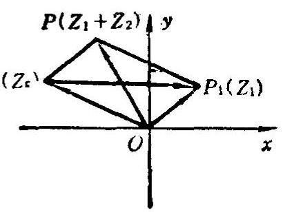

$\overrightarrow{O{P}_{1}} + \overrightarrow{O{P}_{2}} = \overrightarrow{OP}$ (平行四边形法则)

${\overrightarrow{{P}_{2}P}}_{1} = \overrightarrow{O{P}_{1}} - \overrightarrow{O{P}_{2}}$ (三角形法则)

乘法: $\left| {{Z}_{1}{Z}_{2}}\right|  = \left| {Z}_{1}\right| \left| {Z}_{2}\right| ,$

$\operatorname{Arg}\left( {{Z}_{1}{Z}_{2}}\right)  = \operatorname{Arg}\left( {Z}_{1}\right)  + \operatorname{Arg}\left( {Z}_{2}\right) ,$

伸缩、旋转变换.

${Z}_{1}{Z}_{2} = \left| {Z}_{1}\right| \left| {Z}_{2}\right| \left\lbrack  {\cos \left( {{\theta }_{1} + {\theta }_{2}}\right)  + }\right.$

isin $\left( {{\theta }_{1} + {\theta }_{2}}\right) \rbrack$

$Z\left( {\cos \theta  + i\sin \theta }\right)$ : 对应于将 $Z$ 对应的向量旋转 $\theta$ 角 $\left( {\theta  \geq  0\text{ 按逆时针旋转, }\theta  < 0\text{ 按顺时针旋转 }}\right)$ 。

${Zi}$ 对应于将 $Z$ 对应的向量按逆时针旋转 $\frac{\pi }{2}$ ;

$Z\left( {-i}\right)$ : 对应于将 $Z$ 对应的向量按顺时针旋转 $\frac{\pi }{2}$ .

除法: $\left| \frac{{Z}_{1}}{{Z}_{2}}\right|  - \frac{\left| {Z}_{1}\right| }{\left| {Z}_{2}\right| },\operatorname{Arg}\left( \frac{{Z}_{1}}{{Z}_{2}}\right)  - \operatorname{Arg}\left( {Z}_{1}\right)  - \operatorname{Arg}\left( {Z}_{2}\right) \left( \begin{array}{l} \text{ 以 }{Z}_{2}\text{ 对应的向量为始边, }{Z}_{1} \\  \text{ 对应的向量为终边的夹角. } \end{array}\right)$

$$
\frac{{Z}_{1}}{{Z}_{2}} = \left| \frac{{Z}_{1}}{{Z}_{2}}\right| \left\lbrack  {\cos \left( {{\theta }_{1} - {\theta }_{2}}\right)  + i\sin \left( {{\theta }_{1} - {\theta }_{2}}\right) }\right\rbrack  .
$$

乘方: De-Moivre 定理: ${\left( \cos \theta  + i\sin \theta \right) }^{n} = \cos {n\theta } + i\sin {n\theta }$ .

$$
{Z}^{n} = {\left| Z\right| }^{n}\left( {\cos {n\theta } + i\sin {n\theta }}\right)
$$

开方: 方程 ${W}^{n} = Z = \left| Z\right| \left( {\cos \theta  + i\sin \theta }\right)$ 根的全体称为 $Z$ 的 $n$ 次方根.

$W = \sqrt[n]{\left| Z\right| }\left( {\cos \frac{\theta  + {2k\pi }}{n} + i\sin \frac{\theta  + {2k\pi }}{n}}\right) \;\left( {k = 0,1,2,\cdots , n - 1}\right)$

单位根: 若 ${Z}^{n} = 1$ ,则 $Z = \cos \frac{2k\pi }{n} + i\sin \frac{2k\pi }{n}\;\left( {k = 0\text{ 、 }1\text{ 、 }2\text{ 、 }\cdots \text{ 、 }n - 1}\right)$

令 $e = \cos \frac{2\pi }{n} + i\sin \frac{2\pi }{n}$ 则 $Z = e,{e}^{2},\cdots ,{e}^{n}\left( {{e}^{n} = 1}\right) .e,{e}^{2},\cdots ,{e}^{n}$ 是单位圆的 $n$ 等分点.

$\bar{Z} = Z, Z \cdot  \bar{Z} = {\left| Z\right| }^{2},\bar{R}\left( {{Z}_{1},{Z}_{2},{Z}_{3},\cdots ,{Z}_{n}}\right)  = R\left( {{\bar{Z}}_{1},{\bar{Z}}_{2},{\bar{Z}}_{3},\cdots ,{\bar{Z}}_{n}}\right) .$

(3)试问:使 ${\left( 1 + Z\right) }^{n}$ 是实数值的最小自然数 $n$ 是多少？为什么?

当我们面对这一问题时,首先的印象是这是复数问题, 头脑会浮现出复数的基本知识的框图. 根据条件 ${Z}^{2} + Z + 1 = 0$ ,在不同的人面前，可能有各种不同的反映，即使同一个人，也会出现各种反映、

第一种: 从 ${Z}^{2} + Z + i = 0$ ,直接解得 $Z =  - \frac{1}{2} + \frac{\sqrt{3}}{2}i$ ,或 $- \frac{1}{2} - \frac{\sqrt{3}}{2}i$

第二种: 从 ${Z}^{2} + Z + 1 = 0$ 想到 1 的 3 次根. 由于 $Z \neq  1$ ,则以 $Z - 1$ 乘以等式两边,得 ${Z}^{3} - 1 = 0$ ,即 ${Z}^{3} = 1$ ,从而有 ${Z}^{3n} = 1,{Z}^{{3n} + 1} \; = Z,{Z}^{{3n} + 2} = {Z}^{2}$ ，其中 $n$ 为自然数.

第三种: 从 ${Z}^{2} + Z + 1 = 0$ ，想到 $Z \neq  0$ ，从此有 ${Z}^{3} + {Z}^{2} + Z = 0$ ， 又因 ${Z}^{2} + Z =  - 1$ ,故有 ${Z}^{3} - 1 = 0$ ,即 ${Z}^{3} = 1,{Z}^{4} = Z,{Z}^{5} = {Z}^{2}$ ,等等.

..................

问题 (1) 要求计算 ${\left( Z + 1\right) }^{4} + Z$ ，由于上述种种不同的信息检索, 因此将有更多的情形, 这里不再一一列举. 从上述第二或第三种想法入手，可得

$$
{\left( Z + 1\right) }^{4} + Z = {\left( -{Z}^{2}\right) }^{4} + Z = {Z}^{8} + Z = {Z}^{2} + Z =  - 1
$$

$$
= \cos \pi  + i\sin \pi \text{ . }
$$

如果循上述第一种想法入手，分别将 $Z =  - \frac{1}{2} + \frac{\sqrt{3}}{2}i$ ，或 $- \frac{1}{2} - \frac{\sqrt{3}}{2}i$ 代入计算，就较繁琐了.

问题 (2) 要求证明恒等式 ${\left( u + 1\right) }^{3} + {\left( u + Z\right) }^{3} + {\left( u + {Z}^{2}\right) }^{3} = 3\left( {u}^{8}\right. \; + 1)$ ，由于信息检索的不同，处理的办法也不同. 仍利用 ${Z}^{3n} = 1$ ， ${Z}^{{3n} + 1} = Z,{Z}^{{3n} + 2} = {Z}^{2}$ ,则有

$$
{\left( u + 1\right) }^{3} + {\left( u + Z\right) }^{3} + {\left( u + {Z}^{2}\right) }^{3}
$$

$$
= 3{u}^{3} + 3{u}^{2}\left( {1 + Z + {Z}^{2}}\right)  + {3u}\left( {1 + {Z}^{2} + {Z}^{4}}\right)  + 1 + {Z}^{3} + {Z}^{6}
$$

$$
= 3{u}^{3} + \left( {3{u}^{2} + {3u}}\right) \left( {1 + Z + {Z}^{2}}\right)  + 1 + 1 + 1
$$

$$
= 3\left( {{u}^{3} + 1}\right) \text{ . }
$$

对于问题 (3) ，则十分明确要用到复数 $Z = x + {yi}$ 为实数的条件: $I\left( Z\right)  = 0.\;{\left( 1 + Z\right) }^{n} = {\left( -{Z}^{2}\right) }^{n} = {\left( -1\right) }^{n}{Z}^{2n}$ ,当且仅当 $n$ 为 3 的倍数 ${3K}$ ( $K$ 为自然数) 时, ${\left( 1 + Z\right) }^{n}$ 为实数. 所以,使 ${\left( 1 + Z\right) }^{n}$ 是实数值的最小自然数 $n = 3$ .

当然,也可以 $Z =  - \frac{1}{2} \pm  \frac{\sqrt{3}}{2}i$ 代入得

$$
1 + Z = \frac{1}{2} \pm  \frac{\sqrt{3}}{2}i = \cos \frac{\pi }{3} \pm  i\sin \frac{\pi }{3}
$$

$$
{\left( 1 + Z\right) }^{n} = {\left( \cos \frac{\pi }{3} \pm  i\sin \frac{\pi }{3}\right) }^{n} = \cos \frac{n\pi }{3} \pm  i\sin \frac{n\pi }{3}.
$$

${\left( 1 + Z\right) }^{n}$ 为实数值的充要条件为 $\sin \frac{n\pi }{3} = 0$ ,即 $\frac{n\pi }{3} = {K\pi } \; \left( {K \in  Z}\right)$ . 所以 $n = {3K}$ ,从而得,使 ${\left( 1 + Z\right) }^{n}$ 是实数值的最小自然数 $n = 3$ .

由于这一问题要求、内容都很明确, 因而信息的检索比较简单.

关于信息的储存与检索, 就谈这些. 下面谈谈数学上常用的有固定的思维模式的思维方法.

在数学中, 从小学的四则运算法则到微积分的求导、求积的基本法则, 都有一套固定的思维模式. 这种解决某种问题的固定的思维模式在数学学科中是不少的. 例如: 代数式的四则运算, 解方程和方程组的消元、降次法, 因式分解中的提取公因式法、公式法和分组分解法, 几何作图中的三角形奠基法、位似作图法, 数列求和中的裂项法，证不等式的比较法、基本不等式法及 “判别式”法, 三角中的有理置换法、补助角法, 立体几何中的降维法, 解析几何中的解析证法, 求轨迹方程的基本法则等等. 关于固定思维模式还应注意:

1. 这类固定的思维模式, 一般通过模仿不难掌握. 通过一定量的练习就可转化为熟练的技能，要努力做到正确、迅速、合理，且在合理上下功夫.

例如,求直线 $x - \left( {{t}_{1} + {t}_{2}}\right) y + {2p}{t}_{1}{t}_{2} = 0$ 与抛物线 ${x}^{2} = {2qy}$ 相切的条件. 一般都通过方程组

$$
\left\{  \begin{array}{l} x - \left( {{t}_{1} + {t}_{2}}\right) y + {2p}{t}_{1}{t}_{2} = 0 \\  {x}^{2} = {2qy} \end{array}\right.
$$

①

②

有两组相同的实数解来解决.

在消元时,有三种途径:

(i) 从①解出 $y = \frac{x + {2p}{t}_{1}{t}_{2}}{{t}_{1} + {t}_{2}}$ 代入②;

(ii) 从①解出 $x = \left( {{t}_{1} + {t}_{2}}\right) y - {2p}{t}_{1}{t}_{2}$ 代入②;

(iii) 从②解出 $y = {x}^{2}/{2q}$ 代入 ①，得

$$
x - \left( {{t}_{1} + {t}_{2}}\right) {x}^{2}/{2q} + {2p}{t}_{1}{t}_{2} = 0,
$$

即

$$
\left( {{t}_{1} + {t}_{2}}\right) {x}^{2} - {2qx} - {4pq}{t}_{1}{t}_{2} = 0.
$$

得相切条件为

$$
\Delta  = 4{q}^{2} + {16pq}{t}_{1}{t}_{2}\left( {{t}_{1} + {t}_{2}}\right)  = 0,
$$

即

$$
q + {4p}{t}_{1}{t}_{2}\left( {{t}_{1} + {t}_{2}}\right)  = 0.
$$

容易看出, (iii) 的方法运算量较小.

一般在解由一个一次, 一个二次方程构成的方程组时, 往往变换一次方程, 用含有一个未知数的代数式来表示另一个未知数, 再代入到二次方程中进行消元. 如 (i) 与 (ii) 的做法, 但这道题却反其道而行之. 可见即使对于这类有固定思维模式的问题, 仍然存在一个灵活运用问题，万万不可墨守成规，一成不变. 这是呆板与灵活的辩证法, 不可不引起重视.

2. 这类固定的思维模式的建立仍存在一定的思维过程, 其中孕伏着第二、三章中论述的数学思维的基本观点和解决问题的策略思想. 因此，学习这类思维模式不能靠单纯的机械模仿，应该灵活地运用数学的基本知识，理解这些基本方法产生的思维过程. 这样既有利于基本知识的熟练掌握, 又可不断提高思维能力.

例 1 求函数 $y = a{\sin }^{2}x + b\sin x\cos x + c{\cos }^{2}x\left( {{a}_{x}{b}_{x}c}\right.$ 为非零的实数) 的最大值和最小值.

解 $y = \frac{1}{2}\left\lbrack  {a\left( {1 - \cos {2x}}\right)  + b\sin {2x} + c\left( {1 + \cos {2x}}\right) }\right\rbrack$

$$
= \frac{1}{2}\left( {a + c}\right)  + \frac{b}{2}\sin {2x} + \frac{1}{2}\left( {c - a}\right) \cos {2x}
$$

$$
= \frac{1}{2}\left( {a + c}\right)  + \frac{1}{2}\sqrt{{b}^{2} + {\left( c - a\right) }^{2}}\sin \left( {{2x} + \varphi }\right) ,
$$

其中 $\operatorname{tg}\varphi  = \frac{c - a}{b}$ .

当 ${2x} + \varphi  = {2n\pi } + \frac{\pi }{2}$ ,即 $x = {n\pi } + \frac{\pi }{4} - \frac{\varphi }{2}$ 时, $n \in  Z$ )

$$
{y}_{n + } = \frac{1}{2}\left( {a + c}\right)  + \frac{1}{2}\sqrt{{b}^{2} + {\left( c - a\right) }^{2}};
$$

当 ${2x} + \varphi  = {2n\pi } - \frac{\pi }{2}$ ,即 $x = {n\pi } - \frac{\pi }{4} - \frac{\varphi }{2}$ 时, $\left( {n \in  Z}\right)$

$$
{y}_{\text{ 最小 }} = \frac{1}{2}\left( {a + c}\right)  - \frac{1}{2}\sqrt{{b}^{2} + {\left( c - a\right) }^{2}}.
$$

这就是补助角法的应用. 补助角法的作用是使变化因素集中, 便于研究函数的最大值和最小值.

例 2 求函数 $f\left( x\right)  = \frac{\sin {\pi x}}{1 + \operatorname{tg}\frac{\pi x}{4}}$ 的零点中距点 $\sqrt{6}$ 最近的一点.

$f\left( x\right)$ 的零点就是方程 $f\left( x\right)  = 0$ 的实根. 根据最简三角方程的解法, 得

$$
\left\{  {\begin{array}{l} \sin {\pi x} = 0, \\  1 + \operatorname{tg}\frac{\pi x}{4} \neq  0, \\  \frac{\pi x}{4} \neq  \left( {{2n} + 1}\right) \frac{\pi }{2}. \end{array}\;\therefore \left\{  {\begin{array}{l} x = n, \\  \frac{\pi x}{4} \neq  {n\pi } - \frac{\pi }{4}, \\  \frac{\pi x}{4} \neq  \left( {{2n} + 1}\right) \frac{\pi }{2}. \end{array}\text{ 即 }\left\{  \begin{array}{l} x = n, \\  x \neq  {4n} - 1, \\  x \neq  {4n} + 2. \\  \left( {n \in  Z}\right)  \end{array}\right. }\right. }\right.
$$

$\therefore f\left( x\right)$ 的零点为 4 的倍数,或 4 除余 1 , 即

$$
x = {4n}\text{ 或 }{4n} + 1,\left( {n \in  Z}\right) .
$$

当 $n$ 为 0,1,-1,…时, $x$ 为 0 或 1,4 或 5,-4 或 -3,……

其中离点 $\sqrt{6}$ 最近的是点 1 .

解这道题还利用了整数的剩余类,逻辑划分的思想.

例 3 设 ${Z}_{1}\text{ 、 }{Z}_{2}\text{ 、 }{Z}_{3}$ 的模都等于 1,且 ${Z}_{1} + {Z}_{2} + {Z}_{3} \neq  0$ ,

求证:

$$
\left| \frac{{Z}_{1}{Z}_{2} + {Z}_{2}{Z}_{3} + {Z}_{3}{Z}_{1}}{{Z}_{1} + {Z}_{2} + {Z}_{3}}\right|  = 1.
$$

证

$$
\because \left| {Z}_{1}\right|  = \left| {Z}_{2}\right|  = \left| {Z}_{3}\right|  = 1\text{ , }
$$

$$
\therefore {Z}_{1} \cdot  {\bar{Z}}_{1} = {Z}_{2} \cdot  {\bar{Z}}_{2} = {Z}_{3} \cdot  {\bar{Z}}_{3} = 1\text{ . }
$$

故

$$
{\bar{Z}}_{1} = \frac{1}{{\bar{Z}}_{1}},{\bar{Z}}_{2} = \frac{1}{{\bar{Z}}_{3}},{\bar{Z}}_{3} = \frac{1}{{\bar{Z}}_{3}}
$$

且

$$
\left| {{Z}_{1}{Z}_{2}{Z}_{3}}\right|  = \left| {Z}_{1}\right| \left| {Z}_{2}\right| \left| {Z}_{3}\right|  = 1,
$$

$$
\therefore \left| \frac{{Z}_{1}{Z}_{2} + {Z}_{2}{Z}_{3} + {Z}_{3}{Z}_{1}}{{Z}_{1} + {Z}_{2} + {Z}_{3}}\right|  = \left| {{Z}_{1}{Z}_{2}{Z}_{3}}\right| \left| \frac{\frac{1}{{Z}_{3}} + \frac{1}{{Z}_{1}} + \frac{1}{{Z}_{2}}}{{Z}_{1} + {Z}_{2} + {Z}_{3}}\right|
$$

$$
= \left| \frac{{\bar{Z}}_{1} + {\bar{Z}}_{2} + {\bar{Z}}_{3}}{{Z}_{1} + {Z}_{2} + {Z}_{3}}\right|
$$

$$
= \left| \frac{\overline{{Z}_{1} + {Z}_{2} + {Z}_{3}}}{{Z}_{1} + {Z}_{2} + {Z}_{3}}\right|
$$

$$
\left( {\because \left| Z\right|  = \left| \bar{Z}\right| }\right)
$$

$$
= 1\text{ . }
$$

这里主要是运用了共轭复数的概念与性质，但也用到“字母代式”,这就是第二章中的映射观点 (用 $Z$ 表示 ${Z}_{1} + {Z}_{2} + {Z}_{3}$ ).

例 4 求和: $1 + {O}_{n}^{1}\cos \varphi  + {O}_{n}^{2}\cos {2\varphi } + \cdots  + {O}_{n}^{n}\cos {n\varphi }$ .

在复数中常常用 $\cos \theta  + i\sin \theta$ 来处理数列求和问题,从此联想到 ${O}_{n}^{1}\sin \varphi  + {O}_{n}^{2}\sin {2\varphi } + \cdots  + {O}_{n}^{n}\sin {n\varphi } = S$ ,令

$$
C = 1 + {C}_{n}^{1}\cos \varphi  + {C}_{n}^{2}\cos {2\varphi } + \cdots  + {C}_{\vdots }^{n}\cos {n\varphi },
$$

则 $C + {iS} = 1 + {C}_{n}^{1}\left( {\cos \varphi  + i\sin \varphi }\right)  + {C}_{n}^{2}\left( {\cos {2\varphi } + i\sin {2\varphi }}\right)$

$$
+ \cdots  + {C}_{n}^{n}\left( {\cos {n\varphi } + i\sin {n\varphi }}\right)
$$

①

$$
= 1 + {C}_{n}^{1}\left( {\cos \varphi  + i\sin \varphi }\right)  + {C}_{n}^{2}{\left( \cos \varphi  + i\sin \varphi \right) }^{2}
$$

$$
+ \cdots  + {O}_{n}^{n}{\left( \cos \varphi  + i\sin \varphi \right) }^{n}
$$

②

$$
= {\left( 1 + \cos \varphi  + i\sin \varphi \right) }^{n}
$$

③

$$
= {\left( 2{\cos }^{2}\frac{\varphi }{2} + 2i\sin \frac{\varphi }{2}\cos \frac{\varphi }{2}\right) }^{n}
$$

④

$$
= {2}^{n}{\cos }^{n}\frac{\varphi }{2}{\left( \cos \frac{\varphi }{2} + i\sin \frac{\varphi }{2}\right) }^{n}
$$

⑤

$$
= {2}^{n}{\cos }^{n}\frac{\varphi }{2}\left( {\cos \frac{n\varphi }{2} + i\sin \frac{n\varphi }{2}}\right) .
$$

⑥

$\therefore \;C = {2}^{n}{\cos }^{n}\frac{\varphi }{2}\cos \frac{n\varphi }{2}, S = {2}^{n}{\cos }^{n}\frac{\varphi }{2}\sin \frac{n\varphi }{2}$ .

这里,应用了二项式定理 ${\left( 1 + x\right) }^{n} = 1 + {O}_{n}^{1}x + {O}_{n}^{2}{x}^{2} + \cdots  + {O}_{n}^{n}{x}^{n}$ , 令 $x = \cos \varphi  + i\sin \varphi$ ,就是由②转化为③的根据.

例 5 已知直三棱柱 ${ABC} - {A}_{1}{B}_{1}{O}_{1}$ 的侧棱 ${A{A}_{1}} = 4$ ，它的底面 $\bigtriangleup {ABC}$ 中有 ${AC} = {BC} = 2,\angle O = {90}^{ \circ  }, E$ 是 ${AB}$ 的中点. 求截面 ${AC}{B}_{1}$ 与侧面 ${AB}{B}_{1}{A}_{1}$ 所成二面角的大小.

由于 ${OE} \bot  {AB}$ ,且平面 ${ABO} \bot$ 平面 ${AB}{B}_{1}{A}_{1}$ ,故 ${CE} \bot$ 平面 ${AB}{B}_{1}{A}_{1}$ .

截面 $A{B}_{1}C$ 在平面 ${AB}{B}_{1}{A}_{1}$ 上的射影为 $\bigtriangleup A{B}_{1}E$ ,因为 $E$ 为 ${AB}$ 的中点，所以

$$
{S}_{\bigtriangleup A{B}_{1}E} = \frac{1}{2}{S}_{\bigtriangleup {AB}{B}_{1}} = \frac{1}{4}{S}_{\square {AB}{B}_{1}{A}_{1}} = \frac{1}{4} \times  4 \times  2\sqrt{2} = 2\sqrt{2}.
$$

如能算出 ${S}_{\bigtriangleup A{B}_{1}C}$ ,则可利用公式 $\cos \theta  = {S}_{\bigtriangleup A{B}_{1}E}/{S}_{\bigtriangleup A{B}_{1}C}$ ,求出截面 $A{B}_{1}C$ 与平面 ${AB}{B}_{1}{A}_{1}$ 所夹的二面角 $\theta$ 的大小.

$\because {B}_{1}B \bot$ 平面 ${ABC},\therefore {B}_{1}C$ 在平面 ${ABC}$ 内的射影为

${BO}$ .

$\because {BO} \bot  {AO}$ , $\;\therefore {B}_{1}C \bot  {AO}$ .

$$
{B}_{1}C = \sqrt{{4}^{2} + {2}^{2}} = 2\sqrt{5}
$$

$$
{S}_{\bigtriangleup A{B}_{1}C} = \frac{1}{2}{AC} \times  {B}_{1}C = \frac{1}{2} \times  2 \times  2\sqrt{5} = 2\sqrt{5},
$$

$$
\therefore \cos \theta  = \frac{2\sqrt{2}}{2\sqrt{5}} = \frac{\sqrt{10}}{5},\theta  = \arccos \frac{\sqrt{10}}{5}\text{ . }
$$

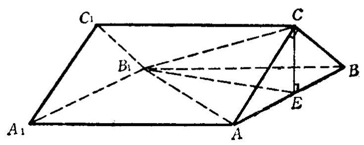

图 1-1-01

这里主要根据空间元素位置关系的正确判断, 利用公式

$\cos \theta  = {S}_{\bigtriangleup A{B}_{1}E}/{S}_{\bigtriangleup A{B}_{1}C}$ 来解决的. 当然不可避免地用到了降维法, 将空间问题转化为平面问题来解决.

例 6 求和 $\frac{{1}^{2}}{1 \times  3} + \frac{{2}^{2}}{3 \times  5} + \frac{{3}^{2}}{5 \times  7} + \cdots  + \frac{{n}^{2}}{\left( {{2n} - 1}\right) \left( {{2n} + 1}\right) }$ ,其中 $n$ 为自然数.

解 $\because \frac{{K}^{2}}{\left( {{2K} - 1}\right) \left( {{2K} + 1}\right) }$

$$
= \frac{1}{4}\left( {\frac{K}{{2K} - 1} + \frac{K}{{2K} + 1}}\right)
$$

$$
= \frac{1}{8}\left( {\frac{{2K} - 1 + 1}{{2K} - 1} + \frac{{2K} + 1 - 1}{{2K} + 1}}\right)
$$

$$
= \frac{1}{8}\left( {2 + \frac{1}{{2K} - 1} - \frac{1}{{2K} + 1}}\right) ,
$$

$\therefore \;{S}_{n} = \frac{{1}^{2}}{1 \times  3} + \frac{{2}^{2}}{3 \times  5} + \frac{{3}^{2}}{5 \times  7} + \cdots  + \frac{{n}^{2}}{\left( {{2n} - 1}\right) \left( {{2n} + 1}\right) }$

$$
= \frac{1}{8}\mathop{\sum }\limits_{{K = 1}}^{n}\left\{  {2 + \frac{1}{{2K} - 1} - \frac{1}{{2K} + 1}}\right\}
$$

$$
= \frac{n}{4} + \frac{1}{8}\left( {1 - \frac{1}{{2n} + 1}}\right)  = \frac{n\left( {{2n} + 2}\right) }{4\left( {{2n} + 1}\right) } = \frac{n\left( {n + 1}\right) }{2\left( {{2n} + 1}\right) }.
$$

这是数列求和的裂项法.

例 7 设 $\alpha$ 、 $\beta$ 、 $\gamma$ 是三角形的三内角,求证:

$$
\sin \frac{\alpha }{2}\sin \frac{\beta }{2}\sin \frac{\gamma }{2} \leq  \frac{1}{8}.
$$

证 令 $y = \sin \frac{\alpha }{2}\sin \frac{\beta }{2}\sin \frac{\gamma }{2}$ ,则

$$
{2y} = \sin \frac{\alpha }{2}\left\lbrack  {\cos \frac{1}{2}\left( {\beta  - \gamma }\right)  - \cos \frac{1}{2}\left( {\beta  + \gamma }\right) }\right\rbrack
$$

$$
\left( {\because \beta  + \gamma  = \pi  - \alpha }\right)
$$

$$
= \sin \frac{\alpha }{2}\cos \frac{1}{2}\left( {\beta  - \gamma }\right)  - {\sin }^{2}\frac{\alpha }{2},
$$

$$
\therefore \;{\sin }^{2}\frac{\alpha }{2} - \cos \frac{1}{2}\left( {\beta  - \gamma }\right) \sin \frac{\alpha }{2} + {2y} = 0\text{ . }
$$

$$
\because \sin \frac{\alpha }{2} \in  R
$$

$$
\therefore \;\bigtriangleup  = {\cos }^{2}\frac{1}{2}\left( {\beta  - \gamma }\right)  - {8y} \geq  0,
$$

即

$$
y \leq  \frac{1}{8}{\cos }^{2}\frac{1}{2}\left( {\beta  - \gamma }\right)  \leq  \frac{1}{8}.
$$

当且仅当 $\alpha  = \beta  = \gamma$ 时,等号成立.

这一问题的证明方法很多, 这里的证明方法是说明“判别式” 法的运用.

例 8 设 $a, b, c$ 为三角形的三边, $S$ 为三角形的面积,求证:

$$
{a}^{2} + {b}^{2} + {c}^{2} \geq  4\sqrt{3}S.
$$

证 $\because {a}^{2} + {b}^{2} + {c}^{2} - 4\sqrt{3}S$

$$
= {b}^{2} + {c}^{2} - {2bc}\cos A + {b}^{2} + {c}^{2} - 4\sqrt{3}\left( {\frac{1}{2}{bc}\sin A}\right)
$$

$$
= 2\left( {{b}^{2} + {c}^{2} - {bc}\cos A - \sqrt{3}{bc}\sin A}\right)
$$

$$
\left( {\because {b}^{2} + {c}^{2} \geq  {2bc}}\right)
$$

$$
\geq  4\left\lbrack  {{bc} - {bc}\left( {\frac{1}{2}\cos A + \frac{\sqrt{3}}{2}\sin A}\right) }\right\rbrack
$$

$$
= 4\left\lbrack  {{bc} - {bc}\sin \left( {A + \frac{\pi }{6}}\right) }\right\rbrack   = {4bc}\left\lbrack  {1 - \cos \left( {A - \frac{\pi }{3}}\right) }\right\rbrack
$$

$$
= {8bc}{\sin }^{2}\left( {\frac{A}{2} - \frac{\pi }{6}}\right)  \geq  0,
$$

$$
\therefore {a}^{2} + {b}^{2} + {c}^{2} \geq  \sqrt{3}S\text{ . }
$$

当且仅当 $b = c, A = \frac{\pi }{3}$ ,即为正三角形时,等式成立.

这里用的是比较法, 中间也利用了基本不等式法.

对于这类有固定思维模式的数学思维方法, 一般教材中论述较多，这里只作概括介绍. 当然，这并不意味着这类思维方法不重要. 模仿能力是学习中的基本能力，对于思维模式，不应一概反对. 要模式, 正是为了不要模式. 从模仿开始, 又不囿于模仿. 要善于学习，坚持独立思考. 永不满足已取得的成绩，勇于探索，持之以恒，一定能取得不断的进步。

## 第二章 数学思维的基本观点

数学发展史中存在一些经久不衰的研究对象, 一些重大的基本概念、基本原理, 如映射、方程、极限、因果关系、逻辑推理等等. 人们对这些重大概念、原理的认识不断深化，逐步形成了概念、原理本身，同时形成了对它们的正确看法及观点，这成为分析问题、解决问题过程中思维活动的导航器. 人们对数学中重大概念、原理的正确看法，在思维活动中起导航作用的思维方法称为数学思维的基本观点. 本章将介绍数学中常用的六种基本观点.

## 一 映 射 观 点

人类对函数概念的认识，经历了漫长的岁月. 从莱布尼茨 (Leibniz)、欧拉 (Euler) 到黎曼 (Riemann)、狄利克雷 (Dirichlet), 函数的认识逐步深化. 到十九世纪七十年代，康托尔(Cantor)的集合论问世，函数自变量突破了 “变量是数” 的限制，提出了函数自变量可以是任何集合的元素, 泛指任何研究对象. 因而, 引起了认识上的飞跃, 大大拓广了函数定义的适用范围, 映射概念从此诞生.

随着对映射概念认识的发展，映射在解决问题上的应用日益广泛, 促进了人们对映射在思维中的作用的重视. 为了正确理解映射在思维中的作用，我们先从三角中的一些实例谈起.

设 $A\text{ 、 }B\text{ 、 }C$ 是三角形 ${ABC}$ 的三个内角,则有

$$
\sin A + \sin B + \sin C = 4\cos \frac{A}{2}\cos \frac{B}{2}\cos \frac{C}{2}
$$

①

$$
\cos A + \cos B + \cos C = 1 + 4\sin \frac{A}{2}\sin \frac{B}{2}\sin \frac{C}{2}
$$

②

$$
{\cos }^{2}A + {\cos }^{2}B + {\cos }^{2}C = 1 - 2\cos A\cos B\cos C
$$

③

$$
\operatorname{tg}A + \operatorname{tg}B + \operatorname{tg}C = \operatorname{tg}A\operatorname{tg}B\operatorname{tg}C
$$

④

......

现在问: 从这些熟知的恒等式中,能否导出关于 $\frac{A}{2}\text{ 、 }\frac{B}{2}\text{ 、 }\frac{C}{2}$ 的新的恒等式?

因为 $A\text{ 、 }B\text{ 、 }C$ 为三角形的内角,所以 $\frac{\pi }{2} - \frac{A}{2},\frac{\pi }{2} - \frac{B}{2},\frac{\pi }{2} - \; \frac{C}{2}$ 均为锐角,且 $\frac{\pi }{2} - \frac{A}{2} + \frac{\pi }{2} - \frac{B}{2} + \frac{\pi }{2} - \frac{C}{2} = \frac{3\pi }{2} - \frac{1}{2}\left( {A + B + C}\right) \; = \pi$ ,如果令 ${A}^{\prime } = \frac{\pi }{2} - \frac{A}{2}\text{ 、 }{B}^{\prime } = \frac{\pi }{2} - \frac{B}{2}\text{ 、 }{O}^{\prime } = \frac{\pi }{2} - \frac{O}{2}$ ,则 ${A}^{\prime } + {B}^{\prime } \; + {O}^{\prime } = \pi$ ,即 ${A}^{\prime }\text{ 、 }{B}^{\prime }\text{ 、 }{O}^{\prime }$ 是一个三角形的三个内角,从恒等式①,有

$$
\sin {A}^{\prime } + \sin {B}^{\prime } + \sin {O}^{\prime } = 4\cos \frac{{A}^{\prime }}{2}\cos \frac{{B}^{\prime }}{2}\cos \frac{{C}^{\prime }}{2},
$$

但

$$
\sin {A}^{\prime } = \sin \left( {\frac{\pi }{2} - \frac{A}{2}}\right)  = \cos \frac{A}{2},
$$

同理有

$$
\sin {B}^{\prime } = \cos \frac{B}{2},\sin {C}^{\prime } = \cos \frac{C}{2},
$$

所以

$$
\cos \frac{A}{2} + \cos \frac{B}{2} + \cos \frac{C}{2}
$$

$$
= 4\cos \left( {\frac{\pi }{4} - \frac{A}{4}}\right) \cos \left( {\frac{\pi }{4} - \frac{B}{4}}\right) \cos \left( {\frac{\pi }{4} - \frac{C}{4}}\right) .
$$

同理, 从恒等式②、③、④，即得

$$
\sin \frac{A}{2} + \sin \frac{B}{2} + \sin \frac{C}{2}
$$

$$
= 1 + 4\sin \left( {\frac{\pi }{4} - \frac{A}{4}}\right) \sin \left( {\frac{\pi }{4} - \frac{B}{4}}\right) \sin \left( {\frac{\pi }{4} - \frac{C}{4}}\right) ,
$$

$$
{\sin }^{2}\frac{A}{2} + {\sin }^{2}\frac{B}{2} + {\sin }^{2}\frac{C}{2} = 1 - 2\sin \frac{A}{2}\sin \frac{B}{2}\sin \frac{C}{2},
$$

$$
\operatorname{ctg}\frac{A}{2} + \operatorname{ctg}\frac{B}{2} + \operatorname{ctg}\frac{C}{2} = \operatorname{ctg}\frac{A}{2}\operatorname{ctg}\frac{B}{2}\operatorname{ctg}\frac{C}{2}.
$$

从而获得启发，不禁要问，通过 ${A}^{\prime } = \frac{\pi }{2} - \frac{A}{2},{B}^{\prime } = \frac{\pi }{2} - \frac{B}{2}$ ， ${C}^{\prime } = \frac{\pi }{2} - \frac{C}{2}$ 的变换,能否从任一有关三角形的三内角的恒等式中, 都能导出一个新的恒等式?

为了便于说明这一规律, 先引进下列记号:

用 Tf $A$ (trigonometric function) 表示 $A$ 的任何一种三角函数，即 $\operatorname{Tf}A$ 可表示 $\sin A,\cos A,\operatorname{tg}A,\cdots$ 等等. 用 $\operatorname{co-Tf}A$ 表示 Tf $A$ 的余函数，如果 $\mathrm{{Tf}}A$ 表示 $\sin A$ 或 $\operatorname{tg}A$ ，则 $\operatorname{co} - \mathrm{{Tf}}A$ 表示相应的 $\cos A$ 或 $\operatorname{ctg}A$ .

定理 如果对于 $\bigtriangleup {ABC}$ 的三内角 $A\text{ 、 }B\text{ 、 }C$ 的三角恒等式 $F\left( {\mathrm{{Tf}}A,\mathrm{{Tf}}B,\mathrm{{Tf}}O}\right)  = 0$ 成立，则恒等式

$$
F\left( {\operatorname{co} - \operatorname{Tf}\frac{A}{2},\operatorname{co} - \operatorname{Tf}\frac{B}{2},\operatorname{co} - \operatorname{Tf}\frac{C}{2}}\right)  = 0\text{ 也成立. }
$$

证 令 ${A}^{\prime } = \frac{\pi }{2} - \frac{A}{2},{B}^{\prime } = \frac{\pi }{2} - \frac{B}{2},{O}^{\prime } = \frac{\pi }{2} - \frac{O}{2}$ ,

则 ${A}^{\prime }\text{ 、 }{B}^{\prime }\text{ 、 }{O}^{\prime }$ 均为锐角,且 ${A}^{\prime } + {B}^{\prime } + {O}^{\prime } = \frac{3\pi }{2} - \frac{1}{2}\left( {A + B + O}\right) \; = \pi$ ，即 ${A}^{\prime }$ 、 ${B}^{\prime }$ 、 ${O}^{\prime }$ 是一个三角形的三个内角，故

$$
F\left( {\operatorname{Tf}{A}^{\prime },\operatorname{Tf}{\dot{B}}^{\prime },\operatorname{Tf}{C}^{\prime }}\right)  = 0\text{ 成立. }
$$

但 $\;1{\mathrm{{TfA}}}^{\prime } = \mathrm{{Tf}}\left( {\frac{\pi }{2} - \frac{A}{2}}\right)  = \mathrm{{co}} - \mathrm{{Tf}}\frac{A}{2}$ ,

同理有 $\operatorname{Tf}{B}^{\prime } = \operatorname{co} - \operatorname{Tf}\frac{B}{2},\operatorname{Tf}{C}^{\prime } = \operatorname{co} - \operatorname{Tf}\frac{C}{2}$ .

所以 $F\left( {\operatorname{co} - \operatorname{Tf}\frac{A}{2},\operatorname{co} - \operatorname{Tf}\frac{B}{2},\operatorname{co} - \operatorname{Tf}\frac{C}{2}}\right)  = 0$ 也成立.

根据这一定理, 从下列恒等式:

$$
{\sin }^{2}A + {\sin }^{2}B + {\sin }^{2}C = 2 + 2\cos A\cos B\cos O,
$$

$$
\operatorname{ctg}A\operatorname{ctg}B + \operatorname{ctg}B\operatorname{ctg}O + \operatorname{ctg}O\operatorname{ctg}A = 1,
$$

立即可得

$$
{\cos }^{2}\frac{A}{2} + {\cos }^{2}\frac{B}{2} + {\cos }^{2}\frac{C}{2} = 2 + 2\sin \frac{A}{2}\sin \frac{B}{2}\sin \frac{C}{2},
$$

$$
\operatorname{tg}\frac{A}{2}\operatorname{tg}\frac{B}{2} + \operatorname{tg}\frac{B}{2}\operatorname{tg}\frac{C}{2} + \operatorname{tg}\frac{C}{2}\operatorname{tg}\frac{A}{2} = 1.
$$

这一变换 (映射) 好象魔术师手中的魔棍, 巧妙地从已知真理迅速地导出了新的真理, 这简直令人难以置信, 但上述证明都是严谨无误，无懈可击的.

现在再进一步问, 上述定理中的恒等式, 如果换成不等式, 定理还成立吗? 仔细分析上述定理的证明, 不难发现, 答案是肯定的.

定理 如果关于 $\bigtriangleup {ABO}$ 三内角 $A\text{ 、 }B\text{ 、 }O$ 的不等式 $F(\mathrm{{Tf}}A$ , $\left. {\operatorname{Tf}B,\operatorname{Tf}O}\right)  > 0\left( { < 0}\right)$ 成立,则不等式

$$
F\left( {\operatorname{co} - \operatorname{Tf}\frac{A}{2},\operatorname{co} - \operatorname{Tf}\frac{B}{2},\operatorname{co} - \operatorname{Tf}\frac{C}{2}}\right)  > 0\left( { < 0}\right) \text{ 也成立. }
$$

由此可知, 从下列不等式

$$
0 < \sin A + \sin B + \sin C \leq  \frac{3\sqrt{3}}{2}
$$

①

$$
1 < \cos A + \cos B + \cos C \leq  \frac{3}{2}
$$

②

$\operatorname{tg}A\operatorname{tg}B\operatorname{tg}C \geq  3\sqrt{3}\;\left( {\bigtriangleup {ABC}\text{ 是锐角三角形 }}\right)$③

......

立即可得 $0 < \cos \frac{A}{2} + \cos \frac{B}{2} + \cos \frac{C}{2} \leq  \frac{3\sqrt{3}}{2}$ ,

$$
1 < \sin \frac{A}{2} + \sin \frac{B}{2} + \sin \frac{C}{2} \leq  \frac{3}{2},
$$

$$
\operatorname{ctg}\frac{A}{2}\operatorname{ctg}\frac{B}{2}\operatorname{ctg}\frac{C}{2} \geq  3\sqrt{3},
$$

上述变换 (映射) 的作用, 看来神奇, 其实在代数中是司空见惯的. 说穿了无非把一个复杂的解析式 (如上述中 $\frac{\pi }{2} - \frac{A}{2},\frac{\pi }{2} - \frac{B}{2}$ , $\left. {\frac{\pi }{2} - \frac{C}{2}}\right)$ 看作一个单一字母 (如上述 ${A}^{\prime }\text{ 、 }{B}^{\prime }\text{ 、 }{O}^{\prime }$ ) 罢了. 只要符合公式成立的条件，就可通过适当变换，立即导出新的结果. 把复杂的研究对象用单一字母表示，原是代数学的精髓. 例如，凡符合五种运算律(加法、乘法的交换律，结合律与乘法对加法的分配律) 的运算对象, 换句话说凡是交换环的元素, 都可以看作为乘法公式中的字母. 在抽象代数中, 字母可以表示集合, 矩阵, 线性变换等更抽象的运算对象, 这正是这一思想的进一步发展.

数学中，常将某一变量看作另一变量的函数(从简单到复杂)； 反过来, 把问题中的复杂的解析式当作单一字母(从复杂到简单) 处理, 这就是变量变换, 也就是某种特定的映射. 通过映射, 可使问题从未知领域向已知领域转化. 这一思维方法, 称为映射观点. 前述变量变换不过是映射观点的一个简单实例而已.

为了进一步说明映射观点的作用, 下面根据映射观点的不同表现形态，分别进行介绍.

## 1. 变量变换

例 1 已知 $\alpha  + \beta  + \gamma  = \frac{\pi }{2}$ ,且 $\alpha ,\beta ,\gamma$ 均为锐角,求证:

$$
\sqrt{\operatorname{tg}\alpha \operatorname{tg}\beta  + 5} + \sqrt{\operatorname{tg}\beta \operatorname{tg}\gamma  + 5} + \sqrt{\operatorname{tg}\gamma \operatorname{tg}\alpha  + 5} \leq  4\sqrt{3}.
$$

分析 根据已知条件，可知 $\sqrt{\operatorname{tg}\alpha \operatorname{tg}\beta  + 5}$ 、 $\sqrt{\operatorname{tg}\beta \operatorname{tg}\gamma  + 5}$ 、 $\sqrt{\operatorname{tg}\gamma \operatorname{tg}\alpha  + 5}$ 均为正数,欲证三正数之和不大于 $4\sqrt{3}$ ,从而联想到

$$
\frac{a + b + c}{3} \leq  \sqrt{\frac{{a}^{2} + {b}^{2} + {c}^{2}}{3}}
$$

①

只要把三个根式分别看作单一字母 $a\text{ 、 }b\text{ 、 }c$ 代入 ①，利用当 $\alpha  + \beta \; + \gamma  = \frac{\pi }{2}$ 时, $\operatorname{tg}\alpha \operatorname{tg}\beta  + \operatorname{tg}\beta \operatorname{tg}\gamma  + \operatorname{tg}\gamma \operatorname{tg}\alpha  = 1$ ,即可得证.

证

$$
\therefore \operatorname{tg}\alpha \operatorname{tg}\beta  + \operatorname{tg}\beta \operatorname{tg}\gamma  + \operatorname{tg}\gamma \operatorname{tg}\alpha
$$

$$
= \operatorname{tg}\alpha \operatorname{tg}\beta  + \operatorname{tg}\gamma \left( {\operatorname{tg}\alpha  + \operatorname{tg}\beta }\right)
$$

$$
= \operatorname{tg}\alpha \operatorname{tg}\beta  + \operatorname{tg}\gamma \operatorname{tg}\left( {\alpha  + \beta }\right) \left( {1 - \operatorname{tg}\alpha \operatorname{tg}\beta }\right)
$$

$$
= \operatorname{tg}\alpha \operatorname{tg}\beta  + \operatorname{tg}\gamma \operatorname{tg}\left( {\frac{\pi }{2} - \gamma }\right) \left( {1 - \operatorname{tg}\alpha \operatorname{tg}\beta }\right)
$$

$$
= \operatorname{tg}\alpha \operatorname{tg}\beta  + 1 - \operatorname{tg}\alpha \operatorname{tg}\beta  = 1\text{ . }
$$

$\because \sqrt{\operatorname{tg}\alpha \operatorname{tg}\beta  + 5}\text{ 、 }\sqrt{\operatorname{tg}\beta \operatorname{tg}\gamma  + 5}\text{ 、 }\sqrt{\operatorname{tg}\gamma \operatorname{tg}\alpha  + 5}$ 均为正数, 根据

$$
\frac{a + b + c}{3} \leq  \sqrt{\frac{{a}^{2} + {b}^{2} + {c}^{2}}{3}},
$$

$\therefore \sqrt{\operatorname{tg}\alpha \operatorname{tg}\beta  + 5} + \sqrt{\operatorname{tg}\beta \operatorname{tg}\gamma  + 5} + \sqrt{\operatorname{tg}\gamma \operatorname{tg}\alpha  + 5}$

$$
\leq  3\sqrt{\frac{\operatorname{tg}\alpha \operatorname{tg}\beta  + 5 + \operatorname{tg}\beta \operatorname{tg}\gamma  + 5 + \operatorname{tg}\gamma \operatorname{tg}\alpha  + 5}{3}}
$$

$$
= 4\sqrt{3}\text{ . }
$$

例 2 已知 $\frac{{\cos }^{4}A}{{\cos }^{2}B} + \frac{{\sin }^{4}A}{{\sin }^{2}B} = 1$ ,求证: $\frac{{\cos }^{4}B}{{\cos }^{2}A} + \frac{{\sin }^{4}B}{{\sin }^{2}A} = 1$ .

分析 $\because {\left( \frac{{\cos }^{2}A}{\cos B}\right) }^{2} + {\left( \frac{{\sin }^{2}A}{\sin B}\right) }^{2} = 1$ ,

$\therefore$ 存在实数 $x$ ,使 $\frac{{\cos }^{2}A}{\cos B} = \cos x,\frac{{\sin }^{2}A}{\sin B} = \sin x$ .

由此找到 $x$ 与 $B$ 之间的关系,再诱导出 $\cos A\cos B\text{ 、 }\sin A\text{ 、 }\sin B$ 之间的关系, 从而获证.

证 $\because \frac{{\cos }^{4}A}{{\cos }^{2}B} + \frac{{\sin }^{4}A}{{\sin }^{2}B} = 1$ ,

则可设 $\frac{{\cos }^{3}A}{\cos B} = \cos x,\frac{{\sin }^{2}A}{\sin B} = \sin x$ ,

得 ${\cos }^{2}A = \cos x\cos B,\;{\sin }^{2}A = \sin x\sin B$ .

$\therefore \cos x\cos B + \sin x\sin B = {\cos }^{2}A + {\sin }^{2}A = 1$ ,

即

$$
\cos \left( {x - B}\right)  = 1\text{ . }
$$

$$
\therefore x = {2n\pi } + B,\left( {n \in  Z}\right) ,\cos x = \cos B\text{ , }
$$

$$
{\cos }^{2}A = \cos x\cos B = {\cos }^{2}B.
$$

从而

$$
{\sin }^{2}A = {\sin }^{2}B
$$

$$
\therefore \frac{{\cos }^{4}B}{{\cos }^{2}A} + \frac{{\sin }^{4}B}{{\sin }^{2}A} = \frac{{\cos }^{4}B}{{\cos }^{2}B} + \frac{{\sin }^{4}B}{{\sin }^{2}B} = 1\text{ . }
$$

上述两例，都是把复杂的对象看作为单一字母(或者说是某变量的函数), 这样便于利用已知的信息 (概念, 定理, 公式等等), 使问题从未知领域向已知领域转化, 从而问题获解.

例 3 求函数 $y = x + 4 + \sqrt{5 - {x}^{2}}$ 的最大值与最小值.

解

$$
\because 5 - {x}^{2} \geq  0,\;\therefore \left| x\right|  \leq  \sqrt{5},
$$

故可设

$$
\omega  = \sqrt{5}\cos \theta ,\;\theta  \in  \left\lbrack  {0,\pi }\right\rbrack  ,
$$

则

$$
y = \sqrt{5}\cos \theta  + 4 + \sqrt{5 - 5{\cos }^{2}\theta }
$$

$$
= \sqrt{5}\cos \theta  + 4 + \sqrt{5}\left| {\sin \theta }\right|
$$

$$
= \sqrt{5}\left( {\cos \theta  + \sin \theta }\right)  + 4
$$

$$
- \sqrt{10}\sin \left( {\theta  + \frac{\pi }{4}}\right)  + 4
$$

因为

$$
\frac{\pi }{4} \leq  \theta  + \frac{\pi }{4} \leq  \frac{5\pi }{4}
$$

所以当 $\theta  = \frac{\pi }{4}$ ,即 $x = \frac{\sqrt{10}}{2}$ 时, ${y}_{4 + k} = 4 + \sqrt{10}$ ;

当 $\theta  = \pi$ ,即 $x =  - \sqrt{5}$ 时, ${y}_{4 + k} = 4 - \sqrt{5}$ .

在进行 $x = \sqrt{5}\cos \theta$ 的变换时,应对 $\theta$ 的变化范围作合理地限制，否则在研究最大值与最小值时，会带来繁琐的讨论，甚至造成失误，如错误地判断:当 $\theta  = \frac{5\pi }{4}$ 时， ${y}_{\text{ 最小 }} = 4 - \sqrt{10}$ .

例 4 已知 $a\text{ 、 }b\text{ 、 }c\text{ 、 }d$ 均为不大于 1 的正数. 求证: ${4a}\left( {1 - b}\right)$ 、 ${4b}\left( {1 - c}\right)  \cdot  {4c}\left( {1 - d}\right)  \cdot  {4d}\left( {1 - a}\right)$ 中，至少有一个不大于 1 .

证 由于 $a\text{ 、 }b\text{ 、 }c\text{ 、 }d$ 均为不大于 1 的正数，

故可设 $a = {\sin }^{2}\alpha , b = {\sin }^{2}\beta , c = {\sin }^{2}\gamma , d = {\sin }^{2}\delta$ ,

则 ${4a}\left( {1 - b}\right)  \cdot  {4b}\left( {1 - c}\right)  \cdot  {4c}\left( {1 - d}\right)  \cdot  {4d}\left( {1 - a}\right)$

$$
= 4{\sin }^{2}\alpha \left( {1 - {\sin }^{2}\beta }\right)  \cdot  4{\sin }^{2}\beta \left( {1 - {\sin }^{2}\gamma }\right)
$$

$$
\cdot  4{\sin }^{2}\gamma \left( {1 - {\sin }^{2}\delta }\right)  \cdot  4{\sin }^{2}\delta \left( {1 - {\sin }^{2}\alpha }\right)
$$

$$
= 4{\sin }^{2}\alpha {\cos }^{2}\alpha  \cdot  4{\sin }^{2}\beta {\cos }^{2}\beta  \cdot  4{\sin }^{2}\gamma {\cos }^{2}\gamma
$$

$$
\cdot  4{\sin }^{2}\delta {\cos }^{2}\delta
$$

$$
= {\left( \sin 2\alpha  \cdot  \sin 2\beta  \cdot  \sin 2\gamma  \cdot  \sin 2\delta \right) }^{2} \leq  1
$$

①

如果 ${4a}\left( {1 - b}\right) \text{ 、 }{4b}\left( {1 - c}\right) \text{ 、 }{4c}\left( {1 - d}\right) \text{ 、 }{4d}\left( {1 - a}\right)$ 四个数均大于 1，则其积必大于 1，这与①矛盾，所以这四个数中至少有一个不大于 1 .

例 5 已知 $0 < \left| x\right|  < 1, n \geq  1$ ,求证: ${\left( 1 - x\right) }^{n} + {\left( 1 + x\right) }^{n} < {2}^{n}$ .

证 $\because \left| x\right|  < 1,\;\therefore$ 设 $x = \cos {2\alpha },\alpha  \in  \left( {0,\frac{\pi }{2}}\right)$ .

$$
\therefore \;1 - x = 1 - \cos {2\alpha } = 2{\sin }^{2}\alpha
$$

$$
1 + x = 1 + \cos {2\alpha } = 2{\cos }^{2}\alpha ,
$$

$$
{\left( 1 - x\right) }^{n} + {\left( 1 + x\right) }^{n} = {2}^{n}\left( {{\sin }^{2n}\alpha  + {\cos }^{2n}\alpha }\right)
$$

$$
= {2}^{n}\left( {{\sin }^{2\left( {n - 1}\right) }\alpha  \cdot  {\sin }^{2}\alpha  + {\cos }^{2\left( {n - 1}\right) }\alpha  \cdot  {\cos }^{2}\alpha }\right) .
$$

但

$$
0 < {\sin }^{2\left( {n - 1}\right) }\alpha  < 1,0 < {\cos }^{2\left( {n - 1}\right) }\alpha  < 1,
$$

$$
\therefore \;{\left( 1 - x\right) }^{n} + {\left( 1 + x\right) }^{n} < {2}^{n}\left( {{\cos }^{2}\alpha  + {\sin }^{2}\alpha }\right)  = {2}^{n}\text{ . }
$$

例 3 % 都是利用三角函数把代数问题转化为三角问题, 达到化难为易的目的. 置换积分法也是利用代数、三角的特殊映射, 将未知的积分转化为已知的积分, 从思维方法来分析, 两者的本质是一致的.

例 6 已知 ${2\theta } = \varphi  + \arcsin \left( {\alpha \sin \varphi }\right) ,\varphi \text{ 、 }\theta$ 均为锐角,

求证: $\varphi  = \theta  + \operatorname{arctg}\left( {\frac{1 - \alpha }{1 + \alpha }\operatorname{tg}\theta }\right)$ ,其中 $\alpha  \neq   - 1,\cos \left( {\theta  - \varphi }\right)  \neq  0$ .

分析 已知条件中出现 ${2\theta } - \varphi$ 及 $\varphi$ ,而结论中出现 $\varphi  - \theta$ 及 $\theta$ , 因此采用 $\theta  - \left( {\varphi  - \theta }\right)  = {2\theta } - \varphi$ 及 $\theta  + \left( {\varphi  - \theta }\right)  = \varphi$ 进行变换，即可得证.

证 由已知

$$
\theta  - \left( {\varphi  - \theta }\right)  = \arcsin {\left\{  \alpha \sin \left( \theta  + \varphi  - \theta \right) \right\}  }_{s}
$$

可得

$$
\sin \left\lbrack  {\theta  - \left( {\varphi  - \theta }\right) }\right\rbrack   = \alpha \sin \left\lbrack  {\theta  + \left( {\varphi  - \theta }\right) }\right\rbrack  ,
$$

即

$$
\sin \theta \cos \left( {\varphi  - \theta }\right)  - \cos \theta \sin \left( {\varphi  - \theta }\right)
$$

$$
= \alpha \sin \theta \cos \left( {\varphi  - \theta }\right)  + \alpha \cos \theta \sin \left( {\varphi  - \theta }\right) ,
$$

$$
\left( {1 - \alpha }\right) \sin \theta \cos \left( {\varphi  - \theta }\right)  = \left( {1 + \alpha }\right) \cos \theta \sin \left( {\varphi  - \theta }\right) .
$$

$\because \alpha  \neq   - 1,\cos \left( {\theta  - \varphi }\right)  \neq  0,\;\therefore \;\operatorname{tg}\left( {\varphi  - \theta }\right)  = \frac{1 - \alpha }{1 + \alpha }\operatorname{tg}\theta .$

$\because \varphi \text{ 、 }\theta$ 为锐角,

$$
\therefore \varphi  - \theta  \in  \left( {-\frac{\pi }{2},\frac{\pi }{2}}\right) \text{ . }
$$

$$
\therefore \varphi  - \theta  = \operatorname{arctg}\left( {\frac{1 - \alpha }{1 + \alpha }\operatorname{tg}\theta }\right) \text{ , }
$$

即

$$
\varphi  = \theta  + \operatorname{arctg}\left( {\frac{1 - \alpha }{1 + \alpha }\operatorname{tg}\theta }\right) .
$$

例 7 设 $A + B + C = \pi$ ,试证下列两等式成立.

(1) ${\sin }^{2}B + {\sin }^{2}C - 2\sin B\sin C\cos A = {\sin }^{2}A$ ；

(2) ${\cos }^{2}B + {\cos }^{2}C + 2\cos B\cos C\cos A = {\sin }^{2}A$ .

分析 令 $X = {\sin }^{2}B - {\sin }^{2}A + {\sin }^{2}C$

$$
- 2\sin B\sin C\cos A
$$

$$
Y = {\cos }^{2}B - {\sin }^{2}A + {\cos }^{2}C + 2\cos B\cos C\cos A.
$$

从证 $X + Y = 0, X - Y = 0$ 入手,即得 $X = Y = 0$ .

证. 令 $X = {\sin }^{2}B - {\sin }^{2}A + {\sin }^{2}C - 2\sin B\sin C\cos A$ ,

$$
\ddot{Y} = {\cos }^{2}B - {\sin }^{2}A + {\cos }^{2}O + 2\cos B\cos C\cos A,
$$

则 $X + Y = 2 + 2\cos A\left( {\cos B\cos C - \sin B\sin C}\right)  - 2{\sin }^{2}A$

$$
= 2 - 2{\sin }^{2}A + 2\cos A\cos \left( {B + O}\right)
$$

$$
= 2{\cos }^{2}A + 2\cos A\cos \left( {\pi  - A}\right)
$$

$$
= 2{\cos }^{2}A - 2{\cos }^{2}A = 0\text{ ; }
$$

$X - Y =  - \cos {2B} - \cos {2C} - 2\cos A\left( {\sin B\sin C + \cos B\cos C}\right)$

$$
=  - 2\cos \left( {B + C}\right) \cos \left( {B - C}\right)  - 2\cos A\cos \left( {B - C}\right)
$$

$$
=  - 2\cos \left( {\pi  - A}\right) \cos \left( {B - O}\right)  - 2\cos A\cos \left( {B - O}\right)
$$

$$
= 2\cos A\cos \left( {B - C}\right)  - 2\cos A\cos \left( {B - C}\right)  = 0\text{ . }
$$

$\therefore X = Y = 0$ ,即欲证的两等式成立.

上述两例通过特殊的变换, 获得简捷的证明方法, 其关键是要寻找合适的变换. 一般地应从问题的条件与结论的外形特征与内在联系中去发掘，并与已知信息联系，一旦发现恰当的变换(映射)，问题就随之迎刃而解.

## 2. 数、形转化

利用坐标系 (点集与数偶集合之间的一种映射) 实现数、形相互转化是笛卡儿(Descartes)的划时代创造，恩格斯对此评价甚高. 通过坐标系, 既可使几何问题转化为代数问题, 也可以使代数问题转化为几何问题; 既能发挥代数的优势, 开创研究几何的新方法, 又可充分利用几何直观, 借助形象思维获得出奇制胜的解法, 这是映射观点灵活应用的一种范例.

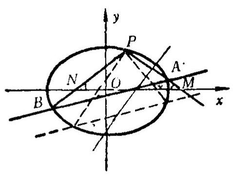

图 2-1-01

例 8 过椭圆上一定点 $P$ (不在长轴上)的两弦 ${PA}\text{ 、 }{PB}$ 与长轴分别交于两点 $M, N$ ,若 $\left| {PM}\right|  = \; \left| {PN}\right|$ ,则直线 ${AB}$ 有定向.

分析 为了使几何问题转化为代数问题, 首先应建立坐标系. 不妨取椭圆的对称轴为坐标轴, 得椭圆方程为 $\frac{{x}^{2}}{{a}^{2}} + \frac{{y}^{2}}{{b}^{2}} = 1$ . 欲证直线 ${AB}$ 有定向，只要证直线 ${AB}$ 的斜率为定值. 由于 $P$ 为椭圆上的定点，故其离心角 $\varphi$ 为定值，如设 $A$ 、 $B$ 两点的离心角分别为 $\alpha$ 、 $\beta$ ，根据 $\left| {PM}\right|  = \left| {PN}\right|$ ，可知 ${PA}$ ， ${PB}$ 两直线的倾角互补，由此可导出 $\alpha$ 、 $\beta$ 与 $\varphi$ 之间的联系，使问题获解。

证 建立坐标系如图 2-1-01 所示, 设椭圆方程为

$$
\frac{{x}^{2}}{{a}^{2}} + \frac{{y}^{2}}{{b}^{2}} = 1,
$$

点 $A$ 、 $B$ 、 $P$ 的离心角分别为 $\alpha$ 、 $\beta$ 、 $\varphi$ ，其中 $\varphi$ 为定值，则 $A$ 、 $B$ 、 $P$ 的坐标分别为 $\left( {a\cos \alpha , b\sin \alpha }\right) \text{ 、 }\left( {a\cos \beta , b\sin \beta }\right) \text{ 、 }\left( {a\cos \varphi , b\sin \varphi }\right)$ . 直线 ${AB}$ 的斜率为

$$
{k}_{AB} = \frac{b\left( {\sin \alpha  - \sin \beta }\right) }{a\left( {\cos \alpha  - \cos \beta }\right) } = \frac{{2b}\sin \frac{1}{2}\left( {\alpha  - \beta }\right) \cos \frac{1}{2}\left( {\alpha  + \beta }\right) }{-{2a}\sin \frac{1}{2}\left( {\alpha  + \beta }\right) \sin \frac{1}{2}\left( {\alpha  - \beta }\right) }
$$

$$
- \frac{b}{a}\operatorname{ctg}\frac{1}{2}\left( {\alpha  + \beta }\right) .
$$

同理,直线 ${PA},{PB}$ 的斜率分别为

$$
{k}_{PA} =  - \frac{b}{a}\operatorname{ctg}\frac{1}{2}\left( {\varphi  + \alpha }\right) ,\;{k}_{PB} =  - \frac{b}{a}\operatorname{ctg}\frac{1}{2}\left( {\varphi  + \beta }\right) .
$$

$\because \left| {PM}\right|  = \left| {PN}\right| ,\therefore$ 直线 ${PA}\text{ 、 }{PB}$ 的倾角互补,故

即

$$
{k}_{PA} + {k}_{PB} = 0.
$$

$$
- \frac{b}{a}\left\lbrack  {\operatorname{ctg}\frac{1}{2}\left( {\varphi  + \alpha }\right)  + \operatorname{ctg}\frac{1}{2}\left( {\varphi  + \beta }\right) }\right\rbrack   = 0,
$$

$$
\frac{\sin \frac{1}{2}\left( {{2\varphi } + \alpha  + \beta }\right) }{\sin \frac{1}{2}\left( {\varphi  + \alpha }\right) \sin \frac{1}{2}\left( {\varphi  + \beta }\right) } = 0.
$$

$\therefore {2\varphi } + \alpha  + \beta  = {2n\pi },\left( {n \in  Z}\right)$ ,即 $\alpha  + \beta  = {2n\pi } - {2\varphi }$ ;

$$
\therefore {k}_{AB} =  - \frac{b}{a}\operatorname{ctg}\frac{1}{2}\left( {\alpha  + \beta }\right)
$$

$$
-  - \frac{b}{a}\operatorname{ctg}\left( {{n\pi } - \varphi }\right)  - \frac{b}{a}\operatorname{ctg}\varphi ,\text{ (定值) }
$$

${AB}$ 的斜率为定值，

这里,通过坐标系将几何问题“过椭圆上一定点 $P$ 的两弦 ${PA}\text{ 、 }{PB}$ 与长轴分别交于 $M\text{ 、 }N$ . 若 $\left| {PM}\right|  = \left| \overset{\text{ ⏜ }}{PN}\right|$ ,则直线 ${AB}$ 有定向”,转化为代数问题“椭圆 $\frac{{x}^{2}}{{a}^{2}} + \frac{{y}^{2}}{{b}^{2}} = 1$ 上一定点 $P\left( {a\cos \varphi }\right.$ , $b\sin \varphi )$ ,过 $P$ 的两弦与长轴交于两点 $M\text{ 、 }N$ ,从 $\left| {PM}\right|  = \left| {PN}\right|$ 要证直线 ${AB}$ 的斜率为定值. $\nu$ 写过计算与推理获得直线 ${AB}$ 的斜率 ${k}_{AB} = \frac{b}{a}\operatorname{ctg}\varphi$ (定值),这一代数结论,再通过坐标系进行逆映射转化几何结论: “直线 ${AB}$ 有定向”. 画成框图:

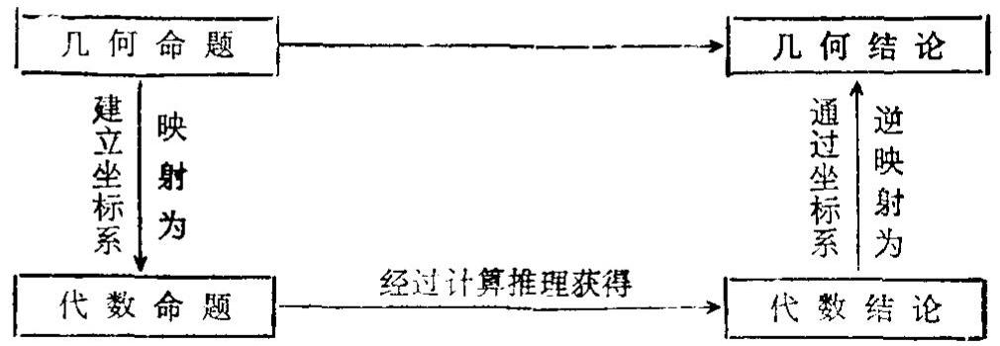

这就是解析几何中常用的方法. 上述思维路线也可以反过来进行.

例 9 设 $\theta$ 的方程 $\sqrt{3}\cos \theta  + \sin \theta  + a = 0$ 在区间 $\left( {0,{2\pi }}\right)$ 上有两个不等的实根 $\alpha \text{ 、 }\beta$ ,求 (1) $a$ 的取值范围; (2) $\alpha  + \beta$ 的值.

分析 通过映射 $\left\{  \begin{array}{l} x = \cos \theta , \\  y = \sin \theta ; \end{array}\right.$ 原方程转化为直线系的方程 $\sqrt{3}x + y + a \; = 0.\theta$ 的方程 $\sqrt{3}\cos \theta  + \sin \theta  + a = 0$ , 在区间 $\left( {0,{2\pi }}\right)$ 上有两个不同的实根 $\alpha \text{ 、 }\beta$ ,即直线 $\sqrt{3}x + y + a = 0$ 与单位圆 $\left\{  \begin{array}{l} x = \cos \theta \\  y = \sin \theta  \end{array}\right.$ 有两个不同的交点,但点 $\left( {1,0}\right)$ 除外. 利用 $\sqrt{3}x + y + a = 0$ 与圆 ${x}^{2} + {y}^{2} = 1$ 相交于两个不同点的充要条件, 即可获解.

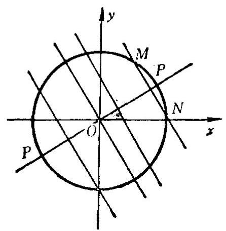

图 2-1-02

解 通过映射 $\left\{  \begin{array}{l} x = \cos \theta \\  y = \sin \theta  \end{array}\right.$ ,方程 $\sqrt{3}\cos \theta  + \sin \theta  + a = 0$ 转化为直线系 $\sqrt{3}x + y + a = 0\cdots$ ①. 如果直线系与单位圆 ${x}^{2} + {y}^{2} = 1$ 交于两点 $M\text{ 、 }N,\angle {xOM} = \alpha \text{ 、 }\angle {xON} = \beta$ ,即方程 $\sqrt{3}\cos \theta  + \sin \theta  + \; a = 0$ 在区间 $\left( {0,{2\pi }}\right)$ 上有两个不同的实根.

直线① 与单位圆有两个不同交点 (除点 $\left( {1,0}\right)$ 外) 的充要条件为 $\frac{\left| \sqrt{3} \cdot  0 + 0 + a\right| }{2} < 1$ 且 $\sqrt{3} \times  1 + 0 + a \neq  0$ ,

$\therefore \left| a\right|  < 2$ 且 $a \neq   - \sqrt{3}$ ,故 $a \in  \left( {-2, - \sqrt{3}}\right)  \cup  \left( {-\sqrt{3},2}\right)$ . 设与直线①垂直的直线和圆 $O$ 交于点 $P$ ，

$$
\because \frac{1}{2}\left( {\alpha  + \beta }\right)  = \angle {NOP} + \angle {xON} = \angle {xOP} = \frac{2\pi }{3} \pm  \frac{\pi }{2}
$$

$$
= \frac{7\pi }{6}\text{ 或 }\frac{\pi }{6}\text{ , }
$$

$\therefore \alpha  + \beta  = \frac{\pi }{3}$ 或 $\frac{7\pi }{3}$ .

这里利用单位圆的参数方程，作为映射(实质上是一种三角置换) 使代数问题转化为几何问题, 发挥几何直观的优势, 通过形象思维，使人豁然贯通.

例 10 设 $m \in  R$ ，求证:曲线

$$
{x}^{4} + m{x}^{3}y - 6{x}^{2}{y}^{2} - {mx}{y}^{3} + {y}^{4} = 0
$$

将单位圆 ${x}^{2} + {y}^{2} = 1$ 八等分.

分析 由于曲线方程 ${x}^{4} + m{x}^{3}y - 6{x}^{2}{y}^{2} - {mx}{y}^{3} + {y}^{4} = 0$ 是 $x, y$ 的四次齐次方程,变形为 ${\left( \frac{y}{x}\right) }^{4} - m{\left( \frac{y}{x}\right) }^{3} - 6{\left( \frac{y}{x}\right) }^{2} + m\left( \frac{y}{x}\right)  + 1 \; = 0$ ,若此方程有四个实根,则与此方程相应的曲线为过原点的四条直线,且与单位圆 ${x}^{2} + {y}^{2} = 1$ 即 $\left\{  \begin{array}{l} x = \cos \theta \\  y = \sin \theta  \end{array}\right.$ 有八个交点 ${A}_{i}(i = 1$ , $2,3,\cdots ,8)$ . 欲证 ${A}_{i}$ 将圆八等分,只要证每相邻两点对应的 ${\theta }_{i}$ 之差等于 $\frac{\pi }{4}$ . 这里 ${\theta }_{4}$ 为以 $\left\{  \begin{array}{l} x = \cos \theta \\  y = \sin \theta  \end{array}\right.$ 代入曲线方程所得的三角方程的解, 故可从解此三角方程入手进行证明.

证 将单位圆的参数方程 $\left\{  \begin{array}{l} x = \cos \theta \\  y = \sin \theta  \end{array}\right.$ 代入曲线方程, ${\cos }^{4}\theta  - 6{\cos }^{2}\theta {\sin }^{2}\theta  + {\sin }^{4}\theta  + m\sin \theta \cos \theta \left( {{\cos }^{2}\theta  - {\sin }^{2}\theta }\right)  = 0,$ 即 ${\left( {\cos }^{2}\theta  + {\sin }^{2}\theta \right) }^{2} - 8{\sin }^{2}\theta {\cos }^{2}\theta  + \frac{m}{2}\sin {2\theta }\cos {2\theta } = 0$ .

$\therefore \;1 - 2{\sin }^{2}{2\theta } + \frac{m}{4}\sin {4\theta } = 0,$

即

$$
\cos {4\theta } + \frac{m}{4}\sin {4\theta } = 0.
$$

如果 $m = 0$ ,则 $\cos {4\theta } = 0,\theta  = \left( {{2n} + 1}\right) \frac{\pi }{8},\left( {n \in  Z}\right)$ .

$$
\therefore \;{\theta }_{1} = \frac{\pi }{8},{\theta }_{2} = \frac{3\pi }{8},{\theta }_{3} = \frac{5\pi }{8},\cdots ,{\theta }_{8} = \frac{15\pi }{8}\text{ , }
$$

$$
{\theta }_{i + 1} - {\theta }_{i} = \frac{\pi }{4}\;\left( {i = 1,2,\cdots ,7}\right) .
$$

如果 $m \neq  0$ ,则 $\operatorname{tg}{4\theta } =  - \frac{4}{m},\theta  = \frac{n\pi }{4} - \frac{1}{4}\operatorname{arctg}\frac{4}{m},\left( {n \in  Z}\right)$ .

$\therefore \;{\theta }_{1} =  - \frac{1}{4}\operatorname{arctg}\frac{4}{m},\;{\theta }_{2} = \frac{\pi }{4} - \frac{1}{4}\operatorname{arctg}\frac{4}{m},\cdots ,$

$$
{\theta }_{8} = \frac{7\pi }{4} - \frac{1}{4}\operatorname{arctg}\frac{4}{m},{\theta }_{i + 1} - {\theta }_{i} = \frac{\pi }{4}\;\left( {i = 1,2,\cdots ,7}\right) .
$$

故每相邻两交点 ${A}_{i}\text{ 、 }{A}_{i + 1}$ 所对应的 ${\theta }_{i}\text{ 、 }{\theta }_{i + 1}$ 之差均为 $\frac{\pi }{4}$ ,即曲线 ${x}^{4} + m{x}^{3}y - 6{x}^{2}{y}^{2} - m{x}^{3}y + {y}^{4} = 0$ 八等分单位圆 ${x}^{2} + {y}^{2} = 1$ .

在解析几何里, 曲线的参数方程都是一种特殊的映射. 通过这种映射, 既能使问题的领域发生转化, 又能使变元数减少, 所以常能起化难为易的作用.

例 11 求函数 $y = \frac{3\sin x - 5}{5\cos x - 3}$ 的最大值与最小值.

分析 函数 $y$ 即点 $\left( {3,5}\right)$ 与椭圆 $\left\{  \begin{array}{l} x = 5\cos \theta \\  y = 3\sin \theta  \end{array}\right.$ 上一动点 $(5\cos \theta$ , $3\sin \theta )$ 连线的斜率，因此 $y$ 的值必在自点 $\left( {3,5}\right)$ 所作椭圆 $\frac{{x}^{2}}{25} + \; \frac{{y}^{2}}{9} - 1$ 的两切线的斜率之间,从此即得 $y$ 的最大值与最小值.

解 设过点 $\left( {3,5}\right)$ 所作椭圆 $\frac{{x}^{2}}{25} + \frac{{y}^{2}}{9} = 1$ 的切线的斜率为 $k$ , 则切线方程为 $y = {kx} \pm  \sqrt{{25}{k}^{2} + 9}$ .

$\because$ 点 $\left( {3,5}\right)$ 在切线上, $\therefore 5 = {3k} \pm  \sqrt{{25}{k}^{2} + 9}$ ,

即

$$
8{k}^{2} + {15k} - 8 = 0,\;k = \frac{-{15} \pm  \sqrt{481}}{16}.
$$

函数 $y$ 的值为点 $\left( {3,5}\right)$ 与椭圆 $\frac{{x}^{2}}{25} + \frac{{y}^{2}}{9} = 1$ 上动点 $(5\cos \theta$ , $3\sin \theta )$ 连线的斜率，

$\therefore \;y \in  \left\lbrack  {\frac{-{15} - \sqrt{481}}{16},\frac{-{15} + \sqrt{481}}{16}}\right\rbrack$ ,

故 ${y}_{\text{ 最大 }} - \frac{-{15} + \sqrt{481}}{16},{y}_{\text{ 最小 }} = \frac{-{15} - \sqrt{481}}{16}$ .

例 12 设实数 $x, y$ 满足 $5{x}^{2} - {8xy} + 5{y}^{2} = 9$ ,试求: ${\lambda }_{x}d$ 的最大值与最小值.

(1) $\lambda  = x + y;\;$ (2) $d = \sqrt{{x}^{2} + {y}^{2}}$ .

解 (1) $\because x + y = \lambda$ 为平行直线系, $\lambda$ 为此直线在 $x\text{ 、 }y$ 轴上的截距. 当此直线与曲线 $5{x}^{2} - {8xy} + 5{y}^{2} = 9$ 相切时, $\lambda$ 达到最大值与最小值.

设 直线 $x + y - \lambda$ 与曲线相切于 $\left( {{x}_{1},{y}_{1}}\right)$ ,则切线方程为

$$
5{x}_{1}x - 4\left( {{y}_{1}x + {x}_{1}y}\right)  + 5{y}_{1}y = 9
$$

$$
\therefore \frac{5{x}_{1} - 4{y}_{1}}{1} = \frac{-4{x}_{1} + 5{y}_{1}}{1} = \frac{9}{\lambda }\text{ . }
$$

从此得，

$$
{x}_{1} = {y}_{1},\;\lambda  = 9/{x}_{1}.
$$

$\because$ 点 $\left( {{x}_{1},{y}_{1}}\right)$ 在曲线上, $\therefore 5{x}_{1}^{2} - 8{x}_{1}{y}_{1} + 5{y}_{1}^{2} = 9$ ,

$$
\therefore {x}_{1} =  \pm  3\sqrt{2}/2\text{ , }
$$

$$
{\lambda }_{nx} = 3\sqrt{2},\;{\lambda }_{ny} =  - 3\sqrt{2}.
$$

(2)令 $x = d\cos \theta , y = d\sin \theta$ ,代入曲线方程,得

$$
{d}^{2}\left( {5{\cos }^{2}\theta  - 8\sin \theta \cos \theta  + 5{\sin }^{2}\theta }\right)  = 9,
$$

$$
{d}^{2} = \frac{9}{5 - 4\sin {2\theta }}.
$$

当 $\theta  = \frac{\pi }{4}$ 时, ${d}_{\theta  - x} = 3;\theta  = \frac{3\pi }{4}$ 时, ${d}_{\theta  + } = 1$ .

## 8. 几何变换

克莱因 (Felix Klein ${1849} \sim  {1925}$ ) 在爱尔兰根给几何学所下的著名定义即将各种几何学看成相应变换群的不变量的理论, 成为研究几何的重要工具. 变换本质上是一种映射, 因此通过几何变换解决几何问题无非是映射观点的一种表现形态. 这方面的例子是十分丰富的, 限于篇幅, 只能选用少数例子, 着重说明这一思维方法的不同表现方式.

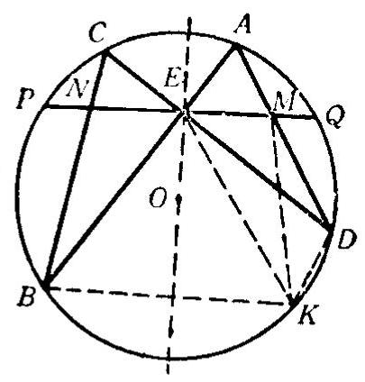

图 2-1-03

例 13 在圆 $O$ 中， $E$ 为弦 ${PQ}$ 的中点,过 $E$ 点的任意两弦 ${AB}\text{ 、 }{CD}$ , 设 ${AD}\text{ 、 }{BO}$ 与 ${PQ}$ 分别交于 $M\text{ 、 }N$ ,则 ${EM} = {EN}$ .

分析 $\because E$ 是弦 ${PQ}$ 的中点,

$$
\therefore {OE}\bot {PQ}\text{ . }
$$

欲证点 $E$ 平分 ${MN}$ ,关键在于证 $M$ 、 $N$ 关于 ${OE}$ 成对称. 因此考虑点 $B$ 关于 ${OE}$ 的对称点 $K$ ，从证 $\angle {EBN} = \angle {EKM}$ 入手. $\because \angle {MDE} = \angle {EBN},\therefore$ 要证 $\angle {MDE} \; = \angle {EKM}$ ,从而可知应先证 ${E}_{X}{K}_{X}D\text{ 、 }M$ 四点共圆,从图 2-1-03 易知 $\angle {MEK} = \angle {NEB} = \angle {EBK}.\because A\text{ 、 }B\text{ 、 }K\text{ 、 }D$ 四点共圆, $\therefore \angle {ADK} + \angle {ABK} = {180}^{ \circ  }$ ，故 $\angle {MEK} + \angle {MDK} = {180}^{ \circ  }$ ，从此得 $E\text{ 、 }K\text{ 、 }D\text{ 、 }M$ 四点共圆,于是发现证明的思路.

证 略.

这里是运用对称变换, 发现已知与结论之间的逻辑联系. 这一

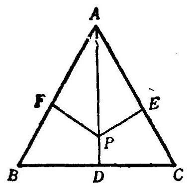

图 2-1-04

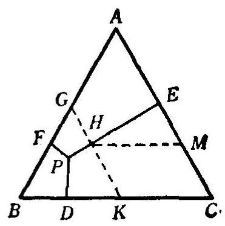

图 2-1-05

定理称为蝴蝶定理, 它的证法是很多的. 在参数观点一节里, 将给出一个利用曲线系方程的极妙的证法.

例 14 正三角形 ${ABC}$ 内部一点 $P$ 在三边 ${BC}\text{ 、 }{CA}\text{ 、 }{AB}$ 上的射影分别为 $D\text{ 、 }E\text{ 、 }F$ ,求证: ${BD} + {CE} + {AF}$ 为定值.

分析 如果点 $P$ 在边 ${BC}$ 上的射影为 ${BC}$ 的中点 $D$ ,则

$$
{BD} = \frac{a}{2}\text{ 且 }{CE} + {AF} = a.
$$

$\therefore {BD} + {OE} + {AF} = \frac{3}{2}a$ 为定值.

如果 $D$ 不是 ${BO}$ 的中点,不妨设 ${BD} = x,\left( {x < \frac{a}{2}}\right)$ ,可将 ${AO}$ 平移, 构成一新的正三角形 ${BKG}$ ,使点 $P$ 在 ${BK}$ 上的射影为 ${BK}$ 的中点. 设 ${PE}$ 与 ${GK}$ 交于 $H$ 点,从此可得

$$
{BD} + {KH} + {GF} = \frac{3}{2}\left( {2x}\right)  = {3x}.
$$

过 $H$ 作 ${HM}//{BO}$ ,交 ${AO}$ 于 $M$ 点,故 ${KOMH}$ 是平行四边形. 从而有 ${OE} = {HK} + {ME} = {HK} + \frac{1}{2}{HM}$ ,但 ${HM} = {KC} = a - {2a} \; - {AG}$ .

$$
\therefore {BD} + {OE} + {AF} = {BD} + {HK} + \frac{1}{2}\left( {a - {2x}}\right)  + a - {2x} + {GF}
$$

$$
= {3x} + \frac{a}{2} - x + a - {2x} = \frac{3}{2}a\text{ . }
$$

## 证 略.

这里利用平移变换, 把一般情况转化为特殊情况. 平移变换不仅在平几中应用广泛, 在代数、解几中也有不同形态的应用, 例如解三次方程:

$$
a{x}^{3} + b{x}^{2} + {cx} + d = 0
$$

①

令 $y = x + \frac{b}{3a}$ (相当于平移变换)，则

$$
a{\left( y - \frac{b}{3a}\right) }^{3} + b{\left( y - \frac{b}{3a}\right) }^{2} + c\left( {y - \frac{b}{3a}}\right)  + d = 0,
$$

即 ${y}^{3} + \frac{1}{a}\left( {c - \frac{{b}^{2}}{3a}}\right) y + \frac{1}{{27}{a}^{3}}\left( {{27}{a}^{2}d + 2{b}^{3} - {9abc}}\right)  = 0$ .

经此变换, 使方程的二次项系数为零, 转化为

$$
{y}^{3} + {py} + q = 0
$$

②

令 $p =  - {3\alpha \beta }, q = {\alpha }^{3} + {\beta }^{3}$ ,则 ${y}^{3} - {3\alpha \beta y} + {\alpha }^{3} + {\beta }^{3} = 0$ .

应用 $\;{x}^{3} + {y}^{3} + {z}^{3} - {3xyz}$

$$
= \left( {x + y + z}\right) \left( {x + {\omega y} + {\omega }^{2}z}\right) \left( {x + {\omega }^{2}y + {\omega z}}\right) ,
$$

其中 $\omega  =  - \frac{1}{2} + \frac{\sqrt{3}}{2}i$ ,即 1 的虚立方根之一,

可得 $\;\left( {y + \alpha  + \beta }\right) \left( {y + {\alpha \omega } + \beta {\omega }^{2}}\right) \left( {y + \alpha {\omega }^{2} + {\beta \omega }}\right)  = 0$ .

而 ${\alpha }^{3}\text{ 、 }{\beta }^{3}$ 是二次方程 ${\lambda }^{2} - {q\lambda } - \frac{{p}^{3}}{27} = 0$ 的根,从此立即导出解三次方程的卡当公式.

例 15 设 $\bigtriangleup {ABC}$ ,在每一边上向形外作正三角形 ${ABD}$ 、 ${BCE}\text{ 、 }{CAF}$ ,试证 此三个正三角形的重心 ${G}_{1}\text{ 、 }{G}_{2}\text{ 、 }{G}_{3}$ 为一正三角形的顶点.

分析三角形 ${ABD}$ 为正三角形的充要条件是 $\overrightarrow{BA}$ 绕点 $B$ 旋转 $\frac{\pi }{3}$ 后与 $\overrightarrow{BD}$ 重合. 本命题条件与结论中出现的都是正三角形, 因此考虑使用旋转变换来解. 描述旋转变换的工具较多, 在中学数学中应用复数比较方便, 故以复数解之.

设 ${G}_{1}\text{ 、 }{G}_{2}\text{ 、 }{G}_{3}$ 对应的复数分别为 ${Z}_{{G}_{1}}\text{ 、 }{Z}_{{G}_{2}}\text{ 、 }{Z}_{{G}_{3}}$ ,则

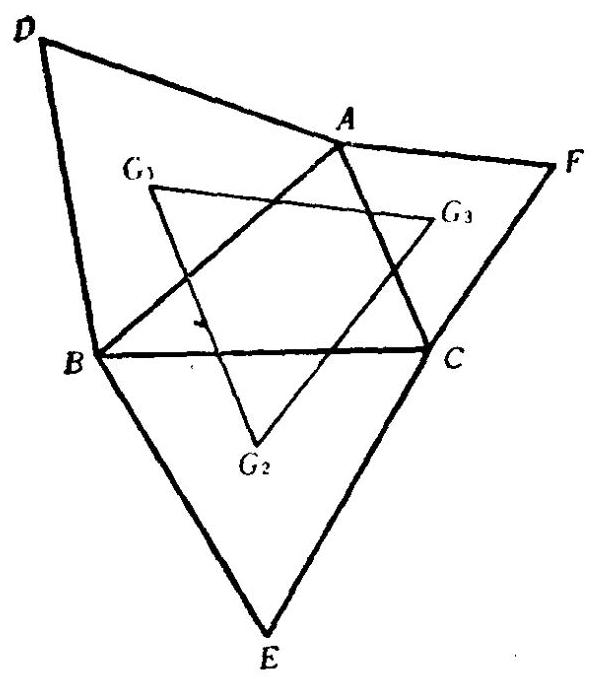

图 2-1-06

证 设 $\bigtriangleup  {ABC}$ 三顶点对应的复数分别为 ${Z}_{1}\text{ 、 }{Z}_{2}$ 、 ${Z}_{3},\overrightarrow{BA}\text{ 、 }\overrightarrow{BD}$ 对应的复数分别为 ${Z}_{1} - {Z}_{2}\text{ 、 }{Z}_{D} - {Z}_{2}$ ,其中 ${Z}_{D}$ 表示 $D$ 点对应的复数.

$$
\therefore {Z}_{D} - {Z}_{2}
$$

$$
= \left( {{Z}_{1} - {Z}_{2}}\right) {e}^{\frac{\pi }{3}i},
$$

从此得

$$
{Z}_{D} = {Z}_{1}{e}^{\frac{{\pi }_{i}}{3}} + \left( {1 - {e}^{\frac{{\pi }_{i}}{3}}}\right) {Z}_{2}.
$$

$$
{Z}_{{G}_{1}} = \frac{1}{3}\left\lbrack  {{Z}_{1} + {Z}_{2} + {Z}_{1}{e}^{\frac{{x}_{i}}{3}} + \left( {1 - {e}^{\frac{{x}_{i}}{3}}}\right) {Z}_{2}}\right\rbrack
$$

$$
= \frac{1}{3}\left\lbrack  {{Z}_{1}\left( {1 + {e}^{\frac{{\pi }_{i}}{3}}}\right)  + {Z}_{2}\left( {2 - {e}^{\frac{{\pi }_{i}}{3}t}}\right) }\right\rbrack
$$

$$
= \frac{\sqrt{3}}{3}\left( {{Z}_{1}{e}^{\frac{{\pi }_{i}}{6}} + {Z}_{2}{e}^{-\frac{{\pi }_{i}}{6}}}\right) ,
$$

同理,

$$
{Z}_{{G}_{1}} = \frac{\sqrt{3}}{3}\left( {{Z}_{2}{e}^{\frac{{\pi }_{i}}{6}} + {Z}_{3}{e}^{-\frac{{\pi }_{i}}{6}}}\right) ,
$$

$$
{Z}_{{G}_{3}} = \frac{\sqrt{3}}{3}\left( {{Z}_{3}{e}^{\frac{{\pi }_{i}}{6}} + {Z}_{1}{e}^{-\frac{{\pi }_{i}}{6}}}\right) .
$$

$\overrightarrow{{G}_{2}{G}_{1}}$ 对应的复数为

$$
{Z}_{{G}_{2}} - {Z}_{{G}_{2}} = \frac{\sqrt{3}}{3}\left\lbrack  {{Z}_{1}{e}^{\frac{{\pi }_{i}}{{6}^{i}}} + {Z}_{2}{e}^{-\frac{{\pi }_{i}}{6}} - {Z}_{2}{e}^{\frac{{\pi }_{4}}{{6}^{4}}} - {Z}_{3}{e}^{-\frac{{\pi }_{2}}{{6}^{2}}}}\right\rbrack
$$

$$
= \frac{\sqrt{3}}{3}\left\lbrack  {{Z}_{1}{e}^{\frac{\pi i}{6}} + {Z}_{2}\left( {-i}\right)  - {Z}_{3}{e}^{-\frac{\pi i}{6}}}\right\rbrack  ,
$$

$\overrightarrow{{G}_{2}{G}_{8}}$ 对应的复数为

$$
{Z}_{{G}_{3}} - {Z}_{{G}_{3}} = \frac{\sqrt{8}}{3}\left\lbrack  {{Z}_{8}{e}^{\frac{{\pi }_{i}}{6}} + {Z}_{1}{e}^{-\frac{{\pi }_{i}}{6}} - {Z}_{2}{e}^{\frac{{\pi }_{i}}{6}} - {Z}_{3}{e}^{-\frac{{\pi }_{i}}{6}}}\right\rbrack
$$

$$
= \frac{\sqrt{3}}{3}\left\lbrack  {{Z}_{1}{e}^{-\frac{\pi }{6}i} - {Z}_{2}{e}^{\frac{\pi }{6}i} + {Z}_{3}i}\right\rbrack  .
$$

$$
\because \frac{\sqrt{3}}{3}\left\lbrack  {{Z}_{1}{e}^{-\frac{{\pi }_{i}}{6}} - {Z}_{2}{e}^{\frac{{\pi }_{i}}{6}i} + {Z}_{3}{e}^{\frac{{\pi }_{i}}{2}i}}\right\rbrack  {e}^{\frac{\pi }{3}i}
$$

$$
= \frac{\sqrt{3}}{3}\left\lbrack  {{Z}_{1}{e}^{\frac{\pi }{6}i} - {Z}_{2}{e}^{\frac{\pi }{2}i} - {Z}_{3}{e}^{-\frac{\pi }{6}i}}\right\rbrack
$$

$$
= \frac{\sqrt{3}}{3}\left\lbrack  {{Z}_{1}{e}^{\frac{\pi }{6}i} + {Z}_{2}\left( {-i}\right)  - {Z}_{3}{e}^{-\frac{\pi }{6}i}}\right\rbrack  ,
$$

$\therefore \bigtriangleup {G}_{1}{G}_{2}{G}_{3}$ 是正三角形.

这里用复数的运算描述旋转变换显得十分简便. 相传这一定理是属于拿破仑的,所以正 $\bigtriangleup {G}_{1}{G}_{2}{G}_{3}$ 称为拿破仑三角形.

例 16 已知直线 $l : \left\{  {\begin{array}{l} x =  - 5 + \frac{1}{\sqrt{2}}t \\  y = 4 + \frac{1}{\sqrt{2}}t \end{array}(t}\right.$ 为参数) 和椭圆 $E$ : $\left\{  {\begin{array}{l} x = 2\sqrt{3}\cos \theta \\  y = \sqrt{3}\sin \theta  \end{array}\text{ ( }\theta }\right.$ 为参数),求与椭圆 $E$ 共焦点 ${F}_{1}\text{ 、 }{F}_{2}$ 且与直线 $l$ 有公共点 $M$ 的椭圆中长轴最短的椭圆 $O$ 的方程,以及此时点 $M$ 的坐标.

分析 与椭圆 $E$ 共焦点的椭圆系为 $\frac{{x}^{2}}{{a}^{2}} + \frac{{y}^{2}}{{a}^{2} - 9} = 1$ . 按题意椭圆 $O$ 是此椭圆系中长轴最短且与直线 $\mathbf{l}$ 有公共点的一个椭圆. 为此可根据椭圆系与直线 $\mathbf{l}$ 有公共点的充要条件,建立含 $a$ 的不等式,从此确定 $a$ 的最小值. 为了求直线 $\mathbf{l}$ 与椭圆系有公共点的充要条件, 可通过伸缩变换将椭圆转化为圆来研究.

解 消去参数, 得

椭圆 $E$ 的方程为

$$
\frac{{x}^{2}}{12} + \frac{{y}^{3}}{3} = 1
$$

直线 $l$ 的方程为

$$
y = x + 9
$$

①

与椭圆 $E$ 共焦点的椭圆系方程为

$$
\frac{{x}^{2}}{{a}^{2}} + \frac{{y}^{2}}{{a}^{2} - 9} = 1
$$

②

通过变换:

$$
\left\{  \begin{array}{l} x = {aX} \\  y = \sqrt{{a}^{2} - 9}Y, \end{array}\right.
$$

则, 椭圆系②转化为圆

$$
{X}^{2} + {Y}^{2} = 1
$$

③

直线 $l$ 的方程①转化为

$$
\sqrt{{a}^{2} - 9}Y = {aX} + 9
$$

④

$\because$ ①与②有公共点， $\therefore$ 通过变换后 ③与④ 也有公共点，①与 ②有公共点的充要条件与③、④有公共点的充要条件等价.

$$
\therefore \frac{\left| a \cdot  0 - \sqrt{{a}^{2} - 9} \cdot  0 + 9\right| }{\sqrt{{a}^{2} + {a}^{2} - 9}} < 1
$$

即

$$
2{a}^{2} - 9 \geq  {81},{a}^{2} \geq  {45}\text{ . }
$$

故 ${a}^{2}$ 的最小值为 45，此时椭圆系中的这一椭圆即所要求的椭圆 $C : \frac{{x}^{2}}{45} + \frac{{y}^{2}}{36} = 1$ .

此时直线 $l$ 与椭圆 $C$ 相切,切点 $M$ 的坐标为

$$
{x}_{M} =  - 3\sqrt{5} \times  \frac{\sqrt{5}}{3} =  - 5,\;{y}_{M} = 6 \times  \frac{2}{3} = 4.
$$

当然上述各例是难以尽述几何变换的丰富内容, 描述几何变换的语言也是多种多样的，但从思维方法来看，几何变换仍然是使问题从一个领域向另一个领域转化的手段. 解析几何里的坐标变换, 本质上与几何变换相同. 几何变换是点的位置变换, 坐标变换是利用坐标系的变换来反映点的位置变换, 它们都是映射观点的一种表现形态.

## 4. 复数变换

复数的几何意义是点，复数又与平面向量对应. 通过高斯平面可以实现复数与几何间的转化, 又可实现复数与平面向量间的转化. 这种转化不是无聊的游戏, “而是数学上最有力的杠杆之一”. 它是映射观点的又一种表现形态.

例 17 设 $A\text{ 、 }B\text{ 、 }C\text{ 、 }D$ 为平面上任意四点,无三点共线,求证:

$$
\left| {AO}\right|  \cdot  \left| {BD}\right|  \leq  \left| {AB}\right|  \cdot  \left| {CD}\right|
$$

$$
+ \left| {AD}\right|  \cdot  \left| {BC}\right| \text{ . }
$$

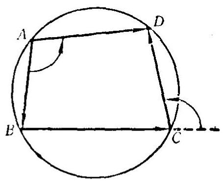

图 2-1-07

分析 这是几何问题. 通过高斯平面,四个点 $A\text{ 、 }B\text{ 、 }C\text{ 、 }D$ 对应四个复数 ${Z}_{i}\left( {i = 1,2,3,4}\right)$ ,两点间的距离对应于两复数差的绝对值. 根据复数运算, 有

$$
\left( {{Z}_{2} - {Z}_{1}}\right) \left( {{Z}_{4} - {Z}_{3}}\right)  + \left( {{Z}_{4} - {Z}_{1}}\right) \left( {{Z}_{3} - {Z}_{2}}\right)
$$

$$
= {Z}_{2}{Z}_{4} - {Z}_{1}{Z}_{4} - {Z}_{2}{Z}_{3} + {Z}_{1}{Z}_{3}
$$

$$
+ {Z}_{3}{Z}_{4} - {Z}_{1}{Z}_{8} - {Z}_{2}{Z}_{4} + {Z}_{1}{Z}_{2}
$$

$$
= {Z}_{3}{Z}_{4} - {Z}_{1}{Z}_{4} - {Z}_{2}{Z}_{3} + {Z}_{1}{Z}_{2}
$$

$$
= \left( {{Z}_{4} - {Z}_{2}}\right) \left( {{Z}_{3} - {Z}_{1}}\right) \text{ . }
$$

根据复数三角形不等式, 得

$$
\left| {{Z}_{3} - {Z}_{1}}\right|  \cdot  \left| {{Z}_{4} - {Z}_{2}}\right|
$$

$$
\leq  \left| {{Z}_{2} - {Z}_{1}}\right|  \cdot  \left| {{Z}_{4} - {Z}_{3}}\right|  + \left| {{Z}_{4} - {Z}_{1}}\right|  \cdot  \left| {{Z}_{3} - {Z}_{2}}\right| ,
$$

$$
\therefore \left| {AC}\right|  \cdot  \left| {BD}\right|  \leq  \left| {AB}\right|  \cdot  \left| {OD}\right|  + \left| {AD}\right|  \cdot  \left| {BO}\right| \text{ . }
$$

当且仅当

$$
\frac{\left( {{Z}_{2} - {Z}_{1}}\right) \left( {{Z}_{4} - {Z}_{3}}\right) }{\left( {{Z}_{4} - {Z}_{1}}\right) \left( {{Z}_{3} - {Z}_{2}}\right) } = k\;\left( {k > 0}\right)
$$

即

$$
\frac{{Z}_{4} - {Z}_{3}}{{Z}_{3} - {Z}_{2}} = k\frac{{Z}_{4} - {Z}_{1}}{{Z}_{2} - {Z}_{1}},
$$

亦叩

$$
\arg \frac{{Z}_{4} - {Z}_{3}}{{Z}_{3} - {Z}_{2}} = \arg \frac{{Z}_{4} - {Z}_{1}}{{Z}_{2} - {Z}_{1}}
$$

时,等号成立,所以当且仅当 $A\text{ 、 }B\text{ 、 }C\text{ 、 }D$ 四点共圆时,等号成立.

证 略.

例 18 已知 $\cos \alpha  + \cos \beta  + \cos \gamma  = \sin \alpha  + \sin \beta  + \sin \gamma  = 0$ , 求证:

$$
{\cos }^{2}\alpha  + {\cos }^{2}\beta  + {\cos }^{2}\gamma  = {\sin }^{2}\alpha  + {\sin }^{2}\beta  + {\sin }^{2}\gamma  = \frac{3}{2}.
$$

分析 如令 ${Z}_{1} = \cos \alpha  + i\sin \alpha ,{Z}_{2} = \cos \beta  + i\sin \beta ,{Z}_{3} = \cos \gamma \; + i\sin \gamma$ ,则从已知条件有 ${Z}_{1} + {Z}_{2} + {Z}_{8} = 0,{\bar{Z}}_{1} + {\bar{Z}}_{2} + {\bar{Z}}_{3} = 0$ ,且 $\left| {Z}_{i}\right|  = 1$ ,或 ${Z}_{i}{\bar{Z}}_{i} = 1,\left( {i = 1,2,3}\right)$ . 从此导出

$$
\cos \alpha  = \frac{1}{2}\left( {{Z}_{1} + {\bar{Z}}_{1}}\right) ,\cos \beta  = \frac{1}{2}\left( {{Z}_{2} + {\bar{Z}}_{2}}\right) ,\cos \gamma  = \frac{1}{2}\left( {{Z}_{3} + {\bar{Z}}_{3}}\right) ;
$$

$$
\sin \alpha  = \frac{1}{2i}\left( {{Z}_{1} - {\bar{Z}}_{1}}\right) ;\sin \beta  = \frac{1}{2i}\left( {{Z}_{2} - {\bar{Z}}_{2}}\right) ,\sin \gamma  = \frac{1}{2i}\left( {{Z}_{3} - {\bar{Z}}_{3}}\right) .
$$

于是 ${\cos }^{2}\alpha  + {\cos }^{2}\beta  + {\cos }^{2}\gamma$ 与 ${\sin }^{2}\alpha  + {\sin }^{2}\beta  + {\sin }^{2}\gamma$ 均可转化成复数运算.

证 设 ${Z}_{1} = \cos \alpha  + i\sin \alpha ,{Z}_{2} = \cos \beta  + i\sin \beta ,{Z}_{3} = \cos \gamma  + \; i\sin \gamma$ ,从已知条件有 ${Z}_{1} + {Z}_{2} + {Z}_{3} = {\bar{Z}}_{1} + {\bar{Z}}_{2} + {\bar{Z}}_{3} = 0$ ,且 ${Z}_{i} \cdot  {\bar{Z}}_{i} \; = 1,\left( {i = 1,2,3}\right)$ .

$$
{Z}_{1}^{2} + {Z}_{2}^{2} + {Z}_{3}^{2} = {\left( {Z}_{1} + {Z}_{2} + {Z}_{3}\right) }^{2} - 2\left( {{Z}_{1}{Z}_{2} + {Z}_{2}{Z}_{3} + {Z}_{3}{Z}_{1}}\right)
$$

$$
=  - 2\left( {\frac{1}{{\bar{Z}}_{1}{\bar{Z}}_{2}} + \frac{1}{{\bar{Z}}_{2}{\bar{Z}}_{3}} + \frac{1}{{\bar{Z}}_{3}{\bar{Z}}_{1}}}\right)
$$

$$
=  - 2\frac{{\bar{Z}}_{1} + {\bar{Z}}_{2} + {\bar{Z}}_{3}}{{\bar{Z}}_{1}{\bar{Z}}_{2}{\bar{Z}}_{3}} = 0,
$$

同理,

$$
{\bar{Z}}_{1}^{2} + {\bar{Z}}_{2}^{2} + {\bar{Z}}_{3}^{2} = 0
$$

又

$$
\cos \alpha  = \frac{1}{2}\left( {{Z}_{1} + {\bar{Z}}_{1}}\right) ,\cos \beta  = \frac{1}{2}\left( {{Z}_{2} + {\bar{Z}}_{2}}\right) ,
$$

$$
\cos \gamma  = \frac{1}{2}\left( {{Z}_{3} + {\bar{Z}}_{3}}\right) ,
$$

$\sin \alpha  = \frac{1}{2i}\left( {{Z}_{1} - {\bar{Z}}_{1}}\right) ,\sin \beta  = \frac{1}{2i}\left( {{Z}_{2} - {\bar{Z}}_{2}}\right) ,\sin \gamma  = \frac{1}{2i}\left( {{Z}_{3} - {\bar{Z}}_{3}}\right) ,$

$\therefore {\cos }^{2}\alpha  + {\cos }^{2}\beta  + {\cos }^{2}\gamma$

$$
- \frac{1}{4}\left\lbrack  {{\left( {Z}_{1} + {\bar{Z}}_{1}\right) }^{2} + {\left( {Z}_{2} + {\bar{Z}}_{2}\right) }^{2} + {\left( {Z}_{3} + {\bar{Z}}_{3}\right) }^{2}}\right\rbrack
$$

$$
= \frac{1}{4}\left\lbrack  {{Z}_{1}^{2} + {Z}_{2}^{2} + {Z}_{3}^{2} + {\widehat{Z}}_{1}^{2} + {\bar{Z}}_{2}^{2} + {\bar{Z}}_{3}^{2}}\right.
$$

$$
\left. {+2\left( {{Z}_{1}{\bar{Z}}_{1} + {Z}_{2}{\bar{Z}}_{2} + {Z}_{3}{\bar{Z}}_{3}}\right) }\right\rbrack
$$

$$
= \frac{1}{4} \times  2 \times  3 = \frac{3}{2};
$$

$$
{\sin }^{2}\alpha  + {\sin }^{2}\beta  + {\sin }^{2}\gamma
$$

$$
= \frac{1}{4{i}^{2}}\left\lbrack  {{\left( {Z}_{1} - {\bar{Z}}_{1}\right) }^{2} + {\left( {Z}_{2} - {\bar{Z}}_{2}\right) }^{2} + {\left( {Z}_{3} - {\bar{Z}}_{8}\right) }^{2}}\right\rbrack
$$

$$
=  - \frac{1}{4}\left\lbrack  {{Z}_{1}^{2} + {Z}_{2}^{2} + {Z}_{3}^{2} + {\bar{Z}}_{1}^{2} + {\bar{Z}}_{2}^{2} + {\bar{Z}}_{3}^{2}}\right.
$$

$$
\left. {-2\left( {{Z}_{1}{\bar{Z}}_{1} + {Z}_{2}{\bar{Z}}_{2} + {Z}_{8}{\bar{Z}}_{8}}\right) }\right\rbrack
$$

$$
= \frac{1}{4} \times  2 \times  3 = \frac{3}{2}\text{ . }
$$

在同样的条件下,按同样方法,可证得 ${\cos }^{4}\alpha  + {\cos }^{4}\beta  + {\cos }^{4}\gamma \; = {\sin }^{4}\alpha  + {\sin }^{4}\beta  + {\sin }^{4}\gamma  = \frac{9}{8}$ . 根据公式 ${e}^{i\theta } = \cos \theta  + i\sin \theta$ ,可推出 ${e}^{-{i\theta }} = \cos \theta  - i\sin \theta$ . 从此可知 $\cos \theta  = \frac{1}{2}\left( {{e}^{i\theta } + {e}^{-{i\theta }}}\right) ,\sin \theta  = \; \frac{1}{2i}\left( {{e}^{i\theta } - {e}^{-{i\theta }}}\right)$ ,利用这一结果,也可以证明三角恒等式.

例 19 设点 $Z$ 是单位圆 ${x}^{2} + {y}^{2} = 1$ 上的动点,复数 $W$ 是复数 $Z$ 的函数: $W = \frac{1}{{\left( 1 + Z\right) }^{2}}$ ,试求点 $W$ 的轨迹.

分析 复数 $W$ 是复数 $Z$ 的函数，实质上，就是一种复映射. 通过这一映射将单位圆转化为另一种轨迹. 如果令 $W = x + {yi}$ , $\left( {x, y \in  R}\right)$ ,从 $\left| Z\right|  = 1$ ,可设 $Z = \cos \theta  + i\sin \theta$ ,通过

$$
x + {yi} = \frac{1}{{\left( 1 + \cos \theta  + i\sin \theta \right) }^{2}}
$$

可得轨迹的参数方程.

解 $\because \left| Z\right|  = 1,\therefore$ 设 $Z = \cos \theta  + i\sin \theta$ ，

$$
1 + Z = 2\cos \frac{\theta }{2}\left( {\cos \frac{\theta }{2} + i\sin \frac{\theta }{2}}\right) .
$$

令 $W = x + {yi}$ ，则

$$
x + {yi} = \frac{1}{{\left( 1 + Z\right) }^{2}} = \frac{1}{4{\cos }^{2}\frac{\theta }{2}{\left( \cos \frac{\theta }{2} + i\sin \frac{\theta }{2}\right) }^{2}}
$$

$$
= \frac{1}{4{\cos }^{2}\frac{\theta }{2}\left( {\cos \theta  + i\sin \theta }\right) }
$$

$$
= \frac{1}{4{\cos }^{2}\frac{\theta }{2}}\left( {\cos \theta  - i\sin \theta }\right) .
$$

$$
\therefore x = \frac{\cos \theta }{4{\cos }^{2}\frac{\theta }{2}}
$$

①

$$
y =  - \frac{\sin \theta }{4{\cos }^{2}\frac{\theta }{2}}
$$

②

② ÷ ①得

$$
\operatorname{tg}\theta  =  - \frac{y}{x}
$$

③

从②得

$$
y =  - \frac{2\sin \frac{\theta }{2}\cos \frac{\theta }{2}}{4{\cos }^{2}\frac{\theta }{2}} =  - \frac{1}{2}\operatorname{tg}\frac{\theta }{2}.
$$

$\therefore \operatorname{tg}\frac{\theta }{2} =  - {2y}$ ,代入③得 $- \frac{y}{x} = \frac{2\operatorname{tg}\frac{\theta }{2}}{1 - {\operatorname{tg}}^{2}\frac{\theta }{2}} = \frac{-{4y}}{1 - 4{y}^{2}}$ .

$\therefore {y}^{2} =  - x + \frac{1}{4}$ ,轨迹为如图 2-1-08 的抛物线.

这里由于 $1 + Z \neq  0$ ,所以 $\theta  \neq  \left( {{2n} + 1}\right) \pi ,\left( {n \in  Z}\right)$ ,在 $y \neq  0$ 时, 导出轨迹方程。但当 $\theta  = {2n\pi }$ 时, $y = 0, x = \frac{1}{4}$ ,故轨迹过点 $\left( {\frac{1}{4},0}\right)$ , 而点 $\left( {\frac{1}{4},0}\right)$ 在此抛物线上.

## 5. 母函数

人们为了研究数列 $\left\{  {a}_{n}\right\}$ ,引入下列概念.

定义 1 设 $\left\{  {a}_{n}\right\}  \left( {n = 0,1,2,\cdots , n,\cdots }\right)$ 为一给定的数列,则形式幂函数 $f\left( x\right)  = {a}_{0} + {a}_{1}x + {a}_{2}{x}^{2} + \cdots \; + {a}_{n}{x}^{n} + \cdots$ 称为数列 $\left\{  {a}_{n}\right\}$ 的母函数.

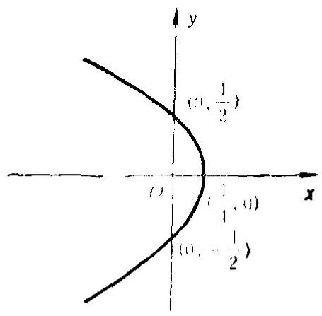

图 2-1-08

通过这一概念, 把离散的数列转化为便于处理的解析对象. 一旦求出生成此幂级数的函数 $f\left( x\right)$ ,那么数列 $\left\{  {a}_{n}\right\}$ 的结构就完全解决了. 这就是利用母函数 (作为一种映射工具) 驾驭离散数列的思维方法.

为了便于运用形式幂级数这一工具, 引入形式幂级数的运算概念.

定义 2 两个形式幂级数 $\mathop{\sum }\limits_{{n = 0}}^{\infty }{a}_{n}{x}^{n}\text{ 、 }\mathop{\sum }\limits_{{n = 0}}^{\infty }{b}_{n}{x}^{n}$ ,当且仅当 ${a}_{n} = {b}_{n} \; \left( {n = 0,1,2,3,\cdots }\right)$ 时,才是相等的.

定义 3 两个形式幂级数 $\mathop{\sum }\limits_{{n = 0}}^{\infty }{a}_{n}{x}^{n}\text{ 、 }\mathop{\sum }\limits_{{n = 0}}^{\infty }{b}_{n}{x}^{n}$ 的和是 $\mathop{\sum }\limits_{{n = 0}}^{\infty }\left( {{a}_{n} + }\right. \; \left. {b}_{n}\right) {x}^{n}$ .

按此定义,数列 $\left\{  {a}_{n}\right\}$ 与 $\left\{  {b}_{n}\right\}$ 的母函数的和就是数列 $\left\{  {{a}_{n} + {b}_{n}}\right\}$ 的母函数.

定义 4 常数 $\alpha$ 和形式幂级数 $\mathop{\sum }\limits_{{n = 0}}^{\infty }{a}_{n}{x}^{n}$ 的乘积是 $\mathop{\sum }\limits_{{n = 0}}^{\infty }\left( {\alpha {a}_{n}}\right) {x}^{n}$ .

由定义 3、4 , 可知

$$
\mathop{\sum }\limits_{{n = 0}}^{\infty }{a}_{n}{x}^{n} - \mathop{\sum }\limits_{{n = 0}}^{\infty }{b}_{n}{x}^{n} = \mathop{\sum }\limits_{{n = 0}}^{\infty }{a}_{n}{x}^{n} + \mathop{\sum }\limits_{{n = 0}}^{\infty }\left( {-{b}_{n}}\right) {x}^{n} = \mathop{\sum }\limits_{{n = 0}}^{\infty }\left( {{a}_{n} - {b}_{n}}\right) {x}^{n}.
$$

定义 5 两个形式幂级数 $\mathop{\sum }\limits_{{n = 0}}^{\infty }{a}_{n}{x}^{n},\mathop{\sum }\limits_{{n = 0}}^{\infty }{b}_{n}{x}^{n}$ 如果

$$
{C}_{n} = \mathop{\sum }\limits_{{k = 0}}^{n}{a}_{k}{b}_{n - k}
$$

则它们的积

$$
\left( {\mathop{\sum }\limits_{{n = 0}}^{\infty }{a}_{n}{x}^{n}}\right) \left( {\mathop{\sum }\limits_{{n = 0}}^{\infty }{b}_{n}{x}^{n}}\right)  = \mathop{\sum }\limits_{{n = 0}}^{\infty }{C}_{n}{x}^{n}.
$$

形式幂级数积的定义，就是多项式乘法运算的推广.

定义 6 设 $f = \mathop{\sum }\limits_{{n = 0}}^{\infty }{a}_{n}{x}^{n}\text{ 、 }g = \mathop{\sum }\limits_{{n = 0}}^{\infty }{b}_{n}{x}^{n}\text{ 、 }h = \mathop{\sum }\limits_{{n = 0}}^{\infty }{c}_{n}{x}^{n}$ 是三个形式幂级数,如果 $f = {gh}$ ,则 $f$ 被 $g$ 除的商是 $h$ ,记为

$$
\frac{f}{g} = h
$$

按定义 6 , 可得

$$
\frac{1}{1 - x} = 1 + x + {x}^{2} + \cdots  + {x}^{n} + \cdots
$$

①

这里要注意，等号只表示形式幂级数的相等，在①式两边并不能用 $x$ 的具体值代入，只有当 $\left| x\right|  < 1$ 时， $1 + x + {x}^{2} + \cdots  + {x}^{n} + \cdots$ 的极限才等于 $\frac{1}{1 - x}$ .

根据上述形式幂级数的运算定义，可以证明

$$
\frac{1}{{\left( 1 - x\right) }^{n}} = {C}_{n - 1}^{n - 1} + {C}_{n}^{n - 1}x + {C}_{n + 1}^{n - 1}{x}^{2} + \cdots  + {C}_{n + j - 1}^{n - 1}{x}^{j} + \cdots .
$$

例 20 试求从 $n$ 个相异元素 ${a}_{1}\text{ 、 }{a}_{2}\text{ 、 }{a}_{3}\text{ 、、 }\text{ 、 }{a}_{n}$ 中,取 $r$ 个允许重复的组合数.

解 设从 $n$ 个相异元素中取 $r$ 个允许重复的组合数记为 $H\left( {n, r}\right)$ ,则其结果可以分为以下两种情况:

(1)不出现其特定元素 ${a}_{1}$ 的允许重复的组合数为 $H\left( {n - 1, r}\right)$ ; 相当于排除 ${a}_{1}$ 后从余下的 $n - 1$ 个元素中取 $r$ 个的允许重复的组合数.

(2)一定出现某特定元素 ${a}_{1}$ 的允许重复的组合数为 $H\left( {n, r - 1}\right)$ ,相当于从 ${a}_{1}\text{ 、 }{a}_{2}\text{ 、 }\cdots \text{ 、 }{a}_{n}$ 的 $n$ 个元素中取 $r - 1$ 个的重复组合数.

根据加法原理, 有

$$
H\left( {n, r}\right)  = H\left( {n - 1, r}\right)  + H\left( {n, r - 1}\right)
$$

①

因 $H\left( {n,1}\right)  = n, H\left( {n - 1,1}\right)  = n - 1$ ,故规定 $H\left( {n,0}\right)  = 1$ .

设

$$
{F}_{n}\left( x\right)  = H\left( {n,0}\right)  + H\left( {n,1}\right) x
$$

$$
+ H\left( {n,2}\right) {x}^{2} + \cdots  + H\left( {n, r}\right) {x}^{r} + \cdots
$$

②

则

$$
- x{F}_{n}\left( x\right)  =  - H\left( {n,0}\right) x - H\left( {n,1}\right) {x}^{2} - \cdots
$$

$$
- H\left( {n, r - 1}\right) {x}^{r} - \cdots
$$

③

$$
- {F}_{n - 1}\left( x\right)  =  - H\left( {n - 1,0}\right)  - H\left( {n - 1,1}\right) x
$$

$$
- H\left( {n - 1,2}\right) {x}^{2} - \cdots  - H\left( {n - 1, r}\right) {x}^{r} - \cdots
$$

④

. ② + ③ + ④得

$$
\left( {1 - x}\right) {F}_{n}\left( x\right)  - {F}_{n - 1}\left( x\right)  = 0
$$

⑤

$$
{F}_{1}\left( x\right)  = H\left( {1,0}\right)  + H\left( {1,1}\right) x + H\left( {1,2}\right) {x}^{2} + \cdots
$$

$$
= 1 + x + {x}^{2} + \cdots  = \frac{1}{1 - x}.
$$

$$
\text{ - }\;{F}_{n}\left( x\right)  = \frac{1}{1 - x}{F}_{n - 1}\left( x\right)  = \frac{1}{{\left( 1 - x\right) }^{2}}{F}_{n - 2}\left( x\right)  = \cdots
$$

$$
= \frac{1}{{\left( 1 - x\right) }^{n - 1}}{F}_{1}\left( x\right)  = \frac{1}{{\left( 1 - x\right) }^{n}}.
$$

根据 $\frac{1}{{\left( 1 - x\right) }^{n}} = {C}_{n - 1}^{n - 1} + {C}_{n}^{n - 1}x + {C}_{n + 1}^{n - 1}{x}^{2} + \cdots  + {C}_{n + r - 1}^{n - 1}{x}^{r} + \cdots$ ,

$$
\therefore H\left( {n, r}\right)  = {C}_{n + r - 1}^{n - 1} = {C}_{n + r - 1}^{r}\text{ . }
$$

例 2 平面上有一点 $P$ ,它是 $n$ 个平面域 ${D}_{1}\text{ 、 }{D}_{2}\text{ 、 }\cdots \text{ 、 }{D}_{n}$ 的公共交界点,见图 2-1-09. 取 4 种颜色对各个域着色,要求相邻两个域的面色不同,试求着色的方案数.

解 设这 $n$ 个域着色的方案数为 ${a}_{n}$ ,可分如下两种情形:

(1) $D$ 和 ${D}_{n - 1}$ 有相同的颜色，则 ${D}_{n}$ 域有 3 种颜色可用，而且从 ${D}_{1}$ 到 ${D}_{r - 2}$ 的着色方案数为 ${a}_{n - 2}$ ,其有 $3{a}_{n - 2}$ 种方案.

(2) ${D}_{1}$ 和 ${D}_{n - 1}$ 所用颜色不同，则 ${D}_{n}$ 域有 2 种颜色可用，而且从 ${D}_{1}$ 到 ${D}_{n - 1}$ 的着色方案数为 ${a}_{n - 1}$ ,其有 $2{a}_{n - 1}$ 种方案.

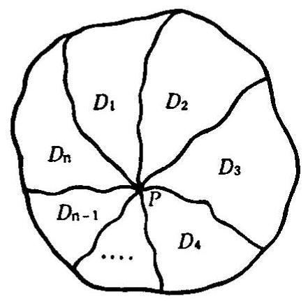

图 2-1-09

根据加法定理, 得

$$
{a}_{n} = 2{a}_{n - 1} + 3{a}_{n - 2}
$$

①

$$
\left( {n \geq  4}\right)
$$

且 ${a}_{2} = {P}_{4}^{2} = {12},{a}_{3} = {P}_{4}^{3} = {24}$ .

设 $F\left( x\right)  = {a}_{2}{x}^{2} + {a}_{3}{x}^{3} + {a}_{4}{x}^{4}$

$$
+ \cdots  + {a}_{n}{x}^{n} + \cdots ,
$$

则 $- {2xF}\left( x\right)  =  - 2{a}_{2}{x}^{3} - 2{a}_{3}{x}^{4}$

$$
- \cdots  - 2{a}_{n - 1}{x}^{n} - \cdots ,
$$

$$
- 3{x}^{2}F\left( x\right)  =  - 3{a}_{2}{x}^{4} - \cdots  - 3{a}_{n - 2}{x}^{n} - \cdots ,
$$

$\therefore F\left( x\right)  - {2xF}\left( x\right)  - 3{x}^{2}F\left( x\right)  = {a}_{2}{x}^{2} + \left( {{a}_{3} - 2{a}_{2}}\right) {x}^{3} = {12}{x}^{2}$ ,

$$
F\left( x\right)  = \frac{{12}{x}^{2}}{1 - {2x} - 3{x}^{2}} = {x}^{2}\left\lbrack  {\frac{3}{1 + x} + \frac{9}{1 - {3x}}}\right\rbrack
$$

$$
= {x}^{2}\left\lbrack  {3\mathop{\sum }\limits_{{n = 0}}^{\infty }{\left( -1\right) }^{n}{x}^{n} + 9\mathop{\sum }\limits_{{n = 0}}^{\infty }{\left( 3\right) }^{n}{x}^{n}}\right\rbrack  .
$$

$$
{a}_{n} = {3}^{n} + 3{\left( -1\right) }^{n},\;\left( {n = 2,3,\cdots }\right) .
$$

例 22 $n$ 个圆盘依半径大小自下 (大) 而上 (小) 套在柱 $A$ 上, 如图 2-1-10 所示. 每次只允许移动一个圆盘到柱 $B$ 或柱 $O$ 上， 而且不允许大盘放在小盘上面. 若要求把柱 $A$ 上的 $n$ 个盘转移到柱 $O$ 上，试求要移动的盘次 ${a}_{n}$ (河内塔问题).

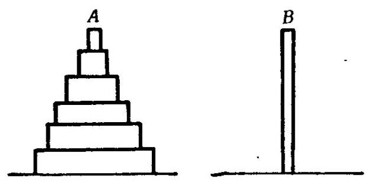

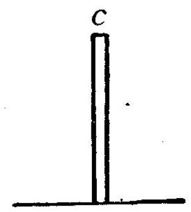

图 2-1-10

解 当 $n = 1$ 时,转移的盘次为 ${a}_{1} = 1$ .

当 $n = 2$ 时,先将小盘转移到柱 $B$ 上,再将大盘移到柱 $O$ 上, 最后再将小盘由柱 $B$ 上移到柱 $O$ 上,转移的盘次为

$$
{a}_{2} = 2{a}_{1} + 1 = 3.
$$

类似地,先将 $n - 1$ 个盘子转移到柱 $B$ 上,共转移了 ${a}_{n - 1}$ 次, 然后将第 $n$ 个盘子自柱 $A$ 转移到柱 $O$ 上,最后,仿前将柱 $B$ 上的 $n - 1$ 个盘子转移到柱 $O$ 上,总共转移的盘次为 ${a}_{n} = 2{a}_{n - 1} + 1$ .

$f\left( x\right)  = {a}_{1}x + {a}_{2}{x}^{2} + {a}_{3}{x}^{3} + \cdots  + {a}_{n}{x}^{n} + \cdots ,$

$$
- {2xf}\left( x\right)  =  - 2{a}_{1}{x}^{2} - 2{a}_{2}{x}^{3} - \cdots  - 2{a}_{n - 1}{x}^{n} - \cdots ,
$$

两式相加, 得

$$
\left( {1 - {2x}}\right) f\left( x\right)  = {a}_{1}x + \left( {{a}_{2} - 2{a}_{1}}\right) {x}^{2} + \left( {{a}_{3} - 2{a}_{2}}\right) {x}^{3} + \cdots
$$

$$
+ \left( {{a}_{n} - 2{a}_{n - 1}}\right) {x}^{n} + \cdots
$$

$$
= x + {x}^{2} + {x}^{3} + \cdots  + {x}^{n} + \cdots
$$

$$
= \frac{x}{1 - x}
$$

$$
\therefore f\left( x\right)  = \frac{x}{\left( {1 - x}\right) \left( {1 - {2x}}\right) } = \frac{1}{1 - {2x}} - \frac{1}{1 - x}
$$

$$
= \left( {1 + {2x} + {2}^{2}{x}^{2} + \cdots  + {2}^{n}{x}^{n} + \cdots }\right)
$$

$$
- \left( {1 + x + {x}^{2} + \cdots  + {x}^{n} + \cdots }\right)
$$

$$
= \mathop{\sum }\limits_{{n = 1}}^{\infty }\left( {{2}^{n} - 1}\right) {x}^{n}.
$$

$$
\therefore {a}_{n} = {2}^{n} - 1\text{ . }
$$

以上几方面说明了映射观点的各种表现形态. 人们在碰到新的没有解决过的问题时, 总是想把新的尚未解决的问题转化为已经解决的老问题来解决, 映射观点正是将问题从未知领域向已知领域转化的思维方法之一. 只要善于选择恰当的映射，熟练表达映射的语言, 就能获得解决问题的正确思路. 映射观点的应用不局限于上述五种形态, 它在高等数学中应用得更广泛. 变量变换常可使复杂的微分方程转化为简单的微分方程; 拉普拉斯变换可使偏微分方程转化为常微分方程; 复变函数论中的保角映射更是应用广泛的映射工具. 在中学阶段，如能通过解题实践，初步掌握这一思维方法，不但可以开拓思路，而且还能提高解题能力与发展智力.

## 思 考 题 一

1. 求证: $\frac{\sec {2}^{2n}\alpha  - 1}{\sec {2}^{{2n} - 1}\alpha  - 1} = \frac{\operatorname{tg}{2}^{2n}\alpha }{\operatorname{tg}{2}^{{2n} - 2}\alpha }$ .

2. 已知: $\left| x\right|  \leq  2$ ,求证: $\left| {{3x} - {x}^{3}}\right|  \leq  2$ .

3. 解不等式 $\frac{x}{\sqrt{1 + {x}^{2}}} + \frac{1 - {x}^{2}}{1 + {x}^{2}} > 0$ .

4. 解方程 $\sqrt{1 + {x}^{2}} + \frac{1}{x}\sqrt{1 + {x}^{2}} = 2\sqrt{2}$ .

5. 已知: $a > 0, x > a, y > a$ ,

求证: $\sqrt{\left( {x + a}\right) \left( {y + a}\right) } + \sqrt{\left( {x - a}\right) \left( {y - a}\right) } \leq  2\sqrt{xy}$ .

6. 求证: $\left| {a{x}^{2} + {2bxy} - a{y}^{2}}\right|  \leq  \sqrt{{a}^{2} + {b}^{2}}\left( {{x}^{2} + {y}^{2}}\right)$ .

7. 已知: $1 \leq  {x}^{2} + {y}^{2} \leq  2$ ,求 $u = {x}^{2} - {xy} + {y}^{2}$ 的最大值与最小值.

8. 设 ${x}^{2} + {y}^{2} = {r}^{2}, x, y, r \in  {R}^{ + }$ ,求证: (1) ${x}^{n} + {y}^{n} < {r}^{n}\left( {n > 2}\right)$ (2) ${x}^{n} + {y}^{n} > {r}^{n}\left( {n < 2}\right)$ .

9. 已知: $\alpha  \neq  \frac{n\pi }{2}\left( {n \in  Z}\right)$ ,求证: (1) $\left( {1 + \frac{1}{{\sin }^{4}\alpha }}\right) \left( {1 + \frac{1}{{\cos }^{4}\alpha }}\right)  \geq  {25}$ ;

(2) $\left( {1 + \frac{1}{{\sin }^{2n}\alpha }}\right) \left( {1 + \frac{1}{{\cos }^{2n}\alpha }}\right)  \geq  {\left( 1 + {2}^{n}\right) }^{2}$ .

10. 设 $\sin x + \sin y = 1$ ,求 $\cos x + \cos y$ 的取值范围.

11. 为使方程 $a\sin \theta  + \cos \theta  = 2\left( {a \neq  0}\right)$ 在区间 $\left\lbrack  {0,\frac{\pi }{4}}\right\rbrack$ 上有解,求 $a$ 的取值范围.

12. 已知: $a\cos \alpha  + b\sin \alpha  = c\cdots$ ① $a\cos \beta  + b\sin \beta  = 0\cdots$ ②

其中 ${a}^{2} + {b}^{2} \neq  0$ ，求证: ${\sin }^{2}\left( {\alpha  - \beta }\right)  = \frac{{c}^{2}}{{a}^{2} + {b}^{2}}$ .

13. 已知: $x + y + z = \frac{\pi }{4}, x, y, z > 0$ ,求证:

$$
\frac{1 + \operatorname{tg}x}{1 - \operatorname{tg}x} + \frac{1 + \operatorname{tg}y}{1 - \operatorname{tg}y} + \frac{1 + \operatorname{tg}z}{1 - \operatorname{tg}z}
$$

$$
= \frac{\left( {1 + \operatorname{tg}x}\right) \left( {1 + \operatorname{tg}y}\right) \left( {1 + \operatorname{tg}z}\right) }{\left( {1 - \operatorname{tg}x}\right) \left( {1 - \operatorname{tg}y}\right) \left( {1 - \operatorname{tg}z}\right) }.
$$

14. 已知: $\sin x\sin y = \sin \left( {\alpha  + \beta }\right) \sin \gamma ,\cos x\cos y = \cos \left( {\alpha  + \beta }\right) \cos \gamma$ , ${\cos }^{2}x + {\cos }^{2}y = 1 + {\cos }^{2}\left( {\alpha  + \beta  + \gamma }\right)$ ,求证: ${\sin }^{2}\left( {\alpha  + \beta }\right)  + {\sin }^{2}\gamma$

$$
= {\sin }^{2}\left( {\alpha  + \beta  + \gamma }\right) \text{ . }
$$

15. 解方程组 $\left\{  \begin{array}{l} \sqrt{x\left( {1 - y}\right) } + \sqrt{y\left( {1 - x}\right) } = \frac{1}{2}; \\  \sqrt{x\left( {1 - x}\right) } + \sqrt{y\left( {1 - y}\right) } = \frac{\sqrt{3}}{4}. \end{array}\right.$

16. 关于 $\theta$ 的方程 $a\cos \theta  + b\sin \theta  = c\left( {{a}^{2} + {b}^{2} \neq  0}\right)$ 在区间 $\left( {0,{2\pi }}\right)$ 内有两个实数解 $\alpha \text{ 、 }\beta \left( {\alpha  \neq  \beta }\right)$ ,求证: ${\cos }^{2}\frac{1}{2}\left( {\alpha  - \beta }\right)  = \frac{{c}^{2}}{{a}^{2} + {b}^{2}}$ .

17. 半径等于某个正三角形高的圆在这个正三角形的一边上滚动，证明三角形两边截圆的弧总恒等于 ${60}^{ \circ  }$ .

18. 设正三角形 ${ABC}$ 的内切圆与三边的切点分别为 $D$ 、 $E$ 、 $F$ ，若 $\overset{\text{ ⏜ }}{EF}$ 上任一点 $P$ 到三边的距离分别为 $p\text{ 、 }q\text{ 、 }r$ ,求证: ${p}^{\frac{1}{2}} + {r}^{\frac{1}{2}} \; = {q}^{\frac{1}{2}}$ .

19. 求证: 以椭圆的任一焦半径为直径之圆与大辅助圆相切.

20. 求证: 抛物线的外切三角形的垂心必在其准线上.

21. 通过伸缩变换求椭圆 $\frac{{x}^{2}}{{a}^{2}} + \frac{{y}^{2}}{{b}^{2}} = 1$ 与直线 $x\cos \theta  + y\sin \theta  = p$ 相切的充要条件.

22. 求证椭圆 $\frac{{x}^{2}}{{a}^{2}} + \frac{{y}^{2}}{{b}^{2}} = 1$ 的内接正三角形面积最大值为 $\frac{3\sqrt{3}}{4}{ab}$ .

23. 证明直角三角形中任一内接三角形的半周长大于斜边上的高.

24. 从正三角形 ${ABC}$ 内任一点 $M$ 向三边 ${BC}$ 、 ${OA}$ 、 ${AB}$ 作垂线， 垂足分别为 $D\text{ 、 }E\text{ 、 }F$ ，证明 $\frac{{BD} + {CE} + {AF}}{{MD} + {ME} + {MF}}$ 的值为定值

25. 在任意四边形各边上向形外作正方形. 求证: 对边上的两正方形的中心的连线互相垂直, 且长度相等.

26. 利用复数证明:

(1) $\sin \alpha  + \sin \left( {\alpha  + \beta }\right)  + \sin \left( {\alpha  + {2\beta }}\right)  + \cdots  + \sin \left\lbrack  {\alpha  + \left( {n - 1}\right) \beta }\right\rbrack$

$$
= \frac{\sin \left\{  {\alpha  + \frac{n - 1}{2}\beta }\right\}  \sin \frac{n\beta }{2}}{\sin \frac{\beta }{2}};
$$

(2) $\cos \alpha  + \cos \left( {\alpha  + \beta }\right)  + \cos \left( {\alpha  + {2\beta }}\right)  + \cdots  + \cos \left\lbrack  {\alpha  + \left( {n - 1}\right) \beta }\right\rbrack$

$$
= \frac{\cos \left\{  {\alpha  + \frac{n - 1}{2}\beta }\right\}  \sin \frac{n\beta }{2}}{\sin \frac{\beta }{2}}.
$$

27. 设复数 ${Z}_{1}$ 和 ${Z}_{2}$ 满足关系式 ${Z}_{1}{\bar{Z}}_{2} + \overline{A}{Z}_{1} + A{\bar{Z}}_{2} = 0$ ，其中 $A$ 为非零的复数. 证明:(1) $\left| {{Z}_{2} + A}\right| \left| {{Z}_{2} + A}\right|  - {\left| A\right| }^{2}$ ；

(2) $\frac{{Z}_{1} + A}{{Z}_{2} + A} = \left| \frac{{Z}_{1} + A}{{Z}_{2} + A}\right|$ .

28. 已知 $\left\{  {a}_{n}\right\}$ 满足递推关系 ${a}_{n} = 5{a}_{n - 1} - 6{a}_{n - 2}$ ,且 ${a}_{0} = 1,{a}_{1} =  - 2$ , 求数列的通项 ${a}_{n}$ .

29. 假定一对兔子每隔一月生一对一雌一雄的小兔, 每对小兔在两个月以后也逐月生一对一雌一雄的小兔. 现没年初时在兔房里放一对大兔，问第 $n$ 个月初时，兔房里有多少对兔子？

## 二 方 程 观 点

波利亚在《数学的发现》中分析过“笛卡儿模式”与“双轨迹模式”. 在建立直角坐标系的条件下, 双轨迹即两个二元方程: ${F}_{1}\left( {x, y}\right)  = 0$ 与 ${F}_{2}\left( {x, y}\right)  = 0.$

通过解方程组

$$
\left\{  \begin{array}{l} {F}_{1}\left( {x, y}\right)  = 0 \\  {F}_{2}\left( {x, y}\right)  = 0 \end{array}\right.
$$

可得两轨迹的交点坐标 $\left( {{x}_{0},{y}_{0}}\right)$ ，从而得到问题(作图题)的解法. 从思维方法的角度来看， “笛卡儿模式”与 “双轨迹模式” 都是通过问题中已知量与未知量 (或参变量) 之间的数量关系, 运用数学的抽象语言 (符号语言)转化为方程(组)或其他形式的数学模型(如混合组), 使问题获解的思维方法. 这一解决问题的思维导航器, 来源于人们对方程 (也可包括不等式) 的实质与作用的辩证看法. 方程(包括不等式)是已知量与未知量(或参变量)构成的矛盾统一体，是从已知探索未知的桥梁. 从对问题中数量关系的分析入手， 运用数学语言将数量关系转化为数学模型, 使问题获解的思维方法称为方程观点. 方程观点不但在数学中, 而且在物理、化学、各种技术科学中都有广泛的应用. 下面将分为求未知量的值、求参数的变化范围和求复变量活动的区域三部分来说明方程观点的应用.

## 1. 求未知量的值

例 1 证明定义在对称区间 $\left( {-l, l}\right)$ 上的函数 $f\left( x\right)$ 必可表示成一偶函数与一奇函数之和.

分析 欲证此题,只要求出一偶函数 $G\left( x\right)$ 与一奇函数 $H\left( x\right)$ , 使得

$$
G\left( x\right)  + H\left( x\right)  = f\left( x\right)
$$

①

这里有两个未知函数, 却只有一个方程, 所以还缺少一个方程,考虑到 $f\left( x\right)$ 是定义在对称区间 $\left( {-l, l}\right)$ 上,所以 $f\left( {-x}\right)$ 也是定义在 $\left( {-l, l}\right)$ 上的已知函数,故有

$$
f\left( {-x}\right)  = G\left( {-x}\right)  + H\left( {-x}\right)  = G\left( x\right)  - H\left( x\right) ,
$$

即

$$
G\left( x\right)  - H\left( x\right)  = f\left( {-x}\right)
$$

②

解 由①、②构成的函数方程组，即得

$$
G\left( x\right)  = \frac{1}{2}\left\lbrack  {f\left( x\right)  + f\left( {-x}\right) }\right\rbrack  ,
$$

$$
H\left( x\right)  = \frac{1}{2}\left\lbrack  {f\left( x\right)  - f\left( {-x}\right) }\right\rbrack  .
$$

通过验证, 即获证.

证 略.

例 1 虽是证明题, 但却是通过已知探索未知的典型问题. 根据题设条件，分析已知量与未知量之间的等量关系，布列方程，找到证明的思路.

例 2 已知 $f\left( 0\right)  = a, f\left( \frac{\pi }{2}\right)  = b$ ,解函数方程:

$$
f\left( {x + y}\right)  + f\left( {x - y}\right)  = {2f}\left( x\right) \cos y.
$$

分析 解函数方程的目的是求 $f\left( x\right)  =$ ? 此方程中出现了 $f\left( {x + y}\right) \text{ 、 }f\left( {x - y}\right) \text{ 、 }f\left( x\right)$ 三个未知函数,因此只需利用已知函数方程与 $f\left( 0\right)  = a\text{ 、 }f\left( \frac{\pi }{2}\right)  = b$ 导出含 $f\left( t\right)$ (令 $x = t$ ),及其他两个未知函数的三个方程,即可获解.

解 依次取 $\left\{  {\begin{array}{l} x = 0 \\  y = t \end{array},\left\{  {\begin{array}{l} x = \frac{\pi }{2} + t \\  y = \frac{\pi }{2} \end{array},\left\{  \begin{array}{l} x = \frac{\pi }{2} \\  y = \frac{\pi }{2} + t \end{array}\right. }\right. }\right.$ 代入函数方程, 有

$$
\left\{  \begin{array}{l} f\left( t\right)  + f\left( {-t}\right)  = {2f}\left( 0\right) \cos t \\  f\left( {\pi  + t}\right)  + f\left( t\right)  = 0 \\  f\left( {\pi  + t}\right)  + f\left( {-t}\right)  =  - {2f}\left( \frac{\pi }{2}\right) \sin t \end{array}\right.
$$

③

① ②

$$
\text{ ① } + \text{ ② } - \text{ ③: }{2f}\left( t\right)  = {2f}\left( 0\right) \cos t + {2f}\left( \frac{\pi }{2}\right) \sin t\text{ . }
$$

$$
\because f\left( 0\right)  = a,\;f\left( \frac{\pi }{2}\right)  = b,
$$

$$
\therefore \;{2f}\left( t\right)  = {2a}\cos t + {2b}\sin t
$$

故

$$
f\left( x\right)  = a\cos x + b\sin x.
$$

经检验, 此解符合原方程与已知条件.

上述的利用已知函数方程与特殊赋值法解函数方程的方法是一种通用的方法. 它是方程观点应用的一种形态.

例 3 如图 2-2-01 设平面 ${AO}$ 和 ${BD}$ 相交于 ${BC}$ ,它们所成的二面角为 ${45}^{ \circ  }$ ， $P$ 为面 ${AO}$ 内一点， $Q$ 为面 ${BD}$ 内一点，已知直线 ${MQ}$ 是直线 ${PQ}$ 在平面 ${BD}$ 内的射影,并且 $M$ 在 ${BC}$ 上. 又设 ${PQ}$ 与平面 ${BD}$ 所成的角为 $\beta ,\angle {OMQ} = \theta$ , $\left( {{0}^{ \circ  } < \theta  < {90}^{ \circ  }}\right)$ . 线段 ${PM}$ 的长为 $a$ , 求线段 ${PQ}$ 之长.

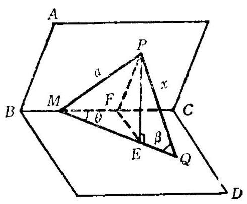

图 2-2-01

分析 因为 ${PQ}$ 在平面 ${BD}$ 上的射影为 ${MQ}$ ,所以点 $P$ 在平面 ${BD}$ 上的射影 $E$ 在 ${MQ}$ 上. $E$ 在 ${BC}$ 上的射影为 $F$ . $\angle {EFP}$ 是二面角 $A - {BC} - D$ 的平面角. 在图中标出已知量: ${PM} = a,\angle {OMQ} = \theta ,\angle {PQM} = \beta ,\angle {EFP} = {45}^{ \circ  }$ 及未知量 ${PQ} = x$ . 由于未知量 $x$ 与已知量 $\theta$ 、 ${45}^{ \circ  }$ 难以建立直接联系，故可取已知量与未知量所在三角形的公共元素为辅助未知量， 根据三角形的边角关系(如正弦定理、余弦定理)，建立方程求解.

解 设点 $P$ 在平面 ${BD}$ 上的射影为 $E, E$ 在 ${BO}$ 上的射影为 $F$ ,连结 $P\text{ 、 }E, P\text{ 、 }F$ . 令 ${PQ} = x,\angle {PMQ} = \alpha$ ,按题意有

$$
\angle {PQM} = \beta ,\angle {CMQ} = \theta ,\angle {EFP} = {45}^{ \circ  }\text{ . }
$$

在 $\bigtriangleup {PME}$ 中, ${PE} = a\sin \alpha ,{ME} = a\cos \alpha$ .

在 $\bigtriangleup {MEF}$ 中, ${EF} = {ME}\sin \theta  = a\cos \alpha \sin \theta$ .

$\because {PE} \bot$ 平面 ${BD},{EF} \bot  {BO},\therefore {PF} \bot  {BO}$ .

$$
\because \angle {PFE} = {45}^{ \circ  }\text{ , }\;\therefore {EF} = {PE}\text{ . }
$$

故

$$
u\sin \alpha  = u\cos \alpha \sin \theta
$$

①

在 $\bigtriangleup {PMQ}$ 中,

$$
\frac{a}{\sin \beta } = \frac{x}{\sin \alpha }
$$

②

从①有,

$$
\operatorname{tg}\alpha  = \sin \theta
$$

故

$$
\sin \alpha  = \frac{\sin \theta }{\sqrt{1 + {\sin }^{2}\theta }}
$$

代入 ②，得

$$
x = \frac{a\sin \theta }{\sin \beta \sqrt{1 + {\sin }^{2}\theta }}.
$$

例 3 是方程观点在三角、立几、平凡、测量上应用的典型范例. 解这类问题的步骤如下:

(1) 审题.

看清题意，按题意画出必要的草图. 把已知量、未知量(包括必要的辅助未知量) 分别用字母标在图上.

(2)抓住数量关系.

用联系题意的一般规律(如正弦定理、余弦定理)，分析题中已知量与未知量之间的数量关系(往往表现为已知量与未知量之间的相等关系).

(3) 列方程.

用数学的抽象语言将已知量与未知量之间的数量关系翻译成方程. 方程的个数在问题有确定解的情况下, 一般与未知量 (包括辅助未知量)的个数相等.

(4) 解方程(组).

消去辅助未知量,求出问题中要求的未知量 (促成未知向已知转化).

(5) 检验.

检验解的正误，写出符合题意的解.

辅助未知量的选择，应从与已知量和未知量之间都有联系的未知量中去选取. 在三角、几何、测量等问题中，往往选取已知量和未知量分别所在三角形的公共边、角为辅助未知量. 由于选取辅助未知量的不同, 解法也各异. 多数情况存在一题多解. 例 3 如取 ${ME}$ 为辅助未知量, 可得另一解法, 读者不妨一试.

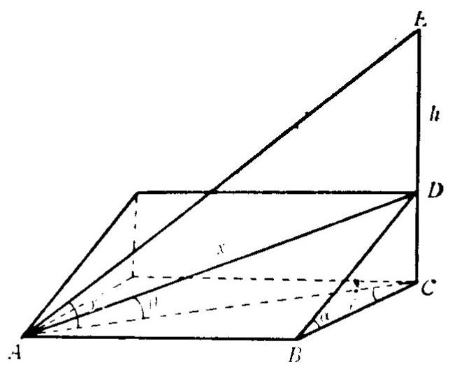

图 2-2-02

例 4 一朝正南方向的斜面上直立一高为 $h$ 的杆. 斜面倾角为 $\alpha$ . 当太阳在北偏东 $\beta$ 而仰角为 $\gamma$ 时,求证在斜面上杆影之长为 $\frac{h\cos \gamma }{\sin \left( {\gamma  - \theta }\right) }$ ,其中

$$
\theta  = \operatorname{arctg}\left( {\operatorname{tg}\alpha \cos \beta }\right) .
$$

分析 因为斜面 ${AD}$ 朝正南方向，杆 ${DE}$ 在地面的射影为 $C$ ， ${AB}$ 为东西方向， ${BC}$ 为南北方向. 在图中，标出: $\angle {OBD} = \alpha$ ， $\angle {ACB} = \beta ,\angle {EAC} = \gamma ,{DE} = h,\angle {AED} = {90}^{ \circ  } - \gamma$ . 影长 ${AD} \; = x$ 为未知量,难以直接与上述诸已知量发生联系. 故应取 $\angle {DAO} \; = \theta$ 为辅助未知量,以揭示 $x$ 与诸已知量之间的数量关系.

解 按题意作草图 2-2-02. 在图上标出已知与未知量.

在 $\bigtriangleup {ADE}$ 中, $\frac{h}{\sin \left( {\gamma  - \theta }\right) } = \frac{x}{\sin \left( {{90}^{ \circ  } - \gamma }\right) }$ ,

即

$$
\frac{x}{\cos \gamma } = \frac{h}{\sin \left( {\gamma  - \theta }\right) }
$$

①

在 $\bigtriangleup {ACD}$ 中, ${OD} = x\sin \theta ,\;{AO} = x\cos \theta$ .

在 $\bigtriangleup {ABC}$ 中, ${BC} = {AC}\cos \beta  = x\cos \theta \cos \beta$ .

在 $\bigtriangleup {BCD}$ 中,

$$
\operatorname{tg}\alpha  = \frac{CD}{BC} = \frac{\operatorname{tg}\theta }{\cos \beta }
$$

②

从 ① 有,

$$
x = \frac{h\cos \gamma }{\sin \left( {\gamma  - \theta }\right) },
$$

从 ② 有, $\operatorname{tg}\theta  = \operatorname{tg}\alpha \cos \beta$ ,即 $\theta  = \operatorname{arctg}\left( {\operatorname{tg}\alpha \cos \beta }\right)$ .

例 5 问 $c$ 取何值时,圆 ${x}^{2} + {y}^{2} + x - {6y} + c = 0$ 与直线 $x + {2y} \; - 3 = 0$ 的两个交点 $P\text{ 、 }Q$ 与原点 $O$ 的连线互相垂直?

分析 $\because$ 点 $P\text{ 、 }Q$ 在直线 $x + {2y} - 3 = 0$ 上, $\therefore$ 它们的坐标可设为 $\left( {-2{y}_{1} + 3,{y}_{1}}\right) \text{ 、 }\left( {-2{y}_{2} + 3,{y}_{2}}\right)$ ,这里 ${y}_{1}\text{ 、 }{y}_{2}$ 是辅助未知量. 根据 $P\text{ 、 }Q$ 又在已知圆上且 ${OP} \bot  {OQ}$ ,可以列出三个方程,消去 ${y}_{1}$ 、 ${y}_{2}$ 则可解出 $c$ .

解 因为 $P\text{ 、 }Q$ 是直线 $x + {2y} - 3 = 0$ 与圆 ${x}^{2} + {y}^{2} + x - {6y} + c \; = 0$ 的交点,所以可设 $P\text{ 、 }Q$ 的坐标分别为 $\left( {-2{y}_{1} + 3,{y}_{1}}\right) \text{ 、 }\left( {-2{y}_{2}}\right. \; \left. {+3,{y}_{2}}\right)$ ,且

$$
{\left( -2{y}_{1} + 3\right) }^{2} + {y}_{1}^{2} + \left( {-2{y}_{1} + 3}\right)  - 6{y}_{1} + c = 0
$$

①

$$
{\left( -2{y}_{2} + 3\right) }^{2} + {y}_{2}^{2} + \left( {-2{y}_{2} + 3}\right)  - 6{y}_{2} + c = 0
$$

②

$$
\because {OP} \bot  {OQ}\text{ , }
$$

$$
\therefore \left( {-2{y}_{1} + 3}\right) \left( {-2{y}_{2} + 3}\right)  + {y}_{1}{y}_{2} = 0
$$

③

从 ①、② 可知 ${y}_{1}$ 、 ${y}_{2}$ 为方程 $5{y}^{2} - {20y} + {12} + c = 0$ 的根，

$$
{y}_{1} + {y}_{2} = 4,\;{y}_{1}{y}_{2} = \frac{1}{5}\left( {{12} + c}\right) .
$$

代入 ③ 得 $5{y}_{1}{y}_{2} - 6\left( {{y}_{1} + {y}_{2}}\right)  + 9 = 0$ 即 ${12} + c - {24} + 9 = 0$ ，

$\therefore$

$$
c = 3\text{ . }
$$

例 6 已知 $\bigtriangleup {ABO}$ 的三个顶点均在椭圆 $4{x}^{2} + 5{y}^{2} = {80}$ 上，点 $A$ 是椭圆短轴的一个端点,这个三角形的重心在椭圆的右焦点 $F$ 上,试求直线 ${BG}$ 的方程.

分析 欲求直线 ${BC}$ 的方程,只要确定它的斜率 ${k}_{BC}$ 与 ${BC}$ 上一个点的坐标. 因右焦点 $F$ 是 $\bigtriangleup {ABC}$ 的重心,故 ${AF}$ 与 ${BC}$ 的交点 $D$ 必为 ${BC}$ 的中点,且 ${AF} : {FD} = 2 : 1$ . 由于 $A\text{ 、 }F$ 的坐标已知,所以点 $D$ 的坐标可求. 又因 $D$ 为 ${BC}$ 的中点,故 ${OD}$ 为平分与 ${BO}$ 平行的弦的直径, ${k}_{OD}$ 与 ${k}_{BO}$ 之积为常数,因此 ${k}_{BO}$ 可求.

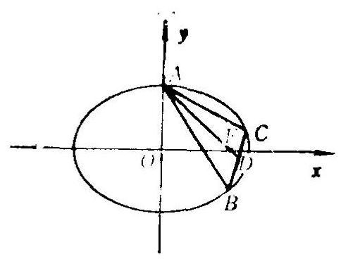

图 2-2-03

解 $\because F$ 为 $\bigtriangleup {ABC}$ 的重心,

$\therefore {AF}$ 与 ${BC}$ 的交点 $D$ 为 ${BC}$ 的中点,且 ${AD} : {DF} =  - 3$ .

$\because A$ 与 $F$ 的坐标分别为 $\left( {0,4}\right)$ 、 $\left( {2,0}\right)$ ,

$\therefore \;{x}_{D} = \frac{0 - 3 \times  2}{1 - 3} = 3$ ,

$$
{y}_{D} = \frac{4 - 3 \times  0}{1 - 3} =  - 2.
$$

$\because \;{k}_{BC} \cdot  {k}_{OD} =  - \frac{{b}^{2}}{{a}^{2}} =  - \frac{16}{20} =  - \frac{4}{5},\;{k}_{OD} =  - \frac{2}{3}$ ,

$\therefore \;{k}_{BC} = \frac{6}{5}$ .

$\therefore$ 直线 ${BC}$ 的方程为 $y + 2 = \frac{6}{5}\left( {x - 3}\right)$ ,即 ${6x} - {5y} = {28}$ .

例 7 设函数 $y = \frac{a{x}^{2} + {bx} + a + 1}{{x}^{2} + 1}$ ,当 $x =  - \sqrt{3}$ 时, $y$ 有最小值零,试求 $a\text{ 、 }b$ 之值.

分析 欲求 ${a}_{\text{ 、 }}b$ 之值,应按所给条件,列出含 ${a}_{\text{ 、 }}b$ 的两个方程. 为此需求 $y$ 的最小值，根据此函数的特点，可采用变量变换法,取 $x = \operatorname{tg}\theta ,\theta  \in  \left( {-\frac{\pi }{2},\frac{\pi }{2}}\right)$ ,将此函数转化为 $\theta$ 的三角函数, 这样就容易求出此函数的最小值，从而求出 $a$ 、 $b$ 之值。

---

- 设 ${P}_{1}\left( {{x}_{1},{y}_{1}}\right) \text{ 、 }{P}_{2}\left( {{x}_{2},{y}_{2}}\right)$ 是椭圆 $\frac{{x}^{2}}{{a}^{2}} + \frac{{y}^{2}}{{b}^{2}} = 1$ 上任意两点，则

$$
\frac{{x}_{1}^{2}}{{a}^{2}} + \frac{{y}_{1}^{2}}{{b}^{2}} = 1
$$

$$
\frac{{x}_{2}^{2}}{{a}^{2}} + \frac{{y}_{2}^{2}}{{b}^{2}} = 1
$$

②

① ② 得 $\frac{{x}_{1}^{2} - {x}_{2}^{2}}{{a}^{2}} + \frac{{y}_{1}^{2} - {y}_{2}^{2}}{{b}^{2}} = 0$ ,即 $\frac{\left( {{x}_{1} - {x}_{2}}\right) \left( {{x}_{1} + {x}_{2}}\right) }{{a}^{2}} =  - \frac{\left( {{y}_{1} - {y}_{2}}\right) \left( {{y}_{1} + {y}_{2}}\right) }{{b}^{2}}$ ,

$\therefore$

$$
\frac{{y}_{1} - {y}_{2}}{{x}_{1} - {x}_{2}} \cdot  \frac{\left( {{y}_{1} + {y}_{2}}\right) /2}{\left( {{x}_{1} + {x}_{2}}\right) /2} =  - \frac{{b}^{2}}{{a}^{2}}
$$

③

点 $M\left( {\frac{{x}_{1} + {x}_{2}}{2},\frac{{y}_{1} + {y}_{2}}{2}}\right)$ 为 ${P}_{1}{P}_{2}$ 的中点， $\therefore$ ③ 即 ${k}_{{P}_{1}{P}_{2}} \cdot  {k}_{OM} =  - \frac{{b}^{2}}{{a}^{2}}$ .

---

解

$$
x \in  \left( {-\infty , + \infty }\right)
$$

$\therefore$ 可设 $x = \operatorname{tg}\theta ,\theta  \in  \left( {-\frac{\pi }{2},\frac{\pi }{2}}\right)$ ,

则

$$
y = \frac{a\left( {{x}^{2} + 1}\right)  + {bx} + 1}{{x}^{2} + 1} = a + \frac{b\operatorname{tg}\theta  + 1}{{\sec }^{2}\theta }
$$

$$
= a + b\sin \theta \cos \theta  + {\cos }^{2}\theta
$$

$$
= a + \frac{1}{2} + \frac{1}{2}\left( {b\sin {2\theta } + \cos {2\theta }}\right)
$$

$$
= a + \frac{1}{2} + \frac{\sqrt{{b}^{2} + 1}}{2}\cos \left( {{2\theta } - \varphi }\right) \text{ ,其中 }\operatorname{tg}\varphi  = b\text{ . }
$$

$\because$ 当 $x =  - \sqrt{3}$ ,即 $\theta  =  - \frac{\pi }{3}$ 时, ${y}_{\min } = 0.\therefore {2\theta } - \varphi  =  - \left( {{2k} + 1}\right) \pi \; \left( {k \in  Z}\right)$ ,即 $\varphi  = \left( {{2k} + 1}\right) \pi  - \frac{2\pi }{3}.\therefore b = \operatorname{tg}\varphi  = \sqrt{3}$ ,此时, $a + \frac{1}{2} \; - \frac{\sqrt{3 + 1}}{2} = 0$ . 即 $a = \frac{1}{2}$ .

在代数与解析几何里, 常常运用待定系数法求函数的解析式和已知曲线的方程. 实质上, 就是通过题目已给的 (明显的或隐含的)数量关系布列方程, 使问题获解. 可见待定系数法无非是方程观点的一种表现形态罢了.

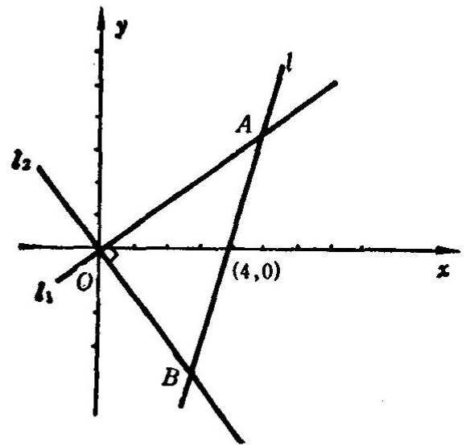

图 2-2-04

例 8 过点 $\left( {4,0}\right)$ 作斜率大于 $\frac{3}{4}$ 的直线 $l$ 与曲线 ${12}{x}^{2} \; - {7xy} - {12}{y}^{2} = 0$ 交于 $A$ 、 $B$ 两点,求 $\mathbf{l}$ 与曲线所围成的平面图形的面积的最小值，并求此时直线 $l$ 的方程.

分析 由于曲线

$$
{12}{x}^{2} - {7xy} - {12}{y}^{2} = 0
$$

为两直线 ${l}_{1} : {3x} - {4y} = 0;{l}_{2} : {4x} + {3y} = 0$ . 欲求 $\bigtriangleup {AOB}$ 的面积,只要求 $\left| {OA}\right| \text{ 、 }\left| {OB}\right|$ 就可以了,为此可将曲线 ${12}{x}^{2} - {7xy} - {12}{y}^{2} = 0$ 与直线 $\mathbf{l}$ 的方程化为极坐标方程,求出点 $A\text{ 、 }B$ 的极径,即可求出 $\bigtriangleup {AOB}$ 的面积与 $\varphi$ 的函数关系. 从此可得 $\varphi  =$ ? 时 $\bigtriangleup {AOB}$ 的面积的最小值.

解 设直线 $l$ 的倾角为 $\varphi$ ,则直线 $l$ 的极坐标方程为

$$
\rho \sin \theta  = \operatorname{tg}\varphi \left( {\rho \cos \theta  - 4}\right) ,
$$

即

$$
\rho  = \frac{4\operatorname{tg}\varphi }{\operatorname{tg}\varphi \cos \theta  - \sin \theta }
$$

①

曲线 ${12}{x}^{2} - {7xy} - {12}{y}^{2} = 0$ 的极坐标方程为

$$
{12}{\cos }^{2}\theta  - 7\sin \theta \cos \theta  - {12}{\sin }^{2}\theta  = 0,
$$

$$
\left( {3\cos \theta  - 4\sin \theta }\right) \left( {4\cos \theta  + 3\sin \theta }\right)  = 0.
$$

$\therefore \;3\cos \theta  - 4\sin \theta  = 0$ ,故 $\left\{  \begin{array}{l} \cos \theta  = \frac{4}{5}, \\  \sin \theta  = \frac{3}{5}; \end{array}\right.$

或

$4\cos \theta  + 3\sin \theta  = 0$ ,故 $\left\{  \begin{array}{l} \cos \theta  =  - \frac{3}{5}, \\  \sin \theta  = \frac{4}{5} \end{array}\right.$

代入 ①，得

$$
\left| {OA}\right|  = \left| \frac{4\operatorname{tg}\varphi }{\operatorname{tg}\varphi \cos \theta  - \sin \theta }\right|  = \left| \frac{{20}\operatorname{tg}\varphi }{4\operatorname{tg}\varphi  - 3}\right| ,
$$

$$
\left| {OB}\right|  = \left| \frac{4\operatorname{tg}\varphi }{\operatorname{tg}\varphi \cos \theta  - \sin \theta }\right|  = \left| \frac{{20}\operatorname{tg}\varphi }{3\operatorname{tg}\varphi  + 4}\right| .
$$

$\because \operatorname{tg}\varphi  > \frac{3}{4},\;\therefore \bigtriangleup {AOB}$ 的面积为

$$
S = \frac{1}{2}\left| {OA}\right|  \cdot  \left| {OB}\right|  = \frac{{200}{\operatorname{tg}}^{2}\varphi }{{12}{\operatorname{tg}}^{2}\varphi  + 7\operatorname{tg}\varphi  - {12}}
$$

$$
= \frac{200}{-{12}{\operatorname{ctg}}^{2}\varphi  + 7\operatorname{ctg}\varphi  + {12}}
$$

$$
= \frac{200}{-{12}{\left( \operatorname{ctg}\varphi  - \frac{7}{24}\right) }^{2} + {12} + {12}{\left( \frac{7}{24}\right) }^{2}}.
$$

当 $\operatorname{ctg}\varphi  = \frac{7}{24}$ ,即 $\operatorname{tg}\varphi  = \frac{24}{7}$ 时, ${S}_{\text{ 最小 }} = \frac{200}{{12}\left( {1 + \frac{{7}^{2}}{{24}^{2}}}\right) } = \frac{384}{25}$ .

此时直线 $l$ 的方程为 $y = \frac{24}{7}\left( {x - 4}\right)$ ,即 ${24x} - {7y} - {96} = 0$ .

从解例 8 的全过程来看,无非是通过求 $\bigtriangleup {AOB}$ 面积 $S = f\left( \varphi \right)$ 的最小值来确定直线 $l$ 的斜率 $\operatorname{tg}\varphi$ 而已，因而仍然是方程观点的一种应用.

例 9 甲、乙两个小队做游戏，甲队按下列方案将一球埋藏于某地,以三个已知目标 $A\text{ 、 }B\text{ 、 }O$ 为标志,将 ${AB}$ 绕 $A$ 点按逆时针

分析 要确定点 $M$ 的位置,首先要确定 $D\text{ 、 }E$ 的位置. 在建立坐标系的条件下,确定 $D\text{ 、 }E$ 的位置, 就是要求 $D\text{ 、 }E$ 两点的坐方向旋转 ${90}^{ \circ  }$ 到达 ${AD}$ ； 再将 ${CB}$ 绕 $C$ 点按顺时针方向旋转 ${90}^{ \circ  }$ 到达 ${OE}$ ； 最后将球埋在 ${DE}$ 的中点 $M$ 处,并有意将标志 $B$ 移去. 试问乙队如何只根据 $A\text{ 、 }O$ 找到球的埋藏处 $M$ 的位置? 标,故有四个未知数. 由于 $D\text{ 、 }E$ 是由 $A\text{ 、 }B\text{ 、 }C$ 确定的,因此应先设好 $A\text{ 、 }B\text{ 、 }C$ 三点的坐标,其中 $A\text{ 、 }C$ 的坐标是已知数,而 $B$ 点的坐标是未知数. 通过向量旋转变换建立含 $D\text{ 、 }E$ 的坐标 $\left( {{x}_{1},{y}_{1}}\right)$ 、 $\left( {{x}_{2},{y}_{2}}\right)$ 的四个方程，从此求出 ${x}_{1}\text{ 、 }{y}_{1}\text{ 、 }{x}_{2}\text{ 、 }{y}_{2}$ ，就不难确定点 $M$ 的坐标. 如果点 $M$ 的坐标与点 $B$ 的坐标无关,则点 $M$ 的位置即可确定.

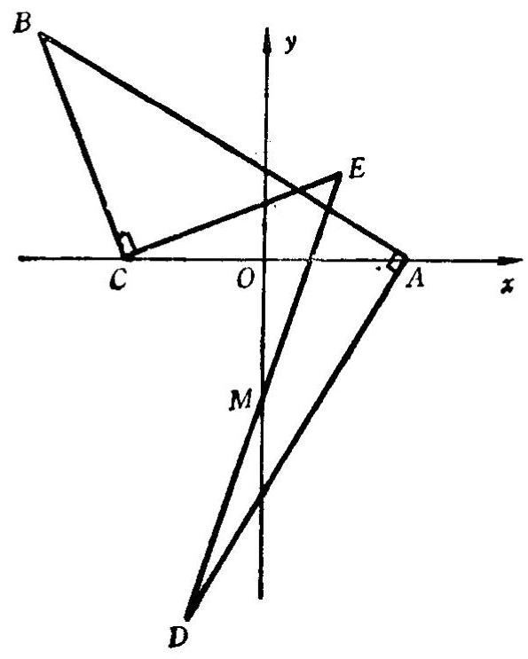

图 2-2-05

解 取 $A\text{ 、 }C$ 两点所在直线为 $x$ 轴, ${AC}$ 的中点 $O$ 为原点,建立直角坐标系如图 2-2-05. 设 $A\text{ 、 }B\text{ 、 }C$ 的坐标分别为 $\left( {a,0}\right)$ 、 $\left( {x, y}\right) \text{ 、 }\left( {-a,0}\right)$ ,其中 $a$ 是已知数,而 $x, y$ 为未知数. 令 $D\text{ 、 }E$ 的坐标分别为 $\left( {{x}_{1},{y}_{1}}\right) \text{ 、 }\left( {{x}_{2},{y}_{2}}\right)$ ,则 $\overrightarrow{AB}\text{ 、 }\overrightarrow{AD}$ 对应的复数分别为 $x - a + {yi},{x}_{1} - a + {y}_{1}i.$

$\because \overrightarrow{AB}$ 绕点 $A$ 按逆时针方向旋转 ${90}^{ \circ  }$ 到达 $\overrightarrow{AD}$ ，

$\therefore \;\left( {{x}_{1} - a}\right)  + {y}_{1}i = \left( {x - a + {yi}}\right) i =  - y + \left( {x - a}\right) i.$

根据复数相等的概念, 可得

$$
{x}_{1} - a =  - y,\;{y}_{1} = x - a,
$$

故点 $D$ 的坐标为 $\left( {a - y, x - a}\right)$ .

同理,有 $\left( {{x}_{2} + a}\right)  + {y}_{2}i = \left( {x + a + {yi}}\right) \left( {-i}\right)  = y - \left( {x + a}\right) i$ .

从而得点 $E$ 的坐标为 $\left( {-a + y, - x - a}\right)$ .

$\therefore$ 点 $M$ 的坐标为

$$
{x}_{M} = \frac{1}{2}\left( {{x}_{1} + {x}_{2}}\right)  = 0,\;{y}_{M} = \frac{1}{2}\left( {{y}_{1} + {y}_{2}}\right)  =  - a.
$$

即点 $M$ 的坐标为 $\left( {0, - a}\right)$ . 故点 $M$ 在 ${AO}$ 中点的垂直下方, 且 $\left| {OM}\right|  = \left| {OA}\right|$ . 由此可知,移去标志 $B$ 后,仍可找到埋藏球的地方.

在解析几何里, 求点的坐标, 都可以通过列方程求解. 列方程的依据，可以是点在已知曲线上的充要条件；经过平移，旋转变换两点重合的充要条件; 以及题中给出的位置关系(平行、垂直、三点共线、三线共点、直线与曲线相切等等) 等各种数量关系. 例 9 利用复数来描述向量旋转变换，列方程特别简便. 由于描述旋转变换的工具较多，故例 9 的解法也较多. 请读者一试。

例 10 过抛物线 $y = {x}^{2}$ 内一点 $M\left( {1,2}\right)$ 的弦中，求与抛物线所围成的面积 $S$ 最小的弦方程.

分析 欲求此弦的方程,只要求出此弦的斜率 $m$ 即可. 因为弦与抛物线围成的面积 $S$ 最小,故应先求 $S$ 与 $m$ 的函数关系,从而确定 $m =$ ? 时 $S$ 达到最小.

解 设过 $M\left( {1,2}\right)$ 的弦的斜率为 $m$ ,则其方程为

$$
y - 2 = m\left( {x - 1}\right) \text{ ,即 }y = {mx} - m + 2\text{ . }
$$

它与抛物线 $y = {x}^{2}$ 交点的横坐标分别为 ${x}_{1}\text{ 、 }{x}_{2}\left( {{x}_{1} < {x}_{2}}\right)$ ,而 ${x}_{1}\text{ 、 }{x}_{2}$ 是方程 ${x}^{2} = {mx} - m + 2$ 的两个根.

$$
\therefore \;{x}_{1} + {x}_{2} = m,\;{x}_{1} \cdot  {x}_{2} = m - 2\text{ . }
$$

此弦与抛物线围成的面积 $S$ 为

$$
S = {\int }_{{x}_{1}}^{{x}_{2}}\left( {{mx} - m + 2 - {x}^{2}}\right) {dx}
$$

$$
= {\left. \left\lbrack  \frac{1}{2}m{x}^{2} - \left( m - 2\right) x - \frac{1}{3}{x}^{3}\right\rbrack  \right| }_{{x}_{1}}^{{x}_{2}}
$$

$$
= \frac{m}{2}\left( {{x}_{2}^{2} - {x}_{1}^{2}}\right)  - \left( {m - 2}\right) \left( {{x}_{2} - {x}_{1}}\right)  - \frac{1}{3}\left( {{x}_{2}^{3} - {x}_{1}^{3}}\right)
$$

$$
= \left( {{x}_{2} - {x}_{1}}\right) \left\lbrack  {\frac{m}{2}\left( {{x}_{1} + {x}_{2}}\right)  - \left( {m - 2}\right)  - \frac{1}{3}\left( {{x}_{1}^{2} + {x}_{1}{x}_{2} + {x}_{2}^{2}}\right) }\right\rbrack
$$

$$
= \sqrt{{\left( {x}_{1} + {x}_{2}\right) }^{2} - 4{x}_{1}{x}_{2}}\left\lbrack  {\frac{m}{2} \cdot  m - \left( {m - 2}\right) }\right.
$$

$$
\left. {-\frac{1}{3}\left( {{m}^{2} - m + 2}\right) }\right\rbrack
$$

$$
= \frac{1}{6}\left( {{m}^{2} - {4m} + 8}\right) \sqrt{{m}^{2} - {4m} + 8}
$$

$$
= \frac{1}{6}{\left\lbrack  {\left( m - 2\right) }^{2} + 4\right\rbrack  }^{\frac{3}{2}}\text{ . }
$$

$\therefore$ 当 $m = 2$ 时,

$$
{S}_{\text{ 最小 }} = \frac{4}{3}.
$$

此时弦的方程为 $y = {2x}$ .

## 2. 求参数的取值范围

例 11 已知直线 $l$ 过定点 $A\left( {3,0}\right)$ ，倾角为 $\theta$ . 如果抛物线 $O : y = {x}^{2}$ 的所有弦都不能被直线 $l$ 所垂直平分,试求 $\theta$ 的取值范围.

分析 抛物线 $C$ 的所有弦都不能被直线 $l$ 所垂直平分,即抛物线 $O$ 上不存在关于直线 $l$ 的对称点。先从反面设抛物线 $C$ 上至少存在两点关于直线 $l$ 对称,据此建立含 $\theta$ 的不等式,解出 $\theta$ 的取值范围. 根据 $\theta$ 解的集合，不难求出其补集，即抛物线 $O$ 上不存在关于直线 $l$ 对称点时, $\theta$ 的取值范围.

解 设抛物线 $C : y = {x}^{2}$ 上存在两点 $A\left( {{x}_{1},{y}_{1}}\right) \text{ 、 }B\left( {{x}_{2},{y}_{2}}\right)$ 关于直线 $l : y = \operatorname{tg}\theta \left( {x - 3}\right) \cdots$ ①对称.

${AB}$ 的中点为 $M\left( {{x}_{0},{y}_{0}}\right)$ ,直线 ${AB}$ 的斜率

$$
k = \frac{{y}_{1} - {y}_{2}}{{x}_{1} - {x}_{2}} =  - \operatorname{ctg}\theta .
$$

$$
\because {y}_{1} = {x}_{1}^{2},\;{y}_{2} = {x}_{2}^{2},
$$

$$
\therefore {y}_{1} - {y}_{2} = {x}_{1}^{2} - {x}_{2}^{2}\text{ , }
$$

故

$$
\frac{{y}_{1} - {y}_{2}}{{x}_{1} - {x}_{2}} = {x}_{1} + {x}_{2}
$$

$$
\therefore k = 2{x}_{0}\text{ , }
$$

故

$$
{x}_{0} =  - \frac{1}{2}\operatorname{ctg}\theta
$$

$\because M\left( {{x}_{0},{y}_{0}}\right)$ 在直线 $l$ 上,

$\therefore \;{y}_{0} = \operatorname{tg}\theta \left( {{x}_{0} - 3}\right)  =  - \frac{1}{2} - 3\operatorname{tg}\theta$ .

$\because$ 点 $M\left( {{x}_{0},{y}_{0}}\right)$ 在抛物线 $C$ 的内部, $\therefore {y}_{0} - {x}_{0}^{2} > 0$ ,即

$$
- \frac{1}{2} - 3\operatorname{tg}\theta  - {\left( -\frac{1}{2}\operatorname{ctg}\theta \right) }^{2} > 0,
$$

亦即

$$
{12}{\operatorname{tg}}^{3}\theta  + 2{\operatorname{tg}}^{2}\theta  + 1 < 0,
$$

$$
\left( {2\operatorname{tg}\theta  + 1}\right) \left( {6{\operatorname{tg}}^{2}\theta  - 2\operatorname{tg}\theta  + 1}\right)  < 0.
$$

${64}{\operatorname{tg}}^{2}\theta  - 2\operatorname{tg}\theta  + 1 = 6{\left( \operatorname{tg}\theta  - \frac{1}{6}\right) }^{2} + 1 - \frac{1}{6}$

$$
= 6{\left( \operatorname{tg}\theta  - \frac{1}{6}\right) }^{2} + \frac{5}{6} > 0,
$$

$\therefore \operatorname{tg}\theta  <  - \frac{1}{2},\theta  \in  \left( {\frac{\pi }{2},\pi  - \operatorname{arctg}\frac{1}{2}}\right)$ .

$\because \theta  \in  \lbrack 0,\pi )$

$\therefore$ 满足题意的 $\theta  : \theta  \in  \left\lbrack  {0,\frac{\pi }{2}}\right\rbrack   \cup  \left\lbrack  {\pi  - \operatorname{arctg}\frac{1}{2},\pi }\right)$ .

这里建立含 $\theta$ 的不等式的方法不是唯一的,利用直线 ${AB}$ 的参数方程也可获解. 但是题目要求参数的取值范围，根据方程观点, 必须从题目的条件出发, 利用适当的数学语言转化为含参数的不等式来解的思路是不会改变的. 为了进一步理解这一思维方法, 请继续看下面的例子.

例 12 已知椭圆 $C$ 的直角坐标方程为 $\frac{{x}^{2}}{4} + \frac{{y}^{2}}{3} = 1$ ,试确定 $m$ 的取值范围，使得对于直线 $y = {4x} + m$ ，椭圆 $C$ 上有不同的两点关于该直线对称.

分析 问题要求参数 $m$ 的取值范围,因此需求 $m$ 满足的不等式. 因为椭圆 $C$ 上存在两个不同点 $A\left( {{x}_{1},{y}_{1}}\right) \text{ 、 }B\left( {{x}_{2},{y}_{2}}\right)$ 关于直线 $y = {4x} + m$ 对称,所以椭圆中心 $O$ 与 ${AB}$ 中点 $M$ 连线的斜率 ${k}_{OM}$ 与 ${AB}$ 的斜率之积为常数，又点 $M$ 在已知直线上，从此可得点 $M$ 的坐标，根据点 $M$ 在椭圆内部的条件，即可得解.

解 设椭圆 $O$ 上存在两点 $A$ 、 $B$ 关于直线

$$
y = {4x} + m
$$

①

对称, ${AB}$ 的中点 $M\left( {{x}_{0},{y}_{0}}\right)$ 与中心 $O$ 的连线的斜率为 ${k}_{OM}$ .

$$
\because \;{k}_{OM} \cdot  {k}_{AB} =  - \frac{{b}^{2}}{{a}^{2}} =  - \frac{3}{4}\text{ . }
$$

$$
\therefore {k}_{OM} \cdot  \left( {-\frac{1}{4}}\right)  =  - \frac{3}{4}\text{ , }
$$

$$
{k}_{OM} = 3\text{ . }
$$

直线 ${OM}$ 的方程为

$$
y = {3x}
$$

②

解 ①、②构成的方程组,得点 $M$ 的坐标 $\left( {-m, - {3m}}\right)$ .

$\because$ 点 $M\left( {-m, - {3m}}\right)$ 在椭圆 $O$ 的内部,

$$
\frac{{\left( -m\right) }^{2}}{4} + \frac{{\left( -3m\right) }^{2}}{3} - 1 < 0
$$

③

解不等式 ③, 得

$$
m \in  \left( {-\frac{2\sqrt{13}}{13},\frac{2\sqrt{13}}{13}}\right) .
$$

例 13 若函数 $f\left( x\right)  = a + b\cos x + c\sin x$ 的图象过两点 $\left( {0,1}\right)$ 、 $\left( {\frac{\pi }{2},1}\right)$ ,且 $x \in  \left\lbrack  {0,\frac{\pi }{2}}\right\rbrack$ 时, $\left| {f\left( x\right) }\right|  \leq  2$ ,试求 $a$ 的取值范围.

分析 因为 $f\left( x\right)$ 的图象过两点 $\left( {0,1}\right) ,\left( {\frac{\pi }{2},1}\right)$ ,所以可得含 $a\text{ 、 }b\text{ 、 }c$ 的两个方程,再根据 $x \in  \left\lbrack  {0,\frac{\pi }{2}}\right\rbrack$ 时, $\left| {f\left( x\right) }\right|  \leq  2$ 可得含 $a\text{ 、 }b$ 、 $c$ 的一个不等式,解此混合组,即得 $a$ 的取值范围.

解 $\because f\left( x\right)$ 的图象过 $\left( {0,1}\right) \text{ 、 }\left( {\frac{\pi }{2},1}\right)$ 即 $f\left( 0\right)  = f\left( \frac{\pi }{2}\right)  = 1$ ,

$\therefore$

$$
a + b = 1
$$

①

$$
a + c = 1
$$

②

从①、②有

$$
b = c = 1 - a,
$$

$$
f\left( x\right)  = a + \sqrt{2}\left( {1 - a}\right) \sin \left( {x + \frac{\pi }{4}}\right) .
$$

$\because x \in  \left\lbrack  {0,\frac{\pi }{2}}\right\rbrack$ 时, $\left| {f\left( x\right) }\right|  \leq  2$ ,

$\therefore x + \frac{\pi }{4} \in  \left\lbrack  {\frac{\pi }{4},\frac{3\pi }{4}}\right\rbrack  ,\;\sin \left( {x + \frac{\pi }{4}}\right)  \in  \left\lbrack  {\frac{1}{\sqrt{2}},1}\right\rbrack$ .

当 $a < 1$ 时, $1 \leq  f\left( x\right)  \leq  a + \sqrt{2}\left( {1 - a}\right)$ .

$\because \left| {f\left( x\right) }\right|  \leq  2,\;\therefore 1 \leq  f\left( x\right)  \leq  2$ .

故 $a + \sqrt{2}\left( {1 - a}\right)  \leq  2$ ,即 $a \in  \left\lbrack  {-\sqrt{2},1}\right\rbrack$ .

当 $a > 1$ 时,

$$
a + \sqrt{2}\left( {1 - a}\right)  \leq  f\left( x\right)  \leq  1.
$$

又

$$
\left| {f\left( x\right) }\right|  \leq  2.
$$

故 $\therefore  - 2 \leq  f\left( x\right)  \leq  1,\; - 2 \leq  a + \sqrt{2}\left( {1 - a}\right)$ ,

$$
a \in  \left\lbrack  {1,4 + 3\sqrt{2}}\right\rbrack  \text{ . }
$$

$\therefore a$ 的取值范围是 $a \in  \left\lbrack  {-\sqrt{2},4 + 3\sqrt{2}}\right\rbrack$ .

例 14 若二次函数 $\varphi \left( x\right)$ 的图象与 $x$ 轴和一次函数 $f\left( x\right)$ 的图象都相切,且 $f\left\lbrack  {\varphi \left( x\right) }\right\rbrack   = \varphi \left\lbrack  {f\left( x\right) }\right\rbrack$ ,试求: (1) $f\left( x\right) \text{ 、 }\varphi \left( x\right)$ 的解析式; (2) $\varphi \left( x\right)$ 图象的焦点的轨迹.

分析 欲求 $f\left( x\right) ,\varphi \left( x\right)$ 的解析式.

$$
f\left( x\right)  = {kx} + n\;\left( {k \neq  0}\right) ,
$$

$$
\varphi \left( x\right)  = a{x}^{2} + {bx} + c\;\left( {a \neq  0}\right) ,
$$

需确定五个参数的值, 因此应根据已知条件, 建立五个方程. 由于这五个方程中, 互相独立的只有四个, 故这五个参数中有一个是变数, $\varphi \left( x\right)$ 的图象是抛物线系,所以可以求其焦点轨迹.

解 设 $f\left( x\right)  = {kx} + n\left( {k \neq  0}\right) ,\varphi \left( x\right)  = a{x}^{2} + {bx} + c\left( {a \neq  0}\right)$ .

以

$$
f\left\lbrack  {\varphi \left( x\right) }\right\rbrack   = \varphi \left\lbrack  {f\left( x\right) }\right\rbrack  ,
$$

$\therefore k\left( {a{x}^{2} + {bx} + c}\right)  + n \equiv  a{\left( kx + n\right) }^{2} + b\left( {{kx} + n}\right)  + c$ ,

即 ${ak}{x}^{2} + {kbx} + {kc} + n \equiv  a{k}^{2}{x}^{2} + \left( {{2akn} + {bk}}\right) x + a{n}^{2} + {bn} + c$ .

$\therefore$

$$
{ak} = a{k}^{2}
$$

①

$$
{kb} = {2akn} + {bk}
$$

②

$$
{kc} + n = a{n}^{2} + {bn} + c
$$

③

从 ① 得 $k = 1$ ,

从 ② 得 $n = 0$ ，

从③得不出任意新结果，即③可自①、② 推出.

$\therefore f\left( x\right)  = x$ .

$\because \varphi \left( x\right)$ 的图象与 $x$ 轴和 $f\left( x\right)$ 的图象都相切,

$$
\therefore \;a{x}^{2} + {bx} + c = 0,\;a{x}^{2} + {bx} + c = x,
$$

都有等根, 故

$$
{b}^{2} - {4ac} = 0
$$

④

$$
{\left( b - 1\right) }^{2} - {4ac} = 0
$$

⑤

解 ④ 与 ⑤ 得

$$
b = \frac{1}{2},\;c = \frac{1}{16a},
$$

$$
\varphi \left( x\right)  = a{x}^{2} + \frac{1}{2}x + \frac{1}{16a} = a{\left( x + \frac{1}{4a}\right) }^{2}.
$$

$\varphi \left( x\right)$ 的图象(抛物线)的焦点坐标为

$$
\left\{  {\begin{array}{l} x =  - \frac{1}{4a} \\  y = \frac{1}{4a} \end{array}\;\left( {a \neq  0}\right) ,}\right.
$$

此即焦点轨迹的参数方程,消去参数 $a$ 即得

$$
x + y = 0\;\left( {x \neq  0}\right) ,
$$

$\therefore$ 轨迹为二、四象限的平分线 (不包括原点).

例 15 已知 $\alpha  \in  \left\lbrack  {0,{2\pi }}\right\rbrack$ ,作点集

$$
\left\{  {\left( {x, y}\right)  \mid  {x}^{2} + {2xy} + {y}^{2} - {4xy}{\sin }^{2}\alpha  = 0}\right\}  .
$$

分析 因为方程

$$
{x}^{2} + {2xy} + {y}^{2} - {4xy}{\sin }^{2}\alpha  = 0
$$

与

$$
{x}^{2} + {2xy}\left( {1 - 2{\sin }^{2}\alpha }\right)  + {y}^{2} = 0,
$$

即

$$
{x}^{2} + {2xy}\cos {2\alpha } + {y}^{2} = 0
$$

等价,又 $x, y \in  R$ ,故

$$
\Delta  = 4{\cos }^{2}{2\alpha } - 4 \geq  0,
$$

从此可得 $\alpha$ 的值和点集的图象.

略解 $\because \Delta  = 4{\cos }^{2}{2\alpha } - 4 \geq  0\;\therefore {\cos }^{2}{2\alpha } \geq  1$ .

但

$$
{\cos }^{2}{2\alpha } \leq  1\;\therefore \;{\cos }^{2}{2\alpha } = 1\text{ . }
$$

$$
\because \alpha  \in  \left\lbrack  {0,{2\pi }}\right\rbrack  ,\;\therefore \alpha  = 0,\frac{\pi }{2},\pi ,\frac{3\pi }{2},{2\pi }.
$$

方程 ${x}^{2} + {2xy} + {y}^{2} - {4xy}{\sin }^{2}\alpha  = 0$ 转化为 ${\left( x + y\right) }^{2} = 0$ 或 ${\left( x - y\right) }^{2} = 0,\therefore$ 点集的图象是一、三或二、四象限的平分线.

## 3. 求复变量活动的区域

例 16 已知两点 $A\left( {1,1}\right) \text{ 、 }B\left( {2, - 2}\right)$ ,求点 $\left( {k, b}\right)$ 在什么区域内时,直线 $y = {kx} + b$ 与线段 ${AB}$ 相交于一点.

分析 因为直线 $y = {kx} + b$ 与线段 ${AB}$ 相交于一点,所以此交点为 ${AB}$ 的定比内分点,即定比 $\lambda  > 0$ . 从此可得 $\left( {k, b}\right)$ 满足的不等式,二是点 $\left( {k, b}\right)$ 所在的区域可求.

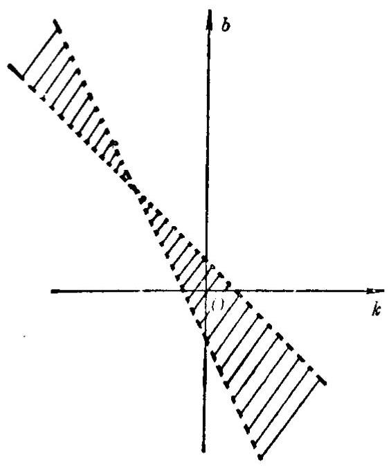

图 2-2-06

解 设直线 $y = {kx} + b$ 与线段 ${AB}$ 的交点 $P\left( {{x}_{1},{y}_{1}}\right)$ 分 ${AB}$ 成定比 $\lambda  = \frac{AP}{PB}$ ,则

$$
{x}_{1} = \frac{1 + {2\lambda }}{1 + \lambda },{y}_{1} = \frac{1 - {2\lambda }}{1 + \lambda }.
$$

$\because$ 点 $P$ 在已知直线上,

$$
\therefore \frac{1 - {2\lambda }}{1 + \lambda } = k\left( \frac{1 + {2\lambda }}{1 + \lambda }\right)  + b,
$$

即 $\lambda  =  - \frac{k - 1 + b}{{2k} + 2 + b} > 0$ .

此不等式与 $\left( {k + b - 1}\right) \left( {{2k} + b + 2}\right)$

$< 0$ 等价, $\therefore$ 点 $\left( {k, b}\right)$ 所在区域如图 2-2-06 中阴影所示.

例 17 在平面上,从原点 $O$ 沿 $x$ 轴正方向成 $\alpha$ 角 $\left( {0 < \alpha  < \frac{\pi }{2}}\right)$ 方向抛出一球,初速 ${v}_{0} = \sqrt{g}$ ( $g$ 为重力加速度). 适当选择 $\alpha$ 角, 使球命中点 $\left( {a, b}\right) \left( {a > 0, b > 0}\right)$ ,那末点 $\left( {a, b}\right)$ 必须在什么区域内?

分析 要求点 $\left( {a, b}\right)$ 所在的区域,就是要求 $a\text{ 、 }b$ 所满足的不等式. 可从分析问题所给的数量关系入手. 题目要求球的轨迹通过点 $\left( {a, b}\right)$ ,则可先求出球的轨迹方程,从而求出 $a\text{ 、 }b$ 所满足的方程. 由于 $\alpha  \in  \left( {0,\frac{\pi }{2}}\right)$ ,故 $\operatorname{tg}\alpha$ 为实数. 根据二次方程有实根的充要条件, 即可得解.

解 根据题设条件，球的轨迹的参数方程为

$$
\left\{  \begin{array}{l} x = {v}_{0}t\cos \alpha , \\  y = {v}_{0}t\sin \alpha  - \frac{1}{2}g{t}^{2}. \end{array}\right.
$$

消去参数 $t$ 得普通方程:

$$
y = x\operatorname{tg}\alpha  - \frac{g{x}^{2}}{2{v}_{0}^{2}{\cos }^{2}\alpha },
$$

即

$$
y =  - \frac{1}{2{\cos }^{2}\alpha }{x}^{2} + x\operatorname{tg}\alpha .
$$

$\because$ 球命中点 $\left( {a, b}\right)$ ，

$$
- \frac{1}{2{\cos }^{2}\alpha }{a}^{2} + a\operatorname{tg}\alpha  = b,
$$

即

$$
{a}^{2}{\operatorname{tg}}^{2}\alpha  - {2at}\operatorname{tg}\alpha  + {2b} + {a}^{2} = 0.
$$

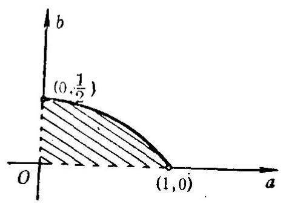

图 2-2-07

$\because \;\operatorname{tg}\alpha  \in  R$ ,

$$
\text{ - }\Delta  = 4{a}^{2} - 4{a}^{2}\left( {{2b} + {a}^{2}}\right)  > 0\text{ , }
$$

即

$$
b \leq   - \frac{1}{2}{a}^{2} + \frac{1}{2}.\left( {a > 0, b > 0}\right)
$$

①

从 ① 知点 $\left( {a, b}\right)$ 在如图 2-2-07 的阴影区域内.

方程观点除了上述三方面的例子之外, 还有几何作图题中的代数分析法, 交轨法 (即双轨迹). 实质上, 这些都是方程观点的应用. 至于代数中的待定系数法, 部分分式, 解几中的利用曲线系方程求曲线的方程等等也是方程观点的应用. 这里就不一一细说了.

## 思考题二

1. 如果方程 $3\cos x\cos \left( {\alpha  - x}\right)  = 2{\sin }^{2}x$ 有解,试确定 $\alpha$ 的取值范围.

2. $k$ 在什么区间内,方程 ${\sin }^{4}x + {\cos }^{4}x + \sin {2x} + k = 0$ 有解?

3. $k$ 取怎样的整数时,方程 $\left( {k + 1}\right) {\sin }^{2}x - 4\cos x + {3k} - 5 = 0$ 有实数解? 并求出此时的解.

4. 当 $a$ 取什么实数时,方程 $1 + {\sin }^{2}{ax} = \cos x$ 有唯一解?

5. 如图 2-2-08,直角 $\bigtriangleup {ABO}$ 中, $\angle C = {90}^{ \circ  },{BC} = 5\mathrm{\;{cm}},{AC} = \; {10}\mathrm{\;{cm}}$ . 动点 $P$ 沿边 ${AO}$ 、 ${BO}$ 自 $A$ 开始经过 $O$ 向 $B$ 点移动。 设从 $P$ 向边 ${AB}$ 引垂线与 ${AB}$ 交于点 $Q$ ,与过 $A$ 且和 ${AO}$ 垂直的直线 $l$ 交于点 $R$ . 若点 $P$ 自 $A$ 移动的距离为 $x\mathrm{\;{cm}}$ ， $\bigtriangleup {AQR}$ 的面积为 $y{\mathrm{\;{cm}}}^{2}$ .

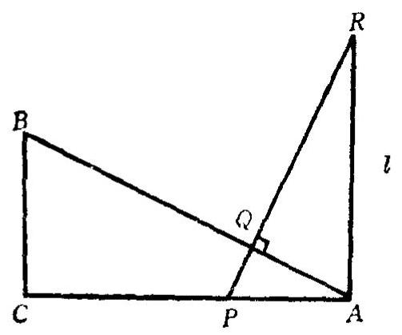

图 2-2-08

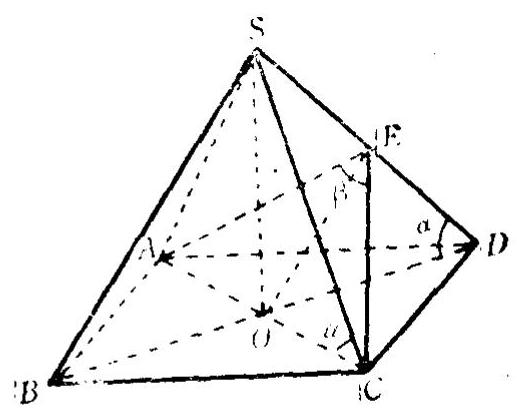

图 2-2-09

试求:(1)当点 $P$ 在 ${AO}$ 边上移动时， $y$ 与 $x$ 的函数关系；

(2)当点 $P$ 在 ${CB}$ 边上移动时, $y$ 与 $x$ 的函数关系;

(3)当 $\bigtriangleup {AQR}$ 与 $\bigtriangleup {ABC}$ 等积时, $x = ?$

(4)当 $\bigtriangleup {AQR}$ 的面积是 $\bigtriangleup {ABO}$ 的面积 4 倍时, $x = ?$

6. 如图 2-2-09,已知正四棱锥侧棱与底面的夹角为 $\alpha$ ,相邻两侧面夹的二面角等于 $\beta$ . 求证: $\cos \beta  = \frac{{\cos }^{2}\alpha }{{\cos }^{2}\alpha  - 2}$ .

7. 已知抛物线 $O : y = {x}^{2} - {ax} + a$ 的顶点在抛物线 $y = 1 - {x}^{2}$ 和 $x$ 轴围成图形的内部或边界上， 求 $a$ 的取值范围.

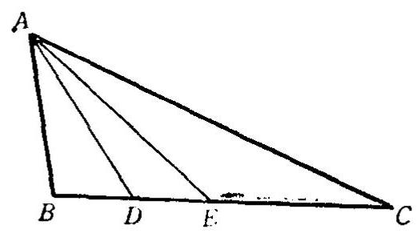

图 2-2-10

8. 如图 2-2-10，在 $\bigtriangleup  {ABO}$ 中， ${AD}$ 和 ${AE}$ 三等分 $\angle {BAC},{BD} \; = 2,{DE} = 3,{EC} = 6$ ,求 $\bigtriangleup  {ABO}$ 的最短边的长度.

9. 一飞机以每分钟 $a$ 公里匀速向正东飞行，一人见飞机在正北， 仰角为 $\alpha$ . 一分钟后,见飞机在其北偏东 $\beta$ ,若飞机飞行高度不变，试求飞机飞行高度与第二次观测时的仰角.

10. $A{A}^{\prime }{B}^{\prime }B$ 是圆柱的轴截面， $O$ 是 ${AB}$ 所在底面圆周上的一点.

(1)当 ${V}_{\text{ 校後 }{A}^{\prime }.{ABC}} : {V}_{\text{ 校後 }} = 1 : 2\sqrt{3}\pi$ 时，求二面角 $B - A{A}^{\prime } - C$ 的大小;

(2)设二面角 $A - {A}^{\prime }B - C$ 为 $\alpha ,\angle {OAB} = \beta ,\angle C{A}^{\prime }B = \gamma$ ， 求证； $\alpha  = \arcsin \left( \frac{\cos \beta }{\cos \gamma }\right)$ .

11. 在圆锥内有两个单位球, 它们与圆锥底面都相切, 两个球中每一个都与圆锥侧面相切, 并且两球彼此外切. 当圆锥体积最小时, 求圆锥母线与底面的夹角.

12. 设双曲线 ${x}^{2} - {y}^{2} = \lambda$ 关于直线 $x - y = 2$ 对称的曲线与直线 $\frac{x}{3} + \frac{y}{2} = 1$ 相切,求 $\lambda$ 的值.

13. 设抛物线 ${y}^{2} = {4p}\left( {x - a}\right)$ 与 ${x}^{2} = {4qy}$ 相切,且 $a \neq  0$ ,求切点的坐标.

14. 解函数方程: $f\left( x\right)  + f\left( \frac{x - 1}{x}\right)  - 1 + x,\;\left( {x \neq  0, x \neq  1}\right)$ .

15. 设抛物线 $y = {x}^{2}$ 与以原点为圆心,以 $r$ 为半径的圆在第一象限内的交点为 $P$ . 点 $P$ 与 $Q\left( {r,0}\right)$ 的连线交 $y$ 轴于 $T$ 点.

(1)令 $\angle {QOP} = \theta$ ，求 $r\left( \theta \right)$ 的表达式；

(2)求点 $T$ 的纵坐标 $y\left( \theta \right)$ 的表达式；

* (3) 当 $r \rightarrow  0$ 时,求点 $T$ 的极限位置.

*16. 将抛物线 $y = a{x}^{2} + {bx} + c$ 上界于 $A\left( {-1,1}\right) \text{ 、 }B\left( {1,1}\right)$ 的曲线弧,使其绕 $x$ 轴旋转所成的体积最小,求 $a\text{ 、 }b\text{ 、 }c$ 的值.

17. 已知两点 ${P}_{1}\left( {3,1}\right) \text{ 、 }{P}_{2}\left( {1,3}\right)$ ,其中一点在圆 ${\left( x - a\right) }^{2} + (y - \; b{)}^{2} = {a}^{2} + {b}^{2}$ 的内部,另一点在此圆的外部. 试求圆心运动的范围, 并用图形表示出来.

18. 如果点 $Q\left( {2,2}\right)$ 在抛物线 ${\left( x - {x}_{0}\right) }^{2} + {\left( y - {y}_{0}\right) }^{2} = {\left( x + y\right) }^{2}/2$ 的内部，试求其焦点运动的范围.

## 三 因 果 观 点

数学大厦是建筑在逻辑基础上的, 逻辑推理是数学论证的灵魂. 逻辑推理遵循言必有据的原则，应抓住因果关系的分析. 数学论证中,对于 $p\left( x\right)  \Rightarrow  q\left( x\right)$ 来说, $p\left( x\right)$ 是条件,即因; $q\left( x\right)$ 是结论, 即果. 因蕴含果，果包含因. 数学中要求按逻辑思维的规律(同一律、矛盾律、排中律)研究因果关系，发现由因导果的思路，这就是 $p\left( x\right)  \Rightarrow  q\left( x\right)$ 的证明的过程.

为了叙述的方便，引入以下的符号:

设 $P = \{ x \mid  p\left( x\right) \}$ ,则 $x \in  P$ 是指 $x$ 满足 $p\left( x\right)$ ,同样,设 $Q = \; \{ x \mid  q\left( x\right) \}$ ,则 $x \in  Q$ 是指 $x$ 满足 $q\left( x\right)$ .

如果 $P \subseteq  Q$ ,则 $p\left( x\right)  \Rightarrow  q\left( x\right)$ ,即 $p\left( x\right)$ 是 $q\left( x\right)$ 的充分条件,也即 $q\left( x\right)$ 是 $p\left( x\right)$ 的必要条件.

$T\left( x\right)$ 表示在证明 $p\left( x\right)  \Rightarrow  q\left( x\right)$ 之前已学过的基本概念、公理、 定理的总和，即已知真理的总和.

下面分综合法、分析法、反证法三部分来说明论证的思维方法.

## 1. 综合法

在探寻 $p\left( x\right)  \Rightarrow  q\left( x\right)$ 的证明思路时,从 $p\left( x\right)$ 与 $T\left( x\right)$ 出发,追索 $p\left( x\right)$ 的必要条件 ${A}_{1i}\left( x\right) \left( {i = 1,2,\cdots }\right)$ ,再由 ${A}_{1i}\left( x\right)$ 追索其必要条件 ${A}_{2i}\left( x\right)$ ,直至 ${A}_{ni}\left( x\right)$ ,它既是 ${A}_{\left( {n - 1}\right) i}\left( x\right)$ 的必要条件,又是 $q\left( x\right)$ 的显然的充分条件，从而导出 $q\left( x\right)$ . 这样的思维方法称为综合法，即由因导果.

$$
p\left( x\right)  \land  T\left( x\right)  \Rightarrow  {A}_{1i}\left( x\right)  \Rightarrow  {A}_{2i}\left( x\right)  \Rightarrow  \cdots  \Rightarrow  {A}_{\left( {n - 1}\right) i}\left( x\right)
$$

$$
\Rightarrow  {A}_{ni}\left( x\right)  \Rightarrow  q\left( x\right) \text{ . }
$$

①

这里由于 ${A}_{1i}\left( x\right) \text{ 、 }{A}_{2i}\left( x\right) \text{ 、 }\cdots \text{ 、 }{A}_{\left( {n - 1}\right) i}\left( x\right) \text{ 、 }{A}_{ni}\left( x\right)$ 等不一定都只有一个,因而要探索在 ${A}_{1i}\left( x\right)$ 中究竟哪一个或哪几个是通向 $q\left( x\right)$ 所需要的. 同样,每进展一步, ${A}_{2i}\left( x\right) \text{ 、 }{A}_{3i}\left( x\right) \text{ 、 }\cdots \text{ 、 }{A}_{ni}\left( x\right)$ 中哪一个或哪几个是通向 $q\left( x\right)$ 所需要的,都需在搜索过程中作出猜想与选择. 可见探索证明的思维过程, 既以逻辑思维为主, 又不可避免地离不开直觉思维. 因此在培养综合思维时，既要把重点放在逻辑思维的训练上，也要注意加强在搜索必要条件时面向目标 $q\left( x\right)$ ,作出正确选择方面的训练.

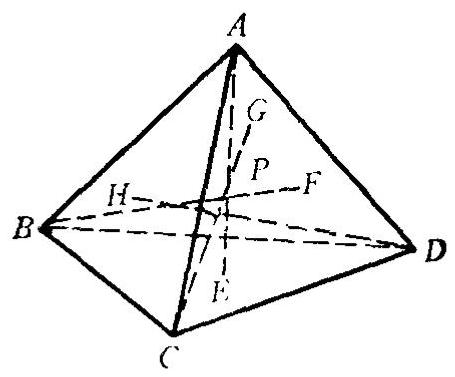

图 2-3-01

例 1 若四面体的四条高中有两条相交，则另两条也相交.

为了便于分析, 下面用“ $\rightarrow$ ”代表 “ $\Rightarrow$ ”,用 ${AE}$ 表示直线 ${AE}$ ,用 ${BCD}$ 表示平面 ${BCD}$ .

这一命题的已知条件是: 四面体 ${ABCD}$ 中, ${AE} \bot  {BCD},{BF} \bot  {ACD}$ , ${CG} \bot  {ABD},{DH} \bot  {ABC},{AE}$ 与 ${CG}$ 相交于 $P$ . 结论是: ${BF}$ 与 ${DH}$ 相交.

分析

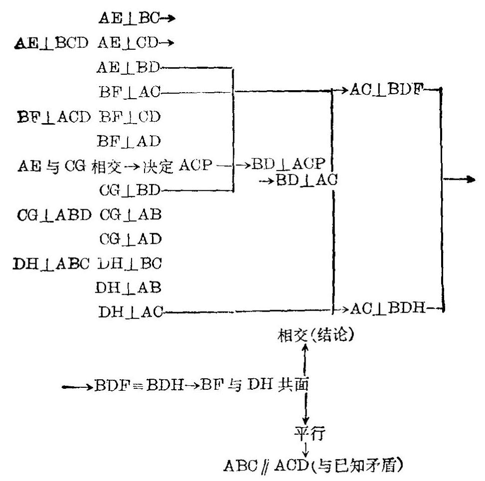

通过上述分析, 证明的思路已十分清楚, 可得证明如下.

证 $\because {AE} \bot$ 平面 ${BOD}\text{ 、 }{OG} \bot$ 平面 ${ABD}$ ,

$$
\therefore {AE}\bot {BD}\text{ 、 }{CG}\bot {BD}\text{ . }
$$

又因 ${AE}$ 与 ${CG}$ 相交,故 ${AE}\text{ 、 }{CG}$ 决定平面 ${ACP},\therefore {BD} \bot$ 平面 ${AOP}$ ,从而有 ${AO} \bot  {BD}.\because {BF} \bot$ 平面 ${ACD},{DH} \bot$ 平面 ${ABO},\therefore {BF} \bot  {AO},{DH} \bot  {AO}$ . 与 ${AO} \bot  {BD}$ 结合,得 ${AO} \bot$ 平面 ${BDF},{AO} \bot$ 平面 ${BDH}$ .

平面 ${BDF}$ 与平面 ${BDH}$ 重合, ${BF}$ 与 ${DH}$ 共面. $\because$ 平面 ${ABO}$ 与平面 ${ACD}$ 相交, $\therefore {BF}$ 与 ${DH}$ 相交.

例 2 设 $a\text{ 、 }b\text{ 、 }c$ 为直角三角形的三边，其中 $c$ 为斜边，且满足

$$
\arcsin \frac{1}{a} + \arcsin \frac{1}{b} = \frac{\pi }{2},
$$

求证: $\lg a + \lg b = \lg c$ .

分析

$\pi \frac{1}{a},\frac{1}{b} \in  \left( {0,1}\right)  \rightarrow  a, b \in  \left( {1, + \infty }\right)$

$\arcsin \frac{1}{a} + \arcsin \frac{1}{b} = \frac{\pi }{2}$

$$
\arcsin \frac{1}{a} = \frac{\pi }{2} - \arcsin \frac{1}{b}
$$

$$
\rightarrow  \frac{1}{a} = \sin \left( {\frac{\pi }{2} - \arcsin \frac{1}{b}}\right)  = \sqrt{1 - \frac{1}{{b}^{2}}}
$$

$$
\rightarrow  \frac{1}{{a}^{2}} + \frac{1}{{b}^{2}} = 1 \rightarrow  \frac{{a}^{2} + {b}^{2}}{{a}^{2}{b}^{2}} = 1 \rightarrow  {a}^{2}{b}^{2} = {c}^{2} -
$$

$$
{a}^{2} + {b}^{2} = {c}^{2}\text{ . }
$$

$$
\rightarrow  {ab} = c \rightarrow  \lg a + \lg b = \lg c
$$

证 略.

例 3 已知 $x + y = u + v,{x}^{2} + {y}^{2} = {u}^{2} + {v}^{2}$ ,求证:

$$
{x}^{n} + {y}^{n} = {u}^{n} + {v}^{n}
$$

证

$$
\because x + y = u + v
$$

①

$$
{x}^{2} + {y}^{2} = {u}^{2} + {v}^{2}
$$

②

${\text{ ① }}^{2} -$ ②得

$$
{xy} = {uv}
$$

⑧

由①，③，知 $x$ ， $y$ 为方程

$$
{z}^{2} - \left( {u + v}\right) z + {uv} = 0
$$

的根.

$$
\because {z}^{2} - \left( {u + v}\right) z + {uv} = \left( {z - u}\right) \left( {z - v}\right)  = 0,
$$

$$
\therefore \;\left\{  {\begin{array}{l} x = u, \\  y = v; \end{array}\text{ 或 }\left\{  \begin{array}{l} x = v, \\  y = u. \end{array}\right. }\right.
$$

$$
\therefore \;{x}^{n} + {y}^{n} = {u}^{n} + {v}^{n}\text{ . }
$$

这里关键是从已知条件联想到韦达定理. 如果从条件与结论的外形, 联想到数学归纳法, 那将得另一种证明. 但由于题中未说 $n$ 是自然数，用数学归纳法证明就不是完全严密的证明.

例 4 复平面内有一凸 $n$ 边形,原点 $O$ 在其内部,它的顶点对应的复数依次为 ${z}_{1}\text{ 、 }{z}_{2}\text{ 、 }\cdots \text{ 、 }{z}_{n}$ ,并且对于任意两个顶点对应的复数 ${z}_{j}\text{ 、 }{z}_{k}\left( {j \neq  k}\right)$ 恒有 $\left| {{z}_{j} - {z}_{k}}\right|  > \left| {z}_{j}\right|$ ,求证: $n < 6$ .

分析 因为 $\left| {{z}_{j} - {z}_{k}}\right|  > \left| {z}_{j}\right|$ ,故 $\left| {{z}_{k} - {z}_{j}}\right|  > \left| {z}_{k}\right|$ ,而 $\left| {{z}_{j} - {z}_{k}}\right|  = \; \left| {{z}_{k} - {z}_{j}}\right|$ 表示任意两个顶点间的距离 ${A}_{j}{A}_{k},\left| {z}_{j}\right| \text{ 、 }\left| {z}_{k}\right|$ 表示原点 $O$ 到顶点 ${A}_{j}\text{ 、 }{A}_{k}$ 的距离. 从 $\left| {{z}_{j} - {z}_{j + 1}}\right|  > \left| {z}_{j}\right| ,\left| {{z}_{j + 1} - {z}_{j}}\right|  > \left| {z}_{j + 1}\right|$ ,有 ${A}_{j}{A}_{j + 1} > O{A}_{j},{A}_{j}{A}_{j + 1} > O{A}_{j + 1}$ ,所以在 $\bigtriangleup O{A}_{j}{A}_{j + 1}$ 中, ${A}_{j}{A}_{j + 1}$ 为最大边, $\angle {A}_{j}O{A}_{j + 1}$ 是最大角.

$$
3\angle {A}_{j}O{A}_{j + 1} > \angle {A}_{j}O{A}_{j + 1} + \angle O{A}_{j}{A}_{j + 1}
$$

$$
+ \angle O{A}_{j + 1}{A}_{j} = {180}^{ \circ  },
$$

$\therefore \angle {A}_{j}O{A}_{j + 1} > {60}^{ \circ  },\left( {j = 1,2,\cdots , n,{A}_{n + 1} = {A}_{1}}\right)$

于是 $\mathop{\sum }\limits_{{j = 1}}^{n}\angle {A}_{j}O{A}_{j + 1} = {360}^{ \circ  } > {60}^{ \circ  } \times  n$ ,故 $n < 6$ .

证 略.

这里 $n < 6$ 是必要条件,但非充分条件.

例5 设凸四边形 ${ABCD}$ 的顶点在一个圆上,另一个圆的圆心在 ${AB}$ 边上,且与四边形其余三边相切,求证:

$$
{AD} + {BC} = {AB}.
$$

分析 按题设四边形 ${ABCD}$ 中， ${AD}$ 、 ${BC}$ 的延长线交于点 $E$ . 第一个圆过 $A$ 、 $B$ 、 $C$ 、 $D$ 四点，第二个圆的圆心在 ${AB}$ 边上， 此圆为 $\bigtriangleup {ODE}$ 的内切圆. 欲证题断,可以令第二个圆的半径为单位长度及设 $\angle {BAE} = \alpha ,\angle {ABE} = \beta$ ,分别算出 ${AD}\text{ 、 }{BC}\text{ 、 }{AI}\text{ 、 }{BI}$ ( $I$ 为第二个圆的圆心),将证明转化为三角恒等式的证明.

证 设四边形 ${ABCD}$ 的一对对边 ${AD}$ 、 ${BC}$ 相交于 $E$ 点. 第一个圆过 $A\text{ 、 }B\text{ 、 }C\text{ 、 }D$ 四点,第二个圆的圆心 $I$ 在边 ${AB}$ 上,且与 ${AD}\text{ 、 }{BC}\text{ 、 }{CD}$ 三边相切于 $F\text{ 、 }G\text{ 、 }H$ . 令第二个圆的半径为单位长度, $\angle {BAE} = \alpha ,\angle {ABE} = \beta$ ,如图 2-3-02.

$\because A\text{ 、 }B\text{ 、 }C\text{ 、 }D$ 四点共圆,

$\therefore \angle {BCD} = \angle {BAE} = \alpha ,\angle {ADC} = \angle {ABE} = \beta$ .

$\because I$ 为 $\bigtriangleup {CDE}$ 的内心,

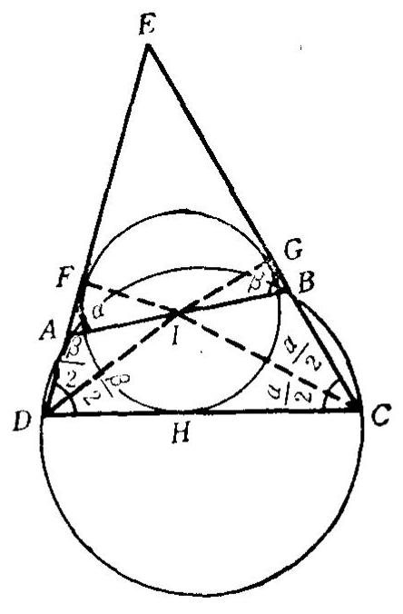

图 2-3-02

$\therefore \;\angle {ADI} = \frac{\beta }{2},$

$\angle {BCI} = \frac{\alpha }{2}$ .

$\because {AD} = {DF} - {AF} = \operatorname{ctg}\frac{\beta }{2} - \operatorname{ctg}\alpha ,$

${BO} = {OG} - {BG} = \operatorname{ctg}\frac{\alpha }{2} - \operatorname{ctg}\beta ,$

${AB} = {AI} + {IB} = \csc \alpha  + \csc \beta ,$

$\therefore {AD} \div  {BC}$

$$
= \operatorname{ctg}\frac{\beta }{2} - \operatorname{ctg}\alpha  + \operatorname{ctg}\frac{\alpha }{2} - \operatorname{ctg}\beta
$$

$= \operatorname{ctg}\frac{\alpha }{2} - \operatorname{ctg}\alpha  + \operatorname{ctg}\frac{\beta }{2} - \operatorname{ctg}\beta$

$$
= \frac{\sin \alpha \cos \frac{\alpha }{2} - \cos \alpha \sin \frac{\alpha }{2}}{\sin \frac{\alpha }{2}\sin \alpha } + \frac{\sin \beta \cos \frac{\beta }{2} - \cos \beta \sin \frac{\beta }{2}}{\sin \frac{\beta }{2}\sin \beta }
$$

$$
= \csc \alpha  + \csc \beta  = {AB}\text{ . }
$$

这道题既要用到综合思维，也需用到参数观点. 如第二个圆的半径与 $\alpha ,\beta$ 就是参数，通过参数把条件与结论的内在联系反映出来.

## 2. 分析法

数学一切论断的根据, 都出于公理. 从少数公理出发, 导出大量定理, 可见由因导果, 枝歧太多, 不易找到结果. 因此反过来, 从结论出发,追索结论成立的充分条件 ${B}_{1}\left( x\right)$ ,再由 ${B}_{1}\left( x\right)$ 追索其成立的充分条件 ${B}_{2}\left( x\right)$ ,如此进行下去直至 ${B}_{n}\left( x\right)$ ,它既是 ${B}_{n - 1}\left( x\right)$ 成立的充分条件，又是 $p\left( x\right)$ 成立的明显的必要条件. 这样的思维过程即是执果索因的分析思维. 可用符号表达如下:

$$
q\left( x\right)  \land  T\left( x\right)  \Leftarrow  {B}_{1}\left( x\right)  \Leftarrow  {B}_{2}\left( x\right)  \Leftarrow  \cdots
$$

$$
\Leftarrow  {B}_{n - 1}\left( x\right)  \Leftarrow  {B}_{n}\left( x\right)  \Leftarrow  p\left( x\right)
$$

②

由于 $q\left( x\right)$ 追索其成立的充分条件 ${B}_{1}\left( x\right)$ 时,有时也不止一个, 因此究竟哪一个可以通向 $p\left( x\right)$ ,仍然需要一个正确选择信息 (即猜想) 的思维过程. 可见分析法和综合法一样, 也是逻辑思维与直觉思维交替运用的过程. 只不过分析法比综合法选择范围小一些而已, 因此人们更重视分析思维.

例 6 在 $\bigtriangleup {ABC}$ 的外侧有两点 $P\text{ 、 }Q,{PA} = {PB},{QA} = {QO}$ , $\angle {APB} = \alpha ,\angle {AQC} = \beta$ ,连接 $P\text{ 、 }Q$ ,作 $\angle {QPR} = \frac{\alpha }{2},\angle {PQR} = \frac{\beta }{2}$ , 连接 ${BR},{CR}$ .

求证:

$$
{BR} = {CR},\angle {BRC} = \alpha  + \beta .
$$

分析 如果 $\angle {BRC} = \alpha  + \beta$ ,则由 $\angle {PRQ} = \pi  - \frac{1}{2}\left( {\alpha  + \beta }\right)$ 推出

$$
\angle {PRB} + \angle {QRO} = {2\pi } - \angle {BRO} - \angle {PRQ}
$$

$$
= {2\pi } - \left( {\alpha  + \beta }\right)  - \left( {\pi  - \frac{\alpha  + \beta }{2}}\right)
$$

$$
= \pi  - \frac{\alpha  + \beta }{2} = \angle {PRQ}.
$$

要证明 $\angle {PRB} + \angle {QRO} = \angle {PRQ}$ ,可找一点,把 $\angle {PRQ}$ 分成两部分,如图 2-3-03 中的 $\angle {PR}{A}^{\prime },\angle {QR}{A}^{\prime }$ ,使 $\angle {PR}{A}^{\prime } = \; \angle {PRB},\angle {QR}{A}^{\prime } = \angle {QRO}$ . 分别以 $P\text{ 、 }Q$ 为圆心, ${PA},{QA}$ 为半径作圆交于 $A\text{ 、 }{A}^{\prime }$ ,从作图,猜到 ${A}^{\prime }$ 即想找的一点,从而得证明如下.

证 设圆 $P\text{ 、 }Q$ 相交于 $A\text{ 、 }{A}^{\prime }$ . 连接 $P{A}^{\prime }, Q{A}^{\prime }, R{A}^{\prime }$ .

$$
\because \angle {A}^{\prime }{PQ} = \angle {APQ},\angle {QPR} = \frac{\alpha }{2}\text{ , }
$$

$$
\therefore \angle {A}^{\prime }{PR} = \angle {A}^{\prime }{PQ} + \angle {QPR}
$$

$$
= \frac{1}{2}\left( {\angle {A}^{\prime }{PA} + \angle {APB}}\right)  = \angle {RPB}.
$$

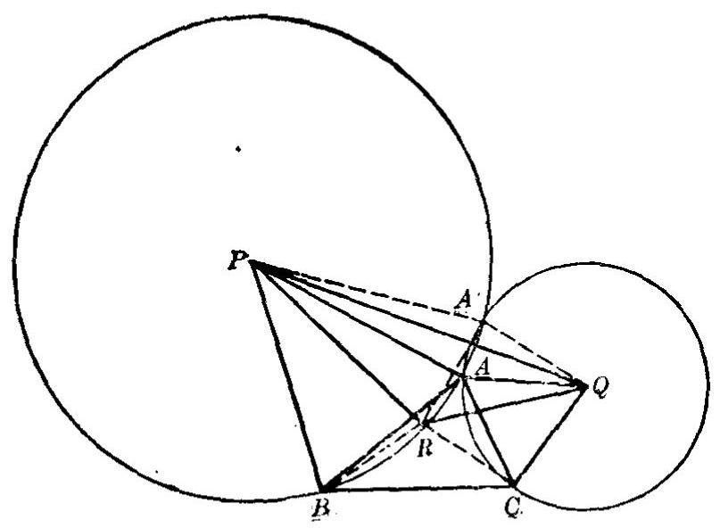

图 2-3-03

...

$$
P{A}^{\prime } = {PB},{PR} = {PR},\angle {A}^{\prime }{PR} = \angle {RPB},
$$

$$
\bigtriangleup {PBR} \cong  \bigtriangleup P{A}^{\prime }R,\angle {PRB} = \angle {PR}{A}^{\prime },{BR} = {A}^{\prime }R\text{ . }
$$

同理

$$
\angle {ORQ} = \angle {A}^{\prime }{RQ},{A}^{\prime }R - {OR},
$$

$\therefore$

$$
{BR} = {OR},
$$

$$
\angle {BRC} = {2\pi } - 2\left( {\angle {PR}{A}^{\prime } + \angle {QR}{A}^{\prime }}\right)
$$

$$
= {2\pi } - 2\left( {\pi  - \frac{\alpha  + \beta }{2}}\right)  = \alpha  + \beta .
$$

例 ${7AD}$ 是 $\bigtriangleup {ABO}$ 的 $\angle {BAO}$ 的平分线,交边 ${BC}$ 于 $D$ 点, 求证: $\frac{AB}{BD} = \frac{AC}{CD}$ .

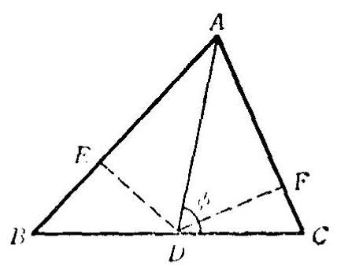

图 2-3-04

这是著名的角平分线性质定理, 这里介绍两种分析方法.

分析一 如果结论 $\frac{AB}{BD} = \frac{AO}{CD}$ 成立,则 $\frac{AB}{BD}$ 与 $\frac{AC}{CD}$ 之间是否存在什么媒介呢?

从 $\bigtriangleup {ABD}$ 与 $\bigtriangleup {ACD}$ 中,可知

$$
\frac{AB}{BD} = \frac{\sin \left( {\pi  - \phi }\right) }{\sin A/2} =  - \frac{\sin \phi }{\sin A/2},
$$

其中 $\phi  = \angle {ADC}$ ,

$$
\frac{AC}{CD} = \frac{\sin \angle {ADC}}{\sin A/2} = \frac{\sin \phi }{\sin A/2},
$$

从此即得

$$
\frac{AB}{BD} = \frac{AC}{CD}
$$

分析二 仍从找 $\frac{AB}{BD} = \frac{AC}{OD}$ 成立充分条件入手，

$$
\frac{AB}{BD} = \frac{AC}{CD} \Leftrightarrow  \frac{AB}{AC} = \frac{BD}{CD},
$$

从图 2-3-04,可知 ${BD} : {CD} = {S}_{\bigtriangleup {ABD}} : {S}_{\bigtriangleup {ACD}}$ .

$\because \bigtriangleup {ABD}$ 与 $\bigtriangleup {ACD}$ 的高相等,即 ${DE} = {DF},({DE}\text{ 、 }{DF}$ 分别垂直于 ${AB}\text{ 、 }{AC})$ ,

$\therefore {AB} : {AC} = {S}_{\bigtriangleup {ABD}} : {S}_{\bigtriangleup {ACD}}$ .

证 略.

这里的分析是从结论成立的可能性，联想到等式两边存在某种隐含的联系来进行思考的, 这也是常用的分析方法.

例 8 设 $\sin \alpha ,\sin \beta ,\sin \gamma$ 成等差数列,则 $\operatorname{tg}\frac{1}{2}\left( {\beta  + \gamma }\right)$ , $\operatorname{tg}\frac{1}{2}\left( {\gamma  + \alpha }\right) ,\operatorname{tg}\frac{1}{2}\left( {\alpha  + \beta }\right)$ 也成等差数列 (其中 $\frac{1}{2}\left( {\beta  + \gamma }\right) \text{ 、 }\frac{1}{2}(\gamma  + \; \alpha )\text{ 、 }\frac{1}{2}\left( {\alpha  + \beta }\right)$ ,均非 $\frac{\pi }{2}$ 的奇数倍).

分析 欲证

$$
\operatorname{tg}\frac{1}{2}\left( {\alpha  + \beta }\right)  - \operatorname{tg}\frac{1}{2}\left( {\gamma  + \alpha }\right)  = \operatorname{tg}\frac{1}{2}\left( {\gamma  + \alpha }\right)  - \operatorname{tg}\frac{1}{2}\left( {\beta  + \gamma }\right) ,
$$

只需

$\frac{\sin \frac{1}{2}\left( {\alpha  + \beta }\right) \cos \frac{1}{2}\left( {\gamma  + \alpha }\right)  - \sin \frac{1}{2}\left( {\gamma  + \alpha }\right) \cos \frac{1}{2}\left( {\alpha  + \beta }\right) }{\cos \frac{1}{2}\left( {\alpha  + \beta }\right) \cos \frac{1}{2}\left( {\gamma  + \alpha }\right) }$

$$
= \frac{\sin \frac{1}{2}\left( {\gamma  + \alpha }\right) \cos \frac{1}{2}\left( {\beta  + \gamma }\right)  - \sin \frac{1}{2}\left( {\beta  + \gamma }\right) \cos \frac{1}{2}\left( {\gamma  + \alpha }\right) }{\cos \frac{1}{2}\left( {\gamma  + \alpha }\right) \cos \frac{1}{2}\left( {\beta  + \gamma }\right) },
$$

只需

$$
\frac{\sin \frac{1}{2}\left( {\beta  - \gamma }\right) }{\cos \frac{1}{2}\left( {\alpha  + \beta }\right) } = \frac{\sin \frac{1}{2}\left( {\alpha  - \beta }\right) }{\cos \frac{1}{2}\left( {\beta  + \gamma }\right) }
$$

$\left. {1\frac{\sin \left( {\frac{\alpha  + \beta }{2} - \frac{\gamma  + \alpha }{2}}\right) }{\cos \frac{1}{2}\left( {\alpha  + \beta }\right) } = \frac{\sin \left( {\frac{\gamma  + \alpha }{2} - \frac{\beta  + \gamma }{2}}\right) }{\cos \frac{1}{2}\left( {\beta  + \gamma }\right) },}\right.$

只需

$$
\sin \frac{1}{2}\left( {\beta  - \gamma }\right) \cos \frac{1}{2}\left( {\beta  + \gamma }\right)
$$

$$
= \sin \frac{1}{2}\left( {\alpha  - \beta }\right) \cos \frac{1}{2}\left( {\alpha  + \beta }\right) ,
$$

只需

$$
\sin \beta  - \sin \gamma  = \sin \alpha  - \sin \beta ,
$$

即只需 $\sin \alpha \text{ 、 }\sin \beta \text{ 、 }\sin \gamma$ 成等差数列.

证 略.

例 9 若 $a + b + c, b + c - a, c + a - b, a + b - c$ 组成公比为 $q$ 的等比数列,求证: ${q}^{3} + {q}^{2} + q = 1$ ,且 $q = \frac{a}{c}$ .

分析 欲证

$$
{q}^{3} + {q}^{2} + q = 1
$$

只需

$$
{q}^{3} + {q}^{2} + q + 1 = 2,
$$

只需

$$
A\left( {{q}^{3} + {q}^{2} + q + 1}\right)  = {2A},
$$

其中 $A$ 为首项，即 $a + b + c$ .

只需

$$
\frac{A\left( {{q}^{4} - 1}\right) }{q - 1} = {2A}
$$

即只需 $a + b + c + b + c - a + c + a - b + a + b - o$

$$
= 2\left( {a + b + c}\right) .
$$

现在 $a + b + c + b + c - a + c + a - b + a + b - c$ ,果然是等于 $2\left( {a + b + c}\right)$ .

证

$$
\because a + b + c + b + c - a + c + a - b + a + b - c
$$

$$
= 2\left( {a + b + c}\right) \text{ , }
$$

$$
\frac{A\left( {{q}^{4} - 1}\right) }{q - 1} = {2A},\;\text{ 其中 }A = a + b + c,
$$

即

$$
{q}^{3} + {q}^{2} + q + 1 = 2
$$

$\therefore$

$$
{q}^{3} + {q}^{2} + q = 1.
$$

$$
q = \frac{c + a - b}{b + c - a} = \frac{a + b - c}{c + a - b},
$$

$$
q = \frac{c + a - b + a + b - c}{b + c - a + c + a - b} = \frac{2a}{2c} = \frac{a}{c}.
$$

有时单用分析法或综合法不易奏效，所以往主二者并用，从 $p\left( x\right) , q\left( x\right)$ 出发，向中间靠拢. 这是在探索证明路线时，应用更广泛的一种方法.

例 10 已知: $\alpha  \in  \left( {0,\frac{\pi }{2}}\right) , n \in  N$ ,求证:

$$
\left( {{2n} + 1}\right) {\sin }^{n}\alpha \left( {1 - \sin \alpha }\right)  < 1 - {\sin }^{{2n} + 1}\alpha .
$$

分析 欲证 $\left( {{2n} + 1}\right) {\sin }^{n}\alpha \left( {1 - \sin \alpha }\right)  < 1 - {\sin }^{{2n} + 1}\alpha$ ,

只需证 $\frac{1 - {\sin }^{{2n} + 1}\alpha }{1 - \sin \alpha } > \left( {{2n} + 1}\right) {\sin }^{n}\alpha .\left( {\because 1 - \sin \alpha  > 0}\right)$

但 $\frac{1 - {\sin }^{{2n} + 1}\alpha }{1 - \sin \alpha } = 1 + \sin \alpha  + {\sin }^{2}\alpha  + \cdots  + {\sin }^{2n}\alpha$

$$
\left( {\because {\sin }^{k}\alpha  > 0}\right)
$$

$$
> {\left( 2n + 1\right) }^{{2n} + 1}\sqrt{1 \cdot  \sin \alpha  \cdot  {\sin }^{2}\alpha \cdots {\sin }^{2n}\alpha }
$$

$$
= \left( {{2n} + 1}\right) {\left( \sin \alpha \right) }^{\frac{\left( {n + 1}\right) \left( {2n}\right) }{2\left( {{2n} + 1}\right) }} = \left( {{2n} + 1}\right) {\sin }^{n}\alpha ,
$$

即得证.

证 略.

## 8. 反证法

在因果关系的分析中, 有时分析、综合均难奏效, 直接证法又达不到证明的目的, 因此可采用反证法, 其思维过程如下:

$$
\bar{q}\left( x\right)  \land  T\left( x\right)  \land  p\left( x\right)  \Rightarrow  {c}_{1}\left( x\right)  \Rightarrow  {c}_{2}\left( x\right)  \Rightarrow  \cdots  \Rightarrow  {c}_{n}\left( x\right)
$$

③

其中 $\bar{q}\left( x\right)$ 与 $q\left( x\right)$ 是互相矛盾的判断,二者不能都真,也不能都假,即二者中必有且只有一为真. 用集合语言表达: 若 $Q = \; \{ x \mid  q\left( x\right) \} ,\bar{Q} = \{ x \mid  \bar{q}\left( x\right) \}$ ，则 $Q \cap  \bar{Q} = \varnothing$ ，而 $Q \cup  \bar{Q} = I$ ，其中 $I$ 表示命题结论涉及的全集。由于 $I$ 在命题中是隐含的，因而从 $q\left( x\right)$ 求 $\bar{q}\left( x\right)$ (即逻辑非的运算) 时,要特别仔细. 如“ $a\text{ 、 }b\text{ 、 }c$ 都等于零”,其矛盾判断应是 “ $a\text{ 、 }b\text{ 、 }c$ 不都等于零”即 “ $a\text{ 、 }b\text{ 、 }c$ 中至少有一个不等于零”,不是 “ $a\text{ 、 }b\text{ 、 }c$ 都不等于零”. 这里 $a\text{ 、 }b\text{ 、 }c$ 和零相等或不相等的关系的一切可能情况 (即全集) 有:

$$
a = 0, b = 0, c = 0;\;\left( {a, b, c\text{ ,都等于零 }}\right)
$$

$$
\left. \begin{array}{l} a = 0, b = 0, c = 0; \\  a = 0, b \neq  0, c = 0; \\  a \neq  0, b = 0, c = 0; \\  a \neq  0, b = 0, c \neq  0; \\  a \neq  0, b \neq  0, c \neq  0; \\  a \neq  0, b \neq  0, c = 0; \\  a \neq  0, b \neq  0, c = 0; \end{array}\right\}  \text{ 或 }\left( {a, b, c\text{ 不都等于零 }}\right)
$$

很明显，“ $a$ 、 $b$ 、 $c$ 都等于零”与“ $a$ 、 $b$ 、 $c$ 都不等于零”，不是互相矛盾的判断.

反证法的思维过程是从已知条件、已知真理和结论 $q\left( x\right)$ 的矛盾判断 $\bar{q}\left( x\right)$ 出发，追索 $\bar{q}\left( x\right)$ 成立的必要条件 ${c}_{1}\left( x\right)$ ，再从 ${c}_{1}\left( x\right)$ 追索其成立的必要条件 ${c}_{2}\left( x\right)$ ，一直追到 ${c}_{n}\left( x\right)$ . 发现 ${c}_{n}\left( x\right)$ 与已知条件 $p\left( x\right)$ 矛盾 (这等于证明了 $\bar{q}\left( x\right)  \Rightarrow  \bar{p}\left( x\right)$ ，即原命题的逆否命题成立),或与已知真理 $T\left( x\right)$ 矛盾,或与临时假定矛盾,或导致自相矛盾,从此导出 $\bar{q}\left( x\right)$ 的假定不成立,根据排中律证明了结论 $q\left( x\right)$ 必定成立.

从上述分析反证法的思维过程来看, 反证法的关键是: (1) 能正确地提出结论 $q\left( x\right)$ 的矛盾判断 $\bar{q}\left( x\right) ;\left( 2\right)$ 熟练综合法的逻辑推理. 这里由于事先不知 ${c}_{n}\left( x\right)$ 在哪里,也无法知道 ${c}_{n}\left( x\right)$ 的具体内容, 故无果可执, 分析思维对此是无能为力的.

例 11 设 $a, b$ 为实数,且 $\left| a\right|  + \left| b\right|  < 1$ ,证明: 方程 ${x}^{2} + {ax} +$

$b = 0$ 的两根的绝对值均小于 1 .

证 设两根中至少有一个根 ${x}_{1}$ 的绝对值不小于 1,即 $\left| {x}_{1}\right|  \geq  1$ .

$\because {x}_{1}^{2} + a{x}_{1} + b = 0,\;\therefore  - \frac{a}{{x}_{1}} - \frac{b}{{x}_{1}^{2}} = 1$ ,

故 $\left| {-\frac{a}{{x}_{1}} - \frac{b}{{x}_{1}^{2}}}\right|  = \left| {\frac{a}{{x}_{1}} + \frac{b}{{x}_{1}^{2}}}\right|  = 1$ .

$\because \left| {\frac{a}{{x}_{1}} + \frac{b}{{x}_{1}^{2}}}\right|  \leq  \left| \frac{a}{{x}_{1}}\right|  + \left| \frac{b}{{x}_{1}^{2}}\right|  = \frac{\left| a\right| }{\left| {x}_{1}\right| } + \frac{\left| b\right| }{\left| {x}_{1}^{2}\right| }$

$(\because$

即

$$
\left| {\frac{a}{{x}_{1}} + \frac{b}{{x}_{1}^{2}}}\right|  \leq  \left| a\right|  + \left| b\right|
$$

$\therefore$

$$
\left| a\right|  + \left| b\right|  \geq  1\text{ . }
$$

这与已知条件 $\left| a\right|  + \left| b\right|  < 1$ 矛盾,

$\therefore$ 两根的绝对值均小于 1 .

例 12 已知 $a, b, c \in  \left( {0,1}\right)$ ,求证: $\left( {1 - a}\right) b,\left( {1 - b}\right) c$ , $\left( {1 - c}\right) a$ 不能同时大于 $1/4$ .

证 设 $\left( {1 - a}\right) b,\left( {1 - b}\right) c,\left( {1 - c}\right) a$ 都大于 $\frac{1}{4}$ ,

则

$$
\left( {1 - a}\right) b > \frac{1}{4} \Rightarrow  \sqrt{\left( {1 - a}\right) b} > \frac{1}{2}.
$$

$\because \;0 < a < 1,\;\therefore 1 - a > 0, b > 0,$

$$
\frac{1 - a + b}{2} \geq  \sqrt{\left( {1 - a}\right) b} > \frac{1}{2}
$$

即

$$
1 - a + b > 1\text{ ,故 }a < b\text{ . }
$$

同理,由 $\left( {1 - b}\right) c > \frac{1}{4}$ ,可推出 $b < c$ ; 由 $\left( {1 - c}\right) a > \frac{1}{4}$ ,可推出 $c < a$ .

从而有 $a < b < c < a$ ,导致自相矛盾. 所以 $\left( {1 - a}\right) b\text{ 、 }\left( {1 - b}\right) c$ 、 $\left( {1 - c}\right) a$ 不能同时大于 $\frac{1}{4}$ .

例 13 圆内接 $n$ 边形中,如果有一个面积最大的,那么它必定是正 $n$ 边形.

已知: ${A}_{1}{A}_{2}\cdots {A}_{n}$ 是圆内接 $n$ 边形,且 ${A}_{1}{A}_{2}\cdots {A}_{n}$ 是所有圆内接 $n$ 边形中面积最大的.

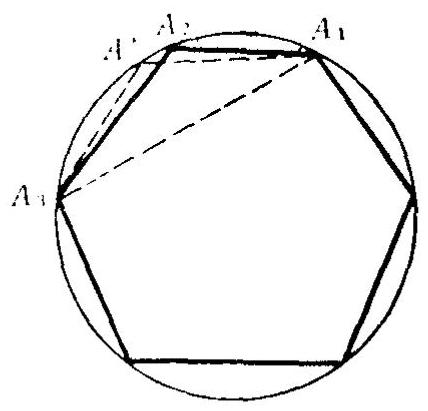

图 2-3-05

求证: ${A}_{1}{A}_{2}\cdots {A}_{n}$ 是正 $n$ 边形.

证 设 ${A}_{1}{A}_{2}\cdots {A}_{n}$ 不是正 $n$ 边形,则 $n$ 条边中至少有相邻两边不相等. 不失一般性，令 ${A}_{1}{A}_{2} \neq  {A}_{2}{A}_{3}$ . 取 $\overset{\text{ ⏜ }}{{A}_{1}{A}_{3}}$ 的中点 ${A}^{\prime }$ ,则 ${A}^{\prime }$ 到 ${A}_{1}{A}_{3}$ 的距离大于 ${A}_{2}$ 到 ${A}_{1}{A}_{3}$ 的距离,故有

$$
{S}_{\bigtriangleup {A}^{\prime }{A}_{1}{A}_{2}} > {S}_{\bigtriangleup {A}_{1}{A}_{2}{A}_{3}}
$$

$$
{S}_{{A}_{1}{A}^{\prime }{A}_{2}\cdots {A}_{n}} > {S}_{{A}_{1}{A}_{2}{A}_{3}\cdots {A}_{n}}
$$

既然这样, ${A}_{1}{A}_{2}\cdots {A}_{n}$ 在圆内接一切 $n$ 边形中,就不是面积最大的了, 这与已知条件矛盾.

所以 ${A}_{1}{A}_{2}\cdots {A}_{n}$ 不得不各边相等,因此 ${A}_{1}{A}_{2}\cdots {A}_{n}$ 为正 $n$ 边形.

例 13 中,如果面积换成周长最小,证法类似.

例 14 设 ${z}_{k}\left( {k = 1,2,\cdots , n}\right)$ 是满足 $\left| {z}_{k}\right|  \leq  1$ 与 $\mathop{\sum }\limits_{{k = 1}}^{n}{z}_{k} = 0$ 的 $n$ 个 $\left( {n \geq  2}\right)$ 复数，求证:这 $n$ 个复数中至少有两个 ${z}_{s}\text{ 、 }{z}_{T}$ 满足

$$
\left| {{z}_{s} + {z}_{T}}\right|  \leq  1
$$

分析 对于存在性问题, 往往可以采取反证法. 复数可通过高斯平面与平面向量建立一一对应关系, 借助于这一映射, 可利用几何直观进行思考.

因为两向量之和的模大于任一分向量之模的充要条件是此两向量的夹角小于 $\frac{2\pi }{3}$ ,从此可导出这 $n$ 个复数对应的点在一中心角小于 $\frac{2\pi }{3}$ 的开扇形域内. 于是得这 $n$ 个复数之和的虚部大于零,引起与已知条件 $\mathop{\sum }\limits_{{k = 1}}^{n}{z}_{k} = 0$ 矛盾.

证 设这 $n$ 个复数中任意两个复数 ${z}_{i},{z}_{j}\left( {i \neq  j, i, j \geq  1}\right)$ 均不满足 $\left| {{z}_{i} + {z}_{j}}\right|  \leq  1$ ,即 $\left| {{z}_{i} + {z}_{j}}\right|  > 1$ .

$$
\left| {z}_{k}\right|  \leq  1,\left( {k = 1,2,3,\cdots , n}\right) ,
$$

$\therefore$ 点 ${z}_{k}$ 全部在复平面内闭单位圆域内.

令 ${z}_{i}$ 、 ${z}_{j}$ 对应的向量的夹角为 $\theta$ ，并设 $\left| {z}_{i}\right|  \leq  \left| {z}_{j}\right|  \leq  1$ ，

即

$$
\left| {z}_{i}\right| \left| {z}_{j}\right|  \geq  {\left| {z}_{i}\right| }^{2},\;\text{ 又 }{\left| {z}_{i} + {z}_{j}\right| }^{2} > 1 \geq  {\left| {z}_{j}\right| }^{2},
$$

故

$$
{\left| {z}_{i} + {z}_{j}\right| }^{2} - {\left| {z}_{i}\right| }^{2} - {\left| {z}_{j}\right| }^{2} >  - \left| {z}_{i}\right| \left| {z}_{j}\right| ,
$$

$\therefore \cos \theta  = \frac{{\left| {z}_{i} + {z}_{j}\right| }^{2} - {\left| {z}_{i}\right| }^{2} - {\left| {z}_{j}\right| }^{2}}{2\left| {z}_{i}\right| \left| {z}_{j}\right| } >  - \frac{1}{2},\theta  \in  \lbrack 0,\pi )$ .

根据 $\cos \theta$ 在区间 $\lbrack 0,\pi )$ 上是减函数，故 $\theta  \in  \left\lbrack  {0,\frac{2\pi }{3}}\right)$ .

既然这 $n$ 个复数任意两个所对应的向量的夹角均小于 $\frac{2\pi }{3}$ ,故这 $n$ 个向量的终点全落在以原点 $O$ 为中心， $\frac{2\pi }{3}$ 为中心角的开扇形域内. 取此扇形的边界两半径之一所在的直线为实轴,则 ${z}_{2}$ 的幅角的主值为 $\arg {z}_{k} \in  \left\lbrack  {0,\frac{2\pi }{3}}\right) ,\left( {k = 1,2,\cdots , n}\right)$ .

$$
\therefore \;\mathcal{I}\left( {\mathop{\sum }\limits_{{k = 1}}^{n}{z}_{k}}\right)  = \mathop{\sum }\limits_{{k = 1}}^{n}\left| {z}_{k}\right| \sin \left( {\arg {z}_{k}}\right)  > 0\text{ , }
$$

这与已知条件

$$
\mathop{\sum }\limits_{{k = 1}}^{n}{z}_{k} = \mathop{\sum }\limits_{{k = 1}}^{n}\left| {z}_{k}\right| \cos \left( {\arg {z}_{k}}\right)  + i\mathop{\sum }\limits_{{k = 1}}^{n}\left| {z}_{k}\right| \sin \left( {\arg {z}_{k}}\right)  = 0
$$

矛盾.

$\therefore$ 这 $n$ 个复数中至少存在两个 ${z}_{s}$ 、 ${z}_{T}$ ，满足 $\left| {{z}_{s} + {z}_{T}}\right|  < 1$ .

这一证明方法的全部思维过程, 充分显示综合思维的特征. 但连结各个逻辑链之间的纽带都是依靠几何直观的形象思维, 若不是通过高斯平面显示问题的几何解释 (即映射观点的运用), 则难以获得上述证明.

下面再举一个错误的例子, 请大家分析一下错在哪里?

例 已知 ${x}_{2} > 0,{x}_{1} \neq  1$ ,且 ${x}_{n + 1} = \frac{{x}_{n}\left( {{x}_{n}^{2} + 3}\right) }{3{x}_{n}^{2} + 1}\left( {n = 1,2,\cdots }\right)$ . 试证: 数列 $\left\{  {x}_{n}\right\}$ 或者对任意自然数 $n$ 都满足 ${x}_{n} < {x}_{n + 1}$ ,或者对任意自然数 $n$ 都满足 ${x}_{n} > {x}_{n + 1}$ .

证 设 ${x}_{n} = {x}_{n + 1}$ ,则由 ${x}_{n + 1} = \frac{{x}_{n}\left( {{x}_{n}^{2} + 3}\right) }{3{x}_{n}^{2} + 1}$ ,可得 $3{x}_{n}^{2} + 1 = {x}_{n}^{2} + 3$ .

从而,有 ${x}_{n}^{2} = 1$ 但易证 ${x}_{n} > 0$ (可用数学归纳法证).

$\therefore {x}_{n} = 1,\left( {n = 1,2,\cdots }\right)$ ,这与已知条件 ${x}_{1} \neq  1$ 矛盾.

$\therefore$ 或者对任意自然数 $n$ 都满足 ${x}_{n} < {x}_{n + 1}$ ,或者对任意自然数 $n$ 都满足 ${x}_{n} > {x}_{n + 1}$ .

这里设 ${x}_{n} = {x}_{n + 1}$ ,意味着数列 $\left\{  {x}_{n}\right\}$ 是常数列. 题断要证明的这一数列要末是递增数列, 要末是递减数列, 证明了数列不是常数列, 并不能证明此数列一定是单调数列. 这里产生错误的根源是把结论 $q\left( x\right)$ 的矛盾判断 $\bar{q}\left( x\right)$ 搞错了.

反证法在数学中是处理因果关系的常用方法, 应用十分广泛. 一般用在:

(1)一门数学分支的起始命题.

各数学分支一般均按公理化体系展开, 由于开始可作为直接证明论据的只有少量公理与概念, 因此往往利用反证法.

(2) 否定性命题.

(3) 存在性命题.

(4) 唯一性命题.

(5) 结论以“至多”或“至少”形式出现的命题.

最后谈谈 $p\left( x\right)  \Rightarrow  q\left( x\right)$ 的证明难度的量化问题. 其难度取决于下列三个因素:

(1)思维链的长度

前述综合法、分析法、反证法的思维过程 ①、②、③ 式中的 $n$ 的大小，称为思维链的长度. 一般情况下， $n$ 越大，难度也越大.

(2)思维广度

由 ${A}_{i - 1}\left( x\right)$ 选择 ${A}_{i}\left( x\right)$ (或由 ${B}_{i - 1}\left( x\right)$ 选择 ${B}_{i}\left( x\right)$ 或由 ${O}_{i - 1}\left( x\right)$ 选择 ${O}_{i}\left( x\right)$ ) 的过程中,可供选择的信息量与其中能通向 $q\left( x\right)$ (或 $p\left( x\right) )$ 的信息量之比称为这一问题的思维广度. 一般说来,思维广度越大, 难度越大.

(3)思维质

$p\left( x\right)  \Rightarrow  q\left( x\right)$ 的证明方法往往不是唯一的,因而同一问题的思维链长度也不是唯一的. 由于不同的思路, 思维链长度大的(在某种情况下), 不一定比思维链长度小的难. 有时思维链很短, 但要想出这种证明思路, 难度却很高, 可见这里存在一个思维质的概念. 由于目前人们对它的认识还不太清楚，很难加以定量的刻画，但这却是研究思维品质不可忽视的一个重要概念, 有待于深入探索.

证明难度的量化是学习质量评价中的难题, 以上的分析是十分粗浅的,希望得到读者指正.

## 思 考 题 三

1. 已知奇函数 $f\left( x\right)$ 在区间 $\left\lbrack  {-b, - a}\right\rbrack$ 上 $\left( {b > a > 0}\right)$ 是减函数,并且在此区间上有 $f\left( x\right)  > 0$ ,试证 $\left| {f\left( x\right) }\right|$ 在区间 $\left\lbrack  {a, b}\right\rbrack$ 上是增函数.

2. 设 $f\left( x\right)  = {x}^{2} - x + m$ ,且 $\left| {a - b}\right|  < 1$ . 求证: $\left| {f\left( a\right)  - f\left( b\right) }\right|  < 2\left( {\left| b\right|  + 1}\right)$ .

3. 边长为 ${2a}$ 的正方形 ${ABCD}, E\text{ 、 }F$ 分别为 ${AB}\text{ 、 }{BC}$ 的中点， 沿 ${DE}$ 、 ${EF}$ 、 ${FD}$ 把图形翻折起来，使 $A$ 、 $B$ 、 $C$ 重合于一点. 试证: 平面 ${ADE} \bot$ 平面 ${AEF}$ ,平面 ${AEF} \bot$ 平面 ${ADF}$ ,并求点 $A\left( {B\text{ 、 }C}\right)$ 到平面 ${DEF}$ 的距离.

4. 比较 ${\operatorname{ctg}}^{4}{1987}^{ \circ  }$ 与 1987 哪一个大? 证明你的判断.

5. $\bigtriangleup {ABO}$ 中,如果对 $k \geq  1$ ,有 $\frac{\cos O + k\cos A}{\cos O + k\cos B} = \frac{\sin B}{\sin A}$ ,试判断三角形 ${ABC}$ 的形状.

6. 求证顶点为格点 (坐标均为整数的点) 的三角形不是正三角形.

7. 设 $N$ 是正整数,若 $\lg N$ 不是整数,则它必为无理数.

8. 若 $x\text{ 、 }y\text{ 、 }z\text{ 、 }n$ 都是自然数,且 $n \geq  z$ ,证明等式 ${x}^{n} + {y}^{n} = {z}^{n}$ 不可能成立.

9. 一堆苹果, 第一次取出全部的一半多半个, 第二次取出剩余中的一半多半个, 第三次取出第二次剩余中的一半多半个, 这样继续下去,取到第 $n$ 次恰好取完,证明这堆苹果共有 ${2}^{n} - 1$ 个。

10. 设 $O$ 为 $\bigtriangleup {ABC}$ 内任一点, ${AO}$ 、 ${BO}$ 、 ${CO}$ 的延长线分别交对边于 ${A}_{1}$ 、 ${B}_{1}$ 、 ${O}_{1}$ ，求证: $\frac{AO}{A{A}_{1}}$ 、 $\frac{BO}{B{B}_{1}}$ 、 $\frac{OO}{O{O}_{1}}$ 中至少有一个不大于 $\frac{2}{3}$ .

11. 在 $\bigtriangleup  {ABC}$ 中，三条高为 ${h}_{a}$ 、 ${h}_{b}$ 、 ${h}_{c}$ ，内切圆半径为 $r$ ，且 ${h}_{a} + \; {h}_{b} + {h}_{0} = {9r}$ ，证明 $\bigtriangleup  {ABC}$ 为正三角形.

12. 设 $x\text{ 、 }y\text{ 、 }z$ 为三个互不相等的实数,且 $x + \frac{1}{y} = y + \frac{1}{z} = z + \frac{1}{x}$ , 求证: ${x}^{2}{y}^{2}{z}^{2} = 1$ .

13. 椭圆内接矩形的两邻边必与长、短轴平行.

14. 设 $a$ 为整数,且 $\left| a\right|  \neq  2$ ,试证方程 ${x}^{4} + {ax} + 1 = 0$ 无有理根.

15. 证明: 若函数 $f\left( x\right) , x \in  \left( {-\infty , + \infty }\right)$ 的图象关于两对直线 $x = a, x = b\left( {b > a}\right)$ 对称,则 $f\left( x\right)$ 为周期函数.

16. 设 ${ABC}$ 为三角形,一个以 $O$ 为圆心的圆经过顶点 $A$ 和 $C$ ,又和线段 ${AB}$ 与 ${BC}$ 分别交于点 $K$ 及 $N, K$ 与 $N$ 不同, $\bigtriangleup {ABC}$ 和 $\bigtriangleup {KBN}$ 的两个外接圆恰相交于 $B$ 和另一点 $M$ . 求证 ${OM} \; \bot  {BM}$ .

17. 锐角 $\bigtriangleup {ABC}$ 的三条高分别为 ${AD}\text{ 、 }{BE}\text{ 、 }{CF}, D\text{ 、 }E\text{ 、 }F$ 是垂足， $O$ 为垂心，分别以 ${AD}$ 、 ${BE}$ 、 ${CF}$ 为直径且在垂直于平面 ${ABC}$ 的平面内作半圆.

(1)求证:三个半圆交于一点 $P$ ；

(2)如果 ${AP}\text{ 、 }{BP}$ 与 ${PO}$ 的夹角均为 ${60}^{ \circ  },\bigtriangleup {ABO}$ 的外接圆半径为 $R$ ,求三棱锥 $P - {ABC}$ 的体积 $V$ .

18. 一个四面体, 如果有且仅有一条棱长大于 1,证明这个四面体的体积不大于 $\frac{1}{8}$ .

## 四 递 推 观 点

给定一个数列一般有两种方式: 一是给出通项公式 ${\alpha }_{n} = f\left( n\right)$ ; 二是给出前一项或有限项,再给出第 $n$ 项与其前几项 ${a}_{n - 1}\text{ 、 }{a}_{n - 2}\text{ 、 }\cdots$ 的关系式(这一关系称为递推关系). 于是, 可用每次都递归到前几项的方法, 逐个地求出各项.

人们从问题的特例出发, 借助于递推关系, 猜出问题的一般结论, 并通过递推关系, 运用数学归纳法证明自己猜想的思维方法, 称为递推观点. 这里不仅有归纳思维 (从特殊到一般的合情推理), 而且有利用递推关系来进行推理的逻辑思维. 这正是递推观点与后面所要讨论的“类比与归纳”的区别所在.

问题里的递推关系有的是明显的, 但也有的是隐含的. 由于它既是进行归纳思维的工具，又是数学归纳法论证部分的关键， 因此根据题意分析找出递推关系, 是应用递推观点解题的首要任务. 其次要善于应用递推关系的变形引入辅助数列, 从而猜出一般规律.

## 1. 递推关系明显的

例 1 设 ${a}_{1} = \operatorname{ctg}x,{a}_{n} = {a}_{n - 1}\cos x - \sin \left( {n - 1}\right) x$ ,试求数列 $\left\{  {a}_{n}\right\}$ 的通项 ${a}_{n}$ .

分析 ${a}_{1} = \operatorname{ctg}x$ ,

$$
{a}_{2} = {a}_{1}\cos x - \sin x = \operatorname{ctg}x\cos x - \sin x
$$

$$
= \frac{{\cos }^{2}x - {\sin }^{2}x}{\sin x} = \frac{\cos {2x}}{\sin x},
$$

$$
{a}_{3} = {a}_{2}\cos x - \sin {2x}
$$

$$
= \frac{\cos {2x}\cos x}{\sin x} - \sin {2x} = \frac{\cos {3x}}{\sin x},
$$

$$
{a}_{4} = {a}_{3}\cos x - \sin {3x}
$$

$$
= \frac{\cos {3x}\cos x - \sin {3x}\sin x}{\sin x} = \frac{\cos {4x}}{\sin x},
$$

......

至此已猜出

$$
{a}_{n} = \frac{\cos {nx}}{\sin x}
$$

这一猜想是否正确, 有待于证明.

证 根据分析,已猜出 ${a}_{n} = \frac{\cos {nx}}{\sin x}$ ,

下面应用数学归纳法证明.

当 $n = 1$ 时, ${a}_{1} = \frac{\cos x}{\sin x} = \operatorname{ctg}x$ ,命题成立.

设 $n = k$ 时,命题成立,即 ${a}_{k} = \frac{\cos {kx}}{\sin x}$ .

当 $n = k + 1$ 时,

$$
{a}_{k + 1} = {a}_{k}\cos x - \sin \left( {k + 1 - 1}\right) x
$$

$$
= \frac{\cos {kx}\cos x - \sin {kx}\sin x}{\sin x}
$$

$$
= \frac{\cos \left( {k + 1}\right) x}{\sin x}\text{ , }
$$

$\therefore n = k + 1$ 时,命题也成立.

故 $n$ 为一切自然数时, ${a}_{n} = \frac{\cos {nx}}{\sin x}$ 成立.

例 2 已知数列 $\left\{  {a}_{n}\right\}$ 中， ${a}_{1} = 2$ ， ${S}_{n + 1} = 4{a}_{n} + 3$ ，求 ${a}_{n}$ .

分析 本题的递推关系，不是 ${a}_{n + 1}$ 与 ${a}_{n}$ 的关系式，因此必须把 ${S}_{n + 1} = 4{a}_{n} + 3$ 改变形式. 利用 ${a}_{n + 1} = {S}_{n + 1} - {S}_{n}$ 导出 ${a}_{n + 1}$ 与 ${a}_{n}$ 、 ${a}_{n - 1}$ 之间的关系,引入适当的辅助数列,使问题获解.

$$
\therefore \;{a}_{n + 1} = {S}_{n + 1} - {S}_{n} = 4{a}_{n} + 3 - \left( {4{a}_{n - 1} + 3}\right)
$$

$$
= 4\left( {{a}_{n} - {a}_{n - 1}}\right) ,
$$

$$
\therefore {a}_{n + 1} - 2{a}_{n} = 2{a}_{n} - 4{a}_{n - 1} = 2\left( {{a}_{n} - 2{a}_{n - 1}}\right) \text{ . }
$$

令

$$
{c}_{n} = {a}_{n + 1} - 2{a}_{n},\;\text{ 则 }\;{c}_{n} = 2{c}_{n - 1},
$$

而

$$
{c}_{1} = {a}_{2} - 2{a}_{1} = 5,
$$

$\left( {\because {S}_{2} = 4{a}_{1} + 3 = {a}_{1} + {a}_{2},\;\therefore \;{a}_{2} = 3{a}_{1} + 3 = 9.}\right)$

$\therefore \left\{  {c}_{n}\right\}$ 是以 ${c}_{1} = 5$ 为首项,公比 $q = 2$ 的等比数列.

故

$$
{c}_{n} = 5 \cdot  {2}^{n - 1}
$$

$\therefore$

$$
{a}_{n + 1} - 2{a}_{n} = 5 \cdot  {2}^{n - 1}.
$$

两边同除以 ${2}^{n + 1}$ ，得

$$
\frac{{a}_{n + 1}}{{2}^{n + 1}} - \frac{{a}_{n}}{{2}^{n}} = \frac{5}{4}.
$$

故数列 $\left\{  \frac{{a}_{n}}{{2}^{n}}\right\}$ 是以 $\frac{{a}_{1}}{2} = 1$ 为首项， $\frac{5}{4}$ 为公差的等差数列.

从此可得

$$
\frac{{a}_{n}}{{2}^{n}} = 1 + \left( {n - 1}\right) \frac{5}{4}
$$

$$
\therefore \;{a}_{n} = {2}^{n}\left( {1 + \frac{5}{4}n - \frac{5}{4}}\right)  = {2}^{n - 2}\left( {{5n} - 1}\right) \text{ . }
$$

这是通过递推关系的变形, 引进辅助数列的典型例子, 难度较大, 望读者仔细反复回味.

例 3 设 $b > a > 0,{a}_{1} = \frac{a + b}{2},{b}_{1} = \sqrt{{a}_{1}b},{a}_{2} = \frac{{a}_{1} + {b}_{1}}{2},{b}_{2} = \; \sqrt{{a}_{2}{b}_{1}},\cdots ,{a}_{n} = \frac{{a}_{n - 1} + {b}_{n - 1}}{2},{b}_{n} = \sqrt{{a}_{n}{b}_{n - 1}},$

求证

$$
\mathop{\lim }\limits_{{n \rightarrow  \infty }}{a}_{n} = \mathop{\lim }\limits_{{n \rightarrow  \infty }}{b}_{n} = \frac{\sqrt{{b}^{2} - {a}^{2}}}{\arccos \frac{a}{b}}.
$$

分析 这是两个数列相关的递推数列问题, 关键在于如何通过相关的递推关系,找出 ${a}_{n},{b}_{n}$ 的通项公式. 从问题的结论中出现 $\arccos \frac{a}{b}$ ,考虑到引入三角变换，求出 ${a}_{1}\text{ 、 }{b}_{1};{a}_{2}\text{ 、 }{b}_{2};\cdots$ 从此猜出通项公式,再用数学归纳法证明.

证 因为 $b > a > 0$ ,所以可设 $\frac{a}{b} = \cos \theta ,\theta  = \arccos \frac{a}{b}$ .

$$
{a}_{1} = \frac{1}{2}\left( {a + b}\right)  = b{\cos }^{2}\frac{\theta }{2}
$$

$$
{b}_{1} = \sqrt{{b}^{2}{\cos }^{2}\frac{\theta }{2}} = b\cos \frac{\theta }{2}
$$

$$
{a}_{2} = \frac{1}{2}\left( {{a}_{1} + {b}_{1}}\right)  = b\cos \frac{\theta }{2}{\cos }^{2}\frac{\theta }{4},
$$

$$
{b}_{2} = \sqrt{{a}_{2}{b}_{1}} = b\cos \frac{\theta }{2}\cos \frac{\theta }{4}
$$

............

从而猜想通项公式为

$$
{a}_{n} = b\cos \frac{\theta }{2}\cos \frac{\theta }{4}\cdots {\cos }^{2}\frac{\theta }{{2}^{n}},{b}_{n} = b\cos \frac{\theta }{2}\cos \frac{\theta }{4}\cdots \cos \frac{\theta }{{2}^{n}}
$$

①

$$
{a}_{k} = b\cos \frac{\theta }{2}\cos \frac{\theta }{4}\cdots {\cos }^{2}\frac{\theta }{{2}^{k}},
$$

$$
{b}_{k} = b\cos \frac{\theta }{2}\cos \frac{\theta }{4}\cdots \cos \frac{\theta }{{2}^{k}}\text{ 成立, }
$$

则

$$
{a}_{k + 1} = \frac{1}{2}\left( {{a}_{k} + {b}_{k}}\right)  = b\cos \frac{\theta }{2}\cos \frac{\theta }{4}
$$

$$
\cdot  \cdots \cos \frac{\theta }{{2}^{k}}\left( {1 + \cos \frac{\theta }{{2}^{k}}}\right) /2
$$

$$
= b\cos \frac{\theta }{2}\cos \frac{\theta }{4}\cdots \cos \frac{\theta }{{2}^{k}}{\cos }^{2}\frac{\theta }{{2}^{k + 1}},
$$

$$
{b}_{k + 1} = \sqrt{{a}_{k + 1}{b}_{k}} = b\cos \frac{\theta }{2}\cos \frac{\theta }{4}\cdots \cos \frac{\theta }{{2}^{k}}\cos \frac{\theta }{{2}^{k + 1}},
$$

$\therefore n$ 为一切自然数时,通项公式 ① 成立.

$$
{a}_{n} = b\cos \frac{\theta }{2}\cos \frac{\theta }{4}\cdots {\cos }^{2}\frac{\theta }{{2}^{n}} = \frac{b\cos \frac{\theta }{2}\cos \frac{\theta }{4}\cdots {\cos }^{2}\frac{\theta }{{2}^{n}} \cdot  2\sin \frac{\theta }{{2}^{n}}}{2\sin \frac{\theta }{{2}^{n}}}
$$

$$
= \frac{b\sin \theta \cos \frac{\theta }{{2}^{n}}}{{2}^{n}\sin \frac{\theta }{{2}^{n}}} = \frac{b\sin \theta }{{2}^{n}\operatorname{tg}\frac{\theta }{{2}^{n}}} = \frac{b\sin \theta }{\theta \left( \frac{\operatorname{tg}\frac{\theta }{{2}^{n}}}{\frac{\theta }{{2}^{n}}}\right) },
$$

同理

$$
{b}_{n} = \frac{b\sin \theta }{\theta \left( \frac{\sin \frac{\theta }{{2}^{n}}}{\frac{\theta }{{2}^{n}}}\right) }
$$

$$
\mathop{\lim }\limits_{{n \rightarrow  \infty }}\frac{\sin \frac{\theta }{{2}^{n}}}{\frac{\theta }{{2}^{n}}} = \mathop{\lim }\limits_{{n \rightarrow  \infty }}\frac{\operatorname{tg}\frac{\theta }{{2}^{n}}}{\frac{\theta }{{2}^{n}}} = 1,
$$

$\therefore$ 0

$$
\mathop{\lim }\limits_{{n \rightarrow  \infty }}{a}_{n} = \mathop{\lim }\limits_{{n \rightarrow  \infty }}{b}_{n} = \frac{\sqrt{{b}^{2} - {a}^{2}}}{\arccos \frac{a}{b}}.
$$

例 4 已知数列 $\left\{  {a}_{n}\right\}$ 中， ${a}_{1} = \frac{1}{2},{a}_{n + 1} = \sin \left( {\frac{\pi }{2}{a}_{n}}\right)$ ，求证: (1) $0 < {a}_{n} < 1$ ; (2) ${a}_{n} < {a}_{n + 1}$ ; (3) $1 - {a}_{n} < \frac{\pi }{4}\left( {1 - {a}_{n - 1}}\right)$ .

分析 本题给出了递推关系,要证明数列 ① 有界性; ② 单调性(递增)；③ 数列的某种特性. 因此考虑如何利用数列的递推关系，应用数学归纳法进行证明.

证 (1) $\because 0 < {a}_{1} = \frac{1}{2} < 1,\therefore n = 1$ 时， ${a}_{n} \in  \left( {0,1}\right)$ .

设 ${a}_{k} \in  \left( {0,1}\right)$ ,则 ${a}_{k + 1} = \sin \left( {\frac{\pi }{2}{a}_{k}}\right)$ .

$$
\because \frac{\pi }{2}{a}_{k} \in  \left( {0,\frac{\pi }{2}}\right) ,\;\therefore {a}_{k + 1} \in  \left( {0,1}\right) ,
$$

故 $n$ 为一切自然数时,都有 ${a}_{n} \in  \left( {0,1}\right)$ .

$$
{a}_{2} = \sin \left( {\frac{\pi }{2}{a}_{1}}\right)  = \sin \frac{\pi }{4} = \frac{\sqrt{2}}{2} > \frac{1}{2} = {a}_{1}.
$$

设 ${a}_{k} < {a}_{k + 1}$ ,则 ${a}_{k + 2} = \sin \left( {\frac{\pi }{2}{a}_{k + 1}}\right)  > \sin \left( {\frac{\pi }{2}{a}_{k}}\right)  = {a}_{k + 1}$ ,

$\therefore n$ 为一切自然数时,都有 ${a}_{n} < {a}_{n + 1}$ ,即此数列是递增数列.

(3) $\because 1 < 1 + {a}_{n - 1} < 2,\;\therefore \frac{\pi }{4} < \frac{\pi }{4}\left( {1 + {a}_{n - 1}}\right)  < \frac{\pi }{2}$ .

又 $\because {a}_{n - 1} < {a}_{n},\;\therefore 1 + {a}_{n - 1} > 1 + {a}_{1}$ .

$\therefore \frac{\pi }{4}\left( {1 + {a}_{n - 1}}\right)  > \frac{\pi }{4}\left( {1 + {a}_{1}}\right)  = \frac{3\pi }{8} > \frac{\pi }{3},$

$\therefore \;1 - {a}_{n} = \sin \frac{\pi }{2} - \sin \left( {\frac{\pi }{2}{a}_{n - 1}}\right)$

$$
= 2\cos \frac{\pi }{4}\left( {1 + {a}_{n - 1}}\right) \sin \frac{\pi }{4}\left( {1 - {a}_{n - 1}}\right)
$$

$$
< \sin \frac{\pi }{4}\left( {1 - {a}_{n - 1}}\right) \text{ . }
$$

$\because 0 < \frac{\pi }{4}\left( {1 - {a}_{n - 1}}\right)  < \frac{\pi }{2},\sin \theta  < \theta ,\left( {0 < \theta  < \frac{\pi }{2}}\right) ,$

$$
\therefore \sin \frac{\pi }{4}\left( {1 - {a}_{n - 1}}\right)  < \frac{\pi }{4}\left( {1 - {a}_{n - 1}}\right) \text{ , }
$$

故

$$
1 - {a}_{n} < \frac{\pi }{4}\left( {1 - {a}_{n - 1}}\right) .
$$

例 3、4 都说明数学归纳法论证部分的关键在于利用递推关系，从归纳假设 $n = k$ 过渡到 $n = k + 1$ . 在下面的一些例子里还将继续说明这一点.

例 5 已知: ${a}_{1} \in  \left\lbrack  {\frac{8}{5},\frac{9}{5}}\right\rbrack  ,{a}_{2} \in  \left\lbrack  {{\left( \frac{8}{5}\right) }^{2},{\left( \frac{9}{5}\right) }^{2}}\right\rbrack  ,\left\{  {a}_{n}\right\}$ 中有 ${a}_{n + 2} = {a}_{n + 1} + {a}_{n}\left( {n = 1,2,\cdots }\right)$ ,求证:

(1) ${a}_{n} \in  \left\lbrack  {{\left( \frac{8}{5}\right) }^{n},{\left( \frac{9}{5}\right) }^{n}}\right\rbrack$

(2)若 $\frac{1}{{a}_{1}} + \frac{1}{{a}_{2}} + \cdots  + \frac{1}{{a}_{n}} + \cdots  = A$ ，则 $A \in  \left\lbrack  {\frac{5}{4},\frac{5}{3}}\right\rbrack$ .

分析 当 $n = 1$ 、 2 时，命题已经成立，因此显然要用数学归纳法证明. 由于递推关系是二阶的,故应用第二数学归纳法. 归纳假设应设 ${a}_{k},{a}_{k + 1}$ 满足条件，从此推证 $n = k + 2$ ，即 ${a}_{k + 2} \in \; \left\lbrack  {{\left( \frac{8}{5}\right) }^{k + 2},{\left( \frac{9}{5}\right) }^{k + 3}}\right\rbrack$ ,利用递推关系即可获证. 利用(1)的结果与无穷递缩等比数列与极限运算定理即可解决 (2).

证 (1) 根据已知 $n = 1,2$ 时,命题成立.

设 $n = k, k + 1$ 时,命题成立,即

$$
{\left( \frac{8}{5}\right) }^{k} \leq  {a}_{k} \leq  {\left( \frac{9}{5}\right) }^{k},{\left( \frac{8}{5}\right) }^{k + 1} \leq  {a}_{k + 1} \leq  {\left( \frac{9}{5}\right) }^{k + 1}.
$$

由 ${a}_{k + 2} = {a}_{k + 1} + {a}_{k}$ ，得

$$
{\left( \frac{8}{5}\right) }^{k} + {\left( \frac{8}{5}\right) }^{k + 1} \leq  {a}_{k + 2} \leq  {\left( \frac{9}{5}\right) }^{k} + {\left( \frac{9}{5}\right) }^{k + 1}
$$

$$
\because {\left( \frac{8}{5}\right) }^{k} + {\left( \frac{8}{5}\right) }^{k + 1} = {\left( \frac{8}{5}\right) }^{k}\left( {1 + \frac{8}{5}}\right)  = {\left( \frac{8}{5}\right) }^{k}\left( \frac{13}{5}\right)
$$

$$
= {\left( \frac{8}{5}\right) }^{k}\left( \frac{65}{{5}^{2}}\right)  \geq  {\left( \frac{8}{5}\right) }^{k}\left( \frac{64}{{5}^{2}}\right)  = {\left( \frac{8}{5}\right) }^{k + 2},
$$

$$
{\left( \frac{9}{5}\right) }^{k} + {\left( \frac{9}{5}\right) }^{k + 1} = {\left( \frac{9}{5}\right) }^{k}\left( {1 + \frac{9}{5}}\right)  = {\left( \frac{9}{5}\right) }^{k}\left( \frac{14}{5}\right)
$$

$$
= {\left( \frac{9}{5}\right) }^{k}\left( \frac{70}{{5}^{2}}\right)  \leq  {\left( \frac{9}{5}\right) }^{k}\left( \frac{81}{{5}^{2}}\right)  = {\left( \frac{9}{5}\right) }^{k + 2},
$$

$$
{\left( \frac{8}{5}\right) }^{k + 2} \leq  {a}_{k + 2} \leq  {\left( \frac{9}{5}\right) }^{k + 2}
$$

$\therefore n = k + 2$ 时,命题也成立,从而 $n$ 为一切自然数时,命题都成立.

(2) $\because {\left( \frac{8}{5}\right) }^{n} \leq  {a}_{n} \leq  {\left( \frac{9}{5}\right) }^{n},\;\therefore {\left( \frac{5}{9}\right) }^{n} \leq  \frac{1}{{a}_{n}} \leq  {\left( \frac{5}{8}\right) }^{n}$ .

$\because \;A = \mathop{\sum }\limits_{{k = 1}}^{\infty }\frac{1}{{a}_{k}},\;\therefore \;\mathop{\sum }\limits_{{k = 1}}^{\infty }{\left( \frac{5}{9}\right) }^{k} \leq  A \leq  \mathop{\sum }\limits_{{k = 1}}^{\infty }{\left( \frac{5}{8}\right) }^{k}.$

但 $\mathop{\sum }\limits_{{k = 1}}^{\infty }{\left( \frac{5}{9}\right) }^{k} = \frac{\frac{5}{9}}{1 - \frac{5}{9}} = \frac{5}{4},\;\mathop{\sum }\limits_{{k = 1}}^{\infty }{\left( \frac{5}{8}\right) }^{k} = \frac{\frac{5}{8}}{1 - \frac{5}{8}} = \frac{5}{3}$ ,

$$
A \in  \left\lbrack  {\frac{5}{4},\frac{5}{3}}\right\rbrack
$$

## 2. 递推关系是隐含的

例 6 在一个圆的直径两端写上自然数 1 , 将此直径分得的两个半圆都对分, 在每个分点上写上该点相邻两数之和, 然后把分得的 4 个 $\frac{1}{4}$ 圆周各自对分, 在所得分点上写上该点相邻两数之和. 如此继续下去,问这样做第 $n$ 步之后,圆周所有分点上之数的和 ${S}_{n}$ 是多少?

分析 这道题目未直接给出递推关系, 因此在从特殊推出一般的过程中，要把注意力集中于探索 ${S}_{1}$ 与 ${S}_{2}$ ; ${S}_{2}$ 与 ${S}_{3}$ ; $\cdots \cdots$ 的关系上.

当 $n = 1$ 时， ${S}_{1} = 1 + 1 = 2$ ，

当 $n = 2$ 时， ${S}_{2} = {S}_{1} + 2{S}_{1} = 3{S}_{1} = 6 = 2 \times  3$ ，

当 $n = 3$ 时， ${S}_{3} = {S}_{2} + 2{S}_{2} = 3{S}_{2} = {18} = 2 \times  {3}^{2}$ ，

当 $n = 4$ 时， ${S}_{4} = {S}_{3} + 2{S}_{3} = 3{S}_{8} = {54} = 2 \times  {3}^{3}$ ，

......

至此猜想, ${S}_{n} = 2 \times  {3}^{n - 1}$ .

这一猜想是以下列规律为基础的，即 ${S}_{k} = {S}_{k - 1} + {a}_{k}$ ，其中 ${a}_{k}$ 是在 ${S}_{k - 1}$ 的基础上各新分点上诸数的总和. 按题目给出的条件，新分点上的数是其相邻的两个老分点上的数之和,因此在 ${a}_{k}$ 中每个老分点上的数都出现两次,所以 ${a}_{k} = 2{S}_{k - 1},{S}_{k} = {S}_{k - 1} + 2{S}_{k - 1} \; = 3{S}_{k - 1}$ . 一旦发现这一递推关系,问题即可迎刃而解. 从 ${S}_{k} = \; 3{S}_{k - 1}$ ，可知 $\left\{  {S}_{n}\right\}$ 是以 ${S}_{1} = 2$ 为首项，公比为3的等比数列，所以 ${S}_{n} = 2 \times  {3}^{n - 1}$ 是正确的.

解 略.

例 7 求证: 当 $x$ 为整数时,方程 ${x}^{3} + {2x} + {3y} = 0$ 中的 $y$ 也是整数.

分析 从 ${x}^{3} + {2x} + {3y} = 0$ ，解得

$$
y =  - \frac{{x}^{3} + {2x}}{3}.
$$

由于 $y$ 是 $x$ 的奇函数,所以只要证 $x$ 是非负整数时, $y$ 是整数即可.

当 $x = 0$ 时, $y = 0$ ; 当 $x = 1$ 时, $y =  - 1$ .

要用数学归纳法证明本题,记 $y$ 为 $y\left( x\right)$ ,应该从找 $y\left( k\right)$ 与 $y\left( {k + 1}\right)$ 之间的递推关系入手. 为此,先探索

$$
y\left( {k + 1}\right)  - y\left( k\right)  = \frac{{k}^{3} + {2k}}{3} - \frac{{\left( k + 1\right) }^{3} + 2\left( {k + 1}\right) }{3}
$$

$$
= \frac{1}{3}\left\lbrack  {{k}^{3} + {2k} - {k}^{3} - 3{k}^{2} - {3k} - 1 - {2k} - 2}\right\rbrack
$$

$$
=  - \frac{1}{3}\left\lbrack  {3{k}^{2} + {3k} + 3}\right\rbrack   =  - \left( {{k}^{2} + k + 1}\right) ,
$$

$\therefore \;y\left( {k + 1}\right)  = y\left( k\right)  - \left( {{k}^{2} + k + 1}\right)$

据此可知，如果 $y\left( k\right)$ 是整数，则 $y\left( {k + 1}\right)$ 也是整数，这样就突破了归纳论证的困难.

<table><tr><td>1</td><td>3</td><td>6</td><td>10</td><td>15</td><td></td><td></td></tr><tr><td>2</td><td>5</td><td>9</td><td>14</td><td></td><td></td><td></td></tr><tr><td>4</td><td>8</td><td>13</td><td></td><td></td><td></td><td></td></tr><tr><td>7</td><td>12</td><td></td><td></td><td></td><td></td><td>contests</td></tr><tr><td>11</td><td></td><td></td><td></td><td></td><td></td><td></td></tr></table>

证 略.

例 8 将自然数如右图排列时,从左数第 $m$ 号,从上数第 $n$ 号的数是什么?

分析 例如 12 为从左数第 2 号, 从上数第 4 号. 将此写成坐标形式: ${12}\left( {2,4}\right)$ . 现在要求 $x(m$ , $n)$ . 先来分析各群的数与其坐标之间的内在联系. 第 $m + n - 1$ 群 $\cdots x\cdots$ ,坐标 $\left( {1, m + n - 1}\right) \text{ 、 }\left( {2, m + n - 2}\right) \text{ 、 }(3, m + n \; - 3)\text{ 、 }\cdots \left( {m + n - 1,1}\right)$ ,坐标和 $m + n$ ,横坐标之和 $= \frac{1}{2}\left( {m + n - 1}\right)$ - $\left( {m + n}\right)$ .

<table><tr><td></td><td>坐标</td><td>坐标和</td><td>最后一个数</td></tr><tr><td>第一群</td><td>(1,1)</td><td>2</td><td>横坐标之和 $= 1$</td></tr><tr><td>第二群 2,3</td><td>(1,2)、(2,1)</td><td>3</td><td>横坐标之和 $= 3$</td></tr><tr><td>第三群 4, 5, 6</td><td>$\left( {1,3}\right) \text{ 、 }\left( {2,2}\right) \text{ 、 }\left( {3,1}\right)$</td><td>4</td><td>横坐标之和 $= 6$</td></tr><tr><td>第四群 7, 8, 9, 10</td><td>$\left( {1,4}\right) \text{ 、 }\left( {2,3}\right) \text{ 、 }\left( {3,2}\right) \text{ 、 }\left( {4,1}\right)$</td><td>5</td><td>横坐标之和 $= {10}$</td></tr><tr><td>...... ......</td><td>......</td><td>...</td><td>......</td></tr></table>

$x\left( {m, n}\right)$ 是第 $m + n - 1$ 群中第 $m$ 个数. 而第 $m + n - 1$ 群中的第一个数比第 $m + n - 2$ 群中最后一个数 $\frac{1}{2}\left( {m + n - 2}\right) \left( {m + n - 1}\right)$ 大 1 , 故为

$$
\frac{1}{2}\left( {m + n - 2}\right) \left( {m + n - 1}\right)  + 1,
$$

$\therefore$ 坐标为 $\left( {m, n}\right)$ 的数为 $x = \frac{1}{2}\left( {m + n - 2}\right) \left( {m + n - 1}\right)  + m$ .

解 略.

解这一例题的关键是每一群数的最后一个数等于这一群数的横坐标之和, 从而推出这一群数的下一群数的第一个数以至下一群数中任何一个数. 通过解这类问题，可以发展探索规律的逻辑思维，形象思维与直觉思维.

例 9 如图,原点 $\left( {0,0}\right)$ 为 $1,\left( {1,0}\right)$ 为 $2,\left( {1,1}\right)$ 为 $3,\left( {0,1}\right)$ 为 4，将 $x\text{ 、 }y$ 两坐标为整数的所有点依次编号，求第 1000 号的坐标.

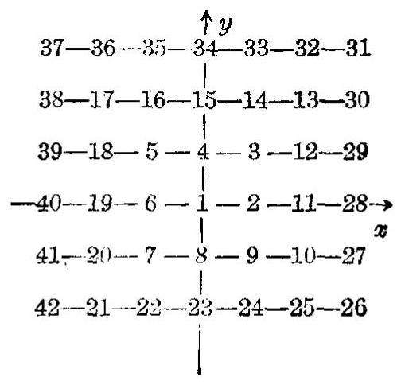

解 按题意将自然数排列成如右图状. 注意到坐标:

$\left( {0,0}\right)$ 对应的数为 ${1}^{2}$ ;

$\left( {0,1}\right)$ 对应的数为 ${2}^{2}$ ;

$\left( {1, - 1}\right)$ 对应的数为 ${3}^{2}$ ;

$\left( {-1,2}\right)$ 对应的数为 ${4}^{2}$ ;

$\left( {2, - 2}\right)$ 对应的数为 ${5}^{2}$ .

按此规律推出: $\left( {3, - 3}\right)$ 对应的数为 ${7}^{2}$ ;

......

$\left( {{15}, - {15}}\right)$ 对应的数为 ${31}^{2} = {961}$ .

$\left( {{16}, - {15}}\right)$ 对应的数为 962,然后向上数 31 个数到达 $({16}$ , 16),对应的数为 993,再向左数到第 7 个数到达 $\left( {9,{16}}\right)$ ,其对应的数为 1000 .

例 10 平面上有 $n$ 条抛物线,其中每两条都只相交于两点, 并且每三条都不相交于一点. 求证: 这 $n$ 条抛物线把平面分成 $f\left( n\right)  = {n}^{2} + 1$ 个部分.

证 $\because$ 第 $k + 1$ 条抛物线与前 $k$ 条抛物线共有 ${2k}$ 个交点, 将第 $k + 1$ 条抛物线分成 ${2k} + 1$ 段弧,

$\therefore$

$$
f\left( {k + 1}\right)  = f\left( k\right)  + {2k} + 1.
$$

$\because f\left( 1\right)  = 2,\therefore$ 当 $n = 1$ 时, $f\left( n\right)  = {n}^{2} + 1$ 成立.

设 $f\left( k\right)  = {k}^{2} + 1$ ,则

$$
f\left( {k + 1}\right)  = f\left( k\right)  + {2k} + 1 = {k}^{2} + 1 + {2k} + 1 = {\left( k + 1\right) }^{2} + 1,
$$

故 $n = k + 1$ 时， $f\left( n\right)  = {n}^{2} + 1$ 也成立，所以 $n$ 为一切自然数时, $f\left( n\right)  = {n}^{2} + 1$ 都成立.

这里再次说明递推关系是数学归纳法论证的关键, 这也就是为什么一开始就抓住递推关系来进行探索的道理.

例 11 在平面上有点列 ${P}_{0}\text{ 、 }{P}_{1}\text{ 、 }{P}_{2}\text{ 、 }\cdots \text{ 、 }{P}_{n}\text{ 、 }\cdots ,{P}_{0}\text{ 、 }{P}_{1}$ 对应的复数为 $0\text{ 、 }1$ . 对于任意自然数 $n$ ,线段 ${P}_{n}{P}_{n + 1}$ 的长度是线段 ${P}_{n - 1}{P}_{n}$ 的两倍,射线 ${P}_{n - 1}{P}_{n}$ 和 ${P}_{n}{P}_{n + 1}$ 的夹角为 $\frac{2\pi }{3}$ . 求点 ${P}_{3n}$ 对应的复数.

分析 点 ${P}_{3n}$ 对应的复数,即向量 $\overrightarrow{{P}_{0}{P}_{3n}}$ 对应的复数,根据向量加法, 有

$$
\overrightarrow{{P}_{0}{P}_{3n}} = \overrightarrow{{P}_{0}{P}_{1}} + \overrightarrow{{P}_{1}{P}_{2}} + \overrightarrow{{P}_{2}{P}_{3}} + \cdots  + \overrightarrow{{P}_{{3n} - 1}{P}_{3n}}.
$$

按题意有 $\overrightarrow{{P}_{n - 1}{P}_{n}}$ 和 $\overrightarrow{{P}_{n}{P}_{n + 1}}$ 对应的两复数 ${z}_{n - 1}$ 与 ${z}_{n}$ 之间的关系:

$$
{z}_{n} = 2{z}_{n - 1}\left( {\cos \frac{2\pi }{3} + i\sin \frac{2\pi }{3}}\right)  = 2{z}_{n - 1}\omega .
$$

这就是数列 $\left\{  {z}_{n}\right\}$ 的递推关系,可得

$\overrightarrow{{P}_{0}{P}_{1}}$ 对应的复数为 ${z}_{0} = 1 + {0i}$ ;

$\overrightarrow{{P}_{1}{P}_{2}}$ 对应的复数为 ${z}_{1} = 2\left( {\cos \frac{2\pi }{3} + i\sin \frac{2\pi }{3}}\right)  = {2\omega }$ ;

$\overrightarrow{{P}_{2}{P}_{3}}$ 对应的复数为 ${z}_{2} = 2{z}_{1}\omega  = {2}^{2}{\omega }^{2}$ ;

......

$\overrightarrow{{P}_{n}{P}_{n + 1}}$ 对应的复数为 ${z}_{n} = 2{z}_{n - 1}\omega  = {2}^{n}{\omega }^{n}$ ;

......

于是 $\overrightarrow{{P}_{0}{P}_{3n}}$ 对应的复数可用等比数列求和公式获解.

解 按分析, 有

$$
\overrightarrow{{P}_{0}{P}_{3n}} = \left( {\overrightarrow{{P}_{0}{P}_{1}} + \overrightarrow{{P}_{1}{P}_{2}} + \overrightarrow{{P}_{2}{P}_{3}} + \cdots  + \overrightarrow{{P}_{{3n} - 1}{P}_{3n}}}\right)
$$

$$
= 1 + {2\omega } + {2}^{2}{\omega }^{2} + \cdots  + {2}^{{2n} - 1}{\omega }^{{3n} - 1}
$$

$$
= \frac{1 - {\left( 2\omega \right) }^{3n}}{1 - {2\omega }} = \frac{1 - {2}^{3n}}{1 - \left( {-1 + \sqrt{3}i}\right) }
$$

$$
= \frac{1 - {2}^{3n}}{2 - \sqrt{3}i} = \frac{\left( {1 - {2}^{3n}}\right) \left( {2 + \sqrt{3}i}\right) }{4 + 3}
$$

$$
= \frac{-2}{7}\left( {{2}^{3n} - 1}\right)  - i\frac{\sqrt{3}}{7}\left( {{2}^{3n} - 1}\right) .
$$

例 12 设当 $x \in  \left\lbrack  {0,1}\right\rbrack$ 时， $f\left( {x + 1}\right)  = {2f}\left( x\right)$ ，

(1)求证: $f\left( {x + n}\right)  = {2}^{n}f\left( x\right)$ ， $f\left( {x - n}\right)  = \frac{1}{{2}^{n}}f\left( x\right)$ ，

其中, $\;n \in  N,\;x \in  \left\lbrack  {0,1}\right\rbrack$ .

(2)如果 $f\left( x\right)  = x\left( {1 - x}\right)$ ，试作 $y = f\left( x\right)$ ， $x \in  \left( {-\infty , + \infty }\right)$ 的图象.

证 (1) 当 $n = 1$ 时,

$$
f\left( {x + 1}\right)  = {2f}\left( x\right) , x \in  \left\lbrack  {0,1}\right\rbrack
$$

①

已知成立.

设 $n = k$ 时, $f\left( {x + k}\right)  = {2}^{k}f\left( x\right) , x \in  \left\lbrack  {0,1}\right\rbrack$ 成立,

则 $f\left( {x + k + 1}\right)  = {2f}\left( {x + k}\right)  = {2}^{k + 1}f\left( x\right) , x \in  \left\lbrack  {0,1}\right\rbrack$ 成立,

$\therefore n$ 为一切自然数时, $f\left( {x + n}\right)  = {2}^{n}f\left( x\right) , x \in  \left\lbrack  {0,1}\right\rbrack$ 成立.

$\because$ 由已知有 $f\left( x\right)  = \frac{1}{2}f\left( {x + 1}\right)$ ,

$\therefore \;f\left( {x - 1}\right)  = \frac{1}{2}f\left( x\right) , x \in  \left\lbrack  {0,1}\right\rbrack$②

设 $f\left( {x - k}\right)  = \frac{1}{{2}^{k}}f\left( x\right) , x \in  \left\lbrack  {0,1}\right\rbrack$ 成立，

则 $f\left( {x - k - 1}\right)  = \frac{1}{2}f\left( {x - k}\right)  = \frac{1}{{2}^{k + 1}}f\left( x\right) , x \in  \left\lbrack  {0,1}\right\rbrack$ 成立，

$\therefore n$ 为一切自然数时,

$$
f\left( {x - n}\right)  = \frac{1}{{2}^{n}}f\left( x\right) , x \in  \left\lbrack  {0,1}\right\rbrack
$$

成立.

(2)先作出 $f\left( x\right)  = x\left( {1 - x}\right) , x \in  \left\lbrack  {0,1}\right\rbrack$ 的图象.

再根据 $f\left( {x + n}\right)  = {2}^{n}f\left( x\right) , f\left( {x - n}\right)  = \frac{1}{{2}^{n}}f\left( x\right) , x \in  \left\lbrack  {0,1}\right\rbrack$ 利用平移作, $x \in  \left\lbrack  {k, k + 1}\right\rbrack  \left( {k \in  Z}\right)$ 的图象如图 2-4-01.

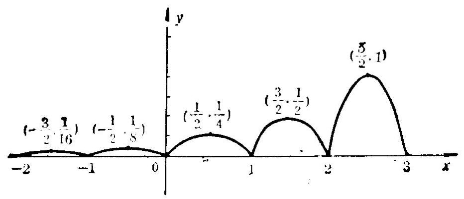

图 2-4-01

例 13 根据

${\left( \sqrt{2} - 1\right) }^{1} = \sqrt{2} - 1$

${\left( \sqrt{2} - 1\right) }^{2} = 3 - 2\sqrt{2} = \sqrt{9} - \sqrt{8},$

$$
{\left( \sqrt{2} - 1\right) }^{3} = 5\sqrt{2} - 7 = \sqrt{50} - \sqrt{49},\;2 \times  {50} \times  {49} = {70}^{2}.
$$

试写出 ${\left( \sqrt{2} - 1\right) }^{4} =$ ___=___，___=___;

$$
{\left( \sqrt{2} - 1\right) }^{n} = \text{ \_\_\_ } = \text{ \_\_\_，\_\_\_\_\_\_\_\_\_. }
$$

并用数学归纳法证明你的判断.

分析 按照 $n = 1,2,3,4$ 的规律,可知

$$
{\left( \sqrt{2} - 1\right) }^{4} = 4 - 4{\left( \sqrt{2}\right) }^{3} + 6{\left( \sqrt{2}\right) }^{2} - 4\sqrt{2} + 1
$$

$$
= {17} - {12}\sqrt{2} = \sqrt{289} - \sqrt{288},
$$

$$
2 \times  {289} \times  {288} = {408}^{2}.
$$

因而猜测 ${\left( \sqrt{2} - 1\right) }^{n} = \sqrt{m + 1} - \sqrt{m}$ ,且 $2\left( {m + 1}\right) m = {p}^{2}$ .

证 按上面分析,可知 $n = 1\text{ 、 }2$ 时,命题成立.

设 $n = k$ 时, ${\left( \sqrt{2} - 1\right) }^{k} = \sqrt{l + 1} - \sqrt{l}$ ,且 ${2l}\left( {l + 1}\right)  = {q}^{2}$ , 则 ${\left( \sqrt{2} - 1\right) }^{k + 1} = \left( {\sqrt{l + 1} - \sqrt{l}}\right) \left( {\sqrt{2} - 1}\right) \; = \sqrt{2\left( {l + 1}\right) } - \sqrt{2l} - \sqrt{l + 1} + \sqrt{l} \; = \left( {\sqrt{2\left( {l + 1}\right) } + \sqrt{l}}\right)  - \left( {\sqrt{2l} + \sqrt{l + 1}}\right) \; = \sqrt{{3l} + 2 + 2\sqrt{{2l}\left( {l + 1}\right) }} - \sqrt{{3l} + 1 + 2\sqrt{{2l}\left( {l + 1}\right) }} \; = \sqrt{{3l} + {2q} + 2} - \sqrt{{3l} + {2q} + 1}$ ,

$$
\text{ (其中 }q = \sqrt{{2l}\left( {l + 1}\right) }\text{ ). }
$$

又

$$
2\left( {{3l} + {2q} + 2}\right) \left( {{3l} + {2q} + 1}\right)
$$

$$
= 2{\left( \sqrt{2\left( {l + 1}\right) } + \sqrt{l}\right) }^{2}{\left( \sqrt{2l} + \sqrt{l + 1}\right) }^{2}
$$

$$
= {\left\lbrack  2\left( l + 1\right)  + 2l + \sqrt{2l} \cdot  3 \cdot  \sqrt{l + 1}\right\rbrack  }^{2}
$$

$$
= {\left\lbrack  4l + 3q + 2\right\rbrack  }^{2}\text{ , }
$$

故 $n = k + 1$ 时,命题也成立. 所以 $n$ 为一切自然数时, ${\left( \sqrt{2} - 1\right) }^{n} \; = \sqrt{m + 1} - \sqrt{m}\text{ 、 }{2m}\left( {m + 1}\right)  = {p}^{2}$ 成立.

例 14 如图 2-4-02, ${A}_{1}\text{ 、 }{A}_{2}\text{ 、 }{A}_{3}\text{ 、 }\cdots$ 顺次在 $x$ 轴上, ${B}_{1}\text{ 、 }{B}_{2}$ 、 ${B}_{3}$ 、 一顺次在曲线 $y = \sqrt{x}$ 上，且 $\bigtriangleup  O{A}_{1}{B}_{1}$ 、 $\bigtriangleup  {A}_{1}{A}_{2}{B}_{2}$ 、 $\bigtriangleup  {A}_{2}{A}_{3}{B}_{3}$ 、 ...都是正三角形.

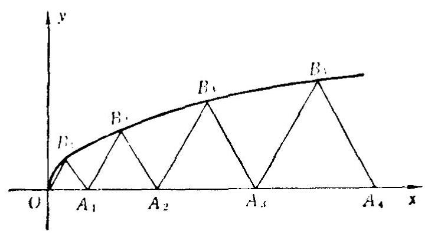

图 2-4-02

(1)求 ${A}_{n}$ 的横坐标 ${x}_{n}$ ;

(2)证明(1)的结果;

(3)计算

$$
\mathop{\lim }\limits_{{n \rightarrow  \infty }}\frac{1}{{n}^{3}}\mathop{\sum }\limits_{{k = 1}}^{n}{x}_{k}
$$

分析 $\because \bigtriangleup O{A}_{1}{B}_{1}\text{ 、 }\bigtriangleup {A}_{1}{A}_{2}{B}_{2}\text{ 、 }\bigtriangleup {A}_{2}{A}_{3}{B}_{3}\text{ 、 }\cdots$ 都是正三角形, $\therefore$ 点 ${B}_{1}$ 的横坐标为 $\frac{1}{2}O{A}_{1} = \frac{1}{2}{x}_{1}$ ; 点 ${B}_{2}$ 的横坐标为 ${x}_{1} + \; \frac{1}{2}\left( {{x}_{2} - {x}_{1}}\right)$ .

利用点 ${B}_{1}\text{ 、 }{B}_{2}\text{ 、 }{B}_{3}\text{ 、 }\cdots$ 在曲线 $y = \sqrt{x}$ 上的条件,可以推求 ${x}_{1}\text{ 、 }{x}_{2}\text{ 、 }{x}_{3}\text{ 、 }\cdots$ . 利用直线 ${A}_{k}{B}_{k + 1}$ 的参数方程

$$
\left\{  {\begin{array}{l} x = {x}_{k} + t\cos {60}^{ \circ  }, \\  y = {y}_{k} + t\sin {60}^{ \circ  }; \end{array}\;\left( {\text{ 其中 }t = {x}_{k + 1} - {x}_{k}}\right) }\right.
$$

可推出 $n = k$ 到 $n = k + 1$ 的递推关系,则可用数学归纳法证明 ${x}_{n}$ 的公式.

解 (1) $\because$ 点 ${B}_{1}\left( {{x}_{1}/2,\sqrt{3}{x}_{1}/2}\right)$ 在曲线 $y = \sqrt{x}$ 上,

$\therefore \frac{3}{4}{x}_{1}^{2} = \frac{1}{2}{x}_{1}$ ,从此可得 ${x}_{1} = \frac{2}{3} = \frac{1}{3}\left( {1 \times  2}\right)$ .

直线 ${A}_{1}{B}_{2}$ 的参数方程为

$$
\left\{  {\begin{array}{l} x = \frac{2}{3} + t\cos {60}^{ \circ  }, \\  y = t\sin {60}^{ \circ  }, \end{array}\;\left( {t = {x}_{2} - x}\right) .}\right.
$$

即

$$
3{t}^{2} - {2t} - \frac{8}{3} = 0,\;t = \frac{4}{3},
$$

$$
{x}_{2} = {x}_{1} + t = \frac{2}{3} + \frac{4}{3} = 2 = \frac{1}{3}\left( {2 \times  3}\right) .
$$

直线 ${A}_{2}{B}_{3}$ 的参数方程为

$$
\left\{  {\begin{array}{l} x = 2 + t\cos {60}^{ \circ  }, \\  y = t\sin {60}^{ \circ  }, \end{array}\;\left( {t = {x}_{3} - {x}_{2}}\right) }\right.
$$

$\therefore$

$$
\frac{3}{4}{t}^{2} = 2 + \frac{1}{2}t
$$

即

$$
3{t}^{2} - {2t} - 8 = 0, t = 2,
$$

$$
{x}_{3} = {x}_{2} + t = 4 - \frac{1}{3}\left( {3 \times  4}\right) .
$$

猜想

$$
{x}_{n} = \frac{1}{3}n\left( {n + 1}\right) .
$$

(2)直线 ${A}_{k}{B}_{k + 1}$ 的参数方程为

$$
\left\{  {\begin{array}{l} x = {x}_{k} + t\cos {60}^{ \circ  }, \\  y = t\sin {60}^{ \circ  }; \end{array}\;\left( {t = {x}_{k + 1} - {x}_{k}}\right) }\right.
$$

$\therefore$

$$
\frac{3}{4}{t}^{2} = {x}_{k} + \frac{1}{2}t
$$

即

$$
3{t}^{2} - {2t} - 4{x}_{k} = 0.
$$

如果设 ${x}_{k} = \frac{1}{3}k\left( {k + 1}\right)$ ,则

$$
3{t}^{2} - {2t} - \frac{4}{3}k\left( {k + 1}\right)  = 0,
$$

$$
t = \frac{2}{3}\left( {k + 1}\right)
$$

$\therefore \;{x}_{k + 1} = {x}_{k} + t = \frac{k}{3}\left( {k + 1}\right)  + \frac{2}{3}\left( {k + 1}\right)  = \frac{1}{3}\left( {k + 1}\right) \left( {k + 2}\right)$ .

故 $n = k + 1$ 时,命题 ${x}_{n} = \frac{1}{3}n\left( {n + 1}\right)$ 也正确.

$\therefore n$ 为一切自然数时, ${x}_{n} = \frac{1}{3}n\left( {n + 1}\right)$ 都成立.

(3) $\;\because \mathop{\sum }\limits_{{k = 1}}^{n}{x}_{k} = \frac{1}{3}\mathop{\sum }\limits_{{k = 1}}^{n}k\left( {k + 1}\right)$

$$
= \frac{1}{9}\mathop{\sum }\limits_{{k = 1}}^{n}\{ k\left( {k + 1}\right) \left( {k + 2}\right)
$$

$$
- \left( {k - 1}\right) k\left( {k + 1}\right) \}
$$

$$
= \frac{1}{9}n\left( {n + 1}\right) \left( {n + 2}\right) ,
$$

$\therefore \;\mathop{\lim }\limits_{{n \rightarrow  \infty }}\frac{1}{{n}^{3}}\mathop{\sum }\limits_{{k = 1}}^{n}{x}_{k} = \mathop{\lim }\limits_{{n \rightarrow  \infty }}\frac{1}{9}\left( {1 + \frac{1}{n}}\right) \left( {1 + \frac{2}{n}}\right)  = \frac{1}{9}$ .

例 15 N.伯努里首先提出下列问题: 某人写了 $n$ 封信和对应的信封, 问所有的信都装错了信封的情况有多少种? (错排问题)

解 设 $n$ 封信都装错了信封的情况有 ${a}_{n}$ 种,那末 ${a}_{1} = 0,{a}_{2} =$ 1 是显然的. 为了求 ${a}_{n}$ ,先从探索递推关系入手.

${a}_{n}$ 可以通过以下两个步骤获得.

第一步:对于第一个信封 ${A}_{1}$ 来说，装错的办法有 $n - 1$ 种(即除去第一封信外,余下的 $n - 1$ 封信都可以).

第二步: 选取余下的 $n - 1$ 个封信 ${A}_{2}\text{ 、 }{A}_{3}\text{ 、 }\cdots \text{ 、 }{A}_{n}$ 的错排数, 可分两类不同情形处理. 不妨假设第一个信封 ${A}_{1}$ 内装的是第 $k$ 封信 $\left( {k \neq  1}\right)$ ,第一种情形是在第 $k$ 个信封 ${A}_{k}$ 中装的不是第一封信,这就是说,在第 $2\text{ 、 }3\text{ 、 }\cdots \text{ 、 }k - 1\text{ 、 }k\text{ 、 }k + 1\text{ 、 }\cdots \text{ 、 }n$ 个信封中分别各不允许装第2、3、 $\cdots$ 、 $k - 1$ 、 $k$ 、 $k + 1$ 、 $\cdots$ 、 $n$ 封信，即 $n - 1$ 封信的错排数为 ${a}_{n - 1}$ ; 第二种情形是在第 $k$ 个信封 ${A}_{k}$ 中正好 装的第一封信,那末余下的 $n - 2$ 个信封中分别各不允许装第 $2\text{ 、 }3\text{ 、 }\cdots$ 、 $k - 1\text{ 、 }k + 1\text{ 、 }\cdots \text{ 、 }n$ 封信,即 $n - 2$ 个信封的错排数为 ${a}_{n - 2}$ . 按乘法、加法原理, 有

$$
{a}_{n} = \left( {n - 1}\right) \left( {{a}_{n - 1} + {a}_{n - 2}}\right)
$$

①

欲从 ${a}_{1} = 0,{a}_{2} = 1$ ,与①式推出通项公式,关键在于对 ① 式进行变形,找出一个辅助数列 $\left\{  {x}_{n}\right\}$ .

由 ① 有

$$
{a}_{n} - n{a}_{n - 1} =  - \left\lbrack  {{a}_{n - 1} - \left( {n - 1}\right) {a}_{n - 2}}\right\rbrack
$$

②

令

$$
{x}_{n} = {a}_{n} - n{a}_{n - 1},
$$

则由 ② 有

$$
{x}_{n} =  - {x}_{n - 1}
$$

$\therefore$

$$
{x}_{n} =  - {x}_{n - 1} = {\left( -1\right) }^{2}{x}_{n - 2} = {\left( -1\right) }^{3}{x}_{n - 3}
$$

$$
= \cdots  = {\left( -1\right) }^{n - 2}{x}_{2}.
$$

- .

$$
{x}_{2} = {a}_{2} - 2{a}_{1} = 1,
$$

$\therefore$

$$
{x}_{n} = {\left( -1\right) }^{n - 2} = {\left( -1\right) }^{n}
$$

③

从 ③ 与 ${x}_{n} = {a}_{n} - n{a}_{n - 1}$ 得

$$
{a}_{n} = {\left( -1\right) }^{n} + n{a}_{n - 1},
$$

而 ${a}_{n - 1} = {\left( -1\right) }^{n - 1} + \left( {n - 1}\right) {a}_{n - 2}$ ，

$$
{a}_{n - 2} = {\left( -1\right) }^{n - 2} + \left( {n - 2}\right) {a}_{n - 3},
$$

$\cdots \cdots ,$

$\therefore$

$$
{a}_{n} = {\left( -1\right) }^{n} + n\left\lbrack  {{\left( -1\right) }^{n - 1} + \left( {n - 1}\right) {a}_{n - 2}}\right\rbrack
$$

$$
= {\left( -1\right) }^{n} + n{\left( -1\right) }^{n - 1} + n\left( {n - 1}\right) \left\lbrack  {\left( -1\right) }^{n - 2}\right.
$$

$$
\left. {+\left( {n - 2}\right) {a}_{n - 3}}\right\rbrack
$$

$$
= {\left( -1\right) }^{n} + n{\left( -1\right) }^{n - 1} + n\left( {n - 1}\right) {\left( -1\right) }^{n - 2}
$$

$$
+ n\left( {n - 1}\right) \left( {n - 2}\right) {a}_{n - 3}
$$

......

$$
= {\left( -1\right) }^{n} + n{\left( -1\right) }^{n - 1} + n\left( {n - 1}\right) {\left( -1\right) }^{n - 2}
$$

$$
+ n\left( {n - 1}\right) \left( {n - 2}\right) {\left( -1\right) }^{n - 3}
$$

$$
+ \cdots  + n\left( {n - 1}\right) \cdots 3{\left( -1\right) }^{2}
$$

$$
= n!\left\lbrack  {\frac{{\left( -1\right) }^{n}}{n!} + \frac{{\left( -1\right) }^{n - 1}}{\left( {n - 1}\right) !} + \frac{{\left( -1\right) }^{n - 2}}{\left( {n - 2}\right) !} + \cdots  + \frac{1}{2!}}\right\rbrack  ,
$$

即 ${a}_{n} = n!\left\lbrack  {1 - \frac{1}{1!} + \frac{1}{2!} - \frac{1}{3!} + \cdots  + {\left( -1\right) }^{n}\frac{1}{n!}}\right\rbrack   \approx  n!{e}^{-1}$ .

递推观点主要是通过把握递推关系, 从特殊情形探索一般规律, 并利用递推关系作逻辑推理, 借助数学归纳法证明我们的猜想. 解决这方面的问题是一种极好的思维训练. 它也是掌握数学归纳法论证部分的关键, 希望读者对此反复回味, 做到心领神会而且运用自如.

## 思 考 题 四

1. 在数列 $\left\{  {a}_{n}\right\}$ 中， ${a}_{1} = 2$ ， ${a}_{n + 1} = 3{a}_{n} + 1$ ，求数列 $\left\{  {a}_{n}\right\}$ 的通项公式.

2. 已知数列 $\left\{  {a}_{n}\right\}$ 中， ${a}_{1} = \frac{1}{6}$ ， ${a}_{n + 1} = \frac{n}{n + 3}{a}_{n}$ ， $\left( {n \geq  1}\right)$ ，

(1)求 ${a}_{n}$ ，并加以证明；

(2) 求 $\mathop{\lim }\limits_{{n \rightarrow  \infty }}{S}_{n} =$ ?.

3. 求证: $\operatorname{tg}\theta  + 2\operatorname{tg}{2\theta } + 4\operatorname{tg}{4\theta } + \cdots  + {2}^{n - 1}\operatorname{tg}{2}^{n - 1}\theta$

$$
= \operatorname{ctg}\theta  - {2}^{n}\operatorname{ctg}{2}^{n}\theta ,\left( {n \in  N}\right) .
$$

4. 已知数列 $\left\{  {a}_{n}\right\}$ 中， ${a}_{1} = \cos \alpha$ ， ${a}_{2} = \cos {2\alpha }$ ，从第二项起，每一项都等于它相邻两项的和除以 $2\cos \alpha$ ，试写出通项 ${a}_{n}$ 的表达式并加以证明.

5. 求证: 对于任何自然数 $n,{3}^{2n} - {8n} - 1$ 能被 64 整除.

6. 在数列 $\left\{  {a}_{n}\right\}$ 中, ${a}_{1} = a,{a}_{2} = b$ ,且 $3{a}_{n + 2} - 5{a}_{n + 1} + 2{a}_{n} = 0$ , $\left( {n \geq  1}\right)$ .

(1)用 $a$ 、 $b$ 、 $n$ 表达 ${a}_{n}$ ；

(2)求出使 $\mathop{\sum }\limits_{{n = 1}}^{\infty }{a}_{n} = 9$ 的 $a$ 、 $b$ .

7. 在数列 $\left\{  {a}_{n}\right\}$ 中, ${a}_{1} = 7,{a}_{2} = 3,3{a}_{n + 2} = 2{a}_{n + 1} + {a}_{n}$ ,

(1)求数列 $\left\{  {a}_{n}\right\}$ 的通项公式；

(2)求 $\mathop{\lim }\limits_{{n \rightarrow  \infty }}{a}_{n}$ .

8. 求证: 多项式 $f\left( x\right)  = {x}^{n + 2} + {\left( x + 1\right) }^{{2n} + 1}$ 能被 ${x}^{2} + x + 1$ 整除. 其中 $n$ 是非负整数.

9. 在数列 $\left\{  {a}_{n}\right\}$ 中, ${a}_{1} = 1,{a}_{2} = 8,{a}_{n} = \sqrt{{a}_{n - 1}{a}_{n - 2}}\left( {n \in  N, n \geq  3}\right)$ ,

(1)求 ${a}_{n - 1}$ 与 ${a}_{n}$ 之间的关系式；

(2)将 ${a}_{n}$ 用 $n$ 表示出来,并求 $\mathop{\lim }\limits_{{n \rightarrow  \infty }}{a}_{n} = ?$ .

10. 在数列 $\left\{  {a}_{n}\right\}$ 中， ${a}_{1} = \sqrt{\frac{1}{2}\sqrt{3}}$ ， ${a}_{n} = \sqrt{\frac{1}{2}\sqrt{3{a}_{n - 1}}}$ (其中 $n = 1$ ， $2,3,\cdots )$ ,求数列 $\left\{  {a}_{n}\right\}$ 的通项公式.

11. 已知 $f\left( x\right)  = \frac{3x}{x + 3}$ ,数列 $\left\{  {x}_{n}\right\}$ 的通项 ${x}_{n} = f\left( {x}_{n - 1}\right) \text{ 、 }\left( {n \geq  2}\right)$ , ${x}_{n} \neq  0,{x}_{n} \neq   - 3$ ,求证: $\frac{1}{{x}_{n + 1}} - \frac{1}{{x}_{n}}$ 是个定值.

12. 已知: $a$ 为正整数, $\alpha \text{ 、 }\beta \left( {\alpha  > \beta }\right)$ 是方程 ${x}^{2} - {ax} - 1 = 0$ 的两个根,设 ${f}_{n} = \frac{{\alpha }^{n} - {\beta }^{n}}{\sqrt{{a}^{2} + 4}}$ ,(其中 $n = 1,2,\cdots$ ),求证: 所有 ${f}_{n}$ 都是正整数.

13. 对于 $n \geq  2$ 的自然数,试证明 ${2}^{n} > 1 + n\sqrt{{2}^{n - 1}}$ .

14. 已知 $n$ 个实数 ${a}_{1}\text{ 、 }{a}_{2}\text{ 、 }\cdots \text{ 、 }{a}_{n}$ ,且 $0 < {a}_{i} < 1$ ,其中 $i = 1,2,\cdots , n$ . 求证: ${a}_{1}{a}_{2}\cdots {a}_{n} > {a}_{1} + {a}_{2} + \cdots  + {a}_{n} + 1 - n,\left( {n \geq  2}\right)$ .

15. 在复平面上 ${P}_{1}\text{ 、 }{P}_{2}\text{ 、 }{P}_{3}\text{ 、 }\cdots \text{ 、 }{P}_{n}\text{ 、 }\cdots$ 依次表示复数 ${z}_{1}\text{ 、 }{z}_{2}\text{ 、 }{z}_{3}$ 、 $\cdots {z}_{n}\cdots$ ,若 ${z}_{1} = 1,{z}_{n + 1} = \frac{\cos \alpha  + i\sin \alpha }{2}{z}_{n},\;\left( {n \in  N,\alpha \text{ 为常 }}\right)$ 数).

(1)写出数列 $\left\{  {z}_{n}\right\}$ 的通项公式;

(2)证明 $\mathop{\sum }\limits_{{i = 1}}^{n}{z}_{i} = \frac{{2}^{n} - \cos {n\alpha } - i\sin {n\alpha }}{{2}^{n} - {2}^{n - 1}\left( {\cos \alpha  + i\sin \alpha }\right) }$ ;

(3) 求 $S = \left| {{P}_{1}{P}_{2}}\right|  + \left| {{P}_{2}{P}_{3}}\right|  + \left| {{P}_{3}{P}_{4}}\right|  + \cdots  + \left| {{P}_{n}{P}_{n + 1}}\right|  + \cdots$ .

16. 已知数列 ${a}_{1},{a}_{2},{a}_{3},\cdots ,{a}_{n},\cdots$ 的相邻二项 ${a}_{n},{a}_{n + 1}$ 是方程 ${x}^{2} + {3nx} + {c}_{n} = 0\left( {n = 1,2,\cdots }\right)$ 的两根,当 ${a}_{1} = 1$ 时,求 $\mathop{\sum }\limits_{{n = 1}}^{{2p}}{c}_{n}$ .

17. ${a}_{n}$ 、 ${b}_{n}$ 是满足 ${\left( 3 + \sqrt{2}\right) }^{n} = {a}_{n} + {b}_{n}\sqrt{2}$ 的整数 $\left( {n \in  N}\right)$ ,连结 $\left( {{a}_{n},{b}_{n}}\right) \text{ 、 }\left( {{a}_{n + 1},{b}_{n + 1}}\right)$ 两点的直线的斜率为 ${t}_{n}$ ,

(1)求证: ${\left( 3 - \sqrt{2}\right) }^{n} = {a}_{n} - {b}_{n}\sqrt{2}$ ；

(2)求 $\mathop{\lim }\limits_{{n \rightarrow  \infty }}{t}_{n} =$ ?.

18. 已知: $z = a + {bi}$ 的模 $\left| z\right|  = 1\left( {a, b\text{ 为有理数 }}\right)$ ,

求证: $\left| {{z}^{2n} \pm  1}\right|$ 也是有理数 $\left( {n \in  N}\right)$ .

## 五 极 限 观 点

在微积分诞生之前, 人们已多次碰到常量数学所无法解决的问题. 如刘徽利用割圆术求圆周长与圆面积, 阿基米得求抛物拱面积等等. 在常量数学无能为力的困难面前，出路何在呢? 在无法求精确解的情况下，自然想到求近似解来代替精确解. 开始阶段， 求得的近似解, 误差较大. 如我国古代有 “径一周三”之说, 实即求得的圆周率的近似值为 3 . 随着生产的发展，要求的精确度逐步提高, 通过不断改进, 求出的误差越来越小, 但不论误差多么小, 仍然是近似值. 当人们发现近似解乃是某变量的函数，观察到一系列近似解演变的趋势乃是不断向一定值逼近时. 凭直觉猜想这一定值就是所要求的精确解. 这一猜想是否正确呢? 如何判别其正确或谬误呢? 这曾使人们苦恼了一个半世纪，直至柯西(Cauchy, 1789 $\sim  {1857})$ 提出极限的 $\varepsilon  - N,\varepsilon  - \delta$ 定义才获解决. 这种利用一系列近似解向精确解无限逼近的思维方法就是极限观点. 下面用实例说明极限观点的应用.

例 1 一矩形闸门宽 1 米，长 4 米，水深 3 米，求闸门所受到的水压力是多少(见图 2-5-01)？

解 由于压强随水深而变化, 故应用常量数学无法求其精确解，不得已而求其近似解. 将闸门沿水深方向分为 $n$ 等分，分别求其所受压力的近似值, 然后加起来.

<table><tr><td></td><td>不足近似值</td><td>过剩近似值</td></tr><tr><td>最上一层的压强的</td><td>0</td><td>$\frac{3}{n}$</td></tr><tr><td>第二层的压强的</td><td>$\frac{3}{n}$</td><td>$\frac{6}{n}$</td></tr><tr><td>第三层的压强的</td><td>$\frac{6}{n}$</td><td>$\frac{9}{n}$</td></tr><tr><td>... ...</td><td>...</td><td></td></tr><tr><td>第 $n$ 层的压强的</td><td>$\frac{3\left( {n - 1}\right) }{n}$</td><td>$\frac{3n}{n}$</td></tr></table>

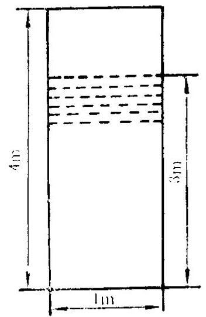

图 2-5-01

每一层的面积为 $1 \times  \frac{3}{n} = \frac{3}{n}\left( {\mathrm{\;m}}^{2}\right)$ .

闸门所受总压力 $P$ 的不足近似值为

$$
{P}_{n}^{ - } = \frac{3}{n}\left\lbrack  {\frac{3}{n} + \frac{6}{n} + \cdots  + \frac{3\left( {n - 1}\right) }{n}}\right\rbrack
$$

$$
= \frac{9}{{n}^{2}}\left( {1 + 2 + 3 + \cdots  + n - 1}\right)
$$

$$
= \frac{9}{2}\left( {1 - \frac{1}{n}}\right) \text{ (吨). }
$$

闸门所受总压力 $P$ 的过剩近似值为

$$
{P}_{n}^{ + } = \frac{3}{n}\left( {\frac{3}{n} + \frac{6}{n} + \cdots  + \frac{3n}{n}}\right)
$$

$$
= \frac{9}{{n}^{2}}\left( {1 + 2 + \cdots  + n}\right)
$$

$$
= \frac{9}{2}\left( {1 + \frac{1}{n}}\right) \text{ (吨). }
$$

从静止观点看,无论 $n$ 为怎样大的定值, ${P}_{n}^{ - }\text{ 、 }{P}_{n}^{ + }$ 只能是具有一定误差的近似值. 但从变化观点看,当 $n$ 无限变大 (即将闸门无限细分) 时,误差越来越小, ${P}_{n}^{ - }\text{ 、 }{P}_{n}^{ + }$ 都向定值 $\frac{9}{2}$ 吨无限逼近,因而猜想 $\frac{9}{2}$ 吨即闸门所受水压力的精确值.

上述猜想是否正确? 怎样判定正误? 只有证明当 $n$ 无限变大时, ${P}_{n}^{ - }\text{ 、 }{P}_{n}^{ + }$ 与 $\frac{9}{2}$ 吨的绝对误差可以小到比预先给定的任意小的绝对误差界还要小, 才能肯定其正确.

给定任意小的绝对误差界 $s\left( {\varepsilon  > 0}\right)$ ，

(欲证 $\left| {{P}_{n}^{ - } - \frac{9}{2}}\right|  = \left| {{P}_{n}^{ + } - \frac{9}{2}}\right|  = \frac{9}{2n} < \varepsilon$ ,只要 $n > \frac{9}{2\varepsilon }$ 就可以了).

取 $N = \left\lbrack  \frac{9}{2\varepsilon }\right\rbrack$ ,当 $n > N$ 时 (即当闸门等分数超过 $N$ 时),

则 $\left| {{P}_{n}^{ - } - \frac{9}{2}}\right|  = \left| {{P}_{n}^{ + } - \frac{9}{2}}\right|$

$$
= \frac{9}{2n} < \frac{9}{2N} = \frac{9}{2 \times  \frac{9}{2\varepsilon }} = 8
$$

$$
\therefore \left| {{P}_{n}^{ - } - \frac{9}{2}}\right|  = \left| {{P}_{n}^{ + } - \frac{9}{2}}\right|  < 8
$$

恒成立.

这证明了 ${P}_{n}^{ - }\text{ 、 }{P}_{n}^{ + }$ 在 $n$ 无限变大的条件下,都向着定值无限逼近, 即

$$
\mathop{\lim }\limits_{{n \rightarrow  \infty }}{P}_{n}^{ - } = \mathop{\lim }\limits_{{n \rightarrow  \infty }}{P}_{n}^{ + } = \frac{9}{2}\text{ (吨). }
$$

所以闸门所受到的水压力的精确解为 $\frac{9}{2}$ 吨.

例 2 初速为零的匀加速直线运动的位移

$$
S = \frac{1}{2}a{t}^{2}\left( \mathrm{\;m}\right)
$$

试求第 $t$ 秒末的即时速度 ${v}_{t} = ?$ .

解 求即时速度,常量数学也是无能为力的. 先求第 $t$ 秒末到第 $t + \frac{1}{n}$ 秒末的平均速度 ${\widehat{v}}_{n}$ 作为第 $t$ 秒末即时速度的近

似值.

$$
\overline{{v}_{n}} = \frac{\frac{1}{2}a{\left( t + \frac{1}{n}\right) }^{2} - \frac{1}{2}a{t}^{2}}{t + \frac{1}{n} - t} = {at} + \frac{a}{2n}.
$$

当 $n$ 无限变大时 (即第 $t$ 秒末到第 $\left( {t + \frac{1}{n}}\right)$ 秒末之间的时间间隔越来越小), ${\bar{v}}_{n}$ 演变的趋势越来越向定值 ${at}$ 逼近.

给定任意小绝对误差界 $\varepsilon \left( {\varepsilon  > 0}\right)$ ，

(欲证 $\left| {{\overrightarrow{v}}_{n} - {at}}\right|  = \frac{a}{2n} < \varepsilon$ ，只要 $n > \frac{a}{2\varepsilon }$ 就可以了.)

取 $N = \left\lbrack  \frac{a}{2\varepsilon }\right\rbrack$ ,当 $n > N$ 时,

则

$$
\left| {{\bar{v}}_{n} - {at}}\right|  = \frac{a}{2n} < \varepsilon \text{ 恒成立. }
$$

这证明了在 $n$ 无限变大的条件下, ${\bar{v}}_{n}$ 演变的趋势向着定值 ${at}$ 无限逼近. 所以把第 $t$ 秒末的即时速度规定为 ${at}\left( {\mathrm{\;m}/\mathrm{{sec}}}\right)$ 是完全合理的.

上述例 1、2 正是定积分与导数原型的极限问题，都是通过极限观点取得解决的. 它们的实质无非是数列极限的 $\varepsilon  - N$ 式定义的运用. 这一定义就是数列 $\left\{  {a}_{n}\right\}$ 演变的趋势能否向某一定值 $A$ 无限逼近的定量检验标准.

为了判断数列 $\left\{  {a}_{n}\right\}$ (一系列近似解) 是否能无限逼近定值 $A$ , 人们给出任意小的绝对误差界 $\varepsilon$ ,看数列演变下去,是否存在一项 ${a}_{N}$ ,当 $n > N$ 时,即自第 $N + 1$ 项 ${a}_{N + 1}$ 起以后的一切项与 $A$ 的绝对误差 $\left| {{a}_{n} - A}\right|$ 都小于 $\varepsilon$ . 由于 $\varepsilon$ 的任意性,说明绝对误差 $\left| {{a}_{n} - A}\right|$ 要多小就多小,精确地刻画了 ${a}_{n}$ 确实向定值 $A$ 无限逼近. 这正说明数列极限的 $\varepsilon  - N$ 式的定义是数列(一系列近似解)能否无限逼近定值(精确解)的定量判别标准.

如果把 $\varepsilon$ 看作为任意小的距离，把 $\left\{  {a}_{n}\right\}$ 看作数轴上的点列，则 $\left| {{a}_{n} - A}\right|$ 就是点 ${a}_{n}$ 与点 $A$ 之间的距离. 对于任意小的距离 $s$ ,都存在 $N$ ,当 $n > N$ 时,点 ${a}_{n}$ 与点 $A$ 之间的距离 $\left| {{a}_{n} - A}\right|$ 都小于 $s$ , 亦即自 ${a}_{N + 1}$ 开始以后的一切项对应的无穷多点都落在点 $A$ 的 $\varepsilon$

例 3 已知抛物线 ${y}^{2} = {2px}$ 上两个点 $A\left( {{x}_{1},{y}_{1}}\right) \text{ 、 }B\left( {{x}_{2},{y}_{2}}\right)$ ,过 ${AB}$ 的中点 $M$ 作平行于抛物线轴的直邻域 $\left( {A - \varepsilon , A + \varepsilon }\right)$ 内. 这同样精确地描述了 ${a}_{n}$ 向 $A$ 无限逼近的实质.

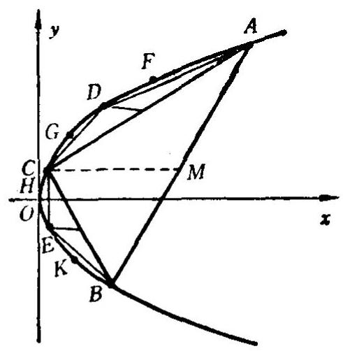

图 2-5-02

函数极限的 $\varepsilon  - \delta$ 定义与数列极限的 $\varepsilon  - N$ 定义没有本质上的差异，无需赘述. 下面再看两个实例. 线 ${MO}$ 交抛物线于点 $O$ ,得 $\bigtriangleup {ABO}$ ,再自 ${AO}\text{ 、 }{BO}$ 的中点作平行于抛物线轴的直线分别交抛物线于点 $D\text{ 、 }E$ ,得 $\bigtriangleup {ADO}\text{ 、 }\bigtriangleup {BEO}$ , 如此继续下去,可得抛物拱 ${ABC}$ 的面积的近似解:

$$
\mathop{\sum }\limits_{{k = 1}}^{n}{S}_{k} = \bigtriangleup {ABC} + \left( {\bigtriangleup {ADC} + \bigtriangleup {BEC}}\right)  + (\bigtriangleup {AFD}
$$

$$
+ \bigtriangleup {DGC} + \bigtriangleup {OHE} + \bigtriangleup {BKE}) + \cdots ,
$$

利用极限概念求抛物拱面积 $S$ 的值.

解 按题意, ${AB}$ 中点 $M$ 的坐标为 $\left( {\frac{{x}_{1} + {x}_{2}}{2},\frac{{y}_{1} + {y}_{2}}{2}}\right)$ ,点 $O$ 的坐标为 $\left( {\frac{{\left( {y}_{1} + {y}_{2}\right) }^{2}}{8p},\frac{{y}_{1} + {y}_{2}}{2}}\right) ,\bigtriangleup {ABC}$ 的面积 ${S}_{1}$ 为

$$
{S}_{1} = \frac{1}{2}\left| \begin{matrix} \frac{{y}_{1}^{2}}{2p} & {y}_{1} & 1 \\  \frac{{\left( {y}_{1} + {y}_{2}\right) }^{2}}{8p} & \frac{{y}_{1} + {y}_{2}}{2} & 1 \\  \frac{{y}_{2}^{2}}{2p} & {y}_{2} & 1 \end{matrix}\right| \text{ 的绝对值 }
$$

$$
= \frac{1}{2}\left| \begin{matrix} \frac{{y}_{1}^{2}}{2p} & {y}_{1} & 1 \\  \frac{{\left( {y}_{1} + {y}_{2}\right) }^{2} - {\left( 2{y}_{1}\right) }^{2}}{8p} & \frac{{y}_{2} - {y}_{1}}{2} & 0 \\  \frac{{y}_{2}^{2} - {y}_{1}^{2}}{2p} & {y}_{2} - {y}_{1} & 0 \end{matrix}\right| \text{ 的绝对值 }
$$

$$
= \frac{{\left( {y}_{1} - {y}_{2}\right) }^{2}}{32p}\left| \begin{array}{l} 3{y}_{1} + {y}_{2}1 \\  4\left( {{y}_{2} + {y}_{1}}\right) 2 \end{array}\right|  = \frac{1}{16p}{\left| {y}_{1} - {y}_{2}\right| }^{3}.
$$

按同样方法，可得

$$
{S}_{2} = {S}_{\bigtriangleup {ADC}} + {S}_{\bigtriangleup {BEC}} = \frac{1}{16p}\left\lbrack  {{\left| {y}_{1} - \frac{{y}_{1} + {y}_{2}}{2}\right| }^{3} + {\left| \frac{{y}_{1} + {y}_{2}}{2} - {y}_{2}\right| }^{3}}\right\rbrack
$$

$$
= \frac{1}{4} \times  \frac{1}{16p}{\left| {y}_{1} - {y}_{2}\right| }^{3} = \frac{1}{4}{S}_{1}
$$

$$
{S}_{3} = {S}_{\bigtriangleup {AFD}} + {S}_{\bigtriangleup {DGC}} + {S}_{\bigtriangleup {CHE}} + {S}_{\bigtriangleup {BEK}}
$$

$$
= \frac{1}{16p}\left\{  {{\left| {y}_{1} - \frac{3{y}_{1} + {y}_{2}}{4}\right| }^{3} + {\left| \frac{3{y}_{1} + {y}_{2}}{4} - \frac{{y}_{1} + {y}_{2}}{2}\right| }^{3}}\right.
$$

$$
+ \left| {\frac{{y}_{1} + {y}_{2}}{2} - \frac{{y}_{1} + 3{y}_{2}}{4}}\right| \left. {+{\left| \frac{{y}_{1} + 3{y}_{2}}{4} - {y}_{2}\right| }^{3}}\right\}
$$

$$
= {\left( \frac{1}{4}\right) }^{2}\frac{1}{16p}{\left| {y}_{1} - {y}_{2}\right| }^{3} = {\left( \frac{1}{4}\right) }^{2} \cdot  {S}_{1};
$$

............

同理, 可证得

$$
{S}_{k + 1} = \frac{1}{4}{S}_{k}
$$

$$
\therefore \;\mathop{\sum }\limits_{{k = 1}}^{n}{S}_{k} = {S}_{1} + \frac{1}{4}{S}_{1} + {\left( \frac{1}{4}\right) }^{2}{S}_{1} + \cdots  + {\left( \frac{1}{4}\right) }^{n - 1}{S}_{1}
$$

$$
= \frac{{S}_{1}\left\lbrack  {1 - {\left( \frac{1}{4}\right) }^{n}}\right\rbrack  }{1 - \frac{1}{4}} = \frac{4}{3}{S}_{1}\left\lbrack  {1 - {\left( \frac{1}{4}\right) }^{n}}\right\rbrack  .
$$

按数列极限的定义易证得 $\mathop{\lim }\limits_{{n \rightarrow  \infty }}{\left( \frac{1}{4}\right) }^{n} = 0,\therefore$ 抛物拱面积

$$
S = \frac{4}{3}{S}_{1} = \frac{1}{12p}{\left| {y}_{1} - {y}_{2}\right| }^{3}.
$$

相传阿基米得在公元前二百多年, 就用上面类似的方法求出抛物拱的面积. 当然, 若应用积分法就能很快得到同样结果.

例 4 求正弦曲线 $y = \sin x$ 在 $x = 0$ 到 $x = \pi$ 之间与 $x$ 轴围成的面积.

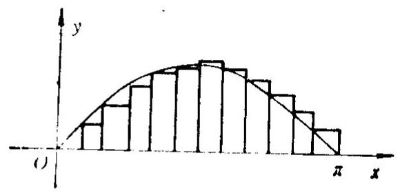

图 2-5-03

解 先将 $x$ 轴上从 0 到 $\pi$ 的一段 $n$ 等分,分点是

$$
0\text{ 、 }\frac{\pi }{n}\text{ 、 }\frac{2\pi }{n}\text{ 、 }\cdots \text{ 、 }\frac{n\pi }{n}.
$$

过各分点作 $x$ 轴的垂线，把图象分成 $n$ 块,每一块用矩形来近似表示,于是得到第 $k$ 块的近似面积是 $\frac{\pi }{n}\sin \frac{\left( {k - 1}\right) \pi }{n}$ .

所以所求面积 $S$ 的近似解为

$$
{S}_{n} = \frac{\pi }{n}\left( {\sin \frac{\pi }{n} + \sin \frac{2\pi }{n} + \cdots  + \sin \frac{n - 1}{n}\pi }\right)
$$

$$
= \frac{\pi }{{2n}\sin \frac{\pi }{2n}}\left( {2\sin \frac{\pi }{n}\sin \frac{\pi }{2n} + 2\sin \frac{2\pi }{n}\sin \frac{\pi }{2n}}\right.
$$

$$
\left. {+\cdots  + 2\sin \frac{n - 1}{n}\pi \sin \frac{\pi }{2n}}\right)
$$

$$
= \frac{\pi }{{2n}\sin \frac{\pi }{2n}}\left( {\cos \frac{\pi }{2n} - \cos \frac{3\pi }{2n} + \cos \frac{3\pi }{2n} - \cos \frac{5\pi }{2n}}\right.
$$

$$
\left. {+\cdots  + \cos \frac{{2n} - 3}{2n}\pi  - \cos \frac{{2n} - 1}{2n}\pi }\right)
$$

$$
= \frac{\pi }{{2n}\sin \frac{\pi }{2n}}\left( {\cos \frac{\pi }{2n} - \cos \frac{{2n} - 1}{2n}\pi }\right)
$$

$$
= \frac{\frac{\pi }{2n}}{\sin \frac{\pi }{2n}}\left\lbrack  {\cos \frac{\pi }{2n} - \cos \left( {1 - \frac{1}{2n}}\right) \pi }\right\rbrack  .
$$

$$
\because \mathop{\lim }\limits_{{n \rightarrow  \infty }}\frac{\frac{\pi }{2n}}{\sin \frac{\pi }{2n}} = 1,\;\mathop{\lim }\limits_{{n \rightarrow  \infty }}\cos \frac{\pi }{2n} = \cos 0 = 1,
$$

$$
\mathop{\lim }\limits_{{n \rightarrow  \infty }}\cos \left( {1 - \frac{1}{2n}}\right) \pi  = \cos \pi ,
$$

$$
\therefore \;S = \mathop{\lim }\limits_{{n \rightarrow  \infty }}{S}_{n} = 1 - \cos \pi  = 2\text{ . }
$$

其实,上面的解法就是定积分 ${\int }_{0}^{x}\sin {xdx}$ 按定义的做法. 现在许多实际问题，都可以应用微积分直接求解，极限观点似乎已没有实用价值. 但是, 这一思维方法渗透于全部无穷小分析, 以至函数逼近论. 很多重要的数学原理, 也是应用这一思维方法推导的. 弄清这一基本观点的意义对今后的学习和思维能力的发展仍有不可估量的作用.

## 思考题五

1. 试用极限概念求 $y = {x}^{2}$ 与 $x$ 轴及直线 $x = a\text{ 、 }x = b$ 所围图形的面积.

2. 试用极限概念推导圆锥体积公式.

3. 试用极限概念推导球体积公式.

4. 一直线运动位移的公式为 $S = a{t}^{3}$ ，试求第 $t$ 秒末的即时速度.

5. 已知一直线运动的初速为零，即时速 $t$ 为 ${at}$ ，试求在 $t$ 秒钟内所走的位移 $s = ?$ .

## 六 参 数 观 点

辩证唯物论肯定事物之间的联系是无穷的，联系的方式是丰富多采的, 有明有暗, 有显有隐. 科学的任务是要揭示事物之间的内在联系, 从而发现事物的变化规律. 列宁说: “要真正地认识对象, 就必须把握和研究它的一切方面、一切联系和媒介”. 对于复杂的事物、复杂的矛盾, 就必须分析它的一切方面, 特别是构成矛盾的对立双方. 对立面的联系如果是明显的，问题就不难顺利地解决. 如果对立面的联系是隐暗的，那么为了揭示它们之间的联系， 探索解决矛盾的办法, 就不能不求助于 “媒介”. 在数学中，已知与未知，条件与结论，函数与自变量，轨迹上动点的流动坐标 $\left( {x, y}\right)$ 之间都存在固有的联系, 只有把握它们之间的联系, 才能找到解决问题的方法. 当这类联系处于隐暗状态时, 那就得求助于“媒介”. 这里“媒介”可以是辅助未知量，辅助线，也可以是参数. 辅助未知量一般是常量, 参数则是变量. 辅助线在平面几何中有所论述, 辅助未知量在方程观点已有说明, 下面专门谈谈参数问题.

参数亦称参变量. 参数的作用是刻画事物的变化状态，揭示变化因素之间的内在联系. 如直线系、圆系、二次曲线系方程中的任意常数 $\lambda$ .

设 ${S}_{i}\left( {x, y}\right)  = {A}_{i}{x}^{2} + {B}_{i}{xy} + {C}_{i}{y}^{2} + {D}_{i}x + {E}_{i}y + {F}_{i} = 0$

$$
\left( {i = 1,2}\right)
$$

为两已知的二次曲线方程, 则

$$
{S}_{1}\left( {x, y}\right)  = \lambda {S}_{2}\left( {x, y}\right)
$$

①

为过两已知二次曲线 ${S}_{1}\left( {x, y}\right)  = 0\text{ 、 }{S}_{2}\left( {x, y}\right)  = 0$ 交点的二次曲线的全体(✗——)驻外). 其中 $\lambda$ 为任意实数，即参数. 它的作用是刻画这一二次曲线集合的变化状态，揭示它们之间的内在联系. 根据附加条件，可以求它们之中符合附加条件的那一条二次曲线的方程 (就是利用附加条件，列出含 $\lambda$ 的方程，求出 $\lambda$ 的值，即可得解).

曲线系方程中所含参数不一定只有一个. 例如, 一般二次曲线的方程

$$
A{x}^{2} + {Bxy} + C{y}^{2} + {Dx} + {Ey} + F = 0\;\left( {{A}^{2} + {B}^{2} + {C}^{2} \neq  0}\right)
$$

由于 $A\text{ 、 }B\text{ 、 }C$ 不全为零,不妨设 $A \neq  0$ ,方程两边同除以 $A$ ,则

$$
{x}^{2} + \frac{B}{A}{xy} + \frac{C}{A}{y}^{2} + \frac{D}{A}x + \frac{E}{A}y + \frac{F}{A} = 0
$$

其中 $\frac{B}{A}\text{ 、 }\frac{C}{A}\text{ 、 }\frac{D}{A}\text{ 、 }\frac{E}{A}\text{ 、 }\frac{F}{A}$ 都可以是参数.

同样的道理, 在方程、不等式、函数的研究中, 各项的字母系数也是参数. 如

$$
f\left( x\right)  = a{x}^{2} + {bx} + c\;\left( {a \neq  0}\right)
$$

其中 $a\text{ 、 }b\text{ 、 }c$ 也是参数. 如果 $a\text{ 、 }b\text{ 、 }c$ 为任意实数 $\left( {a \neq  0}\right)$ ,则 $f\left( x\right) \; = a{x}^{2} + {bx} + c$ 表示二次函数的全体.

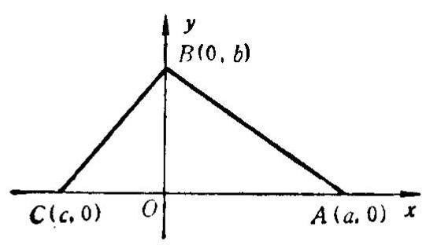

图 2-6-01

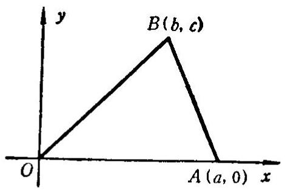

图 2-6-02

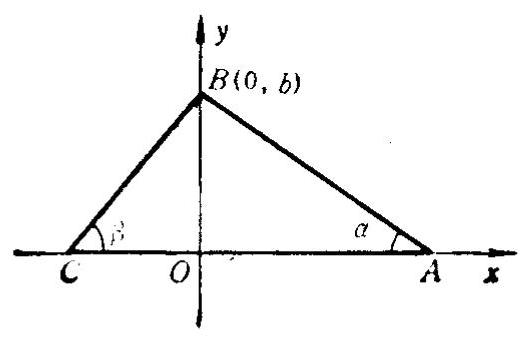

图 2-6-03

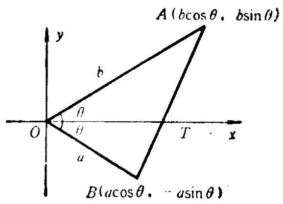

图 2-6-04

在研究几何问题时, 通过坐标系来表示一类图形, 也离不了参数. 例如, 在直角坐标系中, 表示 一个任意三角形, 必须引用三个独立的参数. 这是因为在平面上, 三个条件确定一个三角形. 一般有如下几种选择坐标系与参数的方法,如图 2-6-01、2-6-02、 2-6-03、2-6-04 所示.

当然, 上述四种取法, 并未包括一切可能性. 在具体问题中, 究竟怎样取方便, 那就得视实际情况而定.

例 1 在任意三角形 ${ABC}$ 中,在边 ${AB}\text{ 、 }{AC}$ 上分别取 $D\text{ 、 }E$ , 使 $\left| {BD}\right|  = \left| {CE}\right| ,{DE}\text{ 、 }{BO}$ 的中点分别为 $G\text{ 、 }F,\angle A$ 的平分线为 ${AT}$ . 求证: ${FG}//{AT}$ .

分析 由于题目涉及 $\angle A$ 的平分线,而 $\angle A$ 内、外角平分线互相垂直，为了便于确定 $A$ 、 $B$ 、 $O$ 、 $D$ 、 $E$ 、 $F$ 、 $G$ 谐点的坐标，可取 $A$ 为原点， $A$ 、 $T$ 所在直线为 $x$ 轴，建立直角坐标系(如图 2-6- 05). 取 $\frac{1}{2}\angle A = \theta ,\left| {AB}\right|  = {2c},\left| {AO}\right|  = {2b},\left| {BD}\right|  = \left| {OE}\right|  = {2l}$ 为参数，则各点坐标分别为

$$
B\left( {{2c}\cos \theta ,{2c}\sin \theta }\right) \text{ 、 }C\left( {{2b}\cos \theta , - {2b}\sin \theta }\right) \text{ 、 }
$$

$$
D\left( {2\left( {c - l}\right) \cos \theta ,2\left( {c - l}\right) \sin \theta }\right) \text{ 、 }E\left( {2\left( {b - l}\right) \cos \theta , - 2\left( {b - l}\right) \sin \theta }\right) ,
$$

$\therefore \; F\text{ 、 }G$ 的纵坐标分别为

$$
{y}_{F} = \frac{1}{2}\left( {{y}_{B} + {y}_{O}}\right)  = \left( {c - b}\right) \sin \theta ,
$$

$$
{y}_{G} = \frac{1}{2}\left( {{y}_{D} + {y}_{E}}\right)  = \left( {c - b}\right) \sin \theta .
$$

$$
\because {y}_{F} = {y}_{O},\;\therefore \;{FG}//{AT}\text{ . }
$$

证 略.

本题如选择其他三种坐标系, 则证明过程中运算量较多.

例 2 已知等腰 $\bigtriangleup {ABC}$ 中顶角为 $A$ ,圆 $D$ 与 $\bigtriangleup {ABC}$ 的外接圆内切,且与两腰 ${AB}\text{ 、 }{AC}$ 相切,切点分别为 $P\text{ 、 }Q$ ,求证线段 ${PQ}$ 的中点 $M$ 是 $\bigtriangleup {ABC}$ 的内心.

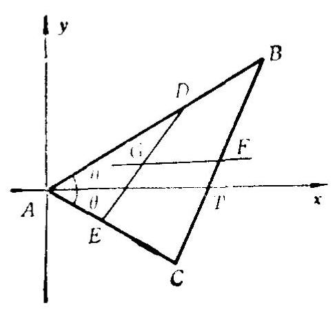

图 2-6-05

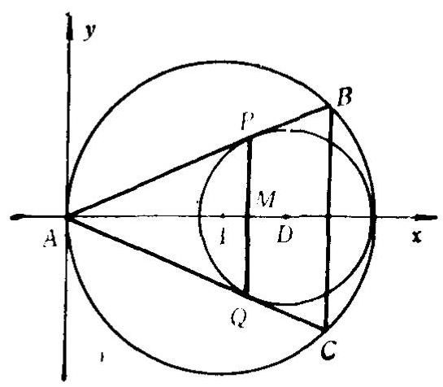

图 2-6-06

分析 因 $\bigtriangleup {ABC}$ 的内心 $I$ 在顶角 $A$ 的平分线上,故可取 $A$ 为原点, $\angle A$ 的平分线所在的直线为 $x$ 轴. 为了便于确定 $P\text{ 、 }Q\text{ 、 }I$ 诸点的坐标，可取 $\angle A = {2\varphi }$ ， $\bigtriangleup  {ABC}$ 的外接圆半径 $R$ 为参数.

证 按分析取坐标系如图 2-6-06. 设 $\angle A = {2\varphi },\bigtriangleup {ABC}$ 的外接圆半径为 $R$ ,则

$$
\left| {AB}\right|  = \left| {AC}\right|  = {2R}\sin \left( {\frac{\pi }{2} - \varphi }\right)  = {2R}\cos \varphi .
$$

$$
{BC} = {2R}\sin {2\varphi }.
$$

$\therefore$ 内切圆半径

$$
r = \frac{2{S}_{\bigtriangleup {ABC}}}{\left| {AB}\right|  + \left| {AC}\right|  + \left| {BC}\right| } = \frac{\left| {AB}\right|  \cdot  \left| {AC}\right| \sin {2\varphi }}{{4R}\cos \varphi  + {2R}\sin {2\varphi }}
$$

$$
= \frac{8{R}^{2}{\cos }^{3}\varphi \sin \varphi }{{4R}\cos \varphi \left( {1 + \sin \varphi }\right) } = \frac{{2R}{\cos }^{2}\varphi \sin \varphi }{1 + \sin \varphi }.
$$

设点 $I$ 为内心,点 $I$ 的横坐标为 ${x}_{I}$ ,

$$
{x}_{I} = \frac{r}{\sin \varphi } = \frac{{2R}{\cos }^{2}\varphi }{1 + \sin \varphi }.
$$

$\because$ 圆 $D$ 与外接圆内切,

$$
{2R} - {AD} = {DP} = {AD}\sin \varphi .
$$

从此,得 ${AD} = \frac{2R}{1 + \sin \varphi }$ ,

$$
{AP} = {AQ} = {AD}\cos \varphi  = \frac{{2R}\cos \varphi }{1 + \sin \varphi }.
$$

$\because$ 点 $M$ 为 ${PQ}$ 的中点,点 $M$ 的横坐标为 ${x}_{M}$ ,

$$
\text{ - }{x}_{M} = {AM} = {AP}\cos \varphi  = \frac{{2R}{\cos }^{2}\varphi }{1 + \sin \varphi }\text{ . }
$$

$\therefore {x}_{I} = {x}_{M}$ ,且 ${y}_{I} = {y}_{M} = 0$ ,

$\therefore M\text{ 、 }I$ 两点重合,即 ${PQ}$ 的中点就是三角形的内心.

在几何图形的表示法中, 选用参数的个数, 一般以能确定图形即可. 过少则无法确定或使图形特殊化, 致使论证陷入以偏概全的错误; 过多则易遗漏参数之间的关系式 (多选一个参数, 即多一个参数之间的关系式), 使论证陷入困境. 下面再举两个有关这方面的例子，以引起注意.

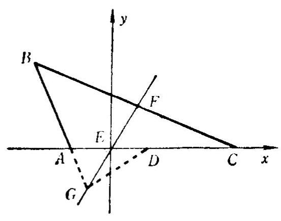

图 2-6-07

例 3 在 $\bigtriangleup {ABO}$ 中， ${AO} > \; {AB}$ ，在 ${OA}$ 上截取 $\left| {OD}\right|  = \left| {AB}\right|$ ， $E$ 、 $F$ 分别是 ${AD}$ 、 ${BC}$ 的中点， ${FE}$ 交 ${BA}$ 的延长线于 $G$ ,若 $\angle {CEF} = {60}^{ \circ  }$ ,求证: ${\left| AD\right| }^{2} = \; {\left| AG\right| }^{2} + {\left| DG\right| }^{2}$ .

分析 因 $\angle {CEF} = {60}^{ \circ  }$ ,以及 $\left| {OD}\right|  = \left| {AB}\right|$ ,且 $E\text{ 、 }F$ 分别为 ${AD}\text{ 、 }{BO}$ 的中点,为了便于确定各点的坐标,可取 $E$ 点为原点, ${AO}$ 所在直线为 $x$ 轴.

证 取 $E$ 为原点,直线 ${AO}$ 为 $x$ 轴,建立直角坐标系如图 2-6-07. 设 $\left| {AD}\right|  = {2a},\left| {AB}\right|  = \left| {CD}\right|  = b,\left| {EF}\right|  = l$ ，以 $a\text{ 、 }b\text{ 、 }l$ 为参数,则各点坐标分别为 $A\left( {-a,0}\right) \text{ 、 }D\left( {a,0}\right) \text{ 、 }C\left( {a + b,0}\right)$ 、 $F\left( {l\cos {60}^{ \circ  }, l\sin {60}^{ \circ  }}\right)$ .

$\because F$ 是 ${BC}$ 的中点,点 $B$ 的坐标为 $\left( {{x}_{B},{y}_{B}}\right)$ ,

$\therefore \;{x}_{B} + a + b = {2l}\cos {60}^{ \circ  },{y}_{B} + 0 = {2l}\sin {60}^{ \circ  }$ ,

故点 $B$ 的坐标为 $\left( {l - a - b,\sqrt{3}l}\right)$ .

$$
\because \left| {CD}\right|  = \left| {AB}\right| \text{ , }
$$

$\therefore \;{\left( l - a - b + a\right) }^{2} + 3{l}^{2} = {b}^{2}$ ，即 $b = {2l}$ .

直线 ${EF}$ 的参数方程为

$$
\left\{  \begin{array}{l} x = t\cos {60}^{ \circ  } \\  y = t\sin {60}^{ \circ  } \end{array}\right.
$$

①

直线 ${AB}$ 的方程为

$$
y = \frac{\sqrt{3}l}{l - a - b + a}\left( {x + a}\right) \text{ ,即 }
$$

$$
\sqrt{3}x + y + \sqrt{3}a = 0
$$

②

以①代入②得

$$
\frac{\sqrt{3}}{2}t + \frac{\sqrt{3}}{2}t + \sqrt{3}a = 0
$$

$$
\therefore \;t =  - a\text{ . }
$$

⺀。

$$
\left| {EG}\right|  = a = \left| {DE}\right|  = \left| {AE}\right| ,
$$

$\therefore$ 点 $G$ 在以 ${AD}$ 为直径的圆上,即 $\bigtriangleup {ADG}$ 为一个直角三角形，其中 ${AD}$ 为斜边，故

$$
{\left| AD\right| }^{2} = {\left| AG\right| }^{2} + {\left| DG\right| }^{2}.
$$

这里如未发现 $b = {2l}$ ，则直线 ${AB}$ 的方程难以简化为 ②，使论证陷入困境.

例 4 平面上两圆相交， $A$ 为一个交点，两质点同时从 $A$ 出发，以定角速度分别在各自的圆周上依相同方向绕行，旋转一周后,两质点同时到达原出发点. 证明在这平面上有一定点 $P$ ,使得在任何时刻 $P$ 点到两动点 ${Q}_{\mathrm{x}}{Q}^{\prime }$ 的距离相等.

分析 欲证存在一定点 $P$ 到 $Q\text{ 、 }{Q}^{\prime }$ 距离相等,可从证明 $Q{Q}^{\prime }$ 的中垂线过定点入手. 利用两动点的角速度相等，可证 $Q{Q}^{\prime }$ 过两圆的另一交点 $B$ . 为了便于确定 $Q$ 、 ${Q}^{\prime }$ 两点的坐标，可取 $B$ 点为原点,直线 ${AB}$ 为 $y$ 轴.

证 取两圆的另一交点 $B$ 为原点,直线 ${AB}$ 为 $y$ 轴,建立直角坐标系如图 2-6-08.

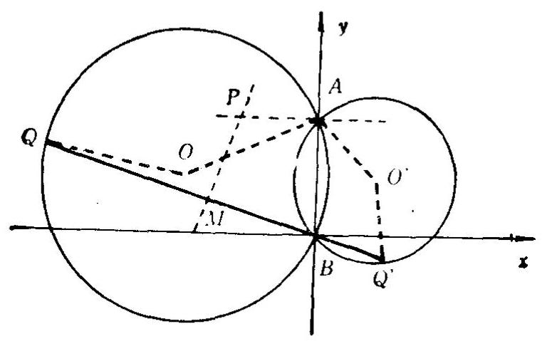

图 2-6-08

因为质点的角速度相等，所以 $\angle {AOQ} = \angle {A{O}^{\prime }{Q}^{\prime }}$ .

$$
\because \angle {ABQ} = \frac{1}{2}\angle {AOQ},\angle {AB}{Q}^{\prime } = \frac{1}{2}\left( {{2\pi } - \angle A{O}^{\prime }{Q}^{\prime }}\right) ,
$$

$$
\angle {ABQ} + \angle {AB}{Q}^{\prime } = \pi .
$$

故直线 $Q{Q}^{\prime }$ 必过两圆的另一交点 $B$ .

取 $\left( {\overrightarrow{Bx},\overrightarrow{{Q}^{\prime }Q}}\right)  = \theta ,\left| {BQ}\right|  = {\rho }_{1},\left| {B{Q}^{\prime }}\right|  = {\rho }_{2},\left| {AB}\right|  = b$ ,两圆的中心 $O$ 、 ${O}^{\prime }$ 的横坐标分别为 $c$ 、 $a$ ，则两圆的方程分别为

$$
{x}^{2} + {y}^{2} - {2cx} - {by} = 0,
$$

$$
{x}^{2} + {y}^{2} - {2ax} - {by} = 0,
$$

$Q\text{ 、 }{Q}^{\prime }$ 的坐标为 $\left( {{\rho }_{1}\cos \theta ,{\rho }_{1}\sin \theta }\right) \text{ 、 }\left( {{\rho }_{2}\cos \left( {\pi  + \theta }\right) ,{\rho }_{2}\sin \left( {\pi  + \theta }\right) }\right)$ .

$\because$ 点 $Q\text{ 、 }{Q}^{\prime }$ 分别在圆 $O$ 与圆 ${O}^{\prime }$ 上,

$\therefore {\rho }_{1}^{2} - \left( {{2c}\cos \theta  + b\sin \theta }\right) {\rho }_{1} = 0$ ,即 ${\rho }_{1} = {2c}\cos \theta  + b\sin \theta$ ;

${\rho }_{2}^{2} + \left( {{2a}\cos \theta  + b\sin \theta }\right) {\rho }_{2} = 0$ ,即 ${\rho }_{2} =  - {2a}\cos \theta  - b\sin \theta$ .

$$
{\rho }_{1} - {\rho }_{2} = 2\left( {a\cos \theta  + c\cos \theta  + b\sin \theta }\right)
$$

①

$\because Q{Q}^{\prime }$ 的中点 $M$ 的坐标为

$$
\left( {\frac{{\rho }_{1} - {\rho }_{2}}{2}\cos \theta ,\frac{{\rho }_{1} - {\rho }_{2}}{2}\sin \theta }\right) ,
$$

$\therefore Q{Q}^{\prime }$ 的中垂线方程为

$$
x\cos \theta  + y\sin \theta  = \frac{{\rho }_{1} - {\rho }_{2}}{2}{\cos }^{2}\theta  + \frac{{\rho }_{1} - {\rho }_{2}}{2}{\sin }^{2}\theta .
$$

以①代入上式, 得

$$
x\cos \theta  + y\sin \theta  = \left( {a + c}\right) \cos \theta  + b\sin \theta ,
$$

即

$$
\left( {x - a - c}\right) \cos \theta  + \left( {y - b}\right) \sin \theta  = 0,
$$

$\therefore Q{Q}^{\prime }$ 的中垂线过定点 $P\left( {a + c, b}\right)$ ,故 $\left| {PQ}\right|  = \left| {P{Q}^{\prime }}\right|$ .

这里选用了六个参数，而确定此图形只要五个独立参数就可以了. 这六个参数之间存在一个关系式 ①. 如果未发现此关系式，就无法证明命题的结论.

以上诸例通过坐标系, 利用参数刻画了图形中各个变化因素的变化状态，又揭示了各个变化因素之间的内在联系，通过运算阐明了因蕴含果的无可争辩的理由.

下面再研究参数在解轨迹问题中的运用.

在轨迹问题中, 对于简单问题, 通过轨迹条件容易找到轨迹上任意一点的流动坐标 $\left( {x, y}\right)$ (即笛卡儿的变量) 之间的内在联系. 对于复杂的轨迹问题， $x$ 、 $y$ 之间的联系处于隐含状态，难以一眼望穿. 要揭示受轨迹条件制约的 $x$ 、 $y$ 之间的固有联系,那就必须选择恰当的参数 (媒介), 通过参数刻画动点的变化状态, 同时依靠参数作媒介，揭示 $x, y$ 之间的内在联系，从而求出轨迹方程.

参数一般可以是有向线段的值, 动直线的倾角或斜率, 运动向量的幅角,已知曲线上的动点坐标 $\left( {{x}_{1},{y}_{1}}\right)$ (也可称为二维向量或复参数), 及其他几何量、物理量.

选取参数应注意下列三点.

(1)参数是随轨迹上动点运动而变化的变量. 应便于刻画动点的变化状态，根据轨迹条件，应用参数确定动点的坐标.

(2)根据轨迹条件，便于建立含参数与动点流动坐标的方程.

(3)一般要求建立方程的个数比选用的参数多一个. 在可能情况下，应考虑以后消参数的方便.

下面用实例来说明参数在轨迹题中的应用.

例 5 点 ${O}_{1}$ 绕定点 $O$ 作逆时针方向匀角速 $\omega$ 旋转，点 $P$ 绕 ${O}_{1}$ 作顺时针方向匀角速 ${k\omega }\left( \mathbf{k}\right.$ 为常数) 旋转. 且 $\left| {{O}_{1}P}\right|  = R$ , $\left| {O{O}_{1}}\right|  = L,0 < R < L$ ,而 $L - R \ll  R$ . 试求点 $P$ 的轨迹方程.

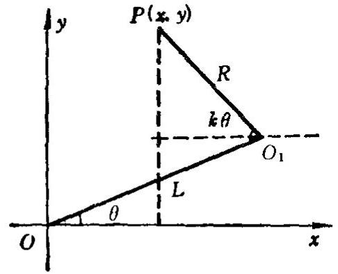

图 2-6-09

解 以点 $P$ 在 $O\text{ 、 }{O}_{1}$ 的连线上时为起始位置. 取定点 $O$ 为原点, $O$ 与 ${O}_{1}$ 的起始位置的连线为 $x$ 轴, 建立直角坐标系，如图 2-6-09.

经过 $t$ 秒后，点 $P\left( {x, y}\right)$ 运动到如图 2-6-09 所示的位置. 取

$$
\angle {XO}{O}_{1} = \theta
$$

为参数,即 $\theta  = {\omega t},\angle P{O}_{1}O = {k\omega t} = {k\theta },\left( {\overrightarrow{OX},\overrightarrow{{O}_{1}P}}\right)  = \pi  - \left( {k - 1}\right) \theta$ .

- $\overrightarrow{OP} = \overrightarrow{O{O}_{1}} + \overrightarrow{{O}_{1}P}$ ，且 $\overrightarrow{OP}$ 、 $\overrightarrow{O{O}_{1}}$ 、 $\overrightarrow{{O}_{1}P}$ 对应的复数分别为

$$
\overrightarrow{OP} : x + {yi};\overrightarrow{O{O}_{1}} : L\left( {\cos \theta  + i\sin \theta }\right) ;
$$

$$
\overrightarrow{{O}_{1}P} : R\{ \cos \left\lbrack  {\pi  - \left( {k - 1}\right) \theta }\right\rbrack   + i\sin \left\lbrack  {\pi  - \left( {k - 1}\right) \theta }\right\rbrack  \} ,
$$

$$
\therefore x + {yi} = L\left( {\cos \theta  + i\sin \theta }\right)  + R\lbrack  - \cos \left( {k - 1}\right) \theta
$$

$$
\left. {+i\sin \left( {k - 1}\right) \theta }\right\rbrack
$$

$$
= L\cos \theta  - R\cos \left( {k - 1}\right) \theta  + i\lbrack L\sin \theta
$$

$$
\left. {+R\sin \left( {k - 1}\right) \theta }\right\rbrack  \text{ . }
$$

故

$$
\left\{  \begin{array}{l} x = L\cos \theta  - R\cos \left( {k - 1}\right) \theta , \\  y = L\sin \theta  + R\sin \left( {k - 1}\right) \theta , \end{array}\right.
$$

此即点 $P$ 轨迹的参数方程.

这里参数 $\theta$ 既是刻画动点运动状态的工具，又是揭示动点坐标 $\left( {x, y}\right)$ 之间内在联系的媒介.

这一轨迹题来源于车床切削正多边形的实际问题. 当 $k = 2$ 时, 轨迹为

$$
\left\{  \begin{array}{l} x = \left( {L - R}\right) \cos \theta \\  y = \left( {L + R}\right) \sin \theta  \end{array}\right.
$$

即椭圆

$$
\frac{{x}^{2}}{{\left( L - R\right) }^{2}} + \frac{{y}^{2}}{\left( L + R\right) } = 1
$$

由于 $L - R$ 比 $L + R$ 小得多,这可用以加工正方形零件. 一般情况下，此轨迹为摆线族.

例 6 已知 $\bigtriangleup {ABC}$ 三内角分别为 $\alpha \text{ 、 }\beta \text{ 、 }\gamma , A$ 为定点，顶点 $B$ 在一定直线 $l$ 上滑动，三角形形状不变而大小可以变化，试求顶点目的轨迹.

分析 由于 $\bigtriangleup {ABC}$ 三内角已知，当其一边 ${AB}$ 大小确定后， $\bigtriangleup {ABC}$ 的大小随之确定，点 $C$ 的位置由点 $B$ 的位置确定. 因此在建立恰当的极坐标系后,可取点 $B$ 的极坐标 $\left( {{\rho }_{1},{\theta }_{1}}\right)$ 为参数. 实质上,就是以二维向量 $\overrightarrow{AB}$ 为参数.

解 取点 $A$ 为极点,自 $A$ 向定直线 $\mathbf{l}$ 所引垂线为极轴,建立极坐标系如图 2-6-10.

设点 $A$ 到定直线 $l$ 的距离为 $a, O\left( {\rho ,\theta }\right)$ 为轨迹上任意一点, 取点 $B$ 的极坐标 $\left( {{\rho }_{1},{\theta }_{1}}\right)$ 为参数.

根据正弦定理，有

$$
\frac{\left| AC\right| }{\sin \beta } = \frac{\left| AB\right| }{\sin \gamma }
$$

且

$$
\left| {AC}\right|  = \rho ,\left| {AB}\right|  = {\rho }_{1},
$$

$\therefore$

$$
{\rho }_{1} = \frac{\rho \sin \gamma }{\sin \beta }
$$

①

又

$$
{\theta }_{1} = \theta  - \alpha
$$

②

$$
{\rho }_{1}\cos {\theta }_{1} = a
$$

③

以 ①、② 代入 ③,消去参数 ${\rho }_{1}$ 、 ${\theta }_{1}$ ，得

$$
\frac{\rho \sin \gamma \cos \left( {\theta  - \alpha }\right) }{\sin \beta } = a,
$$

即

$$
\rho \cos \left( {\theta  - \alpha }\right)  = \frac{a\sin \beta }{\sin \gamma }.
$$

所以轨迹为一直线. 自极点 $A$ 到此直线的距离为 $\frac{a\sin \beta }{\sin \gamma }$ , 自 $A$ 引与此直线垂直的向量 $\overrightarrow{AN}$ 的幅角为 $\alpha$ .

例 7 设 $A$ 为定圆 $O$ 内一定点, $\left| {AO}\right|  = a$ . 定圆 $O$ 的半径为 $r\text{ 、 }B\text{ 、 }D$ 为圆 $O$ 上两动点, ${AB} \bot  {AD}$ ,求矩形 ${ABPD}$ 的顶点 $P$ 的轨迹.

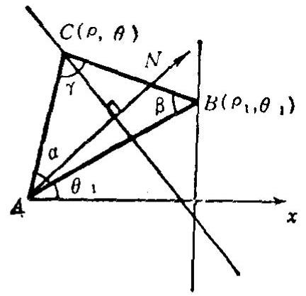

图 2-6-10

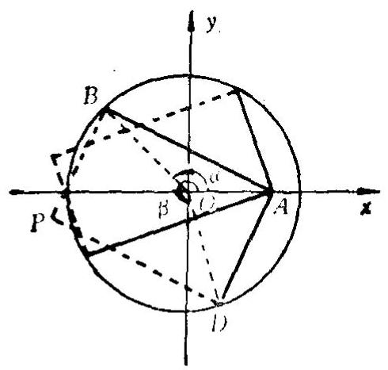

图 2-6-11

分析 点 $P$ 的位置随点 $B\text{ 、 }D$ 的运动而变化，点 $B\text{ 、 }D$ 的位置可用 $\angle {AOB} = \alpha ,\angle {AOD} = \beta$ 来刻画。 $\alpha \text{ 、 }\beta$ 一经设定,根据矩形对角线互相平分，且 ${AB}\bot {AD}$ ，即可建立点 $P$ 的坐标 $\left( {x, y}\right)$ 与 $\alpha \text{ 、 }\beta$ 之间的直接联系，故可取 $\alpha \text{ 、 }\beta$ 为参数.

解 取圆 $O$ 的中心 $O$ 为原点, ${OA}$ 所在直线为 $x$ 轴,建立直角坐标系,如图 2-6-11. 于是圆 $O$ 的方程为 ${x}^{2} + {y}^{2} = {r}^{2}$ ,点 $A$ 的坐标为 $\left( {a,0}\right)$ ,且 $a < r$ .

取 $\angle {AOB} = \alpha ,\angle {AOD} = \beta$ 为参数,则点 $B\text{ 、 }D$ 的坐标分别为

$$
\left( {r\cos \alpha , r\sin \alpha }\right) ,\left( {r\cos \beta , r\sin \beta }\right) .
$$

因为 ${ABPD}$ 为矩形，所以对角线 ${AP}$ 、 ${BD}$ 互相平分. 设点 $P\left( {x, y}\right)$ 为轨迹上任意一点,故

$$
\alpha  + a = r\cos \alpha  + r\cos \beta
$$

①

$$
y = r\sin \alpha  + r\sin \beta
$$

②

因为 ${AB} \bot  {AD}$ ,所以

$$
\left( {r\cos \alpha  - a}\right) \left( {r\cos \beta  - a}\right)  + r\sin \alpha  \cdot  r\sin \beta  = 0,
$$

即

$$
{r}^{2}\cos \left( {\alpha  - \beta }\right)  - {ar}\left( {\cos \alpha  + \cos \beta }\right)  + {a}^{2} = 0
$$

③

${\text{ ① }}^{2} + {\text{ ② }}^{2}$ 得

$$
{\left( x + a\right) }^{2} + {y}^{2} = {r}^{2}\left\lbrack  {2 + \cos \left( {\alpha  - \beta }\right) }\right\rbrack
$$

④

以①、④代入③得

$$
{\left( x + a\right) }^{2} + {y}^{2} - 2{r}^{2} - {2a}\left( {x + a}\right)  + 2{a}^{2} = 0,
$$

即

$$
{x}^{2} + {y}^{2} = 2{r}^{2}\;{a}^{2}.
$$

因为 $a < r$ ，所以轨迹为定圆 $O$ 的同心圆，半径为 ${\left( 2{r}^{2} - {a}^{2}\right) }^{\frac{1}{2}}$ .

以上三例说明参数选择的方法, 以及如何通过参数的媒介作用,揭示动点坐标 $\left( {x, y}\right)$ 之间的内在联系. 实质上,是根据轨迹条件,建立含参数与 $x\text{ 、 }y$ 的方程组 (方程的个数一般比参数个数多一个), 解方程组消去参数来完成的. 至于列方程的方法与方程观点中所述方法基本一致. 消参数的方法, 即是代数中的消去法. 一般有代入消去法, 利用三角恒等式的消去法, 或二者并举. 例 6 是代入消去法，例 7 则是二者并举. 当然还有利用韦达定理和行列式等方法. 消参数的方法, 技巧性特别强, 这里就不一一列举了. 对于超越曲线, 消去参数所得的方程反而不如曲线的参数方程简单, 那就可以直接利用曲线的参数方程研究曲线的性状.

下面再举几个灵活运用参数观点解轨迹题的例子, 进一步说明参数观点的作用.

例 8 自抛物线 $y = \frac{1}{2l}{x}^{2}$ 的顶点 $O$ 任作一直线 ${OA}$ ,交直线 $y = l$ 于点 $A$ ,交抛物线于点 $Q$ . 过点 $Q$ 与 $A$ 分别作 $x$ 轴和 $y$ 轴的平行线,两直线相交于点 $D$ (如图 2-6-12),求点 $D$ 的轨迹方程.

分析 点 $D$ 由点 $Q$ 的位置确定,可取抛物线上动点 $Q$ 的坐标为参数. 根据轨迹条件: $O\text{ 、 }Q\text{ 、 }A$ 三点共线且 $Q$ 不与 $O$ 重合, 可建立含 $x\text{ 、 }y\text{ 、 }{x}_{1}\text{ 、 }{y}_{1}$ 的方程,消去参数 ${x}_{1}\text{ 、 }{y}_{1}$ 即得轨迹方程.

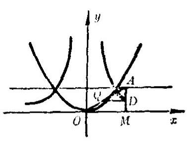

图 2-6-12

解 设 $D\left( {x, y}\right)$ 为轨迹上任意一点,相应的点 $Q$ 的坐标为 $\left( {{x}_{1},{y}_{1}}\right)$ . $\because O\text{ 、 }Q\text{ 、 }A$ 三点共线，且 $O\text{ 、 }Q$ 为不同的两点， ${x}_{1} \neq  0,{y}_{1} \neq  0$ ，

$\therefore$

$$
\frac{{y}_{1}}{{x}_{1}} = \frac{l}{x}
$$

①

$$
{y}_{1} = y
$$

②

$\because$ 点 $Q\left( {{x}_{1},{y}_{1}}\right)$ 在抛物线 $y = \frac{1}{2l}{x}^{2}$ 上,

$\therefore$

$$
{y}_{1} = \frac{1}{2l}{x}_{1}^{2}
$$

③

从①、②得

$$
{x}_{1} = \frac{xy}{l}
$$

代入 ③, 得轨迹方程为

$$
{x}^{2}y = 2{l}^{3}\text{ ,或 }y = 2{l}^{3}{x}^{-2}.
$$

如果取点 $Q$ 的坐标为 $\left( {{2lt},{2l}{t}^{2}}\right)$ (因为点 $Q$ 在抛物线 $y = \; \frac{1}{2l}{x}^{2}$ 上),以 $t$ 为参数,也可得解.

例 9 两抛物线 $y = {x}^{2} + {2cx} + {b}^{2}$ 和 $y = {x}^{2} + {2ax} - {b}^{2}$ 与 $x$ 轴交于同一点 (非原点),且 $a\text{ 、 }b + 1\text{ 、 }c$ 成等差数列,求点 $\left( {a, b}\right)$ 的轨迹方程，其中 $a\text{ 、 }b\text{ 、 }c$ 均为实变数.

分析 因为 $a\text{ 、 }b\text{ 、 }c$ 均为实变数,要求点 $\left( {a, b}\right)$ 的轨迹,则 $c$ 为参变数. 两抛物线与 $x$ 轴交于同一点 $\left( {{x}_{0},0}\right)$ 且 ${x}_{0} \neq  0$ ，即方程 ${x}^{2} + {2cx} + {b}^{2} = 0$ 与 ${x}^{2} + {2ax} - {b}^{2} = 0$ 有一公根 ${x}_{0}$ . 按轨迹条件，列出含 $a\text{ 、 }b\text{ 、 }c$ 的方程,消去参数即得轨迹方程.

解 $\because a\text{ 、 }b + 1\text{ 、 }c$ 成等差数列,

$$
\therefore \;c + a = 2\left( {b + 1}\right)
$$

①

$\because \;{x}_{0}^{2} + {2c}{x}_{0} + {b}^{2} = 0\text{ 、 }\;{x}_{0}^{2} + {2a}{x}_{0} - {b}^{2} = 0,$

$\therefore \;2{x}_{0}^{2} + 2\left( {c + a}\right) {x}_{0} = 0$ ,即 ${x}_{0} =  - \left( {c + a}\right) .$

又 $\;2\left( {c - a}\right) {x}_{0} + 2{b}^{2} = 0$ 即 $\left( {c - a}\right) {x}_{0} + {b}^{2} = 0$ ,

$\therefore \; - \left( {{c}^{2} - {a}^{2}}\right)  + {b}^{2} = 0$ 即 ${a}^{2} + {b}^{2} = {c}^{2}$②

从 ①、② 消去 $c$ ，得轨迹方程

$$
{a}^{2} + {b}^{2} = {\left( 2b - a + 2\right) }^{2},
$$

即 $3{b}^{2} - {4ab} - {4a} + {8b} + 4 = 0.$ (双曲线)

例 10 设 $W\text{ 、 }Z$ 为复数, $W$ 的方程 ${W}^{2} + {ZW} + {Zi} = 0$ 恒有实根 $\alpha$ ( $\alpha$ 为实变数),试求点 $Z$ 的轨迹.

分析 因 $\alpha$ 为实变数, $W$ 的方程的根在变,故其系数 $Z$ 也是变数,只不过是复变数而已. 显然 $\alpha$ 之值确定后,点 $Z$ 随之确定, 故 $\alpha$ 可以刻画动点 $Z$ 的变化状态，可取 $\alpha$ 为参数.

解 $\because W$ 的方程 ${W}^{2} + {ZW} + {Zi} = 0$ 恒有实根 $\alpha$ ,

$\therefore \;{\alpha }^{2} + {Z\alpha } + {Zi} = 0$①

令 $Z = x + {yi}, x, y \in  R$ ,代入 ①,得

$$
\left( {{\alpha }^{2} + {\alpha x} - y}\right)  + i\left( {{y\alpha } + x}\right)  = 0.
$$

$$
\therefore \;\left\{  \begin{array}{l} {\alpha }^{2} + {\alpha x} - y = 0 \\  {y\alpha } + x = 0 \end{array}\right.
$$

②

③

从 ②、③ 消去参数 $\alpha$ :

当 $y = 0$ 时,得 $x = 0,\alpha  = 0$ ,即轨迹过原点;

当 $y \neq  0$ 时,从 ③ 得 $\alpha  =  - \frac{x}{y}$ ,代入 ②,得

$$
{\left( -\frac{x}{y}\right) }^{2} + \left( {-\frac{x}{y}}\right) x - y = 0,
$$

即

$$
{x}^{2} = \frac{{y}^{3}}{1 - y}\text{ . (过原点) }
$$

所以轨迹为蔓叶线,如图 2-6-13 所示.

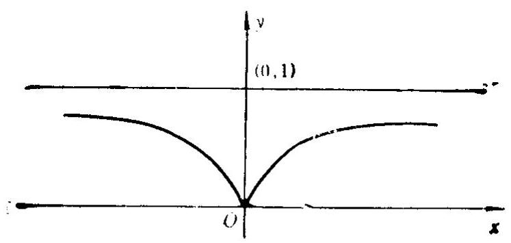

图 2-6-13

以上两例说明参数观点的灵活运用.

例 11 求过四个点 $\left( {\pm a,0}\right) \text{ 、 }\left( {0, \pm  b}\right)$ 的圆锥曲线系的主轴的端点的轨迹方程.

分析 圆锥曲线焦点所在的对称轴称为圆锥曲线(常态) 的主轴. 中心在原点的有心锥线,主轴的倾角 $\theta$ ,即转轴公式 $\operatorname{tg}{2\theta } = \; \frac{B}{A - C}$ 中的 $\theta$ . 故可先写出圆锥曲线系方程,取其任意常数 $\lambda$ 为参数,利用转轴公式来建立含 $x\text{ 、 }y\text{ 、 }\lambda$ 的方程.

解 过四点 $\left( {\pm a,0}\right) \text{ 、 }\left( {0, \pm  b}\right)$ 的圆锥曲线系方程为

$$
\frac{{x}^{2}}{{a}^{2}} + \frac{{y}^{2}}{{b}^{2}} + {2\lambda xy} = 1
$$

①

若其主轴倾角为 $\theta$ ,则

$$
\operatorname{tg}{2\theta } = \frac{2\lambda }{\frac{1}{{a}^{2}} - \frac{1}{{b}^{2}}},
$$

主轴端点的直角坐标为 $\left( {p\cos \theta , p\sin \theta }\right)$ ,其中 $p$ 为半主轴长.

$$
\therefore \;{2\lambda } = \left( {\frac{1}{{a}^{2}} - \frac{1}{{b}^{2}}}\right) \operatorname{tg}{2\theta } = \left( {\frac{1}{{a}^{2}} - \frac{1}{{b}^{2}}}\right) \frac{2\sin \theta \cos \theta }{{\cos }^{2}\theta  - {\sin }^{2}\theta }
$$

$$
= \left( {\frac{1}{{a}^{2}} - \frac{1}{{b}^{2}}}\right) \frac{{2p}\sin \theta  \cdot  p\cos \theta }{{p}^{2}{\cos }^{2}\theta  - {p}^{2}{\sin }^{2}\theta }
$$

即

$$
\left( {\frac{1}{{a}^{2}} - \frac{1}{{b}^{2}}}\right) \frac{2xy}{{x}^{2} - {y}^{2}} = {2\lambda }
$$

②

从 ① 与 ② 消去 $\lambda$ ，即得所求轨迹方程:

$$
\frac{{x}^{2}}{{a}^{2}} + \frac{{y}^{2}}{{b}^{2}} + \left( {\frac{1}{{a}^{2}} - \frac{1}{{b}^{2}}}\right) \frac{2{x}^{2}{y}^{2}}{{x}^{2} - {y}^{2}} = 1,
$$

$$
\left( {\frac{{x}^{2}}{{a}^{2}} - \frac{{y}^{2}}{{b}^{2}}}\right) \left( {{x}^{2} + {y}^{2}}\right)  = {x}^{2} - {y}^{2}.
$$

例 12 设椭圆 $\frac{{x}^{2}}{{a}^{2}} + \frac{{y}^{2}}{{b}^{2}} = 1$ 上两动点 $Q$ 、 $R$ 的离心角相差 $\frac{\pi }{2}$ ， 椭圆中心为 $O$ ,求以 ${OQ}\text{ 、 }{OR}$ 为直径的两圆交点的轨迹方程.

分析 以 ${OQ}\text{ 、 }{OR}$ 为直径的两圆的另一交点,随点 $Q\text{ 、 }R$ 的运动而变化，可取点 $Q$ 的离心角 $\varphi$ 为参数.

解 设点 $Q$ 的离心角为 $\varphi$ ,则点 $R$ 的离心角为 $\varphi  + \frac{\pi }{2}$ ,点 $Q$ 、 $R$ 的坐标分别为 $\left( {a\cos \varphi , b\sin \varphi }\right)$ 、 $\left( {a\cos \left( {\varphi  + \frac{\pi }{2}}\right) ,\;b\sin \left( {\varphi  + \frac{\pi }{2}}\right) }\right) ,$ 以 ${OQ},{OR}$ 为直径的两圆方程为

$$
x\left( {x - a\cos \varphi }\right)  + y\left( {y - b\sin \varphi }\right)  = 0
$$

①

$$
x\left( {x + a\sin \varphi }\right)  + y\left( {y - b\cos \varphi }\right)  = 0
$$

②

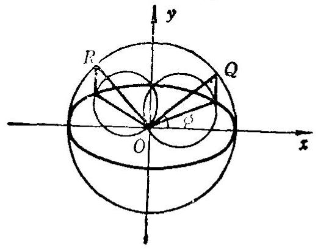

图 2-6-14

由 ①、② 消去 $\varphi$ (两式平方相加)，得 ${\left( {x}^{2} + {y}^{2}\right) }^{2} = {a}^{2}{x}^{2} + {b}^{2}{y}^{2}$ ， (原点除外) 此即所求轨迹的方程.

例 18 设双曲线 $\frac{{x}^{2}}{{a}^{2}} - \frac{{y}^{2}}{{b}^{2}} = 1$ 上两动点 $Q\text{ 、 }R$ 的离心角为 $\alpha$ 、 $\beta$ 且满足条件 $2\cos \frac{\alpha }{2}\cos \frac{\beta }{2} = 1$ ,试求过双曲线上点 $Q\text{ 、 }R$ 的切线交点的轨迹.

解 过 $Q\text{ 、 }R$ 的双曲线 $\frac{{x}^{2}}{{a}^{2}} - \frac{{y}^{2}}{{b}^{2}} = 1$ 的切线方程分别为

$$
\frac{x}{a} - \frac{y}{b}\sin \alpha  = \cos \alpha
$$

①

$$
\frac{x}{a} - \frac{y}{b}\sin \beta  = \cos \beta
$$

②

且

$$
2\cos \frac{\alpha }{2}\cos \frac{\beta }{2} = 1
$$

③

由方程 ①、②、③ 消去参数 $\alpha$ 、 $\beta$ :

从 ①、② 知 $\alpha$ 、 $\beta$ 是方程 $\frac{x}{a} - \frac{y}{b}\sin \varphi  = \cos \varphi$ 的根,

$$
\because {\left( \frac{x}{a} - \cos \varphi \right) }^{2} = {\left( \frac{y}{b}\sin \varphi \right) }^{2}\text{ , }
$$

即

$$
\left( {1 + \frac{{y}^{2}}{{b}^{2}}}\right) {\cos }^{2}\varphi  - \frac{2x}{a}\cos \varphi  + \frac{{x}^{2}}{{a}^{2}} - \frac{{y}^{2}}{{b}^{2}} = 0
$$

④

从 ④ 可知 $\cos \alpha \text{ 、 }\cos \beta$ 是方程 $\left( {1 + \frac{{y}^{2}}{{b}^{2}}}\right) {\lambda }^{2} - \frac{2x}{a}\lambda  + \frac{{x}^{2}}{{a}^{2}} - \frac{{y}^{2}}{{b}^{2}} \; = 0$ 的两个根,根据韦达定理,有

$$
\cos \alpha  + \cos \beta  = \frac{\frac{2x}{a}}{1 + \frac{{y}^{2}}{{b}^{2}}}
$$

⑤

$$
\cos \alpha \cos \beta  = \frac{\frac{{x}^{2}}{{a}^{2}} - \frac{{y}^{2}}{{b}^{2}}}{1 + \frac{{y}^{2}}{{b}^{2}}}
$$

⑥

从③ 有

$$
4{\cos }^{2}\frac{\alpha }{2}{\cos }^{2}\frac{\beta }{2} = 1,
$$

$$
\left( {1 + \cos \alpha }\right) \left( {1 + \cos \beta }\right)  = 1,
$$

即

$$
\cos \alpha  + \cos \beta  + \cos \alpha \cos \beta  = 0.
$$

⑦

以 ⑤、⑥ 代入 ⑦，得

$$
\frac{{x}^{2}}{{a}^{2}} - \frac{{y}^{2}}{{b}^{2}} + \frac{2x}{a} = 0.
$$

$\because$ 方程 ①、② 中 $\alpha$ 、 $\beta$ 都有实数解，

$\therefore$

$$
1 + \frac{{y}^{2}}{{b}^{2}} \geq  \frac{{x}^{2}}{{a}^{2}}
$$

即

$$
\frac{{x}^{2}}{{a}^{2}} - \frac{{y}^{2}}{{b}^{2}} - 1 \leq  0,
$$

$\therefore$ 轨迹为双曲线 $\frac{{x}^{2}}{{a}^{2}} - \frac{{y}^{2}}{{b}^{2}} + \frac{2x}{a} = 0$ 在双曲线 $\frac{{x}^{2}}{{a}^{2}} - \frac{{y}^{2}}{{b}^{2}} =$ 1 的焦点所在区域之外的部分，如图 2-6-15 中实线所示，即双曲线 $\frac{{\left( x + a\right) }^{2}}{{a}^{2}} - \frac{{y}^{2}}{{b}^{2}} = 1$ 的右支.

从方程 ①、②、③ 消去 $\alpha$ 、 $\beta$ 的方法，也可如下进行: 从 ①、② 解出 $\frac{x}{a}\text{ 、 }\frac{y}{b}$ ，得

$$
\frac{x/a}{\cos \frac{1}{2}\left( {\alpha  - \beta }\right) } = \frac{y/b}{\sin \frac{1}{2}\left( {\alpha  + \beta }\right) } = \frac{1}{\cos \frac{1}{2}\left( {\alpha  + \beta }\right) }
$$

$$
= \frac{\frac{x}{a} + 1}{2\cos \frac{\alpha }{2}\cos \frac{\beta }{2}}\text{ . }
$$

以 ③ 代入，解得:

$$
\cos \frac{1}{2}\left( {\alpha  + \beta }\right)  = \frac{1}{\frac{x}{a} + 1}
$$

$$
\sin \frac{1}{2}\left( {\alpha  + \beta }\right)  = \frac{y/b}{\frac{x}{a} + 1}
$$

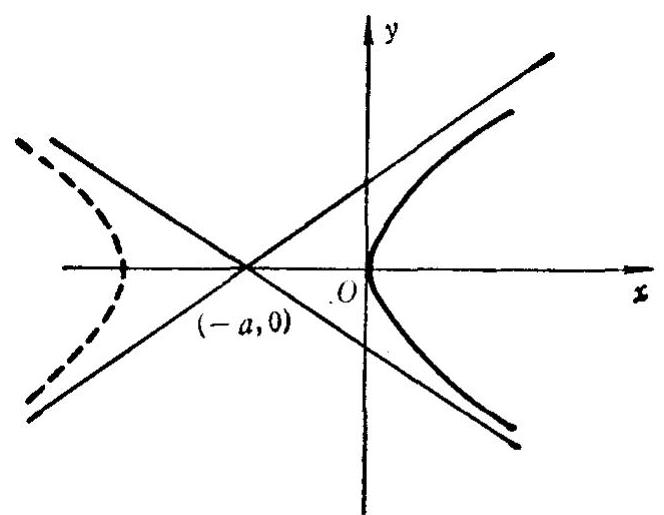

图 2-6-15

两式平方相加, 得

$$
\frac{{\left( x + a\right) }^{2}}{{a}^{2}} - \frac{{y}^{2}}{{b}^{2}} = 1.
$$

这里运用的消去法有典型意义，应用颇广。读者可以将上例中的双曲线改为椭圆，自己练习一次，以便巩固.

例 14 一直角 $\bigtriangleup {AOB}$ ,点 $O$ 为原点,点 $A\text{ 、 }B$ 的坐标分别为 $\left( {{2h},0}\right) \left( {0,{2k}}\right)$ ,试求点 $O$ 在 $\bigtriangleup  {AOB}$ 的外接抛物线系的准线上射影的轨迹方程.

分析 因抛物线由其焦点与准线确定, 故可取抛物线系的焦点坐标 $\left( {a, b}\right)$ 与准线方程 $x\cos \alpha  + y\sin \alpha  = p$ 中的 $a\text{ 、 }b\text{ 、 }\alpha \text{ 、 }p$ 为参数, 根据抛物线过 $A\text{ 、 }O\text{ 、 }B$ 三点及点 $O$ 在准线上的射影的坐标,可建立五个方程,从此五个方程消去参数 $a\text{ 、 }b\text{ 、 }\alpha \text{ 、 }p$ ,即得所求轨迹的方程.

解 设 $\bigtriangleup {AOB}$ 的外接抛物线系的焦点为 $\left( {a, b}\right)$ ,准线为

$$
x\cos \alpha  + y\sin \alpha  = p,
$$

则抛物线方程为

$$
{\left( x - a\right) }^{2} + {\left( y - b\right) }^{2} = {\left( x\cos \alpha  + y\sin \alpha  - p\right) }^{2}.
$$

$\because$ 抛物线过 $O\left( {0,0}\right) \text{ 、 }A\left( {{2h},0}\right) \text{ 、 }B\left( {0,{2k}}\right)$ ,

$\therefore$

$$
{a}^{2} + {b}^{2} = {p}^{2}
$$

①

$$
{\left( 2h - a\right) }^{2} + {b}^{2} = {\left( 2h\cos \alpha  - p\right) }^{2}
$$

②

$$
{a}^{2} + {\left( 2k - b\right) }^{2} = {\left( 2k\sin \alpha  - p\right) }^{2}
$$

③

点 $O$ 在准线上射影的坐标为

$$
x = p\cos \alpha
$$

④

$$
y = p\sin \alpha
$$

⑤

从 ①、②、③，得

$$
h{\sin }^{2}\alpha  - a + p\cos \alpha  = 0
$$

⑥

$$
k{\cos }^{2}\alpha  - b + p\sin \alpha  = 0
$$

⑦

以 ④、⑤代入 ⑥、⑦，得

$$
a = x + h{\sin }^{2}\alpha
$$

⑧

$$
b = y + k{\cos }^{2}\alpha
$$

⑨

从 ①、④、⑤，得

$$
{x}^{2} + {y}^{2} = {a}^{2} + {b}^{2} = {p}^{2},
$$

$$
{\sin }^{2}\alpha  = \frac{{y}^{2}}{{x}^{2} + {y}^{2}}
$$

$$
{\cos }^{2}\alpha  = \frac{{x}^{2}}{{x}^{2} + {y}^{2}}.
$$

代入 ⑧、⑨, 得

$$
a = x + \frac{h{y}^{2}}{{x}^{2} + {y}^{2}},
$$

$$
b = y + \frac{k{x}^{3}}{{x}^{2} + {y}^{2}},
$$

$$
{x}^{2} + {y}^{2} = {\left( x + \frac{h{y}^{2}}{{x}^{2} + y}\right) }^{2} + {\left( y + \frac{k{x}^{2}}{{x}^{2} + {y}^{2}}\right) }^{2}.
$$

化简,得 ${k}^{2}{x}^{4} + {h}^{2}{y}^{4} + {2xy}\left( {{x}^{2} + {y}^{2}}\right) \left( {{kx} + {hy}}\right)  = 0$ ,

此即所求轨迹的方程.

这是一个多参数的例子, 说明在必要的时候, 多选用几个参数既是可以的, 也是有利的, 只要善于消去参数, 一些复杂的问题就能获解.

另外在证明题、计算题中运用曲线的参数方程, 常可使变量个数减少，使问题的领域发生转化，达到化难为易的目的. 这在映射观点中, 已有说明, 这里不再重复.

由于参数是刻画变化状态与揭示变量之间内在联系的媒介, 因此应用十分广泛，不限于上述三方面. 在代数、几何中也有广泛的应用。下面再举几例子作为本节的结束.

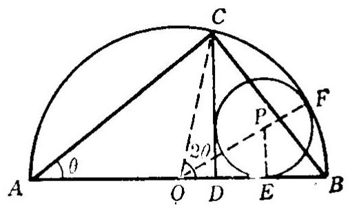

图 2-6-16

例 15 如图 2-6-16, ${AB}$ 是半圆 $O$ 的直径,半圆周上一点 $O$ 在 ${AB}$ 上的射影为 $D$ . 圆 $P$ 与 ${AB}$ 切于 $E$ , 与半圆内切于 $F$ ,且与 ${CD}$ 相切,求证 $\bigtriangleup {ACE}$ 是等腰三角形.

分析 这一图形随 ${AB}$ 与 $\angle {BAO} = \theta$ 而完全确定,取 ${AB} = \; {2R}$ 与 $\theta$ 为参数，可以揭示圆 $P$ 的半径和 ${AC}$ 之间的内在联系. 欲证 ${AO} = {AE}$ ,只要运用参数,分别求它们的长度就可以了. ${AO}$ 是容易算出的,但要计算 ${AE}$ ,就得先算出圆 $P$ 的半径 $r$ . 为此,可利用直角 $\bigtriangleup {OPE}$ ,根据勾股定理列出方程,即可.

证 设 ${AB} = {2R},\angle {BAO} = \theta$ ,则 ${AO} = {2R}\cos \theta$ .

令圆 $P$ 的半径为 $r$ ,则 ${OP} = R - r,{PE} = r,{OD} = R\cos {2\theta }$ . 在直角 $\bigtriangleup {OPE}$ 中,根据勾股定理,有

$$
{\left( R\cos 2\theta  + r\right) }^{2} = {\left( R - r\right) }^{2} - {r}^{2},
$$

$$
{r}^{2} + {4Rr}{\cos }^{2}\theta  - 4{R}^{2}{\sin }^{2}\theta {\cos }^{2}\theta  = 0,
$$

$$
{r}^{2} + {4Rr}{\cos }^{2}\theta  - 4{R}^{2}{\cos }^{2}\theta \left( {1 - {\cos }^{2}\theta }\right)  = 0,
$$

即 $\left\lbrack  {r - {2R}\cos \theta \left( {1 - \cos \theta }\right) }\right\rbrack  \left\lbrack  {r + {2R}\cos \theta \left( {1 + \cos \theta }\right) }\right\rbrack   = 0$ .

$$
r + {2R}\cos \theta \left( {1 + \cos \theta }\right)  > 0,
$$

$\therefore$

$$
r = {2R}\cos \theta \left( {1 - \cos \theta }\right) .
$$

$$
{AE} = {AD} + {DE},{AD} = {2R}{\cos }^{2}\theta ,{DE} = r,
$$

$$
{AE} = {2R}{\cos }^{2}\theta  + {2R}\cos \theta \left( {1 - \cos \theta }\right)  = {2R}\cos \theta ,
$$

故

$$
{AE} = {AQ}\text{ . }
$$

所以 $\bigtriangleup {ACE}$ 是等腰三角形.

例 16 设 $P$ 是 $\bigtriangleup {ABC}$ 的一内点, $P$ 到三边 ${BC}\text{ 、 }{CA}$ 和 ${AB}$ 的距离分别为 $x\text{ 、 }y\text{ 、 }z$ ,当 $P$ 位于何处时乘积 ${xyz}$ 最大?

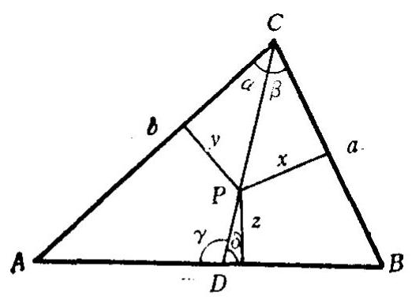

图 2-6-17

解 设 ${BC} = a,{OA} = b,{AB} = c$ .

$\because \sqrt[3]{{ax} \cdot  {by} \cdot  {cz}} \leq  \frac{1}{3}\left( {{ax} + {by} + {cz}}\right)$

$$
= \frac{2}{3}S,
$$

其中 $S$ 是三角形 ${ABC}$ 的面积，而 ${ax} \; + {by} + {cz} = {2S}$ 为定值， $\therefore$ 当仅当 ${ax} = {by} = {cz}$ 时， ${xyz}$ 的最大，最大值为 $\frac{4{S}^{2}}{9abc}$ .

为了研究此时点 $P$ 的位置,在图 2-6-17 中,取 $\angle {ACD} = \alpha$ , $\angle {BOD} = \beta ,\angle {ADC} = \gamma ,\angle {BDC} = \delta$ 为参数,以它们为媒介,研究点 $P$ 和 $O$ 的连线与 ${AB}$ 交点 $D$ 的位置.

$$
\frac{AD}{\sin \alpha } = \frac{b}{\sin \gamma },\frac{BD}{\sin \beta } = \frac{a}{\sin \delta },
$$

$\therefore \;\frac{AD}{BD} = \frac{b\sin \alpha /\sin \gamma }{a\sin \beta /\sin \delta }$①

$\therefore \;\sin \gamma  = \sin \delta$ .

从 ① 有

$$
\frac{AD}{BD} = \frac{b\sin \alpha }{a\sin \beta } = \frac{{CP} \cdot  b\sin \alpha }{{CP} \cdot  a\sin \beta } = \frac{2{S}_{\bigtriangleup {ACP}}}{2{S}_{\bigtriangleup {BCP}}} = \frac{by}{ax}.
$$

所以当 ${ax} = {by}$ 时, ${AD} = {BD}$ ,即 ${OD}$ 为 ${AB}$ 边上的中线.

同理,可证当 ${ax} = {by} = {cz}$ 时,点 $P$ 是 $\bigtriangleup {ABC}$ 三条中线的交点,即当点 $P$ 为 $\bigtriangleup {ABC}$ 的重心时, ${xyz}$ 的值最大,最大值为 $\frac{4{S}^{2}}{9abc}$ .

借助参数揭示几何图形中变化因素的内在联系, 也是研究几何图形性质常用的思维方法.

例 17 设 $x\text{ 、 }y\text{ 、 }z$ 均为小于 1 的正数,并且它们的和为 2 . 求证: $1 < {xy} + {yz} + {zx} \leq  \frac{4}{3}$ .

分析 为了使运算简便,利用已知条件,引入参数. 取 $1 - x = \; \alpha  > 0,1 - y = \beta  > 0,1 - z = \gamma  > 0$ 为参数，已知条件转化为 $\alpha  + \beta  + \; \gamma  = 1$ .

证 设 $1 - x = \alpha  > 0,1 - y = \beta  > 0,1 - z = \gamma  > 0$ ,则 $\alpha  + \beta  + \gamma \; = 1$ .

$$
{xy} + {yz} + {zx} = \left( {1 - \alpha }\right) \left( {1 - \beta }\right)  + \left( {1 - \beta }\right) \left( {1 - \gamma }\right)
$$

$$
+ \left( {1 - \gamma }\right) \left( {1 - \alpha }\right)
$$

$$
= 3 - 2\left( {\alpha  + \beta  + \gamma }\right)  + {\alpha \beta } + {\beta \gamma } + {\gamma \alpha }
$$

$$
= 1 + {\alpha \beta } + {\beta \gamma } + {\gamma \alpha } > 1,
$$

又 $1 - 3\left( {{\alpha \beta } + {\beta \gamma } + {\gamma \alpha }}\right)  = {\left( \alpha  + \beta  + \gamma \right) }^{2} - 3\left( {{\alpha \beta } + {\beta \gamma } + {\gamma \alpha }}\right)$

$$
= {\alpha }^{2} + {\beta }^{2} + {\gamma }^{2} - {\alpha \beta } - {\beta \gamma } - {\gamma \alpha }
$$

$$
= \frac{1}{2}\left\lbrack  {{\left( \alpha  - \beta \right) }^{2} + {\left( \beta  - \gamma \right) }^{2} + {\left( \gamma  - \alpha \right) }^{2}}\right\rbrack   \geq  0,
$$

$\therefore \;{\alpha \beta } + {\beta \gamma } + {\gamma \alpha } \leq  \frac{1}{3}$ .

$$
{xy} + {yz} + {zx} = 1 + {\alpha \beta } + {\beta \gamma } + {\gamma \alpha },
$$

$$
1 < {xy} + {yz} + {zx} \leq  1 + \frac{1}{3} = \frac{4}{3}.
$$

例 18 设 ${x}_{i} > 0\left( {i = 1,2,\cdots , n}\right)$ ,且 $\mathop{\sum }\limits_{{i = 1}}^{n}{x}_{i} = 1$ ,求证: $\mathop{\sum }\limits_{{i = 1}}^{n}{x}_{i}^{2} \; \geq  \frac{1}{n}$ ,当且仅当 ${x}_{1} = {x}_{2} = \cdots  = {x}_{n}$ 时,等号成立.

证 设 ${x}_{i} = \frac{1}{n} + {t}_{i}\left( {i = 1,2,\cdots , n}\right)$ ,且 $\mathop{\sum }\limits_{{i = 1}}^{n}{t}_{i} = 0$ ,则

$$
\mathop{\sum }\limits_{{i = 1}}^{n}{x}_{i}^{2} = \mathop{\sum }\limits_{{i = 1}}^{n}{\left( \frac{1}{n} + {t}_{i}\right) }^{2} = n\left( \frac{1}{{n}^{2}}\right)  + 2\frac{1}{n}\mathop{\sum }\limits_{{i = 1}}^{n}{t}_{i} + \mathop{\sum }\limits_{{i = 1}}^{n}{t}_{i}^{2}
$$

$$
= \frac{1}{n} + \mathop{\sum }\limits_{{i = 1}}^{n}{t}_{i}^{2} \geq  \frac{1}{n}\;\left( {\because \mathop{\sum }\limits_{{i = 1}}^{n}{t}_{i} = 0,\mathop{\sum }\limits_{{i = 1}}^{n}{t}_{i}^{2} \geq  0}\right)
$$

当且仅当 $\mathop{\sum }\limits_{{i = 1}}^{n}{t}_{i}^{2} = 0$ ,即 ${t}_{i} = 0\left( {i = 1\text{ 、 }2\text{ 、 }\cdots \text{ 、 }n}\right)$ 时,等号成立,亦即当且仅当 ${x}_{1} = {x}_{2} = \cdots  = {x}_{n}$ 时,等号成立.

在不等式的证明中, 有时运用参数, 能化难为易, 当然不一定都能达到这一目的, 如例 18, 直接利用

$$
\frac{\mathop{\sum }\limits_{{i = 1}}^{n}{x}_{i}^{2}}{n} \geq  {\left( \frac{\mathop{\sum }\limits_{{i = 1}}^{n}{x}_{i}}{n}\right) }^{2}
$$

则更简捷.

以上论述了参数观点的各种应用. 由于参数涉及的面极广， 势难尽述. 通过上述诸例，已不难领会所谓参数观点，就是利用参数刻划过程的变化状态，以参数为媒介揭示变量之间的内在联系的思维方法. 这是辩证逻辑思维在数学上的应用。

## 思 考 题 六

1. 在正方形 ${ABCD}$ 中,过一个顶点 $D$ 作对角线 ${OA}$ 的平行线 ${DE}$ ,若 $\left| {OE}\right|  = \left| {AO}\right|$ ,且 ${OE}$ 交 ${DA}$ 于点 $F$ ,如图 2-6-18. 求证 $\left| {AE}\right|  = \left| {AF}\right|$ .

2. 如图 2-6-19, $\bigtriangleup {ABC}$ 中 ${AD}$ 是边 ${BO}$ 上的高,点 $P$ 是 ${AD}$ 上任意一点, ${BP}$ 交 ${AC}$ 于 $E,{OP}$ 交 ${AB}$ 于 $F$ . 求证 $\angle {ADE} \; = \angle {ADF}$ .

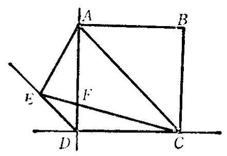

图 2-6-18

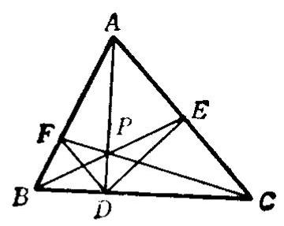

图 2-6-19

3. 如图 2-6-20,在正 $\bigtriangleup {ABC}$ 中, $D\text{ 、 }E$ 分别为 ${AB}\text{ 、 }{BC}$ 上的点, 且 ${AD} = \frac{1}{3}{AB},{BE} = \frac{1}{3}{BO},{AE}\text{ 、 }{CD}$ 交于点 $P$ . 求证: ${BP} \bot  {OP}$ .

4. 如图 2-6-21,锐角 $\bigtriangleup {ABC}$ 中 ${AD}$ 是 ${BO}$ 边上的高,且 $\left| {AD}\right| \; = \left| {BO}\right| , M$ 为 ${BO}$ 的中点, $H$ 为垂心,求证 $\left| {MH}\right|  + \left| {HD}\right| \; = \left| {BM}\right|$ .

5. 设 $\bigtriangleup  {PQR}$ 的三边 ${PQ}$ 、 ${QR}$ 、 ${RP}$ (或其延长线)交直线 $\mathbf{l}$ 于 $L$ 、 $M\text{ 、 }N$ 三点. 求证: $\frac{PL}{LQ} \cdot  \frac{QM}{MR} \cdot  \frac{RN}{NP} =  - 1$ .

6. 如图 2-6-22,在 $\bigtriangleup {PQR}$ 中,自顶点 $P\text{ 、 }Q\text{ 、 }R$ 向对边引三线段 ${PD}\text{ 、 }{QE}\text{ 、 }{RF}$ ,交于一点 $O$ ,求证: $\frac{QD}{DR} \cdot  \frac{RE}{EP} \cdot  \frac{PF}{FQ} = 1$ .

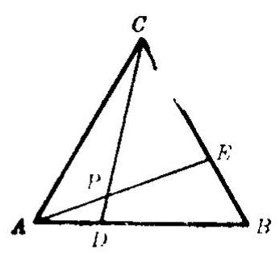

图 2-6-20

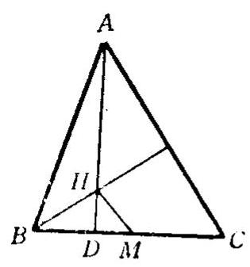

图 2-6-21

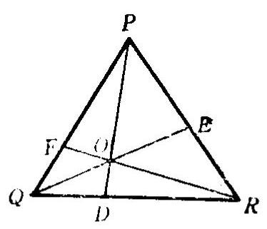

图 2-6-22

7. 如图 2-6-23，自定圆上一定点 $A$ 作不重合的两弦 ${AB}$ 、 ${AO}$ ， 若此两弦长之积 $\left| {AB}\right|  \cdot  \left| {AO}\right|  = k$ (定值)，求证直线 ${BC}$ 恒切于一定圆.

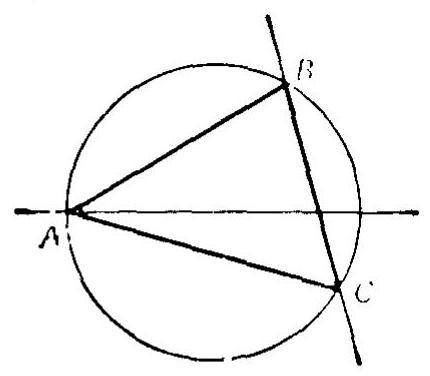

图 2-6-23

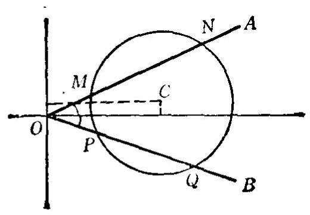

图 2-6-24

8. 求证: 在已知角的两边各截得不同定长之弦的圆, 其圆心到内外角平分线的距离之积为定值 (见图 2-6-24).

9. 求证: 椭圆中心到互相垂直的两直径的两个端点的连线的距离为定值(见图 2-6-25).

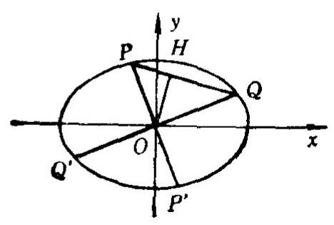

图 2-6-25

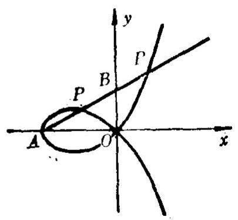

图 2-6-26

10. 一动直线绕定点 $A\left( {-a,0}\right) \left( {a > 0}\right)$ 旋转,交 $y$ 轴于点 $B$ ，在直. 线 ${AB}$ 上取一点 $P$ ,使得 $\left| {BP}\right|  = \left| {OB}\right| , O$ 为原点,求点 $P$ 的轨迹方程 (见图 2-6-26).

11. 如图 2-6-27,已知定点 $A$ 对应的复数为 ${Z}_{A} = a + {0i}$ ,动点 $B$ 对应的复数为 ${Z}_{B}$ 且 $\left| {Z}_{B}\right|  = b,\left( {a, b}\right.$ 均为实常数 $)$ ,以 ${AB}$ 为一边作一正三角形 ${ABC}\left( {A\text{ 、 }B\text{ 、 }C}\right.$ 的顺序是顺时针方向),求点 $\sigma$ 的轨迹.

12. 一定长为 $a$ 的线段两端 $A\text{ 、 }B$ 分别在 $x\text{ 、 }y$ 轴上滑动. 过 $A$ 、 $B$ 分别作 $y$ 、 $x$ 轴的平行线相交于点 $Q$ ,试求点 $Q$ 在线段 ${AB}$ 上的射影 $P$ 的轨迹方程.

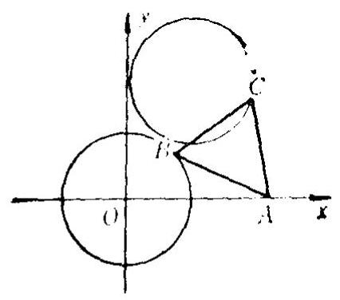

图 2-6-27

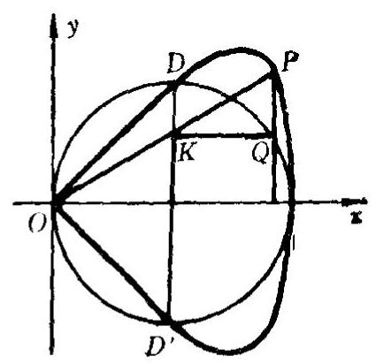

图 2-6-28

13. 如图 2-6-28，已知 $Q$ 为圆 ${x}^{2} + {y}^{2} - {2ax} = 0\left( {a > 0}\right)$ 上的动点， 过 $Q$ 且与 $x$ 轴平行的直线交圆之定直径 $D{D}^{\prime }\left( {x = a}\right)$ 于 $K$ ,直方程.

线 ${OK}$ 与过 $Q$ 与 $y$ 轴平行的直线交于 $P$ 点,求点 $P$ 的轨迹

14. 如图 2-6-29,过定点 $D$ 的动直线 $l$ 和水平线 $m$ 相交于点 $O$ , 在 $m$ 上点 $C$ 的右边取一点 $B$ ，作直角 $\bigtriangleup {ABC}$ ，使 $A$ 、 $D$ 在直线 $m$ 的同旁,且 $\angle {ACB} = {90}^{ \circ  },\left| {AC}\right|  = b,\left| {BC}\right|  = a,(a\text{ 、 }b$ 为定值),求直线 $l$ 和直线 ${AB}$ 交点 $P$ 的轨迹.

15. 如图 2-6-30,半径为 $a$ 的定圆上有两个动点 $P\text{ 、 }Q$ ,同时自圆

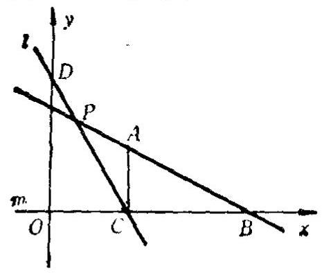

图 2-6-29

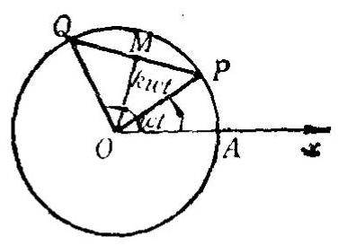

图 2-6-30

上定点 $A$ 出发，按逆时针方向作匀角速运动. 点 $P$ 的角速度为 $\omega$ ,点 $Q$ 的角速度为点 $P$ 的 $k$ 倍 $\left( {k > 1\text{ ,为定值 }}\right)$ ,试求线段 ${PQ}$ 中点 $M$ 的轨迹的极坐标方程.

16. 设圆 ${x}^{2} + {y}^{2} + {ux} + {vy} = 2 + u$ 与直线 ${vx} - {uy} = 1 + {2v}$ 的一个交点 $Q$ 在单位圆 ${x}^{2} + {y}^{2} = 1$ 上运动,试求点 $\left( {u, v}\right)$ 的轨迹方程.

17. 从等边 $\bigtriangleup {ABO}$ 一顶点 $A$ 任作一直线交边 ${BO}$ 于 $D$ ,交外接圆于 $E$ ,如图 2-6-31.

求证: (1) $\frac{1}{BE} + \frac{1}{CE} = \frac{1}{DE}$ ;

(2) $A{E}^{4} + B{E}^{4} + C{E}^{4}$ 为常数.

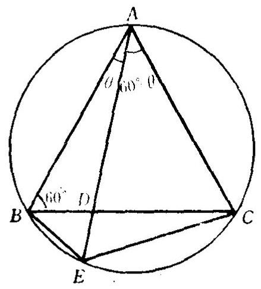

图 2-6-31

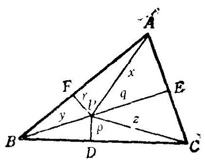

图 2-6-32

18. 设一圆锥曲线有两条弦互相平分, 证明此圆锥曲线不可能是抛物线.

19. $P$ 为 $\bigtriangleup {ABC}$ 内部或边上一点, $P$ 到三边距离分别为 ${PD}\text{ 、 }{PE}$ 、 ${PF}$ ,如图 2-6-32,证明: ${PA} + {PB} + {PC} \geq  2\left( {{PD} + {PE} + {PF}}\right)$ . 20. 求椭圆 ${b}^{2}{x}^{2} + {a}^{2}{y}^{2} = {a}^{2}{b}^{2}$ 在中心 $O$ 张直角之弦的中点的轨迹方程.

## 第三章 解决问题的策略思想

人类在认识世界与解决问题的长期实践中, 经过失败、成功的多次反复, 冷静思考, 逐步发现与总结了一些行之有效的思想方法, 称之为策略思想. 策略思想不但在数学研究中有指导意义, 而且在自然科学和社会科学内也有指导意义.

在这一章里将介绍四种常用的策略思想，研究它们如何与数学思维的基本方法及基本观点相结合, 解决各种数学问题, 进一步发展思维能力, 打开人脑的智慧大门.

## 一 逻 辑 划 分

人们通过抽象概括，认识了概念的基本特征 (或称本质属性, 即概念的内涵). 通过观察, 又根据概念的基本特征进行判断, 辨别出概念适应的对象, 进一步把握了概念所适用的那一事物或那一类事物的全体(称为概念的外延). 揭示概念的外延的逻辑方法是划分,也就是分类. 概念的外延构成一个集合 $P : P = \{ x \mid  p\left( x\right) \}$ , 即所有满足 $p\left( x\right)$ 的 $x$ 的全体,就是集合 $P$ . 这里 $p\left( x\right)$ 是概念的内涵，集合 $P$ 就是概念的外延. 如果研究的不是概念，譬如 $p\left( x\right)$ 是一个判断 (或真或假的命题),则 $P$ 表示满足 $p\left( x\right)$ 的 $x$ 的全体. 为了把握 $P$ ,常对 $P$ 进行划分,即将 $P$ 分成若干个真子集 ${P}_{i}(i = \; \left. {1\text{ 、 }2\text{ 、 }\cdots n}\right) \left( {n \geq  2}\right)$ ,使得任何两个子集的交集为空集,即 ${P}_{i} \cap  {P}_{j} = \; \because j\left( {i \neq  j}\right)$ ,且所有子集的并集为全集 $P$ ,即 $\mathop{\bigcup }\limits_{{i = 1}}^{n}{P}_{i} = P$ ,则 ${P}_{i}(i = 1$ 、 $2\cdots \text{ 、 }n)$ 称为集合 $P$ 的一个划分. 划分必须无重复,也无遗漏,在理解、掌握概念与解决问题中都离不开这一重要思维方法. 正确进行划分的关键是把握统一的划分标准.

数学中除了把握概念的外延须应用划分思想外，在方程、不等式、几何作图题的讨论中, 在排列、组合的实际应用中, 及在完全归纳法，抽屉原则、数论等等中都有划分思想的广泛应用. 下面通过实例来阐明逻辑划分的应用.

## 1. 绝对值、算术根问题

按算术根的定义: $\sqrt[{2n}]{{a}^{2n}} = \left| a\right|$ ,算术根问题都可以归结 (转化)为绝对值问题. 处理绝对值问题的关键是如何脱去绝对值记号的外壳. 而脱去绝对值记号的外壳在于正确划分字母的允许值集为若干子集，在每一子集上，绝对值记号内的函数值的正、负是确定的, 也就是每一个子集都是这些函数的定号区间 (区域).

例 1 证明 $\frac{\left| 1 - {x}^{2}\right| }{1 + \left| x\right| } = \left| \right| x\left| {-1}\right|$ .

分析 左式绝对值记号内的函数 $1 - {x}^{2}$ ， $x$ 的零点分别为 -1, 0,1 ; 右式绝对值记号内的函数 $x,\left| x\right|  - 1$ 的零点也分别是-1,0, 1. 零点是正负的分水岭,这些零点将字母的允许值 $\left( {-\infty , + \infty }\right)$ 划分成 $( - \infty , - 1\rbrack \text{ 、 }( - 1,0\rbrack \text{ 、 }(0,1\rbrack \text{ 、 }\left( {1, + \infty }\right)$ 四个区间,在这四个区间上, 绝对值记号内函数值的正负是确定的, 所以绝对值记号在这四个区间上都可脱去.

解 当 $x \in  ( - \infty , - 1\rbrack$ 时,左式 $= \frac{{x}^{2} - 1}{1 - x} =  - x - 1$ ,

$$
\text{ 右式 } = \left| {-x - 1}\right|  =  - x - 1\text{ ; }
$$

当 $x \in  ( - 1,0\rbrack$ 时, 左式 $= \frac{1 - {x}^{2}}{1 - x} = 1 + x.$

$$
\text{ 右式 } = \left| {-x - 1}\right|  = 1 + x\text{ ; }
$$

当 $x \in  (0,1\rbrack$ 时,

$$
\text{ 左式 } = \frac{1 - {x}^{2}}{1 + x} = 1 - x,
$$

$$
\text{ 右式 } = \left| {x - 1}\right|  = 1 - x\text{ ; }
$$

当 $x \in  \left( {1, + \infty }\right)$ 时,左式 $= \frac{{x}^{2} - 1}{1 + x} = x - 1$ ,

右式 $= \left| {x - 1}\right|  = x - 1$ .

$$
\therefore \frac{\left| 1 - {x}^{2}\right| }{1 + \left| x\right| } = \left| \right| x\left| {-1}\right| \text{ . }
$$

例 2 求曲线 $\left| {x - 1}\right|  + \left| {y + 2}\right|  = 3$ 的周长.

分析 字母 $x$ 、 $y$ 的允许值集合是整个坐标平面域(高等数学中记为 $\left. {R}^{2}\right)$ . 在二维空间中，绝对值记号内的函数 (二元函数) 的零值,称为零线. 这里是 $x - 1 = 0, y + 2 = 0$ ,它们是两条直线,将 ${R}^{2}$ 划分成如图 3-1-01 中的四个子区域: $x \geq  1, y \geq   - 2;x < 1$ , $y \geq   - 2;x < 1, y <  - 2;x \geq  1, y <  - 2$ . 在每一个子区域上,绝对值记号内的函数符号都是确定的. 脱去绝对值记号后, 可以化简曲线方程, 使问题获解.

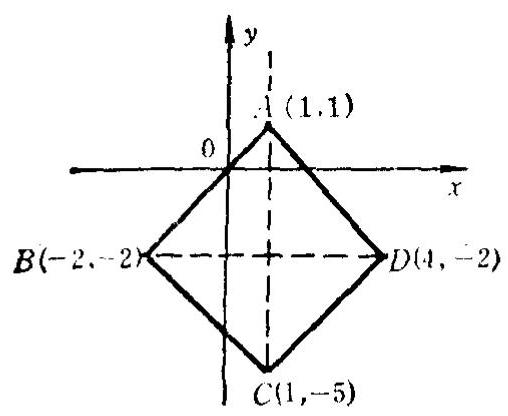

图 3-1-01

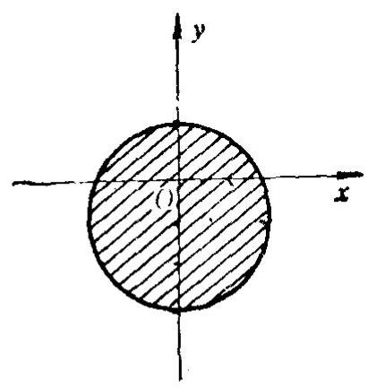

图 3-1-03

略解 当 $x \geq  1$ 且 $y \geq   - 2$ 时,曲线方程为 $x + y = 2$ ;

当 $x < 1$ 且 $y \geq   - 2$ 时,曲线方程为 $- x + y = 0$ ;

当 $x < 1$ 且 $y <  - 2$ 时,曲线方程为 $x + y =  - 4$ ;

当 $x \geq  1$ 且 $y <  - 2$ 时,曲线方程为 $x - y = 6$ .

曲线为图 3-1-01 中的正方形 ${ABCD}$ ,其周长为

$$
4\sqrt{{\left( 1 - 4\right) }^{2} + {\left( 1 + 2\right) }^{2}} = {12}\sqrt{2}.
$$

例 3 证明

$$
S = \left| \right| x - y\left| {+x + y - {2z}}\right|  + \left| {x - y}\right|  + x + y + {2z} = 4\max \{ x, y, z\} .
$$

证 当 $\left| {x - y}\right|  + x + y - {2z} \geq  0$ 时, $S = 2\left| {x - y}\right|  + 2\left( {x + y}\right)$ ,

当 $\left| {x - y}\right|  + x + y - {2z} \leq  0$ 时， $S = {4z}$ .

再考虑 $x - y \geq  0$ 与 $x - y \leq  0$ 两种情况，可得

当 $x - y \geq  0$ 且 $\left| {x - y}\right|  + x + y - {2z} \geq  0$

即 $x - z \geq  0$ 时, $S = {4x}$ ,

当 $x - y \leq  0$ 且 $\left| {x - y}\right|  + x + y - {2z} \geq  0$ ,

即 $y - z \geq  0$ 时, $S = {4y}$ .

综上所述，可得

当 $x - y \geq  0, x - z \geq  0$ ,即 $x = \max \{ x, y, z\}$ 时,

$$
S = {4x} = 4\max \{ x, y, z\} ;
$$

当 $y - x \geq  0, y - z \geq  0$ ,即 $y = \max \{ x, y, z\}$ 时,

$$
S = 4\dot{y} = 4\max \{ x, y, z\} ;
$$

当 $z - y \geq  0, z - x \geq  0$ ，即 $z = \max \{ x, y, z\}$ 时，

$$
S = {4z} = 4\max \{ x, y, z\} .
$$

$$
\text{ (此时 }\left| {x - y}\right|  + x + y - {2z} \leq  0\text{ ) }
$$

$$
\therefore \;S = \left| \right| x - y\left| {+x + y - {2z}}\right|  + \left| {x - y}\right|  + x + y + {2z}
$$

$$
= 4\max \{ x, y, z\} \text{ . }
$$

例 4 设 $z$ 为复数,作点集

$$
D = \{ z : \left| \right| z + i\left| {-2}\right|  + \left| {z + i}\right|  - 2 = 0\} .
$$

分析 $\left| {z + i}\right|  - 2$ 是实数，欲脱去绝对值记号，须考虑它何时为正, 何时为负, 而零是正、负的分界点, 所以先考虑它何时为零. 当 $\left| {z + i}\right|  - 2 = 0$ 时，则 $\left| {z + i}\right|  = 2$ ，即点 $z$ 在以 $\left( {0, - 1}\right)$ 为中心， 2 为半径的圆上. 当点 $z$ 在此圆外时， $\left| {\left| {z + i}\right|  - 2}\right|  + \left| {z + i}\right|  - 2 =$ 0 不成立; 当且仅当点 $z$ 在以 $\left( {0, - 1}\right)$ 为中心,2 为半径的闭圆域内时， $\left| {\left| {z + i}\right|  - 2}\right|  + \left| {z + i}\right|  - 2 = 0$ 成立. 故点集 $D$ 的图形为图 3-1-02 中的阴影区域。

解 略.

2. 剩余类

一切整数可按除以 $m$ 所得余数进行划分为 $m$ 类: 余数为零、 为 1 、为 2、...、为 m-1，不少有关整数集的问题常可按这样的划分来处理.

例 5 试证大于等于 5 的质数的平方与 1 的差为 24 的倍数.

分析 如何表示大于等于 5 的质数, 是解决本题的关键. 而质数又无简单的通用表达式, 因而考虑将大于等于 5 的自然数分成如下六类: ${6n}\left( {6\text{ 除余 0 }}\right) ,{6n} + 1\left( {6\text{ 除余 1 }}\right) ,{6n} + 2\left( {6\text{ 除余 2 }}\right)$ , ${6n} + 3\left( {6\text{ 除余 3 }}\right) ,{6n} - 2\left( {6\text{ 除余 4 }}\right) ,{6n} - 1\left( {6\text{ 除余 5 }}\right)$ . 由于大于等于 5 的质数不可能为偶数,所以不小于 5 的质数只能在 ${6n} \pm  1$ 之中,从此获证.

证 将不小于 5 的自然数划分成六类: ${6n},{6n} + 1,{6n} + 2,{6n}$ +3,6n-2,6n-1,则不小于 5 的质数必在 ${6n} \pm  1$ 之中.

$$
{\left( 6n \pm  1\right) }^{2} - 1 = {36}{n}^{2} \pm  {12n} = {12n}\left( {{3n} \pm  1}\right)
$$

$$
= {12}\left\lbrack  {2{n}^{2} + n\left( {n \pm  1}\right) }\right\rbrack  ,
$$

又 $n\left( {n \pm  1}\right)$ 必为偶数,

$\therefore$

$$
{24}\left\lbrack  {{\left( 6n \pm  1\right) }^{2} - 1}\right\rbrack  ,
$$

故不小于 5 的质数的平方与 1 之差必为 24 的倍数.

例 6 求证: 任何整数可表示为五个整数的立方和.

证 $\because {\left( n + 1\right) }^{3} + {\left( -n\right) }^{3} + {\left( -n\right) }^{3} + {\left( n - 1\right) }^{3} = {6n}$ ,

$\therefore$ 凡是6的倍数都可表示为

$$
{6n} = {\left( n + 1\right) }^{3} + {\left( -n\right) }^{3} + {\left( -n\right) }^{3} + {\left( n - 1\right) }^{3} + {0}^{3}.
$$

再证另五类,即 6 除余 1,6 除余 2,6 除余 3,6 除余 4,6 除余 5 都能表示为

$$
{6n} + 1 = {\left( n + 1\right) }^{3} + {\left( -n\right) }^{3} + {\left( -n\right) }^{3} + {\left( n - 1\right) }^{3} + {1}^{3}
$$

$$
{6n} + 2 = 6\left( {n - 1}\right)  + {2}^{3};{6n} + 3 = 6\left( {n - 4}\right)  + {3}^{3};
$$

$$
{6n} + 4 = 6\left( {n + 2}\right)  + {\left( -2\right) }^{3};{6n} + 5 = 6\left( {n + 1}\right)  + {\left( -1\right) }^{8}.
$$

综上所述，任何整数可表示为五个整数的立方和.

剩余类的应用很广泛. 讨论三角方程的解的不同形式是否等价, 实质上就是研究两个集合是否相等, 根据剩余类进行划分, 可使问题一目了然. 例如,两个集合 $M = \{ X : X = \left( {{2k} + 1}\right) \pi , k \in  Z\}$ , $N = \{ X : X = \left( {{4k} - 1}\right) \pi , k \in  Z\}$ 是否相等? 根据剩余类来分析很容

排列组合问题的基础是加法原理与乘法原理. 应用加法原理必须对各种可能情形进行分类，既不能易判断, 留给读者练习, 这里不再细述.

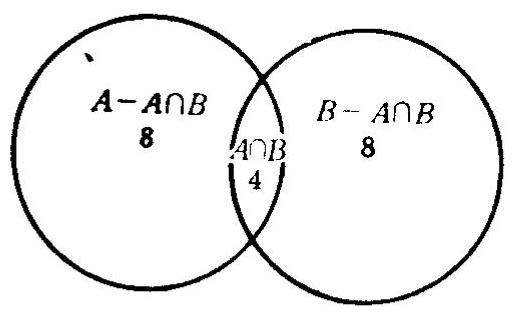

图 3-1-03

## 3. 排列组合应用题

重复，也不能遗漏. 应用乘法原理必须对一件工作分步骤进行，各步骤之间互不干扰. 因此在分析问题时，往往抓住限制条件，从此入手，按一定标准进行分类. 每一类中，或可直接应用排列组合的公式解决, 或可分步骤完成. 从此可见, 解排列组合应用题时是离不开逻辑划分的思维方法的.

例 7 已知集合 $A$ 和集合 $B$ 各含 12 个元素, $A \cap  B$ 含有 4 个元素,试求同时满足下面两个条件的集合 $C$ 的个数:

(i) $O \subset  A \cup  B$ ,且 $O$ 中含有 3 个元素;

(ii) $O \cap  A \neq  \varnothing$ ( $\varnothing$ 表示空集).

分析 本题与 “集合 $A$ 有 12 个元素，集合 $B$ 有 8 个元素，且 $A \cap  B = \varnothing$ ,求在集合 $A \cup  B$ 中取 3 个元素,其中至少含有 $A$ 的一个元素构成的集合 $O$ 的个数”等价.

解 $\because n\left( {A \cup  B}\right)  = n\left( A\right)  + n\left( B\right)  - n\left( {A \cap  B}\right)$ ,这里符号 $n\left( X\right)$ 表示集合 $X$ 中元素的个数,

$\therefore$

$$
n\left( {A \cup  B}\right)  = {20},
$$

${O}_{20}^{3} - {O}_{8}^{3} = {1084}$ 或 ${O}_{12}^{1} \cdot  {O}_{8}^{2} + {O}_{12}^{2} \cdot  {C}_{8}^{1} + {O}_{12}^{3} \cdot  {C}_{8}^{0} = {1084}$ .

例 8 五个城市中, 任意三个不在一条直线上. 现在要把这五个城市，用四条笔直的铁路组成的铁路网连接起来，可以用 “高架桥”使一条铁路在另一条的上空经过. 这样不同的铁路网共有几种?

分析 本题中不同的铁路网可分为三类:

(i) 每一个城市都可以作枢纽站, 与其他四个站相连;

(ii) 每一个城市都可以作枢纽站, 与其他三个站相连;

(iii) 无一个城市与三个或三个以上城市相连.

解 按分析可知铁路网存在三类:

第(i) 类有 ${O}_{5}^{1} = 5$ (种);

第(ii) 类有 ${O}_{5}^{1} \cdot  {O}_{4}^{3} \cdot  {O}_{3}^{1} = 5 \cdot  4 \cdot  3 = {60}$ (种);

第(iii)类相当于从任一城市出发依次经过其他四个城市的排列数, 但每一排列与顺序相反的排列所确定的铁路网是同一网络, 所以有不同的铁路网 $5! \div  2 = {60}$ 种、

总共有 $5 + {60} + {60} = {125}$ 种铁路网.

例 9 所有三位数中有且仅有两个数字相同的 (如 353,119, 100,144 等), 共有几个?

解 符合条件的三位数可分成如下十类:

有两个零的: 如 100、200、300、...、900,计有 ${O}_{9}^{1} = 9$ (个);

有两个 1 的:在余下的 9 个数中选一个，与 1、1 之间的位置关系有 3 个,但应除去 011 这个假三位数,故共有 ${O}_{3}^{1} \cdot  {O}_{9}^{1} - 1$ (个);

同理,有两个 2,两个 $3,\cdots$ ,两个 9 的三位数各有 ${O}_{3}^{1} \cdot  {O}_{9}^{1} - 1$ 个;

$\therefore$ 符合题目要求的三位数总共有

$$
{C}_{9}^{1} + 9\left( {{\dot{C}}_{3}^{1} \cdot  {C}_{9}^{1} - 1}\right)  = {243}\text{ 个. }
$$

例 10 求以凸 $n$ 边形的顶点为顶点,而以其对角线为边所构成的三角形的个数.

解 将以 $n$ 个顶点为顶点的所有三角形 ${O}_{n}^{3}$ 分成以下三类:

以 $n$ 边形的两边及一对角线构成的三角形有 $n$ (个);

以 $n$ 边形的一边及两对角线构成的三角形有 $n\left( {n - 4}\right)$ 个;

以 $n$ 边形的三条对角线构成的三角形有 $x$ 个.

$\therefore$

$$
x + n + n\left( {n - 4}\right)  = {C}_{n}^{3},
$$

故 $x = {C}_{n}^{3} - n\left( {n - 4}\right)  - n = \frac{n}{6}\left( {n - 4}\right) \left( {n - 5}\right)$ .

## 4. 方程、不等式的讨论

方程、不等式所需讨论的问题, 也须正确进行划分, 否则易犯重复或遗漏的错误. 这类问题十分广泛，这里只能举几个实例说明,以概其余.

例 11 在实数范围内解方程 $x + \sqrt{x\left( {a - x}\right) } = b$ , 并加以讨论,这里 $a$ 及 $b$ 是正数.

解 原方程化为 $\sqrt{x\left( {a - x}\right) } = b - x$①

两边平方 $\;f\left( x\right)  = 2{x}^{2} - \left( {{2b} + a}\right) x + {b}^{2} = 0$②

$$
\Delta  = {\left( 2b + a\right) }^{2} - 8{b}^{2} = {a}^{2} + {4ab} - 4{b}^{2} \geq  0,
$$

& $\left\lbrack  {a + 2\left( {1 + \sqrt{2}}\right) b}\right\rbrack  \left\lbrack  {a + 2\left( {1 - \sqrt{2}}\right) b}\right\rbrack   \geq  0$③

$$
b - x \geq  0\text{ ，即 }x \leq  b
$$

④

即在 $a \geq  2\left( {\sqrt{2} - 1}\right) b$ ，且 $x \leq  b$ 时，原方程有实数解，

$$
{x}_{1} = \frac{{2b} + a - \sqrt{{a}^{2} + {4ab} - 4{b}^{2}}}{4}
$$

$$
{x}_{2} = \frac{{2b} + a + \sqrt{{a}^{2} + {4ab} - 4{b}^{2}}}{4}.
$$

$$
f\left( b\right)  = 2{b}^{2} - \left( {{2b} + a}\right) b + {b}^{2} = {b}^{2} - {ab} = b\left( {b - a}\right) .
$$

当 $a > b$ 时， $f\left( b\right)  < 0$ ，此时， $f\left( x\right)$ 的一根大于 $b$ ，另一根小于 $b$ ， 即 ${x}_{1} < b < {x}_{2},\therefore {x}_{1}$ 是原方程的根.

当 $a \leq  b$ 时， $f\left( b\right)  \geq  0$ ，此时， $b$ 不小于 $f\left( x\right)  = 0$ 的大的根，即 ${x}_{1} < {x}_{2} \leq  b.$

综上所述,可得结论如下:

(1)当 $a < 2\left( {\sqrt{2} - 1}\right) b$ 时,原方程无实根;

( 2 )当 $a > b$ 时，原方程有唯一的实根 ${x}_{1}$ ；

(3)当 $a \in  (2\left( {\sqrt{2} - 1}\right) b, b\rbrack$ 时，原方程有两个实根 ${x}_{1}\text{ 、 }{x}_{2}$ ;

(4)当 $a = 2\left( {\sqrt{2} - 1}\right) b$ 时，原方程有唯一实根 $x = \frac{\sqrt{2}}{2}b$ .

例 12 已知实数 $k$ ,复数 $z = \cos \theta  + i\sin \theta$ ,

(1)当 $k$ 和 $\theta$ 分别为何值时,复数 ${z}^{3} + k{\bar{z}}^{3}$ 是纯虚数;

(2)当 $\theta$ 变化时,求出 $\left| {{z}^{3} + k{\bar{z}}^{3}}\right|$ 的最大值和最小值.

分析 (1) 由于 ${z}^{3} + k{\bar{z}}^{3}$ 中含有两个参数 $k$ 和 $\theta$ ，而复数为纯虚数的充要条件是 $R\left( z\right)  = 0$ 且 $I\left( z\right)  \neq  0$ ，因此必须正确理解与运用“与”和“或”两个逻辑运算概念，才能得到正确的结论.

(2) $\left| {{z}^{3} + k{\bar{z}}^{3}}\right|$ 的最大值和最小值不但随自变量 $\theta$ 的取值确定,而且还要受参数 $k$ 的制约. 必须根据解析式 $f\left( \theta \right)  = \left| {{z}^{3} + k{\bar{z}}^{3}}\right|$ 中 $k$ 的制约条件，正确对 $k$ 的允许值进行划分，才能获得正确答案.

解 (1) ${z}^{3} + k{\bar{z}}^{3} = \cos {3\theta } + i\sin {3\theta } + k\left( {\cos {3\theta } - i\sin {3\theta }}\right)$

$$
= \left( {1 + k}\right) \cos {3\theta } + i\left( {1 - k}\right) \sin {3\theta }.
$$

当

$$
\left\{  \begin{array}{l} \left( {1 + k}\right) \cos {3\theta } = 0 \\  \left( {1 - k}\right) \sin {3\theta } \neq  \theta  \end{array}\right.
$$

即

$\beta \left\{  {\begin{array}{lll} k =  - 1 & \text{ 或 } & \theta  = \frac{\left( {{2n} + 1}\right) \pi }{6}, \\  k \neq  1 & \text{ 且 } & \theta  \neq  \frac{n\pi }{3}; \end{array}\;\left( {n \in  Z}\right) }\right.$

亦即当 $k =  - 1$ 且 $\theta  \neq  \frac{n\pi }{3}$ 时，或 $\theta  = \frac{\left( {{2n} + 1}\right) \pi }{6}$ 且 $k \neq  1$ 时， ${z}^{3} + k{\bar{z}}^{3}$ 是纯虚数.

(2) ${\left| {z}^{3} + k{\bar{z}}^{3}\right| }^{2} = \left( {{z}^{3} + k{\bar{z}}^{3}}\right) \overline{\left( {z}^{3} + k{\bar{z}}^{3}\right) }$

$$
= \left( {{z}^{3} + k{\bar{z}}^{3}}\right) \left( {{\bar{z}}^{3} + k{z}^{3}}\right)
$$

$$
= \left( {1 + {k}^{2}}\right) {z}^{3} \cdot  {\bar{z}}^{3} + k\left( {{z}^{6} + {\bar{z}}^{6}}\right) \;\left( {\because {z}^{3} \cdot  {\bar{z}}^{3} = 1}\right)
$$

$$
= \left( {1 + {k}^{2}}\right)  + {2k}\cos {6\theta }\text{ . }
$$

如果 $k > 0$ ,当 $\theta  = \frac{\pi a}{3}$ 时, $\left| {{z}^{3} + k{\bar{z}}^{3}}\right|$ 的最大值 $= 1 + k$ ; 当 $\theta  = \; \frac{\left( {{2n} + 1}\right) \pi }{6}$ 时， $\left| {{z}^{3} + k{\bar{z}}^{3}}\right|$ 的最小值 $= \left| {1 - k}\right|$ .

如果 $k = 0$ ,则 $\left| {{z}^{3} + k{\bar{z}}^{3}}\right|$ 的最大值和最小值都等于 1 .

如果 $k < 0$ ,当 $\theta  = \frac{\left( {{2n} + 1}\right) \pi }{6}$ 时, $\left| {{z}^{3} + k{\bar{z}}^{3}}\right|$ 的最大值 $= 1 - {k}_{i}$ 当 $\theta  = \frac{n\pi }{3}$ 时, $\left| {{z}^{3} + k{\bar{z}}^{3}}\right|$ 的最小值 $= \left| {1 + k}\right|$ .

例 18 试讨论空间三个平面的一切可能的位置关系.

分析 空间三平面的位置关系是一个复杂的关系，怎样划分才能做到既无重复又无遗漏呢？这应抓住划分各个阶段的划分标准. 首先抓三个平面有无重合, 在有两个重合的条件下再按与第三平面是相交还是平行进行划分. 对三个平面都不重合的情况再按有几个平面平行来划分. 对三个平面都不平行的情况再按三条交线是否重合, 平行, 相交来划分. 这样逐级进行划分, 才可避免重复与遗漏.

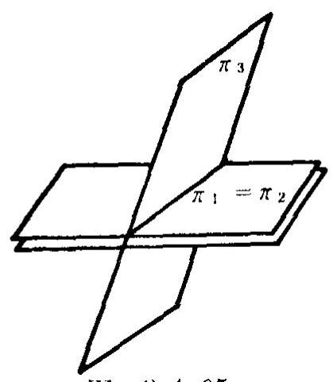

解 三平面重合,见图 3-1-04。

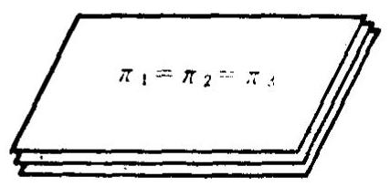

图 3-1-04

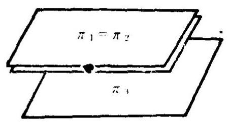

图 3-1-06

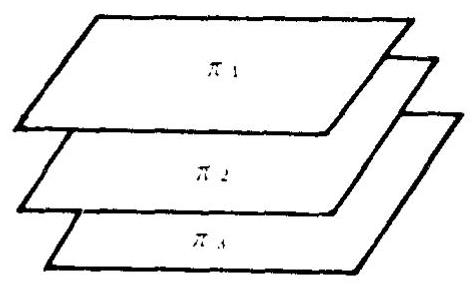

图 3-1-07

二平面重合 $\{$ 与第三个平面相交,见图 3-1-05.

三个平面都不重合

$\left\{  \begin{array}{l} \text{ 三个平面平行,见图 }3 - 1 - {07}. \\  \text{ 两个平面平行,见图 }3 - 1 - {08}. \\  \text{ 三个平面两两相交 }\left\{  \begin{array}{l} \text{ 三条交线重合,见图 }3 - 1 - {09}. \\  \text{ 三条交线相交,见图 }3 - 1 - {11}. \end{array}\right. \\  \text{ 三条交线相交,见图 }3 - 1 - {11}. \end{array}\right.$

在空间解析几何中, 三个平面的方程分别为

$$
{\pi }_{1 : }{a}_{1}x + {b}_{1}y + {c}_{1}z = {d}_{1}
$$

$$
{\pi }_{2 : }{a}_{2}x + {b}_{2}y + {c}_{2}z = {d}_{2}
$$

$$
{\pi }_{3 : }{a}_{3}x + {b}_{3}y + {c}_{3}z = {d}_{3}
$$

$$
\Delta  = \left| \begin{array}{lll} {a}_{1} & {b}_{1} & {c}_{1} \\  {a}_{2} & {b}_{2} & {c}_{2} \\  {a}_{3} & {b}_{3} & {c}_{3} \end{array}\right| ,\;{\Delta }_{x} = \left| \begin{array}{lll} {d}_{1} & {b}_{1} & {c}_{1} \\  {d}_{2} & {b}_{2} & {c}_{2} \\  {d}_{3} & {b}_{3} & {c}_{3} \end{array}\right| ,
$$

$$
{\Delta }_{y} = \left| \begin{array}{lll} {a}_{1} & {d}_{1} & {c}_{1} \\  {a}_{2} & {d}_{2} & {c}_{2} \\  {a}_{3} & {d}_{3} & {c}_{3} \end{array}\right| ,\;{\Delta }_{z} = \left| \begin{array}{lll} {a}_{1} & {b}_{1} & {d}_{1} \\  {a}_{2} & {b}_{2} & {d}_{2} \\  {a}_{3} & {b}_{3} & {d}_{3} \end{array}\right| .
$$

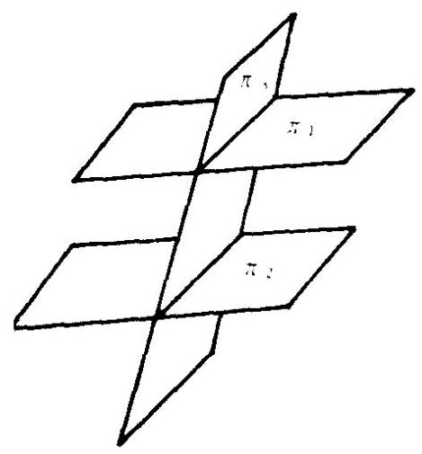

图 3-1-08

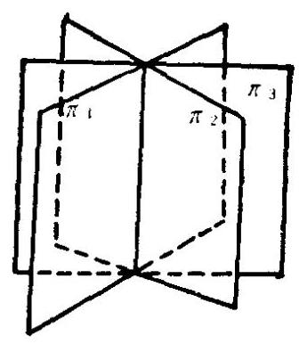

图 3.1-09

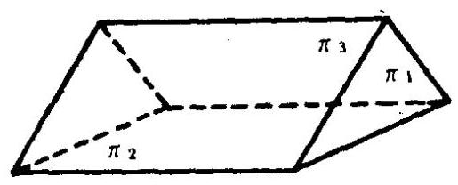

图 3-1-10

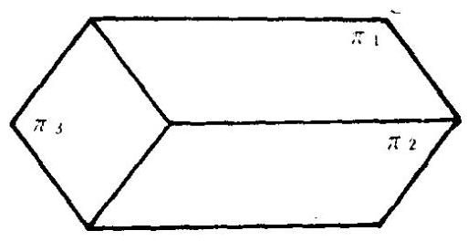

图 3-1-11

上述八种情形的解析条件分别为:

(1)三平面重合: ${a}_{1} : {b}_{1} : {c}_{1} : {d}_{1} = {a}_{2} : {b}_{2} : {c}_{2} : {d}_{2} = {a}_{3} : {b}_{3} : {c}_{3} : {d}_{3}$ .

(2)两平面重合与第三平面相交: ${a}_{1} : {b}_{1} : {c}_{1} : {d}_{1} = {a}_{2} : {b}_{2} : {c}_{2} : {d}_{2}$ ， 且 ${a}_{1} : {b}_{1} : {c}_{1} \neq  {a}_{3} : {b}_{3} : {c}_{3}$ .

(3)两平面重合与第三平面平行: ${a}_{1} : {b}_{1} : {c}_{1} : {d}_{1} = {a}_{2} : {b}_{2} : {c}_{2} : {d}_{2}$ ， 但 $\frac{{a}_{1}}{{a}_{3}} = \frac{{b}_{1}}{{b}_{3}} = \frac{{c}_{1}}{{c}_{3}} \neq  \frac{{d}_{1}}{{d}_{2}}$ .

(4)三个平面平行: $\frac{{a}_{1}}{{a}_{2}} = \frac{{b}_{1}}{{b}_{2}} = \frac{{c}_{1}}{{c}_{2}} \neq  \frac{{d}_{1}}{{d}_{2}},\frac{{a}_{1}}{{a}_{3}} = \frac{{b}_{1}}{{b}_{3}} = \frac{{c}_{1}}{{c}_{3}} \; \neq  \frac{{d}_{1}}{{d}_{3}}$ .

(5) 两个平面平行与第三个平面相交: $\frac{{a}_{1}}{{a}_{2}} = \frac{{b}_{1}}{{b}_{2}} = \frac{{c}_{1}}{{c}_{2}} \neq  \frac{{d}_{1}}{{d}_{2}}$ , 且 ${a}_{1} : {b}_{1} : {c}_{1} \neq  {a}_{3} : {b}_{3} : {c}_{3}$ .

(6)三个平面两两相交，三条交线重合(令 ${\Delta }_{{a}_{1}}$ 、 ${\Delta }_{{a}_{2}}$ 、 ${\Delta }_{{a}_{3}}$ 、 ${\Delta }_{{b}_{1}}$ 、 ${\Delta }_{{b}_{2}}$ 、 ${\Delta }_{{b}_{3}}$ 分别表示行列式 $\Delta$ 的对应元素的子行列式; ${\Delta }_{y{a}_{1}}$ 、 ${\Delta }_{y{a}_{2}}$ 、 ${\Delta }_{y{a}_{3}}$ 分别表示行列式 ${\Delta }_{y}$ 的对应元素的子行列式，下同):

$$
{\Delta }_{{a}_{1}} : {\Delta }_{{a}_{2}} : {\Delta }_{{a}_{3}} = {\Delta }_{{b}_{1}} : {\Delta }_{{b}_{2}} : {\Delta }_{{b}_{3}} = {\Delta }_{y{a}_{1}} : {\Delta }_{y{a}_{3}} : {\Delta }_{y{a}_{3}}.
$$

(7)三个平面两两相交，三条交线平行:

$$
{\Delta }_{{a}_{1}} : {\Delta }_{{a}_{2}} : {\Delta }_{{a}_{3}} = {\Delta }_{{b}_{1}} : {\Delta }_{{b}_{2}} : {\Delta }_{{b}_{3}} \neq  {\Delta }_{y{a}_{1}} : {\Delta }_{y{a}_{2}} : {\Delta }_{y{a}_{3}}.
$$

(8)三个平面相交于一点: $\Delta  \neq  0$ .

## 5. 抽屉原则

抽屉原则亦称抽屉原理或鸽子巢原理、狄利克雷(P. G. Dirichlet) 原理. 它是数学里最简单也是最基本的原理，其内容如下:

把 $n + 1$ 件或更多的东西放到 $n$ 个抽屉里,则至少有一个抽屉里要放两件或更多的东西.

应用反证法证明是极简单的. 如果 $n$ 只抽屉里每一只里都不超过一件东西,那末 $n$ 只抽屉里的东西的总数不可能超过 $n$ 件,这与已知条件有 $n + 1$ 件或更多的东西矛盾.

这一几乎不证自明的毫无惊人之处的简单原理，出现在十九世纪时, 却解决了几个很重要的问题. 自此之后, 应用日益广泛.

这一原理更一般的形式如下:

${m}_{1}\text{ 、 }{m}_{2}\text{ 、 }\cdots \text{ 、 }{m}_{n}$ 都是自然数,把 ${m}_{1} + {m}_{2} + \cdots  + {m}_{n} - n + 1$ 件东西放入 $n$ 只抽屉里,则第一只抽屉里至少有 ${m}_{1}$ 件,或第二只抽屉里至少有 ${m}_{2}$ 件, $\cdots \cdots$ ,或第 $n$ 只抽屉里至少有 ${m}_{n}$ 件,至少其中之一必然成立.

当 ${m}_{1} = {m}_{2} = \cdots  = {m}_{n} = 2$ 时， ${m}_{1} + {m}_{2} + \cdots  + {m}_{n} - n + 1 = n + 1$ ， 就是前述的简单形式.

证 若不然,则第一只抽屉里少于 ${m}_{1}$ 件,第二只抽屉里少于 ${m}_{2}$ 件, $\cdots \cdots$ ,第 $n$ 只抽屉里少于 ${m}_{n}$ 件. 那末,东西的总数不超过

$$
\left( {{m}_{1} - 1}\right)  + \left( {{m}_{2} - 1}\right)  + \cdots  + \left( {{m}_{n} - 1}\right)  = {m}_{1} + {m}_{2} + \cdots  + {m}_{n} - n,
$$

与假设

$$
{m}_{1} + {m}_{2} + \cdots  + {m}_{n} - n + 1\text{ 矛盾. }
$$

推论 $1\mathrm{\;m}$ 件东西,放入 $n$ 只抽屉,则至少有一只抽屉里放的东西不少于 $\left\lbrack  \frac{m - 1}{n}\right\rbrack   + 1$ 件

若不然,则每一抽屉里最多有 $\left\lbrack  \frac{m - 1}{n}\right\rbrack$ 件东西, $n$ 只抽屉里东西的总数最多为 $n\left\lbrack  \frac{m - 1}{n}\right\rbrack   \leq  m - 1$ ,与假设矛盾.

推论 2 把 $n\left( {m - 1}\right)  + 1$ 件东西放入 $n$ 只抽屉里,则至少有一只抽屉里有 $m$ 件东西.

这就是 ${m}_{1} = {m}_{2} = \cdots  = {m}_{n} = m$ 的特殊情形.

推论 3 若 ${m}_{1}$ 、 ${m}_{2}$ 、 $\cdots$ 、 ${m}_{n}$ 是 $n$ 个正整数，而且

$$
\frac{{m}_{1} + {m}_{2} + \cdots  + {m}_{n}}{n} > r - 1.
$$

则 ${m}_{1}\text{ 、 }{m}_{2}\text{ 、 }\cdots \text{ 、 }{m}_{n}$ 中至少有一个数不小于 $r$ .

抽屉原则本身并不难, 难在如何运用它去解决具体问题. 在具体问题中, 什么是东西的总数, 如何划分抽屉. 均无模式可循. 特别是如何划分抽屉, 实为解决问题的关键. 从思维方法上分析, 仍是划分这一策略思想的运用. 它所涉及的知识面很广, 主要是枚举、奇偶性、剩余类、区间、区域等等. 下面通过实例说明它的应用方法.

例 14 任给 7 个实数,证明其中有两个数 $x\text{ 、 }y$ 满足

$$
0 \leq  \frac{x - y}{1 + {xy}} \leq  \frac{1}{\sqrt{3}}.
$$

分析 从结论联想到正切公式:

$$
\operatorname{tg}\left( {\alpha  - \beta }\right)  = \frac{\operatorname{tg}\alpha  - \operatorname{tg}\beta }{1 + \operatorname{tg}\alpha \operatorname{tg}\beta }.
$$

如果令 $x = \operatorname{tg}\alpha , y = \operatorname{tg}\beta ,\alpha ,\beta  \in  \left( {-\frac{\pi }{2},\frac{\pi }{2}}\right)$ ,则欲证的结论转化为

$$
0 \leq  \operatorname{tg}\left( {\alpha  - \beta }\right)  \leq  \frac{\sqrt{3}}{3},
$$

即两个角 $\alpha$ 、 $\beta$ 之差在 0 与 $\frac{\pi }{6}$ 之间. 7 个实数对应于 7 个角. 将右半圆六等分,并将中心角为 $\frac{\pi }{6}$ 的 6 个扇形作为 6 只抽屉. 7 个免放入这 6 只抽屉里, 至少有 1 只抽屉里有 2 个角, 所以这两角的差必在 0 与 $\frac{\pi }{6}$ 之间. 由于这 2 个角的正切对应着 7 个实数中的 2 个实数 $x\text{ 、 }y$ ,则由 $x = \operatorname{tg}\alpha , y = \operatorname{tg}\beta ,0 \leq  \alpha  - \beta  \leq  \frac{\pi }{6}$ ,

得

$$
0 \leq  \frac{\operatorname{tg}\alpha  - \operatorname{tg}\beta }{1 + \operatorname{tg}\alpha \operatorname{tg}\beta } \leq  \frac{\sqrt{3}}{3},
$$

$\therefore$

$$
0 \leq  \frac{x - y}{1 + {xy}} \leq  \frac{1}{\sqrt{3}}.
$$

证 略.

例 15 在边为 1 的正方形中, 任意放入 9 个点, 证明在以这些点为顶点的许许多多三角形中, 必有 1 个三角形, 它的面积不超过 $\frac{1}{8}$ .

证 用 3 条平行于上、下底边的直线, 把正方形分成 4 个大小相等的长方形. 根据推论 $2,4\left( {3 - 1}\right)  + 1 = 9$ 个点放入 4 个长方形中,至少有 1 个长方形中有 3 个点. 现在把这个长方形取出来研究.

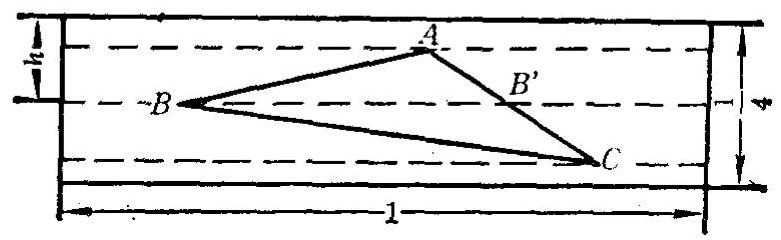

图 3-1-12

如图 3-1-12,把落入此长方形内的三点记作 $A\text{ 、 }B\text{ 、 }C$ ,过 $A$ 、 $B\text{ 、 }O$ 作正方形底边的平行线,过中间一点 $B$ 的直线交 ${AO}$ 于 ${B}^{\prime }$ , 则

$$
{S}_{\bigtriangleup {ABC}} = {S}_{\bigtriangleup {AB}{B}^{\prime }} + {S}_{\bigtriangleup B{B}^{\prime }C}
$$

$$
\leq  \frac{1}{2} \times  1 \times  h + \frac{1}{2} \times  1 \times  \left( {\frac{1}{4} - h}\right)  = \frac{1}{8},
$$

这就证明了题断.

例 16 在平面直角坐标系里有 19 个格点 (即整点), 其中无三点共线, 证明这 19 个格点中, 必有三点为顶点的三角形的重心也是格点.

分析 如果一个格点三角形的重心也是格点, 那末, 三个格点的横坐标之和与纵坐标之和, 都必须是 3 的倍数. 因此, 可将 19 个格点的坐标分别除以 3 ，按它们所得的余数来分类:余数为零. 的,记为 $\{ 0\}$ ; 余数为 1 的,记为 $\{ 1\}$ ; 余数为 2 的,记为 $\{ 2\} .$ 19 个格点的坐标可划分为 $\left( {\{ 0\} ,\{ 0\} }\right) \text{ 、 }\left( {\{ 0\} ,\{ 1\} }\right) \text{ 、 }\left( {\{ 0\} ,\{ 2\} }\right) \text{ 、 }(\{ 1\}$ , $\{ 0\} )\text{ 、 }\left( {\{ 1\} ,\{ 1\} }\right) \text{ 、 }\left( {\{ 1\} ,\{ 2\} }\right) \text{ 、 }\left( {\{ 2\} ,\{ 0\} }\right) \text{ 、 }\left( {\{ 2\} ,\{ 1\} }\right) \text{ 、 }\left( {\{ 2\} ,\{ 2\} }\right)$ 九类. 将 $9\left( {3 - 1}\right)  + 1 = {19}$ 个格点放入上述 9 个抽屉里，由推论 2 可知, 至少有一个抽屉里有三个格点, 它们的横坐标之和与纵坐标之和都是 3 的倍数, 从此可得本命题的证明.

证 略.

例 17 世界上任何 6 个人中至少存在 3 个人或是互相认识, 或是互相不认识 (Ramsey 问题).

证 对于 6 个人中的任意 1 个人 $A$ 来说,除 $A$ 外的 5 个人可分为两类,一类是 $A$ 的朋友,另一类是 $A$ 的陌生人. 用 $F$ 表示其余 5 人中与 $A$ 互相认识的集合; 用 $S$ 表示其余 5 人中与 $A$ 互相不认识的集合. 根据抽屉原则， $F$ 和 $S$ 中有一个集合至少有 3 人， 不妨设为集合 $F$ . 如果 $F$ 中的 3 人 $B$ 、 $C$ 、 $D$ ，他们彼此不相识，则问题已得证明. 否则有两人互相认识，不妨设为 $B\text{ 、 }C$ ，则 $A\text{ 、 }B\text{ 、 }C$ 互相认识, 问题获证.

如果 $S$ 中有 3 个人,设为 $L\text{ 、 }M\text{ 、 }N$ . 若 $L\text{ 、 }M\text{ 、 }N$ 互相认识,则问题已得证明. 否则 $L\text{ 、 }M\text{ 、 }N$ 中有两人互不相识，不妨设为 $L$ 、 $M$ ，则 $A\text{ 、 }L\text{ 、 }{M3}$ 人互不相识，问题获证.

上述推理过程，可形象地表达如下:

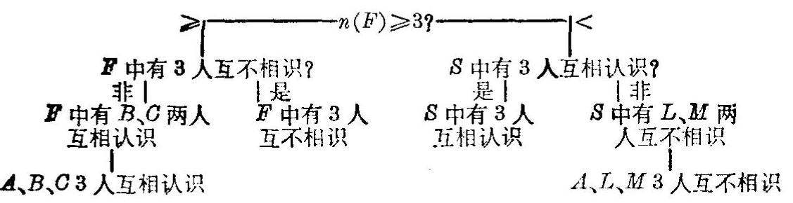

本题还可用 6 个点表示 6 个人，互相认识的两点之间用红线相连, 互不相识的两点之间用蓝线相连. 可以证明这 15 条线段中, 必有 3 条是同色的. 这是 Ramsey 问题的另一种表达形式, 两个问题是等价的, 证明方法除了表达、叙述的内容不同外, 思考方法是完全一样的.

例 18 设一部大辞典里的词目不大于 ${10}^{6}$ ,允许提 20 个答案是“是”与“否”的问题，就能猜中一个人心中想的词吗？为什么？

解 将辞典的词编号,则编号不大于 ${10}^{6}$ 个. 对于每一个编号用二进位制来表达: $N = \mathop{\sum }\limits_{{i = 1}}{\alpha }_{i}{2}^{i - 1}$ .

$\because N$ 不超过 ${10}^{6},\therefore N$ 表达式中的 ${\alpha }_{4}$ 不超过 20 个,且 ${\alpha }_{4}$ 只能是 0 或 1 .

只要提出如下的问题:

您要猜的词的编号用二进位制表示时,第 $i$ 个数码 $(i = 1\text{ 、 }2$ 、 · · · 20)等于 1 吗？

所得回答是“是”或者“否”，这样不要问到第 20 个问题，即可确定所猜的词的编号, 从而猜中那个人心中想的词.

这个虽非抽屉原则的问题, 但将词进行编号, 相当于设置抽屉, 其思想方法是类似的.

例 19 一个国际社团的成员来自 6 个国家, 共有 1978 人, 用 1、2、...1977、1978 来编号. 试证明: 该社团至少有一个成员的编号与他的两个同胞的编号之和相等, 或是其一同胞的编号的两倍.

分析 这一命题与“把 1、2、、、1977、1978 按任意方式分成 6 个集合 $A\text{ 、 }B\text{ 、 }C\text{ 、 }D\text{ 、 }E\text{ 、 }F$ ，任意 2 个子集的交集为空集，它们的并集为 $\{ 1\text{ 、 }2\text{ 、 }3\text{ 、 }\cdots \text{ 、 }{1978}\}$ . 这 6 个集合中至少有 1 个集合具有如下的性质: 其中至少存在 1 个数或是等于同一集合内的其他两数的和, 或是等于同一集合内另一数的两倍”等价. 可用反证法证明, 反复应用抽屉原则, 逐步缩小范围, 直至引出矛盾.

证 设将 $I = \{ 1\text{ 、 }2\text{ 、 }3\text{ 、 }\cdots \text{ 、 }{1977}\text{ 、 }{1978}\}$ 划分成任意 6 个子集 $A\text{ 、 }B\text{ 、 }C\text{ 、 }D\text{ 、 }E\text{ 、 }F$ ,任意 2 个子集的交集是空集,它们的并集是 $I$ .

引理: 如果 $A\text{ 、 }B\text{ 、 }C\text{ 、 }D\text{ 、 }E\text{ 、 }F$ 6个子集没有 1 个满足题断,则可得任 1 子集中,任意 2 个数之差不属于该子集.

设 ${f}_{i},{f}_{j} \in  A$ ，如果 ${f}_{i} - {f}_{j} \in  A$ ，则存在 ${f}_{k} \in  A$ ，使得 ${f}_{i} - {f}_{j} = {f}_{k}$ ， 即 ${f}_{i} = {f}_{j} + {f}_{k}$ ,特别地,当 ${f}_{j} = {f}_{k}$ 时, ${f}_{i} = 2{f}_{j}$ . 既然 $A$ 不满足题断, 所以 ${f}_{i} - {f}_{j}\overline{ \in  }A$ .

因为 ${1978} = 6 \times  {329} + 4$ ,根据推论 2,知 ${A}_{\lambda }{B}_{\lambda }{C}_{\lambda }{D}_{\lambda }{E}_{\lambda }{F6}$ 个子集中至少有 1 个子集 (不妨设为 $A$ ) 中至少有 330 个数,为

$$
{a}_{1} > {a}_{2} > {a}_{3} > \cdots  > {a}_{330},
$$

作差: $\;{a}_{1} - {a}_{2}\text{ 、 }{a}_{1} - {a}_{3}\text{ 、 }\cdots \text{ 、 }{a}_{1} - {a}_{330}$ .①

根据引理,知 ${a}_{1} - {a}_{4} \in  A\left( {i = 2,3,\cdots ,{330}}\right)$ ,而 $1 \leq  {a}_{1} - {a}_{4} <$ 1978,所以①的329个差数必在其余五个集合 $B\text{ 、 }C\text{ 、 }D\text{ 、 }E\text{ 、 }F$ 之中.

因为 ${329} = 5 \times  {65} + 4$ ，根据推论 2，知 $B\text{ 、 }C\text{ 、 }D\text{ 、 }E\text{ 、 }F$ 5 个子集中至少有一个子集 (不妨设为 $B$ ) 中,至少有 66 个数为 ① 中的差数，设为 ${b}_{1} > {b}_{2} > {b}_{3} > \cdots  > {b}_{66}\left( {{b}_{i} = {a}_{1} - {a}_{n}}\right)$ ，

作差:

$$
{b}_{1} - {b}_{2},{b}_{1} - {b}_{3},\cdots ,{b}_{1} - {b}_{66}
$$

②

根据引理 ${b}_{1} - {b}_{i} \in  B\left( {i = 2,3,\cdots ,{66}}\right)$ ,其中 ${b}_{1} = {a}_{1} - {a}_{m},{b}_{i} = \; {a}_{1} - {a}_{n}, m, n$ 为 $2\text{ 、 }3\text{ 、 }\cdots \text{ 、 }{330}$ 中的数,

则

$$
{b}_{1} - {b}_{i} = \left( {{a}_{1} - {a}_{m}}\right)  - \left( {{a}_{1} - {a}_{n}}\right)  = {a}_{n} - {a}_{m}\overline{ \in  }A\text{ ， }
$$

因此②中的 65 个差数必在余下的 4 个子集 $O\text{ 、 }D\text{ 、 }E\text{ 、 }F$ 之中.

因为 ${65} = 4 \times  {16} + 1$ ,根据推论 2,知 $O\text{ 、 }D\text{ 、 }E\text{ 、 }{F4}$ 个子集中至少有一个子集 (不妨设为 $O$ ) 中,至少有 17 个数为 ② 中之差数,设为

作差:

$$
{c}_{1} > {c}_{2} > {c}_{3} > \cdots  > {c}_{17}\;\left( {{c}_{i} = {b}_{1} - {b}_{p}}\right)
$$

$$
{c}_{1} - {c}_{2}\text{ 、 }{c}_{1} - {c}_{3}\text{ 、 }\cdots \text{ 、 }{c}_{1} - {c}_{17}
$$

③

根据引理及 ${b}_{1} - {b}_{i}\overline{ \in  }A$ ,可知 ${c}_{1} - {c}_{i}\overline{ \in  }c$ ,且 ${c}_{1} - {c}_{i}\overline{ \in  }A \cup  B \cup  O$ ,

因此 ③ 中的 16 个差数必在 $D$ 、 $E$ 、 $F$ 之中.

因为 ${16} = 3 \times  5 + 1$ ,根据推论 2,知 $D\text{ 、 }E\text{ 、 }{F3}$ 个子集中至少有一个子集 (不妨设为 $D$ ) 中,至少有 6 个数为 ③ 中之差数,设为

$$
{d}_{1} > {d}_{2} > {d}_{3} > \cdots  > {d}_{6}\;\left( {{d}_{i} = {c}_{1} - {c}_{q}}\right)
$$

作差:

$$
{d}_{1} - {d}_{2}\text{ 、 }{d}_{1} - {d}_{3}\text{ 、 }\cdots \text{ 、 }{d}_{1} - {d}_{6}
$$

④

同理， ${d}_{1} - {d}_{i}\overline{ \in  }A \cup  B \cup  O \cup  D\left( {i = 2,3,\cdots ,6}\right)$ ，

所以 ④ 中的 5 个差数,只能在 $E$ 或 $F$ 之中.

因为 $5 = 2 \times  2 + 1$ ,根据推论 2,知 $E\text{ 、 }F$ 中至少有一个子集(不妨设为 $E$ ) 中,至少有 3 个数为 ④中之差数,设为 ${e}_{1}\text{ 、 }{e}_{2}\text{ 、 }{e}_{3}$ ,再作差:

$$
{e}_{1} - {e}_{2}\text{ 、 }{e}_{1} - {e}_{3}\;\left( {{e}_{i} = {d}_{1} - {d}_{r}, r = 2,3,\cdots ,6}\right)
$$

⑤

同理, ${e}_{1} - {e}_{i}\overline{ \in  }A \cup  B \cup  C \cup  D \cup  E,\left( {i = 2,3}\right)$ ,

所以 ${e}_{1} - {e}_{2} \in  F,{e}_{1} - {e}_{3} \in  F$ ,由此可推出

$$
{e}_{2} - {e}_{3} = \left( {{e}_{1} - {e}_{3}}\right)  - \left( {{e}_{1} - {e}_{2}}\right)  \in  F,
$$

并且

$$
{e}_{2} - {e}_{3}\overline{ \in  }A \cup  B \cup  C \cup  D \cup  E,
$$

即

$$
{e}_{2} - {e}_{3}\overline{ \in  }A \cup  B \cup  C \cup  D \cup  E \cup  F = I.
$$

但

$$
1 \leq  {e}_{2} - {e}_{3} < {1978},
$$

故 ${\theta }_{2} - {\theta }_{3} \in  I$ ，这一矛盾证明了与题断矛盾的假设不成立，于是命题得证.

## 6. 其他

划分思想的应用极其广泛，不局限于上述诸方面. 最后，再看两个实例.

例 20 已知平面上有 ${2n} + 3\left( {n \geq  1}\right)$ 个点,其中没有三点共线, 也没有四点共圆. 能不能通过它们之中的某三个点作一圆使得其余 ${2n}$ 个点一半在圆内,一半在圆外? 证明你的结论.

分析 这里要求将 ${2n} + 3$ 个点划分成三大类: 三点在一圆上, $n$ 个点在此圆内,其余 $n$ 个点在此圆外. 这里首先要考虑划分的标准是什么?

先确定两个点 $A\text{ 、 }B$ ,使其余 ${2n} + 1$ 个点在直线 ${AB}$ 的同侧 (这一点不难证明, 这里从略). 由于无四点共圆, 所以所余下的 ${2n} + 1$ 点在 ${AB}$ 上所张的角都不相等,将它们按大小次序排列如下:

$$
{\theta }_{1} < {\theta }_{2} < \cdots  < {\theta }_{n} < {\theta }_{n + 1} < {\theta }_{n + 2} < \cdots  < {\theta }_{{2n} + 1}.
$$

对应于 ${\theta }_{n + 1}$ 的点为 $C$ ，那末，对应于 ${\theta }_{1}$ 、 ${\theta }_{2}$ 、 $\cdots$ 、 ${\theta }_{n}$ 的 $n$ 个点在圆 ${ABC}$ 之外,对应于 ${\theta }_{n + 2}\text{ 、 }{\theta }_{n + 3}\text{ 、 }\cdots \text{ 、 }{\theta }_{{2n} + 1}$ 的 $n$ 个点在圆 ${ABC}$ 之内. 这是因为 “在圆 ${ABC}$ 内的点在 $A\text{ 、 }B$ 两点所张的角大于圆周角 $\angle {ACB}$ ；在圆 ${ABC}$ 外的点在 $A$ 、 $B$ 两点所张的角小于圆周角 $\angle {ACB}$ ”.

解 略.

例 21 证明: 存在这样的圆, 它内部有一个整点, 两个整点等等. 一般地,对任何非负整数 $n$ ,可以给出一个内部恰好有 $n$ 个整点的圆.

证 为了证明本命题，先证下列引理.

引理 以 $\left( {\sqrt{2},\sqrt{3}}\right)$ 为圆心的圆至多通过一个整点,不可能通过两个或两个以上的整点.

如果以 $\left( {\sqrt{2},\sqrt{3}}\right)$ 为圆心的圆通两个整点 $\left( {{x}_{1},{y}_{1}}\right) \text{ 、 }\left( {{x}_{2},{y}_{2}}\right)$ , 则

$$
{\left( {x}_{1} - \sqrt{2}\right) }^{2} + {\left( {y}_{1} - \sqrt{3}\right) }^{2} = {\left( {x}_{2} - \sqrt{2}\right) }^{2} + {\left( {y}_{2} - \sqrt{3}\right) }^{2},
$$

$$
2\left( {{x}_{2} - {x}_{1}}\right) \sqrt{2} + 2\left( {{y}_{2} - {y}_{1}}\right) \sqrt{3} = {x}_{2}^{2} - {x}_{1}^{2} + {y}_{2}^{2} - {y}_{1}^{2}.
$$

$\because {x}_{2} - {x}_{1},{y}_{2} - {y}_{1},{x}_{2}^{2} - {x}_{1}^{2} + {y}_{2}^{2} - {y}_{1}^{2}$ 均为整数,而根号 $\sqrt{2}$ , $\sqrt{3}$ 为无理数,

$$
\therefore \;{x}_{2} - {x}_{1} = {y}_{2} - {y}_{1} = 0,{x}_{2}^{2} - {x}_{1}^{2} + {y}_{2}^{2} - {y}_{1}^{2} = 0\text{ . }
$$

即两点 $\left( {{x}_{1},{y}_{1}}\right) \text{ 、 }\left( {{x}_{2},{y}_{2}}\right)$ 重合,这与假设矛盾. 所以，以点 $\left( {\sqrt{2},\sqrt{3}}\right)$ 为圆心的圆至多通过一个整点.

设 ${P}_{1}$ 是距点 $C\left( {\sqrt{2},\sqrt{3}}\right)$ 最近的整点, $\left| {{P}_{1}C}\right|  = {r}_{1}$ . 将距点 $C$ 的整点按距离大小，依次递增排列:

$$
{r}_{1} < {r}_{2} < {r}_{3} < \cdots  < {r}_{n},
$$

对应的整点依次为 ${P}_{1}\text{ 、 }{P}_{2}\text{ 、 }{P}_{3}\text{ 、、 }\text{ 、 }{P}_{n}$ .

根据引理,知任意 ${r}_{i} \neq  {r}_{i + 1}$ ,否则将与引理矛盾.

取一数列 ${R}_{0},{R}_{1},{R}_{2},\cdots ,{R}_{n},\cdots$ ,满足不等式

$$
{R}_{0} < {r}_{1} < {R}_{1} < {r}_{2} < {R}_{2} < \cdots  < {r}_{n} < {R}_{n},
$$

则以 $O\left( {\sqrt{2},\sqrt{3}}\right)$ 为圆心,以 ${R}_{i}$ 为半径的圆,包含 $i$ 个整点; ${P}_{1}\text{ 、 }{P}_{2}\text{ 、 }\cdots \text{ 、 }{P}_{i}$ . 半径为 ${R}_{0}$ 的圆内不包含任何整点.

这一命题, 可以推广到三维空间, 在三维空间里存在内部恰好有 $n$ 个整点的球.

## 思 考 题 七

1. 作下列方程的曲线:

(1) $\sin x + \left| {\sin x}\right|  - y = 0$ ; (2) $\left| y\right|  - \sin x = 0$ ；

(3) $\left( {\left| y\right|  - 1}\right) \sqrt{1 - \left| x\right| } = 0$

(4) $y = {\left( \sin \frac{\pi }{6}\right) }^{1{\log }_{\cos \frac{\pi }{3}}x}$

2. 若实数 $x$ 满足 ${\log }_{3}x = 1 - \cos \theta ,\theta  \in  R$ ,求 $\left| {x - 1}\right|  + \left| {x - 9}\right|$ 的值.

3. 解不等式:

(1) $\left| {\operatorname{tg}x}\right|  > \left| {\sin x}\right|$ (2) $\left| {\sin x}\right|  > 4\sqrt{3}{\cos }^{3}x$

4. 设直线 $y = {mx}$ 与曲线 $y = \frac{\left| x\right|  - 1}{\left| x - 1\right| }$ 无交点,求 $m$ 的取值范围. 5. 作下列点集:

(1) ${D}_{1} = \left\{  {\left( {x, y}\right)  : \left| {x - {y}^{2}}\right|  = 1 - \left| x\right| }\right\}$ ;

(2) ${D}_{2} = \{ \left( {x, y}\right)  : \sin \left( {x + y}\right)  > 0,\left| x\right|  < \pi ,\left| y\right|  < \pi \}$ .

6. 在 $x$ 轴上取点 $Q$ ，在 $y$ 轴上取点 $R$ ，设 $\bigtriangleup  {OQR}$ 的面积为 2，其中 $O$ 为坐标原点. 当 $Q\text{ 、 }R$ 在满足上述条件运动时，求线段 ${QR}$ 上的点的存在范围,并以图示之.

7. 证明不定方程 ${x}^{2} + 1 - 3{y}^{n} = 0$ ( $n$ 为任何自然数),没有整数解.

8. 设 $n$ 为正奇数,求证: 自然数 $a$ 与 ${a}^{n}$ 被 3 除所得余数相等.

9. 证明: 大于 11 的自然数必可表示成两个合数之和.

10. 由1、2、3、4、5五个数组成没有重复数字的五位数,按大小次序排列成一数列: ${12345},{12354},\cdots ,{54321}$ . 问 43251 是第几项?

11. 6 个人排成一排, 其中甲不能排在第一位, 乙不能排在第二位，问有几种排列方法?

12. 在平面直角坐标系中,有以 $\left( {0,0}\right) \text{ 、 }\left( {4,0}\right) \text{ 、 }\left( {4,3}\right) \text{ 、 }\left( {0,3}\right)$ 为顶点的矩形, 此矩形的边界上和内部共有 20 个整点, 以此 20 个整点为顶点, 能作几个三角形?

13. 解关于 $x$ 的方程: $\sqrt{x\left( {x - {ka}}\right) } + x = a$ ,其中 $a\text{ 、 }k$ 为参数.

15. $\bigtriangleup {ABO}$ 中, ${BO}$ 边上的高 ${AE}$ 分 ${BO}$ 为 $a$ 与 $b$ 两线段,令 ${AE} = h$ ,试由 $m \Rightarrow \; \frac{1}{{\log }_{a}h} + \frac{1}{{\log }_{b}h}$ 的值,确定 $\angle A$ 的范围.

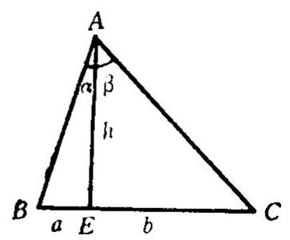

图 3-1-13

14. 证明: 实系数方程 ${x}^{2} + {px} + q = 0$ ,两复根的实部为负的充要条件是 $p > 0$ 且 $q > 0$ .

16. 求函数 $y = {2a}\cos x - {\sin }^{2}x\left( {x \in  \left\lbrack  {0,{2\pi }}\right\rbrack  , a > 0}\right)$ 的最大值和最小值.

17. 设复数 $z = \sin \theta \cos \theta  + i\left( {\sin \theta  + \cos \theta }\right) \left( {\theta  \in  \lbrack 0,{2\pi }}\right) )$ ,对应的点集为 $O$ ,求从定点 $A\left( {a,0}\right)$ 到 $O$ 上一点的距离的最大值.

18. 在半径为 1 的圆周上任取 $n + 1$ 点,求证: 其中至少有两点,它们之间的距离不超过 $2\sin \frac{\pi }{n}$ .

19. 求证: 在任意一群人中, 一定有两人, 他们在这群人中有相同数目的朋友.

20. 设 ${a}_{1}$ 、 ${a}_{2}$ 、 ${a}_{3}$ 为三个任意的整数， ${b}_{1}$ 、 ${b}_{2}$ 、 ${b}_{3}$ 为 ${a}_{1}$ 、 ${a}_{2}$ 、 ${a}_{3}$ 的任一排列,则 ${a}_{1} - {b}_{1}\text{ 、 }{a}_{2} - {b}_{2}\text{ 、 }{a}_{3} - {b}_{3}$ 中至少有一个是偶数.

21. 今有两组自然数,其中每一数均小于自然数 $n$ ,同一组中的数均互不相同,这两组数的总个数不小于 $n$ . 试证: 一定可以从每组中各选出一数,使它们的和正好等于 $n$ .

22. 用 $N$ 来表示平面上两个坐标都为正整数的点的一个无穷集

合. 求证: $N$ 中一定有两点 $\left( {{x}^{\prime },{y}^{\prime }}\right) \text{ 、 }\left( {\alpha \text{ 、 }\beta }\right)$ ,使得 ${x}^{\prime } \leq  \alpha$ , ${y}^{\prime } \leq  \beta .$

## 二 等价与非等价转化

人们在解决问题时, 对未解决的问题作等价或非等价转化, 使之逐步转化为已解决的问题，达到化繁为简，化难为易，变“正面强攻”为“侧翼进击”的思维方法，就是转化的策略思想. 这是辩证思维在方法论上的反映, 它在科学研究中的作用越来越引起人们的重视. 哲学思维的最大价值常表现为教会人们从不同角度去看问题, 这样容易看出新意, 理出思路.

数学中充满矛盾, 对立面无不在一定的条件下互相转化. 已知与未知, 异与同, 多与少, 一般与特殊等等在一定的条件下都可以互相转化. 从某种意义上讲, 解决问题的策略思想是从未知领域, 通过事物之间的固有联系向已知领域转化. 关键是善于发现事物之间或明或暗的内在联系，选择有创造性的恰当的手段来实现有效的转化. 在这种意义下，第二章中的映射观点是通过恰当的映射使问题的领域从未知向已知转化; 方程观点是通过数学形式语言将实际问题转化为相应的数学模型; 因果观点是通过分析、综合来实现命题之间的等价或非等价转化; 递推观点是通过递推关系达到特殊向一般的转化; 极限观点是在一定的条件下近似向精确的转化; 参数观点是在建立坐标系的条件下, 实现数、形之间, 具体、抽象之间的转化. 通过划分实现多与少之间的转化, 便于各个击破.

转化如同“翻译”，把同一问题用不同的“语言”，在不同的思维水平上反映出来. 如果是等价转化, 即“翻译”真实，那么所得解就是原问题的解. 如解方程、不等式, 每次转化都是同解变形, 则最后所得的解即是原方程、原不等式的解. 如果是非等价转化, 即 “翻译”失真, 必须对 “失真”部分另作处理, 才能获得原问题的完全解. 在解方程、不等式中, 如果进行了非同解变形, 那就可能产生增根或失根. 需对定义域扩大、缩小部分另行处理, 以便排除增根找回失根. 数学中所以特别重视充要条件，就是为了利用它便于作等价转化. 数学中定义的概念与被定义的概念的外延相等，两者互为充要条件. 所以利用定义作等价转化是常用的思维方法之一. 这一节里, 将介绍一些常用的转化方法.

## 1. 已知与未知

当人们面临一个未知的新问题时, 总是通过联想, 找寻转化为已知问题的途径. 如将分式方程转化为整式方程, 无理方程转化为有理方程, 一般超越方程转化为最简超越方程, 未知轨迹转化为已知轨迹, 新命题转化为已知命题等等. 形式多样, 内容丰富, 下面只不过是几个典型例子.

例 1 设 $y = a{x}^{5} + b{x}^{3} + x + 5, x \in  \left( {-\infty , + \infty }\right)$ ,当 $x =  - 3$ 时, $y = 7$ . 试求当 $x = 3$ 时, $y$ 的值.

分析 如果使用待定系数法,由于只有一对 $\left( {x, y}\right)$ 的对应值, 无法求出两个待定系数 $a\text{ 、 }b$ . 注意到函数

$$
f\left( x\right)  = y - 5 = a{x}^{5} + b{x}^{3} + x
$$

是奇函数, $f\left( {-x}\right)  =  - f\left( x\right)$ ,则可利用适当的变换进行转化,使问题获解.

略解 $C = \left\{  {\left( {x, y}\right)  \mid  y = a{x}^{5} + b{x}^{3} + x + 5, x \in  \left( {-\infty , + \infty }\right) }\right\}$

$$
\Rightarrow  O = \left\{  {\left( {x, y}\right)  \mid  y - 5 = a{x}^{5} + b{x}^{3} + x, x \in  \left( {-\infty , + \infty }\right) }\right\}
$$

$$
\Rightarrow  {O}_{1} = \left\{  {\left( {u, v}\right)  \mid  v = a{u}^{3} + b{u}^{3} + u, u \in  \left( {-\infty , + \infty }\right) }\right\}
$$

其中 $u = x, v = y - 5$ (相当于平移变换),

由 $f\left( {-3}\right)  = 7 - 5 = 2$ ,可知 $f\left( 3\right)  =  - f\left( {-3}\right)  =  - 2$ ,

$$
\therefore \;\left( {-3,7}\right)  \in  C \Rightarrow  \left( {-3,2}\right)  \in  {C}_{1}
$$

$$
\Rightarrow  \left( {3, - 2}\right)  \in  {O}_{1} \Rightarrow  \left( {3,3}\right)  \in  O\text{ . }
$$

即 $x = 3$ 时, $y = 3$ .

这里关键是注意到通过平移变换，将 $O$ 转化为 ${O}_{1}$ ，利用奇函数的性质使问题获解.

例 2 解方程: ${\left( \operatorname{tg}x\right) }^{\sqrt{3}\cos x} = {\left( \operatorname{ctg}x\right) }^{\sin x}$ .

分析 通过方程变形,原方程转化为

$$
{\left( \operatorname{tg}x\right) }^{\sqrt{3}\cos x + \sin x} = 1,
$$

即

$$
{\left( \operatorname{tg}x\right) }^{2\sin \left( {x + \frac{\pi }{3}}\right) } = 1.
$$

从而可知

$$
\left\{  {x \mid  {\left( \operatorname{tg}x\right) }^{\sqrt{3}\cos x} = {\left( \operatorname{ctg}x\right) }^{\sin x}}\right\}
$$

$$
\Rightarrow  \{ x \mid  \operatorname{tg}x = 1\}  \cup  \left\{  {x\left| {\;\sin \left( {x + \frac{\pi }{3}}\right)  = 0}\right. }\right\}
$$

$$
\Rightarrow  \{ x \mid  x = {n\pi } + \frac{\pi }{4}\text{ 或 }x = {n\pi } - \frac{\pi }{3}, n \in  Z\} .
$$

注意这里的方程变形是非同解变形, 经检验未产生增、失根.

解 略.

例 3 解方程: ${\log }_{\sin x\cos x}\sin x \cdot  {\log }_{\sin x\cos x}\cos x = \frac{1}{4}$ .

略解 应用换底公式, 原方程可转化为

$$
\frac{\lg \sin x}{\lg \sin x\cos x} \cdot  \frac{\lg \cos x}{\lg \sin x\cos x} = \frac{1}{4},
$$

即

$$
4\lg \sin x\lg \cos x = {\left( \lg \sin x + \lg \cos x\right) }^{2},
$$

$$
{\left( \lg \sin x - \lg \cos x\right) }^{2} = 0,
$$

$$
\lg \operatorname{tg}x = 0,\operatorname{tg}x = 1,
$$

$$
x = {n\pi } + \frac{\pi }{4}\;\left( {n \in  Z}\right) .
$$

$\therefore$

$\therefore$

这里方程在变形中不是同解变形,原方程中 $x$ 的允许值应满足 $\sin x > 0$ 且 $\cos x > 0,\sin x\cos x \neq  1$ ，即 $x \in  \left( {{2n\pi },{2n\pi } + \frac{\pi }{2}}\right)$ . 因此， 应剔除增根 $x = {2k\pi } + \frac{5\pi }{4}$ ,原方程的解为 $x = {2k\pi } + \frac{\pi }{4}\left( {k \in  Z}\right)$ .

例 4 求适合于下式中 $x$ 的值: ${\left( 1 + i\right) }^{x} = 2{\left( 1 - i\right) }^{x - 2}$ ,其中 $i$ 为虚数单位.

分析 这个问题的实质是一个指数方程. 应将原方程转化为最简指数方程来解.

略解 原方程转化为

$$
{\left( \frac{1 + i}{1 - i}\right) }^{2} = \frac{2}{{\left( 1 - i\right) }^{2}}
$$

即

$$
{\left( \frac{1 + {2i} + {i}^{2}}{1 - {i}^{2}}\right) }^{2} = \frac{2}{1 - {2i} + {i}^{3}}
$$

$$
{\left( i\right) }^{ * } = i
$$

$\therefore$

$$
x = {4k} + 1, k \in  Z\text{ . }
$$

例 5 解方程: ${\left( \cos 4x - \cos 2x\right) }^{2} = 5 + \sin {3x}$

分析 原方程转化为

$$
4{\sin }^{2}{3x}{\sin }^{2}x = 5 + \sin {3x}.
$$

$\because \;4{\sin }^{2}{3x}{\sin }^{2}x \leq  4,4 \leq  5 + \sin {3x} \leq  6,$

$\therefore$ 原方程两边都等于 4,原方程转化为

$$
\sin {3x} =  - 1\text{ 且 }\left| {\sin x}\right|  = 1\text{ ,即 }\left\{  \begin{array}{l} \cos x = 0, \\  \sin {3x} =  - 1. \end{array}\right.
$$

$\therefore$ 原方程的解为 $x = {2nx} + \frac{\pi }{2}\;\left( {n \in  Z}\right)$ .

解 略.

例 6 解不等式:

$$
\lg \left( {1 - \sin x}\right)  + \lg \left( {1 + \sin x}\right)  + \lg 2 < \lg \left( {1 - \cos x}\right) .
$$

分析 原不等式与下列不等式组等价:

$$
\left\{  \begin{array}{l} 2\left( {1 - {\sin }^{2}x}\right)  < 1 - \cos x, \\  \sin x \neq   \pm  1, \\  \cos x \neq  1. \end{array}\right.
$$

即

$$
\left\{  \begin{array}{l} \left( {\cos x + 1}\right) \left( {2\cos x - 1}\right)  < 0, \\  \sin x \neq   \pm  1. \end{array}\right.
$$

$\therefore$

$$
\cos x \in  \left( {-1,\frac{1}{2}}\right)
$$

$x \in  \left( {{2n\pi } + \frac{\pi }{3},{2n\pi } + \pi }\right)  \cup  \left( {{2n\pi } - \pi ,{2n\pi } - \frac{\pi }{3}}\right) .x \neq  {n\pi } + \frac{\pi }{2},\left( {n \in  Z}\right)$

解 略.

例 7 一动圆过 定点 $\left( {c,0}\right)$ ，且与定圆 ${\left( x + c\right) }^{2} + {y}^{2} = 4{a}^{2} \; \left( {a > 0, c > 0}\right)$ 相切,试分各类情况求动圆圆心的轨迹.

分析 定点 $\left( {c,0}\right)$ 与已知圆的相关位置可分 3 种情况:① $a < c$ 时,定点在定圆之外; ② $a > c$ 时,定点在定圆之内; ③ $a = c$ 时,定点在定圆上. 将动圆与定圆相切的条件，转化为动圆圆心与定点和定圆中心距离的和差关系，则可根据椭圆、双曲线的定义，求出轨迹方程.

解 (1) 当 $a < c$ 时，定点 ${F}_{2}\left( {c,0}\right)$ 在定圆之外. 设定圆中心为 ${F}_{1}\left( {-c,0}\right)$ . 动圆中心为 $P$ ，在动圆 $P$ 与定圆 ${F}_{1}$ 内切时，切点为 $Q$ ,如图 3-2-01.

$$
\left| {P{F}_{2}}\right|  - \left| {P{F}_{1}}\right|  = \left| {PQ}\right|  - \left| {P{F}_{1}}\right|  = {2a};
$$

当动圆 ${P}^{\prime }$ 与定圆 ${F}_{1}$ 外切时，切点为 ${Q}^{\prime }$ ，

$$
\left| {{P}^{\prime }{F}_{1}}\right|  - \left| {{P}^{\prime }{F}_{2}}\right|  = \left| {{P}^{\prime }{F}_{1}}\right|  - \left| {{P}^{\prime }{Q}^{\prime }}\right|  = {2a}.
$$

$\therefore$ 过定点 ${F}_{2}$ 的动圆 $P$ 与定圆 ${F}_{1}$ 相切,则

$$
\left| \right| P{F}_{1}\left| -\right| P{F}_{2}\left| \right|  = {2a}
$$

$\therefore$ 点 $P$ 的轨迹为双曲线, ${F}_{1}\text{ 、 }{F}_{2}$ 为焦点,焦距为 ${2c}$ ,轨迹方程为

$$
\frac{{x}^{2}}{{a}^{2}} - \frac{{y}^{2}}{{c}^{2} - {a}^{2}} = 1.
$$

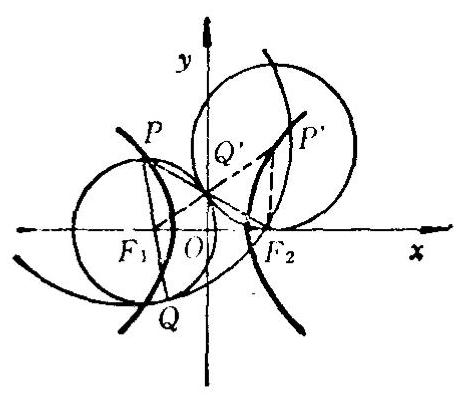

图 3-2-01

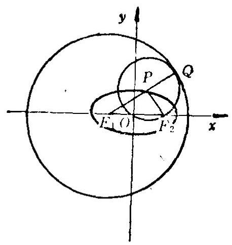

图 3-2-02

(2)当 $a > c$ 时，定点 ${F}_{2}$ 在定圆 ${F}_{1}$ 内，动圆 $P$ 只能与定圆内切，切点为 $Q$ ，如图 3-2-0.2

这时， $\left| {P{F}_{1}}\right|  + \left| {P{F}_{2}}\right|  = \left| {P{F}_{1}}\right|  + \left| {PQ}\right|  = {2a}$ .

$\therefore$ 点 $P$ 的轨迹之椭圆， ${F}_{1}$ 、 ${F}_{2}$ 为焦点，焦距为 ${2c}$ ，轨迹方

要使 ${F}_{2}$ 为切点，与定圆 ${F}_{1}$ 内切或外切的圆心 $P$ 只能在 ${F}_{1}{F}_{2}$ 的连线上,

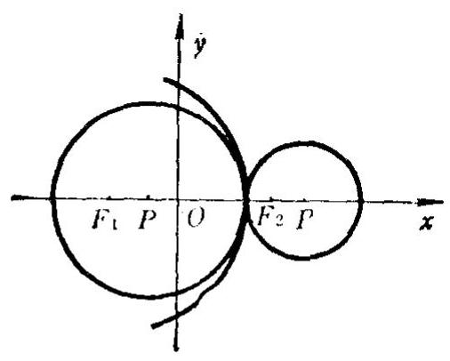

图 3-2-03

程为

$$
\frac{{x}^{2}}{{a}^{2}} + \frac{{y}^{2}}{{a}^{2} - {c}^{2}} = 1
$$

(3)当 $a = c$ 时，定圆 ${F}_{1}$ 恰过定点 ${F}_{2}$ ，如图 3-2-03.

$\therefore$ 轨迹为 $x$ 轴本身,轨迹方程为 $y = 0$ .

将欲求的轨迹转化为已知的轨迹是研究轨迹问题的最基本的思维方法之一.

例 8 求证: $1 + 2 + 3 + \cdots  + n < {2}^{n - 1}\left( {n \in  N\text{ ,且 }n > 4}\right)$ .

分析

$$
1 + 2 + 3\cdots  + n < {2}^{n - 1} \Leftrightarrow  \frac{1}{2}n\left( {n + 1}\right)  < \frac{1}{2} \cdot  {2}^{n} \Leftrightarrow  n\left( {n + 1}\right)  < {2}^{n}.
$$

经过上述等价转化, 再应用数学归纳法或比较法证明就简捷了.

证 略.

这里通过等价转化, 达到化繁为简, 化难为易的目的.

例 9 设 $P$ 为正 $\bigtriangleup {ABC}$ 内部任意一点,分别以 3 边为对称轴，得 $P$ 点的对称点 ${P}_{1}\text{ 、 }{P}_{2}\text{ 、 }{P}_{3}$ ，求证: ${S}_{\bigtriangleup {P}_{1}{P}_{2}{P}_{3}} \leq  {S}_{\bigtriangleup {ABC}}$ .

分析 设正 $\bigtriangleup {ABC}$ 的边长为 $a, P$ 在 3 边上的射影分别为 $D\text{ 、 }E\text{ 、 }F$ ,令 ${PD} = x,{PE} = y,{PF} = z$ . 根据正三角形内一点到3 边的距离之和为定值 (等于 $\bigtriangleup$ 的高),可得

$$
x + y + z = \frac{\sqrt{3}}{2}a.
$$

又根据四边形内角和定理, 有

$$
\angle {DPE} = \angle {EPF} = \angle {FPD} = {120}^{ \circ  },
$$

$$
{S}_{\bigtriangleup {P}_{1}{P}_{2}{P}_{3}} = {2}^{2}{S}_{\bigtriangleup {DEF}} = 4\left( {{S}_{\bigtriangleup {PDE}} + {S}_{\bigtriangleup {PEF}} + {S}_{\bigtriangleup {PFD}}}\right)
$$

$$
= 4 \cdot  \frac{1}{2}\left( {{xy} + {yz} + {zx}}\right) \sin {120}^{ \circ  }
$$

$$
= \sqrt{3}\left( {{xy} + {yz} + {zx}}\right) .
$$

但 $\;{S}_{\bigtriangleup {ABC}} = \frac{\sqrt{3}}{4}{a}^{2} = \frac{\sqrt{3}}{4}{\left( \frac{x + y + z}{\sqrt{3}/2}\right) }^{2} = \frac{\sqrt{3}}{3}{\left( x + y + z\right) }^{2}$ ，

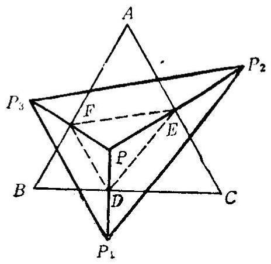

图 3-2-04

因而 ${S}_{\bigtriangleup {P}_{1}{P}_{2}{P}_{3}} \leq  {S}_{\bigtriangleup {ABC}}$ 转化为

$$
{\left( x + y + z\right) }^{2} \geq  3\left( {{xy} + {yz} + {zx}}\right) .
$$

这一不等式与不等式

$$
{x}^{2} + {y}^{2} + {z}^{2} \geq  {xy} + {yz} + {zx}
$$

等价.

这是一个已知的不等式.

证 略.

这是利用已知的知识，将原命题作等价转化, 使之转化为已知的命题, 从而获得原命题证明的方法.

## 2. 异与同

求“同”寻“异”是非常重要的思维方法. 化“异”为“同”也是一种重要的转化方法. 例如, 在三角学中, 把不同角的三角函数转化为同角的三角函数，不同名的三角函数转化为同名的三角函数；在对数中, 把不同底的对数转化为同底的对数; 在数式的运算中, 异分母转化为同分母, 异次根式转化为同次根式; 在运算与恒等变换中，“和差化积”，“积化和差”，指数式转化为对数式，异底之幂转化为同底之幂等等。另外, 函数与反函数也无不在一定的条件下互相转化. 这里应该注意的是“异”和“同”之间的转化，都是有条件的, 忽视转化的条件, 往往是失误的根源.

例 10 设 $x \in  \left\lbrack  {0,1}\right\rbrack$ ,求证: $\cos \left( {\arcsin x}\right)  < \arcsin \left( {\cos x}\right)$ .

分析 这里出现的既有三角函数, 又有反三角函数, 因此必须考虑两者之间的相互转化, 但它们之间的转化是有条件的, 万万不可大意.

设 $\arcsin x = \alpha$ ,则 $\sin \alpha  = x.\because x \in  \left\lbrack  {0,1}\right\rbrack  ,\therefore \alpha  \in  \left\lbrack  {0,\frac{\pi }{2}}\right\rbrack$ .

$\because x \in  \left\lbrack  {0,1}\right\rbrack  ,\therefore \frac{\pi }{2} - x \in  \left\lbrack  {\frac{\pi }{2} - 1,\frac{\pi }{2}}\right\rbrack   \subset  \left\lbrack  {0,\frac{\pi }{2}}\right\rbrack$ ,

$$
\arcsin \left( {\cos x}\right)  = \arcsin \left\lbrack  {\sin \left( {\frac{\pi }{2} - x}\right) }\right\rbrack
$$

$$
= \frac{\pi }{2} - x = \frac{\pi }{2} - \sin \alpha .
$$

这样就便于比较 $\cos \left( {\arcsin x}\right)$ 与 $\arcsin \left( {\cos x}\right)$ 了,

$\therefore \arcsin \left( {\cos x}\right)  - \cos \left( {\arcsin x}\right)  = \frac{\pi }{2} - \sin \alpha  - \cos \alpha$

$$
= \frac{\pi }{2} - \sqrt{2}\sin \left( {\alpha  + \frac{\pi }{4}}\right) .
$$

$$
\sin \left( {\alpha  + \frac{\pi }{4}}\right)  \leq  1
$$

$$
\frac{\pi }{2} - \sqrt{2}\sin \left( {\alpha  + \frac{\pi }{4}}\right)  \geq  \frac{\pi }{2} - \sqrt{2} > 0,
$$

$$
\cos \left( {\arcsin x}\right)  < \arcsin \left( {\cos x}\right) .
$$

证 略.

例 11 设 $\theta  \in  R, x, y \in  {R}^{ + }$ ,求证: ${x}^{\sin  \cdot  \theta }{y}^{\cos \theta } < x + y$ .

分析 这里不同底的幂, 如何转化为同底的幂呢? 利用放缩法, 有

$$
{x}^{\sin \theta } \leq  {\left\lbrack  \max \left( x, y\right) \right\rbrack  }^{\sin \theta },{y}^{\cos \theta } \leq  {\left\lbrack  \max \left( x, y\right) \right\rbrack  }^{\cos \theta },
$$

$$
{x}^{\sin \theta } \cdot  {y}^{\cos \theta } \leq  {\left\lbrack  \max \left( x, y\right) \right\rbrack  }^{\sin \theta } \cdot  {\left\lbrack  \max \left( x, y\right) \right\rbrack  }^{\cos \theta }
$$

$$
= {\left\lbrack  \max \left( x, y\right) \right\rbrack  }^{\sin \theta  + \cos \theta } = \max \left( {x, y}\right)  < x + y.
$$

证 略.

例 12 证明: 若 $\alpha  > 0,\beta  > 0,\alpha  + \beta  \leq  \pi ,0 \leq  \lambda  \leq  1$ ,则

$$
{\cos }^{2}{\lambda \alpha } + {\cos }^{2}{\lambda \beta } - 2\cos {\lambda \alpha }\cos {\lambda \beta }\cos {\lambda \pi } \geq  {\sin }^{2}{\lambda \pi }\text{ . }
$$

分析 欲证 ${\cos }^{2}{\lambda \alpha } + {\cos }^{2}{\lambda \beta } - 2\cos {\lambda \alpha }\cos {\lambda \beta }\cos {\lambda \pi } - {\sin }^{2}{\lambda \pi }$ >0 , 要将左式转化为非负数之和或积. 通过“和差化积”、“积化和差”、“因式分解”, 作恒等变形.

$$
{\cos }^{2}{\lambda \alpha } + {\cos }^{2}{\lambda \beta } - 2\cos {\lambda \alpha }\cos {\lambda \beta }\cos {\lambda \pi } - {\sin }^{2}{\lambda \pi }
$$

$$
= 1 + \frac{1}{2}\left( {\cos {2\lambda \alpha } + \cos {2\lambda \beta }}\right)
$$

$$
- \left\lbrack  {\cos \lambda \left( {\alpha  + \beta }\right)  + \cos \lambda \left( {\alpha  - \beta }\right) }\right\rbrack  \cos {\lambda \pi } - {\sin }^{2}{\lambda \pi }
$$

$$
= {\cos }^{2}{\lambda \pi } + \cos \lambda \left( {\alpha  + \beta }\right) \cos \lambda \left( {\alpha  - \beta }\right)
$$

$$
- \left\lbrack  {\cos \lambda \left( {\alpha  + \beta }\right)  + \cos \lambda \left( {\alpha  - \beta }\right) }\right\rbrack  \cos {\lambda \pi }
$$

$$
= \left\lbrack  {\cos \lambda \left( {\alpha  + \beta }\right)  - \cos {\lambda \pi }}\right\rbrack  \left\lbrack  {\cos \lambda \left( {\alpha  - \beta }\right)  - \cos {\lambda \pi }}\right\rbrack
$$

①

$$
\because \;\alpha  > 0,\beta  > 0,\alpha  + \beta  \leq  \pi ,0 \leq  \lambda  \leq  1,
$$

$$
\therefore \;0 \leq  \lambda \left( {\alpha  + \beta }\right)  \leq  {\lambda \pi } \leq  \pi ,0 \leq  \left| {\lambda \left( {\alpha  - \beta }\right) }\right|  \leq  {\lambda \pi } \leq  \pi .
$$

根据 $\cos \lambda$ 在 $\left\lbrack  {0,\pi }\right\rbrack$ 上是减函数，

$$
\cos \lambda \left( {\alpha  + \beta }\right)  \geq  \cos {\lambda \pi },\;\cos \lambda \left( {\alpha  - \beta }\right)  \geq  \cos {\lambda \pi },
$$

$\therefore$ ① 的两个因子都是非负数.

证 略.

例 13 已知数列 $\left\{  {b}_{n}\right\}$ 中 ${b}_{1} = 2$ ,部分和为 ${S}_{n} = {n}^{2}{b}_{n}\;(n \geq  1$ , $n \in  N)$ ,求 ${b}_{n}$ 的表达式.

分析 为了求 ${b}_{n}$ 的表达式,要将 ${S}_{n} = {n}^{2}{b}_{n}$ 转化为 ${b}_{n}$ 与 ${b}_{n - 1}$ 之间的递推关系.

$$
{S}_{n - 1} + {b}_{n} = {n}^{2}{b}_{n},{S}_{n} = {n}^{2}{b}_{n},
$$

$$
\therefore \;{S}_{n - 1} = \left( {{n}^{2} - 1}\right) {b}_{n}
$$

②

比较①、②，有 $\left( {{n}^{2} - 1}\right) {b}_{n} = {\left( n - 1\right) }^{2}{b}_{n - 1}$ ，即 $\frac{{b}_{n}}{{b}_{n - 1}} = \frac{n - 1}{n + 1}$③

从 ③ 有 $\frac{{b}_{n - 1}}{{b}_{n - 2}} = \frac{n - 2}{n},\frac{{b}_{n - 2}}{{b}_{n - 3}} = \frac{n - 3}{n - 1},\cdots ,\frac{{b}_{3}}{{b}_{2}} = \frac{2}{4},\frac{{b}_{2}}{{b}_{1}} = \frac{1}{3}$ .

$\therefore \frac{{b}_{n}}{{b}_{1}} = \frac{n - 1}{n + 2} \cdot  \frac{n - 2}{n} \cdot  \frac{n - 3}{n - 1} \cdot  \cdots  \cdot  \frac{2}{4} \cdot  \frac{1}{3} = \frac{2}{n\left( {n + 2}\right) }$ ,

故

$$
{b}_{n} = \frac{4}{n\left( {n + 2}\right) }.
$$

解 略.

例 14 已知数列 $\left\{  {a}_{n}\right\}$ ,其中 ${a}_{1} = \sqrt[3]{3},{a}_{n} = {\left( {a}_{n - 1}\right) }^{3/3}$ ,其中 $n > 1, n \in  N$ . 试求: ${a}_{n}$ 为整数时最小的正整数 $n$ .

分析 由于递推关系 ${a}_{n} = {\left( {a}_{n - 1}\right) }^{\sqrt[3]{3}}$ 是指数式,不便处理,故两边取对数，转化为对数式

$$
\lg {a}_{n} = \sqrt[3]{3}\lg {a}_{n - 1}
$$

①

令 ${b}_{n} = \lg {a}_{n}$ ，则数列 $\left\{  {b}_{n}\right\}$ 为等比数列: ${b}_{n} = \sqrt[3]{3}{b}_{n - 1}$ ，且 ${b}_{1} = \; \lg {a}_{1} = \frac{1}{3}\lg 3$ . 从而有

$$
\lg {a}_{n} = \frac{1}{3}\lg {3}^{{\left( \sqrt{3}\right) }^{n - 1}} = {3}^{\frac{1}{3}\left( {n - 4}\right) }\lg 3,
$$

即

$$
{a}_{n} = {33}^{\frac{1}{3}\left( {n - 4}\right) }.
$$

欲使 ${a}_{n}$ 为整数,必须 $\left\{  {\begin{array}{l} n - 4 \geq  0, \\  3 \mid  n - 4. \end{array} \Rightarrow  \left\{  \begin{array}{l} n \geq  4, \\  3 \mid  n - 4. \end{array}\right. }\right.$

所以所求的最小正整数 $n$ 为 4 .

解 略.

## 8. 多与少

多与少是一对矛盾, 在一定条件下也可以互相转化. 在代数中, 高次方程通过因式分解, 同解变形, 达到降次的目的. 多元方程通过消元转化为一元方程. 三角中运用降幂公式来达到降幂的目的. 解析几何里常用曲线的参数方程表示曲线上点的坐标, 以减少变量的个数. 立体几何中, 常将三维空间的问题转化为二维 (平面) 几何的问题, 达到降维的目的. 对于含有较多条件的命题, 往往是抓住主要条件, 突破一点, 推动全局, 如此等等都是多转化为少. 反过来, 将复杂问题, 通过划分, 转化为若干个简单问题, 予以各个击破，则是少转化为多. 不论是多转化为少，还是少转化为多，其目的都是化繁为简，化难为易. 要注意问题的本质与矛盾各方的内在联系，通过转化，逐步迫近目标，直至获解.

例 15 若 ${x}_{1}\text{ 、 }{x}_{2}\text{ 、 }{x}_{3}\text{ 、 }{x}_{4}$ 和 ${x}_{5}$ 满足下列方程组:

$$
2{x}_{1} + {x}_{2} + {x}_{3} + {x}_{4} + {x}_{5} = 6
$$

$$
{x}_{1} + 2{x}_{2} + {x}_{3} + {x}_{4} + {x}_{5} = {12},
$$

$$
{x}_{1} + {x}_{2} + 2{x}_{3} + {x}_{4} + {x}_{5} = {24},
$$

$$
{x}_{1} + {x}_{2} + {x}_{3} + 2{x}_{4} + {x}_{5} = {48},
$$

$$
{x}_{1} + {x}_{2} + {x}_{3} + {x}_{4} + 2{x}_{5} = {96}.
$$

确定 $3{x}_{4} + 2{x}_{5}$ 的值.

分析 将 5 个方程相加, 可得

$$
{x}_{1} + {x}_{2} + {x}_{3} + {x}_{4} + {x}_{5} = {31}
$$

①

最后两方程分别减去 ①，即可求出 ${x}_{4} = {17},{x}_{5} = {65}$ .

$\therefore$

$$
3{x}_{4} + 2{x}_{5} = {181}
$$

解 略.

例 16 设正方体棱长为 ${2a}$ ,分别以 8 个顶点为球心,作半径为 $a$ 的 8 个球. 试求空间中与这 8 个球都相切的球的半径.

分析 这是比较复杂的空间若干个几何体相切问题. 根据图形的对称性, 可借助辅助平面, 将问题转化为平面几何问题. 辅助平面的选择，应要求它与空间图形相截所得的平面图形能够较全面地概括原问题的位置关系与度量关系. 因为本题所要求的两个球和正方体的外接球是同心球, 所以应以正方体的对棱面为辅助平面, 将相切球问题转化为相切圆问题.

如图 3-2-05 所示, $\because {O}_{1}{O}_{2} = {2a}$ ,

$\therefore \;{O}_{2}{O}_{3} = 2\sqrt{2}a, O{O}_{1} = \sqrt{3}a,$

$\therefore \;{OA} = \left( {\sqrt{3} - 1}\right) a,{OB} = \left( {\sqrt{3} + 1}\right) a.$

$\therefore$ 所求两个相切球的半径分别为 $\left( {\sqrt{3} - 1}\right) a$ 和 $(\sqrt{3} \; + 1)a$ .

解 略.

例 17 在平面 $\alpha$ 内,圆 ${O}_{1}\text{ 、 }{O}_{2}$ 的半径分别为 ${r}_{1}\text{ 、 }{r}_{2}$ ,两圆相交于 $A$ 、 $B$ 两点,公共弦 ${AB} = {2a}$ ,其中 $a < {r}_{1} < {r}_{2}$ . 以公共弦 ${AB}$ 所在直线为棱,将平面 $\alpha$ 的两个半平面 ${\alpha }_{1}\text{ 、 }{\alpha }_{2}$ 折成二面角 $\theta$ . 试证: 折成二面角后，圆 ${O}_{1}$ 、 ${O}_{2}$ 周上的点共球 (即在同一球面上),并求该球的半径.

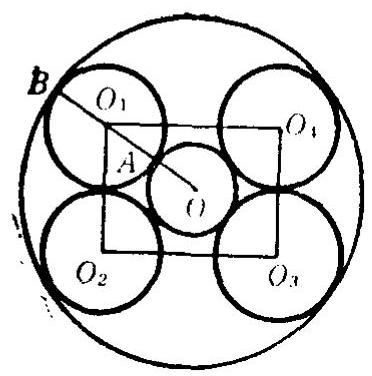

图 3-2-05

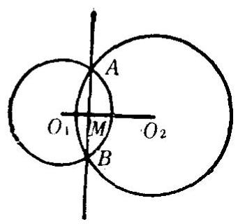

图 3-2-06

分析 欲证两圆共球, 只要证两圆周上所有的点到空间一定点 $O$ 的距离为定值. 此定点 $O$ 即球心,定值即球半径. 因为 ${O}_{1}M \; \bot  {AB},{O}_{2}M \bot  {AB}$ ，所以 ${O}_{1}\text{ 、 }{M}_{\lambda }{O}_{2} =$ 点确定的平面 $\beta$ 与 ${AB}$ 垂直， $\angle {O}_{1}M{O}_{2} = \theta$ (二面角 ${O}_{1} - {AB} - {O}_{2}$ 的平面角). 在平面 $\beta$ 内过 ${O}_{1}$ 、 ${O}_{2}$ 分别作 ${O}_{1}O$ 上平面 ${\alpha }_{1},{O}_{2}O$ 上平面 ${\alpha }_{2}$ ,直线 ${O}_{1}O,{O}_{2}O$ 必相交于一点 $O$ . 根据斜线长定理,由于 ${O}_{1}$ 到圆 ${O}_{1}$ 周上的点的距离都等于 ${r}_{1}$ ,所以 $O$ 到圆 ${O}_{1}$ 周上所有点的距离都等于 ${OA}$ .

同理, $O$ 到圆 ${O}_{2}$ 周上所有点的距离都等于 ${OA}$ . 故两圆共球. 为了求此球的半径,考察平面四边形 ${O}_{1}M{O}_{2}O$ 的外接圆 $I$ , 如图 3-2-08. 因为 $\angle O{O}_{1}M = \angle O{O}_{2}M = {90}^{ \circ  }$ ,所以 ${O}_{1}\text{ 、 }{M}_{\lambda }{O}_{2}\text{ 、 }O$ 四点共圆,圆心为 $I$ . 设圆 $I$ 的半径为 $r$ ,则

$$
{O}_{1}{O}_{2}^{2} = 2{r}^{2}\left\lbrack  {1 - \cos \left( {{2\pi } - {2\theta }}\right) }\right\rbrack   = 4{r}^{2}{\sin }^{2}\theta .
$$

$$
{O}_{1}{O}_{2}^{2} = {O}_{1}{M}^{2} + {O}_{2}{M}^{2} - 2{O}_{1}M \cdot  {O}_{2}M\cos \theta ,
$$

其中

$$
{O}_{1}{M}^{2} = {r}_{1}^{2} - {a}^{2},{O}_{2}{M}^{2} = {r}_{2}^{2} - {a}^{2},
$$

$\therefore \;4{r}^{2}{\sin }^{2}\theta  = {r}_{1}^{2} - {a}^{2} + {r}_{2}^{2} - {a}^{2} - 2\sqrt{\left( {{r}_{1}^{2} - {a}^{2}}\right) \left( {{r}_{2}^{2} - {a}^{2}}\right) }\cos \theta$ ,

$$
{r}^{2} = \frac{1}{4{\sin }^{2}\theta }\left\lbrack  {{r}_{1}^{2} + {r}_{2}^{2} - 2{a}^{2} - 2\sqrt{\left( {{r}_{1}^{2} - {a}^{2}}\right) \left( {{r}_{2}^{2} - {a}^{2}}\right) }\cos \theta }\right\rbrack  ,
$$

$$
O{M}^{2} = {\left( 2r\right) }^{2} = \frac{1}{{\sin }^{2}\theta }\left\lbrack  {{r}_{1}^{2} + {r}_{2}^{2} - 2{a}^{2}}\right.
$$

$$
\left. {-2\sqrt{\left( {{r}_{1}^{2} - {a}^{2}}\right) \left( {{r}_{2}^{2} - {a}^{2}}\right) }\cos \theta }\right\rbrack  .
$$

$$
O{A}^{2} = O{M}^{2} + {a}^{2} = \frac{1}{{\sin }^{2}\theta }\left\lbrack  {{r}_{1}^{2} + {r}_{2}^{2} - 2{a}^{2}}\right.
$$

$$
\left. {-2\sqrt{\left( {{r}_{1}^{2} - {a}^{2}}\right) \left( {{r}_{2}^{2} - {a}^{2}}\right) }\cos \theta }\right\rbrack   + {a}^{2},
$$

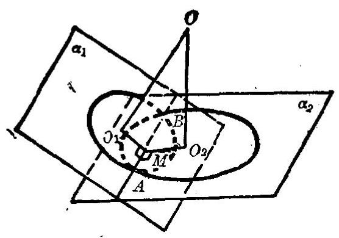

图 3-2-07

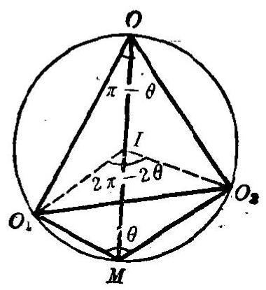

图 3-2-08

$\therefore$ 此球半径为

$$
{OA} = \frac{1}{\sin \theta }\sqrt{{r}_{1}^{2} + {r}_{2}^{2} - \left( {1 + {\cos }^{2}\theta }\right) {a}^{2} - 2\sqrt{\left( {{r}_{1}^{2} - {a}^{2}}\right) \left( {{r}_{2}^{2} - {a}^{2}}\right) \cos \theta }}.
$$

解 略.

如果两圆外切,以公切线为棱相折,则 $a = 0,{OM} = {OA} = {OB}$ , 则球半径为 ${OA} = \frac{1}{\sin \theta }\sqrt{{r}_{1}^{2} + {r}_{2}^{2} - 2{r}_{1}{r}_{2}\cos \theta }$ .

例 18 设正四棱锥 $P - {ABCD}$ 的棱长都等于 $a, E$ 、 $F$ 分别为 ${PB}\text{ 、 }{PD}$ 的中点. (1) 试确定过 $A\text{ 、 }E\text{ 、 }F$ 的截面；(2) 证明 (1) 中的截面与侧棱 ${PO}$ 的交点 $Q$ 三等分 $P{O}_{i}$ ; (3) 求此截面将正四棱锥分成两部分的体积之比.

略解 (1) 见图 3-2-09,在对角面 ${PBD}$ 中, $E\text{ 、 }F$ 的连线交 $P$ 与底面 ${ABCD}$ 的中心 $O$ 的连线于 $K$ ,则 $K$ 在过 $A\text{ 、 }E\text{ 、 }F$ 重点的截面内. 连接 $A\text{ 、 }K$ 交 ${PO}$ 于 $Q$ . 则四边形 ${AEQF}$ 为所求的截面.

(2)见图 3-2-10，在对角面 ${PAO}$ 中， ${PO}$ 为 $\bigtriangleup  {PAO}$ 的高， $K$ 为 ${PO}$ 的中点. 由于 ${PA} = {PO}$ ,故 $O$ 为 ${AO}$ 的中点. 过 $O$ 作 ${OR}// \; {AQ}$ ,则 ${OR} = {RQ}$ . 因为 $K$ 为 ${PO}$ 的中点, ${KQ}//{OR}$ ,故 ${PQ} = {QR}$ .

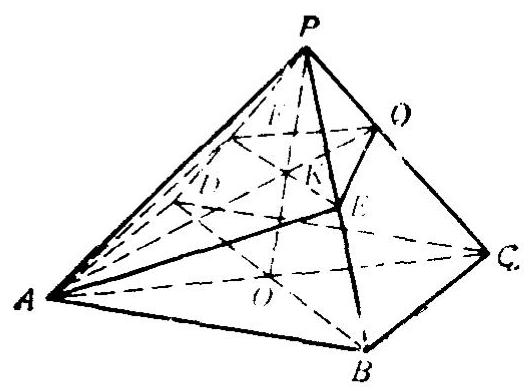

图 3-2-09

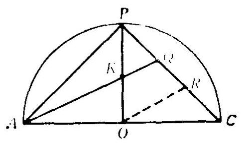

图 3-2-10

所以 $Q$ 为 ${PO}$ 的三等分点.

(3)对角面 ${PAO}$ 将正四棱锥分成等积的两部分. 三棱锥 $P - {AEQ}$ 与 $P - {ABC}$ 在顶点 $P$ 处的两个三面角对应相等,故有

$$
\frac{{V}_{P - {AEQ}}}{{V}_{P - {ABQ}}} = \frac{{PA} \cdot  {PE} \cdot  {PQ}}{{PA} \cdot  {PB} \cdot  {PC}} = \frac{1}{2 \times  3} = \frac{1}{6},
$$

$$
\frac{{V}_{P - {AEOF}}}{{V}_{P - {ABCD}}} = \frac{1}{6}
$$

故截面将正四棱锥分成两部分的体积之比等于 $\frac{1}{5}$ .

这儿利用对角面，使立体问题转化为平面问题，应用平面图形的性质求解的(降维)方法, 是立体几何中常用方法之一. 以正四棱锥为例,不同位置的截面在对角面 ${PAO}$ 上的截线分别是:

(1)过 $A$ 点垂直于棱 ${PC}$ 的截面在 ${PAO}$ 面上的截线如图 3-2-11 中的 ${AQ},{AQ} \bot  {PO}$ ( $\angle {APO}$ 为锐角).

(2)过 ${BD}$ 垂直于棱 ${PO}$ 的截面在 ${PAO}$ 面上的截线如图 3-2-12 中的 ${OQ},{OQ} \bot  {PO}$ .

(3) 过 ${BD}$ 平行于 ${PA}$ 的截面在 ${PAO}$ 面上的截线如图 3-2-13 中的 ${OQ},{OQ}//{PA}$ .

(4)过 ${AB}\text{ 、 }{AD}$ 的中点 $M\text{ 、 }N$ 且垂直于底面 ${ABCD}$ 的截面

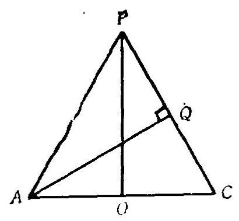

图 3-2-11

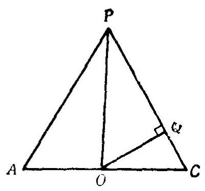

图 3-2-12

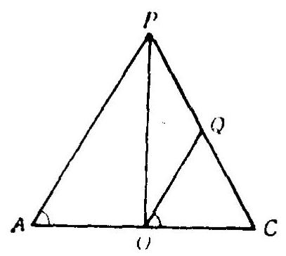

图 3-2-13

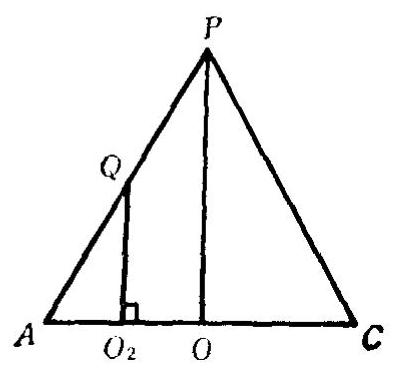

图 3-2-14

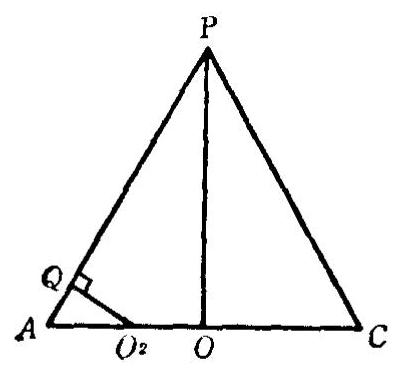

图 3-2-15

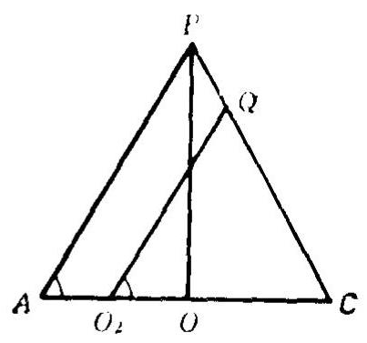

图 3-2-16

在 ${PAO}$ 面上的截线如图 3-2-14 中的 ${O}_{2}Q$ ,其中 ${O}_{2}$ 为 ${AO}$ 的中点，且 ${O}_{2}Q \bot  {AO}$ .

(5) 过 ${AB}$ 、 ${AD}$ 中点 $M$ ， $N$ 且垂直于棱 ${PA}$ 的截面在 ${PAO}$ 面上的截线如图 3-2-15 中的 ${O}_{2}Q$ ，其中 ${O}_{2}$ 为 ${AO}$ 的中点， ${O}_{2}Q \bot \; {PA}$ .

(6)过 ${AB}$ 、 ${AD}$ 中点 $M$ 、 $N$ 且平行于棱 ${PA}$ 的截面在 ${PAO}$ 面上的截线如图 3-2-16 中的 ${O}_{2}Q$ ，其中 ${O}_{2}$ 为 ${AO}$ 的中点， ${O}_{2}Q// \; {PA}$ .

关于解析几何中利用参数作转化工具的例子也很多,在参数观点一节里已经说得很多了, 这里不再重复.

## 4. “进”与“退”

华罗庚先生说过:“把一个比较复杂的问题‘退’成最简单最原始的问题，把这最简单最原始的问题想通了，想透了，然后再…… 来一个飞跃上升. ”这是一个非常精辟的思维方法. 这里“退”是为了“进”. “退”够了，“退”到“起始点”，正是为了看清问题的一般规律,就会有左右逢源,水到渠成的效果.

例 19 解不等式组: $3 < {x}^{2} - {2x} < 8$ .

分析一 取 $y = {x}^{2} - {2x}$ ,且 $3 < y < 8$ ,则可利用函数图象求解.

如图 3-2-17,可得不等式组的解: $x \in  \left( {-2, - 1}\right)  \cup  \left( {3,4}\right)$ .

分析二 原不等组作如下的等价转化:

$$
3 < {x}^{2} - {2x} < 8 \Leftrightarrow  4 < {\left( x - 1\right) }^{2} < 9 \Leftrightarrow  2 < \left| {x - 1}\right|  < 3\text{ . }
$$

根据绝对值的几何意义, $\left| {x - 1}\right|$ 表示点 $x$ 到点1的距离. $2 < \left| {x - 1}\right|  < 3 \Leftrightarrow$ 点 $x$ 到点1的距离大于 2 且小于 3 . 结合数轴, 即得

$$
x \in  \left( {-2, - 1}\right)  \cup  \left( {3,4}\right) \text{ . }
$$

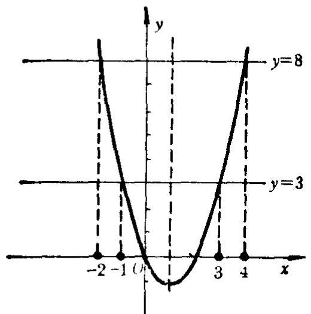

图 3-2-17

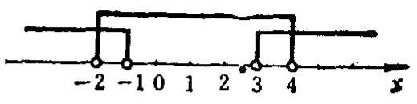

图 3-2-18

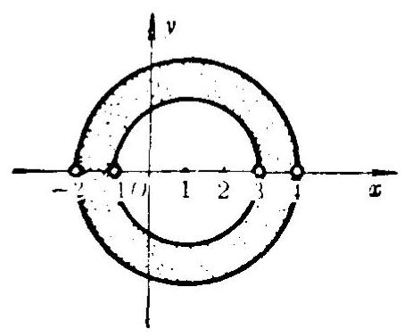

图 3-2-19

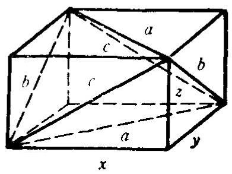

图 3-2-20

分析三 将数域扩大，从一维扩充到二维，则不等式 2< $\left| {x - 1}\right|  < 3$ 的几何意义是平面上的点到点 $\left( {1,0}\right)$ 的距离大于 2 且小于 3，其图示如图 3-2-19 的圆环. 实数世界是复数世界的一个 “断面”, 所求不等式组的解就是圆环与实轴相截的部分,

$$
2 < \left| {x - 1}\right|  < 3 \Leftrightarrow  \left\{  \begin{array}{l} 2 < \left| {z - 1}\right|  < 3, \\  z \in  R. \end{array}\right.
$$

解 略.

例 20 设四面体的每组相对棱的长分别为 $a\text{ 、 }b\text{ 、 }c$ ,求此四面体的体积.

分析 如同探求三角形面积那样, 将三角形“装入”它的外接长方形, 利用长方形的面积间接地求得三角形面积.

因为四面体的相对两棱长相等, 所以可以把此四面体“装入” 一个长方体，使得长方体相邻的三个面的对角线长分别等于四面体的各组棱长. 于是将求四面体的体积问题转化为求相应的长方体的体积问题.

如图 3-2-20 所示，设长方体的长、宽、高分别为 $x$ 、 $y$ 、 $z$ ，则

${x}^{2} + {y}^{2} = {a}^{2}\;$ ① $,{y}^{2} + {z}^{2} = {b}^{2}\;$ ② $,{z}^{2} + {x}^{2} = {c}^{2}$③。

解 ①、②、③ 构成的方程组，得

$$
{x}^{2} = \frac{1}{2}\left( {{a}^{2} - {b}^{2} + {c}^{2}}\right) ,
$$

$$
{y}^{2} = \frac{1}{2}\left( {{a}^{2} + {b}^{2} - {c}^{2}}\right) ,
$$

$$
{z}^{2} = \frac{1}{2}\left( {-{a}^{2} + {b}^{2} + {c}^{2}}\right) ,
$$

$\therefore {V}_{\text{ 长方体 }} = {xyz}$

$$
= \frac{1}{2\sqrt{2}}{\left\lbrack  \left( -{a}^{2} + {b}^{2} + {c}^{2}\right) \left( {a}^{2} - {b}^{2} + {c}^{2}\right) \left( {a}^{2} + {b}^{2} - {c}^{2}\right) \right\rbrack  }^{\frac{1}{2}}.
$$

以

$$
{V}_{\text{ 四面体 }} = \frac{1}{3}{V}_{\text{ 长方体 }}
$$

$\therefore {V}_{\text{ 四面体 }} = \frac{\sqrt{2}}{12}\sqrt{\left( {-{a}^{2} + {b}^{2} + {c}^{2}}\right) \left( {{a}^{2} - {b}^{2} + {c}^{2}}\right) \left( {{a}^{2} + {b}^{2} - {c}^{2}}\right) }$ .

解 略.

例 21 如图 3-2-21，设正方体 ${ABCD} - {A}_{1}{B}_{1}{C}_{1}{D}_{1}$ 的棱长为 $a, E$ 为 $B{C}_{1}$ 的中点， $F$ 为对角线 ${B}_{1}D$ 的内分点，且 ${B}_{1}F = \frac{1}{3}{B}_{1}D$ . 试求:(1)点 ${B}_{1}$ 到平面 ${BEF}$ 的距离；(2)三棱锥 ${B}_{1} - {BEF}$ 的体积.

分析 根据“退”的思想，把过 $B$ 、 $E$ 、 $F$ 的截面延展与正方体相截，得截面 $B{A}_{1}{C}_{1}$ . 于是将点 ${B}_{1}$ 到平面 ${BEF}$ 的距离转化为 ${B}_{1}$ 到平面 $B{A}_{1}{C}_{1}$ 的距离 $d$ .

$\because {B}_{1}D$ 在平面 ${A}_{1}{B}_{1}{C}_{1}{D}_{1}$ 与平面 $B{B}_{1}{C}_{1}C$ 上的射影

$$
{B}_{1}{D}_{1}\bot {A}_{1}{C}_{1},{B}_{1}C \bot  B{C}_{1},
$$

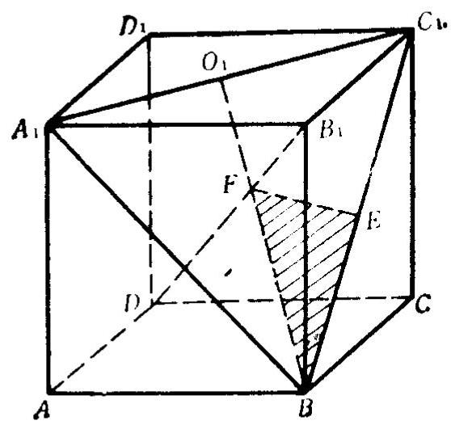

图 3-2-21

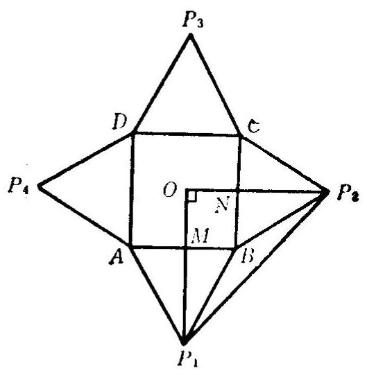

图 3-2-22

$\therefore {B}_{1}D \bot$ 平面 $B{A}_{1}{C}_{1}$ ,故 $d = {B}_{1}F = \frac{1}{3}{B}_{1}D = \frac{\sqrt{3}}{3}a$ .

求三棱锥 ${B}_{1} - {BEF}$ 的体积也应该体现“退”的转化思想，将三棱锥 ${B}_{1} - {BEF}$ “退”到三棱锥 ${B}_{1} - {BCD}$ ，利用

$$
\frac{{V}_{{B}_{1} - {BEF}}}{{V}_{{B}_{1} - {BCD}}} = \frac{{B}_{1}B \cdot  {B}_{1}E \cdot  {B}_{1}F}{{B}_{1}B \cdot  {B}_{1}C \cdot  {B}_{1}D} = \frac{1}{2} \cdot  \frac{1}{3} = \frac{1}{6},
$$

又 $\because {V}_{{B}_{1} - {BCD}} = \frac{1}{6}{a}^{3},\therefore {V}_{{B}_{1} - {BEF}} = \frac{1}{36}{a}^{3}$ .

例 22 (1)在平面内，已知正方形 ${ABCD}$ 的边长为 $a$ ,分别以各边为一边向形外作正三角形, 求两个相邻正三角形外侧顶点之间的距离; (2) 在图 3-2-22 中，分别以正方形各边为棱，将各三角形沿同向相折，使 ${P}_{1}$ 、 ${P}_{2}$ 、 ${P}_{3}$ 、 ${P}_{4}$ 四点重合，记为 $P$ ，构成所有棱长都等于 $a$ 的正四棱锥 $P - {ABCD}$ ,再分别以各侧面三角形为一面向外侧作正四面体, 求相邻两个正四面体的外侧顶点之间的距离.

分析 (1) 欲求 ${P}_{1}{P}_{2}$ ,可从 $\bigtriangleup {P}_{1}B{P}_{2}$ 与直角 $\bigtriangleup {P}_{1}O{P}_{2}$ 这两种途径入手. 在 $\bigtriangleup {P}_{1}B{P}_{2}$ 中, ${P}_{1}B = {P}_{2}B = a,\angle {P}_{1}B{P}_{2} = {360}^{ \circ  } - \; {90}^{ \circ  } - 2 \times  {60}^{ \circ  } = {150}^{ \circ  },$

$$
\therefore \;{P}_{1}{P}_{2}^{2} = 2{a}^{2}\left( {1 - \cos {150}^{ \circ  }}\right)  = {a}^{2}\left( {2 + \sqrt{3}}\right) ,
$$

$$
{P}_{1}{P}_{2} = a\sqrt{2 + \sqrt{3}} = \frac{\sqrt{2}}{2}a\sqrt{4 + 2\sqrt{3}} = \frac{\sqrt{2}}{2}a\left( {\sqrt{3} + 1}\right) .
$$

在直角 $\bigtriangleup {P}_{1}O{P}_{2}$ 中， ${P}_{1}O = {P}_{2}O = \frac{a}{2} + \frac{\sqrt{3}}{2}a = \frac{a}{2}\left( {\sqrt{3} + 1}\right)$ ，同样,得 ${P}_{1}{P}_{2} = \frac{\sqrt{2}}{2}a\left( {\sqrt{3} + 1}\right)$ .

显然, 第二种方法更简洁.

(2)这一问题貌似复杂，空间图形似难确定，其实，若能从 (1) 得到启发，体现“退”的思想，将问题的几何体做如下“补充”，就会实现转化. 把正四棱锥加倍就是正八面体, 再把它 “装进”一个正方体，使它的六个顶点恰是正方体各界面的中心. 于是，正方体的各顶点恰是正八面体各界面外侧的正四面体的顶点.

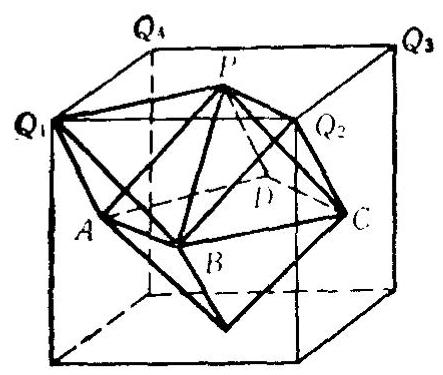

图 3-2-23

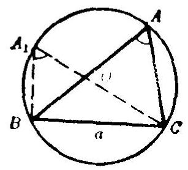

图 3-2-24

如图 3-2-23 中,设 ${Q}_{1}{Q}_{2} = m$ ,则 ${AB} = \frac{\sqrt{2}}{2}m$ .

此即所要求的两个顶点之间的距离.

解 略.

## 5. 一般与特殊

从 “一般” 向 “特殊” 转化也是一种具有方法论意义的思维形式. 由 “特殊” 到 “一般” 或 由 “一般” 到 “特殊”, 这是人类认识世界的普遍规律，它在数学学习中有着十分广泛的应用. “一般”与“特殊”总是相对的. 对于 “一般”问题来说，“特殊”问题的解决往往是比较容易、比较简单的. 可利用“特殊”中内含的本质的联系，通过归纳思维，来引出“一般”问题的解法. 例如，解决斜三角形的问题, 常常可分割成若干直角三角形来解. 正弦定理的证明就是一个例子, 如图3-2-24, 它就是将 “一般”的斜三角形转化为 “特殊”的直角三角形来引出边角关系, 根据 “在同圆或等圆中, 同弧所对的圆周角相等”,将 $A$ 点沿圆周移至点 ${A}_{1}$ ,使得 ${A}_{1}C$ 过圆心 $O$ ,使 $\bigtriangleup {ABC}$ 转化为直角 $\bigtriangleup {A}_{1}{BC}$ ,从而导出 $a = {2R}\sin A$ .

这种化“斜”为“直”的转化方法，是处理几何问题常用的思维方法.

例 23 如图 3-2-25，一个直三棱柱 ${ABO} - {A}_{1}{B}_{1}{O}_{1}$ 被一平面所截，截面为 ${DEF}$ ， ${AD} = {h}_{1}$ ， ${BE} = {h}_{2}$ ， ${OF} = {h}_{3}$ . 求证:所得斜截棱柱 ${ABO} - {DEF}$ 的体积为

$$
V = \frac{1}{3}{S}_{\bigtriangleup {ABC}}\left( {{h}_{1} + {h}_{2} + {h}_{3}}\right) .
$$

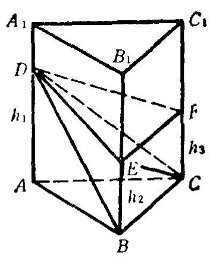

图 3-2-25

分析 斜截棱柱相对于直棱柱来说, 是“一般”与“特殊”的关系.

如果 ${h}_{1},{h}_{2}\text{ 、 }{h}_{3}$ 成等差数列,可采取 “退”的转化方法,在 ${AD}$ 棱上接补 ${h}_{2}\text{ 、 }{h}_{3}$ , 在 ${BE}$ 棱上接补 ${h}_{3}\text{ 、 }{h}_{1}$ ,在 ${CF}$ 棱上接补 ${h}_{1}\text{ 、 }{h}_{2}$ . 从而将斜棱柱转化为 3 倍于它的直棱柱,后者的体积为 ${S}_{\bigtriangleup {ABC}} \cdot  \left( {{h}_{1} + {h}_{2} + }\right. \; \left. {h}_{3}\right)$ . 于是,取算术平均值即得斜截棱柱的体积为

$$
V = \frac{1}{3}{S}_{\bigtriangleup {ABC}} \cdot  \left( {{h}_{1} + {h}_{2} + {h}_{3}}\right) .
$$

如果 ${h}_{1}\text{ 、 }{h}_{2}\text{ 、 }{h}_{3}$ 不成等差数列,则应采取“移”的转化方法. 将斜截棱柱做适当的分割, 在保持等积的条件下, 化“斜”为“直”. 连结 ${DB}\text{ 、 }{DC}\text{ 、 }{CE}$ ,斜截棱柱 ${ABC} - {DEF}$ 由三部分组成:

$$
{V}_{{ABC} - {DEF}} = {V}_{D - {ABC}} + {V}_{D - {BCE}} + {V}_{D - {CEF}}
$$

其中

$$
{V}_{D - {ABC}} = \frac{1}{3}{S}_{\bigtriangleup {ABC}} \cdot  {h}_{1}
$$

①

...

$$
{DA}//\text{ 平面 }{BOE}\text{ ， }
$$

$$
\therefore \;{V}_{D - {BCE}} = {V}_{A - {BCE}} = {V}_{E - {ABC}} = \frac{1}{3}{S}_{\bigtriangleup {ABC}}{h}_{2}
$$

②

$$
\because {BE}//{FC},\;\therefore {S}_{\bigtriangleup {EFC}} = {S}_{\bigtriangleup {BFC}}\text{ , }
$$

从而 ${V}_{D - {CEF}} = {V}_{A - {CEF}} = {V}_{A - {BFC}} = {V}_{F - {ABC}} = \frac{1}{3}{S}_{\bigtriangleup {ABC}}{h}_{3}$③

将 ①, ②, ③ 三式相加, 即得

$$
{V}_{\bigtriangleup {BC} - {DEF}} = \frac{1}{3}{S}_{\bigtriangleup {ABC}} \cdot  \left( {{h}_{1} + {h}_{2} + {h}_{3}}\right) .
$$

## 证 略.

在处理多面体体积问题时, 象平面几何中处理面积问题那样, 经常使用等积变换与等积更位方法.

## 6. 其他转化问题

数学中转化思想的应用是十分广泛的, 除了以上五方面, 还有其他一些转化问题. 下面再看几个例子.

“距离”是几何中的重要概念之一. 立体几何的距离问题，尤其是异面直线间的距离问题, 比较复杂. 运用距离概念之间的内在联系进行转化是处理这些问题的关键.

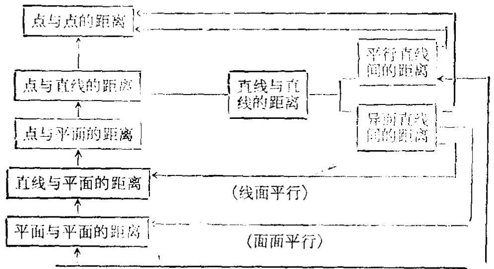

例 24 在直三棱柱 ${ABC} - {A}_{1}{B}_{1}{C}_{1}$ 中，已知侧棱长为 4，底面 $\bigtriangleup {ABC}$ 为直角三角形， $\angle C = {90}^{ \circ  }$ ， ${AC} = {BC} = 2$ ， $E$ 为 ${AB}$ 的中点,试求 $A{B}_{1}$ 与 ${CE}$ 之间的距离.

分析一 在侧棱 $B{B}_{1}$ 上取中点 $M$ ,

$\because A{B}_{1}//{EM}\therefore$ 直线 $A{B}_{1}//$ 平面 ${EMC}$ ,

而 ${OE} \subset$ 平面 ${EMO}$ ,于是,将异面直线 $A{B}_{1}$ 与 ${OE}$ 的距离转化为直线 $A{B}_{1}$ 与平面 ${EMO}$ 的距离.

分析二 分别在侧棱 $B{B}_{1}\text{ 、 }C{O}_{1}$ 上取中点 $M\text{ 、 }N$ .

$$
A{B}_{1}//{EM},{B}_{1}N//{MC}\text{ , }
$$

$\therefore \;$ 平面 $A{B}_{1}N//$ 平面 ${EMO}$ ， 而 $A{B}_{1} \subset$ 平面 $A{B}_{1}N,{CE} \subset$ 平面 ${EMO}$ ,于是,将异面直线 $A{B}_{1}$ 与 ${CE}$ 的距离转化为两个平行平面 $A{B}_{1}N$ 与平面 ${EMO}$ 的距离. 在求这两个平行平面间的距离时,注意到 ${CE} \bot$ 平面 ${AB}{B}_{1}{A}_{1}$ ,从而将“面面距离”又转化为平面 ${AB}{B}_{1}{A}_{1}$ 内平行直线 $A{B}_{1}$ 与 ${EM}$ 的距离. 这两条平行直线的距离又可转化为点 $E$ 与直线 $A{B}_{1}$ 的距离,即求 $\bigtriangleup {EA}{B}_{1}$ 中 $A{B}_{1}$ 边上的高.

$$
\therefore \;{S}_{\angle {B}_{1,{EA}}} = \frac{1}{2}{S}_{\mathrm{{Rt}} \bigtriangleup  {B}_{1}{BA}} = \frac{1}{2} \cdot  \frac{1}{2}2\sqrt{2} \cdot  4 = 2\sqrt{2}\text{ , }
$$

$$
A{B}_{1} = \sqrt{A{B}^{2} + B{B}_{1}^{2}} = \sqrt{{\left( 2\sqrt{2}\right) }^{2} + {4}^{2}} = 2\sqrt{6},
$$

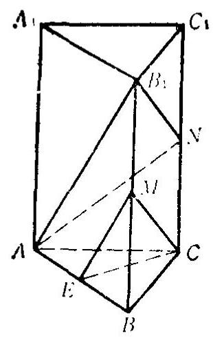

图 3-2-26

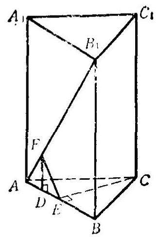

图 3-2-27

$\therefore$ 点 $E$ 到直线 $A{B}_{1}$ 的距离 $= \frac{2 \times  2\sqrt{2}}{2\sqrt{6}} = \frac{2}{3}\sqrt{3}$ .

分析三 根据异面直线的距离概念, 求连接异面直线的两点之间线段的最小值, 将问题转化为代数问题.

注意到平面 ${AB}{B}_{1}{A}_{1} \bot$ 平面 ${ABC}$ ，且 $A{B}_{1} \subset$ 平面 ${AB}{B}_{1}{A}_{1}, \; {CE} \subset$ 平面 ${ABC},{CE} \bot  {AB}$ ,故 ${CE} \bot$ 平面 ${AB}{B}_{1}{A}_{1}$ .

在 ${AE}$ 上取一点 $D$ ,令 ${AD} = 2\sqrt{2}x, x \in  \left( {0,\frac{\sqrt{2}}{2}}\right)$ . 过 $D$ 点作 ${DF} \bot  {AB}$ ，交 $A{B}_{1}$ 于 $F$ 点，连接 ${EF}$ . 这里虽然 ${CE} \bot  {EF}$ ， 但 ${EF}$ 未必是 ${OE}$ 与 $A{B}_{1}$ 的公垂线，仅当 ${EF}$ 取最小值时，才既确定了公垂线, 又求出了异面直线的距离.

$$
\mathrm{{Rt}}\bigtriangleup {ADF} \backsim  \mathrm{{Rt}}\bigtriangleup {AB}{B}_{1},
$$

$$
\frac{DF}{2\sqrt{2}x} = \frac{4}{2\sqrt{2}},
$$

故 ${DF} = {4x}$ . 而 ${DE} = \sqrt{2} - 2\sqrt{2}x = \sqrt{2}\left( {1 - {2x}}\right)$ ，

$$
E{F}^{2} = D{E}^{2} + D{F}^{2} = {\left\lbrack  \sqrt{2}\left( 1 - 2x\right) \right\rbrack  }^{2} + {\left( 4x\right) }^{2}
$$

$$
= {24}{\left( x - \frac{1}{6}\right) }^{2} + \frac{4}{3}\text{ , }
$$

$\therefore \;$ 当 $x = \frac{1}{6}$ 即 ${AD} = \frac{\sqrt{2}}{3}$ 时,

$$
{\left( EF\right) }_{\text{ 最小 }} = \sqrt{\frac{4}{3}} = \frac{2}{3}\sqrt{3}.
$$

## 解 略.

在数学中，充满着有限与无限，近似与精确，量变与质变的辩证关系. 它们都在一定条件下, 可以互相转化. 当圆内接正多边形的边数不断增加,多边形的周长 ${O}_{n}$ (或面积 ${S}_{n}$ ) 则相应地不断增加,并越来越接近于圆周长 $O$ (或圆面积 $S$ ),只要边数 $n$ 充分大, ${C}_{n}$ 与 $C$ (或 ${S}_{n}$ 与 $S$ ) 之差就可达到任意小.

又如将“球面积”的计算问题转化为“球体积”的计算问题. 在半径为 $r$ 的球面上,增加一层厚度为 $h$ 的“外壳”,变成半径为 $r + \; h$ 的球. “壳厚” $h$ 减小,“外壳”变成“薄膜”,运用体积公式,求出两球体积之差,当 $h$ 越来越小,“体积”转化为“面积”,“平面”转化为“球面”.

$\therefore$ 186 .

$$
{V}_{\text{ 其 }} = \frac{4\pi }{3}{\left( r + h\right) }^{3} - \frac{4\pi }{3}{r}^{3}
$$

$$
= \frac{4\pi }{3}\left( {{r}^{3} + 3{r}^{2}h + {3r}{h}^{2} + {h}^{3} - {r}^{3}}\right)
$$

$$
= {4\pi }{r}^{2}h + {4\pi r}{h}^{2} + \frac{4}{3}\pi {h}^{3}
$$

$$
{V}_{\text{ 差 }} = {S}_{\text{ 不 }} \cdot  h,
$$

$$
{S}_{\text{ 不 }} = {4\pi }{r}^{2} + {4\pi rh} + \frac{4}{3}\pi {h}^{2}.
$$

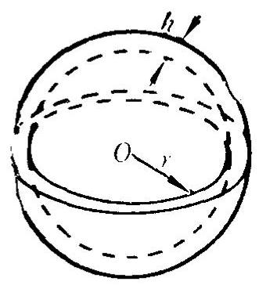

图 3-2-28

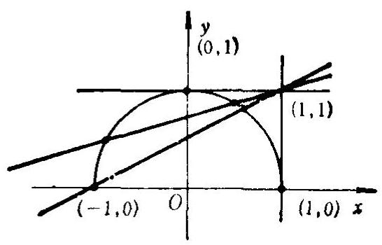

图 3-2-29

于是

$$
{S}_{\text{ 救 }} = \mathop{\lim }\limits_{{h \rightarrow  0}}{S}_{\text{ 平 }} = \mathop{\lim }\limits_{{h \rightarrow  0}}\left( {{4\pi }{r}^{2} + {4\pi rh} + \frac{4}{3}\pi {h}^{2}}\right)
$$

$$
= {4\pi }{r}^{2}\text{ . }
$$

例 25 经过点 $A\left( {1,1}\right)$ 的动直线 $l$ ,要使它与曲线 $C : y = \; \sqrt{1 - {x}^{2}}$ 有两个不重合的交点,求动直线的斜率 $k$ 的取值范围.

分析 过点 $A\left( {1,1}\right)$ 的直线系方程为 $y - 1 = k\left( {x - 1}\right)$ ,或 $x =$ 1. 不难看出 $x = 1$ 时, $y = 0,\left( {1,0}\right)$ 为直线与曲线 $O$ 相切的切点.

曲线 $C : y = \sqrt{1 - {x}^{2}}$ 为单位圆的上半圆,单位圆与直线 $\mathbf{l}$ 有两个不重合的交点的充要条件为

$$
\frac{\left| k - 1\right| }{\sqrt{1 + {k}^{2}}} < 1
$$

解之得

$$
k > 0\text{ . }
$$

由于这样的转化,将单位圆的上半圆 (曲线 $C$ ) 扩充为整个单位圆,因此,这样的“翻译”失真 (即转化为非等价转化), $k > 0$ 还不是问题的正确的解. 从相应的图上 (图 3-2-29) 不难发现正确的解是

$$
0 < k \leq  \frac{1}{2}.
$$

从图上还可得:

(1)当 $k = 0$ 时, $l$ 与 $O$ 有两个重合的交点 $\left( {0,1}\right)$ ;

(2)当 $k \in  \left( {0,\frac{1}{2}}\right\rbrack$ 时， $l$ 与 $O$ 有两个不重合的交点;

(3)当 $k \in  \left( {\frac{1}{2}, + \infty }\right)$ 时， $l$ 与 $G$ 有一个交点;

(4)当 $k \in  \left( {-\infty ,0}\right)$ 时， $l$ 与 $G$ 无交点.

解 略.

以上诸方面说明“转化”思想应用的广泛性。 “转化”思想是辩证逻辑的精髓，应用中要特别注意两点:

(1)一切“转化”都是有条件的. 忽视转化的条件，漫无边际地转化下去, 不但易失误, 同时也达不到转化的目的. 如果发生循环转化, 将难以自拔.

(2)对于数学中的非等价转化，应特别谨慎. 方程与不等式的非同解变形, 要防止增解与失解. 参数方程与普通方程, 直角坐标方程与极坐标方程的相互转化也应注意等价性. 解析几何里的轨迹题, 更应注意轨迹方程的曲线与轨迹本身之间的等价性, 防止轨迹纯粹性与完备性遭到破坏.

## 思 考 题 八

1. 设 $P$ 为椭圆 $\frac{{x}^{2}}{{a}^{2}} + \frac{{y}^{2}}{{b}^{2}} = 1\left( {a > b > 0}\right)$ 上一点,求作过点 $P$ 椭圆的切线.

2. 证明,椭圆 $\frac{{x}^{2}}{{a}^{2}} + \frac{{y}^{2}}{{b}^{2}} = 1$ 上三点的横坐标成等差数列的充要条件是此三点的焦半径成等差数列.

3. 以圆锥曲线的焦点弦为直径的圆, 如果:

(1)与准线相交于两个不同的点, 则圆锥曲线为双曲线;

(2)与准线相切，则圆锥曲线为抛物线;

(3)与准线不相交，则圆锥曲线为椭圆.

4. 凸四边形 ${ABCD}$ 围绕它所在的平面一点 $O$ 逆时针方向旋转 ${90}^{ \circ  }$ ，得到四边形 ${A}^{\prime }{B}^{\prime }{C}^{\prime }{D}^{\prime }, P$ 、 $Q$ 、 ${R}_{3}$ 。 $B$ 顺次是 ${A}^{\prime }B$ 、 ${B}^{\prime }O,{O}^{\prime }D$ 、 ${D}^{\prime }A$ 的中点. 求证: ${PR} \bot  {QS},{PR} = {QS}$ .

5. 如果 $a, b, c, d \in  R$ ,并满足 $\left\{  \begin{array}{l} {a}^{2} + {b}^{2} + {2a} - {4b} + 4 = 0, \\  {c}^{2} + {d}^{2} - {4c} + {4d} + 4 = 0. \end{array}\right.$ 求 $\omega  = \; {\left( a - c\right) }^{2} + {\left( b - d\right) }^{2}$ 的最大值和最小值.

6. 已知 ${x}_{i} \geq  0\left( {i = 1\text{ 、 }2\text{ 、 }\cdots \text{ 、 }n}\right)$ 且 ${x}_{1} + {x}_{2} + \cdots  + {x}_{n} = 1$ ,求证:

$$
1 \leq  \sqrt{{x}_{1}} + \sqrt{{x}_{2}} + \cdots  + \sqrt{{x}_{n}} \leq  \sqrt{n}.
$$

7. 设 $0 \leq  a, b, c < 1$ ,证明:

$$
\frac{a}{b + c + 1} + \frac{b}{c + a + 1} + \frac{c}{a + b + 1} + \left( {1 - a}\right) \left( {1 - b}\right) \left( {1 - c}\right)  \leq  1.
$$

8. 解方程: $\frac{\operatorname{ctg}x + 1}{\operatorname{ctg}x - 1} = \cos {2x}$ .

9. 解方程: $\sqrt{2}\left( {\sin x + \cos x}\right)  = \operatorname{tg}x + \operatorname{ctg}x$ .

10. 解不等式: ${\log }_{\sin x}\cos x < {\log }_{\cos x}\sin x$ .

11. 解方程组 $\left\{  \begin{array}{l} {2}^{\sin x + \cos y} = 1, \\  {16}^{\sin {2x} + \cos {2y}} = 4. \end{array}\right.$

12. 设 $F\left( \theta \right)  = {\sin }^{2}\theta  + {\sin }^{2}\left( {\theta  + \alpha }\right)  + {\sin }^{2}\left( {\theta  + \beta }\right) \;\left( {0 \leq  \alpha  \leq  \beta  \leq  \pi }\right)$ , 试确定与 $\theta$ 无关的且使 $F\left( \theta \right)$ 为定值的 $\alpha ,\beta$ 之值.

13. ${AB}$ 为圆 $O$ 的直径, ${SA} \bot$ 圆 $O$ 所在的平面,且 ${SA} = {AB} = {2a}$ , $O$ 为 $\overset{\text{ ⏜ }}{AB}$ 的一点, $\angle {ABC} = \theta$ ,试求 ${SO}$ 与 ${AB}$ 的距离.

14. 椭圆 $\frac{{x}^{2}}{{a}^{2}} + \frac{{y}^{2}}{{b}^{2}} = 1$ 上依次四点 $A\text{ 、 }B\text{ 、 }C\text{ 、 }D$ 共圆的充要条件是此四点的离心角之和为 $\alpha  + \beta  + \gamma  + \delta  = {2n\pi },\left( {n \in  Z}\right)$ .

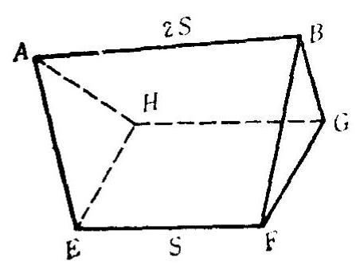

图 3-2-30

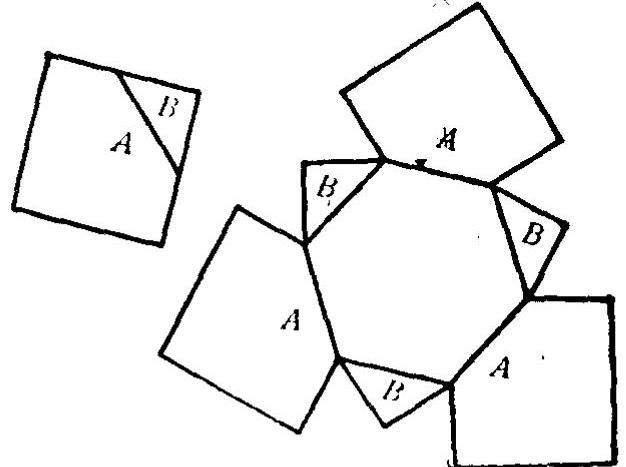

图 3-2-31

15. 过正四棱锥 $P - {ABCD}$ 的棱 ${AB},{AD}$ 的中点 $E$ 、 $F$ 作平行于侧棱 ${PO}$ 的截面,并求此截面将棱锥分成两部分的体积之比.

16. 一个以 $S$ 为边长的正方形作底的物体如图 3-2-30 所示,其最上方的一条边平行于底面,且长度为 ${2S}$ ,其他各边的长度均为 $S$ ,若 $S = 6\sqrt{2}$ ,求此物体的体积.

17. 3 个 12 厘米 $\times  {12}$ 厘米的正方形如图 3-2-31 的左图所示,连接相邻两边的中点,把每一个正方形分割成 $A$ 与 $B$ 两块. 然后, 将这六块粘附于一个正六边形, 如图 3-2-31 的右图所示, 折叠成一个多面体. 试求这个多面体的体积 (以立方厘米为单位).

## 三 类比与归纳

“类比”这个术语在希腊语中是“比例”的意思，后来被在更加广泛的意义上使用，即在“类似”、“相似”、“相符”、“具有同样的关系、形式或结构”等意义上使用. 类比是理性的本能. 如同“转化”一样，“类比”也非常强调事物的内在联系，要求我们用联系的而不是孤立的观点看待问题. 把两个不同领域结合起来思考，将会发现新的问题, 而新问题的解决又将会出现新的思想、新的方法, 其收获与意义将会比原来两个领域的简单相加之和大得多. 类比推理的客观基础在于事物、过程与系统之间各要素的普遍联系, 以及这种联系之间存在着的可比较性. 类比推理与归纳推理关系密切. 类比推理如果单从其起点与终点来看，似乎仅仅是从特殊到特殊的推理, 然而在特殊到特殊之间存在着一些中间环节, 它们包含着比较、联想、演绎、归纳诸因素. 如果说 “演绎”是“解决问题”, 那么 “归纳”就是 “发现问题”, “类比”就是 “分析问题”. 类比推理与归纳推理是极其重要的思维方法, 在数学学习中有着广泛的应用。

立体几何问题往往可以在平面几何中得到类比. 例如, “三角形”与 “四面体” 的类比基础是它们都以最小数量的边界元素分别在平面内或空间中围成一个区域. “三角形”与“三面角”的类比基础是三角形的 3 个内角与三面角的 3 个二面角相类比, 三角形的 3 条边与三面角的 3 个面角相类比. 从而在有关度量方面也可以类比，它们各有“正弦定理”与“余弦定理”.

<table><tr><td>条件</td><td>在 $\bigtriangleup {ABC}$ 中, $A\text{ 、 }B\text{ 、 }C$ 为三个内角, $a, b, c$ 为 $A\text{ 、 }B\text{ 、 }C$ 所对的三条边.</td><td>三面角 $P - {ABC}$ ，   A、B、C 为三个二面角，   $\alpha ,\beta ,\gamma$ 为 $A\text{ 、 }B\text{ 、 }C$ 所对的面角.</td></tr><tr><td>正弦定理</td><td>$\frac{a}{\sin A} = \frac{b}{\sin B} = \frac{c}{\sin C}.$</td><td>$\frac{\sin \alpha }{\sin A} = \frac{\sin \beta }{\sin B} = \frac{\sin \gamma }{\sin C}.$</td></tr><tr><td>余弦定理</td><td>$\cos A = \frac{{b}^{2} + {c}^{2} - {a}^{2}}{2bc}$   $\cos B = \frac{{c}^{2} + {a}^{2} - {b}^{2}}{2ca}$   $\cos C = \frac{{a}^{2} + {b}^{2} - {c}^{2}}{2ab}.$</td><td>$\cos A = \frac{\cos \alpha  - \cos \beta \cos \gamma }{\sin \beta \sin \gamma }$   $\cos B = \frac{\cos \beta  - \cos \gamma \cos \alpha }{\sin \gamma \sin \alpha }$   $\cos C = \frac{\cos \gamma  - \cos \alpha \cos \beta }{\sin \alpha \sin \beta };$   $\cos \alpha  = \frac{\cos A + \cos B\cos C}{\sin B\sin C};$   $\cos \beta  = \frac{\cos B + \cos C\cos A}{\sin C\sin A};$   $\cos \gamma  = \frac{\cos C + \cos A\cos B}{\sin A\sin B}$ .</td></tr></table>

在度量方面，又如“三角形”的面积公式与“三棱锥”的体积公式的“类比”:

$$
{V}_{P - {ABC}} = \frac{1}{3}{S}_{\bigtriangleup {ABC}} \cdot  h
$$

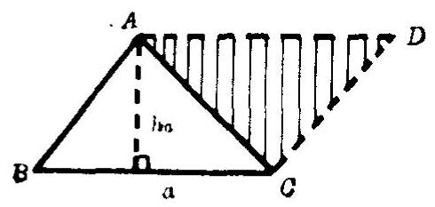

图 3-3-01

$$
{S}_{\bigtriangleup {ABC}} = \frac{1}{2}a \cdot  {h}_{a}
$$

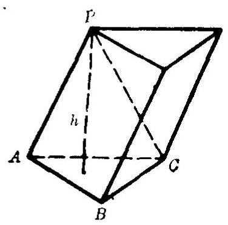

图 3-3-02

在类比推理中, 比较两个“类比”的对象, 应该求同存异. 例如, “三角形”与“球面三角形”的边角关系的类比:

<table><tr><td></td><td>三 角 形</td><td>球 面 三 角 形</td></tr><tr><td rowspan="2">相同</td><td>在任意三角形中, 每一边都小于其他两边之和, 而大于其他两边之差.</td><td>在任意球面三角形中, 每一边都小于其他两边之和, 而大于其他两边之差.</td></tr><tr><td>在一个三角形中, 较大角所对的边也大，较大边所对的角也大.</td><td>在一个球面三角形中, 较大角所对的边也大，较大边所对的角也大.</td></tr><tr><td>不同</td><td>三角形的内角和等于 2 直角.</td><td>球面三角形的内角之和大于 2 直角, 而小于 6 直角.</td></tr></table>

## 1. “平面问题”与“立体问题”

运用类比推理, 将平面几何的真命题推广到立体几何中去应重新判定. 例如, 在平面几何中, “平行于同一条直线的两条不同直线互相平行”、“垂直于同一条直线的两条不同直线互相平行”都是正确的。然而，将立体几何中的某些“平面”类比为平面几何中的“直线”，则关于“直线”、“平面”两类元素的平行与垂直位置关系就比较复杂:

<table><tr><td>位 置已   关知   系元   素   已知 条件</td><td>两条不重合的直线</td><td>一个平面与平面外的一条直线</td><td>两个不重合的平面</td></tr><tr><td>平行于同一条直线</td><td>平 行</td><td>平 行</td><td>位置不确定</td></tr><tr><td>平行于同一个平面</td><td>位置不确定</td><td>平 行</td><td>平行</td></tr><tr><td>垂直于同一条直线</td><td>位置不确定</td><td>平行</td><td>平行</td></tr><tr><td>垂直于同一个平面</td><td>平行</td><td>平 行</td><td>位置不确定</td></tr></table>

例 1 如果空间中有 $n$ 个平面,其中任何 3 个平面至少有 1 个公共点, 任何 3 个平面不共一直线, 任何 4 个平面不共有同 1 个点,那么这 $n$ 个平面能够把空间分成几个部分?

分析 把问题“退”到“平面问题”. 如果平面内有 $n$ 条直线, 其中任何 2 条直线不互相平行,任何 3 条直线不相交于同 1 点, 那么这 $n$ 条直线能够把平面分成几个部分? 分 1 条、2 条、3 条、 ..., 直线的个别情况, 运用归纳推理, 有

$$
K = 1 : f\left( 1\right)  = f\left( 0\right)  + 1 = 1 + 1 = 2;
$$

$$
K = 2, f\left( 2\right)  = f\left( 1\right)  + 2 = 2 + 2 = 4;
$$

$$
K = 3 : f\left( 3\right)  = f\left( 2\right)  + 3 = 4 + 3 = 7;
$$

$$
K = 4 : f\left( 4\right)  = f\left( 3\right)  + 4 = 7 + 4 = {11};
$$

..............

推测

$$
K = n : f\left( n\right)  = f\left( {n - 1}\right)  + n.
$$

将以上 $n$ 个式子相加，得

$$
f\left( n\right)  = f\left( 0\right)  + \left( {1 + 2 + \cdots  + n}\right)  = 1 + \frac{1}{2}n\left( {n + 1}\right) ,
$$

$$
\left( {n \in  N, n \geq  1}\right) ,
$$

即平面内符合题意的 $n$ 条直线将该平面分成 $1 + \frac{1}{2}n\left( {n + 1}\right)$ 个部分.

将“立体问题”转化为“平面问题”，在“立体问题”与“平面问题”的类比中得到启发，并利用“平面问题”的结论求解 “立体问题”.

设平面 ${\alpha }_{K + 1}$ 与平面 ${\alpha }_{1}\text{ 、 }{\alpha }_{2}\text{ 、 }\cdots \text{ 、 }{\alpha }_{K}$ 的交线依次为 ${L}_{1}\text{ 、 }{L}_{2}\text{ 、 }\cdots$ 、 ${L}_{K}$ ，根据题设条件，这 $K$ 条交线中任何 2 条互不平行，任何 3 条不相交于同一点. 于是,由上述 “平面问题”知, ${\alpha }_{K + 1}$ 被 $K$ 条直线 ${L}_{1}\text{ 、 }{L}_{2}\text{ 、 }\cdots \text{ 、 }{L}_{K}$ 分成 $f\left( K\right)  = \frac{1}{2}K\left( {K + 1}\right)  + 1$ 个部分.

又设 $K$ 个平面 ${\alpha }_{1}\text{ 、 }{\alpha }_{2}\text{ 、 }\cdots ,{\alpha }_{K}$ 将空间分成 $F\left( K\right)$ 个部分,

$\because$ 增加一个平面 ${\alpha }_{K + 1}$ ,而 ${\alpha }_{K + 1}$ 被 $K$ 条交线 ${L}_{1}\text{ 、 }{L}_{2}\text{ 、 }\cdots {L}_{K}$ 分成 $f\left( K\right)$ 个部分，

$\therefore$ 空间被分成的部分就增加了 $f\left( K\right)$ 个,即

$$
F\left( {K + 1}\right)  - F\left( K\right)  = f\left( K\right) ,\;\left( {K \geq  1}\right) .
$$

于是，

$$
F\left( 2\right)  - F\left( 1\right)  = f\left( 1\right)
$$

$$
F\left( 3\right)  - F\left( 2\right)  = f\left( 2\right)
$$

$$
F\left( 4\right)  - F\left( 3\right)  = f\left( 3\right)
$$

..............

$$
\text{ +) }\frac{F\left( n\right)  - F\left( {n - 1}\right)  = f\left( {n - 1}\right) }{F\left( n\right)  - F\left( 1\right)  = f\left( 1\right)  + f\left( 2\right)  + \cdots  + f\left( {n - 1}\right) }
$$

$$
= \mathop{\sum }\limits_{{k = 1}}^{{n - 1}}f\left( K\right)  = \mathop{\sum }\limits_{{k = 1}}^{{n - 1}}\left\lbrack  {\frac{1}{2}K\left( {K + 1}\right)  + 1}\right\rbrack
$$

$$
\therefore \;F\left( n\right)  = \frac{1}{2}\mathop{\sum }\limits_{{k = 1}}^{{n - 1}}K\left( {K + 1}\right)  + n - 1 + F\left( 1\right)
$$

$$
= \frac{1}{6}\mathop{\sum }\limits_{{k = 1}}^{{n - 1}}\left\lbrack  \left( {K\left( {K + 1}\right) \left( {K + 2}\right) }\right. \right.
$$

$$
= \left( {K - 1}\right) K\left( {K + 1}\right) \rbrack  + n + 1
$$

$$
= \frac{1}{6}\left( {n - 1}\right) \left( n\right) \left( {n + 1}\right)  + \left( {n + 1}\right)
$$

$$
= \frac{1}{6}\left( {n + 1}\right) \left( {{n}^{2} - n + 6}\right) .
$$

解 略.

例 2 与空间中不共面的 4 个点等距离的平面应该有几个?

分析 从构造上分析,题设的 4 个点,可等价为四面体的 4 个顶点. 于是, 问题转化为 “与四面体的 4 个顶点等距离的截平面应该有几个”.

将问题“退”成“平面问题”,考虑“与三角形的 3 个顶点等距离的直线应该有几条？”或“与平行四边形的 4 个顶点等距离的直线应该有几条？” 不难在 “平面问题” 与 “立体问题” 的类比中得到启发，见下页的表.

解 略.

例 3 已知三面角 $P - {ABC}$ 为直三面角，点 $P$ 在平面 ${ABC}$ 内的射影为 $H$ ，证明 $\bigtriangleup  {PBC}$ 、 $\bigtriangleup  {HBC}$ 、 $\bigtriangleup  {ABC}$ 的面积满足下列关系式: ${S}_{\bigtriangleup {PBC}}^{2} = {S}_{\bigtriangleup {HBC}} \cdot  {S}_{\bigtriangleup {ABC}}$ .

<table><tr><td>平面问题</td><td>[失效外部图片：bo_d6seg9491nqc73ejl5d0_201.jpg]    [失效外部图片：bo_d6seg9491nqc73ejl5d0_201.jpg]    [失效外部图片：bo_d6seg9491nqc73ejl5d0_201.jpg]</td><td>[失效外部图片：bo_d6seg9491nqc73ejl5d0_201.jpg]    [失效外部图片：bo_d6seg9491nqc73ejl5d0_201.jpg]</td></tr><tr><td>立体同   体问题</td><td>[失效外部图片：bo_d6seg9491nqc73ejl5d0_201.jpg]    [失效外部图片：bo_d6seg9491nqc73ejl5d0_201.jpg]    [失效外部图片：bo_d6seg9491nqc73ejl5d0_201.jpg]    [失效外部图片：bo_d6seg9491nqc73ejl5d0_201.jpg]</td><td>[失效外部图片：bo_d6seg9491nqc73ejl5d0_201.jpg]    [失效外部图片：bo_d6seg9491nqc73ejl5d0_201.jpg]    [失效外部图片：bo_d6seg9491nqc73ejl5d0_201.jpg]</td></tr></table>

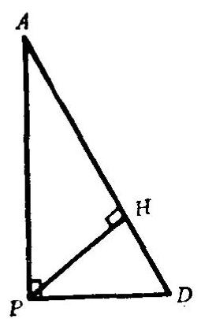

图 3-3-03

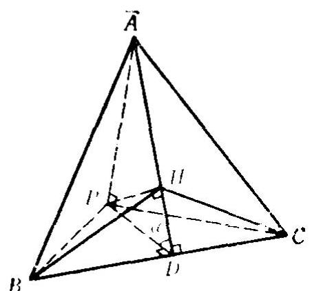

图 3-3-04

分析 将直三面角与直角三角形作类比。联想到类似的命题: 在 $\mathrm{{Rt}}\bigtriangleup {APD}$ ( $\angle {APD}$ 为直角) 中,若点 $P$ 在斜边 ${AD}$ 上的射影为 $H$ . 则 $P{D}^{2} = {HD} \cdot  {AD}$ (直角三角形的射影定理). 在类比与联想中得到启示，经过棱 ${AP}$ 与点 $H$ 作平面 ${APD}$ ( $D$ 为该平面与棱 ${BC}$ 的交点). 显见，棱 ${BO} \bot$ 平面 ${APD}$ . 在 $\mathrm{{Rt}} \bigtriangleup  {APD}$ 中，有 $P{D}^{2} = {HD} \cdot  {AD}$ . 另一方面，因为 $\bigtriangleup  {PBO}$ 、 $\bigtriangleup  {HBO}$ 、 $\bigtriangleup  {ABC}$ 有公共边 ${BC}$ ,所以,它们的“面积关系”转化为它们在 ${BC}$ 边上的“高线关系”, 即可推证:

$$
P{D}^{2} = {HD} \cdot  {AD}
$$

$$
\Rightarrow  {\left( \frac{1}{2}{BC} \cdot  {PD}\right) }^{2} = \left( {\frac{1}{2}{BC} \cdot  {HD}}\right)  \cdot  \left( {\frac{1}{2}{BC} \cdot  {AD}}\right)
$$

$$
\Rightarrow  {S}_{\bigtriangleup {PBC}}^{2} = {S}_{\bigtriangleup {HBC}} \cdot  {S}_{\bigtriangleup {ABC}}.
$$

证 略.

对于三棱锥的其他侧面, 按照同样方法也可以求得相应的关系式. 于是,

$$
{S}_{\bigtriangleup {PBC}}^{2} = {S}_{\bigtriangleup {HBC}} \cdot  {S}_{\bigtriangleup {ABC}}
$$

$$
{S}_{\bigtriangleup {PCA}}^{2} = {S}_{\bigtriangleup {HCA}} \cdot  {S}_{\bigtriangleup {BCA}}
$$

$$
\frac{+){S}_{\bigtriangleup {PAB}}^{2} = {S}_{\bigtriangleup {HAB}} \cdot  {S}_{\bigtriangleup {CAB}}}{{S}_{\bigtriangleup {PBC}}^{2} + {S}_{\bigtriangleup {PCA}}^{2} + {S}_{\bigtriangleup {PAB}}^{2} = \left( {{S}_{\bigtriangleup {HBC}} + {S}_{\bigtriangleup {HCA}} + {S}_{\bigtriangleup {HAB}}}\right)  \cdot  {S}_{\bigtriangleup {ABO}}}\text{ . }
$$

即

$$
{S}_{\bigtriangleup {PBC}}^{2} + {S}_{\bigtriangleup {PCA}}^{2} + {S}_{\bigtriangleup {PAB}}^{2} = {S}_{\bigtriangleup {ABC}}^{2}.
$$

通过“平面问题”与“立体问题”的类比，这个结论可以看作直角三角形的勾股票定理在含有直三面角的四面体中的推广. 将以上关系变形, 得

$$
{\left( \frac{{S}_{\bigtriangleup {PBC}}}{{S}_{\bigtriangleup {ABC}}}\right) }^{2} + {\left( \frac{{S}_{\bigtriangleup {POA}}}{{S}_{\bigtriangleup {BCA}}}\right) }^{2} + {\left( \frac{{S}_{\bigtriangleup {PAB}}}{{S}_{\bigtriangleup {CAB}}}\right) }^{2} = 1.
$$

设四面体的三个界面 ${PBO}\text{ 、 }{PCA}\text{ 、 }{PAB}$ 分别与界面 ${ABO}$ 构成二面角 $\alpha \text{ 、 }\beta \text{ 、 }\gamma$ ,则根据射影原理,有

$$
\cos \alpha  = \frac{{S}_{\_ {PBC}}}{{S}_{\bigtriangleup {ABC}}},\cos \beta  = \frac{{S}_{\bigtriangleup {PCA}}}{{S}_{\bigtriangleup {BCA}}},\cos \gamma  = \frac{{S}_{\bigtriangleup {PAB}}}{{S}_{\bigtriangleup {CAB}}},
$$

于是 ${\cos }^{2}\alpha  + {\cos }^{2}\beta  + {\cos }^{2}\gamma  = 1$ . 这是一个很有意义的结论. 由此可以衍生出其他形式的命题, 诸如求证:

(1) ${\cos }^{4}\alpha  + {\cos }^{4}\beta  + {\cos }^{4}\gamma  \geq  \frac{1}{3};\;\left( 2\right) \cos \alpha \cos \beta \cos \gamma  \leq  \frac{\sqrt{3}}{9}$ .

运用 ${\cos }^{2}\alpha  + {\cos }^{2}\beta  + {\cos }^{2}\gamma  = 1$ . 均可一一证得.

设 ${\cos }^{2}\alpha  = \frac{1}{3} + {t}_{1},{\cos }^{2}\beta  = \frac{1}{3} + {t}_{2},{\cos }^{2}\gamma  = \frac{1}{3} + {t}_{3}$ ,其中 ${t}_{1} + {t}_{2} + {t}_{3} \; = 0,{t}_{1}\text{ 、 }{t}_{2}\text{ 、 }{t}_{3} \in  \left\lbrack  {-\frac{1}{3},\frac{2}{3}}\right\rbrack$ ,于是

$$
{\cos }^{4}\alpha  + {\cos }^{4}\beta  + {\cos }^{4}\gamma  = {\left( \frac{1}{3} + {t}_{1}\right) }^{2} + {\left( \frac{1}{3} + {t}_{2}\right) }^{2} + {\left( \frac{1}{3} + {t}_{3}\right) }^{2}
$$

$$
= {\left( \frac{1}{3}\right) }^{2} + {\left( \frac{1}{3}\right) }^{2} + {\left( \frac{1}{3}\right) }^{2}
$$

$$
+ 2 \cdot  \frac{1}{3}\left( {{t}_{1} + {t}_{2} + {t}_{3}}\right)  + \left( {{t}_{1}^{2} + {t}_{2}^{2} + {t}_{3}^{2}}\right)
$$

$$
\geq  \frac{1}{3}\text{ . }
$$

$\because \;{\left( {\cos }^{2}\alpha {\cos }^{2}\beta {\cos }^{2}\gamma \right) }^{\frac{1}{3}} \leq  \frac{1}{3}\left( {{\cos }^{2}\alpha  + {\cos }^{2}\beta  + {\cos }^{2}\gamma }\right)  = \frac{1}{3},$

$\therefore \;{\cos }^{2}\alpha {\cos }^{2}\beta {\cos }^{2}\gamma  \leq  \frac{1}{27}$ .

又 $\because$

$$
\alpha ,\beta ,\gamma  \in  \left( {0,\frac{\pi }{2}}\right) ,
$$

$\therefore \;\cos \alpha \cos \beta \cos \gamma  \leq  {\left( \frac{1}{27}\right) }^{\frac{1}{2}} = \frac{\sqrt{3}}{9}$ .

关于“直角三角形”与“含直三面角的四面体”及其他可作类比的相应的命题，读者可以通过比较、联想、归纳、推广，猜测预见有关命题，并加以证明. 例如:

<table><tr><td>对象</td><td>$\mathrm{{Rt}} \bigtriangleup  {APB}$ ， $\angle {APB}$ 为直角</td><td>四面体 $P - {ABC}$ ,三面角 $P - {ABC}$ 为真三面角</td></tr><tr><td>图形</td><td>[失效外部图片：bo_d6seg9491nqc73ejl5d0_204.jpg]</td><td>[失效外部图片：bo_d6seg9491nqc73ejl5d0_204.jpg]</td></tr><tr><td>1</td><td>$P{A}^{2} = {AH} \cdot  {AB}$   $P{B}^{2} = {BH} \cdot  {BA}$</td><td>${S}_{-{PBC}}^{2} = {S}_{-{HBC}} \cdot  {S}_{-{ABC}}$   ${S}_{\bigtriangleup {PCA}}^{2} = {S}_{\therefore {HCA}} \cdot  {S}_{\therefore {BCA}}$   ${S}_{\bigtriangleup {PAB}}^{2} = {S}_{\bigtriangleup {HAB}} \cdot  {S}_{\bigtriangleup {CAB}}$</td></tr><tr><td>2</td><td>$P{A}^{2} + P{B}^{2} = A{B}^{2}$</td><td>${S}_{\bigtriangleup {PBC}}^{2} + {S}_{\bigtriangleup {PCA}}^{2} + {S}_{\bigtriangleup {PAB}}^{2} = {S}_{\bigtriangleup {ABC}}^{2}$</td></tr><tr><td>3</td><td>$\cos A\cos B \leq  \frac{1}{2}$</td><td>$\cos \alpha \cos \beta \cos \gamma  \leq  \frac{\sqrt{3}}{9}$</td></tr><tr><td>4</td><td>$\frac{1}{{a}^{2}} + \frac{1}{{b}^{2}} = \frac{1}{{h}^{2}} \; \left( {{PA} = a,{PB} = b,{PH} = h}\right)$</td><td>$\frac{1}{{a}^{2}} + \frac{1}{{b}^{2}} + \frac{1}{{c}^{2}} = \frac{1}{{h}^{2}} \; \left( {{PA} = a,{PB} = b,{PC} = c,{PH} = h}\right)$</td></tr><tr><td>5</td><td>若 ${PA} + {PB} + {AB} = m$ (定值) 则当 ${PA} = {PB}$ 时, $\max \left( {S}_{\mathrm{{Rt}} \land  {ABC}}\right)  = \frac{1}{4}\left( {3 - 2\sqrt{2}}\right) {m}^{2}$</td><td>若 $\left( {{PA} + {PB} + {PC}}\right)  + ({AB} + \; {BC} + {CA}) = m$ (定值)   则当 ${PA} = {PB} = {PC}$ 时， $\max \left( {V}_{P - {ABC}}\right)  = \frac{1}{162}\left( {5\sqrt{2} - 1}\right) {m}^{3}$</td></tr></table>

例 4 已知命题 (1):设 ${A}_{1}$ 、 ${B}_{1}$ 分别是 $\bigtriangleup  {PAB}$ 的两边 ${PA}$ 、 ${PB}$ 上的点,则 $\frac{{S}_{\bigtriangleup P{A}_{1}{B}_{1}}}{{S}_{\bigtriangleup {PAB}}} = \frac{P{A}_{1} \cdot  P{B}_{1}}{{PA} \cdot  {PB}}$ . 命题 (2) 的条件与命题 (1) 的条件类比: 设 ${A}_{1}\text{ 、 }{B}_{1}\text{ 、 }{C}_{1}$ 分别是三棱锥 $P - {ABC}$ 的三条侧棱

$$
\frac{{S}_{\bigtriangleup P{A}_{1}{B}_{1}}}{{S}_{\bigtriangleup {PAB}}} = \frac{P{A}_{1} \cdot  P{B}_{1}}{{PA} \cdot  {PB}}\;\frac{{V}_{P - {A}_{1}{B}_{1}{C}_{1}}}{{V}_{P - {ABC}}} = \frac{P{A}_{1} \cdot  P{B}_{1} \cdot  P{C}_{1}}{{PA} \cdot  {PB} \cdot  {PC}}
$$

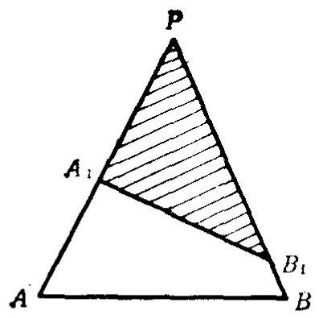

图 3-3-05

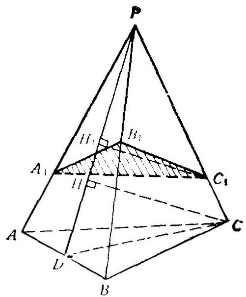

图 3-3-06

${PA}\text{ 、 }{PB}\text{ 、 }{PC}$ 上的点,试写出与命题 (1) 类比的命题 (2) 的结论,并证明之.

分析 运用更位原理, 使两个三棱锥的底面三角形在同一个平面内, 将 “立体问题” 转化为 “平面问题”, 从而应用命题 (1) 证之.

证一

$$
\frac{{V}_{P - {A}_{1}{B}_{1}{C}_{1}}}{{V}_{P - {ABC}}} = \frac{{V}_{{C}_{1} - P{A}_{1}{B}_{1}}}{{V}_{C - {PAB}}} = \frac{\frac{1}{3} \cdot  {S}_{\bigtriangleup P{A}_{1}{B}_{1}} \cdot  \left( {{C}_{1}{H}_{1}}\right) }{\frac{1}{3} \cdot  {S}_{\bigtriangleup {PAB}} \cdot  \left( {CH}\right) }
$$

$$
= \frac{P{A}_{1} \cdot  P{B}_{1} \cdot  \left( {{C}_{1}{H}_{1}}\right) }{{PA} \cdot  {PB} \cdot  \left( {CH}\right) } = \frac{P{A}_{1} \cdot  P{B}_{1} \cdot  P{O}_{1}}{{PA} \cdot  {PB} \cdot  {PC}}.
$$

证二

$$
\frac{{V}_{P - {A}_{1}{BC}}}{{V}_{P - {A}_{2}C}} = \frac{{V}_{C - P{A}_{1}B}}{{V}_{C - {PAB}}} = \frac{{S}_{\bigtriangleup P{A}_{1}B}}{{S}_{\bigtriangleup {PAB}}} = \frac{P{A}_{1} \cdot  {PB}}{{PA} \cdot  {PB}} = \frac{P{A}_{1}}{PA},
$$

①

$$
\frac{{V}_{P - {A}_{1}{B}_{1}{C}_{1}}}{{V}_{P - {A}_{1}{BC}}} = \frac{{V}_{{A}_{2} - {P{B}_{2}{C}_{2}}}}{{V}_{{A}_{2} - {PBC}}} = \frac{{S}_{\bigtriangleup {P{B}_{1}{C}_{1}}}}{{S}_{\bigtriangleup {PBC}}} = \frac{P{B}_{1} \cdot  P{O}_{1}}{{PB} \cdot  {PC}}
$$

②

①、②两式相乘，得

$$
\frac{{V}_{P - {A}_{1}{BC}}}{{V}_{P - {ABC}}} \cdot  \frac{{V}_{P - {A}_{1}{B}_{1}{C}_{1}}}{{V}_{P - {A}_{1}{BC}}} = \frac{P{A}_{1} \cdot  P{B}_{1} \cdot  P{C}_{1}}{{PA} \cdot  {PB} \cdot  {PC}},
$$

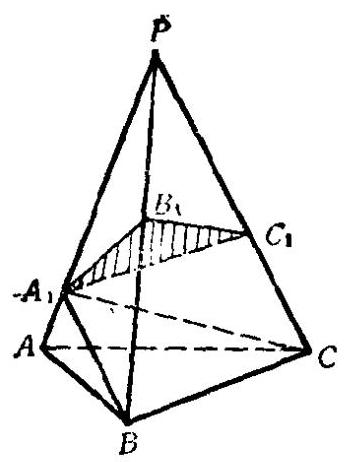

图 3-3-07

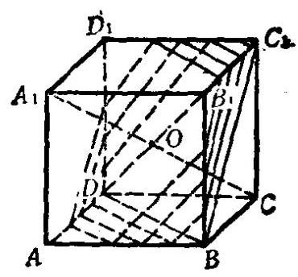

图 3-3-08

即:

$$
\frac{{V}_{P - {A}_{1}{B}_{3}{C}_{3}}}{{V}_{P - {ABO}}} = \frac{P{A}_{1} \cdot  P{B}_{1} \cdot  P{C}_{1}}{{PA} \cdot  {PB} \cdot  {PC}}.
$$

证二中, 除运用更位原理外, 还用了分割法. 通过辅助三棱锥 $P - {A}_{1}{BC}$ 的参与传递,使相关的每两个三棱锥不仅底面在同一个平面内, 并使它们转化为同高或等高, 达到“降维”的目的.

例 5 设正方体 ${ABOD} - {A}_{1}{B}_{1}{C}_{1}{D}_{1}$ 的棱长为 $\alpha$ ,试探索: 垂直于对角线 ${A}_{1}O$ ，并与不经过顶点 ${A}_{1}$ 、 $O$ 的 6 条棱都相截的截面周长与面积随截面位置变动而变化的情况.

分析 因为符合题意的截面都垂直于同一条直线 ${A}_{1}O$ ，所以这些截面互相平行; 因为要求这些截面与不过 ${A}_{1}\text{ 、 }O$ 的 6 条棱相截, 所以符合题意的截面含 6 个顶点, 即这些截面均属六边形. 由于正方体关于对角线的对称性, 因此这些截面也具备相应的对称性.

(1)关于截面的周长:

根据截面的对称性，截面在正方体 6 个界面的截口是每三条长度相等且长短相间的线段. 这些线段可以分别与所在界面正方形的对角线作比较. 从而证得这些截面的周长不随位置变动而变化，应等于定值 $3\sqrt{2}a$ . 倘若恰当选择正方体表面的某一展开图, 空间中这些平行移动的截面就能够和展开图中相应的互相平行的直线段作类比. 显见，这些平行线段的长都等于 $3\sqrt{2}a$ ，即符合题意的截面的周长为定值 $3\sqrt{2}a$ .

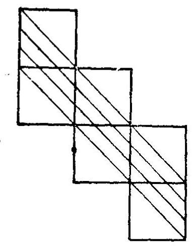

图 3-3-09

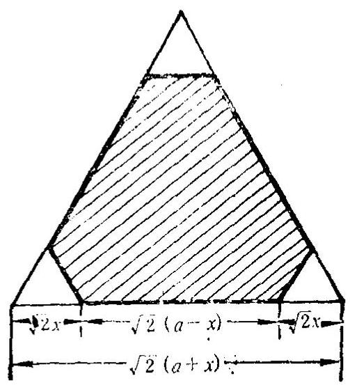

图 3-3-10

(2)关于截面的面积:

根据以上分析，设截面的一组 3 条边长为 $\sqrt{2}x\left( {x \in  \left( {0, a}\right) }\right)$ ， 则另一组与之相间的三条边长为 $\sqrt{2}\left( {a - x}\right)$ . 于是,六边形截面的面积表达式为

$$
S = \frac{\sqrt{3}}{4}{\left\lbrack  \sqrt{2}\left( a + x\right) \right\rbrack  }^{2} - 3 \cdot  \frac{\sqrt{3}}{4}{\left( \sqrt{2}x\right) }^{2}
$$

$$
= \frac{\sqrt{3}}{2}\left\lbrack  {-2{\left( x - \frac{a}{2}\right) }^{2} + \frac{3}{2}{a}^{2}}\right\rbrack  .
$$

当 $x = \frac{a}{2}$ ,即截面为正六边形时,截面面积最大,其值等于 $\frac{3}{4}\sqrt{3}{a}^{2}$ . 由此可见, 按题设条件的六边形截面的面积是随位置变动而变化的,它的取值范围是 $S \in  \left\lbrack  {\frac{\sqrt{3}}{2}{a}^{2},\frac{3}{4}\sqrt{3}{a}^{2}}\right\rbrack$ .

解 略.

## 2. “数式”与“图形”

“数”与“形”是数学研究中的两个主要对象，也是反映数学问题的两个侧面. 它们既是对立的，又是统一的. “数”、“形”结合， 寓“数”于“形”，寓“理”于“形”，相互类比、相互转化是数学学习与研究中运用广泛、意义深刻的思维方法。

例如，用圆规与直尺作正多边形的问题，自几何学创立起，就引起了许多人的兴趣，先后解决了正三角形、正四边形、正五边形以及边数是它们的二倍、四倍、八倍……的正多边形的作图问题. 但是不是还有其他边数的正多边形也可利用圆规与直尺作图呢? 年仅十七岁的高斯把“几何作图”问题与“数论”这两个似乎不相关的两个领域“用一根导线接通”，成功地解决了正十七边形的作图问题, 并发现了, 当正多边形的边数是属于“费尔马 (Fermat) 数”的素数时, 在理论上就可用圆规与直尺准确作出这个正多边形. 费尔马数 $P$ 的表达式是: $P = {2}^{{2}^{n}} + 1$ ( $n$ 是零或任意自然数). 例如，下表中的费尔马数都是素数, 这些边数的正多边形都能够用 “尺规” 正确作出.

<table><tr><td>$n$</td><td>$P = {2}^{{2}^{n}} + 1$</td></tr><tr><td>0</td><td>$P = {2}^{{2}^{0}} + 1 = {2}^{1} + 1 = 2 + 1 = 3$</td></tr><tr><td>1</td><td>$P = {2}^{{2}^{1}} + 1 = {2}^{2} + 1 = 4 + 1 = 5$</td></tr><tr><td>2</td><td>$P = {2}^{{2}^{2}} + 1 = {2}^{4} + 1 = {16} + 1 = {17}$</td></tr><tr><td>3</td><td>$P = {2}^{{2}^{3}} + 1 = {2}^{8} + 1 = {256} + 1 = {257}$</td></tr><tr><td>4</td><td>$P = {2}^{{2}^{4}} + 1 = {2}^{16} + 1 = {65536} + 1 = {65537}$</td></tr></table>

(欧拉用 ${F}_{5} = {2}^{25} + 1 = {2}^{32} + 1 = {4294967297} = {641} \times  {6700417}$ 否定了费尔马的猜想: “形如 ${F}_{n} = {2}^{{2}^{n}} + 1$ 的所有的数 $\left( {n = 0,1,2,\cdots }\right)$ 都是素数. ” 于是边数为 4294967297 的正多边形不能使用尺规作出. ) 这一成功的发现使高斯确定了终生从事数学研究的志向. 在这位业绩卓著的 “数学王子”去世以后，他的墓碑就以正十七边形为底座, 以纪念他的这个伟大发现. 众所周知，笛卡尔创立的 《解析几何学》为“数形结合”开辟了广阔的天地. 在学习数学时, 借助图形的直观性, 通过类比, 既便于理解某些数学概念的性质, 也便于找到求解某些数学问题的途径. 反之, 对于某些图形问题, 可以借助坐标平面 (或坐标空间), 使之解析化, 通过类比, 把 “形” 的问题转化为 “数” 的问题, 使之更易求解.

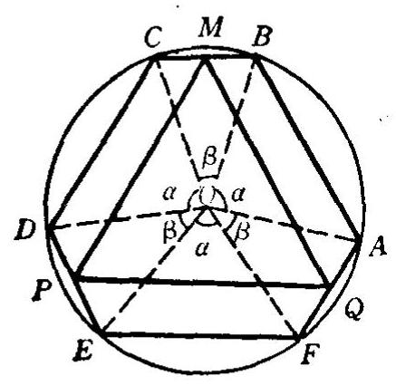

图 3-3-11

例 6 设 ${A}_{N}{B}_{N}{C}_{N}{D}_{N}{E}_{N}{F6}$ 个点依次分布在同 1 个圆周上, 且 ${AB} - {CD} = {EF},{BC} = {DE} = {FA}$ ，点 $M$ 、 $P$ 、 $Q$ 分别为 ${BC}$ 、 ${DE}$ 、 ${FA}$ 的中点. 求证: $\bigtriangleup  {MPQ}$ 为正三角形.

分析 若把题设的图形置于复平面内,不失一般性,取圆心 $O$ 为原点, $\angle {AOB} = \angle {COD} = \angle {EOF} = \alpha ,\;\angle {BOC} = \angle {DOE} = \; \angle {FOA} = \beta$ ，取圆半径为单位长度，则 $A$ 、 $B$ 、 $O$ 、 $D$ 、 $E$ 、 $F$ 对应的复数分别为 $1\text{ 、 }{e}^{i\alpha }\text{ 、 }{e}^{i\left( {\alpha  + \beta }\right) }\text{ 、 }{e}^{i\left( {{2\alpha } + \beta }\right) }\text{ 、 }{e}^{i\left( {{2\alpha } + {2\beta }}\right) }\text{ 、 }{e}^{i\left( {{3\alpha } + {2\beta }}\right) }$ . $M\text{ 、 }P\text{ 、 }Q$ 之点对应的复数分别为

$$
{z}_{M} = \frac{1}{2}\left( {{e}^{i\alpha } + {e}^{i\left( {\alpha  + \beta }\right) }}\right) ,
$$

$$
{z}_{P} = \frac{1}{2}\left( {{e}^{i\left( {{2\alpha } + \beta }\right) } + {e}^{i\left( {{2\alpha } + {2\beta }}\right) }}\right) ,
$$

$$
{z}_{Q} = \frac{1}{2}\left( {{e}^{i\left( {{3\alpha } + {2\beta }}\right) } + 1}\right) .
$$

但

$$
{3\alpha } + {3\beta } = {2\pi }.
$$

即

$$
\alpha  + \beta  = \frac{2\pi }{3},
$$

$\therefore$

$$
{z}_{M} = \frac{1}{2}\left( {{e}^{i\alpha } + {e}^{i\frac{2\pi }{3}}}\right) ,
$$

$$
{z}_{P} = \frac{1}{2}\left( {{e}^{i\left( {\alpha  + \frac{2\pi }{3}}\right) } + {e}^{i\frac{4\pi }{3}}}\right)
$$

$$
{z}_{Q} = \frac{1}{2}\left( {{e}^{i\left( {\alpha  + \frac{4\pi }{3}}\right) } + 1}\right) .
$$

心

$$
{z}_{M} \cdot  {e}^{i\frac{2\pi }{3}} = \frac{1}{2}\left( {{e}^{i\left( {\alpha  + \frac{2\pi }{3}}\right) } + {e}^{i\frac{4\pi }{3}}}\right)  = {z}_{P},
$$

$$
{z}_{P} \cdot  {e}^{i\frac{2\pi }{3}} = \frac{1}{2}\left( {{e}^{i\left( {\alpha  + \frac{4\pi }{3}}\right) } + {e}^{i2\pi }}\right)  = \frac{1}{2}\left( {{e}^{i\left( {\alpha  + \frac{4\pi }{3}}\right) } + 1}\right)  = {z}_{Q}.
$$

$\therefore \; \bigtriangleup {MPQ}$ 是正三角形.

证 略.

## 3. “有限”与“无限”

“直线”与“曲线”、“平面”与“曲面”的类比, 实质上就是 “有限” 与“无限”的类比. 例如，“直线形”与“圆(或部分圆)”在面积公式上的类比: 又如, 通过“棱锥”与“球锥”的类比, 推导出球的体积公式, 其实质也是“有限”与“无限”之间的类比推理见图 3-3-13. 假设将球面作部分面积为 $\Delta {S}_{i}$ ，则 $\sum \Delta {S}_{i} = {S}_{\text{ 球 }} = {4\pi }{R}^{2}$ ，于是，由无限个球锥组合无限细分, 每成球体, 球的体积为

$$
{V}_{\text{ 球 }} = \sum \Delta {V}_{i} = \sum \frac{1}{3}\Delta {S}_{i} \cdot  R = \frac{1}{3}R \cdot  \sum \Delta {S}_{i} = \frac{1}{3} \cdot  R \cdot  {4\pi }{R}^{2}
$$

$$
= \frac{4}{3}\pi {R}^{3}\text{ . }
$$

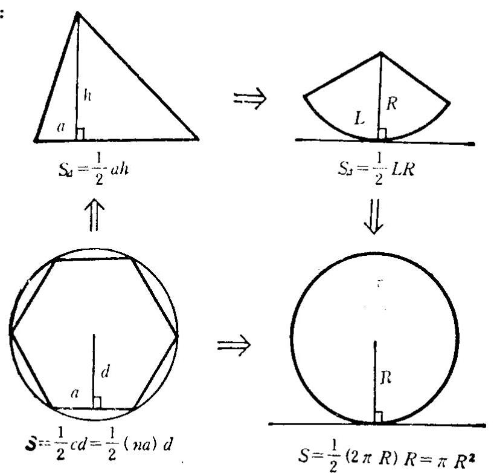

图 3-3-12

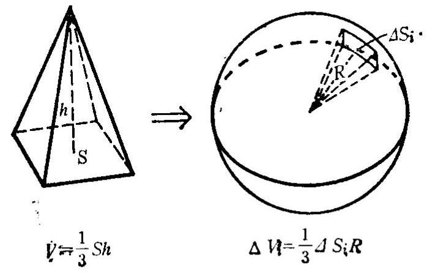

图 3-3-13

例 7 求无穷数列的和:

$$
\frac{1}{{1}^{2}} + \frac{1}{{2}^{2}} + \frac{1}{{3}^{2}} + \cdots  + \frac{1}{{n}^{2}} + \cdots
$$

分析 这个求和问题是伯努利公开征求解答的问题，时隔百年由欧拉出色地解决了. 这位数学大师大胆地将“有限”与“无限” 进行类比, 通过联想, 利用已有的数学模型解决了问题.

联想的数学模型之一是: 若 ${\alpha }_{1}\text{ 、 }{\alpha }_{2}\text{ 、 }\cdots \text{ 、 }{\alpha }_{n}$ 是 $n$ 次代数方程 ${a}_{0} \; + {a}_{1}x + {a}_{2}{x}^{2} + \cdots  + {a}_{n}{x}^{n} = 0$ 的 $n$ 个不等于零的根,则方程式的左边 $n$ 次多项式可分解成积因式 ${a}_{0}\left( {1 - \frac{x}{{\alpha }_{1}}}\right) \left( {1 - \frac{x}{{\alpha }_{2}}}\right) \cdots \cdots \left( {1 - \frac{x}{{\alpha }_{n}}}\right)$ . 考虑特殊情况,若某一多项式方程的根两两互为相反数: ${\beta }_{1} - {\beta }_{1}$ , ${\beta }_{2}$ 、 $- {\beta }_{2}$ ， $\cdots$ ， ${\beta }_{n}$ ， $- {\beta }_{n}$ ，则相应的 ${2n}$ 次多项式可分解成积因式 ${a}_{0}\left( {1 - \frac{{x}^{2}}{{\beta }_{1}^{2}}}\right) \left( {1 - \frac{{x}^{2}}{{\beta }_{2}^{2}}}\right) \cdots  \cdot  \left( {1 - \frac{{x}^{2}}{{\beta }_{n}^{2}}}\right)$ ，其中二次项 ${x}^{2}$ 的系数 ${a}_{2} = \; - {a}_{0}\left( {\frac{1}{{\beta }_{1}^{2}} + \frac{1}{{\beta }_{2}^{2}} + \cdots  + \frac{1}{{\beta }_{n}^{2}}}\right) .$

联想的数学模型之二是: 三角方程 $\sin x = 0$ 的根为 $0,\pi , - \pi$ , ${2\pi }, - {2\pi },\cdots ,{n\pi }, - {n\pi },\cdots$ ,创造性地将 $\sin x = 0$ 看作是一个“无限次方程”. 于是,方程 $\frac{\sin x}{x} = 0$ 的根为 $\pi , - \pi ,{2\pi }, - {2\pi },\cdots$ , ${n\pi }, - {n\pi },\cdots$ . 将以上两个联想的“有限”与“无限”做类比,构成等式 $\frac{\sin x}{x} = {a}_{0}\left( {1 - \frac{{x}^{2}}{{\pi }^{2}}}\right) \left( {1 - \frac{{x}^{2}}{4{\pi }^{2}}}\right) \cdots  \cdot  \left( {1 - \frac{{x}^{2}}{{n}^{2}{\pi }^{2}}}\right) \cdots$ ,这个“多项式”的“二次项 ${x}^{2m}$ 的系数为

$$
- {a}_{0}\left( {\frac{1}{{\pi }^{2}} + \frac{1}{4{\pi }^{2}} + \cdots  + \frac{1}{{n}^{2}{\pi }^{2}} + \cdots }\right)
$$

$$
=  - \frac{-{a}_{0}}{{\pi }^{2}}\left( {\frac{1}{{1}^{2}} + \frac{1}{{2}^{2}} + \cdots  + \frac{1}{{n}^{2}} + \cdots }\right) .
$$

从而,联想的数学模型之三是: 幂级数展开式 $\frac{\sin x}{x} = 1 - \frac{{x}^{2}}{3!} \; + \frac{{x}^{4}}{5!} - \frac{{x}^{6}}{7!} + \cdots$ ，其中“二次项 ${x}^{20}$ 的系数是 $\frac{-1}{3!} = \frac{-1}{6}$ ，比较系数, 得

$$
\frac{-{a}_{0}}{{\pi }^{2}}\left( {\frac{1}{{1}^{2}} + \frac{1}{{2}^{2}} + \cdots  + \frac{1}{{n}^{2}} + \cdots }\right)  = \frac{-1}{6}.
$$

不失一般性,设 ${a}_{0} = 1$ ,则

$$
\frac{1}{{\pi }^{2}}\left( {-\frac{1}{{1}^{2}} + \frac{1}{{2}^{2}} + \cdots  + \frac{1}{{n}^{2}} + \cdots }\right)  = \frac{1}{6},
$$

即

$$
\frac{1}{{1}^{2}} + \frac{1}{{2}^{2}} + \cdots  + \frac{1}{{n}^{2}} + \cdots  = \frac{{\pi }^{2}}{6}
$$

解 略 (见 229 页详解).

欧拉巧妙地运用“有限”与“无限”的类比，把“有限”次方程(代数方程)的法则应用到“无限”次方程(非代数方程)中去，不仅成功地发现了 $1 + \frac{1}{{2}^{2}} + \frac{1}{{3}^{2}} + \cdots  + \frac{1}{{n}^{2}} + \cdots  = \frac{{\pi }^{2}}{6}$ ，并在这种非逻辑的推理的启发下创立了一门新的学科一《无穷分析》。

“有限”与“无限”具有本质差别, 所以“从有限到无限的类比, 是埋伏着许多危险的陷阱的. ”例如，“对于任意有限项数列求和， 任意调换各项的次序其和不变. ”不能不加分析地将这一性质推广到无穷数列的求和中去. 因为无穷数列的和是被定义为它的部分和 ${S}_{n}$ 组成的序列的极限 $S = \mathop{\lim }\limits_{{n \rightarrow  \infty }}{S}_{n}$ ,所以随意调换无穷数列的项，往往会导致谬误.

4. “发现问题”与“解决问题”

例 8 设 ${P}_{1}\left( x\right)  = {x}^{2} - 2,{P}_{K}\left( x\right)  = {P}_{1}\left\lbrack  {{P}_{K - 1}\left( x\right) }\right\rbrack  ,(K = 2,3$ , $\cdots )$ ,求证: 对于任意正整数 $n$ ,方程 ${P}_{n}\left( x\right)  = x$ 的根都是不同的实根.

分析 根据题设条件，

即

$$
{P}_{K}\left( x\right)  = {P}_{1}\left\lbrack  {{P}_{K - 1}\left( x\right) }\right\rbrack   = {\left\lbrack  {P}_{K - 1}\left( x\right) \right\rbrack  }^{2} - 2,
$$

$$
\frac{1}{2}{P}_{K}\left( x\right)  = 2{\left\lbrack  \frac{1}{2}{P}_{K - 1}\left( x\right) \right\rbrack  }^{2} - 1.
$$

联想公式 $\cos {2\theta } = 2{\cos }^{2}\theta  - 1$ ,将 $\frac{1}{2}{P}_{K}\left( x\right)  = 2{\left\lbrack  \frac{1}{2}{P}_{K - 1}\left( x\right) \right\rbrack  }^{2} - 1$ 与 $\cos {2}^{K}\theta  = 2{\cos }^{2}{2}^{K - 1}\theta  - 1$ 作类比,从而猜想 ${P}_{n}\left( x\right)  = 2\cos {2}^{n}\theta \; \left( {n \in  N}\right)$ . 利用变换 $x = 2\cos \theta \left( {\left| x\right|  \leq  2}\right)$ ,将代数方程 “ ${P}_{n}\left( x\right)  = x$ ” 转化为三角方程 “ $2\cos {2}^{n}\theta  = 2\cos {\theta }^{n}$ ,从而获得证明的思路.

证 如果 $\left| x\right|  > 2$ ,令 $\left| x\right|  = 2 + \lambda \left( {\lambda  > 0}\right)$ ,则

$$
{P}_{1}\left( x\right)  = {x}^{2} - 2 = {\left( \lambda  + 2\right) }^{2} - 2 = {\lambda }^{2} + {4\lambda } + 2 > \lambda  + 2 = \left| x\right| .
$$

设 ${P}_{K}\left( x\right)  > \left| x\right|$ ,令 ${P}_{K}\left( x\right)  = 2 + \lambda$ ,则

$$
{P}_{K + 1}\left( x\right)  = {\left\lbrack  {P}_{K}\left( x\right) \right\rbrack  }^{2} - 2 = {\left( \lambda  + 2\right) }^{2} - 2
$$

$$
= {\lambda }^{2} + {4\lambda } + 2 > \lambda  + 2 = \left| x\right| ,
$$

$\therefore$ 当 $\left| x\right|  > 2$ 时, ${P}_{n}\left( x\right)  > \left| x\right| ,(n$ 为一切自然数 $)$ ,即 ${P}_{n}\left( x\right) \; = x$ 不成立,方程 ${P}_{n}\left( x\right)  = x$ 的实根全部落在区间 $\left\lbrack  {-2,2}\right\rbrack$ 内.

设 $x = 2\cos \theta$ ，应用数学归纳法，可证 ${P}_{n}\left( x\right)  = 2\cos {2}^{n}\theta$ ，方程 ${P}_{n}\left( x\right)  = x$ 转化为 $2\cos {2}^{n}\theta  = 2\cos \theta$ ,即

$$
2\sin \frac{{2}^{n} + 1}{2}\theta \sin \frac{{2}^{n} - 1}{2}\theta  = 0,
$$

得

$$
{\theta }_{k} = \frac{2k\pi }{{2}^{n} + 1},\;\left( {k = 1,2,\cdots ,{2}^{n - 1}}\right)
$$

或 ${\theta }_{k} = \frac{2k\pi }{{2}^{n} - 1},\left( {k = 0,1,2,\cdots ,{2}^{n - 1} - 1}\right)$ ,

$\therefore$

$$
{x}_{k} = 2\cos {\theta }_{k}.
$$

由于原方程是 ${2}^{n}$ 次方程,且 ${\theta }_{k} \in  \left( {0,\pi }\right)$ ,而 $\cos x$ 在区间 $\left( {0,\pi }\right)$ 上是单调递减函数，故这 ${2}^{n}$ 个根为不相等的实根.

例 3 试求 $q$ ,使得

$$
\frac{1}{2} + q\cos x + {q}^{2}\cos {2x} + {q}^{3}\cos {4x} + \cdots  + {q}^{n}\cos \left( {{2}^{n - 1}x}\right)  + \cdots
$$

的所有部分和,对于一切 $x \in  R$ 都取非负值.

分析 依题意,所求的 $q$ 要使数列对于“一切” $x$ 的“所有”部分和均非负值. 首先，从 “一切” 中取 “特殊”，从 “所有” 中找 “个别”,把问题转化为 “求 $q$ ,使数列的前两项和在 $x = 0,\pi$ 时,取非负值”的简单问题，找到符合题意的必要条件，然后再证明它对于 “一切”与“所有”又是充分条件.

解 选取 $x = 0\text{ 、 }\pi$ ,使前两项和为非负值.

当 $x = 0$ 时, $\frac{1}{2} + q\cos 0 = \frac{1}{2} + q \geq  0$ ; 当 $x = \pi$ 时, $\frac{1}{2} + q\cos \pi  = \frac{1}{2} - q \geq  0$ .

于是， $- \frac{1}{2} \leq  q \leq  \frac{1}{2}$ 就是所求的取值范围.

设 $f\left( X\right)  = q\cos X + {q}^{2}\cos {2X}$ ,则当 $\left| q\right|  \leq  \frac{1}{2}$ 时,对于一切 $X$ ,

$$
f\left( X\right)  = q\cos X + {q}^{2}\left( {2{\cos }^{2}X - 1}\right)  = q\cos X + 2{q}^{2}{\cos }^{2}X - {q}^{2}
$$

$$
= 2{\left( q\cos X + \frac{1}{4}\right) }^{2} - {q}^{2} - \frac{1}{8} \geq   - {q}^{2} - \frac{1}{8}
$$

$$
\geq   - \frac{1}{4} - \frac{1}{8} =  - \frac{3}{8}\text{ . }
$$

分别考虑前 $\left( {{2n} + 1}\right)$ 项与前 $\left( {{2n} + 2}\right)$ 项部分和的值是非负的:

1) ${S}_{{2n} + 1} = \frac{1}{2} + q\cos x + {q}^{2}\cos {2x} + {q}^{3}\cos {2}^{2}x + {q}^{4}\cos {2}^{3}x$

$$
+ \cdots  + {q}^{{2n} - 1}\cos \left( {{2}^{{2n} - 2}x}\right)  + {q}^{2n}\cos \left( {{2}^{{2n} - 1}x}\right)
$$

$$
= \frac{1}{2} + f\left( x\right)  + {q}^{2}f\left( {4x}\right)  + \cdots  + {q}^{{2n} - 2}f\left( {{4}^{n - 1}x}\right) .
$$

$\because f\left( x\right)  \geq   - \frac{3}{8}, f\left( {4x}\right)  \geq   - \frac{3}{8},\cdots , f\left( {{4}^{n - 1}x}\right)  \geq   - \frac{3}{8},$

$\therefore \;{S}_{{2n} + 1} \geq  \frac{1}{2} + \left( {-\frac{3}{8}}\right) \left( {1 + {q}^{2} + {q}^{3} + \cdots  + {q}^{{2n} - 2}}\right)$

$$
\geq  \frac{1}{2} + \left( {-\frac{3}{8}}\right) \left( {1 + \frac{1}{4} + \cdots  + \frac{1}{{4}^{n - 1}}}\right)
$$

$$
= \frac{1}{2} + \left( {-\frac{3}{8}}\right)  \cdot  \frac{1 \cdot  \left( {1 - \frac{1}{{4}^{n}}}\right) }{1 - \frac{1}{4}}
$$

$$
= \frac{1}{2}\left( {1 - \frac{{4}^{n} - 1}{{4}^{n}}}\right)  = \frac{1}{2 \cdot  {4}^{n}} > 0.
$$

2) ${S}_{{2n} + 2} = {S}_{{2n} + 1} + {q}^{{2n} + 1}\cos \left( {{2}^{2n}x}\right)$ .

$$
- 1 \leq  \cos {2}^{2n}x \leq  1,
$$

$$
\frac{-1}{{2}^{{2n} + 1}} \leq  {q}^{{2n} + 1} \leq  \frac{1}{{2}^{{2n} + 1}}
$$

: $\;{S}_{{2n} + 2} \geq  \frac{1}{2 \cdot  {4}^{n}} - {q}^{{2n} + 1} \geq  \frac{1}{{2}^{{2n} + 1}} - \frac{1}{{2}^{{2n} + 1}} = 0.$

在“充分性”的证明过程中, 运用变换

$$
f\left( X\right)  = q\cos X + {q}^{2}\cos {2X},
$$

当 $\left| q\right|  \leq  \frac{1}{2}$ 时,对于一切 $X, f\left( X\right)  \geq   - \frac{3}{8}$ . 再以 $f\left( X\right)$ 为 “基本元”(当 $X = x,{4x},\cdots ,{4}^{n - 1}x,\cdots$ 时, $f\left( x\right) , f\left( {4x}\right) ,\cdots , f\left( {{4}^{n - 1}x}\right)  \geq \; \left. {-\frac{3}{8}}\right)$ ,对部分和 ${S}_{{2n} + 1}$ 加以放缩,使之转化为 “等比数列的部分和”.

在数学领域的思维活动中，“归纳推理”与“类比推理”是相互渗透、相互补充的两种思维方法. “归纳推理”也是探索问题, 发现数学定理(或公式)的重要思维方法之一.

例 10 探求 ${1}^{2} + {2}^{2} + {3}^{2} + \cdots  + {n}^{2}$ 的部分和 ${S}_{n}$ 的公式.

分析一 通过个别尝试, 运用归纳推理, 寻找规律, 体现转化.

$\frac{3}{3}\text{ 、 }\frac{5}{3}\text{ 、 }\frac{7}{3}\text{ 、 }\frac{9}{3}\text{ 、 }\frac{11}{3}\text{ 、 }\cdots$ 是首项为 $\frac{3}{8}$ ,公差为 $\frac{2}{8}$ 的等差数列, 应用等差数列通项公式, 得

$$
\frac{{1}^{2} + {2}^{2} + \cdots  + {n}^{2}}{1 + 2 + \cdots  + n} = \frac{3}{3} + \left( {n - 1}\right)  \cdot  \frac{2}{3} = \frac{1}{3}\left( {{2n} + 1}\right) .
$$

$$
1 + 2 + \cdots  + n = \frac{1}{2}n\left( {n + 1}\right) ,
$$

$$
\therefore \;{1}^{2} + {2}^{2} + \cdots  + {n}^{2} = \frac{1}{3}\left( {{2n} + 1}\right)  \cdot  \frac{1}{2}n\left( {n + 1}\right)
$$

$$
= \frac{1}{6}n\left( {n + 1}\right) \left( {{2n} + 1}\right) \text{ . }
$$

$n$ 1 2 8 4 5 ...

${1}^{2} + {2}^{2} + \cdots  + {n}^{2}$ 1 5 14 30 55 ...

$1 + 2 + \cdots  + n$ 1 3 6 10 15 ...

$\Downarrow$

92 1 2 3 4 5 ...

$\frac{{1}^{2} + {2}^{2} + \cdots  + {n}^{2}}{1 + 2 + \cdots  + n}$ 1 $\frac{5}{3} \; \frac{7}{3}$ 3 11 ...

$\Downarrow$

<table><tr><td>$n$</td><td>1</td><td>2</td><td>3</td><td>4</td><td>5</td><td>...</td></tr><tr><td>$\frac{{1}^{2} + {2}^{2} + \cdots  + {n}^{2}}{1 + 2 + \cdots  + n}$</td><td>$\frac{3}{3}$</td><td>5 3</td><td>$\frac{7}{3}$</td><td>9</td><td>11</td><td>...</td></tr></table>

分析二 运用“转化”的思维方法,将“未知”的 “ ${1}^{2} + {2}^{2} + \cdots  + \; {n}^{2n}$ 转化为 “已知” 的 “ $1 + 2 + \cdots  + n$ ” . 将 $n$ 行 $n$ 列方阵，以主对角线为界划分成“左下”、“右上”两部分.

$$
\text{ 行 }\left\{  \begin{array}{llllll} 1 & 2 & 3 & \cdots & n - 1 & n \\  1 & 2 & 3 & \cdots & n - 1 & n \\  1 & 2 & 3 & \cdots & n - 1 & n \\   & & \cdots & \cdots & & \\  1 & 2 & 3 & \cdots & n - 1 & n \\  1 & 2 & 3 & \cdots & n - 1 & n \end{array}\right.
$$

$$
\because {S}_{\text{ 左下 }} = 1 + \left( {1 + 2}\right)  + \left( {1 + 2 + 3}\right)  + \cdots  + \left\lbrack  {1 + 2 + \cdots  + \left( {n - 1}\right) }\right\rbrack
$$

$$
= \mathop{\sum }\limits_{{k = 1}}^{{n - 1}}\left( {1 + 2 + \cdots  + k}\right)  = \mathop{\sum }\limits_{{k = 1}}^{{n - 1}}\frac{1}{2}k\left( {k + 1}\right)
$$

$$
= \frac{1}{2}\mathop{\sum }\limits_{{k = 1}}^{{n - 1}}{k}^{2} + \frac{1}{2}\mathop{\sum }\limits_{{k = 1}}^{{n - 1}}k
$$

$$
= \frac{1}{2}\mathop{\sum }\limits_{{k = 1}}^{{n - 1}}{k}^{2} + \frac{1}{2} \cdot  \frac{1}{2}\left( {n - 1}\right) \left\lbrack  {\left( {n - 1}\right)  + 1}\right\rbrack
$$

$$
= \frac{1}{2}\mathop{\sum }\limits_{{k = 1}}^{{n - 1}}{k}^{2} + \frac{1}{4}n\left( {n - 1}\right) ,
$$

$$
{S}_{\text{ 右上 }} = 1 + 2 \cdot  2 + 3 \cdot  3 + \cdots  + \left( {n - 1}\right)  \cdot  \left( {n - 1}\right)  + n \cdot  n
$$

$$
= {1}^{2} + {2}^{2} + {3}^{2} + \cdots  + {\left( n - 1\right) }^{2} + {n}^{2} = \mathop{\sum }\limits_{{k = 1}}^{n}{k}^{2},
$$

而整个方阵数字之和为

$$
S = n\left( {1 + 2 + \cdots  + n}\right)  = n \cdot  \frac{1}{2} \cdot  n\left( {n + 1}\right)  = \frac{1}{2}{n}^{2}\left( {n + 1}\right) ,
$$

又 $\because S = {S}_{\text{ 左下 }} + {S}_{\text{ 右上 }}$ ,

$$
\therefore \;\mathop{\sum }\limits_{{k = 1}}^{n}{k}^{2} = \frac{1}{2}{n}^{2}\left( {n + 1}\right)  - \left\lbrack  {\frac{1}{2}\mathop{\sum }\limits_{{k = 1}}^{{n - 1}}{k}^{2} + \frac{1}{4}n\left( {n - 1}\right) }\right\rbrack
$$

$$
= \frac{1}{2}{n}^{2}\left( {n + 1}\right)  - \frac{1}{2}\mathop{\sum }\limits_{{k = 1}}^{{n - 1}}{k}^{2} - \frac{1}{4}n\left( {n - 1}\right)
$$

$$
= \frac{1}{2}{n}^{2}\left( {n + 1}\right)  - \frac{1}{2}\mathop{\sum }\limits_{{k = 1}}^{n}{k}^{2} - \frac{1}{4}n\left( {n - 1}\right)  + \frac{{n}^{2}}{2},
$$

$$
\left( {1 + \frac{1}{2}}\right) \mathop{\sum }\limits_{{k = 1}}^{n}{k}^{2} = \frac{1}{2}{n}^{2}\left( {n + 1}\right)  - \frac{1}{4}n\left( {n - 1}\right)  + \frac{1}{2}{n}^{2}
$$

$$
= \frac{1}{4}n\left\lbrack  {{2n}\left( {n + 1}\right)  - \left( {n - 1}\right)  + {2n}}\right\rbrack   = \frac{1}{4}n\left( {2{n}^{2} + {3n} + 1}\right)
$$

$$
= \frac{1}{4}n\left( {n + 1}\right) \left( {{2n} + 1}\right) \text{ , }
$$

即 $\mathop{\sum }\limits_{{k = 1}}^{n}{k}^{2} = \frac{2}{3} \cdot  \frac{1}{4}n\left( {n + 1}\right) \left( {{2n} + 1}\right)  = \frac{1}{6}n\left( {n + 1}\right) \left( {{2n} + 1}\right)$ .

分析三 思路如 [分析二]，但对 $n$ 行 $n$ 列方阵划分成 $n$ 个 “1” 型部分，其中第 “ $k$ ” 个 “1” 型部分和 $S\left( k\right)$ 为

$$
S\left( k\right)  = 1 + 2 + \cdots  + \left( {k - 1}\right)  + \underset{\left( k \uparrow  \right) }{\underbrace{k + \cdots  + k}}
$$

$$
= \frac{1}{2}\left( {k - 1}\right) k + {k}^{2} = \frac{3}{2}{k}^{2} - \frac{1}{2}k\text{ . }
$$

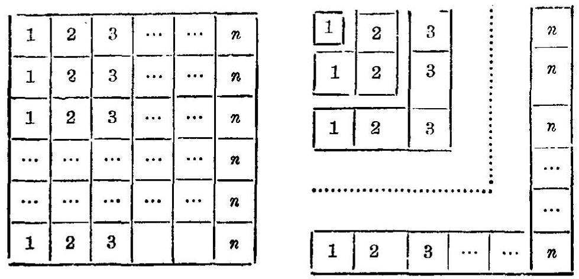

图 3-3-14

于是, 整个方阵的数字之和为

$$
S = \mathop{\sum }\limits_{{k = 1}}^{n}S\left( k\right)  = \mathop{\sum }\limits_{{k = 1}}^{n}\left( {\frac{3}{2}{k}^{2} - \frac{1}{2}k}\right)  = \frac{3}{2}\mathop{\sum }\limits_{{k = 1}}^{n}{k}^{2} - \frac{1}{2}\mathop{\sum }\limits_{{k = 1}}^{n}k.
$$

另一方面,未划分的整个方阵的 $n$ 行数字之和为

$$
S = n\left( {1 + 2 + \cdots  + n}\right)  = n\mathop{\sum }\limits_{{k = 1}}^{n}k,
$$

于是, $\frac{3}{2}\mathop{\sum }\limits_{{k = 1}}^{n}{k}^{2} - \frac{1}{2}\mathop{\sum }\limits_{{k = 1}}^{n}k = n\mathop{\sum }\limits_{{k = 1}}^{n}k$ ,

$$
\frac{3}{2}\mathop{\sum }\limits_{{k = 1}}^{n}{k}^{2} = \left( {n + \frac{1}{2}}\right) \mathop{\sum }\limits_{{k = 1}}^{n}k
$$

$$
\mathop{\sum }\limits_{{k = 1}}^{n}{k}^{2} = \frac{2}{3} \cdot  \frac{{2n} + 1}{2} \cdot  \frac{1}{2}n\left( {n + 1}\right)  = \frac{1}{6}n\left( {n + 1}\right) \left( {{2n} + 1}\right) .
$$

解 略.

由以上分析，不难发现:在探求部分和 $\mathop{\sum }\limits_{{k = 1}}^{n}{k}^{2}$ 时，总是与部分和 $\mathop{\sum }\limits_{{k = 1}}^{n}k$ 类比,并将 “ $\mathop{\sum }\limits_{{k = 1}}^{n}{k}^{20}$ 转化为 “ $\mathop{\sum }\limits_{{k = 1}}^{n}k$ ”,从而应用 “已知” 的 “ $\mathop{\sum }\limits_{{k = 1}}^{n}k$ ” 求“未知”的 “ $\mathop{\sum }\limits_{{k = 1}}^{n}k$ ”.

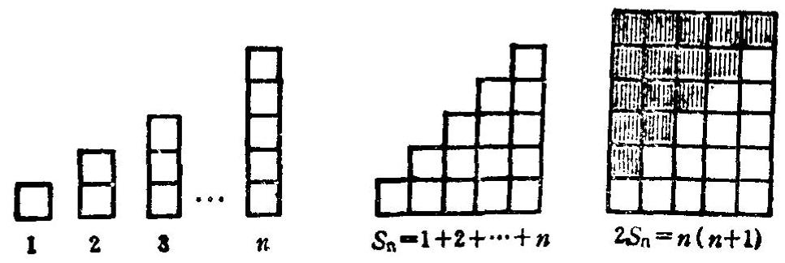

图 3-3-15

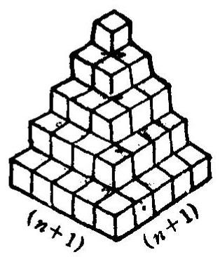

图 3-3-16

${S}_{n + 1} = {1}^{2} + {2}^{2} + {3}^{2} + \cdots  + {n}^{2} + {\left( n + 1\right) }^{2}$

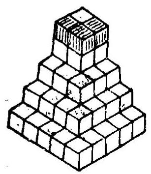

图 3-3-17

添加一层: 每层 ${2}^{2} - {1}^{2} = 3$ (个)

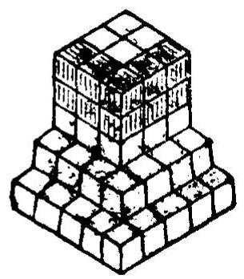

图 3-3-18

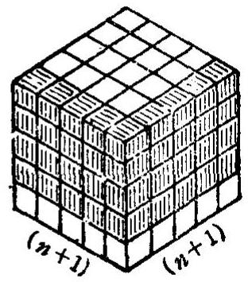

图 3-3-19

添加二层: 每层 ${3}^{2} - {2}^{2} = 5$ (个)... 添加 $n$ 层: 每层 ${\left( n + 1\right) }^{2} - {n}^{2} = {2n} + 1$ (个)

数学大师欧拉很喜欢用几何图形来表达数的性质. 例如用单位正方形表示数 “ 1 ”，从而使数字计算与面积计算之间建立有趣的类比.

如图 3-3-15，用阶梯三角形表示部分和 ${S}_{n} = 1 + 2 + 3 + \cdots  + \; n$ ，又用与之等同的一个阶梯三角形倒置于它的上面，加倍构成矩形, 从而利用矩形面积折半求得

$$
{S}_{n} = \frac{1}{2}n\left( {n + 1}\right) .
$$

同以上思考方法类比,如图 8-3-16～8-8-19，以单位正方体表示数“1”，模仿上述方法，在数学计算与体积计算中形成有趣的类比, 求部分和

$$
{S}_{n} = {1}^{n} + {2}^{n} + \cdots  + {n}^{2}.
$$

总共添加单位正方体的个数为:

$$
1 \cdot  3 + 2 \cdot  5 + 3 \cdot  7 + \cdots  + n\left( {{2n} + 1}\right)
$$

$$
= 1 \cdot  \left( {2 \cdot  1 + 1}\right)  + 2 \cdot  \left( {2 \cdot  2 + 1}\right)  + \cdots  + n\left( {{2n} + 1}\right)
$$

$$
= 2\left( {{1}^{2} + {2}^{2} + \cdots  + {n}^{2}}\right)  + \left( {1 + 2 + \cdots  + n}\right) \text{ , }
$$

从而,添加后构成以 $\left( {n + 1}\right)$ 为棱的正方体,其体积等于 ${\left( n + 1\right) }^{8}$ .

于是,

$$
+ 2\left( {{1}^{2} + {2}^{2} + \cdots  + {n}^{2}}\right)  + \left( {1 + 2 + \cdots  + n}\right)
$$

$$
= {\left( n + 1\right) }^{8}\text{ , }
$$

$\therefore \;3\left( {{1}^{2} + {2}^{2} + \cdots  + {n}^{2}}\right)  - {\left( n + 1\right) }^{3} - {\left( n + 1\right) }^{2} - \frac{1}{2}n\left( {n + 1}\right)$

$$
- \frac{1}{2}\left( {n + 1}\right) \left\lbrack  {2{\left( n + 1\right) }^{2} - 2\left( {n + 1}\right)  - n}\right\rbrack
$$

$$
= \frac{1}{2}\left( {n + 1}\right) \left\lbrack  {2{n}^{2} + n}\right\rbrack
$$

$$
= \frac{1}{2}\left( {n + 1}\right) n\left( {{2n} + 1}\right) \text{ , }
$$

即 ${1}^{2} + {2}^{2} + \cdots  + {n}^{2} = \frac{1}{6}n\left( {n + 1}\right) \left( {{2n} + 1}\right)$ .

一般地,对于自然数 $m\text{ 、 }n$ ,记 ${S}_{m} = {1}^{m} + {2}^{m} + \cdots  + {n}^{m}$ ,我们已经确定

$$
m = 0 : {S}_{0} = {1}^{0} + {2}^{0} + \cdots  + {n}^{0} = n,
$$

$$
m = 1 : \;{S}_{1} = {1}^{1} + {2}^{1} + \cdots  + {n}^{1} = \frac{1}{2}n\left( {n + 1}\right) ,
$$

$$
m = 2,\;{S}_{2} = {1}^{2} + {2}^{2} + \cdots  + {n}^{2} = \frac{1}{6}n\left( {n + 1}\right) \left( {{2n} + 1}\right) ,
$$

根据 ${S}_{0},{S}_{1},{S}_{2}$ 的部分和公式,不难导出 ${S}_{3}$ 的部分和公式.

设 ${S}_{0},{S}_{1},{S}_{2},\cdots ,{S}_{m - 1}$ 的部分和公式已经确定. 根据二项式定理

$$
{\left( n + 1\right) }^{m + 1} = {n}^{m + 1} + {O}_{m + 1}^{1}{n}^{m} + {O}_{m + 1}^{2}{n}^{m - 1} + \cdots  + {O}_{m + 1}^{m + 1},
$$

于是有 ${\left( n + 1\right) }^{m + 1} - {n}^{m + 1} = \left( {m + 1}\right) {n}^{m} + {C}_{m + 1}^{2}{n}^{m - 1} + \cdots  + {C}_{m + 1}^{m + 1}$ . 把 $1,2,\cdots , n$ 依次代入上式,得

$$
{2}^{m + 1} - 1 = \left( {m + 1}\right)  \cdot  {1}^{m} + {O}_{m + 1}^{2} \cdot  {1}^{m - 1} + \cdots  + 1
$$

$$
{3}^{m + 1} - {2}^{m + 1} = \left( {m + 1}\right)  \cdot  {2}^{m} + {O}_{m + 1}^{2} \cdot  {2}^{m - 1} + \cdots  + 1
$$

............

$$
{\left( n + 1\right) }^{m + 1} - {n}^{m + 1} = \left( {m + 1}\right) {n}^{m} + {C}_{m + 1}^{2} \cdot  {n}^{m - 1} + \cdots  + 1
$$

将这 $n$ 个式子相加,则有

$$
{\left( n + 1\right) }^{m + 1} - 1 = \left( {m + 1}\right)  \cdot  {S}_{m} + {C}_{m + 1}^{2} \cdot  {S}_{m - 1} + \cdots  + {S}_{0},
$$

导得 ${S}_{m} = \frac{1}{m + 1}\left\lbrack  {{\left( n + 1\right) }^{m + 1} - 1 - \left( {{O}_{m + 1}^{2}{S}_{m - 1} + \cdots  + {S}_{0}}\right) }\right\rbrack$ .

## 5. 寻找“辅助问题”

在科学探索中, 往往一个问题的机制弄清楚了, 人们就可从中得到启发, 使类似的一大批问题得到解决. 在求解数学问题时, 我们应该善于引进 “辅助问题”，并善于利用 “辅助问题”. 通过与 “辅助问题”的类比，形成非逻辑的“猜想”，“发现”解题的思路，“预见” 可能的解答, 从而实现向 “辅助问题”的转化, 形成逻辑地论证和解决面临的问题. 因此，寻找恰当的“辅助问题”也是解题的关键之一. 在引入与利用 “辅助问题” 的思维过程中， “类比”与 “归纳” 是两种极其重要的推理方法.

例 11 试就参变数 $m$ 的不同取值状况,分别讨论如下各方程实根的个数: (1) $\left| {{x}^{2} - 1}\right|  - m = 0$ ; (2) $\left| {{x}^{2} - 1}\right|  - x - m = 0$ .

分析 (1) 方程 $\left| {{x}^{2} - 1}\right|  - m = 0$ ,移项变形为 $\left| {{x}^{2} - 1}\right|  = m$ . 根据“数形结合”的基本观点，将“方程根的讨论问题”转化为“定曲线 $y = \left| {{x}^{2} - 1}\right|$ 与动直线 $y = m$ 交点的讨论问题”. 从图 3-3-20 中可以看出,

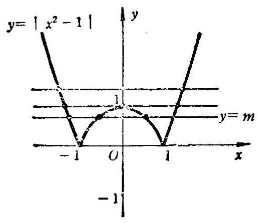

图 3-3-20

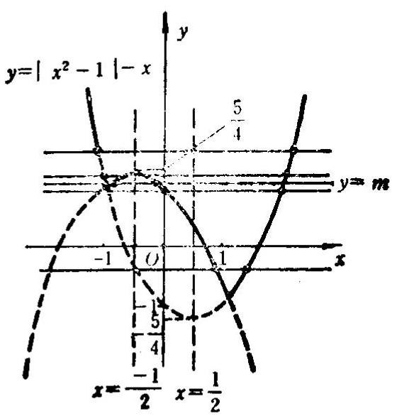

图 3-3-21

① 当 $m < 0$ 时,方程无解;

③ 当 $m = 0$ 时,方程有两个不同的解;

③ 当 $0 < m < 1$ 时,方程有四个不同的解;

④ 当 $m = 1$ 时,方程有四个解,其中有两个等解;

⑤ 当 $m > 1$ 时,方程有两个不同的解.

(2)方程 $\left| {{x}^{2} - 1}\right|  - x - m = 0$ 移项变形为 $\left| {{x}^{2} - 1}\right|  - x = m$ . 先确定曲线 ${O}_{1} : y = \left| {{x}^{2} - 1}\right|  - x$ 的图形.

$$
y = \left| {{x}^{2} - 1}\right|  - x
$$

$$
= \left\{  \begin{array}{l} {x}^{2} - 1 - x = {\left( x - \frac{1}{2}\right) }^{2} - \frac{5}{4}\;\left( {x \leq   - 1\text{ 或 }x \geq  1}\right) , \\  1 - {x}^{2} - x =  - {\left( x + \frac{1}{2}\right) }^{2} + \frac{5}{4}\;\left( {-1 \leq  x \leq  1}\right) , \end{array}\right.
$$

再考虑曲线 ${C}_{1}$ 与动直线 $y = m$ 的交点个数.

① 当 $m <  - 1$ 时,方程无解;

② 当 $m =  - 1$ 时,方程有一个解;

③ 当 $- 1 < m < 1$ 时,方程有两个不同的解;

④ 当 $m = 1$ 时,方程有三个解;

⑤ 当 $1 < m < \frac{5}{4}$ 时,方程有四个不同的解,

⑥ 当 $m = \frac{5}{4}$ 时,方程有四个解,其中有两个等解;

⑦ 当 $m > \frac{5}{4}$ 时,方程有两个不同的解.

解 略.

“方程 (1) ”与“方程 (2)”的类比，保持动直线 $y = m$ 的形式，以 “曲线 $O : y = \left| {{x}^{3} - 1}\right|$ 与 $y = m$ 的交点个数问题”作为“曲线 ${C}_{1} : y = \; \left| {{x}^{2} - 1}\right|  - x$ 与 $y = m$ 的交点个数问题”的“辅助问题”,将处理方程 (1)的方法 “移植” 子方程 (2). 在类比中,若保持曲线 $O : y = \left| {{x}^{2} - 1}\right|$ 的形式，则以 “曲线 $O$ 与动直线 $y = m$ 的交点个数问题”作为 “曲线 $C$ 与动直线 $y = x + m$ 的交点个数问题”的 “辅助问题”，处理方法仍然是讨论曲线 $C$ 与平行直线系的相关位置 (如图 3-3-22 所示)， 解的情况同上.

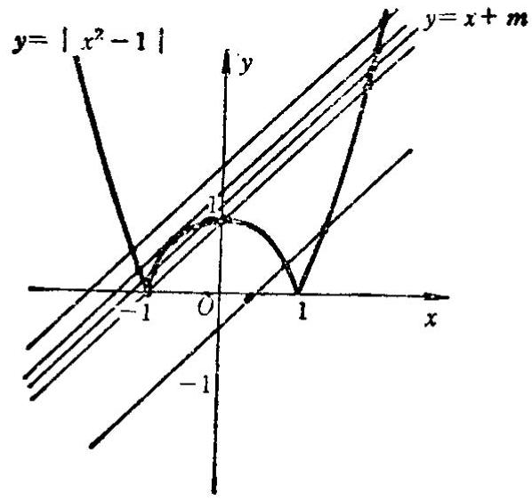

图 3-3-22

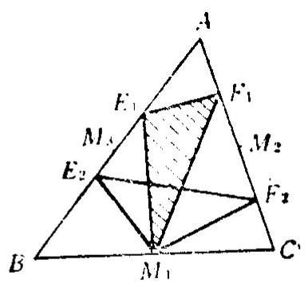

图 3-3-23

例 12 如图 3-3-23,(1)设 ${M}_{1}$ 、 ${M}_{2}$ 、 ${M}_{3}$ 分别为 $\bigtriangleup  {ABC}$ 的三边 ${BO}$ 、 ${OA}$ 、 ${AB}$ 的中点， ${E}_{1}$ 、 ${F}_{1}$ 分别为 $A{M}_{3}$ 、 $A{M}_{2}$ 的内分点， ${E}_{2}$ 、 ${F}_{2}$ 分别为 $B{M}_{3}$ 、 $C{M}_{2}$ 的内分点. 求证:

$$
{S}_{\bigtriangleup {M}_{1}{E}_{1}{F}_{1}} \leq  \frac{1}{4}{S}_{\bigtriangleup {ABC}};\;{S}_{\bigtriangleup {M}_{1}{E}_{2}{F}_{2}} \leq  \frac{1}{4}{S}_{\bigtriangleup {ABC}}.
$$

(2)已知四边形 ${P}_{1}{P}_{2}{P}_{3}{P}_{4}$ 的四个顶点落在 $\bigtriangleup  {ABC}$ 的边上，求证: $\bigtriangleup  {P}_{1}{P}_{2}{P}_{3} \bigtriangleup  {P}_{1}{P}_{2}{P}_{4}\text{ 、 } \bigtriangleup  {P}_{1}{P}_{3}{P}_{4} \bigtriangleup  {P}_{2}{P}_{3}{P}_{4}$ 中，至少有一个三角形的面积不大于 $\frac{1}{4}{S}_{\bigtriangleup {ABC}}$ .

分析 问题 (1) 是求解问题 (2) 的 “辅助问题”. 问题 (2) 中的四边形顶点 ${P}_{1}\text{ 、 }{P}_{2}\text{ 、 }{P}_{3}\text{ 、 }{P}_{4}$ 在 $\bigtriangleup  {ABC}$ 边上的分布按“抽屉原则” 分配——将四个顶点“放入”三个“抽屉”( $\bigtriangleup  {A{M}_{2}{M}_{3}}$ 、 $\bigtriangleup  {B{M}_{3}{M}_{1}}$ 、 $\bigtriangleup  O{M}_{1}{M}_{2}$ 的有关的边).

证(1)设 $\frac{A{E}_{1}}{AB} = x,\frac{A{F}_{1}}{AC} = y$ ，则 $x < \frac{1}{2}, y < \frac{1}{2}$ ，

$$
\frac{{S}_{\bigtriangleup A{E}_{1}{F}_{1}}}{{S}_{\bigtriangleup {ABC}}} = \frac{A{E}_{1} \cdot  A{F}_{1}}{{AB} \cdot  {AC}} = {xy},
$$

$$
\frac{{S}_{\bigtriangleup B{M}_{1}{E}_{1}}}{{S}_{\bigtriangleup {BCA}}} = \frac{B{M}_{1} \cdot  B{E}_{1}}{{BC} \cdot  {BA}} = \frac{1}{2}\left( {1 - x}\right) ,
$$

$$
\frac{{S}_{\bigtriangleup C{F}_{1}{M}_{1}}}{{S}_{\bigtriangleup {CAB}}} = \frac{C{F}_{1} \cdot  C{M}_{1}}{{CA} \cdot  {CB}} = \frac{1}{2}\left( {1 - y}\right) .
$$

于是,

$$
{S}_{\bigtriangleup {M}_{1}{E}_{1}{F}_{1}} = {S}_{\bigtriangleup {ABC}} - \left( {{S}_{\bigtriangleup A{E}_{2}{F}_{1}} + {S}_{\bigtriangleup B{M}_{1}{E}_{1}} + {S}_{\bigtriangleup C{F}_{1}{M}_{1}}}\right)
$$

$$
= \left\lbrack  {1 - {xy} - \frac{1}{2}\left( {1 - x}\right)  - \frac{1}{2}\left( {1 - y}\right) }\right\rbrack   \cdot  {S}_{\bigtriangleup {ABO}}
$$

$$
= \left( {\frac{1}{2}x + \frac{1}{2}y - {xy}}\right)  \cdot  {S}_{\bigtriangleup {ABC}}
$$

$$
= \left\lbrack  {\frac{1}{4} - \left( {\frac{1}{2} - x}\right) \left( {\frac{1}{2} - y}\right) }\right\rbrack   \cdot  {S}_{\bigtriangleup {ABC}} \leq  \frac{1}{4}{S}_{\bigtriangleup {ABC}}.
$$

当 $x = y = \frac{1}{2}$ ，即 ${E}_{1}\text{ 、 }{F}_{1}$ 分别为 ${AB}\text{ 、 }{AO}$ 中点时，等号成立.

同理,

$$
{S}_{\bigtriangleup {M}_{1}{E}_{2}{F}_{1}} \leq  \frac{1}{4}{S}_{\bigtriangleup {ABC}}.
$$

(2)设 ${M}_{1}$ 、 ${M}_{2}$ 、 ${M}_{3}$ 分别为三边 ${BC}$ 、 ${CA}$ 、 ${AB}$ 的中点，则

$$
{S}_{\bigtriangleup \Delta {M}_{1}{M}_{2}} = {S}_{\bigtriangleup B{M}_{1}{M}_{3}} = {S}_{\bigtriangleup C{M}_{1}{M}_{1}} = {S}_{\bigtriangleup B{M}_{1}{M}_{1}{M}_{3}} = \frac{1}{4}{S}_{\bigtriangleup {ABC}}.
$$

现分别讨论 ${P}_{1}\text{ 、 }{P}_{2}\text{ 、 }{P}_{3}\text{ 、 }{P}_{4}$ 四点与 $\bigtriangleup A{M}_{3}{M}_{2},\bigtriangleup B{M}_{1}{M}_{3}$ , $\bigtriangleup C{M}_{2}{M}_{1}$ 的位置情况:

① 如图 3-3-24，如果 ${P}_{1}$ 、 ${P}_{3}$ 、 ${P}_{3}$ 、 ${P}_{4}$ 四个点中，有三个点落在其中一个三角形的边上,不妨设 ${P}_{1}\text{ 、 }{P}_{2} \in$ 线段 $A{M}_{3},{P}_{4} \in$ 线段 $A{M}_{2}$ ,即

$$
{S}_{\bigtriangleup {P}_{1}{P}_{2}{P}_{4}} \leq  {S}_{\bigtriangleup A{M}_{3}{M}_{1}} = \frac{1}{4}{S}_{\bigtriangleup {ABC}}.
$$

② 如果 ${P}_{1}\text{ 、 }{P}_{2}\text{ 、 }{P}_{3}\text{ 、 }{P}_{4}$ 四个点中,有两个点落在其中一个三角形的边上, 其他两个点分别落在另外两个三角形的边上.

设 ${P}_{1}\text{ 、 }{P}_{2}$ 分别落在 $\bigtriangleup A{M}_{3}{M}_{2}$ 的边 $A{M}_{3}\text{ 、 }A{M}_{2}$ 上， ${P}_{3}\text{ 、 }{P}_{4}$ 分别落在 $\bigtriangleup B{M}_{1}{M}_{3}\text{ 、 }\bigtriangleup O{M}_{2}{M}_{1}$ 的边上. 经过点 ${M}_{1}$ 作直线 $a// \; {P}_{1}{P}_{2}$ ,如图 3-3-25.

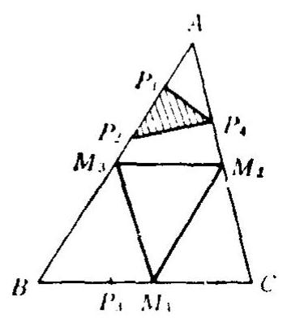

图 3-3-24

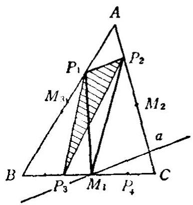

图 3-3-25

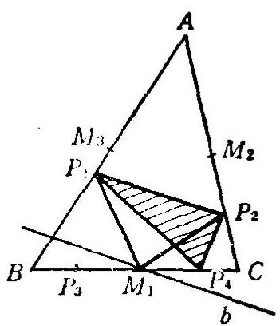

图 3-3-26

$\because$ 点 ${P}_{8}$ 落在平行线 $a$ 与 ${P}_{1}{P}_{2}$ 之间,

$$
\therefore {S}_{\bigtriangleup {P}_{1}{P}_{1}{P}_{1}} \leq  {S}_{\bigtriangleup {M}_{1}{P}_{1}{P}_{1}} \leq  \frac{1}{4}{S}_{\bigtriangleup {ABC}}\text{ . }
$$

③ 如果 ${P}_{1}\text{ 、 }{P}_{2}\text{ 、 }{P}_{3}\text{ 、 }{P}_{4}$ 四个点中,每两个点落在其中一个三角形的边上. 设 ${P}_{1}\text{ 、 }{P}_{3}$ 分别落在 $B{M}_{3}\text{ 、 }B{M}_{1}$ 上, ${P}_{2}\text{ 、 }{P}_{4}$ 分别落在 $O{M}_{2}\text{ 、 }O{M}_{1}$ 上,经过点 ${M}_{1}$ 作直线 $b//{P}_{1}{P}_{2}$ ,如图 3-3-26.

$\because$ 点 ${P}_{4}$ 落在平行线 $b$ 与 ${P}_{1}{P}_{2}$ 之间,

$$
\therefore {S}_{\bigtriangleup {P}_{1}{P}_{1}{P}_{2}} \leq  {S}_{\bigtriangleup {M}_{1}{P}_{1}{P}_{2}} \leq  \frac{1}{4}{S}_{\bigtriangleup {ABC}}.
$$

综上所述，命题得证.

例 13 已知: $a\text{ 、 }b$ 都是不等于零的实数,并且变量 $\theta$ 满足不等式组

$$
\left\{  \begin{array}{l} a\sin \theta  + b\cos \theta  \geq  0, \\  a\cos \theta  - b\sin \theta  \geq  0; \end{array}\right.
$$

试求 $\sin \theta$ 的最大可能值.

分析 所要求的 $\sin \theta$ 受三角不等式组的约束，而常数 $a, b$ 又有几种不同的取值情况，应根据“数形结合”的观点，将“数量关系” 转化为图形上的“位置关系”, 利用图形的直观性求解.

设 $x = \cos \theta , y = \sin \theta$ ,则

$$
{x}^{2} + {y}^{2} = 1
$$

①

$$
{bx} + {ay} \geq  0
$$

②

$$
{ax} - {by} \geq  0
$$

③

$$
{bx} + {ay} = 0
$$

④

$$
{ax} - {by} = 0
$$

⑤

其中 $\left| x\right|  \leq  1,\left| y\right|  \leq  1$ ,④、⑤是两条互相垂直的直线段，问题转化为“求区域

$$
G = \left\{  {\left( {x, y}\right) \left| {\;\left\{  \begin{array}{l} {bx} + {ay} \geq  0,\left| x\right|  \leq  1 \\  {ax} - {by} \geq  0,\left| y\right|  \leq  1 \end{array}\right\}  }\right. }\right.
$$

内圆弧线

$$
O = \left\{  {\left( {x, y}\right)  \mid  {x}^{2} + {y}^{2} = 1}\right\}
$$

上的最高点的纵坐标”,根据 $a\text{ 、 }b$ 的符号,分四种情况讨论.

① $a > 0, b > 0$ ；

求直线 ⑤ 与圆 ① 的交点 ${P}_{1}$ 的纵坐标. 如图 3-3-27，

$$
{y}_{\max } = {y}_{{P}_{1}} = \frac{a}{\sqrt{{a}^{2} + {b}^{2}}}.
$$

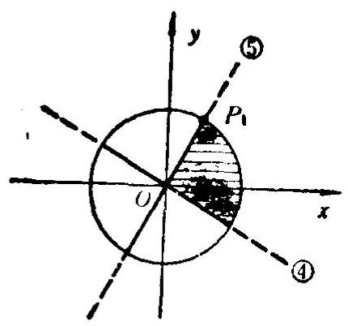

图 3-3-27

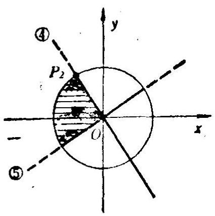

图 3-3-28

② $a < 0, b < 0$ ；

求直线 ④ 与圆 ① 的交点 ${P}_{2}$ 的纵坐标，如图 3-3-28，

$$
{y}_{\max } = {y}_{{P}_{1}} = \frac{-b}{\sqrt{{a}^{2} + {b}^{2}}}.
$$

③ $a > 0, b < 0$ ；

求 $y$ 轴与圆 ① 的交点 ${P}_{3}$ 的纵坐标,如图 3-3-29,

$$
{y}_{\max } = {y}_{{P}_{3}} = 1
$$

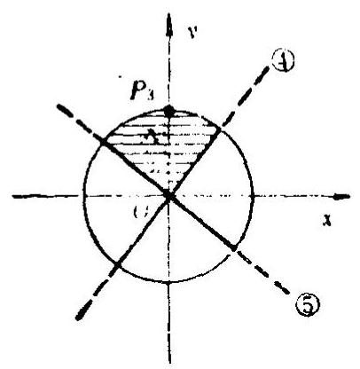

图 3-3-29

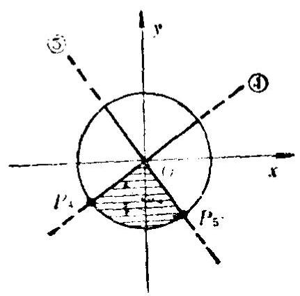

图 3-3-30

④ $a < 0, b > 0$ :

求直线 ④ 与圆 ① 的交点 ${P}_{4}$ 的纵坐标，

$$
{y}_{{P}_{4}} = \frac{-b}{\sqrt{{a}^{2} + {b}^{2}}};
$$

求直线 ⑤ 与圆 ① 的交点 ${P}_{5}$ 的纵坐标，如图 3-3-30,

$$
{y}_{{P}_{5}} = \frac{a}{\sqrt{{a}^{2} + {b}^{2}}}.
$$

比较 ${y}_{{P}_{4}}\text{ 、 }{y}_{{P}_{3}}$ 可知，当 $a \leq   - b$ 时，

$$
{y}_{\max } = {y}_{{P}_{4}} = \frac{-b}{\sqrt{{a}^{2} + {b}^{2}}};
$$

当 $a >  - b$ 时,

$$
{y}_{\max } = {y}_{{P}_{0}} = \frac{a}{\sqrt{{a}^{2} + {b}^{2}}}.
$$

例 14 在锐角 $\bigtriangleup  {ABC}$ 中，设 3 个内角 $A$ 、 $B$ 、 $C$ 成等差数列，

分析 在 $\bigtriangleup {ABO}$ 所在的平面内, $\{ P \mid  {PB} \leq  {PA}\}$ 表示以 $\{ P \mid  {PB} = {PA}\}$ 并有符合条件的点 $P$ 的集合构成区域

$$
G = \{ P \mid  {PB} \leq  {PA},{PB} \leq  {PO},
$$

$$
P \in  \bigtriangleup {ABO}\} .
$$

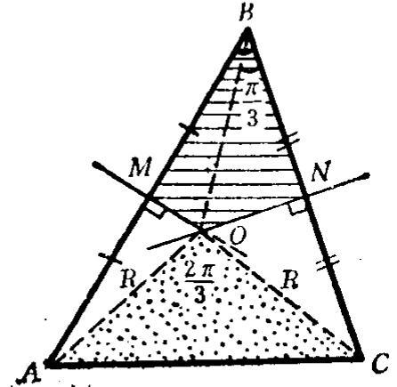

图 3-3-31

已知: ${S}_{G} = \frac{1}{3}{S}_{\bigtriangleup {ABC}}$ ,试判定 $\bigtriangleup {ABO}$ 的形状. (即 ${AB}$ 边的中垂线) 为边界的半平面; $\{ P \mid  {PB} \leq  {PO}\}$ 表示以 $\{ P \mid  {PB} = {PO}\}$ (即 ${BO}$ 边的中垂线) 为边界的半平面. 于是,区域 $G$ 就是由 ${AB}\text{ 、 }{BO}$ 两边以及它们的中垂线所围成的四边形 ${BMON}$ ( $O$ 为 $\bigtriangleup {ABO}$ 的外接圆圆心),如图 3-3-31. 根据中垂线的性质, 有

$$
{S}_{\bigtriangleup {OMB}} = {S}_{\bigtriangleup {OMA}},{S}_{\bigtriangleup {ONB}} = {S}_{\bigtriangleup {ONO}}.
$$

$$
\because {S}_{G} = \frac{1}{3}{S}_{\bigtriangleup {ABO}}\text{ , }
$$

$$
\therefore {S}_{\bigtriangleup {OAC}} = {S}_{\bigtriangleup {ABC}} - 2 \cdot  {S}_{G} = {S}_{\bigtriangleup {ABC}} - \frac{2}{3}{S}_{\bigtriangleup {ABO}} = \frac{1}{3}{S}_{\bigtriangleup {ABO}}\text{ . }
$$

设 $\bigtriangleup {ABC}$ 的外接圆半径为 $R$ ，

$$
\because \angle {AOO} = 2\angle {ABC} = \frac{2\pi }{3}\text{ , }
$$

$$
\frac{1}{2}{R}^{2}\sin \frac{2\pi }{3} = \frac{1}{3} \cdot  \frac{1}{2} \cdot  a \cdot  c\sin \frac{\pi }{3},{R}^{2} = \frac{1}{3}{ac}.
$$

利用正弦定理，有

$$
{R}^{2} = \frac{1}{3} \cdot  4{R}^{2}\sin A \cdot  \sin C,
$$

于是，

$$
\sin A \cdot  \sin C = \frac{3}{4},\frac{1}{2}\left\lbrack  {\cos \left( {A - C}\right)  - \cos \left( {A + C}\right) }\right\rbrack   = \frac{3}{4},
$$

$$
\frac{1}{2}\left\lbrack  {\cos \left( {A - C}\right)  - \cos \frac{2\pi }{3}}\right\rbrack   = \frac{3}{4}
$$

$$
\frac{1}{2}\left\lbrack  {\cos \left( {A - C}\right)  + \frac{1}{2}}\right\rbrack   = \frac{3}{4}
$$

$$
\frac{1}{2}\cos \left( {A - C}\right)  = \frac{3}{4} - \frac{1}{4},\;\therefore \;\cos \left( {A - C}\right)  = 1.
$$

$\because A\text{ 、 }C \in  \left( {0,\pi }\right) ,\therefore A - C = 0$ .

$\therefore \bigtriangleup {ABC}$ 为等边三角形.

解 略.

## 6. 对数学命题的推广与引伸

例 15 证明 直圆柱的如下性质: 经过直圆柱的两条母线的截面，以轴截面的面积为最大. 将“直圆柱”推广到“直圆锥”，是否仍然具有这个性质？并说明对于“直圆锥”所做的判断.

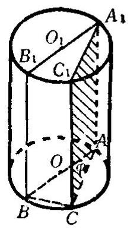

图 3-3-32

分析 因为经过直圆柱的两条母线所作的诸截面是一组对边都等于母线长的矩形, 所以问题转化为“经过圆周上两点的弦, 以直径的长度为最大”,即 $\left| {AC}\right|  \leq  \left| {AB}\right| \cos \varphi  \leq  \left| {AB}\right|$ ,其中 $\varphi$ 为 ${AB}$ 与 ${AC}$ 的夹角 (如图 3-3-32).

“直圆锥”并不一定具有“直圆柱”的这个性质. 如图 3-3-33， 设直圆锥的母线长等于 $a$ (常量)，直圆锥的锥角为 $\alpha$ (常量), $\alpha  \in  \left( {0,\pi }\right)$ ,任意两条母线 ${PA}\text{ 、 }{PO}$ 的夹角为 $\theta$ (变量), $\theta  \in  \left\lbrack  {0,\alpha }\right\rbrack$ , 则截面 $\bigtriangleup {PAC}$ 的面积为

$$
{S}_{\bigtriangleup {PAC}} = \frac{1}{2}{a}^{2}\sin \theta \;\left( {\theta  \in  \left\lbrack  {0,\alpha }\right\rbrack  }\right) ,
$$

轴截面 $\bigtriangleup  {PAB}$ 的面积为

$$
{S}_{\bigtriangleup {PAB}} = \frac{1}{2}{a}^{2}\sin \alpha .
$$

将“ ${S}_{\bigtriangleup {PAC}}$ 与 ${S}_{\bigtriangleup {PAB}}$ 比较大小”转化为 “ $\sin \theta$ 与 $\sin \alpha$ 比较大小”. 虽然 $0 \leq  \theta  \leq  \alpha$ ，但未必 $\sin \theta  \leq  \sin \alpha$ . 根据正弦函数的单调性分两种情况讨论:

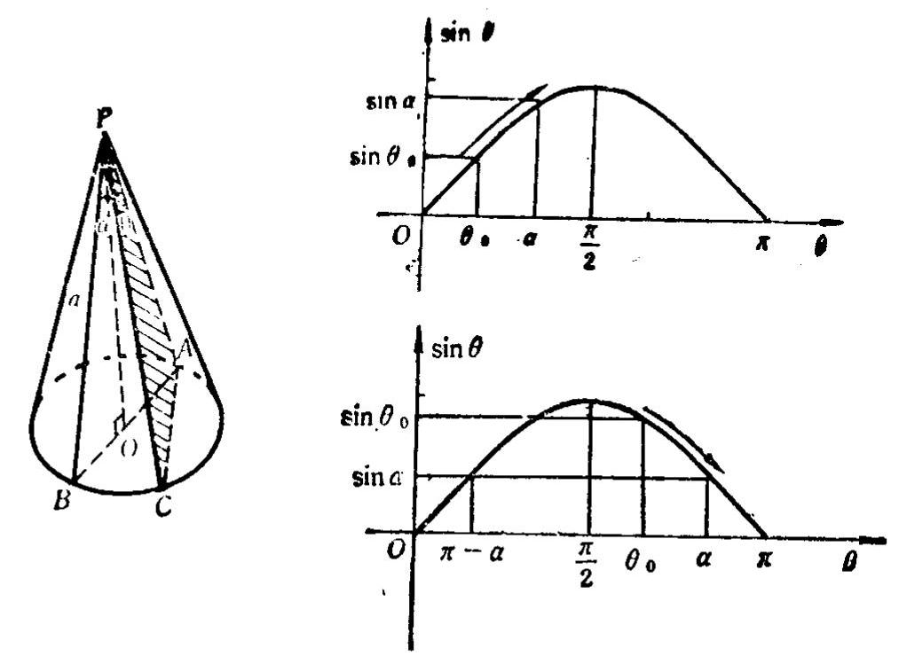

图 3-3-33

① 当 $\alpha  \in  \left( {0,\frac{\pi }{2}}\right\rbrack$ 时, $\sin \theta  \leq  \sin \alpha$ ,即

$$
{S}_{\bigtriangleup {PAC}} \leq  {S}_{\bigtriangleup {PAB}}\;\left( {\theta  \in  (0,\alpha \rbrack }\right) ;
$$

② 当 $\alpha  \in  \left( {\frac{\pi }{2},\pi }\right)$ 时， $\sin \theta  \geq  \sin \alpha$ ，即

$$
{S}_{\bigtriangleup {PAC}} \geq  {S}_{\bigtriangleup {PAB}}\;\left( {\theta  \in  \left\lbrack  {\pi  - \alpha ,\alpha }\right\rbrack  }\right) .
$$

例 16 如图 3-3-34,在四面体 $P - {ABC}$ 中,设二面角 $B - {PA} - O$ 的平分面交棱 ${BO}$ 于 $D$ 点 (即二面角 $B - {PA} - D$ 等于二面角

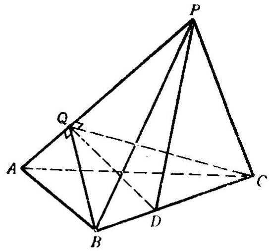

图 3-3-34

由此可见，当直圆锥的锥角 $\alpha$ 为锐角或直角时, 经过它的两条母线的截面, 以轴截面的面积为最大.

解 略. $O - {PA} - D)$ . 求证:

$$
\frac{BD}{DC} = \frac{{S}_{\bigtriangleup {PAB}}}{{S}_{\bigtriangleup {PAC}}}.
$$

分析 这个问题可以与“三角形的角平分线性质定理”类比, 经过棱 ${BC}$ 作平面 ${BOQ}$ ,使棱 ${PA} \bot$ 平面 ${BOQ}\left( {Q\text{ 为垂足 }}\right)$ . 于是, 问题转化为在 $\bigtriangleup {QBC}$ 中运用“角平分线性质”的问题.

$\because \angle {BQO}$ 为二面角 $B - {PA} - O$ 的平面角,依题意

$$
\angle {BQD} = \angle {CQD}
$$

$$
\therefore \frac{BD}{DC} = \frac{QB}{QC}\text{ . }
$$

又 $\because \bigtriangleup {PAB}$ 与 $\bigtriangleup {PAO}$ 的高分别为 ${BQ}\text{ 、 }{CQ}$ ,它们有公共边 (底边),

$$
\therefore \frac{{S}_{\bigtriangleup {PAB}}}{{S}_{\angle {PAC}}} = \frac{BQ}{OQ} = \frac{BD}{DO}\text{ . }
$$

这里运用了以“平面问题”作为“立体问题”的“辅助问题”的方法.

证 略.

例 17 设 $M$ 为四面体 $P - {ABC}$ 的面 ${ABC}$ 内任意一点,经过 $M$ 点作 $M{A}_{1}//{AP}$ 交面 ${BCP}$ 于 ${A}_{1}$ 点，作 $M{B}_{1}//{BP}$ 交面 ${CAP}$ 于 ${B}_{1}$ 点，作 $M{C}_{1}//{CP}$ 交面 ${ABP}$ 于 ${C}_{1}$ 点，求证:

$$
\frac{M{A}_{1}}{AP} + \frac{M{B}_{1}}{BP} + \frac{M{O}_{1}}{OP} = 1.
$$

分析 这个问题可以与如下的“平面问题”作类比: 设 $M$ 为 $\bigtriangleup {ABO}$ 的 ${BC}$ 上任意一点,经过 $M$ 点作 $M{A}_{1}//{CA}$ 交 ${AB}$ 于 ${A}_{1}$ 点,作 $M{B}_{1}//{BA}$ 交 ${AC}$ 于 ${B}_{1}$ 点,则

$$
\frac{M{A}_{1}}{OA} + \frac{M{B}_{1}}{BA} = 1,
$$

如图 3-3-36.

$$
\because \frac{M{A}_{1}}{OA} = \frac{BM}{BC},\;\frac{M{B}_{1}}{BA} = \frac{CM}{OB},
$$

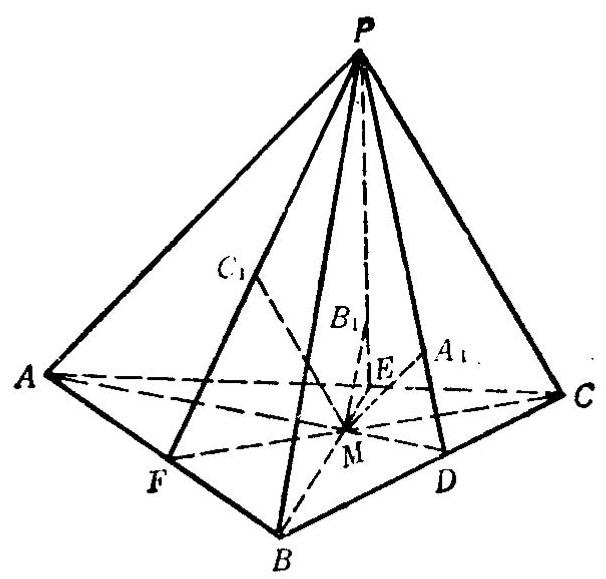

图 3-3-35

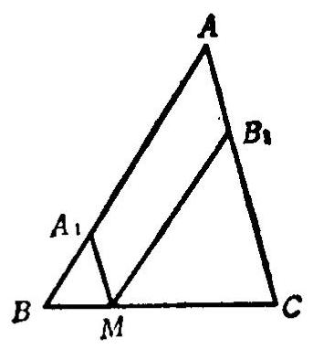

图 3-3-36

$\therefore$ 两式相加,得

$$
\frac{M{A}_{1}}{OA} + \frac{M{B}_{1}}{BA} = \frac{{BM} + {OM}}{BO} = 1.
$$

将处理 “平面问题” 的方法 “移植” 到 “立体问题” 上来. 在 $\bigtriangleup {ABC}$ 中,连接 ${AM}\text{ 、 }{BM}\text{ 、 }{CM}$ 分别交 ${BO}\text{ 、 }{OA}\text{ 、 }{AB}$ 于 $D\text{ 、 }E\text{ 、 }F$ 点,又分别在 $\bigtriangleup {PBO}\text{ 、 }\bigtriangleup {POA}\text{ 、 }\bigtriangleup {PAB}$ 内连接 ${PD}\text{ 、 }{PE}\text{ 、 }{PF}$ ,显见 ${A}_{1} \in  {PD},{B}_{1} \in  {PE},{C}_{1} \in  {PF}$ ,如图 3-3-35. 于是,

在 $\bigtriangleup {ADP}$ 内,

而

$$
\frac{M{A}_{1}}{AP} = \frac{DM}{DA}
$$

$$
\frac{DM}{DA} = \frac{{S}_{\bigtriangleup {MBO}}}{{S}_{\bigtriangleup {ABO}}}
$$

在 $\bigtriangleup {BEP}$ 内,

而

$$
\frac{M{B}_{1}}{BP} = \frac{EM}{EB},
$$

$$
\frac{EM}{EB} = \frac{{S}_{\bigtriangleup {MCA}}}{{S}_{\bigtriangleup {BCA}}};
$$

在 $\bigtriangleup {OFP}$ 内,

$$
\frac{M{C}_{1}}{OP} = \frac{FM}{FO},
$$

而

$$
\frac{FM}{FO} = \frac{{S}_{\bigtriangleup {MAB}}}{{S}_{\bigtriangleup {CAB}}}.
$$

$$
\therefore \frac{M{A}_{1}}{AP} + \frac{M{B}_{1}}{BP} + \frac{M{C}_{1}}{CP} = \frac{{S}_{\bigtriangleup {MBC}} + {S}_{\bigtriangleup {MCA}} + {S}_{\bigtriangleup {MAB}}}{{S}_{\bigtriangleup {ABC}}} = 1\text{ . }
$$

证 略.

例 18 $P$ 为 $\bigtriangleup {ABC}$ 内部一点,已知 $\bigtriangleup {ABC}$ 的边 ${BC} = a$ 、 ${OA} = b\text{ 、 }{AB} = c$ ,设点 $P$ 到三边 ${BO}\text{ 、 }{OA}\text{ 、 }{AB}$ 的距离分别为 ${d}_{1}\text{ 、 }{d}_{2}$ 、 ${d}_{3}$ . 求表达式 $\frac{a}{{d}_{1}} + \frac{b}{{d}_{2}} + \frac{c}{{d}_{3}}$ 的最小值.

分析 从“特殊”情况入手. 当点 $P$ 是 $\bigtriangleup {ABO}$ 的内心时,设边心距为 $d$ ,则

$$
{S}_{\bigtriangleup {ABO}} = \frac{1}{2}\left( {a + b + c}\right) d.
$$

“变形”:

$$
\frac{1}{d} = \frac{a + b + c}{2{S}_{\bigtriangleup {ABC}}} \Rightarrow  \frac{a + b + c}{d} = \frac{{\left( a + b + c\right) }^{2}}{2{S}_{\bigtriangleup {ABC}}}
$$

$$
\Rightarrow  \frac{a}{d} + \frac{b}{d} + \frac{c}{d} = \frac{{\left( a + b + c\right) }^{2}}{2{S}_{\bigtriangleup {ABO}}};
$$

“猜想”:

$$
\frac{a}{{d}_{1}} + \frac{b}{{d}_{2}} + \frac{c}{{d}_{3}} \geq  \frac{a}{d} + \frac{b}{d} + \frac{c}{d}.
$$

于是，上述问题“转化”为如下的证明题 “已知 $\bigtriangleup  {ABC}$ 的边 ${BC} = a$ 、 ${OA} = b\text{ 、 }{AB} = c, P$ 为 $\bigtriangleup  {ABC}$ 内部一点，设点 $P$ 到三边 ${BC}\text{ 、 }{CA}$ 、 ${AB}$ 的距离分别为 ${d}_{1},{d}_{2},{d}_{3}$ ，证明:当点 $P$ 为 $\bigtriangleup  {ABC}$ 的内心时， 表达式 $\frac{a}{{d}_{1}} + \frac{b}{{d}_{2}} + \frac{c}{{d}_{3}}$ 达到最小值 $\frac{{\left( a + b + c\right) }^{2}}{2{S}_{\bigtriangleup {ABC}}}$ .

解 略.

通过“三角形”与“四面体”类比，可将命题引伸到“四面体”. 已知: 四面体 ${ABOD}$ 的各界面面积 ${S}_{\bigtriangleup {BCD}} = {S}_{1},{S}_{\bigtriangleup {CDA}} = {S}_{2},{S}_{\bigtriangleup {DAB}} = \; {S}_{3}\text{ 、 }{S}_{\bigtriangleup {ABC}} = {S}_{4}, P$ 为四面体 ${ABCD}$ 内部一点,设点 $P$ 到四个面 ${BCD}\text{ 、 }{CDA}\text{ 、 }{DAB}\text{ 、 }{ABC}$ 的距离分别为 ${d}_{1}\text{ 、 }{d}_{2}\text{ 、 }{d}_{3}\text{ 、 }{d}_{4}$ ,证明: 当点 $P$ 为四面体 ${ABCD}$ 的内切球球心时,表达式 $\frac{{S}_{1}}{{d}_{1}} + \frac{{S}_{2}}{{d}_{2}} + \frac{{S}_{3}}{{d}_{3}} + \frac{{S}_{4}}{{d}_{4}}$ 达到最小值 $\frac{{\left( {S}_{1} + {S}_{2} + {S}_{3} + {S}_{4}\right) }^{2}}{3{V}_{ABCD}}$ .

“联想”柯西不等式:

$$
\mathop{\sum }\limits_{{i = 1}}^{n}{a}_{i}^{2} \cdot  \mathop{\sum }\limits_{{i = 1}}^{n}{b}_{i}^{2} \geq  {\left( \mathop{\sum }\limits_{{i = 1}}^{n}{a}_{i}{b}_{i}\right) }^{2}.
$$

作变换:

$$
{a}_{i}^{2} = {S}_{i}{d}_{i},{b}_{i}^{2} = \frac{{S}_{i}}{{d}_{i}}\;\left( {i = 1,\cdots , n,{a}_{i} > 0,{b}_{i} > 0}\right) ,
$$

$$
\mathop{\sum }\limits_{{i = 1}}^{n}{S}_{i}{d}_{i} \cdot  \mathop{\sum }\limits_{{i = 1}}^{n}\frac{{S}_{i}}{{d}_{i}} \geq  {\left( \mathop{\sum }\limits_{{i = 1}}^{n}{S}_{i}\right) }^{2}
$$

$$
\mathop{\sum }\limits_{{i = 1}}^{n}\frac{{S}_{i}}{{d}_{i}} \geq  \frac{{\left( \mathop{\sum }\limits_{{i = 1}}^{n}{S}_{i}\right) }^{2}}{\mathop{\sum }\limits_{{i = 1}}^{n}{S}_{i}{d}_{i}}
$$

$$
\because {S}_{i}{d}_{i} = 3{V}_{i}\;\left( {i = 1,\cdots , n}\right) ,\;\mathop{\sum }\limits_{{i = 1}}^{n}{S}_{i}{d}_{i} = 3{V}_{ABCD},
$$

$$
\therefore \mathop{\sum }\limits_{{i = 1}}^{n}\frac{{S}_{i}}{{d}_{i}} \geq  \frac{{\left( \mathop{\sum }\limits_{{i = 1}}^{n}{S}_{i}\right) }^{2}}{3{V}_{ABCD}}.
$$

再从 “四面体” 推广到 “ $n$ 面体 (含有内切球)”. 已知球的外切 $n$ 面体的各面面积依次为 ${S}_{1}$ 、 ${S}_{2}$ 、、、 ${S}_{n}$ ， $P$ 为 $n$ 面体内部一点，设点 $P$ 到各对应面距离依次为 ${d}_{1},{d}_{2},\cdots ,{d}_{n}$ ,证明: 当点 $P$ 为 $n$ 面体的内切球球心时,表达式 $\mathop{\sum }\limits_{{i = 1}}^{n}\frac{{S}_{i}}{{d}_{i}}$ 达到最小值 $\frac{{\left( \mathop{\sum }\limits_{{i = 1}}^{n}{S}_{i}\right) }^{2}}{3V}$ ( $V$ 为 $n$ 面体的体积). 这个命题的结论就是不等式:

$$
\mathop{\sum }\limits_{{i = 1}}^{n}\frac{{S}_{i}}{{d}_{i}} \geq  \frac{{\left( \mathop{\sum }\limits_{{i = 1}}^{n}{S}_{i}\right) }^{2}}{3V}
$$

“假说是网, 只有撒网的人才能捕获”(Novalis). 知识面越广, 作为“类比”与“归纳”的素材就越丰富，形成“联想”、“预见”的机会也就越多. 在数学学习中，“知识”、“技能”的牢固掌握及丰富储存, 内在联系的脉络清楚, 定理与公式应用得娴熟, 对解题的成败均有反思……，数学思维就越活跃，“联想”就自然浮现，“类比”、 “归纳”就油然而生，“转化”也就水到渠成。

例 7 的详解:

解 根据 De-Moivre 公式:

$$
\cos {k\alpha } + i\sin {k\alpha } = {\left( \cos \alpha  + i\sin \alpha \right) }^{k}
$$

$$
= {\cos }^{k}\alpha  - {C}_{k}^{2}{\cos }^{k - 2}\alpha {\sin }^{2}\alpha  + {C}_{k}^{4}{\cos }^{k - 4}\alpha {\sin }^{4}\alpha  - \cdots
$$

$$
+ i\left( {{C}_{k}^{1}\sin \alpha {\cos }^{k - 1}\alpha  - {C}_{k}^{3}{\sin }^{3}\alpha {\cos }^{k - 8}\alpha  + {C}_{k}^{5}{\sin }^{5}\alpha {\cos }^{k - 5}\alpha  - \cdots }\right) ,
$$

$\therefore \sin {k\alpha } = {C}_{k}^{1}\sin \alpha {\cos }^{k - 1}\alpha  - {C}_{k}^{2}{\sin }^{3}\alpha {\cos }^{k - 3}\alpha  + {C}_{k}^{5}{\sin }^{6}\alpha {\cos }^{k - 5}\alpha  - \cdots$

$$
= {\sin }^{k}\alpha \left( {{C}_{k}^{1}{\operatorname{ctg}}^{k - 1}\alpha  - {C}_{k}^{3}{\operatorname{ctg}}^{k - 3}\alpha  + {C}_{k}^{5}{\operatorname{ctg}}^{k - 5}\alpha  - \cdots }\right) .
$$

取 $k = {2n} + 1,\alpha  = \frac{\pi }{{2n} + 1},\frac{2\pi }{{2n} + 1},\frac{3\pi }{{2n} + 1},\cdots ,\frac{n\pi }{{2n} + 1}$ ，

$$
\because \;\sin \alpha  \neq  0,\sin \left( {{2n} + 1}\right) \alpha  = 0,
$$

$$
\therefore \;\left( {{2n} + 1}\right) {\operatorname{ctg}}^{2n}a - {C}_{{2n} + 1}^{3}{\operatorname{ctg}}^{{2n} - 2}a + {C}_{{2n} + 1}^{5}{\operatorname{ctg}}^{{2n} - 4}a - \cdots  = 0
$$

①

方程 ① 的根为

$$
{\operatorname{ctg}}^{2}\frac{\pi }{{2n} + 1},{\operatorname{ctg}}^{2}\frac{2\pi }{{2n} + 1},{\operatorname{ctg}}^{2}\frac{3\pi }{{2n} + 1},\cdots ,{\operatorname{ctg}}^{2}\frac{n\pi }{{2n} + 1}.
$$

根据韦达定理，有

$$
{\operatorname{ctg}}^{2}\frac{\pi }{{2n} + 1} + {\operatorname{ctg}}^{2}\frac{2\pi }{{2n} + 1} + {\operatorname{ctg}}^{2}\frac{3\pi }{{2n} + 1} + \cdots  + {\operatorname{ctg}}^{2}\frac{n\pi }{{2n} + 1}
$$

$$
= \frac{{C}_{{2n} + 1}^{3}}{{2n} + 1} = \frac{n\left( {{2n} - 1}\right) }{3}
$$

②

因为 ${\csc }^{2}\alpha  = {\operatorname{ctg}}^{2}\alpha  + 1$ ,所以由 ②,得

$$
{\csc }^{2}\frac{\pi }{{2n} + 1} + {\csc }^{2}\frac{2\pi }{{2n} + 1} + {\csc }^{2}\frac{3\pi }{{2n} + 1} + \cdots  + {\csc }^{2}\frac{n\pi }{{2n} + 1}
$$

$$
= \frac{n\left( {{2n} - 1}\right) }{3} + n = \frac{n}{3}\left( {{2n} + 2}\right)
$$

③

$\because$ 当 $\alpha  \in  \left( {0,\frac{\pi }{2}}\right)$ 时, $\sin \alpha  < \alpha  < \operatorname{tg}\alpha$ ,

$\therefore$

$$
\operatorname{ctg}\alpha  < \frac{1}{\alpha } < \csc \alpha .
$$

从②、③，有

$$
\frac{n\left( {{2n} - 1}\right) }{3} < {\left( \frac{{2n} + 1}{\pi }\right) }^{2} + {\left( \frac{{2n} + 1}{2\pi }\right) }^{2} + {\left( \frac{{2n} + 1}{3\pi }\right) }^{2} + \cdots  + {\left( \frac{{2n} + 1}{n\pi }\right) }^{2}
$$

$$
< \frac{n\left( {{2n} + 2}\right) }{3}
$$

即

$$
\left( {1 - \frac{1}{{2n} + 1}}\right) \left( {1 - \frac{2}{{2n} + 1}}\right) \frac{{\pi }^{2}}{6} < 1 + \frac{1}{{2}^{2}} + \frac{1}{{3}^{2}} + \cdots  + \frac{1}{{n}^{2}}
$$

$$
< \left( {1 - \frac{1}{{2n} + 1}}\right) \left( {1 + \frac{1}{{2n} + 1}}\right) \frac{{\pi }^{2}}{6}\text{ . }
$$

当 $n \rightarrow  \infty$ 时,即得

$$
1 + \frac{1}{{2}^{2}} + \frac{1}{{3}^{2}} + \cdots  + \frac{1}{{n}^{2}} + \cdots  = \frac{{\pi }^{2}}{6}.
$$

应用类似方法, 还可得

$$
1 + \frac{1}{{2}^{4}} + \frac{1}{{3}^{4}} + \cdots  + \frac{1}{{n}^{4}} + \cdots  = \frac{{\pi }^{4}}{90}
$$

$$
1 + \frac{1}{{2}^{6}} + \frac{1}{{3}^{6}} + \cdots  + \frac{1}{{n}^{6}} + \cdots  = \frac{{\pi }^{6}}{945},
$$

等等。

## 思考题九

1. 根据参变数 $m$ 的取值情况，讨论下列方程解的个数。

1) ${x}^{2} - 2\left| x\right|  - m = 0$ ; 2) ${x}^{2} + 2\left| x\right|  - m = 0$ .

2. 解方程:

$$
{x}^{3} + 2\sqrt{3}{x}^{2} + {3x} + \sqrt{3} - 1 = 0.
$$

3. 1) 求满足下式的 $x\text{ 、 }y\text{ 、 }z\text{ 、 }w\left( {x > y > z > w, x\text{ 、 }y\text{ 、 }z\text{ 、 }w \in  Z}\right)$ :

$$
{2}^{x} + {2}^{y} + {2}^{z} + {2}^{w} = {20.625}
$$

2) 求满足下式的 $x\text{ 、 }y\text{ 、 }z\left( {x < y < z, x\text{ 、 }y\text{ 、 }z \in  N}\right)$ :

$$
{2}^{x} + {2}^{y} + {2}^{z} = {2336}
$$

4. 证明关于 $x$ 的方程: $x = a + \sin x\left( {a \in  R}\right)$ 的实根是唯一的.

5. 在四面体 $P - {ABO}$ 中,设三面角 $P - {ABO}$ 为直三面角, ${PA} = \; a,{PB} = b,{PC} = c$ ,点 $P$ 在平面 ${ABC}$ 内的射影为 $H$ ,且 ${PH} \; = h$ ,求证:

$$
\frac{1}{{a}^{2}} + \frac{1}{{b}^{2}} + \frac{1}{{c}^{2}} = \frac{1}{{h}^{2}}.
$$

6. 设正方形 ${ABCD}$ 的边长为 $a$ ,动点 $P$ 从顶点 $A$ 出发,沿正方形的边界运动,自 $A$ 点起,运行路程为 $x$ ,以点 $P$ 为一顶点的内接正方形面积为 $y$ ,当点 $P$ 沿正方形 ${ABCD}$ 边界运行一周时, $x$ 与 $y$ 之间应满足怎样的关系式,并描绘出它的图形.

7. 在三角形内部任意一点向各边引垂线,其长度分别为 ${d}_{1}\text{ 、 }{d}_{2}$ 、 ${d}_{3}$ ，而相应各边的高分别为 ${h}_{1}$ 、 ${h}_{2}$ 、 ${h}_{3}$ ，求证:

$$
\frac{{d}_{1}}{{h}_{1}} + \frac{{d}_{2}}{{h}_{2}} + \frac{{d}_{3}}{{h}_{3}} = 1.
$$

试将“三角形”的以上性质引伸到“四面体”，结论如何？并证明之.

8. 如图 3-3-37,设正八面体的棱长为 $a$ ,作平行于一组相对面的截面，试根据截面的平行移动情况讨论截面的周长与面积.

9. 证明: 正四棱锥的相邻两个侧面所成的二面角必大于 ${90}^{ \circ  }$ . 试问, 上述结论对于正三棱锥是否成立? 并说明之.

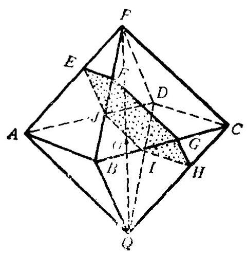

图 3-3-37

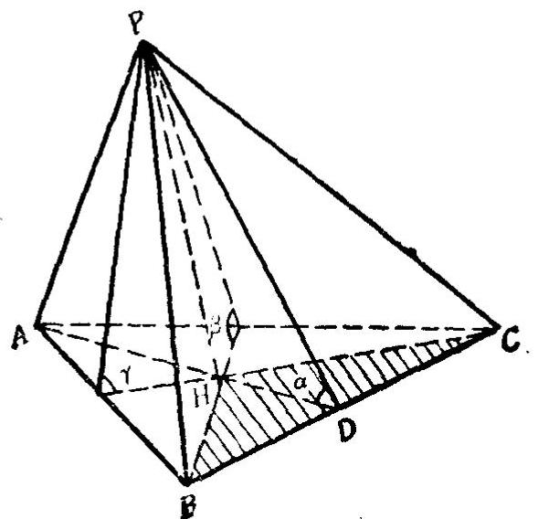

图 3-3-38

10. 如图 3-3-38,在三棱锥 $P - {ABC}$ 中,已知 ${S}_{\bigtriangleup {PBC}} = {S}_{\bigtriangleup {PCA}} = \; {S}_{\because {PAB}} = {S}_{\bigtriangleup {ABC}}$ ，设各侧面 ${PBC}\text{ 、 }{PCA}\text{ 、 }{PAB}$ 与底面 ${ABC}$ 分别成二面角 ${\alpha }_{ \smallsetminus  }{\beta }_{ \smallsetminus  }{\gamma }_{ \smallsetminus  }$ 求证:

(1) $\cos \alpha  + \cos \beta  + \cos \gamma  = 1$

(2) $\cos \alpha \cos \beta \cos \gamma  \leq  \frac{1}{27}$

(3) ${\cos }^{2}\alpha  + {\cos }^{2}\beta  + {\cos }^{3}\gamma  \geq  \frac{1}{3}$ .

11. 在四面体 $A - {BCD}$ 中,点 $M \in$ 面 ${ABC}$ ,并且 ${MD}$ 与三个界面 ${DAB}\text{ 、 }{DBC}\text{ 、 }{DOA}$ 所成的角相等,求证:

$$
\frac{{S}_{\bigtriangleup {AMB}}}{{S}_{\bigtriangleup {ADB}}} = \frac{{S}_{\bigtriangleup {BMC}}}{{S}_{\bigtriangleup {BDC}}} = \frac{{S}_{\bigtriangleup {CMA}}}{{S}_{\bigtriangleup {CDA}}}.
$$

12. 如图 3-3-39，多边形 ${A}_{1}{A}_{2}\cdots {A}_{n}$ 内接于圆 $O\left( O\right.$ 在多边形内部 $)$ 经过 $O$ 点作 ${A}_{1}{A}_{2}\text{ 、 }{A}_{2}{A}_{3}\text{ 、 }\cdots \text{ 、 }{A}_{n}{A}_{1}$ 的垂线,延长交 $\odot  O$ 于 ${B}_{1}\text{ 、 }{B}_{2}\text{ 、 }\cdots {B}_{n}$ ,求证: ${S}_{A} \leq  {S}_{B}\left( {S}_{A}\right.$ 是多边形 ${A}_{1}{A}_{2}\cdots {A}_{n}$ 的面积, ${S}_{B}$ 是多边形 ${B}_{1}{B}_{2}\cdots {B}_{n}$ 的面积),并问等号何时成立?

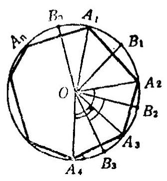

图 3-3-39

13.(1)在半径为 $R$ 的半圆内，作内接矩形(使矩形一边在半圆的直径上), 求内接矩形的最大面积.

(2)在半径为 $R$ 的半球内，作内接正四棱柱(使底面正方形在半球的大圆面内),求内接正四棱柱的最大体积.

14. (1)设 $a$ 、 $b$ 、 $c$ 为三个非负实数，求证:

① $\sqrt{{a}^{2} + {b}^{2}} + \sqrt{{b}^{2} + {c}^{2}} + \sqrt{{c}^{2} + {a}^{2}} \geq  \sqrt{2}\left( {a + b + c}\right)$ ；

② ${\left( {a}^{n} + {b}^{n}\right) }^{1/n} + {\left( {b}^{n} + {c}^{n}\right) }^{1/n} + {\left( {c}^{n} + {a}^{n}\right) }^{1/n} \geq  \sqrt[n]{2}\left( {a + b + c}\right)$ ， $\left( {n \in  N}\right)$ .

(2)设 ${a}_{k} \geq  0, k = 1,2,3,\cdots , m + 1$ ，记 ${S}_{m + 1} = {a}_{1} + {a}_{2} + \cdots \; + {a}_{m + 1},{S}_{m + 1}^{\left( n\right) } = {a}_{1}^{n} + {a}_{2}^{n} + \cdots  + {a}_{n + 1}^{n}, m\text{ 、 }n \in  N$ ,求证:

$$
{\left\lbrack  {S}_{m + 1}^{\left( n\right) } - {a}_{1}^{n}\right\rbrack  }^{1/n} + {\left\lbrack  {S}_{m + 1}^{\left( n\right) } - {a}_{2}^{n}\right\rbrack  }^{1/n} + \cdots  + {\left\lbrack  {S}_{m + 1}^{\left( n\right) } - {a}_{n}^{n}\right\rbrack  }^{1/n}
$$

$$
\geq  \sqrt[n]{m} \cdot  {S}_{m + 1}
$$

15. 设 ${a}_{1}$ 、 ${a}_{2}$ 、、、、、、、、为非负实数， ${S}_{n} = {a}_{1} + {a}_{2} + \cdots  + {a}_{n}$ ，求证:

$$
\left( {1 + {a}_{1}}\right)  \cdot  \left( {1 + {a}_{2}}\right)  \cdot  \cdots  \cdot  \left( {1 + {a}_{n}}\right)  \leq  1 + \frac{{S}_{n}}{1!} + \frac{{S}_{n}^{2}}{2!} + \cdots  + \frac{{S}_{n}^{n}}{n!}.
$$

16. 设 $n > 1, n \in  N$ ,证明:

$$
{C}_{n}^{1} + {C}_{n}^{2} + \cdots  + {C}_{n}^{n} > n \cdot  {2}^{\frac{1}{2}\left( {n - 1}\right) }.
$$

17. 设 $x \in  \lbrack 0,1), n \in  N$ ,证明:

$$
{\left( 1 + \frac{x}{n}\right) }^{n} \leq  {\left( 1 + \frac{x}{n + 1}\right) }^{n + 1}
$$

## 四 移植与杂交

近代科学技术飞速的发展，交叉学科不断产生，数学工具与数学思想日益向自然科学与社会科学渗透. 控制论、信息论、系统论的诞生加速了这一发展趋势. 这些新学科的产生，有的是运用旧学科的工具去解决研究对象中的新问题. 如运用数学工具去解决生物学的问题，从而形成生物数学. 这种运用旧学科的工具去解决另一学科中的新问题，发现新学科的思维方法姑称之谓“移植”. 还有一些新学科的产生不单纯是运用旧学科的工具去解决面临的新问题，而是运用旧学科的思想方法、基本观点，透诊到新问题的研究中去, 从此诞生了新概念, 新的思想方法, 这样的思维上的飞跃姑称之为“杂交”. 这是借用生物学中的术语的一种形象譬喻. 例如，代数中的方程观点、映射观点，与几何相结合，则产生了坐标系 (一种特殊的映射) 和曲线与方程这样的新概念, 从而诞生了解析几何, 这就是杂交的典型实例. 此后数学分析与几何杂交又产生微分几何. 在高等数学以至近代数学中, 这类杂交思想的运用就更多了. 不仅数学的发展如此, 近代的自然科学和社会科学何尝不是这样.

在数学发展史上, 有许多运用代数工具解几何问题的例子. 如平面几何问题的代数解法、三角解法及以代数理论为基础的尺规作图理论. 利用代数方程解决三角问题，利用函数图象解方程与不等式，向量工具步入几何，及复数与三角的相互渗透等等都是移植的实例. 在中学数学范围内, 除了解析几何以外, 杂交的实例是难举的. 下面以中学数学各科的横向联系来说明移植、杂交这两种思想方法及其简单应用，以进一步提高思维能力.

例 1 从托勒密(Ptolemy)定理 “圆内接四边形两双对边乘积之和等于两条对角线的乘积” 如何导出两角和的加法定理 “ $\sin \left( {\alpha  + \beta }\right)  = \sin \alpha \cos \beta  + \cos \alpha \sin \beta$ ”?

分析 这两条外表上似乎缺乏联系的定理, 如果运用正弦定理,就可挂起钩来. 如果取 $\bigtriangleup {ABC}$ 的外接圆 $O$ 的直径为单位长度,令 $\angle {BAO} = \alpha ,\angle {ABO} = \beta$ ,那末边 ${BC} = \sin \alpha$ ,边 ${AC} = \sin \beta$ ,而 ${AB} = \; \sin \left( {\pi  - \alpha  - \beta }\right)  = \sin \left( {\alpha  + \beta }\right)$ . 为了利用托勒密定理，需要构造圆 $O$ 的一个内接四边形，现以 ${AB}$ 为一条对角线. 由于另一条对角线必须是圆 $O$ 的直径,所以连接 $O\text{ 、 }O$ ,交圆 $O$ 于 $D$ 点, ${CD}$ 则作为另一条对角线. 在四边形 ${ABCD}$ 中,已有

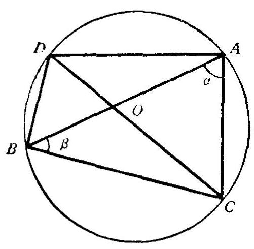

图 3-4-01

又有

$$
{BC} = \sin \alpha ,{AC} = \sin \beta ,{AB} = \sin \left( {\alpha  + \beta }\right) ,{CD} = 1,
$$

$$
{BD} = \sin \angle {BAD} = \sin \left( {{90}^{ \circ  } - \alpha }\right)  = \cos \alpha ,
$$

$$
{AD} = \sin \angle {ABD} = \sin \left( {{90}^{ \circ  } - \beta }\right)  = \cos \beta .
$$

$$
\because {BC} \cdot  {AD} + {AC} \cdot  {BD} = {AB} \cdot  {CD}\text{ , }
$$

$$
\therefore \sin \alpha \cos \beta  + \sin \beta \cos \alpha  = \sin \left( {\alpha  + \beta }\right) \text{ . }
$$

证 略.

这是几何渗透到三角中的例子.

例 2 锐角三角形 ${ABC}$ 内接于圆 $O$ ,证明, $\bigtriangleup {ABC}$ 的周长大于圆 $O$ 直径的 2 倍.

分析 三角形三边 $a = {2R}\sin A, b = {2R}\sin B, c = {2R}\sin C$ . 原命题等价于 “ $\sin A + \sin B + \sin O > 2$ ”,所以可从证明此三角不等式入手.

证 设 $\bigtriangleup {ABC}$ 的三内角分别为 $A\text{ 、 }B\text{ 、 }C$ ,外接圆半径 $R$ . 不失一般性，不妨设 $\frac{\pi }{2} > A \geq  B \geq  O$ ，则

$$
\sin A + \sin B + \sin C = \sin A + 2\sin \frac{1}{2}\left( {B + C}\right) \cos \frac{1}{2}\left( {B - C}\right)
$$

$$
= \sin A + 2\cos \frac{A}{2}\cos \frac{1}{2}\left( {B - C}\right)
$$

①

$\because \frac{B - O}{2} < \frac{B}{2} \leq  \frac{A}{2}$ ,余弦函数在 $\lbrack 0,\pi )$ 上是减函数,

$\therefore \cos \frac{1}{2}\left( {B - C}\right)  > \cos \frac{A}{2}$ ,从 ① 有

$$
\sin A + \sin B + \sin C > \sin A + 2\cos \frac{A}{2}\cos \frac{A}{2}
$$

$$
= \sin A + 1 + \cos A\;\left( {\because \sin A + \cos A > 1}\right)
$$

$$
> 2\text{ . }
$$

$$
\therefore \;{2R}\sin A + {2R}\sin B + {2R}\sin O > {4R}\text{ , }
$$

即

$$
a + b + c > {4R}
$$

证明 $\sin A + \sin B + \sin C > 2$ ,还可利用恒等式

$$
{\sin }^{2}A + {\sin }^{2}B + {\sin }^{2}C = 2 + 2\cos A\cos B\cos C
$$

来证.

如果, $A\text{ 、 }B\text{ 、 }C$ 都是锐角,则

$$
{\sin }^{2}A + {\sin }^{2}B + {\sin }^{2}C > 2\text{ . }
$$

$\because \sin A,\sin B,\sin C \in  \left( {0,1}\right)$ ,

$\therefore \sin A > {\sin }^{2}A,\sin B > {\sin }^{2}B,\sin C > {\sin }^{2}C$ ,

$\therefore \sin A + \sin B + \sin C > {\sin }^{2}A + {\sin }^{2}B + {\sin }^{2}C > 2$ .

这是三角渗透到几何中的实例. 当然, 例 2 也可以用几何综合法证明.

例 3 设 $\bigtriangleup {ABC}$ 的周长为 ${2p}$ ,则 $\Delta  \leq  \frac{\sqrt{3}}{4}{\left( \frac{2p}{3}\right) }^{2}$ ,也就是

$$
a + b + c \geq  2\sqrt[4]{{3}^{3}}\sqrt{\Delta },
$$

其中， $\Delta$ 表示三角形 ${ABC}$ 的面积.

证

$$
\Delta  = \sqrt{p\left( {p - a}\right) \left( {p - b}\right) \left( {p - c}\right) }
$$

$$
\leq  {\left\lbrack  p{\left( \frac{p - a + p - b + p - c}{3}\right) }^{3}\right\rbrack  }^{\frac{1}{2}}
$$

$$
\left( {\because {x}_{1}{x}_{2}{x}_{3} \leq  {\left( \frac{{x}_{1} + {x}_{2} + {x}_{3}}{3}\right) }^{3}}\right)
$$

$$
= {p}^{\frac{1}{2}}{\left( \frac{p}{3}\right) }^{\frac{3}{2}} = \frac{\sqrt{3}}{4}{\left( \frac{2p}{3}\right) }^{3}.
$$

这是代数渗透到几何中的例子.

例 4 用几何方法证明: 已知 $a$ 、 $b$ 、 $c$ 、 $d$ 均为不大于 1 的正数， 则 ${4a}\left( {1 - b}\right)$ 、 ${4b}\left( {1 - c}\right)$ 、 ${4c}\left( {1 - d}\right)$ 、 ${4d}\left( {1 - a}\right)$ 四数中至少有一个不大于 1 .”(映射观点例 4)

证 取单位正方形 ${ABCD}$ ，四边上分别有四点 $E$ 、 $F$ 、 $G$ 、 $H$ ， 使 ${AE} = a,{BF} = b,{CG} = c,{DH} = \; d$ ,如图 3-4-02 所示. 由于正方形周长为 4，这些线段可分为四类，共直角顶点的两线段为一类. 根据抽屉原则，至少有一类的两线段之和不大于 1,即其积不大于 $\frac{1}{4}$ . 所以， ${4a}\left( {1 - b}\right) \text{ 、 }{4b}\left( {1 - c}\right) \text{ 、 }{4c}\left( {1 - d}\right)$  、 ${4d}\left( {1 - a}\right)$ 四数中至少有一个不大于 1 .

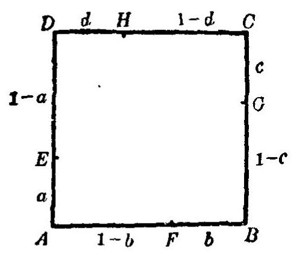

图 3-1-02

这是几何渗透到代数中去的例子.

例 6 设有 $n$ 个机场,每一机场起飞一架飞机,飞到离出发机场最近的机场降落, 且任两机场之间的距离都不相等. 试证: 任一机场降落的飞机不能超过 5 架.

证 设有一机场降落的飞机超过 5 架, 譬如有 6 架, 以 $O$ 表示此机场所在地， $A$ 、 $B$ 、 $O$ 、 $D$ 、 $E$ 、 $F$ 分别表示 6 架飞机原来所在的机场.

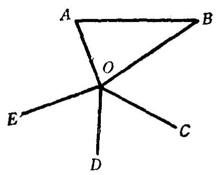

图 3-4-03

$\because {A\text{ 到 }O\text{ 的 }\text{ 距 }\text{ 离 }\text{ 小 }\text{ 于 }}A$ 到其他机场的距离,

$$
\therefore {OA} < {AB}\text{ , }
$$

同理 ${OB} < {AB}$ .

所以, $\bigtriangleup {OAB}$ 中, ${AB}$ 是最大边,故 $\angle {AOB} > \frac{\pi }{3}$ .

同理,

$$
\angle {BOO} > \frac{\pi }{3},\;\angle {OOD} > \frac{\pi }{3},\;\angle {DOE} > \frac{\pi }{3},
$$

$$
\angle {EOF} > \frac{\pi }{3},\;\angle {FOA} > \frac{\pi }{3}.
$$

从此可得

$$
\angle {AOB} + \angle {BOO} + \angle {OOD} + \angle {DOE} + \angle {EOF} + \angle {FOA}
$$

$$
> 6 \times  \frac{\pi }{3} = {2\pi }
$$

但

$$
\angle {AOB} + \angle {BOC} + \angle {COD} + \angle {DOE} + \angle {EOF} + \angle {FOA}
$$

$$
= {2\pi }\text{ . }
$$

这一矛盾, 证明了任一机场降落的飞机不能超过 5 架.

这是几何与反证法在实际问题中的应用. 这一问题, 也可赋于其他实际内容, 与此类似的问题如:

设平面上有 6 个圆, 每个圆心都在其余各圆的外部, 证明平面上任一点都不会同时在这六个圆的内部.

例 6 如图 3-4-04,四面体 $S - {ABO}$ ,在 $S$ 处的 3 个面角都是

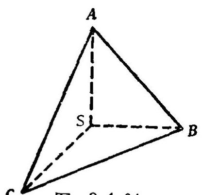

图 3-4-04

直角,6 条棱长的总和为 $l$ ,试证: 这个四面体的体积

$$
V \leq  \frac{5\sqrt{2} - 7}{162}{l}^{3}.
$$

证 设

$$
{SA} = a,{SB} = b,{SC} = 0,
$$

则

$$
l = a + b + c + \sqrt{{a}^{2} + {b}^{2}} + \sqrt{{b}^{2} + {c}^{2}} + \sqrt{{a}^{2} + {c}^{2}}
$$

$$
\geq  a + b + c + \sqrt{2ab} + \sqrt{2bc} + \sqrt{2ca}
$$

$$
\geq  3\sqrt[3]{abc} + 3\sqrt{2}\sqrt[3]{abc} = 3\left( {1 + \sqrt{2}}\right) \sqrt[3]{abc},
$$

$$
\therefore V = \frac{1}{6}{abc} \leq  \frac{1}{6}{\left\lbrack  \frac{l}{3\left( {1 + \sqrt{2}}\right) }\right\rbrack  }^{3} = \frac{5\sqrt{2} - 7}{162}{l}^{3}.
$$

这是代数应用于立体几何中的例子.

例 7 两复数集

$$
M = \{ z : z = t + i\left( {4 - {t}^{2}}\right) , t \in  R\} ,
$$

$$
N = \{ z : z = 2\cos \theta  + i\left( {\lambda  + 3\sin \theta }\right) ,\theta  \in  R\} ,
$$

的交集非空集,求实数 $\lambda$ 的取值范围.

分析 表面上看这是代数中的复数问题,但通过复平面,即转化为两条二次曲线有交点的问题.

$$
M \cap  N \neq  \varnothing  \Leftrightarrow  \left\{  \begin{array}{l} \text{ 抛物线: }y = 4 - {x}^{2}, \\  \text{ 椭 }\text{ 圆: }\left\{  {\begin{array}{l} x = 2\cos \theta , \\  y = \lambda  + 3\sin \theta . \end{array}\;\left( {\theta  \in  R}\right) }\right.  \end{array}\right. \text{ 有公共点 }
$$

$\Leftrightarrow$ 方程 $\lambda  + 3\sin \theta  = 4 - 4{\cos }^{2}\theta$ . 即 $4{\sin }^{2}\theta  - 3\sin \theta  - \lambda  = 0$ 在区间 $\left\lbrack  {-1,1}\right\rbrack$ 内有实数解,亦即此方程在区间 $\left\lbrack  {-1,\frac{3}{8}}\right\rbrack$ 内有一实数解,或在区间 $\left\lbrack  {\frac{3}{8},1}\right\rbrack$ 内有一实数解. 令

$$
f\left( {\sin \theta }\right)  = 4{\sin }^{2}\theta  - 3\sin \theta  - \lambda ,
$$

当 $f\left( {-1}\right)  = 4 + 3 - \lambda  \geq  0$ 且

$$
f\left( \frac{3}{8}\right)  = 4{\left( \frac{3}{8}\right) }^{2} - 3\left( \frac{3}{8}\right)  - \lambda  \leq  0,
$$

即 $\lambda  \in  \left\lbrack  {-\frac{7}{16},7}\right\rbrack$ 时,在区间 $\left\lbrack  {-1,\frac{3}{8}}\right\rbrack$ 上 $f\left( {\sin \theta }\right)  = 0$ 有一实数解;

当 $f\left( \frac{3}{8}\right)  \leq  0$ 且

$$
f\left( 1\right)  = 4 - 3 - \lambda  \geq  0,
$$

即 $\lambda  \in  \left\lbrack  {-\frac{7}{16},1}\right\rbrack$ 时,在区间 $\left\lbrack  {\frac{3}{8},1}\right\rbrack$ 上, $f\left( {\sin \theta }\right)  = 0$ 有一实数解.

$\therefore \lambda  \in  \left\lbrack  {-\frac{7}{16},7}\right\rbrack   \cup  \left\lbrack  {-\frac{7}{16},1}\right\rbrack$ ,即 $\lambda  \in  \left\lbrack  {-\frac{7}{16},7}\right\rbrack$ .

解 略.

例 8 求证:

$$
\operatorname{tg}\frac{\pi }{7}\operatorname{tg}\frac{2\pi }{7}\operatorname{tg}\frac{3\pi }{7} = \sqrt{7}.
$$

证 设 $\theta  = \frac{n\pi }{7}\;\left( {n = 1,2,3,\cdots ,6}\right)$ ,则

$$
{7\theta } = {n\pi },
$$

即 ${4\theta } = {n\pi } - {3\theta }$ . 所以,

$$
\operatorname{tg}{4\theta } = \operatorname{tg}\left( {{n\pi } - {3\theta }}\right)  =  - \operatorname{tg}{3\theta }
$$

①

$\because \operatorname{tg}{n\theta } = \frac{n\operatorname{tg}\theta  - {O}_{n}^{3}{\operatorname{tg}}^{3}\theta  + {O}_{n}^{5}{\operatorname{tg}}^{5}\theta  - \cdots }{1 - {O}_{n}^{2}{\operatorname{tg}}^{2}\theta  + {O}_{n}^{1}{\operatorname{tg}}^{4}\theta  - \cdots }$ ,

(可以用归纳法证明)

$\therefore \operatorname{tg}{4\theta } = \frac{4\operatorname{tg}\theta  - 4{\operatorname{tg}}^{3}\theta }{1 - 6{\operatorname{tg}}^{2}\theta  + {\operatorname{tg}}^{4}\theta },\operatorname{tg}{3\theta } = \frac{3\operatorname{tg}\theta  - {\operatorname{tg}}^{3}\theta }{1 - 3{\operatorname{tg}}^{2}\theta }$ .

代入 ①，得

$$
\frac{4\operatorname{tg}\theta \left( {1 - {\operatorname{tg}}^{2}\theta }\right) }{1 - 6{\operatorname{tg}}^{2}\theta  + {\operatorname{tg}}^{4}\theta } =  - \frac{\operatorname{tg}\theta \left( {3 - {\operatorname{tg}}^{2}\theta }\right) }{1 - 3{\operatorname{tg}}^{2}\theta }
$$

②

令 $t = \operatorname{tg}\theta$ ，且 $\operatorname{tg}\theta  \neq  0$ ，方程 ② 转化为

$$
{t}^{6} - {21}{t}^{4} + {35}{t}^{2} - 7 = 0
$$

③

$\because \operatorname{tg}\frac{\pi }{7} =  - \operatorname{tg}\left( {\pi  - \frac{\pi }{7}}\right)  =  - \operatorname{tg}\frac{6\pi }{7},\operatorname{tg}\frac{3\pi }{7} =  - \operatorname{tg}\frac{4\pi }{7}$ ,

$$
\operatorname{tg}\frac{5\pi }{7} =  - \operatorname{tg}\frac{2\pi }{7}
$$

$\therefore \operatorname{tg}\frac{\pi }{7}\text{ 、 }\operatorname{tg}\frac{2\pi }{7}\text{ 、 }\operatorname{tg}\frac{3\pi }{7}\text{ 、 }\operatorname{tg}\frac{4\pi }{7}\text{ 、 }\operatorname{tg}\frac{5\pi }{7}\text{ 、 }\operatorname{tg}\frac{6\pi }{7}$ 即 $\operatorname{tg}\frac{\pi }{7}$ 、 $- \operatorname{tg}\frac{\pi }{7},\operatorname{tg}\frac{2\pi }{7}, - \operatorname{tg}\frac{2\pi }{7},\operatorname{tg}\frac{3\pi }{7}, - \operatorname{tg}\frac{3\pi }{7}$ 是方程 ③ 的根. 从此可知方程

$$
{y}^{3} - {21}{y}^{2} + {35y} - 7 = 0
$$

④

的根为 ${\operatorname{tg}}^{2}\frac{\pi }{7},{\operatorname{tg}}^{2}\frac{2\pi }{7},{\operatorname{tg}}^{2}\frac{3\pi }{7}$ . 根据韦达定理,有

$$
{\left( \operatorname{tg}\frac{\pi }{7}\operatorname{tg}\frac{2\pi }{7}\operatorname{tg}\frac{3\pi }{7}\right) }^{2} = 7
$$

即

$$
\operatorname{tg}\frac{\pi }{7}\operatorname{tg}\frac{2\pi }{7}\operatorname{tg}\frac{8\pi }{7} = \sqrt{7}.
$$

这是应用代数解三角问题的例子.

例 $9{A}_{1}\text{ 、 }{A}_{2}\text{ 、 }\cdots {A}_{n}$ 为空间 $n$ 个点, $P$ 为任一点, $G$ 为 ${A}_{1}$ 、 ${A}_{2}\cdots {A}_{n}$ 的重心,证明:

$$
P{A}_{1}^{2} + P{A}_{2}^{2} + \cdots  + P{A}_{n}^{2} \geq  G{A}_{1}^{2} + G{A}_{2}^{2} + \cdots  + G{A}_{n}^{2}.
$$

证 用 ${a}_{1}$ 表示向量 $\overrightarrow{O{A}_{i}}\left( {i = 1,2,\cdots , n}\right)$ ， $v$ 表示向量 $\overrightarrow{OP}$ ， $g$ 表示向量 $\overrightarrow{OG}$ ，则

$$
g = \frac{1}{n}\mathop{\sum }\limits_{{i = 1}}^{n}{a}_{i}
$$

$$
\therefore \;\mathop{\sum }\limits_{{i = 1}}^{n}P{A}_{i}^{2} - \mathop{\sum }\limits_{{i = 1}}^{n}G{A}_{i}^{2} = \mathop{\sum }\limits_{{i = 1}}^{n}{\left( v - {a}_{i}\right) }^{2} - \mathop{\sum }\limits_{{i = 1}}^{n}{\left( g - {a}_{i}\right) }^{2}
$$

$$
= \mathop{\sum }\limits_{{i = 1}}^{n}\left\lbrack  {{\left( v - {a}_{i}\right) }^{2} - {\left( g - {a}_{i}\right) }^{2}}\right\rbrack
$$

$$
- \mathop{\sum }\limits_{{i = 1}}^{3}\left( {\mathbf{v} - \mathbf{g}}\right) \left( {\mathbf{v} + \mathbf{g} - 2{\mathbf{a}}_{i}}\right)
$$

$$
= \left( {\mathbf{v} - \mathbf{g}}\right) \left\lbrack  {n\mathbf{v} + n\mathbf{g} - 2\mathop{\sum }\limits_{{i = 1}}^{n}{\mathbf{a}}_{i}}\right\rbrack
$$

$$
= \left( {\mathbf{v} - \mathbf{g}}\right) \left\lbrack  {n\mathbf{v} + n\mathbf{g} - {2n}\mathbf{g}}\right\rbrack
$$

$$
= n{\left( \mathbf{v} - \mathbf{g}\right) }^{2} \geq  0\text{ . }
$$

所以，

$$
\mathop{\sum }\limits_{{i = 1}}^{n}P{A}_{i}^{2} \geq  \mathop{\sum }\limits_{{i = 1}}^{n}G{A}_{i}^{2}
$$

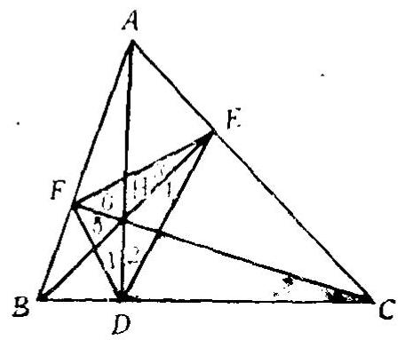

图 3-4-05

这是向量工具移植于立体几何的例子. 若完全用向量处理几何问题则形成向量几何.

例 10 试求锐角三角形的周长最小的内接三角形.

分析 如果 $\bigtriangleup {DEF}$ 是 $\bigtriangleup {ABC}$ 的周长最小的内接三角形,设想 $\bigtriangleup {ABO}$ 的三条边是三面镜子, 根据光行路线最短的原理可知, 如果光的路线是沿三角形 ${DEF}$ 的周界走的话,从光的反射定律,必有

$$
\angle 1 = \angle 2,\angle 3 = \angle 4,\angle 5 = \angle 6\text{ , }
$$

从几何定理,知这样的三角形就是 $\bigtriangleup {ABO}$ 的垂足三角形. 反过来,如果 $\angle 1 = \angle 2,\angle 3 = \angle 4,\angle 5 = \angle 6$ ,则因为

$$
\angle {EFA} + \angle {FEA} + \angle A = {180}^{ \circ  }\text{ ， }
$$

所以有

$$
\frac{{180}^{ \circ  } - 2\angle 3}{2} + \frac{{180}^{ \circ  } - 2\angle 6}{2} + \angle A = {180}^{ \circ  },
$$

即

$$
\angle A = \angle 3 + \angle 6 = \frac{1}{2}\left( {\angle {DEF} + \angle {DFE}}\right)
$$

$$
= \frac{1}{2}\left( {{180}^{ \circ  } - 2\angle 1}\right)  = {90}^{ \circ  } - \angle 1 = \angle {BDF},
$$

$\therefore A\text{ 、 }O\text{ 、 }D\text{ 、 }F$ 四点共圆. 同理， $A\text{ 、 }B\text{ 、 }D\text{ 、 }E$ 四点共圆， $B\text{ 、 }O$ 、 $E\text{ 、 }F$ 四点共圆. 从 $A\text{ 、 }C\text{ 、 }D\text{ 、 }F$ 四点共圆有

$$
\angle 1 = \angle {AOF}
$$

$$
\therefore \angle A + \angle {AOF} = {90}^{ \circ  } - \angle 1 + \angle 1 = {90}^{ \circ  }\text{ , }
$$

故 ${OF}\bot {AB}$ . 同理， ${AD}\bot {BO}$ ， ${BE}\bot {AO}$ .

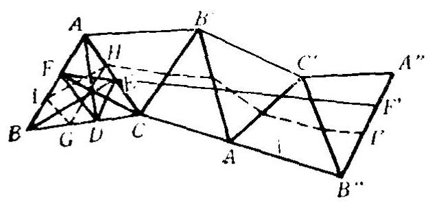

图 3-4-06

最后, 证明垂足三角形的周长是 $\bigtriangleup {ABC}$ 的一切内接三角形中最小的.

利用翻转变换，将 $\bigtriangleup  {ABC}$ 连续翻转，如图 3-4-06 所示:

不难看出 ${A}^{\prime \prime }{B}^{\prime \prime }//{AB}$ (因为它们和 ${A}^{\prime }{B}^{\prime }$ 所夹的角都等于 ${180}^{ \circ  } - 2\angle {AOB})$ ,

$$
\because {A}^{\prime \prime }{F}^{\prime } \text{ ⫫ } {AF},\;\therefore F{F}^{\prime } \text{ ⫫ } A{A}^{\prime \prime }\text{ . }
$$

同理,

$$
I{I}^{\prime } \text{ ⫫ } A{A}^{\prime \prime }.
$$

由于 $\bigtriangleup {DEF}$ 的前述特性,所以 $F{F}^{\prime } = 2\bigtriangleup {DEF}$ 的周长,而折线 ${IH}\cdots {I}^{\prime } = 2\bigtriangleup {GHI}$ 周长 $> I{I}^{\prime } = F{F}^{\prime } = 2\bigtriangleup {DEF}$ 周长.

解 略.

这一问题是著名的 Schwarz 问题, 这里利用光的反射定律与光行路线最短原理找出解决问题的方法.

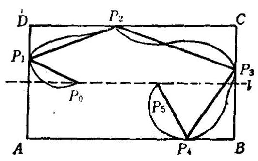

图 3-4-07

例 11 求证: 单位长的任何曲线能被面积为 $\frac{1}{4}$ 的闭矩形 覆盖.

证 设曲线两端点 ${P}_{0}\text{ 、 }{P}_{5}$ 的连线为 $l$ ,矩形 ${ABCD}$ 为覆盖曲线的最小矩形,且

$$
{AB}//{CD}//l,{BC} \bot  l,{DA} \bot  l\text{ . }
$$

设 $\left| {AB}\right|  = a,\left| {BO}\right|  = b$ . 由于矩形 ${ABCD}$ 是覆盖曲线的最小矩形,故曲线与矩形四边至少各有一个公共点,分别设为 ${P}_{1}\text{ 、 }{P}_{2}$ 、 ${P}_{8}\text{ 、 }{P}_{4}$ ,则折线长

$$
\left| {{P}_{0}{P}_{1}}\right|  + \left| {{P}_{1}{P}_{2}}\right|  + \left| {{P}_{2}{P}_{3}}\right|  + \left| {{P}_{3}{P}_{4}}\right|  + \left| {{P}_{4}{P}_{5}}\right|
$$

$$
\text{ <曲线长=1. }
$$

设 ${P}_{0}{P}_{1}\text{ 、 }{P}_{1}{P}_{2}\text{ 、 }{P}_{2}{P}_{3}\text{ 、 }{P}_{3}{P}_{4}\text{ 、 }{P}_{4}{P}_{5}$ 诸线段在 $l$ 上的射影长分别为 ${x}_{i}\left( {i = 1,2,\cdots ,5}\right)$ ,则

$$
{x}_{1} + {x}_{2} + {x}_{3} + {x}_{4} + {x}_{5} \geq  a.
$$

设 ${P}_{0}{P}_{1}\text{ 、 }{P}_{1}{P}_{2}\text{ 、 }{P}_{2}{P}_{3}\text{ 、 }{P}_{8}{P}_{4}\text{ 、 }{P}_{4}{P}_{5}$ 诸线段在直线 $l$ 的垂直直线上的射影分别为 ${y}_{j}\left( {j = 1,2,3,4,5}\right)$ ,则

$$
{y}_{1} + {y}_{2} + {y}_{3} + {y}_{4} + {y}_{5} \geq  {2b}.
$$

根据勾股定理与闵可夫斯基不等式, 有

$$
1 \geq  \left| {{P}_{0}{P}_{1}}\right|  + \left| {{P}_{1}{P}_{2}}\right|  + \left| {{P}_{2}{P}_{3}}\right|  + \left| {{P}_{3}{P}_{4}}\right|  + \left| {{P}_{4}{P}_{5}}\right|
$$

$$
= \sqrt{{x}_{1}^{2} + {y}_{1}^{2}} + \sqrt{{x}_{2}^{2} + {y}_{2}^{2}} + \sqrt{{x}_{3}^{2} + {y}_{3}^{2}} + \sqrt{{x}_{4}^{2} + {y}_{4}^{2}} + \sqrt{{x}_{5}^{2} + {y}_{5}^{2}}
$$

$$
\geq  \sqrt{\left( {{x}_{1} + {x}_{2} + {x}_{3} + {x}_{4} + {x}_{5}}\right) {}^{2} + \left( {{y}_{1} + {y}_{2} + {y}_{3} + {y}_{4} + {y}_{5}}\right) {}^{2}}
$$

$$
\geq  \sqrt{{a}^{2} + 4{b}^{2}} \geq  2\sqrt{ab},
$$

$\therefore {ab} \leq  \frac{1}{4}$ ,即矩形面积不大于 $\frac{1}{4}$ .

例 12 过任意二次曲线的弦 ${PQ}$ 的中点 $O$ ,作两弦 ${AB}\text{ 、 }{CD}$ , 如过 $A\text{ 、 }B\text{ 、 }O\text{ 、 }D$ 的二次曲线 (包括退化二次曲线) 与直线 ${PQ}$ 交于 $R\text{ 、 }S$ 两点. 求证

$$
\left| {OR}\right|  = \left| {OS}\right| \text{ . }
$$

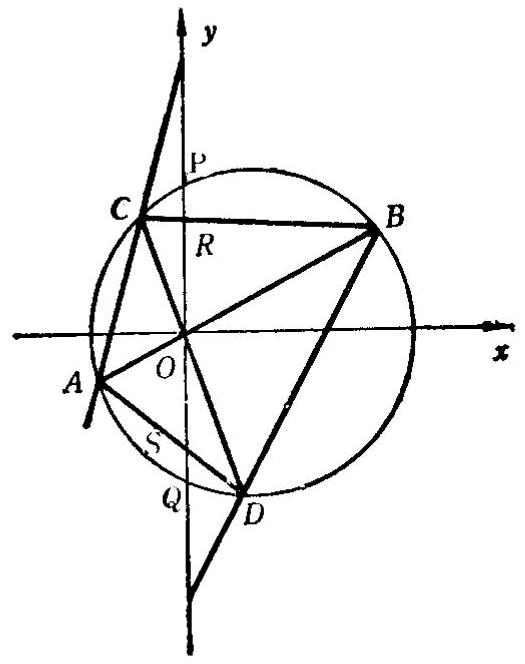

图 3-4-08

本命题就是蝴蝶定理(映射观点例 13) 的推广, 这里将给出一种巧妙的解析证法.

证 取 $O$ 为原点, ${PQ}$ 所在直线为 $y$ 轴,建立直角坐标系如图 3-4-08. 设 $\left| {OP}\right|  = \left| {OQ}\right|  = a$ , 则 $P\text{ 、 }Q$ 两点的坐标分别为 $\left( {0, a}\right) \text{ 、 }\left( {0, - a}\right)$ . 过 $P\text{ 、 }Q$ 两点的任意二次曲线方程为

$$
\alpha {x}^{2} + {\beta xy} + {y}^{2} + {\gamma x} - {a}^{2} = 0.
$$

过点 $O$ 的任意两弦 ${AB}\text{ 、 }{CD}$ (不与 ${PQ}$ 重合) 所在直线的方程分别为 $y = {k}_{1}x, y = {k}_{2}x$ . 过 $A\text{ 、 }B\text{ 、 }C\text{ 、 }D$ 四点的二次曲线系方程为

$$
F\left( {x, y}\right)  = \alpha {x}^{2} + {\beta xy} + {y}^{2} + {\gamma x} - {a}^{2} + \lambda \left( {y - {k}_{1}x}\right) \left( {y - {k}_{2}x}\right)
$$

$$
= 0
$$

①

① 在 $y$ 轴上的截距 $\overrightarrow{OR}$ ， $\overrightarrow{OS}$ 为方程

$$
F\left( {0, y}\right)  = \left( {1 + \lambda }\right) {y}^{2} - {a}^{2} = 0
$$

②

的根. 因为曲线 ① 与 $y$ 轴 (即直线 ${PQ}$ ) 交于两点,故方程 ② 有两实根,且 $\overline{OR} + \overline{OS} = 0$ . 即 $\overline{OR} =  - \overline{OS}$ .

$$
\therefore \left| {OR}\right|  = \left| {OS}\right| \text{ . }
$$

这里所证明的结论, 比蝴蝶定理广泛得多.

这一节里, 提出移植与杂交两种思想方法, 主要是启发人们能从多角度去思考问题. 在研究移植与杂交时应首先考虑在什么条件下才是可行的，同时应和数学的基本知识与数学思维的基本观点相结合, 才能思路开阔, 运用自如, 得心应手, 左右逢源.

## 思 考 题 十

1. 设 $x$ 、 $y$ 、 $z$ 为正实数，求证:

$$
\sqrt{{x}^{2} + {y}^{2} + {xy}} + \sqrt{{x}^{2} + {y}^{2} + {zx}} \geq  \sqrt{{y}^{2} + {z}^{2} + {yz}}.
$$

2. 证明 ${h}_{0} + {h}_{2} + {h}_{0} \geq  {9r}$ ，其中 ${h}_{0}$ 、 ${h}_{0}$ 分别为三角形三边 $a$ 、 $b$ 、 $c$ 上的高, $r$ 为内切圆半径.

8. $a$ 、 $b$ 、 $c$ 为三角形 ${ABC}$ 的三边，三边相对应的三内角的弧度值为 $\alpha$ 、 $\beta$ 、 $\gamma$ . 证明:

$$
\frac{\pi }{3} \leq  \frac{{a\alpha } + {b\beta } + {c\gamma }}{a + b + c} < \frac{\pi }{2}.
$$

4. $I$ 为 $\bigtriangleup {ABC}$ 的内心， $r$ 为内切圆半径，证明:

$$
{AI} + {BI} + {OI} \geq  {6r}\text{ . }
$$

5. $A\text{ 、 }B\text{ 、 }C\text{ 、 }D$ 是空间中四点,求证:

$$
A{C}^{2} + B{D}^{2} + A{D}^{2} + B{C}^{2} \geq  A{B}^{2} + C{D}^{2}.
$$

6. 已知两点集

$$
M = \{ \left( {x, y}\right)  : x = m + 2\cos \varphi , y = \sqrt{3}\sin \varphi ,
$$

$m$ 为常数， $\varphi$ 为参数 $\}$ ；

$$
N = \left\{  {\left( {x, y}\right)  : x = \frac{3}{2} + {t}^{2}, y = \sqrt{6}t, t\text{ 为参数 }}\right\}  .
$$

如果 $M \cap  N \neq  \varnothing$ ,求 $m$ 的取值范围.

7. 设 $a\text{ 、 }b$ 是二实数,

$$
A = \{ \left( {x, y}\right)  : x = n, y = {an} + b, n\text{ 是整数 }\} ,
$$

$$
B = \{ \left( {x, y}\right)  : x = m, y = 3{m}^{2} + {15}, m\text{ 是整数 }\} ,
$$

$$
C = \left\{  {\left( {x, y}\right)  : {x}^{2} + {y}^{2} \leq  {144}}\right\}  ,
$$

是平面 ${xoy}$ 内的点集,讨论是否存在 $a$ 和 $b$ ,使得

(1) $A \cap  B \neq  \varnothing$ ( $\varnothing$ 表示空集),

(2) $\left( {a, b}\right)  \in  O$ ，

同时成立.

8. 从任意一点 ${P}_{0}\left( {{x}_{0},{y}_{0}}\right)$ 作两定向直线分别交二次曲线于 $Q$ . $R, S, T$ . 求证 $\left| \frac{{P}_{0}Q \cdot  {P}_{0}R}{{P}_{0}S \cdot  {P}_{0}T}\right|$ 为与 ${P}_{0}$ 位置无关的定值.

9. 已知 $A\text{ 、 }B\text{ 、 }C$ 为圆 $O$ 上的三个等分点,圆 ${O}_{1}\text{ 、 }{O}_{2}\text{ 、 }{O}_{3}$ 是与圆 $O$ 内切于 $A\text{ 、 }B\text{ 、 }C$ 三点的等圆,点 $P$ 是 $\overset{\text{ ⏜ }}{BC}$ 上任意一点, ${PL}$ 、 ${PM}\text{ 、 }{PN}$ 分别是圆 ${O}_{1}\text{ 、 }{O}_{2}\text{ 、 }{O}_{3}$ 的切线， $L\text{ 、 }M\text{ 、 }N$ 为切点. 求证: ${PL} = {PM} + {PN}$ .

10. 求证:

$$
{\sec }^{2}\frac{\pi }{7} + {\sec }^{2}\frac{3\pi }{7} + {\sec }^{2}\frac{5\pi }{7} = {24}.
$$

11. 求证: $\bigtriangleup {ABC}$ 为等腰三角形的充要条件是:

$$
\Delta  = \left| \begin{array}{lll} {\cos }^{2}A & \sin A & 1 \\  {\cos }^{2}B & \sin B & 1 \\  {\cos }^{2}C & \sin C & 1 \end{array}\right|  = 0.
$$

## 结 束 语

“思维科学是教育科学的核心问题”，数学教学离不开数学思维活动规律的探索. 为了不断提高数学思维能力, 我们根据在数学教学实践中摸索到的经验体会, 对常用的数学思维方法结合实例作了介绍. 由于水平所限，这里提到的各种思维方法，只是目前认识阶段的反映，既不全面，也不成熟. 敬请读者注意:

1. 这里论述的各种思维方法是相互渗透，相辅相成的. 在解决问题时, 或单独起作用, 或交替起作用, 几种方法并举.

2. 这些思维方法不仅有形式逻辑思维, 而且还贯串着辩证逻辑思维的规律. 它们是思维的导航器，不是刻板的思维模式. 要善于领会其精神实质，万万不可机械硬套.

探索在深入，认识在发展. 这本小册子，如能引起大家探索的兴趣, 推动数学教学改革, 使数学思维方法的研究在不久的将来取得重大突破，则作者幸甚！

## 思考题一的答案与略解

1. 令 $\phi  = {2}^{{2n} - 1}\alpha$ ,除以 2 得, ${2}^{{2n} - 2}\alpha  = \frac{\phi }{2}$ .

$$
\text{ 左式 } = \frac{\sec {2\phi } - 1}{\sec \phi  - 1} = \frac{\left( {1 - \cos {2\phi }}\right) \cos \phi }{\left( {1 - \cos \phi }\right) \cos {2\phi }} = \frac{2{\sin }^{2}\phi \cos \phi }{2{\sin }^{2}\frac{\phi }{2}\cos {2\phi }}
$$

$$
- \frac{\sin {2\phi }\sin \phi }{2{\sin }^{2}\frac{\phi }{2}\cos {2\phi }} = \frac{\sin {2\phi }}{\cos {2\phi }} \cdot  \frac{2\sin \frac{\phi }{2}\cos \frac{\phi }{2}}{2{\sin }^{2}\frac{\phi }{2}}
$$

$$
= \frac{\operatorname{tg}{2\phi }}{\operatorname{tg}\frac{\phi }{2}} = \text{ 右式. }
$$

2. 证 $\because \left| \frac{x}{2}\right|  \leq  1,\therefore$ 可设 $\frac{x}{2} = \sin \alpha$ ,则 $x = 2\sin \alpha$

$$
\left| {{3x} - {x}^{3}}\right|  = 2\left| {3\sin \alpha  - 4{\sin }^{3}\alpha }\right|  = 2\left| {\sin {3\alpha }}\right|  \leq  2.
$$

3. 解 设 $x = \operatorname{tg}\alpha ,\alpha  \in  \left( {-\frac{\pi }{2},\frac{\pi }{2}}\right)$ ，则原不等式转化为

$$
\frac{\operatorname{tg}\alpha }{\sqrt{1 + {\operatorname{tg}}^{2}\alpha }} + \frac{1 - {\operatorname{tg}}^{2}\alpha }{1 + {\operatorname{tg}}^{2}\alpha } > 0,
$$

即 $\sin \alpha  + \cos {2\alpha } > 0,2{\sin }^{2}\alpha  - \sin \alpha  - 1 < 0$ ,

$$
\therefore  - \frac{1}{2} < \sin \alpha  < 1\text{ . }
$$

$$
\because \alpha  \in  \left( {-\frac{\pi }{2},\frac{\pi }{2}}\right) ,\therefore \alpha  \in  \left( {-\frac{\pi }{6},\frac{\pi }{2}}\right) \text{ , }
$$

故

$$
x \in  \left( {-\frac{\sqrt{3}}{3}, + \infty }\right) \text{ . }
$$

4. 解 设 $x = \operatorname{tg}\theta ,\theta  \in  \left( {-\frac{\pi }{2},\frac{\pi }{2}}\right)$ ,则原方程转化为

$$
\frac{1}{\cos \theta } + \frac{1}{\sin \theta } = 2\sqrt{2}\text{ ,即 }\sin \left( {\theta  + \frac{\pi }{4}}\right)  = \sin {2\theta }\text{ . }
$$

$$
\because \theta  \in  \left( {-\frac{\pi }{2},\frac{\pi }{2}}\right) ,\therefore \theta  = \frac{\pi }{4}, - \frac{5\pi }{12}\text{ , }
$$

$$
\therefore x = 1, - 2 - \sqrt{3}\text{ . }
$$

5. 证 根据已知条件，可设

$$
\frac{a}{x} = \cos \theta ,\frac{a}{y} = \cos \phi ,
$$

其中 $\theta ,\phi  \in  \left( {0,\frac{\pi }{2}}\right)$ . 则

$$
\sqrt{\frac{\left( {x + a}\right) \left( {y + a}\right) }{xy}} + \sqrt{\frac{\left( {x - a}\right) \left( {y - a}\right) }{xy}}
$$

$$
= \sqrt{\left( {1 + \frac{a}{x}}\right) \left( {1 + \frac{a}{y}}\right) } + \sqrt{\left( {1 - \frac{a}{x}}\right) \left( {1 - \frac{a}{y}}\right) }
$$

$$
= \sqrt{\left( {1 + \cos \theta }\right) \left( {1 + \cos \phi }\right) } + \sqrt{\left( {1 - \cos \theta }\right) \left( {1 - \cos \phi }\right) }
$$

$$
= 2\left( {\cos \frac{\theta }{2}\cos \frac{\phi }{2} + \sin \frac{\theta }{2}\sin \frac{\phi }{2}}\right)
$$

$$
= 2\cos \frac{1}{2}\left( {\theta  - \phi }\right)  \leq  2,
$$

$\therefore \sqrt{\left( {x + a}\right) \left( {y + a}\right) } + \sqrt{\left( {x - a}\right) \left( {y - a}\right) } \leq  2\sqrt{xy}$ .

6. 证 设 $x = r\cos \theta , y = r\sin \theta$ ,则 ${x}^{2} + {y}^{2} = {r}^{2}$ .

当 ${a}^{2} + {b}^{2} = 0$ 时，即 $a = b = 0$ ，原式显然成立.

当 ${a}^{2} + {b}^{2} \neq  0$ 时，

$$
\left| {a{x}^{2} + {2bxy} - a{y}^{2}}\right|
$$

$$
= \left| {a{r}^{2}{\cos }^{2}\theta  - a{r}^{2}{\sin }^{2}\theta  + {2b}{r}^{2}\sin \theta \cos \theta }\right|
$$

$$
= {r}^{2}\left| {a\cos {2\theta } + b\sin {2\theta }}\right|
$$

$$
= {r}^{2}\sqrt{{a}^{2} + {b}^{2}}\left| {\sin \left( {{2\theta } + \phi }\right) }\right| \text{ (其中 }\operatorname{tg}\phi  = \frac{a}{b}\text{ ). }
$$

$$
\leq  {r}^{2}\sqrt{{a}^{2} + {b}^{2}} = \sqrt{{a}^{2} + {b}^{2}}\left( {{x}^{2} + {y}^{2}}\right) .
$$

7. 解 设 $x = r\cos \theta , y = r\sin \theta ,\theta  \in  \lbrack 0,{2\pi }), r \in  \left\lbrack  {1,\sqrt{2}}\right\rbrack$ ,则 $u = {r}^{2}{\cos }^{2}\theta  - {r}^{2}\sin \theta \cos \theta  + {r}^{2}{\sin }^{2}\theta  = {r}^{2}\left( {1 - \frac{1}{2}\sin {2\theta }}\right) .$

$\therefore$ 当 $r = \sqrt{2},{2\theta } = \frac{3\pi }{2}$ 或 $\frac{7\pi }{2}$ ,即 $x =  - 1, y = 1$ 或 $x = 1$ , $y =  - 1$ 时, ${u}_{\text{ 最大 }} = 3$ .

当 $r = 1$ ， ${2\theta } = \frac{\pi }{2}$ 或 $\frac{5\pi }{2}$ ，即 $x = \frac{\sqrt{2}}{2}$ ， $y =  - \frac{\sqrt{2}}{2}$ 或 $x = \; - \frac{\sqrt{2}}{2}, y = \frac{\sqrt{2}}{2}$ 时, ${u}_{\text{ 最小 }} = \frac{1}{2}$ .

8. 证 取 $x = r\cos \theta , y = r\sin \theta ,\theta  \in  \left( {0,\frac{\pi }{2}}\right)$ ,

则 ${x}^{n} + {y}^{n} = {r}^{n}\left( {{\cos }^{n}\theta  + {\sin }^{n}\theta }\right)$

$$
= {r}^{n}\left( {{\cos }^{n - 2}\theta {\cos }^{2}\theta  + {\sin }^{n - 2}\theta {\sin }^{2}\theta }\right) .
$$

当 $n > 2$ 时, $0 < {\cos }^{n - 2}\theta  < 1,0 < {\sin }^{n - 2}\theta  < 1$ .

$n < 2$ 时, ${\cos }^{n - 2}\theta  > 1,{\sin }^{n - 2}\theta  > 1$ .

$n > 2$ 时, ${x}^{n} + {y}^{n} < {r}^{n};n < 2$ 时, ${x}^{n} + {y}^{n} > {r}^{n}$ .

9. 证 (1)

$$
\left( {1 + \frac{1}{{\sin }^{4}\alpha }}\right) \left( {1 + \frac{1}{{\cos }^{4}\alpha }}\right)
$$

$$
= 1 + \frac{1}{{\sin }^{4}\alpha } + \frac{1}{{\cos }^{4}\alpha } + \frac{1}{{\sin }^{4}\alpha {\cos }^{4}\alpha }
$$

$$
\geq  1 + \frac{2}{{\sin }^{2}\alpha {\cos }^{2}\alpha } + \frac{1}{{\sin }^{4}\alpha {\cos }^{4}\alpha }
$$

$$
= {\left( 1 + \frac{4}{{\sin }^{2}{2\alpha }}\right) }^{2} \geq  {\left( 1 + 4\right) }^{2} = {25}
$$

当仅当 $\frac{1}{{\sin }^{4}\alpha } = \frac{1}{{\cos }^{4}\alpha }$ ，且 ${\sin }^{2}{2\alpha } = 1$ 时，等号成立，即 $\alpha  = \frac{k\pi }{2} + \frac{\pi }{4}$ 时，等号成立.

(2)

$$
\left( {1 + \frac{1}{\sin \sqrt[{2n}]{\alpha }}}\right) \left( {1 + \frac{1}{{\cos }^{2n}\alpha }}\right)
$$

$$
= 1 + \frac{1}{{\sin }^{2m}\alpha } + \frac{1}{{\cos }^{2n}\alpha } + \frac{1}{{\sin }^{2n}\alpha {\cos }^{2n}\alpha }
$$

$$
\geq  1 + \frac{2}{{\left( \left| \sin \alpha \right| \left| \cos \alpha \right| \right) }^{n}} + \frac{1}{{\left( \left| \sin \alpha \right| \left| \cos \alpha \right| \right) }^{2n}}
$$

$$
= {\left( 1 + \frac{{2}^{n}}{{\left| \sin 2\alpha \right| }^{n}}\right) }^{2} \geq  {\left( 1 + {2}^{n}\right) }^{2}
$$

10. 解 已知 $\sin x + \sin y = 1$ ,令 $\cos x + \cos y = t$ ,

两式平方后相加得 $\cos \left( {x - y}\right)  = \frac{{t}^{2} - 1}{2}$ .

$$
\because \left| {\cos \left( {x - y}\right) }\right|  \leq  1,\therefore  - 1 \leq  \frac{{t}^{2} - 1}{2} \leq  1\text{ . }
$$

故 $t \in  \left\lbrack  {-\sqrt{3},\sqrt{3}}\right\rbrack$ ,即 $\cos x + \cos y \in  \left\lbrack  {-\sqrt{3},\sqrt{3}}\right\rbrack$ .

11. 解 点 $P\left( {\cos \theta ,\sin \theta }\right)$ 为直线 $x + {ay} = 2$ 与单位圆 ${x}^{2} + {y}^{2} = 1$ 的交点,而此直线过定点 $M\left( {2,0}\right)$ . 如果点 $Q$ 的坐标为 $\left( {\cos \frac{\pi }{4},\sin \frac{\pi }{4}}\right)$ ，点 $A$ 的坐标为 $A\left( {1,0}\right)$ ，则点 $P$ 落在 $\overset{\text{ ⏜ }}{AQ}$ 上,又则方程 $a\sin \theta  + \cos \theta  = 2$ 在区间 $\left\lbrack  {0,\frac{\pi }{4}}\right\rbrack$ 上有解. 此时直线 $x + {ay} = 2$ 的斜率在 $\left\lbrack  {-\frac{1 + 2\sqrt{2}}{7},0}\right\rbrack$ 上,

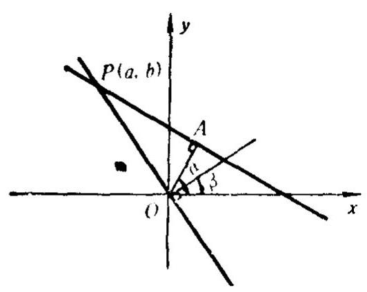

图 2-1- 第 12 题

$\therefore \; - \frac{1 + 2\sqrt{2}}{7} \leq   - \frac{1}{a} < 0,$ 故 $a \geq  2\sqrt{2} - 1$ .

12. 证 从条件 ①，②知点 $P\left( {a, b}\right)$ 为直线

$$
x\cos \alpha  + y\sin \alpha  = c
$$

与 $x\cos \beta  + y\sin \beta  = 0$

的交点,则 $\angle {POA} = \frac{\pi }{2} - \left( {\alpha  - \beta }\right)$ .

$$
\because \cos \angle {POA} = \frac{\left| OA\right| }{\left| OP\right| }\text{ , }
$$

$$
\therefore \;{\sin }^{2}\left( {\alpha  - \beta }\right)  = {\cos }^{2}\left( {\frac{\pi }{2} - \alpha  + \beta }\right)  = \frac{{c}^{2}}{{a}^{2} + {b}^{2}}\text{ . }
$$

13. 证 $\because \operatorname{tg}\left( {\frac{\pi }{4} + \alpha }\right)  = \frac{1 + \operatorname{tg}\alpha }{1 - \operatorname{tg}\alpha }$ ,令

$$
A = \frac{\pi }{4} + x, B = \frac{\pi }{4} + y, c = \frac{\pi }{4} + z.
$$

又 $\because A + B + C = \frac{3\pi }{4} + x + y + z = \pi$ ,

$\therefore \operatorname{tg}A + \operatorname{tg}B + \operatorname{tg}C = \operatorname{tg}A\operatorname{tg}B\operatorname{tg}C$ ,

故

$$
\frac{1 + \operatorname{tg}x}{1 - \operatorname{tg}x} + \frac{1 + \operatorname{tg}y}{1 - \operatorname{tg}y} + \frac{1 + \operatorname{tg}z}{1 - \operatorname{tg}z}
$$

$$
= \frac{\left( {1 + \operatorname{tg}x}\right) \left( {1 + \operatorname{tg}y}\right) \left( {1 + \operatorname{tg}z}\right) }{\left( {1 - \operatorname{tg}x}\right) \left( {1 - \operatorname{tg}y}\right) \left( {1 - \operatorname{tg}z}\right) }.
$$

14. 证 设 $\sin x = a,\sin y = b,\sin \left( {\alpha  + \beta }\right)  = c,\sin \gamma  = d$ ,

$\sin \left( {\alpha  + \beta  + \gamma }\right)  = e$ . 则已知条件转化为

$$
{ab} = {cd}
$$

①

$$
\sqrt{1 - {a}^{2}}\sqrt{1 - {b}^{2}} =  \pm  \sqrt{1 - {c}^{2}}\sqrt{1 - {d}^{2}}
$$

②

$$
\left( {1 - {a}^{2}}\right)  + \left( {1 - {b}^{2}}\right)  = 1 + 1 - {e}^{2}\text{ ，即 }{a}^{2} + {b}^{2} = {e}^{2}
$$

③

由 ② 得 $1 - {a}^{2} - {b}^{2} + {a}^{2}{b}^{2} = 1 - {c}^{2} - {d}^{2} + {c}^{2}{d}^{2}$ .

由 ① 得 ${a}^{2}{b}^{2} = {c}^{2}{d}^{2}$ ，

$$
\therefore \;{a}^{2} + {b}^{2} = {c}^{2} + {d}^{2}\text{ . }
$$

由 ③ 得 ${c}^{2} + {d}^{2} = {e}^{2}$ ，

$\therefore \;{\sin }^{2}\left( {\alpha  + \beta }\right)  + {\sin }^{2}\gamma  = {\sin }^{2}\left( {\alpha  + \beta  + \gamma }\right) .$

15. 解 $\because x\left( {1 - x}\right)  \geq  0, y\left( {1 - y}\right)  \geq  0$ ,

$\therefore \;0 \leq  x \leq  1,0 \leq  y \leq  1$ .

设

$$
x = {\sin }^{2}\alpha , y = {\sin }^{2}\beta ,
$$

其中 $\alpha ,\beta  \in  \left\lbrack  {0,\frac{\pi }{2}}\right\rbrack$ . 原方程组转化为

$$
\left\{  \begin{array}{l} \sin \alpha \cos \beta  + \cos \alpha \sin \beta  = \frac{1}{2}, \\  \sin \alpha \cos \alpha  + \sin \beta \cos \beta  = \frac{\sqrt{3}}{4}. \end{array}\right.
$$

即

$$
\left\{  \begin{array}{l} \sin \left( {\alpha  + \beta }\right)  = \frac{1}{2} \\  \sin \left( {\alpha  + \beta }\right) \cos \left( {\alpha  - \beta }\right)  = \frac{\sqrt{3}}{4} \end{array}\right.
$$

①

②

解①,②可得

$$
\left\{  {\begin{array}{l} \alpha  = \frac{\pi }{6}, \\  \beta  = 0; \end{array}\left\{  {\begin{array}{l} \alpha  = 0, \\  \beta  = \frac{\pi }{6}; \end{array}\left\{  {\begin{array}{l} \alpha  = \frac{\pi }{2}, \\  \beta  = \frac{\pi }{3}; \end{array}\left\{  \begin{array}{l} \alpha  = \frac{\pi }{3}, \\  \beta  = \frac{\pi }{2}. \end{array}\right. }\right. }\right. }\right.
$$

$\therefore$ 原方程组的解为 $\left( {\frac{1}{4},0}\right) ,\left( {0,\frac{1}{4}}\right) ,\left( {1,\frac{3}{4}}\right) ,\left( {\frac{3}{4},1}\right)$ .

$$
\angle {BOA} = \alpha  - \beta ,
$$

$$
\cos \frac{1}{2}\left( {\alpha  - \beta }\right)  = \frac{\left| OD\right| }{\left| OB\right| },
$$

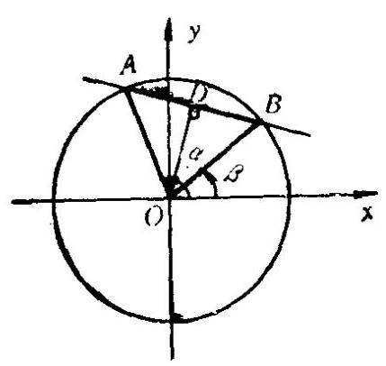

图 2-1-第 16 题

16. 证 设直线 ${ax} + {by} = c$ 与圆

$$
{x}^{2} + {y}^{2} = 1
$$

相交于不同的两点 $A, B$ ,如图 2-1-第 16 题. 令 $A\left( {\cos \alpha ,\sin \alpha }\right)$ , $B\left( {\cos \beta ,\sin \beta }\right)$ ,则

$$
\left| {OB}\right|  = 1,\left| {OD}\right|  = \frac{\left| c\right| }{\sqrt{{a}^{2} + {b}^{2}}},
$$

$$
\therefore {\cos }^{2}\frac{1}{2}\left( {\alpha  - \beta }\right)  = \frac{{c}^{2}}{{a}^{2} + {b}^{2}}\text{ . }
$$

17. 证 建立直角坐标系如图 2-1-第 17 题,取正三角形 ${ABO}$ 的顶点 $A$ 为原点， ${BO}$ 边上的高 ${DA}$ 所在直线为 $y$ 轴，则两边 ${AB}\text{ 、 }{AO}$ 的方程分别为

$$
\sqrt{3}x - y = 0,\sqrt{3}x + y = 0.
$$

若正三角形的高为 $r$ ,则与边 ${BO}$ 相切而滚动的圆方程为

$$
{\left( x - m\right) }^{2} + {y}^{2} = {r}^{2}.
$$

设圆与 ${AB}$ 、 ${AO}$ 相交于 $Q$ 、 $R$ 两点，则 $Q$ 、 $R$ 两点的横坐标 ${x}_{Q}$ ， ${x}_{R}$ 为方程 ${\left( x - m\right) }^{2} + 3{x}^{2} = {r}^{2}$ 即 $4{x}^{2} - {2mx} + {m}^{2} - {r}^{2} = 0$ 的根.

$$
{x}_{Q} + {x}_{R} = \frac{m}{2},{x}_{Q}{x}_{R} = \frac{{m}^{2} - {r}^{2}}{4}.
$$

$$
\because {y}_{Q} = \sqrt{3}{x}_{Q},\;{y}_{R} =  - \sqrt{3}{x}_{R},
$$

$$
\therefore \;{\left| RQ\right| }^{2} = {\left( {x}_{Q} - {x}_{R}\right) }^{2} + {\left( {y}_{Q} - {y}_{R}\right) }^{2}
$$

$$
= {x}_{Q}^{2} - 2{x}_{Q}{x}_{R} + {x}_{R}^{2} + 3\left( {{x}_{Q}^{2} + 2{x}_{Q}{x}_{R} + {x}_{R}^{2}}\right)
$$

$$
= 4\left( {{x}_{Q}^{2} + {x}_{Q}{x}_{R} + {x}_{R}^{2}}\right)  = 4\left\lbrack  {{\left( {x}_{Q} + {x}_{R}\right) }^{2} - {x}_{Q}{x}_{R}}\right\rbrack
$$

$$
= 4\left\lbrack  {\frac{{m}^{2}}{4} - \frac{{m}^{2} - {r}^{2}}{4}}\right\rbrack   = {r}^{2},
$$

$\therefore \left| {RQ}\right|  = r$ ,故 ${RQ}$ 在圆心所张的角恒为 ${60}^{ \circ  }$ .

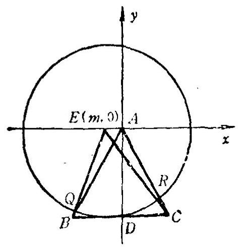

图 2-1-第 17 题

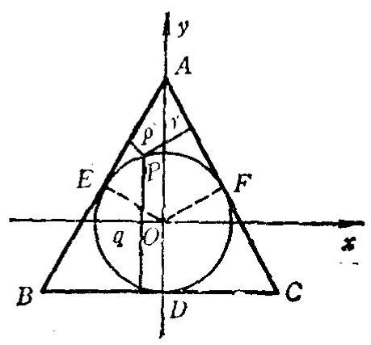

图 2-1-第 18 题

18. 证 建立坐标系如图 2-1-第 18 题. 正三角形中心为原点， 三边方程分别为

$$
x\cos \frac{\pi }{6} + y\sin \frac{\pi }{6} = 1
$$

①

$$
x\cos \frac{5\pi }{6} + y\sin \frac{5\pi }{6} = 1
$$

②

$$
x\cos \frac{3\pi }{2} + y\sin \frac{3\pi }{2} = 1
$$

③

$\because$ 点 $P$ 的坐标为 $\left( {\cos \theta ,\sin \theta }\right) ,\theta  \in  \left( {\frac{\pi }{6},\frac{5\pi }{6}}\right)$ .

$$
{r}^{\frac{1}{2}} = {\left| \cos \theta \cos \frac{\pi }{6} + \sin \theta \sin \frac{\pi }{6} - 1\right| }^{\frac{1}{2}}
$$

$$
= \sqrt{2}\sin \left( {\frac{\theta }{2} - \frac{\pi }{12}}\right) ,
$$

$$
{p}^{\frac{1}{2}} = {\left| \cos \theta \cos \frac{5\pi }{6} + \sin \theta \sin \frac{5\pi }{6} - 1\right| }^{\frac{1}{2}}
$$

$$
= \sqrt{2}\sin \left( {\frac{5\pi }{12} - \frac{\theta }{2}}\right)
$$

$$
{q}^{\frac{1}{2}} = {\left| \cos \theta \cos \frac{3\pi }{2} + \sin \theta \sin \frac{3\pi }{2} - 1\right| }^{\frac{1}{2}}
$$

$$
= \sqrt{2}\sin \left( {\frac{3\pi }{4} - \frac{\theta }{2}}\right) \text{ . }
$$

19. 证 设椭圆为 $\frac{{x}^{2}}{{a}^{2}} + \frac{{y}^{2}}{{b}^{2}} = 1, P\left( {x}_{1}\right.$ ,

$$
\therefore {p}^{\frac{1}{2}} + {r}^{\frac{1}{2}} = \sqrt{2}\left\lbrack  {\sin \left( {\frac{\theta }{2} - \frac{\pi }{12}}\right) }\right.
$$

$$
\left. {+\sin \left( {\frac{5\pi }{12} - \frac{\theta }{2}}\right) }\right\rbrack
$$

$$
= 2\sqrt{2}\sin \frac{\pi }{6}\cos \left( {\frac{\theta }{2} - \frac{\pi }{4}}\right)
$$

$$
= \sqrt{2}\sin \left( {\frac{3\pi }{4} - \frac{\theta }{2}}\right)  = {q}^{\frac{1}{2}}\text{ . }
$$

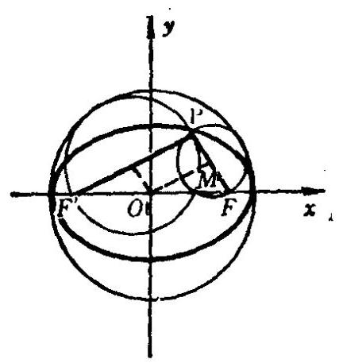

图 2-1- 第 19 题

$\left. {y}_{1}\right)$ 在椭圆上,焦点为 $F\left( {{ae},0}\right) ,{F}^{\prime }\left( {-{ae},0}\right)$ .

$$
\because \left| {P{F}^{\prime }}\right|  = a + e{x}_{1},\left| {PF}\right|  = a - e{x}_{1},
$$

又 $\because {OM}$ 是 $\bigtriangleup {FP}{F}^{\prime }$ 的中位线,

$$
\left| {OM}\right|  = \frac{1}{2}\left| {P{F}^{\prime }}\right|  = \frac{1}{2}\left( {a + e{x}_{1}}\right) .
$$

$\because$ 大辅助圆与 ${PF}$ 为直径之圆的圆心距为

$$
d = a - \frac{1}{2}\left| {PF}\right|  = a - \frac{1}{2}\left( {a - e{x}_{1}}\right)  = \left| {OM}\right| ,
$$

$\therefore {PF}$ 为直径之圆与大辅助圆内切

同理,可证 $\left| {P{F}^{\prime }}\right|$ 为直径之圆也与大辅助圆内切.

20. 证 设抛物线为 ${y}^{2} = {2px}$ ,过点 $\left( {{2p}{t}^{2},{2pt}}\right)$ 的切线方程为

$$
x - {2ty} + {2p}{t}^{2} = 0.
$$

过点 $\left( {{2p}{t}_{i}^{2},{2p}{t}_{i}}\right) \left( {i = 1,2,3}\right)$ 的三切线的交点为 $\left( {{2p}{t}_{1}{t}_{2}, p\left( {t}_{1}\right. }\right. \; \left. \left. {+{t}_{2}}\right) \right) \text{ 、 }\left( {{2p}{t}_{2}{t}_{3}, p\left( {{t}_{2} + {t}_{3}}\right) }\right) \text{ 、 }\left( {{2p}{t}_{3}{t}_{1}, p\left( {{t}_{3} + {t}_{1}}\right) }\right)$ . 过 $\left( {{2p}{t}_{2}{t}_{3}}\right.$ , $\left. {p\left( {{t}_{2} + {t}_{3}}\right) }\right)$ 与 $x - 2{t}_{1}y + {2p}{t}_{1}^{2} = 0$ 垂直的直线方程为

$$
2{t}_{1}x + y = p\left( {{t}_{2} + {t}_{3}}\right)  + {4p}{t}_{1}{t}_{2}{t}_{3}
$$

另一高所在直线的方程为

$$
2{t}_{2}x + y = p\left( {{t}_{3} + {t}_{1}}\right)  + {4p}{t}_{1}{t}_{2}{t}_{3},
$$

$\therefore$ 垂心的坐标为 $\left( {-\frac{p}{2}, p\left( {{t}_{1} + {t}_{2} + {t}_{3}}\right)  + {4p}{t}_{1}{t}_{2}{t}_{3}}\right)$ ,故在准线 $x =  - \frac{p}{2}$ 上.

21. 设 $x = {aX}, y = {bY}$ ,则椭圆转化为 ${X}^{2} + {Y}^{2} = 1$ ,直线转化为

$$
{aX}\cos \alpha  + {bY}\sin \alpha  - p = 0.
$$

根据圆与直线相切的充要条件，有

$$
\frac{\left| 0 + 0 - p\right| }{\sqrt{{a}^{2}{\cos }^{2}\alpha  + {b}^{2}{\sin }^{2}\alpha }} = 1,
$$

即

$$
{a}^{2}{\cos }^{2}\alpha  + {b}^{2}{\sin }^{2}\alpha  = {p}^{2}.
$$

22. 证 设椭圆 $\frac{{x}^{2}}{{a}^{2}} + \frac{{y}^{2}}{{b}^{2}} = 1$ 内接 $\bigtriangleup {P}_{1}{P}_{2}{P}_{3}$ ,三顶点的坐标为 ${P}_{i}\left( {a\cos {\theta }_{i}, b\sin {\theta }_{i}}\right) \;\left( {i = 1,2,3}\right)$ ,它们在大辅助圆上的对应点为 ${Q}_{i}\left( {a\cos {\theta }_{i}, a\sin {\theta }_{i}}\right)$ . 可以证明 ${S}_{\bigtriangleup {P}_{1}{P}_{2}{P}_{3}} : {S}_{\bigtriangleup {Q}_{1}{Q}_{4}{Q}_{5}} = b : a$ .

$\therefore$ 只要 ${S}_{\bigtriangleup {Q}_{1}{Q}_{1}{Q}_{2}}$ 达到最大时, ${S}_{\bigtriangleup {P}_{1}{P}_{2}{P}_{1}}$ 也达到最大. 圆内接三角形 ${Q}_{1}{Q}_{2}{Q}_{3}$ ，当其为正三角形时面积最大，最大面积为 $\frac{3\sqrt{3}}{4}{a}^{2}$

. $\;{\left( {S}_{\bigtriangleup {P}_{1}{P}_{2}{P}_{3}}\right) }_{\text{ 最大 }} = \frac{b}{a}\frac{3\sqrt{3}}{4}{a}^{2} = \frac{3\sqrt{3}}{4}{ab}$ .

23. 证 如图 2-1-第 23 题,设直角 $\bigtriangleup {ABC}$ 斜边 ${AB}$ 上的高为 ${OK}$ ,内接 $\bigtriangleup {LMN}$ . $\bigtriangleup {LMN}$ 关于边 ${BC}$ 的对称图形为 $\bigtriangleup {PMQ},{OK}$ 变为 ${OG}$ . 以 ${OD}$ 为轴再进行一次对称变换, $\bigtriangleup {PMQ}$ 变为 $\bigtriangleup {RSQ}.{CG}$ 变为 ${OH}$ . 从 $A\text{ 、 }O\text{ 、 }D$ 与 $B\text{ 、 }O \; E$ 三点共线，推出 $K\text{ 、 }C\text{ 、 }H$ 三点共线. $\bigtriangleup {LMN}$ 的周长为

$$
{LM} + {MQ} + {QR} > {LR} \geq  {KH} = {2OK}\text{ . }
$$

从而获证.

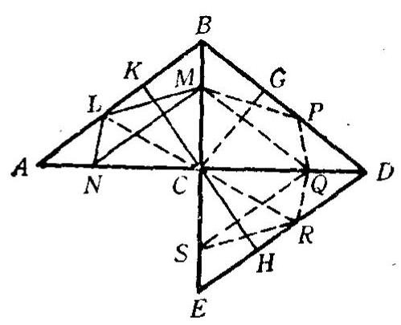

图 2-1-第 23 题

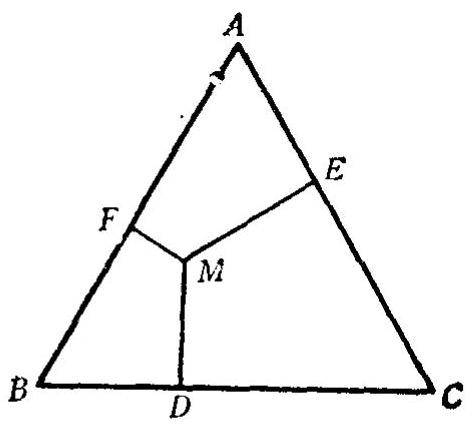

图 2-1-第 24 题

24. 证 如图 2-1-第 24 题,利用

$$
{MD} + {ME} + {MF} = \frac{2{S}_{\bigtriangleup {ABC}}}{a} = \frac{\sqrt{3}}{2}a
$$

及例 ${14BD} + {CE} + {AF} = \frac{3}{2}a$ ,可得

$$
\frac{{BD} + {CE} + {AF}}{{MD} + {ME} + {MF}} = \frac{3}{2}a/\frac{\sqrt{3}}{2}a = \sqrt{3}.
$$

25. 证 设四边形的顶点按逆时针方向排列的顺序是 ${z}_{1}\text{ 、 }{z}_{2}\text{ 、 }{z}_{3}$ 、

${z}_{4}$ ，于各边上向形外所作正方形的中心分别是

$$
{w}_{1} = \frac{1}{2}\left\lbrack  {\left( {1 + i}\right) {z}_{1} + \left( {1 - i}\right) {z}_{2}}\right\rbrack
$$

$$
{w}_{2} = \frac{1}{2}\left\lbrack  {\left( {1 + i}\right) {z}_{2} + \left( {1 - i}\right) {z}_{3}}\right\rbrack  ,
$$

$$
{w}_{3} = \frac{1}{2}\left\lbrack  {\left( {1 + i}\right) {z}_{3} + \left( {1 - i}\right) {z}_{4}}\right\rbrack  ,
$$

$$
{w}_{4} = \frac{1}{2}\left\lbrack  {\left( {1 + i}\right) {z}_{4} + \left( {1 - i}\right) {z}_{1}}\right\rbrack  .
$$

由此可得

26. 证 令

$$
\cos \left\lbrack  {\alpha  + \left( {n - 1}\right) \beta }\right\rbrack   + i\sin \left\lbrack  {\alpha  + \left( {n - 1}\right) \beta }\right\rbrack   = {e}^{i\left\lbrack  {\alpha  + \left( {n - 1}\right) \beta }\right\rbrack  },
$$

$$
\therefore \;{e}^{i\alpha } + {e}^{i\left( {\alpha  + \beta }\right) } + {e}^{i\left( {\alpha  + {2\beta }}\right) } + \cdots  + {e}^{i\left\lbrack  {\alpha  + \left( {n - 1}\right) \beta }\right\rbrack  }
$$

$$
= {e}^{i\alpha }\left\lbrack  {1 + {e}^{i\beta } + {e}^{2i\beta } + \cdots  + {e}^{i\left( {n - 1}\right) \beta }}\right\rbrack
$$

$$
= {e}^{i\alpha }\frac{{e}^{in\beta } - 1}{{e}^{i\beta } - 1}
$$

$$
= {e}^{i\alpha }\frac{{2i}\sin \frac{n\beta }{2}}{{2i}\sin \frac{\beta }{2}}\frac{\cos \frac{n\beta }{2} + i\sin \frac{n\beta }{2}}{\cos \frac{\beta }{2} + i\sin \frac{\beta }{2}}
$$

$$
= \frac{\sin \frac{n\beta }{2}}{\sin \frac{\beta }{2}}{e}^{i\left( {\alpha  + \frac{n - 1}{2}\beta }\right) }.
$$

根据复数相等的充要条件, 即得证.

27. 设 ${z}_{1} + A = {r}_{1}\left( {\cos \alpha  + i\sin \alpha }\right) ,{z}_{2} + A = {r}_{2}\left( {\cos \beta  + i\sin \beta }\right)$

$$
\because \;\left( {{z}_{1} + A}\right) \overline{\left( {z}_{2} + A\right) } = {r}_{1}{r}_{2}\left\lbrack  {\cos \left( {\alpha  - \beta }\right)  + i\sin \left( {\alpha  - \beta }\right) }\right\rbrack
$$

$$
= \left( {{z}_{1} + A}\right) \left( {{\bar{z}}_{2} + \bar{A}}\right)
$$

$$
= {z}_{1}{\bar{z}}_{2} + \overline{A}{z}_{1} + A{\bar{z}}_{2} + A\overline{A} = {\left| A\right| }^{2}
$$

$\therefore \;\left\{  {\begin{array}{l} {r}_{1}{r}_{2}\cos \left( {\alpha  - \beta }\right)  = {\left| A\right| }^{2} \\  {r}_{1}{r}_{2}\sin \left( {\alpha  - \beta }\right)  = 0 \end{array} \Rightarrow  \left\{  \begin{array}{l} \alpha  = \beta , \\  {r}_{1}{r}_{2} = {\left| A\right| }^{2}. \end{array}\right. }\right.$

故 $\left| {{z}_{1} + A}\right| \left| {{z}_{2} + A}\right|  = {\left| A\right| }^{2}$ .

$$
\frac{{z}_{1} + A}{{z}_{2} + A} = \frac{{r}_{1}}{{r}_{2}}\left\lbrack  {\cos \left( {\alpha  - \beta }\right)  + i\sin \left( {\alpha  - \beta }\right) }\right\rbrack   = \frac{{r}_{1}}{{r}_{2}} = \left| \frac{{z}_{1} + A}{{z}_{2} + A}\right| .
$$

28. 解 令 $F\left( x\right)  = {a}_{0} + {a}_{1}x + {a}_{2}{x}^{2} + \cdots  + {a}_{n}{x}^{n} + \cdots$ ,

则 $- {5xF}\left( x\right)  =  - 5{a}_{0}x - 5{a}_{1}{x}^{2} - \cdots  - 5{a}_{n - 1}{x}^{n} - \cdots$ ,

$$
6{x}^{2}F\left( x\right)  =  + 6{a}_{0}{x}^{2} + \cdots  + 6{a}_{n - 2}{x}^{n} + \cdots ,
$$

三式相加:

$$
\left( {1 - {5x} + 6{x}^{2}}\right) F\left( x\right)  = 1 - {7x}.
$$

$\therefore F\left( x\right)  = \frac{1 - {7x}}{\left( 1 - 5x + 6{x}^{2}\right) } = \frac{5}{1 - {2x}} - \frac{4}{1 - {3x}}$

$$
= 5\mathop{\sum }\limits_{{n = 0}}^{\infty }{2}^{n}{x}^{n} - 4\mathop{\sum }\limits_{{n = 0}}^{\infty }{3}^{n}{x}^{n} = \mathop{\sum }\limits_{{n = 0}}^{\infty }\left( {5 \cdot  {2}^{n} - 4 \cdot  {3}^{n}}\right) {x}^{n},
$$

$$
{a}_{n} = 5 \cdot  {2}^{n} - 4 \cdot  {3}^{n},\left( {n = 0,1,2,\cdots }\right) .
$$

29. 解 第 $n$ 个月初时,兔房中的兔子 ${a}_{n}$ 可分为两部分: 一部分是第 $n - 1$ 个月初时已经在兔房中的兔子,共有 ${a}_{n - 1}$ 对; 另一部分是第 $n$ 个月初新出生的小兔，总共有 ${a}_{n - 2}$ 对，这是因为凡第 $n - 2$ 个月初时在兔房中的兔子 (不论大小) 到第 $n$ 个月初时都能生一对小兔，于是得

$$
{a}_{n} = {a}_{n - 1} + {a}_{n - 2}\text{ . 且 }{a}_{0} = {a}_{1} = 1,{a}_{2} = 2\text{ . }
$$

$F\left( x\right)  = {a}_{0} + {a}_{1}x + {a}_{2}{x}^{2} + \cdots  + {a}_{n}{x}^{n} + \cdots ,$

$$
- {xF}\left( x\right)  =  - {a}_{0}x - {a}_{1}{x}^{2} - \cdots  - {a}_{n - 1}{x}^{n} - \cdots ,
$$

$$
- {x}^{2}F\left( x\right)  =  - {a}_{0}{x}^{2} - \cdots  - {a}_{n - 2}{x}^{n} - \cdots .
$$

三式相加得 $\left( {1 - x - {x}^{2}}\right) F\left( x\right)  = 1$ ,

$$
F\left( x\right)  = \frac{1}{1 - x - {x}^{2}} = \frac{1}{{r}_{2} - {r}_{1}}\left( {\frac{1}{x - {r}_{1}} - \frac{1}{x - {r}_{2}}}\right) .
$$

${r}_{1},{r}_{2}$ 是方程 $1 - x - {x}^{2} = 0$ 的根,

$$
{r}_{1} = \frac{-1 + \sqrt{5}}{2},{r}_{2} = \frac{-1 - \sqrt{5}}{2},
$$

$$
F\left( x\right)  = \frac{1}{{r}_{2} - {r}_{1}}\left\lbrack  {\frac{1}{{r}_{2}\left( {1 - \frac{x}{{r}_{2}}}\right) } - \frac{1}{{r}_{1}\left( {1 - \frac{x}{{r}_{1}}}\right) }}\right\rbrack
$$

$$
= \frac{1}{{r}_{2} - {r}_{1}}\left\lbrack  {\frac{1}{{r}_{2}}\mathop{\sum }\limits_{{n = 0}}^{\infty }\frac{1}{{r}_{2}^{n}}{x}^{n} - \frac{1}{{r}_{1}}\mathop{\sum }\limits_{{n = 0}}^{\infty }\frac{1}{{r}_{1}^{n}}{x}^{n}}\right\rbrack
$$

$$
= \mathop{\sum }\limits_{{n = 0}}^{\infty }\left\lbrack  {\frac{1}{{r}_{2} - {r}_{1}}\left( {\frac{1}{{r}_{2}^{n + 1}} - \frac{1}{{r}_{1}^{n + 1}}}\right) }\right\rbrack  {x}^{n},
$$

$$
\therefore \;{a}_{n} = \frac{1}{{r}_{2} - {r}_{1}}\left( {\frac{1}{{r}_{2}^{n + 1}} - \frac{1}{{r}_{1}^{n + 1}}}\right)
$$

$$
= \frac{1}{\sqrt{5}}\left\lbrack  {{\left( \frac{1 + \sqrt{5}}{2}\right) }^{n + 1} - {\left( \frac{1 - \sqrt{5}}{2}\right) }^{n + 1}}\right\rbrack  ,
$$

$$
\left( {n = 0,1,2,\cdots }\right) \text{ . }
$$

## 思考题二的答案与略解

1. 解 原方程化为

$$
\frac{3}{2}\left\lbrack  {\cos \alpha  + \cos \left( {{2x} - \alpha }\right) }\right\rbrack   = 2{\sin }^{2}x,
$$

即 $3\sin \alpha \sin {2x} + \left( {3\cos \alpha  + 2}\right) \cos {2x} = 2 - 3\cos \alpha$ .

此方程有解的充要条件是

$$
9{\sin }^{2}\alpha  + {\left( 3\cos \alpha  + 2\right) }^{2} \geq  {\left( 2 - 3\cos \alpha \right) }^{2},
$$

即

$$
3{\cos }^{2}\alpha  - 8\cos \alpha  - 3 \leq  0
$$

$\therefore$

$$
\cos \alpha  \in  \left\lbrack  {-\frac{1}{3},1}\right\rbrack
$$

故

$$
\alpha  \in  \left\lbrack  {\left( {{2n} - 1}\right) \pi  + \arccos \frac{1}{3},\left( {{2n} + 1}\right) \pi  - \arccos \frac{1}{3}}\right\rbrack  ,\left( {n \in  Z}\right) .
$$

2. 解 原方程化为

$$
{\left( {\sin }^{2}x + {\cos }^{2}x\right) }^{2} - 2{\sin }^{2}x{\cos }^{2}x + \sin {2x} + k = 0,
$$

即

$$
{\sin }^{2}{2x} - 2\sin {2x} - 2\left( {k + 1}\right)  = 0,
$$

$\therefore$ 2

$$
{\left( \sin 2x - 1\right) }^{2} = {2k} + 3.
$$

...

$$
- 1 \leq  \sin {2x} \leq  1,
$$

$\therefore$

$$
- 2 \leq  \sin {2x} - 1 \leq  0.
$$

故

$$
\left| {\sin {2x} - 1}\right|  \leq  2,
$$

即

$$
0 \leq  {\left( \sin 2x - 1\right) }^{2} \leq  4\text{ . }
$$

$\therefore$

$$
0 \leq  {2k} + 3 \leq  4,
$$

故

$$
k \in  \left\lbrack  {-\frac{3}{2},\frac{1}{2}}\right\rbrack
$$

3. 解 原方程化为

$$
\left( {k + 1}\right) {\cos }^{2}x + 4\cos x - 4\left( {k - 1}\right)  = 0,
$$

即

$$
\left\lbrack  {\left( {k + 1}\right) \cos x - 2\left( {k - 1}\right) }\right\rbrack  \left\lbrack  {\cos x + 2}\right\rbrack   = 0.
$$

. .

$$
\cos x + 2 \neq  0,
$$

$\therefore$

$$
\left( {k + 1}\right) \cos x - 2\left( {k - 1}\right)  = 0.
$$

当 $k =  - 1$ 时,方程无解. 当 $k \neq   - 1$ 时,

$$
\cos x = \frac{2\left( {k - 1}\right) }{k + 1}.
$$

$\because \left| \frac{2\left( {k - 1}\right) }{k + 1}\right|  \leq  1\;\therefore k \in  \left\lbrack  {\frac{1}{3},3}\right\rbrack$ 时,方程有解.

$\therefore k = 1\text{ 、 }2\text{ 、 }3$ 时,原方程有实数解.

$k = 1$ 时,

$$
\cos x = 0, x = \left( {{2n} + 1}\right) \frac{\pi }{2},\;\left( {n \in  Z\text{ 下同 }}\right) ;
$$

$k = 2$ 时, $\;\cos x = \frac{2}{3}, x = {2n\pi } \pm  \arccos \frac{2}{3};$

$$
\cos x = 1, x = {2n\pi }.
$$

4. 解 显然,对于任何实数 $a, x = 0$ 是方程的一个解.

(i) 若 $a$ 为无理数，由不等式

$$
\cos x \leq  1 + {\sin }^{2}{ax},
$$

$x$ 有解的充要条件是

$$
\left\{  {\begin{array}{l} 1 + {\sin }^{2}{ax} = 1, \\  \cos x = 1; \end{array}\text{ 即 }\left\{  \begin{array}{l} \sin {ax} = 0, \\  \cos x = 1. \end{array}\right. }\right.
$$

如果 $x \neq  0$ 是此方程的解，则

$$
\left\{  {\begin{array}{l} {ax} = {k}_{1}\pi , \\  x = 2{k}_{2}\pi , \end{array}\;\left( {{k}_{1},{k}_{2} \in  Z\text{ ,且 }{k}_{1}{k}_{2} \neq  0}\right) ,}\right.
$$

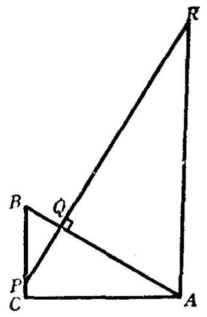

图 2-2-第 5 题

$\therefore a = \frac{{k}_{1}}{2{k}_{2}}$ ,这与 $a$ 是无理数矛盾.

$\therefore a$ 是无理数时,方程有唯一解: $x = 0$ .

(ii) 若 $a$ 为有理数,令 $a = \frac{p}{q}$ ,于是 $x = \; {2q\pi }$ ,显然是此方程异于零的解. 所以仅当 $a$ 为无理数时,原方程有唯一解.

5. 解 (1) 设 $\angle {BAC} = \theta$ ,当点 $P$ 在 ${AC}$ 边上移动时, $x \in  \left\lbrack  {0,{10}}\right\rbrack$ . 于是

$$
{AQ} = x\cos \theta ,
$$

$$
{QR} = {AQ}\operatorname{tg}\left( {{90}^{ \circ  } - \theta }\right)  = x\cos \theta \operatorname{ctg}\theta ,
$$

$$
\therefore y = \frac{1}{2}{AQ} \cdot  {QR} = \frac{1}{2}{x}^{2}{\cos }^{2}\theta \operatorname{ctg}\theta .
$$

但

$$
\cos \theta  = \frac{AO}{AB} = \frac{2}{\sqrt{5}},\operatorname{ctg}\theta  = 2,
$$

$$
y = \frac{4}{5}{x}^{2}, x \in  \left\lbrack  {0,{10}}\right\rbrack  .
$$

(2)当点 $P$ 在边 ${BC}$ 上移动时， $x \in  \left\lbrack  {{10},{15}}\right\rbrack$ ，见图 2-2-第 5 题.

$$
{AO} + {OP} = x,{BP} = {15} - x,{BQ} = \left( {{15} - x}\right) \sin \theta ,
$$

$$
{AQ} = {AB} - {BQ} = \frac{x + {10}}{\sqrt{5}},
$$

$$
y = \frac{1}{5}{\left( x + {10}\right) }^{2}, x \in  \left\lbrack  {{10},{15}}\right\rbrack  .
$$

(3) $x \in  \left\lbrack  {0,{10}}\right\rbrack$ 时, $\frac{4}{5}{x}^{2} = {25}$ ，解之得 $x = \frac{5\sqrt{5}}{2}\left( \mathrm{\;{cm}}\right)$ 。

$x \in  \left\lbrack  {{10},{15}}\right\rbrack$ 时, $\frac{1}{5}{\left( x + {10}\right) }^{2} = {25}$ . 解之得

$$
x = 5\sqrt{5} - {10}\left( \mathrm{\;{cm}}\right) \text{ ,不合题意. }
$$

(4)当 $x \in  \left\lbrack  {0,{10}}\right\rbrack$ 时，

$$
\frac{4}{5}{x}^{2} - {100}
$$

解之得

$$
x = 5\sqrt{5}\left( \mathrm{\;{cm}}\right) \text{ ,不合题意 }
$$

当 $x \in  \left\lbrack  {{10},{15}}\right\rbrack$ 时,

$$
\frac{1}{5}{\left( x + {10}\right) }^{2} = {100}
$$

解之得

$$
x = {10}\sqrt{5} - {10}\left( \mathrm{\;{cm}}\right) .
$$

6. 解 设 ${OD} = x$ ,则 ${OC} = x$ ,作 ${AE} \bot  {SD}$ ,连结 ${O}_{x}E$ .

...

$$
{SA} = {SC},{SE} = {SE},\angle {ASE} = \angle {OSE}\text{ ， }
$$

$\therefore$

$$
\bigtriangleup  {SAE} \cong   \bigtriangleup  {SOE}\text{ ， }
$$

故

$$
\angle {AES} = \angle {OES} = {90}^{ \circ  }\text{ ， }
$$

即

$$
{CE}\bot {SD}\text{ . }
$$

$\therefore \angle {AEO}$ 是二面角 $A - {SD} - O$ 的平面角,即 $\angle {AEO} = \beta$ ,

且 ${SD} \bot$ 平面 ${AEO},{OE}$ 在平面 ${AEO}$ 内

$\therefore {SO} \bot$ 平面 ${ABOD},{SD}$ 与平面 ${ABOD}$ 的夹角为

$$
{SD}\bot {OE}\text{ . }
$$

$\because {SO} \bot$ 平面 ${ABOD}$ ， ${SD}$ 与平面 ${ABOD}$ 的夹角为

$$
\alpha  = \angle {SDO} = \angle {SOO}\text{ , }
$$

在 $\bigtriangleup {DOE}$ 中,

$$
{OE} = x\sin \alpha ,
$$

在 $\bigtriangleup  {COE}$ 中,

$$
{OE} = x\operatorname{ctg}\frac{\beta }{2},
$$

$\therefore$

$$
\operatorname{ctg}\frac{\beta }{2} = \sin \alpha ,
$$

$$
\cos \beta  = \frac{1 - {\operatorname{tg}}^{2}\frac{\beta }{2}}{1 + {\operatorname{tg}}^{2}\frac{\beta }{2}} = \frac{1 - {\csc }^{2}\alpha }{1 + {\csc }^{2}\alpha } = \frac{{\cos }^{2}\alpha }{{\cos }^{2}\alpha  - 2}.
$$

7. 解 抛物线 $C$

$$
y = {x}^{2} - {ax} + a = {\left( x - \frac{a}{2}\right) }^{2} + a - {\left( \frac{a}{2}\right) }^{2}
$$

的顶点坐标为 $A\left( {\frac{a}{2}, a - \frac{{a}^{2}}{4}}\right) .\because$ 点 $A$ 在 $y = 1 - {x}^{2}$ 与 $x$ 轴围成的图形内部或边界上,

$\therefore$

$$
\left\{  \begin{array}{l} a - \frac{{a}^{2}}{4} \leq  1 - {\left( \frac{a}{2}\right) }^{2}, \\  a - \frac{{a}^{2}}{4} \geq  0; \end{array}\right.
$$

解之得 $a \in  \left\lbrack  {0,1}\right\rbrack$ .

8. 解 设 ${AB} = x,{AO} = y,\because {AD}\text{ 、 }{AE}$ 分别为 $\angle {BAE}$ , $\angle {DAC}$ 的平分线,

$\therefore$

$$
\frac{AC}{6} = \frac{AD}{3},\frac{AE}{3} = \frac{AB}{2},
$$

故

$$
{AD} = \frac{1}{2}y,{AE} = \frac{3}{2}x.
$$

根据平面几何角平分线性质定理,

$$
{AB} \cdot  {AE} = A{D}^{2} + {BD} \cdot  {DE}
$$

在 $\bigtriangleup  {ABE}$ 中,

$$
x \cdot  \frac{3}{2}x = \frac{1}{4}{y}^{2} + 2 \times  3,
$$

即

$$
6{x}^{2} - {y}^{2} = {24}
$$

①

在 $\bigtriangleup {ADO}$ 中,

$$
\frac{1}{2}y \cdot  y = \frac{9}{4}{x}^{2} + {18}
$$

即

$$
2{y}^{2} - 9{x}^{2} = {72}
$$

②

解 ①、② 所构成的方程组, 得

$$
x = 2\sqrt{10}, y = 6\sqrt{6}.
$$

$\therefore$ 最短边之长为 $2\sqrt{10}$ .

9. 解 设一人在点 $A$ 测得飞机位于点 $A$ 正北的 $B$ 点，点 $B$ 在水平面上的射影为 $O$ ,仰角 $\angle {BAO} = \alpha$ . 一分钟后,飞机向东

飞行 $a$ 公里到达点 $D, D$ 点在地平面上的射影为 $E.\because D$ 在 $A$ 的北偏东 $\beta .\therefore \angle {OAE} = \beta$ . 设飞机飞行高度 ${BO} = \; {DE} = h$ (公里),第二次测得仰角 $\angle {DAE} = \theta$ . 取

$$
{AO} = x,{AE} = y.
$$

在 $\bigtriangleup  {ABC}$ 中,

$$
x = h\operatorname{ctg}x
$$

①

在 $\bigtriangleup {ADE}$ 中,

$$
y = h\operatorname{ctg}\theta
$$

②

在 $\bigtriangleup {AOE}$ 中,

$$
a = x\operatorname{tg}\beta
$$

③

$$
x = y\cos \beta
$$

④

从①、③消去 $x$ ，得

$$
h = a\operatorname{tg}\alpha \operatorname{ctg}\beta \text{ (公里). }
$$

从①、②、④ 消去 $x$ 、 $y$ ，得

$$
\operatorname{ctg}\theta \cos \beta  = \operatorname{ctg}\alpha .\;\therefore \;\theta  = \operatorname{arctg}\left( {\operatorname{tg}\alpha \cos \beta }\right) .
$$

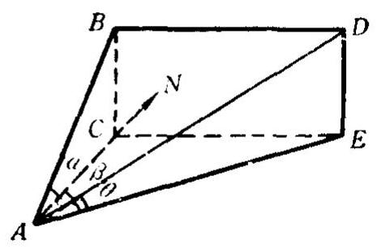

图 2-2-第 9 题

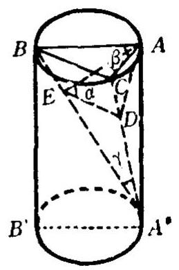

图 2-2-第 10 题

10. 解(1)设 ${AB} = {2R}$ ， $A{A}^{\prime } = h$ .

$$
{V}_{\text{ 棱锥体 }} = {ABC} : {V}_{\text{ 圆柱 }} = 1 : 2\sqrt{3}\pi ,
$$

$$
\frac{1}{6}{\left( 2R\right) }^{2}\sin \beta \cos \beta  : \pi {R}^{2} = 1 : 2\sqrt{3}\pi ,
$$

$$
\sin {2\beta } = \frac{\sqrt{3}}{2},\;\beta  = \frac{\pi }{6}\text{ 或 }\frac{\pi }{3}\text{ . }
$$

(2)自 $A$ 作 ${AD}\bot {A}^{\prime }C,{AE}\bot {A}^{\prime }B$ ，连结 $D$ 、 $E$ 、 $\because A{A}^{\prime }\bot$ 平面 ${ABO},{AO} \bot  {BO},\therefore {BO} \bot$ 平面 ${A}^{\prime }{AO}.\because {BO}$ 在平面 ${A}^{\prime }{BC}$ 内, $\therefore$ 平面 ${A}^{\prime }{BO} \bot$ 平面 $A{A}^{\prime }O$ . $\because {AD} \bot  {A}^{\prime }O$ , $\therefore {AD} \bot$ 平面 ${A}^{\prime }{BO}.\because {AE} \bot  {A}^{\prime }B,\therefore {DE} \bot  {A}^{\prime }B$

$$
\angle {AED} = \alpha ,\sin \alpha  = \frac{AD}{AE}.
$$

但

$$
{AD} \cdot  {A}^{\prime }C = A{A}^{\prime } \cdot  {AC} = {2Rh}\cos \beta
$$

又

$$
{AE} \cdot  {A}^{\prime }B = {AB} \cdot  A{A}^{\prime } = {2Rh}
$$

$$
\sin \alpha  = \frac{{2Rh}\cos \beta /{A}^{\prime }C}{{2Rh}/{A}^{\prime }B} = \frac{\cos \beta }{{A}^{\prime }C/{A}^{\prime }B} = \frac{\cos \beta }{\cos \gamma }.
$$

即

$$
\alpha  = \arcsin \left( \frac{\cos \beta }{\cos \gamma }\right) .
$$

11. 解 设 $\angle {ABO} = {2\theta },\theta  \in  \left( {0,\frac{\pi }{4}}\right)$ ,则

$$
{BD} = \operatorname{ctg}\theta ,{BE} = 1 + \operatorname{ctg}\theta ,
$$

$$
{AE} = \left( {1 + \operatorname{ctg}\theta }\right) \operatorname{tg}{2\theta } = \frac{2}{1 - \operatorname{tg}\theta } = h,
$$

圆锥体积

$$
V = \frac{1}{3}\pi {\left( 1 + \operatorname{ctg}\theta \right) }^{2}\frac{2}{1 - \operatorname{tg}\theta } = \frac{{2\pi }{\left( 1 + \operatorname{tg}\theta \right) }^{2}}{3{\operatorname{tg}}^{2}\theta \left( {1 - \operatorname{tg}\theta }\right) }.
$$

令

$$
x = \operatorname{tg}\theta , f\left( x\right)  = \frac{{\left( 1 + x\right) }^{2}}{{x}^{2}\left( {1 - x}\right) },
$$

$$
{f}^{\prime }\left( x\right)  = \frac{2{x}^{2}\left( {1 - x}\right) \left( {1 + x}\right)  - {\left( 1 + x\right) }^{2}\left\lbrack  {{2x}\left( {1 - x}\right)  - {x}^{2}}\right\rbrack  }{{x}^{4}{\left( 1 - x\right) }^{2}}
$$

$$
= \frac{\left( {x + 1}\right) \left( {{x}^{2} + {3x} - 2}\right) }{{x}^{3}{\left( 1 - x\right) }^{2}} = 0.
$$

$\because x > 0$ ,

$$
\therefore x = \frac{-3 + \sqrt{17}}{2}
$$

故

$$
{2\theta } = 2\operatorname{arctg}\frac{\sqrt{17} - 3}{2}.
$$

12. 解 设双曲线 ${x}^{2} - {y}^{2} = \lambda$ 上任意一点 $Q\left( {{x}_{1},{y}_{1}}\right)$ 关于直线

$$
x - y = 2
$$

的对称点为 $P\left( {x, y}\right)$ ,则

$$
\left\{  \begin{array}{l} \frac{1}{2}\left( {x + {x}_{1}}\right)  - \frac{1}{2}\left( {y + {y}_{1}}\right)  = 2 \\  \frac{{y}_{1} - y}{{x}_{1} - x} =  - 1 \end{array}\right.
$$

①

②

$\because$ 点 $Q$ 在双曲线上,

$\therefore$

$$
{x}_{1}^{2} - {y}_{1}^{2} = \lambda
$$

③

从 ①、②、③ 消去参数 ${x}_{1}$ ， ${y}_{1}$ ，得双曲线关于直线对称的曲线方程为

$$
{\left( y + 2\right) }^{2} - {\left( x - 2\right) }^{2} = \lambda
$$

④

$\because$ 曲线 ④ 与直线 $\frac{x}{3} + \frac{y}{2} = 1$ 相切,

$\therefore$

$$
{\left( y + 2\right) }^{2} - {\left\lbrack  3\left( 1 - \frac{y}{2}\right)  - 2\right\rbrack  }^{2} = \lambda
$$

有等根, $\Delta  = {28}^{2} - {20}\left( {{4\lambda } - {12}}\right)  = 0,\lambda  = \frac{64}{5}$ .

13. 解 设两抛物线相切于点 $\left( {{x}_{0},{y}_{0}}\right)$ . 两抛物线在点 $\left( {{x}_{0},{y}_{0}}\right)$ 的切线方程分别为

$$
{y}_{0}y = {4p}\left( {\frac{x + {x}_{0}}{2} - a}\right) ,
$$

即

$$
{2px} - {y}_{0}y + {2p}{x}_{0} - {4pa} = 0
$$

①

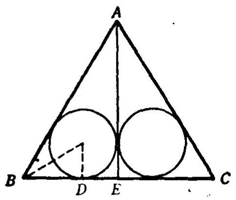

图 2-2-第 11 题

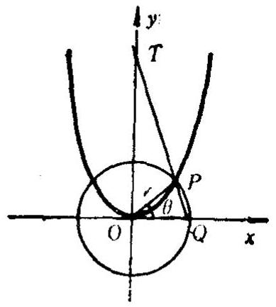

图 2-2-第 15 题

即

$$
{x}_{0}x = {2q}\left( {y + {y}_{0}}\right) ,
$$

$$
{x}_{0}x - {2qy} - {2q}{y}_{0} = 0
$$

②

$\because$ ①、② 两直线重合，

$\therefore$

$$
\frac{2p}{{x}_{0}} = \frac{{y}_{0}}{2q} = \frac{{2p}{x}_{0} - {4pa}}{-{2q}{y}_{0}}\;\left( {{x}_{0}{y}_{0}q \neq  0}\right) .
$$

从此得

$$
- {2q}{y}_{5}^{2} = {4pq}{x}_{0} - {8pqa}
$$

③

$\because$ 点 $\left( {{x}_{0},{y}_{0}}\right)$ 在已知抛物线上,

$\therefore$

$$
{y}_{0}^{2} = {4p}{x}_{0} - {4pa}.
$$

代入 ③,得 ${12pq}{x}_{0} = {16pqa}$ 、 $\because p \neq  0, q \neq  0$ ，

$\therefore$

$$
{x}_{0} = \frac{4}{3}a,{y}_{0} = \frac{1}{4q}{x}_{0}^{2} = \frac{4{a}^{2}}{9q},
$$

即切点坐标为 $\left( {\frac{4a}{3},\frac{4{a}^{2}}{9q}}\right)$ .

14. 解

心

$$
f\left( x\right)  + f\left( \frac{x - 1}{x}\right)  = 1 + x
$$

①

$\therefore$

$$
f\left( \frac{x - 1}{x}\right)  + f\left( \frac{-1}{x - 1}\right)  = \frac{{2x} - 1}{x}
$$

②

又

$$
f\left( {-\frac{1}{x - 1}}\right)  + f\left( x\right)  = \frac{x - 2}{x - 1}
$$

③

①+③-②，得

$$
{2f}\left( x\right)  = 1 + x + \frac{x - 2}{x - 1} - \frac{{2x} - 1}{x},
$$

$\therefore$

$$
f\left( x\right)  = \frac{{x}^{3} - {x}^{2} - 1}{{2x}\left( {x - 1}\right) }.
$$

15. 解 (1) 点 $P$ 的坐标为 $\left( {r\cos \theta , r\sin \theta }\right) ,\because$ 点 $P$ 在抛物线上,

$$
\therefore \;r\sin \theta  = {r}^{2}{\cos }^{2}\theta , r = \frac{\sin \theta }{{\cos }^{2}\theta },\;\left( {\theta  \neq  \frac{\pi }{2}}\right) .
$$

$$
\left| {OQ}\right|  = \left| {OP}\right| ,\angle {QOP} = \theta ,
$$

$$
\therefore \angle {OTP} = \frac{\theta }{2}\text{ , }
$$

$$
y = r\operatorname{ctg}\frac{\theta }{2} = \frac{\sin \theta }{{\cos }^{2}\theta } \cdot  \frac{1 + \cos \theta }{\sin \theta } = \frac{1 + \cos \theta }{{\cos }^{2}\theta }.
$$

(3)当 $r \rightarrow  0$ 时,从 $r = \frac{\sin \theta }{{\cos }^{2}\theta }$ ,可得 $\theta  \rightarrow  0, y \rightarrow  2,\therefore$ 点 $T$

的极限位置为 $\left( {0,2}\right)$ .

16. 解 $\because$ 点 $A\text{ 、 }B$ 在抛物线 $y = a{x}^{2} + {bx} + c$ 上,

$$
\therefore \;\left\{  {\begin{array}{l} a - b + c = 1, \\  a + b + c = 1; \end{array}\text{ 故 }\left\{  \begin{array}{l} b = 0, \\  a + c = 1. \end{array}\right. }\right.
$$

旋转体的体积为

$$
V = \pi {\int }_{-1}^{1}{\left( a{x}^{2} + c\right) }^{2}{dx} = \pi {\int }_{-1}^{1}\left( {{a}^{2}{x}^{4} + {2ac}{x}^{2} + {c}^{2}}\right) {dx}
$$

$$
= \pi {\left\lbrack  \frac{{a}^{2}}{5}{x}^{5} + \frac{2ac}{3}{x}^{8} + {c}^{2}x\right\rbrack  }_{-1}^{1}
$$

$$
= \pi \left\lbrack  {\frac{2}{5}{a}^{2} + \frac{4}{3}{ac} + 2{c}^{2}}\right\rbrack
$$

$$
= \pi \left\lbrack  {\frac{2}{5}{a}^{2} + \frac{4}{3}a\left( {1 - a}\right)  + 2{\left( 1 - a\right) }^{2}}\right\rbrack
$$

$$
= {2\pi }\left( {\frac{8}{15}{a}^{2} - \frac{4}{3}a + 1}\right)  = \frac{16}{15}\pi \left( {{a}^{2} - \frac{5}{2}a + \frac{15}{8}}\right)
$$

$$
= \frac{16}{15}\pi \left\lbrack  {{\left( a - \frac{5}{4}\right) }^{2} + \frac{15}{8} - \frac{25}{16}}\right\rbrack  .
$$

$\therefore a = \frac{5}{4}, b = 0, c =  - \frac{1}{4}$ 时, ${V}_{\text{ 最小 }} = \frac{\pi }{3}$ .

17. 解 已知圆的方程为

$$
{x}^{2} + {y}^{2} - {2ax} - {2by} = 0,
$$

圆心为 $\left( {a, b}\right)$ . 按题意有

$$
\left( {{10} - {6a} - {2b}}\right) \left( {{10} - {2a} - {6b}}\right)  < 0,
$$

即 $\;\left( {{3a} + b - 5}\right) \left( {a + {3b} - 5}\right)  < 0$ .

圆心 $\left( {a, b}\right)$ 活动的范围如图 2-2-第 17 题的阴影区域(不包括边界) 所示.

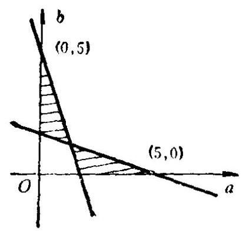

图 2-2-第 17 题

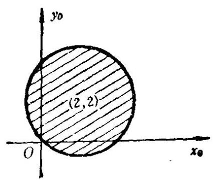

图 2-2-第 18 题

18. 解 $\because$ 点 $Q\left( {2,2}\right)$ 在抛物线

$$
{\left( x - {x}_{0}\right) }^{2} + {\left( y - {y}_{0}\right) }^{2} = {\left( x + y\right) }^{2}/2
$$

内部，

$\therefore$

$$
{\left( 2 - {x}_{0}\right) }^{2} + {\left( 2 - {y}_{0}\right) }^{2} < {\left( 2 + 2\right) }^{2}/2,
$$

即

$$
{\left( {x}_{0} - 2\right) }^{2} + {\left( {y}_{0} - 2\right) }^{2} - 8 < 0.
$$

$\therefore$ 抛物线的焦点 $\left( {{x}_{0},{y}_{0}}\right)$ 运动的范围如图 2-2-第 18 题中阴影所示(不包括边界).

## 思考题三的答案与略解

1. 证 设 $a < {x}_{1} < {x}_{2} < b$ ,则

$$
- b <  - {x}_{2} <  - {x}_{1} <  - a < 0.
$$

$\because f\left( {-{x}_{1}}\right)  > 0, f\left( {-{x}_{2}}\right)  > 0, f\left( {-{x}_{2}}\right)  > f\left( {-{x}_{1}}\right) ,$

$$
f\left( {-{x}_{1}}\right)  =  - f\left( {x}_{1}\right) , f\left( {-{x}_{2}}\right)  =  - f\left( {x}_{2}\right) ,
$$

$$
- f\left( {x}_{2}\right)  >  - f\left( {x}_{1}\right) .
$$

$$
\because \;\left| {f\left( {x}_{2}\right) }\right|  =  - f\left( {x}_{2}\right) ,\left| {f\left( {x}_{1}\right) }\right|  =  - f\left( {x}_{1}\right) ,
$$

$$
\left| {f\left( {x}_{2}\right) }\right|  > \left| {f\left( {x}_{1}\right) }\right| .
$$

故 $\left| {f\left( x\right) }\right|$ 在 $\left\lbrack  {a, b}\right\rbrack$ 上是增函数.

2. 证

$$
\left| {f\left( a\right)  - f\left( b\right) }\right|  = \left| {{a}^{2} - a + m - \left( {{b}^{2} - b + m}\right) }\right|
$$

$$
= \left| {a - b}\right| \left| {a + b - 1}\right|  < \left| {a - b + {2b} - 1}\right|
$$

$$
\leq  \left| {a - b}\right|  + 2\left| b\right|  + 1 < 1 + 2\left| b\right|  + 1
$$

$$
= 2\left( {\left| b\right|  + 1}\right) \text{ . }
$$

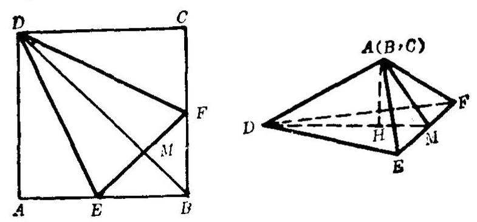

图 2-3-第 3 题

3. 解 $\because$

$$
{AD} \bot  {AE},{AD} \bot  {AF}\text{ , }
$$

$\therefore {AD} \bot$ 平面 ${AEF}.\because {AD}$ 在平面 ${ADE}$ 内 ${AD}$ 在平面 ${ADF}$ 内, $\therefore$ 平面 ${ADE} \bot$ 平面 ${AEF}$ ,平面 ${AEF} \bot$ 平面 ${ADF}.$

...

$$
{V}_{A - {DEF}} = {V}_{D - {AEF}}
$$

$\therefore$

$$
\frac{1}{3}{AH}\left( {{2a} \times  {2a} - 2{a}^{2} - \frac{1}{2}{a}^{2}}\right)  = \frac{1}{3} \cdot  {2a} \times  \frac{1}{2}{a}^{2},
$$

故

$$
{AH} = \frac{2a}{3}.
$$

4. 解 $\because$

$$
{1987}^{ \circ  } = {180}^{ \circ  } \times  {11} + {7}^{ \circ  },
$$

$\therefore \operatorname{ctg}{1987}^{ \circ  } = \operatorname{ctg}{7}^{ \circ  } > \operatorname{ctg}{7.5}^{ \circ  } = \frac{1 + \cos {15}^{ \circ  }}{\sin {15}^{ \circ  }}$

$$
= \frac{4 + \sqrt{6} + \sqrt{2}}{\sqrt{6} - \sqrt{2}} = \frac{2\sqrt{2} + \sqrt{3} + 1}{\sqrt{3} - 1}
$$

$$
= \frac{\left( {2\sqrt{2} + \sqrt{3} + 1}\right) \left( {\sqrt{3} + 1}\right) }{2}
$$

$$
= \frac{1}{2}\left( {2\sqrt{2} + \sqrt{3} + 1 + 2\sqrt{6} + 3 + \sqrt{3}}\right)
$$

$$
= \sqrt{6} + \sqrt{3} + \sqrt{2} + 2 > {7.3} > 7\text{ . }
$$

故

$$
{\operatorname{ctg}}^{4}{1987}^{ \circ  } > {7}^{4} = {49}^{2} = {\left( {50} - 1\right) }^{2} = {2500} - {100} + 1
$$

$$
= {2401} > {1987}\text{ . }
$$

5. 解 $\because$

$$
\frac{\cos C + k\cos A}{\cos C + k\cos B} = \frac{\sin B}{\sin A},
$$

$\therefore \cos C\sin A + k\cos A\sin A - \cos C\sin B - k\sin B\cos B = 0$ ,

$$
\cos C\left( {\sin A - \sin B}\right)  + \frac{k}{2}\left( {\sin {2A} - \sin {2B}}\right)  = 0,
$$

$$
2\cos C\sin \frac{1}{2}\left( {A - B}\right) \cos \frac{1}{2}\left( {A + B}\right)
$$

$$
+ k\sin \left( {A - B}\right) \cos \left( {A + B}\right)  = 0,
$$

$2\cos C\sin \frac{1}{2}\left( {A - B}\right) \left\lbrack  {\cos \frac{1}{2}\left( {A + B}\right)  - k\cos \frac{1}{2}\left( {A - B}\right) }\right\rbrack   = 0.$

$$
\because \;0 < \frac{1}{2}\left| {A - B}\right|  < \frac{1}{2}\left( {A + B}\right)  < \frac{\pi }{2},
$$

$\therefore \cos \frac{1}{2}\left( {A - B}\right)  > \cos \frac{1}{2}\left( {A + B}\right)$ 且 $k \geq  1,$

$$
\cos \frac{1}{2}\left( {A + B}\right)  - k\cos \frac{1}{2}\left( {A - B}\right)  \neq  0.
$$

$\therefore$ (i) $\cos C = 0,\sin \frac{1}{2}\left( {A - B}\right)  \neq  0$ ,

则 $C = {90}^{ \circ  },\bigtriangleup {ABC}$ 是直角 $\bigtriangleup$ ;

(ii) $\cos C \neq  0,\sin \frac{1}{2}\left( {A - B}\right)  = 0$ ,

则 $A = B,\bigtriangleup {ABO}$ 是等腰 $\bigtriangleup$ ;

(iii) $\cos C = 0,\sin \frac{1}{2}\left( {A - B}\right)  = 0$ ,

则 $O = {90}^{ \circ  }, A = B,\bigtriangleup {ABO}$ 是等腰直角 $\bigtriangleup$ .

6. 证 设 $\bigtriangleup  {ABC}$ 的三顶点 $A\left( {{x}_{1},{y}_{1}}\right) , B\left( {{x}_{2},{y}_{2}}\right) , C\left( {{x}_{3},{y}_{3}}\right)$ 均为格点,则 $\bigtriangleup {ABO}$ 的面积为

$$
S = \frac{1}{2}\left| \begin{array}{lll} {x}_{1} & {y}_{1} & 1 \\  {x}_{2} & {y}_{2} & 1 \\  {x}_{3} & {y}_{3} & 1 \end{array}\right|
$$

①

的绝对值,故 $S$ 是有理数. 如果 $\bigtriangleup {ABC}$ 是正三角形,则其面积

$$
S = \frac{\sqrt{3}}{4}{\left| AB\right| }^{2} = \frac{\sqrt{3}}{4}\left\lbrack  {{\left( {x}_{1} - {x}_{2}\right) }^{2} + {\left( {y}_{1} - {y}_{2}\right) }^{2}}\right\rbrack
$$

为无理数,这与 ① 矛盾,所以 $\bigtriangleup {ABO}$ 不是正三角形.

7. 证 设 $\lg N$ 为有理数 $\frac{m}{n}\left( {m, n\text{ 互质,且 }n \neq  1}\right)$ ,则

$$
N = {10}^{\frac{m}{n}},\;\therefore \;{10}^{m} = {N}^{n}.
$$

令

$$
N = {a}^{\alpha }{b}^{\beta }\cdots {c}^{\gamma },
$$

则

$$
{10}^{m} = {a}^{n\alpha }{b}^{n\beta }\cdots {c}^{n\gamma }.
$$

但

$$
{10}^{m} = {2}^{m} \cdot  {5}^{m}
$$

$\therefore$

$$
{2}^{m} \cdot  {5}^{m} = {a}^{n\alpha } \cdot  {b}^{n\beta }\cdots {c}^{n\gamma }
$$

①

根据自然数的质因数分解的唯一性, 只有当右端除了为数 2 及数 5 的幂以外不包含任何其他因子时, 等式 ① 才有可能成立,即 $N = {2}^{n\alpha } \cdot  {5}^{n\beta }$ ,且 $m = {n\alpha }, m = {n\beta }$ .

$\therefore$

$$
\lg N = \frac{m}{n} = \alpha  = \beta ,
$$

这与 $\lg N$ 不是整数矛盾. 所以 $\lg N$ 不能是有理数,故为无理数.

8. 证 设存在自然数 $x$ 、 $y$ 、 $z$ 、 $n$ ， $n \geq  z$ ，且

$$
{x}^{n} + {y}^{n} = {z}^{n}
$$

则有 $x < z, y < z$ ,且 $x \neq  y$ . 根据对称性,不妨设 $x < y$ ,

$\because {z}^{n} - {y}^{n} = \left( {z - y}\right) \left( {{z}^{n - 1} + y{z}^{n - 2} + \cdots  + {y}^{n - 1}}\right)  \geq  1 \cdot  n{x}^{n - 1} > {x}^{n}$ ,

$\therefore$ 这与 ${x}^{n} + {y}^{n} = {z}^{n}$ 矛盾,由此命题获证.

9. 证 设这堆苹果共有 $S$ 个,第一次、第二次、 $\cdots \cdots$ 第 $n$ 次取后剩下的苹果数分别为 ${S}_{1}$ 、 ${S}_{2}$ 、、、 ${S}_{n}$ . 根据题意，有

$$
\frac{S}{2} - \frac{1}{2} = {S}_{1}
$$

①

$$
\frac{{S}_{1}}{2} - \frac{1}{2} = {S}_{2}
$$

②

......

$$
\frac{{S}_{n - 1}}{2} - \frac{1}{2} = {S}_{n}
$$

⑫

① $\times  2 +$ ② $\times  {2}^{2} + \cdots  + \left( {\text{ ④ } \times  {2}^{n}}\right)$ ，并注意到 ${S}_{n} = 0$ ，得

$$
S = 1 + 2 + {2}^{2} + \cdots  + {2}^{n - 1} = {2}^{n} - 1.
$$

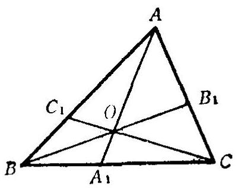

图 2-3-第 10 题

10. 证 设 $\frac{AO}{A{A}_{1}}\text{ 、 }\frac{BO}{B{B}_{1}}\text{ 、 }\frac{CO}{C{O}_{1}}$ 均大于

$\frac{2}{3}$ ,则

$$
\frac{AO}{A{A}_{1}} + \frac{BO}{B{B}_{1}} + \frac{CO}{C{O}_{1}} > 2
$$

①

根据题设, 有

$$
\frac{AO}{A{A}_{1}} = \frac{{S}_{\bigtriangleup {AOB}}}{{S}_{\bigtriangleup {AB}{A}_{1}}} = \frac{{S}_{\bigtriangleup {AOC}}}{{S}_{\bigtriangleup {AO}{A}_{1}}} = \frac{{S}_{\bigtriangleup {AOB}} + {S}_{\bigtriangleup {AOC}}}{{S}_{\bigtriangleup {ABO}}}.
$$

同理有

$$
\frac{BO}{B{B}_{1}} = \frac{{S}_{\bigtriangleup {AOB}} + {S}_{\bigtriangleup {BOC}}}{{S}_{\bigtriangleup {ABC}}},
$$

$$
\frac{CO}{C{C}_{1}} = \frac{{S}_{\bigtriangleup {BOO}} + {S}_{\bigtriangleup {AOC}}}{{S}_{\bigtriangleup {ABC}}},
$$

$$
\therefore \frac{AO}{A{A}_{1}} + \frac{BO}{B{B}_{1}} + \frac{CO}{C{O}_{1}} = \frac{2\left( {{S}_{\bigtriangleup {AOB}} + {S}_{\bigtriangleup {BOC}} + {S}_{\bigtriangleup {COA}}}\right) }{{S}_{\bigtriangleup {ABC}}}
$$

$$
= 2
$$

②

① 与 ② 矛盾，所以 $\frac{AO}{A{A}_{1}}$ ， $\frac{BO}{B{B}_{1}}$ ， $\frac{CO}{C{O}_{1}}$ 中至少有一个不大于 $\frac{2}{3}$ .

$$
\because {h}_{a} = \frac{2S}{a},{h}_{b} = \frac{2S}{b},
$$

$$
{h}_{0} = \frac{2S}{c}, r = \frac{2S}{a + b + c},
$$

$$
{2S}\left( {\frac{1}{a} + \frac{1}{b} + \frac{1}{c}}\right)  = \frac{9 \cdot  {2S}}{a + b + c}.
$$

11. 证

$\therefore$

即

$$
\left( {a + b + c}\right) \left( {\frac{1}{a} + \frac{1}{b} + \frac{1}{c}}\right)  = 9
$$

①

但

$$
\left( {a + b + c}\right) \left( {\frac{1}{a} + \frac{1}{b} + \frac{1}{c}}\right)  \geq  3\sqrt[3]{abc} \cdot  3\sqrt[3]{\frac{1}{abc}} = 9,
$$

当且仅当 $a = b = c$ 时,等号成立,故 $\bigtriangleup  {ABC}$ 是正三角形.

12. 证

$$
\because x + \frac{1}{y} = y + \frac{1}{z} = z + \frac{1}{x},
$$

$$
x - y = \frac{y - z}{yz},\;y - z = \frac{z - x}{zx},\;z - x = \frac{x - y}{xy},
$$

$$
\left( {x - y}\right) \left( {y - z}\right) \left( {z - x}\right)  = \frac{\left( {y - z}\right) \left( {z - x}\right) \left( {x - y}\right) }{x{y}^{2}{z}^{2}}.
$$

$\because x, y, z$ 互不相等,

$$
\left( {x - y}\right) \left( {y - z}\right) \left( {z - x}\right)  \neq  0,
$$

$$
{x}^{2}{y}^{2}{z}^{2} = 1
$$

$\therefore$

$\therefore$

设平行四边形 ${ABOD}$ 的四顶点坐标依次为 $A\left( {{x}_{1},{y}_{1}}\right)$ , $B\left( {{x}_{2},{y}_{2}}\right) ,\;C\left( {-{x}_{1},\; - {y}_{1}}\right) , \; D\left( {-{x}_{2}, - {y}_{2}}\right)$ ,过四顶点的椭圆

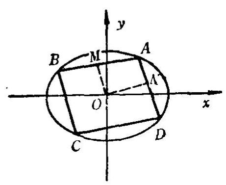

图 2-3-第 13 题

13. 证 引理 1 椭圆内接平行四边形的中心(对角线交点)必与椭圆中心重合.

方程为 $a{x}^{2} + {bxy} + c{y}^{2} + {dx} + {ey} + f = 0$

则

$$
a{x}_{1}^{2} + b{x}_{1}{y}_{1} + c{y}_{1}^{2} + d{x}_{1} + e{y}_{1} + f = 0
$$

①

$$
a{x}_{2}^{2} + b{x}_{3}{y}_{2} + c{y}_{2}^{2} + d{x}_{2} + e{y}_{2} + f = 0
$$

②

$$
a{x}_{1}^{2} + b{x}_{1}{y}_{1} + c{y}_{1}^{2} - d{x}_{1} - e{y}_{1} + f = 0
$$

③

$$
a{x}_{2}^{2} + b{x}_{2}{y}_{2} + c{y}_{2}^{2} - d{x}_{2} - e{y}_{2} + f = 0
$$

④

从①、③得

$$
d{x}_{1} + e{y}_{1} = 0
$$

⑤

从②、④得

$$
d{x}_{2} + e{y}_{2} = 0
$$

⑥

$\because \left( {{x}_{1},{y}_{1}}\right) \text{ 、 }\left( {{x}_{2},{y}_{2}}\right)$ 可在椭圆上运动, ${x}_{1}\text{ 、 }{y}_{1}\text{ 、 }{x}_{2}\text{ 、 }{y}_{2}$ 能取不同的值,

$\therefore$

$$
d = e = 0.
$$

故椭圆方程为

$$
a{x}^{2} + {bxy} + c{y}^{2} + f = 0\text{ 且 }{b}^{2} - {4ac} < 0,
$$

$\therefore$ 椭圆中心为原点. 所以椭圆内接平行四边形的中心与椭圆中心重合.

引理 2 椭圆内接平行四边形相邻两边的斜率 (如果存在) 之积为定值.

设椭圆 $\frac{{x}^{2}}{{a}^{2}} + \frac{{y}^{2}}{{b}^{2}} = 1$ 的内接 $\square {ABOD}$ 的两顶点分别为 $A\left( {x}_{1}\right.$ , $\left. {y}_{1}\right) , B\left( {{x}_{2},{y}_{2}}\right)$ .

$$
\frac{{x}_{1}^{2}}{{a}^{2}} + \frac{{y}_{1}^{2}}{{b}^{2}} = 1,\frac{{x}_{2}^{2}}{{a}^{2}} + \frac{{y}_{2}^{2}}{{b}^{2}} = 1,
$$

$\therefore$

$$
\frac{{x}_{1}^{2} - {x}_{2}^{2}}{{a}^{2}} =  - \frac{{y}_{1}^{2} - {y}_{2}^{2}}{{b}^{2}}
$$

故

$$
\frac{{y}_{1} - {y}_{2}}{{x}_{1} - {x}_{2}} \cdot  \frac{{y}_{1} + {y}_{2}}{{x}_{1} + {x}_{2}} =  - \frac{{b}^{2}}{{a}^{2}}.
$$

${k}_{AB} = \frac{{y}_{1} - {y}_{2}}{{x}_{1} - {x}_{2}},\;{k}_{OM} = \frac{\left( {{y}_{1} + {y}_{2}}\right) /2}{\left( {{x}_{1} + {x}_{2}}\right) /2} = \frac{{y}_{1} + {y}_{2}}{{x}_{1} + {x}_{2}}$ ,

$\therefore$

$$
{k}_{AB} \cdot  {k}_{OM} =  - \frac{{b}^{2}}{{a}^{2}}.
$$

$$
{OM}//{AD},\therefore {k}_{AB} \cdot  {k}_{AD} =  - \frac{{b}^{2}}{{a}^{2}}\text{ . }
$$

如果椭圆内接矩形 ${ABCD}$ 的邻边不与椭圆长、短轴平行，即不与 $x$ 、 $y$ 轴平行，那么 ${k}_{AB}$ 、 ${k}_{AD}$ 都存在，则

$$
{k}_{AB} \cdot  {k}_{AD} =  - \frac{{b}^{2}}{{a}^{2}}.
$$

$$
: \therefore {AB} \bot  {AD},\therefore {k}_{AB} \cdot  {k}_{AD} =  - 1\text{ , }
$$

故 ${a}^{2} = {b}^{2}$ ,即 $a = b$ ,这与椭圆 $a \neq  b$ 矛盾,所以椭圆内接矩形的两邻边与椭圆的长、短轴平行.

14. 证 设方程 ${x}^{4} + {ax} + 1 = 0$ 有有理根 $\frac{m}{n}\left( {m\text{ 、 }n\text{ 互质 }}\right)$ ,

则

$$
\frac{{m}^{4}}{{n}^{4}} + a \cdot  \frac{m}{n} + 1 = 0
$$

即

$$
\frac{{m}^{4}}{{n}^{3}} + {am} + n = 0
$$

①

$\because \frac{{m}^{4}}{{n}^{3}}$ 为分数, ${am} + n$ 为整数,故 ① 式不可能成立. 若 $n =$ 1,则 ${m}^{4} + a{m + 1} = 0$ . 如果 $m \neq   \pm  1$ ,则

$$
{m}^{3} + \alpha  + \frac{1}{m} = 0
$$

②

其中 ${m}^{3} + a$ 为整数， $\frac{1}{m}$ 为分数，故 ② 式不可能成立.

如果 $m =  \pm  1$ ,则 $1 \pm  a + 1 = 0,\therefore a =  \pm  2$ .

这与 $\left| a\right|  \neq  2$ 矛盾. 综上所述，原方程不可能有有理根.

15. 证 根据已知条件, $f\left( x\right)$ 的图象关于直线 $x = a, x = b$ 对称, 其中 $b > a$ ,则

$$
f\left( {a + x}\right)  = f\left( {a - x}\right)
$$

①

$$
f\left( {b + x}\right)  = f\left( {b - x}\right)
$$

②

$$
f\left\lbrack  {x + 2\left( {b - a}\right) }\right\rbrack   = f\left\lbrack  {b + \left( {x + b - {2a}}\right) }\right\rbrack
$$

(由②得)

$$
= f\left\lbrack  {b - \left( {x + b - {2a}}\right) }\right\rbrack
$$

$$
= f\left\lbrack  {{2a} - x}\right\rbrack
$$

$$
= f\left\lbrack  {a + \left( {a - x}\right) }\right\rbrack  \;\text{ (由 ① 得) }
$$

$$
= f\left\lbrack  {a - \left( {a - x}\right) }\right\rbrack
$$

$$
= f\left( x\right) .\;\left( {x \in  \left( {-\infty , + \infty }\right) }\right)
$$

$\therefore f\left( x\right)$ 是周期为 $2\left( {b - a}\right)$ 的周期函数.

16. 证 设 $\bigtriangleup {ABO}$ 的外心为 ${O}_{1},\bigtriangleup {BKN}$ 的外心为 ${O}_{2}$ .

...

$$
\angle {NB}{O}_{2} = \angle {BN}{O}_{2}\text{ , }
$$

作

$$
O{R}_{2} \bot  {BN},\angle P{O}_{2}R = \angle {BKN} = \angle {AOB},
$$

$\therefore$

$$
B{O}_{2}\bot {AO}\text{ . }
$$

...

$$
{O}_{1}O \bot  {AO},\therefore B{O}_{2}//O{O}_{1}\text{ . }
$$

令

$$
\angle {ANC} = \alpha ,\angle {NOK} = \beta ,
$$

则 $\angle B = \alpha  - \beta$ . 设圆 ${O}_{1}\text{ 、 }{O}_{2}\text{ 、 }O$ 的半径分别为 $R, r,{R}^{\prime }$ .

$$
{AO} = {2R}\sin B = 2{R}^{\prime }\sin \alpha ,
$$

$$
{KN} = 2{R}^{\prime }\sin \beta  = {2r}\sin B,
$$

$$
{R}^{\prime } = \frac{R\sin B}{\sin \alpha } = \frac{r\sin B}{\sin \beta },\;R = \frac{r\sin \alpha }{\sin \beta }.
$$

$$
O{O}_{1} = R\cos B + {R}^{\prime }\cos \left( {\pi  - \alpha }\right)
$$

$$
= \frac{r\sin \alpha }{\sin \beta }\cos B - \frac{r\sin B}{\sin \beta }\cos \alpha
$$

$$
= \frac{q \cdot  \left( {\sin \alpha \cos B - \sin B\cos \alpha }\right) }{\sin \beta }
$$

$$
= \frac{r\sin \left( {\alpha  - B}\right) }{\sin \beta } = r,
$$

$\therefore O{O}_{1} \text{ ⫫ } B{O}_{2}$ ,故 $O{O}_{1}B{O}_{2}$ 是平行四边形. ${O}_{1}{O}_{2}$ 平分 ${OB}$ 于点 $P$ ,但 ${O}_{1}{O}_{2}$ 垂直平分 ${BM},\therefore {OP} = {PB} = {PM}$ ,故点 $M$ 在以 $P$ 点为圆心, ${OB}$ 为直径的圆上,即 ${OM} \bot  {BM}$ .

17. 解 (1) 如图 2-3-第 17 题,设自 $\bigtriangleup {ABC}$ 的垂心 $O$ 作垂直于平面 ${ABC}$ 的直线 $l$ 分别交半圆 ${AD}$ 、 ${BE}$ 、 ${CF}$ 于 ${P}_{1}$ 、 ${P}_{2}$ 、 ${P}_{3}$ . 在半圆 $A{P}_{1}D$ 中， ${AD}$ 为直径， ${P}_{1}O \bot  {AD}$ ，

$$
\therefore O{P}_{1}^{2} = {AO} \cdot  {OD}\text{ . }
$$

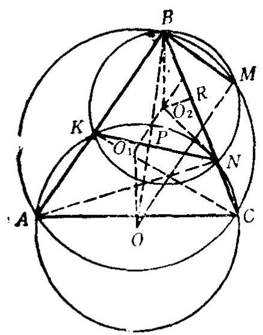

图 2-3-第 16 题

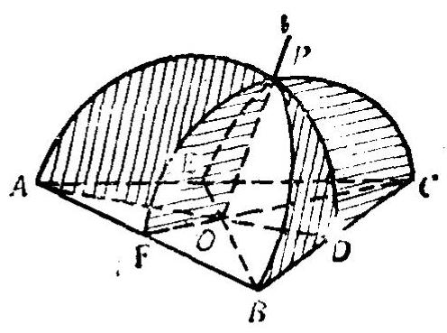

图 2-3-第 17 题

同理， $O{P}_{2}^{2} = {BO} \cdot  {OE}, O{P}_{3}^{2} = {CO} \cdot  {OF}$ .

在 $\bigtriangleup {ABC}$ 中， $\because {AD}\text{ 、 }{BE}\text{ 、 }{CF}$ 为三高, $\therefore B\text{ 、 }C\text{ 、 }E$ 、 $F, A\text{ 、 }B\text{ 、 }D\text{ 、 }E$ 分别四点共圆,故

$$
{BO} \cdot  {OE} = {CO} \cdot  {OF} = {AO} \cdot  {OD}.O{P}_{1}^{c} = O{P}_{2}^{2} = O{P}_{3}^{2},
$$

即

$$
O{P}_{1} = O{P}_{2} = O{P}_{3},
$$

而 ${P}_{1}\text{ 、 }{P}_{2}\text{ 、 }{P}_{8}$ 都在直线 $l$ 上, $\therefore {P}_{1}\text{ 、 }{P}_{2}\text{ 、 }{P}_{3}$ 三点重合于一点 $P$ ,即三个半圆交于一点.

(2) $\because {OP} \bot$ 平面 ${ABC},\angle {APO} = \angle {BPO} = {60}^{ \circ  }$ ，

$\therefore {AO} \bot  {BO},\therefore {AP}$ 在平面 ${ABO}$ 上的射影为 ${AO}$ ,

$$
{AO} = {BO}\text{ . }
$$

$\because {AO} \bot  {BO},\;\therefore \;{AP}$ 在平面 ${ABO}$ 上的射影为 ${AO}$ ,

$$
\therefore {AP}\bot {BO}\text{ . }
$$

∵ ${AP} \bot  {PD},\therefore {AP} \bot$ 平面 ${PBO}$ ,

故

$$
{AP}\bot {BP},{AP}\bot {CP}\text{ . }
$$

同理, 可证

$$
{PB}\bot {PC}\text{ . }
$$

...

$$
{AO} = {BO},\;\therefore \;{AP} = {BP}\text{ , }
$$

$$
{BC} = {AC},\angle {BAC} = \angle {ABC}\text{ . }
$$

令

$$
\angle {ABC} = \alpha ,\angle {AOB} = \pi  - {2\alpha },
$$

$$
{AO} = {BO} = {OP}\operatorname{tg}{60}^{ \circ  } = \sqrt{3}{OP}.
$$

$$
{\cos }^{2}{60}^{ \circ  } + {\cos }^{2}{60}^{ \circ  } + {\cos }^{2}\angle {CPO} = 1,
$$

$$
\cos \angle {OPO} = \frac{\sqrt{2}}{2},\angle {CPO} = {45}^{ \circ  },
$$

$$
{OC} = {OP} = {2R}\cos \left( {\pi  - {2\alpha }}\right) ,{AO} = {2R}\cos \alpha ,
$$

$\therefore$

$$
{2R}\cos \alpha  = {2R}\sqrt{3}\cos \left( {\pi  - {2\alpha }}\right) ,
$$

即

$$
2\sqrt{3}{\cos }^{2}\alpha  + \cos \alpha  - \sqrt{3} = 0,
$$

$$
\left( {\sqrt{3}\cos \alpha  - 1}\right) \left( {2\cos \alpha  + \sqrt{3}}\right)  = 0.
$$

$\because \alpha$ 是锐角,

$\therefore$

$$
\cos \alpha  = \frac{1}{\sqrt{3}} = \frac{\sqrt{3}}{3}
$$

$$
{OP} = {2R}\left( {1 - 2{\cos }^{2}\alpha }\right)  = \frac{2R}{3},
$$

$$
{AP} = {BP} = {OP}/\cos {60}^{ \circ  } = {2OP} = \frac{4R}{3},
$$

$$
{OP} = \sqrt{2}{OP} = \frac{2\sqrt{2}R}{3},
$$

$$
V = \frac{1}{6}{AP} \cdot  {BP} \cdot  {OP} = \frac{1}{6}{\left( \frac{4R}{3}\right) }^{2} \cdot  \frac{2\sqrt{2}R}{3} = \frac{{16}\sqrt{2}}{81}{R}^{3}.
$$

18. 证 如图 2-3-第 18 题. 设 ${AB}$ 是四面体 ${ABCD}$ 的最大棱,这时 $\bigtriangleup {AOD}$ 与 $\bigtriangleup {BOD}$ 的各边都不大于 1 . 设 ${OD} = a \leq  1$ ，不难证明 $\bigtriangleup {BOD}$ 的高 ${BE}$ 与 $\bigtriangleup {ACD}$ 的高 ${AF}$ 均不大于 $\sqrt{1 - \frac{{a}^{2}}{4}}$ ,从而四面体的高

$$
{AH} < {AF} < \sqrt{1 - \frac{{a}^{2}}{4}}.
$$

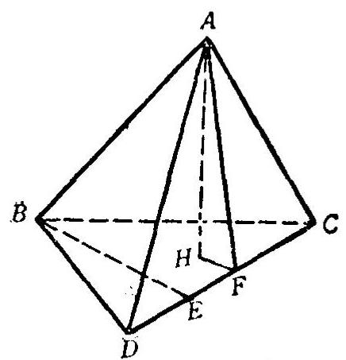

图 2-3-第 18 题

所以四面体的体积为

$V = \frac{1}{3}{S}_{\bigtriangleup {BOD}} \cdot  {AH} \leq  \frac{1}{3} \cdot  \frac{1}{2}a\left( {1 - \frac{{a}^{2}}{4}}\right)  = \frac{1}{24}a\left( {4 - {a}^{2}}\right) .$

$\because \;3 - a\left( {4 - {a}^{2}}\right)  = {a}^{3} - {4a} + 3 = \left( {a - 1}\right) \left( {{a}^{2} + a - 3}\right) ,$

$a \leq  1,{a}^{2} + a = a\left( {a + 1}\right)  \leq  2,$

$$
3 - a\left( {4 - {a}^{2}}\right)  = \left( {a - 1}\right) \left( {{a}^{2} + a - 3}\right)  \geq  0,
$$

$\beta  = a\left( {4 - {a}^{2}}\right)  \leq  3, V \leq  \frac{1}{24}a\left( {4 - {a}^{2}}\right)  \leq  \frac{1}{24} \times  3 = \frac{1}{8}.$

## 思考题四的答案与略解

1. 解 $\because {a}_{1} = 2,{a}_{n + 1} = 3{a}_{n} + 1$ ,

$\therefore {a}_{2} = 3{a}_{1} + 1 = 3 \cdot  2 + 1$ ,

$$
{a}_{3} = 3{a}_{2} + 1 = 2 \cdot  {3}^{2} + 3 + 1
$$

$$
{a}_{4} = 3{a}_{3} + 1 = 2 \cdot  {3}^{3} + {3}^{2} + 3 + 1,
$$

..............

$$
{a}_{n} = 2 \cdot  {3}^{n - 1} + {3}^{n - 2} + \cdots  + 3 + 1 = {3}^{n - 1} + \frac{1}{2}\left( {{3}^{n} - 1}\right) .
$$

应用数学归纳法证明, 略.

2. 解(1)

$$
{\alpha }_{1} = \frac{1}{6} = \frac{1}{1 \times  2 \times  3},
$$

$$
{a}_{2} = \frac{1}{4} \times  \frac{1}{6} = \frac{1}{2 \times  3 \times  4},
$$

$$
{a}_{3} = \frac{2}{5} \times  \frac{1}{2 \times  3 \times  4} = \frac{1}{3 \times  4 \times  5},
$$

..............

猜出

$$
{a}_{n} = \frac{1}{n\left( {n + 1}\right) \left( {n + 2}\right) }.
$$

应用数学归纳法证明, 略.(2)

$$
{S}_{n} = \mathop{\sum }\limits_{{k = 1}}^{n}{a}_{k} = \mathop{\sum }\limits_{{k = 1}}^{n}\frac{1}{k\left( {k + 1}\right) \left( {k + 2}\right) }
$$

$$
= \frac{1}{2}\mathop{\sum }\limits_{{k = 1}}^{n}\left\lbrack  {\frac{1}{k\left( {k + 1}\right) } - \frac{1}{\left( {k + 1}\right) \left( {k + 2}\right) }}\right\rbrack
$$

$$
= \frac{1}{2}\left\lbrack  {\frac{1}{2} - \frac{1}{\left( {n + 1}\right) \left( {n + 2}\right) }}\right\rbrack  ,
$$

$\therefore$

$$
\mathop{\lim }\limits_{{n \rightarrow  \infty }}{S}_{n} = \frac{1}{4}
$$

3. 证

$$
\because \operatorname{ctg}\theta  - \operatorname{tg}\theta  = \frac{\cos \theta }{\sin \theta } - \frac{\sin \theta }{\cos \theta } = \frac{{\cos }^{2}\theta  - {\sin }^{2}\theta }{\sin \theta \cos \theta } = 2\operatorname{ctg}{2\theta }\text{ , }
$$

$\therefore$

$$
\operatorname{tg}\theta  = \operatorname{ctg}\theta  - 2\operatorname{ctg}{2\theta }.
$$

同理有

$$
2\operatorname{tg}{2\theta } = 2\operatorname{ctg}{2\theta } - {2}^{2}\operatorname{ctg}{2}^{2}\theta ,
$$

.........,

$$
{2}^{k}\operatorname{tg}{2}^{k}\theta  = {2}^{k}\operatorname{ctg}{2}^{k}\theta  - {2}^{k + 1}\operatorname{ctg}{2}^{k + 1}\theta
$$

$$
\text{ ........., }
$$

$\therefore \operatorname{tg}\theta  + 2\operatorname{tg}{2\theta } + 4\operatorname{tg}{4\theta } + \cdots  + {2}^{n - 1}\operatorname{tg}{2}^{n - 1}\theta$

$$
= \operatorname{ctg}\theta  - 2\operatorname{ctg}{2\theta } + 2\operatorname{ctg}{2\theta } - {2}^{2}\operatorname{ctg}{2}^{2}\theta  + \cdots
$$

$$
+ {2}^{n - 1}\operatorname{ctg}{2}^{n - 1}\theta  - {2}^{n}\operatorname{ctg}{2}^{n}\theta
$$

$$
= \operatorname{ctg}\theta  - {2}^{n}\operatorname{ctg}{2}^{n}\theta \text{ . }
$$

4. 解 由已知 $n \geq  2$ 时， ${a}_{n} = \frac{{a}_{n - 1} + {a}_{n + 1}}{2\cos \alpha }$ ，

即

$$
{a}_{n + 1} = 2\cos \alpha  \cdot  {a}_{n} - {a}_{n - 1}.
$$

∵

$$
{a}_{1} = \cos \alpha
$$

$$
{a}_{2} = \cos {2\alpha }
$$

$\therefore$

$$
{a}_{3} = 2\cos \alpha  \cdot  \cos {2\alpha } - \cos \alpha  = \cos {3\alpha },
$$

.............

猜出

$$
{a}_{n} = \cos {n\alpha }.
$$

应用数学归纳法证明，略.

5. 证 i) 当 $n = 1$ 时, ${3}^{2} - 8 - 1 = 0$ ,能被 64 整除.

ii) 设 $n = k$ 时, ${3}^{2k} - {8k} - 1$ 能被 64 整除.

当 $n = k + 1$ 时,

${3}^{2\left( {k + 1}\right) } - 8\left( {k + 1}\right)  - 1 = 9 \cdot  {3}^{2k} - {8k} - 9 = 9\left( {{3}^{2k} - {8k} - 1}\right)  + {64k},$

能被 64 整除.

$\therefore$ 对于一切自然数 $n,{3}^{2n} - {8n} - 1$ 能被 64 整除.

6. 解 (1) $\because 3{a}_{n + 2} - 5{a}_{n + 1} + 2{a}_{n} = 0,\left( {n \geq  1}\right)$ ,

$$
\therefore \;3\left( {{a}_{n + 2} - {a}_{n + 1}}\right)  = 2\left( {{a}_{n + 1} - {a}_{n}}\right) ,
$$

即

$$
{a}_{n + 2} - {a}_{n + 1} = \frac{2}{3}\left( {{a}_{n + 1} - {a}_{n}}\right) .
$$

$\therefore$ 数列 $\left\{  {{a}_{n + 1} - {a}_{n}}\right\}$ 是公比为 $\frac{2}{3}$ 的等比数列.

令

$$
{b}_{n} = {a}_{n + 1} - {a}_{n},
$$

$$
\therefore \;{b}_{1} = {a}_{2} - {a}_{1} = b - a,
$$

$$
\mathop{\sum }\limits_{{k = 1}}^{{n - 1}}{b}_{k} = {a}_{n} - {a}_{n - 1} + {a}_{n - 1} - {a}_{n - 2} + \cdots  + {a}_{2} - {a}_{1} = {a}_{n} - {a}_{1},
$$

$$
{a}_{n} - {a}_{1} = \left( {b - a}\right) \frac{1 - {\left( \frac{2}{3}\right) }^{n - 1}}{1 - \frac{2}{3}},
$$

$$
\therefore \;{a}_{n} = \left( {{3b} - {2a}}\right)  - 3{\left( \frac{2}{3}\right) }^{n - 1}\left( {b - a}\right) .
$$

(2) 设 $\mathop{\sum }\limits_{{k = 1}}^{n}{a}_{k} = {S}_{n}$ ,

$$
{S}_{n} = n\left( {{3b} - {2a}}\right)  - 3\left( {b - a}\right) \frac{1 - {\left( \frac{2}{3}\right) }^{n}}{1 - \frac{2}{3}}
$$

$$
= n\left( {{3b} - {2a}}\right)  - 9\left( {b - a}\right) \left\lbrack  {1 - {\left( \frac{2}{3}\right) }^{n}}\right\rbrack  .
$$

$$
\because \;\left| \frac{2}{3}\right|  < 1
$$

$$
\therefore \;\mathop{\lim }\limits_{{n \rightarrow  \infty }}{\left( \frac{2}{3}\right) }^{n} = 0\text{ . }
$$

要使 $\mathop{\sum }\limits_{{n = 1}}^{\infty }{a}_{n} = {S}_{n}$ 存在,必须

$$
{3b} - {2a} = 0
$$

①

$\therefore$

$$
\mathop{\lim }\limits_{{n \rightarrow  \infty }}{S}_{n} =  - 9\left( {b - a}\right)  = 9
$$

$$
b - a =  - \frac{1}{2}
$$

②

解① 与② 得 $a = 3, b = 2$ .

7. 解 (1) 由 $3{a}_{n + 2} = 2{a}_{n + 1} + {a}_{n}$ ,得

$$
3\left( {{a}_{n + 2} - {a}_{n + 1}}\right)  =  - \left( {{a}_{n + 1} - {a}_{n}}\right) ,
$$

$\therefore$

$$
{a}_{n + 2} - {a}_{n + 1} =  - \frac{1}{3}\left( {{a}_{n + 1} - {a}_{n}}\right) .
$$

令

$$
{b}_{n} = {a}_{n + 1} - {a}_{n},
$$

$$
\therefore \;{b}_{1} = 3 - 7 =  - 4\text{ . }
$$

$\left\{  {b}_{n}\right\}$ 是以-4为首项,以 $q =  - \frac{1}{3}$ 为公比的等比数列,

$$
\therefore \mathop{\sum }\limits_{{k = 1}}^{{n - 1}}{b}_{k} = {a}_{n} - {a}_{n - 1} + {a}_{n - 1} - {a}_{n - 2} + \cdots  + {a}_{2} - {a}_{1} = {a}_{n} - {a}_{1},
$$

$$
{a}_{n} - {a}_{1} = \left( {-4}\right)  \cdot  \frac{1 - {\left( -\frac{1}{3}\right) }^{n - 1}}{1 - \left( {-\frac{1}{3}}\right) } =  - 3 + 3 \cdot  {\left( -\frac{1}{3}\right) }^{n - 1},
$$

$$
\therefore \;{a}_{n} = 4 + 3 \cdot  {\left( -\frac{1}{3}\right) }^{n - 1}\text{ . }
$$

(2) $\mathop{\lim }\limits_{{n \rightarrow  \infty }}{a}_{n} = \mathop{\lim }\limits_{{n \rightarrow  \infty }}\left\lbrack  {4 + 3 \cdot  {\left( -\frac{1}{3}\right) }^{n - 1}}\right\rbrack   = 4$

8. 证 i) 当 $n = 0$ 、1 时,命题显然成立.

ii) 假设当 $n = k$ 时,命题成立,即

$f\left( x\right)  = {x}^{k + 2} + {\left( x + 1\right) }^{{2k} + 1}$ 能被 ${x}^{2} + x + 1$ 整除.

当 $n = k + 1$ 时,

$$
f\left( x\right)  = {x}^{\left( {k + 1}\right)  + 2} + {\left( x + 1\right) }^{2\left( {k + 1}\right)  + 1}
$$

$$
= x \cdot  {x}^{k + 2} + {\left( x + 1\right) }^{2}{\left( x + 1\right) }^{{2k} + 1}
$$

$$
+ x{\left( x + 1\right) }^{{2k} + 1} - x{\left( x + 1\right) }^{{2k} + 1}
$$

$$
= x\left\lbrack  {{x}^{k + 2} + {\left( x + 1\right) }^{{2k} + 1}}\right\rbrack   + {\left( x + 1\right) }^{{2k} + 1}\left( {{x}^{2} + x + 1}\right) ,
$$

$f\left( x\right)$ 能被 ${x}^{2} + x + 1$ 整除.

$\therefore$ 当 $n = k + 1$ 时,命题成立.

故对一切非负整数 $n$ ,命题成立.

9. 解 (1) $\because {a}_{n} = \sqrt{{a}_{n - 1}{a}_{n - 2}},\therefore {a}_{n} > 0$ ,

$$
{a}_{n}\sqrt{{a}_{n - 1}} = {a}_{n - 1}\sqrt{{a}_{n - 2}},
$$

即

$$
{a}_{n}\sqrt{{a}_{n - 1}} = {a}_{n - 1}\sqrt{{a}_{n - 2}} = \cdots  = {a}_{2}\sqrt{{a}_{1}},
$$

$$
\therefore {a}_{n}\sqrt{{a}_{n - 1}} = 8\text{ . }
$$

(2)

$$
\because {a}_{1} = 1,{a}_{2} = 8\text{ , }
$$

$$
\therefore {a}_{3} = 8 \cdot  {8}^{-\frac{1}{2}} = {8}^{1 - \frac{1}{2}}\text{ . }
$$

$$
{a}_{4} = 8 \cdot  {\left( {8}^{1 - \frac{1}{2}}\right) }^{-\frac{1}{2}} = {8}^{1 - \frac{1}{2} + \frac{1}{4}},
$$

$$
{a}_{5} = 8 \cdot  {\left( {8}^{1 - \frac{1}{2} + \frac{1}{4}}\right) }^{-\frac{1}{2}} = {8}^{1 - \frac{1}{2} + \frac{1}{4} - \frac{1}{8}},
$$

......

$$
{a}_{n} = {8}^{1 - \frac{1}{2} + \frac{1}{{2}^{2}} - \frac{1}{{2}^{3}} + \cdots  + {\left( -1\right) }^{n} \cdot  \frac{1}{{2}^{n - 2}}},
$$

即

$$
{a}_{n} = {8}^{\frac{2}{3}\left\lbrack  {1 - {\left( -\frac{1}{2}\right) }^{n - 1}}\right\rbrack  }
$$

$$
\mathop{\lim }\limits_{{n \rightarrow  \infty }}{a}_{n} = {8}^{\frac{2}{3}} = 4.
$$

10. 解

$$
{a}_{1} = \sqrt{\frac{1}{2}\sqrt{3}} = \sqrt{\sin \frac{\pi }{3}}
$$

$$
{\alpha }_{n} = \sqrt{\sin \frac{\pi }{3} \cdot  \sqrt{{a}_{n - 1}}}
$$

$$
\therefore {a}_{2} = \sqrt{\sin \frac{\pi }{3}{\left( \sin \frac{\pi }{3}\right) }^{\frac{1}{4}}} = {\left( \sin \frac{\pi }{3}\right) }^{\frac{1}{2} + \frac{1}{8}},
$$

$$
{a}_{3} = \sqrt{\sin \frac{\pi }{3}\sqrt{{\left( \sin \frac{\pi }{3}\right) }^{\frac{1}{2} + \frac{1}{8}}}} = {\left( \sin \frac{\pi }{3}\right) }^{\frac{1}{2} + \frac{1}{8} + \frac{1}{32}}.
$$

.........

$\therefore \;{a}_{n} = {\left( \sin \frac{\pi }{3}\right) }^{\frac{1}{2} + \frac{1}{8} + \frac{1}{32} + \cdots  + \frac{1}{{2}^{{3n} - 1}}} = {\left( \sin \frac{\pi }{3}\right) }^{\frac{2}{3}\left( {1 - \frac{1}{{2}^{3n}}}\right) }.$

应用数学归纳法证明略.

11. 解 $\because$

$$
{x}_{1} = {x}_{1}
$$

$\therefore$

$$
{x}_{2} = \frac{3{x}_{1}}{{x}_{1} + 3}
$$

$$
{x}_{3} = f\left( {x}_{2}\right)  = \frac{3{x}_{2}}{{x}_{2} + 3} = \frac{3{x}_{1}}{2{x}_{1} + 3},
$$

$$
{x}_{4} = f\left( {x}_{3}\right)  = \frac{3{x}_{3}}{{x}_{3} + 3} = \frac{3{x}_{1}}{3{x}_{1} + 3},
$$

.........

猜测

$$
{x}_{n} = f\left( {x}_{n - 1}\right)  = \frac{3{x}_{1}}{\left( {n - 1}\right) {x}_{1} + 3},
$$

$$
\therefore \frac{1}{{x}_{n + 1}} - \frac{1}{{x}_{n}} = \frac{n{x}_{1} + 3}{3{x}_{1}} - \frac{\left( {n - 1}\right) {x}_{1} + 3}{3{x}_{1}} = \frac{1}{3}\text{ . }
$$

应用数学归纳法证明略.

12. 证 $\because \alpha \text{ 、 }\beta$ 是方程的两个根,

$$
{\alpha }^{2} = {\mu \alpha } + 1,{\beta }^{2} = {a\beta } + 1,
$$

又

$$
\left\{  \begin{array}{l} \alpha  + \beta  = a \\  \alpha  \cdot  \beta  =  - 1 \end{array}\right.
$$

$$
{\alpha }^{2} + {\beta }^{2} = {a}^{2} + 2,{\left( \alpha  - \beta \right) }^{2} = {a}^{2} + 4,
$$

$$
\alpha  - \beta  = \sqrt{{a}^{2} + 4}
$$

$$
{f}_{1} = \frac{\alpha  - \beta }{\sqrt{{a}^{2} + 4}} = 1
$$

$$
{f}_{2} = \frac{{\alpha }^{2} - {\beta }^{2}}{\sqrt{{a}^{2} + 4}} = \frac{\left( {\alpha  + \beta }\right) \left( {\alpha  - \beta }\right) }{\sqrt{{a}^{2} + 4}} = a.
$$

当 $n \geq  2$ 时,

$$
{\alpha }^{2} = {a\alpha } + 1,{\alpha }^{n} = {\alpha }^{n - 2}\left( {{a\alpha } + 1}\right) ,
$$

$$
{\beta }^{2} = {a\beta } + 1,{\beta }^{n} = {\beta }^{n - 2}\left( {{a\beta } + 1}\right) ,
$$

$$
\therefore {\alpha }^{n} - {\beta }^{n} = {\alpha }^{n - 2}\left( {{\alpha \alpha } + 1}\right)  - {\beta }^{n - 2}\left( {{\alpha \beta } + 1}\right)
$$

$$
= a\left( {{\alpha }^{n - 1} - {\beta }^{n - 1}}\right)  + \left( {{\alpha }^{n - 2} - {\beta }^{n - 2}}\right) ,
$$

$$
\frac{{\alpha }^{n} - {\beta }^{n}}{\sqrt{{a}^{2} + 4}} = a \cdot  \frac{{\alpha }^{n - 1} - {\beta }^{n - 1}}{\sqrt{{a}^{2} + 4}} + \frac{{\alpha }^{n - 2} - {\beta }^{n - 2}}{\sqrt{{a}^{2} + 4}},
$$

$$
{f}_{n} = a{f}_{n - 1} + {f}_{n - 2}\;\left( {n > 2, n \in  N}\right)
$$

$\because {f}_{1} = 1,{f}_{2} = a$ 为正整数.

$\therefore$ 上式所有的 ${f}_{n}$ 都是正整数.

13. 要证 ${2}^{n} > 1 + n\sqrt{{2}^{n - 1}}$ ,即 ${2}^{n} - 1 > n\sqrt{{2}^{n - 1}}$ ,

两边平方:

$$
{\left( {2}^{n} - 1\right) }^{c} > {n}^{2} \cdot  {2}^{n - 1}
$$

得

$$
{2}^{n - 1}\left( {{2}^{n + 1} - 4 - {n}^{2}}\right)  + 1 > 0.
$$

只需证明

$$
{2}^{n + 1} - 4 - {n}^{2} \geq  0,
$$

即

$$
{2}^{n + 1} \geq  {n}^{2} + 4
$$

用数学归纳法证明略.

14. 证 i) 当 $n = 2$ 时,

$$
{a}_{1}{a}_{2} - \left( {{a}_{1} + {a}_{2} + 1 - 2}\right)  = \left( {{a}_{1} - 1}\right) \left( {{a}_{2} - 1}\right)  > 0
$$

不等式成立.

ii) 设 $n = k$ 时不等式成立,即

$$
{a}_{1}{a}_{2}\cdots {a}_{k} > {a}_{1} + {a}_{2} + \cdots  + {a}_{k} + 1 - k.
$$

当 $n = k + 1$ 时,

$$
{a}_{1}{a}_{2}\cdots {a}_{k}{a}_{k + 1} - \left( {{a}_{1} + {a}_{2} + \cdots  + {a}_{k} + {a}_{k + 1} + 1 - k - 1}\right)
$$

$$
= \left( {{a}_{1}{a}_{2}\cdots {a}_{k} - 1}\right)  \cdot  {a}_{k + 1} - \left( {{a}_{1} + {a}_{2} + \cdots  + {a}_{k} - k}\right)
$$

$$
> \left( {{a}_{1}{a}_{2}\cdots {a}_{k} - 1}\right)  \cdot  1 - \left( {{a}_{1} + {a}_{2} + \cdots  + {a}_{k} - k}\right)
$$

$$
= {a}_{1}{a}_{2}\cdots {a}_{k} - \left( {{a}_{1} + {a}_{2} + \cdots  + {a}_{k} + 1 - k}\right)  > 0,
$$

即对一切 $n \geq  2$ 的整数,不等式成立.

15. 解(1)

$$
\frac{{z}_{n + 1}}{{z}_{n}} = \frac{\cos \alpha  + i\sin \alpha }{2}
$$

$$
{z}_{n} = {z}_{1}{q}^{n - 1} = 1 \cdot  {\left( \frac{\cos \alpha  + i\sin \alpha }{2}\right) }^{n - 1}
$$

$$
= \left\lbrack  {\cos \left( {n - 1}\right) \alpha  + i\sin \left( {n - 1}\right) \alpha }\right\rbrack  /{2}^{n - 1}.
$$

(2)证:i)当 $n = 1$ 时，

左 $= {z}_{1} = 1$ ,右 $= \frac{2 - \cos \alpha  - i\sin \alpha }{2 - \left( {\cos \alpha  + i\sin \alpha }\right) } = 1$ 等式成立.

ii) 设 $n = k$ 时等式成立，即

$$
\mathop{\sum }\limits_{{i = 1}}^{k}{z}_{i} = \frac{{2}^{k} - \cos {k\alpha } - i\sin {k\alpha }}{{2}^{k} - {2}^{k - 1}\left( {\cos \alpha  + i\sin \alpha }\right) }.
$$

当 $n = k + 1$ 时,

$$
\mathop{\sum }\limits_{{i = 1}}^{k}{z}_{i} + {z}_{k + 1} = \frac{{2}^{k} - \cos {k\alpha } - i\sin {k\alpha }}{{2}^{k} - {2}^{k - 1}\left( {\cos \alpha  + i\sin \alpha }\right) } + \frac{\cos {k\alpha } + i\sin {k\alpha }}{{2}^{k}}
$$

$$
= \frac{\left\{  \begin{matrix} {2}^{k + 1} - 2\left( {\cos {k\alpha } + i\sin {k\alpha }}\right)  + \left( {\cos {k\alpha } + i\sin {k\alpha }}\right) \\   \cdot  \left( {2 - \cos \alpha  - i\sin \alpha }\right)  \end{matrix}\right\}  }{{2}^{k}\left( {2 - \cos \alpha  - i\sin \alpha }\right) }
$$

$$
= \frac{{2}^{k + 1} - \cos \left( {k + 1}\right) \alpha  - i\sin \left( {k + 1}\right) \alpha }{{2}^{k + 1} - {2}^{k}\left( {\cos \alpha  + i\sin \alpha }\right) },
$$

$\therefore$ 原等式成立.

由 i)、ii) 得,对一切自然数 $n$ ,等式都成立.

(3) $\left| {{z}_{n + 1} - {z}_{n}}\right|  = \left| {\;{\left( \frac{1}{2}\right) }^{n}\left( {\cos {n\alpha } + i\sin {n\alpha }}\right) }\right.$

$$
- {\left( \frac{1}{2}\right) }^{n - 1}\left\lbrack  {\cos \left( {n - 1}\right) \alpha  + i\sin \left( {n - 1}\right) \alpha }\right\rbrack
$$

$$
= {\left( \frac{1}{2}\right) }^{n}\sqrt{\left\{  \frac{{\left\lbrack  \cos n\alpha  - 2\cos \left( n - 1\right) \alpha \right\rbrack  }^{2}}{+{\left\lbrack  \sin n\alpha  - 2\sin \left( n - 1\right) \alpha \right\rbrack  }^{2}}\right\}  }
$$

$$
= {\left( \frac{1}{2}\right) }^{n}\sqrt{5 - 4\cos \alpha }\text{ . }
$$

$\left| {{P}_{1}{P}_{2}}\right| ,\left| {{P}_{2}{P}_{3}}\right| ,\cdots ,\left| {{P}_{n}{P}_{n + 1}}\right| ,\cdots$ 是首项为 $\frac{1}{2}\sqrt{5 - 4\cos \alpha }$ , 公比为 $\frac{1}{2}$ 的无穷等比数列,

$$
\therefore S = \frac{\frac{1}{2}\sqrt{5 - 4\cos \alpha }}{1 - \frac{1}{2}} = \sqrt{5 - 4\cos \alpha }\text{ . }
$$

16. 解

$$
{a}_{n} + {a}_{n + 1} =  - {3n}
$$

①

$$
{a}_{n} \cdot  {a}_{n + 1} = {c}_{n}
$$

②

$\therefore$

$$
{a}_{n + 1} + {a}_{n + 2} =  - 3\left( {n + 1}\right)
$$

③

③ 一 ① 得

$$
{a}_{n + 2} - {a}_{n} =  - 3,
$$

可知 $\left\{  {a}_{{2m} - 1}\right\}  ,\left\{  {a}_{2m}\right\}$ 都是公差为 -3 的等差数列.

由 ① 得

$$
{a}_{1} + {a}_{2} =  - 3,
$$

又 $\because$

$$
{a}_{1} = 1,\therefore {a}_{2} =  - 4\text{ . }
$$

$$
\therefore \;{a}_{2;n - 1} = 1 + \left( {m - 1}\right)  \cdot  \left( {-3}\right)  = 4 - {3m},
$$

$$
{a}_{2m} =  - 4 + \left( {m - 1}\right)  \cdot  \left( {-3}\right)  =  - 1 - {3m},
$$

$$
{a}_{{2m} + 1} = 4 - 3\left( {m + 1}\right)  = 1 - {3m},
$$

$$
\therefore \mathop{\sum }\limits_{{m = 1}}^{p}{c}_{{2m} - 1} = \mathop{\sum }\limits_{{m = 1}}^{p}{a}_{{2m} - 1}{a}_{2m}
$$

$$
= \mathop{\sum }\limits_{{m = 1}}^{p}\left( {4 - {3m}}\right) \left( {-1 - {3m}}\right)
$$

$$
= \mathop{\sum }\limits_{{m = 1}}^{p}\left( {9{m}^{2} - {9m} - 4}\right)
$$

$$
= 9\mathop{\sum }\limits_{{m = 1}}^{p}{m}^{2} - 9\mathop{\sum }\limits_{{m = 1}}^{p}m - 4\mathop{\sum }\limits_{{m = 1}}^{p}1
$$

$$
= 9 \times  \frac{p\left( {p + 1}\right) \left( {{2p} + 1}\right) }{6} - 9 \times  \frac{p\left( {p + 1}\right) }{2} - {4p}
$$

$$
= p\left( {3{p}^{2} - 7}\right) \text{ , }
$$

$$
\mathop{\sum }\limits_{{m = 1}}^{p}{c}_{2m} = \mathop{\sum }\limits_{{m = 1}}^{p}{a}_{2m}{a}_{{2m} + 1} = \mathop{\sum }\limits_{{m = 1}}^{p}\left( {-1 - {3m}}\right) \left( {1 - {3m}}\right)
$$

$$
= \frac{p}{2}\left( {6{p}^{2} + {9p} + 1}\right)
$$

$$
\therefore \;\mathop{\sum }\limits_{{m = 1}}^{{2p}}{c}_{m} = \frac{p}{2}\left( {{12}{p}^{2} + {9p} - {13}}\right) .
$$

17. 解(1)用数学归纳法证明略.

(2) 由

$$
{\left( 3 + \sqrt{2}\right) }^{n} = {a}_{n} + {b}_{n}\sqrt{2},
$$

$$
{\left( 3 - \sqrt{2}\right) }^{n} = {a}_{n} - {b}_{n}\sqrt{2}
$$

得

$$
{a}_{n} = \frac{1}{2}\left\lbrack  {{\left( 3 + \sqrt{2}\right) }^{n} + {\left( 3 - \sqrt{2}\right) }^{n}}\right\rbrack
$$

$$
{b}_{n} = \frac{1}{2\sqrt{2}}\left\lbrack  {{\left( 3 + \sqrt{2}\right) }^{n} - {\left( 3 - \sqrt{2}\right) }^{n}}\right\rbrack  .
$$

$\therefore {t}_{n} = \frac{{b}_{n + 1} - {b}_{n}}{{a}_{n + 1} - {a}_{n}}$

$$
= \frac{\left\{  \frac{1}{\sqrt{2}}\left\{  \left\lbrack  {\left( 3 + \sqrt{2}\right) }^{n + 1} - {\left( 3 - \sqrt{2}\right) }^{n + 1}\right\rbrack  \right\}  \right\}  }{\left\{  \frac{\left\lbrack  {\left( 3 + \sqrt{2}\right) }^{n} - {\left( 3 - \sqrt{2}\right) }^{n}\right\rbrack  }{\left\lbrack  {\left( 3 + \sqrt{2}\right) }^{n + 1} + {\left( 3 - \sqrt{2}\right) }^{n + 1}\right\rbrack  }\right\}  }
$$

$$
= \frac{{\left( 3 + \sqrt{2}\right) }^{n}\left( {2 + \sqrt{2}}\right)  - {\left( 3 - \sqrt{2}\right) }^{n}\left( {2 - \sqrt{2}}\right) }{\sqrt{2}{\left( 3 + \sqrt{2}\right) }^{n}\left( {2 + \sqrt{2}}\right)  + {\left( 3 - \sqrt{2}\right) }^{n}\left( {2 - \sqrt{2}}\right) }
$$

$$
= \frac{1}{\sqrt{2}} \cdot  \frac{\left( {2 + \sqrt{2}}\right)  - \left( {2 - \sqrt{2}}\right) {\left( \frac{3 - \sqrt{2}}{3 + \sqrt{2}}\right) }^{n}}{\left( {2 + \sqrt{2}}\right)  + \left( {2 - \sqrt{2}}\right) {\left( \frac{3 - \sqrt{2}}{3 + \sqrt{2}}\right) }^{n}}.
$$

$$
\because 0 < \frac{3 - \sqrt{2}}{3 + \sqrt{2}} < 1\text{ , }
$$

$$
\therefore \mathop{\lim }\limits_{{n \rightarrow  \infty }}{\left( \frac{3 - \sqrt{2}}{3 + \sqrt{2}}\right) }^{n} = 0\text{ , }
$$

则

$$
\mathop{\lim }\limits_{{n \rightarrow  \infty }}{t}_{n} = \frac{1}{\sqrt{2}} \cdot  \frac{2 + \sqrt{2}}{2 + \sqrt{2}} = \frac{\sqrt{2}}{2}.
$$

18. 应用数学归纳法证明略.

## 思考题五的答案与略解

1. 解 将区间 $\left\lbrack  {a, b}\right\rbrack  n$ 等分，各分点为 $a + {kh}(k = 0\text{ 、 }1\text{ 、 }2\text{ 、 }\cdots$ 、 $n - 1\text{ 、 }n), a + {nh} = b$ . 则抛物线 $y = {x}^{2}$ 与 $x$ 轴及直线 $x = a$ 、 $x = b$ 所围成图形面积的近似解为

$$
{S}_{n} = h\left\lbrack  {{a}^{2} + {\left( a + h\right) }^{2} + {\left( a + 2h\right) }^{2} + \cdots  + {\left( a + \overline{n - 1}h\right) }^{2}}\right\rbrack  ,
$$

或 $\;{S}_{n} = h\left\lbrack  {{\left( a + h\right) }^{2} + {\left( a + 2h\right) }^{2} + \cdots  + {\left( a + nh\right) }^{2}}\right\rbrack$ .

$$
\therefore \;{S}_{n} = h\left\{  {n{a}^{2} + \left( {2 + 4 + 6 + \cdots  + 2\overline{n - 1}}\right) {ah}}\right.
$$

$$
\left. {+\left( {{1}^{2} + {2}^{2} + \cdots  + {\overline{n - 1}}^{2}}\right) {h}^{2}}\right\}  ,
$$

或 ${S}_{n} = h\left\{  {n{a}^{2} + \left( {2 + 4 + 6 + \cdots  + {2n}}\right) {ah}}\right.$

$$
\left. {+\left( {{1}^{2} + {2}^{2} + \cdots  + {n}^{2}}\right) {h}^{2}}\right\}  \text{ . }
$$

即 ${S}_{n} = \frac{b - a}{n}\left\{  {n{a}^{2} + \frac{2\left( {n - 1}\right) \left( {1 + n - 1}\right) }{2}a\left( \frac{b - a}{n}\right) }\right.$

$$
\left. {+\frac{1}{6}\left( {n - 1}\right) n\left( {{2n} - 1}\right) \frac{{\left( b - a\right) }^{2}}{{n}^{2}}}\right\}  ,
$$

或 ${S}_{n} = \frac{b - a}{n}\left\{  {n{a}^{2} + \frac{{2n}\left( {n + 1}\right) }{2}a\left( \frac{b - a}{n}\right) }\right.$

$$
\left. {+\frac{1}{6}n\left( {n + 1}\right) \left( {{2n} + 1}\right) \frac{{\left( b - a\right) }^{2}}{{n}^{2}}}\right\}  \text{ . }
$$

$$
{S}_{n} = \left( {b - a}\right) \left\{  {{a}^{2} + \left( {1 - \frac{1}{n}}\right) a\left( {b - a}\right) }\right.
$$

$$
\left. {+\frac{1}{6}\left( {1 - \frac{1}{n}}\right) \left( {2 - \frac{1}{n}}\right) {\left( b - a\right) }^{2}}\right\}  ,
$$

或 ${S}_{n} = \left( {b - a}\right) \left\{  {{a}^{2} + \left( {1 + \frac{1}{n}}\right) a\left( {b - a}\right) }\right.$

$$
\left. {+\frac{1}{6}\left( {1 + \frac{1}{n}}\right) \left( {2 + \frac{1}{n}}\right) {\left( b - a\right) }^{2}}\right\}  .
$$

$\therefore \;S = \mathop{\lim }\limits_{{n \rightarrow  \infty }}{S}_{n} = \left( {b - a}\right) \left\{  {{a}^{2} + a\left( {b - a}\right)  + \frac{1}{3}{\left( b - a\right) }^{2}}\right\}$

$$
= \frac{1}{3}\left( {{b}^{3} - {a}^{3}}\right) .
$$

2. 解 将圆锥的高 $\left( {{SO} = h}\right) n$ 等分，过每个分点作平行于底面的截面,把圆锥分成 $n$ 层,每一层用圆柱体积作其体积的近似值, 这样计算出圆锥体积的近似值.

$$
{V}_{n} = \frac{\pi h}{n}\left\lbrack  {{\left( \frac{R}{n}\right) }^{2} + {\left( \frac{2R}{n}\right) }^{2} + \cdots  + {\left( \frac{nR}{n}\right) }^{2}}\right\rbrack
$$

$$
= \frac{\pi {R}^{2}h}{{n}^{3}}\left( {{1}^{2} + {2}^{2} + \cdots  + {n}^{2}}\right)
$$

$$
= \pi {R}^{2}h \cdot  \frac{1}{6{n}^{3}}n\left( {n + 1}\right) \left( {{2n} + 1}\right)
$$

$$
= \pi {R}^{2}h \cdot  \frac{1}{6}\left( {1 + \frac{1}{n}}\right) \left( {2 + \frac{1}{n}}\right) ,
$$

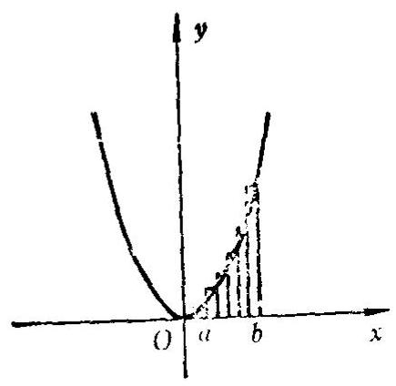

图 2-5-第1 题

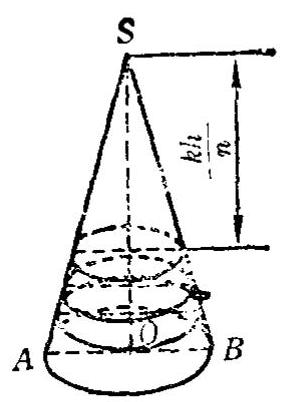

图 2-5-第 2 题

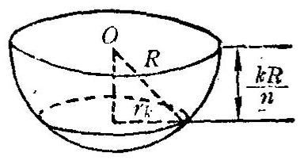

图 2-5-第 3 题

$\therefore$ 圆锥体积为 $V = \mathop{\lim }\limits_{{n \rightarrow  \infty }}{V}_{n} = \frac{1}{3}\pi {R}^{2}h$ .

3. 解 设球半径为 $R$ . 先求半球的体积 $V$ ,用平行于半球底面的平面将半入切成等高的 $n$ 片,使每片的厚度等于 $\frac{R}{n}$ ,每片的体积用一个圆柱体积作为它的近似值. 例如第 $k$ 片体积的近似值可如下计算:

设其上底半径为 ${r}_{k - 1}$ ,下底半径为 ${r}_{k}$ ,第 $k$ 片体积的近似值为

$$
{V}_{k} = \pi {r}_{k}^{2}\frac{R}{n}
$$

但

$$
{r}_{k}^{2} = {R}^{2} - {\left( \frac{k}{n}R\right) }^{2}
$$

所以半球体积的近似值为

$$
{S}_{n} = \mathop{\sum }\limits_{{k = 1}}^{n}{V}_{k}
$$

$$
= \frac{\pi {R}^{3}}{n}\left\lbrack  {\left( {1 - \frac{{1}^{3}}{{n}^{2}}}\right)  + \left( {1 - \frac{{2}^{3}}{{n}^{2}}}\right)  + \cdots }\right.
$$

$$
\left. {+\left( {1 - \frac{{\left( n - 1\right) }^{2}}{{n}^{2}}}\right)  + \left( {1 - \frac{{n}^{2}}{{n}^{2}}}\right) }\right\rbrack
$$

$$
= \pi {R}^{3} - \frac{\pi {R}^{3}}{{n}^{3}}\left( {{1}^{2} + {2}^{2} + \cdots  + {n}^{2}}\right)
$$

$$
= \pi {R}^{3} - \frac{\pi {R}^{3}}{6}\left( {1 + \frac{1}{n}}\right) \left( {2 + \frac{1}{n}}\right) ,
$$

$\therefore$ 球体积为

$$
{2V} = 2\mathop{\lim }\limits_{{n \rightarrow  \infty }}{S}_{n} = 2\left( {\pi {R}^{3} - \frac{\pi {R}^{3}}{3}}\right)  = \frac{{4\pi }{R}^{3}}{3}.
$$

4. 解 以第 $t$ 秒末到第 $\left( {t + \frac{1}{n}}\right)$ 秒末的平均速度作为第 $t$ 秒末的即时速度的近似值.

$$
{\bar{V}}_{n} = \frac{a{\left( t + \frac{1}{n}\right) }^{3} - a{t}^{3}}{t + \frac{1}{n} - t} = a\left\lbrack  {{\left( t + \frac{1}{n}\right) }^{2} + \left( {t + \frac{1}{n}}\right) t + {t}^{2}}\right\rbrack
$$

$$
= a\left\lbrack  {3{t}^{2} + \frac{3}{n}t + \frac{1}{{n}^{2}}}\right\rbrack  ,
$$

$\therefore$

$$
{V}_{t} = \mathop{\lim }\limits_{{n \rightarrow  \infty }}{\bar{V}}_{n} = {3a}{t}^{2}
$$

5. 解 这是例 2 的反问题.

将 $t$ 秒 $n$ 等分，用第 $\frac{kt}{n}$ 秒末的即时速度作为这 $\frac{t}{n}$ 秒内的平均速度,得到在 $t$ 秒内所走位移 $s$ 的近似值.

$$
{s}_{n} = \frac{t}{n}\left( {a\frac{t}{n} + a\frac{2t}{n} + \cdots  + a\frac{nt}{n}}\right)
$$

$$
= \frac{a{t}^{2}}{{n}^{2}}\left( {1 + 2 + \cdots  + n}\right)  = \frac{1}{2}a{t}^{2}\left( {1 + \frac{1}{n}}\right) ,
$$

$$
s = \mathop{\lim }\limits_{{n \rightarrow  \infty }}{s}_{n} = \frac{1}{2}a{t}^{2}
$$

## 思考题六的答案与略解

1. 证 取直线 ${DC}$ 与 ${DA}$ 为 $x$ 、 $y$ 轴,建立直角坐标系,设正方形边长为 $a$ . 因为 ${DE}//{AO}$ ,所以点 $E$ 在第二象限的平分线上,

设点 $E$ 的坐标为 $\left( {-x, x}\right) \left( {x > 0}\right)$ . 因为

$$
\left| {CE}\right|  = \left| {AC}\right|  = \sqrt{2}a,
$$

故有

$$
{\left( x + a\right) }^{2} + {x}^{2} = 2{a}^{2},
$$

解出

$$
x = \frac{a}{2}\left( {\sqrt{3} - 1}\right) .
$$

设 $F$ 点坐标为 $\left( {0, y}\right)$ ,利用 $O\text{ 、 }F\text{ 、 }E$ 三点共线,解出 $y$ ,即可获证.

2. 证 取直线 ${BC}$ 和 ${AD}$ 为 $x$ 、 $y$ 轴. 建立直角坐标系，设点 $A$ 、 $B\text{ 、 }C$ 的坐标分别为 $\left( {0, a}\right) \text{ 、 }\left( {b,0}\right) \text{ 、 }\left( {c,0}\right)$ ,点 $P$ 的坐标为 $(0$ , $p)$ . 利用过直线 ${AO}\text{ 、 }{BE}$ 的交点 $E$ 的直线系方程,过原点 $D$ ,即得直线 ${DE}$ 的方程

$$
\frac{x}{c} + \frac{y}{a} = \frac{x}{b} + \frac{y}{p}.
$$

同理,可得直线 ${DF}$ 的方程

$$
\frac{x}{b} + \frac{y}{a} = \frac{x}{c} + \frac{y}{p}.
$$

${DE}\text{ 、 }{DF}$ 两直线的斜率互为相反数,故 $\angle {ADE} = \angle {ADF}$ .

3. 证 取边 ${AB}$ 所在直线为 $x$ 轴, ${AB}$ 上的高所在直线为 $y$ 轴, 建立直角坐标系. 设三顶点的坐标分别为 $A\left( {-a,0}\right) \text{ 、 }B(a$ , $0)\text{ 、 }C\left( {0,\sqrt{3}a}\right)$ ,则 ${D}_{ - }E$ 的坐标分别为 $\left( {-\frac{a}{3},0}\right) \text{ 、 }\left( {\frac{2}{3}a}\right.$ , $\left. {\frac{\sqrt{3}}{3}a}\right)$ . 利用过直线 ${AE}\text{ 、 }{OD}$ 的交点 $P$ 的直线系方程,过 $B$ 点,求出 ${BP}$ 的方程为

$$
\sqrt{3}x + {9y} - \sqrt{3}a = 0,
$$

${CP}$ 的方程为

$$
3\sqrt{3}x - y + \sqrt{3}a = 0,
$$

从而可证

$$
{BP} \bot  {OP}\text{ . }
$$

4. 证 取 ${BO}\text{ 、 }{AD}$ 所在直线为 $x.y$ 轴,建立直角坐标系. 设点 $B\text{ 、 }C$ 的坐标分别为 $\left( {b,0}\right) \text{ 、 }\left( {a,0}\right)$ ,则点 $A$ 的坐标为 $\left( {0, a - b}\right)$ .

利用直线 ${BH}$ 的方程

$$
y = \frac{a}{a - b}\left( {x - b}\right) ,
$$

求出重心 $H$ 的坐标 $\left( {0, - \frac{ab}{a - b}}\right)$ ,所以,

$$
\left| {HD}\right|  = \frac{-{ab}}{a - b}.
$$

因为点 $M$ 坐标为 $\left( {\frac{a + b}{2},0}\right)$ ,所以

$$
\left| {BM}\right|  = \frac{a + b}{2} - b = \frac{a - b}{2},
$$

$$
\left| {MH}\right|  = \sqrt{{\left( \frac{a + b}{2}\right) }^{2} + \frac{{a}^{2}{b}^{2}}{{\left( a - b\right) }^{2}}} = \frac{{a}^{2} + {b}^{2}}{2\left( {a - b}\right) }.
$$

所以

$$
\left| {MH}\right|  + \left| {HD}\right|  = \frac{{a}^{2} + {b}^{2}}{2\left( {a - b}\right) } - \frac{ab}{a - b} = \frac{a - b}{2} = \left| {BM}\right| .
$$

5. 证 设三角形三顶点为 $P\left( {{x}_{1},{y}_{1}}\right) \text{ 、 }Q\left( {{x}_{2},{y}_{2}}\right) \text{ 、 }R\left( {{x}_{3},{y}_{3}}\right)$ ,直线 $l$ 的方程为 ${Ax} + {By} + C = 0$ ,则

$$
\frac{PL}{LQ} =  - \frac{A{x}_{1} + B{y}_{1} + C}{A{x}_{2} + B{y}_{2} + C},
$$

$$
\frac{QM}{MR} =  - \frac{A{x}_{2} + B{y}_{2} + C}{A{x}_{3} + B{y}_{3} + C},
$$

$$
\frac{RN}{NP} =  - \frac{A{x}_{3} + B{y}_{3} + C}{A{x}_{1} + B{y}_{1} + C},
$$

$$
\therefore \frac{PL}{LQ} \cdot  \frac{QM}{MR} \cdot  \frac{RN}{NP} =  - 1\text{ . }
$$

6. 证 取 $O$ 为原点,建立直角坐标系. 设三顶点的坐标为 $P\left( {{x}_{1},{y}_{1}}\right) \text{ 、 }Q\left( {{x}_{2},{y}_{2}}\right) \text{ 、 }R\left( {{x}_{3},{y}_{3}}\right)$ ,直线 ${PD}$ 的方程为

$$
{y}_{1}x - {x}_{1}y = 0
$$

所以, $\frac{QD}{DR} =  - \frac{{y}_{1}{x}_{2} - {r}_{1}{y}_{2}}{{y}_{1}{x}_{3} - {x}_{1}{y}_{3}} = \frac{{y}_{1}{x}_{2} - {x}_{1}{y}_{2}}{{x}_{1}{y}_{3} - {x}_{3}{y}_{1}}$ ,

同理,

$$
\frac{RE}{EP} = \frac{{y}_{2}{x}_{3} - {x}_{2}{y}_{3}}{{x}_{2}{y}_{1} - {x}_{1}{y}_{2}},
$$

$$
\frac{PF}{FQ} = \frac{{y}_{3}{x}_{1} - {x}_{3}{y}_{1}}{{x}_{3}{y}_{2} - {x}_{2}{y}_{3}}
$$

所以，

$$
\frac{QD}{DR} \cdot  \frac{RE}{EP} \cdot  \frac{PF}{FQ} = 1
$$

7. 证 设圆方程为 ${x}^{2} + {y}^{2} = 1$ ,点 $A$ 的坐标为 $\left( {-1,0}\right)$ ,点 $B$ 、 $C$ 的坐标分别为 $\left( {\cos \alpha ,\sin \alpha }\right) \text{ 、 }\left( {\cos \beta ,\sin \beta }\right)$ ,则

$$
\left| {AB}\right|  = 2\left| {\cos \frac{\alpha }{2}}\right| ,\left| {AC}\right|  = 2\left| {\cos \frac{\beta }{2}}\right| .
$$

$$
\because \left| {AB}\right|  \cdot  \left| {AC}\right|  = k,
$$

$$
\therefore \left| {\cos \frac{\alpha }{2}\cos \frac{\beta }{2}}\right|  = \frac{k}{4},
$$

直线 ${BC}$ 的方程为

$$
x\cos \frac{1}{2}\left( {\alpha  + \beta }\right)  + y\sin \frac{1}{2}\left( {\alpha  + \beta }\right)  = \cos \frac{1}{2}\left( {\alpha  - \beta }\right) ,
$$

即

$$
\left( {x + 1}\right) \cos \frac{1}{2}\left( {\alpha  + \beta }\right)  + y\sin \frac{1}{2}\left( {\alpha  + \beta }\right)
$$

$$
= 2\cos \frac{\alpha }{2}\cos \frac{\beta }{2}
$$

$\therefore \;\left( {x + 1}\right) \cos \frac{1}{2}\left( {\alpha  + \beta }\right)  + y\sin \frac{1}{2}\left( {\alpha  + \beta }\right)  =  \pm  \frac{k}{2},$

故 ${BC}$ 与定圆 ${\left( x + 1\right) }^{2} + {y}^{2} = {\left( \frac{k}{2}\right) }^{2}$ 相切.

8. 证 取已知角 $\angle {AOB}$ 的内、外角平分线为坐标轴建立直角坐标系. 设 ${OA}\text{ 、 }{OB}$ 两直线的方程分别为

$$
x\cos \alpha  + y\sin \alpha  = 0,
$$

$$
x\cos \left( {\pi  - \alpha }\right)  + y\sin \left( {\pi  - \alpha }\right)  = 0.
$$

圆心 $C$ 的坐标为 $\left( {{x}_{0},{y}_{0}}\right)$ ,圆 $C$ 在 ${OA}\text{ 、 }{OB}$ 上截得的弦 $\left| {MN}\right| \; = {2a},\left| {PQ}\right|  = {2b}$ ,圆的半径为 $r$ ,则

$$
{r}^{2} = {a}^{2} + {\left( {x}_{0}\cos \alpha  + {y}_{0}\sin \alpha \right) }^{2} = {b}^{2} + {\left( -{x}_{0}\cos \alpha  + {y}_{0}\sin \alpha \right) }^{2}.
$$

$\therefore$

$$
4{x}_{0}{y}_{0}\sin \alpha \cos \alpha  = {b}^{2} - {a}^{2},
$$

$$
\left| {{x}_{0}{y}_{0}}\right|  = \left| \frac{{b}^{2} - {a}^{2}}{2\sin {2\alpha }}\right| \text{ (常数). }
$$

9. 证

$$
\left| {OH}\right|  = \frac{\left| {OP}\right|  \cdot  \left| {OQ}\right| }{\left| PQ\right| } = \frac{\left| {OP}\right|  \cdot  \left| {OQ}\right| }{\sqrt{O{P}^{2} + O{Q}^{2}}} = \frac{1}{\sqrt{\frac{1}{O{P}^{2}} + \frac{1}{O{Q}^{2}}}}.
$$

令 $\left| {OP}\right|  = {\rho }_{1},\left| {OQ}\right|  = {\rho }_{2}$ ,点 $P$ 的坐标为 $\left( {{\rho }_{1}\cos \theta ,{\rho }_{1}\sin \theta }\right)$ ,则

点 $Q$ 的坐标为 $\left( {{\rho }_{2}\cos \left( {\theta  + \frac{\pi }{2}}\right) ,{\rho }_{2}\sin \left( {\theta  + \frac{\pi }{2}}\right) }\right)$ ,即 $\left( {-{\rho }_{2}\sin \theta }\right.$ ,

$\left. {{\rho }_{2}\cos \theta }\right) .\because$ 点 $P\text{ 、 }Q$ 在椭圆上,

$$
\therefore \;{h}^{2}{\rho }_{1}^{2}{\cos }^{2}\theta  + {a}^{2}{\rho }_{1}^{2}{\sin }^{2}\theta  = {a}^{2}{b}^{2}\text{ , }
$$

$$
{b}^{2}{\rho }_{2}^{2}{\sin }^{2}\theta  + {a}^{2}{\rho }_{2}^{2}{\cos }^{2}\theta  = {a}^{2}{b}^{2},
$$

故

$$
\frac{1}{{\rho }_{1}^{2}} + \frac{1}{{\rho }_{2}^{2}} = \frac{{b}^{2}{\cos }^{2}\theta  + {a}^{2}{\sin }^{2}\theta  + {b}^{2}{\sin }^{2}\theta  + {a}^{2}{\cos }^{2}\theta }{{a}^{2}{b}^{2}}
$$

$$
= \frac{{a}^{2} + {b}^{2}}{{a}^{2}{b}^{2}}\text{ , }
$$

$$
\therefore \;\left| {OH}\right|  = \frac{ab}{\sqrt{{a}^{2} + {b}^{2}}}\text{ (定值). }
$$

10. 答 所求轨迹方程为

$$
{y}^{2}\left( {a - x}\right)  = {x}^{2}\left( {a + x}\right) .
$$

11. 答 所求轨迹方程为

$$
{\left( x - \frac{a}{2}\right) }^{2} + {\left( y - \frac{\sqrt{3}}{2}a\right) }^{3} = {b}^{2}.
$$

12. 解 取 $\angle {ABQ} = \varphi$ 为参数,轨迹的参数方程为

$$
\left\{  \begin{array}{l} x = a{\cos }^{3}\varphi \\  y = a{\sin }^{3}\varphi  \end{array}\right.
$$

普通方程为

$$
{x}^{\frac{2}{3}} + {y}^{\frac{2}{3}} = {a}^{\frac{2}{3}}
$$

13. 答 所求轨迹方程为

$$
{x}^{4} - {2a}{x}^{3} + {a}^{2}{y}^{2} = 0.
$$

14. 答 所求轨迹方程为

$$
a{y}^{2} + {bxy} - a\left( {b + d}\right) y + {abd} = 0\text{ (双曲线). }
$$

15. 答 所求轨迹的极坐标方程为

$$
\rho  = a\cos \frac{k - 1}{k + 1}\theta .
$$

16. 答 点 $\left( {\cdot , v}\right)$ 的轨迹方程为

即

$$
3{v}^{2} + {2u} + {4v} + 2 = 0
$$

$$
3{y}^{2} + {2x} + {4y} + 2 = 0.
$$

17. 证 取 $\angle {BAE} = \theta$ 为参数,则

$$
\frac{DE}{\sin \theta } = \frac{CE}{\sin \left( {{60}^{ \circ  } + \theta }\right) },\;\frac{DE}{\sin \left( {{60}^{ \circ  } - \theta }\right) } = \frac{BE}{\sin \left( {{60}^{ \circ  } + \theta }\right) }.
$$

$$
\therefore \;\frac{1}{BE} + \frac{1}{CE} = \frac{1}{DE}\left( \frac{\sin \theta  + \sin \left( {{60}^{ \circ  } - \theta }\right) }{\sin \left( {{60}^{ \circ  } + \theta }\right) }\right)
$$

$$
= \frac{1}{DE} \cdot  \frac{\sin \theta  + \sin \left( {{120}^{ \circ  } + \theta }\right) }{\sin \left( {{60}^{ \circ  } + \theta }\right) }
$$

$$
= \frac{1}{DE} \cdot  \frac{2\sin \left( {{60}^{ \circ  } + \theta }\right) \cos {60}^{ \circ  }}{\sin \left( {{60}^{ \circ  } + \theta }\right) }
$$

$$
= \frac{1}{DE}\text{ . }
$$

不失一般性, 取外接圆半径为单位长度, 则

$$
{AE} = 2 \cdot  \sin \left( {\theta  + {60}^{ \circ  }}\right)  = \left( {\sqrt{3}\cos \theta  + \sin \theta }\right) ,
$$

$$
{BE} = 2\sin \theta ,
$$

$$
{CE} = 2\sin \left( {{60}^{ \circ  } - \theta }\right)  = \left( {\sqrt{3}\cos \theta  - \sin \theta }\right) .
$$

$\therefore A{E}^{4} + B{E}^{4} + C{E}^{4} = {\left( \sqrt{3}\cos \theta  + \sin \theta \right) }^{4} + {16}{\sin }^{4}\theta$

$$
+ {\left( \sqrt{3}\cos \theta  - \sin \theta \right) }^{4}
$$

$$
= 2\left( {9{\cos }^{4}\theta  + {18}{\sin }^{2}\theta {\cos }^{2}\theta  + {\sin }^{4}\theta }\right)
$$

$$
+ {16}{\sin }^{4}\theta
$$

$$
= {18}\left( {{\cos }^{4}\theta  + 2{\sin }^{2}\theta {\cos }^{2}\theta  + {\sin }^{4}\theta }\right)
$$

$$
= {18}\text{ . }
$$

18. 证 本命题与平行四边形不存在外接抛物线等价. 适当选择坐标系, 设平行四边形四边所在直线的方程依次为

$$
y = 0, y = k\left( {x - a}\right) , y = b, y = {kx},
$$

(其中 $k \neq  0, a \neq  0, b \neq  0$ ). 此平行四边形的外接圆锥曲线系的方程为

$$
\left( {y - {kx}}\right) \left( {y - {kx} + {ka}}\right)  + {\lambda y}\left( {y - b}\right)  = 0
$$

①

其中 $\lambda$ 为非零的任意常数. 方程 ① 可化为

$$
{k}^{2}{x}^{2} - {2kxy} + \left( {1 + \lambda }\right) {y}^{2} - a{k}^{2}x + \left( {{ak} - {\lambda b}}\right) y = 0.
$$

⺀

$$
\Delta  = 4{k}^{2} - 4{k}^{2}\left( {1 + \lambda }\right)  =  - {4\lambda }{k}^{2} \neq  0,
$$

$\therefore$ 平行四边形不存在外接抛物线.

本题证法很多, 也可通过证明抛物线任两平行弦不能相等得证.

19. 证 令 ${PA} = x,{PB} = y,{PC} = z,{PD} = p$ ,

$$
{PE} = q,{PF} = r.
$$

在 $\bigtriangleup  {PDE}$ 中,

$$
{DE} = \sqrt{{p}^{2} + {q}^{2} + {2pq}\cos C}
$$

$$
= \sqrt{{p}^{2} + {q}^{2} + {2pq}\sin A\sin B - {2pq}\cos A\cos B}
$$

$$
= \sqrt{{\left( p\sin B + q\sin A\right) }^{2} + {\left( p\cos B - q\cos A\right) }^{2}}
$$

$$
\geq  \sqrt{{\left( p\sin B + q\sin A\right) }^{2}} = p\sin B + q\sin A.
$$

$\because P\text{ 、 }D\text{ 、 }C\text{ 、 }E$ 四点共圆, ${OP}$ 是此圆的直径,

$\therefore$

$$
z = \frac{DE}{\sin C} \geq  \frac{p\sin B + q\sin A}{\sin C}.
$$

同理, 有

$$
y \geq  \frac{r\sin A + p\sin C}{\sin B},
$$

$$
x \geq  \frac{q \cdot  \ln C + r\sin B}{\sin A},
$$

$\therefore x + y + z \geq  p\left( {\frac{\sin O}{\sin B} + \frac{\sin B}{\sin C}}\right)  + q\left( {\frac{\sin A}{\sin O} + \frac{\sin C}{\sin A}}\right)$

$$
+ r\left( {\frac{\sin B}{\sin A} + \frac{\sin A}{\sin B}}\right)  \geq  2\left( {p + q + r}\right) .
$$

这个不等式称为 Erdös-Mordell 不等式，上面的证法是 Mordell 在 1937 年给出的.

20. 解 设在中心 $O$ 张直角之弦的两端点坐标分别为 ${Q}_{1}\left( {a\cos \alpha }\right.$ , $b\sin \alpha )\text{ 、 }{Q}_{2}\left( {a\cos \beta , b\sin \beta }\right) ,{Q}_{1}{Q}_{2}$ 中点 $P$ 的坐标为 $\left( {x, y}\right)$ , 则

$$
x = \frac{a}{2}\left( {\cos \alpha  + \cos \beta }\right)
$$

①

$$
y = \frac{b}{2}\left( {\sin \alpha  + \sin \beta }\right)
$$

②

...

$$
O{Q}_{1}\bot O{Q}_{2},
$$

$\therefore$

$$
\frac{{b}^{2}\sin \alpha \sin \beta }{{a}^{2}\cos \alpha \cos \beta } =  - 1
$$

③

从①、②有

$$
\frac{x}{a} = \cos \frac{1}{2}\left( {\alpha  + \beta }\right) \cos \frac{1}{2}\left( {\alpha  - \beta }\right) ,
$$

$$
\frac{y}{b} = \sin \frac{1}{2}\left( {\alpha  + \beta }\right) \cos \frac{1}{2}\left( {\alpha  - \beta }\right) ,
$$

$\therefore$

$$
\operatorname{tg}\frac{1}{2}\left( {\alpha  + \beta }\right)  = \frac{ay}{bx}
$$

④

$$
{\cos }^{2}\frac{1}{2}\left( {\alpha  - \beta }\right)  = \frac{{x}^{2}}{{a}^{2}} + \frac{{y}^{2}}{{b}^{2}}
$$

⑤

从③得

$$
{a}^{2}\left\lbrack  {\cos \left( {\alpha  + \beta }\right)  + \cos \left( {\alpha  - \beta }\right) }\right\rbrack   + {b}^{2}\left\lbrack  {\cos \left( {\alpha  - \beta }\right)  - \cos \left( {\alpha  + \beta }\right) }\right\rbrack
$$

$$
= 0\text{ , }
$$

即

$$
\left( {{a}^{2} + {b}^{2}}\right) \left\lbrack  {2{\cos }^{2}\frac{1}{2}\left( {\alpha  - \beta }\right)  - 1}\right\rbrack
$$

$$
+ \left( {{a}^{2} - {b}^{2}}\right) \frac{1 - {\operatorname{tg}}^{2}\frac{1}{2}\left( {\alpha  + \beta }\right) }{1 + {\operatorname{tg}}^{2}\frac{1}{2}\left( {\alpha  + \beta }\right) } = 0
$$

⑥

以 ④、⑤ 代入 ⑥，化简得轨迹方程为

$$
\left( {{a}^{2} + {b}^{2}}\right) {\left( {b}^{2}{x}^{2} + {a}^{2}{y}^{2}\right) }^{2} = {a}^{2}{b}^{2}\left( {{b}^{4}{x}^{2} + {a}^{4}{y}^{2}}\right) ,\left( {{x}^{2} + {y}^{2} \neq  0}\right) .
$$

## 思考题七的答案与略解

1. 解 (1) $y = \left\{  {\begin{array}{l} 2\sin x, x \in  \left\lbrack  {{2n\pi },{2n\pi } + \pi }\right\rbrack  , \\  0, x \in  \left\lbrack  {{2n\pi } - \pi ,{2n\pi }}\right\rbrack  , \end{array}\left( {n \in  Z}\right) }\right.$ .

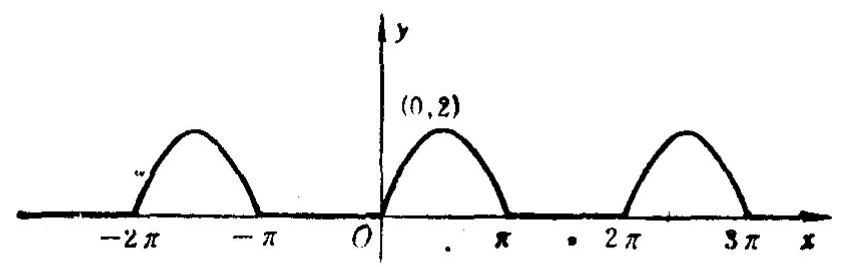

图 3-1-第1(1) 题

(2) $y = \left\{  {\begin{array}{l} \sin x, \\   - \sin x, \end{array}x \in  \left\lbrack  {{2n\pi },{2n\pi } + \pi }\right\rbrack  ,\left( {n \in  Z}\right) }\right.$ .

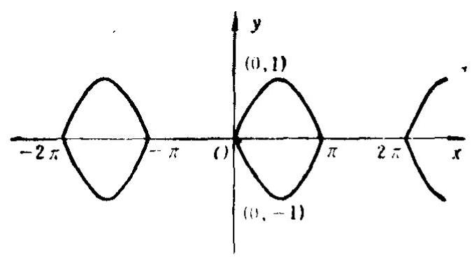

图 3-1-第1(2)题

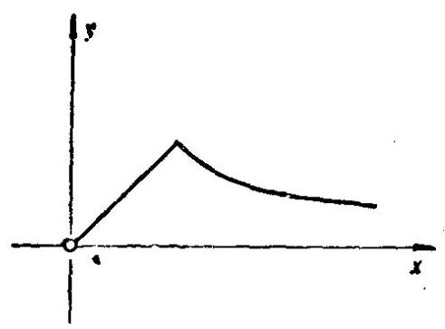

图 3-1-第 1(4)题

(3)

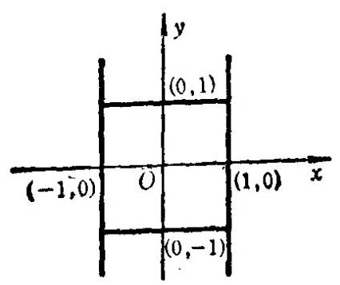

图 3-1-第 1(3) 题

(4) $y = \left\{  \begin{array}{ll} x, & x \in  \left( {0,1}\right) , \\  \frac{1}{x}, & x \in  \lbrack 1, + \infty ). \end{array}\right.$

2. 解 $\because 0 \leq  1 - \cos \theta  \leq  2$ ,

$\therefore x \in  \left\lbrack  {1,9}\right\rbrack  ,\left| {x - 1}\right|  + \left| {x - 9}\right|  = x - 1 + 9 - x = 8$ .

3. 答(1)

$$
x \neq  \frac{n\pi }{2},\left( {n \in  Z}\right) ;
$$

(2) $x \in  \left( {{2n\pi } + \frac{\pi }{3},{2n\pi } + \frac{5\pi }{3}}\right) ,\left( {n \in  Z}\right)$ .

4. 答 $\;m \in  \left\lbrack  {-1, - 3 + 2\sqrt{2})}\right\rbrack$ .

5. 解 (1) 当 $x \geq  0, x - {y}^{2} \geq  0$ 时,方程为 ${y}^{2} = {2x} - 1$ ,图象是抛物线弧 ${AB}$ .

当 $x \geq  0, x - {y}^{2} \leq  0$ 时,方程为 ${y}^{2} = 1$ ,图象是两线段 ${DA}\text{ 、 }{OB}$ .

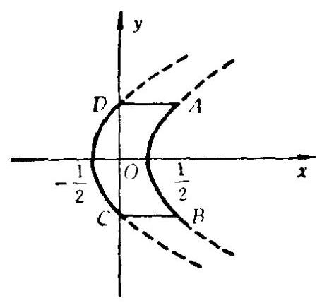

图 3-1-第 5(1) 题

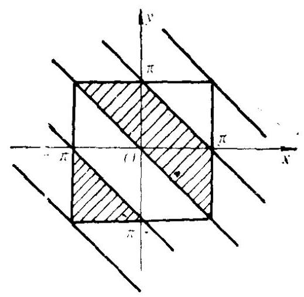

图 3-1- 第 5(2)题

当 $x < 0$ ， $x - {y}^{2} \geq  0$ 时，方程为 ${y}^{2} =  - 1$ ，无图象.

当 $x < 0$ ， $x - {y}^{2} \leq  0$ 时，图象为抛物线弧 ${OD}$ .

(2)由 $\left| x\right|  < \pi ,\left| y\right|  < \pi$ ，得

$$
- {2\pi } < x + y < {2\pi }
$$

...①

再由 $\sin \left( {x + y}\right)  > 0$ 和 ①,有 $0 < x + y < \pi$ ,

$$
- {2\pi } < x + y <  - \pi
$$

...②

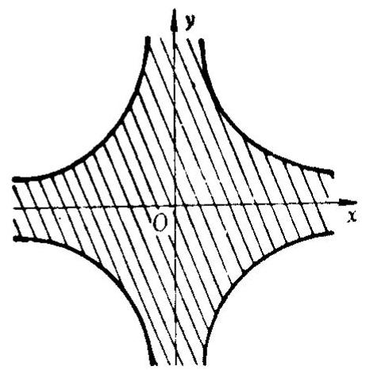

图 3-1-第 6 题

图象为图中的斜线部分, 不包含边界.

6. 解 设 $Q$ 、 $R$ 两动点的坐标分别为 $\left( {p,0}\right) \left( {0, q}\right)$ .

$$
\because {S}_{\bigtriangleup {OQR}} = 2\text{ , }
$$

$$
\therefore \left| p\right| \left| q\right|  = 4\text{ . }
$$

线段 ${QR}$ 上点 $P\left( {x, y}\right)$ 分 ${QR}$ 成

$$
{QP} : {PR} = \lambda ,\left( {\lambda  > 0}\right) ,
$$

$$
\therefore x = \frac{p}{1 + \overline{\lambda }}, y = \frac{\lambda q}{1 + \overline{\lambda }}\text{ . }
$$

从此得

$$
\left| {xy}\right|  = \frac{\lambda }{{\left( 1 + \lambda \right) }^{2}}\left| {pq}\right|  = \frac{4\lambda }{{\left( 1 + \lambda \right) }^{2}},
$$

故

$$
\left| {xy}\right| {\lambda }^{2} + 2\left( {\left| {xy}\right|  - 2}\right) \lambda  + \left| {xy}\right|  = 0.
$$

. .

$$
\lambda  \in  {R}^{ + },\;\therefore \;4{\left( \left| xy\right|  - 2\right) }^{2} - 4{\left| xy\right| }^{2} \geq  0,
$$

即

$$
\left( {\left| {xy}\right|  - 2 - \left| {xy}\right| }\right) \left( {\left| {xy}\right|  - 2 + \left| {xy}\right| }\right)  \geq  0,
$$

$\therefore$

$$
\left| {xy}\right|  \leq  1.\;\because \;\lambda  > 0,\;\therefore \;{xy} \neq  0
$$

且

$$
\left| {xy}\right|  < 2\text{ . }
$$

综上所述，可知点 $\left( {x, y}\right)$ 在区域 $\left| {xy}\right|  \leq  1$ 内，但 ${xy} \neq  0$ ，如图中的阴影区域，但原点 $O$ 除外。

$$
x = {3k},{3k} + 1,{3k} - 1, k \in  Z
$$

则 ${x}^{2} + 1 = 9{k}^{2} + 1\text{ 、 }3\left( {{k}^{2} + {2k}}\right)  + 2\text{ 、 }3\left( {{k}^{2} - {2k}}\right)  + 2$ ,

$\therefore {x}^{2} + 1$ 不是 3 的倍数,故 ${x}^{2} + 1 = 3{y}^{n}$ 无整数解.

8. 证 $\because {a}^{n} - a = a\left( {{a}^{n - 1} - 1}\right)$ ,且 $n$ 为奇数,故 $n - 1$ 为偶数,

$\therefore {a}^{n} - a = a\left( {a + 1}\right) \left( {a - 1}\right) \left( {{a}^{n - 3} + {a}^{n - 5} + \cdots  + 1}\right)$ .

$a - 1\text{ 、 }a\text{ 、 }a + 1$ 是三个连续整数,其中必有一个是 3 的倍数. 既然 ${a}^{n}$ 与 $a$ 之差是 3 的倍数,所以 $a$ 与 ${a}^{n}$ 除以 3 所得余数相等.

9. 证 大于 11 的自然数,可表示为 ${3k}\text{ 、 }{3k} + 1\text{ 、 }{3k} + 2$ ,其中 $k \geq  4$ 的自然数,

$$
{3k} = 3\left( {k - 2}\right)  + 6,{3k} + 1 = 3\left( {k - 1}\right)  + 4,
$$

$$
{3k} + 2 = 3\left( {k - 2}\right)  + 8,
$$

$\therefore$ 大于 11 的自然数必可表示为两个合数之和.

10. 解 由1、2、3、4、5五个数组成的没有数字重复的五位数中比

43251 小的有

$$
5! - 4! - 3! - 2! - 1! = {87}\text{ (个), }
$$

所以 43251 是此数列的第 88 项.

11. 答 $6! - 2 \times  5! + 4! = {504}$ .

12. 答 $\;{O}_{20}^{3} - \left\lbrack  {4{O}_{5}^{3} + 5{O}_{4}^{3} + 4\left( {{O}_{4}^{3} + {O}_{3}^{3}}\right)  + 4{O}_{3}^{3}}\right\rbrack   = {1056}$ .

13. 解 移项, 得

$$
\sqrt{x\left( {x - {ka}}\right) } = a - x.
$$

在 $x \leq  a$ 的条件下,两边平方

$$
{x}^{2} - {kax} = {a}^{2} - {2ax} + {x}^{2},
$$

$\therefore$

$$
a\left( {2 - k}\right) x = {a}^{2}.
$$

若 $a = 0$ ,则 $x \leq  0$ (即一切非正实数) 是原方程的解.

若 $a \neq  0$ ,则 $\;\left( {2 - k}\right) x = a$ ,

$k \neq  2$ 时,则 $\;x = \frac{a}{2 - k}$ .

要 $x = \frac{c}{2 - k}$ 是原方程的解的充要条件是

$$
\frac{a}{2 - k} \leq  a,
$$

即

$$
\frac{a\left( {1 - k}\right) }{2 - k} > 0,
$$

$\therefore a > 0$ 且 $k \in  ( - \infty ,1\rbrack  \cup  \left( {2, + \infty }\right)$ ,或 $a < 0$ 且 $k \in  \lbrack 1,2)$ . 综上所述，得 $a = 0$ 时，原方程的解为 $x \leq  0;a > 0$ 且 $k \in  ( - \infty ,1\rbrack  \cup  \left( {2, + \infty }\right)$ 或 $a < 0$ 且 $k \in  \lbrack 1,2)$ 时,方程有一解为 $x = \frac{a}{2 - k}$ ; 其他情况,方程无解.

14. 证 分两种情形进行证明.

(1) $\Delta  = {p}^{2} - {4q} < 0$ ，则两根为 $a + {bi}$ ， $a - {bi}$ .

$\therefore$

$$
a + {bi} + a - {bi} =  - p,
$$

即

$$
{2a} =  - p
$$

①

$$
\left( {a + {bi}}\right) \left( {a - {bi}}\right)  = q,
$$

即

$$
{a}^{2} + {b}^{2} = q
$$

②

$\therefore a < 0$ 的充要条件是 $p > 0$ 且 $q > 0$ .

(2) $\Delta  = {p}^{2} - {4q} \geq  0$ ，则有两个实根为 ${x}_{1},{x}_{2}$ 。

$$
{x}_{1} + {x}_{2} =  - p,{x}_{1}{x}_{2} = q,
$$

$\therefore {x}_{1} < 0$ 且 ${x}_{2} < 0$ 的充要条件是 $p > 0$ 且 $q > 0$ .

15. 解 如图 3-1-13,

$$
\operatorname{tg}\alpha  = \frac{a}{h},\operatorname{tg}\beta  = \frac{b}{h}
$$

$$
\operatorname{tg}A = \frac{\operatorname{tg}\alpha  + \operatorname{tg}\beta }{1 - \operatorname{tg}\alpha \operatorname{tg}\beta } = \frac{h\left( {a + b}\right) }{{h}^{2} - {ab}}.
$$

当 ${h}^{2} > {ab}$ 时， $\angle A$ 是锐角；当 ${h}^{2} = {ab}$ 时， $\angle A$ 是直角；当 ${h}^{2} < \; {ab}$ 时， $\angle A$ 是钝角.

$$
m = {\log }_{h}a + {\log }_{h}b = {\log }_{a}{ab}\left\{  \begin{array}{l}  < 2,\angle A\text{ 是锐角; } \\   = 2,\angle A\text{ 是直角; } \\   > 2,\angle A\text{ 是钝角. } \end{array}\right.
$$

16. 解

$$
y = {\left( \cos x + a\right) }^{2} - 1 - {a}^{2}.
$$

(1)若 $0 < a \leq  1$ ，则当 $\cos x = 1$ ，即 $x = 0$ 时， ${y}_{\text{ 最大 }} = {2a}$ ；当 $\cos x \; =  - a$ ,即 $x = \pi  \pm  \arccos a$ 时， ${y}_{\text{ 最小 }} =  - 1 - {a}^{2}$ .

(2)若 $a > 1$ ，因 $\cos x \in  \left\lbrack  {-1,1}\right\rbrack$ ，则当 $\cos x = 1$ ，即 $x = 0$ 时，

${y}_{\text{ 最大 }} = {2a}$ ; 当 $\cos x =  - 1$ ,即 $x = \pi$ 时， ${y}_{\text{ 最小 }} =  - {2a}$ .

17. 解 设 $z = x + {yi}$ ,则点集 $O$ 的参数方程为

$$
\left\{  {\begin{array}{l} x = \frac{1}{2}\sin {2\theta }, \\  y = \sin \theta  + \cos \theta ; \end{array}\;\theta  \in  \lbrack 0,{2\pi }).}\right.
$$

消去参数 $\theta$ 得

$$
{y}^{2} = {2x} + 1, x \in  \left\lbrack  {-\frac{1}{2},\frac{1}{2}}\right\rbrack  ,
$$

点集 $O$ 为抛物线 ${y}^{2} = {2x} + 1$ 在 $x =  - \frac{1}{2}$ 与 $x = \frac{1}{2}$ 之间的一段弧. 设 $P\left( {x, y}\right)$ 为 $O$ 上任意一点,

则 $A{P}^{2} = {\left( x - a\right) }^{2} + {y}^{2} = {x}^{2} - {2ax} + {a}^{2} + {2x} + 1$

$$
= {\left\lbrack  x - \left( a - 1\right) \right\rbrack  }^{2} + {2a}, x \in  \left\lbrack  {-\frac{1}{2},\frac{1}{2}}\right\rbrack  .
$$

① 当 $a - 1 < 0$ ，即 $a < 1$ 时，则

$$
x = \frac{1}{2}, A{P}_{\text{ 最 } \star  } = \sqrt{{a}^{2} - a + \frac{9}{4}}.
$$

② 当 $a - 1 \geq  0$ ，即 $a \geq  1$ 时，则

$$
x =  - \frac{1}{2}, A{P}_{\text{ 最 } \star  } = \sqrt{{a}^{2} + a + \frac{1}{4}} = a + \frac{1}{2}.
$$

18. 证 将此圆周 $n$ 等分，则至少有一等分中含有两个点,这两个点之间的距离不超过 $2\sin \frac{\pi }{n}$ (正 $n$ 边形的边长).

19. 证 设这群人共有 $n$ 个,把第 $i$ 个人的朋友数目记为 ${x}_{i}$ ,显然

$$
0 \leq  {x}_{i} \leq  n - 1\;\left( {i = 1,2,\cdots , n}\right) .
$$

分如下三种情形:

① 如果每个人都有朋友，即对 $i = 1$ 、2、 $\cdots$ 、 $n$ ，都有 $1 \leq  {x}_{i} \leq \; n - 1$ ,这时,这 $n$ 个数 ${x}_{1}\text{ 、 }{x}_{2}\text{ 、 }\cdots ,{x}_{n}$ 按数值不同分类,最多只有 $n - 1$ 类,根据抽屉原则至少有一类中,有两个数 ${x}_{j}\text{ 、 }{x}_{k}\left( {j \neq  k}\right)$ 相等,即第 $j$ 个人与第 $k$ 人的朋友数相等.

② 如果只有 1 个人无朋友，不妨设 ${x}_{n} = 0$ . 余下的 $n - 1$ 个人每人都有朋友，同 ① 的情形，这 $n - 1$ 个人中，必有两人的朋友数相等.

③ 如果有两个或两个以上的人无朋友，则此二人的朋友数都是零, 故必相等.

20. 证 根据抽屉原则 ${a}_{1}\text{ 、 }{a}_{2}\text{ 、 }{a}_{3}$ 三个数中至少有两个数同为奇数或同为偶数. 不妨设 ${a}_{1}$ 和 ${a}_{2}$ 都是奇数,则 ${a}_{1}\text{ 、 }{a}_{2}\text{ 、 }{a}_{3}$ 中最多只有一个偶数. 根据抽屉原则 ${b}_{1}\text{ 、 }{b}_{2}$ 中至少有一个奇数，而且和 ${a}_{1}\text{ 、 }{a}_{2}$ 中的一个相等. 由于两奇数之差必为偶数,故 ${a}_{1} - {b}_{1}\text{ 、 }{a}_{2} - {b}_{2}$ 中必有一个为偶数. 若 ${a}_{1}$ 与 ${a}_{2}$ 均为偶数,因为两偶数之差仍为偶数, 故结果也是对的.

21. 证 设这两组数分别是

令

$$
{a}_{1} < {a}_{2} < \cdots  < {a}_{k};\;{b}_{1} < {b}_{2} < \cdots  < {b}_{m}.
$$

$$
{c}_{j} = n - {a}_{j},\left( {j = 1,2,\cdots , k}\right) .
$$

显然, 它们也是自然数, 且满足

$$
n > {c}_{1} > {c}_{2} > \cdots  > {c}_{k}.
$$

我们来研究两组数, ${b}_{1},{b}_{2},\cdots ,{b}_{m}$ 和 ${c}_{1}\text{ 、 }{c}_{2}\text{ 、 }\cdots {c}_{k}$ ,它们共有 $m + k \geq  n$ 个数,并且每个数都小于 $n$ ,按它们的数值大小分类,最多不超过 $n - 1$ 类.

因为，

$$
m + k \geq  n > n - 1,
$$

所以，根据抽屉原则，至少有两个数在同一类里. 由于 $\left\{  {b}_{i}\right\}$ 中,各数互不相等, $\left\{  {c}_{j}\right\}$ 中,各数也互不相等,因此,必有一个 ${b}_{i}$ 与 ${c}_{j}$ 相等,即

$$
{b}_{{i}_{0}} = n - {a}_{{j}_{0}},
$$

亦即

$$
{a}_{{j}_{0}} + {b}_{{i}_{0}} = n.
$$

22. 证 从 $N$ 中任取一点 $\left( {{x}_{0},{y}_{0}}\right)$ ,把 $N$ 中的每一个点 $\left( {x, y}\right)$ 按照下列条件

(1) $x > {x}_{0}, y > {y}_{0}$ ；

(2) $x > {x}_{0}, y \leq  {y}_{0}$ ；

(3) $x \leq  {x}_{0}, y > {y}_{0}$ ；

(4) $x \leq  {x}_{0}, y \leq  {y}_{0}$ .

分在四个互不相交的类中.

如果第 (1) 类中至少有 $N$ 的一个点 $\left( {\alpha ,\beta }\right)$ ,则取 ${x}^{\prime } = {x}_{0},{y}^{\prime } = \; {y}_{0}$ ,那么 $N$ 中有两个点 $\left( {{x}^{\prime },{y}^{\prime }}\right) \text{ 、 }\left( {\alpha ,\beta }\right)$ ,使 ${x}^{\prime } \leq  \alpha ,{y}^{\prime } \leq  \beta$ .

同理,如果第 (4) 类中至少有 $N$ 的一个点 $\left( {{x}^{\prime },{y}^{\prime }}\right)$ ,则取

$$
\alpha  = {x}_{0},\beta  = {y}_{0},
$$

那么 $N$ 中有两个点 $\left( {{x}^{\prime },{y}^{\prime }}\right) \text{ 、 }\left( {\alpha ,\beta }\right)$ ,使 ${x}^{\prime } \leq  \alpha ,{y}^{\prime } \leq  \beta$ .

如果, $N$ 中的无穷多个点全部在第 $\left( 2\right) \text{ 、 }\left( 3\right)$ 类中,将第 $\left( 2\right)$ 类中的点 $\left( {x, y}\right)$ 按下列条件:

$$
x > {x}_{0},{y}_{0} = 1
$$

$$
x > {x}_{0},{y}_{0} = 2;
$$

........

$$
x > {x}_{0}, y = {y}_{0};
$$

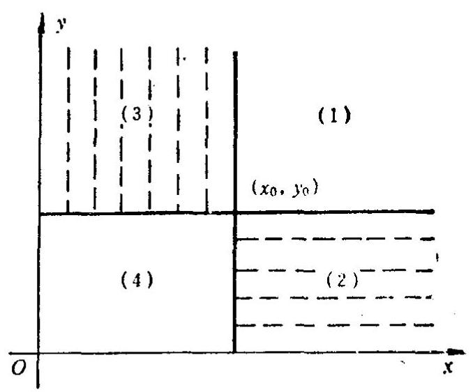

图 3-1-第 22 题

分成 ${y}_{0}$ 个更小的互不相交的类. 同样, 将第(3)类中的点 $\left( {x, y}\right)$ 按下列条件:

$x = 1, y > {y}_{0};$

$x = 2, y > {y}_{0};$

........

$$
x = {x}_{0}, y > {y}_{0};
$$

分成 ${x}_{0}$ 个更小的互不相交的类. 将

$N$ 中无穷多个点分配在 ${x}_{0} + {y}_{0}$ 有限个小类里,根据抽屉原则, 必有一小类中含有 $N$ 中无穷多个点,其中任何两点 $\left( {{x}^{\prime },{y}^{\prime }}\right)$ 、 $\left( {\alpha ,\beta }\right)$ 都满足 ${x}^{\prime } \leq  \alpha ,{y}^{\prime } \leq  \beta$ .

## 思考题八的答案与略解

1. 略解 $\because$ 过 $P\left( {a\cos \theta , b\sin \theta }\right)$ 的切线方程为

$$
\frac{x}{a}\cos \theta  + \frac{y}{b}\sin \theta  = 1,
$$

与 $P$ 点对应的辅助圆 ${x}^{2} + {y}^{2} = {a}^{2}$ 上的点 $Q\left( {a\cos \theta , a\sin \theta }\right)$ 的切线为 $x\cos \theta  + y\sin \theta  = a$ . 这两条切线与长轴的交点同为 $\left( {a\sec \theta ,0}\right)$ ,因此过 $Q$ 点作辅助圆的切线交长轴于点 $M$ ,连接 $M\text{ 、 }P$ 即为过 $P$ 点椭圆的切线.

2. 证 设椭圆上三点 ${P}_{i}\left( {{x}_{i},{y}_{i}}\right) \left( {i = 1,2,3}\right)$ ，则此三点的焦半径分别为 $a - e{x}_{i}$ (或 $a + e{x}_{i}$ )，所以 ${x}_{1}$ 、 ${x}_{2}$ 、 ${x}_{3}$ 成等差数列与 $a - \; e{x}_{1}\text{ 、 }a - e{x}_{2}\text{ 、 }a - e{x}_{3}$ 成等差数列等价.

3. 证 根据圆锥曲线的定义，可得焦点弦 $P{P}^{\prime }$ 的中点 $M$ 到准线的距离为

$$
{MD} = \frac{1}{2}\left( {{PQ} + {P}^{\prime }{Q}^{\prime }}\right)  = \frac{1}{2}\left( {\frac{PF}{e} + \frac{{P}^{\prime }F}{e}}\right)  = \frac{P{P}^{\prime }}{2e}.
$$

如果 $e > 1$ ,则 ${MD}$ 小于 $\frac{1}{2}P{P}^{\prime }$ ,故以 $P{P}^{\prime }$ 为直径的圆与准线相交,其逆亦真. 如果 $e = 1$ ,则

$$
M = \frac{1}{2}P{P}^{\prime }
$$

故以 $P{P}^{\prime }$ 为直径的圆与准线相切,其逆亦真. 如果 $e < 1$ ,则 ${MD}$ 大于 $\frac{1}{2}P{P}^{\prime }$ ,故以 $P{P}^{\prime }$ 为直径的圆与准线不相交,其逆亦真.

4. 证 以 $O$ 为原点，建立复平面，令四边形的四顶点对应的复

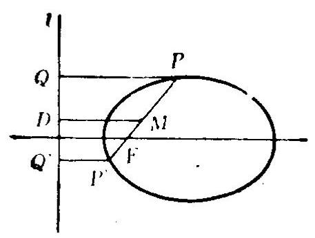

图 3-2-第 3 题

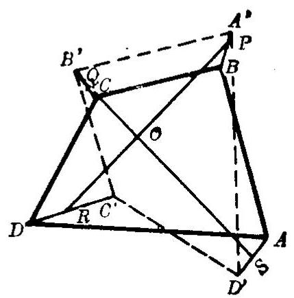

图 3-2-第 4 题

数分别用相应的小写字母表示，依题意，有

$$
{a}^{\prime } = {ia},{b}^{\prime } = {ib},{c}^{\prime } = {ic},{d}^{\prime } = {id},
$$

$$
p = \frac{1}{2}\left( {{ia} + b}\right) ,\;q = \frac{1}{2}\left( {{ib} + c}\right) ,
$$

$$
r = \frac{1}{2}\left( {{ic} + d}\right) ,\;s = \frac{1}{2}\left( {{id} + a}\right) .
$$

于是, $\overrightarrow{PR}$ 对应的复数

$$
x = \frac{1}{2}\left( {{ic} + d - {ia} - b}\right)  = \frac{1}{2}\left( {d - b}\right)  + \frac{1}{2}\left( {c - a}\right) i,
$$

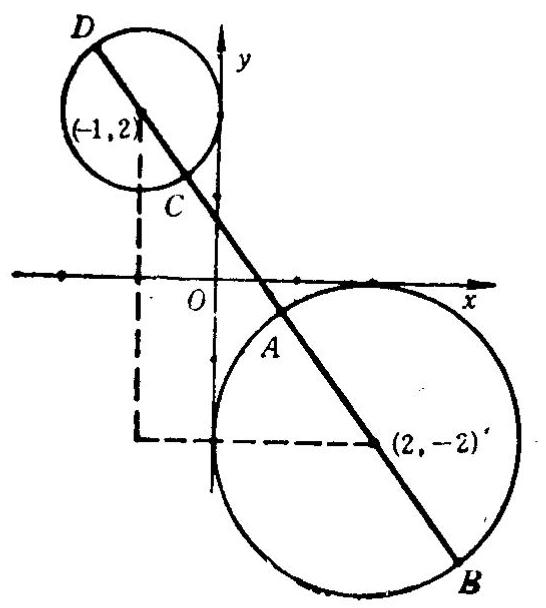

图 3-2-第 5 题

$\overrightarrow{QS}$ 对应的复数

$$
y = \frac{1}{2}\left( {{id} + a - {ib} - c}\right)
$$

$$
= \frac{1}{2}\left( {a - c}\right)  + \frac{1}{2}\left( {d - b}\right) i\text{ . }
$$

因为

$$
{xi} = \frac{1}{2}\left( {d - b}\right) i - \frac{1}{2}\left( {c - a}\right)
$$

$$
= \frac{1}{2}\left( {a - c}\right)  + \frac{1}{2}\left( {d - b}\right) i
$$

$$
= y\text{ , }
$$

所以

$$
\overrightarrow{PR}\bot \overrightarrow{QS},\left| \overrightarrow{PR}\right|  = \left| \overrightarrow{QS}\right| \text{ . }
$$

5. 解 $\because$ 点 $P\left( {a, b}\right)$ 在圆 ${\left( x + 1\right) }^{2} + {\left( y - 2\right) }^{2} = 1$ 上,点 $Q\left( {c, d}\right)$ 在圆 ${\left( x - 2\right) }^{2} + {\left( y + 2\right) }^{2} = 4$ 上, $\therefore \omega  = {\left| PQ\right| }^{2}$ ,两圆的连心线分别交两圆于 $A$ 、 $B$ ， $C$ 、 $D$ ，可知 $\left| {PQ}\right|$ 的最大值为 $\left| {BD}\right|$ ，最小值为 $\left| {AC}\right| .\left| {BD}\right|  = 5 + 1 + 2 = 8,\left| {AC}\right|  = 5 - 2 - 1 = 2$ .

6. 证 先从 $n = 2$ 开始研究. 因为 ${x}_{1} \geq  0,{x}_{2} \geq  0,{x}_{1} + {x}_{2} = 1$ ,则

$$
2\sqrt{{x}_{1}{x}_{2}} \leq  {x}_{1} + {x}_{2} = 1
$$

$$
1 \leq  {\left( \sqrt{{x}_{1}} + \sqrt{{x}_{2}}\right) }^{2} = {x}_{1} + {x}_{2} + 2\sqrt{{x}_{1}{x}_{2}} \leq  2.
$$

$$
\therefore \;1 \leq  \sqrt{{x}_{1}} + \sqrt{{x}_{2}} \leq  \sqrt{2}\text{ . }
$$

从此可得下列证法: 由

$$
0 \leq  2\sqrt{{x}_{i}{x}_{j}} \leq  {x}_{i} + {x}_{j}
$$

有 $0 \leq  2\mathop{\sum }\limits_{{1 < i < j < n}}\sqrt{{x}_{i}{x}_{j}} \leq  \left( {n - 1}\right) \left( {{x}_{1} + {x}_{2} + \cdots  + {x}_{n}}\right)  = n - 1$ ,

$$
1 \leq  \mathop{\sum }\limits_{{k = 1}}^{n}{x}_{k} + 2\mathop{\sum }\limits_{{1 \leq  i < j \leq  n}}\sqrt{{x}_{i}{x}_{j}} \leq  n,
$$

即

$$
1 \leq  {\left( \mathop{\sum }\limits_{{k = 1}}^{n}\sqrt{{x}_{k}}\right) }^{2} \leq  n
$$

$$
\therefore \;1 \leq  \sqrt{{x}_{1}} + \sqrt{{x}_{2}} + \cdots  + \sqrt{{x}_{n}} \leq  \sqrt{n}\text{ . }
$$

7. 证 不失一般性,设 $0 \leq  a \leq  b \leq  c < 1$ ,于是有

$$
\frac{a}{b + c + 1} + \frac{b}{c + a + 1} + \frac{c}{a + b + 1} \leq  \frac{a + b + c}{a + b + 1}.
$$

$$
\because \frac{a + b + c}{a + b + 1} + \left( {1 - a}\right) \left( {1 - b}\right) \left( {1 - c}\right)
$$

$$
= \frac{a + b + 1}{a + b + 1} + \frac{c - 1}{a + b + 1} + \left( {1 - a}\right) \left( {1 - b}\right) \left( {1 - c}\right)
$$

$$
= 1 - \frac{1 - c}{a + b + 1}\left\lbrack  {1 - \left( {1 + a + b}\right) \left( {1 - a}\right) \left( {1 - b}\right) }\right\rbrack  ,
$$

$\therefore$ 原命题转化为证明

$$
\left( {1 + a + b}\right) \left( {1 - a}\right) \left( {1 - b}\right)  \leq  1.
$$

$\because \;\left( {1 + a + b}\right) \left( {1 - a}\right) \left( {1 - b}\right)  \leq  \left( {1 + a + b + {ab}}\right) \left( {1 - a}\right) \left( {1 - b}\right)$

$$
= \left( {1 + a}\right) \left( {1 + b}\right) \left( {1 - a}\right) \left( {1 - b}\right)
$$

$$
= \left( {1 - {a}^{2}}\right) \left( {1 - {b}^{2}}\right)  \leq  1,
$$

$\therefore$ 原不等式成立.

8. 解 原方程经过同解变形得

$$
\frac{\operatorname{ctg}x + 1}{\operatorname{ctg}x - 1} = \frac{{\operatorname{ctg}}^{2}x - 1}{{\operatorname{ctg}}^{2}x + 1}
$$

$$
\left( {\because \cos {2x} = \frac{1 - {\operatorname{tg}}^{2}x}{1 + {\operatorname{tg}}^{2}x} = \frac{{\operatorname{ctg}}^{2}x - 1}{{\operatorname{ctg}}^{2}x + 1}}\right)
$$

$$
\left( {\operatorname{ctg}x + 1}\right) \left( {{\operatorname{ctg}}^{2}x + 1 - {\operatorname{ctg}}^{2}x + 2\operatorname{ctg}x - 1}\right)  = 0,
$$

即

$$
2\operatorname{ctg}\varphi \left( {\operatorname{ctg}x + 1}\right)  = 0,
$$

故

$$
x = \left( {{2n} + 1}\right) \frac{\pi }{2},{n\pi } - \frac{\pi }{4},\left( {n \in  Z}\right) .
$$

经检验, 知确为原方程的解.

9. 解 引入辅助角 $\frac{\pi }{4}$ ,原方程转化为

$$
\sin \left( {x + \frac{\pi }{4}}\right)  = \frac{1}{\sin {2x}}.
$$

$$
\left| {\sin \left( {x + \frac{\pi  \cdot  }{4}}\right) }\right|  \leq  1,\left| \frac{1}{\sin {2x}}\right|  \geq  1,
$$

$\therefore$ 原方程的解为

$$
\left\{  {\begin{array}{l} \sin \left( {x + \frac{\pi }{4}}\right)  = 1 \\  \sin {2x} = 1 \end{array}\text{ 或 }\left\{  \begin{array}{l} \sin \left( {x + \frac{\pi }{4}}\right)  =  - 1 \\  \sin {2x} =  - 1 \end{array}\right. }\right.
$$

的公解. 从此得原方程的解为

$$
x = {2n\pi } + \frac{\pi }{4},\left( {n \in  Z}\right) .
$$

10. 解 原不等式与 ${\left( {\log }_{\sin x}\cos x\right) }^{2} < 1$ 同解, $\;(\because \sin x > 0$ , $\cos x > 0$ ,且 $\sin x \neq  1,\cos x \neq  1$ ) 即

$$
0 < {\log }_{\sin x}\cos x < 1,\sin x < \cos x < 1,
$$

$$
x \in  \left( {{2n\pi },{2n\pi } + \frac{\pi }{4}}\right) ,\left( {n \in  Z}\right) .
$$

11. 解 原方程组转化为

$$
\left\{  \begin{array}{l} \sin x + \cos y = 0 \\  \sin {2x} + {\cos }^{2}y = \frac{1}{2} \end{array}\right.
$$

①

②

由 ① 得 $\cos y =  - \sin x$ ,代入 ②,得

$$
\sin {2x} + {\sin }^{2}x = \frac{1}{2}
$$

$\therefore$

$$
\sqrt{5}\sin \left( {{2x} - \varphi }\right)  = 0,
$$

其中

$$
\varphi  = \operatorname{arctg}\frac{1}{2},
$$

故

$$
x = \frac{n\pi }{2} :  - \frac{\varphi }{2},
$$

$$
\cos y =  - \sin \left( {\frac{n\pi }{2} + \frac{\varphi }{2}}\right)  = \cos \left( {\frac{n\pi }{2} + \frac{\pi }{2} + \frac{\varphi }{2}}\right) ,
$$

$\therefore$

$$
y = 2\dot{k}\pi  \pm  \frac{1}{2}\left( {n + 1}\right) \pi  \pm  \frac{\varphi }{2}.\;\left( {k, n \in  Z}\right)
$$

12. 设

$$
F\left( \theta \right)  = {\sin }^{2}\theta  + {\sin }^{2}\left( {\theta  + \alpha }\right)  + {\sin }^{2}\left( {\theta  + \beta }\right)
$$

与 $\theta$ 无关,而为定值,则

$$
F\left( 0\right)  = F\left( {-\alpha }\right)  = F\left( {-\beta }\right)  = F\left( \frac{\pi }{2}\right) ,
$$

$$
{\sin }^{2}\alpha  + {\sin }^{2}\beta  = {\sin }^{2}\left( {-\alpha }\right)  + {\sin }^{2}\left( {\beta  - \alpha }\right)
$$

$$
= {\sin }^{2}\beta  + {\sin }^{2}\left( {\alpha  - \beta }\right)
$$

$$
= 1 + {\sin }^{2}\left( {\frac{\pi }{2} + \alpha }\right)  + {\sin }^{2}\left( {\frac{\pi }{2} + \beta }\right)
$$

$$
= 1 + {\cos }^{2}\alpha  + {\cos }^{2}\beta
$$

$$
= 3 - {\sin }^{2}\alpha  - {\sin }^{2}\beta .
$$

由此得

$$
\left\{  \begin{array}{l} {\sin }^{2}\alpha  = {\sin }^{2}\beta  = {\sin }^{2}\left( {\alpha  - \beta }\right) \\  {\sin }^{2}\alpha  + {\sin }^{2}\beta  = \frac{3}{2} \end{array}\right.
$$

①

②

由 ①、② 有

$$
{\sin }^{2}\alpha  = {\sin }^{2}\beta  = {\sin }^{2}\left( {\alpha  - \beta }\right)  = \frac{3}{4}.
$$

...

$$
0 \leq  \alpha  \leq  \beta  \leq  \pi ,0 \leq  \beta  - \alpha  \leq  \pi ,
$$

$\therefore$

$$
\sin \alpha  = \sin \beta  = \sin \left( {\beta  - \alpha }\right)  = \frac{\sqrt{3}}{2},
$$

故

$$
\alpha  = \frac{\pi }{3},\beta  = \frac{2\pi }{3}.
$$

反过来,

$$
F\left( \theta \right)  = {\sin }^{2}\theta  + {\sin }^{2}\left( {\theta  + \frac{\pi }{3}}\right)  + {\sin }^{2}\left( {\theta  + \frac{2\pi }{3}}\right)
$$

$$
= \frac{3}{2} - \frac{1}{2}\left\lbrack  {\cos {2\theta } + \cos \left( {{2\theta } + \frac{2\pi }{3}}\right)  + \cos \left( {{2\theta } + \frac{4\pi }{3}}\right) }\right\rbrack
$$

$$
= \frac{3}{2} - \frac{1}{2}\left\lbrack  {\cos {2\theta } + 2\cos \left( {{2\theta } + \pi }\right) \cos \frac{\pi }{3}}\right\rbrack   = \frac{3}{2}.
$$

13. 解 设 ${AB}$ 与 ${SO}$ 的距离为 $x$ . 过 $O$ 作 ${OD}\overset{//}{ = }{AB}$ ，连接 ${SO}$ ， ${SD},{AD},{AO}$ . 过 $A$ 作 ${AE} \bot  {OD}$ ,连接 ${SE}.{ABOD}$ 为平行四边形.

...

$$
\angle {ACB} = {90}^{ \circ  },\therefore \angle {CAD} = {90}^{ \circ  }\text{ ， }
$$

$$
{BC} = {AD} = {2a}\cos \theta ,{AO} = {2a}\sin \theta .
$$

...

$$
{AE} \bot  {OD},{SA} \bot  \text{ 平面 }{ABO}\text{ , }
$$

$\therefore$

$$
{SE}\bot {OD}\text{ . }
$$

...

$$
{AE} \cdot  {CD} = {AC} \cdot  {AD},
$$

$\therefore$

$$
{AE} = {2a}\sin \theta \cos \theta  = a\sin {2\theta },
$$

$$
{SE} = \sqrt{{\left( 2a\right) }^{2} + {a}^{2}{\sin }^{2}{2\theta }} = a\sqrt{4 + {\sin }^{2}{2\theta }}.
$$

$$
{V}_{S - {ACD}} = {V}_{A - {SCD}}
$$

$$
\frac{1}{3}{S}_{\bigtriangleup {ACD}} \cdot  {2a} = \frac{1}{3}x{S}_{\bigtriangleup {SCD}}
$$

$$
x = \frac{{2a} \cdot  \frac{1}{2}{2a}\sin {\theta 2a}\cos \theta }{\left( {1/2}\right) {2a} \cdot  a\sqrt{4 + {\sin }^{2}{2\theta }}} = \frac{{2a}\sin {2\theta }}{\sqrt{4 + {\sin }^{2}{2\theta }}}.
$$

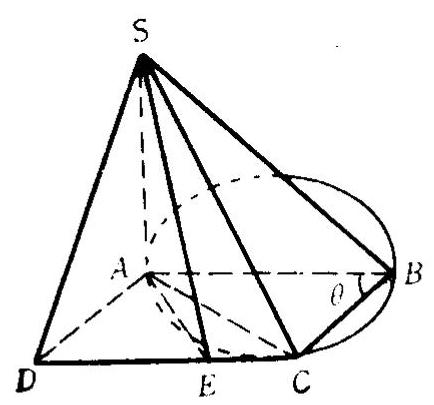

图 3-2-第 13 题

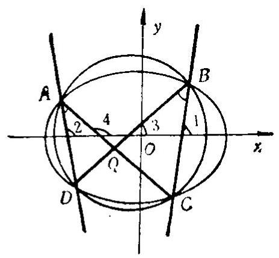

图 3-2-第 14 题

14. 证 “椭圆上 $A\text{ 、 }B\text{ 、 }C\text{ 、 }D$ 四点共圆,与圆的公共弦 ${AC}\text{ 、 }{BD}$ , ${BC}\text{ 、 }{AD}$ 对于椭圆长轴的倾角互补“等价”；椭圆之弦 ${AC}\text{ 、 }{BD}$ 或 ${BC}\text{ 、 }{AD}$ 对于长轴倾角互补与 $A\text{ 、 }B\text{ 、 }C\text{ 、 }D$ 四点离心角之和

$$
\alpha  + \beta  + \gamma  + \delta  = {2n\pi },\;\left( {n \in  Z}\right)
$$

“等价”. 从而得证明如下:

设椭圆之弦 ${AO}\text{ 、 }{BD}$ 的倾角分别为 $\theta \text{ 、 }\varphi$ ,且 ${AO}\text{ 、 }{BD}$ 相交于点 $Q\left( {{x}_{0},{y}_{0}}\right)$ ,则 ${AC}\text{ 、 }{BD}$ 的参数方程分别为

$$
\left\{  {\begin{array}{l} x = {x}_{0} + t\cos \theta , \\  y = {y}_{0} + t\sin \theta ; \end{array}\text{ 与 }\left\{  \begin{array}{l} x = {x}_{0} + t\cos \varphi , \\  y = {y}_{0} + t\sin \varphi . \end{array}\right. }\right.
$$

分别代入椭圆方程 $\frac{{x}^{2}}{{a}^{2}} + \frac{{y}^{2}}{{b}^{2}} = 1$ ,有

$$
\left( {{b}^{2}{\cos }^{2}\theta  + {a}^{2}{\sin }^{2}\theta }\right) {t}^{2} + 2\left( {{b}^{2}{x}_{0}\cos \theta  + {a}^{2}{y}_{0}\sin \theta }\right) {t}^{2}
$$

$$
+ {b}^{2}{x}_{0}^{2} + {a}^{2}{y}_{0}^{2} - {a}^{2}{b}^{2} = 0
$$

①

$$
\left( {{b}^{2}{\cos }^{2}\varphi  + {a}^{2}{\sin }^{2}\varphi }\right) {t}^{2} + 2\left( {{b}^{2}{x}_{0}\cos \varphi  + {a}^{2}{y}_{0}\sin \varphi }\right) t
$$

$$
+ {b}^{2}{x}_{0}^{2} + {a}^{2}{y}_{0}^{2} - {a}^{2}{b}^{2} = 0
$$

②

$\because {A}_{N}{B}_{1}{C}_{N}$ 四点共圆,

$\because$

$$
\left| {QA}\right| \left| {QC}\right|  = \left| {QB}\right| \left| {QD}\right| .
$$

而

$$
{QA} = {t}_{1},{QC} = {t}_{2},{QB} = {t}_{3},{QD} = {t}_{4},
$$

${t}_{1},{t}_{2};{t}_{3},{t}_{4}$ 分别是方程 ①② 的根，

$$
\therefore \;\frac{\left| {b}^{2}{x}_{0}^{2} + {a}^{2}{y}_{0}^{2} - {a}^{2}{b}^{2}\right| }{{b}^{2}{\cos }^{2}\theta  + {a}^{2}{\sin }^{2}\theta } = \frac{\left| {b}^{2}{x}_{0}^{2} + {a}^{2}{y}_{0}^{2} - {a}^{2}{b}^{2}\right| }{{b}^{2}{\cos }^{2}\varphi  + {a}^{2}{\sin }^{2}\varphi }.
$$

从而有 ${b}^{2} + \left( {{a}^{2} - {b}^{2}}\right) {\sin }^{2}\theta  = {b}^{2} + \left( {{a}^{2} - {b}^{2}}\right) {\sin }^{2}\varphi$ ，

$$
{\sin }^{2}\theta  = {\sin }^{2}\varphi .
$$

$$
\theta  \neq  \varphi ,\theta ,\varphi  \in  \lbrack 0,\pi ),\ldots \;\theta  + \varphi  = \pi .
$$

又 $\because \;\operatorname{tg}\theta  = \frac{a\left( {\sin \alpha  - \sin \gamma }\right) }{b\left( {\cos \alpha  - \cos \gamma }\right) }$

$$
= \frac{{2a}\cos \frac{1}{2}\left( {\alpha  + \gamma }\right) \sin \frac{1}{2}\left( {\alpha  - \gamma }\right) }{{2b}\sin \frac{1}{2}\left( {\alpha  + \gamma }\right) \sin \frac{1}{2}\left( {\gamma  - \alpha }\right) }
$$

$$
=  - \frac{a}{b}\operatorname{ctg}\frac{1}{2}\left( {\alpha  + \gamma }\right) ,
$$

同理有

$$
\operatorname{tg}\varphi  =  - \frac{a}{b}\operatorname{ctg}\frac{1}{2}\left( {\beta  + \delta }\right)
$$

且.

$$
\operatorname{tg}\varphi  = \operatorname{tg}\left( {\pi  - \theta }\right)  =  - \operatorname{tg}\theta ,
$$

$\therefore$

$$
\frac{a}{b}\operatorname{ctg}\frac{1}{2}\left( {\alpha  + \gamma }\right)  + \frac{a}{b}\operatorname{ctg}\frac{1}{2}\left( {\beta  + \delta }\right)  = 0,
$$

故

$$
\sin \frac{1}{2}\left( {\alpha  + \beta  + \gamma  + \delta }\right)  = 0,
$$

即

$$
\alpha  + \beta  + \gamma  + \delta  = {2n\pi },\left( {n \in  Z}\right) .
$$

反过来,如果 $\alpha  + \beta  + \gamma  + \delta  = {2n\pi }$ ,

则

$$
\frac{1}{2}\left( {\alpha  + \gamma }\right)  = {n\pi } - \frac{1}{2}\left( {\beta  + \delta }\right) ,
$$

$\therefore$

$$
- \frac{a}{b}\operatorname{ctg}\frac{1}{2}\left( {\alpha  + \gamma }\right)  = \frac{a}{b}\operatorname{ctg}\frac{1}{2}\left( {\beta  + \delta }\right) .
$$

同理有

$$
- \frac{a}{b}\operatorname{ctg}\frac{1}{2}\left( {\alpha  + \delta }\right)  = \frac{a}{b}\operatorname{ctg}\frac{1}{2}\left( {\beta  + \gamma }\right) .
$$

所以直线 ${AC}\text{ 、 }{BD} : {AD},{BC}$ 对椭圆长轴的倾角互补.

$\therefore$ 图中， $\angle 1$ 与 $\angle 2$ 互补， $\angle 3$ 与 $\angle 4$ 互补，从此得

$$
\angle {CAD} = \angle {OBD}\text{ , }
$$

$\therefore {A}_{N}{B}_{0}D$ 四点共圆.

15. 解 连接 ${EF}$ ,交 ${AO}$ 于 $H$ 点,在对角面 ${PAO}$ 内,过 $H$ 作 ${HK}//{PO}$ ,交 ${PA}$ 于 $K$ ,连接 ${EK},{FK}$ 得截面 ${EKF}$ .

$\because H$ 为 ${AO}$ 的四等分点,

$$
\therefore {AK} = \frac{1}{4}{PA}\text{ , }
$$

$$
\frac{{V}_{A - B{K}^{r}}}{{V}_{A - {PBD}}} = \frac{{AK} \cdot  {AE} \cdot  {AF}}{{AP} \cdot  {AB} \cdot  {AD}} = \frac{1}{4} \cdot  \frac{1}{2} \cdot  \frac{1}{2} = \frac{1}{16}.
$$

$$
{V}_{P - {ABCD}} = 2{V}_{A - {PBD}},
$$

$\therefore \frac{{V}_{A - {BKF}}}{{V}_{P - {ABOD}}} = \frac{1}{82}$ ,即分成两部分体积之比为 $1 : {31}$ .

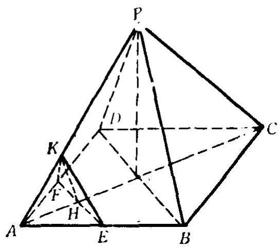

图 3-2-第 15 题

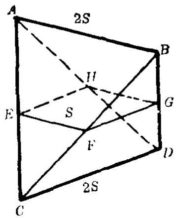

图 3-2-第 16 题

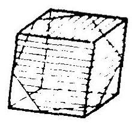

图 3-2-第 17 题

16. 解 如图所示，以边长为 $S$ 的正方形的四顶点 $E$ 、 $F$ 、 $G$ 、 $H$ 分别为 ${AO},{BO}$ 、 ${BD}$ 、 ${AD}$ 的中点，故 ${ABCD}$ 为一正四面体，且正方形将正四面体分成等积的两部分. 因正四面体棱长为 ${2S}$ ， 所以，

$$
{V}_{ABCD} = \frac{1}{3}{S}_{\text{ 紊 }}h = \frac{1}{3} \cdot  \frac{\sqrt{3}}{4}{\left( 2S\right) }^{2}\sqrt{\frac{2}{3}}\left( {2S}\right)  = \frac{2}{3}\sqrt{2}{S}^{3}.
$$

所求物体体积

$$
V = \frac{1}{2}{V}_{ABCD} = \frac{\sqrt{2}}{3}{S}^{3} = \frac{\sqrt{2}}{3}{\left( 6\sqrt{2}\right) }^{3} = {288}.
$$

17. 解 折叠成的多面体如图中的阴影部分所示. 该多面体的底是正六边形, 这个正六边形是通过正方体的对角线的中点且与对角线垂直的平面截正方体所得的截面, 这个截面将正方体分成等积的两个多面体, 所以折叠成的多面体的体积为

$$
\frac{1}{2} \times  {12}^{3} = {864}\text{ (立方厘米). }
$$

## 思考题九的答案与略解

1. (1)

$$
{x}^{2} - 2\left| x\right|  = m \Rightarrow  {x}^{2} - 2\left| x\right|  + 1 = m + 1 \Rightarrow  {\left( \left| x\right|  - 1\right) }^{2} = m + 1.
$$

① 当 $m + 1 < 0$ ，即 $m <  - 1$ 时，方程无解；

② 当 $m + 1 = 0$ ，即 $m =  - 1$ 时，方程有四个解，其中每两个解相等;

③ 当 $0 < m + 1 < 1$ ，即 $- 1 < m < 0$ 时，方程有四个不同的解；

④ 当 $m + 1 = 1$ ,即 $m = 0$ 时,方程有三个不同的解;

⑤ 当 $m + 1 > 1$ ，即 $m > 0$ 时，方程有两个不同的解.

(2)

${x}^{2} + 2\left| x\right|  = m \Rightarrow  {x}^{2} + 2\left| x\right|  + 1 = m + 1 \Rightarrow  {\left( \left| x\right|  + 1\right) }^{2} = m + 1$ .

① 当 $m + 1 = 1$ ，即 $m = 0$ 时，方程有一个解；

② 当 $m + 1 > 1$ ，即 $m > 0$ 时，方程有两个不同的解.

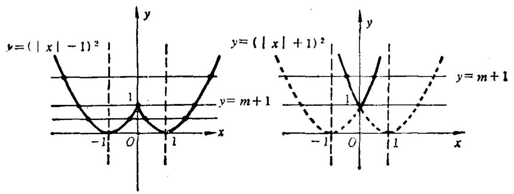

图 3-3-第 1 题

2. 令 $\sqrt{3} = t$ ,将方程

$$
{x}^{3} + 2\sqrt{3}{x}^{2} + {3x} + \sqrt{3} - 1 = 0
$$

转化为关于 $t$ 的二次方程:

$$
a{t}^{2} + \left( {2{x}^{2} + 1}\right) t + \left( {{x}^{3} - 1}\right)  = 0,
$$

$x \neq  0\left( {x = 0\text{ 不是原方程的根 }}\right)$ ,

$$
{t}_{1,2} = \frac{-\left( {2{x}^{2} + 1}\right)  \pm  \sqrt{{\left( 2{x}^{2} + 1\right) }^{2} - {4x}\left( {{x}^{3} - 1}\right) }}{2x}.
$$

而

$$
{\left( 2{x}^{2} + 1\right) }^{2} - {4x}\left( {{x}^{3} - 1}\right)  = {\left( 2x + 1\right) }^{2},
$$

$\therefore$

$$
{t}_{1} = \frac{-\left( {{x}^{2} + x + 1}\right) }{x},{t}_{2} =  - x + 1.
$$

由 ${t}_{1}$ 得

$$
\sqrt{3} = \frac{-\left( {{x}^{2} + x + 1}\right) }{x}
$$

求得

$$
{x}_{1,2} = \frac{-\left( {\sqrt{3} + 1}\right)  \pm  \sqrt{2} \cdot  \sqrt[4]{3}}{2}
$$

由 ${t}_{2}$ 得

$$
\sqrt{3} =  - x + 1,
$$

求得

$$
{x}_{3} = 1 - \sqrt{3}.
$$

3. (1)

$$
\because {20.625} = {20} + \frac{5}{8} = {16} + 4 + \frac{4}{8} + \frac{1}{8} = {2}^{4} + {2}^{2} + {2}^{-1} + {2}^{-3}\text{ , }
$$

$\therefore$

$$
{2}^{x} + {2}^{y} + {2}^{z} + {2}^{w} = {2}^{4} + {2}^{2} + {2}^{-1} + {2}^{-3},
$$

$\therefore x = 4, y = 2, z =  - 1, w =  - 3$ 符合题意.

(2) $\because$

$$
{2336} = {2}^{5} \times  {73}
$$

$\therefore$

$$
{2}^{x} + {2}^{y} + {2}^{z} = {2}^{5} \times  {73}
$$

$$
{2}^{x}\left( {1 + {2}^{y - x} + {2}^{z - x}}\right)  = {2}^{5} \times  {73},{2}^{x} = {2}^{5}, x = 5,
$$

$\therefore$

$$
{2}^{y - x} + {2}^{z - x} = {72},
$$

$$
{2}^{y - x}\left( {1 + {2}^{\left( {x - x}\right)  - \left( {y - x}\right) }}\right)  = {2}^{3} \cdot  9
$$

$$
\sqrt[{{cy} - x}]{x - 2} = {2}^{3}, y - x = 3, y = 8,
$$

;

$$
{2}^{x - x - y + x} = 8,{2}^{z - y} = {2}^{3},
$$

$$
z - y = 3, z = {11}\text{ . }
$$

4. 设方程有两个根 ${x}_{1} \neq  {x}_{2},{x}_{1},{x}_{2} \in  R$ ,则

$$
{x}_{1} = a + \sin {x}_{1},{x}_{2} = a + \sin {x}_{2}
$$

两式相减得

$$
{x}_{1} - {x}_{2} = \sin {x}_{1} - \sin {x}_{2},
$$

$$
{x}_{1} - {x}_{2} = 2\cos \frac{1}{2}\left( {{x}_{1} + {x}_{2}}\right) \sin \frac{1}{2}\left( {{x}_{1} - {x}_{2}}\right) ,
$$

$$
\left| {\frac{1}{2}\left( {{x}_{1} - {x}_{2}}\right) }\right|  = \left| {\cos \frac{1}{2}\left( {{x}_{1} + {x}_{2}}\right) \sin \frac{1}{2}\left( {{x}_{1} - {x}_{2}}\right) }\right| ,
$$

$$
\left| {\cos \frac{1}{2}\left( {{x}_{1} + {x}_{2}}\right) }\right|  = \frac{1}{\left| \frac{\sin \frac{1}{2}\left( {{x}_{1} - {x}_{2}}\right) }{\frac{1}{2}\left( {{x}_{1} - {x}_{2}}\right) }\right| } > 1,
$$

故不符.

$$
{V}_{A - {PBC}} = \frac{1}{6}{abc},{V}_{P - {ABC}} = \frac{1}{3} \cdot  {S}_{\bigtriangleup {ABC}} \cdot  h,
$$

$$
\therefore {\left( \frac{1}{6}abc\right) }^{2} = \frac{1}{9}{h}^{2} \cdot  {S}_{\bigtriangleup {ABC}}^{2}
$$

$$
= \frac{1}{9}{h}^{2}\left( {{S}_{\bigtriangleup {PBC}}^{2} + {S}_{\bigtriangleup {PCA}}^{2} + {S}_{\bigtriangleup {PAB}}^{2}}\right)
$$

$$
= \frac{1}{9}{h}^{2}\left\lbrack  {{\left( \frac{1}{2}bc\right) }^{2} + {\left( \frac{1}{2}ca\right) }^{2} + {\left( \frac{1}{2}ab\right) }^{2}}\right\rbrack
$$

$$
= \frac{1}{36}{h}^{2}\left( {b{c}^{2} + {c}^{2}{a}^{2} + {a}^{2}{b}^{2}}\right) ,
$$

即 $\frac{1}{{h}^{2}} = \frac{{b}^{2}{c}^{2} + {c}^{2}{a}^{2} + {a}^{2}{b}^{2}}{{a}^{2}{b}^{2}{c}^{2}} = \frac{1}{{a}^{2}} + \frac{1}{{b}^{2}} + \frac{1}{{c}^{2}}$ .

6. 依题意, $\because x \in  \left\lbrack  {0,{4a}}\right\rbrack  ,\therefore$ 分段考虑 $x$ 与 $y$ 的关系.

(1) $x \in  \left\lbrack  {0, a}\right\rbrack$ :

$$
y = {x}^{2} + {\left( a - x\right) }^{2} = 2{\left( x - \frac{a}{2}\right) }^{2} + \frac{1}{2}{a}^{2};
$$

(2) $x \in  (a,{2a}\rbrack$ :

$$
y = {\left( x - a\right) }^{2} + {\left( 2a - x\right) }^{2} = 2{\left( x - \frac{3}{2}a\right) }^{2} + \frac{1}{2}{a}^{2};
$$

(3) $x \in  ({2a},{3a}\rbrack$ :

$$
y = {\left( x - 2a\right) }^{2} + {\left( 3a - x\right) }^{2} = 2{\left( x - \frac{5}{2}a\right) }^{2} + \frac{1}{2}{a}^{2};
$$

(4) $x \in  \left( {{3a},{4a}}\right\rbrack$ :

$$
y = {\left( x - 3a\right) }^{2} + {\left( 4a - x\right) }^{2} = 2{\left( x - \frac{7}{2}a\right) }^{2} + \frac{1}{2}{a}^{2}.
$$

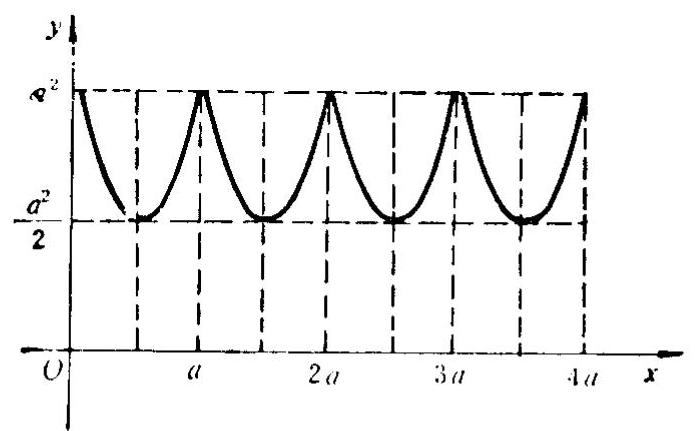

图 3-3-第 6 题

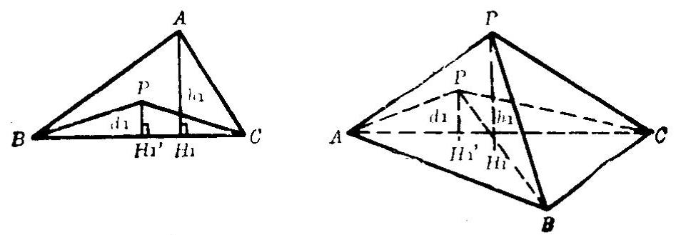

图 3-3-第 7 题

7. $\because$

$$
\frac{{d}_{1}}{{h}_{1}} = \frac{{S}_{\bigtriangleup {PBC}}}{{S}_{\bigtriangleup {ABC}}}
$$

$$
\frac{{d}_{2}}{{h}_{2}} = \frac{{S}_{\bigtriangleup {PCA}}}{{S}_{\bigtriangleup {BCA}}},\frac{{d}_{3}}{{h}_{3}} = \frac{{S}_{\bigtriangleup {PAB}}}{{S}_{\bigtriangleup {CAB}}},
$$

$$
{S}_{\bigtriangleup {PBC}} + {S}_{\bigtriangleup {PCA}} + {S}_{\bigtriangleup {PAB}} = {S}_{\bigtriangleup {ABC}},
$$

$\therefore$ 三式相加,得

$$
\frac{{d}_{1}}{{h}_{1}} + \frac{{d}_{2}}{{h}_{2}} + \frac{{d}_{3}}{{h}_{3}} = 1.
$$

在四面体内部任意一点,向各面引垂线,其长度分别为 ${d}_{1}\text{ 、 }{d}_{2}$ 、 ${d}_{3}\text{ 、 }{d}_{4}$ ,四面体相应于各面的高分别为 ${h}_{1}\text{ 、 }{h}_{2}\text{ 、 }{h}_{3}\text{ 、 }{h}_{4}$ ,则

$$
\frac{{d}_{1}}{{h}_{1}} + \frac{{d}_{2}}{{h}_{2}} + \frac{{d}_{3}}{{h}_{3}} + \frac{{d}_{4}}{{h}_{4}} = 1.
$$

证明应注意 $\frac{{d}_{1}}{{h}_{1}} = \frac{{V}_{P - {ABC}}}{{V}_{D - {ABC}}},\frac{{d}_{2}}{{h}_{2}} = \frac{{V}_{P - {BCD}}}{{V}_{A - {BCD}}}$ ，

$$
\frac{{d}_{3}}{{h}_{3}} = \frac{{V}_{P - {CDA}}}{{V}_{B - {CDA}}},\frac{{d}_{4}}{{h}_{4}} = \frac{{V}_{P - {DAB}}}{{V}_{C - {DAB}}},
$$

且 ${V}_{P - {ABC}} + {V}_{P - {BCD}} + {V}_{P - {CDA}} + {V}_{P - {DAB}} = {V}_{ABCD}$ .

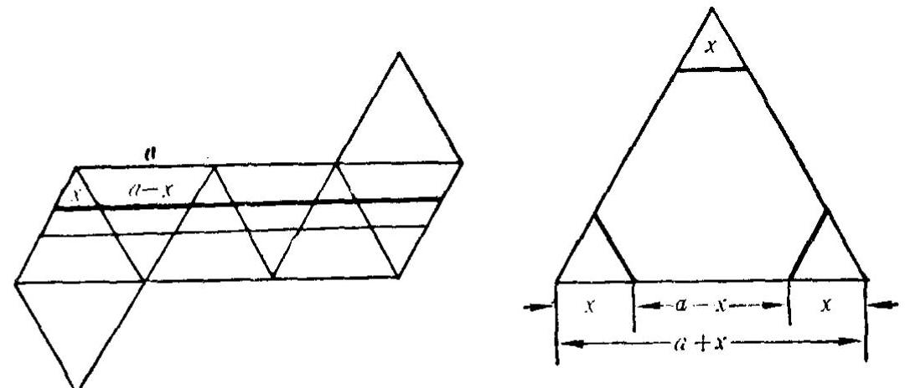

图 3-3-第 8 题

8. 在正八面体的展开图上, 显见符合题意的截面是周长等于定值 $\left( {3a}\right)$ 的六边形截面. 并且，六边形的每三条边等长，为相间分布. 设一组边长为 $x$ ,则另一组边长为 $a - x$ .

$$
\because S = \frac{\sqrt{3}}{4}{\left( a + x\right) }^{2} - 3 \cdot  \frac{\sqrt{3}}{4}{x}^{2} = \frac{\sqrt{3}}{4}\left\lbrack  {{\left( a + x\right) }^{2} - 3{x}^{2}}\right\rbrack
$$

$$
= \frac{\sqrt{3}}{4}\left\lbrack  {-2{\left( x - \frac{a}{2}\right) }^{2} + \frac{3}{2}{a}^{2}}\right\rbrack  ,
$$

$\therefore$ 当 $x = \frac{a}{2}$ 时,

$$
{S}_{\max } = \frac{\sqrt{3}}{4} \cdot  \frac{3}{2}{a}^{2} = \frac{3}{8}\sqrt{3}{a}^{2}.
$$

9. 在正四棱锥中，经过 ${BD}$ 作平面 ${BDE}$ ，使 ${PO} \bot$ 平面 ${BDE}$ . 在 $\bigtriangleup  {EBD}$ 中，

$$
\because \cos \angle {BED} = \frac{B{E}^{2} + D{E}^{2} - B{D}^{2}}{{2BE} \cdot  {DE}}
$$

$$
< \frac{{a}^{2} + {a}^{2} - {\left( \sqrt{2}a\right) }^{2}}{{2BE} \cdot  {DE}} = 0 = \cos {90}^{ \circ  },
$$

$$
\therefore \angle {BED} > {90}^{ \circ  }\text{ . }
$$

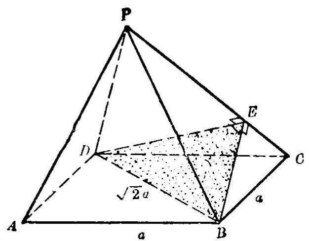

图 3-3-第 9 题(3)

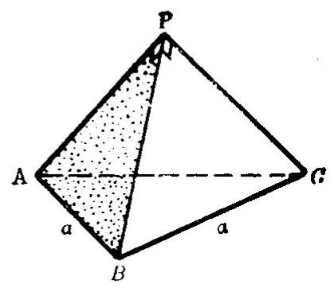

图 3-3-第 9 题(1)

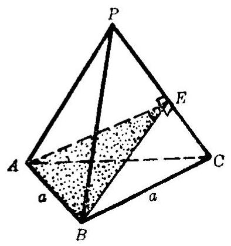

图 3-3-第 9 题(2)

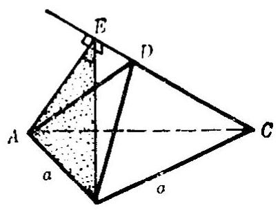

图 3-3-第 9 题(3)

在正三棱锥中,经过 ${AB}$ 作平面 ${ABE}$ ,使 ${PO} \bot$ 平面 ${ABE}$ . 在 $\bigtriangleup {EAB}$ 中,

$$
\cos \angle {AEB} = \frac{A{E}^{2} + B{E}^{2} - A{B}^{2}}{{2AE} \cdot  {BE}},
$$

有三种可能性:

(1) ${AE} = {BE} = \frac{\sqrt{2}}{2}a$ ，三面角 $P - {ABC}$ 为直三面角，相邻侧面夹角等于 ${90}^{ \circ  }$ ;

(2) ${AE} = {BE} > \frac{\sqrt{2}}{2}a$ ，三面角 $P - {ABC}$ 各面角均为锐角，相

邻侧面夹角小于 ${90}^{ \circ  }$ ;

(3) ${AE} = {BE} < \frac{\sqrt{2}}{2}a$ ，三面角 $P - {ABC}$ 各面角均为钝角，相

邻侧面夹角大于 ${90}^{ \circ  }$ .

10. (1) $\because$

$$
{S}_{\bigtriangleup {HBC}} = {S}_{\bigtriangleup {PBC}} \cdot  \cos \alpha ,
$$

$$
{S}_{\bigtriangleup {HCA}} = {S}_{\bigtriangleup {PCA}} \cdot  \cos \beta ,{S}_{\bigtriangleup {HAB}} = {S}_{\bigtriangleup {PAB}} \cdot  \cos \gamma ,
$$

三式相加

$$
\left( {\because {S}_{\bigtriangleup {HBC}} + {S}_{\bigtriangleup {HCA}} + {S}_{\bigtriangleup {HAB}} = {S}_{\bigtriangleup {ABC}},}\right.
$$

$$
{S}_{\bigtriangleup {PBC}} = {S}_{\bigtriangleup {PCA}} = {S}_{\bigtriangleup {PAB}} = {S}_{\bigtriangleup {ABC}}),
$$

得

$$
\cos \alpha  + \cos \beta  + \cos \gamma  = 1
$$

(2) $\because \alpha$ 、 $\beta$ 、 $\gamma$ 均非钝角，

$$
\cos \alpha \text{ 、 }\cos \beta \text{ 、 }\cos \gamma  \geq  0,
$$

$$
{\left( \cos \alpha \cos \beta \cos \gamma \right) }^{1/3} \leq  \frac{1}{3}\left( {\cos \alpha  + \cos \beta  + \cos \gamma }\right)  = \frac{1}{3},
$$

即

$$
\cos \alpha \cos \beta \cos \gamma  \leq  1/{27}
$$

(3)

$$
{\cos }^{2}\alpha  + {\cos }^{2}\beta  + {\cos }^{2}\gamma
$$

$$
= \frac{1}{3}\left\lbrack  {\left( \cos \alpha  + \cos \beta  + \cos \gamma \right) }^{2}\right.
$$

$$
+ {\left( \cos \alpha  - \cos \beta \right) }^{2} + {\left( \cos \beta  - \cos \gamma \right) }^{2}
$$

$$
\left. {+{\left( \cos \gamma  - \cos \alpha \right) }^{2}}\right\rbrack
$$

$$
\geq  \frac{1}{3}{\left( \cos \alpha  + \cos \beta  + \cos \gamma \right) }^{2}
$$

$$
= \frac{1}{3}\text{ . }
$$

i1. 设点 $M$ 到面 ${ABD}$ 距离为 ${h}_{1},{MD}$ 与面 ${ABD}$ 成角 ${\alpha }_{1}$ ; 点 $M$ 到面 ${BOD}$ 的距离为 ${h}_{2},{MD}$ 与面 ${BCD}$ 成角 ${\alpha }_{2}$ ; 点 $M$ 到面 ${CAD}$ 的距离为 ${h}_{3},{MD}$ 与面 ${OAD}$ 成角 ${\alpha }_{3}$ . 所以，

$$
{h}_{1} = \left| {MD}\right| \sin {\alpha }_{1},{h}_{2} = \left| {MD}\right| \sin {\alpha }_{2},{h}_{3} = \left| {MD}\right| \sin {\alpha }_{3}.
$$

$$
{\alpha }_{1} = {\alpha }_{2} = {\alpha }_{3}
$$

$\therefore {h}_{1} = {h}_{2} = {h}_{3}$ .

$$
\therefore {S}_{\bigtriangleup {AMB}} : {S}_{\bigtriangleup {BMC}} : {S}_{\bigtriangleup {CMA}}
$$

$$
= {V}_{D - {AMB}} : {V}_{D - B} : {V}_{D - {OMA}}
$$

$$
= {V}_{M - {ABD}} : {V}_{M - {BCD}} : {V}_{M - {CAD}}
$$

$$
= {S}_{\bigtriangleup {ABD}} \cdot  {h}_{1} : {S}_{\bigtriangleup {BCD}} \cdot  {h}_{2} : {S}_{\bigtriangleup {CAD}} \cdot  {h}_{3}
$$

$$
= {S}_{\bigtriangleup {ABD}} : {S}_{\bigtriangleup {BCD}} : {S}_{\bigtriangleup {CAD}},
$$

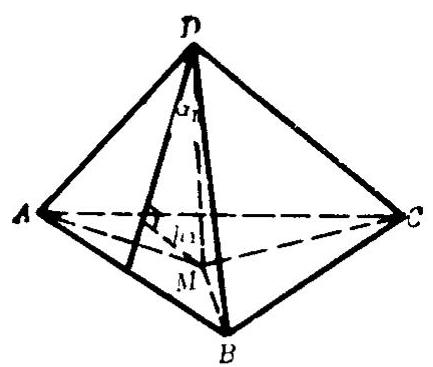

图 3-3-第 11 题

即 $\frac{{S}_{\bigtriangleup {AMB}}}{{S}_{\bigtriangleup {ADB}}} = \frac{{S}_{\bigtriangleup I : {MC}}}{{S}_{\bigtriangleup {BDC}}} = \frac{{S}_{\bigtriangleup {CMA}}}{{S}_{\bigtriangleup {CDA}}}$ .

12. 多边形 ${A}_{1}{A}_{2}\cdots {A}_{n}$ 内接于 $\odot  O(O$ 在多边形内部),经过 $O$ 点作 ${A}_{1}{A}_{2}\text{ 、 }{A}_{2}{A}_{3}\text{ 、 }\cdots \text{ 、 }{A}_{n}{A}_{1}$ 的垂线,延长交 $\odot  O$ 于 ${B}_{1}\text{ 、 }{B}_{2}\text{ 、 }\cdots$ 、 ${B}_{n}$ . 令 $\angle {A}_{1}O{A}_{2} = {\alpha }_{1},\cdots ,\angle {A}_{i}O{A}_{i + 1} = {\alpha }_{i},\cdots ,\angle {A}_{n}O{A}_{1} = {\alpha }_{n}$ , $\angle {B}_{1}O{B}_{2} = {\beta }_{1},\cdots ,\angle {B}_{i}O{B}_{i + 1} = {\beta }_{i},\cdots ,\angle {B}_{n}O{B}_{1} = {\beta }_{n}$ ,则

$$
{\beta }_{i} = \frac{1}{2}\left( {{\alpha }_{i} + {\alpha }_{i + 1}}\right) .
$$

而 $0 < x, y < \pi$ ,

$$
\frac{1}{2}\left( {\sin x + \sin y}\right)  = \sin \frac{1}{2}\left( {x + y}\right) \cos \frac{1}{2}\left( {x - y}\right)  \leq  \sin \frac{1}{2}\left( {x + y}\right) ,
$$

于是，

$$
{S}_{A} = \frac{1}{2}{R}^{2}\left( {\sin {\alpha }_{1} + \cdots  + \sin {\alpha }_{n}}\right)
$$

$$
= \frac{{R}^{2}}{2}\left\lbrack  {\frac{1}{2}\left( {\sin {\alpha }_{1} + \sin {\alpha }_{2}}\right)  + \frac{1}{2}\left( {\sin {\alpha }_{2} + \sin {\alpha }_{3}}\right) }\right.
$$

$$
\left. {+\cdots  + \frac{1}{2}\left( {\sin {\alpha }_{n} + \sin {\alpha }_{1}}\right) }\right\rbrack
$$

$$
\leq  \frac{1}{2}{R}^{2}\left\lbrack  {\sin \frac{1}{2}\left( {{\alpha }_{1} + {\alpha }_{2}}\right)  + \cdots  + \sin \frac{1}{2}\left( {{\alpha }_{n} + {\alpha }_{1}}\right) }\right\rbrack
$$

$$
- \frac{1}{2}{R}^{2}\left( {\sin {\beta }_{1} + \cdots  + \sin {\beta }_{n}}\right)  = {S}_{B}
$$

当且仅当 ${A}_{1}\cdots {A}_{n}$ 为正 $n$ 边形,即 ${\alpha }_{1} = {\alpha }_{2} = \cdots  = {\alpha }_{n}$ ,

${\beta }_{1} = {\beta }_{2} = \cdots  = {\beta }_{n}$ ,且 ${\alpha }_{i} = {\beta }_{i}\left( {i = 1,\cdots , n}\right)$ 时, ${S}_{A} = {S}_{B}$ .

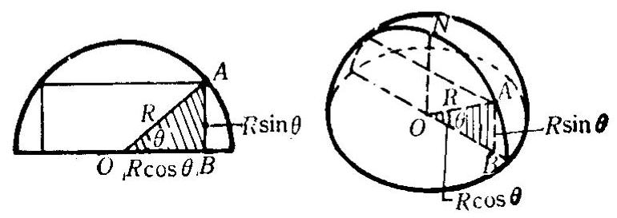

图 3-3-第 13 题

13. (1) $\because \;S = {2R}\cos \theta  \cdot  R\sin \theta  = {R}^{2}\sin {2\theta } \leq  {R}^{2}$ ,

$\therefore$ 当 ${2\theta } = \frac{\pi }{2}$ ,即 $\theta  = \frac{\pi }{4}$ 时, ${S}_{\max } = {R}^{2}$ .

(2) $\theta  \in  \left( {0,\frac{\pi }{2}}\right)$ ，

$$
{S}_{\text{ 焦 }} = {\left( \sqrt{2}R\cos \theta \right) }^{2} = 2{R}^{2}{\cos }^{2}\theta ,
$$

$$
V = {S}_{\text{ 焦 }} \cdot  \left( {AB}\right)  = 2{R}^{2}{\cos }^{2}\theta  \cdot  R\sin \theta  = 2{R}^{3}{\cos }^{2}\theta  \cdot  \sin \theta .
$$

$$
\because \;{\left\lbrack  2{\left( {\cos }^{2}\theta \sin \theta \right) }^{2}\right\rbrack  }^{1/3} = {\left( {\cos }^{2}\theta  \cdot  {\cos }^{2}\theta  \cdot  2{\sin }^{2}\theta \right) }^{1/3}
$$

$$
\leq  \frac{1}{3}\left\lbrack  {{\cos }^{2}\theta  + {\cos }^{2}\theta  + 2{\sin }^{2}\theta }\right\rbrack   = \frac{2}{3},
$$

$$
\therefore \;2{\left( {\cos }^{2}\theta  \cdot  \sin \theta \right) }^{2} \leq  {\left( \frac{2}{3}\right) }^{3} = \frac{8}{27}.
$$

$$
\because \;{\cos }^{2}\theta \sin \theta  \leq  {\left( \frac{4}{27}\right) }^{1/2} = \frac{2\sqrt{3}}{9},
$$

$$
V = 2{R}^{3}{\cos }^{2}\theta \sin \theta  \leq  \frac{4}{9}\sqrt{3}{R}^{3},
$$

$\therefore$ 当 ${\cos }^{2}\theta  = 2{\sin }^{2}\theta ,\theta  \in  \left( {0,\frac{\pi }{2}}\right)$ ，即 $\theta  = \operatorname{arctg}\sqrt{2}$ 时，

$$
{V}_{\max } = \frac{4}{9}\sqrt{3}{R}^{3}.
$$

14. (1) $\because \frac{1}{2}\left( {{a}^{n} + {b}^{n}}\right)  \geq  {\left\lbrack  \frac{1}{2}\left( a + b\right) \right\rbrack  }^{n},\left( {n \in  N}\right)$ ,

$$
\therefore \;{\left( {a}^{n} + {b}^{n}\right) }^{\frac{1}{n}} \geq  \frac{\sqrt[n]{2}}{2}\left( {a + b}\right) \text{ . }
$$

同理,

$$
{\left( {b}^{n} + {c}^{n}\right) }^{\frac{1}{n}} \geq  \frac{\sqrt[n]{2}}{2}\left( {b + c}\right)
$$

$$
{\left( {c}^{n} + {a}^{n}\right) }^{\frac{1}{n}} \geq  \frac{\sqrt[n]{2}}{2}\left( {c + a}\right) ,
$$

三式相加, 得

$$
{\left( {a}^{n} + {b}^{n}\right) }^{\frac{1}{n}} + {\left( {b}^{n} + {c}^{n}\right) }^{\frac{1}{n}} + {\left( {c}^{n} + {a}^{n}\right) }^{\frac{1}{n}} \geq  \sqrt[n]{2}\left( {a + b + c}\right) .
$$

(2) $\because y = {x}^{n}\left( {n \in  N}\right)$ 在 $x \in  \lbrack 0, + \infty )$ 上为下凸函数，

$\therefore \;\frac{1}{m}\left( {{a}_{2}^{n} + {a}_{3}^{n} + \cdots  + {a}_{m + 1}^{n}}\right)  \geq  {\left\lbrack  \frac{1}{m}\left( {a}_{2} + {a}_{3} + \cdots  + {a}_{m + 1}\right) \right\rbrack  }^{n},$

于是 ${\left\lbrack  {a}_{2}^{n} + {a}_{3}^{n} + \cdots  + {a}_{m + 1}^{n}\right\rbrack  }^{\frac{1}{n}} \geq  \frac{\sqrt[n]{m}}{m}\left( {{a}_{2} + {a}_{3} + \cdots  + {a}_{m + 1}}\right)$ ,

即

$$
{\left\lbrack  {S}_{m + 1}^{\left( n\right) } - {a}_{1}^{n}\right\rbrack  }^{1/n} \geq  \frac{\sqrt[n]{m}}{m}\left( {{S}_{m + 1} - {a}_{1}}\right) .
$$

同理

$$
{\left\lbrack  {S}_{m + 1}^{\left( n\right) } - {a}_{2}^{n}\right\rbrack  }^{\frac{1}{n}} \geq  \frac{\sqrt[n]{m}}{m}\left( {{S}_{m + 1} - {a}_{2}}\right) ,\cdots ,{\left\lbrack  {S}_{m + 1}^{\left( n\right) } - {a}_{m + 1}^{n}\right\rbrack  }^{\frac{1}{n}}
$$

$$
\geq  \frac{\sqrt[n]{m}}{m}\left( {{S}_{m + 1} - {a}_{m + 1}}\right)
$$

将 $\left( {m + 1}\right)$ 个式相加,得

$$
{\left\lbrack  {S}_{m + 1}^{\left( n\right) } - {a}_{1}^{n}\right\rbrack  }^{1/n} + {\left\lbrack  {S}_{m + 1}^{\left( n\right) } - {a}_{2}^{n}\right\rbrack  }^{1/n} + \cdots  + {\left\lbrack  {S}_{m + 1}^{\left( n\right) } - {a}_{m + 1}^{n}\right\rbrack  }^{1/n}
$$

$$
\geq  \frac{\sqrt[n]{m}}{m}\left\lbrack  {\left( {m + 1}\right) {S}_{m + 1} - {S}_{m + 1}}\right\rbrack   = \sqrt[n]{m} \cdot  {S}_{m + 1}.
$$

15. $1 + {a}_{1} > 0,1 + {a}_{2} > 0,\cdots ,1 + {a}_{n} > 0$ ,

$$
{\left\lbrack  \left( 1 + {a}_{1}\right) \left( 1 + {a}_{2}\right) \cdots \left( 1 + {a}_{n}\right) \right\rbrack  }^{1/n}
$$

$$
\leq  \frac{1}{n}\left\lbrack  {\left( {1 + {a}_{1}}\right)  + \left( {1 + {a}_{2}}\right)  + \cdots  + \left( {1 + {a}_{n}}\right) }\right\rbrack
$$

$$
= \frac{1}{n}\left\lbrack  {n + \left( {{a}_{1} + {a}_{2} + \cdots  + {a}_{n}}\right) }\right\rbrack
$$

$$
= \frac{1}{n}\left\lbrack  {n + {S}_{n}}\right\rbrack   = 1 + \frac{{S}_{n}}{n}.
$$

$$
\left( {1 + {a}_{1}}\right) \left( {1 + {a}_{2}}\right) \cdots \left( {1 + {a}_{n}}\right)
$$

$$
\leq  {\left( 1 + \frac{{S}_{n}}{n}\right) }^{n}
$$

$$
= 1 + {O}_{n}^{1} \cdot  \frac{{S}_{n}}{n} + {O}_{n}^{2} \cdot  {\left( \frac{{S}_{n}}{n}\right) }^{2} + \cdots  + {O}_{n}^{n}{\left( \frac{{S}_{n}}{n}\right) }^{n}
$$

$$
= 1 + \frac{n}{1!} \cdot  \frac{{S}_{n}}{n} + \frac{n\left( {n - 1}\right) }{2!} \cdot  \frac{{S}_{n}^{2}}{{n}^{2}} + \cdots
$$

$$
+ \frac{n\left( {n - 1}\right) \cdots 1}{n!} \cdot  \frac{{S}_{n}^{n}}{{n}^{n}}
$$

$$
\leq  1 + \frac{n}{1!} \cdot  \frac{{S}_{n}}{n} + \frac{{n}^{2}}{2!} \cdot  \frac{{S}_{n}^{2}}{{n}^{2}} + \cdots  + \frac{{n}^{n}}{n!} \cdot  \frac{{S}_{n}^{n}}{{n}^{n}}
$$

$$
= 1 + \frac{{S}_{n}}{1!} + \frac{{S}_{n}^{2}}{2!} + \cdots  + \frac{{S}_{n}^{n}}{n!}.
$$

16. ${C}_{n}^{1} + {C}_{n}^{2} + \cdots  + {C}_{n}^{n} > n \cdot  {2}^{\frac{1}{2}\left( {n - 1}\right) } \Leftrightarrow  {2}^{n} - 1 > n \cdot  {2}^{\frac{1}{2}\left( {n - 1}\right) }$ ,而

$$
{2}^{n} - 1 = \frac{{2}^{n} - 1}{1} = \frac{{2}^{n} - 1}{2 - 1}
$$

$$
= 1 + {2}^{1} + {2}^{2} + \cdots  + {2}^{n - 2} + {2}^{n - 1}
$$

$$
> n{\left\lbrack  1 \cdot  {2}^{1} \cdot  {2}^{2} \cdot  \cdots  \cdot  {2}^{n - 2} \cdot  {2}^{n - 1}\right) }^{\frac{1}{n}}
$$

$$
= n{\left\lbrack  {2}^{\left( 1 + 2 + \cdots  + \left( n - 1\right) \right) }\right\rbrack  }^{\frac{1}{n}}
$$

$$
= n \cdot  {\left\lbrack  {2}^{\frac{1}{2}\left( {n - 1}\right) n}\right\rbrack  }^{\frac{1}{n}} = n \cdot  {2}^{\frac{1}{2}\left( {n - 1}\right) }.
$$

17. ${\left\lbrack  {\left( 1 + \frac{x}{n}\right) }^{n}\right\rbrack  }^{\frac{1}{n + 1}} = {\left\lbrack  1 \cdot  {\left( 1 + \frac{x}{n}\right) }^{n}\right\rbrack  }^{\frac{1}{n + 1}}$

$$
\leq  \frac{1}{n + 1}\left\lbrack  {1 + \left( {1 + \frac{x}{n}}\right)  + \cdots  + \left( {1 + \frac{x}{n}}\right) }\right\rbrack
$$

$$
= \frac{1}{n + 1}\left\lbrack  {\left( {n + 1}\right)  \cdot  1 + n \cdot  \frac{x}{n}}\right\rbrack
$$

$$
= \frac{1}{n + 1}\left\lbrack  {\left( {n + 1}\right)  + x}\right\rbrack   = 1 + \frac{x}{n + 1}.
$$

## 思考题十的答案与略解

1. 证

取长度分别为 $x\text{ 、 }y\text{ 、 }z$ 的三线段 ${OA}\text{ 、 }{OB}\text{ 、 }{OC}$ ,使

$$
\angle {AOB} = \angle {BOC} = \angle {OOA} = {120}^{ \circ  }\text{ ， }
$$

则 $\bigtriangleup  {ABC}$ 的三边长分别为

$$
{AB} = \sqrt{{x}^{2} + {y}^{2} - {2xy}\cos {120}^{ \circ  }} = \sqrt{{x}^{2} + {y}^{2} + {xy}},
$$

同理 ${BC} = \sqrt{{y}^{2} + {z}^{2} + {yz}},\;{CA} = \sqrt{{z}^{2} + {x}^{2} + {zx}}$ .

$$
{AB} + {CA} \geq  {BC},
$$

$\therefore \sqrt{{x}^{2} + {y}^{2} + {xy}} + \sqrt{{z}^{2} + {x}^{2} + {zx}} \geq  \sqrt{{y}^{2} + {z}^{2} + {yz}}$ .

2. 证

$$
\left( {a + b + c}\right) \left( {{h}_{a} + {h}_{b} + {h}_{c}}\right)  = {2S}\left( {a + b + c}\right) \left( {\frac{1}{a} + \frac{1}{b} + \frac{1}{c}}\right)
$$

$$
\geq  {18S}\sqrt[3]{abc}\sqrt[3]{\frac{1}{abc}}
$$

$$
= {18S}\text{ , }
$$

$\therefore$

$$
{h}_{a} + {h}_{b} + {h}_{c} \geq  \frac{18S}{2p} = {9r}.
$$

当且仅当 $a = b = c$ (即为正三角形) 时,等号成立.

3. 证 $\because$

$$
a < b + c,
$$

$\therefore$

$$
\frac{a}{a + b + c} < \frac{1}{2}.
$$

同理, 有

$$
\frac{b}{a + b + c} < \frac{1}{2}
$$

$$
\frac{c}{a + b + c} < \frac{1}{2}
$$

$$
\frac{{a\alpha } + {b\beta } + {c\gamma }}{a + b + c} < \frac{\alpha }{2} + \frac{\beta }{2} + \frac{\gamma }{2} = \frac{\pi }{2}.
$$

根据在一个三角形中, 大角对大边定理, 有

$$
\left( {a - b}\right) \left( {\alpha  - \beta }\right)  \geq  0,\left( {b - c}\right) \left( {\beta  - \gamma }\right)  \geq  0,\left( {c - a}\right) \left( {\gamma  - \alpha }\right)  \geq  0,
$$

$$
\therefore \;3\left( {{a\alpha } + {b\beta } + {c\gamma }}\right)  - \left( {a + b + c}\right) \left( {\alpha  + \beta  + \gamma }\right)
$$

$$
= \left( {a - b}\right) \left( {\alpha  - \beta }\right)  + \left( {b - c}\right) \left( {\beta  - \gamma }\right)  + \left( {c - a}\right) \left( {\gamma  - \alpha }\right)
$$

$$
\geq  0\text{ , }
$$

即

$$
\frac{{a\alpha } + {b\beta } + {c\gamma }}{a + b + c} \geq  \frac{\alpha  + \beta  + \gamma }{3} = \frac{\pi }{3}.
$$

当且仅当 $a = b = c$ ,即为正三角形时,等号成立.

4. 证 $\because$

$$
{AI} = r\csc \frac{A}{2},
$$

$$
{BI} = r\csc \frac{B}{2},{CI} = r\csc \frac{C}{2}.
$$

$$
\therefore {AI} + {BI} + {CI} = r\left( {\csc \frac{A}{2} + \csc \frac{B}{2} + \csc \frac{C}{2}}\right)
$$

$$
\geq  3{r}^{3}\sqrt[3]{\frac{1}{\sin \frac{A}{2}\sin \frac{B}{2}\sin \frac{C}{2}}}
$$

$$
\left( {\because \;\sin \frac{A}{2}\sin \frac{B}{2}\sin \frac{C}{2} \leq  \frac{1}{8}}\right)
$$

$$
\geq  {6r}\text{ . }
$$

应用 Erdös-Mordell 不等式, 也可获证.

5. 证 设 $\overrightarrow{AB} = \mathbf{a},\overrightarrow{AO} = \mathbf{b},\overrightarrow{AD} = \mathbf{c}$ ,则

$$
A{O}^{2} + B{D}^{2} + A{D}^{2} + B{O}^{2} - A{B}^{2} - C{D}^{2}
$$

$$
= {\mathbf{b}}^{2} + {\left( \mathbf{c} - \mathbf{a}\right) }^{2} + {\mathbf{c}}^{2} + {\left( \mathbf{b} - \mathbf{a}\right) }^{2} - {\mathbf{a}}^{2} - {\left( \mathbf{c} - \mathbf{b}\right) }^{2}
$$

$$
= {\mathbf{b}}^{2} + {\mathbf{c}}^{2} - 2\mathbf{{ca}} + {\mathbf{a}}^{2} + {\mathbf{c}}^{2} + {\mathbf{b}}^{2} - 2\mathbf{{ab}} + {\mathbf{a}}^{2}
$$

$$
- {\mathbf{a}}^{2} - {\mathbf{c}}^{2} + 2\mathbf{b}\mathbf{c} - {\mathbf{b}}^{2}
$$

$$
= {\mathbf{a}}^{2} + {\mathbf{b}}^{2} + {\mathbf{c}}^{2} - 2\mathbf{{ab}} + 2\mathbf{{bc}} - 2\mathbf{{ca}}
$$

$$
= {\left( \mathbf{a} - \mathbf{b} - \mathbf{c}\right) }^{2} \geq  0.
$$

6. 解 仿例 7, $m \in  \left\lbrack  {-\frac{1}{2},\frac{7}{2}}\right\rbrack$ .

7. 解 集合 $A$ 为直线 $y = {ax} + b$ 上横坐标为整数的点,集合 $B$ 为抛物线 $y = 3{x}^{2} + {15}$ 上的全部整点.

$$
\because \;A \cap  B \neq  \varnothing ,
$$

$\therefore$ 方程 $3{x}^{2} + {15} = {ax} + b$ ，

即

$$
3{x}^{2} - {ax} + {15} - b = 0
$$

有整数解. $\therefore \Delta  = {a}^{2} - {12}\left( {{15} - b}\right)  \geq  0$ ,即

$$
{a}^{2} + {12b} - {180} \geq  0
$$

①

$$
\because \;\left( {a, b}\right)  \in  O\text{ , }
$$

$$
\therefore \;{a}^{2} + {b}^{2} - {144} \leq  0
$$

②

1 ② 两异向不等式相减得

$$
{b}^{2} - {12b} + {36} < 0,
$$

即

$$
{\left( b - 6\right) }^{2} \leq  0.
$$

但

$$
{\left( b - 6\right) }^{2} \geq  0,
$$

$\therefore$

$$
b = 6\text{ . }
$$

分别代入 ①,② 得

$$
{a}^{2} + {72} - {180} \geq  0,
$$

即

$$
{a}^{2} \geq  {108}
$$

又

$$
{a}^{2} + {36} \leq  {144},
$$

即

$$
{a}^{2} \leq  {108}\text{ . }
$$

$\therefore$

$$
{a}^{2} = {108},
$$

即

$$
a =  \pm  6\sqrt{3}.
$$

方程

$$
3{x}^{2} \mp  6\sqrt{3}x + 9 = 0,
$$

即

$$
{x}^{2} \mp  2\sqrt{3}x + 3 = 0,\therefore x =  \mp  \sqrt{3}\text{ . }
$$

这与方程 $3{x}^{2} - {ax} + {15} - b = 0$ 有整数解矛盾. 故同时满足条件(1)、(2)的实数 $a$ 、 $b$ 不存在.

8. 证 设二次曲线方程为

$$
f\left( {x, y}\right)  = A{x}^{2} + {Bxy} + C{y}^{2} + {Dx} + {Ey} + F = 0
$$

①

直线 $\overrightarrow{{P}_{0}{QR}}$ 与 $\overrightarrow{{P}_{0}{ST}}$ 的倾角分别为 ${\theta }_{1}\text{ 、 }{\theta }_{2}$ ,则过点 ${P}_{0}\left( {{x}_{0},{y}_{0}}\right)$ 的直线 $\overline{{P}_{0}{QR}}$ 与 $\overline{{P}_{0}{ST}}$ 的参数方程分别为

$$
\left\{  \begin{array}{l} x = {x}_{0} + t\cos {\theta }_{1}, \\  y = {y}_{0} + t\sin {\theta }_{1}; \end{array}\right.
$$

②

$$
\left\{  \begin{array}{l} x = {x}_{0} + t\cos {\theta }_{2}, \\  y = {y}_{0} + t\sin {\theta }_{2}; \end{array}\right.
$$

③

② 代入 ①, 得

$$
\left( {A{\cos }^{2}{\theta }_{1} + B\sin {\theta }_{1}\cos {\theta }_{1} + C{\sin }^{2}{\theta }_{1}}\right) {t}^{2}
$$

$$
+ \left\lbrack  {\left( {{2A}{x}_{0} + B{y}_{0} + D}\right) \cos {\theta }_{1} + \left( {B{x}_{0} + {2C}{y}_{0} + E}\right) \sin {\theta }_{1}}\right\rbrack  t
$$

$$
+ f\left( {{x}_{0},{y}_{0}}\right)  = 0,
$$

其两根

$$
{t}_{1} = {P}_{0}Q,{t}_{2} = {P}_{0}R.
$$

因二次项系数不等于零, 故

$$
{P}_{0}Q \cdot  {P}_{0}R = \frac{f\left( {{x}_{0},{y}_{0}}\right) }{A{\cos }^{2}{\theta }_{1} + B\sin {\theta }_{1}\cos {\theta }_{1} + C{\sin }^{2}{\theta }_{1}}.
$$

同理,

$$
{P}_{0}S \cdot  {P}_{0}T = \frac{f\left( {{x}_{0},{y}_{0}}\right) }{A{\cos }^{2}{\theta }_{2} + B\sin {\theta }_{2}\cos {\theta }_{2} + C{\sin }^{2}{\theta }_{2}}.
$$

$\therefore \left| \frac{{P}_{0}Q \cdot  {P}_{0}R}{{P}_{0}S \cdot  {P}_{0}T}\right|  = \left| \frac{A{\cos }^{2}{\theta }_{2} + B\sin {\theta }_{2}\cos {\theta }_{2} + C{\sin }^{2}{\theta }_{3}}{A{\cos }^{2}{\theta }_{1} + B\sin {\theta }_{1}\cos {\theta }_{1} + C{\sin }^{2}{\theta }_{1}}\right|$ ,

此为与点 ${P}_{0}$ 的位置无关的定值.

9. 证 设 $\angle {PO}{O}_{2} = \theta$ ,则

$$
\angle {AOP} = \frac{2\pi }{3} + \theta ,\angle {POC} = \frac{2\pi }{3} - \theta .
$$

令

$$
{OA} = R,{O}_{1}A = {O}_{2}B = {O}_{3}C = r,
$$

$$
\text{ J }P{O}_{1}^{2} = {R}^{2} + {\left( R - r\right) }^{2} - {2R}\left( {R - r}\right) \cos \left( {\frac{2\pi }{3} + \theta }\right) \text{ , }
$$

$$
P{L}^{2} = P{O}_{1}^{2} - {r}^{2}
$$

$$
= 2{R}^{2} - {2Rr} - {2R}\left( {R - r}\right) \cos \left( {\frac{2\pi }{3} + \theta }\right)
$$

$$
= {2R}\left( {R - r}\right) \left\lbrack  {1 - \cos \left( {\frac{2\pi }{3} + \theta }\right) }\right\rbrack
$$

$$
= {4R}\left( {R - r}\right) {\sin }^{2}\left( {\frac{\pi }{3} + \frac{\theta }{2}}\right) .
$$

同理, 有

$$
P{M}^{2} = {4R}\left( {R - r}\right) {\sin }^{2}\frac{\theta }{2},
$$

$$
P{N}^{2} = {4R}\left( {R - r}\right) {\sin }^{2}\left( {\frac{\pi }{3} - \frac{\theta }{2}}\right) .
$$

$\because \;\theta  \in  \left\lbrack  {0,\frac{2\pi }{3}}\right\rbrack  ,\;\therefore \;{PL} = 2\sqrt{R\left( {R - r}\right) }\sin \left( {\frac{\pi }{3} + \frac{\theta }{2}}\right) ,$

$$
{PM} = 2\sqrt{R\left( {R - r}\right) }\sin \frac{\theta }{2}
$$

$$
{PN} = 2\sqrt{R\left( {R - r}\right) }\sin \left( {\frac{\pi }{3} - \frac{\theta }{2}}\right) .
$$

$$
\therefore \;{PM} + {PN} = 2\sqrt{R\left( {R - r}\right) }\left\lbrack  {\sin \frac{\theta }{2} + \sin \left( {\frac{\pi }{3} - \frac{\theta }{2}}\right) }\right\rbrack
$$

$$
= 4\sqrt{R\left( {R - r}\right) }\sin \frac{\pi }{6}\cos \left( {\frac{\pi }{6} - \frac{\theta }{2}}\right)
$$

$$
= 2\sqrt{R\left( {R - r}\right) }\sin \left( {\frac{\pi }{2} - \frac{\pi }{6} + \frac{\theta }{2}}\right)
$$

$$
= 2\sqrt{R\left( {R - r}\right) }\sin \left( {\frac{\pi }{3} + \frac{\theta }{2}}\right)  = {PL}.
$$

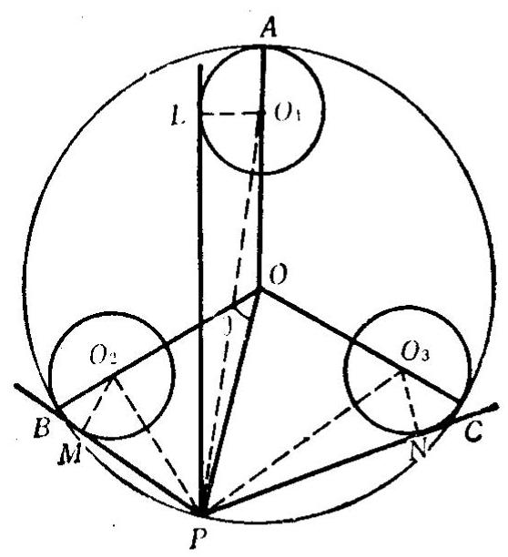

图 3-4-第 9 题

10. 证 从例 8 知 ${\operatorname{tg}}^{2}\frac{\pi }{7},{\operatorname{tg}}^{2}\frac{3\pi }{7},{\operatorname{tg}}^{2}\frac{5\pi }{7}$ 是方程

$$
{y}^{3} - {21}{y}^{2} + {35y} - 7 = 0
$$

的根,故 ${\operatorname{tg}}^{2}\frac{\pi }{7} + {\operatorname{tg}}^{2}\frac{3\pi }{7} + {\operatorname{tg}}^{2}\frac{5\pi }{7} = {21}$ ,

$$
{\sec }^{2}\frac{\pi }{7} + {\sec }^{2}\frac{3\pi }{7} + {\sec }^{2}\frac{5\pi }{7}
$$

$$
= 1 + {\operatorname{tg}}^{2}\frac{\pi }{7} + 1 + {\operatorname{tg}}^{2}\frac{3\pi }{7} + 1 + {\operatorname{tg}}^{2}\frac{5\pi }{7} = {24}.
$$

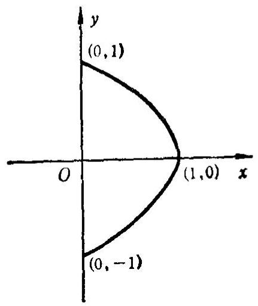

图 3-4-第 12 题

11. 证 必要性: 如果 $\bigtriangleup {ABC}$ 是等腰三角形,则 $A = B,\therefore$ 行列式中第一行与第二行完全相同, 故

$$
\Delta  = 0\text{ . }
$$

充分性: 如果 $\Delta  = 0$ ,则三点 $\left( {{\cos }^{2}A,\sin A}\right) \text{ 、 }\left( {{\cos }^{2}B,\sin B}\right)$  、 $\left( {{\cos }^{2}C,\sin C}\right)$ 共线,但此三点在曲线 $\left\{  \begin{array}{l} x = {\cos }^{2}\theta \\  y = \sin \theta  \end{array}\right.$ 上,此曲线为抛物线 ${y}^{2} =  - x + 1\left( {x \in  \left\lbrack  {0,1}\right\rbrack  }\right)$ 的一段弧,如图所示. 因为直线与抛物线至多只有两个交点,所以此三点中至少有两点重合, 不失一般性. 若

$$
\left( {{\cos }^{2}A,\sin A}\right)  = \left( {{\cos }^{2}B,\sin B}\right) ,
$$

$$
\left\{  \begin{array}{l} {\cos }^{2}A = {\cos }^{2}B \\  \sin A = \sin B \end{array}\right.
$$

①

②

其中 $A\text{ 、 }B \in  \left( {0,\pi }\right)$ ,从 ① 得 ${\sin }^{2}A = {\sin }^{2}B$ ,故

$$
\sin A = \sin B.
$$

$\because O < A, B < \pi$ ,且 $A + B \neq  \pi ,\;\therefore A = B$ ,即 $\bigtriangleup {ABC}$ 为等腰三角形.

## 出版 说 明

《中学数学思维方法》一书，是以上海师范大学教育科学研究所兼职研究员陈振宣同志的论文 “数学思维方法的探索” 为框架， 组织了所内外部分数学教学骨干写成的. 其中第二章 “方程观点”、“因果观点”、“递推观点”分别由陈永箴、袁霞如、蒋通淼同志执笔. 第三章 “逻辑划分” 由陈天柱同志执笔，“等价与非等价转化”、“类比与归纳”由刘继祖、王景梅同志执笔. 其他各章、节均为陈振宣同志撰写，全书由陈振宣同志统稿审定.

关于数学思维方法的研究, 还是起步不久的课题. 陈振宣同志作了 8 年的摸索, 曾在全国 20 多个城市作过专题报告, 引起了广大教研员与教师的兴趣，逐步形成了一支研究队伍. 大家都希望陈振宣同志研究、摸索得到的经验早日成书，以推动中学数学思维方法的研究, 为中学数学教学改革添砖加瓦.

本书稿曾蒙赵善继副教授精心审阅，提出了不少宝贵意见，并承吴绍云、王初宪、陈永莉三同志对思考题进行复核，在此表示衷心的感谢. 由于时间仓促, 疏漏难免, 恳请专家与读者批评指正.

1987 年 8 月

## 参 考 书目

1. 恩格斯 自然辩证法

2. Polya 数学与猜想

3. Polya 数学的发现

4. Polya 怎样解题

5. Courant 数学是什么

6. 钱学森 关于思维科学

7. 徐利治 数学方法论选讲

8. 卢开澄 组合分析

9. 龚 昇 从刘徽割圆谈起

10. 便异顺 数学思维能力的训练

责任编辑:王 晶

封面设计: 杜一光

ISBN 7-5428-0086

定 价:
