# 中学教学解题分析

(高考复习及教学参考资料)

北京市海淀区教师进修学校

湖绘出版社

## 内容简介

本书分前言、例题、习题、提示或答案四部分。研究如何培养学生解综合性题目的能力。全面复习巩固中学数学知识。例题部分: 通过对47个典型例题的详解, 体现解题过程中审题、设想、突破、表述、检查、消化六个层次的思维活动和应注意之点, 以探讨解一个题目的学习目的和要求; 习题部分: 精选 333 个综合性题目, 供读者学完例题后作练习用; 提示或答案部分: 对所选 333 个习题, 给出各题目的提示或答案, 供读者作习题时参考。

中学数学解题分析

(高考复习及教学参考资料)

北京市海淀区教师进修学校

*

测绘出版社出版

北京印刷二厂印刷

新华书店北京发行所发行·各地新华书店经售

*

开本 787×1092 1/32·印张 6·字数 130 于字

1980 年 6 月第一版 - 1980 年 8 月第二次印刷

印数 150,001-340,000 册 - 定价 0.50 元

统一书号: 13039 新160

6.636 1368

# 中学数学解题分析

(高考复习及教学参考资料)

北京市海淀区教师进修学校

湖 绘 出 版 社

# 前言

## 关于中学数学的解题问题

本资料的编写目的, 是供高考复习及教学参考, 并希望有助于教研活动的开展。为此, 先谈谈对解题研究的看法; 这包括三个方面:

(一)为什么要研究解题;

(二)怎样进行解题研究;

(三) 解题研究和学科教育科学研究。

## (一) 为什么要研究解题

这要从解题在中学数学教学和学习中的地位, 解题的目的和解题的要求三方面来探讨。

解题的地位的重要性是无可置疑的: 学生在学习中的绝大多数时间是用于解题; 通过考试和高考都靠解题; 教师在备课、讲课、批作业中要出题，讲题，改题，为此而自己先要解大量的题; 至于学生进入社会, 教师进行教研, 则又要运用各人通过过去解题培养出的能力, 来解决实际和研究中的问题。总之, 解题既是教学和学习的手段, 又是它们的目的。不过作为目的, 好象是很容易明确的; 作为手段, 如何使用才能取得更好的教学和学习效果, (包括培养解题能力本身)，却是值得研究的。为参加高考，沉浮于“题海”而考分却不能提高, 是最引人注目的例子; 但五年中把解题单纯的作为目的, 形式地完成作业, 却未能用它巩固知识, 特别是未能化知识为能力, 正是更应引起普遍注意的问题; 至于教师由于自己未解透题, 因而也难以出好、讲好、改好题, 是否也是使教学流于注入式的原因之一, 也很值得探讨。

解题之所以要研究, 主要是因为, 作为手段, 它还必须明确本身之外的目的; 以及如何进行解题, 才能达到这些目的。由于题目的性质不同, 又用于各种教学环节, 这是一个很广大的问题。本资料为供五年级师生复习和教研参考, 着重研究在复习中, 解带有综合性习题的目的和要求, 以及如何达到这些目的和要求。

## (二) 怎样进行解题研究

编写本资料, 汇集了几位教师过去实践的经验, 这是准备工作, 是第一步; 在更多的师生中使用它, 研究如何收到予期效果，是第二步；在使用中不断改进它，并引起更深入的探讨, 则是进行研究的经常持续方式。也就是说, 要通过实践、理论、再实践的方式, 进行有组织的, 师生结合的、 群众性的研究。

作为准备工作, 本资料体现一些看法, 提供一些素材, 也接触到一些问题, 这都为供研究参考。

这些看法是: (1)解综合题是复习中的一个重要学习手段, 要通过它来联系、贯通所学知识、方法和技能, 培养综合运用能力, 并全面提高数学水平, 其目的不限于学会解题。(2)解一个综合题，一般要经过审题、设想、突破、表述、检查、消化六个层次: 要注意在每一层次中用到哪些知识、方法和技能, 以及它们是怎样单独或联合起作用的。 (3)解一组题的收获，应多于分别解各个题的收获；作完各题后要进行分析比较，在更大的范围中和更高的程度上进行概括, 得到原则性的认识。(4)解题要质、量并重:能力的增长, 常是靠大量练习中的潜移默化; 但也可以通过对一定量典型例题的深入学习，充分消化而自觉地培养；兼顾两方， 处理好质、量关系，会收效更大。

提供的素材有:(1)《例题》部份，解出四十七个有代表性的综合题; 每例一般有“分析” (包括审题、设想、突破), “解或证” (包括表述、检查), “讨论或说明” (着重于消化) 等三个组成部份; 因题而有所侧重。对每一小组、大组题, 则进行比较、分析, 从而概括出一般方法或应注意之点。 (2)《习题》部份，包括选编的三百多个带有综合性的题目， 与《例题》构成质、量配合。(3)《提示或答案》部份，供解《习题》参考。

材料中接触到的问题很多, 读者会随时遇到, 可以选取研究; 这里只提出两个方面的问题。(1)对六个层次中的每个, 主要有哪些处理方法? 如审题方法, 资料中提到几种, 还有哪些? (2)综合解题能力，是以在各学科学习中所获得的能力为基础; 从现行大纲中的各科内容, 都应培养出哪些能力? 如代数中是否可举数的运算, 式的变形, 参数取值范围的讨论, 以及从实际问题中概括出概念和关系 (如函数、 方程、不等式等) 等几种能力; 还有哪些? 在其它学科中呢?

## (三) 解题研究和学科教育科学研究

解题研究, 只是学科教育科学研究中的一个课题; 当然由于种种原因, 它常常成为比较易于引起重视的一个课题。 既如上述, 对它的研究. 最好是不限于少数人编写资料, 而是在广大师生的教学和学习中, 进行群众性的, 理论和实践相结合的研究; 做到有观点, 有资料, 有实验结果, 这只有在学科教研被看为教师份内之事, 列入工作量, 因而得到广泛开展时才有可能。

至于学科教育科学研究，其内容极其广泛；包括教法、 教材、教育等各个方面。目前教学中面临的许多问题，从如何提高课堂教学，使用并修改教材，及如何培养学生热爱科学等重大问题, 到每个大问题中的许多细目、细节, 都是极须研究, 才能提高师资水平和教学质量的。为使教学适应四个现代化的需要, 必须大力展开学科教研, 把它提高到教育科学研究的高度来看待, 并为之创造必要的条件。

本资料的编写, 除为供五年级复习参考外, 也是想从一个比较易于引起重视的问题开始进行研究, 取得经验, 以期引起各方面对学科教育科学研究的注意。

参加编写本资料的有一二三中杨宏敏、立新中学任光辉、 京工附中关民乐、钢院附中陈楚言、一七四中陈葵茂、清华附中孔令颐、四十七中王健民等位老师和进修学校的赵大悌、 张士充老师；任光辉老师并对全部《习题》和《答案或提示》进行了核对, 关民乐老师并绘制了全部图形。因多数老师的大部份时间是从业余挤出, 编写比较仓促, 又限于水平, 必有很多缺点以至错误; 但仍希望能有助于复习, 并引起研究而得到补充、修正。

海淀区教师进修学校

一九七九年十月

## 目 录

前言 (i)

例题部分 ( 1 )

习题部分 (95)

提示或答案部分 (136)

## 例 题 部 分

例 1. 将 ${60}\mathrm{\;{cm}}$ 长的钢条截成 $2\mathrm{\;{cm}}$ 长和 $3\mathrm{\;{cm}}$ 长的钢条各若干段: $3\mathrm{\;{cm}}$ 长的段数要多于 $2\mathrm{\;{cm}}$ 长的段数，但要少于 $2\mathrm{\;{cm}}$ 长的段数的两倍。问须截取两种长度的钢条各多少段。

分析: 题中给出了一个等量关系和两个不等关系, 联系着两个未知数: 须截取的两种长度的钢条数。所以, 经过审题, 确定这是将含两个未知数的一个方程和两个不等式联立起来, 求正整数解的问题。

解: 设 $2\mathrm{\;{cm}}$ 长的钢条段数为 $x,3\mathrm{\;{cm}}$ 长的为 $y$ ,

则有

(I) $\left\{  \begin{array}{l} {2x} + {3y} = {60}, \\  x < y, \\  y < {2x}; \end{array}\right.$ (1)

(2)

(3)

由 (1) 解出 ${2x} = 3\left( {{20} - y}\right)$ ，代入(2)、(3)消去 $x$ ，得 $y > {12}$ ， $y < {15};$

即有

(II): $\left\{  \begin{array}{l} {2x} + {3y} = {60}, \\  {12} < y < {15}; \end{array}\right.$ (1)

(4)

〔同样也可化到

(III): $\left\{  \begin{array}{l} {2x} + {3y} = {60} \\  {7.5} < x < {12} \end{array}\right.$ (1)

( 5 )求解. ] 今从 (II) 由 (4) 知 $y$ 只能取正整数 13,14; 但由 (1) 又知只当 $y$ 为 14 时, $x$ 才能取正整数,即取 9 。故知须截取 $3\mathrm{\;{cm}}$ 长的钢条 14 段， $2\mathrm{\;{cm}}$ 长的钢条 9 段。

讨论: ${1}^{ \circ  }$ . 从图形上看,本题是找直线 ${2x} + {3y} = {60}$ 截于直线 $y = {2x}$ 和 $y = x$ 间的线段 ${AB}$ 上,端点除外的,有正整数坐标的点。若用坐标纸进行较精确的作图, 即可由图上直接看出, 或得到估计值而代入试算。前面解题时将式组 (I) 转化为 (II) 或 (III), 相当于用平行 $x$ 或 $y$ 轴的一对直线定出 ${AB}$ 线段; 这种转化给出了 $y$ 或 $x$ 的可取值范围。 ${2}^{ \circ  }$ . 上面先从 (II) 考虑 $y$ 的取值，因它只有两个可能；若先从 (III) 考虑，则 $x$ 有四个可能; 不过若当由 (1) 解出 ${2x} = 3\left( {{20} - y}\right)$ 时，注意到 $x$ 必为 3 的倍数,则可从 (III) 先定出 $x = 9$ 再得 $y = {14}$ 。此外，是否也能看出 $y$ 必为偶数？所以作题时随处留心观察， 可得简捷解法, 要将各种解法相互印证, 各法解得结论相互校正。 3°. 在找不等式所划出的区域时，要取相关等式为边界, 当边界为斜线时, 要会判断区域在界线的哪一侧; 要注意边界线是否属于区域: 如上题若段数可以相等, 则多一解 $y = {12}, x = {12}\text{ 。 }{4}^{ \circ  }$ . 以上的讨论说明,作完题后要充分消化, 才能达到学习目的。

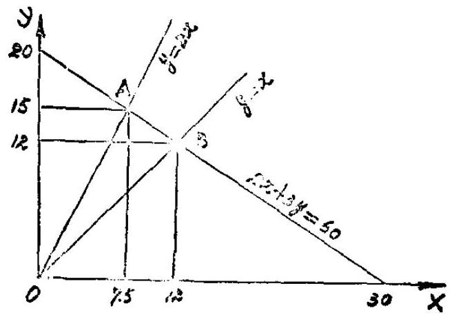

(图 1-1)

例 2. 试证: 不可能找到两个和与积都是整数的分数。

分析:要直接证明是困难的，故采用反证法；同时，看到条件中提及两数的和与积为整数，自然联想到整系数二次方程; 此外, 要证关于分数的命题, 常是先化为既约分数。

证明: 首先假定: 有两个既约分数 $\frac{{n}_{1}}{{m}_{1}},\frac{{n}_{2}}{{m}_{2}}$ 满足 $\frac{{n}_{1}}{{m}_{1}} + \; \frac{{n}_{2}}{{m}_{2}} = p,\frac{{n}_{1}}{{m}_{1}} \cdot  \frac{{n}_{2}}{{m}_{2}} = q;p, q$ 均为整数。

由此推得: $\frac{{n}_{1}}{{m}_{1}},\frac{{n}_{2}}{{m}_{2}}$ 为方程 ${x}^{2} - {px} + q = 0$ 的两根,即有 ${\left( \frac{{n}_{1}}{{m}_{1}}\right) }^{2} - p\left( \frac{{n}_{1}}{{m}_{1}}\right)  + q = 0$ 及 ${\left( \frac{{n}_{2}}{{m}_{2}}\right) }^{2} - p\left( \frac{{n}_{2}}{{m}_{2}}\right)  + q = 0$ ; 再由其中任一式, 如前一式推出

$$
\frac{{n}_{1}^{2}}{{m}_{1}} - p{n}_{1} + q{m}_{1} = 0\text{ ,即 }\frac{{n}_{1}^{2}}{{m}_{1}} = p{n}_{1} - q{m}_{1}\text{ 。 }
$$

引出矛盾:上式右端为整数而左端为既约分数，这是不可能的; 这说明前面所作假设不能成立; 而原命题 (不可能找到两个和与积都是整数的分数) 是正确的。

说明: ${1}^{ \circ  }$ 反证法的论证过程中要包含四层意思: 作出与求证结论相反的假定; 用正确推理得出某种结论; 由此结论引出矛盾驳倒所作假定; 从而证明求证结论正确。上面的表达格式中采用: “首先假定”, “由此推得”, “引出矛盾”三段; 在第三段中包含末后两层意思。当然也可以用四段表述, 每段一层意思。 ${2}^{ \circ  }$ 为掌握反证法要理解 “四种命题”及其相互关系。

例 3. 求复数 $Z$ ,满足: (1) $Z + \frac{4}{Z}$ 为实数; (2) $\left| {Z - 2}\right| \; = 2$ 。

分析: 要确定一复数, 即确定其实部及虚部中的两实数; 这可设想将题中两条件, 加于此两未知实数而求解。

解: 设 $Z = x + {yi}$ ,则由

$$
Z + \frac{4}{Z} = x + {yi} + \frac{4}{x + {yi}} = \left( {x + \frac{4x}{{x}^{2} + {y}^{2}}}\right)  + y\left( {1 - \frac{4}{{x}^{2} + {y}^{2}}}\right) i
$$

为实数得:

$y\left( {1 - \frac{4}{{x}^{2} + {y}^{2}}}\right)  = 0,\;$ 即 $y = 0,\;$ 或 ${x}^{2} + {y}^{2} = 4$  。

再由 $\left| {Z - 2}\right|  = 2$ ,即 $\left| {\left( {x - 2}\right)  + {yi}}\right|  = 2$ ,

得 ${\left( x - 2\right) }^{2} + {y}^{2} = 4$ 。

于是从

$$
\left\{  {\begin{array}{l} {\left( x - 2\right) }^{2} + {y}^{2} = 4, \\  y = 0; \end{array}\text{ 得 }\;\left( 1\right) \left\{  \begin{array}{l} x = 0, \\  y = 0; \end{array}\right. }\right.
$$

(2) $\left\{  \begin{array}{l} x = 4, \\  y = 0; \end{array}\right.$

但由 $Z + \frac{4}{Z}$ 为实数知 $Z \neq  0,\left( 1\right)$ 须舍去,故 $Z = 4$ 。

再从

$$
\left\{  \begin{array}{l} {\left( x - 2\right) }^{2} + {y}^{2} = 4, \\  {x}^{2} + {y}^{2} = 4; \end{array}\right.
$$

(3) $\left\{  \begin{array}{l} x = 1, \\  y = \sqrt{3}; \end{array}\right.$ (4) $\left\{  \begin{array}{l} x = 1, \\  y =  - \sqrt{3}; \end{array}\right.$

故 $Z = 1 \pm  \sqrt{3}i$ 。

所求复数 $Z$ 为: $4,1 \pm  \sqrt{3}i$ 。

说明:1°要正确审明题意:实数属于复数，故 4 是解； 有潜在条件 $Z \neq  0$ ，故 $Z = 0$ 须舍去。 ${2}^{ \circ  }$ 条件和未知数个数相等, 是否解就应当是唯一的, 为什么?

例 4. 求证: ${\left( \frac{{a}^{2}}{b}\right) }^{\frac{1}{2}} + {\left( \frac{{b}^{2}}{a}\right) }^{\frac{1}{2}} \geq  \sqrt{a} + \sqrt{b}$ ,其中 $a > 0$ , $b > 0$ 。

证(1)用分析法:

若要 ${\left( \frac{{a}^{2}}{b}\right) }^{\frac{1}{2}} + {\left( \frac{{b}^{2}}{a}\right) }^{\frac{1}{2}} \geq  \sqrt{a} + \sqrt{b}$ ,其中 $a > 0, b > 0$ ;

即

$$
\frac{a}{\sqrt{b}} + \frac{b}{\sqrt{a}} \geq  \sqrt{a} + \sqrt{b},
$$

只需

$$
a\sqrt{a} + b\sqrt{b} \geq  a\sqrt{b} + b\sqrt{a};
$$

移项、分解因式知只需 $\left( {a - b}\right) \left( {\sqrt{a} - \sqrt{b}}\right)  \geq  0$ ,

亦即 $\left( {\sqrt{a} + \sqrt{b}}\right) {\left( \sqrt{a} - \sqrt{b}\right) }^{2} \geq  0$ 。此式显然成立; 问题得到证明。

证(2)用综合法:

$$
\because {\left( \sqrt{a} - \sqrt{b}\right) }^{2} \geq  0\text{ ,又 }a > 0, b > 0,\sqrt{a} + \sqrt{b} > 0\text{ , }
$$

$\therefore$

$$
\left( {\sqrt{a} + \sqrt{b}}\right) {\left( \sqrt{a} - \sqrt{b}\right) }^{2} \geq  0
$$

即

$$
a\sqrt{a} - a\sqrt{b} - b\sqrt{a} + b\sqrt{b} \geq  0,
$$

$$
a\sqrt{a} + b\sqrt{b} \geq  a\sqrt{b} + b\sqrt{a};
$$

两端除以 $\sqrt{a} \cdot  \sqrt{b} > 0$ ,得到 $\frac{a}{\sqrt{b}} + \frac{b}{\sqrt{a}} \geq  \sqrt{a} + \sqrt{b}$ ;

$$
{\left( \frac{{a}^{2}}{b}\right) }^{\frac{1}{2}} + {\left( \frac{{b}^{2}}{a}\right) }^{\frac{1}{2}} \geq  \sqrt{a} + \sqrt{b}\text{ 。 }
$$

证(3)用比较法:

$$
{\left( \frac{{a}^{2}}{b}\right) }^{\frac{1}{2}} + {\left( \frac{{b}^{2}}{a}\right) }^{\frac{1}{2}}\sqrt{a} - \sqrt{b} = \frac{a}{\sqrt{b}} + \frac{b}{\sqrt{a}} - \sqrt{a} - \sqrt{b}
$$

$$
= \frac{1}{\sqrt{a} \cdot  \sqrt{b}} \cdot  \left( {a\sqrt{a} + b\sqrt{b} - a\sqrt{b} - b\sqrt{a}}\right)
$$

$$
= \frac{1}{\sqrt{a} \cdot  \sqrt{b}}\left( {\sqrt{a} - \sqrt{b}}\right) \left( {a - b}\right)
$$

$$
= \frac{1}{\sqrt{a} \cdot  \sqrt{b}}{\left( \sqrt{a} - \sqrt{b}\right) }^{2}\left( {\sqrt{a} + \sqrt{b}}\right) \text{ 。 }
$$

$$
a > 0, b > 0,{\left( \sqrt{a} - \sqrt{b}\right) }^{2} \geq  0\text{ 。 }
$$

$$
\frac{1}{\sqrt{a} \cdot  \sqrt{b}}{\left( \sqrt{a} - \sqrt{b}\right) }^{2}\left( {\sqrt{a} + \sqrt{b}}\right)  \geq  0,
$$

$$
{\left( \frac{{a}^{2}}{b}\right) }^{\frac{1}{2}} + {\left( \frac{{b}^{2}}{a}\right) }^{\frac{1}{2}} - \sqrt{a} - \sqrt{b} \geq  0;
$$

即得

$$
{\left( \frac{{a}^{2}}{b}\right) }^{\frac{1}{2}} + {\left( \frac{{b}^{2}}{a}\right) }^{\frac{1}{2}} \geq  \sqrt{a} + \sqrt{b}\text{ 。 }
$$

说明: ${1}^{ \circ  }$ 这里涉及证明不等式常用的三种方法; 它们也常用于证明其他类型题目。 ${2}^{ \circ  }$ 用 “分析法” 时,一般采用 “若要, 只需” 的表达形式。中间可插入 “即，亦即” 字样，或证明所用的可逆变形如“移项，分解因式”等。总之，要表明推理是可逆的。 ${3}^{ \circ  }$ 证明除要注意推理形式外,也靠对数学中的一些常用基本事实(基本解析式、基本图形等)的熟悉。如证明不等式时常用的有: 实数平方非负; ${a}^{2} + {b}^{2} \geq  {2ab};a + b \; \geq  2\sqrt{ab}\left( {a > 0, b > 0}\right) ;\frac{a}{b} + \frac{b}{a} \geq  2,\left( {a, b\text{ 同号 }}\right) ;a - b > 0 \leftrightarrow \; a > b;\sin x < x\left( {x > 0}\right)$ 等。

以上一组四题, 在知识方面联系到数、式、方程、不等式等概念, 它们的性质, 以及它们之间的关系; 在方法方面用到几种基本论证方法, 以及它们各自的表述形式; 在解题步骤方面着重提示了审题、设想, 表述、消化四步中的应注意之点。从这三个方面分析概括, 有助于消化一组题, 达到分别解各个题所不能达到的目的。

例 5. 已知 $f\left( {e}^{x}\right)  = x$ ,求 $f\left( 2\right)$ 。

分析 1. 这虽是一个求函数值的题; 但关键在于先明确 “ $f$ ”在这里代表什么函数关系:由 “ $x \rightarrow  {e}^{x\text{ ” 是指数函数关系， }}$ 知 “ ${e}^{x} \rightarrow  x$ ” 当是其反函数——对数函数关系。所以, “ $f$ ” 在这里表示“取以 $e$ 为底的对数”。

怎样用数学形式把上述推理过程表示出来呢? 回想证明 ${\log }_{a}{mn} = {\log }_{a}m + {\log }_{a}n$ 等公式的情况,想到可设辅助变数: 这是数学中常用的一种重要方法, 也可用于把函数关系由正到逆地进行变换。

解法 1. 设 ${e}^{x} = y$ ,则 $x = \ln y$ ; 于是 $f\left( {e}^{x}\right)  = x$

可以变为 $f\left( y\right)  = \ln y;\therefore f\left( 2\right)  = \ln 2$ 。

分析 2. 如果更直接把 “ $f$ ” 看成是 “ ${e}^{x} \rightarrow  x$ ” 这种对应关系,那么本题即是求当 ${e}^{x} = 2$ 时 $x =$ ?

解法 2. $\because f\left( {e}^{x}\right)  = x;$ 令 ${e}^{x} = 2$ ,则 $x = \ln 2$ ;

$\therefore f\left( 2\right)  = \ln 2$ 。

说明: ${1}^{ \circ  }$ 解本题需要对 $y = f\left( x\right)$ 中的符号 “ $f$ ” 以及反函数的概念认识清楚。 ${2}^{ \circ  }$ 面对概念性题目时,常会感到“似乎明白, 却无从下手”; 所以还要会用数学语言表达概念思维和推理。对解法 1、2 中的每一步, 要能说明它的意义, 表达哪些思维、推理。 ${3}^{ \circ  }$ 做出适当“假设”, 常是将概念思维用数学语言表述的起点; 它是以概念为根据, 为适应推理需要而作出的。如设 “成等差数列的三或四个数” 的形式为 $a - d, a$ , $a + d$ ; 或 $a - {3d}, a - d, a + d, a + {3d}$ ; 为解方程 $\left( {{x}^{2} + 2}\right)  + \; 2\sqrt{{x}^{2} + 2} - 3 = 0$ 而设辅助未知数 $y = \sqrt{{x}^{2} + 2}$ ; 为解题而设定直线方程的形式为 $y = {kx} + b$ ; 或其他形式等等。为体会做出假设的意义,试解以下两题

(1)求 $\sqrt[3]{2 + \sqrt{5}} + \sqrt[3]{2 - \sqrt{5}}$ (提示:设该式为 $x$ )

(2)解方程 $\sqrt{x + 1} + \sqrt{x - 1} - \sqrt{{x}^{2} - 1} = x$ (提示:因有三个相互联系的根式,可设 $\sqrt{x + 1} = u,\sqrt{x - 1} = v$ ,化成含 $u, v, x$ 的方程组去解)

${4}^{ \circ  }$ 本题 $f\left( {e}^{x}\right)  = x$ 的一般意义为:若 $f\left\lbrack  {\varphi \left( x\right) }\right\rbrack   = x$ ,则 “ $f$ ” 与“ $\varphi$ ”为互逆的函数关系。依此,试从 $f\left( {\sin x}\right)  = x$ 求 $f\left( \frac{1}{2}\right)$ 。 再进一步试从已知 $f\left( {e}^{x}\right)  = \sin x$ 求 $f\left( 2\right)$ 。(提示: 仿解法 1, 设 ${e}^{x} = y$ ,则 $f\left( y\right)  = \sin \ln y)$ 。作题后,将题意从具体到一般的推广思考, 将获益很多。

例 6. 画出函数 $y = \sqrt{{\left( x - 1\right) }^{2}} + \left| {x + 4}\right|  - 9$ 的图象,并求它与 $x$ 轴所围成的封闭区域的面积。

分析: 作函数图象, 除不得已而用描点法外, 总是从最熟悉的解析式进行讨论, 为此常要将原式化成熟知的较简的形式。本题式中既有含 $x$ 的根式又有含 $x$ 的绝对值; 而据 $\sqrt{{a}^{2}} = \left| a\right|$ ,则可化简为只有含 $x$ 的绝对值的式子; 再据绝对值函数的定义, 以其零点划分定义域为各部分来进行讨论和作图。

解: 由于 $\sqrt{{\left( x - 1\right) }^{2}} = \left| {x - 1}\right|$ ,原式可化为

$$
y = \left| {x - 1}\right|  + \left| {x + 4}\right|  - 9,
$$

当 $x = 1,\left| {x - 1}\right|  = 0;x =  - 4,\left| {x + 4}\right|  = 0$ ,故由 $x = 1$ , -4 将定义域分为三部分:

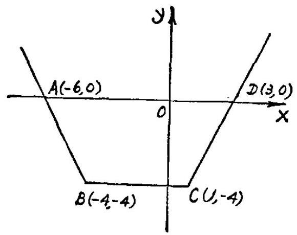

(图 1-2)

当 $- \infty  < x <  - 4, y =  - \left( {x - 1}\right)  - \left( {x + 4}\right)  - 9 =  - {2x} - {123}$

当 $- 4 \leq  x < 1, y =  - \left( {x - 1}\right)  + \left( {x + 4}\right)  - 9 =  - 4$ ;

当 $1 \leq  x <  + \infty , y = \left( {x - 1}\right)  + \left( {x + 4}\right)  - 9 = {2x} - 6$ ;

即

$$
\text{ (II): }y = \left\{  \begin{matrix}  - {2x} - {12}, &  - \infty  < x <  - 4; \\   - 4, &  - 4 \leq  x < 1; \\  {2x} - 6, & 1 \leq  x <  + \infty \text{ 。 } \end{matrix}\right.
$$

其图象为一折线,与 $x$ 轴围成梯形 ${ABCD}$ ; 其面积为

$$
S = \frac{1}{2}\left( {9 + 5}\right)  \cdot  4 = {28}\text{ 。 }
$$

说明: ${1}^{ \circ  }$ 本题又是用概念,定义解题的一例; 同时也加深对函数的解析表示法的理解: 一个函数关系, 可以有几种解析式, 如本题的原式、(I) 式和 (II) 式。前两者的优点是采用单一等式, 但缺点是式中所含运算关系复杂, 不便于看出函数的定义域, 性质和图象; 最后一式虽要分成三个部份区域表示, 却能明确示出定义域及各部分区域上都是线性的, 且便于作图和计算。

${2}^{ \circ  }$ 为化去绝对值,除用绝对值定义外,还可用 ${\left| a\right| }^{2} = {a}^{2}$ 。 本题为何不用后一方法? 试联系到其他涉及绝对值的问题 (如解含绝对值的方程, 不等式; 求函数定义域; 以及解析几何中求点到直线距离的问题等), 考虑各处该用何种方法化去绝对值。

${3}^{ \circ  }$ 试将本题改成解方程 $\sqrt{{\left( x - 1\right) }^{2}} + \left| {x + 4}\right|  - 9 = 0$ ,或解不等式 $\sqrt{{\left( x - 1\right) }^{2}} + \left| {x + 4}\right|  - 9 > 0$ 而作出; 从数、形两方面思考“函数、方程和不等式”三者间的关系，以及怎样利用有关三者间的相互转化, 而求得方便解法。

例 7. 已知数列的通项为 ${a}_{i2} = \lg \left( {{10}^{5} \cdot  {5}^{1 - n}}\right)$ ,求此数列的前多少项的和为最大 $\left( {\lg 2 = {0.3010}}\right)$ 。

分析 1. 数列的通项 ${a}_{n}$ 和前 $n$ 项和 ${S}_{n}$ ,都可看作自变数 $n$ 的函数,故可求出 ${S}_{n}$ 的表示式,按一般求函数最大值的方法求解; 但要注意 $n$ 只取正整数值这个特点。为求 ${S}_{n}$ 的表示式,要首先尽可能地把 ${a}_{n}$ 化简,以便于求和。

解法 1. 由于 ${a}_{n} = \lg \left( {{10}^{5} \cdot  {5}^{1 - n}}\right)  = 5 - \left( {n - 1}\right) \lg 5$ ,知它是一个公差 $d =  - \lg 5$ 的等差数列;

$$
\therefore \;{S}_{n} = \frac{{a}_{1} + {a}_{n}}{2} \cdot  n = \frac{5 + 5 - \left( {n - 1}\right) \lg 5}{2} \cdot  n
$$

$$
=  - \frac{\lg 5}{2}{n}^{2} + \left( {5 + \frac{\lg 5}{2}}\right)  \cdot  n\text{ 。 }
$$

是 $n$ 的二次函数,且 ${n}^{2}$ 的系数 $- \frac{\lg 5}{2} < 0$ ,所以若 ${S}_{n}$ 取极大值则

$$
n =  - \frac{5 + \frac{\lg 5}{2}}{2\left( {-\frac{\lg 5}{2}}\right) } = \frac{5}{1 - \lg 2} + \frac{1}{2} \approx  {7.6}
$$

但 $n$ 必须取正整数，所以要考虑

$$
{S}_{7} =  - \frac{\lg 5}{2} \cdot  {7}^{2} + \left( {5 + \frac{\lg 5}{2}}\right)  \cdot  7 = {35} - {21}\lg 5 = {20.321}
$$

$$
{S}_{8} =  - \frac{\lg 5}{2} \cdot  {8}^{2} + \left( {5 + \frac{\lg 5}{2}}\right)  \cdot  8 = {40} - {28}\lg 5 = {20.428}
$$

并由于 ${S}_{8} > {S}_{7}$ 知前 8 项的和最大。

分析 2. 若不从函数观点考察, 也可从数列本身的性质出发,根据通项 ${a}_{n}$ 来掌握前 $n$ 项和 ${\mathcal{S}}_{n}$ 的特点,从而找到解法。为此将通项简化为 ${a}_{n} = 5 - \left( {n - 1}\right) \lg 5$ ,可以发现这是一个首项为正数 5,公差是负数 $- \lg 5$ 的递减的等差数列,当 $n$ 相当大时可能出现负项。如果再考虑到求数列的前 $n$ 项和是一个一项一项地累加的过程; 自然会想到, 当加正数项时, 和要增加; 加负数项时, 和减少。在首项为正数的递减数列的情况下，一定是所有正数项相加的和最大，而当开始有负数项加进时即转而减少。

解法 2: 由 ${a}_{n} = \lg \left( {{10}^{5} \cdot  {5}^{1 - n}}\right)  = 5 - \left( {n - 1}\right) \lg 5$ 知数列是一个递减的等差数列,且 ${a}_{1} = 5$

设此数列的第 $n$ 项是最后一个非负数,而第 $n + 1$ 项起为负数，即有

$$
\left\{  {\begin{array}{l} {a}_{n} = 5 - \left( {n - 1}\right) \lg 5 \geq  0, \\  {a}_{n + 1} = 5 - n\lg 5 < 0; \end{array}\text{ 亦即 }\left\{  \begin{array}{l} n \leq  \frac{5}{\lg 5} + 1 \approx  {8.2}, \\  n > \frac{5}{\lg 5} \approx  {7.2}\text{ 。 } \end{array}\right. }\right.
$$

但因 $n$ 为自然数， $\therefore n = 8$ 。即此数列前 8 项和最大。

说明: 为解本题, 不能套用现成的公式和方法。解法 1 来自把序列前 $n$ 项和看作函数,又注意到其自变量的特点; 解法 2 来自对 ${S}_{n}$ 为一累加过程的理解,又从分析通项而看到 ${S}_{n}$ 当有负数项加进后则开始减少。这些都是基于概念而进行的推理思维。当遇到没有现成公式、方法可用时, 转向理论、概念思维以求解，是常采取的步骤。

通过以上三题, 可以考查对函数概念中两基本要素一对应关系和定义域的理解程度, 以及如何联系着函数的记号、 分析式和图象来想象、分析和表达它们; 同时也可以看到在解题过程中, 如何综合运用函数、方程、不等式、数列等概念及其性质。此外,还提示: ${1}^{ \circ  }$ 在分析中,运用概念审明题意,形成设想的重要; ${2}^{ \circ  }$ 作出适当“设定”,是从突破到表述的桥梁之一; 以及 ${3}^{ \circ  }$ 在讨论中作某些对题目的变化和推广，是消化它的重要手段；这些都说明，仅仅是作出一题， 从培养能力的观点看, 不见得就算是达到解题目的; 要注意到在解题过程中都能学到什么, 才能充分的达到目的; 而只有经常充分地达到解题的学习目的, 才能较快地培养出解题能力。

例 8. 已知三角形中三边长成等比数列, 则它们的公比 $q$ 满足 $\frac{\sqrt{5} - 1}{2} < q < \frac{\sqrt{5} + 1}{2}$ 。

分析: 本题明显给出的条件是三边成等比数列; 但怎能得出满足结论所提的不等关系呢? 再从结论返回一想, 可看出题中有潜在条件: 三角形三边长之间有不等关系。于是设想用 $q$ 表示出三边长之后,列出所有不等关系,从而推得结论。

解: 设三角形三边长各为 $a,{aq}, a{q}^{2}\left( {a > 0, q > 0}\right)$ ; 由平面几何定理知其中任两边之和大于第三边:

$$
\left\{  {\begin{array}{l} a + {aq} > a{q}^{2}, \\  {aq} + a{q}^{2} > a, \\  a{q}^{2} + a > {aq}; \end{array}\text{ 即 }\left\{  \begin{array}{l} {q}^{2} - q - 1 < 0, \\  {q}^{2} + q - 1 > 0, \\  {q}^{2} - q + 1 > 0; \end{array}\right. }\right. \tag{1}
$$

(2)

( 3 )

由 (1) 得 $\frac{1 - \sqrt{5}}{2} < q < \frac{1 + \sqrt{5}}{2}$ ; 由 (2) 得 $q > \frac{-1 + \sqrt{5}}{2}$ 或 $q < \frac{-1 - \sqrt{5}}{2}$ ; 由 (3) 得 $q$ 可为一切实数。

所以

$$
\frac{\sqrt{5} - 1}{2} < q < \frac{\sqrt{5} + 1}{2}\text{ 。 }
$$

说明: ${1}^{ \circ  }$ 审题时不是单独分析条件、结论; 而是相互联系的来分析。 ${2}^{ \circ  }$ 不要漏掉潜在条件，本题则是由结论返思条件想起的; 设边长时注出 $a > 0, q > 0$ ,是利用潜在条件长度为正数，并为以下论证准备。 ${3}^{ \circ  }$ 三个不等式的迅速解出,是利用了二次方程和函数的性质。

例 9. 若 $x\text{ 、 }y$ 都是实数,且 $y = \sqrt{\frac{{2x} + 1}{{4x} - 3}} + \sqrt{\frac{{2x} + 1}{3 - {4x}}} \; + 1$ ,试求 $y + {xy} + {x}^{2}y + \cdots \cdots  + {x}^{n - 1}y + \cdots \cdots$ 的和。

分析:初次看来，题中条件只给出 $x$ 、 $y$ 间一个关系，不能定出 $x$ 、 $y$ 的值。再仔细察看，发现两根号下是一对相反数， 而偶次根号下又不能为负数; 因而推得只能是 $\frac{{2x} + 1}{{4x} - 3} = 0$ , 由此得到 $x$ 的值; 问题的关键被突破。

解: $\because x\text{ 、 }y$ 为实数,若使 $y = \sqrt{\frac{{2x} + 1}{{4x} - 3}} + \sqrt{\frac{{2x} + 1}{3 - {4x}}} + 1$ 有意义,必须 $\frac{{2x} + 1}{{4x} - 3} \geq  0$ 且 $\frac{{2x} + 1}{3 - {4x}} \geq  0$ 。

解得 $x =  - \frac{1}{2}$ ; 代入原式得 $y = 1$ 。

$$
\therefore y + {xy} + {x}^{2}y + \cdots \cdots  + {x}^{n - 1}y + \cdots \cdots
$$

$$
= 1 - \frac{1}{2} + \frac{1}{4} + \cdots \cdots  + {\left( -\frac{1}{2}\right) }^{n - 1} + \cdots \cdots
$$

$$
= \frac{1}{1 - \left( {-\frac{1}{2}}\right) } = \frac{2}{3}\text{ 。 }
$$

说明: 本题又是根据结论的需要, 反复审题, 以发现潜在条件的一例。但要发现上述条件,须要把 “ $x, y$ 都是实数” 和式中两根式下的式子联系起来; 特别是要对相反数的概念清楚，并且不论它是用数码、文字或式子表示，都能看出它们互为相反数的关系。

例 10. 设 ${x}_{1}$ 和 ${x}_{2}$ 是方程 ${x}^{2} - x\sin \alpha  + \sin {2\alpha } = 0$ 的二根 $\left( {0 < \alpha  < \frac{\pi }{2}}\right)$ ,求证: ${\log }_{{x}_{1} + {x}_{2}}\frac{{x}_{1}}{\sqrt{2}} + {\log }_{{x}_{1} + {x}_{2}}\frac{{x}_{2}}{\sqrt{2}} > 1$ ,并求 ${\log }_{{x}_{1} + {x}_{2}}\frac{{x}_{1}}{\sqrt{2}} + {\log }_{{x}_{1} + {x}_{2}}\frac{{x}_{2}}{\sqrt{2}} = 2$ 时 $\alpha$ 的值。

分析: 本题和上例不同, 单纯分析条件, 不易看出通向结论的途径。但和例 8 有相似之处, 可同时分析结论的要求和条件所给内容; 把两者都加以变化而使之相互接近, 以至于接通。

本题欲证 ${\log }_{{x}_{1} + {x}_{2}\frac{{x}_{1}}{\sqrt{2}}} + {\log }_{{x}_{1} + {x}_{2}\frac{{x}_{2}}{\sqrt{2}}} > 1$ ,而已知能提供 ${x}_{1} + {x}_{2},{x}_{1} \cdot  {x}_{2}$ ; 于是想到变结论为 ${\log }_{{x}_{1} + {x}_{2}}\frac{{x}_{1} \cdot  {x}_{2}}{2} > 1$ 。同时, 看到结论需要的 ${x}_{1} + {x}_{2},{x}_{1} \cdot  {x}_{2}$ ,可由已知引出为 ${x}_{1} + {x}_{2} = \; \sin \alpha ,{x}_{1} \cdot  {x}_{2} = \sin {2\alpha }$ ; 这就是要再证明 ${\log }_{\sin \alpha }\frac{\sin {2\alpha }}{2} > 1$ 。但据对数函数性质, 证它大于 1 困难, 最好能转化为证对数函数大于 0 。为此就要从它里面分出个 1 来; 而要从 ${\log }_{\sin \alpha }\frac{\sin {2\alpha }}{2}$ 中凑出 1,必须凑出 ${\log }_{\sin \alpha }\sin \alpha$ 。因而把 $\sin {2\alpha }$ 变成 $2\sin \alpha$ . $\cos a$ 就是很自然的了。下一步则需证明 ${\log }_{\sin a}\cos \alpha  > 0$ 。这要根据 $\sin \alpha ,\cos \alpha$ 的取值范围来决定。这时,自然要引起我们对已知条件的注意: 由 $0 < \alpha  < \frac{\pi }{2}$ ,可知 $0 < \sin \alpha  < 1,0 < \; \cos \alpha  < 1,\therefore {\log }_{\sin \alpha }\cos \alpha  > 0$ 。

证 $\because {x}_{1}$ 和 ${x}_{2}$ 是方程 ${x}^{2} - x\sin \alpha  + \sin {2\alpha } = 0$ 的二根

$$
{x}_{1} + {x}_{2} = \sin \alpha ,{x}_{1} \cdot  {x}_{2} = \sin \alpha
$$

$$
{\log }_{{x}_{1} + {x}_{2}}\frac{{x}_{1}}{\sqrt{2}} + {\log }_{{x}_{1} + {x}_{2}}\frac{{x}_{2}}{\sqrt{2}} = {\log }_{{x}_{1} + {x}_{2}}\frac{{x}_{1} \cdot  {x}_{2}}{2}
$$

$$
= {\log }_{\sin \alpha }\frac{\sin {2\alpha }}{2} = {\log }_{\sin \alpha }\sin \alpha  \cdot  \cos \alpha  = 1 + {\log }_{\sin \alpha }\cos \alpha
$$

由 $\;0 < \alpha  < \frac{\pi }{2}$ ,可知 $0 < \sin \alpha  < 1,0 < \cos \alpha  < 1$ ;

$\therefore \;{\log }_{\sin \alpha }\cos \alpha  > 0$

$\therefore \;{\log }_{{x}_{1} + {x}_{2}}\frac{{x}_{1}}{\sqrt{2}} + {\log }_{{x}_{1} + {x}_{2}}\frac{{x}_{2}}{\sqrt{2}} > 1$ 。

又若

$$
{\log }_{{x}_{1} + {x}_{2}}\frac{{x}_{1}}{\sqrt{2}} + {\log }_{{x}_{1} + {x}_{2}}\frac{{x}_{2}}{\sqrt{2}} = 2
$$

则 ${\log }_{\sin a}\cos \alpha  = 1,\;\sin \alpha  = \cos \alpha ,\;\alpha  = \frac{\pi }{4}$  。

说明: ${1}^{ \circ  }$ 从前面的分析看,除有一条正确的思路外,每前进一步, 都要用到一些基本知识; 所以只有基本知识很熟, 分析才能有效地进行。

${2}^{ \circ  }$ 解题的过程,大体可用下图表示:

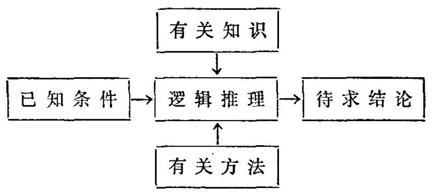

若进一步分析, 则过程中每一环都是已知条件和所引用知识, 按一定方法的综合, 以本题为例:

$\left. \begin{array}{l} \left. {\left. \left. {\left. {{x}_{1} \cdot  {x}_{2}}\right\}  \text{ 是根 }}\right\}  \right\}   \Rightarrow  \begin{array}{l} {x}_{1} + {x}_{2} = \sin \alpha \\  {x}_{1} \cdot  {x}_{2} = \sin {2\alpha } \end{array}}\right\}  \\  \left. {\left. {\log \frac{{x}_{1}}{{x}_{1} + {x}_{2}\sqrt{2}} + \log {x}_{1} + {x}_{2}\sqrt{\frac{{x}_{2}}{\sqrt{2}}}}\right\}   \Rightarrow  {\log }_{{x}_{1} + {x}_{2}}\frac{{x}_{1} \cdot  {x}_{2}}{2}}\right\}   \end{array}\right\}$

$$
\left. \begin{array}{l} {\log }_{\sin \alpha }\frac{\sin {2\alpha }}{2} \\  \text{ 倍 }\text{ 角 }\text{ 公 }\text{ 式 } \end{array}\right\}  {\log }_{\sin \alpha }\sin a \cdot  \cos \alpha \cdots \cdots
$$

例 11. 100 块石子, 放在一条直线上。第一石与第二石距离为 1 尺, 第二石与第三石距离为 2 尺, 第三石与第四石距离为 3 尺, 余依此类推。今由第一石出发, 将其他石子一一运送到第一石处, 问所走的总距离是多少?

分析: 一一运送, 即一次只能运一石。现在分析一下运送每个石子所走的距离:

运送第二石往返所走离距为 $2 \times  1$ 尺,

运送第三石往返所走距离为 $2 \times  \left( {1 + 2}\right)$ 尺,

运送第四石往返所走距离为 $2 \times  \left( {1 + 2 + 3}\right)$ 尺,

......

运送第一百个石子往返所走距离为 $2 \times  (1 + 2 + 3 + \cdots \cdots \; + {99})$ 尺,

将之合起来, 即得到总距离为

$$
S = 2 \times  1 + 2\left( {1 + 2}\right)  + 2 \times  \left( {1 + 2 + 3}\right)  + \cdots \cdots
$$

$$
+ 2 \times  \left( {1 + 2 + 3 + \cdots \cdots  + {99}}\right) \text{ 。 }
$$

此式直接按顺序计算是麻烦的, 但是只要我们注意观察、 分析, 发现其特点以后, 利用运算定律巧作安排, 则解题过程可以大为简化。

解 1: $S = 2 \times  1 + 2 \times  \left( {1 + 2}\right)  + 2 \times  \left( {1 + 2 + 3}\right)  + \cdots$

$$
+ 2 \times  (1 + 2 + 3 +
$$

$$
= 2 \times  \left\lbrack  {1 + \left( {1 + 2}\right)  + \left( {1 + 2 + 3}\right)  + \cdots \cdots }\right.
$$

$$
+ \left( {1 + 2 + 3 + \cdots \cdots  + {99}}\right) \rbrack
$$

$$
= 2 \times  \left\lbrack  {{99} \times  1 + {98} \times  2 + {97} \times  3 + \cdots \cdots }\right\rbrack
$$

$$
+ 3 \times  {97} + 2 \times  {98} + 1 \times  {99}\rbrack
$$

$$
= 4 \times  {99} \times  1 + {98} \times  2 + {97} \times  3 + \cdots \cdots  + {50} \times  \frac{50}{2}\rbrack
$$

$$
= 4 \times  \left\lbrack  {\left( {{100} - 1}\right)  \times  1 + \left( {{100} - 2}\right)  \times  2 + \left( {{100} - 3}\right)  \times  3}\right.
$$

$$
+ \cdots \cdots  + \left( {{100} - {49}}\right)  \times  {49} + {1250}\rbrack
$$

$$
= 4 \times  \left\lbrack  {\left( {1 + 2 + 3 + \cdots \cdots  + {49}}\right)  \times  {100}}\right\rbrack
$$

$$
\left. {-\left( {{1}^{2} + {2}^{2} + \cdots \cdots  + {49}^{2}}\right)  + {1250}}\right\rbrack
$$

$$
= 4 \times  \left\lbrack  {\frac{{49} \times  {50}}{2} \times  {100} - \frac{{49} \times  {50} \times  {99}}{6} + {1250}}\right\rbrack
$$

$$
= {49} \times  {100}^{2} - {49} \times  {100} \times  {33} + {5000} = {333300}\text{ (尺) }
$$

解 2. $S = 2 \times  1 + 2 \times  \left( {1 + 2}\right)  + 2 \times  \left( {1 + 2 + 3}\right)  + \cdots \cdots$

$$
+ 2 \times  \left( {1 + 2 + 3 + \cdots \cdots  + {99}}\right)
$$

$$
= \left( {1 + 1}\right)  \times  1 + \left( {1 + 2}\right)  \times  2 + \left( {1 + 3}\right)  \times  3 + \cdots \cdots
$$

$$
+ \left( {1 + {99}}\right)  \times  {99}
$$

$$
= \left( {1 + 2 + 3 + \cdots  + {99}}\right)  + \left( {{1}^{2} + {2}^{2} + {3}^{2} + \cdots  + {99}}\right)
$$

$$
= \frac{1 + {99}}{2} \cdot  {99} + \frac{{99} \times  \left( {{99} + 1}\right)  \times  \left( {2 \times  {99} + 1}\right) }{6}
$$

$$
= {333300}\text{ (尺) }
$$

说明: ${1}^{ \circ  }$ 本题在分析过程中通过几次“试验”,归纳、发现一般“规律”，从而得出 $S$ 的和式。这种从归纳发现规律的方法, 在求数列通项等问题中经常用到。在解法 2 中则是通过对某一项做典型分析, 如从最后一项得到

$$
2 \times  \left( {1 + 2 + 3 + \cdots \cdots  + {99}}\right)  = 2 \times  \frac{\left( {1 + {99}}\right)  \times  {99}}{2} = \left( {1 + {99}}\right)  \times  {99}
$$

看到“规律”而推及所有项的。这种方法也常用于分析数列通项,从而改变它的通项形式以便于求前 $n$ 项和等问题。作为练习, 试求

$$
\frac{1}{1 \times  2} + \frac{1}{2 \times  3} + \frac{1}{3 \times  4} + \cdots \cdots  + \frac{1}{{100} \times  {101}}
$$

的值。

${2}^{ \circ  }$ 本题的解题过程中,解法 1 主要是运用加法和乘法的交换、结合、分配等算律; 解法 2 中则是从找数列

$$
1,1 + 2,1 + 2 + 3,\cdots \cdots ,1 + 2 + 3 + \cdots \cdots  + {99},
$$

通项的思路入手; 而 $S$ 就是这个数列的和的两倍; (这在分析过程中是可以看出的; 甚至在审明题意时也可察觉); 找到通项，即可考虑求和了。

${3}^{ \circ  }$ 作为印证，可求

$$
S = m! + \frac{\left( {m + 1}\right) !}{1!} + \frac{\left( {m + 2}\right) !}{2!} + \cdots \cdots  + \frac{\left( {m + n}\right) !}{n!};
$$

从对一般项的分析,联系到它与 ${C}_{m + n}^{n}$ 的关系,及杨辉公式 ${C}_{m}^{n} = {C}_{m + 1}^{n} - {C}_{m}^{n - 1}$ 可得

$$
S = m!\left( {1 + {C}_{m + 1}^{1} + {C}_{m + 2}^{2} + \cdots \cdots  + {C}_{m + n}^{n}}\right)
$$

$$
= m!{C}_{m + n + 1}^{n} = \frac{m!\left( {m + n + 1}\right) !}{n!\left( {m + 1}\right) !}\text{ 。 }
$$

以上四题, 从不同方面显示出审题途径: 联系条件和结论以发现潜在条件或接通思路; 用归纳法或典型分析看清规律、找到解法; $\cdots \cdots$ 同时也再一次提出,运用概念或概念间的联系、转换, 在审明题意和找到简捷解法等方面的重要作用。

例 12. $A\text{ 、 }B$ 两人同时自甲地出发去乙地。 $A\text{ 、 }B$ 步行速度分别为 ${V}_{A}\text{ 、 }{V}_{B}$ ,两人骑车的速度都是 ${V}_{ \circ  }A$ 先骑车到途中某地把车放下,立即步行前进; $B$ 走到存车处,立即骑车前进,当超过 $A$ 一段路程后,把车放下,立即步行前进。两人如此继续交替用车,最后两人同时到达乙地。(I) 求 $A$ 从甲地到乙地的平均速度。(II) 如果 ${V}_{A}\text{ 、 }{V}_{B}$ 都不大于 $\frac{V}{3}$ ,求证它们的平均速度 $\bar{V} \leq  \frac{V}{2}$ 。

分析: (I) 题中两地间距离为已知定值。欲求 $A$ 的平均速度,须求 $A$ 用的全部时间 (亦即 $B$ 用的全部时间,因两人同时起行、到达),即 $A$ 的步行时间和乘车时间 (亦即 $B$ 的乘车时间和步行时间) 此两种时间又可用两种已给速度 ${V}_{A}$ (或 ${V}_{B}$ ) 与 $V$ 去除相应距离得到,于是可列方程组如下。

解: 设两地间距离为 $L;A, B$ 步行的路程分别为 ${L}_{A} \; {L}_{B}$ ; 行全程所用时间为 $T$ ; 则平均速度为 $\bar{V} = \frac{L}{T}$ ; 依题意列含未知元 $T,{L}_{A},{L}_{B}$ 的方程组,消去 ${L}_{A},{L}_{B}$ 以求 $T$ 。

$$
\left\{  \begin{array}{l} L = {L}_{A} + {L}_{B}, \\  T = \frac{{L}_{A}}{{V}_{A}} + \frac{L - {L}_{A}}{V}, \\  T = \frac{{L}_{B}}{{V}_{B}} + \frac{L - {L}_{B}}{V}. \end{array}\right.
$$

(1) (2) (3)

由 (2)、(3) 分别解出

$$
{L}_{A} = \frac{{V}_{A}{VT} - {V}_{A}L}{V - {V}_{A}},\;{L}_{B}\frac{{V}_{B}{VT} - {V}_{B}L}{V - {V}_{B}};
$$

代入 (1) 再解出 $\frac{L}{T} = \bar{V}$ :

$$
L = \frac{{V}_{A}{VT} - {V}_{A}L}{V - {V}_{A}} + \frac{{V}_{B}{VT} - {V}_{B}L}{V - {V}_{B}}
$$

$$
\left( {V - {V}_{A}}\right) \left( {V - {V}_{B}}\right) L + \left( {V - {V}_{B}}\right) {V}_{A}L + \left( {V - {V}_{A}}\right) {V}_{B}L
$$

$$
= \left\lbrack  {\left( {V - {V}_{B}}\right) {V}_{A}V + \left( {V - {V}_{A}}\right) {V}_{B}V}\right\rbrack  T,
$$

$$
\left( {{V}^{2} - {V}_{A}{V}_{B}}\right) L = \left\lbrack  {V\left( {{V}_{A} + {V}_{B}}\right)  - 2{V}_{A}{V}_{B}}\right\rbrack  {VT},
$$

$$
\bar{V} = \frac{L}{T} = \frac{V\left( {{V}_{A} + {V}_{B}}\right)  - 2{V}_{A}{V}_{B}}{{V}^{2} - {V}_{A}{V}_{B}} \cdot  {V}_{0}
$$

注:(1)式中既已出现 $L$ 与 $T$ 之比，即不先求 $T$ 而直接解出 $\bar{V}$ ;

(2)方程组中已知、未知文字记号虽多，但在式中有很整齐的对称关系，利用它可以找到化简、 计算途径，也可以从而校正中间步骤和结果。

证明: (II) 欲证 $\bar{V} \leq  \frac{V}{2}$ ,

$$
\bar{V} = \frac{V \cdot  {V}_{A} + V \cdot  {V}_{B} - 2{V}_{A} \cdot  {V}_{B}}{{V}^{2} - {V}_{A} \cdot  {V}_{B}} \cdot  V,
$$

$\therefore$ 只要证: $\frac{V \cdot  {V}_{A} + V \cdot  {V}_{B} - 2{V}_{A} \cdot  {V}_{B}}{{V}^{2} - {V}_{A} \cdot  {V}_{B}} \leq  \frac{1}{2}$ 。(1)

$\cdot  V\text{ 、 }{V}_{A}\text{ 、 }{V}_{B}$ 全是正值,且 $V \geq  3{V}_{A}, V \geq  3{V}_{B}$ ;

$\therefore \;{V}^{2} > {V}_{A} \cdot  {V}_{B}$ ,即 ${V}^{2} - {V}_{A}{V}_{B} > 0$ 。

用 $2\left( {{V}^{2} - {V}_{A}{V}_{B}}\right)  > 0$ 乘不等式两端,得 ${V}^{2} - {V}_{A}{V}_{B} \geq \; 2\left( {V{V}_{A} + V{V}_{B}}\right)  - 4{V}_{A}{V}_{B \circ  }$

即

$$
{V}_{A}{V}_{B} \leq  {V}^{2} - 2\left( {V{V}_{A} + V{V}_{B}}\right)  + 4{V}_{A}{V}_{B},
$$

故只须证质证 ${V}_{A}{V}_{B} \leq  \left( {V - 2{V}_{A}}\right) \left( {V - 2{V}_{B}}\right)$ 成立。

今由

$$
3{V}_{A} \leq  V,3{V}_{B} \leq  V,
$$

知

$$
{V}_{A} \leq  V - 2{V}_{A},{V}_{B} \leq  V - 2{V}_{B};
$$

${V}_{A}{V}_{B} \leq  \left( {V - 2{V}_{A}}\right) \left( {V - 2{V}_{B}}\right)$ 是正确的。

即证得(1)式成立。 $\therefore \bar{V} \leq  \frac{V}{2}$ 成立。

讨论: ${1}^{ \circ  }$ 本题在审题方面,除如分析中所述外,要注意 $A$ 步行用的时间并不等于 $B$ 乘车走的时间。 ${2}^{ \circ  }$ 习惯于用文字记号进行运算后, 会发现它有比用数字更有利的地方, 如除上述可利用对称性检校步骤和结果外, 还可从 “量纲” 对结果进行定性检查: $\bar{V}$ 等于一个纯数乘 $V$ ,这是对的; 而在证 (II) 时,即证此比数小于或等于 $\frac{1}{2}\text{ 。 }{3}^{ \circ  }$ 为保证题不解错, 检查常要分:逐步检查、定性检查，定量检查三方面；在这里用文字记号演算都有便于检查之处。 ${4}^{ \circ  }$ 亦可列成方程组:

$$
\left\{  \begin{array}{l} L = {L}_{A} + {L}_{B}; \\  T = \frac{{L}_{{A}_{ - }}}{{V}_{A}} + \frac{{L}_{B}}{V} = \frac{{L}_{A}}{V} + \frac{{L}_{B}}{{V}_{B}}\text{ 。 } \end{array}\right.
$$

(2)

(1)

由 ${\left( 2\right) }^{\prime }$ ,得到: ${L}_{A}\left( {\frac{1}{{V}_{A}} - \frac{1}{V}}\right)  = {L}_{B}\left( {\frac{1}{{V}_{B}} - \frac{1}{V}}\right)$(3)

设 $\frac{1}{{V}_{A}} - \frac{1}{V} = \alpha ,\frac{1}{{V}_{B}} - \frac{1}{V} = \beta$ ，即 ${L}_{A} \cdot  \alpha  = {L}_{B} \cdot  \beta$

从 ${\left( 1\right) }^{\prime }$ ,和它解出 $\left\{  \begin{array}{l} {L}_{A} = L \cdot  \frac{\beta }{\alpha  + \beta }, \\  {L}_{B} = L \cdot  \frac{\alpha }{\alpha  + \beta }\text{ 。 } \end{array}\right.$

代入 ${\left( 2\right) }^{\prime }$ ，得:

$$
T = \frac{L}{\alpha  + \beta } \cdot  \left( {\frac{\beta }{{V}_{A}} + \frac{\alpha }{V}}\right) ,
$$

则

$$
\bar{V} = \frac{L}{T} = \frac{\alpha  + \beta }{\frac{\beta }{{V}_{A}} + \frac{\alpha }{V}} = \frac{\left( {\alpha  + \beta }\right)  \cdot  V{V}_{A}}{{\beta V} + \alpha {V}_{A}}\text{ 。 }
$$

$$
\alpha  + \beta  = \frac{1}{{V}_{A}} + \frac{1}{{V}_{B}} - \frac{2}{V} = \frac{{V}_{B} \cdot  V + {V}_{A} \cdot  V - 2{V}_{A} \cdot  {V}_{B}}{{V}_{A} \cdot  {V}_{B} \cdot  V},
$$

$$
{\beta V} + \alpha {V}_{A} = \frac{V}{{V}_{B}} - \frac{{V}_{A}}{V} = \frac{{V}^{2} - {V}_{A} \cdot  {V}_{B}}{V{V}_{B}};
$$

$$
\bar{V} = \frac{L}{T} = \frac{V\left( {{V}_{A} + {V}_{B}}\right)  - 2{V}_{A} \cdot  {V}_{B}}{{V}^{2} - {V}_{A}{V}_{B}} \cdot  {V}_{0}
$$

前面曾从 ${\left( 2\right) }^{\prime }$ 变出 ${\left( 3\right) }^{\prime }$ ,目的在于把未知数 ${L}_{A},{L}_{B}$ 分离出来,它们的系数既为已知数,可简记为 $\alpha ,\beta$ 以简化由 ${\left( 3\right) }^{\prime }$ 和 ${\left( 1\right) }^{\prime }$ 解出 ${L}_{A},{L}_{B}$ 的表示式,到适当的步骤再代回。在计算过程中用字母代替数字式或文字式以简化计算，且获前面 ${2}^{ \circ  }\text{ 、 }{3}^{ \circ  }$ 中说明的益处,是很重要的代数运算技能。

例 13. 某恒星系有彼此距离不等的若干个行星。每个行星上都有一个天文学家观测离它最近的一个行星。如果行星为奇数个, 求证: 总存在着不被观测的行星。

分析: 这种题涉及的不是一般的数字运算, 但可以采用 “设计出一种程序, 按此程序进行下去, 求证的现象一定出现”的方法。设计这种程序的依据是 “观测离它最近的一个”。 如果注意到“距离最近”总是“彼此的”这一点，再先试验几种最简的情况, 解法是不难发现的。

解: 因行星有奇数个,可设为 ${2n} + 1$ 个。

先从最简单的 3 颗行星的情况分析起。

设三颗星分别为 ${A}_{1},{A}_{2},{A}_{3}$ 。因为它们彼此不等距,则 $\left| {{A}_{1}{A}_{2}}\right| ,{A}_{2}{A}_{3}\left| ,\right| {A}_{3}{A}_{1} \mid$ 中必有最小者。不妨设 $\left| {{A}_{1}{A}_{2}}\right|$ 最小, 则 ${A}_{1}\text{ 、 }{A}_{2}$ 上的天文学家彼此观测, ${A}_{3}$ 上的天文学家只能观测 ${A}_{1},{A}_{2}$ 中的一个,而无人观测 ${A}_{3}$ 。

把以上想法推广到 ${2n} + 1$ 个星的情况。这 ${2n} + 1$ 个星中,一定存在距离最小的两个。不妨设为 ${A}_{1}\text{ 、 }{A}_{2}$ 。这两个星上的天文学家将互相观测。剩下还有 ${2n} - 1$ 个星和 ${2n} - 1$ 个天文学家。

1) 若这 ${2n} - 1$ 个星中有一个星 ${A}_{k}$ 到 ${A}_{1}$ (也可能到 ${A}_{2}$ ) 的距离比到其余 ${2n} - 2$ 个行星近,则 ${A}_{k}$ 上的天文学家将观测 ${A}_{1}$ (也可能观测 ${A}_{2}$ )。这样, ${2n} - 1$ 个星只有 ${2n} - 2$ 个天文学家在观测, 因之必定存在不被观测的行星。

2) 若 ${2n} - 1$ 个星中没有到 ${A}_{1}\text{ 、 }{A}_{2}$ 的距离比它们彼此间距离更近者,则在这 ${2n} - 1$ 个行星中,必能找到两个距离最近的行星, 它们上的天文学家将互相观测。这时, 剩下 ${2n} - 3$ 个行星。

对 ${2n} - 3$ 个行星重复上面的讨论过程则或者迂到 1 )的情形，或者，最后归结到剩下三个行星的特殊情况。

综合以上分析, 必然存在不被观测的星。

说明: 在解本题时, 对三个行星的特殊情况的分析是不可少的; 接着是遍举 1)、2) 两种情况; 最后则是找到了一个递推关系。这种分析模式及递推、对称 (包括轮换对称) 等关系在解题中常起很大作用。

例 14. 在 1000-9000 中间, 没有重复数字的奇数有多少个? 在这些奇数中, 能被 5 除尽的又有多少个?

分析 1. 依题意, 就是要用 0-9 这十个数字造成种种没有重复数字的四位数, 同时要满足 (1) 由于这些四位数须在 1000-9000 之间,则这些四位数的首位应该是1,2,3,4, 5,6,7,8这八个数字中的一个。(2)由于这些数应是奇数，这些数的末位就应是1,3,5,7,9这五个数字中的一个。

这样,首位有 ${C}_{3}^{1}$ 种排法,末位有 ${C}_{5}^{1}$ 种排法,中间两位数, 则应是在除去首位和末位两个数字以外的八个数字中的两个数字,所以有 ${A}_{8}^{2}$ 种排法。这样的数字应有 ${C}_{8}^{1} \cdot  {A}_{8}^{2} \cdot  {C}_{5}^{1}$ 个。

由于要求在这些四位奇数中, 不能有重复数字, 还需要去掉首位 1,3,5,7 和末位 1,3,5,7 相重复的数, 应减去中间两位排法的四倍,即减去 $4{A}_{8}^{2}$ 。

也就是说, 在 1000-9000 中间, 没有重复数字的奇数, 有 $\left( {{C}_{8}^{1} \cdot  {A}_{8}^{2} \cdot  {C}_{5}^{1} - 4{A}_{8}^{2}}\right)$ 个。

在这些奇数中, 能被 5 除尽的数, 只有末位是 5 的数, 其首位只能是1,2,3,4,6,7,8这七个数字中的一个,而其中间两位仍有 ${A}_{8}^{2}$ 个排法。

也就是说,在这些奇数中,能被 5 除尽的应有 ${C}_{7}^{1} \cdot  {A}_{8}^{2}$ 个。

解 1. (1)在 1000-9000 中间，没有重复数字的奇数有 ${C}_{8}^{1} \cdot  {A}_{8}^{2} \cdot  {C}_{5}^{1} - 4 \cdot  {A}_{8}^{2} = {2016}$ 个。

(2)在这些奇数中，能被 5 除尽的有 ${C}_{7}^{1} \cdot  {A}_{8}^{2} = {392}$ 个。

分析 2. 在 1000-9000 中间, 没有重复数字的奇数, 要具有以下条件:

${1}^{ \circ  }$ 个位上必须是1,3,5,7,9中之一;

${2}^{ \circ  }$ 千位上必须是1,2,3,4,5,6,7,8中之一;

${3}^{ \circ  }$ 其中间两位可以是除去已排的两个数字以外的八个数字中的任意两个。

在 ${1}^{ \circ  }$ 与 ${2}^{ \circ  }$ 两个条件中有1,3,5,7这四个数字重复,因此不能直接做分部排列。为避免重复把千位上的数字再分做两类:

i. 千位上是2,4,6,8中之一,这时个位上可以是1,3,5, 7,9 中的任一个。

ii. 千位上是1,3,5,7中之一,这时个位上可以是1,3, 5, 7, 9 中除去已排的一个数字以外的四个数字中的任何一个。

把符合 $\mathrm{i}$ 、 $\mathrm{{ii}}$ 两种情况的排法相加,就是本题的答案。

在这些奇数中, 能被 5 除尽的, 个位必须是 5 , 千位是 1,2,3,4,5,6,7,8中之一,其中间两位是除去已排的两个数字之外的八个数字之一。

解 2. (1)在 1000-9000 中间，没有重复数字的奇数有 ${A}_{4}^{1} \cdot  {A}_{3}^{2} \cdot  {A}_{5}^{1} + {A}_{4}^{1} \cdot  {A}_{8}^{2} \cdot  {A}_{4}^{1} = {2016}$ (个)。

(2)在这些奇数中，能被 5 除尽的有 ${A}_{7}^{1}{A}_{8}^{2} = {392}$ (个)。

说明: ${1}^{ \circ  }$ 解排列组合问题,思考必须慎密,更要注意不重不漏。

${2}^{ \circ  }$ 排列组合问题,总可看为涉及两类事物,元素与位置。 分析时, 首先要把特殊元素 (如奇数)、特殊位置 (如, 首位) 认识清楚。一般是先安排特殊的元素或特殊位置。然后再依照合理的程序去安排其他元素和位置。

${3}^{ \circ  }$ 为了防止发生错误,可以从不同的角度分析,用几种不同的方法解题 (如: 把几种可能合起来, 用加法去解; 或从全体中去掉不合理的, 用减法解; 或先满足特殊元素; 或先满足特殊位置; ) 以达到检验的目的。本题之 (1) 还可以用 $4 \cdot  {A}_{7}^{1} \cdot  {A}_{8}^{2} + 1 \cdot  {A}_{8}^{1} \cdot  {A}_{8}^{2}$ 来算。其中,第一项是1,3,5,7在末位的情况, 第二项是 9 在末位时的情况。每项的第一个因数是满足个位的可能数, 第二个因数是满足首位的可能数, 第三个因数是满足中间两位的可能数。

*

以上三题, 要求对具体问题按一定程序进行分析推理; 这种能力是把数学用于实际问题时所必需的。反之, 数学学习本身所给予的, 合逻辑而周密、严格地进行思考、论证的习惯, 应该有助于面对实际问题时, 制定程序进行分析推理的能力的成长。若在学数学中, 只重视按现成公式进行计算, 引用定理来证明, 而不培养观察、探索、对问题进行具体分析的能力; 则当面对实际问题时, 必然会感到“所学数学”用不上, 不能作为分析问题解决问题的有力手段。所以学数学时也要作些应用题、“活题”。此外，也结合运用文字表示数的能力, 提示了关于逐步、定性、定量检查的问题。

例 15. 求 ${\left( 1 + 2x - 3{x}^{2}\right) }^{6}$ 展开式中 ${x}^{5}$ 的系数。

解 $\because {\left( 1 + 2x - 3{x}^{2}\right) }^{6} = {\left\lbrack  1 + \left( 2x - 3{x}^{2}\right) \right\rbrack  }^{6}$ ,它的一般项可以写成 ${T}_{k + 1} = {C}_{6}^{k} \cdot  {\left( 2x - 3{x}^{2}\right) }^{k}$ ,其中 $k = 0,1,2,3,\cdots 6$ 。

又 $\because {\left( 2x - 3{x}^{2}\right) }^{k}$ 的一般项可以写成 ${T}_{r + 1} = {C}_{k}^{r} \cdot  ( - \; 3{x}^{2}{)}^{r}{\left( 2x\right) }^{k - r} = {C}_{k}^{r} \cdot  {\left( -3\right) }^{r} \cdot  {\left( 2\right) }^{k - r} \cdot  {x}^{k + r}$ ,其中 $r = 0,1,2,\cdots {k}_{0}$

$\therefore$ 原式的一般项为 ${C}_{6}^{k} \cdot  {C}_{k}^{r} \cdot  {\left( -3\right) }^{r} \cdot  {2}^{k - r} \cdot  {x}^{k + r}$ 。

欲求 ${x}^{5}$ 的系数,则 $k + r = 5$ ,即 $k = 5 - r$ 。

$\because k = 0,1,2,\cdots 6, r = 0,1,2,\cdots k$ ,且 $r \leq  k$ 。

$\therefore r$ 为0,1,2各值,这时对应的 $k$ 可为5,4,3。

$\therefore$ 展开式里 ${x}^{5}$ 的系数应为:

$$
{C}_{6}^{5} \cdot  {C}_{5}^{0} \cdot  {\left( -3\right) }^{0} \cdot  {2}^{5} + {C}_{6}^{4} \cdot  {C}_{4}^{1} \cdot  {\left( -3\right) }^{1} \cdot  {2}^{3}
$$

$$
+ {C}_{6}^{3} \cdot  {C}_{3}^{2}{\left( -3\right) }^{2} \cdot  {2}^{1} =  - {168}\text{ 。 }
$$

说明: 学过了二项式定理, 迂到了三项式的问题, 怎么办? 首先,把新问题转化为旧问题,上边化成了 $\lbrack 1 + ({2x} - \; {\left. 3{x}^{2})\right\rbrack  }^{6}$ 的形式，还可化成 ${\left( 1 + 3x\right) }^{6}{\left( 1 - x\right) }^{6}$ ; 然后，再考虑到新问题的特点, 问题即可解决了。这是解本题的基本思路, 它也具有一般性; 其次,要结合题意运用标注文字 $k, r$ ,注意它们的关系及可取的值。

例 16. 据下列条件，求递减等差数列的项数。(1)等差数列的公差满足方程: $\sqrt{{8}^{3{x}^{2} - {7x} + 0.4} = 5/{4}^{39}};\left( 2\right)$ 等差数列的首项适合方程: ${l}_{g}3 + {l}_{g}\left( {y - 1}\right)  = {l}_{g}2 + \frac{1}{2}{l}_{g}\left( {{7y} + 1}\right) ;\left( 3\right)$ 前 $n$ 项的和较二项式 ${\left( \sqrt[5]{{x}^{3}} + {x}^{-3} \cdot  \sqrt{{x}^{-1}}\right) }^{P}$ 的指数 $P$ 小 42, 此二项式展开式的第七项含 $x$ 的九次幂。

解:(1) $\because \sqrt{{8}^{3{x}^{2} - {7x} + {0.4}} = 5\sqrt{{4}^{39}}}$

两边取对数, 得:

$$
\frac{3}{2}\left( {3{x}^{2} - {7x} + {0.4}}\right) {l}_{g}2 = \frac{{39} \times  2}{5}{l}_{g}2,
$$

$$
\frac{3}{2}\left( {3{x}^{2} - {7x} + {0.4}}\right)  = \frac{{39} \times  2}{5}
$$

$3{x}^{2} - {7x} - {10} = 0,{x}_{1} =  - 1,{x}_{2} = \frac{10}{3}$ (不合题意,舍去)。

(2) $\because {l}_{g}3 + {l}_{g}\left( {y - 1}\right)  = {l}_{g}2 + \frac{1}{2}{l}_{g}\left( {{7y} + 1}\right)$ ,

${l}_{g}3\left( {y - 1}\right)  = {l}_{g}2\sqrt{{7y} + 1},3\left( {y - 1}\right)  = 2\sqrt{{7y} + 1},$

$9{y}^{2} - {46y} + 5 = 0,{y}_{1} = 5,{y}_{2} = \frac{1}{9}$ (不合题意)。

(3) $\because {\left( 5\sqrt{{x}^{3}} + {x}^{-3} \cdot  \sqrt{{x}^{-1}}\right) }^{P}$ 中第七项含 $x$ 的九次幂；

$\therefore$ 有 ${T}_{6 + 1} = {C}_{P}^{6} \cdot  {\left( {x}^{-3}\sqrt{{x}^{-1}}\right) }^{6} \cdot  {\left( 5\sqrt{{x}^{3}}\right) }^{P - 6}$

$$
= {C}_{P}^{6} \cdot  {x}^{\frac{3\left( {p - 6}\right) }{5} - {21}},
$$

其中 $\frac{3\left( {P - 6}\right) }{5} - {21} = 9,\;\therefore P = {56}$ 。 设 ${S}_{n}$ 为这数列前 $n$ 项之和,则 ${S}_{n} = {56} - {42} = {14}$ 。 综合以上结果, 得到方程:

$$
{S}_{n} = n{a}_{1} + \frac{n\left( {n - 1}\right) }{2}d,\;{S}_{n} = {ny} + \frac{n\left( {n - 1}\right) }{2} \cdot  x,
$$

$$
{14} = n \cdot  5 + \frac{n\left( {n - 1}\right) }{2} \cdot  \left( {-1}\right) ,
$$

解得

$$
{n}_{1} = 4,{n}_{2} = 7\text{ 。 }
$$

答: 所求等差数列的项数为 4 或 7 。

说明: 综合题从其内容结构上来看, 可有 “纵深” 和 “并列”两种综合形式。本题是并列型; 各部分之间并无联系, 只要一一解出即可。若迂纵深综合题, 则其各部分构成有内在联系的阶段、环节, 相互依赖。并列综合题一般只能考查知识、方法的广度; 纵深综合题则更考察其深度。七八, 七九两年高考的最后一题, 即属纵深型。

以上两题, 涉及对已知公式如何推广其使用范围, 或把新问题变形到可解问题范围之内的问题; 这是有关代数解题能力的一个重要方面。此外, 也提示对综合题的审题, 要看明其各问之间的关系, 辨明其为并列型还是纵深型, 还是两者的混合型, 以设想解题思路和步骤。

小结, 以上是一组基本上以代数形式提出的题目。由于中学代数所包括的内容很广泛, 这种题目也带有很大的综合性; 要综合运用数、式、方程、不等式、函数、数列、 $\cdots \cdots$ 等有关概念、性质、定理、公式去解决。结合这组题, 也看到在解题时, 审题, 设想, 突破, 表述, 检查, 消化等六个步骤中, 一些结合代数特点的做法, 及一般的做法; 对此, 请读者自己做小结。

同时, 也提示两个观点。一个是: 在代数中计算能力是重要的, 但掌握概念而进行分析、推理和论证的能力也是重要的, 应该加强培养; 否则审题和表述能力都受局限, 会形成看不懂题和不能下手的局面。特别是计算方法也是以概念, 推理为根据的; 概念、理论清楚, 才能找到简捷算法, 发现有效的检查手段。在以上这组例题中, 这个观点是通过解题过程提示出来的。另一个是: 在学习过程中, 解题本身不是目的, 而是手段; 应当探讨解每个题和每组题的学习目的是什么，如何达到？题目解出后的讨论和说明，都是从消化题目方面来达到解题的学习目的的措施; 其他方面的措施呢?

例 17. 若 $a\cos A + b\sin A = a\cos B + b\sin B = C$ ,

$$
\text{ 求证: }\frac{a}{\cos \frac{A + B}{2}} = \frac{b}{\sin \frac{A + B}{2}} = \frac{c}{\cos \frac{A - B}{2}}\text{ 。 }
$$

分析:本题直接看明如何从条件通向结论比较困难; 故采取先从结论分析的办法。欲证结论, 只须证出:

$$
\frac{a}{\cos \frac{A + B}{2}} = \frac{b}{\sin \frac{A + B}{2}}\text{ 和 }\frac{b}{\sin \frac{A + B}{2}} = \frac{c}{\cos \frac{A - B}{2}}\text{ 。 }
$$

要证前一式又只需证 $a\sin \frac{A + B}{2} = b\cos \frac{A + B}{2}$ ; 这时,看到把条件式进行和差化积可能得出这种关系, 于是得到入手办法。

证明: 将 $a\cos A + b\sin A = a\cos B + b\sin B$ 变形为

$$
a\left( {\cos A - \cos B}\right)  = b\left( {\sin B - \sin A}\right) ,
$$

两端进行化积得:

$$
- {2a}\sin \frac{A + B}{2}\sin \frac{A - B}{2} = {2b}\cos \frac{B + A}{2}\sin \frac{B - A}{2}
$$

即

$$
a\sin \frac{A + B}{2} = b\cos \frac{A + B}{2},
$$

亦即

$$
\frac{a}{\cos \frac{A + B}{2}} = \frac{b}{\sin \frac{A + B}{2}}
$$

(1)

从 (1) 解出 $a$ 代入 $a\cos B + b\sin B = c$ 得:

$$
\frac{b\cos \frac{A + B}{2}}{\sin \frac{A + B}{2}} \cdot  \cos B + b\sin B = c,
$$

$$
b\cos \frac{A + B}{2}\cos B + b\sin \frac{A + B}{2}\sin B = c\sin \frac{A + B}{2},
$$

即

$$
b\cos \left( {\frac{A + B}{2} - B}\right)  = c\sin \frac{A + B}{2},
$$

$$
b\cos \left( \frac{A - B}{2}\right)  = c\sin \frac{A + B}{2},
$$

于是有

$$
\frac{b}{\sin \frac{A + B}{2}} = \frac{c}{\cos \frac{A - B}{2}}\text{ 。 } \tag{2}
$$

由 (1) 及 (2) 得

$$
\frac{a}{\cos \frac{A + B}{2}} = \frac{b}{\sin \frac{A + B}{2}} = \frac{c}{\cos \frac{A - B}{2}}\text{ 。 }
$$

注意: ${1}^{ \circ  }$ 本题并不是在 $\bigtriangleup {ABC}$ 中讨论,切勿自加条件, 如用正弦定理等。 ${2}^{ \circ  }$ 本题证完后返回去看,知道用分析法证到底较困难:因为正推时两边分别约去

$$
- \sin \frac{A - B}{2}\text{ 和 }\sin \frac{B - A}{2}\text{ ; }
$$

若用分析法, 想到两边凑上这两个因式是困难的。所以, 有时把结论分析到一定程度即回到条件采用综合证法是有原因的。

例 18. 设 $A\text{ 、 }B\text{ 、 }C$ 为三角形的内角,且方程

$$
\left( {\sin B - \sin A}\right) {x}^{2} + \left( {\sin A - \sin C}\right) x + \left( {\sin C - \sin B}\right)  = 0
$$

的两根相等,试证 $B \leq  {60}^{ \circ  }$

分析: 为证一角度小于或大于某值, 常用证该角的某个三角函数大于或小于某数的办法。由于 ${\mathrm{O}}^{ \circ  } < B < {180}^{ \circ  }$ ,故以证 $\cos B \geq  \frac{1}{2}$ 为好,因 $\cos x$ 在 $\left\lbrack  {o,\pi }\right\rbrack$ 上单调递减。联系到余弦定律,即要证 $\frac{{a}^{2} + {c}^{2} - {b}^{2}}{2ac} \geq  \frac{1}{2}$ ; 但由重根而得的条件是加于各角正弦的, 故先用正弦定理将系数转化为各边再开始证明。

证明: 设角 $A\text{ 、 }B\text{ 、 }C$ 所对的边分别为 $a, b, c$ ,则方程可化为

$$
\left( {b - a}\right) {x}^{2} + \left( {a - c}\right) x + \left( {c - b}\right)  = 0
$$

据有重根条件

$$
{\left( a - c\right) }^{2} - 4\left( {b - a}\right) \left( {c - b}\right)  = 0,\;{\left( a - c\right) }^{2} = 4\left( {b - a}\right) \left( {c - b}\right) ,
$$

$$
{\left( a + c\right) }^{2} - {4ac} = 4\left( {b - a}\right) \left( {c - b}\right) ,{\left( a + c\right) }^{2} = {4b}\left( {a + c}\right)  - 4{b}^{2},
$$

即得

$$
{\left\lbrack  \left( a + c\right)  - 2b\right\rbrack  }^{2} = 0,\;a + c = {2b}\text{ 。 }
$$

于是由

$$
\cos B = \frac{{a}^{2} + {c}^{2} - {b}^{2}}{2ac} = \frac{{a}^{2} + {c}^{2} - {\left( \frac{a + c}{2}\right) }^{2}}{2ac}
$$

$$
= \frac{3\left( {{a}^{2} + {c}^{2}}\right)  - {2ac}}{8ac} \geq  \frac{{6ac} - {2ac}}{8ac} = \frac{1}{2}
$$

又 ${0}^{ \circ  } < B < {180}^{ \circ  }$ ,故得 $B \leq  {60}^{ \circ  }$

讨论: 从方程系数的特点, 可知其有一根为 1 ; 若方程有重根, 则另一根也必是 1 。于是由韦达定理可知两根之积

$$
\frac{\sin C - \sin B}{\sin B - \sin A} = 1,\;2\sin B = \sin A + \sin C;
$$

$2 \cdot  2\sin \frac{B}{2}\cos \frac{B}{2} = 2\cos \frac{A - C}{2}\sin \frac{A + C}{2},$

$$
2\sin \frac{B}{2} = \cos \frac{A - C}{2}
$$

由于

$$
\cos \frac{A - C}{2} \leq  1,\;\therefore \;\sin \frac{B}{2} \leq  \frac{1}{2}
$$

因 $0 < \frac{B}{2} < \frac{\pi }{2}$ ,而 $\sin x$ 在 $\left( {0,\frac{\pi }{2}}\right)$ 内单调上升,故 $\frac{B}{2} \leq  {30}^{ \circ  }$ , $B \leq  {60}^{ \circ  }$ 。

例 19. 如图: 在锐角 $\bigtriangleup {ABC}$ 中 ${AB} = c,{AC} = b$ , $\angle {BAC} = \alpha , M$ 为 ${BC}$ 中点, $G$ 为三角形重心。 求证 $G$ 到 ${BC}$ 的距离为:

$$
\frac{{bc}\sin \alpha }{3\sqrt{{\left( b - c\right) }^{2} + {4bc}{\sin }^{2}\frac{\alpha }{2}}}\text{ 。 }
$$

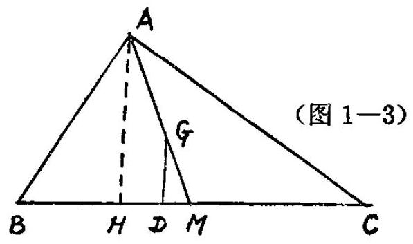

分析: $\left| {GD}\right|$ 为长度,怎样和这个复杂式子联系起来? 首先看出分子为三角形面积的两倍; 而分母为一长度, 对它加以分析, 从

$$
{\left( b - c\right) }^{2} + {4bc}{\sin }^{2}\frac{\alpha }{2} = {b}^{2} + {c}^{2} - {2bc}\left( {1 - 2{\sin }^{2}\frac{\alpha }{2}}\right)
$$

$$
= {b}^{2} + {c}^{2} - {2bc}\cos \alpha
$$

知它是底边 ${BC}$ 之长的 3 倍。于是知全式为高的 ${}^{1}/{}_{3}$ ,联系到 $G$ 为重心,知道这恰是对的。

证明: 作三角形的高 ${AH}$ ; 由于 ${AH}//{GD}$ ,且 $G$ 为重心

$\therefore \;\frac{GD}{AH} = \frac{MG}{MA} = \frac{1}{3}$ ,即 ${GD} = \frac{1}{3}{AH}$ ;

${\mathcal{S}}_{\bigtriangleup {ABC}} = \frac{1}{2}{BC} \cdot  {AH} = \frac{1}{2}{bc}\sin \alpha ,\;\therefore \;{AH} = \frac{{bc}\sin \alpha }{BC};$

而 $B{C}^{2} = {b}^{2} + {c}^{2} - {2bc}\cos \alpha  = {\left( b - c\right) }^{2} + {4bc}{\sin }^{2}\frac{\alpha }{2}$ ;

$$
{GD} = \frac{{bc}\sin \alpha }{3\sqrt{{\left( b - c\right) }^{2} + {4bc}{\sin }^{2}\frac{\alpha }{2}}}\text{ 。 }
$$

说明: ${1}^{ \circ  }$ 对一表示式进行“量纲”分析,(如在本题中看出要证结论是三角形面积的两倍被底边的 3 倍除) 也是审明题意的一种方法,不仅 (如前所述) 是检查结论的一种方法。 ${2}^{ \circ  }$ 先分析特殊情况, 再看一般情况是否也正确, 是通过设想而达到突破的一种方法: 本题若先考察 $\alpha  = {90}^{ \circ  }$ 的情况,很易看出欲证之式为三角形面积的两倍与底边的三倍之比, 即高的三分之一, 由此而得到启发。

*

以上三个证明题中, 都说明如何同时分析结论和条件, 以接通证明的思路。后两题中, 并从不同角度说明, 注意考察问题的特殊性的重要: 从考察系数特点或顶角为特殊角的情况而得到的启发。此外，把三题中为进行分析和论证而用到的知识、方法总结一下, 可看到分析和论证的进行, 要靠对知识、方法的熟练掌握, 而不是单凭有一条正确的思路。

例 20. 在三角形 ${ABC}$ 中, ${AB} = \sqrt{6} + \sqrt{2}, C = {30}^{ \circ  }$ , 求 ${AC} + {BC}$ 的最大值。

分析: 先通过正弦定理,将 ${AC}\text{ 、 }{BC}$ 用角的正弦函数示出, 再作为三角函数极值问题来讨论。

解: 据正弦定理

$\therefore$

$$
{AC} = \frac{{AB}\sin B}{\sin C} = 2\left( {\sqrt{6} + \sqrt{2}}\right) \sin \mathrm{B}
$$

$$
{BC} = \frac{{AB}\sin A}{\sin C} = 2\left( {\sqrt{6} + \sqrt{2}}\right) \sin A
$$

$$
{AC} + {BC} = 2\left( {\sqrt{6} + \sqrt{2}}\right) \left( {\sin B + \sin A}\right)
$$

这只需求 $\left( {\sin A + \sin B}\right)$ 的最大值。由于

$$
\left( {\sin A + \sin B}\right)  = 2\sin \frac{A + B}{2}\cos \frac{A - B}{2} = 2\cos \frac{C}{2}\cos \frac{A - B}{2}
$$

$$
= \frac{\sqrt{6} + \sqrt{2}}{2}\cos \frac{A - B}{2}\text{ 。 }
$$

这又只需求 $\cos \frac{A - B}{2}$ 的最大值: 即当 $A = B$ 时, $\cos \frac{A - B}{2} = 1$ 。 于是知当 $A = B$ 时,

$$
{AC} + {BC} = {\left( \sqrt{6} + \sqrt{2}\right) }^{2} = 8 + 4\sqrt{3}
$$

为其极大值。

说明: ${1}^{ \circ  }$ 本题求解中,逐步分离出常数,简化需求极值的函数。 ${2}^{ \circ  }$ 本题也可以通过余弦定理,由

$$
{\left( \sqrt{6} + \sqrt{2}\right) }^{2} = {a}^{2} + {b}^{2} - \sqrt{3}{ab} = {\left( a + b\right) }^{2}
$$

$$
- \left( {2 + \sqrt{3}}\right) {ab},\;\left( {\text{ 其中 }a = {BC}, b = {AC}}\right)
$$

$$
{\left( a + b\right) }^{2} = {\left( \sqrt{6} + \sqrt{2}\right) }^{2} + \left( {2 + \sqrt{3}}\right) {ab}
$$

$$
\leq  {\left( \sqrt{6} + \sqrt{2}\right) }^{2} + \left( {2 + \sqrt{3}}\right) \frac{{\left( a + b\right) }^{2}}{4},
$$

$$
\left( {\because {4ab} \leq  {\left( a + b\right) }^{2}}\right)
$$

$$
\left( {1 - \frac{2 + \sqrt{3}}{4}}\right) {\left( a + b\right) }^{2} \leq  8 + 4\sqrt{3},
$$

$$
{\left( a + b\right) }^{2} \leq  {\left( 8 + 4\sqrt{3}\right) }^{2}, a + b \leq  8 + 4\sqrt{3}\text{ 。 }
$$

等号只当 $a = b$ 时成立,此时 $a + b$ 取最大值 $8 + 4\sqrt{3}$ 。

例 21. 在 $\bigtriangleup {ABC}$ 中,若 $\left( {{a}^{2} + {b}^{2}}\right) \sin \left( {A - B}\right)  = \left( {{a}^{2} - {b}^{2}}\right) \; \sin \left( {A + B}\right)$ ,试确定 $\bigtriangleup {ABC}$ 可能是哪种类型的三角形。

分析: 欲判定三角形的类型, 通常要找边之间或角之间的关系, 从本题条件看, 以消去其中的边而化为角间关系为便。为此, 先通过角的和、差公式展开成单角函数, 化简后再用正弦定律消去各边以便讨论。

解: 将原式化为

$$
\left( {{a}^{2} + {b}^{2}}\right) \left( {\sin A\cos B - \cos A\sin B}\right)
$$

$$
= \left( {{a}^{2} - {b}^{2}}\right) \left( {\sin A\cos B + \cos A\sin B}\right) ,
$$

$$
- 2{a}^{2}\cos A\sin B =  - 2{b}^{2}\sin A\cos B,
$$

$$
{a}^{2}\cos A\sin B = {b}^{2}\sin A\cos B\text{ 。 }
$$

由正弦定理 $a = {2R}\sin A,\;b = {2R}\sin B$ ,

代入得 $4{R}^{2}{\sin }^{2}A\cos A\sin B = 4{R}^{2}{\sin }^{2}B\cos B\sin A$

$$
\sin A\sin B\left( {\sin A\cos A - \sin B\cos B}\right)  = 0
$$

其中 $\sin A\sin B \neq  0$ ,否则必有 $A$ 或 $B$ 为 ${0}^{ \circ  }$ 。故必有

$$
\sin A\cos A - \sin B\cos B = 0,\sin {2A} = \sin {2B},
$$

于是有:

$$
{2A} = {2B},\;A = B;
$$

或

$$
{2A} = \pi  - {2B},\;A + B = \frac{\pi }{2}\text{ 。 }
$$

即三角形为等腰三角形; 或是直角三角形。

讨论: ${1}^{ \circ  }$ 本题最后,易于漏掉 ${2A} = \pi  - {2B}$ 的情形。因此,最好采用多种方法讨论最后结果 $\sin {2A} - \sin {2B} = 0$ 。如利用和差化积得

$$
2\cos \left( {A + B}\right) \sin \left( {A - B}\right)  = 0
$$

由

$$
\cos \left( {A + B}\right)  = 0,\;A + B = \frac{\pi }{2};
$$

$$
\sin \left( {A - B}\right)  = 0,\;A - B = 0,\;A = B\text{ 。 }
$$

${2}^{ \circ  }$ 据 $\sin \left( {A + B}\right)  \neq  0,{a}^{2} + {b}^{2} \neq  0$ ,可将原式化为

$$
\frac{{a}^{2} - {b}^{2}}{{a}^{2} + {b}^{2}} = \frac{\sin \left( {A - B}\right) }{\sin \left( {A + B}\right) } = \frac{\sin A\cos B - \cos A\sin B}{\sin A\cos B + \cos A\sin B}
$$

利用和分比定理及正弦定理可得

$$
\frac{{a}^{2}}{{b}^{2}} = \frac{\sin A\cos B}{\cos A\sin B} = \frac{{\sin }^{2}A}{{\sin }^{2}B}
$$

$$
\sin {2A} = \sin {2B}\text{ 。 }
$$

${3}^{ \circ  }$ 若仔细考察条件,可看出 $A = B, a = b$ ,显然能使条件满足, 从而得出等腰的结论; 但要注意不能认为这是唯一的结论。

例 22. 海岛 $B$ 上有座海拔 1000 米的山,山顶 $A$ 设有观察站。上午 11 时测得一轮船在岛北 ${60}^{ \circ  }$ 东 $C$ 处,俯角 ${30}^{ \circ  }$ 。 11 时 10 分,又测得该船在岛的北 ${60}^{ \circ  }$ 西 $\mathrm{D}$ 处,俯角 ${60}^{ \circ  }$ 。问 (1)这船的速度是每小时多少公里；(2)如果船的航向不变， 它何时到达岛的正西方向? 此时所在点 $E$ 离岛多远?

分析: 本题第(1)问是给出了时间,通过求路程 ${CD}$ 而得速度, 第 (2) 问则在已知速度后, 求达到指定位置的时间。 正确理解题意作出图形如右。

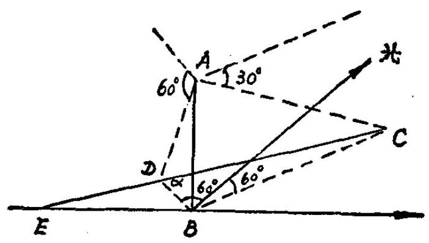

(图 1-4)

解:(1) ${AB} =$ 1000 米 $= 1$ (公里)； 在直角 $\bigtriangleup {ABC}$ 中, ${BC} = {AB} \cdot  \operatorname{tg}{60}^{ \circ  } = \; \sqrt{3}$ (公里); 在直角 $\bigtriangleup {ABD}$ 中, ${BD} = {AB} \cdot  \operatorname{tg}{30}^{ \circ  } = \frac{\sqrt{3}}{3}$ (公里); 在 $\bigtriangleup {BCD}$ 中由余弦定理得

$$
{CD} = \sqrt{B{C}^{2} + B{D}^{2} - {2BC} \cdot  {BD}\cos {120}^{2}} = \frac{1}{3}\sqrt{39}\text{ 。 }
$$

所以船速 $V = \frac{1}{3}\sqrt{39} \div  \frac{1}{6} = 2\sqrt{39}$ (公里/小时)。

(2)设 $\angle {CDB} = \alpha$ ，则由 $\frac{\sin \alpha }{BC} = \frac{\sin {120}^{ \circ  }}{CD}$

得到:

$\sin \alpha  = \frac{{BC}\sin {120}^{ \circ  }}{CD} = \frac{\sqrt{3} \cdot  \frac{\sqrt{3}}{2}}{\frac{1}{3}\sqrt{39}} = \frac{9}{2\sqrt{39}},$

$$
\cos \alpha  = \sqrt{1 - {\sin }^{2}\alpha } = \sqrt{1 - \frac{81}{4 \times  {39}}} = \frac{5\sqrt{3}}{2\sqrt{39}}\text{ 。 }
$$

于是 $\sin E = \sin \left( {\alpha  - {30}^{ \circ  }}\right)  = \sin \alpha \cos {30}^{ \circ  } - \cos \alpha \sin {30}^{ \circ  }$

$$
= \frac{9}{2\sqrt{39}} \cdot  \frac{\sqrt{3}}{2} - \frac{5\sqrt{3}}{2\sqrt{39}} \cdot  \frac{1}{2} = \frac{1}{\sqrt{13}}\text{ 。 }
$$

在 $\bigtriangleup {BDE}$ 中依正弦定理得:

$$
{DE} = \frac{{BD}\sin {30}^{ \circ  }}{\sin E} = \frac{\frac{\sqrt{3}}{3} \cdot  \frac{1}{2}}{\frac{1}{\sqrt{13}}} = \frac{\sqrt{39}}{6}\text{ (公里); }
$$

$$
{BE} = \frac{{BD}\sin \alpha }{\sin E} = \frac{\frac{\sqrt{3}}{3} \cdot  \frac{9}{2\sqrt{39}}}{\frac{1}{\sqrt{13}}} = \frac{3}{2}\text{ (公里); }
$$

$$
t = \frac{ED}{V} = \frac{1}{12}\text{ (小时); }
$$

故知船于 11 时 15 分到达正西方向，此时离岛 1500 米。

讨论: 本题第(2)问, 若引进坐标系用解析几何方法, 则可得几种简便解法, 先作出船行平面图如下。

${1}^{ \circ  }$ 由第一问算出 $\bigtriangleup {BCD}$ 各边长之后,据已知角度,很

易定出 $C\text{ 、 }D$ 、 $F\text{ 、 }G\text{ 、 }H$ 各点坐标。于是由

$$
\frac{\left| DE\right| }{\left| DF\right| } = \frac{\left| CD\right| }{\left| CH\right| },\frac{\left| DE\right| }{\frac{1}{2\sqrt{3}}}
$$

$$
= \frac{\sqrt{\frac{13}{3}}}{\frac{\sqrt{3}}{2} - \frac{1}{2\sqrt{3}}},\;\left| {DE}\right|  = \frac{1}{2}\sqrt{\frac{13}{3}},
$$

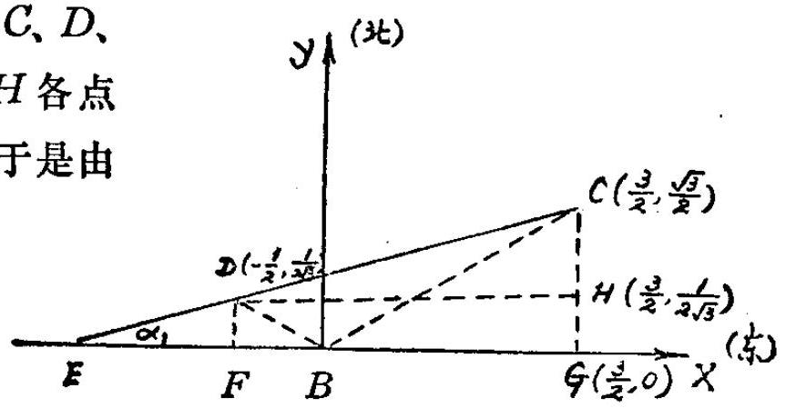

(图 1-5)

得

$$
t = \frac{DE}{V} = \frac{1}{12}\text{ (小时)。 }
$$

由

$$
\left| {DE}\right|  = \frac{1}{2}\sqrt{\frac{13}{3}} = \frac{1}{2}\left| {CD}\right| ,
$$

知

$$
\left| {FE}\right|  = \frac{1}{2}\left| {GF}\right|  = 1,
$$

$\therefore$

$$
\left| {BE}\right|  = \left| {BF}\right|  + \left| {FE}\right|  = {1.5}\text{ (公里)。 }
$$

${2}^{ \circ  }$ 引用 $C\text{ 、 }D$ 两点坐标找出航线 $\left( l\right)$ 方程的两点式并化简:

$$
\frac{y - \frac{1}{2\sqrt{3}}}{x + \frac{1}{2}} = \frac{\frac{\sqrt{3}}{2} - \frac{1}{2\sqrt{3}}}{\frac{3}{2} + \frac{1}{2}},\;y = \frac{1}{2\sqrt{3}}\left( {x + \frac{3}{2}}\right) ;
$$

( $l$ ) 在 $x$ 轴上的截距 ${x}_{0} =  - \frac{3}{2},\therefore \left| {BE}\right|  = \left| {x}_{0}\right|  = {1.5}$ (公里)。

$$
\left| {DE}\right|  = \sqrt{{\left| EF\right| }^{2} + {\left| FD\right| }^{2}} = \sqrt{1 + {\left( \frac{1}{2\sqrt{3}}\right) }^{2}} = \frac{\sqrt{13}}{2\sqrt{3}},
$$

$$
t = \frac{\left| DE\right| }{V} = \frac{1}{12}\text{ (小时)。 }
$$

${3}^{ \circ  }$ 写出航线 $\left( l\right)$ 以 $t$ 为参数的方程 $\left( {t = 0\text{ 时船在 }C\text{ 处 }}\right)$

(l) $\left\{  \begin{array}{l} x = \frac{3}{2} + \left( {V\cos \theta }\right) t, \\  y = \frac{\sqrt{3}}{2} + \left( {V\sin \theta }\right) t\text{ 。 } \end{array}\right.$

设 $\angle {CEG} = {\alpha }_{1}$ ,则 $\operatorname{tg}{\alpha }_{1} = \frac{1}{2\sqrt{3}}$ ,

$$
\cos {\alpha }_{1} = \frac{2\sqrt{3}}{\sqrt{13}},\;\sin {\alpha }_{1} = \frac{1}{\sqrt{13}}\text{ 。 }
$$

而 $\cos \theta  =  - \cos {\alpha }_{1} =  - \frac{2\sqrt{3}}{\sqrt{13}},\sin \theta  =  - \sin {\alpha }_{1} =  - \frac{1}{\sqrt{13}}$ 。

与 $V = 6\sqrt{\frac{13}{3}}$ 同代入 $\left( l\right)$ 的方程得

(l) $\left\{  \begin{array}{l} x = \frac{3}{2} - {12t}, \\  y = \frac{\sqrt{3}}{2} - \frac{6}{\sqrt{3}}t\text{ 。 } \end{array}\right.$

当船在 $B$ 的正西方向时

$$
y = 0,\;{t}_{CE} = \frac{\frac{\sqrt{3}}{2}}{\frac{6}{\sqrt{3}}} = \frac{1}{4}\text{ (小时) } = {15}\text{ (分钟) }
$$

$$
{t}_{DE} = {t}_{CE} - {10} = 5\text{ (分钟) }
$$

此时船与岛的距离

$$
\left| {BE}\right|  = \left| {\left( x\right) }_{t = \frac{1}{4}}\right|  = {1.5}\text{ (公里)。 }
$$

以上三题中, 在解决有关三角形的问题时, 提示多种思路, 一题多解: 一方面, 作为校正、检查手段; 另一方面也从而看到平面几何、解析几何和代数知识、方法与三角知识、 方法如何联合运用、相互比较。进行一题多解, 还要达到那些目的?

例 23. 已知 $\sin \{ 2\arccos \left\lbrack  {\operatorname{ctg}\left( {2\operatorname{arctg}x}\right) }\right\rbrack  \}  = 0$ ,求 $x$ 。

分析:本题为多次从给定的函数值，反求自变数的值；这自然要每次都先明确自变数的允许值范围, 即函数的定义域。 当自变数为反三角函数时, 则须注意该反三角函数的主值区间。因它限定了以该反三角函数为自变数的函数的定义域。

解: 第一步:

心

$$
0 \leq  \arccos \left\lbrack  {\operatorname{ctg}\left( {2\operatorname{arctg}x}\right) }\right\rbrack   \leq  \pi ,
$$

$\therefore$

$$
0 \leq  2\arccos \left\lbrack  {\operatorname{ctg}\left( {2\operatorname{arctg}x}\right) }\right\rbrack   \leq  {2\pi }\text{ ; }
$$

则由

$$
\sin \{ 2\arccos \left\lbrack  {\operatorname{ctg}\left( {2\operatorname{arctg}x}\right) }\right\rbrack   = 0,
$$

可得

$$
\text{ 2 arc }\cos \left\lbrack  {\operatorname{ctg}\left( {2\operatorname{arctg}x}\right) }\right\rbrack   = 0,\pi ,{2\pi }\text{ , }
$$

$$
\arccos \left\lbrack  {\operatorname{ctg}\left( {2\operatorname{arctg}x}\right) }\right\rbrack   = 0,\frac{\pi }{2},\pi ;
$$

于是又得

$$
\operatorname{ctg}\left( {2\operatorname{arctg}x}\right)  = \left\{  \begin{array}{l} \cos 0 = 1, \\  \cos \frac{\pi }{2} = 0, \\  \cos \pi  =  - 1\text{ 。 } \end{array}\right.
$$

第二步:

$$
\because \; - \frac{\pi }{2} < \operatorname{arctg}x < \frac{\pi }{2},
$$

$$
\therefore \; - \pi  < 2\operatorname{arctg}x < \pi \text{ ; }
$$

则由

$$
\operatorname{ctg}\left( {2\operatorname{arctg}x}\right)  = 1
$$

可得

$$
2\operatorname{arctg}x = \frac{\pi }{4}, - \frac{3\pi }{4};\operatorname{arctg}x = \frac{\pi }{8}, - \frac{3}{8}\pi ;
$$

$$
x = \operatorname{tg}\frac{\pi }{8} = \sqrt{2} - 1,\;x = \operatorname{tg}\left( {-\frac{3\pi }{8}}\right)  =  - \left( {\sqrt{2} + 1}\right) \text{ 。 }
$$

由

$$
\operatorname{ctg}\left( {2\operatorname{arctg}x}\right)  = 0,
$$

可得

$$
2\operatorname{arctg}x = \frac{\pi }{2}, - \frac{\pi }{2},\;\operatorname{arctg}x = \frac{\pi }{4}, - \frac{\pi }{4};
$$

$\therefore$

$$
x = \operatorname{tg}\frac{\pi }{4} = 1,\;x = \operatorname{tg}\left( {-\frac{\pi }{4}}\right)  =  - 1\text{ 。 }
$$

由

$$
\operatorname{ctg}\left( {2\operatorname{arctg}x}\right)  =  - 1,
$$

可得

$2\operatorname{arctg}x =  - \frac{\pi }{4},\frac{3\pi }{4},\;\operatorname{arctg}x =  - \frac{\pi }{8},\frac{3\pi }{8};$

$\therefore x = \operatorname{tg}\left( {-\frac{\pi }{8}}\right)  =  - \left( {\sqrt{2} - 1}\right) , x = \operatorname{tg}\frac{3\pi }{8} -  = \sqrt{2} + 1$ 。

综合三种情况: $x =  \pm  \left( {\sqrt{2} - 1}\right) , \pm  1, \pm  \left( {\sqrt{2} + 1}\right)$ 。

讨论: ${1}^{ \circ  }$ 对象本题一类的题,采取适当书写格式,把解题思路、过程表述得层次清楚是很重要的。不然, 会中途弄乱、弄错作不下去，或无从下手查出错处；表述方式和检校方法是相互联系的; 两者又都以题目的特点为根据。若习惯于用中间变数, 也可如下表述:

设 $\operatorname{arctg}x = z,\operatorname{ctg}{2z} = u,\arccos \mathrm{u} = v$ ,则

原式为

$$
\sin {2v} = 0\text{ 。 }
$$

...

$$
0 \leq  \arccos u \leq  \pi ,\;\therefore \;0 \leq  {2v} \leq  {2\pi };
$$

则由

$$
\sin {2v} = 0,\;{2v} = 0,\pi ,{2\pi },\;v = 0,\frac{\pi }{2},\pi ;
$$

即

$$
\arccos u = 0,\frac{\pi }{2},\pi ;
$$

从而得出

$$
u = \operatorname{ctg}{2z} = 1,0, - 1\text{ 。 }
$$

$$
- \frac{\pi }{2} < \operatorname{arctg}x < \frac{\pi }{2},\;\therefore \; - \pi  < {2z} < \pi ;
$$

则由

$$
\operatorname{ctg}{2z} = 1,0, - 1,
$$

$$
{2z} = \frac{\pi }{4}, - \frac{3\pi }{4},\frac{\pi }{2}, - \frac{\pi }{2}, - \frac{\pi }{4},\frac{3\pi }{4};
$$

即 $z = \operatorname{arctg}x = \frac{\pi }{8}, - \frac{3\pi }{8},\frac{\pi }{4}, - \frac{\pi }{4}, - \frac{\pi }{8},\frac{3\pi }{8}$ 。

最后得:

$$
x = \operatorname{tg}\frac{\pi }{8},\operatorname{tg}\left( {-\frac{3\pi }{8}}\right) ,\operatorname{tg}\frac{\pi }{4},\operatorname{tg}\left( {-\frac{\pi }{4}}\right) ,\operatorname{tg}\left( {-\frac{\pi }{8}}\right) ,\operatorname{tg}\left( \frac{3\pi }{8}\right) ,
$$

$$
= \sqrt{2} - 1, - \left( {\sqrt{2} + 1}\right) ,1, - 1, - \left( {\sqrt{2} - 1}\right) ,\sqrt{2} + 1,
$$

$$
=  \pm  \left( {\sqrt{2} - 1}\right) , \pm  1, \pm  \left( {\sqrt{2} + 1}\right) \text{ 。 }
$$

${2}^{ \circ  }$ 本题若采取先化简再求解的程序,可表述如下:

设

$$
\operatorname{arctg}x = \alpha ,\; - \frac{\pi }{2} < \alpha  < \frac{\pi }{2};
$$

则

$$
2\operatorname{arctg}x = {2\alpha },\; - \pi  < {2\alpha } < \pi \text{ 。 }
$$

于是 $\operatorname{ctg}\left( {2\operatorname{arctg}x}\right)  = \operatorname{ctg}{2\alpha } = \frac{1 - {\operatorname{tg}}^{2}\alpha }{2\operatorname{tg}\alpha } = \frac{1 - {x}^{2}}{2x}, x \neq  0$ 。

再设 $\arccos \left\lbrack  {\operatorname{ctg}\left( {2\operatorname{arctg}x}\right) }\right\rbrack   = \beta ,\;0 \leq  \beta  \leq  \pi$ ,

则

$$
\operatorname{are}\cos \frac{1 - {x}^{2}}{2x} = \beta ,\cos \beta  = \frac{1 - {x}^{2}}{2x},\sin \beta  = \sqrt{1 - \frac{{\left( 1 - {x}^{2}\right) }^{2}}{4{x}^{2}}}.
$$

于是原式简化为:

$$
\sin {2\beta } = 2\cos \beta  \cdot  \sin \beta  = 2 \cdot  \frac{1 - {x}^{2}}{2x} \cdot  \sqrt{1 - \frac{{\left( 1 - {x}^{2}\right) }^{2}}{4{x}^{2}}} = 0;
$$

$$
x \neq  0,\;\left( {1 - {x}^{2}}\right) \sqrt{\left( {{2x} + 1 - {x}^{2}}\right) \left( {{2x} - 1 + {x}^{2}}\right) } = 0,
$$

$$
x =  \pm  1,1 \pm  \sqrt{2}, - 1 \pm  \sqrt{2}\text{ 。 }
$$

或用直接从内部脱括号的形式:

$\sin \{ 2\operatorname{are}\cos \left\lbrack  {\operatorname{ctg}\left( {2\operatorname{arctg}x}\right) }\right\rbrack  \}  = 0,$

$$
\sin \left\{  {2\arccos \frac{1}{\operatorname{tg}\left( {2\operatorname{arctg}x}\right) }}\right\}   = 0,\;x \neq  0,
$$

$$
\sin \left\{  {2\arccos \frac{1 - {x}^{2}}{2x}}\right\}   = 0
$$

$$
2 \cdot  \frac{1 - {x}^{2}}{2x} \cdot  \sqrt{1 - \frac{{\left( 1 - {x}^{2}\right) }^{2}}{4{x}^{2}}} = 0\text{ 。 }
$$

${3}^{ \circ  }$ 本题若在各层中出现如根式、对数等函数关系,还要考虑由函数关系而限定的定义域。

例 24. 解方程组

$$
\left\{  \begin{array}{l} \sin x + \sin y = \cos x + \cos y \\  {\log }_{\pi }\left( {x + y}\right)  + {\log }_{\pi }\left( {x - y}\right)  = 2 \end{array}\right. \tag{1}
$$

(2)

分析: 由于 (2) 中的中间未知元为 $\left( {x + y}\right) \text{ 、 }\left( {x - y}\right)$ ,考虑到把 (1) 经和差化积, 也变成含上两中间变元的三角方程; 先解出 $\left( {x + y}\right)$ 及 $\left( {x - y}\right)$ ,再求解 $x$ 和 $y$ 。

解: 由 (2) 知 $x + y > 0, x - y > 0$ ,且它可化为:

$$
\left( {x + y}\right) \left( {x - y}\right)  = {\pi }^{2}\text{ 。 }
$$

同时 (1) 可变为:

$$
2\sin \frac{x + y}{2}\cos \frac{x - y}{2} = 2\cos \frac{x + y}{2}\cos \frac{x - y}{2},
$$

$$
\cos \frac{x - y}{2} = 0\text{ ,或 }\sin \frac{x + y}{2} = \cos \frac{x + y}{2}\text{ 。 }
$$

于是问题转化为求解两个方程组

(I) $\left\{  \begin{array}{l} \left( {x + y}\right) \left( {x - y}\right)  = {\pi }^{2}, \\  \cos \frac{x - y}{2} = 0; \end{array}\right.$ (II) $\left\{  \begin{array}{l} \left( {x + y}\right) \left( {x - y}\right)  = {\pi }^{2}, \\  \sin \frac{x + y}{2} = \cos \frac{x + y}{2}\text{ 。 } \end{array}\right.$

解 (I) 得

$$
\text{ ① }\left\{  {\begin{array}{l} x - y = \left( {{2n} + 1}\right) \pi , \\  x + y = \frac{\pi }{{2n} + 1}; \end{array}\;\left( {n = 0,1,2,\cdots \cdots }\right) \text{ 。 }}\right.
$$

再求出

$$
{1}^{ \circ  }\left\{  {\begin{aligned} x &  = \frac{\pi }{2}\left( {{2n} + 1 + \frac{1}{{2n} + 1}}\right) , \\  y &  =  - \frac{\pi }{2}\left( {{2n} + 1 - \frac{1}{{2n} + 1}}\right) ; \end{aligned}\;\left( {n = 0,1,2,\cdots \cdots }\right) \text{ 。 }}\right.
$$

解 (II) 得

$$
\text{ ② }\left\{  {\begin{array}{l} x + y = \left( {{2n} + \frac{1}{2}}\right) \pi , \\  x - y = \frac{2\pi }{{4n} + 1}; \end{array}\;\left( {n = 0,1,2,\cdots \cdots }\right) }\right. \text{ 。 }
$$

再求出

$$
{2}^{ \circ  }\left\{  {\begin{array}{l} x = \frac{\pi }{2}\left( {\frac{{4n} + 1}{2} + \frac{2}{{4n} + 1}}\right) , \\  y = \frac{\pi }{2}\left( {\frac{{4n} + 1}{2} - \frac{2}{{4n} + 1}}\right) ; \end{array}\;\left( {n = 0,1,2,\cdots \cdots }\right) \text{ 。 }}\right.
$$

在解 ${1}^{ \circ  }$ 和 ${2}^{ \circ  }$ 中, $x, y$ 的值都满足 $x + y > 0, x - y > 0$ ; 综合两者得出原方程组的解。

说明: ${1}^{ \circ  }$ 本题体现解三角、对数方程时,先化到同解代数方程再求解的思路; 为此要注意反三角函数的多值性及指数函数的定义域。 ${2}^{ \circ  }$ 本题通过解的表示形式和求解过程的表述格式提示: 方程组的解可用最简同解方程组形式示出; 而求解过程则是经同解变形将方程组逐步向最简形式转化。为什么要这样的表述呢?

以上两题接触到在反三角函数和三角、对数方程中, 解题时易迂到的问题; 并将其根源追溯到函数的基本概念一一定义域, 值域, 变数的表示法; 和方程的基本概念一一解的定义和形式, 求解过程与同解变形。这样地在运用中检查, 加深对过去知识的理解, 在联系中贯通、提高对概念、理论的掌握, 是解综合题的目的, 也是培养综合能力的手段。

小结: 以上八个例题中, 除体现出在解以三角问题形式出现的例题时, 如何综合运用其他方面知识、方法来解决外, 还涉及以下几点: (1) 在解有关反三角函数的例题中, 可以从而加强对函数定义域, 值域概念的理解和运用能力; (2) 熟悉“量纲”分析法，可用于审题和检查中间步骤、结论中是否有错; (3) 对有些题目, 把审题后设想的步骤用最适合的格式表述, 既有助于顺利完成, 也便于检查和消化; ......。还能小结出那些呢? 每位读者的收获可能不同。对作透、消化一个题, 每人的深入程度已不同; 对作透、消化一小组, 一大组题, 各人更有自己开展的余地: 从 “小结” 也应得到启发，而不只是结论。

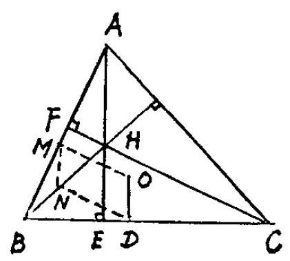

(图 1-6)

例 25. 由三角形的任意角顶至垂心的距离等于由其外心至对边距离的两倍, 试证明之。

已知: $\bigtriangleup {ABC}$ 的外心是 O, 垂心是 $H,{OD} \bot  {BC}$ 。

求证: ${AH} = {2OD}$ 。

分析: 在 $\bigtriangleup {ABH}$ 中,中位线 ${MN} = \frac{1}{2}{AH}$ ,要证明 ${OD} \; = \frac{1}{2}{AH}$ ,只须证 $\mathrm{O}D = {MN}$ ; 为此,证 ${MNDO}$ 是平行四边形。

证明: 取 ${AB}$ 中点 $M,{HB}$ 中点 $N$ ,连结 ${MN}$ ,则 ${MN} \; \overset{\parallel  \cdot  \parallel }{ = }\frac{1}{2}A{H}_{ \circ  }$

$\because {OD} \bot  {BC}\;\therefore {OD}//{AH}$ (同垂直于一直线的两直线平行)

$\therefore {OD}//{MN}$ 。

连结 ${MO}\text{ 、 }{ND}$ ,则 ${MO}//{ND}$ (均与 ${FC}$ 平行);

$\therefore {MNDO}$ 为平行四边形 (两组对边平行)。

于是得 ${OD} = {MN}$ ; 而 ${MN} = \frac{1}{2}{AH}$ ,(三角形中位线定理)。

$\therefore {OD} = \frac{1}{2}{AH}$ ,即 ${AH} = {2OD}$ 。

说明: ${1}^{ \circ  }$ 证明中的基本思路是找到 ${MN}$ 为桥梁,从而证出 ${OD} = {MN} = \frac{1}{2}{AH}$ ；而找 ${MN}$ 的设想以及证明的论据， 都是从已知 $O$ 是外心, $H$ 是垂心, ${OD}//{AH}$ 引出的。根据已知,如图 ${7a}$ 所示,也可以用 ${EC}$ 为桥梁,证出 ${2OD} = {EC} \; = {AH}$ ; 或者如图 ${7b}$ ,证出 ${OD} = {MH} = \frac{1}{2}A{H}_{ \circ  }$

${2}^{ \circ  }$ 另外,如从图 ${7c}$ 中观察到 $\angle {BOD} = \angle A$ ; 可知 ${OD} = \; \frac{1}{2}a\operatorname{ctg}A$ ,则问题是如何证 ${AH} = a\operatorname{ctg}A$ 。为此在 $\bigtriangleup {ABH}$ 中用正弦定律,并看到 $\angle {AHB} = {180}^{ \circ  } - C$ ,于是可得

$$
\frac{AH}{\sin \left( {{90}^{ \circ  } - A}\right) } = \frac{c}{\sin \left( {{180}^{ \circ  } - C}\right) },\frac{AH}{\cos A} = \frac{c}{\sin C};
$$

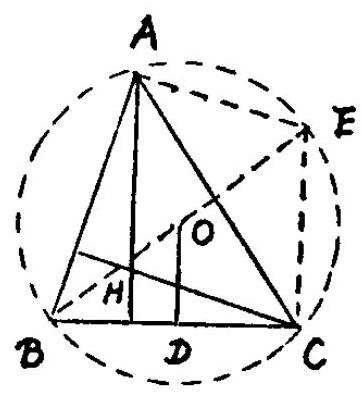

(图 1-7a)

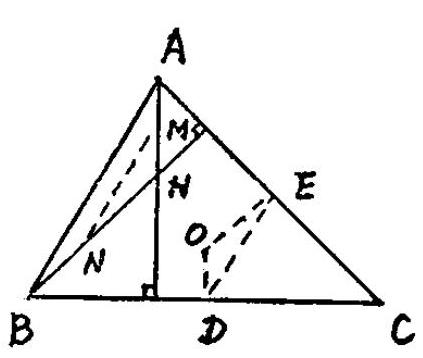

(图 1-7b)

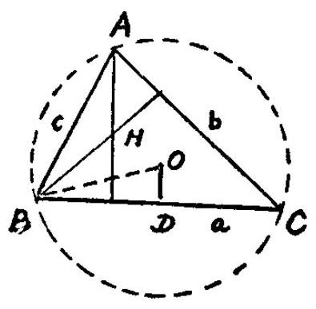

(图 1-7c)

再在 $\bigtriangleup {ABC}$ 中引用正弦定律,由

$$
\frac{AH}{\cos A} = \frac{c}{\sin C} = \frac{a}{\sin A}
$$

得到

$$
{AH} = a\operatorname{ctg}A\text{ 。 }
$$

${3}^{ \circ  }$ 最后,若在直角坐标系中,设三角形各顶点的坐标为 $A\left( {l, h}\right) , B\left( {o, o}\right) , C\left( {a, o}\right)$ ; 则 ${BH}$ 所在直线方程为 $v = \frac{a - l}{h}x$ , ${AH}$ 所在直线方程为 $x = l$ ; 故两者交点 $H$ 的纵坐标为 $\frac{\left( a - l\right) }{h}l$ ; 于是得

$$
{HA} = h - \frac{\left( {a - l}\right) l}{h} = \frac{{h}^{2} + {l}^{2} - {al}}{h}\text{ 。 }
$$

只须再求出 $O$ 点的纵坐标; 为此引用外接圆的方程: (设 ${OD} = d$ )

$$
{\left( x - \frac{a}{2}\right) }^{2} + {\left( y - d\right) }^{2} = \frac{{a}^{2}}{4} + {d}^{2}
$$

将 $A$ 点坐标代入

$$
{\left( l - \frac{a}{2}\right) }^{2} + {\left( h - d\right) }^{2} = \frac{{a}^{2}}{4} + {d}^{2}
$$

再解出 $d$ ,即得

$$
{OD} = d = \frac{1}{2}\frac{{l}^{2} + {h}^{2} - {al}}{h} = \frac{1}{2}{HA}\text{ 。 }
$$

当然,也可以引用 ${AB}$ 的垂直平分线求交点 $\mathrm{O}$ 的坐标。

${4}^{ \circ  }$ 本题不算是很难的题,不过从以上三点说明来看,可以由它练习几何, 三角, 解析几何等方面的多种解题思路和方法; 若能对各种解法加以比较, 思考用某一种解法时当注意的问题，则收获会更大。

例 26. 已知 $P$ 为等边 $\bigtriangleup {ABC}$ 的外接元 ${BC}$ 弧上一点, 求证: $P{A}^{2} = A{B}^{2} + {PB} \cdot  {PC}$

分析 1. 线段的平方或乘积间的联系, 常从相似形对应边的比例得出。因此 $P{A}^{2}, A{B}^{2},{PB} \cdot  {PC}$ 可从相似三角形找它们的关系。但找不到只含这些边的两个相似三角形; 故须引进 $\bigtriangleup {ABE} \backsim \; \bigtriangleup {APB}$ 及 $\bigtriangleup {BPE} \backsim  \bigtriangleup {APC}$ 两套相似三角形。

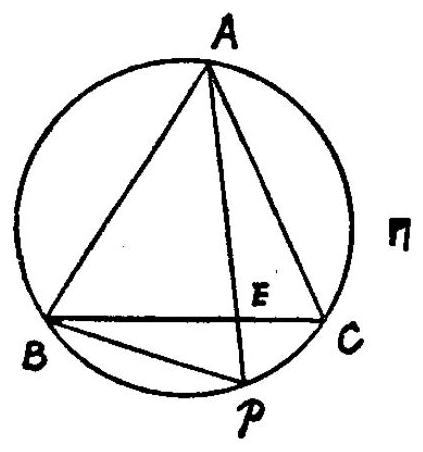

(图 1-8)

证明 1. 设 ${AP}$ 与 ${BC}$ 相交于 $E$ 。

在 $\bigtriangleup {ABE}$ 和 $\bigtriangleup {APB}$ 中:

$\because \angle {ABE} = \angle {APB},$ (等弧所对元周角)

$$
\angle {BAE} = \angle {BAP},\text{ (公用) }
$$

$\therefore$

$$
\bigtriangleup {ABE} \backsim  \bigtriangleup {APB}\text{ 。 }
$$

于是可得

$$
{AB} : {AE} = {PA} : {AB},
$$

即

$$
A{B}^{2} = {PA} \cdot  {AE} \tag{1}
$$

在 $\bigtriangleup {BPE}$ 和 $\bigtriangleup {APC}$ 中:

$\because \angle {BPE} = \angle {APC}$ ,(等弧所对的元周角)

$\angle {PBE} = \angle {APC}$ ,(同弧所对的元周角)

$\therefore  \bigtriangleup  {BPE} \backsim   \bigtriangleup  {APC}$ ,

于是又得

$$
{PC} : {PE} = {PA} : {PB},
$$

即

$$
{PB} \cdot  {PC} = {PA} \cdot  {PE}
$$

(2)

由 $\left( 1\right)  + \left( 2\right)$ 得: ${PA} \cdot  {PE} + {PA} \cdot  {AE} = A{B}^{2} + {PB} \cdot  {PC}$ ，

$$
{PA}\left( {{PE} + {AE}}\right)  = A{B}^{2} + {PB} \cdot  {PC},
$$

即 $P{A}^{2} = A{B}^{2} + {PB} \cdot  {PC}$ 。(证毕)

分析 2. 可将原式变形成 $P{A}^{2} - A{B}^{2} = {PB} \cdot  {PC}$ ; 欲证左边的线段平方差等于右边的线段积,可作 ${AD} \bot  {BP}$ ,从而找到 $P{A}^{2} - A{B}^{2}$ 与 ${BP}$ 上线段的关系。

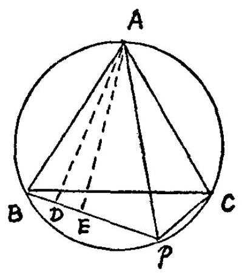

(图 1-9)

证明 2. 过 $A$ 作 ${AD} \bot  {BP}$ 交 ${BP}$ 于 ${D}_{\mathrm{i}}$

则 $A{P}^{2} - A{B}^{2} = P{D}^{2} - B{D}^{2}$

$$
= \left( {{PD} + {BD}}\right) \left( {{PD} - {BD}}\right)
$$

$$
= {BP}\left( {{PD} - {BD}}\right) \text{ 。 }
$$

下面证明 ${PD} - {BD} = {PC}$ 。

在 ${PD}$ 上截取 ${DE} = {BD}$ ,

同时由于 $A$ 在 ${BE}$ 的垂直平分线上, $\therefore {AE} = {AB}$ , $\angle {ABE} = \angle {AEB}$ ; 故 $\angle {AEP} = \angle {ACP}$ (等角补角); 又 $\angle {APB} = \angle {APC}$ (对等弧的园周角), $\therefore \angle {EAP} = \angle {CAP}$ ; 于是知 $\bigtriangleup {AEP} \cong  \bigtriangleup {APC}\left( {a,{sa}}\right) ,{PE} = {PC}$ 。

这就得到 ${PD} - {BD} = {PE} = {PC}$ ;

证明了 $P{A}^{2} - A{B}^{2} = {PB} \cdot  {PC}$ ,即 $P{A}^{2} = A{B}^{2} + {PB} \cdot  {PC}$ 。

注:1°对要证明的式子，可以作适当变形，变到适于推证的形式, 证出后, 再变回到要证明的结果; 如本题。

${2}^{ \circ  }$ 遇到三角形两边平方差的问题,常由交点作对边上垂线, 使之转化为底边上两线段的平方差; 再利用 ${a}^{2} - {b}^{2} = \left( {a + b}\right) \left( {a - b}\right)$ 转化为另两线段之积。 本题正是这样将 $P{A}^{2} - A{B}^{2}$ 转化为 ${PB} \cdot  P{E}_{0}$

讨论: ${1}^{ \circ  }$ 若注意到 $\angle {BPA} = \angle {CPA} = {60}^{ \circ  }$ ,则可有

$$
A{B}^{2} = P{A}^{2} + P{B}^{2} - {PA} \cdot  {PB},
$$

$$
A{C}^{2} = P{A}^{2} + P{C}^{2} - {PA} \cdot  {PC}
$$

相加得 $A{B}^{2} + A{C}^{2} = {2P}{A}^{2} + P{B}^{2} + P{C}^{2} - {PA}\left( {{PB} + {PC}}\right)$ 。 由此看出,只要 ${PA} = {PB} + {PC}$ ,即有

$$
{2A}{B}^{2} = {2P}{A}^{2} - {2PB} \cdot  {PC},\;P{A}^{2} = A{B}^{2} + {PB} \cdot  {PC}\text{ 。 }
$$

于是问题转化为求证 ${PA} = {PB} + {PC}$ 这一较易证的命题。

${2}^{ \circ  }$ 若以外接园心为原点,设各顶点坐标为

$$
A\left( {O, R}\right) , B\left( {-\frac{\sqrt{3}}{2}R, - \frac{R}{2}}\right) , C\left( {\frac{\sqrt{3}}{2}R, - \frac{R}{2}}\right) ,
$$

边长为 $a, P$ 点坐标为 $P\left( {x, y}\right)$ ,则有:

$$
P{A}^{2} = {x}^{2} + {\left( y - R\right) }^{2},\;A{B}^{2} = 3{R}^{2},
$$

$$
F{A}^{2} - A{B}^{2} =  - {R}^{2} - {2Ry} =  - R\left( {R + {2y}}\right)
$$

$$
{PB} \cdot  {PC} =
$$

$$
\sqrt{\left\lbrack  {{\left( x + \frac{\sqrt{3}}{2}R\right) }^{2} + {\left( y + \frac{R}{2}\right) }^{2}}\right\rbrack  \left\lbrack  {{\left( x - \frac{\sqrt{3}}{2}R\right) }^{2} + {\left( y + \frac{R}{2}\right) }^{2}}\right\rbrack  }
$$

$$
= \sqrt{{R}^{2}{\left( R + 2y\right) }^{2}}
$$

$$
=  - R\left( {R + {2y}}\right) \text{ 。 }
$$

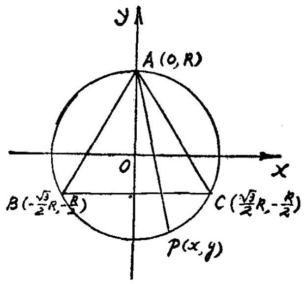

(图 1-10)

取负号是因为: $- R < y \; <  - \frac{1}{2}R,\; - {2R} < {2y} <$

$$
- R,\; - R < R + {2y} < 0;
$$

这是在引用解析几何方法进行计算时要注意的。

${3}^{ \circ  }$ 本题也可以用三角法, 如用正弦定律求证。

例 27. 在等腰 $\bigtriangleup {ABC}$ 中,顶角 $\angle A = {100}^{ \circ  }$ ,底角 $\angle B$ 的平分线交 ${AC}$ 于 $D$ ,求证: ${AD} + {BD} = {BC}$ 。

分析 1. 要证明 ${AD} + {BD} = {BC}$ 常用方法是截长补短法,即在 ${BC}$ 上截取 ${BE} = {BD}$ ,再证 ${EC} = {AD}$ 即可,或是延长 ${BD}$ 至 $F$ ,使 ${BF} = {BC}$ 、再证 ${DF} = {AD}$ 即可。

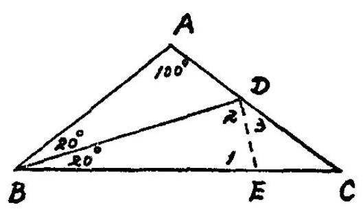

(图 1-11)

证明 1. 在 ${BC}$ 上截取 ${BE} \; = {BD}$ ,连结 ${DE}$ ,则

$$
\angle 1 = \angle 2 = \frac{{180}^{ \circ  } - {20}^{ \circ  }}{2} = {80}^{ \circ  },
$$

$$
\angle 3 = {180}^{ \circ  } - {80}^{ \circ  } - {60}^{ \circ  }
$$

$$
= {40}^{ \circ  } = \angle C,
$$

于是 $\bigtriangleup  {EDC} \backsim   \bigtriangleup  {ABC}$ ； $\therefore \frac{EC}{DC} = \frac{AB}{BC}$ 。(1)

又 $\because {BD}$ 是 $\angle {ABC}$ 的平分线,

$$
\frac{AD}{DC} = \frac{AB}{BC}\text{ 。 } \tag{2}
$$

由 (1)、(2) 得: $\frac{EC}{DC} = \frac{AD}{DC},\therefore {EC} = {AD}$ ; 又已作 ${BE} = \; {BD}$ ; 故由 ${BC} = {BE} + {EC}$ ,即得 ${BC} = {BD} + {AD}$ 。

注: 由 $\angle A + \angle 1 = {180}^{ \circ  }$ ,知 $A\text{ 、 }B\text{ 、 }E\text{ 、 }D$ 四点共元;

又 $\angle {ABD} = \angle {DBE},\therefore {AD} = {DE}$ ; 而 ${DE} = {EC}$ ,

即可得 ${BC} = {BD} + {AD}$ 。

证明 2. 延长 ${BD}$ 至 $F$ ,使 ${BF} = {BC}$ 。连结 ${FC}$ ，作 $\angle {BDC}$ 的平分线 ${DL}$ 交 ${BC}$ 于 $L$ 。

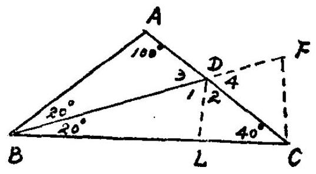

(图 1-12)

显然 $\angle 1 = \angle 2 = \angle 3 = \angle 4$

$$
= {60}^{ \circ  },
$$

$$
\angle F = \angle {BCF} = \frac{{180}^{ \circ  } - {20}^{ \circ  }}{2} = {80}^{ \circ  },
$$

$\therefore$

$$
\angle {DCF} = \angle {DCL} = {40}^{ \circ  }\text{ 。 }
$$

又 ${DC}$ 为公共边, $\therefore \bigtriangleup {DFC} \cong  \bigtriangleup {DLC},\therefore {DF} = {DL}$ 。 显然又有 $\bigtriangleup {ABD} \cong  \bigtriangleup {LBD},\left( {a\text{ 、 }s\text{ 、 }a}\right) \therefore {AD} = {DL}$ 。

$\therefore {AD} = {DF}$ ,从而得 ${BC} = {BF} = {BD} + {DF} = {BD} + {AD}$ ,

即 ${BC} = {BD} + {AD}$ 。(证毕)

说明: 证明 1 是在分角线分底边成比例线段基础上, 再构造相似三角形, 找比例线段; 证明 2 则是构造全等三角形。

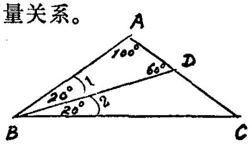

(图 1-13)

分析 2. 由于本题给出了三角形的角的度数, 更便于借助三角函数式的变换，从而建立等量关系。

证明 $3.\therefore \angle A = {100}^{ \circ  }$ ,

$$
{AB} = {AC},
$$

$$
\angle {ABC} = \angle C = {40}^{ \circ  },
$$

$\therefore$

$$
\angle 1 = \angle 2 = {20}^{ \circ  },
$$

$\angle {ADB} = {60}^{ \circ  }$ ,在 $\bigtriangleup {ABD}$ 中,由正弦定理,

得

$$
\frac{AD}{\sin {20}^{ \circ  }} = \frac{AB}{\sin {60}^{ \circ  }} = \frac{BD}{\sin {100}^{ \circ  }};
$$

$$
{AD} = \frac{{AB} \cdot  \sin {20}^{ \circ  }}{\sin {60}^{ \circ  }},\;{BD} = \frac{{AB} \cdot  \sin {100}^{ \circ  }}{\sin {60}^{ \circ  }};
$$

$$
\therefore {AD} + {BD} = {AB}\left( {\frac{\sin {20}^{ \circ  }}{\sin {60}^{ \circ  }} + \frac{\sin {100}^{ \circ  }}{\sin {60}^{ \circ  }}}\right)
$$

$$
= {AB} \cdot  \frac{1}{\sin {60}^{ \circ  }}\left( {2\sin {60}^{ \circ  } \cdot  \cos {40}^{ \circ  }}\right)
$$

$$
= {2AB} \cdot  \cos {40}^{ \circ  }\text{ 。 } \tag{1}
$$

又在 $\bigtriangleup {ABC}$ 中, $\frac{BC}{\sin {100}^{ \circ  }} = \frac{AB}{\sin {40}^{ \circ  }}$ ,

$$
{BC} = \frac{{AB} \cdot  \sin {100}^{ \circ  }}{\sin {40}^{ \circ  }} = \frac{{AB} \cdot  \sin {80}^{ \circ  }}{\sin {40}^{ \circ  }}
$$

$$
= \frac{{AB} \cdot  2\sin {40}^{ \circ  }\cos {40}^{ \circ  }}{\sin {40}^{ \circ  }} = {2AB} \cdot  \cos {40}^{ \circ  }; \tag{2}
$$

由 (1)(2) 得 ${BC} = {AD} + {BD}$ 。

说明: 比较以上三个证明, 本题用三角方法来证思路更较简单, 特别是不必添加辅助线; 所以在不易添加辅助线时, 常考虑用三角法证明。

例 28. 在矩形 ${ABCD}$ 中,过 $A$ 作对角线 ${BD}$ 的垂线 ${AP}$ 与 ${BD}$ 交于 $P$ ,过 $P$ 作 ${BC}\text{ 、 }{CD}$ 的垂线 ${PE}\text{ 、 }{PF}$ 与 ${BC}$ 、 ${CD}$ 分别交于 $E\text{ 、 }F$ 。

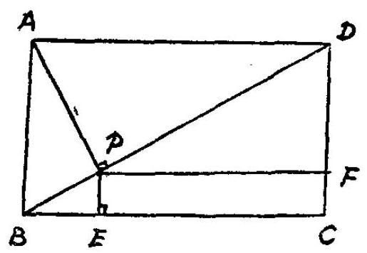

(图 1-14)

求证: $A{P}^{3} = {BD} \cdot  {PE} \cdot  {PF}$ 。

分析 1. 由 $\angle {BAD} = {90}^{ \circ  }$ 、 ${AP} \bot  {BD}$ 可得 $A{P}^{2} = {BP} \cdot  {PD}$ ; 而线段 ${BD},{PE},{PF},{PD}$ ,分别在 $\bigtriangleup {BCD},\bigtriangleup {BEP},\bigtriangleup {PFD}$ 中, 且这些三角形均相似, 利用相似关系即可得到证明。

证明 1 . $\because \angle {BAD} = {90}^{ \circ  },{AP} \bot  {BD}$ ,

$\therefore {PE}//{DC},\;\therefore \bigtriangleup {BEP} \backsim  \bigtriangleup {BCD},\frac{BP}{PE} = \frac{BD}{DC}$ ;

$$
A{P}^{2} = {BP} \cdot  {PD}\text{ 。 } \tag{1}
$$

___

即得

$$
{BP} = \frac{{BD} \cdot  {PE}}{DC}\text{ 。 } \tag{2}
$$

又 $\because \angle {BAP} = \angle {DPF}$ ,(分别与 $\angle {ABP}\text{ 、 }\angle {BDC}$ 互余)

$\therefore$

$$
\bigtriangleup  {BAP} \backsim   \bigtriangleup  {DPF}\text{ ； }
$$

$\therefore \;\frac{PD}{PF} = \frac{AB}{AP}$ ,而 ${AB} = {CD}$ ,即 $\frac{PD}{PF} = \frac{CD}{AP}$ ,

得

$$
{PD} = \frac{{PF} \cdot  {CD}}{AP}\text{ 。 } \tag{3}
$$

将(2)(3)代入(1)得

$$
A{P}^{2} = {BP} \cdot  {PD} = \frac{{BD} \cdot  {PE}}{DC} \cdot  \frac{{PF} \cdot  {CD}}{AP};
$$

$\therefore$

$$
A{P}^{3} = {BD} \cdot  {PE} \cdot  {PF}\text{ 。 }
$$

分析 2. 利用射影定理得到 $A{P}^{2} = {BP} \cdot  {PD}$ 后,两边乘以 ${AP}$ 得 $A{P}^{3} = {AP} \cdot  {BP} \cdot  {PD}$ 再证 ${AP} \cdot  {BP} \cdot  {PD} = {BD} \cdot  {PE} \cdot  {PF}$ 。

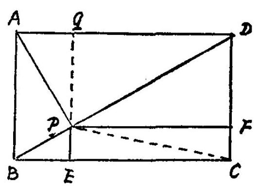

(图 1-15)

证明 $2.\because \angle {BAD} = {90}^{ \circ  }$ , ${AP} \bot  {BD}$

$\therefore \;A{P}^{2} = {BP} \cdot  {PD}$ ;

两边乘以 ${AP}$ 得

$$
A{P}^{3} = {BP} \cdot  {PD} \cdot  {PA}\text{ 。 } \tag{1}
$$

$$
{PE}//{DC}\;\therefore \bigtriangleup {BEP} \backsim  \bigtriangleup {BCD}\text{ , }
$$

$$
\therefore \;\frac{BP}{PE} = \frac{BD}{CD}\text{ 得 }{BP} = \frac{{BD} \cdot  {PE}}{CD}\text{ 。 } \tag{2}
$$

将(2)代入(1)得 $A{P}^{3} = \frac{{BD} \cdot  {PE} \cdot  {PD} \cdot  {PA}}{CD}$ 。( 3 )

过 $P$ 作 ${Pq} \bot  {AD}$ 交 ${AD}$ 于 $q$ 、连 ${PC}$ 。

显然 ${S}_{\bigtriangleup {qPD}} = {S}_{\bigtriangleup {PFD}}$ ,并从而推出 ${S}_{\bigtriangleup {PqA}} = {S}_{\bigtriangleup {PFC}}$ 。

于是有 ${S}_{\bigtriangleup {APD}} = {S}_{\bigtriangleup {PCD}}$ 故 ${AP} \cdot  {PD} = {CD} \cdot  {PF}$

即

$$
\frac{{AP} \cdot  {PD}}{CD} = {PF}
$$

$\therefore$

$$
A{P}^{3} = \frac{{BD} \cdot  {PE} \cdot  {PD} \cdot  {PA}}{CD} = {BD} \cdot  {PE} \cdot  {PF}\text{ 。 }
$$

分析 3. 利用射影定理得到 $A{P}^{2} = {BP} \cdot  {PD}$ 后,由于 ${BP},{PD}$ 是直角三角形的直角边,可再考虑用射影定理,于是将 $A{P}^{2} = {BP} \cdot  {PD}$ 两边平方得 $A{P}^{4} = B{P}^{2} \cdot  P{D}^{2}$ 右边分别使用射影定理, 去掉平方与左边消去 ${AP}$ ,即得要证的结果。

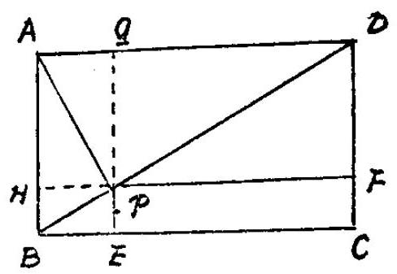

(图 1-16)

证明 $3.\because \angle {BAD} = {90}^{ \circ  }$ , ${AP} \bot  {BD}\;\therefore \;A{P}^{2} = {BP} \cdot  {PD}$ 两边平方得 $A{P}^{4} = B{P}^{2} \cdot  P{D}^{2}$

过 $P$ 作 ${Pq} \bot  {AD},{PH} \bot  {AB}$ , 分别交 ${AD}\text{ 、 }{AB}$ 于 $q\text{ 、 }H$ 。

$$
\because {AP} \bot  {BD}\;\therefore B{P}^{2} = {BH} \cdot  {AB},\;P{D}^{2} = {AD} \cdot  {qD},
$$

则

$$
A{P}^{4} = {BH} \cdot  {AB} \cdot  {AD} \cdot  {qD};
$$

而

$$
{BH} = {PE},{qD} = {PF}\text{ , }
$$

$\therefore$

$$
A{P}^{4} = {PE} \cdot  {PF} \cdot  {AB} \cdot  {AD}\text{ 。 }
$$

$\frac{1}{2}{AB} \cdot  {AD} = \frac{1}{2}{AP} \cdot  {BD}$ (同一三角形的面积)，

$\therefore$

$$
A{P}^{4} = {PE} \cdot  {PF} \cdot  {AP} \cdot  {BD},
$$

$\therefore$

$$
A{P}^{3} = {PE} \cdot  {PF} \cdot  {BD}\text{ 。 }
$$

注: 证明 1 只在射影定理基础上, 利用相似形, 证明 2 则更引用了面积, 证明 3 两次用射影定理后, 不再用相似形而只用面积关系。

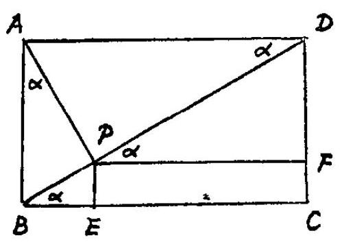

(图 1-17)

分析 4. 如图, 显然图中所标 $\alpha$ 角皆相等,借用三角函数的边角关系,表示 ${AP}$ ,把各三角形内，不在结论中的边化去，可以导出所求的式子。

证明 4 .

$$
{AP} = \frac{BP}{\operatorname{tg}\alpha } = \frac{PE}{\operatorname{tg}\alpha  \cdot  \sin \alpha },
$$

(1)

$$
{AP} = {PD} \cdot  \operatorname{tg}\alpha  = \frac{PF}{\cos \alpha } \cdot  \operatorname{tg}\alpha , \tag{2}
$$

$$
{AP} = {AB} \cdot  \cos \alpha  = \left( {{BD} \cdot  \sin \alpha }\right)  \cdot  \cos \alpha , \tag{3}
$$

由 $\left( 1\right)  \times  \left( 2\right)  \times  \left( 3\right)$ 得 $A{P}^{3} = {PE} \cdot  {PF} \cdot  {BD}$ 。

说明: 本例欲证的等式右端为线段的三次方, 用四种方式处理: 第一种从 $A{P}^{2} = {BP} \cdot  {PD}$ 出发,经过推证将 ${BP} \cdot  {PD}$ 代换成右端的三线段乘积后,在分母上留下 ${AP}$ ; 第二种则是先在 $A{P}^{2} = {BP} \cdot  {PD}$ 两端乘以 ${AP}$ ,再证 ${BP} \cdot  {PD} \cdot  {AP} = \; {BD} \cdot  {PE} \cdot  {PF}$ ，第三种则将 $A{P}^{2} = {BP} \cdot  {PD}$ 两边平方，证出 $B{P}^{2} \cdot  P{D}^{2} = {BD} \cdot  {PE} \cdot  {PF} \cdot  {AP}$ 后再消去 ${AP}$ ; 三种方式都用到射影定理, 是因为图形中多次出现直角三角形中的高线, 一般这是启发我们去用射影定理的; 第四种方法是利用三角知识,直接找 ${AP}$ 与右端各线段的联系,最后消去出现的三角函数, 所以采取这种作法, 是和图中出现许多相似三角形有关的。本题也可以选取适当坐标系, 用解析几何法证明。 到此, 要在充分消化以上四个例题的基础上, 对以下的例, 先自己作出分析, 以至解出, 再看所举解法, 进行比较。

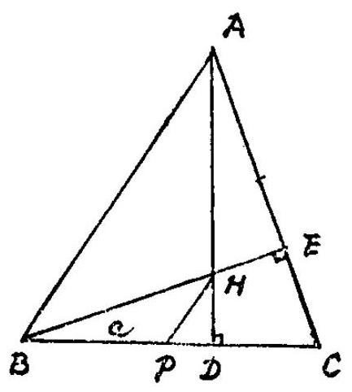

(图 1-18)

例 29. 已知 $\bigtriangleup {ABC}$ 中, ${AD} \bot \; {BC},{AD} = {BC} = a, P$ 为 ${BC}$ 中点, $H$ 为垂心; 求证: ${PC} = {PH} + {DH}$ 。

分析: 本题的困难在于难以建立 ${PH},{DH}$ 与 ${PC}$ 的联系。对此,先从 $\bigtriangleup {BDH} \backsim  \bigtriangleup {ADC}$ 得出 ${BD} \cdot  {DC} = {HD} \cdot  {AD}$ ; 其中 ${AD} = {BC} = a,{BD} = \frac{a}{2} + {PD},{DC} \; = \frac{a}{2} - {PD}$ ,而 $P{D}^{2} = P{H}^{2} - D{H}^{2},{PC} = \frac{a}{2}$ ; 这样,就找到了 ${PH}\text{ 、 }{DH}$ 与 ${PC}$ 间量的联系而突破难点,可以试用代数变换去推导所求等式。

证明: 由 $\bigtriangleup {BDH} \backsim  \bigtriangleup {ADC}\left( {\angle {HBD} = \angle {DAC}}\right)$ 得 ${BD} : {AD} = {DH} : {DC},\;{BD} \cdot  {DC} = {DH} \cdot  {AD}$ ;(1)又 ${AD} = {BC} = a,{BD} = \frac{a}{2} + {PD},{DC} = \frac{a}{2} - {PD}$ ;(2)将 (2) 代入 (1) 得:

$$
\left( {\frac{a}{2} + {PD}}\right) \left( {\frac{a}{2} - {PD}}\right)  = {DHa},{\left( \frac{a}{2}\right) }^{2} - P{D}^{2} = a \cdot  {DH}\text{ 。 }
$$

其中 $P{D}^{2} = P{H}^{2} - D{H}^{2}$ ,故有

$$
{\left( \frac{a}{2}\right) }^{2} - P{H}^{2} + D{H}^{2} = a \cdot  {DH},{\left( \frac{a}{2} - DH\right) }^{2} = P{H}^{2},
$$

$$
\frac{a}{2} - {DH} = {PH},\;{PC} - {DH} = {PH};
$$

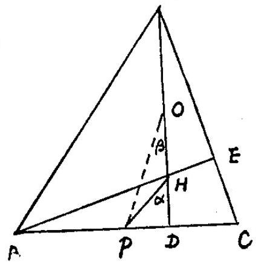

(图 1-19)

最后得 ${PC} = {PH} + {DH}$ ;

讨论: ${1}^{ \circ  }$ 若仔细观察,也可将证 ${DH} + {PH} = {PC} = \frac{1}{2}{BC}$ ,转化为证 ${DH} + {PH} = {DO} = \frac{1}{2}{AD}$ (如图)。这只须证 ${OH} = {PH}$ ；又只须证 $\alpha  = {2\beta }$ 。由于 $\operatorname{tg}\beta  = \frac{PD}{OD},\operatorname{tg}\alpha  = \frac{PD}{{D}_{1}}$ ,经计算得 $\operatorname{tg}{2\beta } = \; \frac{{AD} \cdot  {PD}}{{BD} \cdot  {DC}} = \frac{PD}{DH} \cdot  \frac{{AD} \cdot  {DH}}{{BD} \cdot  {DC}}$ ，这又只须证 ${AD} \cdot  {DH} = {BD} \cdot  {DC}$ ， 它可由 $\bigtriangleup {BDH} \backsim  \bigtriangleup {ADC}$ 得出,于是有: $\operatorname{tg}{2\beta } = \frac{PD}{DH} = \operatorname{tg}\alpha$ ; 而 $\alpha ,\beta$ 皆为锐角,即证得 $\alpha  = {2\beta }$ 。

${2}^{ \circ  }$ 若取各点坐标为 $P\left( {o, o}\right) , A\left( {d, a}\right) , B\left( {-\frac{a}{2}, o}\right)$ , $C\left( {\frac{a}{2}, o}\right)$ ,用解析几何法进行计算,易得:

$$
\left| {PH}\right|  = \frac{\frac{{a}^{2}}{4} + {d}^{2}}{a},\;\left| {DH}\right|  = \frac{\frac{{a}^{2}}{4} - {d}^{2}}{a},
$$

$$
\left| {PH}\right|  + \left| {DH}\right|  = \frac{a}{2} = \left| {PC}\right| \text{ 。 }
$$

例 30. ${CD}$ 为圆内平行于直径 ${AB}$ 的弦, $P$ 为 ${AB}$ 上任一点; 求证: $P{C}^{2} + P{D}^{2} = P{A}^{2} + P{B}^{2}$ 。

分析: 先考虑特殊情形, $P$ 在园心 $O$ 显然成立; $P$ 与端点 $B$ 重合,则由 ${BD}$ 的对称线段 ${AC}$ 知其成立。于是设想到用一般情形的对称线段 $C{P}^{\prime }$ ; 再看到 ${CO}$ 为 $\bigtriangleup C{P}^{\prime }P$ 的中线而联系到三条边和中线关系, 即找至问题的一个突破点。

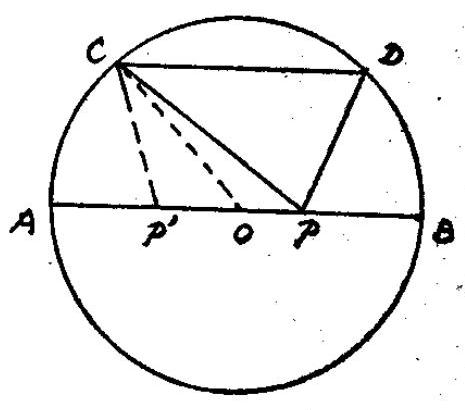

(图 1-20)

证明: 取 $O{P}^{\prime } = {OP}$ ,连 ${P}^{\prime }C,{OC}$ ; 由对称性知 ${P}^{\prime }C = \; {PD}$ 。在 $\bigtriangleup C{P}^{\prime }P$ 中 ${CO}$ 为中线,故有

即

$$
P{C}^{2} + {P}^{\prime }{C}^{2} = 2\left( {C{O}^{2} + P{O}^{2}}\right)
$$

$$
P{C}^{2} + P{D}^{2} = 2\left( {O{A}^{2} + O{P}^{2}}\right) \text{ 。 }
$$

$\therefore$

$$
P{C}^{2} + P{D}^{2} = P{A}^{2} + P{B}^{2}\text{ 。 }
$$

说明 ${1}^{ \circ  }$ 直接从 $2\left( {O{A}^{2} + O{P}^{2}}\right)$ 经过配方也能得到 $P{A}^{2} + \; P{B}^{2} : 2\left( {O{A}^{2} + O{P}^{2}}\right)  = O{A}^{2} + {2OA} \cdot  {OP} + O{P}^{2} + O{A}^{2} - \; {2OA} \cdot  {OP} + O{P}^{2} = {\left( OA + OP\right) }^{2} + \left( {{OA} - O{P}^{2}}\right)  = P{A}^{2} + P{B}^{2}$ 。

${2}^{ \circ  }$ 本题由于只联系到园和长度,用解析几何法是非常简便的。

${3}^{ \circ  }$ 本题是利用对称的一例; 同时要联系而用上圆的半径 $R$ 这个常量。

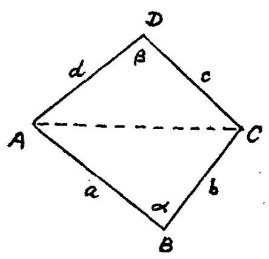

(图 1-21)

例 31. 在各边长度给定的一切四边形中, 内接于元的四边形具有最大的面积。

分析: 由于四边形的各边长度已给定, 则面积的大小, 依赖于四边形的顶角大小的变化, 故必须建立面积与顶角之间的函数关系, 再设法求出面积取极值的条件。

证明: 设 ${AB} = a,{BC} = b$ , ${CD} = c,\;{DA} = d\text{ 、 }\angle {ABC} = \alpha ,\;\angle {ADC} = \beta$  。 $S$ 为四边形的面积,连结 ${AC}$

$$
S = {S}_{\bigtriangleup {ABC}} + {S}_{\bigtriangleup {ADC}} = \frac{1}{2}\left( {{ab}\sin \alpha  + {cd}\sin \beta }\right) ; \tag{1}
$$

又

$$
A{C}^{2} = {a}^{2} + {b}^{2} - {2ab}\cos \alpha ,
$$

$$
A{C}^{2} = {c}^{2} + {d}^{2} - {2cd}\cos \beta ;
$$

两式相减得:

$$
{ab}\cos \alpha  - {cd}\cos \beta  = \frac{1}{2}\left( {{a}^{2} + {b}^{2} - {c}^{2} - {d}^{2}}\right) \text{ 。 } \tag{2}
$$

由 (1) 得

$$
{ab}\sin \alpha  + {cd}\sin \beta  = {2S}, \tag{3}
$$

${\left( 2\right) }^{2} + {\left( 3\right) }^{2}$ 得

$$
{a}^{2}{b}^{2} + {c}^{2}{d}^{2} - {2abcd}\cos \left( {\alpha  + \beta }\right)
$$

$$
= 4{S}^{2} + \frac{1}{4}{\left( {a}^{2} + {b}^{2} - {c}^{2} - {d}^{2}\right) }^{2};
$$

$$
{S}^{2} = \frac{1}{4}\left\lbrack  {{a}^{2}{b}^{2} + {c}^{2}{d}^{2} - {2abcd}\cos \left( {\alpha  + \beta }\right) }\right\rbrack
$$

$$
- \frac{1}{16}{\left( {a}^{2} + {b}^{2} - {c}^{2} - {d}^{2}\right) }^{2}
$$

上式中右边除含 $- {2abcd}\cos \left( {\alpha  + \beta }\right)$ 的一项外,其他各项均为常数。又 $a, b, c, d$ 均为正数,故当 $\alpha  + \beta  = \pi$ 时 -2abcdcos $\left( {\alpha  + \beta }\right)$ 为极大，即 ${S}^{2}$ 有极大值，从而 $S$ 有极大值；即当四边形对角互补, 也就是当它内接于园时其面积最大。

注: 本题的极值条件, 从要证的结论已可看出, 只是相对两顶角之间的一种关系, 而不是某一顶角取某一个值; 因此不要求出 $S\left( \alpha \right)$ 作为一般函数极值来求。

例 32. 在边长为 $a$ 的正三角形中,设点 $P\text{ 、 }Q\text{ 、 }R$ 在边 ${BC}\text{ 、 }{CA}\text{ 、 }{AB}$ 上运动,并保持 ${BP} + {CQ} + {AR} = a$ 的关系。设 ${BP} = x,{CQ} = y,{AR} = z,\bigtriangleup {PQR}$ 的面积为 $S$ ,解答下列问题: (1)用 $x, y, z$ 表示 $S$ ，(2)求 $S$ 的最大值，(3)求 $S$ 取最大值时, ${PQ},{QR},{PR}$ 的值。

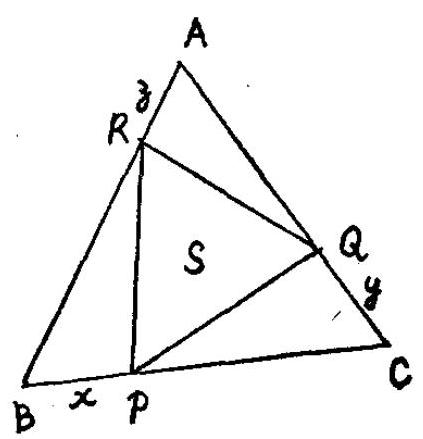

(图 1-22)

解: (1) 由 ${AQ} = a - y$ ,

$$
\angle A = {60}^{ \circ  }
$$

得 ${S}_{\bigtriangleup {AQR}} = \frac{1}{2}\left( {a - y}\right)  \cdot  z \cdot  \sin {60}^{ \circ  }$

$$
= \frac{\sqrt{3}}{4}\left( {a - y}\right)  \cdot  z\text{ 。 }
$$

同理可得:

$$
{S}_{\bigtriangleup {BRP}} = \frac{\sqrt{3}}{4}\left( {a - z}\right)  \cdot  x,
$$

$$
{S}_{\bigtriangleup {CPQ}} = \frac{\sqrt{3}}{4}\left( {a - x}\right)  \cdot  {y}_{3}
$$

$$
\therefore \;S = \frac{\sqrt{3}}{4}{a}^{2} - \frac{\sqrt{3}}{4}\left\lbrack  {\left( {a - y}\right)  \cdot  z + \left( {a - z}\right)  \cdot  x + \left( {a - x}\right)  \cdot  y}\right\rbrack
$$

$$
= \frac{\sqrt{3}}{4}\left\lbrack  {{a}^{2} - a\left( {x + y + z}\right)  + \left( {{yz} + {zx} + {xy}}\right) }\right\rbrack  .
$$

而

$$
x + y + z = a,
$$

$\therefore$

$$
S = \frac{\sqrt{3}}{4}\left( {{yz} + {zx} + {xy}}\right) \text{ 。 }
$$

(2) $\because$

$$
{x}^{2} + {y}^{2} + {z}^{2} - {yz} - {zx} - {xy}
$$

$$
= \frac{1}{2}\left\lbrack  {{\left( y - z\right) }^{2} + {\left( z - x\right) }^{2} + {\left( x - y\right) }^{2}}\right\rbrack   \geq  0
$$

$\therefore$

$$
{xy} + {yz} + {zx} \leq  {x}^{2} + {y}^{2} + {z}^{2} \tag{1}
$$

$\because x + y + z = a,$

$\therefore {x}^{2} + {y}^{2} + {z}^{2} + 2\left( {{xy} + {yz} + {zx}}\right)  = {a}^{2}$(2)

由 (1)、(2) 得:

$$
3\left( {{xy} + {yz} + {zx}}\right)  \leq  {a}^{2},
$$

$\therefore$

$$
S \leq  \frac{\sqrt{3}}{4} \cdot  \frac{{a}^{2}}{3} = \frac{\sqrt{3}}{12}{a}^{2}\text{ 。 }
$$

等号在 $x = y = z$ 时才能立,故当 $x = y = z$ 时, $S$ 取得最大值 $\frac{\sqrt{3}}{12}{a}^{2}$ 。

(3)当 $x + y + z = a\text{ 、 }x = y = z = \frac{a}{3}$ 时， $S$ 最大，这时

$$
{PQ} = {QR} = {RP} = \sqrt{{\left( \frac{a}{3}\right) }^{2} + {\left( \frac{2}{3}a\right) }^{2} - 2 \cdot  \frac{a}{3} \cdot  \frac{2a}{3}\cos {60}^{ \circ  }}
$$

$$
= \frac{\sqrt{3}}{3}a\text{ 。 }
$$

说明:本题和上例，都是将几何(面积)问题，转变成三角、代数式的变形和运算来解决; 其中所用的三角、代数式变形技巧, 对解题起关键作用。关于面积问题, 因现教材的平面解析几何中, 未引进方便工具, 故除特殊情形外, 不采用解析几何法。

小结: 关于平面几何解题, 应着重在经常教学中的基本训练。复习时则提倡也试用代数、三角、解析几何方法解题; 这样既开阔了解平面几何问题的思路, 也能培养综合运用各种知识方法的能力。这种解题的综合能力, 不能只靠解综合题来培养; 对以单一学科问题形式提出的题目, 经常用多科方法去探讨, 进行一题多解, 比较、讨论, 是培养这种能力的更常取的途径。至于哪些类型的平面几何问题, 最适于用三角, 或代数,或解析几何法,可以探讨。

例 33. 等腰三角形的底边 ${BC}$ 在平面 $P$ 上,它的底角为 ${75}^{ \circ  }$ ,顶点距平面 ${P4}\mathrm{\;{cm}}, A$ 在平面 $P$ 上的射影为 $D$ 。 $\bigtriangleup {ABC}$ 所在平面与平面 $P$ 的二面角是 ${60}^{ \circ  }$ ,求棱锥 $A - {BCD}$ 的体积。

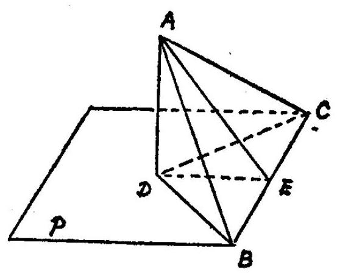

(图 1-23)

分析: 棱锥的高已知, 为求体积还要求底面积; 即求 $\bigtriangleup {DBC}$ 的底和高; 为此而利用已知条件:二面角和底角。

解: 据(过 $A$ 点)斜线长相等则射影相等,知 ${DB} = {DC}$ 。在 ${BC}$ 上取中点 $E$ ,则有

${AE} \bot  {BC}$ 和 ${DE} \bot  {BC}$ ,(等腰三角形三线合一定理) $\therefore \angle {AED} = {60}$ 。 (二面角定义)

在直角三角形 ${ADE}\text{ 、 }{ABE}$ 中分别有

$$
{AE} = {2DE} = 2 \times  4\operatorname{tg}{30}^{ \circ  } = 2 \times  \frac{4}{3}\sqrt{3}\text{ 。 }
$$

$$
{BE} = {AE}\operatorname{tg}{15}^{ \circ  } = \frac{8}{3}\sqrt{3}\left( {2 - \sqrt{3}}\right) \text{ 。 }
$$

故所求体积为:

$$
V = \frac{1}{6}{DE} \cdot  {2BE} \cdot  {AD} = \frac{128}{9}\left( {2 - \sqrt{3}}\right) {\mathrm{{cm}}}^{3}\text{ 。 }
$$

说明: ${1}^{ \circ  }$ 把二面角在图上正确的表示出来,并使表示的方法与已知和求证联系起来, 是解这一类题常用到的办法。

${2}^{ \circ  }$ 同时从另一角度计算: $V = 2 \cdot  \frac{1}{3} \cdot  \frac{1}{2}{AD} \cdot  {DE} \cdot  {BE}$ ; 以资校对。

例 34. ${ABCD}$ 表示矩形硬纸片,其中 ${AC} = 2\sqrt{2}$ , ${AB} \leq  {BC}$ 。沿对角线 ${AC}$ 折起,使 $\bigtriangleup {ABC}$ 和 $\bigtriangleup {ADC}$ 所在平面垂直，此时 ${BD} = \sqrt{5}$ ，试求 ${AB}\text{ 、 }{BC}$ 的长。

分析: 本题在未知量 ${AB}$ , ${BC}$ 间的第一条件 $A{B}^{2} + B{C}^{2} \; = 8$ 是明显的,但对另一条件, 经作图得出 $B{E}^{2} + D{E}^{2} = 5$ 后, 还须利用平面几何知识将它逐步引向 ${AB},{BC}$ 。为此难免又引进新的未知量, 但只要又增加新的、独立的等量关系, 最终总会消去。这样, 引用方程的观点来进行几何量的推求。

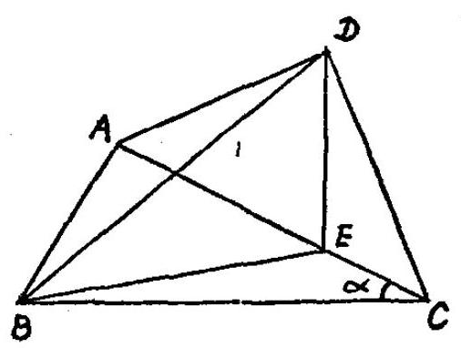

(图 1-24)

解: 从 $D$ 作 ${AC}$ 的垂线交 ${AC}$ 于 $E$ ,则 ${DE}$ 也垂直于平面 ${ABC}$ (因平面 ${ADC}$ 垂直平面 ${ABC}$ ,且 ${DE}$ 垂直于交线 ${AC}$ ), 故 ${BE} \bot  {DE}$ 。于是,为将条件 $D{E}^{2} + B{E}^{2} = 5$ 中 ${DE},{BE}$ 换成 ${AB},{AC}$ ,依次找出以下关系:

$$
B{E}^{2} = B{C}^{2} + C{E}^{2} - {2BC} \cdot  {CE}\cos \alpha
$$

(1)

$$
D{E}^{2} = \left( {2\sqrt{2} - {CE}}\right) {CE}\text{ , } \tag{2}
$$

$$
A{B}^{2} = D{C}^{2} = 2\sqrt{2} \cdot  {CE},\;{CE} = \frac{A{B}^{2}}{2\sqrt{2}} \tag{3}
$$

$$
\cos \alpha  = \frac{BC}{2\sqrt{2}} \tag{4}
$$

先将 (3),(4) 代入 (1),(2) 后,再代入 $D{E}^{2} + B{E}^{2} = 5$ 则得:

$$
\left( {2\sqrt{2} - \frac{A{B}^{2}}{2\sqrt{2}}}\right) \frac{A{B}^{2}}{2\sqrt{2}} + B{C}^{2} + {\left( \frac{A{B}^{2}}{2\sqrt{2}}\right) }^{2} - 2\frac{A{B}^{2}}{2\sqrt{2}}\frac{B{C}^{2}}{2\sqrt{2}} = 5
$$

化简为

$$
A{B}^{2} + B{C}^{2} - \frac{A{B}^{2} \cdot  B{C}^{2}}{4} = 5
$$

与 $A{B}^{2} + B{C}^{2} = 8$ 联立解得: ${AB} = \sqrt{2},{BC} = \sqrt{6}$ 。

讨论: 在上面列出关系 $\left( 1\right) ,\left( 2\right) ,\left( 3\right) ,\left( 4\right)$ 时,要多次从各种位置上分析、应用平面图形的性质; 有些容易忘记, 如 $\angle {ABC},\angle {ADC}$ 为直角,看不出则找不到所用关系; 有些则易于看错,如以为 ${BE} \bot  {AC}$ , 或 ${BE},{DE}$ 在矩形对角线上， 这就会得出错误的关系。为此, 可将折起的图形再放平来看; 由此不但看清上面关系 (1)，(2)，(3)，(4)，还可再发现关系而找另外解法, 如:

$$
{DE} = {DC}\cos \alpha  = {AB}\cos \alpha
$$

(1)′

$$
B{E}^{2} = B{C}^{2} + E{C}^{2} - {2BC} \cdot  {EC}\cos \alpha
$$

(2)'

$$
{EC} = {DC}\sin \alpha  = {AB}\sin \alpha \tag{3}
$$

$$
\cos \alpha  = \frac{BC}{2\sqrt{2}},\;\sin \alpha  = \frac{AB}{2\sqrt{2}}
$$

(4)

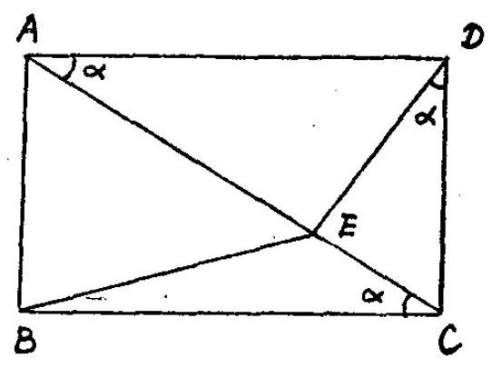

(图 1-25)

先将 ${\left( 1\right) }^{\prime },{\left( 2\right) }^{\prime },{\left( 3\right) }^{\prime }$ 代入 $D{E}^{2} + B{E}^{2} = 5$

$$
A{B}^{2}{\cos }^{2}\alpha  + B{C}^{2} + A{B}^{2}{\sin }^{2}\alpha  - {2BC} \cdot  {AB}\sin \alpha  \cdot  \cos \alpha  = 5
$$

化简并将(4) ${}^{\prime }$ 代入亦得

$$
A{B}^{2} + B{C}^{2} - \frac{A{B}^{2} \cdot  B{C}^{2}}{4} = 5\text{ 。 }
$$

此外, 从平面图上也能清楚地看到有关各量都可直接或间接地用 $\alpha$ 的正弦示出,由此而得出 $\sin \alpha$ 的方程,解出它则可求得各量。

所以, 既能在立体图形中看清各平面图形中的边、角等关系; 必要时又能将立体图形分折、展开来看, 是解立体几何问题的必备能力。

例 35. 如图: $A$ 为直线 $y = \frac{\sqrt{3}}{3}x$ 上一点, ${AB}$ 垂直于 $x$ 轴,半园 ${O}^{\prime }$ 和 ${AB}\text{ 、 }{AO}$ 相切,已知 $\bigtriangleup {ABO}$ 绕 $x$ 轴旋转一周后形成的几何体的体积是 $9\sqrt{3}\pi$ 。

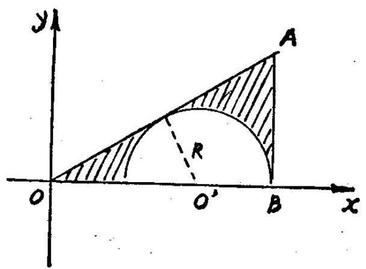

(图 1-26)

求:(1)该旋转体的侧面积;

(2)由阴影部分旋转而成的几何体体积。

分析:(1)欲求旋成圆锥的侧面积,须知 ${OA}$ 及 ${AB}$ ,为此先求 ${OB}$ 及 ${AB}$ ; 后两者可据 $A$ 在 $v = \frac{\sqrt{3}}{3}x$ 上,及旋成体体积为 $9\sqrt{3}\pi$ 两条件可求出。至于求 (2) 问中体积, 关键在于求圆的半径 $R$ ,由于 $\angle {AOB} = {30}^{ \circ  }$ 知它等于 $\frac{1}{3}{OB}$ 。

解: (1) 将 ${OB},{AB}$ 所满足的两条件列出联立

$$
\left\{  \begin{array}{l} {AB} = \frac{\sqrt{3}}{3}{OB}, \\  \frac{1}{3}{OB} \cdot  {\pi A}{B}^{2} = 9\sqrt{3}\pi ; \end{array}\right.
$$

解得 ${OB} = 3\sqrt{3},{AB} = 3$ ,从而得 ${OA} = 6$ 。于是圆锥侧面积 $S = \frac{1}{2}6 \times  {2\pi } \times  3 = {18\pi }$ 。

(2)由 $\angle {AOB} = {30}^{ \circ  }$ ，知 $R = \frac{1}{2}O{O}^{\prime } = \frac{1}{3}{OB} = \sqrt{3}$ ，故所求体积 $V = 9\sqrt{3}\pi  - \frac{4}{3}\pi {\left( \sqrt{3}\right) }^{3} = 5\sqrt{3}\pi$ 。

注: 也可以根据点在 $y = \frac{\sqrt{3}}{3}x$ 上先将 ${OB}\text{ 、 }{AB}$ 用 $R$ 示出,再从体积为 $9\sqrt{3}\pi$ 算出 $R$ ,来求两结果。

例 36. 半径为 1 的球内切于一个直圆锥, 已知圆锥母线与底面夹角为 ${2\theta }$ 。求证: (1) 圆锥母线与底面半径之和为 $\frac{2}{\operatorname{tg}\theta \left( {1 - {\operatorname{tg}}^{2}\theta }\right) };\left( 2\right)$ 圆锥的全面积为 $\frac{2\pi }{{\operatorname{tg}}^{2}\theta \left( {1 - {\operatorname{tg}}^{2}\theta }\right) }$ 。(3) 问当 $\theta$ 取何值时全面积取极小值? $(\theta$ 用反三角函数表示)。

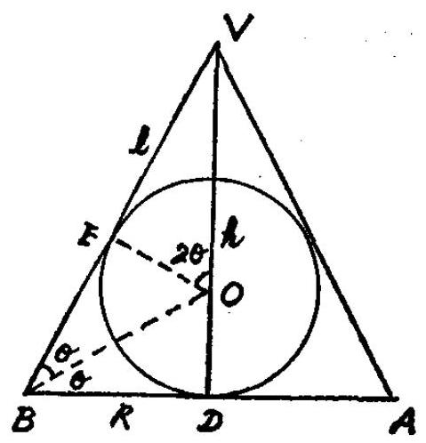

(图 1-27)

解: 设母线为 $l$ ,底半径为 $R$ 。

(1)为充分利用球的半径为 1 这个条件以简化计算, 连辅助线 ${OB}$ 、 ${OE}$ ,

则有:

$$
R = \operatorname{ctg}\theta
$$

$$
\operatorname{tg}{2\theta } = {VE} = l - R
$$

$\therefore$

$$
R + l = \operatorname{ctg}\theta  + \left( {\operatorname{tg}{2\theta } + \operatorname{ctg}\theta }\right)
$$

$$
= \frac{2}{\operatorname{tg}\theta } + \frac{2\operatorname{tg}\theta }{1 - {\operatorname{tg}}^{2}\theta } = \frac{2}{\operatorname{tg}\theta \left( {1 - {\operatorname{tg}}^{2}\theta }\right) }\text{ 。 }
$$

(2)全面积

$$
S = \pi {\operatorname{ctg}}^{2}\theta  + \pi \operatorname{ctg}\theta \left( {\operatorname{tg}{2\theta } + \operatorname{ctg}\theta }\right)
$$

$$
= \pi \operatorname{ctg}\theta \left\lbrack  {\operatorname{ctg}\theta  + \left( {\operatorname{tg}{2\theta } + \operatorname{ctg}\theta }\right) }\right\rbrack   = \frac{2\pi }{{\operatorname{tg}}^{2}\theta \left( {1 - {\operatorname{tg}}^{2}\theta }\right) }\text{ 。 }
$$

(3)当 ${\operatorname{tg}}^{2}\theta  = \frac{1}{2}$ 时， ${\operatorname{tg}}^{2}\theta \left( {1 - {\operatorname{tg}}^{2}\theta }\right)$ 取极大值， $S$ 取极小值。因 $\theta$ 为锐角,即 $\theta  = \operatorname{arctg}\frac{\sqrt{2}}{2}$ 时,全面积最小。

讨论: 若不连辅助线 ${OE}$ ,亦可得 $R = \operatorname{ctg}\theta , l = R\sec {2\theta }$ ,

$$
R + l = \operatorname{ctg}\theta  + \operatorname{ctg}\theta \sec {2\theta } = \frac{2}{\operatorname{tg}\theta \left( {1 - {\operatorname{tg}}^{2}\theta }\right) }\text{ 。 }
$$

另外,也可以由 ${l}^{2} - {R}^{2} = {h}^{2}$ 得出

$$
R + l = \frac{{h}^{2}}{l - R} = \frac{{\left( 1 + \sec 2\theta \right) }^{2}}{\operatorname{tg}{2\theta }} = \frac{2}{\operatorname{tg}\theta \left( {1 - {\operatorname{tg}}^{2}\theta }\right) }\text{ 。 }
$$

例 37. 四条直线 ${l}_{1}\text{ 、 }{l}_{2}\text{ 、 }{l}_{3}\text{ 、 }{l}_{4}$ 两两相交,但不交于一点, 则此四直线共面，试证明之。

证: 审明题意, 可分两种情形。

(1)任意三直线都不交于一点。

设 ${l}_{1}$ 和 ${l}_{2}$ 确定的平面为 $M$ . 因 ${l}_{3}$ 与 ${l}_{1}\text{ 、 }{l}_{2}$ 各有一个交点, 且此两交点不会重合,所以平面 $M$ 内有 ${l}_{3}$ 的两个点,即 ${l}_{3}$ 在平面 $M$ 内。

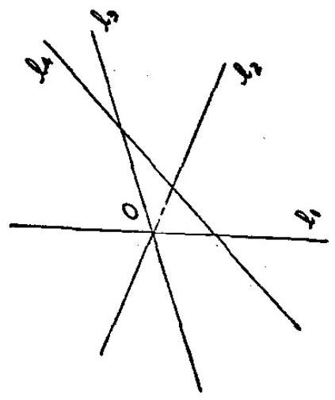

(图 1-29)

同理可证 ${l}_{4}$ 也在平面 $M$ 内。

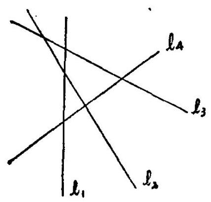

(图 1-28)

$\therefore \;{l}_{1},{l}_{2},{l}_{3},{l}_{4}$ 共面。

(2)有三条直线交于一点。

不妨设 ${l}_{1},{l}_{2},{l}_{3}$ 交于一点 $O$ ,点 $O$ 和直线 ${l}_{4}$ 确定平面 $M$ 。 因为 ${l}_{1}$ 与 ${l}_{4}$ 有一交点,且此交点不是 $O$ ,所以在平面 $M$ 内有 ${l}_{1}$ 的两个点,即 ${l}_{1}$ 在平面 $M$ 内。

同理可证 ${l}_{2},{l}_{3}$ 也在平面 $M$ 内,

$\therefore \;{l}_{1},{l}_{2},{l}_{3},{l}_{4}$ 共面。

注: 本题除要分清几种情形, 逐一讨论外; 在讨论中要能扣紧题给条件及所论情形, 进行推理。此外, 要正确运用“同理可证”。

小结: 从以上五个例题看, 一方面, 经常是将立体几何问题化为平面几何问题来解决; 既然后者常常可以用三角、代数、或解析几何知识和方法来考虑，前者自然也是这样。另一方面，关于立体几何本身又有其特殊要求。按现行大纲，主要是掌握空间线面关系和几种空间图形的体积和面积的计算, 以及相应的空间想象能力 (这样才能正确的将空间问题转化到平面问题), 如看懂和作出立体图及其剖面图等等。是否可从这两个方面来理解和培养关于立体几何的综合解题能力?

例 38. 平面上有直线

$$
\text{ L: }\left\{  \begin{array}{l} x = {2t} - 1 \\  y = {2t} + 1 \end{array}\right.
$$

及圆锥曲线

$$
\text{ C: }{x}^{2} - 2{y}^{2} - {4mx} + {4my} + 2{m}^{2} - 2 = 0
$$

(1)试说明圆锥曲线的形状，并说明它的中心在一直线上运动。

(2)证明所有焦点都在与上述中心所在的直线平行的直线上。

(3)m 和 $t$ 取什么值时，直线 $L$ 与圆锥曲线 $C$ 相切？求切点坐标。

(4)求过切点且平行于 $y$ 轴的直线，被过切点的圆锥曲线 $C$ 截得的线段的总长。

解: (1) 由 ${x}^{2} - 2{y}^{2} - {4mx} + {4my} + 2{m}^{2} - 2 = 0$

配方得:

$$
\frac{{\left( x - 2m\right) }^{2}}{2} - \frac{{\left( y - m\right) }^{2}}{1} = 1\text{ 。 }
$$

$\therefore C$ 是中心在 $\left( {{2m}, m}\right)$ 点,实轴平行于 $X$ 轴的双曲线族, 由中心坐标和族中所有双曲线的中心都在直线 $y = \frac{1}{2}x$ 上。

(2)由于双曲线 $C$ 中 ${a}^{2} = 2,{b}^{2} = 1$ ，得 $c = \sqrt{3}$ ；

$\therefore$ 焦点为 ${F}_{1}\left( {{2m} + \sqrt{3}, m}\right) ,{F}_{2}\left( {{2m} - \sqrt{3}, m}\right)$ 。

可见所有的右焦点 ${F}_{1}$ 都在直线 $y = \frac{1}{2}x - \frac{\sqrt{3}}{2}$ 上,左焦点 ${F}_{2}$ 均在直线 $y = \frac{1}{2}x + \frac{\sqrt{3}}{2}$ 上。

$\therefore$ 焦点所在直线与中心所在直线平行。

(3)把 $x = {{2t} - 1}$ ， $y = {{2t} + 1}$ 代入 $C$ 的方程得:

$$
4{t}^{2} + {12t} - \left( {2{m}^{2} + {8m} - 3}\right)  = 0\text{ 。 }
$$

令 $\Delta  = {144} + {16}\left( {2{m}^{2} + {8m} - 3}\right)  = 0$ ,

即 ${m}^{2} + {4m} + 3 = 0;\therefore {m}_{1} =  - 1,{m}_{2} =  - 3$ ;

当 ${m}_{1} =  - 1$ 时, $t =  - \frac{3}{2};{m}_{2} =  - 3$ 时, $t =  - \frac{3}{2}$ .

可见当 $t =  - \frac{3}{2}, m =  - 1$ 或-3时, $L$ 和 $C$ 相切,且切点坐标为 $P\left( {-4, - 2}\right)$ 。

(4)过切点 $P$ 平行于 $y$ 轴的直线为 $x =  - 4$ ，过 $P$ 点的圆锥曲线有:

$$
{C}_{1} : {x}^{2} - 2{y}^{2} + {4x} - {4y} = 0,
$$

$$
{C}_{2} : {x}^{2} - 2{y}^{2} + {12x} - {12y} + {16} = 0\text{ 。 }
$$

把 $x =  - 4$ 代入 ${C}_{1}$ 得 $y\left( {y + 2}\right)  = 0$ ,即 $y = 0$ 或-2; 故弦长为 2 。 把 $x =  - 4$ 代入 ${C}_{2}$ 得 ${y}^{2} + {6y} + 8 = 0$ ,即 $y =  - 2$ 或-4; 故弦长为 2 。

$\therefore$ 过切点且平行于 $y$ 轴的直线被过切点的圆锥曲线 $c$ 截得的线段的总长为 4 。

说明: 本题是以并列性为主的综合题, 可以联系, 复习一系列基本知识和常用方法; 提问虽多, 只要一一做下去, 并不困难。但每一提问, 都要求对有关的问题, 进行数形结合的分析; 所以也可以说是属于训练解析几何基本功的一类综合题。

例 39. 如图 $P$ 与极点 $O$ 和定点 $A\left( {a, o}\right)$ 保持 $\angle {OPA} = \frac{\pi }{3}$ 的条件运动; 在 ${OP}$ 的延长线上取 ${PQ} \; = {PA}$ ,求 $Q$ 点的轨迹: (1)用极坐标方程表示； (2)用直角坐方程表示； (3)作出图形。

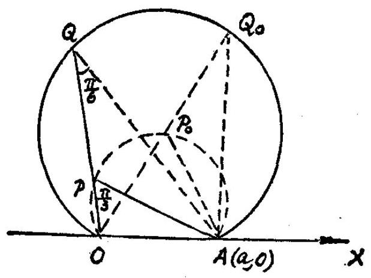

(图 1-30)

分析: 据条件 $\angle {OPA} = \frac{\pi }{3}$ 及 ${PQ} = {PA}$ 知 $\angle {OQA} = \frac{\pi }{6}$ ; 故知 $Q$ 的轨迹当是以 ${OA}$ 为弦的圆弧。

解: (1) 在极坐标系中设动点为 $Q\left( {r,\theta }\right)$ ,则 ${OQ} = r$ , $\angle {AOQ} = \theta ,\angle {AQP} = \angle {PAQ} = \frac{\pi }{6},\angle {OAQ} = \pi  - \left( {\theta  + \frac{\pi }{6}}\right) ,$ 在 $\bigtriangleup {OAQ}$ 中用正弦定理

$$
\frac{OQ}{\sin \left( {\theta  + \frac{\pi }{6}}\right) } = \frac{OA}{\sin \frac{\pi }{6}},
$$

即得轨迹的极坐标方程:

$$
r = {2a}\sin \left( {\theta  + \frac{\pi }{6}}\right) ,\;0 \leq  \theta  \leq  \frac{5\pi }{6}\text{ 。 } \tag{1}
$$

(2)为化到直角坐标方程，于(1)两端乘以 $r$ 并将 $\sin \left( {\theta  + \frac{\pi }{6}}\right)$ 展开，

$$
{r}^{2} = {2ar}\left( {\sin \theta \cos \frac{\pi }{6} + \cos \theta \sin \frac{\pi }{6}}\right)
$$

$$
= \sqrt{3}{ar}\sin \theta  + {ar}\cos \theta
$$

从而经代换得轨迹的直角坐标方程:

$$
{x}^{2} + {y}^{2} - {ax} - \sqrt{3}{ay} = 0,\;y \geq  0\text{ 。 }
$$

(2)

(3)为作出轨迹的图形，将方程(2)变形为

$$
{\left( x - \frac{a}{2}\right) }^{2} + {\left( y - \frac{\sqrt{3}}{2}a\right) }^{2} = {a}^{2}, y \geq  0;
$$

找出圆心坐标和半径。(同样可以讨论 $P$ 在 ${OA}$ 下方的情形)。

讨论: ${1}^{ \circ  }$ 本题通过分析看出轨迹为圆弧,一方面可以心中有数, 印证所求轨迹方程; 另一方面不致误认轨迹为整圆, 在方程后漏掉 $0 \leq  \theta  \leq  \frac{5\pi }{6}$ ,或 $y \geq  0\text{ 。 }{2}^{ \circ  }$ 为化极坐标方程到直角坐标方程而把前者变形,如配出 ${r}^{2}$ 及 $r\cos \theta , r\sin \theta$ ,是常用的基本技巧。 ${3}^{ \circ  }$ 在分析中若进一步探求轨迹,可看出它经过 $O, A$ 及与 ${P}_{o}$ 相应的 ${Q}_{o}$ 三点; 而 ${P}_{o}$ 是当 ${OP} = {PA}$ 时的特殊点,其坐标为 ${P}_{o}\left( {\frac{a}{2},\frac{\sqrt{3}}{2}a}\right)$ ,且易知它为所求弧所在圆的圆心; 这样轨迹即完全确定了, 而且能直接写出其直角坐标方程。所以, 不但如前面讨论平面几何解题时, 常可. 用解析几何方法去作; 反之, 对以解析几何形式提出的问题, 也常求助于平面几何方法, 在探求轨迹时也是这样。

例 40. 已知直线 $L$ 经过 $P\left( {2,3}\right)$ 点,且被两平行线 ${3x} \; + {4y} - 7 = 0$ 和 ${3x} + {4y} + 8 = 0$ 截得的线段之长为 $3\sqrt{2}$ 。求直线 $l$ 的方程。

分析 1. 已知 $L$ 过 $P\left( {2,3}\right)$ 点,欲写出 $L$ 的方程,关键在于求出 $L$ 之斜率 $k$ 。若把 $k$ 做为待定常数,用以表示 $L$ 与两平行线之交点 $A\text{ 、 }B$ 的坐标,那么由条件 $\left| {AB}\right|  = 3\sqrt{2}$ 可求出 $k$ 来。

解法 1. 设 $L$ 之方程为 $y - 3 = k\left( {x - 2}\right)$ ,分别和已知两平行线方程联立,得到两个方程组,于是得到 $A\text{ 、 }B$ 坐标如下:

$B\left( {\frac{{8k} - {20}}{{4k} + 3},\frac{9 - {14k}}{{4k} + 3}}\right)$  。

由于 $\left| {AB}\right|  = 3\sqrt{2}$ 得: $7{k}^{2} + {48k} - 7 = 0$ ；

$$
{k}_{1} = \frac{1}{7},\;{k}_{2} =  - 7\text{ 。 }
$$

所求直线 $L$ 为: $x - {7y} + {19} = 0$ 或 ${7x} + y - {17} = 0$ 。

分析 2. 见下图: 易知两平行线 ${m}_{1},{m}_{2}$ 间距离为 3 。若 ${L}_{1}$ 为所求，则 $\left| {AB}\right|  = 3\sqrt{2}$ 。过 $B$ 作 ${BM} \bot  {m}_{2}$ ,垂足为 $M$ 。则易知: $\angle {BAM} = \theta  = {45}^{ \circ  }$ 若过 $P$ 作直线 ${PD}$ 垂直于 ${m}_{1},{m}_{2}$ ,根据图形对称性, ${L}_{1}$ 关于 ${PD}$ 的对称直线 ${L}_{2}$ 也为所求，且 ${L}_{1} \bot  {L}_{2}$ 。所以，可以先利用两直线夹角公式,求出 ${L}_{1}$ 的斜率。

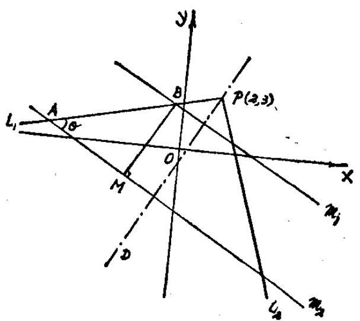

(图 1-31)

解法 2. 已知平行线间距离 $d = \frac{8}{5} + \frac{7}{5} = 3$ ; 若 ${l}_{1}$ 与 ${m}_{1}$ , ${m}_{2}$ 交于 $B\text{ 、 }A$ 两点，则 $\left| {AB}\right|  = 3\sqrt{2}$ 。

设 ${l}_{1}$ 与 ${m}_{2}$ 所成之锐角为 $\theta$ ,则 $\sin \theta  = \frac{3}{3\sqrt{2}} = \frac{\sqrt{2}}{2}$ , $\therefore \theta  = {45}^{ \circ  }$ 。

又设 ${L}_{1}\text{ 、 }{L}_{2}$ 的斜率为 ${k}_{1}\text{ 、 }{k}_{2}$ ,则

$$
\operatorname{tg}\theta  = \frac{{k}_{1} + \frac{3}{4}}{1 - \frac{3}{4}{k}_{1}} = 1,{k}_{1} = \frac{1}{7};{k}_{2} =  - 7\text{ 故所求直线为: }
$$

$$
x - {7y} + {19} = 0;{7x} + y - {17} = 0\text{ 。 }
$$

说明:解法 1 着重于解析推理和计算；解法 2 则主要是先从几何图形关系上想清问题; 这是数形结合的两个侧面。 根据问题而有所侧重, 可得较好解法; 若同时并用, 则既可培养两方面分析能力, 又可相互启发、印证; 同时也是校正答案的有效途径。

以上三题, 涉及了解析几何解题中常遇到的一些基本问题 (读者可以自己总结一下, 都涉及了哪些问题); 但总的来说, 是要对坐标法的两个基本内容, 点的坐标和曲线的方程两概念进行反复检查。如在例 1 解(1)中，要求看到双曲线族的标准方程及中心坐标为 $\left( {{2m}, m}\right)$ 时,即刻得出它们的实轴都平行 $x$ 轴,中心都在直线 $y = \frac{1}{2}x$ 上等结论。此外,以上三题, 也提出了解题过程中, 几何直观和推理计算并用, 平面几何知识和解析几何方法并用的重要性。

例 41. 如图,已知圆 ${x}^{2} + {y}^{2} = {a}^{2}$ 交 $x$ 轴于其正向上 $A$ 点， ${BC}$ 平行 $O{A}^{\prime }$ ；当 $B$ 在圆内正 $y$ 轴上运动时，求 ${AB}$ 、 ${OC}$ 交点 $P$ 的轨迹方程。

分析 1. 求动点 $P$ 的轨迹方程, 就是要找到它的纵、横坐标间, 通过题给已知量示出的等量关系。为此, 先作 ${PM} \bot  {OA}$ ，得出与 $x$ ， $y$ 对应的线段 ${OM}\text{ 、 }{MP}$ , 以便于利用平面几何知识,找出 $x, y$ 与已知量的关系。

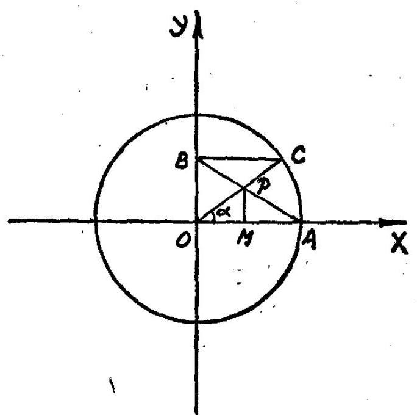

(图 1-32)

解法 1. 作 ${PM} \bot  {OA}$ ,则 $P\left( {x, y}\right)$ 的坐标 $x = {OM}$ , $y = {MP}$ 。因图形只在第 I 象限, $x \geq  0, y \geq  0$ ,所以 ${OM}\text{ 、 }{MP}$ 即可理解为线段的长度。由于:

$$
\bigtriangleup {BOA} \backsim  \bigtriangleup {PMA},\;\therefore \frac{OB}{a} = \frac{y}{a - x},
$$

$$
\bigtriangleup {BOC} \backsim  \bigtriangleup {OMP},\;\therefore \frac{OB}{a} = \frac{y}{\sqrt{{x}^{2} + {y}^{2}}}
$$

从而得出:

$$
\sqrt{{x}^{2} + {y}^{2}} = a - x,\;{y}^{2} = a\left( {a - {2x}}\right) ,\;\left( {0 \leq  x \leq  \frac{a}{2}, y \geq  0}\right) \text{ 。 }
$$

轨迹为抛物线在第一象限部分。

分析 2. 有时直接找坐标间等量关系困难, 则先找各个坐标与参数间的等量关系, 即参数方程, 必要时, 再消去参数化为坐标 (普通) 方程。参数, 或参变量, 是当它取确定值时,能确定动点 $P$ 的位置; 当它取所有允许值时,则对应的点 $P$ 能描出轨迹的一个变量。

解法 2. 取 $\angle {AOC} = \alpha$ 为参数: 因它取定值时,依次可确定点 $C\text{ 、 }B$ ,因而确定点 $P\left( {x, y}\right)$ 的位置; 并在 $0 \leq  \alpha  \leq  \frac{\pi }{2}$ 范围内, $P$ 点描出轨迹。为用 $\alpha$ 表示 $x, y$ ; 先借助于 ${OP}$

$$
\left\{  \begin{array}{l} x = {OP}\cos \alpha ; \\  y = {OP}\sin \alpha \text{ 。 } \end{array}\right.
$$

再从 $\bigtriangleup {OAP} \backsim  \bigtriangleup {CBP}$ 找 ${OP}$ 与 $\alpha$ 及已知量的关系,得到:

$$
\frac{OP}{PC} = \frac{OA}{BC},\frac{OP}{a - {OP}} = \frac{a}{a\cos \alpha },{OP} = \frac{a}{1 + \cos \alpha };
$$

于是得到参数方程

(1) $\left\{  {\begin{array}{l} x = \frac{a\cos \alpha }{1 + \cos \alpha }; \\  y = \frac{a\sin \alpha }{1 + \cos \alpha }; \end{array}\;0 \leq  \alpha  \leq  \frac{\pi }{2}\text{ 。 }}\right.$

利用 ${\cos }^{2}\alpha  + {\sin }^{2}\alpha  = 1$ 的关系,消去 $\alpha$ 得

$$
{y}^{2} = a\left( {a - {2x}}\right) ,\;\left( {0 \leq  x \leq  \frac{a}{2}, y \geq  0}\right) \text{ 。 }
$$

讨论: ${1}^{ \circ  }$ 点 $B\left( {o,{y}_{o}}\right)$ 的纵坐标 ${y}_{o}$ ,明显的可作为参数, 由于 $C$ 点在圆上,有 $C\left( {\sqrt{{a}^{2} - {y}_{o}^{2}},{y}_{o}}\right)$ 。于是 $P\left( {x, y}\right)$ 作为 ${AB}\text{ 、 }{OC}$ 两线段的交点可由

$$
\text{ (2) }\left\{  {\begin{array}{l} y = \frac{{y}_{0}}{\sqrt{{a}^{2} - {y}_{0}^{2}}}x; \\  \frac{x}{a} + \frac{y}{{y}_{0}} = 1; \end{array}\;0 \leq  {y}_{0} \leq  a}\right. \text{ 。 }
$$

而确定,消去 ${y}_{0}$ 亦得 ${y}^{2} = a\left( {a - {2x}}\right)$ 。

${2}^{ \circ  }$ 有时也可以先取两个参数,只要注意到这两个参数之间的联系条件。如本例,正如 $B\left( {o,{y}_{0}}\right)$ 在圆内正 $y$ 轴上运动 $\left( {0 \leq  {y}_{0} \leq  a}\right) , P\left( {x, y}\right)$ 描出轨迹; 亦可看出 $C\left( {{x}_{0},{y}_{0}}\right)$ 在圆弧 $\left( {{x}_{0}^{2} + {y}_{0}^{2} = {a}^{2},0 \leq  {x}_{0} \leq  a,0 \leq  {y}_{0} \leq  a}\right)$ 上运动, $P\left( {x, y}\right)$ 也描出轨迹。所以,可先引用 ${x}_{0},{y}_{0}$ 两个参数,只要注意它们之间有关系 ${x}_{0}^{2} + {y}_{0}^{2} = {a}^{2}$ ,于是由

$$
\text{ (3) }\left\{  \begin{array}{ll} \frac{y}{x} = \frac{{y}_{0}}{{x}_{0}}, & \left( {P\text{ 点在 }{OC}\text{ 上 }}\right) \\  \frac{y}{a - x} = \frac{{y}_{0}}{a}, & \left( {P\text{ 点在 }{AB}\text{ 上 }}\right) \\  {x}_{0}^{2} + {y}_{0}^{2} = {a}^{2}; & \left( {C\text{ 点在 }\overset{\text{ ⏜ }}{AD}\text{ 上 }}\right)  \end{array}\right.
$$

也可以消去 ${x}_{0},{y}_{0}$ 而得 ${y}^{2} = a\left( {a - {2x}}\right) ,0 \leq  x \leq  \frac{a}{2}, y \geq  0$ 。

${3}^{ \circ  }$ 求轨迹的坐标方程,本是求形如 $F\left( {x, y}\right)  = 0$ 的不定方程,(有时要给出 $x, y$ 的取值范围,才能使方程和轨迹相对应)。若先求参数方程:

$$
\left\{  {\begin{array}{l} x = \varphi \left( t\right) , \\  y = \varphi \left( t\right) ; \end{array}\;{t}_{1} \leq  t \leq  {t}_{2}}\right.
$$

(如前面 (1) 式),实际上是求出 $x, y$ 与参数 $t$ 的函数关系,及定义域,是在求方程问题中运用函数思想: $\left( {{t}_{1},{t}_{2}}\right)$ 上的 $t$ ,对应于轨迹上的 $\left\lbrack  {x\left( t\right) , y\left( t\right) }\right\rbrack$ 。但有时不易找到这种函数关系, 则又先得出不定方程组: (如前面的方程组 $\left( 2\right) ,\left( 3\right) )$

$$
\left\{  {\begin{array}{l} F\left( {x, y, t}\right)  = 0, \\  \Phi \left( {x, y, t}\right)  = 0, \end{array}\text{ 或 }\left\{  \begin{array}{l} F\left( {x, y, t, s}\right)  = 0, \\  \Phi \left( {x, y, t, s}\right)  = 0, \\  G\left( {x, y, t, s}\right)  = 0; \end{array}\right. }\right.
$$

再消去参数 $t$ 或 $t$ 及 $s$ ,(此时也要注意从 $t$ 或 $t$ 及 $s$ 的取值范围来确定 $x, y$ 的取值范围),则又是由不定方程组来求不定方程, 此时包括参数在内的变元, 总比方程数多一个。

这又一次说明, 正确地理解方程和函数的区别和联系及两方问题的相互转化这种概念、理论思维, 对解题思路很有启发。与此相关, 显然引进参数列方程是方便的, 但消去参数, 则要用到有关的代数, 三

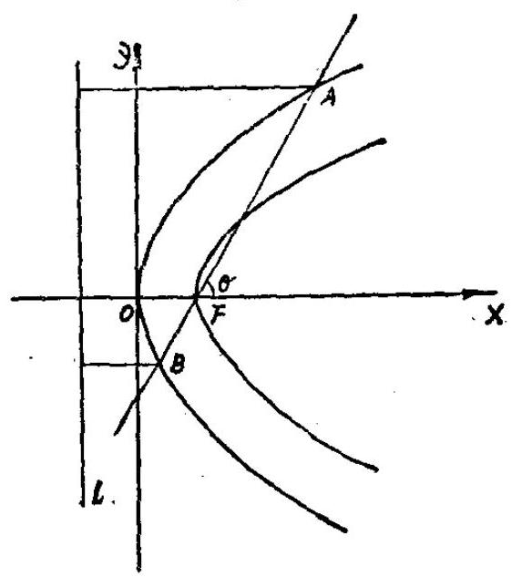

(图 1-33)

角知识。

例 42. 过抛物线

$C\left\{  {\begin{array}{l} x = {2p}{t}^{2} \\  y = {2pt} \end{array} - \infty  < t <  + \infty }\right.$ 的焦点 $F$ 作倾角为 $\theta$ 的直线 $l$ 交抛物线于 $A$ 、 $B$ 两点 (如图)。

(1)求出 ${AB}$ 的长度以 $\theta$ 为自变数的函数关系式;

(2)求此函数的定义域、 值域及极值;

(3)求 ${AB}$ 中点 $M$ 的轨迹方程并作出图形。

分析 1 ，题中 $l$ 为过定点 $F$ 而斜率因 $\theta$ 变化的直线， $\theta$ 取定值则 $l$ 确定,因而 ${AB}$ 及其长度确定,故 $\left| {AB}\right|$ 为 $\theta$ 的函数; ${AB}$ 中点 $M$ 亦随 $\theta$ 的变化而移动,并对应于 $\theta$ 的可取值而描出轨迹。

解法 1 . (1)从方程组 $C$ 消去 $t$ 得 ${y}^{2} = {2px}$ ，从而得出焦点 $F\left( {\frac{p}{2}, o}\right)$ ,及 $\left( l\right)$ 的方程 $y = \operatorname{tg}\theta \left( {x - \frac{p}{2}}\right)$ 。解联立方程组

$$
\left\{  \begin{array}{l} {y}^{2} = {2px}, \\  y = \operatorname{tg}\theta \left( {x - \frac{p}{2}}\right) , \end{array}\right.
$$

得 $A\left( {{x}_{1},{y}_{1}}\right) , B\left( {{x}_{2},{y}_{2}}\right)$ 的坐标经由 $\theta$ 的表示式:

$$
\left\{  \begin{array}{l} {x}_{1} = \frac{p}{2} + \frac{p}{{\operatorname{tg}}^{2}\theta } + \frac{p}{{\operatorname{tg}}^{2}\theta \cos \theta }, \\  {y}_{1} = \frac{p}{\operatorname{tg}\theta } + \frac{p}{\sin \theta }; \end{array}\right.
$$

$$
\left\{  \begin{array}{l} {x}_{2} = \frac{p}{2} + \frac{p}{{\operatorname{tg}}^{2}\theta } - \frac{p}{{\operatorname{tg}}^{2}\theta \cos \theta }, \\  {y}_{2} = \frac{p}{\operatorname{tg}\theta } - \frac{p}{\sin \theta }; \end{array}\right.
$$

由距离公式算出: $\left| {AB}\right|  = {2P}\left( {1 + {\operatorname{ctg}}^{2}\theta }\right)$ 。

(2)当 $\theta$ 从大于 0 变到小于 $\pi$ 时， $A$ 、 $B$ 分别经历抛物线上、下两支上一切位置, $\left| {AB}\right|$ 取得一切可能长度; 故 $\left| {AB}\right|$ 作为 $\theta$ 的函数,定义域为 $0 < \theta  < \pi$ 。在定义域内,当 $\theta  = \frac{\pi }{2}$ 时, $\operatorname{ctg}\theta  = 0,\left| {AB}\right|  = {2p}$ 为极小值; 函数的值域为 ${2p} \leq  \left| {AB}\right|  < \infty$ ; 无极大值。

( 3 )中点以 $\theta$ 为参数的方程为

$$
\left\{  \begin{array}{l} x = \frac{{x}_{1} + {x}_{2}}{2} = \frac{p}{2} + \frac{p}{{\operatorname{tg}}^{2}\theta }, \\  y = \frac{{y}_{1} + {y}_{2}}{2} = \frac{p}{\operatorname{tg}\theta }; \end{array}\right.
$$

消去 $\theta$ 得坐标方程; ${y}^{2} = p\left( {x - \frac{p}{2}}\right)$ 。

分析 2. 解法 1 为求焦点而将参数方程化为坐标方程 (若对抛物线的参数方程已熟悉,这是不必要的),然后以 $\theta$ 为参数, 而使计算过程中出现许多三角函数, 虽然根据明显的规律性可以逐步化简, 但规律性既难看出, 书写也较繁难。 现在直接用参数方程求解看看如何?

解法 2. 用参数 ${t}_{1}\text{ 、 }{t}_{2}$ 表示 $B\left( {{x}_{1},{y}_{1}}\right)$ 及 $A\left( {{x}_{2},{y}_{2}}\right)$ 为:

$$
A\left( {{2p}{t}_{1}^{2},{2p}{t}_{1}}\right) , B\left( {{2p}{t}_{2}^{2},{2p}{t}_{2}}\right) \text{ 。 }
$$

为避免出现三角函数,用 $\left( l\right)$ 的斜率 $k$ 为参数; 先用 ${t}_{1},{t}_{2}$ 表示它,再用它代替 ${t}_{1},{t}_{2}$ 。利用 ${AB}$ 与 ${FB}$ 分别求出 $\left( l\right)$ 的斜率:

$$
k = \frac{{2p}{t}_{2} - {2p}{t}_{1}}{{2p}{t}_{2}^{2} - {2p}{t}_{1}^{2}} = \frac{1}{{t}_{2} + {t}_{1}},\;k = \frac{{2p}{t}_{2}}{{2p}{t}_{2}^{2} - \frac{p}{2}} = \frac{{t}_{2}}{{t}_{2}^{2} - \frac{1}{4}}\text{ 。 }
$$

于是有联立方程组

$$
\left\{  \begin{array}{l} {t}_{1} + {t}_{2} = \frac{1}{k}, \\  k{t}_{2}^{2} - {t}_{2} - \frac{k}{4} = 0\text{ 。 } \end{array}\right.
$$

解方程组得

(1) $\left\{  {\begin{array}{l} {t}_{1} = \frac{1 + \sqrt{1 + {k}^{2}}}{2k}, \\  {t}_{2} = \frac{1 - \sqrt{1 + {k}^{2}}}{2k}, \end{array}\text{ (2) }\left\{  \begin{array}{l} {t}_{1} = \frac{1 - \sqrt{1 + {k}^{2}}}{2k}, \\  {t}_{2} = \frac{1 + \sqrt{1 + {k}^{2}}}{2k}\text{ 。 } \end{array}\right. }\right.$

因已设 $A$ 在抛物线上支,故 ${t}_{1} > 0,{t}_{2} < 0$ ,须取解 (1)。为避免用距离公式引出乘方、开方运算; 回到定义

$$
\left| {AF}\right|  = {x}_{1} + \frac{p}{2},\;\left| {BF}\right|  = {x}_{2} + \frac{p}{2}\text{ 。 }
$$

$\therefore$

$$
\left| {AB}\right|  = \left| {AF}\right|  + \left| {BF}\right|  = {x}_{1} + {x}_{2} + p
$$

由

$$
{x}_{1} = {2p}{t}_{1}^{2} = {2p} \cdot  \frac{2 + {k}^{2} + 2\sqrt{1 + {k}^{2}}}{4{k}^{2}}
$$

$$
{x}_{2} = {2p}{t}_{2}^{2} = {2p} \cdot  \frac{2 + {k}^{2} - 2\sqrt{1 + {k}^{2}}}{4{k}^{2}},
$$

$$
\left| {AB}\right|  = {2p} \cdot  \left( {\frac{1}{2} + \frac{1}{{k}^{2}}}\right)  + p = {2p} \cdot  \left( {1 + \frac{1}{{k}^{2}}}\right) \text{ 。 }
$$

最后再将 $k = \operatorname{tg}\theta$ 代入，得 $\left| {AB}\right|  = {2p}\left( {1 + {\operatorname{ctg}}^{2}\theta }\right)$ 。

第(2)问与解法 1 同，第(3)问中以 $k$ 为参数，则 $M\left( {x, y}\right)$ 的坐标为:

$$
x = \frac{1}{2}\left( {{x}_{1} + {x}_{2}}\right)  = p\left( {{t}_{1}^{2} + {t}_{2}^{2}}\right)  = p\left\lbrack  {{\left( {t}_{1} + {t}_{2}\right) }^{2} - 2{t}_{1}{t}_{2}}\right\rbrack
$$

$$
= p\left( {\frac{1}{{k}^{2}} + 2 \cdot  \frac{1}{4}}\right)  = p\left( {\frac{1}{{k}^{2}} + \frac{1}{2}}\right) ,
$$

$$
y = \frac{1}{2}\left( {{y}_{1} + {y}_{2}}\right)  = p\left( {{t}_{1} + {t}_{2}}\right)  = \frac{p}{k}\text{ 。 }
$$

由此消去参数得 $M\left( {x, y}\right)$ 的轨迹 ${y}^{2} = p\left( {x - \frac{p}{2}}\right)$ 。

注: 若在第 (1) 问中用距离公式求 $\left| {AB}\right|$ ,也要如第 (3) 问

中一样,利用 ${t}_{1} + {t}_{2} = \frac{1}{k},{t}_{1} \cdot  {t}_{2} =  - \frac{1}{4}$ 来化简计算。

说明: ${1}^{ \circ  }$ 本题的综合性在于它提问到函数及其定义域、 极值、值域问题, 以及动点的轨迹方程及作图问题; 同时涉及到代数、三角、几何等多方面的概念、定理和方法, 以及它们之间的联合运用; 特别是作题中有时要不用公式而直接用概念、定义以简化问题, 或解决没有现成公式可用的问题。 ${2}^{ \circ  }$ 本题讨论了参数的运用,特别是中间参变数 (这在前面例 41 中遇到)的运用: 在解法 1 中只用到 ${x}_{1},{y}_{1};{x}_{2},{y}_{2}$ ; 在解法 2 中则更引用了 ${t}_{1},{t}_{2}$ 和 ${k}_{1}$ 它们的引进,使计算过程中的思路和规律性更明确,表达形式更简明。 ${3}^{ \circ  }$ 本题也更进一步讨论了消去参数的技巧问题, 这和参数的选择是相联系的。 ${4}^{ \circ  }$ 作为练习,并明确 ${2}^{ \circ  }\text{ 、 }{3}^{ \circ  }$ 两点说明的意义,可选 ${x}_{1},{x}_{2}$ , 或 ${y}_{1},{y}_{2}$ 为中间参数,来解提问 (1) 和 (3); 并且,也可以证明 $\frac{1}{\left| AF\right| } + \frac{1}{\left| BF\right| } = \frac{2}{p}$ 。

例 43. 四边形 ${ABCD}$ 内接于椭圆 $\frac{{x}^{2}}{16} + \frac{{y}^{2}}{25} = 1$ ,且 $A$ 点的横坐标为 $4, C$ 点的纵坐标为 5,求四边形 ${ABCD}$ 的最大面积。

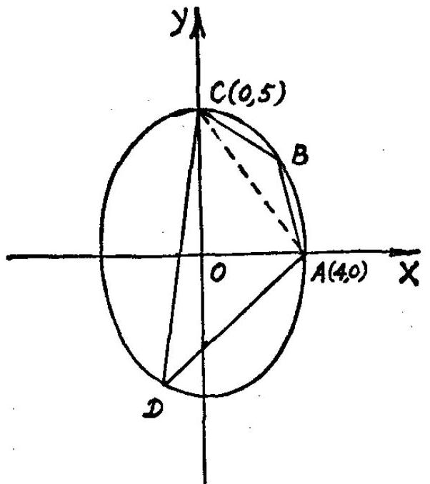

(图 1-34)

分析 1. 根据题给条件,知四边形顶点 $A\text{ 、 }C$ 为椭圆两顶点 $A\left( {4,0}\right)$ 及 $C\left( {0,5}\right)$ ; $B$ 在第 $\mathrm{I}$ 象限弧上, $D$ 可能在 II, III, IV 象限弧上。 $\left| {AC}\right|$ 为已定,则 $\bigtriangleup {ABC}$ 和 $\bigtriangleup {ACD}$ 的面积,各皆由其高而确定,故只须求椭圆上动点 $p\left( {x, y}\right)$ 到 ${AC}$ 的距离 $d$ 的极值。

解法 1 . 过 $A\text{ 、 }C$ 的直线方程为

$$
l : \frac{{x}_{1}}{4} + \frac{{y}_{1}}{5} = 1,\;5{x}_{1} + 4{y}_{1} - {20} = 0\text{ 。 }
$$

椭圆上点 $p\left( {x, y}\right)$ 至 $l$ 的距离为:

$$
d = \frac{\left| 5x + 4y - {20}\right| }{\sqrt{{16} + {25}}}\text{ 。 }
$$

为求极值又可先考虑 $N = \left| {{5x} + {4y} - {20}}\right|$ ,引用椭圆参数方程

$$
\left\{  {\begin{array}{l} x = 4\cos t, \\  y = 5\sin t, \end{array}\;0 \leq  t < {2\pi };}\right.
$$

则得: $N = {20}\left| {\cos t + \sin t - 1}\right|  = {20}\left| {\sqrt{2}\sin \left( {\frac{\pi }{4} + t}\right)  - 1}\right|$

对于 $B$ 点,考虑在 $0 < t < \frac{\pi }{2}$ 时,知当 $t = \frac{\pi }{4}$ 有

$$
{N}_{\max } = {20}\left| {\sqrt{2} - 1}\right|  = {20}\left( {\sqrt{2} - 1}\right)
$$

对于 $D$ 点,考虑在 $\frac{\pi }{2} < t < {2\pi }$ 时,知当 $t = \frac{5}{4}\pi$ 有

$$
{N}_{\max }^{\prime } = {20}\left| {-\sqrt{2} - 1}\right|  = {20}\left( {\sqrt{2} + 1}\right)
$$

故得内接四边形最大面积为

$$
{A}_{\max } = \frac{\left| AC\right| }{2}\left( \frac{{N}_{\max } + {N}_{\max }^{\prime }}{\sqrt{41}}\right)  = {20}\sqrt{2}\text{ 。 }
$$

分析 2. 从直观上看,当过 $B\text{ 、 }D$ 点的切线与 ${AC}$ 平行时,两点到 ${AC}$ 的距离皆为最大 (这也是可以证明的); 而两切线间距离则为它们之和; 故求平行于 ${AC}$ 且切椭圆的两直线间距离即可。

解法 2. 设平行于 ${AC}$ 且与椭圆相切的两直线为 $y =  - \; \frac{5}{4}x \pm  m$ ,代入椭圆方程得

$$
{50}{x}^{2} \pm  {40mx} + {16}{m}^{2} - {400} = 0
$$

由相切条件

$$
\bigtriangleup  = {\left( {40}m\right) }^{2} - 4 \times  {50}\left( {{16}{m}^{2} - {400}}\right)  = 0
$$

得 $m =  \pm  5\sqrt{2}$ ,故两切线为: $y =  - \frac{5}{4}x \pm  5\sqrt{2}$ 。在其中之一, $y =  - \frac{5}{4}x + 5\sqrt{2}$ 上任取一点如 $\left( {0,5\sqrt{2}}\right)$ ,代入

$$
d = \frac{\left| {y}_{0} + \frac{5}{4}{x}_{0} + 5\sqrt{2}\right| }{\sqrt{1 + {\left( \frac{5}{4}\right) }^{2}}}\text{ 得 }d = \frac{{40}\sqrt{2}}{\sqrt{41}}
$$

故四边形面积最大值 ${A}_{max} = \frac{1}{2}\left| {AC}\right| d = {20}\sqrt{2}$ 。

说明; ${1}^{ \circ  }$ 解法 1 中引入椭圆参数方程,使问题成为三角极值; 并再一次提醒, 对参数方程注明参数取值范围的必要, 否则就分不清 $B$ 、 $D$ 两点对应的 $t$ 值；这和对函数必须指明定义域,都是重要的和必须养成的习惯。 ${2}^{ \circ  }$ 解法 2 又一次指出对问题的几何性质、关系进行透彻分析的重要性。

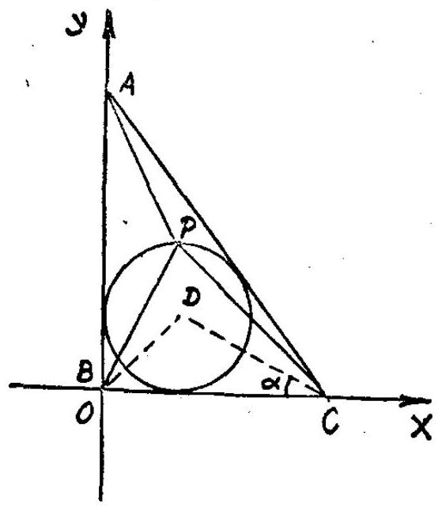

(图 1-35)

例 44. 已知 $\bigtriangleup {ABC}$ 三边之长分别为 $3\text{ 、 }4\text{ 、 }5, P$ 是它内切圆上一点; 求以 ${PA}\text{ 、 }{PB}$ 、 ${PC}$ 为直径的三个圆面积之和的最大值和最小值。

分析: 这是平面几何的最大、最小值问题, 可以选取坐标系 (如图) 用解析几何法来解。面积和

$$
S = \frac{\pi }{4}\left( {{\left| PA\right| }^{2} + {\left| PB\right| }^{2} + {\left| PC\right| }^{2}}\right)
$$

其中 $\left| {PA}\right| ,\left| {PB}\right| ,\left| {PC}\right|$ ,由于 $A, B, C$ 为已知定点,都是随 $P\left( {x, y}\right)$ 的坐标而变化、确定,而 $P\left( {x, y}\right)$ 又在内切圆上,故 $S$ 为一元函数。关键为求内切圆方程。

解: 选取坐标系如图,则有 $A\left( {0,4}\right) , B\left( {0,0}\right) ;C\left( {3,0}\right)$ 。 由内切圆性质,设半径为 $r$ ,则其方程为

$$
{\left( x - r\right) }^{2} + {\left( y - r\right) }^{2} = {r}^{2}
$$

而其圆心为 $D\left( {r, r}\right)$ 。又 $D$ 到底边 ${AC}$ 之距离亦为 $r$ ,而斜边所在直线方程为

$$
\frac{x}{3} + \frac{y}{4} = 1,\;\text{ 即 }{4x} + {3y} - {12} = 0,
$$

$$
\left| \frac{{4r} + {3r} - {12}}{5}\right|  = r,\;r = 1\text{ 。 }
$$

得内切圆方程为 ${\left( x - 1\right) }^{2} + {\left( y - 1\right) }^{2} = 1$ 。又因

$$
{\left| PA\right| }^{2} = {x}^{2} + {\left( y - 4\right) }^{2},\;{\left| PB\right| }^{2} = {x}^{2} + {y}^{2},
$$

$$
{\left| PC\right| }^{2} = {\left( x - 3\right) }^{2} + {y}^{2},
$$

得面积和

$$
S = \frac{\pi }{4}\left( {{\left| PA\right| }^{2} + {\left| PB\right| }^{2} + {\left| PC\right| }^{2}}\right)
$$

$$
= \frac{3}{4}\pi \left( {{x}^{2} + {y}^{2} - \frac{8}{3}y - {2x} + \frac{25}{3}}\right)
$$

因 $P\left( {x, y}\right)$ 在圆 ${x}^{2} + {y}^{2} - {2x} - {2y} + 1 = 0$ 上,

$$
S = \frac{3\pi }{4}\left( {{2y} - 1 - \frac{8}{3}y + \frac{25}{3}}\right)  = \frac{\pi }{2}\left( {{11} - y}\right)
$$

由于 $y$ 是 $P\left( {x, y}\right)$ 的纵坐标知: $0 \leq  y \leq  2$ 。

$\therefore$

$$
\frac{9\pi }{2} \leq  S \leq  \frac{11\pi }{2}
$$

故 $S$ 有最大值 $\frac{11\pi }{2}$ 及最小值 $\frac{9\pi }{2}$ 。

说明: ${1}^{ \circ  }$ 本题再一次说明,必须注意函数 $S\left( y\right)$ 的定义域; 只有明确定义域为闭区间 $\left\lbrack  {0,2}\right\rbrack$ ,才好确定 $S\left( y\right)$ 的最大、最小值。 ${2}^{ \circ  }$ 若从另一角度,即从分角线 ${BD}\text{ 、 }{CD}$ 的交点来求圆心坐标: ${BD}$ 在 $y = x$ 上是明显的; ${CD}$ 则在 $y =  - \operatorname{tg}\alpha \; \left( {x - 3}\right)$ 上,再由 $\operatorname{tg}{2\alpha } = \frac{4}{3}$ 求出 $\operatorname{tg}a = \frac{1}{2}$ ,则解方程组

$$
\left\{  \begin{array}{l} y = x, \\  y =  - \frac{1}{2}\left( {x - 3}\right) ; \end{array}\right.
$$

可得 $D\left( {1,1}\right)$ 。 ${3}^{ \circ  }$ 求极值时,若不易立即找出只含一个自变元的函数式，可先保留两、三个自变元，再列出自变元间的一、两个方程, 最后消去一、两个变元而得只含一个自变元的函数式; 这和前面多保留参变数而列出它们所满足的方程的作法类似; 也是属于函数和方程两概念的联合运用。

以上四题, 着重参数方程的讨论: 一方面从消参数的技巧, 指出要运用有关代数知识, 另一方面指出要从函数观点看参数方程, 注明参变数的允许值范围, 并注意方程和函数两概念的联合运用。这样就进一步提高了综合解题能力。

例 45. 已知方程 $F\left( {x, y}\right)  = a{x}^{2} + {2hxy} + b{y}^{2} = 0$ ,其中 $a, b$ 不同时为 0,(1)讨论 $F\left( {x, y}\right)  = 0$ 的图形；(2)若 $F\left( {x, y}\right) \; = 0$ 表示不和坐标轴重合的两条直线,试求这两直线的夹角。

解: (1) ①当 $a = 0, b \neq  0$ 时:

$$
F\left( {x, y}\right)  = {2hxy} + b{y}^{2} = y\left( {{2hx} + {by}}\right)  = 0
$$

当 $a \neq  0, b = 0$ 时:

$$
F\left( {x, y}\right)  = {2hxy} + a{x}^{2} = x\left( {{2hy} + {ax}}\right)  = 0
$$

可见,在两种情况下,方程 $F\left( {x, y}\right)$ 总是表示一对直线; 且总是至少有一条与坐标轴重合。

② 当 $a \neq  0, b \neq  0$ 时，将 $F\left( {x, y}\right)  = 0$ 变形为:

$$
{\left( \frac{y}{x}\right) }^{2} + \frac{2h}{b}\left( \frac{y}{x}\right)  + \frac{a}{b} = 0 \tag{1}
$$

(i) 当 ${\left( \frac{h}{b}\right) }^{2} > \frac{a}{b}$ 即 ${h}^{2} > {ab}$ 时,方程 (1) 有两个不等实根 ${m}_{1},{m}_{2}$ 。于是有: $y = {m}_{1}x, y = {m}_{2}x$ ; 此时 $F\left( {x, y}\right)  = 0$ 表示相交于原点的两条直线。

(ii) 当 ${h}^{2} = {ab}$ 时,原方程 (1) 变成:

$$
{\left( \frac{y}{x} + \frac{h}{b}\right) }^{2} = 0
$$

此时 $F\left( {x, y}\right)  = 0$ 表示一条直线。

(iii) 当 ${h}^{2} < {ab}$ 时,方程 (1) 无解, $F\left( {x, y}\right)  = 0$ 只代表原点。

(2)若要 $F\left( {x, y}\right)  = 0$ 的图形是不和坐标轴重合的两条直线,则只有当: $y = {m}_{1}x, y = {m}_{2}x$ ,且其中 ${m}_{1},{m}_{2}$ 是方程 (1)的非 0 有限根; 此时 ${h}^{2} > {ab} \neq  0$ ,且

$$
\left\{  \begin{array}{l} {m}_{1} + {m}_{2} =  - \frac{2h}{b}, \\  {m}_{1} \cdot  {m}_{2} = \frac{a}{b}. \end{array}\right.
$$

为用交角公式求交角,还须求出 ${m}_{1} - {m}_{2}$ ; 由

$$
{\left( {m}_{1} - {m}_{2}\right) }^{2} = {\left( {m}_{1} + {m}_{2}\right) }^{2} - 4{m}_{1} \cdot  {m}_{2} = \frac{4\left( {{h}^{2} - {ab}}\right) }{{b}^{2}},
$$

得

$$
{m}_{1} - {m}_{2} =  \pm  \frac{2}{b}\sqrt{{h}^{2} - {ab}}\text{ 。 }
$$

于是两直线交角可由公式

$$
\operatorname{tg}\theta  = \frac{{m}_{1} - {m}_{2}}{1 + {m}_{1} \cdot  {m}_{2}} =  \pm  \frac{2\sqrt{{h}^{2} - {ab}}}{a + b}
$$

给出; 当 $a + b = 0$ 时,两直线相互垂直。

说明: ${1}^{ \circ  }$ 代数中引用文字表示数后,一方面用以表示变数、参变数, 这是前几题中着重讨论的; 另一方面则用以表示常数、常系数。通过讨论函数式和方程中的常数和常系数, 来研究它们的性质和图象,则是本题的学习目的。 ${2}^{ \circ  }$ 本题以主要系数 $a, b$ 的一切数值可能分情况讨论,并联系到它们和 $h$ 的关系; 同时把方程变形到各个已知曲线方程的标准形式。 ${3}^{ \circ  }$ 为用交角公式,不求出 ${m}_{1}\text{ 、 }{m}_{2}$ 而求出 ${m}_{1} \cdot  {m}_{2}$ 及 ${m}_{1} - {m}_{2}$ ; 这种带普遍性的技巧, 前面多次用过。

例 46. 双曲线 $\frac{2{x}^{2}}{\operatorname{tg}\theta } - \frac{3{y}^{2}}{\operatorname{ctg}\theta } = {48}\left( {0 < \theta  < \frac{\pi }{2}}\right)$ 和圆 ${\left( x - a\right) }^{2} \; + {y}^{2} = {k}^{2}$ 切于 $A\left( {4\sqrt{3},4}\right)$ ; 求 $\theta , a, k$ 的值。

分析:两曲线相切于已知点，即都过此点。由此可定出双曲线中的 $\theta$ 值,和圆中 $a, k$ 间的关系。再利用相切条件, 即可定出 $a, k$ 之值。

解: $A$ 点在双曲线上,将其坐标代入方程并化简得:

$$
{\operatorname{tg}}^{2}\theta  + \operatorname{tg}\theta  - 2 = 0;\operatorname{tg}\theta  =  - 2,\operatorname{tg}\theta  = 1\text{ 。 }
$$

因

$$
0 < \theta  < \frac{\pi }{2},\;\therefore \theta  = \frac{\pi }{4}\text{ 。 }
$$

将 $A$ 点坐标代入圆的方程并化简得:

$$
{a}^{2} - 8\sqrt{3}a + {64} = {k}^{2}\text{ 。 } \tag{1}
$$

将 $\theta  = \frac{\pi }{4}$ 代入双曲线方程并与圆的方程联立:

$$
\left\{  \begin{array}{l} \frac{{x}^{2}}{24} - \frac{{y}^{2}}{16} = 1, \\  {\left( x - a\right) }^{2} + {y}^{2} = {k}^{2}; \end{array}\right.
$$

得

$$
\frac{{x}^{2}}{24} - \frac{{k}^{2} - {\left( x - a\right) }^{2}}{16} = 1,\;5{x}^{2} - {6ax} + 3\left( {{a}^{2} - {k}^{2} - {16}}\right)  = 0
$$

从相切条件得

$$
{\left( -6a\right) }^{2} - 4 \times  5 \times  3\left( {{a}^{2} - {k}^{2} - {16}}\right)  = 0,
$$

$$
2{a}^{2} - 5{k}^{2} - {80} = 0\text{ 。 } \tag{2}
$$

由 (1),(2) 解得 $a = \frac{20}{3}\sqrt{3}, k =  \pm  \frac{4}{3}\sqrt{21}$ (舍去 $k$ 的负值)。

最后得 $\theta  = \frac{\pi }{4},\;a = \frac{20}{3}\sqrt{3},\;k = \frac{4}{3}\sqrt{21}$ 。

说明: ${1}^{ \circ  }$ 本题继续考虑方程中的常数,但属于求待定常数值的问题; 并以此培养审题能力 (这是一种综合能力)。除在分析中已初步提到外, 此类问题, 可看作以两曲线切于定点形式, 提出的求解方程组问题: 由于过定点而曲线方程中变元转化为所求解方程组中的已知数; 待定常数则转化为未知数。本题未知数有三个 $\left( {\theta , k, a}\right)$ ; 而三个独立条件是: 双曲线过 $A$ 点; 圆过 $A$ 点; 圆和双曲线相切。这就审明了题意，挖掘出潜在条件。容易看出，这里综合运用了许多概念， 定理和公式 (试尽量举出它们)。 ${2}^{ \circ  }$ 从审题的角度,也可对条件提出另外分析: 把相切条件改为有公切线, 于求出上述过 $A$ 点的双曲线和圆的切线方程

$$
2\sqrt{3}x - {3y} - {12} = 0\text{ 和 }\left( {4\sqrt{3} - a}\right) x + {4y} + {a}^{2} - 4\sqrt{3}a
$$

$- {k}^{2} = 0$ 后,按系数成比例条件

$$
\frac{4\sqrt{3} - a}{2\sqrt{3}} = \frac{4}{-3} = \frac{{a}^{2} - 4\sqrt{3}a - {k}^{2}}{-{12}}
$$

得出 $a = \frac{20}{3}\sqrt{3},\;k = \frac{4}{3}\sqrt{21}$ 。

当然, 还可从另外角度提出另外解法。

例 47. 已知: $\bigtriangleup {ABC}$ 的顶点为 $A\left( {0,3}\right)$ ,底边 ${BC}$ 在横轴上开区间 $\left( {-1 - \sqrt{10},1 + \sqrt{10}}\right)$ 内滑动,且 $\left| {BC}\right|  = 2$ 。求: (1) $\bigtriangleup  {ABC}$ 的外心的轨迹方程及图形。(2)直线 $y = x \cdot  \operatorname{tg}\alpha  + c$ 和求得的轨迹相切的条件。(3)过 $\left( {0,2}\right)$ 且被所求得的轨迹所在的曲线截得的线段之长为 $\frac{5\sqrt{3}}{2}$ 的直线方程。

分析: 设外心是 $P\left( {x, y}\right)$ ,由于 $P$ 点随着 $B$ 点的运动而运动,所以 $B$ 点的横坐标 $b$ 就是可变参数,我们则要求出 $x = \; f\left( b\right) , v = g\left( b\right)$ ,从而得到外心的参数方程。要求出上述参数方程,必须熟悉外心的定义或性质。若把外心理解为 $\bigtriangleup {ABC}$ 各边垂直平分线的交点,则可写出 ${AB},{BC}$ 两边的垂直平分线,联立后解出 $x, y$ 。若把外心 $P$ 看成是到 $A, B, C$ 三点距离相等的点,则可写出 $\left| {PA}\right|  = \left| {PB}\right| ,\left| {PA}\right|  = \left| {PC}\right|$ ,联立后解出 $x, y$ 。

解法: (1) 设外心 $P\left( {x, y}\right)$ 及 $B\left( {b,0}\right)$ ,则因 $\left| {BC}\right|  = 2$ ,故有 $C\left( {b + 2,0}\right)$ ; 其中 $- 1 - \sqrt{10} < b <  - 1 + \sqrt{10}$ 。

${BC}$ 边的垂直平分线为 $x = \frac{b + 2 + b}{2} = b + 1$(1)

${AB}$ 边的垂直平分线为 $y - \frac{3}{2} = \frac{b}{3}\left( {x - \frac{b}{2}}\right)$(2)解(1)、(2)组成的方程组得:

$$
\left\{  \begin{array}{l} x = b + 1, \\  y = \frac{1}{6}\left( {{b}^{2} + {2b} + 9}\right) , \end{array}\right.
$$

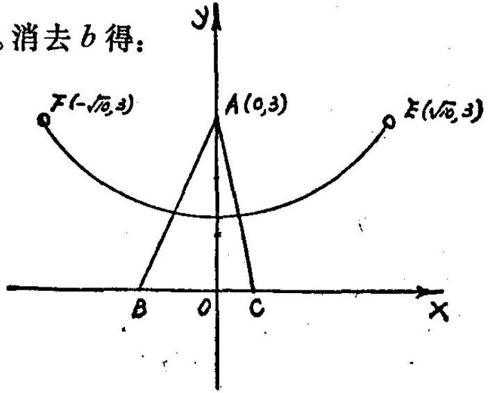

(图 1-36)

即轨迹以 $b$ 为参数的方程。消去 $b$ 得: $y = \frac{1}{6}{x}^{2} + \frac{4}{3},\left| x\right|  < \sqrt{10}$ 。

$\therefore$ 外心轨迹是界于两点 $\left( {\pm \sqrt{10},3}\right)$ 间的抛物线弧。

(2) $\left\{  \begin{array}{l} y = x \cdot  \operatorname{tg}\alpha  + c, \\  y = \frac{1}{6}{x}^{2} + \frac{4}{3}; \end{array}\right.$

消去 $y$ 得: ${x}^{2} - \left( {6\operatorname{tg}\alpha }\right) x + 8 - {6c} = 0$ 。

令

$$
\bigtriangleup  = {36}{\operatorname{tg}}^{2}\alpha  - {32} + {24c} = 0,
$$

则

$$
{\operatorname{tg}}^{2}\alpha  = \frac{8 - {6c}}{9}\text{ 。 } \tag{3}
$$

$\therefore$

$$
8 - {6c} \geq  0,\;\therefore \;c \leq  \frac{4}{3};
$$

又设

$$
E\left( {+\sqrt{10},3}\right) ,\;F\left( {-\sqrt{10},3}\right) \text{ 。 }
$$

过 $E$ 点的切线 ${l}_{1}$ 是:

$$
y = \frac{\sqrt{10}}{3}x - \frac{1}{3}\text{ 。 }
$$

过 $F$ 点的切线 ${l}_{2}$ 是:

$$
y =  - \frac{\sqrt{10}}{3}x - \frac{1}{3}\text{ 。 }
$$

由于 $E, F$ 两点不在轨迹上,又切点 $T\left( {x, y}\right)$ 由 $F$ 沿轨迹移向 $E$ 时, $\operatorname{tg}a$ 单调上升,且 $c$ 增减于 $- \frac{1}{3}$ 和 $\frac{4}{3}$ 之间,

$\therefore y = x \cdot  \operatorname{tg}\alpha  + c$ 与轨迹曲线相切,必须式 (3) 成立,且:

$$
- \frac{1}{3} < c \leq  \frac{4}{3};\; - \frac{\sqrt{10}}{3} < \operatorname{tg}\alpha  < \frac{\sqrt{10}}{3}\text{ 。 }
$$

(3)过 $\left( {0,2}\right)$ 的直线方程设为: $y = {kx} + 2$ ，且交轨迹于 ${p}_{1},{p}_{2}$ 两点; 由

$$
\left\{  \begin{array}{l} y = {kx} + 2, \\  y = \frac{1}{6}{x}^{2} + \frac{4}{3}; \end{array}\right.
$$

消去 $v$ 得:

$$
{x}^{2} - {6kx} - 4 = 0\text{ 。 }
$$

两根 ${x}_{1},{x}_{2}$ 满足: $\;\left\{  \begin{array}{l} {x}_{1} + {x}_{2} = {6k}, \\  {x}_{1} \cdot  {x}_{2} =  - 4\text{ 。 } \end{array}\right.$

$\therefore$

$$
{\left( {x}_{1} - {x}_{2}\right) }^{2} = {\left( {x}_{1} + {x}_{2}\right) }^{2} - 4{x}_{1}{x}_{2} = {36}{k}^{2} + {16}\text{ 。 }
$$

又

$$
{y}_{1} = k{x}_{1} + 2,\;{y}_{2} = k{x}_{2} + 2;
$$

$\therefore$

$$
{\left( {y}_{1} - {y}_{2}\right) }^{2} = {k}^{2}{\left( {x}_{1} - {x}_{2}\right) }^{2} = {36}{k}^{4} + {16}{k}^{2}.
$$

$$
\left| {{P}_{1}{P}_{2}}\right|  = \sqrt{{\left( {x}_{1} - {x}_{2}\right) }^{2} + {\left( {y}_{1} - {y}_{2}\right) }^{2}}
$$

$$
= \sqrt{{36}{k}^{4} + {52}{k}^{2} + {16}} = \frac{5\sqrt{5}}{2};
$$

$\therefore$

$$
{144}{k}^{4} + {208}{k}^{2} - {61} = 0
$$

$\therefore$

$$
k =  \pm  \frac{1}{2}\text{ 。 }
$$

故所求之直线为

$$
y =  \pm  \frac{1}{2}x + 2\text{ 。 }
$$

即 $x + {2y} - 4 = 0$ 或 $x - {2y} + 4 = 0$  。

说明: ${1}^{ \circ  }$ 探求动点轨迹图形,一定要注意动点的活动范围; 不能只根据方程去认图形,特别在第二问中,不注意这一点; $\operatorname{tg}\alpha$ 及 $c$ 的取值范围就无从确定。 ${2}^{ \circ  }$ 第 (3) 问中为用距离公式,不解出 $x, y$ 而解出 ${\left( {x}_{1} - {x}_{2}\right) }^{2},{\left( {y}_{1} - {y}_{2}\right) }^{2}$ ,是前面几次用过的,消去参数的技巧, ${3}^{ \circ  }$ 本题包括,从参数的运用和未定常系数的讨论等两个方面, 对运用文字记号的能力的检查。

* *

以上三题中, 都曾对式中用文字表示的常数进行讨论。 从方程的观点看, 是由于问题的不同, 式中已知数和未知数相互转化了: 未知数由于给定了值或限定的条件成为已知; 而本来看作已知的文字常数，则因转化为待定的而成为未知； 如求过定点的曲线或按相切条件求曲线。从函数的观点看, 则是由于过程的变更而引起常数和变数之间的转化: 在点沿某一条曲线运动的过程中, 流动坐标是变数, 而决定曲线形状或位置的系数是常数; 当过程是在曲线之间变动, 按一定规律遍历一族曲线时, 则那些系数中就会有一个或几个转化为变数; 如直线平移或旋转到族中另外的直线时,则 $b\text{ 、 }k$ 成为变数。掌握了以上两种观点来讨论题中式子里的文字常数, 能加深对题意的理解, 形成解题的思路。

小结: 解析几何的基本方法是坐标法。在学习的过程中, 是先学它的第一个方面, 即在既定的坐标系中考察点与其坐标和曲线与其方程的关系和有关问题; 再学它的第二个方面，即适当选取和移动坐标系，以使问题中点的坐标和曲线的方程简单或有某种特点。在用的过程中则反之，面对具体问题时, 先分析问题中的几何要素, 考虑第二方面; 取定坐标系后, 再进行第一方面的讨论。在前面运用解析几何方法解代数、三角、平面几何问题时, 都同时用到坐标法的这两个方面；而在上面的十个例题中，则偏重于第一方面的讨论, 这是因为这个方面有更丰富的内容。

坐标法的实质是 “数形结合”, 即两者的对立统一, 相互转化的方法: 如直线和曲线相切,转化到方程有重根来讨论; 点位于某区域内, 转化为其坐标满足某不等式来判断; 点在某段曲线弧上运动, 转化为其坐标作为参数的函数, 定义在参数的某区间上等等; 或是如上三者每个中的反向转化。但对于较复杂的问题, 又有关于上三者之间的联系、转化, 这就不能不涉及方程、不等式和函数之间的联系、转化和综合运用: 如为划定区域边界, 须联系不等式而选定方程; 为确定动点的轨迹, 须把方程中的坐标看为参数的函数而找出它的定义域; 以及上面十个例子中关于参数的选取、消去, 关于系数的讨论、确定等等。

所以，解析几何通过坐标法的运用所体现的综合能力, 既包括几何方面直观、推理、作图、计算的综合运用能力; 也包括分析方面概念、理论、方法、公式的综合运用能力; 特别是包括统一两方面的数形结合的辩证思考能力。

附注: 以上例题中的解、证部份, 为节省篇幅, 一般偏于简略；只限于体现思路、方法，不能作为学生解题时的书写规范。

## 习 题 部 分

1. 证明: $\left( 1\right) \sqrt{2},\sqrt{3},\sqrt{5}$ 是无理数, $\left( 2\right) {\log }_{2}5$ 是无理数。

2. 求证: 当 $n$ 是 3 的倍数时,

$$
{\left( \frac{-1 + \sqrt{3}i}{2}\right) }^{n} + {\left( \frac{-1 - \sqrt{3}i}{2}\right) }^{n} = 2\text{ 。 }
$$

3. 化 $\frac{1 + \sin \theta  + i\cos \theta }{1 + \sin \theta  - i\cos \theta }$ 为复数的三角函数式,并求其绝对值及幅角。

4. 已知: $x + \frac{1}{x} = 2\cos \theta$ ,求证 ${x}^{n} + \frac{1}{{x}^{n}} = 2\cos {n\theta }$

5. $K$ 是何值时,多项式 $K{x}^{2} - {2xy} - 3{y}^{2} + {3x} - {5y} + 2$ 能分解为两个一次因式。

6. 若 $x, y$ 均为实数,且 $y = \frac{{\left( 1 - {x}^{2}\right) }^{\frac{1}{4}} + {\left( {x}^{2} - 1\right) }^{\frac{1}{8}}}{{2x} - 3}$ 求 $\lg \left( {x + y}\right)$

7. 如果 $a\text{ 、 }b\text{ 、 }x$ 都是实数,并且

$$
{\left( {x}^{3} + \frac{1}{{x}^{3}} - a\right) }^{2} + {\left( x + \frac{1}{x} - b\right) }^{2} = 0
$$

求证: $b\left( {{b}^{2} - 3}\right)  = a$ 。

8. 设 $x = \frac{2ab}{{b}^{2} + 1}$ ,求 $\frac{\sqrt{a + x} + \sqrt{a - x}}{\sqrt{a + x} - \sqrt{a - x}}$ 的值,其中 $\left( {b > 0}\right)$

9. 求证: $\sqrt{\sqrt{5} + \sqrt{1 + 2\sqrt{3}}} + \sqrt{\sqrt{5} - \sqrt{1 + 2\sqrt{3}}}$

$$
= \sqrt{2}\sqrt{\sqrt{5} + \sqrt{3} - 1}\text{ . }
$$

10. 求 $\frac{2}{3!} + \frac{3}{4!} + \frac{4}{5!} + \cdots \cdots  + \frac{19}{{20}!}$ 的近似值。

11. 解方程: ${x}^{2} - {6x} - 6 - x\sqrt{{x}^{2} - {2x} - 2} = 0$

12. 解方程: $\frac{x\sqrt[3]{x} - 1}{\sqrt[3]{{x}^{2}} - 1} - \frac{\sqrt[3]{{x}^{2}} - 1}{\sqrt[3]{x} + 1} = 4$ 。

13. 解方程: $\sqrt[4]{x + 8} + \sqrt[4]{9 - x} = 3$ 。

14. 解方程: $5\sqrt{{171} - x} + 5\sqrt{{104} + x} = 5$

15. 解方程: ${9}^{\sqrt{{x}^{2} - 3} + x} - {15} \cdot  {3}^{x - 1 + \sqrt{{x}^{2} - 3}} = {36}$

16. 解方程: $2\left( {x + 1}\right) {\left( 2x + 1\right) }^{x} - {\left( x - 1\right) }^{x} = {\left( 2x + 1\right) }^{x + 1}$

17. 解方程组: $\left\{  \begin{array}{l} x : y : \left( {z + 1}\right)  = 1 : 2 : 3 \\  {x}^{2} + {y}^{2} + z = 7 \end{array}\right.$

18. 解方程组: $\frac{{3y} - {2z}}{1} = \frac{z - x}{2} = \frac{{3x} - y}{3} = \frac{xyz}{24}$

19. 解方程组: $\left\{  \begin{array}{l} x\left( {y + z}\right)  = {12} \\  y\left( {z + x}\right)  = 6 \\  z\left( {x + y}\right)  = {10} \end{array}\right.$( 1 ) (2) ( 3 )

20. 解方程组: $\left\{  \begin{array}{l} {ax} + {by} + {cz} + {dt} = p \\   - {bx} + {ay} + {dz} - {ct} = q \\   - {cx} - {dy} + {az} + {bt} = r \\   - {dx} + {cy} - {bz} + {at} = s \end{array}\right.$(1) (2) (3) (4)

21. 解方程组: $\left\{  \begin{array}{l} \frac{1}{2}\lg x + \frac{1}{2}\lg y - \lg \left( {4 - \sqrt{x}}\right)  = 0 \\  {\left( {25}\sqrt{x}\right) }^{\sqrt{y}} - {125} \cdot  {5}^{\sqrt{y}} = 0 \end{array}\right.$(2) (1)

22. 求证方程 $\left( {x - a}\right) \left( {x - a - b}\right)  = 1$ 有两个实数根,其中一个大于 $a$ ,另一个小于 $a$ 。

23. 如 $m$ 为有理数,试确定 $K$ 的值,使方程 ${x}^{2} - {4mx} + {4x} \; + 3{m}^{2} - {2m} + {4K} = 0$ 的根为有理数。

24. 设 ${x}^{2} - {11x} + {22} = 0$ 之根为 $\alpha ,\beta$ ; 求以 $\alpha  + \beta ,\frac{\beta }{\alpha } + \frac{\alpha }{\beta }$ 为根的方程。

25. 设 ${x}^{2} + {ax} + {bc} = 0,{x}^{2} + {bx} + {ac} = 0$ 有一公共根,求证其他二根为 ${x}^{2} + {cx} + {ab} = 0$ 的根。

26. 方程 ${x}^{2} - {2ax} + {b}^{2} + {c}^{2} = 0, a$ 是三角形中钝角所对的边, $b, c$ 为其他两边,试证此方程有实数根。

27. 若方程 ${x}^{2} + {px} + q = 0$ 的二根为 $\operatorname{tg}\theta$ 和 $\operatorname{tg}\left( {\frac{\pi }{4} - \theta }\right)$ ,又二根之比为 $3 : 2$ ,试求 $p, q$ 的值。

28. $\theta$ 是正锐角, $m$ 是什么值时,方程 ${x}^{2} - {mx} + m = 0$ 的二根为 $\sin \theta$ 和 $\cos \theta$ 。

29. 方程 ${x}^{2} - \sqrt{2}x + q = 0$ 的两个根是一直角三角形中的两个锐角的余弦 $\cos A,\cos B$ ,求 $A\text{ 、 }B$ 的度数和 $q$ 的值。

30. 当实数 $m$ 为什么值时,方程 $\left( {{5m} + 1}\right) {x}^{2} + \left( {{7m} + 3}\right) x \; + {3m} = 0$ 的根为 $\left( 1\right)$ 两个正实根 $\left( 2\right)$ 两个根的符号相反。

31. 方程 $m{x}^{2} + \left( {{2m} - 3}\right) x + \left( {m - 2}\right)  = 0$ 的二根为 $\operatorname{tg}\alpha ,\operatorname{tg}\beta$ , 求证: $\operatorname{tg}\left( {\alpha  + \beta }\right)$ 的值不小于 $- \frac{3}{4}$ 。

32. 已知方程 ${x}^{3} - \left( {\sqrt{2} + 1}\right) {x}^{2} + \left( {\sqrt{2} - m}\right) x + m = 0$ 求证:(1)它的一个根是 1，(2)如果这个方程的三个根是 $\bigtriangleup {ABC}$ 的三内角的正弦，求三内角的大小和 $m$ 的值。

33. 有一水槽, 仅开一个注水管, 3 个小时可以注满, 仅开第一个排水管, 2 个小时可以排空, 仅开第二个排水管, 4 个小时可以排空, 现有满槽的水, 问三管齐开, 几个小时可以排空?

34. 问八点钟至九点钟间,分针与时针相重叠在什么时候? 两针成直线又在什么时候?

35. 19 两金子在水里秤时只有 18 两, 10 两银子在水里秤只有 9 两, 现在有一种金银合金, 在空气中重 387 两, 在水中重351两,问其中金和银各有几两?

36. 有锌、铜、镍三种金属构成三种不同的合金。合金里锌、铜、镍重量的比,第一种合金是 $2 : 3 : 1$ ,第二种合金是 $2 : 4 : 3$ ,第三种合金是 $1 : 2 : 1$ ,现在要用这三种合金重新熔合成锌、铜、镍含量比是 $5 : 9 : 5$ 的合金 570 克, 这三种合金各要取多少克?

37. 一酒桶装满 63 升纯酒，从桶中取出纯酒若干升，以水装满，然后再取出同样数量的水酒混合液，结果桶内尚有纯酒 28 升, 问每次取出若干升?

38. 两种液体的比重分别是 1.2 克/立方厘米和 1.6 克/立方厘米, 由它们组成了重 60 克的混合物, 设 8 立方厘米混合物的重量刚好和全部混合物中较轻液体的重量相等, 求全部混合物中各种液体的重量及混合物的比重。

39. 由 $A$ 到 $B$ 沿铁路的距离是 150 公里,由 $B$ 到 $C$ 的距离是 60 公里,客车由 $C$ 开出,同时快车迎面由 $\widetilde{A}$ 开出, 客车在 $B$ 处停留了 30 分钟,从 $B$ 开出后 10 分钟,在 $D$ 点遇见了快车,客车到达 $A$ 以后,快车已停在 $C$ 处, 它们同时回头开驶,而且保持以前的速度,快车在 $B$ 处停 6 分钟,当它到达 $D$ 处的时候,客车经过的距离等于 $\frac{2}{5}{AD}$ ,求两车的速度。

40. $A$ 和 $B$ 两人同时从 $P$ 和 $Q$ 两地出发相向而行,相遇时 $A$ 比 $B$ 多走 12 里,相遇后 $A$ 继续向 $Q$ 地走去,再过 $4\frac{2}{3}$ 小时走到; $B$ 也继续向 $P$ 地走去,再过 $7\frac{5}{7}$ 小时走到,问 $P$ 和 $Q$ 两地相距多少里?

41. 一物体若从 $a$ 米高处垂直向上抛掷,初速度为每秒钟 $b$ 米,则此物体 $t$ 秒钟后的高度可由公式 $h = a + {bt} - {16}{t}^{2}$ 求出。物体向下垂直抛掷的对应公式则是 $h = a - {bt} - \; {16}{t}^{2}$ 。

(1)一物体若从地面垂直向上抛掷，初速度为每秒 32 米, 问多少秒钟后能达到 7 米高处? 能达到 16 米高处? 能达到 17 米高处?

(2)若从 64 米高处垂直下抛，初速为每秒 48 米。问几时能达到 36 米离处？

(3)若从 36 米高处自由落下，何时能达到地面?

42. 解不等式 $\left| {{x}^{2} - {5x} + 6}\right|  < {x}^{2} - 4$

43. $x$ 为何值时, $y = \lg \left( {\sqrt{{x}^{2} - {3x} - {10}} - x - 3}\right)$ 有意义。

44. $x$ 为何值时, $\frac{x - 2}{x - 1} = \operatorname{tg}\theta ,\left( {0 < \theta  < \frac{\pi }{4}}\right)$ 成立。

45. 若 $a > 0$ ，求证:

$$
\frac{1}{{a}^{n} + {a}^{-n} - 1} \leq  1\text{ 。 }
$$

46. 设 ${a}_{1},{a}_{2},{a}_{3},\cdots \cdots {a}_{n};{b}_{1},{b}_{2},{b}_{3},\cdots \cdots {b}_{n}$ ,皆为正数,

且 $\frac{{a}_{1}}{{b}_{1}} > \frac{{a}_{2}}{{b}_{2}} > \frac{{a}_{3}}{{b}_{3}} > \cdots \cdots \frac{{a}_{n}}{{b}_{n}}$ 。

求证: $\frac{{a}_{1}}{{b}_{1}} > \frac{{a}_{1} + {a}_{2} + {a}_{3} + \cdots \cdots  + {a}_{n}}{{b}_{1} + {b}_{2} + {b}_{3} + \cdots \cdots  + {b}_{n}} > \frac{{a}_{n}}{{b}_{n}}$ 。

47. 设 $m\text{ 、 }n\text{ 、 }p$ 皆为正数,且 ${m}^{2} - {p}^{2} + {n}^{2} = 0$ , 求: $\frac{m + n}{p}$ 的最大值。

48. 设 $a\text{ 、 }b\text{ 、 }c$ 是任意三角形的边长, $I = a + b + c, S = {ab} + \; {bc} + {ca}$ ,求证: ${3S} \leq  {I}^{2} < {4S}$ 。

49. 当 $a > O, b > O, c > O$ 时, $a{x}^{2} + {bx} + c = 0$ 的实数根的绝对值小于 $\frac{a}{b}$ 而大于 $\frac{c}{b}$ 。

50. 设 $x\text{ 、 }y\text{ 、 }z$ 都是实数,又知道它们满足 $x + y + z = a$ , ${x}^{2} + {y}^{2} + {z}^{2} = \frac{{a}^{2}}{2}$ 。试证: $x, y\text{ 、 }z$ 都不是负数,也都不能大于 $\frac{2}{3}a$ ,且它们互不相等。

51. 如果 $a > b > 0$ ,则 $\frac{a\sin x + b}{a\sin x - b}$ 不能介于 $\frac{a - b}{a + b}$ 及 $\frac{a + b}{a - b}$ 之间。

52. 已知 $a > 0, b > 0, a + b = 1$ ,求证: ${\left( a + \frac{1}{a}\right) }^{2} + {\left( b + \frac{1}{b}\right) }^{2} \geq \; \frac{25}{2}$ 。

53. 求函数 $y = \sqrt{\sqrt[3]{9} - {\left( \frac{1}{3}\right) }^{x}} + \sqrt{{\log }_{0.1}\frac{{3x} - 2}{{2x} + 1}}$ 的定义域。

54. 求函数 $f\left( x\right)  = \lg \left( {x + \sqrt{{x}^{2} + 1}}\right)$ 的定义域,并证明

$$
f\left( x\right)  =  - f\left( {-x}\right) \text{ 。 }
$$

55. 作函数 $y = \frac{2x}{\sqrt{1 - {\left( \frac{1 - {x}^{2}}{1 + {x}^{2}}\right) }^{2}}}$ 的图象。

56. 求一个一次函数 $f\left( x\right)$ ,使得 $f\{ f\left\lbrack  {f\left( x\right) }\right\rbrack  \}  = {8x} + 7$

57. 设 $f\left( x\right)  = {x}^{2} + {ax} + b$ ,证明: $\text{ ① }f\left( 1\right)  - {2f}\left( 2\right)  + f\left( 3\right)  = 2$ ②在 $\left| {f\left( 1\right) }\right|$ ， $\left| {f\left( 2\right) }\right|$ ， $\left| {f\left( 3\right) }\right|$ 中至少有一个不小于 $\frac{1}{2}$ 。

58. 若 $a$ 为非零实数，(1) 试证:抛物线 $y = a{x}^{2} + \left( {{3a} - 1}\right) x -$

$\left( {{10a} + 3}\right)$ 恒与 $x$ 轴交于两点。(2)且恒过两定点，并求出这两个定点。

59. 若一元二次方程 ${x}^{2} - {2ax} + b = 0$ 中的实数 $a$ 、 $b$ 满足条件: $0 < b < {2a} - 1$ ,证明: 方程有二不等实数根,且一个在 0 与 1 之间,另一个大于 1 。

60. 已知 $f\left( x\right)  = {x}^{2} - {6x} + 5$ ,问满足 $f\left( x\right)  + f\left( y\right)  \leq  0$ ,和 $f\left( x\right)  - f\left( y\right)  \geq  0$ 的点 $\left( {x, y}\right)$ 在平面上的什么范围? 并画图。

61. 设 $a, b, c$ 是一直角三角形的三边,其中 $c$ 为斜边, 求证: ${\log }_{b + c}a + {\log }_{c - b}a = 2{\log }_{b + c}a \cdot  {\log }_{c - b}{a}_{ \circ  }$

62. 证明: 若 ${\log }_{k}x,{\log }_{m}x,{\log }_{n}x$ 成等差数列,则 ${n}^{2} = \left( {kn}\right) {\log }_{k}m$ (其中 $x \neq  1$ )

63. (1)设 $f\left( x\right)  = x - \frac{1}{x}$ ，求使 $f\left\lbrack  {f\left( x\right) }\right\rbrack   = x$ 的正数 $x$ ，

(2)若 $f\left( x\right)  = \sqrt{x + 1} + \sqrt{x + 2}$ ，

求证: $f\left( x\right)  + \frac{1}{f\left( x\right) } = f\left( {x + 1}\right)  - \frac{1}{f\left( {x + 1}\right) }$ 。

64. 求函数 $y =  - \frac{1}{2}x + \frac{\sqrt{3}}{4}\sqrt{1 + 4{x}^{2}}$ 的极值， $\left( {x > 0}\right)$ 。

65. 所有周长等于 $P$ 的直角三角形中,什么情况下,面积最大? 这时面积是多少?

66. 已知 $3{x}^{2} + 2{y}^{2} = {6x}$ ,求 ${x}^{2} + {y}^{2}$ 的极值。

67. (1)设 ${Px} + {qy}$ 为定值 $K$ ，求 ${xy}$ 的极大值 $\left( {P > 0, q > 0}\right)$ ， (2)设 $x \cdot  y = K$ ，求 ${Px} + {qy}$ 的极大值，(其中 $x, y, p, q$ 全为正数)。

68. 点 $\left( {x, y}\right)$ 在直线 ${2x} + {3y} = 6$ 上移动时, $x \cdot  y$ 是否有极大值或极小值?

69. 如果 $a, b, c$ 是一个三角形的三边,证明不论 $x$ 为何值时,总有 ${b}^{2}{x}^{2} + \left( {{b}^{2} + {c}^{2} - {a}^{2}}\right) x + {c}^{2} > 0$ 。

70. 若三角形的三边成等比数列, 试证它们的公比大于 $\frac{\sqrt{5} - 1}{2}$ ,而小于 $\frac{\sqrt{5} + 1}{2}$ 。

71. 在锐角 ${xoy}$ 的一边上有两个定点 $A\text{ 、 }B$ ,试在 ${oy}$ 上找一点 $P$ ,使 $P{A}^{2} + P{B}^{2}$ 最小。

72. 有一人在小船内，而小船距离最近的河岸有 2 里远，现此人急欲达到河岸上一个地方, 这个地方离河岸上距船最近处尚有 6 里远, 已知船每小时行 4 里, 步行每小时走 5 里, 问此人应将船开往那一点?

73. 若 $a, b, c, d$ 为一等差数列的连续四项,试证:

$$
a - 3{b}^{2} + 3{c}^{2} - {d}^{2} = 0\text{ 。 }
$$

74. 三个数成等差数列, 前两个数的和的三倍等于第三个数的二倍; 如果第二个数减去 2 (仍当作第二项), 三个数就成等比数列, 求原来的三个数。

75. 数列的第 $n$ 项 ${a}_{n} = \lg \frac{3}{5/{2}^{{4n} - 1}}$ ,求其前 $n$ 项的和。

76. 已知 ${a}_{1},{a}_{2},{a}_{3}\cdots \cdots ,{a}_{n}$ 成等差数列,求证:

$$
\frac{1}{\sqrt{{a}_{1}} + \sqrt{{a}_{2}}} + \frac{1}{\sqrt{{a}_{2}} + \sqrt{{a}_{3}}} + \cdots \cdots  +
$$

$$
\frac{1}{\sqrt{{a}_{n - 1}} + \sqrt{{a}_{n}}} = \frac{n - 1}{\sqrt{{a}_{1}} + \sqrt{{a}_{n}}}
$$

77. 不等式 $\left| x\right|  + \left| y\right|  < {100}$ 的整数解有多少组? $\left( {x \neq  y}\right)$

78. 一个无穷递缩等比数列中, 所有的奇数位项的和比所有的偶数位项的和多 27, 又去掉这个数列的前两项之后, 它的和为 60 , 求这个数列。

79. 一等比数列, 它的项数是偶数, 全部各项的和等于偶数项和的 4 倍, 而其前三项的积为 64 。求此等比数列。

80. 项数是 ${2n}$ 的等差数列,其中央两项是方程 ${x}^{2} - {px} + q \; = 0$ 的二根,求证: 此数列的和等于方程 ${\lg }^{2}x - \left( {\lg {n}^{2}}\right. \; \left. {+\lg {p}^{2}}\right) \lg x + {\left( \lg n + \lg p\right) }^{2} = 0$ 的根。

81. 数列 ${a}_{1},{a}_{2},{a}_{3},\cdots \cdots {a}^{n}\cdots \cdots$ 中相邻的两项 ${a}^{n},{a}_{n + 1}$ ,是二次方程 ${x}^{2} + {3nx} + {c}_{n} = 0\left( {n = 1,2,\cdots \cdots }\right)$ 的两个根， 当 ${a}_{1} = 1$ 时,求 ${c}_{5}$ 。

82. 已知 ${a}_{1},{a}_{2},{a}_{3}\cdots \cdots {a}_{n}$ 各数的倒数成等差数列,求证:

$$
{a}_{1}{a}_{2} + {a}_{2}{a}_{3} + \cdots \cdots  + {a}_{n - 1}{a}_{n} = \left( {n - 1}\right) {a}_{1}{a}_{n}
$$

83. 由奇数组成数组(1),(3.5),(7.9、11),(13.15、17),..., 求前 $n$ 组数的总和及第 $n$ 组数的和。

84. 三个锐角之中, 第一个角的一半的正切等于第三个角的一半的正切的立方, 而第三个角的正切又等于第二个角正切的二倍,则这三个锐角成等差数列。

85. 在 $\bigtriangleup {ABC}$ 中,三内角 $A\text{ 、 }B\text{ 、 }C$ 的大小成等比数列,公比为 $\frac{1}{2}$ ,求证 $\frac{1}{a} + \frac{1}{b} = \frac{1}{c}$ 。

86. 在三角形 $A\text{ 、 }B\text{ 、 }C$ 中,各边的平方 ${a}^{2},{b}^{2},{c}^{2}$ 成等差数列,求证: $\operatorname{ctg}A,\operatorname{ctg}B,\operatorname{ctg}C$ 也成等差数列。

87. 直角三角形直角边为 $a$ 和 $b$ ,斜边为 $c$ ,内切元与外接元的直径分别是 $d$ 和 $D$ ,若 $a\text{ 、 }b\text{ 、 }c$ 成等差数列, $d\text{ 、 }a\text{ 、 }b\text{ 、 }D$ 成什么数列。

88. 某工厂今年第一季度生产甲、乙两种产品, 已知甲种产品一月份生产 16 件, 以后每月与上月增长率相同, 乙种产品每月比上月增产 10 件, 又知二月份甲、乙两种产量的比是 2:3，且三月份两种产品的产量是 65 件。

求(1)甲种产品的月增长率和乙种产品一月份产量；

(2)求第一季度两种产品的总件数。

89. 一个多边形各内角成等差数列,最小角为 $\alpha$ ,公差为 ${24}^{ \circ  }$ ,若以 $\sin \alpha$ 为首项, $\cos \alpha$ 为公比的无穷递缩等比数列各项的和为 $\sqrt{3}$ ,求这个多边形的边数。

90. 试问数列 $\lg {100},\lg {100}\sin \frac{\pi }{4},\lg {100}{\sin }^{2}\frac{\pi }{4}$ , $\lg {100}{\sin }^{n - 1}\frac{\pi }{4}$ 前多少项的和的值最大? 并求出这个最大值,(这里取 $\lg 2 = {0.301})$ 。

91. 美国的物价从 1939 年的 100 增加到四十年后 1979 年的 500 ，如果每年物价增长率相同，问每年增长百分之几?(注意:自然对数 $\ln x$ 是以 $e = {2.718}\cdots \cdots$ 为底的对数,本题中增长率 $x < {0.1}$ ,可用自然对数的近似公式: $\ln \left( {1 + x}\right)  \approx  x$ ,取 $\lg 2 = {0.3}\text{ 、 }\ln {10} = {2.3}$ 来计算。)

92. 用数字 $2\text{ 、 }3\text{ 、 }4\text{ 、 }5$ 可以造出多少个没有重复数字且能被 5 除尽的数。

93. 由 $1\text{ 、 }2\text{ 、 }3\text{ 、 }4\text{ 、 }5\text{ 、 }6\text{ 、 }7\text{ 、 }8\text{ 、 }9$ ,中选五个数字造成五位数,每个五位数恰好只含一个偶数数字, 且数字不能重复出现,求这样的五位数有多少个?

94. 平面上有 $n$ 个点,其中除 $m$ 个点以外没有三个点同在一条直线上, 问能联结成多少条直线? 能确定多少个三角形?

95. 从 15 本中文书和 12 本英文书中，每次选取八本中文书和七本英文书，排列于书架上，问有几种排法?

96.1,2,1,3,2,1,5七个数码排列成种种顺序,使每次排列都含有这一切数码, 有多少种排法。

97. 由 1 到 10000 这些自然数中, 有多少个是 5 的倍数? 这些个 5 的倍数中, 各位上数字不相同的又有多少个?

98. 用 0.2、5、7、9 诸数字组成没有重复数字的四位数:

(1)大于 5000 的有多少?

(2)是 4 的倍数的有多少？

99. 如果 ${\left( \sqrt[3]{{x}^{-4}} + x\right) }^{n}$ 展开式中,第五,六,七项的系数成等差数列,试求展开式中不含 $x$ 的项。

100. $\left( {1 + x}\right)  + {\left( 1 + x\right) }^{2} + \cdots \cdots  + {\left( 1 + x\right) }^{10}$ 式中 ${x}^{8}$ 项的系数。

101. 求 ${\left( 1 + x\right) }^{3} + {\left( 1 + x\right) }^{4} + {\left( 1 + x\right) }^{5} + \cdots \cdots  + {\left( 1 + x\right) }^{n + 2}$ 展开式中 ${x}^{2}$ 的系数。

102. 若 ${\left( \sqrt[4]{27} - \sqrt[3]{{3}^{-2}}\right) }^{6n}$ 展开式中的末项为 ${\left( \frac{1}{{25}^{3}}\right) }^{{\log }_{5}9}$ ,试求其第七项。

103. 在 55 和 555 之间插入几个等差中项时, 其中最末一个等差中项等于 ${\left( \sqrt{x} + \frac{1}{x}\right) }^{15}$ 展开式中含 ${x}^{3}$ 的系数。

104. 在 ${\left( \sqrt[3]{{x}^{-1}} - \sqrt[5]{{x}^{-2}}\right) }^{n}$ 的展开式中,所有偶数项的系数的和等于 1024 , 试求它的两个中项。

105. 求 ${\left( 1 - 4x + 4{x}^{2}\right) }^{10}$ ,展开式的前三项和最后三项。

106. 若 ${\left( {x}^{\lg x} - 3\right) }^{n}$ 展开式中,末三项的系数的和为 22,又它的中项等于 -540000 ,求 $x$ 的值。

107. 求证: ${c}_{n}^{1} + {c}_{n}^{2} + \cdots \cdots  + {c}_{n}^{n} = 1 + 2 + {2}^{2} + \cdots \cdots  + {2}^{n - 1}$ 。

108. 求证: $n{c}_{m}^{n} = m \cdot  {c}_{m - 1}^{n - 1}$ 。

109. 求证: ${c}_{m}^{1} + 2{c}_{m}^{2} + 3{c}_{m}^{3} + \cdots \cdots  + m{c}_{m}^{m} = m \cdot  {2}^{m - 1}$ 。

110. 求证: ${c}_{m - 1}^{n} + {c}_{m - 2}^{n} + {c}_{m - 3}^{n} + \cdots \cdots  + {c}_{n + 1}^{n} + {c}_{n}^{n} = {c}_{m}^{n + 1}$ 。

111. $A\text{ 、 }B$ 两工人作完某工作所需要的天数等于 “以方程 ${x}^{2} - {7x} + \sqrt{{x}^{2} - {7x} + {18}} = {24}$ 的正根为其项数,首项为 8 , 公差为 1 ”，的等差数列的末项；当两工人共同作 4 天后， $A$ 离去， $B$ 单独工作，还需 36 天才能完工，问两工人单独工作，各需多少天完成此工作。

112. 设 $x\text{ 、 }y\text{ 、 }z$ 为满足条件 $x + {3y} - {2z} = 0,2{x}^{2} - 3{y}^{2} + {z}^{2} = 0$ 的正整数,且其最小公倍数为 300,试求 $x\text{ 、 }y\text{ 、 }{z}_{ \circ  }$

113. 设函数 $f\left( x\right)  = \frac{\left| x\right| }{x}\left( {x \neq  0}\right)$ ,试求: $1 + {2f}\left( x\right)  + 3{\left\lbrack  f\left( x\right) \right\rbrack  }^{2} \; + \cdots \cdots  + n{\left\lbrack  f\left( x\right) \right\rbrack  }^{n - 1}$ 的和 $S$ 。

114. 设 $p > q > r$ ,且 $p - r = 2\left( {p - q}\right)$ ,在一容器内装有浓度为 $r\%$ 的溶液 $a$ 公斤，注入浓度为 $p\%$ 的溶液 $\frac{1}{4}a$ 公斤, 搅匀后,再倒出溶液 $\frac{1}{4}a$ 公斤,今要使容器内溶液浓度不小于 $q\%$ ,问至少要进行多少次。(每次注入浓度为 $p\% )$ 。

115. 已知 $\lg {x}_{1},\lg {x}_{2},\lg {x}_{3},\cdots \cdots ,\lg {x}_{n}\cdots \cdots$ 为等差数列,它的第 $m$ 项为 $l$ ,第 $l$ 项为 $m\left( {l \neq  m}\right)$ ,求数列 ${x}_{1},{x}_{2},{x}_{3},\cdots \cdots \; {x}_{n}$ 的前 $l + m$ 项的和。

116. 已知 $\frac{a}{c} = \sin \theta ,\frac{b}{c} = \cos \theta ,{a}^{a} = {\left( c + b\right) }^{c - b} = {\left( c - b\right) }^{c + b}$ 且 $a > 0, b > 0, c > 0, c > b,0 < \theta  \leq  \frac{\pi }{2}$  。

求证: ${\left( \lg a\right) }^{2} = \lg \left( {c + b}\right) \lg \left( {c - b}\right)$ 。

117. 设 $f\left( x\right)$ 是定义在全体正实数上的一个函数,

(1)对于任意两个正实数 ${x}_{1},{x}_{2}$ ,满足关系式, $f\left( {x}_{1}\right.$ .

$$
\left. {x}_{2}\right)  = f\left( {x}_{1}\right)  + f\left( {x}_{2}\right) \text{ ,求证: }f\left( x\right)  = 0
$$

(2) $f\left( x\right)$ 满足关系式 $f\left( x\right)  = f\left( \frac{1}{x}\right) \log x + 1$ ，求 $f\left( x\right)$ 的表达式。

118. 一小船顺流而下 ${S}_{1}$ 公里后，需留 ${t}_{0}$ 小时执行任务，然后逆流而上 ${S}_{2}$ 公里,如果水流速度为 $\gamma$ 公里/小时,并且要求整个过程所费时间不超过 $T$ 小时,求船速。

119. 如果 $x\text{ 、 }y$ 都是实数,且 ${x}^{2} + {y}^{2} = 1$ ,求证 $\mid  x\sin \alpha  + \; y\cos \alpha  \mid   \leq  1$ 。

120. $a\text{ 、 }b\text{ 、 }c$ 都是正数,方程 ${x}^{2} + {2ax} + {b}^{2} = 0$ 和 ${x}^{2} + {2cx} - {b}^{2} \; = 0$ 有一个公共根,求证: $a\text{ 、 }b\text{ 、 }c$ 是直角三角形的三边的长。

121. 在 $\bigtriangleup {ABC}$ 中,已知 $\sin A \cdot  \sin C = \frac{\sqrt{3} + 1}{4},\cos A$ . $\cos C = \frac{\sqrt{3} - 1}{4}$ ,求证: 三角形内角成等差数列。

122. 已知 ${0}^{ \circ  } < x < {45}^{ \circ  }$ ,且有

$$
\lg \operatorname{tg}x - \lg \sin x = \lg \cos x - \lg \operatorname{ctg}x + 2\lg 3 - \frac{3}{2}\lg 2
$$

求 $\cos x - \sin x$ 的值。

123. $\bigtriangleup {ABC}$ 中,若 $\angle C > {90}^{ \circ  }$ ,求证: $\operatorname{tg}A \cdot  \operatorname{tg}B < 1$ 。

124. (1) 已知 $\operatorname{tg}{2x} = \frac{24}{7}$ ,求 $\sin x$ 之值。

(2)计算 $\cos \left\lbrack  {\operatorname{arctg}\left( {-\frac{1}{3}}\right)  + \operatorname{arctg}\frac{2}{3}}\right\rbrack$

125. 若 $\alpha \text{ 、 }\beta \text{ 、 }\gamma$ 为锐角三角形的三个内角,求证: $\operatorname{tg}\alpha (\operatorname{ctg}\beta$

$$
+ \operatorname{ctg}\gamma ) + \operatorname{tg}\beta \left( {\operatorname{ctg}\gamma  + \operatorname{ctg}\alpha }\right)  + \operatorname{tg}\gamma \left( {\operatorname{ctg}\alpha  + \operatorname{ctg}\beta }\right)  \geq  6\text{ 。 }
$$

126. 若 $x, y$ 变化时,其和是常数,求 $\sin x \cdot  \sin y$ 的极大值及极小值。

127. 在同底 ${AB}$ 上,有三个等腰三角形,它们的高

$$
{CD} = \frac{1}{2}{AB},{C}_{1}D = {AB},{C}_{2}D = \frac{3}{2}{AB},
$$

求证: $\angle {ACB} + \angle A{C}_{1}B + \angle A{C}_{2}B = {180}^{ \circ  }$

128. 如方程 ${x}^{2} - {4x}\cos {2\theta } + 2 = 0$ 和方程 $2{x}^{2} + {4x}\sin \theta  - 1 \; = 0$ 。有一个根互为倒数,求 $\theta$ 角 $\left( {0 < \theta  < \pi }\right)$ 。

129. 已知 $\bigtriangleup {ABC}$ 中, $A > B$ ,且这两角是满足方程 $8{\sin }^{2}x \; + 3\sin {2x} - 4 = 0$ 的解,求 $\bigtriangleup {ABC}$ 各边的比。

130. 若 $a\text{ 、 }b$ 为方程 ${x}^{3} - 3{b}^{2}x + 2{c}^{3} = 0$ 的二根,且 $a\text{ 、 }b\text{ 、 }c$ 均为正数,求证: 以 $a, b, c$ 为边的三角形是一个正三角形。

131. 已知 $\bigtriangleup {ABC}$ 是锐角三角形,求证:

$$
\sin A + \sin B + \sin C > \cos A + \cos B + \cos C
$$

132. 已知 $x$ 、 $y$ 、 $z$ 均为锐角，且满足不等式

$$
\cos x + \cos y + \cos z = 1 + 4\sin \frac{x}{2}\sin \frac{y}{2}\sin \frac{z}{2}
$$

试证: $x + y + z = \pi$

133. 设 $\bigtriangleup {ABC}$ 三个内角 $A\text{ 、 }B\text{ 、 }C$ 成等差数列,三条对应边长 $a\text{ 、 }b\text{ 、 }c$ 的倒数也成等差数列,试求 $A\text{ 、 }B\text{ 、 }C$ 的度数。

134. 实数 $a$ 在什么范围内,方程 $\cos {2x} + \sin x = a$ 有实数解。

135. 设 $x$ 的二次方程 $\left( {\sin \theta  + 1}\right) \left( {{x}^{2} - x}\right)  = \left( {\sin \theta  - 1}\right) \left( {x - 2}\right)$

的根是实数, 而且两根的绝对值相等, 符号相反, 取

其中正根 $x$ ,求 ${\log }_{2}{x}^{1 + \frac{1}{2} + \frac{1}{{2}^{2}} + \cdots  + \frac{1}{{2}^{n}}}$ 的值。

136. $B\text{ 、 }C$ 是线段 ${AD}$ 的三等分点, $P$ 为以 ${BC}$ 做直径的半园周上一点,连结 ${PA}\text{ 、 }{PB}\text{ 、 }{PC}\text{ 、 }{PD}$ ,求证: $\operatorname{tg}{APB}$ 与 $\operatorname{tg}{CPD}$ 的积为定值。

137. $\bigtriangleup {ABC}$ 的外接园的直径 ${AE}$ 交 ${BC}$ 边于 $D$ ,

求证: $\frac{AD}{DE} = \operatorname{tg}B \cdot  \operatorname{tg}C$ 。

138. 一个直角三角形,斜边的长是 10,当 $m$ 为何值时,方程 $\left( {m + 5}\right) {x}^{2} - \left( {{2m} + 5}\right) x + 4 = 0$ 的两根分别是这个直角三角形两锐角的正弦? 并求这个直角三角形内切园的半径。

139. $A\text{ 、 }B\text{ 、 }C$ 是三角形的三个内角,且

$\operatorname{lgtg}A + \operatorname{lgtg}C = 2\operatorname{lgtg}B$ ,求 $\angle B$ 的取值范围。

140. 三角形的三个内角 $A\text{ 、 }B\text{ 、 }C$ 成等差数列,且 ${\log }_{4}\sin A + {\log }_{4}\sin C =  - 1$ ,这个三角形的面积是 $\sqrt{3}$ , 求三边 $a\text{ 、 }b\text{ 、 }c$ 的长。

141. 已知方程 ${x}^{2} - \left( {2\sqrt{2}\sin \theta }\right) x + 3\cos \theta  = 0$ 的两根相等,且 $\theta$ 为锐角,求 $\theta$ 值及方程的根。

142. 已知 $f\left( x\right)  = \sin x + \cos x$ ,求证 $f\left( {\theta  + \frac{\pi }{4}}\right) \text{ 、 }f\left( {\theta  - \frac{\pi }{4}}\right)$ 是一元二次方程 ${x}^{2} - \sqrt{2}f\left( \theta \right) x + {\left\lbrack  f\left( \theta \right) \right\rbrack  }^{2} - 1 = 0$ 的两个根。

143. 求证: $\operatorname{tg}{3\alpha } = \operatorname{tg}\alpha  \cdot  \operatorname{tg}\left( {{60}^{ \circ  } + \alpha }\right) \operatorname{tg}\left( {{60}^{ \circ  } - \alpha }\right)$ 并计算

$$
{\mathrm{{tg6}}}^{ \circ  } \cdot  {\mathrm{{tg42}}}^{ \circ  } \cdot  {\mathrm{{tg66}}}^{ \circ  } \cdot  {\mathrm{{tg78}}}^{ \circ  }
$$

144. 已知: $0 \leq  \alpha  < \frac{\pi }{4},0 < \beta  \leq  \frac{\pi }{4}$ ,且 $\sin \left( {\alpha  - \beta }\right)  =  - \sin \left( {\alpha  + \beta }\right) ,4\cos \alpha \cos \frac{\beta }{2}\cos \frac{\pi  - \beta }{2} = \sqrt{2}$ 求证: $\alpha  + \beta  = \frac{\pi }{2}$

145. 如果 ${x}^{2} - x\cos A\cos B + 1 - \cos C = 0$ 的二根和等于二根积的一半,试证 $\bigtriangleup {ABC}$ 是等腰三角形。

146. 已知 $\bigtriangleup {ABC}$ 的三个内角 $A\text{ 、 }B\text{ 、 }C$ 成等差数列,它的外接园半径为 1, 且有

$$
\sin A - \sin C - \frac{\sqrt{2}}{2}\cos \left( {A - C}\right)  = \frac{\sqrt{2}}{2}
$$

(1)求三内角 $A\text{ 、 }B\text{ 、 }C$ 的大小；

(2)求 $\bigtriangleup  {ABC}$ 的面积。

147. 解方程 $\sin \frac{\pi }{x} = 1$ ，问这个方程在 ${0.01} \leq  x \leq  {0.02}$ 的条件下, 有多少个根。

148. 某人从山脚 $B$ 处沿山坡直上200米到 $C$ ,测得地面上 $A$ 点的俯角为 ${30}^{ \circ  }$ ,再直上200米到 $D$ ,测得 $A$ 点的俯角为 ${45}^{ \circ  }$ ,试求此山坡与地面所成倾斜角 $\theta$ 。

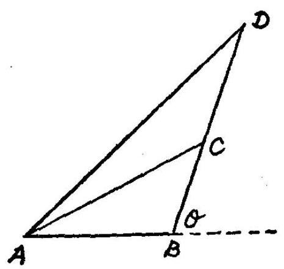

148 题

149. 直角 $\bigtriangleup {ABC}$ 中, $C = {90}^{ \circ  }$ , ${AC} = 3,{BC} = 4$ ,一直线分 $\bigtriangleup {ABC}$ 为面积相等的两部分,且夹在 ${AB}\text{ 、 }{BC}$ 间的线段最短, 求这条线段的长。

150. 甲船测得乙船在自己的北 ${45}^{ \circ  }$ 东方向,相距 10 迎处,且乙船以 9 迎/小时的速度向南 ${75}^{ \circ  }$ 东方向驶去,甲船欲用 40 分钟追上乙船, 试求, 甲船行驶的方向和速度。

151. 有人在平地上一点 $O$ ,望见正北和北 ${30}^{ \circ  }$ 东有 $A\text{ 、 }B$ 两目标,这人向西北方向走 10 里后,望见 $A$ 在东北, $B$ 在正东，求这两个目标间的离距。

152. 若 $\bigtriangleup {ABC}$ 的三边成等差数列,求证:

$$
\cos \frac{1}{2}\left( {A - C}\right)  = 2\cos \frac{1}{2}\left( {A + C}\right)
$$

153. 若三角形的三边 $a, b, c$ 的倒数成等差数列,求证 $b$ 边的对角必为锐角。

154. 已知 ${2x} + y = \pi$ ,求 $\sin x + \cos y$ 的最小值。

155. 等腰三角形 ${ABC}$ 中, ${BC}$ 为底边, ${BD}$ 为底角 $B$ 的平分线,且 ${AD} + {BD} = {BC}$ ,求这三角形的各角。

156. $\bigtriangleup {ABC}$ 的最大角 $A$ 为最小角 $C$ 的二倍,且它的三条边长为连续的三个整数,求这三角形三条边的长。

157. 在 $\bigtriangleup {ABC}$ 中,若 $a - b = c\cos B - c\cos A$ ,试判定 $\bigtriangleup {ABC}$ 的形状。

158. $\bigtriangleup {ABC}$ 的三边成连续整数,且 $a = {2a}\cos A$ 求这三角形的三边长。(其中 $a < b < c$ )。

159. 在 $\bigtriangleup {ABC}$ 中,若 $A = {39}^{ \circ  }$ ,且 $a = {2b}\cos C$ ,则 ${b}^{2} - {a}^{2} = \sqrt{2}{ab}$ 。

160. 若三角形三个内角成等差数列, 最大角与最小角的差是 ${30}^{ \circ  }$ ,求这三角形三边之比。

161. $\bigtriangleup {ABC}$ 三边成等差数列,最大角与最小角之差为 ${90}^{ \circ  }$ , 求三边之比。

162. 在 $\bigtriangleup {ABC}$ 中, $\angle A = {60}^{ \circ  },{BC} = 1$ ,证明:

$1 < {AB} + {AC} \leq  2$ 。

163. $\bigtriangleup {ABC}$ 的三条边 $a, b, c$ 成等差数列,若最大边 $a$ 与最小边 $c$ 所对的角分别为 $\theta$ 和 $\varphi$ ,求证:

$$
4\left( {1 - \cos \theta }\right) \left( {1 - \cos \varphi }\right)  = \cos \theta  + \cos \varphi \text{ 。 }
$$

164. 已知 $A\text{ 、 }B\text{ 、 }C$ 是锐角三角形 ${ABC}$ 的三个内角, $a, b, c$ 是它的对边,且 ${\sin }^{2}A - {\cos }^{2}A = \frac{1}{2}$ ,

求证: $b + c \leq  {2a}$ 。

165. 设 $A\text{ 、 }B\text{ 、 }C$ 为三角形三个内角, $a, b, c$ 分别为角 $A\text{ 、 }B\text{ 、 }C$ 的对边,

求证: $\left( {a - b}\right) \operatorname{ctg}\frac{C}{2} + \left( {b - c}\right) \operatorname{ctg}\frac{A}{2} + \left( {c - a}\right) \operatorname{ctg}\frac{B}{2} = 0$ 。

166. 设 $A + B + C = \pi ,\sin A - \sin B = \sin B - \sin C$ , 求证: $\operatorname{ctg}\frac{A}{2} \cdot  \operatorname{ctg}\frac{C}{2} = 3$

167. 证明 $\sin {3a} = 4\sin \alpha \sin \left( {{60}^{ \circ  } + \alpha }\right) \sin \left( {{60}^{ \circ  } - \alpha }\right)$ ,并利用此公式求 $\sin {20}^{ \circ  }\sin {40}^{ \circ  }\sin {60}^{ \circ  }\sin {80}^{ \circ  }$ 的值。

168. 已知 $\operatorname{tg}\alpha  = \sqrt{3}\left( {1 + m}\right) ,\sqrt{3}\left( {\operatorname{tg}\alpha \operatorname{tg}\beta  + m}\right)  + \operatorname{tg}\beta  = 0 \; \alpha ,\beta$ 都是锐角,求 $\alpha  + \beta$

169. 弦 ${AB}$ 把圆周 $O$ 分成两部分,在其中一部分上取一点 $C$ ,另一部分上取一点 $D$ ,且

$\angle {BAC} = {15}^{ \circ  },\angle {ABD} = {45}^{ \circ  },{AC} = \sqrt{6},{BD} = 2\sqrt{6}$ , 求弦 ${AB}$ 的长。

170. $\bigtriangleup {ABC}$ 中, ${BC}$ 边上的高为 $h$ ,若 $A = {60}^{ \circ  }, h = {11}$ , $b - c = 4$ ,求证: $\sin \frac{B - C}{2} = \frac{1}{4}$ 。

171. 在 $\bigtriangleup {ABC}$ 中,若 $a\operatorname{tg}A + b\operatorname{tg}B = \left( {a + b}\right) \operatorname{tg}\frac{A + B}{2}$ ,则原三角形为等腰三角形。

172. 设 $\operatorname{tg}x = 3\operatorname{tg}y\left( {0 \leq  y < \frac{\pi }{2}}\right)$ ,试求 $u = x - y$ 的极大值。

173. 在 $\bigtriangleup {ABC}$ 中,已知三边为 $a, b, c$ ,且

$$
\lg 2 + \lg b - \lg a = \lg \left( {1 + \frac{c}{a}}\right)
$$

又方程 $a\left( {1 - {x}^{2}}\right)  + {2bx} + c\left( {1 + {x}^{2}}\right)  = 0$ 有等根,

求 $\bigtriangleup {ABC}$ 各边的比及 $\bigtriangleup {ABC}$ 的各内角; 若又已知

$\bigtriangleup {ABC}$ 的内切园半径为 $2\mathrm{\;{cm}}$ ,求它的外接园半径。

174. 已知平行四边形的锐角为 ${60}^{ \circ  }$ ,对 角线平方之比为 $\frac{19}{7}$ , 求它的两边之比。

175. 已知 $\bigtriangleup {ABC}$ 的两边 $a, b$ 的量数是方程 $5{x}^{2} - {28x} + {35} \; = 0$ 的二根,其夹角 $C$ 的平分线长为 2,求 $\bigtriangleup {ABC}$ 的面积 $S$ 及其外接园半径 ${R}_{\mathrm{o}}$

176. 已知函数 $y = 4{x}^{2} - {5x} + m$ 的图象与 $x$ 轴的交点为 $\left( {\sin A, O}\right)$ 和 $\left( {\sin B, O}\right)$ ,而角 $A\text{ 、 }B$ 为直角 $\bigtriangleup {ABC}$ 的两个锐角,求 $m$ 的值。

177. 半元的直径是 ${AB}$ ,元 $C$ 和半元切于 $F$ ,且和 ${AB}$ 切于 $D$ ,延长 ${DC}$ 交半元于 $E$ ,求证: ${DE}$ 的平方等于半元直径和内切元直径乘积的一半。

178. 如图是一个半元, ${AB}$ 是直径,元心是 $O$ ,元 $C$ 内切于半元,且又切 ${AB}$ 于 $O$ 点,元 $D$ 和元 $E$ 都和元 $C$ 外切,并且都和半元及直径相切,已知: ${AB} = 8\mathrm{\;{cm}}$ ,求: 元 $D$ 和元 $E$ 的半径。

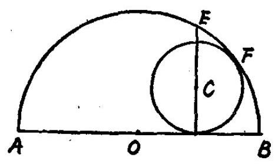

(177 题)

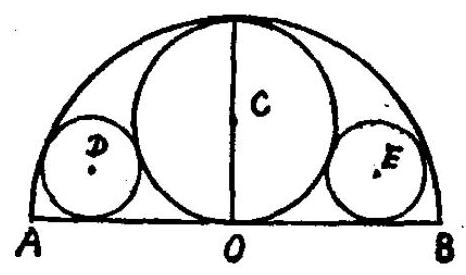

(178 题)

179. 以正方形 ${ABCD}$ 的顶点 $D$ 为元心，正方形边长为半径,在形内作元弧 $\overset{\text{ ⏜ }}{AC}$ ,又以 ${AD}$ 为直径在正方形内作半元, $P$ 是 $\overset{\text{ ⏜ }}{AC}$ 上任一点,连结 ${PD}$ ,交半元于 $K$ , 求证:(1) $\overset{\text{ ⏜ }}{AP}$ 的长等于 $\overset{\text{ ⏜ }}{AK}$ 的长；(2)线段 ${PK}$ 等于 $P$ 至 ${AB}$ 的距离。

180. 分别以平行四边形各边长向形外作正方形, 求证: 这些正方形的中心是一个正方形的四个顶点。

181. 有一钝角三角形, 最大边是 16cm, 其他两边中, 一边在另一边上的射影是 $3\mathrm{\;{cm}}$ ,而另一边在这边上的射影是 $2\mathrm{\;{cm}}$ ,求其他两边的长。

182. 任意四边形中, 连结二对边中点的直线交于连接两对角线中点的线段的中点。

183. 如果四边形 ${ABCD}$ 中, ${AD} = {BC}, E\text{ 、 }F$ 分别是 ${AB}$ 、 ${CD}$ 的中点,求证: ${AD}$ 和 ${BC}$ 的延长线与 ${EF}$ 的延长线交成等角。如果 ${AB} = {DC}$ ,那么交角如何?

184. 在四边形 ${ABCD}$ 中, ${AD} : {BC} = m : n, E\text{ 、 }F$ 分别是

${AB}\text{ 、 }{CD}$ 的内分点,且 ${AE} : {EB} = {DF} : {FC} = m : n$ ,则

${EF}$ 与 ${AD}\text{ 、 }{BC}$ 的夹角相等。

185. 如图,在 $\bigtriangleup {ADO}$ 中,已知: ${OA} = {OD}$ ,且 $\angle {AOB} = \; \angle {BOC} = \angle {COD} = {45}^{ \circ  }$ ,求证: $A{B}^{2} = {AD} \cdot  {BC}$ 。

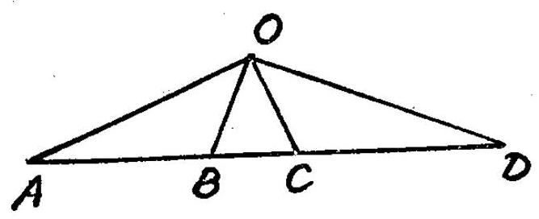

(185 题

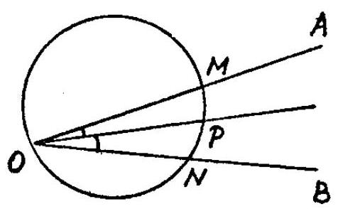

(186 题)

186. 在定角 ${AOB}$ 的平分线上取一点 $P$ ,过 $P\text{ 、 }O$ 两点的任意元与角的两边 ${OA}\text{ 、 }{OB}$ 的交点是 $M\text{ 、 }N$ ,则线段 ${OM}\text{ 、 }{ON}$ 之和是定值。

187. 定元 $O$ 的任意两条半径 ${OA}\text{ 、 }{OB}$ ,从 $B$ 作 ${BE} \bot  {OA}$ , 垂足是 $E$ ,作 ${EP} \bot  {AB}$ ,垂足是 $P$ ,求证: $O{P}^{2} + E{P}^{2}$ 是定值。

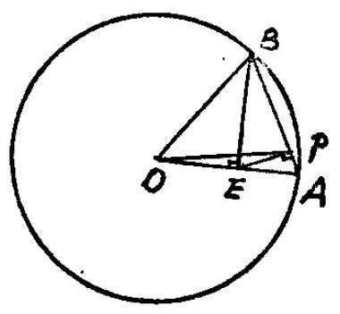

(187 题)

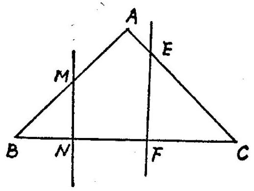

(188 题)

188. 如图 $\bigtriangleup {ABC}$ 是一个固定的三角形,且 ${AB} = {AC}$ ,直线 ${EF}\text{ 、 }{MN}$ 都垂直于 ${BC}$ ,证明: 不论 ${MN}\text{ 、 }{EF}$ 怎样平行移动,只要 ${MN},{EF}$ 之间的离距保持不变,五边形 AMNFE 的周长是一个定值。

189. 平行于正方形 ${ABCD}$ 的对角线 ${AC}$ 引 ${BE}$ ,在 ${BE}$ 上取一点 $F$ ,令 ${AF} = {AC}$ 而成菱形 ${ACEF}$ ,则 ${AE}$ 与 ${AF}$ 将 $\angle {BAC}$ 三等分。

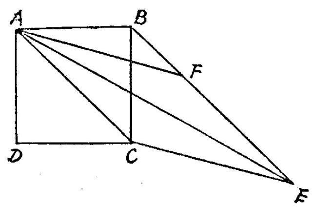

(189 题)

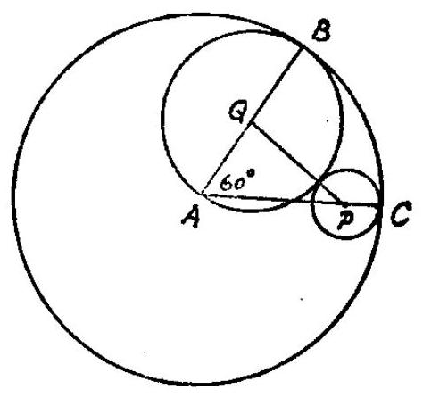

(190 题)

190. ${AB}\text{ 、 }{AC}$ 是元 $A$ 内相交成 ${60}^{ \circ  }$ 的两条半径,在 ${AC}$ 上取一点 $P$ ,使以 $P$ 为元心, ${PC}$ 为半径的元和以 ${AB}$ 为直径的元 $Q$ 相外切,求证: ${AP} : {AC} = 4 : 5$ 。

191. 设 $D$ 是等腰直角三角形 ${ABC}$ 底边 ${BC}$ 的中点,过 $C$ . $D$ 两点,但不过 $A$ 点任作一元,交 ${AC}$ 于 $E$ ,连 ${BE}$ 交此元于 $F$ ,则 ${AF} \bot  {BE}$ 。

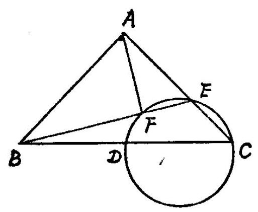

(191 题)

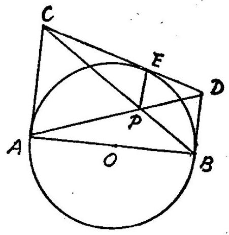

(192 题)

192. 设直径 ${AB}$ 两端上的切线是 ${AC}\text{ 、 }{BD}$ ,且圆 $O$ 上任意点 $E$ 的切线与上二切线交于 $C\text{ 、 }D$ ,又设 ${AD}\text{ 、 }{BC}$ 交于 $P$ ,求证: ${PE}\parallel {AC}$ 。

193. 在直角 $\bigtriangleup {ABC}$ 中, $\angle A = {90}^{ \circ  }$ ,以 ${AB}$ 边为直径作元交斜边于 $D$ ,过 $D$ 作元的切线与 ${AC}$ 交于 $E$ ,求证:

(1) ${AE} = {EC}$ ；

194. 元的两条弦 ${AB}\text{ 、 }{CD}$ 在元内相交于 $E$ ,从 $E$ 引 ${CB}$ 的平行线和 ${AD}$ 的延长线交于 $F$ ,再从 $F$ 引元的切线, 切点是 $G$ ,求证: ${EF} = {FG}$ 。

195. 在直角 $\bigtriangleup {ABC}$ 中, $\angle C = {90}^{ \circ  }$ ,作 ${CD} \bot  {AB}$ 交 ${AB}$ 于 $D$ ,分别以 ${AD},{DB}$ 为直径作元交 ${AC}$ 于 $E$ ,交 ${BC}$ 于 $F$ ,求证: (1) $C{D}^{3} = {AE} \cdot  {BF} \cdot  {AB}$ ,

(2) $\frac{A{C}^{3}}{B{C}^{3}} = \frac{AE}{BF}$ 。

196. 矩形 ${ABCD}$ 中, ${AP} \bot  {BD}$ 交 ${BD}$ 于 $P,{PQ} \bot  {BC}$ 交 ${BC}$ 于 $Q,{PR} \bot  {CD}$ 交 ${CD}$ 于 $R$ , 求证: $P{Q}^{\frac{2}{3}} + P{R}^{\frac{2}{3}} = A{C}^{\frac{2}{3}}$ 。

197. 已知直线 ${MN}$ 交 $\bigtriangleup {ABC}$ 的 ${AB}$ 边于 $M,{AC}$ 边于 $N$ , ${BC}$ 边的延长线于 $L$ ,求证: $\frac{AM}{MB} \cdot  \frac{CN}{NA} \cdot  \frac{BL}{LC} = 1$ 。

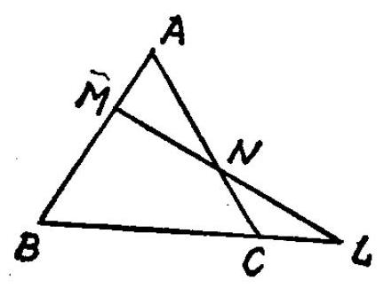

(197 题)

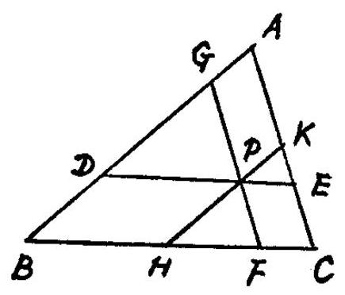

(198 题)

198. 如图过 $\bigtriangleup {ABC}$ 内一点 $P$ ,引 ${DE}\left| \right| {BC},{GF}\left| \right| {AC}$ , ${HK}\parallel {AB}$ ,求证: $\frac{DE}{BC} + \frac{FG}{CA} + \frac{KH}{AB} = 2$

199. 设在 $\bigtriangleup {ABC}$ 中, $\angle A : \angle B : \angle C = 4 : 2 : 1$ , 求证: $\frac{1}{a} + \frac{1}{b} = \frac{1}{c}$ 。

200. 在 $\bigtriangleup {ABC}$ 中, ${AD}\text{ 、 }{BE}$ 是二条高,求证:

$A{B}^{2} = {AC} \cdot  {AE} + {BC} \cdot  {BD}$

201. 有两个同心元，大元直径 ${AB}$ 交小元于 $C$ 、 $D$ 两点， $P$ 是小元上任意一点, $Q$ 是大元上任意一点,求证:

$P{A}^{2} + P{B}^{2} = Q{C}^{2} + Q{D}^{2}$

202. 三角形的三条高分别是 ${h}_{a}\text{ 、 }{h}_{b}\text{ 、 }{h}_{c}$ ,三角形内任一点 $P$ , 到三边的距离分别是 ${x}_{a}$ 、 ${x}_{b}$ 、 ${x}_{c}$ ,

则 $\frac{{x}_{a}}{{h}_{a}} + \frac{{x}_{b}}{{h}_{b}} + \frac{{x}_{c}}{{h}_{c}} = 1$

203. 平行四边形 ${ABCD}$ 内,过 $A$ 点任作一元,交 ${AB}\text{ 、 }{AD}$ 、 ${AC}$ 于 $E\text{ 、 }F\text{ 、 }G$ ,求证: ${AB} \cdot  {AE} + {AD} \cdot  {AF} = {AC} \cdot  {AG}$ 。

204. 在等腰 $\bigtriangleup {ABC}$ 中, ${AB} = {AC}$ ,在 ${AC}$ 上取一点 $E$ ,过 $E$ 作 ${EF} \bot  {AB}$ 交 ${AB}$ 于 $F$ ,与 ${BC}$ 延长线交于 $D$ ,使 ${S}_{\bigtriangleup {AEF}} = 2{S}_{\bigtriangleup {CDE}}$ ,求证: ${AB} : {BC} = {DE} : {EF}$ 。

205. 由元外一点 $P$ ,引元的两条切线 ${PA},{PB}$ 及割线 ${PCD}$ , 又由 $A$ 作平行于 ${CD}$ 的弦 ${AE}$ ,则 ${EB}$ 将弦 ${CD}$ 二等分。

206. 证明三角形的外心、重心、垂心, 三者共线。

207. 过三角形的一顶点作两底角及它们的外角平分线的垂

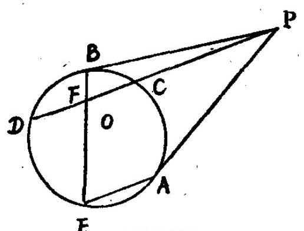

(205 题)

线, 证明四个垂足在一条直线上。

208. 如果以三角形的三条中线构成一个新三角形, 则它的面积等于原三角形面积的四分之三。

209. 在矩形 ${ABCD}$ 中, $E\text{ 、 }F$ 分别是 ${AB}\text{ 、 }{BC}$ 边上任意两点,求证: ${S}_{\square {ABCD}} = 2{S}_{\bigtriangleup {DEF}} + {AE} \cdot  {CF}$ 。

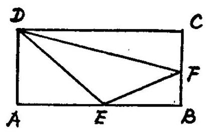

(209 题)

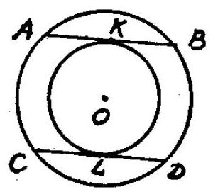

(210 题)

210. 两个同心元，小元分大元的面积为二等分，求证:环形

211. 如图在一正六边形内作一个内接正六边形, 使它们的面积之比为 4:3,求两个正六边形的边之间所成的角 $\alpha$ 与 $\beta$ 的度数。 之介于小元的两平行切线间的部分等于小元内接正方形的面积。

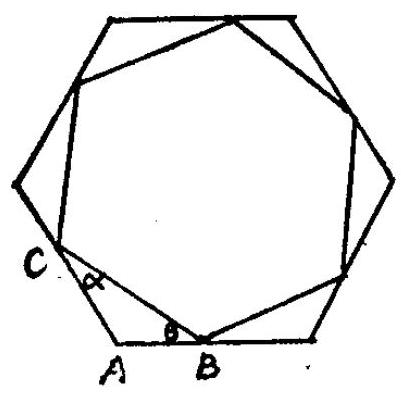

(211 题)

212. 在 $\bigtriangleup {ABC}$ 中, ${BC} = {20}\mathrm{\;{cm}},{AB} + {AC} = {50}\mathrm{\;{cm}}$ ,当中线 ${AD}$ 最短时,此三角形面积是多少?

213. 在锐角 $\bigtriangleup {ABC}$ 中,内接一正方形 ${MNQR}$ ,试证: 这正方形的面积不超过 $\bigtriangleup {ABC}$ 面积之半。

214. 若方程 $5{x}^{2} - {10x}\cos \alpha  + 7\cos \alpha  + 6 = 0$ 的二根相等, 求两邻边之和是 6,且夹角是 $\alpha$ 的平行四边形的最大面积。

215. 已知凸四边形 ${ABCD}$ 的对角线, ${AC} = m,{BD} = n,{AC}$ 和 ${BD}$ 相交于 $O$ 点, $\angle {DOC} = \alpha$ ,求 ${ABCD}$ 之最大外接矩形的面积。

216. 有一块形状如图的矩形缺角钢板，要从这块钢板截取一个内接矩形, 使它的一个角是钢板的左下角。

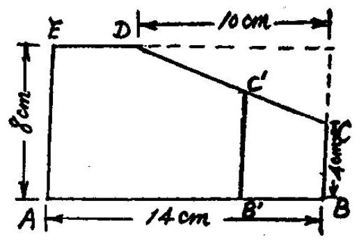

(216 题)

(1)问截得的矩形的长和宽各是多少时, 面积最大?

(2)当 ${AB}$ 缩短为 $A{B}^{\prime } = 9\mathrm{\;{cm}}$ 时,结论如何?

217. 设 $M\text{ 、 }N$ 是已知角 ${AOB}$ 的边 ${OA}$ 上的两个定点,试在 ${OB}$ 上求一点 $P$ ,使 $\angle {MPN}$ 为最大。

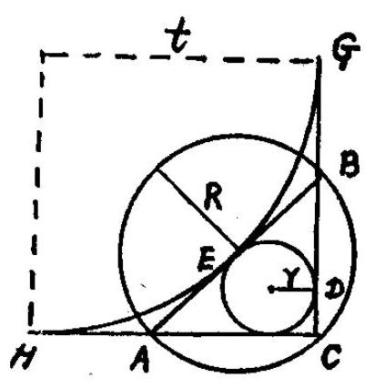

(218 题)

218. 一直角三角形的外接元半径是 $R$ ,其内切元半径是 $r$ ,与斜边相切的旁切元半径是 $t$ ,如果 $R$ 为 $r$ 及 $t$ 的比例中项,证明这直角三角形是等腰直角三角形。

219. $\bigtriangleup {ABC}$ 的三边 $a\text{ 、 }b\text{ 、 }c$ 成等比数列,则以它的三条高为边的三角形 ${A}^{\prime }{B}^{\prime }{C}^{\prime }$ 和 $\bigtriangleup {ABC}$ 相似。

220. 在线段 ${BC}$ 的同侧以 ${BC}$ 为斜边的两个直角三角形 ${ABC}$ 和 ${A}^{\prime }{BC}$ 中,已知 $\angle {ABC} \; = {45}^{ \circ  },\angle {A}^{\prime }{BC} = {30}^{ \circ  },{AC}$ 与 ${A}^{\prime }B$ 交于 ${A}^{\prime \prime }$ ，求证: $\bigtriangleup {ABC}$ , $\bigtriangleup {A}^{\prime }{BC},\bigtriangleup {A}^{\prime \prime }{BC}$ 三个三角形面积成等差数列。

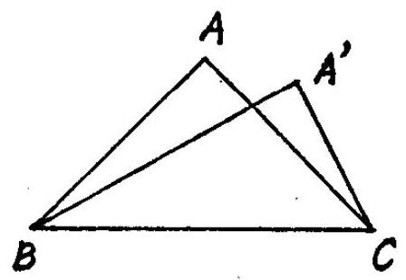

(220 题)

221. 在直角扇形 ${OAB}$ 中, 作内切元 $\odot  C$ ,又在半径 ${OA}\text{ 、 }\overset{\text{ ⏜ }}{AB}\text{ 、 } \odot  C$ 的缝隙间作内切元 $\odot  Q$ (如图),引 ${QP} \bot  {OC}$ 于 $P$ , 求证: $\bigtriangleup {OPQ}$ 的三边成等差数列。

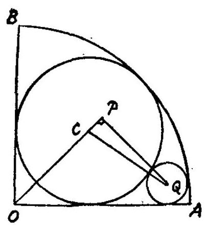

(221 题)

222. $\bigtriangleup {ABC}$ 的三个角成等差数列,它的最大和最小边的长是方程 $3{x}^{2} - {27x} + {32} = 0$ 的两个根,求此三角形内切元的面积。

223. 在边长是 1 的正方形内,作一个内接正方形 ${A}_{1}{B}_{1}{C}_{1}{D}_{1} \; {A}_{1}\text{ 、 }{B}_{1}\text{ 、 }{C}_{1}\text{ 、 }{D}_{1}$ 分别在 ${AB}\text{ 、 }{BC}\text{ 、 }{CD}\text{ 、 }{DA}$ 边上。

(1)在什么情况下，正方形 ${A}_{1}{B}_{1}{C}_{1}{D}_{1}$ 的面积最小?

(2)在正方形 ${ABCD}$ 内作面积最小正方形，如此继续下去,求第 $n$ 个面积最小正方形的面积;

(3) 这样无限地作下去, 求所有这些正方形面积之和。

224. 直角梯形 ${ABCD}$ 中,已知较短的底边 ${AB} = a$ ,较长的

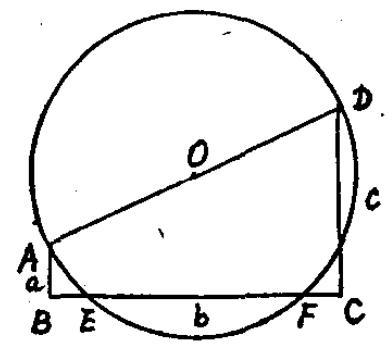

(224 题)

底边 ${CD} = c$ ,垂直于底的腰 ${BC} = b$ ,以另一腰 ${AD}$ 为直径作元 $\odot  O$ ,求证:

(1)若 $\odot  O$ 与 ${BC}$ 相交于 $E$ 、 $F$ 两点,则 $\operatorname{tg}\angle {BAE}$ 与 $\operatorname{tg} \; \angle {BAF}$ 是方程 $a{x}^{2} - {bx} + c \; = 0$ 的两根,且 ${b}^{2} - {4ac} > 0$ ;

(2)若 $\odot  O$ 与 ${BC}$ 相切，则 ${b}^{2} - {4ac} = 0$ ；

(3)若 $\odot  O$ 与 ${BC}$ 相离，则 ${b}^{2} - {4ac} < 0$ ，

225. 有一倒放着的，轴截面为正三角形的园锥形容器，内盛有高为 $h$ 的水，放入一铁球后，上升的水平面恰好和球相切,求球面上的点到锥顶点的最小距离。

226. 已知函数 $y = \left| {x - 2}\right|$ 和 $y = \frac{1}{2}x + 2$

(1)画出两函数的图象所围成的图形。

(2)将此图形绕 $x$ 轴旋转一周形成一立体，求体积。

227. 在三棱锥 $V - {ABC}$ 中, $\angle {AVB} = \angle {BVC} = \angle {CVA} = {90}^{ \circ  }$ 求证: ${\left( {S}_{\bigtriangleup {ABC}}\right) }^{2} = {\left( {S}_{\bigtriangleup {VAB}}\right) }^{2} + {\left( {S}_{\bigtriangleup {VAC}}\right) }^{2} + {\left( {S}_{\bigtriangleup {VBC}}\right) }^{2}$

228. 已知 $A{A}_{1}$ 与 ${AB}$ 分别是平面 $P$ 的垂线和斜线,在平面 $P$ 内过斜足 $B$ 任意引一条直线 ${BC}$ ,若 $\angle {ABC} = \gamma$ , $\angle {AB}{A}_{1} = \alpha ,\angle {A}_{1}{BC} = \beta$

(1)求证: $\cos \gamma  = \cos \alpha  \cdot  \cos \beta$

(2)若 $\cos \gamma  = \frac{3}{4}$ ，且 $\cos \left( {\alpha  + \beta }\right)  = \frac{1}{2}$ ，求 $\cos \left( {\alpha  - \beta }\right)$ 的值,并求 $\alpha \text{ 、 }\beta$ 。

229. 已知正六棱锥的高为 $h$ ,侧面等腰三角形的顶角为 $\alpha$ , 求棱锥的体积。

230. 正三棱锥 $S - {ABC}$ 的相邻侧面所成二面角为 $\alpha$ ,求它的侧面等腰三角形的顶角。

231. 自平面 $P$ 外的一个点 $A$ 向平面 $P$ 引两条斜线 ${AB}$ 和 ${AC}$ ， 它们和平面 $P$ 所成角的差为 ${45}^{ \circ  }$ ,在平面 $P$ 上的射影长分别为 2 和 12,求 $A$ 点到平面 $P$ 的距离。

232. 自平面 $P$ 外的一个点 $A$ ,向平面 $P$ 引垂线 ${AO}$ 和两条斜线 ${AB}\text{ 、 }{AC}$ ,已知 ${AO}\text{ 、 }{AC}\text{ 、 }{AB}$ 成等差数列,且 ${OC} = 7,{OB} = {10}$ ,求 ${AO}\text{ 、 }{AC}\text{ 、 }{AB}$ 的长。

233. 求侧面积最大的内接于已知球的园柱的高和底面半径。

234 过元锥顶点的一个截面与元锥的底面成 ${60}^{ \circ  }$ 角,这截面截元锥底面的弧长是 ${120}^{ \circ  }$ ,底面元心到这截面的距离是 3dm,求这元锥的侧面积和这个截面的面积。

235. 于 $A\text{ 、 }B\text{ 、 }C$ 三阵地测得敌机之仰角为 ${60}^{ \circ  },{45}^{ \circ  },{45}^{ \circ  }$ ,今 $B$ 地在 $A$ 地正北 3000 尺, $C$ 地在 $A$ 地之正西 4000 尺, 求敌机之高。

236. 有一元锥,另外有一与它同底,同高的直元柱,假设 $a$ 是元锥的全面积, ${a}^{\prime }$ 是元柱的全面积,试求元锥的高与母线的比值。

237. 有三条不在同一平面内的平行线 $a\text{ 、 }b\text{ 、 }c$ 在 $a$ 上取固定线段 ${AB}$ ,在 $c\text{ 、 }b$ 上各取一点 $C\text{ 、 }D$ ,求证: 不论 $C$ 和 $D$ 取在 $c\text{ 、 }b$ 的什么位置上,四面体 ${ABCD}$ 的体积是一个定值。

238. 一个元锥的外接球体积为 ${972\pi }$ ,且内切球面积为元锥的侧面积和底面面积的等差中项, 求这个元锥的体积。

239. 从平面外一点 $P$ ,向平面 $M$ 引三条斜线,这三条斜线在同一平面内,斜足顺次为 $A\text{ 、 }B\text{ 、 }C$ ,斜线和平面 $M$ 所成的角分别为 $\alpha \text{ 、 }\beta \text{ 、 }\alpha$ ,并且 ${AB} = a,{BC} = b$ 求 $P$ 点到平面 $M$ 的距离。

240. 用平行四面体的一组对棱的平面截此四面体, 试证其截口是一个平行四边形, 并求截口最大时的位置。

241. 一个梯形的上底长为 $a$ ,下底长为 ${2a}$ ,一腰长为 $b$ ,并且这腰和下底的夹角为 $\alpha$ , $\left( {\alpha \text{ 是锐角 }}\right)$ 如果以这腰为轴把梯形旋转一周, 求所成的旋转体积体。

242. 在平面 $\alpha$ 内有正三角形 ${A}^{\prime }{BC}$ ,直线 ${DE}//{BC}$ ,且分别交 ${A}^{\prime }B,{A}^{\prime }C$ 于 $D\text{ 、 }E$ ,沿 ${DE}$ 将 $\bigtriangleup {A}^{\prime }{DE}$ 折起,使它与平面 $\alpha$ 垂直。问: 与 ${BC}$ 平行的直线 ${DE}$ 取在何处,折起后的 ${A}^{\prime }B$ 最短?

243. 已知正三棱锥底面的边长是 $a$ ,高是 $h$ ,经过这棱锥底面的一边作垂直于它所对侧棱的截面, 求这截面的面积。

244. 元台的高为 $h$ ,母线和下底面的夹角为 $\alpha$ ,并且这条母线在它的上端与经过它的轴截面的对角线互相垂直, 求这元台的侧面积。

245. ${AD}\text{ 、 }{BE}\text{ 、 }{CF}$ 是锐角 $\bigtriangleup {ABC}$ 的三条高, $D\text{ 、 }E\text{ 、 }F$ 是垂足,以 ${AD}$ 为直径,在过 ${AD}$ 而垂直于平面 ${ABC}$ 的平面内作半园; 以 ${BE}$ 为直径,在过 ${BE}$ 而垂直于平面 ${ABC}$ 的平面内作半园; 以 ${CF}$ 为直径,在过 ${CF}$ 而垂直于平面 ${ABC}$ 的平面内作半园。求证: 三个半园交于一点。

246. 设点 $\left( {1,1}\right)$ 到直线 $x\cos \theta  + y\sin \theta  = 2$ 的距离为 $f\left( \theta \right)$ ,求 $f\left( \theta \right)$ 的极大值。

247. 在直角坐标系中,求与 $x$ 轴正向相切且与直线 ${4x} - {3y} \; + 1 = 0$ 切于纵坐标为 3 的点的圆的方程。

248. 已知直线 $y = {kx} + b$ 与椭圆 $4{x}^{2} + {y}^{2} = {16}$ 相切,并且过园 ${x}^{2} + {y}^{2} - {6x} + 8 = 0$ 的园心,求 $k\text{ 、 }b$ 的值

249. 证明: 当 $a\text{ 、 }b$ 按 $\frac{1}{a} + \frac{1}{b} = k$ ( $k$ 为常数) 而变化时,直线 $\frac{x}{a} + \frac{y}{b} = 1$ 总过一定点,并求出此定点的坐标。

250. 已知直线 ${l}_{1} : {ax} - {ky} + k = 0,{l}_{2} : {kx} - y - 1 = 0$ ,其中 $a$ 为常数, $k$ 为参数。

(1)求证:不论 $k$ 为何值， ${l}_{1}$ 、 ${l}_{2}$ 、分别过定点。

(2) $k$ 在实数范围内变动，求 ${l}_{1}$ 、 ${l}_{2}$ 交点的轨迹方程， 并讨论图形。

251. 已知: 直线 $y = x$ 和点 $A\left( {1,3}\right) \text{ 、 }B\left( {5,2}\right)$ ,在直线上求一点 $P$ ,使 $\left| {{PA} - {PB}}\right|$ 最大,并问最大值是多少?

252. 已知: $x - y + \sqrt{2} = 0, x - y + {C}_{2} = 0, x - y + {C}_{3} = 0,\cdots \cdots$ , $x - y + {C}_{n} = 0,\;\left( {\sqrt{2} < {C}_{2} < {C}_{3} < \cdots \cdots  < {C}_{n}}\right)$ ,这 $n$ 条直线中相邻两条间的距离顺次为 $2\text{ 、 }3\text{ 、 }4\text{ 、 }\cdots \cdots n$ 。

(1)求 ${C}_{n}$ ，

(2)求 $x - y + {C}_{n} = 0$ 与 $x = 0, y = 0$ ,围成的图形的面积。

(3)试证: $x - y + {C}_{n - 1} = 0, x - y + {C}_{n} = 0$ 与 $x = 0$ , $y = 0$ 围成的图形的面积等于 ${n}^{3}$ 。

253. ${AB}$ 为一圆的定直径,而 $M$ 为园上任一点,从 $A$ 作直线垂直于 $M$ 点 的切线交 ${BM}$ 的延长线于 $P$ ，求 $P$ 点的轨迹的方程。

254. 园心在一抛物线的对称轴上, 且过抛物线的顶点的元, 何时与抛物线只有一个交点。

255. ${AB}$ 为园 $O$ 中一弦, $P$ 为园周上任一点, ${AP}\text{ 、 }{BP}$ (或它们的延长线) 与 $O$ 到 ${AB}$ 的垂线相交于 $y\text{ 、 }x$ ,求证: ${Ox} \cdot  {Oy}$ 是一个定值。(园半径为 $r$ )

256. 已知 $m$ 为不等于 -1 的任意实数，园的方程为 $\left( {1 + m}\right) {x}^{2}$

$$
+ \left( {m + 1}\right) {y}^{2} + 2\left( {2 - m}\right) x + \left( {{2m} - 4}\right) y - {14m} - 2 = 0
$$

(1)证明:方程所表示的一切园的园心在一条直线上， 并求出这条直线。

(2)证明:方程所表示的一切园都过两个定点，并求出这两个定点的坐标。

(3)当 $m =  - 1$ 时,方程的图象是什么曲线？这条曲线是否必通过(2)中所确定的那两点?

257. 已知园 $C : {\left( x - 2\right) }^{2} + {\left( y - 2\right) }^{2} = 2$

(1)过原点 $O$ 引园 $C$ 的切线，求切线的斜率。

(2)设二切点为 ${T}_{1}$ 、 ${T}_{2}$ ，求直线 ${T}_{1}{T}_{2}$ 的方程。

(3)过原点 $O$ 任引一直线 $l$ ，交园 $C$ 于 $P$ 、 $Q$ 交直线 ${T}_{1}{T}_{2}$ 于 $R$ ,并设 ${OP}\text{ 、 }{OQ}$ 和 ${OR}$ 的长度分别为 ${r}_{1}\text{ 、 }{r}_{2}$ 和 $r$ ,求证: $\frac{1}{{r}_{1}} + \frac{1}{{r}_{2}} = \frac{2}{r}$ 。

258. 曲线 $\frac{{x}^{2}}{4} + \frac{{y}^{2}}{9} = 1$ 与直线 $y = {ax} + 1$ 交于 ${P}_{1}\left( {{x}_{1},{y}_{1}}\right)$ , ${P}_{2}\left( {{x}_{2},{y}_{2}}\right)$ 两点,且 ${x}_{1} + {x}_{2} = \sin {150}^{ \circ  }$ ,求直线 $y = {ax} + 1$ 的斜率。

259. 椭园 $a{x}^{2} + b{y}^{2} = 1$ 与直线 $x + y = 1$ 交于 $A\text{ 、 }B$ 两点,弦 ${AB}$ 的长为 $2\sqrt{2}$ ，弦 ${AB}$ 的中点 $C$ 与椭园中心 $O$ 的连线的斜率为 $\frac{\sqrt{2}}{2}$ ，求 $a$ 、 $b$ 。

260. 从椭圆 ${x}^{2} + 4{y}^{2} = 4$ 上取一点 $P$ ,使得 $P\text{ 、 }A\left( {4,2}\right)$ 、 $B\left( {2,0}\right)$ 组成的三角形面积最大。

261. 椭园的半长轴为 $2\sqrt{2}$ ,半短轴为 2,在椭元内挖去一直角三角形 ${F}_{1}{F}_{2}A$ (其中 ${F}_{1}\text{ 、 }{F}_{2}$ 为椭元的焦点, $A$ 在椭元上), $\angle A = {90}^{ \circ  }$ ,求其余部分的重心?

262. 求证: 过园 $r = a\cos \theta$ 上极角为 $\alpha \text{ 、 }\beta \left( {\alpha  \neq  \beta }\right)$ 的两点 $A$ 、 $B$ 的直线的极坐标方程是 $r\cos \left( {\theta  - \alpha  - \beta }\right)  = a\cos \alpha  \cdot  \cos \beta$ 。 由极点向这条直线所引垂线的垂足的极坐标是 $(a\cos \alpha \; \cos \beta ,\alpha  + \beta )$

263. 求双曲线 ${b}^{2}{x}^{2} - {a}^{2}{y}^{2} = {a}^{2}{b}^{2}$ 的互相垂直的二切线交点的轨迹。

264. 一个三角形底边固定 (长为 1 ), 它的顶点移动时, 其他两边与底所成的角的正切的和为定值, 求证这个顶点的轨迹是抛物线, 并求此抛物线的顶点和焦点坐标、准线和对称轴方程。

265. 自原点向抛物线 $y = {x}^{2} + \frac{1}{4}$ 引两条切线 ${OA}\text{ 、 }{OB}$ ,试求在这曲线与两切线间的内切园的半径。

266. 从抛物线 ${y}^{2} = {4x}$ 的焦点引一直线，已知直线被抛物线截得的线段被焦点分成 $2 : 1$ ,求这直线的方程。

267 在抛物线 $y = {x}^{2}$ 内有一长为 $l$ 的线段 $\left( {l \geq  1}\right)$ 。若线段两端点都在抛物线上,求此线段中点到 $x$ 轴的距离的最小值。

268. 已知抛物线方程为 ${x}^{2} + {4x} - {4y} + {16} = 0$ 。

(1)求它的焦点坐标及准线方程。

(2)点 $A\left( {-3,{10}}\right)$ 是平面上的一点，试在抛物线上求一点 $P$ ,使 $P$ 点到 $A$ 点与抛物线焦点 $F$ 两点的距离之和为最小。

269. 抛物线 $y = {x}^{2} - {2x} + 2$ 交直线 $y = {mx}$ 于 ${P}_{1}\text{ 、 }{P}_{2}$ 两点。

(1)求 $m$ 的取值范围;

(2)求 ${P}_{1}{P}_{2}$ 中点的轨迹方程；

(3)在线段 ${P}_{1}{P}_{2}$ 上取满足 $\frac{1}{O{P}_{1}} + \frac{1}{O{P}_{2}} = \frac{2}{OQ}$ 的点 $Q$ ， 求 $Q$ 的轨迹。

270. 从抛物线 ${y}^{2} = {2Px}$ 外一点 $M\left( {{x}_{1},{y}_{1}}\right)$ 引抛物线的两条切线,切点为 $A\text{ 、 }B$ ,求证: 过 $A\text{ 、 }B$ 的直线方程为 ${y}_{1}y = {2P}\left( \frac{x + {x}_{1}}{2}\right)$  。

271. (1) $K$ 为何值时,曲线 $\frac{{x}^{2}}{5 - K} + \frac{{y}^{2}}{3 - K} = 1$ 为①椭圆,② 双曲线, ③没有轨迹；

(2)证明方程 $\frac{{x}^{2}}{5 - K} + \frac{{y}^{2}}{3 - K} = 1$ 所表示的圆锥曲线有共同的焦点。

272. 已知

(1)椭园 $C$ 的长轴是短轴的 2 倍，焦点是 ${F}_{1}\left( {C, O}\right)$ 、

$$
{F}_{2}\left( {-C, O}\right) \text{ ; }
$$

(2)抛物线 ${C}_{1} : {x}^{2} = {2py},{C}_{2} : {x}^{2} =  - {2py}$ 的焦点为 ${F}_{3}$ 、 ${F}_{4}$ ;

(3) 园 ${x}^{2} + {y}^{2} = 4$ 与直线 ${y}^{2} - {x}^{2} = 0$ 的交点为 $A\text{ 、 }B\text{ 、 }C$ 、 $D$

(4) $A\text{ 、 }B\text{ 、 }C\text{ 、 }D\text{ 、 }{F}_{1}\text{ 、 }{F}_{2}\text{ 、 }{F}_{3}\text{ 、 }{F}_{4}$ 组成正八边形，

求: 曲线 $C,{C}_{1},{C}_{2}$ 的方程。

273. 已知直线 ${l}_{1} : x\cos \theta  + y\sin \theta  = a;{l}_{2} : x\sin \theta  - y\cos \theta  = b$ 。 求当 $\theta$ 变化时两直线交点的轨迹。

274. 试用经过原点的弦的长 $t$ 为参数，求园 ${\left( x - a\right) }^{2} + {y}^{2} = {a}^{2}$ 的参数方程。

275. 一个边长为 $a$ 的正方形相邻两顶点分别在互相垂直的杆上滑动, ① 求另外两顶点的轨迹的参数方程, ②将参数方程化成普通方程, ③判别它们各是什么曲线。

276. 已知方程 ${x}^{2} + {y}^{2} - {2r}\cos \theta  \cdot  x - {2r}\sin \theta  \cdot  y = 0$ ( $r$ 为常数, $\theta$ 为参数。)

(1)证明:不论 $\theta$ 为何实数值，方程所表示的曲线都是园;

(2)证明:这些园的园心在另一个定园上，并求这个定园的园心和半径;

(3) 证明: 方程所表示的园和定园的公共弦的长为定值。

277. 已知半径为 $r$ 的圆,圆心 ${O}^{\prime }$ 在极坐标系中的坐标为 $\left( {{p}_{1},{\theta }_{1}}\right)$ ,求圆 ${O}^{\prime }$ 在极坐标系中的方程。

278. 已知直线 $l$ ,在极坐标系中,极点 $O$ 到 $l$ 的距离 ${OA} = \; a$ 为定长, $\angle {xOA} = a$ 为定角,求直线 $l$ 的极坐标方程。

279. 过直径为 $a$ 的园上一点 $O$ 作园的任意弦 ${OQ}$ ,并延长至 $P$ ,使 ${QP} = a$ ,求 $P$ 点轨迹的极坐标方程。

280. $A\text{ 、 }B$ 两点的距离是 12,今有动点 $P$ ,使 ${PA} \cdot  {PB} = {36}$ , 求 $P$ 点的轨迹的极坐标方程,并画出 $P$ 点的轨迹。

281. 已知 $A\left( {3,0}\right) , P$ 是 ${x}^{2} + {y}^{2} = 1$ 上的一个点,且 $\angle {AOP}$ 的平分线交 ${PA}$ 于 $Q$ 点,求 $Q$ 的轨迹方程,并画出它的图象。

282. 已知圆 ${x}^{2} + {y}^{2} - {8x} - {2y} + {12} = 0$ 内一点 $P\left( {3,0}\right)$ ,求经过 $P$ 点的弦中最长与最短的弦所在的直线方程。

283. 过 $\left( {1,4}\right)$ 点引一直线与两坐标轴正向所围成的三角形面积最小,求这条直线的方程。

284. 如果直线的倾角 $\alpha$ 满足 $4\sin \alpha  = 3\cos \alpha$ ,并且过椭园 $\frac{{x}^{2}}{16} + \frac{{y}^{2}}{25} = 1$ 的焦点,求此直线方程以及此直线与坐标轴围成的三角形的面积。

285. 过点 $P\left( {0,1}\right)$ 作直线使它在两直线 $x - {3y} + {10} = 0$ 和 ${2x} + y - 8 = 0$ 之间截得的线段被 $P$ 点平分。

286. 指出方程 ${x}^{2}\sin \alpha  + {y}^{2}\cos x = 1\left( {0 \leq  \alpha  \leq  \pi }\right)$ 对应什么曲: 线,并简要地指出各曲线的特点。

287. 过椭圆 ${x}^{2} + 2{y}^{2} = 2$ 的右焦点引一条直线,倾角为 ${45}^{ \circ  }$ , 求以这直线与椭园的两个交点及椭园中心为顶点的三角形的面积。

288. 求证以抛物线的焦点弦 (过焦点的直线被抛物线所截的线段)为直径的园必切此抛物线的准线。

289. 已知抛物线 $y = {x}^{2} - {2x}\sin \theta  + 1\left( {0 \leq  0 \leq  \pi }\right)$ 的顶点在直线 $x + {2y} - 2 = 0$ 上,求 $\theta$ 的值。

290. 已知在同一平面上有三条平行线, ${L}_{2}$ 在 ${L}_{1},{L}_{3}$ 之间, 且 ${L}_{1},{L}_{2}$ 的距离为 $1,{L}_{2},{L}_{3}$ 的距离为 2,今有正三角形 ${ABC}$ ,三顶点 $A\text{ 、 }B\text{ 、 }C$ ,分别在 ${L}_{1},{L}_{2},{L}_{3}$ 上,求它的边长。

291. 求 $P\left( {0, - 5}\right)$ 到椭园 ${x}^{2} + 2{y}^{2} = {98}$ 上一点的最大距离。

292. 抛物线方程为 ${y}^{2} = {2x},{P}_{1}\left( {{x}_{1},{y}_{1}}\right) ,{P}_{2}\left( {{x}_{2},{y}_{2}}\right)$ 是其上两点,过弦 ${P}_{1}{P}_{2}$ 的中点作平行于抛物线对称轴的直线,交抛物线于 ${P}_{3}$ ,

(1)求证: $\bigtriangleup  {P}_{1}{P}_{2}{P}_{3}$ 的面积等于 $\frac{1}{16}{\left| {y}_{2} - {y}_{1}\right| }^{8}$

(2)再过 ${P}_{1}{P}_{3},{P}_{3}{P}_{2}$ 的中点作平行于对称轴的直线交抛物线于 ${Q}_{1},{Q}_{2}$ ,求 $\bigtriangleup {P}_{1}{P}_{3}{Q}_{1}$ 和 $\bigtriangleup {P}_{2}{P}_{3}{Q}_{2}$ 的面积的和。

(3)用这个方法，依次类推下去，可得许多三角形，这些三角形面积之和就是直线 ${P}_{1}{P}_{2}$ 与抛物线所夹部

分的面积, 试求出这个面积。

293. 已知 $B\text{ 、 }C$ 两点的坐标分别是 $\left( {0,6}\right) ,\left( {0,2}\right) \text{ 。 }A$ 为 $x$ 轴负半轴上一点,问 $A$ 在何处可使 $\angle {BAC}$ 有最大值?

294. 在椭圆 ${x}^{2} + 4{y}^{2} = 4$ 上取一点 $P$ ,使得以 $P, A\left( {4,2}\right)$ , $B\left( {2,0}\right)$ 为顶点的三角形的面积最大。

295. 已知参数方程 $\left\{  \begin{array}{l} x = \frac{1}{2}\left( {{e}^{t} + {e}^{-t}}\right)  \cdot  \cos \theta \\  y = \frac{1}{2}\left( {{e}^{t} - {e}^{-t}}\right)  \cdot  \sin \theta  \end{array}\right.$

证明: ① 若 $t$ 为常数，方程表示椭圆。

②若 $\theta$ 为常数，方程表示双曲线。

③ 这椭圆与这双曲线有相同的焦点。

④这椭园与这双曲线在交点处的两条切线互相垂直。

296. 经过定点 $\left( {3,2}\right)$ 的一条动直线分别交 $X$ 轴、 $Y$ 轴于 $M$ 、 $N$ ,设 $\theta$ 为 ${MN}$ 的中点,联 ${OQ}$ 延长至 $P$ 。使 ${PO} = \; 2\mathrm{O}Q$ ,求 $P$ 点轨迹方程,并证明轨迹图形关于直线 $y = x - 1$ 对称。

297. 化 $\sqrt{x} + \sqrt{y} = \sqrt{a}$ 为有理式,证明其轨迹为抛物线, 且抛物线与 $X$ 轴, $Y$ 轴均相切。

298. 求证过抛物线 ${y}^{2} = {2px}$ 的焦点的任一弦的两端到 $X$ 轴的距离之积等于 ${p}^{2}$ 。

299. 已知直线 ${L}_{1} : y = {4x}$ 和一点 $p\left( {6,4}\right)$ ,在 ${L}_{1}$ 上求一点 $Q$ , 使过 ${PQ}$ 的直线与 ${L}_{1}$ 及 $X$ 轴在第 $I$ 象限内围成的三角形面积最小。

300. 过直线 $x - {2y} - 3 = 0$ 与 ${2x} - {3y} - 2 = 0$ 的交点作一直线,使它与两坐标轴相交所成的三角形的面积为 5 平方单位。求这条直线的方程,并画图。

301. 设过 $A\left( {-1,0}\right) , B\left( {1,0}\right)$ 且对称轴为 $y$ 轴的抛物线在 $A\text{ 、 }B$ 两点的切线,法线分别是 ${L}_{1},{L}_{2}$ 和 ${L}_{3},{L}_{4}$ ; 而 $C$ 、 $D$ 分别为两切线 ${L}_{1},{L}_{3}$ 和两法线 ${L}_{2},{L}_{4}$ 的交点。①问过 $A\text{ 、 }B\text{ 、 }C\text{ 、 }D$ 四点能否作园,若能作,试写出圆的方程。②求这个圆的面积。③求上述园中最小园的面积。

302. 已知一点 $P\left( {3,1}\right)$ 及两直线 ${L}_{1} : x + {2y} + 3 = 0,{L}_{2} : x + \; {2y} - 7 = 0$ ,试求通过 $P$ 点且与 ${L}_{1},{L}_{2}$ 相切的园的方程。

303. 在直角坐标系内,炮口在原点 $\left( {0,0}\right)$ 处,射中的目标在第一象限内,它的坐标为 $\left( {a, b}\right)$ ,已知炮弹的初速度为 ${V}_{0}$ ,不计空气阻力,求发射角 $\theta$ 的正切 $\operatorname{tg}\theta$ ,并求经过多少时间射中。

304. 等腰三角形底边所在的直线方程为 $x + y - 1 = 0$ ,一腰所在的直线方程是 $x - {2y} - 2 = 0$ ,点 $P\left( {-2,0}\right)$ 在另一腰上，求此腰所在的直线方程。

305. 求在 ${3x} + y \geq  1,{2x} + {4y} \geq  1, x \geq  0, v \geq  0$ ,范围内 $x + y$ 的最小值 ${S}_{0}$

306. 如果直线 $y = {mx} + 2$ 与抛物线 $y = {x}^{2} + {3x} + 3$ 相切,求切点坐标,如果它们相交,求 $m$ 的取值范围。

307. 抛物线弧 ${y}^{2} = {12x}$ 上的两个端点 $A$ 、 $B$ 的纵坐标是 -6,12,在弧上求一点 $P$ ,使 $\bigtriangleup {ABP}$ 有最大面积,并求出来。

208. 已知正方形的四个顶点的坐标分别是 $\left( {2,2}\right) ,\left( {-2,2}\right)$ , $\left( {-2, - 2}\right) ,\left( {2, - 2}\right)$ ,试在此正方形内求一点,使到各边距离的平方和是 20,并到直线 $\sqrt{3}x - y = 2 + \sqrt{3}$ 的距离最短。

309. 有一动直线 $y = \frac{2}{t}\left( {x - t - 1}\right)$ ( $t$ 是参数) 及一抛物线 ${y}^{2} = {4x}$ ,问该直线与抛物线的两个交点连线的中点轨迹是什么? 并求证该轨迹和直线 $x + y + 1 = 0$ 相切。

310. 已知二次函数的图象关于直线 $x + 2 = 0$ 对称,且与直线 $y = {2x} + 1$ 相切，在 $X$ 轴上截取出为 $2\sqrt{2}$ 的线段， 求出这个二次函数并画出草图。

311. 已知 $A\left( {O, O}\right) , B\left( {m, O}\right)$ 其中 $m > O$ ,动点 $P$ 到 $A$ , $B$ 的距离之比为 $2 : 1$ 。求: $\oplus  P$ 点的轨迹。 $\text{ ② }P$ 点在什么位置时 $\bigtriangleup {ABP}$ 的面积最大? 是多少?

312. 椭圆 $\frac{{x}^{2}}{{a}^{2}} + \frac{{y}^{2}}{{b}^{2}} = 1$ 上三点横坐标成等差数列,求证所对椭圆的同焦点的焦半径也成等差数列.

313. 已知方程 ${y}^{2} - {2x} - {6y}\sin \theta  - 9{\cos }^{2}\theta  + 8\cos \theta  + 9 = 0$ , ①证明不论 $\theta$ 如何变化,方程都表示顶点在同一个椭圆上的抛物线,并求出这个椭圆的方程、②问 $\theta$ 为何值时,抛物线在直线 $x = {14}$ 上截得的弦最长? 并求出这条弦的长。

314. 设 $P$ 为椭圆上任意一点, $F$ 为椭圆焦点,证明以 ${FP}$ 为直径的圆必与以椭圆的长轴为直径的园相内切。

315. 圆的方程为 ${x}^{2} + {y}^{2} - {4R}\cos \alpha  \cdot  x - {4R}\sin \alpha  \cdot  y + 3{R}^{2} = 0 \; \left( {R > O}\right)$ 。① 求圆心 $M$ 的坐标和圆的半径。② 当 $R$ 固定, $\alpha$ 变动时,求圆心 $M$ 的轨迹,并证明此时不论 $\alpha$ 取什么值时,所有的圆 $M$ 都外切于一个定园并内切于一个定圆。③ 当 $\alpha$ 固定, $R$ 变动时,证明圆心 $M$ 在一条直线上,并证明此时不论 $R$ 取什么值,所有的圆 $M$ 有两条公切线。

316. 求两圆 ${x}^{2} + {y}^{2} = 9$ 和 ${\left( x - 6\right) }^{2} + {y}^{2} = 1$ 的外公切线和内公切线。

317. 抛物线 ${y}^{2} = {4hx}\left( {h > 0}\right)$ 和椭圆 $\frac{{x}^{2}}{{a}^{2}} + \frac{{y}^{2}}{4} = 1\left( {a > 0}\right)$ 的交点中,纵坐标大于 0 的交点为 $A$ ,二曲线在 $A$ 点的切线互相垂直,且原点和 $A$ 连线的斜率为 $2\sqrt{h}$ ,求 $a$ 和 $h$ 的值。

318. 已知抛物线经过 $\left( {1,4}\right) ,\left( {2,6}\right)$ 两点,并在 $X$ 轴上截取长是 5 的线段,求抛物线的方程。

319. 四边形 ${ABCD}$ 内接于椭圆: $\frac{{x}^{2}}{16} + \frac{{y}^{2}}{25} = 1, A$ 点是椭圆与 $X$ 轴正向的交点, $C$ 点是椭圆与 $Y$ 轴正向的交点, $B$ 点在第 I 象限， $D$ 点在第 IV 象限，求四边形的最大面积。

320. $\bigtriangleup {ABC}$ 的两个顶点 $A\text{ 、 }B$ 是椭圆: $\left\{  \begin{array}{l} x = 2 + {13}\cos \theta \\  y = 5\sin \theta  - 1 \end{array}\right.$ 的两焦点, $C$ 点在抛物线 $y = {x}^{2} + 1$ 上移动,求 $\bigtriangleup {ABC}$ 的重心的轨迹。

321. 已知 $\bigtriangleup  {ABC}$ 三顶点是 $A\left( {2,1}\right) , B\left( {-6,7}\right) , C\left( {6,4}\right)$ 。求 ①角 $A$ 的内角平分线 ${AD}$ 的长。② $\angle {ACB}$ 的大小。

322. 两共轴抛物线的开口方向相反, 并且还垂直相交、(即在交点处的两抛物线的切线互相垂直), 求证: 两条抛物线有共同的焦点。

323. 在长为 $a$ 的线段 ${AB}$ 上有一动 $P$ 点,在 ${AB}$ 的同侧以 ${AP}$ , ${BP}$ 为边作等边 $\bigtriangleup {APM}$ 和 $\bigtriangleup {BPN}$ ,求 ${MN}$ 的中点的轨迹?

324. 当 $\varphi$ 取哪些值时,直线 $y = \left( {1 - x}\right) \operatorname{ctg}\varphi$ 和双曲线 $- {x}^{2} \; + {y}^{2}{\sin }^{2}\varphi  = 1$ 相交? 相切? 相离? 它们相切时求出切点坐标。

325. 以动点 $P$ 为 园心作圆,使与圆 ${x}^{2} + {y}^{2} = 4$ 及 ${\left( x - 5\right) }^{2} \; + {y}^{2} = 1$ 都外切,求动点 $P$ 的轨迹,说明轨迹是什么曲线并画出草图。

326. ①写出经过 $P\left( {1, - 5}\right)$ 点,倾角为 $\frac{\pi }{3}$ 的直线的参数方程。②利用参数方程求这条直线和直线 $x - y - 2\sqrt{3} \; = 0$ 的交点离开 $P$ 点的距离。③ 求这条直线与圆 ${x}^{2} \; + {y}^{2} = {16}$ 的两个交点离开 $P$ 点的距离的乘积。

327. 圆的方程 ${x}^{2} + {y}^{2} - 2\left( {m + 5}\right) x - 2{\left( m + 5\right) }^{2}y + {\left( m + 5\right) }^{4} \; + {\left( m + 5\right) }^{2} = 9\left( {m\text{ 为实数 }}\right)$ ,① 证明 $m$ 为任何实数时, 圆心都在一条抛物线上。②画出这条抛物线, 并画出当 $m =  - 2, m =  - 4$ 时的两个圆。

328. 抛物线 $y = a{x}^{2} + {bx} + c$ 与 $X$ 轴正方向有两个交点 $P$ , $Q$ ,与 $y$ 轴正方向有一个交点 $R$ ,已知 ${OP} = {PQ} = {OR}$ , 求:①系数值。②若 $a$ 为参数，写出抛物线顶点的参数方程。

329. 过抛物线 $\left\{  \begin{array}{l} x = {2p}{t}^{2} \\  y = {2pt} \end{array}\right.$ 的焦点 $F$ ,作倾角为 $\alpha$ 的直线,交抛物线于 $A, B$ 两点。① 求 $\left| {AB}\right|$ 以倾角 $\alpha$ 为自变量的函数关系式。②求此函数的定义域和值域。

330. 已知 $O$ 是抛物线 ${y}^{2} = {2px}$ 的顶点， ${A}_{1},{A}_{2}$ 是其上两点,且它们的纵坐标之积小于零。①过 ${A}_{1},{A}_{2}$ 作抛物线切线,它们相交于 $P, M$ 是线段 ${A}_{1}{A}_{2}$ 中点,证明 ${PM}$ 平行于抛物线对称轴。② 设抛物线的切线 ${A}_{1}P$ 和它的对称轴交于 $B,{A}_{1}$ 在对称轴上射影为 $C$ ,求证: $\left| {OB}\right|  = \left| {OC}\right|$ 。③已知 ${A}_{0}$ 是在 ${A}_{1}O{A}_{2}$ 这段抛物弧上运动的点,问 ${A}_{0}$ 应在什么位置时,才能使 $\bigtriangleup {A}_{1}{A}_{0}{A}_{2}$ 面积最大?

331. 已知方程 $m{x}^{2} + m{y}^{2} - {2x} + {m}^{2}y + \frac{1}{8}\left( {{m}^{3} - {4m}}\right)  = 0(m$ ≠0

(1)求园心轨迹的方程，说明轨迹是什么图形，并画草图。

(2)求当 $m = {2}^{n}\left( {n = 0,1,2,\cdots \cdots {10}}\right)$ 时，园截直线 $y = x$ 所得弦的总长。

332. 已给它的参数方程 $\left\{  \begin{array}{l} x = m + \cos \theta \\  y = {2m} + \sin \theta  \end{array}\right.$ ,求证平面内被这些园所复盖的部分的点的坐标必满足

$$
{2x} - \sqrt{5} \leq  y \leq  {2x} + \sqrt{5}
$$

333. 直线 ${L}_{1}$ 经过椭园的中心 $O$ 点,

(1)求证:椭园中同平行于直线 ${L}_{1}$ 的诸弦的中心在同一条直线 ${L}_{2}$ 上。

(2)设 ${L}_{1}$ 和 ${L}_{2}$ 与椭圆的准线分别交于 $A$ 、 $B$ 两点， 求证: $\bigtriangleup  {OAB}$ 的垂心是定点。

## 提示或答案部分

1. 提示: (1) 证明 $\sqrt{2}$ 是无理数。

(i) 若一个自然数 $m$ 的平方能被 2 整除,则这个自然

数也一定能被 2 整除。

[证明: 若 $m$ 不能被 2 整除,则 $m = {2K} + 1$ ,其中 $K = 0,1,2\cdots \cdots$ ,那末 ${m}^{2} = {\left( 2K + 1\right) }^{2} = 4{K}^{2} + {4K} + 1$ , 不能被 2 整除。]

(ii) 再用反证法证 $\sqrt{2}$ 是无理数,

假设 $\sqrt{2}$ 是有理数,即 $\sqrt{2} = \frac{n}{m}$ (其中 $m, n$ 是自然数,且 $m\text{ 、 }n$ 互质)。则 $\frac{{n}^{2}}{{m}^{2}} = 2,{n}^{2} = 2{m}^{2}, n = {2p}$ ,则有 ${m}^{2} = {p}^{2},\;\therefore \;m = {2q}$ 。这与 $m$ 与 $n$ 互质矛盾。则 $\sqrt{2}$ 不能是有理数。

(2)证明 ${\log }_{2}5$ 是无理数。

用反证法证明:

先证 ${\log }_{2}5$ 不是分数; 再证它大于零。

(i) 证 ${\log }_{2}5$ 不是分数。

假设 ${\log }_{2}5 = \frac{n}{m}\left( {m, n}\right.$ 为自然数,且 $m, n$ 互质 $)$ 。 则 ${2}^{\frac{n}{m}} = 5$ ,即 ${2}^{n} = {5}^{m}$ 。

$\because 2$ 与 5 互质,对于自然数 $m\text{ 、 }n,{2}^{n}$ 与 ${5}^{m}$ 。也必然是互质数。

从而 ${2}^{n} \neq  {5}^{m}$ 。

$\therefore {\log }_{2}5$ 不可能是分数。

(ii) 显然 ${\log }_{2}5 > {\log }_{2}1 = 0$ 。

$\therefore {\log }_{2}5$ 不可能是有理数,而是无理数。

2. 提示: 设 $n = {3m}$ ,又有 ${\left( \frac{-1 + \sqrt{3}i}{2}\right) }^{8} = 1$ ,

$$
{\left( \frac{-1 - \sqrt{3}i}{2}\right) }^{3} = 1\text{ 。 }
$$

3. 提示: 原式 $= \frac{{\left( 1 + \sin \theta  + i\cos \theta \right) }^{2}}{{\left( 1 + \sin \theta \right) }^{2} + {\cos }^{2}\theta } = \sin \theta  + i\cos \theta$ 绝对值为 1,幅角为 $\frac{\pi }{2} - \theta$ 。

4. 提示: 从 $x + \frac{1}{x} = 2\cos \theta$ ,得到 $x = \cos \theta  \pm  i\sin \theta$

由 $x = \cos \theta  + i\sin \theta$ ,得到 $\frac{1}{x} = \cos \theta  - i\sin \theta$

$\therefore \;{x}^{n} + \frac{1}{{x}^{n}} = 2\cos {n\theta }$ 。

由 $x = \cos \theta  - i\sin \theta$ ,得到 $\frac{1}{x} = \cos \theta  + i\sin \theta$

$\therefore {\mathrm{x}}^{n} + \frac{1}{{x}^{n}} = 2\cos {n\theta }$ 。

5. 答: $K = 1$ 时,原式可分解为 $\left( {x + y + 2}\right) (\left( {x - {3y} + 1}\right)$ 。

6. 提示: 偶次方根, 被开方数非负。答: 0 。

7. 提示: $\because a, b, x$ 为实数, $\therefore \left\{  \begin{array}{l} {x}^{3} + \frac{1}{{x}^{3}} - a = 0, \\  x + \frac{1}{x} - b = 0 \end{array}\right.$

$\therefore a = {x}^{3} + \frac{1}{{x}^{3}}, b = x + \frac{1}{x}$ 。

$$
\because {\left( x + \frac{1}{x}\right) }^{8} = {x}^{3} + {3x} + \frac{3}{x} + \frac{1}{{x}^{3}} = {b}^{3}
$$

$$
\therefore {x}^{8} + \frac{1}{{x}^{3}} + 3\left( {x + \frac{1}{x}}\right)  = {b}^{3}\text{ 。 }
$$

$$
a + {3b} = {b}^{3}\text{ 。 }\therefore a = b\left( {{b}^{2} - 3}\right) \text{ 。 }
$$

8. 提示: 将分母有理化之后,再代入 $x$ 值,进行化简。

答: 原式 $= \left\{  \begin{matrix} b & \left( {\text{ 当 }b > 1}\right) \\  1 & \left( {b = 1}\right) \\  \frac{1}{b} & \left( {0 < b < 1}\right)  \end{matrix}\right.$

9. 提示: 证法①:左边

$$
= \sqrt{{\left( \sqrt{5 + \sqrt{1 + 2\sqrt{3}}} + \sqrt{5 - \sqrt{1 + 2\sqrt{3}}}\right) }^{2}}
$$

$$
= \sqrt{2\sqrt{5} + 2\sqrt{4 - 2\sqrt{3}}}
$$

$$
= \sqrt{2}\sqrt{\sqrt{5} + \sqrt{3} - 1} = \text{ 右边。 }
$$

证法: ②: 左边平方 $= 2\left( {\sqrt{5} + \sqrt{3} - 1}\right)$

$\because$ 正数的算术根只有一个 $\therefore$ 左边 $=$ 右边。

10. 提示: 运用公式 $\frac{n - 1}{n!} = \frac{1}{\left( {n - 1}\right) !} - \frac{1}{n!}$

答: (0.500)

11. 提示: 用因式分解法。

原方程可化为

$$
3{x}^{2} - {6x} - 6 - x\sqrt{{x}^{2} - {2x} - 2} - 2{x}^{2} = 0
$$

即 $3\left( {{x}^{2} - {2x} - 2}\right)  - x\sqrt{{x}^{2} - {2x} - 2} - 2{x}^{2} = 0$

$\therefore \;\left( {\sqrt{{x}^{2} - {2x} - 2} + {2x}}\right) \left( {\sqrt{{x}^{2} - {2x} - 2} - x}\right)  = 0$

得到 ${x}_{1 - 2} = \frac{9 \pm  3\sqrt{19}}{5},{x}_{3} =  - 1$ 。

经检验: $x = \frac{9 - 3\sqrt{19}}{5}$ 是原方程的根。

12. 提示: 仔细观察两个分式中的分子和分母的关系。则

原方程可变为

$$
\frac{{\left( \sqrt[3]{{x}^{2}}\right) }^{2} - 1}{\sqrt[3]{{x}^{2}} - 1} - \frac{{\left( \sqrt[3]{x}\right) }^{2} - 1}{\sqrt[3]{x} + 1} = 4
$$

$\therefore \sqrt[3]{{x}^{2}} + 1 - \sqrt[3]{x} + 1 = 4$ 故有 $\sqrt[3]{{x}^{2}} - \sqrt[3]{x} - 2 = 0$

经检验: $x = 8$ 是原方程的根。

13. 提示: 设 $\sqrt[4]{x + 8} = m,\sqrt[4]{9 - x} = n$

则 $m + n = 3,{m}^{4} + {n}^{4} = {17},{\left( m + n\right) }^{4} = {81}$ ,

$$
{\left( m + n\right) }^{2} = 9
$$

$$
{\left( m + n\right) }^{4} = {m}^{4} + 4{m}^{3}n + 6{m}^{2}{n}^{2} + {4m}{n}^{3} + {n}^{4}
$$

$$
= {m}^{4} + {n}^{4} + {4mn}\left( {{m}^{2} + {2mn} + {n}^{2}}\right)  - 2{m}^{2}{n}^{2}
$$

$$
= {17} + {36mn} - 2{m}^{2}{n}^{2}
$$

$\therefore {17} + {36mn} - 2{m}^{2}{n}^{2} = {81}$

$$
{\left( mn\right) }^{2} - {18mn} + {32} = 0
$$

$\therefore {mn} = 2,\;{mn} = {16}$

解方程组 $\left\{  \begin{array}{l} m + n = 3 \\  {mn} = 2 \end{array}\right.$ 和 $\left\{  \begin{array}{l} m + n = 3 \\  {mn} = {16} \end{array}\right.$ (无解)

得到 $\left\{  {\begin{array}{l} m = 1 \\  n = 2, \end{array}\;\left\{  \begin{array}{l} m = 2 \\  n = 1 \end{array}\right. }\right.$

得到 ${x}_{1} =  - 7,{x}_{2} = 8$ 。

14. 答: ${x}_{1} = {139},{x}_{2} =  - {72}$ 。

15. 提示: 原方程可化为

$$
{3}^{2\left( {\sqrt{{x}^{2} - 3} + x}\right) } - {15} \cdot  \frac{1}{3} \cdot  {3}^{\sqrt{{x}^{2} - 3} + x} - {36} = 0
$$

即: $\left( {{3}^{\sqrt{{x}^{2} - 3} + x} - 9}\right) \left( {{3}^{\sqrt{{x}^{2} - 3} + x} + 4}\right)  = 0$ 。

$$
{3}^{\sqrt{{x}^{2} - 3} + x} + 4 = 0\text{ 无解。 }
$$

由 ${3}^{\sqrt{{x}^{2} - 3} + x} - 9 = 0$ ,得到 $x = \frac{7}{4}$ 。

经检验: 原方程的解为 $x = \frac{7}{4}$ 。

16. 提示: 移项,

$$
2\left( {x + 1}\right) {\left( 2x + 1\right) }^{x} - {\left( 2x + 1\right) }^{x + 1} = {\left( x - 1\right) }^{x}
$$

得到 ${\left( 2x + 1\right) }^{x} = {\left( x - 1\right) }^{x}$

$\because x = 1$ 不是原方程的根,以 ${\left( x - 1\right) }^{x}$ 除方程两端。

得到 $\frac{{\left( 2x + 1\right) }^{x}}{{\left( x - 1\right) }^{x}} = 1$ ,取对数 $x\lg \left( \frac{{2x} + 1}{x - 1}\right)  = 0$

得到 ${x}_{1} = 0,{x}_{2} =  - 2$ 。

17. 提示: 设 $\frac{x}{1} = \frac{y}{2} = \frac{z + 1}{3} = K$ . 则 $x = K, y = {2K}, z$

$$
= {3K} - 1\text{ 。 }
$$

答: ${x}_{1} =  - \frac{8}{5},\;{y}_{1} =  - \frac{16}{5},\;{z}_{1} =  - \frac{29}{5};{x}_{2} = 1,{y}_{2}$

$$
= 2,{z}_{2} = 2\text{ 。 }
$$

18. 提示: 设 $\frac{{3y} - {2z}}{1} = \frac{z - y}{2} = \frac{{3x} - y}{3} = \frac{xyz}{24} = K$ 。

则: $\left\{  \begin{matrix} {3y} - {2z} = K \\  z - y = {2K} \\  {3x} - y = {3K} \\  {xyz} = {24K} \end{matrix}\right.$ 答: $\left\{  \begin{matrix} {x}_{1} = 0 \\  {y}_{1} = 0 \\  {z}_{1} = 0 \end{matrix}\right. \left\{  \begin{matrix} {x}_{2} = 2 \\  {y}_{2} = 3 \\  {z}_{2} = 4 \end{matrix}\right. \left\{  \begin{matrix} {x}_{3} =  - 2 \\  {y}_{3} =  - 3 \\  {z}_{3} =  - 4 \end{matrix}\right.$

19. 提示: $\frac{\left( 1\right)  + \left( 2\right)  - \left( 3\right) }{2}$ 得到 ${xy} = 4$ 。

同法可得, ${xz} = 8,{yz} = 2$ 。

得到 $\left\{  {\begin{array}{l} x = 4, \\  y = 1, \\  z = 2; \end{array}\text{ 或 }\left\{  \begin{array}{l} x =  - 4, \\  y =  - 1, \\  z =  - 2\text{ 。 } \end{array}\right. }\right.$

20. 提示: $\left( 1\right)  \cdot  a - \left( 2\right)  \cdot  b - \left( 3\right)  \cdot  c - \left( 4\right)  \cdot  d$

答: $x = \frac{{ap} - {bq} - {cr} - {ds}}{{a}^{2} + {b}^{2} + {c}^{2} + {d}^{2}};y = \frac{{bp} + {aq} + {cs} - {dr}}{{a}^{2} + {b}^{2} + {c}^{2} + {d}^{2}}$ ;

$$
z = \frac{{ar} + {cp} + {dq} - {bs}}{{a}^{2} + {b}^{2} + {c}^{2} + {d}^{2}};\;t = \frac{{dp} + {br} + {as} - {cq}}{{a}^{2} + {b}^{2} + {c}^{2} + {d}^{2}}\text{ 。 }
$$

21. 提示: 变 (1) 为 $\sqrt{{x}_{y}} = 4 - \sqrt{x}$

(2)为 $\sqrt[2]{xy} = \sqrt{y} + 3$

答: $\left\{  {\begin{array}{l} x = 1, \\  y = 9, \end{array}\;\left\{  \begin{array}{l} x = 4, \\  y = 1\text{ 。 } \end{array}\right. }\right.$

22. 提示: 原方程变为 ${\left( x - a\right) }^{2} - b\left( {x - a}\right)  - 1 = 0$

$$
x - a = \frac{b \pm  \sqrt{{b}^{2} + 4}}{2}\;\because \sqrt{{b}^{2} + 4} > b
$$

$$
\because {x}_{1} - a > 0,{x}_{1} > a;\;{x}_{2} - a < 0\;\therefore \;{x}_{2} < a\text{ 。 }
$$

23. 提示: $\bigtriangleup  = {16}{\left( m - 1\right) }^{2} - 4\left( {3{m}^{2} - {2m} + {4K}}\right)$

$$
= 4{m}^{2} - {24m} + 4\left( {4 - {4K}}\right)
$$

若方程有有理根, 则 $\bigtriangleup$ 应为完全平方式。

即 $4{m}^{2} - {24m} + 4\left( {4 - {4K}}\right)$ 应有等根,则 ${36} - 4\left( {4 - {4K}}\right) \; = 0$ ,故得到 $K =  - \frac{5}{4}$ 。

24. 答: $2{x}^{2} - {29x} + {77} = 0$

25. 提示: 将两方程式相减,解得一个公共根, $x = c$ ,设两式中不同的根顺序为 $\alpha \text{ 、 }\beta$ 。则得,(3) (4)

由 $\left( 1\right)  + \left( 3\right)$ 得 $\alpha  + \beta  =  - a - b - {2c}$ ,

由 $\left( 2\right)  \times  \left( 4\right)$ 得 ${\alpha \beta } = {ab}$ ， $\therefore$ 以 $\alpha  \cdot  \beta$ 为根的方

程为

$$
{x}^{2} + \left( {a + b + {2c}}\right) x + {ab} = 0,
$$

$\because c$ 为 ${x}^{2} + {ax} + {bc} = 0$ 的根,则有

$$
{c}^{2} + {ac} + {bc} = 0\text{ ,即 }a + b + c = 0\text{ 。 }
$$

则方程 ${x}^{2} + \left( {a + b + {2c}}\right) x + {ab} = 0$ ,变为 ${x}^{2} + {cx}$

$$
+ {ab} = 0\text{ 。 }
$$

26. 由余弦定理 ${a}^{2} = {b}^{2} + {c}^{2} - {2bc}\cos A$ ,

$\because \bigtriangleup  = 4{a}^{2} - 4\left( {{b}^{2} + {c}^{2}}\right)  = 4\left( {-{2bc}\cos A}\right)  =  - {8bc}\cos A$ 。

$\because A$ 为钝角， $\cos A < 0,\therefore  \bigtriangleup   > 0$ ，方程有实根。

27. 答: $p = 5, q = 6$ 或 $p =  - \frac{5}{6}, q = \frac{1}{6}$ 。

28. 答: 无解。

29. 答: $A = {45}^{ \circ  }, B = {45}^{ \circ  }, q = \frac{1}{2}$ 。

30. 答: (1) 当 $- \frac{3}{7} \leq  m <  - \frac{1}{5}$ 时,方程有两个正实根,(2) 当 $- \frac{1}{5} < m < 0$ 时,方程两根符号相反。

31. 提示: 由 $\bigtriangleup  \geq  0$ ,得到 $m \leq  \frac{9}{4}$ ,又 $m \neq  0$ ,由韦达定理, $\operatorname{tg}\left( {\alpha  + \beta }\right)  = \frac{3}{2} - m \geq   - \frac{3}{4}$  。

32. 提示: (2) 设方程之根为 $\sin A;\sin B;\sin C = 1$ 。

则原方程可化为 $\left( {x - 1}\right) \left( {x - \sin A}\right) \left( {x - \sin B}\right)  = 0$

即: ${x}^{3} - \left( {\sin A + \sin B + 1}\right) {x}^{2} + \left( {\sin A\sin B + \sin A}\right.$

$+ \sin B)x - \sin A\sin B = 0$ 。

$\therefore \left\{  \begin{array}{l} \sin A + \sin B + 1 = \sqrt{2} + 1 \\  \sin A\sin B + \sin A + \sin B = \sqrt{2} - m \\  \sin A\sin B =  - {m}_{0} \end{array}\right.$

解之,得到, $A = B = {45}^{ \circ  }, C = {90}^{ \circ  }, m =  - \frac{1}{2}$ 。

33. 答: 2 小时又 24 分钟后可以排空。

34. 答: 八点钟后 ${43}\frac{7}{11}$ 分钟时两针重叠。

八点钟后 ${10}\frac{10}{11}$ 分钟时两针成直线。

35. 提示: 设含金 $x$ 两,则银为 $\left( {{387} - x}\right)$ 两

则 $\frac{18}{19}x + \frac{9}{10}\left( {{387} - x}\right)  = {351}$

答: 含金 57 两, 含银 330 两。

36. 答: 第一种合金取 180 克, 第二种合金取 270 克, 第三种合金取 120 克。

37. 答: 每次取出 21 升。

38. 提示: 设 60 克混合液体体中比重较小的液体有 $x$ 克, 另一种液体重量为 $y$ 克。

若混合液比重为 $Q$ ,则 ${8Q} = x,\therefore Q = \frac{x}{8}$ 。

$$
\therefore \left\{  \begin{array}{l} x + y = {60} \\  \frac{x}{1.2} + \frac{y}{1.6} = \frac{{60} \cdot  8}{x} \end{array}\right.
$$

答: 较轻液体有 12 克, 较重液体有 48 克, 混合液体的比重为 7.5 克/立方厘米。

39. 提示: 设快车速度为 $x$ 公里/小时,客车速度为

$y$ 公里/小时, $\left\{  \begin{array}{l} \frac{60}{y} + \frac{1}{2} + \frac{1}{6} = \frac{{150} - \frac{1}{6}y}{x} \\  \frac{60}{x} + \frac{1}{10} + \frac{\frac{1}{6}y}{x} = \frac{\left( {{150} - \frac{1}{6}y}\right) \frac{2}{5}}{x} \end{array}\right.$

答: 快车速度为 84 公里/小时

客车速度为 60 公里/小时。

40. 提示: 设相迂时, $A$ 走了 $x$ 里, $B$ 走了 $y$ 里,则 $A$ 的速度每小时 $\frac{y}{4\frac{2}{3}}$ 里, $B$ 的速度为每小时 $\frac{x}{7\frac{5}{7}}$ 里。

$\left\{  \begin{array}{l} \frac{x - y}{\frac{x}{3}} = \frac{y}{\frac{x}{7}} \\  \frac{y}{4\frac{2}{3}}\;\frac{x}{7\frac{5}{7}}\;\text{ 答: }\;P\text{ 和 }Q\text{ 相距 96 里。 } \end{array}\right.$

41. 答:(1)(i)在 $\frac{1}{4}$ 秒后物体上升到 7 米高， $\frac{7}{4}$ 秒后物体从最高处下落回到 7 米高处: (ii) 1 秒后物体上升到 16 米高处，(iii) 物体不能达到 17 米高处。(2) $\frac{1}{2}$ 秒后物体能达到 36 米高处。(3) $\frac{3}{2}$ 秒后，物体到达地面。

42. 答: $x > 2$ 。43. 答: $x <  - \frac{19}{9}$ 。44. 答: $x > 2$ 。

45. 提示: 原式 $= \frac{{a}^{n}}{\left( {{a}^{n} + {a}^{-n} - 1}\right) {a}^{n}} = \frac{{a}^{n}}{{a}^{2n} - {a}^{n} + 1}$

$$
= \frac{{a}^{n}}{{\left( {a}^{n} - 1\right) }^{2} + {a}^{n}}
$$

46. 证明;

设 $\frac{{a}_{1}}{{b}_{1}} = K$ ，则 $K > \frac{{a}_{2}}{{b}_{2}}$ ， $K > \frac{{a}_{3}}{{b}_{3}}$ ， $\cdots \cdots$ ， $K > \frac{{a}_{n}}{{b}_{n}}$

$$
{b}_{1}K = {a}_{1},{b}_{2}K > {a}_{2},{b}_{3}K > {a}_{3},\cdots \cdots ,{b}_{n}K > {a}_{n}
$$

把这些不等式相加

$$
\left( {{b}_{1} + {b}_{2} + {b}_{3} + \cdots \cdots {b}_{n}}\right) K > {a}_{1} + {a}_{2} + {a}_{3} + \cdots \cdots  + {a}_{n}
$$

$\because {b}_{1},{b}_{2},{b}_{3}\cdots \cdots {b}_{n}$ 为正数

$\therefore K > \frac{{a}_{1} + {a}_{2} + \cdots \cdots  + {a}_{n}}{{b}_{1} + {b}_{2} + \cdots \cdots  + {b}_{n}}$

即 $\frac{{a}_{1}}{{b}_{1}} > \frac{{a}_{1} + {a}_{2} + \cdots \cdots  + {a}_{n}}{{b}_{1} + {b}_{2} + \cdots \cdots  + {b}_{n}}$

同法可证: $\frac{{a}_{1} + {a}_{2} + \cdots \cdots  + {a}_{n}}{{b}_{1} + {b}_{2} + \cdots \cdots  + {b}_{n}} > \frac{{a}_{n}}{{b}_{n}}$ 。

47. 提示: 由 ${p}^{2} = {m}^{2} + {n}^{2}$ ,得到 $\frac{{m}^{2} + {n}^{2}}{{p}^{2}} = 1$

$$
{\left( \frac{m + n}{p}\right) }^{2} = \frac{{m}^{2} + {n}^{2} + {2mn}}{{p}^{2}} = 1 + \frac{2mn}{{p}^{2}}\text{ 。 }
$$

答: $\frac{m + n}{p}$ 最大值为 $\sqrt{2}$ 。

48. 证明:(1)先证 ${I}^{2} \geq  {3S}$ ，

即证: ${\left( a + b + c\right) }^{2} \geq  3\left( {{ab} + {bc} + {ac}}\right)$

$\because {a}^{2} + {b}^{2} + {c}^{2} \geq  {ab} + {bc} + {ac}$

$\therefore \;{\left( a + b + c\right) }^{2} \geq  3\left( {{ab} + {bc} + {ac}}\right) \;\therefore \;{I}^{2} \geq  {3S}$

(2)再证: ${I}^{2} < {4S}$ ，

即证: ${\left( a + b + c\right) }^{2} < 4\left( {{ab} + {bc} + {ac}}\right)$

$\because {\left( a - b\right) }^{2} < {c}^{2},{\left( b - c\right) }^{2} < {a}^{2},{\left( a - c\right) }^{2} < {b}^{2}$

即 ${a}^{2} + {b}^{2} - {c}^{2} < {2ab},{b}^{2} + {c}^{2} - {a}^{2} < {2bc}$ ,

${a}^{2} + {c}^{2} - {b}^{2} < {2ac}$ 。 三式相加,得到

${a}^{2} + {b}^{2} + {c}^{2} < 2\left( {{ab} + {bc} + {ac}}\right)$

$\therefore {\left( a + b + c\right) }^{2} < 4\left( {{ab} + {bc} + {ac}}\right) \therefore {I}^{2} < {4S}$ 。

49. 提示: $\left| {x}_{1}\right|  = \left| \frac{-b - \sqrt{{b}^{2} - {4ac}}}{2a}\right|  = \frac{b + \sqrt{{b}^{2} - {4ac}}}{2a}$

$$
\left| {x}_{1}\right|  = \left| \frac{-b + \sqrt{{b}^{2} - {4ac}}}{2a}\right|  = \frac{b - \sqrt{{b}^{2} - {4ac}}}{2a}
$$

$\because b > \sqrt{{b}^{2} - {4ac}}$

比较 $\left| {x}_{1}\right| ,\left| {x}_{2}\right|$ 与 $\frac{b}{a},\frac{c}{b}$ 的大小。

例如: $\left| {x}_{2}\right|  - \frac{b}{a} = \frac{b - \sqrt{{b}^{2} - {4ac}}}{2a} - \frac{b}{a}$

$$
= \frac{-b - \sqrt{{b}^{2} - {4ac}}}{2a} < 0\text{ 。 }
$$

$\therefore \left| {x}_{2}\right|  < \frac{b}{a}$ .

$$
\left| {x}_{2}\right|  - \frac{c}{b} = \frac{{b}^{2} - {2ac} - b\sqrt{{b}^{2} - {4ac}}}{2a}\text{ 。 }
$$

${\left( {b}^{2} - 2ac\right) }^{2} - {\left( b\sqrt{{b}^{2} - {4ac}}\right) }^{2} = {b}^{4} + 4{a}^{2}{c}^{2}$

$$
- {4a}{b}^{2}c - {b}^{4} + {4a}{b}^{2}c = 4{a}^{2}{c}^{2} > 0\text{ 。 }
$$

$\therefore {b}^{2} - {2ac} - b\sqrt{{b}^{2} - {4ac}} > 0$ 。

$\therefore \left| {x}_{2}\right|  > \frac{c}{b}$ 。

50. 提示: $\because x + y + z = a,\therefore x = a - \left( {y + z}\right)$

代入 ${x}^{2} + {y}^{2} + {z}^{2} = \frac{{a}^{2}}{2}$ ，

得到 $4{y}^{2} + 4\left( {z - a}\right) y + 4{z}^{2} - {4az} + {a}^{2} = 0$ 。

$\because y$ 是实数, $\therefore$ 关于 $y$ 的方程的判别式 $\bigtriangleup  \geq  0$ 。

即: ${\left( z - a\right) }^{2} - \left( {4{z}^{2} - {4az} + {a}^{2}}\right)  \geq  0\;0 \leq  z \leq  \frac{2}{3}a$

同理可证: $0 \leq  x \leq  \frac{2}{3}a,\;0 \leq  y \leq  \frac{2}{3}a$ 。

用反证法证明它们互相不等。

若相等 $x = y = z,\;x + y + z = a$ 。

则 $x = y = z = \frac{a}{3},\therefore {x}^{2} = {y}^{2} = {z}^{2} = \frac{{a}^{2}}{9}$

于是 ${x}^{2} + {y}^{2} + {z}^{2} = \frac{{a}^{2}}{3}$ ,与已知矛盾。

51. 证明: 设 $\frac{a\sin x + b}{a\sin x - b} = y$ ,则 $\sin x = \frac{b\left( {y + 1}\right) }{a\left( {y - 1}\right) }$

$\because \;{\sin }^{2}x \leq  1,\;\therefore \;{\left\lbrack  \frac{b\left( {y + 1}\right) }{a\left( {y - 1}\right) }\right\rbrack  }^{2} \leq  1$ 。

得到 $\left\lbrack  {\left( {a + b}\right) y - \left( {a - b}\right) }\right\rbrack  \left\lbrack  {\left( {a - b}\right) y - \left( {a + b}\right) }\right\rbrack   \geq  0$ ,

$\because a > b > 0,\therefore \left( {y - \frac{a - b}{a + b}}\right) \left( {y - \frac{a + b}{a - b}}\right)  \geq  0,$

$\therefore y \geq  \frac{a + b}{a - b},\;y \leq  \frac{a - b}{a + b}$  。

52. 证明: $\because a + b = 1, a > 0, b > 0$ ,

设 $a = \frac{1}{2} + \delta ,\;b = \frac{1}{2} - \delta ,\; - \frac{1}{2} \leq  \delta  \leq  \frac{1}{2}$ ,

则 ${\left( a + \frac{1}{a}\right) }^{2} + {\left( b + \frac{1}{b}\right) }^{2}$

$$
= {\left( \frac{1}{2} + \delta  + \frac{1}{\frac{1}{2} + \delta }\right) }^{2} + {\left( \frac{1}{2} - \delta  + \frac{1}{\frac{1}{2} - \delta }\right) }^{2}
$$

$$
= \frac{{\left( 1 + 2\delta \right) }^{2}}{4} + \frac{4}{{\left( 1 + 2\delta \right) }^{2}} + \frac{{\left( 1 - 2\delta \right) }^{2}}{4}
$$

$$
+ \frac{4}{{\left( 1 - 2\delta \right) }^{2}} + 4
$$

$$
= 2\left( {{\delta }^{2} + \frac{4 + {16}{\delta }^{2}}{{\left( 1 - 4\delta \right) }^{2}}}\right)  + 4\frac{1}{2}
$$

而 $0 \leq  {\delta }^{2} \leq  \frac{1}{4}$ 则: $2\left\lbrack  {{\delta }^{2} + \frac{4 + {16}{\delta }^{2}}{{\left( 1 - 4\delta \right) }^{2}}}\right\rbrack$

$$
+ 4\frac{1}{2} \geq  8 + 4\frac{1}{2} = \frac{25}{2}\text{ 。 }
$$

$\therefore {\left( a + \frac{1}{a}\right) }^{2} + {\left( b + \frac{1}{b}\right) }^{2} \geq  \frac{25}{2}$ 。

53. 提示: $\left\{  {\begin{array}{l} \sqrt[3]{9} - {\left( \frac{1}{3}\right) }^{x} \geq  0 \\  {\log }_{0.1}\frac{{3x} - 2}{{2x} + 1} \geq  0 \\  \frac{{3x} - 2}{{2x} + 1} > 0 \end{array},\left\{  \begin{array}{l} x \geq   - \frac{2}{3} \\   - \frac{1}{2} < x < 3 \\  x > \frac{2}{3}\text{ 和 }x >  - \frac{1}{2}\text{ 。 } \end{array}\right. }\right.$

答: 定义域为 $\frac{2}{3} < x \leq  3$ 。

54. 提示: (1) 定义域为一切实数。

(2) $\because \left( {x + \sqrt{{x}^{2} + 1}}\right) \left( {\sqrt{{x}^{2} + 1} - x}\right)  = 1$

$$
\therefore x + \sqrt{{x}^{2} + 1} = {\left( -x + \sqrt{{x}^{2} + 1}\right) }^{-1}
$$

$$
- f\left( {-x}\right)  =  - \lg \left( {-x + \sqrt{{x}^{2} + 1}}\right)
$$

$$
=  - \lg {\left( x + \sqrt{{x}^{2} + 1}\right) }^{-1}
$$

$$
= \lg \left( {x + \sqrt{{x}^{2} + 1}}\right)  = f\left( x\right)
$$

55. 提示: 先对函数 $y$ 进行化简。

答:

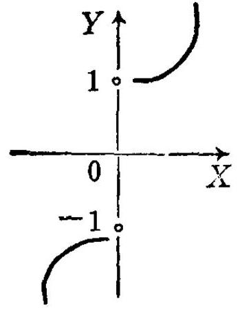

56. 提示: 设 $f\left( x\right)  = {ax} + b$ 。

得到: $a\{ a\left\lbrack  {{ax} + b}\right\rbrack   + b\}  + b = {8x} + 7$ 。

$\left\{  \begin{array}{l} {a}^{3} = 8 \\  {a}^{2}b + {ab} + b = 7 \end{array}\right.$ 得到 $a = 2, b = 1$ 。

$$
\therefore f\left( x\right)  = {2x} + 1
$$

57. 提示: (2) 利用公式 $\left| {m + n + p}\right|  \leq  \left| m\right|  + \left| n\right|  + \left| p\right|$ 。 设 $\left| {f\left( 1\right) }\right| ,\left| {f\left( 2\right) }\right| ,\left| {f\left( 3\right) }\right|$ 都小于 $\frac{1}{2}$ 。

$\because \left| {f\left( 1\right)  - {2f}\left( 2\right)  + f\left( 3\right) }\right|  = 2$ 。

又 $\because \left| {f\left( 1\right)  - {2f}\left( 2\right)  + f\left( 3\right) }\right|  \leq  \left| {f\left( 1\right) }\right|  + 2\left| {f\left( 2\right) }\right| \; + \left| {f\left( 3\right) }\right|$ 而 $\left| {f\left( 1\right) }\right|  + 2\left| {f\left( 2\right) }\right|  + \left| {f\left( 3\right) }\right| \; < \frac{1}{2} + 2 \cdot  \frac{1}{2} + \frac{1}{2} = 2$ 。导致 $2 > 2$ ,

$\therefore$ 在 $\left| {f\left( 1\right) }\right| ,\left| {f\left( 2\right) }\right| ,\left| {f\left( 3\right) }\right|$ 中至少有一个不小于 $\frac{1}{2}$ 。

58. 提示: (1) 判别式 $\bigtriangleup  = {40}{a}^{2} + {\left( 3a + 1\right) }^{2} > 0,\left( 2\right)$ 若证抛物线无论对于任何的 $a$ 恒过两定点,只要找到与 $a$ 无关的两点即可。

将抛物线方程变为 $a{x}^{2} + \left( {{3a} - 1}\right) x - \left( {{10a} + 3 + y}\right)  = 0$ 。

$$
x = \frac{1 - {3a} \pm  \sqrt{{49}{a}^{2} + \left( {6 + {4y}}\right) a + 1}}{2a}\text{ 。 }
$$

只有当 $6 + {4y} =  \pm  {14}$ 时,即 ${y}_{1} = 2;{y}_{2} =  - 5$ 时 ${x}_{1} =  - 5;{x}_{2} = 2$ ,与 $a$ 无关。

$\therefore$ 抛物线恒过两定点 $A\left( {-5,2}\right) , B\left( {2, - 5}\right)$ 。

59. 提示: 设 $f\left( x\right)  = {x}^{2} - {2ax} + b,\because$ 二次项系数大于零, $\because$ 抛物线开口向上, $\because 0 < b < {2a} - 1$ ,

$\therefore f\left( 0\right)  = b > 0, f\left( 1\right)  =  - \left( {{2a} - 1}\right)  + b, < 0$ 。

$\therefore$ 抛物线在 0 与 1 之间与 $x$ 轴相交,

$\therefore f\left( x\right)  = 0$ 有一根在 0 与 1 之间。

又 $\because f\left( m\right)  = {m}^{2} - {2am} + b = {m}^{2}\left( {1 - \frac{2a}{m} + \frac{b}{{m}^{2}}}\right)$ 。

只要 $m$ 足够大,就能使 $f\left( m\right)  > 0$ 。

$\therefore$ 抛物线必在大于 1 的区间上与 $x$ 轴相交,

$\therefore f\left( x\right)  = 0$ 必有一根大于 1 。

60. 提示: $f\left( x\right)  + f\left( y\right)  = {x}^{2} - {6x} + 5 + {y}^{2} - {6y} + 5$

$$
= {\left( x - 3\right) }^{2} + {\left( y - 3\right) }^{2} - 8 \leq  0\text{ 。 }
$$

满足此条件的点,必在以 $\left( {3,3}\right)$ 为圆心,以 $2\sqrt{2}$ 为半径的圆内或圆周上。

$$
f\left( x\right)  - f\left( y\right)  = {x}^{2} - {6x} + 5 - {y}^{2} + {6y} - 5 \geq  0
$$

即 $\left( {x - y}\right) \left( {x + y - 6}\right)  \geq  0$ 。

则有 (I) $\left\{  \begin{array}{l} x - y \geq  0 \\  x + y - 6 \geq  0 \end{array}\right.$ 和 (II) $\left\{  \begin{array}{l} x - y \leq  0 \\  x + y - 6 \leq  0\text{ 。 } \end{array}\right.$

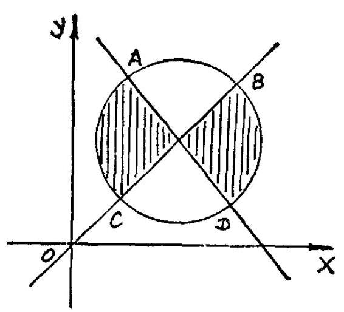

(60 题)

满足 (I) 的点, 在 $x - y = 0$ 之下,及 $x + y \; - 6 = 0$ 之上。

满足 (II) 的点,在 $x - y = 0$ 之上,及 $x + y \; - 6 = 0$ 之下。

综合起来, 满足题设条件的点位于扇形 $A{O}^{\prime }C$ ,扇形 $B{O}^{\prime }D$ 内,(包括周界)。

61. 提示: $\because {a}^{2} = {c}^{2} - {b}^{2}\;2{\log }_{a}a = {\log }_{a}\left( {c - b}\right)  + {\log }_{a}\left( {c + b}\right)$

$\therefore \;2 = \frac{1}{{\log }_{c - b}a} + \frac{1}{{\log }_{b + c}a}$ 去分母,得到

$$
{\log }_{b + c}a + {\log }_{c - b}a = 2{\log }_{b + c}a \cdot  {\log }_{c - b}{a}_{0}
$$

62. 提示: $\because 2{\log }_{m}x = {\log }_{k}x + {\log }_{n}x$

$$
2\frac{{\log }_{k}x}{{\log }_{k}m} = {\log }_{k}x + \frac{{\log }_{k}x}{{\log }_{k}n}\;\because \;{\log }_{k}x \neq  0
$$

$\therefore \frac{2}{{\log }_{k}m} = 1 + \frac{1}{{\log }_{k}n}\;\therefore \;2{\log }_{k}n = {\log }_{k}m\left( {{\log }_{k}n + 1}\right)$ 。

$$
\therefore \;{\log }_{k}{n}^{2} = {\log }_{k}m \cdot  {\log }_{k}{nk} = {\log }_{k}\left( {nk}\right) {\log }_{\mathrm{k}}\mathrm{m}\text{ , }
$$

$$
\therefore \;{n}^{2} = \left( {nk}\right) {\log }_{\mathrm{k}}{\mathrm{m}}_{\mathrm{o}}
$$

63. 提示: (1) $f\left\lbrack  {f\left( x\right) }\right\rbrack   = f\left( {x - \frac{1}{x}}\right)  = \left( {x - \frac{1}{x}}\right)$

$$
- \frac{1}{x - \frac{1}{x}} = \frac{{x}^{2} - 1}{x} - \frac{x}{{x}^{2} - 1}
$$

$\because \frac{{x}^{2} - 1}{x} - \frac{x}{{x}^{2} - 1} = x$ ,得 ${x}^{2} = \frac{1}{2}$ 。 $\therefore x = \frac{\sqrt{2}}{2}$ ,

(2)略。

64. 提示: 化为关于 $x$ 的一元二次方程, $\because x$ 为实数,判别式 $\bigtriangleup   \geq  0$ 。

答: 当 $x = \frac{\sqrt{2}}{4}$ 时, $y$ 极小 $= \frac{\sqrt{2}}{4}$ ,

65. 提示: 设斜边为 $c$ ,一锐角为 $\theta , c + c\sin \theta  + c\cos \theta \; = p\cdots \cdots \left( 1\right) ,\Delta  = \frac{1}{2}c\sin \theta  \cdot  c\cos \theta ,\Delta  = \frac{1}{4}\left( {{p}^{2} - {2cp}}\right) ,$ 其中 $c = \frac{p}{1 + \sin \theta  + \cos \theta }$ 答: 等腰直角三角形时,面积的极大值为 $\frac{3 - 2\sqrt{2}}{4}{P}^{2}$ 。

66. 提示: (略)

答: 当 $x = 2$ 时, ${x}^{2} + {y}^{2}$ 极大 $= 4$ ; 当 $x = 0$ 时, ${x}^{2} + {y}^{2}$ 极小 $= 0$ 。

67. 提示: (1) ${\left( px + qy\right) }^{2} - {\left( px - qy\right) }^{2} = {4pqxy}$

$\therefore \;{xy}$ 极大 $= \frac{{K}^{2}}{4pq}$ 。

(2)答: ${px} + {qy}$ 极大 $= \sqrt{4pqK}$ 。

68. 提示: 由 ${2x} + {3y} = 6$ 得到 $y = 2 - \frac{2}{3}x$

$$
{xy} =  - \frac{2}{3}{\left( x - \frac{3}{2}\right) }^{2} + \frac{3}{2}
$$

答: 当 $x = \frac{3}{2}, y = 1$ 时 $x{y}_{\max } = \frac{3}{2},{xy}$ 没有极小值。

69. 提示: $y = {b}^{2}{x}^{2} + \left( {{b}^{2} + {c}^{2} - {a}^{2}}\right) x + {c}^{2}$ 。

$$
\Delta  = {\left( {b}^{2} + {c}^{2} - {a}^{2}\right) }^{2} - 4{b}^{2}{c}^{2} = {\left( 2bc\cos A\right) }^{2} - 4{b}^{2}{c}^{2}
$$

$$
= 4{b}^{2}{c}^{2}\left( {{\cos }^{2}A - 1}\right)  < 0\text{ 。又 }\because {b}^{2} > 0\text{ 。 }
$$

$\therefore$ 抛物线开口向上,又与 $x$ 轴无交点,

$\therefore \;{b}^{2}{x}^{2} + \left( {{b}^{2} + {c}^{2} - {a}^{2}}\right) x + {c}^{2} > 0$ 。

70. 提示: 设三边分别为 $a,{aq}, a{q}^{2},\left( {a, q\text{ 均为正 }}\right)$ 由三角形中两边之和大于第三边。 $a + {aq} > a{q}^{2}$ ,解得 $\frac{1 - \sqrt{5}}{2} < q < \frac{1 + \sqrt{5}}{2}$ 。

同理 $a{q}^{2} + {aq} > a$ ,解得 $q < \frac{-1 - \sqrt{5}}{2}, q > \frac{\sqrt{5} - 1}{2}$ 。

综上所述,可知 $\frac{\sqrt{5} - 1}{2} < q < \frac{\sqrt{5} + 1}{2}$ 。

71. 提示: 设 $\angle {xoy} = \alpha  \circ  {OP} = x,{OA} = a,{AB} = b$ 。

则 $P{A}^{2} = {x}^{2} + {a}^{2} - {2ax}\cos \alpha$

$$
P{B}^{2} = {x}^{2} + {\left( a + b\right) }^{2} - 2\left( {a + b}\right) x\cos \alpha ,
$$

$$
P{A}^{2} + P{B}^{2} = 2{x}^{2} - 2\left( {{2a} + b}\right) x\cos \alpha  + {a}^{2} + {\left( a + b\right) }^{2}\text{ 。 }
$$

当 $x = \frac{{2a} + b}{2}\cos \alpha$ 时, $P{A}^{2} + P{B}^{2}$ 有极小值。取 ${AB}$

的中点 $K$ ,则 ${OK} = a + \frac{b}{2} = \frac{{2a} + b}{2}$ 。 自 $K$ 做 ${KP} \bot  {OY}$ ,交 ${OY}$ 于 $P$ ,则 ${OP} = {OK}\cos \alpha$ 。 则 ${OP} = \frac{{2a} + b}{2}\cos \alpha$ 。 $\therefore P$ 为所求。

72. 提示:

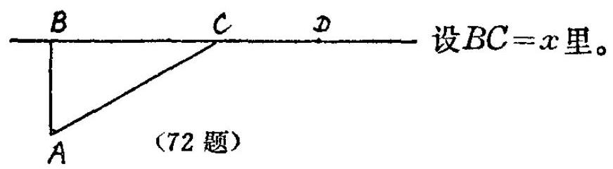

则 ${AC} = \sqrt{{x}^{2} + {2}^{2}},{CD} = \left( {{16} - x}\right)$ 里,则此人,由 $A$ 至 $D$ 的时间为 $y = \frac{\sqrt{{x}^{2} + 4}}{4} + \frac{6 - x}{5}$ 。

变为关于 $x$ 的方程。

$$
9{x}^{2} - {32}\left( {{5y} - 6}\right) x - 4\left( {{100}{y}^{2} - {240y} + {119}}\right)  = 0
$$

$\because x$ 为实数, $\;\therefore \;\Delta  \geq  0$

$$
{32}^{2}{\left( 5y - 6\right) }^{2} + {9.16}\left( {{100}{y}^{2} - {240y} + {119}}\right)  \geq  0\text{ 。 }
$$

$$
{500}\left( {{20}{y}^{2} - {48y} + {27}}\right)  \geq  0\text{ 。 }
$$

$$
{500}\left( {{2y} - 3}\right) \left( {{10y} - 9}\right)  \geq  0\text{ 。 }y \geq  \frac{3}{2},\;y \leq  \frac{9}{10}\text{ 。 }
$$

即 $y$ 极小 $= \frac{3}{2}$ ,则 $x = 2\frac{2}{3}$ 。

答: 应将船开往距与船最近点为 $2\frac{2}{3}$ 里处。

73. 提示: 设 $a$ 为首项, $d$ 为第四项。

$\therefore d = a + 3\left( {c - b}\right)$ ,即 $a - d =  + 3\left( {b - c}\right) \cdots \cdots$(1)

又 $\because a + d = b + c\cdots \cdots$(2)

(1) $\times$ (2) $,{a}^{2} - {d}^{2} =  + 3\left( {{b}^{2} - {c}^{2}}\right)$

$\therefore {a}^{2} - 3{b}^{2} + 3{c}^{2} - {d}^{2} = 0$ 。

74. 答: 所求三数是 $\frac{1}{4},\frac{5}{4},\frac{9}{4}$ ; 或1,5,9。

75. 提示: ${a}_{n} = \lg \frac{3}{\sqrt[5]{{2}^{{4n} - 1}}} = \lg 3 - \frac{{4n} - 1}{5}\lg 2$ 。

可知此数列是首项为 $\lg 3 - \frac{3}{5}\lg 2$ ,公差是 $- \frac{4}{5}\lg 2$ 。的等差数列。

答:

$$
{S}_{n} = \lg \frac{{3}^{n}}{5\sqrt{{2}^{{2n} + n}}}
$$

76. 提示: $d = {a}_{2} - {a}_{1} = {a}_{3} - {a}_{2} = \cdots \cdots  = {a}_{n} - {a}_{n - 1}$ 。

又由公式 ${a}_{n} = {a}_{1} + \left( {n - 1}\right) d$

得到

$$
d = \frac{{a}_{n} - {a}_{1}}{n - 1}
$$

$$
\therefore \frac{1}{\sqrt{{a}_{1}} + \sqrt{{a}_{2}}} + \frac{1}{\sqrt{{a}_{2}} + \sqrt{{a}_{3}}} + \cdots  + \frac{1}{\sqrt{{a}_{n - 1}} + \sqrt{{a}_{n}}} -
$$

$$
= \frac{\sqrt{{a}_{2}} - \sqrt{{a}_{1}}}{{a}_{2} - {a}_{1}} + \frac{\sqrt{{a}_{3}} - \sqrt{{a}_{2}}}{{a}_{3} - {a}_{2}} + \cdots  + \frac{\sqrt{{a}_{n}} - \sqrt{{a}_{n - 1}}}{{a}_{n} - {a}_{n - 1}}
$$

$= \frac{\sqrt{{a}_{n}} - \sqrt{{a}_{1}}}{d} = \frac{n - 1}{\sqrt{{a}_{1}} + \sqrt{{a}_{n}}}$  。

77. 提示: $\left| x\right|  + \left| y\right|  = 1$ ,有 $4 \times  1$ 组: $\left( {0,1}\right) ,\left( {1,0}\right)$ , $\left( {0, - 1}\right) ,\left( {-1,0}\right) ;\left| x\right|  + \left| y\right|  = 2$ ,有 $4 \times  2 - 2$ 组; $\left| x\right| \; + \left| y\right|  = 3$ ,有 $4 \times  3$ 组; $\left| x\right|  + \left| y\right|  = 4$ ,有 $4 \times  4 - 2$ 组; $\left| x\right|  + \left| y\right|  = 5$ 有 $4 \times  5$ 组。

$\left| x\right|  + \left| y\right|  = {98}$ ,有 $4 \times  {98} - 2$ 组; $\left| x\right|  + \left| y\right|  = {99}$ ,有 $4 \times  {99}$ 组。

答: 共有整数数 19702 组。

78. 答: $a = {45}, q = \frac{2}{3}$ ; 所求级数为

$$
{4.5} + {30} + {20} + \cdots \cdots  + {45}{\left( \frac{2}{3}\right) }^{n - 1} + \cdots \cdots
$$

79. 答: $a = 4, q = \frac{1}{3}$ ; 等比数列为

$$
{12},4,\frac{4}{3},\cdots \cdots {12}{\left( \frac{1}{3}\right) }^{n - 1}\text{ 。 }
$$

80. 提示: $\because$ 中央两项的和等于首项和末项的和。其和为 $p$ 。数列的和为 ${np}$ ,而方程的根亦为 ${np}$ 。

81. 提示: 依题意,有 $\left\{  \begin{array}{l} {a}_{n} + {a}_{n + 1} =  - {3n} \\  {a}_{n} \cdot  {a}_{n + 1} = {c}_{n}\cdots  \end{array}\right.$(1) (2)

$\because {a}_{1} = 1$ ,代入 (1) 得到 ${a}_{2} =  - 4$ ,依此类推,得到 ${a}_{3} =  - 2,{a}_{4} =  - 7,{a}_{5} =  - 5,{a}_{6} =  - {10}$ 。 $\therefore {c}_{5} = {50}$

82. 提示: $\because {a}_{1}{a}_{2} = \frac{{a}_{1} - {a}_{2}}{d},{a}_{2}{a}_{3} = \frac{{a}_{2} - {a}_{3}}{d},\cdots \cdots ,{a}_{n - 1}{a}_{n} \; = \frac{{a}_{n - 1} - {a}_{n}}{d}$ ,其中 $d$ 为公差。

$\therefore \;{a}_{1}{a}_{2} + {a}_{2}{a}_{3} + \cdots \cdots {a}_{n - 1}{a}_{n} = \frac{{a}_{1} - {a}_{n}}{d}$

$\because \;\frac{1}{{a}_{n}} = \frac{1}{{a}_{1}} + \left( {n - 1}\right) d,\frac{{a}_{1} - {a}_{n}}{d} = \left( {n - 1}\right) {a}_{1}{a}_{n},$

$\therefore \;{a}_{1}{a}_{2} + {a}_{2}{a}_{3} + \cdots \cdots  + {a}_{n - 1}{a}_{n} = \left( {n - 1}\right) {a}_{1}{a}_{n}$

83. 提示: 第 $n$ 组数的第一个数为

$$
1 + \left\lbrack  {\left( {\frac{n\left( {n - 1}\right) }{2} + 1}\right)  - 1}\right\rbrack   \cdot  2 = {n}^{2} - n + 1\text{ 。 }
$$

第 $n$ 组数的最后一个数为

$$
1 + \left\lbrack  {\frac{n\left( {n + 1}\right) }{2} - 1}\right\rbrack   \cdot  2 = {n}^{2} + n - 1\text{ 。 }
$$

则第 $n$ 组数的和为

$$
\frac{n\left\lbrack  {\left( {{n}^{2} - n + 1}\right)  + \left( {{n}_{2} + n + 1}\right) }\right\rbrack  }{2} = {n}^{3}\text{ 。 }
$$

前 $n$ 组数总和为

$$
{1}^{3} + {2}^{3} + {3}^{3} + \cdots \cdots  + {n}^{3} = \frac{{n}^{2}{\left( n + 1\right) }^{2}}{4}\text{ 。 }
$$

84. 提示: 只要证 $\operatorname{tg}\frac{\alpha  + \gamma }{2}\operatorname{tg}\beta$ 即可。

85. 提示: 设 $A = {4C}, B = {2C}$ ,则 $\sin {4C} = \sin \left( {{180}^{ \circ  } - {3C}}\right)$

$\therefore \;\sin {4C} = \sin {3C}$

再利用正弦定理,证明 $\frac{1}{\sin A} + \frac{1}{\sin B} = \frac{1}{\sin C}$ 。

86. 提示: 由 $2{b}^{2} = {a}^{2} + {c}^{2}$ ,又: ${b}^{2} = {a}^{2} + {c}^{2} - {2ac}\cos B$ ,

得到: ${b}^{2} = {2ac}\cos B$ ,由正弦定理:

$$
\sin B = 2\sin A\sin C\cos B\text{ 。 }
$$

$$
\frac{\sin \left( {A + C}\right) }{\sin A\sin C} = \frac{2\cos B}{\sin B},\;\therefore \operatorname{ctg}A + \operatorname{ctg}C = 2\operatorname{ctg}B\text{ 。 }
$$

87. 提示: 设内切元半径为 $x, a = x + y, b = x + z, c = y \; + z$ ,依题意,得到 $y = \frac{x + z}{2}$ 。

$\because a\text{ 、 }b\text{ 、 }c$ 成等差数列,则 $a\text{ 、 }b\text{ 、 }D$ 亦为等差数列。又

$\because b - a = a - d = \frac{z - x}{2}\;\therefore d\text{ 、 }a\text{ 、 }b$ 为等差数列。

$\therefore d\text{ 、 }a\text{ 、 }b\text{ 、 }D$ 成等差数列。

88. 答:(1)甲种产品每月增长率为 25%，一月份乙种产品产量为 20 件。

(2)第一季度两种产品共生产 151 件。

89. 答: 5 边形或 6 边形。

90. 提示: ${a}_{k} = 2 - \frac{1}{2}\left( {K - 1}\right) \lg 2$ ,

解不等式组 $\left\{  \begin{array}{l} 2 - \frac{1}{2}\left( {K - 1}\right) \lg 2 \geq  0 \\  2 - \frac{1}{2}\left\lbrack  {\left( {K + 1}\right)  - 1}\right\rbrack  \lg 2 < 0 \end{array}\right.$

得到, $K \leq  {14.2}, K > {13.2}, K$ 是自然数 $K = {14}$ 。

$$
{S}_{14} = \frac{{a}_{1} + {a}_{14}}{2} \cdot  {14} = {14.30}\text{ 。 }
$$

91. 提示: 设年增长率为 $x$

则 ${100}{\left( 1 + x\right) }^{40} = {500}$ ,即 ${\left( 1 + x\right) }^{40} = 5$ ,

$$
{40}\ln \left( {1 + x}\right)  = \ln 5,\ln 5 = \ln {10} \cdot  \lg 5 = {1.61}
$$

$$
x \approx  \frac{\ln 5}{40} = \frac{1.61}{40} = {0.04025} \approx  4\%
$$

92. 答: 16

93. 答: $5 \cdot  {C}_{4}^{1} \cdot  {A}_{5}^{4} = {2400}$

94. 答: ${C}_{n}^{2} - {C}_{m}^{2} + 1$ 条直线, ${C}_{n}^{3} - {C}_{m}^{3}$ 个三角形。

95. 答: ${C}_{15}^{8} \cdot  {C}_{12}^{7} \cdot  {P}_{15} = {5096520} \cdot  {15}!$

96. 答: $\frac{7!}{2!3!} = {420}$ 。

97. 答: (1) 5 的倍数有 $5,{10},{15},{20}\cdots \cdots {9995},{10000}$ 。

由 ${10000} = 5 + \left( {n - 1}\right)  \cdot  5$ ,得到 $n = {2000}$ 。

(2)由 1 到 10000 是 5 的倍数且各位上数字不相同的数共有 $1 + {17} + {136} + {952} = {1106}$ 个。

98. 答:(1)大于 5000 的有 ${A}_{3}^{1} \cdot  {A}_{4}^{3} = {72}$ (种)

(2)(提示)被 4 整除的数，其末两位数一定被 4 整除。

共有 ${A}_{3}^{2} + 3\left( {{A}_{3}^{2} - {A}_{2}^{1}}\right)  = {18}$ (种)

99. 提示: $\because 2{C}_{n}^{5} = {C}_{n}^{4} + {C}_{n}^{6}\therefore {n}_{1} = 7,{n}_{2} = {14}$ 。

(1)当 $n = 7$ ，设 ${T}_{k + 1}$ 项不含 $x$ ，

$$
{T}_{k + 1} = {C}_{7}^{k}{x}^{\frac{7 - {28}}{3}}, K = 4\text{ 。 }
$$

$$
{T}_{5} = {C}_{7}^{4} = {35}
$$

(2)当 $n = {14}$ ， ${T}_{r + 1} = {C}_{14}^{r}{x}^{\frac{{7r} - {56}}{3}}$ ， $r = 8$

$$
{T9} = {C}_{14}^{8} = {3003}\text{ 。 }
$$

100. 提示: 原式 $= \frac{\left( {1 + x}\right) \left\lbrack  {{\left( 1 + x\right) }^{10} - 1}\right\rbrack  }{1 + x - 1} = \frac{{\left( 1 + x\right) }^{11} - \left( {1 + x}\right) }{x}$

$$
{C}_{11}^{9} = {35}\text{ 。 }
$$

101. 提示: 原式中 ${x}^{2}$ 的系数为 ${C}_{3}^{2} + {C}_{4}^{2} + {C}_{5}^{2}\cdots \cdots  + {C}_{n + 2}^{2}$

$$
\because {C}_{m}^{n - 1} = {C}_{m + 1}^{n} - {C}_{m}^{n}
$$

$\therefore \;{C}_{3}^{2} + {C}_{4}^{2} + {C}_{5}^{2} + \cdots \cdots  + {C}_{n + 2}^{2} = {C}_{n + 3}^{3} - 1$ 。

102. 提示: $\because \left( \frac{1}{{25}^{3}}\right) {\log }_{5}^{9} = \left( {5}^{-6}\right) {\log }_{5}^{9} = {3}^{-{12}}$ 。

原展开式的末项为 ${\left( -1\right) }^{6n}{\left( \sqrt[3]{{3}^{-2}}\right) }^{6n} = {3}^{-{4n}}$

$$
\therefore \;{3}^{-{12}} = {3}^{-{4n}}, n = 3\text{ 。 }
$$

则 ${\left. \sqrt[4]{27} - \sqrt[3]{{3}^{-2}}\right) }^{18}$ 的第七项

${T}_{7} = {C}_{18}^{6}{\left( -\sqrt[3]{{3}^{-2}}\right) }^{6}{\left( \sqrt[4]{27}\right) }^{12} = {C}_{18}^{6} \cdot  {27}^{3} \cdot  {3}^{-4} = {4511052}$  。

103. 提示: ${T}_{k + 1} = {C}_{15}^{k}{\left( \frac{1}{x}\right) }^{k}{\left( \sqrt{x}\right) }^{{15} - k} = {C}_{15}^{k}x\frac{{15} - {3K}}{2}$ 。

令 $\frac{{15} - {3K}}{2} = 3, K = 3,{C}_{15}^{3} = {455}$ 。 $d = {555} - {455} = {100}$ 。

${555} = {55} + \left( {n - 1}\right) {100}, n = 6\therefore$ 在 55 与 555 之间插入六个。等差中项。

104. 提示: 所有项系数和 ${1024} + {1024} = {2048}$ 。

由 ${2}^{n} = {2048},\therefore n = {11}$ ,

则 ${T}_{6},{T}^{7}$ 为两个中项。

$\begin{array}{l} {T}_{6} = {C}_{11}^{5}{\left( -5\sqrt{{x}^{-2}}\right) }^{5}{\left( \sqrt[3]{{x}^{-1}}\right) }^{6} =  - {462}{x}^{-4} =  - \frac{462}{{x}_{4}}\text{ 。 } \\  {T}_{7} = {C}_{11}^{6}{\left( -5\sqrt{{x}^{-2}}\right) }^{6}{\left( \sqrt[3]{{x}^{-1}}\right) }^{5} = {462}{x}^{-\frac{61}{15}}\text{ 。 } \end{array}$

105. 提示: 原式可变为 ${\left( 1 - 2x\right) }^{20}$

答: 其前三项是: $1, - {40x},{760}{x}^{2}$

其后三项是: ${95} \cdot  {2}^{19} \cdot  {x}^{18}, - 5 \cdot  {2}^{21} \cdot  {x}^{19},{2}^{20}{x}^{20}$ 。

106. 提示: ${C}_{n}^{n - 2} + {C}_{n}^{n - 1} + {C}_{n}^{n} = {22}$ 即 ${C}_{n}^{2} + {C}_{n}^{1} + 1 = {22}$ 。

$\therefore n = 6$ 。

${\left( {x}^{\lg x} - 3\right) }^{6}$ 的中项为 ${T}_{4} = {C}_{6}^{3}{\left( -3\right) }^{8}{\left( {x}^{\lg x}\right) }^{3} =  - {540}{x}^{3\lg x}$

则 ${x}^{3\lg x} = {1000},{\lg }^{2}x = 1,\lg x =  \pm  1$

$\therefore \;{x}_{1} = {10},\;{x}_{2} = \frac{1}{10}$ 。

107. 略。

108. 略。

109. 提示: 利用公式 $n{C}_{m}^{n} = m{C}_{m - 1}^{n - 1}$ 。

110. 提示: 利用公式 ${C}_{m}^{n - 1} = {C}_{m + 1}^{n} - {C}_{m \circ  }^{n}$

111. 提示: 设 $A$ 单独工作完工需要 $a$ 天, $B$ 单独完工需要 $b$ 天。依题意得到。

$$
\left\{  \begin{array}{l} \frac{16}{a} + \frac{16}{b} = 1 \\  \frac{4}{a} + \frac{{36} + 4}{b} = 1\;a = {24}\text{ (天), }b = {48}\text{ (天)。 } \end{array}\right.
$$

112. 提示: 将 $x = {2z} - {3y}$ 代入 $2{x}^{2} - 3{y}^{2} + {z}^{2} = 0$

解之。得到 $y = z$ 或 ${5y} = {3z}$ 。 $y = z$ (应舍去)。

$\because {5y} = {3z}$ 则设 $y = {3K}, z = {5K}, x = K$

$\therefore \;3 \cdot  5 \cdot  K = {300},\therefore \;K = {20}, x = {20}, y = {60}$ ,

$z = {100}$ 。

113. 提示: (1) 当 $x > 0$ 时, $S = \frac{1}{2}n\left( {n + 1}\right)$

( 2 )当 $x < 0$ 时， $S = 1 - 2 + 3 - 4 + \cdots \cdots  + {\left( -1\right) }^{n - 1}n$ 。

$$
S = \frac{1 - {\left( -1\right) }^{n}\left( {{2n} + 1}\right) }{4}
$$

114. 提示: 第一次注入后溶液的浓度为

$$
\frac{{ar}\%  + \frac{a}{4}P\% }{a + \frac{1}{4}a} = \frac{1}{100}{\left( \frac{4}{5}r + \frac{1}{5}P\right) }_{ \circ  }
$$

第二次注入后溶液的浓度为,

$$
\frac{a\left( {\frac{4}{5}r + \frac{1}{5}P}\right) \%  + \frac{a}{4}P\% }{a + \frac{a}{4}}
$$

$$
= \frac{1}{100}\left\lbrack  {{\left( \frac{4}{5}\right) }^{2}r + \frac{1}{5}P + \frac{4}{52}P}\right\rbrack
$$

第 $n$ 次注入后溶液浓度为

$- \frac{1}{100}\left\lbrack  {{\left( \frac{4}{5}\right) }^{n}r + \frac{1}{5}P + \frac{{4}^{2}}{{5}^{3}}P + \frac{{4}^{2}}{{5}^{3}}P + \cdots \cdots  + \frac{{4}^{n - 1}}{{5}^{n}}P}\right\rbrack \; \geq  \frac{2}{100}$ 解之,得到 $n \geq  \lg \frac{P - r}{P - q}/\lg \frac{5}{4} \; = \lg 2/\lg \frac{5}{4} = {3.103}$ 。

答: 至少要进行注入倒出手续四次, 容器内溶液浓度才不小于 $q\%$ 。

115. 提示: 公差 $d = \lg \frac{{x}_{2}}{{x}_{1}} = \lg \frac{{x}_{3}}{{x}_{2}} = \cdots \cdots  = \lg \frac{{x}_{n + 1}}{{x}_{n}} = \cdots \cdots$ 。

依题意: $\left\{  \begin{array}{l} \lg {x}_{1} + \left( {m - 1}\right) d = l \\  \lg {x}_{1} + \left( {l - 1}\right) d = m, \end{array}\right.$ 得到 $d =  - 1$ ,

得到 ${x}_{1} = {10}^{l + m - 1}$ ,

$\because \;\frac{{x}_{2}}{{x}_{1}} = \frac{{x}_{3}}{{x}_{2}} = \cdots \cdots  = \frac{{x}_{n + 1}}{{x}_{n}} = {10d}$

$\therefore {x}_{1},{x}_{2},\cdots \cdots ,{x}_{n},\cdots \cdots$ 应为

$$
{10}^{l + m - 1},{10}^{l + m - 2},\cdots \cdots ,{10}^{l + m - n},\cdots \cdots
$$

$$
S = \frac{1}{9}\left( {{10}^{l + m} - 1}\right) \text{ 。 }
$$

116. 提示: ${a}^{a} = {\left( c + b\right) }^{c - b},{a}^{a} = {\left( c - b\right) }^{c + b}$

$$
a\lg a = \left( {c - b}\right) \lg \left( {c + b}\right) ;
$$

$$
a\lg a = \left( {c + b}\right) \lg \left( {c - b}\right)
$$

$\because {a}^{2} = {c}^{2} - {b}^{2}$ ,则得到 ${\left( \lg a\right) }^{2} = \lg \left( {c + b}\right) \lg \left( {c - b}\right)$ 。

117. 提示: (1) 设 ${x}_{1} = 1,{x}_{2} = a$ ,

代入 $f\left( {{x}_{1}{x}_{2}}\right)  = f\left( {x}_{1}\right)  + f\left( {x}_{2}\right)$ 即可得出 $f\left( 1\right)  = 0$ 。

( 2 ) $\because \;f\left( x\right)  = f\left( \frac{1}{x}\right) \lg \left( x\right)  + 1$ 。(1)

则 $f\left( \frac{1}{x}\right)  = f\left( x\right) \lg \left( \frac{1}{x}\right)  + 1$

$$
=  - f\left( x\right) \lg x + 1\text{ 。 } \tag{2}
$$

将(2)代入(1):即可得到 $f\left( x\right)  = \frac{1 + \lg x}{1 + {\lg }^{2}x}$ 。

118. 提示: 设船速为 $x$ 公里/小时。 $T = t + {t}_{0}$

依题意: $\;\frac{{S}_{1}}{x + v} + \frac{{S}_{2}}{x - v} \leq  t$ 。

得到 $\frac{t{x}^{2} - \left( {{S}_{1} + {S}_{2}}\right) x + v\left( {{S}_{1} - {S}_{2}}\right)  - t{v}^{2}}{\left( {x + v}\right) \left( {x - v}\right) } \geq  0$ 。

$$
f\left( x\right)  = t{x}^{2} - \left( {{S}_{1} + {S}_{2}}\right) x + v\left( {{S}_{1} + {S}_{2}}\right)  - t{v}^{2} \geq  0\text{ 。 }
$$

解之, 可得船速为

$$
x \geq  \frac{{S}_{1} + {S}_{2} + \sqrt{{\left( {S}_{1} + {S}_{2} - 2vt\right) }^{2} + 8{S}_{2}{vt}}}{2t}\text{ (公里/小时)。 }
$$

119. [提示: 设 $x = \cos \beta , y = \sin \beta$ 代入 $\left| {x\sin \alpha  + y\cos \alpha }\right|$ 后再用加法定理证明。)

120. [提示: 设 $\alpha$ 为这两个方程的公共根,把 $\alpha$ 代入方程后组成一个方程组,消去 $\alpha$ 后得 ${a}^{2} = {b}^{2} + {c}^{2}$ ,本题得证。]

121. [提示: 把 $\sin A\sin C = \frac{\sqrt{3} + 1}{4}$

和 $\cos A \cdot  \cos C = \frac{\sqrt{3} - 1}{4}$ 两式进行相加与相减,从而得 $A - C = {30}^{ \circ  }$ 或 $C - A \; = {30}^{ \circ  }$ 和 $A + C = {120}^{ \circ  }$ ,再求出 $A\text{ 、 }C$ 和 $B$ ,本题得证。]

122. [答: $\cos x - \sin x = \frac{2\sqrt{2} - 1}{3}$ ]。

123. [提示: $1 - \operatorname{tg}A \cdot  \operatorname{tg}B = \frac{-\cos C}{\cos A \cdot  \cos B},\because \angle C > {90}^{ \circ  } \; \therefore \cos C < 0$ ,再考虑 $A\text{ 、 }B$ 为锐角, $\therefore \cos A,\cos B > 0$ 则本题得证。)

124. $\left\lbrack  \left( 1\;\text{ 答 }\;\sin x =  \pm  \frac{4}{5}\;\right) \right\rbrack$ (2)原式 $= \frac{{11}\sqrt{130}}{130}$ ]

125. [提示: 把余切化为正切,利用公式 $\frac{a}{b} + \frac{b}{a} \geq  2$ 再结合同向不等式相加性而证明。]

126. (提示: 设 $x + y = A$ (常数),并且 $x = \frac{A}{2} + Z$ , $y = \frac{A}{2} - Z$ ,代入 $\sin x \cdot  \sin y = {\sin }^{2}\frac{A}{2}\left. {-{\sin }^{2}Z}\right\rbrack$ [答: $\sin x \cdot  \sin y$ 的极大值是 ${\sin }^{2}\frac{A}{2}$ ,极小值是 $\left. {{\sin }^{2}\frac{A}{2} - 1\text{ 即 } - {\cos }^{2}\frac{A}{2}}\right\rbrack$ 。

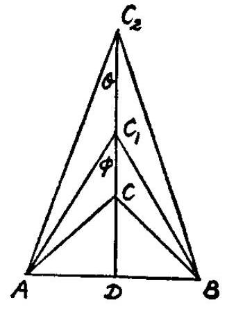

(127 题)

127. (提示: 如图求出 $\angle {ACD} = {45}^{ \circ  }$ 再求出 $\operatorname{tg}\phi  = \frac{1}{2},\operatorname{tg}\theta  = \frac{1}{3}$ , 再用公式 $\operatorname{tg}\left( {\phi  + \theta }\right)$ 求得 $\phi  + \theta  = \frac{\pi }{4}\rbrack$  。

128. [提示: 假定 $a$ 和 $\frac{1}{a}$ 分别为方程的互为倒数的根, 分别代入方程后, 再从这两个方程求出 $a = \frac{1}{\cos \theta  - \sin {2\theta }}$ 后,再求 $\theta \rbrack$ 。

[答: $\theta  = \frac{\pi }{12},\frac{5\pi }{12},\frac{7\pi }{12},\frac{9\pi }{12}$ 。]

129. [答: $a : b : c = 2\sqrt{5} : \sqrt{5} : 3$ ]

130. (略)

131. [提示: 因为 $\bigtriangleup {ABC}$ 是锐角三角形,所以有 $A + B > \; {90}^{ \circ  }, B + C > {90}^{ \circ  }, C + A > {90}^{ \circ  }$ ,在这三个不等式中两边取正弦函数后再分别相加，则本题得证。)

132. [提示: 从等式中可以推得

$$
2\cos \frac{x + y}{2}\cos \frac{x - y}{2} = 2{\sin }^{2}\frac{z}{2} + 2\left( {\cos \frac{x - y}{2}}\right.
$$

$$
\left. {-\cos \frac{x + y}{2}}\right) \sin \frac{z}{2},
$$

从而得 $\;\cos \frac{x + y}{2}\left( {\cos \frac{x - y}{2} + \sin \frac{z}{2}}\right)$

$$
= \sin \frac{z}{2}\left( {\sin \frac{z}{2} + \cos \frac{x - y}{2}}\right) ,
$$

因为 $x, y, z$ 均为锐角, $\cos \frac{x - y}{2} + \sin \frac{z}{2} \neq  0$ ,

$\therefore \;\cos \frac{x + y}{2} = \sin \frac{z}{2}$ ,从而证得 $x + y + z = \pi$ ,则本题得证。)

133.〔答: $\angle A = {60}^{ \circ  }$ 、 $\angle B = {60}^{ \circ  }$ 、 $\angle C = {60}^{ \circ  }$ ]

134. [提示: 把原方程变形为 $2{\sin }^{2}x - \sin x + \left( {a - 1}\right)  = 0$ ,利用判别式确定 $a \leq  \frac{9}{8}$ ,再利用二次方程的求根公式和 $\left| {\sin x}\right|  \leq  1$ 来确定 $a \geq  0$ 和 $a \geq   - 2$ ，最后确定 $a$ 的范围，则本题得解。]

[答: 当 $0 \leq  a \leq  \frac{9}{8}$ 时,方程 $\cos {2x} + \sin x = a$ 有实数解。] 135. [答: $1 - \frac{1}{{2}^{n + 1}}\rbrack$

136. [提示: 过 $A\text{ 、 }D$ 分别作 ${PB}\text{ 、 }{PC}$ 的垂线交 ${PB}\text{ 、 }{PC}$ 的延长线于 $E\text{ 、 }F$ 。再证明 $\bigtriangleup {AEB} \cong  \bigtriangleup {BPC}$ ,又因为

$$
\operatorname{tg}{APB} = \frac{AE}{PE} = \frac{PC}{2PB},\operatorname{tg}{CPD} = \frac{DF}{PF} = \frac{PB}{2PC},
$$

最后求 $\operatorname{tg}{APB}$ 与 $\operatorname{tg}{CPD}$ 的积则本题得证。]

137. (提示: 作弦 ${AK} - {BC}$ 交 ${BC}$ 于 $H$ ,连结 ${EK}$ ,在直角三角形 ${ABH}$ 中, $\operatorname{tg}B = \frac{AH}{BH}$ ,在直角三角形 ${ACH}$ 中,

$$
\operatorname{tg}C = \frac{AH}{CH},\operatorname{tg}B \cdot  \operatorname{tg}C = \frac{A{H}^{2}}{{BM} \cdot  {CH}},
$$

又 ${BH} \cdot  {CH} = {AH} \cdot  {HK},\therefore \frac{A{H}^{2}}{{BH} \cdot  {CH}} = \frac{AH}{HK}$ ,再

利用 ${DH}//{EK}$ 的关系证得 $\frac{AH}{HK} = \frac{AD}{DE}$ ,则本题得证。] 138. [答: 当 $m = \frac{10}{3}$ 时,方程的两根是这个直角三角形的正弦。内切园半径 $r = 2$ ]。

139. [答: ${60}{}^{ \circ  } \leq  B < {90}{}^{ \circ  }$ ]。

140. [答: 三边长 $a = \sqrt{6} - \sqrt{2}, b = 2\sqrt{3}$ ,

$$
c = \sqrt{6} + \sqrt{2}\rbrack
$$

141. [答: $\theta  = {60}^{ \circ  }$ ,方程的根 $x = \frac{\sqrt{3}}{2}\rbrack$ 。

142 [提示: 根据韦达定理证明。]

143. (提示: 从 $\operatorname{tg}{3\alpha } = \operatorname{tg}\left( {\alpha  + {2\alpha }}\right)  = \operatorname{tg}\alpha  \cdot  \operatorname{tg}\left( {60}^{ \circ  }\right.$

$$
+ \alpha ) \cdot  \operatorname{tg}\left( {{60}^{ \circ  } - \alpha }\right)
$$

得 $\operatorname{tg}\left( {3 \cdot  {6}^{ \circ  }}\right)  = \operatorname{tg}{6}^{ \circ  } \cdot  \operatorname{tg}{54}^{ \circ  } \cdot  \operatorname{tg}{66}^{ \circ  }$ ,

从而得 $\operatorname{tg}{6}^{ \circ  } \cdot  \operatorname{tg}{66}^{ \circ  } = \frac{\operatorname{tg}{18}^{ \circ  }}{\operatorname{tg}{54}^{ \circ  }}$ ,

同理

$$
\operatorname{tg}{42}^{ \circ  } \cdot  \operatorname{tg}{78}^{ \circ  } = \frac{\operatorname{tg}{54}^{ \circ  }}{\operatorname{tg}{18}^{ \circ  }},
$$

两式相乘则本题得证。)

144. [提示: 由 $\sin \left( {\alpha  - \beta }\right)  =  - \sin \left( {\alpha  + \beta }\right)$

得

$$
\sin \alpha \cos \beta  = 0
$$

(1)

由

$$
4\cos \alpha \cos \frac{\beta }{2}\cos \frac{\pi  - \beta }{2} = \sqrt{2}
$$

得

$$
\cos \alpha \sin \beta  = \frac{\sqrt{2}}{2}
$$

(2)

两式相加后则本题得证。)

145. [提示: 用韦达定理结合已知条件再由积化和差公式得

$$
\cos \left( {A + B}\right)  + \cos \left( {A - B}\right)  = 1 - \cos C,
$$

再利用

$$
\cos C =  - \cos \left( {A + B}\right)
$$

的关系代入上式后则本题得证。)

146. [答: (1) $A = {105}^{ \circ  }, B = {60}^{ \circ  }, C = {15}^{ \circ  }$

(2)面积等于 $\frac{\sqrt{3}}{4}$ 面积单位。]

147. [答: $\theta  = {75}^{ \circ  }$ ]。

148. [答: $\theta  = {75}^{ \circ  }$ ]。

149. [提示: 设 ${MN} = x,\angle {BNM} = \alpha ,\angle {BMN} = \beta$ ,利用面积公式和正弦定理求得

$$
{x}^{2} = \frac{{12}\sin B}{\cos \left( {\alpha  - \beta }\right)  + \cos B}
$$

因为 $\angle B$ 为定值, $\sin B$ 、 $\cos B$ 也为定值,因而 ${x}^{2}$ 的大小取决于 $\cos \left( {\alpha  - \beta }\right)$ ,

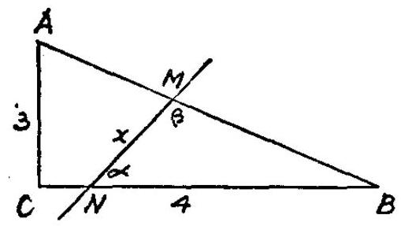

(149 题)

从而得 ${x}^{2} = 4$ ]

[答: 夹在 ${AB}\text{ 、 }{AC}$ 间的线段 ${MN}$ 为 2 ]。

150.【答:甲船航行方向为北 ${66}^{ \circ  }{47}^{\prime }$ 东，速度为 21 浬/小时。] 151. [提示: 两个目标间的距离为 $\frac{{10}\sqrt{6}}{3}$ 里。

152. [提示: 因为三角形三边 $a\text{ 、 }b\text{ 、 }c$ 成等差数列,则有 $a + c = {2b}$ ,再根据正弦定理结合和差化积,则本题得证。)

153. [提示: 由三角形三边 $a\text{ 、 }b\text{ 、 }c$ 的倒数成等差数列,因而得

$\frac{2}{b} = \frac{1}{a} + \frac{1}{c}$ 即 ${2ac} = b\left( {a + c}\right)$ ,由不等式 ${a}^{2} + {c}^{2} \geq  {2ac}$ 和 $a + c > b$ 结合余弦定理则本题得证。]

154. [答: $\left. {-\frac{9}{8}\text{ 。 }}\right\rbrack$

155. [答: 所求等腰三角形的两底角为 ${40}^{ \circ  }$ ,顶角为 ${100}^{ \circ  }$ ]

156. [提示: 设 $A = {2C}$ ,故 $B = {180}^{ \circ  } - {3C}$ ,边 $c$ 为最小,且三边为连续整数,故有 $b = c + 1, a = c + 2$ ,利用正弦定理有 ${\cos }^{2}C = {\left( \frac{c + 2}{2c}\right) }^{2}$ 和 ${\sin }^{2}C = {\left( \frac{{2c} - 1}{4c}\right) }^{2}$ ,两式相加后则本题得解 $\rbrack$

[答: 三角形三边为 $a = 6, b = 5, c = 4$ .]

157. [提示: 利用正弦定理结合和差化积后判定该三角形是等腰三角形或直角三角形。]

158. [答: $\bigtriangleup {ABC}$ 的三边为 $a = 4, b = 5, c = 6$ ]。

159. [提示: 根据已知 $c = {2a}\cos C$ ,利用余弦定理求得 $b = c$ , 从而知 $B = C = {75}^{ \circ  }$ ,再结合正弦定理则本题得证。]

160. [答: 三边之比 $a : b : c = 2\sqrt{2} : 2\sqrt{3} : \left( {\sqrt{6} + \sqrt{2}}\right) \rbrack$

161. [提示: 因为三边成等差数列,所以有 ${2b} = a + c$ ,利用正弦定理再结合合比定理求得 $\sin A + \sin C = 2\sin B$ , 再利用和差化积和倍角公式得 $\sin \frac{B}{2} = \frac{\sqrt{2}}{4}$ ,从而 $\cos \frac{B}{2} = \frac{\sqrt{7}}{2\sqrt{2}}$ ,于是 $\sin B = \frac{\sqrt{7}}{4},\sin C = \frac{\sqrt{7} - 1}{4}$ , $\sin A = \frac{\sqrt{7} + 1}{4}$ ,则本题得解。]

[答: $a : b : c = \left( {\sqrt{7} + 1}\right)  : \sqrt{7} : \left( {\sqrt{7} - 1}\right) \rbrack$

162. [提示: 由两边之和大于第三边得 ${AB} + {AC} > {BC} = 1$ , 由正弦定理得 ${AC} = \frac{2}{\sqrt{3}}\sin B\text{ 、 }{AB} = \frac{2}{\sqrt{3}}\sin \left( {120}^{ \circ  }\right. \; - B)$ ,再把两式相加利用加法定理则本题得证。]

163. [提示: 利用余弦定理得

$$
\cos \varphi  = \frac{{5a} - {3c}}{4a},\;\cos \theta  = \frac{{5c} - {3a}}{4c},
$$

分别代入等式两边则本题得证。)

164. [提示: 由 ${\sin }^{2}A - {\cos }^{2}A = \frac{1}{2}$ 得 $A = {60}^{ \circ  }$ ,再根据正弦定理得 $b + c \leq  2{a}_{0}\rbrack$

165. [提示: $\because \frac{\sin A}{a} = \frac{\sin B}{b} = \frac{\sin C}{c} = K\left( {K \neq  0}\right)$

$\therefore \sin A = {Ka}\cdots \cdots \left( 1\right) ,\sin B = {Kb}\cdots \cdots \left( 2\right) ,$

$\sin C = {Kc}$( 3 )

分别(1)一(2)得

$$
K\left( {a - b}\right)  = 2\sin \frac{C}{2}\sin \frac{A - B}{2}
$$

(4)

(2)一(3)得

$$
K\left( {b - c}\right)  = 2\sin \frac{A}{2}\sin \frac{B - C}{2}
$$

(5)

(3)一(1)得

$$
K\left( {c - a}\right)  = 2\sin \frac{B}{2}\sin \frac{C - A}{2}
$$

(6)

再把(4)ctg $\frac{C}{2} + \left( 5\right)$ ctg $\frac{A}{2} + \left( 6\right)$ ctg $\frac{B}{2}$ 后则本题得证。]

166. [提示: 由已知条件得 $\sin B = \sin \frac{A + C}{2}\cos \frac{A - C}{2}$ ,

$$
\sin B = 2\sin \frac{A + C}{2}\cos \frac{A + C}{2},
$$

$$
2\cos \frac{A + C}{2} = \cos \frac{A - C}{2},
$$

再根据加法定理展开后再变形则本题得证。]

167.〔答: $\frac{3}{16}$ 〕

168.〔答: $\alpha  + \beta  = {60}^{ \circ  }$ ]

169. [答: ${AB} = 2\sqrt{3}\rbrack$

170. [提示: 根据已知条件布列方程组,求出 $a$ 和外接园半径 $R$ ,再根据正弦定理结合和差化积则本题得证。]

171. [提示: 利用正弦定理结合和差化积和加法定理则本题得证。]

172. [答: ${u}_{\text{ 极大 }} = x - y = \frac{\pi }{6}$ ]

173. [答: $\bigtriangleup {ABC}$ 各边的比 $a : b : c = 3 : 4 : 5,\bigtriangleup {ABC}$ 的各内角 $\angle A = \arcsin \frac{3}{5},\angle B = \arcsin \frac{4}{5},\angle C = {90}^{ \circ  }$ ,外接园半径 $R = 5$ 。]

174. [答: 平行四边形两边之比为 $3 : 2$ ]

175. [答: $\bigtriangleup {ABC}$ 的面积 $S = 3\frac{9}{25}$ (平方单位)、外接园半径 $R = \frac{5}{12}\sqrt{21}\rbrack$

176. [答: $m = \frac{9}{8}$ ]。

177. 连结 ${OE},{OF}$ ,由勾股定理有 $E{D}^{2} = O{E}^{2} - O{D}^{2}\cdots \left( 1\right)$ 设半元直径为 $d$ ,元 $c$ 直径为 ${d}_{1}$ ,再根据元幂定理 $O{D}^{2} = \left( {\frac{d}{2} - {d}_{1}}\right)  \times  \frac{d}{2}$ ,代入 (1) 即得。

178. 连结 ${CD},{CO},{OD}$ ,设元 $D$ 半径为 $r$ 、由对称性知元 $E$ 半径亦为 $r$ ,过 $D$ 作 ${DF} \bot  {CO}$ 交 ${CO}$ 于 $F$ ,显然 ${OF} = r,\;\therefore \;O{D}^{2} - F{O}^{2} = D{C}^{2} - C{F}^{2}\left( {\text{ 都 } = D{F}^{2}}\right)$

故 ${\left( 4 - r\right) }^{2} - {r}^{2} = {\left( 2 + r\right) }^{2} - {\left( 2 - r\right) }^{2}$ 解得 $r = 1\left( \mathrm{\;{cm}}\right)$

179. (1)利用弧长公式计算即可，注意同弧上元心角与元周角的关系。

(2)过 $P$ 作 ${PE} \bot  {AB}$ ,连结 ${AP},{AK}$ ,可证 $\bigtriangleup {APK} \; \cong  \bigtriangleup {APE}$ 即得 ${PK} = {PE}$ 。

180. 证明 $\bigtriangleup {A}^{\prime }B{B}^{\prime } \cong  \bigtriangleup {B}^{\prime }C{C}^{\prime } \cong  \bigtriangleup {C}^{\prime }D{D}^{\prime } \cong  \bigtriangleup {D}^{\prime }A{A}^{\prime }$ 即可。

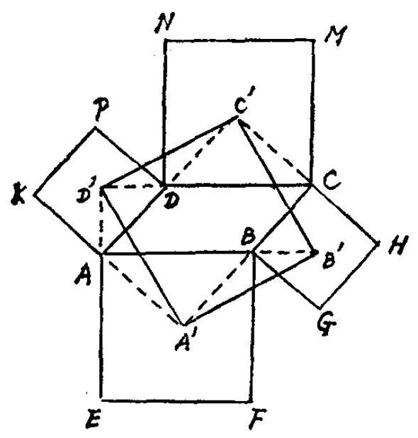

(180 题)

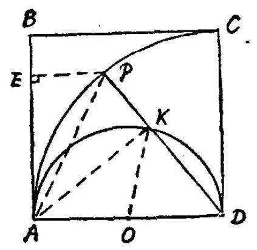

(179 题)

181. 过 $A$ 作 ${AF} \bot  {BC}$ ,则 $\bigtriangleup {CDB} \sim  \bigtriangleup {BFA},\bigtriangleup {BEC} \sim \; \bigtriangleup {CFA}$ ,两边长分别是 $8\mathrm{\;{cm}}$ 和 ${12}\mathrm{\;{cm}}$ 。

182. 可证明 ${MGNE}$ 是平行四边形。

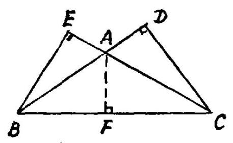

(181 题)

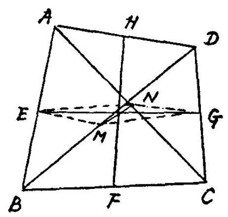

(182 题)

183. 连结 ${AC}$ 取 ${AC}$ 的中点 $M$ ,连结 ${ME}\text{ 、 }{MF}$ ,证明 $\bigtriangleup  {MEF}$ 为等腰三角形。

184. 作 $\square {AMFD},\square {NBCF}$ 连结 ${EM},{EN}$ ,证明 $M\text{ 、 }E\text{ 、 }N$ 共线,再证 ${EF}$ 是 $\bigtriangleup {MFN}$ 的角平分线。

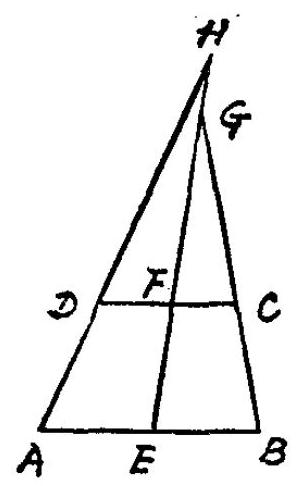

(183 题)

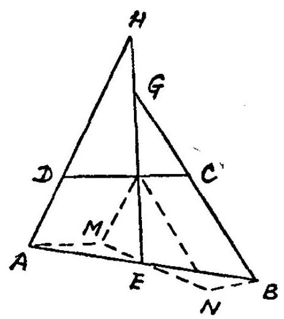

(184 题)

185. 可利用三角形内、外分角线的性质。

186. 过 $P$ 分别作角的两边的垂线,垂足为 $E\text{ 、 }F$ ,证明 $\bigtriangleup {PEM} \cong  \bigtriangleup {PFN}$ 。

187. 过 $O\text{ 、 }P$ 作直径 ${MN}$ ,利用相交弦定理及射影定理。

188. 求出各边均用等腰三角形的底角 $\theta$ 的三角函数来表示。

189. 证明菱形的锐角是 ${30}^{ \circ  }$ 即可。

190. 由 $\bigtriangleup {APQ}$ 用余弦定理求出大元和小元半径关系。

191. 证 $A\text{ 、 }B\text{ 、 }D\text{ 、 }F$ 四点共元即得。

192-195 略。

196. 将 ${PQ},{PR}$ 均用 ${AC}$ 及同一锐角的三角函数表示。

197. 过 $C$ 点作 ${CD}//{BA}$ 交 ${ML}$ 于 $D$ 。

198. 过 $H$ 引 ${HR}//{CA}$ 交 ${AB}$ 于 $R$ ,把三个比都用 ${AB}$ 边的线段表示, 证明 $\bigtriangleup {RBH}$ 和 $\bigtriangleup {GDP}$ 全等。

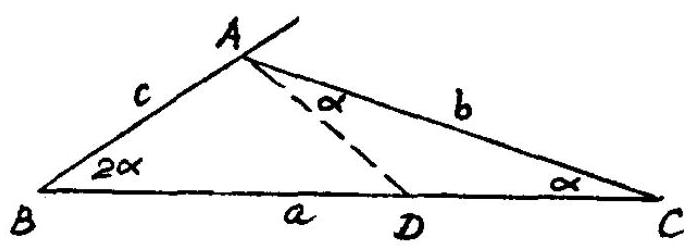

(199 题)

199. 作 ${AD}$ 使 $\angle {CAD} \; = \angle C$ ,则 ${BD} =$

$a - c$ 、用正弦定理求 ${BD}$ 。

200-202 略。

203. ${AB} \cdot  {AE}$ 是 $\bigtriangleup {BEG}$ 的一边 ${BE}$ 的外分线段的积,作其外接元,利用元幂定理,则 ${AB} \cdot  {AE}$ 可用 ${AC}$ 上的线段来表示,同样考虑 ${AD} \cdot  {AF}$ 。

204. 从 ${S}_{\bigtriangleup {AEF}} = 2{S}_{\bigtriangleup {CDE}}$ 推理 $\frac{AE}{2EC} = \frac{DE}{EF}$ ,过 $E$ 作 ${GH}//{BA}$ , 使 ${GH} = {2EC}$ 过 $E$ 作 ${EK}//{CB}$ ,证明 $\bigtriangleup {AKE} \cong  \bigtriangleup {DHG}$ , 或用三角方法来证。

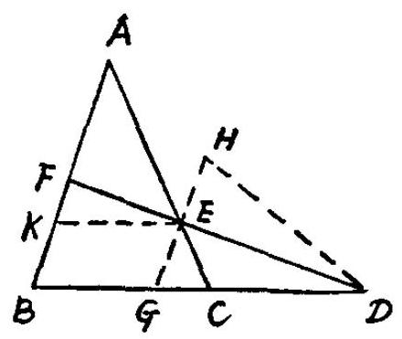

(204 题)

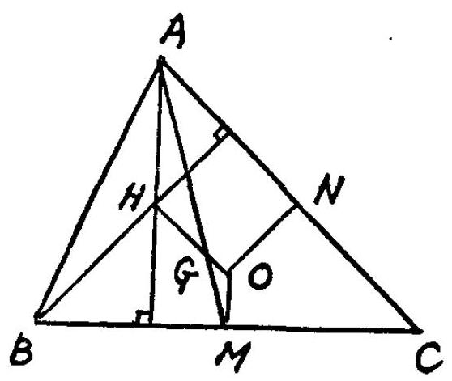

(206 题)

205. 设 $F$ 是 ${CD}$ 中点,连结 ${FB},{FE}$ ,证明 $B\text{ 、 }F\text{ 、 }E \equiv$ 点共线。 $A\text{ 、 }O\text{ 、 }F\text{ 、 }B\text{ 、 }P$ 五点共元,证明 $\angle {AFE} = \angle {APB}$ 即可。

206. 连结 ${GO},{GH}$ ,证明 $\angle {MGO} = \angle {AGH}$ 即得。

207-208 略。

209. 计算各三角形面积, 再求它们的面积的和。

210. 连结 ${AO},{BO}$ ,由二元面积的比定出 $\angle {AOB}$ 的大小。

211. 由正六边形的面积比定出边长的比,在 $\bigtriangleup {ABC}$ 中,找出边角关系,以定出 $\alpha$ 和 $\beta$ 。

212. 求出中线与边长的关系, 然后讨论极值。

213. 略。

214. 最大面积是 $3\frac{3}{5}$ 。

215. 先求出四边形的最大面积, 然后讨论最大外接矩形面积。

216. (1)长和宽是 ${12}\mathrm{\;{cm}}$ 、 ${4.8}\mathrm{\;{cm}}$ ，最大面积是 ${57.6}{\mathrm{\;{cm}}}^{2}$ ；

(2)长和宽是 $9\mathrm{\;{cm}}$ 、 $6\mathrm{\;{cm}}$ ，最大面积是 ${54}{\mathrm{\;{cm}}}^{2}$ 。

217. 略。

218. 分别求出 $r\text{ 、 }R\text{ 、 }t$ 和直角三角形三边的关系,然后用

$$
{R}^{2} = {rt}\text{ 。 }
$$

219. 用余弦定理求出对应角相等。

220. 略。

221. 设扇形、大元、小元的半径分别是 $a\text{ 、 }R\text{ 、 }r$ ,在 $\bigtriangleup {OQC}$ 中,令 $\angle {COQ} = \alpha$ 、推出 $\cos \alpha  = \frac{a - \left( {1 + \sqrt{2}}\right) r}{a - r}$ ,

由

$$
r = \left( {a - r}\right) \sin \left( {{45}^{ \circ  } - \alpha }\right)
$$

推得

$$
\sin \alpha  = \frac{a - \left( {1 + 2\sqrt{2}}\right) r}{a - r},
$$

$$
1 + \sin \alpha  = 2 \times  \frac{a - \left( {1 + \sqrt{2}}\right) r}{a - r} = 2\cos \alpha ,
$$

两边乘以 ${OQ}$ 即得。

222. 内切元面积是 $\frac{1}{3}\pi$ 。

223. (1)内接正方形顶点是正方形各边的中点；

(2) ${S}_{n} = \frac{1}{{2}^{n}}$ ；

(3) $S = 1$ 。

224. 用梯形的边长表示元的半径, 然后比较元的半径和梯形中位线。

[225. 答: $\frac{\sqrt[3]{225}h}{15}$ 。

226. 图略, ${64\pi }$ 。

227. 提示: 作 ${AD} \bot  {BC}$ 交 ${BC}$ 于 $D$ ,有 ${VD} \bot  {BC}$ 。

228. 提示: 作 ${A}_{1}C \bot  {BC}$ 交 ${BC}$ 于 $C$ ,则 ${AC} \bot  {BC}$ ,设 ${AB} \; = m$ ,则 ${A}_{1}B = m\cos \alpha ,{BC} = m\cos {\gamma }_{0}$

答: $\cos \left( {\alpha  - \beta }\right)  = 1,\alpha  = \beta  = {30}$ 。

229. 答: $\frac{\sqrt{3}\left( {1 - \cos \alpha }\right) {\mathrm{h}}^{3}}{2\cos \alpha  - 1}$ 。

230. $\theta  = 2\operatorname{arctg}\left\lbrack  {2{\sin }^{\frac{1}{2}}\left( {\frac{\alpha }{2} + \frac{\pi }{6}}\right) {\sin }^{\frac{1}{2}}\left( {\frac{\alpha }{2} - \frac{\pi }{6}}\right) }\right\rbrack$ 。

231. 答: 4 和 6 。

232. 答: ${AO} = {24},{AC} = {25},{AB} = {26}$

233. 答: $h = \sqrt{2}R, r = \frac{\sqrt{2}}{2}R$ ,

234. 答: ${22}\sqrt{7}{nd}{m}^{2}{24}\sqrt{3}d{m}^{2}{235}$ . 略。

236. 答:

$$
\frac{2}{8{a}^{2} - {4a}{a}^{\prime } + {a}^{\prime 2}}\left\lbrack  {a{a}^{\prime } \pm  \sqrt{{a}^{2}{a}^{\prime 2} + a\left( {a - {a}^{\prime }}\right) \left( {8{a}^{2} - {4a}{a}^{\prime } + {a}^{\prime 2}}\right) }}\right\rbrack
$$

237. 提示: 考虑底面积和高都不变。

238. 答: $V = \frac{512}{3}\pi$

239. 答: $\frac{a}{\sqrt{\frac{a}{{\operatorname{ctg}}^{2}\alpha } - {\operatorname{ctg}}^{2}\beta }}\left( {a = b\text{ 时 }}\right) ,\sqrt{\frac{ab}{{\operatorname{ctg}}^{2}\alpha  - {\operatorname{ctg}}^{2}\beta }}\left( {a \neq  b\text{ 时 }}\right)$

240. 答: 截面过 ${AB}$ 中点时,截面最大。

241. 答: $\frac{7}{3}\pi {a}^{2}b{\sin }^{2}\alpha$

242. 答: 取在过两腰中点的位置上。

243. 略

244. 略

245. 提示: 从 $O$ 作 $\bigtriangleup {ABC}$ 的垂线 ${OT}$ 交 $\equiv$ 个半园于 ${A}^{\prime }$ , ${B}^{\prime },{C}^{\prime }$ ,则 $O{A}^{\prime 2} = {AO} \cdot  {OD}, O{B}^{\prime 2} = {BO} \cdot  {DE}, O{C}^{\prime 2} \; = {CO} \cdot  {OF}$ 。

246. 当 $\theta  =  - \frac{3}{4}\pi$ 时, $f\left( \theta \right)$ 取极大值 $2 + \sqrt{2}$

247. ${\left( x - \frac{10}{9}\right) }^{2} + {\left( y - \frac{11}{3}\right) }^{2} = {\left( \frac{10}{9}\right) }^{-2}$

248. 圆心 $\left( {3,0}\right)$ 在 $y = {kx} + b$ 上， $\therefore {3k} + b = 0$ ；又由直线与椭园相切得 ${b}^{2} = 4{k}^{2} + {16}$ ,解得 $k\text{ 、 }b$ 。

249. $\because \frac{1}{a} + \frac{1}{b} = k\;\therefore \frac{\frac{1}{k}}{a} + \frac{\frac{1}{k}}{b} = 1\therefore \left( {\frac{1}{k},\frac{1}{k}}\right)$ 在

$$
\frac{x}{a} + \frac{y}{b} = 1\text{ 上。 }
$$

250. (1) ${l}_{1} : {ax} - k\left( {y - 1}\right)  = 0,\;{l}_{2} : {kx} - \left( {y + 1}\right)  = 0$ 。分别过定点 $\left( {0,1}\right) \text{ 、 }\left( {0, - 1}\right)$ 。

(2) $\left\{  \begin{array}{l} {ax} - {ky} + k = 0, \\  {kx} - y - 1 = 0\text{ 。 } \end{array}\right.$ 消去参数得 ${y}^{2} - a{x}^{2} = 1$ 。

251. 作 $A$ 关于 $y = x$ 的对称点 ${A}^{\prime }$ ，直线 $B{A}^{\prime }$ 与 $y = x$ 的交点即是 $P$ ,然后利用三角形中两边之和大于第三边证明 | ${PA} - {PB} \mid$ 最大。

252. (1) 这 $n$ 条直线的倾角全是 ${45}^{ \circ  }$ 。

$\therefore {C}_{2} - \sqrt{2} = 2\sqrt{2},{C}_{3} - {C}_{2} = 3\sqrt{2},\cdots \cdots ,{C}_{n} \; - {C}_{n - 1} = n\sqrt{2}$ 。

$\therefore \;{C}_{n} = \left( {1 + 2 + 3 + \cdots \cdots  + n}\right)  \cdot  \sqrt{2} = \frac{n\left( {n + 1}\right) \sqrt{2}}{2}$ 。

(2) ${S}_{n} = \frac{1}{2}{\left( {C}_{n}\right) }^{2} = \frac{1}{4}{n}^{2}{\left( n + 1\right) }^{2}$

(3) $S = {S}_{n} - {S}_{n - 1}$

253. 选 ${AB}$ 为 $x$ 轴, ${AB}$ 的垂直平分线为 $y$ 轴。设 $A\left( {-r, o}\right)$ 、 $B\left( {r, o}\right) \text{ 、 }M\left( {r\cos \alpha , r\sin \alpha }\right)$ ,令 $\angle {MOB} = \alpha$ 为参数,由 $M\text{ 、 }B$ 两点得 ${PB}$ 的方程。 $\because {AP}//{OM},\therefore {k}_{AP} \; = {k}_{OM} = \operatorname{tg}\alpha$ 。由点斜式可得 ${AP}$ 的方程。从这两个方程中消去参数,即可得 $P$ 的轨迹方程。

254. 设抛物线方程为 ${y}^{2} = {2px}$ ,圆心为 ${o}^{\prime }\left( {a, o}\right)$

则园的方程为 ${\left( x - a\right) }^{2} + {y}^{2} = {a}^{2}$ ,

联立得 ${\left( x - a\right) }^{2} + {2px} = {a}^{2}$

解 得 ${x}_{1} = 0,{x}_{2} = 2\left( {a - p}\right)$ 。

当 $a < p$ 时 ${y}^{2} = {2p}{x}_{2}$ 无解。

此时两曲线只有一个交点。

255. 选 $O$ 为原点,过 $O$ 与 ${AB}$ 垂直的直线为 $y$ 轴。利用对称性,设出 $A\text{ 、 }B$ 的坐标。利用两点式,求出直线 ${PA}$ 、 ${PB}$ 的方程。令 $x = 0$ ,得 ${Ox}$ 与 ${Oy}$ 的值,相乘得 ${Ox} \cdot  {Oy} = {r}^{2}$ 。

256. $\because m + 1 \neq  0$ ,配方得

$$
{\left( x + \frac{2 - m}{1 + m}\right) }^{2} + {\left( y + \frac{m - 2}{1 + m}\right) }^{2}
$$

$$
= \frac{{14m} + 2}{1 + m} + 2{\left( \frac{2 - m}{1 + m}\right) }^{2}
$$

(1)设圆心坐标为 $\left( {x, y}\right)$

则 $x = \frac{m - 2}{1 + m},\;y = \frac{2 - m}{1 + m}$ .

消去参数,得 $y + x = 0$ 。

$\therefore$ 圆心在直线 $y + x = 0$ 上。

(2)令 $m = 0\text{ 、 }2$ ，分别得到方程:

$$
{x}^{2} + {y}^{2} + {4x} - {4y} - 2 = 0\text{ 。 }
$$

$$
{x}^{2} + {y}^{2} = {10}
$$

其公共点为 $\left\{  {\begin{array}{l} {x}_{1} = 1, \\  {y}_{1} = 3; \end{array}\;\left\{  \begin{array}{l} {x}_{2} =  - 3, \\  {y}_{2} =  - 1\text{ 。 } \end{array}\right. }\right.$

把这两个点代入原方程，不论 $m$ 为何值，均可使等式成立, $\therefore$ 所有园都过两定点 $\left( {1,3}\right) \text{ 、 }\left( {-3, - 1}\right)$ 。

(3)当 $m =  - 1$ 时,方程为 $x - y + 2 = 0$ ，显然也通过(2) 中确定的那两个点。

257. (1)设切线方程为 $y = {kx}$ ，

则 $\left| \frac{2 - {2k}}{\sqrt{1 + {k}^{2}}}\right|  = \sqrt{2}$

$\therefore \;{k}_{1,2} = 2 \pm  \sqrt{3}$ 。

(2)以 $y = {kx}$ 代入园方程

$\left( {1 + {k}^{2}}\right) {x}^{2} - \left( {4 + {4k}}\right) x + 6 = 0$

解得 $x = \frac{1}{2}\left( {3 \mp  \sqrt{3}}\right)$

代入 $y = {kx}$ ，得 $y = \frac{1}{2}\left( {3 \pm  \sqrt{3}}\right)$

$\therefore$ 直线 ${T}_{1}{T}_{2}$ 的方程为 $y - \frac{\left( 3 \pm  \sqrt{3}\right) }{2}$

$=  - \frac{\sqrt{3}}{3}\left( {x - \frac{3 \mp  \sqrt{3}}{2}}\right)$ ,即 $x + y = 3$ 。

(3)设 $P\left( {{x}_{1},{y}_{1}}\right) , Q\left( {{x}_{2},{y}_{2}}\right) , R\left( {x, y}\right)$

则 ${r}_{1} = \sqrt{1 + {k}^{2}} \cdot  \left| {x}_{1}\right|$

$$
{r}_{2} = \sqrt{1 + {k}^{2}} \cdot  \left| {x}_{2}\right|
$$

$$
r = \sqrt{1 + {k}^{2}}\;\left| {\;x\;}\right|
$$

于是只要证明 $\frac{1}{\left| {x}_{1}\right| } + \frac{1}{\left| {x}_{2}\right| } = \frac{2}{\left| x\right| }$ 即可。

$\because \;{x}_{1} + {x}_{2} = \frac{4 + {4k}}{1 + {k}^{2}}$

$$
x \cdot  {x}_{2} = \frac{6}{1 + {k}^{2}} > 0
$$

$\therefore \frac{1}{\left| {x}_{1}\right| } + \frac{1}{\left| {x}_{2}\right| } = \sqrt{\frac{{x}_{1}^{2} + {x}_{2}^{2} + 2{x}_{1}{x}_{2}}{{\left( {x}_{1} \cdot  {x}_{2}\right) }^{2}}}$

$$
= \frac{\left| {x}_{1} + {x}_{2}\right| }{{x}_{1} \cdot  {x}_{2}} = \frac{2\left| {1 + {2k}}\right| }{3}
$$

由 $\left\{  {\begin{array}{l} y = {kx} \\  x + y = 3 \end{array}\text{ 解得 }x = \frac{3}{1 + k}\text{ 。 }}\right.$

$\therefore \frac{2}{\left| x\right| } = \frac{2\left| {1 + k}\right| }{3}$

$\therefore \frac{1}{\left| {x}_{1}\right| } + \frac{1}{\left| {x}_{2}\right| } = \frac{2}{\left| x\right| }$

$\therefore \frac{1}{{r}_{1}} + \frac{1}{{r}_{2}} = \frac{2}{r}$

258. 将 $y = {ax} + 1$ 代入 $\frac{{x}^{2}}{4} + \frac{{y}^{2}}{9} = 1$ 得 $x$ 的一元二次方程。由韦达定理得出 ${x}_{1} + {x}_{2}$ 与 $a$ 的一个关系式,再与 ${x}_{1} + {x}_{2} \; = \sin {150}^{ \circ  }$ 比较,解出 ${a}_{\mathrm{o}}$

259. 将 $y =  - x + 1$ 代入 $a{x}^{2} + b{y}^{2} = 1$ 。由韦达定理及倾角为 ${135}^{ \circ  }$ 的特点求出 $A\text{ 、 }B$ 的距离及 ${AB}$ 中点坐标,再根据已知二数据求出 $a\text{ 、 }b$ 。

260. 设椭园与平行于直线 ${AB}$ 的两条直线分别相切于 $P\text{ 、 }Q$ , 则其中一点即为所求。

261. 设中点在原点,长轴在 $x$ 轴上; 则椭圆方程为:

$$
\frac{{x}^{2}}{8} + \frac{{y}^{2}}{4} = 1
$$

其焦点为: ${F}_{1}\left( {-2,0}\right) , F\left( {2,0}\right)$ 。

由 $A{F}_{1} \bot  A{F}_{2}$ ,可以求知 $A$ 恰为椭园在短轴上的顶点。 根据物体重心的原理, 可知其余部分重心在未挖去部分的短轴上距中心 $\frac{2}{3\left( {1 + \sqrt{2}\pi }\right) }$ 的地方,

262. 提示: 由 $O$ 向直线 ${AB}$ 引垂线 ${OH}$ 。在直角三角形 ${OHB}\text{ 、 }{OAC}$ (C是园与极轴的交点) 中, $\angle {OBH} = \angle {OCA} \; \therefore \angle {HOB} = \angle {AOC} = \alpha \;\therefore \angle {POH} = \theta  - \alpha  - \beta , \; \therefore \;{OH} = r\cos \left( {\theta  - \alpha  - \beta }\right)$ 。 又 ${OA} = a\cos \alpha ,{OH} \; = {OA}\cos \beta  = a\cos \alpha  \cdot  \cos \beta ,\;\because r\cos \left( {\theta  - \alpha  - \beta }\right) \; = a \cdot  \cos \alpha \cos \beta$ 。

又 $\angle {COH} = \alpha  + \beta$ ,

$\therefore \;H\left( {a\cos \alpha  \cdot  \cos \beta ,\alpha  + \beta }\right)$ 。

263. 设交点坐标为 $P\left( {x, y}\right)$ 。

过 $P$ 相互垂直的直线方程为

$$
Y - y =  - k\left( {X - x}\right)  \rightarrow  {kX} - Y -  - {kx} = 0,
$$

$$
Y - y = \frac{1}{k}\left( {X - x}\right)  \rightarrow  X + {kY} - {ky} - x = 0\text{ 。 }
$$

由相切条件: $\left\{  \begin{array}{l} {\left( y - kx\right) }^{2} = {a}^{2}{k}^{2} - {b}^{2}, \\  {\left( ky + x\right) }^{2} = {a}^{2} - {b}^{2}{k}^{2}\text{ 。 } \end{array}\right.$

消去参数, 得所求方程为

${\left\{  \left( {a}^{2} - {x}^{2}\right) \left\lbrack  {\left( x + y\right) }^{2} - {a}^{2}\right\rbrack   + {b}^{2}\left( {y}^{2} + {b}^{2}\right) \right\}  }^{2} = 4{b}^{2}{x}^{2}{y}^{2}\left\lbrack  {a}^{2}\right. \; \left. {-{\left( x + y\right) }^{2}}\right\rbrack$ 。

264. $P$ 点轨迹为 ${y}^{2} =  - a{x}^{2} + {ax}$ 。顶点 $\left( {\frac{1}{2},\frac{a}{4}}\right)$ ，焦点 $\left( {\frac{1}{2},0}\right)$ ， 准线 $y = \frac{a}{2}$ ,对称轴 $x = \frac{1}{2}$ 。

265. 求出一条切线的斜率为 $k = 1$ ,则 $\sqrt{2}r + r = \frac{1}{4}$ 。

266. 设所求直线为 $y = k\left( {x - 1}\right)$ ,代入 ${y}^{2} = {4x}$ 消去 $x$ ,由韦

达定理得 $\left\{  \begin{array}{ll} \left| {y}_{1}\right|  \cdot  \left| {y}_{2}\right|  = 4 & \text{ ① } \\  \left| {y}_{1}\right|  + \left| {y}_{2}\right|  = \frac{4}{k} & \text{ ② } \end{array}\right.$

再由已知条件得出 $\frac{\left| {y}_{1}\right| }{\left| {y}_{2}\right| } = \frac{2}{1}$ ,与①联立解出 $\left| {y}_{1}\right| \text{ 、 }\left| {y}_{2}\right|$ , 最后由②得出 $k$ 。

267. 设线段的两端点为 $\left( {{x}_{1},{x}_{1}^{2}}\right) ,\left( {{x}_{2},{x}_{2}^{2}}\right)$ 。

则问题即求 ${y}_{\text{ 中 }} = \frac{{x}_{1}^{2} + {x}_{2}^{2}}{2}$ 的最小值,设线段的倾角为 $\alpha$ 。注意到 $\operatorname{tg}\alpha  = \frac{{x}_{2}^{2} - {x}_{1}^{2}}{{x}_{2} - {x}_{1}} = {x}_{2} + {x}_{1}$ ,及 ${x}_{2} - {x}_{1} = l\cos \alpha$ 。

则 ${y}_{\text{ 中 }} = \frac{{x}_{1}^{2} + {x}_{2}^{2}}{2} = \frac{{\left( {x}_{1} + {x}_{2}\right) }^{2} + {\left( {x}_{1} - {x}_{2}\right) }^{2}}{4}$

$$
= \frac{{\operatorname{tg}}^{2}\alpha  + {l}^{2}{\cos }^{2}\alpha }{4} = \frac{1}{4}\left( {{l}^{2}{\cos }^{2}\alpha  + \frac{1}{{\cos }^{2}\alpha }}\right)  - \frac{1}{4}\text{ 。 }
$$

$\therefore$ 当 ${l}^{2}{\cos }^{2}\alpha  = \frac{1}{{\cos }^{2}\alpha }$ 时, ${y}_{\text{ 中 }} = \frac{{2l} - 1}{4}$ 最小。

268. 利用 “ $P$ 到焦点的距离等于 $p$ 到准线的距离” 把问题 (2) 转化为 “ $P$ 到 $A$ 与 $P$ 到准线距离的和最小”。但 $A$ 与准线上的点的连线中垂线最短, $\therefore$ 自 $A$ 向准线作垂线, 垂线与抛物线的交点即是 $P$ 点。

269. 由

$$
{x}^{2} - \left( {2 + m}\right) x + 2 = 0
$$

(1)

$$
\Delta  = {\left( 2 + m\right) }^{2} - 8
$$

(1)当 $m >  - 2 + 2\sqrt{2}$ 或 $m <  - 2 - 2\sqrt{2}$ 时，两线交于 ${P}_{1}\text{ 、 }{P}_{2}$ 两点;

(2)设中点坐标为 $\left( {x, y}\right)$

由方程 (1) 可知: $x = \frac{2 + m}{2}, y = m \cdot  \frac{2 + m}{2}$ 。

消去 $m$ ,得 $y = 2{x}^{2} - {2x}$ 即所求中点轨迹方程。

(3)设 $Q$ 点坐标为 $\left( {x, y}\right)$ 。

则

$$
\left| {O{P}_{1}}\right|  = \sqrt{1 + {m}^{2}} \cdot  \left| {x}_{1}\right| ,
$$

$$
\left| {O{P}_{2}}\right|  = \sqrt{1 + {m}^{2}} \cdot  \left| {x}_{2}\right|
$$

$$
\left| {OQ}\right|  = \sqrt{1 + {m}^{2}} \cdot  \left| x\right|
$$

由条件: $\frac{1}{\left| {x}_{1}\right| } + \frac{1}{\left| {x}_{2}\right| } = \frac{2}{\left| x\right| }$ 。

两边平方: $\frac{{x}_{1}^{2} + {x}_{2}^{2} + 2\left| {{x}_{1} \cdot  {x}_{2}}\right| }{{\left( {x}_{1} \cdot  {x}_{2}\right) }^{2}} = \frac{4}{{x}^{2}}$

再由 (1): $\frac{{\left( 2 + m\right) }^{2} - 2 \cdot  2 + 2 \cdot  2}{4} = \frac{4}{{x}^{2}}$

$$
{x}^{2}{\left( 2 + m\right) }^{2} = {16}
$$

$$
{x}^{2}{\left( 2 + \frac{y}{x}\right) }^{2} = {16}
$$

$$
4{x}^{2} + {4xy} + {y}^{2} = {16}
$$

这就是 $Q$ 点的轨迹方程。

270. 设切线为 $y - {y}_{1} = k\left( {x - {x}_{1}}\right)$

由 $\left\{  \begin{array}{l} y - {y}_{1} = k\left( {x - {x}_{1}}\right) , \\  {y}^{2} = {2px}, \end{array}\right.$

消去 $x$ ,得 $k{y}^{2} - {2py} + {2p}\left( {{y}_{1} - k{x}_{1}}\right)  = 0$( 1 )

令其 $\bigtriangleup  = 0$ ,得 $2{x}_{1}{k}^{2} - 2{y}_{1}k + p = 0$

$$
\left\{  \begin{array}{l} {k}_{1} + {k}_{2} = \frac{{y}_{1}}{{x}_{1}}, \\  {k}_{1} \cdot  {k}_{2} = \frac{p}{2{x}_{1}} \end{array}\right. \tag{2}
$$

(3)

又由(1)得重根为 $y = \frac{p}{k}$ ,

相应的 $x = \frac{p}{2{k}^{2}}$ 。

由两点式得 ${AB}$ 的方程

$$
\frac{y - \frac{p}{{k}_{1}}}{\frac{p}{{k}_{1}} - \frac{p}{{k}_{2}}} = \frac{x - \frac{p}{2{k}_{1}^{2}}}{\frac{p}{2{k}_{1}^{2}} = \frac{p}{2{k}_{2}^{2}}}
$$

化简为 $\;\left( {{k}_{1} + {k}_{2}}\right) y = 2{k}_{1}{k}_{2}x + p$ 。

将 $\left( 2\right) \left( 3\right)$ 代入，得 ${y}_{1}y = {2p}\left( \frac{x + {x}_{1}}{2}\right)$ 。

271. (1) 由 $\left\{  \begin{array}{l} 5 - k > 0 \\  3 - k > 0 \end{array}\right.$ 及 $\left( {5 - k}\right) \left( {3 - k}\right)  < 0$ 分别判定 $k$ 为何值时是椭园和双曲线。由 $\left\{  \begin{matrix} 5 - k \leq  0 \\  3 - k \leq  0 \end{matrix}\right.$ 判定 $k$ 为何值时无轨迹。

(2)它们有共同的半焦距 $C = \sqrt{2}$ 。

272. 由 (3) 可知 $A$ 到 $O\left( {o, o}\right)$ 的距离为 2 。由 (4) 可知 ${F}_{1}$ 、 ${F}_{2}\text{ 、 }{F}_{3}\text{ 、 }{F}_{4}$ 到 $O$ 的距离为 2 。于是, $C = 2, p = 4$ 。再由 (1)(2)求出 $C\text{ 、 }{C}_{1}\text{ 、 }{C}_{2}$ 的方程。

273. 平方相加,消去 $\theta$ 。

274. $\left\{  \begin{array}{l} x = \frac{{t}^{2}}{2a} \\  y =  \pm  \frac{t}{2a}\sqrt{4{a}^{2} - {t}^{2}} \end{array}\right.$

275. $\left\{  {\begin{array}{l} x = a\sin \alpha \\  y = a\sin \alpha  + a\cos \alpha  \end{array}\text{ 或 }\left\{  \begin{array}{l} x = a\sin \alpha  + \alpha \cos \alpha \\  y = a\sin \alpha  \end{array}\right. }\right.$

276. ( 1 )配方成 ${\left( x - r\cos \theta \right) }^{2} + {\left( y - r\sin \theta \right) }^{2} = {r}^{2}\therefore$ 是一个园。

(2)设圆心坐标为 $\left( {x, y}\right)$ 。

则 $\left\{  \begin{array}{l} x = r\cos \theta , \\  y = r\sin \theta \text{ 。 } \end{array}\right.$ 是圆心在原点,半径为 $r$ 的定圆。

(3) $\left\{  \begin{array}{l} {x}^{2} + {y}^{2} = {r}^{2} \\  {x}^{2} + {y}^{2} - {2r}\cos \theta  \cdot  x - {2r}\sin \theta  \cdot  y = 0 \end{array}\right.$(B) (A)

(A) 代入 (B) 得 $2\cos {\theta x} + 2\sin \theta  \cdot  y - r = 0$(C)

(C) 代入 (A)

$$
4\sin \theta  \cdot  {x}^{2} + {\left( r - 2\cos \theta  \cdot  x\right) }^{2} = 4\sin \theta  \cdot  {r}^{2}
$$

$$
4{x}^{2} - {4r} \cdot  \cos \theta  \cdot  x + {r}^{2}\left( {1 - 4{\sin }^{2}\theta }\right)  = 0
$$

设两园交点为 $\left( {{x}_{1},{y}_{1}}\right) ,\left( {{x}_{2},{y}_{2}}\right)$ 。

则弦长为

$$
l = \sqrt{{\left( {x}_{1} - {x}_{2}\right) }^{2} + {\left( {y}_{1} - {y}_{2}\right) }^{2}}
$$

$$
= \sqrt{1 + {k}^{2}}\left| {{x}_{1} - {x}_{2}}\right| \;\left( {k = \operatorname{ctg}\theta }\right)
$$

$$
= \sqrt{1 + {\operatorname{ctg}}^{2}\theta } \cdot  \sqrt{\frac{{\left( 4r\cos \theta \right) }^{2} - 4 \cdot  4{r}^{2}\left( {1 - 4{\sin }^{2}\theta }\right) }{4}}
$$

$$
= \left| {\csc \theta }\right|  \cdot  r \cdot  \sqrt{3}\left| {\sin \theta }\right|
$$

$$
= \sqrt{3}r\text{ . }
$$

$\therefore$ 公共弦为定长。

277. 用余弦定理。

278. $p = \frac{a}{\cos \left( {\alpha  - \theta }\right) }$

279. $p = a\left( {1 + \cos \theta }\right)$

280. 以 ${AB}$ 中点 $O$ 为极点,以 ${OB}$ 为极径建立极坐标系。设 $P$ 点坐标为 $\left( {P,\theta }\right)$ 。

由余弦定理, ${PA} = \sqrt{{p}^{2} + {6}^{2} + {12p}\cos \theta }$ ,

$$
{PB} = \sqrt{{p}^{2} + {6}^{2} - {12p}\cos \theta }\text{ 。 }
$$

依题意, 得

$$
\sqrt{{p}^{2} + {6}^{2} + {12p}\cos \theta } \cdot  \sqrt{{p}^{2} + {6}^{2} - {12p}\cos \theta } = {36}
$$

化简得

$$
{p}^{2} = {72}\cos {2\theta }\text{ 。 }
$$

281. 以 $O\left( {o, o}\right)$ 为极点,以 ${ox}$ 轴为极轴建立坐标系。设 $Q$ 的坐标为 $\left( {P,\theta }\right)$ 。

则 $P$ 的坐标为 $\left( {1,{2\theta }}\right)$ 。

$A$ 的坐标为 $\left( {3,0}\right)$ 。

$\therefore \;{AQ} = \sqrt{{\rho }^{2} + 9 - 6 \cdot  \rho  \cdot  \cos \theta }$

$$
{PQ} = \sqrt{1 + {\rho }^{2} - 2 \cdot  \rho  \cdot  \cos \theta }
$$

$$
{PA} = \sqrt{1 + 9 - 6 \cdot  \cos {2\theta }}
$$

$\therefore \sqrt{{\rho }^{2} + 9 - 6 \cdot  \rho  \cdot  \cos \theta } + \sqrt{1 + {\rho }^{2} - 2 \cdot  \rho  \cdot  \cos \theta }$

$= \sqrt{{10} - 6\cos \theta }$ 。化简,得 $\rho  = \frac{3}{2}\cos \theta$ 。

282. 经过 $P$ 点的最长弦,最短弦的位置如何?

$$
x \pm  y - 3 = 0
$$

283. 设直线斜率为 $k$ ,把三角形面积表示成 $k$ 的函数,利用极小值去确定 $k$ 的值。 ${4x} + y - 8 = 0$

284. ${3x} - {4y} \pm  {12} = 0,\;S = {12}$ 。

285. 设所求直线斜率为 $k$ ,求出它与已知直线的交点 $A, B$ 。 由 $P$ 是 ${AB}$ 的中点决定 $k$ 的值。 $x + {4y} - 4 = 0$

286. 按 $\alpha$ 可能取的特殊值及可能的取值区间分七种情况讨论。

287. $A\left( {0, - 1}\right) , B\left( {\frac{4}{3},\frac{1}{3}}\right) \text{ 。 }S = \frac{2}{3}$ 。

288. 设焦点弦的端点是 $A$ 、 $B$ ,中点是 $M$ . 证明 $M$ 至准线的距离等于 $\left| {AB}\right|$ 之半。

289. $0,\frac{\pi }{6},\frac{5\pi }{6},\pi$

290. 建立坐标系,用解析法。 $\frac{2}{3}\sqrt{21}$ 。

291. 把距离表为椭元上任一点的纵坐标的函数。 $2\sqrt{37}$ 。

292. $\bigtriangleup {P}_{1}{P}_{3}{Q}_{1} + \bigtriangleup {P}_{2}{P}_{3}{Q}_{2} = \frac{1}{64}{\left| {y}_{2} - {y}_{1}\right| }^{3}$

$$
S = \frac{1}{12}{\left| {y}_{1} - {y}_{1}\right| }^{3}
$$

293. 设 $\angle {BAC} = \theta$ ,求出 $\operatorname{tg}\theta$ 的最大值。 $A\left( {-2\sqrt{3},0}\right)$ 。

294. $\bigtriangleup {ABP}$ 的底 ${AB}$ 为定值,所以只须考虑 $P$ 点在何处时, $P$ 至 ${AB}$ 的距离最大? $\left( {-\frac{4}{5}\sqrt{5},\frac{\sqrt{5}}{5}}\right)$

295. ( 1 )，( 2 )消去各自的参数，化为标准方程。

(3)在以上两种标准方程情况下计算焦点坐标。

(4)分别求出椭元，双曲线的切线斜率，证明其在交点乘积为 -1 。

296. 轨迹方程为 ${xy} - {2x} - {3y} = 0$ 。设 $P\left( {x, y}\right)$ 为曲线上任一点, ${P}^{\prime }\left( {{x}^{\prime },{y}^{\prime }}\right)$ 是 $P$ 点关于 $y = x - 1$ 的对称点。则 $P{P}^{\prime }$ 的中点在 $y = x - 1$ 上,由此说明 ${P}^{\prime }$ 点也在曲线上。

297. 逐次平方化去根号,根据 ${B}^{2} - 4 \cdot  A \cdot  C = 0$ 判定轨迹为抛物线。

298. 注意弦的端点到 $X$ 轴的距离就是该点纵坐标的绝对值。

299. 设 $Q$ 点坐标为 $\left( {{x}_{1},{y}_{1}}\right)$ ,把三角形的面积表成 ${x}_{1}$ 的函数。 求出面积的极小值 40,然后决定 ${x}_{1},{y}_{1}$ 。 $Q\left( {2,8}\right)$ 。

300. ${8x} - {5y} + {20} = 0;{2x} - {5y} - {10} = 0$ 。

301. (1)首先求出 $C$ 、 $D$ 两点坐标，即可定出元心，半径。

$$
{x}^{2} + {\left( y - \left( \frac{1}{4a} - a\right) \right) }^{2} = \frac{1}{4}{\left( \frac{1}{2\left| a\right| } + 2\left| a\right| \right) }^{2}
$$

(2) $S = \frac{\pi }{4}{d}^{2}$ 。 (3) ${\pi }_{\mathrm{o}}$

302. 因为元心在与 ${L}_{1},{L}_{2}$ 平行且距离 ${L}_{1},{L}_{2}$ 相等的直线上, 所以应先求出此直线方程, 然后定元心。

$$
{\left( x - 4\right) }^{2} + {\left( y + 1\right) }^{2} = 5,{\left( x - \frac{4}{5}\right) }^{2} + {\left( y - \frac{3}{5}\right) }^{2} = 5
$$

303. 写出炮弹轨迹的参数方程,注意点 $\left( {a, b}\right)$ 在轨迹上。

$$
\operatorname{tg}\theta  = \frac{b}{a} + \frac{1}{ag}\left\lbrack  {{V}_{0}^{2} - {bg} \pm  \sqrt{{\left( {V}_{0} - bg\right) }^{2} - {g}^{2}\left( {{a}^{2} + {b}^{2}}\right) }}\right\rbrack
$$

$$
t = \frac{\sqrt{2}}{g} \cdot  \sqrt{{V}_{0}^{2} - {bg} \pm  \sqrt{{\left( {V}_{0} - bg\right) }^{2} - {g}^{2}\left( {{a}^{2} + {b}^{2}}\right) }}
$$

304. 注意利用等腰三角形底角相等。 ${2x} - y + 4 = 0$ 。

305. 直线 $x + y = k$ 通过 $A\left( {\frac{3}{10},\frac{1}{10}}\right)$ 时, $x + y$ 取最小值 $S = \frac{2}{5}$ 。

306. 切点 $\left( {-1,1}\right) ,\left( {1,7}\right)$ 相交时: $m < 1$ 或 $m > 5$ 。

307. $P$ 即平行于 ${AB}$ 的切线上的切点。 $P\left( {\frac{3}{4},3}\right) ,\bigtriangleup {ABP} \; = \frac{243}{4}$ 。

308. $P\left( {\frac{\sqrt{6}}{2} - \frac{\sqrt{2}}{2}}\right)$ 。

309. 利用中点坐标公式先求出轨迹的参数方程(参数为 $t$ )再消去 $t$ ,得 ${y}^{2} + {2y} + 2 = {2x}$ 。

310. $y = \frac{1}{2}{x}^{2} + {2x} + 1;y = {x}^{2} + {4x} + 2$ 。

311. (1) $3{x}^{2} + 3{y}^{2} - {8mx} + 4{m}^{2} = 0$ ,

(2) $P\left( {\frac{4}{3}m,\frac{2}{3}m}\right)$ 。 $\frac{1}{3}{m}^{2}$ 。

312. 计算各点到同一焦点的距离之长。

313. $\frac{{x}^{2}}{16} + \frac{{y}^{2}}{9} = 1$ ,当 $\theta  = \left( {{2k} + 1}\right) \pi$ ( $k$ 为整数) 时弦长为 12。

314. 证明两元心间的距离等于两元半径之差。

315. (1) 元心 $\left( {{2R}\cos \alpha ,{2R}\sin \alpha }\right)$ 半径 $R$ 。

(2)元心轨迹: ${x}^{2} + {y}^{2} = 4{R}^{2}$ 。

(3)注意此时元心轨迹为直线 $y = x \cdot  \operatorname{tg}\alpha$ 。

316. 用待定系数法。外公切线 ${2x} \pm  \sqrt{5}y - 9 = 0$ ;

内公切线 $x \pm  2\sqrt{2}y - 9 = 0$ 。

317. $a = \sqrt{2}, h = \frac{1}{2}$ 。

318. $y =  - {x}^{2} + {5x};y = \frac{1}{6}{x}^{2} + \frac{3}{2}x + \frac{7}{3}$ 。

319. ${20}\sqrt{2}$ 。320. $y + \frac{1}{3} = 3{\left( x - \frac{4}{3}\right) }^{2}\;$ 321. 4, $\operatorname{arctg}\frac{16}{13}$ 。

322. 以抛物线的轴为 $X$ 轴,建立坐标系。写出两抛物线的方程, 再写出切线方程, 由两切线互相垂直的条件, 找到焦参数与交点纵坐标的关系。

323. 轨迹方程为: $y = \frac{\sqrt{3}}{4}a$ ,轨迹图形为界于

$$
\left( {\frac{a}{4},\frac{\sqrt{3}}{4}a}\right) ,\left( {\frac{3}{4}a,\frac{\sqrt{3}}{4}a}\right)
$$

两点间且平行于 $X$ 轴的线段。

324. $0 < \varphi  < \frac{\pi }{4}$ 或 $\frac{\pi }{2} < \varphi  < \frac{3}{4}\pi$ 时相交, $\frac{\pi }{4} < \varphi  < \frac{\pi }{2}$ 或 $\frac{3}{4}\pi \; < \varphi  < \pi$ 时相离， $\varphi  = \frac{\pi }{4}$ 或 $\frac{3}{4}\pi$ 时相切，切点是

$$
\left( {-1, - 2}\right) ,\left( {-1,2}\right) \text{ 。 }
$$

325. ${24}{x}^{2} - {y}^{2} - {120x} + {144} = 0$ ,轨迹为双曲线中 $x \geq  3$ 的一支。

326. ( 1 )略( 2 ) $4\sqrt{3}$ ( 3 (3) 10

327. $m =  - 2$ 时元的方程是: ${\left( x - 3\right) }^{2} + {\left( y - 9\right) }^{2} = 9$

$m =  - 4$ 时元的方程是: ${\left( x - 1\right) }^{2} + {\left( y - 1\right) }^{2} = 9$

328. (1) $b =  - \frac{3}{2}$ (2)顶点参数方程 $\left\{  \begin{array}{l} x =  - \frac{3}{4a} \\  y =  - \frac{1}{16a} \end{array}\right.$

329. (1) $\left| {AB}\right|  = \frac{2p}{{\sin }^{2}\alpha }\left( {0 \leq  \alpha  < \pi }\right)$

(2)定义域 $0 \leq  \alpha  < \pi$ ，值域 ${2p} \leq  \left| {AB}\right|  <  + \infty$

330. (1) 求出 $P$ 、 $M$ 两点坐标，

(2)求出 $B$ 、 $C$ 两点坐标，

(3) $A$ 。即平行于 ${A}_{1}{A}_{2}$ 的切线和抛物线相切之切点。

331. 元心轨迹是 $x \cdot  y =  - \frac{1}{2}$ 。

(2)弦的总长为 $\sqrt{2}\left( {-{2}^{-{10}}}\right)$

332. 考虑诸元的元心的位置如何? 诸元所复盖的区域的边界点在什么样的曲线上?

333. (1) 利用斜率去证诸中点共线。

(2)注意 $X$ 轴就是 $\bigtriangleup {OAB}$ 的 ${BA}$ 边上的高所在的直线。写出 ${OA}$ 边上的高线方程与 $X$ 轴方程联立可得垂心坐标。

Document generated by Anna's Archive around 2023-2024 as part of the DuXiu collection

(https://annas-blog.org/duxiu-exclusive.html).

Images have been losslessly embedded. Information about the original file can be found in PDF attachments. Some stats (more in the PDF attachments):

\{

"filename": "MTEwOTkxMzkuemlw",

"filename_decoded": "11099139.zip",

"filesize": 9242094,

"md5": "8802f91478c3ee9af163585e391494bf",

"header_md5": "e17ddf6e68cca3ad8abb1708d99503d8",

"sha1": "3237795f2feb92b0f20b003c5de035b4b53d5fb1",

"sha256": "56ceea6c7be7672c5b66c683635e8ea86c0e70f8dbdb96359342fc437fed2aac",

"crc32": 3011060006,

"zip_password": "",

"uncompressed_size": 9305143,

"pdg_dir_name": "\\u2553\\u2568\\u2564\\u00ba\\u2565\\u00b2\\u2564\\u00ba\\u255c\\u0393\\u2560\\u0393\\u2556\\u2553\\u256c\\u00f7 \\u25 55\\u2580\\u2510\\u255d\\u2555\\u2524\\u2567\\u2591\\u255d\\u2591\\u255c\\u2560\\u2564\\u00ba\\u2593\\u256c\\u2510\\u255d\\u256b\\u2560 u2534\\u2567_11099139",

"pdg_main_pages_found": 186,

"pdg_main_pages_max": 186,

"total_pages": 194,

"total_pixels": 626367616,

"pdf_generation_missing_pages": false

\}
