中小学数学小百科

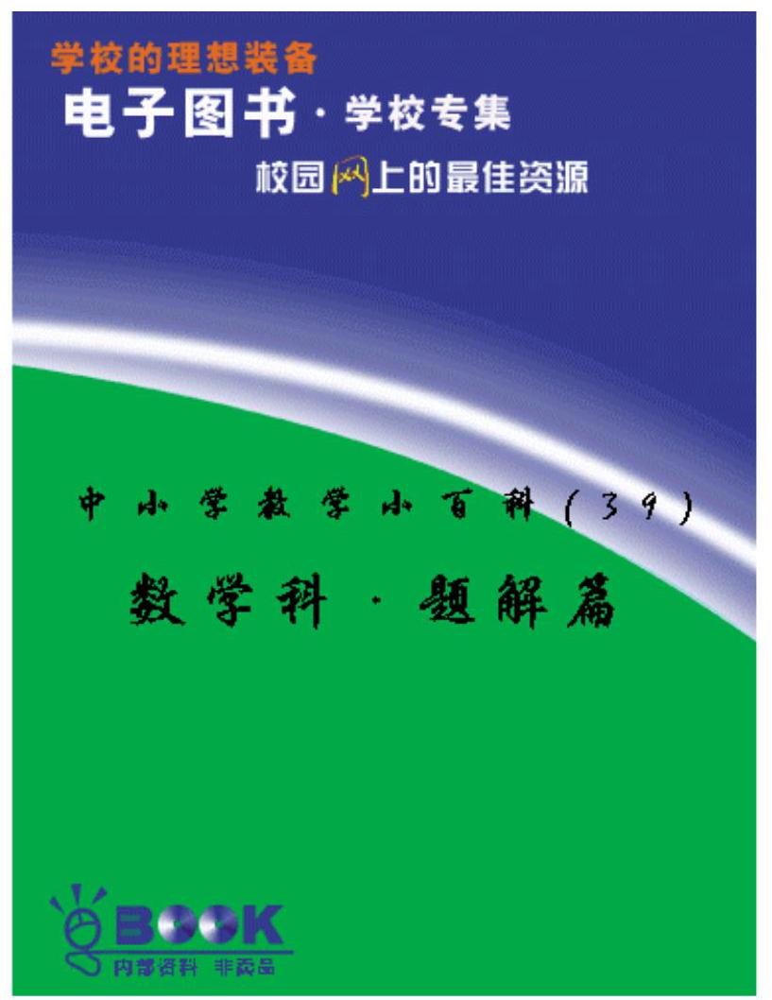

## 加强数学解题教学初探

## 山东省烟台十三中 林英和 潘波 滕秀玉

数学解题的教学，是数学教学的重要组成部分，也是实现数学教学目的的主要手段。在数学教学中，无论是概念的引入，公式的推导，定理的证明及知识的应用无不与数学解题教学有关。解题教学贯穿于数学教学的各个环节中。

首先，解题教学有助于加深对基础知识的理解。通过解题，学生可以把知识按纵横两个方向重新进行组合，使所学知识按使用目的建立新的有效联系，从而形成合理的认知结构。学过数学的人都有这样的体验:一些定理、 公式在学习时体会不深，一旦在解题时它们发挥了威力，对它们的理解就加深了。或者，初学时似乎都懂了。但解题时不会用或用的不对，就促使学生重新学习有关的定理、公式, 从而也加深了对所学知识的理解。

其次，解题教学有助于对学生进行有效的思想教育。通过对有实际意义的问题的解决，有助于培养学生理论联系实际的学风；通过解决难题，培养学生克服困难的精神；通过解决复___的计算，培养学生耐心细心的工作作风； 通过解决综合性问题，培养学生解决问题的能力和辩证唯物主义观点等等。 总之解题教学在促进学生非智力因素的发展上能发挥积极的作用。

解题既是教学的手段又是教学的目的。要搞好数学解题教学，应明确以下两方面问题。

## 一、数学解题教学的基本要求

通过解题教学达到以下要求:

(一)使学生思维严密，具有自我判断能力，迅速确定解题策略

要达到这个要求，首先要教育学生高度重视数学基础知识，了解它对解题的理论指导作用；其次要培养学生解题的熟练技巧和灵活运用知识寻求解题途径的能力；第三要让学生积累解题经验，总结解题规律。

(二)使学生能用数学语言准确表达自己的思维活动

为此，首先要求学生书写条理清晰，详略得当，表达清楚并符合一定格式。因此，教学中要重视学生数学语言的训练和逻辑表达能力的培养。

(三)使学生合理、准确地运算，规范地作图

解题教学中，首先要求运算准确，这是起码的要求。同时运算程序要合理，只有合理才能作到简捷、迅速。为此要培养学生灵活运用知识解决问题的能力。

(四)使学生养成在解题后进行反思的习惯

对解题过程进行回顾与探讨:寻求其它的解题方法，探讨条件变化会引起结论的什么变化，确立解题思路的关键是什么，获得什么新的经验等等。 以达到检验和深化的目的。

## 二、培养学生解题能力的基本途径

(一)培养学生认真审题的习惯，提高审题能力

数学问题一般含有已知条件和要解决的问题两个部分。审题就是要求学生对条件和问题进行全面认识，分清题目中哪些是已知的，哪些是未知的； 它们之间有什么联系；弄清问题中涉及的所有概念术语和符号的真实含义； 在已学的知识中，哪些理论与要解决的问题有关等等。

对于较复 的综合题，要帮助学生认清题目的类形。有些问题，往往需要对条件或所求进行转换，转换为简单易解或有典型解法的问题。如果题中给的条件不明显，就要引导学生去发现隐含条件。因此提高学生的审题能力， 主要是指提高学生分析问题、发现隐含条件以及化简、转化已知和所求的能力。

例1:在实数范围内解方程: $\ln  : 2 - 2\mathrm{l} + \sqrt{1 - \mathrm{x}} = 3$ .

由于方程中含有绝对值和算术根的符号，因此题中实际已隐含条件: $1 - x \geq  0$ ,即 $x \leq  1$ . 于是解原方程就转化为解新的方程: $2 - x + \sqrt{1 - x} = 3 \cdot$

例 2:已知△ABC，求一点P，使得△PAB、△PBC、△PCA的面积相等。

对这个题，学生会不自觉地增加条件，即只在 $\bigtriangleup  {ABC}$ 的内部去找点 P，这时只能求得唯一的点 P，即△ABC的重心。然而原题中并没有“ P 点在△ABC 内”这个限制条件，而是学生自己添加的，改变了原题的题意。按原题条件， 在平面上 P 点的位置共有 4 个，除 $\bigtriangleup  {ABC}$ 的重心外，还有能与 A、B、C构成平行四边形顶点的三个点。

产生上述错误的原因是审题不严造成的，所以培养学生认真审题的习惯是提高其解题能力的基础。

(二)引导学生分析解题思路，发现解题规律，寻求解题途径

数学问题中已知条件和要解决的问题之间有内在的逻辑联系和必然的因果关系，解数学题的过程，就是灵活运用所学知识，通过周密思考去揭示这种联系的过程。寻求解题途径的方法有分析法、综合法或将两种方法结合使用。

例 3:在△ABC中，AB=AC(定长)，过 A任作一直线交 BC于 P，交外接圆 O于 Q，

求证:AP AQ为定值. (图 a)

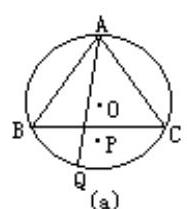

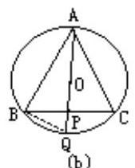

分析:本题是定值问题，它的结论尚欠具体明确。因此，弄清定值的数量，常常可以打开思路。为此，可以考察命题的特殊情形，即可使 AQ为0 O 的直径(图 b)。注意到 AB=AC，则 AQ⊥BC。连结 BQ，由于直径上的圆周角是直角，则 $\angle {ABC} = {90}^{ \circ  }$ ，从而在 RT $\bigtriangleup  {ABQ}$ 中，据射影定理得 ${AP} \cdot  {AQ} = A{B}^{2}$ ，这就说明题中的定值就是 $A{B}^{2}$ ，于是原命题就可以转化为下列命题:

在 $\bigtriangleup  {ABC}$ 中， ${AB} = {AC}$ ，过 $A$ 任作一直线交 ${BC}$ 于 $P$ ，交外接圆 $O$ 于 $Q$ ，求证: ${AP} \cdot  {AQ} = {AB}^{2}$ .

经过分析，明确了证题方向，关键在于连结 BQ，证明

$\bigtriangleup  {ABP} \sim   \bigtriangleup  {AQB}$ 。

例 4: 已知 abc=1.

证明 $\frac{a}{{ab} + a + 1} + \frac{b}{{bc} + b + 1} + \frac{c}{{ac} + c + 1} = 1$ .

先引导学生观察三个相加分式的分母，再联想已知条件 abc=1，如果将 ab+a+1 中的 1 用已知条件 abc 代替，那么 abc+ab+a 有因式 bc+b+1，这个因式恰好等于第二个分式的分母；要想使第三个分式的分母也有因式bc + b +1，必须用 $\frac{1}{\mathrm{\;b}}$ 来代替ab，于是，

$$
\frac{a}{{ab} + a + 1} + \frac{b}{{bc} + b + 1} + \frac{c}{{ac} + c + 1}
$$

$$
= \frac{a}{{ab} + a + {abc}} + \frac{b}{{bc} + b + 1} + \frac{c}{\frac{1}{b} + c + 1}
$$

$$
= \frac{a}{a\left( {{bc} + b + 1}\right) } + \frac{b}{{bc} + b + 1} + \frac{bc}{{bc} + b + 1} = \frac{{bc} + b + 1}{{bc} + b + 1} = 1\text{ . }
$$

这样，在解题过程中，引导学生分析解题思路，寻求解题途径是提高学生解题能力的主要途径。

(三)培养学生解题后进行反思的习惯

解题教学的目的并不单纯是为了求得问题的结果。真正的目的是为了提高学生的解题能力，培养学生的创造精神。而这一教学目的主要是通过回顾解题的过程来实现的。因此，有经验的教师在与学生一起分析解题的结果和方法时，总要对解题的主要思想、关键因素和同一类型问题的解法进行概括总结，并将它们用到新的问题中去。回顾解题，包括检验解答，讨论解法和推广结果三个方面。

(1)检验结果是否正确时，应让学生掌握多种检验方法，例如，对计算题可以用逆运算进行检验，可用不同计算公式重新求解。可以改变计算顺序去求解等等。还应检验结果是否符合条件。

(2)检验推理是否有据，可以培养学生良好的科学态度，树立严谨的思想作风。学生常犯的毛病是，检验时，只检验答案，而不检验每步推理是否有据。

例如:求 $\mathrm{k}$ 为何值时，方程 ${\mathrm{x}}^{2} + \mathrm{K}\mathrm{x} + 1 = 0$ 与方程 ${\mathrm{x}}^{2} + \mathrm{x} + \mathrm{K} = 0$ 有公共实根?

解:设公共实根为 $a$ ，据题意得 $\left\{  \begin{array}{ll} {a}^{2} + {Ka} + 1 = 0 & \left( 1\right) \\  {a}^{2} + a + K = 0 & \left( 2\right)  \end{array}\right. \left( 1\right)  - (2$

得 Ka-a+1-K=0, 即 (K-1) (a-1) =0, $\therefore$ a-1=0,即 a=1. 将 a=1 代入 (2) 解得 K=-2.

此题解法过程隐含着逻辑性错误，事实上，从(K-1)(a-1)=0，应解得 k=1 或 a=1. 当 K=1 时原两方程相同且无实根，应舍去。故原解题结果对， 但过程不全，这是解题中的原则性错误。这时，仅检验答案正确是不够的， 还须检验推导过程的正确性。

(3)检验答案是否详尽无遗，就是要对问题的所有情形作全面的分析研究。如前面的例 2，如果只找到一个解，那么答案就不完整了，通过检验应该把另外三个解补上。

在回顾探索中认真完成以上各方面的工作，将有利于积累经验，开拓思路，增强思维的灵活性，发展和提高解题能力。

以不变应万变

——漫谈几道几何题的求解思路

江苏省丹阳市鹤溪中学 苏三林 赵解真 周建中丹阳市里庄初中 夏留根

众所周知，数学题多如牛毛，深似海洋，千变万化，怎么也做不完。搞 “ 题海战术”是不能取得好成绩的。要解脱“ 代数繁，几何难”的困境，要取得优异的数学成绩，必须掌握以不变应万变的本领。例如，八五届学生马学平中考数学成绩 119 分(满分 120 分)、姜旭峰中考数学成绩 118 分，总分 600 分(满分 640 分)……他们就是掌握了这个本领，方能取得可喜的学习成绩。

所说不变，指所学的定义、定理、公式、法则不变，只要这些基本的知识掌握得牢，再能分清题的类型，然后采取相应的方法，遇题就能达到化繁为简、化难为易、举一反三、触类旁通的目的。下面略举几例谈谈怎样探求几何题的解法思路。

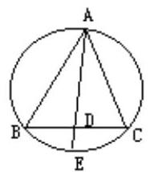

例 1 九义教科书《几何》第三册第 100 页第 10 题，已知 $\bigtriangleup  {ABC}$ 中， $\angle {BAC}$ 的平分线与边 BC和外接圆分别相交于点 D和 E，求证: $\bigtriangleup  {ABD} \backsim   \bigtriangleup  {AEC}$

思考:先用“ 角平分线”定义，再用“ 同弧上圆周角相等”的性质，通过两个角对应相等的两个三角形相似即证得结论。

利用上题结论，可简便地解决一些几何题。例如:

1. 题设不变，引申结论

连结 BE，可证明:BE ${}^{2}$ =AE $\cdot$ DE(95 年贵阳市中考试题)

2. 增加条件，改造结论

若 I 是△ABC的内心，可证明:B =EB(九义制《几何》第三册第 117 页第 12 题)

3. 延伸变化，举一反三

96 年丹阳市中考试题第八题，考生感觉难度最大的题就是这道延伸变型题。试题如下:

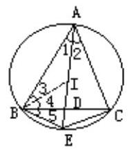

已知:如图，在 $\bigtriangleup  {ABC}$ 中， $\angle$ A 的平分线交 BC于 D，交 $\bigtriangleup  {ABC}$ 的外接圆于 E，I 为 AD上一点。且 IE ${}^{2}$ =AE $\cdot$ DE。

求证:I 为 $\bigtriangleup  {ABC}$ 的内心。

思路分析:要证 I 为△ABC的内心，只要证明 I 在 ∠B 和 ∠C 的平分线上， 不妨连结 BI ，易证△ABE∽△BDE，于是得 BE~AE·DE，因为 I E^2=AE·DE，所以可得 BE=IE，故∠EBI=∠BI> 即∠4+∠5=∠1+∠5=∠1+∠3，又∠5=∠2= ∠1，最后得∠3=∠4，于是得证。通过对该题进行多角度、多途径、全方位地探索、挖掘、引申、变化，则可得到一系列妙题来。

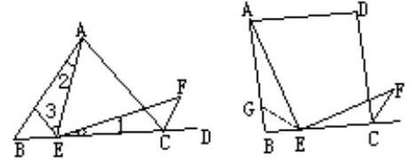

我们在做几何题的过程中，有时会发现一些有趣的现象。有些题看起来不一样，但实际上它们的证法相同。几何题虽千变万化，无统一解法，但我们平时多留心，仔细观察研究，分析总结，也可以得出规律。这样就可以提高解题能力和速度。

例 2 已知:如图，等边三角形 ${ABC}$ 中，E为 ${BC}$ 上的任一点，过 $E$ 点作 $\angle$ AEF=60°与∠ACB的外角平分线交于 F。

求证:AE=EF.

例已 BG=BE，∠ACE=120°=∠ECF，∠1=60°−∠3=∠2，此思路行得通。 原题可以变为正方形，证法思路相似。

例 3 九义教科书 ${\mathrm{P}}_{247}\mathrm{\;B}$ 组第 3 题。已知:如图，∠BAC=90°，AD⊥BC、 ${DE}\bot {AB} \cdot  {DF}\bot {AC}$ ，垂足分别为 $D$ 、 $E$ 、 $F$ 。

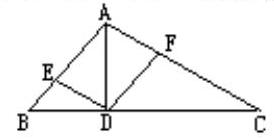

求证: $A{B}^{3}/A{C}^{3} = {BE}/{CF}$ .

(提示: ${\left( A{C}^{2}/A{B}^{2}\right) }^{2} = {\left( BD/CD\right) }^{2}$ )

思考:在初中几何题证明时，多用直接证法——综合法与分析法。由本题△ABC是直角三角形，ADL BC、DEL AB、DFL AC，这个“ 因”出发，从而推出其“果”为综合法。本题在 Rt $\bigtriangleup  \mathrm{{ABC}}$ 中， $\angle \mathrm{{BAC}} = {90}^{ \circ  }$ ， $\mathrm{{AD}}\bot \mathrm{{BC}}$ ，易证得 $\bigtriangleup  \mathrm{{ABC}} \sim   \bigtriangleup  \mathrm{{CBA}}$ ， $\mathrm{{AB}}//\mathrm{{CB}} = \mathrm{{BD}}/\mathrm{{BA}}$ ，推出 $\mathrm{A{B}^{2}} = \mathrm{{BD}} \cdot  \mathrm{{BC}}$ ，同理 $\mathrm{A{C}^{2}} = \mathrm{{CD}} \cdot  \mathrm{{BC}}$ ，故 $A{B}^{2}/A{C}^{2} = {BD}/{CD},\left( {A{B}^{2}/A{C}^{2}}\right) 2 = {\left( BD/CD\right) }^{2}$ ，再由 $B{D}^{2} = {BE} \cdot  {AB}, C{D}^{2} = {CF} \cdot  {AC}$ 可得结论。本题还可用“平行线截得成比例线段”定理推出 CF=DF·AC/AB， BE=DE·AB/AC，两式相除，再证△ABD∽△CAD，由此思路也能证得结论。本题条件不变，还可用三角形相似及三角形面积定理证明: $A{D}^{3} = {BC} \cdot  {BE} \cdot  {CF}$ 本题还可变形为:AEDF 是圆内接矩形，AE、AF 的延长线分别交过点 D的切线于 B、C两点。

求证:BE/CF=AB ${}^{3}$ /AC ${}^{3}$ .

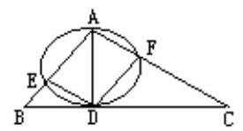

思考:由 AEDF 是圆内接矩形得 DFII AB，推出 DF/AB=CF/AC，

CF=DF·AC/AB，同理BE=DE·AB/AC，两式相除，得 BE/CF=(AB^·DE)/ (AC². DF)，易证得△ABD∽ △CAD，根据相似三角形对应高的比等于对应边的比，得 DE/DF=AB/AC，此思路行得通。两题虽异，但探求思路相同。

通过上述几道几何题及其推广的重要应用，我们能够认识到，解题时必须注意总结经验，找出规律，以不变的规律去适应万变的问题。这样，我们

就能找到分析问题和解决问题的“ 金钥匙”。

## 抓住连结点 化难为易

## 福建省厦门杏林区上余中学 万兆云

幂函数、指数函数、对数函数，这是高一代数中继函数的概念后紧接着学习的几个具体函数。在分别讲授每一个函数时，为了搞清知识的来龙去脉， 都是结合它们各自的图像来研究它们的性质的。由于充分发挥了表、象的中介作用来引导学生进行分析综合，故单独地看，学生对初学的内容很快就掌握了。可是当这几个函数混 在一起，尤其是将它们的性质用在比较大小上， 问题就出来了。我们知道，感知对象与背景差别愈大，感知就愈清晰；反之则愈模糊。当几对幂的值需要比较大小时，那要用幂函数的性质还是用指数函数的性质呢？而幂函数的性质又由指数 n>0 或 n<0决定的，指数函数的性质是由底数 a>1 或 0<a<1 分成截然不同的两种，要用哪一种，必须一一斟酌。在这多重的判断中，学生往往会顾此失彼，一不留意就出了错。那么， 如何在对知识理解并融会贯通的基础上把握总体的格局, 提纲挈领地把所学的知识串连起来，并用通俗的方法进行记忆，这就需要对知识进行全方位地别、比较及澄清，由表及里，去粗取精，抽出其本质的关系，找出简便易记的方法。这是从特殊到一般的归纳与概括。今天我所阐述的，就是在理解幂函数、指数函数其本质属性的基础上，把在这几个函数中讨论的相同问题 ——比较大小放在一起 别、比较，与学生认识结构中已有的知识与经验建立起实质性的联系，从而使学生学得更快，记得更牢。

先看幂函数。

形如 y=x^的函数是幂函数，其中底数 x 是自变量而指数 n 是常量。这个式子中连同函数值共有三个量。其性质由指数 n 的正负来确定。比较大小用的是第二条性质，即 y=x^n，当 n>0 是增函数；当 n<0 是减函数。现在我们先来看课本是怎么处理的。

例1 比较 ${1.5}^{\frac{3}{5}}$ 和 ${1.7}^{\frac{3}{5}}$ 的大小。

解 考察函数 $y = {x}^{\frac{3}{5}}$ 在第一象限 $y$ 的值随着 $x$ 的增大而增大。

$\because {1.5} < {1.7}$ ,

$$
\therefore {1.5}^{\frac{3}{5}} < {1.7}^{\frac{3}{5}}
$$

针对这个问题，我们可回想一下初一学过的两个有理数相乘的符号法则:同号得正，异号得负；又从有理数比较大小中知道，正数都大于零，负数都小于零。故两数相乘的符号法则可叙述成:同号大于零，异号小于零。 这就将学生熟悉的两数相乘的符号法则纳入不等式的问题中来。有了这个准备工作，我们就可采用这个符号法则来比较幂函数的大小问题了。当然，必须得紧紧抓住函数的指数 n。

例1 比较 ${1.5}^{\frac{3}{5}}$ 和 ${1.7}^{\frac{3}{5}}$ 的大小。

解 $\because \mathrm{n} = \frac{3}{5} > 0$

1.5<1.7.

这里有两个不等式 $\frac{3}{5} > 0$ 与 ${1.5} < {1.7}$ ，其中一个是“ $>$ ”号，一个是 “ $<$ ”号，即异号。再将两数相乘的符号法则:同号大于零，异号小于零稍微改动一下，去掉最后的零，叙述成:同号大于，异号小于。由异号小于， 于是得到

$$
\therefore {1.5}^{\frac{3}{5}} < {1.7}^{\frac{3}{5}}\text{ 。 }
$$

当然, 这里的“ 同号、异号”指的是指数 n 与零及底数与底数的大小比较同是大于号或同是小于号，还是一个大于号，一个小于号；“ 大于、小于” 指的是不改变底数前后位置的情况下两个幂函数值的大小关系。这样比较两个幂函数值的大小问题就与两数相乘的符号法则建立起实质性的联系，使得新知识与学生原有的知识挂上钩，将新知识纳入学生原有的知识结构而达到了新旧知识的同化。通过这种转化，学生应用起来相当得心应手，尤其是对付填空题。现我们不妨再以 n<0 的情况验证一下是否一致。

例 2 比较 0.15

课本上是这样处理的:

解 考察幂函数 $y = {x}^{-{1.2}}$ 在第一象限内 $y$ 的值随 $x$ 的增大而减小。

$\because {0.15} < {0.17}$

$\therefore {0.15}^{-{1.2}} > {0.17}^{-{1.2}}$ 。

现按刚才所述方法处理:

解 $\because n =  - {1.2} < 0$ ,

0.15<0.17，

此时不等号相同，由同号大于，

$\therefore {0.15}^{-{1.2}} > {0.17}^{-{1.2}}$ ,

结论是一致的，书写也简便，而且从过程也可体现出幂函数 y=x^1.2 在第一象限是减函数。

当然比较起来，幂函数的性质还是易记的，但指数函数的性质相对来说， 就会复 些。那么刚才所叙述的比较大小的方法，是否也可以用在指数函数的比较大小上？下面不妨也来验证一下。

函数 $y = {a}^{x}$ 叫做指数函数，其中底数 $a > 0$ 且 $a \neq  1$ 是常量，指数 $x$ 是变量， 连同函数值也有三个量。我们知道，指数函数的性质是由底数 a 决定的，分为 a > 1 与 0<a<1 两种。先看下例:

例 3 比较下列各组中两个值的大小。

1) ${3}^{\frac{1}{2}}\text{ 、 }{3}^{\frac{1}{3}}$

2) ${0.8}^{-{0.1}}\text{ 、 }{0.8}^{-{0.2}}$ .

课本是这样处理的

解 1) 根据 $y = {a}^{x}\;\left( {a > 1}\right)$ 是增函数。

$\because \frac{1}{2} > \frac{1}{3}$ ,

$\therefore {3}^{\frac{1}{2}} > {3}^{\frac{1}{2}}$ .

2) 根据 y=a*(0<a<1)是减函数。

$\because  - {0.1} >  - {0.2}$ ，

$\therefore {0.8}^{-{0.1}} < {0.8}^{-{0.2}}$ .

现我们用刚讨论的方法来处理

解 1) $\because a = 3 > 1$ ,

$$
\frac{1}{2} > \frac{1}{3}
$$

由同号大于

$$
\therefore {3}^{\frac{1}{2}} > {3}^{\frac{1}{3}}
$$

2) $\because 0 < a = {0.8} < 1$ ,

$- {0.1} >  - {0.2}$ ,

由异号小于

$\therefore {0.8}^{-{0.1}} < {0.8}{}^{-{0.2}}$ .

与课本结论一致，且同样能体现出当 a>1 及 0<a<1 时指数函数的增减性。 当然，这里所言“ 同号大于、异号小于”中的“ 同号、异号”指的是 a 与 1 之间及指数与指数之间的不等号是相同还是不同；“ 大于、小于” 则指的是在不改变指数所处前后位置的情况下各自对应的两个函数值的大小关系。至于底数 a>1 及 0<a<1 这种写法根据课本约定，不等号不可随意变向，否则， 我们的讨论就失去了依据。

由于同底的对数函数与指数函数互为反函数，它们的增减性是一致的， 这样同底的对数比较大小也同样可以用上述方法处理。

例 4 比较下列各组中两个对数的大小。

1) ${\log }_{2}3,{\log }_{2}{3.5}$ ;

2) ${\log }_{0.7}{1.6},{\log }_{0.7}{1.8}$ .

解 1) $\because a = 2 > 1,3 < {3.5}$ ,

由异号小于

$\therefore {\log }_{2}3 < {\log }_{2}3$ . 5。

而 $y = {lo}{g}_{a}x$ 当 $a > 1$ 时是增函数，结论正确。

2) $\because 0 < a = {0.7} < 1,{1.6} < {1.8}$ .

由同号大于，

$\therefore {\log }_{0.7}{1.6} < {\log }_{0.7}{1.8}$ 。

而 y=log a x 当 0<a<1 时是减函数，结论正确。

因此，这三种函数比较大小的问题，只要先判断应用什么函数的性质处理，尤其是都以幂的形式出现的两个数比较大小。如果是指数相同而底数不同的两个数，那就用幂函数的性质，抓住相同的指数 n>0 还是 n<0，再考两个不同底数之间的不等号是否一致，最后判断相应函数值的大小；如果是指数不同而底数相同的两个数就用指数函数的性质，抓住相同的底数 a>1 还是 $0 < a < 1$ ，再考 两个不同指数之间的不等号与 $a$ 和 1 之间的不等号是否一致，然后再来判断相应函数值的大小。应当注意的是:如果同是小于号， 那么由“ 同号大于”，得到的也是大于号，这与符号法则中的“ 负负得正” 有异曲同工之外。相对的，这种方法与课本中所使用的方法比较，由于与学生原有的认知结构建立起联系，记忆也就容易得多。

现在我们以六对比较大小的情况综合应用如下。

例 5 比较下列各组中两个数的大小

1) ${1.9}^{-\frac{1}{6}}$ 与 ${1.91}^{-\frac{1}{6}}$ ; 2) ${0.1}^{5.1}$ 与 ${0.1}^{5.2}$ ;

3) ${1.79}^{\frac{1}{3}}$ 与 ${1.81}^{\frac{1}{3}}$ ; 4) ${0.75}^{-{0.1}}$ 与 ${0.75}^{-{0.1}}$ ;

5) ${\log }_{0.5}6$ 和 ${\log }_{0.5}4$ ; 6) ${\log }_{\frac{2}{3}}{0.5}$ 和 ${\log }_{\frac{2}{3}}{0.6}$ 。

解 1) ${1.9}^{-\frac{1}{6}}$ 与 ${1.91}^{-\frac{1}{6}}$ 这两个数的幂指数都是 $- \frac{1}{6}$ ,而底数不一样,可应用指数是常量,底数是变量的幂函数 $y = x/n$ 的性质。此时 $n =  - \frac{1}{6}$ ,

$$
\therefore \mathrm{n} =  - \frac{1}{6} < 0\text{ , }
$$

1.9<1.91 ,

由同号(同是小于号)大于，

$$
\therefore {1.91}^{-\frac{1}{6}} < {1.9}^{-\frac{1}{6}}
$$

2) ${0.1}^{5.1}$ 与 ${0.1}^{5.2}$ 这两个数的幂指数不同而底数相同，可应用指数是变量，底数是常量的指数函数 $y = {a}^{x}$ 的性质。此时 $a = {0.1}$ ，

$\because 0 < {0.1} < 1,\;{5.1} < {5.2}$ ,

由同号大于，

$\therefore {0.1}^{5.1} > {0.1}^{5.2}$ .

3) ${1.79}^{\frac{1}{3}}$ 与 ${1.81}^{\frac{1}{3}}$ 这两个数的幂指数都是 $\frac{1}{3}$ 而底数不同，可应用幂函数 $\mathrm{y} = {\mathrm{x}}^{\mathrm{n}}$ 的性质。此时 $\mathrm{n} = \frac{1}{3}$

$$
\because \frac{1}{3} > 0,\;{1.79} < {1.81},
$$

由异号小于，

$$
\therefore {1.79}^{\frac{1}{3}} < {1.81}^{\frac{1}{3}}\text{ 。 }
$$

4) ${0.75}^{-{0.1}}$ 与 ${0.75}^{0.1}$ 这两个数的指数不同而底数相同，可应用指数函数 $y = {a}^{x}$ 的性质。此时 $a = {0.75}$

$\because 0 < {0.75} < 1,\; - {0.1} < {0.1}$ ,

由同号大于，

$\therefore {0.75}^{-{0.1}} > {0.75}^{-{0.1}}$ .

5) ${\log }_{0.5}6$ 和 ${\log }_{0.5}4$ 这两个数的底数相同，真数不同，

由对数函数 $y = {\log }_{a}x\left( {a > 0, a \neq  1}\right)$ 的性质。此时 $a = {0.5}$

$\because 0 < {0.5} < 1,6 > 4$ ,

由异号小于，

$\therefore {\log }_{0.5}6 < {\log }_{0.5}4$ .

6) 同 5) , $\mathrm{a} = \frac{2}{3}$

$\because 0 < \frac{2}{3} < 1$ ,

0.5<0.6，

由同号大于，

$$
\therefore {\log }_{\frac{2}{3}}{0.5} > {\log }_{\frac{2}{3}}{0.6}\text{ . }
$$

倘若遇到幂函数的底数是负数的问题，那我们可以先根据其奇偶性将它们进行转化，使得其底数变成正数，再用上述方法比较。

苏霍姆斯基说:“在我看来，教给学生能借助已有的知识去获得新知识， 就是最好的教学技巧之所在。”在新旧知识(如该篇的比较大小与符号法则) 中，只要抓住知识的连接点(本篇中是正数大于零、负数小于零)，运用新旧知识的同化规律(同号大于，异号小于)，合理安排，即可达到新的认知平衡，形成新的、层次更为丰富的认知结构。

## 小学数学应用题总复习浅谈

## 山东省滨州市实验小学 曹维芳 岳素清

小学数学应用题是教学的重点, 又是教学的难点。因此在总复习中它至关重要。应用题的系统复习有助于学生理解概念，掌握数量关系，培养和提高分析问题、解决问题的能力。现就多年来的教学实践，对应用题的复习教学浅淡几点体会。

## 一、强化基础训练，掌握数量关系

基本的数量关系是指加、减、乘、除法的基本应用，比如:求两个数量相差多少，用减法解答；求一个数是另一个数的百分之几，用除法解答；求一个数的几倍是多少，用乘法解答等。还有速度、时间和路程，单价、数量和总价，工效、时间和总量等。任何一道复合应用题都是由几道有联系的一步应用题组合而成的。因此，基本的数量关系是解答应用题的基础。在复习时，我们特意安排了一些补充条件的问题和练习，目的是强化学生的基础知识。使学生看到问题立刻想到解决问题所必需的两个条件；看到两个条件能迅速想到可以解决什么问题。在此基础上再出些有助于训练发散性思维的练习题。如给出两个条件:甲数是 10，乙数是 8，要求学生尽可能的多提出些问题。练习时，先要求学生提出用一步解答的问题，如:“ 甲数比乙数多多少”，“ 乙数比甲数少多少”“ 乙数占甲数的几分之几”等。然后再要求学生提出用两步解答的问题，如“ 甲数比乙数多几分之几”，“ 甲数给乙数多少两数相等”，“ 乙数比甲数少几分之几”“ 乙数占两数和的几分之几”等。 对于常用的数量关系，我们复习时还采用给名称要学生编题的练习形式。如已知单价和总价，编求数量的题目；已知路程和时间，编求速度的题目等。 通过这种形式的训练，使学生进一步牢固掌握基本的数量关系。为解答较复的应用题打下良好基础。在编题训练的过程中，还要注意指导学生对数学术语的准确理解和运用。只有准确理解，才能正确运用。如增加、增加到、 增加了，提高、提高到、提高了，扩大，缩小等。发现错误，及时纠正。

对易混的术语，如减少了和减少到等要让学生区别清楚。

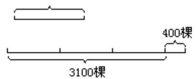

逆叙的条件，学生容易搞错它们的数量关系。教苹果树:学实践证明， 要求学生画图是搞清数量之间关系的有效形式。如:梨树 3100 棵，比苹果树的 3 倍还多 400 棵，苹果树有多少棵？(见下图)，从图中可以看梨树:出。 梨树棵数减去 400 棵, 正好是苹果树棵数的 3 倍, 这样可以避免学生出现: (3100+400)÷ 3的错误算式。

## 二、综合运用知识，拓宽解题思路

能够正确解答应用题，是学生能综合运用所学知识的具体表现。应用题的解答一般采用综合法和分析法。我们在复习时侧重教给分析法。如:李师傅计划做 820 个零件，已经做了 4 天，平均每天做 50 个，其余的 6 天做完， 平均每天要做多少个？

分析方法是从问题入手，寻找解决问题的条件。即:①要求平均每天做多少个，必须知道余下的个数和工作的天数(6 天)这两个条件。②要求余下多少个，就要知道计划生产多少个(820 个)和已经生产了多少个。③要求已经生产了多少个，需要知道已经做的天数(4 天)和平均每天做的个数 (50 个)。在复习过程中，我们注重要求学生把分析思考的过程用语言表述出来。学生能说清楚，就证明他的思维是理顺的。既要重视学生的计算结果， 更要重视学生表述的分析过程。

实际上在分析应用题时，分析法和综合法两种方法是结合运用，相互包含的。这就是说在分析已知条件时要时刻注意题目的问题，这样综合才不会偏离问题；从问题出发，提出解决这个问题所必备的条件时要想到题目中的已知条件，只有这样提出的条件才能从已知条件中找到或求出来。

有些应用题，单靠上述两种方法分析仍是不够的。这就需要教给学生另外一些分析问题的方法，拓宽解题思路。常用的有两种，即转化法和假设法。 例如:有甲、乙、丙三袋大米，甲袋大米的重量是乙袋的 3 倍，又是丙袋的 4 倍，又知乙袋比丙袋多 8 千克。问三袋大米各重多少克？

这样思考:从已知条件看出，甲袋大米的重量分别以乙袋和丙袋为标准，

统一标准量是解题的关键。应用转化法就能统一标准量， 即以甲袋重量为标准量，则乙袋的重量的甲袋的 $\frac{1}{3}$ ，丙袋的重量是甲袋的 $\frac{1}{4}$ 。这样解答本题就很容易了，即: $8 \div  \left( {\frac{1}{3} - \frac{1}{4}}\right)  =$ 甲袋大米的重量。同时， 要使学生明白怎样转化简便就怎样转化。上题如果统一成以乙袋或两袋的重量为标准量难度就大了。

又如:甲、乙两个仓库内原来共存货物是 480 吨，现在甲仓又运进所存货物的 40%，乙仓又运进它所存货物的 25%，这时两仓共存货 645 吨。原来两仓各存货物多少吨?

这样思考:假设两仓库都运进所存货物的 40%，那么可知共运进货物为:

480x 40%=192(吨)

而实际两仓运进 645-480=165(吨)从而可知多算了 192-165=27(吨)。 为什么多算了 27 吨呢？这是因为乙仓实际运进了它所存货物的 25%，而我们也当作运进所存货为的 40%计算了。从而可知，乙仓原来所存货物的 40 %与 25%的差是 27 吨，于是可知

乙仓原来有货物:

27÷(40%-25%)=180(吨)

甲仓原有货物:480-180=300(吨)。

用假设法解题的思考方法是:先根据解题的需要对已知条件做出假设， 通过假设引出矛盾，然后分析产生矛盾的原因，把原因找到了，问题也就迎刃而解了。

当然，转化法和假设法的解题方法掌握起来是比较困难的，在总复习时， 我们根据学生的实际状况，适量地涉及一部分这类题目。使学有余力的学生感到负荷饱满，不作为对全体学生的共同要求。

## 三、系统整理归纳，形成知识网络

数学知识之间是有密切联系的。例如:两个同类量进行比较时，会产生两种情况，一种是相等，一种是不等，由不等便出现了差，于是引出围绕‘差” 的一系列数量关系，如:大数-小数=差；大数-差=小数；小数+差=大数等。 在比差的基础上又发展为比较两个同类数量之间的倍数关系，若甲数是 a， 乙数是 3a，则乙数是甲数的 3 倍。在整数倍的基础上，又扩展为小数倍，再扩展为分数倍。在分数倍里，倍数可以小于 1。随着“ 倍”的概念的建立和发展，又出现了围绕着“ 倍”的一系列数量关系。

例如:求一个数的几倍，几分之几倍，几分之几是多少，都用乘法计算； 求一个数是另一个数的几倍、几又几分之几、几分之几、百分之几都用除法计算等。学习了比的知识以后两个数之间的倍数关系也可以用比的形式表示。如:甲数是乙数的 5 倍，我们就说，甲数与乙数的比是 5:1。再如: 工程,已经完成了 $\frac{3}{5}$ ,对于这个倍数关系,我们也可以这样理解,已经完成的与全工程的比是 3:5，或已经完成与未完成的比是 3:(5-3)。通过这样复习，就把以“ 差”和“ 倍”为核心的知识纵向地串在一起，有利于学生形成良好的知识结构，为今后正确地运用知识打下坚实的基础。

在应用题复习中，一题多解是沟通知识之间内在联系的一种行之有效的练习形式。它不但有助于学生牢固地掌握数量关系，而且可以开阔解题思路， 提高学生多角度地分析问题的能力。例如:一个修路队，原计划每天修 80 米，实际每天比原计划多修 20%，结果用 12.5 天就完成任务。原计划多少天完成任务？可有下列解法:

1.80×(1+20%)×12.5÷8=15(天)

${2.1} \div  \left\lbrack  {\frac{1}{12.5} \div  \left( {1 + {20}\% }\right) }\right\rbrack   = {15}$ (天)

${3.12.5x}\left( {1 + {20}\% }\right)  = {15}$ (天)

4. 设计划用 $x$ 天完成。

${80}\mathrm{x} = {80} \times  \left( {1 + {20}\% }\right)  \times  {12.5}\;\mathrm{x} = {15}$

5. 设原计划用 $x$ 天完成。

①80: 80x (1+20%) =12.5:x x=15

②1: $\left( {1 + {20}\% }\right)  = {12.5} : x\;x = {15}$

上述五种解法分别是按解一般应用题的思路、工程问题的思路、分数应用题的思路、方程的思路和用比例解的思路进行分析的。通过本题的复习， 引导学生找出各知识点之间的联系，使学过的解应用题的各种知识得以融会贯通和综合应用，拓宽了学生的解题思路。

谈所求量的位置与解题方法

——分数百分数乘除法应用题教学经验一得

## 福建省永泰县大洋中心小学 柯四通

分数和百分数乘、除法应用题是小学高年级数学教学的重要内容，它具有数量关系抽象、题目的叙述情节灵活多样、可变性大等特点，使相当多的学生感到困难，列式的准确率较低。如何突破这个难点，使学生能够正确地解题呢？近几年来，我在教学实践中进行了认真的探讨，注意引导学生从题目中含有“ 分率”的关键词句中，寻找所求量的位置，进行认真分析、解题， 列式的准确率大有提高，取得了可喜的教学效果。

具体作法是:要求学生在认真审题，弄清已知条件和所求问题的基础上， 再从含有“ 分率”的关键句中，找出所求量的位置，是在“ 比”之前，还是在“ 比”之后？所求量在“ 比”前的，就是比较量，也就是几分之几的量， 可根据“ 求一个数的几分之几是多少”的类型解题，用乘法计算。所求量在 “ 比”后的，就是标准量，也就是整体“ 1 ”的量。可根据“ 已知一个数的几分之几是多少，求这个数”的类型来解题，用除法计算。如:

所求量在“ 比”前的:

1. 甲数是乙数的 $\frac{3}{4}$ ，已知乙数是 4000 ，求甲数。

2．某厂男职工占全厂职工总数的 60%，这个厂有职工 800 名，求男职工数。

3．合格的产品相当于产品总数的 $\frac{19}{20}$ ，产品总数为 5000 件，求合格产品数。

4．某村今年造林面积比去年增加了 $\frac{1}{10}$ ，去年造林1000亩，今年造林多少亩？

5. 某校这个月原计划用电 600 度，实际用电量降低了 15%，实际用电多少度？(本题的标准量是隐蔽的，可补充完整为“实际用电量比原计划降低了 15%”)

以上各题，从含有“ 分率”的关键句中，我们可以看出:(1)甲数，(2) 男职工数，(3)合格产品数，(4)今年造林亩数，(5)实际用电量，这些所求量的位置分别在“ 是”、“ 占”、“ 相当于”、“ 比”之前，都是去比的量，也就是比较量，几分之几的量，应该用“ 求一个数的几分之几是多少” 的类型来解题，用乘法计算。所以，这 5 个小题的列式分别是:

(1) ${4000} \times  \frac{3}{4};\left( 2\right) {800} \times  {60}\% ;\left( 3\right) {5000} \times  \frac{19}{20};\left( 4\right) {1000} \times  \left( {1 + \frac{3}{10}}\right)$ ;

(5) ${600} \times  \left( {1 - {15}\% }\right)$ 。

所求量在“ 比”后的:

1. 甲数是 300 ，是乙数的 $\frac{3}{4}$ ，求乙数。

2．某厂有男职工 480 名，占全厂职工人数的的 60%，求全厂职工人数。

3 . 某车间这个月合格的产品相当于产品总数的 $\frac{19}{20}$ ，已知合格的产品是4750件，求产品总数。

4．某村今年造林1100库，比去年增加了 $\frac{1}{10}$ ，去年造林多少亩？

5. 某校这个月实际用电 510 度，比原计划降低了 15%，原计划用电多少度?

以上各题，从含有“ 分率”的关键句中，我们可以看出，它们的所求量: (1)乙数，(2)全厂职工人数，(3)产品总数，(4)去年造林亩数，(5) 原计划用电量，分别在“ 是”、“ 占”、“ 相当于”、“ 比”之后，这些题目中的所求量都是被比的量，即标准量，也就是整体“ 1 ”的量。应该用“ 已知一个数的几分之几是多少，求这个数”的类型来解题，

算。所以这5个小题的列式分别是:(1)300÷ $\frac{3}{4}$ ；(2) ${480} \div  {60}\%$ ；

(3) ${4750} \div  \frac{19}{20};\left( 4\right) {110} \div  \left( {1 + \frac{1}{10}}\right) ;\left( 5\right) {510} \div  \left( {1 - {15}\% }\right)$ 。

通过以上举例，我们可以发现:所求量的位置在“ 比”之前的，实际上就是求几分之几的量，属于“ 求一个数的几分之几是多少”的类型，用乘法计算。所求量的位置在“ 比”之后的，实际上就是求标准量，也就是求整体 “ 1” 的量，属于“ 已知一个数的几分之几是多少，求这个数”的类型，用除法计算。

教学实践证明，我们寻找所求量的位置在“ 比”前，还是在“ 比”后的过程，就是分析应用题中所求量是属于几分之几的量，还是属于整体“ 1 ”的量的过程，也就是开弄清应用题的结构，理顺这类应用题数量关系的过程， 结构弄清了，它们之间的数量关系理顺了，解题方法也就容易确定了。这样将复 的分数、百分数应用题化难为易，方法简捷，学生普遍都会理解掌握。 当然，规律的认知来源于实践，只有在学生接触过一定数量的分数乘、除法应用题之后，才不易忘却。教师认真引导学生自己分析应用题中的已知条件和所求问题，理顺条件和问题之间的数量关系，使学生明确运用这种解法的依据，并灵活地运用这种规律，这样和有助于加深理解分数、百分数乘、除法应用题的基本结构，大幅度地提高列式的正确率。

## 中学数学导入新课的方法初探

## 山东省曲阜市一中 孟祥礼

导入新课是数学教学中极其重要的一环, 也是一堂课成功的起点和关键。新课导入得好，就能一开课吸引住学生，是点燃学生智慧的火花，唤起学生强烈的求知欲望，使学生的思维处于亢份状同，主动地去获取知识。反之，学生 不能进入角色，学习不会积极主动，师生配合难以默契，教学就取不到理想的效果。因此，一定要重视教学伊始的导入新课。中学数学教学中怎样巧妙地导入新课呢？本文就这个问题，结合教学实际，简要地介绍导入新课的几种常用方法。

## 一、温故导入法

一些与学过的知识有密切联系的新课题，应尽量采用联系旧知识的方法，使与新课题有联系的旧知识在学生的头脑中重现，尔后，对旧知识的形式或者成立的条件作适当的改变，引出新课题。例如，讲双曲线时，可先复习椭圆的有关知识，然后提出:将椭圆定义中的“ 距离和”改为“ 距离差的绝对值”，动点的轨迹是什么呢？由此导入新课。这样导入新课，一方面可复习 固旧知识，另一方面可为学习新知识辅路，引导学生积极参与对新课题的探索。

## 二、作业导入法

根据新授课的内容和教学要求，预先布置一定的作业，以引起学生的注意，或者使学生产生困惑，让他们急于听教师的讲解。例如，讲添项、拆项法分解因式一节，可在授课的前一天布置作业:将 ${\mathrm{x}}^{6} - 1$ 分解因式，结果学生得出两种答案:

$\left( {x - 1}\right) \;\left( {x + 1}\right) \;\left( {{x}^{2} - x + 1}\right) \;\left( {{x}^{2} + x + 1}\right) \;$ 和 $\left( {x - 1}\right) \;\left( {x + 1}\right) \;\left( {{x}^{4} + {x}^{2} + 1}\right)$ ， 学生迫切想知道哪种答案是正确的。讲评作业时，教师告诉学生:可用一种新方法将 ${x}^{4} + {x}^{2} + 1$ 分解为 $\left( {{x}^{2} - x + 1}\right) \left( {{x}^{2} + x + 1}\right)$ ，从而引出添项、拆项分解法。

## 三、开门见山导入法

这是直接点明要学习的内容，即开门见题。当一些课题与学过的知识联系不大、或者比较简单时，可采用这种方法，以便使学生的思维迅速定向， 投入对新知识的探究、学习中。常见的是“上节课我们学习了……，这节课我们学习......”或“ 这节课我们学习......”等形式。例如，讲二面角，可以这样导入:两条相交直线所成的角，我们已学会度量了，两个平面相交所成的角应怎样来度量呢？这节课我们就来学习这个问题——二面角和它的平面角。这样导入新课，可达到一开始就明确目标，突出重点的效果。

## 四、故事导入法

在新课的开始，不是急于揭示课题，而是先讲一个与本课题有关的数学典故来揭示课题，使学生在好奇中思索、探究问题的答案。例如，某位教师在讲等比数列前 $\mathrm{n}$ 项的和时，先讲了古代印度舍罕王重赏他的宰相——国际象棋的发明人达依乐的故事。当学生听到达依乐只求国王在国际象棋的 64 个格中放入麦粒，各格的麦粒数依次是 1，2，4，8，16，...，很觉得可笑。 但当听到国王叫人扛来一袋袋小麦还不够时，又都惊奇、困惑不已。最后这位教师问:“ 同学们都计算一下国王共要付多少粒小麦？全印度有这么多小麦吗？”同学们个个磨拳擦掌，跃跃欲试，此时，他们正处于心求通而不解、 口欲言而不能“ 愤”的状态，急切地盼着老师把“ 谜底”揭开。由此非常巧妙地导入了新课。

## 五、演示实验导入法

在新课的开始，教师适当地做演示实验，也可以导入新课。例如，特级教师钱展望老师在讲数学归纳法时，是这样导入新课的:他先从口袋里摸出一个红玻璃球，接着又摸出第二、三、四、五个红玻璃球，问:“我的这个口袋里是否全是红玻璃球？”同学们睁大眼睛，边观察边思索，有人说:“___不一定。”他继续摸出一个白玻璃球，问:“ 是否全是玻璃球？” 有一部分同学较快地回答:“ 不一定，”再摸，一个乒乓球，这时学生笑了起来。他又问:“ 是否全是球？”学生都肯定地回答:“ 不一定！”他指出:“ 口袋里否全是还需验证。如果口袋里的东西是有限的，则最终总可以得出确切的结论。”紧接着话锋一转指出:“如果这个口袋里的东西有无穷多，怎么办？” (停顿一下)再问:“如果我们遇到这种情形，当你这一次摸出的是红玻璃球的时候, 可以肯定下一次摸出的也是红玻璃球, 是否口袋里全是红玻璃球？”此时，学生议论纷纷，思维顿时被激活了，导入新课已水到渠成。

## 六、学生实验导入法

通过让学生亲自参加某种实践活动，来导入新课。例如，讲三角形的内角和定理时，一上课要求每个学生用硬纸板剪一个三角形，把它按如图所示的方法剪开，然后把三个内角拼在一起，使三个角的顶点重合，问:这三个内角的和等于多少度？由此导入三角形的内角和定理。这样导入新课，学生有亲身感受，学习起来注意力集中，记忆牢固。

## 七、类比导入法

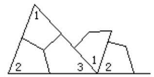

根据新旧知识的连结点、相似点，采用类比的方法导入新课。因为数学有严密的科学体系，数学知识的连贯性很强，多数概念、定理、公式都产生于或发展于相应的原有知识的基础上，所以由类比导入新课在中学数学教学中较为常见。例如，讲复数的概念，可先回顾数的概念的形成和扩展，对实数集作一简要总结，再进一步从实数集内方程 ${\mathrm{x}}^{2} + 1 = 0$ 无解和乘方的逆运算在实数集内有时不能实施，指出实数集还有扩展的必要，从而引出复数。再如， 讲等比数列概念及其计算公式时，可类比等差数列引出。

## 八、引趣导入法

新课开始，巧妙地设置问题，使学生产生悬念，以引发学生的兴趣作为课堂教学的开头。例如, 某位教师在讲圆的概念时, 一开头就问:“车轮是什么形状？”同学们觉得这个问题太简单，便笑着回答:“ 圆形！”教师又问:“ 为什么车轮要做成圆形呢？难道不能做成别的形状？比方说，做成正三角形、正方形等？”同学们一下子被逗乐了，纷纷回答:“ 不能！因为它们无法滚动！”教师再问:“ 那就做成这样的形状，(教师随手在黑板上画了一个椭圆)行吗？”同学们始觉茫然，继而大笑起来:“ 不行！这样一来， 车子前进时就会忽高忽低。”教师再进一步发问:“ 为什么做成圆形就不忽高忽低呢？”同学们一时议论开了，最后终于找到了答案:“ 因为圆形车轮边缘上的点到轴心的距离相等。”由此引出圆的定义。

## 九、联想导入法

在复习已有知识的基础上，启发学生联想，从而拓广旧知识，引出新课题。例如，学过椭圆和双曲线后，边复习边板书:“ 平面内到一定点和一定直线的距离之比为 $\left\{  \begin{array}{l} \text{ 小 } \\  \text{ 大 } \\  \text{ 等 } \end{array}\right\}$ 于 1 的常数的点的轨迹是 $\left\{  \begin{array}{l} \text{ 椭圆 } \\  \text{ 双曲线 ? } \end{array}\right.$ 由此导入新课:抛物线。

## 十、生活实例导入法

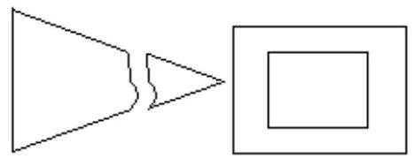

采用日常生活中常见的实例，让学生明确课题的具体目的和意义，使抽象的数学知识找到具体的数学模型, 从而导入新课。例如, 某位教师是这样导入三角形全等的判定定理的:问:“如图，有一块三角形状的玻璃板，被打断成两块，若要再划一块同样大小的玻璃板，要不要将两块都带去？为什么？”由此导入新课。

## 十一、错例导入法

巧用学生生活中的错误经验导入新课，以充分发挥错误的“反面教员” 作用，使学生渴求得到正确的解释。例如，某位，教师讲相似多边形这节课， 是这样导入新课的:

师:如图，在一块长方形木板的四周，镶上等宽的木条，得到一个新的长方形，内外两个长方形是否相似。

生:相似！(齐声答)

当教师把学生认为“ 千真万确”的生活经验否定时，学生的思维顿时活跃起来了，注意力立即集中到教师所提出的问题上来，由此顺势导入新课。

## 十二、歌曲导入法

利用青少年学生大都喜欢唱歌的特点，用歌曲导入新课，可使学生心情愉快地导入学习。例如，特级教师李迅老师讲等差数列时，用电影《红高粱》 的中歌词“ 一四七，三六九，九九归一跟我走”导入新课，让学生自己得出等差数列的规律，使学生感到数学之妙不可言。歌曲导入法的优点是能渲染气氛，复现情景，调动学生的情感，有利于发展学生的智力。

总之，中学教学导入新课的方法很多，以上仅列举了几种常用方法。教师应结合自己的教学实践，不断探索，设计出小巧灵活、适合课题特点的导入新课的方法，最大限度地发挥导入新课在整个课堂教学中的作用。

## 浅谈分数、百分数应用题教学

## 河北省阜平县龙泉关镇西刘庄小学 张永红 闫建芳

分数、百分数应用题是小学毕业班教学的重点和难点。这部分内容，如果训练不好，将会直接影响数学教学质量。所以，必须把此项内容作为训练重点来抓。

要使学生正确解答较复 的分数、百分数应用题，必须从最简单、最基础的题型抓起。让学生真正弄清解答此类题的关键是:(一)找准单位“ 1” (即“ 标准量”)；(二)抓住量率对应。教师要精心设计有针对性的练习题，使学生明白“ 是”“ 比”“ 占”“ 相当于”这些重点词起着找准单位“ 1” 的重要作用。启发引导学生总结出一般应用题的解答方法，即:“ 单位‘ 1 ’ 已知用乘算，单位‘ 1 ’未知用除算”的规律。

对于规律性的知识要进一步强化 固。在教学中要特别重视对学生进行多角度，多方面的解题思路训练，这对培养学生的能力、开发学生智力都有重要意义。根据我们几年的教学实践证明，对学生进行多角度、多方面的训练，提高了学生们的审题能力、分析能力、正确列式解答能力，收到了良好的效果。具体做法是:

## 一、量率对应关系的训练

分数、百分数应用题的特点是:一个数量对应着一个分率，也就是一个数量相当于单位“ 1 ”的几分之几。这种关系就叫做对应关系。只要紧紧抓住量率之间的对应关系, 就不难解题。量率对应是解题的关键, 也是教学中的一个重点和难点，所以，对应思路的训练十分重要。那么，如何寻求已知量和分率之间的对应关系呢？

1. 用线段图显示量率对应关系。在线段图中渗透对应思想，借助线段图， 显示已知量和分率之间的对应是一种有效方法。如:“ 甲乙两人共有人民币若干元，其中甲占 60%，若乙给甲 12 元，则乙余下的钱正好占总数的 25% ， 甲乙两人共有人民币多少元？”首先让同学们画出线段图。即: ② ___ 语文明___ $\div$ (1-60%-25%)的正确算式。

2. 转化法沟通量率对应关系。有些分数、百分数应用题中出现几个分率， 而这几个分率的单位“ 1 ”都不相同，并且不是以题目要求的那个量为单位 “ 1”。我们知道单位“ 1”不相同的几个分率不能直接相加减，这时可采用转化法将题目中的分率都转化成以题目要求的那个量为单位“ 1 ”的分率，以便沟通已知量和分率之间的对应关系。

如:“某工厂有四个车间，第一车间的人数是其余三个车间人数的 $\frac{1}{2}$ ， 第二车间的人数是其余三个车间人数的 $\frac{1}{3}$ ，第三车间的人数是其余三个车间人数的 $\frac{1}{4}$ ，而第四车间有工人 650 人，问这个工厂共有多少人？” 此题中的 $\frac{1}{2}$ 、 $\frac{1}{3}$ 、 $\frac{1}{4}$ 所指的单位“ 1 ” 都不相同，这就要用转化法统一成一个相同的标准量此题才能解答。以全厂工人数为单位“ 1 ”，

那么第一车间人数就占全厂的 $\frac{1}{1 + 2}$ ，二车间人数占全厂人数的 $\frac{1}{1 + 3}\left( \frac{1}{4}\right)$ ， 三车间人数占全厂人数的 $\frac{1}{1 + 4}\left( \frac{1}{5}\right)$ ，单位“ 1 ”转化了，量率对应关系也就明显了。列出 ${650} \div  \left( {1 - \frac{1}{3} - \frac{1}{4} - \frac{1}{5}}\right)$ 的正确算式。

3. 用假设法确定量率对应关系。有些应用题的数量关系比较复___隐蔽， 学生按照一般的分析方法，往往难以找出数量之间的内在联系。对于某些有多个已知量和多个分率的分数、百分数应用题，运用假设的思维方法进行分析，能比较容易地确定出已知量和分率之间的对应关系。

如:“ 五年级两个班共有学生 90，其中少先队员有 71 人，已知五(一) 班的少先队员人数为本班人数的 $\frac{3}{4}$ ，五(二)班少先队员人数为本班人数的 $\frac{5}{6}$ ，求两个班各有多少人？” 这里的 $\frac{3}{4}$ 、 $\frac{5}{6}$ 的单位“ 1 ” 不同。假设两个班的少先队员人数为本班人数的 $\frac{5}{6}$ ，则一共应有少先队员 ${90} \times  \frac{5}{6} = {75}$ (人)，比实际多了 4 人，为什么会多出 4 人呢？实际上五(一)班少先队员人数只有本班人数的 $\frac{3}{4}$ ，而假设成了本班人数的 $\frac{5}{6}$ ，比实际多了本班人数的 $\frac{5}{6} - \frac{3}{4} = \frac{1}{12}$ ,因此 4 人对应的分率为 $\frac{1}{12}$ ,求出五(一)班的人数。也可以假设两个班的少先队员人数为本班人数的 $\frac{3}{4}$ 。

## 二、对比性的训练

对比性的练习有益于学生把握分数乘、除法应用题的结构，区别其不同点，沟通前后知识之间的联系，从而提高学生解答分数、百分数应用题的能力。

如:①红星玻璃厂4月份生产玻璃4500箱，5月份比4月份增产 $\frac{1}{9}$ ，五月份生产玻璃多少箱?

②红星玻璃厂4月份生产玻璃4500箱，4月份比5月份增产 $\frac{1}{9}$ ，5月份生产玻璃多少箱？

出示题后，不要求同学们急于列式解答，而让学生们认真审题，区别两题的异同点。通过辨析可知相同点是条件和问题，不同点是比较量和被比量 (单位“ 1 ”)。然后列出式子再进行比较。即:① ${4500} \times  1\left( {1 + \frac{1}{9}}\right)$ 。② ${4500} \div  \left( {1 + \frac{1}{9}}\right)$ 为什么会列出这样结果不同的两个式子？通过这样的训练， 克服了认识模糊、死搬硬套的思维方式，进一步掌握了分数、百分数乘除法应用题的特征。

## 三、发散思维的训练

发散思维的显著特点是想象丰富，灵活多变，多向思考。其训练方式可采用“ 一题多变”和“ 一题多解”等方法。

1. 一题多变的训练。首先是在掌握和理解原题的基础上进行条件和问题的多样化练习，题型的选择以课本练习为主。例如:“ 李小红看一本 80 页的故事书，第一天看了全书的 $\frac{1}{5}$ ，第二天看了全书的 $\frac{1}{4}$ ，还剩下多少页没有看？”在正确解答的基础上，不改变原来的问题，只改变条件。把 $\frac{1}{4}$ 这个条件可改变为:①第二天看了第一天的 $\frac{1}{4}$ 。[列式:80×(1-5-5+-3+-4)] 第二天年了余下的 $\frac{1}{4}?\left\lbrack  {{80} \times  \left( {1 - \frac{1}{5}}\right)  \times  \left( {1 - \frac{1}{4}}\right) }\right\rbrack  \ldots \ldots$ 其次是不改变原题条件只改变问题进行训练，也能提出很多个。如:①第三天应从第几面看起？②第二天比一天多看多少页？……

通过这样的练习，使学生接触到了新的题型，学到了新知识，开阔了视野，激发了学生们的学习兴趣。

2. 一题多解的训练。如:“某厂计划生产 4800 个零件，前 5 天完成了 25%，照这样计算，余下的任务还要多少天？”按照一般的解题思路，学生们可以列出一般的解答算式:4800x (1-25%)÷ (4800x 25%÷ 5)或 4800 ÷ (4800x 25%÷ 5)-5。针对这种情况，启发学生用其它方法进行解答，并一一板书出来。让学生积极发表意见，讲清每个算式的理由，注意不要走过场。对列式多、发表意见积极的同学给予表扬，尤其对平时学习较差的同学多给他们机会，只要发现闪光点就及时给予肯定和鼓励。但一定要注意尖子生唱高调。对所列式子让每个学生都弄明白，并对式子进行比较找出最佳答案。通过评议最佳式子为:5÷25%-5。

一题多解的训练可使学生们掌握运用多种方法解答应用题的灵活性，冲破了单一的局限性，同时提高了解题速度。

## 四、联想训练

联想是由一种事物想到其他与之相关事物的心理过程。在解答较复 的应用题过程中，如果具备了一定的联想能力，解题的思路就比较灵活，能把原来的数量关系从不同的角度进行分析，从而得出不同的简捷的解法。因此， 在应用题教学中，应进行某些联想训练。

1. 从事物的某一方面想到与之相关的另一方面

比如:男生占全班人数的 60%。联想到:①女生占全班人数的 40%。 ②女生比男生少全班的20%，③男生是女生的1 $\frac{1}{2}$ 倍。④女生人数是男生人数的 $\frac{2}{3}\ldots \ldots$ 如果把这些条件构成一道完整的题为“某班男生占全班人数的 60%，比女生多 10 人，全班共有学生多少人？”由以上联想到与之有联系的条件，可以列式 10:[60%-(1-60%)]。

2. 通过联想列出数量关系式

例如:“ 一堆煤重 360 吨，第一次运走这堆煤的 25%，第二次运走这堆煤的 30%。”依据上面的已知条件引导学生列出算式，并提出相应问题:① 360x (1-25%-30%)问题是:还剩下多少吨？②360x (30%-25%). 相应问题:第二次比第一次多运多少吨？③360x (25%+30%)相应问题:网次共运多少吨? ……通过这样的训练，使同学们一看到题中的条件，马上就能联想到几个算式和相应的问题。这样既培养了学生思维的广阔性、灵活性、 创造性和变通性，又能使学生充分领会和运用已知条件，从而提高解题能力。

总之，整个解答应用题的思维推理过程，可以说是一系列的由此及彼， 由表及里的广泛联想过程。实践证明，在应用题教学中，只要重视对学生联想能力的培养，学生在分析解决问题时就能左右逢源，得心应手，比较顺利地寻求解题途径和方法，不断提高解答应用题的能力。

## 课后习题处理教学体会

## 山东省烟台市福山区第一中学 王倩

讲课时要做到知识讲透、重点突出、思路清晰、深入浅出, 而课后的习题处理是 固加深所学知识优化后继续课的一种手段，本人就此来谈淡一次课后习题处理的教学体会。

如高一代数 208 页 1 求下列各式的值:

(1)cos20° cos40° cos80° ；(2)sin20° sin80° sin80° ；(3) tg10 °t g50° tg70°

教师:首先分析(1)20°，40°，80° 都不是特殊角，本题要求值，就只有设法消去这些角的三角函数才行，显然可以

从二倍角公式入手，也可以从积化和差入手。

甲同学写出做法:

解:原式 $= \frac{2\sin {20}^{ \circ  }\cos {20}^{ \circ  }\cos {40}^{ \circ  }\cos {80}^{ \circ  }}{2\sin {20}^{ \circ  }}$

$$
= \frac{\sin {40}^{ \circ  }\cos {40}^{ \circ  }\cos {80}^{ \circ  }}{2\sin {20}^{ \circ  }}
$$

$$
= \frac{\sin {80}^{ \circ  }\cos {80}^{ \circ  }}{4\sin {20}^{ \circ  }}
$$

$$
= \frac{\sin {160}^{ \circ  }}{8\sin {20}^{ \circ  }}
$$

$$
= \frac{\sin {20}^{ \circ  }}{8\sin {20}^{ \circ  }}
$$

$= \frac{1}{8}$ (主要用二倍角公式)

乙同学写出做法:

解:原式 $= \frac{1}{2}\left( {\cos {60}^{ \circ  } + \cos {20}^{ \circ  }}\right) \cos {80}^{ \circ  }$

$$
= \frac{1}{4}\cos {80}^{ \circ  } + \frac{1}{2}\cos {20}^{ \circ  }\cos {80}^{ \circ  }
$$

$$
= \frac{1}{4}\cos {80}^{ \circ  } + \frac{1}{4}\left( {\cos {100}^{ \circ  } + \cos {60}^{ \circ  }}\right)
$$

$$
= \frac{1}{4}\cos {80}^{ \circ  } - \frac{1}{4}\cos {80}^{ \circ  } + \frac{1}{4}\cos {60}^{ \circ  }
$$

$$
= \frac{1}{4} \cdot  \frac{1}{2}
$$

$$
= \frac{1}{8}\text{ (主要用积化和差) }
$$

丙同学写出做法:

解:原式 $= \cos {20}^{ \circ  } \cdot  \frac{1}{2}\left( {\cos {120}^{ \circ  }\cos {40}^{ \circ  }}\right)$

$$
= \frac{1}{2}\cos {20}^{ \circ  }\;\left( {\cos {40}^{ \circ  } - \frac{1}{2}}\right)
$$

$$
= \frac{1}{2}\left\lbrack  \begin{array}{lll} \cos {20}^{ \circ  } & \cos {40}^{ \circ  } &  - \frac{1}{2}\cos {20}^{ \circ  } \end{array}\right\rbrack
$$

$$
= \frac{1}{2}\left\lbrack  {\frac{1}{2}\left( {\cos {60}^{ \circ  } + \cos {20}^{ \circ  }}\right)  - \frac{1}{2}{20}^{ \circ  }}\right\rbrack
$$

$$
= \frac{1}{4}\cos {60}^{ \circ  }
$$

$$
= \frac{1}{8}\text{ (与同学乙方法相同，只是先从后两个因式开始计算) }
$$

以上几种方法是直觉思维法，是一般同学所能掌握的，看到此题脑子里马上反映出与此相类似的公式。

然后教师提出这种类型题可归纳出一类特殊的三角函数乘积的公式，比上述方法都简便，回忆一下三倍角公式。

si n3α =3si nα –4si n ${}^{3}$ α (变形化成积的形式)

$$
= \sin {3\alpha }\left( {3 - 4\sin {2\alpha }}\right)  = \sin \alpha \left( {3 - 4\frac{1 - \cos {2\alpha }}{2}}\right)
$$

$$
\text{ =si na (1+2cos2a) }
$$

$$
\text{ =2si na (cos60°+cos2a )(和差化积) }
$$

$$
\text{ =4si na cos(30°+α)cos(30°–α)(化同名) }
$$

$$
\text{ =4si nα sin (60°+α ) sin (60°+α ) (两边同除 4) }
$$

即 $\frac{1}{4}\sin {3\alpha } = \sin \alpha \sin \left( {{60}^{ \circ  } - \alpha }\right) \sin \left( {{60}^{ \circ  } + \alpha }\right)$

为三倍角公式的变形公式

同理有 $: \frac{1}{4}\cos {3\alpha } = \cos \alpha \cos \left( {{60}^{ \circ  } - \alpha }\right) \cos \left( {{60}^{ \circ  } + \alpha }\right)$

$$
\text{ tg3a =tga tg(60°-a) tg(60°+a) }
$$

这组公式中以 $\alpha$ 为基础角，其它两角和、差分别为 ${60}^{ \circ  } + \alpha  \cdot  {60}^{ \circ  } - \alpha$ ， 只要是三项同名乘积(或诱导公式化成同名)满足此条件可直接使用公式计算。注:正、余弦三角函数前系数是 $\frac{1}{4}$ ，正切是 1。

现在再来看(1)20°是基础角，40° = 60° – 20°，80° = 60°+20°，

则(1)式 $= \frac{1}{4}\cos \left( {3 \times  {20}^{ \circ  }}\right)  = \frac{1}{4}\cos {60}^{ \circ  } = \frac{1}{8}$

练习 (2) 式 $= \frac{1}{4}\sin {60} = \frac{1}{4} \cdot  \frac{\sqrt{3}}{2} = \frac{\sqrt{3}}{8}$

(3)式 $= \operatorname{tg}\left( {3 \times  {10}^{ \circ  }}\right)  = \operatorname{tg}{30}^{ \circ  } = \frac{\sqrt{3}}{3}$

此时学生很兴奋，觉得这组公式妙及了，实际上在教课

书中虽没介绍，但只要教师课下认真推敲，也能归结出(1988

年 4 期《数学通讯》上介绍过)，这样处理此题可使学生重视

三角公式的变形公式及逆公式的用法，从而灵活掌握运并用

公式。继而给出三个以上三角函数乘积的问题。

练习，求下列各式的值:

(1) sin60° cos24° sin78° cos48° (=1/16)

(2) cos6° cos42° cos6° cos7B° (=1/16)

(3)ctg20°ctg40°ctg60°ctg80° (=1/3)

(4) sin10° cos20°sin30° cos40°sin50° cos60° sin70° sin90° (=1/256)

教师小结，此公式在理解推导的过程中记住(正、余弦

三倍角前系数是 1/4，正切是 1)。一个题目可能有多种解法，要善于从中筛选最佳解题方法, 提高解题效率, 要善于探讨

习题变形后的结构，以便于已掌握的知识发生广泛联系。

此类型虽很简单，但它可使学生注意到三角公式的变形

及逆公式的使用。做题不满足一种解法，可使学生养成精思、

巧思、捷思的良好习惯，能使自己的思维更加流畅，解题思

路更加宽广，从而可调动学生的积极性。这次联考，其中有

一道此类型题，我班 98%的学生都这样做的，既准确又迅速。

## 用转化法解应用题十法

## 内蒙古自治区乌审旗实验小学 谷正亮

唯物辩证法认为:任何事物是互相联系的，在一定的条件下它们之间是可以互相转化的。通过转化能把生疏的题目转化成熟悉的题目，能把繁难的题目转化成简易的题目，能把抽象的题目转化成具体的题目。下面结合具体例子谈一谈用转化法解应用题的十种方法。

## 一、顺向转化

例:光明厂10月份生产玻璃2000箱，比9月份多生产了 $\frac{1}{3}$ ,9月份生产玻璃多少箱?

把“ 10 月份比 9 月份多生产了 $\frac{1}{3}$ ” 转化成 10 月份产量是 9 月份的 $\left( {1 + \frac{1}{3}}\right)$ 。 列式为 ${2000} \div  \left( {1 + \frac{1}{3}}\right)  = {1500}$ (箱)。

通过顺向转化沟通了新旧知识之间的联系，从而使复 的问题简明化， 加深了对数量关系的理解，减少了解题难度。

## 二、逆向转化

例:有鸡100只，是鸭子只数的 $\frac{4}{5}$ ，鸭有多少只？

把“鸡的只数是鸭的 $\frac{4}{5}$ ” 转化成“鸭的只数是鸡的 $\frac{5}{4}$ ” 。列式为 ${100} \times \; {100} \times  \frac{5}{4} = {125}$ (只)

通过逆向转化培养了思维的灵活性，提高了变通能力。

## 三、单位“ 1 ”的转化

例:一个商店运来一批苹果，第一天卖出总数的 $\frac{2}{5}$ ，第二天卖出剩下的 $\frac{1}{2}$ ，第三天比第一天少卖 $\frac{1}{3}$ ，还剩 100 千克，这批苹果共有多少千克？

第一天卖出总数的 $\frac{2}{5}$ (以总数为单位“ 1 ”)，第二天卖出剩下的 $\frac{1}{3}$ ( 以剩下的数量为单位 “ 1 ” )，第三天比第一天少卖 $\frac{1}{3}$ (以第一天卖出的数量为单位“ 1 ”)。单位“ 1 ”不同，把第二三天卖的数量转化为总数的几分之几，然后再解。

第二天卖出的总数的 $\left( {1 - \frac{2}{5}}\right)  \times  \frac{1}{2} = \frac{3}{10}$

第三天卖出的是总数的 $\frac{2}{5} \times  \left( {1 - \frac{1}{3}}\right)  = \frac{4}{15}$

这批苹果共有:100÷ (1- $\frac{2}{5} - \frac{3}{10} - \frac{4}{15}$ ) =3000 (千克)

综合算式: ${100} \div  \left\lbrack  {1 - \frac{2}{5} - \left( {1 - \frac{2}{5}}\right)  \times  \frac{1}{2} - \frac{2}{5}\left( {1 - \frac{1}{3}}\right) }\right\rbrack   = {3000}$ (千克)

由于单位“ 1 ”不相同，通过转化统一了单位“ 1 ”，问题即可获解。

## 四、图解转化

例:育才中学买了 3 个篮球和 4 个排球，一共用了 143 元，一个篮球比一个排球贵 8 元，篮球和排球每个各是多少元？

把题意转化成下列图形

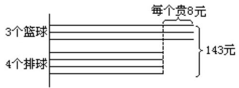

从图中可以看出，从总钱数中减去 3 个 8 元，那么就可以得到 7 个排球的总价，从而能求出每个排球的单价。列式为(143-8x 3)÷(3+4)=17(元) 篮球的单价:17+8=25 元

通过“ 数”转化为“ 形”，可以清楚地找出数量之间的关系，化难为易， 迅速找出解题方法。

## 五、形式转化

例:甲乙两个书架上书的册数的比是 7 : 3，从甲书架上拿走 50 本放在乙书架上，甲乙两书架上书的册数的比是 3 : 2，两个书架上共存书多少本？

从题意上分析属于“ 比”的应用题，可是两个书架上书的册数都在变化， 比的关系也在变, 单从比的关系入手解答是不好办的, 如果把比转化为分数就容易找到解题方法。

甲乙两书架上书的总册数不变，以总册数为单位“ 1 ”，则甲书架上原来的册数占总数的 $\frac{7}{7 + 3}$ ，后来因甲给乙50本，甲占总数的 $\frac{3}{3 + 2}$ ，少了 $\frac{7}{10} - \frac{3}{5} = \frac{1}{10}$ ,是由于甲少了 50 本书。所以 ${50} \div  \frac{1}{10} = {500}$ (本) 。综合算式是 $: {50} \div  \left( {\frac{7}{7 + 3} - \frac{3}{3 + 2}}\right)  = {500}$ (本)

通过“ 比”转化为“ 分数”，沟通了比和分数之间的关系，把思维方向由一个方向转向另一个方向，解题思路灵活，思维更加宽广。

## 六、类比转化

例:一辆货车由甲城开往乙城需要 8 小时，一辆客车从乙城开往甲城需要 12 小时。客车先开出 2 小时后，货车从甲城出发，货车出发几小时后两车相遇?

这题乍看好像是“ 行程问题”，但仔细审题，全程是多少没有告诉，速度是多少也不知道，按行程问题难以解答，如果把它转化为“ 工程问题”来解就容易了。

把甲城和乙城的路程看作单位“ 1 ”，列式为: $\left( {1 - \frac{1}{12} \times  2}\right)  \div  \left( {\frac{1}{8} + \frac{1}{12}}\right)  =$ 4 (小时)

利用类比的方法把行程问题转化成工程问题，使已知条件明显化，从而使问题得到解决。

## 七、替代转化

例:育才小学王老师，去文具店买了同样的 4 支钢笔和 6 支圆珠笔，共付款 24 元，已知买 2 支钢笔的钱可以买 3 支圆珠笔，两种笔每支各多少元？

由已知条件:2 支钢笔与 3 支圆珠笔价钱相同，得出用 4 支钢笔可替代 6 支圆珠笔，由此把买 4 支钢笔和 6 支圆珠笔共付 24 元转化为买(6+6)支圆珠笔要付 24 元，问题就迎刃而解了。

圆珠笔的单价:24÷[6+3×(4÷2)]=2(元)

钢笔的单价:3x 2÷2=3(元)

这题用一种物品替代另一种物品时，数量(份数)变化，而总价(总数) 不变。弄清了数量关系，找到了解题途径。

## 八、比较转化

例:买 5 个足球和 4 个篮球共需钱 287 元，买同样的 2 个足球和 3 个篮球共需钱 154 元，每个足球和每个篮球各多少元？

把两次买足球数和篮球数以及需钱总数一比较，就可把条件转向为“ 7 个足球和 7 个篮球共需钱 441 元”，再转化为 1 个足球和一个篮球共需钱 63 元，求出每个足球的价钱是:(287-63x 4)÷ (5-4)=35(元)每个篮球的价钱是(287-35x 5)÷ 4=28(元)

充分应用已有的解题经验，以动态观点分析推理数量关系，有利于形成解题的思路与方法的逻辑关系。

## 九、条件转化

例:学校计划买 45 个皮球，每个 0.78 元，从买皮球的钱中拿出 19. 50 元买了跳绳，剩下的钱还够买几个皮球？

把已知条件“从买皮球的钱中拿出 19.50 元买了跳绳” 转化为“从买皮球的钱中先拿出 19.50 元买了皮球”于是解法更为简捷。45-19. 5÷ 0.78=20 (个)

变三步为两步，这样思路清晰，具有创造性。

## 十、假设转化

例:公园里的大船能坐 6 人，小船能坐 4 人，新华小学 104 各师生去划船，租了大小船共 20 条，正好坐满。他们租了大小船各多少条。

假设 20 条船都是大船，可以坐 20× 6=120(人)，由假设得出的人数比实际多 120-104=16(人)，由此可以转化为“ 每条船多坐 6-4=2(人)，比实际多 16 人，故有小船 16÷ 2=8(条)，大船有 20-8=12(条)。综合算式 (20×6－10×)÷ (6–4)=8(条) ......小船

20-8=12(条)……大船”

从假定的条件入手，使问题趋向简单化，从而找出解题方法。

总之，在教学中要注意培养学生的转化意识，充分发挥学生已有的知识经验，合理灵活地分析数量关系。这样对提高学生的解题能力是大有益处的。

## 活用相交弦 妙证几何题

## 浙江省永康市四路中学 吕永淼

相交弦定理:“圆内的两条弦相交，被交点内分成的两条线段长的积相等。”这是几何中一个重要定理，灵活应用它，可使一些几何题的证明出奇而制胜，兹举几例，以示其妙用。

## 一、证明重要定理

例 1 勾股定理:已知 $\bigtriangleup  \mathrm{{ABC}}$ ， $\angle \mathrm{{ACB}} = {90}^{ \circ  }$ ，求证: $\mathrm{A{C}^{2} + B{C}^{2}} = \mathrm{A{B}^{2}}$ 。证明: 以 A 为圆心，AB为半径作圆，直线 AC 交圆于 E，F，延长 BC 交圆于 D，如图 ①。由相交弦定理，BC·CD=EC·FC， $\because$ BC=DC，AE=AF=AB， $\therefore$ BC² $= \; \left( {{AC} + {AE}}\right)  \cdot  \left( {{AF} - {AC}}\right)  = \left( {{AB} + {AC}}\right) \;\left( {{AB} - {AC}}\right)  = A{B}^{2} - A{C}^{2},\therefore A{C}^{2} + B{C}^{2} = A{B}^{2}$ 。

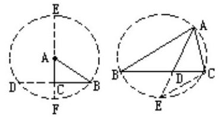

例 2 三角形内角平分线定理:已知 $\bigtriangleup  {ABC}$ ， ${AD}$ 平分 $\angle {BAC}$ ，如图②

求证:

求证 : $\frac{\mathrm{{AB}}}{\mathrm{{AC}}} = \frac{\mathrm{{BD}}}{\mathrm{{DC}}}$

证明:作 $\bigtriangleup  {ABC}$ 的外接圆，延长 AD交圆于 E，连结 CE。易证 $\bigtriangleup  {ABD} \; \bigtriangleup {AEC},\therefore {AB} = \frac{{AE} \cdot  {BD}}{EC}$ ,又 $\because \bigtriangleup {AEC} \backsim  \bigtriangleup {CED},\therefore {AC} = \frac{{AE} \cdot  {CD}}{EC}$ ,两式相除得 $\frac{\mathrm{{AB}}}{\mathrm{{AC}}} = \frac{\mathrm{{BD}}}{\mathrm{{DC}}}$

## 二、证定值

例 3 已知圆 $O$ 内任一点 $P$ ，过 $P$ 的弦 ${AB}$ ，则 ${AP} \cdot  {PB}$ 为定值。

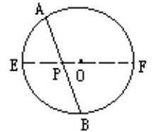

证明:设直径 EF 过点 P，圆 O 半径 EO=OF=r，O=s，由相交弦定理， AP·PB=PE·PF，即 AP·PB=(r-s) (r+s)= ${r}^{2} - {s}^{2}$ (定值)

## 三、证比例式(等积式、比例中项)

例 4 已知 ${AB}$ 为圆 $O$ 直径，点 $C$ 在 ${AB}$ 上， $D$ 、 $E$ 、 $F$ 在圆周上，且 $C$ 且 $\bot {AB}$ ， $\angle {DCE} = \angle {ECF}$ ，求证: $C{E}^{2} = {CD} \cdot  {CF}$ 。

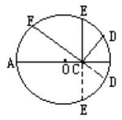

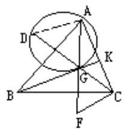

证明:延长 ${EC}$ 、 ${FC}$ 交圆于 $E$ ' ， $D$ ，易证 ${CE} = {CD}$ ' ， ${EC} = {CE}$ ' ，由相交弦定理 ${EC} \cdot  C{E}^{\prime } = {FC} \cdot  C{E}^{\prime },\therefore E{C}^{2} = {FC} \cdot  {CE}$ 。

例 5 过 $\bigtriangleup  {ABC}$ 的重心 G及顶点 A 作圆与 BG切于 G、CG的延长线交圆于 D， 如图⑤，求证: ${AG}{}^{2} = {AC} \cdot  {GD}$ 。

证明:过 C作 CFII BG交 AG的延长线于 F， $\because {AK} = {KC},\therefore {AG} = {GF}$ ，连结 AD， $\because {BG}$ 切圆于 $G$ ， $\therefore \angle {ADG} = \angle {AGK} = \angle {AFC}$ ，从而 A、D、F、C四点共圆，由相交弦定理，AG $G$ =CG ${GD}$ ，即，AG=CG ${GD}$ 。

四、证线段和、差、积、幂

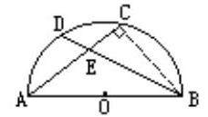

例 6 设半圆的直径为 ${AB}$ ，过 $A$ 、 $B$ 的弦 ${AC}$ ， ${BD}$ 相交于 $E$ ，如图⑥，则 $A{B}^{2} = {AE} \cdot  {AC} + {BE} \cdot  {BD}$

证明:连结 BC，则 $\angle {ACB} = {90}^{ \circ  }$ ，由勾股定理有 $A{B}^{2} = A{C}^{2} + B{C}^{2}$ ， $B{C}^{2} = B{E}^{2} - E{C}^{2}$ ， 由相交弦定理 ${AE} \cdot  {EC} = {BE} \cdot  {ED},\therefore A{B}^{2} = {\left( AE + EC\right) }^{2} + \left( {B{E}^{2} - E{C}^{2}}\right) \; = A{E}^{2} + {2AE} \cdot  {EC} + B{E}^{2} = A{E}^{2} + {AE} \cdot  {EC} + {BC} + B{E}^{2} = {AE}\left( {{AE} + {AE}}\right)  + {BE}\left( {{BE} + {ED}}\right) \; = {AE} \cdot  {AC} + {BE} \cdot  {BD}$ 。

例 7 已知:AB为圆 O直径，直线 DE 切圆 O于 D，点 C 在 AB上，CE⊥DE 于 E，如图⑦，求证:AC. CE+CD²=AB·CE。

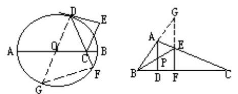

探索:延长 DC 交圆于 F，由相交弦定理知，AC. CB=DC. CF，两边同加上 $C{D}^{2}$ ，从而有 ${AC} \cdot  {CB} + {CD}^{2} = {CD} \cdot  {CF} + {CD}^{2} = {CD} \cdot  \left( {{CF} + {CD}}\right)  = {CD} \cdot  {DF}$ ，

因此只需证: ${AB} \cdot  {CE} = {CD} \cdot  {DF}$ ，即 $\frac{AB}{CD} = \frac{DF}{CE}$ ，这可引直径DG来替代AB， 连结GF，只要证Rt $\bigtriangleup \mathrm{{CED}} \sim  \mathrm{{Rt}}\bigtriangleup \mathrm{{DFG}},\therefore \frac{\mathrm{{DG}}}{\mathrm{{CD}}} = \frac{\mathrm{{DF}}}{\mathrm{{CE}}}$ ，故有 $\frac{\mathrm{{AB}}}{\mathrm{{CD}}} = \frac{\mathrm{{DF}}}{\mathrm{{CE}}}$ ，于是命题得证，(略)

## 五、求值

例 8 在 $\bigtriangleup  {ABC}$ 中， $\angle {BAC} = {90}^{ \circ  }$ ， ${AD}\bot {BC}$ 于 $D$ ， $P$ 为 ${AD}$ 中点， ${BP}$ 的延长线交 AC于 E，EF⊥BC于 F，若 AE=3，EC=12，如图⑧，求:EF 的长。

解:延长 BA，FE 相交于 G，∵ ADL BC，EF⊥BC，∴ADI EF， $\therefore \; \frac{\mathrm{{AP}}}{\mathrm{{GE}}} = \frac{\mathrm{{BP}}}{\mathrm{{BE}}},\frac{\mathrm{{PD}}}{\mathrm{{EF}}} = \frac{\mathrm{{PB}}}{\mathrm{{BE}}},\therefore \frac{\mathrm{{AP}}}{\mathrm{{GE}}} = \frac{\mathrm{{PD}}}{\mathrm{{EF}}},\because \mathrm{{AP}} = \mathrm{{PD}},\therefore \mathrm{{GE}} = \mathrm{{EF}},\because \angle \mathrm{{CAG}}$ =∠CFG=90°，故 A、F、C、G、四点共圆，由相交弦定理 EG EF=AE·EC，即 ${\mathrm{{EF}}}^{2} = {AE} \cdot  {EC},\therefore E{F}^{2} = {3 \times  {12}} = {36},\therefore {EF} = 6$ (取正值)

## 六、证角的倍分

例 9 已知 $\bigtriangleup \mathrm{{ABC}},\angle \mathrm{A},\angle \mathrm{B},\angle \mathrm{C}$ 的对边为 $\mathrm{a},\mathrm{b},\mathrm{c}$ ,并且满足 ${\mathrm{b}}^{2} - {\mathrm{a}}^{2} = \mathrm{a} \cdot  \mathrm{c}$ , 求证: $\angle \mathrm{B} = 2\angle \mathrm{A}$ 。

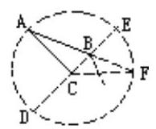

分析:由已知条件变形为(b+a)· (b-a) =a·c，联想到相交弦定理， 故以 C为圆心，b 的长为半径作圆，延长 AB 交圆于 F，延长 BC 交圆于 D，E， 连结 CF，如图⑨，设 CF 的中垂线交 AF 于 B，则 BF=a，AB=c，根据相交弦定理有 BD: BE=AB-BF，于是有△ABC满足条件 b ${}^{2}$ – ${\text{ a }}^{2}$ =ac.

证明:由作图知，BC=BF=a， $\therefore \angle {BCF} = \angle {BFC} = \angle {A,\text{ 所 },\angle {ABC} = \angle {BCF}} + \angle {F = 2}$ ∠F，即，∠ABC=2∠A。

## 浅谈列方程解应用题教学的几点体会

## 山东省烟台市第三中学 姜宏玉

方程是初中代数中的主要内容之一，列方程解应用题在教学中既是重点又是难点。教师感到难教，学生感到难学，但是这部分知识对培养学生分析问题解决问题，发展学生思维能力是十分重要的。因此，如何提高列方程解应用题的教学质量的确是每位教者应该不断探索和研究的课题。下面就此谈笔者的粗浅体会。

## 一、要设好未知数 $x$

设未知数是列方程解应用题的重要一步，在题中无间接未知数时，学生设直接未知数 x 是没有困难的，可是往往由于习惯的缘故，误认为引进 x 列方程可以无须全面考 题意与条件，只要把未知数用 x 表示就可以解决问题。而一旦遇到有间接未知数的题目，就无法处理。因此，教学中应严格要求学生读懂题意，明确已知量和未知量之间的关系，引导学生分析，使他们理解为什么有的题目设直接未知数为 x 会扩大已知数与 x 的距离，会导致解题过程的迂回曲折，而间接设未知数为 x，则可缩短已知数与 x 的距离，反而容易解题。

例如:有一个二位数，个位数字比十位数字大 2，且该数与个位、十位上的数字和的积为 144，求这个两位数。

解法 (一) 设十位上数字为 x，则个位上数字为 x+2，依题意列方程为 (10x+x+2) (x+x+2) =144

解方程得 x=2 十位上数字是 x+2=4

所以这个两位数是 24。

解法 (二) :设这个两位数为 x

那么，个位、十位上数字和 $= \frac{144}{\mathrm{x}}$

十位上数字 $= \frac{\text{ 数字和 } - 2}{2} = \frac{\frac{144}{2} - 2}{2}$

个位上数字 $= \frac{\text{ 数字和 } + 2}{2} = \frac{\frac{144}{\mathrm{x}} + 2}{2}$

则列方程为 ${10}\left\lbrack  \frac{\frac{144}{\mathrm{x}} - 2}{2}\right\rbrack   + \frac{\frac{144}{\mathrm{x}} + 2}{2} = \mathrm{x}$

解得 x=24

方法(一)是间接设未知数，列方程简单易解，方法(二)是直接设未知数，列方程麻烦费解。因此方程时应针对不同问题，灵活地设好未知数。

## 二、要找准等量关系

列方程解应用题的关键在于找准等量关系。这对数与学来说都是难点和重点。首先教师要强调和引导学生理解题意，分析题中所求的数量关系，善于找出隐含在题中的等量关系，其次要注重介绍找等量关系的途径。如:

1. 找出题中所含的主要等量关系

如:甲、乙两人从同地出发前往某地。甲步行，每小时 6 千米，先出发 1.5 小时后，乙骑自行车出发，又过了 50 分钟，两人同时到达目的地，问乙每小时走多少千米?

分析:本题涉及速度、时间、路程三种量。其中甲、乙的速度及所用的时间不同，所走路程相等。因此路程相等是该题的主要等量关系

解:设乙每小时走 x 千米(如右图)

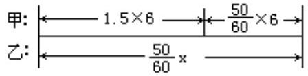

依题意得方程为 $\frac{5}{6}\mathrm{x} = 6 \cdot  \left( {{1.5} + \frac{5}{6}}\right)$

## 解略

2. 借助图形使等量关系形象化

如:一面靠墙，其余三面用 13 米的篱笆围成一个长方形的养鸡场，该鸡场的面积为 21 平方米, 则这个养鸡场的长、宽各多少米？

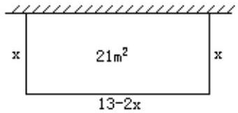

分析:此题未知量较隐蔽，且同一数量又多次被用到，对它进行分析综合相当困难，如转化为右图，则一目了然。这样利用再造想象和感知来支持思维，是解复合应用题经常采用的方法之一。

## 三、利用定理、公式找等量关系

如:把浓度为 18%的糖水 75 千克，稀释成浓度为 10%的糖水，应加水多少千克？

分析:本题涉及三种量，溶液(糖水)，溶质(糖)、浓度。在化学中， 它们之间的公式是:浓度 $= \frac{\text{ 溶质 }}{\text{ 溶液 }}$ 或溶质 $=$ 浓度 $\times$ 溶液。等量关系可从混合前后哪个量不变中找出此题等量关系是:加水前后糖的重量不变。

解:设应加水 x 千克，则浓度为 10%的糖水的重量为(x+75)千克。

由上面公式得:浓度为 18%的糖水中含糖为 75x 18%千克，浓度为 10 %的糖水中含糖为(x+75)×10%千克

依题意可列方程(x+75) $\times  {10}\%  = {75} \times  {18}\%$

解得 x=60 千克

答:应加水 60 千克

## 四、利用已有的生活经验和常识找等量关系

如锻压金属“ 形变体积不变”即属前者，同样大小容器装的东西相等即属后者。另外还可以利用表格等法找出等量关系。要使学生解题的思维方法正确，又能掌握设未知数的方法和找等量关系的途径，除教师讲解分析外， 还要通过适当的作题练习，从实践中总结规律。在此基础上，教师也可以出一些间接设未知数的题目给学生，或者同一道题，叫学生给出几种解法，以便培养学生一题多解的能力，提高列方程解应用题的灵活性。

分数应用题教学初探 (小学数学)

## 天津市大港区太平村小学 刘洪喜

分数应用题是小学数学知识中的重要组成部分，数量关系抽象、复是教学的难点。在教学中，要使学生既长知识又长智慧，就要求我们在教学中不能只重视结果，还要注重得出结果的过程，即观察学生分析问题的思路， 培养他们解决问题的能力。以下面“ 五法”拙见于同行，以求斧正。

## 一、意义分析法

分数应用题的数量关系是多样的，解题方法也各异，可谓千姿百态，但又具有统一性，解答时都是以“ 一个数乘以分数的意义”为依据，其数量关系可归结为 $a \times  \frac{n}{m} = b\left( {m \neq  0}\right)$ 的基本结构。因此从意义入手，引导学生分析，使学生获取知识，“知其然，且知其所以然。”

例:修一条长1800米的水渠，已经完成了全长的 $\frac{3}{5}$ ，问已修好的水渠是多少米?

抓住应用题中带有分率的关键句分析“已经修好了全长的 $\frac{3}{5}$ ” 表示把 “这条水渠的全长”看作单位“ 1 ”，平均分成 5 份，已经修好的占其中的 3 份。求已经修好了多少米？实质就是求水渠全长 1800 米的 $\frac{3}{5}$ 是多少米？根据一个数乘以分数的意义用乘法计算，列式为: ${1800} \times  \frac{3}{5}$

再例:山羊80只，山羊只数相当于绵羊只数的 $\frac{4}{5}$ ，绵羊多少只？

抓住应用题中带有分率的关键句分析“ 山羊只数相当于绵羊只数的 $\frac{4}{5}$ ” 表示把“绵羊只数”看作单位“ 1 ”，平均分成 5 份，山羊只数相当于这样的4份。也就是绵羊只数的 $\frac{4}{5}$ 是山羊只数，设绵羊只数为x只，根据一个数乘以分数的意义列出方程: $x \times  \frac{4}{5} = {80}$

紧扣意义分析解题，能使学生有法可寻，有据可依，利于牢固掌握知识。

## 二、类型分析法

依据分数乘除法应用题的结构特点，总结结构类型，配合解题策略，能够简捷、迅速、准确的解答分数乘除法应用题。

1. 已知标准量，求比较量

解题方法:先找出所求比较量的对应分率，用标准量 $\times$ 分率=比较量。

例:一个纺织厂运来棉花3600包，用去了总包数的 $\frac{3}{5}$ ，还剩下多少包？

抓住关键句“用去了总包数的 $\frac{3}{5}$ ” 表示把总包数看作单位“ 1 ”，也是标准量，已知总包数是 3600 包，很明显是“ 已知标准量，求比较量”，找出所求比较量“还剩下多少包？”的对应分率，占总包数的 $\left( {1 - \frac{3}{5}}\right)$ ，列式为 ${3600} \times  \left( {1 - \frac{3}{5}}\right)$

2. 已知比较量，求标准量

解题方法:找出已知比较量的对应分率，用比较量 $\div$ 分率=标准量。

例:纺织厂有男职工100人，女职工人数是全厂总人数的 $\frac{1}{4}$ ，全厂有职工多少人？

抓住关键句“ 女职工人数是全厂总人数的 $\frac{1}{4}$ ” 表示把全厂职工总数看作单位“ 1 ”，也就是标准量，问题恰好求“ 全厂职工人数”，显然这是已知比较量求标准量，则找出已知比较量男职工 100 人的对应分率，占全厂职工总数的 $\left( {1 - \frac{1}{4}}\right)$ ,列式为 $: {100} \div  \left( {1 - \frac{1}{4}}\right)$

3. 已知比较量，求其它比较量

解题方法:先找出已知比较量的对应分率求出标准量，再找出所求比较量的对应分率求问题。

例:一堆煤，用去了总数的 $\frac{2}{3}$ ，还剩 120 吨，用去了多少吨煤？

抓住关键句“用去了总数的 $\frac{2}{3}$ ” ，表示把这堆煤总数看作单位“ 1 ” 也就是标准量, 在应用题中没有具体数, 而问题也不是求这堆煤的总数, 可以说明还是已知比较量求其它比较量。则先找出已知比较量还剩120吨的对应分率，占总数的 $\left( {1 - \frac{2}{3}}\right)$ ，用除法求出标准量，120÷ $\left( {1 - \frac{2}{3}}\right)$ ，再找出所求问题用去数量的对应分率，是总数的 $\frac{2}{3}$ ，用乘法求问题: 列式 ${120} \div  \left( {1 - \frac{2}{3}}\right)  \times  \frac{2}{3}$

分类型教学容易造成学生的机械模仿，所以在教学时要重点强调解题的依据，采用多种解题方法，通过解题培养学生分析问题、解决问题的能力， 进而逐渐掌握解题规律。

## 三、量率对应分析法

理清数量与数量、数量和分率、分率与分率之间的关系, 是解答分数应用题的难点和关键，利用量、率对应图解，能使学生清楚地看出以上三者的关系，变抽象为具体，化 乱关系为有序关系，以便解题。

例:学校买来一批球共60个，其中篮球占 $\frac{1}{4}$ ，足球占 $\frac{2}{5}$ ，其余是排球， 求排球多少个？

<table><tr><td>量别</td><td>分率</td><td>量数</td></tr><tr><td>一批球</td><td>1</td><td>60 个</td></tr><tr><td>篮球</td><td>1 4</td><td></td></tr><tr><td>足球</td><td>2 5</td><td></td></tr><tr><td>排球</td><td>$1 - \frac{1}{4} - \frac{2}{5}$</td><td>？个</td></tr></table>

从上面对应表中很直观的看出排球的对应分率, 要

求排球多少个? 就是求一批球的 $\left( {1 - \frac{1}{4} - \frac{2}{5}}\right)$ 是多少? 据一个数乘以分数的意义,列式为 ${60} \times  \left( {1 - \frac{1}{4} - \frac{2}{5}}\right)$ ,此处还可以让学生进行联想训练,即让学生根据以上对应的量、率, 展开联想, 说出与此题有关的各种量率对应情况。 例:篮球和足球之和是一批球的 $\left( {\frac{1}{4} + \frac{2}{5}}\right)$ 篮球比足球少的占一批球的 $\left( {\frac{2}{5} + }\right. \; \frac{1}{4}$ )等，通过这种训练，可以扩展学生的思路，有利于解题能力的培养。

## 四、数量关系式分析法

分率是表示两个数量之间的倍数关系，因此在教学时注意加强书写数量关系式的训练，无疑是解答分数应用题的一个重要途径。

例:光明玻璃厂九月份生产玻璃2400箱，十月份比九月份多生产了 $\frac{1}{4}$ , 十月份生产玻璃多少箱?

先把关键句“ 十月份比九月份多生产了 $\frac{1}{4}$ ” 转化为“ 十月份生产的是九月份的 $\left( {1 + \frac{1}{4}}\right)$ ”,据此写出关系式:

九月份生产箱数 $\times  \left( {1 + \frac{1}{4}}\right)  =$ 十月份生产箱数

列式: ${2400} \times  \left( {1 + \frac{1}{4}}\right)$

然后，将题中条件“ 九月份生产玻璃 2400 箱，”改为“ 十月份生产玻璃 3000箱”，问题改为“九月份生产玻璃多少箱？”则应用下面关系式:

九月份生产箱数 $\times  \left( {1 + \frac{1}{4}}\right)  =$ 十月份生产箱数

$\downarrow  \; \downarrow  \; \downarrow$

列方程: $\;x \times  \left( {1 + \frac{1}{4}}\right)  = {3000}$

从而使学生清楚的看到分数乘除法应用题思路是一致的, 同处于一个关系式中，通过数量关系式解题避免了乘除混淆，效果很好。

## 五、线段图分析法

有些较复 的分数应用题，数量之间的关系很难直接看出，可利用线段图帮助学生直观、形象的分析题目中数量与数量、数量与分率、分率与率的关系。

例:五年级学生参加语、数竞赛，参加语文的人数占参赛总人数的 $\frac{3}{4}$ , 参加数学的占参赛总人数的 $\frac{2}{3}$ ，两科都参加的有12人，五年级参赛人数多少人?

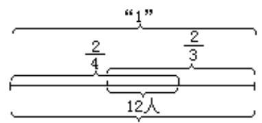

五年级参赛总人数

从图中可以看出“ $\frac{2}{3}$ ” 与“ $\frac{1}{4}$ ” 交叉部分为语、数都参加的 12 人，从而可以找出它的对应分率。① $\frac{3}{4} + \frac{2}{3} - 1$ ② $\frac{3}{4} - \left( {1 - \frac{2}{3}}\right)$ ③ $\frac{2}{3} - \left( {1 - \frac{3}{4}}\right)$ ，列式为:

① ${120} \div  \left( {\frac{3}{4} + \frac{2}{3} - 1}\right)$ ② ${120} \div  \left\lbrack  {\frac{3}{4} - \left( {1 - \frac{2}{3}}\right) }\right\rbrack$ ③ ${120} \div  \left\lbrack  {\frac{2}{3} - \left( {1 - \frac{3}{4}}\right) }\right\rbrack$

再例:

一批货物，第一次运走总数的 $\frac{2}{5}$ ，第二次运走剩下的 $\frac{3}{4}$ ，还剩 120 吨， 这货物多少吨?

题目中“第一次运走总数的 $\frac{2}{5}$ ” 以总数为单位“ 1 ”，“第二次运走剩下的 $\frac{3}{4}$ ” 以剩下的为单位“ 1 ” ，数量关系比较抽象、复 ，利用线段段图分析可迎刃而解。 从图中看出以剩下的为单位“ 1 ”,120 吨是剩下货物 $\left( {1 - \frac{3}{4}}\right)$ ,可以求出剩下多少吨? 用 ${120} \div  \left( {1 - \frac{3}{4}}\right)$ ,又从图中看到剩下的是总数的 $\left( {1 - \frac{2}{5}}\right)$ 可以求出一批货物的总数,列式为 ${120} \div  \left( {1 - \frac{3}{4}}\right)  \div  \left( {2 - \frac{1}{5}}\right)$ 。这样解题,难点分散了，培养了分析能力。

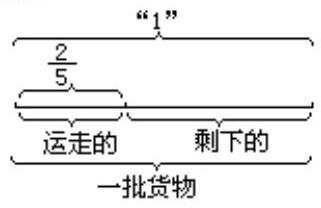

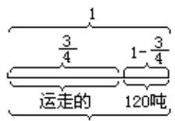

总之，分数应用题教学要重视基础，抓住关键，突出数量关系的分析， 培养学生有根有据的列式解答的良好习惯，提高教学效率。

## 圆中比例线段的证法

## 内蒙古哲里木盟奈曼旗新镇乡中学 张瑞清

证明圆中的比例线段是初中几何的重点, 也是中考试题的热点, 现归纳四句口诀来寻找其证明途径，用起来十分方便有效，易学易懂。

## 一、口诀内容

遇等积，改等比，横找竖找定相似。

不相似，别生气，等线等比来代替。

遇等比，改等积，引用射影和圆幂。

平行线，转比例，两端各自找联系。

## 二、应用举例 (都是中考试题)

例 1 已知:如图 1， $\bigtriangleup  \mathrm{{ABC}}$ 为圆内接三角形，FE 是圆的切线，A是切点， AD是∠BAC的平分线，CEII AD。求证:AB·AE=AC·BD。

证明:“ 遇等积，改等化”，需证: $\frac{\mathrm{{AB}}}{\mathrm{{AC}}} = \frac{\mathrm{{BD}}}{\mathrm{{AE}}}$ ，“ 横找竖找定相似”， 横向找到:△ABD和△CAE，由∠1=∠2=∠3，∠B=∠EAC，

可得 $\bigtriangleup  \mathrm{{ABD}} \backsim   \bigtriangleup  \mathrm{{CAE}}$ ，所以 $\frac{\mathrm{{AB}}}{\mathrm{{AC}}} = \frac{\mathrm{{BD}}}{\mathrm{{AE}}}$ ，

即: ${AB} \cdot  {AE} = {AC} \cdot  {BD}$ 。

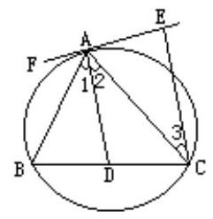

图1

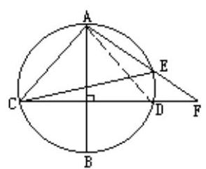

图2

例 2 如图 2 :圆的直径 AB垂直于弦 CD，弦 AE、CD的延长线相交于点 F， 求证:AC $\because {CF} = {AF} \cdot  {CE}$ 。

分析:“遇等积，改等比”，需证: $\frac{AC}{AF} = \frac{CE}{CF}$ ，“ 横找竖找定相似”， 横找得△ACE和△ACF，竖找得△ACF和△CEF都不相似。“不相似， 气，等线、等比来代替”，连结AD，改证: $\frac{\mathrm{{AD}}}{\mathrm{{AF}}} = \frac{\mathrm{{CE}}}{\mathrm{{CF}}}$ 。再“ 横找竖找定相似”。竖找 $\bigtriangleup \mathrm{{ADF}}$ 和 $\bigtriangleup \mathrm{{CEF}} \propto  \because \angle \mathrm{F} = \angle \mathrm{F},\angle \mathrm{{DAF}} = \angle \mathrm{{ECF}},\therefore \bigtriangleup \mathrm{{ADF}} \; \backsim  \bigtriangleup \mathrm{{CEF}},\frac{\mathrm{{AD}}}{\mathrm{{AF}}} = \frac{\mathrm{{CE}}}{\mathrm{{CF}}}$ ,而 $\mathrm{{AD}} = \mathrm{{AC}},\therefore \frac{\mathrm{{AC}}}{\mathrm{{AF}}} = \frac{\mathrm{{CE}}}{\mathrm{{CF}}}$ 。

例 3 已知:如图 3，锐角三角形 ${ABC}$ ，以 ${BC}$ 为直径的圆 $O$ 与 ${AB}$ 交于 $G$ ， AD与圆。切于 D，在 AB上取 AE=AD，作 EF⊥AB，EF 与 AC的延长线交于 F， 求证: $\frac{AE}{AB} = \frac{AC}{AF}$

分析:横向找，难证相似；竖向找，都是直线。“ 不相似，别生气，等线等比来代替”。看右端 $\frac{\mathrm{{AC}}}{\mathrm{{AF}}} =$ ? 连结 $\mathrm{{CG}}$ ，可得 $\mathrm{{CGII}}$ EF，于是右端 $\frac{\mathrm{{AC}}}{\mathrm{{AF}}} = \frac{\mathrm{{AG}}}{\mathrm{{AE}}}$ ，故需证 $\frac{\mathrm{{AD}}}{\mathrm{{AB}}} = \frac{\mathrm{{AG}}}{\mathrm{{AD}}}$ (遇等比，改等积，引用身影和圆幂)，故需证 $\mathrm{A{D}^{2} = {AG}}$ - $\mathrm{{AB}}$ ，又 $\because \mathrm{{AD}}$ 是切线，故可见。

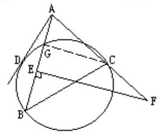

图3

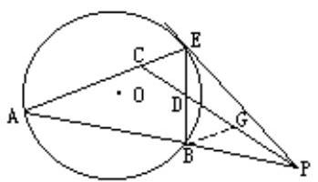

图4

例 4:已知圆 $O$ 的弦 ${AB}$ 的延长线和切线 ${EP}$ 交于点 $P, E$ 为切点， $C$ 是 $\mathrm{{AE}}$ 的中点， $\mathrm{{PC}}$ 交BE于 $\mathrm{D}$ ，求证: $\frac{{\mathrm{{PE}}}^{2}}{{\mathrm{{PB}}}^{2}} = \frac{\mathrm{{ED}}}{\mathrm{{DB}}}$ .

分析:如图 4，PE 是圆 O切线，“ 引用射影和圆幂” 得 ${\mathrm{{PE}}}^{2} = \mathrm{{PA}} \cdot  \mathrm{{PB}}$ ， $\therefore \frac{{\mathrm{{PE}}}^{2}}{{\mathrm{{PB}}}^{2}} = \frac{\mathrm{{PA}} \cdot  \mathrm{{PB}}}{{\mathrm{{PB}}}^{2}} = \frac{\mathrm{{PA}}}{\mathrm{{PB}}}$ ,于是需证: $\frac{\mathrm{{PA}}}{\mathrm{{PB}}} = \frac{\mathrm{{ED}}}{\mathrm{{DB}}}$ ,前三句口诀都用不上， 用第四句口诀“ 平行线，转比例，两端各自找联系”，过B点作BGII AE 交PC于G，则有 $\frac{\mathrm{{PA}}}{\mathrm{{PB}}} = \frac{\mathrm{{AC}}}{\mathrm{{BG}}}$ 和 $\frac{\mathrm{{ED}}}{\mathrm{{DB}}} = \frac{\mathrm{{CE}}}{\mathrm{{BG}}}$ ，因为 $\mathrm{{AC}} = \mathrm{{CE}}$ ，所以 $\frac{\mathrm{{ED}}}{\mathrm{{DB}}} = \frac{\mathrm{{PA}}}{\mathrm{{PB}}}$ ， 所以 $\frac{{\mathrm{{PE}}}^{2}}{{\mathrm{{PB}}}^{2}} = \frac{\mathrm{{ED}}}{\mathrm{{DB}}}$ .

以上是通过十几年的教育教学总结出来的一个方面，并且通过几年来的中考尝试，效果很好，值得推广，不过因个人水平有限，不足之外请多指教。

## 运用迁移规律 优化课堂教学结构

## 浙江省乐清柳市镇一小 吴汝明

数学知识具有严密的科学性和系统性，许多新知识都由旧知识发展而来。因此在教学时，把握运用知识、技能的正迁移，精心组织课堂教学，优化教学过程，可以收到事半功倍的效果。

在“ 除数是小数的除法”的课堂教学中，针对抓好“ 引入、展开、 固” 这三个教学环节，谈谈自己的一些做法与体会。

## 一、“ 引入阶段”要积极创造条件，做好迁移准备

迁移是以先前学习的知识技能为前提的，学生学习新知识，解决新问题， 离不开已有的知识和经验。

“ 除数是小数的除法”是在学生学会除数是整数的除法基础上进行教学的，关键是根据“ 商不变”的性质，把除数是小数的除法转化为除数是整数的除法来计算，这个转化过程，是学生认识的转折点。为了顺利地解决教学中的重点、难点、减小坡度，在授新课之前，我组织如下复习:

1. 出示(讨论)

---

																			${6.8} \rightarrow  {68}$

							3.45 →345

0.105 →105

---

(1)这些小数变成整数，小数点是怎样移动的？

(2)这样，它们的大小发生了怎样的变化？

## 2. 出示

(1)15÷5

(2)150÷50

1500÷500

口算三式，观察后回忆商不变性质。

然后在(1)式除数后面添 0，成 15÷ 50

启发:(1)如果除数扩大 10 倍，被除数不同时扩大，商会怎样？

(2)要使商不变，应该怎样？

3. 让学生计算:3. 22÷14

通过铺垫，有关旧知识的概括水平已达到 定与清晰的程度，学生的心理准备也很充分，这时再学习“除数是小数的除法”已成“ 水到渠成”之势。

## 二、“ 展开阶段”要正确引导，促进迁移实现

准备了良好的迁移条件，并不等于迁移活动一定会发生，经验表明，积极的迁移活动的发生，还有赖于教师的正确引导。

在“ 展开阶段”，我根据“ 商不变”的性质，运用转化思想，放手让学生依托已得的旧知识去探索新知识，以促使迁移的顺利实现。

出示:[例 6]一位驾驶员一天节约汽油 3. 22 千克，已知卡车行驶 1 千米要用汽油 0.14 千克。照这样计算，节约的汽油能行驶多少千米？

从分析题意入手，要求学生列出算式，3. 22÷ 14，比较有什么不同？

进而引入新课，板书课题，然后要求学生以下面两个思考题自学[ 例 6]:

(1)例题是怎样把“除数是小数”的除法转化为“ 除数是整数”的除法？

(2)除数 0.14 变成整数，要使商不变，被除数应该怎么办？

之后，师生一起研讨，在分析推理的过程中，做到集中力量突破难点； 即如何用商不变的性质，把除数是小数的除法转化为除数是整数的除法；除数变成整数，要使商不变，变除数应该怎么办？

具体指导学生在竖式上处理好小数点，初步形成外理小数点的技能，从而实现了把“ 除数是小数的除法” 转化为“ 除数是整数的除法” 的知识迁移， 并依次推导出计算法则:

1. 先移动除数的小数点，使它变成整数；

2. 除数的小数点向右移动几位，被除数的小数点也向右移动几位；

3. 然后按照除数是整数的除法进行计算。

为完善法则，我又引导学生试做:[例 7] 计算 10.44 - 0.725 和[例 8] 计算 87÷ 0.03，解决被除数的小数点向右移动，位数不够时，如何用“ 0”补足的新难点。

在教师的积极引导下，全班学生试解例题兴趣盎然，整个教学过程充分地体现了“ 学生为主体，教师为主导”的教学思想。

## 三、“巩固阶段”要精心设计练习，稳定迁移成果

课堂教学是由多种因素组合而成的一个复 的系统，课堂练习是课堂教学中重要的组成部分，精心设计练习，可以 定迁移成果。

这个阶段，我着眼于学生智能的发展，采用分层的练习和反馈评价的方法，使整个练习的过程，成为学生凭借已有知识经验开展思维活动，寻求解决问题的过程。

具体安排如下:

1. “ 移点” 单项训练

0.18÷0.3=()÷3___ 2.88÷0.12=()÷12

0.4÷0.05=()÷5 25.2÷0.288=()÷288

10÷ 0.4= ( ) ÷ 4 15÷ 0.006= ( ) ÷ 6

2. 计算试练

试练题:0.75÷1．5 0．101÷0．17 62．1÷0．03

0.7÷0.035 3÷0.6 40÷0.05

3. 错题议评练习

下列三道竖式错在哪里，该怎样纠正？

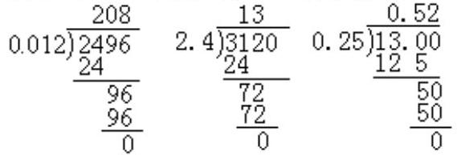

通过议错评错题的练习，可有效地防止负迁移的发生，以进一步促进学生正确理解和掌握知识的技能。

4. 综合性练习

课堂练习:4. 68÷ 12 0. 69÷ 27. 6 51÷ 0.016

6. 84÷ 0.192 220.5÷ 1.47 36÷ 2.25

总之，运用知识的迁移规律，认真确定和充分利用可以固定新知的相关旧知，精心设计各个教学环节，能优化课堂教学结构，这样学生对相关的旧知不仅得以 定和清晰，而且使原有的认知结构得以扩展和充实，从而提高了课堂效率。

## 浅谈两步计算应用题的结构训练

## 山东省乳山市府前中学 谭文竹

两步计算的应用题是由两个相关联的一步计算应用题组成的, 第一个一步计算应用题的结论就是解答两步计算应用题所必须的一个中间条件，寻找这个中间条件是分析解答两步计算应用题的关键。因此，教学中要引导学生认真分析题意，认清直接条件、间接条件与所求结论的关系。如何帮助学生寻找中间条件和抓好应用题的结构训练呢？我常采用如下几种训练方法:

## 一、把两道一步计算应用题合并成一道两步计算应用题的训练

数学知识的连贯性很强，其结构特点是:前面的知识是后面知识的基础， 后面知识又是前面知识的发展和引申。两步计算应用题是在一步计算应用题的基础上发展起来的。在教学两步计算应用题时，教师可引导学生把已经完成的两个相关联的一步计算应用题串变成一道两步计算应用题，使学生顺利地进行知识迁移，并认清两步计算应用题的结构特征，如:

1. 四年级有少先队员 108 人，比五年级少 44 人。五年级有少先队员多少人？

2. 四年级有少先队员 108 人，五年级有少先队员 152 人。四、五年级一共有少先队员多少人？

学生解答后，教师引导学生把上述两题进行分析比较，不难发现:第 2 题中的已知条件“ 五年级有少先队员 152 人”与第一题的结论相同，然后， 把第 2 题中的“ 五年级有少先队员 152 人”这个直接条件隐蔽起来，换上第 1 题中的两个间接条件，就变成第 2 题。

3. 四年级有少先队员 108 人，比五年级少 44 人。四、五年级一共有少先队员多少人？

这样使学生清楚地认识到第 3 题的中间条件是解决该题的关键。通过这样的训练，使学生既认清了两步计算应用题的结构特征，又搞懂了直接条件和间接条件的关系，从而掌握了解答此类应用题的方法。

## 二、把一道两步计算应用题拆成两道一步计算应用题的训练

学生由解答一步计算应用题到解答两步计算应用题是一次知识飞跃，有不少同学会感到困难，为了分散难点，打好基础，教师可进行一组拆题训练:

如:动物园有 25 只小猴，比大猴少 18 只，动物园一共有多少只猴子？ 把它拆成相关联的两道一步计算应用题:

1. 动物园有 25 只小猴，比大猴少 18 只，大猴有多少只？

2. 动物园有 25 只小猴，43 只大猴，动物园一共有多少只猴子？

通过这样的训练，学生进一步认识了两步计算的应用题是由两个相关联的一步计算应用题组成的，明确了中间条件与间接条件的关系。为解答多步计算应用寻找中间条件打下了基础。

## 三、把一道连续两问的一步计算应用题转化成一道两步计算应用题 的训练

比较是一切理解和思维的基础，也是创造思维的主要方式，用比较的方法教学能产生良好的效应，促进思维的发展，在教学两步计算应用题的结构特征时，要利用比较的方法促进学生对新知识的理解。

例如:一个果园有苹果树 1693 棵，梨树比苹果树多 197 棵，梨树有多少棵？桃树是苹果树与梨树棵数的和，桃树有多少棵？

学生解答后，把第一问遮盖起来就把原来两个连续一步计算应用题转变成一道两步计算应用题, 通过比较可以发现:遮盖的第一问就是两步计算应用题的中间条件。通过这种训练能使学生进一步认清两步计算应用题的结构特点，弄清中间条件是怎样派生的，掌握寻找中间条件的方法。

## 四、改变已知条件, 把一步计算应用题转化为两步计算应用题的训 练

发散思维是一种创造性的思维，其主要思维形式是根据研究对象提供的信息向各个方面发散开去，广开思路，充分想象，它具有“ 多”、“ 新”、 “ 独特”的特点。“ 一题多变”的教学使这种思维得到了充分显示。在教学两步计算应用题结构特征时，若能引导学生对一些题目从多侧面多层次地去认识，对培养学生思维能力的广阔性和深刻性具有重要的作用。

例如:煤场原来有煤 50 吨，又运进 200 吨。煤场现在有煤多少吨？

学生解答后，老师把第二个直接条件“又运进 200 吨”。改变为间接条件“ 又运进 20 车，每车 10 吨”。并启发学生用不同的方法来叙述，把原题中的一个直接条件变为间接条件，一步计算应用题就变为两步计算应用题。 第二个直接条件改变后可成为以下几种类型的应用题。

1. 煤场原来有煤 50 吨，又运进 20 车，每车 10 吨 。煤场现在有煤多少吨？

2. 煤场原来有煤 50 吨，又运来的煤比原来多 150 吨。煤场现在有煤多少吨？

3. 煤场原来有煤 50 吨，又运来的煤是原来的 4 倍。煤场现在有煤多少吨？

通过这样的训练，极大地调动了学生思维的积极性和主动性，学生明确了把一步计算应用题的一个直接条件转化为间接条件就变成了两步计算应用题的道理。

## 五、改变结论把一步计算应用题变成两步计算应用题的训练

例如:植树节四年级植树 430 棵，五年级比四年级多植 60 棵，五年级植树多少棵?

学生解答后，教师让学生思考:这道题的结论怎样叙述就变成一道两步计算应用题。“ 四、五年级一共植树多少棵？” 然后让学生进一步的观察得出:原题的结论就是两步计算应用题的中间条件。

通过这样的训练，学生明确了两步计算应用题是在一步计算应用题的基础上发展起来的, 加深了对两步计算应用题结构的理解, 发展了学生创造性思维的能力，使学生掌握了解答两步计算应用题的技巧。

## 对新教材列方程解应用题的教学认识

## 黑龙江省密山市兴凯湖集团子弟校中学 张钰光

列方程解应用题是初一数学教学的一个重点，也是难点，并且对学生今后的学习影响很大，所以，在教学中应予以重视。

## 1. 改变思维方式, 学会使用代数法

负数的引入，用字母表示数，使初一学生对数学的认识产生一大飞跃， 但他们的思维“还是离不开所感知的具体事物的支持”“孤立地认识和记忆各种抽象的规定”，表现在列方程解应用题时，他们对代数法持有抗拒态度， 仍然用算术法来解，所以，在教学中要搞好中小学内容的衔接，弄清算术法与方程法的区别和联系，用同一例题(特别是复___的例题)的两种解法，说明方程解法的优越性，逐步改变学生用算术法解题的思维方式，过渡到中学用代数法解题的方法上来。

## 2. 重视审题

学生对列方程解应用题感到困难的原因之一是审题不清。审题是解题的基础。能否做到认真、仔细地审题，直接关系到解题的成效，因此，在教学中，第一要学生弄清题目中事情的经过和题目中的已知量和未知量。第二要注意学生严谨的审题态度与习惯，刚开始，应要求学生审题时先将题目通读两遍，第一遍粗读时要求大体上弄清题意，第二遍精读时要求逐词逐句地理解，同时，要求学生在读题过程中，将题目关键词句用笔做上记号，并让学生用自己的语言讲述题意。

## 3. 突破寻找相等关系这一难点

列方程解应用题的关键是寻找相等关系，这也是多数学生普遍感到棘手的问题，他们不知从何入手，故而对列方程解应用题望而生畏。所以，在教学中，要充分发挥解题前的“ 分析”作用，注意不要在设未知数后，直接列出方程，要先用文字语言叙述相等关系，列出展示相等关系左右两边的代数式。有的题目还可利用示意图的直观性，帮助学生找出其数量关系。这一步教学时必须下大功夫，不能操之过急。另外，要重视列出方程所需代数式的教学，为正确列出方程作好准备，这一环节是列方程解应用题的基础，在有关章节内必须加大练习。

## 4. 仔细辨别常用题型, 但不要死记硬背

初中段的应用题虽然很多，但以“常用”的观点来划分，只有以下几类:

(1)行程问题，其基本关系是:

路程=速度x 时间

(2)工程问题，其基本关系是:

工作量=工作效率× 工作时间

(3)配料问题，其基本关系是:

溶质=溶液×浓度

(4)增长率问题，其基本关系是:

几年后的产量=原产量(1+增产率)(n=2)

除此之外，还有“ 数学问题”，“ 几何问题”等，这在教学中要让学生从常见类型题中找出基本关系式，还要熟悉它们的变形。

例如:在期未考试复习时，把代数(上)4. 4 节例 6 改编成这样一道题: “ 甲、乙两人分别从 A、B两地相向而行，甲从 A 至 B走完全程需 20 小时， 乙从 B至 A走完全程需 12 小时，如果甲从 A 先行 4 小时，然后乙从 B出发， 问乙出发几小时后他们相遇？”这是一个貌似行程而实质上工程问题的应用题，学生往往按习惯的思路解题，列不出方程。解此题的关键是把走完全程看成单位 1 ，这正是解工程问题的思想方法。

## 5. 注重一题多变，培养学生思维的灵活性

在列方程解应用题的教学中，有些教师将应用题归纳成各种类型，并总结出固定的相等关系。这样学生觉得老师讲的内容都懂，而课后自己独立解题时，就只会套用老师归纳出的所谓“公式”，因而在教学中还要提倡一题多变，扩大学生的视野，培养他们思维的灵活性。

例:代数(上)P217 例 3:

甲、乙两站间的路程为 ${360}\mathrm{{KM}}$ ，一列慢车从甲站开出，每小时行驶 ${48}\mathrm{{KM}}$ ， 一列快车从乙站开出，若快车开 25 分钟，两车相向而行，慢车行驶了多少小时两车相遇?

变化 1:甲乙两人合做 360 个零件，甲每小时加工 72 个，乙每小时加工 48 个，甲先做 25 分钟后，乙加入合做，问甲乙两人合做几小时完成任务？

变化 2:已知甲种盐水含盐 72%，乙种盐水含盐 48%，若先取甲种盐水 25 克，然后等量取两种盐水混合，要配成含盐 36 克的盐水，问需取乙种盐水多少克?

变化 3: 甲乙两人合做一批零件，甲独做需 5 小时完成，乙独做需 7.5 小时完成，甲先做 25 分钟后，甲、乙再合做，问两人合做后几小时才能做完这批零件？

变化 4:一个水池装有甲乙两个进水管，单独开放甲管需 5 小时注满， 单独开放乙管需 7.5 小时注满，甲管先开放 25 分钟后，甲乙两管一齐开设， 问两管齐放几小时可注满水池？

对一个问题多次变化，其教学效果必定优于一个问题本身的教学效果， 它不仅可以激发学生的学习兴趣，训练学生的解题思路，还可以培养学生的发散思维能力，收到事半功倍之效。

## 课堂练习设计需重视的一个问题

## 上海市青浦县沈巷中心小学 莘彪

每堂数学课都有一定的教学内容, 教师根据一堂课的内容设计练习。课堂练习设计存在的一个突出问题是机械、孤立地依据一堂课的教学内容安排练习，忽视了数学知识之间纵横交织的相互联系。我们感到设计练习不仅需要根据一堂课的内容和目标，而且还要全盘考 整个小学阶段数学知识的结构。以下从三个方面谈谈自己肤浅的认识和具体的实践。

## 一、横向对比整理

小学生熟练地掌握了小学乘法的计算法则后，课堂练习安排:竖式计算。

1.25x4= 1.25+4=

学生完成计算后组织学生讨论:小数乘法与以前学习的小数加、减法排竖式和点小数点的方法有什么不同？(排竖式的小数乘法应末尾对齐，小数加、减法应使小数点的位置对齐。点小数点时小数乘法应看被乘数与乘数中一共有几位小数，就从积的右边起数出几位，点上小数点；小数加、减法应使各个小数点的位置都对齐。)使学生分清小数乘法与小数加、减法的区别。 这样对比练习，学生进一步 固了小数乘法的计算方法，又适当温习了小数加、减法的计算方法。

分数应用题教学，学生掌握了分数乘法应用题后，教师不失时机地安排如下练习:比较下面两道应用题的异同。

①一段公路全长50千米，行了 $\frac{2}{5}$ ，还剩多少千米？

②一段公路行了 $\frac{2}{5}$ ，还剩 30 千米。这段公路全长多少千米？ 这两题的数量关系式相同，是“一段公路的全长 $\times  \left( {1 - \frac{2}{5}}\right)  =$ 剩下的路程” ， 不同的是已知条件和问题，第①题是“全长50千米× $\left( {1 - \frac{2}{5}}\right)  =$ 剩下的路程 ”、第②题是“全长千米数× $\left( {1 - \frac{2}{5}}\right)  = {30}$ 千米”。经过比较，学生掌握了第①题这样的分数乘法应用题，并及时了解到还有另一类分数应用题。这样对比有利于紧接着的分数除法应用题的教学。学生学习分数除法应用题时更需要分数乘法、分数除法应用题的对比练习，如设计如下一组应用题:

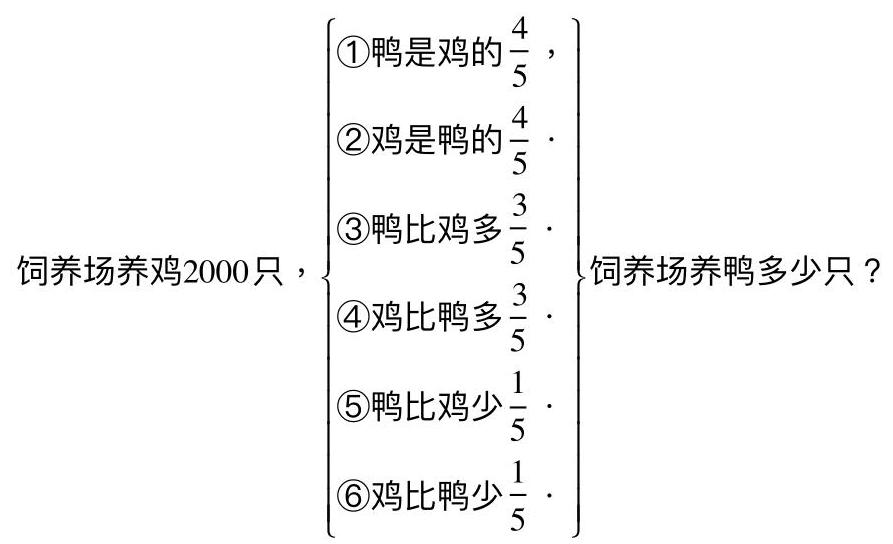

教师从分数应用题的整体着手设计对比练习，学生通过练习能够形成比较完整的认知结构。

## 二、纵向融会贯通

如《分数除法计算法则》一节课，教学内容是分数除法的计算法则:“‘甲数除以乙数(0 除外)等于甲数乘以乙数的倒数”课尾设计坡度练习:

从下面三个数中选择一个数作为除数，再计算。

$$
5 \div  \left( {\frac{5}{12} \cdot  8 \cdot  {0.25}}\right)
$$

学生分小组每一组选择一个数计算，完成以后请各小组汇报交流，学生在计算中出现了 $5 \div  8 = 5 \times  \frac{1}{8} = \frac{5}{8},5 \div  {0.25} = 5 \div  \frac{1}{4} = 5 \times  4 = {20}$ 使学生明白分数除法计算法则:“甲数除以乙数(0 除外)等于甲数乘以乙数的倒数”， 这个方法不仅适用于分数除法, 还能适用于整数除法和小数除法的计算。又如《分数的基本性质》一节的教学，内容是“ 分数的分子和分母同时乘以(或除以)同一个数(0 除外)分数的大小不变。”课堂练习选择:

填空。

$$
\frac{3}{4} = \left( \;\right)  \div  4 = \frac{\left( \;\right) }{16}
$$

学生完成第二个( )有两种方法:其一，运用分数的基本性质 $\frac{3}{4} = \frac{3 \times  4}{4 \times  4}$ ; 其二,利用商不变性质 $3 \div  4 = \left( {3 \times  4}\right)  \div  \left( {4 \times  4}\right)  = {12} \div  {16} \; = \frac{\left( {12}\right) }{16}$ 。完成填空后，再让学生说说自己是怎样思考的，学生领悟到分数的基本性质相当于除法运算中的商不变性质。以上两例沟通了数学知识内在的联系，培养了学生思维的深刻性，发展了学生的智力。

## 三、为以后学习铺路

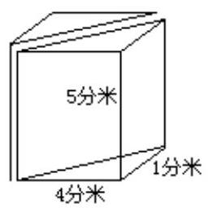

《已知底面积和高求长方体的体积》教学内容是:用 V=sh 计算长方体(正方体)的体积。最后的课堂练习可设计如下的思考题:如图，一个长方体平均分成两个物体，求其中一个物体的体积。

学生在计算中会出现两种方法:第一种方法:4x 4x 5÷ 2=40(立方分米)；第二种方法，4x 4÷ 2× 5=40(立方分米)。第一种方法是用一个长方体的体积除以 2 列式计算的，

第二种方法是用底面积(三角形的面积)乘以高求其中一个物体的体积。 受长方体的体积等于底面积乘以高的启发, 学生发现其中一个物体的体积能用底面三角形的面积乘以高计算。这一思考题的设计蕴伏了直棱柱体积计算的方法、即底面积乘以高，为今后学习圆柱体积和圆锥体铺平了路。并培养了学生解决实际问题的能力。

总而言之，课堂练习设计，只有做到对小学数学知识进行横向对比整理， 纵向融会贯通，才能培养学生综合应用知识的能力，提高学生的数学素质。

## 培养小学生图解应用题的能力

## 江西省德兴铜矿职工医院小学 吕建云

小学生数学应用题的数量关系有些比较复 和隐蔽，学生难以看透和确切理解题意。为了帮助学生理解题意和准确找出数量关系，提高解题能力， 教学中我采用图解法教学应用题，收到了良好的效果。下面略读一点粗浅的看法。

## 一、借助图形，探索思路

在应用题教学中，学生遇到数量关系比较隐蔽的题目，有时不知从何处着手，思路受阻想不下去。遇到这种情况，引导学生借助图形探索思路，有利于审清题意，揭示数量关系。

例如，某文具店有一批简易自动笔，用二天的时间就卖完了， 天卖出了总支数的 $\frac{4}{7}$ 多 43 支，第二天卖出总支数的 $\frac{3}{8}$ 少 10 支，这批简易自动笔原有多少支?

图解:

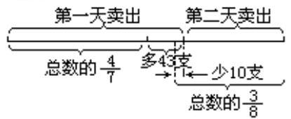

分析:经过画线段图和进行分析容易看出(43-10)支相对应的分率为 $\left( {1 - \frac{4}{7} - \frac{3}{8}}\right)$ ，根据数量关系总数的 $\left( {1 - \frac{4}{7} - \frac{3}{8}}\right)$ 是(43-10)支，列式得:

总支数 $= \left( {{43} - {10}}\right)  \div  \left( {1 - \frac{4}{7} - \frac{3}{8}}\right)$

## 二、借助示意图，描述题意

小学生年龄小，生活经验和知识都是十分有限的。因此在思考解决应用题时会遇到困难。在审题过程中，可以训练他们用示意图描述题意，帮助他们正确理解数量关系。

例如:学校外有一条长 50 米的大道，在大道一旁栽上树，每隔 5 米栽一棵，路的两头各栽一棵，共需要树苗多少棵？如果大道的一头栽一棵，另一头不栽或两头都不栽树，又各需多少棵树苗？

分析:大道长 50 米，每隔 5 米分一段，可以分成 10 段。从图上明显可以看出:

(1)生 单 单 单 单 单 单 单 单 单

50米

(2)

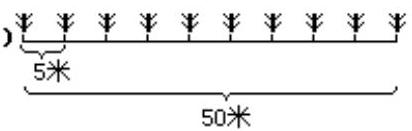

(1)栽树的棵数比分的段数多1，即栽树的棵数为

50÷5+1=11(棵)

(2)栽树的棵数正好是分段的段数。

即 50÷5=10(棵)

(3)栽树的棵数比分的段数少 1.

即 50÷5–1=9(棵)

## 三、借用实物以明事理

由于小学生的实践经历少，思维能力较低，对某些实际问题中所包含的事理、现象难以理解，在教学中可借助于实物的挂图手段，让他们在具体生动的实物中获得感性材料，然后上升到理性认识，最后概括成为数学问题。

例如, 将一只底面半径 10 厘米的圆柱形钢材放在底面半径是 30 厘米的水桶里，当钢材从水桶里取出时，水桶里的水面下降了 5 厘米，这段钢材有多长?

教学时，用一个量杯装上水(表示水桶)，用线捆住一个物体(表示钢材)放入杯中，杯里的水开始升 5 厘米。当重物取出时，水面又下降 5 厘米， 恢复到原来的位置。这样演示几遍，学生很容易地联想到钢材的体积与下降的那些水的体积有关，即底面半径为 30 厘米，高 5 厘米的水的体积相当于半径为 10 厘米的圆柱形钢材体积。知道了钢材的体积就可以求钢材的长了。

我深深地感到，在教学应用题时，用图解引路，有了形象思维的参与， 的确可以使学生豁然开朗。只要我们持之以恒，严格训练学生在解题之前自学地画出段图，一定能提高学生的解题能力。

## 巩固练习不能搞“单打一” ——浅谈如何设计巩固练习题

## 江苏省泗洪县城头中心小学 赵满超

邱学华老师说过:“一堂教学课上得成功与否同练习的设计关系极大。” 不管你采用什么样的教学方法，也不管你用什么样的教学手段，数学教学总是通过学生的练习来达到学会、理解、会学这一目的，从而来提高课堂教学效率，开发学生智力。因此，一节课从授新课开始，教师就必须设计出符合本节课内容的 固练习来。但是，有的老师，特别是我们乡村的一些老师， 在 固练习的设计上就题论题，为练而练，搞“ 单打一”。这样做，学生的智力得不到有效地开发，思维难以得到发展，更谈不上举一反三，触类旁通的功效了。 固练习这一环节绝不能搞单打一 究竟怎样来设计 固练习呢？ 下面来谈谈我的一点浅见。

## 一、巩固练习应突出基本题

教师用例题进行教学，用习题来衡量学生是否掌握已学的知识。那么， 老师就要设计出 固练习来 固本堂所学习的内容。根据大纲和教材的要求，这部分的 固性习题，教者在设计过程中一定要强调基础性，也就是和本节课例题差不多的题目。例如:《九义教材数学》第七册第 98 页“ 例 5”， 在学完例 5 后，跟着出示“ 做一做”的第 1 题的两个小题。目的就是 固求积的近似数的方法。还可以把“练习二十一”的题也编在 固练习的基础题里。让学生掌握方法。再如第七册(《九义教材》)第 116 页。“ 商的近似值”把“ 做一做”填表及“ 练习二十五”第一题作为 固练习的基本题。这些题的设计充分考 了对本节内容的 固，是基础的基础，具有针对性，不是简单的机械的重复。另一方面，这些题还能起到形成和提高计算技能和技巧、提高熟练程度的作用。如《六年制数学第十册》52 页～53 页 固练习基本题可设计为:①读一读分数，并说出它们的意义。②说出图中阴影部分所表示的他数(用幻灯片打出)。

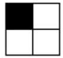

( )

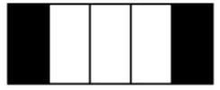

( )

再如，《五年制第七册数学》第 117 页练习二十五第二题:求下列各题商的近似值(保留两位小数):3. 8÷ 7，32÷ 42，246. 4÷ 130.

## 二、巩固练习应设计灵活性习题

我们有的老师，在设计的 固练习题中，机械重复的练习太多，灵活性、 理解性的练习太少。学生在做基础性题型练习后，应当再练习灵活性的习题， 这样才能达到既掌握基础知识，又能达到理解、提高、开阔学生思维领域的目的。

如果机械重复练习多了，只能使学生疲劳、厌倦，只能使学生在一个“格子”里转圈子，学生学习无长劲。我们设计练习题时应从“格子”里跳出来， 设计出灵活性强，具有一定综合性的题目，这样的练习才具备以新带旧，克服混淆，使学生思维更加开阔。如:第四册《六年制数学》第 51 页的 固练习的设计(投影仪打出)下面计算对吗？把不对的改正过来。

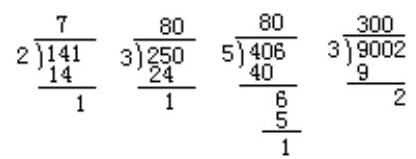

第七册《九义教材五年制数学》第 116 页例 6 的理解型 固练习，可以设计为:按下面的计算过程计算 7.2÷2.1(得数保留一位小数)

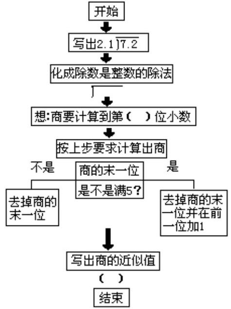

通过这些灵活性题目的练习，学生的忆忆加强了，思维得到了一定程度的发展，课堂教学会收到良好的效果。

## 三、巩固练习应设计出提高题

“ 教学习题好比磨刀石，使学生的思维越磨越锋利。”但是，我们说这种磨刀的功夫不能光下在刀背上。应当是有目标、有计划。也不能只进行一面磨，去搞数学习题中的“ 单打一”，只设计和例子一样的题目，应当有提高题。如第四册内容第 51 页例 5。可以设计下列一组题为提高题:

$$
\text{ 4 }\overline{)\begin{array}{lll} {5004} & & 4 \end{array}}\text{ , 80003 }
$$

再如:第十冊《六年制数学》第 53 页的提高题为:一个人买同样大的苹果, 他先买了十个苹果的 1/2, 又买来了 15 人苹果的 1/3, 他一共买了多少个苹果?

这样不仅 固了例题，也在原来基础上有了提高、升级。这样“ 跳一跳才能摘到桃子”的习题，能促进学生思维发展，形成初步的逻辑思维。

当然，一节课的 固练习设计，一方面根据《大纲》要求和教材的要求， 另一方面还要根据学生的具体情况。不管怎样，不能搞“单打一”，为练习而练习，使学生在原地徘徊不前。 固练习应本着“ 固——灵活，有趣一一开发智力——提高思维能力，发展思维”的目标进行设计。
