新课标中考专项夺标

# 中考数学 Primand

中考数学研究组 组编

江大学生在社

V

## 新课标中考专项夺标

中考数学解题法揭密

中考数学能提升题突破

中考数学选择题突破

中考数学填空题巧解

中考数学中档题攻略

中考数学综合题透析

中考数学展望与对策

ISBN 7-308-04697-4 /G * 10

©中考数学研究组 组编

@编委 马茂年 王小海 王旭斌 王 新

朱进初 张金良 陈永华 陈 伟

林健鸿 郑姬铭 俞 昕 袁小容

倪志香 徐小明 韩国梁 谢丙秋

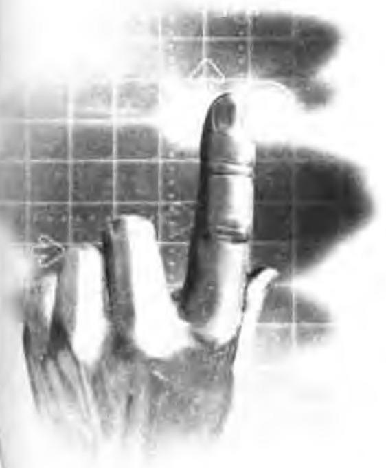

浙江大学出版社

## 图书在版编目(CIP)数据

中考数学中档题攻略/中考数学研究组组编. 一杭州:浙江大学出版社，2006.6

ISBN 7-308-04697-4

I. 中... II. 中 II. 数学课一初中一解题一升学参考资料 IV. G634.605

中国版本图书馆 CIP 数据核字(2006)第 029151 号

责任编辑 沈国明

出版发行 浙江大学出版社

(杭州浙大路38号 邮政编码 310027)

(E-mail: zupress@mail.hz.zj.cn)

(网址:http://www.zjupress.com)

排 版 杭州大漠照排印刷有限公司

印 刷 杭州出版学校印刷厂

开 本 ${787}\mathrm{\;{mm}} \times  {960}\mathrm{\;{mm}}1/{16}$

印 张 5.25

字 数 110 千字

版印次 2006 年 6 月第 1 版 2006 年 7 月第 2 次

书 号 ISBN 7-308-04697-4/G・1059

定 价 8.00 元

## 编写说明

初中新课程改革在全国已全面铺开，随之而来的中考(有的地方称为学业考试)必然有所调整。从全国实验区中考的情况来看，无论是考试的目标、要求，还是试题的设计都焕然一新，充分体现了新课程改革的精神。为帮助广大初中毕业生了解新的中考、适应新的中考、备战新的中考，我们邀请了全国知名的特级教师编写一套新课程标准中考专项夺标丛书。丛书包括《中考数学新颖题解读》、《中考数学解题法揭秘》、《中考数学选择题突破》、《中考数学填空题巧解》、《中考数学中档题攻略》、《中考数学综合题透析》、《中考数学展望与对策》七个分册。

丛书各分册密切配合新中考的要求，分专题解读新课标中考。丛书不局限于某个版本的新课程标准教材，而是按新课程标准和新中考要求构建知识体系。例题的设计注重典型性、新颖性、指导性和示范性, 引导学生发现问题, 培养学生认知能力和学习能力, 教会学生学习; 从不同的角度, 通过变式原理创设能力测试和适应性试题，着力培养学生分析问题、解决问题的能力；通过设置开放性、探究性问题，激发学生的探索热情，培养学生的创新意识和创新能力。

鉴于我们的水平有限，书中难免有些纰漏，敬请备位读者批评指正。

2006 年 6 月于杭州

## 目 录

第 1 讲 实数 ( 1 )

第 2 讲 代数式 ( 5 )

第 3 讲 方程(方程组)和不等式(不等式组) (9)

第 4 讲 函数及其图像 (16)

第 5 讲 统计初步与概率 (28)

第 6 讲 直线形 (34)

第 7 讲 解直角三角形 (47)

第 8 讲 圆 (51)

第 9 讲 中档题达标训练 (61)

参考答案 (67)

## 实 数

## 考点梳理台

1. 实数的概念.

2. 数轴、相反数、绝对值、倒数、平方根、算术平方根、立方根、近似数、有效数字, 实数的大小比较.

3. 实数的运算法则, 运算律及运算顺序.

4. 科学计数法.

## 青霸透视镜

例 1 选择题

(1)小明设计了一个关于实数运算的程序:输入一个数后，输出的数总是比该数的平方小 1，小刚按照此程序输入 $2\sqrt{3}$ 后，输出的结果应为 ( )

A. 10 B, 11 C. 12 D. 13

解析 根据题意列出算式 ${\left( 2\sqrt{3}\right) }^{2} - 1 = {11}$ ,因此选 B ).

(2)化简 $\frac{1}{\sqrt{2} - 1} + \frac{2}{\sqrt{3} + 1}$ 的结果为 ( )

A. $\sqrt{3} + \sqrt{2}$ B. $\sqrt{3} - \sqrt{2}$ C. $\sqrt{2} + 2\sqrt{3}$ D. $\sqrt{3} + 2\sqrt{2}$

解析 原式 $= \frac{\sqrt{2} + 1}{\left( {\sqrt{2} - 1}\right) \left( {\sqrt{2} + 1}\right) } + \frac{2\left( {\sqrt{3} - 1}\right) }{\left( {\sqrt{3} + 1}\right) \left( {\sqrt{3} - 1}\right) } = \sqrt{2} + 1 + \sqrt{3} - 1 = \sqrt{2} + \sqrt{3}$ . 因此选(A).

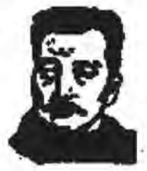

例 2 填空题

(1)(2004 年浙江省绍兴市)鲁迅先生十分重视精神文化方面的消费. 据史料记载,在他晚年用于购书的费用约占收入的 15.6%, 则近似数 15.6% 有___有效数字。

解析 3 位.

(2)(2004 年山西省)我国自行研制的“神舟五号”载人飞船于 2003 年 10 月 15 日成功发射, 并环绕地球飞行约 590520 千米, 请将这一数字用科学记数法表示为___千米(要求保留一位有效数字).

解析 $6 \times  {10}^{5}$ .

例 3 (2004 年山西省) 实数 $a$ 在数轴上的位置如图所示,

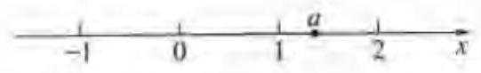

化简 $\left| {a - 1}\right|  + \sqrt{{\left( a - 2\right) }^{2}} =$

解析 由数轴上可以读出 $1 < a < 2,\therefore a - 1 > 0, a - 2 < 0.\therefore \left| {a - 1}\right|  + \; \sqrt{{\left( u - 2\right) }^{2}} = u - 1 + 2 - a = 1.$

例 4 (2005 年宁波市) 计算: ${\left( -\frac{\sqrt{2}}{2}\right) }^{2} + {\left( -\frac{\sqrt{3}}{2}\right) }^{0} - {\left( \frac{2}{3}\right) }^{-2}$ .

解析 原式 $= \frac{1}{2} + 1 - \frac{9}{4} = \frac{6}{4} - \frac{9}{4} =  - \frac{3}{4}$ .

## 达标演练场

1. 下列各式正确的是 ( )

A. $\sqrt{{2}^{2} + {3}^{2}} = 2 + 3$ B. $3\sqrt{2} + 5\sqrt{3} = \left( {3 + 5}\right) \sqrt{2}\sqrt{3}$

C. $\sqrt{{15}^{2} - {12}^{2}} = \sqrt{{15} + {12}} \times  \sqrt{{15} - {12}}$ D. $\sqrt{4\frac{1}{2}} = 2\sqrt{\frac{1}{2}}$

2. “世界银行全球扶贫大会” 于 2004 年 5 月 26 日在上海开幕. 从会上获知, 我国国民生产总值达到11.69万亿元，人民生活总体上达到小康水平，其中11.69万亿用科学记数法表示应为 ( )

A. ${11.69} \times  {10}^{14}$ B. ${1.169} \times  {10}^{14}$ C. ${1.169} \times  {10}^{12}$ D. ${0.1169} \times  {10}^{14}$

3. 某项科学研究,以 45 分钟为 1 个时间单位,并记每天上午 10 时为 0.10 时以前记为负，10 时以后记为正，例如 $9 \div  {15}$ 记为 $- 1,{10};{45}$ 记为 1 等等，依此类推. 上午7:45 应记为 ( )

A. 3 B. -3 C. -2.15 D. -7.45

4. 观察下列数表: 根据数表所反映的规律,第 $n$ 行第 $n$ 列交叉点上的数应为 ( )

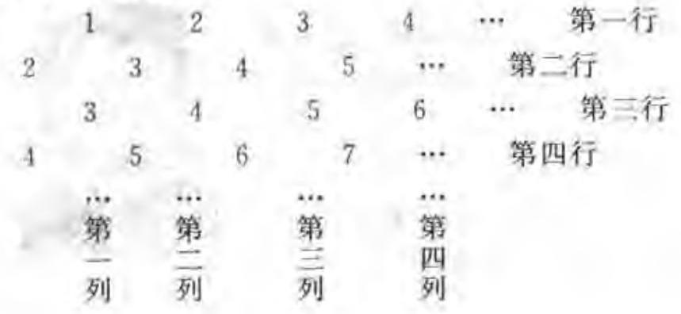

A. ${2n} - 1$ B. ${2n} + 1$ C. ${n}^{2} - 1$ D. ${n}^{2}$

5. 实数 $a\text{ 、 }b\text{ 、 }c\text{ 、 }d$ 在数轴上的位置如图所示,下列关系式不正确的是 ( )

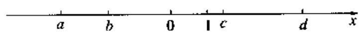

B. $\left| {ac}\right|  = {ac}$ C. $b < d$

A. $\left| a\right|  > \left| b\right|$

D. $c + d > 0$

6. 填空题

(1)2003 年 10 月 15 日，航天英雄杨利伟乘坐“神州五号”载人飞船，于 9 时 9 分 50 秒准确进入预定轨道, 开始巡天飞行, 飞船绕地球飞行了 14 圈后, 返回舱与推进舱于 16 日 5 时 59 分分离，结束航天飞行. 飞船共用了 20 小时 49 分 10 秒，飞行了约 $6 \times  {10}^{5}\mathrm{\;{km}}$ ,则“神州五号”飞船的平均飞行速度约为___ $\mathrm{{km}}/\mathrm{s}$ . (结果精确到 0.1)

( 2 )观察下列各式: $\sqrt{1 + \frac{1}{3}} = 2\sqrt{\frac{1}{3}},\sqrt{2 + \frac{1}{4}} = 3\sqrt{\frac{1}{4}},\sqrt{3 + \frac{1}{5}} = 4\sqrt{\frac{1}{5}},\cdots$ , 请你将上面的规律用含自然数 $n\left( {n \geq  1}\right)$ 的代数式表示出来是___.

(3)某城市自来水收费实行阶梯水价，收费标准如下表所示，用户 5 月份交水费 4 元，则所用水为___度.

<table><tr><td>月用水量</td><td>不超过 12 度的部分</td><td>超过 12 度不超过 18 度的部分</td><td>超过 18 度的部分</td></tr><tr><td>收费标准(元/度)</td><td>2.00</td><td>2.50</td><td>3.00</td></tr></table>

7. 计算: $\sqrt{27} - \frac{2}{\sqrt{3} + 1} + 9\sqrt{\frac{1}{3}} - {\left( \sqrt{3} - \sqrt{2}\right) }^{0}$ .

8. 已知 $a, b$ 互为相反数, $c, d$ 互为倒数, $e$ 是非零实数. 求 $\sqrt{2}\left( {a + b}\right)  + \frac{1}{2}{cd} - 2{e}^{0}$ 的值.

9. 计算: ${\left( \frac{1}{3}\right) }^{-1} + {\left( 3 - \sqrt{2}\right) }^{0} + \frac{2}{\sqrt{3} - 1} - \tan {60}^{ \circ  }$ .

10. 计算: ${\left( -1\right) }^{0} + \sqrt{8} + \frac{1}{\sqrt{2} + 1}$ .

11. 阅读以下材料:

滨江市区内的出租车从 2004 年“ 5 · 1 ”节后开始调整价格. “ 5 · 1 ”前的价格是: 起步价 3 元, 行驶 2 千米后, 每增加 1 千米加收 1.4 元, 不足 1 千米的按 1 千米计算. 如顾客乘车 2.5 千米,需付款 3 + 1.4 = 4.4 元; “ 5 · 1 ”后的价格是:起步价 2 元，行驶 1.4 下米后，每增加 600 米加收 1 元，不足 600 米的按 600 米计算，如顾客乘车 2.5 干米,需付款 $2 + 1 + 1 = 4$ 元.

(1)以上材料，填写下表:

<table><tr><td colspan="2">顾客乘车路程(千米)</td><td>1</td><td>1.5</td><td>2.5</td><td>3.5</td></tr><tr><td rowspan="2">需支付的金额 (元)</td><td>“5·1”前</td><td></td><td></td><td>4.4</td><td></td></tr><tr><td>“5 ÷ 1”后</td><td></td><td></td><td>4</td><td></td></tr></table>

(2)小方从家里坐出租车到 $A$ 地郊游,“5・1”前需 10 元钱,“5・1”后仍需 10 元钱, 那么小方的家距 $A$ 地路程大约___. (从下列四个答案中选取,填入序号)

① 5.5 千米 ② 6.1 千米

③ 6.7 千米 ④7.3 千米

## 代数式

## 南京梳理台

在代数式中, 整式、分式、二次根式的概念、运算及其变形是中考中档题的主要考查内容.

## 美顺透视镜

例 1 选择题

(1)(2004 年重庆市)若分式 $\frac{{x}^{2} - 9}{{x}^{2} - {4x} + 3}$ 的值为零,则 $x$ 的值为 ( )

A. 3 B. 3 或 -3 C. -3 D. 0

解析 (C).

(2)某通讯公司的手机市话收费标准按原标准每分钟降低了 $a$ 元后，再次下调了 25%，现在的收费标准是每分钟 $b$ 元，则原收费标准每分钟为 ( )

A. $\left( {\frac{5}{4}b - a}\right)$ 元 B. $\left( {\frac{5}{4}b + a}\right)$ 元 C. $\left( {\frac{3}{4}b + a}\right)$ 元 D. $\left( {\frac{4}{3}b + a}\right)$ 元

解析 (D).

(3)计算 $\frac{a - 1}{a} \div  \left( {a - \frac{1}{a}}\right)$ 的正确结果是 ( )

A. $\frac{1}{a + 1}$ B. 1 C. $\frac{1}{a - 1}$ D. -1

解析 (A).

(4)若 $b < 0$ ，化简 $\sqrt{-a{b}^{3}}$ 的结果是 ( )

A. $- b\sqrt{ab}$ B. $b\sqrt{-{ab}}$ C. $- b\sqrt{-{ab}}$ D. $b\sqrt{ab}$

解析 (C).

例 2 函数 $y = 3{x}^{2} - \frac{{4x} - 5}{\sqrt{{2x} - 1}}$ 中自变量 $x$ 的取值范围是___.

解析 由分母 ${2x} - 1 > 0$ 得 $x > \frac{1}{2}$ .

例 3 已知 $x + y = 1$ ，那么 $\frac{1}{2}{x}^{2} + {xy} + \frac{1}{2}{y}^{2}$ 的值为___.

解析 $\because {\left( x + y\right) }^{2} = {x}^{2} + {2xy} + {y}^{2}$ ,

$\therefore {x}^{2} + {y}^{2} = {\left( x + y\right) }^{2} - {2xy}$ .

$\therefore$ 原式 $= \frac{1}{2}{\left( x + y\right) }^{2} - {xy} + {xy} = \frac{1}{2}{\left( x + y\right) }^{2} = \frac{1}{2}$ .

例 4 ( 2004 年贵阳实验区)先化简,再求值: $\left( {\frac{3x}{x - 1} - \frac{x}{x + 1}}\right)  \times  \frac{{x}^{2} - 1}{x}$ ,其中 $x = \; \sqrt{2} - 2$ .

解析 原式 $= 3\left( {x + 1}\right)  - \left( {x - 1}\right)  = {2x} + 4$ .

当 $x = \sqrt{2} - 2$ 时,原式 $= 2\left( {\sqrt{2} - 2}\right)  + 4 = 2\sqrt{2}$ .

例 5 阅读材料:

已知 ${p}^{2} - p - 1 = 0,1 - q - {q}^{2} = 0$ ,且 ${pq} \neq  1$ ,求 $\frac{{pq} + 1}{q}$ 的值.

解析 由 ${p}^{2} - p - 1 = 0$ 及 $1 - q - {q}^{2} = 0$ ,可知 $p \neq  0, q \neq  0$ .

又 $\because {pq} \neq  1,\therefore p \neq  \frac{1}{q},\therefore 1 - q - {q}^{2} = 0$ 可变形为 ${\left( \frac{1}{q}\right) }^{2} - \left( \frac{1}{q}\right)  - 1 = 0$ 的特征,

所以 $p$ 与 $\frac{1}{q}$ 是方程 ${x}^{2} - x - 1 = 0$ 的两个不相等的实数根.

则 $p + \frac{1}{q} = 1,\therefore \frac{{pq} + 1}{q} = 1$ .

根据阅读材料所提供的方法, 完成下面的解答.

已知 $2{m}^{2} - {5m} - 1 = 0,\frac{1}{{n}^{2}} + \frac{5}{n} - 2 = 0$ ,且 $m \neq  n$ . 求 $\frac{1}{m} + \frac{1}{n}$ 的值.

解析一 由 $2{m}^{2} - {5m} - 1 = 0$ 知 $m \neq  0,\because m \neq  n,\therefore \frac{1}{m} \neq  \frac{1}{n}$ ,得 $\frac{1}{{m}^{2}} + \frac{5}{m} - 2 = 0$ . 根据 $\frac{1}{{m}^{2}} + \frac{5}{m} - 2 = 0$ 与 $\frac{1}{{n}^{2}} + \frac{5}{n} - 2 = 0$ 的特征,

$\therefore \frac{1}{m}$ 与 $\frac{1}{n}$ 是方程 ${x}^{2} + {5x} - 2 = 0$ 的两个不相等的实数根.

$\therefore \frac{1}{m} + \frac{1}{n} =  - 5$ .

解析二 由 $\frac{1}{{n}^{2}} + \frac{5}{n} - 2 = 0$ 得 $2{n}^{2} - {5n} - 1 = 0$ ,

根据 $2{m}^{2} - {5m} - 1 = 0$ 与 $2{n}^{2} - {5n} - 1 = 0$ 的特征. 且 $m \neq  n$ ,

$\therefore m$ 与 $n$ 是方程 $2{x}^{2} - {5x} - 1 = 0$ 的两个不相等的实数根.

$\therefore m + n = \frac{5}{2},{mn} =  - \frac{1}{2}$ ,

$\therefore \frac{1}{m} + \frac{1}{n} = \frac{m + n}{mn} = \frac{\frac{5}{2}}{-\frac{1}{2}} =  - 5$ .

1. 下列运算正确的是 ( )

A. $\sqrt{ab} = \sqrt{a} \cdot  \sqrt{b}$ B. $\sqrt{{\left( a + b\right) }^{2}} = a + b$

C. ${a}^{2} + {ab} + {b}^{2} = {\left( a + b\right) }^{2}$ D. $\frac{1}{2}{a}^{3} \div  2{a}^{2} = \frac{1}{4}a$

2. 化简 $\frac{1}{\sqrt{2} - 1} + \frac{2}{\sqrt{3} + 1}$ 的结果为 ( )

A. $\sqrt{3} + \sqrt{2}$ B. $\sqrt{3} - \sqrt{2}$ C. $\sqrt{2} + 2\sqrt{3}$ D. $\sqrt{3} + 2\sqrt{2}$

3. 化简二次根式 $a\sqrt{-\frac{a + 2}{{a}^{2}}}$ 的结果是 ( )

A. $\sqrt{-a - 2}$ B. $- \sqrt{-a - 2}$ C. $\sqrt{a - 2}$ D. $- \sqrt{a - 2}$

4.(2004年湖北荆州市)如果 $\left| {x - 2}\right|  + {\left( x - y + 3\right) }^{2} = 0$ ，那么 ${\left( x + y\right) }^{2}$ 的值为( )

A. 25 B. 36 C. 49 D. 81

5. 写出一个含有字母 $x$ 的分式___. (要求:不论 $x$ 取任何实数,该分式都有意义,且分式的值为负.)

6. 已知 ${x}^{2} + {y}^{2} = {25}, x + y = 7$ ,且 $x > y$ . 则 $x - y$ 的值等于___.

7.(2004 年山东青岛)化简 $\frac{a - 2}{\sqrt{{a}^{2} - {4a} + 4}}\left( {a < 2}\right)$ 的结果是___.

8.(2004年湖北黄岗市)化简 $\left( {\frac{x}{x - 2} - \frac{x}{x + 2}}\right)  \div  \frac{4x}{2 - x}$ 的结果是___.

9. 因式分解 ${a}^{2} - 1 + {b}^{2} - {2ab} =$ ___.

10. 已知 $2 + \frac{2}{3} = {2}^{2} \times  \frac{2}{3},3 + \frac{3}{8} = {3}^{2} \times  \frac{3}{8},4 + \frac{4}{15} = {4}^{2} \times  \frac{4}{15},\cdots$ ,若 ${10} + \frac{a}{b} = {10}^{2} \times  \frac{a}{b}(a, b$ 为正整数),则 $a + b =$ ___.

11. 已知 $a = \sqrt{2} + 1$ ,求代数式 $\frac{{a}^{2} - a}{{a}^{2} - {2a} - 3} \div  \frac{a}{a - 3}$ 的值.

12. 先化简,再选取一个使原式有意义、而你又喜爱的数代入求值 $\frac{1}{a + 3} + \frac{6}{{a}^{2} - 9}$ .

13. 已知实数 $a$ 、 $b$ 分别满足 ${a}^{2} + {2a} = 2,{b}^{2} + {2b} = 2$ . 求 $\frac{1}{a} + \frac{1}{b}$ 的值.

14. 已知 $x = \sqrt{3} + 1$ ,求代数式 $\frac{{x}^{2} + {2x} + 1}{{x}^{2} - 1} - \frac{1}{x - 1}$ 的值.

15. (1) 化简: $m + n - \frac{{\left( m - n\right) }^{2}}{m + n}$ ;

(2)若 $m, n$ 是方程 ${x}^{2} - {3x} + 2 = 0$ 的两个实根，求第(1)小题中代数式的值.

16. 阅读下列解题过程:

题目: 已知方程 ${x}^{2} + {3x} + 1 = 0$ 的两个根为 $\alpha ,\beta$ ,求 $\sqrt{\frac{\alpha }{\beta }} + \sqrt{\frac{\beta }{\alpha }}$ 的值.

解析: $\because \Delta  = {3}^{2} - 4 \times  1 \times  1 = 5 > 0,\;\therefore \alpha  \neq  \beta$ .(1)

由一元二次方程的根与系数的关系,得 $\alpha  + \beta  =  - 3,{\alpha \beta } = 1$ .(2)

$\therefore \sqrt{\frac{\alpha }{\beta }} + \sqrt{\frac{\beta }{\alpha }} = \frac{\sqrt{\alpha }}{\sqrt{\beta }} + \frac{\sqrt{\beta }}{\sqrt{\alpha }} = \frac{\alpha  + \beta }{\sqrt{\alpha \beta }} = \frac{-3}{1} =  - 3$ .(3)

阅读后回答问题:

上面的解题过程是否正确? 若不正确, 指出错在哪一步, 并写出正确的解题过程.

## 方程(方程组)和不等式(不等式组)

## 等点扰理台

方程(方程组) 和不等式(不等式组) 的相关内容是初中代数的核心内容之一,其中有关的概念、等式的性质, 不等式的性质, 方程的解法, 不等式及不等式组的解法, 特别是有关一元二次方程的判别式、根与系数的关系. 列方程 (组) 解应用题是中考中档题的必考查内容, 换元法是考查的基本方法.

## 汤题透视镜

例 1 选择题

(1)不等式组 $\left\{  \begin{array}{l} {2x} - 3 < 1 \\  x >  - 1 \end{array}\right.$ 的解集在数轴上可表示为 ( )

A.

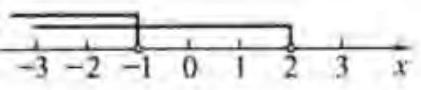

C.

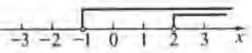

解析 (B).

B.

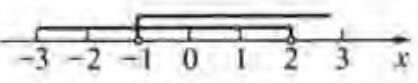

D.

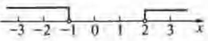

( 2 )已知关于 $x$ 的方程 $\frac{1}{4}{x}^{2} - \left( {m - 3}\right) x + {m}^{2} = 0$ 有两个不相等的实根，那么 $m$ 的最大整数是 ( )

A. 2 B. -1 C. 0 D. 1

解析 (D).

(3)如果不等式组 $\left\{  \begin{array}{l} 3 - {2x} \geq  0 \\  x \geq  m \end{array}\right.$ 有解,则 $m$ 的取值范围是 ( )

A. $m < \frac{3}{2}$ B. $m \leq  \frac{3}{2}$ C. $m > \frac{3}{2}$ D. $m \geq  \frac{3}{2}$

解析 (B).

例 2 用换元法解方程 ${x}^{2} + \frac{1}{{x}^{2}} + x + \frac{1}{x} = 4$ ,可设 $y = x + \frac{1}{x}$ ,则原方程化为关于 $y$ 的整式方程是___.

解析 ${y}^{2} + y - 6 = 0$ .

例 3 解方程 ${\left( \frac{x}{x + 1}\right) }^{2} - 2\left( \frac{x}{x + 1}\right)  - 8 = 0$ .

解析 令 $y = \frac{x}{x + 1}$ ,得 ${y}^{2} - {2y} - 8 = 0.\therefore \left( {y - 4}\right) \left( {y + 2}\right)  = 0;\therefore {y}_{1} = 4,{y}_{2} =  - 2$ .

当 ${y}_{1} = 4$ 时, $\frac{x}{x + 1} = 4$ ,解得 ${x}_{1} =  - \frac{4}{3}$ ;

当 ${y}_{2} =  - 2$ 时, $\frac{x}{x + 1} =  - 2$ ,解得 ${x}_{2} =  - \frac{2}{3}$ ;

经检验 ${x}_{1} =  - \frac{4}{3},{x}_{2} =  - \frac{2}{3}$ 都是原方程的根.

$\therefore$ 原方程的根是 ${x}_{1} =  - \frac{4}{3},{x}_{2} =  - \frac{2}{3}$ .

例 4 解方程 ${x}^{2} + \frac{1}{{x}^{2}} + 2 = 2\left( {x + \frac{1}{x}}\right)$ .

解析 原方程可化为 ${\left( x + \frac{1}{x}\right) }^{2} = 2\left( {x + \frac{1}{x}}\right)$ ,

设 $x + \frac{1}{x} = y$ ,则 ${y}^{2} - {2y} = 0, y\left( {y - 2}\right)  = 0$ . 解得 $y = 0$ 或 $y = 2$ .

当 $y = 0$ 时, $x + \frac{1}{x} = 0$ ,即 ${x}^{2} + 1 = 0$ ,此方程尤解.

当 $y = 2$ 时, $x + \frac{1}{x} = 2$ ,解得 $x = 1$ .

经检验 $x = 1$ 是原方程的根. $\therefore$ 原方程的根是 $x = 1$ .

例 5 (2004 年重庆市) 已知关于 $x$ 的一元二次方程 ${x}^{2} + \left( {{2m} - 3}\right) x + {m}^{2} = 0$ 的两个不相等的实数根 $\alpha$ 、 $\beta$ 满足 $\frac{1}{\alpha } + \frac{1}{\beta } = 1$ ，求 $m$ 的值.

解析 由判别式大于零,得

${\left( 2m - 3\right) }^{2} - 4{m}^{2} > 0$ ,解得 $m < \frac{3}{4}$ .

$\because \frac{1}{\alpha } + \frac{1}{\beta } = 1$ 即 $\frac{\alpha  + \beta }{\alpha \beta } = 1,\therefore \alpha  + \beta  = {\alpha \beta }$ .

又 $\alpha  + \beta  =  - \left( {{2m} - 3}\right) ,{\alpha \beta } = {m}^{2}$ .

代入上式得 $3 - {2m} - {m}^{2}$ ,解之 ${m}_{1} =  - 3,{m}_{2} = 1$ .

$\because {m}_{2} = 1 > \frac{3}{4}$ ,故舍去, $\therefore m =  - 3$ .

例 6 若关于 $x$ 的一元二次方程 ${x}^{2} + \left( {m + 1}\right) x + m + 4 = 0$ 两实根的平方和为 2,求 $m$ 的值.

解析 设方程的两实根为 ${x}_{1},{x}_{2}$ ,那么 ${x}_{1} + {x}_{2} = m + 1,{x}_{1}{x}_{2} = m + 4$ .

$\therefore {x}_{1}^{2} + {x}_{2}^{2} = {\left( {x}_{1} + {x}_{2}\right) }^{2} - 2{x}_{1}{x}_{2} = {\left( m + 1\right) }^{2} - 2\left( {m + 4}\right)  = {m}^{2} - 7 = 2$ ,即 ${m}^{2} = 9$ ,

解得 $m = 3$ .

答: $m$ 的值是 3 .

请把上述解答过程的错误或不完整之处, 写在横线上, 并给出正确解答.

正确解答:

解析 错误或不完整之处有:

① ${x}_{1} + {x}_{2} = m + 1$ ；② $m = 3$ ；③ 没有用判别式判定方程有无实根.

正确求解过程如下: 设方程的两实数根为 ${x}_{1},{x}_{2}$ ,那么

${x}_{1} + {x}_{2} =  - \left( {m + 1}\right) ,{x}_{1}{x}_{2} = m + 4.$

$\therefore {x}_{1}^{2} + {x}_{2}^{2} = {\left( {x}_{1} + {x}_{2}\right) }^{2} - 2{x}_{1}{x}_{2} = {\left( m + 1\right) }^{2} - 2\left( {m + 4}\right)  = {m}^{2} - 7 = 2$ ,

${m}^{2} = 9$ ,解得 $m =  \pm  3$ .

当 $m = 3$ 时, $\Delta  = {16} - {28} < 0$ ,方程无实数根, $m = 3$ (舍去).

当 $m =  - 3$ 时, $\Delta  = 4 - 4 = 0$ .

$\therefore m =  - 3$ ,

答: $m$ 的值是 -3 .

例 7 (2004 年浙江省绍兴市) 初三 (2) 班的一个综合实践活动小组去 $A, B$ 两个超市调查去年和今年“五一节”期间的销售情况，下图是调查后小敏与其他两位同学交流的情况. 根据他们的对话,请你分别求出 $A, B$ 两个超市今年“五一节”期间的销售额.

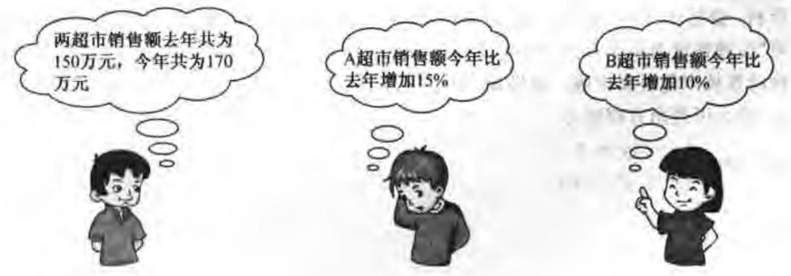

解析 设去年 $A$ 超市销售额为 $x$ 万元, $B$ 超市销售额为 $y$ 万元,

由题意得 $\left\{  \begin{array}{l} x + y = {150}, \\  \left( {1 + {15}\% }\right) x + \left( {1 + {10}\% }\right) y = {170}. \end{array}\right.$

解得 $\left\{  \begin{array}{l} x = {100}, \\  y = {50}. \end{array}\right.$

${100}\left( {1 + {15}\% }\right)  = {115}\left( \text{ 万元 }\right) ,{50}\left( {1 + {10}\% }\right)  = {55}\left( \text{ 万元 }\right) .$

答: $A, B$ 两个超市今年“五一节”期间的销售额分别为 115 万元和 55 万元.

1. 若关于 $x$ 的一元二次方程 $k{x}^{2} + {2x} - 1 = 0$ 有实数根，则 $k$ 的取值范围是 ( )

A. $k >  - 1$ B. $k \geq   - 1$

C. $k >  - 1$ 且 $k \neq  0$ D. $k \geq   - 1$ 且 $k \neq  0$

2. 方程 $\frac{3}{x\left( {x + 3}\right) } + \frac{1}{x + 3} = 1$ 的根是 ( )

A. ${x}_{1} = 1,{x}_{2} =  - 3$ B. ${x}_{1} =  - 1,{x}_{2} = 3$

C. $x = 1$ D. $x =  - 3$

3. 不等式组 $\left\{  \begin{array}{l} x + 3 > 4 \\  \frac{x}{2} - 1 < 1 \end{array}\right.$ 的解集为___.

4. ( 2004 年广东省 )解方程 $\frac{x}{{x}^{2} - 1} + \frac{{x}^{2} - 1}{3x} = \frac{4}{3}$ 时，设 $y = \frac{x}{{x}^{2} - 1}$ ，则原方程化为 $y$ 的整式方程是___

5. 如果关于 $x$ 的不等式 $\left( {a - 1}\right) x < a + 5$ 和 ${2x} < 4$ 的解集相同，则 $a$ 的值为___.

6.(2004 年海南海口区)今年我省荔枝又喜获丰收. 目前市场价格稳定，荔枝种植户普遍获利. 据估计，今年全省荔枝总产量为 50000 吨，销售收入为 61000 万元. 已知“妃子笑”品种售价为 1.5 万元/吨, 其他品种平均售价为 0.8 万元/吨, 求“妃子笑”和其他品种的荔枝产量各多少吨. 如果设“妃子笑”荔枝产量为 $x$ 吨,其他品种荔枝产量为 $y$ 吨，那么可列出方程组为___.

7. 解方程组 $\left\{  \begin{array}{l} x - {3y} = 0 \\  {x}^{2} + {y}^{2} = {40} \end{array}\right.$ .

8. (2004 年湖北荆州市)关于 $x$ 的方程 ${x}^{2} + \left( {{2k} + 1}\right) x + {k}^{2} - 1 = 0$ 有两个实数根.

(1)求实数 $k$ 的取值范围；

(2)是否存在实数 $k$ ，使方程的两个实数根的平方和与两个实数根的积相等？若存在， 求出 $k$ 的值；若不存在，说明理由.

9.(2004 南京市)某商店以 2400 元购进某种盒装茶叶，第一个月每盒按进价增加 20% 作为售价, 售出 50 盒, 第二个月每盒以低于进价 5 元作为售价, 售完余下的茶叶. 在整个买卖过程中盈利 350 元, 求每盒茶叶的进价.

10. (2004 年海南海口实验区)某水果批发商场经销一种高档水果，如果每千克盈利 10 元, 每天可售出 500 千克. 经市场调查发现, 在进货价不变的情况下, 若每千克涨价 1 元, 日销售量将减少 20 千克. 现该商场要保证每天盈利 6000 元, 同时又要使顾客得到实惠，那么每千克应涨价多少元?

11. 高致病性禽流感是比SARS病毒传染速度更快的传染病.

(1)某养殖场有 8 万只鸡，假设有 1 只鸡得了禽流感，如果不采取任何防治措施，那么,到第 2 天将新增病鸡 10 只,到第 3 天又将新增病鸡 100 只,以后每天新增病鸡数依此类推, 请问:到第 4 天, 共有多少只鸡得了禽流感病? 到第几天, 该养殖场所有鸡都会被感染？

(2)为防止禽流感蔓延，政府规定:离疫点 3 千米范围内为扑杀区，所有禽类全部扑杀; 离疫点 3 至 5 千米范围内为免疫区,所有禽类强制免疫; 同时,对扑杀区和免疫区内的村庄、道路实行全封闭管理. 现有一条笔直的公路 ${AB}$ 通过禽流感病区，如图， $O$ 为疫点，在扑杀区内的公路 ${CD}$ 长为 4 千米，问这条公路在该免疫区内有多少千米?

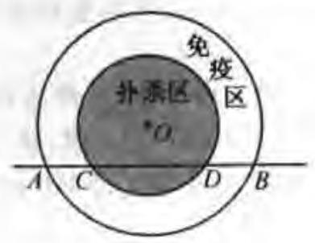

(第 11 题图)

12. 小明家准备装修一套新住房，若甲、乙两个装饰公司，合做需 6 周完成，需工钱 5.2 万元；若甲公司单独做 4 周后，剩下的由乙公司来做、还需 9 周才能完成，需工钱 4.8 万元. 若只选一个公司单独完成, 从节约开支角度考虑, 小明家是选甲公司、还是乙公司? 请你说明理由.

13. ( 1 )已知 $x + \frac{1}{x} = 3$ ，求 $\frac{{x}^{2}}{{x}^{4} + 3{x}^{2} + 1}$ 的值；

( 2 )已知关于 $x$ 的一元二次方程 ${x}^{2} - x + 1 - a = 0$ 有两个不相等的正根，求 $a$ 的取值范围.

14. 解不等式组 $\left\{  \begin{array}{l} \frac{x - 1}{2} \leq  1, \\  1 - 2\left( {x - 2}\right)  < 3. \end{array}\right.$ 并把它的解集在数轴上表示出来.

15. 已知关于 $x$ 的一元二次方程 ${x}^{2} + \left( {{2k} - 1}\right) x - k - 1 = 0$ .

(1)试判断此一元二次方程根的存在情况；

(2)若方程有两个实数根 ${x}_{1}$ 和 ${x}_{2}$ ，且满足 $\frac{1}{{x}_{1}} + \frac{1}{{x}_{2}} = 1$ ，求 $k$ 的值.

16. 织里某童装加工企业今年五月份工人每人平均加工童装 150 套，最不熟练的工人加工的童装套数为平均套数的 60% 为了提高工人的劳动积极性, 按时完成外商订货任务，企业计划从六月份起进行工资改革. 改革后每位工人的工资分二部分；一部分为每人每月基本工资 200 元; 另一部分为每加工 1 套童装奖励若干元.

(1)为了保证所有工人的每月工资收人不低于市有关部门规定的最低工资标准 450 元, 按五月份工人加工的童装套数计算, 工人每加工 1 套童装企业至少应奖励多少元 (精确到分)?

(2)根据经营情况，企业决定每加工 1 套重装奖励 5 元. 工人小张争取六月份工资不少于 1200 元，问小张在六月份应至少加工多少套童装？

## 函数及其图像

## 零点城理台

我们学习的基本函数有:一次函数及正比例函数，反比例函数，二次函数. 这些函数的概念、图像及其性质在中档题中占有很重要的位置.

## 考题透视镜

例 1 选择题

(1)(2004年南京市)在平面直角坐标系中，点 $P\left( {2,1}\right)$ 关于原点对称的点在( )

A. 第一象限 B. 第二象限

C. 第三象限 D. 第四象限

解析 (C).

(2)(2004 年山西省)下列命题中, 假命题的是 ( )

A. 在 $S = \pi {R}^{2}$ 中, $S$ 和 ${R}^{2}$ 成正比例

B. 函数 $y = {x}^{2} + {2x} - 1$ 的图像与 $x$ 轴只有一个交点

C. 一次函数 $y =  - {2x} - 1$ 的图像经过第二、三、四象限

D. 在函数 $y =  - \frac{1}{2x}$ 中,当 $x < 0$ 时, $y$ 随 $x$ 的增大而增大

解析 (B).

(3)(2004 年天津市)已知二次函数 $y = a{x}^{2} + {bx} + c$ ，且 $a < 0, a - b + c > 0$ ，则___ 定有 ( )

A. ${b}^{2} - {4ac} > 0$ B. ${b}^{2} - {4ac} = 0$

C. ${b}^{2} - {4ac} < 0$ D. ${b}^{2} - {4ac} \leq  0$

解析 (A).

(4)(2004 年山东省)函数 $y =  - {ax} + a$ 与 $y = \frac{-a}{x}\left( {a \neq  0}\right)$ 在同一个坐标系中的图像可能是 ( )

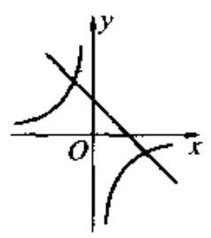

A.

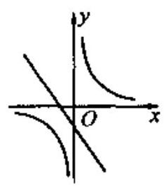

B.

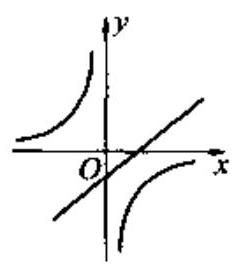

C.

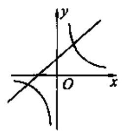

D.

解析 (A).

(5)(2004 年浙江省宁波市)电压一定时，电流 $I$ 与电阻 $R$ 的函数图像大致是( )

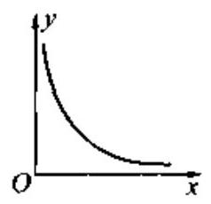

A.

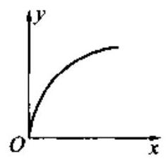

B.

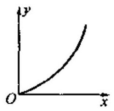

C.

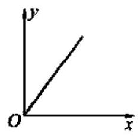

D.

解析 (A).

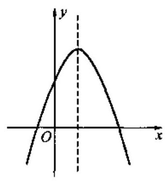

图 4-1

( 6 )(2004 年重庆市)二次函数 $y = a{x}^{2} + {bx} + c$ 的图像如图 $4 - 1$ ,则点 $M\left( {b,\frac{c}{a}}\right)$ 在 ( )

A. 第一象限 B. 第二象限

C. 第三象限 D. 第四象限

解析 (C).

例 2 填空题

(1)当 $k =$ ___时，反比例函数 $y =  - \frac{k}{x}\left( {x > 0}\right)$ 的图像在第一象限(只需填一个数).

(2)已知反比例函数 $y = \frac{k}{x}$ 的图像在一、三象限，那么直线 $y = {kx} - k$ 不经过第___ 象限.

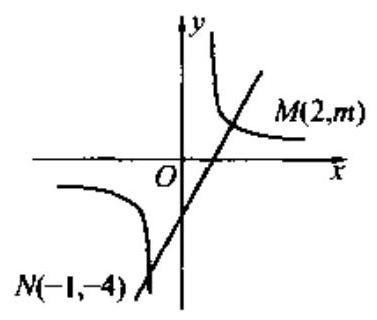

图 4-2

解析 (1) 取 $k < 0$ 即可; (2)第二象限.

例 3 (2004 年贵阳实验区) 如图 4-2,一次函数 $y = {ax} + b$ 的图像与反比例函数 $y = \frac{k}{x}$ 的图像交于 $M\text{ 、 }N$ 两点.

(1)求反比例函数和一次函数的解析式；

(2)根据图像写出使反比例函数的值大于一次函数的值的 $x$ 的取值范围.

解析 (1) 将 $N\left( {-1, - 4}\right)$ 代入 $y = \frac{k}{x}$ 中得 $k = 4$ . 反比例函数的解析式为 $y = \frac{4}{x}$ .

将 $M\left( {2, m}\right)$ 代入解析式 $y = \frac{4}{x}$ 中得 $m = 2$ .

将 $M\left( {2,2}\right) , N\left( {-1, - 4}\right)$ 代入 $y = {ax} + b$ 中得 $\left\{  \begin{array}{l} {2a} + b = 2, \\   - a + b =  - 4, \end{array}\right.$ 解得 $a - 2, b =  - 2$ .

一次函数的解析式为 $y = {2x} - 2$ .

例 4 某产品每件成本 10 元，试销阶段每件产品的销售价 $x$ (元)与产品的日销售量 $y$ (件)之间的关系如下表:

<table><tr><td>$x$ (元)</td><td>15</td><td>20</td><td>30</td><td>...</td></tr><tr><td>$y$ 件</td><td>25</td><td>20</td><td>10</td><td>...</td></tr></table>

若日销售量 $y$ 是销售价 $x$ 的一次函数.

(1)求出日销售量 $y$ (件)与销售价 $x$ (元)的函数关系式；

(2)要使每日的销售利润最大，每件产品的销售价应定为多少元？此时每日销售利润是多少元?

解析 (1) 设此一次函数解析式为 $y = {kx} + b$ , 则 $\left\{  \begin{array}{l} {15k} + b = {25} \\  {20k} + b = {20} \end{array}\right.$ ,解得 $k =  - 1, b = {40}$ ,即一次函数解析式为 $y =  - x + {40}$ .

(2)设每件产品的销售价应定为 $x$ 元,所获销售利润为 $w$ 元，

$w = \left( {x - {10}}\right) \left( {{40} - x}\right)  =  - {x}^{2} + {50x} - {400} =  - {\left( x - {25}\right) }^{2} + {225}.$

答:产品的销售价应定为 25 元,此时每日获得最大销售利润为 225 元.

例 52004 年入夏以来，全国大部分地区发生严重干旱. 某市自来水公司为了鼓励市民节约用水，采取分段收费标准. 若某户居民每月应缴水费 $y$ (元) 与用水量 $x$ (吨)的函数,其图像如图 4-3 所示,

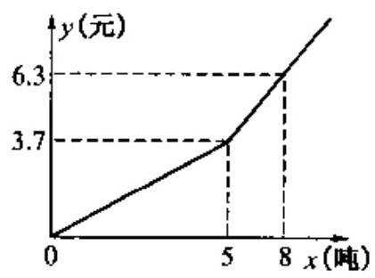

图 4-3

(1)分别写出 $x \leq  5$ 和 $\dot{x} > 5$ 的函数解析式.

(2)观察函数图像，利用函数解析式，回答自来水公司采取的收费标准.

(3)若某户居民该月用水 3.5 吨，则应交水费多少元？若某户居民该月交水费 9 元， 则用水多少吨?

解析 (1) $y = {0.74x}\left( {x \leq  5}\right)$ ；

$y = {0.9x} - {0.9}\left( {x > 5}\right) .$

(2) $x \leq  5$ 自来水公司的收费标准是每吨 0.74 元；

$x > 5$ 自来水公司的收费标准是每吨 0.90 元.

(3)若某户居民该月用水 3.5 吨，则应交水费 2.59 元；

若某户居民该月交水费 9 元, 则用水 11 吨.

例 6 某市的 $A$ 县和 $B$ 县春季育苗,急需化肥分别为 90 吨和 60 吨. 该市的 $C$ 县和 $D$ 县分别储存化肥 100 吨和 50 吨，全部调配给 $A$ 县和 $B$ 县，已知 $C$ 、 $D$ 两县运化肥到 $A$ 、 $B$ 两县的运费(元/吨)如下列表所示:

(1)设 $C$ 县到 $A$ 县的化肥为 $x$ 吨,求总运费 $W$ (元)与 $x$ (吨)的函数关系式,并写出自变量 $x$ 的取值范围;

(2)求最低总运费，并说明总运费最低时的运送方案.

<table><tr><td>运出发地   费   元)   目的地</td><td>$C$</td><td>D</td></tr><tr><td>$A$</td><td>35</td><td>40</td></tr><tr><td>$B$</td><td>30</td><td>45</td></tr></table>

解析(1)由 $C$ 是运往 $A$ 县的化肥为 $x$ 吨,则 $C$ 县运往 $B$ 县的化肥为 $\left( {{100} - x}\right)$ 吨, $D$ 县运往 $B$ 县的化肥为 $\left( {x - {40}}\right)$ 吨,

依题意 $W = {35x} + {40}\left( {{90} - x}\right)  + {30}\left( {{100} - x}\right)  + {45}\left( {x - {40}}\right)  = {10x} + {4800}$ , ${40} \leq  x \leq  {90}.$

(2) $\because W$ 随着 $x$ 的减小而减小.

当 $x = {40}$ 时, ${W}_{\text{ 最小 }} = {10} \times  {40} + {4800} = {5200}$ (元).

运费最低时, $x = {40},\therefore {100} - x = {60},{90} - x = {50}, x - {40} = 0$ .

运送方案为 $C$ 县的 100 吨化肥 40 吨运往 $A$ 县，60 吨运往 $B$ 县， $D$ 县的 50 吨化肥全、 部运往 $A$ 县.

练场

1. 当 $\frac{2}{3} < m < 1$ 时,点 $P\left( {{3m} - 2, m - 1}\right)$ 在 ( )

A. 第一象限 B. 第二象限 C. 第三象限 D. 第四象限

2. 如图，象棋盘上，若“将”位于点 $\left( {1, - 2}\right)$ ，“象”位于点 $\left( {5,0}\right)$ ，则“炮”位于点 ( )

A. $\left( {-1,1}\right)$ B. $\left( {-1,2}\right)$ C. $\left( {-2,1}\right)$ D. $\left( {-2,2}\right)$

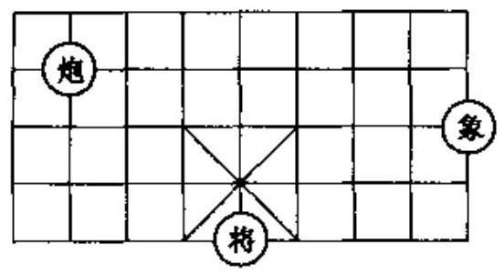

(第 2 题图)

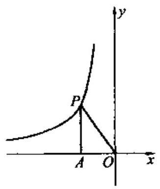

(第 3 题图)

3. 如图，已知反比例函数 $y =  - \frac{2}{x}$ 的图像上有一点 $P$ ，过 $P$ 作 ${PA} \bot  x$ 轴,垂足为 $A$ ，则 $\bigtriangleup {POA}$ 的面积是 ( )

A. 2 B. 1 C. -1

D. $\frac{1}{2}$

4. 设 $a$ 、 $b$ 、 $c$ 为实数，且满足 $a - b + c < 0$ ， $a + b + c > 0$ ，则下列结论正确的是___ch___

A. ${b}^{2} > {4ac}$ 且 $a < 0$ B. ${b}^{2} > {4ac}$ 且 $a \neq  0$

C. ${b}^{2} > {4ac}$ 且 $a > 0$ D. ${b}^{2} > {4ac}$ 且 $a < 0$

5. 在匀速运动中，路程 $s$ (千米) 一定时，速度 $v$ (千米/时) 关于时间 $t$ (小时) 的函数关系的大致图像是 ( )

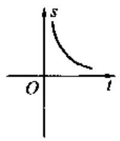

A.

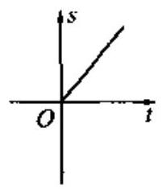

B.

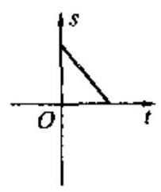

C.

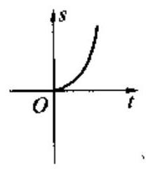

D.

6. 小丽的家与学校的距离为 ${d}_{0}$ 千米,她从家到学校先以匀速 ${v}_{1}$ 跑步前进,后以匀速 ${v}_{2} \; \left( {{v}_{2} < {v}_{1}}\right)$ 走完余下的路程,共用 ${t}_{0}$ 小时. 下列能大致表示小丽距学校的距离 $y$ (千米) 与离家时间 $t$ (小时)之间关系的图像是 ( )

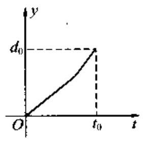

A.

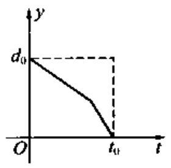

B.

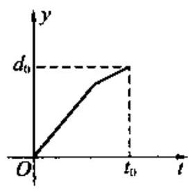

C.

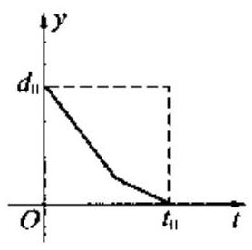

D.

7. 一束光线从点 $A\left( {3,3}\right)$ 出发，经过 $y$ 轴上点 $C$ 反射后经过点 $B\left( {1,0}\right)$ ，则光线从 $A$ 点到 $B$ 点经过的路线长度是 ( )

A. 4 B. 5 C. 6 D. 7

8. 已知函数 $y = \frac{k}{x}\left( {k > 0}\right)$ 经过点 ${P}_{1}\left( {{x}_{1},{x}_{2}}\right) ,{P}_{2}\left( {{x}_{2},{x}_{2}}\right)$ ,如果 ${y}_{1} < {y}_{2} < 0$ ,那么 ( )

A. ${x}_{2} < {x}_{1} < 0$ B. ${x}_{1} < {x}_{2} < 0$

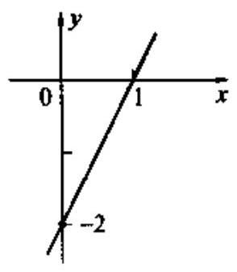

(第 9 题图)

C. ${x}_{2} > {x}_{1} > 0$ D. ${x}_{1} > {x}_{2} > 0$

9. 已知一次函数 $y = {kx} + b$ 的图像如图,当 $x < 0$ 时, $y$ 的取值范围是 ( )

A. $y > 0$ B. $y < 0$

C. $- 2 < y < 0$ D. $y <  - 2$

10. 已知抛物线 $y = \frac{1}{3}{\left( x - 4\right) }^{2} - 3$ 的部分图像如图,图像再次与 $x$ 轴相交时的坐标是 ( )

A. $\left( {5,0}\right)$ B. $\left( {6,0}\right)$ C. $\left( {7,0}\right)$ D. $\left( {8,0}\right)$

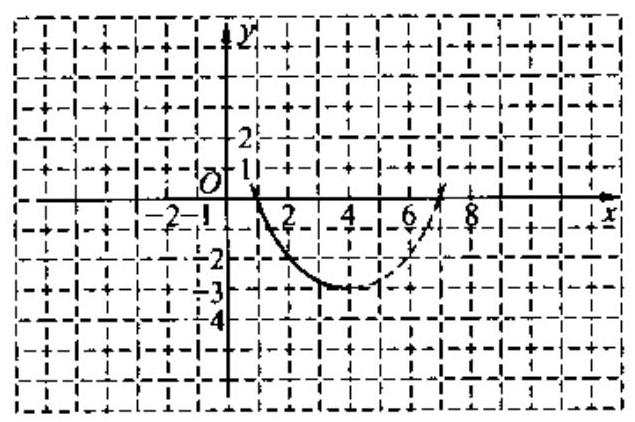

(第 10 题图)

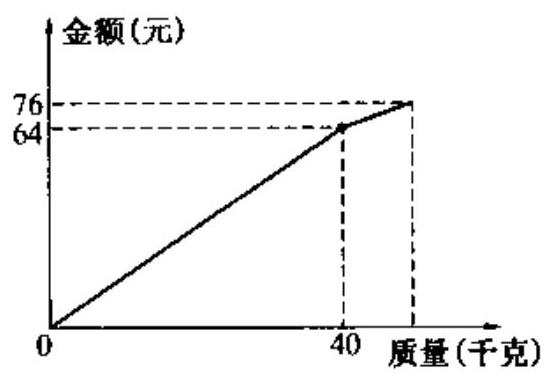

(第 11 题图)

11. 小李以每千克 0.8 元的价格从批发市场购进若干千克西瓜到市场去销售，在销售了部分西瓜之后，余下的每千克降价 0.4 元，全部售完. 销售金额与卖瓜的干克数之间的关系如图所示，那么小李赚了 ( )

A. 32 元 B. 36 元 C. 38 元 D. 44 元

12. 已知反比例函数 $y = \frac{k}{x}$ 与一次函数 $y = {2x} + k$ 的图像的一个交点的纵坐标是 -4,则 $k$ 的值是___.

13. 生物学研究表明:某种蛇的长度 $y\left( \mathrm{{cm}}\right)$ 是其尾长 $x\left( \mathrm{{cm}}\right)$ 的一次函数，当蛇的尾长为 6cm时，蛇长为45.5cm；当尾长为14cm时，蛇长为105.5cm，当一条蛇的尾长为 10cm 时，这条蛇的长度是___cm.

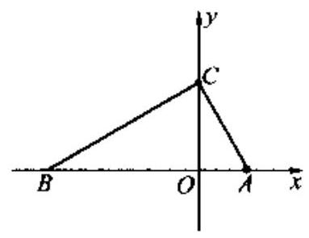

(第 16 题图)

14. 已知抛物线 $y = a{x}^{2} + {bx} + c$ 经过点 $\left( {-1,{10}}\right)$ 和 $\left( {2,7}\right)$ ，且 ${3a} + \; {2b} = 0$ ，则该抛物线的解析式为___.

15. 如果点 $P\left( {2, k}\right)$ 在直线 $y = {2x} + 2$ 上，那么点 $P$ 到 $x$ 轴的距离为___.

16. 如图，在 $\bigtriangleup  {ABC}$ 中， ${\angle {ACB}} = {90}^{ \circ  },{AC} = 2\sqrt{5}$ ，斜边 ${AB}$ 在 $x$ 轴上，点 $C$ 在 $y$ 轴的正半轴上，点 $A$ 的坐标为 $\left( {2,0}\right)$ . 则直角边 ${BC}$ 所在直线的解析式为___.

17. 已知在平面直角坐标系中,直线 $L$ 经过点 $A\left( {0, - 1}\right)$ ,且直线 $L$ 与抛物线 $y = {x}^{2} - x$ 只有一个公共点, 试求出这个公共点的坐标.

18. 已知一次函数 $y = x + m$ 与反比例函数 $y = \frac{m + 1}{x}\left( {x \neq   - 1}\right)$ 的图像在第一象限内的交点为 $P\left( {{x}_{0},3}\right)$ .

(1)求 ${x}_{0}$ 的值；

(2)求一次函数和反比例函数的解析式.

19. 已知一次函数 $y = {kx} + k$ 的图像与反比例函数 $y = \frac{8}{x}$ 的图像交于点 $P\left( {4, n}\right)$ .

(1)求 $n$ 的值；(2)求一次函数的解析式.

20. 如图,已知直线 ${l}_{1} \bot  {l}_{2}$ ,垂足为 $y$ 轴上一点 $A$ ,线段 ${OA} = 2,{OB} = 1$ .

(1)请直接写出 $A\text{ 、 }B\text{ 、 }C$ 三点的坐标；

(2)已知二次函数 $y = a{x}^{2} + {bx} + c$ 的图像过点 $A\text{ 、 }B\text{ 、 }C$ ,求出函数的解析式；

(3)若(2)中的抛物线的对称轴上存在 $P$ ，使 $\bigtriangleup {PBC}$ 为等腰三角形，请直接写出点 $P$ 的坐标.

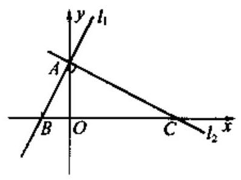

(第 20 题图)

21. 已知抛物线 $y = {x}^{2} + {bx} + c$ 与 $x$ 轴只有一个交点,且交点为 $A\left( {2,0}\right)$ .

(1)求 $b$ 、 $c$ 的值；

(2)若抛物线与 $y$ 轴的交点为 $B$ ，坐标原点为 $O$ ，求 $\bigtriangleup  {OAB}$ 的周长(答案可带根号).

22. 如图、二次函数 $y = a{x}^{2} + {bx} + c$ 的图像经过 $A$ 、 $B$ 、 $C$ 三点.

(1)观察图像写出 $A$ 、 $B$ 、 $C$ 三点的坐标，并求出此二次函数的解析式；

(2)求出此抛物线的顶点坐标和对称轴.

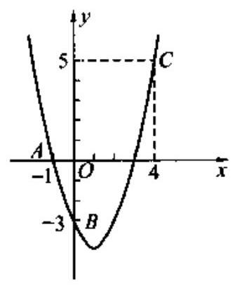

(第 22 题图)

23. 某公司市场营销部的营销员的个人月收入与该营销员每月的销售量成一次函数关系，其图像如图所示. 根据图像提供的信息，解答下列问题:

(1)求出营销人员的个人月收入 $y$ 元与该营销员每月的销售量 $x$ 万件( $x \geq  0$ )之间的函数关系式;

(2)已知该公司营销员李平 5 月份的销售量为 1.2 万件，求李平 5 月份的收人.

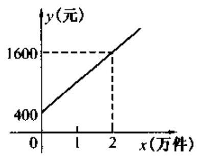

(第 23 题图)

24.(2004年河南市)一次函数 $y = {kx} + b$ ，与 $x$ 轴、 $y$ 轴的交点分别为 $A$ 、 $B$ ，若 $\bigtriangleup  {OAB}$ 的周长为 $2 + \sqrt{2}$ ( $O$ 为坐标原点),求 $b$ 的值.

25.(湖北黄岗市)如图，Rt $\bigtriangleup  {ABO}$ 的顶点 $A$ 是双曲线 $y = \frac{k}{x}$ 与直线 $y =  - x + \left( {k + 1}\right)$ 在第四象限的交点， ${AB}\bot x$ 轴于 $B$ ，且 ${S}_{\bigtriangleup {ABO}} = \frac{3}{2}$ .

(1)求这两个函数的解析式；

(2)求直线与双曲线的两个交点 $A$ 、 $C$ 的坐标和 $\bigtriangleup {AOC}$ 的面积.

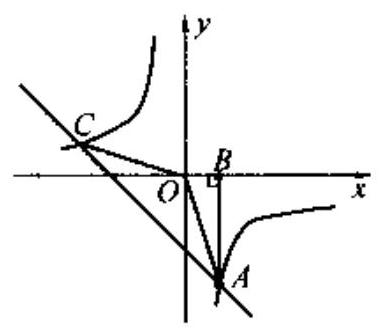

(第 25 题图)

26. 四边形 ${ABCD}$ 是平行四边形, ${AB} = 3,{AD} = \sqrt{5}$ ,高 ${DE} = 2$ . 建立如图所示的平面直角坐标系,其中点 $A$ 与坐标原点 $O$ 重合.

(1)求 ${BC}$ 边所在直线的解析式；

(2)设点 $F$ 为直线 ${BC}$ 与 $y$ 轴的交点，求经过点 $B$ 、 $D$ 、 $F$ 的抛物线解析式；

(3)判断 $\square {ABCD}$ 的对角线的交点 $G$ 是否在(2)中的抛物线上,并说明理由.

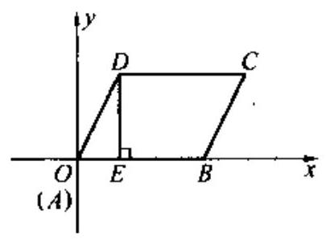

(第 26 题图)

27. 如图是某汽车行驶的路程 $s\left( \mathrm{\;{km}}\right)$ 与时间 $t\left( \mathrm{\;{min}}\right)$ 的函数关系图. 观察图中所提供的信息,解答下列问题:

(1)汽车在前 $9\mathrm{\;{min}}$ 的平均速度是多少?

(2)汽车在中途停了多长时间？

(3)当 ${16} \leq  t \leq  {30}$ 时，求 $s$ 与 $t$ 的函数关系式.

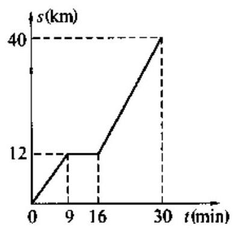

(第 27 题图)

28. 某工厂现有 80 台机器,每台机器平均每天生产 384 件产品,现准备增加一批同类机器以提高生产总量, 在试生产中发现, 由于其他生产条件不变, 因此每增加一台机器, 每台机器平均每天将少生产 4 件产品.

(1)如果增加 $x$ 台机器，每天的生产总量为 $y$ 件，请写出 $y$ 与 $x$ 的函数关系式；

(2)增加多少台机器，可以使每天的生产总量最大？最大生产总量是多少？

29. 某影碟出租店开设两种租碟方式:一种是零星租碟，每张收费 1 元；另一种是会员卡租碟，办卡费每月 12 元，租碟费每张 0.4 元. 小彬经常来该店租碟，若每月租碟数量为 $x$ 张.

(1)写出零星租碟方式应付金额 ${y}_{1}$ (元)与租碟数量 $x$ (张)之间的函数关系式；

(2)写出会员卡租碟方式应付金额 ${y}_{2}$ (元)与租碟数量 $x$ (张)之间的函数关系式；

(3)小彬选取哪种租碟方式更合算？

30. 学校为了美化校园环境，在一块长 40 米、宽 20 米的长方形空地上计划新建一块长 9 米、宽 7 米的长方形花圃.

(1)若请你在这块空地上设计一个长方形花圃，使它的面积比学校计划新建的长方形花圃的面积多 1 平方米，请你给出你认为合适的三种不同的方案.

(2)在学校计划新建的长方形花圃周长不变的情况下，长方形花圃的面积能否增加 2 平方米？如果能，请求出长方形花圃的长和宽；如果不能，请说明理由.

31. 初三(2)班同学为了探索泥茶壶盛水喝起来凉的原因，对泥茶壶和塑料壶盛水散热情况进行对比实验. 在同等情况下，把稍高于室温(25.5°C)的水放入凉壶中，每隔一小时同时测出凉壶水温，所得数据如下表:

室温 25. ${5}^{ \circ  }\mathrm{C}$ 时两壶水温的变化

<table><tr><td></td><td>刚装入时</td><td>1</td><td>2</td><td>3</td><td>4</td><td>5</td><td>6</td><td>7</td></tr><tr><td>泥茶壶</td><td>34</td><td>27</td><td>25</td><td>23.5</td><td>23.0</td><td>22.5</td><td>22.5</td><td>22.5</td></tr><tr><td>塑料壶</td><td>34</td><td>30</td><td>27</td><td>26.0</td><td>25.5</td><td>22.5</td><td>22.5</td><td>22.5</td></tr></table>

(1)塑料壶水温变化曲线如图，请在同一坐标系中，画出泥茶壶水温的变化曲线；

(2)比较泥茶壶和塑料壶水温变化情况的不同点.

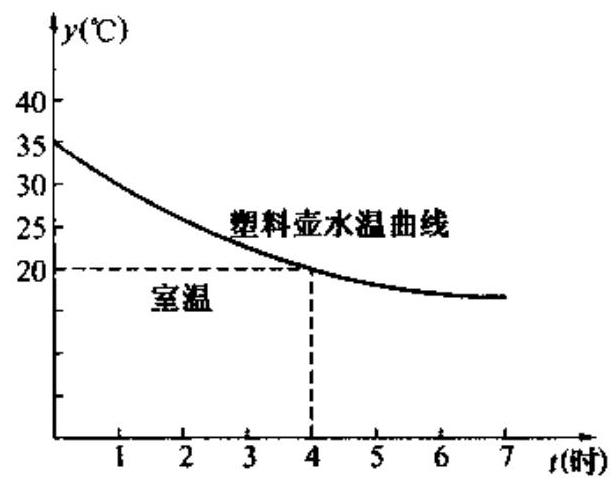

(第 31 题图)

## 统计初步与概率

## 海点犹理台

统计初步是通过对样本数据的分析预测整体状况的数学理论与方法, 它研究的数据带有随机性, 因此, 它与概率研究有着密切的联系, 同时也具有自身独有的理论和方法。本讲重在学习有关统计的初步知识及其应用, 它在现代社会中有着极为广泛的应用。例如统计图表与我们的生产、生活关系密切, 阅读统计图表已成为我们日常生活获取信息的重要来源。

## 海阳透视镜

例 1 (2004 年海南海口实验区)下表是两个商场 1 至 6 月份销售“椰树牌”天然椰子汁的情况。

<table><tr><td></td><td>1 月</td><td>2 月</td><td>3 月</td><td>4 月</td><td>5月</td><td>6 月</td></tr><tr><td>甲商场(箱)</td><td>450</td><td>440</td><td>480</td><td>420</td><td>576</td><td>550</td></tr><tr><td>乙商场(箱)</td><td>480</td><td>440</td><td>470</td><td>490</td><td>520</td><td>516</td></tr></table>

根据以上信息可知 ( )

A. 甲比乙的月平均销售量大 B. 甲比乙的月平均销售量小

C. 甲比乙的销售稳定 D. 乙比甲的销售稳定

解析 (D).

例 2 在对某次实验数据整理过程中, 某个事件出现的频率随实验次数变化折线图如图 5-1 所示，这个图形中折线的变化特点是___，试举

一个大致符合这个特点的实物实验的例子(指出关注的结果)___.

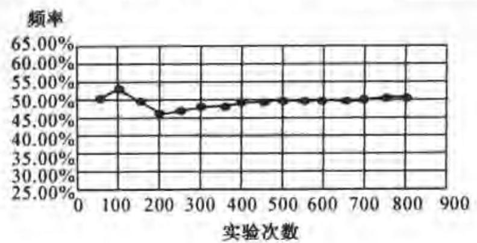

图 5-1

解析 随着实验次数增加，频率趋于稳定. 如:抛掷硬币实验中正面出现的频率.

例 3 为制定本市初中七、八、九年级学生校服的生产计划、有关部门准备对 180 名初中男生的身高进行调查.

现有三种调查方案:

A. 测量少年体校中 180 名男子篮球、排球队员的身高;

B. 查阅有关外地 180 名男生身高的统计资料;

C. 在本市的市区和郊县各任取一所完全中学、两所初级中学, 在这六所学校有关年级的(1)班中，用抽签的方法分别选出 10 名男生，然后测量他们身高.

(1)为了达到估计本市初中这三个年级男生身高的目的，你认为采用上述哪一种调查方案比较合理, 为什么?

(2)下表中的数据是使用了某种调查方法获得的:

初中男生身高情况抽样调查表

<table><tr><td>数级   身高(cm)</td><td>七年级</td><td>八年级</td><td>九年级</td><td>总计 (频数)</td></tr><tr><td>143~153</td><td>12</td><td>3</td><td>0</td><td></td></tr><tr><td>153~163</td><td>18</td><td>9</td><td>6</td><td></td></tr><tr><td>163~173</td><td>24</td><td>33</td><td>39</td><td></td></tr><tr><td>173~183</td><td>6</td><td>15</td><td>12</td><td></td></tr><tr><td>183~193</td><td>0</td><td>0</td><td>3</td><td></td></tr></table>

(注:每组可含最低值, 不含最高值)

① 根据表中的数据填写表中的空格;

② 根据填写的数据绘制频数分布直方图.

解析 (1) 选(C). 因为方案(C)采用了随机抽样方法, 具有代表性, 可以被用来估计总体.

(2)表格中频数从上往下依次为: 15,33,96,33,3.

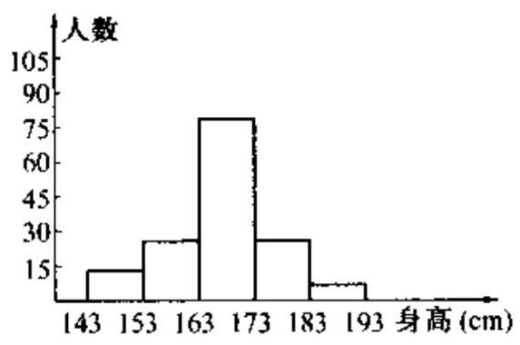

图 5-2

例 4 (华东版实验区试题) 一个骰子,六个面上的数字分别为 1、2、3、4、5、6 ,投掷一次, 向上的面出现数字 3 的概率是___.

解析 $\frac{1}{6}$ .

例 5 某校课外活动小组为了解本校初三学生的睡眠时间情况, 对学校若干名初三学生的睡眠时间进行了抽查,将所得数据整理后,画出了频率分布直方图的一部分 (如图). 已知图 5-3 中从左至右前五个小组的频率分别是0.04,0.08,0.24,0.28,0.24,第二小组的频数为 4 . 请回答:

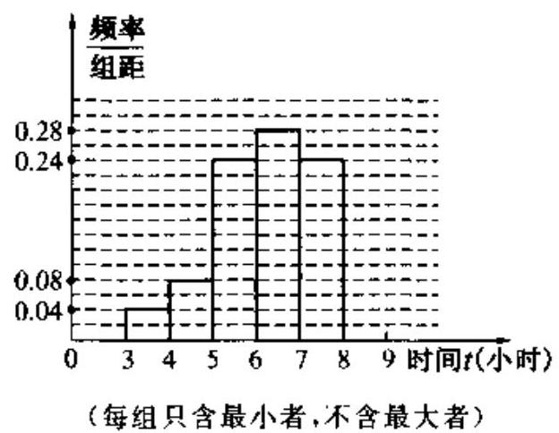

图 5-3

(1)这次被抽查的学生人数是多少？并补全频率分布直方图.

(2)被抽查的学生中，睡眠时间在哪个范围内的人数最多？这一范围内的人数是多少？

(3)如果该学校有 900 名初三学生，若合理睡眠时间范围为 $7 \leq  t < 9$ ，那么请你估计一下这个学校初三学生中睡眠时间在此范围内的人数是多少?

解析 (1) $\because$ 第二小组频数为 4，频率为 0.08，

$\therefore$ 这次被抽查的学生的人数是 $\frac{4}{0.08} = {50}$ (人).

第六小组的频率为 $1 - \left( {{0.04} + {0.08} + {0.24} + {0.28} + {0.24}}\right)  = {0.12}$ .

正确补全频率分布直方图略.

(2)被抽查的学生睡眠时间在 $6 \leq  t < 7$ (或从左至右数第四小组)的人数最多.

$\because {0.28} \times  {50} = {14}\left( \mathrm{\;A}\right) ,\therefore$ 这一范围内的人数是 ${14}\mathrm{\;A}$ .

(3)∵第五组、第六组的频率之和为 ${0.24} + {0.12} = {0.36}$ ,

$\therefore {0.36} \times  {900} = {324}$ (人).

$\therefore$ 估计这个学校初三学生中睡眠时间在 $7 \leq  t < 9$ 的人数约为 324 人.

1. 一组数据 $4,0,1, - 2,2$ 的标准差是___.

2. 袋中放有 3 只红球和 11 只黄球, 这两种球除颜色外没有任何区别. 随机从口袋中任取一只球，取到黄球的概率是___.

3. 某住宅小区 6 月份随机抽查了该小区 6 天的用水量(单位:吨)，结果分别是 30、34、32、 37、28、31，那么，请你估计该小区 6 月份(30 天)的总用水量约是___，

4. 为了了解某小区居民的用水情况，随机抽查了该小区 10 户家庭的月用水量，结果如下:

<table><tr><td>户数</td><td>2</td><td>2</td><td>3</td><td>2</td><td>1</td></tr><tr><td>月用水量(吨)</td><td>10</td><td>13</td><td>14</td><td>17</td><td>18</td></tr></table>

(1)计算这家庭的平均月用水量；

(2)如果该小区有 500 户家庭，根据上面的计算结果，估计该小区居民每月共用水多少吨?

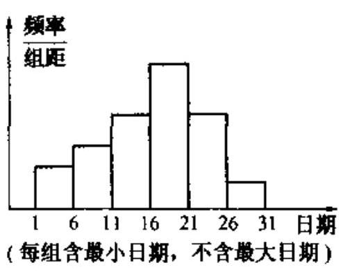

(第 5 题图)

5. 在学校开展的综合实践活动中, 某班进行了小制作评比,作品上交时间为 5 月 1 日至 30 日,评委会把同学们上交作品的件数按 5 天一组分组统计,绘制了频率分布直方图 (如图),已知从左至右各长方形的高的比为 $2 : 3 : 4 : 6 : 4 : 1$ ,第三组的频数为

12 , 请解答下列问题:

(1)本次活动共有多少件作品参加评比?

(2)哪组上交的作品数量最多？有多少件?

(3)经过评比，第四组和第六组分别有 10 件、 2 件作品获奖, 问这两组哪组获奖率较高? 6. 图①是海口市年生产总值统计图，根据此图完成下列各题:

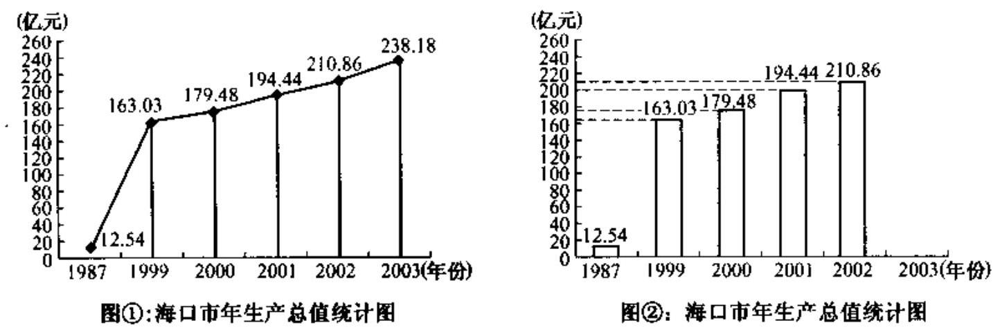

(第 6 题图)

(1)2003 年海口市的生产总值达到___亿元，约是建省前的 1987 年的___ 倍(倍数由四舍五入法精确到个位)；

(2)小王把图①的折线统计图改为条形统计图，但尚未完成图②，请你帮他完成该条形图；

(3)2003 年海口市年生产总值与 2002 年相比，增长率是___ %(结果保留三个有效数字)；

(4)已知 2003 年海口市的总人口是 139.19 万，那么该年海口市人均生产总值约是___ ___元(结果保留整数).

7. 将分别标有数字1,2,3的三张卡片洗匀后,背面朝上放在桌面上.

(1)随机地抽取一张,求取得奇数的概率 $P$ (奇数)；

(2)随机地抽取一张作为十位上的数字(不放回)，再抽取一张作为个位上的数字，能组成哪些两位数? 恰好是 “32” 的概率为多少?

8. 某水果店一周内甲、乙两种水果每天销售情况统计如下表 (单位:千克):

<table><tr><td>星期   品种</td><td>一</td><td>二</td><td>三</td><td>四</td><td>五</td><td>六</td><td>日</td></tr><tr><td>甲</td><td>45</td><td>44</td><td>48</td><td>42</td><td>57</td><td>55</td><td>66</td></tr><tr><td>乙</td><td>48</td><td>44</td><td>17</td><td>54</td><td>51</td><td>53</td><td>${60}^{ \circ  }$</td></tr></table>

(1)分别求出本周内甲、乙两种水果平均每天销售多少千克；

(2)甲、乙两种水果哪个销售更稳定？

9. 下面两幅统计图 (如图①，图②)，反映了某市甲、乙两所中学学生参加课外活动的情况. 请你通过图中信息回答下面的问题:

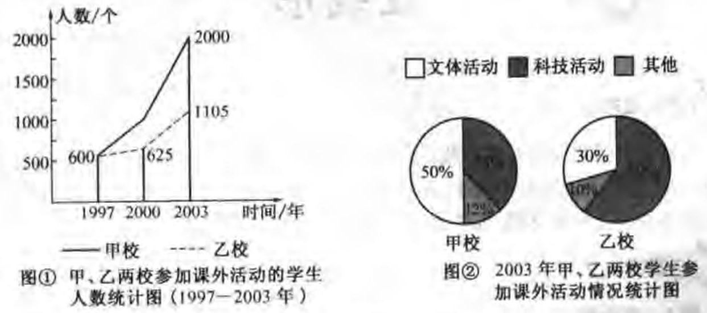

(第 9 题图)

(1)通过对图①的分析，写出一条你认为正确的结论；

(2)通过对图②的分析，写出一条你认为正确的结论；

(3)2003 年甲、乙两所中学参加科技活动的学生人数共有多少？

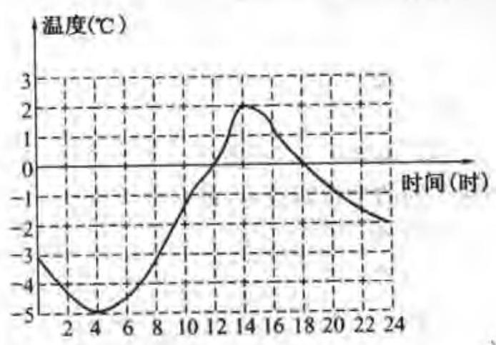

(第 10 题图)

10. 右图的曲线记录了某地一月份某天的温度随时间变化的情况，请你仔细观察图回答下面的问题:

(1)20 时的温度是___℃，温度是 $0{}^{ \circ  }\mathrm{C}$ 的时刻是___时，最暖和的时刻是___时，温度在 -3°C以下的持续时间为___ 小时.

(2)你从图中还能获取哪些信息(写出 1~2 条即可)？

## 直线形

## 考点梳理台

直线形包括相交线和平行线、三角形、四边形、相似三角形等知识内容, 这部分内容较多,主要涉及有关的几何概念,几何定理,图形的性质及判定等. 在中考中档题中,这部分知识内容经常在填空题、选择题、计算题、证明题中出现.

## 海星透视镜

例 1 选择题

图 6-1

(1)(2004年山西省)如图 6-1,已知等腰 $\bigtriangleup {ABC}$ 中,顶角 $\angle A \; = {36}^{ \circ  },{BD}$ 为 $\angle {ABC}$ 的平分线,则 $\frac{AD}{AC}$ 的值等于 ( )

A. $\frac{1}{2}$ B. $\frac{\sqrt{5} - 1}{2}$

C. 1

D. $\frac{\sqrt{5} + 1}{2}$

解析 (B).

(2)(2004 年湖北黄岗市)若直角三角形的三边长分别为 $2,4, x$ ，则 $x$ 的可能值有

( )

A. 1 个 B. 2 个 C. 3 个 D. 4 个

解析 (B).

图 6-2

(3)如图 6-2,用两块全等的含 ${30}^{ \circ  }$ 角的三角板拼成形状不同的平行四边形, 最多可以拼成 ( )

A. 1 个 B. 2 个

C. 3 个 D. 4 个

解析 (C).

(4)(2004 年海南海口实验区)如图 6-3,在 $\bigtriangleup {ABC}$ 中, $\angle C = {90}^{ \circ  },{AC} = 8\mathrm{\;{cm}}$ , ${AB}$ 的垂直平分线 ${MN}$ 交 ${AC}$ 于 $D$ ,连结 ${BD}$ ,若 $\cos \angle {BDC} = \frac{3}{5}$ ,则 ${BC}$ 的长是( )

A. $4\mathrm{\;{cm}}$ B. 6cm C. 8cm D. 10cm

解析 (A).

图 6-3

图 6-1

(5)如图 6-4，在 $L/{ABCD}$ 中， $E$ 为 ${DC}$ 边的中点， ${AE}$ 交 ${BD}$ 于点 $O$ . 若 ${S}_{\bigtriangleup {BDE}} = 9$ ，则 ${S}_{\bigtriangleup {AOB}}$ 等于 ( )

A. 18 13. 27 C. 36 D. 45

解析 (C).

例 2 填空题

(1)正 $n$ 边形的内角和等于 ${1080}^{ \circ  }$ ，那么这个正 $n$ 边形的边数 $n =$ ___.

解析 8 .

(2)等腰三角形 ${ABC}$ 中, ${BC} = 8,{AB}\text{ 、 }{AC}$ 的长是关于 $x$ 的方程 ${x}^{2} - {10x} + m = 0$ 的两根，则 $m$ 的值是 ___.

图 6-5

解析 16 或 25 .

(3)如图 6-5，平行四边形 ${ABCD}$ 中， $M$ 是 ${BC}$ 的中点，且 ${AM} \; = 9,{BD} = {12},{AD} = {10}$ ，则该平行四边形的面积是___.

解析 72 .

(4)如图 6-6，将一张正方形纸片剪成四个小正方形，然后将其中的一个正方形再剪成四个小正方形, 再将其中的一个正方形剪成四个小正方形, 如此继续下去......根据以上操作方法, 请你填写下表:

<table><tr><td>操作次数 $n$</td><td>1</td><td>2</td><td>3</td><td>4</td><td>5</td><td>...</td><td>$n$</td><td>...</td></tr><tr><td>正方形的个数</td><td>4</td><td>7</td><td>10</td><td></td><td></td><td>...</td><td></td><td>...</td></tr></table>

图 6-6

图 6-7

解析 13,16,3n+1

(5)如图 6-7，在 $\bigtriangleup  {ABC}$ 中， ${AD}$ 是 ${BC}$ 边上的中线，点 $E$ 是 ${AD}$ 的中点，直线 ${BE}$ 交 ${AC}$ 于点 $F$ ，那么 $\frac{AF}{FC} =$ ___.

解析 $\frac{1}{2}$ .

例 3 同一底上的两底角相等的梯形是等腰梯形吗? 如果是, 请给出证明 (要求画出图形,写出已知、求证、证明); 如果不是,请给出反例 (只需画图说明).

解析 等腰梯形.

已知 梯形 ${ABCD},{AD}//{BC}$ 且 $\angle B = \angle C$ (或 $\angle A = \angle D$ ).

求证 梯形 ${ABCD}$ 是等腰梯形.

证明一 如图 6-8,过点 $A$ 作 ${AE}//{DC}$ ,交 ${BC}$ 于 $E$ .

$\because {AD}//{BC},{AE}//{DC}$ .

$\therefore$ 四边形 ${AECD}$ 是平行四边形, $\therefore \angle {AEB} = \angle C,{AE} = {DC}$ .

$\because \angle B = \angle C,\therefore \angle {AEB} = \angle B,\therefore {AB} = {AE},\therefore {AB} = {DC}$ .

$\therefore$ 梯形 ${ABCD}$ 是等腰梯形.

图 6-8

图 6-9

图 6-10

证明二 如图 6-9,过 $A\text{ 、 }D$ 两点分别作 ${AE} \bot  {BC},{DF} \bot  {BC}$ 垂足为 $E\text{ 、 }F$ . $\because {AE} \bot  {BC},{DF} \bot  {BC},\therefore {AE}//{DF}$ 且 $\angle {AEB} = \angle {DFC}$ .

$\because {AD}//{BC},\therefore$ 四边形 ${AEFD}$ 是平行四边形, $\therefore {AE} = {DF}$ .

$\because \angle {AEB} = \angle {DFC},\angle B = \angle C,\therefore \bigtriangleup {AEB} \cong  \bigtriangleup {DFC}.\therefore {AB} = {DC}$ .

$\therefore$ 梯形 ${ABCD}$ 是等腰梯形.

证明三 如图 6-10,延长 ${BA}\text{ 、 }{CD}$ 交于 $E$ 点,

$\because \angle B = \angle C,\therefore {BE} = {CE}$ .

$\therefore {AD}//{BC},\therefore \angle {EAD} = \angle B,\angle {EDA} = \angle C,\therefore \angle {EAD} = \angle {EDA}$ .

$\therefore {AE} = {DE},\therefore {AB} = {DC}.\therefore$ 梯形 ${ABCD}$ 是等腰梯形.

例 4 已知如图 6-11，在 $\bigtriangleup  {ABC}$ 中， ${AB} = {AC} = a, M$ 为底边 ${BC}$ . 上任意一点，过点 $M$ 分别作 ${AB}$ 、 ${AC}$ 的平行线交 ${AC}$ 于 $P$ ,交 ${AB}$ 于 $Q$ .

(1)求四边形 ${AQMP}$ 的周长；

(2)写出图中的两对相似三角形(不需证明)；

(3) $M$ 位于 ${BC}$ 的什么位置时,四边形 ${AQMP}$ 为菱形? 说明你的理由.

图 6-11

解析 (1) $\because {PM}//{AB},{QM}//{AC}$ ,

$\therefore$ 四边形 ${AQMP}$ 为平行四边形.

且 $\angle 1 = \angle C,\angle 2 = \angle B$ .

又 $\because {AB} = {AC} = a,\therefore \angle B = \angle C$ .

$\therefore \angle 1 = \angle B = \angle C = \angle 2$ .

$\therefore {QB} = {QM},{PM} = {PC}$ .

$\therefore$ 四边形 ${AQMP}$ 的周长为

${AQ} + {QM} + {MP} + {PA} = {AQ} + {QB} + {PC} + {PA} = {AB} + {AC} = {2a}$ .

(2) $\bigtriangleup  {ABC} \backsim   \bigtriangleup  {QBM} \backsim   \bigtriangleup  {PMC}$ . (三对中写出任意两对即可)

(3)当 $M$ 为底边 ${BC}$ 的中点时,四边形 ${AQMP}$ 为菱形.

当 $M$ 为 ${BC}$ 中点时, $\because {PM}//{AB},{QM}//{AC}$ ,

$\therefore {PM} = \frac{1}{2}{AB} = \frac{a}{2},{QM} = \frac{1}{2}{AC} = \frac{a}{2},\therefore {PM} = {QM}$ .

由 (1) 知,四边形 ${AQMP}$ 为平行四边形, $\therefore$ 四边形 ${AQMP}$ 为菱形.

例 5 在 $\bigtriangleup {ABC}$ 中, $\angle {ACB} = {90}^{ \circ  },{AC} = {BC}$ ,直线 ${MN}$ 经过点 $C$ ,且 ${AD} \bot  {MN}$ 于 $D$ , ${BE} \bot  {MN}$ 于 $E$ .

(1)当直线 ${MN}$ 绕点 $C$ 旋转到图①的位置时,求证 (i) $\bigtriangleup {ADC} \cong  \bigtriangleup {CEB}$ ; (ii) ${DE} = \; {AD} + {BE}$ ;

(2)当直线 ${MN}$ 绕点 $C$ 旋转到图②的位置时，求证 ${DE} = {AD} - {BE}$ ；

(3)当直线 ${MN}$ 绕点 $C$ 旋转到图③的位置时，试问 ${DE}$ 、 ${AD}$ 、、 ${BE}$ 具有怎样的等量关系?请写出这个等量关系, 并加以证明.

图③

$M$

$M$

$D$

C

$E$

$A$ B

图①

$C$

D

A B

$E$

N

图②

图 6-12

解析 (1)(i) $\because \angle {ACD} = \angle {ACB} = {90}^{ \circ  },\therefore \angle {CAD} + \angle {ACD} = {90}^{ \circ  }$ ,

$\therefore \angle {BCE} + \angle {ACD} = {90}^{ \circ  },\therefore \angle {CAD} = \angle {BCE},\because {AC} = {BC},\therefore \bigtriangleup {ADC} \cong  \bigtriangleup {CEB}$ .

(ii) $\because \bigtriangleup {ADC} \cong  \bigtriangleup {CEB},\therefore {CE} = {AD},{CD} = {BE},\therefore {DE} = {CE} + {CD} = {AD} + {BE}$ .

(2) $\because \angle {ADC} = \angle {CEB} = \angle {ACB} = {90}^{ \circ  }$ ， $\therefore \angle {ACD} = \angle {CBE}$ .

又 $\because {AC} = {BC},\therefore \bigtriangleup {ACD} \cong  \bigtriangleup {CBE}$ ,

$\therefore {CE} = {AD},{CD} = {BE}.\therefore {DE} = {CE} - {CD} = {AD} - {BE}$ .

(3)当 ${MN}$ 旋转到图③的位置时， ${AD}$ 、 ${DE}$ 、、 ${BE}$ 所满足的等量关系是 ${DE} = {BE} - \; {AD}$ (或 ${AD} = {BE} - {DE},{BE} = {AD} + {DE}$ 等).

$\because \angle {ADC} = \angle {CEB} = \angle {ACB} = {90}^{ \circ  },\therefore \angle {ACD} = \angle {CBE}$ ,

又 $\because {AC} = {BC},\therefore \bigtriangleup {ACD} \cong  \bigtriangleup {CBE}$ ,

$\therefore {AD} = {CE},{CD} = {BE},\therefore {DE} = {CD} - {CE} = {BE} - {AD}$ .

1. 边长分别为3,4,5的三角形的内切圆半径与外接圆半径的比为 ( )

A. $1 : 5$ B. $2 : 5$ C. $3 : 5$ D. $4 : 5$

(第 2 题图)

2. 棱长是 $1\mathrm{\;{cm}}$ 的小立方体组成如图所示的几何体,那么这个几何体的表面积是 ( )

A. ${36}{\mathrm{\;{cm}}}^{2}$ B. ${33}{\mathrm{\;{cm}}}^{2}$

C. ${30}{\mathrm{\;{cm}}}^{2}$ D. ${27}{\mathrm{\;{cm}}}^{2}$

3. 商店出售下列形状的地砖:① 正方形；② 长方形；③ 正五边形； ④ 正六边形. 若只选购其中某一种地砖镶嵌地面, 可供选择的地砖共有 ( )

A. 1 种 B. 2 种

C. 3 种 D. 4 种

4. 某天同时同地，甲同学测得 ${1m}$ 的测竿在地面上影长为 0.8m，乙同学测得国旗旗杆在地面上的影长为 ${9.6}\mathrm{\;m}$ ,则国旗旗杆的长为 ( )

A. ${10}\mathrm{\;m}$ B. ${12}\mathrm{\;m}$ C. ${13}\mathrm{\;m}$ D. ${15}\mathrm{\;m}$

5. 某花木场有一块形如等腰梯形 ${ABCD}$ 的空地 (如图),各边的中点分别是 $E\text{ 、 }F\text{ 、 }G\text{ 、 }H$ , 测量得对角线 ${AC} = {10}$ 米,现想用篱笆围成四边形 ${EFGH}$ 的场地,则需篱笆总长度是 ( )

A. 40 米 B. 30 米 C. 20 米 D. ${10}\mathrm{\text{ 米 }}$

(第 5 题图)

(第 6 题图)

6.(2004 年重庆市)如图，在菱形 ${ABCD}$ 中， $\angle {BAD} = {80}^{ \circ  }$ ， ${AB}$ 的垂直平分线交对角线 ${AC}$ 于点 $F$ ， $E$ 为垂足，连结 ${DF}$ ，则 $\angle {CDF}$ 等于 ( )

A. 80° B. 70° C. 65° D. 60°

7. 如图，等腰梯形 ${ABCD}$ 中， ${AD}//{BC},{AD} = 5,{AB} = 6,{BC} = 8$ ，且 ${AB}//{DE}$ ，则 $\bigtriangleup  {DEC}$ 的周长是 ( )

A. 3 B. 12 C. 15 D. 19

(第 7 题图)

(第 8 题图)

8. 如图, 将两块全等的直角三角板拼接在一起. 这个图形可以看作是由一块直角三角板绕着直角顶点经过一次旋转后得到的，那么旋转的角度是 ( )

A. 30° B. 60° C. ${90}^{ \circ  }$ D. 180°

9. 已知任意四边形 ${ABCD}$ 中,对角线 ${AC}\text{ 、 }{BD}$ 交于点 $O$ ,且 ${AB} = {CD}$ ,若只增加下列条件中的一个: $\text{ ① }{AO} = {BO}$ ,② ${AC} - {BD}$ ,③ $\frac{AO}{OC} = \frac{DO}{BO}$ ,④ $\angle {OAD} = {OBC}$ ,一定能使 $\angle {BAC} = \angle {CDB}$ 成立的可选条件是 ( )

A. ② ④ B. ① ② C. ③ ④ D. ② ③ ④

10. 在如图的方格纸中,每个小方格都是边长为 1 的正方形,点 $A$ 、 $B$ 是方格纸中的两个格点 (即正方形的顶点),在这个 $5 \times  5$ 的方格纸中,找出格点 $C$ 使 $\bigtriangleup {ABC}$ 的面积为 2 个平方单位,则满足条件的格点 $C$ 的个数是 ( )

A. 5 B. 4 C. 3 D. 2

(第 10 题附)

(第 11 题图)

(第 12 题图)

11. 如图，点 $E$ 是 $\square {ABCD}$ 的边 ${BC}$ 延长线上的一点， ${AE}$ 与 ${CD}$ 相交于点 $G$ ， ${AC}$ 是 $\square {ABCD}$ 的对角线，则图中相似三角形共有 ( )

A. 2 对 B. 3 对 C. 4 对 D. 5 对

12. 如图,一张矩形报纸 ${ABCD}$ 的长 ${AB} = a\mathrm{\;{cm}}$ ,宽 ${BC} = b\mathrm{\;{cm}}, E, F$ 分别是 ${AB},{CD}$ 的中点. 将这张报纸沿着直线 ${EF}$ 对折后,矩形 ${AEFD}$ 的长与宽之比等于矩形 ${ABCD}$ 的长与宽之比. 则 $a : b$ 等于 ( )

A. $\sqrt{3} : 1$ B. $3 : 1$ C. $\sqrt{2} : 1$ D. $2 : 1$

13. 已知在等腰梯形 ${ABCD}$ 中, ${AD}//{BC}$ ,对角线 ${AC} \bot  {BD},{AD} = 3\mathrm{\;{cm}},{BC} = 7\mathrm{\;{cm}}$ . 则梯形的高是___cm.

14. 两根木棒的长分别为 $7\mathrm{\;{cm}}$ 和 ${10}\mathrm{\;{cm}}$ ，要选择第三根木棒，将它们订成一个三角形框架， 那么第三根木棒长 $x\mathrm{\;{cm}}$ 的范围是___.

(第 16 题图)

15. 矩形 ${ABCD}$ 中, $M$ 是 ${BC}$ 的中点,且 ${MA} \bot  {MD}$ ,若矩形的周长为 ${48}\mathrm{\;{cm}}$ ,则矩形 ${ABCD}$ 的面积为___ ${\mathrm{{cm}}}^{2}$ .

16. 如图,已知 ${AB}//{DE},\angle {ABC} = {80}^{ \circ  },\angle {CDE} = {140}^{ \circ  }$ ,则 $\angle {BCD} =$ ___.

17. 如图，在等腰梯形 ${ABCD}$ 中， ${AD}//{BC},{AC}$ 、 ${BD}$ 相交于点 $O$ ,有

如下四个结论:① ${AC} = {BD}$ ；② 梯形 ${ABCD}$ 是中心对称图形；③ $\angle {ADB} = \angle {DAC}$ ； ④ $\bigtriangleup  {AOD} \backsim   \bigtriangleup  {COB}$ . 请把正确结论的序号填写在横线上___.

(第 17 题图)

(第 18 题图)

18. 如图,四边形 ${ABCD}$ 的两条对角线 ${AC}\text{ 、 }{BD}$ 互相垂直, ${A}_{1}{B}_{1}{C}_{1}{D}_{1}$ 是四边形 ${ABCD}$ 的中点四边形. 如果 ${AC} = 8,{BD} = {10}$ ，那么四边形 ${A}_{1}{B}_{1}{C}_{1}{D}_{1}$ 的面积为___.

19. 如图, 在四个均由 16 个小正方形组成的网格正方形中, 各有一个格点三角形, 那么这四个三角形中, 与众不同的是___，不同之处___.

A. B. C. D.

(第 19 题图)

(第 20 题图)

20. (2004 年浙江金华市)如图，在四边形 ${ABCD}$ 中， ${DE}//{BC}$ ， 交 ${AB}$ 于点 $E$ ，点 $F$ 在 ${AB}$ 上，请你再添加一个条件(不再标注或使用其他字母)，使 $\bigtriangleup  {FCB} \backsim   \bigtriangleup  {ADE}$ ，并给出证明. 你添加的条件是:___.

21. 如图， ${AD} \bot  {CD}$ ， ${AB} = {10}$ ， ${BC} = {{20}\text{ ， }\angle A} = \angle C$ ，求 ${AD}\text{ 、 }{CD}$ 的长.

(第 21 题图)

22. 如图,已知 $\bigtriangleup  {ABC}\text{ 、 } \bigtriangleup  {DEF}$ 均为正三角形, $D\text{ 、 }E$ 分别在 ${AB}\text{ 、 }{BC}$ 上. 请找一个与 $\bigtriangleup {DBE}$ 相似的三角形并证明.

(第 22 题图)

23.(2004年山西省)如图，过门ABCD的对角线交点 $O$ 作互相垂直的两条直线 ${EG}$ 、 ${FH}$ 与 $\square {ABCD}$ 各边分别相交于点 $E$ 、 $F$ 、 $G$ 、 $H$ . 求证:四边形 EFGH 是菱形.

(第 23 题图)

24. 为美化环境，某单位需要在一块正方形空地上分别种植四种不同的花草，计划将这块空地按如下要求分成四块: (1) 分割后的整个图形必须是中心对称图形; (2) 四块图形的形状相同; (3) 四块图形的面积相等.

请按照上述三个要求, 分别在下面的正方形中给出 4 种不同的分割方法.

(尺规或徒手作图均可，但要尽可能准确、美观些，不写画法.)

(第 24 题图)

25. 一次数学活动课,老师组织学生到野外测量一个池塘的宽度 (即图中 $A\text{ 、 }B$ 间的距离). 在讨论探究测量方案时, 同学们发现有多种方法. 现请你根据所学知识, 设计出两种测量方案, 要求画出测量示意图, 并简要说明测量方法和计算依据.

例案:在 $A$ 处测出 $\angle {BAE} = {90}^{ \circ  }$ ，并在射线 ${AE}$ 上的适当位置取点 $C$ ，量出 ${AC}$ 、 ${BC}$ 的长度; 运用勾股定理,得 ${AB} = \sqrt{{BC}^{2} - {AC}^{2}}$ .

(第 25 题图)

26. 如图,已知矩形 ${ABCD}$ 中, ${CE} \bot  {BD}$ 于 $E,{CF}$ 平分 $\angle {DCE}$ 与 ${DB}$ 交于点 $F,{FG}//{DA}$ 与 ${AB}$ 交于点 $G$ .

(第 26 题图)

(1)求证 ${BF} = {BC}$ ；

(2)若 ${AB} = {4\mathrm{\;{cm}}},{AD} = {3\mathrm{\;{cm}}}$ ，求 ${CF}$ .

27. 如图,已知点 $P$ 是边长为 4 的正方形 ${ABCD}$ 内一点,且 ${PB} = 3,{BF} \bot  {BP}$ ,垂足是 $B$ . 请在射线 ${BF}$ 上找一点 $M$ ,使以点 $B\text{ 、 }M\text{ 、 }C$ 为顶点的三角形与 $\bigtriangleup {ABP}$ 相似 (请注意: 全等图形是相似图形的特例).

(第 27 题图)

28. 如图，在矩形 ${ABCD}$ 中， ${AB} = {{10}\mathrm{\;{cm}}}$ ， ${BC} = {{20}\mathrm{\;{cm}}}$ ， $P$ ， $Q$ 两点同时从 $A$ 点出发，分别以 $1\mathrm{\;{cm}}/\mathrm{s}$ 和 $2\mathrm{\;{cm}}/\mathrm{s}$ 的速度沿 $A \rightarrow  B \rightarrow  C \rightarrow  D \rightarrow  A$ 运动，当 $Q$ 点回到 $A$ 点时， $P$ 、 $Q$ 两点即停止运动，设点 $P$ 、 $Q$ 运动时间为 $t$ 秒.

(1)当 $P$ 、 $Q$ 分别在 ${AB}$ 边和 ${BC}$ 边上运动时，设以 $P$ 、 $B$ 、 $Q$ 为顶点的三角形面积为 $S$ ， 请写出 $S$ 关于 $t$ 的函数解析式及自变量 $t$ 的取值范围.

(2)在整个运动过程中， $t$ 取何值时， ${PQ}$ 与 ${BD}$ 垂直.

(第 28 题图)

29. 某服装厂里有大量剩余的等腰直角三角形边角料,现找出其中一种,测得 $\angle C = {90}^{ \circ  }$ , ${AC} = {BC}$ (如图),现要从这种三角形中剪出几种不同的扇形,做成不同形状的玩具, 要求使扇形的半径恰好在 $\bigtriangleup {ABC}$ 的边上,且扇形的弧与 $\bigtriangleup {ABC}$ 的其他边相切. 请你在下面备用的等腰直角三角形中，设计出所有符合要求的不同的方案示意图. (要求: 尺规作图，不写作法，保留作图痕迹.)

(第 29 题图)

30. 如图，矩形 ${ABCD}$ 中， ${AB} = 1$ ，若直角三角形 ${ABC}$ 绕 ${AB}$ 旋转所得圆锥的侧面积和矩形 ${ABCD}$ 绕 ${AB}$ 旋转所得圆柱的侧面积相等,求 ${BC}$ 的长.

(第 30 题图)

31. 如图， $H$ 是 $\odot  O$ 的内接锐角 $\bigtriangleup  {ABC}$ 的高线 ${AD}$ 、 ${BE}$ 的交点，过点 $A$ 引 $\odot  O$ 的切线，与 ${BE}$ 的延长线相交于点 $P$ ，若 ${AB}$ 的长是关于 $x$ 的方程 ${x}^{2} - 6\sqrt{3x} + {36}\left( {{\cos }^{2}C - \cos C + 1}\right)  = 0$ 的实数根.

(1)求得 $\angle C =$ ___度； ${AB}$ 的长等于___(直接写出结果)；

(2)若 ${BP} = 9$ ，试判断 $\bigtriangleup  {ABC}$ 的形状，并说明理由.

(第 31 题图)

32. 如图,梯形 ${ABCD}$ 中, ${AB}//{DC}, E$ 是 ${BC}$ 的中点, ${AE}\text{ 、 }{DC}$ 的延长线相交于点 $F$ ,连接 ${AC}\text{ 、 }{BF}$ .

(1)求证 ${AB} = {CF}$ ；

(2)四边形 ${ABCF}$ 是什么四边形,并说明你的理由.

(第 32 题图)

33. 如图，已知 $\bigtriangleup  {ABC}$ 、 $\bigtriangleup  {DCE}$ 、 $\bigtriangleup  {FEG}$ 是三个全等的等腰三角形,底边 ${BC}$ 、 ${CE}$ 、 ${EG}$ 在同一直线上,且 ${AB} = \sqrt{3},{BC} = 1$ . 连结 ${BF}$ ,分别交 ${AC}$ 、 ${DC}$ 、 ${DE}$ 于点 $P$ 、 $Q$ 、 $R$ .

(1)求证 $\bigtriangleup {BFG} \backsim  \bigtriangleup {FEG}$ ,并求出 ${BF}$ 的长;

(2)观察图形，请你提出一个与点 $P$ 相关的问题，并进行解答(根据提出问题的层次和解答过程评分).

(第 33 题图)

## 7 解直角三角形

## 考点梳理台

直角三角形是一类重要的几何图形, 解直角三角形是中考的一个重要考点. 解直角三角形运用的主要知识有:

(1)勾股定理:在 Rt $\bigtriangleup  {ABC}$ 中， $\angle C = {90}^{ \circ  }$ ，则 ${a}^{2} + {b}^{2} = {c}^{2}$ ，

(2)锐角三角函数。

(3)射影定理.

(4)利用三角形面积公式.

## 考题透视镜

图 7-1

例 1 (2004 年重庆市) 如图 7-1, CD 是平面镜,光线从 $A$ 点出发经 ${CD}$ 上点 $E$ 反射后照射到 $B$ 点,若入射角为 $\alpha$ (入射角等于反射角), ${AC} \bot  {CD}$ , ${BD} \bot  {CD}$ ,垂足分别为 $C$ , $D$ ,且 ${AC} =$ 3, ${BD} = 6,{CD} = {11}$ ,则 $\tan \alpha$ 的值为 ( )

A. $\frac{11}{3}$ B. $\frac{3}{11}$

C. $\frac{9}{11}$ D. $\frac{11}{9}$

解析 (D).

例 2 计算: ${\sin }^{2}{48}^{ \circ  } + {\sin }^{2}{42}^{ \circ  } - \tan {44}^{ \circ  } \cdot  \tan {45}^{ \circ  } \cdot  \tan {46}^{ \circ  } =$

图 7-2

解析 0 .

例 3 (2004 年浙江省绍兴市) 如图 7-2,河对岸有古塔 ${AB}$ ，小敏在 $C$ 处测得塔顶 $A$ 的仰角为 $a$ ，向塔前进 $s$ 米到达 $D$ ，在 $D$ 处测得 $A$ 的仰角为 $\beta$ ，则塔高是___米.

解析 $\frac{s}{\cot \alpha  - \cot \beta }$ .

例 4 (2004 湖北荆州市) 如图 7-3, 在一场足球比赛中，球员 $A$ 欲传球给同伴 $B$ ，对方球员 $C$ 意图抢断传球. 已知球速为 ${16}\mathrm{\;m}/\mathrm{s}$ ,球员的速度为 $8\mathrm{\;m}/\mathrm{s}$ . 当球由 $A$ 传出的同时，球员 $C$ 选择与 ${AC}$ 垂直的方向出击，恰好在点 $D$ 处将球成功抢断，则角 $\theta  =$ ___(球员的反应速度、天气等因素不予考虑).

图 7-3

解析 ${30}^{ \circ  }$ .

例 5 某居民小区有一朝向为正南方向的居民楼, 该居民楼的一楼是高 6 米的小区超市，超市以上是居民住房. 在该楼的前面 15 米处要盖一栋高 20 米的新楼. 当冬季正午的阳光与水平线的夹角为 ${32}^{ \circ  }$ 时.

图 7-4

(1)问超市以上的居民住房采光是否有影响，为什么?

(2)若要使超市采光不受影响，两楼应相距多少米?

(结果保留整数,参考数据: $\sin {32}^{ \circ  } \approx  \frac{53}{100},\cos {32}^{ \circ  } \approx  \frac{106}{125}$ , $\tan {32}^{ \circ  } \approx  \frac{5}{8}$ )

解析 (1) 如图 7-5,设 ${CE} = x$ 米,则 ${AF} = \left( {{20} - x}\right)$ 米,

即 $\tan {32}^{ \circ  } = \frac{AF}{EF}$ ,即 ${20} - x = {15} \times  \tan {32}^{ \circ  }, x \approx  {11}$ .

$\because {11} > 6,\therefore$ 居民住房的采光有影响.

(2)如图 7-6， $\tan {32}^{ \circ  } = \frac{AB}{BF}$ ， ${BF} = {{20} \times  \frac{8}{5}} = {32}$ ，两楼应相距 32 米.

图 7-5

图 7-6

## 熟悉

1. 下图是某天内，电线杆在不同时刻的影长，按先后顺序应当排列为___.

(第 1 题图)

2. 一棵大树在一次强台风中于离地面 5 米处折断倒下，倒下部分与地面成 ${30}^{ \circ  }$ 夹角，这棵大树在折断前的高度为___.

(第 2 题图)

3. 某山路的路面坡度 $I = 1 : \sqrt{399}$ ,沿此山路向上前进 200 米，升高了___米.

4. (2004 年山东青岛) 青岛位于北纬 ${36}^{ \circ  }{4}^{\prime }$ ,可以通过计算求得: 在冬至日正午时分的太阳入射角为 ${30}^{ \circ  }{30}^{\prime }$ ,因此,在规划建设楼高为 20 米的小区时,两楼间的最小距离为 ___米才能够保证不挡光.

(结果保留 4 个有效数字, $\sin {30}^{ \circ  }{30}^{\prime } = {0.5075},\tan {30}^{ \circ  }{30}^{\prime } = {0.5890}$ )

(第 4 题图)

5. 如图，天空中有一个静止的广告气球 $C$ ，从地面 $A$ 点测得 $C$ 点的仰角为 ${45}^{ \circ  }$ ，从地面 $B$ 点测得 $C$ 点的仰角为 ${60}^{ \circ  }$ . 已知 ${AB} = {20}\mathrm{\;m}$ ，点 $C$ 和直线 ${AB}$ 在同一铅垂平面上，求气球离地面的高度 (结果保留根号).

(第 5 题图)

6.(2004 年山东青岛)在一次实践活动中，某课题学习小组用测倾器、皮尺测量旗杆的高度, 他们设计了如下的方案 (如图 ① 所示):

(1)在测点 $A$ 处安置测倾器，测得旗杆顶部 $M$ 的仰角 $\angle {MCE} = \alpha$ ；

(2)量出测点 $A$ 到旗杆底部 $N$ 的水平距离 ${AN} = m$ ；

(3)量出测倾器的高度 ${AC} = h$ ，根据上述测量数据，即可求出旗杆的高度 ${MN}$ . 如果测量工具不变, 请仿照上述过程, 设计一个测量某小山高度 (如图②) 的方案:

① 在图 ② 中，画出你测量小山高度 ${MN}$ 的示意图 (标上适当的字母)；

② 写出你的设计方案.

(第 6 题图)

7. 据气象台预报，一强台风的中心位于宁波(指城区，下同)东南方向(36 √ 6 + 108 √ 2)千米的海面上,目前台风中心正以 20 千米/小时的速度向北偏西 ${60}^{ \circ  }$ 的方向移动,距台风中心 50 千米的圆形区域均会受到强袭击. 已知宁海位于宁波正南方向 72 千米处, 象山位于宁海北偏东 ${60}^{ \circ  }$ 方向 56 千米处. 请问:宁波、宁海、象山是否会受这次台风的强袭击？如果会，请求出受强袭击的时间；如果不会，请说明理由. (为解决问题，需画出示意图，现已画出其中一部分，请根据需要，把图形画完整.)

(第 7 题图)

## 圆

## 酒点梳理台

圆是初中平面几何学习的重要内容, 是中考命题中的重要考点. 这部分内容主要有: 圆的基本性质, 直线与圆的位置关系、圆与圆的位置关系、正多边形和圆、圆中有关的比例线段等. 这部分知识概念多、定理多、掌握时要结合图形正确理解, 把握图形的性质.

## 考题透视镜

例 1 选择题

(1)半径分别为 $1\mathrm{\;{cm}}$ 和 $5\mathrm{\;{cm}}$ 的两圆相交,则圆心距 $d$ 的取值范围是 ( )

A. $d < 6$ B. $4 < d < 6$ C. $4 \leq  d < 6$ D. $1 < d < 5$

解析 根据 $R - r < d < R + r$ ,两圆相交的条件,易得答案. 选(B).

(2)(2004 年重庆市)秋千拉绳长 3 米，静止时踩板离地面 0.5 米，某小朋友荡该秋千时。秋千在最高处踩板离地面 2 米(左右对称)，则该秋千所荡过的圆弧长为( )

A. $\pi$ 米 B. ${2\pi }$ 米 C. $\frac{4}{3}\pi$ 米 D. $\frac{3}{2}\pi$ 米

解析 (B).

(3)在平面内,将一个图形绕一个定点沿某个方向转动一个角度,这样的图形运动称为旋转. 下列图案中, 不能由一个图形通过旋转而构成的是 ( )

A.

B.

C.

D.

解析 (C) 根据中心对称的性质可得.

(4)(2004 年安徽省)如图 8-1,扇子的圆心角为 $x$ ,余下扇形的圆心角是 $y, x$ 与 $y$ 的比通常按黄金比来设计,这样的扇子外形较美观. 若取黄金比为 0.6 ,则 $x$ 为( )

A. 216° B. ${135}^{ \circ  }$ C. 120° D. ${108}^{ \circ  }$

解析 (B).

图 8-1

图 8-2

(5)如图 8-2，已知 $\odot  O$ 的弦 ${AB}\text{ 、 }{CD}$ 交于点 $P$ ，且 ${OP}\bot {CD}$ ，若 ${CD} = 4$ ，则 ${AP} \cdot  {BP}$ 的值为 ( )

A. 2 B. 4 C. 6 D. 8

解析 (B).

例 2 填空题

(1)如图 8-3，在 $\odot  O$ 中，弦 ${AB} = {1.8}\mathrm{\;{cm}}$ ，圆周角 $\angle {ACB} = {30}^{ \circ  }$ ，则 $\odot  O$ 的直径等于 ___cm.

图 8-3

图 8-4

解析 3.6.

(2)已知如图 8-4， $\odot  {O}_{1}$ 与 $\odot  {O}_{2}$ 外切于点 $P$ ，直线 ${AB}$ 经过点 $P$ 交 $\odot  {O}_{1}$ 于 $A$ ，交 $\odot  {O}_{2}$ 于 $B$ ，点 $C$ 、 $D$ 分别为 $\odot  {O}_{1}$ 、 $\odot  {O}_{2}$ 上的点，且 $\angle {ACP} = {65}^{ \circ  }$ ，则 $\angle {BDP} =$ ___.

解析 ${65}^{ \circ  }$ .

(3)如图 8-5，矩形 ${ABCD}$ 与 $\odot  O$ 交于点 $A$ ， $B$ ， $F$ ， $E$ ， $D$ ，且二() ${EF} = {4cm}$ ， ${EF} = {4cm}$ ，则 ${AB} =$ ___cm.

图 8-5

图 8-6

图 8-7

解析 6 .

(4)如图 8-6，以 $\mathrm{{Rt}} \bigtriangleup  {ABC}$ 各边为直径的三个半圆围成两个新月形(阴影部分)，已知 ${AC} = {3\mathrm{\;{cm}}},{BC} = {4\mathrm{\;{cm}}}$ ，则新月形(阴影部分)的面积和是___ ${\mathrm{{cm}}}^{2}$ .

解析 6 .

(5)如图 8-7，已知 $\angle {AOB} = {30}^{ \circ  }$ ， $M$ 为 ${OB}$ 边上一点，以 $M$ 为圆心、 $2\mathrm{\;{cm}}$ 为半径作 $\odot  M$ . 若点 $M$ 在 ${OB}$ 边上运动,则当 ${OM} =$ ___ ${cm}$ 时, $\odot  M$ 与 ${OA}$ 相切.

解析 4 .

例 3 如图 8-8,在 $\odot  O$ 的内接 $\bigtriangleup {ABC}$ 中, ${AB} = {AC}, D$ 是 $\odot  O$ 上一点, ${AD}$ 的延长线交 ${BC}$ 的延长线于点 $P$ .

(1)求证 $A{B}^{2} = {AD} \cdot  {AP}$ ；

(2)若 $\odot  O$ 的直径为 ${25},{AB} = {20},{AD} = {15}$ ，求 ${PC}$ 和 ${DC}$ 的长.

图 8-8

证明 (1) $\because \angle {ADC} + \angle B = {180}^{ \circ  },\angle B = \angle {ACB}$ ,

$\therefore \angle {ACP} + \angle {ACB} = \angle {ACP} + \angle B = {180}^{ \circ  }$ .

$\therefore \angle {ADC} = \angle {ACP}.\therefore \bigtriangleup {ADC} \backsim  \bigtriangleup {ACP}$ .

$\therefore \frac{AD}{AB} = \frac{AB}{AP}$ ,即 $A{B}^{2} = {AD} \cdot  {AP}$ .

(2)过点 $A$ 作直径 ${AE}$ 交 ${BC}$ 于点 $F$ .

$\because \bigtriangleup {ABC}$ 是等腰三角形, $\therefore {AE}$ 垂直平分 ${BC}$ .

设 ${AF} = a$ ,则 ${EF} = {25} - a,{BF} = \sqrt{{400} - {a}^{2}}$ ,

由 $B{F}^{2} = {AF} \cdot  {EF}$ ,得 ${400} - {a}^{2} = a\left( {{25} - a}\right)$ ,

所以 ${AF} = a = {16},{BF} = {FC} = {12}$ .

方法一 由 (1) $A{B}^{2} = {AD} \cdot  {AP}$ ,得 ${AP} = \frac{A{B}^{2}}{AD} = \frac{400}{15} = \frac{80}{3}$ .

在 Rt $\bigtriangleup {AFP}$ 中, ${PF} = \sqrt{A{P}^{2} - A{\bar{F}}^{2}} = \sqrt{{\left( \frac{80}{3}\right) }^{2} - {16}^{2}} = \frac{64}{3}$ .

$\therefore {PC} = {PF} - {FC} = \frac{64}{3} - {12} = \frac{28}{3}$ .

又由 $\bigtriangleup {PCD} \backsim  \bigtriangleup {PAB}$ 得 $\frac{DC}{AB} = \frac{PC}{PA},\therefore {DC} = \frac{{PC} \cdot  {AB}}{PA} = \frac{{28} \times  {20}}{80} = 7$ .

方法二 连接 ${BE}\text{ 、 }{EC}\text{ 、 }{BD}$ ,

$\because {AE}$ 是直径, $\therefore \angle {ABE} = {90}^{ \circ  }$ ,且 ${BE} = \sqrt{{25}^{2} - {20}^{2}} = {15}$ .

$\therefore {EC} = {BE} = {15}$ ,又已知 ${AD} = {15},\therefore {AD} = {EC}$ .

$\therefore {DC}//{AE}$ ,即 ${DC} \bot  {BC}$ ,则 ${BD}$ 是直径, $\therefore {DC} = \sqrt{B{D}^{2} - B{C}^{2}} = \sqrt{{25}^{2} - {24}^{2}} = 7$ . 在 Rt $\bigtriangleup {PCD}$ 中, ${PD} = {PA} - {AD} = \frac{80}{3} - {15} = \frac{35}{3},\therefore {PC} = \sqrt{{\left( \frac{35}{3}\right) }^{2} - {7}^{2}} = \frac{28}{3}$ .

方法一

方法二

图 8-9

例 4 (2004 年山西省) 如图 8-9, $\odot  {O}_{1}$ 与 $\odot  {O}_{2}$ 相交于点 $A$ 和点 $B$ ，且点 ${O}_{1}$ 在 $\odot  {O}_{2}$ 上，过点 $A$ 的直线 ${CD}$ 分别与 $\odot  {O}_{1}$ 、 $\odot  {O}_{2}$ 交于点 $C$ 、 $D$ ,过点 $B$ 的直线 ${EF}$ 分别与 $\odot  {O}_{1}$ 、 $\odot  {O}_{2}$ 交于点 $E\text{ 、 }F, \odot  {O}_{2}$ 的弦 ${O}_{1}D$ 交 ${AB}$ 于 $P$ .

求证 (1) ${CE}//{DF}$ ； (2) ${O}_{1}{A}^{2} = {O}_{1}P \cdot  {O}_{1}D$ .

证明 (1) $\because$ 四边形 ${ABEC}$ 是 $\odot  {O}_{1}$ 的内接四边形, $\therefore \angle {ABE} + \angle C = {180}^{ \circ  }$ . 又四边形 ${ABFD}$ 是 $\odot  {O}_{2}$ 的内接四边形, $\therefore \angle {ABE} = \angle {ADF}$ .

$\therefore \angle C + \angle {ADF} = {180}^{ \circ  }.\therefore {CE}//{DF}$ .

(2)连结 ${O}_{1}B$ ,则 ${O}_{1}A = {O}_{1}B,\therefore \angle {O}_{1}{AB} = \angle {O}_{1}{BA}$ .

又 $\because \angle {O}_{1}{BA} = \angle {O}_{1}{DA},\therefore \angle {O}_{1}{AP} = \angle {O}_{1}{DA}$ .

又 $\because \angle A{O}_{1}P = \angle D{O}_{1}A,\therefore \bigtriangleup A{O}_{1}P \backsim  \bigtriangleup D{O}_{1}A$ .

$\therefore \frac{{O}_{1}A}{{O}_{1}D} = \frac{{O}_{1}P}{{O}_{1}A},\therefore {O}_{1}{A}^{2} = {O}_{1}D \cdot  {O}_{1}P$ .

(第 1 题图)

1. 如图， $\odot  O$ 的两条弦 ${AB}$ 、 ${CD}$ 相交于点 $E$ ， ${AC}$ 与 ${DB}$ 的延长线交于点 $P$ ,下列结论中成立的是 ( )

A. ${CE} \cdot  {CD} = {BE} \cdot  {BA}$

B. ${CE} \cdot  {AE} = {BE} \cdot  {DE}$

C. ${PC} \cdot  {CA} = {PB} \cdot  {BD}$

D. ${PC} \cdot  {PA} = {PB} \cdot  {PD}$

2. 如图, ${PA}$ 切 $\odot  O$ 于 $A$ ,割线 ${PBC}$ 经过圆心 $O$ ,交 $\odot  O$ 于 $B\text{ 、 }C$ 两点,若 ${PA} = 4,{PB} = 2$ , 则 $\tan \angle P$ 的值为 ( )

A. $\frac{4}{3}$ B. $\frac{3}{4}$ C. $\frac{5}{4}$ D. $\frac{5}{3}$

(第 5 题)

(第 3 题图)

3. 如图，已知 $\odot  {O}_{1}$ 、 $\odot  {O}_{2}$ 相交于 $A$ 、 $B$ 两点，且点 ${O}_{1}$ 在 $\odot  {O}_{2}$ 上. 过 $A$ 作 $\odot  {O}_{1}$ 的切线 ${AC}$ 交 $B{O}_{1}$ 的延长线于点 $P$ ,交 $\odot  {O}_{2}$ 于点 $C,{BP}$ 交 $\odot  {O}_{1}$ 于点 $D$ . 若 ${PD} = 1,{PA} = \sqrt{5}$ ,则 ${AC}$ 的长为 ( )

A. $\sqrt{5}$ B. $2\sqrt{5}$ C. $2 + \sqrt{5}$ D. $3\sqrt{5}$

4. 如图,已知 $\odot  O$ 的弦 ${AB}\text{ 、 }{CD}$ 相交于点 $P,{PA} = 4\mathrm{\;{cm}},{PB} = 3\mathrm{\;{cm}},{PC} = 6\mathrm{\;{cm}},{EA}$ 切 $\odot  O$ 于点 $A,{AE}$ 与 ${CD}$ 的延长线交于点 $E$ ,若 ${AE} = 2\sqrt{5}\mathrm{\;{cm}}$ ,则 ${PE}$ 的长为 ( )

A. $4\mathrm{\;{cm}}$ B. $3\mathrm{\;{cm}}$ C. $5\mathrm{\;{cm}}$ D. $\sqrt{2}\mathrm{\;{cm}}$

(第 4 题)

(第 5 题)

5. 如图,已知直线 ${BC}$ 切 $\odot  O$ 于点 $C,{PD}$ 为 $\odot  O$ 的直径, ${BP}$ 的延长线与 ${CD}$ 的延长线交于点 $A,\angle A = {28}^{ \circ  },\angle B = {26}^{ \circ  }$ ,则 $\angle {PDC}$ 等于 ( )

A. ${34}^{ \circ  }$ B. ${36}^{ \circ  }$ C. ${38}^{ \circ  }$ D. ${40}^{ \circ  }$

6. 半径为 2 的圆中,弦长等于 $2\sqrt{3}$ 的弦的弦心距为___.

7. 如图，过 $\odot  O$ 外一点 $P$ 作两条割线，分别交 $\odot  O$ 于 $A$ 、 $B$ 和 $C$ 、 $D$ . 已知 ${PA} = 2$ ， ${PB} = \; 5,{PD} = 8$ ,则 ${PC}$ 的长是___.

(第 7 题)

(第 8 题)

8. 某人用如下方法测一钢管的内径: 将一小段钢管竖直放在平台上, 向内放入两个半径为 $5\mathrm{\;{cm}}$ 的钢球,测得上面一个钢球顶部高 ${DC} = {16}\mathrm{\;{cm}}$ (钢管的轴截面如图所示),则钢管的内直径 ${AD}$ 长为___ $\mathrm{{cm}}$ .

9. 如图， ${AB}$ 为半圆 $O$ 的直径，在 ${AB}$ 的同侧作 ${AC}$ 、 ${BD}$ 切半圆 $O$ 于 $A$ 、 $B$ ， ${CD}$ 切半圆 $O$ 于 $E$ . 请分别写出两个角相等、两条边相等、两个三角形全等、两个三角形相似等四个正确的结论.

(第 8 题)

10. 在同一平面内,已知点 $O$ 到直线 $l$ 的距离为 5,以点 $O$ 为圆心, $r$ 为半径画圆. 探究、归纳:

(1)当 $r =$ ___时， $\odot  O$ 上有且只有一个点到直线 $l$ 的距离等于 3 .

(2)当 $r =$ ___时， $\odot  O$ 上有且只有三个点到直线 $l$ 的距离等于 3 .

(3)随着 $r$ 的变化， $\odot  O$ 上到直线 $l$ 的距离等于 3 的点的个数有哪些变化？并求出相对应的 $r$ 的值或取值范围(不必写出计算过程).

11. 如图,已知 ${PAB}$ 是 $\odot  O$ 的割线, ${AB}$ 为 $\odot  O$ 的直径, ${PC}$ 为 $\odot  O$ 的切线, $C$ 为切点, ${BD} \bot  {PC}$ 于点 $D$ ,交 $\odot  O$ 于点 $E,{PA} = {AO} = {OB} = 1$ .

(第 11 题图)

(1)求 $\angle P$ 的度数；

(2)求 ${DE}$ 的长.

12.(2004年浙江省绍兴市)如图， ${CB}$ 、 ${CD}$ 是 $\odot  O$ 的切线，切点分别为 $B$ 、 $D$ 、 ${CD}$ 的延长线与 $\odot  O$ 直径 ${BE}$ 的延长线交于 $A$ 点，连 ${OC}$ ， ${ED}$ .

(第 12 题图)

(1)探索 ${OC}$ 与 ${ED}$ 的位置关系，并加以证明；

(2)若 ${AD} = 4,{CD} = 6$ ，求 $\tan \angle {ADE}$ 的值.

13. (2004 年广东省)如图，在 Rt $\bigtriangleup {ABC}$ 中 $\angle C = {90}^{ \circ  }$ ， ${BE}$ 平分 $\angle {ABC}$ 交 ${AC}$ 于点 $E$ ，点 $D$ 在 ${AB}$ 上， ${DE}$ 上 ${EB}$ .

(第 13 题图)

(1)求证 ${AC}$ 是 $\bigtriangleup {BDE}$ 的外接圆的切线；

(2)若 ${AD} = 6,{AE} = 6\sqrt{2}$ ，求 ${BC}$ 的长.

14. 如图，已知 $\odot  {O}_{1}$ 、 $\odot  {O}_{2}$ 外切于点 $P$ ， $A$ 是 $\odot  {O}_{1}$ 上一点，直线 ${AC}$ 切 $\odot  {O}_{2}$ 于点 $C$ 交 $\odot  {O}_{1}$ 于点 $B$ ,直线 ${AP}$ 交 $\odot  {O}_{2}$ 于点 $D$ .

(1)求证 ${PC}$ 平分 $\angle {BPD}$ ；

(2)将“ $\odot  {O}_{1}$ 、 $\odot  {O}_{2}$ 外切于点 $P$ ” 改为“ $\odot  {O}_{1}$ 、 $\odot  {O}_{2}$ 内切于点 $P$ ”,其他条件不变，则(1) 中的结论是否仍然成立? 画出图形并证明你的结论.

(第 14 题图)

15. 如图，过 $\odot  O$ 上一点 $A$ 的切线 ${AC}$ 与 $\odot  O$ 直径 ${BD}$ 的延长线交于点 $C$ ,过 $A$ 作 ${AE} \bot \; {BC}$ 于点 $E$ .

(1)求证 $\angle {CAE} = 2\angle B$ ；

(2)已知 ${AC} = 8$ ，且 ${CD} = 4$ ，求 $\odot  O$ 的半径及线段 ${AE}$ 的长.

(第 15 题图)

16. 如图, $\odot  {O}_{1}$ 和 $\odot  {O}_{2}$ 外切于点 $A,{BC}$ 是 $\odot  {O}_{1}$ 和 $\odot  {O}_{2}$ 的公切线, $B\text{ 、 }C$ 为切点.

(1)求证 ${AB} \bot  {AC}$ ；

(2)过点 $A$ 的直线分别交 $\odot  {O}_{1}$ 、 $\odot  {O}_{2}$ 于点 $D$ 、 $E$ ，且 ${DE}$ 是连心线时，直线 ${DB}$ 与直线 ${EC}$ 交于点 $F$ . 请在图中画出图形,并判断 ${DF}$ 与 ${EF}$ 是否互相垂直,请证明; 若不垂直, 请说明理由;

(3)在(2)的其他条件不变的情况下,将直线 ${DE}$ 绕点 $A$ 旋转( ${DE}$ 不与点 $A$ 、 $B$ 、 $C$ 重合)，请另画出图形，并判断 ${DF}$ 与 ${EF}$ 是否互相垂直？若垂直，请证明；若不垂直, 请说明理由.

(第 16 题图)

17. 已知 $\odot  {O}_{1}$ 与 $\odot  {O}_{2}$ 相切于点 $P$ ，它们的半径分别为 $R$ 、 $r$ . 一直线绕 $P$ 点旋转，与 $\odot  {O}_{1}$ 、 $\odot  {O}_{2}$ 分别交于点 $A$ 、 $B$ (点 $P$ 、 $B$ 不重合)，探索规律:

(1)如图①，当 $\odot  {O}_{1}$ 与 $\odot  {O}_{2}$ 外切时，探求 $\frac{PA}{PB}$ 与半径 $R$ 、 $r$ 之间的关系式，请证明你的结论;

(2)如图②，当 $\odot  {O}_{1}$ 与 $\odot  {O}_{2}$ 内切时，第(1)题探求的结论是否成立？为什么？

(第 17 题图)

18. 如图， $\angle {PAQ}$ 是直角，半径为 5 的 $\odot  O$ 与 ${AP}$ 相切于点 $T$ ，与 ${AQ}$ 相交于两点 $B$ 、 $C$ .

(第 18 题图)

(1) ${BT}$ 是否平分 $\angle {OBA}$ ？证明你的结论；

(2)若已知 ${AT} = 4$ ，试求 ${AB}$ 的长.

19. 如图①，一个圆球放置在 $V$ 型架中. 图②是它的平面示意图， ${CA}$ 、 ${CB}$ 都是 $\odot  O$ 的切线,切点分别是 $A\text{ 、 }B$ ,如果 $\odot  O$ 的半径为 $2\sqrt{3}\mathrm{\;{cm}}$ ,且 ${AB} = 6\mathrm{\;{cm}}$ ,求 $\angle {ACB}$ .

(第 19 题图)

## 中档题达标训练

## 一、选择题

1. 如果把分式 $\frac{x}{x + y}$ 中的 $x$ 和 $y$ 都扩大 3 倍,那么该分式的值 ( )

A. 扩大 3 倍 B. 不变 C. 缩小 3 倍 D. 缩小 6 倍

2. 计算 ${\left( -2\right) }^{2} - {2}^{2}$ 的结果是 ( )

A. -4 B. -8 C. 0 D. 8

3. 一杯可乐售价 1.8 元. 商家为了促销, 顾客每买一杯可乐获一张奖券, 每三张奖券可兑换一杯可乐, 则每张奖券相当于 ( )

A. 0.6 元 B. 0.5 元 C. 0.45 元 D. 0.3 元

4. 设 $a$ 为有理数,下列说法正确的是 ( )

A. ${\left( a + \frac{1}{2005}\right) }^{2}$ 为正数

B. $- {\left( a - \frac{1}{2005}\right) }^{2}$ 为负数

(第 5 题图)

C. $a + {\left( \frac{1}{2005}\right) }^{2}$ 为正数

D. ${a}^{2} + \frac{1}{2005}$ 为正数

5. 如图所示,棋盘上有 $A\text{ 、 }B\text{ 、 }C$ 三个黑子与 $P\text{ 、 }Q$ 两个白子, 要使 $\bigtriangleup {ABC} \backsim  \bigtriangleup {RPQ}$ ,则第三个白子 $R$ 应放的位置可以是 ( )

A. 甲 B. 乙

C. 丙 D. T

6. 射线 ${OP}$ 与线段 ${AB}$ 能相交的是 ( )

A. B. C. D.

7. 同时抛掷两枚硬币,则两枚硬币同时出现正面向上的概率是 ( )

A. $\frac{1}{2}$ B. $\frac{1}{3}$ C. $\frac{1}{4}$ D. 以上答案都不对

8. 如图, 从边长为 10 的正方体的一顶点处挖去一个边长为 1 的小正方体, 则剩下图形的表面积为 ( )

A. 600 B. 599 C. 598 D. 597

(第 8 题图)

(第 9 题图)

9. 某校高一年级共 8 个班，将每天打扫卫生收集来的废纸和废塑料卖给废品收购站，所得来的钱全部捐给环保部门, 为治理环境献一份爱心. 如图为高一某班级一周中的信息, 预测高一年级一周收集废纸和废塑料的数量各为 (双休日不计) ( )

A. 12000 克、8000 克 B. 8000 克、12000 克

C. 2400 克、1600 克 D. 1600 克、2400 克

10. 若 $A\left( {-1,1}\right) , B\left( {2,1}\right) , C\left( {c,0}\right)$ 为一个直角三角形的三个顶点，则满足条件的 $c$ 的值有( )

(第 11 题图)

A. 1 个 B. 2 个

C. 3 个 D. 4 个

11. 如图, $\odot  O$ 的弦 ${AB}$ 垂直于直径 ${MN}, C$ 为垂足,若 ${OA} = 5\mathrm{\;{cm}}$ , 下面四个结论中可能成立的是 ( )

A. ${AB} = {12}\mathrm{\;{cm}}$ B. ${OC} = 6\mathrm{\;{cm}}$

C. ${MN} = {8\mathrm{\;{cm}}}$ D. ${AC} = {2.5}\mathrm{\;{cm}}$

12. 函数 $y = x\left| x\right|$ 的图像大致是 ( )

A.

B.

C.

D.

(第 13 题图)

13. 一条信息可通过如图的网络线由上(A 点)往下向各站点传送，例如信息到 ${b}_{2}$ 点可由经 ${a}_{1}$ 的站点送达，共有两条途径传送,则信息由 $A$ 点到达 ${d}_{3}$ 的不同途径共有( )

A. 3 条 B. 4 条

C. 6 条 D. 12 条

14. 设 $s = \frac{1}{{\left( x - 1\right) }^{2}} + \frac{1}{{\left( x + 2\right) }^{2}}$ ,则 $s$ 与 2 的大小关系是 ( )

A. $s = 2$ B. $s > 2$ C. $s < 2$ D. 无法比较

15. 某火车站在节日期间的某个时刻候车旅客达到高峰，此时旅客还在按一定的流量达到, 如果只打开三个检票口, 需要半个小时才能让所有滞留旅客通过检票口, 如果打开六个检票口则只需要 10 分钟就能让所有滞留旅客通过. 现要求在 5 分钟内使所有滞留的旅客通过, 则至少同时需要打开的检票口数为 (假设每个检票口单位时间内的通过量相等) ( )

A. 9 B. 10 C. 11 D. 12

## 二、填空题

16. 设 $a$ 是大于 1 的实数,若 $a\text{ 、 }\frac{a + 2}{3}\text{ 、 }\frac{{2a} + 1}{3}$ 在数轴上对应的点分别记作 $A\text{ 、 }B\text{ 、 }C$ ,则 $A$ 、 $B\text{ 、 }C$ 三点在数轴上自左至由的顺序是___.

17. 将长为 ${29.7}\mathrm{\;{cm}}$ ，宽为 ${21}\mathrm{\;{cm}}$ 的 8 张 $\mathrm{A}4$ 纸按如图所示的方法粘合拼接. 若粘合部分的宽度为 $2\mathrm{\;{cm}}$ ，则如此拼接而成的长方形纸的长和宽分别为___ $\mathrm{{cm}}$ 和___ $\mathrm{{cm}}$ 、

(第 17 题图)

(第 18 题图)

18. 宋朝中国象棋就已经风靡于全国，中国象棋规定马步走: 义: 在棋盘上从点 $A$ 到点 $B$ ,马走的最少步称为 $A$ 与 $B$ 的“马步距离”,记作 ${d}_{A \rightarrow  B} = \; {\left| AB\right| }_{m}$ . 在图中画出了中国象棋的一部分，上面标有 $A$ 、 $B$ 、 $C$ 、 $D$ 、 $E$ 五个点，则 ${d}_{A - B}$ 、 ${d}_{A - C}$ 、 ${d}_{A - D}$ 、 ${d}_{A - E}$ 中最大值和最小值分别是___.

19. 某种树木的分枝生长规律如图所示，则预计到第 10 年时，树木的分枝数为___.

<table><tr><td>年 份</td><td>分 枝 数</td></tr><tr><td>第 1 年</td><td>1</td></tr><tr><td>第 2 年</td><td>1</td></tr><tr><td>第 3 年</td><td>2</td></tr><tr><td>第 4 年</td><td>3</td></tr><tr><td>第 5 年</td><td>5</td></tr></table>

(第 19 题图)

(第 20 题图)

20. 如图，两个标有数字的轮子可以分别绕轮子的中心旋转，旋转停止时，每个轮子上方的箭头各指着轮子上的一个数字，若左图轮子上方的箭头指着数字，右图轮子上方的箭头指着数字，则两个箭头所指的两个数字之和恰为偶数的概率是___.

## 三、解答题

21. 定义两种新运算:“ $\oplus$ ”和“ $\otimes$ ”. 已知对任意两个整数 $a$ ， $b$ 有 $a \oplus  b = a + b - {k}_{1}$ ，且 $1 \oplus  1 = \; 3;a \otimes  b = {k}_{2}{ab} - 1$ ,且 $1 \otimes  2 = 1$ . 请你运用上述定义的新运算计算: $4 \otimes  \lbrack \left( 6\right.  \oplus$ 8) $\otimes  \left( {3 \otimes  5}\right) \rbrack$ 的值.

22. 小明和小刚用如图的两个转盘做游戏, 游戏规则如下: 分别旋转两个转盘, 当两个转盘所转到的数字之积为奇数时,小明得 2 分,当所转到的数字之积为偶数时,小刚得 1 分. 这个游戏对双方公平吗? 若公平, 说明理由, 若不公平, 如何修改规则才能使游戏对双方公平?

(第 22 题图)

23. 画图、猜想、说明理由.

(1)画 $\bigtriangleup  {ABC}$ ，使 $\angle A = {90}^{ \circ  },{AB} = {AC}$ ；(2)在 ${BC}$ 上任取一点 $D$ ，连接 ${AD}$ ；(3)把 $\bigtriangleup {ABC}$ 沿 ${AD}$ 对折，得到 $\bigtriangleup {ADF}$ . 画出对折后的 ${AF}$ ；(4)翻折 ${AC}$ ，使 ${AC}$ 与 ${AF}$ 叠合在一起,折痕与 ${BC}$ 交于点 $E$ ,画出折痕 ${AE}$ ; (5) 连接 ${EF}$ . (6) 回答: ① 点 $C$ 与点 $F$ 重合吗? ② $\bigtriangleup  {DEF}$ 是什么样的三角形？试说明你的理由. ③当你判断了 $\bigtriangleup  {DEF}$ 的形状后,请你写出一个直线 ${BC}$ 上的线段的关系式 (不必证明).

(第 23 题图)

24. 已知反比例函数 $y =  - \frac{3m}{x}$ 和一次函数 $y = {kx} - 1$ 的图像都经过点 $P\left( {m, - {3m}}\right)$ .

(1)求点 $P$ 的坐标和这个一次函数的解析式；

(2)若点 $M\left( {a,{y}_{1}}\right)$ 和点 $N\left( {a + 1,{y}_{2}}\right)$ 都在这个一次函数的图像上，试通过计算或利用一次函数的性质,说明 ${y}_{1}$ 大于 ${y}_{2}$ .

25. 甲、乙两班同学同时从学校沿一路线走向离学校 $s$ 千米的军训地参加训练. 甲班有一半路程以 ${V}_{1}$ 千米/小时的速度行走，另一半路程以 ${V}_{2}$ 千米/小时的速度行走；乙班有一半时间以 ${V}_{1}$ 千米/小时的速度行走，另一半时间以 ${V}_{2}$ 千米/小时的速度行走. 设甲、乙两班同学走到军训基地的时间分别为 ${t}_{1}$ 小时、 ${t}_{2}$ 小时.

(1)试用含 $s$ 、 ${V}_{1}$ 、 ${V}_{2}$ 的代数式表示 ${t}_{1}$ 和 ${t}_{2}$ ；

(2)请你判断甲、乙两班哪一个班的同学先到达军训基地？并说明理由.

26. 函数 $y = a{x}^{2} + {bx} + c$ 和 $y = \left( {a + 3}\right) {x}^{2} + \left( {b - {15}}\right) x + c + {18}$ 在同一坐标系里的图像是两条抛物线,它们与 $x$ 轴的交点为 $A\text{ 、 }B\text{ 、 }C$ . (1) 右边的一条抛物线是哪一个二次函数的图像? 试说明理由; (2) 设两个函数的图像都经过点 $B\text{ 、 }D$ ,求 $B\text{ 、 }D$ 的横坐标; (3)若 $D$ 是右边一支抛物线的顶点，纵坐标为 -2，求两个函数的解析式.

(第 26 题图)

## 参 考 答 案

## 第一讲 实数

1. C 2. C 3. B 4. A 5. B 6. (1) $5\left( 2\right) \sqrt{n + \frac{1}{n + 2}} = \left( {n + 1}\right) \sqrt{\frac{1}{n + 2}}\;\left( 3\right) {20}\;{7.5}\sqrt{3}$ 8. $\sqrt{2}\left( {a + b}\right)  + \frac{1}{2}{cd} - 2{e}^{0} = 0 + \frac{1}{2} - 2 =  - \frac{3}{2}\;$ 9. 原式 $= 3 + 1 + \sqrt{3} + 1 - \sqrt{3} = 5\;$ 10. 原式 $= \; 1 + 2\sqrt{2} + \sqrt{2} - 1 = 3\sqrt{2}$ 11. (1) (2) ②

## 第二讲 代数式

1. D 2. A 3. B 4. C 5. $- \frac{1}{{x}^{2} + 1}$ 6. 1 7.-18. $- \frac{1}{x + 2}$ 9. $\left( {a - b + 1}\right) \left( {a - b - 1}\right)$ 10. ${109}\;{11}.\sqrt{2} - 1\;{12}$ . 原式 $= \frac{a - 3}{\left( {a + 3}\right) \left( {a - 3}\right) } + \frac{6}{\left( {a + 3}\right) \left( {a - 3}\right) } = \frac{a - 3 + 6}{\left( {a + 3}\right) \left( {a - 3}\right) } = \frac{1}{a - 3}a$ 可取 $\pm  3$ 以外的任何一个实数,然后再求出相应的代数式的值. 13. 当 $a \neq  b$ 时, $a, b$ 分别是一元二次方程 ${x}^{2} + {2x} - 2 = 0$ 的两个根,由方达定理 $a + b =  - 2,{ab} =  - 2$ ,得 $\frac{1}{a} + \frac{1}{b} = \frac{a + b}{ab} = \frac{-2}{-2} = 1$ . 当 $a = b$ 时 ${a}^{2} + {2a} - 2 = 0 \Rightarrow  2{\left( \frac{1}{a}\right) }^{2} - 2\left( \frac{1}{a}\right)  - 1 = 0 \Rightarrow  \frac{1}{a} = \frac{1 \pm  \sqrt{3}}{2} \Rightarrow  \frac{1}{a} + \frac{1}{b} = 2 \times  \frac{1}{a} = 1 \pm  \sqrt{3}$ . 14. 原式 $= \frac{x}{x - 1} = \frac{\sqrt{3} + 1}{\sqrt{3} + 1 - 1} = \frac{3 + \sqrt{3}}{3}$ 15. (1) $m + n - \frac{{\left( m - n\right) }^{2}}{m + n} = \frac{4mn}{m + n}$ . ( 2, $\therefore m + n - \frac{{\left( m - n\right) }^{2}}{m + n} = \frac{4mn}{m + n} = \frac{8}{3}$ .

16. 不正确. 第 (3) 步错. 正确的解题过程是: $\because \Delta  = {3}^{2} - 4 \times  1 \times  1 = 5 > 0,\therefore \alpha  \neq  \beta$ .

由一元二次方程的根与系数的关系,得 $a + \beta  =  - 3 < 0,{\alpha \beta } = 1 > 0,\therefore \alpha  < 0,\beta  < 0$ .

$\therefore \sqrt{\frac{a}{\beta }} + \sqrt{\frac{\beta }{\alpha }} =  - \frac{\sqrt{\alpha \beta }}{\beta } - \frac{\sqrt{\alpha \beta }}{\alpha } =  - \sqrt{\alpha \beta } \cdot  \frac{\alpha  + \beta }{\alpha \beta } = 3$ .

## 第三讲 方程(方程组)和不等式(不等式组)

1. D 2. C 3. $1 < x < 4$ 4. $3{y}^{2} - {4y} + 1 = 0$ S. $a = 7$ 6. $\left\{  \begin{array}{l} x + y = {50000} \\  {1.5x} + {0.8y} = {61000} \end{array}\right.$ 7. $\left\{  \begin{array}{l} x = 6 \\  y = 2 \end{array}\right.$ 或

$\left\{  {\begin{array}{l} x =  - 6 \\  y =  - 2 \end{array}\text{ 8. (1) }k \geq   - \frac{5}{4}\;\left( 2\right) k}\right.$ 不存在 设方程两根为 ${x}_{1},{x}_{2}$ 由题意得 ${x}_{1}^{2} + {x}_{2}^{2} = {x}_{1} \cdot  {x}_{2},{\left( {x}_{1} + {x}_{2}\right) }^{2} = \; 3{x}_{1} \cdot  {x}_{2},{\left( 2k + 1\right) }^{2} = 3\left( {{k}^{2} - 1}\right) ,{\left( k + 2\right) }^{2} = 0, k =  - 2,\because k \geq   - \frac{5}{4},\therefore k$ 不存在.

9. 设每盒茶叶进价为 $x$ 元,进货量为 $y$ 盒.

由题意得 $\left\{  \begin{array}{l} x \cdot  \left( {1 + {20}\% }\right)  \times  {50} + \left( {x - 5}\right) \left( {y - {50}}\right)  = {2400} + {350}, \\  x \cdot  y = {2400}. \end{array}\right.$

由方程组得 ${x}^{7} - {10x} - {1200} = 0, x = {10}$ 或 $x =  - {30}$ (舍去). $\therefore$ 进价为 40 元.

10. 设每千克水果应涨价 $x$ 元,依题意得方程 $\left( {{500} - {20x}}\right) \left( {{10} + x}\right)  = {6000}$ ,整理得 ${x}^{2} - {15x} + {50} = 0$ . 解这个方程,得 ${x}_{1} = 5,{x}_{2} = {10}$ . 要使顾客得到实惠,应取 $x = 5$ .

11. (1) 由题意可知，到第 4 天得禽流感病鸡数为 $1 + {10} + {100} + {1000} = {1111}$ ,

到第 5 天得禽流感病鸡数为 ${10000} + {1111} = {11111}$ ,

到第 6 天得禽流感病鸡数为 ${100000} + {11111} = {111111} > {80000}$ .

所以,到第 6 天所有鸡都会被感染.

(2)过点 $O$ 作 ${OE} \bot  {CD}$ 交 ${CD}$ 于 $E$ ,连结 ${OC},{OA},\because {OA} = 5,{OC} = 3$ , ${CD} = 4,\therefore {CE} = 2$ ,在 $\operatorname{Rt}\bigtriangleup {OCE}$ 中, $O{E}^{2} = {3}^{2} - {2}^{2} = 5$ . 在 $\operatorname{Rt}\bigtriangleup {OAE}$ 中: ${AE} = \sqrt{{OA}^{2} - {OE}^{2}} = 2\sqrt{5},\therefore {AC} = {AE} - {CE} = 2\sqrt{5} - 2$ , $\because {AC} = {BD},\therefore {AC} + {BD} = 4\sqrt{5} - 4$ . 即这条公路在该免疫区内有 $\left( {4\sqrt{5} - 4}\right)$ 千米.

12. 设甲公司单独完成需 $x$ 周,需要工钱 $a$ 万元,

乙公司单独完成需 $y$ 周,需要工钱 $b$ 万元.

依题意得 $\left\{  \begin{array}{l} \frac{6}{x} + \frac{6}{y} = 1, \\  \frac{4}{x} + \frac{9}{y} = 1. \end{array}\right.$ 解之,得 $\left\{  \begin{array}{l} \frac{1}{x} = \frac{1}{10}, \\  \frac{1}{y} = \frac{1}{15}. \end{array}\right.$ 即 $\left\{  \begin{array}{l} x = {10} \\  y = {15} \end{array}\right.$

经检验 $\left\{  \begin{array}{l} x = {10}, \\  y = {15}. \end{array}\right.$ 是方程的根,且符合题意.

又 $\left\{  \begin{array}{l} 6\left( {\frac{a}{10} + \frac{b}{15}}\right)  = {5.2}, \\  4 \times  \frac{a}{10} + 9 \times  \frac{b}{15} = {4.8}. \end{array}\right.$ 解之,得 $\left\{  \begin{array}{l} a = 6, \\  b = 4. \end{array}\right.$

即甲公司单独完成需工钱 6 万元,乙公司单独完成需工钱 4 万元. 所以从节约开支角度考虑,应选乙公司单独完成.

13.(1) $\because x + \frac{1}{x} = 3,\therefore \frac{{x}^{4} + 3{x}^{2} + 1}{{x}^{2}} = {x}^{3} + 3 + \frac{1}{{x}^{2}} = {\left( x + \frac{1}{x}\right) }^{2} + 1 = {3}^{2} + 1 = {10}$ , $\therefore \frac{{x}^{2}}{{x}^{3} + 3{x}^{2} + 1} = \frac{1}{10}$ .

(2)设方程的两个不相等的正根为 ${x}_{1}\text{ 、 }{x}_{2}$ ，则 $\Delta  = {\left( -1\right) }^{2} - 4\left( {1 - a}\right)  > 0$ ① ${x}_{1} + {x}_{2} = 1 > 0.{x}_{1}{x}_{2} = 1\;a > 0$ ②. 解 ①,得 $a > \frac{3}{4}$ ; 解 ②,得 $a < 1$ . 所以 $a$ 的取值范围是 $\frac{3}{4} < a < 1$ .

14. 解不等式①,得 $x \leq  3$ . 解不等式②,得 $x > 1.\therefore$ 不等式组的解集是 $1 < x \leq  3$ .

这个不等式组的解集在数轴上表示如下:

15. (1) $\because \Delta  = {\left( 2k - 1\right) }^{2} - 4\left( {-k - 1}\right)  = 4{k}^{2} - {4k} + 1 + {4k} + 4 = 4{k}^{2} + 5 > 0$ ,

$\therefore$ 此一元二次方程有两个不相等的实数根.

(2) $k = 2$ .

16. ( 1 )设企业每套奖励 $x$ 元，由题意得 200 ( 60%、150x ≥ 450.

解得 $x \geq  {2.78}$ . 因此,该企业每套至少应奖励 2.78 元.

(2)设小张在六月份加 T. $y$ 套，由题意得 ${200} + {5y} \geq  {1200}$ . 解得 $y \geq  {200}$ . 即小张在六月份应至少加工 200 套.

## 第四讲 函数及其图像

1. D 2. C 3. B 4. B 5. A 6. D 7. B 8. A 9. D 10. C 11. B 12. -8 13. 75.5 14. $y = 2{x}^{2} - {3x} + 5$ 15. 6 16. $y = \frac{1}{2}x + 4$ 17. 公共点坐标为 (1.0), $\left( {-1,2}\right)$ 或 $\left( {0,0}\right)$ 18.(1) ${x}_{0} = 1\;\left( 2\right) y = x + 2, y = \frac{3}{x}\;$ 19.(1)由题意得 $n = \frac{8}{4},\therefore n = 2$ (2)由点 $P\left( {4,2}\right)$ 在 $y = \; {kx} + k$ 上, $\therefore 2 = {4k} + k,\therefore k - \frac{2}{5}.\therefore$ 一次函数的解析式为 $y = \frac{2}{5}x + \frac{2}{5}$ . 20. (1) $A\left( {0,2}\right)$ , $B\left( {-1,0}\right) , C\left( {4,0}\right) \;\left( 2\right) y =  - \frac{1}{2}{x}^{2} + \frac{3}{2}x + 2$ (3) $P\left( {{1.5},{2.5}}\right)$ 或 $P\left( {{1.5}, - {2.5}}\right)$ 21. (1) $b =  - 4, c \; = 4\;\left( 2\right) 6 + 2\sqrt{5}$ 22. (1) 由图像知 $A\left( {-1,0}\right)$ 、 $B\left( {0, - 3}\right)$ 、 $C\left( {4.5}\right)$ ， $\therefore \left\{  \begin{array}{l} a - b + c = 0 \\  c =  - 3 \\  {16a} + {4b} + c = 5 \end{array}\right.$ 解得 $a = 1$ , $b =  - 2, c =  - 3,\therefore y = {a}^{2} - {2x} - 3$ . ( 2 )顶点 $\left( {1, - 4}\right)$ ，对称轴 $x = 1$ ___，2，( 1 )依已知条件可设所求的函数关系式为 $y = {kx} + b$ ， $\because$ 函数图像过 $\left( {0,{400}}\right)$ 和 $\left( {2,{1600}}\right)$ 两点. $\therefore \left\{  \begin{array}{l} b = {400} \\  {2k} + b = {1600} \end{array}\right.$ ,解这个方程组,得 $\left\{  \begin{array}{l} k = {600} \\  b = {400} \end{array}\right.$ . $\therefore$ 所求的函数关系式为 $y = {600x} + {400}.\;\left( 2\right)$ 当 $x = {1.2}$ 时, $y = {600} \times  {1.2} + \; {400} = {1120}$ (元). 即李平 5 月份的收入为 1120 元. 24. 依题意,有 $A\left( {-b,0}\right) , B\left( {0, b}\right) ,\therefore \left| {OA}\right|  = \left| b\right|$ ,

$\left| {OB}\right|  = \left| b\right| ,{AB} = \sqrt{2}\left| b\right| ,\therefore \left( {2 + \sqrt{2}}\right) \left| b\right|  = 2 + \sqrt{2}.\therefore \left| b\right|  = 1, b =  \pm  1.\;$ 25. (1) $y = \frac{-3}{x};y = \; - x - 2$ . (2) $A\left( {1, - 3}\right) , C\left( {-3,1}\right) ,{S}_{\bigtriangleup A{A}^{\prime }} = 4.\;$ 26.(1)过点 $C$ 作 ${CH}\bot x$ 轴于 $H$ . 在 $R \bot  \bigtriangleup {BCH}$ 中, ${BC} = {AD} = \sqrt{5},{CH} = {DE} = 2,\therefore {BH} = \sqrt{{\left( \sqrt{5}\right) }^{2} - {2}^{2}} = 1$ . 又 $\because {AB} = 3,\therefore {AH} = {AB} + \; {BH} = 4.\therefore B\left( {3,0}\right) , C\left( {4,2}\right)$ . 设 ${BC}$ 所在直线的解析式为 $y = {kx} + b$ ,将 $B\left( {3,0}\right) , C\left( {4,2}\right)$ 代入得 $\left\{  \begin{array}{l} 0 = {3k} + b \\  2 = {4k} + b,\text{ 解得 }k = 2, b =  - 6.\therefore {BC}\text{ 边所在直线的解析式为 }y = {2x} - 6. \end{array}\right.$

(2)在 Rt $\bigtriangleup {ADE}$ 中, ${AE} = \sqrt{{\left( \sqrt{5}\right) }^{2} - {2}^{2}} = 1$ , $\therefore D\left( {1,2}\right)$ .

设点 $F\left( {0, b}\right)$ ,代入 $y = {2x} - 6$ ,得 $b =  - 6$ . $\therefore F\left( {0, - 6}\right)$ .

(第 26 题图)

设经过点 $B, D, F$ 的抛物线为 $y = a{x}^{2} + {bx} + c$ ,由题意,得 $\left\{  \begin{array}{l} 0 = {9a} + {3b} + c \\  2 = a + b + c \\   - 6 = c \end{array}\right.$ 得 $a =  - 3, b = {11}, c =  - 6,\therefore$ 抛物线的解析式为 $y =  - 3{x}^{2} + {11x} - 6$ .

(3) $\square {ABCD}$ 对角线的交点 $G$ 不在(2)中的抛物线上.

连结 ${AC}\text{ 、 }{BD}$ 相交于 $G$ ,过 $G$ 作 ${GM} \bot  x$ 轴于 $M$ ,则 ${GM}//{CH}//{DE}$ .

$\because {AG} = {GC},\therefore {AM} = {MH} = \frac{1}{2}{AH} = 2,{GM} = \frac{1}{2}{CH} = 1.\therefore$ 点 $G\left( {2,1}\right)$ .

把 $x = 2$ ,代入 $y =  - 3{x}^{2} + {11x} - 6$ ,得 $y = 4 \neq  1$

$\therefore$ 点 $G\left( {2,1}\right)$ 不满足 $y =  - 3{x}^{2} + {11x} - 6$ ,

即(2)中的抛物线不经过 $\angle {JABCD}$ 的对角线的交点.

27.(1)由图像可知，当 $t = 9$ 时， $s = {12}$ ，

$\therefore$ 汽车在 9 分钟内的平均速度 $v = \frac{s}{t} = \frac{12}{9} = \frac{4}{3}\left( {\mathrm{\;{km}}/\mathrm{{min}}}\right)$ .

(2)汽车在途中停了 7 分钟.

(3)当 ${16} \leq  t \leq  {30}$ 时，设 $s$ 与 $t$ 的函数关系式为 $s = {kt} + b$ .

由图像可知:直线 $s = {kt} + b$ 经过点 $\left( {{16},{12}}\right)$ 和点 $\left( {{30},{40}}\right)$

$\therefore \left\{  \begin{array}{l} {16k} + b = {12} \\  {30k} + b = {40} \end{array}\right.$ ,解得 $\left\{  \begin{array}{l} k = 2 \\  b =  - {20} \end{array}\right. ,\therefore s$ 与 $t$ 的函数关系式为 $s = {2t} - {20}$ .

28. ( 1 ) $y =  - 4{x}^{2} + {64x} + {30720}$ ( 2 )当 $x = 8$ 时， ${y}_{\max } = {30796}$ . 29.( 1 ) ${y}_{1} = x$ ( 2 ) ${y}_{2} = \; {0.4x} + {12}$ (3) 当 $x > {20}$ 时,选择会员卡方式合算.

当 $x = {20}$ 时,两种方式一样; 当 $x < {20}$ 时,选择零星租碟方式合算. 30. (1) 方案 1: 长为 $9\frac{1}{7}$ 米,宽为 7 米,方案 2: 长为 9 米,宽为 $7\frac{1}{9}$ 米,方案 3: 长 = 宽 $= 8$ 米. (注:本题方案有无数种) (2) 在长方形花圃周长不变的情况下，长方形花圃面积不能增加 2 平方米，由题意得长方形长与宽的和为 16 米。 设长方形花圃的长为 $x$ 米,则宽为 $\left( {{16} - x}\right)$ 米.

法一: $x\left( {{16} - x}\right)  = {63} + 2,{x}^{2} - {16x} + {65} = 0,\because \Delta  = {\left( -{16}\right) }^{2} - 4 \times  1 \times  {65} =  - 4 < 0$ , $\therefore$ 此方程无解. $\therefore$ 在周长不变的情况下,长方形花圃的面积不能增加 2 平方米.

法二: ${S}_{\mathrm{K}h/\mathrm{r}} = x\left( {{16} - x}\right)  =  - {x}^{2} + {16x} =  - {\left( x - 8\right) }^{2} + {64}$ . $\therefore$ 在长方形花圈周长不变的情况下,长方形的最大面积为 64 平方米, 因此不能增加 2 平方米.

31.(1)泥茶壶水温变化的曲线图略(2)泥茶壶中水温开始下降幅度比塑料壶中水温下降幅度大；当两壶中水温基本稳当后，泥壶中的水温低于室温，而塑料壶中水温高于室温.

## 第五讲 统计初步与概率

1. $2\;2.\frac{11}{14}\;{3.960}\;4.\left( 1\right) {14}$ 吨 ( 2 )7000 吨

5. ( 1 )由题意，共有 $\left( {2 + 3 + 4 + 6 + 4 + 1}\right)  \times  3 = {60}$ (件).

(2)第四组上交的作品数量最多，有 $6 \times  3 = {18}$ (件).

(3)第四组的获奖率为 $\frac{10}{18} \times  {100}\%  \approx  {56}\%$ .

第六组的获奖率为 $\frac{2}{3} \times  {100}\%  \approx  {67}\%$ .

故第六组的获奖率较高.

6.(1)238.18 19(2)作图(略)(3)13.0(4)1712 元

7.(1) $P$ (奇数) $= \frac{2}{3}$ (2)树状分析图为:

从面得到所组成的两位数有 6 个:12,13,21,23,31,32. 恰好是 32 的概率是 $\frac{1}{6}$ .

8.(1) $\overline{{x}_{\text{ 甲 }}} = {51},\overline{{x}_{c}} = {51}$ . 所以甲、乙水果平均每天销售 51 千克.

(2) ${S}_{\text{ 甲 }}^{2} = \frac{1}{7}{\left( {x}_{1} - \overline{{x}_{\text{ 甲 }}}\right) }^{2} + \frac{1}{7}{\left( {x}_{2} - \overline{{x}_{\text{ 甲 }}}\right) }^{2} + \cdots  + \frac{1}{7}{\left( {x}_{7} - \overline{{x}_{\text{ 甲 }}}\right) }^{2} = \frac{452}{7}$ ,

${S}_{2}^{2} = \frac{1}{7}{\left( {x}_{1} - \overline{{x}_{2}}\right) }^{2} + \frac{1}{7}{\left( {x}_{2} - \overline{{x}_{2}}\right) }^{2} + \cdots  + \frac{1}{7}{\left( {x}_{7} - \overline{{x}_{2}}\right) }^{2} = {24}.$

$\because {S}_{\text{ 中 }}^{2} > {S}_{2}^{2},\therefore$ 乙水果销售更稳定些.

9. ( 1 )1997 年至 2003 年甲校学生参加课外活动的人数比乙校增长得快.

(2)甲校学生参加文体活动的人数比参加科技活动的人数多.

(3) ${2000} \times  {38}\%  + {1105} \times  {60}\%  = {1423}$ .

10. (1)-1 12,18148 (2) 略

## 第六讲 直线形

1. C 2. A 3. C 4. B 5. C 6. D 7. C 8. C 9. C 10. A 11. C 12. C

13. 5 14. $3 < x < {17}$ 15. 128 16. ${40}^{ \circ  }$ 17. ① ③ ④ 18. 20 19. 理由:B、C、D都是真角三角形, $A$ 不是或 $B\text{ 、 }C\text{ 、 }D$ 相似, $A$ 与 $B\text{ 、 }C\text{ 、 }D$ 不相似.

20. 如 ${AD}//{CF}$ ,证明略. 21. 过点 $B$ 作两边的垂线,得 ${AD} = 5\sqrt{3} + {10},{CD} = {10}\sqrt{3} + 5$ . 22. $\land  {DBE} \sim \; \bigtriangleup {ECH}$ 等. 23. 在 $\square {ABCD}$ 中, ${OD} = {OB},{OA} = {OC},{AB}//{CD},\therefore \angle {OBG} = \angle {ODE}$ ,又 $\because \angle {BOG} = \; \angle {DOE},\therefore \bigtriangleup {OBG} \cong  \bigtriangleup {ODE},\therefore {OE} = {OG}$ ,同理 ${OF} = {OH},\therefore$ 四边形 ${EFGH}$ 是平行四边形. 又 $\because {EG} \bot \; {FH},\therefore$ 四边形 ${EFGH}$ 是菱形.

24. 以下分割方法仅供参考:

25. 略 26. ( 1 ) $\because$ 四边形 ${ABCD}$ 是矩形, $\therefore \angle {CDB} + \angle {DBC} = {90}^{ \circ  }.\because {CE} \bot  {BD},\therefore \angle {DBC} + \; \angle {ECB} = {90}^{ \circ  }$ . $\therefore \angle {ECB} = \angle {CDB}$ . 又 $\because \angle {DCF} = \angle {ECF}$ , $\therefore \angle {CFB} = \angle {CDB} + \angle {DCF} = \angle {ECB} + \; \angle {ECF} = \angle {BCF}$ . $\therefore {BF} = {BC}$ . ( 2 )在 $\operatorname{Rt} \bigtriangleup  {ABD}$ 中，由勾股定理得 ${BD} = \sqrt{A{B}^{2} + A{D}^{2}} = \sqrt{{3}^{2} + {4}^{2}} = 5$ . 又 $\because {BD} \cdot  {CE} = {BC} \cdot  {DC},\therefore {CE} = \frac{{BC} \cdot  {DC}}{BD} = \frac{3 \times  4}{5} = \frac{12}{5}.\therefore {BE} = \sqrt{B{C}^{2} - C{E}^{2}} = \sqrt{{3}^{2} - {\left( \frac{12}{5}\right) }^{2}} = \frac{9}{5}$ . $\therefore {EF} = {BF} - {BE} = 3 - \frac{9}{5} = \frac{6}{5}.\therefore {CF} = \sqrt{C{E}^{2} + C{F}^{2}} = \sqrt{{\left( \frac{6}{5}\right) }^{2} + {\left( \frac{12}{5}\right) }^{2}} = \frac{6\sqrt{5}}{5}$ . 27. 在射线 ${BF}$ 上截取线段 $B{M}_{1} = \frac{16}{3}$ ,连接 $\left. {{M}_{1}C,\begin{array}{l} {AB} = {BC} = 4 \\  {BP} = 3 \\  B{M}_{1} = \frac{16}{3} \end{array}}\right\}   \Rightarrow  \frac{B{M}_{1}}{AB} = \frac{\frac{16}{3}}{4} = \frac{4}{3} = \frac{BC}{BP},\left. \begin{array}{l} {BF} \bot  {BP} \\  {AB} \bot  {BC} \end{array}\right\}   \Rightarrow  \angle {ABP} = \; \left. \begin{matrix} {AB} = {BC} = 4 \\  \angle {CB}{M}_{1},\overrightarrow{CM} = \overrightarrow{AB}\text{ . 在射线 }{BF}\text{ 上截取线段 }B{M}_{2} = {PB} = 3,\text{ 连接 }{M}_{2}C,\angle {ABP} = \angle {CB}{M}_{2} \end{matrix}\right\}   \Rightarrow$

$\bigtriangleup {CB}{M}_{2} \cong  \bigtriangleup {ABP}$ . (全等必相似). $\therefore$ 在射线 ${BF}$ 上取 $B{M}_{1} = \frac{16}{3}$ 或 $B{M}_{2} = 3$ 时, ${M}_{1},{M}_{2}$ 都为符合条件的 $M$ 28. (1) $S =  - {t}^{2} + {15t} - {50}\;\left( {5 < t < {10}}\right) ;\;\left( 2\right) t = 6$ 或 $t = 2$

29.

30. $\because {S}_{\text{ 同条例 }} = \pi  \cdot  {BC} \cdot  {AC},{S}_{\text{ 同扑侧 }} = {2\pi } \cdot  {BC} \cdot  {CD}$ ,又 $\because {S}_{\text{ 同体侧 }} = {S}_{\text{ 同 }}$ 分 ${CD},\therefore {AC} = {2CD},\;\because {ABCD}$ 为矩形, $\therefore {CD} = {AB} = 1,\therefore {AC} = {2CD} = 2$ ,在 Rt $\bigtriangleup {ABC}$ 中, ${BC} = \; \sqrt{A{C}^{2} - A{B}^{2}} = \sqrt{3},\therefore {BC} = \sqrt{3}.\;$ 31. (1) $\angle C = {60}^{ \circ  },{AB} = 3\sqrt{3}.\;$ (2)结论: $\bigtriangleup {ABC}$ 是等边三角形. $\because {AD}\text{ 、 }{BE}$ 是 $\bigtriangleup {ABC}$ 的高, $\therefore \angle P + \angle {PAC} = \angle {BAD} + \angle {ABC} = {90}^{ \circ  }$ ,又 ${PA}$ 切 $\odot  O$ 于 $A,\therefore \angle {PAC} = \; \angle {ABC},\therefore \angle P = \angle {BAD}$ . 而 $\angle {PBA} = \angle {ABH}, \bigtriangleup  {PBA} \backsim   \bigtriangleup  {ABH},\therefore \frac{PB}{AB} = \frac{AB}{PB}$ . $\therefore$ 当 ${PB} = 9$ 时, ${BH} = \frac{A{B}^{2}}{PB} = 3$ . 在 $\mathrm{{Rt}} \bigtriangleup  {BHD}$ 中, ${BD} = {BH} \cdot  \cos {30}^{ \circ  } = \frac{3}{2}\sqrt{3}$ ,在 Rt $\bigtriangleup  {ABD}$ 中, $\cos \angle {ABD} + \frac{BD}{AB} = \frac{1}{2} \; \therefore \angle {ABD} = {60}^{ \circ  }$ 即 $\angle {ABC} = {60}^{ \circ  }.\because \angle C = {60}^{ \circ  },\therefore  \bigtriangleup  {ABC}$ 是等边三角形. 32.(1) $\because {AB}//{DC}$ (2) 知), $\therefore \angle 1 = \angle 2$ (两直线平行,内错角相等). $\because E$ 是 ${BC}$ 的中点 (已知), $\therefore {CE} = {BC}$ (中点定义). 又 $\because \angle {CEF} = \angle {BEF}$ (对顶角相等), $\therefore \bigtriangleup {CEF} \cong  \bigtriangleup {BEA}$ . $\therefore {AB} = {CF}$ (全等 $=$ 角形对应边相等).

(第 32 题图)

(2)四边形 ${ABFC}$ 是平行四边形. 因为由( 1 )证明可知， ${AB}$ 与( F 平行且相等.所以四边形 ${ABFC}$ 是平行四边形. 33. (1) $\because \bigtriangleup {ABC} \cong \; \bigtriangleup {DCE} \cong  \bigtriangleup {FEG},\therefore {BC} = {CE} = {EG} = \frac{1}{3}{BG} = 1$ ,即 ${BG} = 3.\;{FG} = \; {AB} = \sqrt{3},\therefore \frac{FG}{EG} = \frac{EG}{FG} = \frac{3}{\sqrt{3}} = \sqrt{3}$ ,又 $\angle {BGF} = \angle {FGE},\therefore \bigtriangleup {BFG} \backsim  \bigtriangleup {FEG}.\;\because \bigtriangleup {FEG}$ 是等腰三角形,

$\therefore \bigtriangleup {BFG}$ 是等腰三角形, $\therefore {BF} = {BG} = 3.\;$ (2) $A$ 层问题(较浅显的,仅用到了 1 个知识点). 例如: ① 求证: $\angle {PCB} = \angle {REC}$ . (或问 $\angle {PCB}$ 与 $\angle {REC}$ 是否相等)等；② 求证: ${PC}//{RE}$ . (或问线段 ${PC}$ 与 ${RE}$ 是否平行?)等. $B$ 层问题(需一定思考的,用到了 $2 \sim  3$ 个知识点). 例如:① 求证: $\angle {BPC} = \angle {BFG}$ 等，求证: ${BP} = {PR}$ 等；② 求证: $\bigtriangleup  {ABP} \backsim   \bigtriangleup  {CQP}$ 等；求证: $\bigtriangleup  {BPC} \backsim   \bigtriangleup  {BRE}$ . 等；③ 求证: $\bigtriangleup  {ABP} \backsim \; \bigtriangleup {DQR}$ 等;④ 求 ${BP} : {PF}$ 的值等. $C$ 层问题(需深刻思考的,用到了 4 个或 4 个以上知识点、或用到了( 1 )中结论 ). 例如:① 求证: $\bigtriangleup  {ABP} \backsim   \bigtriangleup  {BPC} \backsim   \bigtriangleup  {ERF}$ ；② 求证: ${PQ} = {RQ}$ 等；③ 求证: $\bigtriangleup  {BPC}$ 是等腰三角形；④ 求证: $\bigtriangleup  {PCQ} \subseteq   \bigtriangleup  {RDQ}$ 等；⑤ 求 ${AP} : {PC}$ 的值等；⑤ 求 ${BP}$ 的长；⑦ 求证: ${PC} = \frac{\sqrt{3}}{3}$ (或求 ${PC}$ 的长)等. $\Lambda$ 层解答举例. 求证: ${PC}//{RE}$ ,证明: $\because \bigtriangleup {ABC} \cong  \bigtriangleup {DCE}$ , $\therefore \angle {PCB} = \angle {REB}$ , $\therefore {PC}//{RE}$ . B层解答举例. 求证: ${BP} = {PR}$ . 证明: $\because \angle {ACB} = \angle {REC},\therefore {AC}//{DE}$ . 又 $\because {BC} = \; {CE},\therefore {BP} = {PR},\;C$ 层解答举例,求 ${AP} : {PC}$ 的值. 解: ${AC}//{FG},\therefore \frac{PC}{FG} = \frac{BC}{BG} = \frac{1}{3},\therefore {PC} = \frac{\sqrt{3}}{3}$ , 而 ${AC} = \sqrt{3}$ .

$\therefore {AP} = \sqrt{3} - \frac{\sqrt{3}}{3} = \frac{2\sqrt{3}}{3}.\therefore {AP} : {PC} = 2$ .

## 第七讲 解直角三角形

1. DABC 2. 15 米 3.10 4.33.965. $\frac{{20}\sqrt{3}}{3 - \sqrt{3}}$ 6. 略 7. 补画出示意图 ${PM}$ 经过点 $B$ . 如图过 $P$ 作东西方向 (水平) 直线与 ${AB}$ (南北) 延长线交于 $O$ ,延长台风中心移动射线 ${PQ}$ 与 ${AO}$ 相交于 $M$ . $\because {AP} = {36}\sqrt{6} + {108}\sqrt{2},\angle {OAP} = \angle {APO} = {45}^{ \circ  },{AO} \bot  {OP},\therefore {AO} = {OP} = {36}\sqrt{3} + {108},{BO} = {AO} - \; {AB} = {36}\sqrt{3} + {36}.\because \angle {OPM} = {30}^{ \circ  },\therefore {MO} = {OP}\tan {30}^{ \circ  } = \left( {{36}\sqrt{3} + {108}}\right)  \cdot  \frac{\sqrt{3}}{3} = {36} + {36}\sqrt{3} = {OB},\therefore M$ 与 $B$ 重合, $\therefore$ 台风中心必经过宁海. $\therefore$ 经过宁海的时间为 $\frac{{50} \times  2}{20} = 5$ (时). 如图, $C$ 为象山,由题意可得 $\angle {CBP} = {30}^{ \circ  } + {30}^{ \circ  } = {60}^{ \circ  }, C$ 到 ${PQ}$ 的距离 ${CN} = {56}\sin {60}^{ \circ  } = {28}\sqrt{3} < {50}$ , $\therefore$ 象山会受到此次台风强袭击. 求受袭击时间可先求以 $C$ 为圆心, ${50}\mathrm{\;{km}}$ 为半径的圆与 ${PQ}$ 相交的弦长等于 $\sqrt{{50}^{2} - {\left( {28}\sqrt{3}\right) }^{2}} \times  2 = 4\sqrt{37}$ , $\therefore$ 受袭击时间 $4\sqrt{37} \div  {20} = \frac{\sqrt{37}}{5}$ (时). $\because A$ 到 ${PQ}$ 的距离 ${AD} = \; {AB} \cdot  \sin {60}^{ \circ  } = {72} \times  \frac{\sqrt{3}}{2} = {36}\sqrt{3} > {50},\therefore$ 宁波不会遭受此次台风的强袭击. 综上所述:宁波不会遭受此次台风的强袭击；宁海；会，受袭击时间为 5 时; 象山: 会,受袭击时间 $\frac{\sqrt{37}}{5}$ 时. (约 1 时 13 分)

(第 7 题图)

## 第八讲 圆

1. D 2. B 3. D 4. A 5. B 6.1 7. $\frac{5}{4}$ 8.18 9. ${AC} = {CE},\angle {EDO} = \angle {BDO}, \bigtriangleup  {ACO} \cong \; \bigtriangleup {ECO},\bigtriangleup {COE} \backsim  \bigtriangleup {ODE}$ . 10. (1) $r = 2$ . (2) $r = 8$ . (3) 当 $0 < r < 2$ 时, $\odot  O$ 上没有点到直线 $l$ 的距离等于 3. 当 $r = 2$ 时, $\odot  O$ 上有且只有 1 个点到直线 $l$ 的距离等于 3. 当 $2 < r < 8$ 时, $\odot  O$ 上有且只有 2 个点到直线 $l$ 的距离等于 3 . 当 $r = 8$ 时, $\odot  O$ 上有且只有 3 个点到直线 $l$ 的距离等于 3 . 当 $r > 8$ 时, $\odot  O$ 上有且只有 4 个点到直线 $l$ 的距离等于 3. 11. (1) $\angle P = {30}^{ \circ  },\left( 2\right) {DE} = \frac{1}{2}$ . 12. (1) ${ED}//{OC}$ . 连 ${OD},{BD}$ ，证 ${DE}\bot {BD},$ (1) $\bot {BD}$ 即可得 ${ED}//{OC}$ (2) $\because {ED}//{OC}$ ， $\therefore \angle {ADE} = \angle {ACO}$ . 又 $\because {CB}$ ， ${CD}$ 是 $\odot  O$ 的切线，切点分别为 $B, D,\therefore \angle {BCO} = \angle {ACO},\therefore \angle {ADE} = \angle {BCO}$ . 记 $\odot  O$ 的半径为 $R$ ， $\because {ED}//{CC},{AD} = 4,{CD} = 6,\therefore \frac{AD}{DC} = \frac{AE}{R},\therefore {AE} = \frac{2}{3}R$ . 又 $\because A{D}^{2} = {AE} \cdot  {AB},{16} = \frac{2}{3}R \cdot  \frac{8}{3}R$ , $\therefore R = 3$ ,即 ${BO} = 3$ ,而 ${BC} = {CD} = 6,\therefore \tan \angle {ADE} = \tan \angle {BCO} = \frac{BO}{CB} = \; \frac{1}{2}$ . 13. (1) 取 ${BD}$ 的中点 $O$ ,连接 ${OE}$ . 证明 $\angle {OEA} = {90}^{ \circ  };\left( 2\right) {CB} = 4$ .

14. ( 1 )过点 $P$ 作两圆的公切线 ${PM}$ 交 ${AC}$ 于点 $M$ . 则 $\angle {BPM} = \angle A$ ， $\angle {MPC} = \angle C.\;\therefore \angle {BPC} = \angle {BPM} + \angle {MPC} = \angle A + \angle C = \angle {CPD}$ . $\therefore {PC}$ 平分 $\angle {BPD}$ . (2) (1) 中的结论仍然成立. 过点 $P$ 作两圆的公切线 ${PM}$ ,则 $\angle {MPB} = \angle A,\angle {MPC} = \angle {BCP},\therefore \angle {BPC} = \angle {MPC} - \angle {MPB} = \; \angle {BCP} - \angle A = \angle {CPA}.\therefore {PC}$ 平分 $\angle {BPD}$ . 15. 连结 ${OA},\because {CA}$ 切 $\odot  O$ 于点 $A,\therefore \angle {OAC} = {90}^{ \circ  }$ . 即

$\angle {CAE} + \angle 1 = {90}^{ \circ  }$ ,又 ${AE} \bot  {BC},\therefore \angle 2 + \angle 1 = {90}^{ \circ  },\therefore \angle {CAE} = \angle 2$ .

考

又 ${OA} = {OB},\therefore \angle 3 = \angle B.\therefore \angle 2 = 2\angle B,\therefore \angle {CAE} = 2\angle B$ .

(2) $\because {AC}$ 是 $\odot  O$ 的切线， $\therefore {CA}^{2} = {CD} \cdot  {CB}$ . $\therefore {CB} = \frac{{CA}^{2}}{CD} = \frac{{8}^{2}}{4} = {16}$ .

$\therefore  \odot  O$ 的半径 $= \frac{{BC} - {CD}}{2} = 6,\therefore {CO} = {CD} + {DO} = {10}$ ，又 ${S}_{\bigtriangleup {ACD}} = \; \frac{1}{2}{AC} \cdot  {AO} = \frac{1}{2}{CO} \cdot  {AE}$ ， $\therefore {AE} = \frac{{AC} \cdot  {AO}}{CO} = \frac{8 \times  6}{10} = {4.8}$ . 16. ( 1 )如图 1，过点 $A$ 作 $\odot  {O}_{1}$ 和 $\odot  {O}_{2}$ 的内公切线交 ${BC}$ 于点 $O$ ，因为 ${OB},{OA}$ 是 $\odot  {O}_{1}$ 的切线， $\therefore {OB} = {OA}$ . 同理 ${OC} = {OA}$ ， $\therefore {OB} = \; {OC} = {OA},\therefore \bigtriangleup {ABC}$ 是直角三角形, $\therefore {AB} \bot  {AC}$ . 答

案

图 1

图2

图3

图4

(2) ${DF}\bot {EF}$ ，如图 1,因为 $\odot  O$ 为 $\odot  {O}_{2}$ 外切于点 $A$ ， $\therefore \angle {ABC} = \angle {FDA}$ ， $\angle {ACB} = \angle {FEA}$ ，由 (1) 得 $\angle {ABC} + \angle {ACB} = {90}^{ \circ  },\therefore \angle {FDA} + \angle {FEA} = {90}^{ \circ  },\therefore \angle {DFE} = {90}^{ \circ  }$ ,即 ${DF} \bot  {EF}$ . (3) ${DF} \bot  {EF}$ . 第一种情况:如图2，证法同(2)，第二种情况:如图3， $\because \angle {ACB} = \angle {FEA}$ ， $\angle {CBD} = \angle {BAD}$ ， $\angle {EDF} = \; \angle {DBA} + \angle {DAB},\;{\therefore \angle {EDF}} = \angle {ABC},\;\because \angle {ABC} + \angle {ACB} = {90}^{ \circ  },\;\therefore \angle {EDF} + \angle {AEC} = {90}^{ \circ  }$ . $\therefore \angle {DFE} = {90}^{ \circ  },\therefore {EF} \bot  {DF}$ . 第二种情况图 3,图 4,证明一种情况即可. 17. (1) 当 $\odot  {O}_{1}$ 与 $\odot  {O}_{2}$ 外切时, $\frac{PA}{PB} = \frac{R}{r}$ . 连结 ${O}_{1}A,{O}_{2}B,\because$ 两圆外切, $\therefore {O}_{1}\text{ 、 }P\text{ 、 }{O}_{2}$ 三点共线. $\because \bigtriangleup {O}_{1}{AP}$ 和 $\bigtriangleup {O}_{2}{BP}$ 是等腰三角形, $\angle {O}_{1}{PA} = \angle {BP}{O}_{2},\therefore \angle {O}_{1}{AP} = \angle {O}_{2}{BP}.\therefore \bigtriangleup {O}_{1}{AP} \backsim  \bigtriangleup {O}_{2}{BP}.\;\therefore \frac{PA}{PB} = \frac{R}{r}$ . ( 2 )当 $\odot  {O}_{1}$ 与 $\odot  {O}_{2}$ 内切时, $\frac{PA}{PB} = \frac{R}{r}$ 仍然成立. 连结 ${O}_{1}A,{O}_{2}B$ ,同理可证 $\bigtriangleup P{O}_{1}A \backsim  O$ ,又 $\because \angle {PAB}$ 然成立。18. (1) ${BT}$ 平分 $\angle {OBA}$ . 证法一: 连结 ${OT},\because {AT}$ 是切线, $\therefore {OT} \bot  {AP}$ . 又 $\because \angle {PAB}$ 是直角,即 ${AQ} \bot  {AP},\therefore {AB}//{OT},\therefore \angle {TBA} = \angle {BTO}$ . 又 $\because {OT} = {OB}\therefore \angle {OTB} = \angle {OBT}$ .

$\therefore \angle {OBT} = \angle {TBA}$ ,即 ${BT}$ 平分 $\angle {OBA}$ ,还法二:可作直径 ${BD}$ ,连结 ${DT}$ ,构成 $\operatorname{Rt}\bigtriangleup {TBD}$ ,也可证得 ${BT}$ 平分 $\angle {OBA}$ 。(2)解法一:过点 $B$ 作 ${BH} \bot  {OT}$ 于点 $H$ ，则在 $R \bot  {OBH}$ 中， ${O{B}^{\prime }} = 5,{BH} = {AT} = \; 4,\therefore {OH} = 3.\;\therefore {AB} = {HT} = {OT} - {OH} = 5 - 3 = 2$ . 解法二: 设 ${AB} = x$ , 则由 $\mathrm{{Rt}}\bigtriangleup {ABT}$ 得 $B{T}^{2} = {x}^{2} + {16}$ ,又由 $\mathrm{{Rt}}\bigtriangleup {ABT} \backsim  \mathrm{{Rt}}\bigtriangleup {TBD}$ 得 $B{T}^{2} = {BD}$ . ${AB} = {10x}$ ，得方程 ${x}^{2} + {16} = {10x}$ ，解之并取舍，得 ${AB} = 2$ 。解法三:过点 $O$ 作 ${OM} \bot  {BC}$ 于 $M$ ,则 ${MO} = {AT} = 4$ . 在 $\operatorname{Rt}\bigtriangleup {OBM}$ 中, $\because {OB} = 5,\therefore {BM} = 3,\therefore {BC} \; = {2BM} = 6$ . 由 $A{T}^{2} = {AB} \cdot  {AC}$ ，得 ${AB} = 2$ . 19. 如图，连结 ${OC}$ 交 ${AB}$ 于点 $D,\because {CA}$ 、 ${CB}$ 分别是 $\odot  O$ 的切线， $\therefore {CA} = {CB},{OC}$ 平分 $\angle {ACB},\therefore {OC} \bot  {AB}$ . $\because {AB} = 6,\therefore {BD} = 3$ . 在 R1 $\bigtriangleup {OBD}$ 中, $\because {OB} = 2\sqrt{3},\therefore \sin \angle {BOD} = \frac{BD}{OB} = \frac{3}{2\sqrt{3}} = \frac{\sqrt{3}}{2},\therefore \angle {BOD} = {60}^{ \circ  }$ . $\because B$ 是切点, $\therefore  \cap  B \bot  {BC},\therefore \angle {CCB} = {30}^{ \circ  }.\therefore \angle {ACB} = {60}^{ \circ  }$ .

## 第九讲 中档题达标训练

1. B 2. C 3. C 4. D 5. D 6. C 7. C 8. A 9. A 10. D 11. D 12. A 13. C 14. D 15. C 16. B.C.A 17. 90cm; 61.4cm 18. 最大为 ${d}_{A \rightarrow  E} = 4$ ; 最小为 ${d}_{A \rightarrow  C} = 2$ 19. 55 20. $\frac{5}{12}$ 21. 先求得 ${k}_{1} =  - 1,{k}_{2} = 1$ ,原式 $= {835}$ 22. $P$ 积为奇数 $= \frac{2}{6},{P}_{\text{ 积为偶数 }} = \frac{4}{6}$ ,所以小明积分为 $\frac{4}{6}$ ; 小刚积分也是 $\frac{4}{6}$ ，游戏公平 ，23. ① 点 $C$ 与点 $F$ 重合；② $\bigtriangleup  {DEF}$ 是直角三角形；③ $C{E}^{2} + B{D}^{2} = E{D}^{2}$ ___2. (1) 双曲线 $y =  - \frac{3m}{x}$ 过点 $P,\therefore  - {3m} =  - \frac{3m}{m},\therefore m = 1,\therefore P\left( {1, - 3}\right) ,\therefore y =  - {2x} - 1$ ; (2) 方法一: ${Qy} = {kx} - 1$ 中, $k =  - 2 < 0$ ,根据 - 次函数的性质, $y$ 随 $x$ 的增大而减少,又 $a < a + 1$ , $\therefore {y}_{1} > {y}_{2}$ ,方法二: ${y}_{1} = \; - {2a} - 1,{y}_{2} =  - {2a} - 3, - {2a} - 1 >  - {2a} - 3,\therefore {y}_{1} > {y}_{2}\;$ 25. (1) 由 $\frac{\frac{s}{2}}{{V}_{1}} + \frac{\frac{s}{2}}{{V}_{2}} = {t}_{1},\frac{{t}_{2}}{2}{V}_{1} + \frac{{t}_{2}}{2}{V}_{2} =$ s,解得 ${t}_{1} = \frac{s\left( {{V}_{1} + {V}_{2}}\right) }{2{V}_{1}{V}_{2}},{t}_{2} = \frac{2s}{{V}_{1} + {V}_{2}}$ ,(2) 解法一: ${t}_{1} - {t}_{2} = \frac{s\left( {{V}_{1} + {V}_{2}}\right) }{2{V}_{1}{V}_{2}} - \frac{2s}{{V}_{1} + {V}_{2}} = \; \frac{s{\left( {V}_{1} + {V}_{2}\right) }^{2} - {4s}{V}_{1}{V}_{2}}{2{V}_{1}{V}_{2}\left( {{V}_{1} + {V}_{2}}\right) } = \frac{s{\left( {V}_{1} - {V}_{2}\right) }^{2}}{2{V}_{1}{V}_{2}\left( {{V}_{1} + {V}_{2}}\right) }$ ,而 $s\text{ 、 }{V}_{1}\text{ 、 }{V}_{2}$ 都大于零,① 当 ${V}_{1} = {V}_{2}$ 时, ${t}_{1} - {t}_{2} = 0$ ,即 ${t}_{1} = {t}_{2}$ ，② 当 ${V}_{1} \neq  {V}_{2}$ 时， ${t}_{1} - {t}_{2} > 0$ ，即 ${t}_{1} > {t}_{2}$ . 综上:当 ${V}_{1} = {V}_{2}$ 时，甲、乙两班同学同时到达军训基地； 当 ${V}_{1} \neq  {V}_{2}$ 时,乙班同学先到达军训基地. 解法二: $\frac{{t}_{1}}{{t}_{2}} = \frac{\frac{s\left( {{V}_{1} + {V}_{2}}\right) }{2{V}_{1}{V}_{2}}}{\frac{2s}{{V}_{1} + {V}_{2}}} = \frac{s\left( {{V}_{1} + {V}_{2}}\right) }{2{V}_{1}{V}_{2}} \times  \frac{{V}_{1} + {V}_{2}}{2s} = \frac{{\left( {V}_{1} + {V}_{2}\right) }^{2}}{4{V}_{1}{V}_{2}} = \; \frac{{\left( {V}_{1} - {V}_{2}\right) }^{2}}{4{V}_{1}{V}_{2}} + {1}_{1}$ ① 当 ${V}_{1} = {V}_{2}$ 时， $\frac{{t}_{1}}{{t}_{2}} = 1$ ，即 ${t}_{1} = {t}_{2}$ ，② 当 ${V}_{1} \neq  {V}_{2}$ 时， $\frac{{t}_{1}}{{t}_{2}} > 1$ ，而 ${t}_{2} > 0,{t}_{1} > {t}_{2}$ . 综上，当 ${V}_{1} = {V}_{2}$ 时，甲、乙两班同学同时到达军训基地；当 ${V}_{1} \neq  {V}_{2}$ 时，乙班同学先到达军训基地. 26．(1)因为 $a + 3 > a$ ,所以右边的抛物线是 $y = \left( {a + 3}\right) {x}^{2} + \left( {b - {15}}\right) x + c + {18}$ 的图像; (2) 联立 $\left\{  \begin{array}{l} y = a{x}^{2} + {bx} + c \\  y = \left( {a + 3}\right) {x}^{2} + \left( {b - {15}}\right) x + c + {18} \end{array}\right.$ ,解得 ${x}_{1} = 2,{x}_{2} = 3$ ; (3) 设右边的抛物线的解析式为 $y = \; a{\left( x - 3\right) }^{2} - 2$ ,把 $B$ 点坐标 $\left( {2,0}\right)$ 代入解析式得 $a = 2$ ,即 $y = 2{x}^{2} - {12x} + {16}$ ,比较系数得 $a =  - 1, b = \; 3, c =  - 2$ ,即左边的抛物线解析式为 $y =  - {x}^{2} + {3x} - 2$ .

Document generated by Anna's Archive around 2023-2024 as part of the DuXiu collection

(https://annas-blog.org/duxiu-exclusive.html).

Images have been losslessly embedded. Information about the original file can be found in PDF attachments. Some stats (more in the PDF attachments):

\{

"before_pdg2pic_conversion": \{

"filename": "MTE2ODczNzkuemlw",

"filename_decoded": "11687379.zip",

"filesize": 1304596,

"md5": "2e4acf2bf0e5e92e65e78ad940bc36bf",

"header_md5": "d87161e0ca2f6a0395a174ebcd7647b3",

"sha1": "92a9b60dd9db3c4c4514cb1cd48a1401c4668400",

"sha256": "31e59b9e543a8264e65fda17c28ccf649d4e055a0417835822fbfb014e0da766",

"crc32": 2360412422,

"zip_password": "",

"uncompressed_size": 1290943,

"pdg_dir_name": "\\u4e2d\\u8003\\u6570\\u5b66\\u4e2d\\u6863\\u9898\\u653b\\u7565_1168737

"pdg_main_pages_found": 76,

"pdg_main_pages_max": 76,

"total_pages": 82,

"total_pixels": 0

\},

"after_pdg2pic_conversion": \{

"filename": "MTE2ODczNzkuemlw",

"filename_decoded": "11687379.zip",

"filesize": 12005188,

"md5": "c52b4ae85e0bf1b470179bd5a78853de",

"header_md5": "f42236a6b068405b2909f04edd7e8cf7",

"sha1": "f9999a016843ea276782fbf3151a36fbdda10309",

"sha256": "0a7d95f7d098857f3e2164f6bdbcb93a3c41fb997dda1321d3a1bdfd3acfcf27",

"crc32": 3242278721,

"zip_password": "",

"uncompressed_size": 12219548,

"pdg_dir_name": "",

"pdg_main_pages_found": 76,

"pdg_main_pages_max": 76,

"total_pages": 82,

"total_pixels": 111509504

\},

"pdf_generation_missing_pages": false

\}
