华东师范大学第二附属中学

# 数学高中上册 MATHEMATICS

华东师范大学第二附属中学

数学 高中上册

数学 高中下册

物理 高中上册

物理 高中下册

化学 高中上册

化学 高中下册

华东师范大学第二附属中学

# 数学高中上册 MATHEMATICS

陈双双 刘初喜 王 平 刘招川

杨汉昌 郑跃星 施洪亮 甄德文

编

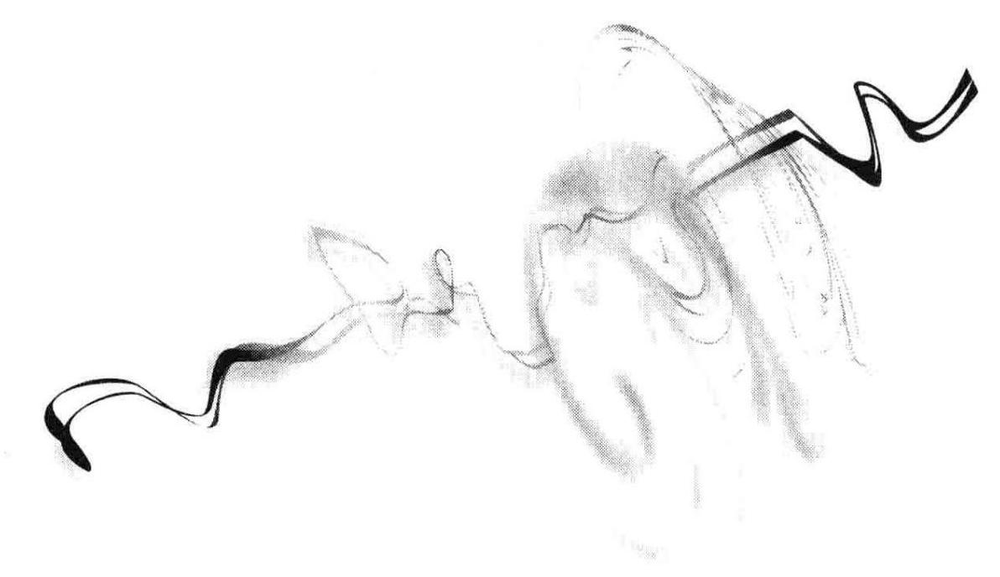

华东师范大学出版社

图书在版编目 (CIP) 数据

数学. 高中上册(华东师大二附中)/陈双双、刘初喜等编. 一上海:华东师范大学出版社，2008

ISBN 978 - 7 - 5617 - 6334 - 6

I. 华... II. 陈... Ⅲ. 数学课-高中-教学参考资料 IV. G634

中国版本图书馆 CIP 数据核字(2008)第 132864 号

数学. 高中上册(华东师范大学二附中)

编 者 陈双双 刘初喜等

项目编辑 应向阳

审读编辑 徐 金

装帧设计 黄惠敏

出版发行 华东师范大学出版社

社址上海市中山北路3663号邮编200062

电话总机 021-62450163 转各部门 行政传真 021-62572105

客服电话 021-62865537(兼传真)

门市(邮购)电话 021-62869887

门市地址 上海市中山北路 3663 号华东师范大学校内先锋路口

网 址 www. ecnupress. com. cn

印刷 者 华东师范大学印刷厂

开本 890×1240 32 开

印张 11.875

字数 343 千字

版 次 2009 年 1 月第一版

印 次 2009 年 1 月第一次

书号 ISBN 978-7-5617-6334-6/G・3678

定价 18.00 元

出版人 朱杰人

(如发现本版图书有印订质量问题, 请寄回本社客服中心调换或电话021-62865537联系)

## 前台

亲爱的同学，你一定喜欢数学，而且希望自己能够学好高中数学吧? 那么, 就请你选择这套教材吧!

我们华东师范大学第二附属中学使用的《高中数学》教材，以本校的数学教学校本纲要为基础，经过数学教研组教师多年教学的积累, 根据新课标的要求, 又结合教育部直属重点中学学生的具体情况，编成上、下两册正式出版。

本教材有以下几个方面的显著特点:

(1)知识结构完整充实

依据课程标准的要求,按照高中生的认知规律和发展需求,我们精心选择教材内容,对使用不同版本教材的全国各地学生可根据各自需要选择相关章节学习。其中一些章节的知识虽然高考不作要求,但却是优秀学生今后参加著名高校的自主招生考试所必须掌握的。

(2)思想方法揭示本质

高中数学不是数学的全部, 它却涵盖了数学中最基本的内容。 我们认为，学习数学最重要的是学习数学的思想方法和本质内涵，学习人类优秀的数学文化精髓，学会用数学的眼光认识世界、用数学的方法改变世界。因此，我们通过数学内容的呈现，也通过“大家谈”、 “自己想”和“自己找”等栏目，尽可能地揭示其中蕴含的数学的本质特征和思想方法，以使同学们体验数学与自然、数学与社会的和谐关系，领会数学的精神实质和文化价值，感受数学的魅力和学习的快乐。

(3)发展为本便于自学

本着“以学生发展为本”的理念，以培养学生自主学习能力为出发点, 我们在知识点的引入, 知识内容的拓展等方面都力求详细完整；“自己想”中的问题设计，更能加深同学们对数学知识的理解；而 “自己练”则能起到及时巩固所学知识、加强数学思维训练的作用; “自己学”是为学有余力的同学准备的,以达到提高数学素养的目的。

同学们,相信本教材会对你们的数学学习提供很大的帮助。在使用中若发现错误和不妥之处, 欢迎你们提出宝贵意见和建议, 以使本教材日臻完善，谢谢！

编者

2008.10

## 日 录

第一章 集合与命题

1.1 集合及其表示法

1.2 集合之间的关系

1.3 集合的运算

1.4 命题的形式及等价关系

1.5 充分条件，必要条件

1.6 子集与推出关系

第二章 不等式

2.1 不等式的性质

2.2 一元二次不等式的解法

2.3 分式不等式

2.4 高次不等式

2.5 无理不等式

2.6 绝对值不等式

2.7 绝对值不等式的性质

2.8 含字母系数的不等式

2.9 基本不等式

2.10 不等式的证明

2.11 不等式的应用

第三章 函数

3.1 函数的概念

3.2 函数关系的建立

1

7

12

18

25

29

35

35

38

43

45

47

49

52

55

58

64

72

77

77

81

85 3.3 函数的运算

87 3.4 函数的性质

96 第四章 幂函数、指数函数与对数函数

96 4.1 幂函数的图象与性质

100 4.2 指数函数的图象与性质

107 4.3 借助计算器观察函数图象递增的快慢

111 4.4 对数概念及其运算

118 4.5 反函数的概念

126 4.6 对数函数的图象与性质

134 4.7 简单的指数方程

138 4.8 简单的对数方程

141 4.9 函数的应用

150 第五章 三角比

150 5.1 任意角及其度量

157 5.2 任意角的三角比

162 5.3 同角三角比的关系和诱导公式

169 5.4 两角和与差的余弦、正弦和正切

175 5.5 二倍角与半角的正弦、余弦和正切

182 5.6 三角比的积化和差与和差化积

187 5.7 正弦定理、余弦定理和解斜三角形

194 第六章 三角函数

194 6.1 正弦函数和余弦函数的图象与性质

204 6.2 正切函数的图象与性质

210 6.3 函数 $y = A\sin \left( {{\omega x} + \varphi }\right)  + d$ 的图象与性质

216 6.4 反三角函数

227

6.5 最简三角方程

第七章 平面向量

7.1 向量的基本概念及表示

7.2 向量的加减法

7.3 实数与向量的乘法

7.4 向量的数量积

7.5 平面向量分解定理

7.6 向量的坐标表示及其运算

7.7 向量的应用

第八章 复数

8.1 复数的概念

8.2 复数的代数运算

8.3 复数的几何意义

8.4 复数的三角形式

8.5 复数集内的方程

第九章 矩阵与行列式初步

9.1 矩阵的定义及其运算

9.2 矩阵变换求解线性方程组

9.3 二阶行列式与二元线性方程组

9.4 三阶行列式

9.5 三阶行列式的展开与三元齐次线性方程组

课后习题答案

234

234

238

242

247

252

256

262

267

268

273

289

297

306

316

316

325

333

339

345

351

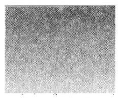

## 第一章 集合与命题 (Sets and Propositions)

我们知道,事物既有个性,也有共性. 当我们研究一个具体问题时, 常把讨论对象限制在一定的整体范围内,以便于讨论其共同性质; 而对整体来说,每个对象又有着其各自的特点. 这就是集合与其元素之间的基本关系.

集合概念及其基本理论, 称为集合论, 是近、现代数学的基本语言和重要基础. 一方面, 许多重要的数学分支都建立在集合理论的基础上; 另一方面，集合论及其思想，在越来越广泛的领域中得到应用.

数学中的命题比比皆是, 而连接相关命题之间的链条就是逻辑推理. 逻辑是研究思维形式及其规律的一门基础学科. 学习数学, 需要全面地理解概念,正确地进行表述、推理和判断,这就离不开对逻辑知识的掌握和运用. 更广泛地说,在日常的学习、工作和生活中,基本的逻辑知识也是认识问题、研究问题不可或缺的工具, 是人们文化素养的组成部分.

在高中数学里,集合的初步知识和命题等相关知识,与其他内容有着密切联系，是学习、掌握和使用数学语言的基础. 基于上述原因，我们把“集合与命题”安排在高中数学的起始阶段.

### 1.1 集合及其表示法 (Sets and Their Expressions)

在现实生活和数学中, 我们经常要把一些确定的对象作为一个整体来考察研究. 例如:

(1)某校高一(1)班的全体学生；

(2)中国运动员在历届夏、冬季奥运会上取得的所有金牌；

(3)1~100 之间的所有质数；

(4)不等式 ${2x} - 3 > 0$ 的解的全体;

(5)所有的平行四边形;

(6) 平面上到两个定点的距离相等的点的全体.

我们把能够确切指定的不同对象组成的整体叫做集合，简称集 (set). 集合中的各个对象叫做这个集合的元素(element).

对于一个给定的集合, 其中的元素是确定的, 也是各不相同的, 而且各元素地位相等,与顺序无关.

我们把含有有限个元素的集合称为有限集(finite set), 含有无限个元素的集合称为无限集(infinite set).

为了研究的需要, 我们把不含任何元素的集合叫做空集 (empty set),记作 $\varnothing$ . 例如,方程 ${x}^{2} + 1 = 0$ 的实数解组成的集合就是空集.

集合通常用大写的英文字母表示，如 $A, B, C,\cdots$ ，元素通常用小写的英文字母表示，如 $a, b, c,\cdots$ .

如果 $a$ 是集合 $A$ 的元素,就记作 $a \in  A$ ,读作 “ $a$ 属于 (belong to) ${A}^{\prime \prime }$ ;

如果 $a$ 不是集合 $A$ 的元素,就记作 $a \notin  A$ ,读作 “ $a$ 不属于 (not belong to) ${A}^{\prime \prime }$ .

数的集合简称数集,常用的数集我们一般用特定的字母表示:

全体自然数组成的集合,即自然数集(natural numbers set),记作 $\mathbf{N}$ ; 不包括零的自然数组成的集合,记作 ${\mathbf{N}}^{ * }$ ; 全体整数组成的集合,即整数集(set of integer),记作 $\mathbf{Z}$ ;全体有理数组成的集合,即有理数集(rational numbers set),记作 $\mathbf{Q}$ ; 全体实数组成的集合,即实数集 (set of real numbers),记作 $\mathbf{R}$ .

我们还把正整数集、负整数集、正有理数集、负有理数集、正实数集、 负实数集分别表示为 ${\mathbf{Z}}^{ + }\text{ 、 }{\mathbf{Z}}^{ - }\text{ 、 }{\mathbf{Q}}^{ + }\text{ 、 }{\mathbf{Q}}^{ - }\text{ 、 }{\mathbf{R}}^{ + }\text{ 、 }{\mathbf{R}}^{ - }$ .

集合的表示方法通常有两种,即列举法和描述法:

把集合中的元素一一列举出来,写在大括号内表示集合的方法称为列举法. 如: $\{ 1,3,5,7,9\} ,\left\{  {{x}^{2},{3x} - 2, x + 7{y}^{3},{x}^{2} - 4{y}^{2}}\right\}$ .

在大括号内先写出此集合中元素的一般形式,再划一条竖线,在竖线后面写上集合中的元素的公共属性,即 $A = \{ x \mid  x$ 满足性质 $P\}$ ,这种表示集合的方法称为描述法. 如: 不等式 ${2x} - 3 > 0$ 的解集可表示为 $\{ x \mid  {2x} - 3 > 0\}$ ,函数 $y = x + 1$ 的图象上的点组成的集合可表示为 $\{ \left( {x, y}\right)  \mid  y = x + 1\}$ .

例 1 用适当的方法表示下列集合:

(1)30 的所有正因数组成的集合 $A$ ；

(2)被 5 除余 3 的自然数全体组成的集合 $B$ ；

(3)二次函数 $y = {x}^{2} + {2x} - 3$ 的图象上的所有点组成的集合 $C$ .

解 (1) 用列举法表示: $A = \{ 1,2,3,5,6,{10},{15},{30}\}$ .

(2)用描述法表示: $B = \{ x \mid  x = {{5n} + 3}, n \in  \mathbf{N}\}$ .

(3)用描述法表示: $C = \{ \left( {x, y}\right)  \mid  y = {x}^{2} + {2x} - 3\}$ .

例 ${2A}$ 是由一切能表示成两个整数的平方之差的全体整数组成的集合，试证明:

(1)任意奇数都是 $A$ 的元素；

(2)偶数 ${4k} - 2\left( {k \in  \mathbf{Z}}\right)$ 不属于 $A$ .

证明 设 $A = \left\{  {x \mid  x = {a}^{2} - {b}^{2}, a, b \in  \mathbf{Z}}\right\}$ .

(1)设任意奇数 $x = {2k} + 1, k \in  \mathbf{Z}$ ，则

$$
x = {k}^{2} + {2k} + 1 - {k}^{2} = {\left( k + 1\right) }^{2} - {k}^{2} \in  A.
$$

(2)反证:假设任意偶数 $x = {4k} - 2\left( {k \in  \mathbf{Z}}\right)$ 属于 $A$ ，则设 $x = {a}^{2} - \; {b}^{2}, a, b \in  \mathbf{Z}$ . 于是有

$$
2\left( {{2k} - 1}\right)  = \left( {a + b}\right) \left( {a - b}\right) ,
$$

在上式中,等号右边的 $a + b$ 与 $a - b$ 同奇同偶,则 $x$ 或为奇数,或为 4 的整数倍; 而等号左边是 2 与一个奇数的积,则 $x$ 不能被 4 整除,由此产生矛盾.

所以,原假设不成立,即“偶数 ${4k} - 2\left( {k \in  \mathbf{Z}}\right)$ 不属于 $A$ ”得证.

例 3 若集合 $A = \left\{  {x\left| {a{x}^{2} - {2x} - 1 = 0}\right. , x \in  \mathbf{R}}\right\}$ 中至多有一个元素,求实数 $a$ 的取值范围.

解 当 $a = 0$ 时,方程只有一个根 $- \frac{1}{2}$ ,则 $a = 0$ 符合题意;

当 $a \neq  0$ 时,关于 $x$ 的方程 $a{x}^{2} - {2x} - 1 = 0$ 是一元二次方程,由于集合 $A$ 中至多有一个元素,则一元二次方程 $a{x}^{2} - {2x} - 1 = 0$ 有两个相等的实数根或没有实数根,所以 $\Delta  = 4 + {4a} \leq  0$ ,解得 $a \leq   - 1$ .

综上所得,实数 $a$ 的取值范围是 $\{ a \mid  a = 0$ 或 $a \leq   - 1\}$ .

课堂活动

·大家谈

1. 集合中的元素有什么特性? 集合的表示法是如何体现这些性质的?

2. 用列举法和描述法表示集合有什么区别? 各有什么优势与不足?

3. 通过实例分别选择自然语言、集合语言(列举法或描述法) 表述不同的具体问题, 感受集合语言的意义和作用, 体验用集合思想去观察和思考问题的乐趣.

课堂活动

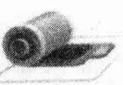

- 自己想

1. 区分 $\varnothing ,\{ \varnothing \} ,\{ 0\} ,0$ 等符号的含义.

2. 集合 $\{ 1,2\}$ 与集合 $\{ \left( {1,2}\right) \}$ 有什么区别?

3. 能否将“身材高大的人”组成一个集合？

课外活动

・自己挙

## 集合论简介

集合论是德国著名数学家康托尔(G. Cantor, 1845- 1918)于 19 世纪末创立的.

17 世纪数学中出现了一门新的分支——微积分. 在之后的一至二百年中，这一崭新的学科获得了飞速发展并结出了丰硕的成果. 其推进速度之快使人来不及检查和巩固它的理论基础. 19 世纪初，由于微积分理论的发展不够严格，数学急需重建其理论基础. 因此康托尔开始探讨前人从未碰过的实数点集，这是集合论研究的开端. 1874 年，康托尔发表了关于集合论的第一篇论文《关于全体实代数数的一个性质》，提出了 “集合”的概念,这标志着集合论的诞生.

集合论提出伊始，曾遭到许多数学家的激烈反对. 由于受外界刺激和某些身体因素的影响, 康托尔于 1884 年得了精神分裂症, 几次陷于精神崩溃. 然而集合论前后经历二十余年，最终获得了世界公认. 到 20 世纪初，集合论已得到数学家们的赞同. 数学家们为一切数学成果都可建立在集合论基础上的前景而陶醉. 他们乐观地认为从算术公理系统出发，借助集合论的概念，便可以建造起整个数学的大厦. 在 1900 年第二次国际数学大会上, 著名法国数学家庞加莱(Poincaré, 1854-1912)就曾兴高采烈地宣布“……数学已被算术化了. 今天，我们可以说绝对的严格已经达到了. ”

然而这种自得的情绪并没能持续多久. 不久, 集合论是有漏洞的消息迅速传遍了数学界. 1902 年, 英国数学家和哲学家罗素 (Russell, 1872—1970)提出了著名的“罗素悖论”, 使得绝对严密的数学陷入了自相矛盾之中，这就是数学史上的第三次数学危机.

危机产生后，众多数学家投入到解决危机的工作中去. 1908 年，德国数学家策梅罗(Zermelo, 1871-1953)发表了论文《集合论基础研究》， 提出了公理化集合论, 后经德国数学家弗伦克尔改进形成无矛盾的集合论公理系统, 简称 ZF 公理系统. 原本直观的集合概念被建立在严格的公理基础之上，从而避免了悖论的出现，这就是集合论发展的第二个阶段: 公理化集合论. 与此相对应, 在 1908 年以前由康托尔创立的集合论被称为朴素集合论, 公理化集合论是对朴素集合论的严格处理, 它保留了朴素集合论的有价值的成果并消除了其可能存在的悖论, 因而较圆满地解决了第三次数学危机.

公理化集合论的建立，标志着著名德国数学家希尔伯特(Hilbert， 1862-1943)所表述的一种激情的胜利，他大声疾呼: 没有人能把我们从康托尔为我们创造的乐园中赶出去. 从康托尔提出集合论至今, 时间已经过去了一百多年，数学又发生了极其巨大的变化，包括对上述经典集合论作出进一步发展的模糊集合论的出现等等, 而这一切都是与康托尔的开拓性工作分不开的. 当现在回头去看康托尔的贡献时，我们仍然可以引用当时一些著名数学家对他的集合论的评价作为我们的总结.

希尔伯特称康托尔的集合论是“数学精神最令人惊羡的花朵，人类理智活动最漂亮的成果”. 罗素把康托尔的工作描述为 “可能是这个时代所能夸耀的最伟大的工作”. 前苏联著名的数学家科尔莫戈洛夫 (Kolmogorov, 1903-1987)说,“康托尔的不朽功绩,在于他敢向无穷大冒险迈进。”还有如: “它是对无限最深刻的洞察，它是数学天才的最优秀作品，是人类纯智力活动的最高成就之一. ”“康托尔的无穷集合论是过去两千五百年中对数学的最令人不安的独创性贡献之一. ”等等.

- 自己找

借助图书馆或网络查阅有关集合论创始人康托尔的生平简介等资料, 了解其创立集合论的艰辛历程, 进一步体验和学习数学家追求真理的不懈精神.

习题练习 1. 用描述法表示下列集合:

(1) $\{ 1,4,7,{10},{13}\}$ ;

·自己练

(2) $\{  - 2, - 4, - 6, - 8, - {10}\}$ ;

(3) $\{ 1,5,{25},{125},{625}\}$ ;

(4) $\left\{  {0, \pm  \frac{1}{2}, \pm  \frac{2}{5}, \pm  \frac{3}{10}, \pm  \frac{4}{17},\cdots }\right\}$ .

2. 用列举法表示下列集合:

(1) $\{ x \mid  x$ 是 15 的正约数 $\}$ ;

(2) $\{ \left( {x, y}\right)  \mid  x \in  \{ 1,2\} , y \in  \{ 1,2\} \}$ ;

(3) $\left\{  {\left( {x, y}\right) \left| {\;\left\{  \begin{array}{l} x + y =  - 2 \\  {x}^{2} + {y}^{2} = 2 \end{array}\right\}  }\right. }\right.$

(4) $\{ \left( {x, y}\right)  \mid  y = {x}^{2} - 1,\left| x\right|  \leq  2, x \in  \mathbf{Z}\}$ .

3. 关于 $x$ 的方程 ${ax} + b = 0$ ,当 $a, b$ 满足条件___时,解集是有限集；当 $a, b$ 满足条件___时，解集是无限集.

4. 已知集合 $\left\{  {{2a},{a}^{2} - {2a}}\right\}$ 为数集，求 $a$ 的取值范围.

5. 把可以表示成两个整数的平方之和的全体整数记作集合 $M$ ,试证明集合 $M$ 的任意两个元素的乘积仍属于 $M$ .

6. 已知 $M = \left\{  {a\left| {\;\frac{6}{5 - a} \in  \mathbf{N}}\right. \text{ 且 }a \in  \mathbf{Z}}\right\}$ ,求集合 $M$ .

7. 已知集合 $A = \left\{  {x \mid  \left( {m - 1}\right) {x}^{2} - {2x} + 1 = 0}\right\}$ 中至多含有一个元素,求实数 $m$ 的取值范围.

8. 设 $A = \left\{  {x \mid  {x}^{2} + \left( {b + 2}\right) x + b + 1 = 0, b \in  \mathbf{R}}\right\}$ ,求 $A$ 中所有元素之和.

9. 设 $A = \left\{  {x \mid  x = {m}^{2} - {n}^{2}, m, n \in  \mathbf{Z}}\right\}$ ,问 $8\text{ 、 }9\text{ 、 }{10}$ 与集合 $A$ 有什么关系? 并证明你的结论.

10. 设集合 $S = \left\{  {{a}_{0},{a}_{1},{a}_{2},{a}_{3}}\right\}$ ,在 $S$ 上定义运算为: ${a}_{i} \oplus \; {a}_{j} = {a}_{k}$ ,其中 $k$ 为 $i + j$ 被 4 除的余数, $i\text{ 、 }j = 0,1,2,3$ ,则求满足关系式 $\left( {x \oplus  x}\right)  \oplus  {a}_{2} = {a}_{0}$ 的 $x\left( {x \in  S}\right)$ 的个数.

11. 设集合 $A = \{  - 3, - 1,2,7\}$ ,集合 $B = \{ x \mid  f\left( x\right)  > 0\}$ ,在下列条件下,是否存在函数 $f\left( x\right)$ ,使得集合 $A$ 中恰有一个元素不是 $B$ 的元素?

(1) $f\left( x\right)$ 为一次函数；

(2) $f\left( x\right)$ 为二次函数.

12. 已知实数集 $A$ 满足: 若 $x \in  A$ ,则 $\frac{1 + x}{1 - x} \in  A$ .

(1)求证:当 $2 \in  A$ 时， $A$ 中还有 3 个元素；

(2)试找寻一个实数 $a$ ，使得 $a \in  A$ ，并由此求出相应的集合 $A$ ；

(3)由上述研究过程，你能得出什么结论？

### 1.2 集合之间的关系 (Relations of Sets)

考察下列集合:

$A = \{ 1,2\} , B = \{ 1,2,3,4\} , C = \left\{  {x \mid  {x}^{2} - {3x} + 2 = 0}\right\}  , D = \; \{ x \mid  x$ 是四边形 $\} , E = \{ x \mid  x$ 是多边形 $\}$ .

容易发现,集合 $A$ 中的任何一个元素都是集合 $B$ 的元素,集合 $D$ 中的任何一个元素都是集合 $E$ 的元素,而集合 $B$ 中的元素 3 和 4 不是集合 $A$ 的元素,集合 $C$ 中的元素与集合 $A$ 的元素完全相同.

一般地,对于两个集合 $A$ 与 $B$ ,如果集合 $A$ 中任何一个元素都是集合 $B$ 的元素,我们就说集合 $A$ 是集合 $B$ 的子集(subset),记作 $A \subseteq \; B$ 或 $B \supseteq  A$ ,读作 “ $A$ 包含于 (be contained in) $B$ ” 或 “ $B$ 包含 (contain) ${A}^{n}$ .

我们规定，空集包含于任何一个集合，即空集是任何集合的子集.

对于两个集合 $A$ 与 $B$ ,如果有 $A \subseteq  B$ ,且 $B \supseteq  A$ ,那么叫做集合 $A$ 与集合 $B$ 相等，记作 $A = B$ ，读作“集合 $A$ 等于集合 $B$ ”. 如对于集合 $A = \{ x \mid  x = {2k} + 1, k \in  \mathbf{Z}\}$ 与 $B = \{ x \mid  x = {2k} - 1, k \in  \mathbf{Z}\}$ ,则有 $A = B$ .

对于两个集合 $A$ 与 $B$ ,如果 $A \subseteq  B$ ,并且 $B$ 中至少有一个元素不属于 $A$ ,那么称集合 $A$ 是集合 $B$ 的真子集(proper subset),记作 $A \varsubsetneq  B$ 或 $B \supsetneq  A$ 读作“ $A$ 真包含于 $B$ ”或“ $B$ 真包含 $A$ ”.

用平面区域来表示集合之间关系的方法叫做集合的图示法, 所用的图叫做文氏图 (Venn diagram),右图表示 $A \subseteq  B$ .

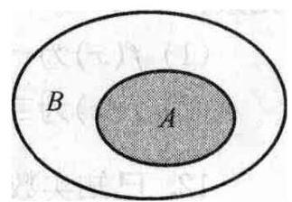

例 1 写出集合 $\{ a, b, c\}$ 的所有子集和真子集.

解 集合的所有子集为 $\varnothing ,\{ a\} ,\{ b\} ,\{ c\} ,\{ a, b\} ,\{ b, c\} ,\{ a, c\}$ , $\{ a, b, c\}$ ,除了 $\{ a, b, c\}$ ,其余七个子集均为集合 $\{ a, b, c\}$ 的真子集.

例 2 设集合 $A = \left\{  {a,{a}^{2},{ab}}\right\}  , B = \{ 1, a, b\} , A = B$ ,求实数 $a$ , $b$ 的值.

解 由于 $A = B$ ,则

(1)若 ${a}^{2} = b,{ab} = 1$ ，则 ${a}^{3} = 1$ ，即 $a = b = 1$ ，与集合中元素的互异性矛盾；

(2)若 ${a}^{2} = 1,{ab} = b$ ，则由集合中元素的互异性可得 $a =  - 1, b = 0$ .

例 3 已知 $S = \{ x \mid  x = {14m} + {36n}, m \in  \mathbf{Z}, n \in  \mathbf{Z}\} , T = \{ x \mid  x \; = {2k}, k \in  \mathbf{Z}\}$ ,求证: $S = T$ .

解 (1) 任意 $x \in  S$ ,则存在 $m, n \in  \mathbf{Z}$ ,使得 $x = {14m} + {36n} = 2({7m} \; + {18n})$ ,令 ${7m} + {18n} = k$ ,由于 $m, n \in  \mathbf{Z}$ ,所以 $k = {7m} + {18n} \in  \mathbf{Z}$ ,则 $x = {2k}, k \in  \mathbf{Z}$ ,即 $x \in  T$ ,因此 $S \subseteq  T$ ;

(2)反之，任意 $x \in  T$ ，则存在 $k \in  \mathbf{Z}$ ，使得 $x = {2k}$ ，要使得 $x = {2k} \; = {14m} + {36n}, m, n \in  \mathbf{Z}$ ,则 $k = {7m} + {18n} = 7 \times  \left( {-{5k}}\right)  + {18} \times  \left( {2k}\right)$ ,可见当 $m =  - {5k}, n = {2k}\left( {k \in  \mathbf{Z}}\right)$ 时, $x = {14m} + {36n}, m, n \in  \mathbf{Z}$ ,即 $x \in \; S$ ,因此 $T \subseteq  S$ .

所以，综合 (1) 和 (2) 知， $S = T$ ，得证.

课堂活动 1. 讨论符号“∈”与“ $\subseteq$ ”的意义、区别及作用；

·大家谈

2. 集合之间的关系与实数中的大小关系、相等关系有相似之处吗? 类比实数中有关不等式的性质, 研究集合的有关包含和真包含关系的性质.

3. 考察数集 $\mathbf{N},\mathbf{Z},\mathbf{Q},\mathbf{R}$ 之间的包含关系,了解和感受数域的扩张过程.

课堂活动

1. 如果 $A \subseteq  B$ ,那么集合 $A$ 与 $B$ 的关系有几种可能?

·自己想

2. 如何理解空集是任何集合的子集? 进一步体会 $\varnothing$ 与 $\{ \varnothing \} \text{ 、 }\{ 0\}$ 之间的关系.

3. 判断下列写法是否正确？为什么?

(1) $\varnothing  \subsetneqq  A$ ； (2) $A \subsetneqq  A.$

課外活动

・自己做

试探究含 $n$ 个元素的有限集合的子集的个数.

课外活动

## 悖 论

悖论 (paradox) 来自希腊语 “para + dokein”, 意思是自己学 “多想一想”。这个词的意义比较丰富，它包括一切与人的直觉和日常经验相矛盾的数学结论. 悖论是自相矛盾的命题. 即如果承认它是真的, 经过一系列正确的推理, 却又得出它是假的; 如果承认它是假的, 经过一系列正确的推理, 却又得出它是真的.

古今中外有不少著名的悖论, 它们撼动了逻辑和数学的基础, 激发了人们深入思考的欲望，吸引了古往今来许多思想家和逻辑爱好者的注意. 解决悖论难题需要创造性的思考, 悖论的解决又往往可以给人们带来全新的观念.

悖论有三种主要形式:

1. 一种论断看起来好像肯定错了, 但实际上却是对的 (佯谬).

2. 一种论断看起来好像肯定是对的, 但实际上却错了 (似是而非的理论).

3. 一系列推理看起来好像无懈可击，可是却导致逻辑上自相矛盾.

事实上, 悖论古已有之. 一般认为, 最早的悖论是古希腊的“说谎者悖论”, 见于《新约全书 · 提多书》, 属于语义学悖论.

另一类悖论涉及数学中的集合论，被称为 “数学悖论”或 “集合论悖论”. 在康托尔创立集合论不久, 他自己就发现了问题, 这就是 1899 年的 “康托尔悖论”, 亦称 “最大基数悖论”. 与此同时, 还发现了其他集合论悖论，其中最著名的当属“罗素悖论”.

1902 年，英国数学家罗素提出了这样一个理论:以 $M$ 表示是其自身成员的集合的集合，N 表示不是其自身成员的集合的集合. 然后问 N 是否为它自身的成员? 如果 $N$ 是它自身的成员,则 $N$ 属于 $M$ 而不属于 $N$ ,也就是说 $N$ 不是它自身的成员; 另一方面,如果 $N$ 不是它自身的成员,则 $N$ 属于 $N$ 而不属于 $M$ ,也就是说 $N$ 是它自身的成员. 无论出现哪一种情况都将导出矛盾的结论.

1918 年, 罗素给出了上述悖论的通俗形式, 即 “理发师悖论”: 一天, 塞维尔村理发师挂出一块招牌:“村里所有不自己理发的人都由我给他们理发，我也只给这些人理发。”于是有人问他:“您的头发由谁理呢？”理发师顿时哑口无言。因为，如果他给自己理发，那么他就属于自己给自己理发的那类人. 但是，招牌上说明他不给这类人理发，因此他不能自己理. 如果由另外一个人给他理发，他就是不给自己理发的人，而招牌上明明说他要给所有不自己理发的人理发，因此，他应该自己理。由此可见， 不管怎样推理,理发师所说的话总是自相矛盾的.

借助图书馆或网络查阅资料，了解有关集合论的著名悖论和英国哲学家、数学家罗素的生平.

- 自己我

- 自己练

1. 设集合 $M = \{ x \mid  x = {3m} + 1, m \in  \mathbf{Z}\} , N = \{ y \mid \; y = {3n} + 2, n \in  \mathbf{Z}\}$ ,若 ${x}_{0} \in  M,{y}_{0} \in  N$ ,则 ${x}_{0}{y}_{0}$ 与集合 $M\text{ 、 }N$ 的关系是( ).

(A) ${x}_{0}{y}_{0} \in  M\;$ (B) ${x}_{0}{y}_{0} \notin  M\;$ (C) ${x}_{0}{y}_{0} \in  N\;$ (D) ${x}_{0}{y}_{0} \notin  N$

2. 设集合 $M = \left\{  {x\left| {\;x = \frac{k\pi }{2}}\right. , k \in  \mathbf{Z}}\right\}  , N = \left\{  {t\left| {\;t = {n\pi }}\right. }\right.$ 或 $t = {n\pi } + \; \left. {\frac{\pi }{2}, n \in  \mathbf{Z}}\right\}$ ,则集合 $M\text{ 、 }N$ 之间有怎样的关系? 为什么?

3. 已知 $A \subseteq  B, A \subseteq  C, B = \{ 1,2,3,5\} , C = \{ 0,2,4,8\}$ ,求 $A$ .

4. 已知集合 $M = \left\{  {m,\frac{n}{m},1}\right\}  , N = \left\{  {{m}^{2}, m + n,0}\right\}$ ,若 $M = N$ ,求 ${m}^{2008} + {n}^{2009}$ .

5. 已知集合 $A = \{ 0,1\} , B = \left\{  {x \mid  x \in  A, x \in  {\mathbf{N}}^{ * }}\right\}  , C = \; \{ x \mid  x \subseteq  A\}$ ,则 $A\text{ 、 }B\text{ 、 }C$ 之间有怎样的关系?

6. 已知集合 $A = \{ x \mid  x = {3a} + {5b}, a, b \in  \mathbf{Z}\} , B = \{ y \mid  y = {7m} + \; {10n}, m, n \in  \mathbf{Z}\}$ ,判断 $A$ 与 $B$ 的关系并说明理由.

7. 已知集合 $A = \{ x \mid  x = {12a} + {8b}, a, b \in  \mathbf{Z}\} , B = \{ x \mid  x = \; {20c} + {16d}, c, d \in  \mathbf{Z}\}$ ,求证 $A = B$ .

8. 已知集合 $A = \left\{  {x\left| {\; - {2k} + 6 < x < {k}^{2} - 3}\right. }\right\}  , B = \{ x \mid   - k < x < \; k\}$ ,若 $A \subsetneqq  B$ ,求实数 $k$ 的取值范围.

9. 设含有 10 个元素的集合的全部子集数为 $S$ ,含有 3 个元素的集合的全部子集数为 $T$ ,则求 $\frac{T}{S}$ 的值.

10. 已知集合 $A = \left\{  {m \mid  m = {n}^{2} + 1, n \in  {\mathbf{N}}^{ * }}\right\}  , B = \left\{  {y \mid  y = {x}^{2} - }\right. \; {2x} + 2, x \in  {\mathbf{N}}^{ * }\}$ ,研究 $A$ 与 $B$ 的关系,并给予证明.

11. 已知 $A = \{ x \mid   - 2 \leq  x \leq  2\}$ .

(1)若集合 $B = \{ x \mid  x \leq  a\}$ ，满足 $A \subseteq  B$ ，求 $a$ 范围；

(2)若集合 $C = \{ x \mid  {2a} - 5 \leq  x \leq  a + 1\}$ ，满足 $A \subseteq  C$ ，求 $a$ 的取值范围;

(3)若把(2)中条件 “ $A \subseteq  C$ ” 改为 “ $C \subseteq  A$ ”,求 $a$ 的取值范围.

12. 设集合 $M = \{ 1,2,3,4,5,6\} ,{S}_{1},{S}_{2},\cdots ,{S}_{k}$ 都是 $M$ 的含两个元素的子集,且满足: 对任意的 ${S}_{i} = \left( {{a}_{i},{b}_{i}}\right) ,{S}_{j} = \left( {{a}_{j},{b}_{j}}\right) (i \neq  j$ , $i, j \in  \{ 1,2,3,\cdots , k\} )$ ,都有 $\min \left\{  {\frac{{a}_{i}}{{b}_{i}},\frac{{b}_{i}}{{a}_{i}}}\right\}   \neq  \min \left\{  {\frac{{a}_{j}}{{b}_{j}},\frac{{b}_{j}}{{a}_{j}}}\right\}  (\min \{ x$ , $y\}$ 表示两个数 $x, y$ 中的较小者),求 $k$ 的最大值.

### 1.3 集合的运算 (Operation of Sets)

## 1. 交集

考察集合 $A = \{ x \mid  x$ 是我校在校女生 $\} , B = \{ x \mid  x$ 是我校高一学生 $\}$ 与 $C = \{ x \mid  x$ 是我校高一女生 $\}$ 之间的关系,易知集合 $C$ 是由所有既属于集合 $A$ 又属于集合 $B$ 的元素组成的.

一般地,由集合 $A$ 和集合 $B$ 的所有公共元素组成的集合叫做 $A$ 与 $B$ 的交集(intersection). 记作 $A \cap  B$ ,读作“ $A$ 交 $B$ ”,即 $A \cap  B = \{ x \mid  x \; \in  A$ 且 $x \in  B\}$ .

用文氏图可以直观地表示 $A \cap  B$ 的一般情况.

由交集运算的定义，容易得到以下一些基本性质:

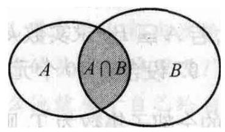

(1) $A \cap  B = B \cap  A$ ；

(2) $A \cap  A = A$ ；

(3) $A \cap  \varnothing  = \varnothing$ ；

(4) $A \cap  B \subseteq  A, A \cap  B \subseteq  B$ ；

(5)若 $A \cap  B = A$ ，则有 $A \subseteq  B$ ；反之若 $A \subseteq  B$ ,则 $A \cap  B = A$ .

例 1 设集合 $A = \{ \left( {x, y}\right)  \mid  {3x} - y = 7\}$ ,集合 $B = \{ \left( {x, y}\right)  \mid  {2x} + \; y = 3\}$ ,求 $A \cap  B$ .

解 $A \cap  B = \left\{  {\left( {x, y}\right) \left| {\;\left\{  \begin{array}{l} {3x} - y = 7 \\  {2x} + y = 3 \end{array}\right\}  }\right. }\right.$

$$
= \left\{  {\left( {x, y}\right) \left| \left\{  \begin{array}{l} x = 2 \\  y =  - 1 \end{array}\right. \right\}   = \{ \left( {2, - 1}\right) \} .}\right.
$$

2. 并集

一般地,由所有属于集合 $A$ 或者属于集合 $B$ 的元素组成的集合叫做 $A$ 与 $B$ 的并集(union),记作 $A \cup  B$ ,读作“ $A$ 并 ${B}^{u}$ ,即 $A \cup  B = \; \{ x \mid  x \in  A$ 或 $x \in  B\} .$

用文氏图可以直观地表示 $A \cup  B$ 的一般情况.

由并集运算的定义，容易得到以下一些基本性质:

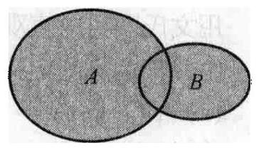

(1) $A \cup  B = B \cup  A$ ；

(2) $A \cup  A = A$ ；

(3) $A \cup  \varnothing  = A$ ；

(4) $A \subseteq  A \cup  B, B \subseteq  A \cup  B$ ；

(5)若 $A \cup  B = B$ ，则有 $A \subseteq  B$ ； 反之若 $A \subseteq  B$ ,则 $A \cup  B = B$ .

例 2 设 $A = \{ x \mid   - 1 < x < 2\} , B = \{ x \mid  1 < x < 3\}$ ,求 $A \cap  B$ , $A \cup  B$ .

解 $A \cap  B = \{ x \mid  1 < x < 2\} , A \cup  B = \{ x \mid   - 1 < x < 3\}$ .

例 3 已知关于 $x$ 的方程 $3{x}^{2} + {px} - 7 = 0$ 的解集为 $A$ ,方程 $3{x}^{2} - \; {7x} + q = 0$ 的解集为 $B$ ,若 $A \cap  B = \left\{  {-\frac{1}{3}}\right\}$ ,求 $A \cup  B$ .

解 因为 $A \cap  B = \left\{  {-\frac{1}{3}}\right\}$ ,得 $- \frac{1}{3} \in  A$ 且 $- \frac{1}{3} \in  B$ ,代入方程得

$$
3{\left( -\frac{1}{3}\right) }^{2} + p\left( {-\frac{1}{3}}\right)  - 7 = 0
$$

且

$$
3{\left( -\frac{1}{3}\right) }^{2} - 7\left( {-\frac{1}{3}}\right)  + q = 0,
$$

解得

$$
p =  - {20}, q =  - \frac{8}{3}.
$$

由 $3{x}^{2} - {20x} - 7 = 0$ 得 $A = \left\{  {-\frac{1}{3},7}\right\}$ ,由 $3{x}^{2} - {7x} - \frac{8}{3} = 0$ 得 $B = \; \left\{  {-\frac{1}{3},\frac{8}{3}}\right\}$

所以 $A \cup  B = \left\{  {-\frac{1}{3},\frac{8}{3},7}\right\}$ .

## 3. 补集

在给定的问题中, 若研究的所有集合都是某一给定集合的子集, 那么称这个给定的集合为全集(universe).

若 $A$ 是全集 $U$ 的子集,由 $U$ 中不属于 $A$ 的元素组成的集合叫做集合 $A$ 在全集 $U$ 中的补集 (complementary set),记作 ${\complement }_{U}A$ ,读作“ $A$ 补”, 即 ${\complement }_{U}A = \{ x \mid  x \in  U, x \notin  A\}$ .

用文氏图可以直观地表示 ${\complement }_{U}A$ 的一般情况.

由并集运算的定义，容易得到以下一些基本性质:

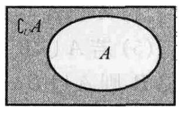

(1) $A \cap  {\complement }_{U}A = \varnothing$ ；

(2) $A \cup  {\complement }_{U}A = U$ ；

(3) ${\complement }_{U}\left( {{\complement }_{U}A}\right)  = A$ .

例 4 已知全集 $I = \{  - 4, - 3, - 2, - 1,0$ ,

$1,2,3,4\} , A = \{  - 3,{a}^{2}, a + 1\} , B = \left\{  {a - 3,{2a} - 1,{a}^{2} + 1}\right\}$ ,其中 $a \in  \mathbf{R}$ ,若 $A \cap  B = \{  - 3\}$ ,求 ${\complement }_{I}\left( {A \cup  B}\right)$ .

解 由 $a - 3 =  - 3$ (舍去) 或 ${2a} - 1 =  - 3$ ,可求得 $A = \{  - 3,0,1\}$ , $B = \{  - 4, - 3,2\}$ ,则 $A \cup  B = \{  - 4, - 3,0,1,2\} ,{\complement }_{I}\left( {A \cup  B}\right)  = \; \{  - 2, - 1,3,4\}$ .

例 5 设 $U = \left\{  {x \mid  x < {10}, x \in  {\mathbf{N}}^{ * }}\right\}  , A \cap  B = \{ 3\} ,\left( {{\complement }_{U}A}\right)  \cap \; B = \{ 4,6,8\} , A \cap  \left( {{\complement }_{U}B}\right)  = \{ 1,5\}$ ,求 ${\complement }_{U}\left( {A \cup  B}\right) , A, B$ .

解 $A \cup  B$ 中的元素可分为三类: 一类属于 $A$ 不属于 $B$ ; 一类属于 $B$ 不属于 $A$ ; 一类既属于 $A$ 又属于 $B$ .

由 $\left( {{\complement }_{U}A}\right)  \cap  B = \{ 4,6,8\}$ ,即4,6,8属于 $B$ 不属于 $A$ ; 由 $A \cap \; \left( {{\complement }_{U}B}\right)  = \{ 1,5\}$ ,即 1,5 属于 $A$ 不属于 $B$ ; 由 $A \cap  B = \{ 3\}$ ,即 3 既属于 $A$ 又属于 $B$ .

又 $U = \left\{  {x \mid  x < {10}, x \in  {\mathbf{N}}^{ * }}\right\}   = \{ 1,2,3,4,5,6,7,8,9\}$ ,若 2 属于 $A$ 不属于 $B$ ,则与 $\left( {{\complement }_{U}B}\right)  \cap  A = \{ 1,5\}$ 矛盾,若 2 属于 $B$ 不属于 $A$ ,则与 $\left( {{\complement }_{U}A}\right)  \cap  B = \{ 4,6,8\}$ 矛盾,而 $2 \notin  A \cap  B$ ,所以 2 既不属于 $A$ 也不属于 $B$ ,同理 7 和 9 既不属于 $A$ 也不属于 $B$ .

综上, ${\complement }_{U}\left( {A \cup  B}\right)  = \{ 2,7,9\} , A = \{ 1,3,5\} , B = \{ 3,4,6,8\}$ .

课堂活动

1. 关于集合的交、并、补的三种运算的性质是如何证明的?

·大家强

2. 设全集 $U = \{ a, b, c, d, e\} , A = \{ a, c, d\}$ , $B = \{ b, d, e\}$ ,通过计算 ${\complement }_{U}A,{\complement }_{U}B,{\complement }_{U}\left( {A \cap  B}\right) ,{\complement }_{U}\left( {A \cup  B}\right)$ , ${\complement }_{U}A \cap  {\complement }_{U}B$ 和 ${\complement }_{U}A \cup  {\complement }_{U}B$ ,在发现这些集合之间的关系后给予证明,并将结论推广到一般情形.

课堂活动

- 自己想

1. 思考性质 “ $A \cap  {\complement }_{U}A = \varnothing$ ” 的意义及作用, 并进一步深刻理解引入空集概念的意义和作用.

2. 思考集合 $A, B, A \cap  B$ 和 $A \cup  B$ 中元素的个

数有何关系?

課外活动

·自己学

## 容斥原理及其应用

在计数时, 为了使重叠部分不被重复计算, 人们研究出一种新的计数方法, 这种方法的基本思想是: 先不考虑重叠的情况，把包含于某内容中的所有对象的数目先计算出来，然后再把计数时重复计算的数目减去, 使得计算的结果既无遗漏又无重复, 这种计数的方法称为容斥原理. 对于有限集合 $P$ ,我们用 $n\left( P\right)$ 表示 $P$ 中的元素个数。

容斥原理(1)

如果被计数的事物有 $A$ 、 $B$ 两类，那么， $A$ 类或 $B$ 类元素个数 $= A$ 类元素个数 $+ B$ 类元素个数一既是 $A$ 类又是 $B$ 类的元素个数. 即

$$
n\left( {A \cup  B}\right)  = n\left( A\right)  + n\left( B\right)  - n\left( {A \cap  B}\right) .
$$

容斥原理(2)

如果被计数的事物有 $A\text{ 、 }B\text{ 、 }C$ 三类,那么, $A$ 类或 $B$ 类或 $C$ 类元素个数 $= A$ 类元素个数 $+ B$ 类元素个数 $+ C$ 类元素个数 - 既是 $A$ 类又是 $B$ 类的元素个数一既是 $A$ 类又是 $C$ 类的元素个数一既是 $B$ 类又是 $C$ 类的元素个数十既是 $A$ 类又是 $B$ 类而且是 $C$ 类的元素个数. 即

$$
n\left( {A \cup  B \cup  C}\right)  = n\left( A\right)  + n\left( B\right)  + n\left( C\right)  - n\left( {A \cap  B}\right)  - n\left( {B \cap  C}\right)
$$

$$
- n\left( {C \cap  A}\right)  + n\left( {A \cap  B \cap  C}\right) \text{ . }
$$

例 对某学校的 100 名学生进行调查,了解他们喜欢看球赛、看电影和听音乐的情况. 其中 58 人喜欢看球赛, 38 人喜欢看电影, 52 人喜欢听音乐，既喜欢看球赛又喜欢看电影的有 18 人，既喜欢听音乐又喜欢看电影的有 16 人，三种都喜欢的有 12 人，问:有多少人只喜欢听音乐?

解 设 $A = \{ x \mid  x$ 为喜欢看球赛的人 $\} , B = \{ x \mid  x$ 为喜欢看电影的人\}, $C = \{ x \mid  x$ 为喜欢听音乐的人\},则 $A \cap  B = \{ x \mid  x$ 为既喜欢看球赛又喜欢看电影的人 $\} , B \cap  C = \{ x \mid  x$ 为既喜欢听音乐又喜欢看电影的人\}, $A \cap  B \cap  C = \{ x \mid  \dot{x}$ 为三种都喜欢的人\}, $A \cup  B \cup  C = \{ x \mid  x$ 为看球赛、电影和听音乐中至少喜欢一种的人\}. 则

$$
n\left( A\right)  = {58}, n\left( B\right)  = {38}, n\left( C\right)  = {52}, n\left( {A \cap  B}\right)  = {18},
$$

$$
n\left( {B \cap  C}\right)  = {16}, n\left( {A \cap  B \cap  C}\right)  = {12}, n\left( {A \cup  B \cup  C}\right)  = {100},
$$

$$
\text{ 由 }n\left( {A \cup  B \cup  C}\right)  = n\left( A\right)  + n\left( B\right)  + n\left( C\right)  - n\left( {A \cap  B}\right)  - n\left( {B \cap  C}\right)
$$

$$
- n\left( {C \cap  A}\right)  + n\left( {A \cap  B \cap  C}\right) ,
$$

得 $n\left( {C \cap  A}\right)  = n\left( A\right)  + n\left( B\right)  + n\left( C\right)  - n\left( {A \cup  B \cup  C}\right)  - n\left( {A \cap  B}\right)$

$$
- n\left( {B \cap  C}\right)  + n\left( {A \cap  B \cap  C}\right)
$$

$$
= {148} - \left( {{100} + {18} + {16} - {12}}\right)  = {26},
$$

所以,只喜欢听音乐的人共有 $n\left( C\right)  - n\left( {B \cap  C}\right)  - n\left( {C \cap  A}\right)  + n(A \cap$

$B \cap  C) = {52} - {16} - {26} + {12} = {22}$ (人).

课外活动

·自己教

借助图书馆或网络查阅英国数学家德·摩根的简介及德·摩根定理.

习

・自己练

1. 分别用集合符号表示下图的阴影部分:

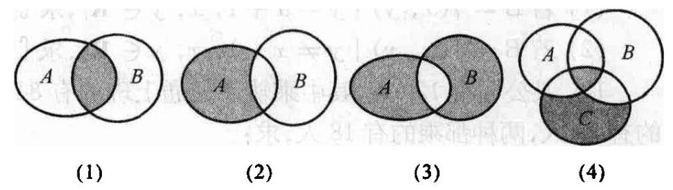

2. 设 $A = \{ x \mid  x >  - 2\} , B = \{ x \mid  x < 3\}$ ,求 $A \cap  B, A \cup  B$ .

3. 已知 $A = \left\{  {2, - 1,{x}^{2} - x + 1}\right\}  , B = \{ {2y}, - 4, x + 4\} , C = \; \{  - 1,7\}$ ,且 $A \cap  B = C$ ,求 $A \cup  B$ .

4. 若 $A\text{ 、 }B\text{ 、 }C$ 为三个集合, $A \cup  B = B \cap  C$ ,则一定有( ).

(A) $A \subseteq  C$ (B) $C \subseteq  A$ (C) $A \neq  C$ (D) $A = \varnothing$

5. 已知集合 $A = \{ x \mid  x \leq  2\} , B = \{ x \mid  x > a\}$ ,在下列条件下分别求实数 $a$ 的取值范围.

(1) $A \cap  B = \varnothing$ ； (2) $A \cup  B = \mathbf{R}$ ； (3) $1 \in  A \cap  B$ .

6. 设 $f\left( x\right)  = {x}^{2} - {12x} + {36}, A = \{ a \mid  1 \leq  a \leq  {10}, a \in  \mathbf{N}\} , B = \; \{ b \mid  b = f\left( a\right) , a \in  A\} , C = A \cap  B$ ,求: (1) 集合 $C;\left( 2\right) C$ 的所有子集中的各个元素和的总和.

7. 全集 $I = \{ x \mid  x$ 为三角形 $\} , A = \{ x \mid  x$ 为锐角三角形 $\} , B = \; \{ x \mid  x$ 为钝角三角形 $\} , C = \{ x \mid  x$ 为直角三角形 $\} , D = \{ x \mid  x$ 为斜三角形\},求 ${\complement }_{I}\left( {A \cup  B}\right)  \cap  {\complement }_{I}\left( {C \cup  D}\right)$ .

8. 设全集为 $U = \mathbf{Z}, M = \{ x \mid  x = {2k}, k \in  \mathbf{Z}\} , P = \{ x \mid  x = {3k}$ , $k \in  \mathbf{Z}\}$ ,求 $M \cap  \left( {{\complement }_{U}P}\right)$ .

9. 已知全集 $I = \left\{  {2,3,{a}^{2} + {2a} - 3}\right\}$ ,若 $A = \{ b,2\} ,{\complement }_{I}A = \{ 5\}$ , 求实数 $a, b$ .

10. 已知全集 $U = \{ x \mid  x$ 是质数且 $x \leq  {20}\} , A\text{ 、 }B$ 是 $U$ 的子集,且同时满足 $A \cap  \left( {{\complement }_{U}B}\right)  = \{ 3,5\} ,\left( {{\complement }_{U}A}\right)  \cap  B = \{ 7,{19}\} ,\left( {{\complement }_{U}A}\right)  \cap \; \left( {{\complement }_{U}B}\right)  = \{ 2,{17}\}$ ,求 $A$ 和 $B$ .

11. 设全集 $U = \{ \left( {x, y}\right)  \mid  x, y \in  \mathbf{R}\}$ ,集合 $A = \left\{  {\left( {x, y}\right) \left| {\;\frac{y - 3}{x - 2} = }\right. }\right. \; 1, x \in  \mathbf{R}\}$ .

(1)若 $B = \{ \left( {x, y}\right)  \mid  y = x + 1, x, y \in  \mathbf{R}\}$ ,求 ${\complement }_{U}A \cap  B$ ；

(2)若 $B = \{ \left( {x, y}\right)  \mid  y \neq  x + 1, x, y \in  \mathbf{R}\}$ ，求 ${\complement }_{U}\left( {A \cup  B}\right)$ .

12. 某公司有 120 人，其中乘轨道交通上班的有 84 人，乘汽车上班的有 32 人，两种都乘的有 18 人，求:

(1)只乘轨道交通上班的人数；

(2)不乘轨道交通上班的人数；

(3)乘坐交通工具上班的人数；

(4)不乘交通工具而步行的人数；

(5)只乘一种交通工具的人数.

### 1.4 命题的形式及等价关系 (The Forms of Propositions and Equivalent Relationship)

## 1. 命题与推出关系

在初中，我们已经知道，可以判断真假的语句叫做命题 (proposition). 命题通常用陈述句表述. 正确的命题叫做真命题, 错误的命题叫做假命题.

一般地,命题是由题设(条件)和结论两部分组成的. 题设是已知事项；结论是由已知事项推出的事项. 命题常写成“如果……，那么……”的形式. 具有这种形式的命题中，用 “如果”开始的部分是题设，用 “那么”开始的部分是结论.

有些命题，没有写成“如果……，那么……”的形式，题设和结论不明显. 对于这样的命题,要经过分析才能找出题设和结论,也可以将它们改写成“如果……，那么……”的形式.

命题的题设(条件)部分,有时也可用 “已知……”或者“若……”等形式表述; 命题的结论部分, 有时也可用 “求证……”或 “则……” 等形式表述.

例 1 判断下列语句是否为命题？如果是命题，判断它们是真命题还是假命题? 为什么?

(1)你是高一学生吗；

(2)过直线 ${AB}$ 外一点作该直线的平行线；

(3)个位数是 0 的自然数能被 5 整除；

(4)互为余角的两个角不相等；

(5)竟然推出 $6 > 8$ 的结果；

(6)如果两个三角形的三个角分别对应相等，那么这两个三角形相似.

解 (1)、(2)、(5)不是命题, (3)、(4)、(6)是命题, 其中 (4)是假命题.

(1)语句“你是高一学生吗”是疑问句，不是判断语句，所以它不是命题.

(2)语句“过直线 ${AB}$ 外一点作该直线的平行线”是祈使句，不是判断语句，所以它也不是命题.

(3)此命题为真命题. 这是因为个位数是 0 的自然数总可以表示为 ${10k}\left( {k \in  \mathbf{N}}\right)$ 的形式,而 ${10k} = 5 \cdot  {2k}$ ,所以 ${10k}$ 能被 5 整除.

(4)取一个角为 ${45}^{ \circ  }$ ，另一个角也为 ${45}^{ \circ  }$ ，它们互为余角，但它们是相等的. 所以“互为余角的两个角不相等”是假命题.

(5)语句“竟然推出 $6 > 8$ 的结果”是感叹句，不是判断语句，所以它不是命题.

(6) 此命题为真命题. 它是三角形相似的判定定理,在初中数学中已经给出证明.

由例 1 的( 4 )可以看到，要确定一个命题是假命题，只要举出一个满足命题的条件，而不满足其结论的例子即可，这在数学中称为“举反例”.

要确定一个命题是真命题，就必须作出证明，证明若满足命题的条件就一定能推出命题的结论.

一般地，如果事件 $\alpha$ 成立可以推出事件 $\beta$ 也成立，那么就说由 $\alpha$ 可以推出 $\beta$ ,并用记号 $\alpha  \Rightarrow  \beta$ 表示,读作“ $\alpha$ 推出 $\beta$ ”. 换言之, $\alpha  \Rightarrow  \beta$ 表示以 $\alpha$ 为条件, $\beta$ 为结论的命题是真命题.

如果事件 $\alpha$ 成立，而事件 $\beta$ 不能成立，那么就说事件 $\alpha$ 不能推出事件 $\beta$ 成立，可记作 $\alpha  \nRightarrow  \beta$ . 换言之， $\alpha  \nRightarrow  \beta$ 表示以 $\alpha$ 为条件， $\beta$ 为结论的命题是一个假命题.

如果 $\alpha  \Rightarrow  \beta$ ,并且 $\beta  \Rightarrow  \alpha$ ,那么记作 $\alpha  \Leftrightarrow  \beta$ ,叫做 $\alpha$ 与 $\beta$ 等价.

显然,推出关系满足传递性: $\alpha  \Rightarrow  \beta ,\beta  \Rightarrow  \gamma$ ,那么 $\alpha  \Rightarrow  \gamma$ .

2. 四种命题形式

一个命题由条件和结论两部分组成,如果把原命题的条件和结论互换，所得的命题是原命题的逆命题(inverse proposition)，显然它们互为逆命题. 例如，命题(1)“对顶角相等”和命题(2)“相等的角是对顶角”互为逆命题.

如果一个命题的条件和结论分别是另一个命题的条件的否定与结论的否定,则称这两个命题为互否命题,其中一个命题是另一个命题的否命题(negative proposition). 像命题(3)“不是对顶角的角不相等”与命题(1)是互否命题.

如果将一个命题的结论的否定作为条件，而将此命题的条件的否定作为结论所得到的命题叫做原命题的逆否命题(inverse negative proposition). 如命题(4)“不相等的角不是对顶角”与命题(1)互为逆否命题.

若 $\alpha$ 为原命题条件, $\beta$ 为原命题结论,则其四种命题的形式及关系为:

原命题: 若 $\alpha$ ,则 $\beta$ ;

逆命题:若 $\beta$ ，则 $\alpha$ ；

否命题:若 $\bar{a}$ ，则 $\overline{\beta }$ ；

逆否命题:若 $\overline{\beta }$ ，则 $\overline{\alpha }$ .

例 2 写出命题:“若 $x + y = 5$ ，则 $x = 3$ 且 $y = 2$ ” 的逆命题、否命题和逆否命题,并判断它们的真假.

解 原命题: 若 $x + y = 5$ ,则 $x = 3$ 且 $y = 2$ .

逆命题: 若 $x = 3$ 且 $y = 2$ ,则 $x + y = 5$ .

否命题: 若 $x + y \neq  5$ ,则 $x \neq  3$ 或 $y \neq  2$ .

逆否命题: 若 $x \neq  3$ 或 $y \neq  2$ ,则 $x + y \neq  5$ .

其中,原命题和逆否命题都是假命题,而逆命题和否命题均为真命题.

例 3 (1)写出命题“全等三角形两边和其中一边的对角对应相等” 的逆命题；

(2)写出命题“若 $a \neq  1$ 或 $b \neq  2$ ，则 ${a}^{2} + {b}^{2} - {2a} - {4b} + 5 \neq  0$ ”的否命题；

(3)写出命题“若 $a > \frac{1}{a}$ ，则 $\left| a\right|  > 1$ ” 的逆否命题；

(4)写出命题“若 $A \subseteq  B$ ,则 $A \cup  B = {B}^{\prime \prime }$ 的逆否命题.

解(1)如果两个三角形有两条边及其中一边的对角分别对应相等,那么这两个三角形全等.

(2)若 $a = 1$ 且 $b = 2$ ,则 ${a}^{2} + {b}^{2} - {2a} - {4b} + 5 = 0$ .

(3)若 $\left| a\right|  \leq  1$ ，则 $a \leq  \frac{1}{a}$ .

(4)若 $A \cup  B \neq  B$ ，则 $A \nsubseteq  B$ .

3. 等价命题

在前面的讨论中, 容易发现命题 (2) 与命题 3) 也互为逆否命题, 而且互为逆否命题的两个命题是同真或同假的. 一般地, 原命题与它的逆否命题是同真或同假的,即如果 $\alpha  \Rightarrow  \beta$ ,那么 $\overline{\beta } \Rightarrow  \overline{\alpha }$ ; 如果 $\alpha  \nRightarrow  \beta$ ,那么 $\overline{\beta } \Rightarrow  \overline{\alpha }$ .

对于命题 $A$ 与 $B$ 来说,如果有 $A \Rightarrow  B$ 且 $B \Rightarrow  A$ ,那么命题 $A\text{ 、 }B$ 叫做等价命题 (equivalent proposition). 原命题与其逆否命题就是等价命题.

当我们证明某个命题有困难时,就可以尝试用证明它的等价命题或逆否命题来代替证明原命题.

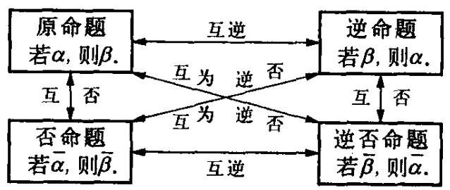

例 4 求证: 圆的两条不是直径的相交弦不能互相平分.

证明 我们来证明原命题的逆否命题“圆的两条互相平分的弦是直径”.

如图，设圆 $O$ 的两条弦 ${AB}$ 、 ${CD}$ 互相平分，则四边形 ${ACBD}$ 为平行四边形,所以 $\angle {ACB} = \angle {ADB}$ .

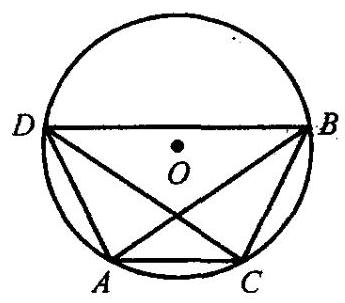

又因为四边形 ${ACBD}$ 为圆 $O$ 的内接四边形,

得 $\angle {ACB} + \angle {ADB} = {180}^{ \circ  }$ ,

故 $\angle {ACB} = \angle {ADB} = {90}^{ \circ  }$ ,

所以 ${AB}$ 为直径.

同理,弦 ${CD}$ 也为直径,则原命题得证.

课堂活动

·大家谈

1. 我们学过的数学符号有概念符号, 运算符号和关系符号等. 推出符号“ $\Rightarrow$ ”是什么符号? 试再找出一些与它类似的符号.

2. 命题与定理有什么区别和联系?

3. 命题的否定形式与否命题是否等价?

课堂活动 1. 下列词语的否定形式是什么?

·自己想

大于,一定是,且,都是,都不是,至少有一个,至多有一个.

2. 用反证法证明命题与证明此命题的逆否命题之间有区别吗? 证明什么命题时应用它们更好?

3. 关注现实生活中的命题, 尝试说出这些命题的一般形式(条件与结论), 进一步理解和体会四种命题之间的关系.

課外活动

- 自己学

## 反证法

从命题结论的反面出发，引出矛盾，从而证明命题成立, 这样的证明方法叫作反证法.

用反证法证明的步骤一般有:

(1)假设命题的结论不成立，即假设结论的反面成立.

(2)从这个假设出发，通过推理论证，得出矛盾.

(3)由矛盾判定假设不正确，从而肯定命题的结论正确.

反证法的证明思路:

(1)反设(即假设):对于 $p$ 则 $q$ (原命题)进行反设，即 $p$ 则非 $q$ .

(2)可能出现三种情况:

① 导出非 $p$ 为真——与题设矛盾.

② 导出 $q$ 为真——与反设中“非 $q$ ”矛盾.

③ 导出一个恒假命题——与某公理或定理矛盾.

例 1 求证“过在同一直线上的三点 $A\text{ 、 }B\text{ 、 }C$ 不能作圆”.

证明 先假设可以作一个 $\odot  O$ 过 $A\text{ 、 }B\text{ 、 }C$ 三点,则 $O$ 在 ${AB}$ 的中垂线 $l$ 上, $O$ 又在 ${BC}$ 的中垂线 $m$ 上,即 $O$ 是 $l$ 与 $m$ 的交点.

但因为 $A\text{ 、 }B\text{ 、 }C$ 共线,故 $l//m$ (矛盾).

所以过在同一直线上的三点 $A\text{ 、 }B\text{ 、 }C$ 不能作圆.

例 2 用反证法证明: 如果 $a > b > 0$ ,那么 $\sqrt{a} > \sqrt{b}$ .

证明 假设 $\sqrt{a}$ 不大于 $\sqrt{b}$ ,则 $\sqrt{a} < \sqrt{b}$ 或 $\sqrt{a} = \sqrt{b}$ .

因为 $a > 0, b > 0$ ,得

$$
\sqrt{a} < \sqrt{b} \Rightarrow  \sqrt{a} \cdot  \sqrt{a} < \sqrt{a} \cdot  \sqrt{b},
$$

①

或

$$
\sqrt{a} \cdot  \sqrt{b} < \sqrt{b} \cdot  \sqrt{b}.
$$

②

由①、②知 $\sqrt{a} \cdot  \sqrt{a} < \sqrt{b} \cdot  \sqrt{b}$ ，即 $a < b$ (与题设矛盾).

同样,若 $\sqrt{a} = \sqrt{b} \Rightarrow  a = b$ (与题设矛盾).

综上得证 $\sqrt{a} > \sqrt{b}$ .

司题练习

·自己乐

1. 指出下列命题的条件与结论,并判断真假:

(1)若 $k < 0$ ，则 $y = \frac{k}{x}$ 随 $x$ 的增大而增大；

(2)当 $k > 0, b < 0$ 时，直线 $y = {kx} + b$ 经过第一、二、三象限；

(3)任意两个有理数之间存在无穷多个有理数；

(4)邻补角的角平分线互相垂直；

(5)全等三角形对应边上的高相等.

2. 写出下列命题的逆命题、否命题、逆否命题，并分别判断真假:

(1)面积相等的两个三角形是全等三角形；

(2)若 $x = 0$ 则 ${xy} = 0$ ；

(3)当 $c < 0$ 时,若 ${ac} > {bc}$ ,则 $a < b$ ;

(4)若 ${mn} < 0$ ，则方程 $m{x}^{2} - x + n = 0$ 有两个不相等的实数根.

3. 命题 “对任意的 $x \in  \mathbf{R},{x}^{3} - {x}^{2} + 1 \leq  0$ ” 的否命题是 ( ).

(A) 不存在 $x \in  \mathbf{R},{x}^{3} - {x}^{2} + 1 \leq  0$

(B) 存在 $x \in  \mathbf{R},{x}^{3} - {x}^{2} + 1 \leq  0$

(C) 存在 $x \in  \mathbf{R},{x}^{3} - {x}^{2} + 1 > 0$

(D) 对任意的 $x \in  \mathbf{R},{x}^{3} - {x}^{2} + 1 > 0$

4. 把下列命题改写成“若 $\alpha$ ,则 ${\beta }^{n}$ 的形式,并写出它们的逆命题、否命题与逆否命题,且分别判断它们的真假:

(1)负数的平方是正数；

(2)正方形的四条边相等.

5. 证明下列命题是真命题:

(1)如果 $a, b, c$ 是三角形的边长,则方程 $a{x}^{2} + \left( {{a}^{2} + {b}^{2} + {c}^{2}}\right) x + \; {b}^{2} = 0$ 没有实数根;

(2)若 ${a}^{2} - {b}^{2} - {3a} + 2 = 0$ ，则 $a + b \neq  2$ ；

(3)已知 $A = {a}^{2} - {2b} + \frac{\pi }{2}, B = {b}^{2} - {2c} + \frac{\pi }{2}, C = {c}^{2} - {2a} + \frac{\pi }{2}$ ， 则 $A, B, C$ 中至少有一个为近似数.

6. 证明 $\sqrt{2}$ 是无理数.

7. 已知 $a$ 与 $b$ 均为有理数,且 $\sqrt{a}$ 和 $\sqrt{b}$ 都是无理数,证明 $\sqrt{a} + \sqrt{b}$ 也是无理数.

8. 在同一平面内一直线的垂线与斜线一定相交.

9. 设有命题“已知 $a, b$ 为实数,若不等式 ${x}^{2} + {ax} + b \leq  0$ 有非空解集,则 ${a}^{2} - {4b} \geq  0$ ”. 写出其否命题,并判断它的真假.

10. 证明: 如果整数 $a$ 的平方能被 2 整除,那么 $a$ 能被 2 整除.

### 1.5 充分条件, 必要条件 (Sufficient Condition, Necessary Condition)

在日常生活中, 我们做事情需要具备一定的条件, 有的条件能够保证我们完成这件事, 而有的条件虽然不能保证完成这件事, 但却是完成它所必不可少的. 例如:

(1)用 20 元钱买一本 19.80 元的书，那么就书价而言，“20 元钱”就是“买一本 19.80 元的书”的充足的条件，即“充分条件”；

(2)用水将生米煮成熟饭，那么“水”就是“生米煮成熟饭”的必不可少的条件，即“必要条件”.

在数学中，若要得出一个结论，同样需要具备一定的条件.

一般地,如果事件 $\alpha$ 成立,可以推出事件 $\beta$ 也成立,即 $\alpha  \Rightarrow  \beta$ ,那么称 $\alpha$ 是 $\beta$ 的充分条件 (sufficient condition), $\beta$ 是 $\alpha$ 的必要条件 (necessary condition).

关于 “ $\alpha$ 是 $\beta$ 的充分条件” 的理解是容易的，即为了使 $\beta$ 成立，具备条件 $\alpha$ 就足够了，“有它即可”；而对于“ $\beta$ 是 $\alpha$ 的必要条件”的理解，如果从“若 $\alpha$ ,则 $\beta$ ”的等价命题“若 $\overline{\beta }$ ,则 $\overline{\alpha }$ ”来看，则更易理解，即若没有条件 $\beta$ ,则事件 $\alpha$ 不能成立,因此对于 $\alpha$ 来说,条件 $\beta$ 是必定需要的,“非它不行”.

以命题“对顶角相等”为例，由于两个角是对顶角就足以保证这两个角相等，因此“两个角是对顶角”是 “这两个角相等” 的充分条件；而如果两个角不相等，则它们必定不可能是对顶角，所以说，“两个角相等” 是 “这两个角是对顶角”的必要条件.

如果既有 $\alpha  \Rightarrow  \beta$ ,又有 $\beta  \Rightarrow  \alpha$ ,即有 $\alpha  \Leftrightarrow  \beta$ ,那么 $\alpha$ 既是 $\beta$ 的充分条件,又是 $\beta$ 的必要条件,这时我们称 $\alpha$ 是 $\beta$ 的充分而且必要条件 (sufficient and necessary condition),简称充要条件. 例如, $a, b$ 为实数,则 “ $\left| a\right|  = \left| b\right|$ ” 是 “ ${a}^{2} = {b}^{2}$ ” 的充要条件.

例 1 指出下列各组命题中 $p$ 是 $q$ 的什么条件? 并说明理由.

(1) $p : {a}^{2} > {b}^{2}, q : a > b$ ;

(2) $p : \{ x \mid  x >  - 2$ 或 $x < 3\} , q : \left\{  {x \mid  {x}^{2} - x - 6 < 0}\right\}$ ;

(3) $p : a$ 与 $b$ 都是奇数， $q : a + b$ 是偶数；

(4) $p : 0 < m < \frac{1}{3}, q :$ 方程 $m{x}^{2} - {2x} + 3 = 0$ 有两个同号且不相等的实数根.

解 (1) 因为 ${a}^{2} > {b}^{2} \nRightarrow  a > b$ ,且 $a > b \Leftrightarrow  {a}^{2} > {b}^{2}$ ,所以 $p$ 是 $q$ 的既非充分也非必要条件.

(2)因为 $\{ x \mid  x >  - 2$ 或 $x < 3\}  \nRightarrow  \{ x \mid  {x}^{2} - x - 6 < 0\}$ ,而 $\left\{  {x\left| {{x}^{2} - x - 6 < 0\}  \Rightarrow  }\right| x \mid  x >  - 2\text{ 或 }x < 3}\right\}$ ,所以 $p$ 是 $q$ 的必要非充分条件.

(3)因为 $a$ 与 $b$ 都是奇数 $\Rightarrow  a + b$ 是偶数，而 $a + b$ 是偶数 $\Rightarrow  a$ 与 $b$ 都是奇数，所以 $p$ 是 $q$ 的充分非必要条件；

(4)因为方程 $m{x}^{2} - {2x} + 3 = 0$ 有两个同号且不相等的实数根 $\Leftrightarrow  \left\{  {\begin{array}{l} \Delta  = {2}^{2} - 4 \cdot  m \cdot  3 > 0, \\  {x}_{1}{x}_{2} = \frac{3}{m} > 0 \end{array} \Leftrightarrow  0 < m < \frac{1}{3}}\right.$ ,所以 $p$ 是 $q$ 的充要条件.

例 2 已知四边形 ${ABCD}$ 是凸四边形, ${AC}\text{ 、 }{BD}$ 为对角线,那么 " ${AC} \bot  {BD}$ " 是 "四边形 ${ABCD}$ 为正方形" 的什么条件? 为什么?

解 因为正方形的对角线互相垂直，所以 “ ${AC} \bot  {BD}$ ” 是 “四边形 ${ABCD}$ 为正方形” 的必要条件，但 “ ${AC} \bot  {BD}$ ” 不是 “四边形 ${ABCD}$ 为正方形”的充分条件,这是因为 ${AC} \bot  {BD}$ 时,四边形不一定是正方形. 例如,菱形的对角线也是互相垂直的.

因此,“ ${AC} \bot  {BD}$ ” 是 “四边形 ${ABCD}$ 为正方形” 的必要非充分条件.

例 3 (1)写出 $x < 0$ 的一个必要非充分条件；

(2)写出函数 $y = \left( {{m}^{2} - 4}\right) {x}^{2{n}^{2} - {3n}}$ 为反比例函数的一个充分非必要条件.

解 (1) $x < 2$ .

(2) $m = 3, n = 1$ 等.

例 4 已知实系数一元二次方程 $a{x}^{2} + {bx} + c = 0\left( {a \neq  0}\right)$ ,求证: “方程 $a{x}^{2} + {bx} + c = 0$ 有两个相等的实数根” 的充要条件是 “ ${b}^{2} - \; {4ac} = 0$ ”.

证明 充分性: 将方程 $a{x}^{2} + {bx} + c = 0\left( {a \neq  0}\right)$ 变形为

$$
a{\left( x + \frac{b}{2a}\right) }^{2} = \frac{{b}^{2} - {4ac}}{4a}.
$$

因为 ${b}^{2} - {4ac} = 0$ ,得 ${x}_{1} = {x}_{2} =  - \frac{b}{2a}$ ,所以 “ ${b}^{2} - {4ac} = 0$ ” 是 “方程 $a{x}^{2} + {bx} + c = 0$ 有两个相等的实数根”的充分条件.

必要性: 如果方程 $a{x}^{2} + {bx} + c = 0$ 有两个相等的实数根 ${x}_{1} = {x}_{2}$ , 那么由方程根与系数的关系得

$$
\left\{  \begin{array}{l} {x}_{1} + {x}_{2} = 2{x}_{1} =  - \frac{b}{a}, \\  {x}_{1} \cdot  {x}_{2} = {x}_{1}^{2} = \frac{c}{a}, \end{array}\right.
$$

于是 ${\left( -\frac{b}{2a}\right) }^{2} = \frac{c}{a}$ ,即 ${b}^{2} - {4ac} = 0$ .

所以 “ ${b}^{2} - {4ac} = 0$ ” 是 “方程 $a{x}^{2} + {bx} + c = 0$ 有两个相等的实数根”的必要条件.

综上所述，“方程 $a{x}^{2} + {bx} + c = 0$ 有两个相等的实数根”的充要条件是 “ ${b}^{2} - {4ac} = 0$ ”.

课堂活动

·大家族

1. 对于 “ $\alpha  \Rightarrow  \beta$ ” 的含义,可以有哪些解释?

2. 用自然语言分别叙述命题的各种条件关系, 并列举这些条件关系的实例各一个.

。自己想

1. 用全集 $I$ 表示任意两个命题之间的条件关系的全体,试用文氏图表示这些条件关系.

2. 已知 $p$ 是 $r$ 的充分非必要条件, $q$ 是 $r$ 的充分条件, $s$ 是 $r$ 的必要条件, $q$ 是 $s$ 的必要条件,现有下列命题:

(1) $r$ 是 $q$ 的充要条件;

(2) $p$ 是 $q$ 的充分非必要条件;

(3) $r$ 是 $q$ 的必要非充分条件;

(4)非 $p$ 是非 $s$ 的必要非充分条件;

(5) $r$ 是 $s$ 的充分非必要条件.

上述命题哪些是真命题?

司題蘇司

・自己な

1. 如果 $M\text{ 、 }N$ 为非空集合,那么 “ $M \cup  N = {M}^{\prime \prime }$ 是 " $N \subsetneqq  {M}^{n}$ 的 ( ).

(A) 充要条件 (B) 充分非必要条件

(C) 必要非充分条件 (D) 既非充分也非必要条件

2. 设 ${x}_{1},{x}_{2}$ 是一元二次方程 $a{x}^{2} + {bx} + c = 0$ 的两实根,则 ${x}_{1} > 2$ , ${x}_{2} > 2$ 成立的必要条件是( ).

(A) $\left\{  \begin{array}{l} {x}_{1} + {x}_{2} > 6 \\  {x}_{1} \cdot  {x}_{2} > 8 \end{array}\right.$ (B) $\left\{  \begin{array}{l} {x}_{1} + {x}_{2} < 4 \\  {x}_{1} \cdot  {x}_{2} < 4 \end{array}\right.$

(C) $\left\{  \begin{array}{l} {x}_{1} + {x}_{2} > 4 \\  \left( {{x}_{1} - 2}\right)  \cdot  \left( {{x}_{2} - 2}\right)  > 0 \end{array}\right.$ (D) $\left\{  \begin{array}{l} {x}_{1} + {x}_{2} > 4 \\  {x}_{1} \cdot  {x}_{2} > 4 \end{array}\right.$

3. 若 $a, b, c$ 都是实数,试从 (A) ${ab} = 0$ ,(B) $a + b = 0$ ,(C) ${a}^{2} + \; {b}^{2} = 0,\left( \mathrm{D}\right) {ab} > 0,\left( \mathrm{E}\right) a + b > 0,\left( \mathrm{\;F}\right) {a}^{2} + {b}^{2} > 0$ 中分别选出适合下列条件的代号填空.

(1)使 $a$ 、 $b$ 都是 0 的充分条件是___；

(2)使 $a$ 、 $b$ 都不是 0 的充分条件是___；

(3)使 $a$ 、 $b$ 中至少有一个是 0 的充要条件是___；

(4)使 $a$ 、 $b$ 中至少有一个不是 0 的充要条件是___.

4. 指出下列各组命题中 $p$ 是 $q$ 的什么条件? 并说明理由:

(1) $p$ :四条边相等， $q$ :四边形是正方形；

(2) $p : x \neq  3, q : \left| x\right|  \neq  3$ ;

(3) $p : x - 1 = 0, q : {x}^{2} - 1 = 0$ ;

(4)p:至少有一组对应边相等，q:两个三角形全等；

(5) $p$ : 个位数字是 5 的自然数, q: 这个自然数能被 5 整除;

(6) $p$ : 整数 $a, b$ 满足 ${a}^{2} + {b}^{2} < 5, q$ : 整数 $a, b$ 满足 $a + b \leq  2$ .

5. 对于一元二次方程 $a{x}^{2} + {bx} + c = 0$ (其中 $a, b, c$ 都不为 0 ) 来说,“ ${b}^{2} - {4ac} \geq  0$ ” 是 “这个方程有两个正根” 的什么条件? 为什么?

6. 设全集 $A = \left\{  {x \mid  {x}^{2} + x - 6 = 0}\right\}  , B = \{ x \mid  {ax} + 1 = 0\}$ ,写出 $B \subsetneqq  A$ 的一个充分而非必要条件,并加以说明.

7. 求方程 ${x}^{2} - {10x} + k = 0$ 有两个不相等的同号实根的充要条件.

8. 试寻求关于 $x$ 的方程 ${x}^{2} + {mx} + n = 0$ 有两个小于 1 的正根的充要条件.

9. $\bigtriangleup {ABC}$ 的三边为 $a, b, c$ ,求证: 二次方程 ${x}^{2} + {2ax} + {b}^{2} = 0$ , ${x}^{2} + {2cx} - {b}^{2} = 0$ 有一个公共根的充要条件是 $\angle A = {90}^{ \circ  }$ .

### 1.6 子集与推出关系 (Subsets and Inference Relationship)

我们知道,由 $x < 0$ 可以推出 $x < 1$ ,即 $x < 0$ 是 $x < 1$ 的充分条件. 如果把 $x < 0$ 和 $x < 1$ 分别看成是构成集合 $A$ 和 $B$ 的元素所具有的性质,则集合 $A = \{ x \mid  x < 0\}$ ,集合 $B = \{ x \mid  x < 1\}$ . 对于任意 $x \in  A$ ,即有 $x < 0$ ,而由于 $x < 0$ 是 $x < 1$ 的充分条件,所以可推得 $x < 1$ ,即 $x \in \; B$ ,因此 $A \subseteq  B$ ; 反之亦然. 由此可见,集合的子集关系可与构成集合的元素性质的推出关系之间建立联系.

设集合 $A = \{ x \mid  x$ 具有性质 $\alpha \} , B = \{ x \mid  x$ 具有性质 $\beta \}$ ,下面证明 $A \subseteq  B$ 是 $\alpha  \Rightarrow  \beta$ 的充要条件.

(1)充分性:设 $x$ 具有性质 $\alpha$ ,则 $x \in  A$ ,由 $A \subseteq  B$ 得 $x \in  B$ ,则 $x$ 具有性质 $\beta$ ,所以 $\alpha  \Rightarrow  \beta$ .

(2)必要性:设任意 $x \in  A$ ，则 $x$ 具有性质 $\alpha$ ，由 $\alpha  \Rightarrow  \beta$ 得 $x$ 具有性质 $\beta$ ,则 $x \in  B$ ,所以 $A \subseteq  B$ .

综上所述， $A \subseteq  B$ 是 $\alpha  \Rightarrow  \beta$ 的充要条件，即 $A \subseteq  B$ 与 $\alpha  \Rightarrow  \beta$ 等价.

鉴于上述证明，我们在研究有些命题的推出关系时，也可以转而用集合观点,即集合的包含关系来研究.

例 1 试用集合的包含关系说明 $\alpha$ 是 $\beta$ 的什么条件:

(1) $\alpha  : x = 1, y = 2$ , $\beta  : x + y = 3;$

(2) $\alpha$ :正整数 $n$ 被 5 整除， $\beta$ : 正整数 $n$ 的个位数为 5 .

解 (1) 设集合 $A = \{ \left( {1,2}\right) \} , B = \{ \left( {x, y}\right)  \mid  x + y = 3\}$ ,显然 $A \subsetneqq  B$ ,所以 $\alpha  \Rightarrow  \beta$ ,而 $\beta  \nRightarrow  \alpha$ ,即 $\alpha$ 是 $\beta$ 的充分非必要条件;

(2)设集合 $A = \left\{  {n \mid  n = {5k}, k \in  {\mathbf{N}}^{ * }}\right\}  , B = \{ n \mid  n$ 的个位数是 5 $\}$ , 因为 $A = B \cup  \{ n \mid  n$ 的个位数是 0 $\}$ ,所以 $B \subsetneqq  A$ ,则 $\beta  \Rightarrow  \alpha$ ,且 $\alpha  \nRightarrow  \beta$ ,即 $\alpha$ 是 $\beta$ 的必要非充分条件.

例 2 设 $\alpha  : 1 \leq  x \leq  3,\beta  : a + 1 \leq  x \leq  {2a} - 1$ ,若 $\alpha$ 是 $\beta$ 的必要条件,求实数 $a$ 的取值范围.

解 设 $A = \{ x \mid  1 \leq  x \leq  3\} , B = \{ x \mid  a + 1 \leq  x \leq  {2a} - 1\}$ ,因为 $\alpha$ 是 $\beta$ 的必要条件,所以 $B \subseteq  A$ .

(1)当 ${2a} - 1 < a + 1$ 时，即 $a < 2$ 时， $B = \varnothing  \subseteq  A$ ；

(2)当 ${2a} - 1 \geq  a + 1$ 时,即 $a \geq  2$ 时,要使得 $B \subseteq  A$ ,则必须 $a + 1 \geq$ 1 且 ${2a} - 1 \leq  3$ ,解得 $a = 2$ .

综上所述，实数 $a$ 的取值范围是 $a \leq  2$ .

课堂活动

·大家谈

1. 怎样用集合的包含关系全面解释命题的各种推出关系和命题的各种条件关系?

2. 利用集合的包含关系研究命题的推出关系, 体现了什么数学思想方法?

课堂活动

- 自己想

1. 注意理解集合间具有包含关系的充要条件是这些集合的性质具有推出关系, 进一步体验用集合的包含关系进行推理的方法.

2. 尝试用本章所学的知识数学化地观察、分析、思考现实世界及日常生活中的各种事物之间的区别和联系，进一步培养逻辑推理能力,体验用数学的眼光看世界.

## 逻辑初步

·自己崇

逻辑是研究思维形式及其规律的一门基础学科. 学习数学，需要全面地理解概念，正确地进行表述、推理和判断，这就离不开对逻辑知识的掌握和运用. 在日常生活、学习和工作中， 基本的逻辑知识也是认识问题、研究问题不可缺少的工具. 下面介绍一些逻辑的初步知识.

## 1. 逻辑联结词与复合命题

观察下列语句:(1)12 > 5；(2)3 是 12 的约数；(3)0.5 是整数； (4)3 是 12 的约数吗?(5) $x > 5$ ; (6) 10 可以被 2 或 5 整除.

我们知道, 可以判断真假的语句叫命题. 正确的命题叫做真命题, 错误的命题叫做假命题.

如:(1)、(2)、(6)是真命题，(3)是假命题；而(5)是含有变量的语句叫开句(条件命题)，(4)、(5)都不是命题.

在逻辑中，“或(V)”、“且(Λ)”、“非(┐)”这些词都叫做逻辑联结词. 不含逻辑联结词的命题叫做简单命题.

用逻辑联结词构成的命题叫做复合命题. 例如，上述命题(1)、(2)、 (3)都是简单命题，而(6)是复合命题，它可以看成是简单命题 “10 可以被 2 整除”与 “10 可以被 5 整除” 加上逻辑联结词 “或”构成的，即 “10 可以被 2 整除或 10 可以被 5 整除”.

如果用 $p, q, r, s,\cdots$ 表示简单命题,则复合命题的表示形式一般有以下三种:

(1) $p$ 或 $q$ ，记作 $p \vee  q$ ，表示两个命题 $p$ 、 $q$ 中至少有一个成立；

(2) $p$ 且 $q$ ，记作 $p \land  q$ ，表示两个命题 $p$ 、 $q$ 都成立；

(3)非 $p$ ，记作 $\neg p$ ，表示对命题 $p$ 的否定.

关于逻辑联结词“或”的理解有三层含义，以“ $p$ 或 $q$ ”为例:一是 $p$ 成立但 $q$ 不成立,二是 $p$ 不成立但 $q$ 成立,三是 $p$ 成立且 $q$ 成立.

## 2. 简单命题与复合命题的真假关系

命题分“真”、“假”两种判断结论，复合命题的真假有以下各种情形.

(1)非 $p$ ；

例如:命题 $p : 5$ 是 10 的约数(真)，非 $p : 5$ 不是 10 的约数(假)；

命题 $p : 5$ 是 8 的约数(假)， 非 p. 5 不是 8 的约数(真).

结论:为真非为假、为假非为真，即“真假相反”.

(2)p 且q:

例如:命题 $p : 5$ 是 10 的约数(真)， $q : 5$ 是 15 的约数(真)， $s : 5$ 是 12 的约数 (假), $r : 5$ 是 8 的约数 (假).

则命题 $p$ 且 $q : 5$ 是 10 的约数且是 15 的约数(真)；

$p$ 且 $s : 5$ 是 10 的约数且是 12 的约数(假);

$p$ 且 $r : 5$ 是 10 的约数且是 8 的约数 (假);

$s$ 且 $r : 5$ 是 12 的约数且是 8 的约数(假).

结论:“同真为真”(其余为假).

(3) $p$ 或 $q$ :

命题 $p$ 或 $q : 5$ 是 10 的约数或 5 是 15 的约数(真);

$p$ 或 $r : 5$ 是 10 的约数或 5 是 8 的约数(真);

$s$ 或 $r : 5$ 是 12 的约数或 5 是 8 的约数(假).

结论:“同假为假”(其余为真).

综上所述，复合命题的真假可通过表示命题真假的表(真值表)加以判定，一般用 1 表示“真”；0 表示“假”. 这里 1 与 0 表示真值，所以真值只能是 1 或 0 . 以下列出命题的真值表:

<table><tr><td>$p$</td><td>$q$</td><td>非 p</td><td>$p$ 或 $q$</td><td>$p$ 且 $q$</td></tr><tr><td>1</td><td>1</td><td>0</td><td>1</td><td>1</td></tr><tr><td>1</td><td>0</td><td>0</td><td>1</td><td>0</td></tr><tr><td>0</td><td>1</td><td>1</td><td>1</td><td>0</td></tr><tr><td>0</td><td>0</td><td>1</td><td>0</td><td>0</td></tr></table>

司熟錄司

## 自己条

1. " $x > 3$ " 是 " ${x}^{2} > 4$ " 的 ( ).

(A) 必要非充分条件(B) 充分非必要条件

(C) 充分必要条件 (D) 既非充分也非必要条件

2. 设集合 $M = \{ x \mid  0 < x \leq  3\} , N = \{ x \mid  0 < x \leq  2\}$ ,那么 “ $a \in \; M$ ” 是 “ $a \in  N$ ” 的( ).

(A) 充分而非必要条件 (B) 必要而非充分条件

(C) 充分必要条件 (D) 既非充分也非必要条件

3. 试用集合的包含关系说明下列各组条件中 $\alpha$ 是 $\beta$ 的什么条件:

(1) $\alpha$ :正整数 $n$ 被 3 整除， $\beta$ :正整数 $n$ 被 6 整除；

(2) $\alpha$ :该四边形对角线相等， $\beta$ :该四边形为梯形；

(3) $\alpha  : x + y > 3,\beta  : x > 1, y > 2$ ;

(4) $\alpha  : {xy} < 0,\beta  : \left| {x - y}\right|  = \left| x\right|  + \left| y\right|$ .

4. 已知 $\alpha$ : 方程 $a{x}^{2} + {2x} + 1 = 0\left( {a \neq  0}\right)$ 有一个正根和一个负根, 试写出满足下列条件的 $\beta$ :

(1) $\beta$ 是 $\alpha$ 的充分非必要条件；

(2) $\beta$ 是 $\alpha$ 的必要非充分条件；

(3) $\beta$ 是 $\alpha$ 的充要条件.

5. 已知集合 $A = \{ y \mid  y = {x}^{2} - {2x} + 3, x \in  \mathbf{R}\} , B = \{ x \mid  x > a\}$ ， 试证明: “ $a > 2$ ” 是 “ $B \subsetneqq  A$ ” 的一个充分非必要条件.

6. 设函数 $f\left( x\right)  = a{x}^{2} - {2x} - {2a}, a \in  \mathbf{R}$ ,若 $a :  - 2 < x < 3$ 是 $\beta$ : $f\left( x\right)  > 0$ 的必要非充分条件,求实数 $a$ 的取值范围.

7. 分别写出由下列各种命题构成的“ $p$ 或 $q$ ”,“ $p$ 且 $q$ ”,“非 $p$ ”形式的复合命题，并判断它们的真假:

(1) $p$ : 末位数字是 0 的自然数能被 5 整除， $q : 5 \in  \left\{  {x \mid  {x}^{2} + {4x} - }\right.$ 5 = 0 \};

(2)p:四边都相等的四边形是正方形, q:四个角都相等的四边形是正方形;

(3) $p : 0 \in  \varnothing , q : \left\{  {x \mid  {x}^{2} - x - 3 \leq  0}\right\}$ ;

(4) $p : 2 \leq  2, q : 6$ 不是质数.

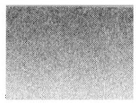

## 第二章 不等式 (Inequalities)

不等关系与相等关系都是客观事物的基本数量关系, 是数学研究的重要内容. 建立不等观念、处理不等关系与处理等量问题是同样重要的. 在本章中，学生将通过具体情境，感受在现实世界和日常生活中存在的大量的不等关系，并理解不等式(组)对于刻画不等关系的意义和价值； 掌握求解一元二次不等式的基本方法, 并能解决一些实际问题; 能用二元一次不等式组表示平面区域,并尝试解决一些简单的二元线性规划问题; 认识基本不等式及其简单应用; 体会不等式、方程及函数之间的联系.

### 2.1 不等式的性质 (Basic Properties of Inequalities)

1. 两个实数 $a$ 与 $b$ 之间的大小关系:

(1) $a - b > 0 \Leftrightarrow  a > b$ ;

(2) $a - b = 0 \Leftrightarrow  a = b$ ；

(3) $a - b < 0 \Leftrightarrow  a < b$ .

若 $a, b \in  {\mathbf{R}}^{ + }$ ,则:

(4) $\frac{a}{b} > 1 \Leftrightarrow  a > b$ ；

(5) $\frac{a}{b} = 1 \Leftrightarrow  a = b$ ；

(6) $\frac{a}{b} < 1 \Leftrightarrow  a < b$ .

2. 不等式的性质:

(1) $a > b \Leftrightarrow  b < a$ ；

(2) $a > b, b > c \Rightarrow  a > c$ ;

(3) $a > b \Rightarrow  a + c > b + c$ ，此法则又称为移项法则；

$a > b, c > d \Rightarrow  a + c > b + d;$

(4) $a > b, c > 0 \Rightarrow  {ac} > {bc}$ ;

$a > b, c < 0 \Rightarrow  {ac} < {bc};$

$a > b > 0, c > d > 0 \Rightarrow  {ac} > {bd};$

(5) $a > b > 0\left( {n \in  {\mathbf{N}}^{ * }}\right)  \Leftrightarrow  {a}^{n} > {b}^{n} > 0$ ;

(6) $a > b > 0\left( {n \in  {\mathbf{N}}^{ * }, n \geq  2}\right)  \Leftrightarrow  \sqrt[n]{a} > \sqrt[n]{b} > 0$ ;

(7) $a > b,{ab} > 0 \Rightarrow  \frac{1}{a} < \frac{1}{b};$

下面我们证明性质(4):

如果 $a > b$ ,且 $c > 0$ ,那么 ${ac} > {bc}$ ; 如果 $a > b$ ,且 $c < 0$ ,那么 ${ac} < {bc}.$

证明 因为 ${ac} - {bc} = \left( {a - b}\right) c$ ,又因为 $a > b$ ,所以 $a - b > 0$ .

根据同号相乘得正,异号相乘得负,得:

当 $c > 0$ 时, $\left( {a - b}\right) c > 0$ ,即 ${ac} > {bc}$ ;

当 $c < 0$ 时, $\left( {a - b}\right) c < 0$ ,即 ${ac} < {bc}$ .

很明显,由性质 (4) 可以推广到任意有限个两边都是正数的同向不等式两边分别相乘. 这就是说, 两个或者更多个两边都是正数的同向不等式两边分别相乘,所得不等式与原不等式同向.

例 1 设 $x, y, z \in  \mathbf{R}$ ,比较 $5{x}^{2} + {y}^{2} + {z}^{2}$ 与 ${2xy} + {4x} + {2z} - 2$ 的大小.

解 因为 $\left( {5{x}^{2} + {y}^{2} + {z}^{2}}\right)  - \left( {{2xy} + {4x} + {2z} - 2}\right)$

$$
= {\left( x - y\right) }^{2} + {\left( 2x - 1\right) }^{2} + {\left( z - 1\right) }^{2} \geq  0,
$$

所以

$$
5{x}^{2} + {y}^{2} + {z}^{2} \geq  {2xy} + {4x} + {2z} - 2,
$$

当且仅当 $x = y = \frac{1}{2}$ 且 $z = 1$ 时等号成立.

例 2 已知 $a > b, c < d$ ,求证: $a - c > b - d$ .

证明 由 $a > b$ 知 $a - b > 0$ ,由 $c < d$ 知 $d - c > 0$ .

因为 $\left( {a - c}\right)  - \left( {b - d}\right)  = \left( {a - b}\right)  + \left( {d - c}\right)  > 0$ ,

所以

$$
a - c > b - d\text{ . }
$$

例 3 设 $f\left( x\right)  = a{x}^{2} + {bx}$ ,且 $1 \leq  f\left( {-1}\right)  \leq  2,2 \leq  f\left( 1\right)  \leq  4$ ,求 $f\left( {-2}\right)$ 的取值范围.

解 因为 $1 \leq  f\left( {-1}\right)  = a - b \leq  2,2 \leq  f\left( 1\right)  = a + b \leq  4$ ,所以

$$
3 \leq  f\left( {-1}\right)  + f\left( 1\right)  = {2a} \leq  6,
$$

又

$$
f\left( {-2}\right)  = {4a} - {2b} = {2a} + 2\left( {a - b}\right) ,
$$

所以

$$
5 \leq  f\left( {-2}\right)  \leq  {10}.
$$

掌握不等式的性质,应注意: 条件与结论间的对应关系,是 “ $\Rightarrow$ ” 还是 “ $\Leftrightarrow$ ”; 运用不等式性质的关键是不等号方向的把握,条件与不等号方向是紧密相连的.

运用不等式的性质可以对不等式进行各种变形, 虽然这些变形都很简单,但却是我们今后研究和认识不等式的基本手段.

课堂活动 1. 不等式中比较大小有哪些常用方法?

·大家谈

2. 判断下列命题是否成立，并说明理由:

(1)如果 $a > b, c < d$ ，那么 $a + c > b + d$ ；

(2)如果 $a > b, c > d$ ，那么 $a - {2c} > b - {2d}$ ；

(3)如果 $a > b, c > d$ ，那么 ${ac} > {bd}$ .

已知实数 $a, b, c$ ,判断下列命题的真假:

·自己想

(1)若 $a > b$ ，则 $a{c}^{2} > b{c}^{2}$ ；

(2)若 $a{c}^{2} > b{c}^{2}$ ，则 $a > b$ ；

(3)若 $a < b < 0$ ，则 ${a}^{2} > {ab} > {b}^{2}$ ；

(4)若 $a < b < 0$ ，则 $\frac{1}{a} < \frac{1}{b}$ ；

(5)若 $a < b < 0$ ，则 $\frac{b}{a} > \frac{a}{b}$ ；

(6) 若 $a < b < 0$ ,则 $\left| a\right|  > \left| b\right|$ ;

(7)若 $c > a > b > 0$ ,则 $\frac{a}{c - a} > \frac{b}{c - b}$ ;

(8) 若 $a > b,\frac{1}{a} > \frac{1}{b}$ ,则 $a > 0, b < 0$ .

1. 设 $n >  - 1$ ,且 $n \neq  1$ ,则 ${n}^{3} + 1$ 与 ${n}^{2} + n$ 的大小关系是___.

## 自己标

2. 已知 $n \in  {\mathbf{N}}^{ * }, A = \sqrt{{n}^{2} + 1} - n, B = \frac{1}{2n}$ ,则 $A\text{ 、 }B$ 之间的大小关系是___.

3. 比较下列两个数的大小:

(1) $\sqrt{2} - 1$ 与 $2 - \sqrt{3}$ ；

(2) $2 - \sqrt{3}$ 与 $\sqrt{6} - \sqrt{5}$ ；

(3)从以上两小题的结论中，你能否得出更一般的结论？并加以证明.

4. 已知 $f\left( x\right)  = a{x}^{2} - c, - 4 \leq  f\left( 1\right)  \leq   - 1, - 1 \leq  f\left( 2\right)  \leq  5$ ,求 $f\left( 3\right)$ 的取值范围.

### 2.2 一元二次不等式的解法 (Solving Quadratic Inequalities with one unknown)

求不等式的解集叫做解不等式(solving inequalities). 如果两个不等式的解集相等,那么这两个不等式就叫做同解不等式. 一个不等式变形为另一个不等式时,如果这两个不等式是同解不等式,那么这种变形叫做不等式的同解变形.

像 ${x}^{2} - {5x} < 0$ 这样，只含有一个未知数，并且未知数的最高次数是 2 的整式不等式, 称为一元二次不等式 (second order inequality with one unknown).

下面我们来探究一元二次不等式 ${x}^{2} - {5x} < 0$ 的解集:

(1)探究二次方程的根与二次函数的零点的关系.

容易知道: 二次方程有两个实数根: ${x}_{1} = 0,{x}_{2} = 5$ ; 二次函数有两个零点: ${x}_{1} = 0,{x}_{2} = 5$ .

于是,我们得到: 二次方程的根就是二次函数的零点.

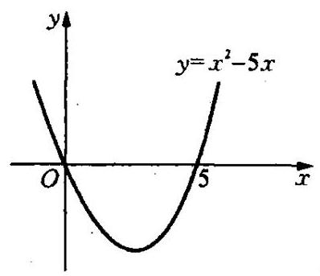

(2)观察图象，获得解集.

画出二次函数 $y = {x}^{2} - {5x}$ 的图象,如图,观察函数图象,可知:

当 $x < 0$ 或 $x > 5$ 时,函数图象位于 $x$ 轴上方,此时 $y > 0$ ,即 ${x}^{2} - {5x} > 0$ ;

当 $0 < x < 5$ 时,函数图象位于 $x$ 轴下方,此时 $y < 0$ ,即 ${x}^{2} - {5x} < 0$ .

所以,不等式 ${x}^{2} - {5x} < 0$ 的解集是 $\{ x \mid  0 < x < 5\}$ .

下面我们来探究一般的一元二次不等式的解法.

任意的一元二次不等式,总可以化为以下两种形式:

$a{x}^{2} + {bx} + c > 0\left( {a > 0}\right)$ 或 $a{x}^{2} + {bx} + c < 0\left( {a > 0}\right) .$

从上面的例子出发, 可以归纳出确定一元二次不等式的解集, 关键要考虑以下两点:

(1)抛物线 $y = a{x}^{2} + {bx} + c$ 与 $x$ 轴的相关位置，也就是一元二次方程 $a{x}^{2} + {bx} + c = 0$ 的根的情况；

(2)抛物线 $y = a{x}^{2} + {bx} + c$ 的开口方向，也就是 $a$ 的符号.

总结结果:

(1)抛物线 $y = a{x}^{2} + {bx} + c\left( {a > 0}\right)$ 与 $x$ 轴的相关位置,分为三种情况，这可以由一元二次方程 $a{x}^{2} + {bx} + c = 0$ 的判别式 $\Delta  = {b}^{2} - {4ac}$ 的三种取值情况 $\left( {\Delta  > 0,\Delta  = 0,\Delta  < 0}\right)$ 来确定. 因此,要分三种情况讨论. $\left( {a < 0\text{ 可以转化为 }a > 0}\right)$

(2)分 $\Delta  > 0,\Delta  = 0,\Delta  < 0$ 三种情况，得到一元二次不等式 $a{x}^{2} + \; {bx} + c > 0$ 与 $a{x}^{2} + {bx} + c < 0$ 的解集.

设相应的一元二次方程 $a{x}^{2} + {bx} + c = 0\left( {a > 0}\right)$ 的两根为 ${x}_{1}\text{ 、 }{x}_{2}$ 且 ${x}_{1} \leq  {x}_{2},\Delta  = {b}^{2} - {4ac}$ ,则不等式的解的各种情况如下表:

<table><tr><td></td><td>$\Delta  > 0$</td><td>$\Delta  = 0$</td><td>$\Delta  < 0$</td></tr><tr><td>二次函数 $y = a{x}^{2} + \; {bx} + c\left( {a > 0}\right)$ 的图象</td><td>[失效外部图片：bo_d8mlvq2lb0pc73bf74lg_48.jpg]</td><td>[失效外部图片：bo_d8mlvq2lb0pc73bf74lg_48.jpg]</td><td>[失效外部图片：bo_d8mlvq2lb0pc73bf74lg_48.jpg]</td></tr><tr><td>一元二次方程 $a{x}^{2} + \; {bx} + c = 0\left( {a > 0}\right)$ 的根</td><td>有两相异实根 ${x}_{1},{x}_{2}\left( {{x}_{1} < {x}_{2}}\right)$</td><td>有两相等实根 ${x}_{1} = {x}_{2} =  - \frac{b}{2a}$</td><td>无实根</td></tr><tr><td>$a{x}^{2} + {bx} + c > 0(a \; > 0)$ 的解集</td><td>$\{ x \mid  x < {x}_{1}$ 或 $x > {x}_{2}\}$</td><td>$\left\{  {x\left| {\;x \neq   - \frac{b}{2a}}\right. }\right\}$</td><td>R</td></tr><tr><td>$a{x}^{2} + {bx} + c < 0(a \; > 0$ ) 的解集</td><td>$\left\{  {x \mid  {x}_{1} < x < {x}_{2}}\right\}$</td><td>$\varnothing$</td><td>0</td></tr></table>

不等式的解集经常用区间来表示，下面介绍区间的概念.

区间是指介于某两个实数之间的全体实数. 这两个实数叫做区间的端点.

设 $a, b \in  \mathbf{R}$ ,且 $a < b$ .

$\{ x \mid  a < x < b\}$ 称为开区间 (closed interval),记为 $\left( {a, b}\right)$ ;

$\{ x \mid  a \leq  x \leq  b\}$ 称为闭区间 (open interval),记为 $\left\lbrack  {a, b}\right\rbrack$ ;

$\{ x \mid  a \leq  x < b\}$ 称为左闭右开区间,记为 $\lbrack a, b)$ ;

$\{ x \mid  a < x \leq  b\}$ 称为左开右闭区间,记为 $(a, b\rbrack$ .

以上都是有限区间,以下是无限区间:

$$
\lbrack a, + \infty ) = \{ x \mid  x \geq  a\} ,\left( {a, + \infty }\right)  = \{ x \mid  x > a\} ,
$$

$$
( - \infty , a\rbrack  = \{ x \mid  x \leq  a\} ,\left( {-\infty , a}\right)  = \{ x \mid  x < a\} ,
$$

实数集 $\mathbf{R} = \left( {-\infty , + \infty }\right)$ ,符号“ $- \infty$ ”读作“负无穷大”,“ $+ \infty$ ”读作“正无穷大”.

区间长度的定义: 两端点间的距离(线段的长度)称为区间的长度.

例 1 求不等式 $4{x}^{2} - {4x} + 1 > 0$ 的解集.

解 因为 $\Delta  = 0$ ,所以方程 $4{x}^{2} - {4x} + 1 = 0$ 的解是 ${x}_{1} = {x}_{2} = \frac{1}{2}$ .

所以,原不等式的解集是 $\left\{  {x\left| {\;x \in  \mathbf{R}}\right. , x \neq  \frac{1}{2}}\right\}$ .

例 2 解不等式 $- {x}^{2} + {2x} - 3 > 0$ .

解 整理得, ${x}^{2} - {2x} + 3 < 0$ .

因为 $\Delta  < 0$ ,所以方程 ${x}^{2} - {2x} + 3 = 0$ 无实数解.

所以不等式 ${x}^{2} - {2x} + 3 < 0$ 的解集是 $\varnothing$ .

从而,原不等式的解集是 $\varnothing$ .

例 3 某种牌号的汽车在水泥路面上的刹车距离 $s\mathrm{\;m}$ 和汽车的速度 $x\mathrm{\;{km}}/\mathrm{h}$ 有如下的关系:

$$
s = \frac{1}{20}x + \frac{1}{180}{x}^{2}.
$$

在一次交通事故中，测得这种车的刹车距离大于39.5m，那么这辆汽车刹车前的速度至少是多少? (精确到 ${0.01}\mathrm{\;{km}}/\mathrm{h}$ )

解 设这辆汽车刹车前的速度至少为 $x\mathrm{\;{km}}/\mathrm{h}$ ，根据题意，我们得到

$$
\frac{1}{20}x + \frac{1}{180}{x}^{2} > {39.5}
$$

移项整理得

$$
{x}^{2} + {9x} - {7110} > 0,
$$

显然 $\Delta  > 0$ ,所以方程 ${x}^{2} + {9x} - {7110} = 0$ 有两个实数根,即

$$
{x}_{1} \approx   - {88.94},{x}_{2} \approx  {79.94}\text{ . }
$$

所以不等式的解集为 $\{ x \mid  x <  - {88.94}$ 或 $x > {79.94}\}$ .

在这个实际问题中, $x > 0$ ,所以这辆汽车刹车前的车速至少为 79. ${94}\mathrm{\;{km}}/\mathrm{h}$ .

例 4 已知 $a$ 为实数,关于 $x$ 的二次方程 $7{x}^{2} - \left( {a + {13}}\right) x + \left( {{a}^{2} - }\right. \; a - 2) = 0$ 的两个实根分别在 $\left( {0,1}\right) ,\left( {1,2}\right)$ 内,求 $a$ 的取值范围.

解 令 $f\left( x\right)  = 7{x}^{2} - \left( {a + {13}}\right) x + \left( {{a}^{2} - a - 2}\right)$ ,由二次函数图象知

$$
\left\{  \begin{array}{l} f\left( 0\right)  > 0, \\  f\left( 1\right)  < 0,\text{ 即 }\left\{  \begin{array}{l} {a}^{2} - a - 2 > 0, \\  {a}^{2} - {2a} - 8 < 0, \\  {a}^{2} - {3a} > 0, \end{array}\right.  \end{array}\right.
$$

解得

$$
- 2 < a <  - 1\text{ 或 }3 < a < 4.
$$

所以 $a$ 的取值范围是 $\left( {-2, - 1}\right)  \cup  \left( {3,4}\right)$ .

课堂活动

·大家谈

设 ${a}_{1}\text{ 、 }{b}_{1}\text{ 、 }{c}_{1}\text{ 、 }{a}_{2}\text{ 、 }{b}_{2}\text{ 、 }{c}_{2}$ 均为非零实数,不等式 ${a}_{1}{x}^{2} + {b}_{1}x + {c}_{1} > 0,{a}_{2}{x}^{2} + {b}_{2}x + {c}_{2} > 0$ 的解集分别是集合 $M\text{ 、 }N$ ,则 “ $\frac{{a}_{1}}{{a}_{2}} = \frac{{b}_{1}}{{b}_{2}} = \frac{{c}_{1}}{{c}_{2}}$ ” 是 “ $M = N$ ” 的充要

条件吗?

习题练习

·自己练

1. 设不等式 $a{x}^{2} + {bx} + 1 > 0$ 的解集为 $\left\{  {x\left| {\; - 1 < x < \frac{1}{3}}\right. }\right\}$ ,求 $a\text{ 、 }b$ 的值.

2. 设 $A = \left\{  {x \mid  {x}^{2} - {4x} + 3 < 0}\right\}  , B = \left\{  {x \mid  {x}^{2} - {2x} + a - 8 \leq  0}\right\}$ , 且 $A \subseteq  B$ ,求 $a$ 的取值范围.

3. 求不等式 $0 < {x}^{2} + x - 2 \leq  4$ 的解集.

4. 已知一元二次不等式 $a{x}^{2} + {bx} + c < 0$ 的解集为 $\left\{  {x\left| {\;x < \frac{1}{3}}\right. \text{ 或 }x > \frac{1}{2}}\right\}$ ,求关于 $x$ 的不等式 $c{x}^{2} - {bx} + a > 0$ 的解集.

5. 若关于 $x$ 的不等式 $m{x}^{2} - \left( {{2m} + 1}\right) x + m - 1 \geq  0$ 的解集为空集, 求 $m$ 的取值范围.

### 2.3 分式不等式 (Fractional Inequality)

像 $\frac{16}{x - 1} < x - 1$ 这样,只含有一个未知数,并且分母含未知数的不等式, 称为分式不等式 (fractional inequality).

解分式不等式, 关键是将它变为整式不等式去解, 其一般特征为: 分式不等式 $\frac{f\left( x\right) }{g\left( x\right) } > 0\left( { \geq  0}\right)$ 或 $\frac{f\left( x\right) }{g\left( x\right) } < 0\left( { \leq  0}\right)$ 要正确运用以下同解原理.

1. $\frac{f\left( x\right) }{g\left( x\right) } > 0\left( { < 0}\right)$ 与 $f\left( x\right)  \cdot  g\left( x\right)  > 0\left( { < 0}\right)$ 同解;

2. $\frac{f\left( x\right) }{g\left( x\right) } \geq  0\left( { \leq  0}\right)$ 与不等式组 $\left\{  {\begin{array}{l} f\left( x\right)  \cdot  g\left( x\right)  \geq  0 \\  g\left( x\right)  \neq  0 \end{array}\left( \left\{  \begin{array}{l} f\left( x\right)  \cdot  g\left( x\right)  \leq  0 \\  g\left( x\right)  \neq  0 \end{array}\right) \right. }\right.$ 同解.

例 1 解不等式: $\frac{16}{x - 1} < x - 1$ .

解 原不等式等价于 $\frac{\left( {x - 5}\right) \left( {x + 3}\right) }{x - 1} > 0$ ,即

$$
\left\{  {\begin{array}{l} \left( {x - 5}\right) \left( {x + 3}\right)  > 0, \\  x - 1 > 0 \end{array}\text{ 或 }\left\{  \begin{array}{l} \left( {x - 5}\right) \left( {x + 3}\right)  < 0, \\  x - 1 < 0, \end{array}\right. }\right.
$$

所以原不等式的解为: $- 3 < x < 1$ 或 $x > 5$ .

例 2 解不等式: $\frac{{x}^{2} - {9x} + {11}}{{x}^{2} - {2x} + 1} \geq  7$ .

解 移项,通分得 $\frac{-6{x}^{2} + {5x} + 4}{{x}^{2} - {2x} + 1} \geq  0$ ,

所以

$$
\frac{\left( {{2x} + 1}\right) \left( {{3x} - 4}\right) }{{\left( x - 1\right) }^{2}} \leq  0,
$$

转化为

$$
\left\{  \begin{array}{l} \left( {{2x} + 1}\right) \left( {{3x} - 4}\right) {\left( x - 1\right) }^{2} \leq  0, \\  {\left( x - 1\right) }^{2} \neq  0, \end{array}\right.
$$

所以

$$
\left\{  \begin{array}{l} \left( {{2x} + 1}\right) \left( {{3x} - 4}\right)  \leq  0, \\  x - 1 \neq  0, \end{array}\right.
$$

则所求不等式的解集为 $\left\{  {x\left| {\; - \frac{1}{2} \leq  x < 1\text{ 或 }1 < x \leq  \frac{4}{3}}\right. }\right\}$ .

例 ${3k}$ 为何值时,不等式 $\frac{2{x}^{2} + {2kx} + k}{4{x}^{2} + {6x} + 3} < 1$ 恒成立.

解 原不等式可化为 $\frac{2{x}^{2} + \left( {6 - {2k}}\right) x + \left( {3 - k}\right) }{4{x}^{2} + {6x} + 3} > 0$ ,而 $4{x}^{2} + \; {6x} + 3 > 0$ 恒成立，所以原不等式等价于

$$
2{x}^{2} + \left( {6 - {2k}}\right) x + \left( {3 - k}\right)  > 0,
$$

由 $\Delta  = {\left( 6 - 2k\right) }^{2} - 4 \times  2 \times  \left( {3 - k}\right)  < 0$ ,得 $1 < k < 3$ .

司題蘇司

·自己禁

1. 解下列不等式:

(1) $\frac{{x}^{2} - {3x} + 2}{{x}^{2} - {2x} - 3} < 0$ ；

(2) $\frac{x - 3}{x - 2} \geq  0$ ；

(3) $x > \frac{1}{x}$ ;

(4) $\frac{{\left( x - 2\right) }^{2} \cdot  {\left( x + 1\right) }^{3}}{{x}^{2} + x + 1} > 0$ ；

(5) $\frac{{15}{x}^{2} - {11x} + 2}{-2{x}^{2} + {3x} + 2} < 0$ .

2. $a\text{ 、 }b\text{ 、 }c$ 为常数,且 $a > b > c$ ,求关于 $x$ 的不等式 $\frac{\left( {x - a}\right) \left( {x - c}\right) }{{\left( x - b\right) }^{2}} >$ 0 的解集.

3. 解不等式: $\frac{1}{x + 4} + 1 >  - \frac{1}{x + 6}$ .

4. 若不等式 $\frac{x + a}{{x}^{2} + {4x} + 3} \geq  0$ 的解集为 $\left\{  {x \mid   - 3 < x <  - 1}\right.$ 或 $x \geq$ 2\},求实数 $a$ 的值.

5. 若 $m > n > 0$ ,求关于 $x$ 的不等式 $\frac{\left( {{mx} - n}\right) \left( {x - 2}\right) }{x - 1} \geq  0$ 的解集.

### 2.4 高次不等式 (Inequality of Higher Order)

像 ${x}^{3} + 3{x}^{2} > {2x} + 6$ 这样,只含有一个未知数,并且未知数的最高次数大于 2 的不等式称为高次不等式(inequality of higher order).

我们研究 $\left( {x - 1}\right) \left( {x + 1}\right) \left( {x - 2}\right) \left( {x - 3}\right)  < 0$ 的解. 此不等式是关于 $x$ 的高次不等式,已不能用一元二次不等式的解法求解,首先解方程 $\left( {x - 1}\right) \left( {x + 1}\right) \left( {x - 2}\right) \left( {x - 3}\right)  = 0$ 得 $x$ 的四个解分别为 $1, - 1,2,3$ . 然后将 $x$ 的取值分成 5 段,使得四个因式 $x - 1, x + 1, x - 2, x - 3$ 的积为负的范围就是所求的解集,列表如下:

<table><tr><td>范 围   各因式符号</td><td>$x <  - 1$</td><td>$- 1 < x < 1$</td><td>$1 < x < 2$</td><td>$2 < x < 3$</td><td>$x > 3$</td></tr><tr><td>$x + 1$</td><td>-</td><td>+</td><td>+</td><td>+</td><td>+</td></tr><tr><td>$x - 1$</td><td>-</td><td>-</td><td>+</td><td>+</td><td>+</td></tr><tr><td>$x - 2$</td><td>-</td><td>一</td><td>-</td><td>+</td><td>+</td></tr><tr><td>$x - 3$</td><td>-</td><td>一</td><td>-</td><td>-</td><td>+</td></tr><tr><td>$\left( {x + 1}\right) \left( {x - 1}\right) \left( {x - 2}\right) \left( {x - 3}\right)$</td><td>+</td><td>-</td><td>+</td><td>-</td><td>+</td></tr></table>

借助于数轴并根据积的符号法则表示为下图.

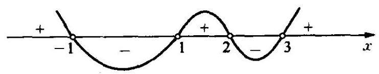

由图可知: 原不等式的解集为 $\left( {-1,1}\right)  \cup  \left( {2,3}\right)$ .

此方法称为“数轴标根法”,也可以叫“串线法”.

高次不等式常常用“数轴标根法”来解，其步骤是:

(1)等价变形后的不等式一边是零，一边是各因式的积. (各因式中未知数的最高次项的系数一定为正数)

(2)把各因式的根标在数轴上;

(3)用曲线穿根(奇次根穿透，偶次根不穿透)，看图象写出解集.

例 1 解不等式: ${x}^{3} + 3{x}^{2} > {2x} + 6$ .

解 原不等式化为 $\left( {x + 3}\right) \left( {x + \sqrt{2}}\right) \left( {x - \sqrt{2}}\right)  > 0$ ,所以原不等式的解为 $x > \sqrt{2}$ 或 $- 3 < x <  - \sqrt{2}$ .

例 2 解不等式: $\left( {{x}^{2} - {4x} - 5}\right) \left( {{x}^{2} + x + 2}\right)  < 0$ .

解 因为 ${x}^{2} + x + 2 > 0$ 恒成立,所以原不等式等价于 ${x}^{2} - {4x} - 5 \; < 0$ ,即原不等式的解为 $- 1 < x < 5$ .

例 3 解不等式: $\frac{x{\left( x + 1\right) }^{2}\left( {x - 2}\right) }{{\left( x - 3\right) }^{3}\left( {x - 5}\right) } \leq  0$ .

解 原不等式等价于 $\frac{x\left( {x - 2}\right) }{\left( {x - 3}\right) \left( {x - 5}\right) } \leq  0$ 或 $x =  - 1$ . 标根如图所示:

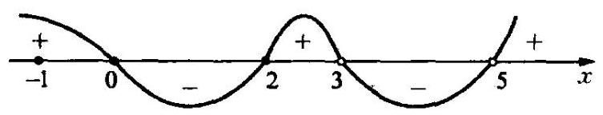

所以原不等式的解集为 $\{  - 1\}  \cup  \left\lbrack  {0,2}\right\rbrack   \cup  \left( {3,5}\right)$ .

习题练习

·自己练

1. 解不等式: $\left( {x + 1}\right) \left( {x - 4}\right) \left( {x + 2}\right)  \geq  0$ .

2. 解不等式: $\left( {{x}^{2} - 1}\right) \left( {x + 2}\right)  < 0$ .

3. 解不等式: ${\left( x + 2\right) }^{2}{\left( x - 1\right) }^{3}\left( {x + 1}\right) \left( {x - 2}\right)  < 0$ .

4. 解不等式: $\left( {x + 5}\right) \left( {x + 2}\right) \left( {x - 1}\right) \left( {x - 4}\right)  \leq   - {80}$ .

### 2.5 无理不等式 (Irrational Inequality)

像 $3 - x \geq  \sqrt{x - 1}$ 这样,只含有一个未知数,并且根号中含未知数的不等式, 称为无理不等式 (irrational inequality).

解无理不等式, 关键是把它同解变形为有理不等式组. 无理不等式一般有如下几种形式:

1. $\sqrt{f\left( x\right) } > \sqrt{g\left( x\right) } \Leftrightarrow  \left\{  \begin{array}{l} f\left( x\right)  \geq  0, \\  g\left( x\right)  \geq  0, \\  f\left( x\right)  > g\left( x\right) . \end{array}\right.$

例 1 解不等式: $\sqrt{{3x} - 4} - \sqrt{x - 3} > 0$ .

解 因为根式有意义,所以必须有 $\left\{  \begin{array}{l} {3x} - 4 \geq  0, \\  x - 3 \geq  0, \end{array}\right.$ 解得 $x \geq  3$ .

又因为原不等式可化为 $\sqrt{{3x} - 4} > \sqrt{x - 3}$ ,两边平方得 ${3x} - 4 > \; x - 3$ ,解得 $x > \frac{1}{2}$ .

因为 $\left| x\right| x \geq  3\left| \cap \right| \left\{  {x\left| {\;x > \frac{1}{2}}\right. }\right\}   = \left| x\right| x \geq  3\}$ ,所以原不等式的解集为 $\{ x \mid  x \geq  3\}$ .

2. $\sqrt{f\left( x\right) } > g\left( x\right)  \Leftrightarrow  \left\{  \begin{array}{l} f\left( x\right)  \geq  0, \\  g\left( x\right)  \geq  0, \\  f\left( x\right)  > {\left\lbrack  g\left( x\right) \right\rbrack  }^{2} \end{array}\right.$ 或 $\left\{  \begin{array}{l} f\left( x\right)  \geq  0, \\  g\left( x\right)  < 0. \end{array}\right.$

例 2 解不等式: $\sqrt{-{x}^{2} + {3x} - 2} > 4 - {3x}$ .

解 原不等式等价于下列两个不等式组的解集的并集:

(1) $\left\{  \begin{array}{l} 4 - {3x} \geq  0, \\   - {x}^{2} + {3x} - 2 \geq  0, \\   - {x}^{2} + {3x} - 2 > {\left( 4 - 3x\right) }^{2}; \end{array}\right.$

(2) $\left\{  \begin{array}{l}  - {x}^{2} + {3x} - 2 \geq  0, \\  4 - {3x} < 0. \end{array}\right.$

由( 1 )解得 $\frac{6}{5} < x \leq  \frac{4}{3}$ ，由( 2 )解得 $\frac{4}{3} < x \leq  2$ .

所以，原不等式的解集为 $\left\{  {x\left| {\;\frac{6}{5} < x \leq  2}\right. }\right\}$ .

3. $\sqrt{f\left( x\right) } < g\left( x\right)  \Leftrightarrow  \left\{  \begin{array}{l} f\left( x\right)  \geq  0, \\  g\left( x\right)  > 0, \\  f\left( x\right)  < {\left\lbrack  g\left( x\right) \right\rbrack  }^{2}. \end{array}\right.$

例 3 解不等式: $\sqrt{2{x}^{2} - {6x} + 4} < x + 2$ .

解 原不等式等价于 $\left\{  \begin{array}{l} 2{x}^{2} - {6x} + 4 \geq  0, \\  x + 2 > 0, \\  2{x}^{2} - {6x} + 4 < {\left( x + 2\right) }^{2}, \end{array}\right.$ 解得

$$
\left\{  \begin{array}{l} x \geq  2\text{ 或 }x \leq  1, \\  x >  - 2, \\  0 < x < {10}, \end{array}\right.
$$

即 $0 < x \leq  1$ 或 $2 \leq  x < {10}$ .

所以,原不等式的解集为 $\{ x \mid  0 < x \leq  1$ 或 $2 \leq  x < {10}\}$ .

1. 解下列不等式:

- 自己练

(1) $\sqrt{{2x} - 3} + \sqrt{{3x} - 5} > \sqrt{{5x} - 6}$ ;

(2) ${3x} - 3 + \sqrt{x + 3} <  - {3x} + \sqrt{x + 3}$ ；

(3) $\sqrt{4 - \sqrt{1 - x}} > \sqrt{2 - x}$ ；

(4) $\left( {x - 1}\right) \sqrt{{x}^{2} - x - 2} \geq  0$ .

2. 解不等式: $\sqrt{9 - {x}^{2}} + \sqrt{{6x} - {x}^{2}} > 3$ .

3. 解不等式: $\sqrt{{2x} + 1} > \sqrt{x + 1} - 1$ .

4. 解不等式: $\sqrt[3]{2 - x} + \sqrt{x - 1} > 1$ .

5. 满足 $3 - x \geq  \sqrt{x - 1}$ 的 $x$ 的集合为 $A$ ,满足 ${x}^{2} - \left( {a + 1}\right) x + a \leq$ 0 的 $x$ 的集合为 $B$ .

(1)若 $A \subset  B$ ，求 $a$ 的取值范围；

(2)若 $A \supseteq  B$ ，求 $a$ 的取值范围；

(3)若 $A \cap  B$ 为仅含一个元素的集合，求 $a$ 的值.

### 2.6 绝对值不等式 (The Absolute Value Inequality)

1. 含有绝对值的不等式有以下两种基本形式:

(1) $\left| x\right|  < a\left( {a > 0}\right)  \Leftrightarrow   - a < x < a\;\left( {\left| x\right|  \leq  a\left( {a > 0}\right)  \Leftrightarrow   - a \leq  }\right. \; x \leq  a)$ ;

(2) $\left| x\right|  > a\left( {a > 0}\right)  \Leftrightarrow  x > a$ 或 $x <  - a\;\left( {\left| x\right|  \geq  a\left( {a > 0}\right)  \Leftrightarrow  }\right. \; x \geq  a$ 或 $x \leq   - a)$ .

2. 解绝对值不等式的关键在于去掉绝对值的符号, 一般有以下方法:

(1)定义法;

(2)零点分段法:通常适用于含有两个及两个以上的绝对值符号的不等式;

(3)平方法:通常适用于两端均为非负实数的不等式(比如 $\left| {f\left( x\right) }\right|  < \left| {g\left( x\right) }\right| );$

(4)图象法或数形结合法.

例 1 解不等式: $\left| {{x}^{2} - {5x} + 5}\right|  < 1$ .

解一 利用不等式 $\left| x\right|  < a\left( {a > 0}\right)$ 的解集是 $\{ x \mid   - a < x < a\}$ 和整体的思想 $\left( {\left| {f\left( x\right) }\right|  < 1 \Leftrightarrow   - 1 < f\left( x\right)  < 1}\right)$ ,因此,这个不等式可化为

$$
\left\{  \begin{array}{l} {x}^{2} - {5x} + 5 < 1, \\  {x}^{2} - {5x} + 5 >  - 1, \end{array}\right.
$$

①

②

解不等式①得解集 $\{ x \mid  1 < x < 4\}$ ，解不等式②得解集 $\left\{  {x \mid  x < 2}\right.$ 或 $x > 3\}$ .

所以,原不等式的解集是不等式①和不等式②的解集的交集,即原不等式的解集为 $\{ x \mid  1 < x < 2$ 或 $3 < x < 4\}$ .

解二 平方去绝对值,则原不等式可化为

$$
\left( {{x}^{2} - {5x} + 6}\right) \left( {{x}^{2} - {5x} + 4}\right)  < 0,
$$

即

$$
\left( {x - 2}\right) \left( {x - 3}\right) \left( {x - 4}\right) \left( {x - 1}\right)  < 0.
$$

利用“数轴标根法” (如图所示),所以原不等式的解集是 $\left| x\right| 1 < \; x < 2$ 或 $3 < x < 4\}$ .

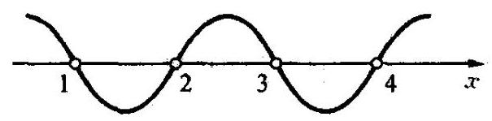

例 2 解关于 $x$ 的不等式 $\left| {{2x} - 1}\right|  < {2m} - 1\left( {m \in  \mathbf{R}}\right)$ .

解 若 ${2m} - 1 \leq  0$ ,即 $m \leq  \frac{1}{2}$ ,则 $\left| {{2x} - 1}\right|  < {2m} - 1$ 恒不成立,此时原不等式无解;

若 ${2m} - 1 > 0$ ,即 $m > \frac{1}{2}$ ,则 $- \left( {{2m} - 1}\right)  < {2x} - 1 < {2m} - 1$ ,所以 $1 - m < x < m$ .

综上,当 $m \leq  \frac{1}{2}$ 时,原不等式的解集为 $\varnothing$ ; 当 $m > \frac{1}{2}$ 时,原不等式的解集为 $\{ x \mid  1 - m < x < m\}$ .

例 3 解不等式: $\left| {x + 2}\right|  + \left| {x - 1}\right|  < 4$ .

解 - 由代数式 $\left| {x + 2}\right| \text{ 、 }\left| {x - 1}\right|$ 知, $- 2\text{ 、 }1$ 把实数集分为三个部分:

$$
x <  - 2, - 2 \leq  x < 1, x \geq  1\text{ . }
$$

当 $x <  - 2$ 时,原不等式变为 $- x - 2 - x + 1 < 4$ ,即 $- \frac{5}{2} < x <  - 2$ ; 当 $- 2 \leq  x < 1$ 时,原不等式变为 $x + 2 - x + 1 < 4$ ,即 $- 2 \leq  x < 1$ ; 当 $x \geq  1$ 时,原不等式变为 $x + 2 + x - 1 < 4$ ,即 $1 \leq  x < \frac{3}{2}$ .

综上,原不等式的解集为 $\left\{  {x\left| {\; - \frac{5}{2} < x < \frac{3}{2}}\right. }\right\}$ .

解这类绝对值符号里是一次式的不等式,其一般步骤是:

(1)令每个绝对值符号里的一次式为零,求出相应的根;

(2)把这些根由小到大排序,并把实数集分为若干个区间；

(3)根据所分区间去掉绝对值符号，组成相应的若干个不等式，解这些不等式,分别求出它们的解集;

(4)这些不等式的解集的并集就是原不等式的解集.

不等式 $\left| {x + 2}\right|  + \left| {x - 1}\right|  < 4$ 的几何意义是表示数轴上与 $A\left( {-2}\right)$ 及 $B\left( 1\right)$ 两点距离之和小于 4 的点. 而 $A\text{ 、 }B$ 两点距离为 3,因此线段 ${AB}$ 上每一点到 $A\text{ 、 }B$ 的距离之和都等于 3 . 如图，只要找到与 $A$ 、 $B$ 的距离之和为 4 的点,问题就迎刃而解了.

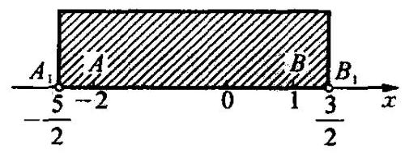

解二 如图,要找到与 $A\text{ 、 }B$ 距离之和为 4 的点,只需由点 $B$ 向右移动 $\frac{1}{2}$ 个单位,这时距离之和增加 1 个单位,即移到点 ${B}_{1}\left( \frac{3}{2}\right)$ . 或由点 $A$ 向左移动 $\frac{1}{2}$ 个单位,即移到点 ${A}_{1}\left( {-\frac{5}{2}}\right)$ .

可以看出,数轴上在点 ${B}_{1}\left( \frac{3}{2}\right)$ 和点 ${A}_{1}\left( {-\frac{5}{2}}\right)$ 之间的点到 $A\text{ 、 }B$ 两点的距离之和均小于 4 .

所以,原不等式的解集为 $\left\{  {x\left| {\; - \frac{5}{2} < x < \frac{3}{2}}\right. }\right\}$ .

例 4 解不等式: $2 < \left| {{x}^{2} - {2x} - 1}\right|  < 7$ .

解一 原不等式等价于 $\left\{  \begin{array}{l} \left| {{x}^{2} - {2x} - 1}\right|  < 7, \\  \left| {{x}^{2} - {2x} - 1}\right|  > 2, \end{array}\right.$ 即等价于

(1) $\left\{  \begin{array}{l} {x}^{2} - {2x} - 1 < 7, \\  {x}^{2} - {2x} - 1 >  - 7, \\  {x}^{2} - {2x} - 1 > 2 \end{array}\right.$ 或(2) $\left\{  \begin{array}{l} {x}^{2} - {2x} - 1 < 7, \\  {x}^{2} - {2x} - 1 >  - 7, \\  {x}^{2} - {2x} - 1 <  - 2. \end{array}\right.$

由( 1 )解得 $- 2 < x <  - 1$ 或 $3 < x < 4$ ; ( 2 )的解集为空集.

所以,原不等式的解集为 $\{ x \mid   - 2 < x <  - 1$ ,或 $3 < x < 4\}$ .

解二 原不等式等价于(1) $2 < {\left( x - 1\right) }^{2} - 2 < 7$ 或(2) $- 7 < (x - \; 1{)}^{2} - 2 <  - 2$ .

由( 1 )解得 $- 2 < x <  - 1$ 或 $3 < x < 4$ ；( 2 )的解集为空集.

所以,原不等式的解集为 $\{ x \mid   - 2 < x <  - 1$ 或 $3 < x < 4\}$ .

比较两种解法可以看出, 第二种解法比较简便. 在第二种解法中, 用到了下列关系:

若 $0 < n < m$ ,则 $n < \left| {a{x}^{2} + {bx} + c}\right|  < m$ 等价于 $n < a{x}^{2} + {bx} + \; c < m$ 或 $- m < a{x}^{2} + {bx} + c <  - n$ .

解绝对值不等式的关键是什么?

## ·大家谈

习题练习

·自己练

1. 解不等式: $\left| {x - 3}\right|  < x - 2$ .

2. 解不等式: $x - 1 < \left| {{x}^{2} + x + 1}\right|$ .

3. 求不等式 $\left| {x + 2}\right|  > \frac{{3x} + {14}}{5}$ 的解集.

4. 求不等式 $\left| {x - 1}\right|  + \left| {x - 5}\right|  < 7$ 的解集.

5. 对于任意 $x \in  \mathbf{R}$ ,不等式 $\left| {x + 1}\right|  + \left| {x + 2}\right|  \geq  m$ 恒成立,求 $m$ 的取值范围.

### 2.7 绝对值不等式的性质 (Properties of Absolute Value Inequality)

定理 $\left| a\right|  - \left| b\right|  \leq  \left| {a + b}\right|  \leq  \left| a\right|  + \left| b\right|$ .

证明 因为 $- \left| a\right|  \leq  a \leq  \left| a\right| , - \left| b\right|  \leq  b \leq  \left| b\right|$ ,得

$$
- \left( {\left| a\right|  + \left| b\right| }\right)  \leq  a + b \leq  \left| a\right|  + \left| b\right| ,
$$

所以

$$
\left| {a + b}\right|  \leq  \left| a\right|  + \left| b\right| .
$$

①

又因为 $a = a + b - b,\left| {-b}\right|  = \left| b\right|$ ,由①可得

即

$$
\left| a\right|  = \left| {a + b - b}\right|  \leq  \left| {a + b}\right|  + \left| {-b}\right| ,
$$

$$
\left| a\right|  - \left| b\right|  \leq  \left| {a + b}\right| .
$$

②

综合①、②得证 $\left| a\right|  - \left| b\right|  \leq  \left| {a + b}\right|  \leq  \left| a\right|  + \left| b\right|$ .

注意:(1)定理中的不等式的左边可以“加强”，即

$$
\left| \right| a\left| -\right| b\left| \right|  \leq  \left| {a + b}\right|  \leq  \left| a\right|  + \left| b\right| \text{ . }
$$

③

(2)不等式③俗称“三角不等式”——三角形中两边之和大于第三边, 两边之差小于第三边.

(3)不等式③中， $a$ 、 $b$ 同号时右边取“=”， $a$ 、 $b$ 异号时左边取“=”.

推论 1 $\left| {{a}_{1} + {a}_{2} + \cdots  + {a}_{n}}\right|  \leq  \left| {a}_{1}\right|  + \left| {a}_{2}\right|  + \cdots  + \left| {a}_{n}\right|$ .

推论 2 $\left| a\right|  - \left| b\right|  \leq  \left| {a - b}\right|  \leq  \left| a\right|  + \left| b\right|$ .

证明 在定理中以 $- b$ 代替 $b$ 得

即

$$
\left| a\right|  - \left| {-b}\right|  \leq  \left| {a + \left( {-b}\right) }\right|  \leq  \left| a\right|  + \left| {-b}\right| ,
$$

$$
\left| a\right|  - \left| b\right|  \leq  \left| {a - b}\right|  \leq  \left| a\right|  + \left| b\right| .
$$

例 1 设 $\left| a\right|  < 1,\left| b\right|  < 1$ ,求证: $\left| {a + b}\right|  + \left| {a - b}\right|  < 2$ .

证明 当 $a + b$ 与 $a - b$ 同号时,

$$
\left| {a + b}\right|  + \left| {a - b}\right|  = \left| {a + b + a - b}\right|  = 2\left| a\right|  < 2;
$$

当 $a + b$ 与 $a - b$ 异号时,

$$
\left| {a + b}\right|  + \left| {a - b}\right|  = \left| {a + b - \left( {a - b}\right) }\right|  = 2\left| b\right|  < 2.
$$

所以 $\left| {a + b}\right|  + \left| {a - b}\right|  < 2$ .

例 2 已知 $f\left( x\right)  = \sqrt{1 + {x}^{2}}$ ,当 $a \neq  b$ 时,求证: $\left| {f\left( a\right)  - f\left( b\right) }\right|  < \; \left| {a - b}\right|$ .

证明- $\left| {f\left( a\right)  - f\left( b\right) }\right|  = \left| {\sqrt{{a}^{2} + 1} - \sqrt{{b}^{2} + 1}}\right|  = \left| \frac{{a}^{2} + 1 - {b}^{2} - 1}{\sqrt{{a}^{2} + 1} + \sqrt{{b}^{2} + 1}}\right|$

$$
= \frac{\left| {a}^{2} - {b}^{2}\right| }{\sqrt{{a}^{2} + 1} + \sqrt{{b}^{2} + 1}} < \frac{\left| \left( a + b\right) \left( a - b\right) \right| }{\sqrt{{a}^{2}} + \sqrt{{b}^{2}}}
$$

$$
= \frac{\left| {a + b}\right|  \cdot  \left| {a - b}\right| }{\left| a\right|  + \left| b\right| }
$$

$$
\leq  \frac{\left( {\left| a\right|  + \left| b\right| }\right) \left| {a - b}\right| }{\left| a\right|  + \left| b\right| } = \left| {a - b}\right| .
$$

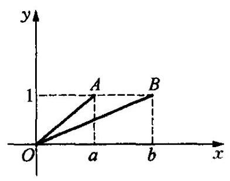

证明二 (构造法)如图:

$$
{OA} = f\left( a\right)  = \sqrt{1 + {a}^{2}},
$$

$$
{OB} = f\left( b\right)  = \sqrt{1 + {b}^{2}},
$$

$$
\left| {AB}\right|  = \left| {a - b}\right| ,
$$

由三角形两边之差小于第三边得

$$
\left| {f\left( a\right)  - f\left( b\right) }\right|  < \left| {a - b}\right| \text{ . }
$$

绝对值不等式有哪些用途?

习题练习

- 自己练

1. ${ab} > 0$ ,则 $\text{ ① }\left| {a + b}\right|  > \left| a\right|$ , $\text{ ② }\left| {a + b}\right|  < \left| b\right|$ , ③ $\left| {a + b}\right|  < \left| {a - b}\right|$ ，④ $\left| {a + b}\right|  > \left| {a - b}\right|$ 中正确的是 ( ).

(A) ①② (B) ②③ (C) ①④ (D) ②④

2. $x$ 为实数，且 $\left| {x - 5}\right|  + \left| {x - 3}\right|  < m$ 有解，则 $m$ 的取值范围是( ).

(A) $m > 1$ (B) $m \geq  1$ (C) $m > 2$ (D) $m \geq  2$

3. 不等式 $\frac{\left| a + b\right| }{\left| a\right|  + \left| b\right| } \leq  1$ 成立的充要条件是 ( ).

(A) ${ab} \neq  0$ (B) ${a}^{2} + {b}^{2} \neq  0$

(C) ${ab} > 0$ (D) ${ab} < 0$

4. 已知 $\left| a\right|  \neq  \left| b\right| , m = \frac{\left| a\right|  - \left| b\right| }{\left| a - b\right| }, n = \frac{\left| a\right|  + \left| b\right| }{\left| a + b\right| }$ ,那么 $m\text{ 、 }n$ 之间的大小关系为( ).

(A) $m > n$ (B) $m < n$ (C) $m = n$ (D) $m \leq  n$

5. 已知 $\left| a\right|  < 1,\left| b\right|  < 1$ ,求证: $\left| \frac{a + b}{1 + {ab}}\right|  < 1$ .

6. 已知 $f\left( x\right)  = {x}^{2} + {ax} + b\left( {a, b \in  \mathbf{R}}\right)$ ,求证:

$$
\left| {f\left( 1\right) }\right|  + 2\left| {f\left( 2\right) }\right|  + \left| {f\left( 3\right) }\right|  \geq  2\text{ . }
$$

### 2.8 含字母系数的不等式 (The Parameteric Inequality)

像 $a{x}^{2} - \left( {a + 1}\right) x + 1 < 0$ 这样，含有两个或两个以上未知数的不等式，称为舍字母系数的不等式 (the parameteric inequality).

解不等式时，对字母的取值要进行恰当的分类，分类时要不重、不漏，然后根据分类进行求解.

例 1 解关于 $x$ 的不等式 $a{x}^{2} - \left( {a + 1}\right) x + 1 < 0$ ,其中 $a > 0$ .

解 由一元二次方程 $a{x}^{2} - \left( {a + 1}\right) x + 1 = 0$ 的根为 ${x}_{1} = 1,{x}_{2} = \; \frac{1}{a}$ 知:

(1)当 $\frac{1}{a} > 1$ ,即 $0 < a < 1$ 时,二次函数 $y = a{x}^{2} - \left( {a + 1}\right) x + 1$

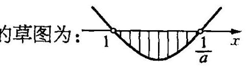

故原不等式的解集为 $\left( {1,\frac{1}{a}}\right)$ .

(2) $0 < \frac{1}{a} < 1$ ，即 $a > 1$ 时，二次函数 $y = a{x}^{2} - \left( {a + 1}\right) x + 1$ 的草图为: 故原不等式的解集为 $\left( {\frac{1}{a},1}\right)$ .

(3) $\frac{1}{a} = 1$ ，即 $a = 1$ 时，二次函数 $y = a{x}^{2} - \left( {a + 1}\right) x + 1$ 的草图为:

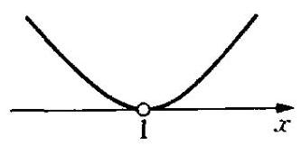

故原不等式的解集为 $\varnothing$ .

综上,当 $0 < a < 1$ 时原不等式的解集为 $\left( {1,\frac{1}{a}}\right)$ ; 当 $a > 1$ 时原不等式解集为 $\left( {\frac{1}{a},1}\right)$ ; 当 $a = 1$ 时原不等式解集为 $\varnothing$ .

例 2 解关于 $x$ 的不等式 ${x}^{2} - x - a\left( {a - 1}\right)  > 0$ .

解 原不等式可以化为 $\left( {x + a - 1}\right) \left( {x - a}\right)  > 0$ .

若 $a >  - \left( {a - 1}\right)$ ,即 $a > \frac{1}{2}$ 时, $x > a$ 或 $x < 1 - a$ ;

若 $a =  - \left( {a - 1}\right)$ ,即 $a = \frac{1}{2}$ 时, ${\left( x - \frac{1}{2}\right) }^{2} > 0 \Rightarrow  x \neq  \frac{1}{2}, x \in  \mathbf{R}$ ;

若 $a <  - \left( {a - 1}\right)$ ,即 $a < \frac{1}{2}$ 时, $x < a$ 或 $x > 1 - a$ .

因此,当 $a > \frac{1}{2}$ 时,原不等式的解集为 $\{ x \mid  x > a$ 或 $x < 1 - a\}$ ; 当 $a = \frac{1}{2}$ 时,原不等式的解集为 $\left\{  {x\left| {\;x \in  \mathbf{R}, x \neq  \frac{1}{2}}\right. }\right\}$ ; 当 $a < \frac{1}{2}$ 时,原不等式的解集为 $\{ x \mid  x > 1 - a$ 或 $x < a\}$ .

例 3 关于 $x$ 的不等式 $a{x}^{2} + \left( {a - 1}\right) x + a - 1 < 0$ 对于 $x \in  \mathbf{R}$ 恒成立,求 $a$ 的取值范围.

解 当 $a > 0$ 时不合题意, $a = 0$ 也不合题意,则必有

$$
\left\{  \begin{array}{l} a < 0, \\  \Delta  = {\left( a - 1\right) }^{2} - {4a}\left( {a - 1}\right)  < 0, \end{array}\right.
$$

即

$$
\left\{  \begin{array}{l} a < 0, \\  3{a}^{2} - {2a} - 1 > 0, \end{array}\right.
$$

即

$$
\left\{  \begin{array}{l} a < 0, \\  \left( {{3a} + 1}\right) \left( {a - 1}\right)  > 0, \end{array}\right.
$$

解得

$$
a <  - \frac{1}{3}.
$$

例 4 解不等式: $\frac{a}{x - 2} > 1 - a$ .

解 原不等式可化为 $\frac{\left( {a - 1}\right) x + \left( {2 - a}\right) }{x - 2} > 0$ ,即

$$
\left\lbrack  {\left( {a - 1}\right) x + \left( {2 - a}\right) }\right\rbrack  \left( {x - 2}\right)  > 0.
$$

当 $a = 1$ 时,原不等式的解集为 $\left( {2, + \infty }\right)$ ;

当 $a > 1$ 时,原不等式与 $\left( {x - \frac{a - 2}{a - 1}}\right) \left( {x - 2}\right)  > 0$ 同解:

若 $\frac{a - 2}{a - 1} > 2$ ,即 $0 \leq  a < 1$ 时,原不等式无解; 若 $\frac{a - 2}{a - 1} < 2$ ,即 $a < 0$ 或 $a > 1$ ,于是 $a > 1$ 时,原不等式的解集为 $\left( {-\infty ,\frac{a - 2}{a - 1}}\right)  \cup  \left( {2, + \infty }\right)$ ;

当 $a < 1$ 时,若 $a < 0$ ,原不等式的解集为 $\left( {\frac{a - 2}{a - 1},2}\right)$ ; 若 $0 < a <$ 1,原不等式的解集为 $\left( {2,\frac{a - 2}{a - 1}}\right)$ .

综上所述: 当 $a > 1$ 时,原不等式的解集为 $\left( {-\infty ,\frac{a - 2}{a - 1}}\right)  \cup  (2$ , $+ \infty )$ ; 当 $a = 1$ 时,原不等式的解集为 $\left( {2, + \infty }\right)$ ; 当 $0 < a < 1$ 时,原不等式的解集为 $\left( {2,\frac{a - 2}{a - 1}}\right)$ ; 当 $a = 0$ 时,原不等式的解集为 $\varnothing$ ; 当 $a < 0$ 时,原不等式的解集为 $\left( {\frac{a - 2}{a - 1},2}\right)$ .

解含字母系数的不等式要注意哪些问题?

## ·大家谈

1. 解关于 $x$ 的不等式 ${x}^{2} + \left( {m - {m}^{2}}\right) x - {m}^{3} > 0$ .

·自己安 2. 解关于 $x$ 的不等式 $\frac{2{x}^{2} - \left( {a + 1}\right) x + 1}{x\left( {x - 1}\right) } > 1$ (其中 $a > 1)$ .

3. 解关于 $x$ 的不等式 $\left( {m + 1}\right) {x}^{2} - {4x} + 1 \leq  0\left( {m \in  \mathbf{R}}\right)$ .

4. 解关于 $x$ 的不等式 $\frac{{ax} - 1}{{x}^{2} - x - 2} > 0$ .

5. 关于 $x$ 的不等式 $\left( {m + 1}\right) {x}^{2} - 2\left( {m - 1}\right) x + 3\left( {m - 1}\right)  < 0$ 的解是一切实数,求实数 $m$ 的取值范围.

### 2.9 基本不等式 (Basic Inequalities)

下左图是在北京召开的第 24 届国际数学家大会的会标,会标是根据中国古代数学家赵爽的弦图设计的，颜色的明暗使它看上去像一个风车. 你能在这个图案中找出一些相等关系或不等关系吗?

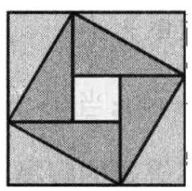

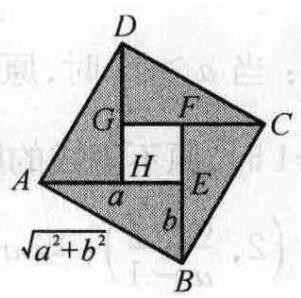

将上左图中的“风车”抽象成如上右图所示,在正方形 ${ABCD}$ 中有 4 个全等的直角三角形. 设直角三角形的两条直角边长分别为 $a\text{ 、 }b$ ,那么正方形的边长为 $\sqrt{{a}^{2} + {b}^{2}}$ . 这样,4 个直角三角形的面积的和是 ${2ab}$ ,正方形的面积为 ${a}^{2} + {b}^{2}$ . 由于 4 个直角三角形的面积小于正方形的面积, 我们就得到了一个不等式: ${a}^{2} + {b}^{2} \geq  {2ab}$ .

当直角三角形变为等腰直角三角形,即 $a = b$ 时,正方形 ${EFGH}$ 缩为一个点,这时有 ${a}^{2} + {b}^{2} = {2ab}$ .

定理 1 (基本不等式 1) 对任意 $a, b \in  \mathbf{R}$ ,那么 ${a}^{2} + {b}^{2} \geq  {2ab}$ ,当且仅当 $a = b$ 时等号成立.

证明 因为 ${a}^{2} + {b}^{2} - {2ab} = {\left( a - b\right) }^{2} \geq  0$ .

上式中对一切 $a, b \in  \mathbf{R}$ 成立,并且当且仅当 $a = b$ 时等号成立.

故原不等式成立.

特别的,如果 $a > 0, b > 0$ ,我们用 $\sqrt{a}\text{ 、 }\sqrt{b}$ 分别代替 $a\text{ 、 }b$ ,可得 $a + \; b \geq  2\sqrt{ab}$ ,通常写作

$$
\frac{a + b}{2} \geq  \sqrt{ab}\left( {a > 0, b > 0}\right) ,
$$

当且仅当 $a = b$ 时等号成立.

在数学中，我们称 $\frac{a + b}{2}$ 为正数 $a\text{ 、 }b$ 的算术平均数， $\sqrt{ab}$ 为正数 $a$ 、 $b$ 的几何平均数.

例 1 已知 $x\text{ 、 }y$ 都是正数,求证:

(1) $\frac{y}{x} + \frac{x}{y} \geq  2$ ；

(2) $\left( {x + y}\right) \left( {{x}^{2} + {y}^{2}}\right) \left( {{x}^{3} + {y}^{3}}\right)  \geq  8{x}^{3}{y}^{3}$ .

证明 因为 $x\text{ 、 }y$ 都是正数,所以 $\frac{x}{y} > 0,\frac{y}{x} > 0,{x}^{2} > 0,{y}^{2} > 0$ , ${x}^{3} > 0,{y}^{3} > 0.$

(1). $\frac{x}{y} + \frac{y}{x} \geq  2\sqrt{\frac{x}{y} \cdot  \frac{y}{x}} = 2$ ,即 $\frac{x}{y} + \frac{y}{x} \geq  2$ ,当且仅当 $x = y$ 时等号成立.

(2)因为 $x + y \geq  2\sqrt{xy} > 0,{x}^{2} + {y}^{2} \geq  2\sqrt{{x}^{2}{y}^{2}} > 0,{x}^{3} + {y}^{3} \geq \; 2\sqrt{{x}^{3}{y}^{3}} > 0$ ,所以

$$
\left( {x + y}\right) \left( {{x}^{2} + {y}^{2}}\right) \left( {{x}^{3} + {y}^{3}}\right)  \geq  2\sqrt{xy} \cdot  2\sqrt{{x}^{2}{y}^{2}} \cdot  2\sqrt{{x}^{3}{y}^{3}}
$$

$$
= 8{x}^{3}{y}^{3}\text{ , }
$$

$$
\left( {x + y}\right) \left( {{x}^{2} + {y}^{2}}\right) \left( {{x}^{3} + {y}^{3}}\right)  \geq  8{x}^{3}{y}^{3},
$$

当且仅当 $x = y$ 时等号成立.

说明: 在运用 $\frac{a + b}{2} \geq  \sqrt{ab}$ 时,注意条件 $a\text{ 、 }b$ 均为正数,结合不等式的性质 (把握好每条性质成立的条件), 进行变形.

例 2 (1)用篱笆围成一个面积为 ${100}{\mathrm{\;m}}^{2}$ 的矩形菜园，问:这个矩形的长、宽各为多少时, 所用篱笆最短? 这时篱笆的总长度是多少?

(2)一段长为 ${36}\mathrm{\;m}$ 的篱笆围成一个一边靠墙的矩形菜园，问这个矩形的长、宽各为多少时, 菜园的面积最大, 最大面积是多少?

解 (1) 设矩形菜园的长为 $x\mathrm{\;m}$ ,宽为 $y\mathrm{\;m}$ ,则 ${xy} = {100}$ ,篱笆的长为 $2\left( {x + y}\right) \mathrm{m}$ . 由 $\frac{x + y}{2} \geq  \sqrt{xy}$ ,可得

$$
x + y \geq  2\sqrt{100},
$$

则 $2\left( {x + y}\right)  \geq  {40}$ . 当且仅当 $x = y$ 时等号成立,此时 $x = y = {10}$ .

因此，这个矩形的长、宽都为 ${10}\mathrm{\;m}$ 时，所用的篱笆最短，这时篱笆的总长度是 ${40}\mathrm{\;m}$ .

(2)设矩形菜园的宽为 $x\mathrm{\;m}$ ，则长为 $\left( {{36} - {2x}}\right) \mathrm{m}$ ，其中 $0 < x <$ 18.

菜园的面积 $S = x\left( {{36} - {2x}}\right)$

$$
= \frac{1}{2} \cdot  {2x}\left( {{36} - {2x}}\right)
$$

$$
\leq  \frac{1}{2}{\left( \frac{{2x} + {36} - {2x}}{2}\right) }^{2} = {162},
$$

当且仅当 ${2x} = {{36} - {2x}}$ ，即 $x = 9$ 时菜园面积最大，即菜园长 ${18}\mathrm{\;m}$ ，宽为 $9\mathrm{\;m}$ 时菜园面积最大为 ${162}{\mathrm{\;m}}^{2}$ .

归纳:

1. 两个正数的和为定值时,它们的积有最大值,即若 $a, b \in  {\mathbf{R}}^{ + }$ ,且 $a + b = M, M$ 为定值，则 ${ab} \leq  \frac{{M}^{2}}{4}$ ，当且仅当 $a = b$ 时等号成立.

2. 两个正数的积为定值时,它们的和有最小值,即若 $a, b \in  {\mathbf{R}}^{ + }$ ,且 ${ab} = P, P$ 为定值,则 $a + b \geq  2\sqrt{P}$ ,当且仅当 $a = b$ 时等号成立.

定理 2(基本不等式 2) 如果 $a, b, c \in  {\mathbf{R}}^{ + }$ ,那么

$$
{a}^{3} + {b}^{3} + {c}^{3} \geq  {3abc},
$$

当且仅当 $a = b = c$ 时等号成立.

证明 因为 ${a}^{3} + {b}^{3} + {c}^{3} - {3abc} = {\left( a + b\right) }^{3} + {c}^{3} - 3{a}^{2}b - {3a}{b}^{2} - {3abc}$

$$
= \left( {a + b + c}\right) \left\lbrack  {{\left( a + b\right) }^{2} - \left( {a + b}\right) c + {c}^{2}}\right\rbrack   - {3ab}\left( {a + b + c}\right)
$$

$$
= \left( {a + b + c}\right) \left\lbrack  {{a}^{2} + {2ab} + {b}^{2} - {ac} - {bc} + {c}^{2} - {3ab}}\right\rbrack
$$

$$
= \left( {a + b + c}\right) \left( {{a}^{2} + {b}^{2} + {c}^{2} - {ab} - {bc} - a}\right)
$$

$$
= \frac{1}{2}\left( {a + b + c}\right) \left\lbrack  {{\left( a - b\right) }^{2} + {\left( b - c\right) }^{2} + {\left( c - a\right) }^{2}}\right\rbrack  ,
$$

又因为 $a, b, c \in  {\mathbf{R}}^{ + }$ ,所以上式 $\geq  0$ ,从而 ${a}^{3} + {b}^{3} + {c}^{3} \geq  {3abc}$ ,当且仅当 $a = b = c$ 时,等号成立.

推论 如果 $a, b, c \in  \mathbf{R}$ ,那么 $\frac{a + b + c}{3} \geq  \sqrt[3]{abc}$ ,当且仅当 $a = \; b = c$ 时等号成立.

证明 ${\left( \sqrt[3]{a}\right) }^{3} + {\left( \sqrt[3]{b}\right) }^{3} + {\left( \sqrt[3]{c}\right) }^{3} \geq  3\sqrt[3]{a} \cdot  \sqrt[3]{b} \cdot  \sqrt[3]{c}$

$$
\Leftrightarrow  a + b + c \geq  3\sqrt[3]{abc}
$$

$$
\Leftrightarrow  \frac{a + b + c}{3} \geq  \sqrt[3]{abc}\text{ . }
$$

由定理 2 知推论成立.

由此推出 ${\left( \frac{a + b + c}{3}\right) }^{3} \geq  {abc}$ 成立,当且仅当 $a = b = c$ 时等号成立.

例 3 已知: $a\text{ 、 }b\text{ 、 }c$ 都为正数,求证: $\left( {a + b + c}\right) \left( {\frac{1}{a} + \frac{1}{b} + \frac{1}{c}}\right)  \geq$ 9.

证明 因为 $a, b, c$ 都是正数,所以

$$
\frac{a + b + c}{3} \geq  \sqrt[3]{abc} > 0\text{ 且 }\frac{1}{a} + \frac{1}{b} + \frac{1}{c} \geq  3 \cdot  \frac{1}{\sqrt{abc}} > 0,
$$

两式相乘得

$$
\left( {a + b + c}\right) \left( {\frac{1}{a} + \frac{1}{b} + \frac{1}{c}}\right)  \geq  3\sqrt{abc} \cdot  3\frac{1}{\sqrt{abc}} \geq  9,
$$

故不等式得证.

例 4 一根水平放置的长方体形枕木的安全负荷与它的宽度 $a$ 成正比，与它的厚度 $d$ 的平方成正比，与它的长度 $l$ 的平方成反比.

(1)将此枕木翻转 ${90}^{ \circ  }$ (即宽度变为厚度)，枕木的安全负荷变大了吗? 为什么?

(2)现有一根横断面为半圆(半径为 $R$ )的木材, 用它来截取长方体形的枕木, 木材长度即为枕木规定的长度, 问如何截取, 可使安全负荷最大?

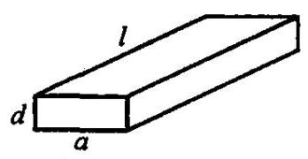

解 (1) 由题可设安全负荷 ${y}_{1} = k \cdot  \frac{a{d}^{2}}{{l}^{2}}$ ( $k$ 为正常数),则翻转 ${90}^{ \circ  }$ 后,安全负荷 ${y}_{2} = k \cdot  \frac{d{a}^{2}}{{l}^{2}}$ .

因为 $\frac{{y}_{1}}{{y}_{2}} = \frac{d}{a}$ ,所以,当 $0 < d < a$ 时, ${y}_{1} < {y}_{2}$ ,安全负荷变大; 当 $0 < a < d$ 时, ${y}_{1} > {y}_{2}$ ,安全负荷变小.

(2)如图，设截取的枕木宽为 $a$ ，高为 $d$ ，则 ${\left( \frac{a}{2}\right) }^{2} + {d}^{2} = {R}^{2}$ ，即 ${a}^{2} + 4{d}^{2} = 4{R}^{2}.$

因为枕木长度不变,所以 $u = a{d}^{2}$ 最大时,安全负荷最大. 故

$$
u = {d}^{2}\sqrt{{a}^{2}} = {d}^{2}\sqrt{4{R}^{2} - 4{d}^{2}} = 2\sqrt{{d}^{4}\left( {{R}^{2} - {d}^{2}}\right) }
$$

$$
= 4\sqrt{\frac{{d}^{2}}{2} \cdot  \frac{{d}^{2}}{2} \cdot  \left( {{R}^{2} - {d}^{2}}\right) } \leq  4\sqrt{{\left( \frac{\frac{{d}^{2}}{2} + \frac{{d}^{2}}{2} + \left( {{R}^{2} - {d}^{2}}\right) }{3}\right) }^{3}}
$$

$$
= \frac{4\sqrt{3}{R}^{3}}{9}\text{ , }
$$

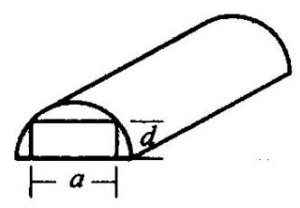

当且仅当 $\frac{{d}^{2}}{2} = {R}^{2} - {d}^{2}$ ,即取 $d = \frac{\sqrt{6}}{3}R, a = \; 2\sqrt{{R}^{2} - {d}^{2}} = \frac{2\sqrt{3}}{3}R$ 时， $u$ 最大，即安全负荷最大.

定理 3(基本不等式 3) 如果 ${a}_{1},{a}_{2},\cdots ,{a}_{n} \in  {\mathbf{R}}^{ + }$ ,那么

$$
\frac{{a}_{1} + {a}_{2} + \cdots  + {a}_{n}}{n} \geq  \sqrt[n]{{a}_{1}{a}_{2}\cdots {a}_{n}}, n \in  {\mathbf{N}}^{ * },
$$

并且当且仅当 ${a}_{1} = {a}_{2} = \cdots  = {a}_{n}$ 时,等号成立.

这个结论最终可利用数学归纳法和二项式定理证明(这里从略).

如果 ${a}_{1},{a}_{2},\cdots ,{a}_{n} \in  {\mathbf{R}}^{ + }, n > 1$ 且 $n \in  {\mathbf{N}}^{ * }$ ,则 $\frac{{a}_{1} + {a}_{2} + \cdots  + {a}_{n}}{n}$ 叫做这 $n$ 个正数的算术平均数, $\sqrt[n]{{a}_{1}{a}_{2}\cdots {a}_{n}}$ 叫做这 $n$ 个正数的几何平均数.

定理 3 也表述为: $n$ 个正数的算术平均数不小于它们的几何平均数.

课堂活动

✘大家族

基本不等式有哪些形式,怎样运用基本不等式? 请举一个运用基本不等式解决问题的例子.

习题练习

・自己な

1. 已知 $m > 0$ ,求证: $\frac{24}{m} + {6m} \geq  {24}$ .

2. 已知 $a\text{ 、 }b\text{ 、 }c$ 都是正数,求证: $\left( {a + b}\right) \left( {b + c}\right) (c +$ a) $\geq  {8abc}$ .

3. (1) 若 $x > 0$ ,求 $f\left( x\right)  = {4x} + \frac{9}{x}$ 的最小值;

(2)若 $x < 0$ ，求 $f\left( x\right)  = {4x} + \frac{9}{x}$ 的最大值.

4. (1) 若 $x \neq  0$ ，求 $x + \frac{1}{x}$ 的取值范围；

(2)若 ${ab} = 1$ ，求 $a + b$ 的取值范围；

(3)若 $x < \frac{5}{4}$ ，求 ${4x} - 2 + \frac{1}{{4x} - 5}$ 的最大值；

(4)若 $x > 2$ ，求 $\frac{{x}^{2} - {3x} + 3}{x - 2}$ 的最小值；

(5) 若 $x, y > 0$ ,且 $\frac{1}{x} + \frac{9}{y} = 1$ ,求 $x + y$ 的最小值;

(6) 若 $x, y > 0$ ,且 $x + y = 1$ ,求 $\frac{4}{x} + \frac{1}{y}$ 的最小值;

(7) 求 $y = \frac{{x}^{2} + {13}}{\sqrt{{x}^{2} + 4}}$ 的最小值；

(8) 若 $a, b > 0$ ,且 ${ab} = a + b + 3$ ,求 ${ab}$ 的取值范围.

5. 某工厂要建造一个长方体无盖贮水池,其容积为 ${4800}{\mathrm{\;m}}^{3}$ ,深为 $3\mathrm{\;m}$ ，如果池底 $1{\mathrm{\;m}}^{2}$ 的造价为 150 元，池壁 $1{\mathrm{\;m}}^{2}$ 的造价为 120 元，问怎样设计水池能使总造价最低,最低总造价是多少元?

### 2.10 不等式的证明 (Proof of Inequalities)

不等式的证明,由于题型多变,技巧性强,加上无固定程序可循,因此有一定的难度,解决这个困难的出路在于深刻理解不等式证明中应用的数学思维方法和数学思想方法，熟练运用不等式的性质和一些基本不等式.

不等式的证明常用方法有:比较法、分析法、综合法、反证法.

1. 比较法

比较法是证明不等式的常用方法,它有两种基本形式:

(1)作差比较法

步骤:作差——变形——判断.

变形方向: 变为一个常数;或变为平方和形式;或变为因式之积的形式.

这种比较法是普遍适用的,是无条件的.

例 1 已知 $a > 0, b > 0$ ,且 $a \neq  b$ ,求证: ${a}^{3} + {b}^{3} > {a}^{2}b + a{b}^{2}$ .

证明 因为 $\left( {{a}^{3} + {b}^{3}}\right)  - \left( {{a}^{2}b + a{b}^{2}}\right)  = {\left( a - b\right) }^{2}\left( {a + b}\right)$ ,且由题设可知 $a + b > 0,{\left( a - b\right) }^{2} > 0$ ,所以 ${a}^{3} + {b}^{3} > {a}^{2}b + a{b}^{2}$ .

例 2 若 $a, b > 0, n > 1$ ,求证: ${a}^{n} + {b}^{n} \geq  {a}^{n - 1}b + a{b}^{n - 1}$ .

证明 $\left( {{a}^{n} + {b}^{n}}\right)  - \left( {{a}^{n - 1}b + a{b}^{n - 1}}\right)$

$= {a}^{n - 1}\left( {a - b}\right)  - {b}^{n - 1}\left( {a - b}\right)$

$$
= \left( {a - b}\right) \left( {{a}^{n - 1} - {b}^{n - 1}}\right)  = A\text{ . }
$$

若 $a > b$ ,则 $a - b > 0$ 且 ${a}^{n - 1} > {b}^{n - 1}$ ,则 $A > 0$ ;

若 $a < b$ ,则 $a - b < 0$ 且 ${a}^{n - 1} < {b}^{n - 1}$ ,则 $A > 0$ ;

若 $a = b$ ,则 $A = 0$ .

所以原不等式成立.

(2)作商比较法

步骤:作商——变形——判断.

作商法是依据当 $b > 0$ ,且 $\frac{a}{b} > 1$ 时,则 $a > b$ .

例 3 设 $a, b, c$ 为正数,求证: ${a}^{a}{b}^{b}{c}^{c} \geq  {\left( abc\right) }^{\frac{a + b + c}{3}}$ .

证明 易知上式是轮换的,不妨设 $a \geq  b \geq  c$ ,则原不等式等价于

$$
{a}^{3a}{b}^{3b}{c}^{3c} \geq  {\left( abc\right) }^{a + b + c}
$$

作商得 $\frac{{a}^{2a}{b}^{2b}{c}^{2c}}{{a}^{b + c}{b}^{a + c}{c}^{a + b}} = {\left( \frac{a}{b}\right) }^{a - b}{\left( \frac{b}{c}\right) }^{b - c}{\left( \frac{a}{c}\right) }^{a - c} \geq  1$ ,

所以原不等式成立.

2. 分析法

证明不等式时,有时可以从求证的不等式出发,分析使这个不等式成立的充分条件，把证明不等式转化为判定这些充分条件是否具备的问题，如果能够肯定这些充分条件都已具备，那么就可以断定原不等式成立, 这种方法通常叫做分析法. 分析法也称逆推法.

例 4 求证: $\sqrt{5} + \sqrt{7} > 1 + \sqrt{15}$ .

证明 要证 $\sqrt{5} + \sqrt{7} > 1 + \sqrt{15}$ ,即证 ${\left( \sqrt{5} + \sqrt{7}\right) }^{2} > {\left( 1 + \sqrt{15}\right) }^{2}$ ,即 ${12} + 2\sqrt{35} > {16} + 2\sqrt{15}$ ,即 $\sqrt{35} > 2 + \sqrt{15}$ ,即 ${35} > {19} + 4\sqrt{15}$ ,即 $4 > \; \sqrt{15}$ ,即 ${16} > {15}$ ,这显然成立.

由此逆推即得 $\sqrt{5} + \sqrt{7} > 1 + \sqrt{15}$ .

用分析法证明不等式时, 应注意每一步推理都要保证能够反推回来. 分析法的优点是比较符合探索题解的思路, 缺点是叙述往往比较冗长. 因此, 思路一旦打通, 可改用综合法解答, 分析法适用于条件简单而求证复杂或从条件无从下手的问题.

3. 综合法

综合法是“由因导果”, 即从已知条件出发, 依据不等式性质、函数性质或熟知的基本不等式,逐步推导出要证明的不等式.

例 5 已知 $a, b$ 同号,且 ${ab} \neq  0$ ,求证: $\frac{a}{b} + \frac{b}{a} \geq  2$ .

证明 因为 $a, b$ 同号,所以 $\frac{a}{b} > 0,\frac{b}{a} > 0$ ,则 $\frac{a}{b} + \frac{b}{a} \geq  2 \; \sqrt{\frac{a}{b} \cdot  \frac{b}{a}} = 2$ ,即 $\frac{a}{b} + \frac{b}{a} \geq  2$ .

在实际应用中,常常用分析法寻找思路,用综合法表述,即所谓的综合分析法, 这样使得叙述不会太过于冗长, 请看下例:

例 6 设 $a, b, x, y \in  \mathbf{R}$ ,且 ${a}^{2} + {b}^{2} = 1,{x}^{2} + {y}^{2} = 1$ ,试证: $\left| {{ax} + {by}}\right|  \leq  1$ .

证明 1 用分析法: 要证 $\left| {{ax} + {by}}\right|  \leq  1$ ,即证 ${\left( ax + by\right) }^{2} \leq  1$ ,

即

$$
{a}^{2}{x}^{2} + {2abxy} + {b}^{2}{y}^{2} \leq  \left( {{a}^{2} + {b}^{2}}\right) \left( {{x}^{2} + {y}^{2}}\right) ,
$$

即

$$
{b}^{2}{x}^{2} - {2abxy} + {a}^{2}{y}^{2} \geq  0,
$$

即 ${\left( bx - ay\right) }^{2} \geq  0$ ,这显然成立. 所以 $\left| {{ax} + {by}}\right|  \leq  1$ 成立.

证明 2 用综合法: 因为

$$
{\left( ax + by\right) }^{2} = {a}^{2}{x}^{2} + {2abxy} + {b}^{2}{y}^{2}
$$

$$
\leq  {a}^{2}{x}^{2} + {b}^{2}{y}^{2} + {b}^{2}{x}^{2} + {a}^{2}{y}^{2}
$$

$$
= \left( {{a}^{2} + {b}^{2}}\right) \left( {{x}^{2} + {y}^{2}}\right)  = 1,
$$

所以 $\left| {{ax} + {by}}\right|  \leq  1$ 成立.

4. 反证法

反证法是指: 证明某个命题时, 先假设它的结论的否定成立, 然后从这个假设出发, 根据命题的条件和已知的真命题, 经过推理, 得出与已知事实(条件、公理、定义、定理、法则、公式等) 相矛盾的结果. 这样, 就证明了结论的否定不成立，从而间接地肯定了原命题的结论成立.

反证法证题的步骤一般分为三步:

(1)假设命题的结论不成立;

(2)从这个假设出发，经过推理论证，得出矛盾；

(3)由矛盾判定假设不正确，从而肯定命题的结论正确.

例 7 已知 $a > b > 0$ ,和是大于 1 的整数,求证: $\sqrt[n]{a} > \sqrt[n]{b}$ .

证明 假设 $\sqrt[n]{a} \leq  \sqrt[n]{b}$ ,则 $\sqrt[n]{\frac{a}{b}} \leq  1$ ,即 $\frac{a}{b} \leq  1$ ,故 $a \leq  b$ ,这与已知矛盾，所以 $\sqrt[n]{a} > \sqrt[n]{b}$ .

例 8 设 $0 < a, b, c < 1$ ,求证: $\left( {1 - a}\right) b,\left( {1 - b}\right) c,\left( {1 - c}\right) a$ 不可能同时大于 $\frac{1}{4}$ .

证明 设 $\left( {1 - a}\right) b > \frac{1}{4},\left( {1 - b}\right) c > \frac{1}{4},\left( {1 - c}\right) a > \frac{1}{4}$ ,则三式相乘得

$$
\left( {1 - a}\right) b \cdot  \left( {1 - b}\right) c \cdot  \left( {1 - c}\right) a > \frac{1}{64}.
$$

①

又因为 $0 < a, b, c < 1$ ,所以

$$
0 < \left( {1 - a}\right) a \leq  {\left\lbrack  \frac{\left( {1 - a}\right)  + a}{2}\right\rbrack  }^{2} = \frac{1}{4},
$$

同理

$$
\left( {1 - b}\right) b \leq  \frac{1}{4},\left( {1 - c}\right) c \leq  \frac{1}{4}.
$$

以上三式相乘得

$$
\left( {1 - a}\right) a \cdot  \left( {1 - b}\right) b \cdot  \left( {1 - c}\right) c \leq  \frac{1}{64},
$$

与①矛盾. 所以原命题成立.

运用反证法证明时,它的适用范围往往是那些不等式看起来明显成立,但又不容易直接证明的不等式.

司題蘇司

、自己安

1. (1) 若 $x > 1$ ,求证: ${x}^{3} > x + \frac{1}{x} - 1$ ;

(2)若 $a, b \in  \mathbf{R}$ ，求证: ${a}^{2} + {b}^{2} \geq  {ab} + a + b - 1$ ；

(3)若 $a < b < 0$ ，求证: $\frac{{a}^{2} + {b}^{2}}{{a}^{2} - {b}^{2}} < \frac{a + b}{a - b}$ ；

(4) 若 $a > 0, b > 0$ ,求证: ${a}^{a}{b}^{b} \geq  {a}^{b}{b}^{a}$ .

2. 若 $x, y, z \in  \mathbf{R}, a, b, c \in  \mathbf{R}$ ,则 $\frac{b + c}{a}{x}^{2} + \frac{c + a}{b}{y}^{2} + \frac{a + b}{c}{z}^{2} \geq \; 2\left( {{xy} + {yz} + {zx}}\right)$ .

3. 若 $a, b, c$ 为不全相等的正数,则 ${a}^{2}b + a{b}^{2} + {b}^{2}c + b{c}^{2} + {a}^{2}c + \; a{c}^{2} > {6abc}.$

4. 已知 $a\text{ 、 }b \in  {\mathbf{R}}^{ + }$ ,且 $a \neq  b$ ,求证: ${\left( a - b\right) }^{2}\left( {{a}^{2} - {ab} + {b}^{2}}\right)  < \; {\left( {a}^{2} - {b}^{2}\right) }^{2}$ .

5. 求证: $\sqrt{3} + \sqrt{7} < 2\sqrt{5}$ .

6. 设 $x > 0, y > 0$ ,求证: ${\left( {x}^{2} + {y}^{2}\right) }^{\frac{1}{2}} > {\left( {x}^{3} + {y}^{3}\right) }^{\frac{1}{3}}$ .

7. 已知 $a, b, c$ 分别为一个三角形的三边之长,求证: $\frac{c}{a + b} + \; \frac{a}{b + c} + \frac{b}{c + a} < 2.$

8. 若 $x, y, z \in  {\mathbf{R}}^{ + }$ ,且 $x + y + z = {xyz}$ ,求证: $\frac{y + z}{x} + \frac{z + x}{y} + \; \frac{x + y}{z} \geq  2\left( {\frac{1}{x} + \frac{1}{y} + \frac{1}{z}}\right) .$

9. 求证: $- \frac{1}{2} \leq  x\sqrt{1 - {x}^{2}} \leq  \frac{1}{2}$ .

10. 已知 $a\text{ 、 }b\text{ 、 }c \in  \mathbf{R}$ ,求证: ${a}^{2} + {b}^{2} + {c}^{2} \geq  {ab} + {bc} + {ac}$ .

11. 已知 $x\text{ 、 }y \in  \mathbf{R}$ ,求证: ${x}^{2} + {y}^{2} + 1 \geq  {xy} + x + y$ .

12. 已知 $a, b, c \in  \mathbf{R}$ ,求证: ${a}^{2} + {b}^{2} + {c}^{2} \geq  \frac{1}{3}{\left( a + b + c\right) }^{2}$ .

13. 已知 $a, b, c \in  {\mathbf{R}}^{ + }$ ,求证: $\frac{bc}{a} + \frac{ac}{b} + \frac{ab}{c} \geq  a + b + c$ .

14. 已知 $\bigtriangleup {ABC}$ 中三内角为 $A, B, C$ ,其中 $C$ 为直角,求证: $A < \frac{\pi }{2}.$

15. 已知 $a, b, c, d \in  \mathbf{R}$ ,且 $a + b = c + d = 1,{ac} + {bd} > 1$ . 求证: $a\text{ 、 }b\text{ 、 }c\text{ 、 }d$ 中至少有一个是负数.

16. 已知 $a + b + c > 0,{ab} + {bc} + {ca} > 0,{abc} > 0$ ,求证: $a, b$ , $c > 0$ .

课外活动

## 不等式证明的其他方法

·自己学

在高中数学教学中, 不等式的证明始终是一个难点, 其原因是证明不等式无固定的程序可循, 方法多样, 技巧性强. 之前虽然介绍了四种基本方法, 但我们在解题过程中所接触到的不等式种类繁多，如数列不等式，绝对值不等式和三角不等式等等. 这些不等式仅仅利用上述方法是很难解决问题, 有些即使能证出, 但往往途径曲折, 叙述冗长, 结果也很难令人满意. 我们不妨在大家掌握的基础之上另辟蹊径，对于不同的不等式分别施以相应的证法，这往往会达到事半功倍的效果.

## 1. 放缩法

在证明过程中,根据不等式的传递性,常采用舍去一些正项(或负项)而使不等式的各项之和变小 (或变大), 或把和 (或积) 里的各项换以较大(或较小)的数，或在分式中扩大(或缩小)分式中的分子(或分母)， 从而达到证明的目的.

例 1 求证: $\frac{1}{2} \times  \frac{3}{4} \times  \frac{5}{6} \times  \cdots  \times  \frac{9999}{10000} < {0.01}$ .

证明 令 $p = \frac{1}{2} \times  \frac{3}{4} \times  \frac{5}{6} \times  \cdots  \times  \frac{9999}{10000}$ ,则

$$
{p}^{2} = \frac{1}{{2}^{2}} \times  \frac{{3}^{2}}{{4}^{2}} \times  \frac{{5}^{2}}{{6}^{2}} \times  \cdots  \times  \frac{{9999}^{2}}{{10000}^{2}}
$$

$$
< \frac{1}{3 \times  1} \times  \frac{{3}^{2}}{3 \times  5} \times  \cdots  \times  \frac{{9999}^{2}}{{9999} \times  {10001}}
$$

$$
= \frac{1}{10001} < \frac{1}{10000},
$$

所以

$$
p < {0.01}\text{ . }
$$

例 2 求证: $\frac{1}{2} \times  \frac{3}{4} \times  \frac{5}{6} \times  \frac{7}{8} \times  \cdots  \times  \frac{{2n} - 1}{2n} < \frac{1}{\sqrt{2n}}$ .

证明 令 $p = \frac{1}{2} \times  \frac{3}{4} \times  \frac{5}{6} \times  \frac{7}{8} \times  \cdots  \times  \frac{{2n} - 1}{2n}$ ,则

$$
{p}^{2} = \frac{1}{{2}^{2}} \times  \frac{{3}^{2}}{{4}^{2}} \times  \cdots  \times  \frac{{\left( 2n - 1\right) }^{2}}{{\left( 2n\right) }^{2}}
$$

$$
\leq  \left( {\frac{1}{2} \times  \frac{2}{3}}\right)  \times  \left( {\frac{3}{4} \times  \frac{5}{6}}\right)  \times  \cdots  \times  \left( {\frac{{2n} - 1}{2n} \times  1}\right)
$$

$$
= \frac{1}{2n}\text{ . }
$$

由于 $p > 0$ ,由上式得 $p < \frac{1}{\sqrt{2n}}$ ,所以原不等式得证.

值得注意的是运用放缩法证明不等式需要恰当好处, 不要放得过大, 也不要缩得过小. 对于放缩的目标可以从要证的结论进行考察.

2. 换元法

换元法是根据题目需要进行等量代换, 选择适当的辅助参数简化问题的一种方法.

例 3 设 $a, b \in  {\mathbf{R}}^{ + }, a + b = 1$ ,求证: ${a}^{4} + {b}^{4} \geq  \frac{1}{8}$ .

证明 令 $a = \frac{1}{2} + t, b = \frac{1}{2} - t$ ,且 $- \frac{1}{2} < t < \frac{1}{2}$ ,则

$$
{a}^{4} + {b}^{4} = {\left( \frac{1}{2} + t\right) }^{4} + {\left( \frac{1}{2} - t\right) }^{4} = \frac{1}{8} + 3{t}^{2} + 2{t}^{4} \geq  \frac{1}{8},
$$

即

$$
{a}^{4} + {b}^{4} \geq  \frac{1}{8}
$$

这里采用的是均值换元法. 在运用换元法证明不等式时会增加新的参数, 必须注明新增加的参数的取值范围.

3. 判别式法

判别式法是为了根据证明需要, 通过构造一元二次方程, 利用关于某一变元的二次三项式有实根时的判别式的取值范围来证明不等式.

例 4 设 $x, y \in  \mathbf{R}$ ,且 ${x}^{2} + {y}^{2} = 1$ ,求证: $\left| {y - {ax}}\right|  \leq  \sqrt{1 + {a}^{2}}$ .

证明 设 $m = y - {ax}$ 则 $y = {ax} + m$ ,代入 ${x}^{2} + {y}^{2} = 1$ 得 ${x}^{2} + \; {\left( ax + m\right) }^{2} = 1$ ,展开得

$$
\left( {1 + {a}^{2}}\right) {x}^{2} + {2amx} + \left( {{m}^{2} - 1}\right)  = 0.
$$

因为 $x, y \in  \mathbf{R},1 + {a}^{2} \neq  0$ ，所以 $\Delta  \geq  0$ ，即

$$
{\left( 2am\right) }^{2} - 4\left( {1 + {a}^{2}}\right) \left( {{m}^{2} - 1}\right)  \geq  0,
$$

得 $\left| m\right|  \leq  \sqrt{1 + {a}^{2}}$ ,故 $\left| {y - {ax}}\right|  \leq  \sqrt{1 + {a}^{2}}$ ,得证.

例 5 求证: 对任何 $x \in  \mathbf{R}$ ,都有 $\frac{1}{3} \leq  \frac{{x}^{2} - {2x} + 4}{{x}^{2} + {2x} + 4} \leq  3$ .

证明 设 $y = \frac{{x}^{2} - {2x} + 4}{{x}^{2} + {2x} + 4}$ ,整理得

$$
\left( {y - 1}\right) {x}^{2} + 2\left( {y + 1}\right) x + 4\left( {y - 1}\right)  = 0.
$$

当 $y = 1$ 时, $x = 0$ ;

当 $y \neq  1$ 时,由 $x \in  \mathbf{R}$ ,得

$$
\Delta  = 4{\left( y + 1\right) }^{2} - {16}{\left( y - 1\right) }^{2} \geq  0,
$$

化简得 $3{y}^{2} - {10y} + 3 \leq  0$ ,得 $\frac{1}{3} \leq  y \leq  3$ .

综上可得 $\frac{1}{3} \leq  \frac{{x}^{2} - {2x} + 4}{{x}^{2} + {2x} + 4} \leq  3$ ,故原不等式得证.

## 4. 分解法

按照一定的法则, 把一个数或式分解为几个数或式, 使复杂的问题转化为简单易解的基本问题,以便分而治之,各个击破,从而达到证明不等式的目的.

例 6 当 $n \in  \mathbf{N}$ 且 $n \geq  2$ ,求证:

$$
1 + \frac{1}{2} + \frac{1}{3} + \cdots  + \frac{1}{n} > n\left( {\sqrt[n]{n + 1} - 1}\right) .
$$

证明 因为 $n + 1 + \frac{1}{2} + \frac{1}{3} + \cdots  + \frac{1}{n}$

$$
= \left( {1 + 1}\right)  + \left( {1 + \frac{1}{2}}\right)  + \left( {1 + \frac{1}{3}}\right)  + \cdots  + \left( {1 + \frac{1}{n}}\right)
$$

$$
= 2 + \frac{3}{2} + \frac{4}{3} + \cdots  + \frac{n + 1}{n} > n \cdot  \sqrt[n]{2 \times  \frac{3}{2} \times  \cdots  \times  \frac{n + 1}{n}}
$$

$$
= n \cdot  \sqrt[n]{n + 1},
$$

所以

$$
1 + \frac{1}{2} + \frac{1}{3} + \cdots  + \frac{1}{n} > n\left( {\sqrt[n]{n + 1} - 1}\right) .
$$

### 2.11 不等式的应用 (The Applications of Inequality)

不等式是研究方程、函数的重要工具，运用不等式可以解决函数的有关性质以及讨论方程中根与系数的关系等问题，运用不等式还可以解决一些实际应用问题.

例 1 在交通拥挤及事故多发地段, 为确保交通安全, 规定在此地段内，车距 $d$ 是车速 $v$ (公里/小时)的平方与车身长 $s$ (米)积的正比例函数,且车距不得小于车身长的一半,现假设车速为 50 公里/小时的时候, 车距恰为车身长.

(1)试写出 $d$ 关于 $v$ 的分段函数式(其中 $s$ 为常数)；

(2)问车速多大时，才能使此地段的车流量 $Q = \frac{1000v}{d + s}$ 最大.

解 (1) 设 $d = k{v}^{2}s$ ,因为 $v = {50}$ 时, $d = s$ ,代入得 $k = \frac{1}{2500}$ ,故 $d = \frac{1}{2500}{v}^{2}s$ ; 又 $d = \frac{1}{2}s$ 时, $v = {25}\sqrt{2}$ . 所以

$$
d = \left\{  \begin{array}{l} \frac{1}{2}s,0 < v \leq  {25}\sqrt{2}, \\  \frac{1}{2500}{v}^{2}s, v > {25}\sqrt{2}. \end{array}\right.
$$

(2) $Q = \left\{  \begin{array}{l} \frac{2000v}{3s},0 < v \leq  {25}\sqrt{2}, \\  \frac{1000v}{s\left( {1 + \frac{{v}^{2}}{2500}}\right) }, v > {25}\sqrt{2}. \end{array}\right.$① ②

对于①, $v = {25}\sqrt{2}$ 时, ${Q}_{\text{ 最大值 }} = \frac{{50000}\sqrt{2}}{3s}$ .

对于②, $Q = \frac{1000}{s\left( {\frac{1}{v} + \frac{v}{2500}}\right) } \leq  \frac{1000}{s \cdot  2\sqrt{\frac{1}{v} \cdot  \frac{v}{2500}}} = \frac{25000}{s}$ ,

所以当 $v = {50}$ 时, ${Q}_{\text{ 最大值 }} = \frac{25000}{s}$ .

因为 $\frac{25000}{s} > \frac{{50000}\sqrt{2}}{3s}$ ,所以当车速为 50 公里/小时,此地的车流量达到最大.

例 2 若水杯中的 $b$ 克糖水里含有 $a$ 克糖,假如再添上 $m$ 克糖,糖水会变得更甜,试将这一事实用数学关系式反映出来,并证明之.

解 由题意得 $\frac{a}{b} < \frac{a + m}{b + m}\left( {b > a > 0, m > 0}\right)$ .

证明一 比较法: $\frac{a + m}{b + m} - \frac{a}{b} = \frac{b\left( {a + m}\right)  - a\left( {b + m}\right) }{b\left( {b + m}\right) }$

$$
= \frac{m\left( {b - a}\right) }{b\left( {b + m}\right) }.
$$

因为 $b > a > 0, m > 0$ ,所以 $b - a > 0, b + m > 0$ ,所以 $\frac{m\left( {b - a}\right) }{b\left( {b + m}\right) } \; > 0$ ,即 $\frac{a + m}{b + m} > \frac{a}{b}$ 得证.

证明二 放缩法: 因为 $b > a > 0$ 且 $m > 0$ ,所以

$$
\frac{a}{b} = \frac{a\left( {b + m}\right) }{b\left( {b + m}\right) } = \frac{a + \frac{a}{b}m}{b + m} < \frac{a + m}{b + m}.
$$

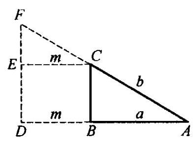

证明三 数形结合法: 如图, 在 $\mathrm{{Rt}}\bigtriangleup {ABC}$ 及 $\mathrm{{Rt}}\bigtriangleup {ADF}$ 中, ${AB} = a,{AC} = b$ , ${BD} = m$ ,作 ${CE}//{BD}$ .

因为 $\bigtriangleup {ABC} \backsim  \bigtriangleup {ADF}$ ,所以 $\frac{a}{b} = \frac{a + m}{b + {CF}} < \frac{a + m}{b + {CE}} = \frac{a + m}{b + m}$ .

习题练习 ·自己每

1. 有一台天平，两臂长不等，其余均精确，有人说要用它称物体的重量，只需将物体放在左右托盘各称一次， 则两次称量结果的和的一半就是物体的真实重量, 这种说法对吗? 并说明你的结论.

2. 已知水渠在过水断面面积为定值的情况下，过水湿周越小，其流量越大. 现有以下两种设计,如图:

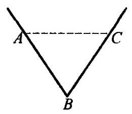

图 1

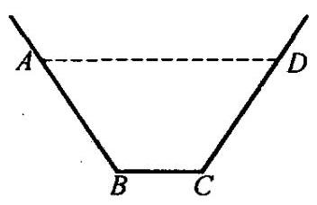

图 2

图 1 的过水断面为等腰 $\bigtriangleup {ABC},{AB} = {BC}$ ,过水湿周 ${l}_{1} = {AB} + \; {BC}$ . 图 2 的过水断面为等腰梯形 ${ABCD},{AB} = {CD},{AD}//{BC}$ , $\angle {BAD} = {60}^{ \circ  }$ ,过水湿周 ${l}_{2} = {AB} + {BC} + {CD}$ . 假设 $\bigtriangleup {ABC}$ 与梯形 ${ABCD}$ 的面积都为 $S$ .

(1)分别求 ${l}_{1}$ 和 ${l}_{2}$ 的最小值;

(2)为使流量最大，给出最佳设计方案.

3. 设 $x, y, a$ 都是实数，且 $x + y = {2a} - 1,{x}^{2} + {y}^{2} = {a}^{2} + {2a} - 3$ , 求乘积 ${xy}$ 的最小值及相应的 $a$ 的值.

4. 设不等式 $\left( {{2x} - 1}\right)  > m\left( {{x}^{2} - 1}\right)$ 对满足 $\left| m\right|  \leq  2$ 的一切实数 $m$ 的值都成立,求 $x$ 的取值范围.

5. 若关于 $x$ 的不等式 $\left| {{ax} + 2}\right|  < 6$ 的解集是 $\left( {-1,2}\right)$ ,求不等式 $\frac{x}{{ax} + 2} \leq  1$ 的解集.

課外活动

自己字

## 柯西不等式

柯西不等式是由数学家柯西(Cauchy)在研究数学分析中的“留数”问题时得到的. 但从历史的角度讲, 该不等式应当称为 Cauch-Buniakowsky-Schwarz 不等式, 因为, 正是后两位数学家在积分学中推而广之, 才使得这一不等式的应用近乎完善.

柯西不等式是一个非常重要的不等式. 可在证明不等式, 解三角形, 求函数最值,解方程等方面得到应用.

柯西(Cauchy)不等式

设 ${a}_{i},{b}_{i} \in  \mathbf{R}, i = 1,2,\cdots , n$ ,则

$$
{\left( {a}_{1}{b}_{1} + {a}_{2}{b}_{2} + \cdots  + {a}_{n}{b}_{n}\right) }^{2} \leq  \left( {{a}_{1}^{2} + {a}_{2}^{2} + \cdots  + {a}_{n}^{2}}\right) \left( {{b}_{1}^{2} + {b}_{2}^{2} + \cdots  + {b}_{n}^{2}}\right) ,
$$

当且仅当 ${a}_{1} = {a}_{2} = \cdots  = {a}_{n} = 0$ 或 ${b}_{i} = k{a}_{i}$ 时等号成立 $(k$ 为常数, $i = 1,2\cdots n)$ .

证明 构造二次函数

$$
f\left( x\right)  = {\left( {a}_{1}x + {b}_{1}\right) }^{2} + {\left( {a}_{2}x + {b}_{2}\right) }^{2} + \cdots  + {\left( {a}_{n}x + {b}_{n}\right) }^{2}
$$

$$
= \left( {{a}_{1}^{2} + {a}_{2}^{2} + \cdots  + {a}_{n}^{2}}\right) {x}^{2} + 2\left( {{a}_{1}{b}_{1} + {a}_{2}{b}_{2} + \cdots  + {a}_{n}{b}_{n}}\right) x
$$

$$
+ \left( {{b}_{1}^{2} + {b}_{2}^{2} + \cdots  + {b}_{n}^{2}}\right) \text{ . }
$$

因为 ${a}_{1}^{2} + {a}_{2}^{2} + \cdots  + {a}_{n}^{2} \geq  0$ ，且显然 $f\left( x\right)  \geq  0$ 恒成立，所以

$$
\Delta  = 4{\left( {a}_{1}{b}_{1} + {a}_{2}{b}_{2} + \cdots  + {a}_{n}{b}_{n}\right) }^{2} - 4\left( {{a}_{1}^{2} + {a}_{2}^{2} + \cdots  + {a}_{n}^{2}}\right) .
$$

$$
\left( {{b}_{1}^{2} + {b}_{2}^{2} + \cdots  + {b}_{n}^{2}}\right)  \leq  0,
$$

即 ${\left( {a}_{1}{b}_{1} + {a}_{2}{b}_{2} + \cdots  + {a}_{n}{b}_{n}\right) }^{2} \leq  \left( {{a}_{1}^{2} + {a}_{2}^{2} + \cdots  + {a}_{n}^{2}}\right) \left( {{b}_{1}^{2} + {b}_{2}^{2} + \cdots  + {b}_{n}^{2}}\right)$ , 当且仅当 ${a}_{i}x + {b}_{i} = 0\left( {i = 1,2,\cdots , n}\right)$ ,即 $\frac{{a}_{1}}{{b}_{1}} = \frac{{a}_{2}}{{b}_{2}} = \cdots  = \frac{{a}_{n}}{{b}_{n}}$ 时等号成立.

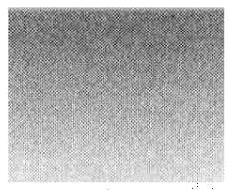

## 第三章 函数 (Function)

函数揭示了现实世界中数量关系之间相互依存和变化的实质, 是刻画和研究现实世界变化规律的重要模型. 在数学上，函数反映了变量与变量之间的相互关系, 是数学中最重要的基本概念之一.

在初中阶段，我们已学习了正比例函数，反比例函数，一次函数和二次函数. 在本章中，我们将进一步探究函数的基本性质，掌握函数的思想方法, 发展学生运用函数解决实际问题的建模能力.

### 3.1 函数的概念 (Concepts of Functions)

在初中我们已经学习了函数的概念. 它是这样叙述的:

在一个变化过程中有两个变量 $x$ 与 $y$ ,如果对于 $x$ 的每一个值, $y$ 都有唯一的值与之对应,那么就说 $y$ 是 $x$ 的函数, $x$ 叫做自变量.

在学习了集合概念之后，我们可以将函数的概念进一步叙述如下:

设 $A\text{ 、 }B$ 是非空数集,如果按照某个确定的对应关系 $f$ ,使得对于集合 $A$ 中的任意一个数 $x$ ,在集合 $B$ 中都有唯一确定的数 $y$ 与之对应,那么就称 $f : A \rightarrow  B$ 为集合 $A$ 到集合 $B$ 的一个函数 (function),记作 $y = \; f\left( x\right) , x \in  A$ ,其中 $x$ 叫做自变量 (independent variable), $y$ 叫作应变量 (dependent variable), $x$ 的取值范围 $A$ 叫做函数的定义域 (domain),与 $x$ 的值相对应的 $y$ 的值叫做函数值 (function value),函数值的集合 $\{ y \mid  y = f\left( x\right) , x \in  A \mid$ 叫做函数的值域 (range).

一般地,函数的定义域是由问题的实际背景所确定的. 如果只给出函数的解析式 $y = f\left( x\right)$ ,而没有指明它的定义域,那么函数的定义域就是指能使这个式子有意义的实数 $x$ 的集合.

例 1 求下列函数的定义域:

(1) $f\left( x\right)  = \frac{1}{x + 1}$

(2) $f\left( x\right)  = \sqrt{{x}^{2} - {2x} - 3}$ ;

(3) $f\left( x\right)  = \frac{1}{x + 1} + \sqrt{{x}^{2} - {2x} - 3}$ .

解 (1) 当 $x \neq   - 1$ 时,分式 $\frac{1}{x + 1}$ 有意义.

所以,函数的定义域是 $\{ x \mid  x \neq   - 1, x \in  \mathbf{R}\}$ .

( 2 )当 ${x}^{2} - {2x} - 3 \geq  0$ 时， $\sqrt{{x}^{2} - {2x} - 3}$ 有意义，解不等式 ${x}^{2} - \; {2x} - 3 \geq  0$ ,得 $x \geq  3$ 或 $x \leq   - 1$ .

所以,函数的定义域是 $\left( {-\infty , - 1\rbrack \cup \lbrack 3, + \infty }\right)$ .

(3)使分式 $\frac{1}{x + 1}$ 有意义的实数 $x$ 的集合是 $\{ x \mid  x \neq   - 1, x \in  \mathbf{R}\}$ ， 使根式 $\sqrt{{x}^{2} - {2x} - 3}$ 有意义的实数 $x$ 的集合是 $( - \infty , - 1\rbrack  \cup  \lbrack 3$ , $+ \infty )$ .

所以,函数的定义域是 $\left( {-\infty , - 1}\right)  \cup  \lbrack 3, + \infty )$ .

例 2 已知函数 $f\left( x\right)$ 的定义域是 $\mathbf{R}$

(1)若 $f\left( x\right)  = {x}^{2} - {2x}$ ，求 $f\left( 3\right) , f\left( a\right) , f\left( {a + 1}\right)$ ；

(2)若有 $f\left( {a + 1}\right)  = {a}^{2} - 1, a \in  \mathbf{R}$ ，求 $f\left( x\right)$ 的解析式.

解 $\left( 1\right) f\left( 3\right)  = {3}^{2} - 2 \cdot  3 = 3, f\left( a\right)  = {a}^{2} - {2a}, f\left( {a + 1}\right)  = {\left( a + 1\right) }^{2} \; - 2\left( {a + 1}\right)  = {a}^{2} - 1.$

(2)设 $t = a + 1$ ，则 $a = t - 1$ ，因为 $a \in  \mathbf{R}$ ，所以 $t \in  \mathbf{R}$ .

由 $f\left( {a + 1}\right)  = {a}^{2} - 1$ 可知 $f\left( t\right)  = {\left( t - 1\right) }^{2} - 1 = {t}^{2} - {2t}$ . 即确定了一个实数集上的对应关系 $f$ ,表示函数值是自变量的平方减去自变量的两倍.

所以, $f\left( x\right)  = {x}^{2} - {2x}, x \in  \mathbf{R}$ .

例 3 求出解析式为 $f\left( x\right)  = {x}^{2}$ ,值域为 $\{ 1,4\}$ 的所有函数.

解 因为 ${\left( \pm 1\right) }^{2} = 1,{\left( \pm 2\right) }^{2} = 4$ ,所以满足解析式为 $f\left( x\right)  = {x}^{2}$ , 值域为 $\{ 1,4\}$ 的函数有:

(1) $f\left( x\right)  = {x}^{2}, x \in  \{ 1,2\}$ ；

(2) $f\left( x\right)  = {x}^{2}, x \in  \{ 1, - 2\}$ ;

(3) $f\left( x\right)  = {x}^{2}, x \in  \{  - 1,2\}$ ;

(4) $f\left( x\right)  = {x}^{2}, x \in  \{  - 1, - 2\}$ ;

(5) $f\left( x\right)  = {x}^{2}, x \in  \{  - 1,1,2\}$ ;

(6) $f\left( x\right)  = {x}^{2}, x \in  \{  - 1,1, - 2\}$ ;

(7) $f\left( x\right)  = {x}^{2}, x \in  \{ 1, - 2,2\}$ ;

(8) $f\left( x\right)  = {x}^{2}, x \in  \{  - 1, - 2,2\}$ ;

(9) $f\left( x\right)  = {x}^{2}, x \in  \{  - 1,1, - 2,2\}$ .

课堂活动 1. 确定函数的定义域通常要注意哪些方面？

·大家谈

2. 两个函数是同一个函数的充要条件是什么?

课外活动

·自己学

## 映 射

如果将函数定义中的两个非空数集扩展到任意元素的非空集合, 我们可以得到映射的概念.

设 $A\text{ 、 }B$ 是两个非空集合,如果按照某个对应关系 $f$ ,对于集合 $A$ 中的任何一个元素 $a$ ,在集合 $B$ 中都有唯一的元素 $b$ 和它对应,那么这样的对应叫做集合 $A$ 到集合 $B$ 的映射,记作 $f : A \rightarrow  B$ ，其中 $b$ 称为象, $a$ 称为原象。

由映射的定义可知, 函数是特殊的映射. 按照映射的定义, 下面的对应都是映射.

(1)集合 $A = \{$ 中国、美国、俄罗斯 $\} , B = \{$ 北京、华盛顿、上海、莫斯科\},集合 $A$ 中元素 $x$ 按照对应关系“该国的首都”来对应集合 $B$ 中的元素。

(2)集合 $A = \{$ 北京、上海、上海、台北、首尔、莫斯科 $\}$ ，集合 $B = \{$ 中国、俄罗斯、美国、韩国)，集合 $A$ 中元素 $x$ 按照对应关系“该城市属于的国家” 来对应集合 $B$ 中的元素.

(3)集合 $A = \{  - 1,1,2, - 2, - 3\} , B = \{ 1,4,9\}$ ，集合 $A$ 中元素 $x$ 按照对应关系 “取平方” 与集合 $B$ 中的元素对应.

(4)集合 $A = \{ P \mid  P$ 为直角坐标系中的点 $\} , B = \{ \left( {x, y}\right)  \mid  x \in  \mathbf{R}$ , $y \in  \mathbf{R}\}$ ,按照建立直角坐标系的方法,使 $A$ 中的点 $P$ 与 $B$ 中的有序数对 $\left( {x, y}\right)$ 对应.

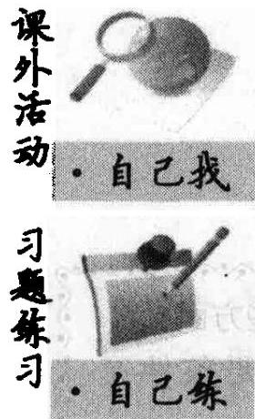

借助图书馆或网络查阅有关函数概念的发展历史，了解数学概念的演变过程.

1. 下列四组函数 $f\left( x\right) \text{ 、 }g\left( x\right)$ 表示同一函数的是 ( ).

(A) $f\left( x\right)  = x, g\left( x\right)  = \sqrt{{x}^{2}}$

(B) $f\left( x\right)  = 1, g\left( x\right)  = {x}^{0}$

(C) $f\left( x\right)  = x - 1, g\left( x\right)  = \frac{{x}^{2} - 1}{x + 1}$

(D) $f\left( x\right)  = \sqrt[3]{{x}^{3}}, g\left( x\right)  = x$

2. 求下列函数的定义域:

(1) $f\left( x\right)  = \frac{{x}^{0}}{{x}^{2} - {2x}}$ ; (2) $f\left( x\right)  = \sqrt{\frac{x - 2}{3 - x}}$ ；

(3) $f\left( x\right)  = \frac{1}{x - 2} + \sqrt{\frac{1}{x - 1}}$ ; (4) $f\left( x\right)  = \sqrt{x - \sqrt{{x}^{2} - {4x}}}$ ;

(5) $\sqrt{\left| {{2x} + 1}\right|  - 2}$ ；

(6) $f\left( x\right)  = \sqrt{3 - \left| {x + 1}\right| } + \frac{1}{\sqrt{{x}^{2} - x - 2}}$ .

3. 已知函数 $f\left( x\right)$ 满足 $f\left( \frac{1}{s}\right)  = \frac{s + 1}{1 - s}$ .

(1)求 $f\left( x\right)$ 的解析式；

(2)若 $f\left( a\right)  = 2$ ，求 $a$ 的值.

4. 已知函数 $f\left( x\right)  = \sqrt{m{x}^{2} - {6mx} + m + 8}$ 的定义域为 $\mathbf{R}$ ,求实数 $m$ 的取值范围.

5. 判断下列集合 $A$ 到集合 $B$ 的对应关系是否是映射?

(1) $A = \{ 1,4,9\} , B = \{  - 1,2, - 3,3\}$ ，对应关系为:集合 $A$ 中的元素的平方根与 $B$ 中的元素对应;

(2) $A = \{ x \mid  x \neq  1, x \in  \mathbf{R}\} , B = \{ y \mid  y \neq  2, y \in  \mathbf{R}\}$ ,对应关系为集合 $A$ 中的元素的平方的 2 倍与 $B$ 中的元素对应;

(3) $A = \mathbf{R}$ ， $B = {\mathbf{R}}^{ + }$ ，对应关系为:集合 $A$ 中的元素的平方与 $B$ 中的元素对应;

(4) $A = \left( {0,1}\right) , B = \left( {1, + \infty }\right)$ ，对应关系为:集合 $A$ 中的元素的倒数与 $B$ 中的元素对应.

### 3.2 函数关系的建立 (Formulation of Functional Relationships)

运用数学的方法解决实际问题时, 首先要寻求问题中的有关变量之间的关系,并将这些数量关系用数学形式表示出来,这个过程叫做建模. 变量之间的函数关系是重要的模型之一.

通常变量之间的对应关系,即函数的对应法则可以用解析法来表示,也可以用列表法或图象法. 若集合 $A = \{ 1,2,3,4,5,6\}$ , $B = \{ 2,3,4,5,6,7\}$ ,对应关系为 $A$ 中的元素 $x$ 加上 1,则我们可以将函数表示为 $y = x + 1, x \in  \{ 1,2,3,4,5,6\}$ ,或者可以用下表来表示:

<table><tr><td>$x$</td><td>1</td><td>2</td><td>3</td><td>4</td><td>5</td></tr><tr><td>$y$</td><td>2</td><td>3</td><td>4</td><td>5</td><td>6</td></tr></table>

也可以直角坐标系中用点 $P\left( {x, y}\right)$ 表示这个对应关系. 如

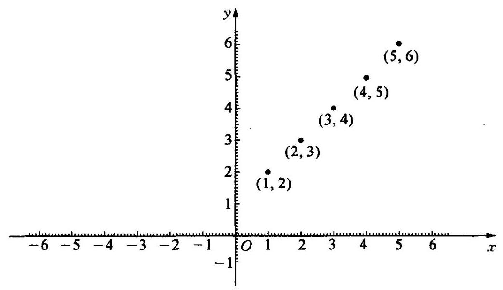

例 1 《中华人民共和国个人所得税法》第十四条中有下表:

个人所得税率表 ——(工资、薪金所得适用)

<table><tr><td>级 数</td><td>全月应纳税所得额</td><td>税率(%)</td></tr><tr><td>1</td><td>不超过 500 元的</td><td>5</td></tr><tr><td>2</td><td>超过 500 元至 2000 元的部分</td><td>10</td></tr><tr><td>3</td><td>超过 2000 元至 5000 元的部分</td><td>15</td></tr><tr><td>4</td><td>超过 5000 元至 20000 元的部分</td><td>20</td></tr><tr><td>5</td><td>超过 20000 元至 40000 元的部分</td><td>25</td></tr><tr><td>6</td><td>超过 40000 元至 60000 元的部分</td><td>30</td></tr><tr><td>7</td><td>超过 60000 元至 80000 元的部分</td><td>35</td></tr><tr><td>8</td><td>超过 80000 元至 100000 元的部分</td><td>40</td></tr><tr><td>9</td><td>超过 100000 元的部分</td><td>45</td></tr></table>

目前，上表中“全月应纳税所得额”是从月工资、薪金收入减去 2000 元后的余额. 例如某人月工资、薪金收入为 2700 元,减去 2000 元, 应纳税所得为 700 元, 由税率表可知其中的 500 元税率为 5%, 另 200 元的税率为 10%,所以此人应纳个人所得税 500 × 5% + 200 × 10% = 45(元).

(1)请写出月工资、薪金的个人所得税 $y$ 关于工资、薪金收入 $x\left( {0 \leq  x \leq  {40000}}\right)$ 的函数表达式，并画出函数的图象；

(2)某人某月交纳的个人所得税是 490 元，那么他该月的工资、 薪金收入是多少?

解 (1) 函数的解析式为:

$$
y = \left\{  \begin{array}{ll} 0, & x \in  \left\lbrack  {0,{2000}}\right\rbrack  , \\  \left( {x - {2000}}\right)  \times  5\% , & x \in  ({2000},{2500}\rbrack , \\  {25} + \left( {x - {2500}}\right)  \times  {10}\% , & x \in  ({2500},{4000}\rbrack , \\  {175} + \left( {x - {4000}}\right)  \times  {15}\% , & x \in  ({4000},{7000}\rbrack , \\  {625}\left( {x - {7000}}\right)  \times  {20}\% , & x \in  ({7000},{22000}\rbrack , \\  {3625} + \left( {x - {22000}}\right)  \times  {25}\% , & x \in  ({22000},{40000}\rbrack . \end{array}\right.
$$

它的图象如图所示:

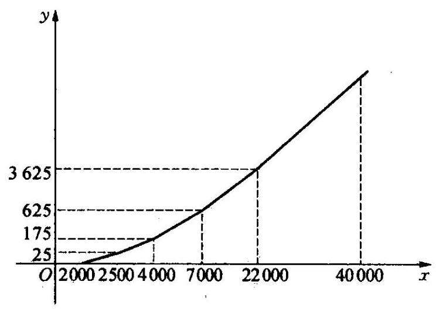

(3)由上述解析式可知当纳税额为 490 元时,工资、薪金收入 $x$ 的范围是 $\left( {{4000},{7000}}\right)$ ,解方程 ${175} + \left( {x - {4000}}\right)  \times  {15}\%  = {490}$ ,得 $x = {6100}.$

即此人的该月工资、薪金收入为 6100 元.

例 2 某商场在节日期间推出一项促销活动,“满 100 减 30”, 即当消费额超过 100 元当场抵扣 30 元，例如消费额为 180 元抵扣 30 元, 实际支付费用为 150 元; 消费额 200 元抵扣 60 元, 实际支付费用为 140 元; 依此类推.

(1)建立实际支付费用 $y$ 与消费额 $x$ 之间的函数关系；

(2)消费金额不同，实际支付的费用能否相同？

解 (1) 设 $x$ 为消费额, $y$ 为实际支付费用.

用 $\left\lbrack  x\right\rbrack$ 表示不超过 $x$ 的最大整数,如 [3.1] $= 3,\left\lbrack  4\right\rbrack   = 4$ , $\left\lbrack  {-{0.5}}\right\rbrack   =  - 1$ .

则 $y = x - \left\lbrack  \frac{x}{100}\right\rbrack   \times  {30}, x \in  \lbrack 0, + \infty )$ .

(2)消费金额不同，实际支付的费用可能相同，如消费额 170 元时，实际支付费用为 140 元，而消费额 200 元时，实际支付的费用也为 140 元.

例 3 某种衬衫进货价为每件 30 元, 且售价不低于进价. 若以 40 元一件售出，则每天可以卖出 40 件；若每件提价 1 元，则每天卖出的件数将减少一件，反之亦然. 试写出每天出售衬衫的收入与销售价格之间的函数关系.

解 设衬衫售价为 $x$ 元时,收入为 $y$ 元.

由于当售价为 80 元时,售出数量为 0,因此收入 $y$ 与售价 $x$ 之间满足

$$
y = x\left\lbrack  {{40} - \left( {x - {40}}\right) }\right\rbrack   = {80x} - {x}^{2}.
$$

所求的函数关系为: $y = {80x} - {x}^{2}, x \in  \{ x \mid  {30} \leq  x \leq  {80}, x \in  \mathbf{N}\}$ .

课堂活动 1. 建立函数关系要注意哪些问题?

·大家淡

2. 讨论函数三种表示法的运用.

课外活动

·自己找

观察生活中的变量关系,建立合适的函数模型并予以解释.

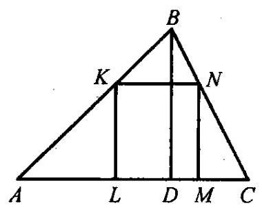

习题练习

- 自己家

1. 如图所示，一块锐角三角形木板 ${ABC}$ ，底边 ${AC} = \; {24}\mathrm{\;{cm}}$ ，底边上的高 ${BD} = {16}\mathrm{\;{cm}}$ . 现要截得三角形的内接矩形木板 KLMN. 设矩形的宽 ${MN} = x\mathrm{\;{cm}}$ ,试分别求出矩形的周长 $C$ ,面积 $S$ 关于 $x$ 的函数解析式.

2. 某蛋糕厂生产某种蛋糕的成本为 40 元/个，出厂价为 60 元/个，日销售量为 1000 个. 为适应市场需求, 计划提高蛋糕档次, 适度增加成本,若每个蛋糕成本增加的百分率为 $x\left( {0 < x < 1}\right)$ ,则每个蛋糕的出厂价相应提高的百分率为 ${0.5x}$ ,同时预计日销售量增加的百分率为 ${0.8x}$ ,已知日利润 $=$ (出厂价一成本) $\times$ 日销售量,且设增加成本后的日利润为 $y$ .

(1)写出 $y$ 与 $x$ 的函数解析式；

(2)为使日利润有所增加，求 $x$ 的取值范围.

3. 如图，已知底角为 ${45}^{ \circ  }$ 的等腰梯形 ${ABCD}$ ，底边 ${BC}$ 长为 $7\mathrm{\;{cm}}$ ，腰长为 $2\sqrt{2}\mathrm{\;{cm}}$ ，当一条垂直于底边 ${BC}$ (垂足为 $F$ )的直线 $l$ 从左至右移动 (与梯形 ${ABCD}$ 有公共点)时,直线 $l$ 把梯形分成两部分,令 ${BF} = x$ ,试写出左边部分的面积 $y$ 与 $x$ 的函数解析式.

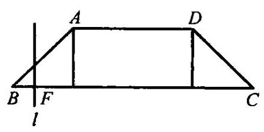

### 3.3 函数的运算 (Operations of Functions)

已知函数 $f\left( x\right) , x \in  {D}_{1}$ 与 $g\left( x\right) , x \in  {D}_{2}$ ,设 $D = {D}_{1} \cap  {D}_{2}$ ,并且 $D$ 不是空集,那么当 $x \in  D$ 时,称 $f\left( x\right)  + g\left( x\right)$ 为函数 $f\left( x\right)$ 与 $g\left( x\right)$ 的和, $f\left( x\right)  \cdot  g\left( x\right)$ 为函数的积.

例 1 已知 $f\left( x\right)  = \sqrt{x - 2}, g\left( x\right)  = \sqrt{2 - x}$ ,求 $f\left( x\right)  + g\left( x\right)$ 和 $f\left( x\right)  \cdot  g\left( x\right)$ .

解 因为 $x - 2 \geq  0$ ,所以 $x \geq  2$ ,即 $f\left( x\right)$ 的定义域 ${D}_{1} = \lbrack 2, + \infty )$ ; 又因为 $2 - x \geq  0$ ,所以 $x \leq  2$ ,即 $g\left( x\right)$ 的定义域 ${D}_{2} = ( - \infty ,2\rbrack$ ,所以 $D = {D}_{1} \cap  {D}_{2} = \{ 2\} .$

即 $f\left( x\right)  + g\left( x\right)  = 0, x \in  \{ 2\} , f\left( x\right)  \cdot  g\left( x\right)  = 0, x \in  \{ 2\}$ .

例 2 已知 $f\left( x\right)  = x, g\left( x\right)  = \frac{4}{x}$ ,求 $P\left( x\right)  = f\left( x\right)  + g\left( x\right)$ ,并利用 $f\left( x\right)$ 与 $g\left( x\right)$ 的图象作出 $P\left( x\right)$ 的图象.

解 $f\left( x\right)$ 的定义域 ${D}_{1} = \mathbf{R}, g\left( x\right)$ 的定义域 ${D}_{2} = \{ x \mid  x \neq  0\}$ ,则 ${D}_{1} \cap  {D}_{2} = {D}_{2}$ ,即 $P\left( x\right)  = x + \frac{4}{x}, x \in  \{ x \mid  x \neq  0\} .$

过 $x$ 轴上不同于原点的任意点 $Q\left( {{x}_{0},0}\right)$ ,作垂直于 $x$ 轴的直线 $l$ , 交 $y = f\left( x\right)$ 的图象于点 $A\left( {{x}_{0},{x}_{0}}\right)$ ,交 $y = g\left( x\right)$ 的图象于点 $B\left( {{x}_{0},\frac{4}{{x}_{0}}}\right)$ ,则在 $l$ 上取点 $C\left( {{x}_{0},{x}_{0} + \frac{4}{{x}_{0}}}\right)$ ,则点 $C$ 为 $P\left( x\right)$ 图象上的点.

随着点 $Q$ 的位置不同，可以得到 $P\left( x\right)$ 图象上不同的点 $C$ ，取一定数量的点 $Q$ ,就可以得到一定数量的点 $C$ ,可以用描点法得到 $P\left( x\right)$ 的图象, 如图所示.

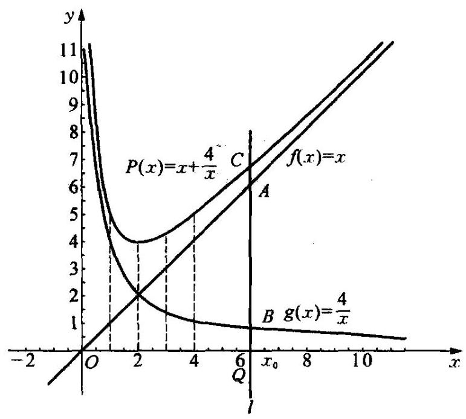

1. 函数的运算是否满足交换律和分配律?

·大家谈

2. 讨论集合 $A = \{ x \mid  f\left( x\right)  \cdot  g\left( x\right)  = 0\} , B = \; \{ x \mid  f\left( x\right)  = 0\} , C = \{ x \mid  g\left( x\right)  = 0\}$ 之间的关系.

习题练习

自己家

1. 设函数 $f\left( x\right)  = \sqrt{1 - x} + \sqrt{x + 1}, g\left( x\right)  = \; \sqrt{{x}^{2} + {3x}}$ ,求 $f\left( x\right)  + g\left( x\right)$ 的定义域.

2. 关于集合 $A = \{ x \mid  f\left( x\right)  \cdot  g\left( x\right)  \geq  0\} , B = \{ x \mid \; f\left( x\right)  \geq  0\} , C = \{ x \mid  g\left( x\right)  \geq  0\}$ ,构造函数分别满足:

(1) $A = B \cup  C;\left( 2\right) A \subseteq  B \cup  C;\left( 3\right) B \cap  C \subseteq  A$ .

3. 根据函数 $f\left( x\right)  = x, g\left( x\right)  = \frac{1}{x}$ 作出下列函数的图象:

(1) $x + \frac{1}{x}$ ; (2) $x - \frac{1}{x}$ .

### 3.4 函数的性质 (Basic Properties of Functions)

1. 函数的奇偶性

考察函数 $y = {x}^{2}$ 的图象,我们发现,它的图象是关于 $y$ 轴对称的图形,也就是说: 对于 $\mathbf{R}$ 内任意实数 $a$ 都有 $f\left( {-a}\right)  = f\left( a\right)$ 成立.

如果对于函数 $f\left( x\right)$ 的定义域 $D$ 内任意实数 $a$ ,都有 $f\left( {-a}\right)  = f\left( a\right)$ 成立，那么就把函数 $f\left( x\right)$ 叫做偶函数 (even function). 偶函数的图象关于 $y$ 轴对称.

类似的,如果对于函数 $f\left( x\right)$ 的定义域 $D$ 内任意实数 $a$ ,都有 $f\left( {-a}\right)  =  - f\left( a\right)$ 成立，那么就把函数 $f\left( x\right)$ 叫做奇函数 (odd function). 奇函数的图象关于原点对称.

例 1 证明函数 $f\left( x\right)  = \frac{{x}^{2} + 2}{x}$ 是奇函数.

证明 函数的定义域 $D = \{ x \mid  x \neq  0, x \in  \mathbf{R}\}$ ,对于任意实数 $a \in \; D$ ,有 $f\left( {-a}\right)  = \frac{{\left( -a\right) }^{2} + 2}{-a} =  - \frac{{a}^{2} + 2}{a} =  - f\left( a\right)$ .

因此该函数是奇函数.

例 2 判断下列函数的奇偶性:

(1) $f\left( x\right)  = x + 2$ ;

(2) $f\left( x\right)  = {x}^{2}, x \in  \left\lbrack  {-5,4}\right\rbrack$ .

解 (1) 因为 $f\left( {-1}\right)  =  - 1 + 2 = 1, f\left( 1\right)  = 1 + 2 = 3$ ,所以 $f\left( {-1}\right)  \neq  f\left( 1\right)$ ,且 $f\left( {-1}\right)  \neq   - f\left( 1\right)$ ,所以该函数既不是偶函数,也不是奇函数.

(2)当 $x =  - 5$ 时, $5 \notin  \left\lbrack  {-5,4}\right\rbrack$ ，因此该函数既不是偶函数，也不是奇函数.

2. 函数的单调性

同样考察函数 $y = {x}^{2}$ 的图象在定义域内的变化趋势,我们发现当 $x \in  ( - \infty ,0\rbrack , x$ 逐渐增加时,函数值 $y$ 逐渐减小; 而当 $x \in  \lbrack 0, + \infty )$ , $x$ 逐渐增加时,函数值 $y$ 逐渐增加. 函数的这两种性质都叫做函数的单调性(monotonicity).

一般地,如果对于定义域内某个区间上的任意两个自变量的值 ${x}_{1}\text{ 、 }{x}_{2}$ ,当 ${x}_{1} < {x}_{2}$ 时都有 $f\left( {x}_{1}\right)  < f\left( {x}_{2}\right)$ ,那么就说函数 $f\left( x\right)$ 在这个区间上是单调增函数 (monotone increasing function), 这个区间称为函数的单调增区间; 如果对于定义域内某个区间上的任意两个自变量的值 ${x}_{1}\text{ 、 }{x}_{2}$ ,当 ${x}_{1} < {x}_{2}$ 时都有 $f\left( {x}_{1}\right)  > f\left( {x}_{2}\right)$ ,那么就说 $f\left( x\right)$ 在这个区间上是单调减函数 (monotone decreasing function), 这个区间称为函数的单调减区间.

例 3 证明函数 $f\left( x\right)  = \frac{1}{x}$ 在 $\left( {0, + \infty }\right)$ 上是减函数.

证明 设 ${x}_{1}\text{ 、 }{x}_{2}$ 是 $\left( {0, + \infty }\right)$ 上的任意两个实数,且 ${x}_{1} < {x}_{2}$ ,则

$$
f\left( {x}_{1}\right)  - f\left( {x}_{2}\right)  = \frac{1}{{x}_{1}} - \frac{1}{{x}_{2}} = \frac{{x}_{2} - {x}_{1}}{{x}_{1}{x}_{2}}.
$$

因为 ${x}_{1},{x}_{2} \in  \left( {0, + \infty }\right)$ ,则 ${x}_{1} \cdot  {x}_{2} > 0$ ,又由 ${x}_{1} < {x}_{2}$ ,可知 ${x}_{2} - \; {x}_{1} > 0$ ,于是 $f\left( {x}_{1}\right)  - f\left( {x}_{2}\right)  > 0$ ,即 $f\left( {x}_{1}\right)  > f\left( {x}_{2}\right)$ .

所以,函数 $f\left( x\right)  = \frac{1}{x}$ 在 $\left( {0, + \infty }\right)$ 上是减函数.

例 4 证明函数 $f\left( x\right)  = x + \frac{4}{x}$ 在 $( - \infty , - 2\rbrack$ 上是增函数.

证明 设 ${x}_{1}\text{ 、 }{x}_{2}$ 是 $( - \infty , - 2\rbrack$ 上的任意两个实数,且 ${x}_{1} < {x}_{2}$ ,则

$$
f\left( {x}_{1}\right)  - f\left( {x}_{2}\right)  = \left( {{x}_{1} - {x}_{2}}\right)  + \frac{4}{{x}_{1}} - \frac{4}{{x}_{2}}
$$

$$
= \left( {{x}_{1} - {x}_{2}}\right) \left( \frac{{x}_{1}{x}_{2} - 4}{{x}_{1}{x}_{2}}\right) .
$$

因为 ${x}_{1},{x}_{2} \in  ( - \infty , - 2\rbrack$ ,则 ${x}_{1}{x}_{2} > 4$ ,又由 ${x}_{1} < {x}_{2}$ ,可知 ${x}_{1} - \; {x}_{2} < 0$ ,于是 $f\left( {x}_{1}\right)  - f\left( {x}_{2}\right)  < 0$ ,即 $f\left( {x}_{1}\right)  < f\left( {x}_{2}\right)$ .

所以,函数 $f\left( x\right)  = x + \frac{4}{x}$ 在 $( - \infty , - 2\rbrack$ 上是增函数.

例 5 已知奇函数 $f\left( x\right)$ 在 $\lbrack 0, + \infty )$ 上是增函数,讨论此函数在 $\mathbf{R}$ 上的单调性.

解 设 ${x}_{1}\text{ 、 }{x}_{2}$ 是 $\mathbf{R}$ 上任意两个实数且 ${x}_{1} < {x}_{2}$ .

当 $0 \leq  {x}_{1} < {x}_{2}$ 时,由已知得 $0 = f\left( 0\right)  \leq  f\left( {x}_{1}\right)  < f\left( {x}_{2}\right)$ ;

当 ${x}_{1} < 0 < {x}_{2}$ 时,因为 $f\left( {x}_{1}\right)  =  - f\left( {-{x}_{1}}\right)  < 0 < f\left( {x}_{2}\right)$ ;

当 ${x}_{1} < {x}_{2} \leq  0$ 时,则 $- {x}_{1} >  - {x}_{2} \geq  0$ ,则 $f\left( {-{x}_{1}}\right)  > f\left( {-{x}_{2}}\right)$ ,即 $- f\left( {x}_{1}\right)  >  - f\left( {x}_{2}\right)$ ,因此 $f\left( {x}_{1}\right)  < f\left( {x}_{2}\right)$ .

综上可知,总有 $f\left( {x}_{1}\right)  < f\left( {x}_{2}\right)$ 成立,因此此函数在 $\mathbf{R}$ 上是增函数.

例 6 已知函数对任意实数 $a\text{ 、 }b$ 有 $f\left( {a + b}\right)  = f\left( a\right)  + f\left( b\right)$ 成立,且当 $x > 0$ 时 $f\left( x\right)  > 0$ .

(1)判断函数的奇偶性;

(2)判断函数的单调性;

(3)解不等式: $f\left( {{t}^{2} + 3}\right)  + f\left( {4t}\right)  < 0$ .

解 (1) 当 $a = b = 0$ 时,有 $f\left( 0\right)  = f\left( 0\right)  + f\left( 0\right)  = {2f}\left( 0\right)$ ,所以 $f\left( 0\right)  = 0.$

当 $b =  - a$ 时, $0 = f\left( 0\right)  = f\left( {a - a}\right)  = f\left( a\right)  + f\left( {-a}\right)$ ,即 $f\left( {-a}\right)  = \; - f\left( a\right)$ ,又因为 $x > 0$ 时 $f\left( x\right)  > 0$ .

所以 $f\left( x\right)$ 是奇函数不是偶函数.

(2)设 ${x}_{1}\text{ 、 }{x}_{2}$ 是 $\mathbf{R}$ 上任意两个实数且 ${x}_{1} < {x}_{2}$ ，则 $f\left( {x}_{2}\right)  = f\left( {{x}_{2} - }\right. \; \left. {{x}_{1} + {x}_{1}}\right)  = f\left( {{x}_{2} - {x}_{1}}\right)  + f\left( {x}_{1}\right)$ ,即 $f\left( {x}_{2}\right)  - f\left( {x}_{1}\right)  = f\left( {{x}_{2} - {x}_{1}}\right)$ .

而 ${x}_{2} > {x}_{1}$ ,所以 ${x}_{2} - {x}_{1} > 0, f\left( {{x}_{2} - {x}_{1}}\right)  > 0$ ,即 $f\left( {x}_{2}\right)  - f\left( {x}_{1}\right) \; > 0$ ,因此 $f\left( {x}_{2}\right)  > f\left( {x}_{1}\right)$ ,即函数是 $\mathbf{R}$ 上的单调增函数.

(3) $f\left( {{t}^{2} + 3}\right)  + f\left( {4t}\right)  < 0$ 等价于 $f\left( {{t}^{2} + {4t} + 3}\right)  < f\left( 0\right)$ ,由 (2) 可知只需 ${t}^{2} + {4t} + 3 < 0$ ,即 $- 3 < t <  - 1$ .

课堂活动 1. 判断函数的奇偶性要注意哪些问题?

·大家族

2. 结合例 5 讨论函数的奇偶性与单调性之间的关系.

3. 讨论 $f\left( x\right)$ 的单调性与 $- f\left( x\right) , f\left( {-x}\right)$ 的单调性之间的关系.

3. 函数的最大值和最小值

一般地,设函数 $y = f\left( x\right)$ 在 ${x}_{0}$ 处的函数值是 $f\left( {x}_{0}\right)$ . 如果函数定义域内任意 $x$ ,不等式 $f\left( x\right)  \geq  f\left( {x}_{0}\right)$ 都成立,那么 $f\left( {x}_{0}\right)$ 叫做函数 $y = \; f\left( x\right)$ 的最小值 (minimum),记做 ${y}_{\min } = f\left( {x}_{0}\right)$ ; 如果函数定义域内任意 $x$ ,不等式 $f\left( x\right)  \leq  f\left( {x}_{0}\right)$ 都成立,那么 $f\left( {x}_{0}\right)$ 叫做函数 $y = f\left( x\right)$ 的最大值 (maximum),记做 ${y}_{\max } = f\left( {x}_{0}\right)$ . 函数的最大值和最小值,我们统称为函数的最值.

例 7 求下列二次函数的最值:

(1) $f\left( x\right)  = 3{x}^{2} - {4x} + 3$ ; (2) $f\left( x\right)  =  - {x}^{2} - x + 1$ .

解 (1) $f\left( x\right)  = 3{x}^{2} - {4x} + 3 = 3{\left( x - \frac{2}{3}\right) }^{2} + \frac{5}{3} \geq  \frac{5}{3}$ ,因此,当 $x = \frac{2}{3}$ 时,函数的最小值为 $\frac{5}{3}$ ,函数没有最大值.

(2) $f\left( x\right)  =  - {x}^{2} - x + 1 =  - {\left( x + \frac{1}{2}\right) }^{2} + \frac{5}{4} \leq  \frac{5}{4}$ ，因此，当 $x = \; - \frac{1}{2}$ 时，函数的最大值为 $\frac{5}{4}$ ，函数没有最小值.

例 8 已知 $x \in  \left\lbrack  {1,4}\right\rbrack$ ,分别求下列函数的最值:

(1) $f\left( x\right)  = {x}^{2} - {3x} + 2$ ; (2) $f\left( x\right)  = x + \frac{2}{x}$ ;

(3) $f\left( x\right)  = x + 2\sqrt{4 - x}$ ;

(4) $f\left( x\right)  = \frac{{x}^{2} + {4x} + 7}{x + 2}$ .

解 (1) $f\left( x\right)  = {x}^{2} - {3x} + 2 = {\left( x - \frac{3}{2}\right) }^{2} - \frac{1}{4}$ ，可知 $f\left( x\right)$ 在 $\left\lbrack  {1,\frac{3}{2}}\right\rbrack$ 上是减函数, $f\left( x\right)$ 在 $\left\lbrack  {\frac{3}{2},4}\right\rbrack$ 上是增函数.

所以,当 $x = \frac{3}{2}$ 时,函数的最小值为 $- \frac{1}{4}$ .

又因为 $f\left( 1\right)  = 0, f\left( 4\right)  = 6$ ,所以当 $x = 4$ 时,函数的最大值为 6 .

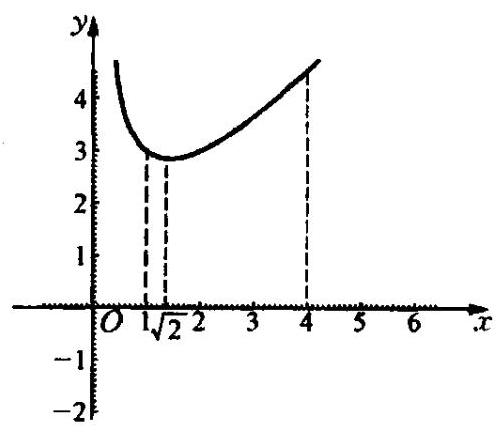

(2)当 $x > 0$ 时，由基本不等式可知 $x + \frac{2}{x} \geq  2\sqrt{x \cdot  \frac{2}{x}} = 2\sqrt{2}$ ,当且仅当 $x = \sqrt{2}$ 时等号成立. 因为 $x \in  \lbrack 1$ , 4] 且 $\sqrt{2} \in  \left\lbrack  {1,4}\right\rbrack$ ,所以函数的最小值为 $2\sqrt{2}$ .

函数 $f\left( x\right)  = x + \frac{2}{x}\left( {x > 0}\right)$ 的图象如图所示， $f\left( x\right)$ 在 $\left\lbrack  {1,\sqrt{2}}\right\rbrack$ 上是减函数，在 $\left\lbrack  {\sqrt{2},4}\right\rbrack$ 上是增函数，且 $f\left( 1\right) \; = 3, f\left( 4\right)  = {4.5}$ ,所以当 $x = 4$ 时,函数的最大值为 4.5 .

(3) 设 $\sqrt{4 - x} = t, x \in  \left\lbrack  {1,4}\right\rbrack$ ,则 $x = 4 - {t}^{2}, t \in  \left\lbrack  {0,\sqrt{3}}\right\rbrack$ ,则

$$
y = 4 - {t}^{2} + {2t} =  - {\left( t - 1\right) }^{2} + 5,
$$

所以当 $t = 1$ ,即 $x = 3$ 时,函数的最大值为 5 ; 当 $t = 0$ ,即 $x = 4$ 时,函数的最小值为 4 .

(4) $f\left( x\right)  = \frac{{x}^{2} + {4x} + 7}{x + 1} = \frac{{\left( x + 1\right) }^{2} + 2\left( {x + 1}\right)  + 4}{x + 1}$

$$
= \left( {x + 1}\right)  + \frac{4}{x + 1} + 2,
$$

设 $t = x + 1$ ,则 $y = t + \frac{4}{t} + 2, t \in  \left\lbrack  {2,5}\right\rbrack$ .

因为函数 $y = t + \frac{4}{t} + 2$ ,在 $t \in  \left\lbrack  {2,5}\right\rbrack$ 上是增函数,所以在 $t = 2$ ,即 $x = 1$ 时,函数的最小值为 6 ; 当 $t = 5$ ,即 $x = 4$ 时,函数的最大值为 $\frac{39}{5}$ .

课外活动

·自己学

## 函数的零点

一般地,对于函数 $f\left( x\right) , x \in  D$ ,如果存在 $c, c \in  D$ , 当 $x = c$ 时, $f\left( c\right)  = 0$ ,那么就把 $x = c$ 叫做函数 $f\left( x\right) , x \; \in  D$ 的零点(zero point).

一般地，如果函数 $f\left( x\right)$ 在定义区间 $\left\lbrack  {a, b}\right\rbrack$ 上的图象是一条连续不断的曲线,且有 $f\left( a\right) f\left( b\right)  < 0$ ,那么在区间 $\left\lbrack  {a, b}\right\rbrack$ 内至少存在一个实数 $c$ , 使 $f\left( c\right)  = 0$ ,即在区间 $\left\lbrack  {a, b}\right\rbrack$ 内函数 $f\left( x\right)$ 至少存在一个零点.

我们通常用二分法求函数的零点, 下面举例来说明二分法的应用。

求函数 $f\left( x\right)  = {x}^{3} - {5x} + 3, x \in  \left\lbrack  {0,1}\right\rbrack$ 的零点. (精确到 0.1)

(1)因为 $f\left( 0\right) f\left( 1\right)  < 0$ ，所以在 $\left\lbrack  {0,1}\right\rbrack$ 内函数存在零点.

(2)取 $\left\lbrack  {0,1}\right\rbrack$ 的中点 ${0.5}, f\left( {0.5}\right)  = {0.625} > 0$ ，所以 $f\left( {0.5}\right) f\left( 1\right)  <$ 0,因此函数的零点在区间 $\left\lbrack  {{0.5},1}\right\rbrack$ 内.

(3)取 $\left\lbrack  {{0.5},1}\right\rbrack$ 的中点 ${0.75}, f\left( {0.75}\right)  =  - {0.328125}$ ，因此函数的零点在区间 $\left\lbrack  {{0.5},{0.75}}\right\rbrack$ 内.

(4)取 $\left\lbrack  {{0.5},{0.75}}\right\rbrack$ 的中点 ${0.625}, f\left( {0.625}\right)  \approx  {0.11914}$ ，所以函数的零点在区间 $\left\lbrack  {{0.625},{0.75}}\right\rbrack$ 内.

(5)取 $\left\lbrack  {{0.625},{0.75}}\right\rbrack$ 的中点 ${0.6875}, f\left( {0.6875}\right)  \approx   - {0.112548828}$ , 所以函数的零点在区间 $\left\lbrack  {{0.625},{0.6875}}\right\rbrack$ 内.

(6) 取 $\left\lbrack  {{0.625},{0.6875}}\right\rbrack$ 的中点 ${0.65625}, f\left( {0.65625}\right)  \approx  {0.00137329}$ . 由于 ${0.65625} \approx  {0.7},{0.6875} \approx  {0.7}$ ,因此 0.7 就是所求函数的一个精确到 0.1 的零点的近似值.

习题练习

·自己练

1. 判断下列函数的奇偶性:

(1) $f\left( x\right)  = \sqrt{1 - {x}^{2}}$ ； (2) $f\left( x\right)  = {x}^{2}, x \in  ( - 2,2\rbrack$ ；

(3) $f\left( x\right)  = \frac{1}{x}$ ; (4) $f\left( x\right)  = x\left| x\right|$ .

2. (1)已知 $f\left( x\right)$ 是奇函数，且在 $\lbrack 0, + \infty )$ 上是增函数，试解不等式 $f\left( x\right)  > f\left( {-3}\right)$ ;

(2)定义在 $\left( {-4,4}\right)$ 上的偶函数 $f\left( x\right)$ ，且当 $x \in  \left( {-4,0}\right\rbrack$ 时， $f\left( x\right)$ 单调递减，解不等式 $f\left( x\right)  < f\left( {{2x} - 1}\right)$ .

3. 判断下列函数的奇偶性:

(1) $f\left( x\right)  = \frac{x}{{x}^{2} - 1}$ ; (2) $f\left( x\right)  = a{x}^{2} - {2x} + 1, a \in  \mathbf{R}$ ;

(3) $f\left( x\right)  = \frac{1}{x} + x - 1$ ; (4) $f\left( x\right)  = a \cdot  \frac{{x}^{2} + 1}{x}$ .

4. 求下列函数的最值:

(1) $f\left( x\right)  = {x}^{2} - {4x} + 1, x \in  \left\lbrack  {1,7}\right\rbrack$ ;

(2) $f\left( x\right)  = \frac{{2x} - 1}{x + 1}, x \in  (1,4\rbrack$ ;

(3) $f\left( x\right)  = \frac{x + 1}{{x}^{2} + 1}$ (4) $f\left( x\right)  = \frac{2{x}^{2} - x + 1}{{x}^{2} - x + 1}$ .

5. 求函数 $f\left( x\right)  = x + \frac{m}{x + 3}, x \in  \lbrack 0, + \infty )$ 的最小值.

6. 已知函数 $f\left( x\right)$ 对任意 $x, y \in  \mathbf{R}$ 都有 $f\left( {x + y}\right)  = f\left( x\right)  + f\left( y\right)$ , 且 $x > 0$ 时, $f\left( x\right)  < 0, f\left( 1\right)  =  - 2$ .

(1)判断函数 $f\left( x\right)$ 的奇偶性;

(2)当 $x \in  \left\lbrack  {-3,3}\right\rbrack$ 时，函数 $f\left( x\right)$ 是否有最值？如果有，求出最值； 如果没有，请说明理由.

7. 已知函数 $f\left( x\right)  = \frac{a{x}^{2} + {2ax} - 3}{{x}^{2} + {2x} + 2}$ .

(1)若 $a = 1$ ，求函数 $f\left( x\right)$ 的值域；

(2)若对于任意的实数 $x$ ， $f\left( x\right)  < 0$ 恒成立，求实数 $a$ 的取值范围.

8. 已知函数 $f\left( x\right)$ 满足 $f\left( {x + 1}\right)  = {x}^{2} - 4$ .

(1)求函数 $f\left( x\right)$ 的解析式；

(2)列表并作出函数 $f\left( x\right)$ 在区间 $\left\lbrack  {-2,3}\right\rbrack$ 上的图象；

(3)若关于 $x$ 的方程 $f\left( x\right)  - {2m} = 0$ 在区间 $\left\lbrack  {-2,3}\right\rbrack$ 上有唯一解,求实数 $m$ 的取值范围.

9. 设函数 $f\left( x\right)$ 在 $\left( {-\infty ,0}\right)  \cup  \left( {0, + \infty }\right)$ 上是奇函数,又 $f\left( x\right)$ 在 $(0$ , $+ \infty )$ 上是减函数,且 $f\left( x\right)  < 0\left( {x \in  \left( {0, + \infty }\right) }\right)$ ,指出 $F\left( x\right)  = \frac{1}{f\left( x\right) }$ 在 $\left( {-\infty ,0}\right)$ 上的单调性并证明.

10. 已知函数 $y = x + \frac{a}{x}$ 有如下性质: 如果常数 $a > 0$ ,那么该函数在 $\left( {0,\sqrt{a}\rbrack \text{ 上是减函数,在 }\lbrack \sqrt{a}, + \infty }\right)$ 上是增函数.

(1)如果函数 $y = x + \frac{{b}^{2}}{x}\left( {x > 0}\right)$ 的值域为 $\lbrack 6, + \infty )$ ，求 $b$ 的值；

(2)研究函数 $y = {x}^{2} + \frac{c}{{x}^{2}}$ (常数 $c > 0$ ) 在定义域内的单调性，并说明理由;

(3)对函数 $y = x + \frac{a}{x}$ 和 $y = {x}^{2} + \frac{a}{{x}^{2}}$ (常数 $a > 0$ )作出推广,使它们都是你所推广的函数的特例. 研究推广后的函数的单调性(只需写出结论,不必证明).

11. 对于函数 $f\left( x\right)$ ,若存在实数 ${x}_{0}$ 使得 $f\left( {x}_{0}\right)  = {x}_{0}$ ,则称实数 ${x}_{0}$ 为函数 $f\left( x\right)$ 的“不动点”,若 $f\left\lbrack  {f\left( {x}_{0}\right) }\right\rbrack   = {x}_{0}$ ,则称 ${x}_{0}$ 为函数 $f\left( x\right)$ 的“稳定点”.

(1)若 $f\left( x\right)  = {x}^{2} - x - 3$ ，求函数 $f\left( x\right)$ 的不动点的集合；

(2)若函数 $f\left( x\right)  = {x}^{2} + {mx} + 4$ 没有不动点，求实数 $m$ 的取值范围；

(3)若函数 $f\left( x\right)$ 的不动点的集合为 $A$ ，稳定点的集合为 $B$ ，求证: $A \subseteq  B$ .

12. 已知 $f\left( x\right)$ 是定义在 $\left\lbrack  {-1,1}\right\rbrack$ 上的奇函数,当 $a, b \in  \left\lbrack  {-1,1}\right\rbrack$ ,且 $a + b \neq  0$ 时有 $\frac{f\left( a\right)  + f\left( b\right) }{a + b} > 0$ .

(1)判断函数 $f\left( x\right)$ 的单调性,并给予证明;

(2)若 $f\left( 1\right)  = 1, f\left( x\right)  \leq  {m}^{2} - {2bm} + 1$ 对所有 $x \in  \left\lbrack  {-1,1}\right\rbrack  , b \in \; \left\lbrack  {-1,1}\right\rbrack$ 恒成立,求实数 $m$ 的取值范围.

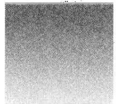

## 第四章 幂函数、指数函数与对数函数 (Power Functions, Exponential Functions and Logarithmic Functions)

函数是一个大家族. 我们对于函数的研究还远远没有完成. 从本章开始我们要学习一些最常用的基本函数. 在现实中, 许多函数关系可以用幂函数来表示; 人口增长、复利公式离不开指数函数; 在历史上大数字的计算中, 对数函数起过极其重要的作用, 且目前它仍然是一个重要的函数类. 在幂函数、指数函数和对数函数中, 指数函数增长最快, 幂函数次之,对数函数最慢. 快和慢,是对客观世界数量关系的一种刻画.

“直线上升”, “指数爆炸”, 已融入日常生活语言, 我们已经耳熟能详. 通过本章的学习, 我们将对它们有更深刻的理解.

### 4.1 幂函数的图象与性质 (Sketches and Properties of Power Functions)

在初中阶段，我们已经学习了正比例函数 (如 $y = x$ )，反比例函数 (如 $y = \frac{1}{x}$ 即 $y = {x}^{-1}$ ),二次函数 (如 $y = {x}^{2}$ ) 等函数的图象与性质,这些函数都可以统一写成 $y = {x}^{k}$ 的形式,其中 $k = 1, k =  - 1, k = 2$ . 下面将 $k$ 推广到有理数,如 $k = \frac{1}{2}, k = \frac{1}{3}, k =  - \frac{2}{3}$ ,就得到了函数 $y = \; {x}^{\frac{1}{2}}, y = {x}^{\frac{1}{3}}, y = {x}^{-\frac{2}{3}}.$

一般地,函数 $y = {x}^{k}\left( {k\text{ 为常数, }k \in  \mathbf{Q}}\right)$ 叫做幂函数 (power functions).

下面分别研究函数 $y = {x}^{\frac{1}{2}}, y = {x}^{\frac{2}{3}}, y = {x}^{\frac{1}{3}}$ 的定义域、值域、奇偶性、单调性并用描点法作出它们的图象.

(1)因为 $y = {x}^{\frac{1}{2}} = \sqrt{x}, y = {x}^{\frac{2}{3}} = \sqrt[3]{{x}^{2}}, y = {x}^{\frac{1}{3}} = \sqrt[3]{x}$ ，所以这三个函数的定义域分别是 $x \in  \lbrack 0, + \infty ), x \in  \mathbf{R}, x \in  \mathbf{R}$ ;

(2)它们的值域分别是 $y \in  \lbrack 0, + \infty ), y \in  \lbrack 0, + \infty ), y \in  \mathbf{R}$ ;

(3)因为函数 $y = {x}^{\frac{1}{2}}$ 的定义域关于原点不对称，所以它既不是奇函数，也不是偶函数；对于函数 $y = {x}^{\frac{2}{3}}$ ，因为 $x \in  \mathbf{R}$ ，且有 $f\left( {-x}\right)  = \; \sqrt[3]{{\left( -x\right) }^{2}} = \sqrt[3]{{x}^{2}} = f\left( x\right)$ ,所以它是偶函数; 对于函数 $y = {x}^{\frac{1}{3}}$ ,因为 $x \in  \mathbf{R}$ ,且有 $f\left( {-x}\right)  = \sqrt[3]{-x} =  - \sqrt[3]{x} =  - f\left( x\right)$ ,所以它是奇函数;

(4)对于函数 $y = {x}^{\frac{1}{2}} = \sqrt{x}$ ，设 ${x}_{1}$ 、 ${x}_{2}$ 是区间 $\lbrack 0, + \infty )$ 内的任意两个实数,并且 ${x}_{1} < {x}_{2}$ ,由不等式的性质,得 $0 \leq  \sqrt{{x}_{1}} < \sqrt{{x}_{2}}$ ,即 $f\left( {x}_{1}\right)  < f\left( {x}_{2}\right)$ ,所以函数 $y = {x}^{\frac{1}{2}}$ 在区间 $\lbrack 0, + \infty )$ 上是增函数;

同理可以证明函数 $y = {x}^{\frac{2}{3}}$ 分别在区间 $( - \infty ,0\rbrack$ 上是减函数,在区间 $\lbrack 0, + \infty )$ 上是增函数; $y = {x}^{\frac{1}{3}}$ 在 $\left( {-\infty , + \infty }\right)$ 上是增函数.

(5)通过列表、描点、连线等过程可以画出它们的图象，如图所示:

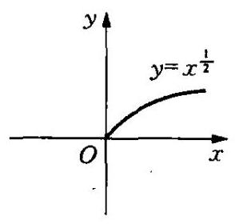

(1)

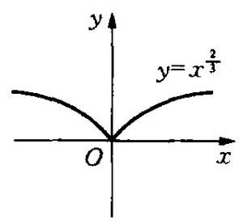

(2)

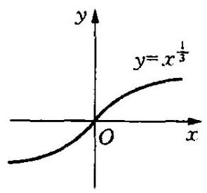

(3)

根据几类幂函数的图象特点，可以得到幂函数的性质:

性质 1 对于幂函数 $y = {x}^{k}\left( {k \in  \mathbf{Q}}\right)$ ,当 $k > 0$ 时,函数 $y = {x}^{k}(k \in$ Q) 的图象都经过点 $\left( {0,0}\right) ,\left( {1,1}\right)$ ; 当 $k < 0$ 时,函数 $y = {x}^{k}\left( {k \in  \mathbf{Q}}\right)$ 的图象都经过点 $\left( {0,0}\right)$ .

性质 2 对于幂函数 $y = {x}^{k}\left( {k \in  \mathbf{Q}}\right)$ ,当 $k > 0$ 时,函数 $y = {x}^{k}(k \in$ Q) 在区间 $\lbrack 0, + \infty )$ 上是增函数; 当 $k < 0$ 时,函数 $y = {x}^{k}\left( {k \in  \mathbf{Q}}\right)$ 在区间 $\left( {0, + \infty }\right)$ 上是减函数.

性质 3 对于幂函数 $y = {x}^{k}\left( {k \in  \mathbf{Q}}\right)$ ,设 $k = \frac{q}{p}\left( {p, q \in  {\mathbf{N}}^{ * }}\right)$ 且 $p$ , $q$ 互为质数.

(1)当 $p$ 为奇数， $q$ 为偶数时，函数 $y = {x}^{\frac{q}{p}}$ 的图象分布在第一、二象限，图象关于 $y$ 轴对称，是偶函数；

(2)当 $p$ 为奇数， $q$ 为奇数时，函数 $y = {x}^{\frac{q}{p}}$ 的图象分布在第一、三象限，图象关于原点对称，是奇函数；

(3)当 $p$ 为偶数， $q$ 为奇数时，函数 $y = {x}^{\frac{q}{p}}$ 的图象分布在第一象限， 图象既不关于原点对称，也不关于 $y$ 轴对称，既不是奇函数，也不是偶函数.

例 1 已知 $f\left( x\right)  = \left( {{m}^{3} + 3{m}^{2} - {4m} - {11}}\right) {x}^{m}\left( {x \neq  0}\right)$ 是幂函数，其图象分布在第一、三象限，求 $f\left( x\right)$ 的解析式.

解 因为 $f\left( x\right)$ 是幂函数，所以 ${m}^{3} + 3{m}^{2} - {4m} - {11} = 1$ ，解得 $m =$ -3或 $m =  - 2$ 或 $m = 2$ .

由于 $f\left( x\right)$ 的图象分布在第一、三象限，所以 $m =  - 3$ .

所以 $f\left( x\right)  = {x}^{-3}$ .

例 2 解不等式: ${\left( 2a + 1\right) }^{-\frac{2}{3}} < {\left( a - 3\right) }^{-\frac{2}{3}}$ .

解 由已知得 $\frac{1}{\sqrt[3]{{\left( 2a + 1\right) }^{2}}} < \frac{1}{\sqrt[3]{{\left( a - 3\right) }^{2}}}$ ,得 ${\left( 2a + 1\right) }^{2} > {\left( a - 3\right) }^{2}$ ,其中 $a \neq   - \frac{1}{2}$ 且 $a \neq  3$ ,化简得 $3{a}^{2} + {10a} - 8 > 0$ ,解得 $a <  - 4$ 或 $a > \frac{2}{3}$ .

综上得 $a \in  \left( {-\infty , - 4}\right)  \cup  \left( {\frac{2}{3},3}\right)  \cup  \left( {3, + \infty }\right)$ .

例 3 已知幂函数 $f\left( x\right)  = {x}^{{m}^{2} - {2m} - 3}\left( {m \in  \mathbf{Z}}\right)$ 为偶函数,且在区间 $\left( {0, + \infty }\right)$ 上是减函数,求 $f\left( x\right)$ 的解析式,并讨论函数 $g\left( x\right)  = a\sqrt{f\left( x\right) } \; - \frac{b}{{xf}\left( x\right) }$ 的奇偶性.

解 因为幂函数 $f\left( x\right)  = {x}^{{m}^{2} - {2m} - 3}\left( {m \in  \mathbf{Z}}\right)$ 在区间 $\left( {0, + \infty }\right)$ 上是减函数,所以有 ${m}^{2} - {2m} - 3 < 0$ ,解不等式得 $- 1 < m < 3$ ,而 $m \in  \mathbf{Z}$ ,所以 $m = 0,1$ 或 2 .

当 $m = 0$ 或 2 时, ${m}^{2} - {2m} - 3 =  - 3$ 是奇数,不合题意;

当 $m = 1$ 时, ${m}^{2} - {2m} - 3 =  - 4$ 是偶数,故 $f\left( x\right)  = {x}^{-4}$ .

由 $g\left( x\right)  = \frac{a}{{x}^{2}} - b{x}^{3}$ ,得

(1)当 $a = 0, b \neq  0$ 时， $g\left( x\right)  =  - b{x}^{3}$ 是奇函数；

(2)当 $a \neq  0, b = 0$ 时， $g\left( x\right)  = \frac{a}{{x}^{2}}$ 是偶函数；

(3)当 $a = b = 0$ 时， $g\left( x\right)  = 0$ 既是奇函数又是偶函数；

(4)当 ${ab} \neq  0$ 时， $g\left( x\right)  = \frac{a}{{x}^{2}} - b{x}^{3}$ 既不是奇函数，也不是偶函数.

课堂活动

·大家谈

1. 讨论幂函数 $y = {x}^{\alpha }\left( {\alpha  \in  \mathbf{Q}}\right)$ 的定义域;

2. 在例 2 中, 若采用幂函数的单调性解题, 该如何解? 并比较两种解法的优劣.

- 自己想

1. 请写出一个函数,使该函数满足 $f\left( {xy}\right)  = \; f\left( x\right)  \cdot  f\left( y\right)$

2. 当 $x > 1$ 时,有 ${x}^{\alpha } > {x}^{\beta }$ ,请分析实数 $\alpha \text{ 、 }\beta$ 的大小关系; 若已知 ${x}^{\alpha } > {x}^{\beta }$ ,且有 $\alpha  < \beta$ ,能确定实数 $x$ 的取值范围吗?

3. 对于幂函数 $y = {x}^{\alpha }$ ,请比较当 $\alpha  > 1,\alpha  = 1,0 < \alpha  < 1$ 三种情况下, 其图象在第一象限的递增速度及图象的凹凸性; 再想一想当 $\alpha  < 0$ 时,其图象的变化快慢情况.

司题练习

・自己な

1. 举出一个幂函数的例子，使它同时满足下列条件:

(1)图象过原点; (2) 是奇函数; (3) $x > 0$ 且 $x$ 充分大时,其图象的递增速度不如函数 $y = x$ 图象的递增速度快.

2. 举出四个幂函数的例子,使它们的图象均关于 $y$ 轴对称.

3. 已知函数 $f\left( x\right)  = {x}^{{a}^{2} + a - 2}$ 和函数 $f\left( x\right)  = a{x}^{2} + {2a}\left( {a + 1}\right) x - 1$ 在区间 $\left( {0, - a}\right)$ 上都是减函数,求实数 $a$ 的取值范围.

4. 解不等式: ${\left( a + 1\right) }^{-\frac{1}{3}} < {\left( 3 - 2a\right) }^{-\frac{1}{3}}$ .

5. 已知函数 $f\left( x\right)  = {x}^{-{k}^{2} + k + 2}\left( {k \in  \mathbf{Z}}\right)$ ,且 $f\left( 2\right)  < f\left( 3\right)$ .

(1)求 $k$ 的值；

(2)试判断是否存在正数 $p$ ，使函数 $g\left( x\right)  = 1 - p \cdot  f\left( x\right)  + {({2p}} -$ 1) $x$ 在区间 $\left\lbrack  {-1,2}\right\rbrack$ 上的值域为 $\left\lbrack  {-4,\frac{17}{8}}\right\rbrack$ . 若存在,求出这个 $p$ 的值; 若不存在,说明理由.

6. 设函数 $f\left( x\right)  = a\left| x\right|  + \frac{b}{x}\left( {a\text{ 、 }b\text{ 为常数 }}\right)$ ,且 (1) $f\left( {-2}\right)  = 0$ ; (2) $f\left( x\right)$ 有两个单调递增区间，写出一个同时满足上述两个条件的有序数对 $\left( {a, b}\right)$ .

7. 已知函数 $f\left( x\right)  = \sqrt{{x}^{2} + 1} - {ax}\left( {a \in  \mathbf{R}}\right)$ .

(1)当 $a = 1$ 时，判断 $f\left( x\right)$ 在 $\mathbf{R}$ 上的单调性；

(2)求实数 $a$ 的取值范围，使函数 $f\left( x\right)$ 在 ${\mathbf{R}}^{ + }$ 上是单调函数.

### 4.2 指数函数的图象与性质 (Sketches and Properties of Exponential Functions)

某种细胞分裂时,由 1 个分裂成 2 个,2 个分裂成 4 个……1 个这样的细胞分裂 $x$ 次后,得到的细胞个数 $y$ 与 $x$ 的函数解析式是 $y = {2}^{x}$ .

在这个函数中,自变量 $x$ 作为指数,而底数 2 是常数.

一般地,函数 $y = {a}^{x}\left( {a > 0\text{ ,且 }a \neq  1}\right)$ 叫做指数函数 (exponential function),其中 $x$ 是自变量,函数的定义域是 $\mathbf{R}$

我们知道,当 $x$ 是有理数时, ${a}^{x}\left( {a > 0, a \neq  1}\right)$ 有完全确定的意义; 而当 $x$ 是无理数时,也可以规定 ${a}^{x}$ 的意义,例如,对于无理数 $\sqrt{2}$ ,取它的不足近似值:

$1,{1.4},{1.41},{1.414},{1.4142},\cdots$

相应地有 ${a}^{1},{a}^{1.4},{a}^{1.41},{a}^{1.414},{a}^{1.4142},\cdots$

可观察到它逐渐地趋近于一个常数,这个常数就规定为 ${a}^{\sqrt{2}}$ .

指数从有理数推广到实数后, 可以证明指数的运算法则仍然成立. 即

(1) ${a}^{m} \cdot  {a}^{n} = {a}^{m + n}\left( {a > 0, m, n \in  \mathbf{R}}\right)$ ;

(2) ${\left( {a}^{m}\right) }^{n} = {a}^{mn}\left( {a > 0, m, n \in  \mathbf{R}}\right)$ ;

(3) ${\left( a \cdot  b\right) }^{n} = {a}^{n} \cdot  {b}^{n}\left( {a > 0, b > 0, n \in  \mathbf{R}}\right)$ .

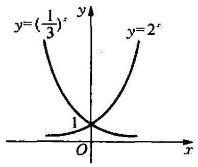

运用计算器, 通过列表、描点、连线等步骤,我们可以得到如下两个函数的图象:

$$
y = {2}^{x}, y = {\left( \frac{1}{3}\right) }^{x},
$$

从上述两个图象的特点, 可以得到指数函数 $y = {a}^{x}\left( {a > 0\text{ ,且 }a \neq  1}\right)$ 的图象和性质:

图象:

$$
y = {a}^{x}\left( {a > 1}\right)
$$

$$
y = {a}^{x}\left( {0 < a < 1}\right)
$$

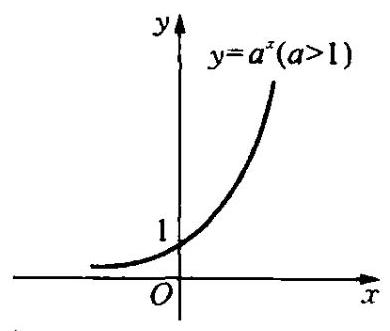

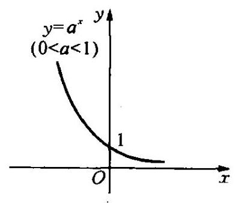

性质:

性质 1 指数函数 $y = {a}^{x}\left( {a > 0\text{ ,且 }a \neq  1}\right)$ 的函数值恒大于零.

性质 2 指数函数 $y = {a}^{x}\left( {a > 0\text{ ,且 }a \neq  1}\right)$ 的图象经过点 $\left( {0,1}\right)$ .

性质 3 对于指数函数 $y = {a}^{x}\left( {a > 0\text{ ,且 }a \neq  1}\right)$ :

当 $a > 1$ 时,若 $x > 0$ ,则有 $y > 1$ ; 若 $x < 0$ ,则有 $0 < y < 1$ ;

当 $0 < a < 1$ 时,若 $x > 0$ ,则有 $0 < y < 1$ ; 若 $x < 0$ ,则有 $y > 1$ .

性质 4 当 $a > 1$ 时,指数函数 $y = {a}^{x}$ 在 $\left( {-\infty , + \infty }\right)$ 内是增函数; 当 $0 < a < 1$ 时,指数函数 $y = {a}^{x}$ 在 $\left( {-\infty , + \infty }\right)$ 内是减函数.

例 1 利用指数函数的性质,比较下列各组中两个数的大小:

(1) ${3}^{\sqrt{2}}$ 和 ${3}^{1.414}$ ；

(2) ${0.7}^{-\frac{2}{3}}$ 和 ${0.7}^{-\frac{3}{4}}$ ；

(3) $\frac{{2}^{2007} + 1}{{2}^{2008} + 1}$ 和 $\frac{{2}^{2008} + 1}{{2}^{2009} + 1}$ .

解 (1) 因为指数函数 $y = {3}^{x}$ 在 $\left( {-\infty , + \infty }\right)$ 上是增函数,又 $\sqrt{2} >$ 1.414,所以 ${3}^{\sqrt{2}} > {3}^{1.414}$ .

(2)因为指数函数 $y = {0.7}^{x}$ 在 $\left( {-\infty , + \infty }\right)$ 上是减函数，又 $- \frac{2}{3} > \; - \frac{3}{4}$ ,所以 ${0.7}^{-\frac{2}{3}} < {0.7}^{-\frac{3}{4}}$ .

(3)构造函数 $f\left( x\right)  = \frac{{2}^{x - 1} + 1}{{2}^{x} + 1}\left( {x \in  \mathbf{R}}\right)$ ，则

$$
f\left( x\right)  = \frac{{2}^{x} + 2}{2\left( {{2}^{x} + 1}\right) } = \frac{{2}^{x} + 1 + 1}{2\left( {{2}^{x} + 1}\right) } = \frac{1}{2} + \frac{1}{2\left( {{2}^{x} + 1}\right) },
$$

因为 $f\left( x\right)$ 在 $\left( {-\infty , + \infty }\right)$ 上是减函数,所以 $f\left( {2008}\right)  > f\left( {2009}\right)$ ,即 $\frac{{2}^{2007} + 1}{{2}^{2008} + 1} > \frac{{2}^{2008} + 1}{{2}^{2009} + 1}.$

例 2 已知函数 $y = {a}^{x}\left( {a > 0\text{ ,且 }a \neq  1}\right)$ 在区间 $\left\lbrack  {1,2}\right\rbrack$ 上的最大值比最小值大 $\frac{a}{3}$ ,求实数 $a$ 的值.

解 当 $a > 1$ 时,函数 $y = {a}^{x}$ 在区间 $\left\lbrack  {1,2}\right\rbrack$ 内单调递增,所以 $f{\left( x\right) }_{\max } = f\left( 2\right)  = {a}^{2}, f{\left( x\right) }_{\min } = f\left( 1\right)  = a$ ,由题意得 ${a}^{2} - a = \frac{a}{3}$ ,解得 $a = \frac{4}{3}$ ;

当 $0 < a < 1$ 时,函数 $y = {a}^{x}$ 在 $\left\lbrack  {1,2}\right\rbrack$ 内单调递减,所以 $f{\left( x\right) }_{\min } = \; f\left( 2\right)  = {a}^{2}, f{\left( x\right) }_{\max } = f\left( 1\right)  = a, a - {a}^{2} = \frac{a}{3}$ ,解得 $a = \frac{2}{3}$ .

综上可知 $a = \frac{4}{3}$ 或 $\frac{2}{3}$ .

例 3 已知关于 $x$ 的方程 ${2}^{x} = \frac{a + 1}{2 - a}$ ,在下列情况中分别求实数 $a$ 的取值范围:

(1)方程没有实数解;

(2)方程只有正实数解；

(3)方程有负数解.

解 (1) 因为对一切 $x \in  \mathbf{R}$ 有 ${2}^{x} > 0$ ,若方程没有实数解,则有 $\frac{a + 1}{2 - a} \leq  0$ ,可以解得 $a \leq   - 1$ 或 $a > 2$ .

(2)根据指数函数的性质，当 $x > 0$ 时， ${2}^{x} > 1$ ，所以 $\frac{a + 1}{2 - a} > 1$ ，可以解得 $\frac{1}{2} < a < 2$ .

(3)因为函数 $y = {2}^{x}$ 在 $\left( {-\infty , + \infty }\right)$ 上单调递增，所以函数 $y = {2}^{x}$ 的图象与常数函数 $y = \frac{a + 1}{2 - a}$ 的图象最多只有一个交点,因此,方程 ${2}^{x} = \frac{a + 1}{2 - a}$ 的负数解便是唯一解.

当 $x < 0$ 时, $0 < {2}^{x} < 1$ ,所以 $0 < \frac{a + 1}{2 - a} < 1$ ,即 $\frac{a + 1}{2 - a} > 0$ 且 $\frac{a + 1}{2 - a} \; < 1$ ,可以解得 $- 1 < a < \frac{1}{2}$ .

例 4 有一种银行存款的计息方法称为复利,即存款到期不取出继续留存于银行,银行自动将本金与利息之和(本利和)作为下一期的本金而产生新的利息.

(1)2008 年银行存款年利率为 4.67%，利息税为 20% . 某人以一年期定期储蓄存入银行 10 万元. 问到 5 年后的 2013 年, 该笔存款扣除利息税后的本利和是多少? (精确到元)

(2)设某人存入银行的本金为 ${a}_{0}$ ，年利率为 $r$ ，利息税为 $p$ ，试写出此人 $x$ 年后扣除利息税后的本利和 $y$ 关于年数 $x$ 的函数解析式.

解 (1) 设一年后的本利和为 ${y}_{1}$ ,则 ${y}_{1} = {10} + {10} \times  {4.67}\%  \times \; {80}\%  = {10}\left( {1 + {4.67}\%  \times  {80}\% }\right) ;$

两年后的本利和为 ${y}_{2}$ ,则 ${y}_{2} = {y}_{1}\left( {1 + {4.67}\%  \times  {80}\% }\right)  = {10}(1 + \; {4.67}\%  \times  {80}\% {)}^{2}$ ;

依此类推,五年后的本利和为 ${y}_{5} = {10}{\left( 1 + {4.67}\%  \times  {80}\% \right) }^{5}$ ,即 ${y}_{5} \approx$ 12.0129(万元).

所以，5 年后的本利和为 120129 元.

(2)根据上面的计算，可以类推得到: $y = {a}_{0}{\left( 1 + rp\right) }^{x}$ .

例 5 某企业年初有资金 1000 万元,若该企业生产经营的年资金增长率为 50%,但每年年底都要扣除消费基金 $x$ 万元,余下资金投入再生产, 为实现经过 5 年资金达到 2000 万元 (扣除消费基金后), 则每年扣除消费基金 $x$ 应为多少万元 (精确到万元)? 若企业年初有资金为 $a$ 万元,年增长率为 $r$ ,每年扣除的消费基金为 $b$ 万元,经过 $x$ 年后,资金达到 $y$ 万元 (扣除消费基金后),试写出 $y$ 关于 $x$ 的表达式.

解 第一年年底扣除消费基金后, 投入再生产的资金为

$$
{y}_{1} = {1000} + {1000} \times  {50}\%  - x = \frac{3}{2} \times  {1000} - x;
$$

第二年年底扣除消费基金后,投入再生产的资金为

$$
{y}_{2} = {y}_{1} + {y}_{1} \times  {50}\%  - x = \frac{3}{2}{y}_{1} - x
$$

$$
= {\left( \frac{3}{2}\right) }^{2} \times  {1000} - \left( {1 + \frac{3}{2}}\right) x
$$

依此类推, 第 5 年年底扣除消费基金后, 投入再生产的资金为

$$
{y}_{5} = {\left( \frac{3}{2}\right) }^{5} \times  {1000} - \left\lbrack  {1 + \frac{3}{2} + {\left( \frac{3}{2}\right) }^{2} + {\left( \frac{3}{2}\right) }^{3} + {\left( \frac{3}{2}\right) }^{4}}\right\rbrack  x.
$$

由于 ${y}_{5} = {2000}$ ,则

$$
{\left( \frac{3}{2}\right) }^{5} \times  {1000} - \left\lbrack  {1 + \frac{3}{2} + {\left( \frac{3}{2}\right) }^{2} + {\left( \frac{3}{2}\right) }^{3} + {\left( \frac{3}{2}\right) }^{4}}\right\rbrack  x = {2000},
$$

解得 $x \approx  {424}$ (万元).

故每年扣除消费基金 424 万元.

由前面的分析可得到 $y = a{\left( 1 + r\right) }^{x} - \left\lbrack  {1 + \left( {1 + r}\right)  + {\left( 1 + r\right) }^{2} + }\right. \; \left. {{\left( 1 + r\right) }^{3} + \cdots  + {\left( 1 + r\right) }^{x - 1}}\right\rbrack  b, x \in  {\mathbf{N}}^{ * }$ .

动・大家谈

1. 为什么要规定指数函数 $y = {a}^{x}$ 的底数大于零且不等于 1 ?

2. 函数 $y = k \cdot  {2}^{x}\left( {k > 0}\right)$ 的图象可以由函数 $y = {2}^{x}$ 的图象通过平移得到吗?

动。自己想 已知 $f\left( x\right)  = \frac{{a}^{x}}{{a}^{x} + \sqrt{a}}$ (其中 $a$ 是大于 0 的常数). 求 $f\left( \frac{1}{2008}\right)  + f\left( \frac{2}{2008}\right)  + f\left( \frac{3}{2008}\right)  + \cdots  + \; f\left( \frac{2007}{2008}\right)$ 的值.

1. 指出下列各组函数图象的对称关系:

(1) $y = {4}^{x}$ 与 $y = {0.25}^{x}$ ； (2) $y =  - {3}^{x}$ 与 $y = {\left( \frac{1}{3}\right) }^{x}$ .

2. 画出下列函数的图象, 并分别说出它们的对称轴方程:

(1) $y = {2}^{\left| x\right| }$ ; (2) $y = {2}^{-\left| x\right| }$ ；

(3) $y = {2}^{\left| x + 1\right| }$ ； (4) $y = {2}^{\left| x - 1\right| }$ ；

(5) $y = {2}^{\left| x\right|  + 1}$ ; (6) $y = {2}^{\left| x\right|  - 1}$ .

3. ( 1 )若曲线 $\left| y\right|  = {3}^{x} + 2$ 与直线 $y = a$ 没有公共点,求实数 $a$ 的取值范围;

(2)已知 $0 < b < 1$ ，函数 $f\left( x\right)  = b \cdot  {a}^{x} + m$ 的图象不经过第一象限， 则实数 $a$ 与 $m$ 的取值范围分别是多少? 若图象不经过第二象限呢?

(3)设函数 $f\left( x\right)  = \left\{  \begin{array}{l} {2}^{-x} - 1, x \leq  0, \\  {x}^{\frac{1}{2}}, x > 0, \end{array}\right.$ 若 $f\left( x\right)  > 1$ ,则 $x$ 的取值范围是多少?

4. 求下列函数的单调区间:

(1) $y = {3}^{{x}^{2} - {2x} - 3}$ ； (2) $y = {\left( \frac{1}{2}\right) }^{\sqrt{x + 1}}$ ；

(3) $y = {\left( {a}^{2} - a + 3\right) }^{1 - x}$ .

5. ( 1 )求函数 $f\left( x\right)  = {4}^{-x} + {\left( \frac{1}{2}\right) }^{x} + 1\left( {x \geq  0}\right)$ 的值域；

(2)如果函数 $f\left( x\right)  = {4}^{-x} - {\left( \frac{1}{2}\right) }^{x} + a - 1$ 有两个不同的零点,求实数 $a$ 的取值范围;

(3)已知函数 $f\left( x\right)  = \left\{  \begin{array}{l} \left( {{2a} - 1}\right) x + {7a} - 2, x < 1, \\  {a}^{x}, x \geq  1 \end{array}\right.$ 在 $\left( {-\infty , + \infty }\right)$ 上单调递减,求实数 $a$ 的取值范围.

6. 下表是某河流中, 从 2000 年到 2008 年间一种鱼的数量统计资料，试写出一个表示这些数据(时间、鱼的数量)间关系的函数解析式. (本题是开放题,要求得出的函数式尽可能准确地反映表中这些数据)

<table><tr><td>年</td><td>2000</td><td>2001</td><td>2002</td><td>2003</td><td>2004</td><td>2005</td><td>2006</td><td>2007</td><td>2008</td></tr><tr><td>数量(千条)</td><td>25</td><td>45</td><td>59</td><td>83</td><td>122</td><td>151</td><td>219</td><td>315</td><td>500</td></tr></table>

7. 牛奶保鲜时间因储藏时的温度不同而不同:若牛奶放在 $0{}^{ \circ  }\mathrm{C}$ 的冰箱中,保鲜时间是 192 小时,而在 ${22}^{ \circ  }\mathrm{C}$ 的厨房中是 42 小时. 假定保鲜时间 $y$ 与储藏温度 $x$ 的函数关系是 $y = a \cdot  {b}^{x}$ ( $a\text{ 、 }b$ 是常数).

(1)写出保鲜时间 $y$ 关于储藏温度 $x$ 的函数解析式；

(2)利用(1)中的结论，指出温度在 ${30}^{ \circ  }\mathrm{C}$ 和 ${16}^{ \circ  }\mathrm{C}$ 时的保鲜时间；

(3)运用上面的数据，作出函数的图象.

8. 设 $f\left( x\right)  = \frac{{e}^{x} - {e}^{-x}}{2}, g\left( x\right)  = \frac{{e}^{x} + {e}^{-x}}{2}$ .

(1)求证: $f\left( {2x}\right)  = {2f}\left( x\right)  \cdot  g\left( x\right)$ 且 $f\left( {2x}\right)$ 是奇函数；

(2)求证: $g\left( {2x}\right)  = 2{g}^{2}\left( x\right)  - 1 = 2{f}^{2}\left( x\right)  + 1 = {f}^{2}\left( x\right)  + {g}^{2}\left( x\right)$ 且 $g\left( {2x}\right)$ 是偶函数.

### 4.3 借助计算器观察函数图象递增的快慢 (Observing the Increasing Rate of Functions with Calculator)

幂函数 $y = {x}^{\alpha }\left( {\alpha  > 0}\right)$ ,指数函数 $y = {a}^{x}\left( {a > 1}\right)$ 和一次函数 $y = \; {ax} + b\left( {a > 0}\right)$ 在区间 $\lbrack 0, + \infty )$ 上都是单调增函数,但是,在不同的条件下，它们递增的快慢是不同的，了解图象的递增速度的快慢往往很重要， 本节中,我们利用计算器来研究图象变化的速度.

例 1 用描点法在同一坐标系中画出函数 $f\left( x\right)  = {x}^{2}\left( {x \geq  0}\right)$ 和 $g\left( x\right)  = {2}^{x}\left( {x \geq  0}\right)$ 的函数图象,并回答下列问题:

(1)这两个函数的图象有几个交点?

(2)观察两个图象在区间 $\left\lbrack  {2,4}\right\rbrack$ 上变化的快慢,并回答: 位于上方的图象，其变化速度就快吗？位于下方的图象，其变化速度就慢吗？

解 (1) 函数 $f\left( x\right)  = {x}^{2}\left( {x \geq  0}\right)$ 和 $g\left( x\right)  = {2}^{x}\left( {x \geq  0}\right)$ 有两个交点, 分别是点 $\left( {2,4}\right)$ 和 $\left( {4,{16}}\right)$ ，其图象如下:

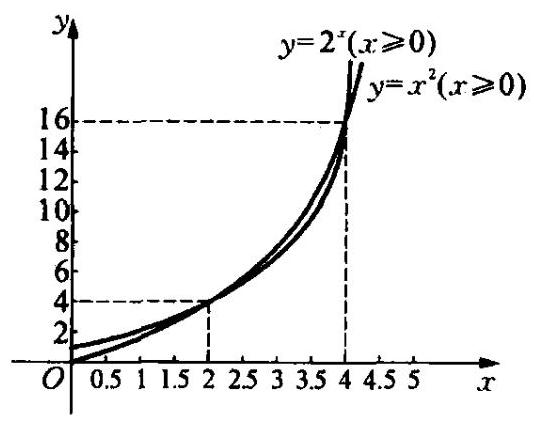

(2)列表并计算得:

<table><tr><td>$x$</td><td>$f\left( x\right)$</td><td>$g\left( x\right)$</td><td>$f\left( x\right)  - f\left( {x - {0.1}}\right)$</td><td>$g\left( x\right)  - g\left( {x - {0.1}}\right)$</td></tr><tr><td>2.0</td><td>4</td><td>4</td><td>0.39</td><td>0.2679</td></tr><tr><td>2.1</td><td>4.41</td><td>4.2871</td><td>0.41</td><td>0.2871</td></tr><tr><td>2.2</td><td>4.84</td><td>4.5948</td><td>0.43</td><td>0.3077</td></tr><tr><td>2.3</td><td>5.29</td><td>4.9246</td><td>0.45</td><td>0.3298</td></tr><tr><td>2.4</td><td>5.76</td><td>5.2780</td><td>0.47</td><td>0.3535</td></tr><tr><td>2.5</td><td>6.25</td><td>5.6569</td><td>0.49</td><td>0.3788</td></tr><tr><td>2.6</td><td>6.76</td><td>6.0629</td><td>0.51</td><td>0.4060</td></tr><tr><td>2.7</td><td>7.29</td><td>6.4980</td><td>0.53</td><td>0.4352</td></tr><tr><td>2.8</td><td>7.84</td><td>6.9644</td><td>0.55</td><td>0.4664</td></tr><tr><td>2.9</td><td>8. 41</td><td>7.4643</td><td>0.57</td><td>0.4999</td></tr><tr><td>3.0</td><td>9</td><td>8</td><td>0.59</td><td>0.5357</td></tr><tr><td>3.1</td><td>9.61</td><td>8.5742</td><td>0.61</td><td>0.5742</td></tr><tr><td>3.2</td><td>10.24</td><td>9.1896</td><td>0.63</td><td>0.6154</td></tr><tr><td>3.3</td><td>10.89</td><td>9.8492</td><td>0.65</td><td>0.6596</td></tr><tr><td>3.4</td><td>11.56</td><td>10.5561</td><td>0.67</td><td>0.7069</td></tr><tr><td>3.5</td><td>12.25</td><td>11. 3137</td><td>0.69</td><td>0.7576</td></tr><tr><td>3.6</td><td>12.96</td><td>12. 1257</td><td>0.71</td><td>0.8120</td></tr><tr><td>3.7</td><td>13.69</td><td>12.9960</td><td>0.73</td><td>0.8703</td></tr><tr><td>3.8</td><td>14.44</td><td>13.9288</td><td>0.75</td><td>0.9328</td></tr><tr><td>3.9</td><td>15.21</td><td>14.9285</td><td>0.77</td><td>0.9997</td></tr><tr><td>4.0</td><td>16</td><td>16</td><td>0.79</td><td>1.0715</td></tr></table>

从表中数据可知在上方的图形,其变化速度不一定快,位于下方的图形,其变化速度不一定慢.

例 2 政府为帮助考取大学的贫困学生完成学业, 推出了一项低息贷款的惠民政策，贷款的最长期限为 6 年. 还款时，本息一次付清. 已知该项贷款有两种计息方法:(1)按贷款额的2‰的月利率计单利；(2)按贷款额的 1.95% 的月利率计复利. 若刘同学要贷款 2 万元，应选择哪种计息方法贷款更好呢？(精确到元)

解 设刘同学贷款期限为 $x$ 个月,按第一种计息办法还款时的本利和为

$$
{y}_{1} = {20000}\left( {1 + {0.002x}}\right)  = {20000} + {40x}\left( {0 < x \leq  {72}, x \in  {\mathbf{N}}^{ * }}\right) ;
$$

按第二种计息办法还款时的本利和为

$$
{y}_{2} = {20000} \times  {1.00195}^{x}\left( {0 < x \leq  {72}, x \in  {\mathbf{N}}^{ * }}\right) .
$$

计算得下表 (计算结果精确到 1 元):

<table id="cross-table-1"><tr><td>月份 $x$</td><td>本利和 ${y}_{1}$</td><td>本利和 ${y}_{2}$</td><td>月份 $x$</td><td>本利和 ${y}_{1}$</td><td>本利和 ${y}_{2}$</td></tr><tr><td>1</td><td>20040</td><td>20 039</td><td>11</td><td>20440</td><td>20433</td></tr><tr><td>2</td><td>20080</td><td>20078</td><td>12</td><td>20480</td><td>20473</td></tr><tr><td>3</td><td>20 120</td><td>20 117</td><td>13</td><td>20520</td><td>20513</td></tr><tr><td>4</td><td>20 160</td><td>20 156</td><td>14</td><td>20 560</td><td>20 553</td></tr><tr><td>5</td><td>20 200</td><td>20 196</td><td>15</td><td>20 600</td><td>20 593</td></tr><tr><td>6</td><td>20240</td><td>20235</td><td>16</td><td>20 640</td><td>20 633</td></tr><tr><td>7</td><td>20280</td><td>20275</td><td>17</td><td>20 680</td><td>20 673</td></tr><tr><td>8</td><td>20320</td><td>20314</td><td>18</td><td>20720</td><td>20714</td></tr><tr><td>9</td><td>20 360</td><td>20354</td><td>19</td><td>20760</td><td>20 754</td></tr><tr><td>10</td><td>20 400</td><td>20393</td><td>20</td><td>20 800</td><td>20 795</td></tr><tr></tr><tr><td>21</td><td>20840</td><td>20 835</td><td>27</td><td>21 080</td><td>21 080</td></tr><tr><td>22</td><td>20880</td><td>20876</td><td>28</td><td>21 120</td><td>21 121</td></tr><tr><td>23</td><td>20 920</td><td>20 917</td><td>29</td><td>21 160</td><td>21 162</td></tr><tr><td>24</td><td>20 960</td><td>20 957</td><td>30</td><td>21 200</td><td>21 204</td></tr><tr><td>25</td><td>21000</td><td>20 998</td><td>31</td><td>21 240</td><td>21 245</td></tr><tr><td>26</td><td>21 040</td><td>21 039</td><td></td><td></td><td></td></tr></table>

续 表

用描点法作出函数图象:

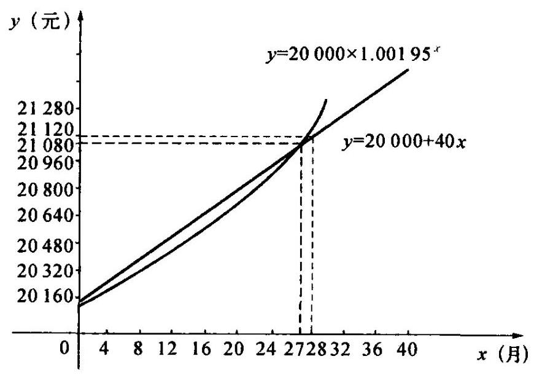

从上图和上表可见: 当 $1 \leq  x \leq  {26}$ 时, ${y}_{1} > {y}_{2}$ ; 当 $x \geq  {27}$ 时, ${y}_{1} \leq  {y}_{2}$ .

因此，如果刘同学的贷款期限不超过 26 个月, 选择第二种计息方法为好, 如果刘同学的贷款期限超过 26 个月, 应当选择第一种计息方法.

用计算器计算并填写下列表格:

- 自己练

<table><tr><td>$x$</td><td>${x}^{\frac{1}{2}}$</td><td>${x}^{2}$</td><td>${x}^{3}$</td><td>1. ${4}^{x}$</td><td>${2}^{x}$</td></tr><tr><td></td><td></td><td></td><td></td><td></td><td></td></tr><tr><td></td><td></td><td></td><td></td><td></td><td></td></tr><tr><td></td><td></td><td></td><td></td><td></td><td></td></tr><tr><td></td><td></td><td></td><td></td><td></td><td></td></tr><tr><td></td><td></td><td></td><td></td><td></td><td></td></tr><tr><td></td><td></td><td></td><td></td><td></td><td></td></tr><tr><td></td><td></td><td></td><td></td><td></td><td></td></tr><tr><td></td><td></td><td></td><td></td><td></td><td></td></tr></table>

(1)在同一坐标系中用描点法分别作出函数 $y = {x}^{\frac{1}{2}}, y = x, y = \; {x}^{2}, y = {x}^{3}, y = {1.4}^{x}, y = {2}^{x}$ 的图象;

(2)比较幂函数 $y = {x}^{\frac{1}{2}}, y = x, y = {x}^{2}, y = {x}^{3}$ 的图象变化的快慢;

(3)比较指数函数 $y = {1.4}^{x}, y = {2}^{x}$ 的图象变化的快慢;

(4)比较函数 $y = {x}^{2}$ 与 $y = {2}^{x}$ 的图象变化的情况.

### 4.4 对数概念及其运算 (Concepts and Operations of Logarithms)

先看下面的问题:

假设某人在 2000 年时的年工资为 5 万元, 如果工资年平均增长率为 5%，要经过多少年，此人的年工资可达到 10 万元？

假设经过 $x$ 年此人的年工资可达到 10 万元，根据题意有 $5(1 + \; 5\% {)}^{x} = {10}$ ,即 ${1.05}^{x} = 2$ .

这是已知底数和幂的值, 求指数的问题, 也就是我们要学习的对数问题.

一般地,如果 $a\left( {a > 0, a \neq  1}\right)$ 的 $b$ 次幂等于 $N$ ,就是 ${a}^{b} = N$ ,那么数 $b$ 叫做以 $a$ 为底 $N$ 的对数 (logarithm),记作 ${\log }_{a}N = b$ ,其中 $a$ 叫做对数的底数(base), $N$ 叫做真数.

例如,由 ${3}^{2} = 9$ ,得到以 3 为底 9 的对数为 2,记作 ${\log }_{3}9 = 2$ ,由定义可知负数和零没有对数. 事实上,因为 $a > 0$ ,所以不论 $b$ 是什么实数, 都有 ${a}^{b} > 0$ ,这就是说,不论 $b$ 是什么数, $N$ 永远是正数,故负数和零没有对数.

根据对数定义,我们可以得到 ${\log }_{a}1 = 0,{\log }_{a}a = 1(a > 0$ , 且 $a \neq  1)$ .

通常我们把以 10 为底的对数叫做常用对数 (common logarithms)， 并简记作 $\lg$ ,即 ${\log }_{10}N = \lg N$ ; 以无理数 $\mathrm{e} = {2.71828}\cdots$ 为底的对数叫做自然对数 (natural logarithms),并简记作 $\ln N$ ,即 ${\log }_{\mathrm{e}}N = \ln N$ .

例 1 将下列指数式写成对数式:

(1) ${5}^{3} = {125}$ ；(2) ${2}^{-5} = \frac{1}{32}$ ； (3) ${{3}^{a} = {81}};$ (4) ${\left( \frac{2}{3}\right) }^{x} = {12}$ .

解 $\left( 1\right) {\log }_{5}{125} = 3$ .

(2) ${\log }_{2}\frac{1}{32} =  - 5$ .

(3) ${\log }_{3}{81} = a$ . (4) $\log \frac{2}{3}{12} = x$ .

例 2 将下列对数式写成指数式:

(1) ${\log }_{\frac{1}{3}}{27} =  - 3$ ； (2) ${\log }_{2}\frac{1}{64} =  - 6$ ；

(3) $\lg {1000} = 3$ ; (5) $\ln {10} = {2.303}$ .

解 $\left( 1\right) {\left( \frac{1}{3}\right) }^{-3} = {27}$ . (2) ${2}^{-6} = \frac{1}{64}$ .

(3) ${10}^{3} = {1000}$ . (4) ${\mathrm{e}}^{2.303} = {10}$ .

我们学过有理数指数幂的运算性质,如 ${a}^{m} \cdot  {a}^{n} = {a}^{m + n}(a > 0, a \neq$ 1,且 $m, n \in  \mathbf{Q}$ ),利用这个性质和对数的定义,我们可以推出对数的运算性质.

令 ${\log }_{a}M = {b}_{1},{\log }_{a}N = {b}_{2}$ ,则根据对数的定义得 ${a}^{{b}_{1}} = M$ , ${a}^{{b}_{2}} = N$ . 又因为 $M \cdot  N = {a}^{{b}_{1}} \cdot  {a}^{{b}_{2}} = {a}^{{b}_{1} + {b}_{2}}$ ,所以 ${b}_{1} + {b}_{2} = {\log }_{a}(M$ . $N)$ ,即

$$
{\log }_{a}\left( {M \cdot  N}\right)  = {\log }_{a}M + {\log }_{a}N.
$$

类似地, 我们可以得到对数的其他几个运算性质:

(1) ${\log }_{a}\frac{M}{N} = {\log }_{a}M - {\log }_{a}N\left( {a > 0, a \neq  1;M > 0, N > 0}\right)$ ;

(2) ${\log }_{a}{M}^{n} = n{\log }_{a}M\left( {a > 0, a \neq  1;n \in  \mathbf{R}, M > 0, N > 0}\right)$ ;

(3) ${\log }_{a}b = \frac{{\log }_{c}b}{{\log }_{c}a}$ (换底公式) $\left( {a > 0, a \neq  1;c > 0, c \neq  1, b > 0}\right)$ ;

(4) ${\log }_{a}b = \frac{1}{{\log }_{b}a}\left( {a > 0, a \neq  1;b > 0, b \neq  1}\right)$ ;

(5) ${\log }_{{a}^{n}}M = \frac{1}{n}{\log }_{a}M\left( {a > 0, a \neq  1;n \in  \mathbf{R}, n \neq  0, M > 0}\right)$ ;

(6) ${a}^{{\log }_{a}N} = N\left( {a > 0, a \neq  1;N > 0}\right)$ .

对于一个正数的常用对数值，可以写成一个整数与一个正的纯小数 (或 0 )之和，如:

$$
\lg {2000} = \lg \left( {2 \times  {10}^{3}}\right)  = 3 + \lg 2 \approx  3 + {0.3010},
$$

$$
\lg {0.00003} = \lg \left( {3 \times  {10}^{-5}}\right)  =  - 5 + \lg 3 \approx   - 5 + {0.4771},
$$

$$
\lg {10000} = \lg {10}^{4} = 4 + 0,
$$

即正数 $x$ 的常用对数 $\lg x$ 可以写成 $\lg x = M + m$ (其中 $M$ 为整数, $0 \leq \; m < 1)$ ,那么, $M$ 称为对数 $\lg x$ 的首数, $m$ 称为对数 $\lg x$ 的尾数. 如果某正数 $x$ 的常用对数 $\lg x =  - {2.1234}$ ,则将 $\lg x$ 写成: $\lg x = \overline{3} + {0.8766} =$ 3. 8766,则 $\lg x$ 的首数是 -3,尾数是 0.8766.

例 3 (1)用计算器计算下列各对数的值:(结果精确到 0.01)

$\lg {5.24},\lg {348},\lg {0.02},\lg {82},\lg {2.83},\lg {0.3}.$

(2)通过上述计算的结果猜想:当对数 $\lg N$ 为正数或负数时，真数 $N$ 的取值范围;

(3)用指数函数的性质解释你的结论.

解 (1) $\lg {5.24} \approx  {0.72},\lg {348} \approx  {2.54},\lg {0.02} \approx   - {1.70}$ ,

$\lg {82} \approx  {1.91},\;\lg {2.83} \approx  {0.45},\;\lg {0.3} \approx   - {0.52}.$

(2)经计算发现: 当 $\lg N < 0$ 时, $0 < N < 1$ ; 当 $\lg N > 0$ 时, $N > 1$ .

(3)对于函数 $y = {10}^{x}$ ,当 $x < 0$ 时, $0 < y < 1$ ; 当 $x > 0$ 时, $y > 1$ .

例 4 设 2007 年我国国民生产总值为 $m$ 亿元，如果我国国民生产总值的年平均增长率为 10%，那么经过多少年我国国民生产总值是 2007 年时的 4 倍? (精确到 1 年)

解 设经过 $x$ 年我国国民生产总值是 2007 年时的 4 倍,根据题意, 得 $m{\left( 1 + {0.1}\right) }^{x} = {4m}$ ,即 ${1.10}^{x} = 4$ ,解得 $x = \frac{\lg 4}{\lg {1.10}} \approx  {14.545}$ , 所以 $x = {15}$ (年).

答: 经过 15 年, 我国国民生产总值是 2007 年的 4 倍.

例 52008 年 5 月 12 日下午 2 点 28 分，我国发生了汶川大地震，震级达到 8.0 级, 此后一个多月里又连续发生 1 万多次余震, 其中震级在 6.0 级以上的次数达到 6 次之多,若用 $I$ 表示地震时所散发出来的相对能量,地震震级用 $r$ 表示. 其中 $r = \frac{2}{3}\lg I + 2$ . 试比较 8.0 级和 6.0 级地震的相对能量的比值. (精确到个位)

解 设 8.0 级和 6.0 级地震的相对能量分别为 ${I}_{1}$ 和 ${I}_{2}$ ,由题意得

$$
\left\{  \begin{array}{l} \frac{2}{3}\lg {I}_{1} + 2 = {8.0}, \\  \frac{2}{3}\lg {I}_{2} + 2 = {6.0}, \end{array}\right.
$$

① ②

由①一②得， $\frac{2}{3}\left( {\lg {I}_{1} - \lg {I}_{2}}\right)  = {2.0}$ ，即 $\lg \frac{{I}_{1}}{{I}_{2}} = {3.0}$ ，所以 $\frac{{I}_{1}}{{I}_{2}} = \; {10}^{3.0} \approx  {1000}$ .

答: 8.0 级地震的相对能量约是 6.0 级的 1000 倍.

例 6 计算下列各题:

(1) $2 \cdot  {\lg }^{2}\sqrt{2} + \lg \sqrt{2} \cdot  \lg 5 + \sqrt{{\lg }^{2}\sqrt{2} - \lg 2 + 1}$ ;

(2) $\lg 5\left( {\lg 8 + \lg {1000}}\right)  + {\left( \lg {2}^{\sqrt{3}}\right) }^{2} + \lg \frac{1}{6} + \lg {0.06}$ ;

(3) ${\log }_{6}^{2}3 + \frac{{\log }_{6}{18}}{{\log }_{2}6}$ ;

(4) ${7}^{\lg {30}} \cdot  {\left( \frac{1}{3}\right) }^{\lg {0.7}}$ ；

(5) ${a}^{{\log }_{m}b} \cdot  {b}^{{\log }_{m}\frac{1}{a}}$ .

解 (1) 原式 $= \lg \sqrt{2}\left( {2\lg \sqrt{2} + \lg 5}\right)  + \sqrt{{\left( \lg \sqrt{2} - 1\right) }^{2}}$

$$
= \lg \sqrt{2}\left( {\lg 2 + \lg 5}\right)  + 1 - \lg \sqrt{2}
$$

$$
= \lg \sqrt{2} + 1 - \lg \sqrt{2} = 1\text{ . }
$$

(2) 原式 $= \lg 5\left( {3\lg 2 + 3}\right)  + 3{\lg }^{2}2 - \lg 6 + \lg 6 - 2$

$$
= 3\lg 5\lg 2 + 3\lg 5 + 3{\lg }^{2}2 - 2
$$

$$
= 3\lg 2\left( {\lg 5 + \lg 2}\right)  + 3\lg 5 - 2
$$

$$
= 3\lg 2 + 3\lg 5 - 2
$$

$$
= 3\left( {\lg 2 + \lg 5}\right)  - 2 = 1\text{ . }
$$

(3)原式 $= {\log }_{6}^{2}3 + \left( {{\log }_{6}3 + {\log }_{6}6}\right)  \cdot  {\log }_{6}2$

$$
= {\log }_{6}^{2}3 + {\log }_{6}3 \cdot  {\log }_{6}2 + {\log }_{6}2
$$

$$
= {\log }_{6}3\left( {{\log }_{6}3 + {\log }_{6}2}\right)  + {\log }_{6}2
$$

$$
= {\log }_{6}3 + {\log }_{6}2 = 1\text{ . }
$$

(4)设 $x = {7}^{\lg {30}} \cdot  {\left( \frac{1}{3}\right) }^{\lg {0.7}}$ ，两边取对数得

$$
\lg x = \lg {7}^{\lg {30}} + \lg {\left( \frac{1}{3}\right) }^{\lg {0.7}}
$$

$$
= \left( {\lg 3 + \lg {10}}\right) \lg 7 + \left( {\lg 7 - \lg {10}}\right) \left( {-\lg 3}\right)
$$

$$
= \lg 3 \cdot  \lg 7 + \lg 7 - \lg 7 \cdot  \lg 3 + \lg 3 = \lg {21}\text{ , }
$$

所以 $x = {21}$ ,即 ${7}^{\lg {30}} \cdot  {\left( \frac{1}{3}\right) }^{\lg {0.7}} = {21}$ .

(5)设 $x = {a}^{{\log }_{m}b} \cdot  {b}^{{\log }_{m}\frac{1}{a}}$ ，两边取以 $m$ 为底的对数得

$$
{\log }_{m}x = {\log }_{m}b \cdot  {\log }_{m}a + {\log }_{m}\frac{1}{a} \cdot  {\log }_{m}b
$$

$$
= {\log }_{m}b \cdot  {\log }_{m}a - {\log }_{m}a \cdot  {\log }_{m}b = 0,
$$

所以 $x = 1$ ,即 ${a}^{{\log }_{m}b} \cdot  {b}^{{\log }_{m}\frac{1}{a}} = 1$ .

例 7 求解下列各题:

(1)已知 $\lg 2 = a,{10}^{b} = 3$ ,试用 $a\text{ 、 }b$ 表示 ${\log }_{24}{15}$ ;

(2)已知 ${\log }_{3}5 = a,{\log }_{5}7 = b$ ，试用 $a$ 、 $b$ 表示 ${\log }_{75}{63}$ ；

(3)已知 ${2}^{6a} = {3}^{3b} = {6}^{2c}$ ，试建立 $a$ 、 $b$ 、 $c$ 间的关系式.

解 (1) 利用换底公式得,

$$
{\log }_{24}{15} = \frac{\lg {15}}{\lg {24}} = \frac{\lg 3 + \lg {10} - \lg 2}{\lg 3 + 3\lg 2} = \frac{b + 1 - a}{b + {3a}}.
$$

(2)由题意得， ${\log }_{5}3 = \frac{1}{a}$ ， ${\log }_{5}7 = b$ ，则

$$
{\log }_{75}{63} = \frac{{\log }_{5}{63}}{{\log }_{5}{75}} = \frac{{\log }_{5}7 + 2{\log }_{5}3}{2{\log }_{5}5 + {\log }_{5}3} = \frac{b + \frac{2}{a}}{2 + \frac{1}{a}} = \frac{{ab} + 2}{{2a} + 1}.
$$

(3)对等式两端取常用对数得, ${6a}\lg 2 = {3b}\lg 3 = {2c}\lg 6$ .

当 $a = b = c = 0$ 时,等式成立;

当 ${abc} \neq  0$ 时, $\lg 2 = \frac{c}{3a}\lg 6,\lg 3 = \frac{2c}{3b}\lg 6$ ,所以 $\lg 2 + \lg 3 = \; \left( {\frac{c}{3a} + \frac{2c}{3b}}\right) \lg 6$ ,即 $\lg 6 = \left( {\frac{c}{3a} + \frac{2c}{3b}}\right) \lg 6$ ,所以 $\frac{c}{3a} + \frac{2c}{3b} = 1$ ,即 $\frac{1}{a} + \; \frac{2}{b} = \frac{3}{c}$

综上可知 $a\text{ 、 }b\text{ 、 }c$ 满足 $\frac{1}{a} + \frac{2}{b} = \frac{3}{c}$ 或 $a = b = c = 0$ .

课堂活动 1. 如何证明对数的换底公式?

·大家谈 2. 在对数运算性质中,我们知道 ${\log }_{a}\left( {M \cdot  N}\right) \; = {\log }_{a}M + {\log }_{a}N$ ,请问: 是否存在正实数 $x\text{ 、 }y$ 使等式 ${\log }_{a}\left( {x + y}\right)  = {\log }_{a}x + {\log }_{a}y\left( {a > 0, a \neq  1}\right)$ 成立? 如果存在, 请指出这些数的分布特点. 对其他的几个对数性质进行类似分析, 得出你的结论.

3. 请说出有理数指数幂的意义和运算性质, 根式的意义以及根式和有理数指数幂的关系.

习题练习

- 自己练

1. 计算:

(1) ${\log }_{x}{27} = \frac{3}{4}$ ,求 $x$ ;

(2)若 ${\log }_{2}\left( {{\log }_{5}x}\right)  = 0$ ,求 $x$ ;

(3) ${2}^{-{\log }_{4}3}$ ；

(4) ${5}^{3 - 2{\log }_{25}{125}}$ ；

(5) ${\log }_{6}\left( {\sqrt{2 + \sqrt{3}} + \sqrt{2 - \sqrt{3}}}\right)$ ;

(6) 已知 ${3}^{a} = {12}^{b} = 8$ ,求 $\frac{a - b}{ab}$ ;

(7)若 $2\lg \frac{x - y}{2} = \lg x + \lg y$ ，求 $\frac{x}{y}$ ；

(8) ${7}^{\lg {20}} \cdot  {\left( \frac{1}{2}\right) }^{\lg {0.7}}$ ;

(9) ${\left( \lg 3\right) }^{\lg 3} \cdot  {3}^{\lg \left( {{\log }_{3}{10}}\right) }$ ;

(10) ${\log }_{6}{25} \cdot  {\log }_{5}3 \cdot  {\log }_{9}6$ .

2. 已知集合 $A = \{ x,{xy},\lg \left( {xy}\right) \} , B = \{ 0,\left| x\right| , y\}$ ，且有 $A = B$ ， 求 ${\left( \frac{x - y}{2}\right) }^{2008}$ 的值.

3. 已知方程 ${\lg }^{2}x + \left( {\lg 2 + \lg 3}\right)  \cdot  \lg x + \lg 2 \cdot  \lg 3 = 0$ 的两个根为 ${x}_{1}\text{ 、 }{x}_{2}$ ,求 ${x}_{1} \cdot  {x}_{2}$ 的值.

4. (1)已知 ${\log }_{3}7 = a,{\log }_{3}4 = b$ ，求 ${\log }_{12}{21}$ (用 $a$ 、 $b$ 表示)；

(2)已知 ${\log }_{2}3 = a,{\log }_{3}5 = b$ ，求 ${\log }_{15}{20}$ (用 $a$ 、 $b$ 表示).

5. ( 1 )设 $a$ 、 $b$ 、 $c$ 都是正数，且 ${3}^{a} = {4}^{b} = {6}^{c}$ ，求 $\frac{-{2ab} + {2bc} + {ac}}{abc}$ 的值;

(2)已知 $a, b, c > 0$ ，且 $a, b, c \neq  1$ ，求 ${a}^{{\log }_{b}c} + {b}^{{\log }_{c}a} + {c}^{{\log }_{a}b} - \; {a}^{{\log }_{c}b} - {b}^{{\log }_{a}c} - {c}^{{\log }_{b}a}$ 的值;

(3)设 $f\left( x\right)  = a \cdot  {x}^{2009} + b \cdot  \sqrt[{2007}]{x} + {2008}$ ,若 $f\left( {{\log }_{20}{\log }_{207}{209}}\right)  =$ 2010,求 $f\left( {{\log }_{20}{\log }_{209}{207}}\right)$ 的值.

6. ( 1 )若 $a > 0, b > 0$ 且 $a \neq  1, b \neq  1$ ，已知 ${a}^{x} \cdot  {b}^{x} = {x}^{\lg a} \cdot  {x}^{\lg b}$ 的实根个数大于 3,求 ${\left( ab\right) }^{2009}$ 的值;

(2)实数 ${3}^{123456}$ 是一个很大的数，已知一张 $\mathrm{A}$ 4 纸上有 400 个格子，每个格子中只放一个数字，那么要把这个庞大的数字打印下来，需要多少张 A 4 纸?

### 4.5 反函数的概念 (Concept of Inverse Functions)

在函数表达式 $y = {2x} - 5$ 中， $x$ 是自变量， $y$ 是 $x$ 的一次函数，从函数 $y = {2x} - 5$ 中解出 $x$ ,可以得到式子 $x = \frac{y + 5}{2}$ . 这样对于 $y$ 的任何一个值,通过式子 $x = \frac{y + 5}{2}$ ,可以得到唯一的一个 $x$ 和它对应,也就是说,可以把 $y$ 看作自变量, $x$ 作为 $y$ 的函数,这时我们就说 $x = \frac{y + 5}{2}$ 是函数 $y = {2x} - 5$ 的反函数.

习惯上,函数的自变量用 $x$ 表示,因变量用 $y$ 表示,故 $y = {2x} - 5$ 的反函数通常写成 $y = \frac{x + 5}{2}$ .

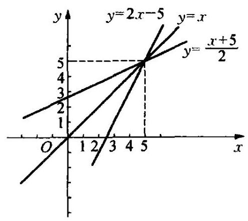

一般地,对于函数 $y = f\left( x\right)$ ,设它的定义域为 $D$ ,值域为 $A$ . 如果对 $A$ 中的任意一个值 $y$ ,在 $D$ 中总有唯一确定的 $x$ 值与它对应,且满足 $y = \; f\left( x\right)$ ,这样得到的 $x$ 关于 $y$ 的函数 $x = \varphi \left( y\right) \left( {x \in  D, y \in  A}\right)$ 叫做函数 $y = f\left( x\right)$ 的反函数 (inverse function),常常将 $x = \varphi \left( y\right)$ 记作 $x = \; {f}^{-1}\left( y\right) \left( {x \in  D, y \in  A}\right)$ . 在习惯上,自变量常用 $x$ 表示,而函数用 $y$ 表示，所以把它改写为 $y = {f}^{-1}\left( x\right) \left( {x \in  A}\right)$ .

例如函数 $y = {3x}$ 的反函数是 $y = \frac{x}{3}$ ,函数 $y = {2x} - 1$ 的反函数是 $y = \frac{x + 1}{2}.$

从反函数的概念可知: 如果函数 $y = f\left( x\right)$ 有反函数 $y = {f}^{-1}\left( x\right)$ , 那么函数 $y = {f}^{-1}\left( x\right)$ 的反函数就是 $y = f\left( x\right)$ . 这就是说,函数 $y = f\left( x\right)$ 与 $y = {f}^{-1}\left( x\right)$ 互为反函数.

函数 $y = f\left( x\right)$ 的定义域是它的反函数 $y = {f}^{-1}\left( x\right)$ 的值域；函数 $y = f\left( x\right)$ 的值域是它的反函数 $y = {f}^{-1}\left( x\right)$ 的定义域(见下表).

<table><tr><td></td><td>函数 $y = f\left( x\right)$</td><td>反函数 $y = {f}^{-1}\left( x\right)$</td></tr><tr><td>定 义 域</td><td>$D$</td><td>A</td></tr><tr><td>值 域</td><td>A</td><td>D</td></tr></table>

例 1 求下列函数的反函数:

(1) $y = {5x} - 3$ ； (2) $y = {x}^{2} - 2\left( {x \leq  0}\right)$ ；

(3) $y = 2{x}^{3}$ ;

(4) $y = \frac{{2x} + 3}{x - 2}\left( {x \in  \mathbf{R}\text{ 且 }x \neq  2}\right)$ .

解 (1) 由 $y = {5x} - 3$ ,得 $x = \frac{y + 3}{5}$ ,将 $x$ 与 $y$ 互换,得 $y = \frac{x + 3}{5}$ , 所以函数 $y = {5x} - 3$ 的反函数是 $y = \frac{x + 3}{5}$ .

(2)由 $y = {x}^{2} - 2\left( {x \leq  0}\right)$ ，得 ${x}^{2} = y + 2$ ，因为 $x \leq  0$ ，所以有 $x = \; - \sqrt{y + 2}$ .

将 $x$ 与 $y$ 互换,得 $y =  - \sqrt{x + 2}$ ,所以函数 $y = {x}^{2} - 2\left( {x \leq  0}\right)$ 的反函数是 $y =  - \sqrt{x + 2}\left( {x \geq   - 2}\right)$ .

(3) 由 $y = 2{x}^{3}$ ,得 $x = \sqrt[3]{\frac{y}{2}}$ ,将 $x$ 与 $y$ 互换,得 $y = \sqrt[3]{\frac{x}{2}}$ ,所以函数 $y = 2{x}^{3}$ 的反函数是 $y = \sqrt[3]{\frac{x}{2}}$ .

(4) 由 $y = \frac{{2x} + 3}{x - 2}$ ,得 ${yx} - {2y} = {2x} + 3$ ,即 $\left( {y - 2}\right) x = {2y} + 3$ .

当 $y \neq  2$ 时, $x = \frac{{2y} + 3}{y - 2}$ ,将 $x$ 与 $y$ 互换,得 $y = \frac{{2x} + 3}{x - 2}(x \in  \mathbf{R}$ 且 $x \neq  2)$ .

所以,函数 $y = \frac{{2x} + 3}{x - 2}\left( {x \in  \mathbf{R}\text{ 且 }x \neq  2}\right)$ 的反函数是 $y = \frac{{2x} + 3}{x - 2} \; \left( {x \in  \mathbf{R}\text{ 且 }x \neq  2}\right)$ .

例 2 求函数 $y = {x}^{2} - {2x}\left( {x \geq  1}\right)$ 的反函数，并在同一坐标系中作出原函数与其反函数的图象, 指出两个图象的对称轴.

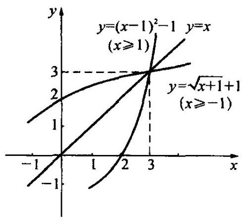

解 由函数 $y = {x}^{2} - {2x}$ ,得 $y = \; {\left( x - 1\right) }^{2} - 1$ ,因此 ${\left( x - 1\right) }^{2} = y + 1$ .

因为 $x \geq  1$ ,所以 $x - 1 = \sqrt{y + 1}$ , $x = \sqrt{y + 1} + 1$ ,所以函数 $y = {x}^{2} - {2x} \; \left( {x \geq  1}\right)$ 的反函数是 $y = \sqrt{x + 1} + 1(x \; \geq   - 1$ ).

从图象可知,原函数 $y = {x}^{2} - \; {2x}\left( {x \geq  1}\right)$ 与它的反函数 $y = \; \sqrt{x + 1} + 1\left( {x \geq   - 1}\right)$ 的图象关于直线 $y = x$ 对称,即直线 $y = x$ 是它们的对称轴.

事实上,如果两个函数的图象关于直线 $y = x$ 对称,这两个函数互为反函数. 这个问题请同学们想一想.

例 3 解下列问题:

(1)已知 $f\left( x\right)  = \frac{{2x} + 3}{x - 1}$ ,函数 $y = g\left( x\right)$ 的图象与 $y = {f}^{-1}\left( {x + 1}\right)$ 的图象关于直线 $y = x$ 对称，则 $g\left( {11}\right)  =$ ___.

(2)若点 $\left( {2,\frac{1}{4}}\right)$ 既在 $y = {2}^{{ax} + b}$ 的图象上，又在它的反函数的图象上，则 $a =$ ___.

(3)把函数 $y = 3 - {2}^{x + 1}$ 的图象绕直线 $y = x$ 旋转 ${180}^{ \circ  }$ 得到 $y = \; g\left( x\right)$ 的图象，则函数 $y = g\left( x\right)$ 的表达式是 $y =$ ___.

(4)若函数 $f\left( x\right)  = \frac{x}{x + 2}$ 的反函数是 $y = {f}^{-1}\left( x\right)$ ,则 ${f}^{-1}\left( \frac{1}{2}\right)  =$ ___.

(5)若定义在 $\mathbf{R}$ 上的函数 $y = f\left( {x + 1}\right)$ 的反函数是 $y = {f}^{-1}(x -$ 1),且 $f\left( 0\right)  = 1$ ,则 $f\left( {2008}\right)  =$ ___.

(6)已知函数 $y = f\left( x\right)$ (定义域为 $D$ ，值域为 $A$ )有反函数 $y = \; {f}^{-1}\left( x\right)$ ,则方程 $f\left( x\right)  = 0$ 有解 $x = a$ ,且 $f\left( x\right)  > x\left( {x \in  D}\right)$ 的充要条件是 $y = {f}^{-1}\left( x\right)$ 满足___.

(7)若函数 $y = f\left( x\right)$ 存在反函数，则下列命题中不正确的是( ).

(A) 函数 $y = f\left( x\right)$ 与函数 $x = f\left( y\right)$ 的图象关于直线 $y = x$ 对称

(B) 若 $y = f\left( x\right)$ 是奇函数,则 $y = {f}^{-1}\left( x\right)$ 也是奇函数

(C) 若 $y = f\left( x\right)$ 在其定义域 $\left\lbrack  {a, b}\right\rbrack$ 上是增函数,则 $y = {f}^{-1}\left( x\right)$ 在 $\left\lbrack  {a, b}\right\rbrack$ 上也是增函数

(D) 函数 $y = f\left( x\right)$ 与 $x = {f}^{-1}\left( y\right)$ 的图象重合

(8)函数 $f\left( x\right)  = {x}^{2} - {2ax} - 3$ 在区间 $\left\lbrack  {1,2}\right\rbrack$ 上存在反函数的充要条件是( ).

(A) $a \in  ( - \infty ,1\rbrack$ (B) $a \in  \lbrack 2, + \infty )$

(C) $a \in  \left\lbrack  {1,2}\right\rbrack$ (D) $a \in  ( - \infty ,1\rbrack  \cup  \lbrack 2, + \infty )$

解 (1) 因为函数 $y = g\left( x\right)$ 的图象与 $y = {f}^{-1}\left( {x + 1}\right)$ 的图象关于直线 $y = x$ 对称,所以 $y = g\left( x\right)$ 与 $y = {f}^{-1}\left( {x + 1}\right)$ 互为反函数,又函数 $y = \; {f}^{-1}\left( {x + 1}\right)$ 的反函数是 $y = f\left( x\right)  - 1$ ,于是 $g\left( {11}\right)  = f\left( {11}\right)  - 1 = \frac{3}{2}$ ;

(2)由题意可知点 $\left( {2,\frac{1}{4}}\right)$ 和点 $\left( {\frac{1}{4},2}\right)$ 均在函数 $y = {2}^{{ax} + b}$ 的图象上,所以有 $\left\{  \begin{array}{l} {2}^{{2a} + b} = \frac{1}{4}, \\  {2}^{\frac{1}{4}a + b} = 2, \end{array}\right.$ 解方程组得 $\left\{  \begin{array}{l} a =  - \frac{12}{7}, \\  b = \frac{10}{7}. \end{array}\right.$

(3)由题意可知，函数 $y = g\left( x\right)$ 与函数 $y = 3 - {2}^{x + 1}$ 互为反函数， 所以,由 ${2}^{x + 1} = 3 - y$ 得 $x =  - 1 + {\log }_{2}\left( {3 - y}\right)$ ,所以 $g\left( x\right)  =  - 1 + \; {\log }_{2}\left( {3 - x}\right) \left( {x < 3}\right)$ .

(4) 由反函数的定义可知 $\frac{x}{x + 2} = \frac{1}{2}$ ,解得 $x = 2$ ,所以 ${f}^{-1}\left( \frac{1}{2}\right)  = 2$ .

(5)因为函数 $y = {f}^{-1}\left( {x - 1}\right)$ 的反函数是 $y = f\left( x\right)  + 1$ ，所以 $f\left( {x + 1}\right)  = f\left( x\right)  + 1$ . 而 $f\left( 0\right)  = 1$ ,于是有 $f\left( {2008}\right)  = f\left( {2007}\right)  + 1 = \; f\left( {2006}\right)  + 2 = \cdots  = f\left( 0\right)  + {2008} = {2008}$ ,即 $f\left( {2008}\right)  = {2008}.$

(6) 因为 $f\left( a\right)  = 0$ 等价于 ${f}^{-1}\left( 0\right)  = a, f\left( x\right)  > x\left( {x \in  D}\right)$ 等价于 ${f}^{-1}\left( x\right)  < x\left( {x \in  A}\right)$ ,所以 $y = {f}^{-1}\left( x\right)$ 满足: ${f}^{-1}\left( 0\right)  = a$ 且 ${f}^{-1}\left( x\right)  < \; x\left( {x \in  A}\right)$ .

(7)由反函数的定义可知，函数 $y = f\left( x\right)$ 的定义域是其反函数 $y = \; {f}^{-1}\left( x\right)$ 的值域,所以 $y = {f}^{-1}\left( x\right)$ 在 $\left\lbrack  {a, b}\right\rbrack$ 上不一定有定义,所以选项 $\mathrm{C}$ 是错误的.

(8)二次函数 $f\left( x\right)  = {x}^{2} - {2ax} - 3$ 在区间 $\left\lbrack  {1,2}\right\rbrack$ 上存在反函数的充要条件是该函数在区间 $\left\lbrack  {1,2}\right\rbrack$ 上具有单调性,所以二次函数 $f\left( x\right)  = \; {x}^{2} - {2ax} - 3$ 的对称轴 $x = a$ 不在 $\left( {1,2}\right)$ 上,即 $a \leq  1$ 或 $a \geq  2$ .

课堂活动

1. 什么样的函数存在反函数？求一个函数的反函数时要注意什么问题?

·大家谈

2. 根据例 1 分析原函数与其反函数的单调性、

奇偶性.

课堂活动

- 自己想有单调性?

1. 若函数 $y = f\left( x\right)$ (定义域为 $D$ ,值域为 $A$ ) 且函数 $y = f\left( x\right)$ 在定义域 $D$ 上有单调性,则函数 $y = \; f\left( x\right)$ 一定有反函数吗?存在反函数的函数是否一定

2. 偶函数、周期函数有反函数吗?

课外活动是否存在一个函数的反函数是它自身？请举例说明.

自己找

课外活动

·自己学

## 逆映射的概念

如果 $f : A \rightarrow  B$ 是从集合 $A$ 到集合 $B$ 上的一一映射, 并且对于 $B$ 中每一元素 $b$ ,使 $b$ 在 $A$ 中的原象 $a$ 和它对应, 这样所得的映射叫做 $f : A \rightarrow  B$ 的逆映射,记作 ${f}^{-1}$ : $B \rightarrow  A$ .

应该明确, ${f}^{-1} : B \rightarrow  A$ 是从 $B$ 到 $A$ 上的一一映射,并且 ${f}^{-1}\left\lbrack  {f\left( a\right) }\right\rbrack   = a$ (其中 $a \in  A, f\left( a\right)  \in  B$ ),即如果 $b \in  B$ ,且 $b$ 是在 $f$ : $A \rightarrow  B$ 的作用下 $a\left( {a \in  A}\right)$ 的象,那么 $a\left( {a \in  A}\right)$ 一定是 $b$ 在 ${f}^{-1} : B \rightarrow \; A$ 的作用下 $b\left( {b \in  B}\right)$ 的象.

例 (1) 设 $A = \mathbf{R}$ (实数集), $B = {\mathbf{R}}^{ + }$ (正实数集),法则 $f : y = {x}^{2} -$ 2,其中 $x \in  A, y \in  B$ (即 $A$ 中的元素的平方减 2). $A\text{ 、 }B\text{ 、 }f$ 不能构成从 $A$ 到 $B$ 的映射,这是因为 $1 \in  A$ ,但 ${1}^{2} - 2 =  - 1 \notin  B$ ,即在法则 $f$ 的作用下, $A$ 中元素 1 在 $B$ 中不存在元素与之对应.

(2)设 $A = \mathbf{R}, B = \mathbf{R}$ ，法则 $f : y = {x}^{2} - 2$ ，其中 $x \in  A, y \in  B, A$ 、 $B$ 、 $f$ 构成从 $A$ 到 $B$ 的映射，但不是从 $A$ 到 $B$ 的满射，这是因为任何实数 $x,{x}^{2} - 2$ 仍为确定的实数，即 $B$ 中存在唯一的元素 ${x}^{2} - 2$ 与 $A$ 中元素相对应. 但是对于 $B$ 中元素 -3,则在 $A$ 中找不到任何元素使得 -3 与之对应,即 $B$ 中有些元素在 $A$ 中没有原象,即此映射不是满射.

(3) 若 $A = \mathbf{R}, B = \lbrack  - 2, + \infty )$ ,法则 $f : y = {x}^{2} - 2$ ,其中 $x \in  A$ , $y \in  B, A\text{ 、 }B\text{ 、 }f$ 构成从 $A$ 到 $B$ 上的满射. 但是对于 $A$ 中元素 3 和-3, 在法则 $f$ 的作用下,其象都是 7,因此这个映射 $f : A \rightarrow  B$ 不是从 $A$ 到 $B$ 的单射, 即 “满而不单”.

(4)若 $A = {\complement }_{\mathbf{R}} +$ (非负实数集)， $B = \mathbf{R}$ ，法则 $f : y = {x}^{2} - 2$ ，其中 $x \in  A, y \in  B$ ,则 $A\text{ 、 }B\text{ 、 }f$ 构成从 $A$ 到 $B$ 的映射. 且在法则 $f$ 的作用下, $A$ 中不同的元素 ${x}_{1}\text{ 、 }{x}_{2}$ ,其象 ${x}_{1}^{2} - 2,{x}_{2}^{2} - 2$ 也是不同的,故此映射是从 $A$ 到 $B$ 的单射,但 $- 3 \in  B, - 3$ 在 $A$ 中却没有原象,所以不是满射,即此映射 “单而不满”.

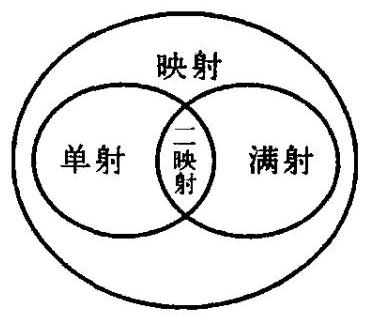

(5) 若 $A = \left\lbrack  {{}_{{\mathbf{R}}^{ + }}, B = }\right\rbrack   - \left\lbrack  {-2, + \infty }\right)$ ,法则 $f$ : $y = {x}^{2} - 2$ ,其中 $x \in  A, y \in  B$ ,则映射 $f : A \rightarrow \; B$ 既是从 $A$ 到 $B$ 的满射,又是从 $A$ 到 $B$ 的单射, 从而构成了从 $A$ 到 $B$ 上的一一映射.

综上所述，可以得到以下关系:

\{单射\} ⊂\{映射\}，\{满射\} ⊂\{映射\}，\{单射\} ⋂ \{满射\} = \{一一映射\}.

按照逆映射的定义可知,任何 $x \in  A$ ,在法则 $f$ 的作用下, $x$ 的象 $f\left( x\right)  \in  B$ ,而 $f\left( x\right)  \in  B$ ,在法则 ${f}^{-1}$ 的作用下, $f\left( x\right)$ 的象恰为 $x \in  A$ , 即 ${f}^{-1}\left\lbrack  {f\left( x\right) }\right\rbrack   = x$ .

可见构成互为逆映射的两个法则,恰好构成“互为逆运算”. 并且具有“还原性”,即 ${f}^{-1}\left\lbrack  {f\left( x\right) }\right\rbrack   = x$ .

1. 求下列函数的反函数:

自己家

(1) $f\left( x\right)  = \frac{1}{2}\sqrt{4 - {x}^{2}}\left( {-2 \leq  x \leq  0}\right)$ ;

(2) $f\left( x\right)  = {2}^{{x}^{2} - {2x} + 3}\left( {x \geq  1}\right)$ ；___

(3) $f\left( x\right)  = \left\{  \begin{array}{l} {x}^{\frac{2}{3}}, x < 0, \\   - {x}^{2}, x > 0. \end{array}\right.$

2. 解下列各题:

(1)函数 $y = f\left( x\right)$ 是定义在 $\mathbf{R}$ 上的最小正周期为 $T$ 的周期函数， 且 $x \in  \left( {0, T}\right)$ 时, $y = f\left( x\right)$ 有反函数 $y = {f}^{-1}\left( x\right)$ ,那么当 $x \in  \left( {T,{2T}}\right)$ 时,求 $y = f\left( x\right)$ 的反函数;

(2)已知函数 $f\left( x\right)  = {3}^{x}$ 的反函数为 $y = {f}^{-1}\left( x\right)$ ,若 ${f}^{-1}\left( m\right)  + \; {f}^{-1}\left( n\right)  = 2$ ,求 $\frac{2}{m} + \frac{1}{n}$ 取得最小值时 $m$ 的值;

(3)设函数 $y = f\left( x\right)$ 的反函数存在且 $y = f\left( {{2x} - 1}\right)$ 的图象经过点 $\left( {3,2}\right)$ ,求函数 $y = {f}^{-1}\left( {{4x} + 1}\right)$ 的图象一定经过的点的坐标;

(4)已知 ${x}_{1}$ 是方程 $x + {2}^{x} = 4$ 的根， ${x}_{2}$ 是方程 $x + {\log }_{2}x = 4$ 的根， 求 ${x}_{1} + {x}_{2}$ ;

(5) 已知 $f\left( x\right)  = \frac{a - x}{x - a - 1}$ 的反函数 ${f}^{-1}\left( x\right)$ 的图象的对称中心是 $\left( {-1,3}\right)$ ,求实数 $a$ 的值;

(6) 已知函数 $y = \left\{  \begin{array}{ll} {x}^{2}, & 0 \leq  x \leq  1, \\  {\left( \frac{1}{2}\right) }^{x}, &  - 1 \leq  x < 0, \end{array}\right.$ 求 ${f}^{-1}\left( \frac{5}{4}\right)$ ;

(7)函数 $y = \frac{{\mathrm{e}}^{x} - {\mathrm{e}}^{-x}}{2}$ 的反函数( );

(A) 是奇函数,它在 $\left( {0, + \infty }\right)$ 上是减函数

(B) 是偶函数,它在 $\left( {0, + \infty }\right)$ 上是减函数

(C) 是奇函数,它在 $\left( {0, + \infty }\right)$ 上是增函数

(D) 是偶函数,它在 $\left( {0, + \infty }\right)$ 上是增函数

(8) 设 $k > 1, f\left( x\right)  = k\left( {x - 1}\right) \left( {x \in  \mathbf{R}}\right)$ ,在平面直角坐标系 ${xOy}$ 中,函数 $y = f\left( x\right)$ 的图象与 $x$ 轴交于 $A$ 点,它的反函数 $y = {f}^{-1}\left( x\right)$ 的图象与 $y$ 轴交于 $B$ 点,并且这两个函数的图象交于 $P$ 点,已知四边形 $O \; {APB}$ 的面积是 3,则 $k$ 的值为( ).

(A) $\frac{4}{3}$ (B) $\frac{3}{2}$ (C) $\frac{6}{5}$ (D) $\frac{8}{7}$

3. 已知函数 $y = \frac{1 - {ax}}{1 + {ax}}\left( {x \neq   - \frac{1}{a}, x \in  \mathbf{R}}\right)$ 的图象关于直线 $y = \; x$ 对称,求实数 $a$ 的值.

4. 若点 $\left( {2,1}\right)$ 既在函数 $f\left( x\right)  = \sqrt{{mx} + n}$ 的图象上,又在它的反函数的图象上,求实数 $m\text{ 、 }n$ 的值.

5. 已知函数 $f\left( x\right)  = \frac{a \cdot  {2}^{x} - 1}{{2}^{x} + 1}\left( {a \in  \mathbf{R}}\right)$ 是 $\mathbf{R}$ 上的奇函数.

(1)求实数 $a$ 的值；

(2)求 $f\left( x\right)$ 的反函数.

6. (1)设函数 $y = f\left( x\right)$ (定义域为 $D$ ，值域为 $A$ )的反函数是 $y = \; {f}^{-1}\left( x\right)$ ,且函数 $y = f\left( x\right)$ 在 $D$ 上单调递增,证明: 函数 $y = {f}^{-1}\left( x\right)$ 在 $A$ 上也是增函数;

(2)设函数 $y = f\left( x\right)$ 是 $D$ 上的奇函数，证明:函数 $y = {f}^{-1}\left( x\right)$ 也是 $A$ 上的奇函数.

7. 已知函数 $f\left( x\right)  = {\left( \frac{x + 1}{x}\right) }^{2}\left( {x > 0}\right)$ .

(1)求函数 $f\left( x\right)$ 的反函数 ${f}^{-1}\left( x\right)$ ；

(2)若 $x \geq  2$ 时，不等式 $\left( {x - 1}\right)  \cdot  {f}^{-1}\left( x\right)  > a\left( {a - \sqrt{x}}\right)$ 恒成立，试求实数 $a$ 的取值范围.

### 4.6 对数函数的图象与性质 (Sketches and Properties of Logarithmic Functions)

我们研究指数函数时, 曾经讨论过细胞分裂问题. 某种细胞分裂时, 得到的细胞的个数 $y$ 是分裂次数 $x$ 的函数,这个函数可用指数函数 $y = \; {2}^{x}$ 表示.

现在来研究相反的问题, 如果要求这种细胞经过多少次分裂, 可以得到 1 万个、2 万个、3 万个……细胞，那么分裂次数 $x$ 就是要得到的细胞个数 $y$ 的函数. 根据对数的定义，这个函数可以写成对数的形式，就是 $x = {\log }_{2}y$ . 如果用 $x$ 表示自变量， $y$ 表示函数，这个函数就是 $y = {\log }_{2}x.$

由反函数的概念,可知函数 $y = {\log }_{2}x$ 与指数函数 $y = {2}^{x}$ 互为反函数.

一般地,函数 $y = {\log }_{a}x\left( {a > 0\text{ 且 }a \neq  1}\right)$ 就是指数函数 $y = {a}^{x}(a >$ 0 且 $a \neq  1)$ 的反函数. 因为 $y = {a}^{x}$ 的值域是 $\left( {0, + \infty }\right)$ ,所以,函数 $y = \; {\log }_{a}x$ 的定义域是 $\left( {0, + \infty }\right)$ .

函数 $y = {\log }_{a}x\left( {a > 0\text{ 且 }a \neq  1}\right)$ 叫做对数函数 (logarithmic function),其中 $x$ 是自变量,定义域是 $\left( {0, + \infty }\right)$ .

下面研究对数函数 $y = {\log }_{a}x\left( {a > 0\text{ 且 }a \neq  1}\right)$ 的图象和性质.

因为对数函数 $y = {\log }_{a}x$ 与指数函数 $y = {a}^{x}$ 互为反函数,所以 $y = \; {\log }_{a}x$ 的图象与 $y = {a}^{x}$ 的图象关于直线 $y = x$ 对称. 因此只要作出指数函数 $y = {a}^{x}$ 关于直线 $y = x$ 对称的图象,就可以得到 $y = {\log }_{a}x$ 的图象.

在同一坐标系中用描点法分别作出下列函数的图象:

(1) $y = {3}^{x}$ 和 $y = {\log }_{3}x$ ； (2) $y = {\left( \frac{1}{3}\right) }^{x}$ 和 $y = {\log }_{\frac{1}{3}}x$ . 图象和性质:

(1)

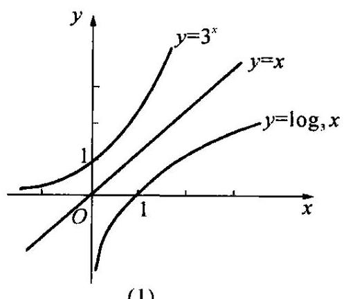

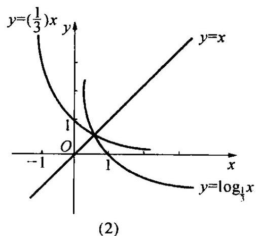

从以上两个对数函数的图象, 我们可以得到更为一般的对数函数的

1. 对数函数 $y = {\log }_{a}x\left( {a > 0\text{ 且 }a \neq  1}\right)$ 的图象可以分为 $a > 1$ 和 $0 < a < 1$ 两种情形:

(1) $y = {\log }_{a}x\left( {a > 1}\right)$ ； (2) $y = {\log }_{a}x\left( {0 < a < 1}\right)$ .

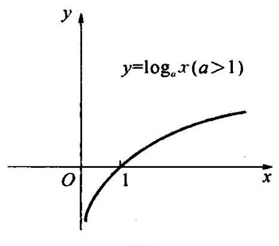

(1)

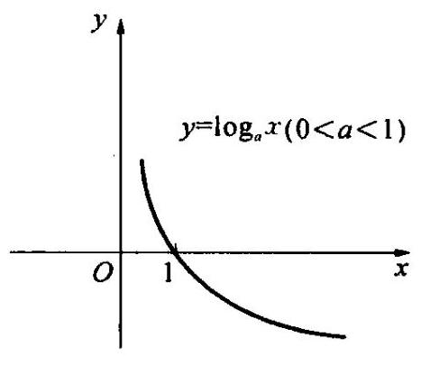

(2)

2. 根据对数函数的意义和指数函数的性质，可以得到对数函数具有如下性质:

性质 1 对数函数 $y = {\log }_{a}x\left( {a > 0\text{ 且 }a \neq  1}\right)$ 的图象都在 $y$ 轴的右面.

性质 2 对数函数 $y = {\log }_{a}x\left( {a > 0\text{ 且 }a \neq  1}\right)$ 的图象都经过点 $\left( {1,0}\right)$ .

性质 3 当 $a > 1$ 时,对数函数 $y = {\log }_{a}x$ 在 $\left( {0, + \infty }\right)$ 上是增函数; 当 $0 < a < 1$ 时,对数函数 $y = {\log }_{a}x$ 在 $\left( {0, + \infty }\right)$ 上是减函数.

性质 4 对数函数 $y = {\log }_{a}x\left( {a > 1}\right)$ ,当 $x > 1$ 时, $y > 0$ ; 当 $0 < \; x < 1$ 时, $y < 0$ ;

对数函数 $y = {\log }_{a}x\left( {0 < a < 1}\right)$ ,当 $x > 1$ 时, $y < 0$ ; 当 $0 < x < 1$ 时, $y > 0$ .

例 1 求下列函数的定义域:

(1) $y = {\log }_{2}{\left( x - 1\right) }^{2}$ ;

(2) $y = {\log }_{3}\frac{\left| x\right| }{x + 2}$ ;

(3) $y = \sqrt{{\log }_{\frac{1}{2}}\left( {{x}^{2} - 1}\right) }$ ； (4) $y = \frac{1}{{\log }_{2}\left( {-{x}^{2} + {4x} - 3}\right) }$ .

解 (1) 因为 ${\left( x - 1\right) }^{2} > 0$ ,即 $x \neq  1$ ,所以函数 $y = {\log }_{2}{\left( x - 1\right) }^{2}$ 的定义域是 $\left( {-\infty ,1}\right)  \cup  \left( {1, + \infty }\right)$ .

(2)因为 $\frac{\left| x\right| }{x + 2} > 0$ ,即 $\left\{  \begin{array}{l} x \neq  0, \\  x >  - 2, \end{array}\right.$ 所以函数 $y = {\log }_{3}\frac{\left| x\right| }{x + 2}$ 的定义域是 $\left( {-2,0}\right)  \cup  \left( {0, + \infty }\right)$ .

(3)因为 ${\log }_{\frac{1}{2}}\left( {{x}^{2} - 1}\right)  \geq  0$ ，所以有 $\left\{  \begin{array}{l} {x}^{2} - 1 \leq  1, \\  {x}^{2} - 1 > 0, \end{array}\right.$ 所以有 $\left\{  \begin{array}{l}  - \sqrt{2} \leq  x \leq  \sqrt{2}, \\  x <  - 1\text{ 或 }x > 1, \end{array}\right.$ 从而有函数 $y = \sqrt{{\log }_{\frac{1}{2}}\left( {{x}^{2} - 1}\right) }$ 的定义域是 $\left\lbrack  {-\sqrt{2}, - 1}\right)  \cup  (1,\sqrt{2}\rbrack$ .

(4) 因为 ${\log }_{2}\left( {-{x}^{2} + {4x} - 3}\right)  \neq  0$ ,所以 $\left\{  \begin{array}{l}  - {x}^{2} + {4x} - 3 > 0, \\   - {x}^{2} + {4x} - 3 \neq  1, \end{array}\right.$ 所以有 $\left\{  \begin{array}{l} \left( {x - 1}\right) \left( {x - 3}\right)  < 0, \\  {\left( x - 2\right) }^{2} \neq  0, \end{array}\right.$ 从而有函数 $y = \frac{1}{{\log }_{2}\left( {-{x}^{2} + {4x} - 3}\right) }$ 的定义域是 $\left( {1,2}\right)  \cup  \left( {2,3}\right)$ .

例 2 利用对数函数的性质,比较下列各题中两个值的大小:

(1) ${\log }_{0.1}4$ 和 ${\log }_{0.1}\pi$ ；

(2) ${\log }_{m}\frac{2}{3}$ 和 ${\log }_{m}\frac{3}{4}$ ，其中 $m > 0$ ， $m \neq  1$ ；

(3) ${\log }_{a}3$ 和 ${\log }_{b}3$ ，其中 $0 < a < b < 1$ .

解 (1) 因为对数函数 $y = {\log }_{0.1}x$ 在 $\left( {0, + \infty }\right)$ 上是减函数,又 $4 > \; \pi$ ,所以 ${\log }_{0.1}4 < {\log }_{0.1}\pi$ .

(2)① 当 $m > 1$ 时，因为对数函数 $y = {\log }_{m}x$ 在 $\left( {0, + \infty }\right)$ 上是增函数,又 $\frac{2}{3} < \frac{3}{4}$ ,所以 ${\log }_{m}\frac{2}{3} < {\log }_{m}\frac{3}{4}$ ;

② 当 $0 < m < 1$ 时，因为对数函数 $y = {\log }_{m}x$ 在 $\left( {0, + \infty }\right)$ 上是减函数,又 $\frac{2}{3} < \frac{3}{4}$ ,所以 ${\log }_{m}\frac{2}{3} > {\log }_{m}\frac{3}{4}$ .

(3)当 $0 < a < b < 1$ 时，因为函数 $y = {\log }_{a}x$ 比 $y = {\log }_{b}x$ 在 $\lbrack 1$ , $+ \infty )$ 上递减的更慢,且 $3 > 1$ ,所以 ${\log }_{a}3 > {\log }_{b}3$ .

例 3 “学习曲线”可以用来描述学习某一任务的速度，假设函数 $t =  - {144}\lg \left( {1 - \frac{n}{90}}\right)$ 中, $t$ 表示达到某一英文打字水平 (字/分) 所需的学习时间(时)， $n$ 表示每分钟打出的字数(字/分).

(1)计算要达到 30 字/分、60 字/分水平所需的学习时间;(精确到“时”)

(2)利用(1)的结果，结合对数函数性质的分析，作出函数的大致图象.

解 (1) 当 $n = {30}$ 时, $t =  - {144}\lg \left( {1 - \frac{30}{90}}\right)  =  - {144}\lg \frac{2}{3} =  - {144} \times \; \left( {-{0.1761}}\right)  \approx  {26}$ (小时);

当 $n = {60}$ 时, $t =  - {144}\lg \left( {1 - \frac{60}{90}}\right)  =  - {144}\lg \frac{1}{3} \approx  {69}$ (小时).

所以要达到每分钟打字为 30 个和 60 个所需的时间分别是 26 小时及 69 小时.

(2) 由 $1 - \frac{n}{90} > 0$ ,得 $0 < n < {90}$ .

因为 $1 - \frac{n}{90}$ 在 $\left( {0,{90}}\right)$ 上是减函数,而 $y = \lg x$ 是增函数,所以 $y = \lg \left( {1 - \frac{n}{90}}\right)$ 在 $\left( {0, n}\right)$ 上是减函数,所以 $y =  - {144}\lg \left( {1 - \frac{n}{90}}\right)$ 在 (0,90) 上是增函数.

由(1)可知函数图象经过点 $\left( {{30},{26}}\right)$ 和 $\left( {{60},{69}}\right)$ ,用描点法可作出函数图象:

保堂活动 1. 0 和负数有对数吗？为什么？

·大家谈

2. 通过同一坐标系中指数函数和对应的对数函数图象的观察，比较两类函数变化的快慢.

3. 对于相同真数，不同底数的对数函数，如何利用函数图象进行大小比较?

课堂活动

・自己想

我们知道,指数函数与其反函数一一对数函数的图象关于直线 $y = x$ 对称,它们可能不相交,也可能相交,请考虑一下,两个函数的图象在什么条件下会相交? 交点个数有多少? 交点是否一定在直线 $y = x$ 上? 请举例说明.

课外活动

·自己茶

## 对数的发明

16 世纪末至 17 世纪初的时候, 当时在自然科学领域 (特别是天文学)的发展上经常遇到大量精密而又庞大的数值计算，于是数学家们为了寻求化简的计算方法而发明了对数. 德国的史提非(1487-1567)在 1544 年所著的《整数算术》中，写出了两个数列, 左边是等比数列 (叫原数), 右边是一个等差数列 (叫原数的代表, 或称指数, 德文是 exponent, 有代表之意). 要求左边任两数的积(商), 只要先求出其代表(指数)的和(差)，然后再把这个和(差)对向左边的一个原数, 则此原数即为所求之积(商), 可惜史提非并未作进一步探索, 没有引入对数的概念.

纳皮尔对数值计算颇有研究. 他所制造的“纳皮尔算筹”，化简了乘除法运算, 其原理就是用加减来代替乘除. 他发明对数的动机是为寻求球面三角计算的简便方法, 他依据一种非常独特的与质点运动有关的设想构造出所谓对数方法, 其核心思想表现为算术数列与几何数列之间的联系. 在他的《奇妙的对数表的描述》中阐明了对数原理，后人称为纳皮尔对数,记为 $\mathrm{{Nap}}.{\log }_{x}$ ,它与自然对数的关系为 $\mathrm{{Nap}}.{\log }_{x} = {107}\ln \frac{107}{x}$ . 由此可知, 纳皮尔对数既不是自然对数, 也不是常用对数, 与现今的对数有一定的距离.

瑞士的彪奇(1552-1632)也独立发明了对数，可能比纳皮尔较早， 但发表较迟(1620). 英国的布里格斯在 1624 年创造了常用对数. 1619 年，斯彼得所著的《新对数》使对数与自然对数更接近(以 $\mathrm{e} = {2.71828}\cdots$ 为底).

对数的发明为当时的社会发展产生了重要的影响, 正如科学家伽利略(1564-1642)说:“给我时间，空间和对数，我可以创造出一个宇宙.” 又如 18 世纪数学家拉普拉斯 (1749-1827) 亦提到:“对数用缩短计算的时间来使天文学家的寿命加倍. ${}^{\prime \prime }$

最早传入我国的对数著作是《比例与对数》，它是由波兰的穆尼斯 (1611-1656)和我国的薛凤祚在 17 世纪中叶合编而成的. 当时在 $\lg 2 =$ 0.3010 中，2 叫“真数”，0.3010 叫做“假数”，真数与假数对列成表，故称对数表. 后来改“假数”为“对数”. 我国清代的数学家戴煦(1805—1860) 发展了多种求对数的简便方法, 著有《对数简法》(1845)、《续对数简法》 (1846)等. 1854 年，英国的数学家艾约瑟 (1825-1905) 看到这些著作后，大为叹服.

当今中学数学教科书是先讲“指数”，后以反函数形式引出“对数”的概念. 但在历史上, 恰恰相反, 对数概念不是来自指数, 因为当时尚无分数指数及无理指数的明确概念. 布里格斯曾向纳皮尔提出用幂指数表示对数的建议. 1742 年, J·威廉 (1675-1749) 在给 G·威廉的《对数表》所写的前言中，作出指数可定义对数. 而欧拉在他的名著《无穷小分析寻论》(1748)中明确提出对数函数是指数函数的逆函数，和现在教科书中的提法一致.

1. 已知对数函数 $y = {\log }_{a}x$ 的反函数的图象经过点 $\left( {5,2}\right)$ ,求正实数 $a$ 的值.

·自己家

2. 求下列函数的定义域:

(1) $y = {\log }_{3}\left| {x + 1}\right|$ ; (2) $y = {\log }_{a}\frac{1 - x}{1 + x}$ ;

(3) $y = \sqrt{{\log }_{\frac{1}{3}}\left( {{x}^{2} - {2x} - 3}\right) }$ ； (4) $y = \frac{\sqrt{4 - {x}^{2}}}{\lg \left| {x - 1}\right| }$ ;

(5) $y = {\log }_{\left( x - 2\right) }x + {\log }_{2}\left( {{16} - {2}^{x}}\right)$ .

3. ( 1 )已知 $y = {\log }_{a}\left( {4 - {ax}}\right)$ 在区间 $\lbrack 0,2)$ 上是 $x$ 的减函数，求实数 $a$ 的取值范围;

(2)函数 $f\left( x\right)  = {\log }_{a}\left| {a{x}^{2} - x}\right| \left( {a > 0, a \neq  1}\right)$ 在区间 $\left\lbrack  {3,4}\right\rbrack$ 上是增函数,求实数 $a$ 的取值范围;

(3)如果不等式 ${x}^{2} - {\log }_{a}x < 0$ 在区间 $\left( {0,\frac{1}{2}}\right\rbrack$ 上恒成立，求实数 $a$ 的取值范围.

4. 求函数 $y = {\log }_{\frac{1}{2}}\left( {3 + {2x} - {x}^{2}}\right)$ 的单调区间和值域.

5. 若函数 $y = {\log }_{a}\left( {{x}^{2} - {3ax} + a}\right)$ 的值域为 $\mathbf{R}$ ，求实数 $a$ 的取值范围.

6. 设函数 $f\left( x\right)  = \lg \left( {1 + {2}^{x} + {3}^{x} + a \cdot  {4}^{x}}\right)$ (其中 $a \in  \mathbf{R}$ ) 在 $x \in \; ( - \infty ,1\rbrack$ 上恒成立,求实数 $a$ 的取值范围.

7. 已知函数 $f\left( x\right)  = {\log }_{a}\frac{1 - {mx}}{x - 1}$ 是奇函数 $\left( {a > 0, a \neq  1}\right)$ .

(1)求出实数 $m$ 的值；

(2)根据(1)的结果，判断 $f\left( x\right)$ 在 $\left( {1, + \infty }\right)$ 上的单调性(不必证明);

(3)如果当 $x \in  \left( {r, a - 2}\right)$ 时， $f\left( x\right)$ 的值域恰为 $\left( {1, + \infty }\right)$ ，求 $a$ 和 $r$ 的值.

8. $f\left( x\right)  = {x}^{2} - x + m\left( {m \in  \mathbf{R}}\right)$ 且 $f\left( {{\log }_{2}a}\right)  = m,{\log }_{2}f\left( a\right)  = 2$ , $a \neq  1$ .

(1)求 $m$ 的值；

( 2 )设 $h\left( x\right)  = \frac{m}{2} - \frac{2}{{2}^{x} + 1}\left( {x \in  \mathbf{R}}\right)$ ，设 ${h}^{-1}\left( x\right)$ 为函数 $h\left( x\right)$ 的反函数,则对给定的正实数 $k$ ,求使 ${h}^{-1}\left( x\right)  > {\log }_{2}\frac{1 + x}{k}$ 成立的 $x$ 的取值范围.

9. 对于区间 $\left\lbrack  {m, n}\right\rbrack$ 上有意义的两个函数 $f\left( x\right)$ 和 $g\left( x\right)$ ,如果对任意 $x \in  \left\lbrack  {m, n}\right\rbrack$ ,均有 $\left| {f\left( x\right)  - g\left( x\right) }\right|  \leq  1$ ,则称 $f\left( x\right)$ 和 $g\left( x\right)$ 在 $\left\lbrack  {m, n}\right\rbrack$ 上是接近的,否则称 $f\left( x\right)$ 和 $g\left( x\right)$ 在 $\left\lbrack  {m, n}\right\rbrack$ 上是远离的. 现有两个函数 ${f}_{1}\left( x\right)  = {\log }_{a}\left( {x - {3a}}\right)$ 与 ${f}_{2}\left( x\right)  = {\log }_{a}\frac{1}{x - a}\left( {a > 0, a \neq  1}\right)$ ,给定区间 $\left\lbrack  {a + 2, a + 3}\right\rbrack$ .

(1)若 ${f}_{1}\left( x\right)$ 和 ${f}_{2}\left( x\right)$ 在给定区间 $\left\lbrack  {a + 2, a + 3}\right\rbrack$ 上都有意义,求实数 $a$ 的取值范围;

(2)讨论 ${f}_{1}\left( x\right)$ 和 ${f}_{2}\left( x\right)$ 在给定区间 $\left\lbrack  {a + 2, a + 3}\right\rbrack$ 上是接近的还是远离的.

10. $f\left( x\right)$ 的定义域为 ${\mathbf{R}}^{ + }$ ,对任意 $x, y \in  {\mathbf{R}}^{ + }$ 恒有 $f\left( {x \cdot  y}\right)  = \; f\left( x\right)  + f\left( y\right) ;$

(1)证明:当 $x \in  {\mathbf{R}}^{ + }$ 时， $f\left( \frac{1}{x}\right)  =  - f\left( x\right)$ ；

(2)若 $x > 1$ 时，恒有 $f\left( x\right)  < 0$ ，证明: $f\left( x\right)$ 必有反函数；

(3)设 ${f}^{-1}\left( x\right)$ 是 $f\left( x\right)$ 的反函数，证明: ${f}^{-1}\left( x\right)$ 在其定义域内恒有 ${f}^{-1}\left( {{x}_{1} + {x}_{2}}\right)  = {f}^{-1}\left( {x}_{1}\right)  \cdot  {f}^{-1}\left( {x}_{2}\right) .$

### 4.7 简单的指数方程 (Simple Exponential Equations)

在初中，我们学习了方程的概念，即含有未知数的等式叫做方程.

在方程 ${3}^{x} = {10}$ 中,未知数 $x$ 在指数的位置上,我们把指数里含有未知数的方程叫做指数方程 (exponential equation),求未知数 $x$ 值的过程叫做解指数方程.

例 1 解下列方程:

(1) ${2}^{3x} = \frac{1}{4}$ ；

(2) ${9}^{x} - 4 \cdot  {3}^{x} - {45} = 0$ ；

(3) ${3}^{x} = {10}$ .

解 (1) 原方程可化为 ${2}^{3x} = {2}^{-2}$ ,由指数函数的性质,可知它们的幂指数相等,即 ${3x} =  - 2$ ,得 $x =  - \frac{2}{3}$ .

所以,原方程的解是 $x =  - \frac{2}{3}$ .

(2)原方程可化为 ${\left( {3}^{x}\right) }^{2} - 4 \cdot  {3}^{x} - {45} = 0$ .

设 ${3}^{x} = t\left( {t > 0}\right)$ ,得 ${t}^{2} - {4t} - {45} = 0$ ,解得 ${t}_{1} = 9,{t}_{2} =  - 5$ (舍去),所以有 ${3}^{x} = 9$ ,得 $x = 2$ .

所以,原方程的解是 $x = 2$ .

(3)在原方程两边取相同底数的对数，得 $\lg {3}^{x} = \lg {10}$ ，由 $x\lg 3 = 1$ 得 $x = \frac{1}{\lg 3}$ .

所以,原方程的解是 $x = \frac{1}{\lg 3}$ .

例 2 解方程: ${9}^{x} + {4}^{x} = \frac{5}{2} \cdot  {6}^{x}$ .

解 原方程可化为

$$
2 \cdot  {3}^{2x} - 5 \cdot  {3}^{x} \cdot  {2}^{x} + 2 \cdot  {2}^{2x} = 0,
$$

两边各项同除以 ${2}^{2x}$ 得

$$
2 \cdot  {\left( \frac{3}{2}\right) }^{2x} - 5{\left( \frac{3}{2}\right) }^{x} + 2 = 0.
$$

令 ${\left( \frac{3}{2}\right) }^{x} = t\left( {t > 0}\right)$ ,则方程可化为 $2{t}^{2} - {5t} + 2 = 0$ ,解得 ${t}_{1} = 2$ , ${t}_{2} = \frac{1}{2}$

所以,原方程的解是 ${x}_{1} = {\log }_{\frac{3}{2}}2,{x}_{2} =  - {\log }_{\frac{3}{2}}2$ .

例 3 解方程: ${9}^{x} + {9}^{-x} - 4\left( {{3}^{x} + {3}^{-x}}\right)  + 5 = 0$ .

解 设 ${3}^{x} + {3}^{-x} = t\left( {t \geq  2}\right)$ ,则

$$
{9}^{x} + {9}^{-x} = {t}^{2} - 2,
$$

于是,原方程可化为 ${t}^{2} - {4t} + 3 = 0$ ,解得 ${t}_{1} = 1$ (舍去), ${t}_{2} = 3$ ,所以有 ${3}^{x} + {3}^{-x} = 3$ ,化简为

$$
{\left( {3}^{x}\right) }^{2} - 3 \cdot  {3}^{x} + 1 = 0,
$$

解方程得 ${3}^{x} = \frac{3 \pm  \sqrt{5}}{2}$ .

所以,原方程的解是 ${x}_{1} = {\log }_{3}\frac{3 - \sqrt{5}}{2},{x}_{2} = {\log }_{3}\frac{3 + \sqrt{5}}{2}$ .

例 4 要测定古物的年代，常用碳的放射性同位素 ${}^{14}\mathrm{C}$ 的衰减来测定: 在动植物的体内都含有微量的 ${}^{14}\mathrm{C}$ ,动植物死亡后,停止了新陈代谢， ${}^{14}\mathrm{C}$ 不再产生，且原有的 ${}^{14}\mathrm{C}$ 含量的衰变经过5570年( ${}^{14}\mathrm{C}$ 的半衰期),它的残余量只有原始量的一半. 若 ${}^{14}\mathrm{C}$ 的原始含量为 $a$ ,则经过 $x$ 年后的残余量 $b$ 与 $a$ 之间满足 $b = a \cdot  {\mathrm{e}}^{-{kx}}$ .

现测得河南安阳殷墟承载甲骨文的甲骨中 ${}^{14}\mathrm{C}$ 的残余量约占原始含量的 76.7%，试推算承载甲骨文的甲骨年代. (精确到 100 年)

解 由 $b = a \cdot  {\mathrm{e}}^{-{kx}}$ ,得 $\frac{b}{a} = {\mathrm{e}}^{-{kx}}$ ,两边取自然对数得

$$
\ln \frac{b}{a} =  - {kx}.
$$

①

又知 ${}^{14}\mathrm{C}$ 的半衰期是5570年,即 $x = {5570}$ 时, $\frac{b}{a} = \frac{1}{2}$ ,所以 $\ln \frac{1}{2} =  - {5570k}$ ,即

$$
k =  - \frac{\ln \frac{1}{2}}{5570} = \frac{\ln 2}{5570},
$$

②

由①②两式可知，

$$
x =  - \frac{{5570}\ln \frac{b}{a}}{\ln 2}.
$$

由题意知 $\frac{b}{a} = {0.767}$ ,所以 $x =  - \frac{{5570} \times  \ln {0.767}}{\ln 2} \approx  {2132}$ .

由此可知承载甲骨文的甲骨距今约 2100 多年.

习题练习

- 自己练

1. (1)若 ${2}^{2x} + 4 = 5 \cdot  {2}^{x}$ ，求 ${x}^{2} + 1$ ；

(2)求方程 ${4}^{x} - {2}^{x + 1} - 3 = 0$ 的解；

(3)求满足方程 ${\left( x - 2\right) }^{5 - \left| x\right| } = 1$ 的实根个数；

(4)若对于任意实数 $p$ ，函数 $y = \left( {p - 1}\right)  \cdot  {2}^{x} - \frac{p}{2}$ 的图象恒过一个定点, 求该定点的坐标.

2. 解下列方程:

(1) ${3}^{{x}^{2}} = {\left( {3}^{x}\right) }^{2}$ ； (2) ${4}^{x} = {5}^{x}$ ；

(3) ${5}^{x - 1} \cdot  {10}^{3x} = {8}^{x}$ ； (4) ${3}^{x + 1} - {3}^{-x} = 2$ ；

(5) $a \cdot  \left( {{a}^{x} + 1}\right)  = {a}^{-x} + 1$ (其中 $a > 0$ 且 $a \neq  1$ )；

(6) $3 \cdot  {16}^{x} + {36}^{x} = 2 \cdot  {81}^{x}$ ;

(7) ${\left( \sqrt{5 + 2\sqrt{6}}\right) }^{x} + {\left( \sqrt{5 - 2\sqrt{6}}\right) }^{x} = {10}$ ；(8) $\sqrt[x]{9} - \sqrt[x]{6} = \sqrt[x]{4}$ ；

(9) ${4}^{x + \sqrt{{x}^{2} - 2}} - 5 \cdot  {2}^{x - 1 + \sqrt{{x}^{2} - 2}} = 6$ ；

(10) ${\left( 2x - 1\right) }^{{x}^{2}} = {\left( 2x - 1\right) }^{x - 2}$ ;

(11) ${3}^{x} + {4}^{x} + {5}^{x} = {6}^{x}$ .

3. 关于 $x$ 的方程 $k \cdot  {9}^{x} - k \cdot  {3}^{x + 1} + 6\left( {k - 5}\right)  = 0$ 在区间 $\left\lbrack  {0,2}\right\rbrack$ 上有解,求 $k$ 的取值范围; 若方程在区间 $\left\lbrack  {0,2}\right\rbrack$ 上只有一个解呢?

4. 设 $a > 0$ 且 $a \neq  1$ ,求证: 关于 $x$ 的方程 ${a}^{x} + {a}^{-x} = {2a}$ 的根不在区间 $\left\lbrack  {0,1}\right\rbrack$ 内.

5. 随着国民经济的日益发展和居民财富的不断积累，理财观念日益深入人心，投资股市正成为一种时尚. 某股票的 K 线图(即股票价格的走势图)中,其起始价格为每股 10 元. 假设其运行规律为两个月上涨, 接下来一个月下跌，上行线是以每月 10%递增的指数型曲线段，下行线是以 -1 为斜率的直线型线段. 设第 $n$ 月末的股票价格为 $f\left( n\right)$ .

(1)试求 $f\left( 3\right) , f\left( 6\right) , f\left( 9\right)$ ;(精确到分)

(2)试求 $f\left( {3n}\right)$ ；(列式即可)

(3)若某人用100500元投入该种股票，并于两年后抛出，问他共盈利多少元?(精确到元)

### 4.8 简单的对数方程 (Simple Logarithmic Equations)

在 ${\log }_{2}\left( {x - 3}\right)  = 4,\lg \left( {x + {14}}\right)  + \lg \left( {x + 2}\right)  = 3 + \lg \left( {x + 6}\right)$ 等方程中,对数符号后面含有未知数 $x$ .

一般地, 对数符号后面含有未知数的方程叫做对数方程 (logarithmic equation).

例 1 解下列方程:

(1) ${\log }_{2}\left( {x - 2}\right)  = {\log }_{2}\left( {{x}^{2} - x - 5}\right)$ ;

(2) ${\log }_{3}{}^{2}x + {\log }_{\frac{1}{3}}{x}^{2} - 3 = 0$ ;

(3) ${\log }_{4}\left( {{2}^{x} + 6}\right)  = x$ .

解 (1) 原方程等价于 $\left\{  \begin{array}{l} x - 2 > 0, \\  {x}^{2} - x - 5 > 0, \\  x - 2 = {x}^{2} - x - 5, \end{array}\right.$ 解不等式组可得 $x = 3$ .

所以原方程的解是 $x = 3$ .

(2)原方程可化为 ${\log }_{3}{}^{2}x - 2{\log }_{3}x - 3 = 0$ ，因式分解得

$$
\left( {{\log }_{3}x - 3}\right)  \cdot  \left( {{\log }_{3}x + 1}\right)  = 0,
$$

于是有 ${\log }_{3}x = 3$ 或 ${\log }_{3}x =  - 1$ ,得 ${x}_{1} = {27},{x}_{2} = \frac{1}{3}$ .

所以原方程的解是 ${x}_{1} = {27},{x}_{2} = \frac{1}{3}$ .

(3)原方程可化为 ${2}^{x} + 6 = {4}^{x}$ ，即 ${4}^{x} - {2}^{x} - 6 = 0$ ，因式分解得

$$
\left( {{2}^{x} - 3}\right)  \cdot  \left( {{2}^{x} + 2}\right)  = 0,
$$

即 ${2}^{x} = 3$ ,于是有 $x = {\log }_{2}3$ .

所以原方程的解是 $x = {\log }_{2}3$ .

例 2 解方程: ${\log }_{3}\left( {{3}^{x} - 1}\right)  \cdot  {\log }_{3}\left( {{3}^{x - 1} - \frac{1}{3}}\right)  = 2$ .

解 原方程可化为 ${\log }_{3}\left( {{3}^{x} - 1}\right)  \cdot  {\log }_{3}\left\lbrack  {\frac{1}{3}\left( {{3}^{x} - 1}\right) }\right\rbrack   = 2$ .

令 ${\log }_{3}\left( {{3}^{x} - 1}\right)  = t, t \in  \mathbf{R}$ ,则原方程可化为 ${t}^{2} - t - 2 = 0$ ,解得 ${t}_{1} = 2$ , ${t}_{2} =  - 1$ ,所以 ${\log }_{3}\left( {{3}^{x} - 1}\right)  = 2$ 或 ${\log }_{3}\left( {{3}^{x} - 1}\right)  =  - 1$ ,即有

$$
{3}^{x} = {10}\text{ 或 }{3}^{x} = \frac{4}{3},
$$

解得 ${x}_{1} = {\log }_{3}{10},{x}_{2} = {\log }_{3}\frac{4}{3}$ .

所以原方程的解为 ${x}_{1} = {\log }_{3}{10},{x}_{2} = {\log }_{3}\frac{4}{3}$ .

例 3 当实数 $a$ 取何值时,方程 $\lg \left( {x - 1}\right)  + \lg \left( {3 - x}\right)  = \lg \left( {1 - {ax}}\right)$ 有一个实数解,两个实数解或没有实数解?

解一 原方程可化为 $\left( {x - 1}\right)  \cdot  \left( {3 - x}\right)  = 1 - {ax}\left( {1 < x < 3}\right)$ ,即

$$
{x}^{2} - \left( {a + 4}\right) x + 4 = 0\left( {1 < x < 3}\right) .
$$

令 $f\left( x\right)  = {x}^{2} - \left( {a + 4}\right) x + 4$ .

(1)原方程有一个解等价于 $f\left( 1\right) f\left( 3\right)  \leq  0$ 或 $\Delta  = {\left( a + 4\right) }^{2} - {16} =$ 0 且 $1 < \frac{a + 4}{2} < 3$ ,解得 $\frac{1}{3} \leq  a \leq  1$ 或 $a = 0$ ,经检验 $a = 1$ 不符合题意.

所以当 $\frac{1}{3} \leq  a < 1$ 或 $a = 0$ 时,原方程只有一个解;

(2)原方程有两个解等价于

$$
\left\{  \begin{array}{l} \Delta  > 0, \\  f\left( 1\right)  > 0, \\  f\left( 3\right)  > 0, \\  1 < \frac{a + 4}{2} < 3, \end{array}\right.
$$

解此不等式组可得 $0 < a < \frac{1}{3}$ .

所以当 $0 < a < \frac{1}{3}$ 时,原方程有两个解.

(3)由(1)、(2)可知，当 $a < 0$ 或 $a \geq  1$ 时，原方程没有实数解.

解二 原方程可化为 $\left( {x - 1}\right)  \cdot  \left( {3 - x}\right)  = 1 - {ax}\left( {1 < x < 3}\right)$ ,即

$$
a = x + \frac{4}{x} - 4\left( {1 < x < 3}\right) .
$$

令 ${y}_{1} = x + \frac{4}{x} - 4\left( {1 < x < 3}\right) ,{y}_{2} = a$

分别作出上述两个函数的图象, 根据图象交点的个数即可得出结论.

习题练习

- 自己练

1. 解下列方程:

(1) ${\log }_{2}\left( {x - 1}\right)  - {\log }_{4}\left( {x + 5}\right)  = 0$ ;

(2) ${\log }_{4}\left( {2 - x}\right)  = {\log }_{2}\left( {x - 1}\right)  - 1$ ;

(3) ${\log }_{x}\left( {{x}^{2} - x}\right)  - {\log }_{x}2 = 0$ ;

(4) $\lg \left| {{2x} - 3}\right|  - \lg \left| {{3x} - 2}\right|  = 0$ ;

(5) ${\lg }^{2}\left| x\right|  + \lg {x}^{2} - 3 = 0$ ;

(6) ${\left( \sqrt{x}\right) }^{{\log }_{5}x - 1} = 5$ ；

(7) ${10}^{{\lg }^{2}x} + {x}^{\lg x} = {20}$ ;

(8) ${\log }_{2}\left( {{2}^{-x} - 1}\right)  \cdot  {\log }_{\frac{1}{2}}\left( {{2}^{-x + 1} - 2}\right)  =  - 2$ .

2. 解下列各题:

(1)若函数 $f\left( x\right)  = \left\{  \begin{array}{ll} {2}^{x}, & x \geq  4, \\  f\left( {x + 3}\right) , & x < 4, \end{array}\right.$ 求 $f\left( {{\log }_{2}3}\right)$ ;

(2)若关于 $x$ 的方程 $\lg \left( {2x}\right)  \cdot  \lg \left( {3x}\right)  =  - {a}^{2}$ 有两个相异实数根，求实数 $a$ 的取值范围;

(3)若关于 $x$ 的方程 $\lg \left( {ax}\right)  \cdot  \lg \left( {a{x}^{2}}\right)  = 4$ 有两个小于 1 的正根 $\alpha$ 、 $\beta$ ,且满足 $\left| {\lg \alpha  - \lg \beta }\right|  \leq  2\sqrt{3}$ ,求实数 $a$ 的取值范围;

(4)已知关于 $x$ 的方程 $\lg \left( {kx}\right)  = 2\lg \left( {x + 1}\right)$ 有且只有一个实数解， 求实数 $k$ 的取值范围.

3. 已知函数 $f\left( x\right)  = {\log }_{a}\left( {a - k{a}^{x}}\right) \left( {a > 0, a \neq  1, k \in  \mathbf{R}}\right)$ .

(1)当 $0 < a < 1$ ，且 $x \geq  1$ 时， $f\left( x\right)$ 都有意义，求实数 $k$ 的取值范围;

(2)当 $a > 1$ 时， $f\left( x\right)$ 的反函数就是它自身，求 $k$ 的值；

(3)在(2)的条件下，求 ${f}^{-1}\left( {{x}^{2} - 2}\right)  = f\left( x\right)$ 的解.

4. 设函数 $F\left( x\right)  = \left\{  \begin{array}{l} f\left( x\right) , f\left( x\right)  \geq  g\left( x\right) , \\  g\left( x\right) , f\left( x\right)  < g\left( x\right) , \end{array}\right.$ 其中 $f\left( x\right)  = {\log }_{2}\left( {{x}^{2} + }\right.$ 1), $g\left( x\right)  = {\log }_{2}\left( {\left| x\right|  + 7}\right)$ .

(1)在实数集 $\mathbf{R}$ 上用分段函数形式写出函数 $F\left( x\right)$ 的解析式;

(2)求函数 $F\left( x\right)$ 的最小值.

### 4.9 函数的应用 (Applications of Functions)

函数的应用主要指利用函数的性质和图象解决函数中的某些问题， 如定义域、值域、最大值和最小值; 或利用函数的奇偶性、单调性、周期性和对称性求参数的取值范围，函数解析式；或通过建立函数模型解决人们经济生活和生产生活中某些实际的问题; 利用函数理论解决数学、物理、化学、生物或工程等学科中的相关问题.

在解决本节的问题时, 我们需要使用一些方法和手段, 如换元法、配方法、待定系数法、判别式法等; 在学习函数的过程中, 要总结一些重要的数学思想方法, 如方程和函数的思想、分类讨论的思想、等价转化的思想、数形结合的思想等. 我们不但要了解这些基本的数学思想和方法, 我们更要注重它们的深刻含义和解题背景, 有机地将数学问题和方法结合,真正提升对数学本质的理解.

例 1 设函数 $y = f\left( x\right)$ 的定义域为 $\mathbf{R}$ ,当 $x < 0$ 时, $f\left( x\right)  > 1$ ,且对任意的实数 $x, y \in  \mathbf{R}$ ,有 $f\left( {x + y}\right)  = f\left( x\right) f\left( y\right)$ 成立. 证明: $f\left( x\right)$ 在 $\mathbf{R}$ 上为单调递减函数.

证明 令 $x =  - 1, y = 0$ ,得 $f\left( {-1}\right)  = f\left( {-1}\right) f\left( 0\right)$ ,所以 $f\left( 0\right)  = 1$ .

当 $x > 0$ 时, $- x < 0, f\left( 0\right)  = f\left( x\right) f\left( {-x}\right)  = 1$ ,进而得 $0 < \; f\left( x\right)  < 1$ .

设 ${x}_{1},{x}_{2} \in  \mathbf{R}$ ,且 ${x}_{1} < {x}_{2}$ ,则 ${x}_{2} - {x}_{1} > 0, f\left( {{x}_{2} - {x}_{1}}\right)  < 1$ ,有

$$
f\left( {x}_{1}\right)  - f\left( {x}_{2}\right)  = f\left( {x}_{1}\right)  - f\left( {{x}_{1} + {x}_{2} - {x}_{1}}\right)
$$

$$
= f\left( {x}_{1}\right) \left\lbrack  {1 - f\left( {{x}_{2} - {x}_{1}}\right) }\right\rbrack   > 0,
$$

即 $f\left( {x}_{1}\right)  > f\left( {x}_{2}\right)$ ,故函数 $y = f\left( x\right)$ 在 $\mathbf{R}$ 上是单调递减函数.

例 2 已知函数 $f\left( x\right)$ 定义域为 $\left( {0, + \infty }\right)$ 且单调递增,满足 $f\left( 4\right)  = \; 1, f\left( {xy}\right)  = f\left( x\right)  + f\left( y\right) .$

(1)证明: $f\left( 1\right)  = 0$ ；

(2)求 $f\left( {16}\right)$ ；

(3)若 $f\left( x\right)  + f\left( {x - 3}\right)  \leq  1$ ，求 $x$ 的取值范围；

(4)试证 $f\left( {x}^{n}\right)  = {nf}\left( x\right) \left( {n \in  \mathbf{N}}\right)$ .

解 (1) 令 $x = 1, y = 4$ ,则 $f\left( 4\right)  = f\left( {1 \times  4}\right)  = f\left( 1\right)  + f\left( 4\right)$ ,所以 $f\left( 1\right)  = 0$ .

(2) $f\left( {16}\right)  = f\left( {4 \times  4}\right)  = f\left( 4\right)  + f\left( 4\right)  = 2$ .

(3) $f\left( x\right)  + f\left( {x - 3}\right)  = f\left( {x\left( {x - 3}\right) }\right)  \leq  1 = f\left( 4\right)$ ，由于 $f\left( x\right)$ 在 $\left( {0, + \infty }\right)$ 上单调递增,所以

$$
\left\{  \begin{array}{l} x\left( {x - 3}\right)  \leq  4, \\  x - 3 > 0, \\  x > 0, \end{array}\right.
$$

解得 $3 < x \leq  4$ .

所以 $x \in  (3,4\rbrack$ .

(4)由已知得 $f\left( {xy}\right)  = f\left( x\right)  + f\left( y\right)$ ,所以

$$
f\left( {x}^{n}\right)  = f\left( \underset{n \uparrow  }{\underbrace{x \cdot  x \cdot  x \cdot  \cdots  \cdot  x}}\right)  = {nf}\left( x\right) .
$$

例 3 设函数 $f\left( x\right)  = {\left( x - a\right) }^{2}, g\left( x\right)  = x, x \in  \mathbf{R}, a$ 为实常数.

(1)设 $F\left( x\right)  = \frac{f\left( x\right) }{g\left( x\right) }, x \neq  0$ ，若函数 $F\left( x\right)$ 在区间 $\lbrack 2, + \infty )$ 上是增函数,求实数 $a$ 的取值范围;

(2)设关于 $x$ 的方程 $f\left( x\right)  = \left| {x - 1}\right|$ 在 $\mathbf{R}$ 上恰好有三个不相等的实数解,求 $a$ 的值所组成的集合.

解 (1) $F\left( x\right)  = \frac{{x}^{2} - {2ax} + {a}^{2}}{x} = x + \frac{{a}^{2}}{x} - {2a}$ ，任取 ${x}_{1},{x}_{2} \in \; \lbrack 2, + \infty )$ ,且 ${x}_{1} < {x}_{2}$ ,则

$$
F\left( {x}_{2}\right)  - F\left( {x}_{1}\right)  = {x}_{2} - {x}_{1} + {a}^{2}\left( {\frac{1}{{x}_{2}} - \frac{1}{{x}_{1}}}\right)
$$

$$
= \left( {{x}_{2} - {x}_{1}}\right)  \cdot  \frac{{x}_{1}{x}_{2} - {a}^{2}}{{x}_{1}{x}_{2}} > 0.
$$

由已知 ${x}_{1} \geq  2,{x}_{2} \geq  2$ 且 ${x}_{1} < {x}_{2}$ ,所以 ${x}_{2} - {x}_{1} > 0,{x}_{1}{x}_{2} > 4$ ,所以要使 $F\left( {x}_{2}\right)  - F\left( {x}_{1}\right)  > 0$ ,当且仅当 ${a}^{2} \leq  4$ .

所以，实数 $a$ 的取值范围是 $\left\lbrack  {-2,2}\right\rbrack$ .

(2)原方程为 ${\left( x - a\right) }^{2} = \left| {x - 1}\right|$ .

① 当 $a = 1$ 时，原方程有0,1,2三个解；

② 当 $0 < a < 1$ 时，原方程在 $x < 1$ 时有两个不相等的实数解，要使原方程在 $x > 1$ 时恰有一个解,当且仅当方程 ${\left( x - a\right) }^{2} = x - 1$ 的判别式等于 0,即 ${\left( 2a + 1\right) }^{2} - 4\left( {{a}^{2} + 1}\right)  = 0$ ,解得 $a = \frac{3}{4}$ ;

③ 当 $a > 1$ 时，原方程在 $x > 1$ 时有两个不相等的实数解，要原方程在 $x < 1$ 时恰有一个解,当且仅当方程 ${\left( x - a\right) }^{2} = 1 - x$ 的判别式等于 0, 即 ${\left( 2a - 1\right) }^{2} - 4\left( {{a}^{2} - 1}\right)  = 0$ ,解得 $a = \frac{5}{4}$ .

综上, $a$ 的值所组成的集合为 $\left\{  {\frac{3}{4},1,\frac{5}{4}}\right\}$ .

例 4 若函数 $f\left( x\right)$ 对定义域中任一 $x$ 均满足 $f\left( x\right)  + f\left( {{2a} - x}\right)  = \; {2b}$ ,则函数 $y = f\left( x\right)$ 的图象关于点 $\left( {a, b}\right)$ 对称.

(1)已知函数 $f\left( x\right)  = \frac{{x}^{2} + {mx} + m}{x}$ 的图象关于点 $\left( {0,1}\right)$ 对称,求实数 $m$ 的值;

(2)已知函数 $g\left( x\right)$ 在 $\left( {-\infty ,0}\right)  \cup  \left( {0, + \infty }\right)$ 上的图象关于点 $\left( {0,1}\right)$ 对称,且当 $x \in  \left( {0, + \infty }\right)$ 时, $g\left( x\right)  = {x}^{2} + {ax} + 1$ ,求函数 $g\left( x\right)$ 在 $x \in \; \left( {-\infty ,0}\right)$ 上的解析式;

(3)在(1)、(2)的条件下，若对实数 $x < 0$ 及 $t > 0$ ，恒有 $g\left( x\right)  < \; f\left( t\right)$ ,求实数 $a$ 的取值范围.

解 (1) 由题设可得 $f\left( x\right)  + f\left( {-x}\right)  = 2$ ,解得 $m = 1$ .

(2)当 $x < 0$ 时， $g\left( x\right)  = 2 - g\left( {-x}\right)  =  - {x}^{2} + {ax} + 1$ .

(3) 由(1)得 $f\left( t\right)  = t + \frac{1}{t} + 1\left( {t > 0}\right)$ ,其最小值为 $f\left( 1\right)  = 3$ , $g\left( x\right)  =  - {x}^{2} + {ax} + 1 =  - {\left( x - \frac{a}{2}\right) }^{2} + 1 + \frac{{a}^{2}}{4}.$

① 当 $\frac{a}{2} < 0$ ,即 $a < 0$ 时, $g{\left( x\right) }_{\max } = 1 + \frac{{a}^{2}}{4} < 3$ ,得 $a \in \; \left( {-2\sqrt{2},0}\right)$ ;

② 当 $\frac{a}{2} \geq  0$ ,即 $a \geq  0$ 时, $g{\left( x\right) }_{\max } < 1 < 3$ ,得 $a \in  \lbrack 0, + \infty )$ .

由①、②得 $a \in  \left( {-2\sqrt{2}, + \infty }\right)$ .

例 5 某厂生产一种仪器, 由于受生产能力和技术水平的限制, 会产生一些次品. 根据经验知道,该厂生产这种仪器,次品率 $P$ 与日产量 $x$ (件)之间大体满足如下关系:

$$
P = \left\{  \begin{array}{l} \frac{1}{{96} - x},1 \leq  x \leq  c, x \in  \mathbf{N}, \\  \frac{2}{3}, x > c, x \in  \mathbf{N}, \end{array}\right.
$$

其中 $c$ 为小于 96 的常数.

注: 次品率 $P = \frac{\text{ 次品数 }}{\text{ 生产量 }}$ ,如 $P = {0.1}$ 表示每生产 10 件产品, 约有 1 件为次品,其余为合格品.

已知每生产一件合格的仪器可以盈利 $A$ 元,但每生产一件次品将亏损 $\frac{A}{2}$ 元,故厂方希望定出合适的日产量.

(1)试将生产这种仪器每天的盈利额 $T$ (元)表示为日产量 $x$ (件)的函数;

(2)当日产量为多少时，可获得最大利润?

解 (1) 当 $x > c$ 时, $P = \frac{2}{3}$ ,所以,每天的盈利额 $T = \frac{1}{3}{xA} - \; \frac{2}{3}x \cdot  \frac{A}{2} = 0$

当 $1 \leq  x \leq  c$ 时， $P = \frac{1}{{96} - x}$ ，所以，每日生产的合格仪器约有 $\left( {1 - \frac{1}{{96} - x}}\right) x$ 件,次品约有 $\frac{1}{{96} - x} \cdot  x$ 件,故每天的盈利额

$$
P = \left( {1 - \frac{1}{{96} - x}}\right) {xA} - \left( \frac{1}{{96} - x}\right) x \cdot  \frac{A}{2} = \left\lbrack  {x - \frac{3x}{2\left( {{96} - x}\right) }}\right\rbrack  A.
$$

综上,日盈利额 $T\left( \text{ 元 }\right)$ 与日产量 $x$ (件)的函数关系为

$$
T = \left\{  \begin{array}{l} \left\lbrack  {x - \frac{3x}{2\left( {{96} - x}\right) }}\right\rbrack  A,1 \leq  x \leq  c, \\  0,\;x > c. \end{array}\right.
$$

(2)由(1)知，当 $x > c$ 时，每天的盈利额为 0 .

当 $1 \leq  x \leq  c$ 时， $T = \left\lbrack  {x - \frac{3x}{2\left( {{96} - x}\right) }}\right\rbrack  A$ ，令 ${96} - x = t$ ，则 $0 < \; {96} - c \leq  t \leq  {95}$ ,故

$$
T = \left\lbrack  {{96} - t - \frac{3\left( {{96} - t}\right) }{2t}}\right\rbrack  A = \left( {\frac{195}{2} - t - \frac{144}{t}}\right) A
$$

$$
\leq  \left( {\frac{195}{2} - 2\sqrt{t \cdot  \frac{144}{t}}}\right) A = \frac{147}{2}A > 0,
$$

当且仅当 $t = \frac{144}{t}$ ,即 $t = {12}$ (即 $x = {84}$ ) 时等号成立.

所以,① 当 $c \geq  {84}$ 时, ${T}_{\max } = \frac{147}{2}A$ ;

② $1 \leq  c < {84}$ 时，由于 $1 \leq  x \leq  c$ 得 ${12} < {96} - c \leq  t \leq  {95}$ ，易证函数 $g\left( t\right)  = t + \frac{144}{t}$ 在 $t \in  \left( {{12},{95}}\right)$ 上单调递增 (证明过程略)，所以， $g\left( t\right)  \geq  g\left( {{96} - c}\right)$ ,所以

$$
T = \left( {\frac{195}{2} - t - \frac{144}{t}}\right) A \leq  \left\lbrack  {\frac{195}{2} - \left( {{96} - c}\right)  - \frac{144}{{96} - c}}\right\rbrack  A
$$

$$
= \left( \frac{{288} + {189c} - 2{c}^{2}}{{192} - {2c}}\right) A > 0,
$$

即 ${T}_{\max } = \left( \frac{{288} + {189c} - 2{c}^{2}}{{192} - {2c}}\right) A$ (当且仅当 $x = c$ 时等号成立).

综上,若 ${84} \leq  c < {96}$ ,则当日产量为 84 件时,可获得最大利润,若 $1 \leq  c < {84}$ 时,则当日产量为 $c$ 件时,可获得最大利润.

·大家谈

三位同学合作学习，对问题“已知不等式 ${xy} \leq \; a{x}^{2} + 2{y}^{2}$ 对于 $x \in  \left\lbrack  {1,2}\right\rbrack  , y \in  \left\lbrack  {2,3}\right\rbrack$ 恒成立，求 $a$ 的取值范围”提出了各自的解题思路.

甲说:“可视 $x$ 为变量， $y$ 为常量来分析.”

乙说:“寻找 $x$ 与 $y$ 的关系,再作分析.”

丙说:“把字母 $a$ 单独放在一边,再作分析.”

参考上述思路，或自己的其他解法，求出实数 $a$ 的取值范围.

中学阶段常用抽象函数 $f\left( x\right)$ 的“原型”(函数):

- 自己想

1. $f\left( {x + y}\right)  = f\left( x\right)  + f\left( y\right)  - y = {kx}$ ( $k$ 为常数);

2. $f\left( {x + y}\right)  = f\left( x\right) f\left( y\right)  - y = {a}^{x}\left( {a > 0\text{ 且 }a \neq  1}\right)$ ;

3. $f\left( {xy}\right)  = f\left( x\right)  + f\left( y\right)  - y = {\log }_{a}x\left( {a > 0\text{ 且 }a \neq  1}\right)$ ;

4. $f\left( {xy}\right)  = f\left( x\right) f\left( y\right)  - y = {x}^{n}\left( {n\text{ 为常数 }}\right)$ .

1. 为研究“原函数与其反函数的图象的交点是否在直线 $y = x$ 上”这个课题,我们分三步研究:

- 自己想 (1)首先选取如下函数: $y = {2x} + 1$ ， $y = \; \frac{2x}{x + 1}, y =  - \sqrt{x + 1}, y = {\log }_{\frac{1}{16}}x.$

分别求出以上函数与其反函数图象的交点坐标;

(2)观察分析上述结果得到研究结论;

(3)对得到的结论进行证明.

2. 请指出下列函数的对称中心:

(1) ① $y = \lg \frac{x - 1}{x + 1}$ ; ② $y = \lg \frac{x + 1}{x + 3}$ ；

(2)讨论函数 $y = \lg \frac{{cx} + d}{{ax} + b}\left( {{ad} \neq  {bc},{ac} \neq  0}\right)$ 的对称中心.

习题练习

1. 设 $x\text{ 、 }y$ 满足方程 $4{x}^{2} + {y}^{2} + {8x} = {12}$ ,求 ${x}^{2} + {y}^{2}$ 的最值.

- 自己练 2. 已知 $f\left( x\right)  = 2 + {\log }_{3}x\left( {1 \leq  x \leq  9}\right)$ ,求函数 $g\left( x\right) \; = {f}^{2}\left( x\right)  + f\left( {x}^{2}\right)$ 的最大值与最小值.

3. 已知 $y = {\log }_{3}\frac{m{x}^{2} + {8x} + n}{{x}^{2} + 1}$ 的定义域为 $\mathbf{R}$ ,值域为 $\left\lbrack  {0,2}\right\rbrack$ ,求实数 $m\text{ 、 }n$ 的值.

4. 已知二次函数 $f\left( x\right)$ 同时满足条件:(1) $f\left( {x + 1}\right)  = f\left( {1 - x}\right)$ , (2) $f{\left( x\right) }_{\max } = {15}$ ，(3) $f\left( x\right)  = 0$ 的两根立方和为17. 求 $f\left( x\right)$ 的解析式.

5. ( 1 )已知当 $x \leq  1$ 时， $f\left( x\right)  = {x}^{2} - 1$ ，且函数 $f\left( x\right)$ 的图象关于点 $\left( {1,0}\right)$ 对称,求 $f\left( x\right)$ 的解析式;

(2)已知当 $x \leq  1$ 时， $f\left( x\right)  = {x}^{2} - 1$ ，且函数 $f\left( x\right)$ 的图象关于直线 $x = 1$ 对称,求 $f\left( x\right)$ 的解析式;

(3)已知函数 $f\left( x\right)  = {x}^{2} - 1$ ，且函数 $g\left( x\right)$ 的图象与 $f\left( x\right)$ 的图象关于点 $\left( {3,4}\right)$ 对称，求 $g\left( x\right)$ 的解析式；

(4)已知函数 $f\left( x\right)  = {x}^{2} - 1$ ，且函数 $g\left( x\right)$ 的图象与 $f\left( x\right)$ 的图象关于直线 $x = 2$ 对称,求 $g\left( x\right)$ 的解析式.

6. 已知函数 $f\left( x\right)$ 是定义在 $\mathbf{R}$ 上的偶函数,且对任意实数 $x$ ,都有 $f\left( {x + 1}\right)  = f\left( {1 - x}\right)$ 成立,当 $x \in  \left\lbrack  {1,2}\right\rbrack$ 时, $f\left( x\right)  = {\log }_{2}x$ .

(1)求 $x \in  \left\lbrack  {-1,1}\right\rbrack$ 时，函数 $f\left( x\right)$ 的表达式；

(2)求 $x \in  {I}_{k} = \left\lbrack  {{2k} - 1,{2k} + 1}\right\rbrack  \left( {k \in  \mathbf{Z}}\right)$ 时函数 $f\left( x\right)$ 的解析式；

(3)对自然数 $k$ ，求集合 ${M}_{k} = \left\{  {a \mid  }\right.$ 使方程 $f\left( x\right)  + {ax} - 1 = 0$ 在 ${I}_{k}$ 上有两个不相等实数根 $\}$ .

7. 已知集合 $M$ 是满足下列性质的函数 $f\left( x\right)$ 的全体: 存在非零常数 $T$ ,对任意实数 $x \in  {\mathbf{R}}^{ + }$ ,有 $f\left( {Tx}\right)  = T + f\left( x\right)$ 成立.

(1)函数 $f\left( x\right)  = {2x}$ 是否属于 $M$ ？说明理由；

(2)设函数 $y = {a}^{x}$ 的图象与直线 $y = x$ 有交点，证明:函数 $y = \; {\log }_{a}x$ 属于集合 $M$ .

8. 已知函数 $f\left( x\right)  = \frac{1}{a} - \frac{1}{x}\left( {a > 0, x > 0}\right)$ .

(1)求证 $f\left( x\right)$ 在 $\left( {0, + \infty }\right)$ 上递增；

(2)若 $f\left( x\right)$ 在 $\left\lbrack  {m, n}\right\rbrack$ 上的值域是 $\left\lbrack  {m, n}\right\rbrack  \left( {m \neq  n}\right)$ ,求 $a$ 的取值范围,并求相应的 $m\text{ 、 }n$ 的值;

(3)若 $f\left( x\right)  \leq  {2x}$ 在 $\left( {0, + \infty }\right)$ 上恒成立，求 $a$ 的取值范围.

9. 已知函数 $f\left( x\right)  = \frac{x + a}{x + b}\left( {a\text{ 、 }b\text{ 为常数 }}\right)$ .

(1)若 $b = 1$ ，解不等式 $f\left( {x - 1}\right)  > 0$ ；

(2)当 $x \in  \left\lbrack  {-1,2}\right\rbrack$ 时， $f\left( x\right)$ 的值域为 $\left\lbrack  {\frac{5}{4},2}\right\rbrack$ ，求 $a$ 、 $b$ 的值.

10. 设函数 $f\left( x\right)  = {2}^{x} - 1$ 的反函数为 ${f}^{-1}\left( x\right) , g\left( x\right)  = {\log }_{4}\left( {{3x} + 1}\right)$ .

(1)若 ${f}^{-1}\left( x\right)  \leq  g\left( x\right)$ ，求 $x$ 的取值范围 $D$ ；

(2)设 $H\left( x\right)  = g\left( x\right)  - \frac{1}{2}{f}^{-1}\left( x\right)$ ，当 $x \in  D$ (D 为(1)中所求)时函数 $H\left( x\right)$ 的图象与直线 $y = a$ 有公共点,求实数 $a$ 的取值范围.

11. 设函数 $f\left( x\right)  =  - 2{x}^{2} + {2x} + 1$ ,条件 $P : \frac{1}{2} \leq  x \leq  1$ ,条件 $Q : \left| {f\left( x\right)  - m}\right|  < 2$ ,若 $P$ 是 $Q$ 成立的充分条件,求实数 $m$ 的取值范围.

12. 我们规定 $\left\lbrack  t\right\rbrack$ 为不超过 $t$ 的最大整数,例如 $\left\lbrack  {13.7}\right\rbrack   = {13}$ , $\left\lbrack  {-{3.5}}\right\rbrack   =  - 4$ .

对实数 $x$ ,令 ${f}_{1}\left( x\right)  = \left\lbrack  {4x}\right\rbrack  , g\left( x\right)  = {4x} - \left\lbrack  {4x}\right\rbrack  ,{f}_{2}\left( x\right)  = {f}_{1}\left( {g\left( x\right) }\right)$ .

(1)若 $x = \frac{7}{16}$ ，求 ${f}_{1}\left( x\right)$ 和 ${f}_{2}\left( x\right)$ 的值；

(2)若 ${f}_{1}\left( x\right)  = 1,{f}_{2}\left( x\right)  = 3$ ，求 $x$ 的取值范围.

13. 设计一幅宣传画,要求画面面积为 ${4840}{\mathrm{\;{cm}}}^{2}$ ,画面的宽与高的比为 $\lambda \left( {\lambda  < 1}\right)$ ,画面的上下各留 $8\mathrm{\;{cm}}$ 的空白,左右各留 $5\mathrm{\;{cm}}$ 的空白,怎样确定画面的高与宽的尺寸,才能使宣传画所用纸张面积最小? 如果要求 $\lambda  \in  \left\lbrack  {\frac{2}{3},\frac{3}{4}}\right\rbrack$ ,则 $\lambda$ 为何值时,能使宣传画所用纸张面积最小?

14. 篮球比赛时, 运动员的进攻成功率主要受投篮命中率和进攻时被对方球员防守的被拦截率所制约:进攻成功率=投篮命中率-被拦截率. 某校队队员在距篮 10 m(即到篮球筐圆心在地面上射影的距离, 下同)以内的投篮命中率有如下变化:距篮 1m 以内(不含 1 m)为 100%，以后每远离球筐 1 m，命中率下降 10%；同时，该队员在距篮 $x$ m 处进攻的被拦截率为 $\frac{{90}\% }{\left\lbrack  x\right\rbrack   + 1}$ ( $\left\lbrack  x\right\rbrack$ 表示不大于实数 $x$ 的最大整数).

(1)请用 $\left\lbrack  x\right\rbrack$ 描述该队员距篮 $x\mathrm{\;m}$ 处的投篮命中率；

(2)若不计其他因素的影响，当该队员在比赛时，他在三分线处(距篮大约 ${6.2}\mathrm{\;m}$ ) 的进攻成功率为多少?

(3)若不计其他因素的影响，当该队员在比赛时，他在距篮几米处的进攻成功率最大? 最大进攻成功率为多少?

## 第五章 三角比 (Trigonometric Ratios)

在平面上,点的移动引起了位置的变化,射线绕端点转动引起射线方向的变化，即角的变化.

本章将角的概念推广到任意角的情形，并在此基础上，讨论任意角的三角比. 任意角的三角比的定义是整个三角学的基础, 由它推出一系列重要的三角公式; 同角三角比的八个基本关系式就是由任意角的三角比的定义直接推得的, 这些关系式揭示了同角三角比之间的内在联系; 诱导公式是把任意角的三角比转化成锐角三角比的一套公式, 它揭示了不是同角但终边位置有某种关系的角的三角比之间的联系; 两角和、差的三角公式揭示了和、差角的三角比与这两个角的三角比之间的联系, 它是三角学中的一套基本公式,由它可推出倍角公式、半角公式、万能置换公式等一系列重要公式,它们都是三角式恒等变换的重要工具.

任意三角形的边、角、面积之间有着内在的联系, 正弦定理和余弦定理揭示了三角形的边与内角的正弦和余弦的关系, 这两个定理为解斜三角形提供了重要的理论依据; 引进了三角形外接圆半径后, 使正弦定理的内容得到扩充，扩充了的正弦定理与余弦定理的应用使解三角形与三角恒等式这两个单元之间有了有机的联系.

### 5.1 任意角及其度量 (Any Angle and Its Measures)

角可以看作是平面内由一条射线绕着它的端点从初始位置旋转到终止位置所形成的图形. 射线的初始位置叫做角的始边, 射线的终止位置叫做角的终边，射线的端点叫做角的顶点.

为了实际需要,我们规定:

按逆时针方向旋转所形成的角为正角(positive angle)，其度量值为正的; 按顺时针方向旋转形成的角为负角 (negative angle)，其度量值为负的；当射线没有旋转时，我们也认为形成了一个角，这个角称为零角 (zero angle),其度量值为 ${0}^{ \circ  }$ .

为了需要,我们常在直角坐标系中研究角,使角的顶点与坐标原点重合,角的始边在 $x$ 轴的正半轴上,这时角的终边在第几象限,这个角就是第几象限的角,或者说这个角属于第几象限.

例如: ${30}^{ \circ  }$ 与 ${390}^{ \circ  }$ 都是第一象限的角并且终边也相同, ${120}^{ \circ  }$ 与 $- {240}^{ \circ  }$ 都是第二象限的角并且终边也相同.

当角的终边落在坐标轴上时,就认为这个角不属于任何象限,称其为轴间角或象限间角,如 ${180}^{ \circ  }, - {360}^{ \circ  }$ 等.

把所有与角 $\alpha$ 有重合终边的角,即与角 $\alpha$ 终边相同的角 (包括角 $\alpha$ 本身)作为一个集合,记作 $\{ \beta  \mid  \beta  = k \cdot  {360}^{ \circ  } + \alpha , k \in  \mathbf{Z}\}$ . 称此集合为与角 $\alpha$ 终边相同的角的集合.

在平面几何里，我们把圆周 360 等分，每一份叫做 1 度的角，这种用 “度”作为单位来度量角的单位制叫做角度制 (degree measure). 由于 ${1}^{ \circ  }$ 的圆心角所对的弧长为 $\frac{2\pi r}{360} = \frac{\pi }{180}r$ ,因此 ${x}^{ \circ  }$ 的圆心角所对的弧长为 $l = \; \frac{\pi x}{180}r$ ,由此得到 $\frac{l}{r} = \frac{\pi x}{180}$ . 其中 $\frac{\pi }{180}$ 为定值,说明 $\frac{l}{r}$ 仅与角的大小 $x$ 有关,即对于不同半径的圆来说,比值 $\frac{l}{r}$ 恒不变. 因此我们可以用圆弧的长与圆半径的比值来表示这个圆弧所对的圆心角大小，特别把弧长等于半径的弧所对的圆心角叫做 1 弧度 (radian) 的角, 用符号 rad 表示, 读作弧度, 用 “弧度” 作为单位来度量角的单位制叫做弧度制 (radian measure).

一般地，如果一个半径为 $r$ 的圆的圆心角 $\alpha$ 所对的弧长为 $l$ ，那么 $l$ 所含半径的倍数就是角 $\alpha$ 的弧度数，即已知弧长 $l$ 和半径 $r$ ，则 $\left| \alpha \right|  = \frac{l}{r}$ ， 其中 $\alpha$ 的正负由角 $\alpha$ 终边的旋转方向决定; 零角的弧度数为零.

1弧度的弧长 $l$ 等于半径的长度 $r$ ,相当于圆周长 ${2\pi r}$ 的 $\frac{1}{2\pi }$ ,所以 1 弧度相当于 ${360}^{ \circ  }$ 的 $\frac{1}{2\pi }$ ,即 1 弧度 $= \frac{{360}^{ \circ  }}{2\pi } = \frac{{180}^{ \circ  }}{\pi } \approx  {57}^{ \circ  }{18}^{\prime }$ .

反之, ${1}^{ \circ  }$ 是圆周角的 $\frac{1}{360}$ ,也就是 ${2\pi }$ 弧度的 $\frac{1}{360}$ ,即 ${1}^{ \circ  } = \frac{2\pi }{360} = \; \frac{\pi }{180} \approx  {0.01745}$ (弧度).

例 1 判别下列各角分别属于哪一个象限, 并分别写出与这些角终边重合的角的集合:

(2) ${2000}^{ \circ  }$ ; (3) $- {1350}^{ \circ  }$ .

解 设角 $\alpha$ 与所求角的终边重合,且 ${0}^{ \circ  } \leq  \alpha  < {360}^{ \circ  }$ .

(1)因为 $- {200}^{ \circ  } = {160}^{ \circ  } - {360}^{ \circ  }$ ,所以 $\alpha  = {360}^{ \circ  } + \left( {-{200}^{ \circ  }}\right)  = {160}^{ \circ  }$ ,而 ${160}^{ \circ  }$ 的角属于第二象限,所以 $- {200}^{ \circ  }$ 的角属于第二象限. 与 $- {200}^{ \circ  }$ 的角终边重合的角的集合是 $\left\{  {\beta  \mid  \beta  = k \cdot  {360}^{ \circ  } + {160}^{ \circ  }, k \in  \mathbf{Z}}\right\}$ .

(2)因为 ${2000}^{ \circ  } = 5 \times  {360}^{ \circ  } + {200}^{ \circ  }$ ,所以 $\alpha  =  - 5 \times  {360}^{ \circ  } + {2000}^{ \circ  } = \; {200}^{ \circ  }$ ,而 ${200}^{ \circ  }$ 的角是第三象限角,所以 ${2000}^{ \circ  }$ 的角属于第三象限. 与 ${2000}^{ \circ  }$ 的角终边重合的角的集合是 $\left\{  {\beta  \mid  \beta  = k \cdot  {360}^{ \circ  } + {200}^{ \circ  }, k \in  \mathbf{Z}}\right\}$ .

(3)因为 $- {1350}^{ \circ  } =  - 4 \times  {360}^{ \circ  } + {90}^{ \circ  }$ ，所以 $\alpha  = 4 \times  {360}^{ \circ  } + \; \left( {-{1350}^{ \circ  }}\right)  = {90}^{ \circ  }$ ,而 ${90}^{ \circ  }$ 的角的终边与 $y$ 轴正半轴重合,所以 $- {1350}^{ \circ  }$ 的角不属于任何象限. 与 $- {1350}^{ \circ  }$ 的角终边重合的角的集合是 $\{ \beta  \mid  \beta  = k$ . $\left. {{360}^{ \circ  } + {90}^{ \circ  }, k \in  \mathbf{Z}}\right\}$ .

例 2 如果 $\alpha$ 是第二象限的角,那么 $\frac{\alpha }{2}\text{ 、 }\frac{\alpha }{3}$ 分别是第几象限的角?

解 (1) $\alpha$ 是第二象限角,故 ${2k\pi } + \frac{\pi }{2} < \alpha  < {2k\pi } + \pi \left( {k \in  \mathbf{Z}}\right)$ ,得

$$
{k\pi } + \frac{\pi }{4} < \frac{\alpha }{2} < {k\pi } + \frac{\pi }{2}\left( {k \in  \mathbf{Z}}\right) .
$$

当 $k$ 是偶数时,记 $k = {2n}\left( {n \in  \mathbf{Z}}\right)$ ,则 ${2n\pi } + \frac{\pi }{4} < \frac{\alpha }{2} < {2n\pi } + \frac{\pi }{2}(n \in \; \mathbf{Z})$ ,故此时 $\frac{\alpha }{2}$ 是第一象限的角;

当 $k$ 是奇数时,记 $k = {2n} + 1\left( {n \in  \mathbf{Z}}\right)$ ,则 $\left( {{2n} + 1}\right) \pi  + \frac{\pi }{4} < \frac{\alpha }{2} < \; \left( {{2n} + 1}\right) \pi  + \frac{\pi }{2}\left( {n \in  \mathbf{Z}}\right)$ ,得 ${2n\pi } + \frac{5\pi }{4} < \frac{\alpha }{2} < {2n\pi } + \frac{3\pi }{2}\left( {n \in  \mathbf{Z}}\right)$ ,故此时 $\frac{\alpha }{2}$ 是第三象限的角.

因此,可知当 $\alpha$ 是第二象限的角时, $\frac{\alpha }{2}$ 是第一象限或第四象限的角.

(2) 又 $\frac{2k\pi }{3} + \frac{\pi }{6} < \frac{\alpha }{3} < \frac{2n\pi }{3} + \frac{\pi }{3}\left( {k \in  \mathbf{Z}}\right)$ .

当 $k = {3n}\left( {n \in  \mathbf{Z}}\right)$ 时,有 ${2n\pi } + \frac{\pi }{6} < \frac{\alpha }{3} < {2n\pi } + \frac{\pi }{3}\left( {n \in  \mathbf{Z}}\right)$ ,故此时 $\frac{\alpha }{3}$ 是第一象限的角;

当 $k = {3n} + 1\left( {n \in  \mathbf{Z}}\right)$ 时,有 ${2n\pi } + \frac{5\pi }{6} < \frac{\alpha }{3} < {2n\pi } + \pi \left( {n \in  \mathbf{Z}}\right)$ ,故此时 $\frac{\alpha }{3}$ 是第二象限的角;

当 $k = {3n} + 2\left( {n \in  \mathbf{Z}}\right)$ 时,有 ${2n\pi } + \frac{3\pi }{2} < \frac{\alpha }{3} < {2n\pi } + \frac{5\pi }{3}\left( {n \in  \mathbf{Z}}\right)$ ,故此时 $\frac{\alpha }{3}$ 是第四象限的角.

因此,可知当 $\alpha$ 是第二象限的角时, $\frac{\alpha }{3}$ 是第一象限或第二象限或第四象限的角.

例 3 (1)设扇形的圆心角为 $\alpha \left( {0 < \alpha  < {2\pi }}\right)$ ，半径为 $r$ ，弧长为 $l$ ，面积为 $S$ .

求证: ① $l = {\alpha r}$ ; ② $S = \frac{1}{2}\alpha {r}^{2}$ ; ③ $S = \frac{1}{2}{lr}$ .

(2)若一扇形的周长为 ${20}\mathrm{\;{cm}}$ ，求扇形的圆心角 $\alpha$ 等于多少弧度时， 这个扇形的面积最大,并求此扇形的最大面积. 象、三角函数式的恒等变换和解三角形等.

1748 年，瑞士数学家欧拉(L. Euler, 1707 ～ 1783)在他的《无穷分析引论》中对三角函数和三角函数线作出明确区分, 使全部的三角公式能从三角函数的定义中逻辑地得到，从而使三角函数与几何脱钩.

1807 年，法国数学家傅立叶(J. B. J. Fourier, 1768 ~ 1830)在研究热传导问题时, 提出把函数看作三角函数的无穷级数之和, 三角函数就成为调和分析的基石，于是三角学成为分析学的一部分.

三角学的现代发展已经结束. 随着现代数学的综合性趋势加强，其中的一些内容已分属于数学的其他学科, 如三角函数可归于分析学, 三角测量可归于几何学，三角函数式的恒等变形可归于代数学，从这个意义上说, 作为独立的数学分科的三角学已渐渐消失.

课外活动

·自己我

出生于瑞士的数学家欧拉首先提出弧度制思想，把半径 1 作为弧的度量单位, 这一思想将线段与弧的度量统一起来,大大简化了三角公式及计算. 借助图书馆或网络查阅欧拉对数学发展的贡献.

司题练习

·自己教

1. 2008 是第___象限角.

2. 设 $\alpha$ 是第二象限的角，将 $\alpha$ 的终边逆时针旋转 ${90}^{ \circ  }$ ， 再顺时针旋转 ${180}^{ \circ  }$ 后所得的角是第___象限的角.

3. 根据下列要求，写出“角 $\alpha$ 与角 $\beta$ 终边重合”的一个条件:

(1)充要条件是___；

(2)充分不必要条件是___.

4. 设集合 $A = \{ \alpha  \mid  \alpha$ 为锐角 $\} , B = \{ \alpha  \mid  \alpha$ 为第一象限角 $\} , C = \{ \alpha  \mid \; \alpha$ 为小于 ${90}^{ \circ  }$ 的角 $\}$ ,则(   ).

(A) $A \subsetneqq  C \subsetneqq  B$ (B) $A \subsetneqq  B, C \subsetneqq  B$

(C) $A = B = C$ (D) $A \subsetneqq  B, A \subsetneqq  C$

5. 下列命题中,正确的是( ).

(A) 终边相同的角是相等的角

(B) 终边在第二象限的角是钝角

## 三角学简史

三角学简称三角，包括平面三角和球面三角. 传统的 ·自己学三角学以研究平面三角形和球面三角形的边角关系为基础，以达到测量上的应用目的，我国中学数学课程只包含平面三角.

在相当长的一个时期里, 三角学隶属于天文学, 而在它的形成过程中利用了当时已经积累得相当丰富的算术、几何(包括球面几何)和天文知识. 鉴于此种原因, 作为独立的数学分支的三角学诞生之前, 对它的贡献者主要是一些天文学家.

而 13 世纪，中亚地区的数学家、天文学家、哲学家纳速拉丁 (Nasir-ed-Din,1201 0) (1264) 在他的著作《关于完全四边形》中, 最早对三角学作为一门独立的学科进行阐述，同时比较系统地对球面三角, 包括部分平面三角作出论述. 这部著作为三角学脱离天文学奠定了基础.

15 世纪，德国数学家雷基奥蒙坦(Johannes Regiomontanus, 1436 ～ 1476)在他的著作《论各种三角形》(1464 年著)中，独立于天文学之外， 比较系统地介绍了以往所有的三角学知识, 这部著作标志着三角学正式成为一门独立的学科。

数学家、天文学家雷提库斯(Georg Joachim Rhaeticus，1514 ~ 1676) 是把三角函数定义为直角三角形的边与边之比的第一人. 另外, 他还编制了两个著名的、至今尚有用的三角函数表:一个是间隔为 ${10}^{\prime \prime }$ 、十位的六种三角函数表; 另一个是间隔为 ${10}^{\prime \prime }$ 、十五位的正弦函数表.

德国的皮蒂斯楚斯(Pitiscus，1561~1613)在他的著作《三角学，解三角形的简明处理》(1595 年著)中首次将拉丁文 “trigonon(三角形)” 和 “metron(测量)”组合成 trigonometry，即“三角学”. 这部著作是第一部以 “三角学”为标题的著作。

14 % 世纪，三角学曾一度成为欧洲数学的主要内容，研究的主要方面包括三角函数值表的编制, 平面三角形和球面三角形的解法, 三角恒等式的建立和推导等. 而 17 hv=18 世纪，由于三角函数概念的引入，从而三角函数成了三角学的主要研究对象, 其中包括三角函数的性质和图象、三角函数式的恒等变换和解三角形等.

1748 年，瑞士数学家欧拉(L. Euler, 1707 ~ 1783)在他的《无穷分析引论》中对三角函数和三角函数线作出明确区分, 使全部的三角公式能从三角函数的定义中逻辑地得到, 从而使三角函数与几何脱钩.

1807 年，法国数学家傅立叶(J. B. J. Fourier, 1768 ~1830)在研究热传导问题时，提出把函数看作三角函数的无穷级数之和，三角函数就成为调和分析的基石，于是三角学成为分析学的一部分.

三角学的现代发展已经结束. 随着现代数学的综合性趋势加强, 其中的一些内容已分属于数学的其他学科, 如三角函数可归于分析学, 三角测量可归于几何学，三角函数式的恒等变形可归于代数学，从这个意义上说, 作为独立的数学分科的三角学已渐渐消失.

课外活动

·自己教

出生于瑞士的数学家欧拉首先提出弧度制思想，把半径 1 作为弧的度量单位, 这一思想将线段与弧的度量统一起来,大大简化了三角公式及计算. 借助图书馆或网络查阅欧拉对数学发展的贡献.

习题练习

## •自己练

1. 2008 是第___象限角.

2. 设 $\alpha$ 是第二象限的角，将 $\alpha$ 的终边逆时针旋转 ${90}^{ \circ  }$ ， 再顺时针旋转 ${180}^{ \circ  }$ 后所得的角是第___象限的角.

3. 根据下列要求,写出“角 $\alpha$ 与角 $\beta$ 终边重合”的一个条件:

(1)充要条件是___；

(2)充分不必要条件是___.

4. 设集合 $A = \{ \alpha  \mid  \alpha$ 为锐角 $\} , B = \{ \alpha  \mid  \alpha$ 为第一象限角 $\} , C = \{ \alpha  \mid \; \alpha$ 为小于 ${90}^{ \circ  }$ 的角 $\}$ ,则(   ).

(A) $A \subsetneqq  C \subsetneqq  B$ (B) $A \subsetneqq  B, C \subsetneqq  B$

(C) $A = B = C$ (D) $A \subsetneqq  B, A \subsetneqq  C$

5. 下列命题中,正确的是( ).

(A) 终边相同的角是相等的角

(B) 终边在第二象限的角是钝角

(C) 若角 $\alpha$ 的终边在第一象限,则 $\frac{\alpha }{2}$ 的终边也一定在第一象限

(D) 终边落在坐标轴上的所有角可表示为 $\frac{k\pi }{2}, k \in  \mathbf{Z}$

6. 已知 $\alpha$ 是第三象限角,试讨论 $\pi  - \alpha ,{2\alpha },\frac{\alpha }{3}$ 的终边位置.

7. 设角 $\alpha$ 的集合 $A = \left\{  {\alpha  \mid  \alpha  = {2k\pi } + \frac{\pi }{3}, k \in  \mathbf{Z}}\right\}$ ,求集合 $A$ 中属于区间 $\left\lbrack  {-{4\pi },{4\pi }}\right\rbrack$ 的所有角.

8. 已知集合 $A = \{ x \mid  x = {4k\pi }, k \in  \mathbf{Z}\} , B = \{ x \mid  x = {2k\pi }, k \in  \mathbf{Z}\}$ ， $C = \{ x \mid  x = {k\pi }, k \in  \mathbf{Z}\} , D = \left\{  {x\left| {\;x = \frac{k\pi }{2}}\right. , k \in  \mathbf{Z}}\right\}$ ,试判别 $A\text{ 、 }B\text{ 、 }C\text{ 、 }D$ 四个集合间的包含关系.

9. 已知扇形的圆心角为 $\frac{\pi }{3}$ ,半径为 $r$ ,圆 $C$ 与扇形的两条半径及扇形的弧都相切,求圆 $C$ 中圆心角为 $\frac{\pi }{3}$ 的扇形与原扇形的面积之比.

10. 已知真命题 $\mathrm{A}$ 为“若角 $\alpha$ 和角 $\beta$ 的终边关于原点对称,则 $\alpha  = \; \left( {{2k} + 1}\right) \pi  + \beta , k \in  {\mathbf{Z}}^{n}$ ,请尽可能多地写出类似 $\mathrm{A}$ 的真命题.

### 5.2 任意角的三角比 (Trigonometric Ratios for Any Angle)

随着角的概念推广到任意角, 需要定义任意角的三角比. 我们在直角坐标系中用角的终边上任意一点的坐标来定义任意角的三角比.

设 $P\left( {x, y}\right)$ 是角 $\alpha$ 终边上任意一点 (不重合于角的顶点),则 $P$ 到坐标原点 $O$ 的距离为 $r = \left| {OP}\right|  = \sqrt{{x}^{2} + {y}^{2}}$ .

定义:

$$
\sin \alpha  = \frac{y}{r},\cos \alpha  = \frac{x}{r},\tan \alpha  = \frac{y}{x},
$$

$$
\cot \alpha  = \frac{x}{y},\sec \alpha  = \frac{r}{x},\csc \alpha  = \frac{r}{y}.
$$

显然当角 $\alpha$ 的终边落在 $y$ 轴上时有 $x = 0$ ,所以此时 $\tan \alpha$ 和 $\sec \alpha$ 不存在; 当角 $\alpha$ 的终边落在 $x$ 轴上时有 $y = 0$ ,所以此时 $\cot \alpha$ 和 $\csc \alpha$ 不存在; 角 $\alpha$ 的终边无论落在什么位置,因为点 $P$ 不是角的顶点,所以 $r = \; \left| {OP}\right|  > 0$ ,所以 $\sin \alpha$ 和 $\cos \alpha$ 总是存在的. 显然任意角的三角比仅与角的终边位置有关,而与终边上所取的点 $P$ 的位置无关.

特别当 $\alpha$ 为锐角时,由任意角的三角比的定义所得的结果与初中学过的由锐角三角比的定义所得的结果是一致的. 例如: $\sin \alpha  = \frac{y}{r}$ 中, $y$ 就是角 $\alpha$ 的对边, $r$ 就是直角三角形的斜边,而 $\sin \alpha  = \frac{\text{ 对边 }}{\text{ 斜边 }}$ ,所以,任意角的三角比的定义是锐角三角比的定义的一般情形，而锐角三角比的定义是任意角的三角比的定义的特殊情形.

另外,必须注意: 对于终边相同的角,它们的大小往往是不同的,但是它们所对应的三角比是相等的.

在引进弧度制时我们看到,在半径为 $r$ 的圆中,角 $\alpha$ 的弧度数与圆半径的大小无关,不妨设 $r = 1$ . 在平面直角坐标系中,称以原点 $O$ 为圆心,以 1 为半径的圆为单位 (unit circle). 把点 $P\left( {x, y}\right)$ 看作角 $\alpha$ 的终边与单位圆的交点,过点 $P$ 作 $x$ 轴的垂线,垂足为 $M$ . 当有向线段 ${OM}$ 与 $x$ 轴正方向同向时, ${OM}$ 的方向为正向,且有正值 $x$ ; 当有向线段 ${OM}$ 与 $x$ 轴正方向反向时, ${OM}$ 的方向为负向,且有负值 $x$ ,其中 $x$ 为点 $P$ 的横坐标,因此有 $\cos \alpha  = {OM} = x$ . 同理,当有向线段 ${MP}$ 与 $y$ 轴正方向同向时, ${MP}$ 的方向为正向,且有正值 $y$ ,当线段 ${MP}$ 与 $y$ 轴正方向反向时, ${MP}$ 的方向为负向,且有负值 $y$ ,其中 $y$ 为点 $P$ 的纵坐标,因此有 $\sin \alpha  = \; {MP} = y$ .

所以单位圆上点 $P$ 的坐标总可以表示成 $\left( {\cos \alpha ,\sin \alpha }\right)$ .

如何用有向线段表示角 $\alpha$ 的正切呢? 过点 $A\left( {1,0}\right)$ 作单位圆的切线,这条切线显然平行于 $y$ 轴,设它与角 $\alpha$ 的终边 (当 $\alpha$ 为第一、四象限时)或其反向延长线(当 $\alpha$ 为第二、三象限时)相交于点 $T$ ，根据三角比的定义与相似三角形的知识,我们有 $\tan \alpha  = {AT} = \frac{AT}{OA} = \frac{MP}{OM} = \frac{y}{x}$ .

我们称这三条与单位圆有关的线段 ${MP}\text{ 、 }{OM}\text{ 、 }{AT}$ 是角 $\alpha$ 的正弦线、 余弦线、正切线. 这些有向线段统称为三角函数线.

例 1 已知角 $\alpha$ 的终边上一点 $P\left( {-{9t},{12t}}\right) \left( {t < 0}\right)$ . 求角 $\alpha$ 的六个三角比的值.

解 因为点 $P$ 与原点的距离

$$
r = \sqrt{{\left( -9t\right) }^{2} + {\left( {12}t\right) }^{2}} = {15}\left| t\right|  =  - {15t}
$$

且 $x =  - {9t}, y = {12t}$ ,所以

$$
\sin \alpha  = \frac{y}{r} =  - \frac{4}{5},\cos \alpha  = \frac{x}{r} = \frac{3}{5},\tan \alpha  = \frac{y}{x} =  - \frac{4}{3},
$$

$$
\cot \alpha  = \frac{x}{y} =  - \frac{3}{4},\sec \alpha  = \frac{r}{x} = \frac{5}{3},\csc \alpha  = \frac{x}{y} =  - \frac{5}{4}.
$$

例 2 已知角 $\theta$ 是第三象限角.

(1)若 $\sec \frac{\theta }{2} < 0$ ，试确定角 $\frac{\theta }{2}$ 的终边位置；

(2)若 $\cos {2\theta } \geq  0$ ，试确定角 ${2\theta }$ 的终边位置.

解 (1) 因为 ${2k\pi } + \pi  < \theta  < {2k\pi } + \frac{3\pi }{2}, k \in  \mathbf{Z}$ ,所以 ${k\pi } + \frac{\pi }{2} < \frac{\theta }{2} < \; {k\pi } + \frac{3\pi }{4}, k \in  \mathbf{Z}$ ,故角 $\frac{\theta }{2}$ 的终边在第二或第四象限.

又因为 $\sec \frac{\theta }{2} < 0$ ,即角 $\frac{\theta }{2}$ 的终边在第二或第三象限.

所以角 $\frac{\theta }{2}$ 的终边在第二象限.

(2)因为 ${2k\pi } + \pi  < \theta  < {2k\pi } + \frac{3\pi }{2}, k \in  \mathbf{Z}$ ,所以 ${4k\pi } + {2\pi } < {2\theta } < \; {4k\pi } + {3\pi }, k \in  \mathbf{Z}$ ,故角 ${2\theta }$ 的终边在第一或第二象限或 $y$ 轴正半轴上.

又因为 $\cos {2\theta } \geq  0$ ,即角 ${2\theta }$ 的终边在第一或第四象限或 $x$ 轴正半轴或 $y$ 轴上.

所以角 ${2\theta }$ 的终边在第一象限或 $y$ 轴正半轴上.

例 3 确定下列三角比的符号:

(1) $\sin \left( {-{234}^{ \circ  }}\right)$ ; (2) $\cos {1648}^{ \circ  }$ ;

(3) $\tan \left( {-\frac{17\pi }{3}}\right)$ ; (4) $\sin \left( {\cos \theta }\right) ,\left( \theta \right.$ 是第二象限角 $)$ .

解 (1) $- {234}^{ \circ  } =  - {360}^{ \circ  } + {126}^{ \circ  }$ ,因为 ${126}^{ \circ  }$ 是第二象限角,所以 $- {234}^{ \circ  }$ 也是第二象限角. 又因为第二象限角的正弦值为正,故 $\sin \left( {-{234}^{ \circ  }}\right)  > 0$ .

(2) ${1648}^{ \circ  } = 4 \times  {360}^{ \circ  } + {208}^{ \circ  }$ ，因为 ${208}^{ \circ  }$ 是第三象限角，所以 ${1648}^{ \circ  }$ 也是第三象限角. 又因为第三象限角的余弦值是负的,故 $\cos {1648}^{ \circ  } < 0$ .

(3) $- \frac{{17\pi } = }{3} =  - 3 \times  {2\pi } + \frac{\pi }{3}$ ，因为 $\frac{\pi }{3}$ 是第一象限角，所以 $- \frac{{17\pi }\pi }{3}$ 也是第一象限角. 又因为第一象限角的正切值是正的，故 $\tan \left( {-\frac{{17\pi }\pi }{3}}\right)  > 0$ .

(4)因为 $\theta$ 是第二象限角，所以 $\cos \theta  \in  \left( {-1,0}\right)$ ，即 $\cos \theta$ 是第四象限角,故 $\sin \left( {\cos \theta }\right)  < 0$ .

课堂活动

·大家族

1. 角 $\alpha$ 的六个三角比在各个象限内的符号有什么规律? 请用图表表示.

2. 当两角有共同的始边且它们的终边相重合时, 其同名三角比是否一定相等? 请用解析式表示.

课堂活动

・自己想

1. 根据任意角的三角比的定义, 轴间角的某些三角比不存在, 请一一列举.

2. 写出特殊角的三角比.

课外活动

，自己学

利用计算器求已知角的三角比

利用计算器可以迅速而又准确地求得已知角的任意一个三角比.

以CASIO ${fx} - {82}\mathrm{{TL}}$ 函数型计算器为例,要计算已知角的三角比的值时，需要用正弦函数键 $\sin$ 、余弦函数键 $\cos$ 、正切函数键 $\tan$ . 当以角度制为单位时, 应先按 MODE 10ODE 1, 此时显示屏下方出现 D, 表示进入角度制状态. 在求已知角的三角比时，应先按相应的三角比名称键，然后输入角度. 在输入角度时，先输入度数，按一下. ””键，再输入分数，再按一下. ””键，最后输入秒数，再按一下. ””键. 若所给的角为整度数的角，则无须使用. ””键. 当以弧度制为单位时，应先按 ___国___ MODE 2, 此时显示屏下方出现 R ，表示进入弧度制状态. 在求已知角的三角比的值时, 应先按相应的三角比名称键, 然后输入角的弧度数值, 再按一下 $=$ ],即求得所要求的三角比的值.

根据任意角 $\alpha$ 的三角比定义,易知 $\cot \alpha$ 是 $\tan \alpha$ 的倒数, $\sec \alpha$ 是 $\cos \alpha$ 的倒数, $\csc \alpha$ 是 $\sin \alpha$ 的倒数,因此在求 $\cot \alpha \text{ 、 }\sec \alpha \text{ 、 }\csc \alpha$ 的值时,可先求出 $\tan \alpha \text{ 、 }\cos \alpha \text{ 、 }\sin \alpha$ 的值,再利用倒数键 ${x}^{-1}$ ,即可求得 $\cot \alpha \text{ 、 }\sec \alpha \text{ 、 }\csc \alpha$ 的值.

习题练习 1. 若 $- \frac{\pi }{2} < \alpha  < 0$ ，则点 $\left( {\cot \alpha ,\cos \alpha }\right)$ 必在(   ).

## ·自己练

(A) 第一象限 (B) 第二象限

(C) 第三象限 (D) 第四象限

2. 设 $P\left( {3, y}\right)$ 是角 $\alpha$ 终边上的一个点,若 $\cos \alpha  = \frac{3}{5}$ ,则 $y$ 的值为 ( ).

(A) 4 (B) 4 或 -4 (C) -4

(D) $- \frac{1}{4}$ 或 $\frac{1}{4}$

3. (1) $\sin \left( {-\frac{23\pi }{6}}\right)  + \cos \frac{13\pi }{7}\tan {4\pi } - \cos \frac{13\pi }{3}$ 的值为___；

(2) $\frac{\sin {780}^{ \circ  } + \tan {405}^{ \circ  }\tan \left( {-{330}^{ \circ  }}\right) }{\cot \left( {-{690}^{ \circ  }}\right)  - \cos {390}^{ \circ  }\cos \left( {-{300}^{ \circ  }}\right) } =$ ___.

4. 满足 $\left| {\sin \alpha }\right|  =  - \sin \alpha$ 的角 $\alpha$ 的取值范围是 ___；满足 $\sin \alpha \cos \alpha  < 0$ 的角 $\alpha$ 的取值范围是___.

5. 如果 $\frac{\cos x}{\sin x} = 2$ ,那么 $\frac{3\sin x - 2\cos x}{2\sin x - 3\cos x} =$ ___.

6. 作出下列各角的正弦线、余弦线、正切线,并通过测量它们的长度写出其正弦值、余弦值、正切值.

(1) $\frac{\pi }{3}$ ； (2) $- \frac{2\pi }{3}$ .

7. 已知 $\theta$ 是第四象限角，且满足 $\left| {\cos \frac{\theta }{2}}\right|  =  - \cos \frac{\theta }{2}$ . 求角 $\frac{\theta }{2}$ 的取值范围.

8. 设角 $\alpha$ 的终边在直线 $x + {3y} = 0$ 上,求角 $\alpha$ 的六个三角比.

9. 已知 $\alpha  \in  \left( {\pi ,{2\pi }}\right)$ ,且 $\sin \alpha  = \frac{{2x} - 3}{4 - x}$ 有意义,求实数 $x$ 的范围.

10. 用三角比的定义证明:

$\left( {\sin \alpha  + \tan \alpha }\right) \left( {\cos \alpha  + \cot \alpha }\right)  = \left( {1 + \sin \alpha }\right) \left( {1 + \cos \alpha }\right) .$

### 5.3 同角三角比的关系和诱导公式 (The Relationship between Trigonometric Ratios of The Same Angle and The Induction Formulas)

我们知道,角 $\alpha$ 的六个三角比都是用其终边上一点的坐标来定义的，从中可以发现六个三角比之间存在着一定的关系:

1. 倒数关系: $\sin \alpha \csc \alpha  = 1,\cos \alpha \sec \alpha  = 1,\tan \alpha \cot \alpha  = 1$ .

2. 商数关系: $\tan \alpha  = \frac{\sin \alpha }{\cos \alpha }\left( {\cos \alpha  \neq  0}\right) ,\cot \alpha  = \frac{\cos \alpha }{\sin \alpha }\left( {\sin \alpha  \neq  0}\right)$ .

3. 平方关系: ${\sin }^{2}\alpha  + {\cos }^{2}\alpha  = 1,1 + {\tan }^{2}\alpha  = {\sec }^{2}\alpha$ ,

$$
1 + {\cot }^{2}\alpha  = {\csc }^{2}\alpha
$$

以上这些关系式都是恒等式,即当 $\alpha$ 取使关系式的两边都有意义的任意值时, 关系式两边的值都相等.

当知道了角 $\alpha$ 的一个三角比,可由上面的同角三角比的关系求出角 $\alpha$ 的其他三角比,同样当知道了角 $\alpha$ 的一个三角比,能否求出与角 $\alpha$ 有特殊关联的角的三角比呢? 如 ${2k\pi } \pm  \alpha ,\pi  \pm  \alpha , - \alpha ,\frac{\pi }{2} \pm  \alpha ,\frac{3}{2}\pi  \pm  \alpha \left( {k \in  \mathbf{Z}}\right)$ 等. 这就是诱导公式要解决的问题:

1. ${2k\pi } + \alpha \left( {k \in  \mathbf{Z}}\right)$ 的诱导公式:

$$
\sin \left( {{2k\pi } + \alpha }\right)  = \sin \alpha ,\cos \left( {{2k\pi } + \alpha }\right)  = \cos \alpha ,
$$

$$
\tan \left( {{2k\pi } + \alpha }\right)  = \tan \alpha ,\cot \left( {{2k\pi } + \alpha }\right)  = \cot \alpha .
$$

这组诱导公式可根据终边重合的角的同名三角比相等(都存在)来证明.

2. $- \alpha$ 的诱导公式:

$$
\sin \left( {-\alpha }\right)  =  - \sin \alpha ,\cos \left( {-\alpha }\right)  = \cos \alpha ,
$$

$$
\tan \left( {-\alpha }\right)  =  - \tan \alpha ,\cot \left( {-\alpha }\right)  =  - \cot \alpha .
$$

证明 因为角 $\alpha$ 和 $- \alpha$ 的终边关于 $x$ 轴对称,在角 $\alpha$ 的终边上取一点 $P$ ,使 $\left| {OP}\right|  = 1$ ,则点 $P$ 的坐标为 $\left( {\cos \alpha ,\sin \alpha }\right)$ ,点 $P$ 关于 $x$ 轴的对称点 ${P}^{\prime }\left( {\cos \alpha , - \sin \alpha }\right)$ 一定在角 $- \alpha$ 的终边上,且 $\left| {O{P}^{\prime }}\right|  = 1$ ,所以点 ${P}^{\prime }$ 的坐标又可表示为 ${P}^{\prime }\left( {\cos \left( {-\alpha }\right) ,\sin \left( {-\alpha }\right) }\right)$ ,因此有 $\sin \left( {-\alpha }\right)  =  - \sin \alpha$ , $\cos \left( {-\alpha }\right)  = \cos \alpha$ ,再由商数关系得 $\tan \left( {-\alpha }\right)  =  - \tan \alpha ,\cot \left( {-\alpha }\right)  = \; - \cot \alpha$ .

3. $\pi  + \alpha$ 的诱导公式:

$$
\sin \left( {\pi  + \alpha }\right)  =  - \sin \alpha ,\cos \left( {\pi  + \alpha }\right)  =  - \cos \alpha ,
$$

$$
\tan \left( {\pi  + \alpha }\right)  = \tan \alpha ,\cot \left( {\pi  + \alpha }\right)  = \cot \alpha .
$$

证明 将角 $\alpha$ 的终边绕着原点 $O$ 按逆时针方向旋转 $\pi$ 弧度,得到角 $\pi  + \alpha$ 的终边,显然角 $\alpha$ 和角 $\pi  + \alpha$ 终边关于原点对称. 在角 $\alpha$ 的终边上取一点 $P$ ,使 $\left| {OP}\right|  = 1$ ,则点 $P$ 的坐标为 $\left( {\cos \alpha ,\sin \alpha }\right)$ ,因为点 $P$ 关于原点的对称点 ${P}^{\prime }$ 在角 $\pi  + \alpha$ 的终边上,所以点 ${P}^{\prime }$ 的坐标为 $\left( {-\cos \alpha , - \sin \alpha }\right)$ , 也可以是 $\left( {\cos \left( {\pi  + \alpha }\right) ,\sin \left( {\pi  + \alpha }\right) }\right)$ ,所以 $\sin \left( {\pi  + \alpha }\right)  =  - \sin \alpha ,\cos \left( {\pi  + \alpha }\right)  = \; - \cos \alpha$ ,再由商数关系得 $\tan \left( {\pi  + \alpha }\right)  = \tan \alpha ,\cot \left( {\pi  + \alpha }\right)  = \cot \alpha$ .

4. $\pi  - \alpha$ 的诱导公式:

$$
\sin \left( {\pi  - \alpha }\right)  = \sin \alpha ,\cos \left( {\pi  - \alpha }\right)  =  - \cos \alpha
$$

$$
\tan \left( {\pi  - \alpha }\right)  =  - \tan \alpha ,\cot \left( {\pi  - \alpha }\right)  =  - \cot \alpha .
$$

证明 只需把上一组诱导公式中的 $\alpha$ 换成一 $\alpha$ 就可得证.

例 1 已知 $\sin \theta  = m$ ,求角 $\theta$ 的其余五个三角比的值.

解 (1) 当角 $\theta$ 的终边在 $x$ 轴上时, $\cot \theta ,\csc \theta$ 不存在, $\tan \theta  = 0$ .

当角 $\theta$ 的终边在 $x$ 轴正半轴时, $\cos \theta  = 1,\sec \theta  = 1$ ;

当角 $\theta$ 的终边在 $x$ 轴负半轴时, $\cos \theta  =  - 1,\sec \theta  =  - 1$ .

(2)当角 $\theta$ 的终边在 $y$ 轴上时， $\tan \theta$ ， $\sec \theta$ 不存在， $\cot \theta  = 0$ ， $\cos \theta  = \; 0,\csc \theta  = \frac{1}{m}$ .

(3)当角 $\theta$ 的终边在第一、四象限时， $\cos \theta  = \sqrt{1 - {m}^{2}},\tan \theta  = \; \frac{m}{\sqrt{1 - {m}^{2}}},\sec \theta  = \frac{1}{\sqrt{1 - {m}^{2}}},\csc \theta  = \frac{1}{m},\cot \theta  = \frac{\sqrt{1 - {m}^{2}}}{m}.$

(4)当角 $\theta$ 的终边在第二、三象限时， $\cos \theta  =  - \sqrt{1 - {m}^{2}},\tan \theta  = \; - \frac{m}{\sqrt{1 - {m}^{2}}},\sec \theta  =  - \frac{1}{\sqrt{1 - {m}^{2}}},\csc \theta  = \frac{1}{m},\cot \theta  =  - \frac{\sqrt{1 - {m}^{2}}}{m}.$

例 2 设 $f\left( x\right)  = \frac{\sin \left( {{n\pi } - x}\right) \cos \left( {{n\pi } + x}\right) }{\cos \left\lbrack  {\left( {n + 1}\right) \pi  - x}\right\rbrack  }\tan \left( {x - {n\pi }}\right) \cot \left( {{n\pi } - x}\right)$ , $n \in  \mathbf{Z}$ ,求 $f\left( \frac{7\pi }{6}\right)$ .

解 由于 $\tan \left( {x - {n\pi }}\right)  =  - \tan \left( {{n\pi } - x}\right)$ ,得

$$
f\left( x\right)  =  - \frac{\sin \left( {{n\pi } - x}\right) \cos \left( {{n\pi } + x}\right) }{\cos \left\lbrack  {\left( {n + 1}\right) \pi  - x}\right\rbrack  }.
$$

若 $n = {2k}\left( {k \in  \mathbf{Z}}\right)$ ,则 $f\left( x\right)  = \frac{\sin x\cos x}{\cos \left( {\pi  - x}\right) } =  - \sin x$ ;

若 $n = {2k} + 1\left( {k \in  \mathbf{Z}}\right)$ ,则 $f\left( x\right)  =  - \frac{\sin \left( {\pi  - x}\right) \cos \left( {\pi  + x}\right) }{\cos \left( {{2\pi } - x}\right) } = \sin x$ .

即 $n \in  \mathbf{Z}$ 时, $f\left( x\right)  = {\left( -1\right) }^{n + 1}\sin x$ ,故

$$
f\left( \frac{7\pi }{6}\right)  = {\left( -1\right) }^{n + 1}\sin \frac{7\pi }{6} = {\left( -1\right) }^{n + 1}\left( {-\frac{1}{2}}\right)  = {\left( -1\right) }^{n} \cdot  \frac{1}{2}.
$$

例 3 证明下列恒等式:

(1) $\frac{{\sin }^{2}\alpha }{1 + \cot \alpha } + \frac{{\cos }^{2}\alpha }{1 + \tan \alpha } = 1 - \sin \alpha \cos \alpha$ ;

(2) $\frac{1 - 2{\cos }^{2}\alpha }{\sin \alpha \cos \alpha } = \tan \alpha  - \cot \alpha$ ;

(3) $\frac{\cos x}{1 - \sin x} = \frac{1 + \sin x}{\cos x}$ .

证明 (1) 左边 $= \frac{{\sin }^{2}\alpha }{1 + \frac{\cos \alpha }{\sin \alpha }} + \frac{{\cos }^{2}\alpha }{1 + \frac{\sin \alpha }{\cos \alpha }} = \frac{{\sin }^{3}\alpha  + {\cos }^{3}\alpha }{\sin \alpha  + \cos \alpha }$

$$
= {\sin }^{2}\alpha  - \sin \alpha \cos \alpha  + {\cos }^{2}\alpha  = 1 - \sin \alpha \cos \alpha  = \text{ 右边. }
$$

所以原式得证.

(2)左边 $= \frac{{\sin }^{2}\alpha  + {\cos }^{2}\alpha  - 2{\cos }^{2}\alpha }{\sin \alpha \cos \alpha } = \frac{{\sin }^{2}\alpha  - {\cos }^{2}\alpha }{\sin \alpha \cos \alpha }$

$$
= \frac{{\sin }^{2}\alpha }{\sin \alpha \cos \alpha } - \frac{{\cos }^{2}\alpha }{\sin \alpha \cos \alpha } = \tan \alpha  - \cot \alpha  = \text{ 右边. }
$$

所以原式得证.

(3)左边 - 右边 $= \frac{{\cos }^{2}x - \left( {1 + \sin x}\right) \left( {1 - \sin x}\right) }{\left( {1 - \sin x}\right) \cos x}$

$$
= \frac{{\cos }^{2}x - 1 + {\sin }^{2}x}{\left( {1 - \sin x}\right) \cos x} = 0.
$$

所以，左边 $=$ 右边.

所以原式得证.

例 4 在 $\bigtriangleup {ABC}$ 中:

(1)若 $\sin A = \frac{\sqrt{3}}{2}$ ，求角 $A$ ；

(2)若 $\cos A =  - \frac{\sqrt{2}}{2}$ ，求角 $A$ ；

解 (1) 因为 $\sin A = \frac{\sqrt{3}}{2}, A \in  \left( {0,\pi }\right)$ ,且 $\sin \frac{\pi }{3} = \frac{\sqrt{3}}{2},\frac{\pi }{3} \in  \left( {0,\pi }\right)$ , 所以 $A = \frac{\pi }{3}$ ; 又 $\sin \frac{2\pi }{3} = \sin \left( {\pi  - \frac{\pi }{3}}\right)  = \frac{\sqrt{3}}{2}$ ,且 $\frac{2\pi }{3} \in  \left( {0,\pi }\right)$ ,所以 $A = \; \frac{2\pi }{3}$

所以 $A = \frac{\pi }{3}$ 或 $\frac{2\pi }{3}$ .

(2)因为 $\cos A =  - \frac{\sqrt{2}}{2}, A \in  \left( {0,\pi }\right)$ ，且 $\cos \frac{3\pi }{4} =  - \frac{\sqrt{2}}{2},\frac{3\pi }{4} \in  \left( {0,\pi }\right)$ ， 所以 $A = \frac{3\pi }{4}$ .

保堂活动

·大家谈

1. 在对三角式的化简和对三角恒等式的证明时, 常用到哪些方法和技巧?

2. 在求三角式的值时, 若直接代入求值, 一般比较繁琐. 从例题中能发现这类题的一般解题步骤吗?

- 自己想

1. 对于任意角 $\alpha$ 的三角比,利用诱导公式总可以转化成锐角的三角比. 请思考转化的一般途径.

2. 三角式化简的要求:三角比种类最少、项数最少、次数最低; 若在分母上含有三角比, 则尽量使分母上不含三角比; 若在根号内含有三角比, 则尽量使根号内不含三角比.

课外活动

・自己学

## 欧拉——现代三角学之父

欧拉生于 1707 年 4 月 15 日, 瑞士巴塞尔人, 1722 年夏获得学士学位，翌年又获哲学硕士学位. 欧拉从 18 岁开始数学研究生涯, 他涉及的面非常广, 不单是数学的许多分支, 物理、力学、天文学等都有他的研究成果, 他还是许多数学分支的创始人. 其先后担任圣彼得堡科学院院士和德国柏林科学院的数学部主任，为这两个科学院的建设作出了不朽的贡献.

他是有史以来最多产的数学大师，被后世称颂为数学英雄. 现代版的《欧拉全集》共72卷，其中纯数学就有29 卷. 1738 年 1772 年欧拉共获得巴黎科学院的 12 次奖金. 在数学史中将他与阿基米得、牛顿以及后来的高斯并列数学“四星”，为万世敬仰的数学大师.

他的成果实在太多了，数学中许多定理、公式都以他的名字命名. 例如:三角形的外心、重心、垂心在一直线上，这条直线就称作欧拉线.

复数中的欧拉公式: ${\mathrm{e}}^{\mathrm{i}\theta } = \cos \theta  + \mathrm{i}\sin \theta$ ,其中 $\mathrm{e}$ 是自然对数之底, $\mathrm{i}$ 为虚数单位: $\sqrt{-1}$ . 当 $\theta  = \pi$ (圆周率) 时,有 ${\mathrm{e}}^{\pi \mathrm{i}} + 1 = 0$ .

这个式子里把数学中最常用的四个数: $1\text{ 、 }i\text{ 、 }\pi \text{ 、 }e$ 、集中在一个最简单的公式之中,令人匪夷所思. 他还创造了许多数学符号: $\mathrm{e}\text{ 、 }\mathrm{i}\text{ 、 }f\left( x\right)$ 、 $\sum$ (表示和)，以及三角函数符号 $\sin ,\cos ,\cdots$ 一直沿用至今. 他解决了数不清的数学难题, 如哥尼斯堡七桥问题.

欧拉的《无穷分析引论》是函数研究中的经典, 其中关于函数概念的发展，三角函数的定义、符号表达形式一直是教科书的典范，因而欧拉有现代三角之父的美称.

1. 若 $\sin \alpha  + \cos \alpha  = \frac{7}{5}$ 且 $0 < \alpha  < \frac{\pi }{4}$ ,则 $\tan \alpha$ 等于

(A) $\frac{4}{3}$ (B) $\frac{3}{4}$ (C) $\frac{4}{5}$ (D) $\frac{3}{5}$

2. 若 $\cos {130}^{ \circ  } = a$ ,则 $\tan {50}^{ \circ  }$ 等于 ( ) .

(A) $\frac{\sqrt{1 - {a}^{2}}}{a}$ (B) $\frac{a}{\sqrt{1 - {a}^{2}}}$ (C) $- \frac{\sqrt{1 - {a}^{2}}}{a}$ (D) $- \frac{a}{\sqrt{1 - {a}^{2}}}$

3. 化简下列三角式:

(1) $\left( {1 + \cot \alpha  - \csc \alpha }\right) \left( {1 + \tan \alpha  + \sec \alpha }\right)$ ;

(2) $\frac{1 - {\sin }^{4}\alpha  - {\cos }^{4}\alpha }{1 - {\sin }^{6}\alpha  - {\cos }^{6}\alpha }$ ；

(3) $\sqrt{\frac{1 + \sin \alpha }{1 - \sin \alpha }} - \sqrt{\frac{1 - \sin \alpha }{1 + \sin \alpha }}$ ；

(4) $\frac{{\cos }^{2}\alpha  - {\sin }^{2}\beta }{{\sin }^{2}\alpha {\sin }^{2}\beta } - {\cot }^{2}\alpha {\cot }^{2}\beta$ .

4. 根据下列条件,求值:

(1)已知 $\cos \alpha  = \frac{2\sqrt{2}}{3}$ ，且 $\sin \alpha  > 0$ ，求 $\tan \alpha  - \cot \alpha$ ；

(2)已知 $\tan \alpha  = 2$ ，且 $\sin \alpha  = {a}^{2}$ ，求 $\sin \alpha  + \cos \alpha$ ；

(3)已知 $\theta  \in  \left( {0,\frac{\pi }{2}}\right)$ 且 ${\log }_{\tan \theta  + \cot \theta }\sin \theta  =  - \frac{3}{4}$ ,求 ${\log }_{\tan \theta }\cos \theta$ ；

(4)已知 $\tan \alpha  - \cot \alpha  = 3$ ,求 ${\tan }^{2}\alpha  + {\cot }^{2}\alpha$ 与 ${\tan }^{3}\alpha  - {\cot }^{3}\alpha$ ;

(5) 已知 ${\sin }^{3}\alpha  + {\cos }^{3}\alpha  = 1$ ,求 ${\sin }^{n}\alpha  + {\cos }^{n}\alpha \left( {n \in  {\mathbf{N}}^{ * }}\right)$ .

5. 根据条件,求角 $x$ :

(1)已知 $\sin x =  - \frac{1}{2}, x \in  \lbrack 0,{2\pi })$ ；

(2)已知 $\cos x =  - \frac{\sqrt{2}}{2}, x \in  \lbrack  - \pi ,\pi )$ ；

(3)已知 $\tan x =  - \frac{\sqrt{3}}{3}, x$ 是第二象限角.

6. 证明下列三角恒等式:

(1) ${\csc }^{6}\alpha  - {\cot }^{6}\alpha  = 1 + 3{\csc }^{2}\alpha {\cot }^{2}\alpha$ ;

(2) $\frac{\tan \alpha \sin \alpha }{\tan \alpha  - \sin \alpha } = \frac{\tan \alpha  + \sin \alpha }{\tan \alpha \sin \alpha }$ ;

(3) $\frac{1 + \sec \alpha  + \tan \alpha }{1 + \sec \alpha  - \tan \alpha } = \frac{1 + \sin \alpha }{\cos \alpha }$ ;

(4) $\frac{\cos \alpha }{1 + \sin \alpha } - \frac{\sin \alpha }{1 + \cos \alpha } = \frac{2\left( {\cos \alpha  - \sin \alpha }\right) }{1 + \sin \alpha  + \cos \alpha }$ .

7. ( 1 )已知关于 $x$ 的一元二次方程 ${x}^{2} - \left( {\tan \alpha  + \cot \alpha }\right) x + 1 = 0$ 的一个实根是 $2 + \sqrt{3}$ ,求 $\sin \alpha \cos \alpha$ ;

(2)是否存在 $\alpha  \in  \left( {0,\frac{\pi }{2}}\right)$ ，使得关于 $x$ 的方程 ${x}^{2} - {4x}\cos \alpha  + 2 = 0$ 和 ${x}^{2} - {4x}\sin \alpha  - 2 = 0$ 有一个实数解相等? 如果存在,求出 $\alpha$ ; 如果不存在,说明理由.

### 5.4 两角和与差的余弦、正弦和正切 (Cosines、Sines and Tagents of Addition and Subtraction of Two Angles)

在三角比的计算和化简中,常要用角 $\alpha \text{ 、 }\beta$ 的三角比来表示角 $\left( {\alpha  + \beta }\right)$ 或角 $\left( {\alpha  - \beta }\right)$ 的三角比. 设 $\alpha$ 和 $\beta$ 是两个任意角,把它们的顶点都置于平面直角坐标系的原点,始边都与 $x$ 轴的正方向重合,它们的终边 ${OA}\text{ 、 }{OB}$ 分别与单位圆相交于 $A\text{ 、 }B$ 两点,则点 $A\text{ 、 }B$ 的坐标分别是 $\left( {\cos \alpha ,\sin \alpha }\right)$ 、 $\left( {\cos \beta ,\sin \beta }\right)$ . 若把角的终边 ${OA}\text{ 、 }{OB}$ 都绕原点 $O$ 旋转 $- \beta$ 角,分别转到 $O{A}^{\prime }$ 和 $O{B}^{\prime }$ 的位置. 由于 $O{A}^{\prime }$ 转过了 $- \beta$ 角,所以 $\angle {B}^{\prime }O{A}^{\prime } = \alpha  - \beta$ ,点 ${A}^{\prime }$ 的坐标是 $\left( {\cos \left( {\alpha  - \beta }\right) ,\sin \left( {\alpha  - \beta }\right) }\right)$ ,点 ${B}^{\prime }$ 的坐标是 $\left( {1,0}\right)$ .

由两点间的距离公式知

$$
{\left| AB\right| }^{2} = {\left( \cos \alpha  - \cos \beta \right) }^{2} + {\left( \sin \alpha  - \sin \beta \right) }^{2}
$$

$$
= 2 - 2\left( {\cos \alpha \cos \beta  + \sin \alpha \sin \beta }\right) ,
$$

又有 ${\left| {A}^{\prime }{B}^{\prime }\right| }^{2} = {\left\lbrack  \cos \left( \alpha  - \beta \right)  - 1\right\rbrack  }^{2} + {\sin }^{2}\left( {\alpha  - \beta }\right)  = 2 - 2\cos \left( {\alpha  - \beta }\right)$ .

由 $\left| {AB}\right|  = \left| {{A}^{\prime }{B}^{\prime }}\right|$ 得到 $\cos \left( {\alpha  - \beta }\right)  = \cos \alpha \cos \beta  + \sin \alpha \sin \beta$ ,此等式对任意角 $\alpha$ 和 $\beta$ 都成立，这个公式叫做两角差的余弦公式 (cosine formula of the difference between two angles).

若在此公式中用 $- \beta$ 代替 $\beta$ ,可得两角和的余弦公式 (cosine formula of the sum of two angles):

$$
\cos \left( {\alpha  + \beta }\right)  = \cos \alpha \cos \beta  - \sin \alpha \sin \beta .
$$

由以上公式知:

$\cos \left( {\frac{\pi }{2} - \alpha }\right)  = \sin \alpha$ 且 $\cos \alpha  = \cos \left\lbrack  {\left( {\alpha  - \frac{\pi }{2}}\right)  + \frac{\pi }{2}}\right\rbrack   = \cos \left( {\alpha  - \frac{\pi }{2}}\right) \; \cos \frac{\pi }{2} - \sin \left( {\alpha  - \frac{\pi }{2}}\right) \sin \frac{\pi }{2} = \sin \left( {\frac{\pi }{2} - \alpha }\right) .$

因此 $\sin \left( {\alpha  + \beta }\right)  = \cos \left\lbrack  {\frac{\pi }{2} - \left( {\alpha  + \beta }\right) }\right\rbrack   = \cos \left\lbrack  {\left( {\frac{\pi }{2} - \alpha }\right)  - \beta }\right\rbrack   = \; \cos \left( {\frac{\pi }{2} - \alpha }\right) \cos \beta  + \sin \left( {\frac{\pi }{2} - \alpha }\right) \sin \beta  = \sin \alpha \cos \beta  + \cos \alpha \sin \beta ,$ 即

$$
\sin \left( {\alpha  + \beta }\right)  = \sin \alpha \cos \beta  + \cos \alpha \sin \beta ,
$$

这个恒等式叫做两角和的正弦公式 (sine formula of the sum of two angles). 再把此公式中的 $\beta$ 代替 $- \beta$ 得两角差的正弦公式 (sine formula of the difference between two angles):

$$
\sin \left( {\alpha  - \beta }\right)  = \sin \alpha \cos \beta  - \cos \alpha \sin \beta .
$$

因为 $\tan \left( {\alpha  + \beta }\right)  = \frac{\sin \left( {\alpha  + \beta }\right) }{\cos \left( {\alpha  + \beta }\right) }$

$$
= \frac{\sin \alpha \cos \beta  + \cos \alpha \sin \beta }{\cos \alpha \cos \beta  - \sin \alpha \sin \beta } = \frac{\tan \alpha  + \tan \beta }{1 - \tan \alpha \tan \beta },
$$

同理

$$
\tan \left( {\alpha  - \beta }\right)  = \frac{\tan \alpha  - \tan \beta }{1 + \tan \alpha \tan \beta }
$$

这两个公式分别叫做两角和与两角差的正切公式.

由以上公式可知:

(1) $\sin \left( {\frac{\pi }{2} - \alpha }\right)  = \cos \alpha ;\;\cos \left( {\frac{\pi }{2} - \alpha }\right)  = \sin \alpha$ ;

$$
\tan \left( {\frac{\pi }{2} - \alpha }\right)  = \cot \alpha ;\;\cot \left( {\frac{\pi }{2} - \alpha }\right)  = \tan \alpha .
$$

(2) $\sin \left( {\frac{\pi }{2} + \alpha }\right)  = \cos \alpha ;\;\cos \left( {\frac{\pi }{2} + \alpha }\right)  =  - \sin \alpha$ ;

$$
\tan \left( {\frac{\pi }{2} + \alpha }\right)  =  - \cot \alpha ;\;\cot \left( {\frac{\pi }{2} + \alpha }\right)  =  - \tan \alpha .
$$

(3) $\sin \left( {\frac{3\pi }{2} - \alpha }\right)  =  - \cos \alpha ;\;\cos \left( {\frac{3\pi }{2} - \alpha }\right)  =  - \sin \alpha$ ;

$$
\tan \left( {\frac{3\pi }{2} - \alpha }\right)  = \cot \alpha ;\;\cot \left( {\frac{3\pi }{2} - \alpha }\right)  = \tan \alpha .
$$

(4) $\sin \left( {\frac{3\pi }{2} + \alpha }\right)  =  - \cos \alpha ;\;\cos \left( {\frac{3\pi }{2} + \alpha }\right)  = \sin \alpha$ ;

$$
\tan \left( {\frac{3\pi }{2} + \alpha }\right)  =  - \cot \alpha ;\;\cot \left( {\frac{3\pi }{2} + \alpha }\right)  =  - \tan \alpha .
$$

以上四组公式都是任意角三角比的诱导公式.

例 1 已知点 $A$ 的坐标为 $\left( {{0.6},{0.8}}\right)$ ,将 ${OA}$ 绕坐标原点逆时针旋转 $\frac{\pi }{2}$ 至 $O{A}^{\prime }$ ,求点 ${A}^{\prime }$ 的坐标 $\left( {x, y}\right)$ .

解 设以 $x$ 轴的正半轴为始边, ${OA}$ 为终边的角为 $\theta$ ,因为

$$
{OA} = \sqrt{{0.6}^{2} + {0.8}^{2}} = 1,\angle {xOA} = \theta ,\angle {xO}{A}^{\prime } = \frac{\pi }{2} + \theta ,
$$

$$
\cos \theta  = {0.6},\sin \theta  = {0.8},
$$

所以 $x = \cos \left( {\frac{\pi }{2} + \theta }\right)  =  - \sin \theta  =  - {0.8}$ ,

$$
y = \sin \left( {\frac{\pi }{2} + \theta }\right)  = \cos \theta  = {0.6},
$$

所以点 ${A}^{\prime }$ 的坐标为 $\left( {-{0.8},{0.6}}\right)$ .

例 2 在 $\bigtriangleup {ABC}$ 中, $\sin A = \frac{3}{5},\cos B = \frac{5}{13}$ ,求 $\cos C$ 的值.

解 在 $\bigtriangleup {ABC}$ 中,因为 $\sin A = \frac{3}{5},\cos B = \frac{5}{13}$ ,所以 $\sin B = \frac{12}{13}$ , $\cos A =  \pm  \frac{4}{5}.$

当 $\cos A =  - \frac{4}{5}$ 时, $A + B > \pi$ ,不合题意;

当 $\cos A = \frac{4}{5}$ 时, $\cos C = \cos \left\lbrack  {\pi  - \left( {A + B}\right) }\right\rbrack   =  - \cos \left( {A + B}\right)  = \; - \cos A\cos B + \sin A\sin B =  - \frac{4}{5} \times  \frac{5}{13} + \frac{3}{5} \times  \frac{12}{13} = \frac{16}{65}.$

例 3 已知 $\cos \left( {\alpha  - \frac{\beta }{2}}\right)  =  - \frac{3}{5},\sin \left( {\frac{\alpha }{2} - \beta }\right)  = \frac{12}{13}$ ,且 $\frac{\pi }{2} < \alpha  < \pi$ , $0 < \beta  < \frac{\pi }{2}$ ,求 $\cos \frac{\alpha  + \beta }{2}$ .

解 因为 $\frac{\pi }{4} < \alpha  - \frac{\beta }{2} < \pi$ ,所以 $\sin \left( {\alpha  - \frac{\beta }{2}}\right)  = \frac{4}{5}$ ; 又因为 $- \frac{\pi }{4} < \; \frac{\alpha }{2} - \beta  < \frac{\pi }{2}$ ,所以 $\cos \left( {\frac{\alpha }{2} - \beta }\right)  = \frac{5}{13}$ . 所以

$$
\cos \frac{\alpha  + \beta }{2} = \cos \left\lbrack  {\left( {\alpha  - \frac{\beta }{2}}\right)  - \left( {\frac{\alpha }{2} - \beta }\right) }\right\rbrack
$$

$$
= \cos \left( {\alpha  - \frac{\beta }{2}}\right) \cos \left( {\frac{\alpha }{2} - \beta }\right)  + \sin \left( {\alpha  - \frac{\beta }{2}}\right) \sin \left( {\frac{\alpha }{2} - \beta }\right)
$$

$$
=  - \frac{3}{5} \times  \frac{5}{13} + \frac{4}{5} \times  \frac{12}{13} = \frac{33}{65}.
$$

例 4 若方程 $m{x}^{2} + \left( {{2m} - 3}\right) x + m - 2 = 0\left( {m \neq  0}\right)$ 的两根分别是 $\tan \alpha \text{ 、 }\tan \beta$ ,求 $\tan \left( {\alpha  + \beta }\right)$ 的取值范围.

解 因为 $\tan \alpha \text{ 、 }\tan \beta$ 是方程 $m{x}^{2} + \left( {{2m} - 3}\right) x + m - 2 = 0\left( {m \neq  0}\right)$ 的两根,所以 $\tan \alpha  + \tan \beta  =  - \frac{{2m} - 3}{m},\tan \alpha \tan \beta  = \frac{m - 2}{m}$ ,所以

$$
\tan \left( {\alpha  + \beta }\right)  = \frac{\tan \alpha  + \tan \beta }{1 - \tan \alpha \tan \beta } = \frac{-\frac{{2m} - 3}{m}}{1 - \frac{m - 2}{m}} = \frac{3}{2} - m.
$$

又因为 $\Delta  = {\left( 2m - 3\right) }^{2} - {4m}\left( {m - 2}\right)  \geq  0$ ,解得 $m \leq  \frac{9}{4}$ ,且 $m \neq  0$ , 故 $\tan \left( {\alpha  + \beta }\right)  \in  \left\lbrack  {-\frac{3}{4},\frac{3}{2}}\right)  \cup  \left( {\frac{3}{2}, + \infty }\right)$ .

例 5 已知锐角 $\alpha$ 、 $\beta$ 、 $\gamma$ 满足 $\sin \alpha  + \sin \gamma  = \sin \beta ,\cos \alpha  - \cos \gamma  = \cos \beta$ , 求 $\alpha  - \beta$ .

解 由条件得 $\sin \alpha  - \sin \beta  =  - \sin \gamma ,\cos \alpha  - \cos \beta  = \cos \gamma$ .

求两式的平方和得 $2 - 2\left( {\sin \alpha \sin \beta  + \cos \alpha \cos \beta }\right)  = 1$ ,化简得 $\cos (\alpha  - \; \beta ) = \frac{1}{2}$ .

又因为 $\sin \alpha  - \sin \beta  =  - \sin \gamma$ 且 $\gamma$ 为锐角,所以 $\sin \alpha  - \sin \beta  < 0$ ,又 $\alpha$ 、 $\beta$ 均为锐角,所以 $\alpha  < \beta$ ,所以 $\alpha  - \beta  =  - \frac{\pi }{3}$ .

例 6 把下列各式化成 $A\sin \left( {\alpha  + \beta }\right) \left( {A > 0}\right)$ 的形式:

(1) $\sin \alpha  - \sqrt{3}\cos \alpha$ ; (2) $a\sin \alpha  + b\cos \alpha$ ( $a$ 、 $b$ 都不为零).

解 (1) $\sin \alpha  - \sqrt{3}\cos \alpha  = 2\left( {\frac{1}{2}\sin \alpha  - \frac{\sqrt{3}}{2}\cos \alpha }\right)  = 2\left( {\sin \alpha \cos \frac{\pi }{3} - }\right. \; \left. {\cos \alpha \sin \frac{\pi }{3}}\right)  = 2\sin \left( {\alpha  - \frac{\pi }{3}}\right)$ .

(2)因为 $a\sin \alpha  + b\cos \alpha  = \sqrt{{a}^{2} + {b}^{2}}\left( {\frac{a}{\sqrt{{a}^{2} + {b}^{2}}}\sin \alpha  + \frac{b}{\sqrt{{a}^{2} + {b}^{2}}}}\right. \; \left. {\cos \alpha }\right)$ ，令 $\frac{a}{\sqrt{{a}^{2} + {b}^{2}}} = \cos \beta$ ， $\frac{b}{\sqrt{{a}^{2} + {b}^{2}}} = \sin \beta$ ，所以

$$
a\sin \alpha  + b\cos \alpha  = \sqrt{{a}^{2} + {b}^{2}}\left( {\sin \alpha \cos \beta  + \cos \alpha \sin \beta }\right)
$$

$$
= \sqrt{{a}^{2} + {b}^{2}}\sin \left( {\alpha  + \beta }\right) \text{ . }
$$

注: $a\sin \alpha  + b\cos \alpha  = \sqrt{{a}^{2} + {b}^{2}}\sin \left( {\alpha  + \beta }\right)$ 称为辅助角公式,其中 $\beta \; \left( {0 \leq  \beta  < {2\pi }}\right)$ 由 $\cos \beta  = \frac{a}{\sqrt{{a}^{2} + {b}^{2}}},\sin \beta  = \frac{b}{\sqrt{{a}^{2} + {b}^{2}}}$ 确定.

·大家谈

1. 等式 $\sin \left( {\alpha  + \beta }\right)  = \sin \alpha  + \sin \beta$ 成立吗? 等式 $\cos \left( {\alpha  - \beta }\right)  = \cos \alpha  - \cos \beta$ 成立吗?

2. 在公式 $\tan \left( {\alpha  + \beta }\right)  = \frac{\tan \alpha  + \tan \beta }{1 - \tan \alpha \tan \beta }$ 和 $\tan (\alpha  - \; \beta ) = \frac{\tan \alpha  - \tan \beta }{1 + \tan \alpha \tan \beta }$ 中,角 $\alpha$ 和 $\beta$ 是否可取任意角? 为什么?

1. 常用的角的恒等变形有哪些?

2. 在斜三角形 ${ABC}$ 中,等式 $\tan A + \tan B +$ - 自己想 $\tan C = \tan A\tan B\tan C$ 成立吗? 若能成立,在给出证明的同时，能否给予推广.

3. 辅助角公式中的辅助角是否唯一?

司題蘇司

自己练

1. 对任意的锐角 $\alpha$ 、 $\beta$ ，下列不等关系中正确的是 ( ).

(A) $\sin \left( {\alpha  + \beta }\right)  > \sin \alpha  + \sin \beta$

(B) $\sin \left( {\alpha  + \beta }\right)  > \cos \alpha  + \cos \beta$

(C) $\cos \left( {\alpha  + \beta }\right)  < \sin \alpha  + \sin \beta$

(D) $\cos \left( {\alpha  + \beta }\right)  < \cos \alpha  + \cos \beta$

2. 在 $\bigtriangleup {ABC}$ 中,若 $\sin A\cos \left( {\frac{\pi }{2} - B}\right)  = 1 - \sin \left( {\frac{\pi }{2} - A}\right) \cos B$ ,则这个三角形是( ).

(A) 锐角三角形 (B) 直角三角形

(C) 钝角三角形 (D) 等腰三角形

3. 锐角 $\alpha \text{ 、 }\beta$ 满足 $\cos \alpha  = \frac{4}{5},\tan \left( {\alpha  - \beta }\right)  =  - \frac{1}{3}$ ，则 $\cos \beta  =$ ___.

4. 已知 $\tan \alpha  = \frac{1}{7},\tan \beta  = \frac{1}{3},\alpha ,\beta  \in  \left( {0,\frac{\pi }{2}}\right)$ ,则 $\alpha  + {2\beta } =$ ___.

5. 若 $\cos \left( {\alpha  + \beta }\right)  = \frac{4}{5},\cos \left( {\alpha  - \beta }\right)  =  - \frac{4}{5}$ ,其中 $\alpha  + \beta  \in  \left( {\frac{7\pi }{4},{2\pi }}\right)$ , $\alpha  - \beta  \in  \left( {\frac{3\pi }{4},\pi }\right)$ ,则 $\cos {2\alpha } =$ ___.

6. 求下列各式的值:

(1) $1 + \tan {66}^{ \circ  } + \tan {69}^{ \circ  } - \tan {66}^{ \circ  }\tan {69}^{ \circ  }$ ;

(2) $\tan {19}^{ \circ  } + \tan {101}^{ \circ  } - \sqrt{3}\tan {19}^{ \circ  }\tan {101}^{ \circ  }$ ;

(3) 若 $\alpha  + \beta  = {k\pi } + \frac{\pi }{4}, k \in  \mathbf{Z}$ ,求 $\left( {1 + \tan \alpha }\right) \left( {1 + \tan \beta }\right)$ ;

(4) $\left( {1 + \tan {1}^{ \circ  }}\right) \left( {1 + \tan {2}^{ \circ  }}\right) \cdots \left( {1 + \tan {43}^{ \circ  }}\right) \left( {1 + \tan {44}^{ \circ  }}\right) \left( {1 + \tan {45}^{ \circ  }}\right)$ ;

(5) $\frac{\tan {20}^{ \circ  } + \tan {40}^{ \circ  } + \tan {120}^{ \circ  }}{\tan {20}^{ \circ  }\tan {40}^{ \circ  }}$ ;

(6) $\tan {20}^{ \circ  }\tan {30}^{ \circ  } + \tan {30}^{ \circ  }\tan {40}^{ \circ  } + \tan {40}^{ \circ  }\tan {20}^{ \circ  }$ .

7. (1) 若 $8\cos \left( {{2\alpha } + \beta }\right)  + 5\cos \beta  = 0$ ，求 $\tan \left( {\alpha  + \beta }\right) \tan \alpha$ 的值；

(2)若 $\tan \alpha  = 1,3\sin \beta  = \sin \left( {{2\alpha } + \beta }\right)$ ，求 $\tan \left( {\alpha  + \beta }\right)$ 的值.

8. 已知 $\tan \left( {\frac{\pi }{4} + \alpha }\right)  =  - \frac{1}{2}$ ,求 $\frac{2\cos \alpha \left( {\sin \alpha  - \cos \alpha }\right) }{1 + \tan \alpha }$ 的值.

9. ( 1 )已知 $\tan \alpha \text{ 、 }\tan \beta$ 是关于 $x$ 的方程 $m{x}^{2} - {2x}\sqrt{{7m} - 3} + {2m} =$ 0 的两个实根,求 $\tan \left( {\alpha  + \beta }\right)$ 的取值范围;

(2)已知 $\tan \alpha \text{ 、 }\tan \beta$ 是关于 $x$ 的方程 ${x}^{2} + {px} + q = 0$ 的两个实根， 求 $\frac{\sin \left( {\alpha  + \beta }\right) }{\cos \left( {\alpha  - \beta }\right) }$ 的值.

10. 已知 $\frac{\tan \left( {\alpha  - \gamma }\right) }{\tan \alpha } + \frac{{\sin }^{2}\beta }{{\sin }^{2}\alpha } = 1$ ,求证: ${\tan }^{2}\beta  = \tan \alpha \tan \gamma$ .

### 5.5 二倍角与半角的正弦、余弦和正切 (Sines、Cosines and Tangents of Double Angles and Half Angles)

在两角和的三角比公式中,令 $\alpha  = \beta$ ,就可得到二倍角的正弦、余弦和正切公式(double-angle formulas of sine, cosine and tangent):

$\sin {2\alpha } = 2\sin \alpha \cos \alpha ,\cos {2\alpha } = {\cos }^{2}\alpha  - {\sin }^{2}\alpha ,\tan {2\alpha } = \frac{2\tan \alpha }{1 - {\tan }^{2}\alpha }.$

由于 ${\sin }^{2}\alpha  + {\cos }^{2}\alpha  = 1$ ,因此二倍角的余弦公式还可以表示为

$$
\cos {2\alpha } = 2{\cos }^{2}\alpha  - 1 = 1 - 2{\sin }^{2}\alpha .
$$

在二倍角的余弦公式 $\cos {2\alpha } = 2{\cos }^{2}\alpha  - 1 = 1 - 2{\sin }^{2}\alpha$ 中,如果将角

${2\alpha }$ 看作是角 $\beta$ ，那么倍角公式就可化为 $\cos \beta  = 2{\cos }^{2}\frac{\beta }{2} - 1$ 或 $\cos \beta  = 1 - \; 2{\sin }^{2}\frac{\beta }{2}$ ,由此可以得到

$$
\cos \frac{\beta }{2} =  \pm  \sqrt{\frac{1 + \cos \beta }{2}},\sin \frac{\beta }{2} =  \pm  \sqrt{\frac{1 - \cos \beta }{2}},
$$

以上两式相除又可得到 $\tan \frac{\beta }{2} =  \pm  \sqrt{\frac{1 - \cos \beta }{1 + \cos \beta }}$ .

以上三个恒等式分别叫做半角的余弦、正弦和正切公式 (half-angle formulas of cosine, sine and tangent).

在半角公式中根号前的“士”号，是由角 $\frac{\beta }{2}$ 的终边在直角坐标系中的象限确定.

由于 $\tan \frac{\beta }{2} = \frac{\sin \frac{\beta }{2}}{\cos \frac{\beta }{2}} = \frac{\sin \frac{\beta }{2} \cdot  2\cos \frac{\beta }{2}}{\cos \frac{\beta }{2} \cdot  2\cos \frac{\beta }{2}} = \frac{\sin \beta }{1 + \cos \beta }$ ,即 $\tan \frac{\beta }{2} = \; \frac{\sin \beta }{1 + \cos \beta }$ 成立，同理也有 $\tan \frac{\beta }{2} = \frac{1 - \cos \beta }{\sin \beta }$ . 因此半角的正切公式有三种不同的表达形式，即

$$
\tan \frac{\beta }{2} =  \pm  \sqrt{\frac{1 - \cos \beta }{1 + \cos \beta }} = \frac{\sin \beta }{1 + \cos \beta } = \frac{1 - \cos \beta }{\sin \beta }.
$$

又因为 $\sin \alpha  = 2\sin \frac{\alpha }{2}\cos \frac{\alpha }{2} = \frac{2\sin \frac{\alpha }{2}\cos \frac{\alpha }{2}}{{\sin }^{2}\frac{\alpha }{2} + {\cos }^{2}\frac{\alpha }{2}} = \frac{\tan \frac{\alpha }{2}}{1 + {\tan }^{2}\frac{\alpha }{2}}$ ,

同理可得 $\;\cos \alpha  = \frac{1 - {\tan }^{2}\frac{\alpha }{2}}{1 + {\tan }^{2}\frac{\alpha }{2}}$ 和 $\tan \alpha  = \frac{2\tan \frac{\alpha }{2}}{1 - {\tan }^{2}\frac{\alpha }{2}}$ .

以上三个公式叫做万能置换公式 (universal formulas for trigonometric changing).

例 1 已知 $\alpha$ 为钝角， $\beta$ 为锐角，且 $\sin \alpha  = \frac{4}{5},\sin \beta  = \frac{12}{13}$ ,求:

(1) $\cos 2\left( {\alpha  - \beta }\right)$ ; (2) $\cos \frac{\alpha  - \beta }{2}$ .

解 (1) 因为 $\alpha$ 为钝角, $\beta$ 为锐角,且 $\sin \alpha  = \frac{4}{5},\sin \beta  = \frac{12}{13}$ ,所以 $\cos \alpha  =  - \frac{3}{5},\cos \beta  = \frac{5}{13}$ ,所以

$$
\cos \left( {\alpha  - \beta }\right)  = \cos \alpha \cos \beta  + \sin \alpha \sin \beta  =  - \frac{3}{5} \times  \frac{5}{13} + \frac{4}{5} \times  \frac{12}{13} = \frac{33}{65},
$$

故 $\cos 2\left( {\alpha  - \beta }\right)  = 2{\cos }^{2}\left( {\alpha  - \beta }\right)  - 1 = 2{\left( \frac{33}{65}\right) }^{2} - 1 =  - \frac{2047}{4225}$ .

(2)又因为 $\frac{\pi }{2} < \alpha  < \pi ,0 < \beta  < \frac{\pi }{2}$ ,所以 $0 < \frac{\alpha  - \beta }{2} < \frac{\pi }{2}$ ,所以

$$
\cos \frac{\alpha  - \beta }{2} = \sqrt{\frac{1 + \cos \left( {\alpha  - \beta }\right) }{2}} = \frac{7\sqrt{65}}{65}.
$$

例 2 化简下列各式:

(1) $\left( {\cot \frac{\alpha }{2} - \tan \frac{\alpha }{2}}\right) \left( {1 + \tan \alpha \tan \frac{\alpha }{2}}\right)$ ;

(2) $\sin \alpha \left( {1 + \tan \alpha \tan \frac{\alpha }{2}}\right)$ .

解 (1) 原式 $= \left( {\frac{1 + \cos \alpha }{\sin \alpha } - \frac{1 - \cos \alpha }{\sin \alpha }}\right) \left( {1 + \frac{\sin \alpha }{\cos \alpha } \cdot  \frac{1 - \cos \alpha }{\sin \alpha }}\right)$

$$
= \frac{2\cos \alpha }{\sin \alpha } \cdot  \frac{1}{\cos \alpha } = \frac{2}{\sin \alpha } = 2\csc \alpha .
$$

( 2 )原式 $= \sin \alpha \left( {1 + \frac{\sin \alpha }{\cos \alpha } \cdot  \frac{1 - \cos \alpha }{\sin \alpha }}\right)  = \sin \alpha \left( {1 + \frac{1 - \cos \alpha }{\cos \alpha }}\right)$

$$
= \frac{\sin \alpha }{\cos \alpha } = \tan \alpha .
$$

例 3 ( 1 )已知 $\cot \alpha  =  - \frac{1}{5}$ ，求 $2 - {{13}\cos {2\alpha }} + \csc {2\alpha }$ 的值；

( 2 )已知 $\cos \left( {\frac{\pi }{4} - x}\right)  =  - \frac{4}{5},\frac{5\pi }{4} < x < \frac{7\pi }{4}$ ，求 $\frac{\sin {2x} - 2{\sin }^{2}x}{1 + \tan x}$ 的值;

(3)已知 $\tan \alpha \tan \beta  = \frac{\sqrt{3}}{3}$ ，求 $\left( {2 - \cos {2\alpha }}\right) \left( {2 - \cos {2\beta }}\right)$ 的值.

解 (1) 由于 $\cot \alpha  =  - \frac{1}{5}$ ,得 $\tan \alpha  =  - 5$ .

原式 $= 2 - {13} \times  \frac{1 - {\tan }^{2}\alpha }{1 + {\tan }^{2}\alpha } + \frac{1 + {\tan }^{2}\alpha }{2\tan \alpha } \; = 2 - {{13} \times  \frac{1 - {25}}{1 + {25}} + \frac{1 + {25}}{2 \times  \left( {-5}\right) }} = \frac{57}{5}.$

( 2 )因为 $\cos \left( {\frac{\pi }{4} - x}\right)  =  - \frac{4}{5}$ ，所以 $\cos x + \sin x =  - \frac{4\sqrt{2}}{5}$ ，得 $2\sin x\cos x = \frac{7}{25}.$

又因为 $\frac{5\pi }{4} < x < \frac{7\pi }{4}$ ,所以 $\cos x > \sin x$ ,所以 ${\left( \cos x - \sin x\right) }^{2} = \; 1 - 2\sin x\cos x = \frac{18}{25}$ ,得 $\cos x - \sin x = \frac{3\sqrt{2}}{5}$ . 故

原式 $= \frac{2\sin x\cos x - 2{\sin }^{2}x}{1 + \frac{\sin x}{\cos x}}$

$$
= \frac{2\sin x\cos x\left( {\cos x - \sin x}\right) }{\cos x + \sin x} =  - \frac{21}{100}.
$$

(3)由于 $\tan \alpha \tan \beta  = \frac{\sqrt{3}}{3}$ ，得 $\sin \alpha \sin \beta  = \frac{\sqrt{3}}{3}\cos \alpha \cos \beta$ ，所以

$$
{\sin }^{2}\alpha {\sin }^{2}\beta  = \frac{1}{3}{\cos }^{2}\alpha {\cos }^{2}\beta  = \frac{1}{3}\left( {1 - {\sin }^{2}\alpha }\right) \left( {1 - {\sin }^{2}\beta }\right) ,
$$

化简得

$$
2{\sin }^{2}\alpha {\sin }^{2}\beta  + {\sin }^{2}\alpha  + {\sin }^{2}\beta  = 1,
$$

故

$$
\text{ 原式 } = \left( {1 + 2{\sin }^{2}\alpha }\right) \left( {1 + 2{\sin }^{2}\beta }\right)
$$

$$
= 1 + 2\left( {{\sin }^{2}\alpha  + {\sin }^{2}\beta  + 2{\sin }^{2}\alpha {\sin }^{2}\beta }\right)  = 3.
$$

例 4 (1)已知 ${\tan }^{2}\alpha  - 2{\tan }^{2}\beta  = 1$ ,求证: $\cos {2\beta } = 2\cos {2\alpha } + 1$ ;

(2)已知 $a\sin x + b\cos x = 0, A\sin {2x} + B\cos {2x} = C,\left( {a\text{ 、 }b}\right.$ 不同时为零), 求证:

$$
{2abA} + \left( {{b}^{2} - {a}^{2}}\right) B + \left( {{a}^{2} + {b}^{2}}\right) C = 0.
$$

证明 (1) 右边 $= 2 \cdot  \frac{1 - {\tan }^{2}\alpha }{1 + {\tan }^{2}\alpha } + 1$

$$
= \frac{3 - {\tan }^{2}\alpha }{1 + {\tan }^{2}\alpha } = \frac{3 - \left( {2{\tan }^{2}\beta  + 1}\right) }{1 + 2{\tan }^{2}\beta  + 1}
$$

$$
= \frac{2 - 2{\tan }^{2}\beta }{2 + 2{\tan }^{2}\beta } = \cos {2\beta } = \text{ 左边, }
$$

即 $\cos {2\beta } = 2\cos {2\alpha } + 1$ 成立，得证.

(2) 若 $a = 0$ ,则 $b \neq  0$ ,此时 $\cos x = 0$ ,则 $B\left( {2{\cos }^{2}x - 1}\right)  = C$ ,得 $B + C = 0$ 所以

$$
{2abA} + \left( {{b}^{2} - {a}^{2}}\right) B + \left( {{a}^{2} + {b}^{2}}\right) C = 0;
$$

若 $b = 0$ ,则 $a \neq  0$ ,此时 $\sin x = 0$ ,则 $B\left( {1 - 2{\sin }^{2}x}\right)  = C$ ,得 $B = C$ , 所以

$$
{2abA} + \left( {{b}^{2} - {a}^{2}}\right) B + \left( {{a}^{2} + {b}^{2}}\right) C = 0;
$$

若 ${ab} \neq  0$ ,即 $a\text{ 、 }b$ 均不为零,则 $\tan x =  - \frac{b}{a}$ ,代入 $A\sin {2x} + \; B\cos {2x} = C$ 中有

$$
A \cdot  \frac{-\frac{2b}{a}}{1 + \frac{{b}^{2}}{{a}^{2}}} + B \cdot  \frac{1 - \frac{{b}^{2}}{{a}^{2}}}{1 + \frac{{b}^{2}}{{a}^{2}}} = C,
$$

所以

$$
{2abA} + \left( {{b}^{2} - {a}^{2}}\right) B + \left( {{a}^{2} + {b}^{2}}\right) C = 0.
$$

证毕.

课堂活动 1. 三角恒等变形有哪些常用的思想方法?

·大家谈

2. 怎样用 $\sin A$ 表示 $\sin {3A}$ ,用 $\cos A$ 表示 $\cos {3A}$ ?

课堂活动 1. 二倍角的余弦公式有哪些不同形式? 其中

自己想 ${\sin }^{2}\alpha  = \frac{1 - \cos {2\alpha }}{2},{\cos }^{2}\alpha  = \frac{1 + \cos {2\alpha }}{2}$ 在解题中有什么作用?

2. 半角公式和倍角公式实际上是同一公式的不同变形,对于半角和倍角,要理解它的实质,如 $\alpha$ 是 $\frac{\alpha }{2}$ 的倍角, $\alpha$ 是 ${2\alpha }$ 的半角, ${3\alpha }$ 是 $\frac{3\alpha }{2}$ 的倍角等等.

习题练习

1. 设等腰三角形顶角的正弦值为 $\frac{24}{25}$ ，则其底角的余

自己练 弦等于( ).

(A) $\frac{3}{5}$ (B) $\frac{4}{5}$ (C) $\pm  \frac{4}{5}$ (D) $\frac{3}{5}$ 或 $\frac{4}{5}$

2. 已知 $\theta$ 是第三象限角, $\left| {\cos \theta }\right|  = m$ ,且 $\sin \frac{\theta }{2} + \cos \frac{\theta }{2} > 0$ ,则 $\cos \frac{\theta }{2}$ 等于(   ).

(A) $\sqrt{\frac{1 + m}{2}}$ (B) $- \sqrt{\frac{1 + m}{2}}$ (C) $\sqrt{\frac{1 - m}{2}}$ (D) $- \sqrt{\frac{1 - m}{2}}$

3. 已知 $\cos {2\alpha } = \frac{4}{5},\alpha  \in  \left( {\frac{7\pi }{4},{2\pi }}\right)$ ,则 $\sin {4\alpha } =$ ___, $\tan \frac{\alpha }{2} =$ ___.

4. 若 $\frac{3\pi }{2} < \alpha  < {2\pi }$ ,化简 $\sqrt{\frac{1}{2} + \frac{1}{2}\sqrt{\frac{1}{2} + \frac{1}{2}\cos {2\alpha }}} =$ ___.

5. 若 $\tan x = \sqrt{2}$ ，则 $\frac{2{\cos }^{2}\frac{x}{2} - \sin x - 1}{\sin x + \cos x}$ 的值为___.

6. 已知 $\cos \left( {\frac{\pi }{4} + x}\right)  = \frac{4}{5}$ ,求 $\frac{\sin {2x} - 2{\sin }^{2}x}{1 - \tan x}$ 的值.

7. (1) 若 $8\cos \left( {\frac{\pi }{4} + \alpha }\right) \cos \left( {\frac{\pi }{4} - \alpha }\right)  = 1$ ,求 ${\sin }^{4}\alpha  + {\cos }^{4}\alpha$ 的值;

(2)若 $\sin \theta  : \sin \frac{\theta }{2} = 8 : 5$ ,求 $\cos \theta$ ;

(3)若 $\sin \left( {\frac{\pi }{4} + \alpha }\right) \sin \left( {\frac{\pi }{4} - \alpha }\right)  = \frac{1}{6},\alpha  \in  \left( {\frac{\pi }{2},\pi }\right)$ ，求 $\sin {4\alpha }$ .

8. 证明下列各式:

(1) $\tan \left( {\frac{\pi }{4} + \alpha }\right)  - \tan \left( {\frac{\pi }{4} - \alpha }\right)  = 2\tan {2\alpha }$ ;

(2) $\frac{1 - \cos {4\alpha }}{\sin {4\alpha }} \cdot  \frac{\cos {2\alpha }}{1 + \cos {2\alpha }} = \tan \alpha$ ;

(3) $\frac{\left( {\sin \alpha  + \cos \alpha  - 1}\right) \left( {\sin \alpha  - \cos \alpha  + 1}\right) }{\sin {2\alpha }} = \tan \frac{\alpha }{2}$ .

9. 在 $\bigtriangleup {ABC}$ 中,(1) 若 $\sin \left( {B + \frac{C}{2}}\right)  = \frac{4}{5}$ ,求 $\cos \left( {A - B}\right)$ 的值;

(2)若 $\sin A\sin B = {\cos }^{2}\frac{C}{2}$ ，判别 $\bigtriangleup {ABC}$ 的形状.

10. 已知 $F\left( \theta \right)  = {\cos }^{2}\theta  + {\cos }^{2}\left( {\theta  + \alpha }\right)  + {\cos }^{2}\left( {\theta  + \beta }\right)$ ,问是否存在满足 $0 \leq  \alpha  < \beta  \leq  \pi$ 的 $\alpha \text{ 、 }\beta$ ,使得 $F\left( \theta \right)$ 的值不随 $\theta$ 的变化而变化?若存在,求出 $\alpha \text{ 、 }\beta$ ; 若不存在,说明理由.

### 5.6 三角比的积化和差与和差化积 (Transformation of Products and Sums of Trigonometric Ratios)

在三角比的计算、化简和推理过程中,特别是在以后的数学学习中, 经常需要将它们的积的形式与和差形式相互转化, 因此下面我们就来研究这种转化关系.

## 1. 三角比的积化和差

我们知道两角和与两角差的正弦公式为

$$
\sin \left( {\alpha  + \beta }\right)  = \sin \alpha \cos \beta  + \cos \alpha \sin \beta ,
$$

①

$$
\sin \left( {\alpha  - \beta }\right)  = \sin \alpha \cos \beta  - \cos \alpha \sin \beta ,
$$

②

①+②得

$$
\sin \left( {\alpha  + \beta }\right)  + \sin \left( {\alpha  - \beta }\right)  = 2\sin \alpha \cos \beta ,
$$

③

①-②得

$$
\sin \left( {\alpha  + \beta }\right)  - \sin \left( {\alpha  - \beta }\right)  = 2\cos \alpha \sin \beta ,
$$

④

由此可得 $\;\sin \alpha \cos \beta  = \frac{1}{2}\left\lbrack  {\sin \left( {\alpha  + \beta }\right)  + \sin \left( {\alpha  - \beta }\right) }\right\rbrack$ ,

$$
\cos \alpha \sin \beta  = \frac{1}{2}\left\lbrack  {\sin \left( {\alpha  + \beta }\right)  - \sin \left( {\alpha  - \beta }\right) }\right\rbrack  .
$$

同理由两角和与两角差的余弦公式可得到

$$
\cos \alpha \cos \beta  = \frac{1}{2}\left\lbrack  {\cos \left( {\alpha  + \beta }\right)  + \cos \left( {\alpha  - \beta }\right) }\right\rbrack  ,
$$

$$
\sin \alpha \sin \beta  =  - \frac{1}{2}\left\lbrack  {\cos \left( {\alpha  + \beta }\right)  - \cos \left( {\alpha  - \beta }\right) }\right\rbrack  .
$$

以上四个恒等式都是将三角比的乘积形式转化成三角比的和差形式,我们称这一组恒等式为三角比的积化和差公式.

## 2. 三角比的和差化积

在上面的等式③和④中令 $\alpha  + \beta  = A,\alpha  - \beta  = B$ 则有 $\alpha  = \frac{A + B}{2}$ , $\beta  = \frac{A - B}{2}$ ,代回 ③、④ 可得

$$
\sin A + \sin B = 2\sin \frac{A + B}{2}\cos \frac{A - B}{2},
$$

$$
\sin A - \sin B = 2\cos \frac{A + B}{2}\sin \frac{A - B}{2}.
$$

类似地可知 $\cos A + \cos B = 2\cos \frac{A + B}{2}\cos \frac{A - B}{2}$ ,

$$
\cos A - \cos B =  - 2\sin \frac{A + B}{2}\sin \frac{A - B}{2}.
$$

这四个恒等式都是将三角比的和差形式转化成三角比的乘积形式, 我们称这一组恒等式为三角比的和差化积公式.

例 1 求证下列恒等式:

(1) $\sin {3\theta }{\sin }^{3}\theta  + \cos {3\theta }{\cos }^{3}\theta  = {\cos }^{3}{2\theta }$ ;

(2) ${\cos }^{2}\alpha  - {\cos }^{2}\beta  =  - \sin \left( {\alpha  + \beta }\right) \sin \left( {\alpha  - \beta }\right)$ .

证明 (1) 左边 $= {\sin }^{2}\theta \left( {\sin {3\theta }\sin \theta }\right)  + {\cos }^{2}\theta \left( {\cos {3\theta }\cos \theta }\right)$

$$
= \frac{1}{2}{\sin }^{2}\theta \left( {\cos {2\theta } - \cos {4\theta }}\right)  + \frac{1}{2}{\cos }^{2}\theta \left( {\cos {4\theta } + \cos {2\theta }}\right)
$$

$$
= \frac{1}{2}\cos {2\theta }\left( {{\sin }^{2}\theta  + {\cos }^{2}\theta }\right)  + \frac{1}{2}\cos {4\theta }\left( {{\cos }^{2}\theta  - {\sin }^{2}\theta }\right)
$$

$$
= \frac{1}{2}\cos {2\theta } + \frac{1}{2}\cos {4\theta }\cos {2\theta } = \frac{1}{2}\cos {2\theta }\left( {1 + \cos {4\theta }}\right)
$$

$$
= \frac{1}{2}\cos {2\theta } \cdot  2{\cos }^{2}{2\theta } = {\cos }^{3}{2\theta } = \text{ 右边. }
$$

所以原等式成立.

(2)方法一:左边 $= \left( {\cos \alpha  + \cos \beta }\right) \left( {\cos \alpha  - \cos \beta }\right)$

$$
= 2\cos \frac{\alpha  + \beta }{2}\cos \frac{\alpha  - \beta }{2}\left( {-2\sin \frac{\alpha  + \beta }{2}\sin \frac{\alpha  - \beta }{2}}\right)
$$

$$
=  - \left( {2\sin \frac{\alpha  + \beta }{2}\cos \frac{\alpha  + \beta }{2}}\right) \left( {2\sin \frac{\alpha  - \beta }{2}\cos \frac{\alpha  - \beta }{2}}\right)
$$

$$
=  - \sin \left( {\alpha  + \beta }\right) \sin \left( {\alpha  - \beta }\right)  = \text{ 右边. }
$$

所以原等式成立.

方法二: 由 $\cos {2\alpha } = 2{\cos }^{2}\alpha  - 1$ 知 ${\cos }^{2}\alpha  = \frac{\cos {2\alpha } + 1}{2}$ ,代入原式左边得

$$
{\cos }^{2}\alpha  - {\cos }^{2}\beta  = \frac{\cos {2\alpha } + 1}{2} - \frac{\cos {2\beta } + 1}{2} = \frac{\cos {2\alpha } - \cos {2\beta }}{2}
$$

$$
=  - \sin \left( {\alpha  + \beta }\right) \sin \left( {\alpha  - \beta }\right) .
$$

所以原等式成立.

例 2 在 $\bigtriangleup {ABC}$ 中,

(1)求证: $\sin {2A} + \sin {2B} + \sin {2C} = 4\sin A\sin B\sin C$ ;

(2)已知 $2\sin B = \sin A + \sin C$ ,求证:

① $\tan \frac{A}{2}\tan \frac{C}{2} = \frac{1}{3}$ ;

② $\cos A + \cos C - \cos A\cos C + \frac{1}{3}\sin A\sin C$ 为定值.

证明 (1) 左边 $= 2\sin \left( {A + B}\right) \cos \left( {A - B}\right)  + \sin {2C}$

$$
= 2\sin C\cos \left( {A - B}\right)  + 2\sin C\cos C
$$

$$
= 2\sin C\left\lbrack  {\cos \left( {A - B}\right)  - \cos \left( {A + B}\right) }\right\rbrack
$$

$$
= 2\sin C \cdot  2\sin A\sin B = 4\sin A\sin B\sin C
$$

$$
= \text{ 右边. }
$$

(2)① 因为

$$
2\sin B = \sin A + \sin C,
$$

得

$$
2\sin \left( {A + C}\right)  = \sin A + \sin C,
$$

$$
4\sin \frac{A + C}{2}\cos \frac{A + C}{2} = 2\sin \frac{A + C}{2}\cos \frac{A - C}{2}.
$$

因为 $\sin \frac{A + C}{2} \neq  0$ ,所以 $2\cos \frac{A + C}{2} = \cos \frac{A - C}{2}$ ,即

$$
2\cos \frac{A}{2}\cos \frac{C}{2} - 2\sin \frac{A}{2}\sin \frac{C}{2} = \cos \frac{A}{2}\cos \frac{C}{2} + \sin \frac{A}{2}\sin \frac{C}{2},
$$

所以 $3\sin \frac{A}{2}\sin \frac{C}{2} = \cos \frac{A}{2}\cos \frac{C}{2}$ ,即 $\tan \frac{A}{2}\tan \frac{C}{2} = \frac{1}{3}$ .

② 原式 $= \cos A + \cos C - \cos A\cos C + \tan \frac{A}{2}\tan \frac{C}{2}\sin A\sin C$

$$
= \cos A + \cos C - \cos A\cos C + \frac{1 - \cos A}{\sin A} \cdot  \frac{1 - \cos C}{\sin C} \cdot  \sin A\sin C
$$

$$
= \cos A + \cos C - \cos A\cos C + \left( {1 - \cos A}\right) \left( {1 - \cos C}\right)  = 1\text{ . }
$$

例 3 当 $d \neq  {2\pi k}\left( {k \in  \mathbf{Z}}\right)$ 时,求证:

$$
\sin \theta  + \sin \left( {\theta  + d}\right)  + \sin \left( {\theta  + {2d}}\right)  + \cdots  + \sin \left\lbrack  {\theta  + \left( {n - 1}\right) d}\right\rbrack
$$

$$
= \frac{\sin \frac{nd}{2}\sin \left( {\theta  + \frac{n - 1}{2}d}\right) }{\sin \frac{d}{2}}.
$$

证明 因为 $\sin \frac{d}{2}\sin \theta  = \frac{1}{2}\left\lbrack  {\cos \left( {\theta  - \frac{d}{2}}\right)  - \cos \left( {\frac{d}{2} + \theta }\right) }\right\rbrack$ ,

$$
\sin \frac{d}{2}\sin \left( {\theta  + d}\right)  = \frac{1}{2}\left\lbrack  {\cos \left( {\frac{d}{2} + \theta }\right)  - \cos \left( {\frac{3d}{2} + \theta }\right) }\right\rbrack  ,
$$

$$
\sin \frac{d}{2}\sin \left( {\theta  + {2d}}\right)  = \frac{1}{2}\left\lbrack  {\cos \left( {\frac{3d}{2} + \theta }\right)  - \cos \left( {\frac{5d}{2} + \theta }\right) }\right\rbrack  ,
$$

......

$$
\sin \frac{d}{2}\sin \left\lbrack  {\theta  + \left( {n - 1}\right) d}\right\rbrack   = \frac{1}{2}\left\lbrack  {\cos \left( {\frac{{2n} - 3}{2}d + \theta }\right)  - \cos \left( {\frac{{2n} - 1}{2}d + \theta }\right) }\right\rbrack  ,
$$

上述各式相加得

$$
\sin \frac{d}{2}\left\lbrack  {\sin \theta  + \sin \left( {\theta  + d}\right)  + \sin \left( {\theta  + {2d}}\right)  + \cdots  + \sin \left( {\theta  + \left( {n - 1}\right) d}\right) }\right\rbrack
$$

$= \frac{1}{2}\left\lbrack  {\cos \left( {\theta  - \frac{d}{2}}\right)  - \cos \left( {\frac{{2n} - 1}{2}d + \theta }\right) }\right\rbrack   = \sin \frac{nd}{2}\sin \left( {\theta  + \frac{n - 1}{2}d}\right) ,$

所以 $\sin \theta  + \sin \left( {\theta  + d}\right)  + \sin \left( {\theta  + {2d}}\right)  + \cdots  + \sin \left\lbrack  {\theta  + \left( {n - 1}\right) d}\right\rbrack \; = \frac{\sin \frac{nd}{2}\sin \left( {\theta  + \frac{n - 1}{2}d}\right) }{\sin \frac{d}{2}}.$

课堂活动

·大家族

1. 在利用三角比的和差化积公式时, 要注意哪些要点?

2. 在求解或证明 $\bigtriangleup {ABC}$ 中的有关三角比时,一般都会用到三角形的内角和定理,三角形中还有哪些常用的定理?

课堂活动

自己想路和方法.

三角比的积化和差公式与和差化积公式是互逆的两组公式, 都是通过两角和与差的余弦、 正弦公式而得到的, 请体会这两组公式的证明思

习题练习

## ·自己安

1. 关于 $x$ 的方程 ${x}^{2} - x\cos A\cos B - {\cos }^{2}\frac{C}{2} = 0$ 有一根是 1，则 $\bigtriangleup  {ABC}$ 一定是( ).

(A) 锐角三角形 (B) 直角三角形

(C) 钝角三角形 (D) 等腰三角形

2. 已知 $\sin \left( {\alpha  + \beta }\right) \sin \left( {\alpha  - \beta }\right)  = m$ ,则 ${\cos }^{2}\alpha  - {\cos }^{2}\beta  =$ (   ).

(A) $- m$ (B) $m$ (C) $- {4m}$ (D) ${4m}$

3. $\sin \left( {\alpha  + \beta }\right)  = \sin \alpha  + \sin \beta$ 的一个充分条件是___.

4. 设 $A + B = \frac{2\pi }{3}$ ,则 ${\cos }^{2}A + {\cos }^{2}B$ 的最大值为___.

5. 若 $\alpha  - \beta  = \frac{2\pi }{3},\cos \alpha  + \cos \beta  = \frac{1}{3}$ ,则 $\cos \left( {\alpha  + \beta }\right)  =$ ___.

6. ( 1 )已知 $\tan \frac{\alpha  + \beta }{2} = \frac{\sqrt{2}}{2}$ ,求 $\cos {2\alpha }\cos {2\beta } - {\cos }^{2}\left( {\alpha  - \beta }\right)$ 的值.

( 2 )已知 $\alpha  + \beta  = \frac{3\pi }{4}$ ，求 ${\cos }^{2}\alpha  + {\cos }^{2}\beta  + \sqrt{2}\cos \alpha \cos \beta$ 的值.

7. 在 $\bigtriangleup {ABC}$ 中,求证: (1) $\sin A + \sin B + \sin C = 4\cos \frac{A}{2}\cos \frac{B}{2}\cos \frac{C}{2}$ ;

(2) $\cos A + \cos B + \cos C = 1 + 4\sin \frac{A}{2}\sin \frac{B}{2}\sin \frac{C}{2}$ .

8. 已知 $\sin \alpha  + \sin \beta  = \frac{1}{4},\cos \alpha  + \cos \beta  = \frac{1}{3}$ ,求 $\tan \left( {\alpha  + \beta }\right)$ 的值.

9. 求证 $y = {\cos }^{2}\left( {\alpha  - \theta }\right)  + {\cos }^{2}\left( {\beta  - \theta }\right)  - 2\cos \left( {\alpha  - \beta }\right) \cos \left( {\alpha  - \theta }\right) \cos \left( {\beta  - \theta }\right)$ 的值与 $\theta$ 无关.

10. 对于集合 $\left\{  {{a}_{1},{a}_{2},\cdots ,{a}_{n}}\right\}$ 和常数 ${a}_{0}$ ,定义 $p = \; \frac{{\cos }^{2}\left( {{a}_{1} - {a}_{0}}\right)  + {\cos }^{2}\left( {{a}_{2} - {a}_{0}}\right)  + \cdots  + {\cos }^{2}\left( {{a}_{n} - {a}_{0}}\right) }{n}$ 为集合 $\left\{  {{a}_{1},{a}_{2},\cdots }\right.$ , $\left. {a}_{n}\right\}$ 相对 ${a}_{0}$ 的 “余弦方差”. 求证: 集合 $\left\{  {\pi ,\frac{\pi }{3},\frac{2\pi }{3}}\right\}$ 相对任何常数 ${a}_{0}$ 的 “余弦方差”是一个与 ${a}_{0}$ 无关的定值.

### 5.7 正弦定理、余弦定理和解斜三角形 (Law of Sines and Law of Cosines, Soluions of Triangles)

三角形有三个角和三条边这六个元素, 我们经常会遇到已知其中的三个元素去求另外三个元素这样的问题, 当三角形是直角三角形时, 这一问题在初中已经解决, 但实际生活中, 更多的是遇到解斜三角形的问题.

建立以 $\bigtriangleup {ABC}$ 的顶点 $A$ 为坐标原点, ${AB}$ 所在直线为 $x$ 轴的直角坐标系,设 $a\text{ 、 }b\text{ 、 }c$ 分别是 $\angle A\text{ 、 }\angle B\text{ 、 }\angle C$ 所对的边长, ${CD}$ 为 ${AB}$ 边上的高,则点 $B\text{ 、 }C$ 的坐标分别是 $\left( {c,0}\right) \text{ 、 }\left( {b\cos A, b\sin A}\right)$ ,且 ${CD} = b\sin A$ .

所以

$$
{S}_{\bigtriangleup {ABC}} = \frac{1}{2}{AB} \cdot  {CD} = \frac{1}{2}{bc}\sin A,
$$

同理

$$
{S}_{\bigtriangleup {ABC}} = \frac{1}{2}{ac}\sin B = \frac{1}{2}{ab}\sin C.
$$

即三角形的面积等于任意两边与它们夹角正弦值的积的一半. 因此有

$$
\frac{1}{2}{ab}\sin C = \frac{1}{2}{ac}\sin B = \frac{1}{2}{bc}\sin A,
$$

得

$$
\frac{\sin A}{a} = \frac{\sin B}{b} = \frac{\sin C}{c},
$$

即

$$
\frac{a}{\sin A} = \frac{b}{\sin B} = \frac{c}{\sin C},
$$

上式表明: 在三角形中, 各边与它所对角的正弦的比相等. 此结论叫做正弦定理(law of sines).

若 $\bigtriangleup {ABC}$ 的外接圆直径为 ${2R}$ ,因为三角形内角和等于 ${180}^{ \circ  }$ ,因此三个内角中一定存在两个锐角,不妨设 $\angle A$ 为锐角. 过 $B$ 作直径 ${BD}$ ,连结 ${CD}$ ,可知 $\bigtriangleup {BCD}$ 为直角三角形(如图),且 $\angle D = \angle A,{BD} = {2R},{BC} = \; a$ ,于是 $a = {BC} = {BD}\sin A = {2R}\sin A$ ,即 $\frac{a}{\sin A} = \; {2R}$ . 由正弦定理得 $\frac{a}{\sin A} = \frac{b}{\sin B} = \frac{c}{\sin C} = {2R}$ . 此结论叫做扩充了的正弦定理.

同样在以上直角坐标系中, 由两点间距离公式得

$$
{a}^{2} = {\left( b\cos A - c\right) }^{2} + {b}^{2}{\sin }^{2}A = {b}^{2}{\cos }^{2}A - {2bc}\cos A + {c}^{2} + {b}^{2}{\sin }^{2}A
$$

$$
= {b}^{2} - {2bc}\cos A + {c}^{2}\text{ , }
$$

即

$$
{a}^{2} = {b}^{2} + {c}^{2} - {2bc}\cos A,
$$

同理可得 ${b}^{2} = {a}^{2} + {c}^{2} - {2ac}\cos B,{c}^{2} = {a}^{2} + {b}^{2} - {2ab}\cos C$ ,

即三角形的一边的平方等于其他两边的平方和减去这两边与它们夹角的余弦值乘积的两倍. 此结论叫做余弦定理(law of cosines).

余弦定理也可以写成下面的形式:

$$
\cos A = \frac{{b}^{2} + {c}^{2} - {a}^{2}}{2bc},\cos B = \frac{{a}^{2} + {c}^{2} - {b}^{2}}{2ac},\cos C = \frac{{a}^{2} + {b}^{2} - {c}^{2}}{2ab}\text{ . }
$$

例 1 在 $\bigtriangleup {ABC}$ 中,已知 $a = 8, b = 7, B = {60}^{ \circ  }$ ,求 $c$ .

解 由 正弦定理 $\frac{a}{\sin A} = \frac{b}{\sin B} = \frac{c}{\sin C}$ 得

$$
\frac{8}{\sin A} = \frac{7}{\sin {60}^{ \circ  }} = \frac{c}{\sin \left( {A + {60}^{ \circ  }}\right) },
$$

得 $\sin A = \frac{4\sqrt{3}}{7}$ ,所以 $\cos A =  \pm  \frac{1}{7}$ .

由 $c = \frac{7\left( {\frac{1}{2}\sin A + \frac{\sqrt{3}}{2}\cos A}\right) }{\frac{\sqrt{3}}{2}}$ ,解得 $c = 3$ 或 5 .

另解 由余弦定理得 ${b}^{2} = {c}^{2} + {a}^{2} - {2ac}\cos B$ ，代入已知条件得 ${7}^{2} = \; {c}^{2} + {8}^{2} - 2 \cdot  {8c} \cdot  \cos {60}^{ \circ  }$ ,化简得 ${c}^{2} - {8c} + {15} = 0$ ,解得 $c = 3$ 或 5 .

例 2 在 $\bigtriangleup {ABC}$ 中, ${S}_{\bigtriangleup {ABC}} = {10}, a = {10}$ ,外接圆直径 ${2R} = {26}$ ,求 $\bigtriangleup {ABC}$ 的周长.

解 由扩充的正弦定理,得 $\frac{a}{\sin A} = {2R}$ ,得 $\sin A = \frac{a}{2R} = \frac{10}{26} = \frac{5}{13}$ ,得 $\cos A =  \pm  \frac{12}{13}$

又 ${S}_{\bigtriangleup {ABC}} = \frac{1}{2}{bc}\sin A = {10}$ ,得 ${bc} = \frac{20}{\sin A} = {52}$ .

由余弦定理得

$$
{b}^{2} + {c}^{2} = {a}^{2} + {2bc}\cos A = \left\{  \begin{array}{l} {10}^{2} + 2 \cdot  {52} \cdot  \frac{12}{13} = {196}, \\  {10}^{2} + 2 \cdot  {52} \cdot  \left( {-\frac{12}{13}}\right)  = 4, \end{array}\right.
$$

但 ${b}^{2} + {c}^{2} \geq  {2bc} = {104}$ ，故舍去 ${b}^{2} + {c}^{2} = 4$ ，则

$$
{\left( b + c\right) }^{2} = {b}^{2} + {c}^{2} + {2bc} = {196} + {104} = {300},
$$

故 $b + c = {10}\sqrt{3}$ .

因而 $\bigtriangleup {ABC}$ 周长为 $a + b + c = {10} + {10}\sqrt{3} = {10}\left( {\sqrt{3} + 1}\right)$ .

例 3 在 $\bigtriangleup {ABC}$ 中,求证: ${a}^{2}\sin {2B} + {b}^{2}\sin {2A} = {2ab}\sin C$ .

证明 利用正弦定理和余弦定理,得

$$
{a}^{2}\sin {2B} + {b}^{2}\sin {2A} = 2{a}^{2}\sin B\cos B + 2{b}^{2}\sin A\cos A
$$

$$
= 2{a}^{2} \cdot  \frac{b}{2R} \cdot  \frac{{c}^{2} + {a}^{2} - {b}^{2}}{2ca} + 2{b}^{2} \cdot  \frac{a}{2R} \cdot  \frac{{b}^{2} + {c}^{2} - {a}^{2}}{2bc}
$$

$$
= \frac{ab}{2cR}\left( {{c}^{2} + {a}^{2} - {b}^{2} + {b}^{2} + {c}^{2} - {a}^{2}}\right)
$$

$$
= {2ab} \cdot  \frac{c}{2R} = {2ab}\sin C.
$$

所以原等式成立.

另证 利用正弦定理,得

$$
{a}^{2}\sin {2B} + {b}^{2}\sin {2A} = 8{R}^{2}{\sin }^{2}A\sin B\cos B + 8{R}^{2}{\sin }^{2}B\sin A\cos A
$$

$$
= 8{R}^{2}\sin A\sin B\left( {\sin A\cos B + \cos A\sin B}\right)
$$

$$
= 8{R}^{2}\sin A\sin B\sin \left( {A + B}\right)
$$

$$
= 8{R}^{2}\sin A\sin B\sin C = {2ab}\sin C\text{ . }
$$

所以原等式成立.

例 4 渔船甲在海中岛 $A$ 南偏西 ${50}^{ \circ  }$ 方向，与岛相距 12 海里 $B$ 处， 看到渔船乙刚从岛向北偏西 ${10}^{ \circ  }$ 的方向航行，速度为 10 海里/小时. 问渔船甲需用多大速度朝什么方向航行，经过 2 小时能追上渔船乙？(精确到分)

解 设渔船甲以速度为 $v$ 海里 $/$ 小时在 $C$ 处追上渔船乙. 据题意,得 ${AB} = {12},{AC} = {20},\angle {BAC} = {120}^{ \circ  }$ ,在 $\bigtriangleup {ABC}$ 中,

$$
B{C}^{2} = A{B}^{2} + A{C}^{2} - {2AB} \cdot  {AC} \cdot  \cos \angle {BAC},
$$

代入数据得 $4{v}^{2} = {12}^{2} + {20}^{2} + 2 \times  {12} \times  {20} \times  \frac{1}{2} = {784}$ , 得 $v = {14}$ ,即 ${BC} = {28}$ .

因为 $\frac{AC}{\sin B} = \frac{BC}{\sin A}$ ,故 $\sin B = \frac{5}{14}\sqrt{3}$ ,得 $\angle B \approx  {38}^{ \circ  }{13}^{\prime }$ ,所以

$$
{50}^{ \circ  } - {38}^{ \circ  }{13}^{\prime } = {11}^{ \circ  }{47}^{\prime }.
$$

所以渔船甲需用 14 海里/小时的速度朝北偏西 ${11}^{ \circ  }{47}^{\prime }$ 方向航行，经过 2 小时可追上渔船乙.

课堂活动

·大家族

1. 在解三角形时, 常会碰到无解、一解与两解等不同情况，怎么判定？

2. 正弦定理和余弦定理对于直角三角形来说成

立吗?

自己想

1. 若 $\bigtriangleup {ABC}$ 外接圆半径为 $R$ ,那么与 $R$ 相关的三角形面积公式有哪些?

2. 什么条件下用正弦定理比较简单？什么条件下用余弦定理比较简单?

习题练习

，自己练

1. 判别下列 $\bigtriangleup {ABC}$ 的形状:

(1) $\sin A : \sin B : \sin C = 2 : 3 : 4$ ;

(2) $a\cos A = b\cos B$ ;

(3) $b = a\sin C, c = a\sin \left( {{90}^{ \circ  } - B}\right) \left( {B < {90}^{ \circ  }}\right)$ ;

(4) $A = {60}^{ \circ  }, a = 1, b + c = 2$ .

2. 在 $\bigtriangleup  {ABC}$ 中，根据条件求值:

(1)已知 ${2B} = A + C$ ，且 ${AC} = 2$ ，求外接圆半径 $R$ ；

(2) ${S}_{\bigtriangleup {ABC}} = \frac{1}{4}$ ，外接圆半径为 $R = 1$ ,求 ${abc}$ ；

(3) $\frac{a}{\sin A} = 2$ ，求 $\frac{a + b + c}{\sin A + \sin B + \sin C}$ ；

(4) ${ab} = {{60},}\sin A = \cos B,{S}_{\bigtriangleup {ABC}} = {15}$ ，求三内角的大小；

(5) $A = {105}^{ \circ  }, B = {30}^{ \circ  },{BC} = \frac{\sqrt{6}}{2}$ ，求 $\angle B$ 的平分线长.

3. 在 $\bigtriangleup {ABC}$ 中, $A > {90}^{ \circ  },\sin B = \frac{5\sqrt{3}}{14},{2}^{{5a} - {7b}} = 1$ ,求 $a : b : c$ .

4. 在 $\bigtriangleup {ABC}$ 中,两边之和为 4,夹角为 ${60}^{ \circ  }$ ,求其周长的最小值和面积的最大值.

5. 钝角 $\bigtriangleup {ABC}$ 的三边长为三个连续偶数,求三边长.

6. 在 $\bigtriangleup {ABC}$ 中,求证:

(1) $a\left( {\sin B - \sin C}\right)  + b\left( {\sin C - \sin A}\right)  + c\left( {\sin A - \sin B}\right)  = 0$ ;

(2) ${\sin }^{2}A + {\sin }^{2}B + {\cos }^{2}C + 2\sin A\sin B\cos \left( {A + B}\right)  = 1$ ;

(3) $\left( {{a}^{2} - {b}^{2} - {c}^{2}}\right) \tan A + \left( {{a}^{2} - {b}^{2} + {c}^{2}}\right) \tan B = 0$ ;

(4) $\frac{a - c\cos B}{b - c\cos A} = \frac{\sin B}{\sin A}$ .

7. 在锐角 $\bigtriangleup {ABC}$ 中,已知 $\angle B = {60}^{ \circ  }$ . 且 $\sqrt{\left( {1 + \cos {2A}}\right) \left( {1 + \cos {2C}}\right) } = \; \frac{\sqrt{3} - 1}{2}$ ,求 $\angle A,\angle C$ 的值.

8. 在 $\bigtriangleup {ABC}$ 中， $a$ 、 $b$ 、 $c$ 为三边，判别下列命题的真假.

(1) $a > b$ 的充要条件是 $\sin A > \sin B$ ；

(2) $a > b$ 的充要条件是 $\cos A < \cos B$ ；

(3) $a > b$ 的充要条件是 $\tan A > \tan B$ ；

(4) $a > b$ 的充要条件是 $\cot A < \cot B$ ；

(5) $a > b$ 的充要条件是 $\cos {2A} < \cos {2B}$ .

9. 某货轮在 $A$ 处看灯塔 $S$ 在北偏东 ${30}^{ \circ  }$ 方向，它以每小时 36 海里的速度向正北方向航行，经过 40 分钟航行到 $B$ 处，看灯塔 $S$ 在北偏东 ${75}^{ \circ  }$ 方向. 求此时货轮到灯塔 $S$ 的距离.

10. 我们知道,在 $\bigtriangleup {ABC}$ 中三边 $a\text{ 、 }b\text{ 、 }c$ 满足 ${c}^{2} = {a}^{2} + {b}^{2}$ ,则 $\bigtriangleup {ABC}$ 是直角三角形. 把幂指数 2 换成大于 2 的自然数 $n$ ,结果怎样呢? $\bigtriangleup {ABC}$ 是何种三角形？为什么？

## 第六章 三角函数 (Trigonometric Functions)

三角学起源于对三角形边角关系的定量研究，从土地勘测到天体测量,三角学发挥着重要的作用. 随着三角函数概念的引入,三角函数就成为了三角学的主要研究对象,内容包括三角函数的性质和图象,三角函数式的恒等变换和解三角形等等. 在高等数学中,三角也扮演着重要的角色，富里哀把函数看作三角函数的无穷级数之和，三角函数就成为了调和分析的基石.

虽然三角学是数学中历史悠久的内容,但是在现代生活中我们经常会遇到与三角学关系十分密切的现象，比如地图测绘、圆周运动、周而复始的周期现象等等.

### 6.1 正弦函数和余弦函数的图象与性质 (Graphs and Properties of Sine and Cosine Functions)

对函数概念的回顾:

在某个变化过程中有两个变量 $x\text{ 、 }y$ ,若对于某个数集 $D$ 内的每一个值 $x$ ,按照某个对应法则 $f$ ,存在唯一确定的值 $y$ 与之对应,则 $y$ 叫做 $x$ 的函数.

设 $A\text{ 、 }B$ 都是非空数集,若 $f$ 是 $A$ 到 $B$ 的映射,则 $f$ 是 $A$ 到 $B$ 的一个函数. 记为 $y = f\left( x\right)$ .

每一个实数 $x$ 都有唯一确定的角与之对应,而这个角又可以与它的正弦值 $\sin x$ (或余弦值 $\cos x$ )对应，即每个实数 $x$ 都可以与唯一确定的 $\sin x$ (或 $\cos x$ )对应. 按这样的对应法则建立起来的函数，表示为 $y = \sin \; x$ (或 $y = \cos x$ )，叫做自变量为 $x$ 的正弦函数 (sine function) (或余弦函数 (cosine function)). $y = \sin x$ 和 $y = \cos x$ 的定义域都是 $\mathbf{R}$ ,值域都是 $\left\lbrack  {-1,1}\right\rbrack$ .

$y = \sin x\left( {x \in  \mathbf{R}}\right) , y = \cos x\left( {x \in  \mathbf{R}}\right)$ 的性质:

1. 奇偶性

根据诱导公式,对任意 $x \in  \mathbf{R}$ ,有

$$
\sin \left( {-x}\right)  =  - \sin x,\cos \left( {-x}\right)  = \cos x,
$$

所以 $y = \sin x\left( {x \in  \mathbf{R}}\right)$ 是奇函数, $y = \cos x\left( {x \in  \mathbf{R}}\right)$ 是偶函数.

例 1 求证: $f\left( x\right)  = \left| {\sin x}\right|$ 是偶函数.

证明 由于对任意 $x \in  \mathbf{R}$ ,有

$$
f\left( {-x}\right)  = \left| {\sin \left( {-x}\right) }\right|  = \left| {\sin x}\right|  = f\left( x\right) ,
$$

所以 $f\left( x\right)  = \left| {\sin x}\right|$ 是偶函数.

例 2 研究函数 $f\left( x\right)  = \sin x + \cos x$ 的奇偶性.

解 由于

$$
f\left( {-\frac{\pi }{4}}\right)  = \sin \left( {-\frac{\pi }{4}}\right)  + \cos \left( {-\frac{\pi }{4}}\right)  = 0,
$$

$$
f\left( \frac{\pi }{4}\right)  = \sin \left( \frac{\pi }{4}\right)  + \cos \left( \frac{\pi }{4}\right)  = \sqrt{2},
$$

所以 $f\left( x\right)  = \sin x + \cos x$ 既不是奇函数,也不是偶函数.

另解 若 $f\left( {-x}\right)  = f\left( x\right)$ ,即 $\sin \left( {-x}\right)  + \cos \left( {-x}\right)  = \sin x + \cos x$ , 则 $\sin x = 0$ ,即 $x = {k\pi }, k \in  \mathbf{Z}$ .

若 $f\left( {-x}\right)  =  - f\left( x\right)$ ,即 $\sin \left( {-x}\right)  + \cos \left( {-x}\right)  =  - \sin x - \cos x$ ,则 $\cos x = 0$ ,即 $x = {k\pi } + \frac{\pi }{2}, k \in  \mathbf{Z}$ .

所以, $f\left( x\right)  = \sin x + \cos x$ 既不是奇函数,也不是偶函数.

说明: 对于 $f\left( x\right)  = \sin x + \cos x$ ,虽然有无数多个实数 $x$ ,满足 $f\left( {-x}\right)  = f\left( x\right)$ ,但是 $f\left( x\right)$ 并不是偶函数. 同理 $f\left( x\right)$ 也不是奇函数. 函数的奇偶性是函数的整体性质.

若 $f\left( x\right)$ 是奇函数，则 $f\left( {-x}\right)  =  - f\left( x\right)$ 对于定义域内的每一个 $x$ 恒成立;

若 $f\left( x\right)$ 是偶函数,则 $f\left( {-x}\right)  = f\left( x\right)$ 对于定义域内的每一个 $x$ 恒成立.

2. 周期性

生活中有许多周而复始的现象, 例如春夏秋冬的更迭, 每星期 7 天等等.

在数学中也有类似的现象,例如诱导公式 $\sin \left( {{2k\pi } + x}\right)  = \sin x$ , $k \in  \mathbf{Z}$ .

定义 对于函数 $f\left( x\right)$ ,若存在非零常数 $T$ ,使得定义域内的任意 $x$ , 都有 $f\left( {x + T}\right)  = f\left( x\right)$ 成立,则称 $f\left( x\right)$ 为周期函数 (periodic function),称 $T$ 为函数 $f\left( x\right)$ 的周期 (period).

对定义的理解:

1. 为什么 $T$ 是非零常数?

若 $T$ 可以等于 0,则任何函数都是周期函数. 若 $T$ 不是常数,而是变量的话,则体现不出周期函数周而复始的特点.

2. 为什么 $f\left( {x + T}\right)  = f\left( x\right)$ 要在定义域内恒成立？

$f\left( {x + T}\right)  = f\left( x\right)$ 在定义域内恒成立体现了经历了一定的间隔之后, 函数值会重复再现.

问题: 由 $\sin \left( {\frac{\pi }{4} + \frac{\pi }{2}}\right)  = \sin \frac{\pi }{4}$ ,能否得出 $\frac{\pi }{2}$ 是函数 $f\left( x\right)  = \sin x$ 的周期?

解答: 不能. 因为 $\sin \left( {x + \frac{\pi }{2}}\right)  = \sin x$ 并不对任意实数都成立.

若周期函数的正周期有最小值, 则此最小值叫做周期函数的最小正周期.

最小正周期的价值: 保留周期函数完整性质的最小单位.

对于 $\sin \left( {{2k\pi } + x}\right)  = \sin x\left( {k \in  \mathbf{Z}}\right)$ ,当 $k \neq  0$ 时, ${2k\pi }$ 是 $f\left( x\right)  = \sin x$ 的周期, ${2\pi }$ 是不是 $f\left( x\right)  = \sin x$ 的最小正周期呢?

假设存在 $T$ ,满足 $0 < T < {2\pi }$ ,且是函数 $f\left( x\right)  = \sin x$ 的周期,即 $f\left( {x + T}\right)  = f\left( x\right)$ ,令 $x = \frac{\pi }{2}$ ,得 $1 = \sin \frac{\pi }{2} = \sin \left( {T + \frac{\pi }{2}}\right)  = \cos T$ ,这与 $0 < T < {2\pi }$ 时, $\cos T < 1$ 矛盾.

课堂活动周期函数是否必有最小正周期呢?

## 一大家族

例 3 已知 $A\text{ 、 }\omega \text{ 、 }\varphi$ 都是常数,且 $A > 0,\omega  > 0$ ,求证: 函数 $f\left( x\right)  = \; A\sin \left( {{\omega x} + \varphi }\right)$ 的最小正周期是 $\frac{2\pi }{\omega }$ .

解 由于对于任何实数 $x$ ,

$$
f\left( {x + \frac{2\pi }{\omega }}\right)  = A\sin \left\lbrack  {\omega \left( {x + \frac{2\pi }{\omega }}\right)  + \varphi }\right\rbrack
$$

$$
= A\sin \left( {{\omega x} + {2\pi } + \varphi }\right)  = A\sin \left( {{\omega x} + \varphi }\right)  = f\left( x\right) ,
$$

所以 $\frac{2\pi }{\omega }$ 是函数 $f\left( x\right)  = A\sin \left( {{\omega x} + \varphi }\right)$ 的周期.

请读者证明 $\frac{2\pi }{\omega }$ 是函数 $f\left( x\right)  = A\sin \left( {{\omega x} + \varphi }\right)$ 的最小正周期.

## 3. 函数图象

若把角 $x$ 的顶点置于坐标系 ${uOv}$ 的原点,角 $x$ 的始边与 ${Ou}$ 轴重合,终边与单位圆的交点为 $P\left( {u, v}\right)$ ,则 $\sin x = v,\cos x = u$ .

当 $x$ 在区间 $\lbrack 0,{2\pi })$ 上连续变化的时候,都有单位圆上点 $P\left( {u, v}\right)$ 与之对应. 相应地在坐标系 ${xOy}$ 中,描绘出点 $Q\left( {x, v}\right)$ 和点 $R\left( {x, u}\right)$ . 点 $Q$ 便勾画出正弦函数 $y = \sin x$ 一个周期的图象,点 $R$ 便勾画出余弦函数 $y = \cos x$ 一个周期的图象. 然后再利用函数的周期性将图象向左右延伸，便得到正弦函数和余弦函数的图象.

例 4 作出函数 $y = \sin x + \cos x$ 在 $\left\lbrack  {0,{2\pi }}\right\rbrack$ 上的图象.

解 $y = \sin x + \cos x = \sqrt{2}\sin \left( {x + \frac{\pi }{4}}\right)$ .

列表:

<table><tr><td>$x$</td><td>0</td><td>$\frac{\pi }{4}$</td><td>$\frac{3\pi }{4}$</td><td>$\frac{5\pi }{4}$</td><td>$\frac{7\pi }{4}$</td><td>${2\pi }$</td></tr><tr><td>$\sin x + \cos x$</td><td>1</td><td>$\sqrt{2}$</td><td>0</td><td>$- \sqrt{2}$</td><td>0</td><td>1</td></tr></table>

描点作图.

4. 单调性

当 $x \in  \left\lbrack  {-\frac{\pi }{2},\frac{\pi }{2}}\right\rbrack$ 时,角 $x$ 的始边与单位圆的交点的纵坐标随 $x$ 的递增而递增,所以,函数 $y = \sin x$ 在 $\left\lbrack  {-\frac{\pi }{2},\frac{\pi }{2}}\right\rbrack$ 上单调增.

当 $x \in  \left\lbrack  {\frac{\pi }{2},\frac{3\pi }{2}}\right\rbrack$ 时,角 $x$ 的始边与单位圆的交点的纵坐标随 $x$ 的递增而递减,所以,函数 $y = \sin x$ 在 $\left\lbrack  {\frac{\pi }{2},\frac{3\pi }{2}}\right\rbrack$ 上单调减.

同理可得,函数 $y = \cos x$ 在 $\left\lbrack  {0,\pi }\right\rbrack$ 上单调减,在 $\left\lbrack  {\pi ,{2\pi }}\right\rbrack$ 上单调增.

拓展: 正弦函数 $y = \sin x$ 在闭区间 $\left\lbrack  {{2k\pi } - \frac{\pi }{2},{2k\pi } + \frac{\pi }{2}}\right\rbrack$ 上都是增函数,在闭区间 $\left\lbrack  {{2k\pi } + \frac{\pi }{2},{2k\pi } + \frac{3\pi }{2}}\right\rbrack$ 上都是减函数,其中 $k \in  \mathbf{Z}$ .

余弦函数 $y = \cos x$ 在闭区间 $\left\lbrack  {{2k\pi },{2k\pi } + \pi }\right\rbrack$ 上都是减函数,在闭区间 $\left\lbrack  {{2k\pi } + \pi ,{2k\pi } + {2\pi }}\right\rbrack$ 上都是增函数,其中 $k \in  \mathbf{Z}$ .

说明: 若 $y = f\left( x\right)$ 是定义在实数集 $\mathbf{R}$ 上的周期函数,最小正周期是 $T,\left\lbrack  {a, b}\right\rbrack$ 是 $y = f\left( x\right)$ 的单调区间,则对任意整数 $k$ ,闭区间 $\lbrack {kT} + a$ , ${kT} + b\rbrack$ 均是 $y = f\left( x\right)$ 的单调区间.

例 5 比较下列数对的大小:

(1) $\sin \frac{8\pi }{7}$ 与 $\sin \frac{7\pi }{6};\left( 2\right) \cos \frac{8\pi }{9}$ 与 $\cos \frac{39\pi }{8}$ .

解 (1) 由于 $\frac{\pi }{2} < \frac{8\pi }{7} < \frac{7\pi }{6} < \frac{3\pi }{2}$ ,且 $y = \sin x$ 在 $\left\lbrack  {\frac{\pi }{2},\frac{3\pi }{2}}\right\rbrack$ 上单调减，所以 $\sin \frac{8\pi }{7} > \sin \frac{7\pi }{6}$ .

(2)由于 $\cos \frac{39\pi }{8} = \cos \frac{7\pi }{8},0 < \frac{7\pi }{8} < \frac{8\pi }{9} < \pi$ ,且 $y = \cos x$ 在 $\left\lbrack  {0,\pi }\right\rbrack$ 上单调减,所以 $\cos \frac{39\pi }{8} > \cos \frac{8\pi }{9}$ .

例 6 求函数 $y = \sin x + \cos x$ 的单调增区间.

解 $y = \sin x + \cos x = \sqrt{2}\sin \left( {x + \frac{\pi }{4}}\right)$ .

由于 ${2k\pi } - \frac{\pi }{2} \leq  x + \frac{\pi }{4} \leq  {2k\pi } + \frac{\pi }{2}, k \in  \mathbf{Z}$ ,得 ${2k\pi } - \frac{3\pi }{4} \leq  x \leq  {2k\pi } + \; \frac{\pi }{4}, k \in  \mathbf{Z}$ ,所以,函数 $y = \sin x + \cos x$ 的单调增区间是 $\left\lbrack  {{2k\pi } - \frac{3\pi }{4},{2k\pi } + \frac{\pi }{4}}\right\rbrack  \left( {k \in  \mathbf{Z}}\right) .$

例 7 求函数 $y = 2\cos \left( {{3x} - \frac{\pi }{3}}\right)$ 的单调减区间.

解 由于 ${2k\pi } \leq  {3x} - \frac{\pi }{3} \leq  {2k\pi } + \pi , k \in  \mathbf{Z}$ ,得

$$
\frac{2k\pi }{3} + \frac{\pi }{9} \leq  x \leq  \frac{2k\pi }{3} + \frac{4\pi }{9}, k \in  \mathbf{Z}.
$$

所以函数 $y = 2\cos \left( {{3x} - \frac{\pi }{3}}\right)$ 的单调减区间是 $\left\lbrack  {\frac{2k\pi }{3} + \frac{\pi }{9},\frac{2k\pi }{3} + }\right. \; \left. \frac{4\pi }{9}\right\rbrack  \left( {k \in  \mathbf{Z}}\right)$ .

能否认为正弦函数 $y = \sin x$ 在第一象限是增函数?

- 自己想

## 5. 最值

回顾: 正弦函数 $y = \sin x$ 在 $\left\lbrack  {{2k\pi } - \frac{\pi }{2},{2k\pi } + \frac{\pi }{2}}\right\rbrack$ 上单调增,在 $\left\lbrack  {{2k\pi } + \frac{\pi }{2},{2k\pi } + \frac{3\pi }{2}}\right\rbrack$ 上单调减,其中 $k \in  \mathbf{Z}$ .

余弦函数 $y = \cos x$ 在 $\left\lbrack  {{2k\pi },{2k\pi } + \pi }\right\rbrack$ 上单调减,在 $\lbrack {2k\pi } + \pi$ , ${2k\pi } + {2\pi }\rbrack$ 上单调增,其中 $k \in  \mathbf{Z}$ .

结论: 当 $x = {2k\pi } + \frac{\pi }{2}\left( {k \in  \mathbf{Z}}\right)$ 时,函数 $y = \sin x$ 取最大值 1 ;

当 $x = {2k\pi } - \frac{\pi }{2}\left( {k \in  \mathbf{Z}}\right)$ 时,函数 $y = \sin x$ 取最小值 -1 .

当 $x = {2k\pi }\left( {k \in  \mathbf{Z}}\right)$ 时,函数 $y = \cos x$ 取最大值 1 ; 当 $x = {2k\pi } + \; \pi \left( {k \in  \mathbf{Z}}\right)$ 时,函数 $y = \cos x$ 取最小值 -1 .

例 8 求函数 $y = a\sin x + b\cos x\left( {{ab} \neq  0}\right)$ 的最值.

解 由于 $y = a\sin x + b\cos x = \sqrt{{a}^{2} + {b}^{2}}\sin \left( {x + \varphi }\right)$ ,其中 $\tan \varphi  = \; \frac{b}{a}$ ,所以 ${y}_{\max } = \sqrt{{a}^{2} + {b}^{2}},{y}_{\min } =  - \sqrt{{a}^{2} + {b}^{2}}$ .

例 9 求函数 $y = \sin x + \cos x$ 在 $\left\lbrack  {0,\pi }\right\rbrack$ 上的最小值.

解 $y = \sin x + \cos x = \sqrt{2}\sin \left( {x + \frac{\pi }{4}}\right) , x \in  \left\lbrack  {0,\pi }\right\rbrack$ .

令 $u = x + \frac{\pi }{4}$ ,则 $y = \sqrt{2}\sin u, u \in  \left\lbrack  {\frac{\pi }{4},\frac{5\pi }{4}}\right\rbrack$ .

由于 $y = \sqrt{2}\sin u$ 在 $\left\lbrack  {\frac{\pi }{4},\frac{\pi }{2}}\right\rbrack$ 上单调增,在 $\left\lbrack  {\frac{\pi }{2},\frac{5\pi }{4}}\right\rbrack$ 上单调减,且 $\sqrt{2}\sin \frac{\pi }{4} = 1,\sqrt{2}\sin \frac{5\pi }{4} =  - 1.$

所以，函数 $y = \sin x + \cos x$ 在 $\left\lbrack  {0,\pi }\right\rbrack$ 上的最小值是 -1 .

例 10 求下列函数的最值:

(1) $y = \sin {2x} + {\cos }^{2}x$ ;

(2) $y = a{\sin }^{2}x + b{\cos }^{2}x\left( {a \neq  b}\right)$ ;

(3) $y = 3\sin \left( {{2x} + {10}^{ \circ  }}\right)  + 5\sin \left( {{2x} + {70}^{ \circ  }}\right)$ ;

(4) $y = {\sin }^{6}x + {\cos }^{6}x$ .

解 (1) 由于 $y = \sin {2x} + {\cos }^{2}x = \sin {2x} + \frac{1}{2} + \frac{1}{2}\cos {2x} = \frac{\sqrt{5}}{2}\sin \; \left( {{2x} + \varphi }\right)  + \frac{1}{2}$ ,其中 $\tan \varphi  = \frac{1}{2}$ ,所以 ${y}_{\max } = \frac{\sqrt{5} + 1}{2},{y}_{\min } =  - \frac{\sqrt{5} - 1}{2}$ .

(2)由于 $y = a{\sin }^{2}x + b{\cos }^{2}x = \left( {a - b}\right) {\sin }^{2}x + b$ .

若 $a > b$ ,则 ${\sin }^{2}x = 1$ 时, ${y}_{\max } = a;{\sin }^{2}x = 0$ 时, ${y}_{\min } = b$ .

若 $a < b$ ,则 ${\sin }^{2}x = 0$ 时, ${y}_{\max } = b;{\sin }^{2}x = 1$ 时, ${y}_{\min } = a$ .

所以 ${y}_{\max } = \max \{ a, b\} ,{y}_{\min } = \min \{ a, b\}$ .

另解: 由于 $y = a{\sin }^{2}x + b{\cos }^{2}x = a \cdot  \frac{1 - \cos {2x}}{2} + b \cdot  \frac{1 + \cos {2x}}{2}$

$$
= \frac{b - a}{2} \cdot  \cos {2x} + \frac{a + b}{2}.
$$

若 $a > b$ ,则 $\cos {2x} =  - 1$ 时, ${y}_{\max } = a;\cos {2x} = 1$ 时, ${y}_{\min } = b$ .

若 $a < b$ ,则 $\cos {2x} = 1$ 时, ${y}_{\max } = b;\cos {2x} =  - 1$ 时, ${y}_{\min } = a$ .

所以 ${y}_{\max } = \max \{ a, b\} ,{y}_{\min } = \min \{ a, b\}$ .

(3) 由于 $y = 3\sin \left( {{2x} + {10}^{ \circ  }}\right)  + 5\sin \left( {{2x} + {70}^{ \circ  }}\right) \; = 3\cos {10}^{ \circ  }\sin {2x} + 3\sin {10}^{ \circ  }\cos {2x} + 5\cos {70}^{ \circ  }\sin {2x} \; + 5\sin {70}^{ \circ  }\cos {2x}$

$$
= \left( {3\cos {10}^{ \circ  } + 5\cos {70}^{ \circ  }}\right) \sin {2x} + \left( {3\sin {10}^{ \circ  }}\right.
$$

$$
\left. {+5\sin {70}^{ \circ  }}\right) \cos {2x}
$$

$$
= 7\sin \left( {{2x} + \varphi }\right) \text{ , }
$$

其中

$$
\tan \varphi  = \frac{3\sin {10}^{ \circ  } + 5\sin {70}^{ \circ  }}{3\cos {10}^{ \circ  } + 5\cos {70}^{ \circ  }}
$$

所以 ${y}_{\max } = 7,{y}_{\min } =  - 7$ .

(4)由于 $y = {\sin }^{6}x + {\cos }^{6}x = {\sin }^{4}x - {\sin }^{2}x{\cos }^{2}x + {\cos }^{4}x$

$$
= {\left( {\sin }^{2}x + {\cos }^{2}x\right) }^{2} - 3{\sin }^{2}x{\cos }^{2}x
$$

$$
= 1 - \frac{3}{4}{\sin }^{2}{2x}
$$

所以 ${y}_{\max } = 1,{y}_{\min } = \frac{1}{4}$ .

说明: 在求三角函数的最值过程中,始终要贯彻“统一名称统一角” 的观点.

习题练习

·自己练

1. 判断下列函数的奇偶性,并求最小正周期:

(1) $f\left( x\right)  = \sin x + \sin {2x}$ ;

(2) $f\left( x\right)  = x\sin x$ ;

(3) $f\left( x\right)  = \pi \sin {\pi x}$ ;

(4) $f\left( x\right)  = {\sin }^{2}x + \sin {2x}$ ;

(5) $f\left( x\right)  = \cos \left( {x + \frac{\pi }{3}}\right)  + \cos \left( {x - \frac{\pi }{3}}\right)$ ;

(6) $f\left( x\right)  = {\sin }^{2}x + 2\sin x\cos x + 3{\cos }^{2}x$ ;

(7) $f\left( x\right)  = {\sin }^{6}x + {\cos }^{6}x$ ;

(8) $f\left( x\right)  = a{\sin }^{2}x + b{\cos }^{2}x\left( {{a}^{2} + {b}^{2} \neq  0}\right)$ .

2. 作出下列函数在给定区间上的图象:

(1) $y = 2 - \sin x\left( {x \in  \left\lbrack  {0,{2\pi }}\right\rbrack  }\right)$ ;

(2) $y = 1 + \frac{1}{2}\cos x\left( {x \in  \left\lbrack  {-\pi ,\pi }\right\rbrack  }\right)$ ;

(3) $y = \sin x + \left| {\sin x}\right| \left( {x \in  \left\lbrack  {-\pi ,\pi }\right\rbrack  }\right)$ ;

(4) $y = \left| {\sin x}\right|  + \left| {\cos x}\right| \left( {x \in  \left\lbrack  {-\pi ,\pi }\right\rbrack  }\right)$ .

3. 画出函数 $y = \sin x\left( {x \in  \left\lbrack  {0,{2\pi }}\right\rbrack  }\right)$ 和 $y = \cos x\left( {x \in  \left\lbrack  {-\frac{\pi }{2} \cdot  \frac{3\pi }{2}}\right\rbrack  }\right)$ 的图象, 观察两个函数图象并揭示它们之间的关系.

4. 求下列函数的单调区间:

(1) $y = 1 - \cos x$ ;

(2) $y = \sin x - \cos x$ ;

(3) $y = 2\sin \left( {x + \frac{\pi }{3}}\right)$ ;

(4) $y = \cos \left( {{2x} + \frac{\pi }{4}}\right)$ ；

(5) $y = {0.5}^{\sin x}$ ;

(6) $y = \lg \left( {\cos x}\right)$ .

5. 求下列函数的最值:

(1) $y = 2\sin x - 1$ ;

(2) $y = \cos {2x} + 1$ ；

(3) $y = \cos {2x} + {\sin }^{2}x$ ;

(4) $y = {\sin }^{2}x + \sin x + 1$ ;

(5) $y = a\sin x + b\left( {a \neq  0}\right)$ ;

(6) $y = {\sin }^{4}x + {\cos }^{4}x$ ;

(7) $y = {2}^{\cos x}$ ;

(8) $y = \lg \left( {\sin x}\right)$ ;

(9) $y = 2{\cos }^{2}x - \left| {\cos x}\right|  + 1$ ;

(10) $y = \left| {\sin x}\right|  + \left| {\cos x}\right|$ .

6. 当 $a$ 在什么范围内取值时,函数 $f\left( x\right)  = {\log }_{2}\left( {3{\cos }^{2}x + {2a}\sin x + }\right.$ 1) 的定义域是实数集?

7. 已知在 $\bigtriangleup {ABC}$ 中, $A < B < C, a = \cos B, b = \cos A, c = \sin C$ .

(1)求 $\bigtriangleup {ABC}$ 的外接圆半径和角 $C$ 的值；

(2)求 $a + b + c$ 的取值范围.

### 6.2 正切函数的图象与性质 (Graphs and Properties of Tangent Functions)

定义 对于任意 $x \in  \left\{  {x\left| {\;x \neq  {k\pi } + \frac{\pi }{2}}\right. , k \in  \mathbf{Z}}\right\}$ 都有唯一确定的值 $\tan x$ 与之对应，按照此对应法则建立的函数 $y = \tan x$ ，叫做正切函数 (tangent function).

正切函数的性质:

1. 周期性

由于对任意 $x \in  \left\{  {x\left| {\;x \neq  {k\pi } + \frac{\pi }{2}}\right. , k \in  \mathbf{Z}}\right\}$ ,有 $\tan \left( {{k\pi } + x}\right)  = \tan x$ , $k \in  \mathbf{Z}$ ,所以 $y = \tan x$ 是周期函数. 可以证明函数 $y = \tan x$ 的最小正周期是 $\pi$ .

## 2. 奇偶性

由于对任意 $x \in  \left\{  {x\left| {\;x \neq  {k\pi } + \frac{\pi }{2}}\right. , k \in  \mathbf{Z}}\right\}$ ,有 $\tan \left( {-x}\right)  =  - \tan x$ , 所以 $y = \tan x$ 是奇函数.

3. 单调性

任意 ${x}_{1},{x}_{2} \in  \left\lbrack  {0,\frac{\pi }{2}}\right)$ ,且 ${x}_{1} < {x}_{2},\tan {x}_{1} - \tan {x}_{2} = \frac{\sin \left( {{x}_{1} - {x}_{2}}\right) }{\cos {x}_{1}\cos {x}_{2}}$ .

因为 $- \frac{\pi }{2} < {x}_{1} - {x}_{2} < 0$ ,得 $\sin \left( {{x}_{1} - {x}_{2}}\right)  < 0$ .

又因为 $\cos {x}_{1} > 0,\cos {x}_{2} > 0$ ,所以

$$
\tan {x}_{1} - \tan {x}_{2} = \frac{\sin \left( {{x}_{1} - {x}_{2}}\right) }{\cos {x}_{1}\cos {x}_{2}} > 0.
$$

即 $y = \tan x$ 在 $\left\lbrack  {0,\frac{\pi }{2}}\right)$ 上单调增.

由于 $y = \tan x$ 是奇函数，所以 $y = \tan x$ 在 $\left( {-\frac{\pi }{2},\frac{\pi }{2}}\right)$ 上单调增.

因为 $y = \tan x$ 是周期为 $\pi$ 的函数,所以函数 $y = \tan x$ 的单调增区间是 $\left( {{k\pi } - \frac{\pi }{2},{k\pi } + \frac{\pi }{2}}\right) \left( {k \in  \mathbf{Z}}\right)$ .

4. 值域

由正切函数 $y = \tan x$ 的定义得到它的值域是 $\mathbf{R}$ .

正切函数 $y = \tan x$ 在 $\left( {-\frac{\pi }{2},\frac{\pi }{2}}\right)$ 的图象如下图:

利用正切函数的周期性, 得到正切函数的图象.

例 1 求下列函数的定义域:

(1) $y = \sqrt{1 - \left| {\tan x}\right| }$ ;

(2) $y = {\log }_{\cos x}\left( {\tan x + 1}\right)$ .

解 (1) 由于 $1 - \left| {\tan x}\right|  \geq  0$ ,即 $\left| {\tan x}\right|  \leq  1$ ,所以函数的定义域是 $\left\{  {x\left| {\;{k\pi } - \frac{\pi }{4} \leq  x \leq  {k\pi } + \frac{\pi }{4}}\right. , k \in  \mathbf{Z}}\right\}  .$

(2)由于 $\left\{  \begin{array}{l} \tan x + 1 > 0, \\  0 < \cos x < 1, \end{array}\right.$ 即 $\left\{  \begin{array}{l} \tan x >  - 1, \\  0 < \cos x < 1. \end{array}\right.$

所以函数的定义域是 $\left\{  {x\left| {\;{2k\pi } - \frac{\pi }{4} < x < {2k\pi }}\right. }\right.$ ,或 ${2k\pi } < x < {2k\pi } + \; \left. {\frac{\pi }{2}, k \in  \mathbf{Z}}\right\}$ .

例 2 研究函数 $y = \left| {\tan x}\right|$ 的性质.

解 函数 $y = \left| {\tan x}\right|$ 的定义域是 $\{ x \mid  x \neq  {k\pi } + \frac{\pi }{2}, k \in  \mathbf{Z}\}$ ,函数 $y = \left| {\tan \alpha }\right|$ 是周期为 $\pi$ 的偶函数,单调增区间是 $\left\lbrack  {{k\pi },{k\pi } + \frac{\pi }{2}}\right) \left( {k \in  \mathbf{Z}}\right)$ , 单调减区间是 $\left( {{k\pi } - \frac{\pi }{2},{k\pi }}\right\rbrack  \left( {k \in  \mathbf{Z}}\right)$ ,值域是 $\lbrack 0, + \infty )$ .

例 3 研究函数 $y = \tan x + \cot x$ 的性质.

解 $y = \tan x + \cot x = \frac{2}{\sin {2x}}$ 的定义域是 $\left\{  {x\left| {\;x \neq  \frac{k\pi }{2}}\right. , k \in  \mathbf{Z}}\right\}$ , $y = \tan x + \cot x$ 是周期为 $\pi$ 的奇函数，单调增区间是 $\left\lbrack  {{k\pi } + \frac{\pi }{4},{k\pi } + \frac{\pi }{2}}\right)$ 和 $\left( {{k\pi } + \frac{\pi }{2},{k\pi } + \frac{3\pi }{4}}\right) \left( {k \in  \mathbf{Z}}\right)$ ,单调减区间是 $\left\lbrack  {{k\pi } - \frac{\pi }{4},{k\pi }}\right)$ 和 $\left( {{k\pi },{k\pi } + \frac{\pi }{4}}\right\rbrack  \left( {k \in  \mathbf{Z}}\right)$ ,值域是 $\left( {-\infty , - 2}\right)  \cup  \lbrack 2, + \infty )$ .

・自己学

定义余切函数 $y = \cot x$ ,并研究余切函数 $y = \cot x$ 的性质,画出余切函数 $y = \cot x$ 的图象.

例 4 研究函数 $y = A\tan \left( {{\omega x} + \varphi }\right) \left( {A > 0,\omega  > 0}\right)$ 的性质.

解 函数 $y = A\tan \left( {{\omega x} + \varphi }\right)$ 的定义域是 $\left\{  {x\left| {\;x \neq  \frac{{k\pi } + \frac{\pi }{2} - \varphi }{\omega }}\right. , k \in  }\right. \; \mathbf{Z}\}$ ,周期是 $\frac{\pi }{\omega }$ .

当 $\varphi  = \frac{k\pi }{2}\left( {k \in  \mathbf{Z}}\right)$ 时, $y = A\tan \left( {{\omega x} + \varphi }\right)$ 是奇函数,单调增区间是 $\left( {\frac{{k\pi } - \frac{\pi }{2} - \varphi }{\omega },\frac{{k\pi } + \frac{\pi }{2} - \varphi }{\omega }}\right) \left( {k \in  \mathbf{Z}}\right) .$

例 5 判断下列函数的奇偶性:

(1) $f\left( x\right)  = \frac{1 + \sin x - \cos x}{1 + \sin x + \cos x}$ ;

(2) $f\left( x\right)  = \sqrt{{\cos }^{2}x - 1}$ ;

(3) $f\left( x\right)  = \lg \left( {\sin x + \sqrt{{\sin }^{2}x + 1}}\right)$ .

解 (1) 由 $1 + \sin x + \cos x \neq  0$ ,得 $x \neq  {2k\pi } + \pi , x \neq  {2k\pi } - \frac{\pi }{2}$ , $k \in  \mathbf{Z}$ .

因为 $- \frac{\pi }{2} \notin  D,\frac{\pi }{2} \in  D$ ,所以 $f\left( x\right)$ 既不是奇函数,也不是偶函数.

( 2 )因为 ${\cos }^{2}x - 1 =  - {\sin }^{2}x \geq  0$ ，所以函数的定义域是 $\left\{  {x\left| {\;x = {k\pi },}\right. }\right. \; k \in  \mathbf{Z}\}$ .

因为 $\sin \left( {k\pi }\right)  = 0$ ,得 $f\left( {-x}\right)  = f\left( x\right) , f\left( {-x}\right)  =  - f\left( x\right)$ ,所以 $f\left( x\right)$ 既是奇函数又是偶函数.

(3)因为 $\sin x + \sqrt{{\sin }^{2}x + 1} > \sin x + \left| {\sin x}\right|  \geq  0$ ，所以函数的定义域是 $\mathbf{R}$ .

因为 $f\left( {-x}\right)  = \lg \left( {-\sin x + \sqrt{{\sin }^{2}x + 1}}\right)$

$$
= \lg \frac{1}{\sin x + \sqrt{{\sin }^{2}x + 1}}
$$

$$
=  - \lg \left( {\sin x + \sqrt{{\sin }^{2}x + 1}}\right)  =  - f\left( x\right) ,
$$

所以 $f\left( x\right)$ 是奇函数.

例 6 求函数 $y = 1 + \sin x + \cos x + \sin x\cos x$ 的最大值和最小值.

解 ${1y} = 1 + \sin x + \cos x + \sin x\cos x = \left( {1 + \sin x}\right) \left( {1 + \cos x}\right)$ .

当 $\sin x =  - 1$ ,或 $\cos x =  - 1$ 时, ${y}_{\min } = 0$ ;

$$
y = {\left( \sin \frac{x}{2} + \cos \frac{x}{2}\right) }^{2} \cdot  2{\cos }^{2}\frac{x}{2} = {\left( \sqrt{2}\sin \frac{x}{2}\cos \frac{x}{2} + \sqrt{2}{\cos }^{2}\frac{x}{2}\right) }^{2}
$$

$$
= {\left( \frac{\sqrt{2}}{2}\sin x + \frac{\sqrt{2}}{2}\cos x + \frac{\sqrt{2}}{2}\right) }^{2} = {\left\lbrack  \sin \left( x + \frac{\pi }{4}\right)  + \frac{\sqrt{2}}{2}\right\rbrack  }^{2},
$$

当 $\sin \left( {x + \frac{\pi }{4}}\right)  = 1$ 时, ${y}_{\max } = \frac{3}{2} + \sqrt{2}$ .

解 2 令 $u = \sin x + \cos x, u \in  \left\lbrack  {-\sqrt{2},\sqrt{2}}\right\rbrack$ 则

$$
y = 1 + u + \frac{{u}^{2} - 1}{2} = \frac{1}{2}{u}^{2} + u + \frac{1}{2} = \frac{1}{2}{\left( u + 1\right) }^{2}.
$$

当 $u =  - 1$ 时, ${y}_{\min } = 0$ ; 当 $u = \sqrt{2}$ 时, ${y}_{\max } = \frac{3}{2} + \sqrt{2}$ .

例 7 求下列函数的最大值和最小值:

(1) $y = \frac{\sin x - 2}{\sin x - 3}$

(2) $y = \frac{\sin x - 2}{\cos x - 3}$ .

解 (1) 因为 $y = \frac{\sin x - 2}{\sin x - 3} = 1 + \frac{1}{\sin x - 3}$ ,所以当 $\sin x =  - 1$ 时, ${y}_{\max } = \frac{3}{4}$ ; 当 $\sin x = 1$ 时, ${y}_{\min } = \frac{1}{2}$ .

(2) 由 $y = \frac{\sin x - 2}{\cos x - 3}$ ,得 $y\cos x - {3y} = \sin x - 2$ ,变形得

$$
2 - {3y} = \sin x - y\cos x = \sqrt{1 + {y}^{2}}\sin \left( {x - \varphi }\right) ,
$$

即 $\left| \frac{2 - {3y}}{\sqrt{1 + {y}^{2}}}\right|  = \left| {\sin \left( {x - \varphi }\right) }\right|  \leq  1$ ,化简得 $8{y}^{2} - {12y} + 3 \leq  0$ .

所以 ${y}_{\max } = \frac{3 + \sqrt{3}}{4},{y}_{\min } = \frac{3 - \sqrt{3}}{4}$ .

例 8 研究函数 $y = {\log }_{\frac{1}{2}}\cos x$ 的性质.

解 函数 $y = {\log }_{\frac{1}{2}}\cos x$ 的定义域是 $\left\{  {x\left| {\;{2k\pi } - \frac{\pi }{2} < x < {2k\pi } + \frac{\pi }{2}}\right. }\right.$ , $\left. {k \in  \mathbf{Z}}\right\}  , y = {\log }_{\frac{1}{2}}\cos x$ 是周期为 ${2\pi }$ 的偶函数.

$y = {\log }_{\frac{1}{2}}\cos x$ 的单调增区间是 $\left\lbrack  {{2k\pi },{2k\pi } + \frac{\pi }{2}}\right) \left( {k \in  \mathbf{Z}}\right)$ ;

单调减区间是 $\left( {{2k\pi } - \frac{\pi }{2},{2k\pi }}\right\rbrack  \left( {k \in  \mathbf{Z}}\right)$ ,值域是 $\lbrack 0, + \infty )$ .

课堂活动

自己想

研究函数 $f\left( x\right)  = \sin \left( {\cos x}\right) , g\left( x\right)  = \cos \left( {\sin x}\right)$ 的奇偶性、周期性和单调性,求 $f\left( x\right)$ 和 $g\left( x\right)$ 的最大值和最小值,并将它们按从小到大的顺序排列.

习题练习

- 自己练

1. 比较下列数对的大小:

(1) $\tan \frac{32\pi }{7}$ 与 $\tan \frac{49\pi }{9}$ ；

(2) $\tan \frac{n\pi }{n + 1}$ 与 $\tan \frac{\left( {n + 1}\right) \pi }{n + 2}\left( {n \in  {\mathbf{N}}^{ * }, n \geq  2}\right)$ .

2. 求下列函数的周期:

(1) $y = \tan \left( {{ax} + b}\right) \left( {a \neq  0}\right)$ ;

(2) $y = \tan x - \cot x$ .

3. 看到正切函数的图象是上升的,能否说正切函数 $y = \tan x$ 在定义域上的单调增的?

4. 研究下列函数的性质 (包括定义域、奇偶性、单调性、周期性和值域):

(1) $y = \left| {\tan x}\right|$ ;

(2) $y = \lg \left( {\tan x}\right)$ .

5. 研究函数 $y = \frac{1}{2}{\cos }^{2}x + \sin x\cos x + \frac{3}{2}{\sin }^{2}x$ 的性质.

6. 求下列函数的单调增区间:

(1) $y = 2\cos \left( {\frac{\pi }{3} - \frac{x}{2}}\right)$ ；

(2) $y = {\tan }^{2}x - 2\tan x + 2$ .

7. 求函数 $y = \sqrt{2{\cos }^{2}x + 5\sin x - 1}$ 的值域.

8. 求函数 $y = \frac{\sin x\cos x}{\sin x + \cos x}\left( {x \in  \left\lbrack  {0,\frac{\pi }{2}}\right\rbrack  }\right)$ 的最值.

### 6.3 函数 $y = A\sin \left( {{\omega x} + \varphi }\right)  + d$ 的图象与性质 (Graphs and Properties of Function $y = A\sin \left( {{\omega x} + \varphi }\right)  + d)$

例 1 对下列函数与函数 $y = \sin x\left( {x \in  \mathbf{R}}\right)$ 进行比较研究 (最好利用几何画板进行动态的研究):

(1) $y = A\sin x\left( {x \in  \mathbf{R}, A > 0, A \neq  1}\right) ;\left( 2\right) y = \sin {\omega x}(x \in  \mathbf{R}$ , $\omega  > 0,\omega  \neq  1);$

(3) $y = \sin \left( {x + \varphi }\right) \left( {x \in  \mathbf{R},\varphi  \in  \mathbf{R},\varphi  \neq  0}\right) ;\left( 4\right) y = \sin x + d(x \in \; \mathbf{R}, d \in  \mathbf{R}, d \neq  0);$

(5) $y = A\sin \left( {{\omega x} + \varphi }\right)  + d\left( {x \in  \mathbf{R}, A > 0, A \neq  1,\omega  > 0,\omega  \neq  1}\right.$ , $\varphi  \in  \mathbf{R},\varphi  \neq  0, d \in  \mathbf{R}, d \neq  0).$

解 (1) 函数 $y = A\sin x$ 与 $y = \sin x$ 都是奇函数,具有相同的周期和单调区间,但值域不同. 当 $A > 1$ 时,函数 $y = A\sin x$ 的图象可以看成由函数 $y = \sin x$ 的图象纵向拉伸得到; 当 $0 < A < 1$ 时,函数 $y = A\sin x$ 的图象可以看成由函数 $y = \sin x$ 的图象纵向压缩得到.

(2)函数 $y = \sin {\omega x}$ 与 $y = \sin x$ 都是奇函数，值域相同，但函数 $y = \sin {\omega x}$ 与 $y = \sin x$ 的周期和单调区间都不同. 当 $\omega  > 1$ 时，函数 $y = \sin {\omega x}$ 的图象可以看成由函数 $y = \sin x$ 的图象横向压缩得到; 当 $0 < \omega  < 1$ 时,函数 $y = \sin {\omega x}$ 的图象可以看成由函数 $y = \sin x$ 的图象横向拉伸得到.

(3)当 $\varphi  = {k\pi }\left( {k \in  {\mathbf{Z}}^{ - } \cup  {\mathbf{Z}}^{ + }}\right)$ 时，函数 $y = \sin \left( {x + \varphi }\right)$ 是奇函数；当 $\varphi  = {k\pi } + \frac{\pi }{2}\left( {k \in  \mathbf{Z}}\right)$ 时,函数 $y = \sin \left( {x + \varphi }\right)$ 是偶函数; 函数 $y = \; \sin \left( {x + \varphi }\right)$ 与 $y = \sin x$ 具有相同的周期和值域; 当 $\varphi  = {2k\pi }\left( {k \in  {\mathbf{Z}}^{ - } \cup  }\right. \; {\mathbf{Z}}^{ + }$ ) 时,函数 $y = \sin \left( {x + \varphi }\right)$ 与 $y = \sin x$ 具有相同的单调区间. 当 $\varphi  >$ 0 时,函数 $y = \sin \left( {x + \varphi }\right)$ 的图象可以看成由函数 $y = \sin x$ 的图象向左平移得到; 当 $\varphi  < 0$ 时,函数 $y = \sin \left( {x + \varphi }\right)$ 的图象可以看成由函数 $y = \; \sin x$ 的图象向右平移得到.

(4)函数 $y = \sin x + d$ 既不是奇函数，也不是偶函数；函数 $y = \sin x \; + d$ 与 $y = \sin x$ 具有相同的周期和单调区间,但值域不同. 当 $d > 0$ 时, 函数 $y = \sin x + d$ 的图象可以看成由函数 $y = \sin x$ 的图象向上平移得到: 当 $d < 0$ 时,函数 $y = \sin x + d$ 的图象可以看成由函数 $y = \sin x$ 的图象向下平移得到.

(5)函数 $y = A\sin \left( {{\omega x} + \varphi }\right)  + d$ 的图象可以由函数 $y = \sin x$ 的图象经过一系列的变换得到. 首先把函数 $y = \sin x$ 的图象进行纵向的变化, 让函数 $y = \sin x$ 的图象上点的横坐标保持不变，让点的纵坐标变为原来的 $A$ 倍,得到函数 $y = A\sin x$ 的图象.

其次把函数 $y = A\sin x$ 的图象进行横向的变化,让函数 $y = A\sin x$ 的图象上点的纵坐标保持不变,让点的横坐标变为原来的 $\frac{1}{\omega }$ 倍,得到函数 $y = A\sin {\omega x}$ 的图象.

第三把函数 $y = A\sin {\omega x}$ 的图象进行横向平移,让函数 $y = A\sin {\omega x}$ 的图象上点的纵坐标保持不变,让点的横坐标 $x$ 变为 $x - \frac{\varphi }{\omega }$ ,得到函数 $y = A\sin \left( {{\omega x} + \varphi }\right)$ 的图象.

第四把函数 $y = A\sin \left( {{\omega x} + \varphi }\right)$ 的图象进行纵向平移,让函数 $y = \; A\sin \left( {{\omega x} + \varphi }\right)$ 的图象上点的横坐标保持不变,让点的纵坐标 $y$ 变为 $y + \; d$ ,得到函数 $y = A\sin \left( {{\omega x} + \varphi }\right)  + d$ 的图象.

也可以设 $u = {\omega x} + \varphi , y = A\sin u + d, x = \frac{u - \varphi }{\omega }$ . 令 $u$ 分别取 $0\text{ 、 }\frac{\pi }{2}\text{ 、 }\pi$ 、 $\frac{3\pi }{2}$ 、 ${2\pi }$ ，相应地得到以 $\left( {x, y}\right)$ 为坐标的 5 个点，通过描点作出函数一个周期的图象，再利用函数的周期把图象进行拓展.

思考: $A\text{ 、 }\omega \text{ 、 }\varphi \text{ 、 }d$ 在函数的变换中各自扮演了什么角色? 横向变换和纵向变换在运算方面有什么特点?

总结: $A$ 在纵向改变波的形状 $\left( {A > 1}\right.$ 时,作拉伸变换; $0 < A < 1$ 时, 作收缩变换);

$\omega$ 在横向改变波的形状 $\left( {\omega  > 1}\right.$ 时，作收缩变换; $0 < \omega  < 1$ 时，作拉伸变换)；

$\varphi$ 不改变波的形状，只进行横向的平移 $\left( {\varphi  > 0}\right.$ 时，向左移; $\varphi  < 0$ 时， 向右移);

$d$ 不改变波的形状,只进行纵向的平移 $\left( {d > 0}\right.$ 时,向上移; $d < 0$ 时, 向下移);

横向变换涉及的是除法运算和减法运算; 纵向变换涉及的是乘法运算和加法运算.

正数 $A$ 叫做正弦曲线的振幅(amplitude), $f = \frac{1}{T} = \frac{\omega }{2\pi }$ 叫做正弦曲线的频率 (frequency), $\varphi$ 叫做正弦曲线的初相 (initial phase).

例 2 已知函数 $y = A\sin \left( {{\omega x} + \varphi }\right)$ 在一个周期内的图象的最高点的坐标为 $\left( {\frac{5\pi }{24},2}\right)$ ,最低点的坐标为 $\left( {\frac{11\pi }{24}, - 2}\right) .\;\left( 1\right)$ 求此函数的解析式; (2) 求此函数的单调增区间.

解 (1) 因为一个周期内的图象的最高点的坐标为 $\left( {\frac{5\pi }{24},2}\right)$ ,最低点的坐标为 $\left( {\frac{11\pi }{24}, - 2}\right)$ ,得

$$
{2A} = 2 - \left( {-2}\right)  = 4,\frac{1}{2}T = \frac{11\pi }{24} - \frac{5\pi }{24} = \frac{\pi }{4},
$$

所以 $A = 2,\omega  = \frac{2\pi }{T} = 4$ .

当 $x = \frac{5\pi }{24}$ 时, $y = 2$ ,故 $2\sin \left( {\frac{5\pi }{6} + \varphi }\right)  = 2$ .

取 $\varphi  =  - \frac{\pi }{3}$ ,可得 $y = 2\sin \left( {{4x} - \frac{\pi }{3}}\right)$ .

(2)由 ${2k\pi } - \frac{\pi }{2} \leq  {4x} - \frac{\pi }{3} \leq  {2k\pi } + \frac{\pi }{2}\left( {k \in  \mathbf{Z}}\right)$ ，可得

$$
\frac{k\pi }{2} - \frac{\pi }{24} \leq  x \leq  \frac{k\pi }{2} + \frac{5\pi }{24}\left( {k \in  \mathbf{Z}}\right) .
$$

所以函数 $y = 2\sin \left( {{4x} + \frac{\pi }{3}}\right)$ 的单调增区间是 $\left\lbrack  {\frac{k\pi }{2} - \frac{\pi }{24},\frac{k\pi }{2} + }\right. \; \left. \frac{5\pi }{24}\right\rbrack  \left( {k \in  \mathbf{Z}}\right)$ .

例 3 作出函数 $y = 3\sin \left( {{2x} + \frac{\pi }{3}}\right)  - 1$ 在一个周期内的图象.

解 令 $u = {2x} + \frac{\pi }{3}$ ,解得 $x = \frac{1}{2}u - \frac{\pi }{6}$ ,则 $y = 3\sin u - 1$ .

分别令 $u = 0\text{ 、 }\frac{\pi }{2}\text{ 、 }\pi \text{ 、 }\frac{3\pi }{2}\text{ 、 }{2\pi }$ ,得下表:

<table><tr><td>$\mathcal{u}$</td><td>0</td><td>$\frac{\pi }{2}$</td><td>π</td><td>$\frac{3\pi }{2}$</td><td>${2\pi }$</td></tr><tr><td>$x$</td><td>$- \frac{\pi }{6}$</td><td>$\frac{\pi }{12}$</td><td>$\frac{\pi }{3}$</td><td>$\frac{7\pi }{12}$</td><td>$\frac{5\pi }{6}$</td></tr><tr><td>$y$</td><td>-1</td><td>2</td><td>-1</td><td>-4</td><td>-1</td></tr></table>

将五个点 $\left( {-\frac{\pi }{6}, - 1}\right) \text{ 、 }\left( {\frac{\pi }{12},2}\right) \text{ 、 }\left( {\frac{\pi }{3}, - 1}\right) \text{ 、 }\left( {\frac{7\pi }{12}, - 4}\right)$ 、 $\left( {\frac{5\pi }{6}, - 1}\right)$ 画在坐标平面上,然后用光滑曲线连接这五个点,就得到函数一个周期的图象. 利用函数的周期性向两端延伸就得到函数的图象.

习题练习

1. 求函数 $y = A\cos \left( {{\omega x} + \varphi }\right) \left( {A > 0,\omega  > 0}\right)$ 成为奇函数的充要条件.

- 自己条 2. 利用五点法作出下列函数在长度为一个周期的闭区间上的图象:

(1) $y = 3\sin \left( {x + \frac{\pi }{3}}\right)$ ； (2) $y = \sin \left( {\frac{1}{2}x + \frac{\pi }{8}}\right)$ ；

(3) $y = \pi \sin \left( {{2x} - \frac{\pi }{4}}\right)$ ； (4) $y = 2\sin \left( {\frac{1}{2}x - \frac{\pi }{6}}\right)  + 1$ .

3. 求下列函数的单调区间和最值:

(1) $y = \pi \sin \left( {{2x} - \frac{\pi }{4}}\right)$ ；

(2) $y = 2\sin \left( {\frac{1}{2}x - \frac{\pi }{6}}\right)  + 1$ .

### 6.4 反三角函数 ( Inverse Trigonometric Functions)

三角函数解决知道角求三角函数值的问题，例如 $\sin \frac{\pi }{6} = \frac{1}{2}$ ， $\cos \frac{5\pi }{6} =  - \frac{\sqrt{3}}{2}$ ,这类问题称作 “知角求值” 问题. 在科学研究和生产实践中还会遇到大量的知道三角函数值,需要求角的问题,例如知道 $\sin x = \; \frac{1}{2},\cos x =  - \frac{\sqrt{3}}{2}, x$ 是什么?这类问题称作 “知值求角” 问题.

“知角求值”与“知值求角”关系十分密切, 其本质是函数与反函数的问题.

若确定函数 $y = f\left( x\right)$ 的映射是一一映射,则 $y = f\left( x\right)$ 存在反函数.

因为三角函数都是周期函数,所以定义三角函数的映射不是一一对应的,从而三角函数不存在反函数. 造成了正弦函数 $y = \sin x$ 无法构成一一映射的决定因素是定义域!

我们要寻找这样的集合 $A$ ,使得对于每一个正弦值 (落在区间 $\lbrack  - 1$ , 1]内)，在集合 $A$ 中有且只有唯一的弧度数为 $x$ 的角与之对应.

满足条件的集合是 $\left\lbrack  {{k\pi } - \frac{\pi }{2},{k\pi } + \frac{\pi }{2}}\right\rbrack  \left( {k \in  \mathbf{Z}}\right)$ .

对于每一个整数 $k$ ,函数 $y = \sin x\left( {x \in  \left\lbrack  {{k\pi } - \frac{\pi }{2},{k\pi } + \frac{\pi }{2}}\right\rbrack  }\right)$ 都有反函数.

在三角问题的研究中使用频率最高的是锐角，因此我们在确定反正弦函数时,就锁定了函数 $y = \sin x, x \in  \left\lbrack  {-\frac{\pi }{2},\frac{\pi }{2}}\right\rbrack$ .

定义 把函数 $y = \sin x, x \in  \left\lbrack  {-\frac{\pi }{2},\frac{\pi }{2}}\right\rbrack$ 的反函数叫做反正弦函

数 (inverse sine function),记作 $y = \arcsin x, x \in  \left\lbrack  {-1,1}\right\rbrack$ .

对定义的理解:

(1) $\arcsin x$ 表示一个角;

(2) $\arcsin x$ 是落在区间 $\left\lbrack  {-\frac{\pi }{2},\frac{\pi }{2}}\right\rbrack$ 内的角；

(3) $\arcsin x$ 的正弦值是 $x$ ,即 $\sin \left( {\arcsin x}\right)  = x, x \in  \left\lbrack  {-1,1}\right\rbrack$ . 总之 $\arcsin x$ 是一个落在区间 $\left\lbrack  {-\frac{\pi }{2},\frac{\pi }{2}}\right\rbrack$ 内正弦值是 $x$ 的角.

例 1 求下列反正弦函数的值:

(1) $\arcsin \frac{1}{2}$ ; (2) $\arcsin \frac{\sqrt{3}}{2}$ ; (3) $\arcsin 0$ ;

(4) $\arcsin 1$ ;

(5) $\arcsin \left( {-\frac{\sqrt{2}}{2}}\right)$ ; (6) $\arcsin \left( {-1}\right)$ .

解 (1) $\arcsin \frac{1}{2} = \frac{\pi }{6}$ .

(2) $\arcsin \frac{\sqrt{3}}{2} = \frac{\pi }{3}$ .

(3) $\arcsin 0 = 0$ .

(4) $\arcsin 1 = \frac{\pi }{2}$ .

(5) $\arcsin \left( {-\frac{\sqrt{2}}{2}}\right)  =  - \frac{\pi }{4}$ .

(6) $\arcsin \left( {-1}\right)  =  - \frac{\pi }{2}$ .

反正弦函数的性质:

(1) $y = \arcsin x$ 在 $\left\lbrack  {-1,1}\right\rbrack$ 上单调增;

(2) $y = \arcsin x$ 是奇函数，即 $\arcsin \left( {-x}\right)  =  - \arcsin x, x \in  \left\lbrack  {-1,1}\right\rbrack$ .

证明 (1) 假设 $y = \arcsin x$ 在 $\left\lbrack  {-1,1}\right\rbrack$ 上不单调增,即存在 ${x}_{1},{x}_{2} \; \in  \left\lbrack  {-1,1}\right\rbrack$ ,且 ${x}_{1} < {x}_{2}$ ,但 $\arcsin {x}_{1} \geq  \arcsin {x}_{2}$ .

因为 $\arcsin {x}_{1}$ , $\arcsin {x}_{2} \in  \left\lbrack  {-\frac{\pi }{2},\frac{\pi }{2}}\right\rbrack$ ,且 $y = \sin x$ 在 $\left\lbrack  {-\frac{\pi }{2},\frac{\pi }{2}}\right\rbrack$ 上单调增,所以 $\sin \left( {\arcsin {x}_{1}}\right)  \geq  \sin \left( {\arcsin {x}_{2}}\right)$ ,即 ${x}_{1} \geq \; {x}_{2}$ ,与 ${x}_{1} < {x}_{2}$ 矛盾.

所以 $y = \arcsin x$ 在 $\left\lbrack  {-1,1}\right\rbrack$ 上单调增.

(2)当 $x \in  \left\lbrack  {-1,1}\right\rbrack$ 时， $- x \in  \left\lbrack  {-1,1}\right\rbrack$ .

因为 $\arcsin \left( {-x}\right) , - \arcsin x \in  \left\lbrack  {-\frac{\pi }{2},\frac{\pi }{2}}\right\rbrack  , y = \sin x$ 在 $\left\lbrack  {-\frac{\pi }{2},\frac{\pi }{2}}\right\rbrack$ 上单调增,而

$$
\sin \left\lbrack  {\arcsin \left( {-x}\right) }\right\rbrack   =  - x,\sin \left( {-\arcsin x}\right)
$$

$=  - \sin \left( {\arcsin x}\right) \; =  - x,$

所以 $\arcsin \left( {-x}\right)  =  - \arcsin x, x \in \; \left\lbrack  {-1,1}\right\rbrack$ ,即 $y = \arcsin x$ 是奇函数.

函数 $y = \arcsin x\left( {x \in  \left\lbrack  {-1,1}\right\rbrack  }\right)$ 的图象与函数 $y = \sin x(x \in \; \left\lbrack  {-\frac{\pi }{2},\frac{\pi }{2}}\right\rbrack  )$ 的图象关于直线 $y = x$ 对称.

课堂活动 $y = \arcsin x$ 是不是周期函数? 为什么?

## ·大家谈

例 2 计算:

(1) $\sin \left( {\arcsin \frac{3}{\pi }}\right)$ ; (2) $\sin \left( {\arcsin \frac{\pi }{3}}\right)$ .

解 (1) $\sin \left( {\arcsin \frac{3}{\pi }}\right)  = \frac{3}{\pi }$ .

( 2 )因为 $\frac{\pi }{3} \notin  \left\lbrack  {-1,1}\right\rbrack$ ，所以 $\sin \left( {\arcsin \frac{\pi }{3}}\right)$ 没有意义.

例 3 用反正弦函数值的形式表示下列各式中的 $x$ :

(1) $\sin x = \frac{3}{5}, x \in  \left\lbrack  {-\frac{\pi }{2},\frac{\pi }{2}}\right\rbrack$ ;

(2) $\sin x = \frac{3}{5}, x \in  \left\lbrack  {0,\pi }\right\rbrack$ ;

(3) $\sin x =  - \frac{3}{5}, x \in  \left\lbrack  {\pi ,{2\pi }}\right\rbrack$ .

解 $\left( 1\right) x = \arcsin \frac{3}{5}$ .

(2) $x = \arcsin \frac{3}{5}$ 或 $x = \pi  - \arcsin \frac{3}{5}$ .

(3) $x = \pi  + \arcsin \frac{3}{5}$ 或 $x = {2\pi } - \arcsin \frac{3}{5}$ .

下面研究三角函数与反三角函数的混合运算.

例 4 求 $\cos \left( {\arcsin x}\right) \left( {x \in  \left\lbrack  {-1,1}\right\rbrack  }\right) ,\tan \left( {\arcsin x}\right) (x \in  ( - 1$ , 1)).

解 设 $\alpha  = \arcsin x,\sin \alpha  = x$ .

因为 $x \in  \left\lbrack  {-1,1}\right\rbrack  ,\alpha  \in  \left\lbrack  {-\frac{\pi }{2},\frac{\pi }{2}}\right\rbrack$ ,所以

$$
\cos \left( {\arcsin x}\right)  = \cos \alpha  = \sqrt{1 - {\sin }^{2}\alpha } = \sqrt{1 - {x}^{2}}.
$$

因为 $x \in  \left( {-1,1}\right) ,\alpha  \in  \left( {-\frac{\pi }{2},\frac{\pi }{2}}\right)$ ,所以

$$
\tan \left( {\arcsin x}\right)  = \frac{\sin \left( {\arcsin x}\right) }{\cos \left( {\arcsin x}\right) } = \frac{x}{\sqrt{1 - {x}^{2}}}.
$$

例 5 求值:

(1) $\cos \left( {\arcsin \frac{4}{5}}\right)$ ; (2) $\cos \left\lbrack  {\arcsin \left( {-\frac{12}{13}}\right) }\right\rbrack$ ;

(3) $\tan \left( {\arcsin \frac{15}{17}}\right)$ ; (4) $\tan \left\lbrack  {\arcsin \left( {-\frac{\sqrt{3}}{3}}\right) }\right\rbrack$ .

解 (1) $\cos \left( {\arcsin \frac{4}{5}}\right)  = \sqrt{1 - {\left( \frac{4}{5}\right) }^{2}} = \frac{3}{5}$ .

(2) $\cos \left\lbrack  {\arcsin \left( {-\frac{12}{13}}\right) }\right\rbrack   = \sqrt{1 - {\left( -\frac{12}{13}\right) }^{2}} = \frac{5}{13}$ .

(3) $\tan \left( {\arcsin \frac{15}{17}}\right)  = \frac{\frac{15}{17}}{\sqrt{1 - {\left( \frac{15}{17}\right) }^{2}}} = \frac{15}{8}$ .

(4) $\tan \left\lbrack  {\arcsin \left( {-\frac{\sqrt{3}}{3}}\right) }\right\rbrack   = \frac{-\frac{\sqrt{3}}{3}}{\sqrt{1 - {\left( -\frac{\sqrt{3}}{3}\right) }^{2}}} =  - \frac{\sqrt{2}}{2}$ .

例 6 求值:

(1) $\arcsin \left( {\sin \frac{\pi }{4}}\right)$ ; (2) $\arcsin \left( {\sin \frac{3\pi }{4}}\right)$ .

解 (1) $\arcsin \left( {\sin \frac{\pi }{4}}\right)  = \arcsin \frac{\sqrt{2}}{2} = \frac{\pi }{4}$ .

(2) $\arcsin \left( {\sin \frac{3\pi }{4}}\right)  = \arcsin \left( \frac{\sqrt{2}}{2}\right)  = \frac{\pi }{4}$ .

研究以上结论,提出猜想,并证明猜想.

猜想: 当 $x \in  \left\lbrack  {-\frac{\pi }{2},\frac{\pi }{2}}\right\rbrack$ 时, $\arcsin \left( {\sin x}\right)  = x$ .

证明 当 $x \in  \left\lbrack  {-\frac{\pi }{2},\frac{\pi }{2}}\right\rbrack$ 时, $\arcsin \left( {\sin x}\right)  \in  \left\lbrack  {-\frac{\pi }{2},\frac{\pi }{2}}\right\rbrack$ .

因为 $y = \sin x$ 在 $\left\lbrack  {-\frac{\pi }{2},\frac{\pi }{2}}\right\rbrack$ 上单调增,且 $\sin \left\lbrack  {\arcsin \left( {\sin x}\right) }\right\rbrack   = \; \sin x$ ,所以 $\arcsin \left( {\sin x}\right)  = x$ .

例 7 比较 $\arcsin \left( {\sin \sqrt{2}}\right)$ 与 $\arcsin \left( {\sin \sqrt{3}}\right)$ 的大小.

解 因为 $\arcsin \left( {\sin \sqrt{2}}\right)  = \sqrt{2} \approx  {1.414},\arcsin \left( {\sin \sqrt{3}}\right)  = \pi  - \sqrt{3} \approx$ 1.410,所以 $\arcsin \left( {\sin \sqrt{2}}\right)  > \arcsin \left( {\sin \sqrt{3}}\right)$ .

例 8 研究函数 $f\left( x\right)  = \arcsin \left( {\sin x}\right)$ 的性质.

解 函数 $f\left( x\right)  = \arcsin \left( {\sin x}\right)$ 的定义域是 $\mathbf{R}$

因为 $f\left( {x + {2\pi }}\right)  = \arcsin \left\lbrack  {\sin \left( {x + {2\pi }}\right) }\right\rbrack   = \arcsin \left( {\sin x}\right)  = f\left( x\right)$ ,所以 $f\left( x\right)  = \arcsin \left( {\sin x}\right)$ 是周期为 ${2\pi }$ 的周期函数.

因为 $f\left( {-x}\right)  = \arcsin \left\lbrack  {\sin \left( {-x}\right) }\right\rbrack   = \arcsin \left( {-\sin x}\right)  =  - \arcsin \; \left( {\sin x}\right)  =  - f\left( x\right)$ ,所以 $f\left( x\right)  = \arcsin \left( {\sin x}\right)$ 是奇函数.

因为当 $x \in  \left\lbrack  {-\frac{\pi }{2},\frac{\pi }{2}}\right\rbrack$ 时, $\arcsin \left( {\sin x}\right)  = x$ ,所以 $f\left( x\right)  = \arcsin \; \left( {\sin x}\right)$ 在 $\left\lbrack  {{k\pi } - \frac{\pi }{2},{k\pi } + \frac{\pi }{2}}\right\rbrack  \left( {k \in  \mathbf{Z}}\right)$ 上单调增,在 $\lbrack {k\pi } + \frac{\pi }{2},{k\pi } + \; \left. \frac{3\pi }{2}\right\rbrack  \left( {k \in  \mathbf{Z}}\right)$ 上单调减.

当 $x = {2k\pi } + \frac{\pi }{2}\left( {k \in  \mathbf{Z}}\right)$ 时， $f\left( x\right)  = \arcsin \left( {\sin x}\right)$ 取得最大值 1 ；

当 $x = {2k\pi } - \frac{\pi }{2}\left( {k \in  \mathbf{Z}}\right)$ 时， $f\left( x\right)  = \arcsin \left( {\sin x}\right)$ 取得最小值 -1 .

课外活动

参考关于反正弦函数的研究，撰写“关于反余弦函数的研究报告”.

- 自己学

定义 正切函数 $y = \tan x, x \in  \left( {-\frac{\pi }{2},\frac{\pi }{2}}\right)$ 的反函数叫做反正切函数,记作 $y = \arcsin x, x \in  \mathbf{R}$ .

理解: (1) $\arctan x$ 表示落在 $\left( {-\frac{\pi }{2},\frac{\pi }{2}}\right)$ 内正切值为 $x$ 的角;

(2) $\tan \left( {\arctan x}\right)  = x, x \in  \mathbf{R}$ ;

(3) $\arctan \left( {\tan x}\right)  = x, x \in  \left( {-\frac{\pi }{2},\frac{\pi }{2}}\right)$ .

反正切函数的性质:

(1) $y = \arctan x$ 在 $\mathbf{R}$ 上单调增;

(2) $y = \arctan x$ 是奇函数，即 $\arctan \left( {-x}\right)  =  - \arctan x, x \in  \mathbf{R}$ . 反正切函数的图象:

例 9 求值:

(1) $\sin \left( {\arctan \frac{4}{3}}\right)$ ; (2) $\tan \left\lbrack  {\arccos \left( {-\frac{12}{13}}\right) }\right\rbrack$ ;

(3) $\cos \left( {2\arctan \frac{3}{4}}\right)$ ; (4) $\arcsin \left( {\sin 6}\right)$ ;

(5) $\arctan \frac{1}{7} + 2\arctan \frac{1}{3}$ ; (6) $\arctan \left( {\tan \frac{4\pi }{5}}\right)$ ;

(7) $\arctan x + \arctan \frac{1}{x}$ ; (8) $\arcsin \left( {\sin \sqrt{10}}\right)  - \arccos \left( {\cos \sqrt{10}}\right)$ .

解 (1) $\sin \left( {\arctan \frac{4}{3}}\right)  = \sin \left( {\arcsin \frac{4}{5}}\right)  = \frac{4}{5}$ .

(2) $\tan \left\lbrack  {\arccos \left( {-\frac{12}{13}}\right) }\right\rbrack   = \frac{\sin \left\lbrack  {\arccos \left( {-\frac{12}{13}}\right) }\right\rbrack  }{\cos \left\lbrack  {\arccos \left( {-\frac{12}{13}}\right) }\right\rbrack  } = \frac{\frac{5}{13}}{-\frac{12}{13}} =  - \frac{5}{12}$ .

(3) $\cos \left( {2\arctan \frac{3}{4}}\right)  = \cos \left( {2\arccos \frac{4}{5}}\right)$

$= 2{\cos }^{2}\left( {\arccos \frac{4}{5}}\right)  - 1 = \frac{7}{25}$ .

(4) $\arcsin \left( {\sin 6}\right)  = \arcsin \left\lbrack  {\sin \left( {6 - {2\pi }}\right) }\right\rbrack   = 6 - {2\pi }$ .

(5) 设 $\alpha  = \arctan \frac{1}{7},\beta  = 2\arctan \frac{1}{3}$ ,则 $\tan \alpha  = \frac{1}{7},\tan \beta  = \frac{2 \times  \frac{1}{3}}{1 - \frac{1}{9}} = \; \frac{3}{4}$ ,所以 $\tan \left( {\alpha  + \beta }\right)  = \frac{\frac{1}{7} + \frac{3}{4}}{1 - \frac{1}{7} \times  \frac{3}{4}} = 1$ .

又因为 $\alpha ,\beta  \in  \left( {0,\frac{\pi }{2}}\right)$ ,所以 $\arctan \frac{1}{7} + 2\arctan \frac{1}{3} = \frac{\pi }{4}$ .

(6) $\arctan \left( {\tan \frac{4\pi }{5}}\right)  = \arctan \left\lbrack  {\tan \left( {\frac{4\pi }{5} - \pi }\right) }\right\rbrack$

$= \arctan \left\lbrack  {\tan \left( {-\frac{\pi }{5}}\right) }\right\rbrack   =  - \frac{\pi }{5}.$

(7) 设 $\alpha  = \arctan x,\beta  = \arctan \frac{1}{x}$ ,则 $\tan \alpha \tan \beta  = 1$ ,所以角 $\alpha  + \beta$ 的终边在 $y$ 轴上.

当 $x > 0$ 时, $\alpha ,\beta  \in  \left( {0,\frac{\pi }{2}}\right) ,\alpha  + \beta  = \frac{\pi }{2}$ ;

当 $x < 0$ 时, $\alpha ,\beta  \in  \left( {-\frac{\pi }{2},0}\right) ,\alpha  + \beta  =  - \frac{\pi }{2}$ .

所以 $\arctan x + \arctan \frac{1}{x} = \left\{  \begin{array}{l} \frac{\pi }{2}, x > 0, \\   - \frac{\pi }{2}, x < 0. \end{array}\right.$

(8) $\arcsin \left( {\sin \sqrt{10}}\right)  - \arccos \left( {\cos \sqrt{10}}\right)$

$$
= \arcsin \left\lbrack  {\sin \left( {\pi  - \sqrt{10}}\right) }\right\rbrack   - \arccos \left\lbrack  {\cos \left( {{2\pi } - \sqrt{10}}\right) }\right\rbrack
$$

$= \pi  - \sqrt{10} - \left( {{2\pi } - \sqrt{10}}\right)  =  - \pi .$

例 10 求下列函数的定义域和值域:

(1) $y = \arccos \left( {{\log }_{\frac{1}{2}}x}\right)$ ; (2) $y = {\log }_{\frac{1}{2}}\left( {\arccos x}\right)$ ;

(3) $y = \arccos \left( {\arcsin x}\right)$ ; (4) $y = \arcsin \left( {\arccos x}\right)$ .

解 (1) 因为 $- 1 \leq  {\log }_{\frac{1}{2}}x \leq  1$ ,即 $\frac{1}{2} \leq  x \leq  2$ ,所以 $D = \left\lbrack  {\frac{1}{2},2}\right\rbrack$ .

因为 $u = {\log }_{\frac{1}{2}}x$ 在 $\left\lbrack  {\frac{1}{2},2}\right\rbrack$ 上单调减, $y = \arccos u$ 在 $\left\lbrack  {-1,1}\right\rbrack$ 上单调减，所以 $y = \arccos \left( {{\log }_{\frac{1}{2}}x}\right)$ 在 $\left\lbrack  {\frac{1}{2},2}\right\rbrack$ 上单调增，且 $A = \left\lbrack  {0,\pi }\right\rbrack$ .

( 2 )因为 $0 < \arccos x \leq  \pi$ ，即 $- 1 \leq  x < 1$ ，所以 $D = \lbrack  - 1,1)$ .

因为 $u = \arccos x$ 在 $\lbrack  - 1,1)$ 上单调减， $y = {\log }_{\frac{1}{2}}u$ 在 $(0,\pi \rbrack$ 上单调减，所以 $y = {\log }_{\frac{1}{2}}\left( {\arccos x}\right)$ 在 $\lbrack  - 1,1)$ 上单调增，且 $A = \left\lbrack  {{\log }_{\frac{1}{2}}\pi }\right.$ ， $+ \infty )$ .

(3)因为 $- 1 \leq  \arcsin x \leq  1$ ,即 $- \sin 1 \leq  x \leq  \sin 1$ 所以 $D = \lbrack  - \sin 1$ , $\sin 1\rbrack$ .

因为 $u = \arcsin x$ 在 $\left\lbrack  {-\sin 1,\sin 1}\right\rbrack$ 上单调增, $y = \arccos u$ 在 $\lbrack  - 1$ , 1] 上单调减，所以 $y = \arccos \left( {\arcsin x}\right)$ 在 $\left\lbrack  {-1,1}\right\rbrack$ 上单调减，且 $A = \left\lbrack  {0,\pi }\right\rbrack$ .

(4)因为 $0 \leq  \arccos x \leq  1$ ,即 $\cos 1 \leq  x \leq  1$ ,所以 $D = \left\lbrack  {\cos 1,1}\right\rbrack$ .

因为 $u = \arccos x$ 在 $\left\lbrack  {\cos 1,1}\right\rbrack$ 上单调减, $y = \arcsin u$ 在 $\left\lbrack  {0,1}\right\rbrack$ 上单调增,所以 $y = \arcsin \left( {\arccos x}\right)$ 在 $\left\lbrack  {\cos 1,1}\right\rbrack$ 上单调减,且 $A = \left\lbrack  {0,\frac{\pi }{2}}\right\rbrack$ .

例 11 用反正弦表示 $\arcsin \frac{3}{5} + \arcsin \frac{15}{17}$ .

解 设 $\alpha  = \arcsin \frac{3}{5},\beta  = \arcsin \frac{15}{17}$ ,则 $\sin \alpha  = \frac{3}{5},\sin \beta  = \frac{15}{17}$ ,得 $\cos \alpha  = \frac{4}{5},\cos \beta  = \frac{8}{17}.$

因为 $\sin \left( {\alpha  + \beta }\right)  = \frac{3}{5} \times  \frac{8}{17} + \frac{4}{5} \times  \frac{15}{17} = \frac{84}{85}$ ,

$$
\cos \left( {\alpha  + \beta }\right)  = \frac{4}{5} \times  \frac{8}{17} - \frac{3}{5} \times  \frac{15}{17} =  - \frac{13}{85},
$$

$$
\arcsin \frac{3}{5} + \arcsin \frac{15}{17} = \pi  - \arcsin \frac{84}{85}.
$$

例 12 比较 $\arcsin a$ 与 $\arcsin {a}^{2}\left( {\left| a\right|  \leq  1}\right)$ 的大小.

解 当 $a = 0$ 或 $a = 1$ 时, $a = {a}^{2}$ ,得 $\arcsin a = \arcsin {a}^{2}$ ;

当 $a \in  \left\lbrack  {-1,0}\right\rbrack$ 时, $a < {a}^{2}$ ,得 $\arcsin a < \arcsin {a}^{2}$ ;

当 $a \in  \left( {0,1}\right)$ 时, $a > {a}^{2}$ ,得 $\arcsin a > \arcsin {a}^{2}$ .

例 13 当 $x \in  \left\lbrack  {-1,1}\right\rbrack$ 时,比较 $\arcsin x$ 与 $\arccos x$ 的大小.

解 因为 $y = \arcsin x$ 在 $\left\lbrack  {-1,1}\right\rbrack$ 上单调增, $y = \arccos x$ 在 $\left\lbrack  {-1,1}\right\rbrack$ 上单调减，所以，当 $x = \frac{\sqrt{2}}{2}$ 时， $\arcsin x = \arccos x = \frac{\pi }{4}$ ；

当 $x \in  \left\lbrack  {-1,\frac{\sqrt{2}}{2}}\right)$ 时, $\arcsin x < \arccos x$ ;

当 $x \in  \left( {\frac{\sqrt{2}}{2},1}\right\rbrack$ 时, $\arcsin x > \arccos x$ .

例 14 已知 $\arcsin \left( {\sin \alpha  + \sin \beta }\right)  + \arcsin \left( {\sin \alpha  - \sin \beta }\right)  = \frac{\pi }{2}$ ,求 ${\sin }^{2}\alpha  + {\sin }^{2}\beta$ 的值.

解 由于 $\arcsin \left( {\sin \alpha  + \sin \beta }\right)  + \arcsin \left( {\sin \alpha  - \sin \beta }\right)  = \frac{\pi }{2}$ ,

所以 $\arcsin \left( {\sin \alpha  + \sin \beta }\right)$ 与 $\arcsin \left( {\sin \alpha  - \sin \beta }\right)$ 互余,

则 $\sin \left\lbrack  {\arcsin \left( {\sin \alpha  + \sin \beta }\right) }\right\rbrack   = \cos \left\lbrack  {\arcsin \left( {\sin \alpha  - \sin \beta }\right) }\right\rbrack  ,$

所以

$$
\sin \alpha  + \sin \beta  = \sqrt{1 - {\left( \sin \alpha  - \sin \beta \right) }^{2}},
$$

化简, 得

$$
{\sin }^{2}\alpha  + {\sin }^{2}\beta  = \frac{1}{2}.
$$

习题练习

- 自己练

1. 求值:

(1) $\sin \left( {\arcsin \left( {-\frac{1}{\pi }}\right) }\right)$ ; (2) $\cos \left( {\arcsin \frac{\sqrt{2}}{2}}\right)$ ;

(3) $\tan \left( {\arcsin \left( {-\frac{\sqrt{3}}{2}}\right) }\right)$ .

2. 求下列函数的反函数:

(1) $y = \sin x\left( {x \in  \left\lbrack  {\frac{\pi }{2},\frac{3\pi }{2}}\right\rbrack  }\right)$ ;

(2) $y = \sqrt{\sin x}\left( {x \in  \left\lbrack  {0,\frac{\pi }{2}}\right\rbrack  }\right)$ ；

(3) $y = \lg \left( {\sin x}\right) \left( {x \in  \left( {0,\frac{\pi }{2}}\right\rbrack  }\right)$ ;

(4) $y = \lg \left( {\arcsin x}\right) \left( {x \in  (0,1\rbrack }\right)$ .

3. 求函数 $y = \arcsin \left( {{x}^{2} - x + 1}\right)$ 的定义域、值域和单调区间.

4. 求值:

(1) $\arctan \frac{\sqrt{3}}{3}$ ; (2) $\arctan \left( {-\sqrt{3}}\right)$ ;

(3) $\arctan \left( {2\sin \frac{4\pi }{3}}\right)$ ; (4) $\arctan \left( {2\cos \frac{5\pi }{3}}\right)$ .

5. 用反正切函数值的形式表示下列各式中的 $x$ :

(1) $\tan x = \frac{4}{3}, x \in  \left( {-\frac{\pi }{2},\frac{\pi }{2}}\right)$ ;

(2) $\tan x = \frac{12}{5}, x \in  \left( {\pi ,\frac{3\pi }{2}}\right)$ ;

(3) $\tan x =  - \frac{24}{7}, x \in  \left( {-{2\pi },0}\right)$ .

6. 求下列函数的定义域:

(1) $y = 2\arctan {2x}$ ; (2) $y = \sqrt{\arctan x}$ ；

(3) $y = \lg \left( {\arctan x}\right)$ .

7. 求值:

(1) $\sin \left\lbrack  {\arctan \left( {-1}\right) }\right\rbrack$ ;

(2) $\cos \left( {\arctan \frac{\sqrt{2}}{2}}\right)$ ;

(3) $\tan \left\lbrack  {\arctan \left( {-\frac{\sqrt{3}}{3}}\right)  + \arctan \sqrt{3}}\right\rbrack$ ;

(4) $\arctan 1 + \arctan 2 + \arctan 3$ .

8. 求下列函数的反函数:

(1) $y = \tan x\left( {x \in  \left( {\frac{\pi }{2},\frac{3\pi }{2}}\right) }\right)$ ; (2) $y = \sqrt{\tan x}\left( {x \in  \left\lbrack  {0,\frac{\pi }{2}}\right) }\right)$ ；

(3) $y = \lg \left( {\tan x}\right) \left( {x \in  \left( {0,\frac{\pi }{2}}\right) }\right)$ ;

(4) $y = \lg \left( {\arctan x}\right) \left( {x \in  \left( {0, + \infty }\right) }\right)$ .

9. 求下列函数的定义域和值域:

(1) $y = \arcsin \sqrt{x + 1}$ ; (2) $y = \sqrt{\arcsin x + 1}$ .

10. 求函数 $y = \arctan \left( {{x}^{2} - 1}\right)$ 的定义域、值域和单调区间.

11. 求函数 $y = \sin x + \arcsin x$ 的值域.

12. 用反余弦表示 $\arccos \frac{3}{4} - \arcsin \frac{4}{5}$ .

13. 求值: $\arcsin \left( {\sin 2}\right)  + \arccos \left( {\cos 4}\right)$ .

14. 证明: $\arcsin x + \arccos x = \frac{\pi }{2}, x \in  \left\lbrack  {-1,1}\right\rbrack$ .

### 6.5 最简三角方程 (Simplest Trigonometric Equations)

含有对未知数的三角运算及反三角运算的方程, 叫做三角方程 (trigonometric equation).

使三角方程成为恒等式的所有数值的集合, 叫做三角方程的解集 (solution set of a trigonometric equation).

形如 $\sin x = a,\cos x = a,\tan x = a$ 的方程,叫做最简三角方程 (simplest trigonometric equation).

例 1 解最简三角方程: $\sin x = a$ .

解 当 $\left| a\right|  > 1$ 时,方程 $\sin x = a$ 无解.

当 $a = 1$ 时,方程 $\sin x = 1$ 在 $\left\lbrack  {-\frac{\pi }{2},\frac{3\pi }{2}}\right)$ 内有唯一解 $x = \frac{\pi }{2}$ ,所以方程 $\sin x = 1$ 的解是 $x = {2k\pi } + \frac{\pi }{2}, k \in  \mathbf{Z}$ .

当 $a =  - 1$ 时,方程 $\sin x = 1$ 在 $\left\lbrack  {-\frac{\pi }{2},\frac{3\pi }{2}}\right)$ 内有唯一解 $x =  - \frac{\pi }{2}$ ,所以方程 $\sin x =  - 1$ 的解是 $x = {2k\pi } - \frac{\pi }{2}, k \in  \mathbf{Z}$ .

当 $\left| a\right|  < 1$ 时,方程 $\sin x = a$ 在 $\left\lbrack  {-\frac{\pi }{2},\frac{\pi }{2}}\right)$ 内在唯一解 $x = \arcsin a$ , 在 $\left\lbrack  {\frac{\pi }{2},\frac{3\pi }{2}}\right)$ 内有唯一解 $x = \pi  - \arcsin a$ ,所以方程 $\sin x = a$ 在 $\left\lbrack  {-\frac{\pi }{2},\frac{3\pi }{2}}\right\rbrack$ 内有两个解 ${x}_{1} = \arcsin a$ 和 ${x}_{2} = \pi  - \arcsin a$ .

所以,方程 $\sin x = a$ 的解是 $x = {k\pi } + {\left( -1\right) }^{k}\arcsin a, k \in  \mathbf{Z}$ .

例 2 解最简三角方程: $\cos x = a$ .

解 当 $\left| a\right|  > 1$ 时,方程 $\cos x = a$ 无解.

当 $a = 1$ 时,方程 $\cos x = 1$ 在 $( - \pi ,\pi \rbrack$ 内有唯一解 $x = 0$ ,所以方程 $\cos x = 1$ 的解是 $x = {2k\pi }, k \in  \mathbf{Z}$ .

当 $a =  - 1$ 时,方程 $\cos x =  - 1$ 在 $( - \pi ,\pi \rbrack$ 内有唯一解 $x = \pi$ ,所以方程 $\cos x =  - 1$ 的解是 $x = {2k\pi } + \pi , k \in  \mathbf{Z}$ .

当 $\left| a\right|  < 1$ 时,方程 $\cos x = a$ 在 $(0,\pi \rbrack$ 内有唯一解 $x = \arccos a$ ,在 $( - \pi ,0\rbrack$ 内有唯一解 $x =  - \arcsin a$ ,所以方程 $\cos x = a$ 在 $( - \pi ,\pi \rbrack$ 内有两个解 ${x}_{1} = \arccos a$ 和 ${x}_{2} =  - \arcsin a$ .

所以,方程 $\cos x = a$ 的解是 $x = {2k\pi } \pm  \arccos a, k \in  \mathbf{Z}$ .

例 3 解最简三角方程: $\tan x = a$ .

解 因为方程 $\tan x = a$ 在 $\left( {-\frac{\pi }{2},\frac{\pi }{2}}\right)$ 内有唯一解 $x = \arctan a$ ,所以方程 $\tan x = a$ 的解是 $x = {k\pi } + \arctan a, k \in  \mathbf{Z}$ .

例 4 求下列三角方程的解集:

(1) $\sin x = \frac{1}{2}$ ;

(2) $\cos x = \frac{\sqrt{2}}{2}$ ；

(3) $\tan x = \sqrt{3}$ .

解 (1) 方程 $\sin x = \frac{1}{2}$ 的解集是 $\left\{  {x\left| {\;x = {k\pi } + {\left( -1\right) }^{k}\frac{\pi }{6}}\right. , k \in  \mathbf{Z}}\right\}$ .

(2)方程 $\cos x = \frac{\sqrt{2}}{2}$ 的解集是 $\left\{  {x\left| {\;x = {2k\pi } \pm  \frac{\pi }{4}}\right. , k \in  \mathbf{Z}}\right\}$ .

(3)方程 $\tan x = \sqrt{3}$ 的解集是 $\{ x\left| {\;x = {k\pi } + \frac{\pi }{3}}\right. , k \in  \mathbf{Z}\}$ .

例 5 求下列三角方程的解集:

(1) $2\sin {2x} + 1 = 0$ ； (2) $3\cos {3x} + 1 = 0$ ；

(3) ${\tan }^{2}x - 3\tan x + 2 = 0$ ; (4) $\sin x + \cos x = 1$ ;

(5) $3\sin x + 4\cos x = 5$ ; (6) $6{\sin }^{2}x - {11}\sin x\cos x + 4{\cos }^{2}x = 0$ .

解 (1) 由 $2\sin {2x} + 1 = 0$ ,得 $\sin {2x} =  - \frac{1}{2}$ ,所以,方程 $2\sin {2x} + \; 1 = 0$ 的解集是 $\left\{  {x\left| {\;x = \frac{k\pi }{2} - {\left( -1\right) }^{k}\frac{\pi }{12}}\right. , k \in  \mathbf{Z}}\right\}$ .

( 2 )由 $3\cos {3x} + 1 = 0$ ，得 $\cos {3x} =  - \frac{1}{3}$ ，所以，方程 $3\cos {3x} + 1 =$ 0 的解集是 $\left\{  {x\left| {\;x = \frac{2k\pi }{3} \pm  \frac{1}{3}\arccos \left( {-\frac{1}{3}}\right) }\right. , k \in  \mathbf{Z}}\right\}$ .

(3) 由 ${\tan }^{2}x - 3\tan x + 2 = 0$ ,得 $\tan x = 1$ ,或 $\tan x = 2$ ,所以,方程 ${\tan }^{2}x - 3\tan x + 2 = 0$ 的解集是

$$
\left\{  {x\left| {\;x = {k\pi } + \frac{\pi }{4}}\right. , k \in  \mathbf{Z}}\right\}   \cup  \{ x \mid  x = {k\pi } + \arctan 2, k \in  \mathbf{Z}\} .
$$

(4) 由 $\sin x + \cos x = \sqrt{2}\sin \left( {x + \frac{\pi }{4}}\right)  = 1$ ,得

$$
\sin \left( {x + \frac{\pi }{4}}\right)  = \frac{\sqrt{2}}{2}, x + \frac{\pi }{4} = {k\pi } + {\left( -1\right) }^{k}\frac{\pi }{4},
$$

所以方程 $\sin x + \cos x = 1$ 的解集是 $\{ x \mid  x = {2k\pi }, k \in  \mathbf{Z}\}  \cup  \{ x \mid  x = \; \left. {{2k\pi } + \frac{\pi }{2}, k \in  \mathbf{Z}}\right\}$ .

(5) 由 $3\sin x + 4\cos x = 5\sin \left( {x + \varphi }\right)  = 5$ ,其中 $\tan \varphi  = \frac{4}{3}$ ,得

$$
x = {2k\pi } + \frac{\pi }{2} - \arctan \frac{4}{3} = {2k\pi } + \arctan \frac{3}{4}, k \in  \mathbf{Z},
$$

所以,方程 $3\sin x + 4\cos x = 5$ 的解集是 $\left\{  {x \mid  x = {2k\pi } + \arctan \frac{3}{4}}\right.$ , $k \in  \mathbf{Z}\}$ .

(6) 由 $\cos x \neq  0,6{\tan }^{2}x - {11}\tan x + 4 = 0$ ,得

$\tan x = \frac{1}{2}$ 或 $\tan x = \frac{4}{3}$ ,

所以,方程 $6{\sin }^{2}x - {11}\sin x\cos x + 4{\cos }^{2}x = 0$ 的解集是 $\left\{  {x\left| {\;x = {k\pi } + \arctan \frac{1}{2}}\right. , k \in  \mathbf{Z}}\right\}   \cup  \left\{  {x\left| {\;x = {k\pi } + \arctan \frac{4}{3}}\right. , k \in  \mathbf{Z}}\right\}  .$

例 6 求下列三角方程的解集:

(1) $4{\sin }^{2}\left( {x + \frac{\pi }{6}}\right)  = 3$ ； (2) $8\cot x + 3\sin x = 0$ ；

(3) $\cos {7x} = \cos x$ ； (4) $\tan {4x} = \tan {2x}$ ；

(5) $\sin {2x}\cos {5x} = \sin x\cos {6x}$ ;

(6) $\cot x = \frac{3\cos x}{1 + \sin x}$ ;

(7) $\sin x - \cos x + \sin {2x} = 1$ ; (8) $2{\cos }^{2}x - \sin x\cos x = \frac{1}{2}$ ;

(9) ${81}^{{\sin }^{2}x} + {81}^{{\cos }^{2}x} = {30}$ ; (10) $\sin \left( {\pi \cos x}\right)  = \cos \left( {\pi \sin x}\right)$ .

解 (1) 由 $4{\sin }^{2}\left( {x + \frac{\pi }{6}}\right)  = 3$ ,得 $\sin \left( {x + \frac{\pi }{6}}\right)  =  \pm  \frac{\sqrt{3}}{2}$ ,所以,方程 $4{\sin }^{2}\left( {x + \frac{\pi }{6}}\right)  = 3$ 的解集是 $\left\{  {x\left| {\;x = {k\pi } + \frac{\pi }{6}}\right. \text{ 或 }x = {k\pi } - \frac{\pi }{2}, k \in  \mathbf{Z}}\right\}$ .

(2)由 $8\cot x + 3\sin x = \frac{8\cos x + 3{\sin }^{2}x}{\sin x} = 0$ ，得 $3{\cos }^{2}x - 8\cos x - \; 3 = 0$ ,解得 $\cos x =  - \frac{1}{3}$ .

所以,方程 $8\cot x + 3\sin x = 0$ 的解集是 $\left\{  {x\left| {\;x = {2k\pi } \pm  }\right. }\right. \; \left. {\arccos \left( {-\frac{1}{3}}\right) , k \in  \mathbf{Z}}\right\}$ .

(3)由 $\cos {7x} = \cos x$ ,得 ${7x} = {2k\pi } \pm  x, k \in  \mathbf{Z}$ .

所以,方程 $\cos {7x} = \cos x$ 的解集是 $\left\{  {x\left| {\;x = {2k\pi } \pm  \frac{2\pi }{3}}\right. }\right.$ 或 $x = \frac{k\pi }{4}$ , $\left. {k \in  \mathbf{Z}}\right\}$ .

(4) 由 $\tan {4x} = \tan {2x}$ ,得 ${4x} = {k\pi } + {2x}$ ,即 $x = \frac{k\pi }{2}, k \in  \mathbf{Z}$ .

经检验, $x = \frac{k\pi }{2}\left( {k \in  \mathbf{Z}}\right)$ 是方程 $\tan {4x} = \tan {2x}$ 的解,

所以,方程 $\tan {4x} = \tan {2x}$ 的解集是 $\left\{  {x\left| {\;x = \frac{k\pi }{2}}\right. , k \in  \mathbf{Z}}\right\}$ .

(5) 由 $\sin {2x}\cos {5x} = \sin x\cos {6x}$ ,

得 $\sin {7x} - \sin {3x} = \sin {7x} - \sin {5x}$ ,即 $\sin {5x} - \sin {3x} = 2\cos {4x}\sin x = 0$ .

所以,方程 $\sin {2x}\cos {5x} = \sin x\cos {6x}$ 的解集是 $\left\{  {x \mid  x = {k\pi }}\right.$ 或 $x = \; \left. {\frac{k\pi }{4} + \frac{\pi }{8}, k \in  \mathbf{Z}}\right\}$ .

(6) 由 $\cot x = \frac{3\cos x}{1 + \sin x} = \frac{\cos x}{\sin x}$ ,得 $\cos x = 0,\sin x \neq   - 1$ .

所以,方程 $\cot x = \frac{3\cos x}{1 + \sin x}$ 的解集是 $\left\{  {x\left| {\;x = {2k\pi } + \frac{\pi }{2}}\right. , k \in  \mathbf{Z}}\right\}$ .

(7) 由 $\sin x - \cos x + \sin {2x} = 1$ ,得 $\sin x - \cos x = {\left( \sin x - \cos x\right) }^{2}$ , 即 $\sin x - \cos x = 0$ 或 $\sin x - \cos x = 1$ .

则 $\sin x - \cos x = 0$ ,得 $x = {k\pi } + \frac{\pi }{4}, k \in  \mathbf{Z}$ ;

$\sin x - \cos x = 1$ ,得 $x = {2k\pi } + \frac{\pi }{2}$ 或 $x = {2k\pi } + \pi , k \in  \mathbf{Z}$ .

所以,方程 $\sin x - \cos x + \sin {2x} = 1$ 的解集是 $\left\{  {x\left| {\;x = {2k\pi } + \frac{\pi }{2}}\right. }\right.$ 或 $\left. {x = {2k\pi } + \pi \text{ 或 }x = {k\pi } + \frac{\pi }{4}, k \in  \mathbf{Z}}\right\}  .$

(8) 由 $2{\cos }^{2}x - \sin x\cos x = \frac{1}{2}$ ,得 $\sin {2x} - 2\cos {2x} = \sqrt{5}\sin ({2x} - \; \varphi ) = 1$ ,其中 $\varphi  = \arcsin \frac{2}{\sqrt{5}}$ .

因为 ${2x} = {n\pi } + \arcsin \frac{2}{\sqrt{5}} + {\left( -1\right) }^{n}\arcsin \frac{1}{\sqrt{5}}, n \in  \mathbf{Z}$ .

则当 $n = {2k}\left( {k \in  \mathbf{Z}}\right)$ 时, ${2x} = {2k\pi } + \frac{\pi }{2}$ ;

当 $n = {2k} + 1\left( {k \in  \mathbf{Z}}\right)$ 时, ${2x} = \left( {{2k} + 1}\right) \pi  + \arcsin \frac{3}{5}$ .

所以方程 $2{\cos }^{2}x - \sin x\cos x = \frac{1}{2}$ 的解集是 $\left\{  {x\left| {\;x = {k\pi } + \frac{\pi }{4}}\right. }\right.$ 或 $x = \; \left. {\frac{\left( {{2k} + 1}\right) \pi }{2} + \frac{1}{2}\arcsin \frac{3}{5}, k \in  \mathbf{Z}}\right\}$ .

(9) 令 $u = {81}^{{\sin }^{2}x}$ ,代入 ${81}^{{\sin }^{2}x} + {81}^{{\cos }^{2}x} = {30}$ ,得 $u + \frac{81}{u} = {30}$ ,即 ${u}^{2} - {30u} + {81} = 0$ ,解得 $u = 3$ 或 $u = {27}$ .

当 $u = {81}^{{\sin }^{2}x} = 3$ 时, $\sin x =  \pm  \frac{1}{2}$ ; 当 $u = {81}^{{\sin }^{2}x} = {27}$ 时, $\sin x = \; \pm  \frac{\sqrt{3}}{2}$

所以,方程 ${81}^{{\sin }^{2}x} + {81}^{{\cos }^{2}x} = {30}$ 的解集是 $\left\{  {x\left| {\;x = {k\pi } \pm  \frac{\pi }{6}}\right. }\right.$ 或 $x = \; \left. {{k\pi } \pm  \frac{\pi }{3}, k \in  \mathbf{Z}}\right\}$ .

(10)由 $\sin \left( {\pi \cos x}\right)  = \cos \left( {\pi \sin x}\right)  = \sin \left( {\frac{\pi }{2} - \pi \sin x}\right)$ ,得 $\pi \cos x = \; {2n\pi } + \frac{\pi }{2} - \pi \sin x$ 或 $\pi \cos x = {2n\pi } + \pi  - \frac{\pi }{2} + \pi \sin x, n \in  \mathbf{Z}$ ,故 $\cos x + \; \sin x = {2n} + \frac{1}{2}$ 或 $\cos x - \sin x = {2n} + \frac{1}{2}, n \in  \mathbf{Z}.$

只有当 $n = 0$ 时,方程有解,即 $\cos x + \sin x = \frac{1}{2}$ ,或 $\cos x - \sin x = \; \frac{1}{2}$ .

所以,方程 $\sin \left( {\pi \cos x}\right)  = \cos \left( {\pi \sin x}\right)$ 的解集是 $\left\{  {x\left| {\;x = {2k\pi } + \frac{\pi }{4} \pm  }\right. }\right. \; \left. {\arccos \frac{\sqrt{2}}{4}\text{ 或 }x = {2k\pi } - \frac{\pi }{4} \pm  \arccos \frac{\sqrt{2}}{4}, k \in  \mathbf{Z}}\right\}  .$

1. 求下列三角方程的解集:

(1) $\sin x =  - \frac{\sqrt{3}}{2}$ ; (2) $\cos x =  - 1$ ；

(3) $\tan x =  - \frac{\sqrt{3}}{3};$ (4) $\sqrt{3}\sin x + \cos x = 2$ ；

(5) $\sin x + \cos x =  - \sqrt{2}$ ； (6) $\tan x + \cot x = \frac{5}{2}$ ;

(7) $4\sin x - 3\cos x = 5$ ; (8) $6{\cos }^{2}x - 5\cos x + 1 = 0$ ;

(9) $4{\sin }^{2}x - 4\sqrt{3}\sin x + 3 = 0$ .

2. 解下列三角方程:

(1) $2\sin {2x} - 2\left( {\sqrt{3}\sin x - \sqrt{2}\cos x}\right)  - \sqrt{6} = 0$ ;

(2) $\sin x\cos x + \sin x + \cos x = 1$ ；

(3) $\left| {\sin x}\right|  + \left| {\cos x}\right|  = \sqrt{2}$ ；

(4) $m\sin x = \left( {m - 1}\right) \cos \frac{1}{2}x$ ，其中 $m$ 是非零常数；

(5) $\tan \left( {\frac{3\pi }{2} - x}\right)  = 3\tan x$ ;

(6) $\tan \left( {x + \frac{\pi }{4}}\right)  + \tan \left( {x - \frac{\pi }{4}}\right)  = 2\cot x$ ;

(7) $\sin \left( {\pi \arctan x}\right)  = \cos \left( {\pi \arctan x}\right)$ ;

(8) $\tan \left( {\pi \tan x}\right)  = \cot \left( {\pi \cot x}\right)$ .

## 第七章 平面向量 (Vectors in a Plane)

向量又称为矢量，最初被应用于物理学，很多物理量如力、速度、位移以及电场强度、磁感应强度等都是向量. 本课本讨论的向量是一种具有几何和代数双重身份的数学概念, 它具有完整的运算体系和良好的分析方法与结构. 通过向量对传统问题的分析, 可以帮助学生更好地建立代数与几何的联系, 也为中学数学向高等数学过渡奠定了一个直观的基础.

### 7.1 向量的基本概念及表示 (Vectors and Their Expressions)

现实生活中, 有些量在有了测定单位之后只需用一个实数就可以表示，例如温度、时间、面积，这些只需用一个实数就可以表示的量叫做标量. 还有些量不能只用一个实数表示，例如位移，力，速度等既有大小又有方向的量，这些既有大小又有方向的量叫做向量 (vectors). 向量既有大小又有方向，因此向量不能比较大小.

数学中常用平面内带有箭头的线段来表示平面向量: 以线段的长来表示向量的大小，以箭头所指的方向(即从始点到终点的方向)来表示向量的方向. 一般地，以点 $P$ 为始点，点 $Q$ 为终点的向量记作 $\overrightarrow{PQ}$ . 为书写简便，在不强调向量的起点与终点时，向量也可以用一个小写的字母并在上面画一个小箭头来表示，如 $\overrightarrow{a}$ . $\overrightarrow{PQ}$ 的大小叫做 $\overrightarrow{PQ}$ 的模 (norm),记作 $\left| \overrightarrow{PQ}\right|$ ，类似地， $\overrightarrow{a}$ 的模记作 $\left| \overrightarrow{a}\right|$ . 向量的模是非负实数，模为 1 的向量叫做单位向量. 模为零的向量称为零向量，记作0 ，零向量的方向是不确定的.

有些向量与起点有关, 有些向量与起点无关. 由于一切向量有其共性(大小和方向)，故本章只研究与起点无关的向量(即自由向量)。当遇到与起点有关的向量时，可平移向量.

数学上,我们把大小相等,并且方向相同的两个向量叫作相等的向量. 我们把与 $\overrightarrow{a}$ 的模相等,方向相反的向量叫做 $\overrightarrow{a}$ 的负向量,记作 $- \overrightarrow{a}$ . 我们规定 $\overrightarrow{0}$ 的负向量仍是零向量. 易知对任意向量 $\overrightarrow{a}$ 有 $- \left( {-\overrightarrow{a}}\right)  = \overrightarrow{a}$ .

方向相同或方向相反的两个向量称为平行的向量. 若两个向量能通过平移落在同一直线上，我们称这两个向量共线. 右图三个向量 $\overrightarrow{a}\text{ 、 }\overrightarrow{b}\text{ 、 }\overrightarrow{c}$ 所在的直线平行，易知这三个向量平行,记作 $\overrightarrow{a}//\overrightarrow{b}//\overrightarrow{c}$ ,我们也可以称这三个向量共线.

我们规定0与任一向量平行.

例 1 如图,设 $O$ 是正六边形 ${ABCDEF}$ 的中心,(1) 分别写出图中与向量 $\overrightarrow{OA}$ 、 $\overrightarrow{OB}$ 、 $\overrightarrow{OC}$ 相等的向量；(2)分别写出图中与向量 $\overrightarrow{OD}$ 、 $\overrightarrow{OE}$ 平行的向量.

解 (1) $\overrightarrow{CB} = \overrightarrow{DO} = \overrightarrow{EF} = \overrightarrow{OA};\overrightarrow{DC} = \; \overrightarrow{EO} = \overrightarrow{FA} = \overrightarrow{OB};\overrightarrow{AB} = \overrightarrow{FO} = \overrightarrow{ED} = \overrightarrow{OC}$ .

(2)与 $\overrightarrow{OD}$ 平行的向量有 $\overrightarrow{CB},\overrightarrow{BC},\overrightarrow{DO}$ ， $\overrightarrow{OA},\overrightarrow{AO},\overrightarrow{EF},\overrightarrow{FE},\overrightarrow{DA},\overrightarrow{AD}$ ;

与 $\overrightarrow{OE}$ 平行的向量有 $\overrightarrow{CD},\overrightarrow{DC},\overrightarrow{EO},\overrightarrow{FA}$ , $\overrightarrow{AF},\overrightarrow{OB},\overrightarrow{BO},\overrightarrow{EB},\overrightarrow{BE}$ .

例 2 判断下列命题是否正确,若不正确,请简述理由.

(1)向量 $\overrightarrow{AB}$ 与 $\overrightarrow{CD}$ 是共线向量，则 $A$ 、 $B$ 、 $C$ 、 $D$ 四点必在同一直线上.

(2)单位向量都相等;

(3)任一向量与它的相反向量不相等;

(4)共线的向量，若起点不同，则终点一定不同.

解 (1) 不正确. 共线向量即平行向量，只要求方向相同或相反即可,并不要求两个向量在同一直线上.

(2)不正确. 单位向量模均相等且为 1，但方向并不确定.

(3)不正确. 零向量的相反向量仍是零向量，但零向量与零向量是相等的.

(4)不正确. 如图 $\overrightarrow{AC}$ 与 $\overrightarrow{BC}$ 共线，虽起点不同,但其终点却相同.

课堂活动

1. 举例说明什么是向量？向量与数量有何区别?

·大家谈

2. 思考相等向量、平行向量、共线向量之间的关系.

课堂活动

- 自己想

1. 区分 $0,\left| \overrightarrow{0}\right| ,0$ 等符号的含义.

2. 两个非零向量平行是两个非零向量相等的什么条件?

课外活动

## 向量发展史

·自己学

向量又称为矢量，最初被应用于物理学. 大约公元前 350 年前, 古希腊著名学者亚里士多德 (Aristotle, 384BC-322BC)就知道了力可以表示成向量, 两个力的组合作用可用著名的平行四边形法则来得到. “向量”一词来自力学、解析几何中的有向线段. 最先使用有向线段表示向量的是英国大科学家牛顿(Newton, 1642 - 1727).

初等数学中讨论的向量是一种带几何性质的量, 除零向量外, 总可以画出箭头表示方向. 但是在高等数学中还有更广义的向量. 例如, 把所有实系数多项式的全体看成一个多项式空间, 这里的多项式都可看成一个向量. 在这种情况下，要找出起点和终点甚至画出箭头表示方向是办不到的. 这种空间中的向量比几何中的向量要多得多, 可以是任意数学对象或物理对象. 这样, 就可以将线性代数方法应用到广阔的自然科学领域中去了. 因此, 向量空间的概念, 已成了数学中最基本的概念和线性代数的中心内容, 它的理论和方法在自然科学的各领域中得到了广泛的应用. 而向量及其线性运算也为 “向量空间” 这一抽象概念提供了一个具体的模型.

从数学发展史来看，历史上很长一段时间，空间的向量结构并未被数学家们所认识, 直到 19 世纪末 20 世纪初, 人们才把空间的性质与向量运算联系起来, 使向量成为具有一套优良运算通性的数学体系.

向量能够进入数学并得到发展, 首先应从复数的几何表示谈起. 18 世纪末期，挪威测量学家威塞尔(Wessel，1745-1818)首次利用坐标平面上的点来表示复数 $a + b\mathrm{i}$ ，并利用具有几何意义的复数运算来定义向量的运算. 把坐标平面上的点用向量表示出来, 并把向量的几何表示用于研究几何问题与三角问题. 人们逐步接受了复数, 也学会了利用复数来表示和研究平面中的向量，向量就这样进入了数学.

但复数的利用是受限制的, 因为它仅能用于表示平面, 若有不在同一平面上的力作用于同一物体, 则需要寻找所谓三维 “复数” 以及相应的运算体系. 19 世纪中期，英国数学家汉密尔顿(Hamilton, 1805-1865) 发明了四元数(包括数量部分和向量部分), 以代表空间的向量. 他的工作为向量代数和向量分析的建立奠定了基础. 随后, 电磁理论的发现者, 英国的数学物理学家麦克斯韦(Maxwell, 1831-1879)把四元数的数量部分和向量部分分开处理, 从而创造了大量的向量分析.

三维向量分析的开创, 以及同四元数的正式分裂, 是英国的吉布斯 (Gibbs, 1839-1903)和海维塞德(Heaviside, 1850-1925)于 19 世纪 80 年代各自独立完成的. 他们提出, 一个向量不过是四元数的向量部分, 但不独立于任何四元数. 他们引进了两种类型的乘法, 即数量积和向量积. 并把向量代数推广到变向量的向量微积分. 从此, 向量的方法被引进到分析和解析几何中来, 并逐步完善, 成为了一套优良的数学工具.

1. 下列各量中不是向量的是( ).

(D) 密度 (A)浮力 (B) 风速 (C) 位移

・自己练

2. 下列说法中错误的是( ).

(A) 零向量是没有方向的 (B) 零向量的长度为 0

(C) 零向量与任一向量平行 (D) 零向量的方向是任意的

3. 把平面上一切单位向量的始点放在同一点,那么这些向量的终点所构成的图形是( ).

(A) 一条线段 (B) 一段圆弧

(C) 圆上一群孤立点 (D) 一个单位圆

4. (1)命题 $A : \overrightarrow{a}$ 与 $\overrightarrow{b}$ 是方向相反的非零向量，命题 $B : \overrightarrow{a}$ 与 $\overrightarrow{b}$ 是共线向量，则命题 $B$ 是命题 $A$ 的___条件；

(2) $\left| \overrightarrow{a}\right|  = \left| \overrightarrow{b}\right|$ 是 $\overrightarrow{a} = \overrightarrow{b}$ 的___余件.

5. 在直角坐标系 ${xOy}$ 中,已知 $\left| \overrightarrow{OA}\right|  = 5,\overrightarrow{OA}$ 与 $x$ 轴正方向所成的角为 ${30}^{ \circ  }$ ,与 $y$ 轴正方向所成的角为 ${120}^{ \circ  }$ ,试作出 $\overrightarrow{OA}$ .

### 7.2 向量的加减法 (Vector Addition and Subtraction)

类似于物理中的力的合成，两个向量可以求和. 一般地，对于两个互不平行的向量 $\overrightarrow{a}$ 、 $\overrightarrow{b}$ ，以 $A$ 为共同起点平移向量，有 $\overrightarrow{AB} = \overrightarrow{a}$ ， $\overrightarrow{AD} = \overrightarrow{b}$ ，则以 $\overrightarrow{AB}$ 、 $\overrightarrow{AD}$ 为邻边的平行四边形 ${ABCD}$ 的对角线 $\overrightarrow{AC} = c$ 叫作 $a$ 和 $b$ 的和，即 $\overrightarrow{a} + \overrightarrow{b} = \overrightarrow{c}$ . 求两个向量和的运算叫做向量的加法. 上述求两个向量的和的方法称为向量加法的平行四边形法则.

平行四边形法则

三角形法则

又因为 $\overrightarrow{AD} = \overrightarrow{BC}$ ,所以 $\overrightarrow{AB} + \overrightarrow{BC} = \overrightarrow{AC}$ .

由此发现, 当第二个向量的始点与第一个向量的终点重合时, 这两个向量的和向量即为第一个向量的始点指向第二个向量终点的向量. 此法则称为向量加法的三角形法则.

特殊地,求两个平行向量的和,也可以用三角形法则进行:

显然,对于任何 $\overrightarrow{a}$ ,有 $\overrightarrow{a} + \overrightarrow{0} = \overrightarrow{a},\overrightarrow{a} + \left( {-\overrightarrow{a}}\right)  = \overrightarrow{0}$ .

对于零向量与任一向量 $\overrightarrow{a}$ ,有 $\overrightarrow{a} + \overrightarrow{0} = \overrightarrow{0} + \overrightarrow{a} = \overrightarrow{a}$ .

向量的加法具有与实数加法类似的运算性质, 向量加法满足交换律与结合律:

交换律 $\overrightarrow{a} + \overrightarrow{b} = \overrightarrow{b} + \overrightarrow{a}$ .

结合律 $\left( {\overrightarrow{a} + \overrightarrow{b}}\right)  + \overrightarrow{c} = \overrightarrow{a} + \left( {\overrightarrow{b} + \overrightarrow{c}}\right)$ .

与实数的减法相类似, 我们把向量的减法定义为加法的逆运算.

若向量 $\overrightarrow{a}$ 与 $\overrightarrow{b}$ 的和为向量 $\overrightarrow{c}$ ,则向量 $\overrightarrow{b}$ 叫做向量 $\overrightarrow{c}$ 与 $\overrightarrow{a}$ 的差,记作 $\overrightarrow{b} = \; \overrightarrow{c} - \overrightarrow{a}$ . 求向量差的运算叫做向量的减法. 由向量加法的三角形法则以及向量减法的定义. 我们可得向量减法的三角形法则: 在平面内取一点 $O$ ,作 $\overrightarrow{OA} = \overrightarrow{a},\overrightarrow{OB} = \overrightarrow{b}$ ,则 $\overrightarrow{BA} = \overrightarrow{a} - \overrightarrow{b}$ ,即 $\overrightarrow{a} - \overrightarrow{b}$ 可以表示为从向量 $\overrightarrow{b}$ 的终点指向向量 $\overrightarrow{a}$ 的终点的向量. 注意差向量的 “箭头” 指向被减向量.

此外我们可以先作向量 $\overrightarrow{b}$ 的负向量 $\overrightarrow{O{B}^{\prime }} =  - \overrightarrow{b}$ ，可根据向量加法的平行四边形法则得 $\overrightarrow{OC} = \overrightarrow{a} + \left( {-\overrightarrow{b}}\right)$ . 易知向量 $\overrightarrow{OC} = \overrightarrow{BA}$ . 因此, $\overrightarrow{a} + \left( {-\overrightarrow{b}}\right)  = \; \overrightarrow{a} - \overrightarrow{b}$ .

例 1 如图,一艘船从 $A$ 点出发以 $2\sqrt{3}\mathrm{\;{km}}/\mathrm{h}$ 的速度向垂直于对岸的方向行驶,同时河水的流速为 $2\mathrm{\;{km}}/\mathrm{h}$ ,求船的实际航行速度与方向 (用与水流方向的夹角表示).

解 设 $\overrightarrow{AD}$ 表示船向垂直与对岸行驶的速度, $\overrightarrow{AB}$ 表示水流的速度,以 ${AD}\text{ 、 }{AB}$ 为邻边作矩形 ${ABCD}$ ,则 $\overrightarrow{AC}$ 就是船实际航行的速度.

在 Rt $\bigtriangleup {ABC}$ 中, $\left| \overrightarrow{AB}\right|  = 2,\left| \overrightarrow{BC}\right|  = 2\sqrt{3}$ ,所以 $\left| \overrightarrow{AC}\right|  = \sqrt{{\left| \overrightarrow{AB}\right| }^{2}{\left| \overrightarrow{BC}\right| }^{2}} = \sqrt{{2}^{2} + {\left( 2\sqrt{3}\right) }^{2}} = 4.$

而 $\tan \angle {CAB} = \frac{2\sqrt{3}}{2} = \sqrt{3}$ ,所以 $\angle {CAB} = {60}^{ \circ  }$ .

答: 船的实际航行速度为 $4\mathrm{\;{km}}/\mathrm{h}$ ,方向与水流方向的夹角为 ${60}^{ \circ  }$ .

例 2 已知矩形 ${ABCD}$ 中，长为 2，宽为 $2\sqrt{3}$ ， $\overrightarrow{AB} = \overrightarrow{a},\overrightarrow{BC} = \overrightarrow{b},\overrightarrow{AC} = \overrightarrow{c}$ ,试作出向量 $\overrightarrow{a} + \overrightarrow{b} + \overrightarrow{c}$ , 并求出其模的大小.

解 作 $\overrightarrow{CE} = \overrightarrow{AC}$ ,则 $\overrightarrow{a} + \overrightarrow{b} + \overrightarrow{c} = \overrightarrow{AE},\overrightarrow{a} + \overrightarrow{b} + \; \overrightarrow{c} = \overrightarrow{AB} + \overrightarrow{BC} + \overrightarrow{AC} = 2\overrightarrow{AC} = 2\overrightarrow{c}$ ,所以 $\left| {\overrightarrow{a} + \overrightarrow{b} + \overrightarrow{c}}\right|  = \left| {2\overrightarrow{AC}}\right|  = 2\sqrt{{2}^{2} + {\left( 2\sqrt{3}\right) }^{2}} = 8.$

答: 向量 $\overrightarrow{a} + \overrightarrow{b} + \overrightarrow{c}$ 就是向量 $\overrightarrow{AE}$ ,其模为 8 .

例 3 试用向量方法证明: 对角线互相平分的四边形是平行四边形.

证明 由向量加法法则得

$\overrightarrow{AB} = \overrightarrow{AO} + \overrightarrow{OB},\overrightarrow{DC} = \overrightarrow{DO} + \overrightarrow{OC}.$

由已知得 $\overrightarrow{AO} = \overrightarrow{OC},\overrightarrow{OB} = \overrightarrow{DO}$ ,所以 $\overrightarrow{AB} = \overrightarrow{DC}$ ,即 ${AB}$ 与 ${CD}$ 平行且相等.

所以四边形 ${ABCD}$ 为平行四边形. 例 4 已知向量 $\overrightarrow{a}$ 、 $\overrightarrow{b}$ 、 $\overrightarrow{c}$ 、 $\overrightarrow{d}$ ，求作向量 $\overrightarrow{a} - \overrightarrow{b}$ 、 $\overrightarrow{c} - \overrightarrow{d}$ .

解 在平面上取一点 $O$ ,作 $\overrightarrow{OA} = \overrightarrow{a},\overrightarrow{OB} = \overrightarrow{b},\overrightarrow{OC} = \overrightarrow{c},\overrightarrow{OD} = \overrightarrow{d}$ , 连接 ${BA}\text{ 、 }{DC}$ ,则 $\overrightarrow{BA} = \overrightarrow{a} - \overrightarrow{b},\overrightarrow{DC} = \overrightarrow{c} - \overrightarrow{d}$ .

课堂活动 1. 思考: 若 $\overrightarrow{a}//\overrightarrow{b}$ ,怎样求出 $\overrightarrow{a} - \overrightarrow{b}$ ?

·大家谈

2. 多个向量的加法运算如何进行? 是否可按照任意的次序与任意的组合进行?

3. 一个封闭图形中,一组首尾连接的向量的和等于多少?

4. 两向量的和仍是一个向量. 试类比实数绝对值的性质, 思考和向量的模与原向量的模的关系.

- 自己想

1. 已知两个力 ${F}_{1}\text{ 、 }{F}_{2}$ 的夹角是直角,且知它们的合力 $F$ 与 ${F}_{1}$ 的夹角是 ${60}^{ \circ  },\left| F\right|  = {10}$ 牛，求 ${F}_{1}$ 和 ${F}_{2}$ 的大小.

2. 已知平面内有三个非零向量 $\overrightarrow{OA}\text{ 、 }\overrightarrow{OB}\text{ 、 }\overrightarrow{OC}$ ,它们的模都相等,并且两两的夹角都是 ${120}^{ \circ  }$ ,求证: $\overrightarrow{OA} + \overrightarrow{OB} + \overrightarrow{OC} = \overrightarrow{0}$ .

司題錄司

## 自己练

1. ① $\overrightarrow{a} + \overrightarrow{0} = \overrightarrow{a},$ ② $\overrightarrow{b} + \overrightarrow{a} = \overrightarrow{a} + \overrightarrow{b},$ ③ $- \left( {-\overrightarrow{a}}\right)  = \overrightarrow{a}$ ， ④ $\overrightarrow{a} + \left( {-\overrightarrow{a}}\right)  = 0$ ，⑤ $\overrightarrow{a} + \left( {-\overrightarrow{b}}\right)  = \overrightarrow{a} - \overrightarrow{b}$ 中正确的有 ( )个.

(A) 2 (B) 3 (C) 4 (D) 5

2. 下列等式中一定能成立的是( ).

(A) $\overrightarrow{AB} + \overrightarrow{AC} = \overrightarrow{BC}$ (B) $\overrightarrow{AB} - \overrightarrow{AC} = \overrightarrow{BC}$

(C) $\overrightarrow{AB} + \overrightarrow{AC} = \overrightarrow{CB}$ (D) $\overrightarrow{AB} - \overrightarrow{AC} = \overrightarrow{CB}$

3. 化简 $\overrightarrow{OP} - \overrightarrow{QP} + \overrightarrow{PS} + \overrightarrow{SP}$ 的结果等于 ( ).

(A) $\overrightarrow{QP}$ (B) $\overrightarrow{OQ}$ (C) $\overrightarrow{SP}$ (D) $\overrightarrow{SQ}$

4. 已知正方形 ${ABCD}$ 的边长等于 $1,\overrightarrow{AB} = \overrightarrow{a},\overrightarrow{BC} = \overrightarrow{b},\overrightarrow{AC} = \overrightarrow{c}$ , 求作向量: $\left( 1\right) \overrightarrow{a} + \overrightarrow{b} + \overrightarrow{c};\left( 2\right) \overrightarrow{a} - \overrightarrow{b} + \overrightarrow{c}$ .

5. 已知向量 $\overrightarrow{a}$ 、 $\overrightarrow{b}$ 的模分别是3、4，求 $\left| {\overrightarrow{a} - \overrightarrow{b}}\right|$ 的取值范围.

6. 已知平行四边形 ${ABCD}$ 的对角线 ${AC}$ 、 ${BD}$ 交于点 $O$ ,若 $\overrightarrow{AB} = \; \overrightarrow{a},\overrightarrow{BC} = \overrightarrow{b},\overrightarrow{OD} = \overrightarrow{c}$ ,求证: $\overrightarrow{c} + \overrightarrow{a} - \overrightarrow{b} = \overrightarrow{OB}$ .

### 7.3 实数与向量的乘法 (The Vector Multiplied by a Real Number)

如图，已知非零向量 $\overrightarrow{a}$ ，可以作出 $\overrightarrow{a} + \overrightarrow{a} + \overrightarrow{a}$ 和 $\left( {-\overrightarrow{a}}\right)  + \left( {-\overrightarrow{a}}\right)  + \left( {-\overrightarrow{a}}\right)$ .

$\overrightarrow{OC} = \overrightarrow{OA} + \overrightarrow{AB} + \overrightarrow{BC} = \overrightarrow{a} + \overrightarrow{a} + \overrightarrow{a}$ ,简写为 $\overrightarrow{OC} = 3\overrightarrow{a}$ . 同理有 $\overrightarrow{PN} \; = \overrightarrow{PQ} + \overrightarrow{QM} + \overrightarrow{MN} = \left( {-\overrightarrow{a}}\right)  + \left( {-\overrightarrow{a}}\right)  + \left( {-\overrightarrow{a}}\right)  =  - 3\overrightarrow{a}$ . 观察得, $3\overrightarrow{a}$ 与 $\overrightarrow{a}$ 方向相同且 $\left| {3\overrightarrow{a}}\right|  = 3\left| \overrightarrow{a}\right| , - 3\overrightarrow{a}$ 与 $\overrightarrow{a}$ 方向相反且 $\left| {-3\overrightarrow{a}}\right|  = 3\left| \overrightarrow{a}\right|$ .

一般地，实数 $\lambda$ 与向量 $\overrightarrow{a}$ 的乘积是一个向量，记作 $\lambda \overrightarrow{a}$ . $\lambda \overrightarrow{a}$ 的模与方向规定如下:

(1) $\left| {\lambda \overrightarrow{a}}\right|  = \left| \lambda \right| \left| \overrightarrow{a}\right|$ ；

(2) $\lambda \overrightarrow{a}\left( {\overrightarrow{a} \neq  0}\right)$ 的方向定义为: $\lambda  > 0,\lambda \overrightarrow{a}$ 与 $\overrightarrow{a}$ 方向相同； $\lambda  < 0$ 时， $\lambda \overrightarrow{a}$ 与 $\overrightarrow{a}$ 方向相反; 当 $\lambda  = 0$ 或 $\overrightarrow{a} = \overrightarrow{0}$ 时,规定 $\lambda \overrightarrow{a} = \overrightarrow{0}$ .

以上规定的实数与向量求积的运算叫作实数与向量的乘法(简称为向量数乘). 向量数乘的几何意义就是把向量 $\overrightarrow{a}$ 沿向量 $\overrightarrow{a}$ 的方向或反方向放大或缩小, $\lambda \overrightarrow{a}$ 与 $\overrightarrow{a}$ 是互相平行的向量. 对于任意的非零向量 $\overrightarrow{a}$ ,与它同方向的单位向量叫做向量 $\overrightarrow{a}$ 的单位向量,记作 ${\overrightarrow{a}}_{0}$ . 易知 ${\overrightarrow{a}}_{0} = \frac{1}{\left| \overrightarrow{a}\right| }\overrightarrow{a}$ .

定理 如果有一个实数 $\lambda$ ,使 $\overrightarrow{b} = \lambda \overrightarrow{a}\left( {\overrightarrow{a} \neq  \overrightarrow{0}}\right)$ ,那么 $\overrightarrow{b}$ 与 $\overrightarrow{a}$ 是共线向量; 反之,如果 $\overrightarrow{b}$ 与 $\overrightarrow{a}\left( {\overrightarrow{a} \neq  \overrightarrow{0}}\right)$ 是共线向量,那么有且只有一个实数 $\lambda$ ,使得 $\overrightarrow{b} = \lambda \overrightarrow{a}$ . 通过作图，可以验证向量数乘满足以下运算定律:

当 $m\text{ 、 }n \in  \mathbf{R}$ 时，有

1. 第一分配律: $\left( {m + n}\right) \overrightarrow{a} = m\overrightarrow{a} + n\overrightarrow{a}$ ;

2. 第二分配律: $m\left( {\overrightarrow{a} + \overrightarrow{b}}\right)  = m\overrightarrow{a} + m\overrightarrow{b}$ ;

3. 结合律: $m\left( {n\overrightarrow{a}}\right)  = \left( {mn}\right) \overrightarrow{a}$ .

例 1 如图,已知 $\overrightarrow{AD} = 3\overrightarrow{AB},\overrightarrow{DE} = \; 3\overrightarrow{BC}$ . 试判断 $\overrightarrow{AC}$ 与 $\overrightarrow{AE}$ 是否共线.

解 因为 $\overrightarrow{AE} = \overrightarrow{AD} + \overrightarrow{DE} = 3\overrightarrow{AB} + \; 3\overrightarrow{BC} = 3\left( {\overrightarrow{AB} + \overrightarrow{BC}}\right)  = 3\overrightarrow{AC}$ ,所以 $\overrightarrow{AC}$ 与 $\overrightarrow{AE}$ 共线.

例 2 如图,平行四边形 ${ABCD}$ 的两条对角线交于点 $M$ ,且 $\overrightarrow{AB} = \; \overrightarrow{a},\overrightarrow{AD} = \overrightarrow{b}$ ，用 $\overrightarrow{a}$ 、 $\overrightarrow{b}$ 表示 $\overrightarrow{MA},\overrightarrow{MB},\overrightarrow{MC}$ 和 $\overrightarrow{MD}$ .

解 在平行四边形 ${ABCD}$ 中,因为 $\overrightarrow{AC} = \overrightarrow{AB} + \overrightarrow{AD} = \overrightarrow{a} + \overrightarrow{b},\overrightarrow{DB} = \overrightarrow{AB} - \overrightarrow{AD} \; = \overrightarrow{a} - \overrightarrow{b}$ ,所以

$$
\overrightarrow{MA} =  - \frac{1}{2}\overrightarrow{AC} =  - \frac{1}{2}\left( {\overrightarrow{a} + \overrightarrow{b}}\right)  =  - \frac{1}{2}\overrightarrow{a} - \frac{1}{2}\overrightarrow{b},
$$

$$
\overrightarrow{MB} = \frac{1}{2}\overrightarrow{DB} = \frac{1}{2}\left( {\overrightarrow{a} - \overrightarrow{b}}\right)  = \frac{1}{2}\overrightarrow{a} - \frac{1}{2}\overrightarrow{b},
$$

$$
\overrightarrow{MC} = \frac{1}{2}\overrightarrow{AC} = \frac{1}{2}\overrightarrow{a} + \frac{1}{2}\overrightarrow{b}
$$

$$
\overrightarrow{MD} =  - \overrightarrow{MB} =  - \frac{1}{2}\overrightarrow{DB} =  - \frac{1}{2}\overrightarrow{a} + \frac{1}{2}\overrightarrow{b}.
$$

例 3 平面凸四边形 ${ABCD}$ 的边 ${AD}\text{ 、 }{BC}$ 的中点分别为 $E\text{ 、 }F$ ,求证: $\overrightarrow{EF} = \frac{1}{2}(\overrightarrow{AB} + \; \overrightarrow{DC})$ .

解一 过点 $C$ 作 $\overrightarrow{CG} = \overrightarrow{AB}$ ,则四边形 ${ABGC}$ 是平行四边形,故 $F$ 为 ${AG}$ 中点,所以 ${EF}$ 是 $\bigtriangleup {ADG}$ 的中位线,得 ${EF}\overset{//}{ = }\frac{1}{2}{DG}$ ,所以 $\overrightarrow{EF} = \frac{1}{2}\overrightarrow{DG}$ .

而 $\overrightarrow{DG} = \overrightarrow{DC} + \overrightarrow{CG} = \overrightarrow{DC} + \overrightarrow{AB}$ ，所以 $\overrightarrow{EF} = \frac{1}{2}\left( {\overrightarrow{AB} + \overrightarrow{DC}}\right)$ .

解二 如图连接 ${EB}\text{ 、 }{EC}$ ,则有 $\overrightarrow{EB} = \overrightarrow{EA} + \overrightarrow{AB},\overrightarrow{EC} = \overrightarrow{ED} + \overrightarrow{DC}$ .

又因为 $E$ 是 ${AD}$ 之中点,有 $\overrightarrow{EA} + \overrightarrow{ED} = \overrightarrow{0}$ ,即有 $\overrightarrow{EB} + \overrightarrow{EC} = \overrightarrow{AB} + \overrightarrow{DC}$ .

以 $\overrightarrow{EB}$ 与 $\overrightarrow{EC}$ 为邻边作平行四边形 ${EB} \; {GC}$ ,则由 $F$ 是 ${BC}$ 的中点,可得 $F$ 也是 ${EG}$ 的中点,所以 $\overrightarrow{EF} = \frac{1}{2}\overrightarrow{EG} = \frac{1}{2}\left( {\overrightarrow{EB} + \overrightarrow{EC}}\right)  = \; \frac{1}{2}\left( {\overrightarrow{AB} + \overrightarrow{DC}}\right)$ .

例 4 已知在四边形 ${ABCD}$ 中, $\overrightarrow{AB} = \overrightarrow{a} + 2\overrightarrow{b},\overrightarrow{BC} =  - 4\overrightarrow{a} - \overrightarrow{b}$ , $\overrightarrow{CD} =  - 5\overrightarrow{a} - 3\overrightarrow{b}$ ,求证: ${ABCD}$ 是梯形.

证明 显然 $\overrightarrow{AB} \neq  \lambda \overrightarrow{CD}$ ,而

$\overrightarrow{AD} = \overrightarrow{AC} + \overrightarrow{CD} = \overrightarrow{AB} + \overrightarrow{BC} + \overrightarrow{CD}$

$$
= \left( {\overrightarrow{a} + 2\overrightarrow{b}}\right)  + \left( {-4\overrightarrow{a} - \overrightarrow{b}}\right)  + \left( {-5\overrightarrow{a} - 3\overrightarrow{b}}\right)
$$

$$
= 2\left( {-4\overrightarrow{a} - \overrightarrow{b}}\right)  = 2\overrightarrow{BC},
$$

所以 ${AD} \neq  {BC},{AD}//{BC}$ ,又 $\overrightarrow{AD} \neq  k\overrightarrow{AB}$ ,故 $B$ 点不在 ${AD}$ 上.

所以 ${ABCD}$ 是梯形.

课堂活动

- 大家谈

存在两个非零实数 $\lambda ,\mu  \in  \mathbf{R}$ 使 $\lambda \overrightarrow{a} + \mu \overrightarrow{b} = \overrightarrow{0}$ ,是向量 $\overrightarrow{a} \cdot  \overrightarrow{b}$ 平行的什么条件?

- 自己想

1. 化简: (1) $\left( {-3}\right)  \times  4\overrightarrow{a};\left( 2\right) 3\left( {\overrightarrow{a} + \overrightarrow{b}}\right)  - 2(\overrightarrow{a} - \; \overrightarrow{b}) - \overrightarrow{a};\left( 3\right) \left( {2\overrightarrow{a} + 3\overrightarrow{b} - \overrightarrow{c}}\right)  - \left( {3\overrightarrow{a} - 2\overrightarrow{b} + \overrightarrow{c}}\right)$ .

2. 试用向量的几何表示验证: $2\left( {\overrightarrow{a} + \overrightarrow{b}}\right)  = 2\overrightarrow{a} + 2\overrightarrow{b}$ .

3. 用向量方法证明三角形中位线定理.

4. $\overrightarrow{a} = {\overrightarrow{e}}_{1} + {\overrightarrow{e}}_{2},\overrightarrow{b} = 2{\overrightarrow{e}}_{1} - 2{\overrightarrow{e}}_{2}$ ,且 ${\overrightarrow{e}}_{1}\text{ 、 }{\overrightarrow{e}}_{2}$ 共线. 判断向量 $\overrightarrow{b}$ 与 $\overrightarrow{a}$ 是否共线.

向量数乘满足以下运算定律:

- 自己学

(1)结合律: $\lambda \left( {\mu \overrightarrow{a}}\right)  = \left( {\lambda \mu }\right) \overrightarrow{a}$ ；①

(2)第一分配律: $\left( {\lambda  + \mu }\right) \overrightarrow{a} = \lambda \overrightarrow{a} + \mu \overrightarrow{a}$ ；②

(3)第二分配律: $\lambda \left( {\overrightarrow{a} + \overrightarrow{b}}\right)  = \lambda \overrightarrow{a} + \lambda \overrightarrow{b}$ .③

证明(1)结合律: 如果 $\lambda  = 0,\mu  = 0,\overrightarrow{a} = \overrightarrow{0}$ 中至少有一个成立, 则①式成立;

如果 $\lambda  \neq  0,\mu  \neq  0,\overrightarrow{a} \neq  \overrightarrow{0}$ 有

$$
\left| {\lambda \left( {\mu \overrightarrow{a}}\right) }\right|  = \left| \lambda \right| \left| {\mu \overrightarrow{a}}\right|  = \left| \lambda \right| \left| \mu \right| \left| \overrightarrow{a}\right| ,
$$

$$
\left| {\left( {\lambda \mu }\right) \overrightarrow{a}}\right|  = \left| {\lambda \mu }\right| \left| \overrightarrow{a}\right|  = \left| \lambda \right| \left| \mu \right| \left| \overrightarrow{a}\right| ,
$$

所以 $\left| {\lambda \left( {\mu \overrightarrow{a}}\right) }\right|  = \left| {\left( {\lambda \mu }\right) \overrightarrow{a}}\right|$ .

如果 $\lambda \text{ 、 }\mu$ 同号，则①式两端向量与 $\overrightarrow{a}$ 同向；

如果 $\lambda \text{ 、 }\mu$ 异号,则①式两端向量与 $\overrightarrow{a}$ 反向.

从而 $\lambda \left( {\mu \overrightarrow{a}}\right)  = \left( {\lambda \mu }\right) \overrightarrow{a}$ .

(2)第一分配律:如果 $\lambda  = 0,\mu  = 0,\overrightarrow{a} = \overrightarrow{0}$ 中至少有一个成立，则 ②式显然成立；

如果 $\lambda  \neq  0,\mu  \neq  0,\overrightarrow{a} \neq  \overrightarrow{0}$ :

当 $\lambda \text{ 、 }\mu$ 同号时,则 $\lambda \overrightarrow{a}$ 和 $\mu \overrightarrow{a}$ 同向,所以

$$
\left| {\left( {\lambda  + \mu }\right) \overrightarrow{a}}\right|  = \left| {\lambda  + \mu }\right| \left| \overrightarrow{a}\right|  = \left( {\left| \lambda \right|  + \left| \mu \right| }\right) \left| \overrightarrow{a}\right| ,
$$

$$
\left| {\lambda \overrightarrow{a} + \mu \overrightarrow{a}}\right|  = \left| {\lambda \overrightarrow{a}}\right|  + \left| {\mu \overrightarrow{a}}\right|  = \left| \lambda \right| \left| \overrightarrow{a}\right|  + \left| \mu \right| \left| \overrightarrow{a}\right|
$$

$$
= \left( {\left| \lambda \right|  + \left| \mu \right| }\right) \left| \overrightarrow{a}\right| .
$$

因为 $\lambda \text{ 、 }\mu$ 同号,所以②式两边向量的方向都与 $\overrightarrow{a}$ 同向,即 $\left| {\left( {\lambda  + \mu }\right) \overrightarrow{a}}\right|  = \left| {\lambda \overrightarrow{a} + \mu \overrightarrow{a}}\right| ;$

当 $\lambda \text{ 、 }\mu$ 异号时,(1) $\lambda  > \mu$ ,②式两边向量的方向都与 $\lambda \overrightarrow{a}$ 同向; (2) $\lambda  < \mu$ ，② 式两边向量的方向都与 $\mu \overrightarrow{a}$ 同向. 且 $\left| {\left( {\lambda  + \mu }\right) \overrightarrow{a}}\right|  = \left| {\lambda \overrightarrow{a}}\right|  + \; \mu \overrightarrow{a} \mid  .$

所以②式成立.

(3)第二分配律:如果 $\overrightarrow{a} = \overrightarrow{0},\overrightarrow{b} = \overrightarrow{0},\lambda  = 0,\lambda  = 1$ 中至少有一个成立, 则 ③ 式成立;

当 $d \neq  \overrightarrow{0},\overrightarrow{b} \neq  \overrightarrow{0}$ 且 $\lambda  \neq  0,\lambda  \neq  1$ 时:

当 $\lambda  > 0$ 且 $\lambda  \neq  1$ 时,在平面内任取一点 $O$ ,作 $\overrightarrow{OA} = \overrightarrow{a},\overrightarrow{AB} = \overrightarrow{b},{\overrightarrow{OA}}_{1} = \lambda \overrightarrow{a},\overrightarrow{{A}_{1}{B}_{1}} = \; \lambda \overrightarrow{b}$ ，则 $\overrightarrow{OB} = \overrightarrow{a} + \overrightarrow{b},\overrightarrow{O{B}_{1}} = \lambda \overrightarrow{a} + \lambda \overrightarrow{b}$ .

由作法知, $\overrightarrow{AB}//\overrightarrow{{A}_{1}{B}_{1}},\angle {OAB} = \angle O{A}_{1}{B}_{1},\left| \overrightarrow{AB}\right|  = \lambda \left| \overrightarrow{{A}_{1}{B}_{1}}\right|$ , 得 $\frac{\left| \overrightarrow{O{A}_{1}}\right| }{\left| \overrightarrow{OA}\right| } = \frac{\left| \overrightarrow{{A}_{1}{B}_{1}}\right| }{\left| \overrightarrow{AB}\right| } = \lambda$ ,故 $\bigtriangleup {OAB} \backsim  \bigtriangleup O{A}_{1}{B}_{1}$ ,所以 $\frac{\left| \overrightarrow{O{B}_{1}}\right| }{\left| \overrightarrow{OB}\right| } = \lambda$ , $\angle {AOB} = \angle {A}_{1}O{B}_{1}$ .

因此, $O\text{ 、 }B\text{ 、 }{B}_{1}$ 在同一直线上, $\left| \overrightarrow{O{B}_{1}}\right|  = \; \left| {\lambda \overrightarrow{OB}}\right| ,\overrightarrow{O{B}_{1}}$ 与 $\lambda \overrightarrow{OB}$ 方向也相同,所以 $\lambda \left( {\overrightarrow{a} + \overrightarrow{b}}\right)  = \lambda \overrightarrow{a} + \lambda \overrightarrow{b}.$

当 $\lambda  < 0$ 时,可类似证明 $\lambda \left( {\overrightarrow{a} + \overrightarrow{b}}\right)  = \lambda \overrightarrow{a} + \; \lambda \overrightarrow{b}$ .

习题练习

- 自己练

1. 根据所给的向量 $\overrightarrow{a}\text{ 、 }\overrightarrow{b}\text{ 、 }\overrightarrow{c}$ ,分别画出下列向量: (1) $\overrightarrow{a} - \left( {\overrightarrow{b} - \overrightarrow{c}}\right) ;$ (2) $\overrightarrow{a} - \overrightarrow{b} + \overrightarrow{c};$ (3) $3\overrightarrow{a} + 2\overrightarrow{b}$ .

2. 已知: $\overrightarrow{a} = \frac{1}{2}\overrightarrow{i} - 3\overrightarrow{j},\overrightarrow{b} =  - 5\overrightarrow{i} - \overrightarrow{j}$ ,求 $4\overrightarrow{a} - 3\overrightarrow{b}$ .

3. 在平行四边形 ${ABCD}$ 中,设对角线 $\overrightarrow{AC} = \overrightarrow{a},\overrightarrow{BD} = \overrightarrow{b}$ ,试用 $\overrightarrow{a}\text{ 、 }\overrightarrow{b}$ 表示 $\overrightarrow{AB},\overrightarrow{BC}$ .

4. 判断 $\overrightarrow{a} = 4{\overrightarrow{e}}_{1} - \frac{2}{5}{\overrightarrow{e}}_{2},\overrightarrow{b} = {\overrightarrow{e}}_{1} - \frac{1}{10}{\overrightarrow{e}}_{2}$ 是否共线.

5. 假设非零向量 ${\overrightarrow{e}}_{1}\text{ 、 }{\overrightarrow{e}}_{2}$ 不共线,如果 $\overrightarrow{AB} = 2{\overrightarrow{e}}_{1} + 3{\overrightarrow{e}}_{2},\overrightarrow{BC} = \; 6{\overrightarrow{e}}_{1} + {23}{\overrightarrow{e}}_{2},\overrightarrow{CD} = 4{\overrightarrow{e}}_{1} - 8{\overrightarrow{e}}_{2}$ ,求证: $A\text{ 、 }B\text{ 、 }D$ 三点共线.

6. 如图， $\overrightarrow{OA}$ 、 $\overrightarrow{OB}$ 不共线， $\overrightarrow{AP} = t\overrightarrow{AB} \; \left( {t \in  \mathbf{R}}\right)$ ，用 $\overrightarrow{OA}$ 、 $\overrightarrow{OB}$ 表示 $\overrightarrow{OP}$ .

7. 证明: 向量 $\lambda \left( {\frac{\overrightarrow{AB}}{\left| \overrightarrow{AB}\right| } + \frac{\overrightarrow{AC}}{\left| \overrightarrow{AC}\right| }}\right) (\lambda  \neq$ 0)所在直线过 $\bigtriangleup  {ABC}$ 的内心.

### 7.4 向量的数量积 (Scalar Product of Vectors)

如图所示，一物体在力 $\overrightarrow{f}$ 的作用下产生位移 $s$ ， $\alpha$ 是力 $\overrightarrow{f}$ 与位移 $s$ 的夹角,那么力 $\overrightarrow{f}$ 所做的功为 $W = \left| \overrightarrow{f}\right| \left| \overrightarrow{s}\right| \cos \alpha$ . 我们知道 $W\left( \text{ 功 }\right)$ 是标量， $\overrightarrow{f}$ (力)是向(矢)量， $s$ (位移)是向(矢)量， $\alpha$ 是向量 $\overrightarrow{f}$ 与向量 $s$ (的夹角.

已知两个非零向量 $\overrightarrow{a}$ 与 $\overrightarrow{b}$ ，如果以 $O$ 为起点， 作 $\overrightarrow{OA} = \overrightarrow{a},\overrightarrow{OB} = \overrightarrow{b}$ ，那么射线 ${OA}$ 、 ${OB}$ 的夹角 $\alpha$ 叫做向量 $\overrightarrow{a}$ 与向量 $\overrightarrow{b}$ 的夹角. $\alpha$ 的取值范围为 $0 \leq  \alpha  \leq  \pi$ . 特别地,当 $\alpha  = 0$ 时, $\overrightarrow{a}$ 与 $\overrightarrow{b}$ 同向; 当 $\alpha  = \pi$ 时, $\overrightarrow{a}$ 与 $\overrightarrow{b}$ 反向. 即当夹角 $\alpha  = 0$ 或 $\alpha  = \pi$ 时, 两向量是平行的，记作 $\overrightarrow{a}//\overrightarrow{b}$ . 此外，当 $\alpha  = \frac{\pi }{2}$ 时，我们称 $\overrightarrow{a}$ 与 $\overrightarrow{b}$ 垂直，记作 $\overrightarrow{a} \bot  \overrightarrow{b}$ .

一般地,如果两个非零向量 $\overrightarrow{a}\text{ 、 }\overrightarrow{b}$ 的夹角为 $\alpha \left( {0 \leq  \alpha  \leq  \pi }\right)$ ,我们把 $\left| \overrightarrow{a}\right|  \cdot  \left| \overrightarrow{b}\right| \cos \alpha$ 叫做向量 $\overrightarrow{a}$ 与向量 $\overrightarrow{b}$ 的数量积 (scalar product) (或内积 (inner product)),记作 $\overrightarrow{a} \cdot  \overrightarrow{b}$ ,即 $\overrightarrow{a} \cdot  \overrightarrow{b} = \left| \overrightarrow{a}\right|  \cdot  \left| \overrightarrow{b}\right| \cos \alpha$ ,其中记法“ $\overrightarrow{a} \cdot  \overrightarrow{b}$ ” 中间的“.” 不可以省略,也不可以用 “ $\times$ ” 代替 ( $\overrightarrow{a} \times  \overrightarrow{b}$ 表示向量之间的另一种运算). 特别地, $\overrightarrow{a} \cdot  \overrightarrow{a}$ 可记作 ${\overrightarrow{a}}^{2}$ .

我们规定:零向量与任何向量的数量积为零.

设 $\overrightarrow{a}$ 和 $\overrightarrow{b}$ 都是非零向量，则

1. $\overrightarrow{a} \bot  \overrightarrow{b} \Leftrightarrow  \overrightarrow{a} \cdot  \overrightarrow{b} = 0$ .

2. 当 $\overrightarrow{a}$ 与 $\overrightarrow{b}$ 同向时, $\left| {\overrightarrow{a} \cdot  \overrightarrow{b}}\right|  = \left| \overrightarrow{a}\right| \left| \overrightarrow{b}\right|$ ; 当 $\overrightarrow{a}$ 与 $\overrightarrow{b}$ 反向时, $\left| {\overrightarrow{a} \cdot  \overrightarrow{b}}\right|  = \; - \left| \overrightarrow{a}\right| \left| \overrightarrow{b}\right|$ ,特别地, $\overrightarrow{a} \cdot  \overrightarrow{a} = {\left| \overrightarrow{a}\right| }^{2}$ 或 $\left| \overrightarrow{a}\right|  = \sqrt{\overrightarrow{a} \cdot  \overrightarrow{a}}$ .

3. $\left| {\overrightarrow{a} \cdot  \overrightarrow{b}}\right|  \leq  \left| \overrightarrow{a}\right|  \cdot  \left| \overrightarrow{b}\right|$ .

下面研究数量积的几何意义.

如图，我们把 $\left| \overrightarrow{b}\right| \cos \alpha$ 叫做向量 $\overrightarrow{b}$ 在向量 $\overrightarrow{a}$ 的方向上的投影，即有向线段 $O{B}_{1}$ 的数量.

当 $0 \leq  \alpha  < \frac{\pi }{2}$ 时, $O{B}_{1}$ 的数量等于向量 $\overrightarrow{O{B}_{1}}$ 的模 $\left| \overrightarrow{O{B}_{1}}\right|$ ;

当 $\frac{\pi }{2} < \alpha  \leq  \pi$ 时, $O{B}_{1}$ 的数量等于 $- \left| \overrightarrow{O{B}_{1}}\right|$ ;

当 $\alpha  = \frac{\pi }{2}$ 时， $O{B}_{1}$ 的数量等于零.

综上,得到数量积的几何意义; $\overrightarrow{a} \cdot  \overrightarrow{b}$ 等于其中一个向量 $\overrightarrow{a}$ 的模 $\left| \overrightarrow{a}\right|$ 与另一个向量 $\overrightarrow{b}$ 在向量 $\overrightarrow{a}$ 的方向上的投影 $\left| \overrightarrow{b}\right| \cos \alpha$ 的乘积.

根据向量的数量积的定义，数量积的运算满足下列性质:

(1) $\overrightarrow{a} \cdot  \overrightarrow{b} = \overrightarrow{b} \cdot  \overrightarrow{a}$ .

(2) $\left( {\lambda \overrightarrow{a}}\right)  \cdot  \overrightarrow{b} = \overrightarrow{a} \cdot  \left( {\lambda \overrightarrow{b}}\right)  = \lambda \left( {\overrightarrow{a} \cdot  \overrightarrow{b}}\right) \left( {\lambda  \in  \mathbf{R}}\right)$ .

(3) $\left( {\overrightarrow{a} + \overrightarrow{b}}\right)  \cdot  \overrightarrow{c} = \overrightarrow{a} \cdot  \overrightarrow{c} + \overrightarrow{b} \cdot  \overrightarrow{c}$ .

这里仅证明性质(2):

证明 若 $\lambda  > 0,\left( {\lambda \overrightarrow{a}}\right)  \cdot  \overrightarrow{b} = \lambda \left| \overrightarrow{a}\right| \left| \overrightarrow{b}\right| \cos \theta ,\lambda \left( {\overrightarrow{a} \cdot  \overrightarrow{b}}\right)  = \lambda \left| \overrightarrow{a}\right| \; \left| \overrightarrow{b}\right| \cos \theta ,\overrightarrow{a} \cdot  \left( {\lambda \overrightarrow{b}}\right)  = \lambda \left| \overrightarrow{a}\right| \left| \overrightarrow{b}\right| \cos \theta$ ,故此时性质 (2) 成立.

若 $\lambda  < 0$ ,

$$
\left( {\lambda \overrightarrow{a}}\right)  \cdot  \overrightarrow{b} = \left| {\lambda \overrightarrow{a}}\right| \left| \overrightarrow{b}\right| \cos \left( {\pi  - \theta }\right)  =  - \lambda \left| \overrightarrow{a}\right| \left| \overrightarrow{b}\right| \left( {-\cos \theta }\right)
$$

$$
= \lambda \left| \overrightarrow{a}\right| \left| \overrightarrow{b}\right| \cos \theta ,\lambda \left( {\overrightarrow{a} \cdot  \overrightarrow{b}}\right)  = \lambda \left| \overrightarrow{a}\right| \left| \overrightarrow{b}\right| \cos \theta ,
$$

$$
\overrightarrow{a} \cdot  \left( {\lambda \overrightarrow{b}}\right)  = \left| \overrightarrow{a}\right| \left| {\lambda \overrightarrow{b}}\right| \cos \left( {\pi  - \theta }\right)  =  - \lambda \left| \overrightarrow{a}\right| \left| \overrightarrow{b}\right| \left( {-\cos \theta }\right)
$$

$$
= \lambda \left| \overrightarrow{a}\right| \left| \overrightarrow{b}\right| \cos \theta ,
$$

故此时性质 (2) 成立;

若 $\lambda  = 0$ ,则 $\left( {\lambda \overrightarrow{a}}\right)  \cdot  \overrightarrow{b} = \lambda \left( {\overrightarrow{a} \cdot  \overrightarrow{b}}\right)  = \overrightarrow{a} \cdot  \left( {\lambda \overrightarrow{b}}\right)  = 0$ .

综上所述 $\left( {\lambda \overrightarrow{a}}\right)  \cdot  \overrightarrow{b} = \overrightarrow{a} \cdot  \left( {\lambda \overrightarrow{b}}\right)  = \lambda \left( {\overrightarrow{a} \cdot  \overrightarrow{b}}\right) \left( {a \in  \mathbf{R}}\right)$ 成立.

例 1 已知: $\left| \overrightarrow{a}\right|  = 2,\left| \overrightarrow{b}\right|  = 3,\overrightarrow{a}$ 与 $\overrightarrow{b}$ 的夹角为 ${120}^{ \circ  }$ ,求: (1) ${\overrightarrow{a}}^{2} - \; {\overrightarrow{b}}^{2};\left( 2\right) \left| {\overrightarrow{a} + \overrightarrow{b}}\right|$ .

解 $\left( 1\right) {\overrightarrow{a}}^{2} - {\overrightarrow{b}}^{2} = {\left| \overrightarrow{a}\right| }^{2} - {\left| \overrightarrow{b}\right| }^{2} = 4 - 9 =  - 5$ .

(2) $\left| {\overrightarrow{a} + \overrightarrow{b}}\right|  = \sqrt{{\left( \overrightarrow{a} + \overrightarrow{b}\right) }^{2}} = \sqrt{{\overrightarrow{a}}^{2} + 2\overrightarrow{a}\overrightarrow{b} + {\overrightarrow{b}}^{2}}$

$$
= \sqrt{\left| {\overrightarrow{a}}^{2}\right|  + 2\left| \overrightarrow{a}\right| \left| \overrightarrow{b}\right| \cos \theta  + \left| {\overrightarrow{b}}^{2}\right| } = \sqrt{7}\text{ . }
$$

例 2 已知 $\left| \overrightarrow{a}\right|  = 6,\left| \overrightarrow{b}\right|  = 4,\overrightarrow{a}$ 与 $\overrightarrow{b}$ 的夹角为 ${60}^{ \circ  }$ ,求: $\left( {\overrightarrow{a} + 2\overrightarrow{b}}\right)$ . $\left( {\overrightarrow{a} - 3\overrightarrow{b}}\right)$ .

解 由已知可得 $\overrightarrow{a} \cdot  \overrightarrow{b} = \left| \overrightarrow{a}\right|  \cdot  \left| \overrightarrow{b}\right| \cos \alpha  = 6 \times  4 \times  \cos {60}^{ \circ  } = {12}$ , ${\overrightarrow{a}}^{2} = {\left| \overrightarrow{a}\right| }^{2} = {36},{\overrightarrow{b}}^{2} = {\left| \overrightarrow{b}\right| }^{2} = {16}$ ,所以

$$
\left( {\overrightarrow{a} + 2\overrightarrow{b}}\right)  \cdot  \left( {\overrightarrow{a} - 3\overrightarrow{b}}\right)  = \overrightarrow{a} \cdot  \left( {\overrightarrow{a} - 3\overrightarrow{b}}\right)  + 2\overrightarrow{b} \cdot  \left( {\overrightarrow{a} - 3\overrightarrow{b}}\right)
$$

$$
= {\overrightarrow{a}}^{2} - 3\overrightarrow{a} \cdot  \overrightarrow{b} + 2\overrightarrow{a} \cdot  \overrightarrow{b} - 6{\overrightarrow{b}}^{2}
$$

$$
= {\overrightarrow{a}}^{2} - \overrightarrow{a} \cdot  \overrightarrow{b} - 6{\overrightarrow{b}}^{2} = {36} - {12} - 6 \times  {16} =  - {72}.
$$

例 3 已知 $\overrightarrow{a}$ 、 $\overrightarrow{b}$ 都是非零向量，且 $\overrightarrow{a} + 3\overrightarrow{b}$ 与 $7\overrightarrow{a} - 5\overrightarrow{b}$ 垂直， $\overrightarrow{a} - 4\overrightarrow{b}$ 与 $7\overrightarrow{a} - 2\overrightarrow{b}$ 垂直，求 $\overrightarrow{a}$ 、 $\overrightarrow{b}$ 的夹角.

解 因为 $\left( {\overrightarrow{a} + 3\overrightarrow{b}}\right)  \bot  \left( {7\overrightarrow{a} - 5\overrightarrow{b}}\right)$ ,得 $\left( {\overrightarrow{a} + 3\overrightarrow{b}}\right)  \cdot  \left( {7\overrightarrow{a} - 5\overrightarrow{b}}\right)  = 0$ , 展开得

$$
7{\overrightarrow{a}}^{2} + {16}\overrightarrow{a} \cdot  \overrightarrow{b} - {15}{\overrightarrow{b}}^{2} = 0.
$$

①

又因为 $\left( {\overrightarrow{a} - 4\overrightarrow{b}}\right)  \bot  \left( {7\overrightarrow{a} - 2\overrightarrow{b}}\right)$ ,得 $\left( {\overrightarrow{a} - 4\overrightarrow{b}}\right)  \cdot  \left( {7\overrightarrow{a} - 2\overrightarrow{b}}\right)  = 0$ ,展开得

$$
7{\overrightarrow{a}}^{2} - {30}\overrightarrow{a} \cdot  \overrightarrow{b} + 8{\overrightarrow{b}}^{2} = 0.
$$

②

①-② 得 $2\overrightarrow{a} \cdot  \overrightarrow{b} = {\overrightarrow{b}}^{2}$ ，代入 ① 或 ② 得 ${\overrightarrow{a}}^{2} = {\overrightarrow{b}}^{2}$ ，即 $\left| \overrightarrow{a}\right|  = \left| \overrightarrow{b}\right|$ .

不妨设 $\overrightarrow{a}$ 、 $\overrightarrow{b}$ 的夹角为 $\theta$ ,则 $\cos \theta  = \frac{\overrightarrow{a} \cdot  \overrightarrow{b}}{\left| \overrightarrow{a}\right| \left| \overrightarrow{b}\right| } = \frac{\frac{1}{2}{\overrightarrow{b}}^{2}}{{\left| \overrightarrow{b}\right| }^{2}} = \frac{1}{2}$ .

又因为 $0 \leq  \theta  \leq  \pi$ ,所以 $\theta  = {60}^{ \circ  }$ .

例 4 已知 $\left| \overrightarrow{a}\right|  = 3,\left| \overrightarrow{b}\right|  = 4$ ,且 $\overrightarrow{a}$ 与 $\overrightarrow{b}$ 不共线, $k$ 为何值时,向量 $\overrightarrow{a} + k\overrightarrow{b}$ 与 $\overrightarrow{a} - k\overrightarrow{b}$ 互相垂直?

解 要使向量 $\overrightarrow{a} + k\overrightarrow{b}$ 与 $\overrightarrow{a} - k\overrightarrow{b}$ 互相垂直，则有

$$
\left( {\overrightarrow{a} + k\overrightarrow{b}}\right)  \cdot  \left( {\overrightarrow{a} - k\overrightarrow{b}}\right)  = 0.
$$

(*)

展开 $\left( *\right)$ 式,化简得 ${\overrightarrow{a}}^{2} - {k}^{2}{\overrightarrow{b}}^{2} = 0$ ,即 ${\left| \overrightarrow{a}\right| }^{2} - {k}^{2}{\left| \overrightarrow{b}\right| }^{2} = 0$ ,由已知 $\left| \overrightarrow{a}\right|  = 3,\left| \overrightarrow{b}\right|  = 4$ ,可得 $9 - {16}{k}^{2} = 0$ ,解得 $k =  \pm  \frac{3}{4}$ .

所以 $k =  \pm  \frac{3}{4}$ 时,向量 $\overrightarrow{a} + k\overrightarrow{b}$ 与 $\overrightarrow{a} - k\overrightarrow{b}$ 互相垂直.

例 5 求证: 平行四边形两条对角线的平方和等于四条边的平方和.

解 如图,平行四边形 ${ABCD}$ 中 $\overrightarrow{AB} = \overrightarrow{DC},\overrightarrow{AD} = \overrightarrow{BC},\overrightarrow{AC} = \overrightarrow{AB} + \overrightarrow{AD}.$

由于 ${\left| \overrightarrow{AC}\right| }^{2} = {\left| \overrightarrow{AB} + \overrightarrow{AD}\right| }^{2} = \; {\left( \overrightarrow{AB} + \overrightarrow{AD}\right) }^{2} = \overrightarrow{AB}{}^{2} + \overrightarrow{AD}{}^{2} + 2\overrightarrow{AB} \cdot \; \overrightarrow{AD}$ ,而 $\overrightarrow{BD} = \overrightarrow{AD} - \overrightarrow{AB}$ ,且

$$
{\left| \overrightarrow{BD}\right| }^{2} = {\left| \overrightarrow{AD} - \overrightarrow{AB}\right| }^{2} = {\left( \overrightarrow{AD} - \overrightarrow{AB}\right) }^{2}
$$

$$
= \bar{A}{\overrightarrow{D}}^{2} + \bar{A}{\overrightarrow{B}}^{2} - 2\bar{A}\overrightarrow{D} \cdot  \overrightarrow{A}\overrightarrow{B},
$$

所以

$$
= {\left| \overrightarrow{AB}\right| }^{2} + {\left| \overrightarrow{AD}\right| }^{2} + {\left| \overrightarrow{BC}\right| }^{2} + {\left| \overrightarrow{DC}\right| }^{2}.
$$

:大家族

1. 向量的数量积运算与向量数乘运算的结果有什么不同? 影响数量积大小的因素有哪些?

2. 对任意向量 $\overrightarrow{a}\text{ 、 }\overrightarrow{b}$ 是否有以下结论:

(1) ${\left( \overrightarrow{a} + \overrightarrow{b}\right) }^{2} = {\overrightarrow{a}}^{2} + 2\overrightarrow{a} \cdot  \overrightarrow{b} + {\overrightarrow{b}}^{2}$ ;

(2) $\left( {\overrightarrow{a} + \overrightarrow{b}}\right)  \cdot  \left( {\overrightarrow{a} - \overrightarrow{b}}\right)  = {\overrightarrow{a}}^{2} - {\overrightarrow{b}}^{2}$ .

并思考向量数量积与实数乘法的异同.

3. 证明数量积满足性质(3).

1. 两个非零向量 $\overrightarrow{a}$ 与 $\overrightarrow{b}$ 的夹角为 $\alpha$ ,完成下表:

- 自己想

<table><tr><td>$\alpha$ 的范围</td><td>${0}^{ \circ  } \leq  \alpha  < {90}^{ \circ  }$</td><td>$\alpha  = {90}^{ \circ  }$</td><td>${90}^{ \circ  } < \alpha  \leq  {180}^{ \circ  }$</td></tr><tr><td>$\overrightarrow{a} \cdot  \overrightarrow{b}$ 的符号</td><td></td><td></td><td></td></tr></table>

2. 已知 $\left| \overrightarrow{a}\right|  = 5,\left| \overrightarrow{b}\right|  = 4,\overrightarrow{a}$ 与 $\overrightarrow{b}$ 的夹角 $\theta  = {120}^{ \circ  }$ ,求 $\overrightarrow{a} \cdot  \overrightarrow{b}$ .

3. 求证: 菱形对角线互相垂直.

课外活动

·自己找

前面我们学习了向量的加减法、实数与向量的乘法以及向量的数量积等有关向量的运算. 请你通过网络或图书馆等途径查询向量还有哪些运算? 并思考这些向量运算的异同.

习题练习

## 自己练

1. 判断下列各题正确与否:

(1)若 $\overrightarrow{a} \neq  0$ ，则对任一非零向量 $\overrightarrow{b}$ ，有 $\overrightarrow{a} \cdot  \overrightarrow{b} \neq  0$ ；

(2)若 $\overrightarrow{a} \neq  0,\overrightarrow{a} \cdot  \overrightarrow{b} = \overrightarrow{a} \cdot  \overrightarrow{c}$ ，则 $\overrightarrow{b} = \overrightarrow{c}$ .

2. 已知 $\bigtriangleup {ABC}$ 中, $\overrightarrow{AB} = \overrightarrow{a},\overrightarrow{AC} = \overrightarrow{b}$ ,当 $\overrightarrow{a} \cdot  \overrightarrow{b} < 0$ 或 $\overrightarrow{a} \cdot  \overrightarrow{b} = 0$ 时, 试判断 $\bigtriangleup {ABC}$ 的形状.

3. $\bigtriangleup {ABC}$ 中, $\left| \overrightarrow{AB}\right|  = 3,\left| \overrightarrow{AC}\right|  = 4,\left| \overrightarrow{BC}\right|  = 5$ ,求: $\overrightarrow{AB} \cdot  \overrightarrow{BC}$ .

4. 已知 $\overrightarrow{a}$ 、 $\overrightarrow{b}$ 是两个非零向量，且 $\left| \overrightarrow{a}\right|  = \left| \overrightarrow{b}\right|  = \left| {\overrightarrow{a} - \overrightarrow{b}}\right|$ ，求 $\overrightarrow{a}$ 与 $\overrightarrow{a} + \overrightarrow{b}$ 的夹角的大小.

5. 已知 $\left| \overrightarrow{a}\right|  = 3,\left| \overrightarrow{b}\right|  = 5$ ,且 $\overrightarrow{a} \cdot  \overrightarrow{b} = {12}$ ,求向量 $\overrightarrow{a}$ 在向量 $\overrightarrow{b}$ 上的投影.

6. 已知 $\bigtriangleup {OFQ}$ 的面积为 $S$ ,且 $\overrightarrow{OF} \cdot  \overrightarrow{FQ} = 1$ ,若 $\frac{1}{2} < S < \frac{\sqrt{3}}{2}$ ,求 $\overrightarrow{OF}$ 、 $\overrightarrow{FQ}$ 夹角 $\theta$ 的取值范围.

### 7.5 平面向量分解定理 (Decomposition Theorem of Two Dimensional Vectors)

设 ${\overrightarrow{e}}_{1}\text{ 、 }{\overrightarrow{e}}_{2}$ 是同一平面内两个不平行的向量,向量 $\overrightarrow{a}$ 是这一平面内的任一非零向量.

在平面内任取一点 $O$ ,作 $\overrightarrow{OA} = {\overrightarrow{e}}_{1},\overrightarrow{OB} = {\overrightarrow{e}}_{2},\overrightarrow{OC} = \overrightarrow{a}$ ,过点 $C$ 作平行于直线 ${OB}$ 的直线,与直线 ${OA}$ 交与点 $M$ ; 过点 $C$ 作平行于直线 ${OA}$ 的直线,与直线 ${OB}$ 交与点 $N$ .

由向量的线性运算性质可得 $\overrightarrow{OM} = {\lambda }_{1}{\overrightarrow{e}}_{1},\overrightarrow{ON} = {\lambda }_{2}{\overrightarrow{e}}_{2}$ ,从而

$$
\overrightarrow{OC} = \overrightarrow{a} = \overrightarrow{OM} + \overrightarrow{ON} = {\lambda }_{1}{\overrightarrow{e}}_{1} + {\lambda }_{2}{\overrightarrow{e}}_{2}.
$$

①

特别地,当 $\overrightarrow{a} = \overrightarrow{0},\overrightarrow{a}$ 也可唯一地表示为 $\overrightarrow{a} = 0{\overrightarrow{e}}_{1} + 0{\overrightarrow{e}}_{2}$ .

由上分析可知，平面内的任一向量 $\overrightarrow{a}$ 都可以表示为两个不平行向量 ${\overrightarrow{e}}_{1}$ 、 ${\overrightarrow{e}}_{2}$ 的线性组合.

下面简要说明 $\overrightarrow{a}$ 关于的 ${\overrightarrow{e}}_{1}$ 、 ${\overrightarrow{e}}_{2}$ 表达式的唯一性. 假设存在另外的一对实数 ${\lambda }_{1}^{\prime }\text{ 、 }{\lambda }_{2}^{\prime }$ 满足

$$
\overrightarrow{a} = {\lambda }_{1}^{\prime }{\overrightarrow{e}}_{1} + {\lambda }_{2}^{\prime }{\overrightarrow{e}}_{2},
$$

②

①-② 得, $\left( {{\lambda }_{1}^{\prime } - {\lambda }_{1}}\right) {\overrightarrow{e}}_{1} + \left( {{\lambda }_{2}^{\prime } - {\lambda }_{2}}\right) {\overrightarrow{e}}_{2} = \overrightarrow{0}$ .

由于 ${\overrightarrow{e}}_{1}\text{ 、 }{\overrightarrow{e}}_{2}$ 不平行,所以 ${\lambda }_{1}^{\prime } - {\lambda }_{1} = 0,{\lambda }_{2}^{\prime } - {\lambda }_{2} = 0$ ,即 ${\lambda }_{1}^{\prime } = {\lambda }_{1}$ , ${\lambda }_{2}^{\prime } = {\lambda }_{2}$

平面向量分解定理 如果 ${\overrightarrow{e}}_{1}\text{ 、 }{\overrightarrow{e}}_{2}$ 是同一平面内的两个不平行的非零向量,那么对于这一平面内的任一向量 $\overrightarrow{a}$ ,有且只有一对实数 ${\lambda }_{1}\text{ 、 }{\lambda }_{2}$ , 使 $\overrightarrow{a} = {\lambda }_{1}{\overrightarrow{e}}_{1} + {\lambda }_{2}{\overrightarrow{e}}_{2}$ .

其中我们把不平行的非零向量 ${\overrightarrow{e}}_{1}\text{ 、 }{\overrightarrow{e}}_{2}$ 叫做表示这一平面所有向量的一组基. ${\lambda }_{1}\text{ 、 }{\lambda }_{2}$ 是被 $\overrightarrow{a}\text{ 、 }{\overrightarrow{e}}_{1}\text{ 、 }{\overrightarrow{e}}_{2}$ 唯一确定的实数. ${\lambda }_{2} = 0$ 时, $\overrightarrow{a}$ 与 ${\overrightarrow{e}}_{1}$ 共线; ${\lambda }_{1} = 0$ 时, $\overrightarrow{a}$ 与 ${\overrightarrow{e}}_{2}$ 共线; ${\lambda }_{1} = {\lambda }_{2} = 0$ 时, $\overrightarrow{a} = \overrightarrow{0}$ .

由平面向量分解定理可知,同一平面内任一向量都可以唯一表示为两个指定的不共线向量的线性组合. 因此这个定理也叫向量共面定理, 它也可以说是向量共线定理的推广.

平面向量分解定理是深入研究平面向量的基础. 在实际解题中, 可以根据平面向量基本定理, 选择适当的基将问题中的有关向量用基来线性表示, 这样就可以通过向量的运算来解决问题. 这种方法体现了化归思想，它是解决许多问题的有效方法.

例 $1\mathrm{\;{kg}}$ 的重物在两根细绳的支持下，处于平衡状态 (如图),已知两细绳与水平线分别成 ${30}^{ \circ  },{60}^{ \circ  }$ 角,问两细绳各受到多大的力?

解 将重力在两根细绳方向上分解,两细绳间夹角为 ${90}^{ \circ  }$ ,则 $\left| \overrightarrow{OP}\right|  = 1,\angle {P}_{1}{OP} = {60}^{ \circ  },\angle {P}_{2}{OP} = {30}^{ \circ  }$ ,

所以

$$
\left| \overrightarrow{OP}\right|  = \left| \overrightarrow{OP}\right| \cos {60}^{ \circ  } = \frac{1}{2},
$$

$$
\left| {\overrightarrow{OP}}_{2}\right|  = \left| \overrightarrow{OP}\right| \cos {30}^{ \circ  } = \frac{\sqrt{3}}{2},
$$

即两根细绳上承受的拉力分别为 $\frac{1}{2}\mathrm{\;{kg}}$ 和 $\frac{\sqrt{3}}{2}\mathrm{\;{kg}}$ .

例 2 已知梯形 ${ABCD}$ 中, $\left| \overrightarrow{AB}\right|  = 2\left| \overrightarrow{DC}\right| , M\text{ 、 }N$ 分别是 ${DC}$ 、 ${AB}$ 的中点,若 $\left| \overrightarrow{AB}\right|  = {\overrightarrow{e}}_{1},\overrightarrow{AD} = {\overrightarrow{e}}_{2}$ ,用 ${\overrightarrow{e}}_{1}\text{ 、 }{\overrightarrow{e}}_{2}$ 表示 $\overrightarrow{DC}\text{ 、 }\overrightarrow{BC}\text{ 、 }\overrightarrow{MN}$ .

解(1)因为 $\overrightarrow{DC} < \overrightarrow{AB}$ ，所以 $\overrightarrow{DC} = \frac{1}{2}\overrightarrow{AB} = \frac{1}{2}{\overrightarrow{e}}_{1} = \frac{1}{2}{\overrightarrow{e}}_{1} +$

(2) $\overrightarrow{BC} = \overrightarrow{AC} - \overrightarrow{AB} = \overrightarrow{AD} + \overrightarrow{DC} - \overrightarrow{AB} = {\overrightarrow{e}}_{2} + \frac{1}{2}{\overrightarrow{e}}_{1} - {\overrightarrow{e}}_{1} = {\overrightarrow{e}}_{2} - \; \frac{1}{2}{e}_{1}$ .

(3)连接 ${DN}$ ，则 $\overrightarrow{DN} = \overrightarrow{CB}$ ，所以

$$
\overrightarrow{MN} = \overrightarrow{MD} + \overrightarrow{DN} =  - \frac{1}{2}\overrightarrow{DC} + \left( {-\overrightarrow{BC}}\right)
$$

$$
=  - \frac{1}{2} \times  \frac{1}{2}{\overrightarrow{e}}_{1} - {\overrightarrow{e}}_{2} + \frac{1}{2}{\overrightarrow{e}}_{1}
$$

$$
= \frac{1}{4}{\overrightarrow{e}}_{1} - {\overrightarrow{e}}_{2}.
$$

例 3 设 ${\overrightarrow{e}}_{1}$ 、 ${\overrightarrow{e}}_{2}$ 是两个不共线向量，已知 $\overrightarrow{AB} = 2{\overrightarrow{e}}_{1} + k{\overrightarrow{e}}_{2}$ ， $\overrightarrow{CB} = \; {\overrightarrow{e}}_{1} + 3{\overrightarrow{e}}_{2},\overrightarrow{CD} = 2{\overrightarrow{e}}_{1} - {\overrightarrow{e}}_{2}$ ,若点 $A\text{ 、 }B\text{ 、 }D$ 共线,求 $k$ 的值.

解 $\overrightarrow{BD} = \overrightarrow{CD} - \overrightarrow{CB} = \left( {2{\overrightarrow{e}}_{1} - {\overrightarrow{e}}_{2}}\right)  - \left( {{\overrightarrow{e}}_{1} + 3{\overrightarrow{e}}_{2}}\right)  = {\overrightarrow{e}}_{1} - 4{\overrightarrow{e}}_{2}$ .

因为 $A\text{ 、 }B\text{ 、 }D$ 共线,所以 $\overrightarrow{AB}\text{ 、 }\overrightarrow{BD}$ 共线,即存在 $\lambda$ 使 $\overrightarrow{AB} = \lambda \overrightarrow{BD}$ ,得 $2{\overrightarrow{e}}_{1} + k{\overrightarrow{e}}_{2} = \lambda \left( {{\overrightarrow{e}}_{1} - 4{\overrightarrow{e}}_{2}}\right)$ ,又因为 ${\overrightarrow{e}}_{1}$ 以 ${\overrightarrow{e}}_{2}$ ,所以 $\left\{  \begin{array}{l} 2 = \lambda , \\  k =  - {4\lambda }, \end{array}\right.$ 解得 $k =  - 8$ .

课堂活动

一大家谈

怎么理解平面向量分解定理中一对实数的存在性和唯一性?

课堂活动 1. 下面三种说法中,正确的是:

- 自己想

(1)一个平面内只有一对不共线向量可作为表示该平面所有向量的基；

(2)一个平面内有无数多对不共线向量可作为表示该平面所有向量的基;

(3)零向量不能作为基中的向量.

2. 平行四边形 ${ABCD}$ 的两条对角线相交于点 $M$ ，且 $\overrightarrow{AB} = \overrightarrow{a}$ ， $\overrightarrow{AD} = \overrightarrow{b}$ ，用 $\overrightarrow{a}$ 、 $\overrightarrow{b}$ 表示 $\overrightarrow{MA}$ 、 $\overrightarrow{MB}$ 、 $\overrightarrow{MC}$ 、 $\overrightarrow{MD}$ .

3. 在 $\bigtriangleup {ABC}$ 中, $\overrightarrow{AB} = \overrightarrow{a},\overrightarrow{BC} = \overrightarrow{b}, G$ 为 $\bigtriangleup {ABC}$ 的重心,求向量 $\overrightarrow{AG}$ .

4. $\overrightarrow{OA}\text{ 、 }\overrightarrow{OB}$ 不共线, $P$ 点在 ${AB}$ 上,求证: 存在实数 $\lambda \text{ 、 }\mu$ ,且 $\lambda  + \; \mu  = 1$ ,使 $\overrightarrow{OP} = \lambda \overrightarrow{OA} + \mu \overrightarrow{OB}$ .

- 自己学

现整理部分有关三角形重心、垂心、外心、内心的充要条件 (向量形式):

(1) $O$ 是 $\bigtriangleup {ABC}$ 的重心 $\Leftrightarrow  \overrightarrow{OA} + \overrightarrow{OB} + \overrightarrow{OC} = \overrightarrow{0}$ ；

(2) $O$ 是 $\bigtriangleup {ABC}$ 的垂心 $\Leftrightarrow  \overrightarrow{OA} \cdot  \overrightarrow{OB} = \overrightarrow{OB} \cdot  \overrightarrow{OC} = \overrightarrow{OC} \cdot  \overrightarrow{OA}$ ；

(3) $O$ 是 $\bigtriangleup {ABC}$ 的外心 $\Leftrightarrow  \left| \overrightarrow{OA}\right|  = \left| \overrightarrow{OB}\right|  = \left| \overrightarrow{OC}\right|$ (或 $\overrightarrow{OA}{}^{2} = \; \left. {\overrightarrow{OB}{}^{2} = \overrightarrow{OC}{}^{2}}\right)$ ;

(4) $O$ 是 $\bigtriangleup {ABC}$ 的内心的 $\Leftrightarrow  \overrightarrow{OA} \cdot  \left( {{\overrightarrow{e}}_{1} + {\overrightarrow{e}}_{3}}\right)  = \overrightarrow{OB} \cdot  \left( {{\overrightarrow{e}}_{1} + {\overrightarrow{e}}_{2}}\right)  = \; \overrightarrow{OC} \cdot  \left( {{\overrightarrow{e}}_{2} + {\overrightarrow{e}}_{3}}\right)  = \overrightarrow{0}$ . (其中 ${\overrightarrow{e}}_{1}\text{ 、 }{\overrightarrow{e}}_{2}\text{ 、 }{\overrightarrow{e}}_{3}$ 为 $\overrightarrow{AB}\text{ 、 }\overrightarrow{BC}\text{ 、 }\overrightarrow{CA}$ 的单位向量)

请有兴趣的同学课后自己证明.

- 自己练

1. 已知两向量 ${\overrightarrow{e}}_{1}$ 、 ${\overrightarrow{e}}_{2}$ 不共线， $\overrightarrow{a} = 2{\overrightarrow{e}}_{1} + {\overrightarrow{e}}_{2}$ ， $\overrightarrow{b} = \; 3{\overrightarrow{e}}_{1} - {2\lambda }{\overrightarrow{e}}_{2}$ ，若 $a$ 与 $\overrightarrow{b}$ 共线，则实数 $\lambda  =$ ___.

2. $P$ 是三角形 ${ABC}$ 内任一点，若 $\overrightarrow{CB} = \lambda \overrightarrow{PA} + \overrightarrow{PB}$ ， $\lambda  \in  \mathbf{R}$ ,则 $P$ 一定在(   ).

(A) $\bigtriangleup {ABC}$ 内部 (B) ${AC}$ 边所在的直线上

(C) ${AB}$ 边上 (D) ${BC}$ 边上

3. 已知 $\square {ABCD}$ 的两条对角线 ${AC}$ 与 ${BD}$ 交于 $E$ ， $O$ 是任意一点，求证: $\overrightarrow{OA} + \overrightarrow{OB} + \overrightarrow{OC} + \overrightarrow{OD} = 4\overrightarrow{OE}$ .

4. 设 ${\overrightarrow{e}}_{1}\text{ 、 }{\overrightarrow{e}}_{2}$ 是平面内的一组基, $\overrightarrow{AB} = {\overrightarrow{e}}_{1} + {\overrightarrow{e}}_{2},\overrightarrow{BC} = 2{\overrightarrow{e}}_{1} + 3{\overrightarrow{e}}_{2}$ , $\overrightarrow{CD} = {\overrightarrow{e}}_{1} + k{\overrightarrow{e}}_{2}, k$ 为实数,若 $A\text{ 、 }B\text{ 、 }D$ 三点共线,求实数 $k$ 的值.

5. 已知: 如图, $\overrightarrow{AB} = 3\overrightarrow{AM},\overrightarrow{MN} = \frac{1}{3}\overrightarrow{BC}$ . 求 $\bigtriangleup  {ABC}$ 与 $\bigtriangleup  {AMN}$ 的面积之比.

6. 设 ${\overrightarrow{e}}_{1}\text{ 、 }{\overrightarrow{e}}_{2}$ 是两个不共线向量,求 $\overrightarrow{a} = {\overrightarrow{e}}_{1} + \lambda {\overrightarrow{e}}_{2}\left( {\lambda  \in  \mathbf{R}}\right)$ 与 $\overrightarrow{b} = \; - \left( {{\overrightarrow{e}}_{2} - 2{\overrightarrow{e}}_{1}}\right)$ 共线的充要条件.

(第 5 题)

(第 7 题)

(第 8 题)

7. 如图,已知梯形 ${ABCD}$ 中, ${AB}//{CD}$ 且 ${AB} = {2CD}, M\text{ 、 }N$ 分别是 ${DC}\text{ 、 }{AB}$ 的中点,高 $\overrightarrow{DA} = \overrightarrow{a},\overrightarrow{AB} = \overrightarrow{b}$ ,试以 $\overrightarrow{a}\text{ 、 }\overrightarrow{b}$ 为基表示 $\overrightarrow{DC}\text{ 、 }\overrightarrow{BC}$ 、 $\overrightarrow{MN}$

8. 如图，四边形 ${ABCD}$ 中， $\overrightarrow{AD} = \overrightarrow{a},\overrightarrow{BC} = \overrightarrow{b},\overrightarrow{BP} = \frac{1}{3}\overrightarrow{BD}$ ， $\overrightarrow{CQ} = \; \frac{1}{3}\overrightarrow{CA}$ ,试以 $\overrightarrow{a}\text{ 、 }\overrightarrow{b}$ 为基表示 $\overrightarrow{PQ}$ .

### 7.6 向量的坐标表示及其运算 (Coordinates of Vector and Their Operations)

在平面直角坐标系中,每一个点都可用一对实数 $\left( {x, y}\right)$ 表示,那么, 每一个向量可否也用一对实数来表示? 前面的平面向量分解告诉我们, 只要选定一组基,就有唯一确定的有序实数对与之一一对应.

我们分别选取与 $x$ 轴、 $y$ 轴方向相同的单位向量 $\overrightarrow{i}\text{ 、 }\overrightarrow{j}$ 作为基，由平面向量的基本定理,对于任一向量 $\overrightarrow{a}$ ,存在唯一确定的实数对 $\left( {x, y}\right)$ 使得 $\overrightarrow{a} = x\overrightarrow{i} + y\overrightarrow{j}\left( {x, y \in  \mathbf{R}}\right)$ ,我们称实数对 $\left( {x, y}\right)$ 为向量 $\overrightarrow{a}$ 的坐标,记作 $\overrightarrow{a} = \; \left( {x, y}\right)$ . 其中 $x$ 为向量 $\overrightarrow{a}$ 在 $x$ 轴上的坐标, $y$ 为向量 $\overrightarrow{a}$ 在 $y$ 轴上的坐标. 向量的这种分解我们称之为向量的正交分解.

如图，把向量的起点置于坐标原点，作 $\overrightarrow{OA} = \overrightarrow{a}$ ，点 $A$ 的坐标 $\left( {x, y}\right)$ 就是 $\overrightarrow{a}$ 的坐标，从原点引出的向量 $\overrightarrow{OA}$ 我们称之为位置向量. 易知 $\overrightarrow{i} = (1$ , $0),\overrightarrow{j} = \left( {0,1}\right) ,\overrightarrow{0} = \left( {0,0}\right)$ ; 相等的向量的坐标也相同.

有了向量的坐标表示后,平面向量的运算可转化为其坐标的相应运算.

对于同一坐标平面上的两个向量 $\overrightarrow{a}\text{ 、 }\overrightarrow{b}$ ,设 $\overrightarrow{a} = \left( {{x}_{1},{y}_{1}}\right) ,\overrightarrow{b} = \left( {{x}_{2},{y}_{2}}\right)$ ,若 $\overrightarrow{a} = \overrightarrow{b}$ ,则 ${x}_{1} = {x}_{2},{y}_{1} = {y}_{2};$

$$
\overrightarrow{a} + \overrightarrow{b} = \left( {{x}_{1}\overrightarrow{i} + {y}_{1}\overrightarrow{j}}\right)  + \left( {{x}_{2}\overrightarrow{i} + {y}_{2}\overrightarrow{j}}\right)
$$

$$
= \left( {{x}_{1} + {x}_{2}}\right) \overrightarrow{i} + \left( {{y}_{1} + {y}_{2}}\right) \overrightarrow{j},
$$

即

$$
\overrightarrow{a} + \overrightarrow{b} = \left( {{x}_{1} + {x}_{2},{y}_{1} + {y}_{2}}\right) .
$$

同理

$$
\overrightarrow{a} - \overrightarrow{b} = \left( {{x}_{1} - {x}_{2},{y}_{1} - {y}_{2}}\right) ,
$$

$$
\lambda \overrightarrow{a} = \lambda \left( {x\overrightarrow{i} + y\overrightarrow{j}}\right)  = {\lambda x}\overrightarrow{i} + {\lambda y}\overrightarrow{j} = \left( {{\lambda x},{\lambda y}}\right) .
$$

即两个向量和与差的坐标分别等于这两个向量相应坐标的和与差; 实数与向量的积的坐标等于用这个实数乘原来向量的相应坐标.

设点 $P$ 是直线 ${P}_{1}{P}_{2}$ 上异于 ${P}_{1}\text{ 、 }{P}_{2}$ 的任意一点,若存在一个实数 $\lambda$ ,使 $\overrightarrow{{P}_{1}P} = \lambda \overrightarrow{P{P}_{2}}$ ,则 $\lambda$ 叫做点 $P$ 分有向线段 $\overrightarrow{{P}_{1}{P}_{2}}$ 所成的比, $P$ 点叫做有向线段 $\overrightarrow{{P}_{1}{P}_{2}}$ 的以定比为 $\lambda$ 的定比分点; 当 $P$ 点在线段 ${P}_{1}{P}_{2}$ 上时 $\Leftrightarrow  \lambda \; > 0$ ; 当 $P$ 点在线段 ${P}_{1}{P}_{2}$ 的延长线上时 $\Leftrightarrow  \lambda  <  - 1$ ; 当 $P$ 点在线段 ${P}_{2}{P}_{1}$ 的延长线上时 $\Leftrightarrow   - 1 < \lambda  < 0$ ; 若点 $P$ 分有向线段 $\overrightarrow{{P}_{1}{P}_{2}}$ 所成的比为 $\lambda$ ,则点 $P$ 分有向线段 $\overrightarrow{{P}_{2}{P}_{1}}$ 所成的比为 $\frac{1}{\lambda }$ .

设 ${P}_{1}\left( {{x}_{1},{y}_{1}}\right) \text{ 、 }{P}_{2}\left( {{x}_{2},{y}_{2}}\right) , P\left( {x, y}\right)$ 分有向线段 $\overrightarrow{{P}_{1}{P}_{2}}$ 所成的比为 $\lambda$ ，通过方程运算，易得线段的定比分点公式:

$$
\left\{  \begin{array}{l} x = \frac{{x}_{1} + \lambda {x}_{2}}{1 + \lambda }, \\  y = \frac{{y}_{1} + \lambda {y}_{2}}{1 + \lambda }. \end{array}\right.
$$

特别地,当 $\lambda  = 1$ 时,就得到线段 ${P}_{1}{P}_{2}$ 的中点公式 $\left\{  \begin{array}{l} x = \frac{{x}_{1} + {x}_{2}}{2}, \\  y = \frac{{y}_{1} + {y}_{2}}{2}. \end{array}\right.$

设 $\overrightarrow{a} = \left( {{x}_{1},{y}_{1}}\right) ,\overrightarrow{b} = \left( {{x}_{2},{y}_{2}}\right)$ ,则

$$
\overrightarrow{a} \cdot  \overrightarrow{b} = \left( {{x}_{1}\overrightarrow{i} + {y}_{2}\overrightarrow{j}}\right)  \cdot  \left( {{x}_{2}\overrightarrow{i} + {y}_{2}\overrightarrow{j}}\right)
$$

$$
= \left( {{x}_{1}{x}_{2}}\right) {\overrightarrow{i}}^{2} + \left( {{x}_{1}{y}_{2} + {x}_{2}{y}_{1}}\right) \overrightarrow{i} \cdot  \overrightarrow{j} + \left( {{y}_{1}{y}_{2}}\right) {\overrightarrow{j}}^{2},
$$

因为 $\overrightarrow{i}\text{ 、 }\overrightarrow{j}$ 为互相垂直的单位向量,所以 ${\overrightarrow{i}}^{2} = 1,\overrightarrow{i} \cdot  \overrightarrow{j} = 0,{\overrightarrow{j}}^{2} = 1$ . 于是有 $\overrightarrow{a} \cdot  \overrightarrow{b} = {x}_{1}{y}_{2} + {x}_{2}{y}_{1}$ .

例 1 如图,用基 $\overrightarrow{i}\text{ 、 }\overrightarrow{j}$ 分别表示向量 $\overrightarrow{a}\text{ 、 }\overrightarrow{b}$ 、 $\overrightarrow{c}\text{ 、 }\overrightarrow{d}$ ,并求出它们的坐标.

解 由图知: $\overrightarrow{a} = 2\overrightarrow{i} + 2\overrightarrow{j} = \left( {2,2}\right)$ ;

$\overrightarrow{b} =  - 2\overrightarrow{i} + 2\overrightarrow{j} = \left( {-2,2}\right) ;$

$\overrightarrow{c} =  - 2\overrightarrow{i} - 2\overrightarrow{j} = \left( {-2, - 2}\right) ;$

$\overrightarrow{d} = 2\overrightarrow{i} - 2\overrightarrow{j} = \left( {2, - 2}\right) .$

例 2 已知 $\overrightarrow{a} = \left( {2,1}\right) ,\overrightarrow{b} = \left( {-3,4}\right)$ ,求 $\overrightarrow{a} + \overrightarrow{b},\overrightarrow{a} - \overrightarrow{b},3\overrightarrow{a} + 4\overrightarrow{b}$ 的坐标.

解 $\overrightarrow{a} + \overrightarrow{b} = \left( {2,1}\right)  + \left( {-3,4}\right)  = \left( {-1,5}\right)$ ;

$$
\overrightarrow{a} - \overrightarrow{b} = \left( {2,1}\right)  - \left( {-3,4}\right)  = \left( {5, - 3}\right) ;
$$

$$
3\overrightarrow{a} + 4\overrightarrow{b} = 3\left( {2,1}\right)  + 4\left( {-3,4}\right)  = \left( {-6,{19}}\right) .
$$

例 3 已知 $\square {ABCD}$ 的三个顶点 $A$ 、 $B$ 、 $C$ 的坐标分别为 $\left( {-2,1}\right)$ 、 $\left( {-1,3}\right) \text{ 、 }\left( {3,4}\right)$ ,求顶点 $D$ 的坐标.

解 设顶点 $D$ 的坐标为 $\left( {x, y}\right)$ .

因为 $\overrightarrow{AB} = \left( {-1 - \left( {-2}\right) ,3 - 1}\right)  = \left( {1,2}\right) ,\overrightarrow{DC} = \left( {3 - x,4 - y}\right)$ ,由 $\overrightarrow{AB} = \overrightarrow{DC}$ ,得 $\left( {1,2}\right)  = \left( {3 - x,4 - y}\right)$ ,所以 $\left\{  \begin{array}{l} 1 = 3 - x, \\  2 = 4 - y, \end{array}\right.$ 解得 $\left\{  \begin{array}{l} x = 2, \\  y = 2. \end{array}\right.$ 所以顶点 $D$ 的坐标为 $\left( {2,2}\right)$ .

例 4 已知 $\overrightarrow{a} = \left( {1,0}\right) ,\overrightarrow{b} = \left( {2,1}\right)$ .

(1)求 $\left| {\overrightarrow{a} + 3\overrightarrow{b}}\right|$ ；

(2)当 $k$ 为何实数时, $k\overrightarrow{a} - \overrightarrow{b}$ 与 $\overrightarrow{a} + 3\overrightarrow{b}$ 平行,平行时它们是同向还是反向?

解 (1) $d + 3\overrightarrow{b} = \left( {1,0}\right)  + 3\left( {2,1}\right)  = \left( {7,3}\right)$ ,所以

$$
\left| {\overrightarrow{a} + 3\overrightarrow{b}}\right|  = \sqrt{{7}^{2} + {3}^{2}} = \sqrt{58}.
$$

(2) $k\overrightarrow{a} - \overrightarrow{b} = k\left( {1,0}\right)  - \left( {2,1}\right)  = \left( {k - 2, - 1}\right)$ .

设 $k\overrightarrow{a} - \overrightarrow{b} = \lambda \left( {\overrightarrow{a} + 3\overrightarrow{b}}\right)$ ,即 $\left( {k - 2, - 1}\right)  = \left( {{7\lambda },{3\lambda }}\right)$ ,所以

$$
\left\{  {\begin{array}{l} k - 2 = {7\lambda }, \\   - 1 = {3\lambda }, \end{array}\text{ 解得 }\left\{  \begin{array}{l} k =  - \frac{1}{3}, \\  \lambda  =  - \frac{1}{3}. \end{array}\right. }\right.
$$

故 $k =  - \frac{1}{3}$ 时,它们反向平行.

例 5 已知点 $O$ 是 $\bigtriangleup {ABC}$ 内的一点, $\angle {AOB} = {150}^{ \circ  },\angle {BOC} =$

${90}^{ \circ  }$ ,设 $\overrightarrow{OA} = \overrightarrow{a},\overrightarrow{OB} = \overrightarrow{b},\overrightarrow{OC} = \overrightarrow{c}$ ,且 $\left| \overrightarrow{a}\right|  = 2$ , $\left| \overrightarrow{b}\right|  = 1,\left| \overrightarrow{c}\right|  = 3$ ,试用 $\overrightarrow{b}$ 和 $\overrightarrow{c}$ 表示 $a$ .

解 以 $O$ 为原点, ${OC}\text{ 、 }{OB}$ 所在的直线为 $x$ 轴和 $y$ 轴建立如图所示的坐标系.

由于 ${OA} = 2$ ， $\angle {AOx} = {120}^{ \circ  }$ ，所以点 $A$ 的坐标为 $\left( {2\cos {120}^{ \circ  },2\sin {120}^{ \circ  }}\right)$ ，即 $A\left( {-1,\sqrt{3}}\right)$ . 同样可求得 $B\left( {0, - 1}\right)$ ， $C\left( {3,0}\right)$ .

设 $\overrightarrow{OA} = {\lambda }_{1}\overrightarrow{OB} + {\lambda }_{2}\overrightarrow{OC}$ ,即 $\left( {-1,\sqrt{3}}\right)  = {\lambda }_{1}\left( {0, - 1}\right)  + {\lambda }_{2}\left( {3,0}\right)$ ,所以

$$
\left\{  {\begin{array}{l}  - 1 = 3{\lambda }_{2}, \\  \sqrt{3} =  - {\lambda }_{1}, \end{array}\text{ 解得 }\left\{  \begin{array}{l} {\lambda }_{1} =  - \sqrt{3}, \\  {\lambda }_{2} =  - \frac{1}{3}. \end{array}\right. }\right.
$$

所以 $\overrightarrow{a} =  - \sqrt{3}\overrightarrow{b} - \frac{1}{3}\overrightarrow{c}$ .

例 6 在 $\bigtriangleup {ABC}$ 中,已知 $A\left( {2, - 2}\right) , B\left( {-2,3}\right) , C\left( {3,7}\right)$ ,求证: $\bigtriangleup {ABC}$ 为直角三角形.

证明 因为 $\overrightarrow{AB} = \left( {-4,5}\right) ,\overrightarrow{BC} = \left( {5,4}\right)$ ,所以 $\overrightarrow{AB} \cdot  \overrightarrow{BC} = \left( {-4}\right)$ . $5 + 5 \cdot  4 = 0$ ,所以 $\overrightarrow{AB} \bot  \overrightarrow{BC}$ ,即 $\bigtriangleup {ABC}$ 为直角三角形.

例 7 如图, $\left| \overrightarrow{OA}\right|  = \left| \overrightarrow{OB}\right|  = 1,\overrightarrow{OA}$ 与 $\overrightarrow{OB}$ 的夹角为 ${120}^{ \circ  },\overrightarrow{OC}$ 与 $\overrightarrow{OA}$ 的夹角为 ${30}^{ \circ  },\left| \overrightarrow{OC}\right|  = 5$ . 用 $\overrightarrow{OA}\text{ 、 }\overrightarrow{OB}$ 表示 $\overrightarrow{OC}$ .

解 以 $O$ 为坐标原点,以 ${OA}$ 所在的直线为 $x$ 轴,建立如图所示的直角坐标系,则 $A\left( {1,0}\right)$ ,由 $\angle {COA} = {30}^{ \circ  }$ ，所以点 $C$ 的坐标为 $\left( {5\cos {30}^{ \circ  },5\sin {30}^{ \circ  }}\right)$ ，即 $C\left( {\frac{5\sqrt{3}}{2},\frac{5}{2}}\right)$ ，同理可求得 $B\left( {-\frac{1}{2},\frac{\sqrt{3}}{2}}\right)$ .

设 $\overrightarrow{OC} = {\lambda }_{1}\overrightarrow{OA} + {\lambda }_{2}\overrightarrow{OB}$ ,即 $\left( {\frac{5\sqrt{3}}{2},\frac{5}{2}}\right)  = {\lambda }_{1}\left( {1,0}\right)  + {\lambda }_{2} \; \left( {-\frac{1}{2},\frac{\sqrt{3}}{2}}\right)$ ,则

$$
\left\{  {\begin{array}{l} \frac{5\sqrt{3}}{2} = {\lambda }_{1} - \frac{1}{2}{\lambda }_{2}, \\  \frac{5}{2} = \frac{\sqrt{3}}{2}{\lambda }_{2}, \end{array}\text{ 解得 }\left\{  \begin{array}{l} {\lambda }_{1} = \frac{{10}\sqrt{3}}{3}, \\  {\lambda }_{2} = \frac{5\sqrt{3}}{3}. \end{array}\right. }\right.
$$

所以 $\overrightarrow{OC} = \frac{{10}\sqrt{3}}{3}\overrightarrow{OA} + \frac{5\sqrt{3}}{3}\overrightarrow{OB}$ .

例 8 对于向量的集合 $A = \left\{  {\overrightarrow{v} = \left( {x, y}\right)  \mid  {x}^{2} + {y}^{2} \leq  1}\right\}$ 中的任意两个向量 ${\overrightarrow{v}}_{1}$ 、 ${\overrightarrow{v}}_{2}$ 与两个非负实数 $\alpha$ 、 $\beta$ . 求证:向量 $\alpha {\overrightarrow{v}}_{1} + \beta {\overrightarrow{v}}_{2}$ 的大小不超过 $\alpha  + \beta$ .

证明 设 ${\overrightarrow{v}}_{1} = \left( {{x}_{1},{y}_{1}}\right) ,{\overrightarrow{v}}_{2} = \left( {{x}_{2},{y}_{2}}\right)$ ,根据已知条件有 ${x}_{1}^{2} + \; {y}_{1}^{2} \leq  1,{x}_{2}^{2} + {y}_{2}^{2} \leq  1.$

又因为

$$
\left| {\alpha {\overrightarrow{v}}_{1} + \beta {\overrightarrow{v}}_{2}}\right|
$$

$$
= \sqrt{{\left( \alpha {x}_{1} + \beta {x}_{2}\right) }^{2} + {\left( \alpha {y}_{1} + \beta {y}_{2}\right) }^{2}}
$$

$$
= \sqrt{{\alpha }^{2}\left( {{x}_{1}^{2} + {y}_{1}^{2}}\right)  + {\beta }^{2}\left( {{x}_{2}^{2} + {y}_{2}^{2}}\right)  + {2\alpha \beta }\left( {{x}_{1}{x}_{2} + {y}_{1}{y}_{2}}\right) }\text{ , }
$$

其中

$$
{x}_{1}{x}_{2} + {y}_{1}{y}_{2} \leq  \frac{1}{2}\left( {{x}_{1}^{2} + {x}_{2}^{2}}\right)  + \frac{1}{2}\left( {{y}_{1}^{2} + {y}_{2}^{2}}\right)  \leq  1,
$$

所以

$$
\left| {\alpha {\overrightarrow{v}}_{1} + \beta {\overrightarrow{v}}_{2}}\right|  \leq  \sqrt{{\alpha }^{2} + {\beta }^{2} + {2\alpha \beta }} = \left| {\alpha  + \beta }\right|  = \alpha  + \beta .
$$

例 9 如图,已知 $\bigtriangleup {ABC}$ 的顶点分别为 $A\left( {2,1}\right) , B\left( {3,2}\right) , C( - 3$ ,

$- 1),{AD}$ 为 ${BC}$ 边上的高,求 $\overrightarrow{AD}$ 及点 $D$ 的坐标.

解 设点 $D$ 的坐标为 $\left( {x, y}\right)$ .

因为 ${AD}$ 是边 ${BC}$ 上的高,得 ${AD} \bot \; {BC}$ ,所以 $\overrightarrow{AD} \bot  \overrightarrow{BC}$ .

又因为 $C\text{ 、 }B\text{ 、 }D$ 三点共线,所以 $\overrightarrow{BC}//\overrightarrow{BD}$ .

又 $\overrightarrow{AD} = \left( {x - 2, y - 1}\right) ,\overrightarrow{BC} = \left( {-6, - 3}\right) ,\overrightarrow{BD} = \left( {x - 3, y - 2}\right)$ ,所以

$$
\left\{  \begin{array}{l}  - 6\left( {x - 2}\right)  - 3\left( {y - 1}\right)  = 0, \\   - 6\left( {y - 2}\right)  + 3\left( {x - 3}\right)  = 0, \end{array}\right.
$$

解方程组得 $x = \frac{9}{5}, y = \frac{7}{5}$ .

所以点 $D$ 的坐标为 $\left( {\frac{9}{5},\frac{7}{5}}\right) ,\overrightarrow{AD}$ 的坐标为 $\left( {-\frac{1}{5},\frac{2}{5}}\right)$ .

课堂活动 1. 试推导线段的定比分点公式.

・大家谈

2. 对两个非零向量 $\overrightarrow{a} = \left( {{x}_{1},{y}_{1}}\right) ,\overrightarrow{b} = \left( {{x}_{2},{y}_{2}}\right)$ , 试写出 $\overrightarrow{a}//\overrightarrow{b}$ 的充要条件.

3. 对两个非零向量 $\overrightarrow{a} = \left( {{x}_{1},{y}_{1}}\right) ,\overrightarrow{b} = \left( {{x}_{2},{y}_{2}}\right)$ ,试写出 $\overrightarrow{a} \bot  \overrightarrow{b}$ 的充要条件.

1. 已知向量 $\overrightarrow{a} = \left( {x + 3,{x}^{2} - {3x} - 4}\right)$ 与 $\overrightarrow{AB}$ 相等，其中 $A\left( {1,2}\right) , B\left( {3,2}\right)$ ,求 $x$ .

自己乐

2. 已知向量 $\overrightarrow{a} = \left( {1,2}\right) ,\overrightarrow{b} = \left( {x,1}\right) ,\overrightarrow{\mu } = \overrightarrow{a} + 2\overrightarrow{b},\overrightarrow{\sigma } = \; 2\overrightarrow{a} - \overrightarrow{b}$ ，且 $\overrightarrow{\mu }\bot \overrightarrow{v}$ ，求 $x$ .

3. 在下列各命题中为真命题的是( ).

① 若 $\overrightarrow{a} = \left( {{x}_{1},{y}_{1}}\right)$ 、 $\overrightarrow{b} = \left( {{x}_{2},{y}_{2}}\right)$ ，则 $\overrightarrow{a} \cdot  \overrightarrow{b} = {x}_{1}{y}_{1} + {x}_{2}{y}_{2}$ ；

② 若 $A\left( {{x}_{1},{y}_{1}}\right) \text{ 、 }B\left( {{x}_{2},{y}_{2}}\right)$ ,则 $\left| \overrightarrow{AB}\right|  = \sqrt{{\left( {x}_{1} - {x}_{2}\right) }^{2} + {\left( {y}_{1} - {y}_{2}\right) }^{2}}$ ;

③ 若 $\overrightarrow{a} = \left( {{x}_{1},{y}_{1}}\right) \text{ 、 }\overrightarrow{b} = \left( {{x}_{2},{y}_{2}}\right)$ ,则 $\overrightarrow{a} \cdot  \overrightarrow{b} = 0 \Leftrightarrow  {x}_{1}{x}_{2} + {y}_{1}{y}_{2} = 0$ ;

④ 若 $\overrightarrow{a} = \left( {{x}_{1},{y}_{1}}\right) \text{ 、 }\overrightarrow{b} = \left( {{x}_{2},{y}_{2}}\right)$ ,则 $\overrightarrow{a} \bot  \overrightarrow{b} \Leftrightarrow  {x}_{1}{x}_{2} + {y}_{1}{y}_{2} = 0$ .

(A) ①② (B) ②③ (C) ③④ (D) ①④

4. 已知 $\overrightarrow{a} = \left( {-\sqrt{3}, - 1}\right) ,\overrightarrow{b} = \left( {1,\sqrt{3}}\right)$ ,求 $\overrightarrow{a},\overrightarrow{b}$ 的夹角 $\theta$ .

5. 已知 $\overrightarrow{a} = \left( {2,1}\right) ,\overrightarrow{b} = \left( {-1,3}\right)$ ,若存在向量 $\overrightarrow{c}$ 使得 $\overrightarrow{a} \cdot  \overrightarrow{c} = 4$ , $\overrightarrow{b} \cdot  \overrightarrow{c} =  - 9$ ,试求向量 $\overrightarrow{c}$ 的坐标.

6. 求向量 $\overrightarrow{a} = \left( {1,2}\right)$ 在向量 $\overrightarrow{b} = \left( {2, - 2}\right)$ 方向上的投影.

7. 若点 $P$ 分 $\overrightarrow{AB}$ 所成的比为 $\frac{3}{4}$ ，则求 $A$ 分 $\overrightarrow{BP}$ 所成的比.

### 7.7 向量的应用 (Applications of Vectors)

利用向量可以解决许多与长度、距离及夹角有关的问题.

由于向量兼具几何特性和代数特性, 成为沟通代数、三角与几何的重要工具,同时在数学、物理以及实际生活中都有着广泛的应用.

1. 求两直线的夹角

例 1 已知向量 $\overrightarrow{O{P}_{1}}$ 、 $\overrightarrow{O{P}_{2}}$ 、 $\overrightarrow{O{P}_{3}}$ 满足条件 $\overrightarrow{O{P}_{1}} + \overrightarrow{O{P}_{2}} + \overrightarrow{O{P}_{3}} = \; \overrightarrow{0},\left| \overrightarrow{O{P}_{1}}\right|  = \left| \overrightarrow{O{P}_{2}}\right|  = \left| \overrightarrow{O{P}_{3}}\right|  = 1$ ,求证: $\bigtriangleup {P}_{1}{P}_{2}{P}_{3}$ 是正三角形.

解 令 $O$ 为坐标原点,可设 ${P}_{1}\left( {\cos {\theta }_{1},\sin {\theta }_{1}}\right) ,{P}_{2}\left( {\cos {\theta }_{2},\sin {\theta }_{2}}\right)$ , ${P}_{3}\left( {\cos {\theta }_{3},\sin {\theta }_{3}}\right)$ .

由 $\overrightarrow{O{P}_{1}} + \overrightarrow{O{P}_{2}} =  - \overrightarrow{O{P}_{3}}$ ,即 $\left( {\cos {\theta }_{1},\sin {\theta }_{1}}\right)  + \left( {\cos {\theta }_{2},\sin {\theta }_{2}}\right)  = \; \left( {-\cos {\theta }_{3}, - \sin {\theta }_{3}}\right)$ ,得

$$
\left\{  \begin{array}{l} \cos {\theta }_{1} + \cos {\theta }_{2} =  - \cos {\theta }_{3}, \\  \sin {\theta }_{1} + \sin {\theta }_{2} =  - \sin {\theta }_{3}, \end{array}\right.
$$

两式平方和为

$$
1 + 2\cos \left( {{\theta }_{1} - {\theta }_{2}}\right)  + 1 = 1,
$$

即 $\cos \left( {{\theta }_{1} - {\theta }_{2}}\right)  =  - \frac{1}{2}$ ,由此可知 ${\theta }_{1} - {\theta }_{2}$ 的最小正角为 ${120}^{ \circ  }$ ,即 $\overrightarrow{O{P}_{1}}$ 与 $\overrightarrow{O{P}_{2}}$ 的夹角为 ${120}^{ \circ  }$ . 同理可得 $\overrightarrow{O{P}_{1}}$ 与 $\overrightarrow{O{P}_{3}}$ 的夹角为 ${120}^{ \circ  },\overrightarrow{O{P}_{2}}$ 与 $\overrightarrow{O{P}_{3}}$ 的夹角为 ${120}^{ \circ  }$ .

这说明 ${P}_{1}\text{ 、 }{P}_{2}\text{ 、 }{P}_{3}$ 三点均匀分部在一个单位圆上,所以 $\bigtriangleup {P}_{1}{P}_{2}{P}_{3}$ 为等边三角形.

例 2 求证: $\cos \left( {\alpha  - \beta }\right)  = \cos \alpha \cos \beta  + \sin \alpha \sin \beta$ .

证明 如图,在单位圆 $O$ 上任取两点 $A\text{ 、 }B$ ,以 ${Ox}$ 为始边, ${OA}\text{ 、 }{OB}$ 为终边的角分别为 $\beta \text{ 、 }\alpha$ ,则 $A$ 点坐标为 $\left( {\cos \beta ,\sin \beta }\right) , B$ 点坐标为 $\left( {\cos \alpha ,\sin \alpha }\right)$ ,则向量 $\overrightarrow{OA} = (\cos \beta$ , $\sin \beta ),\overrightarrow{OB} = \left( {\cos \alpha ,\sin \alpha }\right)$ ,它们的夹角为 $\alpha \; - \beta ,\left| \overrightarrow{OA}\right|  = \left| \overrightarrow{OB}\right|  = 1,\overrightarrow{OA} \cdot  \overrightarrow{OB} = \cos \alpha \; \cos \beta  + \sin \alpha \sin \beta$

由向量的数量积公式得 $\cos \left( {\alpha  - \beta }\right)  = \frac{\overrightarrow{OA} \cdot  \overrightarrow{OB}}{\left| \overrightarrow{OA}\right| \left| \overrightarrow{OB}\right| } = \cos \alpha \cos \beta  + \sin \alpha \; \sin \beta$ ,从而得证.

注: 用同样的方法可证明 $\cos \left( {\alpha  + \beta }\right)  = \cos \alpha \cos \beta  - \sin \alpha \sin \beta$ .

2. 解决有关线段长度的问题

例 3 已知 $\bigtriangleup {ABC},{AD}$ 为中线,求证: $A{D}^{2} = \frac{1}{2}\left( {A{B}^{2} + A{C}^{2}}\right)  - \; {\left( \frac{BC}{2}\right) }^{2}$

证明 以 $B$ 为坐标原点,以 ${BC}$ 所在的直线为 $x$ 轴建立直角坐标系.

设 $A\left( {a, b}\right) , C\left( {c,0}\right) , D\left( {\frac{c}{2},0}\right)$ ,则

$$
{\left| \overrightarrow{AD}\right| }^{2} = {\left( \frac{c}{2} - a\right) }^{2} + {\left( 0 - b\right) }^{2} = \frac{{c}^{2}}{4} - {ac} + {a}^{2} + {b}^{2},
$$

$$
\frac{1}{2}\left( {{\left| \overrightarrow{AB}\right| }^{2} + {\left| \overrightarrow{AC}\right| }^{2}}\right)  - \left( \frac{{\left| \overrightarrow{BC}\right| }^{2}}{2}\right)
$$

$= \frac{1}{2}\left\lbrack  {{a}^{2} + {b}^{2} + {\left( c - a\right) }^{2} + {b}^{2}}\right\rbrack   - \frac{{c}^{2}}{4}$

$$
= {a}^{2} + {b}^{2} - {ac} + \frac{{c}^{2}}{4},
$$

从而 ${\left| \overrightarrow{AD}\right| }^{2} = \frac{1}{2}\left( {{\left| \overrightarrow{AB}\right| }^{2} + {\left| \overrightarrow{AC}\right| }^{2}}\right)  - {\left( \frac{\left| \overrightarrow{BC}\right| }{2}\right) }^{2}$ ,所以 $A{D}^{2} = \; \frac{1}{2}\left( {A{B}^{2} + A{C}^{2}}\right)  - {\left( \frac{BC}{2}\right) }^{2}$ 成立.

3. 判定两直线平行、垂直的问题

例 4 已知梯形 ${ABCD}$ 中, ${AB}//{CD},\angle {CDA} = \angle {DAB} = {90}^{ \circ  }$ , ${CD} = {DA} = \frac{1}{2}{AB}$ . 求证: ${AC} \bot  {BC}$ .

证明 以 $A$ 为原点, ${AB}$ 所在直线为 $x$ 轴,建立直角坐标系,如图.

设 ${AD} = 1$ ,则 $A\left( {0,0}\right) \text{ 、 }B\left( {2,0}\right) \text{ 、 }C(1$ , 1)、 $D\left( {0,1}\right)$ ,得

$\overrightarrow{BC} = \left( {-1,1}\right) ,\overrightarrow{AC} = \left( {1,1}\right) ,\overrightarrow{BC} \cdot  \overrightarrow{AC} =  - 1 \times  1 + 1 \times  1 = 0,$ 所以 ${BC} \bot  {AC}$ .

例 5 是否存在 4 个两两不共线的平面向量,其中任两个向量之和均与其余两个向量之和垂直?

解 如图所示,在正 $\bigtriangleup {ABC}$ 中, $O$ 为其内心, $P$ 为圆周上一点,满足 $\overrightarrow{PA}\text{ 、 }\overrightarrow{PB}\text{ 、 }\overrightarrow{PC}\text{ 、 }\overrightarrow{PO}$ 两两不

共线, 有

$$
\left( {\overrightarrow{PA} + \overrightarrow{PB}}\right)  \cdot  \left( {\overrightarrow{PC} + \overrightarrow{PO}}\right)  = \left( {\overrightarrow{PO} + \overrightarrow{OA} + \overrightarrow{PO} + \overrightarrow{OB}}\right)  \cdot  \left( {\overrightarrow{PO} + \overrightarrow{OC} + \overrightarrow{PO}}\right)
$$

$$
= \left( {2\overrightarrow{PO} + \overrightarrow{OA} + \overrightarrow{OB}}\right)  \cdot  \left( {2\overrightarrow{PO} + \overrightarrow{OC}}\right)
$$

$$
= \left( {2\overrightarrow{PO} - \overrightarrow{OC}}\right)  \cdot  \left( {2\overrightarrow{PO} + \overrightarrow{OC}}\right)
$$

$$
= 4\overrightarrow{P{O}^{2}} - \overrightarrow{OC} = 0\text{ , }
$$

所以 $\left( {\overrightarrow{PA} + \overrightarrow{PB}}\right)$ 与 $\left( {\overrightarrow{PC} + \overrightarrow{PO}}\right)$ 垂直.

同理可证其他情况. 从而 $\overrightarrow{PA}\text{ 、 }\overrightarrow{PB}\text{ 、 }\overrightarrow{PC}\text{ 、 }\overrightarrow{PO}$ 满足题意,故存在这样的 4 个平面向量.

4. 利用向量的数量积证明不等式

例 6 证明柯西不等式: $\left( {{x}_{1}^{2} + {y}_{1}^{2}}\right)  \cdot  \left( {{x}_{2}^{2} + {y}_{2}^{2}}\right)  \geq  {\left( {x}_{1}{x}_{2} + {y}_{1}{y}_{2}\right) }^{2}$ .

证明 令 $\overrightarrow{a} = \left( {{x}_{1},{y}_{1}}\right) ,\overrightarrow{b} = \left( {{x}_{2},{y}_{2}}\right)$ .

(1)当 $\overrightarrow{a} = \overrightarrow{0}$ 或 $\overrightarrow{b} = \overrightarrow{0}$ 时， $\overrightarrow{a} \cdot  \overrightarrow{b} = {x}_{1}{x}_{2} + {y}_{1}{y}_{2} = 0$ ，结论显然成立；

(2)当 $\overrightarrow{a} \neq  \overrightarrow{0}$ 且 $\overrightarrow{b} \neq  \overrightarrow{0}$ 时，令 $\theta$ 为 $\overrightarrow{a}$ 、 $\overrightarrow{b}$ 的夹角， $\theta  \in  \left\lbrack  {0,\overrightarrow{\pi }}\right\rbrack$ .

因为 $\overrightarrow{a} \cdot  \overrightarrow{b} = {x}_{1}{x}_{2} + {y}_{1}{y}_{2} = \left| \overrightarrow{a}\right| \left| \overrightarrow{b}\right| \cos \theta$ ,又 $\left| {\cos \theta }\right|  \leq  1$ ,所以 $\left| {\overrightarrow{a} \cdot  \overrightarrow{b}}\right|  \leq  \left| \overrightarrow{a}\right| \left| \overrightarrow{b}\right|$ (当且仅当 $\overrightarrow{a}//\overrightarrow{b}$ 时等号成立),即

$$
\left| {{x}_{1}{x}_{2} + {y}_{1}{y}_{2}}\right|  \leq  \sqrt{{x}_{1}^{2} + {y}_{1}^{2}} \cdot  \sqrt{{x}_{2}^{2} + {y}_{2}^{2}},
$$

平方得

$$
\left( {{x}_{1}^{2} + {y}_{1}^{2}}\right)  \cdot  \left( {{x}_{2}^{2} + {y}_{2}^{2}}\right)  \geq  {\left( {x}_{1}{x}_{2} + {y}_{1}{y}_{2}\right) }^{2},
$$

当且仅当 $\frac{{x}_{1}}{{y}_{1}} = \frac{{x}_{2}}{{y}_{2}}$ 时等号成立.

例 7 设 $x, y \in  {\mathbf{R}}^{ + }$ ,且 $x + y = 1$ ,求证: $\left( {1 + \frac{1}{x}}\right) \left( {1 + \frac{1}{y}}\right)  \geq  9$ .

证明 设 $\overrightarrow{a} = \left( {1,\frac{1}{\sqrt{x}}}\right) ,\overrightarrow{b} = \left( {1,\frac{1}{\sqrt{y}}}\right)$ ,则 $\overrightarrow{a} \cdot  \overrightarrow{b} = 1 + \frac{1}{\sqrt{xy}}$ ,而

$$
\left| \overrightarrow{a}\right|  \cdot  \left| \overrightarrow{b}\right|  = \sqrt{\left( {1 + \frac{1}{x}}\right) \left( {1 + \frac{1}{y}}\right) }.
$$

由 $\overrightarrow{a} \cdot  \overrightarrow{b} \leq  \left| \overrightarrow{a}\right| \left| \overrightarrow{b}\right|$ 得， ${\left( \overrightarrow{a} \cdot  \overrightarrow{b}\right) }^{2} \leq  {\left| \overrightarrow{a}\right| }^{2}{\left| \overrightarrow{b}\right| }^{2}$ ，即

$$
\left( {1 + \frac{1}{x}}\right) \left( {1 + \frac{1}{y}}\right)  \geq  {\left( 1 + \frac{1}{\sqrt{xy}}\right) }^{2} \geq  {\left( 1 + \frac{2}{x + y}\right) }^{2} = 9.
$$

·大家谈

类似于例 6、例 7，我们发现根据题目所含代数式的结构特征, 合理构造向量可以解决很多代数问题. 同样将几何图形中的线段“向量化”也可研究几何图形的性质. 这就是新颖别致的解题方法一一“构造向量法”. 请大家思考总结“构造向量法”的解题要点.

课外活动 - 自己我

向量是近代数学中的重要概念, 它是沟通代数、几何与三角函数的一种工具, 在数学和物理学中有着广泛的应用. 请通过互联网或图书馆查询向量主要有哪些应用?

习题练习

·自己练

1. 设 $A\text{ 、 }B\text{ 、 }C\text{ 、 }D$ 四点坐标依次是 $\left( {-1,0}\right) ,\left( {0,2}\right)$ , $\left( {4,3}\right) ,\left( {3,1}\right)$ ，则四边形 ${ABCD}$ 为( ).

(A) 正方形 (B) 矩形

(C) 菱形 (D) 平行四边形

2. 已知 $\bigtriangleup {ABC}$ 中, $\overrightarrow{AB} = \overrightarrow{a},\overrightarrow{AC} = \overrightarrow{b},\overrightarrow{a} \cdot  \overrightarrow{b} < 0,{S}_{\bigtriangleup {ABC}} = \frac{15}{4}$ , $\left| \overrightarrow{a}\right|  = 3,\left| \overrightarrow{b}\right|  = 5$ ,求 $\overrightarrow{a}$ 与 $\overrightarrow{b}$ 的夹角.

3. 将二次函数 $y = {x}^{2}$ 的图象按向量 $\overrightarrow{a}$ 平移后得到的图象与一次函数 $y = {2x} - 5$ 的图象只有一个公共点 $\left( {3,1}\right)$ ，则向量 $\overrightarrow{a} =$ ___.

4. 在 $\bigtriangleup {ABC}$ 中, $\overrightarrow{AB} = \left( {2,3}\right) ,\overrightarrow{AC} = \left( {1, k}\right)$ ,且 $\bigtriangleup {ABC}$ 的一个内角为直角,求 $k$ 值.

5. 如果 $\bigtriangleup {ABC}$ 的三边 $a\text{ 、 }b\text{ 、 }c$ 满足 ${b}^{2} + {c}^{2} = 5{a}^{2},{BE}\text{ 、 }{CF}$ 分别为 ${AC}$ 边与 ${AB}$ 上的中线,求证: ${BE} \bot  {CF}$ .

6. 求 $y = {\sin }^{2}x + 2\sin x\cos x + 3{\cos }^{2}x$ 的最值.

7. 如图，在 $\bigtriangleup  {ABC}$ 中，设 $\overrightarrow{AB} = \overrightarrow{a}$ ， $\overrightarrow{AC} = \overrightarrow{b}$ ， $\overrightarrow{AP} = \overrightarrow{c},\overrightarrow{AD} = \lambda \overrightarrow{a}\left( {0 < \lambda  < 1}\right) ,\overrightarrow{AE} = \mu \overrightarrow{b}(0 < \mu  <$ 1),试用向量 $\overrightarrow{a}$ 、 $\overrightarrow{b}$ 表示 $\overrightarrow{c}$ .

## 第八章 复数 (Complex Numbers)

数的概念是从实践中产生和发展起来的. 早在人类社会初期，人们在狩猎、采集果实等劳动中,由于计数的需要,就产生了1,2,3,4等数以及表示“没有”的数 0 . 这就是自然数, 自然数的全体构成自然数集 N.

随着生产和科学的发展，数的概念也得到发展.

为了解决测量、分配中遇到的将某些量进行等分的问题，人们引进了分数; 为了表示各种具有相反意义的量以及满足记数的需要, 人们又引进了负数. 这样就把数集扩充到了有理数集 $\mathbf{Q}$ . 显然 $\mathbf{N} \subsetneqq  \mathbf{Q}$ . 如果把自然数集与负整数集合并在一起,构成整数集 $\mathbf{Z}$ ,则有 $\mathbf{Z} \subsetneqq  \mathbf{Q}$ , $\mathbf{N} \subsetneqq  \mathbf{Z}$ . 如果把整数看作分母为 1 的分数,那么有理数集实际上就是分数集.

有些量与量之间的比值, 例如用正方形的边长去度量它的对角线所得的结果, 无法用有理数表示, 为了解决这个矛盾, 人们又引进了无理数. 所谓无理数, 就是无限不循环小数. 有理数集与无理数集合并在一起, 构成实数集 R. 因为有理数都可看作循环小数 (包括整数、有限小数), 无理数都是无限不循环小数, 所以实数集实际上就是小数集.

数集因生产和科学发展的需要而逐步扩充, 数集的每一次扩充, 对数学学科本身来说, 也解决了在原有数集中某种运算不是永远可以实施的矛盾, 分数解决了在整数集中除法不一定成立的问题, 负数解决了在正有理数集中减法不一定成立的问题，无理数解决了开方开不尽的问题. 但是,数集扩到实数集 $\mathbf{R}$ 以后,像 ${x}^{2} =  - 1$ 这样的方程还是无解的, 因为没有一个实数的平方等于 -1 . 由于解方程的需要,人们引入了一个新数 i,叫做虚数单位. 并由此产生了复数.

### 8.1 复数的概念 (Concept of Complex Number)

为了解决负数的开方问题, 人们引入了一个新数 i , 叫作虚数单位, 规定: ${\mathrm{i}}^{2} =  - 1$ ,即 $\mathrm{i}$ 是 -1 的一个平方根,并且把形如 $a + b\mathrm{i}\left( {a, b \in  \mathbf{R}}\right)$ 的数叫作复数 (complex number). 复数全体所组成的集合叫做复数集 (complex set),一般用字母 $\mathbf{C}$ 表示. 定义了复数运算后的复数集叫做复数系(域)(complex field).

复数通常用字母 $z$ 表示，即 $z = a + b\mathrm{i}\left( {a, b \in  \mathbf{R}}\right)$ . 其中 $a$ 叫作复数 $z$ 的实部,记作 $\operatorname{Re}z;b$ 叫作复数 $z$ 的虚部,记作 $\operatorname{Im}z$ . 并规定: $0\mathrm{i} = 0,0 + \; b\mathrm{i} = b\mathrm{i}\left( {b \in  \mathbf{R}}\right)$ . 当 $b = 0$ 时,复数 $z = a + b\mathrm{i} = a$ 是实数; 当 $b \neq  0$ ,复数 $z = a + b\mathrm{i}$ 叫作虚数 (imaginary number); 当 $a = 0$ 且 $b \neq  0$ 时, $z = a + \; b\mathrm{i} = b\mathrm{i}$ 叫做纯虚数 (pure imaginary number); 当且仅当 $a = b = 0, z$ 是实数 0 . 把复数表示成 $a + b\mathrm{i}\left( {a, b \in  \mathbf{R}}\right)$ 的形式,叫做复数的代数形式.

实数集 $\mathbf{R}$ 是复数集 $\mathbf{C}$ 的真子集,即 $\mathbf{R} \subsetneqq  \mathbf{C}$ .

复数可以分类如下:

复数 $\left( {z = a + b\mathrm{i}, a, b \in  \mathbf{R}}\right) \left\{  \begin{array}{l} \text{ 实数 }\left( {b = 0}\right) , \\  \text{ 虚数 }\left\{  \begin{array}{l} \text{ 纯虚数 }\left( {a = 0, b \neq  0}\right) , \\  \text{ 非纯虚数的虚数 }\left( {a \neq  0, b \neq  0}\right) . \end{array}\right.  \end{array}\right.$

如果两个复数 ${z}_{1} = a + b\mathrm{i}\left( {a, b \in  \mathbf{R}}\right)$ 和 ${z}_{2} = c + d\mathrm{i}\left( {c, d \in  \mathbf{R}}\right)$ 的实部和虚部分别相等,即 $a = c$ 且 $b = d$ ,那么我们就说这两个复数相等, 记作 $a + b\mathrm{i} = c + d\mathrm{i}$ .

如果两个复数都是实数，那么这两个复数具有大小关系；如果两个复数不都是实数，那么这两个复数只有相等和不相等这两种关系，而不能比较大小. 例如 $3 + {6i}, - 2$ 与 $4 - {3i}$ 之间没有大小关系.

实部相等而虚部互为相反数的两个复数, 叫做互为共轭复数 (conjugate complex number), 也称这两个复数互相共轭. 例如 $3 + 5\mathrm{i}$ 与 3-5i 就互为共轭复数. 复数 $z$ 的共轭复数用 $\bar{z}$ 来表示,也就是当 $z = a + \; b\mathrm{i}\left( {a, b \in  \mathbf{R}}\right)$ 时, $\bar{z} = a - b\mathrm{i}$ .

对于复数 $z = a + b\mathrm{i}\left( {a, b \in  \mathbf{R}}\right)$ ,我们把 $\sqrt{{a}^{2} + {b}^{2}}$ 称为该复数的模 (modulus of a complex number)(或绝对值(absolute value of a complex number)),记作 $\left| z\right|$ ,即 $\left| z\right|  = \left| {a + b\mathrm{i}}\right|  = \sqrt{{a}^{2} + {b}^{2}}$ . 复数的模是一个非负实数,当且仅当 $z = 0$ 时, $\left| z\right|  = 0$ . 特别地,若 $b = 0$ ,则 $z \in  \mathbf{R}$ ,且 $\left| z\right|  = \left| a\right|$ ,这就是实数 $a$ 的绝对值. 由 $\bar{z} = a - b\mathrm{i}$ 可知 $\left| \bar{z}\right|  = \left| {a - b\mathrm{i}}\right|  = \; \sqrt{{a}^{2} + {\left( -b\right) }^{2}} = \sqrt{{a}^{2} + {b}^{2}}$ ,即 $\left| z\right|  = \left| \bar{z}\right|$ .

例 1 已知复数 $- 3 + \frac{1}{2}\mathrm{i}, - \frac{1}{3}\mathrm{i},0,\mathrm{i}, - \sqrt{3} - \sqrt{5}\mathrm{i},\pi$ .

(1)指出上述复数是实数还是虚数,有没有纯虚数? 它们的实部和虚部分别是什么?

(2)求出上述复数的模及它们的共轭复数.

解 (1) $0,\pi$ 都是实数,它们的实部分别是 $0,\pi$ ,虚部都是 0 .

$- 3 + \frac{1}{2}\mathrm{i}, - \frac{1}{3}\mathrm{i},\mathrm{i}, - \sqrt{3} - \sqrt{5}\mathrm{i}$ 都是虚数,它们的实部分别是 -3, $0,0, - \sqrt{3}$ ; 虚部分别是 $\frac{1}{2}, - \frac{1}{3},1, - \sqrt{5}$ . 其中 $- \frac{1}{3}\mathrm{i},\mathrm{i}$ 是纯虚数.

(2) $\left| {-3 + \frac{1}{2}\mathrm{i}}\right|  = \sqrt{{\left( -3\right) }^{2} + {\left( \frac{1}{2}\right) }^{2}} = \frac{\sqrt{37}}{2},\overline{-3 + \frac{1}{2}\mathrm{i}} =  - 3 - \frac{1}{2}\mathrm{i}$ .

同理,复数 $- \frac{1}{3}\mathrm{i},0,\mathrm{i}, - \sqrt{3} - \sqrt{5}\mathrm{i},\pi$ 的模分别是 $\frac{1}{3},0,1,2\sqrt{2},\pi$ ; 共轭复数分别是 $\frac{1}{3}\mathrm{i},0, - \mathrm{i}, - \sqrt{3} + \sqrt{5}\mathrm{i},\pi$ .

例 2 已知 $m \in  \mathbf{R}$ ,复数 $z = \frac{m\left( {m + 2}\right) }{m - 1} + \left( {{m}^{2} + {2m} - 3}\right) \mathrm{i}$ ,当 $m$ 为何值时,(1) $z$ 是实数? (2) $z$ 是虚数? (3) $z$ 是纯虚数? (4) $z = \frac{1}{2} + 4\mathrm{i}$ ?

解 (1) 当 $\left\{  \begin{array}{l} {m}^{2} + {2m} - 3 = 0, \\  m - 1 \neq  1, \end{array}\right.$ 即 $m =  - 3$ 时, $z$ 是实数.

(2)当 ${m}^{2} + {2m} - 3 \neq  0$ 且 $m - 1 \neq  0$ ,即 $m \neq  1$ 且 $m \neq   - 3$ 时, $z$ 是虚数.

(3)当 $\left\{  \begin{array}{l} \frac{m\left( {m + 2}\right) }{m - 1} = 0, \\  {m}^{2} + {2m} - 3 \neq  0, \end{array}\right.$ 即 $m = 0$ 或 $m =  - 2$ 时, $z$ 是纯虚数.

(4)当 $\left\{  \begin{array}{l} \frac{m\left( {m + 2}\right) }{m - 1} = \frac{1}{2}, \\  {m}^{2} + {2m} - 3 = 4, \end{array}\right.$ 因为方程组无解，所以 $z$ 不可能等于 $\frac{1}{2} + 4\mathrm{i}.$

例 3 已知复数 ${z}_{1} = {m}^{2} - {2m} - 3 + \left( {{m}^{2} - {4m} + 3}\right) \mathrm{i}\left( {m \in  \mathbf{R}}\right) ,{z}_{2} = \; 5 - 3\mathrm{i}$ ,问 $m$ 为何值时, ${z}_{1} = \overline{{z}_{2}}$ .

解 因为 ${z}_{2} = 5 - 3\mathrm{i}$ ,得 $\overline{{z}_{2}} = 5 + 3\mathrm{i}$ . 由 ${z}_{1} = \overline{{z}_{2}}$ ,得 ${m}^{2} - {2m} - 3 + \; \left( {{m}^{2} - {4m} + 3}\right) \mathrm{i} = 5 + 3\mathrm{i}.$

根据复数相等的定义,得 $\left\{  \begin{array}{l} {m}^{2} - {2m} - 3 = 5, \\  {m}^{2} - {4m} + 3 = 3, \end{array}\right.$ 解得 $m = 4$ . 即 $m = 4$ 时., ${z}_{1} = \overline{{z}_{2}}$ .

例 4 已知复数 ${z}_{1} = 1 + \cos \theta  + \mathrm{i}\sin \theta ,{z}_{2} = 1 - \sin \theta  + \mathrm{i}\cos \theta$ ,且 ${\left| {z}_{1}\right| }^{2} + {\left| {z}_{2}\right| }^{2} \geq  2$ ,求 $\theta$ 的取值范围?

解 因为 ${\left| {z}_{1}\right| }^{2} + {\left| {z}_{2}\right| }^{2} = {\left( 1 + \cos \theta \right) }^{2} + {\sin }^{2}\theta  + {\left( 1 - \sin \theta \right) }^{2} + \; {\cos }^{2}\theta  \geq  2$ ,所以 $4 + 2\cos \theta  - 2\sin \theta  \geq  2$ ,即 $\sin \theta  - \cos \theta  \leq  1$ ,得 $\sin \left( {\theta  - \frac{\pi }{4}}\right)  \leq  \frac{\sqrt{2}}{2}.$

所以 ${2k\pi } - \frac{5}{4}\pi  \leq  \theta  - \frac{\pi }{4} \leq  {2k\pi } + \frac{\pi }{4}, k \in  \mathbf{Z}$ ,即 $\theta$ 的取值范围为 ${2k\pi } - \pi  \leq  \theta  \leq  {2k\pi } + \frac{\pi }{2}, k \in  \mathbf{Z}.$

·大家谈

现在我们已学过哪些数集? 请用适当的方式把它们之间的关系表示出来.

复数相等与实数相等、复数的模与实数的绝对值、共轭复数与相反数分别有什么区别与联系?

## 虚数的产生与发展

·自己学

1484 年,舒开 (Nicolas Chuguet,生卒年不祥) 在《算术三篇》一书中，求得二次方程 $4 + {x}^{2} = {3x}$ 的根是 $x = \frac{3}{2} \pm$

$\sqrt{2\frac{1}{4} - 4}$ ,他声明这是不可能的.

1545 的,卡尔丹(Girolamo Cardan, 1501-1576)在《大术》一书中给出了三次方程 ${x}^{3} + {px} = q$ 求根的著名公式: $x = \; \sqrt[3]{\frac{q}{2} + \sqrt{{\left( \frac{q}{2}\right) }^{2} + {\left( \frac{p}{3}\right) }^{3}}} - \sqrt[3]{-\frac{q}{2} + \sqrt{{\left( \frac{q}{2}\right) }^{2} + {\left( \frac{p}{3}\right) }^{3}}}$ ,但根据这个公式解方程时, 却产生了一个当时意料不到的困难. 例如, 在用上面的公式解方程 ${x}^{3} = {15x} + 4$ 时,得到方程的一个根为 $x = \sqrt[3]{2 + \sqrt{-{121}}} + \; \sqrt[3]{2 - \sqrt{-{121}}}$ ,而这个方程显然有三个根 $4, - 4 \pm  \sqrt{15}$ . 这一切令人十分困惑，以致卡丹说:一定有一种新型的数(虚数)存在.

最初，人们对虚数的概念和性质的了解不甚清楚，对于卡丹将 40 表示成 $\sqrt{-{20}}$ 与 $\sqrt{-{20}}$ 的乘积,认为只不过是一种纯形式的表示而已, 莫名其妙;再者用这类新数的运算法则计算又会得到一些矛盾, 因而长期以来，人们把这类新数看作是不能接受的“虚数”. 直到十七世纪和十八世纪，随着微积分的发明与发展，以及这个时期 “虚数” 有了几何的解释，“虚数”才被揭去缥缈的面纱，渐露端倪. 1637 年，笛卡尔(Fene Descartes, 1596 - 1650) 正式开始使用 “实数”、“虚数” 这两个名词；同一时期，德国数学家莱布尼茨、瑞士数学家欧拉和法国数学家棣莫弗等研究了虚数与对数函数、三角函数之间的关系, 除了解方程外, 还把它用于微积分等方面进行应用研究，得到很多有价值的结果. 1777 年，欧拉 (Leonhard Euler, 1707-1783) 系统地建立了复数理论, 创立了复变函数论的一些基本定理,并开始把它们用到水力学和地图制图学上; 欧拉首先用符号 “ $\mathrm{i}$ ” 作为虚数的单位,并定义 ${\mathrm{i}}^{2} =  - 1.{1797}$ 年,维赛尔 (Gaspar Wessel, 1745-1818) 在平面内引进数轴, 以实轴与虚轴所确定的平面向量表示虚数, 不同的向量对应不同的点, 他还用几何术语定义了虚数与向量的运算, 揭示了虚数及其运算所具有的几何意义. 十八世纪末十九世纪初，著名的数学家高斯(C. F. Gauss, 1777 - 1855)在证明代数基本定理 “任何一元 $n$ 次方程在复数集内有且仅有 $n$ 个根” 时，就应用并论述了卡丹所设想的新数，并首次引进了 “复数” 这个名词, 把复数与平面内的点一一对应起来, 创立了复平面, 依赖于平面内的点或有向线段 (向量) 建立了复数的几何基础. 这样历经 300 年的努力，数系从实数系到复数系的扩张才基本完成，虚数才被人们广泛承认和使用.

虚数在数学中起着重要的作用，除了上述的代数基本定理外，还有 “实系数的一元 $n$ 次方程虚根成对出现”定理等,特别是以复数为变量的 “复变函数论”, 是数学中一个重要的分支. 十九世纪，复变函数论经过法国数学家柯西、德国数学家黎曼和维尔斯特拉斯的巨大努力，已经形成了非常系统的理论，并且深刻地渗入到代数学、解析数论、微分方程、概率统计、计算数学和拓扑学等数学分支. 同时，它在电学、热力学、弹性理论和天体力学等方面都得到了实际应用.

借助图书资料或网络查阅数的概念的发展.

- 自己我

习题练习

- 自己练

1. 已知下列三个命题:

(1)若 ${z}_{1},{z}_{2} \in  \mathbf{C}$ ，且 $\left| {z}_{1}\right|  = \left| {z}_{2}\right|$ ，则 ${z}_{1} =  \pm  {z}_{2}$ ；

(2)若 $a, b \in  \mathbf{R}$ ，且 $a > b$ ，则 $a\mathrm{i} > b\mathrm{i}$ ；

(3)与自身共轭的复数一定是实数.

其中正确的命题个数有( ).

(A) 0 (B) 1 (C) 2 (D) 3

2. 若复数 $z = 2{m}^{2} - {3m} - 2 + \left( {{m}^{2} - {3m} + 2}\right) \mathrm{i}$ 是纯虚数,求实数 $m$ 的值.

3. 设复数 $z$ 满足关系 $\bar{z} = \left( {2 - \left| z\right| }\right)  - \mathrm{i}$ ,求 $z$ .

4. 已知复数 $z = x + y\mathrm{i}$ ，其中实数 $x$ 、 $y$ 满足方程 ${2}^{x + y} + {\operatorname{ilog}}_{2}x - \; 8 = \left( {1 - {\log }_{2}y}\right) \mathrm{i}$ ,求 $z$ .

5. 已知 $a, b \in  \mathbf{R}$ ,则不等式 $- 2 + a - \left( {b - a}\right) \mathrm{i} >  - 5 - b + (a + \; {2b} - 6)\mathrm{i}$ 成立的条件是什么?

6. 已知 $a, b \in  \mathbf{R}$ ,则 “ $a = b$ ” 是 “复数 $\left( {a - b}\right)  + \left( {a + b}\right) \mathrm{i}$ 是纯虚数” 的什么条件?

7. 实数 $m$ 取何值时,复数 $z = \frac{{m}^{2} + m - 2}{m + 3} + \left( {{m}^{2} + {5m} + 6}\right) \mathrm{i}$ 是 (1)实数?(2)虚数?(3)纯虚数?

8. 已知复数 ${z}_{1} = \cos \theta  + \mathrm{i},{z}_{2} = \sin \theta  + \mathrm{i}$ ，求 $\left| \overline{{z}_{1}}\right|  \cdot  \left| {z}_{2}\right|$ 的最大值和最小值.

9. 设 $x, y, a \in  \mathbf{R},{z}_{1} = \left( {{x}^{2} - {ax}}\right)  + 5\mathrm{i},{z}_{2} = \left( {x - 4}\right)  - \left( {a{y}^{2} + {4y} - 1}\right) \; \mathrm{i}$ ,若对所有 $x, y$ 都有 ${z}_{1} \neq  {z}_{2}$ ,求 $a$ 的取值范围.

10. 已知复数 ${z}_{1} = m + \left( {4 - {m}^{2}}\right) \mathrm{i}\left( {m \in  \mathbf{R}}\right) ,{z}_{2} = 2\cos \theta  - (\lambda  + \; 3\sin \theta )\mathrm{i}\left( {\lambda  \in  \mathbf{R}}\right)$ ,若 ${z}_{1} = \overline{{z}_{2}}$ ,求证: $- \frac{9}{16} \leq  \lambda  \leq  7$ .

### 8.2 复数的代数运算 (Algebraic operations of Complex Numbers)

我们知道, 实数之间能进行加、减、乘、除等运算. 同样, 在复数之间也可以定义加、减、乘、除等运算.

#### 8.2.1 复数的加减法

设复数 ${z}_{1} = a + b\mathrm{i},{z}_{2} = c + d\mathrm{i}\left( {a, b, c, d \in  \mathbf{R}}\right)$ ,复数的加法规定为

$$
\left( {a + b\mathrm{i}}\right)  + \left( {c + d\mathrm{i}}\right)  = \left( {a + c}\right)  + \left( {b + d}\right) \mathrm{i}.
$$

两个复数的和仍然是一个复数, 它的实部是原来两个复数实部的和，它的虚部是原来两个复数虚部的和.

复数的减法是加法的逆运算，即 $a + b\mathrm{i}$ 减去 $c + d\mathrm{i}$ 的差是指满足 $\left( {x + y\mathrm{i}}\right)  + \left( {c + d\mathrm{i}}\right)  = a + b\mathrm{i}$ 的复数 $x + y\mathrm{i}\left( {x, y \in  \mathbf{R}}\right)$ ,记作 $\left( {a + b\mathrm{i}}\right)  - \; \left( {c + d\mathrm{i}}\right)$ . 根据复数的加法和复数相等的定义得 $x + c = a, y + d = b$ ,所以 $x = a - c, y = b - d$ . 因此 $\left( {a + b\mathrm{i}}\right)  - \left( {c + d\mathrm{i}}\right)  = \left( {a - c}\right)  + \left( {b - d}\right) \mathrm{i}$ .

两个复数的差仍然是一个复数, 它的实部是原来两个复数实部的差,它的虚部是原来两个复数虚部的差.

容易验证,复数的加法满足交换律和结合律,即对任意复数 ${z}_{1}\text{ 、 }{z}_{2}$ 、 ${z}_{3}$ ,有

$$
{z}_{1} + {z}_{2} = {z}_{2} + {z}_{1},\left( {{z}_{1} + {z}_{2}}\right)  + {z}_{3} = {z}_{1} + \left( {{z}_{2} + {z}_{3}}\right) .
$$

例 1 计算:

(1) $\left( {2 + 3\mathrm{i}}\right)  + \left( {4 - 5\mathrm{i}}\right)$ ;

(2) $\left( {4 + 2\mathrm{i}}\right)  - \left( {-5 + 2\mathrm{i}}\right)$ ;

(3) $\left( {3 + 2\mathrm{i}}\right)  - \left( {2 - 3\mathrm{i}}\right)  + \left( {-2 + 3\mathrm{i}}\right)$ .

解 $\left( 1\right) \left( {2 + 3\mathrm{i}}\right)  + \left( {4 - 5\mathrm{i}}\right)  = \left( {2 + 4}\right)  + \left( {3 - 5}\right) \mathrm{i} = 6 - 2\mathrm{i}$ .

(2) $\left( {4 + {2i}}\right)  - \left( {-5 + {2i}}\right)  = \left( {4 + 5}\right)  + \left( {2 - 2}\right) i = 9$ .

(3) $\left( {3 + 2\mathrm{i}}\right)  - \left( {2 - 3\mathrm{i}}\right)  + \left( {-2 + 3\mathrm{i}}\right)  = \left( {3 - 2 - 2}\right)  + \left( {2 + 3 + 3}\right) \mathrm{i}$

$$
=  - 1 + {8i}\text{ . }
$$

例 2 求证: 若复数 $z \neq  0$ ,则 $z$ 为纯虚数的充要条件是 $z + \bar{z} = 0$ .

证明 充分性: 设 $z = a + b\mathrm{i}(a, b \in  \mathbf{R}$ 且 $a\text{ 、 }b$ 中至少有一个不为 0),则 $\bar{z} = a - b\mathrm{i}$ .

因为 $z + \bar{z} = \left( {a + b\mathrm{i}}\right)  + \left( {a - b\mathrm{i}}\right)  = {2a} = 0$ ,所以 $a = 0$ .

因为 $a\text{ 、 }b$ 中至少有一个不为 0,故 $b \neq  0$ ,可见 $z$ 为纯虚数.

必要性: 若 $z$ 为纯虚数,则设 $z = b\mathrm{i}\left( {b \in  \mathbf{R}\text{ 且 }b \neq  0}\right)$ .

由于 $\bar{z} =  - b\mathrm{i}$ ,所以 $z + \bar{z} = b\mathrm{i} + \left( {-b\mathrm{i}}\right)  = 0$ .

综上可得 $z\left( {z \neq  0}\right)$ 为纯虚数的充要条件为 $z + \bar{z} = 0$ .

例 3 已知复数 ${z}_{1}\text{ 、 }{z}_{2}$ 满足 $\left| {z}_{1}\right|  = \left| {z}_{2}\right|  = 1$ ,且 ${z}_{1} + \overline{{z}_{2}} = \frac{1}{2} + \frac{\sqrt{3}}{2}\mathrm{i}$ . 求 ${z}_{1}\text{ 、 }{z}_{2}$ 的值.

解 设 ${z}_{1} = x + y\mathrm{i}\left( {x, y \in  \mathbf{R}}\right)$ ,由 ${z}_{1} + \overline{{z}_{2}} = \frac{1}{2} + \frac{\sqrt{3}}{2}\mathrm{i}$ 得

$$
\overline{{z}_{2}} = \frac{1}{2} + \frac{\sqrt{3}}{2}\mathrm{i} - {z}_{1} = \frac{1}{2} + \frac{\sqrt{3}}{2}\mathrm{i} - \left( {x + y\mathrm{i}}\right)
$$

$$
= \left( {\frac{1}{2} - x}\right)  + \left( {\frac{\sqrt{3}}{2} - y}\right) \mathrm{i}.
$$

因为 $\left| {z}_{1}\right|  = \left| {z}_{2}\right|  = 1$ ，得 $\left| \overline{{z}_{2}}\right|  = 1$ ，所以

$$
\left\{  \begin{array}{l} {x}^{2} + {y}^{2} = 1, \\  {\left( \frac{1}{2} - x\right) }^{2} + {\left( \frac{\sqrt{3}}{2} - y\right) }^{2} = 1, \end{array}\right.
$$

解得 $x = 1, y = 0$ 或 $x =  - \frac{1}{2}, y = \frac{\sqrt{3}}{2}$ .

所以 $\left\{  \begin{array}{l} {z}_{1} = 1, \\  {z}_{2} =  - \frac{1}{2} - \frac{\sqrt{3}}{2}\mathrm{i} \end{array}\right.$ 或 $\left\{  \begin{array}{l} {z}_{1} =  - \frac{1}{2} + \frac{\sqrt{3}}{2}\mathrm{i}, \\  {z}_{2} = 1. \end{array}\right.$

例 4 设复数 $z$ 满足 $\left| z\right|  = 2$ ,求 $\left| {z - \mathrm{i}}\right|$ 的最大值及此时的复数 $z$ .

解 设 $z = x + y\mathrm{i}\left( {x, y \in  \mathbf{R}}\right)$ . 因为 $\left| z\right|  = 2$ ,得 ${x}^{2} + {y}^{2} = 4$ ,所以

$$
\left| {z - \mathrm{i}}\right|  = \left| {x + \left( {y - 1}\right) \mathrm{i}}\right|  = \sqrt{{x}^{2} + {\left( y - 1\right) }^{2}}
$$

$$
= \sqrt{\left( {4 - {y}^{2}}\right)  + {\left( y - 1\right) }^{2}} = \sqrt{5 - {2y}}.
$$

注意到 ${y}^{2} = 4 - {x}^{2} \leq  4$ ,从而 $- 2 \leq  y \leq  2$ .

可知当 $y =  - 2$ 时，5-2y 取最大值 9，从而 $\sqrt{5 - {2y}}$ 取最大值 3 . 此时 $x = 0$ ,即 $z =  - 2\mathrm{i}$ .

所以当 $z =  - 2\mathrm{i}$ 时， $\left| {z - \mathrm{i}}\right|$ 取最大值 3 .

课堂活动如何证明复数的加法满足交换律和结合律?

- 自己想

习题练习

## 自己练

1. 已知下列四个命题:

(1)若两个虚数 ${z}_{1}\text{ 、 }{z}_{2}$ 的和是实数，则 ${z}_{1}\text{ 、 }{z}_{2}$ 是共轭虚数;

(2)若 ${z}_{1}\text{ 、 }{z}_{2}$ 是共轭复数，则 ${z}_{1}\text{ 、 }{z}_{2}$ 的差是纯虚数；

(3)若复数 $z = \bar{z}$ ，则 $z$ 是实数；

(4)若复数 $z + \bar{z} = 0$ ，则 $z$ 是纯虚数.

其中正确的命题的个数是( ).

(A) 0 (B) 1 (C) 2 (D) 3

2. 若复数 $z = \left( {2{m}^{2} - {3m}\mathrm{i}}\right)  - \left( {{3m} - 2\mathrm{i}}\right)  + \left( {-2 + {m}^{2}\mathrm{i}}\right)$ 是实数,求实数 $m$ 的值.

3. 已知集合 $P = \{ \omega  \mid  \omega  = z + \bar{z}, z \in  \mathbf{C}\} , Q = \{ \omega  \mid  \omega  = z - \bar{z}, z \in  \mathbf{C}\}$ ,求 $P \cap  Q$ .

4. 已知两个复数 ${z}_{1}$ 和 ${z}_{2}$ ,它们之和是 $\left( {\sqrt{2} + 1}\right)  + \left( {1 - \sqrt{2}}\right) \mathrm{i}$ ,它们之差是 $\left( {\sqrt{2} - 1}\right)  + \left( {1 + \sqrt{2}}\right) \mathrm{i}$ ,求 ${z}_{1}\text{ 、 }{z}_{2}$ .

5. 已知关于 $x\text{ 、 }y$ 的方程组 $\left\{  \begin{array}{l} {2x} - \overline{1 + \mathrm{i}} = \left( {y - 1 - 3\mathrm{i}}\right)  + \overline{1 - y\mathrm{i}}, \\  \left( {{2x} - b\mathrm{i}}\right)  - \left\lbrack  {-{ay} + \left( {{4x} - y}\right) \mathrm{i}}\right\rbrack   = \overline{9 + 8\mathrm{i}} \end{array}\right.$ 有实数解,求实数 $a\text{ 、 }b$ 的值.

6. 已知复数 $z = x + y\mathrm{i}\left( {x, y \in  \mathbf{R}}\right)$ ,集合 $M = \left| z\right| \left| {z + 1 - y\mathrm{i}}\right|  = \; \sqrt{{\left| z\right| }^{2} + 1}\}$ .

(1)若 ${z}_{1} \in  M,{z}_{2} = \frac{2}{3}$ ，求 $\left| {{z}_{1} - {z}_{2}}\right|$ 的最小值；

(2)若 ${z}^{\prime } \in  M,{z}^{\prime \prime } = a\left( {a \in  \mathbf{R}}\right)$ ，求 $\left| {{z}^{\prime } - {z}^{\prime \prime }}\right|$ 的最小值 $d = f\left( a\right)$ 的表达式.

#### 8.2.2 复数的乘除法

复数的乘法规定为: $\left( {a + b\mathrm{i}}\right)  \cdot  \left( {c + d\mathrm{i}}\right)  = \left( {{ac} - {bd}}\right)  + \left( {{bc} + {ad}}\right) \mathrm{i}$ .

两个复数的乘积还是一个复数. 复数的乘法与多项式的乘法相类似,只是在运算过程要把 ${\mathrm{i}}^{2}$ 换成 -1,并且把实部与虚部分别合并,即 $\left( {a + b\mathrm{i}}\right)  \cdot  \left( {c + d\mathrm{i}}\right)  = {ac} + {ad}\mathrm{i} + {bc}\mathrm{i} + {bd}{\mathrm{i}}^{2} = \left( {{ac} - {bd}}\right)  + \left( {{bc} + {ad}}\right) \mathrm{i}$ . 与实数的除法运算相类似,复数的除法是乘法运算的逆运算,即当 $c + d\mathrm{i} \neq$ 0 时, $a + b\mathrm{i}$ 除以 $c + d\mathrm{i}$ 的商是指满足 $\left( {x + y\mathrm{i}}\right)  \cdot  \left( {c + d\mathrm{i}}\right)  = a + b\mathrm{i}$ 的复数 $x + y\mathrm{i}\left( {x, y \in  \mathbf{R}}\right)$ ,记作 $\frac{a + b\mathrm{i}}{c + d\mathrm{i}}$ . 根据复数的乘法和复数相等的定义得

$$
\left\{  \begin{array}{l} {cx} - {dy} = a, \\  {dx} + {cy} = b, \end{array}\right.
$$

解得

$$
\left\{  \begin{array}{l} x = \frac{{ac} + {bd}}{{c}^{2} + {d}^{2}}, \\  y = \frac{{bc} - {ad}}{{c}^{2} + {d}^{2}}. \end{array}\right.
$$

所以

$$
\frac{a + b\mathrm{i}}{c + d\mathrm{i}} = \frac{{ac} + {bd}}{{c}^{2} + {d}^{2}} + \frac{{bc} - {ad}}{{c}^{2} + {d}^{2}}\mathrm{i}.
$$

在求两个复数的商 $\frac{a + b\mathrm{i}}{c + d\mathrm{i}}$ 时,也可以类比实数的运算性质. 将分子、 分母同时乘以分母的共轭复数 $c - d\mathrm{i}$ ，使分母化为实数，即

$$
\frac{a + b\mathrm{i}}{c + d\mathrm{i}} = \frac{\left( {a + b\mathrm{i}}\right) \left( {c - d\mathrm{i}}\right) }{\left( {c + d\mathrm{i}}\right) \left( {c - d\mathrm{i}}\right) } = \frac{\left( {{ac} + {bd}}\right)  + \left( {{bc} - {ad}}\right) \mathrm{i}}{{c}^{2} + {d}^{2}}
$$

$$
= \frac{{ac} + {bd}}{{c}^{2} + {d}^{2}} + \frac{{bc} - {ad}}{{c}^{2} + {d}^{2}}\mathrm{i}.
$$

容易验证, 复数的乘法满足交换律、结合律以及分配律, 即对任意复数 ${z}_{1}\text{ 、 }{z}_{2}\text{ 、 }{z}_{3}$ 有

$$
{z}_{1} \cdot  {z}_{2} = {z}_{2} \cdot  {z}_{1}
$$

$$
\left( {{z}_{1} \cdot  {z}_{2}}\right)  \cdot  {z}_{3} = {z}_{1} \cdot  \left( {{z}_{2} \cdot  {z}_{3}}\right) ,
$$

$$
{z}_{1} \cdot  \left( {{z}_{2} + {z}_{3}}\right)  = {z}_{1} \cdot  {z}_{2} + {z}_{1} \cdot  {z}_{3}.
$$

例 1 设复数 $z = \frac{\left( {1 - {4i}}\right) \left( {1 + i}\right)  + 2 + {4i}}{3 + {4i}}$ ,若 $\omega  = 2 + z$ ,求 $\left| \omega \right|$ 的值.

解 因为 $z = \frac{\left( {1 - {4i}}\right) \left( {1 + i}\right)  + 2 + {4i}}{3 + {4i}} = \frac{7 + i}{3 + {4i}} = \frac{\left( {7 + i}\right) \left( {3 - {4i}}\right) }{\left( {3 + {4i}}\right) \left( {3 - {4i}}\right) }$

$$
= \frac{{25} - {25i}}{25} = 1 - i
$$

故 $\omega  = 2 + z = 3 - \mathrm{i}$ ,所以 $\left| \omega \right|  = \left| {3 - \mathrm{i}}\right|  = \sqrt{10}$ .

例 2 已知虚数 $z$ 使得 ${z}_{1} = \frac{z}{1 + {z}^{2}}$ 和 ${z}_{2} = \frac{{z}^{2}}{1 + z}$ (其中 ${z}^{2}$ 表示 $z$ . $z$ ,下同) 都是实数,求 $z$ .

解 设 $z = x + y\mathrm{i}\left( {x, y \in  \mathbf{R}, y \neq  0}\right)$ ,则

$$
{z}_{1} = \frac{x + y\mathrm{i}}{1 + {\left( x + y\mathrm{i}\right) }^{2}} = \frac{x + y\mathrm{i}}{{x}^{2} - {y}^{2} + 1 + {2xy}\mathrm{i}}
$$

$$
= \frac{x\left( {{x}^{2} + {y}^{2} + 1}\right)  + y\left( {1 - {x}^{2} - {y}^{2}}\right) \mathrm{i}}{{\left( {x}^{2} - {y}^{2} + 1\right) }^{2} + 4{x}^{2}{y}^{2}}.
$$

因为 ${z}_{1} \in  \mathbf{R}$ ,所以 $y\left( {1 - {x}^{2} - {y}^{2}}\right)  = 0, y \neq  0$ ,即

$$
{x}^{2} + {y}^{2} = 1
$$

①

同理,因为 ${z}_{2} \in  \mathbf{R}$ ,得

$$
{x}^{2} + {2x} + {y}^{2} = 0.
$$

②

由①、②解得 $\left\{  \begin{array}{l} x =  - \frac{1}{2}, \\  y = \frac{\sqrt{3}}{2} \end{array}\right.$ 或 $\left\{  \begin{array}{l} x =  - \frac{1}{2}, \\  y =  - \frac{\sqrt{3}}{2}. \end{array}\right.$ 因此, $z =  - \frac{1}{2} \pm  \frac{\sqrt{3}}{2}\mathrm{i}$ .

例 3 设 $z$ 是虚数, $\omega  = z + \frac{1}{z}$ 是实数,且 $- 1 < \omega  < 2$ .

(1)求 $\left| z\right|$ 的值及 $z$ 的实部的取值范围；

(2)设 $u = \frac{1 - z}{1 + z}$ ，求证: $u$ 为纯虚数；

(3)求 $\omega  - {u}^{2}$ 的最小值.

解 (1) 设 $z = a + b\mathrm{i}\left( {a, b \in  \mathbf{R}, b \neq  0}\right)$ ,则

$$
\omega  = a + b\mathrm{i} + \frac{1}{a + b\mathrm{i}} = \left( {a + \frac{a}{{a}^{2} + {b}^{2}}}\right)  + \left( {b - \frac{b}{{a}^{2} + {b}^{2}}}\right) \mathrm{i}.
$$

因为 $\omega$ 是实数,而 $b \neq  0$ ,所以 ${a}^{2} + {b}^{2} = 1$ ,即 $\left| z\right|  = 1$ .

于是 $\omega  = {2a}$ ,即 $- 1 < {2a} < 2$ ,即 $- \frac{1}{2} < a < 1$ ,所以 $z$ 的实部的取值范围是 $\left( {-\frac{1}{2},1}\right)$ .

(2) $u = \frac{1 - z}{1 + z} = \frac{1 - a - b\mathrm{i}}{1 + a + b\mathrm{i}} = \frac{1 - {a}^{2} - {b}^{2} - {2b}\mathrm{i}}{{\left( 1 + a\right) }^{2} + {b}^{2}} =  - \frac{b}{a + 1}\mathrm{i}.$

因为 $a \in  \left( {-\frac{1}{2},1}\right) , b \neq  0$ ,所以 $u$ 为纯虚数.

(3) $\omega  - {u}^{2} = {2a} + \frac{{b}^{2}}{{\left( a + 1\right) }^{2}} = {2a} + \frac{1 - {a}^{2}}{{\left( a + 1\right) }^{2}}$

$$
= {2a} - 1 + \frac{2}{a + 1} = 2\left\lbrack  {\left( {a + 1}\right)  + \frac{1}{a + 1}}\right\rbrack   - 3.
$$

因为 $a \in  \left( {-\frac{1}{2},1}\right)$ ，所以 $a + 1 > 0$ ，故

$$
\omega  - {u}^{2} \geq  2 \cdot  2\sqrt{\left( {a + 1}\right)  \cdot  \frac{1}{a + 1}} - 3 = 4 - 3 = 1.
$$

当 $a + 1 = \frac{1}{a + 1}$ ,即 $a = 0$ 时, $\omega  - {u}^{2}$ 取得最小值 1 .

我们知道,在实数集内有下面两个结论:

·大家谈

(1)若 $a, b \in  \mathbf{R}, a \cdot  b = 0 \Leftrightarrow  a = 0$ 或 $b = 0$ ；

(2)若 $a, b \in  \mathbf{R}$ ， ${a}^{2} + {b}^{2} = 0 \Leftrightarrow  a = 0$ 且 $b = 0$ .

它们是否可以推广到复数集内?你能否再提出一些命题:它们在实数集内成立，但在复数集内不成立; 或者它们在实数集与复数集内都成立.

- 自己想

1. 如何证明复数的乘法满足交换律、结合律以及分配律?

2. 虚数单位 i 既不是 0 , i 也不大于 0 , 也不小于 0 .

你能加以证明吗?

司题练习

- 自己练

1. 若 $a, b$ 为非零实数，则下列四个命题都成立:

(1) $a + \frac{1}{a} \neq  0$ ; (2) ${\left( a + b\right) }^{2} = {a}^{2} + {2ab} + {b}^{2}$ ; (3) 若 $\left| a\right|  = \left| b\right|$ ,则 $a =  \pm  b$ ; (4) 若 ${a}^{2} = {ab}$ ,则 $a = b$ .

则对于任意非零复数 $a, b$ ，上述命题仍然成立的序号是___.

2. 复数 $z$ 满足 $\left( {1 + {2i}}\right) \bar{z} = 4 + {3i}$ ,求 $z$ .

3. 已知 $z\text{ 、 }w$ 为复数， $\left( {1 + 3\mathrm{i}}\right) z$ 为纯虚数， $w = \frac{z}{2 + \mathrm{i}}$ ，且 $\left| w\right|  = \; 5\sqrt{2}$ ,求 $w$ .

4. 已知 $z = \frac{a - \mathrm{i}}{1 - \mathrm{i}}\left( {a > 0}\right)$ ,且复数 $\omega  = z\left( {z + \mathrm{i}}\right)$ 的虚部减去它的实部所得的差等于 $\frac{3}{2}$ ,求复数 $\omega$ 的模.

5. 求同时满足下列两个条件的复数 $z$ :

(1) $1 < z + \frac{10}{z} \leq  6$ ；

(2) $z$ 的实部、虚部都是整数.

6. 若复数 $z$ 满足 $\left| z\right|  = 1$ ,求证: $\frac{z}{1 + {z}^{2}} \in  \mathbf{R}$ .

7. 设 $z \in  \mathbf{C}$ ,求满足 $z + \frac{1}{z} \in  \mathbf{R}$ 且 $\left| {z - 2}\right|  = 2$ 的复数 $z$ .

#### 8.2.3 复数的乘方及开方

复数的乘方运算是指几个相同的复数相乘. 因为复数的乘法满足交换律与结合律, 所以实数集中正整数指数幂的运算法则在复数集中仍然成立，即对任意复数 $z$ ， ${z}_{1}$ ， ${z}_{2}$ 及正整数 $m$ ， $n$ ，有

$$
{z}^{m} \cdot  {z}^{n} = {z}^{m + n},{\left( {z}^{m}\right) }^{n} = {z}^{mn},{\left( {z}_{1} \cdot  {z}_{2}\right) }^{n} = {z}_{1}^{n} \cdot  {z}_{2}^{n}.
$$

我们规定 ${z}^{0} = 1,{z}^{-n} = \frac{1}{{z}^{n}}\left( {z \neq  0}\right)$ ,那么复数乘方的运算律对整数 $m, n$ 也都成立.

在复数的乘法或乘方运算中,常常要用到虚数单位 $\mathrm{i}$ 的乘方:

$$
{\mathrm{i}}^{4n} = {\left( {\mathrm{i}}^{4}\right) }^{n} = 1,{\mathrm{i}}^{{4n} + 1} = {\mathrm{i}}^{4n} \cdot  \mathrm{i} = {\left( {\mathrm{i}}^{4}\right) }^{n} \cdot  \mathrm{i} = \mathrm{i},
$$

$$
{\mathrm{i}}^{{4n} + 2} = {\left( {\mathrm{i}}^{4}\right) }^{n} \cdot  {\mathrm{i}}^{2} = {\mathrm{i}}^{2} =  - 1,
$$

$$
{\mathrm{i}}^{{4n} + 3} = {\left( {\mathrm{i}}^{4}\right) }^{n} \cdot  {\mathrm{i}}^{3} = {\mathrm{i}}^{3} =  - \mathrm{i},
$$

其中 $n \in  \mathbf{N}$ .

复数的开方是乘方的逆运算. 如果复数 ${z}_{1} = a + b\mathrm{i},{z}_{2} = c + d\mathrm{i}(a$ , $b, c, d \in  \mathbf{R})$ 满足:

$$
{z}_{1}^{n} = {z}_{2}\text{ ,即 }{\left( a + b\mathrm{i}\right) }^{n} = c + d\mathrm{i}\left( {n \in  \mathbf{Z}, n \geq  2}\right) ,
$$

则称 ${z}_{1}$ 是 ${z}_{2}$ 的一个 $n$ 次方根. 特别地,当 $n = 2$ 时,则称 ${z}_{1}$ 是 ${z}_{2}$ 的一个平方根,易知 $- {z}_{1}$ 也是 ${z}_{2}$ 的一个平方根. 例如,根据规定 ${\mathrm{i}}^{2} =  - 1$ ,则 $\mathrm{i}$ 是 -1 的一个平方根,-i 也是 -1 的一个平方根. 当 $n = 3$ 时,则称 ${z}_{1}$ 是 ${z}_{2}$ 的一个立方根. 求一个复数的立方根或更高次的方根需要进一步的复数知识,将在下一节介绍. 这里只学习复数的平方根和 1 的立方根问题.

例 1 计算:

(1) ${\left\lbrack  \left( 1 + 2i\right)  \cdot  {i}^{100} + {\left( \frac{1 - i}{1 + i}\right) }^{5}\right\rbrack  }^{2} - {\left( \frac{1 + i}{\sqrt{2}}\right) }^{20}$ ;

(2) $1 + {2i} + 3{i}^{2} + 4{i}^{3} + \cdots  + {1000}{i}^{999}$ .

解 (1) 原式 $= {\left\lbrack  \left( 1 + 2i\right)  \cdot  1 + {\left( -i\right) }^{5}\right\rbrack  }^{2} - {i}^{10} = {\left( 1 + i\right) }^{2} + 1 = 1 + {2i}$ .

(2) 原式 $= \left( {1 + 2\mathrm{i} - 3 - 4\mathrm{i}}\right)  + \left( {5 + 6\mathrm{i} - 7 - 8\mathrm{i}}\right)  + \cdots  + ({997} + \; {998}\mathrm{i} - {999} - {1000}\mathrm{i}) = {250}\left( {-2 - 2\mathrm{i}}\right)  =  - {500} - {500}\mathrm{i}$ .

例 2 求下列复数的平方根:

(1)-4；

(2)7+24i.

解 (1) 因为 ${\left( \pm 2\mathrm{i}\right) }^{2} =  - 4$ ,所以 -4 的平方根为 $2\mathrm{i}$ 或 $- 2\mathrm{i}$ .

(2)设 $7 + {24i}$ 的平方根为 $a + b\mathrm{i}\left( {a, b \in  \mathbf{R}}\right)$ ，所以 ${\left( a + b\mathrm{i}\right) }^{2} = {a}^{2} - \; {b}^{2} + {2ab}\mathrm{i} = 7 + {24}\mathrm{i}$ ,得

$$
\left\{  \begin{array}{l} {a}^{2} - {b}^{2} = 7 \\  {2ab} = {24} \end{array}\right.
$$

解得

$$
\left\{  {\begin{array}{l} a = 4, \\  b = 3 \end{array}\text{ 或 }\left\{  \begin{array}{l} a =  - 4, \\  b =  - 3. \end{array}\right. }\right.
$$

所以 $7 + {24}\mathrm{i}$ 的平方根为 $\pm  \left( {4 + 3\mathrm{i}}\right)$ .

例 3 设 1 的立方虚根是 $\omega$ .

(1)求 $\omega$ ；

(2)求证: ${\omega }^{2} = \overline{\omega }$ ；

(3)求证: $1 + \omega  + {\omega }^{2} = 0$ .

解 (1) 设 $\omega  = x + y\mathrm{i}\left( {x, y \in  \mathbf{R}, y \neq  0}\right)$ ,则 ${\omega }^{3} = 1$ ,

则 $\left( {\omega  - 1}\right) \left( {{\omega }^{2} + \omega  + 1}\right)  = 0$ .

因为 $\omega$ 是虚数,故 ${\omega }^{2} + \omega  + 1 = 0$ ,代入得 ${\left( x + y\mathrm{i}\right) }^{2} + \left( {x + y\mathrm{i}}\right)  + 1 =$

0，即 ${x}^{2} - {y}^{2} + x + 1 + y\left( {1 + {2x}}\right) \mathrm{i} = 0$ ，所以

$$
\left\{  \begin{array}{l} {x}^{2} - {y}^{2} + x + 1 = 0, \\  y\left( {1 + {2x}}\right)  = 0, \end{array}\right.
$$

解得

$$
\left\{  \begin{array}{l} x =  - \frac{1}{2}, \\  y =  \pm  \frac{\sqrt{3}}{2}. \end{array}\right.
$$

所以 $\omega  =  - \frac{1}{2} \pm  \frac{\sqrt{3}}{2}\mathrm{i}$ .

( 2 )当 $\omega  =  - \frac{1}{2} + \frac{\sqrt{3}}{2}\mathrm{i}$ 时， ${\omega }^{2} = {\left( -\frac{1}{2} + \frac{\sqrt{3}}{2}\mathrm{i}\right) }^{2} = \frac{1}{4} - \frac{\sqrt{3}}{2}\mathrm{i} - \frac{3}{4} = \; - \frac{1}{2} - \frac{\sqrt{3}}{2}\mathrm{i} = \overline{\omega }$ ; 当 $\omega  =  - \frac{1}{2} - \frac{\sqrt{3}}{2}\mathrm{i}$ 时,同理可得 ${\omega }^{2} = \overline{\omega }$ .

故得证.

(3)当 $\omega  =  - \frac{1}{2} + \frac{\sqrt{3}}{2}\mathrm{i}$ 时，

$$
1 + \omega  + {\omega }^{2} = 1 + \left( {-\frac{1}{2} + \frac{\sqrt{3}}{2}\mathrm{i}}\right)  + {\left( -\frac{1}{2} + \frac{\sqrt{3}}{2}\mathrm{i}\right) }^{2}
$$

$$
= 1 + \left( {-\frac{1}{2} + \frac{\sqrt{3}}{2}\mathrm{i}}\right)  + \left( {\frac{1}{4} - \frac{\sqrt{3}}{2}\mathrm{i} - \frac{3}{4}}\right)  = 0;
$$

当 $\omega  =  - \frac{1}{2} - \frac{\sqrt{3}}{2}\mathrm{i}$ 时,同理可得 $1 + \omega  + {\omega }^{2} = 0$ .

故得证.

例 4 (1)已知 $\omega  \neq  1$ ， ${\omega }^{3} = 1$ ，求 $\omega  + 2{\omega }^{2} + \cdots  + {30}{\omega }^{3}$ 的值；

(2)是否存在这样的正整数 $n$ ，使复数 $z = {\left( \frac{3}{\frac{3}{2} + \frac{\sqrt{3}}{2}\mathrm{i}}\right) }^{n}$ 是纯虚数？ 若存在,求出正整数 $n$ 的值; 若不存在,请说明理由.

解 (1) 原式 $= \left( {1 + 4 + 7 + {10} + {13} + {16} + {19} + {22} + {25} + {28}}\right) \omega$

$+ \left( {2 + 5 + 8 + {11} + {14} + {17} + {20} + {23} + {26} + {29}}\right) {\omega }^{2}$

$+ \left( {3 + 6 + 9 + {12} + {15} + {18} + {21} + {24} + {27} + {30}}\right) {\omega }^{3}$

$= {145\omega } + {155}{\omega }^{2} + {165}{\omega }^{3}.$

当 $\omega  =  - \frac{1}{2} + \frac{\sqrt{3}}{2}\mathrm{i}$ 时,原式 $= {145}\left( {-\frac{1}{2} + \frac{\sqrt{3}}{2}\mathrm{i}}\right)  + {155}\left( {-\frac{1}{2} - \frac{\sqrt{3}}{2}\mathrm{i}}\right)  + \; {165} = {15} - 5\sqrt{3}\mathrm{i};$

当 $\omega  =  - \frac{1}{2} - \frac{\sqrt{3}}{2}\mathrm{i}$ 时，原式 $= {145}\left( {-\frac{1}{2} - \frac{\sqrt{3}}{2}\mathrm{i}}\right)  + {155}\left( {-\frac{1}{2} + \frac{\sqrt{3}}{2}\mathrm{i}}\right)  + \; {165} = {15} + 5\sqrt{3}\mathrm{i}.$

(2) 因为 $z = {\left( \frac{3 - \sqrt{3}\mathrm{i}}{2}\right) }^{n} = {\left\lbrack  \sqrt{3}\mathrm{i}\left( -\frac{1}{2} - \frac{\sqrt{3}}{2}\mathrm{i}\right) \right\rbrack  }^{n} = {\left( \sqrt{3}\right) }^{n}{\mathrm{i}}^{n}{\omega }^{n}$ ， 所以当 $n = {12k} + 3$ ,或 $n = {12k} + 9, k \in  \mathbf{N}$ 时,复数 $z =  \pm  {\left( \sqrt{3}\right) }^{n}\mathrm{i}$ 是纯虚数.

课堂活动

大宋校

-1 的立方虚根是什么? 如何求实数 $a$ 的立方虚根?

能否总结一些复数的代数运算的技巧?

- 自己想

习题练习

- 自己练

1. 计算: ${i}^{1} + {i}^{2} + {i}^{3} + \cdots  + {i}^{100} + {i}^{101} =$ ___.

2. 计算: $\frac{{\left( 1 + \sqrt{3}i\right) }^{6} - {\left( 1 - \sqrt{3}i\right) }^{15}}{{2i}{\left( 1 - i\right) }^{12}{\left( \frac{1}{2} + \frac{1}{2}i\right) }^{2}} =$ ___.

3. 已知复数 $f\left( n\right)  = {\left( \frac{1 - \mathrm{i}}{1 + \mathrm{i}}\right) }^{n} + {\left( \frac{1 + \mathrm{i}}{1 - \mathrm{i}}\right) }^{n}\left( {n \in  {\mathbf{N}}^{ * }}\right)$ ,则集合 $\{ x \mid  x = \; f\left( n\right) \}$ 中元素的个数是( ).

(A) 4 (B) 3 (C) 2 (D) 无数

4. (1) 已知 ${x}^{2} + x + 1 = 0$ ,求 ${x}^{30} + {x}^{40} + {x}^{50}$ 的值;

(2)设 $\omega$ 是 1 的立方根, $A = \left\{  {x \mid  x = {\omega }^{n} + {\omega }^{-n}, n \in  \mathbf{Z}}\right\}$ ，求 $A$ .

5. ( 1 )已知复数 $z$ 的立方等于 $2 - {1\mathrm{{li}}}$ ，求复数 $z$ ；

(2)已知复数 $z$ 满足 ${z}^{2} = 5 - {12}\mathrm{i}$ ，求 $f\left( z\right)  = z - \frac{1}{\bar{z}}$ 的值.

6. 已知 $x, y \neq  0$ 且 ${x}^{2} + {xy} + {y}^{2} = 0$ ,求 ${\left( \frac{x}{x + y}\right) }^{2005} + {\left( \frac{y}{x + y}\right) }^{2005}$ 的值.

7. 求所有整数 $k$ ,使 $\frac{{\left( 1 + \mathrm{i}\right) }^{2k}}{1 - \mathrm{i}} + \frac{{\left( 1 - \mathrm{i}\right) }^{2k}}{1 + \mathrm{i}} = {2}^{k}$ 成立.

#### 8.2.4 复数的模和共轭复数的运算性质

求几个复数积的模或两个复数商的模,可以先求得其积或商的实部和虚部,再用模的计算公式进行计算. 然而,有时求多个复数积或两个复数商的实部和虚部却相当麻烦. 实际上, 求几个复数积的模或两个复数商的模, 可以先分别计算这几个复数的模,然后把各个复数的模相乘或相除.

一般地，对任意复数 $z$ ， ${z}_{1}$ ， ${z}_{2}$ ，复数的模的运算有以下性质:

(1) $\left| {{z}_{1} \cdot  {z}_{2}}\right|  = \left| {z}_{1}\right|  \cdot  \left| {z}_{2}\right|$ ；

(2) $\left| \frac{{z}_{1}}{{z}_{2}}\right|  = \frac{\left| {z}_{1}\right| }{\left| {z}_{2}\right| }\left( {{z}_{2} \neq  0}\right)$ ；

(3) $\left| {z}^{n}\right|  = {\left| z\right| }^{n}\left( {n \in  {\mathbf{N}}^{ * }}\right)$ ；

(4) $\left| \right| {z}_{1}\left| -\right| {z}_{2}\left| \right|  \leq  \left| {{z}_{1} \pm  {z}_{2}}\right|  \leq  \left| {z}_{1}\right|  + \left| {z}_{2}\right|$ .

下面我们来证明性质(1).

设复数 ${z}_{1} = a + b\mathrm{i},{z}_{2} = c + d\mathrm{i}\left( {a, b, c, d \in  \mathbf{R}}\right)$ ,则

$$
\left| {{z}_{1} \cdot  {z}_{2}}\right|  = \left| {\left( {a + b\mathrm{i}}\right)  \cdot  \left( {c + d\mathrm{i}}\right) }\right|
$$

$$
= \left| {\left( {{ac} - {bd}}\right)  + \left( {{bc} + {ad}}\right) \mathrm{i}}\right|  = \sqrt{{\left( ac - bd\right) }^{2} + {\left( bc + ad\right) }^{2}}
$$

$$
= \sqrt{{a}^{2}{c}^{2} - {2acbd} + {b}^{2}{d}^{2} + {b}^{2}{c}^{2} + {2bcad} + {a}^{2}{d}^{2}}
$$

$$
= \sqrt{{a}^{2}{c}^{2} + {b}^{2}{d}^{2} + {b}^{2}{c}^{2} + {a}^{2}{d}^{2}}
$$

$$
= \sqrt{\left( {{a}^{2} + {b}^{2}}\right) \left( {{c}^{2} + {d}^{2}}\right) } = \sqrt{{a}^{2} + {b}^{2}}\sqrt{{c}^{2} + {d}^{2}}
$$

$$
= \left| {z}_{1}\right|  \cdot  \left| {z}_{2}\right| \text{ . }
$$

其余性质也可以用类似的方法证明.

对于复数 $z = a + b\mathrm{i}\left( {a, b \in  \mathbf{R}}\right)$ ,则 $\bar{z} = a - b\mathrm{i}$ ,因为 $z \cdot  \bar{z} = \left( {a + b\mathrm{i}}\right) (a - \; b\mathrm{i}) = {a}^{2} - {\left( b\mathrm{i}\right) }^{2} = {a}^{2} + {b}^{2}$ ,又 $\left| z\right|  = \sqrt{{a}^{2} + {b}^{2}}$ ,所以 $z \cdot  \bar{z} = {\left| z\right| }^{2}$ .

关于共轭复数，还有以下一些常用的运算性质:对任意复数 $z$ ， ${z}_{1}$ ， ${z}_{2}$ ，

(1) $\overline{{z}_{1} + {z}_{2}} = \overline{{z}_{1}} + \overline{{z}_{2}},\overline{{z}_{1} - {z}_{2}} = \overline{{z}_{1}} - \overline{{z}_{2}}$ ;

(2) $\overline{{z}_{1} \cdot  {z}_{2}} = \overline{{z}_{1}} \cdot  \overline{{z}_{2}},\overline{{z}^{n}} = {\left( \bar{z}\right) }^{n}$ ；

(3) $\left( \frac{\overline{{z}_{1}}}{{z}_{2}}\right)  = \frac{\overline{{z}_{1}}}{\overline{{z}_{2}}}\left( {{z}_{2} \neq  0}\right)$ .

例 1 求复数 $z = \frac{{\left( 4 - 3\mathrm{i}\right) }^{5}}{{\left( \frac{\sqrt{3}}{2} - \frac{1}{2}\mathrm{i}\right) }^{2}{\left( \sqrt{2} - \sqrt{3}\mathrm{i}\right) }^{4}}$ 的模.

解 $\left| z\right|  = \frac{{\left| 4 - 3\mathrm{i}\right| }^{5}}{{\left| \frac{\sqrt{3}}{2} - \frac{1}{2}\mathrm{i}\right| }^{2}{\left| \sqrt{2} - \sqrt{3}\mathrm{i}\right| }^{4}} = \frac{{5}^{5}}{{\left( \sqrt{5}\right) }^{4}} = {5}^{3} = {125}$ .

例 2 设复数 $z$ 满足 $\left| z\right|  = 1$ ,求 $\left| {{z}^{2} - z + 2}\right|$ 的最大值与最小值,并求出相应的复数 $z$ 的值.

解 设 $z = x + y\mathrm{i}\left( {x, y \in  \mathbf{R}}\right)$ . 因为 $\left| z\right|  = 1$ ,所以 $z\bar{z} = {x}^{2} + {y}^{2} = 1$ ,故

$$
\left| {{z}^{2} - z + 2}\right|  = \left| {{z}^{2} - z + {2z}\bar{z}}\right|  = \left| z\right| \left| {z - 1 + 2\bar{z}}\right|
$$

$$
= \left| {x + y\mathrm{i} - 1 + 2\left( {x - y\mathrm{i}}\right) }\right|  = \left| {{3x} - 1 - y\mathrm{i}}\right|
$$

$$
= \sqrt{{\left( 3x - 1\right) }^{2} + {y}^{2}} = \sqrt{{\left( 3x - 1\right) }^{2} + 1 - {x}^{2}}
$$

$$
= \sqrt{8{\left( x - \frac{3}{8}\right) }^{2} + \frac{7}{8}}\text{ . }
$$

因为 $- 1 \leq  x \leq  1$ ,所以,当 $x = \frac{7}{8}$ ,即 $z = \frac{7}{8} \pm  \frac{\sqrt{15}}{8}\mathrm{i}$ 时, ${\left| z\right| }_{\min } = \; \frac{\sqrt{14}}{4}$ ; 当 $x =  - 1$ ,即 $z =  - 1$ 时, ${\left| z\right| }_{\max } = 4$ .

例 3 设复数 ${z}_{1}\text{ 、 }{z}_{2}$ 满足 ${z}_{1} \cdot  {z}_{2} + 2\mathrm{i}{z}_{1} - 2\mathrm{i}{z}_{2} + 1 = 0$ .

(1)若 $\overline{{z}_{2}} - {z}_{1} = 2\mathrm{i}$ ，求 ${z}_{1}$ 和 ${z}_{2}$ ；

(2)若 $\left| {z}_{1}\right|  = \sqrt{3}$ ，求证: $\left| {{z}_{2} - {4i}}\right|$ 为常数.

解 (1) 由 $\overline{{z}_{2}} = {z}_{1} + 2\mathrm{i}$ 得 ${z}_{2} = \overline{{z}_{1}} - 2\mathrm{i}$ 代入已知式得

$$
{z}_{1}\left( {\overline{{z}_{1}} - 2\mathrm{i}}\right)  + 2\mathrm{i}{z}_{1} - 2\mathrm{i}\left( {\overline{{z}_{1}} - 2\mathrm{i}}\right)  + 1 = 0,
$$

化简得

$$
{\left| {z}_{1}\right| }^{2} - {2i}\overline{{z}_{1}} - 3 = 0.
$$

令 ${z}_{1} = a + b\mathrm{i}\left( {a, b \in  \mathbf{R}}\right)$ ,则 ${a}^{2} + {b}^{2} - {2b} - 3 - {2a}\mathrm{i} = 0$ ,即

$$
\left\{  \begin{array}{l} {a}^{2} + {b}^{2} - {2b} - 3 = 0, \\  {2a} = 0, \end{array}\right.
$$

解得

$$
\left\{  {\begin{array}{l} a = 0, \\  b = 3 \end{array}\text{ 或 }\left\{  \begin{array}{l} a = 0, \\  b =  - 1, \end{array}\right. }\right.
$$

所以 ${z}_{1} = 3\mathrm{i},{z}_{2} =  - 5\mathrm{i}$ 或 ${z}_{1} =  - \mathrm{i},{z}_{2} =  - \mathrm{i}$ .

(2)由已知得 ${z}_{2} = \frac{-2\mathrm{i}{z}_{1} - 1}{{z}_{1} - 2\mathrm{i}}$ ,又 $\left| {z}_{1}\right|  = \sqrt{3}$ ,即 $3 = {z}_{1}\overline{{z}_{1}}$ ,所以

$$
\left| {{z}_{2} - 4\mathrm{i}}\right|  = \left| {\frac{-2\mathrm{i}{z}_{1} - 1}{{z}_{1} - 2\mathrm{i}} - 4\mathrm{i}}\right|  = \left| \frac{-6\mathrm{i}{z}_{1} - 9}{{z}_{1} - 2\mathrm{i}}\right|  = \left| \frac{-6\mathrm{i}{z}_{1} - 3{z}_{1}\overline{{z}_{1}}}{{z}_{1} - 2\mathrm{i}}\right|
$$

$$
= \left| \frac{-3{z}_{1}\left( {\overline{{z}_{1}} + 2\mathrm{i}}\right) }{{z}_{1} - 2\mathrm{i}}\right|  = \frac{3\left| {z}_{1}\right| \left| \overline{{z}_{1} - 2\mathrm{i}}\right| }{\left| {z}_{1} - 2\mathrm{i}\right| } = 3\sqrt{3}.
$$

例 4 设复数 ${z}_{1}$ 和 ${z}_{2}$ 满足关系式 ${z}_{1}\overline{{z}_{2}} + \overline{A}{z}_{1} + A\overline{{z}_{2}} = 0$ ，其中 $A$ 为不等于 0 的复数. 求证:

(1) $\left| {{z}_{1} + A}\right| \left| {{z}_{2} + A}\right|  = {\left| A\right| }^{2}$ ;

(2) $\frac{{z}_{1} + A}{{z}_{2} + A} = \left| \frac{{z}_{1} + A}{{z}_{2} + A}\right|$ .

证明 (1) $\left| {{z}_{1} + A}\right| \left| {{z}_{2} + A}\right|  = \left| {{z}_{1} + A}\right| \left| \overline{{z}_{2} + A}\right|$

$$
= \left| {{z}_{1} + A}\right| \left| {\overline{{z}_{2}} + \bar{A}}\right|
$$

$$
= \left| {{z}_{1}\overline{{z}_{2}} + \bar{A}{z}_{1} + A\overline{{z}_{2}} + A\bar{A}}\right|
$$

$$
= \left| {A\bar{A}}\right|  = \left| \right| A\left| {}^{2}\right|  = {\left| A\right| }^{2}.
$$

(2)因为 $A \neq  0$ ，由此得 ${z}_{1} + A \neq  0$ ， ${z}_{2} + A \neq  0$ ，所以

$$
\frac{{z}_{1} + A}{{z}_{2} + A} = \frac{\left( {{z}_{1} + A}\right) \left( {\overline{{z}_{2}} + \bar{A}}\right) }{\left( {{z}_{2} + A}\right) \left( {\overline{{z}_{2}} + \bar{A}}\right) } = \frac{{z}_{1}\overline{{z}_{2}} + A\overline{{z}_{2}} + \bar{A}{z}_{1} + A\bar{A}}{{\left| {z}_{2} + A\right| }^{2}}
$$

$$
= \frac{{\left| A\right| }^{2}}{{\left| {z}_{2} + A\right| }^{2}} = \frac{\left| {{z}_{1} + A}\right| \left| {{z}_{2} + A}\right| }{{\left| {z}_{2} + A\right| }^{2}}
$$

$$
= \frac{\left| {z}_{1} + A\right| }{\left| {z}_{2} + A\right| } = \left| \frac{{z}_{1} + A}{{z}_{2} + A}\right| .
$$

课堂活动

大家族

已知 ${z}_{1},{z}_{2} \in  \mathbf{C}$ ,那么 ${z}_{1}\overline{{z}_{2}} + \overline{{z}_{1}}{z}_{2}$ 与 ${z}_{1}\overline{{z}_{1}} + \; {z}_{2}\overline{{z}_{2}}$ 能比较大小吗? 请说明理由.

课堂活动

・自己想

1. 试证明共轭复数的运算性质;

2. 总结复数 $z = a + b\mathrm{i}\left( {a, b \in  \mathbf{R}}\right)$ 是实数 (或纯虚数)的充要条件有哪些？

司題蘇司

·自己茶

1. 若 ${z}_{1},{z}_{2} \in  \mathbf{C},{z}_{1}\overline{{z}_{2}} + {\bar{z}}_{1}{z}_{2}$ 是 ( ).

(A) 纯虚数 (B) 实数 (C) 虚数 (D) 不能确定

2. 设 $z \in  \mathbf{C}$ ,由复数 $z,\bar{z}, z\bar{z},\left| z\right| ,\left| \bar{z}\right| ,{\left| z\right| }^{2},{\left| \bar{z}\right| }^{2}$ , ${z}^{2}$ 所构成的集合中，元素最多有( ).

(A) 4 个 (B) 5 个 (C) 6 个 (D) 7 个

3. 已知复数 $z$ 满足 $\left| {z - 4}\right|  = \left| {z - 4\mathrm{i}}\right|$ ，且 $z + \frac{{14} - z}{z - 1}$ 为实数，求复数 $z$ .

4. 已知复数 $z = \frac{{\left( 1 + \mathrm{i}\right) }^{3}{\left( a - \mathrm{i}\right) }^{2}}{\sqrt{2}{\left( a - 3\mathrm{i}\right) }^{2}}\left( {a \in  \mathbf{R}}\right)$ ,且 $\left| z\right|  = \frac{2}{3}$ ,求实数 $a$ 的值.

5. 已知复数 ${z}_{1},{z}_{2}$ 满足 $\left| {z}_{1}\right|  = 3,\left| {z}_{2}\right|  = 5,\left| {{z}_{1} - {z}_{2}}\right|  = 7$ ,求 $\frac{{z}_{1}}{{z}_{2}}$ .

6. 若复数 $z$ 满足 $2\left| {z - 3 - 3\mathrm{i}}\right|  = \left| z\right|$ ,求 $\left| z\right|$ 的最大、最小值.

7. (1) 已知 ${z}_{1},{z}_{2} \in  \mathbf{C},\left| {z}_{1}\right|  = 1$ ,求 $\left| \frac{{z}_{1} - {z}_{2}}{1 - \overline{{z}_{1}} \cdot  {z}_{2}}\right|$ 的值;

(2)若复数 ${z}_{1},{z}_{2},{z}_{3}$ 的模均为 $r$ ,求 $\left| \frac{1}{\frac{{z}_{1}}{{z}_{1}} + \frac{1}{{z}_{2} + {z}_{3}}}\right|$ 的值.

8. 已知 ${z}_{1}\text{ 、 }{z}_{2}$ 为非零复数,且满足 $\left| {{z}_{1} + {z}_{2}}\right|  = \left| {{z}_{1} - {z}_{2}}\right|$ ,求证: ${\left( \frac{{z}_{1}}{{z}_{2}}\right) }^{2}$ 一定为负数.

### 8.3 复数的几何意义 (Geometry significance of Complex Number)

#### 8.3.1 复数与向量

由复数相等的定义可知,复数 $z = a + b\mathrm{i}\left( {a, b \in  \mathbf{R}}\right)$ 与有序实数对 $(a$ , $b)$ 是一一对应关系. 而有序实数对 $\left( {a, b}\right)$ 与平面直角坐标系内的点 $Z(a$ , $b)$ 也是一一对应的,因此,可以用平面直角坐标系内的点 $Z\left( {a, b}\right)$ 来表示复数 $z = a + b\mathrm{i}$ ，也可以用复数 $z = a + b\mathrm{i}$ 来描述平面直角坐标系内的点 $Z \; \left( {a, b}\right)$ .

如图所示,点 $Z$ 的横坐标是 $a$ ,纵坐标是 $b$ ,它表示复数 $z = a + b\mathrm{i}$ . 建立了直角坐标系用来表示复数的平面叫做复平面,在这里 $x$ 轴叫做实轴, $y$ 轴叫做虚轴. 表示实数的点都在实轴上,表示纯虚数的点都在虚轴上,原点表示实数 0 .

例如,在复平面内,实轴上的点 $\left( {2,0}\right)$ 表示实数 2,虚轴上的点 $\left( {0, - 1}\right)$ 表示纯虚数 $- \mathrm{i}$ ,点 $\left( {-2,3}\right)$ 表示的复数是 $- 2 + 3\mathrm{i}$ 等. 反之,复数 1 对应复平面内的点 $\left( {1,0}\right)$ ,复数 $- 5 - 3\mathrm{i}$ 对应复平面内的点 $\left( {-5, - 3}\right)$ .

按照这种表示方法, 每一个复数都有复平面内唯一确定的一个点和它对应; 反过来,复平面内的每一个点也有唯一的一个复数和它对应. 所以复数集 $\mathbf{C}$ 和复平面内所有的点所组成的集合中的元素之间是一一对应关系, 即

复数 $z = a + b\mathrm{i}\left( {a, b \in  \mathbf{R}}\right)$ ——对应 $\rightarrow$ 复平面内的点 $Z\left( {a, b}\right)$ .

复数 $z = a + b\mathrm{i}\left( {a, b \in  \mathbf{R}}\right)$ 在复平面内所对应的点 $Z\left( {a, b}\right)$ ,连接 ${OZ}$ , 则向量 $\overrightarrow{OZ}$ 是由点 $Z$ 唯一确定的; 反过来,设向量 $\overrightarrow{OZ} = \left( {a, b}\right)$ ,则点 $Z(a$ , b)是由向量 $\overrightarrow{OZ}$ 唯一确定的,即

$$
\text{ 复平面内的点 }Z\left( {a, b}\right)  \leftarrow  \text{ 一对应 } \rightarrow  \text{ 平面向量 }\overrightarrow{OZ}\text{ . }
$$

而复平面内的点 $Z\left( {a, b}\right)$ 又对应唯一的复数 $z = a + b\mathrm{i}$ . 所以,复数集 C 中的元素和复平面内以原点为起点的向量也是一一对应的(实数 0 与零向量对应), 即

$$
\text{ 复数 }z = a + b\mathrm{i}\left( {a, b \in  \mathbf{R}}\right)  \leftarrow  \text{ 一对应 } \rightarrow  \text{ 平面向量 }\overrightarrow{OZ}\text{ . }
$$

所以，为方便起见，我们常把复数 $z = a + b\mathrm{i}$ 看作点 $Z\left( {a, b}\right)$ 或看作向量 $\overrightarrow{OZ}$ . 并且规定，相等的向量表示同一个复数.

这就是复数的一种几何意义. 也是复数的另一种表示方法，即几何表示方法.

根据复数模的定义，可知 $z = a + b\mathrm{i}$ 的模与表示 $z = a + b\mathrm{i}$ 的向量 $\overrightarrow{OZ}$ 的模是一致的，所以复数的模也可以说成是其对应向量的模，即复数 $z = \; a + b\mathrm{i}$ 的模就是其在复平面内所对应的点 $Z\left( {a, b}\right)$ 到坐标原点的距离. 例如,复数 $z$ 满足 $\left| z\right|  = 4$ ,就是复数 $z$ 在复平面内所对应的点 $Z$ 到坐标原点的距离等于 4 , 所以满足 $\left| z\right|  = 4$ 的点 $Z$ 所组成的集合是以复平面上原点 $O$ 为圆心、 4 为半径的圆. 同理，满足 $2 \leq  \left| z\right|  \leq  4$ 的复数 $z$ 对应的点 $Z$ 所组成的集合是以复平面上原点 $O$ 为圆心、分别以 2、4 为半径的圆所围成的圆环(包括边界).

例 1 已知 $a \in  \mathbf{R}$ ,请判断复数 $z = {a}^{2} - {2a} + 4 - \left( {{a}^{2} - {2a} + 2}\right) \mathrm{i}$ 在复平面上所对应的点 $Z$ 在第几象限?

解 因为 ${a}^{2} - {2a} + 4 = {\left( a - 1\right) }^{2} + 3 > 0, - \left( {{a}^{2} - {2a} + 2}\right)  = \; - {\left( a - 1\right) }^{2} - 1 < 0$ ,即 $\operatorname{Re}z > 0,\operatorname{Im}z < 0$ ,所以复数 $z$ 在复平面上所对应的点 $Z$ 在第四象限.

例 2 设复数 $z = x + y\mathrm{i}\left( {x, y \in  \mathbf{R}}\right)$ 在复平面上所对应的点是 $Z$ ,画出满足下列条件的点 $Z$ 的集合所表示的图形.

(1) $\operatorname{Re}z > 0$ ；

(2) $\left| {\operatorname{Re}z}\right|  \leq  4,0 < \left| {\operatorname{Im}z}\right|  < 2$ ；

(3) $\left| z\right|  \leq  2$ , $\operatorname{Re}z + \operatorname{Im}z = 2$ .

解 (1) 因为 $\operatorname{Re}z > 0$ ，所以点 $Z$ 位于虚轴 ( $y$ 轴) 的右侧，点 $Z$ 的集合表示虚轴右侧的所有点构成的半平面.

(2)因为 $\left| {\operatorname{Re}z}\right|  \leq  4,0 < \left| {\operatorname{Im}z}\right|  < 2$ ，所以点 $Z$ 的集合表示由直线 $x =  \pm  4, y =  \pm  2$ 围成的矩形,如下图,包括边界 ${AD}\text{ 、 }{BC}$ ,但不包括边界 ${AB}\text{ 、 }{CD}$ 以及矩形内的实轴部分.

(3)因为 $\left| z\right|  \leq  2$ ，所以点 $Z$ 在以原点为圆心，2为半径的圆上以及该圆内部. 而 $\operatorname{Re}z + \operatorname{Im}z = 2$ ，即 $x + y = 2$ ，它表示一条直线，过点 $A(0$ , 2), $B\left( {2,0}\right)$ .

所以点 $Z$ 的集合表示过点 $A\left( {0,2}\right) , B\left( {2,0}\right)$ 的直线被圆面 $\left| z\right|  \leq  2$ 所截得的线段(包括端点 $A$ 、 $B$ ).

例 3 设复数 $z$ 满足 $\left| z\right|  = 5$ ,且 $\left( {3 + 4\mathrm{i}}\right) z$ 在复平面上对应的点在第二、四象限的角平分线上, $\left| {\sqrt{2}z - m}\right|  = 5\sqrt{2}\left( {m \in  \mathbf{R}}\right)$ ,求 $z$ 和 $m$ 的值.

解 设 $z = x + y\mathrm{i}\left( {x, y \in  \mathbf{R}}\right)$ ,由于 $\left| z\right|  = 5$ ,所以 ${x}^{2} + {y}^{2} = {25}$ .

而 $\left( {3 + 4\mathrm{i}}\right) z = \left( {3 + 4\mathrm{i}}\right) \left( {x + y\mathrm{i}}\right)  = \left( {{3x} - {4y}}\right)  + \left( {{4x} + {3y}}\right) \mathrm{i}$ ,又因为 $(3 +$ 4i) $z$ 在复平面上对应的点在第二、四象限的角平分线上,所以 ${3x} - {4y} + \; {4x} + {3y} = 0$ ,得 $y = {7x}$ ,故 $x =  \pm  \frac{\sqrt{2}}{2}, y =  \pm  \frac{7\sqrt{2}}{2}$ ,即 $z =  \pm  \left( {\frac{\sqrt{2}}{2} + \frac{7\sqrt{2}}{2}\mathrm{i}}\right)$ ,得 $\sqrt{2}z =  \pm  \left( {1 + 7\mathrm{i}}\right) .$

当 $\sqrt{2}z = 1 + 7\mathrm{i}$ 时,有 $\left| {1 + 7\mathrm{i} - m}\right|  = 5\sqrt{2}$ ,即 ${\left( 1 - m\right) }^{2} + {7}^{2} = {50}$ ,得 $m \; = 0$ 或 $m = 2$ .

当 $\sqrt{2}z =  - \left( {1 + {7i}}\right)$ 时,同理可得 $m = 0$ 或 $m =  - 2$ .

例 4 已知复数 $z = \frac{\sqrt{3}}{2} - \frac{1}{2}\mathrm{i}\omega  = \frac{\sqrt{2}}{2} + \frac{\sqrt{2}}{2}\mathrm{i}$ . 复数 $\overline{z\omega }\text{ 、 }{z}^{2}{\omega }^{3}$ 在复数平面上所对应的点分别是 $P\text{ 、 }Q$ . 求证: $\bigtriangleup {OPQ}$ 是等腰直角三角形(其中 $O$ 为原点).

证明 因为 ${z\omega } = \left( {\frac{\sqrt{3}}{2} - \frac{1}{2}\mathrm{i}}\right) \left( {\frac{\sqrt{2}}{2} + \frac{\sqrt{2}}{2}\mathrm{i}}\right)  = \frac{\sqrt{6} + \sqrt{2}}{4} + \frac{\sqrt{6} - \sqrt{2}}{4}\mathrm{i}$ ,所以 $\overline{z\omega } = \frac{\sqrt{6} + \sqrt{2}}{4} - \frac{\sqrt{6} - \sqrt{2}}{4}\mathrm{i},$

$$
{z}^{2}{\omega }^{3} = {\left( \frac{\sqrt{3}}{2} - \frac{1}{2}\mathrm{i}\right) }^{2}{\left( \frac{\sqrt{2}}{2} + \frac{\sqrt{2}}{2}\mathrm{i}\right) }^{3}
$$

$$
= \left( {\frac{1}{2} - \frac{\sqrt{3}}{2}\mathrm{i}}\right)  \cdot  \frac{\sqrt{2}}{2}\left( {-1 + \mathrm{i}}\right)
$$

$$
= \frac{\sqrt{6} - \sqrt{2}}{4} + \frac{\sqrt{6} + \sqrt{2}}{4}\mathrm{i},
$$

得 $\overrightarrow{OP} = \left( {\frac{\sqrt{6} + \sqrt{2}}{4}, - \frac{\sqrt{6} - \sqrt{2}}{4}}\right) ,\overrightarrow{OQ} = \left( {\frac{\sqrt{6} - \sqrt{2}}{4},\frac{\sqrt{6} + \sqrt{2}}{4}}\right)$ .

因为 $\overrightarrow{OP}\bot \overrightarrow{OQ}$ ，且 $\left| \overrightarrow{OP}\right|  = \left| \overrightarrow{OQ}\right|  = 1$ ，所以 $\bigtriangleup  {OPQ}$ 为等腰直角三角形.

1. 若 $\theta  \in  \left( {\frac{3}{4}\pi ,\frac{5}{4}\pi }\right)$ ,则复数 $\left( {\cos \theta  + \sin \theta }\right)  + (\sin \theta  - \; \cos \theta )\mathrm{i}$ 在复平面内所对应的点在 ( ).

一自己保

(A) 第一象限 (B) 第二象限

(C) 第三象限 (D) 第四象限

2. 复数 $z = \frac{m - 2\mathrm{i}}{1 + 2\mathrm{i}}(m \in  \mathbf{R},\mathrm{i}$ 为虚数单位) 在复平面上对应的点不可能位于( ).

(A) 第一象限 (B) 第二象限 (C) 第三象限 (D) 第四象限

3. 如图, 与复平面中的阴影部分 (含边界) 对应的复数集合是( ).

(A) $\left\{  {z\left| \right| z \mid   = 1,\operatorname{Re}z \geq  \frac{1}{2}, z \in  \mathbf{C}}\right\}$

(B) $\left\{  {z\left| \right| z \mid   \leq  1,\operatorname{Re}z \geq  \frac{1}{2}, z \in  \mathbf{C}}\right\}$

(C) $\left\{  {z\left| \right| z \mid   = 1,\operatorname{Im}z \geq  \frac{1}{2}, z \in  \mathbf{C}}\right\}$

(D) $\left\{  {z\left| \right| z \mid   \leq  1,\operatorname{Im}z \geq  \frac{1}{2}, z \in  \mathbf{C}}\right\}$

4. 设 $z \in  \mathbf{C}$ ，若 ${z}^{2}$ 为纯虚数，则 $z$ 在复平面上的对应点落在( ).

(A) 实轴上 (B) 虚轴上

(C) 直线 $y =  \pm  x\left( {x \neq  0}\right)$ 上 (D) 以上都不对

5. 已知向量 $\overrightarrow{AB}$ 对应的复数为 $1 + \mathrm{i}$ ，若 $A$ 点的坐标为 $\left( {1,3}\right)$ ，则求 $B$ 点的坐标.

6. 若复数 $z = a + \mathrm{i}\left( {a \in  \mathbf{R}}\right)$ 与它的共轭复数 $\bar{z}$ 所对应的向量互相垂直,则求 $a$ .

7. 已知 $z$ 是复数， $z + 2\mathrm{i}$ 、 $\frac{z}{2 - \mathrm{i}}$ 均为实数 ( $\mathrm{i}$ 为虚数单位)，且复数 $(z + \; a\mathrm{i}{)}^{2}$ 在复平面上对应的点在第一象限，求实数 $a$ 的取值范围.

8. 设复数 $z = x + y\mathrm{i}\left( {x, y \in  \mathbf{R}}\right)$ 在复平面上所对应的点是 $Z$ ,画出满足下列条件的点 $Z$ 的集合所表示的图形.

(1) $2 \leq  \left| z\right|  < 3$ ；

(2) $\left| z\right|  \leq  2,\left| {\operatorname{Im}z}\right|  > 1$ ；

(3) $\left| z\right|  = 2,\operatorname{Re}z > \operatorname{Im}z$ ;

(4) $\log \frac{1}{2}\frac{\left| {z - 1}\right|  + 4}{\left| {z - 1}\right|  - 2} >  - 1$ .

9. 复数 $z = \frac{{\left( 1 + \mathrm{i}\right) }^{3}\left( {a + b\mathrm{i}}\right) }{1 - \mathrm{i}}$ 且 $\left| z\right|  = 4, z$ 对应的点在第一象限,若复数 $0\text{ 、 }z\text{ 、 }\bar{z}$ 对应的点是正三角形的三个顶点,求实数 $a\text{ 、 }b$ 的值.

#### 8.3.2 复数运算的几何意义

设复数 ${z}_{1} = a + b\mathrm{i},{z}_{2} = c + d\mathrm{i}\left( {a, b, c, d \in  \mathbf{R}}\right)$ 在复平面上所对应的向量分别是 $\overrightarrow{O{Z}_{1}} = \left( {a, b}\right) ,\overrightarrow{O{Z}_{2}} = \left( {c, d}\right)$ . 根据复数加法的定义,可知 ${z}_{1} + {z}_{2} = \left( {a + c}\right)  + \left( {b + d}\right) \mathrm{i}$ 对应的向量是 $\left( {a + c, b + d}\right)$ ,而 $\overrightarrow{O{Z}_{1}} + \; \overrightarrow{O{Z}_{2}} = \left( {a, b}\right)  + \left( {c, d}\right)  = \left( {a + c, b + d}\right)$ ,从而两个复数的和 ${z}_{1} + {z}_{2}$ 对应两个向量的和 $\overrightarrow{O{Z}_{1}} + \overrightarrow{O{Z}_{2}}$ . 因此,两个复数和的几何意义可以在复平面上用平行四边形法则解释.

同样地, 两个复数差的几何意义也可以在复平面上用平行四边形法则解释. 即两个复数的差 ${z}_{1} - {z}_{2}$ 对应两个向量的差 $\overrightarrow{O{Z}_{1}} - \overrightarrow{O{Z}_{2}}$ .

对于复数 ${z}_{1}\text{ 、 }{z}_{2}$ ,有 $\left| {{z}_{1} - {z}_{2}}\right|  = \left| {\left( {a - c}\right)  + \left( {b - d}\right) \mathrm{i}}\right|  = \; \sqrt{{\left( a - c\right) }^{2} + {\left( b - d\right) }^{2}}$

复数 ${z}_{1}\text{ 、 }{z}_{2}$ 所对应的向量分别 $\overrightarrow{O{Z}_{1}}$ 、 $\overrightarrow{O{Z}_{2}}$ 满足

$$
\left| {\overrightarrow{O{Z}_{1}} - \overrightarrow{O{Z}_{2}}}\right|  = \left| \overrightarrow{{Z}_{2}{Z}_{1}}\right|  = \left| \left( {a - c, b - d}\right) \right|
$$

$$
= \sqrt{{\left( a - c\right) }^{2} + {\left( b - d\right) }^{2}}.
$$

可见, $\left| {{z}_{1} - {z}_{2}}\right|$ 表示点 ${Z}_{1}\text{ 、 }{Z}_{2}$ 之间的距离,即 $\left| {{z}_{1} - {z}_{2}}\right|$ 也等于向量 $\left| \overrightarrow{{Z}_{2}{Z}_{1}}\right|$ 的模.

例 1 已知复数 ${z}_{1} = 1 + 2\mathrm{i},{z}_{2} =  - 2 + \mathrm{i},{z}_{3} =  - 1 - 2\mathrm{i}$ ,它们在复平面上的对应点是一个正方形的三个顶点, 求这个正方形的第四个顶点对应的复数.

解 如图,设复数 ${z}_{1}\text{ 、 }{z}_{2}\text{ 、 }{z}_{3}$ 所对应的点分别为 $A\text{ 、 }B\text{ 、 }C$ ,正方形的第四个顶点 $D$ 对应的复数为 $x + y\mathrm{i}\left( {x, y \in  \mathbf{R}}\right)$ ,则 $\overrightarrow{AD} = \overrightarrow{OD} - \; \overrightarrow{OA} = \left( {x + y\mathrm{i}}\right)  - \left( {1 + 2\mathrm{i}}\right)  = \left( {x - 1}\right)  + \left( {y - 2}\right) \mathrm{i}, \; \overrightarrow{BC} = \overrightarrow{OC} - \overrightarrow{OB} = \left( {-1 - 2\mathrm{i}}\right)  - \left( {-2 + \mathrm{i}}\right)  = \; 1 - 3\mathrm{i}$ .

因为 $\overrightarrow{AD} = \overrightarrow{BC}$ ,得 $\left( {x - 1}\right)  + \left( {y - 2}\right) \mathrm{i} = 1 - 3\mathrm{i}$ ,则 $\left\{  \begin{array}{l} x - 1 = 1, \\  y - 2 =  - 3, \end{array}\right.$ 解得 $\left\{  \begin{array}{l} x = 2, \\  y =  - 1. \end{array}\right.$

故点 $D$ 对应的复数为 $2 - \mathrm{i}$ .

例 2 已知复数 ${z}_{1}\text{ 、 }{z}_{2}$ 满足 $\left| {z}_{1}\right|  = \left| {z}_{2}\right|  = 1$ ,且 $\left| {{z}_{1} - {z}_{2}}\right|  = \sqrt{2}$ , 求证: $\left| {{z}_{1} + {z}_{2}}\right|  = \sqrt{2}$ .

证明 设复数 ${z}_{1}\text{ 、 }{z}_{2}$ 在复平面上对应的点为 ${Z}_{1}\text{ 、 }{Z}_{2}$ ,由条件知 $\left| {{z}_{1} - {z}_{2}}\right|  = \sqrt{2}\left| {z}_{1}\right|  = \sqrt{2}\left| {z}_{2}\right|$ ,所以以 $\overrightarrow{O{Z}_{1}}\text{ 、 }\overrightarrow{O{Z}_{2}}$ 为邻边的平行四边形为正方形,而 ${z}_{1} + {z}_{2}$ 在复平面上对应的向量为正方形的一条对角线,所以 $\left| {{z}_{1} + {z}_{2}}\right|  = \sqrt{2}$ .

例 3 若 $\left| {z + 1 - \mathrm{i}}\right|  = 1$ ,求 $\left| z\right|$ 的最大值和最小值.

解 因为 $\left| {z + 1 - \mathrm{i}}\right|  = \left| {z - \left( {-1 + \mathrm{i}}\right) }\right|  = 1$ ,所以 $z$ 对应的点的轨迹是以复数 -1 + i 对应的点为圆心,1 为半径的圆.

而 $\left| z\right|$ 则表示该圆上的点到原点 $O$ 的距离.

画出方程 $\left| {z + 1 - \mathrm{i}}\right|  = 1$ 表示的轨迹(如图).

由平面几何知识可知，使圆上的点到原点距离取最大 (最小) 值的点在直线 ${OC}$ 与圆的交点处.

所以 $\left| z\right|$ 最大值为 $\left| {OC}\right|  + r = \sqrt{2} + 1$ ,最小值为 $\left| {OC}\right|  - r = \sqrt{2} - 1$ .

例 4 已知 $\left| {z}_{1}\right|  = \left| {z}_{2}\right|  = 1,{z}_{1} + {z}_{2} = \frac{1}{2} + \frac{\sqrt{3}}{2}\mathrm{i}$ ,求复数 ${z}_{1}\text{ 、 }{z}_{2}$ .

解 如图,因为 ${z}_{1} + {z}_{2} = \frac{1}{2} + \frac{\sqrt{3}}{2}\mathrm{i}$ ,所以 ${z}_{1} + {z}_{2}$ 对应于向量 $\overrightarrow{OC}$ ,其中 $\angle {COA} = {60}^{ \circ  }$ .

设 $\overrightarrow{OA}$ 对应于复数 ${z}_{1},\overrightarrow{OB}$ 对应于复数 ${z}_{2}$ , 则四边形 ${AOBC}$ 是菱形,且 $\bigtriangleup {AOC}$ 和 $\bigtriangleup {BOC}$ 都是等边三角形,于是 ${z}_{1} = 1,{z}_{2} =  - \frac{1}{2} + \frac{\sqrt{3}}{2}\mathrm{i}$ 或 ${z}_{1} =  - \frac{1}{2} + \frac{\sqrt{3}}{2}\mathrm{i},{z}_{2} = 1$ .

课堂活动

一大家谈

1. 请比较 $\left| {{z}_{1} \pm  {z}_{1}}\right| ,\left| {{z}_{1}\left| +\right| {z}_{2}}\right| ,\left| \right| {z}_{1} \mid   - \; \left| {z}_{2}\right|  \mid$ 这三者之间的大小关系,并用复数的几何意义加以解释.

2. 请证明等式 ${\left| {z}_{1} + {z}_{1}\right| }^{2} + {\left| {z}_{1} - {z}_{2}\right| }^{2} = 2{\left| {z}_{1}\right| }^{2} + 2{\left| {z}_{2}\right| }^{2}$ 对任意复数 ${z}_{1}\text{ 、 }{z}_{2}$ 都成立,并用复数的几何意义加以解释.

·大家淡

试讨论复数 $z$ 分别满足下列条件时,其在复平面上的对应点 $Z$ 的轨迹(图形).

1. $\left| {z - \mathrm{i}}\right|  + \left| {z + \mathrm{i}}\right|  = {2a}\left( {a \in  \mathbf{R}}\right)$ ;

2. $\left| {z - 1}\right|  - \left| {z + 1}\right|  = {2a}\left( {a \in  \mathbf{R}}\right)$ .

习题练习

·自己做

1. 在复平面内, $O$ 是原点, $\overrightarrow{OA},\overrightarrow{OC},\overrightarrow{AB}$ 表示的复数分别为 $- 2 + \mathrm{i},3 + 2\mathrm{i},1 + 5\mathrm{i}$ ,求 $\overrightarrow{BC}$ 表示的复数.

2. 若复数 ${z}_{1},{z}_{2}$ 满足 $\left| {z}_{1}\right|  = \left| {z}_{2}\right|  = \left| {{z}_{1} + {z}_{2}}\right|  = 1$ , 求 $\left| {{z}_{1} - {z}_{2}}\right|$ .

3. 如果复数 $z$ 满足 $\left| {z + \mathrm{i}}\right|  + \left| {z - \mathrm{i}}\right|  = 2$ ,求 $\left| {z + \mathrm{i} + 1}\right|$ 的最小值.

4. 在复平面上,正方形 ${ABCD}$ 的两个顶点 $A, B$ 对应的复数分别为 $1 + 2\mathrm{i},3 - 5\mathrm{i}$ . 求另外两个顶点 $C, D$ 对应的复数.

5. ( 1 )若 $z \in  \mathbf{C}$ 且 $\left| {z + 2 - {2i}}\right|  = 1$ ，求 $\left| {z - 2 - {2i}}\right|$ 的最小值；

(2)若 $z \in  \mathbf{C}$ 且 $\left| {z + 3 + {4i}}\right|  \leq  2$ ，求 $\left| z\right|$ 的最大值.

6. 已知复数 $z$ 满足 $\left| z\right|  = \sqrt{2},{z}^{2}$ 的虚部为 2 .

(1)求 $z$ ；

(2)设 $z = {z}^{2}\text{ 、 }z - {z}^{2}$ 在复平面上的对应点分别为 $A\text{ 、 }B\text{ 、 }C$ ,求 $\bigtriangleup {ABC}$ 的面积.

7. 已知复数 ${z}_{1},{z}_{2}$ 满足 $\left| {z}_{1}\right|  = \sqrt{7} + 1,\left| {z}_{2}\right|  = \sqrt{7} - 1$ ,且 $\left| {{z}_{1} - {z}_{2}}\right|  =$ 4，求 $\frac{{z}_{1}}{{z}_{2}}$ 与 $\left| {{z}_{1} + {z}_{2}}\right|$ 的值.

8. 已知 $\left| z\right|  = 1$ ,且 ${z}^{5} + z = 1$ ,求复数 $z$ .

### 8.4 复数的三角形式 (Trigonometric form of Complex Number)

设非零复数 $z = a + b\mathrm{i}\left( {a, b \in  \mathbf{R}}\right)$ 在复平面上所对应的点是 $Z(a$ , $b)$ ,所对应的向量是 $\overrightarrow{OZ}$ ,则以实轴的正半轴为始边,向量 $\overrightarrow{OZ}$ 所在的射线为终边的角 $\theta$ 叫做复数 $z$ 的辐角,记作 $\operatorname{Arg}z$ . 非零复数 $z$ 的辐角有无限多个值,这些值中的任意两个相差 ${2\pi }$ 的整数倍. 我们把适合于 $\theta  \in  \lbrack 0,{2\pi })$ 的辐角 $\theta$ 的值,叫做复数 $z$ 的辐角主值,记作 $\arg z$ . 易知复数 $z$ 的辐 角与辐角主值满足关系 $\operatorname{Arg}z = {2k\pi } + \; \arg z\left( {k \in  \mathbf{Z}}\right)$ .

这样,非零复数与它的一组模和辐角主值是一一对应的. 两个非零复数当且仅当它们的模与辐角主值分别相等时才相等.

若复数 $z = 0$ ,则所对应的向量 $\overrightarrow{OZ}$ 是零向量. 零向量的方向是任意的, 所以复数 0 的辐角也是任意的, 辐角主值可以取 $\lbrack 0,{2\pi })$ 内的任意一个值.

设 $\left| \overrightarrow{OZ}\right|  = r\left( {r > 0}\right)$ ,根据三角比的定义,我们有 $\cos \theta  = \frac{a}{r}$ , $\sin \theta  = \frac{b}{r}$ ,即 $a = r\cos \theta , b = r\sin \theta$ ,所以 $z = a + b\mathrm{i} = r\cos \theta  + \mathrm{i}r\sin \theta  = \; r\left( {\cos \theta  + \mathrm{i}\sin \theta }\right)$ .

这里 $r = \sqrt{{a}^{2} + {b}^{2}}$ 就是复数 $a + b\mathrm{i}$ 的模, $\theta$ 是 $a + b\mathrm{i}$ 的一个辐角. 特别地,复数 0 也可以写作 $0 = 0\left( {\cos \theta  + \mathrm{i}\sin \theta }\right)$ . 由此可见,任意复数 $a + b\mathrm{i}$ 都可以表示成 $r\left( {\cos \theta  + \mathrm{i}\sin \theta }\right) \left( {r \geq  0}\right)$ 的形式.

我们把 $r\left( {\cos \theta  + \mathrm{i}\sin \theta }\right)$ 叫做复数 $a + b\mathrm{i}$ 的三角形式. 其中 $r$ 是复数 $a + b\mathrm{i}$ 的模, $\theta$ 是 $a + b\mathrm{i}$ 的一个辐角.

下面我们利用复数的三角形式来研究复数的乘法、除法、乘方及开方运算.

设复数 ${z}_{1} = {r}_{1}\left( {\cos \alpha  + \mathrm{i}\sin \alpha }\right) \left( {{r}_{1} \geq  0}\right) ,{z}_{2} = {r}_{2}\left( {\cos \beta  + \mathrm{i}\sin \beta }\right) \left( {{r}_{2} \geq  }\right.$ 0), 按复数的代数形式的乘法法则有

$$
{z}_{1} \cdot  {z}_{2} = {r}_{1}\left( {\cos \alpha  + \mathrm{i}\sin \alpha }\right)  \cdot  {r}_{2}\left( {\cos \beta  + \mathrm{i}\sin \beta }\right)
$$

$$
= {r}_{1}{r}_{2}\left\lbrack  {\left( {\cos \alpha \cos \beta  - \sin \alpha \sin \beta }\right)  + \mathrm{i}\left( {\cos \alpha \sin \beta  + \sin \alpha \cos \beta }\right) }\right\rbrack
$$

$$
= {r}_{1}{r}_{2}\left\lbrack  {\cos \left( {\alpha  + \beta }\right)  + \mathrm{i}\sin \left( {\alpha  + \beta }\right) }\right\rbrack  ,
$$

即两个复数相乘，积的模等于两个复数模的积，积的辐角等于两个辐角的和.

除法是乘法的逆运算,即当 ${z}_{2} \neq  0$ 时,商 $\frac{{z}_{1}}{{z}_{2}}$ 是指满足 ${z}_{2} \cdot  z = {z}_{1}$ 的复数 $z$ . 因为

$$
{r}_{2}\left( {\cos \beta  + \mathrm{i}\sin \beta }\right)  \cdot  \frac{{r}_{1}}{{r}_{2}}\left\lbrack  {\cos \left( {\alpha  - \beta }\right)  + \mathrm{i}\sin \left( {\alpha  - \beta }\right) }\right\rbrack   = {r}_{1}\left( {\cos \alpha  + \mathrm{i}\sin \alpha }\right) ,
$$

所以 $\frac{{z}_{1}}{{z}_{2}} = \frac{{r}_{1}\left( {\cos \alpha  + \mathrm{i}\sin \alpha }\right) }{{r}_{2}\left( {\cos \beta  + \mathrm{i}\sin \beta }\right) } = \frac{{r}_{1}}{{r}_{2}}\left\lbrack  {\cos \left( {\alpha  - \beta }\right)  + \mathrm{i}\sin \left( {\alpha  - \beta }\right) }\right\rbrack$ ,

即两个复数相除, 商的模等于被除数的模除以除数的模所得的商, 商的辐角等于被除数的辐角减去除数的辐角所得的差.

复数三角形式的乘法法则可以推广到 $n$ 个复数:

$$
{r}_{1}\left( {\cos {\theta }_{1} + \mathrm{i}\sin {\theta }_{1}}\right)  \cdot  {r}_{2}\left( {\cos {\theta }_{2} + \mathrm{i}\sin {\theta }_{2}}\right)  \cdot  \cdots  \cdot  {r}_{n}\left( {\cos {\theta }_{n} + \mathrm{i}\sin {\theta }_{n}}\right)
$$

$$
= {r}_{1}{r}_{2}\cdots {r}_{n}\left\lbrack  {\cos \left( {{\theta }_{1} + {\theta }_{2} + \cdots  + {\theta }_{n}}\right)  + \mathrm{i}\sin \left( {{\theta }_{1} + {\theta }_{2} + \cdots  + {\theta }_{n}}\right) }\right\rbrack  .
$$

如果在上式中取 ${r}_{1} = {r}_{2} = \cdots  = {r}_{n} = r,{\theta }_{1} = {\theta }_{2} = \cdots  = {\theta }_{n} = \theta$ ,即得

$$
{\left\lbrack  r\left( \cos \theta  + \mathrm{i}\sin \theta \right) \right\rbrack  }^{n} = {r}^{n}\left( {\cos {n\theta } + \mathrm{i}\sin {n\theta }}\right) \left( {n \in  \mathbf{N}}\right) ,
$$

即复数的 $n\left( {n \in  \mathrm{N}}\right)$ 次幂的模等于这个复数的模的 $n$ 次幂,它的辐角等于这个复数辐角的 $n$ 倍,这个定理叫做棣真弗定理.

设复数 ${z}_{0} = r\left( {\cos \theta  + \mathrm{i}\sin \theta }\right) \left( {r > 0, n \geq  2, n \in  \mathbf{N}}\right)$ 的 $n$ 次方根为 $z = \rho \left( {\cos \varphi  + \mathrm{i}\sin \varphi }\right) \left( {\rho  \geq  0}\right)$ ,则 ${z}^{n} = {z}_{0}$ ,即 ${\left\lbrack  \rho \left( \cos \varphi  + \mathrm{i}\sin \varphi \right) \right\rbrack  }^{n} = \; {\rho }^{n}\left( {\cos {n\varphi } + \mathrm{i}\sin {n\varphi }}\right)  = r\left( {\cos \theta  + \mathrm{i}\sin \theta }\right)$ ,所以 $\left\{  \begin{array}{l} {\rho }^{n} = r, \\  {n\varphi } = \theta  + {2k\pi }, k \in  \mathbf{Z}, \end{array}\right.$

解得

$$
\rho  = \sqrt[n]{r},\varphi  = \frac{\theta  + {2k\pi }}{n}, k \in  \mathbf{Z}.
$$

因此 $r\left( {\cos \theta  + \mathrm{i}\sin \theta }\right)$ 的 $n$ 次方根为 $\sqrt[n]{r}\left( {\cos \frac{\theta  + {2k\pi }}{n} + \mathrm{i}\sin \frac{\theta  + {2k\pi }}{n}}\right)$ . 显然复数 0 的 $n$ 次方根仍然是 0 .

当 $k$ 取 $0,1,2,\cdots , n - 1$ 各值时,可以得到 $\sqrt[n]{r}\left( {\cos \frac{\theta  + {2k\pi }}{n} + }\right. \; \left. {\mathrm{i}\sin \frac{\theta  + {2k\pi }}{n}}\right)$ 的 $n$ 个不同的值 (因为它们中任意两个的商都不为 1 ). 而当 $k$ 取其他的整数值时,可以证明所得到的值必与前面已取得的 $n$ 个值重复. 所以,非零复数 $r\left( {\cos \theta  + \mathrm{i}\sin \theta }\right)$ 的 $n$ 次方根是 $n$ 个复数,它们是 $\sqrt[n]{r}\left( {\cos \frac{\theta  + {2k\pi }}{n} + \mathrm{i}\sin \frac{\theta  + {2k\pi }}{n}}\right) \left( {k = 0,1,2,\cdots , n - 1}\right) .$

上一节我们曾研究了复数的加法与减法的几何意义，现在应用复数三角形式的乘法、除法法则，可以继续研究复数乘法、除法的几何意义.

设复数 ${z}_{1} = {r}_{1}\left( {\cos \alpha  + \mathrm{i}\sin \alpha }\right) \left( {{r}_{1} \geq  0}\right)$ 对应的向量为 $\overrightarrow{O{Z}_{1}},{z}_{2} = \; {r}_{2}\left( {\cos \beta  + \mathrm{i}\sin \beta }\right) \left( {{r}_{2} \geq  0}\right)$ ,由 ${z}_{1} \cdot  {z}_{2} = {r}_{1}(\cos \alpha \; + \operatorname{isin}\alpha ) \cdot  {r}_{2}\left( {\cos \beta  + \operatorname{isin}\beta }\right)  = {r}_{1}{r}_{2}\left\lbrack  {\cos \left( {\alpha  + \beta }\right)  + }\right.$ isin $\left( {\alpha  + \beta }\right) \rbrack$ 可知,把向量 $\overrightarrow{O{Z}_{1}}$ 绕点 $O$ 逆时针旋转角 $\beta$ (当 $\beta  < 0$ 时,实际上是顺时针旋转角 $- \beta )$ ; 再把 $\overrightarrow{O{Z}_{1}}$ 的模换成 ${r}_{2} \cdot  \left| \overrightarrow{O{Z}_{1}}\right|$ ,即得积 ${z}_{1} \cdot  {z}_{2}$ 对应的向量 $\overrightarrow{OZ}$ .

由复数三角形式的除法法则 $\frac{{z}_{1}}{{z}_{2}} = \frac{{r}_{1}\left( {\cos \alpha  + \mathrm{i}\sin \alpha }\right) }{{r}_{2}\left( {\cos \beta  + \mathrm{i}\sin \beta }\right) } = \frac{{r}_{1}}{{r}_{2}}\left\lbrack  {\cos (\alpha  - }\right. \; \beta ) + \operatorname{isin}\left( {\alpha  - \beta }\right) \rbrack \left( {{r}_{2} \neq  0}\right)$ 知,把向量 $\overrightarrow{O{Z}_{1}}$ 绕点 $O$ 顺时针旋转角 $\beta$ (当 $\beta  <$ 0 时,实际上是逆时针旋转角 $- \beta$ ); 再把 $\overrightarrow{O{Z}_{1}}$ 的模换成 $\frac{1}{{r}_{2}} \cdot  \left| \overrightarrow{O{Z}_{1}}\right|$ ,即得商 $\frac{{z}_{1}}{{z}_{2}}$ 对应的向量.

例 1 求下列复数的辐角主值，并将其表示成三角形式:

(1) $- 1 - \sqrt{3}\mathrm{i}$ ；

(2) $3 - i$ ；

(3) $\tan \theta  + i,\theta  \in  \left( {0,\frac{\pi }{2}}\right)  \cup  \left( {\frac{\pi }{2},\pi }\right)$ ;

(4) $1 + \cos \alpha  + \mathrm{i}\sin \alpha ,\alpha  \in  \lbrack 0,{2\pi })$ .

解 (1) 因为 $\left| {-1 - \sqrt{3}\mathrm{i}}\right|  = 2,\cos \theta  =  - \frac{1}{2},\sin \theta  =  - \frac{\sqrt{3}}{2}$ ,所以 $\arg \left( {-1 - \sqrt{3}\mathrm{i}}\right)  = \frac{4\pi }{3}.$

所以 $- 1 - \sqrt{3}\mathrm{i} = 2\left( {-\frac{1}{2} - \frac{\sqrt{3}}{2}\mathrm{i}}\right)  = 2\left( {\cos \frac{4\pi }{3} + \mathrm{i}\sin \frac{4\pi }{3}}\right)$ .

( 2 )因为 $\left| {3 - i}\right|  = \sqrt{10},\cos \theta  = \frac{3}{\sqrt{10}},\sin \theta  =  - \frac{1}{\sqrt{10}}$ ，所以 $\arg \left( {3 - \mathrm{i}}\right)  = {2\pi } - \arctan \frac{1}{3}.$

所以 $3 - \mathrm{i} = \sqrt{10}\left( {\frac{3}{\sqrt{10}} - \frac{1}{\sqrt{10}}\mathrm{i}}\right)  = \sqrt{10}\left\lbrack  {\cos \left( {{2\pi } - \arctan \frac{1}{3}}\right)  + }\right. \; \left. {\operatorname{isin}\left( {{2\pi } - \arctan \frac{1}{3}}\right) }\right\rbrack$ .

(3) 因为 $\tan \theta  + \mathrm{i} = \frac{\sin \theta }{\cos \theta } + \mathrm{i} = \frac{1}{\cos \theta }\left( {\sin \theta  + \mathrm{i}\cos \theta }\right)$ .

当 $\theta  \in  \left( {0,\frac{\pi }{2}}\right)$ 时, $\cos \theta  > 0$ ,所以 $\tan \theta  + \mathrm{i} = \frac{1}{\cos \theta }\left\lbrack  {\cos \left( {\frac{\pi }{2} - \theta }\right)  + }\right. \; \left. {\operatorname{isin}\left( {\frac{\pi }{2} - \theta }\right) }\right\rbrack$ ;

当 $\theta  \in  \left( {\frac{\pi }{2},\pi }\right)$ 时, $\cos \theta  < 0$ ,所以 $\tan \theta  + \mathrm{i} =  - \frac{1}{\cos \theta }\left\lbrack  {\cos \left( {\frac{3\pi }{2} - \theta }\right)  + }\right. \; \left. {\operatorname{isin}\left( {\frac{3\pi }{2} - \theta }\right) }\right\rbrack$ .

(4) 因为 $1 + \cos \alpha  + \mathrm{i}\sin \alpha  = 2{\cos }^{2}\frac{\alpha }{2} + \mathrm{i} \cdot  2\sin \frac{\alpha }{2} \cdot  \cos \frac{\alpha }{2}$

$$
= 2\cos \frac{\alpha }{2}\left( {\cos \frac{\alpha }{2} + \mathrm{i}\sin \frac{\alpha }{2}}\right) ,
$$

当 $0 \leq  \alpha  < \pi$ 时, $0 \leq  \frac{\alpha }{2} < \frac{\pi }{2},\cos \frac{\alpha }{2} > 0$ ,所以

$$
1 + \cos \alpha  + \mathrm{i}\sin \alpha  = 2\cos \frac{\alpha }{2}\left( {\cos \frac{\alpha }{2} + \mathrm{i}\sin \frac{\alpha }{2}}\right) ;
$$

当 $\pi  \leq  \alpha  < {2\pi }$ 时, $\frac{\pi }{2} \leq  \frac{\alpha }{2} < \pi ,\cos \frac{\alpha }{2} < 0$ ,所以

$$
1 + \cos \alpha  + i\sin \alpha  =  - 2\cos \frac{\alpha }{2}\left( {-\cos \frac{\alpha }{2} - i\sin \frac{\alpha }{2}}\right)
$$

$$
=  - 2\cos \frac{\alpha }{2}\left\lbrack  {\cos \left( {\pi  + \frac{\alpha }{2}}\right)  + \mathrm{i}\sin \left( {\pi  + \frac{\alpha }{2}}\right) }\right\rbrack  .
$$

例 2 已知 $k \in  \mathbf{R}$ ,复数 $z = \cos \theta  + \mathrm{i}\sin \theta$ .

(1)当 $k$ 和 $\theta$ 分别为何值时,复数 ${z}^{3} + k{\bar{z}}^{3}$ 是纯虚数;

(2)当 $\theta$ 变化时,求出 $\left| {{z}^{3} + k{\bar{z}}^{3}}\right|$ 的最大值和最小值.

解 (1) 因为 ${z}^{3} + k{\bar{z}}^{3} = {\left( \cos \theta  + \mathrm{i}\sin \theta \right) }^{3} + k{\left( \cos \theta  - \mathrm{i}\sin \theta \right) }^{3}$

$$
= \left( {\cos {3\theta } + \mathrm{i}\sin {3\theta }}\right)  + k\left( {\cos {3\theta } - \mathrm{i}\sin {3\theta }}\right)
$$

$$
= \left( {1 + k}\right) \cos {3\theta } + \left( {1 - k}\right) \mathrm{i}\sin {3\theta },
$$

所以当复数 ${z}^{3} + k{\bar{z}}^{3}$ 是纯虚数时,有 $\left( {1 + k}\right) \cos {3\theta } = 0,\left( {1 - k}\right) \sin {3\theta } \neq  0$ .

所以当 $k =  - 1,\theta  \neq  \frac{n\pi }{3}, n \in  \mathbf{Z}$ 或 $k \neq  1,\theta  = \frac{n\pi }{3} + \frac{\pi }{6}, n \in  \mathbf{Z}$ 时, ${z}^{3} + \; k{\bar{z}}^{3}$ 是纯虚数.

(2)因为 $\left| {{z}^{3} + k{\bar{z}}^{3}}\right|  = \left| {\left( {1 + k}\right) \cos {3\theta } + \left( {1 - k}\right) \operatorname{isin}{3\theta }}\right|$

$$
= \sqrt{{\left( 1 + k\right) }^{2}{\cos }^{2}{3\theta } + {\left( 1 - k\right) }^{2}{\sin }^{2}{3\theta }}
$$

$$
= \sqrt{1 + {k}^{2} + {2k}\cos {6\theta }},
$$

所以当 $k \geq  0$ 时,最大值为 $1 + k$ ,最小值为 $\left| {1 - k}\right|$ ; 当 $k < 0$ 时,最大值为 $1 - k$ ,最小值为 $\left| {1 + k}\right|$ .

例 3 设复数 $z = \cos \theta  + \mathrm{i}\cos \theta \left( {0 < \theta  < \pi }\right) ,\omega  = \frac{1 - {\left( \bar{z}\right) }^{4}}{1 + {z}^{4}}$ ,并且 $\left| \omega \right|  = \frac{\sqrt{3}}{3},\arg \omega  < \frac{\pi }{2}$ ,求 $\theta$ .

解 因为 $\omega  = \frac{1 - {\left\lbrack  \cos \left( -\theta \right)  + \mathrm{i}\sin \left( -\theta \right) \right\rbrack  }^{4}}{1 + {\left\lbrack  \cos \theta  + \mathrm{i}\sin \theta \right\rbrack  }^{4}} = \frac{1 - \cos \left( {-{4\theta }}\right)  - \mathrm{i}\sin \left( {-{4\theta }}\right) }{1 + \cos {4\theta } + \mathrm{i}\sin {4\theta }}$

$$
= \frac{2{\sin }^{2}{2\theta } + 2\mathrm{i}\sin {2\theta }\cos {2\theta }}{2{\cos }^{2}{2\theta } + 2\mathrm{i}\sin {2\theta }\cos {2\theta }} = \tan {2\theta }\left( {\sin {4\theta } + \mathrm{i}\cos {4\theta }}\right) ,
$$

所以 $\left| \omega \right|  = \left| {\tan {2\theta }}\right|  \cdot  \left| {\sin {4\theta } + i\cos {4\theta }}\right|  = \left| {\tan {2\theta }}\right|  = \frac{\sqrt{3}}{3}$ ,得 $\tan {2\theta } =  \pm  \frac{\sqrt{3}}{3}$ .

因为 $0 < \theta  < \pi$ ,所以

(1)当 $\tan {2\theta } = \frac{\sqrt{3}}{3}$ 时，得 $\theta  = \frac{\pi }{12}$ 或 $\theta  = \frac{7\pi }{12}$ ，这时都有 $\omega  = \; \frac{\sqrt{3}}{3}\left( {\cos \frac{\pi }{6} + i\sin \frac{\pi }{6}}\right)$ ,得 $\arg \omega  = \frac{\pi }{6} < \frac{\pi }{2}$ ,符合题意.

( 2 )当 $\tan {2\theta } =  - \frac{\sqrt{3}}{3}$ 时，得 $\theta  = \frac{5\pi }{12}$ 或 $\theta  = \frac{11\pi }{12}$ ，这时都有 $\omega  = \; \frac{\sqrt{3}}{3}\left( {\cos \frac{11\pi }{6} + i\sin \frac{11\pi }{6}}\right)$ ,得 $\arg \omega  = \frac{11\pi }{6} > \frac{\pi }{2}$ ,不合题意,舍去.

综合 (1)、(2) 知 $\theta  = \frac{\pi }{12}$ 或 $\theta  = \frac{7\pi }{12}$ .

例 4 复数 $z$ 满足条件 $\left| z\right|  = 1$ ,求 $\left| {2{z}^{2} - z + 1}\right|$ 的最大值和最小值.

解 因为 $\left| z\right|  = 1$ ,设 $z = \cos \theta  + \mathrm{i}\sin \theta$ ,得

$$
\left| {2{z}^{2} - z + 1}\right|  = \left| {2{\left( \cos \theta  + \mathrm{i}\sin \theta \right) }^{2} - \left( {\cos \theta  + \mathrm{i}\sin \theta }\right)  + 1}\right|
$$

$$
= \left| {\left( {2\cos {2\theta } - \cos \theta  + 1}\right)  + \left( {2\sin {2\theta } - \sin \theta }\right) \mathrm{i}}\right|
$$

$$
= \sqrt{{\left( 2\cos 2\theta  - \cos \theta  + 1\right) }^{2} + {\left( 2\sin 2\theta  - \sin \theta \right) }^{2}}
$$

$$
= \sqrt{8{\cos }^{2}\theta  - 6\cos \theta  + 2}
$$

$$
= \sqrt{8{\left( \cos \theta  - \frac{3}{8}\right) }^{2} + \frac{7}{8}}\text{ , }
$$

所以,当 $\cos \theta  = \frac{3}{8}$ 时, ${\left| 2{z}^{2} - z + 1\right| }_{\min } = \frac{\sqrt{14}}{4}$ ; 当 $\cos \theta  =  - 1$ 时, $\mid  2{z}^{2} - \; {\left. z + 1\right| }_{\max } = 4$ .

例 5 在复平面上,一个正方形的四个顶点按照逆时针方向依次为 ${Z}_{1},{Z}_{2},{Z}_{3}, O$ (其中 $O$ 是原点),已知 ${Z}_{2}$ 对应复数 ${z}_{2} = 1 + \sqrt{3}\mathrm{i}$ ,求 ${Z}_{1}$ 、 ${Z}_{3}$ 对应的复数.

解一 设 ${Z}_{1}\text{ 、 }{Z}_{3}$ 对应的复数分别为 ${z}_{1}\text{ 、 }{z}_{3}$ ,则由复数乘除法的几何意义有:

$$
{z}_{1} = \frac{1}{\sqrt{2}}{z}_{2}\left\lbrack  {\cos \left( {-\frac{\pi }{4}}\right)  + \mathrm{i}\sin \left( {-\frac{\pi }{4}}\right) }\right\rbrack
$$

$$
= \frac{1}{\sqrt{2}}\left( {1 + \sqrt{3}\mathrm{i}}\right) \left( {\frac{\sqrt{2}}{2} - \frac{\sqrt{2}}{2}\mathrm{i}}\right)  = \frac{\sqrt{3} + 1}{2} + \frac{\sqrt{3} - 1}{2}\mathrm{i},
$$

$$
{z}_{3} = \frac{1}{\sqrt{2}}{z}_{2}\left( {\cos \frac{\pi }{4} + \mathrm{i}\sin \frac{\pi }{4}}\right)
$$

$$
= \frac{1}{\sqrt{2}}\left( {1 + \sqrt{3}\mathrm{i}}\right) \left( {\frac{\sqrt{2}}{2} + \frac{\sqrt{2}}{2}\mathrm{i}}\right)  = \frac{1 - \sqrt{3}}{2} + \frac{1 + \sqrt{3}}{2}\mathrm{i}.
$$

解二 设 ${Z}_{1}\text{ 、 }{Z}_{3}$ 对应的复数分别是 ${z}_{1}\text{ 、 }{z}_{3}$ ,根据复数加法和乘法的几何意义,依题意得

$$
\left\{  \begin{array}{l} {z}_{1} + {z}_{3} = {z}_{2}, \\  {z}_{3} - {z}_{1} = \mathrm{i}{z}_{2}, \end{array}\right.
$$

所以

$$
{z}_{1} = \frac{1}{2}{z}_{2}\left( {1 - \mathrm{i}}\right)  = \frac{1 + \sqrt{3}}{2} + \frac{\sqrt{3} - 1}{2};
$$

$$
{z}_{3} = {z}_{2} - {z}_{1} = \frac{1 - \sqrt{3}}{2} + \frac{1 + \sqrt{3}}{2}\mathrm{i}.
$$

例 6 设点 $O$ 为复平面的原点, ${Z}_{1}$ 和 ${Z}_{2}$ 为复平面内的两动点,并且满足: (1) ${Z}_{1}$ 和 ${Z}_{2}$ 所对应的复数的辐角分别为定值 $\theta$ 和 $- \theta \; \left( {0 < \theta  < \frac{\pi }{2}}\right) ,\left( 2\right) \bigtriangleup O{Z}_{1}{Z}_{2}$ 的面积为定值 $S$ . 求 $\bigtriangleup O{Z}_{1}{Z}_{2}$ 的重心 $Z$ 所对应的复数的模的最小值.

解 设 ${Z}_{1},{Z}_{2}$ 和 $Z$ 对应的复数分别为 ${z}_{1},{z}_{2}$ 和 $z$ ,其中 ${z}_{1} = {r}_{1}\left( {\cos \theta  + \mathrm{i}\sin \theta }\right) ,{z}_{2} = \; {r}_{2}\left( {\cos \theta  - \mathrm{i}\sin \theta }\right)$ .

由于 $Z$ 是 $\bigtriangleup O{Z}_{1}{Z}_{2}$ 的重心,根据复数加法的几何意义, 则有

$$
{3z} = {z}_{1} + {z}_{2} = \left( {{r}_{1} + {r}_{2}}\right) \cos \theta  + \left( {{r}_{1} - {r}_{2}}\right) \mathrm{i}\sin \theta ,
$$

于是 ${\left| 3z\right| }^{2} = {\left( {r}_{1} + {r}_{2}\right) }^{2}{\cos }^{2}\theta  + {\left( {r}_{1} - {r}_{2}\right) }^{2}{\sin }^{2}\theta$

$$
= {\left( {r}_{1} - {r}_{2}\right) }^{2}{\cos }^{2}\theta  + 4{r}_{1}{r}_{2}{\cos }^{2}\theta  + {\left( {r}_{1} - {r}_{2}\right) }^{2}{\sin }^{2}\theta
$$

$$
= {\left( {r}_{1} - {r}_{2}\right) }^{2} + 4{r}_{1}{r}_{2}{\cos }^{2}\theta .
$$

又知 $\bigtriangleup O{Z}_{1}{Z}_{2}$ 的面积为定值 $S$ 及 $\sin {2\theta } > 0$ (由于 $0 < \theta  < \frac{\pi }{2}$ ), 所以

$$
\frac{1}{2}{r}_{1}{r}_{2}\sin {2\theta } = S\text{ ,即 }{r}_{1}{r}_{2} = \frac{2S}{\sin {2\theta }}\text{ , }
$$

由此得, ${\left| 3z\right| }^{2} = {\left( {r}_{1} - {r}_{2}\right) }^{2} + \frac{{8S}{\cos }^{2}\theta }{\sin {2\theta }} = {\left( {r}_{1} - {r}_{2}\right) }^{2} + {4S}\cot \theta$ , 故当 ${r}_{1} = {r}_{2} = \sqrt{\frac{2S}{\sin {2\theta }}}$ 时, $\left| z\right|$ 最小,且 ${\left| z\right| }_{\text{ 最小值 }} = \frac{2}{3}\sqrt{S\cot \theta }$ .

司题练习

・自己保

1. 将下列复数表示成三角形式.

(1) ${\left( \frac{4}{-\sqrt{6} + \sqrt{2}\mathrm{i}}\right) }^{3}$ ；

(2) $5 - {12}\mathrm{i}$ ；

(3) $\sqrt{3} \cdot  \sin \alpha  + \cos \alpha  - 2\operatorname{i}\cos \left( {\alpha  + \frac{\pi }{6}}\right)$ .

2. (1) 计算: $\frac{{\left( \sqrt{3} - i\right) }^{3}\left\lbrack  {\cos \left( {-\frac{\pi }{3}}\right)  + i\sin \frac{\pi }{3}}\right\rbrack  }{{\left( \cos \frac{\pi }{12} - i\sin \frac{\pi }{12}\right) }^{2}}$ ;

(2)设复数 $z$ 满足 $\left| \frac{z - 1}{z}\right|  = \frac{1}{2},\arg \frac{z - 1}{z} = \frac{\pi }{3}$ ，求 $z$ .

3. 设复数 $z = \cos \theta  + \mathrm{i}\sin \theta ,\theta  \in  \left( {\pi ,{2\pi }}\right)$ ,求复数 ${z}^{2} + z$ 的模和辐角.

4. 设 ${z}_{1}\text{ 、 }{z}_{2}$ 是两个虚数,且 ${z}_{1} + {z}_{2} =  - 3,\left| {z}_{1}\right|  + \left| {z}_{2}\right|  = 4$ . 若 ${\theta }_{1} = \; \arg {z}_{1},{\theta }_{2} = \arg {z}_{2}$ ,求 $\cos \left( {{\theta }_{1} - {\theta }_{2}}\right)$ 的最大值.

5. 设复数 $z = 3\cos \theta  + \mathrm{i} \cdot  2\sin \theta$ ,求函数 $y = \theta  - \arg z\left( {0 < \theta  < \frac{\pi }{2}}\right)$ 的最大值以及对应的 $\theta$ 值.

6. 把复数 ${z}_{1}$ 与 ${z}_{2}$ 对应的向量 $\overrightarrow{OA},\overrightarrow{OB}$ 分别按逆时针方向旋转 $\frac{\pi }{4}$ 和 $\frac{5\pi }{3}$ 后,重合于向量 $\overrightarrow{OM}$ 且模相等,已知 ${z}_{2} =  - 1 - \sqrt{3}\mathrm{i}$ ,求复数 ${z}_{1}$ 的代数式和它的辐角主值.

7. 在复平面内,已知等边三角形的两个顶点所表示的复数分别为 2 和 $\frac{1}{2} + \frac{\sqrt{3}}{2}\mathrm{i}$ ,求第三个顶点所表示的复数.

8. 设 $\omega  = z + a\mathrm{i}$ ,其中 $a$ 是实数, $\mathrm{i}$ 是虚数单位, $z = \; \frac{\left( {1 - {4i}}\right) \left( {1 + i}\right)  + 2 + {4i}}{3 + {4i}}$ ,且 $\left| \omega \right|  \leq  \sqrt{2}$ ,求 $\omega$ 的辐角主值 $\theta$ 的取值范围.

9. 已知复数 ${z}_{1}\text{ 、 }{z}_{2}\text{ 、 }{z}_{1} + {z}_{2}$ 在复平面上分别对应点 $A\text{ 、 }B\text{ 、 }C, O$ 为复平面的原点.

(1)若 ${z}_{1} = \frac{\sqrt{3}}{2} + \frac{1}{2}\mathrm{i}$ ，向量 $\overrightarrow{OA}$ 逆时针旋转 ${90}^{ \circ  }$ ，模变为原来的 2 倍后与向量 $\overrightarrow{OC}$ 重合，求 ${z}_{2}$ ；

(2)若 ${z}_{1} - {z}_{2} = 2\mathrm{i}\left( {{z}_{1} + {z}_{2}}\right)$ ，试判断四边形 ${OACB}$ 的形状.

10. 已知复数 ${z}_{1}$ 、 ${z}_{2}$ 分别对应复平面上的点 ${Z}_{1}$ 、 ${Z}_{2}$ ，且 ${z}_{1}$ 、 ${z}_{2}$ 满足条件: ${z}_{2} =  - a{z}_{1}\mathrm{i}\left( {a \in  {\mathbf{R}}^{ + }}\right) ,\left| {z}_{1}\right|  + \left| {z}_{2}\right|  + \left| {{z}_{1} - {z}_{2}}\right|  = {10}$ .

(1)当 $a$ 为何值时， $\bigtriangleup {Z}_{1}O{Z}_{2}$ 的面积取得最大值？并求出这个最大值;

(2)当 $\bigtriangleup {Z}_{1}O{Z}_{2}$ 面积取得最大值时,求动点 ${Z}_{1}$ 的轨迹.

### 8.5 复数集内的方程 (Equations of Complex Set)

虚数是因为解方程的需要而引入的, 下面我们就来研究复数集内的方程问题.

我们知道在实数集中解一元二次方程 $a{x}^{2} + {bx} + c = 0(a, b, c \in$ R, $a \neq  0$ ) 时,如果判别式 $\Delta  = {b}^{2} - {4ac} < 0$ ,那么这一方程没有实数解. 现在，我们先来讨论实系数一元二次方程在复数集 $\mathbf{C}$ 中的解的问题.

设一元二次方程 $a{x}^{2} + {bx} + c = 0\left( {a, b, c \in  \mathbf{R}, a \neq  0}\right)$ . 因为 $a \neq$ 0 , 所以原方程可变形为

$$
{x}^{2} + \frac{b}{a}x + \frac{c}{a} = 0,
$$

配方得

$$
{\left( x + \frac{b}{2a}\right) }^{2} = {\left( \frac{b}{2a}\right) }^{2} - \frac{c}{a},
$$

即

$$
{\left( x + \frac{b}{2a}\right) }^{2} =  - \frac{{4ac} - {b}^{2}}{4{a}^{2}}.
$$

当 $\Delta  = {b}^{2} - {4ac} > 0$ 时,方程有两个不相等的实数根

$$
x =  - \frac{b}{2a} \pm  \frac{\sqrt{{b}^{2} - {4ac}}}{2a};
$$

当 $\Delta  = {b}^{2} - {4ac} = 0$ 时,方程有两个相等的实数根 $x =  - \frac{b}{2a}$ ;

当 $\Delta  = {b}^{2} - {4ac} < 0$ 时,因为 $- \frac{{4ac} - {b}^{2}}{4{a}^{2}}$ 的平方根为 $\pm  \frac{\sqrt{{4ac} - {b}^{2}}}{2a}\mathrm{i}$ , 此方程有两个不相等的虚数根 $x =  - \frac{b}{2a} \pm  \frac{\sqrt{{4ac} - {b}^{2}}}{2a}\mathrm{i}$ .

这样实系数一元二次方程在复数集中一定有解,当 $\Delta  = {b}^{2} - {4ac} <$ 0 时,实系数一元二次方程 $a{x}^{2} + {bx} + c = 0\left( {a, b, c \in  \mathbf{R}, a \neq  0}\right)$ 在复数集中有一对互相共轭的虚数根 $x =  - \frac{b}{2a} \pm  \frac{\sqrt{{4ac} - {b}^{2}}}{2a}\mathrm{i}$ .

容易验证, 上述两个共轭虚数根同样满足一元二次方程中根与系数的关系,即 ${x}_{1} + {x}_{2} =  - \frac{b}{a},{x}_{1} \cdot  {x}_{2} = \frac{c}{a}$ .

在复数集中,因为实系数的二次三项式 $a{x}^{2} + {bx} + c$ 所对应的方程 $a{x}^{2} + {bx} + c = 0$ 总有两个解 ${x}_{1}\text{ 、 }{x}_{2}$ ,所以 $a{x}^{2} + {bx} + c$ 在复数集中总可以分解成两个一次因式的乘积,即 $a{x}^{2} + {bx} + c = a\left( {x - {x}_{1}}\right) \left( {x - {x}_{2}}\right)$ .

对于实系数一元 $n$ 次方程,还有下面两个重要的定理:

(1)共轭虚根定理:如果虚数 $z$ 是实系数一元 $n$ 次方程

$$
{a}_{n}{x}^{n} + {a}_{n - 1}{x}^{n - 1} + \cdots  + {a}_{1}x + {a}_{0} = 0
$$

$$
\left( {{a}_{n},{a}_{n - 1},\cdots ,{a}_{1},{a}_{0} \in  \mathbf{R},{a}_{n} \neq  0}\right)
$$

的根,那么 $\bar{z}$ 也是这个方程的根.

(2)实系数一元 $n$ 次方程 ${a}_{n}{x}^{n} + {a}_{n - 1}{x}^{n - 1} + \cdots  + {a}_{1}x + {a}_{0} = 0\left( {a}_{n}\right.$ , $\left. {{a}_{n - 1},\cdots ,{a}_{1},{a}_{0} \in  \mathbf{R},{a}_{n} \neq  0}\right)$ 在复数集内一定有 $n$ 个根: ${x}_{1},{x}_{2},\cdots$ , ${x}_{n - 1},{x}_{n}$ . 并且有

$$
{a}_{n}{x}^{n} + {a}_{n - 1}{x}^{n - 1} + \cdots  + {a}_{1}x + {a}_{0}
$$

$$
= {a}_{n}\left( {x - {x}_{1}}\right) \left( {x - {x}_{2}}\right) \cdots \left( {x - {x}_{n - 1}}\right) \left( {x - {x}_{n}}\right) .
$$

例 1 在复数集内分解因式:

(1) $2{x}^{2} + {2x} + 3$

(2) ${x}^{4} - 1$ .

解 (1) 因为 $\Delta  = 4 - {24} =  - {20} < 0$ ,所以方程 ${x}^{2} + {2x} + 3 = 0$ 的根为 $- 1 \pm  \sqrt{5}\mathrm{i}$ .

所以 $2{x}^{2} + {2x} + 3 = 2\left( {x + 1 - \sqrt{5}\mathrm{i}}\right) \left( {x + 1 + \sqrt{5}\mathrm{i}}\right)$ .

(2) ${x}^{4} - 1 = \left( {x - 1}\right) \left( {x + 1}\right) \left( {{x}^{2} + 1}\right)$

$$
= \left( {x - 1}\right) \left( {x + 1}\right) \left( {x - \mathrm{i}}\right) \left( {x + \mathrm{i}}\right) .
$$

例 2 已知关于 $x$ 的方程 ${x}^{2} - {px} + 1 = 0\left( {p \in  \mathbf{R}}\right)$ 的两个根为 ${x}_{1}$ 、 ${x}_{2}$ ,若 $\left| {{x}_{1} - {x}_{2}}\right|  = 1$ ,求实数 $p$ 的值.

解 因为 $\Delta  = {p}^{2} - 4$ .

(1)当 $\Delta  \geq  0$ ,即 $p \geq  2$ 或 $p \leq   - 2$ 时, ${x}_{1},{x}_{2} \in  \mathbf{R}$ ,则

$$
\left| {{x}_{1} - {x}_{2}}\right|  = 1 \Leftrightarrow  {\left| {x}_{1} - {x}_{2}\right| }^{2} = 1 \Leftrightarrow  {\left( {x}_{1} - {x}_{2}\right) }^{2} = 1
$$

$$
\Leftrightarrow  {\left( {x}_{1} + {x}_{2}\right) }^{2} - 4{x}_{1}{x}_{2} = 1\text{ , }
$$

由根与系数的关系可知 ${p}^{2} - 4 = 1$ ,得 $p =  \pm  \sqrt{5}$ .

(2)当 $\Delta  < 0$ ,即 $- 2 < p < 2$ 时， ${x}_{1},{x}_{2}$ 是共轭虚数， ${x}_{1} - {x}_{2}$ 是纯虚数, 则

$$
\left| {{x}_{1} - {x}_{2}}\right|  = 1 \Leftrightarrow  {\left| {x}_{1} - {x}_{2}\right| }^{2} = 1 \Leftrightarrow  {\left( {x}_{1} - {x}_{2}\right) }^{2} =  - 1
$$

$$
\Leftrightarrow  {\left( {x}_{1} + {x}_{2}\right) }^{2} - 4{x}_{1}{x}_{2} =  - 1\text{ , }
$$

由根与系数的关系可知 ${p}^{2} - 4 =  - 1$ ,得 $p =  \pm  \sqrt{3}$ .

综上所述 $p =  \pm  \sqrt{3}$ 或 $p =  \pm  \sqrt{5}$ .

例 3 已知 $\alpha ,\beta$ 是关于 $x$ 的方程 ${x}^{2} + {2x} + m = 0\left( {m \in  \mathbf{R}}\right)$ 的两个根,求 $\left| \alpha \right|  + \left| \beta \right|$ 的值.

解 因为 $\Delta  = 4 - {4m}$ .

(1)当 $\Delta  \geq  0$ ，即 $m \leq  1$ 时，方程有两个实根 $\alpha  =  - 1 + \sqrt{1 - m},\beta  = \; - 1 - \sqrt{1 - m}$

当 $0 \leq  m \leq  1$ 时， $\left| \alpha \right|  + \left| \beta \right|  = 1 - \sqrt{1 - m} + 1 + \sqrt{1 - m} = 2$ ；

当 $m < 0$ 时, $\left| \alpha \right|  + \left| \beta \right|  = 2\sqrt{1 - m}$ .

(2)当 $\Delta  < 0$ ，即 $m > 1$ 时，方程有两个共轭虚根 $\alpha  =  - 1 + \mathrm{i}\sqrt{m - 1}$ ， $\beta  =  - 1 - \mathrm{i}\sqrt{m - 1},$

$$
\left| \alpha \right|  + \left| \beta \right|  = \sqrt{1 + m - 1} + \sqrt{1 + m - 1} = 2\sqrt{m}.
$$

综上所述, $\left| \alpha \right|  + \left| \beta \right|  = \left\{  \begin{array}{l} 2\sqrt{1 - m}, m < 0, \\  2,0 \leq  m \leq  1, \\  2\sqrt{m}, m > 1. \end{array}\right.$

例 4 已知 $\alpha ,\beta$ 是实系数一元二次方程 $a{x}^{2} + {bx} + c = 0$ 的两个虚根,且 $\frac{{\alpha }^{2}}{\beta } \in  \mathbf{R}$ ,求 $\frac{\alpha }{\beta }$ .

解 因为 $\alpha ,\beta$ 是实系数一元二次方程 $a{x}^{2} + {bx} + c = 0$ 的两个虚根, 得 $\alpha  = \overline{\beta }$ .

又 $\frac{{\alpha }^{2}}{\beta } \in  \mathbf{R}$ ,所以 $\frac{{\alpha }^{2}}{\beta } = \left( \frac{\overline{{\alpha }^{2}}}{\beta }\right)$ ,即 $\frac{{\alpha }^{2}}{\beta } = \frac{{\overline{\alpha }}^{2}}{\overline{\beta }}$ ,得 $\frac{{\alpha }^{2}}{\beta } = \frac{{\beta }^{2}}{\alpha }$ ,即 ${\left( \frac{\alpha }{\beta }\right) }^{3} = 1$ .

所以 $\left( {\frac{\alpha }{\beta } - 1}\right) \left\lbrack  {{\left( \frac{\alpha }{\beta }\right) }^{2} + \frac{\alpha }{\beta } + 1}\right\rbrack   = 0$ . 因为 $\frac{\alpha }{\beta } \neq  1$ ,所以 ${\left( \frac{\alpha }{\beta }\right) }^{2} + \; \frac{\alpha }{\beta } + 1 = 0$ ,解得 $\frac{\alpha }{\beta } =  - \frac{1}{2} \pm  \frac{\sqrt{3}}{2}\mathrm{i}$ .

例 5 已知方程 $2{x}^{3} - {13}{x}^{2} + {46x} - {65} = 0$ 有一个根是 $2 - 3\mathrm{i}$ ,求方程的其他的根.

解 因为 $2 - 3\mathrm{i}$ 是方程的根,所以 $2 + 3\mathrm{i}$ 是方程的根. 设第三个根为 ${x}_{3}$ ,则

$$
2{x}^{3} - {13}{x}^{2} + {46x} - {65} = 2\left( {x - 2 - 3\mathrm{i}}\right) \left( {x - 2 + 3\mathrm{i}}\right) \left( {x - {x}_{3}}\right)
$$

$$
= 2\left( {{x}^{2} - {4x} + {13}}\right) \left( {x - {x}_{3}}\right) ,
$$

得

$$
x - {x}_{3} = \frac{2{x}^{3} - {13}{x}^{2} + {46x} - {65}}{2\left( {{x}^{2} - {4x} + {13}}\right) } = x - \frac{5}{2},
$$

所以方程另两个根为 $2 + 3\mathrm{i},\frac{5}{2}$ .

课堂活动能否利用根与系数的关系求解例 5 ?

·大家谈

课堂活动

・自己想

已知命题:实系数三次方程至少有一个实数根. 请判断其是否正确，并说明理由.

下面通过例子来说明复数集内其他一些类型的方程的解法.

例 6 当实数 $a$ 为何值时,方程 $a\left( {1 + \mathrm{i}}\right) {x}^{2} + \left( {1 + {a}^{2}\mathrm{i}}\right) x + \left( {{a}^{2} + \mathrm{i}}\right)  =$ 0 有实根.

解 设实根为 ${x}_{0}$ ,代入方程得 $\left( {a{x}_{0}^{2} + {x}_{0} + {a}^{2}}\right)  + \left( {a{x}_{0}^{2} + {a}^{2}{x}_{0} + }\right.$ 1) $\mathrm{i} = 0$ ,得

$$
\left\{  \begin{array}{l} a{x}_{0}^{2} + {x}_{0} + {a}^{2} = 0, \\  a{x}_{0}^{2} + {a}^{2}{x}_{0} + 1 = 0, \end{array}\right.
$$

两式相减得 $\left( {{a}^{2} - 1}\right) {x}_{0} = \left( {{a}^{2} - 1}\right)$ ,即 $\left( {{a}^{2} - 1}\right) \left( {{x}_{0} - 1}\right)  = 0$ .

(1)当 $a = 1$ 时,原方程为 ${x}^{2} + x + 1 = 0$ 无实根;

(2)当 $a =  - 1$ 时,原方程为 ${x}^{2} - x - 1 = 0$ 有实根 $\frac{1 \pm  \sqrt{5}}{2}$ ;

(3)当 ${x}_{0} = 1$ 时,原方程为 ${a}^{2} + a + 1 = 0, a$ 无实根.

所以当 $a =  - 1$ 原方程有实根.

例 7 已知关于 $x$ 的方程 ${x}^{2} + {zx} + 4 + 3\mathrm{i} = 0$ 有实数根,求复数 $z$ 的模的最小值.

解 设实根为 $x$ ,显然 $x \neq  0$ ,则 $z =  - \frac{{x}^{2} + 4 + 3\mathrm{i}}{x} =  - \left( {x + \frac{4}{x}}\right)  - \; \frac{3}{x}\mathrm{i}$ ,所以

$$
\left| z\right|  = \sqrt{{\left( x + \frac{4}{x}\right) }^{2} + {\left( \frac{3}{x}\right) }^{2}} = \sqrt{{x}^{2} + \frac{25}{{x}^{2}} + 8} \geq  3\sqrt{2},
$$

当且仅当 ${x}^{2} = \frac{25}{{x}^{2}}$ ,即 $x =  \pm  \sqrt{5}$ 时取等号,故 ${\left| z\right| }_{\min } = 3\sqrt{2}$ .

例 8 已知 $z \in  \mathbf{C}$ ,解方程: $z\bar{z} - 3\mathrm{i}\bar{z} = 1 + 3\mathrm{i}$ .

解一 设 $z = x + y\mathrm{i}\left( {x, y \in  \mathbf{R}}\right)$ . 将 $z = x + y\mathrm{i}$ 代入原方程,整理得 ${x}^{2} + {y}^{2} - {3y} - {3x}\mathrm{i} = 1 + 3\mathrm{i}$ ,根据复数相等的定义,得

$$
\left\{  \begin{array}{l}  - {3x} = 3, \\  {x}^{2} + {y}^{2} - {3y} = 1, \end{array}\right.
$$

①

②

由①得 $x =  - 1$ ,将 $x =  - 1$ 代入 ② 式，解得 $y = 0$ 或 $y = 3$ . 所以 $z =  - 1$ 或 $z =  - 1 + 3\mathrm{i}$ .

解二 原方程 $\bar{z} = \frac{{\left| z\right| }^{2} - 1 - 3\mathrm{i}}{3\mathrm{i}} =  - 1 - \frac{{\left| z\right| }^{2} - 1}{3}\mathrm{i}$ ,得

$$
z =  - 1 + \frac{{\left| z\right| }^{2} - 1}{3}\mathrm{i}
$$

①

两边取模,得 $\left| z\right|  = \sqrt{1 + {\left( \frac{{\left| z\right| }^{2} - 1}{3}\right) }^{2}}$ ,整理得 ${\left| z\right| }^{4} - {11}{\left| z\right| }^{2} + {10} =$ 0,解得 ${\left| z\right| }^{2} = 1$ 或 ${\left| z\right| }^{2} = {10}$ .

代入①式得原方程的解是 $z =  - 1$ 或 $z =  - 1 + 3\mathrm{i}$ .

例 9 设 $a \geq  0$ ,在复数集 $\mathbf{C}$ 中解方程 ${z}^{2} + 2\left| z\right|  = a$ .

解一 设 $z = x + y\mathrm{i}\left( {x, y \in  \mathbf{R}}\right)$ ,代入原方程得 ${x}^{2} - {y}^{2} + \; 2\sqrt{{x}^{2} + {y}^{2}} + {2xy}\mathrm{i} = a$ ,于是原方程等价于方程组

$$
\left\{  \begin{array}{l} {x}^{2} - {y}^{2} + 2\sqrt{{x}^{2} + {y}^{2}} = a, \\  {2xy} = 0, \end{array}\right.
$$

①

②

由②式得 $y = 0$ 或 $x = 0$ . 由此可见,若原方程有解,则其解或为实数,或为纯虚数. 则

(1)若 $y = 0$ ，即求原方程的实数解 $z = x$ . 此时，① 式化为

$$
{x}^{2} + 2\left| x\right|  = a,
$$

即 ${\left| x\right| }^{2} + 2\left| x\right|  = a$ ,解得 $\left| x\right|  =  - 1 + \sqrt{1 + a}$ .

所以,原方程的解是 $z =  \pm  \left( {-1 + \sqrt{1 + a}}\right)$ .

(2)若 $x = 0$ ，则 $z = y\mathrm{i}\left( {y \neq  0}\right)$ . 此时，①式化为 $- {y}^{2} + 2\left| y\right|  = a$ ，即

$$
- {\left| y\right| }^{2} + 2\left| y\right|  = a.
$$

③

当 $a = 0$ 时,因 $y \neq  0$ ,解方程 ③ 得 $\left| y\right|  = 2$ ,原方程的解是 $z =  \pm  2\mathrm{i}$ ;

当 $0 < a \leq  1$ 时,解方程 ③ 得 $\left| y\right|  = 1 \pm  \sqrt{1 - a}$ ,原方程的解是

$$
z =  \pm  \left( {1 + \sqrt{1 - a}}\right) \mathrm{i}\text{ 或 }z =  \pm  \left( {1 - \sqrt{1 - a}}\right) \mathrm{i};
$$

当 $a > 1$ 时,方程 ③ 无实根,所以这时原方程无解.

综上所述,原方程的解是:

当 $a = 0$ 时,方程有 3 个根: $z = 0, \pm  2\mathrm{i}$ ;

当 $0 < a \leq  1$ 时,方程有 6 个根: $z =  \pm  \left( {1 \pm  \sqrt{1 - a}}\right) \mathrm{i}, z =  \pm  ( - 1 + \; \sqrt{1 + a})$ ;

当 $a > 1$ 时,方程有 2 个根: $z =  \pm  \left( {-1 + \sqrt{1 + a}}\right)$ .

解二 设 $\left| z\right|  = r$ .

(1)若 $r \leq  \frac{1}{2}a$ ，则 ${z}^{2} = a - 2\left| z\right|  \geq  0$ ，于是 $z$ 为实数. 解方程 ${r}^{2} = \; a - {2r}$ ,得

$$
r =  - 1 + \sqrt{1 + a}\text{ ( }r =  - 1 - \sqrt{1 + a} < 0\text{ ,舍去). }
$$

故 $z =  \pm  \left( {-1 + \sqrt{1 + a}}\right)$ .

(2)若 $r > \frac{1}{2}a$ ,则 ${z}^{2} = a - 2\left| z\right|  < 0$ ,于是 $z$ 为纯虚数. 解方程 ${r}^{2} = {2r} - a$ ,得

$$
r = 1 + \sqrt{1 - a}\text{ 或 }r = 1 - \sqrt{1 - a}\left( {a \leq  1}\right) .
$$

故 $z =  \pm  \left( {1 \pm  \sqrt{1 - a}}\right) \mathrm{i}\left( {a \leq  1}\right)$ .

综上所述，原方程的解的情况如下:

当 $0 \leq  a \leq  1$ 时，解为 $z =  \pm  \left( {-1 + \sqrt{1 + a}}\right) , z =  \pm  \left( {1 \pm  \sqrt{1 - a}}\right) \mathrm{i}$ ；

当 $a > 1$ 时,解为 $z =  \pm  \left( {-1 + \sqrt{1 + a}}\right)$ .

课堂活动

请找出满足等式 $\left( {{3}^{2} + {2}^{2}}\right) \left( {{2}^{2} + {1}^{2}}\right)  = {A}^{2} + \; {B}^{2} = {C}^{2} + {D}^{2}$ 的四个正整数 $A\text{ 、 }B\text{ 、 }C\text{ 、 }D$ .

·大家族

课堂活动

自己想

1. 复系数一元二次方程的根的情况可以用判别式来判断吗? 有求根公式吗? 根与系数的关系还成立吗?

2. 请总结几种常见的复数方程的解法.

习题练习 ·自己教

1. 设 ${z}_{1}\text{ 、 }{z}_{2}$ 是非零复数,且满足 ${z}_{1}^{2} - \sqrt{3}{z}_{1}{z}_{2} + {z}_{2}^{2} =$ 0,则 $\left| {z}_{1}\right| ,\left| {z}_{2}\right|$ 的关系是( ).

(A) $\left| {z}_{1}\right|  > \left| {z}_{2}\right|$ (B) $\left| {z}_{1}\right|  < \left| {z}_{2}\right|$

(C) $\left| {z}_{1}\right|  = \left| {z}_{2}\right|$ (D) 不能确定

2. 方程 $4{x}^{2} + {mx} + 1 = 0\left( {m \in  \mathbf{R}}\right)$ ,则结论正确的是 ( ).

(A) 方程的两根互为共轭复数

(B) 方程的两根互为共轭复数,则 $m = 0$

(C) 若 $x$ 为方程的一个虚根,则 $\bar{x}$ 也为方程的根

(D) 若 $m < 0$ ,则方程的两根一定为正数

3. 关于 $x$ 的方程 ${x}^{2} + {5x} + m = 0$ 的两个根是 ${x}_{1},{x}_{2}$ ,且满足 $\left| {{x}_{1} - {x}_{2}}\right|  = 3$ ,则求实数 $m$ 的值.

4. 方程 $3{x}^{2} - 6\left( {m - 1}\right) x + {m}^{2} + 1 = 0$ 的两根均是虚数,且两根的模的和为 2,则求实数 $m$ 的值.

5. 已知复数 $w$ 满足 $w - 4 = \left( {3 - {2w}}\right) \mathrm{i}$ ( $\mathrm{i}$ 为虚数单位), $z = \frac{5}{w} + \; \left| {w - 2}\right|$ ,求一个以 $z$ 为根的实系数一元二次方程.

6. 设关于 $x$ 的方程 $2{x}^{2} + {3ax} + {a}^{2} - a = 0$ 至少有一个模为 1 的根, 试确定实数 $a$ 的值.

7. 设虚数 ${z}_{1},{z}_{2}$ 满足 ${z}_{1}^{2} = {z}_{2}$ .

(1)若 ${z}_{1}$ 、 ${z}_{2}$ 是一个实系数一元二次方程的两个根，求 ${z}_{1}$ 、 ${z}_{2}$ ；

(2)若 ${z}_{1} = 1 + m\mathrm{i}$ ( $\mathrm{i}$ 为虚数单位)， $\left| {z}_{1}\right|  \leq  \sqrt{2}$ ，复数 $\omega  = {z}_{2} + 3$ ，求 $\left| \omega \right|$ 的取值范围.

8. 对任意一个非零复数 $z$ ,定义集合 ${M}_{z} = \left| \omega \right| \omega  = {z}^{{2n} - 1}, n \in  {\mathbf{N}}^{ * }\}$ .

(1)设 $\alpha$ 是方程 $x + \frac{1}{x} = \sqrt{2}$ 的一个根,试用列举法表示集合 ${M}_{\alpha }$ ；

(2)设复数 $\omega  \in  {M}_{z}$ ，求证: ${M}_{\omega } \subseteq  {M}_{z}$ .

9. 已知方程 ${x}^{5} - 3{x}^{4} + 5{x}^{3} - 5{x}^{2} + {4x} - 2 = 0$ 有两个根 1 和 i,求方程的其他的根.

10. 关于一元二次方程 $a{x}^{2} + {bx} + c = 0\left( {a \neq  0}\right)$ 的正确结论是 ( ).

(A) 若 $a\text{ 、 }b\text{ 、 }c \in  \mathbf{R}$ ,且 $\Delta  = {b}^{2} - {4ac} \geq  0$ 时,方程在复数范围内才有解

(B) 若 $a\text{ 、 }b\text{ 、 }c \in  \mathbf{R}$ ,则方程在复数范围内总有解

(C) 若 $a\text{ 、 }b\text{ 、 }c \in  \mathbf{C}$ ,则方程的两根不适合韦达定理

(D) 若 $b = 0$ 时,则方程的两根互为共轭复数

11. 若方程 ${x}^{2} + \left( {{t}^{2} + t - 2 - {tx}}\right) \mathrm{i} = 0\left( {t \in  \mathbf{R}}\right)$ ,有一个纯虚数根,求 $t$ 的值.

12. 已知关于 $x$ 的方程 ${x}^{2} + \left( {k + 2\mathrm{i}}\right) x + 2 + k\mathrm{i} = 0$ 有实根,则求此实根及实数 $k$ 的值.

13. 在复数范围内解方程 ${\left| z\right| }^{2} + \left( {z + \bar{z}}\right) \mathrm{i} = \frac{3 - \mathrm{i}}{2 + \mathrm{i}}$ ( $\mathrm{i}$ 为虚数单位).

14. 解关于 $x$ 的方程 ${x}^{2} - {5x} + 6 + \left( {x - 2}\right) \mathrm{i} = 0$ .

15. 设复数 $z$ 满足 ${4z} + 2\bar{z} = 3\sqrt{3} + \mathrm{i},\omega  = \sin \theta  - \mathrm{i}\cos \theta \left( {\theta  \in  \mathbf{R}}\right)$ . 求 $z$ 的值和 $\left| {z - \omega }\right|$ 的取值范围.

16. 已知关于 $x$ 的二次方程 ${x}^{2} - \left( {\tan \theta  + \mathrm{i}}\right) x - \left( {\mathrm{i} + 2}\right)  = 0$ .

(1)如果此方程有一个实根，求锐角 $\theta$ 和这个实根；

(2)试证无论 $\theta$ 取任何实数，此方程不可能有纯虚数根.

17. 已知 $\alpha \text{ 、 }\beta$ 为方程 ${x}^{2} - \left( {2 - \mathrm{i}}\right) x + \left( {4 + 3\mathrm{i}}\right)  = 0$ 的根,求:

(1) ${\alpha }^{2} + {\beta }^{2};\left( 2\right) {\alpha }^{3} + {\beta }^{3};\left( 3\right) \frac{1}{\alpha } + \frac{1}{\beta }$ .

18. 已知 $z$ 为复数,若关于 $z$ 的方程 $z + a\left| {z + 1}\right|  + \mathrm{i} = 0$ 有解,求实数 $a$ 的取值范围.

## 第九章 矩阵与行列式初步 (Primer of Matrices and Determinants)

行列式产生于线性方程组的求解,是线性代数中的基本概念之一. 矩阵是由英国数学家凯莱于 1855 年作为一个独立的概念引入数学中的，矩阵理论伴随着线性方程的研究不断发展，在经济工作中应用广泛. 虽然表面上看,行列式和矩阵不过是一种语言或速记,但它的大多数生动的概念能对新的思想领域提供钥匙,已经证明这两个概念是数学物理上高度有用的工具. 二次世界大战后由于计算机的飞速发展和广泛应用，许多实际问题可以通过行列式与矩阵等离散化的数值计算得到定量的解决. 于是行列式与矩阵成为从事科学研究和工程设计的科技人员必备的数学基础.

### 9.1 矩阵的定义及其运算 (Concept and Operations of Matrix)

我们日常生活中，经常接触到数据的计算与统计，这些数据能够反映出许多内容, 其中有的数据通过列表表示, 以便于分析和研究.

例如，某班级学生期中考试语文、数学和英语三门学科的成绩，按优、良、及格和不及格分类列表如下:

<table><tr><td></td><td>优</td><td>良</td><td>及 格</td><td>不及格</td></tr><tr><td>语 文</td><td>12</td><td>16</td><td>20</td><td>2</td></tr><tr><td>数 学</td><td>8</td><td>14</td><td>23</td><td>5</td></tr><tr><td>英 语</td><td>15</td><td>20</td><td>15</td><td>0</td></tr></table>

上面表格中的数据，反映了这个班三门学科的学习情况. 这 12 个数在上表中是按一定次序排列着的，我们也可以表示成下面的形式:

$$
\left( \begin{array}{rrrr} {12} & {16} & {20} & 2 \\  8 & {24} & {23} & 5 \\  {15} & {20} & {15} & 0 \end{array}\right)
$$

定义 1 由 $m \times  n$ 个数 ${a}_{ij}\left( {i = 1,2,3,\cdots , m;j = 1,2,3,\cdots , n}\right)$ ,

按一定的秩序排列成的矩形表 $A = \left( \begin{matrix} {a}_{11} & {a}_{12} & \cdots & {a}_{1n} \\  {a}_{21} & {a}_{22} & \cdots & {a}_{2n} \\  \vdots & \vdots & & \vdots \\  {a}_{m1} & {a}_{m2} & \cdots & {a}_{mn} \end{matrix}\right)$ 叫做一个 $m$

行 $n$ 列的矩阵,简记为 $m \times  n$ 矩阵,读作 $m$ 乘 $n$ 矩阵. 横的各排叫做矩阵的行,纵的各排叫做矩阵的列. 数 ${a}_{ij}$ 叫做矩阵的元素. 通常用大写字母, 例如 $A$ 表示矩阵,也可记作 ${\left( {a}_{ij}\right) }_{m \times  n}$ ,说明 $A$ 是一个以 ${a}_{ij}$ 为元素的 $m$ 行 $n$ 列矩阵.

下面介绍几种特殊类型的矩阵:

1. 正方矩阵: 在一般矩阵中,如果行数和列数相等 (即 $m = n$ ),这种矩阵称为正方矩阵,简称方阵.

例如, $\left( \begin{array}{lll} 3 & 4 & 1 \\  2 & 5 & 6 \\  8 & 3 & 2 \end{array}\right)$ 就是一个三阶方阵.

2. 行矩阵: 若一个矩阵的行数为 1 , 则称这个矩阵为行矩阵(或行向量).

例如， $\left( \begin{array}{llll} 3 & 5 & 2 & 4 \end{array}\right)$ .

3. 列矩阵: 若一个矩阵的列数为 1 , 则称这个矩阵为列矩阵(或列向量).

例如, $\left( \begin{array}{l} 2 \\  1 \\  4 \\  6 \end{array}\right)$ .

4. 单位矩阵: 若一个方阵中,主对角线上的元素 ${a}_{ij}\left( {i = j}\right)$ 全是 1, 其余元素 ${a}_{ij}\left( {i \neq  j}\right)$ 全为零,则称这种方阵为单位矩阵,记作 $I$ .

5. 零矩阵: 元素全为零的矩阵称为零矩阵,例如, $\left( \begin{array}{llll} 0 & 0 & 0 & 0 \\  0 & 0 & 0 & 0 \\  0 & 0 & 0 & 0 \end{array}\right)$ , 记作 ${O}_{3 \times  4}$ .

必须指出,两个矩阵相等,指的是这两个矩阵的行数、列数相同,而且对应的元素都一一相等. 即若 $A = {\left( {a}_{ij}\right) }_{m \times  n}, B = {\left( {b}_{ij}\right) }_{l \times  k}$ ,当且仅当 $m = l, n = k$ 且 ${a}_{ij} = {b}_{ij}\left( {i = 1,2,3,\cdots , m;j = 1,2,3,\cdots , n}\right)$ 都成立时,这两个矩阵相等,记作 $A = B$ .

下面我们来研究矩阵的运算及其性质:

1. 矩阵的加法及性质

定义 2 若 $A = {\left( {a}_{ij}\right) }_{m \times  n}, B = {\left( {b}_{ij}\right) }_{m \times  n}$ 都是 $m \times  n$ 矩阵,则矩阵 $C = {\left( {c}_{ij}\right) }_{m \times  n} = {\left( {a}_{ij} + {b}_{ij}\right) }_{m \times  n}$ 称为矩阵 $A$ 和 $B$ 的和,记作 $C = A + B$ .

具体地说, 若

$$
A = {\left( {a}_{ij}\right) }_{m \times  n} = \left( \begin{matrix} {a}_{11} & {a}_{12} & \cdots & {a}_{1n} \\  {a}_{21} & {a}_{22} & \cdots & {a}_{2n} \\  \vdots & \vdots & & \vdots \\  {a}_{m1} & {a}_{m2} & \cdots & {a}_{mn} \end{matrix}\right) ,\;B = {\left( {b}_{ij}\right) }_{m \times  n} =
$$

$$
\left( \begin{matrix} {b}_{11} & {b}_{12} & \cdots & {b}_{1n} \\  {b}_{21} & {b}_{22} & \cdots & {b}_{2n} \\  \vdots & \vdots & & \vdots \\  {b}_{m1} & {b}_{m2} & \cdots & {b}_{mn} \end{matrix}\right) \text{ ,则 }C = A + B = \left( \begin{matrix} {a}_{11} + {b}_{11} & {a}_{12} + {b}_{12} & \cdots & {a}_{1n} + {b}_{1n} \\  {a}_{21} + {b}_{21} & {a}_{22} + {b}_{22} & \cdots & {a}_{2n} + {b}_{2n} \\  \vdots & \vdots & & \vdots \\  {a}_{m1} + {b}_{m1} & {a}_{m2} + {b}_{m2} & \cdots & {a}_{mn} + {b}_{mn} \end{matrix}\right) \text{ . }
$$

求矩阵和的运算叫做矩阵的加法.

矩阵的加法满足以下规律:

(1)交换律: $A + B = B + A$ ;

(2)结合律: $A + \left( {B + C}\right)  = \left( {A + B}\right)  + C$ .

以上两规律, 同学们可自行验证.

对矩阵 $A = {\left( {a}_{ij}\right) }_{m \times  n}$ ,称矩阵 $- A = {\left( -{a}_{ij}\right) }_{m \times  n}$ 为矩阵 $A$ 的负矩阵, 有 $A + \left( {-A}\right)  = {\left( {a}_{ij}\right) }_{m \times  n} + {\left( -{a}_{ij}\right) }_{m \times  n} = {\left( {a}_{ij} - {a}_{ij}\right) }_{m \times  n} = {0}_{m \times  n}$ .

我们把 $A + \left( {-B}\right)$ 记为 $A - B$ ,叫做两矩阵 $A$ 和 $B$ 的差. 求矩阵差的运算叫做矩阵的减法. 矩阵的加法和矩阵的减法只有在两矩阵的行数、 列数都相同时才可以进行, 并且两个矩阵相加(减)归结为其对应元素相加(减).

2. 数乘矩阵及其性质

定义 3 以实数 $k$ 乘矩阵 $A = {\left( {a}_{ij}\right) }_{m \times  n}$ 的每个元素所得的矩阵 ${\left( k{a}_{ij}\right) }_{m \times  n}$ 叫做数 $k$ 与矩阵 $A$ 相乘的积,记作 ${kA}$ . 具体表示为

$$
{kA} = k{\left( {a}_{ij}\right) }_{m \times  n} = k\left( \begin{matrix} {a}_{11} & {a}_{12} & \cdots & {a}_{1n} \\  {a}_{21} & {a}_{22} & \cdots & {a}_{2n} \\  \vdots & \vdots & & \vdots \\  {a}_{m1} & {a}_{m2} & \cdots & {a}_{mn} \end{matrix}\right)  = \left( \begin{matrix} k{a}_{11} & k{a}_{12} & \cdots & k{a}_{1n} \\  k{a}_{21} & k{a}_{22} & \cdots & k{a}_{2n} \\  \vdots & \vdots & & \vdots \\  k{a}_{m1} & k{a}_{m2} & \cdots & k{a}_{mn} \end{matrix}\right) .
$$

求实数乘以矩阵的运算叫做实数与矩阵的乘法.

实数和矩阵的乘法满足以下规律:

(1) $\left( {k + l}\right) A = {kA} + {lA}$ ( $k$ 为实数， $A$ 为矩阵)；

(2) $k\left( {A + B}\right)  = {kA} + {kB}$ ( $k$ 为实数， $A$ 、 $B$ 为矩阵)；

(3) $k\left( {lA}\right)  = \left( {kl}\right) A\left( {k\text{ 、 }l\text{ 为实数， }A\text{ 为矩阵 }}\right)$ .

3. 矩阵的乘法及其性质

定义 4 设矩阵 $A$ 是 $m$ 行 $k$ 列的矩阵,矩阵 $B$ 是 $k$ 行 $n$ 列的矩阵, 矩阵 $C$ 是 $m$ 行 $n$ 列的矩阵,若矩阵 $C$ 中的第 $i$ 行第 $j$ 列的元素 ${c}_{ij}$ 是 $A$ 的第 $i$ 行的行向量与 $B$ 的第 $j$ 列的列向量的数量积 $(i = 1,2,\cdots , m, j \; = 1,2,\cdots , n)$ ,则称矩阵 $C$ 为矩阵 $A$ 和 $B$ 的乘积,记为 $C = {AB}$ .

由定义 4 知,只有当第一个矩阵的列数与第二个矩阵的行数相同时, 这两个矩阵才可以相乘.

例 $1\;A = \left( \begin{array}{lll} 1 & 3 & 4 \\  2 & 7 & 8 \end{array}\right) , B = \left( \begin{array}{rrr} 2 & 1 &  - 1 \\  0 & 0 & 7 \end{array}\right)$ ,求 $A + B$ 和 $A - B$ .

解 $A + B = \left( \begin{array}{lll} 1 & 3 & 4 \\  2 & 7 & 8 \end{array}\right)  + \left( \begin{array}{rrr} 2 & 1 &  - 1 \\  0 & 0 & 7 \end{array}\right)$

$$
= \left( \begin{array}{lll} 1 + 2 & 3 + 1 & 4 - 1 \\  2 + 0 & 7 + 0 & 8 + 7 \end{array}\right)  = \left( \begin{array}{rrr} 3 & 4 & 3 \\  2 & 7 & {15} \end{array}\right) ,
$$

$$
A + B = \left( \begin{array}{lll} 1 & 3 & 4 \\  2 & 7 & 8 \end{array}\right)  - \left( \begin{array}{rrr} 2 & 1 &  - 1 \\  0 & 0 & 7 \end{array}\right)
$$

$$
= \left( \begin{array}{lll} 1 - 2 & 3 - 1 & 4 + 1 \\  2 - 0 & 7 - 0 & 8 - 7 \end{array}\right)  = \left( \begin{array}{rrr}  - 1 & 2 & 5 \\  2 & 7 & 1 \end{array}\right) .
$$

例 2 已知 $A = \left( \begin{array}{rr} 3 &  - 1 \\  5 & 7 \end{array}\right) , B = \left( \begin{array}{rrr} 2 & 1 & 4 \\  1 & 0 &  - 2 \end{array}\right)$ ,求 ${AB}$ .

解 $A$ 是 2 行 2 列矩阵, $B$ 是 2 行 3 列矩阵, $A$ 的列数等于 $B$ 的行数,所以可以进行矩阵的乘法运算.

$$
{AB} = \left( \begin{array}{rr} 3 &  - 1 \\  5 & 7 \end{array}\right) \left( \begin{array}{rrr} 2 & 1 & 4 \\  1 & 0 &  - 2 \end{array}\right)
$$

$$
= \left( \begin{matrix} 3 \times  2 + \left( {-1}\right)  \times  1 & 3 \times  1 + \left( {-1}\right)  \times  0 & 3 \times  4 + \left( {-1}\right)  \times  \left( {-2}\right) \\  5 \times  2 + 7 \times  1 & 5 \times  1 + 7 \times  0 & 5 \times  4 + 7 \times  \left( {-2}\right)  \end{matrix}\right)
$$

$$
= \left( \begin{array}{rrr} 5 & 3 & {14} \\  {17} & 5 & 6 \end{array}\right) \text{ . }
$$

例 3 求 $\left( \begin{array}{rr} 3 & 0 \\  1 & 4 \\  2 &  - 1 \end{array}\right) \left( \begin{array}{rrr} 0 & 1 & 2 \\  3 & 2 &  - 1 \end{array}\right) \left( \begin{array}{rrr} 3 & 1 & 2 \\  2 & 0 & 4 \\  0 & 2 &  - 1 \end{array}\right)$ .

解 原式 $= \left( \begin{matrix} {3X0} + 0 \times  3 & {3X1} + 0 \times  2 & {3X2} + 0 \times  \left( {-1}\right) \\  {1X0} + 4 \times  3 & {1X1} + 4 \times  2 & {1X2} + 4 \times  \left( {-1}\right) \\  {2X0} + \left( {-1}\right)  \times  3 & 2 \times  1 + \left( {-1}\right)  \times  2 & 2 \times  2 + \left( {-1}\right)  \times  \left( {-1}\right)  \end{matrix}\right) \left( \begin{array}{rrr} 3 & 1 & 2 \\  2 & 0 & 4 \\  0 & 2 &  - 1 \end{array}\right)$

$$
= \left( \begin{array}{rrr} 0 & 3 & 6 \\  {12} & 9 &  - 2 \\   - 3 & 0 & 5 \end{array}\right) \left( \begin{array}{rrr} 3 & 1 & 2 \\  2 & 0 & 4 \\  0 & 2 &  - 1 \end{array}\right)
$$

$$
= \left( \begin{array}{rrr} 0 \times  3 + 3 \times  2 + 6 \times  0 & 0 \times  1 + 3 \times  0 + 6 \times  2 & 0 \times  2 + 3 \times  4 + 6 \times  \left( {-1}\right) \\  {12} \times  3 + 9 \times  2 + \left( {-2}\right)  \times  0 & {12} \times  1 + 9 \times  0 + \left( {-2}\right)  \times  2 & {12} \times  2 + 9 \times  4 + \left( {-2}\right)  \times  \left( {-1}\right) \\  \left( {-3}\right)  \times  3 + 0 \times  2 + 5 \times  0 & \left( {-3}\right)  \times  1 + 0 \times  0 + 5 \times  2 & \left( {-3}\right)  \times  2 + 0 \times  4 + 5 \times  \left( {-1}\right)  \end{array}\right)
$$

$$
= \left( \begin{array}{rrr} 6 & {12} & 6 \\  {54} & 8 & {62} \\   - 9 & 7 &  - {11} \end{array}\right) .
$$

例 4 已知 $A = \left( \begin{array}{ll} 0 & 1 \\  1 & 0 \end{array}\right) , B = \left( \begin{array}{l} 1 \\  2 \end{array}\right)$ ,求 ${AB}$ .

解 ${AB} = \left( \begin{array}{ll} 0 & 1 \\  1 & 0 \end{array}\right) \left( \begin{array}{l} 1 \\  2 \end{array}\right)  = \left( \begin{array}{l} 2 \\  1 \end{array}\right)$ .

由上式可知,列向量 $\left( \begin{array}{l} 1 \\  2 \end{array}\right)$ 经过左乘矩阵 $A$ 变换为列向量 $\left( \begin{array}{l} 2 \\  1 \end{array}\right)$ . 如果把列向量与坐标平面上的点一一对应(第一行元素为横坐标，第二行元素为纵坐标),变换后的向量的对应点与原向量的对应点关于直线 $y = \; x$ 对称. 也可以说左乘矩阵 $\left( \begin{array}{ll} 0 & 1 \\  1 & 0 \end{array}\right)$ 实现了点关于直线 $y = x$ 的对称变换.

例 5 数学老师给四位同学计算总评成绩，四位同学的成绩如下:

<table><tr><td>学生姓名</td><td>平时测验成绩</td><td>期中考试成绩</td><td>期末考试成绩</td></tr><tr><td>甲</td><td>85</td><td>80</td><td>95</td></tr><tr><td>乙</td><td>80</td><td>85</td><td>85</td></tr><tr><td>丙</td><td>60</td><td>70</td><td>75</td></tr><tr><td>丁</td><td>70</td><td>75</td><td>90</td></tr></table>

已知该老师计算总评成绩时，平时成绩、期中成绩、期末成绩分别占总评成绩的 20%、30% 和 50%，求各学生的总评成绩.

解 学生成绩矩阵为 $A = \left( \begin{array}{lll} {85} & {80} & {95} \\  {80} & {85} & {85} \\  {60} & {70} & {75} \\  {70} & {75} & {90} \end{array}\right)$ ,百分比矩阵为 $B = \; \left( \begin{array}{l} {0.2} \\  {0.3} \\  {0.5} \end{array}\right)$

利用矩阵乘法可得学生的总评成绩矩阵

$$
{AB} = \left\lbrack  \begin{array}{lll} {85} & {80} & {95} \\  {80} & {85} & {85} \\  {60} & {70} & {75} \\  {70} & {75} & {90} \end{array}\right\rbrack  \left\lbrack  \begin{array}{l} {0.2} \\  {0.3} \\  {0.5} \end{array}\right\rbrack   = \left\lbrack  \begin{array}{l} {88.5} \\  {84} \\  {70.5} \\  {81.5} \end{array}\right\rbrack  .
$$

因此甲、乙、丙、丁四人的总评成绩依次为 88.5 分、 84 分、70.5 分、 81.5 分.

1. 矩阵的乘法满足交换律吗?

·大家谈

2. 两个不为零的矩阵,其乘积可能为零吗?

求下列矩阵的乘积:

・自己想

(1) $A = \left( \begin{array}{ll} 2 & 6 \\  1 & 4 \\  3 & 8 \end{array}\right) , B = \left( \begin{array}{rr}  - 1 & 0 \\  0 &  - 1 \end{array}\right)$ ;

(2) $A = \left( \begin{array}{ll} 2 & 6 \\  1 & 4 \\  3 & 8 \end{array}\right) , B = \left( \begin{array}{ll} 1 & 0 \\  0 & 1 \end{array}\right)$ ；

(3) $A = \left( \begin{array}{ll} 2 & 6 \\  1 & 4 \\  3 & 8 \end{array}\right) , B = \left( \begin{array}{ll} 2 & 0 \\  0 & 2 \end{array}\right)$ ; (4) $A = \left( \begin{array}{ll} 2 & 6 \\  1 & 4 \\  3 & 8 \end{array}\right) , B = \left( \begin{array}{ll} 0 & 1 \\  1 & 0 \end{array}\right)$ ;

(5) $A = \left( \begin{array}{ll} 2 & 6 \\  1 & 4 \\  3 & 8 \end{array}\right) , B = \left( \begin{array}{ll} 1 & 0 \\  0 & 2 \end{array}\right)$ ; (6) $A = \left( \begin{array}{ll} 2 & 6 \\  1 & 4 \\  3 & 8 \end{array}\right) , B = \left( \begin{array}{ll} 1 & 2 \\  3 & 4 \end{array}\right)$ .

若矩阵 $A$ 为三角形的三个顶点的坐标矩阵,思考矩阵 $B$ 的作用.

## 矩阵简史

- 自己学

矩阵是数学中的一个重要的基本概念, 是代数学的一个主要研究对象, 也是数学研究和应用的一个重要工具. “矩阵”这个词是由西尔维斯特 (J. Sylvester, 1814 - 1894) 首先使用的, 他是为了将数字的矩形阵列区别于行列式而发明了这个术语. 而实际上，矩阵这个课题在诞生之前就已经发展的很好了. 这从行列式的大量工作中明显的表现出来, 为了很多目的, 不管行列式的值是否与问题有关，方阵本身都可以研究和使用，矩阵的许多基本性质也是在行列式的发展中建立起来的. 在逻辑上，矩阵的概念应先于行列式的概念，然而在历史上次序正好相反.

英国数学家凯莱(A. Cayley, 1821 - 1895)一般被公认为是矩阵论的创立者,因为他首先把矩阵作为一个独立的数学概念提出来,并首先发表了关于这个题目的一系列文章. 凯莱同研究线性变换下的不变量相结合, 首先引进矩阵以简化记号. 1858 年, 他发表了关于这一课题的第一篇论文《矩阵论的研究报告》，系统地阐述了关于矩阵的理论. 文中他定义了矩阵的相等、矩阵的运算法则、矩阵的转置以及矩阵的逆等一系列基本概念, 指出了矩阵加法的可交换性与可结合性. 另外, 凯莱还给出了方阵的特征方程和特征根(特征值)以及有关矩阵的一些基本结果.

1855 年，埃米特(C. Hermite, 1822 - 1901)证明了别的数学家发现的一些矩阵类的特征根的特殊性质, 如现在称为埃米特矩阵的特征根性质等. 后来, 克莱伯施 (A. Clebsch, 1831-1872)、布克海姆(A. Buchheim) 等证明了对称矩阵的特征根性质泰伯(H. Taber)引入矩阵的迹的概念并给出了一些有关的结论.

在矩阵论的发展史上，弗罗伯纽斯(G. Frobenius, 1849-1917)的贡献是不可磨灭的. 他讨论了最小多项式问题，引进了矩阵的秩、不变因子和初等因子、正交矩阵、矩阵的相似变换、合同矩阵等概念, 以合乎逻辑的形式整理了不变因子和初等因子的理论, 并讨论了正交矩阵与合同矩阵的一些重要性质. 1854 年，约当研究了矩阵化为标准型的问题. 1892 年，梅茨勒(H. Metzler)引进了矩阵的超越函数概念并将其写成矩阵的幂级数的形式. 傅立叶、西尔和庞加莱的著作中还讨论了无限阶矩阵问题, 这主要是适用方程发展的需要而开始的.

矩阵本身所具有的性质依赖于元素的性质, 矩阵由最初作为一种工具经过两个多世纪的发展，现在已成为一门独立的数学分支——矩阵论. 而矩阵论又可分为矩阵方程论、矩阵分解论和广义逆矩阵论等矩阵的现代理论. 矩阵及其理论现已广泛地应用于现代科技的各个领域.

试找出矩阵的乘法满足的运算律并证明, 或想办法查找到这些运算律的证明.

- 自己我

## 自己乐

1. 设矩阵 $A = \left( \begin{array}{ll} 1 & 2 \\  3 & 1 \\  5 & 6 \end{array}\right) , B = \left( \begin{array}{ll} 1 & 0 \\  2 & 4 \\  3 & 2 \end{array}\right) , C = \left( \begin{array}{ll} 5 & 2 \\  3 & 2 \\  4 & 1 \end{array}\right)$ ,

求: (1) $A + B;\left( 2\right) A + \left( {B + C}\right) ;\left( 3\right) A - B + {2C}$ ; (4) ${3B} - {2A}$ .

2. 设矩阵 $A = \left( \begin{array}{rr}  - 2 & 4 \\  1 &  - 2 \end{array}\right) , B = \left( \begin{array}{rr} 2 & 4 \\   - 3 &  - 6 \end{array}\right)$ ,求 ${AB}$ 和 ${BA}$ .

3. 求下列矩阵的乘积:

(1) $\left( \begin{array}{lll} 7 & 1 & 5 \end{array}\right) \left( \begin{array}{ll} 3 & 1 \\  6 & 4 \\  2 & 5 \end{array}\right)$ ; (2) $\left( \begin{array}{lll} 2 & 1 & 0 \\  3 & 2 & 1 \end{array}\right) \left( \begin{array}{ll} 2 & 1 \\  3 & 0 \\  4 & 1 \end{array}\right)$ ;

(3) $\left( \begin{array}{lll} 3 & 0 & 1 \\  0 & 5 & 4 \\  2 & 1 & 5 \end{array}\right) \left( \begin{array}{lll} 6 & 0 & 1 \\  2 & 3 & 4 \\  3 & 2 & 1 \end{array}\right)$ .

4. 设矩阵 $A = \left( \begin{array}{rrr}  - 2 & 1 & 5 \\  3 & 0 & 6 \\   - 2 & 2 & 1 \end{array}\right) , B = \left( \begin{array}{rrr} 0 &  - 3 & 1 \\  7 & 6 & 0 \\  2 & 1 &  - 5 \end{array}\right) , C = \; \left( \begin{array}{rrr} 4 & 1 & 0 \\  2 &  - 1 & 3 \\   - 6 & 2 & 4 \end{array}\right)$ ,求: (1) $A\left( {2B}\right)  - C;\left( 2\right) {3A} + {BC}$ .

5. 在一次校运会中, 高二年级的三个夺冠热门班级获得前六名的项目数如表 1 所示, 而每一种名次可获得如表 2 所示相应的积分.

表 1

<table><tr><td>名 次</td><td>第一名</td><td>第二名</td><td>第三名</td><td>第四名</td><td>第五名</td><td>第六名</td></tr><tr><td>$A$ 班</td><td>5</td><td>2</td><td>3</td><td>4</td><td>5</td><td>3</td></tr><tr><td>$B$ 班</td><td>1</td><td>8</td><td>7</td><td>2</td><td>1</td><td>2</td></tr><tr><td>$C$ 班</td><td>6</td><td>1</td><td>2</td><td>4</td><td>3</td><td>6</td></tr></table>

表 2

<table><tr><td>名 次</td><td>第一名</td><td>第二名</td><td>第三名</td><td>第四名</td><td>第五名</td><td>第六名</td></tr><tr><td>积 分</td><td>10</td><td>6</td><td>4</td><td>3</td><td>2</td><td>1</td></tr></table>

如果现在要求按前 6 名的得分统计各个班的团体总分，进而决定各班在年级中的名次，那么哪个班最终获胜? (要求用矩阵运算)

6. 设矩阵 $A = \left( \begin{array}{rr} 1 & 0 \\  0 &  - 1 \end{array}\right) , B = \left( \begin{array}{l} x \\  y \end{array}\right)$ ,求 ${AB}$ ; 并说出矩阵 $A$ 对矩阵 $B$ 产生了怎样的变换?

### 9.2 矩阵变换求解线性方程组 (Sloving Linear System of Eguations by Matrixing)

为了适应解一般线性方程组的需要, 我们引进矩阵的初等变换的概念. 对于一般线性方程组 $\left\{  \begin{matrix} {a}_{11}{x}_{1} + {a}_{12}{x}_{2} + \cdots  + {a}_{1n}{x}_{n} = {b}_{1}, \\  {a}_{21}{x}_{1} + {a}_{22}{x}_{2} + \cdots  + {a}_{2n}{x}_{n} = {b}_{2}, \\  \cdots \cdots \\  {a}_{m1}{x}_{1} + {a}_{m2}{x}_{2} + \cdots  + {a}_{mn}{x}_{n} = {b}_{m} \end{matrix}\right.$ ,矩

阵 $A = \left( \begin{matrix} {a}_{11} & {a}_{12} & \cdots & {a}_{1n} \\  {a}_{21} & {a}_{22} & \cdots & {a}_{2n} \\  \vdots & \vdots & & \vdots \\  {a}_{m1} & {a}_{m2} & \cdots & {a}_{mn} \end{matrix}\right)$ 叫作一般线性方程组的系数矩阵. 当我们把这个方程组的常数项列入矩阵 $A$ ,得到 $\bar{A} = \; \left( \begin{matrix} {a}_{11} & {a}_{12} & \cdots & {a}_{1n} & {b}_{1} \\  {a}_{21} & {a}_{22} & \cdots & {a}_{2n} & {b}_{2} \\  \vdots & \vdots & & \vdots & \vdots \\  {a}_{m1} & {a}_{m2} & \cdots & {a}_{mn} & {b}_{n} \end{matrix}\right)$ ,它叫作一般线性方程组的增广矩阵.

定义 矩阵 $\mathbf{A}$ 的初等变换指的是对 $A$ 施行如下的变换:

(1)交换矩阵 $\mathbf{A}$ 的两行(列);

(2)非零常数 $k$ 乘矩阵的某一行(列);

(3)以非零常数 $k$ 乘矩阵的某一行(列)后加到 $A$ 的另一行(列) 上去.

矩阵的初等变换是矩阵之间的一种十分重要的变换, 是从实际问题的解决中抽象得到的. 我们看下面消去法求解线性方程组的例子:

例 1 求解线性方程组: (I) $\begin{cases} 2{x}_{1} - {x}_{2} - {x}_{3} + {x}_{4} &  = 2, \\  {x}_{1} + {x}_{2} - 2{x}_{3} + {x}_{4} &  = 4, \\  4{x}_{1} - 6{x}_{2} + 2{x}_{3} - 2{x}_{4} &  = 4, \\  3{x}_{1} + 6{x}_{2} - 9{x}_{3} + 7{x}_{4} &  = 9. \end{cases}$① ② ③ ④

(I) $\frac{\text{ ① } \leftrightarrow  \text{ ② }}{\text{ ③ } \div  2}\left\{  \begin{matrix} {x}_{1} + {x}_{2} - 2{x}_{3} + {x}_{4} = 4 \\  2{x}_{1} - {x}_{2} - {x}_{3} + {x}_{4} = 2 \\  2{x}_{1} - 3{x}_{2} + {x}_{3} - {x}_{4} = 2 \\  3{x}_{1} + 6{x}_{2} - 9{x}_{3} + 7{x}_{4} = 9 \end{matrix}\right.$① ② ③ ④

$$
\frac{\text{ ② } - \text{ ③ }}{\text{ ④ } - 3\text{ ① }}\begin{cases} {x}_{1} + {x}_{2} - 2{x}_{3} + {x}_{4} &  = 4 \\  {x}_{2} - {x}_{3} + {x}_{4} &  = 0 \\   - 5{x}_{2} + 5{x}_{3} - 3{x}_{4} &  =  - 6 \\  3{x}_{2} - 3{x}_{3} + 4{x}_{4} &  =  - 3 \end{cases}
$$

①

② ③ ④

$$
\text{ ③ } + 5\text{ ② }\left\{  \begin{array}{r} {x}_{1} + {x}_{2} - 2{x}_{3} + {x}_{4} = 4 \\  {x}_{2} - {x}_{3} + {x}_{4} = 0 \\  2{x}_{4} =  - 6 \\  {x}_{4} =  - 3 \end{array}\right.
$$

③

① ② ④

$$
\frac{\text{ ③ } \rightarrow  \text{ ④ }}{\text{ ④ } - 2\text{ ③ }}\begin{cases} {x}_{1} + {x}_{2} - 2{x}_{3} + {x}_{4} &  = 4 \\  {x}_{2} - {x}_{3} + {x}_{4} &  = 0 \\  {x}_{4} &  =  - 3 \\  0 &  = 0 \end{cases}
$$

②

① ③ ④

以上共采取了三种变换: (1) 交换方程的次序; (2) 用数 $k\left( { \neq  0}\right)$ 乘某方程; (3) 将某方程的 $k$ 倍加到另一方程上,且这三种变换都可以看成是只对方程组的系数和常数项进行的. 这三种变换都可逆, 所以变换前后的方程组同解. 采取这三种变换的目的是为了将原方程组变为阶梯形以便得到解.

由于线性方程组与其增广矩阵构成一一对应,那这三种变换在矩阵中对应的效果如下:

$$
\left( \begin{array}{rrrrr} 2 &  - 1 &  - 1 & 1 & 2 \\  1 & 1 &  - 2 & 1 & 4 \\  4 &  - 6 & 2 &  - 2 & 4 \\  3 & 6 &  - 9 & 7 & 9 \end{array}\right) \xrightarrow[{\text{ ③ } \div  2}]{\text{ ① } \leftrightarrow  \text{ ② }}\left( \begin{array}{rrrrr} 1 & 1 &  - 2 & 1 & 4 \\  2 &  - 1 &  - 1 & 1 & 2 \\  2 &  - 3 & 1 &  - 1 & 2 \\  3 & 6 &  - 9 & 7 & 9 \end{array}\right) \xrightarrow[{\text{ ④ } - 3\left( 1\right) }]{\text{ ② } - \text{ ③ }}
$$

$$
\left( \begin{array}{rrrrr} 1 & 1 &  - 2 & 1 & 4 \\  0 & 2 &  - 2 & 2 & 0 \\  0 &  - 5 & 5 &  - 3 &  - 6 \\  0 & 3 &  - 3 & 4 &  - 3 \end{array}\right) \xrightarrow[{-3\left( 2\right) }]{\text{ ② } \div  2}\left( \begin{array}{rrrrr} 1 & 1 &  - 2 & 1 & 4 \\  0 & 1 &  - 1 & 1 & 0 \\  0 & 0 & 0 & 2 &  - 6 \\  0 & 0 & 0 & 1 &  - 3 \end{array}\right) \xrightarrow[{-3\left( 4\right) }]{\text{ ③ } \leftrightarrow  \text{ ④ }}
$$

$$
\left( \begin{array}{rrrrr} 1 & 1 &  - 2 & 1 & 4 \\  0 & 1 &  - 1 & 1 & 0 \\  0 & 0 & 1 &  - 3 & 1 \\  0 & 0 & 0 & 0 & 0 \end{array}\right)  = B\left\{  \begin{array}{l} \text{ 变换前后对应的 } \\  \text{ 矩阵一般不相等 } \end{array}\right\}
$$

为解线性方程组对方程组作变换，就相当于对其增广矩阵的行作同类变换,即对矩阵的行作了相应的初等变换. 若对矩阵 $A$ 实行有限次初等变换变成矩阵 $B$ ,则称矩阵 $A$ 与 $B$ 等价,记作 $A \sim  B$ .

初等变换是线性代数的一个重要工具,首先利用初等变换可以将任一矩阵化为行阶梯形矩阵, 其特征为可画一阶梯线 (见上图), 线下方的元素均为 0 , 阶梯线的竖线后的第 1 个元素为一非零数, 每层台阶的高度为一行,非零行的行数称为矩阵的阶数.

用消元法解线性方程组的过程,也就是对这个线性方程组的增广矩阵施行初等变换,直至将方程组的增广矩阵化为阶梯形矩阵.

继续时 $B$ 实施行初等变换. ${B}^{\prime }$ 是一个特殊的行阶梯形矩阵,其特征为: 非零行的第一个非 0 元素均为 1 , 且这个 1 所在的列中其他元素均为 0 , 我们常称之为行最简形矩阵. 用方程组的语言来说行最简形矩阵的特征: 只有一个元素是 1,其余元素均为 0 的列恰为非自由未知量 ${x}_{1},{x}_{2}$ , ${x}_{4}$ 所对应的列. 它对应的同解方程组是

$$
\left\{  {\begin{matrix} {x}_{1} - {x}_{3} = 4, \\  {x}_{2} - {x}_{3} = 3, \\  {x}_{4} =  - 3, \\  0 = 0 \end{matrix} \Leftrightarrow  \left\{  \begin{matrix} {x}_{1} = {x}_{3} + 4, \\  {x}_{2} = {x}_{3} + 3, \\  {x}_{4} =  - 3, \\  0 = 0. \end{matrix}\right. }\right.
$$

①

②

③

④

$$
B = \left( \begin{matrix} 1 & 1 &  - 2 & 1 & 4 \\  0 & 1 &  - 1 & 1 & 0 \\  0 & 0 & 0 & 1 &  - 3 \\  0 & 0 & 0 & 0 & 0 \end{matrix}\right) \overset{\text{ ① } - \text{ ② }}{ \rightarrow  }\left( \begin{matrix} 1 & 0 &  - 1 & 0 & 4 \\  0 & 1 &  - 1 & 1 & 0 \\  0 & 0 & 0 & 1 &  - 3 \\  0 & 0 & 0 & 0 & 0 \end{matrix}\right) \overset{\text{ ② } - \text{ ③ }}{ \rightarrow  }
$$

$$
\left( \begin{matrix} 1 & 0 &  - 1 & 0 & 4 \\  0 & 1 &  - 1 & 0 & 3 \\  0 & 0 & 0 & 1 &  - 3 \\  0 & 0 & 0 & 0 & 0 \end{matrix}\right)  = {B}^{\prime }
$$

上例方程④表明方程组有一个多余的方程; 将③代入②得 ${x}_{2} - \; {x}_{3} = 3$ ,表明 ${x}_{3}$ (或 ${x}_{2}$ ) 可任意取值,称之为自由未知量,其他 ${x}_{1},{x}_{2}$ 随 ${x}_{3}$ 的取值而变,方程有无穷多组解. 即取 ${x}_{3}$ 为自由变量,并令 ${x}_{3} = c$ , 即得

$$
\mathbf{X} = \left( \begin{array}{l} {x}_{1} \\  {x}_{2} \\  {x}_{3} \\  {x}_{4} \end{array}\right)  = \left( \begin{matrix} c + 4 \\  c + 3 \\  c \\   - 3 \end{matrix}\right)  = c\left( \begin{array}{l} 1 \\  1 \\  1 \\  0 \end{array}\right)  + \left( \begin{matrix} 4 \\  3 \\  0 \\   - 3 \end{matrix}\right) \text{ ,其中 }c\text{ 为任意常数. }
$$

例 1 对方程组 $\begin{cases} 3{x}_{1} + 5{x}_{2} + {x}_{3} &  = 1 \\  2{x}_{1} + 3{x}_{3} &  =  - 2\text{ 的增广矩阵施行初等变 } \\   - 4{x}_{1} + 2{x}_{2} - 6{x}_{3} &  = 6 \end{cases}$ 换，使其大多数元素都变为 0 ；并写出该方程组的解.

解 增广矩阵 $\bar{A} = \left( \begin{array}{rrrr} 3 & 5 & 1 & 1 \\  2 & 0 & 3 &  - 2 \\   - 4 & 2 &  - 6 & 6 \end{array}\right)$ 第二行乘以 2 加到第三行

$\left( \begin{array}{rrrr} 3 & 5 & 1 & 1 \\  2 & 0 & 3 &  - 2 \\  0 & 2 & 0 & 2 \end{array}\right) \xrightarrow[]{\text{ 以 }\frac{1}{2}\text{ 乘第三行 }}\left( \begin{array}{rrrr} 3 & 5 & 1 & 1 \\  2 & 0 & 3 &  - 2 \\  0 & 1 & 0 & 1 \end{array}\right) \xrightarrow[]{\text{ 第三行乘以 }}\left( {-5}\right)$

$\left( \begin{array}{rrrr} 3 & 0 & 1 &  - 4 \\  2 & 0 & 3 &  - 2 \\  0 & 1 & 0 & 1 \end{array}\right) \xrightarrow[]{\text{ 第二行乘以 }\left( {-1}\right) \text{ 加到第一行 }}\left( \begin{array}{rrrr} 1 & 0 &  - 2 &  - 2 \\  2 & 0 & 3 &  - 2 \\  0 & 1 & 0 & 1 \end{array}\right)$

$\xrightarrow[]{\text{ 第一行乘以 }\left( {-2}\right) \text{ 加到第二行 }}\left( \begin{array}{rrrr} 1 & 0 &  - 2 &  - 2 \\  0 & 0 & 7 & 2 \\  0 & 1 & 0 & 1 \end{array}\right) \xrightarrow[]{\text{ 以 }\frac{1}{7}\text{ 乘第二行 }}$

$\left( \begin{array}{rrrr} 1 & 0 &  - 2 &  - 2 \\  0 & 0 & 1 & \frac{2}{7} \\  0 & 1 & 0 & 1 \end{array}\right) \xrightarrow[]{\text{ 第二行乘以 2 加到第一行 }} \; \left( \begin{array}{rrrr} 1 & 0 & 0 &  - \frac{10}{7} \\  0 & 0 & 1 & \frac{2}{7} \\  0 & 1 & 0 & 1 \end{array}\right)$

$\xrightarrow[]{\text{ 交换第二、三行 }}\left( \begin{array}{rrrr} 1 & 0 & 0 &  - \frac{10}{7} \\  0 & 1 & 0 & 1 \\  0 & 0 & 1 & \frac{2}{7} \end{array}\right) .$

上面对线性方程组的增广矩阵施行初等变换, 其实质就是用消元法解线性方程组.

故原线性方程组的解为 $\left\{  \begin{array}{l} {x}_{1} =  - \frac{10}{7}, \\  {x}_{2} = 1, \\  {x}_{3} = \frac{2}{7}. \end{array}\right.$

例 2 用矩阵初等变换的方法解方程组: $\left\{  \begin{array}{l} {x}_{1} + 2{x}_{2} - {x}_{3} = 1, \\  3{x}_{1} - 2{x}_{2} + {x}_{3} = 0, \\  {x}_{1} - {x}_{2} - {x}_{3} = 2. \end{array}\right.$

解 这个方程组的增广矩阵 $\bar{A} = \left( \begin{array}{rrrr} 1 & 2 &  - 1 & 1 \\  3 &  - 2 & 1 & 0 \\  1 &  - 1 &  - 1 & 2 \end{array}\right)$ ,对它实施连

续的初等变换如下 $\left( \begin{array}{rrrr} 1 & 2 &  - 1 & 1 \\  3 &  - 2 & 1 & 0 \\  1 &  - 1 &  - 1 & 2 \end{array}\right) \xrightarrow[]{\text{ 第一行乘以(-1) 加到第三行 }}$

$\left( \begin{array}{rrrr} 1 & 2 &  - 1 & 1 \\  3 &  - 2 & 1 & 0 \\  0 &  - 3 & 0 & 1 \end{array}\right) \xrightarrow[]{\text{ 第一行乘以(-3) 加到第二行 }}\left( \begin{array}{rrrr} 1 & 2 &  - 1 & 1 \\  0 &  - 8 & 4 &  - 3 \\  0 &  - 3 & 0 & 1 \end{array}\right)$

$\overset{\text{ 第三行乘以 }\frac{2}{3}\text{ 加到第一行 }}{ \rightarrow  }\left( \begin{array}{rrrr} 1 & 0 &  - 1 & \frac{5}{3} \\  0 &  - 8 & 4 &  - 3 \\  0 &  - 3 & 0 & 1 \end{array}\right) \overset{\text{ 第二行乘以 }\left( {-\frac{3}{8}}\right) }{ \rightarrow  }\left( \begin{array}{llll} 1 & 0 &  - 1 & \frac{5}{3} \\  0 &  - 8 & 0 & \frac{1}{8} \end{array}\right)$

$\left( \begin{array}{rrrr} 1 & 0 &  - 1 & \frac{5}{3} \\  0 &  - 8 & 4 &  - 3 \\  0 & 0 &  - \frac{3}{2} & \frac{17}{8} \end{array}\right) \xrightarrow[]{\text{ 第三行乘以 }}\left( \begin{array}{rrrr} 1 & 0 &  - 1 & \frac{5}{3} \\  0 &  - 8 & 0 & \frac{8}{3} \\  0 & 0 &  - \frac{3}{2} & \frac{17}{8} \end{array}\right)$

$\overset{\text{ 第三行乘以 }\left( {-\frac{2}{3}}\right) }{ \rightarrow  }\left( \begin{array}{rrrr} 1 & 0 & 0 & \frac{1}{4} \\  0 &  - 8 & 0 & \frac{8}{3} \\  0 & 0 &  - \frac{3}{2} & \frac{17}{8} \end{array}\right) \overset{\text{ 第二行乘以 }\left( {-\frac{1}{8}}\right) }{ \rightarrow  }$

$\left( \begin{array}{rrrr} 1 & 0 & 0 & \frac{1}{4} \\  0 & 1 & 0 &  - \frac{1}{3} \\  0 & 0 &  - \frac{3}{2} & \frac{17}{8} \end{array}\right) \overset{\text{ 第三行乘以 }}{ \rightarrow  }\left( \begin{array}{rrrr} 1 & 0 & 0 & \frac{1}{4} \\  0 & 1 & 0 &  - \frac{1}{3} \\  0 & 0 & 1 &  - \frac{17}{12} \end{array}\right) .$

故原方程组的解为 $\left\{  \begin{array}{l} {x}_{1} = \frac{1}{4}, \\  {x}_{2} =  - \frac{1}{3}, \\  {x}_{3} =  - \frac{17}{12}. \end{array}\right.$

例 3 “鸡兔同笼”是我国古代著名的数学趣题:“今有鸡兔同笼，上有三十五头，下有九十四足，问鸡兔各几何？”请用矩阵求解方程组的思想解决该问题.

解 这四句话的意思是:有若干只鸡兔同在一个笼子里，从上面数, 有 35 个头; 从下面数, 有 94 只脚. 求笼中各有几只鸡和兔? 设笼中鸡为 $x$ 只,兔为 $y$ 只,由题意得方程

$$
\left\{  \begin{array}{l} x + y = {35} \\  {2x} + {4y} = {94} \end{array}\right.
$$

该方程的增广矩阵为 $\bar{A} = \left( \begin{array}{lll} 1 & 1 & {35} \\  2 & 4 & {94} \end{array}\right)$ ,对该矩阵实施初等变换可得

$$
\bar{A} = \left( \begin{array}{lll} 1 & 1 & {35} \\  2 & 4 & {94} \end{array}\right)  \sim  \left( \begin{array}{lll} 1 & 0 & {23} \\  0 & 1 & {12} \end{array}\right) .
$$

所以笼中有鸡为 23 只, 兔为 12 只.

例 4 求解下列非齐次线性方程组:

$$
\left\{  \begin{array}{l} {2x} + {3y} + z = 4, \\  x - {2y} + {4z} =  - 5, \\  {3x} + {8y} - {2z} = {13}, \\  {4x} - y + {9z} =  - 6. \end{array}\right.
$$

解 对方程的增广矩阵施行初等变换得

$$
\left( \begin{array}{rrrr} 2 & 3 & 1 & 4 \\  1 &  - 2 & 4 &  - 5 \\  3 & 8 &  - 2 & {13} \\  4 & 1 & 9 &  - 6 \end{array}\right)  \sim  \left( \begin{array}{rrrr} 1 & 0 & 2 &  - 1 \\  0 & 1 &  - 1 & 2 \\  0 & 0 & 0 & 0 \\  0 & 0 & 0 & 0 \end{array}\right) ,
$$

方程存在自由变量 $z$ ,令 $z = k$ ,即得 $\left\{  \begin{array}{l} x =  - {2k} - 1, \\  y = k + 2, \\  z = k, \end{array}\right.$ 亦即

$$
\left( \begin{array}{l} x \\  y \\  z \end{array}\right)  = k\left( \begin{array}{r}  - 2 \\  1 \\  1 \end{array}\right)  + \left( \begin{array}{r}  - 1 \\  2 \\  0 \end{array}\right) .
$$

课堂活动

请查询《孙子算经》对鸡兔同笼问题的解答思路， 并对比例 3 的解题思路思考不同方法的优劣.

一大家谈

习题练习

自己练

1. 写出方程 $\begin{cases} {x}_{1} - {x}_{2} + 2{x}_{3} &  = 1 \\  {x}_{1} - 5{x}_{2} - {x}_{3} &  = 2 \\  2{x}_{1} + \;3{x}_{3} &  = 2 \\  3{x}_{1} - {x}_{2} + 5{x}_{3} &  = 3 \end{cases}$ 的系数矩阵和增

广矩阵.

2. 对下列方阵施以初等变换,使之成为单位方阵:

(1) $\left( \begin{array}{rrr} 1 &  - 1 & 3 \\  3 &  - 2 & 7 \\  1 & 3 &  - 3 \end{array}\right)$ ; (2) $\left( \begin{array}{rrr} 3 & 2 & 1 \\  1 &  - 1 & 1 \\  1 &  - 1 &  - 1 \end{array}\right)$ .

3. 把矩阵 $A = \left( \begin{array}{rrrr} 2 &  - 3 & 8 & 2 \\  2 & {12} &  - 2 & {12} \\  1 & 3 & 1 & 4 \end{array}\right)$ 化为行最简形矩阵.

4. 用矩阵的初等变换解下列线性方程组:

(1) $\left\{  \begin{array}{l} {x}_{1} + 3{x}_{3} =  - 1, \\  2{x}_{1} + {x}_{2} - 2{x}_{3} = 3, \\  4{x}_{2} - {11}{x}_{3} = 5; \end{array}\right.$ (2) $\left\{  \begin{array}{l} {x}_{1} + {x}_{2} + 2{x}_{3} = 1, \\   - 3{x}_{1} + 5{x}_{2} + {x}_{3} =  - 2, \\   - {x}_{1} + 7{x}_{2} + 5{x}_{3} = 2; \end{array}\right.$

(3) $\left\{  \begin{array}{l} 2{x}_{1} + 3{x}_{3} = 2, \\  3{x}_{1} - 2{x}_{2} =  - 8, \\  2{x}_{1} + {x}_{2} + 3{x}_{3} = 3; \end{array}\right.$ (4) $\left\{  \begin{array}{l} {x}_{1} - {x}_{2} - {x}_{3} = 2, \\  2{x}_{1} - {x}_{2} - 3{x}_{3} = 1, \\   - 3{x}_{1} - 2{x}_{2} + 5{x}_{3} = 0. \end{array}\right.$

### 9.3 二阶行列式与二元线性方程组 (Determinants with Two Order and Linear Second-order Equation)

在初中代数中, 利用加减消元法我们知道二元线性方程组 ( I ) $\left\{  {\begin{array}{l} {a}_{1}x + {b}_{1}y = {c}_{1}, \\  {a}_{2}x + {b}_{2}y = {c}_{2} \end{array}\text{ 当 }{a}_{1}{b}_{2} - {a}_{2}{b}_{1} \neq  0}\right.$ 时,这个二元线性方程组有唯一解

$$
\left\{  \begin{array}{l} x = \frac{{c}_{1}{b}_{2} - {c}_{2}{b}_{1}}{{a}_{1}{b}_{2} - {a}_{2}{b}_{1}}, \\  y = \frac{{a}_{1}{c}_{2} - {a}_{2}{c}_{1}}{{a}_{1}{b}_{2} - {a}_{2}{b}_{1}}. \end{array}\right.
$$

观察这组公式, 发现其分子、分母都是两数乘积的差. 为了便于记, 引入二阶行列式的概念,定义 $\left| \begin{array}{ll} a & c \\  b & d \end{array}\right|  = {ad} - {bc}$ ,把 $\left| \begin{array}{ll} a & c \\  b & d \end{array}\right|$ 叫做二阶行列式,其中横排叫做行,纵排叫做列,四个数 $a\text{ 、 }b\text{ 、 }c\text{ 、 }d$ 叫做这个二阶行列式的元素,算式 ${ad} - {bc}$ 叫做这个二阶行列式的展开式,其计算结果叫做行列式的值.

研究一下二阶行列式的构造,如图所示: $\left| \begin{array}{ll} a & {c}^{c} \\  b & {c}^{c} \end{array}\right|$

用实线表示的对角线我们称之为主对角线，用虚线表示的对角线我们称之为副对角线.

不难发现二阶行列式展开的规则:二阶行列式的值等于主对角线上的元素的乘积减去副对角线上的元素的乘积. 这种方法叫作二阶行列式展开的对角线法则.

记 $D = \left| \begin{array}{ll} {a}_{1} & {b}_{1} \\  {a}_{2} & {b}_{2} \end{array}\right| ,{D}_{x} = \left| \begin{array}{ll} {c}_{1} & {b}_{1} \\  {c}_{2} & {b}_{2} \end{array}\right| ,{D}_{y} = \left| \begin{array}{ll} {a}_{1} & {c}_{1} \\  {a}_{2} & {c}_{2} \end{array}\right|$ ,则当 $D \neq  0$

时,方程组 (I) 的唯一解可以写成 $\left\{  \begin{array}{l} x = \frac{{D}_{x}}{D}, \\  y = \frac{{D}_{y}}{D}. \end{array}\right.$ 这里行列式 $D$ 是由方程组 (I)中的未知数 $x, y$ 的系数组成，称为方程组(I)的系数行列式；行列式 ${D}_{x}$ 和 ${D}_{y}$ 分别是用方程组(I)的常数项 ${c}_{1}\text{ 、 }{c}_{2}$ 替换行列式 $D$ 中 $x$ 的系数 ${a}_{1}\text{ 、 }{a}_{2}$ 或 $y$ 的系数 ${b}_{1},{b}_{2}$ 后得到的.

注意到 $D \neq  0$ 是非零向量 $\left( \begin{array}{l} {a}_{1} \\  {a}_{2} \end{array}\right)$ 与 $\left( \begin{array}{l} {b}_{1} \\  {b}_{2} \end{array}\right)$ 不平行的充要条件. 不妨再从矩阵(或向量)角度考察二元方程组解的情形:

根据矩阵运算法则和矩阵相等的定义,方程组 $\left( \mathbf{I}\right)$ 可以表示为 $\left( \mathbf{{II}}\right) \; x\left( \begin{array}{l} {a}_{1} \\  {a}_{2} \end{array}\right)  + y\left( \begin{array}{l} {b}_{1} \\  {b}_{2} \end{array}\right)  = \left( \begin{array}{l} {c}_{1} \\  {c}_{2} \end{array}\right) .$

由平面向量分解定理,当向量 $\left( \begin{array}{l} {a}_{1} \\  {a}_{2} \end{array}\right)$ 与 $\left( \begin{array}{l} {b}_{1} \\  {b}_{2} \end{array}\right)$ 不平行时,存在唯一一对实数 $x\text{ 、 }y$ 使 (II) 成立; 当向量 $\left( \begin{array}{l} {a}_{1} \\  {a}_{2} \end{array}\right)$ 与 $\left( \begin{array}{l} {b}_{1} \\  {b}_{2} \end{array}\right)$ 平行时,对任意实数 $x\text{ 、 }y$ ,方程 ( II ) 的左边是一个与向量 $\left( \begin{array}{l} {a}_{1} \\  {a}_{2} \end{array}\right)$ 或 $\left( \begin{array}{l} {b}_{1} \\  {b}_{2} \end{array}\right)$ 平行的向量,因此当方程 ( II ) 的右边 $\left( \begin{array}{l} {c}_{1} \\  {c}_{2} \end{array}\right)$ 与 $\left( \begin{array}{l} {a}_{1} \\  {a}_{2} \end{array}\right)$ 或 $\left( \begin{array}{l} {b}_{1} \\  {b}_{2} \end{array}\right)$ 平行时,方程有无数多组解;当方程 (II ) 的右边 $\left( \begin{array}{l} {c}_{1} \\  {c}_{2} \end{array}\right)$ 与 $\left( \begin{array}{l} {a}_{1} \\  {a}_{2} \end{array}\right)$ 或 $\left( \begin{array}{l} {b}_{1} \\  {b}_{2} \end{array}\right)$ 不平行时,方程无解. 而 $\left( \begin{array}{l} {c}_{1} \\  {c}_{2} \end{array}\right)$ 与 $\left( \begin{array}{l} {a}_{1} \\  {a}_{2} \end{array}\right)$ 平行的充要条件是 ${D}_{x} = 0,\left( \begin{array}{l} {c}_{1} \\  {c}_{2} \end{array}\right)$ 与 $\left( \begin{array}{l} {b}_{1} \\  {b}_{2} \end{array}\right)$ 平行的充要条件是 ${D}_{y} = 0$ .

综上,二元线性方程组 (I) 的解可以判定如下: (1) $D \neq  0$ ,方程组有唯一解; (2) 若 $D = {D}_{x} = {D}_{y} = 0$ ,方程组有无穷多组解; (3) $D = 0$ , ${D}_{x}^{2} + {D}_{y}^{2} \neq  0$ ,则方程组无解. $D \neq  0$ 是二元线性方程组 $\left( \mathrm{I}\right)$ 有唯一解的充要条件,因此常把 $D$ 叫做方程组解的判别式.

例 1 展开并化简下列行列式:

(1) $\left| \begin{array}{ll} 3 & 4 \\  2 & 5 \end{array}\right|$ ；

(2) $\left| \begin{array}{ll} 4 & 3 \\  5 & 2 \end{array}\right|$ ；

(3) $\left| \begin{array}{rr} \sin \theta & \cos \theta \\   - \cos \theta & \sin \theta  \end{array}\right|$ .

解 $\left( 1\right) \left| \begin{array}{ll} 3 & 4 \\  2 & 5 \end{array}\right|  = 3 \times  5 - 4 \times  2 = 7$ .

(2) $\left| \begin{array}{ll} 4 & 3 \\  5 & 2 \end{array}\right|  = 4 \times  2 - 3 \times  5 =  - 7$ .

(3) $\left| \begin{array}{rr} \sin \theta & \cos \theta \\   - \cos \theta & \sin \theta  \end{array}\right|  = {\sin }^{2}\theta  - \left( {-{\cos }^{2}\theta }\right)  = 1$ .

例 2 解方程: $\left\{  \begin{array}{l} {3x} - y - 5 = 0, \\  x + {2y} - 1 = 0. \end{array}\right.$

解 原方程可化为 $\left\{  \begin{array}{l} {3x} - y = 5, \\  x + {2y} = 1, \end{array}\right.$ 所以

$$
D = \left| \begin{array}{rr} 3 &  - 1 \\  1 & 2 \end{array}\right|  = 3 \times  2 - 1 \times  \left( {-1}\right)  = 7,
$$

$$
{D}_{x} = \left| \begin{array}{rr} 5 &  - 1 \\  1 & 2 \end{array}\right|  = 5 \times  2 - 1 \times  \left( {-1}\right)  = {11},
$$

$$
{D}_{y} = \left| \begin{array}{ll} 3 & 5 \\  1 & 1 \end{array}\right|  = 3 \times  1 - 1 \times  5 =  - 2,
$$

所以 $x = \frac{{D}_{x}}{D} = \frac{11}{7}, y = \frac{{D}_{y}}{D} =  - \frac{2}{7}$ .

因此原方程的解为 $\left\{  \begin{array}{l} x = \frac{11}{7}, \\  y =  - \frac{2}{7}. \end{array}\right.$

例 3 不解方程,判断下列二元一次方程组解的情况:

(1) $\left\{  \begin{array}{l} {4x} - {3y} = 9 \\  {3x} + {5y} = {27} \end{array}\right.$

(2) $\left\{  \begin{array}{l} {3x} - {2y} = 9 \\  {6x} - {4y} = 5 \end{array}\right.$

(3) $\left\{  \begin{array}{l} {mx} + {10y} = {3m} + {17} \\  {5x} + {2my} = m + 3 \end{array}\right.$

解 (1) $D = \left| \begin{array}{rr} 4 &  - 3 \\  3 & 5 \end{array}\right|  = 4 \times  5 - 3 \times  \left( {-3}\right)  = {29} \neq  0$ ,所以原方程有唯一解.

(2) $D = \left| \begin{matrix} 3 &  - 2 \\  6 &  - 4 \end{matrix}\right|  = 3 \times  \left( {-4}\right)  - 6 \times  \left( {-2}\right)  = 0,{D}_{x} = \left| \begin{matrix} 9 &  - 2 \\  5 &  - 4 \end{matrix}\right|  = \; 9 \times  \left( {-4}\right)  - 5 \times  \left( {-2}\right)  =  - {26} \neq  0,{D}_{y} = \left| \begin{array}{ll} 3 & 9 \\  6 & 5 \end{array}\right|  = 3 \times  5 - 6 \times  9 = \; - {39} \neq  0$ ,所以原方程无解.

(3) $D = \left| \begin{matrix} m & {10} \\  5 & {2m} \end{matrix}\right|  = m \times  {2m} - 5 \times  {10} = 2{m}^{2} - {50}$ ,

${D}_{x} = \left| \begin{matrix} {3m} + {17} & {10} \\  m + 3 & {2m} \end{matrix}\right|  = {2m} \times  \left( {{3m} + {17}}\right)  - \left( {m + 3}\right)  \times  {10}$

$$
= 6{m}^{2} + {24m} - {30}\text{ , }
$$

$$
{D}_{y} = \left| \begin{matrix} m & {3m} + {17} \\  5 & m + 3 \end{matrix}\right|  = m \times  \left( {m + 3}\right)  - 5 \times  \left( {{3m} + {17}}\right)
$$

$$
= {m}^{2} - {12m} - {85}\text{ . }
$$

当 $m \neq   \pm  5$ 时, $D \neq  0$ ,所以原方程组有唯一解;

当 $m =  - 5$ 时, $D = {D}_{x} = {D}_{y} = 0$ ,所以原方程组有无穷多组解;

当 $m = 5$ 时, $D = 0,{D}_{x} \neq  0$ ,所以原方程组无解.

课堂活动

- 自己想 1. 设 $a \in  \mathbf{R},\left\{  \begin{array}{l} \left( {a + 3}\right) x + {4y} = 5 - {3a}, \\  {2x} + \left( {5 + a}\right) y = 8, \end{array}\right.$ 求符合下列各条件的 $a$ 的值: (1) 恰有一解; (2) 无解; (3)无穷多组解.

的解均为正数,求 $a$ 的范围?

## 数学家与行列式

·自己学

行列式出现于线性方程组的求解,它最早是一种速记的表达式, 现在已经是数学中一种非常有用的工具. 行列式是由莱布尼茨 (Leibniz, 1646-1716) 和日本数学家关孝和(1642- 1708)发明的. 1693 年 4 月, 莱布尼茨在写给洛比达的一封信中使用并给出了行列式, 并给出方程组的系数行列式为零的条件. 同时代的日本数学家关孝和在其著作《解伏题元法》中也提出了行列式的概念与算法.

1750 年，瑞士数学家克莱姆(G. Cramer, 1704-1752)在其著作《线性代数分析导引》中，对行列式的定义和展开法则给出了比较完整、明确的阐述，并给出了现在我们所称的解线性方程组的克莱姆法则. 稍后，数学家贝祖(E. Bezout, 1730-1783)将确定行列式每一项符号的方法进行了系统化，利用系数行列式概念指出了如何判断一个齐次线性方程组有非零解.

总之, 在很长一段时间内, 行列式只是作为解线性方程组的一种工具使用, 并没有人意识到它可以独立于线性方程组之外, 单独形成一门理论加以研究.

在行列式的发展史上，第一个对行列式理论做出连贯的逻辑的阐述, 即把行列式理论与线性方程组求解相分离的人, 是法国数学家范德蒙德(A-T. Vandermonde, 1735 - 1796)范德蒙德自幼指导对数学有浓厚的兴趣，后来终于成为法兰西科学院院士. 特别地，他给出了用二阶子式和它们的余子式来展开行列式的法则. 就对行列式本身这一点来说，他是这门理论的奠基人. 1772 年，拉普拉斯(Laplace, 1749 - 1827)在一篇论文中证明了范德蒙德提出的一些规则，推广了他的展开行列式的方法.

继范德蒙德之后，在行列式的理论方面，又一位做出突出贡献的就是另一位法国大数学家柯西(Candy, 1789-1857). 1815 年, 柯西在一篇论文中给出了行列式的第一个系统的、几乎是近代的处理. 其中主要结果之一是行列式的乘法定理. 另外, 他第一个把行列式的元素排成方阵, 采用双足标记法; 引进了行列式特征方程的术语; 给出了相似行列式概念；改进了拉普拉斯的行列式展开定理并给出了一个证明等.

19 世纪的半个多世纪中, 对行列式理论研究始终不渝的学者之一是西尔维斯特 (J. Sylvester, 1814-1894). 他的重要成就之一是改进了从一个 $n$ 次和一个 $m$ 次的多项式方程中消去 $x$ 的方法,他称之为配析法, 并给出形成的行列式为零是这两个多项式方程有公共根充分必要条件这一结果, 但没有给出证明.

继柯西之后，在行列式理论方面最多产的人就是德国数学家雅可比 (J. Jacobi,1804-1851), 他引进了函数行列式, 即 “雅可比行列式”, 指出函数行列式在多重积分的变量替换中的作用，给出了函数行列式的导数公式. 雅可比的著名论文《论行列式的形成和性质》标志着行列式系统理论的建成. 由于行列式在数学分析、几何学、线性方程组理论、二次型理论等多方面的应用，促使行列式理论在 19 世纪得到了很大发展. 整个 19 世纪，关于行列式的新结果除了一般行列式的大量定理之外，还有许多有关特殊行列式的其他定理都相继得到.

习题练习

## 自己练

1. 计算下列二阶行列式的值:

(1) $\left| \begin{matrix} {35} &  - 5 \\  7 &  - 1 \end{matrix}\right|$ ； (2) $\left| \begin{matrix} \sin \alpha & \cos \alpha \\  \cos \alpha &  - \sin \alpha  \end{matrix}\right|$ .

2. 用二阶行列式求解方程组 $\left\{  \begin{array}{l} {x}_{1} + {x}_{2} = 3, \\  2{x}_{1} - 3{x}_{2} =  - 4. \end{array}\right.$

3. 设 $a \in  \mathbf{R}$ ,若方程组 $\left\{  \begin{array}{l} \left( {1 - a}\right) x + {2y} = 0, \\  {3x} + \left( {2 - a}\right) y = 0 \end{array}\right.$ 除 $x = 0, y = 0$ 外,还有其他解,求 $a$ 的值.

4. 判断方程组 $\left\{  {\begin{array}{l} \left( {a - 1}\right) x + {ay} = 1, \\  \left( {a + 2}\right) x + \left( {a + 3}\right) y = 2 \end{array}\left( {a \in  \mathbf{R}}\right) }\right.$ 解的情况,并求 $\left| x\right|  + \left| y\right|$ 的最小值及此时 $a$ 的范围?

### 9.4 三阶行列式 (Determinants with Three Order)

对于方程组 (I) $\left\{  \begin{array}{l} {a}_{1}x + {b}_{1}y + {c}_{1}z = {d}_{1}, \\  {a}_{2}x + {b}_{2}y + {c}_{2}z = {d}_{2}, \\  {a}_{3}x + {b}_{3}y + {c}_{3}z = {d}_{3}, \end{array}\right.$ 运用加减消元法,在方程

中消去 $y\text{ 、 }z$ ,就可以得到

$$
\left( {{a}_{1}{b}_{2}{c}_{3} + {a}_{2}{b}_{3}{c}_{1} + {a}_{3}{b}_{1}{c}_{2} - {a}_{1}{b}_{3}{c}_{2} - {a}_{2}{b}_{1}{c}_{3} - {a}_{3}{b}_{2}{c}_{1}}\right) x
$$

$$
= {d}_{1}{b}_{2}{c}_{3} + {d}_{2}{b}_{3}{c}_{1} + {d}_{3}{b}_{1}{c}_{2} - {d}_{1}{b}_{3}{c}_{2} - {d}_{2}{b}_{1}{c}_{3} - {d}_{3}{b}_{2}{c}_{1}.
$$

①

现在用 $D = \left| \begin{array}{lll} {a}_{1} & {b}_{1} & {c}_{1} \\  {a}_{2} & {b}_{2} & {c}_{2} \\  {a}_{3} & {b}_{3} & {c}_{3} \end{array}\right|$ 来表示方程 ① 中 $x$ 的系数,也就是记

$$
D = \left| \begin{array}{lll} {a}_{1} & {b}_{1} & {c}_{1} \\  {a}_{2} & {b}_{2} & {c}_{2} \\  {a}_{3} & {b}_{3} & {c}_{3} \end{array}\right|
$$

$$
= {a}_{1}{b}_{2}{c}_{3} + {a}_{2}{b}_{3}{c}_{1} + {a}_{3}{b}_{1}{c}_{2} - {a}_{1}{b}_{3}{c}_{2} - {a}_{2}{b}_{1}{c}_{3} - {a}_{3}{b}_{2}{c}_{1},
$$

我们把 $D$ 叫做三阶行列式, ${a}_{1}\text{ 、 }{b}_{1}\text{ 、 }{c}_{1}\text{ 、 }{a}_{2}\text{ 、 }{b}_{2}\text{ 、 }{c}_{2}\text{ 、 }{a}_{3}\text{ 、 }{b}_{3}\text{ 、 }{c}_{3}$ 叫做三阶行列式的元素, ${a}_{1}{b}_{2}{c}_{3} + {a}_{2}{b}_{3}{c}_{1} + {a}_{3}{b}_{1}{c}_{2} - {a}_{1}{b}_{3}{c}_{2} - {a}_{2}{b}_{1}{c}_{3} - {a}_{3}{b}_{2}{c}_{1}$ 叫做这个三阶行列式的展开式. 容易看出,方程 ① 右边刚好是行列式 $D$ 中的 ${a}_{1}\text{ 、 }{a}_{2}\text{ 、 }{a}_{3}$ 分别换成 ${d}_{1}\text{ 、 }{d}_{2}\text{ 、 }{d}_{3}$ 而得到的结果,则方程①可以写成 $D$ . $X = {D}_{x}.$

同理, $D \cdot  Y = {D}_{y}, D \cdot  Z = {D}_{z}$ 其中 ${D}_{y}$ 是 $D$ 中的 ${b}_{1}\text{ 、 }{b}_{2}\text{ 、 }{b}_{3}$ 分别换成 ${d}_{1}\text{ 、 }{d}_{2}\text{ 、 }{d}_{3}$ 所得的行列式, ${D}_{z}$ 是 $D$ 中的 ${c}_{1}\text{ 、 }{c}_{2}\text{ 、 }{c}_{3}$ 分别换成 ${d}_{1}\text{ 、 }{d}_{2}$ 、 ${d}_{3}$ 所得的行列式.

若 $D \neq  0$ ,则方程组 (I) 有唯一解为 $\left\{  \begin{array}{l} x = \frac{{D}_{x}}{D}, \\  y = \frac{{D}_{y}}{D}, \\  z = \frac{{D}_{z}}{D}; \end{array}\right.$

若 $D = 0$ ,则方程组 $\left( \text{ II }\right)$ 可能无解,可能有无穷组解.

类似二阶行列式展开的对角线法则, 我们观察三阶行列式的构造, 可以发现三阶行列式展开的规则: 先在行列式 $D$ 的第三列的右边顺次另写第一列和第二列,如图所示:

然后把每一条实线经过的三个元素的积的和,减去每一条虚线经过的三个元素的积的和,就得到三阶行列式 $D$ 的展开式 $D = {a}_{1}{b}_{2}{c}_{3} + \; {a}_{2}{b}_{3}{c}_{1} + {a}_{3}{b}_{1}{c}_{2} - \left( {{a}_{1}{b}_{3}{c}_{2} + {a}_{2}{b}_{1}{c}_{3} + {a}_{3}{b}_{2}{c}_{1}}\right)$ ,这种方法叫作三阶行列式展开的对角线法则.

用对角线法则计算三阶行列式比较麻烦, 为了简化行列式的计算, 我们需要研究三阶行列式的一些性质.

性质 1 把行列式的某一行的所有元素乘以一个数 $k$ ,等于用 $k$ 乘以这个行列式.

例如, $\left| \begin{matrix} {a}_{1} & {b}_{1} & {c}_{1} \\  k{a}_{2} & k{b}_{2} & k{c}_{2} \\  {a}_{3} & {b}_{3} & {c}_{3} \end{matrix}\right|  = k{a}_{1}{b}_{2}{c}_{3} + k{a}_{2}{b}_{3}{c}_{1} + k{a}_{3}{b}_{1}{c}_{2} - k{a}_{1}{b}_{3}{c}_{2} - \; k{a}_{2}{b}_{1}{c}_{3} - k{a}_{3}{b}_{2}{c}_{1} = k\left( {{a}_{1}{b}_{2}{c}_{3} + {a}_{2}{b}_{3}{c}_{1} + {a}_{3}{b}_{1}{c}_{2} - {a}_{1}{b}_{3}{c}_{2} - {a}_{2}{b}_{1}{c}_{3} - }\right. \; \left. {{a}_{3}{b}_{2}{c}_{1}}\right)  = k\left| \begin{array}{lll} {a}_{1} & {b}_{1} & {c}_{1} \\  {a}_{2} & {b}_{2} & {c}_{2} \\  {a}_{3} & {b}_{3} & {c}_{3} \end{array}\right| .$

(注: 下面性质的证明方法同性质 1 , 均可用对角线法则展开作比较,就不一一证明了.)

由性质 1 , 容易得到下面两个推论:

推论 1 行列式中某一行所有元素的公因子可以提到行列式记号的外边.

推论 2 如果行列式中某一行的元素全为零,那么这个行列式的值为零.

性质 2 交换行列式的任意两行, 行列式的绝对值不变, 而符号相反.

例如, $\left| \begin{array}{lll} {a}_{1} & {b}_{1} & {c}_{1} \\  {a}_{2} & {b}_{2} & {c}_{2} \\  {a}_{3} & {b}_{3} & {c}_{3} \end{array}\right|  =  - \left| \begin{array}{lll} {a}_{3} & {b}_{3} & {c}_{3} \\  {a}_{2} & {b}_{2} & {c}_{2} \\  {a}_{1} & {b}_{1} & {c}_{1} \end{array}\right|$ .

由性质 2 , 也容易得到下面两个推论:

推论 3 如果行列式有两行的对应元素相同,那么这个行列式的值为零.

推论 4 如果行列式的某两行的对应元素成比例, 那么这个行列式的值为零.

性质 3 如果行列式的某一行的元素都是两项之和, 那么这个行列式等于把这些和式各取一项组成相应的行, 而其余行不变的两个行列式的和.

例如, $\left| \begin{matrix} {a}_{1} & {b}_{1} & {c}_{1} \\  {a}_{2} + {a}_{2}^{\prime } & {b}_{2} + {b}_{2}^{\prime } & {c}_{2} + {c}_{2}^{\prime } \\  {a}_{3} & {b}_{3} & {c}_{3} \end{matrix}\right|  = \left| \begin{matrix} {a}_{1} & {b}_{1} & {c}_{1} \\  {a}_{2} & {b}_{2} & {c}_{2} \\  {a}_{3} & {b}_{3} & {c}_{3} \end{matrix}\right|  + \left| \begin{matrix} {a}_{1} & {b}_{1} & {c}_{1} \\  {a}_{2}^{\prime } & {b}_{2}^{\prime } & {c}_{2}^{\prime } \\  {a}_{3} & {b}_{3} & {c}_{3} \end{matrix}\right| .$

性质 4 把行列式的某一行所有元素乘以同一个数,加到另一行的各个对应元素上,行列式的值不变.

例如, $\left| \begin{matrix} {a}_{1} + k{a}_{2} & {b}_{1} + k{b}_{2} & {c}_{1} + k{c}_{2} \\  {a}_{2} & {b}_{2} & {c}_{2} \\  {a}_{3} & {b}_{3} & {c}_{3} \end{matrix}\right|  = \left| \begin{matrix} {a}_{1} & {b}_{1} & {c}_{1} \\  {a}_{2} & {b}_{2} & {c}_{2} \\  {a}_{3} & {b}_{3} & {c}_{3} \end{matrix}\right|$ .

上面的性质都是针对三阶行列式的行来叙述的, 对于三阶的列来说,是否也具有这些性质?

在三阶行列式 $D = \left| \begin{array}{lll} {a}_{1} & {b}_{1} & {c}_{1} \\  {a}_{2} & {b}_{2} & {c}_{2} \\  {a}_{3} & {b}_{3} & {c}_{3} \end{array}\right|$ 中,把这个行列式的行列互换,得

到另一个三阶行列式 ${D}^{\prime } = \left| \begin{array}{lll} {a}_{1} & {a}_{2} & {a}_{3} \\  {b}_{1} & {b}_{2} & {b}_{3} \\  {c}_{1} & {c}_{2} & {c}_{3} \end{array}\right|$ ,我们把 ${D}^{\prime }$ 叫做 $D$ 的转置行

列式.

性质 5 行列式与它的转置行列式相等.

即 $D = \left| \begin{array}{lll} {a}_{1} & {b}_{1} & {c}_{1} \\  {a}_{2} & {b}_{2} & {c}_{2} \\  {a}_{3} & {b}_{3} & {c}_{3} \end{array}\right|  = \left| \begin{array}{lll} {a}_{1} & {a}_{2} & {a}_{3} \\  {b}_{1} & {b}_{2} & {b}_{3} \\  {c}_{1} & {c}_{2} & {c}_{3} \end{array}\right|$ .

由性质 5 , 可知, 前面的四个性质及其推论中, 把 “行” 换成 “列”, 结果同样成立.

例 1 用对角线法则计算三阶行列式 $D = \left| \begin{array}{lll} 1 & 2 & 3 \\  4 & 5 & 6 \\  7 & 8 & 9 \end{array}\right|$ 的值.

解 $D = \left( {1 \times  5 \times  9 + 2 \times  6 \times  7 + 3 \times  4 \times  8}\right)  -$

$$
\left( {7 \times  5 \times  3 + 1 \times  8 \times  6 + 2 \times  4 \times  9}\right)
$$

$$
= \left( {{45} + {84} + {96}}\right)  - \left( {{105} + {48} + {72}}\right)
$$

$$
= {225} - {225}
$$

$$
= 0\text{ . }
$$

例 2 解方程组 $\left\{  \begin{array}{l} 3{x}_{1} + 2{x}_{2} + {x}_{3} - {14} = 0, \\  {x}_{1} + {x}_{2} + {x}_{3} - {10} = 0, \\  2{x}_{1} + 3{x}_{2} - {x}_{3} - 1 = 0. \end{array}\right.$

解 将原方程化为一般形式: $\begin{cases} 3{x}_{1} + 2{x}_{2} + {x}_{3} &  = {14}, \\  {x}_{1} + {x}_{2} + {x}_{3} &  = {10}, \\  2{x}_{1} + 3{x}_{2} - {x}_{3} &  = 1, \end{cases}$

所以 $D = \left| \begin{array}{rrr} 3 & 2 & 1 \\  1 & 1 & 1 \\  2 & 3 &  - 1 \end{array}\right|  =  - 5,{D}_{1} = \left| \begin{array}{rrr} {14} & 2 & 1 \\  {10} & 1 & 1 \\  1 & 3 &  - 1 \end{array}\right|  =  - 5$ ,

$$
{D}_{2} = \left| \begin{array}{rrr} 3 & {14} & 1 \\  1 & {10} & 1 \\  2 & 1 &  - 1 \end{array}\right|  =  - {10},{D}_{3} = \left| \begin{array}{lll} 3 & 2 & {14} \\  1 & 1 & {10} \\  2 & 3 & 1 \end{array}\right|  =  - {35},
$$

所以 ${x}_{1} = \frac{{D}_{1}}{D} = \frac{-5}{-5} = 1,{x}_{2} = \frac{{D}_{2}}{D} = \frac{-{10}}{-5} = 2,{x}_{3} = \frac{{D}_{3}}{D} = \frac{-{35}}{-5} = 7$ .

故原方程组的解为 $\left\{  \begin{array}{l} {x}_{1} = 1, \\  {x}_{2} = 2, \\  {x}_{3} = 7. \end{array}\right.$

例 3 求证: $\left| \begin{array}{lll} a + b - c & c &  - a \\  c + a - b & b &  - c \\  b + c - a & a &  - b \end{array}\right|  = \left| \begin{array}{lll} b & a & c \\  a & c & b \\  c & b & a \end{array}\right|$ .

证明 利用行列式的性质有

左边 $= \left| \begin{array}{lll} a & c &  - a \\  c & b &  - c \\  b & a &  - b \end{array}\right|  + \left| \begin{array}{lll} b & c &  - a \\  a & b &  - c \\  c & a &  - b \end{array}\right|  + \left| \begin{array}{lll}  - c & c &  - a \\   - b & b &  - c \\   - a & a &  - b \end{array}\right|$

$$
=  - \left| \begin{array}{lll} a & c & a \\  c & b & c \\  b & a & b \end{array}\right|  - \left| \begin{array}{lll} b & c & a \\  a & b & c \\  c & a & b \end{array}\right|  + \left| \begin{array}{lll} c & c & a \\  b & b & c \\  a & a & b \end{array}\right|
$$

$$
=  - \left| \begin{array}{lll} b & c & a \\  a & b & c \\  c & a & b \end{array}\right|  = \left| \begin{array}{lll} b & a & c \\  a & c & b \\  c & b & a \end{array}\right|  = \text{ 右边. }
$$

例 4 计算行列式: $\left| \begin{matrix} \lambda  - a &  - 1 &  - 1 \\   - 1 & \lambda  - a & 1 \\   - 1 & 1 & \lambda  - a \end{matrix}\right|$ ,并对结果进行因式分解.

解 $\left| \begin{matrix} \lambda  - a &  - 1 &  - 1 \\   - 1 & \lambda  - a & 1 \\   - 1 & 1 & \lambda  - a \end{matrix}\right|  = \left| \begin{matrix} \lambda  - a - 1 & \lambda  - a - 1 & 0 \\   - 1 & \lambda  - a & 1 \\   - 1 & 1 & \lambda  - a \end{matrix}\right|$

$$
= \left( {\lambda  - a - 1}\right) \left| \begin{matrix} 1 & 1 & 0 \\   - 1 & \lambda  - a & 1 \\   - 1 & 1 & \lambda  - a \end{matrix}\right|  = \left( {\lambda  - a - 1}\right) \left| \begin{matrix} 1 & 0 & 0 \\   - 1 & \lambda  - a + 1 & 1 \\   - 1 & 2 & \lambda  - a \end{matrix}\right|
$$

$$
= \left( {\lambda  - a - 1}\right)  \cdot  \left\lbrack  {1 \cdot  \left( {\lambda  - a + 1}\right)  \cdot  \left( {\lambda  - a}\right)  - 1 \cdot  2 \cdot  1}\right\rbrack
$$

$$
= {\left( \lambda  - a - 1\right) }^{2}\left( {\lambda  - a + 2}\right) \text{ . }
$$

课堂活动

由三阶行列式的概念与性质,是否可以得出相应的高阶行列式的概念及其性质?

、大家点

司题练习

、自己冻

1. 用对角线法计算下列行列式:

(1) $\left| \begin{array}{rrr} 6 &  - 2 & 3 \\   - 2 & 5 &  - 1 \\  4 &  - 6 & 9 \end{array}\right|$ ； (2) $\left| \begin{array}{lll} a & c & b \\  b & a & c \\  c & b & a \end{array}\right|$ .

2. 利用行列式解下列方程组:

(1) $\left\{  \begin{array}{l} {2x} + y = 5, \\  x - {3z} =  - {14}, \\  {5y} - z = {10}; \end{array}\right.$ (2) $\left\{  \begin{array}{l} 3{x}_{1} + 2{x}_{2} + 3{x}_{3} = {15}, \\  4{x}_{1} - 3{x}_{2} + 2{x}_{3} = 9, \\  5{x}_{1} - 5{x}_{2} + 5{x}_{3} =  - {10}. \end{array}\right.$

3. 利用行列式性质,化简并计算下列行列式:

(1) $\left| \begin{array}{rrr}  - 6 & 8 & 2 \\  {15} &  - {20} & 5 \\  3 & 4 &  - 1 \end{array}\right|$ ; (2) $\left| \begin{array}{lll} 1 & a & b + c \\  1 & b & c + a \\  1 & c & a + b \end{array}\right|$ ;

(3) $\left| \begin{array}{rrr}  - \frac{2}{3} & \frac{1}{2} & \frac{5}{6} \\  \frac{1}{2} & \frac{2}{3} & \frac{1}{6} \\  \frac{1}{6} & \frac{3}{2} &  - \frac{2}{3} \end{array}\right|$ .

4. 证明下列行列式的值为零:

(1) $\left| \begin{matrix} 0 &  - {ma} & {nab} \\  c & 0 &  - {nb} \\   - c & m & 0 \end{matrix}\right|$ ;

(2) $\left| \begin{array}{rrr} 2 & 5 & 4 \\   - 1 & 3 & 1 \\  3 & 2 & 3 \end{array}\right|  + \left| \begin{array}{rrr}  - 1 & 2 & 3 \\  3 & 5 & 2 \\  1 & 4 & 3 \end{array}\right|$ .

5. 用行列式性质证明:

(1) $\left| \begin{matrix} b + c & c + a & a + b \\  {b}_{1} + {c}_{1} & {c}_{1} + {a}_{1} & {a}_{1} + {b}_{1} \\  {b}_{2} + {c}_{2} & {c}_{2} + {a}_{2} & {a}_{2} + {b}_{2} \end{matrix}\right|  = 2\left| \begin{matrix} a & b & c \\  {a}_{1} & {b}_{1} & {c}_{1} \\  {a}_{2} & {b}_{2} & {c}_{2} \end{matrix}\right|$ ; (2) $\left| \begin{array}{lll} 1 & a & {a}^{2} \\  1 & b & {b}^{2} \\  1 & c & {c}^{2} \end{array}\right|  = \left( {a - b}\right) \left( {b - c}\right) \left( {c - a}\right)$ .

### 9.5 三阶行列式的展开与三元齐次线性方程组 (Expansion of Determinants with Three Order and Ternary Homogeneous Eguations)

前面一节,我们介绍了利用三阶行列式的性质简化行列式的计算. 下面我们介绍另一种简化行列式计算的思路.

首先, 引入余子式和代数余子式的概念

定义 1 把三阶行列式某元素所在的行和列划去, 将剩下的元素按原来的位置关系组成的二阶行列式, 叫作这个元素的余子式.

例如,三阶行列式 $D = \left| \begin{array}{lll} {a}_{1} & {b}_{1} & {c}_{1} \\  {a}_{2} & {b}_{2} & {c}_{2} \\  {a}_{3} & {b}_{3} & {c}_{3} \end{array}\right|$ 中的元素 ${a}_{2}$ 的余子式是 $\left| \begin{array}{ll} {b}_{1} & {c}_{1} \\  {b}_{3} & {c}_{3} \end{array}\right| .$

定义 2 如果三阶行列式中某元素所在的位置为第 $i$ 行和第 $j$ 列, 那么这个元素的余子式乘以 ${\left( -1\right) }^{i + j}$ 所得的式子,叫作这个元素的代数余子式. 通常用这个元素的大写字母附以相同的下标来表示.

例如,三阶行列式 $D = \left| \begin{array}{lll} {a}_{1} & {b}_{1} & {c}_{1} \\  {a}_{2} & {b}_{2} & {c}_{2} \\  {a}_{3} & {b}_{3} & {c}_{3} \end{array}\right|$ 中的元素 ${a}_{2}$ 的代数余子式是 ${A}_{2} = {\left( -1\right) }^{2 + 1}\left| \begin{array}{ll} {b}_{1} & {c}_{1} \\  {b}_{3} & {c}_{3} \end{array}\right| .$

由上可知,三阶行列式中每一个元素的代数余子式,可由这个元素的余子式前面添加正号或负号得到, 正负号添加规律是:

$$
\left| \begin{array}{lll}  + &  - &  + \\   - &  + &  - \\   + &  - &  +  \end{array}\right| .
$$

定理 1 三阶行列式 $D$ 等于它的任意一行(或列)的所有元素分别和它们的代数余子式的乘积的和.

例如, $D = \left| \begin{array}{lll} {a}_{1} & {b}_{1} & {c}_{1} \\  {a}_{2} & {b}_{2} & {c}_{2} \\  {a}_{3} & {b}_{3} & {c}_{3} \end{array}\right|  = {a}_{2}{A}_{2} + {b}_{2}{B}_{2} + {c}_{2}{C}_{2}$ .

因为 ${a}_{2}{A}_{2} + {b}_{2}{B}_{2} + {c}_{2}{C}_{2}$

$$
= {a}_{2} \cdot  {\left( -1\right) }^{2 + 1}\left| \begin{array}{ll} {b}_{1} & {c}_{1} \\  {b}_{3} & {c}_{3} \end{array}\right|  + {b}_{2} \cdot  {\left( -1\right) }^{2 + 2}\left| \begin{array}{ll} {a}_{1} & {c}_{1} \\  {a}_{3} & {c}_{3} \end{array}\right|
$$

$$
+ {c}_{2} \cdot  {\left( -1\right) }^{2 + 3}\left| \begin{array}{ll} {a}_{1} & {b}_{1} \\  {a}_{3} & {b}_{3} \end{array}\right|
$$

$$
=  - {a}_{2}\left( {{b}_{1}{c}_{3} - {b}_{3}{c}_{1}}\right)  + {b}_{2}\left( {{a}_{1}{c}_{3} - {a}_{3}{c}_{1}}\right)  - {c}_{2}\left( {{a}_{1}{b}_{3} - {a}_{3}{b}_{1}}\right)
$$

$$
=  - {a}_{2}{b}_{1}{c}_{3} + {a}_{2}{b}_{3}{c}_{1} + {b}_{2}{a}_{1}{c}_{3} - {b}_{2}{a}_{3}{c}_{1} - {c}_{2}{a}_{1}{b}_{3} + {c}_{2}{a}_{3}{b}_{1}
$$

$$
= {a}_{1}{b}_{2}{c}_{3} + {a}_{2}{b}_{3}{c}_{1} + {a}_{3}{b}_{1}{c}_{2} - {a}_{3}{b}_{2}{c}_{1} - {a}_{2}{b}_{1}{c}_{3} - {a}_{1}{b}_{3}{c}_{2}
$$

$$
= D
$$

所以，

$$
D = {a}_{2}{A}_{2} + {b}_{2}{B}_{2} + {c}_{2}{C}_{2}.
$$

对于三阶行列式的代数余子式,还有下面的性质:

定理 2 三阶行列式的某一行(或列)的元素和另一行(或列)对应元素的代数余子式的乘积之和等于零.

例如,对于三阶行列式 $D = \left| \begin{array}{lll} {a}_{1} & {b}_{1} & {c}_{1} \\  {a}_{2} & {b}_{2} & {c}_{2} \\  {a}_{3} & {b}_{3} & {c}_{3} \end{array}\right|$ ,有 ${a}_{1}{A}_{2} + {b}_{1}{B}_{2} + \; {c}_{1}{C}_{2} = 0$ .

为了证明上面这个等式成立，把行列式 $D$ 的第二行元素 ${a}_{2}$ 、 ${b}_{2}$ 、 ${c}_{2}$ 换成第一行元素 ${a}_{1}\text{ 、 }{b}_{1}\text{ 、 }{c}_{1}$ ,得到行列式 ${D}^{\prime } = \left| \begin{array}{lll} {a}_{1} & {b}_{1} & {c}_{1} \\  {a}_{1} & {b}_{1} & {c}_{1} \\  {a}_{3} & {b}_{3} & {c}_{3} \end{array}\right|$ ,然后按第二行展开 ${D}^{\prime }$ ,因为这一行的元素的代数余子式分别为 ${A}_{2}\text{ 、 }{B}_{2}\text{ 、 }{C}_{2}$ ,于是由定理 1,有 ${D}^{\prime } = {a}_{1}{A}_{2} + {b}_{1}{B}_{2} + {c}_{1}{C}_{2}$ .

又因为 ${D}^{\prime }$ 中有两行对应元素完全相同,由三阶行列式的性质,有 ${D}^{\prime } = 0$ ,因此得 ${a}_{1}{A}_{2} + {b}_{1}{B}_{2} + {c}_{1}{C}_{2} = 0$ .

同样方法,可以证得: ${a}_{1}{A}_{3} + {b}_{1}{B}_{3} + {c}_{1}{C}_{3} = 0,{a}_{2}{A}_{1} + {b}_{2}{B}_{1} + \; {c}_{2}{C}_{1} = 0,\cdots$

下面研究一类特殊的三元线性方程组一一三元齐次线性方程组, 形式如下:

$$
\left\{  \begin{array}{l} {a}_{1}x + {b}_{1}y + {c}_{1}z = 0, \\  {a}_{2}x + {b}_{2}y + {c}_{2}z = 0, \\  {a}_{3}x + {b}_{3}y + {c}_{3}z = 0. \end{array}\right.
$$

很明显,三元齐次线形方程组都有一组解 $\left\{  \begin{array}{l} x = 0 \\  y = 0,\text{ 这组解称为三元 } \\  z = 0 \end{array}\right.$ 齐次线形方程组的零解. 现在的问题是三元齐次线形方程组是否还有非零解?

由于三元齐次线形方程组是三元线性方程组的特例,所以由前面的结论可知:

当系数行列式 $D \neq  0$ 时,方程组有唯一解,即零解;

当系数行列式 $D = 0$ 时,方程组有无穷多解或无解. 由于三元齐次线性方程组至少有零解,所以方程组有无穷多解.

这样,可以得到如下的重要结论:

定理 3 三元齐次线性方程组有非零解的充要条件是它的系数行列式 $D = 0$ .

例 1 计算行列式 $D = \left| \begin{array}{rrr} 4 &  - 3 & 1 \\  2 & 5 & 3 \\  1 & 4 &  - 2 \end{array}\right|$ 的值.

解 按第三行展开得,

$$
D = 1 \cdot  {\left( -1\right) }^{3 + 1}\left| \begin{array}{rr}  - 3 & 1 \\  5 & 3 \end{array}\right|  + 4 \cdot  {\left( -1\right) }^{3 + 2}\left| \begin{array}{ll} 4 & 1 \\  2 & 3 \end{array}\right|
$$

$$
+ \left( {-2}\right)  \cdot  {\left( -1\right) }^{3 + 3}\left| \begin{array}{rr} 4 &  - 3 \\  2 & 5 \end{array}\right|
$$

$$
= \left( {-9 - 5}\right)  - 4\left( {{12} - 2}\right)  - 2\left( {{20} + 6}\right)
$$

$$
=  - {14} - {40} - {52}
$$

$$
=  - {106}\text{ . }
$$

例 2 计算 $\left| \begin{array}{rrr} 3 & 0 & 8 \\  0 &  - 1 & 1 \\  4 & 5 & 0 \end{array}\right|$ 的值.

解 先利用三阶行列式的性质, 把第三列元素加到第二列的对应元素上, 行列式的值不变. 这样, 这个行列式的第二行就有两个元素为零, 再按这一行展开.

原式 $= \left| \begin{array}{lll} 3 & 8 & 8 \\  0 & 0 & 1 \\  4 & 5 & 0 \end{array}\right|  = 1 \times  {\left( -1\right) }^{2 + 3}\left| \begin{array}{ll} 3 & 8 \\  4 & 5 \end{array}\right|  =  - \left( {{15} - {32}}\right)  = {17}$ .

例 3 解方程组: $\left\{  \begin{array}{l} {4x} - {3y} + {5x} = 0, \\  {3x} + y - {2z} = 0, \\  x - {4y} - {3z} = 0. \end{array}\right.$

解 方程为齐次线性方程组,又

$$
D = \left| \begin{array}{rrr} 4 &  - 3 & 5 \\  3 & 1 &  - 2 \\  1 &  - 4 &  - 3 \end{array}\right|  = 4\left| \begin{array}{rr} 1 &  - 2 \\   - 4 &  - 3 \end{array}\right|  - 3\left| \begin{array}{rr}  - 3 & 5 \\   - 4 &  - 3 \end{array}\right|  + \left| \begin{array}{rr}  - 3 & 5 \\  1 &  - 2 \end{array}\right|
$$

$$
= 4 \times  \left( {-{11}}\right)  - 3 \times  {29} + 1 =  - {44} - {87} + 1 =  - {130} \neq  0\text{ , }
$$

所以,原方程组有唯一,即零解 $\left\{  \begin{array}{l} x = 0, \\  y = 0, \\  z = 0. \end{array}\right.$

例 4 证明: 如果三元齐次线性方程组有非零解,那么 $\left\{  \begin{array}{l} x = k{A}_{1}, \\  y = k{B}_{1},\text{ 是这个方程组的一组解,其中 }k\text{ 为任意常数. } \\  z = k{C}_{1} \end{array}\right.$

证明 因为方程组有非零解,根据定理 $3, D = 0$ .

因此 $\left\{  \begin{array}{l} {a}_{1}\left( {k{A}_{1}}\right)  + {b}_{1}\left( {k{B}_{1}}\right)  + {c}_{1}\left( {k{C}_{1}}\right)  = k\left( {{a}_{1}{A}_{1} + {b}_{1}{B}_{1} + {c}_{1}{C}_{1}}\right)  = {kD} = 0 \\  {a}_{2}\left( {k{A}_{1}}\right)  + {b}_{2}\left( {k{B}_{1}}\right)  + {c}_{2}\left( {k{C}_{1}}\right)  = k\left( {{a}_{2}{A}_{1} + {b}_{2}{B}_{1} + {c}_{2}{C}_{1}}\right)  = 0, \\  {a}_{3}\left( {k{A}_{1}}\right)  + {b}_{3}\left( {k{B}_{1}}\right)  + {c}_{3}\left( {k{C}_{1}}\right)  = k\left( {{a}_{3}{A}_{1} + {b}_{3}{B}_{1} + {c}_{3}{C}_{1}}\right)  = 0, \end{array}\right.$

所以, $\left\{  \begin{array}{l} x = k{A}_{1}, \\  y = k{B}_{1},\text{ 是这个方程组的解,其中 }k\text{ 为任意常数. } \\  z = k{C}_{1} \end{array}\right.$

课堂活动三阶行列式的展开定理对高阶行列式是否适用?

·大家族

习题练习

·自己你

1. 利用代数余子式展开下列三阶行列式并求值, 并用对角线法验算:

(1) $\left| \begin{array}{rrr} 1 & 2 & 2 \\  4 & 5 & 1 \\  3 &  - 1 & 4 \end{array}\right| ;\left( 2\right) \left| \begin{array}{rrr} 5 & 8 &  - 4 \\  3 &  - 4 & 5 \\   - 4 & 6 & 3 \end{array}\right| ;\left( 3\right) \left| \begin{array}{lll} 1 & 0 & 4 \\  0 & 1 & 2 \\  1 & 3 & 1 \end{array}\right|$ .

2. 计算下列行列式:

(1) $\left| \begin{array}{rrr} 8 & 3 &  - 7 \\  5 & 0 & 4 \\   - 9 &  - 2 & 2 \end{array}\right|$ ; (2) $\left| \begin{array}{rrr} {15} &  - {25} & 5 \\   - {25} & {15} & 5 \\  5 &  - {25} & {15} \end{array}\right|$ ; (3) $\left| \begin{array}{rrr} 6 & {42} & {27} \\  8 &  - {28} & {36} \\  {20} & {35} & {135} \end{array}\right|$ .

3. 解下列齐次线性方程组:

(1) $\left\{  \begin{array}{l} x + y + z = 0, \\  {2x} + {3y} + {2z} = 0, \\  {4x} + {5y} + {4z} = 0; \end{array}\right.$ (2) $\left\{  \begin{array}{l} x + y + {2z} = 0, \\  {2x} + y + z = 0, \\  x + {2y} + z = 0; \end{array}\right.$ (3) $\left\{  \begin{array}{l} {6x} - y - {7z} = 0, \\  {5x} + {10y} + {5z} = 0, \\  {4x} - {3y} - {7z} = 0. \end{array}\right.$

## 课后习题答案

### 1.1 集合及其表示法

1. (1) $\{ x \mid  x = {3n} + 1, n \leq  4, n \in  \mathbf{N}\} \;\left( 2\right) \{ x \mid  x =  - {2n}, n \leq  5$ , $n \in  {\mathbf{N}}^{ * }\} \;\left( 3\right) \;\left\{  {x\left| {\;x = {5}^{n}}\right. , n \leq  4, n \in  \mathbf{N}}\right\}  \;\left( 4\right) \left\{  {x\left| {\;x = }\right. }\right. \; \left. {\pm \frac{n - 1}{{\left( n - 1\right) }^{2} + 1}, n \in  {\mathbf{N}}^{ * }}\right\}  2.\left( 1\right) \{ 1,3,5,{15}\} \;\left( 2\right) \{ \left( {1,1}\right) ,(1$ , 2), $\left( {2,1}\right) ,\left( {2,2}\right) \} \;\left( 3\right) \{ \left( {-1, - 1}\right) \} \;\left( 4\right) \{ \left( {0, - 1}\right) ,\left( {1,0}\right)$ , $\left( {-1,0}\right) ,\left( {2,3}\right) ,\left( {-2,3}\right) \} \;$ 3. $a \neq  0, a = 0$ 且 $b = 0\;$ 4. $\left| a\right| a \in  \mathbf{R},$ 且 $a \neq  0, a \neq  4\} \;$ 5. 略 $6.\{  - 1,2,3,4\} \;7.m \geq  2$ 或 $m = 1$ 8. $b = 0$ 时,集合 $A$ 仅有一个元素 $- 1;b \neq  0$ 时,两个元素之和为 $- b - 2$ 9. $8 \in  A,9 \in  A,{10} \notin  A$ ,证明略 10.2 个,即 ${a}_{1},{a}_{3}$ 符合所给关系式 11. (1)存在一次函数 $f\left( x\right)  = {ax} + b$ 满足题意，例如 $a = 1, b = 2$ 时， $f\left( x\right)  = x + 2\;\left( 2\right)$ 存在二次函数 $f\left( x\right)  = a{x}^{2} + {bx} + c$ 满足题意，例如 $a = b = 1, c = 0$ 时, $f\left( x\right)  = {x}^{2} + x$ 12. (1) 当 $2 \in  A$ 时, $A$ 中还有 3 个元素 -3，- $\frac{1}{2},\frac{1}{3}$ (2)答案不唯一，例如取 $a = 3$ ，则 $A = \; \left\{  {3, - 2, - \frac{1}{3},\frac{1}{2}}\right\}  \;\left( 3\right) 0 \notin  A,1 \notin  A, - 1 \notin  A;A$ 中元素个数为 4 的正整数倍; 每四个元素中, 两个元素之积为 -1, 另两个元素之积也为 -1

### 1.2 集合之间的关系

1. C 2. $M = N$ 3. $A = \varnothing$ 或 $A = \{ 2\}$ 4. 1 5. $B \subsetneqq  A, A \in  C$ , $B \in  C\;$ 6. $A = B\;$ 7. 略 8. $0 < k \leq  \frac{1 + \sqrt{13}}{2}$ 9. $\frac{1}{128}$ 10. $A \varsubsetneq  B$ 11. (1) $a \geq  2\;\left( 2\right) 1 \leq  a \leq  \frac{3}{2}\;\left( 3\right) a > 6\;$ 12. 11

### 1.3 集合的运算

1. (1) $A \cap  B\;\left( 2\right) A \cap  {\complement }_{U}B\;\left( 3\right) A \cup  B \cap  {\complement }_{U}\left( {A \cap  B}\right) \;\left( 4\right) C \cap \; {\complement }_{U}A \cap  {\complement }_{U}B \cup  \left( {A \cap  B \cap  C}\right) \;$ 2. $A \cap  B = \{ x \mid   - 2 < x < 3\} , A \cup \; B = \mathbf{R}\;3.\{  - 4, - 1,2,7\} \;$ 4. A $5.\left( 1\right) a \geq  2\left( 2\right) a < 2$ (3) $a < 1$ Z\} 9. $a =  - 4$ 或 $2, b = 3$ 10. $A = \{ 3,5,{11},{13}\} , B = \{ 7,{11},{13}$ , 19 11. (1) $\{ \left( {2,3}\right) \} \;\left( 2\right) \{ \left( {2,3}\right) \} \;$ 12. (1) 66 (2) 36 (3) 98 (4)22 (5)80

### 1.4 命题的形式及等价关系

1. (1)假(2)假(3)真(4)真 (5)真 2. 略 3.C 4.略 5-8. 利用逆否命题或反证法,证明略 9. 否命题为“已知 $a, b$ 为实数,若不等式 ${x}^{2} + {ax} + b < 0$ 的解集为空集，则 ${a}^{2} - {4b} < 0$ ”，是真命题 10. 略

### 1.5 充分条件, 必要条件

1. C 2. D 3. (1)C (2)D (3)A (4)F 4. 理由略 (1) 必要非充分(2)充分非必要(3)充分非必要(4)必要非充分(5)充分非必要 (6) 既非充分也非必要 5. 必要非充分条件,理由略 6. 答案不唯一, $a = 0$ 或 $a = \frac{1}{3}$ ,理由略 ${7.0} < k < {25}\;8.m + n + \; 1 > 0, n > 0$ 且 ${m}^{2} - {4n} \geq  0$ 9. 略

### 1.6 子集与推出关系

1. B 2. B 3. (1)必要非充分(2)既非充分也非必要(3)必要非充分 (4) 充分非必要 4. (1) 答案不唯一, $a <  - 1$ (2) 答案不唯一, $a < 1\;\left( 3\right) a < 0\;$ 5. 略 6. $a \leq   - 2\;$ 7. 略

### 2.1 不等式的性质

1. ${n}^{3} + 1 > {n}^{2} + n\;$ 2. $A < B\;$ 3. (1) $\sqrt{2} - 1 > 2 - \sqrt{3}$ . (2) $2 - \sqrt{3} > \; \sqrt{6} - \sqrt{5}\;\left( 3\right)$ 一般的结论: $\sqrt{n + 1} - \sqrt{n} > \sqrt{n} - \sqrt{n - 1}, n = 1,2$ , $3,\cdots$ ,证明略 4. $- 1 \leq  f\left( 3\right)  \leq  {20}$

### 2.2 一元二次不等式的解法

1. $a =  - 3, b =  - 2$ 3. $\left\lbrack  {-3,2)\cup (1,2}\right\rbrack  \;$ 4. 4. $\{ x \mid   - 3 < \; x <  - 2\} \;$ 5. $m <  - \frac{1}{8}$

### 2.3 分式不等式

1. $\left( 1\right) \left( {-1,1}\right)  \cup  \left( {2,3}\right) \;\left( 2\right) \left( {-\infty ,2}\right)  \cup  \lbrack 3, + \infty )\;\left( 3\right) \left( {-1,0}\right)  \cup$

(5) $\left( {-\infty , - \frac{1}{2}}\right)  \cup \; \left( {\frac{1}{3},\frac{2}{5}}\right)  \cup  \left( {2, + \infty }\right) \;$ 2. $\left( {-\infty , c}\right)  \cup  \left( {a, + \infty }\right) \;$ 3. $\left( {-\infty , - 6 - \sqrt{2}}\right) \; \cup  \left( {-6, - 6 + \sqrt{2}}\right)  \cup  \left( {4, + \infty }\right) \;4.a =  - 2\;5.\left\lbrack  {\frac{n}{m},1}\right)  \cup  \lbrack 2, + \infty )$

### 2.4 高次不等式

1. $\left\lbrack  {-2, - 1}\right\rbrack   \cup  \lbrack 4, + \infty )$ 2. $\left( {-\infty , - 2}\right)  \cup  \left( {-1,1}\right) 3.( - \infty$ , $- 2) \cup  \left( {-2, - 1}\right)  \cup  \left( {1,2}\right)$ 4. $\left\lbrack  {-4,\frac{-1 - \sqrt{41}}{2}}\right\rbrack   \cup  \left\lbrack  {\frac{-1 + \sqrt{41}}{2},3}\right\rbrack$

### 2.5 无理不等式

1. $\left( 1\right) \left( {2, + \infty }\right) \;\left( 2\right) \left\lbrack  {-3,\frac{1}{2}}\right)$ (3) $\left( {\frac{-5 + \sqrt{13}}{2},1}\right\rbrack \; + \infty )\;2.\left( {0,3\rbrack \;3.\left\lbrack  {-\frac{1}{2}, + \infty }\right) \;4.\left\lbrack  {1,\frac{{23} - 9\sqrt{5}}{2}}\right)  \cup  }\right) \; \left( {\frac{{23} + 9\sqrt{5}}{2}, + \infty }\right) 5.\left( 1\right) \left( {2, + \infty }\right) \;\left( 2\right) \left\lbrack  {1,2}\right\rbrack  \;\left( 3\right) ( - \infty ,1\rbrack$

### 2.6 绝对值不等式

1. $\left( {\frac{5}{2}, + \infty }\right)$ 2. $\mathbf{R}$ 3. $\left( {-\infty , - 3}\right)  \cup  \left( {2, + \infty }\right)$ 4. $\left( {-\frac{1}{2},\frac{13}{2}}\right)$ 5. $\left( {-\infty ,1}\right)$

### 2.7 绝对值不等式的性质

1. C 2. C 3. B 4. D 5. 略 6. 提示: $\left| {f\left( 1\right) }\right|  + 2\left| {f\left( 2\right) }\right|  + \; \left| {f\left( 3\right) }\right|  \geq  \left| {f\left( 1\right)  - {2f}\left( 2\right)  + f\left( 3\right) }\right|$

### 2.8 含字母系数的不等式

1. $m > 0$ 或 $m <  - 1$ 时, $x > {m}^{2}$ 或 $x <  - m;m = 0$ 时 $x > 0$ 或 $x < 0$ ; $- 1 < m < 0$ 时, $x >  - m$ 或 $x < {m}^{2};m =  - 1$ 时, $x > 1$ 或 $x < 1$

2. $1 < a \leq  2$ 时, $x > 1$ 或 $x < 0;a > 2$ 时, $x < 0$ 或 $\frac{a - \sqrt{{a}^{2} - 4}}{2} < a <$ 1 或 $x > \frac{a + \sqrt{{a}^{2} - 4}}{2}\;3.m =  - 1$ 时, $x \geq  \frac{1}{4};m > 3$ 时, $x \in  \varnothing ;m =$

3 时, $x = \frac{1}{2}; - 1 < m < 3$ 时, $\frac{2 - \sqrt{3 - m}}{m + 1} \leq  x \leq  \frac{2 + \sqrt{3 - m}}{m + 1};m <  - 1$ 时, $x \geq  \frac{2 + \sqrt{3 - m}}{m + 1}$ 或 $x \leq  \frac{2 - \sqrt{3 - m}}{m + 1}$ 4. $a = 0$ 时, $- 1 < x < 2$ ; $a =  - 1$ 时, $x < 2;a = \frac{1}{2}$ 时, $x >  - 1;a <  - 1$ 时, $\frac{1}{a} < x < 2$ 或 $x <  - 1$ ; $- 1 < a < 0$ 时, $- 1 < x < 2$ 或 $x < \frac{1}{a};0 < a < \frac{1}{2}$ 时, $x > \frac{1}{a}$ 或 $- 1 < \; a < 2;a > \frac{1}{2}$ 时, $x > 2$ 或 $- 1 < x < \frac{1}{a}\;5.m <  - 2$

### 2.9 基本不等式

1. 略 2. 略 3. (1) ${12}\left( 2\right)  - {12}$ 4. (1) $x + \frac{1}{x} \geq  2$ 或 $x + \frac{1}{x} \leq \; \begin{array}{llllllll}  - 2 & \left( 2\right) a + b \geq  2\text{ 或 }a + b \leq   - 2 & \left( 3\right) & 1 & \left( 4\right) & 3 & \left( 5\right) {16} & \left( 6\right) 9 \end{array}$

(7)6 (8) ${ab} \geq  9$ 5. 当池底为 ${40}\mathrm{\;m} \times  {40}\mathrm{m}$ 的正方形时，总造价最低，最低总造价是 297600 元

### 2.10 不等式的证明

略

### 2.11 不等式的应用

1. 错,证明略 2. (1) ${l}_{1}$ 的最小值为 $2\sqrt{2s},{l}_{2}$ 的最小值为 $2\sqrt{\frac{3s}{\sqrt{3}}}$

(2)当 ${l}_{2} = \sqrt{\frac{s}{3\sqrt{3}}}$ 时流量最大 3. 当 $a = 2 - \frac{\sqrt{2}}{2}$ 时， $x{y}_{\min } = \frac{11}{4} - \frac{3}{2}\sqrt{2}$ 4. $x \in  \left( {\frac{1}{2},\frac{1 + \sqrt{3}}{2}}\right) \;$ 5. $\left\{  {x\left| {\;x > \frac{1}{2}\text{ 或 }x \leq  \frac{2}{5}}\right. }\right\}$

### 3.1 函数的概念

1. D 2. (1) $\left( {-\infty ,0}\right)  \cup  \left( {0,2}\right)  \cup  \left( {2, + \infty }\right) \; U\left( {2, + \infty }\right) \;\left( 4\right) \{ 0\}  \cup  \lbrack 4, + \infty )$ (5) $\left( {-\infty , - \frac{3}{2}}\right\rbrack   \cup \; \left\lbrack  {\frac{1}{2}, + \infty }\right) \;\left( 6\right) \left\lbrack  {-4, - 1}\right) \;$ 3. (1) $f\left( x\right)  = \frac{x + 1}{x - 1}, x \in  \{ x \mid  x \in  \mathbf{R}$ , $x \neq  0,1\}$ (2) $a = 3$ 4. $\left\lbrack  {0,1}\right\rbrack$ 5. $\left( 1\right) \left( 2\right) \left( 3\right)$ 不是 $\left( 4\right)$ 是

### 3.2 函数关系的建立

1. $C = {48} - x, x \in  \left( {0,{16}}\right) , S = {24x} - \frac{3}{2}{x}^{2}, x \in  \left( {0,{16}}\right)$

2. (1) $y = \left( {{20} - {10x}}\right) \left( {{1000} + {800x}}\right) \left( {0 < x < 1}\right) \;\left( 2\right) 0 < x < {0.75}$

3. $y = \left\{  \begin{matrix} \frac{{x}^{2}}{2}, & 0 < x < 2, \\  {2x} - 2, & 2 \leq  x < 5, \\  {10} - \frac{{\left( 7 - x\right) }^{2}}{2}, & 5 \leq  x < 7 \end{matrix}\right.$

### 3.3 函数的运算

1. $\left\lbrack  {0,1}\right\rbrack$ 2. 答案不唯一, $\left( 1\right) f\left( x\right)  = x, g\left( x\right)  =  - x\;\left( 2\right) f\left( x\right)  = x$ , $g\left( x\right)  = 1$ (3) $f\left( x\right)  = g\left( x\right)  = x$

3. (1)

(2)

### 3.4 函数的性质

1.(1)偶函数(2)非奇非偶函数 (3)奇函数

2. (1) $\left( {-3, + \infty }\right) \;\left( 2\right) \left( {-\frac{3}{2},\frac{1}{3}}\right)  \cup  \left( {1,\frac{5}{2}}\right)$ 3. (1) 奇函数

(2)非奇非偶函数(3)非奇非偶函数(4) $a = 0$ 时，既是奇函数又是偶函数; $a \neq  0$ 时,是奇函数 4. (1)最大值为 22，最小值为 -3 (2)没有最小值,最大值为 $\frac{7}{5}\;\left( 3\right)$ 最大值为 $\frac{1 + \sqrt{2}}{2}$ ,最小值为 $\frac{1 - \sqrt{2}}{2}$

(4)最大值为 $\frac{7}{3}$ ，最小值为 $1\;5.m > 9$ 时，最小值为 $2\sqrt{m} - 3;m \leq  9$ 时,最小值为 $\frac{m}{3}\;6.\left( 1\right)$ 奇函数 $\left( 2\right)$ 最大值为 6,最小值为 -6 7. (1) $\lbrack  - 4,1)\;\left( 2\right) \left( {-3,0}\right) \;8.\left( 1\right) f\left( x\right)  = {x}^{2} - {2x} - 3\;\left( 2\right)$ 略 (3) $\left( {0,\frac{5}{2}}\right\rbrack  \;9$ . 增函数，证明略 10.(1) $\pm  3$ (2) $\left( {0,\sqrt[4]{c}}\right)$ 上递减， $\left\lbrack  {\sqrt[4]{c}, + \infty }\right)$ 上递增, $\left( {-\sqrt[4]{c},0}\right)$ 上递增, $\left( {-\infty , - \sqrt[4]{c}}\right\rbrack$ 上递减 $\left( 3\right) f\left( x\right)  = \; {x}^{n} + \frac{a}{{x}^{n}}$ ,若 $n$ 为奇数,则在 $\left( {0,\sqrt[{2n}]{a}}\right)$ 上递减,在 $\left\lbrack  {\sqrt[{2n}]{a}, + \infty }\right)$ 上递增,在 $\left( {-\sqrt[{2n}]{a},0}\right)$ 上递减，在 $\left( {-\infty , - \sqrt[{2n}]{a}}\right)$ 上递增；若 $n$ 为偶数则在 $\left( {0,\sqrt[{2n}]{a}}\right)$ 上递减,在 $\left\lbrack  {\sqrt[{2n}]{a}, + \infty }\right)$ 上递增,在 $\left( {-\sqrt[{2n}]{a},0}\right)$ 上递增,在 $\left( {-\infty , - \sqrt[{2n}]{a}}\right\rbrack$ 上递减 11. (1) $\{ 3, - 1\}$ (3)略 12. (1)增函数，证明略 (2) $\left( {-\infty , - 2\rbrack \cup \{ 0\} \cup \lbrack 2, + \infty }\right)$

### 4.1 幂函数的图象与性质

1. 答案不唯一, $y = {x}^{\frac{1}{3}}\;$ 2. 略 3. $- 1 \leq  a < 0\;$ 4. $a <  - 1$ 或 $\frac{2}{3} <$ 6. $b = {4a} < 0$ ,如 $\left( {-1, - 4}\right)$

7. (1)递减 (2) $a \leq  0$ 或 $a \geq  1$

### 4.2 指数函数的图象与性质

1. (1)关于 $y$ 轴对称(2)关于原点对称 2. 图略，(1) $x = 0$ (2) $x = 0$ (3) $x =  - 1$ (4) $x = 1$ (5) $x = 0$ (6) $x = 0$ 3. (1) $\left\lbrack  {-2,2}\right\rbrack  \;\left( 2\right) 0 < a < 1, m \leq   - b;a \geq  1, m \leq   - b\;\left( 3\right) x <$ -1 或 $x > 1$ 4. (1) $x \in  ( - \infty ,1\rbrack$ ,递减; $x \in  \left( {1, + \infty }\right)$ ,递增 (2) $x \in  \lbrack  - 1, + \infty )$ ，递减 (3) $x \in  \left( {-\infty , + \infty }\right)$ ，递减 5. (1) $(1$ ，

3] (2) $\left( {1,\frac{5}{4}}\right) \;\left( 3\right) \left( {0,\frac{1}{2}}\right)$ 6. 略 7. (1) $y = {192} \times  {0.93}^{x}$

(2)22小时，60小时 8. 略

### 4.3 借助计算器观察函数图象递增的快慢

略

### 4.4 对数概念及其运算

$1.\left( 1\right) {81}\;\left( 2\right) 5\;\left( 3\right) \frac{\sqrt{3}}{3}\;\left( 4\right) 1\;\left( 5\right) \frac{1}{2}\;\left( 6\right) \frac{2}{3}\;\left( 7\right) 3 + 2\sqrt{2}$ 3. $\frac{1}{6}$ 14. $\left( 1\right) \frac{a + 1}{b + 1}$ (2) $\frac{{ab} + 2}{{ab} + a}$ (3) 2006 6. (1) 1 (2) 148

### 4.5 反函数的概念

1. (1) ${f}^{-1}\left( x\right)  =  - \sqrt{4 - 4{x}^{2}}, x \in  \left\lbrack  {0,1}\right\rbrack$ (2) ${f}^{-1}\left( x\right)  = \sqrt{{\log }_{2}x - 2} + \; 1, x \in  \lbrack 4, + \infty )\;\left( 3\right) {f}^{-1}\left( x\right)  = \left\{  {\begin{array}{ll}  - {x}^{\frac{3}{2}}, & x > 0 \\  {\left( -x\right) }^{\frac{1}{2}}, & x < 0 \end{array}\;\text{ 2. (1) }y = }\right. \; T + {f}^{-1}\left( x\right)$ (3) $\left( {\frac{1}{4},5}\right)$ (4) 4 (5) 2 (6) ${\log }_{2}\frac{4}{5}$ (7) $\mathrm{C}\;\left( 8\right) \mathrm{B}\;3.a = 1\;4.m =  - 3, n = 7\;5.\left( 1\right) a = 1$ (2) ${f}^{-1}\left( x\right)  = {\log }_{2}\frac{1 + x}{1 - x}\left( {-1 < x < 1}\right) \;$ 6.(1)略(2)略 7. $\left( 1\right) {f}^{-1}\left( x\right)  = \frac{1}{\sqrt{x} - 1}, x > 1$ (2) $\left( {-1,\sqrt{2} + 1}\right)$

### 4.6 对数函数的图象与性质

1. $a = \sqrt[5]{2}\;$ 2. (1) $\left( {-\infty , - 1}\right)  \cup  \left( {-1, + \infty }\right) \;\left( 2\right) \left( {-1,1}\right)$

(3) $\left( {1 - \sqrt{5}, - 1}\right)  \cup  \left( {3,1 + \sqrt{5}}\right)$ (4) $\left\lbrack  {-2,0}\right)  \cup  \left( {0,1}\right)  \cup  \left( {1,2}\right)$

(2) $\left( {0,\frac{1}{8}}\right\rbrack   \cup  \left( {1, + \infty }\right)$

(3) $\left( {\frac{1}{16},1}\right)$ 4.(-1，1)为单调递减区间， $\lbrack 1,3)$ 为单调递增区间，值域为 $\lbrack  - 2, + \infty )$ 5. $\left\lbrack  {\frac{4}{9},1}\right)  \cup  \left( {1, + \infty }\right)$ 6. $\left( {-\frac{3}{2}, + \infty }\right)$

7.(1) $m =  - 1\;\left( 2\right)$ 当 $a > 1$ 时， $f\left( x\right)$ 在 $\left( {1, + \infty }\right)$ 上单调递减；当 $0 < \; a < 1$ 时, $f\left( x\right)$ 在 $\left( {1, + \infty }\right)$ 上单调递增 (3) $r = 1, a = 2 + \sqrt{3}$

8.(1) $m = 2\;\left( 2\right)$ 当 $0 < k \leq  2$ 时， $1 - k < x < 1$ ；当 $k > 2$ 时， $- 1 < \; x < 1\;9.\left( 1\right) \left( {0,1}\right) \left( 2\right)$ 略 10. (1) 略 (2) 略 (3) 略

### 4.7 简单的指数方程

(5) -1 (6) $\frac{1}{2}$

(8) ${\log }_{\frac{3}{2}}\left( \frac{1 + \sqrt{5}}{2}\right) \;\left( 9\right) \frac{3}{2}\;\left( {10}\right) \frac{1}{2}\;\left( {11}\right) 3\;3.k \in  \left\lbrack  {\frac{1}{2},8}\right\rbrack  , k \in$

$\{ 8\}  \cup  \left\lbrack  {\frac{1}{2},\frac{15}{2}}\right)$ 5. (1) $f\left( 3\right)  = {11.10}\;f\left( 6\right)  = {12.43}$ , $f\left( 9\right)  = {14.04}\;\left( 2\right) f\left( {3n}\right)  = {10} \times  {1.1}^{2n} - \frac{{1.1}^{2n} - 1}{0.21}\;\left( 3\right) {189250}$ 元

### 4.8 简单的对数方程

(5) $\pm  {10}$ ， $\pm  {10}^{-3}$ 或 $\frac{1}{5}\;\left( 7\right) {10}$ 或 $\frac{1}{10}\;\left( 8\right)  - {\log }_{2}3$ 或 $- {\log }_{2}\frac{5}{4}2\left( 1\right) {24}\;\left( 2\right) \left( \frac{\lg 2 - \lg 3}{2}\right.$ , $\left. \frac{\lg 3 - \lg 2}{2}\right) \;\left( 3\right) ({100},{10000}\rbrack$ (4) $\left( {-\infty ,0}\right)  \cup  \{ 4\}$ 3. (1) $k < 1$ (2) $k = 1\;\left( 3\right)  - 1\;$ 4. (1) $F\left( x\right)  = \left\{  \begin{matrix} {\log }_{2}\left( {{x}^{2} + 1}\right) , & x \leq   - 3\text{ 或 }x \geq  3 \\  {\log }_{2}\left( {\left| x\right|  + 7}\right) , &  - 3 < x < 3 \end{matrix}\right.$

(2) ${\log }_{2}{10}$

### 4.9 函数的应用

1. 最大值为 $\frac{52}{3}$ ,最小值为 1 2 . 最大值为 13,最小值为 6 $3.m = n = 5$

4. $f\left( x\right)  = {15} - 6{\left( x - 1\right) }^{2}\;$ 5. (1) $f\left( x\right)  = \left\{  \begin{matrix} {x}^{2} - 1, & x \leq  1 \\   - {x}^{2} + {4x} - 3, & x > 1 \end{matrix}\right.$

(2) $f\left( x\right)  = \left\{  {\begin{matrix} {x}^{2} - 1, & x \leq  1 \\  {x}^{2} - {4x} + 3, & x > 1 \end{matrix}\text{ (3) }g\left( x\right)  =  - {x}^{2} + {12x} - {27}}\right.$ (4) $g\left( x\right) \; = {x}^{2} - {8x} + {15}$ 6. (1) $f\left( x\right)  = \left\{  {\begin{array}{l} {\log }_{2}\left( {2 + x}\right) , x \in  \left\lbrack  {-1,0}\right\rbrack  \\  {\log }_{2}\left( {2 - x}\right) , x \in  \left\lbrack  {0,1}\right\rbrack   \end{array}\text{ (2) }f\left( x\right)  = }\right. \; \left\{  {\begin{array}{l} {\log }_{2}\left( {2 + x - {2k}}\right) , x \in  \left\lbrack  {{2k} - 1,{2k}}\right\rbrack  \\  {\log }_{2}\left( {2 - x + {2k}}\right) , x \in  \lbrack {2k},{2k} + 1) \end{array}\left( {k \in  \mathbf{Z}}\right) \;\left( 3\right) \left( {0,\frac{1}{{2k} + 1}}\right) , k \in  \mathbf{N}}\right.$

7. (1)不属于 (2)略 8.(1)略 (2) $0 < a < \frac{1}{2}, m = \frac{1 - \sqrt{1 - 4{a}^{2}}}{2a}$ ， $n = \frac{1 + \sqrt{1 - 4{a}^{2}}}{2a}\;\left( 3\right) a \geq  \frac{\sqrt{2}}{4}\;$ 9. (1) 当 $a < 1, x \in  \left( {-\infty ,0}\right)  \cup  (1 - \; a, + \infty )$ ; 当 $a = 1, x \neq   - 1$ ; 当 $a > 1, x \in  \left( {-\infty ,1 - a}\right)  \cup  \left( {0, + \infty }\right)$ (2) $a =  - 4, b =  - 3$ 或 $a = 3, b = 2$ 10. (1) $x \in  \left\lbrack  {0,1}\right\rbrack  \;\left( 2\right) a \in  \left\lbrack  {0,\frac{1}{2}}\right\rbrack$ 11. $m \in  \left( {-\frac{1}{2},3}\right) \;$ 12. (1) ${f}_{1}\left( x\right)  = 1,{f}_{2}\left( x\right)  = 3$ (2) $x \in \; \left\lbrack  {\frac{7}{16},\frac{1}{2}}\right)$ 13. (1) 设高为 $x\mathrm{\;{cm}}\;S = {10x} + \frac{77440}{x} + {5000} \geq  {6760}$ (当且仅当 $x = {88}$ 时等号成立) $\left( 2\right) x = {22}\sqrt{15},\lambda  = \frac{2}{3}$ 14. (1) 投篮命中率 $f\left( x\right)  = {100}\%  - {10}\%  \times  \left\lbrack  x\right\rbrack  \left( {x \in  \lbrack 0,{10}}\right) )\;\left( 2\right) g\left( x\right)  = \frac{{90}\% }{\left\lbrack  x\right\rbrack   + 1}, f\left( {6.2}\right)  - \; g\left( {6.2}\right)  = \frac{19}{70}\;\left( 3\right) x \in  \lbrack 2,3)$ 进攻成功率最大,最大进攻成功率为 0.5

### 5.1 任意角及其度量

1. 三 2. - 3. (1) $\alpha  = {2k\pi } + \beta , k \in  \mathbf{Z}\;\left( 2\right) \alpha  = \beta$ 4. D 5. D 6. $\pi  - \alpha$ 在第四象限， ${2\alpha }$ 在第一、二象限或 $y$ 轴正半轴， $\frac{\alpha }{3}$ 在第一、三、四象限 7. $- \frac{11\pi }{3}, - \frac{5\pi }{3},\frac{\pi }{3},\frac{7\pi }{3}\;$ 8. $A \subsetneqq  B \subsetneqq  C \subsetneqq  D\;$ 9. $1 : 9\;$ 10. 答案不唯一,(1) 若 $\alpha$ 和 $\beta$ 终边重合,则 $\alpha  = {2k\pi } + \beta , k \in  \mathbf{Z}\;\left( 2\right)$ 若 $\alpha$ 和 $\beta$ 终边关于 $x$ 轴对称,则 $\alpha  = {2k\pi } - \beta , k \in  \mathbf{Z}\;\left( 3\right)$ 若 $\alpha$ 和 $\beta$ 终边关于 $y$ 轴对称,则 $\alpha  = {2k\pi } + \pi  - \beta , k \in  \mathbf{Z}\;\left( 4\right)$ 若 $\alpha$ 和 $\beta$ 终边关于直线 $y = x$ 对称,则 $\alpha  = {2k\pi } + \frac{\pi }{2} - \beta , k \in  \mathbf{Z}$

### 5.2 任意角的三角比

1. B 2. B 3. (1) $0\left( 2\right) \frac{10}{9}$ 4. $\left\lbrack  {{2k\pi } + \pi ,{2k\pi } + {2\pi }}\right\rbrack  , k \in  \mathbf{Z}$ ; $\left( {{k\pi } + \frac{\pi }{2},{k\pi } + \pi }\right) , k \in  \mathbf{Z}\;5.\frac{1}{4}\;6$ . 略 $7.\left( {{2k\pi } + \frac{3\pi }{4},{2k\pi } + \pi }\right) ,$

$k \in  \mathbf{Z}\;$ 8. 当 $\alpha$ 终边在射线 $x + {3y} = 0\left( {x < 0}\right)$ 上时, $\sin \alpha  = \frac{\sqrt{10}}{10}$ , $\cos \alpha  =  - \frac{3\sqrt{10}}{10},\tan \alpha  =  - \frac{1}{3},\cot \alpha  =  - 3,\sec \alpha  =  - \frac{\sqrt{10}}{3},\csc \alpha  = \; \sqrt{10}$ ; 当 $\alpha$ 终边在射线 $x + {3y} = 0\left( {x > 0}\right)$ 上时, $\sin \alpha  =  - \frac{\sqrt{10}}{10},\cos \alpha  = \; \frac{3\sqrt{10}}{10},\tan \alpha  =  - \frac{1}{3},\cot \alpha  =  - 3,\sec \alpha  = \frac{\sqrt{10}}{3},\csc \alpha  =  - \sqrt{10}$

9. $\left\lbrack  {-1,\frac{3}{2}}\right) \;{10}$ . 略

### 5.3 同角三角比的关系和诱导公式

1. B 2. C 3. (1) 2 (2) $\frac{2}{3}$ (3) 当 $\alpha  \in  \left( {{2k\pi } - \frac{\pi }{2},{2k\pi } + \frac{\pi }{2}}\right) , k \in \; \mathbf{Z}$ 时，为 $2\tan \alpha$ ；当 $\alpha  \in  \left( {{2k\pi } + \frac{\pi }{2},{2k\pi } + \frac{3\pi }{2}}\right) , k \in  \mathbf{Z}$ 时，为 $- 2\tan \alpha$ (4)-1 4. (1) $- \frac{7\sqrt{2}}{4}\;\left( 2\right) \frac{3\sqrt{5}}{5}\;\left( 3\right) \frac{1}{2}\;\left( 4\right) {11},{36}\;\left( 5\right) 1\;5.\left( 1\right) x = \frac{7\pi }{6}$ 或 $\frac{11\pi }{6}$ (2) $x =  \pm  \frac{3}{4}\pi$ (3) $x = {2k\pi } + \frac{5\pi }{6}, k \in  \mathbf{Z}$ 6. 略 7. (1) $\frac{1}{4}$ (2)存在且 $\alpha  = \frac{\pi }{6}$

### 5.4 两角和与差的余弦、正弦和正切

1. D 2. D 3. $\frac{9\sqrt{10}}{50}$ 4. $\frac{\pi }{4}$ 5. $- \frac{7}{25}$ 6. (1) 0 (2) $- \sqrt{3}$ (3) 2

(4) ${2}^{23}$ (5) $- \sqrt{3}$ (6) 1 7. $\left( 1\right) \frac{13}{3}$ 8. $\frac{2}{5}$

9. (1) $\left\lbrack  {-\frac{7\sqrt{3}}{3}, - 2\sqrt{2}}\right\rbrack$ (2) $\frac{-p}{1 + q}$ 10. 略

### 5.5 二倍角与半角的正弦、余弦和正切

1. D 2. D 3. $- \frac{24}{25},3 - \sqrt{10}$ 4. $- \cos \frac{\alpha }{2}$ 5. $2\sqrt{2} - 3$ 6. $- \frac{7}{25}$ 7.(1) $\frac{17}{32}$ (2) $\frac{7}{25}$ (3) $\frac{4\sqrt{2}}{9}\;$ 8. 略 9.(1) $\frac{7}{25}$ (2)等腰三角形 10. 存在 $\alpha  = \frac{\pi }{3},\beta  = \frac{2\pi }{3}$

### 5.6 三角比的积化和差与和差化积

1. D 2. A 3. 答案不唯一, $\alpha  + \beta  = {2k\pi }, k \in  \mathbf{Z}$ 4. $\frac{3}{2}$ 5. $- \frac{7}{9}$

6. (1)一举，② $\frac{1}{2}\;7$ . 略 8. $\frac{24}{7}\;9$ . 略 10. 略

### 5.7 正弦定理、余弦定理和解斜三角形

1. (1)钝角三角形(2)等腰三角形或直角三角形(3)等腰直角三角 (4) $\angle B = \angle C = \; {30}^{ \circ  }$ , $\angle A = {120}^{ \circ  }$ (5) $1\;3.7 : 5 : 3\;4.$ 周长的最小值为 6,面积的最 7. ${75}^{ \circ  }$ 和 ${45}^{ \circ  }$ 8. 真, 真, 假, 真, 真 9. ${12}\sqrt{2}$ 海里 10. 锐角三角形,理由略

### 6.1 正弦函数和余弦函数的图象与性质

1. (1)奇函数，最小正周期是 $\pi$ (2)偶函数，不是周期函数 (3)奇函数,最小正周期是 $2\left( 4\right)$ 非奇非偶函数,最小正周期是 $\pi \left( 5\right)$ 偶函数, 最小正周期是 ${2\pi }\left( 6\right)$ 非奇非偶函数,最小正周期是 $\pi \left( 7\right)$ 偶函数,最小正周期是 $\frac{\pi }{2}$ (8)偶函数，最小正周期是 $\pi$ 2. 略 3. 略 4. (1)单调递增区间是 $\left\lbrack  {{2k\pi },{2k\pi } + \pi }\right\rbrack  \left( {k \in  \mathbf{Z}}\right)$ ,单调递减区间是 $\lbrack {2k\pi } + \pi$ ,

${2k\pi } + {2\pi }\rbrack \left( {k \in  \mathbf{Z}}\right) \;\left( 2\right)$ 单调递增区间是 $\left\lbrack  {{2k\pi } - \frac{\pi }{4},{2k\pi } + \frac{3\pi }{4}}\right\rbrack  \left( {k \in  \mathbf{Z}}\right)$ ,

单调递减区间是 $\left\lbrack  {{2k\pi } + \frac{3\pi }{4},{2k\pi } + \frac{7\pi }{4}}\right\rbrack  \left( {k \in  \mathbf{Z}}\right) \;\left( 3\right)$ 单调递增区间是

$\left\lbrack  {{2k\pi } - \frac{5\pi }{6},{2k\pi } + \frac{\pi }{6}}\right\rbrack  \left( {k \in  \mathbf{Z}}\right)$ ,单调递减区间是 $\left\lbrack  {{2k\pi } + \frac{\pi }{6},{2k\pi } + \frac{7\pi }{6}}\right\rbrack$

$\left( {k \in  \mathbf{Z}}\right) \;\left( 4\right)$ 单调递增区间是 $\left\lbrack  {{k\pi } + \frac{3\pi }{8},{k\pi } + \frac{7\pi }{8}}\right\rbrack  \left( {k \in  \mathbf{Z}}\right)$ ,单调递减区间是 $\left\lbrack  {{k\pi } - \frac{\pi }{8},{k\pi } + \frac{3\pi }{8}}\right\rbrack  \;\left( {k \in  \mathbf{Z}}\right)$ (5)单调递增区间是 $\left\lbrack  {{2k\pi } + \frac{\pi }{2},{2k\pi } + \frac{3\pi }{2}}\right\rbrack  \left( {k \in  \mathbf{Z}}\right)$ ,单调递减区间是 $\left\lbrack  {{2k\pi } - \frac{\pi }{2},{2k\pi } + \frac{\pi }{2}}\right\rbrack$

$\left( {k \in  \mathbf{Z}}\right) \;\left( 6\right)$ 单调递增区间是 $\left( {{2k\pi } - \frac{\pi }{2},{2k\pi }}\right\rbrack  \left( {k \in  \mathbf{Z}}\right)$ ,单调递减区间是 $\left\lbrack  {{2k\pi },{2k\pi } + \frac{\pi }{2}}\right) \left( {k \in  \mathbf{Z}}\right)$ 5. (1) ${y}_{\max } = 1,{y}_{\min } =  - 3\;\left( 2\right) {y}_{\max } = 2$ , ${y}_{\min } = 0\;\left( 3\right) {y}_{\max } = 1,{y}_{\min } = 0$ (4) ${y}_{\max } = 3,{y}_{\min } = \frac{3}{4} \; {y}_{\max } = a + b,{y}_{\min } =  - a + b;a < 0$ 时, ${y}_{\max } =  - a + b,{y}_{\min } = a + b$ (6) ${y}_{\max } = 1,{y}_{\min } = \frac{1}{2}\;$ (7) ${y}_{\max } = 2,{y}_{\min } = \frac{1}{2}\;$ (8) ${y}_{\max } = 0$ ，无最小值 $\left( 9\right) {y}_{\max } = 2,{y}_{\min } = \frac{7}{8}$ (10) ${y}_{\max } = \sqrt{2},{y}_{\min } = 1$ 6. $\left( {-\frac{1}{2},\frac{1}{2}}\right)$ 7. (1) $R = \frac{1}{2}, C = \frac{\pi }{2}$ (2) $\left( {2,\sqrt{2} + 1}\right)$

### 6.2 正切函数的图象与性质

1. (1) $\tan \frac{32\pi }{7} < \tan \frac{49\pi }{9}$ ( 2 ) $\tan \frac{n\pi }{n + 1} < \tan \frac{\left( {n + 1}\right) \pi }{n + 2}$

2. (1) $\frac{\pi }{\left| a\right| }$ (2) $\frac{\pi }{2}$ 3. 不可以 4. (1) 定义域是 $\left\{  {x \mid  x \in  \mathbf{R}, x \neq  }\right. \; \left. {{k\pi } + \frac{\pi }{2}, k \in  \mathbf{Z}}\right\}$ ,偶函数,单调递增区间是 $\left\lbrack  {{k\pi },{k\pi } + \frac{\pi }{2}}\right) \left( {k \in  \mathbf{Z}}\right)$ ,单调递减区间是 $\left( {{k\pi } - \frac{\pi }{2},{k\pi }}\right) \left( {k \in  \mathbf{Z}}\right)$ ，周期是 $\pi$ ，值域是 $\lbrack 0, + \infty )$ (2)定义域是 $\left\{  {x \mid  {k\pi } < x < {k\pi } + \frac{\pi }{2}, k \in  \mathbf{Z}}\right\}$ ,非奇非偶函数,单调递增区间是 $\left( {{k\pi },{k\pi } + \frac{\pi }{2}}\right) \left( {k \in  \mathbf{Z}}\right)$ ,最小正周期是 $\pi$ ,值域是 $\mathbf{R}5$ . 原函数可化为 $y = 1 + \frac{\sqrt{2}}{2}\sin \left( {{2x} - \frac{\pi }{4}}\right)$ ,其定义域是 $\mathbf{R}$ ,是非奇非偶函数,单调递增区间是 $\left\lbrack  {{k\pi } - \frac{\pi }{8},{k\pi } + \frac{3\pi }{8}}\right\rbrack  \left( {k \in  \mathbf{Z}}\right)$ ,单调递减区间是 $\left\lbrack  {{k\pi } + \frac{3\pi }{8},{k\pi } + \frac{7\pi }{8}}\right\rbrack  (k \in \; \mathbf{Z})$ ,最小正周期是 $\pi$ ,值域是 $\left\lbrack  {1 - \frac{\sqrt{2}}{2},1 + \frac{\sqrt{2}}{2}}\right\rbrack  6.\left( 1\right) \left\lbrack  {{4k\pi } - \frac{4\pi }{3}}\right.$ , ${4k\pi } + \frac{2\pi }{3}\rbrack \left( {k \in  \mathbf{Z}}\right) \;\left( 2\right) \;\left\lbrack  {{k\pi } + \frac{\pi }{4},{k\pi } + \frac{\pi }{2}}\right) \left( {k \in  \mathbf{Z}}\right) \;7.\left\lbrack  {0,2}\right\rbrack$ 8. ${y}_{\max } = \frac{\sqrt{2}}{4},{y}_{\min } = 0$

### 6.3 函数 $y = A\sin \left( {{\omega x} + \varphi }\right)  + d$ 的图象与性质

1. $\varphi  = {k\pi } + \frac{\pi }{2}, k \in  \mathbf{Z}\;$ 2. 略 3. (1) 单调递增区间是 $\left\lbrack  {{k\pi } - \frac{\pi }{8},{k\pi } + }\right. \; \left. \frac{3\pi }{8}\right\rbrack  \left( {k \in  \mathbf{Z}}\right)$ ,单调递减区间是 $\left\lbrack  {{k\pi } + \frac{3\pi }{8},{k\pi } + \frac{7\pi }{8}}\right\rbrack  \left( {k \in  \mathbf{Z}}\right) ,{y}_{\max } = \pi$ , ${y}_{\min } =  - \pi \;\left( 2\right)$ 单调递增区间是 $\left\lbrack  {{4k\pi } - \frac{2\pi }{3},{4k\pi } + \frac{4\pi }{3}}\right\rbrack  \left( {k \in  \mathbf{Z}}\right)$ ,单调递减区间是 $\left\lbrack  {{4k\pi } + \frac{4\pi }{3},{4k\pi } + \frac{10\pi }{3}}\right\rbrack  \left( {k \in  \mathbf{Z}}\right) ,{y}_{\max } = 3,{y}_{\min } =  - 1$

### 6.4 反三角函数

1. $\left( 1\right)  - \frac{1}{\pi }\;\left( 2\right) \frac{\sqrt{2}}{2}\;\left( 3\right)  - \sqrt{3}\;2.\left( 1\right) y = \pi  - \arcsin x(x \in  \lbrack  - 1$ ,

1]) $\left( 2\right) y = \arcsin {x}^{2}\left( {x \in  \left\lbrack  {0,1}\right\rbrack  }\right) \;\left( 3\right) y = \arcsin {10}^{x}(x \in  ( - \infty$ ,

0]) $\left( 4\right) y = \sin {10}^{x}\left( {x \in  \left( {-\infty ,\lg \frac{\pi }{2}}\right\rbrack  }\right)$ 3. 定义域是 $\left\lbrack  {0,1}\right\rbrack$ ,值域是 $\left\lbrack  {\arcsin \frac{3}{4},\frac{\pi }{2}}\right\rbrack$ ,单调递增区间是 $\left\lbrack  {\frac{1}{2},1}\right\rbrack$ ,单调递减区间是 $\left\lbrack  {0,\frac{1}{2}}\right\rbrack  4.\left( 1\right) \frac{\pi }{6}\;\left( 2\right)  - \frac{\pi }{3}\;\left( 3\right)  - \frac{\pi }{3}\;\left( 4\right) \frac{\pi }{4}\;5.\left( 1\right) x = \; \arctan \frac{4}{3}\;\left( 2\right) x = \pi  + \arctan \frac{12}{5}\;\left( 3\right) x =  - \arctan \frac{24}{7}$ 或 $x =  - \pi  - \; \arctan \frac{24}{7}\;6.\;\left( 1\right) \mathbf{R}\;\left( 2\right) \lbrack 0, + \infty )\;\left( 3\right) {\mathbf{R}}^{ + }\;7.\;\left( 1\right)  - \frac{\sqrt{2}}{2}\;\left( 2\right) \frac{\sqrt{6}}{3}$ (3) $\frac{\sqrt{3}}{3}\;\left( 4\right) \pi \;8.\;\left( 1\right) y = \pi  + \arctan x\left( {x \in  \mathbf{R}}\right) \;\left( 2\right) y = \arctan {x}^{2} \; \left( {x \in  \lbrack 0, + \infty }\right) )\;\left( 3\right) y = \arctan {10}^{x}\left( {x \in  \mathbf{R}}\right) \;\left( 4\right) y = \tan {10}^{x}(x \in \; \left. \left( {-\infty ,\lg \frac{\pi }{2}}\right) \right)$ 9. (1) 定义域是 $\left\lbrack  {-1,0}\right\rbrack$ ,值域是 $\left\lbrack  {0,\frac{\pi }{2}}\right\rbrack$ (2) 定义域是 $\left\lbrack  {-\sin 1,1}\right\rbrack$ ,值域是 $\left\lbrack  {0,\sqrt{\frac{\pi }{2} + 1}}\right\rbrack  {10}$ . 定义域是 $\mathbf{R}$ ,值域是 $\left\lbrack  {\frac{\pi }{4},\frac{\pi }{2}}\right)$ ,单调递增区间是 $\lbrack 0, + \infty )$ ,单调递减区间是 $( - \infty ,0\rbrack$

11. $\left\lbrack  {-\sin 1 - \frac{\pi }{2},\sin 1 + \frac{\pi }{2}}\right\rbrack  \;$ 12. $- \arccos \frac{9 + 4\sqrt{7}}{20}\;$ 13. ${3\pi } - 6$

14. 略

### 6.5 最简三角方程

1. (1) $\left\{  {x\left| {\;x = {k\pi } + {\left( -1\right) }^{k}\left( {-\frac{\pi }{3}}\right) }\right. , k \in  \mathbf{Z}}\right\}  \;\left( 2\right) \{ x \mid  x = {2k\pi } + \pi \; k \in  \mathbf{Z}\} \;\left( 3\right) \left\{  {x\left| {\;x = {k\pi } - \frac{\pi }{6}}\right. , k \in  \mathbf{Z}}\right\}$ (4) $\left\{  {x\left| {\;x = {2k\pi } + \frac{\pi }{3}}\right. , k \in  }\right.$ z) $\;\left( 5\right) \left\{  {x\left| {\;x = {2k\pi } - \frac{3\pi }{4}}\right. , k \in  \mathbf{Z}}\right\}$ (6) $\left\{  {x\left| {\;x = {k\pi } + \arctan 2}\right. }\right.$ 或 $x = {k\pi } + \arctan \frac{1}{2}, k \in  \mathbf{Z}\} \;\left( 7\right) \left\{  {x\left| {\;x = {2k\pi } + \frac{\pi }{2} + \arctan \frac{3}{4}}\right. , k \in  }\right.$ z\} $\;\left( 8\right) \left\{  {x\left| {\;x = {2k\pi } \pm  \frac{\pi }{3}}\right. }\right.$ 或 $\left. {x = {2k\pi } \pm  \arccos \frac{1}{3}, k \in  \mathbf{Z}}\right\}$ (9) $\left\{  {x\left| {\;x = {2k\pi } + {\left( -1\right) }^{k}\frac{\pi }{3}}\right. , k \in  \mathbf{Z}}\right\}  \;$ 2. (1) $\left\{  {x\left| {\;x = {k\pi } + {\left( -1\right) }^{k}}\right. }\right. \; \left. {\left( {-\frac{\pi }{4}}\right) \text{ 或 }x = {2k\pi } \pm  \frac{\pi }{6}, k \in  \mathbf{Z}}\right\}  \;\left( 2\right) \left\{  {x\left| {\;x = {2k\pi }\text{ 或 }x = {2k\pi } + \frac{\pi }{2},}\right. }\right. \; k \in  \mathbf{Z}\} \;\left( 3\right) \left\{  {x\left| {\;x = {k\pi } + \frac{\pi }{4}}\right. , k \in  \mathbf{Z}}\right\}  \;\left( 4\right)  - 1 < m < 0$ 或 $0 < m < \; \frac{1}{3}$ 时,解集是 $\{ x \mid  x = {2k\pi } + \pi , k \in  \mathbf{Z}\} ;m =  - 1$ 时,解集是 $\{ x \mid  x = \; {2k\pi } + \pi$ 或 $x = {4k\pi } + \pi , k \in  \mathbf{Z}\} ;m = \frac{1}{3}$ 时,解集是 $\{ x \mid  x = {2k\pi } + \pi$ 或 $x = {4k\pi } - \pi , k \in  \mathbf{Z}\} ;m <  - 1$ 或 $m > \frac{1}{3}$ 时,解集是 $\left\{  {x\left| {\;x = {2k\pi } + \pi }\right. }\right.$ 或 $\left. {x = {4k\pi } + {\left( -1\right) }^{k}2\arcsin \frac{m - 1}{2m}, k \in  \mathbf{Z}}\right\}$ (5) $\left\{  {x\left| {\;x = {k\pi } \pm  \frac{\pi }{6}}\right. }\right. , k \in$ z\} $\left( 6\right) \left\{  {x\left| {\;x = {k\pi } \pm  \frac{\pi }{6}}\right. , k \in  \mathbf{Z}}\right\}$ (7) $\left\{  {x\left| {\;x = \tan \left( {k + \frac{1}{4}}\right) , k \in  }\right. }\right. \; \mathbf{Z}\} \;\left( 8\right) \left\{  {x\left| {\;x = {k\pi } + \arctan \frac{{2n} + 1 \pm  \sqrt{4{n}^{2} + {4n} - {15}}}{4}}\right. , k, n \in  \mathbf{Z},}\right. \; \left. {n \geq  2\text{ 或 }n \leq   - 3}\right\}$

### 7.1 向量的基本概念及表示

1. D 2. A 3. D 4. (1)充分非必要(2)必要非充分 5. 略

### 7.2 向量的加减法

1. D 2. D 3. B 4. 略 5. $\left\lbrack  {1,7}\right\rbrack$ 6. 略

### 7.3 实数与向量的乘法

1. 略 2. ${17}\overrightarrow{i} - 9\overrightarrow{j}$ 3. $\overrightarrow{AB} = \frac{1}{2}\overrightarrow{a} - \frac{1}{2}\overrightarrow{b},\overrightarrow{BC} = \frac{1}{2}\overrightarrow{a} + \frac{1}{2}\overrightarrow{b}$ 4. 共线 5. 略 6. $\overrightarrow{OP} = t\overrightarrow{OB} + \left( {1 - t}\right) \overrightarrow{OA}7$ . 略

### 7.4 向量的数量积

1.(1)错误(2)错误 2. 钝角或直角 3. -9 ${4.30}{}^{ \circ  }5.\frac{12}{5}$

6. $\left( {\frac{\pi }{4},\frac{\pi }{3}}\right)$

### 7.5 平面向量分解定理

1. $- \frac{3}{4}\;2.\mathrm{\;B}\;3$ . 略 ${4.0}\;{5.9} : 1\;6.\lambda  =  - \frac{1}{2}\;7.\overrightarrow{DC} = \frac{1}{2}\overrightarrow{b}$ , 8. $\overrightarrow{PQ} = \frac{2}{3}\overrightarrow{b} - \frac{1}{3}\overrightarrow{a}$

### 7.6 向量的坐标表示及其运算

$\begin{array}{l} 1. - 1\;2. - 2\text{ 或 }\frac{7}{2}\;3.B\;4.\frac{5\pi }{6}\;5.\left( {3, - 2}\right) \;6. - \frac{\sqrt{2}}{2}\;7. - \frac{7}{3} \\   \end{array}$

### 7.7 向量的应用

1. $\mathrm{D}$ 2. $\frac{5\pi }{6}\;$ 3. $\left( {2,0}\right) \;$ 4. $- \frac{2}{3}$ 或 $\frac{11}{3}$ 或 $\frac{3 + \sqrt{13}}{2}$ 或 $\frac{3 - \sqrt{13}}{2}\;$ 5. 略 6. ${y}_{\min } = 2 - \sqrt{2},{y}_{\max } = 2 + \sqrt{2}\;$ 7. $c = \frac{\lambda \left( {\mu  - 1}\right) \overrightarrow{a} + \mu \left( {\lambda  - 1}\right) \overrightarrow{b}}{{\lambda \mu } - 1}$

### 8.1 复数的概念

1. $\mathrm{B}2. - \frac{1}{2}$ 3. $\frac{3}{4} + \mathrm{i}{4.1} + 2\mathrm{i}$ 或 $2 + \mathrm{i}5.a = b = 2\;6$ . 必要非充分条件 $7.\left( 1\right) m =  - 2\;\left( 2\right) m \neq   - 3$ 且 $m \neq   - 2\;\left( 3\right) m = 1\;8$ . 最大值为 $\frac{3}{2}$ ,最小值为 $\sqrt{2}$ 9. $a >  - 5\;{10}$ . 略

### 8.2 复数的代数运算

#### 8.2.1 复数的加减法

1. $\mathrm{B}\;{2.1}$ 或 $2\;{3.}\{ 0\} \;4.\sqrt{2} + \mathrm{i},1 - \sqrt{2}\mathrm{i}\;5.a = 1, b = 2$

6. (1) $\frac{2}{3}\;\left( 2\right) f\left( a\right)  = \left\{  \begin{matrix} \sqrt{{2a} - 1}, & a \geq  1 \\  \left| a\right| , & a < 1 \end{matrix}\right.$

#### 8.2.2 复数的乘除法

1. (2)、(4) 2. 2 + i 3. $\pm  \left( {7 - i}\right)$ 4. $\frac{3}{2}\sqrt{5}$ 5. $1 \pm  {3i}$ ，3_i 6. 略 7. $z = 4, z = \frac{1}{4} \pm  \frac{\sqrt{15}}{4}\mathrm{i}$

#### 8.2.3 复数的乘方及开方

1. i 2. 513 3. B 4. (1) $0\left( 2\right) \{  - 1,2\}$ 5. (1) 2-i, $\frac{\sqrt{3} - 2}{3} + \; \frac{2\sqrt{3} + 1}{2}\mathrm{i}, - \frac{\sqrt{3} + 2}{3} + \frac{1 - 2\sqrt{3}}{2}\mathrm{i}\;\left( 2\right)  \pm  \frac{12}{13}\left( {3 - 2\mathrm{i}}\right) \;{6.1}\;7.k = {4n}$ 或 ${4n} + 3\left( {n \in  \mathbf{Z}}\right)$

#### 8.2.4 复数的模和共轭复数的运算性质

1. $\mathrm{B}$ 2. $\mathrm{B}$ 3. $z = 3 + 3\mathrm{i}$ 或 $z =  - 2 - 2\mathrm{i}$ 或 $z = 0$ 4. $\pm  \sqrt{3}$ 5. $- \frac{3}{10} \pm \; \frac{3\sqrt{3}}{10}\mathrm{i}\;6.{\left| z\right| }_{\max } = 6\sqrt{2},{\left| z\right| }_{\min } = 2\sqrt{2}\;7.\left( 1\right) 1\;\left( 2\right) {r}^{2}\;$ 8. 略

### 8.3 复数的几何意义

#### 8.3.1 复数与向量

1. B 2. A 3. D 4. C 5. $\left( {2,4}\right)$ 6. $\pm  1$ 7. $a \in  \left( {2,6}\right)$ 8. 略 9. $a =  - \sqrt{3}, b =  - 1$

#### 8.3.2 复数运算的几何意义

${1.4} - {4i}\;2.\sqrt{3}\;{3.1}\;4.{z}_{D} =  - 6,{z}_{C} =  - 4 - {7i}$ 或 ${z}_{D} = 8 + {4i},{z}_{C} = \; {10} - 3\mathrm{i}\;5.\left( 1\right) 3\;\left( 2\right) 7\;6.\left( 1\right) z = 1 + \mathrm{i}$ 或 $z =  - 1 - \mathrm{i}\;\left( 2\right)$ 当 $z = \; 1 + \mathrm{i}$ 时， ${S}_{\bigtriangleup {ABC}} = 1$ ；当 $z =  - 1 - \mathrm{i}$ 时， ${S}_{\bigtriangleup {ABC}} = 3$ 7. $\left( 1\right)  \pm  \frac{4 + \sqrt{7}}{3}\mathrm{i}\;\left( 2\right) \;4\;8.\frac{1}{2} \pm  \frac{\sqrt{3}}{2}\mathrm{i}$

### 8.4 复数的三角形式

1. $\left( 1\right) 2\sqrt{2}\left( {\cos \frac{3\pi }{2} + i\sin \frac{3\pi }{2}}\right)$ (2) ${13}\left\lbrack  {\cos \left( {-\arccos \frac{5}{13}}\right)  + }\right. \; \left. {\left. {\operatorname{isin}\left( {-\arccos \frac{5}{13}}\right) }\right\rbrack  \;\left( 3\right) 2\left\lbrack  {\cos \left( {\frac{5\pi }{3} + \alpha }\right)  + i\sin \left( {\frac{5\pi }{3} + \alpha }\right) }\right\rbrack  \;2.\;\left( 1\right) 8}\right\rbrack$ (2) $\frac{\sqrt{3}}{3}\left( {\sqrt{3} + \mathrm{i}}\right) \;$ 3. 模为 $- 2\cos \frac{\theta }{2}$ ,辐角为 ${2k\pi } + \pi  + \frac{3}{2}\theta \left( {k \in  \mathbf{Z}}\right)$ 4. $\frac{1}{8}$ 5. 当 $\theta  = \arctan \frac{\sqrt{6}}{2}$ 时, $y$ 取最大值 $\arctan \frac{\sqrt{6}}{12}$ 6. $- \sqrt{2} + \sqrt{2}\mathrm{i}$ , 辐角主值为 $\frac{3\pi }{4}\;{7.2} + \sqrt{3}i$ 或 $\frac{1}{2} - \frac{\sqrt{3}}{2}i\;{8.}\left\lbrack  {0,\frac{\pi }{4}}\right\rbrack   \cup  \left\lbrack  {\frac{7\pi }{4},{2\pi }}\right)$

9. ( 1 ) ${z}_{2} = \frac{-2 - \sqrt{3}}{2} + \frac{2\sqrt{3} - 1}{2}$ ( 2 )菱形 10. ( 1 )当 $a = 1$ 时， $\bigtriangleup {Z}_{1}O{Z}_{2}$ 的面积取得最大值为 ${25}\left( {3 - 2\sqrt{2}}\right) \;\left( 2\right)$ 轨迹是以原点为圆心，5(2- $\sqrt{2}$ )为半径的圆

### 8.5 复数集内的方程

1. C 2. C 3. 4 或 $\frac{17}{2}$ 4. $\sqrt{2}$ 5. 答案不唯一, ${x}^{2} - {6x} + {10} = 0$

6. $2 \pm  \sqrt{2}$ 或-17. (1) ${z}_{1} =  - \frac{1}{2} + \frac{\sqrt{3}}{2}\mathrm{i},{z}_{2} =  - \frac{1}{2} - \frac{\sqrt{3}}{2}\mathrm{i}$ 或 ${z}_{1} =  - \frac{1}{2} - \; \frac{\sqrt{3}}{2}\mathrm{i},{z}_{2} =  - \frac{1}{2} + \frac{\sqrt{3}}{2}\mathrm{i}$ 8. (1) ${M}_{\alpha } = \left\{  {\frac{\sqrt{2}}{2}\left( {1 + \mathrm{i}}\right) }\right.$ , $\left. {-\frac{\sqrt{2}}{2}\left( {1 - \mathrm{i}}\right) , - \frac{\sqrt{2}}{2}\left( {1 + \mathrm{i}}\right) ,\frac{\sqrt{2}}{2}\left( {1 - \mathrm{i}}\right) }\right\}$ (2) 略 9. $- i,1 + i,1 - i$

10. $B$ 11. $t = 1, - 2$ 12. $x = \sqrt{2}, k =  - 2\sqrt{2}$ 或 $x =  - \sqrt{2}, k = 2\sqrt{2}$ 13. $\frac{1}{2} \pm  \frac{\sqrt{3}}{2}\mathrm{i}\;$ 14. ${x}_{1} = 3 - \mathrm{i},{x}_{2} = 2$ 15. $z = \frac{\sqrt{3}}{2} + \frac{1}{2}\mathrm{i},0 \leq \; \left| {z - \omega }\right|  \leq  2\;$ 16. (1) $x =  - 1,\theta  = \frac{\pi }{4}$ (2)略 17. (1) $- 5 -$ (3) $\frac{1}{5} - \frac{2}{5}\mathrm{i}$ 18. $a \in  ( - 1,\sqrt{2}\rbrack$

### 9.1 矩阵的定义及其运算

1. (1) $\left( \begin{array}{ll} 2 & 2 \\  5 & 5 \\  8 & 8 \end{array}\right)$ (2) $\left( \begin{array}{ll} 7 & 4 \\  8 & 7 \\  {12} & 9 \end{array}\right)$ (3) $\left( \begin{array}{ll} {10} & 6 \\  7 & 1 \\  {10} & 6 \end{array}\right)$ (4) $\left( \begin{matrix} 1 &  - 4 \\  0 & {10} \\   - 1 &  - 6 \end{matrix}\right)$

2 ${AB} = \left( \begin{array}{rr}  - {16} &  - {32} \\  8 & {16} \end{array}\right) ,{BA} = \left( \begin{array}{ll} 0 & 0 \\  0 & 0 \end{array}\right)$ 3. (1) $\left( {{37},{36}}\right)$ (2) $\left( \begin{array}{rr} 7 & 2 \\  {16} & 4 \end{array}\right)$

4. (1) $\left( \begin{array}{rrr} {30} & {31} &  - {54} \\  {22} &  - 5 &  - {57} \\  {38} & {36} &  - {18} \end{array}\right)$ (2) $\left( \begin{array}{rrr}  - {18} & 8 & {10} \\  {49} & 1 & {36} \\  {34} &  - 3 &  - {14} \end{array}\right)$

5. $A$ 班获胜 6. ${AB} = \left( \begin{matrix} x \\   - y \end{matrix}\right)$ ; 关于 $x$ 轴的对称变换

### 9.2 矩阵变换求解线性方程组

1. 略 2. 略 3. $\left( \begin{array}{rrrr} 1 & 0 & 3 & 2 \\  0 & 1 &  - \frac{2}{3} & \frac{2}{3} \\  0 & 0 & 0 & 0 \end{array}\right)$ 4. (1) $\left\{  \begin{array}{l} x = \frac{8}{7} \\  y =  - \frac{5}{7} \\  z =  - \frac{5}{7} \end{array}\right.$

(4) $\left\{  \begin{array}{l} x = 5 \\  y = 0 \\  z = 3 \end{array}\right.$

### 9.3 二阶行列式与二元线性方程组

1. (1)0(2)-1 2. $\left\{  \begin{array}{l} {x}_{1} = 1 \\  {x}_{2} = 2 \end{array}\right.$ 3. 4 或 -1 4. 最小值为 $\frac{1}{3},3 \leq  a \leq  4$

### 9.4 三阶行列式

1. (1) 182 (2) ${a}^{3} + {b}^{3} + {c}^{3} - {3abc}$

2. (1) $\left\{  \begin{array}{l} x = 1 \\  y = 3 \\  z = 5 \end{array}\right.$ (2) $\left\{  \begin{array}{l} x = \frac{43}{5} \\  y = \frac{21}{5} \\  z =  - \frac{32}{5} \end{array}\right.$

3. (1) ${480}\left( 2\right) 0\left( 3\right) \frac{127}{108}$ 4. 略 5. 略

### 9.5 三阶行列式的展开与三元齐次线性方程组

1. (1) -43 (2) -450 2. (1)-4 (2)-2000

3. $k$ 为任意数

(1) $\left\{  \begin{array}{l} x =  - k \\  y = 0 \\  z = k \end{array}\right.$ (2) $\left\{  \begin{array}{l} x = 0 \\  y = 0 \\  z = 0 \end{array}\right.$

(3) $\left\{  \begin{array}{l} x = k \\  y =  - k \\  z = k \end{array}\right.$

[General Information]

书名=数学 高中上册

作者=陈双双，刘初喜，王平，刘超川，杨汉昌，郑跃星，施洪亮

，甄德文编

页数=369

出版社=上海市:华东师范大学出版社

出版日期=2009.01

SS号=12137144

DX号=000007429840

封面

书名

版权

前言

目录

第一章 集合与命题

1.1 集合及其表示法

1.2 集合之间的关系

1.3 集合的运算

1.4 命题的形式及等价关系

1.5 充分条件, 必要条件

1.6 子集与推出关系

第二章 不等式

2.1 不等式的性质

2.2 一元二次不等式的解法

2.3 分式不等式

2.4 高次不等式

2.5 无理不等式

2.6 绝对值不等式

2.7 绝对值不等式的性质

2.8 含字母系数的不等式

2.9 基本不等式

2.10 不等式的证明

2.11 不等式的应用

第三章 函数

3.1 函数的概念

3.2 函数关系的建立

3.3 函数的运算

3.4 函数的性质

第四章 幂函数、指数函数与对数函数

4.1 幂函数的图象与性质

4.2 指数函数的图象与性质

4.3 借助计算器观察函数图象递增的快慢

4.4 对数概念及其运算

4.5 反函数的概念

4.6 对数函数的图象与性质

4.7 简单的指数方程

4.8 简单的对数方程

4.9 函数的应用

第五章 三角比

5.1 任意角及其度量

5.2 任意角的三角比

5.3 同角三角比的关系和诱导公式

5.4 两角和与差的余弦、正弦和正切

5.5 二倍角与半角的正弦、余弦和正切

5.6 三角比的积化和差与和差化积

5.7 正弦定理、余弦定理和解斜三角形

第六章 三角函数

6.1 正弦函数和余弦函数的图象与性质

6.2 正切函数的图象与性质

6.3 函数y = Asin $\left( {{\omega x} + ?}\right)  + d$ 的图象与性质

6.4 反三角函数

6.5 最简三角方程

第七章 平面向量

7.1 向量的基本概念及表示

7.2 向量的加减法

7.3 实数与向量的乘法

7.4 向量的数量积

7.5 平面向量分解定理

7.6 向量的坐标表示及其运算

7.7 向量的应用

第八章 复数

8.1 复数的概念

8.2 复数的代数运算

8.3 复数的几何意义

8.4 复数的三角形式

8.5 复数集内的方程

第九章 矩阵与行列式初步

9.1 矩阵的定义及其运算

9.2 矩阵变换求解线性方程组

9.3 二阶行列式与二元线性方程组

9.4 三阶行列式

9.5 三阶行列式的展开与三元齐次线性方程组

课后习题答案
