华东师范大学第二附属中学

# 数学高中不册 MATHEMATICS

世华东师范大学出版社

华东师范大学第二附属中学

# 数学高中下册 MATHEMATICS

陈双双 刘初喜 等编

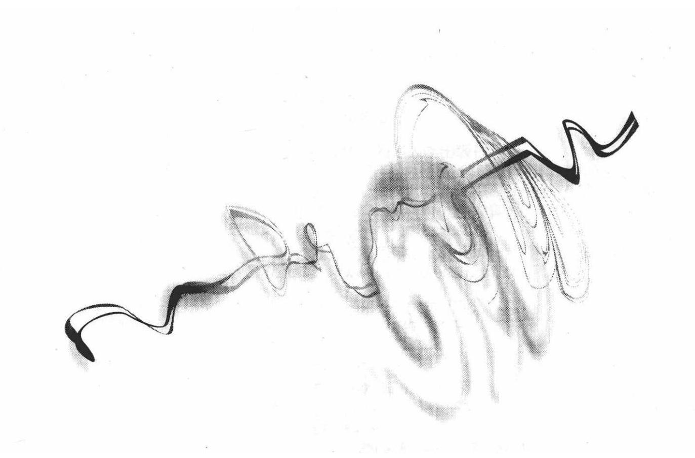

华东师范大学出版社

## 图书在版编目 (CIP) 数据

数学・高中下册/陈双双等编. 一上海: 华东师范大学出版社，2009

华东师大二附中校本教材

ISBN 978-7-5617-6704-7

I. 高... II. 陈... II. 数学课-高中-教材 IV. G634.601

中国版本图书馆 CIP 数据核字(2009)第 116009 号

## 数学・高中下册(华东师大二附中)

编 者 陈双双 刘初喜等

项目编辑 应向阳

审读编辑 张 润

装帧设计 黄惠敏

出版发行 华东师范大学出版社

社 址 上海市中山北路3663号 邮编 200062

电话总机 021-62450163 转各部门 行政传真 021-62572105

客服电话 021-62865537(兼传真)

门市(邮购)电话 021-62869887

门市地址 上海市中山北路 3663 号华东师范大学校内先锋路口

网 址 www. ecnupress. com.cn

印 刷 者 华东师范大学印刷厂

开本 ${890} \times  {1240}\;{32}$ 开

印 张 13.375

字 数 390 千字

版 次 2009 年 9 月第一版

印 次 2009 年 9 月第一次

印 数 6000

书 号 ISBN 978-7-5617-6704-7/G. 4098

定 价 22.00 元

出版人 朱杰人

(如发现本版图书有印订质量问题，请寄回本社客服中心调换或电话021-62865537联系)

## 前台

亲爱的同学，你一定喜欢数学，而且希望自己能够学好高中数学吧？那么，就请你选择我们这套教材吧！

我们华东师范大学第二附属中学使用的《高中数学》教材，以本校的数学教学校本纲要为基础，经过数学教研组教师多年教学的积累,根据新课标的要求,又结合本校学生的具体情况,编写成上(已出版)、下两册正式出版.

本教材有以下几个方面的显著特点:

(1)知识结构完整充实

依据新课标的要求, 按照高中生的认知规律和发展需求, 我们精心选择教材内容, 对使用不同版本教材的全国各地学生可根据各自需要选择相关章节学习. 为了方便上海学生使用，在目录部分用“ * ” 标出目前上海高考不作要求的内容. 不过这些知识是优秀学生今后参加著名高校的自主招生考试所必须掌握的.

(2)思想方法揭示本质

高中数学不是数学的全部，而它却涵盖了数学中最基本的内容. 我们认为，学习数学最重要的，是学习数学的思想方法和本质内涵， 学习人类优秀的数学文化精髓，学会用数学的眼光认识世界、用数学的方法改变世界. 因此, 我们通过数学内容的呈现, 也通过 “大家谈”、 “自己想”和“自己找”等栏目，尽可能地揭示其中蕴含的数学的本质特征和思想方法，以使同学们体验数学与自然、数学与社会的和谐关系，领会数学的精神实质和文化价值，感受数学的魅力和学习的快乐.

(3)发展为本便于自学

本着“以学生发展为本”的理念，以培养学生自主学习能力为出发点, 我们在知识点的引入, 知识内容的拓展等方面都力求详细完整；“自己想”中的问题设计，更能加深同学们对数学知识的理解；而 “自己练”则能起到及时巩固所学知识、加强数学思维训练的作用； “自己学”是为学有余力的同学准备的,以达到提高数学素养的目的.

本教材上册第一章至第六章依次分别由陈双双、刘初喜、王平、 刘招川、杨汉昌、郑跃星编写，第七章和第九章由施洪亮编写，第八章由甄德文编写；下册的第十章至第十四章依次分别由甄德文、倪建春、刘招川、刘初喜、唐立华编写，第十五章由王平、王海霞编写，第十六、十七章分别由郑跃星、杨汉昌编写，第十八章由陆继红、乔根凤分别编写其中的概率和统计部分，第十九章由施洪亮、蔡玲玲分别编写建模和文化部分，第二十章由陈双双编写. 全书由陈双双组稿、统稿与审核,吴森参与了部分校对与审核工作.

同学们,相信本教材会对你们的数学学习提供较大的帮助. 但是在这套教材中,还会有一些错误和不妥之处,欢迎你们提出宝贵意见和建议,以使本教材日臻完善,谢谢!

本书编者

2009.7.18

## 日 家

第十章 数列、数学归纳法与数列的极限

1 10.1 数列

10 10.2 等差数列

19 10.3 等比数列

30 10.4 数学归纳法及其应用

37 10.5 归纳一猜想一论证

44 10.6 数列的极限

54 10.7 无穷等比数列各项的和

第十一章 算法初步

64 11.1 算法的概念

70 11.2 程序框图

第十二章 坐标平面上的直线

79 12.1 直线的方程

85 12.2 直线的倾斜角和斜率

92 12.3 两条直线的位置关系

102 12.4 点到直线的距离

106 12.5 二元一次不等式的解集

107 12.6 线性规划问题及其解决

第十三章 圆锥曲线

114 13.1 曲线和方程

119 13.2 圆的方程

125 13.3 椭圆的标准方程和性质

目 录

134 13.4 双曲线的标准方程和性质

144 13.5 抛物线的标准方程和性质

151 13.6 直线与圆锥曲线的位置关系

第十四章 坐标变换、参数方程和极坐标方程

159 *14.1 坐标轴的平移

163 *14.2 坐标轴的旋转变换

168 14.3 曲线的参数方程

173 14.4 直线与圆锥曲线的参数方程

181 14.5 极坐标系

184 14.6 圆锥曲线的极坐标方程

第十五章 空间直线与平面

190 15.1 平面及其基本性质

193 15.2 空间直线与直线之间的位置关系

197 15.3 空间直线与平面

203 15.4 空间平面与平面的位置关系

208 15.5 空间向量及其坐标表示

216 15.6 空间直线的方向向量和平面的法向量

221 15.7 空间向量在度量问题中的应用

第十六章 简单几何体

229 16.1 多面体的概念

238 16.2 旋转体的概念

244 16.3 几何体的直观图和三视图

252 16.4 几何体的表面积

261 16.5 几何体的体积

第十七章 排列组合与二项式定理

266 17.1 计数原理 I ——乘法原理

269 17.2 排列

277 17.3 计数原理 II ——加法原理

280 17.4 组合

285 17.5 二项式定理

290 17.6 二项式定理的性质与应用

第十八章 概率论初步与基本统计方法

297 18.1 古典概型

305 18.2 频率与概率

312 18.3 事件和的概率

315 18.4 独立事件积的概率

319 18.5 随机变量和数学期望

327 18.6 总体和样本

333 18.7 抽样技术与案例

337 18.8 统计估计与案例

第十九章 数学建模与数学文化

342 19.1 数学模型与数学建模

349 * 19.2 初等数学方法建模

352 19.3 数学与经济

355 19.4 数学与艺术

357 *19.5 数学与社会

第二十章 导数及其应用

360 20.1 函数的极限

370 20.2 函数的连续性

378 20.3 导数的概念与运算

387 20.4 导数的应用

396 习题参考答案

目 录.

## 第十章 数列、数学归纳法与数列的极限 (Sequences of Numbers, Mathematical Induction and Limits of Sequences)

按一定次序排列起来的一列数叫做数列, 早在约公元前 1650 年的埃及“莱因得纸草”上就记载着数列的问题, 在我国, 约成书于公元前 2 世纪的《周髀算经》中也记载有数列的问题. 本章着重讨论数列的通项公式、递推公式，讨论两类最常用的数列:等差数列和等比数列，并学习数列在解决实际问题中的应用.

### 10.1 数列 (Sequences of Numbers)

数学研究的基本对象是数，按一定顺序排列起来的一列数叫做数列. 数列中的每一个数叫做这个数列的项, 数列的各项按先后顺序依次称为这个数列的第 1 项(或首项)，第 2 项， $\cdots$ ，第 $n$ 项， $\cdots$ . 数列的一般形式可以写成 ${a}_{1},{a}_{2},{a}_{3},\cdots ,{a}_{n},\cdots$ ,简记为 $\left\{  {a}_{n}\right\}$ ,其中 ${a}_{n}$ 是数列的第 $n$ 项. 项数有限的数列叫做有穷数列; 项数无限的数列叫做无穷数列. 从第 2 项起,每一项都大于它的前一项的数列叫做递增数列; 从第 2 项起,每一项都小于它的前一项的数列叫做递减数列; 各项相等的数列叫做常数列. 存在正常数 $M$ ,使得每一项的绝对值都不大于 $M$ 的数列叫做有界数列,否则叫做无界数列.

在数列中,当数列的项的序号 $n$ 确定时,相应的项 ${a}_{n}$ 也就唯一确定了. 于是数列的项 ${a}_{n}$ 与项的序号 $n$ 之间存在着对应关系,这种对应关系可描述如下:

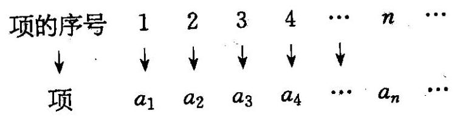

因此,从函数的观点看,数列可以看成以正整数集 ${\mathbf{N}}^{ * }$ (或它的有限子集 $\{ 1,2,3,\cdots , n\}$ ) 为定义域的函数 ${a}_{n} = f\left( n\right)$ ,当自变量按从小到大的顺序依次取值时, $f\left( n\right)$ 所对应的一列数. 当数列 $\left\{  {a}_{n}\right\}$ 的第 $n$ 项 ${a}_{n}$ 与项的序号 $n$ 之间的关系: ${a}_{n} = f\left( n\right)$ 可以用一个公式来表示时,这个公式就叫做这个数列的通项公式 (general term). 例如,数列 $1,\frac{1}{2},\frac{1}{3},\frac{1}{4},\cdots$ 的通项公式可以是 ${a}_{n} = \frac{1}{n}\left( {n \in  {\mathbf{N}}^{ * }}\right)$ ; 数列1,1,1,1,1的通项公式可以为 ${a}_{n} = 1\left( {1 \leq  n \leq  5, n \in  {\mathbf{N}}^{ * }}\right)$ . 若将数列中的序号 $n$ 与对应的项 ${a}_{n}$ 用坐标 $\left( {n,{a}_{n}}\right)$ 表示,则在平面直角坐标系中所得的数列的图象是一列离散的点.

如果已知数列 $\left\{  {a}_{n}\right\}$ 的第 1 项 (或前 $n$ 项),且任一项 ${a}_{n}$ 与它的前一项 ${a}_{n - 1}$ (或前 $n$ 项)间的关系可以用一个公式来表示,那么这个公式就叫做这个数列的递推公式 (recurrence formula). 递推公式也是定义数列的一种方式. 例如,数列 ${a}_{n} = n + 3\left( {1 \leq  n \leq  7}\right)$ 可以用下面的递推公式表示:

$$
\left\{  \begin{array}{l} {a}_{1} = 4, \\  {a}_{n} = {a}_{n - 1} + 1\left( {2 \leq  n \leq  7}\right) . \end{array}\right.
$$

在现实生活中,我们经常会求一些数的和. 在数列中,一般地,用 ${S}_{n}$ 表示数列 $\left\{  {a}_{n}\right\}$ 的前 $n$ 项之和,即 ${S}_{n} = {a}_{1} + {a}_{2} + {a}_{3} + \cdots  + {a}_{n}$ ,显然有

$$
{a}_{n} = \left\{  \begin{array}{ll} {S}_{1}, & n = 1, \\  {S}_{n} - {S}_{n - 1}, & n \geq  2. \end{array}\right.
$$

例 1 写出下面数列的一个通项公式, 使它的前 5 项分别是下列各数:

(1) $\frac{{2}^{2} - 1}{3},\frac{{4}^{2} - 2}{5},\frac{{6}^{2} - 3}{7},\frac{{8}^{2} - 4}{9},\frac{{10}^{2} - 5}{11}$ ;

(2) $\frac{1}{2}$ ， $- \frac{1}{6}$ ， $\frac{1}{12}$ ， $- \frac{1}{20}$ ， $\frac{1}{30}$ ；

(3) $- \frac{1}{2},\frac{2}{5}, - \frac{2}{5},\frac{8}{17}, - \frac{8}{13};$

(4)1,0,1,0,1.

解 (1) 前 5 项的规律是

$$
\frac{{\left( 2 \times  1\right) }^{2} - 1}{2 \times  1 + 1},\;\frac{{\left( 2 \times  2\right) }^{2} - 2}{2 \times  2 + 1},\;\frac{{\left( 2 \times  3\right) }^{2} - 3}{2 \times  3 + 1},
$$

$$
\frac{{\left( 2 \times  4\right) }^{2} - 4}{2 \times  4 + 1},\;\frac{{\left( 2 \times  5\right) }^{2} - 5}{2 \times  5 + 1}.
$$

所以该数列的一个通项公式是 ${a}_{n} = \frac{{\left( 2n\right) }^{2} - n}{{2n} + 1}$ .

(2)前 5 项的规律是

$$
\frac{1}{1 \times  2},\; - \frac{1}{2 \times  3},\;\frac{1}{3 \times  4},\; - \frac{1}{4 \times  5},\;\frac{1}{5 \times  6}.
$$

且项的符号按 ${\left( -1\right) }^{n + 1}$ 的规律变化. 所以该数列的一个通项公式是

$$
{a}_{n} = \frac{{\left( -1\right) }^{n + 1}}{n\left( {n + 1}\right) }
$$

(3)前 5 项的规律是 $- \frac{{2}^{0}}{{1}^{2} + 1},\;\frac{{2}^{1}}{{2}^{2} + 1},\; - \frac{2}{5} =  - \frac{4}{10} = \; - \frac{{2}^{2}}{{3}^{2} + 1},\;\frac{{2}^{3}}{{4}^{2} + 1},\; - \frac{8}{13} =  - \frac{16}{26} =  - \frac{{2}^{4}}{{5}^{2} + 1}$ ,所以该数列的一个通项公式是

$$
{a}_{n} = {\left( -1\right) }^{n} \cdot  \frac{{2}^{n - 1}}{{n}^{2} + 1}
$$

(4)前 5 项的规律是 $\frac{1 + 1}{2},\frac{1 - 1}{2},\frac{1 + 1}{2},\frac{1 - 1}{2},\frac{1 + 1}{2}$ ，所以该数列

的一个通项公式是 ${a}_{n} = \frac{1 + {\left( -1\right) }^{n + 1}}{2}$ . 根据数列的项的周期性规律,数列通项公式也可以是 ${a}_{n} = {\sin }^{2}\frac{n\pi }{2}$ .

例 2 根据下列递推公式写出数列的前五项, 并分别写出它们的一个通项公式:

(1) ${a}_{1} = 0,{a}_{n + 1} = {a}_{n} + \left( {{2n} - 1}\right) \left( {n \in  {\mathbf{N}}^{ * }}\right)$ ;

(2) ${a}_{1} = 1,{a}_{n + 1} = \frac{2{a}_{n}}{{a}_{n} + 2}\left( {n \in  {\mathbf{N}}^{ * }}\right)$ .

解 $\left( 1\right) {a}_{1} = 0,{a}_{2} = {a}_{1} + 1 = 1,{a}_{3} = {a}_{2} + 3 = 4,{a}_{4} = {a}_{3} + 5 = \; 9,{a}_{5} = {a}_{4} + 7 = {16}$ . 数列的前五项是0,1,4,9,16,数列的一个通项公式是 ${a}_{n} = {\left( n - 1\right) }^{2}$ .

(2) ${a}_{1} = 1,{a}_{2} = \frac{2{a}_{1}}{{a}_{1} + 2} = \frac{2}{3},{a}_{3} = \frac{2{a}_{2}}{{a}_{2} + 2} = \frac{2}{4},{a}_{4} = \frac{2{a}_{3}}{{a}_{3} + 2} = \frac{2}{5}$ , ${a}_{5} = \frac{2{a}_{4}}{{a}_{4} + 2} = \frac{2}{6}$ . 数列的前五项是 $1,\frac{2}{3},\frac{1}{2},\frac{2}{5},\frac{1}{3}$ ,数列的一个通项公式是 ${a}_{n} = \frac{2}{n + 1}$ .

例 3 若数列 $\left\{  {a}_{n}\right\}$ 的前 $n$ 项和 ${S}_{n}$ 分别满足: (1) ${S}_{n} = {2}^{n} + 1$ ; (2) ${S}_{n} = {n}^{2} + {4n}$ ; (3) ${a}_{1} = 1$ ， ${S}_{n} = {n}^{2}{a}_{n}\left( {n \in  {\mathbf{N}}^{ * }}\right)$ ，求它们的通项公式.

解 (1) 当 $n = 1$ 时， ${a}_{1} = {S}_{1} = 3$ ；

当 $n \geq  2$ 时， ${a}_{n} = {S}_{n} - {S}_{n - 1} = {2}^{n} + 1 - \left( {{2}^{n - 1} + 1}\right)  = {2}^{n} - {2}^{n - 1} = \; {2}^{n - 1}$ .

所以 ${a}_{n} = \left\{  \begin{array}{ll} 3, & n = 1, \\  {2}^{n - 1}, & n \geq  2. \end{array}\right.$

(2)当 $n = 1$ 时,①

当 $n \geq  2$ 时, ${a}_{n} = {S}_{n} - {S}_{n - 1}$

$$
= \left( {{n}^{2} + {4n}}\right)  - \left\lbrack  {{\left( n - 1\right) }^{2} + 4\left( {n - 1}\right) }\right\rbrack   = {2n} + 3.
$$

②

在②式中，当 $n = 1$ 时， ${2n}$ 长 3 - 5 ，因此由 ① 与 ② 可知，数列 $\left\{  {a}_{n}\right\}$ 的通项公式是 ${a}_{n} = {2n} + 3\left( {n \in  {\mathbf{N}}^{ * }}\right)$ .

(3)当 $n \geq  2$ 时， ${a}_{n} = {S}_{n} - {S}_{n - 1} = {n}^{2}{a}_{n} - {\left( n - 1\right) }^{2}{a}_{n - 1}$ ,化为 $\left( {{n}^{2} - }\right.$ 1) ${a}_{n} = {\left( n - 1\right) }^{2}{a}_{n - 1}$ ,即 $\frac{{a}_{n}}{{a}_{n - 1}} = \frac{n - 1}{n + 1}\left( {n \geq  2}\right)$ . 所以 ${a}_{n} = \frac{{a}_{n}}{{a}_{n - 1}} \cdot  \frac{{a}_{n - 1}}{{a}_{n - 2}}$ . $\frac{{a}_{n - 2}}{{a}_{n - 3}} \cdot  \cdots  \cdot  \frac{{a}_{2}}{{a}_{1}} \cdot  {a}_{1} = \frac{n - 1}{n + 1} \cdot  \frac{n - 2}{n} \cdot  \frac{n - 3}{n - 1} \cdot  \cdots  \cdot  \frac{1}{3} \cdot  1 = \frac{2}{n\left( {n + 1}\right) }.$

当 $n = 1$ 时,上式的值也是 1 . 所以数列 $\left\{  {a}_{n}^{l}\right\}$ 的通项公式是 ${a}_{n} = \frac{2}{n\left( {n + 1}\right) }.$

例 4 已知数列 $\left\{  {\lg {b}_{n}}\right\}$ 的前 $n$ 项和是 ${S}_{n} = n\left( {n + 1}\right) \lg 3 - \frac{1}{2}n\left( {n - 1}\right)$ .

(1)求数列 $\left\{  {b}_{n}\right\}$ 的通项公式；

(2)设 ${a}_{n} = \left( {n + 1}\right) {b}_{n}\left( {n \in  {\mathbf{N}}^{ * }}\right)$ ，试问数列 $\left\{  {a}_{n}\right\}$ 有没有最大项？若有, 求出最大项和最大项的项数, 若没有, 说明理由.

解 (1) 当 $n = 1$ 时, $\lg {b}_{1} = {S}_{1} = 2\lg 3$ ,所以 ${b}_{1} = 9$ ;

当 $n \geq  2$ 时, $\lg {b}_{n} = {S}_{n} - {S}_{n - 1} = \lg \left\lbrack  {9 \times  {\left( \frac{9}{10}\right) }^{n - 1}}\right\rbrack$ ,所以

$$
{b}_{n} = 9 \times  {\left( \frac{9}{10}\right) }^{n - 1}
$$

因为 $n = 1$ 时, ${b}_{n} = 9 = {b}_{1}$ ,所以 ${b}_{n} = 9 \times  {\left( \frac{9}{10}\right) }^{n - 1}, n \in  {\mathbf{N}}^{ * }$ .

(2)因为 ${a}_{n} = 9\left( {n + 1}\right) {\left( \frac{9}{10}\right) }^{n - 1}$ ，所以

$$
{a}_{n + 1} - {a}_{n} = 9\left( {n + 2}\right) {\left( \frac{9}{10}\right) }^{n} - 9\left( {n + 1}\right) {\left( \frac{9}{10}\right) }^{n - 1} = {\left( \frac{9}{10}\right) }^{n}\left( {8 - n}\right) ,
$$

所以当 $n < 8$ 时, ${a}_{n + 1} - {a}_{n} > 0$ ,即 ${a}_{n + 1} > {a}_{n}$ ; 当 $n = 8$ 时, ${a}_{n + 1} - {a}_{n} = 0$ , 即 ${a}_{n + 1} = {a}_{n}$ ; 当 $n > 8$ 时, ${a}_{n + 1} - {a}_{n} < 0$ ,即 ${a}_{n + 1} < {a}_{n}$ .

所以数列 $\left\{  {a}_{n}\right\}$ 有最大项,最大项是 ${a}_{8} = {a}_{9} = {81} \times  {\left( \frac{9}{10}\right) }^{7}$ .

例 5 如图 10-1,把框图中所输出的数 $A$ 按先后顺序组成数列 $\left\{  {x}_{n}\right\}$ ,请解答下列问题:

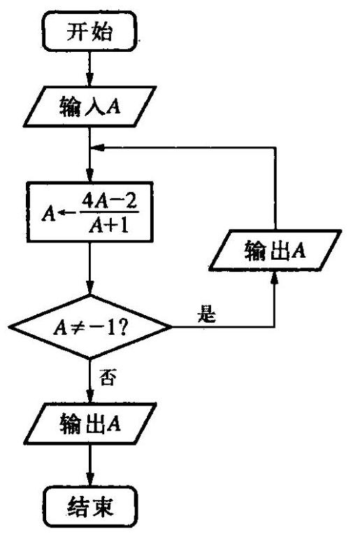

图 10-1

(1)若输入 $A = \frac{49}{65}$ ，请写出数列 $\left\{  {x}_{n}\right\}$ 的所有项；

(2)若输出的无穷数列 $\left\{  {x}_{n}\right\}$ 是一个常数列,试求输入的初始值 $A$ 的值;

(3)若输入一个数 $A$ 时，产生的无穷数列 $\left\{  {x}_{n}\right\}$ 是单调递增数列,试求实数 $A$ 的取值范围.

解 记 ${x}_{0} = A$ ,则框图所输出的数列 $\left\{  {x}_{n}\right\}$ 的递推关系是

$$
\left\{  \begin{array}{ll} {x}_{0} = A, & \left( {A \neq   - 1}\right) , \\  {x}_{n} = \frac{4{x}_{n - 1} - 2}{{x}_{n - 1} + 1}, & \left( {n \in  {\mathbf{N}}^{ * }}\right) . \end{array}\right.
$$

(1)因为 ${x}_{0} = A = \frac{49}{65}$ ，所以 ${x}_{1} = \frac{4{x}_{0} - 2}{{x}_{0} + 1} = \frac{11}{19},{x}_{2} = \frac{4{x}_{1} - 2}{{x}_{1} + 1} = \; \frac{1}{5},{x}_{3} = \frac{4{x}_{2} - 2}{{x}_{2} + 1} =  - 1$ ,即数列 $\left\{  {x}_{n}\right\}$ 的所有项是 $\frac{11}{19},\frac{1}{5}, - 1$ .

(2)若输出的无穷数列 $\left\{  {x}_{n}\right\}$ 是一个常数列，则 $A = \frac{{4A} - 2}{A + 1}$ ，解得 $A = 1$ ,或 $A = 2$ .

(3)若产生的无穷数列 $\left\{  {x}_{n}\right\}$ 是单调递增数列，即对任意 $n \in  {\mathbf{N}}^{ * }$ ，都有 ${x}_{n} < {x}_{n + 1}$ . 那么 ${x}_{0} < {x}_{1}$ ,即 $A < \frac{{4A} - 2}{A + 1}$ ,解得 $A <  - 1$ ,或 $1 < A < 2$ .

当 $A <  - 1$ 时,因为 ${x}_{1} = \frac{{4A} - 2}{A + 1} = 4 - \frac{6}{A + 1} > 4$ ,所以 ${x}_{1} > {x}_{2}$ , 不满足题意;

当 $1 < A < 2$ 时,因为 ${x}_{1} = \frac{{4A} - 2}{A + 1} = 4 - \frac{6}{A + 1} \in  \left( {1,2}\right)$ ,所以 ${x}_{1} < \; {x}_{2}$ 且 ${x}_{2} = \frac{4{x}_{1} - 2}{{x}_{1} + 1} = 4 - \frac{6}{{x}_{1} + 1} \in  \left( {1,2}\right)$ ,所以 ${x}_{2} < {x}_{3}$ 且 ${x}_{3} \in  \left( {1,2}\right)$ , 依次类推,可知当 $1 < A < 2$ 时,有 ${x}_{1} < {x}_{2} < {x}_{3} < \cdots  < {x}_{n} < \cdots$ .

综上所述,当 $1 < A < 2$ 时,得到的无穷数列 $\left\{  {x}_{n}\right\}$ 是单调递增数列.

课堂活动

一木未必

1. 根据数列的前若干项归纳得出的通项公式是唯一的吗? 如果不唯一,那么可能有几个?

2. 若数列 $\left\{  {a}_{n}\right\}$ 的递推公式是

$\left\{  \begin{array}{l} {a}_{1} = 1, \\  {a}_{n} = 1 + \frac{1}{{a}_{n - 1}}\left( {n > 1}\right) . \end{array}\right.$ 请写出这个数列的前 10 项; 观察数列的项的变化规律,你能得到什么结论?

课堂活动

·自己想

1. 根据数列 $\left\{  {a}_{n}\right\}$ 的前 $n$ 项和 ${S}_{n}$ 求数列的通项公式时,需要注意什么?

2. 如何判断数列 $\left\{  {a}_{n}\right\}$ 的单调性? 如何求数列 $\left\{  {a}_{n}\right\}$ 的项的最大值、最小值? 数列与函数有哪些区别与联系?

果外活动

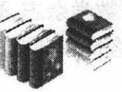

·自己举

## 斐波那契数列

意大利数学家莱昂纳多 (Leonardo, 约 1170- 1240), 又名斐波那契(Fibonacci). 在他的著作《算盘书》中有这样一个有趣的问题:“假设一对小兔子一个月后长成大兔子， 大兔子下一个月生出一对小兔子，而且不发生死亡. 那么由一对小兔子开始，一年后可以繁殖成多少对兔子?”

每月的兔子对数, 如下表所示:

<table><tr><td>1 个月后</td><td>2 个月后</td><td>3 个月后</td><td>4 个月后</td><td>5 个月后</td><td>6 个月后</td></tr><tr><td>1</td><td>2</td><td>3</td><td>5</td><td>8</td><td>13</td></tr><tr><td>7 个月后</td><td>8 个月后</td><td>9 个月后</td><td>10 个月后</td><td>11 个月后</td><td>12 个月后</td></tr><tr><td>21</td><td>34</td><td>55</td><td>89</td><td>144</td><td>233</td></tr></table>

观察兔子对数构成的数列后发现, 从第 3 项起, 每一项都是其前两项之和. 一般地，我们把数列1,1,2,3,5,8,13,21,34,55,89,144, 233,...叫做斐波那契数列. 这个数列的任意一项都叫做“斐波那契数”. 用递推公式可以表示为:

$$
\left\{  \begin{array}{l} {F}_{1} = 1, \\  {F}_{2} = 1, \\  {F}_{n} = {F}_{n - 1} + {F}_{n - 2},\left( {n \geq  3}\right) . \end{array}\right.
$$

还可以证明它的通项公式为: ${F}_{n} = \frac{1}{\sqrt{5}}\left\lbrack  {{\left( \frac{1 + \sqrt{5}}{2}\right) }^{n} - {\left( \frac{1 - \sqrt{5}}{2}\right) }^{n}}\right\rbrack \; \left( {n \in  {\mathbf{N}}^{ * }}\right)$ ,有趣的是,虽然斐波那契数列中的所有项都是正整数,可是它的通项公式却是由一些无理数的幂表示出来的.

课外活动 ·自己农

斐波那契数列有着广泛的应用，除上面提到的以外，还应用在人口年龄结构的预测、优选、数论、数值积分等领域. 它涉及面之广, 引起了科学家的密切注意和极大的兴趣, 美国在 1963 年创办了《斐波那契季刊》这一数学杂志, 登载斐波那契数列在应用上的新发现及相关理论. 请借助网络及图书资料查阅更多关于斐波那契数列的相关知识及实际应用.

习题练习

. 自己练

1. 写出下面数列的一个通项公式:

(1) $1, - 7,{13}, - {19},{25}, - {31},\cdots$ ;

(2) $3,5,9,{17},{33},\cdots$ ;

(3) $\frac{2}{3},\frac{4}{15},\frac{6}{35},\frac{8}{63},\frac{10}{99},\cdots$ ;

(4) $- 1,\frac{8}{5}, - \frac{15}{7},\frac{24}{9}, - \frac{35}{11},\cdots$ ;

(5) $1,3,3,5,5,7,7,9,9,\cdots$ ;

(6) $1,0, - \frac{1}{3},0,\frac{1}{5},0, - \frac{1}{7},0,\cdots$ .

2. 根据下列递推公式写出数列的前五项, 并写出它们的一个通项公式:

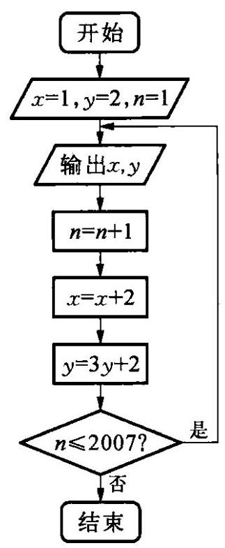

图 10-2

(1) ${a}_{1} = 1,{a}_{n + 1} = {a}_{n} + n\left( {n \in  {\mathbf{N}}^{ * }}\right)$ ;

(2) ${a}_{1} = 2,{a}_{n + 1} = {3}^{n}{a}_{n}\left( {n \in  {\mathbf{N}}^{ * }}\right)$ ；

(3) ${a}_{1} = 3,{a}_{n + 1} =  - {a}_{n} + 8\left( {n \in  {\mathbf{N}}^{ * }}\right)$ .

3. 根据图 10-2,所输出的数 $x, y$ 按输出先后顺序分别构成数列 $\left\{  {x}_{n}\right\}  ,\left\{  {y}_{n}\right\}$ ,试建立这两个数列的递推公式, 并写出这两个数列的前 5 项.

4. 已知数列 $\left\{  {a}_{n}\right\}$ 的前 $n$ 项和 ${S}_{n}$ 分别满足下式，求相应数列 $\left\{  {a}_{n}\right\}$ 的通项公式:

(1) ${S}_{n} = 2{n}^{2} + {3n} + 1$ ; (2) ${S}_{n} = 2 \cdot  {3}^{n} - 1$ .

5. 已知数列 $\left\{  {a}_{n}\right\}$ 的前 $n$ 项积为 ${T}_{n}$ ,且 ${T}_{n} = {\left( \frac{4}{5}\right) }^{\frac{{n}^{2} - n}{2}}$

(1)求数列 $\left\{  {a}_{n}\right\}$ 的通项公式；

(2)数列 $\left\{  {b}_{n}\right\}$ 满足 ${b}_{n} = 5{a}_{n}^{2} - 6{a}_{n}$ ，试问数列 $\left\{  {b}_{n}\right\}$ 中第几项的值最小?并求出这个最小值.

6. 已知数列 $\left\{  {a}_{n}\right\}$ 的通项公式是 ${a}_{n} = \frac{n - 4\sqrt{6}}{n - 7\sqrt{2}}$ ,问数列 $\left\{  {a}_{n}\right\}$ 的第几项取最大值和最小值.

7. 数列 $\left\{  {a}_{n}\right\}$ 满足 ${a}_{1} = 1,{a}_{n + 1} = \frac{{a}_{n}}{2{a}_{n} + 1}\left( {n \in  {\mathbf{N}}^{ * }}\right)$ ,数列 $\left\{  {b}_{n}\right\}$ 的前 $n$ 项和 ${S}_{n} = {12} - {12} \cdot  {\left( \frac{2}{3}\right) }^{n}\left( {n \in  {\mathbf{N}}^{ * }}\right)$ .

(1)求数列 $\left\{  {a}_{n}\right\}$ 和 $\left\{  {b}_{n}\right\}$ 的通项公式；

(2)设 ${c}_{n} = \frac{{b}_{n}}{{a}_{n}}$ ，是否存在 $m \in  {\mathbf{N}}^{ * }$ ，使 ${c}_{m} \geq  9$ 成立？说明理由.

8. 已知函数 $f\left( x\right)  = \left| {x - a}\right| , g\left( x\right)  = {x}^{2} + {2ax} + 1$ ( $a$ 为正常数), 且函数 $f\left( x\right)$ 与 $g\left( x\right)$ 的图象在 $y$ 轴上的截距相等.

(1)求 $a$ 的值；(2)若 $n$ 为正整数，证明: ${10}^{f\left( n\right) } \cdot  {\left( \frac{4}{5}\right) }^{g\left( n\right) } < 4$ .

### 10.2 等差数列 (Arithmetic Sequences)

在现实生活中,我们常常会遇到一些有特殊规律的数列. 例如下面的数列:

$$
2,4,6,8,{10},\cdots
$$

$$
- 1, - 4, - 7, - {10}, - {13},\cdots
$$

$$
\text{ 22.2,23.8,25.4,27.0,28.6, }\cdots
$$

它们有一个共同特点: 从第 2 项起,每一项与它前一项的差等于同一个常数.

一般地，如果一个数列从第 2 项起，每一项与它前一项的差等于同一个常数，那么这个数列叫做等差数列，这个常数就叫做等差数列的公差(common difference),公差通常用小写字母 $d$ 表示.

最简单的等差数列有 3 项: 若 $a, A, b$ 是等差数列,则 $A$ 叫做 $a$ 与 $b$ 的等差中项 (arithmetic mean). 由等差数列的定义可知: $a, A, b$ 成等差数列的充要条件是 $A = \frac{a + b}{2}$ .

设等差数列 $\left\{  {a}_{n}\right\}$ 的首项是 ${a}_{1}$ ,公差是 $d$ ,根据等差数列的定义有

$$
{a}_{n} - {a}_{n - 1} = d\left( {n \geq  2}\right) .
$$

所以

$$
{a}_{2} - {a}_{1} = d
$$

$$
{a}_{3} - {a}_{2} = d
$$

$$
{a}_{4} - {a}_{3} = d
$$

...

$$
{a}_{n} - {a}_{n - 1} = d\left( {n \geq  2}\right) .
$$

以上 $n - 1$ 个等式两边分别相加得:

$$
{a}_{n} - {a}_{1} = \left( {n - 1}\right) d\text{ ,即 }{a}_{n} = {a}_{1} + \left( {n - 1}\right) d\text{ . }
$$

当 $n = 1$ 时,上面等式也成立,这说明当 $n \in  {\mathbf{N}}^{ * }$ 时等式 ${a}_{n} = {a}_{1} + \; \left( {n - 1}\right) d$ 都成立，因此它就是等差数列 $\left\{  {a}_{n}\right\}$ 的通项公式. 而 ${a}_{n} - {a}_{n - 1} = \; d\left( {n \geq  2}\right)$ ,或 ${a}_{n} = {a}_{n - 1} + d\left( {n \geq  2}\right)$ 则是以 ${a}_{1}$ 为首项,以 $d$ 为公差的等差数列 $\left\{  {a}_{n}\right\}$ 的递推公式.

下面我们研究以 ${a}_{1}$ 为首项,以 $d$ 为公差的等差数列 $\left\{  {a}_{n}\right\}$ 的前 $n$ 项和.

德国数学家高斯(C. F. Gauss, 1777—1855)享有“数学王子”之誉, 十岁时,他曾迅速地算出老师所提出的计算问题: $1 + 2 + 3 + \cdots  +$ 100 =? 他用的是下面的方法:

$$
\left( {1 + {100}}\right)  + \left( {2 + {99}}\right)  + \left( {3 + {98}}\right)  + \cdots  + \left( {{50} + {51}}\right)  =
$$

$$
{101} \times  {50} = {5050}.
$$

高斯的算法实际上解决了求等差数列 $1,2,3,\cdots , n,\cdots$ 前 100 项的和的问题.

受高斯算法的启示，我们用两种方式表示等差数列 $\left\{  {a}_{n}\right\}$ 的前 $n$ 项和 ${S}_{n}$ :

$$
{S}_{n} = {a}_{1} + {a}_{2} + {a}_{3} + \cdots  + {a}_{n},
$$

①

$$
{S}_{n} = {a}_{n} + {a}_{n - 1} + {a}_{n - 2} + \cdots  + {a}_{1}.
$$

②

由①+②得

$$
2{S}_{n} = \left( {{a}_{1} + {a}_{n}}\right)  + \left( {{a}_{2} + {a}_{n - 1}}\right)  + \left( {{a}_{3} + {a}_{n - 2}}\right)  + \cdots  + \left( {{a}_{n} + {a}_{1}}\right) .
$$

③

根据等差数列 $\left\{  {a}_{n}\right\}$ 的通项公式,有

$$
{a}_{1} + {a}_{n} = {a}_{2} + {a}_{n - 1} = {a}_{3} + {a}_{n - 2} = \cdots  = {a}_{n} + {a}_{1}
$$

$$
= 2{a}_{1} + \left( {n - 1}\right) d\text{ ; }
$$

所以③式化为

$$
2{S}_{n} = \underset{n \uparrow  }{\underbrace{\left( {{a}_{1} + {a}_{n}}\right)  + \left( {{a}_{1} + {a}_{n}}\right)  + \left( {{a}_{1} + {a}_{n}}\right)  + \cdots  + \left( {{a}_{1} + {a}_{n}}\right) }}
$$

$$
= n\left( {{a}_{1} + {a}_{n}}\right) \text{ . }
$$

由此得到等差数列 $\left\{  {a}_{n}\right\}$ 的前 $n$ 项和公式:

$$
{S}_{n} = \frac{n\left( {{a}_{1} + {a}_{n}}\right) }{2}.
$$

因为 ${a}_{n} = {a}_{1} + \left( {n - 1}\right) d$ ,所以上面的公式又可以写成

$$
{S}_{n} = n{a}_{1} + \frac{n\left( {n - 1}\right) d}{2}.
$$

上述推导等差数列 $\left\{  {a}_{n}\right\}$ 前 $n$ 项和公式的方法,一般称为 “倒序相” 解法”.

例 1 设 $\left\{  {a}_{n}\right\}$ 是等差数列, ${b}_{n} = {\left( \frac{1}{2}\right) }^{{a}_{n}}$ ,已知 ${b}_{1} + {b}_{2} + {b}_{3} = \frac{21}{8}$ , ${b}_{1}{b}_{2}{b}_{3} = \frac{1}{8}$ ,求数列 $\left\{  {a}_{n}\right\}$ 的通项公式和前 $n$ 项和的表达式.

解 设等差数列 $\left\{  {a}_{n}\right\}$ 的公差为 $d$ ,则 ${a}_{n} = {a}_{1} + \left( {n - 1}\right) d,{b}_{n} = \; {\left( \frac{1}{2}\right) }^{{a}_{1} + \left( {n - 1}\right) d}$ ,所以

$$
{b}_{1}{b}_{3} = {\left( \frac{1}{2}\right) }^{{a}_{1}} \cdot  {\left( \frac{1}{2}\right) }^{{a}_{1} + {2d}} = {\left( \frac{1}{2}\right) }^{2\left( {{a}_{1} + d}\right) } = {b}_{2}^{2},
$$

由 ${b}_{1}{b}_{2}{b}_{3} = \frac{1}{8}$ ,得 ${b}_{2}^{3} = \frac{1}{8},{b}_{2} = \frac{1}{2}$ .

代入已知条件，得 $\left\{  \begin{array}{l} {b}_{1}{b}_{3} = \frac{1}{4}, \\  {b}_{1} + {b}_{3} = \frac{17}{8}, \end{array}\right.$ 解得 ${b}_{1} = 2,{b}_{3} = \frac{1}{8}$ 或 ${b}_{1} = \frac{1}{8}$ ， ${b}_{3} = 2$ .

所以 ${a}_{1} =  - 1, d = 2$ 或 ${a}_{1} = 3, d =  - 2$ .

当 ${a}_{1} =  - 1, d = 2$ 时, ${a}_{n} = {a}_{1} + \left( {n - 1}\right) d = {2n} - 3,{S}_{n} = \; \frac{n\left( {{a}_{1} + {a}_{n}}\right) }{2} = n\left( {n - 2}\right)$

当 ${a}_{1} = 3, d =  - 2$ 时, ${a}_{n} = {a}_{1} + \left( {n - 1}\right) d = 5 - {2n},{S}_{n} = \; \frac{n\left( {{a}_{1} + {a}_{n}}\right) }{2} = n\left( {4 - n}\right) .$

例 2 等差数列 $\left\{  {a}_{n}\right\}$ 的前 10 项和为 30,前 20 项和为 100,求它的前 30 项和.

解 由题意得方程组: $\left\{  \begin{array}{l} {10}{a}_{1} + \frac{{10} \times  9}{2}d = {30}, \\  {20}{a}_{1} + \frac{{20} \times  {19}}{2}d = {100}. \end{array}\right.$ 解得

$$
d = \frac{2}{5},{a}_{1} = \frac{6}{5},
$$

所以前 30 项和 ${S}_{30} = {30}{a}_{1} + \frac{{30} \times  {29}}{2}d = {210}$ .

例 3 设等差数列 $\left\{  {a}_{n}\right\}$ 的前 $n$ 项和为 ${S}_{n}$ . 已知: ${a}_{3} = {12},{S}_{12} > 0$ , ${S}_{13} < 0$ .

(1)求公差 $d$ 的范围; (2) 指出 ${S}_{1},{S}_{2},\cdots ,{S}_{12}$ 中哪一个最大,并说明理由.

解 (1) 依题意得 $\left\{  \begin{array}{l} {S}_{12} = {12}{a}_{1} + \frac{{12} \times  {11}}{2}d > 0, \\  {S}_{13} = {13}{a}_{1} + \frac{{13} \times  {12}}{2}d < 0, \end{array}\right.$ 所以

$$
\left\{  \begin{array}{l} 2{a}_{1} + {11d} > 0, \\  {a}_{1} + {6d} < 0. \end{array}\right.
$$

① ②

因为 ${a}_{3} = {a}_{1} + {2d} = {12}$ ,所以 ${a}_{1} = {12} - {2d}$ .③

将 ③ 代入 ①、② 得 $\left\{  \begin{array}{l} {24} + {7d} > 0, \\  {12} + {4d} < 0, \end{array}\right.$ 所以 $- \frac{24}{7} < d <  - 3$ .

(2)解法一:由 $d < 0$ 可知:数列 $\left\{  {a}_{n}\right\}$ 是递减数列，所以当 $1 \leq  n \leq \; {12}, n \in  \mathbf{N}$ 中 ${a}_{n} \geq  0$ 且 ${a}_{n + 1} < 0$ 时， ${S}_{n}$ 最大. 因为 ${S}_{12} = 6\left( {{a}_{6} + {a}_{7}}\right)  > 0$ ， ${S}_{13} = {13}{a}_{7} < 0$ ,所以 ${a}_{7} < 0,{a}_{6} >  - {a}_{7} > 0$ ,所以在 ${S}_{1},{S}_{2},\cdots ,{S}_{12}$ 中 ${S}_{6}$ 的值最大.

解法二: ${S}_{n} = n{a}_{1} + \frac{n\left( {n - 1}\right) }{2}d = \frac{d}{2}{n}^{2} + \left( {{a}_{1} - \frac{d}{2}}\right) n$ .

因为 ${a}_{1} = {12} - {2d}$ ,所以 ${S}_{n} = \frac{d}{2}{n}^{2} + \left( {{12} - \frac{5}{2}d}\right) n$ .

研究函数 $f\left( x\right)  = \frac{d}{2}{x}^{2} + \left( {{12} - \frac{5}{2}d}\right) x$ ,由 $\frac{d}{2} < 0$ 知,当 $x =  - \frac{12}{d} + \; \frac{5}{2}$ 时, $f\left( x\right)$ 最大.

而在等差数列 $\left\{  {a}_{n}\right\}$ 中, $- \frac{24}{7} < d <  - 3$ ,所以

$$
6 <  - \frac{12}{d} + \frac{5}{2} < \frac{13}{2}.
$$

由二次函数 $f\left( x\right)  = \frac{d}{2}{x}^{2} + \left( {{12} - \frac{5}{2}d}\right) x$ 的图象知 ${S}_{1},{S}_{2},\cdots ,{S}_{12}$ 中 ${S}_{6}$ 最大.

例 4 两个数列 $\left\{  {a}_{n}\right\}  ,\left\{  {b}_{n}\right\}$ 满足: ${b}_{n} = \frac{{a}_{1} + 2{a}_{2} + 3{a}_{3} + \cdots  + n{a}_{n}}{1 + 2 + 3 + \cdots  + n}$ , $n \in  {\mathbf{N}}^{ * }$ ,若数列 $\left\{  {b}_{n}\right\}$ 是等差数列,求证: 数列 $\left\{  {a}_{n}\right\}$ 也是等差数列.

证明 由已知得 $\frac{1}{2}n\left( {n + 1}\right) {b}_{n} = {a}_{1} + 2{a}_{2} + 3{a}_{3} + \cdots  + n{a}_{n}\left( {n \in  }\right. \; {\mathbf{N}}^{ * }$ ),

$$
\frac{1}{2}\left( {n - 1}\right) n{b}_{n - 1}
$$

$$
= {a}_{1} + 2{a}_{2} + 3{a}_{3} + \cdots  + \left( {n - 1}\right) {a}_{n - 1}\left( {n \in  {\mathbf{N}}^{ * }, n \geq  2}\right) .
$$

以上两式相减得 $\frac{1}{2}n\left( {n + 1}\right) {b}_{n} - \frac{1}{2}\left( {n - 1}\right) n{b}_{n - 1} = n{a}_{n}\left( {n \geq  2}\right)$ ,

所以 ${a}_{n} = \frac{1}{2}\left( {n + 1}\right) {b}_{n} - \frac{1}{2}\left( {n - 1}\right) {b}_{n - 1}\left( {n \geq  2}\right)$ .①

又 $\left\{  {b}_{n}\right\}$ 成等差数列,设其公差为 $d$ ,则①为

$$
{a}_{n} = {b}_{1} + \frac{3}{2}\left( {n - 1}\right) d\left( {n \geq  2}\right) .
$$

在已知条件中,令 $n = 1$ ,得 ${b}_{1} = \frac{{a}_{1}}{1} = {a}_{1}$ .

所以对于任意 $n \in  {\mathbf{N}}^{ * },{a}_{n} = {b}_{1} + \frac{3}{2}\left( {n - 1}\right) d$ ,所以

$$
{a}_{n} - {a}_{n - 1} = \left\lbrack  {{b}_{1} + \frac{3}{2}\left( {n - 1}\right) d}\right\rbrack   - \left\lbrack  {{b}_{1} + \frac{3}{2}\left( {n - 2}\right) d}\right\rbrack   = \frac{3}{2}d
$$

(常数, $n \geq  2$ ).

所以数列 $\left\{  {a}_{n}\right\}$ 也成等差数列.

例 5 用分期付款方式购买家用电器一件,价格为 1150 元. 购买当天先付 150 元，以后每月这一天都交付 50 元，并加付欠款的利息，月利率为 1%. 若交付 150 元以后的第一个月开始算分期付款的第一个月，问分期付款的第十个月该交付多少钱？全部贷款付清后，买这件家电实际花了多少钱?

解 购买时付了 150 元，欠款 1000 元. 每月付 50 元，分 20 次付完， 设每月付款数顺次组成数列 $\left\{  {a}_{n}\right\}$ ，则

$$
{a}_{1} = {50} + {1000} \times  {0.01} = {60}
$$

$$
{a}_{2} = {50} + \left( {{1000} - {50}}\right)  \times  {0.01} = {60} - {0.5};
$$

$$
{a}_{3} = {50} + \left( {{1000} - {50} \times  2}\right)  \times  {0.01} = {60} - {0.5} \times  2;
$$

依次类推,得 ${a}_{10} = {60} - {0.5} \times  9 = {55.5},{a}_{n} = {60} - {0.5}\left( {n - 1}\right) (1 \leq \; n \leq  {20})$ .

所以付款数 $\left\{  {a}_{n}\right\}$ 组成等差数列,公差 $d =  - {0.5}$ ,全部贷款付清后, 付款总数为:

$$
{S}_{20} + {150} = \frac{{20}\left( {{a}_{1} + {a}_{20}}\right) }{2} + {150} = \left( {2{a}_{1} + {19d}}\right)  \times  {10} + {150}
$$

$= {1255}$ (元).

第十个月该交付 55.5 元,全部贷款付清后,买这件家电实际花了 1255 元.

课堂活动

·大家谈

1. 在等差数列 $\left\{  {a}_{n}\right\}$ 中,若 $m, n, p, q \in  {\mathbf{N}}^{ * }$ 且 $m + n = p + q$ ,则 ${a}_{m} + {a}_{n} = {a}_{p} + {a}_{q}$ 成立吗?反之是否成立?

若 $m, n, p \in  {\mathbf{N}}^{ * }$ ,且 $m + n = p$ ,则 ${a}_{m} + {a}_{n} = {a}_{p}$ 成立吗?

若 $m, n, p, q, s, t \in  {\mathbf{N}}^{ * }$ ,且 $m + n + s = p + q + t$ ,则 ${a}_{m} + {a}_{n} + {a}_{s} \; = {a}_{p} + {a}_{q} + {a}_{t}$ 成立吗?

2. 若数列 $\left\{  {a}_{n}\right\}$ 的前 $n$ 项和是 ${S}_{n} = a{n}^{2} + {bn} + c\left( {c \neq  0}\right)$ ,那么数列 $\left\{  {a}_{n}\right\}$ 是等差数列吗?

3. 两个数列 $\left\{  {a}_{n}\right\}  ,\left\{  {b}_{n}\right\}$ 都是等差数列,则下列数列哪些是等差数列, 为什么?

$$
\left\{  {k{a}_{n}}\right\}  ,\left\{  {{a}_{n + 1} + {a}_{n}}\right\}  ,\left\{  {{a}_{n} + {b}_{n}}\right\}  ,\left\{  {{a}_{n + 1}^{2} - {a}_{n}^{2}}\right\}  ,\left\{  {a}_{n}^{2}\right\}  .
$$

1. 由例 2, 你还能得到更一般的结论吗?

2. 等差数列的前 $n$ 项和在什么情况下取最大值? 在什么情况下取最小值?

3. 我们知道等差数列 $\left\{  {a}_{n}\right\}$ 的前 $n$ 项和公式是 ${S}_{n} = \; \frac{n\left( {{a}_{1} + {a}_{n}}\right) }{2}$ ,反过来,若数列 $\left\{  {a}_{n}\right\}$ 对于所有的正整数 $n$ ,其前 $n$ 项和公式都满足 ${S}_{n} = \frac{n\left( {{a}_{1} + {a}_{n}}\right) }{2}$ ,则数列 $\left\{  {a}_{n}\right\}$ 还是等差数列吗?

课外活动

- 自己学

## 高阶等差数列

定义 1 规定 $\left\{  {\Delta {a}_{n}}\right\}$ 为数列 $\left\{  {a}_{n}\right\}$ 的一阶差分数列,其中 $\Delta {a}_{n} = {a}_{n + 1} - {a}_{n}\left( {n \in  {\mathbf{N}}^{ * }}\right)$ . 对正整数 $k$ ,规定 $\left\{  {{\Delta }^{k}{a}_{n}}\right\}$ 为 $\left\{  {a}_{n}\right\}$ 的 $k$ 阶差分数列,其中 ${\Delta }^{k}{a}_{n} = {\Delta }^{k - 1}{a}_{n + 1} - {\Delta }^{k - 1}{a}_{n} = \; \Delta \left( {{\Delta }^{k - 1}{a}_{n}}\right)$ .

定义 2 如果 $\left\{  {{\Delta }^{k}{a}_{n}}\right\}$ 不是零数列,而 $\left\{  {{\Delta }^{k + 1}{a}_{n}}\right\}$ 是零数列,就称 $\left\{  {a}_{n}\right\}$ 是 $k$ 阶等差数列.

例如,正整数平方的数列 $\left\{  {a}_{n}\right\}   : 1,4,9,{16},{25},{36},\cdots$ 是二阶等差数列,正整数立方的数列 $\left\{  {b}_{n}\right\}   : 1,8,{27},{64},{125},{216},\cdots$ 是三阶等差数列.

定理 数列 $\left\{  {a}_{n}\right\}$ 的通项公式是 $n$ 的 $m$ 次多项式的充要条件是这个数列 $\left\{  {a}_{n}\right\}$ 是 $m$ 阶等差数列.

根据上面的定理，求高阶等差数列的通项公式，可以用待定系数法.

例如,求三阶等差数列: $1,2,8,{22},{47},{86},\cdots$ 的通项公式可以这样解:

设 ${a}_{n} = A{n}^{3} + B{n}^{2} + {Cn} + D$ ,根据已知条件,得

$$
A + B + C + D = 1,\;{8A} + {4B} + {2C} + D = 2,
$$

$$
{27A} + {9B} + {3C} + D = 8,\;{64A} + {16B} + {4C} + D = {22}.
$$

联立以上四式,解得: $A = \frac{1}{2}, B =  - \frac{1}{2}, C =  - 1, D = 2$ . 所以

$$
{a}_{n} = \frac{1}{2}{n}^{3} - \frac{1}{2}{n}^{2} - n + 2.
$$

1. 等差数列有哪些主要性质？

一百一土牛肉

2. 中国古代科学家在高阶等差数列方面有哪些成就?

习题练习

・自己练

1. 若数列 $\left\{  {a}_{n}\right\}$ 是递减的等差数列,且 ${a}_{3} + {a}_{9} = \; {50},{a}_{5} \cdot  {a}_{7} = {616}$ ,求这个数列的通项公式.

2. 若 $\left\{  {a}_{n}\right\}$ 是等差数列,且满足 ${a}_{m} = n,{a}_{n} = \; m\left( {m \neq  n}\right)$ ,求 ${a}_{m + n}$ .

3. 设 ${S}_{n}$ 是等差数列 $\left\{  {a}_{n}\right\}$ 前 $n$ 项的和,已知 $\frac{1}{3}{S}_{3}$ 与 $\frac{1}{4}{S}_{4}$ 的等差中项为 1,且 $\left( {\frac{1}{3}{S}_{3}}\right)  \times  \left( {\frac{1}{4}{S}_{4}}\right)  = {\left( \frac{1}{5}{S}_{5}\right) }^{2}$ ,求数列 $\left\{  {a}_{n}\right\}$ 的通项公式.

4. 已知数列 $\left\{  {a}_{n}\right\}$ 的前 $n$ 项和为 ${S}_{n}$ ,且满足 ${a}_{n} + 2{S}_{n} \cdot  {S}_{n - 1} = 0(n \geq$ 2), ${a}_{1} = \frac{1}{2}$ .

(1)求证:数列 $\left\{  \frac{1}{{S}_{n}}\right\}$ 是等差数列; (2) 求 ${a}_{n}$ .

5. 已知 $\left\{  {a}_{n}\right\}$ 为等差数列,前 10 项的和 ${S}_{10} = {100}$ ,前 100 项的和 ${S}_{100} = {10}$ ,求前 110 项的和 ${S}_{110}$ .

6. 已知数列 $\left\{  {a}_{n}\right\}$ 的前 $n$ 项和 ${S}_{n} = {12n} - {n}^{2}$ ,求数列 $\left\{  \left| {a}_{n}\right| \right\}$ 的前 $n$ 项和 ${T}_{n}$ .

7. 设无穷等差数列 $\left\{  {a}_{n}\right\}$ 的前 $n$ 项和为 ${S}_{n}$ .

(1)若首项 ${a}_{1} = \frac{3}{2}$ ，公差 $d = 1$ ，求满足 ${S}_{{k}^{2}} = {\left( {S}_{k}\right) }^{2}$ 的正整数 $k$ ；

(2)求所有无穷等差数列 $\left\{  {a}_{n}\right\}$ ，使得对于一切正整数 $k$ 都有 ${S}_{{k}^{2}} = \; {\left( {S}_{k}\right) }^{2}$ 成立.

8. 在等差数列 $\left\{  {a}_{n}\right\}$ 中,已知 ${a}_{1} = {25},{S}_{9} = {S}_{17}$ ,问数列前多少项和最大,并求出最大值.

9. 已知等差数列 $\left\{  {a}_{n}\right\}$ 的首项是 2,前 10 项之和是 15,记 ${A}_{n} = {a}_{2} + \; {a}_{4} + {a}_{8} + \cdots  + {a}_{{2}^{n}}\left( {n \in  {\mathbf{N}}^{ * }}\right)$ ,求 ${A}_{n}$ 及 ${A}_{n}$ 的最大值.

10. 设数列 $\left\{  {a}_{n}\right\}$ 为正项数列,前 $n$ 项的和为 ${S}_{n}$ ,且有 ${a}_{n}\text{ 、 }{S}_{n}\text{ 、 }{a}_{n}^{2}$ 成等差数列.

(1)求通项 ${a}_{n}$ ; (2) 设 $f\left( n\right)  = \frac{{S}_{n}}{\left( {n + {50}}\right) {S}_{n + 1}}$ ,求 $f\left( n\right)$ 的最大值.

11. (1)已知等差数列 $\left\{  {a}_{n}\right\}$ 中,前三项之和为 6,后三项之和为 60, ${S}_{n} = {231}$ ,求 $n$ ;

(2)一个等差数列的前 12 项和为 354，前 12 项中偶数项和与奇数项和之比为 ${32} : {27}$ ,求公差 $d$ ;

(3)若等差数列 $\left\{  {a}_{n}\right\}$ 、 $\left\{  {b}_{n}\right\}$ 的前 $n$ 项和为 ${A}_{n}$ 与 ${B}_{n}$ ，满足 $\frac{{A}_{n}}{{B}_{n}} = \; \frac{{7n} + 1}{{4n} + {27}}\left( {n \in  {\mathbf{N}}^{ * }}\right)$ ,求 $\frac{{a}_{11}}{{b}_{11}}$ 的值;

(4)若关于 $x$ 的方程 ${x}^{2} - x + a = 0$ 和 ${x}^{2} - x + b = 0\left( {a \neq  b}\right)$ 的四个根可组成首项为 $\frac{1}{4}$ 的等差数列,求 $a + b$ 的值;

(5)在等差数列 $\left\{  {a}_{n}\right\}$ 中，它的前 $n$ 项和为 ${S}_{n}$ ，已知 ${S}_{n} = 8,{S}_{2n} = {14}$ ， 求 ${S}_{3n}$ .

12. 有一批影碟机 (VCD) 原销售价为每台 800 元, 在甲、乙两家电商场均有销售, 甲商场用如下的方法促销: 买一台单价为 780 元, 买两台单价都为 760 元, 依次类推, 每多买一台则所买各台单价均再减少 20 元, 但每台最低价不能低于 440 元; 乙商场一律都按原价的 75%销售, 某单位需购买一批此类影碟机, 问去哪家商场购买花费较少?

### 10.3 等比数列 (Geometric Sequences)

观察下面的数列

$$
1,\frac{1}{2},\frac{1}{4},\frac{1}{8},\frac{1}{16},\cdots
$$

$$
1, - 1,1, - 1,1,\cdots
$$

$$
\frac{1}{9},\frac{1}{3},1,3,9,\cdots
$$

它们有一个共同特点: 从第 2 项起,每一项与它前一项的比等于同一个常数.

一般地,如果一个数列 ${a}_{1},{a}_{2},{a}_{3},\cdots ,{a}_{n},\cdots$ 从第 2 项起,每一项与它前一项的比等于同一个非零常数: $\frac{{a}_{n}}{{a}_{n - 1}} = q\left( {n \geq  2, q \neq  0}\right)$ ,那么这个数列叫做等比数列, 这个非零常数就叫做等比数列的公比 (common ratio),公比通常用小写字母 $q$ 表示 $\left( {q \neq  0}\right)$ . 这里, $\frac{{a}_{n}}{{a}_{n - 1}} = \; q\left( {n \geq  2, q \neq  0}\right)$ 或 ${a}_{n} = {a}_{n - 1} \cdot  q\left( {n \geq  2, q \neq  0}\right)$ 是以 ${a}_{1}$ 为首项,以 $q$ 为公比的等比数列 $\left\{  {a}_{n}\right\}$ 的递推公式.

与等差数列中的概念类似,若 $a, G, b$ 是等比数列,则 $G$ 叫做 $a$ 与 $b$ 的等比中项. 由等比数列的定义可知: ${G}^{2} = {ab}$ .

设等比数列 $\left\{  {a}_{n}\right\}$ 的首项是 ${a}_{1}$ ,公比是 $q$ . 根据等比数列的定义有

$$
\frac{{a}_{n}}{{a}_{n - 1}} = q\left( {n \geq  2, q \neq  0}\right) .
$$

所以,当 $n \geq  2$ 时,

$$
{a}_{n} = \frac{{a}_{n}}{{a}_{n - 1}} \cdot  \frac{{a}_{n - 1}}{{a}_{n - 2}} \cdot  \frac{{a}_{n - 2}}{{a}_{n - 3}} \cdot  \cdots  \cdot  \frac{{a}_{2}}{{a}_{1}} \cdot  {a}_{1}
$$

$$
= \underset{n - 1\text{ 个 }}{\underbrace{q \cdot  q \cdot  q \cdot  \cdots  \cdot  q}} \cdot  {a}_{1}
$$

$$
= {a}_{1} \cdot  {q}^{n - 1}\text{ . }
$$

当 $n = 1$ 时,上面等式也成立,这说明当 $n \in  {\mathbf{N}}^{ * }$ 时等式 ${a}_{n} = {a}_{1}$ . ${q}^{n - 1}$ 都成立，因此它就是等比数列 $\left\{  {a}_{n}\right\}$ 的通项公式.

由等比数列的定义可知

$$
\frac{{a}_{n}}{{a}_{n - 1}} = \frac{{a}_{n - 1}}{{a}_{n - 2}} = \frac{{a}_{n - 2}}{{a}_{n - 3}} = \cdots  = \frac{{a}_{2}}{{a}_{1}} = q\left( {n \geq  2, q \neq  0}\right) ;
$$

根据比例性质,当 $q \neq   \pm  1$ 时,得

$$
\frac{{a}_{n} + {a}_{n - 1} + {a}_{n - 2} + \cdots  + {a}_{2}}{{a}_{n - 1} + {a}_{n - 2} + {a}_{n - 3} + \cdots  + {a}_{1}} = q;
$$

设等比数列 $\left\{  {a}_{n}\right\}$ 的前 $n$ 项和为 ${S}_{n}$ ,则由上式得 $\frac{{S}_{n} - {a}_{1}}{{S}_{n} - {a}_{n}} = q$ ,解得

$$
{S}_{n} = \frac{{a}_{1} - {a}_{n}q}{1 - q}\left( {q \neq   \pm  1, n \geq  2}\right) .
$$

当 $n = 1$ 时,上面等式也成立. 又 ${a}_{n} = {a}_{1}{q}^{n - 1}$ ,所以

$$
{S}_{n} = \frac{{a}_{1}\left( {1 - {q}^{n}}\right) }{1 - q}\left( {q \neq   \pm  1, n \in  {\mathbf{N}}^{ * }}\right) .
$$

当 $q =  - 1$ 时,易检验等比数列 $\left\{  {a}_{n}\right\}$ 的前 $n$ 项和 ${S}_{n}$ 也满足以上两式;

当 $q = 1$ 时,显然 ${S}_{n} = n{a}_{1}$ .

综上所述,可以得到以 ${a}_{1}$ 为首项,以 $q$ 为公比的等比数列 $\left\{  {a}_{n}\right\}$ 的前 $n$ 项和公式:

$$
{S}_{n} = \frac{{a}_{1}\left( {1 - {q}^{n}}\right) }{1 - q}\text{ 或 }{S}_{n} = \frac{{a}_{1} - {a}_{n}q}{1 - q}\left( {q \neq  1}\right) ,
$$

$$
{S}_{n} = n{a}_{1}\left( {q = 1}\right) .
$$

下面再用另一个方法推导等比数列 $\left\{  {a}_{n}\right\}$ 的前 $n$ 项和公式:

$$
{S}_{n} = {a}_{1} + {a}_{1}q + {a}_{1}{q}^{2} + \cdots  + {a}_{1}{q}^{n - 1}.
$$

①

将①式两边同乘以公比 $q$ 得

$$
q{S}_{n} = {a}_{1}q + {a}_{1}{q}^{2} + {a}_{1}{q}^{3} + \cdots  + {a}_{1}{q}^{n - 1} + {a}_{1}{q}^{n}.
$$

②

由①-②得

$$
\left( {1 - q}\right) {S}_{n} = {a}_{1} - {a}_{1}{q}^{n} = {a}_{1}\left( {1 - {q}^{n}}\right) .
$$

所以,当 $q \neq  1$ 时,等比数列 $\left\{  {a}_{n}\right\}$ 的前 $n$ 项和公式为

$$
{S}_{n} = \frac{{a}_{1}\left( {1 - {q}^{n}}\right) }{1 - q}.
$$

推导等比数列 $\left\{  {a}_{n}\right\}$ 前 $n$ 项和公式的这一方法,一般称为 “错项相减法”.

例 1 已知等比数列 $\left\{  {a}_{n}\right\}$ 中， ${a}_{1} + {a}_{2} + {a}_{3} = 7$ ， ${a}_{1}{a}_{2}{a}_{3} = 8$ ，求数列 $\left\{  {a}_{n}\right\}$ 的通项公式.

解 设 $\left\{  {a}_{n}\right\}$ 的公比为 $q$ ,由题意知

$\left\{  {\begin{array}{l} {a}_{1} + {a}_{1}q + {a}_{1}{q}^{2} = 7, \\  {a}_{1} \cdot  {a}_{1}q \cdot  {a}_{1}{q}^{2} = 8, \end{array}\text{ 解得 }\left\{  {\begin{array}{l} {a}_{1} = 1, \\  q = 2 \end{array}\text{ 或 }\left\{  {\begin{array}{l} {a}_{1} = 4, \\  q = \frac{1}{2}. \end{array}\text{ 所以 }}\right. }\right. }\right.$

$$
{a}_{n} = {2}^{n - 1}\text{ 或 }{a}_{n} = {2}^{3 - n}.
$$

例 2 试求一个正数,使它的整数部分是小数部分和这个正数自身的等比中项.

解 设整数部分为 $n$ ,小数部分为 $t$ ,则所求正数为 $n + t$ .

若 $t, n, n + t$ 成等比数列,则有 $\frac{n}{t} = \frac{n + t}{n}$ ,即 $\frac{n}{t} = 1 + \frac{t}{n}$ 且 $t \neq  0$ .

因为 $1 < 1 + \frac{t}{n} < 2$ ,所以 $1 < \frac{n}{t} < 2$ ,即 $t < n < {2t}$ ,所以

$$
0 < n < 2\text{ (因为 }0 < t < 1\text{ ); }
$$

因为 $n \in  \mathbf{N}$ ,所以 $n = 1$ ,即 $\frac{1}{t} = \frac{1 + t}{1}$ ,解得 $t = \frac{\sqrt{5} - 1}{2}$ . 所以

$$
n + t = \frac{\sqrt{5} + 1}{2}
$$

例 3 设正项等比数列 $\left\{  {a}_{n}\right\}$ 的首项 ${a}_{1} = \frac{1}{2}$ ,前 $n$ 项和为 ${S}_{n}$ ,且 ${2}^{10}{S}_{30} - \left( {{2}^{10} + 1}\right) {S}_{20} + {S}_{10} = 0.$

(1)求数列 $\left\{  {a}_{n}\right\}$ 的通项公式；

(2)求数列 $\left\{  {n{S}_{n}}\right\}$ 的前 $n$ 项和 ${T}_{n}$ .

解 (1) 由 ${2}^{10}{S}_{30} - \left( {{2}^{10} + 1}\right) {S}_{20} + {S}_{10} = 0$ 得 ${2}^{10}\left( {{S}_{30} - {S}_{20}}\right)  = \; {S}_{20} - {S}_{10}$ ,即

$$
{2}^{10}\left( {{a}_{21} + {a}_{22} + \cdots  + {a}_{30}}\right)  = {a}_{11} + {a}_{12} + \cdots  + {a}_{20};
$$

可得 ${2}^{10} \cdot  {q}^{10}\left( {{a}_{11} + {a}_{12} + \cdots  + {a}_{20}}\right)  = {a}_{11} + {a}_{12} + \cdots  + {a}_{20}$ .

因为 ${a}_{n} > 0$ ,所以 ${2}^{10}{q}^{10} = 1$ ,解得 $q = \frac{1}{2}$ ,因而

$$
{a}_{n} = {a}_{1}{q}^{n - 1} = \frac{1}{{2}^{n}}, n = 1,2,3,\cdots .
$$

(2)因为数列 $\left\{  {a}_{n}\right\}$ 是首项 ${a}_{1} = \frac{1}{2}$ 、公比 $q = \frac{1}{2}$ 的等比数列，故

$$
{S}_{n} = \frac{\frac{1}{2}\left( {1 - \frac{1}{{2}^{n}}}\right) }{1 - \frac{1}{2}} = 1 - \frac{1}{{2}^{n}}, n{S}_{n} = n - \frac{n}{{2}^{n}}.
$$

则数列 $\left\{  {n{S}_{n}}\right\}$ 的前 $n$ 项和 ${T}_{n} = \left( {1 + 2 + \cdots  + n}\right)  - \left( {\frac{1}{2} + \frac{2}{{2}^{2}} + \cdots  + \frac{n}{{2}^{n}}}\right)$ ,

$$
\frac{{T}_{n}}{2} = \frac{1}{2}\left( {1 + 2 + \cdots  + n}\right)  - \left( {\frac{1}{{2}^{2}} + \frac{2}{{2}^{3}} + \cdots  + \frac{n - 1}{{2}^{n}} + \frac{n}{{2}^{n + 1}}}\right) .
$$

两式相减得

$$
\frac{{T}_{n}}{2} = \frac{1}{2}\left( {1 + 2 + \cdots  + n}\right)  - \left( {\frac{1}{2} + \frac{1}{{2}^{2}} + \cdots  + \frac{1}{{2}^{n}}}\right)  + \frac{n}{{2}^{n + 1}}
$$

$$
= \frac{n\left( {n + 1}\right) }{4} - \frac{\frac{1}{2}\left( {1 - \frac{1}{{2}^{n}}}\right) }{1 - \frac{1}{2}} + \frac{n}{{2}^{n + 1}},
$$

即

$$
{T}_{n} = \frac{n\left( {n + 1}\right) }{2} + \frac{1}{{2}^{n - 1}} + \frac{n}{{2}^{n}} - 2.
$$

例 4 ( 1 )已知数列 $\left\{  {c}_{n}\right\}$ ，其中 ${c}_{n} = {2}^{n} + {3}^{n}$ ，且数列 $\left\{  {{c}_{n + 1} - p{c}_{n}}\right\}$ 为等比数列,求常数 $p$ ;

(2)设 $\left\{  {a}_{n}\right\}$ 、 $\left\{  {b}_{n}\right\}$ 是公比不相等的两个等比数列， ${c}_{n} = {a}_{n} + {b}_{n}$ ，证明: 数列 $\left\{  {c}_{n}\right\}$ 不是等比数列.

(1)解 因为 $\left\{  {{c}_{n + 1} - p{c}_{n}}\right\}$ 是等比数列,故有 ${\left( {c}_{n + 1} - p{c}_{n}\right) }^{2} = \; \left( {{c}_{n + 2} - p{c}_{n + 1}}\right) \left( {{c}_{n} - p{c}_{n - 1}}\right)$ ,将 ${c}_{n} = {2}^{n} + {3}^{n}$ 代入上式,得 $\left\lbrack  {{2}^{n + 1} + {3}^{n + 1} - }\right. \; {\left. p\left( {2}^{n} + {3}^{n}\right) \right\rbrack  }^{2} = \left\lbrack  {{2}^{n + 2} + {3}^{n + 2} - p\left( {{2}^{n + 1} + {3}^{n + 1}}\right) }\right\rbrack   \cdot  \left\lbrack  {{2}^{n} + {3}^{n} - p\left( {{2}^{n - 1} + }\right. }\right. \; \left. \left. {3}^{n - 1}\right) \right\rbrack$ ,即 ${\left\lbrack  \left( 2 - p\right) {2}^{n} + \left( 3 - p\right) {3}^{n}\right\rbrack  }^{2} = \left\lbrack  {\left( {2 - p}\right) {2}^{n + 1} + \left( {3 - p}\right) {3}^{n + 1}}\right\rbrack$ . $\left\lbrack  {\left( {2 - p}\right) {2}^{n - 1} + \left( {3 - p}\right) {3}^{n - 1}}\right\rbrack$ ,整理得 $\frac{1}{6}\left( {2 - p}\right) \left( {3 - p}\right)  \cdot  {2}^{n} \cdot  {3}^{n} = 0$ ,解得 $p = 2$ 或 $p = 3$ .

(2)证明 设 $\left\{  {a}_{n}\right\}$ 、 $\left\{  {b}_{n}\right\}$ 的公比分别为 $p\text{ 、 }q, p \neq  q,{c}_{n} = {a}_{n} + {b}_{n}$ . 要证 $\left\{  {c}_{n}\right\}$ 不是等比数列,只需证 ${c}_{2}^{2} \neq  {c}_{1} \cdot  {c}_{3}$ . 事实上, ${c}_{2}^{2} = {\left( {a}_{1}p + {b}_{1}q\right) }^{2} = \; {a}_{1}^{2}{p}^{2} + {b}_{1}^{2}{q}^{2} + 2{a}_{1}{b}_{1}{pq},{c}_{1} \cdot  {c}_{3} = \left( {{a}_{1} + {b}_{1}}\right) \left( {{a}_{1}{p}^{2} + {b}_{1}{q}^{2}}\right)  = {a}_{1}^{2}{p}^{2} + \; {b}_{1}^{2}{q}^{2} + {a}_{1}{b}_{1}\left( {{p}^{2} + {q}^{2}}\right)$ ,由于 $p \neq  q,{p}^{2} + {q}^{2} > {2pq}$ ,又 ${a}_{1}\text{ 、 }{b}_{1}$ 不为零,因此 ${c}_{2}^{2} \neq  {c}_{1} \cdot  {c}_{3}$ ,故 $\left\{  {c}_{n}\right\}$ 不是等比数列.

例 5 随着国家政策对节能环保型小排量车的调整, 两款 1.1 升排量的 Q 型车、R 型车的销量引起市场的关注. 已知 2009 年 1 月 Q 型车的销量为 $a$ 辆,通过分析预测,若以 2009 年 1 月为第 1 月,其后两年内 $\mathrm{Q}$ 型车每月的销量都将以 1% 的比率增长,而 $\mathrm{R}$ 型车前 $n$ 个月的销售总量 ${T}_{n}$ 大致满足关系式: ${T}_{n} = {228a}\left( {{1.01}^{2n} - 1}\right)$ .

(1)求 $\mathrm{Q}$ 型车前 $n$ 个月的销售总量 ${S}_{n}$ 的表达式；

(2)比较两款车前 $n$ 个月的销售总量 ${S}_{n}$ 与 ${T}_{n}$ 的大小关系；

(3)试问到 2010 年底是否会出现两种车型中一种车型的月销售量小于另一种车型月销售量的 20%,并说明理由.

解 (1) $Q$ 型车每月的销售量 $\left\{  {a}_{n}\right\}$ 是首项 ${a}_{1} = a$ ,公比 $q = 1 + \; 1\%  = {1.01}$ 的等比数列. 所以前 $n$ 个月的销售总量

$$
{S}_{n} = \frac{a\left( {{1.01}^{n} - 1}\right) }{{1.01} - 1} = {100a}\left( {{1.01}^{n} - 1}\right) .\left( {n \in  {\mathbf{N}}^{ * }\text{ ,且 }n \leq  {24}}\right)
$$

(2)因为 ${S}_{n} - {T}_{n} = {100a}\left( {{1.01}^{n} - 1}\right)  - {228a}\left( {{1.01}^{2n} - 1}\right)  = \; {100a}\left( {{1.01}^{n} - 1}\right)  - {228a}\left( {{1.01}^{n} - 1}\right) \left( {{1.01}^{n} + 1}\right)  =  - {228a}\left( {{1.01}^{n} - 1}\right)$ . $\left( {{1.01}^{n} + \frac{32}{57}}\right)$ ,又 ${1.01}^{n} - 1 > 0,{1.01}^{n} + \frac{32}{57} > 0$ ,所以 ${S}_{n} < {T}_{n}$ .

(3)记Q、R两款车第 $n$ 个月的月销售量分别为 ${a}_{n}$ 和 ${b}_{n}$ ，则 ${a}_{n} = a \times \; {1.01}^{n - 1}$ .

当 $n \geq  2$ 时, ${b}_{n} = {T}_{n} - {T}_{n - 1} = {228a}\left( {{1.01}^{2n} - 1}\right)  - {228a}\left( {{1.01}^{{2n} - 2} - }\right. \; 1) = {228a} \times  \left( {{1.01}^{2} - 1}\right)  \times  {1.01}^{{2n} - 2} = {4.5828a} \times  {1.01}^{{2n} - 2},{b}_{1} = {4.5828a}$ (或 ${228} \times  {0.0201a})$ ,显然 ${20}\%  \times  {b}_{1} < {a}_{1}$ .

当 $n \geq  2$ 时,若 ${a}_{n} < {20}\%  \times  {b}_{n}, a \times  {1.01}^{n - 1} < \frac{1}{5} \times  {4.5828a} \times \; {1.01}^{{2n} - 2},\;{1.01}^{2\left( {n - 1}\right) } > \frac{5}{4.5828} \times  {1.01}^{n - 1},{1.01}^{n - 1} > \frac{5}{4.5828}$ (= 1.091036048).

所以 $n \geq  {10}$ ；即从第 10 个月开始，Q型车的月销售量小于 R 型车月销售量的 20%. $\left( {{b}_{n} < {20}\%  \times  {a}_{n}}\right.$ 不可能)

例 6 某企业在年初借款 $A$ 元,从该年末开始,每年末偿还相同的金额，恰在 $n$ 年间还清，年利率为 $r$ ，试问每次需支付的金额是多少？

解法一 设每次偿还 $a$ 元，则 $n$ 年末还清借款时，还款本利合计为:

$$
a{\left( 1 + r\right) }^{n - 1} + a{\left( 1 + r\right) }^{n - 2} + \cdots  + a\left( {1 + r}\right)  + a = \frac{a\left\lbrack  {{\left( 1 + r\right) }^{n} - 1}\right\rbrack  }{r},
$$

另一方面年初借款 $A$ 元,到第 $n$ 年末,本利和是 $A{\left( 1 + r\right) }^{n}$ 元.

所以 $\frac{a\left\lbrack  {{\left( 1 + r\right) }^{n} - 1}\right\rbrack  }{r} = A{\left( 1 + r\right) }^{n}$ ,解得 $a = \frac{{Ar}{\left( 1 + r\right) }^{n}}{{\left( 1 + r\right) }^{n} - 1}$ .

解法二 设每次偿还 $a$ 元,第 $k$ 年末偿还 $a$ 元之后的债务为 ${A}_{k}$ 元, 则 ${A}_{0} = A,{A}_{k + 1} = \left( {1 + r}\right) {A}_{k} - a$ ,所以

$$
{A}_{k + 1} - \frac{a}{r} = \left( {1 + r}\right) \left( {{A}_{k} - \frac{a}{r}}\right) ,
$$

$$
{A}_{n} - \frac{a}{r} = \left( {{A}_{0} - \frac{a}{r}}\right) {\left( 1 + r\right) }^{n} = \left( {A - \frac{a}{r}}\right) {\left( 1 + r\right) }^{n},
$$

依题意 ${A}_{n} = 0$ ,所以 $- \frac{a}{r} = \left( {A - \frac{a}{r}}\right) {\left( 1 + r\right) }^{n}$ ,解得

$$
a = \frac{{Ar}{\left( 1 + r\right) }^{n}}{{\left( 1 + r\right) }^{n} - 1}
$$

- 大家谈

1. 若等比数列 $\left\{  {a}_{n}\right\}$ 的前 $n$ 项和为 ${S}_{n}$ ,则 ${S}_{10}$ , ${S}_{20} - {S}_{10},{S}_{30} - {S}_{20}$ 也成等比数列吗?

2. 已知数列 $\left\{  {a}_{n}\right\}$ 、 $\left\{  {b}_{n}\right\}$ 满足: ${a}_{1} = 1,{a}_{2} = a(a$ 为常数),且 ${b}_{n} = {a}_{n} \cdot  {a}_{n + 1}$ ,其中 $n = 1,2,3,\cdots$ . 当数列 $\left\{  {b}_{n}\right\}$ 是等比数列时,甲同学说: $\left\{  {a}_{n}\right\}$ 一定是等比数列; 乙同学说: $\left\{  {a}_{n}\right\}$ 一定不是等比数列,你认为他们的说法是否正确?为什么?

3. 已知数列 $\left\{  {a}_{n}\right\}$ 的前 $n$ 项和 ${S}_{n} = {a}^{n} + b(a, b$ 为常数且 $a \neq \; 0,1)$ ,那么数列 $\left\{  {a}_{n}\right\}$ 是等比数列吗?若是,写出通项公式; 若不是, 说明理由.

课堂活动

・自己想

1. 两个数列 $\left\{  {a}_{n}\right\}  ,\left\{  {b}_{n}\right\}$ 都是等比数列,则下列数列哪些是等比数列, 为什么?

$$
\left\{  {k{a}_{n}}\right\}  ,\left\{  {{a}_{n + 1} + {a}_{n}}\right\}  ,\left\{  {{a}_{n + 1} \cdot  {a}_{n}}\right\}  ,\left\{  {{a}_{n} + {b}_{n}}\right\}  ,\left\{  {a}_{n}^{2}\right\}  ,\left\{  \frac{{a}_{n}}{{b}_{n}}\right\}  .
$$

2. 传说古印度国王为奖赏国际象棋的发明者, 问他有什么要求. 发明者说: 请在棋盘的第 1 个格子里放上 1 粒小麦, 在第 2 个格子里放上 2 粒小麦, 在第 3 个格子里放上 4 粒小麦, 依次类推,每一格子放的麦粒数都是前一个格子里放的麦粒数的 2 倍, 直到放完 64 个格子为止. 请你计算一下，这位发明者要了多少颗麦粒, 合多少吨麦子 (1 颗麦粒约 0.04 克)?

课外活动

・自己学

## 特征根法

对于形如 ${a}_{n + 1} = p{a}_{n} + q{a}_{n - 1}$ 的递推数列可以采用一种叫做“特征根法”的方法:

方程 ${x}^{2} = {px} + q$ 叫做递推关系 ${a}_{n + 1} = p{a}_{n} + q{a}_{n - 1}$ 的特征方程.

① 当 ${p}^{2} + {4q} = 0$ 时，特征方程 ${x}^{2} = {px} + q$ 有两个相等的实数根 $a$ ， 则 ${a}_{n} = \left( {a + {bn}}\right)  \cdot  {a}^{n}$ .

② 当 ${p}^{2} + {4q} > 0$ 时，方程有两个不相等的实数根 $\alpha$ 、 $\beta$ ，则 ${a}_{n} = a$ . ${\alpha }^{n} + b \cdot  {\beta }^{n}$ .

③ 当 ${p}^{2} + {4q} < 0$ 时，方程有两个共轭虚根 $\alpha$ 、 $\beta$ ，设 $\alpha  = r(\cos \theta  + \; \left. {\operatorname{isin}\theta }\right) ,\beta  = r\left( {\cos \theta  - \operatorname{isin}\theta }\right) \left( {r > 0}\right)$ ,则 ${a}_{n} = a \cdot  {r}^{n}\cos {n\theta } + b \cdot  {r}^{n}\sin {n\theta }$ ,可以用 ${a}_{1},{a}_{2}$ 的值待定系数求 $a, b$ 的值.

例如: 对于数列 $\left\{  {a}_{n}\right\}$ 满足 ${a}_{1} = 2,{a}_{2} = 3,{a}_{n + 1} = 6{a}_{n - 1} - {a}_{n}$ ,对应的特征方程为 ${x}^{2} =  - x + 6$ ,即 ${x}^{2} + x - 6 = 0$ ,解得 ${x}_{1} = 2,{x}_{2} =  - 3$ .

设 ${a}_{n} = e{x}_{1}{}^{n - 1} + f{x}_{2}^{n - 1}$ ,而 ${a}_{1} = 2,{a}_{2} = 3$ ,即

$$
\left\{  {\begin{array}{l} e + f = 2, \\  {2e} - {3f} = 3, \end{array}\text{ 解得 }\left\{  \begin{array}{l} e = \frac{9}{5}, \\  f = \frac{1}{5}, \end{array}\right. }\right.
$$

即

$$
{a}_{n} = \frac{9}{5} \cdot  {2}^{n - 1} + \frac{1}{5} \cdot  {\left( -3\right) }^{n - 1}.
$$

试一试: 用特征根法求斐波那契数列 $\left\{  {F}_{n}\right\}   : {F}_{1} = 1,{F}_{2} = 1$ , ${F}_{n + 2} = {F}_{n + 1} + {F}_{n}$ 的通项公式.

课外活动

、自己狠

1. 等比数列有哪些主要性质？

2. 数列中求通项公式的问题往往难度大、方法多, 因此平时就要多注意总结、积累解题经验. 请借助教辅参考书,整理总结求数列通项公式的类型及解法.

司題蘇司

一直已集

1.(1)“ ${b}^{2} = {ac}$ ” 是 $a$ 、 $b$ 、 $c$ 成等比数列的___ 条件.

(2)设 $\left\{  {a}_{n}\right\}$ 是由正数组成的等比数列，且 ${a}_{5} \cdot  {a}_{6} = \; {81},{\log }_{3}{a}_{1} + {\log }_{3}{a}_{2} + {\log }_{3}{a}_{3} + \cdots  + {\log }_{3}{a}_{10}$ 的值是___.

___

( 3 )设 $\left\{  {a}_{n}\right\}$ 是由正数组成的等比数列，公比 $q = 2$ ，且 ${a}_{1} \cdot  {a}_{2} \cdot \; {a}_{3} \cdot  \cdots  \cdot  {a}_{30} = {2}^{30}$ ，那么 ${a}_{3} \cdot  {a}_{6} \cdot  {a}_{9} \cdot  \cdots  \cdot  {a}_{30}$ 的值为___.

(4) 在等比数列 $\left\{  {a}_{n}\right\}$ 中, ${a}_{1} + {a}_{2} + {a}_{3} + {a}_{4} + {a}_{5} = 3,{a}_{6} + {a}_{7} + {a}_{8} + \; {a}_{9} + {a}_{10} = 9$ ，则 ${a}_{11} + {a}_{12} + {a}_{13} + {a}_{14} + {a}_{15} =$ ___.

2. 有四个数, 其中前三个数成等差数列, 后三个数成等比数列, 并且第一个数与第四个数的和是 16 ,第二个数与第三个数的和是 12 ,求这四个数.

3. 已知数列 $\left\{  {a}_{n}\right\}$ 为等比数列,且 ${a}_{3} + {a}_{6} = {36},{a}_{4} + {a}_{7} = {18},{a}_{n} = \; \frac{1}{2}$ ,求 $n$ .

4. 设等比数列 $\left\{  {a}_{n}\right\}$ 的公比 $q < 1$ ,前 $n$ 项和为 ${S}_{n}$ . 已知 ${a}_{3} = 2,{S}_{4} = \; 5{S}_{2}$ ,求 $\left\{  {a}_{n}\right\}$ 的通项公式.

5. 已知等差数列 $\left\{  {a}_{n}\right\}$ 中,公差 $d \neq  0$ ,在 $\left\{  {a}_{n}\right\}$ 中取出部分项 ${a}_{{k}_{1}},{a}_{{k}_{2}}$ , ${a}_{{k}_{3}},\cdots ,{a}_{{k}_{n}},\cdots$ 恰为等比数列,其中 ${k}_{1} = 1,{k}_{2} = 5,{k}_{3} = {17}$ . 求 ${k}_{1} + {k}_{2} + \; {k}_{3} + \cdots  + {k}_{n}$

6. 等比数列 $\left\{  {a}_{n}\right\}$ 的公比大于零且不等于 1,且数列的第 17 项的平方等于第 24 项,求使 ${a}_{1} + {a}_{2} + {a}_{3} + \cdots  + {a}_{n} > \frac{1}{{a}_{1}} + \frac{1}{{a}_{2}} + \cdots  + \frac{1}{{a}_{n}}$ 成立的正整数 $n$ 的取值范围.

7. 已知数列 $\left\{  {a}_{n}\right\}$ 和 $\left\{  {b}_{n}\right\}$ 满足: ${a}_{1} = 1,{a}_{2} = 2,{a}_{n} > 0,{b}_{n} = \sqrt{{a}_{n}{a}_{n + 1}} \; \left( {n \in  {\mathbf{N}}^{ * }}\right)$ ,且 $\left\{  {b}_{n}\right\}$ 是以 $q$ 为公比的等比数列.

(1)证明: ${a}_{n + 2} = {a}_{n}{q}^{2}$ ；

(2)若 ${c}_{n} = {a}_{{2n} - 1} + 2{a}_{2n}$ ，证明:数列 $\left\{  {c}_{n}\right\}$ 是等比数列；

(3) 求和: $\frac{1}{{a}_{1}} + \frac{1}{{a}_{2}} + \frac{1}{{a}_{3}} + \frac{1}{{a}_{4}} + \cdots  + \frac{1}{{a}_{{2n} - 1}} + \frac{1}{{a}_{2n}}$ .

8. 已知数列 $\left\{  {a}_{n}\right\}$ 的首项 ${a}_{1} = \frac{2}{3},{a}_{n + 1} = \frac{2{a}_{n}}{{a}_{n} + 1}, n = 1,2,3,\cdots$ .

(1)证明:数列 $\left\{  {\frac{1}{{a}_{n}} - 1}\right\}$ 是等比数列；(2)求数列 $\left\{  \frac{n}{{a}_{n}}\right\}$ 的前 $n$ 项和 ${S}_{n}$ .

9. 从社会效益和经济效益出发，某地投入资金进行生态环境建设， 并以此发展旅游产业，根据规划，本年度投入资金 800 万元，以后每年投入资金比上年减少 $\frac{1}{5}$ . 本年度当地旅游产业收入估计为 400 万元，由于该项建设对旅游的促进作用，预计今后的旅游业收入每年会比上年增加 $\frac{1}{4}$ .

(1)设 $n$ 年内(本年度为第一年)总投入为 ${a}_{n}$ 万元，旅游业总收入为 ${b}_{n}$ 万元. 写出 ${a}_{n}$ 、 ${b}_{n}$ 的表达式；

(2)至少经过几年旅游业的总收入才能超过总投入？

10. 某地现有居民住房的总面积为 $a{\mathrm{\;m}}^{2}$ ，其中需要拆除的旧住房面积占了一半，当地有关部门决定在每年拆除一定数量旧住房的情况下， 仍以 10% 的住房增长率建设新住房.

(1)如果 10 年后该地住房总面积正好比目前翻一番，那么每年应拆除的旧住房总面积是多少？

(2)过 10 年还未拆除的旧住房总面积占当时住房总面积的百分比是多少(保留到小数点后第 1 位)?

11. 设数列 $\left\{  {a}_{n}\right\}$ 的首项 ${a}_{1} = a \neq  \frac{1}{4}$ ,且 ${a}_{n + 1} = \left\{  \begin{array}{ll} \frac{1}{2}{a}_{n}, & n\text{ 为偶数, } \\  {a}_{n} + \frac{1}{4}, & n\text{ 为奇数, } \end{array}\right.$ 记 ${b}_{n} = {a}_{{2n} - 1} - \frac{1}{4}, n = 1,2,3,\cdots$ . 求证: 数列 $\left\{  {b}_{n}\right\}$ 是等比数列.

12. 已知数列 $\left\{  {a}_{n}\right\}$ 中, ${S}_{n}$ 是它的前 $n$ 项和,并且 ${S}_{n + 1} = 4{a}_{n} + 2(n = \; 1,2,3,\cdots ),{a}_{1} = 1$ .

(1)设 ${b}_{n} = {a}_{n + 1} - 2{a}_{n}\left( {n = 1,2,3,\cdots }\right)$ ，求证:数列 $\left\{  {b}_{n}\right\}$ 是等比数列,并求其通项公式;

(2)设 ${c}_{n} = \frac{{a}_{n}}{{2}^{n}}\left( {n = 1,2,3,\cdots }\right)$ ，求证:数列 $\left\{  {c}_{n}\right\}$ 是等差数列，并求其通项公式;

(3)求数列 $\left\{  {a}_{n}\right\}$ 的通项公式及前 $n$ 项和公式.

### 10.4 数学归纳法及其应用 (Mathematical Induction and Applications of Mathematical Induction)

从特殊到一般的推理方法, 叫做归纳法. 根据全部事例推出结论的推理方法,叫做完全归纳法; 而根据部分事例推出更加一般结论的推理方法, 叫做不完全归纳法. 用归纳法可以帮助我们从一些具体事例中发现一般规律，但是仅根据有限的特殊事例归纳得出的结论不一定都是正确的. 例如,可以验证数列 $\left\{  {{n}^{2} + n + {41}}\right\}$ 的前 39 项都是质数,如果由此得出结论一数列 $\left\{  {{n}^{2} + n + {41}}\right\}$ 的各项都是质数,那么结论是错误的. 事实上, 第 40 项不是质数, 第 41 项显然不是质数. 因此, 在使用归纳法得到结论后,必须对所得数学命题进行论证,才能判断命题正确与否.

与正整数 $n$ 有关的数学命题是数学研究中常见的一类问题,对于这类问题,我们可以通过举反例来说明命题是错误的,但不可能用穷举法来验证其正确性,而往往采用数学归纳法进行证明,它的证明步骤是:

(i) 证明当 $n$ 取第一个值 ${n}_{0}\left( {{n}_{0} \in  {\mathbf{N}}^{ * }}\right.$ ,例如 $\left. {{n}_{0} = 1\text{ 或 }{n}_{0} = 2}\right)$ 时, 命题成立;

(ii) 假设当 $n = k\left( {k \in  {\mathbf{N}}^{ * }, k \geq  {n}_{0}}\right)$ 时命题成立,再证明当 $n = k +$ 1 时命题也成立.

根据(i)、(ii) 两个步骤,我们可以断定这个命题对于从 ${n}_{0}$ 开始的所有正整数 $n$ 都成立.

用数学归纳法证明命题的这两个步骤,是缺一不可的. 如果只完成第 (i)步而缺少第(ii)步,不能说明命题对于从 ${n}_{0}$ 开始的所有正整数 $n$ 都成立. 例如,法国数学家费马 (Pierre de Fermat,1601-1665) 发现当 $n$ 取 0, 1,2,3,4时,数 ${2}^{{2}^{n}} + 1$ 都是质数,因此他猜想: 对于任意自然数,数 ${2}^{{2}^{n}} + 1$ 都是质数. 但这是一个不幸的猜想,瑞士数学家欧拉 (Leonhard Euler,1707-1783) 发现当 $n = 5$ 时， ${2}^{{2}^{5}} + 1 = {641} \times  {6700417}$ 不是质数.

同样,若只有第(ii)步而缺少第(i)步,也可能得出不正确的结论. 例如,若用数学归纳法证明命题: 数 ${5}^{n}, n \in  {\mathbf{N}}^{ * }$ 都是偶数,在缺少第(i) 步的情况下,我们假设当 $n = k, k \in  {\mathbf{N}}^{ * }$ 时, ${5}^{k}$ 是偶数,那么当 $n = k + 1$ 时, 因为 ${5}^{k}$ 是偶数,所以 ${5}^{k + 1} = {5}^{k} \cdot  5$ 也是偶数. 而事实上,当 $n = 1$ 时,命题就不成立. 这说明缺少第(i)步这个基础, 第(ii)步的归纳假设就没有根据, 第(ii)步就成了空中楼阁, 证明也就没有意义了.

例 1 用数学归纳法证明:

$$
\left( {{n}^{2} - 1}\right)  + 2\left( {{n}^{2} - {2}^{2}}\right)  + \cdots  + n\left( {{n}^{2} - {n}^{2}}\right)
$$

$$
= \frac{{n}^{2}\left( {n - 1}\right) \left( {n + 1}\right) }{4}, n \in  {\mathbf{N}}^{ * }.
$$

证明 (i) 当 $n = 1$ 时,左式 $= {1}^{2} - 1 = 0$ ,右式 $\frac{{1}^{2}\left( {1 - 1}\right) \left( {1 + 1}\right) }{4} =$ 0 , 等式成立;

(ii) 假设 $n = k\left( {k \in  {\mathbf{N}}^{ * }, k \geq  1}\right)$ 时,等式成立,即

$$
\left( {{k}^{2} - 1}\right)  + 2\left( {{k}^{2} - {2}^{2}}\right)  + \cdots  + k\left( {{k}^{2} - {k}^{2}}\right)  = \frac{{k}^{2}\left( {k - 1}\right) \left( {k + 1}\right) }{4},
$$

则当 $n = k + 1$ 时,

$$
\left\lbrack  {{\left( k + 1\right) }^{2} - 1}\right\rbrack   + 2\left\lbrack  {{\left( k + 1\right) }^{2} - {2}^{2}}\right\rbrack   + \cdots  +
$$

$$
k\left\lbrack  {{\left( k + 1\right) }^{2} - {k}^{2}}\right\rbrack   + \left( {k + 1}\right) \left\lbrack  {{\left( k + 1\right) }^{2} - {\left( k + 1\right) }^{2}}\right\rbrack
$$

$$
= \left( {{k}^{2} - 1}\right)  + 2\left( {{k}^{2} - {2}^{2}}\right)  + \cdots  + k\left( {{k}^{2} - {k}^{2}}\right)  +
$$

$$
\left( {{2k} + 1}\right) \left( {1 + 2 + \cdots  + k}\right)
$$

$$
= \frac{{k}^{2}\left( {k - 1}\right) \left( {k + 1}\right) }{4} + \left( {{2k} + 1}\right) \frac{k\left( {k + 1}\right) }{2}
$$

$$
= \frac{1}{4}k\left( {k + 1}\right) \left\lbrack  {k\left( {k - 1}\right)  + 2\left( {{2k} + 1}\right) }\right\rbrack
$$

$$
= \frac{1}{4}k\left( {k + 1}\right) \left( {{k}^{2} + {3k} + 2}\right)
$$

$$
= \frac{1}{4}{\left( k + 1\right) }^{2}\left\lbrack  {\left( {k + 1}\right)  - 1}\right\rbrack  \left\lbrack  {\left( {k + 1}\right)  + 1}\right\rbrack  .
$$

等式也成立.

根据(i) (ii) 可以断定, $\left( {{k}^{2} - 1}\right)  + 2\left( {{k}^{2} - {2}^{2}}\right)  + \cdots  + k\left( {{k}^{2} - {k}^{2}}\right)  = \; \frac{{k}^{2}\left( {k - 1}\right) \left( {k + 1}\right) }{4}$ 对任何 $n \in  {\mathbf{N}}^{ * }$ 都成立.

例 2 用数学归纳法证明:

$$
1 + \frac{1}{2} + \frac{1}{3} + \cdots  + \frac{1}{{2}^{n} - 1} > \frac{n}{2}\left( {n \in  {\mathbf{N}}^{ * }}\right) .
$$

证明 (i) 当 $n = 1$ 时,左边 $= 1$ ,右边 $= \frac{1}{2}$ ,不等式成立;

(ii) 假设 $n = k\left( {k \in  {\mathbf{N}}^{ * }, k \geq  1}\right)$ 时,不等式成立,即

$$
1 + \frac{1}{2} + \frac{1}{3} + \cdots  + \frac{1}{{2}^{k} - 1} > \frac{k}{2}.
$$

则当 $n = k + 1$ 时,

$$
\left( {1 + \frac{1}{2} + \frac{1}{3} + \cdots  + \frac{1}{{2}^{k} - 1}}\right)  + \left( {\frac{1}{{2}^{k}} + \frac{1}{{2}^{k} + 1} + \cdots  + \frac{1}{{2}^{k + 1} - 1}}\right)
$$

$$
> \frac{k}{2} + \left( {\frac{1}{{2}^{k}} + \frac{1}{{2}^{k} + 1} + \cdots  + \frac{1}{{2}^{k + 1} - 1}}\right)  > \frac{k}{2} + \frac{{2}^{k}}{{2}^{k + 1} - 1}
$$

$$
> \frac{k}{2} + \frac{{2}^{k}}{{2}^{k + 1}} = \frac{k}{2} + \frac{1}{2} = \frac{k + 1}{2}\text{ . }
$$

不等式也成立.

根据(i) (ii) 可以断定, $1 + \frac{1}{2} + \frac{1}{3} + \cdots  + \frac{1}{{2}^{n} - 1} > \frac{n}{2}$ 对任何 $n \in \; {\mathbf{N}}^{ * }$ 都成立.

例 3 用数学归纳法证明: 当 $n$ 取正奇数时, ${x}^{n} + {y}^{n}$ 能被 $x + y$ 整除.

证明 (i) 当 $n = 1$ 时, ${x}^{1} + {y}^{1} = x + y$ ,能被 $x + y$ 整除,命题成立;

(ii) 假设 $n = k$ ( $k$ 为正奇数) 时,命题成立,即 ${x}^{k} + {y}^{k}$ 能被 $x + y$ 整除.

则当 $n = k + 2$ 时，

$$
{x}^{k + 2} + {y}^{k + 2} = {x}^{k} \cdot  {x}^{2} + {y}^{k} \cdot  {y}^{2}
$$

$$
= {x}^{k} \cdot  {x}^{2} + {y}^{k} \cdot  {x}^{2} - {y}^{k} \cdot  {x}^{2} + {y}^{k} \cdot  {y}^{2}
$$

$$
= \left( {{x}^{k} + {y}^{k}}\right)  \cdot  {x}^{2} - {y}^{k}\left( {{x}^{2} - {y}^{2}}\right)
$$

$$
= \left( {{x}^{k} + {y}^{k}}\right)  \cdot  {x}^{2} - {y}^{k}\left( {x - y}\right) \left( {x + y}\right) ,
$$

因为以上两项均能被 $x + y$ 整除,所以 ${x}^{k + 2} + {y}^{k + 2}$ 能被 $x + y$ 整除,即命题也成立.

根据(i) (ii) 可以断定,对一切正奇数 $n$ ,都有 ${x}^{n} + {y}^{n}$ 能被 $x + y$ 整除.

例 4 已知 $\left\{  {a}_{n}\right\}$ 是由非负整数组成的数列,满足 ${a}_{1} = 0,{a}_{2} = 3$ , ${a}_{n + 1}{a}_{n} = \left( {{a}_{n - 1} + 2}\right) \left( {{a}_{n - 2} + 2}\right) , n = 3,4,5,\cdots .$

(1)证明 ${a}_{n} = {a}_{n - 2} + 2, n = 3,4,5,\cdots$ ;

(2)求 $\left\{  {a}_{n}\right\}$ 的通项公式及其前 $n$ 项和 ${S}_{n}$ .

解 (1) 证明: (i) 当 $n = 3$ 时,由题设得 ${a}_{3}{a}_{4} = {10}$ ,且 ${a}_{3}\text{ 、 }{a}_{4}$ 均为非负整数，所以 ${a}_{3}$ 的可能的值为1,2,5,10. 若 ${a}_{3} = 1$ ，则 ${a}_{4} = {10},{a}_{5} = \frac{3}{2}$ ， 与题设矛盾; 若 ${a}_{3} = 5$ ,则 ${a}_{4} = 2,{a}_{5} = \frac{35}{2}$ ,与题设矛盾; 若 ${a}_{3} = {10}$ ,则 ${a}_{4} = 1,{a}_{5} = {60},{a}_{6} = \frac{3}{5}$ ,与题设矛盾. 所以 ${a}_{3} = 2$ . 所以 ${a}_{3} = {a}_{1} + 2$ ,等式成立.

(ii) 假设当 $n = k\left( {k \in  {\mathbf{N}}^{ * }, k \geq  3}\right)$ 时,等式成立,即 ${a}_{k} = {a}_{k - 2} + 2$ . 则当 $n = k + 1$ 时,由题设 ${a}_{k + 1}{a}_{k} = \left( {{a}_{k - 1} + 2}\right)  \cdot  \left( {{a}_{k - 2} + 2}\right)$ ,因为 ${a}_{k} = \; {a}_{k - 2} + 2 \neq  0$ ,所以 ${a}_{k + 1} = {a}_{k - 1} + 2$ ,等式也成立.

根据(i) (ii) 可知,对于所有 $n \geq  3$ 的正整数,等式 ${a}_{n + 1} = {a}_{n - 1} + 2$ 都成立.

(2)解:由 ${a}_{{2k} - 1} = {a}_{2\left( {k - 1}\right)  - 1} + 2,{a}_{1} = 0$ ,及 ${a}_{2k} = {a}_{2\left( {k - 1}\right) } + 2,{a}_{2} =$

3 得 ${a}_{{2k} - 1} = 2\left( {k - 1}\right) ,{a}_{2k} = {2k} + 1, k = 1,2,3,\cdots$ . 即 ${a}_{n} = n + {\left( -1\right) }^{n}$ , $n = 1,2,3,\cdots .$

所以 ${S}_{n} = \left\{  \begin{array}{ll} \frac{1}{2}n\left( {n + 1}\right) , & \text{ 当 }n\text{ 为偶数, } \\  \frac{1}{2}n\left( {n + 1}\right)  - 1, & \text{ 当 }n\text{ 为奇数. } \end{array}\right.$

例 5 平面内有 $n$ 条直线,其中任意两条不平行,任意三条不共点, 证明:

(1)共有 $f\left( n\right)  = \frac{1}{2}n\left( {n - 1}\right)$ 个交点;

(2)互相分割成 $g\left( n\right)  = {n}^{2}$ 个部分；

(3)把平面分割成 $h\left( n\right)  = \frac{1}{2}n\left( {n + 1}\right)  + 1$ 个部分.

证明 (i) 当 $n = 1$ 时 $f\left( 1\right)  = 0, g\left( 1\right)  = 1, h\left( 1\right)  = 2$ 与图形性质相同,命题成立;

(ii) 假设 $n = k\left( {k \in  {\mathbf{N}}^{ * }, k \geq  1}\right)$ 时,命题成立. 则当 $n = k + 1$ 时, 考查 $n = k$ 及增加一条直线 $l$ ,这一条直线与原来的 $k$ 条直线的关系是它们都相交,各有一个交点.

所以 $f\left( {k + 1}\right)  = f\left( k\right)  + k$ .

又因为增加的一条直线 $l$ 被原来的 $k$ 条直线分割成 $k + 1$ 段(即增加的 $k$ 个点把 $l$ 分成 $k + 1$ 段),而 $l$ 又把原来的 $k$ 条直线每条多分出一段 (即增加的 $k$ 个交点把各交点所在的部分一分为二),故增加了 $k + 1 + k$ 个部分.

所以 $g\left( {k + 1}\right)  = g\left( k\right)  + k + 1 + k = g\left( k\right)  + {2k} + 1$ .

又因为 $l$ 被分成 $k + 1$ 段，每段把该段所在的部分平面分成两部分， 总共多出 $k + 1$ 个部分平面.

所以 $h\left( {k + 1}\right)  = h\left( k\right)  + k + 1$ .

由假设代入得 $f\left( {k + 1}\right)  = \frac{1}{2}\left( {k + 1}\right) k, g\left( {k + 1}\right)  = {\left( k + 1\right) }^{2}$ , $h\left( {k + 1}\right)  = \frac{1}{2}\left( {k + 1}\right) \left( {k + 2}\right)  + 1$ . 故 $n = k + 1$ 时命题也成立.

根据(i)(ii)可以断定,对任何 $n \in  {\mathbf{N}}^{ * }$ ,命题都成立.

课堂活动

## ·大家族

下面对于命题“任何 $n$ 个女孩都有相同颜色的眼睛”的证明是否正确,请说明理由?

证明 (i) 当 $n = 1$ 时,命题显然成立;

(ii) 假设 $n = k\left( {k \in  {\mathbf{N}}^{ * }, k \geq  1}\right)$ 时,命题成立,即任何 $k$ 个女孩都有相同颜色的眼睛. 则当 $n = k + 1$ 时,不妨设这 $k + 1$ 个女孩分别为 ${a}_{1},{a}_{2},{a}_{3},\cdots ,{a}_{k},{a}_{k + 1}$ ,去掉 ${a}_{1}$ ,则剩下的 ${a}_{2},{a}_{3},\cdots ,{a}_{k}$ , ${a}_{k + 1}$ 有 $k$ 个,由归纳假设,她们眼睛颜色相同,若去掉 ${a}_{2}$ ,则剩下的 ${a}_{1},{a}_{3},\cdots ,{a}_{k},{a}_{k + 1}$ 有 $k$ 个,由归纳假设,她们眼睛颜色也相同, 由等量代换原理可知, ${a}_{1},{a}_{2},{a}_{3},\cdots ,{a}_{k},{a}_{k + 1}$ 这 $k + 1$ 个女孩眼睛颜色也相同.

根据(i) (ii) 可以断定,对任何 $n \in  {\mathbf{N}}^{ * }$ ,命题“任何 $n$ 个女孩都有相同颜色的眼睛”都成立.

利用数学归纳法证明不等式 “ $\sqrt{{n}^{2} + n} < n + 1$ ” 时,由 “假设 $n = k\left( {k \in  {\mathbf{N}}^{ * }, k \geq  1}\right)$ 时命题成立” 到 “当 $n = k + 1$ 时” 的步骤: $\sqrt{{\left( k + 1\right) }^{2} + \left( {k + 1}\right) } = \; \sqrt{{k}^{2} + {3k} + 2} < \sqrt{{k}^{2} + {4k} + 4} = k + 2$ 正确吗?

课堂活动

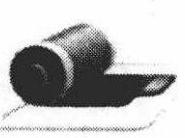

·自己想

课外活动

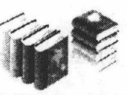

·自己学

## 数学归纳法的其他形式

前面学习的数学归纳法, 称之为第一数学归纳法, 是数学归纳法的基本形式, 其实数学归纳法还有许多 “变式”, 下面介绍数学归纳法的其他形式.

设 $P\left( n\right)$ 是一个与正整数有关的命题.

## 第二数学归纳法: 如果

① 当 $n = 1$ 时， $P\left( n\right)$ 成立；

② 假设当 $n \leq  k\left( {k \geq  1, k \in  {\mathbf{N}}^{ * }}\right)$ 时， $P\left( k\right)$ 成立，由此推得 $n = k +$ 1 时, $P\left( {k + 1}\right)$ 也成立,那么,对一切正整数 $n \geq  1$ 时, $P\left( n\right)$ 成立.

## 跳跃数学归纳法: 如果

① 当 $n = 1,2,3,\cdots , l$ 时, $P\left( 1\right) , P\left( 2\right) , P\left( 3\right) ,\cdots , P\left( l\right)$ 成立;

② 假设当 $n = k\left( {k \geq  l, k \in  {\mathbf{N}}^{ * }}\right)$ 时， $P\left( k\right)$ 成立，由此推得 $n = k + \; l$ 时, $P\left( {k + l}\right)$ 也成立,那么,对一切正整数 $n \geq  1$ 时, $P\left( n\right)$ 成立.

## 反向数学归纳法: 如果

① $P\left( n\right)$ 对无穷多个正整数 n 成立;

② 假设当 $n = k + 1\left( {k \in  {\mathbf{N}}^{ * }}\right)$ 时，命题 $P\left( {k + 1}\right)$ 成立，由此推得 $n = k$ 时,命题 $P\left( k\right)$ 也成立,那么对一切正整数 $n \geq  1$ 时, $P\left( n\right)$ 成立.

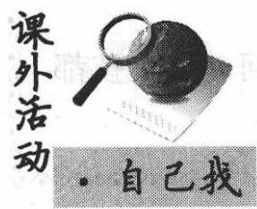

数学推理包括合情推理和演绎推理,数学证明包括直接证明和间接证明. 你对数学推理与证明方法了解多少? 请查阅相关图书资料, 写一篇推理与证明的

读书报告.

1. 用数学归纳法证明:

(1) ${1}^{2} + {2}^{2} + {3}^{2} + \cdots  + {n}^{2} = \frac{n\left( {n + 1}\right) \left( {{2n} + 1}\right) }{6}$ , $n \in  {\mathbf{N}}^{ * }$ ;

(2) $\left( {n + 1}\right) \left( {n + 2}\right) \left( {n + 3}\right) \cdots \left( {n + n}\right)  = {2}^{n} \cdot  1 \cdot  3 \cdot  \cdots  \cdot  ({2n} -$ 1) $\left( {n \in  {\mathbf{N}}^{ * }}\right)$ ;

(3) $\tan \alpha  \cdot  \tan {2\alpha } + \tan {2\alpha } \cdot  \tan {3\alpha } + \cdots  + \tan \left( {n - 1}\right) \alpha  \cdot  \tan {n\alpha } = \; \frac{\tan {n\alpha }}{\tan \alpha } - n\left( {n \geq  2, n \in  {\mathbf{N}}^{ * }}\right) .$

2. 用数学归纳法证明:

(1) $\left( {{3n} + 1}\right)  \cdot  {7}^{n} - 1\left( {n \in  {\mathbf{N}}^{ * }}\right)$ 能被 9 整除；

(2)当 $n$ 为正奇数时， ${n}^{4} + 7\left( {2{n}^{2} + 7}\right)$ 能被 64 整除；

(3) ${x}^{n + 2} + {\left( x + 1\right) }^{{2n} + 1}\left( {n \in  {\mathbf{N}}^{ * }}\right)$ 能被 ${x}^{2} + x + 1$ 整除.

3. 用数学归纳法证明:

(1) $\frac{1}{n + 1} + \frac{1}{n + 2} + \frac{1}{n + 3} + \cdots  + \frac{1}{2n} > \frac{13}{24}\left( {n \geq  2, n \in  {\mathbf{N}}^{ * }}\right)$ ；

(2) $1 + \frac{1}{2} + \frac{1}{3} + \cdots  + \frac{1}{{2}^{n}} \leq  \frac{1}{2} + n\left( {n \in  {\mathbf{N}}^{ * }}\right)$ ;

(3) $\left| {\sin {nx}}\right|  \leq  n\left| {\sin x}\right| \left( {n \in  {\mathbf{N}}^{ * }}\right)$ .

4. 设 ${a}_{0}$ 为常数,且 ${a}_{n} = {3}^{n - 1} - 2{a}_{n - 1}\left( {n \in  {\mathbf{N}}^{ * }}\right)$ . 求证:

$$
{a}_{n} = \frac{1}{5}\left\lbrack  {{3}^{n} + {\left( -1\right) }^{n - 1} \cdot  {2}^{n}}\right\rbrack   + {\left( -1\right) }^{n} \cdot  {2}^{n}{a}_{0}\left( {n \in  {\mathbf{N}}^{ * }}\right) .
$$

5. 在数列 $\left\{  {a}_{n}\right\}$ 中, ${a}_{1} = {a}_{2} = 1,{a}_{n} = {a}_{n - 1} + {a}_{n - 2}\left( {n \geq  3}\right)$ . 求证: 数列第 ${4k}\left( {k \in  {\mathbf{N}}^{ * }}\right)$ 项能被 3 整除.

6. 设数列 $\left\{  {a}_{n}\right\}$ 中, ${a}_{1} = {2p},{a}_{n} = {2p} - \frac{{p}^{2}}{{a}_{n - 1}}$ ,其中 $p$ 是不等于零的常数. 求证: $p$ 不在数列 $\left\{  {a}_{n}\right\}$ 中.

7. 在数列 $\left\{  {a}_{n}\right\}$ 中, ${F}_{1} = {F}_{2} = 1,{F}_{n} = {F}_{n - 1} + {F}_{n - 2}\left( {n \geq  3}\right)$ . 求证:

$$
{F}_{n - 1}{F}_{n + 1} - {F}_{n}^{2} = {\left( -1\right) }^{n}\left( {n \in  {\mathbf{N}}^{ * }, n \geq  2}\right) .
$$

8. 平面内有 $n$ 个圆,其中每两个圆都相交于两点,且每三个圆都不相交于同一点,求证: 这 $n$ 个圆把平面分成 ${n}^{2} - n + 2$ 个部分.

### 10.5 归纳一猜想一论证 (Induction - Conjecture - Proof)

在数学问题的研究中, 为了寻求一般规律, 往往先考虑一些特例, 进行归纳,猜想,然后再去证明这些猜想正确与否. 一些与正整数有关的命题也可以通过这样的途径得到.

例 1 在数列 $\left\{  {a}_{n}\right\}$ 中, ${a}_{1} = 1,{S}_{n}$ 是前 $n$ 项的和,若当 $n \geq  2$ 时, ${a}_{n}$ ,

___ ， ${S}_{n},{S}_{n} - \frac{1}{2}$ 成等比数列,计算 ${a}_{2},{a}_{3},{a}_{4}$ ,猜想 $\left\{  {a}_{n}\right\}$ 的通项公式,并证明所得的结论.

解 当 $n \geq  2$ 时,依题意得 ${S}_{n}^{2} = {a}_{n}\left( {{S}_{n} - \frac{1}{2}}\right)$ .

所以 ${S}_{2}^{2} = {a}_{2}\left( {{S}_{2} - \frac{1}{2}}\right)$ ,即

$$
{\left( {a}_{1} + {a}_{2}\right) }^{2} = {a}_{2}\left( {{a}_{1} + {a}_{2} - \frac{1}{2}}\right) ,{a}_{1}^{2} + {a}_{1}{a}_{2} + \frac{1}{2}{a}_{2} = 0.
$$

又 ${a}_{1} = 1$ ,故 ${a}_{2} =  - \frac{2}{3}$ ,所以 ${S}_{2} = \frac{1}{3}$ ; 又 ${S}_{3}^{2} = {a}_{3}\left( {{S}_{3} - \frac{1}{2}}\right)$ ,即 ${\left( {a}_{3} + {S}_{2}\right) }^{2} = {a}_{3}\left( {{S}_{2} + {a}_{3} - \frac{1}{2}}\right)$ ,故 ${a}_{3} =  - \frac{2}{15}$ ,所以 ${S}_{3} = \frac{1}{3} - \frac{2}{15} = \frac{1}{5}$ ; 同理 ${S}_{4}^{2} = {a}_{4}\left( {{S}_{4} - \frac{1}{2}}\right) ,{a}_{4} =  - \frac{2}{35}$ .

猜想当 $n \geq  2$ 时， ${a}_{n} = \frac{-2}{\left( {{2n} - 3}\right) \left( {{2n} - 1}\right) }$ ，下面用数学归纳法证明:

(i) 当 $n = 2$ 时, ${a}_{2} =  - \frac{2}{3}$ ,猜想正确;

(ii) 假设当 $n = k\left( {k \in  {\mathbf{N}}^{ * }, k \geq  2}\right)$ 时,猜想成立,即

$$
{a}_{k} = \frac{-2}{\left( {{2k} - 3}\right) \left( {{2k} - 1}\right) }.
$$

则当 $n = k + 1$ 时,

$$
{S}_{k} = 1 - \left\lbrack  {\frac{2}{3} + \frac{2}{15} + \cdots  + \frac{2}{\left( {{2k} - 3}\right) \left( {{2k} - 1}\right) }}\right\rbrack
$$

$$
= 1 - \left( {1 - \frac{1}{3} + \frac{1}{3} - \frac{1}{5} + \cdots  + \frac{1}{{2k} - 3} - \frac{1}{{2k} - 1}}\right)
$$

$$
= 1 - \left( {1 - \frac{1}{{2k} - 1}}\right)  = \frac{1}{{2k} - 1}\text{ . }
$$

由 ${S}_{k + 1}^{2} = {a}_{k + 1}\left( {{S}_{k + 1} - \frac{1}{2}}\right)$ ,即

$$
{\left( {S}_{k} + {a}_{k + 1}\right) }^{2} = {a}_{k + 1}\left( {{a}_{k + 1} + {S}_{k} - \frac{1}{2}}\right) .
$$

解得 ${a}_{k + 1} = \frac{-{S}_{k}^{2}}{{S}_{k} + \frac{1}{2}} = \frac{-{\left( \frac{1}{{2k} - 1}\right) }^{2}}{\frac{1}{{2k} - 1} + \frac{1}{2}} =  - \frac{2}{\left( {{2k} - 1}\right) \left( {{2k} + 1}\right) }$ . 此时猜

想也成立.

根据(i) (ii) 可以断定,猜测 ${a}_{n} = \left\{  \begin{array}{ll} 1, & n = 1, \\  \frac{-2}{\left( {{2n} - 3}\right) \left( {{2n} - 1}\right) }, & n \geq  2 \end{array}\right.$ 任何 $n \in  {\mathbf{N}}^{ * }$ 都成立.

例 2 是否存在正整数 $m$ ,使得 $f\left( n\right)  = \left( {{2n} + 7}\right)  \cdot  {3}^{n} + 9$ 对一切正整数 $n$ 都能被 $m$ 整除,若存在,求出 $m$ 的最大值,并证明你的结论; 若不存在,说明理由.

解 由 $f\left( n\right)  = \left( {{2n} + 7}\right)  \cdot  {3}^{n} + 9\left( {n \in  {\mathbf{N}}^{ * }}\right)$ ,得

$$
f\left( 1\right)  = \left( {2 + 7}\right)  \cdot  {3}^{1} + 9 = {36}
$$

$$
f\left( 2\right)  = \left( {4 + 7}\right)  \cdot  {3}^{2} + 9 = {108} = {36} \times  3;
$$

$$
f\left( 3\right)  = \left( {6 + 7}\right)  \cdot  {3}^{3} + 9 = {360} = {36} \times  {10};
$$

$$
f\left( 4\right)  = \left( {8 + 7}\right)  \cdot  {3}^{4} + 9 = {1224} = {36} \times  {34},
$$

由此可推测满足条件的自然数 $m = {36}$ .

现用数学归纳法来证明 $f\left( n\right)  = \left( {{2n} + 7}\right)  \cdot  {3}^{n} + 9$ 对于任意 $n \in  {\mathbf{N}}^{ * }$ 都能被 36 整除.

(i) 当 $n = 1$ 时,已证明 $f\left( 1\right)  = {36}$ 能被 36 整除;

(ii) 假设当 $n = k\left( {k \in  {\mathbf{N}}^{ * }, k \geq  1}\right)$ 时,命题成立,即 $f\left( k\right)  = ({2k} +$ 7) $\cdot  {3}^{k} + 9$ 能被 36 整除.

则当 $n = k + 1$ 时,

$$
f\left( {k + 1}\right)  = \left\lbrack  {2\left( {k + 1}\right)  + 7}\right\rbrack   \cdot  {3}^{k + 1} + 9
$$

$$
= 3\left\lbrack  {\left( {{2k} + 7}\right)  \cdot  {3}^{k} + 9}\right\rbrack   + {18}\left( {{3}^{k - 1} - 1}\right) .
$$

由于 ${3}^{k - 1} - 1$ 当 $k \in  {\mathbf{N}}^{ * }$ 时为偶数,故 ${18}\left( {{3}^{k - 1} - 1}\right)$ 能被 36 整除,再由归纳假定, $f\left( k\right)$ 能被 36 整除,故 $f\left( {k + 1}\right)$ 也能被 36 整除.

$\therefore$ 当 $n = k + 1$ 时,命题也成立.

根据(i) (ii) 可以断定, $f\left( n\right)  = \left( {{2n} + 7}\right)  \cdot  {3}^{n} + 9$ 对任何 $n \in  {\mathbf{N}}^{ * }$ 都能被 36 整除.

对大于 36 的正整数 $m$ ,由于 $f\left( 1\right)  = {36}$ ,则 $f\left( 1\right)$ 不能被 $m$ 整除. 因此这里符合条件的自然数 $m$ 的最大值是 36 .

例 3 是否存在常数 $a\text{ 、 }b\text{ 、 }c$ 使等式

$$
1 \cdot  {2}^{2} + 2 \cdot  {3}^{2} + 3 \cdot  {4}^{2} + \cdots  + n{\left( n + 1\right) }^{2} = \frac{n\left( {n + 1}\right) }{12}\left( {a{n}^{2} + {bn} + c}\right)
$$

对一切正整数 $n$ 都成立,并证明你的结论.

解 - 假设存在 $a\text{ 、 }b\text{ 、 }c$ 使题设等式成立,那么令 $n = 1, n = 2, n = 3$ , 得到下面方程组:

$$
\left\{  {\begin{array}{l} 4 = \frac{1}{6}\left( {a + b + c}\right) , \\  {22} = \frac{1}{2}\left( {{4a} + {2b} + c}\right) , \\  {70} = {9a} + {3b} + c. \end{array}\text{ 解得 }\left\{  \begin{array}{l} a = 3, \\  b = {11}, \\  c = {10}. \end{array}\right. }\right.
$$

下面用数学归纳法证明当 $n \in  {\mathbf{N}}^{ * }$ 时,题设等式成立,即有:

$$
1 \cdot  {2}^{2} + 2 \cdot  {3}^{2} + 3 \cdot  {4}^{2} + \cdots  + n{\left( n + 1\right) }^{2}
$$

$$
= \frac{n\left( {n + 1}\right) }{12}\left( {3{n}^{2} + {11n} + {10}}\right) .
$$

①

(i) 当 $n = 1,2,3$ 时,①式成立.

(ii) 假设 $n = k\left( {k \in  {\mathbf{N}}^{ * }, k \geq  1}\right)$ 时,等式成立,即

$$
1 \cdot  {2}^{2} + 2 \cdot  {3}^{2} + \cdots  + k{\left( k + 1\right) }^{2} = \frac{k\left( {k + 1}\right) }{12}\left( {3{k}^{2} + {11k} + {10}}\right) .
$$

则当 $n = k + 1$ 时,

$$
1 \cdot  {2}^{2} + 2 \cdot  {3}^{2} + \cdots  + k{\left( k + 1\right) }^{2} + \left( {k + 1}\right) {\left( k + 2\right) }^{2}
$$

$$
= \frac{k\left( {k + 1}\right) }{12}\left( {3{k}^{2} + {11k} + {10}}\right)  + \left( {k + 1}\right) {\left( k + 2\right) }^{2}
$$

$$
= \frac{\left( k + 1\right) }{12}\left\lbrack  {k\left( {3{k}^{2} + {11k} + {10}}\right)  + {12}{\left( k + 2\right) }^{2}}\right\rbrack
$$

$$
= \frac{k + 1}{12}\left( {k + 2}\right) \left( {3{k}^{2} + {5k} + {12k} + {24}}\right)
$$

$$
= \frac{\left( {k + 1}\right) \left( {k + 2}\right) }{12}\left\lbrack  {3{\left( k + 1\right) }^{2} + {11}\left( {k + 1}\right)  + {10}}\right\rbrack  .
$$

此时①式也成立.

根据(i) (ii) 可以断定，①式对任何 $n \in  {\mathbf{N}}^{ * }$ 都成立.

例 4 在 1 与 2 之间插入 $n$ 个正数 ${a}_{1},{a}_{2},{a}_{3},\cdots ,{a}_{n}$ ,使这 $n + 2$ 个数成等比数列; 又在 1 与 2 之间插入 $n$ 个正数 ${b}_{1},{b}_{2},{b}_{3},\cdots ,{b}_{n}$ ,使这 $n + 2$ 个数成等差数列. 记 ${A}_{n} = {a}_{1}{a}_{2}{a}_{3}\cdots {a}_{n},{B}_{n} = {b}_{1} + {b}_{2} + \cdots  + {b}_{n}$ . 求:

(1)求数列 $\left\{  {A}_{n}\right\}$ 和 $\left\{  {B}_{n}\right\}$ 的通项公式；

(2)比较 ${A}_{n}$ 与 ${B}_{n}$ 的大小，并证明你的结论.

解 (1) 因为 $1,{a}_{1},{a}_{2},{a}_{3},\cdots ,{a}_{n},2$ 成等比数列,所以

$$
{a}_{1}{a}_{n} = {a}_{2}{a}_{n - 1} = {a}_{3}{a}_{n - 2} = \cdots  = {a}_{k}{a}_{n - k + 1} = \cdots  = 1 \times  2 = 2,
$$

${A}_{n}^{2} = \left( {{a}_{1}{a}_{n}}\right) \left( {{a}_{2}{a}_{n - 1}}\right) \left( {{a}_{3}{a}_{n - 2}}\right) \cdots \left( {{a}_{n - 1}{a}_{2}}\right) \left( {{a}_{n}{a}_{1}}\right)  = {\left( 1 \times  2\right) }^{n} = {2}^{n},$

所以

$$
{A}_{n} = {2}^{\frac{n}{2}}
$$

因为 $1,{b}_{1},{b}_{2},{b}_{3},\cdots ,{b}_{n},2$ 成等差数列,所以

$$
{b}_{1} + {b}_{n} = 1 + 2 = 3
$$

$$
{B}_{n} = \frac{\left( {{b}_{1} + {b}_{n}}\right) n}{2} = \frac{3}{2}n.
$$

所以数列 $\left\{  {A}_{n}\right\}$ 的通项公式是 ${A}_{n} = {2}^{\frac{n}{2}}$ ,数列 $\left\{  {B}_{n}\right\}$ 的通项公式是 ${B}_{n} = \frac{3}{2}n$

(2)因为 ${A}_{n} = {2}^{\frac{n}{2}},{B}_{n} = \frac{3}{2}n$ ，所以 ${A}_{n}^{2} = {2}^{n},{B}_{n}^{2} = \frac{9}{4}{n}^{2}$ ，要比较 ${A}_{n}$ 与 ${B}_{n}$ 的大小,只需比较 ${A}_{n}^{2}$ 与 ${B}_{n}^{2}$ 的大小.

当 $n = 1$ 时, ${2}^{n} = 2,\frac{9}{4}{n}^{2} = \frac{9}{4}$ ,所以 ${2}^{n} < \frac{9}{4}{n}^{2}$ ;

当 $n = 2$ 时, ${2}^{n} = 4,\frac{9}{4}{n}^{2} = 9$ ,所以 ${2}^{n} < \frac{9}{4}{n}^{2}$ .

......

经验证,当 $1 \leq  n \leq  6$ 时,均有 ${2}^{n} < \frac{9}{4}{n}^{2}$ 成立,即 ${A}_{n}^{2} < {B}_{n}^{2}$ , 所以 ${A}_{n} < {B}_{n}$ .

当 $n = 7$ 时, ${2}^{n} = {128},\frac{9}{4}{n}^{2} = \frac{9}{4} \times  {49} = {110}\frac{1}{4}$ ,所以 ${2}^{n} > \frac{9}{4}{n}^{2}$ .

经验证, $n = 8, n = 9$ 时,均有 ${2}^{n} > \frac{9}{4}{n}^{2}$ 成立.

猜想: 当 $n \geq  7$ 时,有 ${2}^{n} > \frac{9}{4}{n}^{2}$ .

下面用数学归纳法证明:

(i) 当 $n = 7$ 时,已证 ${2}^{n} > \frac{9}{4}{n}^{2}$ ;

(ii) 假设 $n = k\left( {k \in  {\mathbf{N}}^{ * }, k \geq  7}\right)$ 时,不等式成立,即 ${2}^{k} > \frac{9}{4}{k}^{2}$ .

则当 $n = k + 1$ 时, ${2}^{k + 1} = 2 \cdot  {2}^{k} > 2 \cdot  \frac{9}{4}{k}^{2} = \frac{9}{4}\left\lbrack  {{\left( k + 1\right) }^{2} + {k}^{2} - }\right. \; {2k} - 1\rbrack  = \frac{9}{4}\left\lbrack  {{\left( k + 1\right) }^{2} + k\left( {k - 2}\right)  - 1}\right\rbrack  .$

因为 $k \geq  7$ ,所以 $k\left( {k - 2}\right)  \geq  {35}, k\left( {k - 2}\right)  - 1 > 0,\frac{9}{4}\left\lbrack  {{\left( k + 1\right) }^{2} + }\right. \; k\left( {k - 2}\right)  - 1\rbrack  > \frac{9}{4}{\left( k + 1\right) }^{2}$ ,故 ${2}^{k + 1} > \frac{9}{4}{\left( k + 1\right) }^{2}$ ,即 $n = k + 1$ 时不等式也成立.

根据(i) (ii) 可以断定,当 $n \geq  7$ 时, ${2}^{n} > \frac{9}{4}{n}^{2}$ 都成立,即 ${A}_{n}^{2} > {B}_{n}^{2}$ , ${A}_{n} > {B}_{n}$ . 综上可知,当 $1 \leq  n \leq  6$ 时, ${A}_{n} < {B}_{n}$ ; 当 $n \geq  7$ 时, ${A}_{n} > {B}_{n}$ .

·大家谈

我们知道等差数列与等比数列的定义只有一字之差: 差 $\leftrightarrow$ 商,因此两者有很多相似的性质. 下面给出等差数列的几个性质, 你能给出等比数列中相应的性质吗?

(1)在等差数列 $\left\{  {a}_{n}\right\}$ 中，若 ${a}_{10} = 0$ ，则等式 ${a}_{1} + {a}_{2} + \cdots  + \; {a}_{n} = {a}_{1} + {a}_{2} + \cdots  + {a}_{{19} - n}\left( {n < {19}, n \in  {\mathbf{N}}^{ * }}\right)$ 成立.

(2)若数列 $\left\{  {a}_{n}\right\}$ 是等差数列，则数列 ${b}_{n} = \frac{{a}_{1} + {a}_{2} + \cdots  + {a}_{n}}{n} \; \left( {n \in  {\mathbf{N}}^{ * }}\right)$ 也是等差数列.

(3)若数列 $\left\{  {a}_{n}\right\}$ 为等差数列,且 ${a}_{m} = a,{a}_{n} = b(m \neq  n, m$ , $\left. {n \in  {\mathbf{N}}^{ * }}\right)$ ,则 ${a}_{n + m} = \frac{b \cdot  n - a \cdot  m}{n - m}$ .

课堂活动

- 自己想

等差数列与等比数列有很多类似的性质,它们所揭示的本质是什么?

课外活动数列求和主要有哪些方法?

·自己教

习题练习

## 自己练

1. 数列 $\left\{  {a}_{n}\right\}$ 满足 ${a}_{1} = \frac{1}{2},{a}_{n + 1} = \frac{{a}_{n}}{2{a}_{n} + 3}(n \in$ N* ).

(1)求 ${a}_{1}$ ， ${a}_{2}$ ， ${a}_{3}$ ， ${a}_{4}$ ；(2)猜测 $\{ {a}_{n}\}$ 的通项公式，并证明你的结论.

2. 数列 $\left\{  {a}_{n}\right\}$ 满足 ${a}_{1} = 2,{a}_{n + 1} = {a}_{n}^{2} - \left( {n - 1}\right) {a}_{n} + 1\left( {n \in  {\mathbf{N}}^{ * }}\right)$ .

(1)求 ${a}_{1},{a}_{2},{a}_{3},{a}_{4}$ ；(2)猜测 $\left\{  {a}_{n}\right\}$ 的通项公式，并证明你的结论.

3. 对于数列 $\left\{  {a}_{n}\right\}$ ,若 ${a}_{1} = a + \frac{1}{a}\left( {a > 0\text{ 且 }a \neq  1}\right) ,{a}_{n + 1} = {a}_{1} - \frac{1}{{a}_{n}}$ .

(1)求 ${a}_{2},{a}_{3},{a}_{4}$ ；(2)猜测 $\left\{  {a}_{n}\right\}$ 的通项公式，并证明你的结论.

4. 已知正数数列 $\left\{  {a}_{n}\right\}$ 满足 ${S}_{n} = \frac{1}{2}\left( {{a}_{n} + \frac{1}{{a}_{n}}}\right) \left( {n \in  {\mathbf{N}}^{ * }}\right)$ .

(1)求 ${a}_{1},{a}_{2},{a}_{3},{a}_{4}$ ；(2)猜测 $\left\{  {a}_{n}\right\}$ 的通项公式,并证明你的结论.

5. 设数列 $\left\{  {a}_{n}\right\}$ 的前 $n$ 项和为 ${S}_{n}$ ,且方程 ${x}^{2} - {a}_{n}x - {a}_{n} = 0$ 有一根为 ${S}_{n} - 1\left( {n \in  {\mathbf{N}}^{ * }}\right)$ ,求数列 $\left\{  {a}_{n}\right\}$ 的通项公式.

6. 已知数列 $\left\{  {a}_{n}\right\}$ 的通项公式是 ${a}_{n} = {n}^{2} + n$ ,试问是否存在常数 $p$ , $q, r$ 使等式

$\frac{1}{1 + {a}_{1}} + \frac{1}{2 + {a}_{2}} + \cdots  + \frac{1}{n + {a}_{n}} = \frac{p{n}^{2} + {qn} + r}{4\left( {n + 1}\right) \left( {n + 2}\right) }$ 对一切正整数 $n$ 都成立?

7. 已知数列 $\left\{  {a}_{n}\right\}$ 和 $\left\{  {b}_{n}\right\}$ ,其中: ${a}_{n} = 1 + 3 + 5 + \cdots  + \left( {{2n} + 1}\right) ,{b}_{n} = \; 1 + 2 + {2}^{2} + \cdots  + {2}^{n - 1}\left( {n \in  {\mathbf{N}}^{ * }}\right)$ . 试比较 ${a}_{n}$ 与 ${b}_{n}$ 的大小,并证明你的结论.

8. 比较 ${n}^{n + 1}$ 与 ${\left( n + 1\right) }^{n}$ 的大小,并证明你的结论.

### 10.6 数列的极限 (Limits of Sequences)

分别观察下面的无穷数列

① $1,\frac{1}{2},\frac{1}{3},\cdots ,\frac{1}{n},\cdots$ ; ② $- 1,\frac{1}{2}, - \frac{1}{3},\cdots ,\frac{{\left( -1\right) }^{n}}{n},\cdots$ .

可以发现,随着项数 $n$ 的无限增大,这两个数列的项都无限趋近于常数 0 .

同样地,分别观察下面的无穷数列

$$
1,1,1,\cdots ,1,\cdots ;
$$

$$
\frac{1}{2},\frac{2}{3},\frac{3}{4},\cdots ,\frac{n}{n + 1},\cdots .
$$

可以发现,随着项数 $n$ 的无限增大,这两个数列的项无限趋近于常数 1 .

更一般地,对于数列 $\left\{  {q}^{n}\right\}  \left( {n \in  {\mathbf{N}}^{ * }}\right)$ ,我们发现,只要 $q$ 满足 $\left| q\right|  < 1$ , 那么当项数 $n$ 无限增大时,数列的项 ${a}_{n} = {q}^{n}$ 无限趋近于常数 0 .

像这样，在项数 $n$ 无限增大的变化过程中，如果无穷数列 $\left\{  {a}_{n}\right\}$ 中的项 ${a}_{n}$ 无限趋近于某个常数 $A$ ,那么 $A$ 叫做数列 $\left\{  {a}_{n}\right\}$ 的极限,或叫做数列 $\left\{  {a}_{n}\right\}$ 收敛于 $A$ . 记作 $\mathop{\lim }\limits_{{n \rightarrow  \infty }}{a}_{n} = A$ . 读作 “ $n$ 趋向无穷大时， ${a}_{n}$ 的极限等于 $A$ ”. 由于 “ ${a}_{n}$ 无限地趋近于 $A$ ” 与 “ $\left| {{a}_{n} - A}\right|$ 无限地趋近于 0 ” 的意义相同,所以 $\mathop{\lim }\limits_{{n \rightarrow  \infty }}{a}_{n} = A$ ,可表示为 $\mathop{\lim }\limits_{{n \rightarrow  \infty }}\left| {{a}_{n} - A}\right|  = 0$ .

由前面的分析,可以得到以下几个常用数列的极限:

$$
\mathop{\lim }\limits_{{n \rightarrow  \infty }}C = C\left( {C\text{ 为常数 }}\right) ,\mathop{\lim }\limits_{{n \rightarrow  \infty }}\frac{1}{n} = 0,\mathop{\lim }\limits_{{n \rightarrow  \infty }}{q}^{n} = 0\left( {\left| q\right|  < 1}\right) .
$$

另外,数列 $\left\{  {\left( 1 + \frac{1}{n}\right) }^{n}\right\}$ 也存在极限,可以证明 $\mathop{\lim }\limits_{{n \rightarrow  \infty }}{\left( 1 + \frac{1}{n}\right) }^{n} =$ e(本书不加以证明).

仅凭数列极限的定义及上面的几个数列的极限, 还不能解决比较复杂的数列极限问题. 为此, 下面再给出数列极限的运算法则(本书不加以证明):

如果 $\mathop{\lim }\limits_{{n \rightarrow  \infty }}{a}_{n} = A,\mathop{\lim }\limits_{{n \rightarrow  \infty }}{b}_{n} = B$ ,那么

(1) $\mathop{\lim }\limits_{{n \rightarrow  \infty }}\left( {{a}_{n} \pm  {b}_{n}}\right)  = \mathop{\lim }\limits_{{n \rightarrow  \infty }}{a}_{n} \pm  \mathop{\lim }\limits_{{n \rightarrow  \infty }}{b}_{n} = A \pm  B$ ;

(2) $\mathop{\lim }\limits_{{n \rightarrow  \infty }}\left( {{a}_{n} \cdot  {b}_{n}}\right)  = \mathop{\lim }\limits_{{n \rightarrow  \infty }}{a}_{n} \cdot  \mathop{\lim }\limits_{{n \rightarrow  \infty }}{b}_{n} = A \cdot  B$ ;

(3) $\mathop{\lim }\limits_{{n \rightarrow  \infty }}\frac{{a}_{n}}{{b}_{n}} = \frac{\mathop{\lim }\limits_{{n \rightarrow  \infty }}{a}_{n}}{\mathop{\lim }\limits_{{n \rightarrow  \infty }}{b}_{n}} = \frac{A}{B}\left( {B \neq  0}\right)$ .

特别地,如果 $C$ 是常数,那么由 (2) 可得 $\mathop{\lim }\limits_{{n \rightarrow  \infty }}\left( {C \cdot  {b}_{n}}\right)  = \mathop{\lim }\limits_{{n \rightarrow  \infty }}C$ . $\mathop{\lim }\limits_{{n \rightarrow  \infty }}{b}_{n} = C \cdot  B.$

两个数列的极限的运算法则还可以推广到有限个数列的情况, 例如: 如果 $\mathop{\lim }\limits_{{n \rightarrow  \infty }}{a}_{n} = A,\mathop{\lim }\limits_{{n \rightarrow  \infty }}{b}_{n} = B,\mathop{\lim }\limits_{{n \rightarrow  \infty }}{c}_{n} = C$ ,那么 $\mathop{\lim }\limits_{{n \rightarrow  \infty }}\left( {{a}_{n} + {b}_{n} - {c}_{n}}\right)  = A + \; B - C,\mathop{\lim }\limits_{{n \rightarrow  \infty }}\left( \frac{{a}_{n} \cdot  {b}_{n}}{{c}_{n}}\right)  = \frac{A \cdot  B}{C}\left( {C \neq  0}\right)$ 等.

例 1 判断下列说法是否正确,并说明理由.

(1)数列 $\left\{  \frac{1 + {\left( -1\right) }^{n}}{2}\right\}$ 的极限是 0 和 1 ;

(2)数列 $\left\{  {{\left( -1\right) }^{n + 1} \cdot  \frac{1}{{2}^{n - 1}}}\right\}$ 的极限是 0 ;

(3)数列 $\left\{  {\sin \frac{1}{n}}\right\}$ 的极限不存在;

(4)数列 $\left\{  \frac{1}{{3}^{n}}\right\}  \left( {1 \leq  n \leq  {10000}}\right)$ 的极限是 0 ;

(5) 若数列 $\left\{  {a}_{n}\right\}$ 的通项公式是 ${a}_{n} = \left\{  \begin{array}{ll} \frac{1}{{n}^{2}}, & 1 \leq  n \leq  {1000}, \\  \frac{{n}^{2}}{{n}^{2} - {2n}}, & n \geq  {1001}, \end{array}\right.$

当 $n \leq  {1000}$ 时,数列 $\left\{  {a}_{n}\right\}$ 的极限是 0,当 $n \geq  {1001}$ 时,数列 $\left\{  {a}_{n}\right\}$ 的极限是 1.

解 (1) 不正确:一个数列的极限若存在，则它的极限是唯一的，不能是两个或更多个.

(2)正确:随着 $n$ 无限增大，数列 $\left\{  {{\left( -1\right) }^{n + 1} \cdot  \frac{1}{{2}^{n - 1}}}\right\}$ 的项无限趋近于 0 , 它的极限是 0 .

(3)不正确:随着 $n$ 无限增大，数列 $\left\{  \frac{1}{n}\right\}$ 的项无限趋近于 0，数列 $\left\{  {\sin \frac{1}{n}}\right\}$ 无限趋近于 0 .

(4)不正确:有穷数列无极限.

(5)不正确:数列的极限是当项数 $n$ 无限增大时，数列的项无限趋近到的一个常数，与数列的前有限项无关.

例 2 计算:

(1) $\mathop{\lim }\limits_{{n \rightarrow  \infty }}\frac{-3{n}^{3} + 2{n}^{2} - n}{4{n}^{3} - 3{n}^{2} + {2n} - 1}$ ;

(2) $\mathop{\lim }\limits_{{n \rightarrow  \infty }}\left\lbrack  {\frac{1}{2 \times  5} + \frac{1}{5 \times  8} + \frac{1}{8 \times  {11}} + \cdots  + \frac{1}{\left( {{3n} - 1}\right) \left( {{3n} + 2}\right) }}\right\rbrack$ .

解 (1) $\mathop{\lim }\limits_{{n \rightarrow  \infty }}\frac{-3{n}^{3} + 2{n}^{2} - n}{4{n}^{3} - 3{n}^{2} + {2n} - 1} = \mathop{\lim }\limits_{{n \rightarrow  \infty }}\frac{-3 + \frac{2}{n} - \frac{1}{{n}^{2}}}{4 - \frac{3}{n} + \frac{2}{{n}^{2}} - \frac{1}{{n}^{3}}}$

$$
= \frac{\mathop{\lim }\limits_{{n \rightarrow  \infty }}\left( {-3}\right)  + \mathop{\lim }\limits_{{n \rightarrow  \infty }}\frac{2}{n} - \mathop{\lim }\limits_{{n \rightarrow  \infty }}\frac{1}{{n}^{2}}}{\mathop{\lim }\limits_{{n \rightarrow  \infty }}4 - \mathop{\lim }\limits_{{n \rightarrow  \infty }}\frac{3}{n} + \mathop{\lim }\limits_{{n \rightarrow  \infty }}\frac{2}{{n}^{2}} - \mathop{\lim }\limits_{{n \rightarrow  \infty }}\frac{1}{{n}^{3}}}
$$

$$
= \frac{\mathop{\lim }\limits_{{n \rightarrow  \infty }}\left( {-3}\right)  + 2\mathop{\lim }\limits_{{n \rightarrow  \infty }}\frac{1}{n} - \mathop{\lim }\limits_{{n \rightarrow  \infty }}\frac{1}{n} \cdot  \mathop{\lim }\limits_{{n \rightarrow  \infty }}\frac{1}{n}}{\mathop{\lim }\limits_{{n \rightarrow  \infty }}4 - 3\mathop{\lim }\limits_{{n \rightarrow  \infty }}\frac{1}{n} + 2\mathop{\lim }\limits_{{n \rightarrow  \infty }}\frac{1}{n} \cdot  \mathop{\lim }\limits_{{n \rightarrow  \infty }}\frac{1}{n} \cdot  \mathop{\lim }\limits_{{n \rightarrow  \infty }}\frac{1}{n} \cdot  \mathop{\lim }\limits_{{n \rightarrow  \infty }}\frac{1}{n}}
$$

$$
=  - \frac{3}{4}\text{ . }
$$

(2) 原式 $= \mathop{\lim }\limits_{{n \rightarrow  \infty }}\frac{1}{3}\left( {\frac{1}{2} - \frac{1}{5} + \frac{1}{5} - \frac{1}{8} + \frac{1}{8} - \frac{1}{11} + \cdots  + }\right.$

$$
\left. {\frac{1}{{3n} - 1} - \frac{1}{{3n} + 2}}\right)
$$

$$
= \frac{1}{3}\mathop{\lim }\limits_{{n \rightarrow  \infty }}\left( {\frac{1}{2} - \frac{1}{{3n} + 2}}\right)  = \mathop{\lim }\limits_{{n \rightarrow  \infty }}\frac{n}{{6n} + 4} = \frac{1}{6}\text{ . }
$$

例 3 计算:

(1) $\mathop{\lim }\limits_{{n \rightarrow  \infty }}\left\lbrack  {\sqrt{1 + 2 + 3 + \cdots  + n} - \sqrt{1 + 2 + 3 + \cdots  + \left( {n - 1}\right) }}\right\rbrack$ ;

(2) $\mathop{\lim }\limits_{{n \rightarrow  \infty }}\frac{{a}^{n} + {2}^{n - 1}}{{2}^{n} + {a}^{n + 1}}\left( {a \in  \mathbf{R}, a \neq   - 2}\right)$ .

解 (1) 原式 $= \mathop{\lim }\limits_{{n \rightarrow  \infty }}\left( {\sqrt{\frac{n\left( {n + 1}\right) }{2}} - \sqrt{\frac{n\left( {n - 1}\right) }{2}}}\right)$

$$
= \mathop{\lim }\limits_{{n \rightarrow  \infty }}\frac{n}{\sqrt{\frac{n\left( {n + 1}\right) }{2}} + \sqrt{\frac{n\left( {n - 1}\right) }{2}}}
$$

$$
= \mathop{\lim }\limits_{{n \rightarrow  \infty }}\frac{1}{\sqrt{\frac{1}{2}\left( {1 + \frac{1}{n}}\right) } + \sqrt{\frac{1}{2}\left( {1 - \frac{1}{n}}\right) }} = \frac{\sqrt{2}}{2}.
$$

( 2 )当 $\left| a\right|  > 2$ 时， $\left| \frac{2}{a}\right|  < 1$ ，原式 $= \mathop{\lim }\limits_{{n \rightarrow  \infty }}\frac{1 + \frac{1}{2}{\left( \frac{2}{a}\right) }^{n}}{{\left( \frac{2}{a}\right) }^{n} + a} = \frac{1}{a}$ ；

当 $\left| a\right|  < 2$ 时, $\left| \frac{a}{2}\right|  < 1$ ,原式 $= \mathop{\lim }\limits_{{n \rightarrow  \infty }}\frac{{\left( \frac{a}{2}\right) }^{n} + \frac{1}{2}}{1 + a{\left( \frac{a}{2}\right) }^{n}} = \frac{1}{2}$ ;

当 $a = 2$ 时,原式 $= \mathop{\lim }\limits_{{n \rightarrow  \infty }}\frac{{2}^{n} + {2}^{n - 1}}{{2}^{n} + {2}^{n + 1}} = \frac{1}{2}$ .

综上所述, $\mathop{\lim }\limits_{{n \rightarrow  \infty }}\frac{{a}^{n} + {2}^{n - 1}}{{2}^{n} + {a}^{n + 1}} = \left\{  \begin{array}{ll} \frac{1}{a}, & \left| a\right|  > 2, \\  \frac{1}{2}, &  - 2 < a \leq  2. \end{array}\right.$

例 4 计算: $\left( 1\right) \mathop{\lim }\limits_{{n \rightarrow  \infty }}{\left( \frac{n + 3}{n + 1}\right) }^{n}$ ; (2) $\mathop{\lim }\limits_{{n \rightarrow  \infty }}{\left( \frac{n}{n + 2}\right) }^{n}$ .

解 (1) 原式 $= \mathop{\lim }\limits_{{n \rightarrow  \infty }}{\left\lbrack  {\left( 1 + \frac{2}{n + 1}\right) }^{\frac{n + 1}{2}}\right\rbrack  }^{\frac{2n}{n + 1}} = {\mathrm{e}}^{2}$ .

(2)原式 $= \mathop{\lim }\limits_{{n \rightarrow  \infty }}{\left( 1 - \frac{2}{n + 2}\right) }^{n}$

$$
= \mathop{\lim }\limits_{{n \rightarrow  \infty }}{\left\{  {\left\lbrack  1 + \left( -\frac{2}{n + 2}\right) \right\rbrack  }^{-\frac{n + 2}{2}}\right\}  }^{-\frac{2n}{n + 2}} = {\mathrm{e}}^{-2}.
$$

例 5 已知数列 $\left\{  {a}_{n}\right\}  ,\left\{  {b}_{n}\right\}$ 都是由正数组成的等比数列,公比分别为 $p, q$ ,其中 $p > q$ ,且 $p \neq  1, q \neq  1$ ,设 ${c}_{n} = {a}_{n} + {b}_{n},{S}_{n}$ 为数列 $\left\{  {c}_{n}\right\}$ 的前 $n$ 项和,求 $\mathop{\lim }\limits_{{n \rightarrow  \infty }}\frac{{S}_{n}}{{S}_{n - 1}}$ .

解 由已知有

$$
{S}_{n} = \frac{{a}_{1}\left( {{p}^{n} - 1}\right) }{p - 1} + \frac{{b}_{1}\left( {{q}^{n} - 1}\right) }{q - 1}
$$

$$
\frac{{S}_{n}}{{S}_{n - 1}} = \frac{{a}_{1}\left( {q - 1}\right) \left( {{p}^{n} - 1}\right)  + {b}_{1}\left( {p - 1}\right) \left( {{q}^{n} - 1}\right) }{{a}_{1}\left( {q - 1}\right) \left( {{p}^{n - 1} - 1}\right)  + {b}_{1}\left( {p - 1}\right) \left( {{q}^{n - 1} - 1}\right) }.
$$

又由已知有 $p > q > 0, p \neq  1, q \neq  1$ ,于是

当 $p > 1$ 时, $\mathop{\lim }\limits_{{n \rightarrow  \infty }}\frac{1}{{p}^{n}} = 0$ ,且 $\mathop{\lim }\limits_{{n \rightarrow  \infty }}{\left( \frac{q}{p}\right) }^{n} = 0$ ,

$$
\mathop{\lim }\limits_{{n \rightarrow  \infty }}\frac{{S}_{n}}{{S}_{n - 1}} = \mathop{\lim }\limits_{{n \rightarrow  \infty }}\frac{{a}_{1}\left( {q - 1}\right) \left( {1 - \frac{1}{{p}^{n}}}\right)  + {b}_{1}\left( {p - 1}\right) \left\lbrack  {{\left( \frac{q}{p}\right) }^{n} - \frac{1}{{p}^{n}}}\right\rbrack  }{{a}_{1}\left( {q - 1}\right) \left( {\frac{1}{p} - \frac{1}{{p}^{n}}}\right)  + {b}_{1}\left( {p - 1}\right) \left\lbrack  {\frac{1}{p}{\left( \frac{q}{p}\right) }^{n - 1} - \frac{1}{{p}^{n}}}\right\rbrack  }
$$

$$
= \frac{{a}_{1}\left( {q - 1}\right) }{{a}_{1}\left( {q - 1}\right) \frac{1}{p}} = p.
$$

当 $0 < p < 1$ 时,有 $0 < q < 1$ ,故 $\mathop{\lim }\limits_{{n \rightarrow  \infty }}{p}^{n} = 0,\mathop{\lim }\limits_{{n \rightarrow  \infty }}{q}^{n} = 0$ ,

$$
\mathop{\lim }\limits_{{n \rightarrow  \infty }}\frac{{S}_{n}}{{S}_{n - 1}} = \frac{{a}_{1}\left( {q - 1}\right) \left( {-1}\right)  + {b}_{1}\left( {p - 1}\right) \left( {-1}\right) }{{a}_{1}\left( {q - 1}\right) \left( {-1}\right)  + {b}_{1}\left( {p - 1}\right) \left( {-1}\right) } = 1.
$$

所以 $\mathop{\lim }\limits_{{n \rightarrow  \infty }}\frac{{S}_{n}}{{S}_{n - 1}} = \left\{  \begin{array}{ll} p, & p > 1, \\  0, & 0 < p < 1. \end{array}\right.$

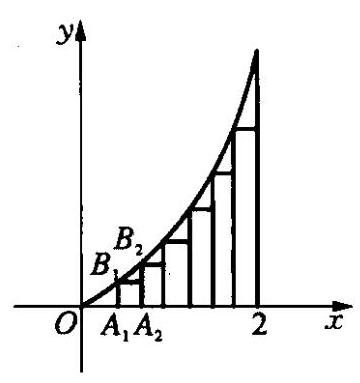

图 10-3

例 6 如图 10-3,求抛物线弧 $y = {x}^{2}(0 \leq \; x \leq  2)$ 与 $x$ 轴及直线 $x = 2$ 所围成的封闭图形的面积.

解 把区间 $\left\lbrack  {0,2}\right\rbrack$ 进行 $n$ 等分,分别过分点 ${A}_{i}\left( {i = 1,2,3,\cdots , n - 1}\right)$ 作 $x$ 轴的垂线,交抛物线于 ${B}_{i}$ ,如图作 $n - 1$ 个矩形. 先求这 $n - 1$ 个矩形的面积和 ${S}_{n - 1}$ ,再求 $\mathop{\lim }\limits_{{n \rightarrow  \infty }}{S}_{n - 1}$ ,即是封闭图形的面积.

因为每个矩形的宽为 $\frac{2}{n}$ ,于是 ${A}_{i}$ 的坐标为 $\left( {\frac{2}{n} \cdot  i,0}\right)$ ,则 ${B}_{i}$ 的坐标为 $\left( {\frac{2}{n} \cdot  i,\frac{4 \cdot  {i}^{2}}{{n}^{2}}}\right)$ ,所以矩形的长为

$$
{A}_{i}{B}_{i} = \frac{4 \cdot  {i}^{2}}{{n}^{2}}
$$

$$
{S}_{n - 1} = \frac{2}{n}\left\lbrack  {\frac{4 \cdot  {1}^{2}}{{n}^{2}} + \frac{4 \cdot  {2}^{2}}{{n}^{2}} + \frac{4 \cdot  {3}^{2}}{{n}^{2}} + \cdots  + \frac{4 \cdot  {\left( n - 1\right) }^{2}}{{n}^{2}}}\right\rbrack
$$

$$
= \frac{8}{{n}^{3}}\left\lbrack  {{1}^{2} + {2}^{2} + {3}^{2} + \cdots  + {\left( n - 1\right) }^{2}}\right\rbrack
$$

$$
= \frac{8}{{n}^{3}} \cdot  \frac{n\left( {n - 1}\right) \left( {{2n} - 1}\right) }{6}\text{ . }
$$

所以封闭图形的面积为

$$
\mathop{\lim }\limits_{{n \rightarrow  \infty }}{S}_{n - 1} = \mathop{\lim }\limits_{{n \rightarrow  \infty }}\frac{{8n}\left( {n - 1}\right) \left( {{2n} - 1}\right) }{6{n}^{3}} = \frac{8}{3}.
$$

课堂活动 1. 判断下面计算是否正确,并说明理由:

。大家欢

$$
\mathop{\lim }\limits_{{n \rightarrow  \infty }}\left( {\frac{1}{{n}^{2}} + \frac{4}{{n}^{2}} + \frac{7}{{n}^{2}} + \cdots  + \frac{{3n} - 2}{{n}^{2}}}\right)
$$

$$
= \mathop{\lim }\limits_{{n \rightarrow  \infty }}\frac{1}{{n}^{2}} + \mathop{\lim }\limits_{{n \rightarrow  \infty }}\frac{4}{{n}^{2}} + \mathop{\lim }\limits_{{n \rightarrow  \infty }}\frac{7}{{n}^{2}} + \cdots  + \mathop{\lim }\limits_{{n \rightarrow  \infty }}\left( \frac{{3n} - 2}{{n}^{2}}\right)
$$

$$
= 0 + 0 + 0 + \cdots  + 0 = 0.
$$

2. 判断下面问题的解答过程是否正确, 并说明理由:

已知数列 $\left\{  {x}_{n}\right\}  ,\left\{  {y}_{n}\right\}$ 满足 $\mathop{\lim }\limits_{{n \rightarrow  \infty }}\left( {2{x}_{n} + {y}_{n}}\right)  = 1$ , $\mathop{\lim }\limits_{{n \rightarrow  \infty }}\left( {{x}_{n} - }\right. \; \left. {2{y}_{n}}\right)  = 1$ ,求 $\mathop{\lim }\limits_{{n \rightarrow  \infty }}\left( {{x}_{n} \cdot  {y}_{n}}\right)$ 的值.

解 因为 $\mathop{\lim }\limits_{{n \rightarrow  \infty }}\left( {2{x}_{n} + {y}_{n}}\right)  = 2\mathop{\lim }\limits_{{n \rightarrow  \infty }}{x}_{n} + \mathop{\lim }\limits_{{n \rightarrow  \infty }}{y}_{n} = 1$ ,①

$$
\mathop{\lim }\limits_{{n \rightarrow  \infty }}\left( {{x}_{n} - 2{y}_{n}}\right)  = \mathop{\lim }\limits_{{n \rightarrow  \infty }}{x}_{n} - 2\mathop{\lim }\limits_{{n \rightarrow  \infty }}{y}_{n} = 1
$$

②

① $\times  2 +$ ②: $5\mathop{\lim }\limits_{{n \rightarrow  \infty }}{x}_{n} = 3,\mathop{\lim }\limits_{{n \rightarrow  \infty }}{x}_{n} = \frac{3}{5}$ ; ①-② $\times  2$ :

$5\mathop{\lim }\limits_{{n \rightarrow  \infty }}{y}_{n} =  - 1,\mathop{\lim }\limits_{{n \rightarrow  \infty }}{y}_{n} =  - \frac{1}{5}.$

所以 $\mathop{\lim }\limits_{{n \rightarrow  \infty }}\left( {{x}_{n} \cdot  {y}_{n}}\right)  =  - \frac{3}{25}$ .

请总结数列极限问题的常见类型及计算技巧.

、自己想

课外活动

·自己学

## 数列极限的 $\varepsilon  - N$ 定义

前面学习了数列极限的描述性定义, 尽管它很直观且通俗易懂,但不能精确的描述极限的过程,首先它仅是形象表述, 不符合数学的严密性与简洁性, 其次把它作为定义不利于证明其他命题，证明过程也无法表述. 因此，我们需要的是清楚，简洁的数学表达形式. 下面介绍数列极限的严格定义:

设 $\left\{  {a}_{n}\right\}$ 是一个数列, $A$ 是一个确定的常数,若对任给定的正数 $\varepsilon$ ,总存在一个正整数 $N$ ,使得当 $n > N$ 时,都有 $\left| {{a}_{n} - A}\right|  < \varepsilon$ ,则称数列 $\left\{  {a}_{n}\right\}$ 的极限是 $A$ 或者说数列 $\left\{  {a}_{n}\right\}$ 收敛于 $A$ ,记作 $\mathop{\lim }\limits_{{n \rightarrow  \infty }}{a}_{n} = A$ .

例如用 $\varepsilon  - N$ 定义证明 $\mathop{\lim }\limits_{{n \rightarrow  \infty }}\frac{3{n}^{2} + n}{2{n}^{2} - 1} = \frac{3}{2}$ : 对任意 $\varepsilon  > 0$ ,若要

$$
\left| {\frac{3{n}^{2} + n}{2{n}^{2} - 1} - \frac{3}{2}}\right|  < \varepsilon \text{ ,由 }\left| {\frac{3{n}^{2} + n}{2{n}^{2} - 1} - \frac{3}{2}}\right|  = \frac{n + \frac{3}{2}}{2{n}^{2} - 1} = \frac{n + \frac{3}{2}}{{n}^{2} + \left( {{n}^{2} - 1}\right) } <
$$

$\frac{2n}{{n}^{2}} = \frac{2}{n}\left( {n > 1}\right)$ ,只要 $\frac{2}{n} < \varepsilon  \Leftrightarrow  n > \frac{2}{\varepsilon }$ ,取 $N = \max \left( {\frac{2}{\varepsilon },1}\right)$ ,则当 $n > \; N$ 时, $\left| {\frac{3{n}^{2} + n}{2{n}^{2} - 1} - \frac{3}{2}}\right|  < \varepsilon$ ,所以 $\mathop{\lim }\limits_{{n \rightarrow  \infty }}\frac{3{n}^{2} + n}{2{n}^{2} - 1} = \frac{3}{2}$ .

课外活动一日之次

早在公元 3 世纪，魏晋之际的杰出数学家刘徽，在计算圆周率方面，作出了非常突出的贡献. 他在为古代数学名著《九章算术》作注时，经过深入研究，发现圆内接正多边形边数无限增加的时候, 多边形周长无限逼近圆周长, 从而创立割圆术, 为计算圆周率和圆面积建立起相当严密的理论和完善的算法.

请通过网络和图书资料查找有关数列极限在面积计算中应用的史料.

习题练习

一百一步

1. 计算:

(1) $\mathop{\lim }\limits_{{n \rightarrow  \infty }}\frac{\left( {{2n} + 1}\right) \left( {3{n}^{2} - 2}\right) }{4{n}^{3} - 5{n}^{2} + {6n} - 7}$ ;

(2) $\mathop{\lim }\limits_{{n \rightarrow  \infty }}\left( {\frac{1}{{n}^{2} + 1} + \frac{2}{{n}^{2} + 1} + \frac{3}{{n}^{2} + 1} + \cdots  + \frac{2n}{{n}^{2} + 1}}\right)$ ;

(3) $\mathop{\lim }\limits_{{n \rightarrow  \infty }}\left( {1 + \frac{1}{1 + 2} + \frac{1}{1 + 2 + 3} + \cdots  + \frac{1}{1 + 2 + 3 + \cdots  + n}}\right)$ ;

(4) $\mathop{\lim }\limits_{{n \rightarrow  \infty }}\left( {1 - \frac{1}{{2}^{2}}}\right) \left( {1 - \frac{1}{{3}^{2}}}\right) \left( {1 - \frac{1}{{4}^{2}}}\right) \cdots \left( {1 - \frac{1}{{n}^{2}}}\right)$ ;

(5) $\mathop{\lim }\limits_{{n \rightarrow  \infty }}{n}^{2}\left\lbrack  {\frac{100}{n} - \left( {\frac{1}{n + 1} + \frac{1}{n + 2} + \cdots  + \frac{1}{n + {100}}}\right) }\right\rbrack$ ;

(6) $\mathop{\lim }\limits_{{n \rightarrow  \infty }}\frac{1 + 3 + {3}^{2} + \cdots  + {3}^{n}}{{3}^{n} + {a}^{n + 1}}$ ;

(7) $\mathop{\lim }\limits_{{n \rightarrow  \infty }}{\left( \frac{{2n} + 3}{{2n} + 1}\right) }^{{4n} - 1}$ ;

(8) $\mathop{\lim }\limits_{{n \rightarrow  \infty }}\left\lbrack  {\left( {1 + \frac{1}{2}}\right) \left( {1 + \frac{1}{{2}^{2}}}\right) \left( {1 + \frac{1}{{2}^{4}}}\right) \cdots \left( {1 + \frac{1}{{2}^{{2}^{n - 1}}}}\right) }\right\rbrack$ .

2. (1) 已知 $\mathop{\lim }\limits_{{n \rightarrow  \infty }}\frac{{4}^{n}}{{4}^{n + 2} + {\left( m + 2\right) }^{n}} = \frac{1}{16}$ ,求实数 $m$ 的取值范围;

(2)已知 $\mathop{\lim }\limits_{{n \rightarrow  \infty }}\left( {{2n} - \sqrt{4{n}^{2} + {kn} + 3}}\right)  = 1$ ,求实数 $k$ 的取值范围.

3. ( 1 )若数列 $\left\{  {a}_{n}\right\}$ 与 $\left\{  {b}_{n}\right\}$ 满足 $\mathop{\lim }\limits_{{n \rightarrow  \infty }}\left( {{a}_{n} + {b}_{n}}\right)  = 2$ ， $\mathop{\lim }\limits_{{n \rightarrow  \infty }}\left( {{a}_{n} - {b}_{n}}\right)  = 1$ ， 求 $\mathop{\lim }\limits_{{n \rightarrow  \infty }}\frac{{a}_{n}}{{b}_{n}}$ 的值;

(2)若 $\mathop{\lim }\limits_{{n \rightarrow  \infty }}{2n}{a}_{n} = 1$ ，求 $\mathop{\lim }\limits_{{n \rightarrow  \infty }}\left( {1 - n}\right) {a}_{n}$ 的值；(3)若 $\mathop{\lim }\limits_{{n \rightarrow  \infty }}{\left( \frac{n}{n + 2}\right) }^{{an} + b} = \; {\mathrm{e}}^{-3}$ ,求 $a, b$ 的值.

4.(1)数列 $\left\{  {a}_{n}\right\}$ 、 $\left\{  {b}_{n}\right\}$ 均是公差不为0的等差数列，且 $\mathop{\lim }\limits_{{n \rightarrow  \infty }}\frac{{a}_{n}}{{b}_{n}} = 3$ ,则 $\mathop{\lim }\limits_{{n \rightarrow  \infty }}\frac{{b}_{1} + {b}_{2} + \cdots  + {b}_{n}}{n{a}_{2n}}$

(2)已知数列 $\left\{  {a}_{n}\right\}$ 是首项为 1，公比为 $q$ 的等比数列，记 ${S}_{n}$ 为其前 $n$ 项和,求 $\mathop{\lim }\limits_{{n \rightarrow  \infty }}\frac{{S}_{n}}{{S}_{n + 1}}$ .

5. 已知数列 $\left\{  {a}_{n}\right\}$ 满足条件: ${a}_{1} = 1,{a}_{2} = r\left( {r > 0}\right)$ ,且 $\left\{  {{a}_{n}{a}_{n + 1}}\right\}$ 是公比为 $q\left( {q > 0}\right)$ 的等比数列. 设 ${b}_{n} = {a}_{{2n} - 1} + {a}_{2n}\left( {n = 1,2,\cdots }\right)$ ,求 ${b}_{n}$ 与 $\mathop{\lim }\limits_{{n \rightarrow  \infty }}\frac{1}{{S}_{n}}$ ,其中 ${S}_{n} = {b}_{1} + {b}_{2} + \cdots  + {b}_{n}$ .

6. 已知数列 $\left\{  {a}_{n}\right\}$ 是首项为 1,公差为 $d$ 的等差数列,其前 $n$ 项的和为 ${A}_{n}$ ; 数列 $\left\{  {b}_{n}\right\}$ 是首项为 1,公比为 $q\left( {\left| q\right|  < 1}\right)$ 的等比数列,其前 $n$ 项和为 ${B}_{n}$ ,设 ${S}_{n} = {B}_{1} + {B}_{2} + {B}_{3} + \cdots  + {B}_{n}$ ,若 $\mathop{\lim }\limits_{{n \rightarrow  \infty }}\left( {\frac{{A}_{n}}{n} - {S}_{n}}\right)  = 1$ ,求 $d$ 和 $q$ .

7. 设 ${A}_{n}$ 是数列 $\left\{  {a}_{n}\right\}$ 的前 $n$ 项和, ${A}_{n} = \frac{3}{2}{a}_{n} - \frac{3}{2}\left( {n \in  {\mathbf{N}}^{ * }}\right)$ ,数列 $\left\{  {b}_{n}\right\}$ 的通项公式为 ${b}_{n} = {4n} + 3\left( {n \in  {\mathbf{N}}^{ * }}\right)$ .

(1)求数列 $\left\{  {a}_{n}\right\}$ 的通项公式；

(2)将数列 $\left\{  {a}_{n}\right\}$ 与 $\left\{  {b}_{n}\right\}$ 的公共项，按它们在原数列中的先后顺序排成一个新数列 $\left\{  {c}_{n}\right\}$ ,求 $\left\{  {c}_{n}\right\}$ 的通项公式;

(3)设数列 $\left\{  {c}_{n}\right\}$ 中的第 $n$ 项是数列 $\left\{  {b}_{n}\right\}$ 中的第 $r$ 项， ${B}_{r}$ 为数列 $\left\{  {b}_{n}\right\}$ 的前 $r$ 项的和, ${D}_{n}$ 为 $\left\{  {c}_{n}\right\}$ 的前 $n$ 项和, ${T}_{n} = {B}_{r} - {D}_{n}$ ,求 $\mathop{\lim }\limits_{{n \rightarrow  \infty }}\frac{{T}_{n}}{{a}_{n}^{4}}$ .

8. 某公司全年的纯利润为 $b$ 元,其中一部分作为奖金发给 $n$ 位职工. 奖金分配方案如下:首先将职工按工作业绩(工作业绩均不相同)从大到小,由 1 至 $n$ 排序,第 1 位职工得奖金 $\frac{b}{n}$ 元,然后再将余额除以 $n$ 发给第 2 位职工，按此方法将奖金逐一发给每位职工. 并将最后剩余部分作为公司发展基金.

(1)设 ${a}_{k}\left( {1 \leq  k \leq  n}\right)$ 为第 $k$ 位职工所得奖金额，试求 ${a}_{2}$ 、 ${a}_{3}$ ，并用 $k$ 、 $n$ 和 $b$ 表示 ${a}_{k}$ ; (不必证明)

(2)证明 ${a}_{k} > {a}_{k + 1}\left( {k = 1,2,\cdots , n - 1}\right)$ ，并解释此不等式关于分配原则的实际意义;

(3)发展基金与 $n$ 和 $b$ 有关，记为 ${P}_{n}\left( b\right)$ . 对常数 $b$ ，当 $n$ 变化时，求 $\mathop{\lim }\limits_{{n \rightarrow  \infty }}{P}_{n}\left( b\right)$ .

### 10.7 无穷等比数列各项的和 (Infinite Geometric Series)

我们知道 $0.\dot{3} = \frac{1}{3}$ ,下面用极限的知识来解释它的意义.

因为 $0.\dot{3} = {0.3} + {0.03} + {0.003} + \cdots  + 0.\underset{n - 1\text{ 个 }}{\underbrace{0\cdots 0}}3 + \cdots$ ,而0.3,0.03,

${0.003},\cdots ,0.\underset{n - 1\text{ 个 }}{\underbrace{0\cdots 0}}3,\cdots$ 是以 0.3 为首项,以 $\frac{1}{10}$ 为公比的无穷等比数列,

它的前 $n$ 项和为

$$
{S}_{n} = {0.3} + {0.03} + {0.003} + \cdots  + {0.}\underset{n - 1\text{ 个 }}{\underbrace{0\cdots {03}}}
$$

$$
= \frac{{0.3}\left\lbrack  {1 - {\left( \frac{1}{10}\right) }^{n}}\right\rbrack  }{1 - \frac{1}{10}} = \frac{1}{3}\left\lbrack  {1 - {\left( \frac{1}{10}\right) }^{n}}\right\rbrack  .
$$

于是可以把 0.3 看作 ${S}_{n}$ 当 $n \rightarrow  \infty$ 时的极限,即

$$
\text{ 0. }\dot{3} = \mathop{\lim }\limits_{{n \rightarrow  \infty }}{S}_{n} = \mathop{\lim }\limits_{{n \rightarrow  \infty }}\frac{1}{3}\left\lbrack  {1 - {\left( \frac{1}{10}\right) }^{n}}\right\rbrack   = \frac{1}{3}\left\lbrack  {\mathop{\lim }\limits_{{n \rightarrow  \infty }}1 - \mathop{\lim }\limits_{{n \rightarrow  \infty }}{\left( \frac{1}{10}\right) }^{n}}\right\rbrack   = \frac{1}{3}\text{ . }
$$

所以 $0.\dot{3} = \frac{1}{3}$ .

一般地,我们来讨论公比 $q$ 的绝对值小于 1 的无穷等比数列 $\left\{  {a}_{n}\right\}$ 的前 $n$ 项和的极限.

当 $\left| q\right|  < 1$ 时,它的前 $n$ 项和为 ${S}_{n} = \frac{{a}_{1}\left( {1 - {q}^{n}}\right) }{1 - q}$ ,

$$
\mathop{\lim }\limits_{{n \rightarrow  \infty }}{S}_{n} = \mathop{\lim }\limits_{{n \rightarrow  \infty }}\frac{{a}_{1}\left( {1 - {q}^{n}}\right) }{1 - q} = \mathop{\lim }\limits_{{n \rightarrow  \infty }}\frac{{a}_{1}}{1 - q} \cdot  \mathop{\lim }\limits_{{n \rightarrow  \infty }}\left( {1 - {q}^{n}}\right)
$$

$$
= \frac{{a}_{1}}{1 - q} \cdot  \left( {\mathop{\lim }\limits_{{n \rightarrow  \infty }}1 - \mathop{\lim }\limits_{{n \rightarrow  \infty }}{q}^{n}}\right) .
$$

因为 $0 < \left| q\right|  < 1,\mathop{\lim }\limits_{{n \rightarrow  \infty }}{q}^{n} = 0$ ,所以 $\mathop{\lim }\limits_{{n \rightarrow  \infty }}{S}_{n} = \frac{{a}_{1}}{1 - q}$ .

我们把公比 $q$ 满足 $\left| q\right|  < 1$ 的无穷等比数列 $\left\{  {a}_{n}\right\}$ 的前 $n$ 项和 ${S}_{n} = \; \frac{{a}_{1}\left( {1 - {q}^{n}}\right) }{1 - q}$ 当 $n \rightarrow  \infty$ 时的极限叫做无穷等比数列各项的和,并用符号 $S$ 表示，即 $S = \frac{{a}_{1}}{1 - q}\left( {\left| q\right|  < 1}\right)$ .

例 1 化下列循环小数为分数: (1) ${2.1}\dot{3};\;\left( 2\right) {1.1}\dot{3}2\dot{1}$ .

解 (1) ${2.1}\dot{3} = 2 + \frac{13}{100} + \frac{13}{10000} + \cdots  + \frac{13}{{10}^{2n}} + \cdots$

$$
= 2 + \frac{\frac{13}{100}}{1 - \frac{1}{100}} = 2 + \frac{13}{99} = 2\frac{13}{99};
$$

(2) ${1.1}\dot{321} = {1.1} + \frac{321}{{10}^{4}} + \frac{321}{{10}^{7}} + \frac{321}{{10}^{10}} + \cdots  + \frac{321}{{10}^{{3n} + 1}} + \cdots$

$$
= {1.1} + \frac{\frac{321}{10000}}{1 - \frac{1}{{10}^{3}}} = 1\frac{1320}{9990} = 1\frac{44}{333}.
$$

例 2 已知无穷等比数列 $\left\{  {a}_{n}\right\}$ 的各项和是 $\frac{1}{2}$ ,求首项 ${a}_{1}$ 的取值范围.

解 设无穷等比数列 $\left\{  {a}_{n}\right\}$ 的公比为 $q$ . 由题设得 $\frac{{a}_{1}}{1 - q} = \frac{1}{2}$ , 所以 $q = 1 - 2{a}_{1}$ .

又因为 $0 < \left| \dot{q}\right|  < 1$ ,即 $0 < \left| {1 - 2{a}_{1}}\right|  < 1$ . 所以

$$
0 < 4{a}_{1}^{2} - 4{a}_{1} + 1 < 1,0 < {a}_{1} < 1\text{ 且 }{a}_{1} \neq  \frac{1}{2}.
$$

例 3 . 如图 10-4,在边长为 $a$ 的正 $\bigtriangleup {A}_{1}{B}_{1}{C}_{1}$ 内作内切且互切的三个等圆,连结这三个等圆的圆心,得到一个正 $\bigtriangleup {A}_{2}{B}_{2}{C}_{2}$ ; 在正 $\bigtriangleup {A}_{2}{B}_{2}{C}_{2}$ 内再作内切且互切的三个等圆, 连结这三个等圆的圆心, 又得到一个正三角形; 如此继续下去,得到一个正三角形序列,求所有这些正三角形的面积和 $S$ .

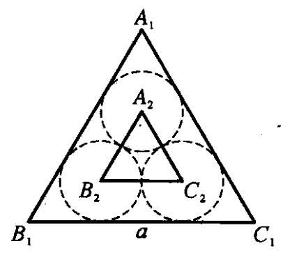

图 10-4

解 令 ${S}_{n}$ 表示 $\bigtriangleup {A}_{n}{B}_{n}{C}_{n}$ 的面积, ${a}_{n}$ 表示 $\bigtriangleup {A}_{n}{B}_{n}{C}_{n}$ 的边长,则

$$
{S}_{n} = \frac{\sqrt{3}}{4}{a}_{n}^{2}\left( {n = 1,2,3,\cdots }\right) .
$$

因为 ${a}_{n} + 2 \cdot  \frac{{a}_{n}}{2}\cot {30}^{ \circ  } = {a}_{n - 1}$ 所以,

$$
{a}_{n} = \frac{{a}_{n - 1}}{1 + \sqrt{3}}
$$

因此, $\;\frac{{S}_{n}}{{S}_{n - 1}} = \frac{{a}_{n}^{2}}{{a}_{n - 1}^{2}} = \frac{{\left( \frac{{a}_{n - 1}}{1 + \sqrt{3}}\right) }^{2}}{{a}_{n - 1}^{2}} = \frac{1}{{\left( 1 + \sqrt{3}\right) }^{2}}$ .

又因为 ${S}_{1} = \frac{\sqrt{3}}{4}{a}^{2}$ ,所以正三角形的面积的各项和为

$$
S = {S}_{1} + {S}_{2} + {S}_{3} + \cdots  = \frac{\sqrt{3}}{4}{a}^{2}\left\lbrack  {1 + \frac{1}{{\left( 1 + \sqrt{3}\right) }^{2}} + \frac{1}{{\left( 1 + \sqrt{3}\right) }^{4}} + \cdots }\right\rbrack
$$

$$
= \frac{\sqrt{3}}{4}{a}^{2} \cdot  \frac{1}{1 - \frac{1}{{\left( 1 + \sqrt{3}\right) }^{2}}} = \frac{1}{2}{a}^{2}.
$$

故所求的这些正三角形的面积和 $S = \frac{1}{2}{a}^{2}$ .

例 4 某县临海，县政府计划从今年起填海造地，为了寻求合理的计划方案，需要研究以下问题:

(1)已知排水设备所需经费与当年所填海造地的面积 $x$ (亩)的平方成正比，其比例系数为 $a$ . 又知每亩水面的年平均经济收益为 $b$ 元，填海造地后的每亩土地的年平均经济收益为 $c$ 元(其中 $a, b, c$ 均为常数). 若使得今年的收益不小于支出,试求所填面积 $x$ 的最大值.

(2)如果以每年 1%的速度减少填海造地的新增面积，且可填海造地的海面面积的理论值是 $m$ ,若填海造地的实际总面积永远不能超过可开发海面面积的 $\frac{1}{4}$ ，求今年填海造地的面积最多只能占现有水面的百分之几?

解 (1) 收入不小于支出的条件可以表示为: ${cx} - \left( {a{x}^{2} + {bx}}\right)  \geq  0$ , 即 $a{x}^{2} + \left( {b - c}\right) x \leq  0, x\left\lbrack  {{ax} - \left( {c - b}\right) }\right\rbrack   \leq  0$ ,

当 $c - b \leq  0$ 时, $\frac{c - b}{a} \leq  x \leq  0$ ,此时不能填海造地;

当 $c - b > 0$ 时， $0 \leq  x \leq  \frac{c - b}{a}$ ，此时所填面积的最大值为 $\frac{c - b}{a}$ 亩.

(2)设今年填海造地的面积为 $x$ 亩,则

$$
x + \left( {1 - 1\% }\right) x + {\left( 1 - 1\% \right) }^{2}x + \cdots  + {\left( 1 - 1\% \right) }^{n}x + \cdots  \leq  \frac{m}{4},
$$

不等式左边是无穷等比数列的所有项之和,故有 $\frac{x}{1 - {0.99}} \leq  \frac{m}{4}$ ,即

$$
x \leq  \frac{m}{400} = {0.25}\% m
$$

所以今年填海造地的面积最多只能占到可开发海面面积的 0.25% .

例 5 如图 10-5,在大沙漠上进行勘测工作时,先选定一点作为坐标原点,然后采用如下方法进行: 从原点出发,在 $x$ 轴上向正方向前进 $a\left( {a > 0}\right)$ 个单位后,向左转 ${90}^{ \circ  }$ ,前进 ${ar}\left( {0 < r < 1}\right)$ 个单位,再向左转 ${90}^{ \circ  }$ , 又前进 $a{r}^{2}$ 个单位……如此连续下去.

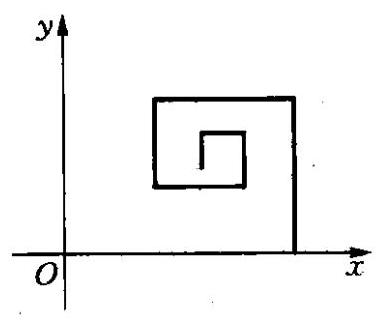

图 10-5

(1)若有一小分队出发后与设在原点处的大本营失去联系，且可以断定此小分队的行动与原定方案相同，则大本营在何处寻找小分队？

(2)若其中的 $r$ 为变量，且 $0 < r < 1$ ，则行动的最终目的地在怎样的一条曲线上?

解 (1) 由条件可知，即求这样运动的极限点,设运动的极限位置为 $Q\left( {x, y}\right)$ ,则

$$
x = a - a{r}^{2} + a{r}^{4} - \cdots , y = {ar} - a{r}^{3} + a{r}^{5} - \cdots ,
$$

这是两个无穷等比数列求所有项和的问题,所以

$$
x = a - a{r}^{2} + a{r}^{4} - \cdots  = \frac{a}{1 - \left( {-{r}^{2}}\right) } = \frac{a}{1 + {r}^{2}},
$$

$$
y = {ar} - a{r}^{3} + a{r}^{5} - \cdots  = \frac{ar}{1 + {r}^{2}},
$$

即大本营应在点 $\left( {\frac{a}{1 + {r}^{2}},\frac{ar}{1 + {r}^{2}}}\right)$ 附近去寻找小分队.

(2)由 $\left\{  \begin{array}{l} x = \frac{a}{1 + {r}^{2}}, \\  y = \frac{ar}{1 + {r}^{2}}, \end{array}\right.$ 消去 $r$ 得 ${\left( x - \frac{a}{2}\right) }^{2} + {y}^{2} = \frac{{a}^{2}}{4}$ ,因为 $0 < r <$ 1,所以 $x > \frac{a}{2}, y > 0$ ,所以 $\sqrt{{\left( x - \frac{a}{2}\right) }^{2} + {y}^{2}} = \frac{a}{2}$ ,所以行动位置 $Q\left( {x, y}\right)$ 到位置 $\left( {\frac{a}{2},0}\right)$ 的距离保持 $\frac{a}{2}$ 不变,即行动的最终目的地在以 $\left( {\frac{a}{2},0}\right)$ 为圆心, $\frac{a}{2}$ 为半径的圆上.

课堂活动

·大家快

1. 有限个数的和与无限个数的和的意义有什么不同?

2. 计算 $\mathop{\lim }\limits_{{n \rightarrow  \infty }}\frac{1 + q + {q}^{2} + \cdots  + {q}^{n}}{1 - q + {q}^{2} + \cdots  + {\left( -1\right) }^{n}{q}^{n}} = \; \frac{\overline{1 - q}}{1} = \frac{1 + q}{1 - q}$ 正确吗?为什么?

课堂活动

、自己想

古希腊学者芝诺(Zenon，约公元前 496 一前 429)曾提出一个著名的“追龟”问题. 大家知道，鸟龟素以动作迟缓著称，阿基里斯则是古希腊传说中的英雄和擅跑的神. 芝诺断言: 阿基里斯与龟赛跑, 将永远追不上乌龟！理由是:假定阿基里斯现在 $A$ 处，乌龟在其前方 $T$ 处. 为了赶上乌龟，阿基里斯先跑到乌龟的出发点 $T$ ，当他到达 $T$ 点时， 乌龟已前进到 ${T}_{1}$ 点,当他到达 ${T}_{1}$ 点时,乌龟又已前进到 ${T}_{2}$ 点, 如此等等. 当阿基里斯每次到达乌龟前次到达过的地方, 乌龟已又向前爬动了一段距离. 因此, 阿基里斯是永远追不上乌龟的!

你同意他的结论吗? 为什么?

课外活动

、自己学

## 数列级数

类比无穷等比数列各项和, 可以定义任意数列各项的和.

定义 1 已知数列 $\left\{  {u}_{n}\right\}$ ,则 ${u}_{1} + {u}_{2} + \cdots  + {u}_{n} + \cdots$ 称为级数,记为 $\mathop{\sum }\limits_{{n = 1}}^{\infty }{u}_{n}$ ,即

$$
\mathop{\sum }\limits_{{n = 1}}^{\infty }{u}_{n} = {u}_{1} + {u}_{2} + \cdots  + {u}_{n} + \cdots ,
$$

其中 ${u}_{n}$ 叫做级数的第 $n$ 项,也称为通项.

例如,波尔察诺级数: $1 - 1 + 1 - 1 + \cdots ,{u}_{n} = {\left( -1\right) }^{n + 1}$ ,即

$$
1 - 1 + 1 - 1 + \cdots  = \mathop{\sum }\limits_{{n = 1}}^{\infty }{\left( -1\right) }^{n + 1}.
$$

设 $x = 1 - 1 + 1 - 1 + \cdots$ ,则

$$
x = \left( {1 - 1}\right)  + \left( {1 - 1}\right)  + \cdots  = 0;
$$

$$
x = 1 - \left( {1 - 1}\right)  - \left( {1 - 1}\right)  - \cdots  = 1;
$$

$$
x = 1 - \left( {1 - 1 + 1 - 1 + \cdots }\right)  = 1 - x \Rightarrow  x = \frac{1}{2}.
$$

结果不唯一, 这与我们对有限个数的和的认识是矛盾的, 因此, 定义无穷多个数的和就显得非常重要了.

定义 2 级数的前 $n$ 项的和 $\mathop{\sum }\limits_{{k = 1}}^{n}{u}_{k} = {u}_{1} + {u}_{2} + \cdots  + {u}_{n}$ 称为级数的 $n$ 项部分和,记作 ${S}_{n}$ .

定义 3 若级数 $\mathop{\sum }\limits_{{n = 1}}^{\infty }{u}_{n}$ 的部分和数列 $\left\{  {S}_{n}\right\}$ 收敛于 $S$ ,即 $\mathop{\lim }\limits_{{n \rightarrow  \infty }}{S}_{n} = S$ , 或 $\mathop{\lim }\limits_{{n \rightarrow  \infty }}\mathop{\sum }\limits_{{k = 1}}^{n}{u}_{n} = S$ ,则称级数 $\mathop{\sum }\limits_{{n = 1}}^{\infty }{u}_{n}$ 收敛,极限 $S$ 叫做这个级数的和,表示为 $S = \mathop{\sum }\limits_{{n = 1}}^{\infty }{u}_{n} = {u}_{1} + {u}_{2} + \cdots  + {u}_{n} + \cdots$ .

若部分和数列 $\left\{  {S}_{n}\right\}$ 没有极限,则称级数 $\mathop{\sum }\limits_{{n = 1}}^{\infty }{u}_{n}$ 发散. 此时,级数没有和.

例如: 对于级数 $\frac{1}{1 \cdot  6} + \frac{1}{6 \cdot  {11}} + \frac{1}{{11} \cdot  {16}} + \cdots  + \frac{1}{\left( {{5n} - 4}\right)  \cdot  \left( {{5n} + 1}\right) } + \cdots$ .

因为 ${u}_{n} = \frac{1}{\left( {{5n} - 4}\right)  \cdot  \left( {{5n} + 1}\right) } = \frac{1}{5}\left\lbrack  {\frac{1}{{5n} - 4} - \frac{1}{{5n} + 1}}\right\rbrack$ ,所以

$$
{S}_{n} = \frac{1}{1 \cdot  6} + \frac{1}{6 \cdot  {11}} + \cdots  + \frac{1}{\left( {{5n} - 4}\right)  \cdot  \left( {{5n} + 1}\right) }
$$

$$
= \frac{1}{5}\left\lbrack  {\left( {1 - \frac{1}{6}}\right)  + \left( {\frac{1}{6} - \frac{1}{11}}\right)  + \left( {\frac{1}{11} - \frac{1}{16}}\right)  + \cdots  + }\right.
$$

$$
\left. \left( {\frac{1}{{5n} - 4} - \frac{1}{{5n} + 1}}\right) \right\rbrack
$$

$$
= \frac{1}{5}\left( {1 - \frac{1}{{5n} + 1}}\right) \text{ . }
$$

于是 $\mathop{\lim }\limits_{{n \rightarrow  \infty }}{S}_{n} = \mathop{\lim }\limits_{{n \rightarrow  \infty }}\frac{1}{5}\left( {1 - \frac{1}{{5n} + 1}}\right)  = \frac{1}{5}$ ,所以级数是收敛的.

无穷级数有很多有趣的性质,例如我们所熟知的无理数 $\pi$ 和 $\mathrm{e}$ ,也是某些级数的和, 如

$$
\pi  = 4\left( {1 - \frac{1}{3} + \frac{1}{5} - \frac{1}{7} + \frac{1}{9} - \frac{1}{11} + \cdots }\right) ,
$$

$$
e = 1 + \frac{1}{1!} + \frac{1}{2!} + \frac{1}{3!} + \frac{1}{4!} + \cdots ,
$$

$$
\left( {n! = n \cdot  \left( {n - 1}\right)  \cdot  \left( {n - 2}\right)  \cdot  \cdots  \cdot  3 \cdot  2 \cdot  1}\right) .
$$

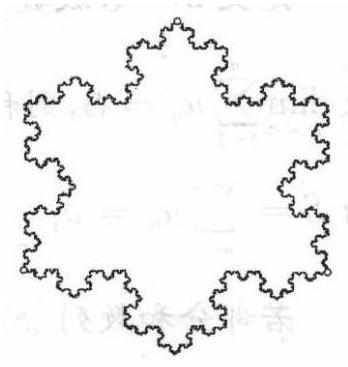

图 10-6

课外活动自己投

如图 10-6,你知道这样的图形是怎样生成的吗? 它就是著名的科克雪花曲线 (koch snowflake). 快去查一查相关资料吧, 你将进入一个神秘而美妙的“分形”世界.

习题练习

自己先

1. $0.\dot{7} + {2.23}\dot{8} =$ ___.

2. 计算: (1) $\mathop{\lim }\limits_{{n \rightarrow  \infty }}\frac{1 + \frac{1}{2} + \frac{1}{{2}^{2}} + \cdots  + \frac{1}{{2}^{n}}}{1 - \frac{1}{2} + \frac{1}{{2}^{2}} + \cdots  + {\left( -1\right) }^{n}\frac{1}{{2}^{n}}}$ ;

(2) $\mathop{\lim }\limits_{{n \rightarrow  \infty }}\left( {\frac{2 + 3}{6} + \frac{{2}^{2} + {3}^{2}}{{6}^{2}} + \cdots  + \frac{{2}^{n} + {3}^{n}}{{6}^{n}}}\right)$ .

3. 等比数列 $\left\{  {a}_{n}\right\}$ 的首项为 ${a}_{1} =  - 1$ ,前 $n$ 项和为 ${S}_{n}$ . 且 $\frac{{S}_{10}}{{S}_{5}} = \frac{31}{32}$ ,则 $\mathop{\lim }\limits_{{n \rightarrow  \infty }}{S}_{n} =$ . ___.

4. 无穷等比数列 $\left\{  {a}_{n}\right\}$ 的所有项的和是 9,各项平方和是 27,则此数列的公比 $q =$ ___.

5. 在等比数列 $\left\{  {a}_{n}\right\}$ 中, ${a}_{1} > 1$ ,且前 $n$ 项和 ${S}_{n}$ 满足 $\mathop{\lim }\limits_{{n \rightarrow  \infty }}{S}_{n} = \frac{1}{{a}_{1}}$ ,则 ${a}_{1}$ 的取值范围是___.

6. 已知等比数列 $\left\{  {a}_{n}\right\}$ 的首项为 ${a}_{1}$ ,公比为 $q$ ,且 $\mathop{\lim }\limits_{{n \rightarrow  \infty }}\left( {\frac{{a}_{1}}{1 + q} - {q}^{n}}\right)  = \; \frac{1}{2}$ ,求首项 ${a}_{1}$ 的取值范围.

7. 数列 $\left\{  {a}_{n}\right\}$ 的前 $n$ 项和记为 ${S}_{n}$ ,已知 ${a}_{n} = 5{S}_{n} - 3\left( {n \in  {\mathbf{N}}^{ * }}\right)$ ,求 $\mathop{\lim }\limits_{{n \rightarrow  \infty }}\left( {{a}_{1} + {a}_{3} + {a}_{5} + \cdots  + {a}_{{2n} - 1}}\right) .$

8. 无穷数列 $\left\{  {a}_{n}\right\}$ 的前 $n$ 项和 ${S}_{n}$ 满足关系式 ${S}_{n} = 1 + m{a}_{n}$ (m 为实常数,且 $m \neq  1$ ),当 $m < \frac{1}{2}$ 且 $m \neq  0$ 时,求无穷数列 $\left\{  {a}_{n}\right\}$ 的各项和 $S$ .

9. 已知数列 $\left\{  {a}_{n}\right\}$ 满足 ${a}_{n} = n \cdot  {2}^{n}\left( {n \in  {\mathbf{N}}^{ * }}\right) ,{S}_{n}$ 是数列 $\left\{  {a}_{n}\right\}$ 的前 $n$ 项和,求数列: $\frac{1}{{S}_{2} - 2},\frac{2}{{S}_{3} - 2},\frac{3}{{S}_{4} - 2},\cdots ,\frac{n - 1}{{S}_{n} - 2},\cdots$ 所有各项的和.

10. 以正方形 ${ABCD}$ 的四个顶点为圆心,以边长 $a$ 为半径,在正方形内画弧,得四个交点 ${A}_{1},{B}_{1},{C}_{1},{D}_{1}$ ,再在正方形 ${A}_{1}{B}_{1}{C}_{1}{D}_{1}$ 内用同样的方法得到又一个正方形 ${A}_{2}{B}_{2}{C}_{2}{D}_{2}$ ,这样无限地继续下去,则所有这些正方形面积之和是___.

11. 在直角三角形 ${ABC}$ 中,斜边 ${AB} = 5$ ,直角边 ${AC} = 4, \odot  {O}_{1}$ 是 $\bigtriangleup {ABC}$ 的内切圆,作 $\odot  {O}_{2}$ 和 ${AB}\text{ 、 }{AC}$ 及 $\odot  {O}_{1}$ 都相切,再作 $\odot  {O}_{3}$ 和 ${AB}$ 、 ${AC}$ 及 $\odot  {O}_{2}$ 都相切,如此无限继续下去,求所有圆面积的和.

12. 一弹性小球自 ${h}_{0} = 5$ 米高处自由下落,当它与水平地面每碰撞一次后速度减少到碰前的 $\frac{7}{9}$ ，不计每次碰撞时间，计算小球从开始下落到停止运动所经过的路程和时间.

13. 某城市 2001 年末汽车保有量为 30 万辆，预计此后每年报废上一年末汽车保有量的 6%，并且每年新增汽车数量相同，为保护城市环境,要求该城市汽车保有量不超过 60 万辆,那么每年新增汽车数量不应超过多少辆?

## 第十一章 算法初步 (Primer of Algorithms)

从数学发展的历史来看，算法并不是一个全新的概念，比如中国古代的割圆术、韩信点兵、秦九韶算法等等都是很经典的算法. 算法不仅是数学及其应用的重要组成部分, 也是计算机理论和技术的核心. 在现代社会里,计算机已经与我们的日常生活和工作息息相关. 比如听音乐、看电影、玩游戏、打字、画卡通画、处理数据，都会涉及到计算机技术. 而算法的学习是我们弄清楚计算机是怎样工作的一个开始. 同时, 算法有利于发展有条理的思考与表达的能力，提高逻辑思维能力.

在以前的学习中, 虽然没有出现算法这个名词, 但实际上在数学学习中已经渗透了大量的算法思想，如四则运算的过程、求解方程的步骤等等, 完成这些工作都需要一系列程序化的步骤, 这就是算法的思想.

### 11.1 算法的概念 (Concept of Algorithm)

算法是在有限步骤内求解某一问题所使用的一组定义明确的规则. 通俗地说，就是计算机解题的过程. 在这个过程中，无论是形成解题思路还是编写程序，都是在实施某种算法. 前者是推理实现的算法，后者是操作实现的算法.

在数学中，现代意义上的“算法”通常是指可以用计算机来解决的某一类问题的程序或步骤, 这些程序或步骤必须是明确和有效的, 而且能够在有限步之内完成的. 程序是为了要在计算器中解决某个问题而设计的一系列指令，由一个或多个命令行组成的集合. 根据各种规定，按要求才能写出一个计算器理解的程序来. 执行程序时，按输入指令的顺序执行命令行的指令. 这样当我们解决问题需要计算而这些计算的方法又都是相同的, 只是有数值上的改变时, 我们完全可以编制程序, 让计算器来帮助我们完成这些计算.

例 1 给出求 $1 + 2 + 3 + 4 + 5$ 的一个算法.

解 算法 1: 按照逐一相加的程序进行.

(i) 计算 $1 + 2$ ，得到 3；

(ii) 将第一步中的运算结果 3 与 3 相加，得到 6；

(iii) 将第二步中的运算结果 6 与 4 相加，得到 10；

(iv) 将第三步中的运算结果 10 与 5 相加，得到 15 .

算法 2: 运用公式 $1 + 2 + 3 + \cdots  + n = \frac{n\left( {n + 1}\right) }{2}$ 直接计算.

(i) 取 $n$ 为 5 (为了表达方便,我们用符号“ $n \leftarrow  5$ ” 表示 “把 5 赋给 $n$ ”);

(ii) 计算 $\frac{n\left( {n + 1}\right) }{2}$ ;

(iii) 输出运算结果.

算法 3: 用循环方法求和.

(i) $S \leftarrow  1$ (使 $S = 1$ );

(ii) $I \leftarrow  2$ ;

(iii) $S \leftarrow  S + I$ (运算 $S + I$ ,然后将结果用 $S$ 保存下来);

(iv) $I \leftarrow  I + 1$ ;

(v) 如果 $I \leq  5$ ,则返回第三步,否则输出 $S$ .

说明 (1) 一个问题的算法可能不唯一.

(2)若将本例改为“给出求 $1 + 2 + 3 + \cdots  + {100}$ 的一个算法”,则上述算法 2 和算法 3 表达较为方便.

例 2 已知两个单元分别存放了变量 $x$ 和 $y$ 的值,试交换这两个变量值.

解 为了达到交换的目的,需要一个单元存放中间变量 $p$ .

算法是:

(i) $p \leftarrow  x$ ; (先将 $x$ 的值赋给变量 $p$ ,这时存放变量 $x$ 的单元可做他用)

(ii) $x \leftarrow  y$ ; (再将 $y$ 的值赋给 $x$ ,这时存放变量 $y$ 的单元可做他用)

(iii) $y \leftarrow  p$ . (最后将 $p$ 的值赋给 $y$ ,两个变量 $x$ 和 $y$ 的值便完成了交换)

例 3 已知任意六个数 ${x}_{1}\text{ 、 }{x}_{2}\text{ 、 }{x}_{3}\text{ 、 }{x}_{4}\text{ 、 }{x}_{5}\text{ 、 }{x}_{6}$ ,请设计算法.

(1)求它们中的最大值；

(2)在求得最大值的同时，给出这个数的序号.

(1)分析:这里采用“打擂台”的方法， $M$ 是擂主，先让 ${x}_{1}$ 上擂台作为擂主 $\left( {M \leftarrow  {x}_{1}}\right)$ ,然后让后面的 5 个数 ${x}_{i}\left( {i = 2,3,4,5,6}\right)$ 一个一个上去挑战,如果成功即满足 $M < {x}_{i}$ ,则 ${x}_{i}$ 成为擂主 $M\left( {M \leftarrow  {x}_{i}}\right)$ ,如果失败,则擂主不动.

解 (i) $M \leftarrow  {x}_{1}$ ;

(ii) 如果 $M < {x}_{2}$ ,那么 $M \leftarrow  {x}_{2}$ ,否则 $M$ 值不变;

(iii) 如果 $M < {x}_{3}$ ,那么 $M \leftarrow  {x}_{3}$ ,否则 $M$ 值不变;

(iv) 如果 $M < {x}_{4}$ ,那么 $M \leftarrow  {x}_{4}$ ,否则 $M$ 值不变;

(v) 如果 $M < {x}_{5}$ ,那么 $M \leftarrow  {x}_{5}$ ,否则 $M$ 值不变;

(vi) 如果 $M < {x}_{6}$ ,那么 $M \leftarrow  {x}_{6}$ ,否则 $M$ 值不变.

(2)分析:在打擂的过程中，如果擂主换了，同时用一个变量来记录擂主的序号就可以.

解 (i) $M \leftarrow  {x}_{1}, k \leftarrow  1$ ;

(ii) 如果 $M < {x}_{2}$ ,那么 $M \leftarrow  {x}_{2}, k \leftarrow  2$ ,否则 $M$ 和 $k$ 值不变;

(iii) 如果 $M < {x}_{3}$ ,那么 $M \leftarrow  {x}_{3}, k \leftarrow  3$ ,否则 $M$ 和 $k$ 值不变;

(iv) 如果 $M < {x}_{4}$ ,那么 $M \leftarrow  {x}_{4}, k \leftarrow  4$ ,否则 $M$ 和 $k$ 值不变;

(v) 如果 $M < {x}_{5}$ ,那么 $M \leftarrow  {x}_{5}, k \leftarrow  5$ ,否则 $M$ 和 $k$ 值不变;

(vi) 如果 $M < {x}_{6}$ ,那么 $M \leftarrow  {x}_{6}, k \leftarrow  6$ ,否则 $M$ 和 $k$ 值不变.

例 4 已知任意六个数 ${x}_{1}\text{ 、 }{x}_{2}\text{ 、 }{x}_{3}\text{ 、 }{x}_{4}\text{ 、 }{x}_{5}\text{ 、 }{x}_{6}$ ,请设计算法按数值由大到小的顺序排列.

分析 在例 2 中我们已经有了求几个数中的最大值的算法了, 为了后面表达方便我们可以用 $\left( {M, k}\right)  = \max \left( {{x}_{1},{x}_{2},{x}_{3},\cdots ,{x}_{n}}\right)$ 来表示 “求 $n$ 个数中的最大值 $M$ 以及它的序号 $k$ ”. 首先我们可以求出这六个数中的最大值,如果这个数是 ${x}_{k}$ ,则此时 $M = {x}_{k}$ ,它的序号也已经在变量 $k$ 内了，接下来我们需要把这个最大值与 ${x}_{1}$ 交换. 根据例 2 的算法，把 $M$ 看作中间变量，就可以把 ${x}_{1}$ 和 ${x}_{k}$ 的值进行对调，然后再对从 ${x}_{2}$ 开始的剩下的五个数进行同样的操作，找出第二大的数. 依次类推，一直到最小值.

解 算法如下:

(i) $\left( {M, k}\right)  = \max \left( {{x}_{1},{x}_{2},{x}_{3},\cdots ,{x}_{6}}\right) ,{x}_{k} \leftarrow  {x}_{1},{x}_{1} \leftarrow  M$ ;

(ii) $\left( {M, k}\right)  = \max \left( {{x}_{2},{x}_{3},{x}_{4},{x}_{5},{x}_{6}}\right) ,{x}_{k} \leftarrow  {x}_{2},{x}_{2} \leftarrow  M$ ;

(iii) $\left( {M, k}\right)  = \max \left( {{x}_{3},{x}_{4},{x}_{5},{x}_{6}}\right) ,{x}_{k} \leftarrow  {x}_{3},{x}_{3} \leftarrow  M$ ;

(iv) $\left( {M, k}\right)  = \max \left( {{x}_{4},{x}_{5},{x}_{6}}\right) ,{x}_{k} \leftarrow  {x}_{4},{x}_{4} \leftarrow  M$ ;

(v) $\left( {M, k}\right)  = \max \left( {{x}_{5},{x}_{6}}\right) ,{x}_{k} \leftarrow  {x}_{5},{x}_{5} \leftarrow  M$ .

说明 排序问题在日常生活中是经常碰到的, 也是算法中一个研究得比较多的问题. 其中用的比较多的算法有: 直接插入排序、冒泡排序、 选择排序等等. 例 4 采用的就是选择排序. (其他的排序算法可以参看下面的课外活动.)

从以上例题可以看出,算法具有两个主要特点:

① 有限性:一个算法在执行有限个步骤后必须结束.

“有限性”往往指在合理的范围之内, 如果让计算机执行一个历时 1000 年才结束的算法, 这虽然是有限的, 但超过了合理的限度, 人们也不把它视作有效算法. “合理限度”一般由人们的常识和需要以及计算机的性能而定.

② 确定性:算法的每一个步骤和次序应当是确定的.

例如，一个健身操中一个动作“手举过头顶”，这个步骤就是不确定的、含糊的. 是双手都举过头，还是左手或右手？举过头顶多少厘米？不同的人可以有不同的理解. 算法中的每一个步骤不应产生歧义，而应当是明确无误的.

一般来说，算法应有一个或多个输出，算法的目的是为了求解，没有输出的算法是没有意义的.

由此,一个算法应该具有以下五个重要的特征:

有穷性:一个算法必须保证执行有限步之后结束;

确切性:算法的每一步骤必须有确切的定义；

输入: 一个算法有 0 个或多个输入, 以刻画运算对象的初始情况, 所谓 0 个输入是指算法本身定出了初始条件;

输 出: 一个算法有一个或多个输出,以反映对输入数据加工后的结果. 没有输出的算法是毫无意义的;

可行性:算法原则上能够精确地运行，即人们用笔和纸做有限次运算后也可完成.

在算法的表述中, 有一些常见的结构: 顺序结构、条件结构、循环结构等等.

比如前面的例 2 采用的就是顺序结构. 顺序结构中各步骤的前后顺序一般不能交换.

在例 3 中,除了第一步以外,其他每步都要先判断 “ $M < {x}_{i}$ ”,然后根据判断结果执行相应的步骤: 如果“真”,则 $M \leftarrow  {x}_{i}$ ; 如果“假”,则不作任何改变. 这种语句结构称为条件结构.

在例 1 的算法 3 中,在第五步中,如果 $I \leq  5$ ,则返回第三步,这种重复执行相同指令的结构叫做循环结构. 其中这里的变量 $I$ 的值决定了是否继续循环,所以称 $I$ 为循环变量,称重复执行的指令组为循环体.

课堂活动 1. 算法引入的目的是什么?

・大家族

2. 算法有什么重要特征?

0

课堂活动

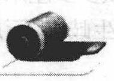

·自己想

算法是否唯一? 如何判断一个算法的优劣?

课外活动

## 排序算法

排序就是根据一定的规则将数据排列整理, 这样 ·自己学有助于提高查找效率. 排序的方法很多, 最常用的就是直接排序法.

我们以对2,9,8,4,1,7进行从小到大的排序为例.

我们可以采用这样一种算法:

(i) 取出前 2 个数进行排序,得到 2,9 ;

(ii) 把第三个数 8 取出来,把 8 插到合适的位置,得到2,8,9;

(iii) 把第四个数 4 取出来,把 4 插到合适的位置,得到2,4,8,9;

(iv) 把第五个数 1 取出来,把 1 插到合适的位置,得到1,2,4, 8,9 ;

(v) 把第六个数 7 取出来,把 7 插到合适的位置,得到1,2, 4,7,8,9.

这种排序方法就是直接插入排序. 该算法在数据规模小的时候十分高效.

对于上述排序, 我们还可以这样做:

(i)取出前 2 个数 2,9 , 若次序已经从小到大，则不变；否则调整这两个数的位置，得到:2,9；

(ii) 按同样的规则，比较第 2 个数和第 3 个数，由于 $9 > 8$ ，所以调整这两个数的位置 $\cdots \cdots$ 直到比较完最后 2 个数,最后得到:2,8,4,1,7,9. 这个过程为 “一趟”，这一趟比较中完成了 4 次交换.

(iii) 如果前面一趟比较中交换次数为 0 , 说明排序已经完成; 否则回到第一步. 本题中,第二趟排序结果是:2,4,1,7,8,9,交换次数是 3 次; 第三趟排序结果是:2,1,4,7,8,9,交换次数是1次; 第四趟排序结果是:1,2,4,7,8,9,交换次数是 1 次; 第五趟交换次数是 0 次,说明排序已经完成.

这种排序方法中, 在每一趟比较交换中, 最小的数像气泡一样逐趟向上漂浮，到最后一趟浮到最上面，因此这种排序方法称为泡排序.

像前面例 4 那样,它不是每次发现逆序都交换,而是在找到全局第 $i$ 大的时候记下该元素位置,最后跟第 $i$ 个元素交换,从而保证数组最终的有序. 这种排序方法称为选择排序. 相对于插入排序来说, 选择排序每次选出的都是全局第 $i$ 大 (小) 的,不会调整前 $i - 1$ 个元素了.

另外还有 Shell 排序、快速排序、归并排序、堆排序、桶式排序、基数排序等等. 有兴趣的同学可以去找资料来了解.

习题练习

、自己茶

1. 有 $A\text{ 、 }B\text{ 、 }C$ 三个相同规格的玻璃瓶, $A$ 装着酒精, $B$ 装着醋, $C$ 为空瓶,请设计一个算法,把 $A\text{ 、 }B$ 瓶中的酒精与醋互换.

2. 写出解方程 ${x}^{2} - {2x} - 3 = 0$ 的一个算法.

3. 已知 $A\left( {{x}_{1},{y}_{1}}\right) , B\left( {{x}_{2},{y}_{2}}\right)$ ,写出求直线 ${AB}$ 斜率的一个算法.

4. “鸡兔同笼”是我国数学著作《孙子算经》中的一个有趣而具有深远影响的题目:“今有雉兔同笼，上有三十五头，下有九十四足，问雉兔各几何?”

请你先列出解决这个问题的方程组, 并设计一个解该方程组的算法.

5. 一个人带三只狼和三只羚羊过河，只有一条船，同船可以容纳一个人和两只动物. 没有人在的时候，如果狼的数量不少于羚羊的数量，狼就会吃掉羚羊. 请设计过河的算法.

### 11.2 程序框图 (Flow Chart)

为了使算法的步骤表达更直观，我们经常采用图形方式来表示， 比如 11.1 节的例 2 和例 3 的算法步骤可以依次表示为图 11-1 和图 11-2.

程序框图又称流程图，是一种由规定的图形、指向箭头及文字说明来表示算法的图形. 常用的程序框如下: 画程序框图的时候要注意以下问题:

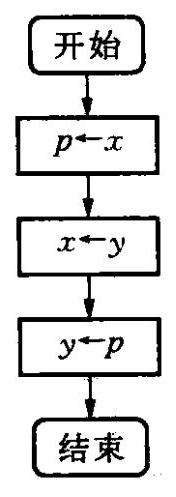

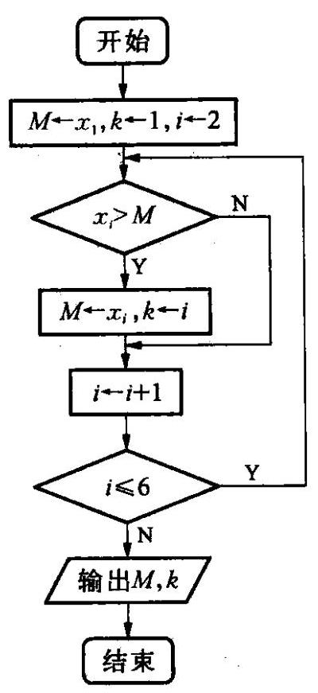

图 11-1 图 11-2

<table><tr><td>程 序 框</td><td>名 称</td><td>功能</td></tr><tr><td>[失效外部图片：bo_d8mlv0ilb0pc73bf749g_79.jpg]</td><td>起、止框</td><td>表示一个算法的开始和结束, 一个算法只有一个开始,至少有一个结束</td></tr><tr><td>[失效外部图片：bo_d8mlv0ilb0pc73bf749g_79.jpg]</td><td>输入、输出框</td><td>表示数据的输入和输出</td></tr><tr><td>[失效外部图片：bo_d8mlv0ilb0pc73bf749g_79.jpg]</td><td>处理(执行)框</td><td>表示算法中的赋值、计算等指令.一个处理框只有一个入口、一个出口.(在不会引起歧义的情况下, 一个处理框可以写多条有序的指令)</td></tr><tr><td>[失效外部图片：bo_d8mlv0ilb0pc73bf749g_79.jpg]</td><td>判断框</td><td>判断框内是一个条件(命题)，它有附带一个入口和两个出口，在一个出口标明“是”或“Y”，表示条件成立(或命题真)，在另一出口处标明“否”或“N”，表示条件不成立(或命题假)</td></tr></table>

① 使用标准的框图符号;

② 框图一般按从上到下、从左到右的方向画，流程线要规范;

③ 除判断框外,大多数框图符号只有一个进入点和一个退出点;

④ 在图形符号内描述的语言要非常简练、清楚.

从前面 2 个程序框图中可以看出, 在算法步骤中, 有些是按顺序执行, 有些需要选择执行, 而另外一些需要循环执行. 事实上, 算法都可以由顺序结构、选择结构、循环结构这三块“积木”通过组合和嵌套表达出来. 比如以下图 1 ～图 3 依次为算法中的顺序结构、选择结构和循环结构:

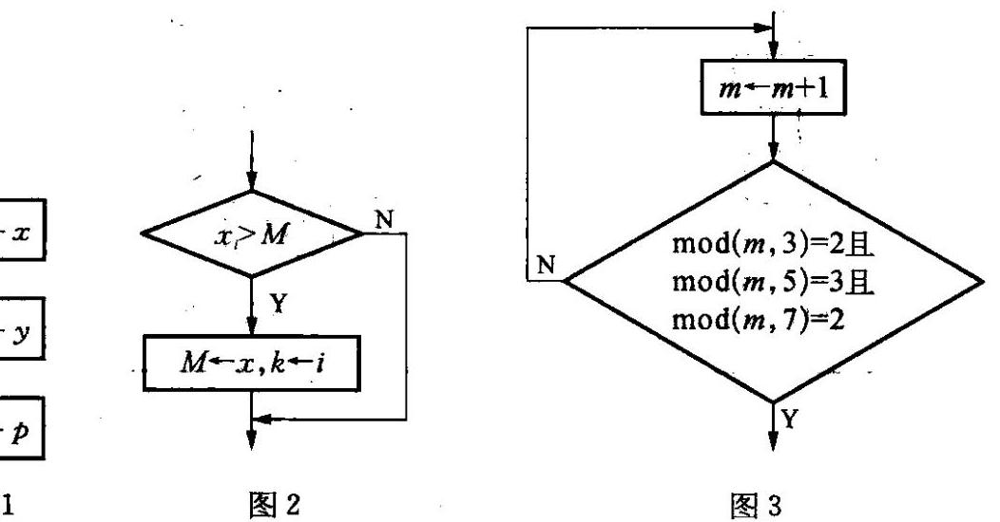

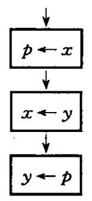

图 11-3

图 11-3

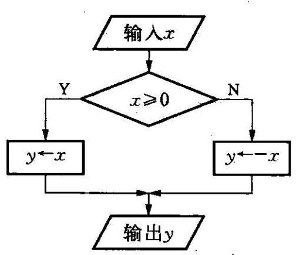

图 11-4

例 1 设计一个求任意数的绝对值的算法,并画出程序框图.

解 (i) 输入任意实数 $x$ ;

(ii) 若 $x \geq  0$ ,则 $y \leftarrow  x$ ; 否则 $y \leftarrow   - x$

(iii) 输出 $y$ .

程序框图如图 11-4.

这是一个典型的条件结构,判断框有一个入口和两个出口, 两个出口箭头上分别标有 “Y”和 “N”, 表示条件成立或不成立时选择的施行内容. 上题中除了图 11-4 这样的画法外也可以画成图 11-5 这样.

两个出口有的时候也有可能有一个没有执行的内容,比如上题的算法也可以这样修改:

(i) 输入任意实数 $x$ ;

(ii) $y \leftarrow  x$ ;

(iii) 如果 $x \geq  0$ ,则不作任何操作,否则 $y \leftarrow   - x$ ;

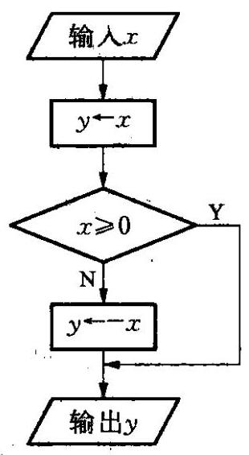

图 11-6

(iv) 输出 $y$ .

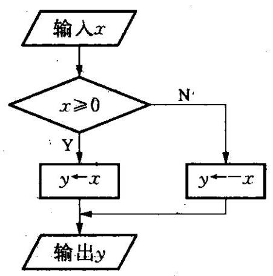

图 11-5

这个算法的程序框图就变成图 11-6 了.

因此一个问题的程序框图并不是唯一的, 根据算法的不同略有差异. 条件结构的样子也有不同.

例 2 设计一个计算 10 个数平均数的算法, 并画出程序框图.

分析 由于需要依次输入 10 个数, 并计算它们的和, 因此, 需要用一个循环结构, 并用一个变量存放数的累加和. 在求出 10 个数的总和后, 再除以 10 , 就得到 10 个数的平均数.

解 (i) $S \leftarrow  0$ ; (用变量 $S$ 来存放数的累加和,这一步是为了使变量 $S$ 清 0 $)$

(ii) $I \leftarrow  1$ ; (循环变量为 $I$ )

(iii) 输入 $G$ ;

(iv) $S \leftarrow  S + G$ ; (求 $S + G$ ,其和仍放在变量 $S$ 中)

(v) $I \leftarrow  I + 1$ ; (使 $I$ 的值增加 1,以实现循环变量的计数功能)

(vi) 如果 $I \leq  {10}$ ,转(iii); (如果 $I > {10}$ ,退出循环)

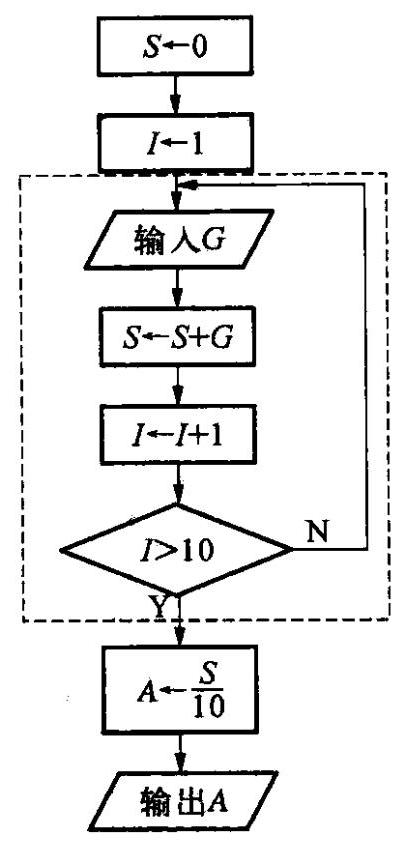

图 11-7

(vii) $A \leftarrow  \frac{S}{10};\;$ (将平均数 $\frac{S}{10}$ 存放到 $A$ 中)

(viii) 输出 $A$ .

算法程序框图如图 11-7.

说明 (1) 本题中的第一步将 0 赋值于 $S$ ,是为这些数的和建立存放空间;

(2)这是一个循环结构，右图中的虚线框内的是循环体. 在循环结构中都有一个计数变量(本题中的 $I$ ) 和累加变量(本题中的 $S)$ ,计数变量用于记录循环次数(本题实质是为了记录输入的数的个数), 累加变量用于输出结果. 计数变量与累加变量一般是同步进行的，累加一次，计数一次.

例 3 高一某班一共有 50 名学生，设计一个算法, 统计班上数学成绩良好 (分数大于 80 且小于 90 )和优秀(分数大于或等于 90)的学生人数，并画出流程图.

分析 首先这是一个循环结构，要重复 50 次. 每读一个学生的成绩都要判断它是良好、优秀或者两个都不是，那就要有 2 个条件结构. 另外要输出 2 个统计数据,因此要有两个变量来存储良好和优秀的人数. 这里我们用变量 $n$ 作为循环变量,变量 $a\text{ 、 }b$ 分别来存储优秀和良好的人数.

解 算法如下:

(i) $n \leftarrow  1, a \leftarrow  0, b \leftarrow  0$ ;

(ii) 输入成绩 $r$ ;

(iii) 若 $r > {89}$ ,则 $a \leftarrow  a + 1$ ,转 (v);

(iv) 若 $r > {80}$ ,则 $b \leftarrow  b + 1$ ;

(v) $n \leftarrow  n + 1$ ;

(vi) 若 $n \leq  {50}$ ,转(ii),否则,输出 $a$ 和 $b$ .

程序框图如图 11-8.

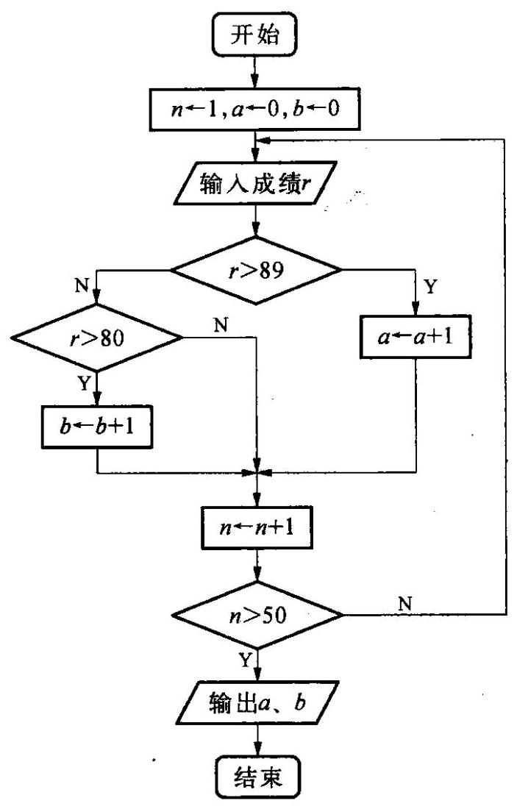

图 11-8

例 4 求两个正数21812 和 8733 的最大公约数.

分析 21812 与 8733 两数都比较大,而且没有明显的公约数,如能把它们都变小一点, 根据已有的知识即可求出最大公约数.

解 21812=8733×2+4346,

显然 21812 与 8733 的最大公约数也就是 8733 与 4346 的最大公约数.

$$
{8733} = {4346} \times  2 + {41},
$$

同理, 8733 与 4346 的最大公约数也就是 4346 与 41 的最大公约数.

$$
{4346} = {41} \times  {106} + 0,
$$

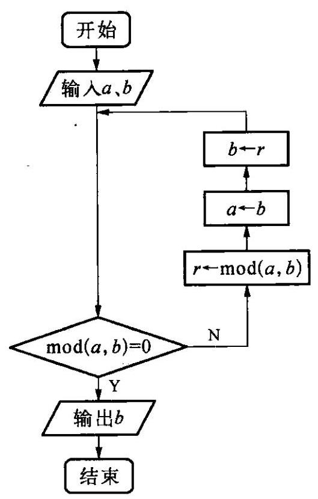

图 11-9

则 41 为 21 812 与 8733 的最大公约数.

以上我们求最大公约数的方法就是辗转相除法, 也叫欧几里得算法.

利用辗转相除法求最大公约数的算法如下:

(i) 输入两个正整数 $a$ 、 $b$ (保证 $a > b$ );

(ii) 判断 ${\;\operatorname{mod}\;\left( {a, b}\right) } = 0$ ,如果 “Y”,说明已经找到了最大公约数,跳出循环体即可,如果 “ $N$ ” 则执行: $r \leftarrow  \operatorname{mod}\left( {a, b}\right) , a \leftarrow  b, b \leftarrow  r$ ,并且返回 (ii),再次判断；

(iii) 输出最大公约数 $b$ .

程序框图如图 11-9.

课堂活动

·大家谈

1. 程序框图引入的目的是什么?

2. 程序框图有些什么结构?

ée

课堂活动 . 自己想

循环结构中判断语句在循环体的前面和后面有何区别?

课外活动

. 自己学

## 更相减损术

我国早期也有解决求最大公约数问题的算法，就是更相减损术.

更相减损术求最大公约数的步骤如下:可半者半之，不可半者，副置分母之数，以少减多，更相减损，求其等也，以等数约之.

翻译出来为:

第一步:任意给出两个正数，判断它们是否都是偶数. 若是，用 2 约简；若不是，执行第二步；

第二步:以较大的数减去较小的数，接着把较小的数与所得的差比较, 并以大数减小数. 继续这个操作, 直到所得的数相等为止, 则这个数 (等数)就是所求的最大公约数.

例 用更相减损术求 98 与 63 的最大公约数.

解 由于 63 不是偶数, 把 98 和 63 以大数减小数, 并辗转相减,

即: ${98} - {63} = {35}$ ,

$$
{63} - {35} = {28},
$$

${35} - {28} = 7,$

$$
{28} - 7 = {21},
$$

${21} - 7 = {14},$

$$
{14} - 7 = 7,
$$

所以，98 与 63 的最大公约数是 7 .

## 比较辗转相除法与更相减损术的区别:

(1)都是求最大公约数的方法，计算上辗转相除法以除法为主，更相减损术以减法为主，计算次数上辗转相除法计算次数相对较少，特别当两个数字大小区别较大时计算次数的区别较明显;

(2)从结果体现形式来看，辗转相除法体现结果是通过相除余数为 0 得到的, 而更相减损术则通过减数与差相等得到.

习题练习

自己练

1. 已知函数 $f\left( x\right)  = \left\{  \begin{array}{ll} {3x} + 2, & x\text{ 为奇数,写出 } \\  {5x}, & x\text{ 为偶数,写出 } \end{array}\right.$

$x$ 为整数时,求 $f\left( x\right)$ 的算法,并画出程序框图.

2. 任意给定 3 个正实数，设计一个算法，判断分别以这 3 个数为三边边长的三角形是否存在，并画出这个算法的程序框图.

3. 写出求 $\frac{1}{2 + \frac{1}{2 + \frac{1}{2 + \cdots  + \frac{1}{2}}}}$ (共有 6 个 2) 的值的一个算法,并画出程序框图.

4. 某高中男子体育小组的 50 米跑成绩为 (单位: s):

6.4,6.5,7.0,6.8,7.1,7.3,6.9,7.4,7.5. 设计一个算法,从这些成绩中找出所有小于 ${6.8}\mathrm{\;s}$ 的成绩,并画出程序框图.

5. 设计一个计算 $1 + {2}^{2} + {2}^{3} + \cdots  + {2}^{100}$ 的值的一个算法,并画出程序框图.

6. 写出求 $\frac{1}{1 \times  2} + \frac{1}{2 \times  3} + \cdots  + \frac{1}{{99} \times  {100}}$ 的值的一个算法,并画出程序框图.

7. 我国的国民生产总值近几年来一直以不低于 8% 的年增长率增长，照此速度，最多只需经过几年我国的国民生产总值就可以翻一番？ 写出一个算法，并画出程序框图.

8. 设 $S$ 是三位正整数中所有既是 12 的倍数,又是 15 的倍数的数的总和. 写出一个求 $S$ 的算法,并画出程序框图.

9. 根据给出的算法,分析该算法所解决的是什么问题? 并画出相应的程序框图.

(i) $S \leftarrow  0$ ;

(ii) $I \leftarrow  1$ ;

(iii) 输入 $G$ ;

(iv) $S \leftarrow  S + G$ ;

(v) $I \leftarrow  I + 1$ ;

(vi) 若 $I$ 不大于 100,转(iii); 否则,转(vii);

(vii) $A \leftarrow  S/{100}$ ;

(viii) 输出 $A$ .

10. 一个三位数的十位和个位的数字互换, 得到的一个新的三位数，新、旧两个三位数都能被 4 整除. 设计一个算法，求满足条件的三位数的个数，并画出程序框图.

## 第十二章 坐标平面上的直线 (Straight Lines on a Coordinate Plane)

在初中平面几何里, 我们学习了直线的平行、垂直、相交等位置关系，我们通过直线的位置关系去判断角的大小、直线的距离等问题，但是，对于角的大小、线段的长度、直线间的距离只能借助量角器、刻度尺等工具解决,我们只是定性的研究了几何量的位置关系,很难定量的加以计算和研究. 在本章中，我们将借助二元一次方程与直线的对应关系， 通过对方程的讨论, 定量地研究直线的位置、距离以及直线相交所成角的大小，开辟一条从代数的角度研究几何问题的新视角，为数形结合的数学思想方法注入新的内容.

### 12.1 直线的方程 (Equations of Straight Lines)

我们已经学习了一次函数的性质和图象,如函数 $y = {2x} + 1$ 的图象就是一条直线,如图 12-1,而函数 $y = {2x} + 1$ 又可以写成二元一次方程: ${2x} - y + 1 = 0$ , 即二元一次方程 ${2x} - y + 1 = 0$ 的图象是一条直线,这就是说以方程 ${2x} - y + 1 = 0$ 的解为坐标的点都在直线上; 反之, 在直线上任取一点 $\left( {x, y}\right)$ ,该点的坐标是方程 ${2x} - y + \; 1 = 0$ 的解.

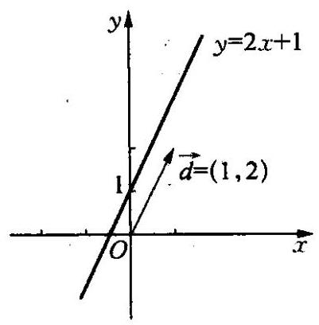

图 12-1

一般地,如果以二元一次方程 $f(x$ , $y) = 0$ 的所有解为坐标的点 $\left( {x, y}\right)$ 都在直线 $l$ 上,反之,直线 $l$ 上所有点的坐标 $\left( {x, y}\right)$ 都满足方程 $f\left( {x, y}\right)  = 0$ ,我们就把方程 $f\left( {x, y}\right)  = 0$ 叫做直线 $l$ 的方程,直线 $l$ 叫做方程 $f\left( {x, y}\right)  = 0$ 的直线. 这样代数中的方程就和几何中的直线建立了一一对应的关系. 下面我们介绍建立直线方程的几个常见方法:

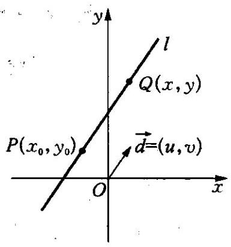

图 12-2

## (一) 直线方程的点方向式

在直角坐标平面上，已知直线 $l$ 经过点 $P\left( {{x}_{0},{y}_{0}}\right)$ ,且直线 $l$ 平行非零向量 $\overrightarrow{d} = \; \left( {u, v}\right)$ ,那么在直线 $l$ 上任取不同于点 $P\left( {x}_{0}\right.$ , $\left. {y}_{0}\right)$ 的另一点 $Q\left( {x, y}\right)$ ,则有向量 $\overrightarrow{PQ}//\overrightarrow{d}$ . 如图 12-2 所示,因为向量

$$
\overrightarrow{PQ} = \left( {x - {x}_{0}, y - {y}_{0}}\right) ,
$$

由两个向量平行的充要条件,得

$$
v\left( {x - {x}_{0}}\right)  = u\left( {y - {y}_{0}}\right) .
$$

①

当 $u \neq  0, v \neq  0$ 时,方程 ① 可以写成

$$
\frac{x - {x}_{0}}{u} = \frac{y - {y}_{0}}{v}
$$

②

我们把方程②叫做直线 $l$ 的点方向式方程,向量 $\overrightarrow{d} = \left( {u, v}\right)$ 叫做直线 $l$ 的方向向量. 所有与向量 $\overrightarrow{d} = \left( {u, v}\right)$ 平行的向量都是直线 $l$ 的方向向量.

当 $u = 0, v \neq  0$ 时,方程①可化为 $x = {x}_{0}$ ,它表示经过点 $P\left( {{x}_{0},{y}_{0}}\right)$ , 且垂直于 $x$ 轴的直线,如图 12-3 所示.

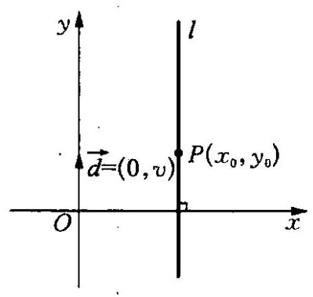

图 12-3

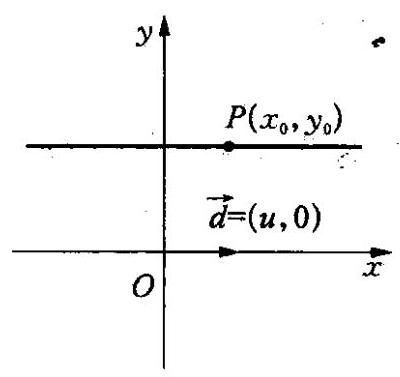

图 12-4

当 $u \neq  0, v = 0$ 时,方程①可化为 $y = {y}_{0}$ ,它表示经过点 $P\left( {{x}_{0},{y}_{0}}\right)$ , 且垂直于 $y$ 轴的直线,如图 12-4 所示.

例 1 在 $\bigtriangleup {ABC}$ 中， $D\left( {-1,2}\right)$ 、 $E\left( {2, - 3}\right)$ 、 $F\left( {-3,4}\right)$ 依次为 ${AB}$ 、 ${BC}\text{ 、 }{CA}$ 的中点,求 ${AB}\text{ 、 }{BC}\text{ 、 }{CA}$ 所在直线的点方向式方程.

解 设点 $A\text{ 、 }B\text{ 、 }C$ 的坐标分别为 $\left( {{x}_{1},{y}_{1}}\right) \text{ 、 }\left( {{x}_{2},{y}_{2}}\right) \text{ 、 }\left( {{x}_{3},{y}_{3}}\right)$ ,则由于点 $D\left( {-1,2}\right) \text{ 、 }E\left( {2, - 3}\right) \text{ 、 }F\left( {-3,4}\right)$ 分别是边 ${AB}\text{ 、 }{BC}\text{ 、 }{CA}$ 的中点,

由中点坐标公式可知 $\left\{  \begin{array}{l} {x}_{1} + {x}_{2} =  - 2, \\  {x}_{2} + {x}_{3} = 4, \\  {x}_{3} + {x}_{1} =  - 6, \end{array}\right.$① ② ③

$$
\left\{  \begin{array}{l} {y}_{1} + {y}_{2} = 4, \\  {y}_{2} + {y}_{3} =  - 6, \\  {y}_{3} + {y}_{1} = 8, \end{array}\right.
$$

④ ⑤ ⑥

所以 $\frac{\text{ ① } + \text{ ② } + \text{ ③ }}{2} =  - 2$ ,⑦ 分别比较①,②,③和⑦式可得出

$\left\{  {\begin{array}{l} {x}_{1} =  - 6, \\  {x}_{2} = 4, \\  {x}_{3} = 0; \end{array}\text{ 同理可求得 }\left\{  {\begin{array}{l} {y}_{1} = 9, \\  {y}_{2} =  - 5, \\  {y}_{3} =  - 1, \end{array}\text{ 于是得点 }A\left( {-6,9}\right) \text{ 、 }B\left( {4, - 5}\right) \text{ 、 }}\right. }\right.$

$C\left( {0, - 1}\right)$ .

所以直线 ${AB}\text{ 、 }{BC}\text{ 、 }{CA}$ 的一个方向向量分别是 $\overrightarrow{AB} = \left( {{10}, - {14}}\right)$ , $\overrightarrow{BC} = \left( {-4,4}\right) ,\overrightarrow{CA} = \left( {-6,{10}}\right)$ .

所以直线 ${AB}$ 的点方向式方程为 $\frac{x + 6}{10} = \frac{y - 9}{-{14}}$ ;

所以直线 ${BC}$ 的点方向式方程为 $\frac{x - 4}{-4} = \frac{y + 5}{4}$ ;

所以直线 ${CA}$ 的点方向式方程为 $\frac{x}{-6} = \frac{y + 1}{10}$ .

## (二) 直线方程的点法向式

已知直线 $l$ 经过点 $P\left( {{x}_{0},{y}_{0}}\right)$ ，且与已知非零向量 $\overrightarrow{n} = \left( {a, b}\right)$ 垂直， 如何求出直线 $l$ 的方程呢? 如图 12-5 所示.

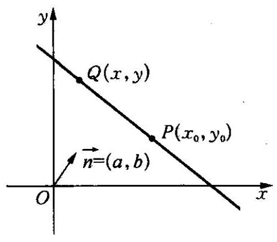

图 12-5

设 $Q\left( {x, y}\right)$ 为直线 $l$ 上的任意一点， 则向量 $\overrightarrow{PQ} = \left( {x - {x}_{0}, y - {y}_{0}}\right)$ ，由题意可知 $\overrightarrow{PQ} \bot  \overrightarrow{n}$ ，所以

$$
a\left( {x - {x}_{0}}\right)  + b\left( {y - {y}_{0}}\right)  = 0.
$$

③

我们把与直线 $l$ 垂直的向量 $\overrightarrow{n} = (a$ , b)叫做直线 $l$ 的法向量,方程③叫做直线 $l$ 的点法向式方程. 所有与 $\overrightarrow{n} = \left( {a, b}\right)$ 平行的向量都是直线 $l$ 的法向量.

例 2 已知直线 $l$ 是线段 ${AB}$ 的垂直平分线,且点 $A\text{ 、 }B$ 的坐标分别是 $\left( {-2,3}\right) \text{ 、 }\left( {4, - 7}\right)$ ,求直线 $l$ 的点法向式方程.

解 设点 $M\left( {x, y}\right)$ 为线段 ${AB}$ 的中点,则由中点坐标公式可求得点 $M\left( {x, y}\right)$ 的坐标为 $\left( {1, - 2}\right)$ ,向量 $\overrightarrow{AB} = \left( {6, - {10}}\right)$ 为直线 $l$ 的一个法向量,由于直线 $l$ 经过点 $M\left( {1, - 2}\right)$ ,所以直线 $l$ 的点法向式方程为: $6(x -$ 1) $- {10}\left( {y + 2}\right)  = 0$ .

例 3 如图 12-6 所示,正方形 ${ABCO}$ 中,点 $O$ 为坐标原点,且向量 $\overrightarrow{OA} = \left( {3,4}\right)$ ,求:

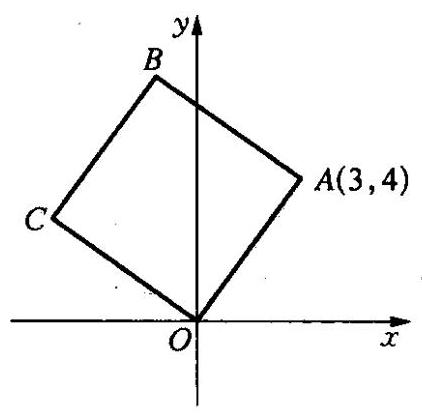

图 12-6

(1)边 ${AB}$ 所在直线的点法向式方程；

(2)对角线 ${AC}$ 所在直线的点方向式方程.

解(1)因为 ${ABCO}$ 为正方形，所以向量 $\overrightarrow{OA} = \left( {3,4}\right)$ 是直线 ${AB}$ 的一个法向量,又因为点 $A$ 的坐标是 $\left( {3,4}\right)$ ,所以直线 ${AB}$ 的点法向式方程为: $3\left( {x - 3}\right)  + 4(y -$ 4) $= 0$ .

(2)设 $\overrightarrow{OC} = \left( {x, y}\right)$ ，因为 ${OC} \bot  {OA}$ 且 ${OC} = {OA}$ ，所以有

$\left\{  \begin{array}{l} {3x} + {4y} = 0, \\  {x}^{2} + {y}^{2} = {25}, \end{array}\right.$ 解方程组可得: $\left\{  \begin{array}{l} x =  - 4, \\  y = 3 \end{array}\right.$ 或 $\left\{  \begin{array}{l} x = 4, \\  y =  - 3. \end{array}\right.$

即点 $C$ 的坐标为 $\left( {-4,3}\right)$ 或 $\left( {4, - 3}\right)$ ,由图 ${12} - 6$ 知, $C$ 为 $\left( {-4,3}\right)$ . 所以 $\overrightarrow{AC} = \left( {-7, - 1}\right)$ ,所以直线 ${AC}$ 的点方向式方程为:

$$
\frac{x - 3}{-7} = \frac{y - 4}{-1}
$$

·大家谈

在直角坐标平面上,对于任意的直线,是否都可以得到它的点法向式方程?

- 自己想

我们把平面内与直线垂直的非零向量称为直线的法向量,在平面直角坐标系中,我们可以求出过点 $A\left( {-3,4}\right)$ ,且法向量为 $\overrightarrow{n} = \left( {1, - 2}\right)$ 的直线 (点法向式) 方程为 $1 \times  \left( {x + 3}\right)  + \left( {-2}\right)  \times  \left( {y - 4}\right)  = 0$ ,化简得 $x - {2y} + {11} = 0$ . 类比以上方法,思考在空间直角坐标系中,经过点 $A\left( {1,2,3}\right)$ 且法向量为 $\overrightarrow{n} = \left( {-1, - 2,1}\right)$ 的(点法向式) 方程如何求?

课外活

. 自己学

## 解析几何的创立

16 世纪以后, 由于生产和科学技术的发展, 天文、 力学、航海等方面都对几何学提出了新的需要. 比如, 德国天文学家开普勒发现行星是绕着太阳沿着椭圆型轨道运行的, 太阳处在这个椭圆的一个焦点上; 意大利科学家伽利略发现投掷物体是沿着抛物线运动的. 这些发现都涉及到圆锥曲线, 要研究这些比较复杂的曲线, 原先的一套方法显然已经不适应了, 这就导致了解析几何的出现.

1637 年，法国的哲学家和数学家笛卡尔发表了他的著作《方法论》， 这本书的后面有三篇附录，一篇叫《折光学》，一篇叫《流星学》，一篇叫 《几何学》. 当时的这个“几何学”实际上指的是数学，就像我国古代“算术”和“数学”是一个意思一样.

笛卡尔的《几何学》共分三卷，第一卷讨论尺规作图；第二卷是曲线的性质; 第三卷是立体和“超立体”的作图, 但它实际是代数问题, 探讨方程的根的性质. 后世的数学家和数学史学家都把笛卡尔的《几何学》作为解析几何的起点.

从笛卡尔的《几何学》中可以看出,笛卡尔的中心思想是建立起一种 “普遍”的数学，把算术、代数、几何统一起来. 他设想，把任何数学问题化为一个代数问题,再把任何代数问题归结到去解一个方程式.

为了实现上述的设想,笛卡尔从天文和地理的经纬制度出发,指出平面上的点和实数对 $\left( {x, y}\right)$ 的对应关系. $x\text{ 、 }y$ 的不同数值可以确定平面上许多不同的点, 这样就可以用代数的方法研究曲线的性质, 这就是解析几何的基本思想.

具体地说，平面解析几何的基本思想有两个要点: 第一, 在平面建立坐标系，一点的坐标与一组有序的实数对相对应; 第二，在平面上建立了坐标系后, 平面上的一条曲线就可由带两个变数的一个代数方程来表示了. 从这里可以看到, 运用坐标法不仅可以把几何问题通过代数的方法解决, 而且还可以把变量、函数以及数和形等重要概念密切联系起来.

解析几何的创立，引入了一系列新的数学概念，特别是将变量引入数学, 使数学进入了一个新的发展时期, 这就是变量数学的时期, 解析几何在数学发展中起到了推动作用. 恩格斯对此曾经作过评价“数学中的转折点是笛卡尔的变数，有了变数，运动进入了数学；有了变数，辩证法进入了数学；有了变数，微分和积分也就立刻成为必要的了， ······”

解析几何又分为平面解析几何和空间解析几何. 在平面解析几何中，除了研究直线的有关性质外，主要是研究圆锥曲线(圆、椭圆、抛物线、双曲线) 的有关性质.

总的来说，解析几何运用坐标法可以解决两类基本问题: 一类是满足给定条件的点的轨迹, 通过坐标系建立它的方程; 另一类是通过方程的讨论, 研究方程所表示的曲线的性质.

运用坐标法解决问题的步骤是:首先在平面上建立坐标系，把已知点的轨迹的几何条件“翻译”成代数方程；然后运用代数工具对方程进行研究; 最后把代数方程的性质用几何语言叙述, 从而得到原先几何问题的答案.

坐标法的思想促使人们运用各种代数的方法解决几何问题, 先前被看作几何学中的难题, 一旦运用代数方法后就变得平淡无奇了. 坐标法为近代数学的机械化证明也提供了有力的工具.

习题练习

1. 求过点 $\left( {-1,0}\right)$ 且与直线 $\frac{x + 1}{5} = \frac{y + 1}{-3}$ 有相同

- 自己练 方向向量的直线方程.

2. 已知直线 $l$ 的方程为 ${Ax} + {By} + C = 0$ ,若向量 $\overrightarrow{n} = \left( {0, a}\right) (a \neq \; 0)$ ,则直线 $l$ 以 $\overrightarrow{n}$ 为一个方向向量的充要条件是什么?

3. 直线 $l$ 经过点 $\left( {1,1}\right)$ ,方向向量为 $\left( {5,2}\right)$ ,求直线 $l$ 与两坐标轴围成的三角形的面积.

4. 在 $\bigtriangleup {ABC}$ 中,顶点 $A\left( {1,6}\right) \text{ 、 }B\left( {-1, - 2}\right) \text{ 、 }C\left( {6,3}\right) , D$ 为 ${BC}$ 的中点.

(1)求边 ${BC}$ 上的高所在直线的方程；

(2)求中线 ${AD}$ 所在直线的点方向式方程.

5. 直线 $l$ 经过三点 $A\left( {m,0}\right) \text{ 、 }B\left( {0, n}\right) \text{ 、 }C\left( {1,3}\right)$ ,且 $m\text{ 、 }n$ 均为正整数,求直线 $l$ 的点方向式方程.

6. 设直线 ${l}_{1} : \left( {2 - a}\right) x + {ay} + 3 = 0;{l}_{2} : x - {ay} - 3 = 0$ .

试问: “ $a = 1$ ” 是 “直线 ${l}_{1}$ 的法向量恰好是直线 ${l}_{2}$ 的方向向量” 的什么条件?

### 12.2 直线的倾斜角和斜率 (Angles of Inclination and Slopes of Straight Lines)

## (一) 直线的倾斜角和斜率

如图 12-7 所示,直线 $l$ 与 $x$ 轴交于点 $M$ ,将 $x$ 轴绕点 $M$ 按逆时针方向旋转至与直线 $l$ 重合时所转过的最小正角 $\alpha$ 叫做直线 $l$ 的倾斜角, 当直线 $l$ 与 $x$ 轴平行或重合时,规定其倾斜角 $\alpha  = 0$ ,因此直线的倾斜角 $\alpha$

___ 的范围是 $\lbrack 0,\pi )$ .

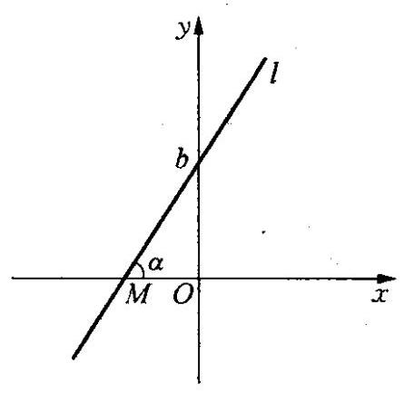

图 12-7

当直线的倾斜角 $\alpha  \neq  \frac{\pi }{2}$ 时,我们把 $\alpha$ 的正切值 $\tan \alpha$ 叫做直线 $l$ 的斜率，记作 $k = \tan \alpha$ ,当 $\alpha  = \frac{\pi }{2}$ 时,直线的斜率 $k$ 不存在(或称趋向无穷大).

到目前为止，我们已学习了刻画直线方向的三个概念: 方向向量、倾斜角和斜率,它们之间可以相互转化:

若已知直线 $l$ 的方向向量 $\overrightarrow{d} = \left( {u, v}\right)$ ,那么当 $u \neq  0$ 时,斜率 $k = \frac{v}{u}$ , 倾斜角 $\alpha$ 可以由 $\tan \alpha  = \frac{v}{u}$ 求得; 当 $u = 0$ 时,斜率 $k$ 不存在,倾斜角 $\alpha  = \; \frac{\pi }{2}$

若已知直线 $l$ 的倾斜角 $\alpha$ ,那么斜率 $k = \tan \alpha$ ,方向向量 $\overrightarrow{d} = (\cos \alpha$ , $\sin \alpha )$ ;

若已知直线 $l$ 的斜率 $k$ ,那么倾斜角 $\alpha$ 可以由 $\tan \alpha  = k$ 求得,方向向量 $\overrightarrow{d} = \left( {1, k}\right)$ .

例 1 求经过 $A\left( {-2,0}\right) \text{ 、 }B\left( {-5,3}\right)$ 两点的直线的斜率 $k$ 和倾斜角 $\alpha$ .

解 因为经过两点 $A\left( {-2,0}\right) \text{ 、 }B\left( {-5,3}\right)$ 的直线的方向向量 $\overrightarrow{AB} = \; \left( {-5 - \left( {-2}\right) ,3 - 0}\right)  = \left( {-3,3}\right)$ ,故斜率 $k = \frac{3}{-3} =  - 1$ ,所以 $\tan \alpha  =  - 1$ , 因为 ${0}^{ \circ  } \leq  \alpha  < {180}^{ \circ  }$ ,所以 $\alpha  = {135}^{ \circ  }$ .

因此,这条直线的斜率是 -1,倾斜角是 ${135}^{ \circ  }$ .

一般地,若直线 $l$ 经过点 $A\left( {{x}_{1},{y}_{1}}\right) \text{ 、 }B\left( {{x}_{2},{y}_{2}}\right)$ ,当 ${x}_{1} \neq  {x}_{2}$ 时,直线 $l$ 的斜率 $k = \frac{{y}_{2} - {y}_{1}}{{x}_{2} - {x}_{1}}$ .

例 2 已知直线 $l$ 经过 $A\left( {2,1}\right) \text{ 、 }B\left( {1,{m}^{2}}\right)$ 两点 $\left( {m \in  \mathbf{R}}\right)$ ,求直线 $l$ 的倾斜角 $\alpha$ 的取值范围.

解 因为直线 $l$ 经过点 $A\left( {2,1}\right) \text{ 、 }B\left( {1,{m}^{2}}\right)$ ,所以其斜率 $k = \; \frac{{m}^{2} - 1}{1 - 2} = 1 - {m}^{2}$ ,由于 $m \in  \mathbf{R}$ ,所以 $k \leq  1$ .

当 $0 \leq  k \leq  1$ 时, $0 \leq  \alpha  \leq  \frac{\pi }{4}$ ; 当 $k < 0$ 时, $\frac{\pi }{2} < \alpha  < \pi$ .

所以直线 $l$ 的倾斜角 $\alpha$ 的取值范围为 $\left\lbrack  {0,\frac{\pi }{4}}\right\rbrack   \cup  \left( {\frac{\pi }{2},\pi }\right)$ .

## (二) 直线方程的其他几种形式

(1)直线方程的点斜式:若直线 $l$ 经过点 $P\left( {{x}_{0},{y}_{0}}\right)$ ，斜率为 $k$ (其中 $k \neq  0)$ ,则直线 $l$ 便被确定了,其方向向量 $\overrightarrow{d} = \left( {1, k}\right)$ ,由直线方程的点方向式可得到方程为:

$$
\frac{x - {x}_{0}}{1} = \frac{y - {y}_{0}}{k}
$$

整理得:

$$
y - {y}_{0} = k\left( {x - {x}_{0}}\right) ,
$$

①

当 $k = 0$ 时,直线 $l//x$ 轴,其方程为 $y = {y}_{0}$ ,满足①式,我们把①式叫做直线 $l$ 的点斜式方程.

(2)直线方程的截距式:若直线 $l$ 与 $x$ 轴和 $y$ 轴分别交于点 $A(a$ , $0)\text{ 、 }B\left( {0, b}\right) \left( {{ab} \neq  0}\right)$ ,如图 12-8 所示,则直线 $l$ 也被确定了,我们把坐标 $a\text{ 、 }b$ 分别叫做直线 $l$ 在坐标轴上的横截距和纵截距,此时,直线 $l$ 的斜率 $k = \frac{b - 0}{0 - a} =  - \frac{b}{a}$ ,由直线方程的点斜式可知 $l$ 的方程为 $y - 0 =  - \frac{b}{a}\left( {x - a}\right)$ ,化简得 ${bx} + {ay} = {ab}$ ,两边同除以 ${ab}$ 得到

$$
\frac{x}{a} + \frac{y}{b} = 1
$$

②

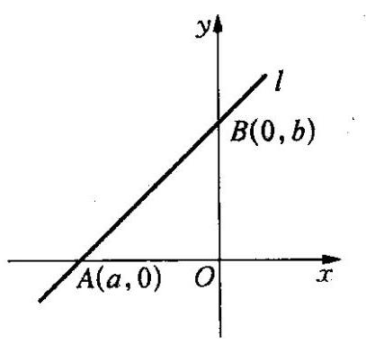

图 12-8

我们把②式叫做直线 $l$ 的截距式方程. 当直线 $l$ 在坐标轴上的横截距或纵截距为零时, 可用其他形式表示方程.

(3)直线方程的斜截式: 若直线 $l$ 经过 $y$ 轴上的点 $B\left( {0, b}\right)$ ，且其斜率为 $k$ ,则由直线方程的点斜式同样可以求得方程为:

$$
y = {kx} + b,
$$

③

## 我们把③式叫做直线 $l$ 的斜截式方程.

显然,直线方程用点斜式或斜截式表示时,直线的斜率必须存在; 同样, 直线方程用截距式表示时, 直线在坐标轴上的截距不能为零, 我们在学习时要特别注意.

(4)直线方程的一般式:从前面的学习中我们知道，方程的任何一种形式均可化为关于 $x\text{ 、 }y$ 的二元一次方程

$$
{ax} + {by} + c = 0\text{ (其中 }a\text{ 、 }b\text{ 不同时为零), }
$$

④

我们把④式叫做直线 $l$ 的一般式方程. 当 $b = 0$ 时, $a \neq  0$ ,方程④可化为: $x =  - \frac{c}{a}$ ,此时直线垂直于 $x$ 轴,且经过点 $\left( {-\frac{c}{a},0}\right)$ ; 当 $a = 0$ 时, $b \neq  0$ , 方程 ④ 可化为: $y =  - \frac{c}{b}$ ,此时直线垂直于 $y$ 轴,且经过点 $\left( {0, - \frac{c}{b}}\right)$ .

事实上,在满足一定的条件下,方程的各种形式之间均可相互转化.

如我们可以将方程④化为 $a\left( {x - 0}\right)  + b\left( {y + \frac{c}{b}}\right)  = 0$ 的形式,由直线的点法向式方程可知，它是以 $\overrightarrow{n} = \left( {a, b}\right)$ 为法向量，且经过点 $\left( {0, - \frac{c}{b}}\right)$ 的直线方程. 由此我们也可以知道直线方程 ${ax} + {by} + c = 0$ (其中 $a\text{ 、 }b$ 不同时为零) 的一个法向量为 $\left( {a, b}\right)$ ,一个方向向量为 $\left( {b, - a}\right)$ .

例 3 求经过点 $A\left( {2, - 5}\right)$ 且平行于直线 ${l}_{1} : {4x} - {3y} + 2 = 0$ 的直线方程.

解 方法一:由直线方程一般式中方程系数的几何意义可知，向量 $\overrightarrow{n} = \left( {4, - 3}\right)$ 是直线 ${l}_{1}$ 的一个法向量. 因为所求直线平行于 ${l}_{1}$ ,所以 $\overrightarrow{n} = \left( {4, - 3}\right)$ 也是所求直线的一个法向量. 又因为直线过点 $A\left( {2, - 5}\right)$ , 所以所求直线的点法向式方程为

$$
4\left( {x - 2}\right)  - 3\left( {y + 5}\right)  = 0,
$$

化简可得

$$
{4x} - {3y} - {23} = 0.
$$

方法二: 因为 $\overrightarrow{n} = \left( {4, - 3}\right)$ 是所求直线的一个法向量,故可设所求方程为

$$
{4x} - {3y} + c = 0.
$$

又因为直线经过点 $A\left( {2, - 5}\right)$ ,所以点 $A\left( {2, - 5}\right)$ 满足上述方程,即 $4 \cdot  2 - 3 \cdot  \left( {-5}\right)  + c = 0$ ,解得 $c =  - {23}$ ,因此所求的直线方程为

$$
{4x} - {3y} - {23} = 0.
$$

方法三: 因为所求直线的一个法向量为 $\overrightarrow{n} = \left( {4, - 3}\right)$ ,因此它的一个方向向量为 $\overrightarrow{d} = \left( {3,4}\right)$ ，则该直线的斜率为 $k = \frac{4}{3}$ ，由直线方程的点斜式可得

$$
y - \left( {-5}\right)  = \frac{4}{3}\left( {x - 2}\right) ,
$$

经化简得所求方程为 ${4x} - {3y} - {23} = 0$ .

例 4 已知直线 $l : {3x} - {5y} - {15} = 0$ ，分别求直线 $l$ 的下列方程形式:

(1)点法向式; (2) 点方向式; (3) 点斜式; (4) 斜截式; (5) 截距式.

解 (1) 在 ${3x} - {5y} - {15} = 0$ 中,令 $y = 0$ ,得 $x = 5$ ,即 $\left( {5,0}\right)$ 是直线 $l$ 上一点的坐标. 又因为直线 $l$ 的一个法向量 $\overrightarrow{n} = \left( {3, - 5}\right)$ ,所以直线 $l$ 的点法向式方程为

$$
3\left( {x - 5}\right)  - 5\left( {y - 0}\right)  = 0.
$$

(2)由(1)可知直线 $l$ 的一个方向向量 $\overrightarrow{d} = \left( {5,3}\right)$ ，所以直线 $l$ 的点方向式方程为

$$
\frac{x - 5}{5} = \frac{y}{3}.
$$

(3)由(2)中的方向向量 $\overrightarrow{d} = \left( {5,3}\right)$ 可知，直线 $l$ 的斜率 $k = \frac{3}{5}$ ,所以直线 $l$ 的点斜式方程为

$$
y - 0 = \frac{3}{5}\left( {x - 5}\right) .
$$

(4)由(3)可知所求直线 $l$ 的斜截式方程为 $y = \frac{3}{5}x - 3$ .

(5)由直线 $l : {3x} - {5y} - {15} = 0$ 得到 ${3x} - {5y} = {15}$ ，两边同时除以 15 得到

$$
\frac{x}{5} + \frac{y}{-3} = 1
$$

此即为直线 $l$ 的截距式方程.

例 5 直线 $l$ 过 $P\left( {-2,1}\right)$ 且斜率为 $k\left( {k > 1}\right)$ ,将直线 $l$ 绕 $P$ 点按逆时针方向旋转 ${45}^{ \circ  }$ 得直线 $m$ ,若直线 $l$ 和 $m$ 分别与 $y$ 轴交于 $Q\text{ 、 }R$ 两点,则当 $k$ 为何值时, $\bigtriangleup {PQR}$ 的面积最小? 并求出面积最小时直线 $l$ 的方程.

解 设直线 $l$ 的倾斜角为 $\alpha$ ,则直线 $m$ 的倾斜角为 $\alpha  + {45}^{ \circ  }$ .

$$
{k}_{m} = \tan \left( {{45}^{ \circ  } + \alpha }\right)  = \frac{1 + \tan \alpha }{1 - \tan \alpha } = \frac{1 + k}{1 - k},
$$

所以直线 $l$ 的方程为 $y - 1 = k\left( {x + 2}\right)$ ,

直线 $m$ 的方程为 $y - 1 = \frac{1 + k}{1 - k}\left( {x + 2}\right)$ .

令 $x = 0$ 得 ${y}_{Q} = {2k} + 1,{y}_{R} = \frac{3 + k}{1 - k}$ ,所以

$$
{S}_{\bigtriangleup {PQR}} = \frac{1}{2}\left| {{y}_{Q} - {y}_{R}}\right|  \cdot  \left| {x}_{P}\right|  = \left| \frac{2\left( {{k}^{2} + 1}\right) }{k - 1}\right| .
$$

因为 $k > 1$ ,所以 ${S}_{\bigtriangleup {PQR}} = \left| \frac{2\left( {{k}^{2} + 1}\right) }{k - 1}\right|  = 2 \cdot  \frac{{k}^{2} + 1}{k - 1}$

$$
= 2\left\lbrack  {\left( {k - 1}\right)  + \frac{2}{k - 1} + 2}\right\rbrack   \geq  4\left( {\sqrt{2} + 1}\right) .
$$

由 $k - 1 = \frac{2}{k - 1}$ 得 $k = \sqrt{2} + 1\left( {k = 1 - \sqrt{2}\text{ 舍掉 }}\right)$ ,所以当 $k = \sqrt{2} +$ 1 时 $\bigtriangleup  {PQR}$ 的面积最小，最小值为 $4\left( {\sqrt{2} + 1}\right)$ . 此时直线 $l$ 的方程是 $(\sqrt{2} +$ 1) $x - y + 2\sqrt{2} + 3 = 0$ .

课堂活动

、大家谈

已知点 $P\left( {x, y}\right)$ 是直线 $l$ 上的任意一点,点 $Q\left( {{2x} + {3y},{3x} - {4y}}\right)$ 也在 $l$ 上,则满足条件的直线 $l$ 是否存在, 若存在, 请求出其方程, 若不存在, 请说

明理由.

课堂活动

课堂活动

直线 $l : {ax} + {by} + c = 0$ (其中 $a\text{ 、 }b$ 不同时为零) 向右平移 3 个单位后又向下平移 2 个单位, 结果回到原来的位置,这样的直线存在吗? 请说明理由.

习题练习

、自己な

1. 下列四个命题中真命题为( ).

(A) 过点 ${P}_{0}\left( {{x}_{0},{y}_{0}}\right)$ 的直线都可以用 $y - {y}_{0} = \; k\left( {x - {x}_{0}}\right)$ 表示

(B) 过任意两点 ${P}_{1}\left( {{x}_{1},{y}_{1}}\right) \text{ 、 }{P}_{2}\left( {{x}_{2},{y}_{2}}\right)$ 的直线都可以用方程 $(y - \; \left. {y}_{1}\right) \left( {{x}_{2} - {x}_{1}}\right)  = \left( {x - {x}_{1}}\right) \left( {{y}_{2} - {y}_{1}}\right)$ 表示

(C) 不过原点的直线都可以用方程 $\frac{x}{a} + \frac{y}{b} = 1$ 表示

(D) 经过 $A\left( {0, b}\right)$ 的直线都可以用方程 $y = {kx} + b$ 表示

2. 若直线 $l : y = {kx} - \sqrt{3}$ 与直线 ${2x} + {3y} - 6 = 0$ 的交点位于第一象限，求直线 $l$ 的倾斜角的取值范围.

3. 设直线 ${ax} + {by} + c = 0$ 的倾斜角为 $\alpha$ ，且 $\sin \alpha  + \cos \alpha  = 0$ ，求 $a$ 、 $b$ 的关系.

4. 求直线 ${2x}\cos \alpha  + {3y} + 1 = 0$ 的倾斜角的范围.

5. 求直线 $x\cos \alpha  + y\sin \alpha  + c = 0$ ( $\alpha$ 为钝角) 的倾斜角 (用 $\alpha$ 表示).

6. (1)若三点 $A\left( {2,3}\right)$ 、 $B\left( {3, a}\right)$ 、 $C\left( {4, b}\right)$ 在同一直线上，求实数 $a$ 、 $b$ 的关系;

(2)已知三点 $A\left( {a,2}\right)$ 、 $B\left( {3,7}\right)$ 、 $C\left( {-2, - {9a}}\right)$ 在一条直线上，求实数 $a$ 的值.

7. 已知点 $A\left( {3,0}\right)$ 、 $B\left( {0,4}\right)$ ，动点 $P\left( {x, y}\right)$ 在线段 ${AB}$ 上运动，求 ${xy}$ 的最大值.

8. 已知直线 ${l}_{1} : {ax} + {by} + 1 = 0$ 与 ${l}_{2} : {Ax} + {By} + 1 = 0$ 的交点为 $\left( {2,3}\right)$ ,求过点 $\left( {a, b}\right) \text{ 、 }\left( {A, B}\right)$ 的直线方程.

9. 已知三角形的一个顶点 $A\left( {-4,2}\right)$ ，两条中线所在的直线方程分别为 ${3x} - {2y} + 2 = 0$ 和 ${3x} + {5y} - {12} = 0$ ，求三角形各边所在的直线方程.

10. 过点 $P\left( {2,1}\right)$ 作直线 $l$ 交 $x$ 轴、 $y$ 轴的正方向于 $A\text{ 、 }B$ ，求当 $\bigtriangleup {AOB}$ 面积最小时,直线 $l$ 的方程.

### 12.3 两条直线的位置关系 (Relations between Two Straight Lines)

## (一) 两条直线的相交、平行和重合

平面上,两条直线有平行、相交、重合三种位置关系,在平面几何中, 这三种位置关系的判断是通过角的大小关系加以解决的，那么在解析几何中,我们是如何判断的呢?

设直角坐标平面上两条直线的方程分别为:

$$
{l}_{1} : {a}_{1}x + {b}_{1}y + {c}_{1} = 0,\left( {{a}_{1}\text{ 、 }{b}_{1}}\right. \text{ 不同时为零 })\text{ , }
$$

①

$$
{l}_{2} : {a}_{2}x + {b}_{2}y + {c}_{2} = 0,\left( {{a}_{2}\text{ 、 }{b}_{2}}\right. \text{ 不同时为零 })\text{ , }
$$

②

如果直线 ${l}_{1}\text{ 、 }{l}_{2}$ 的一个公共点是 $P\left( {x, y}\right)$ ,那么点 $P$ 的坐标既满足方程 ①又满足方程②，则点 $P$ 的坐标必是二元一次方程组

$$
\left\{  \begin{array}{l} {a}_{1}x + {b}_{1}y + {c}_{1} = 0, \\  {a}_{2}x + {b}_{2}y + {c}_{2} = 0 \end{array}\right.
$$

③

的解. 反之,如果 $\left( {x, y}\right)$ 是方程组③的解,那么以 $\left( {x, y}\right)$ 为坐标的点一定既在直线 ${l}_{1}$ 上,又在直线 ${l}_{2}$ 上,即该点是两条直线的公共点,因此直线 ${l}_{1}\text{ 、 }{l}_{2}$ 的交点个数与方程组③的解的个数是相同的,为此,我们只需讨论方程组③的解的情况即可了解直线的位置关系.

设方程组③的系数对应的行列式分别是:

$$
D = \left| \begin{array}{ll} {a}_{1} & {b}_{1} \\  {a}_{2} & {b}_{2} \end{array}\right| ,\;{D}_{x} = \left| \begin{array}{ll}  - {c}_{1} & {b}_{1} \\   - {c}_{2} & {b}_{2} \end{array}\right| ,\;{D}_{y} = \left| \begin{array}{ll} {a}_{1} &  - {c}_{1} \\  {a}_{2} &  - {c}_{2} \end{array}\right| .
$$

当 $D \neq  0$ ,即 ${a}_{1}{b}_{2} \neq  {a}_{2}{b}_{1}$ 时,方程组③有唯一解 $\left\{  \begin{array}{l} x = \frac{{D}_{x}}{D}, \\  y = \frac{{D}_{y}}{D}, \end{array}\right.$ 此时直线 ${l}_{1}\text{ 、 }{l}_{2}$ 相交于一点,交点坐标是 $\left( {\frac{{D}_{x}}{D},\frac{{D}_{y}}{D}}\right)$ .

当 $D = 0$ ,即 ${a}_{1}{b}_{2} = {a}_{2}{b}_{1}$ 时,方程组③的解有两种情况:

(1)当 ${D}_{x} \neq  0$ 或 ${D}_{y} \neq  0$ 时，即 ${b}_{2}{c}_{1} \neq  {b}_{1}{c}_{2}$ 或 ${a}_{1}{c}_{2} \neq  {a}_{2}{c}_{1}$ 时，方程组 ③ 无解,此时两直线 ${l}_{1}\text{ 、 }{l}_{2}$ 平行;

(2)当 ${D}_{x} = {D}_{y} = 0$ 时，即 ${b}_{2}{c}_{1} = {b}_{1}{c}_{2}$ 且 ${a}_{1}{c}_{2} = {a}_{2}{c}_{1}$ 时，方程组 ③ 有无穷多个解,此时两直线 ${l}_{1}\text{ 、 }{l}_{2}$ 重合.

在具体应用中,若方程组③的系数均不为零时,可以用以下形式判断较为快捷:

(i) 当 $\frac{{a}_{1}}{{a}_{2}} \neq  \frac{{b}_{1}}{{b}_{2}}$ 时, ${l}_{1}$ 与 ${l}_{2}$ 相交;

(ii) 当 $\frac{{a}_{1}}{{a}_{2}} = \frac{{b}_{1}}{{b}_{2}} \neq  \frac{{c}_{1}}{{c}_{2}}$ 时, ${l}_{1}//{l}_{2}$ ;

(iii) 当 $\frac{{a}_{1}}{{a}_{2}} = \frac{{b}_{1}}{{b}_{2}} = \frac{{c}_{1}}{{c}_{2}}$ 时, ${l}_{1}$ 与 ${l}_{2}$ 重合.

## (二) 两条直线的夹角

如图 12-9、图 12-10，平面上两条直线相交时构成四个角，它们是两组对顶角, 我们把这两条相交直线所形成的锐角或直角称为两条直线的夹角. 若两条直线平行或重合,则规定它们的夹角为 0 .

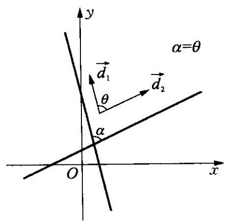

图 12-9

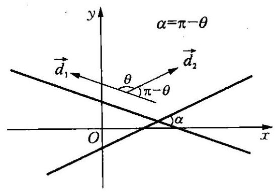

图 12-10

设两条直线的方程分别为:

${l}_{1} : {a}_{1}x + {b}_{1}y + {c}_{1} = 0,\left( {{a}_{1}\text{ 、 }{b}_{1}}\right.$ 不同时为零 $)$ ,

$$
{l}_{2} : {a}_{2}x + {b}_{2}y + {c}_{2} = 0,\left( {{a}_{2}\text{ 、 }{b}_{2}}\right. \text{ 不同时为零 })\text{ . }
$$

如何根据方程来确定两直线的夹角呢?

因为直线 ${l}_{1}\text{ 、 }{l}_{2}$ 的方向向量分别为 ${\overrightarrow{d}}_{1} = \left( {{b}_{1}, - {a}_{1}}\right) ,{\overrightarrow{d}}_{2} = \left( {b}_{2}\right.$ , $\left. {-{a}_{2}}\right)$ ,设向量 ${\overrightarrow{d}}_{1}\text{ 、 }{\overrightarrow{d}}_{2}$ 的夹角为 $\theta$ ,直线 ${l}_{1}\text{ 、 }{l}_{2}$ 的夹角为 $\alpha$ .

(1)当 $0 \leq  \theta  \leq  \frac{\pi }{2}$ 时,可得 $\alpha  = \theta$ ,如图 12-9 所示.

(2)当 $\frac{\pi }{2} < \theta  \leq  \pi$ 时,可得 $\alpha  = \pi  - \theta$ ,如图 12-10 所示.

因此有 $\cos \alpha  = \left| {\cos \theta }\right| ,\alpha  \in  \left\lbrack  {0,\frac{\pi }{2}}\right\rbrack  ,\theta  \in  \left\lbrack  {0,\pi }\right\rbrack$ .

由两个向量的夹角的计算公式,得:

$$
\cos \theta  = \frac{{\overrightarrow{d}}_{1} \cdot  {\overrightarrow{d}}_{2}}{\left| {\overrightarrow{d}}_{1}\right|  \cdot  \left| {\overrightarrow{d}}_{2}\right| } = \frac{{a}_{1}{a}_{2} + {b}_{1}{b}_{2}}{\sqrt{{a}_{1}^{2} + {b}_{1}^{2}}\sqrt{{a}_{2}^{2} + {b}_{2}^{2}}},
$$

从而得两条直线的夹角公式为:

$$
\cos \alpha  = \frac{\left| {a}_{1}{a}_{2} + {b}_{1}{b}_{2}\right| }{\sqrt{{a}_{1}^{2} + {b}_{1}^{2}}\sqrt{{a}_{2}^{2} + {b}_{2}^{2}}},\alpha  \in  \left\lbrack  {0,\frac{\pi }{2}}\right\rbrack  .
$$

特别地,当 ${a}_{1}{a}_{2} + {b}_{1}{b}_{2} = 0$ 时, $\alpha  = \frac{\pi }{2}$ ,此时 ${l}_{1} \bot  {l}_{2}$ .

在已知两条直线 ${l}_{1}\text{ 、 }{l}_{2}$ 的斜率分别为 ${k}_{1}\text{ 、 }{k}_{2}$ 的情况下,我们也可以得到两直线夹角 $\alpha$ 的另一个计算公式:

当 ${k}_{1}{k}_{2} \neq   - 1$ 时, $\tan \alpha  = \left| \frac{{k}_{2} - {k}_{1}}{1 + {k}_{2}{k}_{1}}\right| ,\alpha  \in  \left\lbrack  {0,\frac{\pi }{2}}\right)$ ;

当 ${k}_{1}{k}_{2} =  - 1$ 时, $\alpha  = \frac{\pi }{2}$ .

设两条直线 ${l}_{1}\text{ 、 }{l}_{2}$ 交于点 $P$ ,若直线 ${l}_{1}$ 绕点 $P$ 按逆时针方向旋转最小正角 $\alpha$ 到与直线 ${l}_{2}$ 重合位置，则我们称 $\alpha$ 为直线 ${l}_{1}$ 到直线 ${l}_{2}$ 的角，其中 $0 < \alpha  < \pi$ ,其计算公式如下:

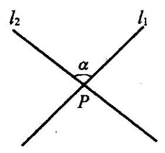

当 ${k}_{1}{k}_{2} \neq   - 1$ 时, $\tan \alpha  = \frac{{k}_{2} - {k}_{1}}{1 + {k}_{2}{k}_{1}}$ ;

当 ${k}_{1}{k}_{2} =  - 1$ 时, $\alpha  = \frac{\pi }{2}$ (其中 ${k}_{1}\text{ 、 }{k}_{2}$ 分别是直线 ${l}_{1}\text{ 、 }{l}_{2}$ 的斜率).

例 1 讨论下列各组直线之间的位置关系:

(1) ${l}_{1} : x + {a}^{2}y + 6 = 0,{l}_{2} : \left( {a - 2}\right) x + {3ay} + {2a} = 0$ ;

(2) ${l}_{1} : y - 3 = {k}_{1}\left( {x - 4}\right) ,{l}_{2} : y - 3 = {k}_{2}\left( {x + 4}\right)$ .

解 (1) 联立方程组: $\left\{  \begin{array}{l} x + {a}^{2}y + 6 = 0, \\  \left( {a - 2}\right) x + {3ay} + {2a} = 0, \end{array}\right.$

$D = \left| \begin{matrix} 1 & {a}^{2} \\  a - 2 & {3a} \end{matrix}\right|  =  - a\left( {a + 1}\right) \left( {a - 3}\right) ,{\dot{D}}_{x} = \left| \begin{matrix}  - 6 & {a}^{2} \\   - {2a} & {3a} \end{matrix}\right|  = {2a}(a +$

$$
\text{ 3) }\left( {a - 3}\right) ,{D}_{y} = \left| \begin{matrix} 1 &  - 6 \\  a - 2 &  - {2a} \end{matrix}\right|  = 4\left( {a - 3}\right) \text{ . }
$$

(i) 当 $a \neq  0$ 且 $a \neq   - 1$ 且 $a \neq  3$ 时, $D \neq  0$ ,方程组有唯一解,此时直线 ${l}_{1}$ 与 ${l}_{2}$ 相交;

(ii) 当 $a = 0$ 时, $D = {D}_{x} = 0,{D}_{y} \neq  0$ ,方程组无解,此时直线 ${l}_{1}$ 与 ${l}_{2}$ 平行;

(iii) 当 $a =  - 1$ 时, $D = 0,{D}_{x} \neq  0,{D}_{y} \neq  0$ ,方程组无解,此时直线 ${l}_{1}$ 与 ${l}_{2}$ 平行;

(iv) 当 $a = 3$ 时, $D = {D}_{x} = {D}_{y} = 0$ ,方程组有无穷多个解,此时直线 ${l}_{1}$ 与 ${l}_{2}$ 重合.

(2)本题也可以先将两直线的方程写成一般式后采用上述方法解决,但是考虑到两条直线分别经过两个定点 $\left( {4,3}\right) \text{ 、 }\left( {-4,3}\right)$ ,故我们只需分析两直线的斜率即可.

(i) 当 ${k}_{1} \neq  {k}_{2}$ 时,直线 ${l}_{1}$ 与 ${l}_{2}$ 相交;

(ii) 当 ${k}_{1} = {k}_{2} = 0$ 时,直线 ${l}_{1}$ 与 ${l}_{2}$ 重合;

(iii) 当 ${k}_{1} = {k}_{2} \neq  0$ 时,直线 ${l}_{1}$ 与 ${l}_{2}$ 平行.

例 2 (1) 当 $k$ 为何值时,直线 $y = {kx} + 3$ 过直线 ${2x} - y + 1 = 0$ 与 $y = x + 5$ 的交点;

(2)已知 $a$ 为实数，两直线 ${l}_{1} : {ax} + y + 1 = 0,{l}_{2} : x + y - a = 0$ 相交于一点,求证: 交点不可能在第一象限及 $x$ 轴上;

(3)若直线 $y = {kx} + {2k} + 1$ 和直线 $x + {2y} - 4 = 0$ 的交点在第四象限，求实数 $k$ 的取值范围.

解 (1) 解法一: 解方程组 $\left\{  \begin{array}{l} {2x} - y + 1 = 0, \\  y = x + 5, \end{array}\right.$ 得交点 $\left( {4,9}\right)$ .

将 $x = 4, y = 9$ 代入 $y = {kx} + 3$ 得 $9 = {4k} + 3$ ,解得 $k = \frac{3}{2}$ .

解法二: 将三条直线均写成一般式: ${kx} - y + 3 = 0,{2x} - y + 1 = 0$ , $x - y + 5 = 0.$

则三条直线共点的充要条件是: $\left| \begin{matrix} k &  - 1 & 3 \\  2 &  - 1 & 1 \\  1 &  - 1 & 5 \end{matrix}\right|  = 0$ ,将行列式化简得:

$$
- {4k} + 6 = 0,\;k = \frac{3}{2}.
$$

解法三: 过直线 ${2x} - y + 1 = 0$ 与 $y = x + 5$ 的交点的直线方程可以写成

$$
\mu \left( {{2x} - y + 1}\right)  + \lambda \left( {x - y + 5}\right)  = 0.\text{ ( }\lambda \text{ 与 }\mu \text{ 不同时为零) }
$$

整理得 $y = \frac{{2\mu } + \lambda }{\mu  + \lambda }x + \frac{\mu  + {5\lambda }}{\mu  + \lambda }$ ,与 $y = {kx} + 3$ 比较系数得

$$
\frac{\mu  + {5\lambda }}{\mu  + \lambda } = 3\text{ ,即 }\mu  = \lambda .
$$

所以 $k = \frac{{2\mu } + \lambda }{\mu  + \lambda } = \frac{3}{2}$ .

( 2 )解方程组 $\left\{  \begin{array}{l} {ax} + y + 1 = 0, \\  x + y - a = 0, \end{array}\right.$ 得交点 $\left( {-\frac{a + 1}{a - 1},\frac{{a}^{2} + 1}{a - 1}}\right)$ .

若 $\frac{{a}^{2} + 1}{a - 1} > 0$ ,则 $a > 1$ ,而当 $a > 1$ 时, $- \frac{a + 1}{a - 1} < 0$ ,所以交点不可能在第一象限内.

又因为 $a$ 为任意实数时,都有 ${a}^{2} + 1 \geq  1 > 0$ ,故 $\frac{{a}^{2} + 1}{a - 1} \neq  0$ .

因为 $a \neq  1$ (否则两直线平行,无交点),所以交点不可能在 $x$ 轴上.

(3)解方程组 $\left\{  \begin{array}{l} x + {2y} - 4 = 0, \\  y = {kx} + {2k} + 1, \end{array}\right.$ 得交点为 $\left( {-\frac{{4k} - 2}{{2k} + 1},\frac{{6k} + 1}{{2k} + 1}}\right)$ .

因为此点在第四象限,所以

$$
\left\{  {\begin{array}{l}  - \frac{{4k} - 2}{{2k} + 1} > 0, \\  \frac{{6k} + 1}{{2k} + 1} < 0, \end{array}\text{ 所以 } - \frac{1}{2} < k <  - \frac{1}{6}.}\right.
$$

例 3 ( 1 )已知直线 $l$ 经过点 $P\left( {2,1}\right)$ ，且和直线 ${5x} + {2y} + 3 = 0$ 的夹角等于 ${45}^{ \circ  }$ ,求直线 $l$ 的方程;

(2)等腰三角形一腰所在直线 ${l}_{1}$ 的方程是 $x - {2y} - 2 = 0$ ，底边所在直线 ${l}_{2}$ 的方程是 $x + y - 1 = 0$ ，点 $\left( {-2,0}\right)$ 在另一腰上，求这条腰所在直线 ${l}_{3}$ 的方程.

解 (1) 设直线 $l$ 的方程为 $y - 1 = {k}_{1}\left( {x - 2}\right)$ ,即为 ${k}_{1}x - y + 1 - \; 2{k}_{1} = 0$ ,由两直线的夹角公式得 $\cos {45}^{ \circ  } = \frac{\left| 5{k}_{1} + 2 \cdot  \left( -1\right) \right| }{\sqrt{29} \cdot  \sqrt{{k}_{1}^{2} + 1}}$ ,解此方程得 ${k}_{1} =  - \frac{3}{7}$ 或 ${k}_{1} = \frac{7}{3}$ .

所以直线 $l$ 的方程为: $y - 1 =  - \frac{3}{7}\left( {x - 2}\right)$ 或 $y - 1 = \frac{7}{3}\left( {x - 2}\right)$ , 即: ${3x} + {7y} - {13} = 0$ 或 ${7x} - {3y} - {11} = 0$ .

(2)设 ${l}_{1}\text{ 、 }{l}_{2}\text{ 、 }{l}_{3}$ 的斜率分别为 ${k}_{1}\text{ 、 }{k}_{2}\text{ 、 }{k}_{3},{l}_{1}$ 与 ${l}_{2}$ 的夹角的补角是 ${\theta }_{1}$ ， ${l}_{2}$ 与 ${l}_{3}$ 的夹角的补角是 ${\theta }_{2}$ ，如图 12-11. 因为 ${l}_{1}\text{ 、 }{l}_{2}\text{ 、 }{l}_{3}$ 所围成的三角形是等腰三角形，所以 ${\theta }_{1} = {\theta }_{2}$ ，因为 ${k}_{1} = \frac{1}{2}$ ， ${k}_{2} =  - 1$ .

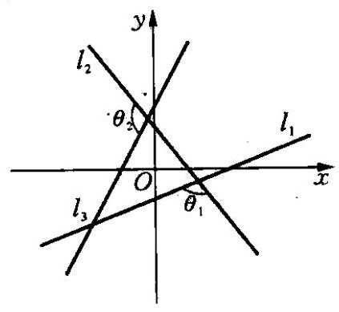

图 12-11

$\tan {\theta }_{1} = \frac{{k}_{2} - {k}_{1}}{1 + {k}_{2}{k}_{1}} = \frac{\left( {-1}\right)  - \frac{1}{2}}{1 + \left( {-1}\right)  \cdot  \frac{1}{2}} =  - 3.$

由 $\tan {\theta }_{2} = \tan {\theta }_{1} =  - 3$ ,得

$\frac{{k}_{3} - {k}_{2}}{1 + {k}_{3}{k}_{2}} =  - 3$ . 将 ${k}_{2} =  - 1$ 代入得 $\frac{{k}_{3} + 1}{1 - {k}_{3}} =  - 3$ ,解得 ${k}_{3} = 2$ .

因为 ${l}_{3}$ 经过点 $\left( {-2,0}\right)$ ,斜率为 2,写出其点斜式方程为 $y = 2\lbrack x - \; \left( {-2}\right) \rbrack$ ,得: ${2x} - y + 4 = 0$ ,即为直线 ${l}_{3}$ 的方程.

例 4 求证: 不论 $m$ 为什么实数,直线 $\left( {m - 1}\right) x + \left( {{2m} - 1}\right) y = m -$ 5 都通过一定点.

证明 取 $m = 1$ ,得直线方程 $y =  - 4$ ; 再取 $m = \frac{1}{2}$ ,得直线方程为 $x = 9$ . 从而得两条直线的交点为 $\left( {9, - 4}\right)$ ,又当 $x = 9, y =  - 4$ 时,有

$$
9\left( {m - 1}\right)  + \left( {-4}\right) \left( {{2m} - 1}\right) y = m - 5,
$$

即点 $\left( {9, - 4}\right)$ 在直线 $\left( {m - 1}\right) x + \left( {{2m} - 1}\right) y = m - 5$ 上,故直线

$$
\left( {m - 1}\right) x + \left( {{2m} - 1}\right) y = m - 5
$$

都通过定点 $\left( {9, - 4}\right)$ .

例 5 已知点 $A$ 的坐标为 $\left( {-4,4}\right)$ ,直线 $l$ 的方程为 ${3x} + y - 2 =$ 0,求:

(1)点 $A$ 关于直线 $l$ 的对称点 ${A}^{\prime }$ 的坐标；

(2)直线 $l$ 关于点 $A$ 的对称直线 ${l}^{\prime }$ 的方程.

解(1)设点 ${A}^{\prime }$ 的坐标为 $\left( {{x}^{\prime },{y}^{\prime }}\right)$ ，因为点 $A$ 与 ${A}^{\prime }$ 关于直线 $l$ 对称， 所以 $A{A}^{\prime } \bot  l$ ,且 $A{A}^{\prime }$ 的中点在 $l$ 上,而直线 $l$ 的斜率是 -3,所以 ${k}_{A{A}^{\prime }} = \frac{1}{3}.$

又因为 ${k}_{A{A}^{\prime }} = \frac{{y}^{\prime } - 4}{{x}^{\prime } + 4}$ ,所以

$$
\frac{{y}^{\prime } - 4}{{x}^{\prime } + 4} = \frac{1}{3}
$$

①

又因为直线 $l$ 的方程为 ${3x} + y - 2 = 0, A{A}^{\prime }$ 的中点坐标是 $\left( {\frac{{x}^{\prime } - 4}{2},\frac{{y}^{\prime } + 4}{2}}\right)$ ,所以

$$
3 \cdot  \frac{{x}^{\prime } - 4}{2} + \frac{{y}^{\prime } + 4}{2} - 2 = 0.
$$

②

由①和②，解得 ${x}^{\prime } = 2,{y}^{\prime } = 6$ . 所以 ${A}^{\prime }$ 点的坐标为 $\left( {2,6}\right)$ .

(2)关于点 $A$ 对称的两直线 $l$ 与 ${l}^{\prime }$ 互相平行，于是可设 ${l}^{\prime }$ 的方程为 ${3x} + y + c = 0$ . 在直线 $l$ 上任取一点 $M\left( {0,2}\right)$ ,其关于点 $A$ 对称的点为 ${M}^{\prime }\left( {{x}^{\prime },{y}^{\prime }}\right)$ ,于是点 ${M}^{\prime }$ 在 ${l}^{\prime }$ 上,且 $M{M}^{\prime }$ 的中点为点 $A$ ,由此得

$\frac{{x}^{\prime } + 0}{2} =  - 4,\frac{{y}^{\prime } + 2}{2} = 4$ ,即: ${x}^{\prime } =  - 8,{y}^{\prime } = 6$ . 于是有 ${M}^{\prime }\left( {-8,6}\right)$ .

因为点 ${M}^{\prime }$ 在 ${l}^{\prime }$ 上,所以 $3 \times  \left( {-8}\right)  + 6 + c = 0,\therefore c = {18}$ .

故直线 ${l}^{\prime }$ 的方程为 ${3x} + y + {18} = 0$ .

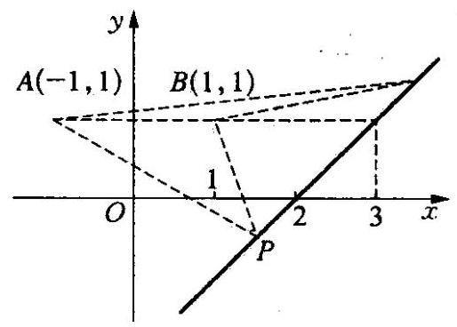

图 12-12

例 6 如图 12-12,已知点 $A\left( {-1,1}\right) \text{ 、 }B\left( {1,1}\right)$ ,点 $P$ 是直线 $y = \; x - 2$ 上的一点,求满足 $\angle {APB}$ 最大的点 $P$ 的坐标及 $\angle {APB}$ 的最大值.

解 设 $P\left( {t, t - 2}\right)$ ,当 $t \neq   \pm  1$ 时,

$$
{k}_{AP} = \frac{t - 3}{t + 1},{k}_{BP} = \frac{t - 3}{t - 1}.
$$

当 $t = 1$ 时， $\angle {APB} = \frac{\pi }{4}$ ；

当 $t =  - 1$ 时， $\angle {APB} = \arctan \frac{1}{2}$ ；

当 $t = 3$ 时, $\angle {APB} = 0$ ;

当 $t < 3$ ,且 $t \neq   \pm  1$ 时,

$\tan \angle {APB} = \frac{{k}_{AP} - {k}_{BP}}{1 + {k}_{AP} \cdot  {k}_{BP}} = \frac{1}{\left( {3 - t}\right)  + \frac{4}{3 - t} - 3} < 1.$

所以 $P$ 点坐标为 $\left( {1, - 1}\right)$ 时, $\angle {APB}$ 有最大值 $\frac{\pi }{4}$ ;

当 $t > 3$ 时,同法可求 $\angle {APB}$ 的最大值是 $\arctan \frac{1}{7}$ .

所以,当 $P$ 点的坐标是 $\left( {1, - 1}\right)$ 时, $\angle {APB}$ 有最大值 $\frac{\pi }{4}$ .

课堂活动

·大家乐

设直线 ${l}_{1}\text{ 、 }{l}_{2}$ 的斜率分别为 ${k}_{1}\text{ 、 }{k}_{2}$ 时,请证明直线 ${l}_{1}\text{ 、 }{l}_{2}$ 的夹角公式为:

$$
\tan \alpha  = \left| \frac{{k}_{2} - {k}_{1}}{1 + {k}_{2} \cdot  {k}_{1}}\right| \left( {{k}_{1} \cdot  {k}_{2} \neq   - 1}\right) .
$$

司題蘇司

一百一安

1. 设 $P\left( {{x}_{1},{y}_{1}}\right)$ 是直线 $l : f\left( {x, y}\right)  = 0$ 上一点, $Q\left( {{x}_{2},{y}_{2}}\right)$ 是 $l$ 外一点,则方程 $f\left( {x, y}\right)  = f\left( {{x}_{1},{y}_{1}}\right)  + \; f\left( {{x}_{2},{y}_{2}}\right)$ 表示的直线(   ).

(A) 与 $l$ 重合

(B) 与 $l$ 相交于 $P$ 点

(C) 过 $Q$ 点且与 $l$ 平行

(D) 过 $Q$ 点且与 $l$ 相交

2. " $m = \frac{1}{2}$ " 是 "直线 $\left( {m + 2}\right) x + {3my} + 1 = 0$ 与直线 $\left( {m - 2}\right) x + \; \left( {m + 2}\right) y - 3 = 0$ 相互垂直” 的什么条件?

3. 已知三角形 ${ABC}$ 三个顶点为 $A\left( {1,1}\right)$ 、 $B\left( {1 - \sqrt{3},0}\right)$ 、 $C(1 - \frac{\sqrt{3}}{3}$ , 0，求角 $A$ 的内角平分线所在的直线方程

4. 求直线 $x - {2y} + 1 = 0$ 关于直线 $x = 1$ 对称的直线方程.

5. $\bigtriangleup {ABC}$ 的三边 $a\text{ 、 }b\text{ 、 }c$ 分别对应角 $A\text{ 、 }B\text{ 、 }C$ ,若 $\operatorname{lgsin}A\text{ 、 }\operatorname{lgsin}B$ 、 $\operatorname{lgsin}C$ 成等差数列,求两直线 ${l}_{1} : x{\sin }^{2}A + y\sin A = a$ 与直线 ${l}_{2}$ : $x{\sin }^{2}B + y\sin C = c$ 的位置关系.

6. 两条直线 ${A}_{1}x + {B}_{1}y + {C}_{1} = 0,{A}_{2}x + {B}_{2}y + {C}_{2} = 0$ 垂直的充要条件是什么?

7. 已知长方形的四个顶点 $A\left( {0,0}\right) \text{ 、 }B\left( {2,0}\right) \text{ 、 }C\left( {2,1}\right)$ 和 $D\left( {0,1}\right)$ , 一质点从 ${AB}$ 的中点 ${P}_{0}$ 沿与 ${AB}$ 的夹角 $\theta$ 的方向射到 ${BC}$ 上的点 ${P}_{1}$ 后, 依次反射到 ${CD}\text{ 、 }{DA}$ 和 ${AB}$ 上的点 ${P}_{2}\text{ 、 }{P}_{3}$ 和 ${P}_{4}$ (入射角等于反射角),设 ${P}_{4}$ 的坐标为 $\left( {{x}_{4},0}\right)$ ,若 $1 < {x}_{4} < 2$ ,求 $\tan \theta$ 的取值范围.

8. 在 $\bigtriangleup {ABC}$ 中,已知 $A\left( {1,5}\right) ,\angle B$ 的平分线为 $x = y,\angle C$ 的平分线为 $y = 2$ ,求直线 ${BC}$ 的方程.

9. 三条直线 ${l}_{1} : x + y + a = 0,{l}_{2} : x + {ay} + 1 = 0,{l}_{3} : {ax} + y + 1 = 0$ 能构成三角形,求实数 $a$ 的取值范围.

10. 复数 ${z}_{0} = 1 + m\mathrm{i}\left( {m > 0}\right) , z = x + y\mathrm{i}$ 和 $\omega  = {x}^{\prime } + {y}^{\prime }\mathrm{i}$ ,其中 $x$ 、 $y\text{ 、 }{x}^{\prime }\text{ 、 }{y}^{\prime }$ 均为实数,且有 $\omega  = {z}_{0} \cdot  \bar{z},\left| \omega \right|  = 2\left| z\right|$ .

(1)求 $m$ 的值，并分别写出 ${x}^{\prime }$ 和 ${y}^{\prime }$ 用 $x$ 、 $y$ 表示的关系式；

(2)将 $\left( {x, y}\right)$ 作为点 $P$ 的坐标， $\left( {{x}^{\prime },{y}^{\prime }}\right)$ 作为点 $Q$ 的坐标，上述关系式可看作是坐标平面上点的一个变换: 它将平面上的点 $P$ 变到这一平面上的点 $Q$ ，当点 $P$ 在直线 $y = x + 1$ 上移动时，求点 $P$ 经该变换后得到的点 $Q$ 的轨迹方程；

(3)是否存在这样的直线:它上面的任意一点经上述变换后得到的点仍在该直线上? 若存在, 试求出所有这些直线的方程; 若不存在, 请说明理由.

### 12.4 点到直线的距离 (Distance from a Point to a Straight Line)

已知直线 $l$ 的方程是 ${ax} + {by} + c = 0\left( {a\text{ 、 }b}\right.$ 不同时为 $0)$ ,点 $P\left( {x}_{0}\right.$ , ${y}_{0}$ ) 是直线 $l$ 外一点,那么点 $P$ 到直线 $l : {ax} + {by} + c = 0$ 的距离如何求呢?

如图 12-13,设点 $P\left( {{x}_{0},{y}_{0}}\right)$ 在直线 $l$ 上的射影为 $Q\left( {{x}_{1},{y}_{1}}\right)$ ,那么点 $P$ 到直线 $l$ 的距离就是线段 ${PQ}$ 的长度,也就是向量 $\overrightarrow{QP}$ 的模,因为直线 $l : {ax} + {by} + c =$ 0 的法向量 $\overrightarrow{n} = \left( {a, b}\right)$ 与向量 $\overrightarrow{QP} = \left( {{x}_{0} - }\right. \; \left. {{x}_{1},{y}_{0} - {y}_{1}}\right)$ 平行,所以当两个向量同向时,其夹角为 0 ,当两个向量反向时,其夹角为 $\pi$ ,因此 $\overrightarrow{QP} \cdot  \overrightarrow{n} =  \pm  \left| \overrightarrow{QP}\right|  \cdot  \left| \overrightarrow{n}\right|$ ,于是有

$$
\left| \overrightarrow{QP}\right|  = \frac{\left| \overrightarrow{QP} \cdot  \overrightarrow{n}\right| }{\left| \overrightarrow{n}\right| } = \frac{\left| a\left( {x}_{0} - {x}_{1}\right)  + b\left( {y}_{0} - {y}_{1}\right) \right| }{\sqrt{{a}^{2} + {b}^{2}}}
$$

$$
= \frac{\left| a{x}_{0} + b{y}_{0} - \left( a{x}_{1} + b{y}_{1}\right) \right| }{\sqrt{{a}^{2} + {b}^{2}}},
$$

①

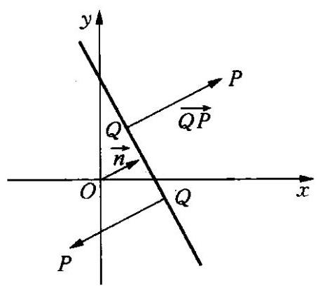

图 12-13

因为点 $Q\left( {{x}_{1},{y}_{1}}\right)$ 在直线 $l : {ax} + {by} + c = 0$ 上,所以,点 $Q$ 的坐标满足直线 $l$ 的方程,有 $a{x}_{1} + b{y}_{1} + c = 0$ ,即 $a{x}_{1} + b{y}_{1} =  - c$ ,代入 ① 式,整理得

$$
\left| \overrightarrow{QP}\right|  = \frac{\left| a{x}_{0} + b{y}_{0} + c\right| }{\sqrt{{a}^{2} + {b}^{2}}}.
$$

②

上述表达式就是点 $P\left( {{x}_{0},{y}_{0}}\right)$ 到直线 $l : {ax} + {by} + c = 0$ 的距离公式.

在点到直线距离公式的推理过程中,如果令 $\delta  = \frac{a{x}_{0} + b{y}_{0} + c}{\sqrt{{a}^{2} + {b}^{2}}}$ :

当点 $P\left( {{x}_{0},{y}_{0}}\right)$ 在直线 $l : {ax} + {by} + c = 0$ 法向量 $\overrightarrow{n} = \left( {a, b}\right)$ 指向的一侧时, $\delta  = d > 0\left( {d\text{ 为点 }P}\right.$ 到直线 $l$ 的距离);

当点 $P\left( {{x}_{0},{y}_{0}}\right)$ 在直线 $l : {ax} + {by} + c = 0$ 法向量 $\overrightarrow{n} = \left( {a, b}\right)$ 指向的另一侧时, $\delta  =  - d < 0$ ;

当点 $P\left( {{x}_{0},{y}_{0}}\right)$ 在直线 $l : {ax} + {by} + c = 0$ 上时, $\delta  = d = 0$ .

因此, $\delta  = \frac{a{x}_{0} + b{y}_{0} + c}{\sqrt{{a}^{2} + {b}^{2}}}$ 的符号确定了点 $P$ 关于直线 $l$ 的相对位置:

在直线同侧的所有点, $\delta$ 的符号是相同的; 在直线异侧的点, $\delta$ 的符号是相反的.

例 1 求点 $P\left( {-1,2}\right)$ 到直线: (1) ${2x} + y - {10} = 0;\;\left( 2\right) {3x} = 2$ 的距离.

解 (1) 根据点到直线的距离公式,得

$$
d = \frac{\left| 2 \times  \left( -1\right)  + 1 \times  2 - {10}\right| }{\sqrt{{2}^{2} + 1}} = \frac{10}{\sqrt{5}} = 2\sqrt{5}.
$$

(2)因为直线 ${3x} = 2$ 平行于 $y$ 轴,所以 $d = \left| {\frac{2}{3} - \left( {-1}\right) }\right|  = \frac{5}{3}$ .

例 2 已知两条平行线直线 ${l}_{1}$ 和 ${l}_{2}$ 的一般式方程为 ${l}_{1} : {Ax} + {By} + \; {C}_{1} = 0,{l}_{2} : {Ax} + {By} + {C}_{2} = 0$ ,求证: ${l}_{1}$ 与 ${l}_{2}$ 的距离为 $d = \frac{\left| {C}_{1} - {C}_{2}\right| }{\sqrt{{A}^{2} + {B}^{2}}}$ .

证明 设 ${P}_{0}\left( {{x}_{0},{y}_{0}}\right)$ 是直线 ${Ax} + {By} + {C}_{2} = 0$ 上任一点,则点 ${P}_{0}$ 到直线 ${Ax} + {By} + {C}_{1} = 0$ 的距离为 $d = \frac{\left| A{x}_{0} + B{y}_{0} + {C}_{1}\right| }{\sqrt{{A}^{2} + {B}^{2}}}$ . 又 $A{x}_{0} + \; B{y}_{0} + {C}_{2} = 0$ ,即 $A{x}_{0} + B{y}_{0} =  - {C}_{2}$ ,所以 $d = \frac{\left| {C}_{1} - {C}_{2}\right| }{\sqrt{{A}^{2} + {B}^{2}}}$ .

例 3 正方形的中心在 $C\left( {-1,0}\right)$ ,一条边所在的直线方程是 $x + \; {3y} - 5 = 0$ ,求其他三边所在的直线方程.

解 正方形的边心距 $d = \frac{\left| \left( -1\right)  + 3 \times  0 - 5\right| }{\sqrt{{1}^{2} + {3}^{2}}} = \frac{3\sqrt{10}}{5}$ .

设与 $x + {3y} - 5 = 0$ 平行的一边所在的直线方程是 $x + {3y} + {c}_{1} = 0$ , 则中心到这条直线的距离为 $\frac{3\sqrt{10}}{5}$ ，于是有

$$
\frac{\left| \left( -1\right)  + 3 \times  0 + {c}_{1}\right| }{\sqrt{{1}^{2} + {3}^{2}}} = \frac{3\sqrt{10}}{5}.
$$

解得 ${c}_{1} = 7$ 或 ${c}_{1} =  - 5$ (舍去),所以与 $x + {3y} - 5 = 0$ 平行的边所在的直线方程是 $x + {3y} + 7 = 0$ .

设与 $x + {3y} - 5 = 0$ 垂直的边所在的直线方程是 ${3x} - y + {c}_{2} = 0$ , 则中心到这条直线的距离为 $\frac{3\sqrt{10}}{5}$ ，由点到直线的距离公式有

$$
\frac{\left| 3 \times  \left( -1\right)  - 1 \times  0 + {c}_{2}\right| }{\sqrt{{3}^{2} + {1}^{2}}} = \frac{3\sqrt{10}}{5}.
$$

解得 ${c}_{2} =  - 3$ 或 ${c}_{2} = 9$ . 所以与 $x + {3y} - 5 = 0$ 垂直的两边所在的直线方程是 ${3x} - y - 3 = 0$ 和 ${3x} - y + 9 = 0$ .

课堂活动课堂活动

考虑是否还有其他方法推导点到直线的距离公式?

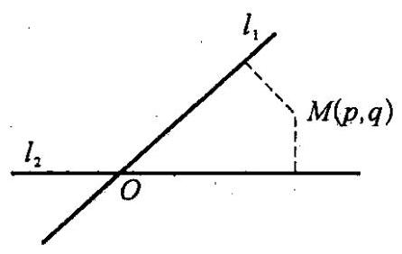

图 12-14

习题练习

、自己禁

1. 如图 12-14,平面中两条直线 ${l}_{1}$ 和 ${l}_{2}$ 相交于点 $O$ ,对于平面上任意一点 $M$ ,若 $p\text{ 、 }q$ 分别是 $M$ 到直线 ${l}_{1}$ 和 ${l}_{2}$ 的距离,则称有序非负实数对 $\left( {p, q}\right)$ 是点 $M$ 的“距离坐标”. 已知常数 $p \geq  0, q \geq  0$ ,给出下列命题,判断其真假.

(1)若 $p = q = 0$ ，则“距离坐标”为(0，0)的点有且仅有 1 个；

(2)若 ${pq} = 0$ ，且 $p + q \neq  0$ ，则“距离坐标”为( $p, q$ )的点有且仅有 2 个;

(3)若 ${pq} \neq  0$ ，则“距离坐标”为( $p, q$ )的点有且仅有 4 个.

2. 求点 $A\left( {1,1}\right)$ 到直线 $x\cos \theta  + y\sin \theta  - 2 = 0$ 的距离的最大值.

3. 已知两个定点 $M\left( {-1,0}\right) \text{ 、 }N\left( {1,0}\right)$ ,点 $P$ 是平面上的一个动点, 点 $N$ 到直线 ${PM}$ 的距离为 1 . 求直线 ${PM}$ 的方程.

4. 已知实数 $x\text{ 、 }y$ 满足关系式: ${5x} + {12y} - {60} = 0$ ,求表达式 $\sqrt{{x}^{2} + {y}^{2}}$ 的最小值.

5. 直线 ${l}_{1}\text{ 、 }{l}_{2}$ 分别过点 $P\left( {-2,3}\right) \text{ 、 }Q\left( {3, - 2}\right)$ ,它们分别绕点 $P$ 和 $Q$ 旋转且保持平行,求两直线间的距离 $d$ 的取值范围.

6. 已知两点 $A\left( {-2,3}\right) \text{ 、 }B\left( {3,5}\right)$ ,在 $x$ 轴上存在一点 $P\left( {x,0}\right)$ ,使 $\left| {PA}\right|  + \left| {PB}\right|$ 的值最小,求实数 $x$ 的值; 在 $y$ 轴上存在一点 $Q\left( {0, y}\right)$ ,使 || ${QA}\left| -\right| {QB}\left| \right|$ 的值最大,求实数 $y$ 的值.

7. 已知过点 $A\left( {1,1}\right)$ 且斜率为 $- m\left( {m > 0}\right)$ 的直线 $l$ 与 $x$ 、 $y$ 轴分别交于 $P\text{ 、 }Q$ 两点,过点 $P\text{ 、 }Q$ 分别作直线 ${2x} + y = 0$ 的垂线,垂足为 $R\text{ 、 }S$ ,求四边形 PRSQ 的面积的最小值并求此时直线 $l$ 的方程.

8. 已知函数 $f\left( x\right)  = x + \frac{a}{x}$ 的定义域为 $\left( {0, + \infty }\right)$ ,且 $f\left( 2\right)  = 2 + \; \frac{\sqrt{2}}{2}$ . 设点 $P$ 是函数图象上的任意一点,过点 $P$ 分别作直线 $y = x$ 和 $y$ 轴的垂线,垂足分别为 $M\text{ 、 }N$ .

(1)求 $a$ 的值；

(2)问 $\left| {PM}\right|  \cdot  \left| {PN}\right|$ 是否为定值？若是，则求出该定值，若不是，则说明理由;

(3)设 $O$ 为坐标原点，求四边形 ${OMPN}$ 面积的最小值.

### 12.5 二元一次不等式的解集 (Solution Set of Quadratic Inequality)

在直角坐标系中,直线 $l : {ax} + {by} + c = 0$ 表示满足一定条件的点的集合,直线 $l$ 把平面分成两部分,其中一部分的点满足条件: ${ax} + {by} + \; c \leq  0$ ,另一部分的点满足: ${ax} + {by} + c > 0$ ,也就是说,二元一次不等式在平面上表示一个平面区域. 要判定哪一部分的点满足不等式 ${ax} + {by} + \; c \leq  0$ ,只要在该部分任取一点如 $\left( {{x}_{0},{y}_{0}}\right)$ ,如果 $a{x}_{0} + b{y}_{0} + c \leq  0$ ,那么该部分所有的点都满足这个不等式 ${ax} + {by} + c \leq  0$ ,而另一个部分的所有点都满足不等式 ${ax} + {by} + c > 0$ . 比如 $x + y \leq  7$ ,因为原点 $\left( {0,0}\right)$ 满足 $0 + 0 < 7$ ,而原点 $\left( {0,0}\right)$ 在直线 $x + y = 7$ 的左下侧,故不等式 $x + \; y \leq  7$ 表示直线 $x + y = 7$ 的左下侧的部分 (包括直线 $x + y = 7$ 上的点).

例 1 请在平面直角坐标系中画出点 $\left( {x, y}\right)$ 满足的不等式组 $\left\{  \begin{array}{l} {2x} - y - 3 \leq  0, \\  {4x} + {5y} - {27} \leq  0,\text{ 的平面区域. } \\  {8x} + {3y} \geq  {19} \end{array}\right.$

解 在直角坐标系中,作出三条直线:

$$
{l}_{1} : {2x} - y - 3 = 0,
$$

$$
{l}_{2} : {4x} + {5y} - {27} = 0,
$$

$$
{l}_{3} : {8x} + {3y} - {19} = 0.
$$

上述三条直线围成一个三角形区域(如图 12-15).

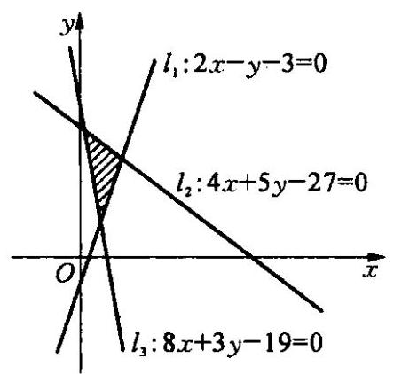

图 12-15

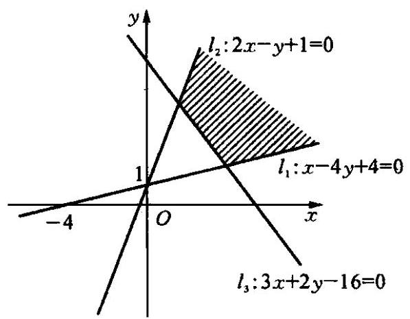

图 12-16

例 2 已知 $x\text{ 、 }y$ 满足不等式组 $\left\{  \begin{array}{l} x - {4y} + 4 \leq  0, \\  {2x} - y + 1 \geq  0, \\  {3x} + {2y} - {16} \geq  0, \end{array}\right.$ 画出点 $\left( {x, y}\right)$ 所在的平面区域.

解 作出三条直线: ${l}_{1} : x - {4y} + 4 = 0,{l}_{2} : {2x} - y + 1 = 0,{l}_{3} : \; {3x} + {2y} - {16} = 0.$

上述三条直线在平面上围成了开放的三边形区域. (如图 12-16)

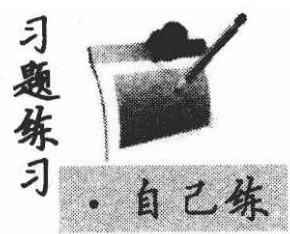

在平面直角坐标系中,作出下列各题表示的平面区域:

(1) $\left\{  \begin{array}{l} y \leq  x, \\  x + y \leq  1, \\  y \geq   - 1; \end{array}\right.$ (2) $\left\{  \begin{array}{l} {4x} + {3y} - {12} > 0, \\  3 - x \geq  0, \\  x + {3y} \leq  {12}; \end{array}\right.$

(3) $\left\{  \begin{array}{l} y \geq  \frac{1}{2}x, \\  y \leq   - \left| x\right|  + 3; \end{array}\right.$ (4) $\left\{  \begin{array}{l} y \geq  \left| {x - 1}\right| , \\  y \leq   - x + 2, \\  x \geq  0. \end{array}\right.$

### 12.6 线性规划问题及其解决 (Linear Programming Problems and Their Solutions)

先看下面的一个例子:

有一个食品生产工厂生产 $A\text{ 、 }B$ 两种食品,需要用甲、乙、丙三种原材料，这三种原材料的数量有一定限制(见下表). 其中 $A\text{ 、 }B$ 两种食品的利润分别为 300 元和 200 元，该厂应该怎样安排这两种食品的生产才能使获得的利润最大?

<table><tr><td></td><td>原材料甲</td><td>原材料乙</td><td>原材料丙</td></tr><tr><td>食品 $A$</td><td>1</td><td>4</td><td>2</td></tr><tr><td>食品 $B$</td><td>1</td><td>0</td><td>5 -</td></tr><tr><td>原材料的数量</td><td>50</td><td>160</td><td>200</td></tr></table>

设分别生产 $A\text{ 、 }B$ 两种食品 $x$ 吨和 $y$ 吨,根据题意可列出下面的条件关系:

$$
\left\{  \begin{array}{l} x + y \leq  {50}, \\  {4x} \leq  {160}, \\  {2x} + {5y} \leq  {200}, \\  x \geq  0, \\  y \geq  0. \end{array}\right.
$$

①

利润函数为: $f\left( {x, y}\right)  = {300x} + {200y}$ .②

上述问题就是要求出满足不等式组①的 $\left( {x, y}\right)$ ，使得函数②取得最大值. 我们把②中关于 $x$ 、 $y$ 的一次函数 $f\left( {x, y}\right)  = {300x} + {200y}$ 叫做线性目标函数，不等式组①是关于 $x$ 、 $y$ 的一次不等式组，我们把它叫做 $(x$ , $y)$ 的线性约束条件,在线性约束条件下求目标函数的最大(或最小)值的问题叫做线性规划问题. 由不等式组①确定的平面区域称为 $\left( {x, y}\right)$ 的可行域,可行域中每一个符合条件的解 $\left( {x, y}\right)$ 称为可行解,使目标函数取到最大(或最小)值的解( $x, y$ )称为最优解.

例 1 为迎接 2008 年奥运会召开，某工艺品加工厂准备生产具有收藏价值的奥运会标志——“中国印 · 舞动的北京”和奥运会吉祥物——“福娃”. 该厂所用的主要原料为 $A$ 、 $B$ 两种贵重金属，已知生产一套奥运会标志需用原料 $A$ 和原料 $B$ 的量分别为 4 盒和 3 盒，生产一套奥运会吉祥物需用原料 $A$ 和原料 $B$ 的量分别为 5 盒和 10 盒. 若奥运会标志每套可获利 700 元，奥运会吉祥物每套可获利 1200 元，该厂月初一次性购进原料 $A$ 、 $B$ 的量分别为 200 盒和 300 盒. 问该厂生产奥运会标志和奥运会吉祥物各多少套才能使该厂月利润最大, 最大利润为多少?

解 设该厂每月生产奥运会标志和奥运会吉祥物分别为 $x\text{ 、 }y$ 套,月利润为 $z$ 元,由题意得

$$
\left\{  {\begin{array}{l} {4x} + {5y} \leq  {200}, \\  {3x} + {10y} \leq  {300}, \\  x \geq  0, \\  y \geq  0. \end{array}\left( {x, y \in  \mathbf{N}}\right) }\right.
$$

目标函数为 $z = {700x} + {1200y}$ .

作出二元一次不等式组所表示的平面区域,即可行域,如图 12-17.

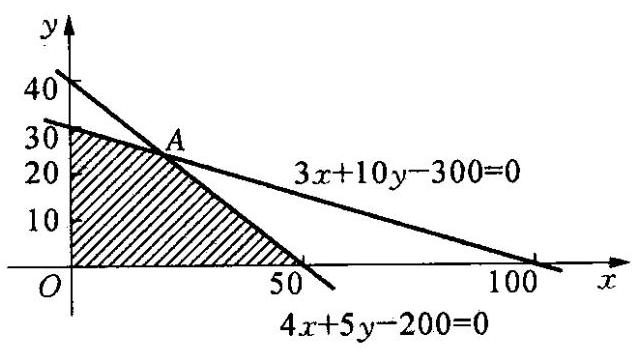

图 12-17

目标函数可变形为

$$
y =  - \frac{7}{12}x + \frac{z}{1200},
$$

因 为 $- \frac{4}{5} <  - \frac{7}{12} < \; - \frac{3}{10}$ ,所以

当 $y = \frac{-7}{12}x + \frac{z}{1200}$ 通过

图中的点 $A$ 时, $\frac{z}{1200}$ 最大,这时 $z$ 最大. 由 $\left\{  \begin{array}{l} {4x} + {5y} - {200} = 0, \\  {3x} + {10y} - {300} = 0, \end{array}\right.$ 解得点 $A$ 坐标为 $\left( {{20},{24}}\right)$ ,代入 $z = {700x} + {1200y}$ 求得此时 $z = {42800}$ . 即该厂生产奥运会标志和奥运会吉祥物分别 20、24 套时, 月利润最大, 为 42800 元.

例 2 某人上午 7 时,乘摩托艇以匀速 $v$ 海里/时 $\left( {4 \leq  v \leq  {20}}\right)$ 从 $A$ 港出发到距 50 海里的 $B$ 港去,然后乘汽车以 $w$ 千米/时 $\left( {{30} \leq  w \leq  {100}}\right)$ 自 $B$ 港向距 300 千米的 $C$ 市驶去，应该在同一天下午 4 至 9 点到达 $C$ 市. 设汽车、摩托艇所需的时间分别是 $x$ 、 $y$ 小时.

(1)写出 $x$ 、 $y$ 所满足的条件，并在所给的平面直角坐标系内，作出表示 $x$ 、 $y$ 范围的图形；

(2)如果已知所需的经费 $p = {100} + 3\left( {5 - x}\right)  + 2\left( {8 - y}\right)$ (元)，那么 $v\text{ 、 }w$ 分别是多少时走得最经济? 此时需花费多少元?

解 (1) 由题意得 $v = \frac{50}{y}, w = \frac{300}{x},4 \leq  v \leq  {20},{30} \leq  w \leq  {100}$ , 所以 $3 \leq  x \leq  {10},\frac{5}{2} \leq  y \leq  \frac{25}{2}$ .①

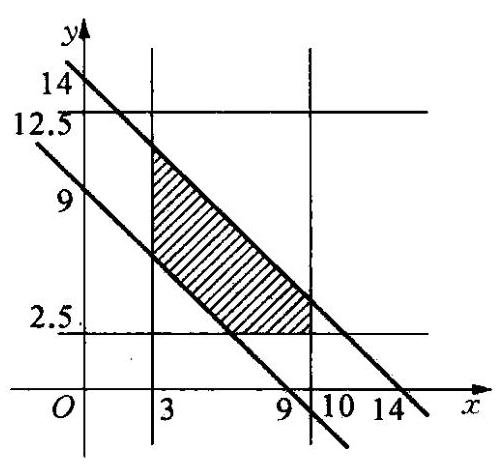

图 12-18

由于汽车、摩托艇所要的时间和 $x + y$ 应在 9 至 14 小时之间，即

$$
9 \leq  x + y \leq  {14},
$$

②

因此满足①②的点 $\left( {x, y}\right)$ 的存在范围是图 12-18 中的阴影部分 (包括边界).

(2)因为 $p = {100} + 3\left( {5 - x}\right)  + \; 2\left( {8 - y}\right)$ ,所以 ${3x} + {2y} = {131} - p$ ,设 ${131} - p = k$ ,那么当 $k$ 最大时, $p$ 最小,在图中通过阴影部分区域且斜率为 $- \frac{3}{2}$ 的直线 ${3x} + {2y} = k$ 中,使 $k$ 值最大的直线必通过点 $\left( {{10},4}\right)$ ,即当 $y = 4$ 时, $p$ 最小,此时 $x = {10}, v =$ 12. $5, w = {30}, p$ 的最小值为 93 元.

例 3 已知变量 $x\text{ 、 }y$ 满足约束条件 $\left\{  \begin{array}{l} x - y + 2 \leq  0, \\  x \geq  1, \\  x + y - 7 \leq  0, \end{array}\right.$ 求 $\frac{y}{x}$ 的取值范围.

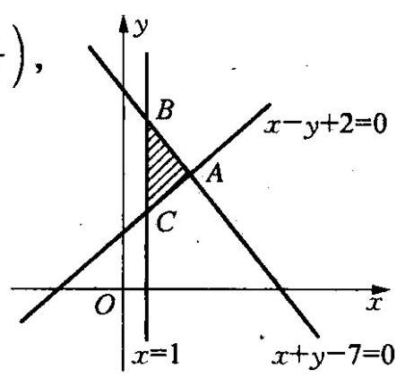

图 12-19

解 由 $\left\{  \begin{array}{l} x + y - 7 = 0, \\  x - y + 2 = 0 \end{array}\right.$ 得 $A\left( {\frac{5}{2},\frac{9}{2}}\right)$ , 所以 ${k}_{OA} = \frac{9}{5}$ ;

由 $\left\{  \begin{array}{l} x + y - 7 = 0, \\  x = 1 \end{array}\right.$ 得 $B\left( {1,6}\right)$ ,所以 ${k}_{OB} = \frac{6}{1} = 6.$

因为 $\frac{y}{x}$ 表示过可行域内一点 $\left( {x, y}\right)$ 及原点的直线的斜率,所以由约束条件画出可行域(如图 12-19),则 $\frac{y}{x}$ 的取值范围为 $\left\lbrack  {{k}_{OA},{k}_{OB}}\right\rbrack$ ,即 $\left\lbrack  {\frac{9}{5},6}\right\rbrack$ .

课堂活动 。大家族

前面我们已经学习了含两个变量的线性规划问题的解决方法, 如果当变量多于两个时, 应该如何解决这类问题呢?

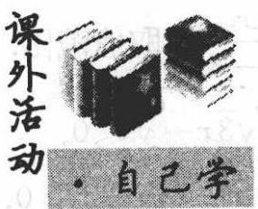

## 线性规划发展过程中的几个重大历史事件

1939 年,苏联数学家康托洛维奇 (L. V. Kanto-rovich, 1912-1986) 出版《生产组织和计划中的数学方法》一书.

1947 年，美国数学家丹兹格(G. B. Dantzig, 1914-2005)提出了线性规划问题的单纯形求解方法.

1951 年, 美籍荷兰经济学家库普曼斯(J. C. Koopmans, 1910—1985) 出版《生产与配置的活动分析》一书.

1950-1956 年，线性规划的对偶理论出现.

1960 年，丹兹格与沃尔夫(P. Wolfe)建立大规模线性规划问题的分解算法.

1975 年，康托洛维奇与库普曼斯因“最优资源配置理论的贡献”荣获诺贝尔经济学奖.

1978 年, 苏联数学家哈奇扬 (L. G. Khachian) 提出求解线性规划问题的多项式时间算法 (内点算法), 具有重要理论意义.

1984 年,在美国贝尔实验室工作的印度裔数学家卡玛卡 (N. Karmarkar)提出可以有效求解实际线性规划问题的多项式时间算法一 Karmarkar 算法.

线性规划的基本点就是在满足一定约束条件下, 使预定的目标达到最优. 现在线性规划已不仅仅是一种数学理论和方法, 而且成了现代化管理的重要手段，是帮助管理者与经营者做出科学决策的一个有效的数学技术.

习题练习

## ·自己练

1. 已知两点 $A\left( {2,3}\right) \text{ 、 }B\left( {-2,0}\right)$ ,若直线 $y = {ax} -$ 1 与线段 ${AB}$ 有公共点,求实数 $a$ 的取值范围.

2. 定义 $\max \{ a, b\}  = \left\{  \begin{array}{l} a, a \geq  b, \\  b, a < b, \end{array}\right.$ 设实数 $x\text{ 、 }y$ 满足约束条件 $\left\{  {\begin{array}{l} \left| x\right|  \leq  2, \\  \left| y\right|  \leq  2, \end{array}, z = \max \{ {2x} - y,{3x} + y\} }\right.$ ,求 $z$ 的取值范围.

3. 当 $x\text{ 、 }y$ 满足条件 $\left| x\right|  + \left| y\right|  < 1$ 时,求变量 $u = \frac{x}{y - 3}$ 的取值范围.

4. 已知 $A\left( {3,\sqrt{3}}\right) , O$ 是原点,点 $P\left( {x, y}\right)$ 的坐标满足 $\left\{  \begin{array}{l} \sqrt{3}x - y \leq  0, \\  x - \sqrt{3}y + 2 \geq  0, \\  y \geq  0, \end{array}\right.$ 求 $\frac{\overrightarrow{OA} \cdot  \overrightarrow{OP}}{\left| \overrightarrow{OP}\right| }$ 的取值范围.

5. 如果实数 $x\text{ 、 }y$ 满足 $\left\{  \begin{array}{l} x - {4y} + 3 \leq  0, \\  {3x} + {5y} - {25} \leq  0, \\  x \geq  1, \end{array}\right.$ 目标函数 $z = {kx} + y$ 的最大值为 12,最小值为 3,求实数 $k$ 的值.

6. 已知变量 $x\text{ 、 }y$ 满足条件 $\left\{  \begin{array}{l} x + y \leq  6, \\  x - y \leq  2, \\  x \geq  0, \\  y \geq  0, \end{array}\right.$ 若目标函数 $z = {ax} + y$ (其中 $a > 0$ ) 仅在 $\left( {4,2}\right)$ 处取得最大值,求 $a$ 的取值范围.

7. 若 $x\text{ 、 }y$ 满足 $\left\{  \begin{array}{l}  - x + y \leq  0, \\   - x + {2y} \geq  2, \end{array}\right.$ 求目标函数 $C = {\log }_{\frac{1}{2}}\left( {x + y}\right)$ 的最大值.

8. 设 $D$ 是不等式组 $\left\{  \begin{array}{l} x + {2y} \leq  {10}, \\  {2x} + y \geq  3, \\  0 \leq  x \leq  4, \\  y \geq  1 \end{array}\right.$ 表示的平面区域,求 $D$ 中的点 $P\left( {x, y}\right)$ 到直线 $x + y = {10}$ 距离的最大值.

9. 一块用栅栏围成的长方形土地的长和宽分别为 52 米和 24 米, 现欲将这块土地分割成一些全等的正方形试验田,要求这块土地全部被划分且分割的正方形的边与这块土地的边界平行,现另有 2002 米栅栏,则最多可将这块土地分割成多少块?

## 第十三章 圆锥曲线 (Conic Sections)

一般来说，圆锥面与一个平面相交的交线叫做圆锥曲线. 显然，圆锥曲线是平面图形，它的形态与截这个圆锥面的平面的位置有关. 当这个平面位置不同时, 所得的交线有四种不同的形态, 分别称为圆、椭圆、抛物线和双曲线. 通常我们把它们通称为圆锥曲线.

### 13.1 曲线和方程 (Curves and Their Equations)

我们知道,方程 $x - y = 0$ 表示直线,如图 13-1,方程 $y = {x}^{2}$ 表示抛物线,如图 13-2.

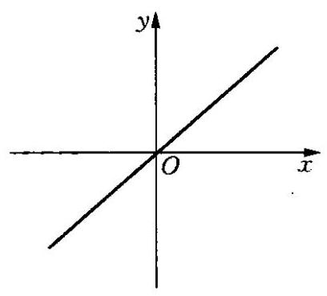

图 13-1

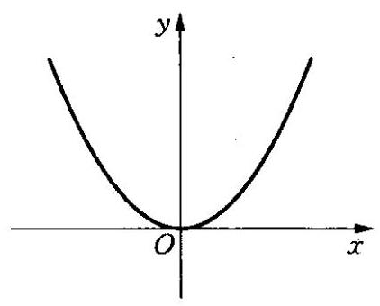

图 13-2

一般地,在直角坐标系中,如果某曲线 $C$ 上的点与一个二元方程 $f\left( {x, y}\right)  = 0$ 的实数解建立如下的关系:

① 曲线上的点的坐标都是这个方程的解;

② 以这个方程的解为坐标的点都是曲线上的点.

那么这个方程叫做曲线的方程 (the equation of a curve), 这条曲线叫做方程的曲线.

例 1 已知直角三角形 ${ABM}$ 的顶点是 $A\left( {-3,0}\right)$ 、 $B\left( {3,0}\right)$ ，求证:直角顶点 $M\left( {x, y}\right)$ 的轨迹 $C$ 的方程为 ${x}^{2} + {y}^{2} - 9 = 0\left( {y \neq  0}\right)$ .

证明 ① 设 $M\left( {x, y}\right)$ 是曲线 $C$ 上任意一点，则 ${AM}$ 、 ${BM}$ 两直线互相垂直，易知 $x \neq   \pm  3$ ，所以 $\frac{y - 0}{x + 3} \times  \frac{y - 0}{x - 3} =  - 1$ ，化简得

$$
{x}^{2} + {y}^{2} - 9 = 0.
$$

因为 $y = 0$ 时, $M\text{ 、 }A\text{ 、 }B$ 都在 $x$ 轴上,不可能形成三角形,所以 $y \neq  0$ . 即点 $M$ 的坐标 $\left( {x, y}\right)$ 是 ${x}^{2} + {y}^{2} - 9 = 0\left( {y \neq  0}\right)$ 的解;

② 设点 $M$ 的坐标 $\left( {{x}_{1},{y}_{1}}\right)$ 是 ${x}^{2} + {y}^{2} - 9 = 0\left( {y \neq  0}\right)$ 的解,则 ${x}_{1}^{2} - {3}^{2} =  - {y}_{1}^{2}\left( {y \neq  0}\right)$ ,故 ${x}_{1} \neq   \pm  3$ ,所以

$$
\frac{{y}_{1} - 0}{{x}_{1} + 3} \times  \frac{{y}_{1} - 0}{{x}_{1} - 3} =  - 1,
$$

即 ${AM}\text{ 、 }{BM}$ 两直线互相垂直，所以 $M$ 是曲线 $C$ 上的点.

由 ①②，直角顶点 $M\left( {x, y}\right)$ 的轨迹 $C$ 的方程为

$$
{x}^{2} + {y}^{2} - 9 = 0\left( {y \neq  0}\right) .
$$

例 2 已知曲线在 $x$ 轴上方,它上面的每一点到 $A\left( {0,2}\right)$ 的距离减去它到 $x$ 轴的距离的差都是 2,求这条曲线的方程(如图 13-3).

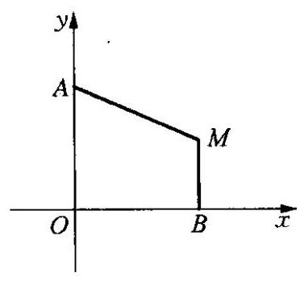

图 13-3

解 设 $M\left( {x, y}\right)$ 是曲线上任意点, ${MB} \bot \; x$ 轴,垂足是 $B$ .

那么点 $M$ 的坐标 $\left( {x, y}\right)$ 满足 $\left| {MA}\right|  - \; \left| {MB}\right|  = 2$ ,即

$$
\sqrt{{x}^{2} + {\left( y - 2\right) }^{2}} - y = 2,
$$

整理得 ${x}^{2} + {\left( y - 2\right) }^{2} = {\left( y + 2\right) }^{2}$ ,

化简得 $\;y = \frac{1}{8}{x}^{2}$ .

因为曲线在 $x$ 轴上方,所以 $y > 0$ ,所求曲线方程为

$$
y = \frac{1}{8}{x}^{2}\left( {x \neq  0}\right) .
$$

由上面的例题可知,求曲线方程的步骤:

① 建立适当的坐标系，用变数对 $\left( {x, y}\right)$ 表示曲线上任意一点 $M$ 的坐标;

② 写出适合条件 $p$ 的点 $M$ 的集合 $P = \{ M \mid  p\left( M\right) \}$ ;

③ 用坐标表示条件 $p\left( M\right)$ ,列出方程 $f\left( {x, y}\right)  = 0$ ;

④ 化方程 $f\left( {x, y}\right)  = 0$ 为最简形式;

⑤ 证明以方程的解为坐标的点都是曲线上的点.

上述方法简称“五步法”,在步骤④中若化简过程是同解变形过程; 或最简方程的解集与原始方程的解集相同, 则步骤⑤可省略不写, 因为此时所求得的最简方程就是所求曲线的方程.

例 3 曲线 ${x}^{2} + {y}^{2} + 2{d}_{1}x + 2{e}_{1}y + {f}_{1} = 0$ 与曲线 ${x}^{2} + {y}^{2} + \; 2{d}_{2}x + 2{e}_{2}y + {f}_{2} = 0$ 相交于 ${P}_{1}\text{ 、 }{P}_{2}$ 两点,求直线 ${P}_{1}\text{ 、 }{P}_{2}$ 的方程.

解 设 ${P}_{1}\left( {{x}_{1},{y}_{1}}\right) \text{ 、 }{P}_{2}\left( {{x}_{2},{y}_{2}}\right)$ ,由 ${P}_{1}\text{ 、 }{P}_{2}$ 为两曲线的交点知,

$$
\left\{  \begin{array}{l} {x}_{1}^{2} + {y}_{1}^{2} + 2{d}_{1}{x}_{1} + 2{e}_{1}{y}_{1} + {f}_{1} = 0 \\  {x}_{1}^{2} + {y}_{1}^{2} + 2{d}_{2}{x}_{1} + 2{e}_{2}{y}_{1} + {f}_{2} = 0 \end{array}\right.
$$

两式相减得

$$
2\left( {{d}_{1} - {d}_{2}}\right) {x}_{1} + 2\left( {{e}_{1} - {e}_{2}}\right) {y}_{1} + {f}_{1} - {f}_{2} = 0,
$$

同理得

$$
2\left( {{d}_{1} - {d}_{2}}\right) {x}_{2} + 2\left( {{e}_{1} - {e}_{2}}\right) {y}_{2} + {f}_{1} - {f}_{2} = 0.
$$

因为 ${d}_{1} - {d}_{2} = 0$ 与 ${e}_{1} - {e}_{2} = 0$ 不可能同时成立,所以直线 ${P}_{1}{P}_{2}$ 的方程为 $2\left( {{d}_{1} - {d}_{2}}\right) x + 2\left( {{e}_{1} - {e}_{2}}\right) y + {f}_{1} - {f}_{2} = 0$ .

例 4 在 $\bigtriangleup {ABC}$ 中,已知 $A\left( {2,3}\right) \text{ 、 }B\left( {4,6}\right) \text{ 、 }C\left( {3, - 1}\right)$ ,点 $D$ 满足: $\overrightarrow{CA} \cdot  \overrightarrow{CD} = \overrightarrow{CD} \cdot  \overrightarrow{CB}$ ,求点 $D$ 的轨迹方程.

解 设 $D\left( {x, y}\right)$ ,则

$$
\overrightarrow{CA} = \left( {-1,4}\right) ,\overrightarrow{CD} = \left( {x - 3, y + 1}\right) ,\overrightarrow{CB} = \left( {1,7}\right) .
$$

因为 $\overrightarrow{CA} \cdot  \overrightarrow{CD} = \overrightarrow{CD} \cdot  \overrightarrow{CB}$ ,所以

$$
\left( {-1}\right)  \cdot  \left( {x - 3}\right)  + 4 \cdot  \left( {y + 1}\right)  = \left( {x - 3}\right)  \cdot  1 + \left( {y + 1}\right)  \cdot  7,
$$

整理得

$$
{2x} + {3y} = 3.
$$

课堂活动

·大家谈

如果两条曲线的方程分别为 ${f}_{1}\left( {x, y}\right)  = 0$ , ${f}_{2}\left( {x, y}\right)  = 0$ ,两条曲线交点为 $\left( {{x}_{0},{y}_{0}}\right)$ . 问方程 ${f}_{1}\left( {x, y}\right)  + \lambda {f}_{2}\left( {x, y}\right)  = 0$ 表示的曲线是否过点 $\left( {{x}_{0},{y}_{0}}\right) \left( {\lambda \text{ 为任意常数 }}\right)$ ?

习题练习

## ・自己练

1. 已知以方程 $F\left( {x, y}\right)  = 0$ 的解为坐标的点都在曲线 $C$ 上,则下列说法正确的有(   ).

(A) 方程 $F\left( {x, y}\right)  = 0$ 的曲线是 $C$

(B) 曲线 $C$ 的方程是 $F\left( {x, y}\right)  = 0$

(C) 不在曲线 $C$ 上的点的坐标不是方程 $F\left( {x, y}\right)  = 0$ 的解

(D) 曲线 $C$ 上的点的坐标都是方程 $F\left( {x, y}\right)  = 0$ 的解

2. 方程 $x + \sqrt{y} = 0$ 所表示的图形是( ).

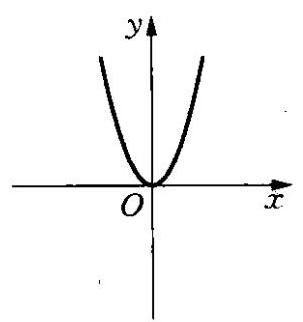

(A)

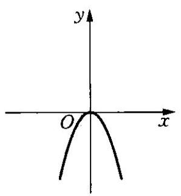

(B)

(C)

(D)

3. 已知点 ${P}_{1}\left( {{x}_{1},{y}_{1}}\right)$ 是直线 $l : f\left( {x, y}\right)  = 0$ 上的一点, ${P}_{2}\left( {x}_{2}\right.$ , $\left. {y}_{2}\right)$ 是直线 $l$ 外的一点,则方程 $f\left( {x, y}\right)  + f\left( {{x}_{1},{y}_{1}}\right)  + f\left( {{x}_{2},{y}_{2}}\right)  = 0$ 表示的直线与直线 $l$ 的位置关系是( ).

(A) 平行 (B) 重合 (C) 相交 (D) 不确定

4. 如图 13-4,已知直角坐标平面上点 $Q\left( {2,0}\right)$ 和圆 $C : {x}^{2} + {y}^{2} =$ 1,动点 $M$ 到圆 $C$ 的切线长与 $\left| {MQ}\right|$ 的比等于 $\sqrt{2}$ . 求动点 $M$ 的轨迹方程,并说明它表示什么曲线.

图 13-4

图 13-5

5. 如图 13-5,过点 $A\left( {-1,0}\right)$ ,斜率为 $k$ 的直线 $l$ 与曲线 $C : {y}^{2} = \; {4x}$ 交于 $P\text{ 、 }Q$ 两点. 若点 $F\left( {1,0}\right)$ 与 $P\text{ 、 }Q\text{ 、 }R$ 三点按如图顺序构成平行四边形 ${PFQR}$ ,求点 $R$ 的轨迹方程.

6. 已知曲线 $C$ 的方程为 ${x}^{2} + \frac{{y}^{2}}{2} = 1$ ,点 $P\left( {a, b}\right)$ 的坐标满足 ${a}^{2} + \; \frac{{b}^{2}}{2} \leq  1$ . 过点 $P$ 的直线 $l$ 与曲线 $C$ 交于 $A\text{ 、 }B$ 两点,点 $Q$ 为线段 ${AB}$ 的中点,求点 $Q$ 的轨迹方程.

图 13-6

7. 已知常数 $a > 0$ ,在矩形 ${ABCD}$ 中, ${AB} = 4,{BC} = {4a}, O$ 为 ${AB}$ 的中点, 点 $E\text{ 、 }F\text{ 、 }G$ 分别在 ${BC}\text{ 、 }{CD}\text{ 、 }{DA}$ 上移动, 且 $\frac{BE}{BC} = \frac{CF}{CD} = \frac{DG}{DA}, P$ 为 ${GE}$ 与 ${OF}$ 的交点(如图 13-6),求点 $P$ 的轨迹方程.

8. 已知曲线 $\frac{{x}^{2}}{2} + {y}^{2} = 1,\left( 1\right)$ 求过点 $P\left( {\frac{1}{2},\frac{1}{2}}\right)$ 且被 $P$ 平分的弦所在直线的方程;

(2)求斜率为 2 的平行弦的中点轨迹方程；

(3)过 $A\left( {2,1}\right)$ 引曲线的割线，求截得的弦的中点的轨迹方程.

### 13.2 圆的方程 (Circular Equations)

平面内与定点距离等于定长的点的集合 (轨迹) 叫做 $\square$ (circle),定点叫做口心(the centre of a circle),定长就是半径(radius).

根据圆的定义,我们来求圆心是 $C\left( {a, b}\right)$ ,半径为 $r\left( {r > 0}\right)$ 的圆的方程. (如图 13-7)

图 13-7

设 $M\left( {x, y}\right)$ 是圆上任意点,根据圆的定义,则点 $M\left( {x, y}\right)$ 到圆心 $C\left( {a, b}\right)$ 的距离等于 $r$ . 所以 $\sqrt{{\left( x - a\right) }^{2} + {\left( y - b\right) }^{2}} = r$ ,化简得

$$
{\left( x - a\right) }^{2} + {\left( y - b\right) }^{2} = {r}^{2}\left( {r > 0}\right) .
$$

此方程就是圆心是 $C\left( {a, b}\right)$ ,半径为 $r\left( {r > 0}\right)$ 的圆的方程. 我们把它叫做圆的标准方程 (standard equation of a circle). 如果圆心在坐标原点,这时 $a = 0$ , $b = 0$ ,那么圆的方程就是 ${x}^{2} + {y}^{2} = {r}^{2}$ .

我们将圆的标准方程 ${\left( x - a\right) }^{2} + {\left( y - b\right) }^{2} = {r}^{2}\left( {r > 0}\right)$ 展开,得

$$
{x}^{2} + {y}^{2} - {2ax} - {2by} + {a}^{2} + {b}^{2} - {r}^{2} = 0.
$$

可见任何一个圆的方程都可以写成下面的形式:

$$
{x}^{2} + {y}^{2} + {Dx} + {Ey} + F = 0.
$$

反过来, 我们来研究此方程的曲线是不是圆. 由

$$
{x}^{2} + {y}^{2} + {Dx} + {Ey} + F = {\left( x + \frac{D}{2}\right) }^{2} + {\left( y + \frac{E}{2}\right) }^{2} - \frac{{D}^{2} + {E}^{2} - {4F}}{4} = 0,
$$

所以 ${\left( x + \frac{D}{2}\right) }^{2} + {\left( y + \frac{E}{2}\right) }^{2} = \frac{{D}^{2} + {E}^{2} - {4F}}{4}$ .①

当 $\frac{{D}^{2} + {E}^{2} - {4F}}{4} > 0$ 时,方程①表示圆心为 $\left( {-\frac{D}{2}, - \frac{E}{2}}\right)$ ,半径为 $\frac{1}{2}\sqrt{{D}^{2} + {E}^{2} - {4F}}$ 的圆;

当 $\frac{{D}^{2} + {E}^{2} - {4F}}{4} = 0$ 时,方程①表示点 $\left( {-\frac{D}{2}, - \frac{E}{2}}\right)$ ;

当 $\frac{{D}^{2} + {E}^{2} - {4F}}{4} < 0$ 时,方程①不表示任何图形.

所以当 $\frac{{D}^{2} + {E}^{2} - {4F}}{4} > 0$ 时,方程 ${x}^{2} + {y}^{2} + {Dx} + {Ey} + F = 0$ 叫做圆的一般方程 (general form equation of a circle).

由圆的定义可知点与圆的位置关系(仅以标准方程为例，其他形式则可化为标准式后按同样方法处理).

设 $P\left( {{x}_{0},{y}_{0}}\right)$ 与圆 ${\left( x - a\right) }^{2} + {\left( y - b\right) }^{2} = {r}^{2}$ ,若 $P$ 到圆心距离为 $d$ ,则

① $P$ 在圆 $C$ 外 $\Leftrightarrow  d > r \Leftrightarrow  {\left( {x}_{0} - a\right) }^{2} + {\left( {y}_{0} - b\right) }^{2} > {r}^{2}$ ;

② $P$ 在圆 $C$ 内 $\Leftrightarrow  d < r \Leftrightarrow  {\left( {x}_{0} - a\right) }^{2} + {\left( {y}_{0} - b\right) }^{2} < {r}^{2}$ ;

③ $P$ 在圆 $C$ 上 $\Leftrightarrow  d = r \Leftrightarrow  {\left( {x}_{0} - a\right) }^{2} + {\left( {y}_{0} - b\right) }^{2} = {r}^{2}$ .

如果点 $P\left( {{x}_{0},{y}_{0}}\right)$ 在圆 ${x}^{2} + {y}^{2} = {r}^{2}$ 上,则过点 $P$ 的切线方程为

$$
{x}_{0}x + {y}_{0}y = {r}^{2};
$$

如果点 $P\left( {{x}_{0},{y}_{0}}\right)$ 在圆 ${\left( x - a\right) }^{2} + {\left( y - b\right) }^{2} = {r}^{2}$ 上,则过点 $P$ 的切线方程为 $\left( {x - a}\right) \left( {{x}_{0} - a}\right)  + \left( {y - b}\right) \left( {{y}_{0} - b}\right)  = {r}^{2}$ .

例 1 已知圆的半径为 $\sqrt{10}$ ,圆心在直线 $y = {2x}$ 上,圆被直线 $x - \; y = 0$ 截得的弦长为 $4\sqrt{2}$ ，求圆的方程.

解 设圆心坐标为 $\left( {m,{2m}}\right)$ ,圆的半径为 $\sqrt{10}$ ,所以圆心到直线 $x - y = 0$ 的距离为 $\frac{\left| -m\right| }{\sqrt{2}} = \frac{\left| m\right| }{\sqrt{2}}$ ,由半径、弦心距、半径的关系得

$$
{10} = 8 + \frac{{m}^{2}}{2}\text{ ,所以 }m =  \pm  2\text{ . }
$$

所以所求圆的方程为

$$
{\left( x - 2\right) }^{2} + {\left( y - 4\right) }^{2} = {10}\text{ 或 }{\left( x + 2\right) }^{2} + {\left( y + 4\right) }^{2} = {10}.
$$

例 2 已知 $\odot  M : {x}^{2} + {\left( y - 2\right) }^{2} = 1, Q$ 是 $x$ 轴上的动点, ${QA}\text{ 、 }{QB}$ 分别切 $\odot  M$ 于 $A\text{ 、 }B$ 两点,如图 13-8.

(1)如果 $\left| {AB}\right|  = \frac{4\sqrt{2}}{3}$ ,求直线 ${MQ}$ 的方程;

(2)求动弦 ${AB}$ 的中点 $P$ 的轨迹方程.

解 (1) 由 $\left| {AB}\right|  = \frac{4\sqrt{2}}{3}$ ,可得 $\left| {MP}\right|  =$ 图 13-8 $\sqrt{{\left| MA\right| }^{2} - {\left( \frac{\left| AB\right| }{2}\right) }^{2}} = \sqrt{{1}^{2} - {\left( \frac{2\sqrt{2}}{3}\right) }^{2}} = \frac{1}{3}$ . 由射影定理,得

$$
{\left| MB\right| }^{2} = \left| {MP}\right|  \cdot  \left| {MQ}\right| ,\left| {MQ}\right|  = 3\text{ . }
$$

在 Rt $\bigtriangleup {MOQ}$ 中, $\left| {OQ}\right|  = \sqrt{{\left| MQ\right| }^{2} - {\left| MO\right| }^{2}} = \sqrt{{3}^{2} - {2}^{2}} = \sqrt{5}$ , 故 $Q$ 点坐标为 $\left( {\sqrt{5},0}\right)$ 或 $\left( {-\sqrt{5},0}\right)$ .

所以直线 ${MQ}$ 方程是 ${2x} + \sqrt{5}y - 2\sqrt{5} = 0$ 或 ${2x} - \sqrt{5}y + 2\sqrt{5} = 0$ .

(2)连结 ${MB}\text{ 、 }{MQ}$ ,设 $P\left( {x, y}\right) , Q\left( {a,0}\right)$ ,由点 $M\text{ 、 }P\text{ 、 }Q$ 在一条直线上,得 $\frac{2}{-a} = \frac{y - 2}{x}$ .①

由射影定理得 ${\left| MB\right| }^{2} = \left| {MP}\right|  \cdot  \left| {MQ}\right|$ ,即

$$
\sqrt{{x}^{2} + {\left( y - 2\right) }^{2}} \cdot  \sqrt{{a}^{2} + 4} = 1.
$$

②

由①和②消去 $a$ ，并注意到 $y < 2$ ，可得

$$
{x}^{2} + {\left( y - \frac{7}{4}\right) }^{2} = \frac{1}{16}\left( {y \neq  2}\right) .
$$

例 3 如图 13-9,平面直角坐标系 ${xOy}$ 中, $\bigtriangleup {AOB}$ 和 $\bigtriangleup {COD}$ 为两等腰直角三角形, $A\left( {-2,0}\right) , C\left( {a,0}\right) \left( {a > 0}\right)$ . 设 $\bigtriangleup {AOB}$ 和 $\bigtriangleup {COD}$ 的外接圆圆心分别为 $M$ 、 $N$ .

图 13-9

(1)若 $\odot  M$ 与直线 ${CD}$ 相切,求直线 ${CD}$ 的方程;

(2)若直线 ${AB}$ 截 $\odot  N$ 所得弦长为 4， 求 $\odot  N$ 的标准方程；

(3)是否存在这样的 $\odot  N$ ,使得 $\odot  N$ 上有且只有三个点到直线 ${AB}$ 的距离为 $\sqrt{2}$ , 若存在,求此时 $\odot  N$ 的标准方程; 若不存在,说明理由.

解 (1) 圆心 $M\left( {-1,1}\right)$ ,所以

圆 $M$ 方程为 $\;{\left( x + 1\right) }^{2} + {\left( y - 1\right) }^{2} = 2$ ,

直线 ${CD}$ 方程为 $x + y - a = 0$ .

因为 $\odot  M$ 与直线 ${CD}$ 相切,所以圆心 $M$ 到直线 ${CD}$ 的距离

$$
d = \frac{\left| -a\right| }{\sqrt{2}} = \sqrt{2}
$$

化简得 $a =  \pm  2$ (舍去负值). 所以直线 ${CD}$ 的方程为 $x + y - 2 = 0$ .

(2)直线 ${AB}$ 方程为 $x - y + 2 = 0$ ，圆心 $N\left( {\frac{a}{2},\frac{a}{2}}\right)$ . 所以

圆心 $N$ 到直线 ${AB}$ 距离为 $\frac{\left| \frac{a}{2} - \frac{a}{2} + 2\right| }{\sqrt{2}} = \sqrt{2}$ .

因为直线 ${AB}$ 截 $\odot  N$ 所得弦长为 4,所以 ${2}^{2} + {\left( \sqrt{2}\right) }^{2} = \frac{{a}^{2}}{2}$ .

所以 $a =  \pm  2\sqrt{3}$ (舍去负值),所以 $\odot  N$ 的标准方程为

$$
{\left( x - \sqrt{3}\right) }^{2} + {\left( y - \sqrt{3}\right) }^{2} = 6.
$$

(3)存在. 由(2)知，圆心 $N$ 到直线 ${AB}$ 距离为 $\sqrt{2}$ (定值)，且 ${AB} \bot \; {CD}$ 始终成立,所以当且仅当 $\odot  N$ 半径 $\frac{a}{\sqrt{2}} = 2\sqrt{2}$ ,即 $a = 4$ 时, $\odot  N$ 上有且只有三个点到直线 ${AB}$ 的距离为 $\sqrt{2}$ .

此时, $\odot  N$ 的标准方程为 ${\left( x - 2\right) }^{2} + {\left( y - 2\right) }^{2} = 8$ .

例 4 设圆 ${C}_{1}$ 的方程为 ${\left( x + 2\right) }^{2} + {\left( y - 3m - 2\right) }^{2} = 4{m}^{2}$ ,直线 $l$ 的方程为 $y = x + m + 2$ .

(1)求 ${C}_{7}$ 关于 $l$ 对称的圆 ${C}_{2}$ 的方程；

(2)当 $m$ 变化且 $m \neq  0$ 时,求证: ${C}_{2}$ 的圆心在一条定直线上,并求 ${C}_{2}$ 所表示的一系列圆的公切线方程.

解 (1) 圆 ${C}_{1}$ 的圆心为 ${C}_{1}\left( {-2,{3m} + 2}\right)$ ,设 ${C}_{1}$ 关于直线 $l$ 对称点为 ${C}_{2}\left( {a, b}\right)$ . 则

$\left\{  {\begin{array}{l} \frac{b - {3m} - 2}{a + 2} =  - 1, \\  \frac{{3m} + 2 + b}{2} = \frac{a - 2}{2} + m + 2, \end{array}\text{ 解得 }\left\{  \begin{array}{l} a = {2m}, \\  b = m, \end{array}\right. }\right.$ 所以圆 ${C}_{2}$ 的方程

为 ${\left( x - 2m\right) }^{2} + {\left( y - m\right) }^{2} = 4{m}^{2}$ .

( 2 )由 $\left\{  \begin{array}{l} a = {2m}, \\  b = m \end{array}\right.$ 消去 $m$ 得 $a - {2b} = 0$ ，即圆 ${C}_{2}$ 的圆心在定直线 $x - \; {2y} = 0$ 上.

设直线 $y = {kx} + b$ 与圆系中的所有圆都相切,则

$$
\frac{\left| 2mk - m + b\right| }{\sqrt{1 + {k}^{2}}} = 2\left| m\right|
$$

即

$$
\left( {-{4k} - 3}\right) {m}^{2} + \left( {{4kb} - {2b}}\right) m + {b}^{2} = 0.
$$

因为直线 $y = {kx} + b$ 与圆系中的所有圆都相切,所以上述方程对所有的 $m$ 值都成立，所以有

$$
\left\{  {\begin{array}{l}  - {4k} - 3 = 0, \\  {4kb} - {2b} = 0, \\  {b}^{2} = 0, \end{array}\text{ 解之得 }\left\{  \begin{array}{l} k =  - \frac{3}{4}; \\  b =  - \frac{3}{4}; \end{array}\right. }\right.
$$

所以 ${C}_{2}$ 所表示的一系列圆的公切线方程为 $y =  - \frac{3}{4}x$ .

·大家族

设圆 ${O}_{1}$ 的半径为 ${r}_{1}$ ,圆 ${O}_{2}$ 的半径为 ${r}_{2}$ . 圆心距为 $d$ ,则:

① 两圆外离 $\Leftrightarrow$ ___；

② 两圆外切⇔___；

③ 两圆相交 $\Leftrightarrow$ ___；④ 两圆内切 $\Leftrightarrow$ ___；

⑤ 两圆内含 $\Leftrightarrow$ ___.

习题练习

1. 设圆 ${x}^{2} + {y}^{2} - {4x} - 5 = 0$ 的弦 ${AB}$ 的中点为 $P\left( {3,1}\right)$ ，则直线 ${AB}$ 的方程是___.

・自己练 2. 集合 $A = \left\{  {\left( {x, y}\right)  \mid  {x}^{2} + {y}^{2} = 4}\right\}  , B = \{ \left( {x, y}\right) \; \left. {\mid {\left( x - 3\right) }^{2} + {\left( y - 4\right) }^{2} = {r}^{2}}\right\}$ ,其中 $r > 0$ ,若 $A \cap  B$ 中有且仅有一个元素, 则 $r$ 的值是___.

3. 两圆 ${\left( x + 1\right) }^{2} + {y}^{2} = 4$ 和 ${\left( x - a\right) }^{2} + {y}^{2} = 1$ 相交,则 $a$ 的取值范围是___.

4. 已知圆 $C$ 和 $y$ 轴相切,圆心 $C$ 在直线 $x - {3y} = 0$ 上,且被直线 $y = x$ 截得的弦长为 $2\sqrt{7}$ ,求圆 $C$ 的方程.

5. 已知点 $A\left( {0,2}\right)$ 和圆 $C : {\left( x - 6\right) }^{2} + {\left( y - 4\right) }^{2} = \frac{36}{5}$ ,一条光线从 $A$ 点出发射到 $x$ 轴上后沿圆的切线方向反射,求这条光线从 $A$ 点到切点所经过的路程.

6. 已知实数 $x\text{ 、 }y$ 满足方程 ${\left( x + 1\right) }^{2} + {\left( y + 1\right) }^{2} = 1$ ,求 $u = {xy}$ 的最大值与最小值.

7. 已知圆 $C : {x}^{2} + {y}^{2} - {2x} - {2y} + 1 = 0$ ,直线 $l : y = {kx}, l$ 与圆 $C$ 交于 $A\text{ 、 }B$ 两点,点 $M\left( {0, b}\right)$ 且 ${MA} \bot  {MB}$ . (1) 当 $b = 1$ 时,求 $k$ 的值; (2)当 $b \in  \left( {1,\frac{3}{2}}\right)$ 时，求 $k$ 的取值范围.

8. 已知以点 $C\left( {t,\frac{2}{t}}\right) \left( {t \in  \mathbf{R}, t \neq  0}\right)$ 为圆心的圆与 $x$ 轴交于 $O\text{ 、 }A$ 两点,与 $y$ 轴交于 $O\text{ 、 }B$ 两点,其中 $O$ 为坐标原点.

(1)求证: $\bigtriangleup  {OAB}$ 的面积为定值；

(2)设直线 $y =  - {2x} + 4$ 与圆 $C$ 交于点 $M$ 、 $N$ ，若 $\left| {OM}\right|  = \left| {ON}\right|$ ， 求圆 $C$ 的方程.

9. 已知点 $T$ 是半圆 $O$ 的直径 ${AB}$ 上一点, ${AB} = 2,{OT} = t(0 < \; t < 1)$ ,以 ${AB}$ 为直腰作直角梯形 $A{A}^{\prime }{B}^{\prime }B$ ,使 $A{A}^{\prime }$ 垂直且等于 ${AT}$ ,使 $B{B}^{\prime }$ 垂直且等于 ${BT},{A}^{\prime }{B}^{\prime }$ 交半圆于 $P\text{ 、 }Q$ 两点,建立如图 13-10 所示的直角坐标系.

图 13-10

(1)写出直线 ${A}^{\prime }{B}^{\prime }$ 的方程；

(2)计算出点 $P\text{ 、 }Q$ 的坐标；

(3)证明:由点 $P$ 发出的光线，经 ${AB}$ 反射后，反射光线通过点 $Q$ .

10. 有一种大型商品, $A\text{ 、 }B$ 两地都有出售,且价格相同,某地居民从两地之一购得商品后回运的运费是: 每单位距离 $A$ 地的运费是 $B$ 地运费的 3 倍,已知 $A\text{ 、 }B$ 两地相距 ${10}\mathrm{\;{km}}$ ,居民选择 $A$ 或 $B$ 地购买这种商品的标准是:包括运费和价格的总费用较低. 求 $A\text{ 、 }B$ 两地的售货区域的分界线的曲线形状，并指出曲线上、曲线内、曲线外的居民应如何选择购货地点.

### 13.3 椭圆的标准方程和性质 (Standard Equation of a Ellipse and Properties of an Ellipse)

2005 年 10 月 12 日上午 9 时，“神舟六号”载人飞船顺利升空，实现多人多天飞行，标志着我国航天事业又上了一个新台阶. “神舟六号”飞船的运行轨道就是一个椭圆.

图 13-11

1. 椭圆的标准方程

平面内与两个定点 ${F}_{1}\text{ 、 }{F}_{2}$ 的距离的和等于常数 (大于 $\left| {{F}_{1}{F}_{2}}\right|$ ) 的点的轨迹叫做椭圆 (ellipse). 这两个定点叫做椭圆的焦点 (foci of an ellipse), 两焦点的距离叫做椭圆的焦距 (distance between two foci). (如图 13-11)

以两个定点 ${F}_{1}\text{ 、 }{F}_{2}$ 所在直线为 $x$ 轴,线段 ${F}_{1}{F}_{2}$ 的垂直平分线为 $y$ 轴,建立平面直角坐标系(如图 13-11). 设 $M\left( {x, y}\right)$ 是椭圆上任意一点, 为了使 ${F}_{1}\text{ 、 }{F}_{2}$ 的坐标简单及化简过程不那么繁杂,设 $\left| {{F}_{1}{F}_{2}}\right|  = {2c}(c > \; 0)$ ,则 ${F}_{1}\left( {-c,0}\right) \text{ 、 }{F}_{2}\left( {c,0}\right)$ . 设 $M$ 与两定点 ${F}_{1}\text{ 、 }{F}_{2}$ 的距离的和等于常数 ${2a}\left( {a > 0}\right)$ .

由椭圆的定义可知,点 $M\left( {x, y}\right)$ 为椭圆上任意一点,则

$$
\left| {M{F}_{1}}\right|  + \left| {M{F}_{2}}\right|  = {2a},
$$

所以

$$
\sqrt{{\left( x - c\right) }^{2} + {y}^{2}} + \sqrt{{\left( x + c\right) }^{2} + {y}^{2}} = {2a}.
$$

移项，两边平方得

$$
{\left( x + c\right) }^{2} + {y}^{2} = 4{a}^{2} - {4a}\sqrt{{\left( x - c\right) }^{2} + {y}^{2}} + {\left( x - c\right) }^{2} + {y}^{2},
$$

即

$$
{a}^{2} - {cx} = a\sqrt{{\left( x - c\right) }^{2} + {y}^{2}}
$$

再两边平方得 ${a}^{4} - 2{a}^{2}{cx} + {c}^{2}{x}^{2} = {a}^{2}{\left( x - c\right) }^{2} + {a}^{2}{y}^{2}$ ,整理得

$$
\left( {{a}^{2} - {c}^{2}}\right) {x}^{2} + {a}^{2}{y}^{2} = {a}^{2}\left( {{a}^{2} - {c}^{2}}\right) .
$$

由椭圆的定义知 ${2a} > {2c} > 0$ ,即 $a > c > 0$ .

令 ${a}^{2} - {c}^{2} = {b}^{2}\left( {b > 0}\right)$ ,则方程可简化整理成

$$
\frac{{x}^{2}}{{a}^{2}} + \frac{{y}^{2}}{{b}^{2}} = 1\left( {a > b > 0}\right) .
$$

方程 $\frac{{x}^{2}}{{a}^{2}} + \frac{{y}^{2}}{{b}^{2}} = 1\left( {a > b > 0}\right)$ 叫做椭圆的标准方程 (standard equation of an ellipse),焦点是 ${F}_{1}\left( {-c,0}\right) \text{ 、 }{F}_{2}\left( {c,0}\right) ,{c}^{2} = {a}^{2} - {b}^{2}$ .

如果以 ${F}_{1}\text{ 、 }{F}_{2}$ 所在直线为 $y$ 轴,线段 ${F}_{1}{F}_{2}$ 的垂直平分线为 $x$ 轴,

图 13-12

建立直角坐标系 (如图 13-12), 椭圆标准方程为 $\frac{{y}^{2}}{{a}^{2}} + \frac{{x}^{2}}{{b}^{2}} = 1\left( {a > b > 0}\right)$ ,焦点是 ${F}_{1}\left( {0, - c}\right)$ 、 ${F}_{2}\left( {0, c}\right) ,{c}^{2} = {a}^{2} - {b}^{2}.$

例 1 已知椭圆的中心在原点，且经过点 $P\left( {3,0}\right)$ ， $a = {3b}$ ，求椭圆的标准方程.

解 当焦点在 $x$ 轴上时，设其方程为 $\frac{{x}^{2}}{{a}^{2}} + \; \frac{{y}^{2}}{{b}^{2}} = 1\left( {a > b > 0}\right)$ . 由椭圆过点 $P\left( {3,0}\right)$ ,知 $\frac{9}{{a}^{2}} + \; \frac{0}{{b}^{2}} = 1$ . 又 $a = {3b}$ ,代入得 ${b}^{2} = 1,{a}^{2} = 9$ ,故椭圆的方程为 $\frac{{x}^{2}}{9} + {y}^{2} = 1$ ;

当焦点在 $y$ 轴上时,设其方程为 $\frac{{y}^{2}}{{a}^{2}} + \frac{{x}^{2}}{{b}^{2}} = 1\left( {a > b > 0}\right)$ .

由椭圆过点 $P\left( {3,0}\right)$ ,知 $\frac{0}{{a}^{2}} + \frac{9}{{b}^{2}} = 1$ . 又 $a = {3b}$ ,联立解得 ${a}^{2} = {81}$ , ${b}^{2} = 9$ ,故椭圆的方程为 $\frac{{y}^{2}}{81} + \frac{{x}^{2}}{9} = 1$ .

例 2 已知动圆 $P$ 过定点 $A\left( {-3,0}\right)$ ，并且在定圆 $B : {\left( x - 3\right) }^{2} + \; {y}^{2} = {64}$ 的内部与其相内切,求动圆圆心 $P$ 的轨迹方程.

解 如图 13-13 所示,设动圆 $P$ 和定圆 $B$ 内切于点 $M$ . 动点 $P$ 到两定点,即定点 $A\left( {-3,0}\right)$ 和定圆圆心 $B(3$ , 0) 距离之和恰好等于定圆半径,即 $\left| {PA}\right|  + \; \left| {PB}\right|  = \left| {PM}\right|  + \left| {PB}\right|  = \left| {BM}\right|  = 8.$

图 13-13

所以点 $P$ 的轨迹是以 $A\text{ 、 }B$ 为两焦点, $a = 4, b = \sqrt{{4}^{2} - {3}^{2}} = \sqrt{7}$ 的椭圆,方程为 $\frac{{x}^{2}}{16} + \; \frac{{y}^{2}}{7} = 1$

说明 本题是先根据椭圆的定义，判定轨迹是椭圆，然后根据椭圆的标准方程，求轨迹的方程. 这是求轨迹方程的一种重要思想方法.

例 3 已知 $a$ 为 $6, b$ 为 3,焦点在 $x$ 轴上的椭圆,过它的左焦点 ${F}_{1}$ 作倾斜角为 $\frac{\pi }{3}$ 的直线交椭圆于 $A\text{ 、 }B$ 两点,求弦 ${AB}$ 的长.

分析 此类题目是求弦长问题,这种题目方法很多,可以利用弦长公式 $\left| {AB}\right|  = \sqrt{1 + {k}^{2}}\left| {{x}_{1} - {x}_{2}}\right|  = \sqrt{\left( {1 + {k}^{2}}\right) \left\lbrack  {{\left( {x}_{1} + {x}_{2}\right) }^{2} - 4{x}_{1}{x}_{2}}\right\rbrack  }$ 求得. 也可以利用椭圆定义及余弦定理.

解 解法一:

因为 $a = 6, b = 3$ ,所以 $c = 3\sqrt{3}$ . 又因为焦点在 $x$ 轴上,所以椭圆方程为 $\frac{{x}^{2}}{36} + \frac{{y}^{2}}{9} = 1$ ,左焦点 $F\left( {-3\sqrt{3},0}\right)$ ,从而直线方程为 $y = \sqrt{3}x + 9$ .

由直线方程与椭圆方程联立得 ${13}{x}^{2} + {72}\sqrt{3}x + {36} \times  8 = 0$ .

设 ${x}_{1}\text{ 、 }{x}_{2}$ 为方程两根,所以

$$
{x}_{1} + {x}_{2} =  - \frac{{72}\sqrt{3}}{13},{x}_{1}{x}_{2} = \frac{{36} \times  8}{13}, k = \sqrt{3},
$$

从而 $\left| {AB}\right|  = \sqrt{1 + {k}^{2}}\left| {{x}_{1} - {x}_{2}}\right|$

$$
= \sqrt{\left( {1 + {k}^{2}}\right) \left\lbrack  {{\left( {x}_{1} + {x}_{2}\right) }^{2} - 4{x}_{1}{x}_{2}}\right\rbrack  } = \frac{48}{13}.
$$

解法二: 利用椭圆的定义及余弦定理求解.

由题意可知椭圆方程为 $\frac{{x}^{2}}{36} + \frac{{y}^{2}}{9} = 1$ ,设 $\left| {A{F}_{1}}\right|  = m,\left| {B{F}_{1}}\right|  = n$ ,则 $\left| {A{F}_{2}}\right|  = {12} - m,\left| {B{F}_{2}}\right|  = {12} - n$ . 在 $\bigtriangleup A{F}_{1}{F}_{2}$ 中,

$$
{\left| A{F}_{2}\right| }^{2} = {\left| A{F}_{1}\right| }^{2} + {\left| {F}_{1}{F}_{2}\right| }^{2} - 2\left| {A{F}_{1}}\right| \left| {{F}_{1}{F}_{2}}\right| \cos \frac{\pi }{3},
$$

即 ${\left( {12} - m\right) }^{2} = {m}^{2} + {36} \cdot  3 - 2 \cdot  m \cdot  6\sqrt{3} \cdot  \frac{1}{2}$ ,所以 $m = \frac{6}{4 - \sqrt{3}}$ .

同理在 $\bigtriangleup B{F}_{1}{F}_{2}$ 中,用余弦定理得 $n = \frac{6}{4 + \sqrt{3}}$ ,所以

$$
\left| {AB}\right|  = m + n = \frac{48}{13}.
$$

2. 椭圆的性质 (Properties of an Ellipse)

我们由椭圆的标准方程 $\frac{{x}^{2}}{{a}^{2}} + \frac{{y}^{2}}{{b}^{2}} = 1\left( {a > b > 0}\right)$ 来研究椭圆的性质.

(1)范围(Range)

$\frac{{x}^{2}}{{a}^{2}} + \frac{{y}^{2}}{{b}^{2}} = 1$ 变形为: $\frac{{y}^{2}}{{b}^{2}} = 1 - \frac{{x}^{2}}{{a}^{2}} \geq  0$ ,得 ${x}^{2} \leq  {a}^{2}$ ,这就得到了椭圆在标准方程下 $x$ 的范围: $- a \leq  x \leq  a$ ,同理,我们也可以得到 $y$ 的范围: $- b \leq  y \leq  b$ .

(2)对称性(Symmetry)

$- x$ 代 $x$ 后方程不变，说明椭圆关于 $y$ 轴对称； $- y$ 代 $y$ 后方程不变,说明椭圆关于 $x$ 轴对称; $- x\text{ 、 } - y$ 代 $x\text{ 、 }y$ 后方程不变,说明椭圆关于原点对称. 在标准方程下, 坐标轴是对称轴 (symmetry axes), 原点是对称中心, 椭圆的对称中心叫做椭圆的中心 (the centre of an ellipse).

(3)顶点

在椭圆的标准方程中,令 $x = 0$ ,得 $y =  \pm  b$ ,令 $y = 0$ ,得 $x =  \pm  a$ . 这样我们得到椭圆与对称轴的交点坐标: ${A}_{1}\left( {-a,0}\right) \text{ 、 }{A}_{2}\left( {a,0}\right) \text{ 、 }{B}_{1}(0$ , b)、 ${B}_{2}\left( {0, - b}\right)$ . 椭圆与对称轴的交点叫做椭圆的顶点 (vertices of an ellipse),线段 ${A}_{1}{A}_{2}\text{ 、 }{B}_{1}{B}_{2}$ 分别叫做椭圆的长轴和短轴,它们的长分别等于 ${2a}$ 、 ${2b}$ ， $a$ 和 $b$ 分别叫做椭圆的长半轴长和短半轴长，

(4)离心率(Eccentricity)

椭圆的焦距与长轴长的比 $e = \frac{c}{a}$ ,叫做椭圆的离心率. 因为 $a > c >$ 0,所以 $0 < e < 1.e$ 越接近 1,则 $c$ 越接近 $a$ ,从而 $b = \sqrt{{a}^{2} - {c}^{2}}$ 越小,因此椭圆越扁; 反之, $e$ 越接近 0,则 $c$ 越接近 0,从而 $b = \sqrt{{a}^{2} - {c}^{2}}$ 越接近 $a$ , 因此椭圆越接近于圆.

如果 $a = b$ ,则 $c = 0$ ,两个焦点重合,这时椭圆的标准方程为 ${x}^{2} + \; {y}^{2} = {a}^{2}$ ,图形就是圆.

例 4 求适合下列条件的椭圆的标准方程.

(1)长轴长是短轴长的 2 倍，且过点 $\left( {2, - 6}\right)$ ；

(2)在 $x$ 轴上的一个焦点与短轴两端点的连线互相垂直，且焦距为 6 .

解 (1) 设椭圆的标准方程为 $\frac{{x}^{2}}{{a}^{2}} + \frac{{y}^{2}}{{b}^{2}} = 1$ 或 $\frac{{y}^{2}}{{a}^{2}} + \frac{{x}^{2}}{{b}^{2}} = 1$ . 由已知

$$
a = {2b},
$$

①

又过点 $\left( {2, - 6}\right)$ ,因此有 $\frac{{2}^{2}}{{a}^{2}} + \frac{{\left( -6\right) }^{2}}{{b}^{2}} = 1$ 或 $\frac{{\left( -6\right) }^{2}}{{a}^{2}} + \frac{{2}^{2}}{{b}^{2}} = 1$ .②

由 ①、② 得 ${a}^{2} = {148},{b}^{2} = {37}$ 或 ${a}^{2} = {52},{b}^{2} = {13}$ . 故所求的方程为

$$
\frac{{x}^{2}}{148} + \frac{{y}^{2}}{37} = 1\text{ 或 }\frac{{y}^{2}}{52} + \frac{{x}^{2}}{13} = 1.
$$

(2)设方程为 $\frac{{x}^{2}}{{a}^{2}} + \frac{{y}^{2}}{{b}^{2}} = 1$ . 由已知， $c = 3$ ， $b = c = 3$ ，所以 ${a}^{2} = {18}$ . 故所求方程为 $\frac{{x}^{2}}{18} + \frac{{y}^{2}}{9} = 1$ .

说明 根据条件求椭圆的标准方程的思路是 “选标准，定参数”. 关键在于焦点的位置是否确定, 若不能确定, 应设方程

$$
\frac{{x}^{2}}{{a}^{2}} + \frac{{y}^{2}}{{b}^{2}} = 1\text{ 或 }\frac{{y}^{2}}{{a}^{2}} + \frac{{x}^{2}}{{b}^{2}} = 1.
$$

例 5 动点 $M\left( {x, y}\right)$ 与定点 ${F}_{1}\left( {-c,0}\right)$ 的距离和它到定直线 $l$ : $x =  - \frac{{a}^{2}}{c}$ 的距离的比为常数 $\frac{c}{a} = e\left( {a > c > 0}\right)$ ,求点 $M\left( {x, y}\right)$ 的轨迹.

解 设 $d$ 是点 $M\left( {x, y}\right)$ 到直线 $l : x =  - \frac{{a}^{2}}{c}$ 的距离,根据题意知 $\frac{\left| M{F}_{1}\right| }{d} = \frac{c}{a}$ ,因此 $\frac{\sqrt{{\left( x + c\right) }^{2} + {y}^{2}}}{\left| -\frac{{a}^{2}}{c} - x\right| } = \frac{c}{a}$ ,化简得 $\left( {{a}^{2} - {c}^{2}}\right) {x}^{2} + {a}^{2}{y}^{2} = \; {a}^{2}\left( {{a}^{2} - {c}^{2}}\right)$ ,设

$$
{a}^{2} - {c}^{2} = {b}^{2}\left( {b > 0}\right) ,
$$

得 $\frac{{x}^{2}}{{a}^{2}} + \frac{{y}^{2}}{{b}^{2}} = 1\left( {a > b > 0}\right)$ .

图 13-1

这就是椭圆的标准方程，所以点 $M$ 的轨迹是椭圆.

由此可知,若点 $M$ 与一个定点的距离和它到一条定直线的距离的比是常数 $\frac{c}{a} = e\left( {0 < e < 1}\right)$ ,则这个点 $M$ 的轨迹是椭圆. 这个定点是椭圆的焦点, 定直线叫做椭圆的准线 (directrix of an ellipse),常数 $e\left( {0 < e < 1}\right)$ 是椭圆的离心率.

对于椭圆 $\frac{{x}^{2}}{{a}^{2}} + \frac{{y}^{2}}{{b}^{2}} = 1\left( {a > b > 0}\right)$ ,相对于焦点 ${F}_{1}\left( {-c,0}\right)$ 的准线方程是 $x =  - \frac{{a}^{2}}{c}$ ,根据椭圆的对称性,相对于焦点 ${F}_{1}\left( {c,0}\right)$ 的准线方程是 $x = \frac{{a}^{2}}{c}$ ,所以椭圆 $\frac{{x}^{2}}{{a}^{2}} + \frac{{y}^{2}}{{b}^{2}} = 1\left( {a > b > 0}\right)$ 有两条准线.

例 6 如图 13-15,已知 $A\text{ 、 }B\text{ 、 }C$ 是长轴长为 4 的椭圆上三点,点 $A$ 是长轴的一个顶点, ${BC}$ 过椭圆中心 $O$ ,且 $\overrightarrow{AC} \cdot  \overrightarrow{BC} = 0;\left| \overrightarrow{BC}\right|  = \; 2\left| \overrightarrow{AC}\right|$ . (1) 建立适当的坐标系,求椭圆方程; (2) 如果椭圆上两点 $P\text{ 、 }Q$ 使直线 ${CP}\text{ 、 }{CQ}$ 与 $x$ 轴围成底边在 $x$ 轴上的等腰三角形,是否总存在实数 $\lambda$ 使 $\overrightarrow{PQ} = \lambda \overrightarrow{AB}$ ? 请给出证明.

解 (1) 以 $O$ 为原点, ${OA}$ 所在的直线为 $x$ 轴建立如图所示的直角坐标系,则 $A\left( {2,0}\right)$ ,椭圆方程可设为

$$
\frac{{x}^{2}}{4} + \frac{{y}^{2}}{{b}^{2}} = 1\left( {0 < b < 2}\right) .
$$

图 13-1

而 $O$ 为椭圆中心,由对称性知 $\left| {OC}\right|  = \left| {OB}\right|$ ,又 $\overrightarrow{AC} \cdot  \overrightarrow{BC} = 0$ ,所以 ${AC} \bot  {BC}$ .

又 $\left| \overrightarrow{BC}\right|  = 2\left| \overrightarrow{AC}\right|$ ,所以 $\left| {OC}\right|  =$ | ${AC}$ |.

所以 $\bigtriangleup {AOC}$ 为等腰直角三角形,所以点 $C$ 坐标为 $\left( {1,1}\right)$ . 将 $\left( {1,1}\right)$ 代入椭圆方程得 ${b}^{2} = \frac{4}{3}$ ，则椭圆方程为 $\frac{{x}^{2}}{4} + \frac{3{y}^{2}}{4} = 1$ .

(2)由直线 ${CP}\text{ 、 }{CQ}$ 与 $x$ 轴围成底边在 $x$ 轴上的等腰三角形,设直线 ${CP}$ 的斜率为 $k$ ,则直线 ${CQ}$ 的斜率为 $- k$ ,直线 ${CP}$ 的方程为 $y = \; k\left( {x - 1}\right)  + 1$ ,直线 ${CQ}$ 的方程为 $y = 1 - k\left( {x - 1}\right)$ . 将椭圆方程与直线 ${CP}$ 的方程联立，消去 $y$ 得

$$
\left( {1 + 3{k}^{2}}\right) {x}^{2} - {6k}\left( {k - 1}\right) x + 3{k}^{2} - {6k} - 1 = 0.
$$

①

因为 $C\left( {1,1}\right)$ 在椭圆上,所以 $x = 1$ 是方程①的一个根,于是

${x}_{P} = \frac{3{k}^{2} - {6k} - 1}{1 + 3{k}^{2}}$ ,同理 ${x}_{Q} = \frac{3{k}^{2} + {6k} - 1}{1 + 3{k}^{2}}$ .

这样, ${k}_{PQ} = \frac{{y}_{P} - {y}_{Q}}{{x}_{P} - {x}_{Q}} = \frac{1}{3}$ ,又 $B\left( {-1, - 1}\right)$ ,所以 ${k}_{AB} = \frac{1}{3}$ ,即 ${k}_{AB} = {k}_{PQ}$ . 所以 ${PQ}//{AB}$ ,存在实数 $\lambda$ 使 $\overrightarrow{PQ} = \lambda \overrightarrow{AB}$ .

课堂活动

一大大大

若 $\left| {P{F}_{1}}\right|  + \left| {P{F}_{2}}\right|  > \left| {{F}_{1}{F}_{2}}\right|$ ,则点 $P$ 的轨迹为椭圆.

若 $\left| {P{F}_{1}}\right|  + \left| {P{F}_{2}}\right|  = \left| {{F}_{1}{F}_{2}}\right|$ ,则点 $P$ 的轨迹是什么?

若 $\left| {P{F}_{1}}\right|  + \left| {P{F}_{2}}\right|  < \left| {{F}_{1}{F}_{2}}\right|$ ,则点 $P$ 的轨迹是什么?

课堂活动

一直是

若点 $P\left( {{x}_{0},{y}_{0}}\right)$ 分别在椭圆 $\frac{{x}^{2}}{{a}^{2}} + \frac{{y}^{2}}{{b}^{2}} = 1 \; \left( {a > b > 0}\right)$ 的内部和外部,则 ${x}_{0}\text{ 、 }{y}_{0}$ 应满足什么

条件?

习題鎮习

1.(1)方程 $\frac{{x}^{2}}{a} + \frac{{y}^{2}}{3} = 1$ 表示焦点在 $x$ 轴上的椭

- 自己练 圆,求 $a$ 的取值范围.

(2)已知椭圆 $m{x}^{2} + 3{y}^{2} - {6m} = 0$ 的一个焦点为 $\left( {0,2}\right)$ ,求 $m$ 的值.

(3)已知方程 $\frac{{x}^{2}}{k - 5} + \frac{{y}^{2}}{3 - k} =  - 1$ 表示椭圆，求 $k$ 的取值范围.

2. 在面积为 1 的 $\bigtriangleup {PMN}$ 中， $\tan M = \frac{1}{2}$ ， $\tan N =  - 2$ ，建立适当的坐标系，求出以 $M$ 、 $N$ 为焦点且过 $P$ 点的椭圆方程.

3. 已知 $P$ 点在以坐标轴为对称轴的椭圆上,点 $P$ 到两焦点的距离分别为 $\frac{4\sqrt{5}}{3}$ 和 $\frac{2\sqrt{5}}{3}$ ,过 $P$ 点作焦点所在轴的垂线,它恰好过椭圆的一个焦点,求椭圆方程.

4. 已知椭圆方程 $\frac{{x}^{2}}{{a}^{2}} + \frac{{y}^{2}}{{b}^{2}} = 1\left( {a > b > 0}\right)$ ，焦点为 ${F}_{1}$ 、 ${F}_{2}$ ， $P$ 是椭圆上一点， $\angle {F}_{1}P{F}_{2} = \alpha$ . 求 $\bigtriangleup  {F}_{1}P{F}_{2}$ 的面积. (用 $a$ 、 $b$ 、 $\alpha$ 表示)

5. 已知中心在原点，焦点在 $x$ 轴上的椭圆与直线 $x + y - 1 = 0$ 交于 $A\text{ 、 }B$ 两点, $M$ 为 ${AB}$ 中点, ${OM}$ 的斜率为 0.25,椭圆的短轴长为 2,求椭圆的方程.

6. 设椭圆的中心是坐标原点,长轴在 $x$ 轴上,离心率 $e = \frac{\sqrt{3}}{2}$ ,已知点 $P\left( {0,\frac{3}{2}}\right)$ 到这个椭圆上的点的最远距离是 $\sqrt{7}$ ,求这个椭圆的方程, 并求椭圆上到点 $P$ 的距离等于 $\sqrt{7}$ 的点的坐标.

7. 学校科技小组在计算机上模拟航天器变轨返回试验. 设计方案如图 13-16. 航天器运行 (按顺时针方向) 的轨迹方程为 $\frac{{x}^{2}}{100} + \frac{{y}^{2}}{25} = 1$ ,变轨(即航天器运行轨迹由椭圆变为抛物线) 后返回的轨迹是以 $y$ 轴为对称轴、 $M\left( {0,\frac{64}{7}}\right)$ 为顶点的抛物线的实线部分, 降落点为 $D\left( {8,0}\right)$ . 观测点 $A\left( {4,0}\right)$ 、 $B\left( {6,0}\right)$ 同时跟踪航天器.

图 13-16

(1)求航天器变轨后的运行轨迹所在的曲线方程;

(2)试问:当航天器在 $x$ 轴上方时，观测点 $A$ 、 $B$ 测得离航天器的距离分别为多少时,应向航天器发出变轨指令?

8. 如图 13-17, $A$ 为椭圆 $\frac{{x}^{2}}{{a}^{2}} + \frac{{y}^{2}}{{b}^{2}} = 1 \; \left( {a > b > 0}\right)$ 上的一个动点,弦 ${AB}\text{ 、 }{AC}$ 分别过焦点 ${F}_{1}\text{ 、 }{F}_{2}$ . 当 ${AC}$ 垂直于 $x$ 轴 时,有 $\left| {A{F}_{1}}\right|  : \left| {A{F}_{2}}\right|  = 3 : 1$ .

图 13-17

(1)求该椭圆的离心率；

(2)设 $\overrightarrow{A{F}_{1}} = {\lambda }_{1}\overrightarrow{{F}_{1}B},\overrightarrow{A{F}_{2}} = {\lambda }_{2}\overrightarrow{{F}_{2}C}$ ，

试判断 ${\lambda }_{1} + {\lambda }_{2}$ 是否为定值？若是，则求出该定值；若不是，请说明理由.

### 13.4 双曲线的标准方程和性质 (Standard Equation of a Hyperbola and Properties of a Hyperbola)

## 1. 双曲线的标准方程

平面内与两个定点 ${F}_{1}$ 、 ${F}_{2}$ 的距离的差的绝对值等于常数 (小于 $\left. \left| {{F}_{1}{F}_{2}}\right| \right)$ 的点的轨迹叫做双曲线 (hyperbola). 两个定点叫做双曲线的焦点(foci of a hyperbola), 两焦点间的距离叫做焦距(distance between two foci).

图 13-18

以两个定点 ${F}_{1}\text{ 、 }{F}_{2}$ 所在直线为 $x$ 轴,线段 ${F}_{1}{F}_{2}$ 的垂直平分线为 $y$ 轴, 建立平面直角坐标系 (如图 13-18). 设 $M\left( {x, y}\right)$ 是双曲线上任意一点,为了使 ${F}_{1}\text{ 、 }{F}_{2}$ 的坐标简单及化简过程不那么繁杂,设 $\left| {{F}_{1}{F}_{2}}\right|  = {2c}\left( {c > 0}\right)$ , 则 ${F}_{1}\left( {-c,0}\right) \text{ 、 }{F}_{2}\left( {c,0}\right)$ . 设 $M$ 与两定点 ${F}_{1}\text{ 、 }{F}_{2}$ 的距离的差的绝对值等于常数 ${2a}\left( {a > 0}\right)$ .

由双曲线的定义可知,点 $M\left( {x, y}\right)$ 为双曲线上任意一点,则

$$
\left| {M{F}_{1}}\right|  - \left| {M{F}_{2}}\right|  =  \pm  {2a},
$$

所以得 $\sqrt{{\left( x + c\right) }^{2} + {y}^{2}} - \sqrt{{\left( x - c\right) }^{2} + {y}^{2}} =  \pm  {2a}$ ,

化简得: $\;\left( {{c}^{2} - {a}^{2}}\right) {x}^{2} - {a}^{2}{y}^{2} = {a}^{2}\left( {{c}^{2} - {a}^{2}}\right)$ .

由双曲线的定义, ${2c} > {2a} > 0$ ,即 $c > a > 0$ .

令 ${c}^{2} - {a}^{2} = {b}^{2}\left( {b > 0}\right)$ ,则方程可简化整理成: $\frac{{x}^{2}}{{a}^{2}} - \frac{{y}^{2}}{{b}^{2}} = 1(a$ 、 $b > 0)$ .

图 13-19

方程 $\frac{{x}^{2}}{{a}^{2}} - \frac{{y}^{2}}{{b}^{2}} = 1\left( {a\text{ 、 }b > 0}\right)$ 叫做双曲线的标准方程 (standard equation of a hyperbola),焦点是 ${F}_{1}\left( {-c,0}\right)$ 、 ${F}_{2}\left( {c,0}\right) ,{c}^{2} = {a}^{2} + {b}^{2}.$

如果以 ${F}_{1}\text{ 、 }{F}_{2}$ 所在直线为 $y$ 轴,线段 ${F}_{1}{F}_{2}$ 的垂直平分线为 $x$ 轴,建立直角坐标系 (如图 ${13} - {19})$ ,双曲线的标准方程为 $\frac{{y}^{2}}{{a}^{2}} - \frac{{x}^{2}}{{b}^{2}} = 1,(a$ , $b > 0)$ ,焦点是 ${F}_{1}\left( {0, - c}\right) \text{ 、 }{F}_{2}\left( {0, c}\right) ,{c}^{2} = \; {a}^{2} + {b}^{2}$ .

例 1 讨论 $\frac{{x}^{2}}{{25} - k} + \frac{{y}^{2}}{9 - k} = 1$ 表示何种曲线,它们有何共同特征.

解 (1) 当 $k < 9$ 时, ${25} - k > 0,9 - k > 0$ ,所给方程表示椭圆,此时 ${a}^{2} = {25} - k,{b}^{2} = 9 - k,{c}^{2} = {a}^{2} - {b}^{2} = {16}$ ,这些椭圆有共同的焦点 $( - 4$ , $0)\text{ 、 }\left( {4,0}\right)$ .

(2)当 $9 < k < {25}$ 时， ${25} - k > 0,9 - k < 0$ ，所给方程表示双曲线， 此时, ${a}^{2} = {25} - k,{b}^{2} = k - 9,{c}^{2} = {a}^{2} + {b}^{2} = {16}$ ,这些双曲线也有共同的焦点 $\left( {-4,0}\right) \text{ 、 }\left( {4,0}\right)$ .

(3) $k > {25}, k = 9, k = {25}$ 时，所给方程没有轨迹.

例 2 在 $\bigtriangleup {ABC}$ 中, ${BC} = 2$ ,且 $\sin C - \sin B = \frac{1}{2}\sin A$ ,求点 $A$ 的轨迹.

解 以 ${BC}$ 所在直线为 $x$ 轴,线段 ${BC}$ 的中垂线为 $y$ 轴建立平面直角坐标系,则 $B\left( {-1,0}\right) \text{ 、 }C\left( {1,0}\right)$ .

设 $A\left( {x, y}\right)$ ,由 $\sin C - \sin B = \frac{1}{2}\sin A$ 及正弦定理可得 $\left| {AB}\right|  - \; \left| {AC}\right|  = \frac{1}{2}\left| {BC}\right|  = 1$ . 所以点 $A$ 在以 $B\text{ 、 }C$ 为焦点的双曲线右支上,设双曲线方程为 $\frac{{x}^{2}}{{a}^{2}} - \frac{{y}^{2}}{{b}^{2}} = 1\left( {a > 0, b > 0}\right)$ .

所以 ${2a} = 1,{2c} = 2, a = \frac{1}{2}, c = 1,{b}^{2} = {c}^{2} - {a}^{2} = \frac{3}{4}$ .

所以所求双曲线方程为 $4{x}^{2} - \frac{4{y}^{2}}{3} = 1$ .

因为 $\left| {AB}\right|  - \left| {AC}\right|  = 1 > 0$ ,且 $A\text{ 、 }B\text{ 、 }C$ 不共线,所以 $\bar{x} > \frac{1}{2}$ ,所以点 $A$ 的轨迹是双曲线的右支上挖去了顶点的部分.

例 3 已知 $\bigtriangleup {OFQ}$ 的面积为 $2\sqrt{6},\overrightarrow{OF} \cdot  \overrightarrow{FQ} = m$ .

图 13-20

(1)设 $\sqrt{6} \leq  m \leq  4\sqrt{6}$ ，求 $\angle {OFQ}$ 正切值的取值范围；

(2)设以 $O$ 为中心， $F$ 为焦点的双曲线经。 过点 $Q$ (如图 13-20), $\left| \overrightarrow{OF}\right|  = c, m = \; \left( {\frac{\sqrt{6}}{4} - 1}\right) {c}^{2}$ ,当 $\left| \overrightarrow{OQ}\right|$ 取得最小值时,求此双曲线的方程.

解 (1) 设 $\angle {OFQ} = \theta$ ,则

$$
\left\{  {\begin{array}{l} \left| \overrightarrow{OF}\right|  \cdot  \left| \overrightarrow{FQ}\right| \cos \left( {\pi  - \theta }\right)  = m, \\  \frac{1}{2} \cdot  \left| \overrightarrow{OF}\right|  \cdot  \left| \overrightarrow{FQ}\right| \sin \theta  = 2\sqrt{6}, \end{array} \Rightarrow  \tan \theta  =  - \frac{4\sqrt{6}}{m}.}\right.
$$

因为 $\sqrt{6} \leq  m \leq  4\sqrt{6}$ ,所以 $- 4 \leq  \tan \theta  \leq   - 1$ .

(2)设所求的双曲线方程为 $\frac{{x}^{2}}{{a}^{2}} - \frac{{y}^{2}}{{b}^{2}} = 1\left( {a > 0, b > 0}\right) , Q\left( {{x}_{1},{y}_{1}}\right)$ ， 则 $\overrightarrow{FQ} = \left( {{x}_{1} - c,{y}_{1}}\right)$ ,所以

$$
{S}_{\bigtriangleup {OFQ}} = \frac{1}{2}\left| \overrightarrow{OF}\right|  \cdot  \left| {y}_{1}\right|  = 2\sqrt{6},{y}_{1} =  \pm  \frac{4\sqrt{6}}{c}.
$$

又因为 $\overrightarrow{OF} \cdot  \overrightarrow{FQ} = m$ ,所以

$\overrightarrow{OF} \cdot  \overrightarrow{FQ} = \left( {c,0}\right)  \cdot  \left( {{x}_{1} - c,{y}_{1}}\right)  = \left( {{x}_{1} - c}\right)  \cdot  c = \left( {\frac{\sqrt{6}}{4} - 1}\right) {c}^{2}.$

所以 ${x}_{1} = \frac{\sqrt{6}}{4}c,\left| \overrightarrow{OQ}\right|  = \sqrt{{x}_{1}^{2} + {y}_{1}^{2}} = \sqrt{\frac{96}{{c}^{2}} + \frac{3{c}^{2}}{8}} \geq  \sqrt{12}$ .

当且仅当 $c = 4$ 时, $\left| \overrightarrow{OQ}\right|$ 最小,此时 $Q$ 的坐标是 $\left( {\sqrt{6},\sqrt{6}}\right)$ 或 $\left( {\sqrt{6}, - \sqrt{6}}\right)$ . 所以

$\left\{  {\begin{array}{l} \frac{6}{{a}^{2}} - \frac{6}{{b}^{2}} = 1, \\  {a}^{2} + {b}^{2} = {16}, \end{array} \Rightarrow  \left\{  \begin{array}{l} {a}^{2} = 4, \\  {b}^{2} = {12}, \end{array}\right. }\right.$ 所求方程为 $\frac{{x}^{2}}{4} - \frac{{y}^{2}}{12} = 1$ .

2. 双曲线的性质(Properties of a Hyperbola)

由方程 $\frac{{x}^{2}}{{a}^{2}} - \frac{{y}^{2}}{{b}^{2}} = 1\left( {a\text{ 、 }b > 0}\right)$ 可知,双曲线交 $x$ 轴于 ${A}_{1}\left( {-a,0}\right)$ 、 ${A}_{2}\left( {a,0}\right)$ 两点. 线段 ${A}_{1}{A}_{2}$ 叫做双曲线的实轴 (transverse axis of a hyperbola),它的长等于为 ${2a}, a$ 为双曲线的实半轴长. 线段 ${B}_{1}{B}_{2}\left( {{B}_{1}(0}\right.$ , $\left. {-b}\right) \text{ 、 }{B}_{2}\left( {0, b}\right)$ ) 叫做双曲线的直轴 (conjugate axis of a hyperbola),它的长等于为 ${2b}, b$ 为双曲线的虚半轴长.

渐近线: 经过 ${A}_{1}\left( {-a,0}\right) \text{ 、 }{A}_{2}\left( {a,0}\right)$ 作 $y$ 轴的平行线 $x =  \pm  a$ ,经过 ${B}_{1}\left( {0, - b}\right)$ 、 ${B}_{2}\left( {0, b}\right)$ 作 $x$ 轴的平行线 $y =  \pm  b$ ,四条直线围成一个矩形 (如图 13-21). 这个矩形的对角线所在的直线方程是 $y =  \pm  \frac{b}{a}x$ ,从图可以看到双曲线 $\frac{{x}^{2}}{{a}^{2}} - \frac{{y}^{2}}{{b}^{2}} = 1$ 的各支向外延伸时, 与这两条直线逐渐接近.

图 13-21

下面我们来证明这个事实.

双曲线在第一象限内的一部分的方程为

$$
y = \frac{b}{a}\sqrt{{x}^{2} - {a}^{2}}\left( {x > a}\right) .
$$

设 $M\left( {x, y}\right)$ 是它上面的点, $N\left( {x,{y}_{1}}\right)$ 是直线 $y = \frac{b}{a}x$ 上与 $M$ 有相同横坐标的点,则 ${y}_{1} = \frac{b}{a}x$ .

因为 $y = \frac{b}{a}\sqrt{{x}^{2} - {a}^{2}} = \frac{b}{a}x\sqrt{1 - {\left( \frac{a}{x}\right) }^{2}} < \frac{b}{a}x = {y}_{1}$ ,所以

$$
\left| {MN}\right|  = {y}_{1} - y = \frac{b}{a}\left( {x - \sqrt{{x}^{2} - {a}^{2}}}\right)
$$

$$
= \frac{b}{a} \cdot  \frac{\left( {x - \sqrt{{x}^{2} - {a}^{2}}}\right) \left( {x + \sqrt{{x}^{2} - {a}^{2}}}\right) }{x + \sqrt{{x}^{2} - {a}^{2}}}
$$

$$
= \frac{ab}{x + \sqrt{{x}^{2} - {a}^{2}}}.
$$

当 $x \rightarrow  \infty$ 时, $\left| {MN}\right|  \rightarrow  0$ ,所以双曲线无限接近渐近线.

双曲线 $\frac{{x}^{2}}{{a}^{2}} - \frac{{y}^{2}}{{b}^{2}} = 1\left( {a\text{ 、 }b > 0}\right)$ 与双曲线 $\frac{{x}^{2}}{{a}^{2}} - \frac{{y}^{2}}{{b}^{2}} =  - 1\left( {a\text{ 、 }b > 0}\right)$ 有共同的渐近线. 它们互为共轭双曲线 (conjugate hyperbola).

我们根据双曲线的标准方程 $\frac{{x}^{2}}{{a}^{2}} - \frac{{y}^{2}}{{b}^{2}} = 1\left( {a\text{ 、 }b > 0}\right)$ 来研究它的几何性质.

(1)范围

由标准方程可知,双曲线上点的坐标 $\left( {x, y}\right)$ ,对于任何实数 $x\text{ 、 }y$ ,都适合不等式 $\frac{{x}^{2}}{{a}^{2}} \geq  1$ ,即 ${x}^{2} \geq  {a}^{2}$ . 所以 $x \geq  a$ 或 $x \leq   - a$ . 这说明双曲线在两条直线 $x = a, x =  - a$ 的外侧.

(2)对称性

双曲线关于坐标轴和原点都是对称的. 坐标轴是双曲线的对称轴, 原点是双曲线对称中心. 双曲线的对称中心叫做双曲线的中心.

(3)顶点

在双曲线的标准方程 $\frac{{x}^{2}}{{a}^{2}} - \frac{{y}^{2}}{{b}^{2}} = 1\left( {a > b > 0}\right)$ 中,令 $y = 0$ 得 $x = \; \pm  a$ . 因此双曲线交 $x$ 轴于 ${A}_{1}\left( {-a,0}\right) \text{ 、 }{A}_{2}\left( {a,0}\right)$ 两点, ${A}_{1}\left( {-a,0}\right)$ 、 ${A}_{2}\left( {a,0}\right)$ 叫做双曲线的顶点. 令 $x = 0$ 得 ${y}^{2} =  - {b}^{2}$ ,这个方程没有实数根,说明双曲线与 $y$ 轴没有交点,但我们仍把 ${B}_{1}\left( {0, - b}\right)$ 、 ${B}_{2}\left( {0, b}\right)$ 画在 $y$ 轴上(如图 13-22).

图 13-22

(4)离心率

双曲线的焦距与长轴长的比 $e = \frac{c}{a}$ ,叫做双曲线的离心率. 因为 $c > a > 0$ ,所以 $e >$ 1. 离心率 $e$ 越大，双曲线的开口越大. 如果 $a = b$ ,从而离心率 $e = \sqrt{2}$ ,此时的双曲线叫做等轴双曲线 (rectangular hyperbola).

例 4 求与双曲线 $\frac{{x}^{2}}{16} - \frac{{y}^{2}}{9} = 1$ 有相同的渐近线且过点 $A\left( {2\sqrt{3}, - 3}\right)$ 的双曲线方程及离心率.

解 解法一: 双曲线 $\frac{{x}^{2}}{16} - \frac{{y}^{2}}{9} = 1$ 的渐近线方程为 $y =  \pm  \frac{3}{4}x$ .

(1)设所求双曲线方程为 $\frac{{x}^{2}}{{a}^{2}} - \frac{{y}^{2}}{{b}^{2}} = 1,\frac{b}{a} = \frac{3}{4}, b = \frac{3}{4}a$ .①

因为 $A\left( {2\sqrt{3}, - 3}\right)$ 在双曲线上,所以 $\frac{12}{{a}^{2}} - \frac{9}{{b}^{2}} = 1$ .②

由①和②得方程组无解.

(2)设双曲线方程为 $\frac{{y}^{2}}{{a}^{2}} - \frac{{x}^{2}}{{b}^{2}} = 1,\frac{b}{a} = \frac{4}{3}, b = \frac{4}{3}a$ .③

因为 $A\left( {2\sqrt{3}, - 3}\right)$ 在双曲线上,所以 $\frac{9}{{a}^{2}} - \frac{12}{{b}^{2}} = 1$ .④

由 ③ 和 ④ 得 ${a}^{2} = \frac{9}{4},{b}^{2} = 4$ .

所以所求双曲线方程为: $\frac{{y}^{2}}{\frac{9}{4}} - \frac{{x}^{2}}{4} = 1$ 且离心率 $e = \frac{5}{3}$ .

解法二: 设与双曲线 $\frac{{x}^{2}}{16} - \frac{{y}^{2}}{9} = 1$ 有相同渐近线的双曲线方程为

$$
\frac{{x}^{2}}{16} - \frac{{y}^{2}}{9} = \lambda \left( {\lambda  \neq  0}\right) .
$$

因为点 $A\left( {2\sqrt{3}, - 3}\right)$ 在双曲线上,所以 $\lambda  = \frac{12}{16} - \frac{9}{9} =  - \frac{1}{4}$ .

所以所求双曲线方程为 $\frac{{x}^{2}}{16} - \frac{{y}^{2}}{9} =  - \frac{1}{4}$ ,即

$$
\frac{{y}^{2}}{\frac{9}{4}} - \frac{{x}^{2}}{4} = 1\text{ 且离心率 }e = \frac{5}{3}.
$$

例 5 动点 $M\left( {x, y}\right)$ 与定点 ${F}_{1}\left( {-c,0}\right)$ 的距离和它到定直线 $l$ : $x =  - \frac{{a}^{2}}{c}$ 的距离的比为常数 $\frac{c}{a} = e(c > \; a > 0)$ ,求点 $M\left( {x, y}\right)$ 的轨迹.

图 13-23

解 设 $d$ 是点 $M\left( {x, y}\right)$ 到直线 $l : x =$

$- \frac{{a}^{2}}{c}$ 的距离,根据题意知, $\frac{\left| M{F}_{1}\right| }{d} = \frac{c}{a}$ ,因

此 $\frac{\sqrt{{\left( x + c\right) }^{2} + {y}^{2}}}{\left| -\frac{{a}^{2}}{c} - x\right| } = \frac{c}{a}$ ,化简得 $\left( {{a}^{2} - }\right. \; \left. {c}^{2}\right) {x}^{2} + {a}^{2}{y}^{2} = {a}^{2}\left( {{a}^{2} - {c}^{2}}\right)$ ,设 ${c}^{2} - {a}^{2} = {b}^{2}\left( {b > 0}\right)$ ,得 $\frac{{x}^{2}}{{a}^{2}} - \frac{{y}^{2}}{{b}^{2}} = 1(a$ 、 $b > 0)$ .

这就是双曲线的标准方程,所以点 $M$ 的轨迹是双曲线.

由此可知,点 $M$ 与一个定点的距离和它到一条定直线的距离的比是常数 $\frac{c}{a}\left( { = e}\right) \left( {e > 1}\right)$ ,这个点 $M$ 的轨迹是双曲线. 这个定点是双曲线的焦点,定直线叫做双曲线的准线,常数 $e\left( {e > 1}\right)$ 是双曲线的离心率.

对于双曲线 $\frac{{x}^{2}}{{a}^{2}} - \frac{{y}^{2}}{{b}^{2}} = 1\left( {a\text{ 、 }b > 0}\right)$ ,相对于焦点 ${F}_{1}\left( {-c,0}\right)$ 的准线方程是 $x =  - \frac{{a}^{2}}{c}$ . 根据双曲线的对称性,相对于焦点 ${F}_{1}\left( {c,0}\right)$ 的准线方程是 $x = \frac{{a}^{2}}{c}$ . 所以双曲线 $\frac{{x}^{2}}{{a}^{2}} - \frac{{y}^{2}}{{b}^{2}} = 1\left( {a\text{ 、 }b > 0}\right)$ 有两条准线.

课堂活动

一大家来

的 1 , 行吗?

已知双曲线的标准方程是 $\frac{{x}^{2}}{{a}^{2}} - \frac{{y}^{2}}{{b}^{2}} = 1(a > 0$ , $b > 0)$ ,求其渐近线方程时,只需用 0 代换方程右边

- 自己想

对于双曲线 $\frac{{x}^{2}}{{a}^{2}} - \frac{{y}^{2}}{{b}^{2}} = 1\left( {a > b > 0}\right)$ ,它的焦点坐标是 ${F}_{1}\left( {-c,0}\right)$ 和 ${F}_{2}\left( {c,0}\right)$ ,与它们对应的准线方程分别是 $x =  - \frac{{a}^{2}}{c}$ 和 $x = \frac{{a}^{2}}{c}, P$ 为双曲线上的点. 试证明双曲线 $\frac{{x}^{2}}{{a}^{2}} - \frac{{y}^{2}}{{b}^{2}} = 1\left( {a > 0, b > 0}\right)$ 的焦半径公式

$$
\left| {P{F}_{1}}\right|  = \left| {e\left( {x + \frac{{a}^{2}}{c}}\right) }\right| ,\left| {P{F}_{2}}\right|  = \left| {e\left( {\frac{{a}^{2}}{c} - x}\right) }\right| .
$$

习题练习

1. 根据下列条件，求双曲线的标准方程.

- 自己练 (1)过点 $P\left( {3,\frac{15}{4}}\right)$ 、 $Q\left( {-\frac{16}{3},5}\right)$ 且焦点在坐标轴上;

(2) $c = \sqrt{6}$ ，经过点 $\left( {-5,2}\right)$ ，焦点在 $x$ 轴上；

(3)与双曲线 $\frac{{x}^{2}}{16} - \frac{{y}^{2}}{4} = 1$ 有相同焦点，且经过点 $\left( {3\sqrt{2},2}\right)$ .

2. 在周长为 48 的直角三角形 ${MPN}$ 中, $\angle {MPN} = {90}^{ \circ  },\tan \angle {PMN} = \; \frac{3}{4}$ ,求以 $M\text{ 、 }N$ 为焦点,且过点 $P$ 的双曲线方程.

3. 已知双曲线 $M : {x}^{2} - {y}^{2} = 1$ ,直线 $l$ 与双曲线 $M$ 的实轴不垂直, 且依次交直线 $y = x$ 、双曲线 $M$ 、直线 $y =  - x$ 于 $A$ 、 $B$ 、 $C$ 、 $D$ 四点， $O$ 为坐标原点.

(1)若 $\overrightarrow{AB} = \overrightarrow{BC} = \overrightarrow{CD}$ ，求 $\bigtriangleup  {AOD}$ 的面积；

(2)若 $\bigtriangleup {BOC}$ 的面积等于 $\bigtriangleup {AOD}$ 面积的 $\frac{1}{3}$ . 求证: $\overrightarrow{AB} = \overrightarrow{BC} =$

4. 已知动点 $P$ 与双曲线 $\frac{{x}^{2}}{2} - \frac{{y}^{2}}{3} = 1$ 的两个焦点 ${F}_{1}\text{ 、 }{F}_{2}$ 的距离之和为定值,且 $\cos \angle {F}_{1}P{F}_{2}$ 的最小值为 $- \frac{1}{9}$ .

(1)求动点 $P$ 的轨迹方程；

(2)若已知 $D\left( {0,3}\right) , M\text{ 、 }N$ 在动点 $P$ 的轨迹上且 $\overrightarrow{DM} = \lambda \overrightarrow{DN}$ ,求实数 $\lambda$ 的取值范围.

5. 中心在原点,一个焦点为 $F\left( {1,0}\right)$ 的双曲线,其实轴长与虚轴长之比为 $m$ ,求双曲线标准方程.

6. 求以曲线 $2{x}^{2} + {y}^{2} - {4x} - {10} = 0$ 和 ${y}^{2} = {2x} - 2$ 的交点与原点的连线为渐近线,且实轴长为 12 的双曲线的标准方程.

7. 已知双曲线的渐近线方程为 ${3x} \pm  {2y} = 0$ ,两条准线间的距离为 $\frac{16}{13}\sqrt{13}$ ，求双曲线标准方程。

8. 在双曲线 $\frac{{y}^{2}}{12} - \frac{{x}^{2}}{13} = 1$ 的一支上有三个点 $A\left( {{x}_{1},{y}_{1}}\right) \text{ 、 }B\left( {{x}_{2},6}\right)$ 、 $C\left( {{x}_{3},{y}_{3}}\right)$ 与焦点 $F\left( {0,5}\right)$ 的距离成等差数列.

(1)求 ${y}_{1} + {y}_{3}$ ；

(2)求证:线段 ${AC}$ 的垂直平分线经过某个定点，并求出定点的坐标.

9. 直线 $y = {kx} + 1$ 与双曲线 ${x}^{2} - {y}^{2} = 1$ 的左支相交于 $A$ 、 $B$ 两点， 设过点 $\left( {-2,0}\right)$ 和 ${AB}$ 中点的直线 $l$ 在 $y$ 轴上的截距为 $b$ ,求 $b$ 的取值范围.

10. 已知双曲线 $S$ 的两条渐近线过坐标原点,且与以 $A\left( {\sqrt{2},0}\right)$ 为圆心,1 为半径的圆相切,双曲线 $S$ 的一个顶点 ${A}^{\prime }$ 和 $A$ 关于直线 $y = x$ 对称,设直线 $l$ 过点 $A$ ,斜率为 $k$ .

(1)求双曲线 $S$ 的方程；

(2)当 $k = 1$ 时，在双曲线 $S$ 的上支求点 $B$ ，使其与直线 $l$ 的距离为 $\sqrt{2}$ ；

(3)当 $0 \leq  k < 1$ 时,若双曲线 $S$ 的上支上有且只有一个点 $B$ 到直线 $l$ 的距离为 $\sqrt{2}$ ,求斜率 $k$ 的值及相应的点 $B$ 的坐标.

### 13.5 抛物线的标准方程和性质 (Standard Equation of a Parabola and Properties of a Parabola)

平面内与一个定点 $F$ 和一条定直线 $l$ 距离相等的点的轨迹叫做抛物线(parabola). 点 $F$ 叫做抛物线的焦点(focus of a parabola),定直线 $l$ 叫做抛物线的准线 (directrix of a parabola),其中 $F \notin  l$ .

图 13-24

取经过焦点 $F$ 且垂直于准线 $l$ 的直线为 $x$ 轴,与 $l$ 相交于 $K$ ,以线段 ${KF}$ 的垂直平分线为 $y$ 轴,建立平面直角坐标系 (如图 13-24). 设 $\left| {KF}\right|  = p$ ,那么焦点 $F$ 的坐标为 $\left( {\frac{p}{2},0}\right)$ ,准线 $l$ 的方程为 $x =  - \frac{p}{2}$ .

设抛物线上的点 $M\left( {x, y}\right)$ 到直线 $l : x =  - \frac{p}{2}$ 的距离为 $d$ . 根据题意知 $\left| {MF}\right|  = d$ ,而

$$
\left| {MF}\right|  = \sqrt{{\left( x - \frac{p}{2}\right) }^{2} + {y}^{2}}, d = \left| {x + \frac{p}{2}}\right| .
$$

所以

$$
\sqrt{{\left( x - \frac{p}{2}\right) }^{2} + {y}^{2}} = \left| {x + \frac{p}{2}}\right| .
$$

化简得

$$
{y}^{2} = {2px}\left( {p > 0}\right) .
$$

这就是抛物线的标准方程 (standard equation of a parabola), 所以点 $M$ 的轨迹是抛物线. 它表示的抛物线的焦点在 $x$ 轴上,坐标为 $\left( {\frac{p}{2},0}\right)$ , 准线方程为 $x =  - \frac{p}{2}$ .

一条抛物线,由于它在坐标平面的位置不同,方程也不同. 所以抛物线的标准方程还有如下几种形式: ${y}^{2} =  - {2px},{x}^{2} = {2py},{x}^{2} =  - {2py}$ . 它们的焦点坐标、准线方程以及图象如下表:

<table><tr><td>标准方程</td><td>${y}^{2} = {2px}\left( {p > 0}\right)$</td><td>${y}^{2} =  - {2px}\left( {p > 0}\right)$</td><td>${x}^{2} = {2py}\left( {p > 0}\right)$</td><td>${x}^{2} =  - {2py}\left( {p > 0}\right)$</td></tr><tr><td>图象</td><td>[失效外部图片：bo_d8mlv0ilb0pc73bf749g_153.jpg]</td><td>[失效外部图片：bo_d8mlv0ilb0pc73bf749g_153.jpg]</td><td>[失效外部图片：bo_d8mlv0ilb0pc73bf749g_153.jpg]</td><td>[失效外部图片：bo_d8mlv0ilb0pc73bf749g_153.jpg]</td></tr><tr><td>准线方程</td><td>$x =  - \frac{p}{2}$</td><td>$x = \frac{p}{2}$</td><td>$y =  - \frac{p}{2}$</td><td>$y = \frac{p}{2}$</td></tr><tr><td>焦点</td><td>$F\left( {\frac{p}{2},0}\right)$</td><td>$F\left( {-\frac{p}{2},0}\right)$</td><td>$F\left( {0,\frac{p}{2}}\right)$</td><td>$F\left( {0, - \frac{p}{2}}\right)$</td></tr></table>

我们根据抛物线的标准方程 ${y}^{2} = {2px}\left( {p > 0}\right)$ ,来研究它的几何性质.

(1)范围

因为 $p > 0$ ，所以 $x \geq  0$ ，抛物线在 $y$ 轴的右侧.

(2)对称性

由方程和图象均可以看出， $x$ 轴为对称轴.

(3)顶点

抛物线交 $x$ 轴于 $O\left( {0,0}\right)$ ,叫做抛物线的顶点.

(4)离心率

抛物线上的点 $M\left( {x, y}\right)$ 到定点 $F$ 和定直线 $l$ 距离的比,叫做抛物线的离心率,用 $e$ 表示. 由抛物线的定义, $e = 1$ .

例 1 求证: 以抛物线的焦点弦为直径的圆与抛物线的准线相切.

分析 可设抛物线方程为 ${y}^{2} = {2px}\left( {p > 0}\right)$ . 如图 13-25 所示,只

图 13-25

需证明 $\frac{\left| AB\right| }{2} = \left| {M{M}_{1}}\right|$ ,则以 ${AB}$ 为直径的圆,必与抛物线准线相切.

证明 作 $A{A}_{1} \bot  l$ 于 ${A}_{1}, B{B}_{1} \bot  l$ 于 ${B}_{1}$ . $M$ 为 ${AB}$ 中点,作 $M{M}_{1} \bot  l$ 于 ${M}_{1}$ .

则由抛物线的定义可知 $\left| {A{A}_{1}}\right|  = \; \left| {AF}\right| ,\left| {B{B}_{1}}\right|  = \left| {BF}\right|$ .

在直角梯形 $B{B}_{1}{A}_{1}A$ 中

$$
\left| {M{M}_{1}}\right|  = \frac{1}{2}\left( {\left| {A{A}_{1}}\right|  + \left| {B{B}_{1}}\right| }\right)
$$

$$
= \frac{1}{2}\left( {\left| {AF}\right|  + \left| {BF}\right| }\right)  = \frac{1}{2}\left| {AB}\right| .
$$

故以 ${AB}$ 为直径的圆,必与抛物线的准线相切.

例 2 定长为 3 的线段 ${AB}$ 的端点 $A\text{ 、 }B$ 在抛物线 ${y}^{2} = x$ 上移动，求 ${AB}$ 的中点到 $y$ 轴的距离的最小值,并求出此时 ${AB}$ 中点的坐标.

分析 线段 ${AB}$ 中点到 $y$ 轴距离的最小值,就是其横坐标的最小值. 这是中点坐标问题,因此只要研究 $A\text{ 、 }B$ 两点的横坐标之和的最小值即可.

解 如图 13-26,设 $F$ 是 ${y}^{2} = x$ 的焦点, $A\left( {{x}_{1},{y}_{1}}\right) \text{ 、 }B\left( {{x}_{2},{y}_{2}}\right)$ 两

图 13-26

点到准线的垂线分别是 ${AC}\text{ 、 }{BD}$ ,又 $M$ 到准线的垂线为 ${MN}, C\text{ 、 }D$ 和 $N$ 是垂足,则

$$
\left| {MN}\right|  = \frac{1}{2}\left( {\left| {AC}\right|  + \left| {BD}\right| }\right)
$$

$$
= \frac{1}{2}\left( {\left| {AF}\right|  + \left| {BF}\right| }\right)
$$

$$
\geq  \frac{1}{2}\left| {AB}\right|  = \frac{3}{2}\text{ . }
$$

设 $M$ 点的横坐标为 ${x}_{0}$ ,纵坐标为 ${y}_{0},\left| {MN}\right|  = {x}_{0} + \frac{1}{4}$ ,则 ${x}_{0} \geq \; \frac{3}{2} - \frac{1}{4} = \frac{5}{4}$ . 等式成立的条件是 ${AB}$ 过点 $F$ . 当 ${x}_{0} = \frac{5}{4}$ 时,直线 ${AB}$ 的方程为 $y = \frac{{y}_{0} - 0}{\frac{5}{4} - \frac{1}{4}}\left( {x - \frac{1}{4}}\right)$ ,即有 $x = \frac{y}{{y}_{0}} + \frac{1}{4}$ ,与 ${y}^{2} = x$ 联立得到 ${y}_{1}{y}_{2} =  - \frac{1}{4}$ ,故

$$
{\left( {y}_{1} + {y}_{2}\right) }^{2} = {y}_{1}^{2} + {y}_{2}^{2} + 2{y}_{1}{y}_{2} = 2{x}_{0} - \frac{1}{2} = 2,
$$

${y}_{1} + {y}_{2} =  \pm  \sqrt{2},{y}_{0} =  \pm  \frac{\sqrt{2}}{2}$ . 所以 $M\left( {\frac{5}{4}, \pm  \frac{\sqrt{2}}{2}}\right)$ ,所以 $M$ 到 $y$ 轴的距离的最小值为 $\frac{5}{4}$ .

例 3 如图 13-27 所示,直线 ${l}_{1}$ 和 ${l}_{2}$ 相交于点 $M,{l}_{1} \bot  {l}_{2}$ ,点 $N \in  {l}_{1}$ ,以 $A\text{ 、 }B$ 为端点的曲线段 $C$ 上的任一点到 ${l}_{2}$ 的距离与到点 $N$ 的距离相等,若 $\bigtriangleup {AMN}$ 为锐角三角形, $\left| {AM}\right|  = \sqrt{17},\left| {AN}\right|  = 3$ ,且 $\left| {BN}\right|  = 6$ ,建立适当的坐标系,求曲线段 $C$ 的方程.

图 13-27

解 以 ${l}_{1}$ 为 $x$ 轴, ${MN}$ 的中点为坐标原点 $O$ ,建立直角坐标系.

由题意,曲线段 $C$ 是 $N$ 为焦点,以 ${l}_{2}$ 为准线的抛物线的一段,其中 $A\text{ 、 }B$ 分别为曲线段的两端点.

设曲线段 $C$ 满足的抛物线方程为 ${y}^{2} = {2px}\left( {p > 0}\right) \left( {{x}_{A} \leq  x \leq  {x}_{B}}\right.$ , $y > 0)$ ,其中 ${x}_{A}\text{ 、 }{x}_{B}$ 为 $A\text{ 、 }B$ 的横坐标.

令 $\left| {MN}\right|  = p$ ,则 $M\left( {-\frac{p}{2},0}\right) , N\left( {\frac{p}{2},0}\right) ,\left| {AM}\right|  = \sqrt{17},\left| {AN}\right|  = 3$ . 由两点间的距离公式,得方程组

$$
\left\{  {\begin{array}{l} {\left( {x}_{A} + \frac{p}{2}\right) }^{2} + {2p}{x}_{A} = {17}, \\  {\left( {x}_{A} - \frac{p}{2}\right) }^{2} + {2p}{x}_{A} = 9. \end{array}\text{ 解得 }\left\{  \begin{array}{l} p = 4, \\  {x}_{A} = 1 \end{array}\right. }\right. \text{ 或 }\left\{  \begin{array}{l} p = 2, \\  {x}_{A} = 2. \end{array}\right.
$$

因为 $\bigtriangleup {AMN}$ 为锐角三角形,所以 $\frac{p}{2} > {x}_{A}$ ,则 $p = 4,{x}_{A} = 1$ .

又 $B$ 在曲线段 $C$ 上,所以 ${x}_{B} = \left| {BN}\right|  - \frac{p}{2} = 6 - 2 = 4$ ,则曲线段 $C$ 的方程为

$$
{y}^{2} = {8x}\left( {1 \leq  x \leq  4, y > 0}\right) .
$$

例 4 如图 13-28,抛物线顶点在原点,圆 ${x}^{2} + {y}^{2} = {4x}$ 的圆心是抛物线的焦点,直线 $l$ 过抛物线的焦点,且斜率为 2,直线 $l$ 交抛物线与圆依次为 $A\text{ 、 }B\text{ 、 }C$ 、 $D$ 四点,求 $\left| {AB}\right|  + \left| {CD}\right|$ 的值.

图 13-28

解 由圆的方程 ${x}^{2} + {y}^{2} = {4x}$ ,即 $(x - \; 2{)}^{2} + {y}^{2} = 4$ 可知，圆心为 $F\left( {2,0}\right)$ ，半径为 2,又由抛物线焦点为已知圆的圆心,得到抛物线焦点为 $F\left( {2,0}\right)$ ,则抛物线方程为 ${y}^{2} = {8x},\left| {AB}\right|  + \left| {CD}\right|  = \left| {AD}\right|  - \left| {BC}\right| .$

因为 $\left| {BC}\right|$ 为已知圆的直径,所以

$$
\left| {BC}\right|  = 4\text{ ,则 }\left| {AB}\right|  + \left| {CD}\right|  = \left| {AD}\right|  - 4\text{ . }
$$

设 $A\left( {{x}_{1},{y}_{1}}\right) \text{ 、 }D\left( {{x}_{2},{y}_{2}}\right)$ ,因为 $\left| {AD}\right|  = \left| {AF}\right|  + \left| {FD}\right|$ ,而 $A\text{ 、 }D$ 在抛物线上,由已知可知,直线 $l$ 方程为 $y = 2\left( {x - 2}\right)$ ,于是,由方程组 $\left\{  \begin{array}{l} {y}^{2} = {8x}, \\  y = 2\left( {x - 2}\right)  \end{array}\right.$ 消去 $y$ ,得 ${x}^{2} - {6x} + 4 = 0$ ,由 ${x}_{1} + {x}_{2} = 6$ . 所以 $\left| {AD}\right|  = \; 6 + 4 = {10}$ ,因此, $\left| {AB}\right|  + \left| {CD}\right|  = {10} - 4 = 6$ .

例 5 已知 $A\text{ 、 }B$ 为抛物线 ${x}^{2} = {2py}\left( {p > 0}\right)$ 上异于原点的两点, $\overrightarrow{OA} \cdot  \overrightarrow{OB} = 0$ ,点 $C$ 坐标为 $\left( {0,{2p}}\right)$ .

(1)求证: $A$ 、 $B$ 、 $C$ 三点共线；

(2)若 $\overrightarrow{AM} = \lambda \overrightarrow{BM}\left( {\lambda  \in  \mathbf{R}}\right)$ 且 $\overrightarrow{OM} \cdot  \overrightarrow{AB} = 0$ ,试求点 $M$ 的轨迹方程.

解 (1) 证明: 设 $A\left( {{x}_{1},\frac{{x}_{1}^{2}}{2p}}\right) , B\left( {{x}_{2},\frac{{x}_{2}^{2}}{2p}}\right)$ ,由 $\overrightarrow{OA} \cdot  \overrightarrow{OB} = 0$ 得

$$
{x}_{1}{x}_{2} + \frac{{x}_{1}^{2}}{2p}\frac{{x}_{2}^{2}}{2p} = 0\text{ ,所以 }{x}_{1}{x}_{2} =  - 4{p}^{2}\text{ . }
$$

又因为 $\overrightarrow{AC} = \left( {-{x}_{1},{2p} - \frac{{x}_{1}^{2}}{2p}}\right) ,\overrightarrow{AB} = \left( {{x}_{2} - {x}_{1},\frac{{x}_{2}^{2} - {x}_{1}^{2}}{2p}}\right)$ ,所以 $- {x}_{1} \cdot  \frac{{x}_{2}^{2} - {x}_{1}^{2}}{2p} - \left( {{2p} - \frac{{x}_{1}^{2}}{2p}}\right)  \cdot  \left( {{x}_{2} - {x}_{1}}\right)  = 0$ ,所以 $\overrightarrow{AC}//\overrightarrow{AB}$ ,即 $A\text{ 、 }B\text{ 、 }C$ 三点共线.

(2)由(1)知直线 ${AB}$ 过定点 $C$ ，又由 $\overrightarrow{OM} \cdot  \overrightarrow{AB} = 0$ 及 $\overrightarrow{AM} = \lambda \overrightarrow{BM} \; \left( {\lambda  \in  \mathbf{R}}\right)$ 知 ${OM} \bot  {AB}$ ,垂足为 $M$ ,所以点 $M$ 的轨迹为以 ${OC}$ 为直径的圆, 除去坐标原点. 即点 $M$ 的轨迹方程为

$$
{x}^{2} + {\left( y - p\right) }^{2} = {p}^{2}\left( {x \neq  0, y \neq  0}\right) .
$$

课堂活动 ·大家族

抛物线的通径: 抛物线的过焦点且垂直于对称轴的弦叫做抛物线的通径,求抛物线 ${y}^{2} = {2px} \; \left( {p > 0}\right)$ 的通径长.

二次函数 $y = a{x}^{2} + {bx} + c = a{\left( x + \frac{b}{2a}\right) }^{2} +$

- 自己想

$\frac{{4ac} - {b}^{2}}{4a}\left( {a \neq  0}\right)$ 的图象是抛物线,求(1) 它的顶点

坐标; (2) 焦点的坐标; (3) 准线方程.

习题练习

1. 指出抛物线的焦点坐标、准线方程. (1) ${x}^{2} = \; {4y};\left( 2\right) x = a{y}^{2}\left( {a \neq  0}\right)$ .

- 自己练 2. 已知 $\overrightarrow{i}\text{ 、 }\overrightarrow{j}$ 是 $x\text{ 、 }y$ 轴正方向的单位向量,设 $\overrightarrow{a} = \; \left( {x - \sqrt{3}}\right) \overrightarrow{i} + y\overrightarrow{j},\overrightarrow{b} = \left( {x + \sqrt{3}}\right) \overrightarrow{i} + y\overrightarrow{j}$ ,且满足 $\overrightarrow{b} \cdot  \overrightarrow{i} = \left| \overrightarrow{a}\right|$ . 求点 $P(x$ , $y)$ 的轨迹.

图 13-29

3. 如图 13-29 点 $A\left( {3,2}\right)$ 为定点,点 $F$ 是抛物线 ${y}^{2} = {4x}$ 的焦点,点 $P$ 在抛物线 ${y}^{2} = {4x}$ 上移动,若 $\left| {PA}\right|  + \left| {PF}\right|$ 取得最小值,求点 $P$ 的坐标.

4. 如图 13-30,设有一颗彗星围绕地球沿一抛物线轨道运行,地球恰好位于抛物线轨道的焦点处,当此彗星离地球为 $d \times  {10}^{4}\mathrm{\;{km}}$ 时, 经过地球与彗星的直线与抛物线的轴的夹角为 ${30}^{ \circ  }$ ,求这彗星与地球的最短距离.

图 13-30

图 13-31

图 13-32

5. 如图 13-31,正方形 ${ABCD}$ 的边 ${AB}$ 在直线 $l : y = x + 4$ 上， $C$ 、 $D$ 两点在抛物线 ${y}^{2} = x$ 上，求正方形 ${ABCD}$ 的面积.

6. 如图 13-32 所示,设抛物线 ${y}^{2} = {2px}\left( {0 < p < 1}\right)$ 与圆 $(x - \; 5{)}^{2} + {y}^{2} = 9$ 在 $x$ 轴上方的交点为 $A\text{ 、 }B$ ,与圆 ${\left( x - 6\right) }^{2} + {y}^{2} = {27}$ 在 $x$ 轴上方的交点为 $C\text{ 、 }D, P$ 为 ${AB}$ 中点, $Q$ 为 ${CD}$ 的中点. (1) 求 $\left| {PQ}\right|$ ; (2) 求 $\bigtriangleup {ABQ}$ 面积的最大值.

7. 设过抛物线 ${y}^{2} = {2px}\left( {p > 0}\right)$ 的顶点 $O$ 的两弦 ${OA}$ 、 ${OB}$ 互相垂直，求抛物线顶点 $O$ 在 ${AB}$ 上射影 $N$ 的轨迹方程.

8. 已知过抛物线 ${y}^{2} = {2px}\left( {p > 0}\right)$ 的焦点且斜率为 1 的直线交抛物线于 $A\text{ 、 }B$ 两点,点 $R$ 是含抛物线顶点 $O$ 的弧 ${AB}$ 上一点,求 $\bigtriangleup {RAB}$ 的最大面积.

9. 已知 $A\text{ 、 }B$ 为抛物线 ${x}^{2} = {2py}\left( {p > 0}\right)$ 上两点,直线 ${AB}$ 过焦点 $F$ , $A\text{ 、 }B$ 在准线上的射影分别为 $C\text{ 、 }D$ .

(1)若 $\overrightarrow{OA} \cdot  \overrightarrow{OB} =  - 6$ ，求抛物线的方程；

(2)线段 ${CD}$ 上是否恒存在一点 $K$ ，使得 $\overrightarrow{KA} \cdot  \overrightarrow{KB} = 0$ .

### 13.6 直线与圆锥曲线的位置关系 (Relationship between Straight line and Conic Sections)

我们将圆、椭圆、双曲线、抛物线等二次曲线统称为圆锥曲线 (conic sections).

对直线与圆锥曲线的位置关系,我们主要研究直线与圆锥曲线相交,直线与圆锥曲线相切的情况. 直线与圆锥曲线有交点, 我们称直线与圆锥曲线相交. 设直线 $l$ 与圆锥曲线相交于 $P\text{ 、 }Q$ 两点 (如图 13-33). 将直线 $l$ 绕点 $P$ 旋转,使点 $Q$ 逐渐靠近点 $P$ ,当点 $Q$ 与点 $P$ 重合时,这时的直线 $l$ 叫做圆锥曲线在点 $P$ 处的切线 (tangent line),点 $P$ 叫做切点. 经过点 $P$ 且与切线垂直的直线叫做圆锥曲线在点 $P$ 处的法线 (normal line).

图 13-33

根据圆锥曲线切线的定义，求抛物线的切线方程.

设 $P\left( {{x}_{0},{y}_{0}}\right) ,\left( {{x}_{0} \neq  0}\right)$ 是抛物线 ${y}^{2} = {2px}\left( {p > 0}\right)$ 上一点,过点 $P$ 的直线方程设为

$$
y - {y}_{0} = k\left( {x - {x}_{0}}\right) \left( {k \neq  0}\right) .
$$

由 $\left\{  \begin{array}{l} {y}^{2} = {2px}, \\  y - {y}_{0} = k\left( {x - {x}_{0}}\right)  \end{array}\right.$ 且 ${y}_{0}^{2} = {2p}{x}_{0}$ 得

$$
y - {y}_{0} = k\left( {\frac{{y}^{2}}{2p} - \frac{{y}_{0}^{2}}{2p}}\right) ,
$$

即

$$
k{y}^{2} - {2py} + \left( {{2p}{y}_{0} - k{y}_{0}^{2}}\right)  = 0\left( {k \neq  0}\right) .
$$

由 $\Delta  = 4{p}^{2} - {4k}\left( {{2p}{y}_{0} - k{y}_{0}^{2}}\right)  = 0$ ,得 $k = \frac{p}{{y}_{0}}$ . 所以切线方程为

$$
y - {y}_{0} = \frac{p}{{y}_{0}}\left( {x - {x}_{0}}\right) \left( {k \neq  0}\right) ,
$$

由 ${y}_{0}^{2} = {2p}{x}_{0}$ 化简得 ${y}_{0}y = p\left( {x + {x}_{0}}\right)$ .

这就是抛物线 ${y}^{2} = {2px}\left( {p > 0}\right)$ 在点 $P\left( {{x}_{0},{y}_{0}}\right) \left( {{x}_{0} \neq  0}\right)$ 处的切线方程.

由 $y - {y}_{0} = \frac{p}{{y}_{0}}\left( {x - {x}_{0}}\right) \left( {k \neq  0}\right)$ 得 $y - {y}_{0} =  - \frac{{y}_{0}}{p}\left( {x - {x}_{0}}\right) \left( {k \neq  0}\right)$ .

这就是抛物线 ${y}^{2} = {2px}\left( {p > 0}\right)$ 在点 $P\left( {{x}_{0},{y}_{0}}\right) \left( {{x}_{0} \neq  0}\right)$ 处的法线方程.

同理,我们可得

椭圆 $\frac{{x}^{2}}{{a}^{2}} + \frac{{y}^{2}}{{b}^{2}} = 1\left( {a > b > 0}\right)$ 在点 $P\left( {{x}_{0},{y}_{0}}\right) \left( {{x}_{0} \neq  0}\right)$ 处的切线方程是 $\frac{x{x}_{0}}{{a}^{2}} + \frac{y{y}_{0}}{{b}^{2}} = 1$ ;

双曲线 $\frac{{x}^{2}}{{a}^{2}} - \frac{{y}^{2}}{{b}^{2}} = 1\left( {a, b > 0}\right)$ 在点 $P\left( {{x}_{0},{y}_{0}}\right)$ 处的切线方程是 $\frac{x{x}_{0}}{{a}^{2}} - \frac{y{y}_{0}}{{b}^{2}} = 1;$

一般二次曲线 $A{x}^{2} + {Bxy} + C{y}^{2} + {Dx} + {Ey} + F = 0\left( {A\text{ 、 }B\text{ 、 }C}\right.$ 不同时为 0 ),过它上面一点 $P\left( {{x}_{0},{y}_{0}}\right)$ 的切线方程为

$$
A{x}_{0}x + C{y}_{0}y + B \cdot  \frac{{x}_{0}x + {y}_{0}y}{2} + D \cdot  \frac{x + {x}_{0}}{2} + E \cdot  \frac{y + {y}_{0}}{2} + F = 0.
$$

例 1 设双曲线 $C : \frac{{x}^{2}}{{a}^{2}} - {y}^{2} = 1\left( {a > 0}\right)$ 与直线 $l : x + y = 1$ 相交于两个不同的点 $A\text{ 、 }B$ .

(1)求双曲线 $C$ 的离心率 $e$ 的取值范围；

(2)设直线 $l$ 与 $y$ 轴的交点为 $P$ ，且 $\overrightarrow{PA} = \frac{5}{12}\overrightarrow{PB}$ . 求 $a$ 的值.

解 (1) 由 $C$ 与 $l$ 相交于不同的两点,故知方程组 $\left\{  \begin{array}{l} \frac{{x}^{2}}{{a}^{2}} - {y}^{2} = 1, \\  x + y = 1 \end{array}\right.$ 有两个不同的实数解. 消去 $y$ 并整理得

$$
\left( {1 - {a}^{2}}\right) {x}^{2} + 2{a}^{2}x - 2{a}^{2} = 0.
$$

①

所以 $\left\{  \begin{array}{l} 1 - {a}^{2} \neq  0, \\  4{a}^{4} + 8{a}^{2}\left( {1 - {a}^{2}}\right)  > 0. \end{array}\right.$ 解得 $0 < a < \sqrt{2}$ 且 $a \neq  1$ .

而双曲线的离心率 $e = \frac{\sqrt{1 + {a}^{2}}}{a} = \sqrt{\frac{1}{{a}^{2}} + 1}$ .

又因为 $0 < a < \sqrt{2}$ 且 $a \neq  1$ ,所以 $e > \frac{\sqrt{6}}{2}$ 且 $e \neq  \sqrt{2}$ . 即离心率 $e$ 的取值范围为

$$
\left( {\frac{\sqrt{6}}{2},\sqrt{2}}\right)  \cup  \left( {\sqrt{2}, + \infty }\right) \text{ . }
$$

(2) 设 $A\left( {{x}_{1},{y}_{1}}\right) , B\left( {{x}_{2},{y}_{2}}\right) , P\left( {0,1}\right)$ .

因为 $\overrightarrow{PA} = \frac{5}{12}\overrightarrow{PB}$ ,所以 $\left( {{x}_{1},{y}_{1} - 1}\right)  = \frac{5}{12}\left( {{x}_{2},{y}_{2} - 1}\right)$ . 由此得 ${x}_{1} = \; \frac{5}{12}{x}_{2}$ .

由于 ${x}_{1},{x}_{2}$ 都是方程①的根，且 $1 - {a}^{2} \neq  0$ ，所以

$$
\frac{17}{12}{x}_{2} =  - \frac{2{a}^{2}}{1 - {a}^{2}},\frac{5}{12}{x}_{2}^{2} =  - \frac{2{a}^{2}}{1 - {a}^{2}}.
$$

消去 ${x}_{2}$ ,得 $- \frac{2{a}^{2}}{1 - {a}^{2}} = \frac{289}{60}$ ,由 $a > 0$ ,所以 $a = \frac{17}{13}$ .

例 2 给定抛物线 $C : {y}^{2} = {4x}, F$ 是 $C$ 的焦点,过点 $F$ 的直线 $l$ 与 $C$ 相交于 $A\text{ 、 }B$ 两点.

(1)设 $l$ 的斜率为 1，求 $\overrightarrow{OA}$ 与 $\overrightarrow{OB}$ 夹角的大小；

(2)设 $\overrightarrow{FB} = \lambda \overrightarrow{AF}$ ，若 $\lambda  \in  \left\lbrack  {4,9}\right\rbrack$ ，求 $l$ 在 $y$ 轴上截距的变化范围.

解 (1) $C$ 的焦点为 $F\left( {1,0}\right)$ ，直线 $l$ 的斜率为 1，所以 $l$ 的方程为 $y = x - 1.$

将 $y = x - 1$ 代入方程 ${y}^{2} = {4x}$ ,并整理得 ${x}^{2} - {6x} + 1 = 0$ .

设 $A\left( {{x}_{1},{y}_{1}}\right) , B\left( {{x}_{2},{y}_{2}}\right)$ ,则有 ${x}_{1} + {x}_{2} = 6,{x}_{1}{x}_{2} = 1$ .

$$
\overrightarrow{OA} \cdot  \overrightarrow{OB} = \left( {{x}_{1},{y}_{1}}\right)  \cdot  \left( {{x}_{2},{y}_{2}}\right)  = {x}_{1}{x}_{2} + {y}_{1}{y}_{2}
$$

$$
= 2{x}_{1}{x}_{2} - \left( {{x}_{1} + {x}_{2}}\right)  + 1 =  - 3.
$$

$$
\left| \overrightarrow{OA}\right| \left| \overrightarrow{OB}\right|  = \sqrt{{x}_{1}^{2} + {y}_{1}^{2}} \cdot  \sqrt{{x}_{2}^{2} + {y}_{2}^{2}} = \sqrt{41}.
$$

$\cos \left( {\overrightarrow{OA},\overrightarrow{OB}}\right)  = \frac{\overrightarrow{OA} \cdot  \overrightarrow{OB}}{\left| {OA}\right| \left| \overrightarrow{OB}\right| } =  - \frac{3\sqrt{41}}{41}$ . 所以 $\overrightarrow{OA}$ 与 $\overrightarrow{OB}$ 夹角的大小为 $\pi  - \arccos \frac{3\sqrt{4}1}{41}$ .

(2)由题设 $\overrightarrow{FB} = \lambda \overrightarrow{AF}$ 得 $\left( {{x}_{2} - 1,{y}_{2}}\right)  = \lambda \left( {1 - {x}_{1}, - {y}_{1}}\right)$ ,即

$$
\left\{  \begin{array}{l} {x}_{2} - 1 = \lambda \left( {1 - {x}_{1}}\right) , \\  {y}_{2} =  - \lambda {y}_{1}. \end{array}\right.
$$

①

②

由 ② 得 ${y}_{2}^{2} = {\lambda }^{2}{y}_{1}^{2}$ ，因为 ${y}_{1}^{2} = 4{x}_{1},{y}_{2}^{2} = 4{x}_{2}$ ，所以

$$
{x}_{2} = {\lambda }^{2}{x}_{1}.
$$

③

联立①、③解得 ${x}_{2} = \lambda$ ，依题意有 $\lambda  > 0$ .

所以 $B\left( {\lambda ,2\sqrt{\lambda }}\right)$ ,或 $B\left( {\lambda , - 2\sqrt{\lambda }}\right)$ ,又 $F\left( {1,0}\right)$ ,得直线 $l$ 的方程为

$$
\left( {\lambda  - 1}\right) y = 2\sqrt{\lambda }\left( {x - 1}\right) \text{ 或 }\left( {\lambda  - 1}\right) y =  - 2\sqrt{\lambda }\left( {x - 1}\right) .
$$

当 $\lambda  \in  \left\lbrack  {4,9}\right\rbrack$ 时, $l$ 在 $y$ 轴上的截距为 $\frac{2\sqrt{\lambda }}{\lambda  - 1}$ 或 $- \frac{2\sqrt{\lambda }}{\lambda  - 1}$ ,由 $\frac{2\sqrt{\lambda }}{\lambda  - 1} = \; \frac{1}{\sqrt{\lambda } + 1} + \frac{1}{\sqrt{\lambda } - 1}$ ,可知 $\frac{2\sqrt{\lambda }}{\lambda  - 1}$ 在 $\left\lbrack  {4,9}\right\rbrack$ 上是递减的,所以

$$
\frac{3}{4} \leq  \frac{2\sqrt{\lambda }}{\lambda  - 1} \leq  \frac{4}{3}, - \frac{4}{3} \leq   - \frac{2\sqrt{\lambda }}{\lambda  - 1} \leq   - \frac{3}{4}.
$$

直线 $l$ 在 $y$ 轴上截距的变化范围为 $\left\lbrack  {-\frac{4}{3}, - \frac{3}{4}}\right\rbrack   \cup  \left\lbrack  {\frac{3}{4},\frac{4}{3}}\right\rbrack$ .

例 3 求直线 $x\cos \alpha  + y\sin \alpha  = p$ 与椭圆 $\frac{{x}^{2}}{{a}^{2}} + \frac{{y}^{2}}{{b}^{2}} = 1$ 相切的条件.

解 设切点为 $\left( {{x}_{0},{y}_{0}}\right)$ ,则切线方程为 $\frac{x{x}_{0}}{{a}^{2}} + \frac{y{y}_{0}}{{b}^{2}} = 1$ ,若直线 $x\cos \alpha  + y\sin \alpha  = p$ 也为切线，则两直线重合. 所以

$$
{x}_{0} = \frac{{a}^{2}\cos \alpha }{p},{y}_{0} = \frac{{b}^{2}\sin \alpha }{p}.
$$

又因为切点在椭圆 $\frac{{x}^{2}}{{a}^{2}} + \frac{{y}^{2}}{{b}^{2}} = 1$ 上,故所求的条件为

即

$$
\frac{{a}^{4}{b}^{2}{\cos }^{2}\alpha }{{p}^{2}} + \frac{{a}^{2}{b}^{4}{\sin }^{2}\alpha }{{p}^{2}} = {a}^{2}{b}^{2}
$$

$$
{a}^{2}{\cos }^{2}\alpha  + {b}^{2}{\sin }^{2}\alpha  = {p}^{2}.
$$

例 4 过直线 $l : {5x} - {7y} - {70} = 0$ 上的点 $P$ 作椭圆 $\frac{{x}^{2}}{25} + \frac{{y}^{2}}{9} = 1$ 的切线 ${PM}\text{ 、 }{PN}$ ,切点分别为 $M\text{ 、 }N$ ,连结 ${MN}.\left( 1\right)$ 当点 $P$ 在直线 $l$ 上运动时,证明: 直线 ${MN}$ 恒过定点 $Q$ ; (2) 当 ${MN}//l$ 时,定点 $Q$ 平分线段 ${MN}$ .

证明 (1) 设 $P\left( {{x}_{0},{y}_{0}}\right) \text{ 、 }M\left( {{x}_{1},{y}_{1}}\right) \text{ 、 }N\left( {{x}_{2},{y}_{2}}\right)$ ,则椭圆过点 $M\text{ 、 }N$ 的切线方程分别为

$$
\frac{{x}_{1}x}{25} + \frac{{y}_{1}y}{9} = 1,\frac{{x}_{2}x}{25} + \frac{{y}_{2}y}{9} = 1.
$$

因为两切线都过点 $P$ ,则有 $\frac{{x}_{1}{x}_{0}}{25} + \frac{{y}_{1}{y}_{0}}{9} = 1,\frac{{x}_{2}{x}_{0}}{25} + \frac{{y}_{2}{y}_{0}}{9} = 1$ .

这表明 $M\text{ 、 }N$ 均在直线

$$
\frac{{x}_{0}x}{25} + \frac{{y}_{0}y}{9} = 1
$$

①

上.

由两点决定一条直线知,①就是直线 ${MN}$ 的方程,其中 $\left( {{x}_{0},{y}_{0}}\right)$ 满足直线 $l$ 的方程.

当点 $P$ 在直线 $l$ 上运动时,可理解为 ${x}_{0}$ 取遍一切实数,相应的 ${y}_{0}$ 为 ${y}_{0} = \frac{5}{7}{x}_{0} - {10}$ . 代入 ① 消去 ${y}_{0}$ 得

$$
\frac{{x}_{0}}{25}x + \frac{5{x}_{0} - {70}}{63}y - 1 = 0,
$$

②

对一切 ${x}_{0} \in  \mathbf{R}$ 恒成立. 变形可得

$$
{x}_{0}\left( {\frac{x}{25} + \frac{5y}{63}}\right)  - \left( {\frac{10y}{9} + 1}\right)  = 0,
$$

对一切 ${x}_{0} \in  \mathbf{R}$ 恒成立. 故有 $\left\{  \begin{array}{l} \frac{x}{25} + \frac{5y}{63} = 0, \\  \frac{10y}{9} + 1 = 0. \end{array}\right.$ 由此解得直线 ${MN}$ 恒过

定点 $Q\left( {\frac{25}{14}, - \frac{9}{10}}\right)$ .

(2)当 ${MN}//l$ 时，由式②知

$$
\frac{\frac{{x}_{0}}{25}}{5} = \frac{\frac{5{x}_{0} - {70}}{63}}{-7} \neq  \frac{-1}{-{70}}\text{ . 解得 }{x}_{0} = \frac{4375}{533}\text{ . }
$$

代入②得此时 ${MN}$ 的方程为

$$
{5x} - {7y} - \frac{533}{35} = 0.
$$

③

将此方程与椭圆方程联立，消去 $y$ 得

$$
\frac{533}{25}{x}^{2} - \frac{533}{7}x - \frac{128068}{1225} = 0.
$$

由此可得,此时 ${MN}$ 截椭圆所得弦的中点横坐标恰好为点 $Q\left( {\frac{25}{14}, - \frac{9}{10}}\right)$ 的横坐标,即

$$
x = \frac{{x}_{1} + {x}_{2}}{2} =  - \frac{\frac{-{533}}{7}}{2 \times  \frac{533}{25}} = \frac{25}{14}.
$$

代入③式可得弦中点纵坐标恰好为点 $Q\left( {\frac{25}{14}, - \frac{9}{10}}\right)$ 的纵坐标,即

$$
y = \frac{5}{7} \times  \frac{25}{14} - \frac{533}{7 \times  {35}} = \frac{1}{49}\left( {\frac{125}{2} - \frac{533}{5}}\right)  =  - \frac{9}{10}.
$$

这就是说,点 $Q\left( {\frac{25}{14}, - \frac{9}{10}}\right)$ 平分线段 ${MN}$ .

习题练习

·自己禁

1. 已知椭圆的中心在坐标原点 $O$ ，焦点在坐标轴上,直线 $y = x + 1$ 与椭圆交于 $P\text{ 、 }Q$ ,且 ${OP} \bot  {OQ}$ , $\left| {PQ}\right|  = \frac{\sqrt{10}}{2}$ ,求椭圆方程.

2. 如图 13-34,已知椭圆 $C$ 的方程为 $\frac{{x}^{2}}{{a}^{2}} + \frac{{y}^{2}}{{b}^{2}} = 1\left( {a > b > 0}\right)$ ,双曲线 $\frac{{x}^{2}}{{a}^{2}} - \frac{{y}^{2}}{{b}^{2}} = 1$ 的两条渐近线为 ${l}_{1}\text{ 、 }{l}_{2}$ ,过椭圆 $C$ 的右焦点 $F$ 作直线 $l$ ,使

图 13-34

$l \bot  {l}_{1}$ ,又 $l$ 与 ${l}_{2}$ 交于 $P$ ,设 $l$ 与椭圆 $C$ 的两个交点由上至下依次为 $A\text{ 、 }B$ .

(1)当 ${l}_{1}$ 与 ${l}_{2}$ 的夹角为 ${60}^{ \circ  }$ ,且 $\bigtriangleup {POF}$ 的面积为 $\frac{\sqrt{3}}{2}$ 时,求椭圆 $C$ 的方程;

(2)当 $\overrightarrow{FA} = \lambda \overrightarrow{AP}$ 时，求 $\lambda$ 的最大值.

3. 过点 $P\left( {2,4}\right)$ 的直线 $l$ 与双曲线

$C : \frac{{x}^{2}}{4} - \frac{{y}^{2}}{8} = 1$ 交于 $A\text{ 、 }B$ 两点，且 $\overrightarrow{OA} + \overrightarrow{OB} = 2\overrightarrow{OP}$ .

(1)求直线 $l$ 的方程；

(2)若过 $P$ 的另一直线 ${l}_{1}$ 与双曲线交于 $C$ 、 $D$ 两点，且 $\overrightarrow{CD} \cdot  \overrightarrow{AB} = 0$ ， 则 $\angle {ACD} = \angle {ABD}$ 一定成立吗?证明你的结论.

(3)过线段 ${AB}$ 上的点作曲线 $y = {x}^{2} + {8x} + {12}$ 的切线,求切点横坐标的取值范围.

4. 过定点 ${P}_{0}\left( {{x}_{0},{y}_{0}}\right)$ 的动直线与双曲线 $\frac{{x}^{2}}{{a}^{2}} - \frac{{y}^{2}}{{b}^{2}} = 1$ 有两交点 ${Q}_{1}$ 、 ${Q}_{2}$ ，试求过 ${Q}_{1}$ 、 ${Q}_{2}$ 两点切线交点的轨迹方程.

5. 已知直线 $l$ 过原点,抛物线 $C$ 的顶点在原点,焦点在 $x$ 轴的正半轴上,且点 $A\left( {-1,0}\right)$ 和点 $B\left( {0,8}\right)$ 关于直线 $l$ 的对称点都在 $C$ 上,求直线 $l$ 和抛物线 $C$ 的方程.

6. 已知 ${l}_{1}$ 、 ${l}_{2}$ 是过点 $P\left( {-\sqrt{2},0}\right)$ 的两条互相垂直的直线，且 ${l}_{1}$ 、 ${l}_{2}$ 与双曲线 ${y}^{2} - {x}^{2} = 1$ 各有 ${A}_{1}\text{ 、 }{B}_{1}$ 和 ${A}_{2}\text{ 、 }{B}_{2}$ 两个交点. (1) 求 ${l}_{1}$ 的斜率 ${k}_{1}$ 的取值范围; (2) 若 $\left| {{A}_{1}{B}_{1}}\right|  = \sqrt{5}\left| {{A}_{2}{B}_{2}}\right|$ ,求 ${l}_{1}\text{ 、 }{l}_{2}$ 的方程; (3) 若 ${A}_{1}$ 恰是双曲线的一个顶点,求 $\left| {{A}_{2}{B}_{2}}\right|$ 的值.

## 第十四章 坐标变换、参数方程和极坐标方程 (Coordinate Transformation, Parametric Equation and Polar Coordinate Equation)

曲线的参数方程和极坐标方程是解析几何中两类特定形式的曲线方程,而坐标变换则是简化曲线方程的一个工具. 在本章中,我们将介绍坐标系的平移和旋转,让学生能应用坐标变换化简曲线方程并研究其性质,能掌握参数方程和极坐标方程的相关概念与结论.

## * 14.1 坐标轴的平移 (Parallel Displacement of Coordinate)

点的坐标和曲线的方程是相对一定的坐标系来说的.

例如,如图 14-1,圆 ${O}^{\prime }$ 的圆心 ${O}^{\prime }$ 在坐标系 ${xOy}$ 中的坐标是 $\left( {2,1}\right)$ , 圆 ${O}^{\prime }$ 的方程是 ${\left( x - 2\right) }^{2} + {\left( y - 1\right) }^{2} = {3}^{2}$ ; 如果取坐标系 ${x}^{\prime }{O}^{\prime }{y}^{\prime }\left( {{O}^{\prime }{x}^{\prime }//}\right. \; {Ox},{O}^{\prime }{y}^{\prime }//{Oy})$ ,那么在这个坐标系中, ${O}^{\prime }$ 的坐标就为 $\left( {0,0}\right)$ ,并且圆 ${O}^{\prime }$ 的方程是 ${x}^{\prime 2} + {y}^{\prime 2} = {3}^{2}$ .

图 14-1

定义 坐标轴的方向和长度单位都不改变,只改变原点的位置,这种坐标系的变换叫做坐标轴的平移(parallel displacement of coordinate),简称穆鲁(displacement axis).

从上面的例子我们看到, 通过坐标系的平移可以使曲线方程简化, 有利于研究曲线的性质.

下面研究在平移情况下, 同一个点在两个不同的坐标系中坐标之间的关系.

设 ${O}^{\prime }$ 在原坐标系 ${xOy}$ 中的坐标为 $\left( {h, k}\right)$ ,即 $\overrightarrow{O{O}^{\prime }} = \left( {h, k}\right)$ ,以 ${O}^{\prime }$ 为原点平移坐标轴,建立新坐标系 ${x}^{\prime }{O}^{\prime }{y}^{\prime }$ . 平面内任意一点 $M$ 在原坐标系中的坐标为 $\left( {x, y}\right)$ ,在新坐标系中的坐标为 $\left( {{x}^{\prime },{y}^{\prime }}\right)$ ,即 $\overrightarrow{OM} = \left( {x, y}\right)$ , $\overrightarrow{{O}^{\prime }M} = \left( {{x}^{\prime },{y}^{\prime }}\right)$ ,由 $\overrightarrow{OM} = \overrightarrow{O{O}^{\prime }} + \overrightarrow{{O}^{\prime }M}$ ,得 $\left( {x, y}\right)  = \left( {h, k}\right)  + \; \left( {{x}^{\prime },{y}^{\prime }}\right)  = \left( {{x}^{\prime } + h,{y}^{\prime } + k}\right)$ ,因此,点 $M$ 的原坐标、新坐标之间,有下面的关系:

$$
x = {x}^{\prime } + h,\;y = {y}^{\prime } + k.
$$

①

或者写成

$$
{x}^{\prime } = x - h,\;{y}^{\prime } = y - k.
$$

②

公式①、②叫做平移公式 (formula of the parallel displacement).

例 $1{}^{\prime }$ 平移坐标轴,把原点平移到 ${O}^{\prime }\left( {2, - 3}\right)$ . 求:

(1)点 $P\left( {-2,3}\right)$ 的新坐标；

(2)点 $Q$ 的新坐标是 $\left( {0,2}\right)$ ，求 $Q$ 的原坐标；

(3)曲线 ${x}^{2} + {y}^{2} - {4x} + {6y} - 3 = 0$ 在新坐标系下的方程;

(4)曲线 $\frac{{x}^{\prime 2}}{4} + \frac{{y}^{\prime 2}}{5} = 1$ 在原坐标系中的方程.

解 (1) 把点 $P$ 的原坐标分别代入 ${x}^{\prime } = x - 2,{y}^{\prime } = y + 3$ ，便得到它的新坐标为: ${x}^{\prime } =  - 4,{y}^{\prime } = 6$ ,即点 $P$ 的新坐标为 $\left( {-4,6}\right)$ .

(2)把点 $Q$ 的新坐标分别代入 $x = {x}^{\prime } + 2, y = {y}^{\prime } - 3$ ，便得到点 $Q$ 的原坐标为 $\left( {2, - 1}\right)$ .

(3)因为坐标系的改变，曲线上每一点的坐标都相应的改变，所以曲线的方程也要改变. 设曲线上任意一点的新坐标为 $\left( {{x}^{\prime },{y}^{\prime }}\right)$ ，那么 $x = \; {x}^{\prime } + 2, y = {y}^{\prime } - 3.$

代入原方程，就得到新方程: ${x}^{\prime 2} + {y}^{\prime 2} = {16}$ .

(4)将移轴公式 ${x}^{\prime } = x - 2,{y}^{\prime } = y + 3$ 代入新方程，得曲线在原坐标系中的方程:

$$
\frac{{\left( x - 2\right) }^{2}}{4} + \frac{{\left( y + 3\right) }^{2}}{5} = 1
$$

例 2 平移坐标轴,化简下列方程:

(1) ${x}^{2} + {y}^{2} - {4x} = 0$ ； (2) $4{x}^{2} - 9{y}^{2} + {16x} - {54y} - {29} = 0$ .

解 (1) 配方得 ${\left( x - 2\right) }^{2} + {y}^{2} = {2}^{2}$ ,设 ${x}^{\prime } = x - 2,{y}^{\prime } = y$ ,得曲线的新方程为 ${x}^{\prime 2} + {y}^{\prime 2} = {2}^{2}$ .

(2)把 $x = {x}^{\prime } + h, y = {y}^{\prime } + k$ 代入方程，得

$$
4{\left( {x}^{\prime } + h\right) }^{2} - 9{\left( {y}^{\prime } + k\right) }^{2} + {16}\left( {{x}^{\prime } + h}\right)  - {54}\left( {{y}^{\prime } + k}\right)  - {29} = 0,
$$

即

$$
4{x}^{\prime 2} - 9{y}^{\prime 2} + \left( {{8h} + {16}}\right) {x}^{\prime } - \left( {{18k} + {54}}\right) {y}^{\prime } +
$$

$$
4{h}^{2} - 9{k}^{2} + {16h} - {54k} - {29} = 0.
$$

①

令 ${8h} + {16} = 0,{18k} + {54} = 0$ ,解得 $h =  - 2, k =  - 3$ .

代入①，得新曲线方程 $\frac{{y}^{\prime 2}}{4} - \frac{{x}^{\prime 2}}{9} = 1$ .

例 3 求下列各曲线的顶点和焦点的坐标、准线方程及双曲线的渐近线方程.

(1) ${16}{x}^{2} - 9{y}^{2} + {32x} + {36y} - {164} = 0$ ; (2) $y = {x}^{2} - {4x} + 2$ .

解 (1) 把原方程左边配方,得 ${16}{\left( x + 1\right) }^{2} - 9{\left( y - 2\right) }^{2} = {144}$ .

令 ${x}^{\prime } = x + 1,{y}^{\prime } = y - 2$ ,则 ${16}{x}^{\prime 2} - 9{y}^{\prime 2} = {144}$ . 即

$$
\frac{{x}^{\prime 2}}{9} - \frac{{y}^{\prime 2}}{16} = 1
$$

方程的曲线是双曲线. $a = 3, b = 4, c = \sqrt{9 + {16}} = 5$ .

在新坐标系 ${x}^{\prime }{O}^{\prime }{y}^{\prime }$ 中,顶点坐标是 $\left( {-3,0}\right) ,\left( {3,0}\right)$ ,焦点坐标是 $\left( {-5,0}\right) ,\left( {5,0}\right)$ ,准线方程是 ${x}^{\prime } =  \pm  \frac{9}{5}$ ,渐近线方程是 ${y}^{\prime } =  \pm  \frac{4}{3}{x}^{\prime }$ ;

在原坐标系 ${xOy}$ 中,顶点坐标是 $\left( {-4,2}\right) ,\left( {2,2}\right)$ ,焦点坐标是 $\left( {-6,2}\right) ,\left( {4,2}\right)$ ,准线方程是 $x =  - \frac{14}{5}$ 和 $x = \frac{4}{5}$ ,渐近线方程是 ${4x} - \; {3y} + {10} = 0$ 和 ${4x} + {3y} - 2 = 0.$

(2)把原方程配方得 $y + 2 = {\left( x - 2\right) }^{2}$ .

令 ${x}^{\prime } = x - 2,{y}^{\prime } = y + 2$ ,则 ${x}^{\prime 2} = {y}^{\prime }$ . 方程的曲线是抛物线且 $p = \frac{1}{2}.$

在新坐标系 ${x}^{\prime }{O}^{\prime }{y}^{\prime }$ 中,顶点坐标是 $\left( {0,0}\right)$ ,焦点坐标是 $\left( {0,\frac{1}{4}}\right)$ ,准线方程是 ${y}^{\prime } =  - \frac{1}{4}$ ;

在原坐标系 ${xOy}$ 中,顶点坐标是 $\left( {2, - 2}\right)$ ,焦点坐标是 $\left( {2, - \frac{7}{4}}\right)$ , 准线方程是 $y =  - \frac{9}{4}$ .

课堂活动

正自己想

1. 利用移轴公式化简曲线方程通常有配方法和待定系数法两种,它们各有什么优势与不足?

2. 利用移轴公式将二次曲线 $f\left( {x, y}\right)  = \; A{x}^{2} + {Bxy} + C{y}^{2} + {Dx} + {Ey} + F = 0$ 化简后,其二次项系数,一次项系数和常数项有何变化? 最简表达式可化为怎样的形式?

习题练习

上海巴黎

1. 平移坐标轴,把原点移到 ${O}^{\prime }$ ,求下列各曲线的新方程,并画出新坐标轴和图形.

(1) $x = 4,{O}^{\prime }\left( {2,3}\right)$ ;

(2) ${2x} - {3y} = 5,{O}^{\prime }\left( {1,2}\right)$ ；

(3) ${x}^{2} + {y}^{2} + {4x} - {2y} = 0,{O}^{\prime }\left( {-2,1}\right)$ ；

(4) ${x}^{2} + {2x} - y + 3 = 0,{O}^{\prime }\left( {-1,2}\right)$ .

2. 平移坐标轴化简方程:

(1) ${x}^{2} + {y}^{2} - {4x} + {6y} - 3 = 0$ ;

(2) $2{x}^{2} + {y}^{2} - {4x} + {6y} - 5 = 0$ ；

(3) $4{x}^{2} - 9{y}^{2} + {16x} - {36y} + {16} = 0$ ；

(4) ${y}^{2} - {6y} + {6x} + {24} = 0$ .

3. 求下列曲线的焦点坐标和对称轴方程.

(1) ${x}^{2} + 2{y}^{2} + {2x} - {4y} - 7 = 0$ ;

(2) $4{x}^{2} - {y}^{2} - {8x} + {4y} - 8 = 0$ ;

(3) ${x}^{2} - {8x} + {4y} = 0$ .

4. 已知双曲线两顶点的坐标是 $\left( {2,1}\right)$ 和 $\left( {2, - 5}\right)$ ,虚轴长为 8,求双曲线的方程.

5. 椭圆 $\frac{{\left( x + 2\right) }^{2}}{4} + \frac{{y}^{2}}{2} = 1$ 的中心在直线 ${3x} - y + 6 = 0$ 上滑动,且保持对称轴平行移动,求中心滑到什么位置时,椭圆与直线 $x + y - 6 = 0$ 相交所得的弦长为 $\frac{4\sqrt{2}}{3}$ .

6. 已知双曲线 $4{x}^{2} - 9{y}^{2} - {8x} - {18y} = m$ 的焦距为 10,求 $m$ 的值.

7. 已知 $\bigtriangleup {ABC}$ 的两个顶点 $A\text{ 、 }B$ 是椭圆 $\frac{{\left( x - 2\right) }^{2}}{{13}^{2}} + \frac{{\left( y + 1\right) }^{2}}{{5}^{2}} = 1$ 的两个焦点,顶点 $C$ 在抛物线 $y = {x}^{2} + 1$ 移动. 求 $\bigtriangleup {ABC}$ 的重心轨迹方程.

## * 14.2 坐标轴的旋转变换 (Rotation Mapping of the Coordinate System)

我们已经学过坐标轴的平移,现在来讨论坐标轴旋转时,同一点的坐标间的关系.

如果坐标轴的原点和长度单位都不变,只是坐标轴按同一方向绕原点旋转同一角度, 这种坐标系的变换叫做坐标轴的旋转 (rotation of the coordinate axes), 简称转轴 (rotation of axes).

图 14-2

下面来求转轴时的坐标变换公式.

设坐标轴旋转角为 $\theta$ . 如图 14-2,

设 ${\mathbf{e}}_{1}\text{ 、 }{\mathbf{e}}_{2}$ 分别是 $x$ 轴、 $y$ 轴的单位正向量, ${e}_{1}^{\prime }\text{ 、 }{e}_{2}^{\prime }$ 分别是 ${x}^{\prime }$ 轴、 ${y}^{\prime }$ 轴的单位正向量, 则有

$$
{\mathbf{e}}_{1}^{\prime } = \left( {\cos \theta ,\sin \theta }\right)  = {\mathbf{e}}_{1}\cos \theta  + {\mathbf{e}}_{2}\sin \theta
$$

$$
{e}_{2}^{\prime } = \left( {\cos \left( {\theta  + \frac{\pi }{2}}\right) ,\sin \left( {\theta  + \frac{\pi }{2}}\right) }\right)
$$

$$
=  - {e}_{1}\sin \theta  + {e}_{2}\cos \theta
$$

①

在平面内任取一点 $M$ ,它在坐标系 ${xOy}$ 和 ${x}^{\prime }{O}^{\prime }{y}^{\prime }$ 中的坐标分别为 $\left( {x, y}\right)$ 和 $\left( {{x}^{\prime },{y}^{\prime }}\right)$ ,即

$$
\overrightarrow{OM} = x{\mathbf{e}}_{1} + y{\mathbf{e}}_{2},\;\overrightarrow{OM} = {x}^{\prime }{\mathbf{e}}_{1}^{\prime } + {y}^{\prime }{\mathbf{e}}_{2}^{\prime }.
$$

②

将①式代入②式得

从而可以得到.

$$
x{\mathbf{e}}_{1} + y{\mathbf{e}}_{2} = \left( {{x}^{\prime }\cos \theta  - {y}^{\prime }\sin \theta }\right) {\mathbf{e}}_{1} + \left( {{x}^{\prime }\sin \theta  + {y}^{\prime }\cos \theta }\right) {\mathbf{e}}_{2},
$$

$$
\left\{  \begin{array}{l} x = {x}^{\prime }\cos \theta  - {y}^{\prime }\sin \theta \\  y = {x}^{\prime }\sin \theta  + {y}^{\prime }\cos \theta  \end{array}\right.
$$

③

由③解出 ${x}^{\prime },{y}^{\prime }$ ，得

$$
\left\{  \begin{array}{l} {x}^{\prime } = x\cos \theta  + y\sin \theta , \\  {y}^{\prime } =  - x\sin \theta  + y\cos \theta . \end{array}\right.
$$

④

公式③是用新坐标表示原坐标的旋转变换公式，公式④是用原坐标表示新坐标的旋转变换公式, 统称旋转 (转轴) 公式 (rotation formula of axes).

公式④也可在③中以 $- \theta$ 代替 $\theta$ 来得到. 公式③，④还可用矩阵形式写成

$$
\left( \begin{array}{l} x \\  y \end{array}\right)  = \left( \begin{array}{rr} \cos \theta &  - \sin \theta \\  \sin \theta & \cos \theta  \end{array}\right) \left( \begin{array}{l} {x}^{\prime } \\  {y}^{\prime } \end{array}\right) ,
$$

③

$$
\left( \begin{array}{l} {x}^{\prime } \\  {y}^{\prime } \end{array}\right)  = \left( \begin{array}{rr} \cos \theta & \sin \theta \\   - \sin \theta & \cos \theta  \end{array}\right) \left( \begin{array}{l} x \\  y \end{array}\right)
$$

⓸

例 1 把坐标轴旋转 $\frac{\pi }{3}$ ,求点 $P\left( {-\sqrt{3},1}\right)$ 在新坐标系中的坐标.

解 把 $\theta  = \frac{\pi }{3}$ 代入公式④,得 $\left\{  \begin{array}{l} {x}^{\prime } =  - \sqrt{3} \cdot  \cos \frac{\pi }{3} + 1 \cdot  \sin \frac{\pi }{3} = 0, \\  {y}^{\prime } =  - \left( {-\sqrt{3}}\right)  \cdot  \sin \frac{\pi }{3} + 1 \cdot  \cos \frac{\pi }{3} = 2. \end{array}\right.$

点 $P$ 在新坐标系中的坐标是 $\left( {0,2}\right)$ .

例 2 将坐标轴旋转 $\frac{\pi }{4}$ ,求曲线 ${2xy} = {a}^{2}$ 在新坐标系中的方程,并画图.

解 把 $\theta  = \frac{\pi }{4}$ 代入公式③,得

$$
x = {x}^{\prime }\cos \frac{\pi }{4} - {y}^{\prime }\sin \frac{\pi }{4} = \frac{\sqrt{2}}{2}{x}^{\prime } - \frac{\sqrt{2}}{2}{y}^{\prime },
$$

$$
y = {x}^{\prime }\sin \frac{\pi }{4} + {y}^{\prime }\cos \frac{\pi }{4} = \frac{\sqrt{2}}{2}{x}^{\prime } + \frac{\sqrt{2}}{2}{y}^{\prime }.
$$

图 14-3

代入方程，得新坐标系中的方程为 ${x}^{\prime 2} - {y}^{\prime 2} = {a}^{2}.$

它是一条等轴双曲线,其图形如图 14-3 所示.

从上例可以看出, 把坐标轴旋转一个适当的角度, 可以简化二元二次方程

$$
A{x}^{2} + {Bxy} + C{y}^{2} + {Dx} + {Ey} + F = 0\left( {B \neq  0}\right) ,
$$

⑤

使新方程没有 ${x}^{\prime }{y}^{\prime }$ 项. 如何选择旋转角呢? 下面我们利用旋转公式③来研究这个问题.

将公式③代入方程⑤，可得

$$
{A}^{\prime }{x}^{\prime 2} + {B}^{\prime }{x}^{\prime }{y}^{\prime } + {C}^{\prime }{y}^{\prime 2} + {D}^{\prime }{x}^{\prime } + {E}^{\prime }{y}^{\prime } + {F}^{\prime } = 0,
$$

⑤

其中 ${A}^{\prime } = A{\cos }^{2}\theta  + B\sin \theta \cos \theta  + C{\sin }^{2}\theta$ ,

$$
{B}^{\prime } =  - {2A}\sin \theta \cos \theta  + B\left( {{\cos }^{2}\theta  - {\sin }^{2}\theta }\right)  + {2C}\sin \theta \cos \theta ,
$$

$$
{C}^{\prime } = A{\sin }^{2}\theta  - B\sin \theta \cos \theta  + C{\cos }^{2}\theta
$$

$$
{D}^{\prime } = D\cos \theta  + E\sin \theta
$$

$$
{E}^{\prime } =  - D\sin \theta  + E\cos \theta
$$

为了使 ${B}^{\prime } = 0$ ,则得 $B\cos {2\theta } = \left( {A - C}\right) \sin {2\theta }$ ,只要取 $\theta$ 满足下式就可以了,

$$
\cot {2\theta } = \frac{A - C}{B}.
$$

⑥

即取满足公式 ⑥的角 $\theta$ ，作旋转变换，就可以使方程⑤中没有 ${x}^{\prime }{y}^{\prime }$ 项.

由于旋转公式里只用到 $\sin \theta$ 和 $\cos \theta$ 的值,所以可以由三角恒等式来计算 $\sin \theta ,\cos \theta$ .

例 3 利用坐标轴的旋转化简方程 $2{x}^{2} - \sqrt{3}{xy} + {y}^{2} = {10}$ ,并画出它的图形.

图 14-4

解 $\cot {2\theta } = \frac{2 - 1}{-\sqrt{3}} =  - \frac{\sqrt{3}}{3}$ ,所以

$$
\cos {2\theta } = \frac{-\sqrt{3}/3}{\sqrt{1 + 1/3}} =  - \frac{1}{2},
$$

$$
\sin \theta  = \sqrt{\frac{1 + 1/2}{2}} = \frac{\sqrt{3}}{2},
$$

$$
\cos \theta  = \sqrt{\frac{1 - 1/2}{2}} = \frac{1}{2}.
$$

因此旋转公式是 $x = \frac{{x}^{\prime } - \sqrt{3}{y}^{\prime }}{2},\;y = \frac{\sqrt{3}{x}^{\prime } + {y}^{\prime }}{2}$ .

代入原方程，化简得标准方程是 $\frac{{x}^{\prime 2}}{20} + \frac{{y}^{\prime 2}}{4} = 1$ . 它是一个椭圆，图形

如图 14-4 所示.

课堂活动

有色想

1. 化简二元二次方程 $A{x}^{2} + {Bxy} + C{y}^{2} + \; {Dx} + {Ey} + F = 0$ ,通常有哪些步骤?

2. 通过坐标轴的旋转化简二元二次方程⑤为方程⑤，其二次项系数与常数项变化有何特征?

习题练习

1. 设旋转角 $\theta  =  - \frac{\pi }{4}$ ,求新坐标系中的两点 1 命运根 $A\left( {-3,2}\right) , B\left( {2,0}\right)$ 在原坐标系中的坐标.

2. 设旋转角 $\theta  = \frac{\pi }{6}$ ,求原坐标系中的两点 $C\left( {2, - 1}\right) , D\left( {0,2}\right)$ 在新坐标系中的坐标.

3. 按所给的角 $\theta$ 旋转坐标轴,变换下列各方程:

(1) $x + y = 0,\left( {\theta  = \frac{\pi }{4}}\right)$ ;

(2) $x - {2y} = 0,\left( {\theta  =  - \frac{\pi }{2}}\right)$ ；

(3) ${x}^{2} + {y}^{2} = 4,\left( {\theta  = \frac{\pi }{6}}\right)$ ；

(4) ${x}^{2} - 2\sqrt{3}{xy} + 3{y}^{2} = 8,\left( {\theta  =  - \frac{\pi }{3}}\right)$ .

4. 利用坐标轴的旋转,化简下列方程,使其不含 ${x}^{\prime }{y}^{\prime }$ 项.

(1) ${x}^{2} + {2xy} + {y}^{2} - 2\sqrt{2}x + 2\sqrt{2}y = 0$ ;

(2) $2{x}^{2} + {4xy} + 5{y}^{2} - {22} = 0$ ；

(3) ${x}^{2} + {4xy} + {y}^{2} = {16}$ ；

(4) ${21}{x}^{2} - {10}\sqrt{3}{xy} + {31}{y}^{2} = {144}$ .

5. 设 $f\left( {x, y}\right)  = 3{x}^{2} - 2\sqrt{3}{xy} + 5{y}^{2}$ .

(1)求旋转角 $\theta$ ，使 $f\left( {x, y}\right)$ 化简后不含 ${x}^{\prime }{y}^{\prime }$ 项；

(2)作出 $f\left( {x, y}\right)  = {24}$ 在 ${xOy}$ 平面上的图象;

(3) 对 $\left( {x, y}\right)  \neq  \left( {0,0}\right)$ ,求 $g\left( {x, y}\right)  = \frac{f\left( {x, y}\right) }{{x}^{2} + {y}^{2}}$ 的最大值和最小值.

### 14.3 曲线的参数方程 (Parametric Equation of a Curve)

前面我们所研究过的曲线方程 $F\left( {x, y}\right)  = 0$ ,都是表示曲线上任意一点 $x\text{ 、 }y$ 之间的直接关系的. 但是在解决某些问题时,对于曲线上任意点 $M\left( {x, y}\right)$ ,它们的坐标 $x$ 与 $y$ 的直接关系往往不容易发现,而通过第三个变数间接地表示 $x\text{ 、 }y$ 之间的关系却比较方便. 下面我们看一个例子:

设炮弹的发射角为 $\alpha$ ,发射初速度为 ${v}_{0}$ ,求弹道曲线的方程 (不计空气阻力).

取炮口为原点,水平方向为 $x$ 轴,建立直角坐标系(如图 14-5), 设炮弹发射后的位置在点 $M\left( {x, y}\right)$ .

图 14-5

可以看出,点 $M$ 运动的特征难以用 $x\text{ 、 }y$ 之间的直接关系表达出来,但是点 $M\left( {x, y}\right)$ 的位置明显地被炮弹飞行的时间 $t$ 所确定. 事实上, 由物理学知识可知，此时炮弹在 $\overrightarrow{Ox}$ 方向上是以 ${v}_{0}\cos \alpha$ 为初速度作匀速直线运动，在 $\overrightarrow{Oy}$ 方向上是以 ${v}_{0}\sin \alpha$ 为初速度作竖直向上抛物运动. 于是

$$
\left\{  \begin{array}{l} x = {v}_{0}\cos \alpha  \cdot  t, \\  y = {v}_{0}\sin \alpha  \cdot  t - \frac{1}{2}g{t}^{2}. \end{array}\right.
$$

①

其中 $\mathbf{g}$ 是重力加速度 (取9.8米 $/{\text{ 秒 }}^{2}$ ). 当 $t$ 取定某个允许值时,由方程组 ①就可以唯一地确定此刻炮弹的确切位置. 如上，这种通过引入一个辅助变量 $t$ ,间接地建立 $x\text{ 、 }y$ 之间的关系的做法,不仅十分自然,而且具有实际意义. 如方程组①中的两个方程就分别反映了炮弹的水平距离、高度和时间的关系. 由此可见, 方程组①实际上表示出了炮弹运行的弹道曲线.

一般地，在平面直角坐标系中，如果曲线 $C$ 上任意一点的坐标 $x$ 、 $y$ 都是第三个变量 $t$ 的函数，即

$$
\left\{  {\begin{array}{l} x = f\left( t\right) , \\  y = g\left( t\right) , \end{array}\;\left( {t \in  D}\right) }\right.
$$

②

并且对于 $t$ 的每一个允许值,由方程组②所确定的点 $M\left( {x, y}\right)$ 都在曲线 $C$ 上,那么方程组②就叫做曲线 $C$ 的参数方程 (parametric equation), $t$ 叫做参变数(parametric),简称参数.

相对于参数方程来说,前面学过的直接给出曲线上点的坐标 $x\text{ 、 }y$ 间关系的方程 $F\left( {x, y}\right)  = 0$ 叫做曲线的普通方程.

求曲线的参数方程时,关键是选择恰当的参数.

例 1 写出经过定点 $P\left( {2,3}\right)$ ,且倾斜角为 $\frac{2\pi }{3}$ 的直线 $l$ 的参数方程.

解 因为直线 $l$ 的倾斜角为 $\frac{2\pi }{3}$ ,而 $\left( {\cos \frac{2\pi }{3},\sin \frac{2\pi }{3}}\right)  = \left( {-\frac{1}{2},\frac{\sqrt{3}}{2}}\right)$ , 所以 $\overrightarrow{d} = \left( {-1,\sqrt{3}}\right)$ 是 $l$ 的一个方向向量.

又因为直线 $l$ 经过点 $P\left( {2,3}\right)$ ,所以直线 $l$ 的点方向式方程为

$$
\frac{x - 2}{-1} = \frac{y - 3}{\sqrt{3}}
$$

设比值为 $t$ ，得直线 $l$ 的参数方程为

$$
\left\{  {\begin{array}{l} x = 2 - t, \\  y = 3 + \sqrt{3}t. \end{array}\;\left( {t \in  \mathbf{R}}\right) }\right.
$$

参数方程和普通方程是直角坐标系下曲线方程的不同表示形式, 它们都是表示曲线上点的坐标之间关系的. 一般情况下，我们可以通过消去参数方程中的参数，得出曲线的普通方程；也可以选择一个参数将普通方程变成参数方程的形式.

例 2 把弹道曲线的参数方程

$$
\left\{  \begin{array}{l} x = {v}_{0}t\cos \alpha , \\  y = {v}_{0}\sin \alpha  \cdot  t - \frac{1}{2}g{t}^{2}, \end{array}\right.
$$

③

④

化为普通方程.

解 由③、④消去参数 $t$ ，得普通方程

$$
y =  - \frac{\mathrm{g}}{2{v}_{0}^{2}{\cos }^{2}\alpha }{x}^{2} + \frac{\sin \alpha }{\cos \alpha }x.\;\left( {0 \leq  x \leq  \frac{{v}_{0}^{2}\sin {2\alpha }}{\mathrm{g}}}\right)
$$

这里的 ${v}_{0}\text{ 、 }\alpha \text{ 、 }g$ 都是确定值. 可见炮弹运动的轨迹是抛物线的一部分.

曲线的参数方程与普通方程互化时,要注意两种方程中的变量 $x\text{ 、 }y$ 的取值范围，使化成的普通方程与参数方程等价.

例 3 将下列曲线的参数方程化为普通方程:

(1) $\left\{  {\begin{array}{l} x = 2 + {3t}, \\  y = 1 - {2t}; \end{array}\;\left( {t \in  \mathbf{R}}\right) }\right.$ (2) $\left\{  {\begin{array}{l} x = \sin \theta , \\  y = \cos {2\theta }; \end{array}\;\left( {\theta \text{ 为参数 }}\right) }\right.$

(3) $\left\{  \begin{array}{l} x = 1 - 3\left( {t - \frac{1}{t}}\right) , \\  y =  - 1 + 2\left( {t + \frac{1}{t}}\right) ; \end{array}\right.$

(4) $\left\{  {\begin{array}{l} x = 1 + \cos \theta , \\  y = \sin \theta  + \tan \theta . \end{array}\;\left( {\theta \text{ 为参数, }0 < \theta  < \frac{\pi }{2}}\right) }\right.$

解 (1) 由参数方程第一式乘 2 与第二式乘 3 相加,得

$$
{2x} + {3y} = 2\left( {2 + {3t}}\right)  + 3\left( {1 - {2t}}\right)  = 7,
$$

因此所求的普通方程为 ${2x} + {3y} - 7 = 0$ .

(2)将参数方程中的第一个式子代入第二个式子，得 $y = 1 - \; 2{\sin }^{2}\theta  = 1 - 2{x}^{2},$

由 $x = \sin \theta  \in  \left\lbrack  {-1,1}\right\rbrack$ ,得 ${x}^{2} \in  \left\lbrack  {0,1}\right\rbrack$ ,从而 $y = 1 - 2{x}^{2} \in \; \left\lbrack  {-1,1}\right\rbrack$ .

因此,所求的普通方程为 $y =  - 2{x}^{2} + 1.\;\left( {-1 \leq  x \leq  1}\right)$

(3)由题设得

$$
\frac{{\left( x - 1\right) }^{2}}{9} = {t}^{2} + \frac{1}{{t}^{2}} - 2,\;\frac{{\left( y + 1\right) }^{2}}{4} = {t}^{2} + \frac{1}{{t}^{2}} + 2.
$$

两式相减得 $\frac{{\left( x - 1\right) }^{2}}{9} - \frac{{\left( y + 1\right) }^{2}}{4} =  - 4$ ,所以这条曲线的普通方程为

$$
\frac{{\left( y + 1\right) }^{2}}{16} - \frac{{\left( x - 1\right) }^{2}}{36} = 1.
$$

(4)因 $y = \left( {1 + \cos \theta }\right) \tan \theta  = x\tan \theta$ ，即 $\tan \theta  = \frac{y}{x}$ . 所以

$$
y - \frac{y}{x} = \sin \theta
$$

又 $x - 1 = \cos \theta$ ,消去参数得 ${\left( y - \frac{y}{x}\right) }^{2} + {\left( x - 1\right) }^{2} = 1$ ,即

$$
\left( {{x}^{2} + {y}^{2}}\right) {\left( x - 1\right) }^{2} = {x}^{2}.
$$

由 $0 < \theta  < \frac{\pi }{2}$ ,得 $0 < \cos \theta  < 1$ ,从而 $1 < x < 2$ ,同理 $y > 0$ . 故所求普通方程为

$$
\left( {{x}^{2} + {y}^{2}}\right) {\left( x - 1\right) }^{2} = {x}^{2}.\;\left( {1 < x < 2, y > 0}\right)
$$

例 4 将曲线的普通方程 ${x}^{2} + 9{y}^{2} = 4$ 分别按以下参数化为参数方程.

(1) 设 $x = 2\cos \theta$ ; (2) 设 $x = {ty} + 2$ .

解 (1) 将 $x = 2\cos \theta$ 代入 ${x}^{2} + 9{y}^{2} = 4$ ,得 $9{y}^{2} = 4{\sin }^{2}\theta$ .

取 $y = \frac{2}{3}\sin \theta \left( {0 \leq  \theta  < {2\pi }}\right)$ ,故 ${x}^{2} + 9{y}^{2} = 4$ 的参数方程为

$$
\left\{  {\begin{array}{l} x = 2\cos \theta , \\  y = \frac{2}{3}\sin \theta . \end{array}\;\left( {0 \leq  \theta  < {2\pi }}\right) }\right.
$$

(2)将 $x = {ty} + 2$ 代入 ${x}^{2} + 9{y}^{2} = 4$ ，得 $\left( {{t}^{2} + 9}\right) {y}^{2} + {4ty} = 0$ ，

解得

$$
y = 0\text{ 或 }y =  - \frac{4t}{9 + {t}^{2}}.
$$

对 $t \in  \mathbf{R}$ 将 $y =  - \frac{4t}{9 + {t}^{2}}$ 代入 $x = {ty} + 2$ ,得 $x = \frac{{18} - 2{t}^{2}}{9 + {t}^{2}}$ . 又

$$
x =  - 2 + \frac{36}{9 + {t}^{2}} \neq   - 2.
$$

故参数方程为 $\left\{  {\begin{array}{l} x = \frac{{18} - 2{t}^{2}}{9 + {t}^{2}}, \\  y =  - \frac{4t}{9 + {t}^{2}} \end{array}\left( {t \in  \mathbf{R}}\right) }\right.$ 和 $\left\{  \begin{array}{l} x =  - 2, \\  y = 0. \end{array}\right.$

上例表明,同一条曲线的普通方程,因参数选择的不同,其参数方程也不同.

习题练习

1. 写出经过定点 $P\left( {1,2}\right)$ ,且倾斜角为 $\frac{\pi }{3}$ 的直线 $l$

6 角色集 的参数方程.

2. 参数方程 $\left\{  {\begin{array}{l} x = 3\cos \theta , \\  y = 3\sin \theta , \end{array}\;\theta  \in  \left\lbrack  {0,{2\pi }}\right\rbrack  }\right.$ 与 $\left\{  {\begin{array}{l} x = 3\cos \theta , \\  y = 3\sin \theta , \end{array}\;\theta  \in  }\right. \; \left\lbrack  {0,\pi }\right\rbrack$ 是否表示同一曲线? 为什么?

3. 一木棒 ${AB}$ 的两端 $A\text{ 、 }B$ 各在相互垂直的两杆上滑动,且 ${AB} = \; {10}\mathrm{\;{cm}}$ ,求 ${AB}$ 的中点 $P$ 的轨迹的参数方程.

4. 边长为 2 的正三角形 ${ABC}$ 的顶点 $A\text{ 、 }B$ 分别在 $y$ 轴的正半轴 (包括坐标原点)、 $x$ 轴的正半轴 (包括坐标原点) 上移动,求顶点 $C$ 的轨迹的参数方程( $A\text{ 、 }B\text{ 、 }C$ 按逆时针方向排列).

5. 化下列参数方程为普通方程,并画出图形.

(1) $\left\{  {\begin{array}{l} x = 3 + t, \\  y = 4 - \sqrt{3}t; \end{array}\;\left( {t \in  \mathbf{R}}\right) }\right.$ (2) $\left\{  {\begin{array}{l} x = {t}^{2} - t, \\  y = {t}^{2} + 2; \end{array}\;\left( {t \in  \mathbf{R}}\right) }\right.$

(3) $\left\{  {\begin{array}{l} x = 5\cos \theta  + 2, \\  y = 3\sin \theta  - 3; \end{array}\;\left( {\theta  \in  \lbrack 0,{2\pi }}\right) )}\right.$

(4) $\left\{  \begin{array}{l} x = {2t} + \frac{1}{t}, \\  y = t - \frac{1}{2t}. \end{array}\right. \left( {t \neq  0}\right)$

6. 根据所给的条件,化下列方程为参数方程 $\left( {t\text{ 和 }\phi \text{ 是参数 }}\right)$ .

(1) $4{x}^{2} + {y}^{2} - {16x} + {12} = 0,\;y = {2\sin \phi };$

(2) $4{x}^{2} + {y}^{2} = {16},\;y = {tx} + 4;$

(3) ${x}^{\frac{2}{3}} + {y}^{\frac{2}{3}} = 2,\;x = 2\sqrt{2}{\cos }^{3}\phi$ ;

(4) ${x}^{2} - {y}^{2} = 4,\;x = t + \frac{1}{t}.$

### 14.4 直线与圆锥曲线的参数方程 (Parametric Equations of Lines and Conic Sections)

下面我们进一步来研究直线、圆锥曲线的参数方程及其应用.

图 14-6

1. 直线的参数方程

如图 14-6,直线 $l$ 经过点 ${P}_{0}\left( {{x}_{0},{y}_{0}}\right)$ , $l$ 的一个方向向量为 $\overrightarrow{d} = \left( {u, v}\right)$ . 设 $P(x$ , $y)$ 是 $l$ 上的任意一点,那么由 $\frac{x - {x}_{0}}{u} = \; \frac{y - {y}_{0}}{v} = t$ ,得直线 $l$ 的参数方程为 $\left\{  {\begin{array}{l} x = {x}_{0} + {ut}, \\  y = {y}_{0} + {vt}. \end{array}\;\left( {t \in  \mathbf{R}}\right) }\right.$

如果 $l$ 的倾斜角为 $\alpha$ ,那么 $l$ 的一个方向向量为 $\left( {\cos \alpha ,\sin \alpha }\right) (0 \leq  \alpha  < \; \pi )$ . 此时,直线 $l$ 的参数方程可写成 $\left\{  {\begin{array}{l} x = {x}_{0} + t\cos \alpha , \\  y = {y}_{0} + t\sin \alpha . \end{array}\;\left( {t \in  \mathbf{R}}\right) }\right.$

由于 $\overrightarrow{{P}_{0}P} = \left( {x - {x}_{0}, y - {y}_{0}}\right)  = \left( {t\cos \alpha , t\sin \alpha }\right)$ ,所以 $\left| t\right|  = \; \left| \overrightarrow{{P}_{0}P}\right|$ ,这是参数 $t$ 的几何意义.

例 1 写出过点 $A\left( {1,2}\right)$ ,倾斜角为 ${135}^{ \circ  }$ 的直线 ${l}_{1}$ 的参数方程. 若 ${l}_{1}$ 与 ${l}_{2} : y = {2x} - 4$ 相交于点 $B$ .

(1)求 $\left| {AB}\right|$ ； (2)求点 $B$ 的坐标.

解(1) ${l}_{1}$ 的参数方程为

$$
\left\{  {\begin{array}{l} x = 1 + t\cos {135}^{ \circ  }, \\  y = 2 + t\sin {135}^{ \circ  }, \end{array}\;\left( {t \in  \mathbf{R}}\right) \;\text{ 即 }\left\{  {\begin{array}{l} x = 1 - \frac{\sqrt{2}}{2}t, \\  y = 2 + \frac{\sqrt{2}}{2}t. \end{array}\left( {t \in  \mathbf{R}}\right) }\right. }\right.
$$

①

欲求 $\left| {AB}\right|$ ,由参数 $t$ 的几何意义,只要求出 $t$ ,则 $\left| {AB}\right|  = \left| t\right|$ . 把① 代入 ${l}_{2}$ 的方程，得.

$$
2 + \frac{\sqrt{2}}{2}t = 2\left( {1 - \frac{\sqrt{2}}{2}t}\right)  - 4
$$

解得

$$
t =  - \frac{4\sqrt{2}}{3}\text{ ,故 }\left| {AB}\right|  = \left| t\right|  = \frac{4\sqrt{2}}{3}\text{ . }
$$

(2)欲求点 $B$ 的坐标，只要将 $t =  - \frac{4\sqrt{2}}{3}$ 代入①，得

$$
\left\{  \begin{array}{l} x = 1 + \frac{\sqrt{2}}{2} \cdot  \frac{4\sqrt{2}}{3} = \frac{7}{3}, \\  y = 2 + \frac{\sqrt{2}}{2} \cdot  \left( {-\frac{4\sqrt{2}}{3}}\right)  = \frac{2}{3}. \end{array}\right.
$$

所以点 $B$ 的坐标为 $\left( {\frac{7}{3},\frac{2}{3}}\right)$ .

例 2 如图 14-7,圆 ${x}^{2} + {y}^{2} = 8$ 内有一个点 ${P}_{0}\left( {1,2}\right) ,{AB}$ 为过 ${P}_{0}$ 且倾斜角为 $\alpha$ 的弦.

(1)当 $\alpha  = \frac{\pi }{4}$ 时,求 $\left| {AB}\right|$ ;

图 14-7

(2)当弦 ${AB}$ 被 ${P}_{0}$ 平分时，写出直线 ${AB}$ 的方程.

解 由已知,直线 ${AB}$ 的参数方程为

$$
\left\{  {\begin{array}{l} x = 1 + t\cos \alpha , \\  y = 2 + t\sin \alpha . \end{array}\;\left( {t \in  \mathbf{R}}\right) }\right.
$$

把上式代入 ${x}^{2} + {y}^{2} = 8$ ，整理得 ${t}^{2} + \; 2\left( {\cos \alpha  + 2\sin \alpha }\right) t - 3 = 0.$

它显然有两个实根,记为 ${t}_{1}\text{ 、 }{t}_{2}$ ,由韦达定理得

$$
{t}_{1} + {t}_{2} =  - 2\left( {\cos \alpha  + 2\sin \alpha }\right) ,\;{t}_{1} \cdot  {t}_{2} =  - 3.
$$

(1) 当 $\alpha  = \frac{\pi }{4}$ 时, ${\left| AB\right| }^{2} = {\left| {t}_{1} - {t}_{2}\right| }^{2} = {\left( {t}_{1} + {t}_{2}\right) }^{2} - 4{t}_{1}{t}_{2} = \; {\left\lbrack  2\left( \cos \frac{\pi }{4} + 2\sin \frac{\pi }{4}\right) \right\rbrack  }^{2} - 4\left( {-3}\right)  = {30}$ ,所以 $\left| {AB}\right|  = \sqrt{30}$ .

(2)弦 ${AB}$ 被点 ${P}_{0}$ 平分，当且仅当 ${t}_{1} + {t}_{2} = 0$ 且 $\Delta  > 0$ ，即

$2\left( {\cos \alpha  + 2\sin \alpha }\right)  = 0, \Rightarrow  \tan \alpha  =  - \frac{1}{2}$ ,即 ${AB}$ 的斜率为 $- \frac{1}{2}$ ,从而直线 ${AB}$ 的方程为

$$
y - 2 =  - \frac{1}{2}\left( {x - 1}\right) ,\;\text{ 即 }\;x + {2y} - 5 = 0.
$$

2. 圆锥曲线的参数方程

(1)圆的参数方程.

设圆的标准方程为 ${\left( x - a\right) }^{2} + {\left( y - b\right) }^{2} = {r}^{2}.\left( {r > 0}\right)$

由于 ${\left( \frac{x - a}{r}\right) }^{2} + {\left( \frac{y - b}{r}\right) }^{2} = 1$ ,所以令

$$
\frac{x - a}{r} = \cos \varphi ,\frac{y - b}{r} = \sin \varphi ,
$$

故圆的参数方程为

$$
\left\{  {\begin{array}{l} x = a + r\cos \varphi , \\  y = b + r\sin \varphi . \end{array}\;\left( {0 \leq  \varphi  < {2\pi }\text{ 为参数 }}\right) }\right.
$$

(2)椭圆的参数方程.

设椭圆的标准方程为 $\frac{{x}^{2}}{{a}^{2}} + \frac{{y}^{2}}{{b}^{2}} = 1.\;\left( {a > b > 0}\right)$

令 $x = a\cos \varphi$ ,代入上式解得 $y =  \pm  b\sin \varphi$ . 由于 $y = b\sin \varphi$ 与 $y = \; - b\sin \varphi$ 对 $0 \leq  \varphi  < {2\pi }$ 均表示相同的取值集合,故椭圆的参数方程为

$$
\left\{  {\begin{array}{l} x = a\cos \varphi , \\  y = b\sin \varphi . \end{array}\;\left( {0 \leq  \varphi  < {2\pi }, a > b > 0}\right) }\right.
$$

例 3 设 $P$ 为椭圆 $\frac{{x}^{2}}{{a}^{2}} + \frac{{y}^{2}}{{b}^{2}} = 1$ 上任意一点, ${AB}$ 为椭圆过中心 $O$ 的一条弦. 如果 ${PA}\text{ 、 }{PB}$ 与对称轴都不平行,求证: ${PA}$ 与 ${PB}$ 的斜率的乘积为定值.

证明 由于 ${AB}$ 过中心 $O$ ,所以 $A$ 与 $B$ 关于 $O$ 对称,故可设 $A\left( {a\cos \theta , b\sin \theta }\right) , B\left( {-a\cos \theta , - b\sin \theta }\right) , P\left( {a\cos \varphi , b\sin \varphi }\right)$ ,则

$$
{k}_{PA} = \frac{b\left( {\sin \varphi  - \sin \theta }\right) }{a\left( {\cos \varphi  - \cos \theta }\right) },\;{k}_{PB} = \frac{b\left( {\sin \varphi  + \sin \theta }\right) }{a\left( {\cos \varphi  + \cos \theta }\right) }.
$$

从而 ${k}_{PA} \cdot  {k}_{PB} = \frac{{b}^{2}\left( {{\sin }^{2}\varphi  - {\sin }^{2}\theta }\right) }{{a}^{2}\left( {{\cos }^{2}\varphi  - {\cos }^{2}\theta }\right) }$

$$
= \frac{{b}^{2}\left( {1 - {\cos }^{2}\varphi  - 1 + {\cos }^{2}\theta }\right) }{{a}^{2}\left( {{\cos }^{2}\varphi  - {\cos }^{2}\theta }\right) } =  - \frac{{b}^{2}}{{a}^{2}},
$$

即斜率的乘积为定值.

(3)双曲线的参数方程.

设双曲线的标准方程为 $\frac{{x}^{2}}{{a}^{2}} - \frac{{y}^{2}}{{b}^{2}} = 1.\;\left( {a > 0, b > 0}\right)$

由于 ${\left( \frac{x}{a}\right) }^{2} - {\left( \frac{y}{b}\right) }^{2} = 1$ ,因此令 $\frac{x}{a} = \sec \varphi ,\frac{y}{b} = \tan \varphi$ ,从而双曲线的参数方程为 $\left\{  {\begin{array}{l} x = a\sec \varphi , \\  y = b\tan \varphi . \end{array}\left( {0 \leq  \varphi  < {2\pi },\varphi  \neq  \frac{\pi }{2},\varphi  \neq  \frac{3\pi }{2}}\right) }\right.$

(4)抛物线的参数方程.

设抛物线的方程为 ${y}^{2} = {2px}.\;\left( {p > 0}\right)$

令 $x = {2p}{t}^{2}\left( {t \in  \mathbf{R}}\right)$ ,代入上述方程,解得 $y =  \pm  {2pt}$ . 因为 $t \in  \mathbf{R}$ ,所以取 $y = {2pt}$ . 得抛物线的参数方程为

$$
\left\{  {\begin{array}{l} x = {2p}{t}^{2}, \\  y = {2pt}. \end{array}\;\left( {t \in  \mathbf{R}, t\text{ 为参数 }}\right) }\right.
$$

例 4 已知双曲线 $\frac{{x}^{2}}{{a}^{2}} - \frac{{y}^{2}}{{b}^{2}} = 1\left( {a > 0, b > 0}\right)$ 的左、右顶点分别为 ${A}_{1}\text{ 、 }{A}_{2}$ ,与 $y$ 轴平行的弦 ${P}_{1}{P}_{2}$ 的上、下端点分别为 ${P}_{1}\text{ 、 }{P}_{2}$ ,求直线 ${A}_{1}{P}_{2}$ 与 ${A}_{2}{P}_{1}$ 交点 $M$ 的轨迹方程.

解 设直线 ${A}_{1}{P}_{2}$ 与 ${A}_{2}{P}_{1}$ 交点坐标为 $M\left( {x, y}\right)$ ,又 ${A}_{1}\left( {-a,0}\right)$ , ${A}_{2}\left( {a,0}\right)$ . 因为 ${P}_{1}{P}_{2} \Downarrow  y$ 轴,所以设 ${P}_{1}\left( {a\sec \theta , b\tan \theta }\right) ,{P}_{2}\left( {a\sec \theta }\right.$ , $- b\tan \theta )$ ,从而

${A}_{1}{P}_{2}$ 的方程为

$$
y = \frac{-b\tan \theta }{a\sec \theta  + a}\left( {x + a}\right) ,
$$

①

${A}_{2}{P}_{1}$ 的方程为

$$
y = \frac{b\tan \theta }{a\sec \theta  - a}\left( {x - a}\right) .
$$

②

由① $\times$ ②得 ${y}^{2} =  - \frac{{b}^{2}{\tan }^{2}\theta }{{a}^{2}\left( {{\sec }^{2}\theta  - 1}\right) }\left( {{x}^{2} - {a}^{2}}\right)  =  - \frac{{b}^{2}}{{a}^{2}}\left( {{x}^{2} - {a}^{2}}\right)$ ,即 $M$ 的轨迹方程为 $\frac{{x}^{2}}{{a}^{2}} + \frac{{y}^{2}}{{b}^{2}} = 1$ .

图 14-8

例 5 动直线 $x = a\left( {a > 0}\right)$ 平行移动交抛物线 ${y}^{2} = {2px}\left( {p > 0}\right)$ 于 $A\text{ 、 }B$ 两点. 另一动点 $P$ 在抛物线上移动,直线 ${PA}\text{ 、 }{PB}$ 分别交 $x$ 轴于 $M\text{ 、 }N$ 两点. 求证: 线段 ${MN}$ 的中点为定点.

证明 设 $A\left( {{2p}{t}^{2},{2pt}}\right) , B\left( {{2p}{t}^{2}}\right.$ , $- {2pt}), P\left( {{2p}{t}_{1}^{2},{2p}{t}_{1}}\right)$ ,则直线 ${PA}$ 的方程是 $y - {2p}{t}_{1} = \frac{{2pt} - {2p}{t}_{1}}{{2p}{t}^{2} - {2p}{t}_{1}^{2}}\left( {x - {2p}{t}_{1}^{2}}\right)$ ,(这里 ${t}_{1}^{2} \neq  {t}^{2}$ ) 即

$$
y - {2p}{t}_{1} = \frac{1}{t + {t}_{1}}\left( {x - {2p}{t}_{1}^{2}}\right) .
$$

令 $y = 0$ ,得点 $M$ 的横坐标 ${x}_{M} =  - {2pt}{t}_{1}$ .

在上式中,以 $- {2pt}$ 代替 ${2pt}$ ,则得 ${x}_{N} =  - \left( {-{2pt}}\right) {t}_{1} = {2pt}{t}_{1}$ .

设 ${MN}$ 的中点为 $\left( {{x}_{0},0}\right)$ ,则

$$
{x}_{0} = \frac{{x}_{M} + {x}_{N}}{2} = \frac{\left( {-{2pt}{t}_{1}}\right)  + {2pt}{t}_{1}}{2} = 0,
$$

所以， ${MN}$ 的中点为 $\left( {0,0}\right)$ ，是个定点.

课外活动

、前三者

## 摆 线

一个圆沿着一条定直线滚动时，圆周上的一个定点 $M$ 的轨迹叫做摆线,又叫旋轮线 (cycloid). 下面我们求摆线的参数方程。

如图 14-9,设圆的半径为 $a$ ,取圆滚动所沿的直线为 $x$ 轴,圆上定点 $M$ 落在直线上的一个位置为原点,建立直角坐标系 (如图 14-9). 圆滚动 $\phi$ 角后圆心在点 $B$ ，并与 $x$ 轴相切于点 $A$ .

图 14-9

作 ${MD} \bot  {Ox},{MC} \bot  {BA}$ ,垂足分别为 $D\text{ 、 }C$ . 用 $\left( {x, y}\right)$ 表示点 $M$ 的坐标,取 $\phi$ 作参数,那么, ${OA}$ 的长等于弧 ${MA}$ 的长,得

$$
x = {OD} = {OA} - {DA} = {a\phi } - a\sin \phi ,
$$

$$
y = {DM} = {AC} = {AB} - {CB} = a - a\cos \phi .
$$

因此，所求摆线的参数方程是

$$
\left\{  {\begin{array}{l} x = a\left( {\phi  - \sin \phi }\right) , \\  y = a\left( {1 - \cos \phi }\right) . \end{array}\;\left( {\phi  \in  \mathbf{R}\text{ 为参数 }}\right) }\right.
$$

摆线有一些重要的性质,例如,物体在重力作用下从点 $A$ 滑落到点 $B$ (无摩擦),物体滑落所需时间最短的路线,不是沿点 $A$ 到点 $B$ 的直线, 而是沿从 $A$ 到 $B$ 的一段摆线,如图 14-10,因此摆线又叫最速降线.

图 14-10

图 14-11

又如普通单摆的周期与振幅的大小有关。如果在摆的摆动平面内做两个如图 14-11 那样的摆线形挡板, 在挡板的限制下, 单摆的周期就与振幅的大小无关了, 这时摆的运动轨迹也是一段摆线. 摆线的名称就是由这个性质得到的.

1. 写出下列直线的参数方程:

(1)过点 $P\left( {2,4}\right)$ ，倾斜角为 $\frac{\pi }{6}$ ；

(2)过点 $P\left( {-3, - 2}\right)$ ，倾斜角为 $\frac{2\pi }{3}$ .

2. (1)写出过点 $M\left( {1,5}\right)$ ，倾斜角为 $\frac{\pi }{3}$ 的直线 $l$ 的参数方程；

(2)若直线 $l$ 与 ${l}^{\prime } : x - y - 2\sqrt{3} = 0$ 相交于 $N$ ,求 $\left| {MN}\right|$ 和点 $N$ 的坐标;

(3)若 $l$ 与圆 $O : {x}^{2} + {y}^{2} = {16}$ 相交于 $A$ 、 $B$ ，试求 $\left| {MA}\right|  + \left| {MB}\right|$ ， $\left| {MA}\right|  \cdot  \left| {MB}\right|$ 和 $\left| {AB}\right|$ .

3. 据气象预报，现在气象台 $A$ 处向东 400 千米的 $B$ 处的海面上有一个台风中心形成，测得台风以 40 千米/小时的速度向西北方向移动， 距中心不超过 300 千米的地方都受到台风的影响，从现在起，多少时间后气象台受到台风影响？气象台受台风影响的时间大约是多少? (结果精确到 0.1 小时)

4. 写出下列圆的参数方程:

(1)圆心为原点，半径 $r = 2$ ；

(2)圆心为 $\left( {3, - 2}\right)$ ，半径 $r = 5$ .

5. 已知圆 ${x}^{2} + {y}^{2} = 1, A\left( {1,0}\right) , B\text{ 、 }C$ 是圆上两个动点,若 $\bigtriangleup {ABC}$ 的顶点逆时针排列且 $\angle {BOC} = \frac{\pi }{3}$ ,求 $\bigtriangleup {ABC}$ 重心的轨迹方程.

6. 在椭圆 $\frac{{x}^{2}}{4} + \frac{{y}^{2}}{3} = 1$ 上有动点 $P$ 和定点 $B\left( {0,\sqrt{3}}\right)$ ,以 ${PB}$ 为边作正 $\bigtriangleup {BPQ}$ ,求 $\bigtriangleup {BPQ}$ 面积的最大值及此时 $P$ 点的坐标.

7. 在椭圆 $\frac{{x}^{2}}{16} + \frac{{y}^{2}}{4} = 1$ 上有两点 $P\text{ 、 }Q, O$ 是原点,若 ${OP}\text{ 、 }{OQ}$ 斜率之积为 $- \frac{1}{4}$ . 求证: ${\left| OP\right| }^{2} + {\left| OQ\right| }^{2}$ 为定值.

8. 已知椭圆 ${x}^{2} + 4{y}^{2} = 4, A\left( {{x}_{1},{y}_{1}}\right) \text{ 、 }B\left( {{x}_{2},{y}_{2}}\right) \text{ 、 }C\left( {{x}_{3},{y}_{3}}\right)$ 是椭圆上任意三个不同点.

(1)求 $u = {x}_{1} + 2{y}_{1}$ 的最大值;

(2)求 $\bigtriangleup  {ABC}$ 面积的最大值.

9. 设 ${MN}$ 是过双曲线 $\frac{{x}^{2}}{{a}^{2}} - \frac{{y}^{2}}{{b}^{2}} = 1$ 中心的弦, $P$ 是双曲线上任意一点,求证: 直线 ${PM}\text{ 、 }{PN}$ 的斜率之积为定值.

10. 已知点 $\left( {x, y}\right)$ 在双曲线 ${x}^{2} - {y}^{2} = 4$ 上,求 $\frac{1}{{x}^{2}} - \frac{y}{x}$ 的取值范围.

11. 过抛物线 ${y}^{2} = {2px}$ 的顶点作互相垂直的两条弦 ${OA}\text{ 、 }{OB}$ . 求证 ${AB}$ 过定点.

12. 过点 $A\left( {-2,4}\right)$ 作倾斜角为 ${135}^{ \circ  }$ 的直线 $l$ ,交抛物线 ${y}^{2} = \; {2px}\left( {p > 0}\right)$ 于 ${P}_{1}\text{ 、 }{P}_{2}$ ，如果 $\left| {A{P}_{1}}\right| \text{ 、 }\left| {{P}_{1}{P}_{2}}\right| \text{ 、 }\left| {A{P}_{2}}\right|$ 成等比数列,求抛物线的方程.

### 14.5 极坐标系 (Polar Coordinate System)

## 1. 极坐标系

平面上一个点的位置可用直角坐标系中的有序实数对来确定, 也可以用方向角和距离来确定. 例如, 炮兵射击时是以大炮为基点, 利用目标的方位角及目标与大炮的距离来确定目标位置的. 下面研究如何利用角和距离来建立一个新的坐标系一一极坐标系.

图 14-12

如图 14-12,在平面内取一定点 $O$ , 叫做极点 (pole),以 $O$ 为端点引一条射线 ${Ox}$ ,叫做极轴 (polar axis),再选定一个单位长度和角度的正方向(一般规定逆时针方向为正方向). 这时对于平面上任意一点 $M$ ,设 $\rho  = \left| {OM}\right| ,\theta  = \; \angle {MOx}$ ,则点 $M$ 的位置可以用有序数对 $\left( {\rho ,\theta }\right)$ 表示, $\left( {\rho ,\theta }\right)$ 叫做点 $M$ 的极坐标 (polar coordinate),其中 $\rho$ 叫做点 $M$ 的极径 (radius vector), $\theta$ 叫做点 $M$ 的极角 (polar angle). 这样建立的坐标系叫做极坐标系 (polar coordinate system).

图 14-13

当点 $M$ 为极点时,它的极坐标为 $\left( {0,\theta }\right) ,\theta$ 可以为任意值.

当 $\rho  < 0$ 时,规定 $\left( {\rho ,\theta }\right)$ 对应的点为 $\left( {-\rho ,\theta  + \pi }\right)$ .

如图 14-13,在极坐标系中, $A$ 、 $B\text{ 、 }C\text{ 、 }D\text{ 、 }E\text{ 、 }F\text{ 、 }G$ 各点的极坐标分别是 $\left( {4,0}\right) \text{ 、 }\left( {2,\frac{\pi }{4}}\right) \text{ 、 }\left( {3,\frac{\pi }{2}}\right) \text{ 、 }\left( {1,\frac{5\pi }{6}}\right)$  、 $\left( {{3.5},\pi }\right) \text{ 、 }\left( {6,\frac{4\pi }{3}}\right) \text{ 、 }\left( {5,\frac{5\pi }{3}}\right)$ . 角也可以取大于 ${2\pi }$ 的值或负值,例如点 $B\text{ 、 }D\text{ 、 }F$ 的坐标也可以写作 $\left( {2,\frac{9\pi }{4}}\right)$ 、 $\left( {1,\frac{17\pi }{6}}\right) \text{ 、 }\left( {6,\frac{10\pi }{3}}\right)$ 或 $\left( {2, - \frac{7\pi }{4}}\right) \text{ 、 }\left( {1, - \frac{7\pi }{6}}\right) \text{ 、 }\left( {6, - \frac{2\pi }{3}}\right)$ .

当极径取作负值时,如点 $A\text{ 、 }C\text{ 、 }E$ 的极坐标也可以写作 $\left( {-4,\pi }\right)$ 、 $\left( {-3,\frac{3\pi }{2}}\right) \text{ 、 }\left( {-{3.5},{2\pi }}\right)$ .

在极坐标系中,任一实数对 $\left( {\rho ,\theta }\right)$ 在平面上有唯一点 $M$ 与它对应; 反过来,对于平面内任意一点,也可以找到它的极坐标 $\left( {\rho ,\theta }\right)$ . 但和直角坐标系不同的是: 平面内一个点的极坐标可以有无穷多种表示法. 例如 $\left( {2,\frac{\pi }{4}}\right) \text{ 、 }\left( {2,\frac{9\pi }{4}}\right) \text{ 、 }\left( {-2,\frac{5\pi }{4}}\right) \text{ 、 }\left( {2, - \frac{7\pi }{4}}\right)$ 都表示点 $B$ 的极坐标. 一般地,如果 $\left( {\rho ,\theta }\right)$ 是一点的极坐标,那么 $\left( {\rho ,\theta  + {2n\pi }}\right) ,( - \rho ,\theta  + ({2n} +$ 1) $\pi )\left( {n \in  \mathbf{Z}}\right)$ 都可以作为它的极坐标. 但如果限定 $\rho  > 0,0 \leq  \theta  < {2\pi }$ (或 $- \pi  < \theta  \leq  \pi )$ ,那么在极坐标系中,除了极点外平面上的所有点所成的集合和实数对 $\left( {\rho ,\theta }\right)$ 的集合 $\{ \left( {\rho ,\theta }\right)  \mid  \rho  > 0,0 \leq  \theta  < {2\pi }\}$ (或 $\{ \left( {\rho ,\theta }\right)  \mid  \rho  > \; 0, - \pi  < \theta  \leq  \pi \}$ ) 构成一一对应关系. 以下不作特殊说明时,认为 $\rho  \geq  0$ .

2. 曲线的极坐标方程

在极坐标系中,曲线可以用含有 $\rho \text{ 、 }\theta$ 这两个变数的方程 $F\left( {\rho ,\theta }\right)  = 0$ 来表示,方程 $F\left( {\rho ,\theta }\right)  = 0$ 叫做这条曲线的极坐标方程.

由于平面内一个点的极坐标不唯一,因此曲线上点的极坐标不一定都适合方程,但其中应至少有一个坐标能够满足这个方程. 曲线和极坐标方程之间有如下关系:

(1)以方程 $F\left( {\rho ,\theta }\right)  = 0$ 的解 $\left( {\rho ,\theta }\right)$ 为极坐标的点都在曲线上;

图 14-14

(2)曲线上每一点的所有极坐标中, 至少有一个极坐标 $\left( {\rho ,\theta }\right)$ 是方程的解.

求曲线的极坐标方程, 其实就是建立曲线上所有点的极径 $\rho$ 与极角 $\theta$ 应满足的关系式.

例 1 如图 14-14,求经过点 $M\left( {a,0}\right) \; \left( {a > 0}\right)$ ,且与极轴垂直的直线 $l$ 的极坐标方程.

解 如图 14-14,设 $P\left( {\rho ,\theta }\right)$ 为直线 $l$ 上任意一点,则 $\left| {OP}\right|  = \rho$ , $\angle {POx} = \theta \left( {-\pi /2 < \theta  < \pi /2}\right)$ ,在 Rt $\bigtriangleup  {OPM}$ 中,有

$$
\rho \cos \theta  = a.
$$

这就是直线 $l$ 的极坐标方程.

例 2 求圆心是 $C\left( {a,0}\right)$ ,半径是 $a$ 的圆的极坐标方程.

解 如图 14-15,由题设,圆心 $C$ 在极轴上,圆经过极点 $O$ . 设圆 $C$ 和极轴的另一个交点是 $M$ ,则 ${OM} = \; {2a}$ . 设 $P\left( {\rho ,\theta }\right) \left( {-\pi /2 < \theta  < \pi /2}\right)$ 是圆 $C$ 上任意一点,则 ${OP} \bot  {PM}$ ,可得 ${OP} = {OM}\cos \theta$ ,即

$$
\rho  = {2a}\cos \theta \left( {-\pi /2 < \theta  < \pi /2}\right) .
$$

图 14-15

这就是圆 $C$ 的方程.

习题练习

一宵已乐

1. 在极坐标系中,作出下列各点:

(1) $A\left( {3,\frac{\pi }{2}}\right) , B\left( {2, - {135}^{ \circ  }}\right) , C\left( {5,\frac{\pi }{2}}\right) , D(4$ , $\pi ), E\left( {{3.5}, - \frac{2\pi }{3}}\right)$ ;

(2) $A\left( {2,\frac{\pi }{6}}\right) , B\left( {2,\frac{\pi }{4}}\right) , C\left( {2,\frac{\pi }{2}}\right) , D\left( {2,\pi }\right) , E\left( {2,\frac{3\pi }{2}}\right)$ ，并说明这五个点有什么关系;

(3) $A\left( {-1,\frac{\pi }{3}}\right) , B\left( {-2,\frac{\pi }{3}}\right) , C\left( {2,\frac{\pi }{3}}\right) , D\left( {{3.6},\frac{\pi }{3}}\right)$ , $E\left( {7,\frac{\pi }{3}}\right)$ ,并说明这五个点有什么关系.

2. 写出点 $P\left( {\rho ,\theta }\right) \left( {\rho  > 0,0 \leq  \theta  < {2\pi }}\right)$ 关于极点 $O$ ,极轴和过极点且与极轴垂直的直线对称的点的极坐标.

3. 求经过点 $M\left( {a,0}\right) \left( {a > 0}\right)$ ,且与极轴夹角为 $\varphi$ 的直线 $l$ 的极坐标方程.

4. 求圆心为 $C\left( {a,\frac{\pi }{2}}\right)$ ,半径为 $a$ 的圆的极坐标方程.

5. 已知直线 $l$ 上三点的极坐标分别为 $A\left( {{\rho }_{1},{\theta }_{1}}\right) \text{ 、 }B\left( {{\rho }_{2},{\theta }_{2}}\right) \text{ 、 }C\left( {\rho }_{3}\right.$ , $\left. {\theta }_{3}\right)$ 且 ${\rho }_{1}\text{ 、 }{\rho }_{2}\text{ 、 }{\rho }_{3}$ 均为正数. 求证:

$$
\frac{\sin \left( {{\theta }_{2} - {\theta }_{3}}\right) }{{\rho }_{1}} + \frac{\sin \left( {{\theta }_{3} - {\theta }_{1}}\right) }{{\rho }_{2}} + \frac{\sin \left( {{\theta }_{1} - {\theta }_{2}}\right) }{{\rho }_{3}} = 0.
$$

### 14.6 圆锥曲线的极坐标方程 (Polar Coordinate Equation of Conic Section)

1. 圆锥曲线的统一的极坐标方程

椭圆、双曲线、抛物线可以统一定义为: 到一个定点(焦点)的距离和一条定直线(准线)的距离的比等于常数 $e$ 的点的轨迹. 当 $0 < e < 1$ 时,是椭圆; 当 $e > 1$ 时,是双曲线; 当 $e = 1$ 时,是抛物线. 现在我们根据这个定义来求这三种圆锥曲线统一的极坐标方程.

图 14-16

如图 14-16,过焦点 $F$ 作准线 $l$ 的垂线, 垂足为 $K$ ,以 $F$ 为极点, ${FK}$ 的反向延长线 ${Fx}$ 为极轴,建立极坐标系.

设 $M\left( {\rho ,\theta }\right)$ 是曲线上任意一点,连结 ${MF}$ ,作 ${MA} \bot  l,{MB} \bot  {Fx}$ ,垂足分别为 $A$ 、 $B$ . 记焦点 $F$ 到准线 $l$ 的距离 $\left| {KF}\right|  = p$ ,则 $\frac{\left| MF\right| }{\left| MA\right| } = e$ . 由于 $\left| {MF}\right|  = \rho ,\left| {MA}\right|  = \; \left| {BK}\right|  = p + \rho \cos \theta$ ,所以上式即为

$$
\frac{\rho }{p + \rho \cos \theta } = e\text{ ,即 }\rho  = \frac{ep}{1 - e\cos \theta }.
$$

这就是椭圆、双曲线、抛物线的统一的极坐标方程. 如图 14-17, 当 $0 < e < 1$ 时,方程表示椭圆. 定点 $F$ 是它的左焦点,定直线 $l$ 是它的左准线; $e = 1$ 时,方程表示开口向右的抛物线; $e > 1$ 时,方程只表示双曲线的右支,定点 $F$ 是它的右焦点,定直线 $l$ 是它的右准线,如果允许 $\rho  < 0$ ,方程就表示整个双曲线.

图 14-17

例 1 已知椭圆的极坐标方程为 $\rho  = \frac{3}{2 - \cos \theta },$

(1)求顶点的极坐标；(2)求准线的极坐标方程.

解 (1) 如图 14-18,令 $\theta  = 0$ ,得 $\left| {{F}_{1}{A}_{2}}\right|  = a + c = 3$ ; 令 $\theta  = \pi$ , 得 $\left| {{F}_{1}{A}_{1}}\right|  = a - c = 1$ .

解之,得 $a = 2, c = 1$ ,从而 $b = \sqrt{3}$ . 于是四个顶点的极坐标为 ${A}_{1}(1$ , $\pi ),{A}_{2}\left( {3,0}\right) ,{B}_{1}\left( {2, - \frac{\pi }{3}}\right) ,{B}_{2}\left( {2,\frac{\pi }{3}}\right)$ .

(2)因 $\rho  = \frac{{a}^{2}}{c} - c = \frac{{b}^{2}}{c} = 3$ ，故准线的方程为 ${l}_{1} : \rho \cos \theta  =  - 3$ ； ${l}_{2} : \rho \cos \theta  = 5$ .

图 14-18

图 14-19

例 2 过长轴为 6,焦距为 $4\sqrt{2}$ 的椭圆的左焦点 ${F}_{1}$ 作直线交椭圆于 $M\text{ 、 }N$ 两点,设 ${MN}$ 与长轴所成的角为 $\alpha \left( {0 \leq  \alpha  < \pi }\right)$ ,求当 $\alpha$ 为何值时, $\left| {MN}\right|$ 等于椭圆的短轴长.

解 如图 14-19,以 ${F}_{1}$ 为极点,射线 ${F}_{1}{F}_{2}$ 为极轴 $\left( {F}_{2}\right.$ 为右焦点), 建立极坐标系.

由于 $a = 3, c = 2\sqrt{2}$ ,所以 $b = 1$ ,于是焦准距 $p = \frac{{b}^{2}}{c} = \frac{1}{2\sqrt{2}}$ ,离心率 $e = \frac{c}{a} = \frac{2\sqrt{2}}{3}$ ,故椭圆的极坐标方程为 $\rho  = \frac{ep}{1 - e\cos \theta } = \frac{1}{3 - 2\sqrt{2}\cos \theta }$ .

由 $M\left( {{\rho }_{1},\alpha }\right)$ ,则 $N\left( {{\rho }_{2},\pi  + \alpha }\right)$ ,即

$$
{\rho }_{1} = \frac{1}{3 - 2\sqrt{2}\cos \alpha },\;{\rho }_{2} = \frac{1}{3 + 2\sqrt{2}\cos \alpha }.
$$

由题设,有 ${\rho }_{1} + {\rho }_{2} = \left| {MN}\right|  = {2b} = 2$ ,所以

$$
\frac{1}{3 - 2\sqrt{2}\cos \alpha } + \frac{1}{3 + 2\sqrt{2}\cos \alpha } = 2,\frac{6}{9 - 8{\cos }^{2}\alpha } = 2, \Rightarrow  \cos \alpha  =  \pm  \frac{\sqrt{3}}{2}\text{ , }
$$

解得 $\alpha  = \frac{\pi }{6}$ 或 $\frac{5\pi }{6}$ . 故当 $\alpha  = \frac{\pi }{6}$ 或 $\frac{5\pi }{6}$ 时, $\left| {MN}\right|$ 等于椭圆的短轴长.

2. 极坐标与直角坐标的互化

极坐标和直角坐标是两种不同的坐标系. 同一个点可以有极坐标, 也可以有直角坐标; 同一条曲线可以有极坐标方程, 也可以有直角坐标方程. 为便于计算或研究曲线的性质, 需要在两种坐标系之间进行相互转化.

图 14-20

如图 14-20，把直角坐标系的原点作为极点, $x$ 轴的正半轴作为极轴,并取相同的长度单位. 设 $M$ 为平面上任意一点,它的直角坐标为 $\left( {x, y}\right)$ ,极坐标为 $\left( {\rho ,\theta }\right)$ .

当 $\rho  \geq  0$ 时,由三角函数定义,可以得出 $x\text{ 、 }y$ 与 $\rho \text{ 、 }\theta$ 之间的关系式

$$
x = \rho \cos \theta ,\;y = \rho \sin \theta .
$$

①

当 $\rho  < 0$ 时,点 $M$ 的极坐标也可用 $\left( {-\rho ,\pi  + \theta }\right)$ 表示,利用①可得

$$
x =  - \rho  \cdot  \cos \left( {\pi  + \theta }\right)  = \rho \cos \theta ,
$$

$$
y =  - \rho  \cdot  \sin \left( {\pi  + \theta }\right)  = \rho \sin \theta .
$$

这表明 $\rho  < 0$ 时①式也成立.

综上所述，关系式①对点 $M$ 的任意一种极坐标表示都成立.

从关系式①中解出 $\rho ,\theta$ ,有

$$
{\rho }^{2} = {x}^{2} + {y}^{2},\;\tan \theta  = \frac{y}{x}\left( {x \neq  0}\right) .
$$

②

由①式，可将点的极坐标化为直角坐标；由②式，可利用已知点的直角坐标求出它的极坐标.

由②式求 $\rho$ 、 $\theta$ 时，应注意，尽管一个点的极坐标表示法有无数多种， 但只要求出一种极坐标表示, 其余的都有可由它写出. 因此, 如果不作特殊说明，那么我们只取满足 $\rho  \geq  0,0 \leq  \theta  < {2\pi }$ 的一对值.

例 3 化圆的直角坐标方程 ${x}^{2} + {y}^{2} - {2ay} = 0$ 为极坐标方程.

解 将①式代入方程，得

$$
{\rho }^{2}{\cos }^{2}\theta  + {\rho }^{2}{\sin }^{2}\theta  - {2a\rho }\sin \theta  = 0,
$$

即 $\rho  = {2a}\sin \theta$ 或 $\rho  = 0$ .

由于 $\rho  = 0$ 也包含在前一个方程中,故所求极坐标方程为

$$
\rho  = {2a}\sin \theta .
$$

例 4 化圆锥曲线的极坐标方程 $\rho  = \frac{ep}{1 - e\cos \theta }$ 为直角坐标方程.

解 原方程化为 $\rho  = {e\rho }\cos \theta  + {ep}$ ,将 $\rho \cos \theta  = x,\rho  = \sqrt{{x}^{2} + {y}^{2}}$ 代入得

$$
\sqrt{{x}^{2} + {y}^{2}} = e\left( {x + p}\right) ,
$$

两边平方后,整理得 $\left( {1 - {e}^{2}}\right) {x}^{2} + {y}^{2} - 2{e}^{2}{px} - {e}^{2}{p}^{2} = 0$ .

这就是所求的直角坐标方程. 但是,在将 $\sqrt{{x}^{2} + {y}^{2}} = e\left( {x + p}\right)$ 两边平方时,对于 $e > 1$ 的情形,方程产生增根,这时方程表示整个双曲线,它相当于原极坐标方程中允许 $\rho  < 0$ 的情形.

例 5 已知 $F$ 是椭圆 $\frac{{x}^{2}}{{a}^{2}} + \frac{{y}^{2}}{{b}^{2}} = 1$ 的左焦点, $O$ 为原点. 求证: 若 ${AB}$ 和 ${CD}$ 都经过 $F$ ,且 ${AB} \bot  {CD}$ ,则 $\frac{1}{\left| AB\right| } + \frac{1}{\left| CD\right| }$ 为定值.

解 以 $F$ 为极点, ${Fx}$ 轴为极轴,建立极坐标系,则椭圆的极坐标方程为 $\rho  = \frac{ep}{1 - e\cos \theta }$ . 其中 $e = \frac{c}{a}, p = \frac{{b}^{2}}{c}$ . 由于 ${AB}\text{ 、 }{CD}$ 过点 $F$ 且 ${AB} \bot \; {CD}$ ,不妨设 $A\left( {{\rho }_{1},\theta }\right) , B\left( {{\rho }_{2},\pi  + \theta }\right) , C\left( {{\rho }_{3},\frac{\pi }{2} + \theta }\right) , D\left( {{\rho }_{4},\frac{3\pi }{2} + \theta }\right)$ , 所以

$$
\left| {AB}\right|  = {\rho }_{1} + {\rho }_{2} = \frac{ep}{1 - e\cos \theta } + \frac{ep}{1 + e\cos \theta } = \frac{2ep}{1 - {e}^{2}{\cos }^{2}\theta }.
$$

同理 $\left| {CD}\right|  = \frac{2ep}{1 - {e}^{2}{\cos }^{2}\left( {\theta  + \frac{\pi }{2}}\right) } = \frac{2ep}{1 - {e}^{2}{\sin }^{2}\theta }$ .

所以 $\frac{1}{\left| AB\right| } + \frac{1}{\left| CD\right| } = \frac{\left( {1 - {e}^{2}{\cos }^{2}\theta }\right)  + \left( {1 - {e}^{2}{\sin }^{2}\theta }\right) }{2ep} = \frac{2 - {e}^{2}}{2ep} = \; \frac{2 - \frac{{c}^{2}}{{a}^{2}}}{2 \cdot  \frac{c}{a} \cdot  \frac{{b}^{2}}{c}} = \frac{2{a}^{2} - {c}^{2}}{{2a}{b}^{2}} = \frac{{a}^{2} + {b}^{2}}{{2a}{b}^{2}}$ 为定值.

习题练习

- 自己练

1. 判定下列圆锥曲线的极坐标方程表示什么曲线,再画出图形.

(1) $\rho  = \frac{6}{1 - 2\cos \theta }$ ; (2) $\rho  = \frac{6}{2 - \cos \theta }$ ；

(3) $\rho  = \frac{3}{1 - \cos \theta }$ .

2. 已知椭圆的极坐标方程是 $\rho  = \frac{5}{3 - 2\cos \theta }$ .

(1)求顶点和焦点的极坐标；(2)求准线的极坐标方程.

3. 求曲线 ${\rho }^{2} - 4\sqrt{6}\rho \cos \theta  - 4\sqrt{2}\rho \sin \theta  + {16} = 0$ 被极轴所截得的弦 ${AB}$ 的长.

4. 已知点 $A\left( {-3,\frac{\pi }{6}}\right) , B\left( {3,\frac{\pi }{2}}\right)$ ,求 $\left| {AB}\right|$ 和 $\bigtriangleup {AOB}$ 的面积.

5. 将下列直角坐标方程化成极坐标方程.

(1) $x + \sqrt{3}y - 2 = 0$ ；

(2) ${x}^{2} + {y}^{2} - {2ax} = 0$ .

6. 将下列极坐标方程化为直角坐标方程.

(1) $\rho  = \cos \left( {\theta  - \arcsin \frac{4}{5}}\right)$ ; (2) ${\rho }^{2}\sin {2\theta } = {a}^{2}$ .

7. 已知双曲线 ${\rho }^{2}\cos {2\theta } = 1$ 与圆 ${\rho }^{2} - {2\rho a}\sin \theta  + {a}^{2} - {r}^{2} = 0$ 交于四个不同的点 $A\text{ 、 }B\text{ 、 }C\text{ 、 }D, O$ 为极点. 求 ${\left| OA\right| }^{2} + {\left| OB\right| }^{2} + {\left| OC\right| }^{2} + \; {\left| OD\right| }^{2}$ 的值.

8. 设 ${OP}\text{ 、 }{OQ}\text{ 、 }{OR}$ 是椭圆 $\frac{{x}^{2}}{{a}^{2}} + \frac{{y}^{2}}{{b}^{2}} = 1$ 的三条中心半径,且每相邻两条的夹角是 $\frac{2\pi }{3}$ . 求证: ${\left| OP\right| }^{-2} + {\left| OQ\right| }^{-2} + {\left| OR\right| }^{-2}$ 为定值.

9. 求极点 $O$ 到直线 $\rho \sin \left( {\theta  + {45}^{ \circ  }}\right)  = \frac{\sqrt{2}}{2}$ 的距离.

## 第十五章 空间直线与平面 (Lines and Planes in Space)

在初中，我们学习了平面图形的性质. 平面图形就是由同一平面内的点、线所构成的图形,由空间的点、线、面所构成的图形称为空间图形. 当我们将研究范围扩大到空间后, 一些平面图形的基本性质, 在空间依然成立, 如平行于同一直线的两条直线平行, 而有些性质却不成立, 如没有公共点的两条直线平行. 在本章中我们将学习空间中的基本几何对象: 点、线、平面之间的关系, 研究它们的基本性质, 以及运用空间向量进行基本几何量的度量.

### 15.1 平面及其基本性质 (Planes and Their Basic Properties)

在平面内,基本的几何对象是点、直线、射线、线段. 在空间,除上述几何对象外，还有一个基本对象——平面.

几何里的平面与直线一样,是无限延伸的,我们不能把一个无限延伸的平面在纸上表现出来,通常用平面的一部分表示平面. 例如,我们常用平行四边形表示平面(图 15-1),但我们要把它想象成无限延展的. 通常我们用一个希腊字母如: $\alpha \text{ 、 }\beta \text{ 、 }\gamma \cdots$ 来表示平面,也可以用表示平面的平行四边形的对角顶点的字母来表示,如平面 ${AC}$ .

图 15-1

平面的基本性质:

公理 1 如果一条直线上有两个点在同一个平面上, 那么这条直线上所有的点都在这个平面上(即直线在平面上).

公理 2 如果两个平面有一个公共点, 那么它们所有公共点的集合是一条直线.

公理 3 不在同一直线上的三点确定一个平面 (即经过不在同一直线上三点有且仅有一个平面).

在上述公理的基础上,可以得到以下三个推论:

推论 1 一条直线和直线外一点确定一个平面.

证明 如图 15-2,在直线 $l$ 上任取两个点 $A\text{ 、 }B$ ,则 $A\text{ 、 }B\text{ 、 }C$ 是不在同一直线上的三点, 由公理 3 可知, 经过此三点的平面有且仅有一个,设为平面 $\alpha$ ,则 $A\text{ 、 }B \in$ 平面 $\alpha$ ,又 $A\text{ 、 }B$ 在直线 $l$ 上,由公理 1 可知直线 $l$ 在平面 $\alpha$ 上. 即经过直线 $l$ 和直线外一点的平面有且仅有一个.

图 15-2

推论 2 两条相交直线确定一个平面.

推论 3 两条平行直线确定一个平面.

例 1 已知 $\bigtriangleup {ABC}$ 的各个顶点都在平面 $\alpha$ 外,直线 ${AB}\text{ 、 }{AC}\text{ 、 }{BC}$ 分别交 $\alpha$ 于点 $M\text{ 、 }N\text{ 、 }P$ . 求证: $M\text{ 、 }N\text{ 、 }P$ 三点在同一直线上.

证明 设 $\bigtriangleup {ABC}$ 所在平面为 $\beta$ . 因为 ${AB} \cap  \alpha  = M$ ,所以 $M \in  \alpha$ .

又 $M \in  {AB},{AB} \subseteq  \beta$ ,所以 $M \in  \beta$ .

由公理 2 可知 $\alpha$ 与 $\beta$ 必相交于过点 $M$ 的一条直线,设为 $l$ 即

$$
\alpha  \cap  \beta  = l\text{ ,且 }M \in  l\text{ . }
$$

同理可证: $N \in  l, P \in  l$ .

所以 $M\text{ 、 }N\text{ 、 }P$ 在同一直线上.

例 2 已知 $a\text{ 、 }b\text{ 、 }c$ 是空间三条直线，且 $a//b, c$ 与 $a\text{ 、 }b$ 都相交，求证: 直线 $a\text{ 、 }b\text{ 、 }c$ 在同一个平面上.

证明 如图 15-3 设直线 $a$ 与直线 $c$ 交于点 $A$ ,直线 $b$ 与直线 $c$ 于点 $B$ .

因为 $a//b$ ,由推论 3 可知,直线 $a\text{ 、 }b$ 确定一个平面,设为 $\alpha$ ,则 $a \subseteq  \alpha , A \in  a \Rightarrow  A \in \; \alpha$ ,同理可知 $B \in  \alpha , A\text{ 、 }B$ 在直线 $c$ 上,由公理 1 可知 $c \subseteq  \alpha$ ,即直线 $a\text{ 、 }b\text{ 、 }c$ 在同一平面上.

图 15-3

例 3 已知 $a\text{ 、 }b\text{ 、 }c$ 三条直线两两相交 (即任意两条直线都相交),那么每两条确定一个平面,则这三条直线共可确定多少个平面?

解 如图 15-4 三条直线两两相交有三种情况:

如图 1 三条直线交于同一点,但不在同一平面上,此时可以确定 3 个平面;

如图 2, 三条直线交于同一点, 且在一个平面上, 此时确定一个平面;

如图3,三条直线两两相交,且有 3 个不同交点,此时确定一个平面. (请证明此结论)

图 1 图 2 图 3

图 15-4

课堂活动 ·大家谈

1. 请用集合语言描述空间中点、直线、平面之间的关系，并用集合语言表述三个公理.

2. 讨论空间四个不同点在同一平面上的

条件.

- 自己想

在平面中: “两组对边分别相等的四边形是平行四边形” 是真命题,但在空间中这个命题却不成立；而真命题:“两组对边分别平行的四边形是平行四边形”, 在空间中命题依然成立. 试将平面中的有关命题推广到空间,并判断真假.

习题练习

、自己保

1. 证明推论 2 和推论 3.

2. 若三条直线两两平行,每两条确定一个平面,则这三条直线共可以确定几个平面?

3. 若直线 $a$ 、 $b$ 、 $c$ 两两平行且都与直线 $d$ 相交,求证: 这四条直线在同一平面上.

4. 空间不共点的四条直线两两相交,求证: 这四条直线共面.

5. 在空间四边形 ${ABCD}$ (不在同一平面上首尾相连的四条线段组成的图形)中, $E\text{ 、 }F\text{ 、 }G$ 分别在 ${AB}\text{ 、 }{BC}\text{ 、 }{CD}$ 上,且 $\frac{AE}{EB} = \frac{CF}{FB} = 2,\frac{CG}{GD} =$ 3,过 $E\text{ 、 }F\text{ 、 }G$ 的平面交直线 ${AD}$ 于 $H$ .

(1)求 ${AH} : {HD}$ 的值；

(2)证明: ${EH}\text{ 、 }{FG}\text{ 、 }{BD}$ 三条直线有公共点.

### 15.2 空间直线与直线之间的位置关系 (Relationship between Two Lines in Space)

在平面几何中，我们学习过平行公理:过直线外一点有且仅有一条直线和这条直线平行. 同时我们知道: 在同一平面上, 如果两条直线都和第三条直线平行,那么这两条直线也互相平行. 这条性质推广到空间中依然成立.

公理 4 平行于同一条直线的两条直线平行 (即平行线的传递性).

例 1 已知 $E\text{ 、 }F\text{ 、 }G\text{ 、 }H$ 分别是空间四边形 ${AB}\text{ 、 }{BC}\text{ 、 }{CD}\text{ 、 }{DA}$ 的中点,求证: 四边形 ${EFGH}$ 是平行四边形.

图 15-5

证明 如图连结 ${AC},{BD}$ .

因为在 $\bigtriangleup {ABD}$ 中, $E\text{ 、 }H$ 分别为 ${AB}$ 、 ${AD}$ 中点,所以 ${EH}//{BD}$ .

同理在 $\bigtriangleup {CBD}$ 中, ${FG}//{BD}$ .

所以 ${EH}//{FG}$ .

同理 ${EF}//{GH}$ .

所以四边形 ${EFGH}$ 为平行四边形.

定理(等角定理) 如果两条相交直线

与另两条相交直线分别平行,那么这两组相交直线所成的锐角(或直角) 相等.

图 15-6

证明 当两组平行直线在同一平面内, 即为平面几何中的等角定理.

当它们不在同一平面时,如图 15-6 所示.

设直线 $a\text{ 、 }b$ 相交于点 $O$ ,直线 ${a}_{1}\text{ 、 }{b}_{1}$ 相交于点 ${O}_{1}$ ,且 $a//{a}_{1}, b//{b}_{1}$ ,在直线 $a\text{ 、 }b$ 上分别任取点 $A\text{ 、 }B$ (异于点 $O$ ),在直线 ${a}_{1}\text{ 、 }{b}_{1}$ 上分别任取点 ${A}_{1}\text{ 、 }{B}_{1}$ (异于点 ${O}_{1}$ ),使得 ${OA} = {O}_{1}{A}_{1},{OB} = \; {O}_{1}{B}_{1},\angle {AOB},\angle {A}_{1}{O}_{1}{B}_{1}$ 分别是 $a\text{ 、 }b$ 与 ${a}_{1}\text{ 、 }{b}_{1}$ 所成的角.

因为 ${OA}//{O}_{1}{A}_{1},{OA} = {O}_{1}{A}_{1}$ ,所以四边形 $O{O}_{1}{A}_{1}A$ 为平行四边形.

所以 $O{O}_{1}//A{A}_{1}, O{O}_{1} = A{A}_{1}$ .

同理 $O{O}_{1}//B{B}_{1}, O{O}_{1} = B{B}_{1}$ .

所以 $B{B}_{1}//A{A}_{1}, B{B}_{1} = A{A}_{1}$ . 所以四边形 $B{B}_{1}{A}_{1}A$ 为平行四边形.

所以 ${AB} = {A}_{1}{B}_{1}$ ，因此 $\bigtriangleup  {AOB} \cong   \bigtriangleup  {A}_{1}{O}_{1}{B}_{1}$ .

所以 $\angle {AOB} = \angle {A}_{1}{O}_{1}{B}_{1}$ .

在平面中两条直线的位置关系可以根据交点个数来判断:当两条直线仅有 1 个交点时, 它们是相交的; 当没有交点时, 它们是平行的. 但在空间中两条直线没有交点却未必是平行的,如图 15-7 直线 $a$ 在平面 $\alpha$ 上,直线 $b$ 与平面 $\alpha$ 交于点 $P$ ，且 $P$ 不在直线 $a$ 上，那么直线 $a$ 与直线 $b$ 既不平行也不相交. 此时直线 $a$ 与直线 $b$ 不能在同一平面内,我们称直线 $a\text{ 、 }b$ 是异面直线 (skew lines).

图 15-7

在空间任取一点 $Q$ ,过 $Q$ 分别作 $a\text{ 、 }b$ 的平行线 ${a}_{1}\text{ 、 }{b}_{1}$ ,我们把 ${a}_{1}\text{ 、 }{b}_{1}$ 所成的锐角或直角称为异面直线 $a\text{ 、 }b$ 所成的角. 当所成的角为 ${90}^{ \circ  }$ 时,称异面直线 $a\text{ 、 }b$ 相互垂直.

例 3 如图 15-8,在正方体 ${ABCD} - {A}_{1}{B}_{1}{C}_{1}{D}_{1}$ 中,判断下列直线之间的位置关系,并求出它们所成角的大小.

图 15-8

(1) ${AC}$ 与 $B{C}_{1};\left( 2\right) {B}_{1}D$ 与 $B{C}_{1}$ .

解(1) ${AC}$ 与 $B{C}_{1}$ 是异面直线.

因为 $A{A}_{1}//C{C}_{1}$ 且 $A{A}_{1} = C{C}_{1}$ ,所以四边形 $A{A}_{1}{C}_{1}C$ 为平行四边形,即 ${AC}//{A}_{1}{C}_{1}$ .

所以 $\angle {A}_{1}{C}_{1}B$ 为所求 ${AC}$ 与 $B{C}_{1}$ 所成的角.

易知 $\bigtriangleup {A}_{1}{C}_{1}B$ 为等边三角形,即 $\angle {A}_{1}{C}_{1}B = \; \frac{\pi }{3}$ .

(2) ${B}_{1}D$ 与 $B{C}_{1}$ 是异面直线.

如图: 在原正方体下方补一个相同大小的正方体 ${A}_{1}{B}_{1}{C}_{1}{D}_{1} - \; {A}_{2}{B}_{2}{C}_{2}{D}_{2}$ ,则 ${B}_{1}{C}_{2}//B{C}_{1}$ ,所以 $\angle D{B}_{1}{C}_{2}$ 为所求 ${B}_{1}D$ 与 $B{C}_{1}$ 所成的角.

设正方体的棱长为 $a$ ,在 $\bigtriangleup D{B}_{1}{C}_{2}$ 中, $D{B}_{1} = \sqrt{3}a,{B}_{1}{C}_{2} = \sqrt{2}a$ , $D{C}_{2} = \sqrt{5}a$ ,所以 $\angle D{B}_{1}{C}_{2} = \frac{\pi }{2}$ .

证明如图 15-7 所示的两条直线是异面直线.

·自己想

习题练习

●自己茶

1. 下列命题正确的是___.

(1)分别在两个不同的平面中的两条直线是异面直线;

(2)一条直线与两条相交直线中的一条平行，则必与另一条异面；

(3)分别与两条异面直线平行的两条直线也是异面直线；

(4)若 $a$ 、 $b$ 是异面直线且 $a$ 、 $c$ 是异面直线，则 $b$ 、 $c$ 也是异面直线；

(5)有三个内角是直角的四边形一定是平行四边形;

(6)垂直于同一直线的两条直线一定平行；

(7)平行于同一直线的两直线平行.

2. 在正方体 ${ABCD} - {A}_{1}{B}_{1}{C}_{1}{D}_{1}$ 中分别找出与下列直线平行的直线(经过两个顶点):

(1) ${AB}$ ; (2) ${AC}$ ; (3) ${B}_{1}{D}_{1}$ .

3. 在正方体 ${ABCD} - {A}_{1}{B}_{1}{C}_{1}{D}_{1}$ 中分别找出与下列直线异面的直线(经过两个顶点):

(1) ${AB};\left( 2\right) {AC};\left( 3\right) {B}_{1}D$ .

4. 两个不全等的三角形不在同一平面内, 它们的边两两对应平行, 证明:

(1)它们对应顶点的连线相交于同一点；

(2)这两个三角形相似.

5. 已知不共面的三条直线 $a\text{ 、 }b\text{ 、 }c$ 交于一点 $O, M\text{ 、 }P$ 是直线 $a$ 上异于点 $O$ 的两点, $N\text{ 、 }Q$ 分别是 $b\text{ 、 }c$ 上异于点 $O$ 的两点,求证: ${MN}$ 与 ${PQ}$ 是异面直线.

6. 已知 ${O}_{1}\text{ 、 }{O}_{2}\text{ 、 }{O}_{3}$ 分别是正方体 ${ABCD} - {A}_{1}{B}_{1}{C}_{1}{D}_{1}$ 中的三个面 ${A}_{1}{B}_{1}{C}_{1}{D}_{1}\text{ 、 }C{C}_{1}{D}_{1}D\text{ 、 }{BC}{C}_{1}{B}_{1}$ 的中心,求异面直线 $A{O}_{1}$ 与 ${O}_{2}{O}_{3}$ 所成角的大小.

### 15.3 空间直线与平面 (Line and Plane in Space)

空间中直线 $l$ 与平面 $\alpha$ 的位置关系,按照它们交点的个数分成以下三种情况: 若直线 $l$ 与平面 $\alpha$ 没有公共点,那么称直线 $l$ 与平面 $\alpha$ 平行, 记作 $l//\alpha$ ; 若直线 $l$ 与平面 $\alpha$ 仅有一个公共点,那么直线 $l$ 与平面 $\alpha$ 是相交的; 若直线 $l$ 与平面 $\alpha$ 有 1 个以上的公共点,由公理 1 可知直线 $l$ 在平面 $\alpha$ 上. 我们将直线与平面平行和相交统称为直线在平面外.

例 1 如图 15-9,已知直线 $a$ 是平面 $\alpha$ 外一条直线,且满足 $a//b$ , $b \subseteq  \alpha$ ,求证: $a//\alpha$ .

图 15-9

证明 直线 $a$ 是平面 $\alpha$ 外一条直线,若直线与平面 $\alpha$ 相交,设交点为 $A$ ,则由 $a//b$ 可知 $A \notin  b$ .

因为 $a//b$ ，所以 $a$ 、 $b$ 确定一个平面 $\beta$ .

因为 $A \in  a, a \subseteq  \beta$ ,所以点 $A$ 与直线 $b$ 既在平面 $\alpha$ 上又在平面 $\beta$ 上,矛盾.

所以直线与平面平行.

例 2 如果三个平面 $\alpha$ 、 $\beta$ 、 $\gamma$ 两两相交于三条交线 $a$ 、 $b$ 、 $c$ ，讨论三条交线的位置关系,并证明你的结论.

解 如图 15-10,设 $\alpha  \cap  \beta  = a,\alpha  \cap  \gamma  = b,\beta  \cap  \gamma  = c$ ,则任意两条交线共面.

图 15-10

(1)若直线 $a\text{ 、 }b$ 相交,不妨设 $a \cap  b = A$ , 则 $A \in  a, a \subseteq  \beta  \Rightarrow  A \in  \beta$ .

同理, $A \in  \gamma$ .

又 $\beta  \cap  \gamma  = c$ ,即 $A \in  c$ ,因此三条直线相交于同一点.

(2)由(1)可知任意两条交线共面，若存在一组相交，则三条直线交于同一点,若均不相交,则任意两条直线平行,即三条直线两两平行.

例 3 如图 15-11,已知平面 $\alpha$ 、 $\beta$ 相交于直线 $a$ ，直线 $b$ 与平面 $\alpha$ 、 $\beta$ 都平行,求证: $a//b$ .

图 15-11

证明 在平面 $\alpha$ 上任取一点 $A, A \notin \; a$ ,设直线 $b$ 与点 $A$ 确定的平面与平面 $\alpha$ 的交线为 $c$ ,则 $b//c$ .

同理,在平面 $\beta$ 上存在直线 $d$ ,满足 $b//d$ ,即 $c//d$ ,设 $c\text{ 、 }d$ 确定的平面为 $\gamma$ .

由例 2 可知,此时 $\alpha \text{ 、 }\beta \text{ 、 }\gamma$ 三个平面两两相交,且交线互相平行,即 $c//a//d$ . 所以 $a//b$ .

直线 $l$ 与平面 $\alpha$ 相交,且与平面内所有直线都垂直,称直线 $l$ 垂直平面 $\alpha$ ,记作 $l\bot \alpha$ ,直线 $l$ 称为平面 $\alpha$ 的垂线, $l$ 与平面 $\alpha$ 的交点称为垂足.

定理 如果直线 $l$ 与平面 $\alpha$ 内两条相交直线 $a\text{ 、 }b$ 都垂直,那么直线与平面垂直.

证明 设直线 $a \cap  b = O$ ,直线 $c$ 为平面 $\alpha$ 上任意一条直线.

(1)当直线 $l$ 与直线 $c$ 都经过点 $O$ 时,如图 15-12,在直线 $l$ 上点 $O$ 的两侧分别取点 $P\text{ 、 }Q$ 使得 ${OP} = {OQ}$ ,在平面 $\alpha$ 上作一条直线,使它与 $a\text{ 、 }b\text{ 、 }c$ 分别交于点 $A\text{ 、 }B\text{ 、 }C$ ,连结 ${PA}\text{ 、 }{PB}\text{ 、 }{PC}\text{ 、 }{QA}\text{ 、 }{QB}\text{ 、 }{QC}$ .

因为 ${OA}$ 垂直平分 ${PQ}$ ,所以 ${PA} = {QA}$ .

同理 ${PB} = {QB}$ .

图 15-12

因为 ${PA} = {QA},{PB} = {QB},{AB} = \; {AB},$

所以 $\bigtriangleup {PAB} \cong  \bigtriangleup {QAB}$ ,所以 ${PC} = \; {QC}$ .

所以 ${PQ} \bot  c$ ,即 $l \bot  c$ .

(2)若直线 $l$ 与直线 $c$ 不都经过点 $O$ ， 则过 $O$ 引直线 $l$ 与 $c$ 的平行线 ${l}_{1}$ 与 ${c}_{1}$ ,由 (1)可知 ${l}_{1} \bot  {c}_{1}$ . 又由等角定理可知 $l \bot  c$ .

综上所述， $l \bot  \alpha$ .

过空间一点 $P$ 有且仅有一条直线 $l$ 和一个平面 $\alpha$ 垂直，反之过一点 $P$ 有且仅有一个平面 $\alpha$ 与直线 $l$ 垂直，垂足 $Q$ 称为点 $P$ 在平面 $\alpha$ 上的射影，线段 ${PQ}$ 的大小称为点 $P$ 到平面 $\alpha$ 的距离.

若一条直线与一个平面平行，则这条直线上任意一点到平面的距离, 叫做这条直线到平面的距离.

若一条直线与一个平面 $\alpha$ 相交且不垂直,称直线 $l$ 与平面 $\alpha$ 斜交,直线 $l$ 为平面 $\alpha$ 的斜线,交点称为斜足. 平面的斜线与其在平面上的射影所成的角称为直线与平面所成的角.

图 15-13

例 4 已知: 直线 $a\text{ 、 }b$ 都垂直平面 $\alpha$ , 求证: $a//b$ .

证明 若 $a$ 、 $b$ 不平行，

(1) $a$ 、 $b$ 相交，设交点为 $P$ ，则与“过空间一点 $P$ 有且仅有一条直线 $l$ 和一个平面 $\alpha$ 垂直”矛盾.

(2)若 $a$ 、 $b$ 异面，设 $b \cap  \alpha  = B$ ，如图 15-13.

过点 $B$ 作 ${b}_{1}//a$ ，则 ${b}_{1} \bot  \alpha$ ，又 $b \bot  \alpha$ ，此时与“过空间一点 $B$ 有且仅有一条直线 $l$ 和一个平面 $\alpha$ 垂直”矛盾.

例 5 如图 15-14-1,在棱长为 $a$ 正方体 ${ABCD} - {A}_{1}{B}_{1}{C}_{1}{D}_{1}$ 中,

图 15-14-1

(1)求证: ${B}_{1}D \bot  C{D}_{1}$ ；

(2)求证: ${B}_{1}D \bot$ 平面 ${AC}{D}_{1}$ ；

(3)求点 $D$ 到平面 ${AC}{D}_{1}$ 的距离.

证明 (1) $\left. \begin{array}{l} {B}_{1}{C}_{1} \bot  {C}_{1}{D}_{1} \\  {B}_{1}{C}_{1} \bot  {C}_{1}C \end{array}\right\}   \Rightarrow  {B}_{1}{C}_{1} \bot$ 平面 ${C}_{1}{D}_{1}{DC} \Rightarrow  {B}_{1}{C}_{1} \bot  C{D}_{1}$ .

四边形 ${C}_{1}{D}_{1}{DC}$ 为正方形 $\Rightarrow  {C}_{1}D \bot  C{D}_{1} \Rightarrow \; C{D}_{1} \bot$ 平面 $D{B}_{1}{C}_{1} \Rightarrow  {B}_{1}D \bot  C{D}_{1}$ .

(2)由(1)可知 ${B}_{1}D \bot  C{D}_{1}$ ，同理可证 ${B}_{1}D \bot  A{D}_{1}$ .

又 $C{D}_{1} \cap  A{D}_{1} = {D}_{1}$ ,所以 ${B}_{1}D \bot$ 平面 ${AC}{D}_{1}$ .

图 15-14-2

(3)设 ${AC} \cap  {BD} = O$ ，则平面 ${BD}{D}_{1}{B}_{1} \cap$ 平面 ${AC}{D}_{1} = {D}_{1}O$ .

设 ${B}_{1}D \cap  {D}_{1}O = H$ ,由 (2) 可知 $H$ 为 $D$ 在平面 ${AC}{D}_{1}$ 上的射影,如图 ${15} - {14} - 2$ , 在 $\bigtriangleup {D}_{1}{DO}$ 中 ${DO} = \frac{\sqrt{2}}{2}a, D{D}_{1} = a$ , $O{D}_{1} = \frac{\sqrt{6}}{2}a, \Rightarrow  {DH} = \frac{\sqrt{3}}{3}a.$

例 6 如图 15-15,正方体 ${ABCD} - {A}_{1}{B}_{1}{C}_{1}{D}_{1}$ 中,求 ${B}_{1}D$ 与平面 ${AB}{C}_{1}{D}_{1}$ 所成角的大小.

图 15-15

解 因为 ${AB} \bot  {BC},{AB} \bot  {B}_{1}B$ . 所以 ${AB} \bot$ 平面 ${B}_{1}{C}_{1}{CB},{B}_{1}C \subseteq$ 平面 ${B}_{1}{C}_{1}{CB}$ , 所以 $\dot{{AB} \bot  }{B}_{1}C$ .

因为 ${B}_{1}{C}_{1}{CB}$ 为正方形,所以 ${B}_{1}C \bot  B{C}_{1}$ .

由 ${B}_{1}C \bot  B{C}_{1},{B}_{1}C \bot  {AB}$ 可知 ${B}_{1}C \bot$ 平面 ${AB}{C}_{1}{D}_{1}$ .

设 ${B}_{1}C \cap  B{C}_{1} = M$ ,则 ${B}_{1}$ 在平面 ${AB}{C}_{1}{D}_{1}$ 上的射影为 $M$ .

设正方体的中心为 $O$ ,则 $O \in  {B}_{1}D, O \in$ 平面 ${AB}{C}_{1}{D}_{1}$ ,所以 ${B}_{1}O$ 在平面 ${AB}{C}_{1}{D}_{1}$ 上的射影为 ${OM},\angle {B}_{1}{OM}$ 为 ${B}_{1}D$ 与平面 ${AB}{C}_{1}{D}_{1}$ 所成角.

因为在直角三角形 $\bigtriangleup {B}_{1}{OM}$ 中 $\tan \angle {B}_{1}{OM} = \frac{{B}_{1}M}{OM} = \sqrt{2}$ ,所以

$$
\angle {B}_{1}{OM} = \arctan \sqrt{2}\text{ . }
$$

图 15-16

例 7 如图 15-16，已知 $\angle {AOB}$ 在平面 $\alpha$ 上， $P$ 为平面外一点，满足 $\angle {POA} = \; \angle {POB} = \theta$ ( $\theta$ 为锐角)，点 $P$ 在平面上的射影为 $Q$ .

(1)求证:点 $Q$ 在 $\angle {AOB}$ 的平分线上;

(2)讨论 $\angle {POA}\text{ 、 }\angle {POQ}\text{ 、 }\angle {QOA}$ 之间的关系.

证明(1)过点 $Q$ 分别作 ${AO}\text{ 、 }{BO}$ 的垂线,垂足分别为 $E\text{ 、 }F$ ,连结 ${PE}\text{ 、 }{PF}$ .

因为 ${PQ} \bot$ 平面 $\alpha ,{OA} \subseteq$ 平面 $\alpha  \Rightarrow  {PQ} \bot  {OA}$ .

又 ${OA} \bot  {QE}$ ,所以 ${OA} \bot$ 平面 ${PEQ},{OA} \bot  {PE}$ .

同理 ${OB} \bot  {PF}$ .

在 $\bigtriangleup {POE}$ 和 $\bigtriangleup {POF}$ 中,

$\angle {POE} = \angle {POF} = \theta ,{PO} = {PO},\angle {PEO} = \angle {PFO} = {90}^{ \circ  }$ .

所以 $\bigtriangleup {POE} \cong  \bigtriangleup {POF}$ . 所以 ${OE} = {OF}$ ,

又 ${OA} \bot  {QE},{OB} \bot  {QF}$ ,所以点 $Q$ 在 $\angle {AOB}$ 的平分线上.

(2)在直角三角形 $\bigtriangleup {POE}$ 中， $\cos \angle {POA} = \cos \angle {POE} = \frac{OE}{PO}$ ；

在直角三角形 $\bigtriangleup {POQ}$ 中, $\cos \angle {POQ} = \frac{OQ}{PO}$ ;

在直角三角形 $\bigtriangleup {OQE}$ 中, $\cos \angle {AOQ} = \cos \angle {EOQ} = \frac{OE}{OQ}$ .

所以 $\cos \angle {POA} = \cos \angle {AOQ} \cdot  \cos \angle {POQ}$ .

1. 从上例中你还可以发现哪些结论?

·大家谈

2. 已知异面直线 $a\text{ 、 }b$ 所成的角为 $\alpha$ ,过空间一点 $P$ 的直线 $c$ 与 $a\text{ 、 }b$ 所成角为 $\beta$ ,讨论直线 $c$ 的条数与角 $\alpha \text{ 、 }\beta$ 之间的关系.

课外活动

. 自己学

## 三垂线定理及其逆定理

三垂线定理: 在平面内的一条直线,如果和平面的一条斜线的射影垂直,那么它也和这条斜线垂直. 如图 15-17: 直线 ${PM}$ 为平面 $\alpha$ 的斜线, $M$ 为斜足, $Q$ 为 $P$ 在平面 $\alpha$ 内的射影, $a$ 为平面 $\alpha$ 内一条直线,且 $a \bot  {MQ}$ ,求证: $a \bot  {PM}$ .

图 15-17

证明 因为 $Q$ 为 $P$ 在平面 $\alpha$ 内的射影, 所以 ${PQ} \bot$ 平面 $\alpha$ ,所以 ${PQ} \bot  a$ ,又 $a \bot  {MQ}$ , 所以 $a \bot$ 平面 ${PMQ}$ ,又 ${PM} \subseteq$ 平面 ${PMQ}$ ,所以 $a \bot  {PM}$ .

类似我们可以证明:

三垂线的逆定理 在平面内的一条直线, 如果和平面的一条斜线垂直, 那么它也和这条斜线的射影垂直.

习题练习

·自己集

1. 以下四个命题其中真命题的是___.

(1)如果一条直线和一个平面平行，经过这条直线的平面和这个平面相交，那么这条直线和交线平行;

(2)如果一条直线和一个平面内的两条相交直线都垂直，那么这条直线垂直于这个平面；

(3)如果两条直线都平行于一个平面，那么这两条直线互相平行；

(4)如果一个平面的两条斜线在平面内的射影平行，则这两条斜线平行.

2. 与空间四边形 ${ABCD}$ 四个顶点距离相等的平面有___个.

3. 若直线 $a//b, a \bot$ 平面 $\alpha$ ,求证: $b \bot$ 平面 $\alpha$ .

4. 直线 ${AP}$ 与平面 $\alpha$ 上两两相交的直线 $a\text{ 、 }b\text{ 、 }c$ 的夹角相等,求证: ${AP} \bot$ 平面 $\alpha$ .

5. 3 个平面两两相交得到 3 条交线，如果其中两条平行，那么第 3 条交线也和它们平行.

6. 已知平面 $\alpha  \cap$ 平面 $\beta  = {CD},{EA} \bot  \alpha$ ,垂足为 $A,{EB} \bot  \beta , B$ 为垂足,求证: ${AB} \bot  {CD}$ .

7. $O$ 为 $\bigtriangleup {ABC}$ 的外心, $P$ 是 $\bigtriangleup {ABC}$ 所在平面外一点,且 ${PA} = \; {PB} = {PC}$ ,求证: ${PO} \bot$ 平面 ${ABC}$ .

8. 已知长为 4 的线段 ${AB}$ 的端点到平面 $\alpha$ 的距离分别为 4、6. (1)求线段中点 $M$ 到平面 $\alpha$ 的距离；(2)求 ${AB}$ 与平面 $\alpha$ 的夹角.

9. 已知四边形 ${ABCD}$ 是正方形， ${PA} \bot$ 平面 ${ABCD}$ ,若 ${AB} = \; {PA} = a$ ，求:(1) $P$ 点到正方形各顶点的距离；(2) $P$ 点到正方形各边的距离；(3) $P$ 点到对角线 ${BD}$ 的距离.

10. 已知 ${ABCD}$ 与 ${ADEF}$ 是两个不在同一平面的正方形,点 $M$ 在 ${BD}$ 上,点 $N$ 在 ${AE}$ 上,且 ${BM} = {AN}$ ,求证: ${MN}//$ 平面 ${CDE}$ .

11. 已知直线 ${AB}\text{ 、 }{AC}\text{ 、 }{AD}$ 都和直线 $l$ 垂直于点 $A$ ,求证: ${AB}\text{ 、 }{AC}$ 、 ${AD}$ 都在过点 $A$ 且垂直于 $l$ 的平面内.

12. $\mathrm{{Rt}}\bigtriangleup {ABC}$ 的斜边 ${AB}$ 在平面 $\alpha$ 内, ${AC}\text{ 、 }{BC}$ 分别与平面 $\alpha$ 所成的角为 ${30}^{ \circ  }\text{ 、 }{45}^{ \circ  },{CD} \bot  {AB}$ ,垂足为 $D, D$ 在 ${AB}$ 上. (1) 求 ${CD}$ 与平面 $\alpha$ 所成角的大小; (2) 判断 $\bigtriangleup {ABC}$ 在平面 $\alpha$ 内的射影三角形的形状.

### 15.4 空间平面与平面的位置关系 (Relationship between Two Planes)

空间两个平面根据交点的个数可以分为:若两个平面没有交点，则称两个平面互相平行; 若两个平面有交点,则称两个平面是相交的. 平行于同一平面的两个平面互相平行.

例 1 已知 $a\text{ 、 }b$ 是平面 $\alpha$ 上的两条相交直线,且 $a\text{ 、 }b$ 都与平面 $\beta$ 平行,求证: 平面 $\alpha //$ 平面 $\beta$ .

证明 假设平面 $\alpha$ 与平面 $\beta$ 相交于直线 $c$ .

因为直线 $a//$ 平面 $\beta , a\text{ 、 }c \subseteq$ 平面 $\alpha$ ,所以 $a//c$ .

同理 $b//c$ .

所以 $a//b$ ,矛盾.

所以平面 $\alpha //$ 平面 $\beta$ .

一般地，当两个平面相交时，它们的交线 $l$ 将各平面分割为两个半平面,由两个半平面 $\alpha \text{ 、 }\beta$ 及其交线 $l$ 组成的空间图形叫做二面角 (dihedral angle),记作 $\alpha  - l - \beta$ . 交线 $l$ 称之为二面角的棱,两个半平面 $\alpha$ 、 $\beta$ 叫做二面角的面. 如果 $\alpha \text{ 、 }\beta$ 上分别有点 $P\text{ 、 }Q$ ,那么二面角 $\alpha  - l - \beta$ 也可以记作 $P - l - Q$ . 为了刻画二面角的大小,我们在棱 $l$ 上任取一点 $O$ ,在面 $\alpha$ 、 $\beta$ 上分别作棱 $l$ 的垂线 ${OM}$ 、 ${ON}$ ，则 $\angle {MON} = \theta \left( {\theta  \in  \left\lbrack  {0,\pi }\right\rbrack  }\right)$ 称为二面角 $\alpha  - l - \beta$ 的平面角. 若 $\theta  = \frac{\pi }{2}$ ,则称平面 $\alpha$ 与平面 $\beta$ 垂直.

例 2 如图 15-18,沿对角线 ${AC}$ 将矩形 ${ABCD}$ 中 ${DAC}$ 折起使得 ${BD} = {AB} = 4$ ,其中 ${BC} = 3$ ,求此时二面角 $D - {AC} - B$ 的大小.

解 分别过点 $D\text{ 、 }B$ 作 ${DO}\text{ 、 }{BM}$ 垂直 ${AC}$ 交于点 $O\text{ 、 }M$ ,过 $O$ 作 ${OE} \text{ ⫫ } {MB}$ ,连结 ${BE}$ ,则 ${BE} = {OM}$ .

图 15-18

在 Rt $\bigtriangleup {ADC}$ 中, ${OD} = \frac{12}{5},{AO} = \frac{9}{5}$ .

同理 $\mathrm{{Rt}}\bigtriangleup {ABC}$ 中,

$$
{BM} = \frac{12}{5},{CM} = \frac{9}{5}.
$$

则 ${BE} = {OM} = {AC} - {CM} - {AO} = \frac{7}{5}$ .

因为 ${AC} \bot  {OE},{AC} \bot  {OD}$ ,所以 $\angle {DOE}$ 为所求二面角的平面角.

又因为 ${AC} \bot$ 平面 ${DOE},{BE}//{AC}$ ,故 ${BE} \bot$ 平面 ${DOE}$ ,则 ${BE} \bot \; {DE}$ . 因此

$$
{DE} = \sqrt{B{D}^{2} - B{E}^{2}} = \sqrt{{16} - \frac{49}{25}} = \frac{\sqrt{351}}{5}.
$$

在 $\bigtriangleup {DOE}$ 中,

$$
\cos \angle {DOE} = \frac{O{D}^{2} + O{E}^{2} - D{E}^{2}}{{2OD} \cdot  {OE}} = \frac{\frac{144}{25} + \frac{144}{25} - \frac{351}{25}}{2 \times  \frac{144}{25}} = \frac{-{63}}{288} =  - \frac{7}{32}.
$$

所以二面角 $D - {AC} - B$ 的大小为 $\pi  - \arccos \frac{7}{32}$ .

例 3 如图 15-19,已知 $A\text{ 、 }B$ 在平面 $\alpha$ 上,点 $C$ 是平面外一点,且在平面 $\alpha$ 上的射影为 $D$ ,且 $A\text{ 、 }B\text{ 、 }D$ 三点不共线,二面角 $C - {AB} - D$ 的大小为 $\theta$ ,求证: $\cos \theta  = \frac{{S}_{\bigtriangleup {DAB}}}{{S}_{\bigtriangleup {CAB}}}$ .

图 15-19

证明 过点 $D$ 作 ${DM}$ 垂直 ${AB}$ ,垂足为 $M$ ,连结 ${CM}$ .

因为 ${CD} \bot  \alpha ,{AB} \subseteq  \alpha$ ,

所以 ${CD} \bot  {AB}$ . 又 ${AB} \bot  {DM}$ ,

因此 ${AB} \bot$ 平面 ${CDM}$ ,即 ${AB} \bot  {CM}$ .

所以 $\angle {CMD}$ 为二面角 $C - {AB} - D$ 的平面角.

在直角三角形 $\bigtriangleup {CDM}$ 中有

$$
\cos \theta  = \cos \angle {CMD} = \frac{DM}{CM} = \frac{\frac{1}{2}{AB} \cdot  {DM}}{\frac{1}{2}{AB} \cdot  {CM}} = \frac{{S}_{\bigtriangleup {ABD}}}{{S}_{\bigtriangleup {CAB}}}.
$$

例 4 如图 15-20,已知平面 $\alpha  \cap$ 平面 $\beta  = l$ ,直线 ${AB} \bot$ 平面 $\beta$ ,且 ${AB} \subseteq$ 平面 $\alpha$ ,求证: 平面 $\alpha  \bot$ 平面 $\beta$ .

图 15-20

证明 过 $B$ 在平面 $\beta$ 内作直线 ${BC} \bot  l$ , 则 ${BC} \bot  l,{AB} \bot  l$ ,所以 $\angle {ABC}$ 为 $\alpha  - l - \beta$ 的平面角.

因为 ${AB} \bot$ 平面 $\beta ,{BC} \subseteq$ 平面 $\beta$ ,

所以 ${AB} \bot  {BC}$ ,即 $\angle {ABC} = {90}^{ \circ  }$ .

所以平面 $\alpha  \bot$ 平面 $\beta$ .

课堂活动

## ·大家族

研究 $n$ 个平面最多将空间分割为几个部分时, 我们可以逐步探索,过程如下:

$n = 1$ 时,可以将空间分为 2 个部分;

$n = 2$ 时,可以将空间分为 3 个(两个平面平行时) 或 4 个(相交时);

$n = 3$ 时 ······

请继续上述探索过程.

习题练习

- 自己练

1. 下列判断中正确的是:___.

(1)已知平面 $\alpha //$ 平面 $\beta$ ，直线 $a$ 、 $b$ 分别在平面 $\alpha$ 、 $\beta$ 内,则直线 $a\text{ 、 }b$ 是异面直线;

(2)已知直线 $a$ 平行平面 $\alpha$ 内无数条直线，则直线 $a//$ 平面 $\alpha$ ；

(3)已知异面直线 $a\text{ 、 }b$ ，则过空间一点 $P$ 一定存在一个平面与直线 $a\text{ 、 }b$ 同时平行;

(4)已知 $a\text{ 、 }b\text{ 、 }c$ 是空间两两异面的直线，则存在无数条直线与 $a\text{ 、 }b\text{ 、 }c$ 同时相交；

(5)平面 $\alpha$ 内有两条直线与平面 $\beta$ 内两条直线平行,则两平面平行.

2. 已知平面 $\alpha$ 外不共线的三点 $A$ 、 $B$ 、 $C$ 到 $\alpha$ 的距离都相等，则正确的结论是( ).

(A) 平面 ${ABC}$ 必不垂直于 $\alpha$

(B) 平面 ${ABC}$ 必平行于 $\alpha$

(C) 平面 ${ABC}$ 必与 $\alpha$ 相交

图 15-21

(D) 存在 $\bigtriangleup {ABC}$ 的一条中位线平行于 $\alpha$ 或在 $\alpha$ 内

3. 如图 15-21,平面 $\alpha  \bot$ 平面 $\beta , A \in  \alpha$ , $B \in  \beta ,{AB}$ 与两平面 $\alpha$ 、 $\beta$ 所成的角分别为 $\frac{\pi }{4}$ 和 $\frac{\pi }{6}$ ,过 $A\text{ 、 }B$ 分别作两平面交线的垂线,垂足为 ${A}^{\prime }\text{ 、 }{B}^{\prime }$ ,则 ${AB} : {A}^{\prime }{B}^{\prime } =$ (   ).

(A) $2 : 1$ (B) $3 : 1$

图 15-22

(C) $3 : 2$ (D) $4 : 3$

4. 如图 15-22, $\alpha  \bot  \beta ,\alpha  \cap  \beta  = l, A \in  \alpha$ , $B \in  \beta , A\text{ 、 }B$ 到 $l$ 的距离分别是 $a$ 和 $b,{AB}$ 与 $\alpha \text{ 、 }\beta$ 所成的角分别是 $\theta$ 和 $\varphi ,{AB}$ 在 $\alpha \text{ 、 }\beta$ 内的射影分别是 $m$ 和 $n$ ,若 $a > b$ ,则(   ).

(A) $\theta  > \varphi , m > n$ (B) $\theta  > \varphi , m < n$

(C) $\theta  < \varphi , m < n$ (D) $\theta  < \varphi , m > n$

5. 求证: 经过平面外一点有且只有一个平面和已知平面平行.

6. 已知空间四边形 ${ABCD}$ 中, ${AB} = {BC} = {CD} = {DA}, M\text{ 、 }N\text{ 、 }P$ 、 $Q\text{ 、 }K$ 分别是 ${DC}\text{ 、 }{CB}\text{ 、 }{AB}\text{ 、 }{AD}\text{ 、 }{BD}$ 的中点,求证: 平面 ${MNPQ} \bot$ 平面 ${AKC}$ .

7. 已知空间四边形 ${ABCD}$ 中, ${AC}\text{ 、 }{BD}$ 为对角线, $\angle {BAC} = \; \angle {CAD} = {45}^{ \circ  },\angle {DAB} = {60}^{ \circ  }$ ,求证: 平面 ${BAC} \bot$ 平面 ${DAC}$ .

8. 已知二面角 $\alpha  - l - \beta$ 的大小为 ${60}^{ \circ  }$ ,直线 $a$ 在平面 $\alpha$ 内且与直线 $l$ 的夹角为 ${30}^{ \circ  }$ ,求直线 $l$ 与平面 $\beta$ 所成角的大小.

9. 已知正三角形 ${ABC}$ 的边长为 $1, E\text{ 、 }F$ 分别为 ${AB}\text{ 、 }{AC}$ 上的点，且 ${EF}//{BC}$ ,沿 ${EF}$ 将 $\bigtriangleup {ABC}$ 折成 ${120}^{ \circ  }$ 的二面角 $A - {EF} - B$ . 设点 $A$ 到 ${EF}$ 的距离为 $x$ ,点 $A\text{ 、 }B$ 的距离为 $d$ . 求 $d$ 关于 $x$ 的函数解析式,并求出 $d$ 的最小值.

图 15-23

10. 如图 15-23,在底面为平行四边形的四棱锥 $P - {ABCD}$ 中， ${AB}\bot {AC}$ ， ${PA} \bot$ 平面 ${ABCD}$ ,且 ${PA} = {AB}$ ,点 $E$ 是 ${PD}$ 的中点.

(1)求证: ${AC} \bot  {PB}$ ；

(2)求证: ${PB}//$ 平面 ${AEC}$ ；

(3)求二面角 $E - {AC} - B$ 的大小.

11. 如图 15-24, $P$ 是边长为 1 的正六边形 ${ABCDEF}$ 所在平面外

图 15-24

一点, ${PA} = 1, P$ 在平面 ${ABC}$ 内的射影为 ${BF}$ 的中点 $O$ .

(1)证明: ${PA} \bot  {BF}$ ；

(2)求面 ${APB}$ 与面 ${DPB}$ 所成二面角的大小.

12. 在长方体 ${ABCD} - {A}_{1}{B}_{1}{C}_{1}{D}_{1}$ 中,已知 ${AB} = 4,{AD} = 3, A{A}_{1} = 2$ . $E\text{ 、 }F$ 分别是线段 ${AB}\text{ 、 }{BC}$ 上的点,且 ${EB} = {FB} = 1$ .

(1)求二面角 $C - {DE} - {C}_{1}$ 的正切值;

(2)求直线 $E{C}_{1}$ 与 $F{D}_{1}$ 所成的余弦值.

### 15.5 空间向量及其坐标表示 (Space Vector and Its Coordinates)

我们把具有大小和方向的量叫做向量. 同向且大小相等的两个向量是同一个向量或相等的向量,大小相等方向相反的两个向量互为负向量,大小为 0 的向量称为零向量,记作0 .

图 15-25

对空间任意两个向量 $\overrightarrow{a}\text{ 、 }\overrightarrow{b}$ . 作 $\overrightarrow{OA} = \; \overrightarrow{a},\overrightarrow{OC} = \overrightarrow{AB} = \overrightarrow{b}$ ,则 $O\text{ 、 }A\text{ 、 }B$ 三点共面, 因此空间任意两个向量都可以用在同一平面内的两条有向线段表示. 与平面向量运算一样,如图 15-25,我们可以定义空间向量的加法、减法与数乘,运算如下:

$$
\overrightarrow{OB} = \overrightarrow{OA} + \overrightarrow{AB} = \overrightarrow{a} + \overrightarrow{b}
$$

$$
\overrightarrow{CA} = \overrightarrow{OA} - \overrightarrow{OC} = \overrightarrow{a} - \overrightarrow{b}
$$

$$
\lambda \overrightarrow{a} = \left\{  \begin{array}{ll} \text{ 方向相同,大小为 }\lambda \left| \overrightarrow{a}\right| , & \lambda  > 0, \\  \overrightarrow{0}, & \lambda  = 0, \\  \text{ 方向相反,大小为 } - \lambda \left| \overrightarrow{a}\right| , & \lambda  < 0. \end{array}\right.
$$

与平面向量类似,在空间中,两个向量的方向相同或相反,则称他们为共线向量或平行向量, 共线向量所在直线平行或重合.

类似我们可以验证空间向量的加法与数乘运算满足如下规律:

(1)加法交换律: $\overrightarrow{a} + \overrightarrow{b} = \overrightarrow{b} + \overrightarrow{a}$ ；

(2)加法结合律: $\left( {\overrightarrow{a} + \overrightarrow{b}}\right)  + \overrightarrow{c} = \overrightarrow{a} + \left( {\overrightarrow{b} + \overrightarrow{c}}\right)$ ;

(3)数乘分配律: $\lambda \left( {\overrightarrow{a} + \overrightarrow{b}}\right)  = \lambda \overrightarrow{a} + \lambda \overrightarrow{b}$ .

类似可以定义两个向量的夹角和向量的数量积

$$
\overrightarrow{a} \cdot  \overrightarrow{b} = \left| \overrightarrow{a}\right| \left| \overrightarrow{b}\right| \cos \theta
$$

其中 $\theta$ 为两个向量的夹角, $\theta  \in  \left\lbrack  {0,\pi }\right\rbrack  ,\left| \overrightarrow{a}\right| \text{ 、 }\left| \overrightarrow{b}\right|$ 表示向量 $\overrightarrow{a}\text{ 、 }\overrightarrow{b}$ 的大小,当 $\theta  = \frac{\pi }{2}$ 时称两个向量垂直,记作 $\overrightarrow{a} \bot  \overrightarrow{b}$ .

与平面向量类似有下列性质成立:

(1) $\overrightarrow{a} \bot  \overrightarrow{b} \Leftrightarrow  \overrightarrow{a} \cdot  \overrightarrow{b} = 0$ ;

(2) ${\left| \overrightarrow{a}\right| }^{2} = \overrightarrow{a} \cdot  \overrightarrow{a}$ ；

(3) $\left( {\lambda \overrightarrow{a}}\right)  \cdot  \overrightarrow{b} = \lambda \left( {\overrightarrow{a} \cdot  \overrightarrow{b}}\right)$ ；

(4) $\overrightarrow{a} \cdot  \overrightarrow{b} = \overrightarrow{b} \cdot  \overrightarrow{a}$ ;

(5) $\overrightarrow{a} \cdot  \left( {\overrightarrow{b} + \overrightarrow{c}}\right)  = \left( {\overrightarrow{a} \cdot  \overrightarrow{b}}\right)  + \left( {\overrightarrow{a} \cdot  \overrightarrow{c}}\right)$ .

例 1 如图 15-26, $\overrightarrow{OA} = \overrightarrow{a},\overrightarrow{OB} = \overrightarrow{b},\overrightarrow{OC} = \overrightarrow{c}, M\text{ 、 }N\text{ 、 }P$ 分别为 ${AB}\text{ 、 }{BC}\text{ 、 }{CA}$ 的中点,试用 $\overrightarrow{a}\text{ 、 }\overrightarrow{b}\text{ 、 }\overrightarrow{c}$ 表示下列向量: $\overrightarrow{OM},\overrightarrow{MN},\overrightarrow{AN}$ .

解 因为 $M$ 为 ${AB}$ 中点,所以

$$
\overrightarrow{OM} = \frac{1}{2}\left( {\overrightarrow{OA} + \overrightarrow{OB}}\right)  = \frac{1}{2}\left( {\overrightarrow{a} + \overrightarrow{b}}\right) .
$$

图 15-26

因为 $M\text{ 、 }N$ 为 ${AB}\text{ 、 }{BC}$ 中点,所以

$$
\overrightarrow{MN} = \frac{1}{2}\overrightarrow{AC} = \frac{1}{2}\left( {\overrightarrow{c} - \overrightarrow{a}}\right) .
$$

同理 $\overrightarrow{ON} = \frac{1}{2}\left( {\overrightarrow{b} + \overrightarrow{c}}\right)$ .

因为 $\overrightarrow{AN} = \overrightarrow{AO} + \overrightarrow{ON}$ ,所以

$$
\overrightarrow{AN} =  - \overrightarrow{a} + \frac{1}{2}\left( {\overrightarrow{b} + \overrightarrow{c}}\right) .
$$

例 $2\;A\text{ 、 }B\text{ 、 }C\text{ 、 }D$ 为空间不共面的四点,以 $A\text{ 、 }B\text{ 、 }C\text{ 、 }D$ 四点为顶点的线段围成一个空间四面体,若 ${AC} = {AD},{BC} = {BD}$ ,求证: ${AB} \bot  {CD}$ .

解 $\overrightarrow{BC} = \overrightarrow{AC} - \overrightarrow{AB},\overrightarrow{BD} = \overrightarrow{AD} - \overrightarrow{AB}$ ,

因为 ${BC} = {BD}$ ,所以 ${\left| \overrightarrow{BC}\right| }^{2} = {\left| \overrightarrow{BD}\right| }^{2}$ .

因为 ${\left| \overrightarrow{BC}\right| }^{2} = \overrightarrow{BC} \cdot  \overrightarrow{BC} = \left( {\overrightarrow{AC} - \overrightarrow{AB}}\right)  \cdot  \left( {\overrightarrow{AC} - \overrightarrow{AB}}\right)$

$$
= {\left| \overrightarrow{AC}\right| }^{2} - 2\overrightarrow{AC} \cdot  \overrightarrow{AB} + {\left| \overrightarrow{AB}\right| }^{2}.
$$

同理 ${\left| \overrightarrow{BD}\right| }^{2} = {\left| \overrightarrow{AD}\right| }^{2} - 2\overrightarrow{AD} \cdot  \overrightarrow{AB} + {\left| \overrightarrow{AB}\right| }^{2}$ .

又 ${AD} = {AC}$ ,所以 $\overrightarrow{AD} \cdot  \overrightarrow{AB} = \overrightarrow{AC} \cdot  \overrightarrow{AB},\left( {\overrightarrow{AD} - \overrightarrow{AC}}\right)  \cdot  \overrightarrow{AB} = 0$ ,即 $\overrightarrow{CD} \cdot  \overrightarrow{AB} = 0$ .

图 15-27

所以 ${AB} \bot  {CD}$ .

通常我们将可以平移到同一个平面的向量, 叫做共面向量. 对空间任意两个向量, 他们总是共面的, 但空间任意三个向量就不一定是共面向量. 如上例中 $\overrightarrow{a}\text{ 、 }\overrightarrow{b}\text{ 、 }\overrightarrow{c}$ 中任意两个共面,但 $\overrightarrow{a}\text{ 、 }\overrightarrow{b}\text{ 、 }\overrightarrow{c}$ 不共面. 下面讨论三个向量共面的条件.

已知 $\overrightarrow{a}\text{ 、 }\overrightarrow{b}$ 为不共线的向量,而 $\overrightarrow{a}\text{ 、 }\overrightarrow{b}\text{ 、 }\overrightarrow{c}$ 三个向量共面,则表示可以将它们平移到同一个平面上. 由平面向量唯一分解定理,存在实数对 $\left( {\lambda ,\mu }\right)$ 满足 $\overrightarrow{c} = \lambda \overrightarrow{a} + \mu \overrightarrow{b}$ . 反之若存在实数对 $\left( {\lambda ,\mu }\right)$ 满足 $\overrightarrow{c} = \lambda \overrightarrow{a} + \mu \overrightarrow{b}$ ,对空间任意一点 $O$ 作 $\overrightarrow{OA} = \overrightarrow{a},\overrightarrow{OB} = \overrightarrow{b},\overrightarrow{O{A}_{1}} = \lambda \overrightarrow{a},\overrightarrow{{A}_{1}{B}_{1}} = \mu \overrightarrow{b}$ ,则 $\overrightarrow{O{B}_{1}} = \; \overrightarrow{O{A}_{1}} + \overrightarrow{{A}_{1}{B}_{1}} = \lambda \overrightarrow{a} + \mu \overrightarrow{b} = \overrightarrow{c}$ ,即 $\overrightarrow{c}$ 可以平移到 $\overrightarrow{O}\text{ 、 }A\text{ 、 }B$ 三点所在平面上. 因此 $\overrightarrow{a}\text{ 、 }\overrightarrow{b}\text{ 、 }\overrightarrow{c}$ 共面.

由此可得 $\overrightarrow{a}\text{ 、 }\overrightarrow{b}\text{ 、 }\overrightarrow{c}$ 共面的充要条件是: 存在实数对 $\left( {\lambda ,\mu }\right)$ 满足 $\overrightarrow{c} = \; \lambda \overrightarrow{a} + \mu \overrightarrow{b}.$

例 3 求证: 任意三点不共线的四点 $A\text{ 、 }B\text{ 、 }C\text{ 、 }D$ 共面的充要条件是: 对空间任意一点 $O$ 有: $\overrightarrow{OD} = x\overrightarrow{OA} + y\overrightarrow{OB} + z\overrightarrow{OC}$ (其中 $x + \; y + z = 1)$ .

证明 因为 $A\text{ 、 }B\text{ 、 }C\text{ 、 }D$ 共面的充要条件是存在实数对 $\left( {\lambda ,\mu }\right)$ 满足 $\overrightarrow{AD} = \lambda \overrightarrow{AB} + \mu \overrightarrow{AC}.$

图 15-28

所以 $\overrightarrow{OD} - \overrightarrow{OA} = \overrightarrow{AD}$

$$
= \lambda \left( {\overrightarrow{OB} - \overrightarrow{OA}}\right)  + \mu \left( {\overrightarrow{OC} - \overrightarrow{OA}}\right) ,
$$

所以 $\overrightarrow{OD} = \left( {1 - \lambda  - \mu }\right) \overrightarrow{OA} + \lambda \overrightarrow{OB} + \; \mu \overrightarrow{OC}$ .

令 $x = 1 - \lambda  - \mu , y = \lambda , z = \mu$ ,则

$$
\overrightarrow{OD} = x\overrightarrow{OA} + y\overrightarrow{OB} + z\overrightarrow{OC}\text{ (其中 }x + y + z = 1\text{ ). }
$$

定理 如果三个向量 $\overrightarrow{a}\text{ 、 }\overrightarrow{b}\text{ 、 }\overrightarrow{c}$ 不共面,那么对于空间任意向量 $\overrightarrow{p}$ ,存在唯一的实数对 $\left( {x, y, z}\right)$ 满足 $\overrightarrow{p} = x\overrightarrow{a} + y\overrightarrow{b} + z\overrightarrow{c}$ .

图 15-29

证明 如图 15-29,过空间任意点 $O$ 作

$$
\overrightarrow{OA} = \overrightarrow{a},\overrightarrow{OB} = \overrightarrow{b},\overrightarrow{OC} = \overrightarrow{c},\overrightarrow{OP} = \overrightarrow{p}.
$$

过点 $P$ 作 $P{P}_{1}//{OC}$ ,交平面 ${OAB}$ 于点 ${P}_{1}$ ,则 $\overrightarrow{p} = \overrightarrow{OP} = \overrightarrow{O{P}_{1}} + \overrightarrow{{P}_{1}P}$ .

因为 $P{P}_{1}//{OC}$ ,所以 $\overrightarrow{{P}_{1}P} = z\overrightarrow{c}, z \in  \mathbf{R}$ .

在平面 ${AOB}$ 中存在 $x\text{ 、 }y \in  \mathbf{R}$ ,满足 $\overrightarrow{O{P}_{1}} = \; x\overrightarrow{OA} + y\overrightarrow{OB}$ ,因此有

$$
\overrightarrow{p} = \overrightarrow{OP} = \overrightarrow{O{P}_{1}} + \overrightarrow{{P}_{1}P} = x\overrightarrow{OA} + y\overrightarrow{OB} + z\overrightarrow{OC}.
$$

若存在 $\left( {{x}_{1},{y}_{1},{z}_{1}}\right)  \neq  \left( {x, y, z}\right)$ 也满足 $\overrightarrow{p} = {x}_{1}\overrightarrow{a} + {y}_{1}\overrightarrow{b} + {z}_{1}\overrightarrow{c}$ ,则有

$$
\overrightarrow{p} = x\overrightarrow{a} + y\overrightarrow{b} + z\overrightarrow{c} = {x}_{1}\overrightarrow{a} + {y}_{1}\overrightarrow{b} + {z}_{1}\overrightarrow{c}.
$$

因为 $\left( {{x}_{1},{y}_{1},{z}_{1}}\right)  \neq  \left( {x, y, z}\right)$ ,不妨设 ${x}_{1} \neq  x$ ,所以

$$
\overrightarrow{a} = \frac{{y}_{1} - y}{x - {x}_{1}}\overrightarrow{b} + \frac{{z}_{1} - z}{x - {x}_{1}}\overrightarrow{c}.
$$

所以 $\overrightarrow{a}\text{ 、 }\overrightarrow{b}\text{ 、 }\overrightarrow{c}$ 共面,矛盾.

由此定理可知，如果三个向量 $\overrightarrow{a}\text{ 、 }\overrightarrow{b}\text{ 、 }\overrightarrow{c}$ 不共面，那么所有空间向量均可以由 $\overrightarrow{a}\text{ 、 }\overrightarrow{b}\text{ 、 }\overrightarrow{c}$ 唯一表示，此时我们称 $\left( {\overrightarrow{a},\overrightarrow{b},\overrightarrow{c}}\right)$ 为空间向量的一个基底， $\overrightarrow{a}$ 、 $\overrightarrow{b}$ 、 $\overrightarrow{c}$ 都叫做基向量.

如果空间的一个基底的三个基向量互相垂直，且大小为 1，则称这个基底为单位正交基底，常用 $\left( {\overrightarrow{i},\overrightarrow{j},\overrightarrow{k}}\right)$ 表示. 在空间选定一点 $O$ 和一个单位正交基底 $\left( {\overrightarrow{i}\text{ 、 }\overrightarrow{j}\text{ 、 }\overrightarrow{k}}\right)$ ,以 $O$ 点为坐标原点,分别以 $\overrightarrow{i}\text{ 、 }\overrightarrow{j}\text{ 、 }\overrightarrow{k}$ 的方向为正方向建立三条数轴: $x$ 轴、 $y$ 轴、 $z$ 轴,它们都叫做坐标轴. 这时我们就建立了一个空间直角坐标系 $O - {xyz}$ ,那么对于任意向量 $\overrightarrow{p}$ ,存在唯一的实数对 $\left( {x, y, z}\right)$ 满足: $\overrightarrow{p} = \overrightarrow{OP} = x\overrightarrow{i} + y\overrightarrow{j} + z\overrightarrow{k}$ ,简记为 $\overrightarrow{p} = \left( {x, y, z}\right)$ ,此时称点 $P$ 的坐标为 $\left( {x, y, z}\right)$ . 如图 15-30. 若 $\overrightarrow{OA} = \overrightarrow{a} = \left( {{x}_{1},{y}_{1},{z}_{1}}\right) ,\overrightarrow{OB} = \overrightarrow{b} = \left( {{x}_{2},{y}_{2},{z}_{2}}\right)$ ,则

$$
\overrightarrow{a} + \overrightarrow{b} = \left( {{x}_{1} + {x}_{2},{y}_{1} + {y}_{2},{z}_{1} + {z}_{2}}\right) ,
$$

$$
\overrightarrow{BA} = \overrightarrow{OA} - \overrightarrow{OB} = \overrightarrow{a} - \overrightarrow{b} = \left( {{x}_{1} - {x}_{2},{y}_{1} - {y}_{2},{z}_{1} - {z}_{2}}\right) ,
$$

$$
\lambda \overrightarrow{a} = \left( {\lambda {x}_{1},\lambda {y}_{1},\lambda {z}_{1}}\right) .
$$

图 15-30

图 15-31

例 4 如图 15-31,在长方体 ${ABCD} - {A}_{1}{B}_{1}{C}_{1}{D}_{1}$ 中, ${AB} = 6$ , ${BC} = 4, C{C}_{1} = 2,{O}_{1},{O}_{2},{O}_{3}$ 分别为平面 ${A}_{1}{AB}{B}_{1}$ 、 ${BC}{C}_{1}{B}_{1}$ 、 ${A}_{1}{B}_{1}{C}_{1}{D}_{1}$ 的中心，试求出截面 ${O}_{1}{O}_{2}{O}_{3}$ 在长方体侧面 ${B}_{1}{C}_{1}{CB}$ 上的截痕.

解 如图,以点 $D$ 为坐标原点 ${DA}\text{ 、 }{DC}\text{ 、 }D{D}_{1}$ 所在直线为 $x$ 轴、 $y$ 轴、 $z$ 轴建立空间直角坐标系,则

$$
\overrightarrow{D{O}_{1}} = \overrightarrow{DA} + \overrightarrow{A{O}_{1}} = \overrightarrow{DA} + \frac{1}{2}\left( {\overrightarrow{AB} + \overrightarrow{A{A}_{1}}}\right)
$$

$$
= \left( {4,0,0}\right)  + \frac{1}{2}\left\lbrack  {\left( {0,6,0}\right)  + \left( {0,0,2}\right) }\right\rbrack   = \left( {4,3,1}\right) ,
$$

即 ${O}_{1}\left( {4,3,1}\right)$ .

同理 ${O}_{2}\left( {2,6,1}\right) ,{O}_{3}\left( {2,3,2}\right)$ .

设截面与 ${C}_{1}C$ 所在直线交于点 $Q\left( {0,6, z}\right)$ ,

则 $\overrightarrow{DQ} = \lambda \overrightarrow{D{O}_{1}} + \mu \overrightarrow{D{O}_{2}} + \tau \overrightarrow{D{O}_{3}}$

$$
= \left( {{4\lambda } + {2\mu } + {2\tau },{3\lambda } + {6\mu } + {3\tau },\lambda  + \mu  + {2\tau }}\right) .
$$

因为 $Q\text{ 、 }{O}_{1}\text{ 、 }{O}_{2}\text{ 、 }{O}_{3}$ 共面,所以

$$
\lambda  + \mu  + \tau  = 1.
$$

所以 $\overrightarrow{DQ} = \left( {2 + {2\lambda },3 + {3\mu },1 + \tau }\right)  = \left( {0,6, z}\right)$ ,所以

$$
\lambda  =  - 1,\mu  = 1,\tau  = 1, z = 2.
$$

即恰为点 ${C}_{1}$ ,所以截痕为线段 $B{C}_{1}$ .

图 15-32

例 5 如图 15-32,已知平行六面体 ${ABCD} - {A}_{1}{B}_{1}{C}_{1}{D}_{1}$ 的底面 ${ABCD}$ 是菱形, 且 $\angle {C}_{1}{CB} = \angle {C}_{1}{CD} = \angle {BCD} = {60}^{ \circ  }$ .

(1)证明: ${C}_{1}C \bot  {BD}$ ；

(2)当 $\frac{CD}{C{C}_{1}}$ 的值为多少时,能使 ${A}_{1}C \bot$ 平面 ${C}_{1}{BD}$ ? 请给出证明.

解 (1) 因为

$$
\overrightarrow{C{C}_{1}} \cdot  \overrightarrow{BD} = \overrightarrow{C{C}_{1}} \cdot  \left( {\overrightarrow{CD} - \overrightarrow{CB}}\right)  = \overrightarrow{C{C}_{1}} \cdot  \overrightarrow{CD} - \overrightarrow{C{C}_{1}} \cdot  \overrightarrow{CB}
$$

$$
= \left| \overrightarrow{C{C}_{1}}\right| \left| \overrightarrow{CD}\right| \cos {60}^{ \circ  } - \left| \overrightarrow{C{C}_{1}}\right| \left| \overrightarrow{CB}\right| \cos {60}^{ \circ  } = 0.
$$

所以 ${C}_{1}C \bot  {BD}$ .

(2)设 $\frac{CD}{C{C}_{1}} = a$ ，因 ${ABCD}$ 是菱形，即 ${AC} \bot  {BD}$ . 由(1)可知 ${C}_{1}C \bot  {BD}$ ,得 ${BD} \bot$ 平面 ${A}_{1}{AC}{C}_{1}$ ,因此 ${BD} \bot  {A}_{1}C$ .

又 $\overrightarrow{{A}_{1}C} \cdot  \overrightarrow{{C}_{1}D} = \left( {\overrightarrow{{A}_{1}A} + \overrightarrow{AD} + \overrightarrow{DC}}\right) \left( {\overrightarrow{CD} - \overrightarrow{C{C}_{1}}}\right)  =  - \overrightarrow{C{C}_{1}} \cdot  \overrightarrow{CD} - \; \overrightarrow{CB} \cdot  \overrightarrow{CD} - \overrightarrow{CD} \cdot  \overrightarrow{CD} + \overrightarrow{C{C}_{1}} \cdot  \overrightarrow{C{C}_{1}} + \overrightarrow{CB} \cdot  \overrightarrow{C{C}_{1}} + \overrightarrow{CD} \cdot  \overrightarrow{C{C}_{1}} = \; - \left( {\frac{3}{2}{a}^{2} - \frac{1}{2}a - 1}\right) {\left| \overrightarrow{C{C}_{1}}\right| }^{2} = 0$ ,解得 $a = 1$ .

课外活动

## 向量概念的推广与应用

- 自己学学习了平面向量以后我们知道,如果 $\overrightarrow{{e}_{1}},\overrightarrow{{e}_{2}}$ 是不平

行的两个向量,那么平面内任一个向量 $\overrightarrow{a}$ 可以被 $\overrightarrow{{e}_{1}},\overrightarrow{{e}_{2}}$ 唯一表示为: $\overrightarrow{a} = \; x\overrightarrow{{e}_{1}} + y\overrightarrow{{e}_{2}}$ ,即 $\overrightarrow{a}$ 与有序实数对 $\left( {x, y}\right)$ 建立了一一对应关系,因此平面向量又称为二维向量. 在本章学习了空间向量后我们知道, 给定空间一组基底 $\overrightarrow{{e}_{1}},\overrightarrow{{e}_{2}},\overrightarrow{{e}_{3}}$ ,空间任意一个向量 $\overrightarrow{a}$ 可以被 $\overrightarrow{{e}_{1}},\overrightarrow{{e}_{2}},\overrightarrow{{e}_{3}}$ 唯一表示为: $\overrightarrow{a} = \; x\overrightarrow{{e}_{1}} + y\overrightarrow{{e}_{2}} + z\overrightarrow{{e}_{3}},\overrightarrow{a}$ 与一个三元有序实数对 $\left( {x, y, z}\right)$ 之间建立一一对应, 空间向量又称之为三维向量.

在实际生活中, 往往会遇到一些量, 需要更多的实数来表示. 比如某次跳水比赛 7 个裁判给运动员的每一次跳水的评分, 对一些精密仪器的监测往往需要上千个指标的监测等等.

定义向量 $\overrightarrow{a} = \left( {{a}_{1},{a}_{2},\cdots ,{a}_{n - 1},{a}_{n}}\right)$ ,称之为 $n$ 维向量. 所有 $n$ 维向量的全体构成的集合,叫做 $n$ 维向量空间. 我们可以类似的定义向量的运算如

$$
\left| \overrightarrow{a}\right|  = \sqrt{{a}_{1}^{2} + {a}_{2}^{2} + \cdots  + {a}_{n}^{2}}
$$

若 $\overrightarrow{b} = \left( {{b}_{1},{b}_{2},\cdots ,{b}_{n - 1},{b}_{n}}\right)$ ,那么 $\overrightarrow{a} = \overrightarrow{b} \Leftrightarrow  {a}_{1} = {b}_{1},{a}_{2} = {b}_{2},\cdots ,{a}_{n} = \; {b}_{n}$ ,且向量 $\overrightarrow{a},\overrightarrow{b}$ 的夹角 $\alpha$ 满足

$$
\cos \alpha  = \frac{\overrightarrow{a} \cdot  \overrightarrow{b}}{\left| \overrightarrow{a}\right| \left| \overrightarrow{b}\right| } = \frac{{a}_{1}{b}_{1} + {a}_{2}{b}_{2} + \cdots  + {a}_{n}{b}_{n}}{\sqrt{{a}_{1}^{2} + {a}_{2}^{2} + \cdots  + {a}_{n}^{2}} \cdot  \sqrt{{b}_{1}^{2} + {b}_{2}^{2} + \cdots  + {b}_{n}^{2}}}.
$$

由此容易得到: ${\left( {a}_{1}{b}_{1} + {a}_{2}{b}_{2} + \cdots  + {a}_{n}{b}_{n}\right) }^{2}$

$$
\leq  \left( {{a}_{1}^{2} + {a}_{2}^{2} + \cdots  + {a}_{n}^{2}}\right) \left( {{b}_{1}^{2} + {b}_{2}^{2} + \cdots  + {b}_{n}^{2}}\right) ,
$$

(*)

等号成立时向量 $\overrightarrow{a},\overrightarrow{b}$ 平行. 我们将 $\left( *\right)$ 称为柯西不等式，它在处理多变量不等式中有着广泛的应用.

为了研究某跳水运动员在跳水比赛的各个规定动作上稳定性与裁判的关系，我们可以将该运动员在 9 次比赛中的成绩用向量表示为

$$
\overrightarrow{{a}_{1}} = \left( {{a}_{11},{a}_{12},\cdots ,{a}_{17}}\right)
$$

$$
\overrightarrow{{a}_{2}} = \left( {{a}_{21},{a}_{22},\cdots ,{a}_{27}}\right)
$$

$$
\overrightarrow{{a}_{9}} = \left( {{a}_{91},{a}_{92},\cdots ,{a}_{97}}\right)
$$

那么 9 次比赛的平均得分为 $\frac{1}{9}\left( {\overrightarrow{{a}_{1}} + \overrightarrow{{a}_{2}} + \cdots  + \overrightarrow{{a}_{7}}}\right)$ ,观察这 7 个变量, 就可以看出该运动员动作的稳定性是否与裁判有关了.

习题练习 ・自己练

1. 如图 15-33,在平行六面体 ${ABCD} - {A}_{1}{B}_{1}{C}_{1}{D}_{1}$ 中, $M$ 为 ${AC}$ 与 ${BD}$ 的交点,若 $\overrightarrow{{A}_{1}{B}_{1}} = \overrightarrow{a},\overrightarrow{{A}_{1}{D}_{1}} = \overrightarrow{b}$ , $\overrightarrow{{A}_{1}A} = \overrightarrow{c}$ . 则下列向量中与 $\overrightarrow{{B}_{1}M}$ 相等的向量是( ).

图 15-33

(A) $- \frac{1}{2}\overrightarrow{a} + \frac{1}{2}\overrightarrow{b} + \overrightarrow{c}$

(B) $\frac{1}{2}\overrightarrow{a} + \frac{1}{2}\overrightarrow{b} + \overrightarrow{c}$

(C) $\frac{1}{2}\overrightarrow{a} - \frac{1}{2}\overrightarrow{b} + \overrightarrow{c}$

(D) $- \frac{1}{2}\overrightarrow{a} - \frac{1}{2}\overrightarrow{b} + \overrightarrow{c}$

2. 已知向量 $\overrightarrow{a} = \left( {0, - 1,1}\right) ,\overrightarrow{b} = \left( {4,1,0}\right)$ , $\left| {\lambda \overrightarrow{a} + \overrightarrow{b}}\right|  = \sqrt{29}$ 且 $\lambda  > 0$ ，则 $\lambda  =$ ___.

3. 已知 $\overrightarrow{a} = \left( {2,1,2}\right) ,\overrightarrow{b} = \left( {1, - 2,1}\right)$ . 求 $\left( 1\right) \overrightarrow{a} + \overrightarrow{b};\left( 2\right) \overrightarrow{a} \cdot  \overrightarrow{b}$ ; (3) $\left| {\overrightarrow{a} + 2\overrightarrow{b}}\right|$ .

4. 如图 15-34,在空间直角坐标系中 ${BC} = 2$ ,原点 $O$ 是 ${BC}$ 的中点,点 $A$ 的坐标是 $\left( {\frac{\sqrt{3}}{2},\frac{1}{2},0}\right)$ ,点 $D$ 在平面 ${yOz}$ 上，且 $\angle {BDC} = {90}^{ \circ  }$ ， $\angle {DCB} = {30}^{ \circ  }$ .

图 15-34

(1)求向量 $\overrightarrow{OD}$ 的坐标；

(2)设向量 $\overrightarrow{AD}$ 和 $\overrightarrow{BC}$ 的夹角为 $\theta$ ,求 $\cos \theta$ 的值.

5. 已知空间四边形 ${ABCD}$ 中的各边和对角线的长都等于 $a$ ,点 $E\text{ 、 }F\text{ 、 }G$ 分别是 ${AB}\text{ 、 }{AD}\text{ 、 }{CD}$ 的中点,求下列向量的数量积

(1) $\overrightarrow{AB} \cdot  \overrightarrow{AC}$ ；(2) $\overrightarrow{AD}$ ， $\overrightarrow{DB}$ ；(3) $\overrightarrow{GF}$ ， $\overrightarrow{AC}$ ；(4) $\overrightarrow{EF}$ ， $\overrightarrow{BG}$ .

### 15.6 空间直线的方向向量和平面的法向量 (Direction Vector of Lines in Space and Normal Vector of Planes)

与平面直线的方向向量类似,若对于直线 $l$ 上任意两点 $P\text{ 、 }Q$ 满足 $\overrightarrow{{PQ}//d}$ ,则称向量 $\overrightarrow{d}$ 是直线 $l$ 的方向向量.

图 15-35

如图 15-35,对于直线 ${l}_{1}$ 与 ${l}_{2}$ 的方向向量分别为 ${\overrightarrow{d}}_{1}$ 与 ${\overrightarrow{d}}_{2}$ ,直线 ${l}_{1}$ 与 ${l}_{2}$ 的夹角为 $\alpha ,{\overrightarrow{d}}_{1}$ 与 ${\overrightarrow{d}}_{2}$ 的夹角为 $\beta$ ,那么有 $\alpha  = \beta$ 或 $\alpha  = \pi  - \beta$ ,即

$$
\cos \alpha  = \left| {\cos \beta }\right|  = \frac{\left| {\overrightarrow{d}}_{1} \cdot  {\overrightarrow{d}}_{2}\right| }{\left| {\overrightarrow{d}}_{1}\right| \left| {\overrightarrow{d}}_{2}\right| }
$$

特别地, ${l}_{1} \bot  {l}_{2} \Leftrightarrow  {\overrightarrow{d}}_{1} \cdot  {\overrightarrow{d}}_{2} = 0$ .

例 1 在棱长为 2 的正方体 ${ABCD} - {A}_{1}{B}_{1}{C}_{1}{D}_{1}$ 中, $M$ 为 $B{C}_{1}$ 的中点, $N$ 为 ${A}_{1}{B}_{1}$ 的中点. 求直线 ${AN}$ 与 ${DM}$ 所成角的大小.

解 如图 15-36,以 ${D}_{1}$ 为坐标原点,建立空间直角坐标系.

则 $A\left( {2,0,2}\right) \text{ 、 }N\left( {2,1,0}\right) \text{ 、 }D\left( {0,0,2}\right) \text{ 、 }M\left( {1,2,1}\right)$ .

$$
\overrightarrow{AN} = \left( {0,1, - 2}\right) ,\overrightarrow{DM} = \left( {1,2, - 1}\right) .
$$

图 15-36

设直线 ${AN}$ 与 ${DM}$ 所成角为 $\alpha$ ,则

$$
\cos \alpha  = \frac{\left| \overrightarrow{AN} \cdot  \overrightarrow{DM}\right| }{\left| \overrightarrow{AN}\right| \left| \overrightarrow{DM}\right| } = \frac{4}{\sqrt{5} \cdot  \sqrt{6}}
$$

$$
= \frac{2\sqrt{30}}{15}\text{ . }
$$

所以直线 ${AN}$ 与 ${DM}$ 所成角为 $\arccos \frac{2\sqrt{30}}{15}$ .

例 2 用向量方法证明直线与平面垂直的判定定理.

已知: 直线 $l$ 垂直平面 $\alpha$ 内两条相交直线 $a\text{ 、 }b$ ,求证: 直线 $l$ 垂直平面 $\alpha$ .

证明 设直线 $l\text{ 、 }a\text{ 、 }b$ 的方向向量分别为 $\overrightarrow{n}\text{ 、 }\overrightarrow{a}\text{ 、 }\overrightarrow{b}$ ,则对平面内任意一条直线 $c$ ,设其方向向量为 $\overrightarrow{c}$ .

因为 $\overrightarrow{a}\text{ 、 }\overrightarrow{b}$ 不平行,由平面向量唯一分解定理可知存在 $x, y$ 满足 $\overrightarrow{c} = \; x\overrightarrow{a} + y\overrightarrow{b}$ . 则

$$
\overrightarrow{n} \cdot  \overrightarrow{c} = \overrightarrow{n} \cdot  \left( {x\overrightarrow{a} + y\overrightarrow{b}}\right)  = x\overrightarrow{n} \cdot  \overrightarrow{a} + y\overrightarrow{n} \cdot  \overrightarrow{b} = 0 + 0 = 0.
$$

所以直线 $l \bot  c$ . 所以 $l \bot$ 平面 $\alpha$ .

例 3 求证: 如果两条直线同垂直于一个平面,则这两条直线平行.

已知: 直线 $a\text{ 、 }b$ 都垂直平面 $\alpha$ ,求证: $a//b$ .

证明 设直线 $a\text{ 、 }b$ 的方向向量分别为 $\overrightarrow{a}\text{ 、 }\overrightarrow{b}$ ,在平面 $\alpha$ 内任取一组互相垂直的单位向量 $\overrightarrow{{e}_{1}}\text{ 、 }\overrightarrow{{e}_{2}}$ ,则 $\overrightarrow{{e}_{1}}\text{ 、 }\overrightarrow{{e}_{2}}\text{ 、 }\overrightarrow{a}$ 构成空间一组两两垂直的基底.

由空间向量唯一分解定理可知存在 $x\text{ 、 }y\text{ 、 }z$ 满足

$$
\overrightarrow{b} = x\overrightarrow{{e}_{1}} + y\overrightarrow{{e}_{2}} + z\overrightarrow{a}.
$$

因为 $b$ 垂直平面 $\alpha$ ,则 $\left\{  {\begin{array}{l} \overrightarrow{b} \cdot  \overrightarrow{{e}_{1}} = 0, \\  \overrightarrow{b} \cdot  \overrightarrow{{e}_{2}} = 0, \end{array} \Rightarrow  \left\{  \begin{array}{l} x = 0, \\  y = 0. \end{array}\right. }\right.$

即 $\overrightarrow{b} = z\overrightarrow{a}$ ,因此 $a//b$ .

此时我们称向量 $\overrightarrow{a}\text{ 、 }\overrightarrow{b}$ 为平面 $\alpha$ 的法向量. 由例 3 可知同一平面的法向量共线.

图 15-37

如图 15-37,两个平面构成的二面角的平面角 $\theta$ ，与他们的法向量的夹角 $\beta$ 之间满足

$$
\theta  = \beta \text{ 或 }\theta  = \pi  - \beta .
$$

由图可知当法向量同时指向或同时远离两个平面时, $\theta  = \pi  - \beta$ ,反之, $\theta  = \beta$ .

例 4 如图 15-38,在长方体 ${ABCD} - {A}_{1}{B}_{1}{C}_{1}{D}_{1}$ 中,

$$
{AD} = {D}_{1}D = 2,{AB} = 4\text{ . }
$$

求二面角 $B - {AC} - {D}_{1}$ 的平面角大小.

解 如图,以 $D$ 为坐标原点建立空间直角坐标系,则 $A\left( {2,0,0}\right)$ , $B\left( {2,4,0}\right) , C\left( {0,4,0}\right) ,{D}_{1}\left( {0,0,2}\right)$ .

易知,平面 ${ABC}$ 的一个法向量为 $\overrightarrow{{n}_{1}} = \left( {0,0,1}\right)$ ,设平面 ${D}_{1}{AC}$ 的一个法向量为 $\overrightarrow{{n}_{2}} = \left( {x, y, z}\right)$ . 则

$$
\overrightarrow{AC} = \left( {-2,4,0}\right) ,
$$

$$
\overrightarrow{A{D}_{1}} = \left( {-2,0,2}\right) ,
$$

$\left\{  {\begin{array}{l} \overrightarrow{{n}_{2}} \cdot  \overrightarrow{AC} = 0, \\  \overrightarrow{{n}_{2}} \cdot  \overrightarrow{A{D}_{1}} = 0, \end{array} \Rightarrow  \left\{  \begin{array}{l}  - {2x} + {4y} = 0, \\   - {2x} + {2z} = 0. \end{array}\right. }\right.$

图 15-38

取 $y = 1$ 则 $x = 2, z = 2$ .

即 $\overrightarrow{{n}_{2}} = \left( {2,1,2}\right)$ ,则此时两个法向量同时远离平面,因此二面角的平面角 $\theta$ 与法向量的夹角 $\beta$ 互补.

而 $\cos \beta  = \frac{\overrightarrow{{n}_{1}} \cdot  \overrightarrow{{n}_{2}}}{\left| \overrightarrow{{n}_{1}}\right| \left| \overrightarrow{{n}_{2}}\right| } = \frac{2}{1 \cdot  3} = \frac{2}{3}$ ,所以 $\theta  = \pi  - \arccos \frac{2}{3}$ .

例 5 如图 15-39,在六面体 ${ABCD} - {A}_{1}{B}_{1}{C}_{1}{D}_{1}$ 中,四边形 ${ABCD}$ 是边长为 2 的正方形,四边形 ${A}_{1}{B}_{1}{C}_{1}{D}_{1}$ 是边长为 1 的正方形, $D{D}_{1} \bot$ 平面 ${A}_{1}{B}_{1}{C}_{1}{D}_{1}, D{D}_{1} \bot$ 平面 ${ABCD}, D{D}_{1} = 2$ .

(1)求证: ${A}_{1}{C}_{1}$ 与 ${AC}$ 共面， ${B}_{1}{D}_{1}$ 与 ${BD}$ 共面；

(2)求证:平面 ${A}_{1}{AC}{C}_{1} \bot$ 平面 $B{B}_{1}{D}_{1}D$ ；

(3)求二面角 $A - B{B}_{1} - C$ 的大小(用反三角函数值表示).

图 15-39

证明 以 $D$ 为原点,以 ${DA}\text{ 、 }{DC}\text{ 、 }D{D}_{1}$ 所在直线分别为 $x$ 轴、 $y$ 轴、 $z$ 轴,建立空间直角坐标系 $D - {xyz}$ ,如图,则有 $A\left( {2,0,0}\right) , B(2$ , $2,0), C\left( {0,2,0}\right) ,{A}_{1}\left( {1,0,2}\right) ,{B}_{1}\left( {1,1,2}\right)$ , ${C}_{1}\left( {0,1,2}\right) ,{D}_{1}\left( {0,0,2}\right)$ .

(1)因为 $\overrightarrow{{A}_{1}{C}_{1}} = \left( {-1,1,0}\right) ,\overrightarrow{AC} = ( - 2$ , $2,0),\overrightarrow{{D}_{1}{B}_{1}} = \left( {1,1,0}\right) ,\overrightarrow{DB} = \left( {2,2,0}\right)$ . 所以 $\overrightarrow{AC} = 2\overrightarrow{{A}_{1}{C}_{1}},\overrightarrow{DB} = 2\overrightarrow{{D}_{1}{B}_{1}}$ .

所以 $\overrightarrow{AC}$ 与 $\overrightarrow{{A}_{1}{C}_{1}}$ 平行, $\overrightarrow{DB}$ 与 $\overrightarrow{{D}_{1}{B}_{1}}$ 平行,于是 ${A}_{1}{C}_{1}$ 与 ${AC}$ 共面, ${B}_{1}{D}_{1}$ 与 ${BD}$ 共面.(2)

$$
\overrightarrow{D{D}_{1}} \cdot  \overrightarrow{AC} = \left( {0,0,2}\right)  \cdot  \left( {-2,2,0}\right)  = 0,
$$

$$
\overrightarrow{DB} \cdot  \overrightarrow{AC} = \left( {2,2,0}\right)  \cdot  \left( {-2,2,0}\right)  = 0,
$$

所以

$$
\overrightarrow{D{D}_{1}} \bot  \overrightarrow{AC},\overrightarrow{DB} \bot  \overrightarrow{AC}\text{ . }
$$

又因为 $D{D}_{1}$ 与 ${DB}$ 是平面 ${B}_{1}{BD}{D}_{1}$ 内的两条相交直线. 所以 ${AC} \bot$ 平面 $B{B}_{1}{D}_{1}D$ . 又平面 ${A}_{1}{AC}{C}_{1}$ 过 ${AC}$ ,所以平面 ${A}_{1}{AC}{C}_{1} \bot$ 平面 $B{B}_{1}{D}_{1}D$ .

(3) $\overrightarrow{A{A}_{1}} = \left( {-1,0,2}\right) ,\overrightarrow{B{B}_{1}} = \left( {-1, - 1,2}\right) ,\overrightarrow{C{C}_{1}} = \left( {0, - 1,2}\right)$ . 设 $\overrightarrow{n} = \left( {{x}_{1},{y}_{1},{z}_{1}}\right)$ 为平面 ${A}_{1}{AB}{B}_{1}$ 的法向量,

$$
\overrightarrow{n} \cdot  \overrightarrow{A{A}_{1}} =  - {x}_{1} + 2{z}_{1} = 0,\overrightarrow{n} \cdot  \overrightarrow{B{B}_{1}} =  - {x}_{1} - {y}_{1} + 2{z}_{1} = 0.
$$

于是 ${y}_{1} = 0$ ,取 ${z}_{1} = 1$ ,则 ${x}_{1} = 2,\overrightarrow{n} = \left( {2,0,1}\right)$ .

设 $\overrightarrow{m} = \left( {{x}_{2},{y}_{2},{z}_{2}}\right)$ 为平面 ${B}_{1}{BC}{C}_{1}$ 的法向量,

$$
\overrightarrow{m} \cdot  \overrightarrow{B{B}_{1}} =  - {x}_{2} - {y}_{2} + 2{z}_{2} = 0,\overrightarrow{m} \cdot  \overrightarrow{C{C}_{1}} =  - {y}_{2} + 2{z}_{2} = 0.
$$

于是 ${x}_{2} = 0$ ,取 ${z}_{2} = 1$ ,则 ${y}_{2} = 2,\overrightarrow{m} = \left( {0,2,1}\right)$ .

$$
\cos \langle \overrightarrow{m},\overrightarrow{n}\rangle  = \frac{\overrightarrow{m} \cdot  \overrightarrow{n}}{\left| \overrightarrow{m}\right| \left| \overrightarrow{n}\right| } = \frac{1}{5}.
$$

所以二面角 $A - B{B}_{1} - C$ 的大小为 $\pi  - \arccos \frac{1}{5}$ .

习题练习

## ・自己乐

1. 已知 $A\left( {1,0,2}\right) \text{ 、 }B\left( {2,1,3}\right) \text{ 、 }C\left( {3,1,0}\right)$ ,判断 $A\text{ 、 }B\text{ 、 }C$ 三点能否确定一个平面? 如果能求出该平面的一个法向量.

2. 是否存在这样的四个点 $A\text{ 、 }B\text{ 、 }C\text{ 、 }D$ ,使得 ${AB} = {CD} = 8\mathrm{\;{cm}}$ , ${AC} = {BD} = {10}\mathrm{\;{cm}},{AD} = {BC} = {13}\mathrm{\;{cm}}.$

3. 下列五个正方体图形中, $l$ 是正方体的一条对角线,点 $M\text{ 、 }N\text{ 、 }P$ 分别为其所在棱的中点，能得出 $l\bot$ 面 ${MNP}$ 的图形的序号是___. (写出所有符合要求的图形序号)

(1) (2) (3)

(4) (5)

4. 以等腰直角三角形斜边 ${BC}$ 上的高 ${AD}$ 为折痕，使 $\bigtriangleup  {ABD}$ 和 $\bigtriangleup {ACD}$ 折成互相垂直的两个面,

(1)求证: ${BD}\bot {CD}$ ；(2)求 ${AB}$ 与 ${AC}$ 的夹角.

5. 用向量方法证明: 如果一个平面经过另一个平面的垂线,则这两个平面互相垂直.

图 15-40

6. 如图 15-40,在棱长为 1 的正方体 ${ABCD} - {A}_{1}{B}_{1}{C}_{1}{D}_{1}$ 中, $E$ 是棱 ${BC}$ 的中点,点 $F$ 是棱 ${CD}$ 上的动点.

(1)试确定点 $F$ 的位置，使得 ${D}_{1}E \bot$ 平面 $A{B}_{1}F$

(2)当 ${D}_{1}E \bot$ 平面 $A{B}_{1}F$ 时,求二面角 ${C}_{1} - {EF} - A$ 的大小.

7. 如图 15-41,在长方体 ${ABCD} - {A}_{1}{B}_{1}{C}_{1}{D}_{1}$ 中, ${AB} = {BC} = 1$ , ${B}_{1}B = 4, E$ 为 $B{B}_{1}$ 上使 ${B}_{1}E = 1$ 的点. 平面 ${AE}{C}_{1}$ 交 $D{D}_{1}$ 于 $F$ ,交 ${A}_{1}{D}_{1}$ 的延长线于 $G$ ,求:

图 15-41

(1)异面直线 ${AD}$ 与 ${C}_{1}G$ 所成角的大小;

(2)求二面角 $A - {C}_{1}G - {A}_{1}$ .

8. 如图 15-42-1,已知 ${ABCD}$ 是上、 下底边长分别为 2 和 6，高为 $\sqrt{3}$ 的等腰梯形， 将它沿对称轴 $O{O}_{1}$ 折成直二面角,如图 15-42-2.

(1)证明: ${AC} \bot  B{O}_{1}$ ;

(2)求二面角 $O - {AC} - {O}_{1}$ 的大小.

图 15-42-1

图 15-42-2

### 15.7 空间向量在度量问题中的应用 (the Application of Space-Vector in Measurement Problems)

直线与平面所成的角

如图 15-43，直线 ${AB}$ 与平面 $M$ 的夹角为 $\theta$ ，平面 $M$ 的法向量为 $\overrightarrow{n}$ ， 则 $\theta  + \alpha  = {90}^{ \circ  }$ ,其中 $\alpha$ 为平面的垂线与直线 ${AB}$ 的夹角. 则

$$
\sin \theta  = \cos \alpha  = \frac{\left| \overrightarrow{AB} \cdot  \overrightarrow{n}\right| }{\left| \overrightarrow{AB}\right|  \cdot  \left| \overrightarrow{n}\right| }.
$$

图 15-43

图 15-44

点到平面的距离

类比点到直线的距离的求法, 我们可以给出点到平面距离的确定方式:

如图 15-44,点 $P$ 到平面 $M$ 的距离 $h = \left| {PQ}\right|$ .

$$
h = \left| {PQ}\right|  = \left| \overrightarrow{AP}\right| \cos \alpha  = \left| \overrightarrow{AP}\right| \frac{\left| \overrightarrow{AP} \cdot  \overrightarrow{n}\right| }{\left| \overrightarrow{AP}\right|  \cdot  \left| \overrightarrow{n}\right| } = \frac{\left| \overrightarrow{AP} \cdot  \overrightarrow{n}\right| }{\left| \overrightarrow{n}\right| }
$$

关于空间直线与平面的位置关系我们有如下基础命题:

基础命题 1 两条直线平行或重合的充要条件是它们的方向向量共线.

基础命题 2 一条直线与一个平面平行或在一个平面内的充要条件是这条直线的方向向量垂直于该平面的法向量.

已知: 平面 $\alpha$ 的法向量为 $\overrightarrow{n}$ ,直线 $l$ 的方向向量为 $\overrightarrow{d}$ ,若 $\overrightarrow{n} \bot  \overrightarrow{d}$ ,求证: 直线 $l$ 在平面 $\alpha$ 内或与 $\alpha$ 平行.

证明 设平面 $\alpha$ 的一组基底为 $\overrightarrow{a}\text{ 、 }\overrightarrow{b}$ ,则 $\overrightarrow{a}\text{ 、 }\overrightarrow{b}$ 与 $\overrightarrow{n}$ 构成空间的一组正交基底,即 $\overrightarrow{d}$ 可以被 $\overrightarrow{a}\text{ 、 }\overrightarrow{b}\text{ 、 }\overrightarrow{n}$ 唯一表示为

$$
\overrightarrow{d} = x\overrightarrow{n} + y\overrightarrow{a} + z\overrightarrow{b}\;\left( {{x}^{2} + {y}^{2} + {z}^{2} \neq  0}\right) .
$$

则

$\overrightarrow{n} \cdot  \overrightarrow{d} = x\overrightarrow{n} \cdot  \overrightarrow{n} + y\overrightarrow{a} \cdot  \overrightarrow{n} + z\overrightarrow{b} \cdot  \overrightarrow{n}$

$$
= x{\left| \overrightarrow{n}\right| }^{2} + 0 + 0 = 0, \Rightarrow  x = 0.
$$

即 $\overrightarrow{d} = y\overrightarrow{a} + z\overrightarrow{b}\left( {{y}^{2} + {z}^{2} \neq  0}\right)$ ,因此向量 $\overrightarrow{d} \smallsetminus  \overrightarrow{a} \smallsetminus  \overrightarrow{b}$ 共面.

基础命题 3 两个平面平行或重合的充要条件是它们的法向量互相平行.

已知: 平面 $\alpha$ 与平面 $\beta$ 的法向量均为 $\overrightarrow{n}$ ,求证: 平面 $\alpha$ 与平面 $\beta$ 平行或重合.

证明 若平面 $\alpha$ 与平面 $\beta$ 相交,不妨设交线的方向向量为 $\overrightarrow{a}$ ，则在平面 $\alpha$ 内存在向量 $\overrightarrow{b},\overrightarrow{b} \bot  \overrightarrow{a}$ ，则 $\overrightarrow{a}$ 、 $\overrightarrow{b}$ 、 $\overrightarrow{n}$ 三个向量构成空间的三个两两垂直的正交基底,对平面 $\beta$ 内任意向量 $\overrightarrow{c}$ 有

$$
\overrightarrow{c} = x\overrightarrow{a} + y\overrightarrow{b} + z\overrightarrow{n}\left( {{x}^{2} + {y}^{2} + {z}^{2} \neq  0}\right) .
$$

$$
0 = \overrightarrow{c} \cdot  \overrightarrow{n} = x\overrightarrow{a} \cdot  \overrightarrow{n} + y\overrightarrow{b} \cdot  \overrightarrow{n} + z{\left| \overrightarrow{n}\right| }^{2} = x \cdot  0 + y \cdot  0 + z \cdot  {\left| \overrightarrow{n}\right| }^{2},
$$

即 $z = 0$ .

因此 $\overrightarrow{c} = x\overrightarrow{a} + y\overrightarrow{b} + z\overrightarrow{n}\;\left( {{x}^{2} + {y}^{2} + {z}^{2} \neq  0}\right) , z = 0$ ,

$$
\Rightarrow  \overrightarrow{c} = x\overrightarrow{a} + y\overrightarrow{b}\left( {{x}^{2} + {y}^{2} \neq  0}\right) ,
$$

则向量 $\overrightarrow{a}\text{ 、 }\overrightarrow{b}\text{ 、 }\overrightarrow{c}$ 共面，即平面 $\alpha$ 与平面 $\beta$ 平行或重合.

例 1 如图 15-45-1,在长方体 $A{C}_{1}$ 中, ${AD} = A{A}_{1} = 1,{AB} = 2$ , 点 $E$ 在棱 ${AB}$ 上移动.

(1)证明: ${D}_{1}E \bot  {A}_{1}D$ ;

(2)当 $E$ 为 ${AB}$ 的中点时,求点 $E$ 到面 ${AC}{D}_{1}$ 的距离;

(3) ${AE}$ 等于何值时，二面角 ${D}_{1} - {EC} - D$ 的大小为 $\frac{\pi }{4}$ .

图 15-45-1

图 15-45-2

解 如图 15-45-2,以 $D$ 为坐标原点,直线 ${DA}\text{ 、 }{DC}\text{ 、 }D{D}_{1}$ 分别为 $x\text{ 、 }y\text{ 、 }z$ 轴,建立空间直角坐标系,设 ${AE} = x$ ,则

${A}_{1}\left( {1,0,1}\right) ,{D}_{1}\left( {0,0,1}\right) , E\left( {1, x,0}\right) , A\left( {1,0,0}\right) , C\left( {0,2,0}\right)$ .

(1)因为 $\overrightarrow{D{A}_{1}} \cdot  \overrightarrow{{D}_{1}E} = \left( {1,0,1}\right)  \cdot  \left( {1, x, - 1}\right)  = 0$ ，所以 $\overrightarrow{D{A}_{1}} \bot  \overrightarrow{{D}_{1}E}$ .

(2)因为 $E$ 为 ${AB}$ 的中点,则 $E\left( {1,1,0}\right)$ ，从而 $\overrightarrow{{D}_{1}E} = \left( {1,1, - 1}\right)$ ， $\overrightarrow{AC} = \left( {-1,2,0}\right) ,\overrightarrow{A{D}_{1}} = \left( {-1,0,1}\right) .$

设平面 ${AC}{D}_{1}$ 的法向量为 $\overrightarrow{n} = \left( {a, b, c}\right)$ ,则

$$
\left\{  {\begin{array}{l} \overrightarrow{n} \cdot  \overrightarrow{AC} = 0, \\  \overrightarrow{n} \cdot  \overrightarrow{A{D}_{1}} = 0, \end{array}\text{ 也即 }\left\{  \begin{array}{l}  - a + {2b} = 0, \\   - a + c = 0, \end{array}\right. }\right. \text{ 得 }\left\{  \begin{array}{l} a = {2b}, \\  a = c. \end{array}\right.
$$

从而 $\overrightarrow{n} = \left( {2,1,2}\right)$ ,所以点 $E$ 到平面 $A{D}_{1}C$ 的距离为

$$
h = \frac{\left| \overrightarrow{{D}_{1}E} \cdot  \overrightarrow{n}\right| }{\left| \overrightarrow{n}\right| } = \frac{2 + 1 - 2}{3} = \frac{1}{3}.
$$

(3)设平面 ${D}_{1}{EC}$ 的法向量 $\overrightarrow{n} = \left( {a, b, c}\right)$ ，所以

$$
\overrightarrow{CE} = \left( {1, x - 2,0}\right) ,\overrightarrow{{D}_{1}C} = \left( {0,2, - 1}\right) ,\overrightarrow{D{D}_{1}} = \left( {0,0,1}\right) .
$$

由 $\left\{  {\begin{array}{l} \overrightarrow{n} \cdot  \overrightarrow{{D}_{1}C} = 0, \\  \overrightarrow{n} \cdot  \overrightarrow{CE} = 0, \end{array} \Rightarrow  \left\{  \begin{array}{l} {2b} - c = 0, \\  a + b\left( {x - 2}\right)  = 0. \end{array}\right. }\right.$

令 $b = 1$ ,所以 $c = 2, a = 2 - x$ ,所以 $\overrightarrow{n} = \left( {2 - x,1,2}\right)$ . 依题意

$$
\cos \frac{\pi }{4} = \frac{\left| \overrightarrow{n} \cdot  \overrightarrow{D{D}_{1}}\right| }{\left| \overrightarrow{n}\right|  \cdot  \left| \overrightarrow{D{D}_{1}}\right| } = \frac{\sqrt{2}}{2}, \Rightarrow  \frac{2}{\sqrt{{\left( x - 2\right) }^{2} + 5}} = \frac{\sqrt{2}}{2}\text{ . }
$$

所以 ${x}_{1} = 2 + \sqrt{3}$ (不合题意,舍去), ${x}_{2} = 2 - \sqrt{3}$ .

所以 ${AE} = 2 - \sqrt{3}$ 时,二面角 ${D}_{1} - {EC} - D$ 的大小为 $\frac{\pi }{4}$ .

例 2 已知在长方体 $A{C}_{1}$ 中, ${AD} = A{A}_{1} = 1,{AB} = 2$ ,点 $E$ 是棱 ${A}_{1}{B}_{1}$ 的中点,点 $F$ 在棱 ${CD}$ 上移动.

(1)若 ${D}_{1}F$ 与平面 ${EB}{C}_{1}$ 平行,求 ${CF} : {FD}$ ;

(2)求 ${D}_{1}C$ 与平面 ${EB}{C}_{1}$ 所成角的大小；

(3)求 ${D}_{1}$ 到平面 ${EB}{C}_{1}$ 的距离.

解 如图 15-46,以 $D$ 为坐标原点,直线 ${DA}\text{ 、 }{DC}\text{ 、 }D{D}_{1}$ 分别为 $x$ 、 $y\text{ 、 }z$ 轴,建立空间直角坐标系,设 ${DF} = a$ ,则 $B\left( {1,2,0}\right) ,{D}_{1}\left( {0,0,1}\right)$ , $E\left( {1,1,1}\right) , A\left( {1,0,0}\right) ,{C}_{1}\left( {0,2,1}\right) , F\left( {0, a,0}\right) .$

(1)设平面 ${EB}{C}_{1}$ 的法向量为 $\overrightarrow{n} = \left( {x, y, z}\right)$ ，则 $\overrightarrow{B{C}_{1}} = \left( {-1,0,1}\right)$ ，

图 15-46

$\overrightarrow{BE} = \left( {0, - 1,1}\right) ,\overrightarrow{{D}_{1}F} = (0, a, \; - 1)$ .

$\left\{  {\begin{array}{l} \overrightarrow{B{C}_{1}} \cdot  \overrightarrow{n} = 0, \\  \overrightarrow{BE} \cdot  \overrightarrow{n} = 0, \end{array} \Rightarrow  \left\{  \begin{array}{l}  - x + z = 0, \\   - y + z = 0, \end{array}\right. }\right.$

$\Rightarrow  x = y = z$ ,取 $z = 1$ ,则

$$
\overrightarrow{n} = \left( {1,1,1}\right) \text{ . }
$$

若 ${D}_{1}F$ 与平面 ${EB}{C}_{1}$ 平行,则 $\overrightarrow{{D}_{1}F} \cdot  \overrightarrow{n} = 0, \Rightarrow  a = 1$ ,即此时 $F$ 为 ${CD}$ 中点,所以 ${CF} : {FD} = 1 : 1$ .

(2)设 ${D}_{1}C$ 与平面 ${EB}{C}_{1}$ 所成角为 $\theta ,\overrightarrow{{D}_{1}C} = \left( {0,2, - 1}\right)$ .

$\sin \theta  = \frac{\left| \overrightarrow{{D}_{1}C} \cdot  \overrightarrow{n}\right| }{\left| \overrightarrow{{D}_{1}C}\right| \left| \overrightarrow{n}\right| } = \frac{1}{\sqrt{5}\sqrt{3}} = \frac{\sqrt{15}}{15}$ ,即 $\theta  = \arcsin \frac{\sqrt{15}}{15}$ .

(3) $\overrightarrow{{D}_{1}{C}_{1}} = \left( {0,2,0}\right)$ ，设点 ${D}_{1}$ 到平面 ${EB}{C}_{1}$ 的距离为 $h$ ，则

$$
h = \frac{\left| \overrightarrow{{D}_{1}{C}_{1}} \cdot  \overrightarrow{n}\right| }{\left| \overrightarrow{n}\right| } = \frac{2}{\sqrt{3}} = \frac{2\sqrt{3}}{3}.
$$

课外活动

、自己学

## 空间几何与三元一次方程组解的讨论

类比平面解析几何中直线的点方向式方程的确立, 我们可以类似的给出空间直线的方程.

设直线经过点 $Q\left( {{x}_{0},{y}_{0},{z}_{0}}\right)$ ,且以向量 $\overrightarrow{d} = \left( {u, v, w}\right)$ 为方向向量, 则直线上任意一点 $P\left( {x, y, z}\right)$ 满足: $\overrightarrow{QP}//\overrightarrow{d}$ . 因此有

$$
\frac{x - {x}_{0}}{u} = \frac{y - {y}_{0}}{v} = \frac{z - {z}_{0}}{w}\;\left( {u \cdot  v \cdot  w \neq  0}\right) .
$$

$u = 0$ 时, $x = {x}_{0}$ ;

$v = 0$ 时, $y = {y}_{0}$ ;

$w = 0$ 时, $z = {z}_{0}$ .

类比平面解析几何中直线的点法向式方程的确立, 我们可以类似的给出空间平面的方程:

设平面经过点 $Q\left( {{x}_{0},{y}_{0},{z}_{0}}\right)$ ,且以向量 $\overrightarrow{n} = \left( {a, b, c}\right)$ 为法向量,则平面上任意一点 $P\left( {x, y, z}\right)$ 满足: $\overrightarrow{QP} \bot  \overrightarrow{n}$ ,即 $\overrightarrow{QP} \cdot  \overrightarrow{n} = 0$ . 因此有

$$
a\left( {x - {x}_{0}}\right)  + b\left( {y - {y}_{0}}\right)  + c\left( {z - {z}_{0}}\right)  = 0.
$$

应用举例:讨论三元一次方程组的解 $\left\{  \begin{array}{l} {a}_{1}x + {b}_{1}y + {c}_{1}z = {d}_{1}, \\  {a}_{2}x + {b}_{2}y + {c}_{2}z = {d}_{2}, \\  {a}_{3}x + {b}_{3}y + {c}_{3}z = {d}_{3}. \end{array}\right.$

上述方程组的解可以看作三个平面的交点个数.

则有下列几种情况:

(1)若三个平面交于一点, 则方程组仅有一解;

(2)若三个平面交于同一条直线，则有无数解；

(3) 若三个平面至少有两个互相平行, 则无解;

(4)若上述方程表示的平面仅有两个平面重合，则无解或有无数个解;

(5)若表示三个重合平面, 则有无数个解.

1. 如果向量 $a = \left( {1,0,1}\right) , b = \left( {0,1,1}\right)$ 分别平行于平面 $\alpha$ 、 $\beta$ ，且都与此两平面的交线 $l$ 垂直，则二面角 $\alpha  - l - \beta$ 的大小是( ).

(A) ${90}^{ \circ  }$ (B) ${30}^{ \circ  }$ (C) ${45}^{ \circ  }$ (D) ${60}^{ \circ  }$

图 15-47

2. 如图 15-47,正方体 ${ABCD} - {A}_{1}{B}_{1}{C}_{1}{D}_{1}$ 的棱长为 $1, O$ 是底面 ${A}_{1}{B}_{1}{C}_{1}{D}_{1}$ 中心,则 $O$ 到平面 ${AB}{C}_{1}{D}_{1}$ 的距离为( ).

(A) $\frac{1}{2}$ (B) $\frac{\sqrt{2}}{4}$

(C) $\frac{\sqrt{2}}{2}$ (D) $\frac{\sqrt{3}}{2}$

3. 在正方体 ${ABCD} - {A}_{1}{B}_{1}{C}_{1}{D}_{1}$ 中,截面 ${A}_{1}{BD}$ 与底面 ${ABCD}$ 所成的二面角 ${A}_{1} - {BD} - A$ 的正切值为 ( ).

(A) 1 (B) $\sqrt{2}$ (C) $\sqrt{3}$ (D) 2

4. 正方体 ${ABCD} - {A}_{1}{B}_{1}{C}_{1}{D}_{1}$ 的棱长为 $a$ ,那么

(1)直线 $B{A}_{1}$ 与 $C{C}_{1}$ 所成角的大小为___；

(2)直线 $B{A}_{1}$ 与 ${B}_{1}C$ 所成角的大小为___；

(3)异面直线 ${BC}$ 与 $A{A}_{1}$ 的距离为___；

(4)异面直线 $B{A}_{1}$ 与 $C{C}_{1}$ 的距离为___；

(5) ${AC}$ 与平面 ${AB}{C}_{1}{D}_{1}$ 所成的角大小为___.

5. 如图 15-48,在长方体 ${ABCD} - {A}_{1}{B}_{1}{C}_{1}{D}_{1}$ 中, $E\text{ 、 }P$ 分别是 ${BC}\text{ 、 }{A}_{1}{D}_{1}$ 的中点, $M\text{ 、 }N$ 分别是 ${AE}\text{ 、 }C{D}_{1}$ 的中点, ${AD} = A{A}_{1} = \; a,{AB} = {2a}$ .

图 15-48

(1)求证: ${MN}//$ 面 ${AD}{D}_{1}{A}_{1}$ ；

(2)求 ${AB}$ 与平面 ${APE}$ 所成的角.

6. 如图 15-49,平面 ${ABEF} \bot$ 平面 ${ABCD}$ ,四边形 ${ABEF}$ 与 ${ABCD}$ 都是直角梯形, $\angle {BAD} = \angle {FAB} = {90}^{ \circ  }$ , ${BC}\overset{//}{ = }\frac{1}{2}{AD},{BE}\overset{//}{ = }\frac{1}{2}{AF}$ .

(1)证明: $C$ 、 $D$ 、 $F$ 、 $E$ 四点共面；

(2)设 ${AB} = {BC} = {BE}$ ，求二面角 $A - {ED} - B$ 的大小；

(3)设 ${AB} = {BC} = {BE}$ ，求 ${CD}$ 与平面 ${AED}$ 所成角的大小.

图 15-49

图 15-50

7. 如图 15-50,四面体 ${ABCD}$ 中， $O$ 、 $E$ 分别是 ${BD}$ 、 ${BC}$ 的中点，

$$
{CA} = {CB} = {CD} = {BD} = 2,{AB} = {AD} = \sqrt{2}\text{ . }
$$

(1)求证: ${AO}\bot$ 平面 ${BCD}$ ；

(2)求异面直线 ${AB}$ 与 ${CD}$ 所成角的余弦；

(3)求点 $E$ 到平面 ${ACD}$ 的距离.

8. 已知 ${PA} \bot$ 平面 ${ABCD},{PA} = {AB} = {AD} = 2,{AC}$ 与 ${BD}$ 交于 $E$ 点, ${BD} = 2,{BC} = {CD}$ ,

(1)取 ${PD}$ 中点 $F$ ，求证: ${PB}//$ 平面 ${AFC}$ ；

(2)求二面角 $A - {PB} - E$ 的余弦值.

## 第十六章 简单几何体 (Simple Geometric Solids)

几何学是研究空间物体形态和关系的学科，是一门历史极其悠久的学科, 又是一门不断萌发许多奇思怪想的活跃学科. 无论是微观的粒子研究, 还是宏观的太空探索, 都需要解决形形色色的物体形态和位置关系, 这些需求极大地刺激了几何学的研究和发展.

几何学还是一门很好的提升数学素养和思维品质的学科, 大家可以在知识的空间翱翔, 撞击出智慧的火花.

### 16.1 多面体的概念 (Concept of Polyhedron)

在自然界和日常生活中, 我们会看到各种形状各异的物体, 有些物体可以看成是某些简单几何体的复合体. 现在我们就从一些简单的几何体入手，开始对空间物体的认识和研究.

由若干个多边形围成的封闭立体叫做多面体(polyhedron)，构成多面体的各平面多边形叫做多面体的面 (face of polyhedron), 相邻多边形的公共边叫做多面体的棱(edge of polyhedron), 棱与棱的交点叫做多面体的顶点(vertex), 连结不在同一平面内的两个顶点的线段, 叫做多面体的对角线.

若把多面体的任意一个面伸展成平面，而此多面体的所有其他各面都在这个平面的同旁,则这样的多面体叫做凸多面体. 图16-1-1是凸多面体,图 16-1-2 不是凸多面体.

多面体的面数至少是四. 多面体按照其面数分别叫做四面体、五面体等等. 如图 16-1-1 的几何体叫做二十面体.

图 16-1-1

图 16-1-2

## 1. 棱柱

有两个面平行,其余各面都是四边形,且任意相邻的两个四边形的公共边都互相平行的多面体叫做棱柱(prism).

棱柱的互相平行的两个面叫做棱柱的底面,其余各面叫做棱柱的侧面, 相邻两个侧面的公共边叫做棱柱的侧棱, 底面多边形的顶点叫做棱柱的顶点, 不在同一个面上的两个顶点的连线叫做棱柱的对角线. 两个底面间的距离叫做棱柱的高.

侧棱和底面不垂直的棱柱叫做斜棱柱,如图 16-2-1,侧棱和底面垂直的棱柱叫做直棱柱, 底面是正多边形的直棱柱叫做正棱柱, 如图 16-2-2.

图 16-2-1

图 16-2-2

棱柱的性质:

① 棱柱的侧面都是平行四边形;

② 棱柱的底面及平行于底面的截面是全等的多边形.

直棱柱的性质:

图 16-3-1

① 直棱柱的侧面都是矩形;

② 直棱柱的侧棱与高相等;

③ 正棱柱的侧面都是全等的矩形.

底面是 $n$ 边形的棱柱叫做 $n$ 棱柱, 底面是平行四边形的棱柱叫做平行六面体,如图 16-3-1,底面是矩形的直棱柱叫做长方体，如图 16-3-2,所有棱长都相等的长方体叫做正方体. 如图 16-3-3.

图 16-3-2

图 16-3-3

例 1 如图 16-4,已知长方体的一条对角线与从它的一个端点出发的三条棱所成的角分别是 $\alpha$ 、 $\beta$ 、 $\gamma$ ，写出一个 $\alpha$ 、 $\beta$ 、 $\gamma$ 满足的关系式.

图 16-4

解 设 $\angle {A}^{\prime }{CD} = \alpha ,\angle {A}^{\prime }{CB} = \beta$ , $\angle {A}^{\prime }C{C}^{\prime } = \gamma$ . 因为

$$
\cos \alpha  = \frac{DC}{{A}^{\prime }C},\cos \beta  = \frac{BC}{{A}^{\prime }C},
$$

$$
\cos \gamma  = \frac{{C}^{\prime }C}{{A}^{\prime }C}
$$

所以 $\;{\cos }^{2}\alpha  + {\cos }^{2}\beta  + {\cos }^{2}\gamma  = \frac{D{C}^{2} + B{C}^{2} + {C}^{\prime }{C}^{2}}{{A}^{\prime }{C}^{2}} = 1$ .

例 2 已知直平行六面体每条棱长都是 $a$ ,底面四边形有一个角是 ${60}^{ \circ  }$ ,求此平行六面体对角线的长.

图 16-5

解 如图 16-5 所示,设 $\angle {BAD} = {60}^{ \circ  }$ .

因为 ${AB} = {BC} = a$ ,所以底面 ${ABCD}$ 是菱形.

因为 ${AC} = \sqrt{3}a,{BD} = a,\bigtriangleup {A}^{\prime }{AC}\text{ 、 }\bigtriangleup {BD}{D}^{\prime }$ 均为直角三角形, 所以平行六面体对角线

$$
{A}^{\prime }C = {2a}, B{D}^{\prime } = \sqrt{2}a.
$$

2. 棱锥

有一个面是多边形,其余各面都是有一个公共顶点的三角形的多面体叫做棱锥 (pyramid). 棱锥的多边形面叫做棱锥的底面, 其余各三角形叫做棱锥的侧面, 相邻侧面的公共边叫做棱锥的侧棱, 各侧面的公共顶点叫做棱锥的顶点, 顶点到底面的距离叫做棱锥的高.

底面是正多边形, 顶点在底面的射影是底面中心的棱锥叫做正棱锥.

例 3 如图 16-6,在棱锥 $P - {ABCDE}$ 中,与底面平行的平面截棱锥得多边形 ${A}^{\prime }{B}^{\prime }{C}^{\prime }{D}^{\prime }{E}^{\prime }$ ,点 $P$ 在底面、截面的射影分别是 $H\text{ 、 }{H}^{\prime }$ , 求证:

图 16-6

(1) $\frac{P{H}^{\prime }}{PH} = \frac{P{A}^{\prime }}{PA} = \frac{P{B}^{\prime }}{PB} = \; \frac{P{C}^{\prime }}{PC} = \frac{P{D}^{\prime }}{PD} = \frac{P{E}^{\prime }}{PE}$

(2)截面 ${A}^{\prime }{B}^{\prime }{C}^{\prime }{D}^{\prime }{E}^{\prime }$ 与底面 $\dot{ABCDE}$ 相似;

(3) $\frac{{S}_{{A}^{\prime }{B}^{\prime }{C}^{\prime }{D}^{\prime }{E}^{\prime }}}{{S}_{ABCDE}} = \frac{P{H}^{\prime 2}}{P{H}^{2}}$ .

证明(1)如图所示，连结 ${A}^{\prime }{H}^{\prime }$ 和 ${AH}$ . ${A}^{\prime }{H}^{\prime }$ 和 ${AH}$ 分别是平面 ${A}^{\prime }{B}^{\prime }{C}^{\prime }{D}^{\prime }{E}^{\prime }$ 和平面 ${ABCDE}$ 与平面 ${PAH}$ 的交线.

因为平面 ${A}^{\prime }{B}^{\prime }{C}^{\prime }{D}^{\prime }{E}^{\prime }//$ 平面 ${ABCDE}$ ,所以

$$
{A}^{\prime }{H}^{\prime }//{AH},\bigtriangleup P{A}^{\prime }{H}^{\prime } \backsim  \bigtriangleup {PAH},\frac{P{H}^{\prime }}{PH} = \frac{P{A}^{\prime }}{PA}\text{ . }
$$

同理可证, $\frac{P{H}^{\prime }}{PH} = \frac{P{B}^{\prime }}{PB},\frac{P{H}^{\prime }}{PH} = \frac{P{C}^{\prime }}{PC},\frac{P{H}^{\prime }}{PH} = \frac{P{D}^{\prime }}{PD},\frac{P{H}^{\prime }}{PH} = \frac{P{E}^{\prime }}{PE}$ .

所以 $\frac{P{H}^{\prime }}{PH} = \frac{P{A}^{\prime }}{PA} = \frac{P{B}^{\prime }}{PB} = \frac{P{C}^{\prime }}{PC} = \frac{P{D}^{\prime }}{PD} = \frac{P{E}^{\prime }}{PE}$ .

(2)因为 $\frac{P{A}^{\prime }}{PA} = \frac{P{B}^{\prime }}{PB}$ ， $\angle {APB}$ 是公共角，所以

$$
\bigtriangleup P{A}^{\prime }{B}^{\prime } \backsim  \bigtriangleup {PAB},\frac{{A}^{\prime }{B}^{\prime }}{AB} = \frac{P{A}^{\prime }}{PA} = \frac{P{H}^{\prime }}{PH}\text{ . }
$$

同理可证, $\frac{{B}^{\prime }{C}^{\prime }}{BC} = \frac{P{H}^{\prime }}{PH},\frac{{C}^{\prime }{D}^{\prime }}{CD} = \frac{P{H}^{\prime }}{PH},\frac{{D}^{\prime }{E}^{\prime }}{DE} = \frac{P{H}^{\prime }}{PH},\frac{{E}^{\prime }{A}^{\prime }}{EA} = \frac{P{H}^{\prime }}{PH}$ .

因为截面 ${A}^{\prime }{B}^{\prime }{C}^{\prime }{D}^{\prime }{E}^{\prime }$ 与底面 ${ABCDE}$ 的对应边成比例,所以截面 ${A}^{\prime }{B}^{\prime }{C}^{\prime }{D}^{\prime }{E}^{\prime }$ 与底面 ${ABCDE}$ 相似.

(3) 由 (2) 知， $\frac{{S}_{{A}^{\prime }{B}^{\prime }{C}^{\prime }{D}^{\prime }{E}^{\prime }}}{{S}_{ABCDE}} = \frac{{A}^{\prime }{B}^{\prime 2}}{A{B}^{2}} = \frac{P{H}^{\prime 2}}{P{H}^{2}}$ .

棱锥的性质:

若棱锥被平行于底面的平面所截,则

① 侧棱和高被这个平面分成比例线段；

图 16-7

② 截面与底面是相似多边形;

③ 截面面积与底面面积之比，等于顶点到截面与顶点到底面的距离的平方比.

正棱锥的性质: 如图 16-7.

① 侧棱都相等，侧面都是全等的等腰三角形;

② 对角面都是等腰三角形;

③ 高、侧棱、底面外接圆半径构成直角三角形;

④ 高、斜高、底面内切圆半径构成直角三角形;

⑤ 侧棱、斜高、底面边长的一半构成直角三角形;

⑥ 底面外接圆半径、底面内切圆半径、底面边长的一半构成直角三角形.

例 4 如图 16-8,已知正四棱锥 $S - {ABCD}$ 的侧面是边长为 $a$ 的等边三角形.

图 16-8

(1)求侧面与底面所成二面角的平面角 ${\theta }_{1}$ ;

(2)求相邻两侧面所成二面角的平面角 ${\theta }_{2}$ .

解 (1) 设正四棱锥 $S - {ABCD}$ 的底面中心是 $O$ .

因为 ${S}_{\bigtriangleup {SAB}} = \frac{\sqrt{3}}{4}{a}^{2},{S}_{\bigtriangleup {OAB}} = \frac{1}{4}{a}^{2}$ ,所以

$$
\cos {\theta }_{1} = \frac{{S}_{\bigtriangleup {OAB}}}{{S}_{\bigtriangleup {SAB}}} = \frac{\sqrt{3}}{3},{\theta }_{1} = \arccos \frac{\sqrt{3}}{3}.
$$

(2)设 $E$ 是 ${SB}$ 的中点，连结 ${AE}$ 、 ${CE}$ .

因为棱锥的侧面是边长为 $a$ 的等边三角形,所以

$$
{AE} \bot  {SB},{CE} \bot  {SB},{\theta }_{2} = \angle {AEC}\text{ . }
$$

因为在 $\bigtriangleup {ACE}$ 中, ${AE} = {CE} = \frac{\sqrt{3}}{2}a,{AC} = \sqrt{2}a$ ,所以

$$
\cos {\theta }_{2} = \frac{\frac{3}{4}{a}^{2} + \frac{3}{4}{a}^{2} - 2{a}^{2}}{2 \times  \frac{\sqrt{3}}{2}a \times  \frac{\sqrt{3}}{2}a} =  - \frac{1}{3},{\theta }_{2} = \pi  - \arccos \frac{1}{3}.
$$

拓展 已知正四棱锥 $S - {ABCD}$ 的侧面与底面所成二面角的平面角是 ${\theta }_{1}$ ,相邻两侧面所成二面角的平面角是 ${\theta }_{2}$ ,用 ${\theta }_{1}$ 表示 ${\theta }_{2}$ .

图 16-9-1

解 设正四棱锥 $S - {ABCD}$ 的底面边长是 $a$ ,斜高是 $h,\cos {\theta }_{1} = \frac{a}{2h}$ .

过点 $A$ 作 ${AE} \bot  {SB}, E$ 是垂足,连结 ${CE},\angle {AEC} = {\theta }_{2}$ .

设 ${AE} = b, F$ 是 ${AB}$ 中点, ${SF} = h$ , ${SA} = \frac{1}{2}\sqrt{{a}^{2} + 4{h}^{2}}.$

图 16- $9 - 2$

因为 $\bigtriangleup {ABE} \backsim  \bigtriangleup {SAF}$ ,所以 $\frac{AB}{AE} = \frac{SA}{SF}$ ,即

$$
\frac{a}{b} = \sqrt{{\left( \frac{a}{2h}\right) }^{2} + 1} = \sqrt{{\cos }^{2}{\theta }_{1} + 1}.
$$

因为 $\cos {\theta }_{2} = \frac{{b}^{2} + {b}^{2} - 2{a}^{2}}{2 \cdot  b \cdot  b} = 1 - \frac{{a}^{2}}{{b}^{2}} = \; - {\cos }^{2}{\theta }_{1}$ ,所以 ${\theta }_{2} = \pi  - \arccos \left( {{\cos }^{2}{\theta }_{1}}\right)$ .

3. 棱台

用一个平行于棱锥底面的平面去截棱锥, 底面和截面之间的部分叫做棱台. 原棱锥的底面和截面分别叫做棱台的下底面和上底面, 其他各面叫做棱台的侧面. 相邻两个侧面的公共边叫做棱台的侧棱, 上下底面之间的距离叫做棱台的高. 由 $n$ 棱锥所截得的棱台叫做 $n$ 棱台,如图 16- 10-1,由正棱锥所截得的棱台叫做正棱台,如图 16-10-2.

图 16- $9 - 2$

图 16-10-2

正棱台的性质:

① 上下底面以及平行于底面的截面是边数相同的正多边形;

② 侧棱都相等，侧面都是全等的等腰梯形，此等腰梯形的高叫做正棱台的斜高；

③ 对角面都是等腰梯形;

④ 高，上、下底面的外接圆半径，侧棱构成直角梯形；

⑤ 高，上、下底面的内切圆半径，斜高构成直角梯形；

⑥ 斜高，侧棱、上，下底面边的一半构成直角梯形.

例 5 如图 16-11,已知正四棱台中, ${S}_{\text{ 上 }} = 4,{S}_{\text{ 下 }} = {16},{S}_{\text{ 侧 }} = {24}$ .

(1)求侧面与下底面所成二面角的平面角;

(2)求相邻两个侧面所成二面角的平面角;

(3)求对角面的面积 ${S}_{\text{ 对 }}$ .

解 (1) 设 $E\text{ 、 }{E}^{\prime }$ 分别是 ${BC}\text{ 、 }{B}^{\prime }{C}^{\prime }$ 的中点,点 $F$ 是点 ${E}^{\prime }$ 在底面的射影， $\angle {E}^{\prime }{EF}$ 是侧面与下底面所成二面角的平面角.

因为 ${S}_{\text{ 上 }} = 4,{S}_{\text{ 下 }} = {16},{S}_{\text{ 侧 }} = {24}$ ,所以 ${AB} = 4,{A}^{\prime }{B}^{\prime } = 2, E{E}^{\prime } = 2$ .

因为 ${OE} = 2,{O}^{\prime }{E}^{\prime } = 1$ ,所以 ${EF} = 1,\angle {E}^{\prime }{EF} = {60}^{ \circ  }$ .

(2)过点 $A$ 作 ${AG} \bot  {B}^{\prime }B, G$ 的垂足,连结 ${CG}, H$ 是点 ${B}^{\prime }$ 在 ${AB}$ 上的射影, $\angle {AGC}$ 是相邻两个侧面所成二面角的平面角.

图 16-11

因为在等腰梯形 ${A}^{\prime }{AB}{B}^{\prime }$ 中, ${B}^{\prime }H = 2,{HB} = \frac{1}{2}\left( {{AB} - {A}^{\prime }{B}^{\prime }}\right)  = 1, \; B{B}^{\prime } = \sqrt{5}$ ,所以

$$
{AG} = {AB} \cdot  \sin \angle {ABG}
$$

$$
= 4 \times  \frac{2}{\sqrt{5}} = \frac{8\sqrt{5}}{5}\text{ . }
$$

因为 $\cos \angle {AGC} = \frac{\frac{64}{5} + \frac{64}{5} - {32}}{2 \times  \frac{8\sqrt{5}}{5} \times  \frac{8\sqrt{5}}{5}} =  - \frac{1}{4}$ ，所以相邻两个侧面所成二面角的平面角是 $\pi  - \arccos \frac{1}{4}$ .

(3)因为在等腰梯形 ${A}^{\prime }{AC}{C}^{\prime }$ 中， ${A}^{\prime }{C}^{\prime } = {2\sqrt{2}},{AC} = {4\sqrt{2}},{O}^{\prime }O = \; \sqrt{3}$ ，所以 ${S}_{\text{ 对 }} = \frac{1}{2}\left( {2\sqrt{2} + 4\sqrt{2}}\right)  \times  \sqrt{3} = 3\sqrt{6}$ .

课堂活动 ・自己想

在平面中,若矩形的长是 $a$ 、宽是 $b$ ,则矩形的对角线是 $\sqrt{{a}^{2} + {b}^{2}}$ . 在空间,若长方体 ${ABCD} - {A}^{\prime }{B}^{\prime }{C}^{\prime }{D}^{\prime }$ 的长、宽、高分别是 $a$ 、 $b$ 、 $c$ ，则长方体的对角线长是多少？

·大家成

1. 在平面中,若直角三角形的直角边长是 $a$ 、 $b$ ,斜边长是 $c$ ,则 ${c}^{2} = {a}^{2} + {b}^{2}$ (勾股定理). 在空间, 利用类比的思想，提出一个相关联的问题，并研究解决.

2. 是否有其他方法求正四棱台的侧面与下底面所成二面角的平面角?

3. 探究平行六面体的性质.

习题练习

・自己茶

1. 在正四棱柱 ${ABCD} - {A}^{\prime }{B}^{\prime }{C}^{\prime }{D}^{\prime }$ 中,底面正方形边长是 $a$ ,二面角 ${B}^{\prime } - {AC} - {D}^{\prime }$ 的平面角是 ${60}^{ \circ  }$ ,求正四棱柱 ${ABCD} - {A}^{\prime }{B}^{\prime }{C}^{\prime }{D}^{\prime }$ 的高. 2. 已知长方体 ${ABCD} - {A}^{\prime }{B}^{\prime }{C}^{\prime }{D}^{\prime }$ .

(1)若 ${AB} = 5,{AD} = 4,{A{A}^{\prime }} = 3$ ，求对角线 $A{C}^{\prime }$ 的长度；

(2)若 ${AB} = {AD} = {A{A}^{\prime }} = 4$ ，求对角线 $A{C}^{\prime }$ 的长度；

(3)提出一个关于长方体 ${ABCD} - {A}^{\prime }{B}^{\prime }{C}^{\prime }{D}^{\prime }$ 对角线的猜想.

3. 已知直平行六面体 ${ABCD} - {A}^{\prime }{B}^{\prime }{C}^{\prime }{D}^{\prime }$ 的每条棱长都是 $a,{A}^{\prime }C = \; {2B}{D}^{\prime }$ ,求 $\angle {BAD}$ 的大小.

4. 已知平行六面体 ${ABCD} - {A}^{\prime }{B}^{\prime }{C}^{\prime }{D}^{\prime }$ 的每条棱长都是 $a$ , $\angle {BAD} = \angle {BA}{A}^{\prime } = \angle {DA}{A}^{\prime } = \theta$ ,求对角面 ${B}^{\prime }{BD}{D}^{\prime }$ 的面积.

5. 已知棱锥被平行于底面的平面所截，截面面积与底面面积的比为 $1 : 2$ ,求此棱锥的高被分成两段的比值 (从上到下).

6. 在棱长为 $a$ 的正四面体 ${ABCD}$ 中,已知 $E\text{ 、 }F$ 分别为 ${BC}\text{ 、 }{CD}$ 的中点,求过点 $A\text{ 、 }E\text{ 、 }F$ 的截面面积.

7. 正三棱锥的底面边长和侧棱都为 $a$ ,过底面一边和它的相对侧棱的中点作一截面. 求:

(1)截面面积;

(2)棱锥高被截面分得的二段之比(从顶到底).

8. 在正四棱锥内有一个内接正方体, 这个正方体的四个顶点在棱锥的侧棱上,另四个顶点在棱锥的底面上. 若棱锥的底面边长是 $a$ ,高是 $h$ ,求正方体的棱长.

9. 已知正三棱台的侧棱与底面成 $\alpha$ 角,求侧面与底面所成的角 $\beta$ .

10. 已知正四棱台的斜高是 12 , 侧棱长是 13 , 上、下底面积之比是 1 : 4,求它的上、下底面的边长.

11. 已知正六棱台上、下两底面边长和侧棱的长分别是 $a$ 、 $b$ 和 $l$ ，求正六棱台的高和斜高.

12. 正四棱台 ${ABCD} - {A}^{\prime }{B}^{\prime }{C}^{\prime }{D}^{\prime }$ 的上、下底面边长和高分别为3、5、 4，过下底面对角线 ${BD}$ 作一平行于侧棱 ${A}^{\prime }A$ 的截面，求此截面面积.

### 16.2 旋转体的概念 (Concept of Revolution Solid)

平面上一条封闭曲线所围成的区域绕着它所在平面上的一条定直线旋转而形成的几何体叫做旋转体. 定直线叫做旋转体的轴.

图 16-12

1. 圆柱

如图 16-12,将矩形 ${ABCD}$ 绕一条边 ${AB}$ 所在直线旋转一周形成的几何体叫做圆柱 (circular cylinder). ${AB}$ 所在直线叫做圆柱的轴, 线段 ${AD}\text{ 、 }{BC}$ 旋转而成的圆面叫做圆柱的底面, 线段 ${CD}$ 旋转而成的曲面叫做圆柱的侧面， ${CD}$ 叫做圆柱侧面的一条母线, 圆柱底面间的距离叫做圆柱的高.

圆柱的性质:

① 圆柱的两个底面是相等的圆，它们所在的平面平行；

② 圆柱的轴经过两个底面的圆心，且垂直于两个底面，连结两个底面的圆心的线段长等于圆柱的高.

通过圆柱轴的截面, 叫做圆柱的轴截面. 圆柱的轴截面是矩形. 若圆柱的轴截面是正方形，则这个圆柱叫做等边围柱.

例 1 已知圆柱的底面圆半径是 $r$ ,用一个平行于轴的平面截圆柱, 所得的截面面积是轴截面面积的一半,求圆柱的轴到截面的距离.

解 如图 16-13-1,设圆柱的高是 $h$ ,平行于轴的平面截面是 ${A}^{\prime }{AC}{C}^{\prime },{AC} = a$ ,截面 ${A}^{\prime }{AC}{C}^{\prime }$ 和轴截面 ${A}^{\prime }{AB}{B}^{\prime }$ 的面积分别是 ${S}_{\text{ 截 }}$ 和 ${S}_{\text{ 轴 }}$ .

因为 ${S}_{\text{ 截 }} = {ah},{S}_{\text{ 轴 }} = {2rh},{S}_{\text{ 截 }} : {S}_{\text{ 轴 }} = 1 : 2$ ,所以 $a = r$ .

图 16-13-1

图 16- ${13} - 2$

如图 16-13-2,过底面圆圆心 $O$ 作 ${AC}$ 的垂线,垂足是 $D,{OD}$ 是圆柱的轴到截面的距离.

因为 $\bigtriangleup {OAC}$ 是边长是 $r$ 的正三角形,所以 ${OD} = \frac{\sqrt{3}}{2}r$ .

## 2. 圆锥

如图 16-14,将直角三角形 ${ABC}$ 绕其一条直角边 ${AB}$ 所在直线旋转一周形成的几何体叫做圆锥 (circular cone). ${AB}$ 所在直线叫做圆锥的轴,点 $A$ 叫做圆锥的顶点,直角边 ${BC}$ 旋转而成的圆面叫做圆锥的底面,斜边 ${AC}$ 旋转而成的曲面叫做圆锥的侧面,斜边 ${AC}$ 叫做圆锥侧面的一条母线,圆锥的顶点到底面间的距离叫做圆锥的高.

图 16-14

圆锥的性质:

① 圆锥的底面是圆，它们所在的平面垂直圆锥的轴;

② 圆锥的轴经过顶点和底面的圆心，连结顶点和底面的圆心的线段长等于圆锥的高;

③ 圆锥的母线都经过顶点且相等,各条母线和轴的夹角相等.

通过圆锥轴的截面, 叫做圆锥的轴截面. 圆锥的轴截面是等腰三角形. 若圆锥的轴截面是正三角形, 则这个圆锥叫做等边圆锥.

例 2 已知等边圆锥的轴截面面积是 $3\sqrt{3}$ ,求等边圆锥的底面圆半径和高.

图 16-15

解 如图 16-15 所示,轴截面 ${ABC}$ 是等边三角形.

设圆锥底面圆半径为 $r$ ,高为 $h$ .

因为 ${S}_{\text{ 轴 }} = \frac{\sqrt{3}}{4}{\left( 2r\right) }^{2} = \sqrt{3}{r}^{2} = 3\sqrt{3}$ ,所以 $r = \sqrt{3}, h = \sqrt{3}r = 3.$

3. 圆台

如图 16-16，将直角梯形 ${ABCD}$ 绕其垂直底面的腰 ${AB}$ 所在直线旋转一周形成的几何体叫做回台(circular truncated cone). ${AB}$ 所在直线叫做圆台的轴，梯形的两条底边 ${AD}$ 、 ${BC}$ 旋转而成的两个互相平行的圆面叫做圆台的底面，梯形另一条腰 ${CD}$ 旋转而成的曲面叫做圆台的侧面， 腰 CD 叫做圆台侧面的一条母线，两个底面间的距离叫做圆台的高.

图 16-16

圆台的性质:

① 圆台的两个底面是圆，它们所在的平面平行;

② 圆台的轴经过两个底面的圆心，并且与底面垂直，连结两个底面的圆心的线段长等于圆台的高;

③ 圆台的母线都相等，各条母线的延长线相交于一点.

通过圆台轴的截面, 叫做圆台的轴截面. 圆台的轴截面是等腰梯形.

例 3 已知圆台的母线长为 $l$ ，母线与下底面所成的角为 $\theta$ ，圆台的高是上、下底面圆半径的等差中项，求圆台的高和上、下底面圆半径.

图 16-17

解 如图 16-17,设圆台的高为 $h$ ,上、下底面圆半径分别是 $r\text{ 、 }R$ . 因为

$$
R - r = l\cos \theta , R + r = {2h} = {2l}\sin \theta ,
$$

所以 $h = l\sin \theta , R = l\left( {\sin \theta  + \frac{1}{2}\cos \theta }\right)$ , $r = l\left( {\sin \theta  - \frac{1}{2}\cos \theta }\right) .$

4. 球

如图 16-18,将圆心为 $O$ 的半圆绕其直径 ${AB}$ 所在的直线旋转一周形成的几何体叫做球 (solid sphere). 半圆的圆弧所形成的曲面叫做球面,点 $O$ 叫做球心,原半圆的半径和直径是球的半径和直径. 在半圆旋转形成球的过程中,半圆上的点 ${C}^{\prime }$ 绕着它在直径上的射影 ${O}^{\prime }$ 旋转形成一个圆心为 ${O}^{\prime }$ 、半径为 ${r}_{1} = {O}^{\prime }{C}^{\prime }$ 的圆. 当 ${O}^{\prime }$ 位于球心 $O$ 时,圆 ${O}^{\prime }$ 叫做球 $O$ 的大圆; 当 ${O}^{\prime }$ 异于球心 $O$ 时,圆 ${O}^{\prime }$ 叫做球 $O$ 的小圆.

图 16-18

球的性质:

① 同一个球的半径都相等;

② 用任意平面截球所得的截面都是圆, 球心与球截面圆心的连线与截面垂直;

③ 若用 $R$ 和 $r$ 分别表示球的半径和截面圆的半径,用 $d$ 表示球心到截面圆的距离,则 $d = \; \sqrt{{R}^{2} - {r}^{2}}$

④ 同一个球的大圆互相平分.

在平面上,两点间的距离是连结两点的直线段的长度. 在球面上,连结两点的最短路径叫做两点的球面距离. 可以证明两点的球面距离是过这两点的球的大圆的劣弧的长度.

例 4 如图 16-19-1,已知 ${SN}$ 是连结南北两极的球直径, ${O}^{\prime }$ 是线段 ${SN}$ 三等分点,求过点 ${O}^{\prime }$ 且垂直 ${SN}$ 的平面截球所得的截面圆面积与球的大圆面积的比值.

解 如图 16-19-2 所示,在轴截面中,设球半径是 $r$ ,截面圆半径是 ${r}^{\prime }$ .

图 16-19-1

图 16-19-2

因为 $\bigtriangleup {BN}{O}^{\prime } \backsim  \bigtriangleup {BS}{O}^{\prime }$ ,所以 $\frac{B{O}^{\prime }}{N{O}^{\prime }} = \frac{{O}^{\prime }S}{B{O}^{\prime }}$ ,即

$$
B{O}^{\prime 2} = N{O}^{\prime } \cdot  {O}^{\prime }S\text{ . }
$$

因为 ${O}^{\prime }$ 是线段 ${SN}$ 三等分点, $N{O}^{\prime } = \frac{2}{3}r,{O}^{\prime }S = \frac{4}{3}r,{r}^{\prime 2} = \frac{8}{9}{r}^{2}$ , 所以截面圆面积与球的大圆面积的比值是 $\frac{8}{9}$ .

例 5 已知 $A\text{ 、 }B$ 两点在半径为 $R$ 的球面上,点 $A$ 位于东经 ${x}^{ \circ  }$ ,北纬 ${y}^{ \circ  }$ ,点 $B$ 位于东经 ${u}^{ \circ  }$ ,北纬 ${v}^{ \circ  }$ .

(1)当 $x = u, y = {15}, v = {75}$ 时,求 $A\text{ 、 }B$ 两点的球面距离;

(2)当 $y = v = {45}, x = {15}, u = {75}$ 时,求 $A\text{ 、 }B$ 两点的球面距离.

解 (1) 设球心为 $O$ . 因为当 $x = u$ 时, $A\text{ 、 }B$ 两点在同一条经线上, 所以 $A\text{ 、 }B$ 两点的球面距离是经线上的 ${AB}$ 弧长.

因为 $\angle {AOB} = {60}^{ \circ  }$ ,所以 $A\text{ 、 }B$ 两点的球面距离是 $\frac{\pi }{3}R$ .

(2)设 $A\text{ 、 }B$ 两点所在的 ${45}^{ \circ  }$ 纬度圈圆心为 ${O}^{\prime }$ ，此小圆的半径为 $r$ .

因为 $r = A{O}^{\prime } = B{O}^{\prime } = R\cos {45}^{ \circ  } = \frac{\sqrt{2}}{2}R,\angle A{O}^{\prime }B = {60}^{ \circ  }$ ,所以

$$
{AB} = \frac{\sqrt{2}}{2}R
$$

因为 $\cos \angle {AOB} = \frac{{R}^{2} + {R}^{2} - \frac{1}{2}{R}^{2}}{2{R}^{2}} = \frac{3}{4}$ ,所以 $A\text{ 、 }B$ 两点的球面距离是 $R\arccos \frac{3}{4}$ .

拓展: 当 $x \neq  u, y \neq  v$ 时,求 $A\text{ 、 }B$ 两点的球面距离.

课堂活动提出一个与例 3 相关的问题,并研究解决.

·大家族

司題蘇司

1. 已知 ${ABCD} - {A}^{\prime }{B}^{\prime }{C}^{\prime }{D}^{\prime }$ 是等边圆柱的内接正四棱柱,求异面直线 ${A}^{\prime }B$ 与 ${B}^{\prime }C$ 所成的角.

·自己练 2. 棱长均为 $a$ 的正四棱锥有一个内接等边圆柱, 求圆柱的高.

3. 已知底面半径为 $r$ 的等边圆锥有一个内接正方体,求正方体的边长.

4. 圆锥的高为 $h$ ,底面圆半径为 $r$ . 过圆锥顶点 $S$ 且和底面成二面角 $\theta$ 的平面与圆锥相截,求截面面积.

5. 已知圆台的上、下底面圆半径分别是 $r\text{ 、 }R$ ,高为 $h$ ,求截得圆台的圆锥的高 $H$ .

6. 已知圆台的上、下底面圆半径分别是 $r\text{ 、 }R$ ,且圆台有内切球,求圆台的高.

7. 已知 ${SN}$ 是连结南北两极的球直径, ${O}_{i}\text{ 、 }{O}_{j}$ 是线段 ${SN}$ 的 $n$ 等分点中的第 $i\text{ 、 }j$ 个,过点 ${O}_{i}\text{ 、 }{O}_{j}$ 且垂直 ${SN}$ 的平面截球所得的截面圆面积分别是 ${S}_{i}\text{ 、 }{S}_{j}$ ,求 $\frac{{S}_{i}}{{S}_{j}}$ .

8. 已知圆柱的底面圆半径为 $R$ ,将 $n$ 个半径为 $r$ 的小球放入圆柱内,每个小球都与圆柱的上下底面相切,且每个小球都至少与另两个小球相切.

(1)当 $n = 7$ 时,求 $r$ 的最大值;

(2)当 $n = 3$ 时,求 $r$ 的最大值.

### 16.3 几何体的直观图和三视图 (Observation Patter of Geometric Solids)

在阳光的照射下，物体会在地面上留下影子. 人们根据这种简单的自然现象, 进行抽象研究, 形成了一套将三维空间的物体在二维平面上表示的投影理论和投影方法. 画家利用投影法在二维画布上描绘三维空间的自然景物, 设计师利用投影法在二维图纸上设计绘制物体的图样.

如图 16-20-1,将空间一点 $S$ 作为投影中心,平面 $H$ 作为投影面, 由投影中心 $S$ 引出的线称为投影线. 在这个投影体系中,过投影中心 $S$ 向空间点 $A$ 引投射线与投影面 $H$ 相交,其交点 $a$ 就是空间点 $A$ 在投影面 $H$ 上的投影. 由于投射线交于投射中心,我们把这样的投影叫做中心投影法.

图 16-20-1

图 16-20-2

将投影中心 $S$ 移至投影面的无穷远点,此时全部投影线互相平行, 这种投影法叫做平行投影法.

在平行投影法中, 根据投射线与投影面是否垂直又分为正投影法和斜投影法两种.

正投影——投射线与投影面垂直，如图 16-21-1 所示. 斜投影一投射线与投影面不垂直，如图 16-21-2 所示.

图 16-21-1

图 16-21-2

单面投影图是指将空间形体向单一投影面投射得到的投影图; 多面正投影是指将空间形体向两个或两个以上互相垂直的投影面投射得到的投影图.

利用平行投影法，将物体连同其直角坐标系投射在单一投影面上所得到的具有立体感的图形叫做轴测投影图,简称轴测图,坐标轴 ${Ox}$ 、 ${Oy}\text{ 、 }{Oz}$ 叫做轴测投影轴,简称轴测轴.

轴测图立体感强，常被用作在图纸上进行空间构思和表达零部件结构形状、装配关系的效果图，是机械工业常用的辅助图样.

轴测投影属于平行投影，因此它具有平行投影的基本性质:

① 几何体上凡是与空间坐标轴平行的线段，在轴测图中也应平行于轴测轴. 且具有和相应轴测轴相同的轴向伸缩系数.

② 物体上相互平行的线段在轴测图中也相互平行.

常用的轴测图有正等轴测图(如图 16-22-1)和斜二轴测图(如图 16-22-2).

图 16-22-1

图 16-22-2

1. 正等轴测图

根据数学计算，正等轴测图轴间角互为 ${120}^{ \circ  }$ ，轴向伸缩系数为 0.82 . 为了方便作图，通常采用简化伸缩系数 1 .

图 16-23

例 1 如图 16-23,已知正六棱柱底面是边长为 3 , 高为 2 , 画出正六棱柱的正等轴测图.

解 在正投影图定出坐标轴和原点 $O$ , 取下底面对称中心为原点 $O$ .

如图 16-24-1,在 $x$ 轴上取点 $A$ ,使得 ${OA} = 3$ ,作出点 $A$ 关于点 $O$ 的对称点 $D$ .

在 $y$ 轴上取点 $G$ ,使得 ${OG} = \frac{3\sqrt{3}}{2}$ ,过点 $G$ 作 $x$ 轴的平行线,并在此线上取点 $B$ 、点 $C$ ,使得 ${GB} = {GC} = {1.5}$ .

图 16-24-1

作出点 $B$ 、点 $C$ 关于点 $O$ 的对称点 $E$ 、 $F$ . 顺次连结 $A$ 、 $B$ 、 $C$ 、 $D$ 、 $E$ 、 $F$ ，得到正六边形的直观图.

过 $A\text{ 、 }B\text{ 、 }C\text{ 、 }D\text{ 、 }E\text{ 、 }F$ ,作 $z$ 轴的平行线,并在这些平行线上分别取 ${A}^{\prime }\text{ 、 }{B}^{\prime }\text{ 、 }{C}^{\prime }\text{ 、 }{D}^{\prime }\text{ 、 }{E}^{\prime }\text{ 、 }{F}^{\prime }$ , 使得 $A{A}^{\prime } = B{B}^{\prime } = C{C}^{\prime } = D{D}^{\prime } = E{E}^{\prime } = \; F{F}^{\prime } = 2$ .

图 16-24-2

图 16-24-3

连结 $A{A}^{\prime }\text{ 、 }B{B}^{\prime }\text{ 、 }C{C}^{\prime }\text{ 、 }D{D}^{\prime }\text{ 、 }E{E}^{\prime }\text{ 、 }F{F}^{\prime }$ ,顺次连结 ${A}^{\prime }\text{ 、 }{B}^{\prime }\text{ 、 }{C}^{\prime }\text{ 、 }{D}^{\prime }\text{ 、 }{E}^{\prime }$ 、 ${F}^{\prime }$ ,完成正六棱柱的正等轴测图.

例 2 已知圆柱的底面圆半径是 3,高是 3,画出圆柱的正等轴测图.

解 画圆柱的正等轴测图的关键是画水平放置的底面圆的正等轴测图.

在正投影图定出坐标轴和原点 $O$ ,取下底面圆圆心为原点 $O$ .

如图 16-25-1,在 $z$ 轴上取点 $E$ ,使得 ${OE} = 3$ . 以原点 $O$ 为圆心, ${OE}$ 为半径作圆,交 $x$ 轴、 $y$ 轴于 $A$ 、 $B$ .

图 16-25-1

过点 $O$ 作 $z$ 轴的垂线 $l$ ,作 $A\text{ 、 }B\text{ 、 }E$ 关于点 $O$ 对称点 $C\text{ 、 }D\text{ 、 }F$ ,连结 ${DF}$ 和 ${BE}.{DF}$ 与直线 $l$ 交于点 $G,{BE}$ 与直线 $l$ 交于点 $H$ .

分别以 $E\text{ 、 }F$ 为圆心, ${AE}\text{ 、 }{DF}$ 为半径作圆弧 ${AB}\text{ 、 }{CD}$ . 分别以 $G\text{ 、 }H$ 为圆心, ${AG}\text{ 、 }{BH}$ 为半径作圆弧 ${AD}\text{ 、 }{BC}$ . 于是得到水平放置的底面圆的正等轴测图.

将水平放置的底面圆的正等轴测图向上平移 3 个单位，画椭圆的公切线，得到圆柱的正等轴测图.

图 16-25-2

图 16-25-3

## 2. 斜二轴测图

斜二轴侧图的轴测投影面 $P$ 平行于一个坐标面 (比如 ${yOz}$ 平面), 因此平行坐标平面的两个轴测轴之间的角是 ${90}^{ \circ  }$ ,第三根轴与前两根轴之间的角为 ${135}^{ \circ  }$ ,即 $\angle {xOz} = {90}^{ \circ  },\angle {xOy} = \angle {yOz} = {135}^{ \circ  }$ . 为了凸显图形的立体特征,在 $x$ 轴、 $y$ 轴、 $z$ 轴的伸缩系数分别是 $p = 1, q = {0.5}$ , $r = 1$ .

例 3 已知正四棱锥的棱长都是 6,画出正四棱锥的斜二轴测图.

解 在斜二投影图定出坐标轴和原点 $O$ ,取底面对称中心为原点 $O$ .

如图 16-26-1,在 $x$ 轴上取点 $A$ ,使得 ${OA} = 3\sqrt{2}$ ,作出点 $A$ 关于点 $O$ 的对称点 $C$ .

在 $y$ 轴上取点 $B$ ,使得 ${OB} = \frac{3\sqrt{2}}{2}$ ,作出点 $B$ 关于点 $O$ 的对称点 $D$ .

在 $z$ 轴上取点 $P$ ，使得 ${OP} = 3\sqrt{2}$ . 连结 ${AB}$ 、 ${BC}$ 、 ${CD}$ 、 ${DA}$ 、 ${PA}$ 、 ${PB}$ 、 ${PC}\text{ 、 }{PD}$ ,完成正四棱锥的斜二轴测图.

图 16-26-1

图 16-26-2

另解: 如图 16-26-2,在 $y$ 轴上取点 $E$ ,使得 ${OE} = {1.5}$ ,过点 $E$ 作出 $x$ 轴的平行线. 在此平行线上取点 $A$ 、点 $B$ ,使得 ${AE} = {BE} = 3$ .

作出点 $A$ 、点 $B$ 关于点 $O$ 的对称点 $C$ 、点 $D$ .

在 $z$ 轴上取点 $P$ ,使得 ${OP} = 3\sqrt{2}$ . 连结 ${AB}\text{ 、 }{BC}\text{ 、 }{CD}\text{ 、 }{DA}\text{ 、 }{PA}\text{ 、 }{PB}$ 、 ${PC}\text{ 、 }{PD}$ ,完成正四棱锥的斜二轴测图.

3. 三视图

物体的一个投影面往往不能确定其空间形状,如图 16-27.

图 16-27

图 16-28

我们将空间立体放正并摆在三投影面体系中，然后利用正投影将该立体分别向三个投影面投射, 即可得到该立体的正面投影、水平投影和侧面投影，如图 16-28 三个投影分别叫做:

主视图——向正立投影面 (V 面) 投射得到的视图；

俯视图——向水平投影面 ( $H$ 面) 投射得到的视图；

左视图——向侧立投影面 ( $W$ 面) 投射得到的视图;

为了将三个视图画在同一平面上,必须把空间垂直的三个投影面展成一个平面. 展平的规则是 $V$ 面不动, $H$ 面绕 $x$ 轴向下旋转 ${90}^{ \circ  }, W$ 面绕 $z$ 轴向右旋转 ${90}^{ \circ  }$ .

由三投影面的展开规则，三视图之间的配置关系如下:

俯视图放在主视图的正下方，长度应对正；左视图放在主视图的正右方, 高度应平齐; 俯视图和左视图前后对应, 宽度应相等. 如图 16-29.

图 16-29

空间立体存在上、下、左、右、前、后 6 个方向的位置关系. 每个视图只能反映空间立体的 4 个方位.

画立体的三视图实际上就是画围成立体各表面的投影.

例 4 如图 16-30,已知正四棱台的上、下底面边长分别是 $3\text{ 、 }5$ ,高是 4.

图 16-30

画出此正四棱台的三视图.

解 过点 $o$ 作水平线,在此线上,取点 $a$ 、点 $b$ ，使得

$$
{oa} = {ob} = {2.5}\text{ . }
$$

过点 $o$ 作铅垂线,在此线上,取点 ${o}^{\prime }$ ,使得 $o{o}^{\prime } = 4$ .

过点 ${o}^{\prime }$ 作水平线,在此线上,取点 ${a}^{\prime }$ 、点 ${b}^{\prime }$ ,使得

$$
{o}^{\prime }{a}^{\prime } = {o}^{\prime }{b}^{\prime } = {1.5}
$$

顺次连结 $a\text{ 、 }b\text{ 、 }{b}^{\prime }\text{ 、 }{a}^{\prime }$ ,得到等腰梯形 ${ab}{b}^{\prime }{a}^{\prime }$ ,即正四棱台的主视图.

作出具有相同对称中心的正方形 ${abcd}$ 和 ${a}^{\prime }{b}^{\prime }{c}^{\prime }{d}^{\prime }$ 的顶点. 顺次连结 $a\text{ 、 }b\text{ 、 }c\text{ 、 }d$ 和 ${a}^{\prime }\text{ 、 }{b}^{\prime }\text{ 、 }{c}^{\prime }\text{ 、 }{d}^{\prime }$ ,连结 $a{a}^{\prime }\text{ 、 }b{b}^{\prime }\text{ 、 }c{c}^{\prime }\text{ 、 }d{d}^{\prime }$ ,得到正四棱台的俯视图.

作出正四棱台的左视图(与主视图相同).

擦去辅助线，标出视图的尺寸，描深图线，完成三视图.

例 5 画出图 16-31 所示立体图的三视图.

图 16-31-1

图 16- ${31} - 2$

解 如图 16-31-2 所示.

在作三视图时,通常是先画出立体的主视图,再按照三视图的投影规律画俯视图和左视图. 画图时应先画主要轮廓，后画细节. 画细节时， 应优先画特征视图，比如缺口、缺角. 能够看到的线画实线，不能够看到的线画虚线.

能同时反映立体上下关系的是什么视图? 能同时反映立体左右关系的是什么视图? 能同时反映立体前后关系的是什么视图?

课堂活动 ，大家谈

Proof.

习题练习

1. 已知长方体长、宽、高分别是 $5\text{ 、 }4\text{ 、 }3$ . 画出此长方体的三视图.

2. 已知正六棱台的上、下底面边长分别是 $2\text{ 、 }4$ ,高是 3. 画出此正六棱台的三视图.

3. 已知立体的主视图和俯视图,其中正方形的边长是 4 ,画出 4 个不同的左视图，并画出相应的轴侧图.

主视图俯视图

### 16.4 几何体的表面积 (Surface Areas of Geometric Solids)

柱体、锥体和台体的表面积是底面积和侧面积的和. 以下我们分别研究柱体、锥体和合体的表面积计算问题.

1. 棱柱和圆柱的侧面积和全面积

直棱柱的侧面积的计算公式, 可以直接从它的侧面展开图 16-32 得到.

图 16-32

直棱柱的侧面展开图是矩形. 矩形的长和宽分别是直棱柱的底面周长 $c$ 和直棱柱的高 $h$ . 直棱柱的侧面积是 ${S}_{\left( 1\right) } = {ch}$ .

直棱柱的全面积是

$$
{S}_{\text{ 全 }} = {S}_{\text{ 侧 }} + 2{S}_{\text{ 底 }}\text{ . }
$$

同理, 圆柱的侧面积的计算公式, 也可以直接从它的侧面展开图 16-33 得到.

图 16-33

圆柱的侧面展开图也是矩形. 矩形的长和宽分别是圆柱的底面周长 $c$ 和圆柱的高 $h, c = {2\pi r}$ ,其中 $r$ 是圆柱底面圆半径. 圆柱的侧面积是

$$
{S}_{\text{ 侧 }} = {ch} = {2\pi rh}.
$$

圆柱的全面积是

$$
{S}_{\text{ 全 }} = {S}_{\text{ 侧 }} + 2{S}_{\text{ 底 }} = {2\pi rh} + {2\pi }{r}^{2}.
$$

例 1 已知长方体 ${ABCD} - {A}^{\prime }{B}^{\prime }{C}^{\prime }{D}^{\prime }$ 的表面积为 ${22}{\mathrm{\;{cm}}}^{2}$ ,所有棱长的和为 ${24}\mathrm{\;{cm}}$ . 求此长方体的对角线长.

图 16-34

解 设 ${AB} = a\mathrm{\;{cm}},{AD} = b\mathrm{\;{cm}}, A{A}^{\prime } = c\mathrm{\;{cm}}$ .

由 $2\left( {{ab} + {bc} + {ca}}\right)  = {22},4\left( {a + b + c}\right)  = {24}$ , 得 ${a}^{2} + {b}^{2} + {c}^{2} = {\left( a + b + c\right) }^{2} - 2\left( {{ab} + {bc} + {ca}}\right)  =$ 14.

所以长方体的对角线长是 $\sqrt{14}\mathrm{\;{cm}}$ .

例 2 如图 16-34,已知平行于圆柱轴的截面 ${AB}{B}^{\prime }{A}^{\prime }$ 是正方形,面积为 $3{a}^{2}$ ,它与轴的距离是底面圆半径的一半,求圆柱的全面积.

解 设圆柱底面圆半径是 $r, C$ 是 $O$ 在 ${AB}$ 上的射影.

因为 ${AB}{B}^{\prime }{A}^{\prime }$ 是正方形,所以 ${AB} = \sqrt{3}a$ .

因为在 Rt $\bigtriangleup {OBC}$ 中, ${OB} = r,{OC} = \frac{1}{2}r,{BC} = \frac{\sqrt{3}}{2}a$ ,所以 $r = a$ . 所以

$$
{S}_{\text{ 全 }} = {2\pi }{a}^{2} + {2\pi a} \cdot  \sqrt{3}a = 2\left( {\sqrt{3} + 1}\right) \pi {a}^{2}.
$$

2. 棱锥和圆锥的侧面积和全面积

正棱锥的侧面积的计算公式,可以直接从它的侧面展开图 ${16} - {35}$ 得到.

图 16-35

正棱锥的侧面展开图是由若干个全等的等腰三角形组成. 正棱锥的侧面积是

$$
{S}_{\text{ 侧 }} = n \times  \frac{1}{2}a{h}^{\prime } = \frac{1}{2}c{h}^{\prime },
$$

其中 $a$ 是正棱锥的底面正 $n$ 边形的边长, $c$ 是正棱锥的底面正 $n$ 边形的周长, ${h}^{\prime }$ 是正棱锥的斜高.

正棱锥的全面积是

$$
{S}_{\text{ 全 }} = {S}_{\text{ 侧 }} + {S}_{\text{ 底 }}
$$

圆锥的侧面积的计算公式, 也可以直接从它的侧面展开图 16-36 得到.

图 16-36

圆锥的侧面展开图是扇形. 扇形的半径是圆锥的母线长 ${h}^{\prime }$ ,扇形的弧长是圆锥底面圆的周长 $c$ ,其中 $c = {2\pi r}$ . 圆锥的侧面积是

$$
{S}_{\text{ 侧 }} = \frac{1}{2}c{h}^{\prime } = \frac{1}{2} \times  {2\pi r}{h}^{\prime } = {\pi r}{h}^{\prime }.
$$

圆锥的全面积是

$$
{S}_{\text{ 全 }} = {S}_{\text{ 侧 }} + {S}_{\text{ 底 }} = {\pi r}{h}^{\prime } + \pi {r}^{2}.
$$

图 16-37

例 3 如图 16-37,已知正六棱锥 $V - {ABCDEF}$ 的底面积是 $6\sqrt{3}$ , 对角面 ${VAD}$ 的面积是 6,求正六棱锥 $V -$ ABCDEF 的侧面积.

解 设正六棱锥的高为 $h$ ,斜高为 ${h}^{\prime }$ , 侧棱长为 $l$ ,底面正六边形的边长为 $a$ .

因为 ${S}_{\text{ 底 }} = 6 \times  \frac{\sqrt{3}}{4} \times  {a}^{2} = 6\sqrt{3}$ ,所以 $a = 2$ .

因为 ${S}_{\text{ 对 }} = {ah} = {2h} = 6$ ,所以 $h = 3$ .

因为 ${l}^{2} = {h}^{2} + {a}^{2} = {13},{h}^{\prime 2} = {l}^{2} - {\left( \frac{1}{2}a\right) }^{2} = {12}$ ,所以 ${h}^{\prime } = 2\sqrt{3}$ .

所以 ${S}_{\text{ 侧 }} = 6 \times  \frac{1}{2}a{h}^{\prime } = {12}\sqrt{3}$ .

例 4 如图 16-38-1,已知圆锥底面圆半径是 10,母线长是 ${30}, A$ 是圆锥底面圆周上的点.

图 16-38-1

(1)求由点 $A$ 出发绕圆锥侧面一周再回到点 $A$ 的最短路程的长;

(2)当动点在最短路程上运行时，求到底面的最大距离.

解 (1) 沿着母线 ${SA}$ 将圆锥展开,得到扇形 ${SA}{A}^{\prime }$ .

由点 $A$ 出发绕圆锥侧面一周再回到点 $A$ 的最短路程是连结 $A{A}^{\prime }$ 的直线段.

因为扇形的半径是圆锥的母线长 ${SA} = {30}$ ,扇形的弧长是圆锥底面圆的周长 ${20\pi }$ ,所以扇形的圆心角是 $\frac{2\pi }{3}$ . 所以

$$
A{A}^{\prime } = \sqrt{{900} + {900} - 2 \times  {30} \times  {30} \times  \cos \frac{2\pi }{3}} = {30}\sqrt{3}.
$$

(2)因为 ${SA} = {30},{OA} = {10}$ ，所以 ${SO} = {{20}\sqrt{2}}$ .

图 16-38-2

如图 16-38-2 所示，当动点在最短路程上运行时，穿越母线 ${SC}$ 的中点 $B$ ,点 $B$ 到底面的距离是动点到底面的最大距离.

所以动点到底面的最大距离是 ${10}\sqrt{2}$ .

3. 棱台和圆台的侧面积和全面积

如图 16-39, 正棱台的侧面展开图是由若干个全等的等腰梯形组成.

正棱台的侧面积是

$$
{S}_{\text{ 侧 }} = n \times  \frac{1}{2}\left( {a + b}\right) {h}^{\prime } = \frac{1}{2}\left( {{c}^{\prime } + c}\right) {h}^{\prime },
$$

图 16-39

其中 $a\text{ 、 }b$ 分别是正棱台的上、下底面正 $n$ 边形的边长, ${c}^{\prime }\text{ 、 }c$ 分别是正棱锥的上、下底面正 $n$ 边形的周长, ${h}^{\prime }$ 是正棱台的斜高.

正棱台的全面积是

$$
{S}_{\text{ 全 }} = {S}_{\text{ 侧 }} + 2{S}_{\text{ 底 }}
$$

圆台的侧面积的计算公式, 也可以直接从它的侧面展开图得到, 如图 16-40.

图 16-40

设圆台的上、下底面圆半径分别为 $r\text{ 、 }R$ . 圆台的侧面展开图是一个大扇形减去一个小扇形. 大小扇形的半径之差是圆台的母线长 ${h}^{\prime }$ ,大小扇形的弧长分别是圆台的下、上底面圆的周长 $c\text{ 、 }{c}^{\prime }$ .

因为弧 ${c}^{\prime }$ 和 $c$ 所对的圆心角相同，所以

$$
\frac{{SA} - {h}^{\prime }}{SA} = \frac{{c}^{\prime }}{c},{SA} = \frac{c{h}^{\prime }}{c - {c}^{\prime }},{SA} - {h}^{\prime } = \frac{{c}^{\prime }{h}^{\prime }}{c - {c}^{\prime }}.
$$

圆台的侧面积是

$$
{S}_{\text{ 侧 }} = \frac{1}{2}c \cdot  {SA} - \frac{1}{2}{c}^{\prime } \cdot  \left( {{SA} - {h}^{\prime }}\right)  = \frac{1}{2}\frac{{c}^{2}{h}^{\prime }}{c - {c}^{\prime }} - \frac{1}{2}\frac{{c}^{\prime 2}{h}^{\prime }}{c - {c}^{\prime }}
$$

$$
= \frac{1}{2}\frac{\left( {{c}^{2} - {c}^{\prime 2}}\right) {h}^{\prime }}{c - {c}^{\prime }} = \frac{1}{2}\left( {{c}^{\prime } + c}\right) {h}^{\prime }.
$$

圆台的全面积是

$$
{S}_{\text{ 全 }} = {S}_{\text{ 侧 }} + {S}_{\text{ 上 }} + {S}_{\text{ 下 }} = \frac{1}{2}\left( {{c}^{\prime } + c}\right) {h}^{\prime } + \pi {r}^{2} + \pi {R}^{2}
$$

$$
= \pi \left( {r + R}\right) {h}^{\prime } + \pi {r}^{2} + \pi {R}^{2}.
$$

例 5 如图 16-41，已知正四棱台的上、下底面正方形的边长分别是 $a$ 、 $b$ ，正四棱台的上、下底面面积之和等于侧面积，求正四棱台的高.

图 16-41

解 设正四棱台的高为 $h$ ,斜高为 ${h}^{\prime },{S}_{\text{ 上 }} = {a}^{2},{S}_{\text{ 下 }} = {b}^{2},$

$$
{S}_{\text{ 侧 }} = 2\left( {a + b}\right) {h}^{\prime }.
$$

因为 ${a}^{2} + {b}^{2} = 2\left( {a + b}\right) {h}^{\prime }$ ，所以

$$
{h}^{\prime } = \frac{{a}^{2} + {b}^{2}}{2\left( {a + b}\right) }.
$$

所以 $h = \sqrt{{h}^{\prime 2} - {\left( \frac{a - b}{2}\right) }^{2}} = \sqrt{\frac{{\left( {a}^{2} + {b}^{2}\right) }^{2}}{4{\left( a + b\right) }^{2}} - \frac{{\left( a - b\right) }^{2}}{4}}$ .

$$
= \sqrt{\frac{{\left( {a}^{2} + {b}^{2}\right) }^{2} - {\left( {a}^{2} - {b}^{2}\right) }^{2}}{4{\left( a + b\right) }^{2}}} = \sqrt{\frac{4{a}^{2}{b}^{2}}{4{\left( a + b\right) }^{2}}} = \frac{ab}{a + b}.
$$

例 6 如图 16-42,已知圆台的上、下底面圆半径分别为 $r\text{ 、 }R$ ,且圆台有内切球,求圆台的全面积.

图 16-42

解 因为圆台有内切球,所以圆台的轴截面等腰梯形 ${A}^{\prime }{AB}{B}^{\prime }$ 有内切圆,母线长 ${h}^{\prime } = R + r$ .

所以圆台的全面积是

$$
\begin{array}{l} {S}_{\text{ 全 }} = \pi \left( {r + R}\right) {h}^{\prime } + \pi {r}^{2} + \pi {R}^{2} \end{array}
$$

$$
= \pi {\left( r + R\right) }^{2} + \pi {r}^{2} + \pi {R}^{2}
$$

$$
= {2\pi }\left( {{R}^{2} + {Rr} + {r}^{2}}\right) .
$$

4. 球和它部分的面积

如图 16-43-1,球面被一个平面截得的一部分叫做球冠. 此平面截球面所得的圆叫做球冠的底,垂直于截面的球的直径在截面和球冠之间的一段的长叫做球冠的高. 球面可以看作最大的球冠，此球冠的高是 ${2R}$ .

图 16-43-1

图 16-43-2

如图 16-43-2,球面被两个平行平面所截,夹在两个平行平面之间的球面的一部分叫做球带. 截得的两个圆叫做球带的底, 两个平行平面之间的距离叫做球带的高.

从航天器上观察地球, 看到的地面部分是球冠.

热带是位于南北纬 ${23}^{ \circ  }{26}^{\prime }$ 之间的地带,地处赤道两侧. 热带所处的区域是球带.

球面不可以像柱体、锥体和台体那样展开成平面图形. 利用高等数学的知识可以获得球冠面积和球面积的计算公式.

$$
{S}_{\text{ 球冠 }} = {2\pi Rh},{S}_{\text{ 球 }} = {4\pi }{R}^{2}.
$$

其中 $R$ 是球的半径, $h$ 是球冠的高.

例 7 从球外一点 $P$ 观察球,测得到球面的最近点 $A$ 、最远点 $B$ 的距离分别是 1 和 3. 求所观察到的球冠面积与球面积的比值.

图 16-44

解 设球半径为 $R$ ,过 $P\text{ 、 }A\text{ 、 }B$ 作截面得球的大圆. 如图 16-44.

因为 ${PB}$ 与大圆相切,所以

$$
{\left( R + 1\right) }^{2} = {R}^{2} + 9.
$$

解得 $R = 4$ .

因为 $\bigtriangleup {BOC} \backsim  \bigtriangleup {BOP}$ ,所以

$$
\frac{OC}{OB} = \frac{OB}{OP},{OC} = \frac{O{B}^{2}}{OP} = \frac{16}{5}.
$$

因为 $h = {AC} = R - {OC} = \frac{4}{5}$ ,所以 ${S}_{\text{ 球冠 }} = {2\pi Rh} = \frac{32}{5}\pi$ .

因为 ${S}_{\text{ 球 }} = {4\pi }{R}^{2} = {64\pi }$ ,所以 ${S}_{\text{ 球冠 }} : {S}_{\text{ 球 }} = 1 : {10}$ .

课堂活动

比较棱柱、棱锥和棱台的侧面积公式 ${S}_{\text{ 柱侧 }} =$ - 大家族 ${ch},{S}_{\text{ 锥侧 }} = \frac{1}{2}c{h}^{\prime },{S}_{\text{ 台侧 }} = \frac{1}{2}\left( {{c}^{\prime } + c}\right) {h}^{\prime }$ . 你有什么想法? 比较圆柱、圆锥和圆台的侧面积公式,你有什么想法?

司題蘇司

- 自己练

1. 长方体底面两边之比为 $m : n$ ,对角面面积为 Q，求它的侧面积.

2. 在直平行六面体中，对角线 $A{C}^{\prime } = 9, B{D}^{\prime } = \; \sqrt{33}$ ，底面周长为 18，侧棱长为 4，求它的全面积.

3. 已知等边圆柱(轴截面是正方形)的全面积是 ${6\pi }$ ，求内接正四棱柱的全面积.

4. 已知圆柱的全面积是 $S$ ,侧面积是全面积的一半,求圆柱的轴截面的面积.

5. 已知正四棱锥的底面积、侧面积和全面积成等差数列, 求侧面与底面所成二面角的平面角.

6. 已知圆锥的母线 ${SA}$ 的长度是 $\sqrt{3},{SA}$ 与圆锥底面所成的角是 $\arccos \frac{1}{4}, B$ 是 ${SA}$ 中点. 若动点从点 $A$ 出发沿着圆锥面绕行一周达到点 $B$ ,求最短路程的长.

7. 已知正四棱台的上、下底面面积分别是 4 和 9,对角面面积是 5, 求正四棱台的侧面积.

8. 已知圆台的上、下底面圆半径分别是 4 和 10, 母线长是 5, 求圆台的内接正六棱台的侧面积与圆台侧面积的比值.

### 16.5 几何体的体积 (Volume of Geometric Solid)

为了获得几何体的体积公式,我们先介绍两个关于体积的公理.

公理 1 长方体的体积等于其长、宽、高的积.

公理 2 若夹在两个平行平面内的两个几何体被平行于这两个平面的任何平面所截得的两个截面面积都相等, 则这两个几何体的体积相等.

图 16-45

公理 2 通常叫做祖暅原理. 祖暅是我国古代数学家祖冲之的儿子, 他在实践的基础上首先提出了这个原理, 并利用这个原理证明了球的体积公式. 这个原理可以利用微积分的知识予以证明.

1. 多面体的体积

例 1 已知柱体的底面积是 $S$ ,高是 $h$ ,体积是 $V$ ,证明: $V = {Sh}$ .

证明 构造长方体,使其底面积是 $S$ ,高是 $h$ .

用平行于底面的平面截柱体和长方体,所得的截面面积均为 $S$ .

由公理 1 知,长方体的体积是 ${Sh}$ .

由祖暅原理知,柱体的体积等于长方体的体积,即 $V = {Sh}$ .

例 2 已知三棱锥的底面积是 $S$ ,高是 $h$ ,体积是 $V$ ,证 明: $V = \; \frac{1}{3}{Sh}$ .

图 16-46

证明 设三棱柱 ${ABC} - {A}^{\prime }{B}^{\prime }{C}^{\prime }$ 的底面积是 $S$ ,高是 $h$ ,体积是 ${Sh}$ . 用平面 $A{B}^{\prime }C$ 和平面 $A{B}^{\prime }{C}^{\prime }$ 把三棱柱 ${ABC} - {A}^{\prime }{B}^{\prime }{C}^{\prime }$ 分割成三个三棱锥: $A - {A}^{\prime }{B}^{\prime }{C}^{\prime },{B}^{\prime } - {ABC}$ 和 ${B}^{\prime } - {AC}{C}^{\prime }$ .

因为三棱锥 $A - {A}^{\prime }{B}^{\prime }{C}^{\prime }$ 和 ${B}^{\prime } - {ABC}$ 有相同的底面积，且高相等，故

$$
{V}_{A - {A}^{\prime }{B}^{\prime }{C}^{\prime }} = {V}_{{B}^{\prime } - {ABC}}.
$$

因为三棱锥 $A - {A}^{\prime }{B}^{\prime }{C}^{\prime }$ 和 ${B}^{\prime } - {AC}{C}^{\prime }$ 有相同的底面积,且高相等,故

$$
{V}_{A - {A}^{\prime }{B}^{\prime }{C}^{\prime }} = {V}_{{B}^{\prime } - {AC}{C}^{\prime }}.
$$

所以 $V = \frac{1}{3}{Sh}$ .

例 3 三棱锥的底面是等腰三角形, 这个三角形的底边长和底边上的高都是 $4\mathrm{\;{cm}}$ ，侧棱长都是 ${6.5}\mathrm{\;{cm}}$ ，求三棱锥的体积.

解 ${S}_{\text{ 底 }} = \frac{1}{2} \times  4 \times  4 = 8$ .

因为 ${PA} = {PB} = {PC} = {6.5}, O$ 为点 $P$ 在平面 ${ABC}$ 内的投影,所以 $O$ 为 $\bigtriangleup {ABC}$ 的外心.

设外接圆半径为 $R$ . 如图 16-47-1.

因为 ${R}^{2} = 4 + {\left( 4 - R\right) }^{2} = {R}^{2} - {8R} + {20}$ ,解得 $R = \frac{5}{2}$ ,所以

$$
h = \sqrt{\frac{169}{4} - \frac{25}{4}} = 6.
$$

所以 $V = \frac{1}{3}{Sh} = {16}\left( {\mathrm{\;{cm}}}^{3}\right)$ .

图 16-47-1

图 16-47-2

## 2. 旋转体的体积

利用祖暅原理可以得到旋转体的体积公式.

若圆柱的底面圆半径是 $r$ ,高是 $h$ ,则圆柱的体积是 $V = \pi {r}^{2}h$ .

若圆锥的底面圆半径是 $r$ ,高是 $h$ ,则圆锥的体积是 $V = \frac{1}{3}\pi {r}^{2}h$ .

若圆台的上、下底面圆半径分别是 $r\text{ 、 }R$ ,高是 $h$ ,则圆台的体积是

$$
V = \frac{1}{3}\pi \left( {{r}^{2} + {rR} + {R}^{2}}\right) h.
$$

若球的半径是 $R$ ,则球的体积是 $V = \frac{4}{3}\pi {R}^{3}$ .

图 16-48

例 4 如图 16-48,圆锥的高与母线的夹角是 $\beta$ ，底面圆内一条长为 $a$ 的弦所对的圆心角为 $\alpha$ ，求此圆锥的体积.

解 设圆锥底面圆半径为 $r$ . 因为

$$
r = \frac{1}{2}a\csc \frac{\alpha }{2}, h = \frac{1}{2}a\csc \frac{\alpha }{2}\cot \beta ,
$$

所以 $V = \frac{\pi {a}^{3}}{24}{\csc }^{3}\frac{\alpha }{2}\cot \beta$ .

例 5 已知等边圆锥有一内切球, 球内又内接一个等边圆柱, 求它们的全面积之比和体积之比.

解 设等边圆锥的底面圆半径为 ${r}_{1}$ ,等边圆锥的内切球的半径为 ${r}_{2}$ ,球内接等边圆柱的底面圆半径为 ${r}_{3}$ . 如图 16-49.

图 16-49

因为 ${r}_{2} = \frac{\sqrt{3}}{3}{r}_{1},{r}_{3} = \frac{\sqrt{2}}{2}{r}_{2} = \frac{\sqrt{6}}{6}{r}_{1}$ ,所以

$$
{r}_{2}^{2} = \frac{1}{3}{r}_{1}^{2},{r}_{3}^{2} = \frac{1}{6}{r}_{1}^{2}.
$$

因为 ${S}_{\text{ 圆锥 }} = \pi {r}_{1}^{2} + {2\pi }{r}_{1}^{2} = {3\pi }{r}_{1}^{2}$ ,

$$
{S}_{\text{ 球 }} = {4\pi }{r}_{2}^{2} = \frac{4}{3}\pi {r}_{1}^{2},
$$

$$
{S}_{\text{ 圆柱 }} = {2\pi }{r}_{3}^{2} + {4\pi }{r}_{3}^{2} = {6\pi }{r}_{3}^{2} = \pi {r}_{1}^{2},
$$

所以

$$
{S}_{\text{ 圆锥 }} : {S}_{\text{ 球 }} : {S}_{\text{ 圆柱 }} = 9 : 4 : 3.
$$

因为 ${V}_{\text{ 圆锥 }} = \frac{1}{3}\pi {r}_{1}^{2}\sqrt{3}{r}_{1} = \frac{\sqrt{3}}{3}\pi {r}_{1}^{3},{V}_{\text{ 球 }} = \frac{4}{3}\pi {r}_{2}^{3} = \frac{4\sqrt{3}}{27}\pi {r}_{1}^{3}$ ,

$$
{V}_{\text{ 圆柱 }} = {2\pi }{r}_{3}^{3} = \frac{\sqrt{6}}{18}\pi {r}_{1}^{3},
$$

所以 ${V}_{\text{ 圆锥 }} : {V}_{\text{ 球 }} : {V}_{\text{ 圆柱 }} = 9\sqrt{2} : 4\sqrt{2} : 3$ .

课堂活动

·大家店

已知棱台的上、下底面积分别是 ${S}_{\text{ 上 }}$ 和 ${S}_{\text{ 下 }}$ ，高是 $h$ ,探究棱台的体积公式.

课外活动

・自己役

习题练习

自己保

用 $5 \times  4$ 的材料做一个容器,给容器命名,画出裁剪图, 计算容器的容积和材料的利用率.

1. 正三棱柱的侧棱和底面三角形的高相等, 过侧棱和底面的高的截面面积为 $Q$ ,求它的体积.

2. 已知四棱锥底面是边长为 $a$ 的菱形,有两个相邻侧面垂直于底面,且它们所夹的二面角为 ${120}^{ \circ  }$ ,另有一侧面与底面夹 ${30}^{ \circ  }$ 角,求 $V$ 和 ${S}_{\text{ 侧 }}$ .

3. 棱台的上、下底面积的比是 1 : 9,求棱台的中截面把这个棱台分成两部分的体积比.

4. 已知圆柱的侧面展开图的对角线长为 $l$ ,它与母线所成的角为 $\alpha$ , 求此圆柱的体积.

5. 设直角三角形 ${ABC}$ 的直角边 ${BC} = a,{AC} = b$ ,斜边 ${AB} = c$ ,且 $a < b$ . 现分别以直线 ${BC}\text{ 、 }{AC}\text{ 、 }{AB}$ 为轴将直角三角形绕轴旋转一周,所得的三个旋转体的体积分别记为 ${V}_{1}\text{ 、 }{V}_{2}\text{ 、 }{V}_{3}$ : 比较 ${V}_{1}\text{ 、 }{V}_{2}\text{ 、 }{V}_{3}$ 的大小.

6. 已知圆台的上、下底面圆半径分别是 $r$ 、 $R$ ，轴截面面积等于两底面面积的差，求圆台的体积.

7. 三棱锥各侧面与底面成 ${45}^{ \circ  }$ 角,底面三个角有 $A + C = {2B}$ 的关系，且知对应边中 $a$ 、 $c$ 是方程 $3{x}^{2} - {27x} + {32} = 0$ 的两根，求 ${S}_{\text{ 侧 }}$ 和 $V$ .

8. 一个平面与直三棱柱 ${ABC} - {A}^{\prime }{B}^{\prime }{C}^{\prime }$ 相交,截面 ${DEF}$ 截 $A{A}^{\prime }$ 于点 $D,{AD} = {h}_{1}$ ,截 $B{B}^{\prime }$ 于点 $E,{BE} = {h}_{2}$ ,截 $C{C}^{\prime }$ 于点 $F,{CF} = {h}_{3}$ . 求证: 所截得的斜柱体 ${ABC} - {DEF}$ 的体积为 $V = \frac{1}{3}{S}_{\bigtriangleup {ABC}}\left( {{h}_{1} + {h}_{2} + {h}_{3}}\right)$ .

## 第十七章 排列组合与二项式定理 (Permutations Combinations and Binomial Theorem)

在日常生活中，我们经常会碰到这样的计数问题:9 名学生排成一排照相: ① 如果有 1 名学生必须排在正中, 那么共有多少种不同的排法? ② 如果有 2 名学生必须排在两端，那么共有多少种不同的排法? ③ 如果有 3 名学生要排在相邻的位置上，那么共有多少种不同的排法？ ④ 如果有 3 名学生要排在互不相邻的位置上，那么共有多少种不同的排法? 同样我们也经常碰到像方程 $x + y + z = {10}$ 有多少个正整数解? 又有多少个非负整数解等数学问题,这些计数问题都要用到排列组合的方法.

在本章中, 我们将学习排列组合, 以及与组合数计算密切相关的二项式定理.

### 17.1 计数原理 I ——乘法原理 (Counting Principle I — Multiplication Principle)

从上海到天津假设有两条不同的飞机航线, 有一条水上航线, 还有三条不同的铁路线，而从天津到北京假设除了两条不同的铁路线和一条飞机航线外,还有两条不同的公交线,若某人从上海经天津至北京,共有多少种不同的行走线路呢?

要从上海到北京需要两个步骤: 第一步,从上海到天津共有 6 条线路; 第二步,从天津到北京共有 5 条线路. 因为从上海到天津的 6 条线路都可以选择 5 条不同的线路到达北京，所以从上海到北京共有 $6 \times  5$ 种不同的行走线路.

一般地，对于此类计数问题可用以下计数原理计算:

乘法原理: 如果完成一件事需要 $n$ 个步骤,第 1 步有 ${m}_{1}$ 种不同的方法,第 2 步有 ${m}_{2}$ 种不同的方法……第 $n$ 步有 ${m}_{n}$ 种不同的方法,那么完成这件事共有 $N = {m}_{1}{m}_{2}\cdots {m}_{n}$ 种不同的方法.

例 1 某厂生产的手机为了在款式上能适应更多顾客的需求, 为统一的机芯设计了 2 种不同的外形,同时每种外形又有 3 种不同色彩的外壳, 该厂这种手机共要设计多少种不同款式?

解 在这个问题中,确定一部手机的款式有 2 个步骤: 第 1 步,确定外形的种数; 第二步,确定外壳的颜色种数. 依题意,外形有 2 种,外壳颜色有 3 种,根据乘法原理,共有不同款式 $N = 2 \times  3 = 6$ (种).

答 该厂这种手机共可设计 6 种不同的款式.

例 2 求 $\left( {{a}_{1} + {a}_{2} + {a}_{3}}\right) \left( {{b}_{1} + {b}_{2}}\right) \left( {{c}_{1} + {c}_{2} + {c}_{3} + {c}_{4}}\right)$ 的展开式共有几项.

解 从第 1 个括号中任取 1 项，从第 2 个括号中任取 1 项，从第 3 括号中也任取一项，将它们相乘，所得的积即为展开式中的项. 因此第一步从第 1 个括号中取 1 项(有 3 种取法)；第二步从第 2 个括号中取 1 项(有 2 种取法); 第 3 步,从第 3 个括号中取 1 项(有 4 种取法),由乘法原理可得展开式共有 $3 \times  2 \times  4 = {24}$ (项).

例 3540 的不同正约数共有多少个? 其中有多少个是正奇约数? 多少个正偶约数?

解 将 540 进行质因数分解,得 ${540} = {2}^{2} \times  {3}^{3} \times  5$ .

于是可知 540 的任一正约数的形式为 ${2}^{a} \cdot  {3}^{b} \cdot  {5}^{c}$ ,其中

$$
a \in  \{ 0,1,2\} , b \in  \{ 0,1,2,3\} , c \in  \{ 0,1\} .
$$

求 540 的正约数的个数可分 3 个步骤完成:第一步，确定约数中 $a$ 的值; 第二步,确定约数中 $b$ 的值; 第三步,确定约数中 $c$ 的值. 因为 2 在约数中可以不出现、出现 1 次或 2 次,所以 $a$ 有 3 种可能,同理, $b$ 有 4 种可能, $c$ 有 2 种可能. $a\text{ 、 }b\text{ 、 }c$ 的不同取值,可得到 540 的不同正约数,根据乘法原理，540 的不同正约数有 $N = 3 \times  4 \times  2 = {24}$ (个).

同理,若 $a$ 的值只取 $0, b$ 和 $c$ 的取法不变,则可得到 540 的不同正奇约数为 $1 \times  4 \times  2 = 8$ (个). 若 $a$ 的值取 1 或 $2, b$ 和 $c$ 的取法不变,则又可得 540 的不同正偶约数为 $2 \times  4 \times  2 = {16}$ (个).

思考 甲、乙两个自然数的最大公约数为 60 , 则甲、乙两数的公约数共有多少个? (12 个)

例 4 一个盒子里有 4 个分别标有号码 1、2、3、4 的球，每次取出一个，记下它的号后放回盒子中，共取放 3 次，求:① 3 次中最大标号不超过 3 的取法有多少种? ② 3 次中最大标号恰是 3 的取法有多少种?

解 ① 由于 3 次取法中，最大标号不超过 3，故每次都可取号码为 1、2、3 中的一球，即每次都有 3 种取法，由乘法原理知共有 $3 \times  3 \times  3 =$ 27(种).

② 同理，最大标号不超过 2 的取法是 $2 \times  2 \times  2 = 8$ (种)，故最大标号恰是 3 的取法总数是 ${3}^{3} - {2}^{3} = {19}$ (种).

一般地,一个盒子里若有 $n$ 个分别有号码 $1,2,\cdots , n$ 的球,每次取出一个，记下它的号码后再放回盒子中，从中取 $n$ 次，则记录的号码最大的恰是 $k$ 的取法有 $\left( {{k}^{n} - {\left( k - 1\right) }^{n}}\right)$ 种.

课堂活动

·大家谈

1. 电子计算机的输入纸带每排有 8 个穿孔位置,每个穿空位置可穿孔或不穿孔,则每排最多可产生多少个不同的信息?

2. 已知集合 $A = \{ a, b, c, d\} , B = \{  - 1,0,1\}$ ，则以 $A$ 为定义域， $B$ 的非空子集为值域可构造多少个函数？

习题练习

. 自己练

1. 5 个应届高中毕业生报考三所重点院校，每人报一所且只能报一所院校，则共有___种不同的报名方法.

2. 由 $0 \sim  9$ 这 10 个数字可以组成___个没有重复数字的三位数.

3. 在所有三位数中,有且只有两个数字相同的三位数有___ 个.

4. 已知集合 $M = \{  - 1,1,2\}$ ，且 $a$ 、 $b$ 、 $r \in  M$ ，求方程 ${\left( x - a\right) }^{2} + (y - \; b{)}^{2} = {r}^{2}$ 所表示的不同圆的个数.

5. 已知 $m \in  \{  - 2, - 1,0,1,2,3\} , n \in  \{  - 3, - 2, - 1,0,1,2\}$ ,且方程 $\frac{{x}^{2}}{m} + \frac{{y}^{2}}{n} = 1$ 是表示中心在原点的双曲线,则表示不同的双曲线最多有多少条?

6. 有一排 5 个信号的显示窗,每个窗可亮红灯、绿灯或不亮灯,则共可发出的不同信号有多少种?

7. 4 个学生各写一张贺卡放在一起，然后每人从中各取一张，但不能取自己写的那一张贺卡，则不同的取法共有多少种?

8. 已知复数 $a + b\mathrm{i}$ ，其中 $a$ 、 $b \in  \{ 0,1,2,\cdots ,9\}$ ，求可组成的不同虚数个数.

9. 从 $2\text{ 、 }3\text{ 、 }5\text{ 、 }7$ 这四个数字中，任取两个分别作为分数的分子和分母.

(1)能得到多少个不同的分数; (2) 其中有几个是真分数？几个是假分数?

10. 有一角硬币 3 枚，贰元币 6 张，百元币 4 张，共可组成多少种不同币值(除 0 元)？

### 17.2 排列 (Permutation)

我们先讨论下面两个问题:

问题 1 某航空公司在甲、乙、丙、丁四个城市中，每两城市间都开辟了直达航线，需要准备多少种不同的单程飞机票?

为了便于分析, 观察如下的树型图: 由图可知共需 12 种不同的单程飞机票.

问题 1 也可以分 2 个步骤来完成: 第 1 步, 从四个城市中选出一个作为出发地, 共有 4 种选择; 第 2 步, 从其余的三个城市中选出一个作为目的地,共有 3 种选择. 由乘法原理得不同的单程飞机票共有 $4 \times  3 =$ 12(种).

这一问题也可以看作从 4 个元素中任意取出 2 个元素进行排队的种数问题.

问题 2 从 $1\text{ 、 }2\text{ 、 }3\text{ 、 }4$ 这四个不同的数字中选出 3 个数字,组成没有重复数字的三位数,这样的三位数共有多少个?

类似上面的问题，可以用树型图来分析，可知共组成 24 个没有重复数字的三位数.

这一问题也可以分 3 个步骤来完成: 第 1 步,从 $1\text{ 、 }2\text{ 、 }3\text{ 、 }4$ 中任意取一个数作为百位数，共有 4 种不同取法；第 2 步，从余下的三个数字中任意取一个作为十位数，共有 3 种不同取法；第 3 步，从前两步所剩下的两个数字中任意取一个作为个位数，共有 2 种不同取法. 根据乘法原理，没有重复数字的三位数共有 $4 \times  3 \times  2 = {24}$ (个).

这一问题可看作是从 4 个不同元素中任意取出 3 个元素进行排队的种数问题.

一般地,从 $n$ 个不同元素中取出 $m\left( {m \leq  n}\right)$ 个元素,按照一定的次序排成一列,叫做从 $n$ 个不同元素中取出 $m$ 个元素的一个排列.

根据排列的定义, 两个排列相同, 当且仅当两个排列的元素完全相同,且元素的排列次序也相同. 例如,在问题 2 中, 123 与 124 的元素不完全相同，它们是不同的排列；又如 123 与 213 ，虽然元素完全相同，但元素的排列次序不同，它们也是不同的排列.

从 $n$ 个不同元素中取出 $m\left( {m \leq  n}\right)$ 个元素的所有排列的个数叫做从 $n$ 个不同元素中取出 $m$ 个元素的排列数,用符号 ${\mathrm{P}}_{n}^{m}$ 表示.

问题 1 是求从 4 个不同元素中取出 2 个元素的排列数,它记为 ${\mathrm{P}}_{4}^{2}$ , 已经算得 ${\mathrm{P}}_{4}^{2} = 4 \times  3 = {12}$ ;

问题 2 是求从 4 个不同元素中取出 3 个元素的排列数,它记为 ${\mathrm{P}}_{4}^{3}$ , 已经算得 ${\mathrm{P}}_{4}^{3} = 4 \times  3 \times  2 = {24}$ .

猜想 ${\mathrm{P}}_{5}^{3} = 5 \times  4 \times  3 = {60}$ .

我们可以用下面的具体问题来考虑排列数的计算, 解释上述猜想的合理性.

我们知道,从 5 人中选出 3 人坐在排好顺序的三个空位上,每人一个座位,共有 ${\mathrm{P}}_{5}^{3}$ 种不同的坐法. 我们可分 3 个步骤来完成这件事:

第1步，从这 5 人中选出 1 位，坐在第 1 个空位上，有 5 种选法；

第 2 步,从剩余的 4 人中选出 1 位,坐在第 2 个空位上,有 4 种选法;

第 3 步,再从剩余的 3 人中选出 1 位,坐在第 3 个空位上,有 3 种选法.

由乘法原理,不同的坐法共有 ${\mathrm{P}}_{5}^{3} = 5 \times  4 \times  3 = {60}$ (种).

一般地,排列数 ${\mathrm{P}}_{n}^{m}$ 可以按从 $n$ 个不同元素中选 $m$ 个元素依次填入 $m$ 个空位来考虑: 假定有排好次序的 $m$ 个空位,从 $n$ 个元素 ${a}_{1},{a}_{2},\cdots$ , ${a}_{n}$ 中任意取 $m$ 个元素去填空,一个空位填 1 个元素,每一种填法就得到一个排列; 反过来,任一个排列总可以由这样的一种填法得到. 因此所有不同填法的种数就是排列数 ${\mathrm{P}}_{n}^{m}$ . 填空位可分为 $m$ 个步骤:

第 1 步,第 1 位可以从 $n$ 个元素中任选一个填入,共有 $n$ 种填法;

第 2 步,第 2 位只能从余下的 $n - 1$ 个元素中任选一个填入,共有 $n - 1$ 种填法;

第 3 步,第 3 位只能从余下的 $n - 2$ 个元素中任选一个填入,共有 $n - 2$ 种填法;

......

第 $m$ 步,当前面的 $m - 1$ 个空位都填入后,第 $m$ 位只能从余下的 $n - \; \left( {m - 1}\right)$ 个元素中任选一个填入,共有 $n - m + 1$ 种填法.

根据乘法原理,全部填满 $m$ 个空位共有 $n\left( {n - 1}\right) \left( {n - 2}\right) \cdots \; \left( {n - m + 1}\right)$ 种填法.

因此, ${\mathrm{P}}_{n}^{m} = n\left( {n - 1}\right) \left( {n - 2}\right) \cdots \left( {n - m + 1}\right)$ .

这里 $m \leq  n$ . 这个公式叫做排列数公式. 其中,公式右边第一个因数是 $n$ ,后面的每一个因数都比它前面一个因数小 1,最后一个因数为 $n - \; m + 1$ ,共有 $m$ 个因数相乘.

例如, ${\mathrm{P}}_{5}^{2} = 5 \times  4,\;{\mathrm{P}}_{6}^{3} = 6 \times  5 \times  4$ .

$n$ 个不同元素全部取出的一个排列,叫做 $n$ 个元素的一个全排列. 这时排列数公式中 $m = n$ ,即有

$$
{\mathrm{P}}_{n}^{n} = n \cdot  \left( {n - 1}\right)  \cdot  \left( {n - 2}\right)  \cdot  \cdots  \cdot  3 \cdot  2 \cdot  1.
$$

这就是说, $n$ 个不同元素全部取出的排列数,等于正整数 1 到 $n$ 的连乘积. 正整数 1 到 $n$ 的连乘积,叫做 $n$ 的阶乘(factorial n),用 $n$ ! 表示. 这样, $n$ 个不同元素的全排列数公式可以写成 ${\mathrm{P}}_{n}^{n} = n!$ .

当 $0 < m \leq  n$ 且 $m\text{ 、 }n \in  {\mathbf{N}}^{ * }$ 时,

$$
{\mathrm{P}}_{n}^{m} = n\left( {n - 1}\right) \left( {n - 2}\right) \cdots \left( {n - m + 1}\right)
$$

$$
= \frac{n \cdot  \left( {n - 1}\right)  \cdot  \left( {n - 2}\right)  \cdot  \cdots  \cdot  \left( {n - m + 1}\right)  \cdot  \left( {n - m}\right)  \cdot  \cdots  \cdot  2 \cdot  1}{\left( {n - m}\right)  \cdot  \cdots  \cdot  2 \cdot  1}
$$

$$
= \frac{n!}{\left( {n - m}\right) !}
$$

因此排列数公式还可以写成 ${\mathrm{P}}_{n}^{m} = \frac{n!}{\left( {n - m}\right) !}$ .

为使该公式在 $m = n$ 时也能成立,我们规定 $0! = 1$ .

例 1 (1)已知: ${\mathrm{P}}_{{2n} + 1}^{3} = \frac{99}{2}{\mathrm{P}}_{n}^{2}$ ，求 $n$ ；

(2)已知: $2{\mathrm{P}}_{7}^{x} = 3{\mathrm{P}}_{8}^{x - 1}$ ，求 $x$ ；

(3)解不等式: ${\mathrm{P}}_{9}^{x} < {30}{\mathrm{P}}_{9}^{x - 2}$ .

解 (1) 首先由 $\left\{  \begin{array}{l} {2n} + 1 \geq  3, \\  n \geq  2 \end{array}\right.$ 得 $n \geq  2, n \in  {\mathbf{N}}^{ * }$ .

$\left( {{2n} + 1}\right) \left( {2n}\right) \left( {{2n} - 1}\right)  = \frac{99}{2}n\left( {n - 1}\right)$ ,即 $4\left( {4{n}^{2} - 1}\right)  = {99}\left( {n - 1}\right)$ .

所以 $n = 5, n = \frac{19}{16}$ (舍).

所以所求 $n$ 的值为 5 .

(2)由题意得 $2 \cdot  \frac{7!}{\left( {7 - x}\right) !} = 3 \cdot  \frac{8!}{\left\lbrack  {8 - \left( {x - 1}\right) }\right\rbrack  !}$ ,所以

$$
\frac{1}{\left( {7 - x}\right) !} = \frac{12}{\left( {9 - x}\right) !}, x = 5, x = {12}.
$$

因为 $\left\{  \begin{array}{l} 7 \geq  x, \\  8 \geq  x - 1, \end{array}\right.$ 所以 $x \leq  7$ .

故 $x = 5$ .

(3) $\frac{9!}{\left( {9 - x}\right) !} < {30} \cdot  \frac{9!}{\left( {{11} - x}\right) !}$ 所以 $\left( {{11} - x}\right) \left( {{10} - x}\right)  < {30}$ ,即

$$
{x}^{2} - {21x} + {80} < 0.\;\text{ 所以 }5 < x < {16}\text{ . }
$$

又 $\left\{  \begin{array}{l} 9 \geq  x, \\  9 \geq  x - 2, \end{array}\right.$ 所以 $x = 6,7,8,9$ .

例 2 某晚会有 6 个歌唱节目和 5 个舞蹈节目依次表演.

(1)一共有多少种不同表演顺序？

(2)如果某著名歌唱家排在最后作为压台戏，则可排多少种节目单?

(3)如果甲、乙两个舞蹈节目必须排在第一个和最后一个表演，则可排多少种节目单?

(4)如果 $\mathrm{A}\text{ 、 }\mathrm{\;B}$ 两个歌唱节目不能在第一个和最后一个表演，则可排多少种节目单?

(5)如果某歌唱家不在第一个和最后一个表演，则可排多少种节目单?

(6)如果某歌唱家只能第一个和最后一个表演，则可排多少种节目单?

(7)如果 6 个歌唱节目连续表演，5 个舞蹈也连续表演，则可排多少种节目单?

(8)如果歌唱节目和舞蹈节目相间表演，则可排多少种节目单？

(9)如果 5 个舞蹈节目不相邻表演，则可排多少种节目单?

(10)如果甲舞蹈节目给 A 歌唱节目伴舞，乙舞蹈节目给 B 歌唱节目伴舞，则可排多少种节目单?

解 (1) 一共 11 个节目全排列,则有 ${\mathrm{P}}_{11}^{11} = {39916800}$ (种) 节目单.

(2)若著名歌唱家排在最后一个表演，前面十个节目全排列，则有 ${\mathrm{P}}_{10}^{10} = {3628800}$ (种) 节目单.

(3)先排第一个节目和最后一个节目有 ${\mathrm{P}}_{2}^{2}$ 种排法，余下 9 个节目全排列有 ${\mathrm{P}}_{9}^{9}$ 种排法,故共有 ${\mathrm{P}}_{2}^{2}{\mathrm{P}}_{9}^{9} = {725760}$ (种) 排法.

(4)先排第一个节目和最后一个节目，有 ${\mathrm{P}}_{9}^{2}$ 种排法，余下 9 个节目全排列有 ${\mathrm{P}}_{9}^{9}$ 种排法,故共有 ${\mathrm{P}}_{9}^{2}{\mathrm{P}}_{9}^{9} = {26127360}$ (种) 排法.

(5)先排第一个节目和最后一个节目，有 ${\mathrm{P}}_{10}^{2}$ 种排法，余下 9 个节目全排列有 ${\mathrm{P}}_{9}^{9}$ 种排法,故共有 ${\mathrm{P}}_{10}^{2}{\mathrm{P}}_{9}^{9} = {32659200}$ (种) 排法.

(6)先考虑某歌唱家表演有 ${\mathrm{P}}_{2}^{1}$ 种方法，余下 10 个节目有 ${\mathrm{P}}_{10}^{10}$ 种排法,故共有 ${\mathrm{P}}_{2}^{1}{\mathrm{P}}_{10}^{10} = {7257600}$ (种) 排法.

(7)可先歌唱节目连续表演，也可舞蹈节目连续表演，故共有 $2{\mathrm{P}}_{6}^{6}{\mathrm{P}}_{5}^{5} = {172800}$ (种) 排法.

(8)先歌唱节目再舞蹈节目，刚好全部相间表演，则有 ${\mathrm{P}}_{6}^{6}{\mathrm{P}}_{5}^{5} =$ 86400(种) 排法.

(9)先考虑歌唱节目，如图，U歌U歌U歌U歌U歌U歌I则有 7 个空位,再将 7 个舞蹈节目插入 7 个空位中,则有: ${\mathrm{P}}_{6}^{6}{\mathrm{P}}_{7}^{5} =$ 1814400(种)排法.

(10)因甲舞蹈节目与 $A$ 歌唱节目同时表演，乙舞蹈节目与 $B$ 歌唱节目同时表演，故把两个节目看成一个节目，这样一共有 9 个节目表演， 所以,有 ${\mathrm{P}}_{9}^{9} = {362880}$ (种) 排法.

例 3 右表是高考录取的一份志愿表，某同学现从复旦大学、交通大学、 同济大学、上海外国语大学四所本科一批大学中选择三所大学,每所大学有 3 个非常满意的专业选择，如果要求表格填满且规定学校没有重复, 同一学校的专业也不重复填写, 那么总共有多少种不同的填写方法?

<table><tr><td>学校</td><td>专业</td><td>专业</td></tr><tr><td>1</td><td>1</td><td>2</td></tr><tr><td>2</td><td>1</td><td>2</td></tr><tr><td>3</td><td>1</td><td>2</td></tr></table>

解 先考虑从四所大学中选择三所大学填入学校栏的第一、第二、 第三志愿，这是排列，故有 ${\mathrm{P}}_{4}^{3}$ 种填法. 学校栏的第一志愿中再从三个专业中选择两个专业，填入专业的第一志愿和第二志愿，这时有 ${\mathrm{P}}_{3}^{2}$ 种填法；学校栏的第二志愿，同理有 ${\mathrm{P}}_{3}^{2}$ 种填法；学校栏的第三志愿，同理有 ${\mathrm{P}}_{3}^{2}$ 种填法. 所以这张表格共有 ${\mathrm{P}}_{4}^{3}{\mathrm{P}}_{3}^{2}{\mathrm{P}}_{3}^{2}{\mathrm{P}}_{3}^{2} = {5184}$ (种) 不同填法.

课堂活动

·大家谈

解排列应用题注意哪些问题？

(a) 注意排列的有序性, 分清是全排列还是选排列,防止重复和遗漏;

(b) 对受条件限制的位置与元素应首先排列, 并适当选取用直接法和排除法;

(c) 同一问题,有时从位置出发方便,有时从元素出发方便, 应灵活选用；

(d)对部分元素要连排在一起采用“捆一法”；

(e) 对部分元素要求不相邻, 可采用“插入法”.

果外活动

・自己学

## 一题 多 解

为了提高解题能力, 我们往往要做许多题目, 从而 “熟能生巧”. 但如果只是盲目做题，而不加以思考总结, 解题能力是很难提高的. 以下是一道排列组合题, 我们尝试用几种方法来解题.

例 6 个学生站成一排表演小合唱，其中领唱的学生甲不站在排头也不站在排尾，一共有多少种站法?

解法一 特殊元素优先法

首先让甲站在除排头、排尾外的 4 个位置上; 再让其他 5 人站在其余 5 个位置上,有 ${\mathrm{P}}_{5}^{5}$ 种,由乘法原理,得 $4{\mathrm{P}}_{5}^{5} = {480}$ (种).

解法二 特殊位置优先法

先从除甲以外的 5 人中选出 2 人站排头、排尾 2 个位置上,有 ${\mathrm{P}}_{5}^{2}$ 种,再让其余 3 人和甲一起排在其余 4 个位置上,有 ${\mathrm{P}}_{4}^{4}$ 种. 由乘法原理, 得 ${\mathrm{P}}_{5}^{2} \cdot  {\mathrm{P}}_{4}^{4} = {480}$ (种).

解法三 排除法

先不考虑题目的限制条件求出所有的排列数, 然后减去不符合限制条件的排列数,即可得题设要求的排列数.

6 个人站 6 个位置有 ${\mathrm{P}}_{6}^{6}$ 种,但其中甲站在排头、排尾两个位置的各有 ${\mathrm{P}}_{5}^{5}$ 种,应除去,故共有 ${\mathrm{P}}_{6}^{6} - 2{\mathrm{P}}_{5}^{5} = {480}$ (种).

解法四 用机会均等的思想

6 个学生站成一排共有 ${\mathrm{P}}_{6}^{6}$ 种站法,甲能站的是 6 个位置中的某 4 个,且站其中任何一个位置的机会均等,故站法共有 ${\mathrm{P}}_{6}^{6} \times  \frac{4}{6} =$ 480(种).

以上几种方法是解某些特殊元素排在或不排在某些特殊位置的应用题常用的思考方法,可作为数学模式加以运用. 但也不能一味的对题型、套题路,而应多思考、多分析,针对问题的特点,灵活处理.

习题练习 ·自己练

1. 在由 $0\text{ 、 }1\text{ 、 }2\text{ 、 }3\text{ 、 }4\text{ 、 }5$ 这六个数字组成的无重复数字的六位数中, (1) 个位数字小于十位数字的个数是 ___. (2)大于 345012 的个数是___.

2. 取 $1\text{ 、 }2\text{ 、 }3\text{ 、 }4\text{ 、 }5$ 这 5 个数字中的两个分别作为一个对数的底数和真数,则所得的不同值有___个.

3. 直线 ${Ax} + {By} = 0$ 的系数 $A\text{ 、 }B$ 可以在 $0\text{ 、 }1\text{ 、 }2\text{ 、 }3\text{ 、 }5\text{ 、 }7$ 这六个数字中取值，则这些方程所表示的不同直线有___余。

4. 从 $1,2,\cdots ,{10}$ 这 10 个数中，每次取出不同的两个，使它们的乘积是 6 的倍数，则不同的取法总数为___.

5. 由 $1\text{ 、 }4\text{ 、 }5\text{ 、 }x$ 这四个数字组成无重复数字的四位数，若所有四位数的各位数字之和为 288 , 则 $x$ 等于___.

6. 赛前将 4 对乒乓球双打选手介绍给观众, 每对选手要连着介绍, 则介绍这 8 位选手的不同顺序共有___种。

7. (1)由 $0\text{ 、 }2\text{ 、 }5\text{ 、 }7\text{ 、 }9$ 这 5 个数字可组成多少个数字不重复且能被 3 整除的四位数?

(2)由 $0\text{ 、 }1\text{ 、 }2\text{ 、 }3\text{ 、 }4\text{ 、 }5$ 这 6 个数字可组成多少个数字不重复且能被 4 整除的四位数? 可组成多少个数字不重复且能被 25 整除的四位数;

(3)由1、2、3、4、5、6 这 6 个数字可组成多少个数字不重复且是 6 的倍数的五位数.

8. 由数字 $1\text{ 、 }2\text{ 、 }3\text{ 、 }4\text{ 、 }5$ 可以组成没有重复数字的五位数 120 个,若把这些数从小到大依次排成一个数列, 问: (1) 43251 是这个数列中的第几项? (2) 这个数列中的第 93 项是多少? (3) 求这个数列各项之和.

9. (1)从1、2、、4、8运 5 个数字中，任选取两个分别作 ${a}^{b}$ 中的底数和指数，则得到的不同值的幂有多少个？(2)从1、2、、、3，或者9个数字中任取两个不同的数，分别作一个对数的真数和底数，一共可以得到几个不同的对数值? 其中比 1 大的有几个?

10. (1)8 个人围圆桌聚餐,有几种不同的座法？

(2)4 个男生和 4 个女生围成一个圆圈，如果男女相间表演舞蹈，有多少种排法?

(3)8 颗颜色不同的钻石，可串成几种钻石圈?

### 17.3 计数原理 II 一一加法原理 (Counting Principle II - Addition Principle)

从甲地到乙地可以乘火车，也可以乘汽车或轮船. 如果一天中火车有 6 班，汽车有 5 班，轮船有 3 班，那么一天中坐这些交通工具从甲地到乙地有三类办法: 第一类办法是乘火车,一天中一共有 6 种不同的走法; 第二类办法是坐汽车,一天中有 5 种不同走法; 第三类办法是坐轮船，一天中有 3 种不同的走法，因此共有 $6 + 5 + 3 = {14}$ (种)走法.

一般地，这类计数问题符合以下原理:

加法原理: 如果完成一件事有 $n$ 类办法,在第 1 类办法中有 ${m}_{1}$ 种不同的方法,在第 2 类办法中有 ${m}_{2}$ 种不同的方法……在第 $n$ 类办法中有 ${m}_{n}$ 种不同的方法,那么完成这件事共有 $N = {m}_{1} + {m}_{2} + \cdots  + {m}_{n}$ 种不同的方法.

例 1 A、B、C、D、E 五人进行独唱比赛，决出了第 1 名到第 5 名. A、 B 两人去询问名次，评委对 A 说:“你和 B 都未得到冠军”，对 B 说:“你不是最差的”. 从评委的回答中进行分析,这五个人的名次排列有多少种不同情况?

解 方法一:以 A 所得名次为分类标准.

若 A 是第 5 名，则 B 有第 2、3、4 名 3 种可能，余下的三人名次排列有 ${\mathrm{P}}_{3}^{3}$ 种可能，这一类共有 $3{\mathrm{P}}_{3}^{3}$ 种可能；若 $\mathrm{A}$ 不是第 5 名，此时 $\mathrm{A}$ 、 $\mathrm{B}$ 只能处于第2、3、4名的位置上，有 ${\mathrm{P}}_{3}^{2}$ 种排法，其余三人名次排列有 ${\mathrm{P}}_{3}^{3}$ 种排法,这一类共有 ${\mathrm{P}}_{3}^{2}{\mathrm{P}}_{3}^{3}$ 种排法.

由加法原理知这五人的名次排列共有 $3{\mathrm{P}}_{3}^{3} + {\mathrm{P}}_{3}^{2} \cdot  {\mathrm{P}}_{3}^{3} = {54}$ (种).

方法二: 首先考虑特殊元素 $\mathrm{B},\mathrm{B}$ 在第 $2\text{ 、 }3\text{ 、 }4$ 个位置上任选一个有 ${\mathrm{P}}_{3}^{1}$ 种排法; $\mathrm{B}$ 排定后, $\mathrm{A}$ 可在第 $2\text{ 、 }3\text{ 、 }4$ 个位置中余下的 2 个及第 5 个位置上任选一个,也有 ${\mathrm{P}}_{3}^{1}$ 种排法, $\mathrm{C}\text{ 、 }\mathrm{D}\text{ 、 }\mathrm{E}$ 则是在余下的三个位置上进行全排列,有 ${\mathrm{P}}_{3}^{3}$ 种排列.

由乘法原理知这五人的名次排列有 ${\mathrm{P}}_{3}^{1} \cdot  {\mathrm{P}}_{3}^{1} \cdot  {\mathrm{P}}_{3}^{3} = {54}$ (种) 排列.

例 2 从集合 $\{ 1,2,3,\cdots ,{2009}\}$ 中任取三个不同的数,使这三个数成等差数列,这样的等差数列可以有多少个?

解 设从 $\{ 1,2,3,\cdots ,{2009}\}$ 中任选的三个数为 $a\text{ 、 }b\text{ 、 }c$ 且有 $a + c = \; {2b}$ ,显然 ${2b}$ 为偶数,故 $a$ 与 $c$ 必同为偶数或同为奇数,且当 $a\text{ 、 }c$ 选定后 $b$ 随之被唯一确定,故可按 $a\text{ 、 }c$ 同为偶数或同为奇数进行分类.

又集合 $\{ 1,2,3,\cdots ,{2009}\}$ 中有 1004 个偶数,1005 个奇数,当 $a\text{ 、 }c$ 同为偶数时有选法 ${\mathrm{P}}_{1004}^{2}$ 种,当 $a\text{ 、 }c$ 同为奇数时,则 $a\text{ 、 }c$ 的选法有 ${\mathrm{P}}_{1005}^{2}$ 种, 由加法原理得选出的 3 个数成等差数列的个数为 ${\mathrm{P}}_{1004}^{2} + {\mathrm{P}}_{1005}^{2} =$ 2016032(个).

例 3 由 $1,2,3,\cdots ,{20}$ 这 20 个数中,取出三个不同数,列出加法式子,使其和为 3 的倍数 $\left( {a + b + c}\right.$ 与 $b + a + c$ 算作不同的式子),可列出多少不同的式子.

解 将 20 个数分成三个集合 $A = \{ x \mid  x = {3n} + 1, n \in  \mathbf{N}, x \leq  {20}\}$ , $B = \{ y \mid  y = {3n} + 2, n \in  \mathbf{N}, y \leq  {20}\} , C = \{ z \mid  z = {3n}, z \in  \mathbf{N}, z \leq  {20}\} ,$ 则 $A = \{ 1,4,7,{10},{13},{16},{19}\} , B = \{ 2,5,8,{11},{14},{17},{20}\} , C = \{ 3,6,9$ , ${12},{15},{18}\}$ ,从 $A\text{ 、 }B\text{ 、 }C$ 中各取三个数分别列出的加法式子都是 3 的倍数,有 ${\mathrm{P}}_{7}^{3} + {\mathrm{P}}_{7}^{3} + {\mathrm{P}}_{6}^{3} = {540}$ (种),从 $A\text{ 、 }B\text{ 、 }C$ 中各取一个数,由这三个数列出的加法式子也是 3 的倍数,有 ${\mathrm{P}}_{7}^{1} \cdot  {\mathrm{P}}_{7}^{1} \cdot  {\mathrm{P}}_{6}^{1} = {294}$ (种),所以一共可列 ${540} + {294} = {834}$ (种)不同的加法式子.

例47个人排成一队，甲、乙两人之间至少有 3 个人，共有几种排法?

解 若甲、乙之间至少有 3 人，则甲、乙之间恰有 3 人或恰有 4 人或恰有 5 人.

① 若甲、乙之间恰有 3 人，则甲、乙两人可有 3 种排法，其余 5 人可作全排列,有 ${\mathrm{P}}_{5}^{5}$ 种排法,又甲、乙两人之间可交换次序,有 ${\mathrm{P}}_{2}^{2}$ 种排法,由乘法原理,共得 $3{\mathrm{P}}_{5}^{5}{\mathrm{P}}_{2}^{2} = {720}$ (种)排法.

② 若甲、乙之间恰有 4 人，则甲、乙两人可有 2 种排法，其余 5 人可作全排列,有 ${\mathrm{P}}_{5}^{5}$ 种排法,又甲、乙两人可交换次序,有 ${\mathrm{P}}_{2}^{2}$ 种排法,共有 $2{\mathrm{P}}_{5}^{5} \cdot  {\mathrm{P}}_{2}^{2} = {480}$ (种) 排法.

③ 若甲、乙之间恰有 5 人，则甲、乙两人只有 1 种排法，同上，此时共有 ${\mathrm{P}}_{5}^{5}{\mathrm{P}}_{2}^{2} = {240}$ (种) 排法,由加法原理得 ${720} + {480} + {240} = {1440}$ (种) 排法.

课堂活动 。大家欢

加法原理与乘法原理是计数的两个基本原理, 关键是正确区分“分类”与“分步”，讨论分类与分步的联系与区别.

习题练习

1. 如果 $S = 0! + 1! + 2! + 3! + \cdots  + {2009}!$ ,则 $S$ 的个位数是___.

2. 由 $0\text{ 、 }1\text{ 、 }2\text{ 、 }3\text{ 、 }4\text{ 、 }5$ 组成的没有重复数字的六位奇数的个数是___.

3. 6 人排成一排的排列数为 $m$ ,分成前后两排,前排 2 人,后排 4 人的排列数为 $n$ ,则 $m\text{ 、 }n$ 的大小关系是___.

4. 有 8 名儿童分成两行，每行 4 人，面对面坐下，其中有甲、乙两名儿童不相邻，又不能面对面，问有几种坐法？

5. (1)由1、2、、3、4、5、6，7 组成没有重复数字的七位数，1 必须在 2 的左边

(2)由1、2、、3、4、5、6、7组成没有重复数字的七位数，1 必须在 2 的左边，2 必须在 3 的左边，则有多少个不同的七位数？

6. 从 0 到 8 这 9 个数字中选 4 个数字组成没有重复数字的四位数， 按下列要求分别求符合条件的个数.

(1)四位数中奇数的个数;(2)四位数中偶数的个数；(3)四位数中能被 25 整数的个数;(4)四位数中大于 4500 的个数;(5)四位数中小于 3570 的个数.

7. 一天要排语文、数学、英语、生物、体育、班会六节课, (上午四节, 下午二节),要求上午第一节不排体育,数学课排在上午,班会课排在下午，有多少种不同排课方法?

8. 编号为 1、2、3、4、5 的五个球和编号为 1、2、3、4、5 的五个盒子，现将这五个球放入这五个盒子内，(1)要求有一个球与盒子的编号一致， 其余均不一致, 有多少种放法? (2)要求所有球的编号与盒子的编号均不一致，则有多少种放法?

### 17.4 组合 (Combination)

甲、乙、丙、丁四人聚会，见面时相互都握了一次手，一共握手多少次?

很显然, 两人之间的握手是没有先后次序之分的, 甲乙两人握一次手也就是乙甲两人握一次，用列举法可列出共握手 6 次. 类似地，若从 10 名学生中选出 5 名学生去参加一个展览会, 有多少种不同的选法? 平面上有 12 个不同的点,其中无三点共线,从中任取 3 点作为三角形顶点, 有多少个不同三角形? 在这类问题中,所取出的元素没有次序之分.

一般地,从 $n$ 个不同元素中取出 $m$ 个元素的一个组合. 从 $n$ 个不同元素中取出 $m$ 个元素的一个组合.

从排列和组合的定义可知道,它们的本质区别是: 排列与元素的次序有关，组合与元素的次序无关. 如 ${ab}$ 与 ${ba}$ 是两个不同的排列，但它们却是同一个组合.

从 $n$ 个不同元素中取出 $m\left( {m \leq  n}\right)$ 个元素的所有组合的个数,叫做从 $n$ 个不同元素中取出 $m$ 个元素的组合数,用符号 ${\mathrm{C}}_{n}^{m}$ 表示. 如从 8 个不同元素中取出 3 个元素的组合数表示为 ${\mathrm{C}}_{8}^{3}$ .

一般地,对于从 $n$ 个不同元素中取出 $m$ 个元素的排列数 ${\mathrm{P}}_{n}^{m}$ ,可看作由下列 2 个步骤得到的: 第一步,先求出从这 $n$ 个不同元素中取出 $m$ 个元素的组合,共有 ${\mathrm{C}}_{n}^{m}$ 种; 第二步,求每一个组合中 $m$ 个元素的全排列数 ${\mathrm{P}}_{m}^{m}$ ,根据乘法原理得到 ${\mathrm{P}}_{n}^{m} = {\mathrm{C}}_{n}^{m} \cdot  {\mathrm{P}}_{m}^{m}$ . 所以

$$
{\mathrm{C}}_{n}^{m} = \frac{{\mathrm{P}}_{n}^{m}}{{\mathrm{P}}_{m}^{m}} = \frac{n\left( {n - 1}\right) \left( {n - 2}\right) \cdots \left( {n - m + 1}\right) }{m!} = \frac{n!}{m!\left( {n - m}\right) !}\left( {m \leq  n}\right) .
$$

这个公式叫做组合数公式. 组合数 ${\mathrm{C}}_{n}^{m}$ 有以下三个性质:

性质 $1{\mathrm{C}}_{n}^{m} = {\mathrm{C}}_{n}^{n - m}$ .

证明 根据组合数公式,有

$$
{\mathrm{C}}_{n}^{m} = \frac{n}{m!\left( {n - m}\right) !},{\mathrm{C}}_{n}^{n - m} = \frac{n!}{\left( {n - m}\right) !\left\lbrack  {n - \left( {n - m}\right) }\right\rbrack  !} = \frac{n!}{m!\left( {n - m}\right) !},
$$

所以 ${\mathrm{C}}_{n}^{m} = {\mathrm{C}}_{n}^{n - m}$ ,为使上面的公式在 $m = n$ 时也成立,规定 ${\mathrm{C}}_{n}^{0} = 1$ .

性质 $2{\mathrm{C}}_{n + 1}^{m} = {\mathrm{C}}_{n}^{m} + {\mathrm{C}}_{n}^{m - 1}$ .

证明 根据组合数公式有

$$
{\mathrm{C}}_{n}^{m} + {\mathrm{C}}_{n}^{m - 1} = \frac{n!}{m!\left( {n - m}\right) !} + \frac{n!}{\left( {m - 1}\right) !\left\lbrack  {n - \left( {m - 1}\right) !}\right\rbrack  }
$$

$$
= \frac{n!\left( {n - m + 1}\right)  + n!m}{m!\left( {n - m + 1}\right) !}
$$

$$
= \frac{\left( {n + 1}\right) !}{m!\left\lbrack  {\left( {n + 1}\right)  - m}\right\rbrack  !} = {\mathrm{C}}_{n + 1}^{m}.
$$

所以 ${\mathrm{C}}_{n + 1}^{m} = {\mathrm{C}}_{n}^{m} + {\mathrm{C}}_{n}^{m - 1}$ .

性质 ${3k}{\mathrm{C}}_{n}^{k} = n{\mathrm{C}}_{n - 1}^{k - 1}$ .

证明 $k{\mathrm{C}}_{n}^{k} = k \cdot  \frac{n!}{k!\left( {n - k}\right) !} = \frac{n\left( {n - 1}\right) !}{\left( {k - 1}\right) !\left( {n - k}\right) !} = n{\mathrm{C}}_{n - 1}^{k - 1}$ ,即

$$
k{\mathrm{C}}_{n}^{k} = n{\mathrm{C}}_{n - 1}^{k - 1}
$$

例 1 已知 $\frac{{\mathrm{C}}_{2n}^{n - 1}}{{\mathrm{C}}_{{2n} - 2}^{n}} = \frac{56}{15}$ ,求 $n$ .

解 因为 $\frac{{\mathrm{C}}_{2n}^{n - 1}}{{\mathrm{C}}_{{2n} - 2}^{n - 1}} = \frac{\frac{\left( {2n}\right) !}{\left( {n - 1}\right) !\left\lbrack  {{2n} - \left( {n - 1}\right) }\right\rbrack  !}}{\frac{\left( {{2n} - 2}\right) !}{n!\left\lbrack  {2\left( {n - 1}\right)  - n}\right\rbrack  !}} = \frac{4{n}^{2} - {2n}}{{n}^{2} - 1}$ ,所以

$$
\frac{4{n}^{2} - {2n}}{{n}^{2} - 1} = \frac{56}{15} \Rightarrow  n = 4, n = \frac{17}{2}\text{ (舍去). }
$$

例 2 求证: ${C}_{100}^{100} + {C}_{101}^{100} + \cdots  + {C}_{2009}^{100} = {C}_{2010}^{101}$ .

证明 左 $= {C}_{101}^{101} + {C}_{101}^{100} + {C}_{102}^{100} + \cdots  + {C}_{2009}^{100}$

$$
= {\mathrm{C}}_{102}^{101} + {\mathrm{C}}_{102}^{100} + \cdots  + {\mathrm{C}}_{2009}^{100} = {\mathrm{C}}_{103}^{101} + \cdots  + {\mathrm{C}}_{2009}^{100} = \cdots
$$

$$
= {\mathrm{C}}_{2010}^{101} = \text{ 右. }
$$

例 3 (1)在一次围棋比赛中，共有 24 人参加，现组成六组，每组进行单循环赛，每组的第一名共 6 人，再分成两组进行单循环赛，两组的第一名决冠亚军，一共进行多少场比赛?

(2)在一次围棋比赛中，要进行单循环赛，其中 2 人各赛了 3 场之后， 因故退出了比赛,因此这一次共进行了 83 场,问开始参赛的人有多少?

解 (1)24人分成六组,每组 4 人进行单循环赛,要有 ${\mathrm{C}}_{4}^{2}$ 场比赛, 故小组赛共有 $6{\mathrm{C}}_{4}^{2}$ 场; 每组第一名共有 6 人再分成两组各 3 人,一共有 $2{\mathrm{C}}_{3}^{2}$ 场,最后冠亚军决赛一场,故一共有 $6{\mathrm{C}}_{4}^{2} + 2{\mathrm{C}}_{3}^{2} + 1 = {43}$ (场) 比赛.

(2)总共 83 场比赛是由剩余人进行单循环赛的场次及 2 人所赛场次构成，其中早退的 2 人各赛了 3 场有可能出现两种情况:所奏 3 场与其余人进行，这 2 人没有比赛；这两人也进行一场比赛，再与其余人各赛了 2 场.

设开赛时总人数为 $x$ ,则 ${\mathrm{C}}_{x - 2}^{2} + 6 = {83}$ 或 ${\mathrm{C}}_{x - 2}^{2} + 5 = {83} \Rightarrow  x = {15}$ .

故开赛时总人数有 15 人.

例 4 平面 $\alpha //$ 平面 $\beta ,{A}_{1}\text{ 、 }{A}_{2}\text{ 、 }{A}_{3}\text{ 、 }{A}_{4}\text{ 、 }{A}_{5} \in  \alpha ,{B}_{1}\text{ 、 }{B}_{2}\text{ 、 }{B}_{3}\text{ 、 }{B}_{4} \in  \beta$ .

(1)上述九个点最多可以连成多少个三角形？(2)上述九个点最多可连成多少个四面体?(3)上述九个点最多可以连成多少个四棱锥?

解 (1) 从九个点中任选 3 个,是一个组合问题,故有 ${\mathrm{C}}_{9}^{3} = {84}$ (种);

(2)可有 ${\mathrm{C}}_{5}^{1}{\mathrm{C}}_{4}^{3} + {\mathrm{C}}_{5}^{2}{\mathrm{C}}_{4}^{2} + {\mathrm{C}}_{5}^{3}{\mathrm{C}}_{4}^{1} = {120}$ (种)；

(3)可有 ${\mathrm{C}}_{5}^{4}{\mathrm{C}}_{4}^{1} + {\mathrm{C}}_{5}^{1}{\mathrm{C}}_{4}^{4} = {25}$ (种).

例 5 按下列要求分配 6 本不同的书,各有多少种分法?

(1)平均分给甲、乙、丙三人，每人 2 本；(2)平均分成三份，每份 2 本；(3)甲、乙、丙三人一人得 1 本，一人得 2 本，一人得 3 本；(4)甲、乙、 丙三人中，一人得 4 本，另两个每人得 1 本；(5)分成三份，一份 4 本，另两份每份 1 本.

解 (1) ${\mathrm{C}}_{6}^{2}{\mathrm{C}}_{4}^{2}{\mathrm{C}}_{2}^{2} = {90}$ (种); (2) $\frac{{\mathrm{C}}_{6}^{2}{\mathrm{C}}_{4}^{2}{\mathrm{C}}_{2}^{2}}{{\mathrm{P}}_{3}^{3}} = {15}$ (种); (3) ${\mathrm{C}}_{6}^{1}{\mathrm{C}}_{6}^{2}{\mathrm{C}}_{3}^{3}{\mathrm{P}}_{3}^{3} =$ 360(种); (4) $\frac{{\mathrm{C}}_{6}^{4}{\mathrm{C}}_{2}^{1}{\mathrm{C}}_{1}^{1}}{{\mathrm{P}}_{2}^{2}} \cdot  {\mathrm{P}}_{3}^{3} = {90}$ (种); (5) $\frac{{\mathrm{C}}_{6}^{4}{\mathrm{C}}_{2}^{1}{\mathrm{C}}_{1}^{1}}{{\mathrm{P}}_{2}^{2}} = {15}$ (种).

课堂活动

·大家欢

1. 排列与组合的区分标准是什么?

2. 讨论下列问题:(1)非均匀分组；(2)均匀分组; (3) 混合分组.

司題蘇司

·自己安

1. 圆上有 8 个点,任意两点可连成弦,两弦交点在圆内的有___个.

2. 已知一些点的坐标 $\left( {x, y}\right)$ 满足 $\left| x\right|  < 2,\left| y\right|  <$ 2 且 $x \in  \mathbf{Z}, y \in  \mathbf{Z}$ ,若以这些点的其中三点为顶点作三角形. 则这样的三角形共有___个.

3. 以正方体的顶点为顶点的四面体个数是___个.

4. 将 4 名教师分配到 3 个班去参加活动,要求每班至少 1 名的分配方法有多少种?

5. $a \in  \{  - 2, - 1,0,1,2,3,4\} , b \in  \{  - 3, - 2, - 1,0,1,2,3,4,5\}$ ,则方程 $\frac{{x}^{2}}{a} + \frac{{y}^{2}}{b} = 1$ 表示的不同双曲线条数最多是多少?

6. 若 $m\text{ 、 }n$ 是不大于 6 的非负整数,求 ${\mathrm{C}}_{6}^{m}{x}^{2} + {\mathrm{C}}_{6}^{n}{y}^{2} = 1$ 表示不同的椭圆个数.

7. 解方程和不等式.

(1) ${\mathrm{C}}_{x}^{12} = {\mathrm{C}}_{x}^{8}$ ； (2) $3{\mathrm{C}}_{x - 3}^{x - 7} = 5{\mathrm{P}}_{x - 4}^{2}$ ;

(3) ${\mathrm{C}}_{17}^{2x} + {\mathrm{C}}_{17}^{{2x} - 1} = {\mathrm{C}}_{18}^{6}$ ; (4) ${\mathrm{C}}_{x + 3}^{x + 1} = {\mathrm{C}}_{x + 1}^{x - 1} + {\mathrm{C}}_{x + 1}^{x} + {\mathrm{C}}_{x}^{x - 2}$ ;

(5) ${\mathrm{C}}_{n}^{n - 5} > {\mathrm{C}}_{n - 2}^{3} + 2{\mathrm{C}}_{n - 2}^{2} + n - 2$ ;

(6) ${\mathrm{C}}_{k}^{0} + {\mathrm{C}}_{k}^{1} + 2{\mathrm{C}}_{k}^{2} + 3{\mathrm{C}}_{k}^{3} + \cdots  + k{\mathrm{C}}_{k}^{k} < {500}$ .

8. 计算下列各题:(1) ${\mathrm{C}}_{3n}^{{38} - n} + {\mathrm{C}}_{{21} + n}^{3n}$ ；

(2) $1 \cdot  1! + 2 \cdot  2! + 3 \cdot  3! + \cdots  + {2009} \cdot  {2009}!$ ;

(3) $\frac{1}{2!} + \frac{2}{3!} + \frac{3}{4!} + \cdots  + \frac{n}{\left( {n + 1}\right) !}$ .

9. ( 1 )从 6 个运动员中，选出 4 人参加 $4 \times  {100}$ 米接力赛跑，若其中甲、乙两人都不跑第一棒, 共有多少种参赛方案?

(2)从 7 名运动员中，选出 4 人参加 $4 \times  {100}$ 米接力赛跑，若其中甲、 乙两人都不跑中间两棒,共有多少种参赛方案?

(3)从 6 名运动员中，选出 4 人参加 $4 \times  {100}$ 米接力赛跑，若其中甲不跑第一棒, 乙不跑第四棒, 共有多少种参赛方案?

10. 3 天中要考政治、语文、外语、数学、物理和化学 6 科，(1)每天考一文一理，有几种不同安排方法?(2)每天考一文一理，且语、数不能同一天考,有几种不同的安排方法?

### 17.5 二项式定理 (Binomial Theorem)

为了便于进一步研究 ${\left( a + b\right) }^{n}\left( {n \in  {\mathbf{N}}^{ * }}\right)$ 的展开式,我们来分析 ${\left( a + b\right) }^{4}$ 的展开式:

将 ${\left( a + b\right) }^{4}$ 看作是 $\left( {a + b}\right) \left( {a + b}\right) \left( {a + b}\right) \left( {a + b}\right)$ ,展开式的每一项是从每个括号里任取一个字母的乘积, 因此各项都是四次式, 即为下列形式之一: ${a}^{4}$ ， ${a}^{3}b$ ， ${a}^{2}{b}^{2}$ ， $a{b}^{3}$ ， ${b}^{4}$ . 再看展开式中各项的系数，也就是看上面各项在展开式中出现的次数.

${a}^{4}$ 是由四个括号内都只取 $a$ 相乘而得,所以只有 1 种选择方法,故 ${a}^{4}$ 的系数是 ${\mathrm{C}}_{4}^{0}$ (看作每个括号都不取 $b$ ); ${a}^{3}b$ 是四个括号中任取一个括号内的 $b$ 与另三个括号内的 $a$ 相乘而得,所以有 ${\mathrm{C}}_{4}^{1}$ 种选择方法,故 ${a}^{3}b$ 的系数是 ${\mathrm{C}}_{4}^{1};{a}^{2}{b}^{2}$ 是由四个括号中任取两个括号内的 $b$ 与另两个括号内的 $a$ 相乘而得，所以有 ${\mathrm{C}}_{4}^{2}$ 种选择方法，故 ${a}^{2}{b}^{2}$ 的系数是 ${\mathrm{C}}_{4}^{2}$ ； $a{b}^{3}$ 是由四个括号中任取三个括号内的 $b$ 与另一个括号内的 $a$ 相乘而得,所以有 ${\mathrm{C}}_{4}^{3}$ 种选择方法,故 $a{b}^{3}$ 的系数是 ${\mathrm{C}}_{4}^{3};{b}^{4}$ 是由四个括号中都取 $b$ 相乘而得,所以只有 1 种选择方法,故 ${b}^{4}$ 的系数是 ${\mathrm{C}}_{4}^{4}$ . 因此 ${\left( a + b\right) }^{4} = {\mathrm{C}}_{4}^{0}{a}^{4} + \; {\mathrm{C}}_{4}^{1}{a}^{3}b + {\mathrm{C}}_{4}^{2}{a}^{2}{b}^{2} + {\mathrm{C}}_{4}^{3}a{b}^{3} + {\mathrm{C}}_{4}^{4}{b}^{4}.$

参照以上方法,可以得到 ${\left( a + b\right) }^{1} = {\mathrm{C}}_{1}^{0}a + {\mathrm{C}}_{1}^{1}b,{\left( a + b\right) }^{2} = {\mathrm{C}}_{2}^{0}{a}^{2} + \; {\mathrm{C}}_{2}^{1}{ab} + {\mathrm{C}}_{2}^{2}{b}^{2},{\left( a + b\right) }^{3} = {\mathrm{C}}_{3}^{0}{a}^{3} + {\mathrm{C}}_{3}^{1}{a}^{2}b + {\mathrm{C}}_{3}^{2}a{b}^{2} + {\mathrm{C}}_{3}^{3}{b}^{3}.$

一般地,对于任意正整数 $n$ 有: ${\left( a + b\right) }^{n} = {\mathrm{C}}_{n}^{0}{a}^{n} + {\mathrm{C}}_{n}^{1}{a}^{n - 1}{b}^{1} + \cdots  + \; {\mathrm{C}}_{n}^{r}{a}^{n - r}{b}^{n} + \cdots  + {\mathrm{C}}_{n}^{n}{b}^{n}\left( {n \in  {\mathbf{N}}^{ * }}\right)$ ,我们把这个公式所表示的定理叫做二项式定理. 右边的多项式叫做 ${\left( a + b\right) }^{n}$ 的二项展开式,它一共有 $n + 1$ 项, 其中各项的系数 ${\mathrm{C}}_{n}^{r}\left( {r = 0,1,2,3,\cdots , n}\right)$ 叫做二项式系数,式中的 ${\mathrm{C}}_{n}^{r}{a}^{n - r}{b}^{r}$ 叫做二项展开式的通项,它是二项展开式中的第 $r + 1$ 项,用 ${T}_{r + 1}$ 表示,即 ${T}_{r + 1} = {\mathrm{C}}_{n}^{r}{a}^{n - r}{b}^{r}$ .

我们发现二项展开式形式上的特征: ① 项数有 $n + 1$ 项; ② $a$ 与 $b$ 的指数和为 $n$ ; ③ 字母 $a$ 按降幂排列,指数从 $n$ 逐项减 1 直到 0,字母 $b$ 按升幂排列,指数从 0 逐项增 1 直到 $n$ .

显然当二项式定理中 $b$ 用 $- b$ 来代就能得到特殊形式: ${\left( a - b\right) }^{n} = \; {\mathrm{C}}_{n}^{0}{a}^{n - 1} - {\mathrm{C}}_{n}^{1}{a}^{n - 1}{b}^{1} + {\mathrm{C}}_{n}^{2}{a}^{n - 2}{b}^{2} - \cdots  + {\left( -1\right) }^{n}{\mathrm{C}}_{n}^{n}{b}^{n}$ ,同理若令 $a = 1, b = \; x$ ,又能得到特殊形式: ${\left( 1 + x\right) }^{n} = 1 + {\mathrm{C}}_{n}^{1}x + {\mathrm{C}}_{n}^{2}{x}^{2} + \cdots  + {\mathrm{C}}_{n}^{n}{x}^{n}$ .

例 1 (1)在 ${\left( \sqrt[4]{x} + \frac{1}{\sqrt{x}}\right) }^{24}$ 的展开式中，整式的项共有几项? (2)在 ${\left( \sqrt{x} + \frac{1}{2\sqrt[4]{x}}\right) }^{n}$ 展开式中，已知前三项的系数成等差数列，求展开式中所有的有理项.

解 (1) 设 ${\left( \sqrt[4]{x} + \frac{1}{\sqrt{x}}\right) }^{24}$ 的展开式中第 $k + 1$ 项为整式的项,得

$$
{T}_{k + 1} = {\mathrm{C}}_{24}^{k}{\left( \sqrt[4]{x}\right) }^{{24} - k}{\left( \frac{1}{\sqrt{x}}\right) }^{k} = {\mathrm{C}}_{24}^{k}{x}^{\frac{{24} - {3k}}{4}},
$$

因为 $\frac{{24} - {3k}}{4}$ 必须为大于或等于零的整数,且 $0 \leq  k \leq  {24}$ ,所以 $k =$ 0,4,8,即展开式中的整式的项共 3 项.

(2)由前三项系数 $1,\frac{1}{2}{\mathrm{C}}_{n}^{1},\frac{1}{4}{\mathrm{C}}_{n}^{2}$ 成等差数列,得

${\mathrm{C}}_{n}^{1} = 1 + \frac{1}{4}{\mathrm{C}}_{n}^{2} \Rightarrow  {n}^{2} - {9n} + 8 = 0$ . 解得 $n = 8$ 或 $n = 1$ (舍去).

因此其通项为 ${T}_{r + 1} = {\mathrm{C}}_{8}^{r}{\left( \sqrt{x}\right) }^{8 - r}{\left( \frac{1}{2\sqrt[4]{x}}\right) }^{r} = {\left( \frac{1}{2}\right) }^{r}{\mathrm{C}}_{8}^{r}{x}^{4 - \frac{3r}{4}}$ ,二项展开式中的有理项仅在 $4 - \frac{3r}{4}$ 为整数时成立,又 3 与 4 互质,故 $r$ 是 4 的倍数,又因为 $0 \leq  r \leq  8$ ,所以 $r = 0$ 或 4 或 8,所以二项展开式中的有理项是 ${T}_{1} = {x}^{4},{T}_{5} = \frac{35}{8}x,{T}_{9} = \frac{1}{{256}{x}^{2}}$ .

例 2 (1)求 ${\left( x - 1 + \frac{1}{x}\right) }^{8}$ 展开式中的常数项；

( 2 )求 ${\left( x - 2 + \frac{1}{x}\right) }^{8}$ 展开式中的常数项.

解 $\left( 1\right) {\left( x - 1 + \frac{1}{x}\right) }^{8} = {\left\lbrack  \left( x + \frac{1}{x}\right)  - 1\right\rbrack  }^{8} = {\mathrm{C}}_{8}^{0}{\left( x + \frac{1}{x}\right) }^{8} - \; {\mathrm{C}}_{8}^{1}{\left( x + \frac{1}{x}\right) }^{7} + {\mathrm{C}}_{8}^{2}{\left( x + \frac{1}{x}\right) }^{6} - \cdots  + {\mathrm{C}}_{8}^{6}{\left( x + \frac{1}{x}\right) }^{2} - {\mathrm{C}}_{8}^{7}\left( {x + \frac{1}{x}}\right)  + {\mathrm{C}}_{8}^{8}.$

因为在 ${\left( x + \frac{1}{x}\right) }^{k}$ 中,只有当 $k$ 为偶数时,才会出现常数项,且此时的常数项为 ${\mathrm{C}}_{k}^{\frac{k}{2}}$ ,所以常数项必在 ${\mathrm{C}}_{8}^{0}{\left( x + \frac{1}{x}\right) }^{8},{\mathrm{C}}_{8}^{2}{\left( x + \frac{1}{x}\right) }^{6}$ , ${\mathrm{C}}_{8}^{4}{\left( x + \frac{1}{x}\right) }^{4},{\mathrm{C}}_{8}^{6}{\left( x + \frac{1}{x}\right) }^{2}$ 和 ${\mathrm{C}}_{8}^{8}$ 中出现,且它们的常数项分别是 ${\mathrm{C}}_{8}^{0}{\mathrm{C}}_{8}^{4}$ , ${\mathrm{C}}_{8}^{2}{\mathrm{C}}_{6}^{3},{\mathrm{C}}_{8}^{4}{\mathrm{C}}_{4}^{2},{\mathrm{C}}_{8}^{6}{\mathrm{C}}_{2}^{1},{\mathrm{C}}_{8}^{8}$ ,故所求常数项为 ${\mathrm{C}}_{8}^{0}{\mathrm{C}}_{8}^{4} + {\mathrm{C}}_{8}^{2}{\mathrm{C}}_{6}^{3} + {\mathrm{C}}_{8}^{4}{\mathrm{C}}_{4}^{2} + {\mathrm{C}}_{8}^{6}{\mathrm{C}}_{2}^{1} + \; {\mathrm{C}}_{8}^{8} = {70} + {28} \times  {20} + {70} \times  6 + {28} \times  2 + 1 = {1107}.$

(2) ${\left( x - 2 + \frac{1}{x}\right) }^{8} = \frac{{\left( x - 1\right) }^{16}}{{x}^{8}}$ ，而当 ${\left( x - 1\right) }^{16}$ 的展开式中含 ${x}^{8}$ 的项时原式中才有常数项. 在 ${\left( x - 1\right) }^{16}$ 中， ${T}_{k + 1} = {\left( -1\right) }^{k}{\mathrm{C}}_{16}^{k}{x}^{{16} - k}$ ，令 16- $k = 8, \Rightarrow  k = 8$ . 所以 ${\left( x - 2 + \frac{1}{x}\right) }^{8}$ 展开式的常数项为 ${T}_{9} = {\mathrm{C}}_{16}^{8}$ .

例 3 已知 $m\text{ 、 }n$ 为自然数, $f\left( x\right)  = {\left( 1 + x\right) }^{m} + {\left( 1 + x\right) }^{n}$ 的展开式中 $x$ 的系数为 19,求 $f\left( x\right)$ 展开式中 ${x}^{2}$ 项的系数的最大值.

解 因为 $f\left( x\right)  = 2 + \left( {{\mathrm{C}}_{m}^{1} + {\mathrm{C}}_{n}^{1}}\right) x + \left( {{\mathrm{C}}_{m}^{2} + {\mathrm{C}}_{n}^{2}}\right) {x}^{2} + \cdots$ ,所以由条件知 ${\mathrm{C}}_{m}^{1} + {\mathrm{C}}_{n}^{1} = {19}$ ,即 $m + n = {19}$ . 所以

$$
{\mathrm{C}}_{m}^{2} + {\mathrm{C}}_{n}^{2} = \frac{1}{2}m\left( {m - 1}\right)  + \frac{1}{2}n\left( {n - 1}\right)  = \frac{1}{2}\left\lbrack  {\left( {{m}^{2} + {n}^{2}}\right)  - \left( {m + n}\right) }\right\rbrack
$$

$$
= \frac{1}{2}\left\lbrack  {\frac{{\left( m + n\right) }^{2} + {\left( m - n\right) }^{2}}{2} - \left( {m + n}\right) }\right\rbrack
$$

$$
= \frac{1}{2}\left\lbrack  {\frac{{\left( m - n\right) }^{2} + {19}^{2}}{2} - {19}}\right\rbrack  ,
$$

可见当且仅当 ${\left( m - n\right) }^{2}$ 取最小时, ${\mathrm{C}}_{m}^{2} + {\mathrm{C}}_{n}^{2}$ 达到最小值.

因为 $m + n = {19}$ 且 $m\text{ 、 }n \in  \mathbf{N}$ ,所以当 $m = {10}, n = 9$ ,或 $m = 9, n =$ 10 时, $\left| {m - n}\right|$ 达到最小值 1,此时 ${\mathrm{C}}_{m}^{2} + {\mathrm{C}}_{n}^{2}$ 取得最小值为 81 .

例 4 已知数列 $\left\{  {a}_{n}\right\}  \left( {n \in  {\mathbf{N}}^{ * }}\right)$ 是首项为 ${a}_{1}$ ,公比为 $q$ 的等比数列.

(1)求和: ${a}_{1}{\mathrm{C}}_{2}^{0} - {a}_{2}{\mathrm{C}}_{2}^{1} + {a}_{3}{\mathrm{C}}_{2}^{2},{a}_{1}{\mathrm{C}}_{3}^{0} - {a}_{2}{\mathrm{C}}_{3}^{1} + {a}_{3}{\mathrm{C}}_{3}^{3} - {a}_{4}{\mathrm{C}}_{3}^{3}$ ；

(2)由(1)的结果归纳概括出关于正整数 $n$ 的一个结论,并加以证明;

(3)设 $q \neq  1$ ， ${S}_{n}$ 是等比数列 $\left\{  {a}_{n}\right\}$ 的前 $n$ 项和，求

${S}_{1}{\mathrm{C}}_{n}^{0} - {S}_{2}{\mathrm{C}}_{n}^{1} + {S}_{3}{\mathrm{C}}_{n}^{2} - {S}_{4}{\mathrm{C}}_{n}^{3} + \cdots  + {\left( -1\right) }^{n}{S}_{n + 1}{\mathrm{C}}_{n}^{n}.$

解 (1) 由条件知 ${a}_{n} = {a}_{1}{q}^{n - 1}$ ,则

$$
{a}_{1}{\mathrm{C}}_{2}^{0} - {a}_{2}{\mathrm{C}}_{2}^{1} + {a}_{3}{\mathrm{C}}_{2}^{2} = {a}_{1}{\left( 1 - q\right) }^{2};
$$

$$
{a}_{1}{\mathrm{C}}_{3}^{0} - {a}_{2}{\mathrm{C}}_{3}^{1} + {a}_{3}{\mathrm{C}}_{3}^{2} - {a}_{4}{\mathrm{C}}_{3}^{3} = {a}_{1}\left( {1 - {3q} + 3{q}^{2} - {q}^{3}}\right)  = {a}_{1}{\left( 1 - q\right) }^{3}.
$$

(2)由(1)归纳猜测如下关于正整数 $n$ 的一个结论:若数列 $\left\{  {a}_{n}\right\}$ 是首项为 ${a}_{1}$ ,公比为 $q$ 的等比数列,则对任意正整数 $n$ ,有

$$
{a}_{1}{\mathrm{C}}_{n}^{0} - {a}_{2}{\mathrm{C}}_{n}^{1} + {a}_{3}{\mathrm{C}}_{n}^{2} - {a}_{4}{\mathrm{C}}_{n}^{3} + \cdots  + {\left( -1\right) }^{n}{a}_{n + 1}{\mathrm{C}}_{n}^{n} = {a}_{1}{\left( 1 - q\right) }^{n}.
$$

证明 左边 $= {a}_{1}\left\lbrack  {{\mathrm{C}}_{n}^{0} - q{\mathrm{C}}_{n}^{1} + {q}^{2}{\mathrm{C}}_{n}^{2} - {q}^{3}{\mathrm{C}}_{n}^{3} + \cdots  + {\left( -1\right) }^{n}{q}^{n}{\mathrm{C}}_{n}^{n}}\right\rbrack \; = {a}_{1}{\left( 1 - q\right) }^{n} =$ 右边.

(3)因为 $q \neq  1$ ，所以 ${\mathrm{S}}_{n} = \frac{{a}_{1}\left( {1 - {q}^{n}}\right) }{1 - q} = \frac{{a}_{1} - {a}_{1}{q}^{n}}{1 - q}$ ，所以

所求等式 $= \frac{{a}_{1} - {a}_{1}q}{1 - q}{\mathrm{C}}_{n}^{0} - \frac{{a}_{1} - {a}_{1}{q}^{2}}{1 - q}{\mathrm{C}}_{n}^{1} + \frac{a - {a}_{1}{q}^{3}}{1 - q}{\mathrm{C}}_{n}^{2} + \cdots  + \; {\left( -1\right) }^{n}\frac{{a}_{1} - {a}_{1}{q}^{n + 1}}{1 - q}{\mathrm{C}}_{n}^{n} = \frac{{a}_{1}}{1 - q}\left\lbrack  {{\mathrm{C}}_{n}^{0} - {\mathrm{C}}_{n}^{1} + {\mathrm{C}}_{n}^{2} - \cdots  + {\left( -1\right) }^{n}{\mathrm{C}}_{n}^{n}}\right\rbrack   - \; \frac{{a}_{1}q}{1 - q}\left\lbrack  {{\mathrm{C}}_{n}^{0}{q}^{0} - {\mathrm{C}}_{n}^{1}{q}^{1} + {\mathrm{C}}_{n}^{2}{q}^{2} - \cdots  + {\left( -1\right) }^{n}{\mathrm{C}}_{n}^{n}{q}^{n}}\right\rbrack   = \frac{{a}_{1}}{1 - q}{\left( 1 - 1\right) }^{n} -$

$$
\frac{{a}_{1}q}{1 - q}{\left( 1 - q\right) }^{n} =  - {a}_{1}q{\left( 1 - q\right) }^{n - 1}.
$$

课堂活动

·大家乐

1. 二项式定理中,第 $k$ 项的二项式系数和第 $k$ 项的系数一样吗?

2. 二项式定理中,对 $a$ 和 $b$ 赋予不同的元素, 会得到很多形式优美、结论有用的等式,请列举若干.

课堂活动

·自己想

(1) $\left( {x + {5y}}\right) {\left( 3x + {12}y\right) }^{3}{\left( x + 2y\right) }^{2}$ 的展开式中各项系数的和怎样求？总结一下所用方法.

(2) $\left( {1 + x + 2{x}^{2}}\right) {\left( 1 + 2x\right) }^{5}$ 展开式中 ${x}^{4}$ 项的系数怎样求？

习题练习

一直已安

1. 在 ${\left( \sqrt{x} + \frac{1}{\sqrt[3]{x}}\right) }^{100}$ 的展开式中,有理项的项数是___

2. 在 ${\left( {x}^{2} + \frac{1}{{x}^{2}} - 2\right) }^{3}$ 的展开式中含 ${x}^{2}$ 项的表达式是___.

3. (1) $\left( {1 + x + {x}^{2}}\right) {\left( 1 - x\right) }^{10}$ 展开式中含 ${x}^{4}$ 项的系数是___.

(2) ${\left( ax + by + cz\right) }^{n}$ 展开式中含 ${x}^{p}{y}^{q}{z}^{r}$ 项的系数是___.

4. 已知 $a > 0, n \in  {\mathbf{N}}^{ * }$ ,且 ${\left( ax + 1\right) }^{2n}$ 和 ${\left( x + a\right) }^{{2n} + 1}$ 展开式的 ${x}^{n}$ 的系数相等,求 $a$ 的取值范围.

5. (1) 已知 ${\left( {x}^{3} - \frac{1}{{x}^{2}}\right) }^{n}$ 的展开式中,只有第六项的二项式系数最大,求展开式中不含 $x$ 的项;

(2)已知 ${\left( {x}^{3} - \frac{1}{{x}^{2}}\right) }^{n}$ 的展开式中,只有第七项的系数最大,求 $n$ 的值;

(3)已知 ${\left( {x}^{3} - \frac{1}{{x}^{2}}\right) }^{n}$ 的展开式中，第六项的系数最小，求 $n$ 的值.

6. 已知 ${\left( \sqrt[3]{{x}^{-4}} + x\right) }^{n}$ 的展开式中,第 5、6、7 三项的二项式系数成等差数列,求二项展开式中的常数项.

7. 已知 ${\left( a + b\right) }^{n}$ 展开的末 3 项系数之和为 22,又 ${\left( {x}^{\lg x} - 3\right) }^{n}$ 展开式的中间项等于 -540000 , 求 $x$ 的值.

8. 已知 ${\left( x\sin \alpha  + 1\right) }^{6}$ 的展开式中 ${x}^{2}$ 项的系数与 ${\left( x - \frac{15}{2}\cos \alpha \right) }^{4}$ 的展开式中 ${x}^{3}$ 项的系数相等,求角 $\alpha$ .

9. (1)在 $\left( {x + 1}\right) \left( {x + 2}\right) \left( {x + 3}\right) \cdots \left( {x + {10}}\right)$ 展开式中， ${x}^{9}$ 的系数是多少? ${x}^{8}$ 的系数是多少?

(2)求 $\left( {x + 1}\right) \left( {x + 2}\right) \left( {x + 3}\right) \cdots \left( {x + n}\right)$ 展开式中含 ${x}^{n - 2}$ 的系数.

10. 已知 ${\left( 1 + x\right) }^{n}$ 展开式中奇数项之和为 $A$ ,偶数项之和为 $B$ ,求证: ${A}^{2} - {B}^{2} = {\left( 1 - {x}^{2}\right) }^{n}$ .

### 17.6 二项式定理的性质与应用 (The Properties and Application of Binomial Theorem)

${\left( a + b\right) }^{n}$ 的展开式的二项式系数,当 $n$ 依次取 $1,2,3,\cdots$ 时,有如下表示:

这个表叫做二项式系数表, 又称杨辉三角, 观察上表可以发现这样的规律: ① 每一行中与首末两端“等距离”的两项的二项式系数相等; ② 每一行两端都是 1 ，其余位置的每一个数都等于它“肩上”两个数的和；③ 每一行中，二项式系数先是逐渐增大至最大，然后逐渐减小.

一般地，二项式系数有如下性质:

性质 $1{\left( a + b\right) }^{n}$ 的二项展开式中，与首末两端“等距离”的两项的二项式系数相等.

这一性质可直接由公式 ${\mathrm{C}}_{n}^{m} = {\mathrm{C}}_{n}^{n - m}$ 得到.

性质 $2{\left( a + b\right) }^{n}$ 的二项展开式中,所有二项式系数之和等于 ${2}^{n}$ .

这一性质可在 ${\left( a + b\right) }^{n}$ 的展开式中,用 $a = b = 1$ 代入即可.

性质 $3{\left( a + b\right) }^{n}$ 的二项展开式中,奇数项的二项式系数之和等于偶数项的二项式系数之和.

这一性质可在 ${\left( a + b\right) }^{n}$ 的展开式中,用 $a = 1, b =  - 1$ 代入即可.

性质 $4{\left( a + b\right) }^{n}$ 的二项展开式中,当 $n$ 为偶数时,中间一项的二项式系数 ${\mathrm{C}}_{n}^{\frac{n}{2}}$ 取得最大值; 当 $n$ 为奇数时,中间两项的二项式系数 ${\mathrm{C}}_{n}^{\frac{n - 1}{2}}$ , ${\mathrm{C}}_{n}^{\frac{n + 1}{2}}$ 相等且同时取得最大值.

证明 由 ${\mathrm{C}}_{n}^{k} = \frac{n\left( {n - 1}\right) \left( {n - 2}\right) \cdots \left( {n - k + 1}\right) }{\left( {k - 1}\right) ! \cdot  k} = {\mathrm{C}}_{n}^{k - 1} \cdot  \frac{n - k + 1}{k}$ , 所以 ${\mathrm{C}}_{n}^{k}$ 相对于 ${\mathrm{C}}_{n}^{k - 1}$ 的增减情况由 $\frac{n - k + 1}{k}$ 决定: 当 $\frac{n - k + 1}{k} > 1$ ,即 $k < \frac{n + 1}{2}$ 时,二项式系数是逐渐增大的,当 $\frac{n - k + 1}{k} < 1$ ,即 $k > \frac{n + 1}{2}$ 时,二项式系数随 $k$ 的增大而逐渐减小. 所以在 ${\left( a + b\right) }^{n}$ 的二项展开式中,当 $n$ 为偶数时,中间一项的二项式系数 ${\mathrm{C}}_{n}^{\frac{n}{2}}$ 为最大; 当 $n$ 为奇数时,中间两项的二项式系数 ${\mathrm{C}}_{n}^{\frac{n - 1}{2}},{\mathrm{C}}_{n}^{\frac{n + 1}{2}}$ 相等且同时取得最大值.

例 $1{2}^{n} - 1\left( {n \geq  0, n \in  \mathbf{Z}}\right)$ 能不能被 7 整除? 叙述并证明你的结论.

解 当非负整数 $n$ 是 3 的倍数时, ${2}^{n} - 1$ 能被 7 整除,否则不能被 7 整除.

设 $n = {3k}\left( {k \geq  0, k \in  \mathbf{Z}}\right)$ ,则

$$
{2}^{n} - 1 = {2}^{3k} - 1 = {8}^{k} - 1 = {\left( 7 + 1\right) }^{k} - 1
$$

$$
= {\mathrm{C}}_{k}^{0}{7}^{k} + {\mathrm{C}}_{k}^{1}{7}^{k - 1} + \cdots  + {\mathrm{C}}_{k}^{k - 1}7
$$

$$
= {7m}\left( {m \in  \mathbf{Z}}\right) ,
$$

所以当 $n$ 为 3 的倍数时, ${2}^{n} - 1$ 能被 7 整除;

当 $n = {3k} + 1$ 时,

$$
{2}^{n} - 1 = {2}^{{3k} + 1} - 1 = 2{\left( 7 + 1\right) }^{k} - 1
$$

$$
= 2\left( {{\mathrm{C}}_{k}^{0}{7}^{k} + {\mathrm{C}}_{k}^{1}{7}^{k - 1} + \cdots  + {\mathrm{C}}_{k}^{k - 1}7 + 1}\right)  - 1
$$

$$
= {14m} + 1\left( {m \in  \mathbf{Z}}\right) ,
$$

所以不能被 7 整除;

当 $n = {3k} + 2$ 时,

$$
{2}^{n} - 1 = {2}^{{3k} + 2} - 1 = 4{\left( 7 + 1\right) }^{k} - 1
$$

$$
= 4\left( {{\mathrm{C}}_{k}^{0}{7}^{k} + {\mathrm{C}}_{k}^{1}{7}^{k - 1} + \cdots  + {\mathrm{C}}_{k}^{k - 1}7 + 1}\right)  - 1
$$

$$
= {28m} + 3\left( {m \in  \mathbf{Z}}\right) ,
$$

所以不能被 7 整除.

所以 $n$ 不是 3 的倍数时,不能被 7 整除.

例 2 已知 ${\left( 1 + 3x\right) }^{100} = {a}_{0} + {a}_{1}\left( {x - 2}\right)  + {a}_{2}{\left( x - 2\right) }^{2} + \cdots  + \; {a}_{100}{\left( x - 2\right) }^{100}$ ,求 ${a}_{1} + {a}_{3} + {a}_{5} + \cdots  + {a}_{99}$ 的值.

解 设 $A = {a}_{1} + {a}_{3} + {a}_{5} + \cdots  + {a}_{99}, B = {a}_{0} + {a}_{2} + {a}_{4} + \cdots  + {a}_{100}$ .

在恒等式中,令 $x = 3$ ,有 ${10}^{100} = {a}_{0} + {a}_{1} + {a}_{2} + \cdots  + {a}_{99} + {a}_{100}$ .

令 $x = 1$ ,有 ${4}^{100} = {a}_{1} - {a}_{1} + {a}_{2} - \cdots  - {a}_{99} + {a}_{100}$ .

$$
\left\{  {\begin{array}{l} A + B = {10}^{100}, \\  A - B = {4}^{100} \end{array} \Rightarrow  A = \frac{1}{2}\left( {{10}^{100} - {4}^{100}}\right) .}\right.
$$

例 3 利用二项式定理证明: (1) ${2}^{n} > {n}^{2} + n + 1\left( {n \geq  5, n \in  \mathbf{N}}\right)$ ;

(2) $\frac{{a}^{n} + {b}^{n}}{2} \geq  {\left( \frac{a + b}{2}\right) }^{n}\left( {a, b \in  {\mathbf{R}}^{ + }, n \in  {\mathbf{N}}^{ * }}\right)$ .

证明 (1) 因为 ${2}^{n} = {\left( 1 + 1\right) }^{n} = {\mathrm{C}}_{n}^{0} + {\mathrm{C}}_{n}^{1} + {\mathrm{C}}_{n}^{2} + \cdots  + {\mathrm{C}}_{n}^{n - 1} + {\mathrm{C}}_{n}^{n} = \; 2 + {2n} + n\left( {n - 1}\right)  + \cdots  > {n}^{2} + n + 2 > {n}^{2} + n + 1$ ,所以

$$
{2}^{n} > {n}^{2} + n + 1\left( {n \geq  5, n \in  {\mathbf{N}}^{ * }}\right) .
$$

(2)令 $a = x + d, b = x - d$ ，则 $x = \frac{a + b}{2}$ . 因为

$$
{a}^{n} + {b}^{n} = {\left( x + d\right) }^{n} + {\left( x - d\right) }^{n}
$$

$$
= {x}^{n} + {\mathrm{C}}_{n}^{1}{x}^{n - 1}d + {\mathrm{C}}_{n}^{2}{x}^{n - 2}{d}^{2} + \cdots  + {\mathrm{C}}_{n}^{n}{d}^{n} + {x}^{n} -
$$

$$
{\mathrm{C}}_{n}^{1}{x}^{n - 1}d + {\mathrm{C}}_{n}^{2}{x}^{n - 2}{d}^{2} - \cdots  + {\left( -1\right) }^{n}{\mathrm{C}}_{n}^{n}{d}^{n}
$$

$$
= 2\left( {{x}^{n} + {\mathrm{C}}_{n}^{2}{x}^{n - 2}{d}^{2} + {\mathrm{C}}_{n}^{4}{x}^{n - 4}{d}^{4} + \cdots }\right)  \geq  2{x}^{n},
$$

所以

$$
\frac{{a}^{n} + {b}^{n}}{2} \geq  {x}^{n} = {\left( \frac{a + b}{2}\right) }^{n}.
$$

例 4 设 $f\left( x\right)$ 是定义在 $\mathbf{R}$ 上的一个给定的函数,函数 $g\left( x\right)  =$

$$
{\mathrm{C}}_{n}^{0}f\left( \frac{0}{n}\right) {\left( 1 - x\right) }^{n} + {\mathrm{C}}_{n}^{1}f\left( \frac{1}{n}\right) x \cdot  {\left( 1 - x\right) }^{n - 1} + \cdots  + {\mathrm{C}}_{n}^{n}f\left( \frac{n}{n}\right) {x}^{n}(1 -
$$

$x{)}^{0}\left( {x \neq  0,1}\right)$ .

(1)当 $f\left( x\right)  = 1$ 时,求 $g\left( x\right)$ ; (2) 当 $f\left( x\right)  = x$ 时,求 $g\left( x\right)$ .

解 (1) 当 $f\left( x\right)  = 1$ 时,

$$
g\left( x\right)  = {\mathrm{C}}_{n}^{0} \cdot  {\left( 1 - x\right) }^{n} + {\mathrm{C}}_{n}^{1}x{\left( 1 - x\right) }^{n} + {\mathrm{C}}_{n}^{2}{x}^{2}{\left( 1 - x\right) }^{n - 2}
$$

$$
+ \cdots  + {\mathrm{C}}_{n}^{n}{x}^{n}
$$

$$
= {\left\lbrack  \left( 1 - x\right)  + x\right\rbrack  }^{n} = 1\left( {x \neq  0,1}\right) ;
$$

(2) 当 $f\left( x\right)  = x$ 时,

$$
g\left( x\right)  = {\mathrm{C}}_{n}^{0} \cdot  \frac{0}{n} \cdot  {\left( 1 - x\right) }^{n} + {\mathrm{C}}_{n}^{1} \cdot  \frac{x}{n}{\left( 1 - x\right) }^{n - 1} +
$$

$$
{\mathrm{C}}_{n}^{2} \cdot  \frac{2{x}^{2}}{n}{\left( 1 - x\right) }^{n - 2} + \cdots  + {\mathrm{C}}_{n}^{n} \cdot  \frac{n{x}^{n}}{n}
$$

因为 ${\mathrm{C}}_{n}^{k} \cdot  \frac{k}{n} = \frac{n!}{k!\left( {n - k}\right) !} \cdot  \frac{k}{n} = \frac{\left( {n - 1}\right) !}{\left( {k - 1}\right) !\left\lbrack  {\left( {n - 1}\right)  - \left( {k - 1}\right) }\right\rbrack  !} = \; {\mathrm{C}}_{n - 1}^{k - 1}$ ，所以

$$
g\left( x\right)  = {\mathrm{C}}_{n - 1}^{0}x{\left( 1 - x\right) }^{n - 1} + {\mathrm{C}}_{n - 1}^{1}{x}^{2}{\left( 1 - x\right) }^{n - 2} + \cdots  + {\mathrm{C}}_{n - 1}^{n - 1}{x}^{n}
$$

$$
= x\left\lbrack  {{\mathrm{C}}_{n - 1}^{0}{\left( 1 - x\right) }^{n - 1} + {\mathrm{C}}_{n - 1}^{1}x{\left( 1 - x\right) }^{n - 2} + \cdots  + {\mathrm{C}}_{n - 1}^{n - 1}{x}^{n - 1}}\right\rbrack
$$

$$
= x{\left\lbrack  \left( 1 - x\right)  + x\right\rbrack  }^{n - 1} = x.
$$

例 5 某地区现有耕地 10000 公顷，规划 10 年后粮食单产比现在增加 ${22}\%$ ,人均粮食占有量比现在提高 10%,如果人口增长率为 1%,那么耕地平均每年至多能减少多少公顷(精确到 1 公顷)？

解 设耕地平均每年至多减少 $x$ 公顷,该地区现有人口 $p$ 人,粮食单产为 $m$ 吨/公顷,则 10 年后粮食单产为 $m\left( {1 + {0.22}}\right)  = {1.22m}$ (吨/公顷),耕地减少到 $\left( {{10}^{4} - {10x}}\right)$ 公顷,因此粮食总产量为: ${1.22m}\left( {{10}^{4} - }\right. \; {10x})$ (吨),十年内人口成等比数列增长,公比为 $q = 1 + {0.01} = {1.01}$ ,则十年后该地区人口总数为 $p \times  {1.01}^{10}$ . 现在人均粮食占有量为 $\frac{{10}^{4}m}{p},{10}$ 年后人均粮食占有量为 $\frac{{1.22m}\left( {{10}^{4} - {10x}}\right) }{p \times  {1.01}^{10}}$ ,由条件得

$$
\frac{{1.22m}\left( {{10}^{4} - {10x}}\right) }{p \times  {1.01}^{10}} \geq  \frac{{10}^{4}m}{p}\left( {1 + {10}\% }\right)
$$

$$
\Rightarrow  x \leq  {10}^{3}\left( {1 - \frac{{1.1} \times  {1.01}^{10}}{1.22}}\right) .
$$

又 ${1.01}^{10} = {\left( 1 + {0.01}\right) }^{10}$

$$
= 1 + {\mathrm{C}}_{10}^{1} \times  {0.01} + {\mathrm{C}}_{10}^{2} \times  {0.01}^{2} + \cdots  \approx  {1.1045},
$$

于是 $x \leq  {10}^{3}\left( {1 - \frac{1.1}{1.22} \times  {1.1045}}\right)  \approx  {4.1}$ ,即有 $x \leq  4$ .

因此该地区耕地平均每年至多只能减少 4 公顷.

课堂活动

1. 讨论等式 ${\mathrm{C}}_{n}^{1} + 2{\mathrm{C}}_{n}^{2} + 3{\mathrm{C}}_{n}^{3} + \cdots  + (n -$ - 大家族 1) ${\mathrm{C}}_{n}^{n - 1} + n{\mathrm{C}}_{n}^{n} = n \cdot  {2}^{n - 1}$ 的证明方法,至少三种.

2. 今天是星期五，今天后的第 ${100}^{10}$ 天是星期几?

习题练习

、自己集

1. 记 ${\left( 1 + 2x\right) }^{n}$ 展开式中各项系数和为 ${a}_{n}$ ,其二项

式系数和为 ${b}_{n}$ ,求 $\mathop{\lim }\limits_{{n \rightarrow  \infty }}\frac{{b}_{n} - {a}_{n}}{{b}_{n} + {a}_{n}}$ .

2. 设 ${\left( 1 - 2x\right) }^{8} = {a}_{0} + {a}_{1}x + {a}_{2}{x}^{2} + \cdots  + {a}_{8}{x}^{8}$ ,求 $\left| {a}_{0}\right|  + \left| {a}_{1}\right|  + \; \left| {a}_{2}\right|  + \cdots  + \left| {a}_{8}\right| .$

3. ${101}^{10} - 1$ 的末尾连续零的个数是___个.

4. 设 $\left( {1 + x}\right)  + {\left( 1 + x\right) }^{2} + {\left( 1 + x\right) }^{3} + \cdots  + {\left( 1 + x\right) }^{n} = {b}_{0} + {b}_{1}x + \; {b}_{2}{x}^{2} + \cdots  + {b}_{n}{x}^{n}$ ,且 ${b}_{0} + {b}_{1} + {b}_{2} + \cdots  + {b}_{n} = {30}$ ,求 $n$ .

5. ( 1 )求 ${91}^{92}$ 除以 8 所得的余数；

(2)求证: ${3}^{2n} - {8n} - 1$ 能被 64 整除( $n \in  {\mathbf{N}}^{ * }$ )；

(3)若 ${2}^{n + 2} \times  {3}^{n} + {5n} - a$ 能被 25 整除，求 $a$ 的最小正值.

6. 已知 ${\mathrm{C}}_{18}^{n} = {\mathrm{C}}_{18}^{n + 2},4{\mathrm{P}}_{m}^{2} = {\mathrm{P}}_{m + 1}^{4}$ ,求 ${\left( 1 + \sqrt{m} \cdot  \mathrm{i}\right) }^{n}$ 展开式中所有实数项的和.

7. 设 ${a}_{n} = 1 + q + {q}^{2} + \cdots  + {q}^{n - 1},\left( {n \in  {\mathbf{N}}^{ * }, q \neq   \pm  1}\right) ,{A}_{n} = \; {a}_{1}{\mathrm{C}}_{n}^{1} + {a}_{2}{\mathrm{C}}_{n}^{2} + \cdots  + {a}_{n}{\mathrm{C}}_{n}^{n}.$

(1)用 $q, n$ 表示 ${A}_{n}$ ；

( 2 )当 $- 3 < q < 1$ 时，求 $\mathop{\lim }\limits_{{n \rightarrow  \infty }}\frac{{A}_{n}}{{2}^{n}}$ ；

(3)设 ${b}_{1} + {b}_{2} + \cdots  + {b}_{n} = \frac{{A}_{n}}{{2}^{n}}$ ，证明数列 $\left\{  {b}_{n}\right\}$ 是等比数列.

8. 设 ${A}_{n} = {\left( 1 + \lg x\right) }^{n},{B}_{n} = 1 + n\lg x + \frac{n\left( {n - 1}\right) }{2}{\lg }^{2}x,(n \geq  3, n \in$ N),且 $x > \frac{1}{10}$ ,试比较 ${A}_{n}$ 与 ${B}_{n}$ 大小,并证明你的结论.

9.(1)设 $\left\{  {a}_{n}\right\}$ 是首项为 $a$ ，公差为 $d$ 的等差数列，求 ${a}_{1} + {a}_{2}{\mathrm{C}}_{n}^{1} + \; {a}_{3}{\mathrm{C}}_{n}^{2} + \cdots  + {a}_{n + 1}{\mathrm{C}}_{n}^{n}$ 的值;

(2)设 $\left\{  {a}_{n}\right\}$ 是首项为 $a$ ，公比为 $q\left( {q \neq  1}\right)$ 的等比数列， ${S}_{n}$ 为它的前 $n$ 项和,求 ${\mathrm{C}}_{n}^{0}{S}_{1} + {\mathrm{C}}_{n}^{1}{S}_{2} + \cdots  + {\mathrm{C}}_{n}^{n}{S}_{n + 1}$ .

10. 某市 2005 年底人口为 20 万，人均住房面积为 8 平方米，计划 2009 年低人均住房面积达到 10 平方米，如果该市将人口平均增长率控制在 1%，则要实现上述计划，这个城市每年平均至少要新建住房面积多少万平方米(结果以万平方米为单位，保留两位小数)？

第十七章

## 第十八章 概率论初步与基本统计方法 (Primer of Probability Theory and Basic Statistical Methods)

随机现象在日常生活中随处可见, 概率论是研究随机现象的学科, 它为我们认识客观世界提供了重要的思维模式和解决问题的方法, 同时为统计学的发展提供了理论基础. 概率论的研究目的是研究随机事件的概率, 寻求随机变量的规律.

在本章中, 学生将会结合具体实例, 正确理解随机事件发生的不确定性和频率的稳定性; 理解古典概型及其概率的计算公式, 会计算一些随机事件所含的基本事件数及事件发生的概率; 初步体会几何概型的意义; 并学习随机事件和与积的概率计算, 以及随机变量的均值计算等.

统计学是用科学方法收集、整理、描述和分析所得数据资料, 并由此进行推断或决策的学科. 本章所要学习的主要内容就是如何收集数据, 根据所获得的数据提取有用的信息,作出合理的决策.

### 18.1 古典概型 (Classical Probability Model)

在自然界和人类社会里, 经常会遇到两类不同的现象: 必然现象和随机现象.

我们知道，我们生活的地球，每天都在绕着太阳旋转；把一块石头抛向空中，它会掉到地面上来；每个人随着岁月的消逝，一定会衰老、死亡……这类现象称为必然现象，必然现象是在一定条件下必然发生某种结果的现象.

另一类现象是随机现象, 它们具有这样的特点: 当在相同的条件下多次观察同一现象, 每次观察到的结果不一定相同, 事先很难预料哪一种结果会发生. 例如:

(1)我们通常把印有 1 元的一面称为反面，现在任意抛掷一枚质地均匀的硬币，结果可能出现“正面朝上”，也可能出现“反面朝上”，究竟得到哪一种结果, 不可能事先确定, 这就是一种随机现象.

(2)姚明在篮球场的罚球线投篮，他可能投进，也可能投不进，即使我们知道他的技术超好，我们最多只能说，他投进的可能性很大，并不能保证每球必进, 因此这也是一种随机现象.

为了探索随机现象的规律性，需要对随机现象进行观察. 我们把观察随机现象或为了某种目的而进行的实验统称为试验, 把观察结果或实验结果统称为试验结果.

当我们在同样的条件下重复进行试验时, 有的结果始终不会发生, 把它称为不可能事件，记作 $\varnothing$ ; 有的结果在每次试验中一定会发生，把它称为必然事件，记作 $\Omega$ ; 在试验中可能发生，也可能不发生的结果成为随机事件(stochastic event).

如果练习投篮的姚明决定投篮 10 次，那么“他投进 11 次”是不可能事件，“他投进的次数比 11 小”是必然事件，“他投进 9 次”是随机事件。

通常用大写的英文字母 $A$ 、 $B$ 、 $C$ 、 $\cdots$ 来表示随机事件，随机事件可简称为事件(event).

在一次试验中, 我们常常关心的是所有可能发生的基本结果, 它们是试验中不能再分的最简单的随机事件, 其他事件可以用它们来描绘, 这样的事件称为基本事件 (elementary event).

如果一个试验满足以下两个特征:

(1)有限性 在一次试验中,可能出现的结果只有有限个，即只有有限个不同的基本事件；

(2)等可能性 每个基本事件发生的可能性是均等的.

我们称这样的试验为古典模型(classical probability model). 如在掷硬币试验中, 这个试验只有两个基本事件: 正面朝上和反面朝上, 而且由于硬币的质地是均匀的,因而直观上可以认为出现“正面朝上”和“反面朝上”的可能性是均等的. 这个试验就属于古典概型.

一般地,对于古典概型,如果试验的 $n$ 个基本事件为 ${A}_{1},{A}_{2},\cdots$ , ${A}_{n}$ ,而且所有基本事件出现的可能性都相等,那么每一个基本事件的概率都是 $\frac{1}{n}$ . 如果某个事件 $A$ 包含的结果有 $m$ 个,那么事件 $A$ 的概率 $P\left( A\right)  = \frac{m}{n}$ . 所以在古典概型中,

$$
P\left( A\right)  = \frac{\text{ 事件 }A\text{ 包含的基本事件数 }}{\text{ 试验的基本事件总数 }},
$$

这一定义称为概率的古典定义.

用集合语言表示,设 ${\omega }_{1},{\omega }_{2},\cdots ,{\omega }_{n}$ 表示所有的基本事件,基本事件的集合记为 $\Omega  = \left\{  {{\omega }_{1},{\omega }_{2},\cdots ,{\omega }_{n}}\right\}$ ,随机事件 $A$ 看作 $\Omega$ 的某个子集,则

$$
P\left( A\right)  = \frac{A\text{ 包含的 }\omega \text{ 的个数 }}{\Omega \text{ 中的元素 }\omega \text{ 的总数 }}.
$$

对于必然事件 $\Omega$ 、不可能事件 $\varnothing$ 和随机事件，下面四个事实值得我们注意:

(1)不可能事件的概率为零，即 $P\left( \varnothing \right)  = 0$ ；

(2)必然事件的概率为 1，即 $P\left( \Omega \right)  = 1$ ；

(3)对任意随机事件 $A$ ,有 $0 \leq  P\left( A\right)  \leq  1$ ；

(4)若 $\Omega  = \left\{  {{\omega }_{1},{\omega }_{2},\cdots ,{\omega }_{n}}\right\}$ ,则 $P\left( {\omega }_{1}\right)  + P\left( {\omega }_{2}\right)  + \cdots  + P\left( {\omega }_{n}\right)  = 1$ .

如果事件 $A$ 和事件 $B$ 不可能同时发生,那么称这两个事件为互斥事件或称互不相容事件(mutually exclusive events).

如果事件 $A$ 和事件 $B$ 互斥,且在每次试验中必有一个发生,那么我们称 $B$ 为 $A$ 的对立事件 (opposite event),事件 $A$ 的对立事件通常用 $\bar{A}$ 来表示. 易知 $P\left( \bar{A}\right)  = 1 - P\left( A\right)$ .

例 1 一枚硬币连掷四次,试求:

(1)恰好出现两次是正面的概率?

(2)最后两次出现正面的概率?

解 “恰好出现两次是正面”记为随机事件 $A$ ,“最后两次出现正面” 记为随机事件 $B$ .

(1)我们知道一枚硬币连掷四次会有 ${2}^{4} = {16}$ (种)结果，随机事件 $A$ 所包含的基本事件数就为 ${\mathrm{C}}_{4}^{2}$ ，即四次中选择两次为正面，其余两次则为反面，故 $P\left( A\right)  = \frac{{\mathrm{C}}_{4}^{2}}{{2}^{4}} = \frac{3}{8}$ .

(2)随机事件 $B$ 所包含的基本事件数为 ${2}^{2}$ ，即前两次有 ${2}^{2}$ 个结果， 后两次均为正面,故 $P\left( B\right)  = \frac{{2}^{2}}{{2}^{4}} = \frac{1}{4}$ .

例 2 现有一批产品共 10 件,其中 8 件是正品,2 件是次品.

(1)若从中取 1 件，然后放回，再取 1 件，再放回，再取 1 件. 求连续 3 次取到的都是正品的概率;

(2)若从中一次取 3 件产品，求取出的 3 件产品都是正品的概率.

解 我们可以将产品编号为 1 至 10 号.

(1)“连续三次都是正品”记为随机事件 $A$ ，则随机事件 $A$ 所包含的基本事件数为 ${8}^{3}$ ，而三次放回地取产品会有 ${10}^{3}$ 个结果，则

$$
P\left( A\right)  = \frac{{8}^{3}}{{10}^{3}} = \frac{64}{125}.
$$

(2)“一次取出 3 件都是正品”记为随机事件 $B$ ，则随机事件 $B$ 所包含为的基本事件数为 ${\mathrm{C}}_{8}^{3}$ ,而从中一次取 3 件,会有 ${\mathrm{C}}_{10}^{3}$ 种结果,则

$$
P\left( B\right)  = \frac{{\mathrm{C}}_{8}^{3}}{{\mathrm{C}}_{10}^{3}} = \frac{7}{15}.
$$

例 3 从一副牌(52)张中，任取 4 张，求下列情况的概率:

(1)取出 4 张全是 A；

(2)取出 4 张的数字相同；

(3)取出 4 张全是黑桃；

(4)取出 4 张的花色相同.

解 取出 4 张有 ${\mathrm{C}}_{52}^{4}$ 个结果.

(1)“4 张全是 A”记为随机事件 $A$ ，只有一个结果:4 张为 4 个花色的 $\mathrm{A}$ ,故 $P\left( A\right)  = \frac{1}{{\mathrm{C}}_{52}^{4}} = \frac{1}{270725}$ .

(2)“取出 4 张的数字相同”记为随机事件 $B,{52}$ 张牌中共有 13 种数字,每种数字有 4 个花色,所以随机事件 $B$ 包括 ${\mathrm{C}}_{13}^{1}$ 个基本事件,故

$$
P\left( B\right)  = \frac{{\mathrm{C}}_{13}^{1}}{{\mathrm{C}}_{52}^{4}} = \frac{1}{20825}.
$$

(3)“取出 4 张全是黑桃”记为随机事件 $C,{13}$ 张黑桃中取出 4 张,所以随机事件 $C$ 包括 ${\mathrm{C}}_{13}^{4}$ 个基本事件,故

$$
P\left( C\right)  = \frac{{\mathrm{C}}_{13}^{4}}{{\mathrm{C}}_{52}^{4}} = \frac{11}{4165}.
$$

(4)“取出 4 张相同花色”记为随机事件 $D,4$ 种花色选一种 ${\mathrm{C}}_{4}^{1}$ ，在选出的花色中 13 张牌再选出 4 张相同花色 ${\mathrm{C}}_{13}^{4}$ ，所以随机事件 $D$ 共有 ${\mathrm{C}}_{4}^{1}{\mathrm{C}}_{13}^{4}$ 个基本事件，故 $P\left( D\right)  = \frac{{\mathrm{C}}_{4}^{1}{\mathrm{C}}_{13}^{4}}{{\mathrm{C}}_{52}^{4}} = \frac{44}{4165}$ .

例 4 把 4 个相同的球放进 3 个不同的盒子, 每个球进盒子都是等可能的. 求:

(1)没有一个空盒子的概率；

(2)恰有一个空盒子的概率.

解 4 个相同球放进 3 个不同的盒子,先加进 3 个球,变成 7 个相同球,放进 3 个不同盒子,保证每个盒子至少一个球,用隔板法解决,有 ${\mathrm{C}}_{6}^{2}$ 个结果,再将多加进的球取出.

(1)“没有一个空盒子”记为随机事件 $A,4$ 个相同球放进 3 个不同的盒子，每个盒子至少一个球，用隔板法解决，有 ${\mathrm{C}}_{3}^{2}$ 个结果，故

$$
P\left( A\right)  = \frac{{\mathrm{C}}_{3}^{2}}{{\mathrm{C}}_{6}^{2}} = \frac{1}{5}.
$$

(2)“恰好有一个空盒子”记为随机事件 $B$ ，先选一个盒子 ${\mathrm{C}}_{3}^{1},4$ 个相同球放进 2 个不同盒子,每个盒子至少一个球,有 ${\mathrm{C}}_{3}^{1}$ 个结果,故

$$
P\left( B\right)  = \frac{{\mathrm{C}}_{3}^{1}{\mathrm{C}}_{3}^{1}}{{\mathrm{C}}_{6}^{2}} = \frac{3}{5}.
$$

1. 请举出三个你所遇到过的随机现象的例子.

·大家谈

2. 足球赛开始前利用掷硬币的方法来挑选场地和选择进攻方向，你认为合理吗？

3. “某彩票的中奖概率为 $\frac{1}{10000}$ ”是否意味着买 10000 张彩票就一定能中奖? 为什么?

4. 互斥事件是不是对立事件? 对立事件一定是互斥事件吗? 举例说明.

1. 在适宜的条件下“种下一粒种子观察它是否发芽”, 这个试验是否属于古典概型?

、自己想

2. 为什么说“从概率的定义中, 我们可以看出随机事件 $A$ 的概率 $P\left( A\right)$ 满足 $0 \leq  P\left( A\right)  \leq  1$ ”?

课外活动

、自己学

## 概率论的起源

概率论是一门研究随机现象规律的数学分支. 其起源于 17 世纪中叶，当时在误差、人口统计、人寿保险等范畴中, 需要整理和研究大量的随机数据资料, 这就孕育出一种专门研究大量随机现象的规律性的数学, 但当时刺激数学家们首先思考概率论的问题, 却是来自赌博者的问题.

公元 1494 年, 意大利的帕奇欧里在一本有关计算技术的教科书中, 提出了一个问题是一场赌赛,胜六局才算赢,当两个赌徒一个胜 5 局,另一个胜 2 局时, 中止赌赛, 赌金该怎样分配才合理? 帕奇欧里给出的答案是按 5 :2 分配. 后来人们一直对这种分配原则表示怀疑, 但没有一个人提出更合理的分配方案.

时间过去了半个世纪，另一名意大利数学家卡尔丹(1501-1576)， 潜心研究赌博不输的方法，出版了一本《赌博之书》。他在书里提出了这样一个问题: 掷两颗骰子，以两颗骰子的点数和作赌赛，那么押几点最有利？卡尔丹认为 7 最好. 卡尔丹还对帕奇欧里提出的问题进行过研究，提出过疑义，指出需要分析的不是已经赌过的次数，而是剩下的次数. 卡尔丹对问题的解决, 虽然有了正确的思路, 但还是没有得到正确的答案.

时间又过去了半个世纪，数学家费马向法国数学家帕斯卡提出下列的问题: 现有两个赌徒相约赌若干局,谁先赢 $s$ 局就算赢了,当赌徒 $A$ 赢 $a$ 局 $\left( {a < s}\right)$ ,而赌徒 $B$ 赢 $b$ 局 $\left( {b < s}\right)$ 时,赌博中止,那赌本应怎样分才合理呢? 于是他们从不同的理由出发,在 1654 年 7 月 29 日给出了正确的解法. 而在三年后, 即 1657 年, 荷兰的另一数学家惠根斯 (1629- 1695)亦用自己的方法解决了这一问题，更写成了《论赌博中的计算》一书，这就是概率论最早的论著，他们三人提出的解法中，都首先涉及了数学期望 (mathematical expectation) 这一概念, 并由此奠定了古典概率论的基础.

使概率论成为数学一个分支的另一奠基人是瑞士数学家雅各比· 伯努利(1654-1705). 他的主要贡献是建立了概率论中的第一个极限定理，我们称为伯努利大数定理，即在多次重复试验中，频率有越趋稳定的趋势. 这一定理在他死后，即 1713 年，发表在他的遗著《猜度术》中.

到了 1730 年，法国数学家棣莫弗出版其著作《分析杂论》，当中包含了著名的棣莫弗一拉普拉斯定理. 这就是概率论中第二个基本极限定理的原始雏形. 而接着拉普拉斯在 1812 年出版的《概率的分析理论》中, 首先明确地对概率作了古典的定义. 另外, 他又和数个数学家建立了关于正态分布及最小二乘法的理论. 另一在概率论发展史上的代表人物是法国的泊松. 他推广了伯努利形式下的大数定律, 研究得出了一种新的分布，就是泊松分布. 概率论继他们之后，其中心研究课题则集中在推广和改进伯努利大数定律及中心极限定理.

概率论发展到 1901 年，中心极限定理终于被严格地证明了，而后数学家利用这一定理第一次科学地解释了为什么实际中遇到的许多随机变量近似服从正态分布。到了 20 世纪的 30 年代，人们开始研究随机过程, 而著名的马尔可夫过程的理论在 1931 年才被奠定其地位. 而苏联数学家柯尔莫哥洛夫在概率论发展史上亦作出了重大贡献，到了近代，出现了理论概率及应用概率的分支, 将概率论应用到不同范畴, 从而开展了不同学科. 因此, 现代概率论已经成为一个非常庞大的数学分支.

课外活动

·自己做

某班级有 $n$ 个人 $\left( {n \leq  {365}}\right)$ ，计算至少有两个人的生日在同一天的概率.

这个例子中对于不同的 $n$ 值计算的相应 $\mathrm{P}\left( A\right)$ 值如下表:

<table><tr><td>$n$</td><td>10</td><td>20</td><td>23</td><td>30</td><td>40</td><td>50</td></tr><tr><td>P(A)</td><td>0.12</td><td>0.41</td><td>0.51</td><td>0.71</td><td>0.89</td><td>0.97</td></tr></table>

课外活动

中国人

·自己集

收集一些资料，谈谈你对随机现象的认识.

1. 根据以往甲、乙两选手打网球比赛中的记录，甲取胜的概率是 0.5 , 和局的概率是 0.1 , 那么乙取胜的概率是多少?

2. 将一骰子连续抛掷三次,求它落地时向上的点数依次成等差数列的概率.

3. 一批产品共有 82 只, 其中 6 只特级品, 现任意取出 2 只, 求:

(1)全是特级品的概率;

(2)只有 1 只是特级品的概率;

(3)都不是特级品的概率.

4. 某单位 36 人，血型为 A 型 12 人，B 型 10 人，A B 型 8 人，O 型 6 人，现任取 2 人，求他俩是同一血型的概率.

5. 有九张卡片分别写着数字1、2、3、4、5、6、7、8、9，甲、乙两人依次从中各抽取一张卡片(不放回).

(1)求甲抽到写有奇数数字卡片，且乙抽到写有偶数数字的概率；

(2)求甲、乙二人至少抽到一张奇数数字卡片的概率.

6. 从 1 到 9 九个数字中不重复地取出 3 个组成 3 位数, 求:

(1)这个 3 位数是偶数的概率；

(2)这个 3 位数是 5 的倍数的概率；

(3)这个 3 位数是 4 的倍数的概率；

(4)这个 3 位数是 3 的倍数的概率.

7. 某条公共汽车线路沿线共有 11 个车站 (包括起点站和终点站), 在起点站开出的一辆公共汽车上有 6 位乘客，假设每位乘客在起点站之外的各个车站下车是等可能的. 求:

(1)这 6 位乘客在互不相同的车站下车的概率；

(2)这 6 位乘客中恰有 3 人在终点站下车的概率.

8. 甲、乙等五名奥运志愿者被随机地分到 $A\text{ 、 }B\text{ 、 }C\text{ 、 }D$ 四个不同的岗位服务，每个岗位至少有一名志愿者.

(1)求甲、乙两人同时参加 $A$ 岗位服务的概率；

(2)求甲、乙两人不在同一个岗位服务的概率.

### 18.2 频率与概率 (Frequency and Probability)

在我们的日常生活中随机事件是各色各样的, 由于基本事件不一定具有等可能性, 因此无法用古典概型来求解, 此时就要依托随机实验来考察.

虽然随机事件在某一次实验中可能出现, 也可能不出现, 但在大量试验中却呈现明显的规律性. 例如最简单的“掷硬币”试验中, 虽然我们无法预先判断出现正面向上, 还是反面向上, 但是假设硬币是均匀的, 直观上可以认为出现正面和反面的机会相等, 即在大量试验中出现正面的频率接近于 0.5 .

如果在相同的条件下进行 $n$ 次重复试验,事件 $A$ 出现了 $m$ 次 $(0 \leq \; m \leq  n)$ ,那么 $m$ 称为事件 $A$ 出现的频数, $\frac{m}{n}$ 称为事件 $A$ 出现的频率 (frequency). 人们经过大量的试验和实际经验的积累逐渐认识到: 在多次重复试验中, 同一件事件发生的频率在某一个数值附近摆动, 而且随着试验次数的增加, 一般摆动的幅度就越小, 而且观察到的大的偏差就. 越少, 频率呈现一定的稳定性, 频率的这一性质叫做大数定律 (law of larger number).

频率的稳定性揭示出随机事件发生的可能性有一定的大小. 事件的频率稳定在某一数值附近, 我们就用这一数值表示事件发生的可能性大小.

频率稳定性的含义:

(1)在大量试验中，事件出现的频率与其概率很接近；

(2)当试验次数无限增大时,事件出现的频率与概率相差较大的可能性趋近于零.

例 老张承包了一片荒山，他想把这片荒山改造成一个苹果果园， 现在有两批幼苗可以选择，它们的成活情况如下两个表格所示:

$A$ 类树苗:

<table><tr><td>移植总数 $\left( n\right)$</td><td>10</td><td>50</td><td>270</td><td>400</td><td>750</td><td>1500</td><td>3500</td><td>7000</td></tr><tr><td>成活数 $\left( m\right)$</td><td>8</td><td>47</td><td>235</td><td>369</td><td>662</td><td>1335</td><td>3203</td><td>6335</td></tr><tr><td>成活的频率 $\left( \frac{m}{n}\right)$</td><td></td><td></td><td></td><td></td><td></td><td></td><td></td><td></td></tr></table>

$B$ 类树苗:

<table><tr><td>移植总数 $\left( n\right)$</td><td>10</td><td>50</td><td>270</td><td>400</td><td>750</td><td>1500</td><td>3500</td><td>7000</td></tr><tr><td>成活数 $\left( m\right)$</td><td>9</td><td>49</td><td>230</td><td>360</td><td>642</td><td>1275</td><td>2996</td><td>5985</td></tr><tr><td>成活的频率 $\left( \frac{m}{n}\right)$</td><td></td><td></td><td></td><td></td><td></td><td></td><td></td><td></td></tr></table>

(1)从表中可以发现， $A$ 类幼树移植成活的频率在多少左右摆动， 并且随着统计数据的增加,这种规律愈加明显? 估计 $A$ 类幼树移植成活的概率和 $B$ 类幼树移植成活的概率.

(2)老张选择 $A$ 类树苗，还是 $B$ 类树苗呢？若他的荒山需要 10000 株树苗, 则他实际需要进树苗多少株?

(3)如果每株树苗 9 元，则老张买树苗共需多少元？

解 (1) $A$ 类树苗:

<table><tr><td>移植总数 $\left( n\right)$</td><td>10</td><td>50</td><td>270</td><td>400</td><td>750</td><td>1500</td><td>3500</td><td>7000</td></tr><tr><td>成活数 $\left( m\right)$</td><td>8</td><td>47</td><td>241</td><td>359</td><td>682</td><td>1355</td><td>3203</td><td>6335</td></tr><tr><td>成活的频率 $\left( \frac{m}{n}\right)$</td><td>0.8</td><td>0.94</td><td>0.89</td><td>0.90</td><td>0.91 .</td><td>0.90</td><td>0.92</td><td>0.91</td></tr></table>

$B$ 类树苗:

<table><tr><td>移植总数 $\left( n\right)$</td><td>10</td><td>50</td><td>270</td><td>400</td><td>750</td><td>1500</td><td>3500</td><td>7000</td></tr><tr><td>成活数 $\left( m\right)$</td><td>9</td><td>49</td><td>230</td><td>360</td><td>642</td><td>1275</td><td>2996</td><td>5985</td></tr><tr><td>成活的频率 $\left( \frac{m}{n}\right)$</td><td>0.9</td><td>0.98</td><td>0.85</td><td>0.9</td><td>0.86</td><td>0.85</td><td>0.86</td><td>0.86</td></tr></table>

估计 $A$ 类幼树移植成活的概率为 ${0.91}, B$ 类幼树移植成活的概率为 0.86 .

(2)老张应选择 $A$ 类树苗.

$$
{10000} \div  {0.91} = {10989}\text{ (株). }
$$

答 老张实际需要进树苗 10989 株.

(3) ${10989} \times  9 = {98901}$ (元).

答 老张买树苗共需 98901 元.

课堂活动 1. 概率与频率有什么区别和联系?

·大家欢

2. 一个职业赌徒想要一对灌过铅的骰子, 他雇佣一位技工为他制造一对骰子, 要求使得掷得两个一点的概率恰好是六十四分之一而不是三十六分之一, 他被告知每一种可能的计算都已做过, 并且所需要的概率毫无疑问是六十四分之一. 于是他给技工付了酬金. 然而骰子并没有掷过,你会相信技工的话吗?

·自己想

1. 假定一个数学模型指出某事件出现的概率是 $1/2$ ,如果你做了 100 次试验,这个事件发生了 20 次, 你会有什么想法? 如果你有 20 位朋友, 他们每人都做 100 次试验，在这 2000 次试验中，这个事件只发生了 300 次, 你又会有什么想法?

2. 在掷一枚均匀硬币的试验中,我们能否肯定地说,当 $n \rightarrow$ ∞时,正面出现的频率以 $1/2$ 为极限? 我们能否说,“正面出现的频率以 $1/2$ 为极限”这一事件发生的概率很大?

课外活动

・自己做

把一枚均匀的硬币至少掷 100 次，观察掷出正面向上的次数，然后把试验结果及计算结果填入下表:

<table><tr><td>抛掷次数 $\left( n\right)$</td><td>正面向上的次数 $\left( m\right)$</td><td>正面向上频率 $\left( \frac{m}{n}\right)$</td></tr></table>

根据你所统计到的数据,计算出的频率是否接近 $\frac{1}{2}$ ?

课外活动

·自己决

可以查找一下历史上数学家所做的掷硬币试验的数据,看看其结果是否证实我们的观点.

课外活动

·自己学

## 几何概型

在古典概型中利用等可能性的概念, 成功地计算了某一类问题的概率. 不过, 古典概型要求可能结果的总数必须有限. 我们希望能把这种做法推广到无限多结果而又有某种等可能性的场合, 得到随机事件的概率.

在右图中,事件 $A$ 理解为区域 $\Omega$ 的某一子区域, $A$ 的概率只与子区域 $A$ 的几何度量 (长度、面积或体积) 成正比,而与 $A$ 的位置和形状无关. 满足以上条件的试验称为几何概型. 在几何概型中,事件 $A$ 的概率定义为: $P\left( A\right)  = \frac{{\mu }_{A}}{{\mu }_{\Omega }}$ ,其中 ${\mu }_{\Omega }$ 表示区域 $\Omega$ 的几何度量, ${\mu }_{A}$ 表示区域 $A$ 的几何度量.

例 1 在 1 万平方千米的海域中有 30 平方千米的大陆架储藏着石油, 假设在海域中任意一点钻探, 求钻到油层面的概率.

分析 石油在 1 万平方千米的海域大陆架的分布可以看作是随机的，而 30 平方千米可看作构成事件的区域面积，由几何概型公式可以求得概率.

解 记“钻到油层面”为事件 $A$ ,则

$$
P\left( A\right)  = \frac{\text{ 储藏石油的大陆架面积 }}{\text{ 所有海域的大陆架面积 }} = \frac{30}{10000} = {0.003}.
$$

答 钻到油层面的概率是 0.003 .

例 2 在 1 升高产小麦种子中混入了一种带麦诱病的种子，从中随机取出 10 毫升, 求取出的种子中含有麦诱病的种子的概率.

分析 病种子在这 1 升中的分布可以看作是随机的, 取得的 10 毫升种子可视作构成事件的区域, 1 升种子可视为试验的所有结果构成的区域，可用“体积比”公式计算其概率.

解 取出 10 毫升种子，其中 “含有病种子” 这一事件记为 $A$ ，则

$$
P\left( A\right)  = \frac{\text{ 取出的种子体积 }}{\text{ 所有种子的体积 }} = \frac{10}{1000} = {0.01}.
$$

答 取出的种子中含有麦诱病的种子的概率是 0.01 .

例 3 平面上画了一些彼此相距 ${2d}$ 的平行线，把一枚半径 $r < d$ 的硬币任意掷在这平面上, 求硬币不与任一条平行线相碰的概率。

解 设事件 $A$ :“硬币不与任一条平行线相碰”. 为了确定硬币的位置,由硬币中心 $O$ 向靠得最近的平行线引垂线 ${OH}$ ,垂足为 $H$ . 这样线段 ${OH}$ 长度 (记作 $\left| {OH}\right|$ ) 的取值范围是 $\left\lbrack  {0, d}\right\rbrack$ ,其长度就是几何概型中区域 $\Omega$ 的几何度量. 只有当 $r < \left| {OH}\right|  \leq  d$ 时硬币不与平行线相碰,其长度就是子区域 $A$ 的几何度量. 所以

$$
P\left( A\right)  = \frac{(r, d\rbrack \text{ 的长度 }}{\left\lbrack  {0, d}\right\rbrack  \text{ 的长度 }} = \frac{d - r}{d}.
$$

习题练习

·自己集

1. 下列说法正确的是( ).

(A) 任何事件的概率总是在 $\left( {0,1}\right)$ 之间

(B) 概率是随机的,在试验前不能确定

(C) 频率是客观存在的,与试验次数无关

(D) 随着试验次数的增加, 频率一定会越来越接近概率

2. 连续抛掷 10 次硬币，出现 5 次“正面朝上”的概率是( ).

(A) 变化的量,不同的人得到的概率也不同

(B) 模拟的次数不同，其概率也不同

(C) $\frac{1}{2}$

(D) 是个确定的值，但不是 $\frac{1}{2}$

3. 从甲口袋摸出 1 个白球的概率是 $\frac{1}{3}$ ,从乙口袋摸出 1 个白球的概率是 $\frac{1}{4}$ ,从两个口袋中各摸出一个小球,那么概率等于 $\frac{11}{12}$ 的是 ( ).

(A) 2 个球都是白球

(B) 2 个球中恰有 1 个是白球

(C) 2 个球都不是白球

(D) 2 个球不都是白球

4. 某射击手在同一条件下进行射击,结果如下:

<table><tr><td>射击次数 $\left( n\right)$</td><td>10</td><td>20</td><td>50</td><td>100</td><td>200</td><td>500</td></tr><tr><td>击中靶心次数 $\left( m\right)$</td><td>9</td><td>19</td><td>45</td><td>91</td><td>179</td><td>456</td></tr><tr><td>击中靶心的频率 $\left( \frac{m}{n}\right)$</td><td></td><td></td><td></td><td></td><td></td><td></td></tr></table>

(1)计算表中击中靶心的各个频率;

(2)这个射击手射击一次，击中靶心的概率约是多少？

5. 有 6 个房间安排 4 位旅客入住，每人可以入住任一房间，且入住房间是等可能的.

(1)指定的 4 个房间恰好各有一人的概率是多少?

(2)恰有 4 个房间中各有 1 人的概率是多少？

(3)指定的某个房间有 2 人入住的概率是多少？

(4)恰有 2 个房间各有 2 人入住的概率是多少？

6. 甲、乙两人参加知识竞赛, 共有 10 个不同的题目, 其中选择题 6 个，判断题 4 个，甲、乙两人依次各抽一题.

(1)甲抽到选择题、乙抽到判断题的概率是多少？

(2)甲、乙两人中至少有一人抽到选择题的概率是多少？

7. 有一人把 6 根绳子紧握在手中，仅露出它们的头和尾，然后请另一人把 6 个头两两相接，6 个尾也两两相接，求放开手后，6 根绳子恰巧连成一个环的概率.

8. 求下列事件的概率:

(1)从 $1\text{ 、 }2\text{ 、 }3\text{ 、 }4\text{ 、 }5\text{ 、 }6\text{ 、 }7$ 共 7 个数字中任取 2 个数字，组成一个两位数, 这个两位数是奇数;

(2)从 $1\text{ 、 }2\text{ 、 }3\text{ 、 }4\text{ 、 }5\text{ 、 }6\text{ 、 }7$ 共 7 个数字中任取 2 个数字，用这 2 个数字可以组成两位奇数.

### 18.3 事件和的概率 (Probability of Events Union)

我们先来看看事件和与积的概念.

设 $A\text{ 、 }B$ 为两个随机事件,如果事件 $A$ 与事件 $B$ 至少有一个出现 (或说成事件 $A$ 出现或事件 $B$ 出现),则把事件 $A$ 与事件 $B$ 称为事件 $A$ 与事件 $B$ 的和(或并) (union of event $A$ and event $B$ ),它也是一个随机事件,记作 $A \cup  B$ .

如果事件 $A$ 与事件 $B$ 同时出现,则把事件 $A$ 与事件 $B$ 称为事件 $A$ 与事件 $B$ 的积(或交) (intersection of event $A$ and event $B$ ),它也是一个随机事件,记作 $A \cap  B$ 或 ${AB}$ .

我们在古典概型的情况下来推导概率的一般加法公式:

设 $A\text{ 、 }B$ 是 $\Omega$ 的两个事件，容易看出， $A \cup  B$ 中的基本事件的个数等于 $A$ 中基本事件的个数加上 $B$ 中基本事件的个数减去 $A \cap  B$ 中基本事件的个数, 所以

$$
P\left( {A \cup  B}\right)  = \frac{A \cup  B\text{ 中包含的基本事件数 }}{\Omega \text{ 的基本事件总数 }}
$$

$$
= \frac{A\text{ 的基本事件数 } + B\text{ 的基本事件数 } - A \cap  B\text{ 的基本事件数 }}{\Omega \text{ 的基本事件总数 }}
$$

$$
= P\left( A\right)  + P\left( B\right)  - P\left( {A \cap  B}\right) ,
$$

即 $P\left( {A \cup  B}\right)  = P\left( A\right)  + P\left( B\right)  - P\left( {A \cap  B}\right)$ .

这就是概率的加法公式 (addition formula of probability).

如果 $A\text{ 、 }B$ 是互斥事件,那么事件 $A$ 与事件 $B$ 的和的概率就等于它们的概率和,即

$$
P\left( {A \cup  B}\right)  = P\left( A\right)  + P\left( B\right) .
$$

例 1 抛掷一颗骰子,观察掷出的点数. 设事件 $A$ 为 “出现偶数点”, $B$ 为“出现 3 点”.

(1)求 $P\left( A\right) , P\left( B\right)$ ；

(2)求“出现偶数点或 3 点”的概率.

解 (1) $P\left( A\right)  = \frac{3}{6} = \frac{1}{2};P\left( B\right)  = \frac{1}{6}$ .

(2)设事件 $C$ 为“出现偶数点或 3 点”.

$$
P\left( C\right)  = P\left( {A \cup  B}\right)  = P\left( A\right)  + P\left( B\right)  = \frac{1}{2} + \frac{1}{6} = \frac{2}{3}.
$$

例 2 在某一商家的迎新促销活动中, 假设中一等奖的概率为 1%，中二等奖的概率为 5%，中三等奖的概率为 10%，计算在这次活动中:

(1)中奖的概率是多少?

(2)不中奖的概率是多少?

解 分别记中一等奖、中二等奖、中三等奖为事件 $A$ 、事件 $B$ 、事件 $C$ ,这 3 个事件是互斥的. 记中奖为事件 $D$ .

(1)中奖的概率为:

$$
P\left( D\right)  = P\left( {A \cup  B \cup  C}\right)  = P\left( A\right)  + P\left( B\right)  + P\left( C\right)
$$

$$
= {0.01} + {0.05} + {0.1} = {0.16}\text{ . }
$$

(2)不中奖的概率为: $P\left( \bar{D}\right)  = 1 - P\left( D\right)  = 1 - {0.16} = {0.84}$ .

例 3 掷红、蓝两颗骰子, 观察出现的点数. 求至少有一颗骰子出现偶数点的概率.

解 设事件 $A$ 为“红骰子出现偶数点”,事件 $B$ 为“蓝骰子出现偶数点”,事件 $C$ 为“至少一颗骰子出现偶数点”. 显然,事件 $A$ 与 $B$ 不是互斥的,设事件 $D$ 为“两颗骰子同时出现偶数点”,则 $D = A \cap  B$ .

我们知道,掷两颗骰子出现点数总的结果是 ${\mathrm{C}}_{6}^{1} \cdot  {\mathrm{C}}_{6}^{1} = {36}$ ;

“红骰子出现偶数点”的结果是 ${\mathrm{C}}_{3}^{1} \cdot  {\mathrm{C}}_{6}^{1} = {18}, P\left( A\right)  = \frac{18}{36}$ ;

“蓝骰子出现偶数点”的结果是 ${\mathrm{C}}_{3}^{1} \cdot  {\mathrm{C}}_{6}^{1} = {18};P\left( B\right)  = \frac{18}{36}$ ;

“两颗骰子都出现偶数点”的结果是 ${\mathrm{C}}_{3}^{1} \cdot  {\mathrm{C}}_{3}^{1} = 9;P\left( D\right)  = \frac{9}{36}$ ;

“至少一颗骰子出现偶数点”的结果是

$P\left( C\right)  = P\left( A\right)  + P\left( B\right)  - P\left( {A \cap  B}\right)  = \frac{18}{36} + \frac{18}{36} - \frac{9}{36} = \frac{27}{36} = \frac{3}{4}.$

一大车零售

1. 为何说当 $A\text{ 、 }B$ 是互斥事件,那么事件 $A$ 与事件 $B$ 的和的概率就等于它们的概率和?

2. 如果事件 ${A}_{1},{A}_{2},\cdots ,{A}_{n}$ 彼此互斥,如何求事件 ${A}_{1},{A}_{2},\cdots ,{A}_{n}$ 的和发生的概率?

习题练习

·自己来

1. 在大小相同的 6 个球中, 2 个是红球, 4 个是白球, 若从中任意选取 3 个, 求所选的 3 个球中至少有 1 个红球的概率.

2. 一只口袋内有形状大小相同的 6 个小球, 其中 2 个是红球, 2 个是白球, 2 个是黄球, 若从中任意选取 2 个, 试求:

(1)2 个都是黄球的概率;

(2)2 个球颜色不同的概率.

3. 某国际科研合作项目成员由 11 个中国人、4 个加拿大人和 5 个美国人组成，现从中随机选出两位作为成果发布人，求此两人中不属于同一国家的概率.

4. 电子钟一天显示的时间是从 00:00 到 23:59 的每一时刻都由四个数字组成，求一天中任一时刻的四个数字之和为 23 的概率.

5. 在平面直角坐标系中,从六个点: $A\left( {0,0}\right) \text{ 、 }B\left( {2,0}\right) \text{ 、 }C\left( {1,1}\right)$ 、 $D\left( {0,2}\right) \text{ 、 }E\left( {2,2}\right) \text{ 、 }F\left( {3,3}\right)$ 中任取三个,求这三点能构成三角形的概率.

6. 在数学考试中,小王的成绩在 90 分以上的概率为 0.18 ,在 80- 89 分的概率为 0.51 , 在 70-79 分的概率为 0.15 , 在 60-69 分的概率为 0.09 . 计算小王的考试成绩在 80 分以上的概率和小王考试及格的概率.

7. 已知 8 支球队中有 3 支相对弱点的球队, 现以抽签方式将这 8 支球队分为 $A\text{ 、 }B$ 两组,每组 4 支. 求:

(1) $A\text{ 、 }B$ 两组中有一组恰有 2 支弱队的概率；

(2)A 组中至少有两支弱队的概率.

8. 一个口袋中有 3 个黑球, 2 个白球, 1 个红球, 规定从中摸出 1 个黑球记 1 分，摸出 1 个白球记 2 分，摸出 1 个红球记 3 分.

(1)求从中摸出 2 个球，记 4 分的概率；

(2)求从中摸出 3 个球，记 6 分的概率；

(3)若每次摸出 1 个球，记分后再放回，求摸 3 次记 6 分的概率.

9. 从 $1,2,3,\cdots ,{30}$ 中任意选一个数，求下列事件的概率:

(1)它是偶数；

(2)它能被 3 整除；

(3)它是偶数且能被 3 整除；

(4)它是偶数或能被 3 整除.

### 18.4 独立事件积的概率 (Probability of Independent Events Intersection)

在日常生活中，经常会遇到这样的两个随机事件:其中一个事件是否出现, 对另一个事件出现的概率没有影响. 例如一次抛掷两枚硬币,抛掷第一枚硬币的结果 (事件 $A$ ) 对第二枚硬币的结果 (事件 $B$ ) 没有影响.

如果事件 $A$ 是否发生对事件 $B$ 发生的概率没有影响,那么我们称两个事件 $A\text{ 、 }B$ 相互独立,并把这两个事件叫做相互独立事件 (mutually independent events).

一般地,如果 $A$ 与 $B$ 是相互独立的事件,那么

$$
P\left( {AB}\right)  = P\left( A\right)  \cdot  P\left( B\right) .
$$

这个公式叫做相互独立随机事件的概率乘法公式 (multiplication formula of probability).

在相同的条件下,重复地做 $n$ 次试验,且各次试验的结果相互独立, 那么一般就称它们为 $n$ 次独立重复试验.

一般地,事件 $A$ 在 $n$ 次试验中发生 $k$ 次,共有 ${\mathrm{C}}_{n}^{k}$ 种情形,由试验的独立性知 $A$ 在 $k$ 次试验中发生,而在其余 $n - k$ 次试验中不发生的概率是 $p$ ,那么在 $n$ 次独立重复试验中,事件 $A$ 恰好发生 $k$ 次的概率为

$$
{P}_{n}\left( k\right)  = {\mathrm{C}}_{n}^{k}{p}^{k}{\left( 1 - p\right) }^{n - k}\left( {k = 0,1,2,\cdots , n}\right) .
$$

例 1 甲、乙两人各进行一次射击, 如果两人击中目标的概率都是 0.8 . 计算:

(1)两人都击中目标的概率;

(2)其中恰有 1 人击中目标的概率；

(3)至少有 1 人击中目标的概率.

解 设 “甲射击一次击中目标”为事件 $A$ ，“乙射击一次击中目标”为事件 $B$ .

(1)“两人各射击一次，都击中目标”就是事件 $A$ - $B$ ，又由于事件 $A$ 与 $B$ 相互独立. 所以

$$
P\left( {A \cdot  B}\right)  = P\left( A\right)  \cdot  P\left( B\right)  = {0.8} \times  {0.8} = {0.64}.
$$

(2)“两个各射击一次，恰好有一人击中目标”包括两种情况:一种是甲击中乙未击中(即 $A \cdot  \bar{B}$ )，另一种是甲未击中乙击中(即 $\bar{A} \cdot  B$ )，根据题意这两种情况在各射击一次时不可能同时发生，即事件 $A \cdot  \bar{B}$ 与 $\bar{A} \cdot  B$ 是互斥的，所以所求概率为

$$
P = P\left( {A \cdot  \bar{B}}\right)  + P\left( {\bar{A} \cdot  B}\right)  = P\left( A\right)  \cdot  P\left( \bar{B}\right)  + P\left( \bar{A}\right)  \cdot  P\left( B\right)
$$

$$
= {0.8} \times  \left( {1 - {0.8}}\right)  + \left( {1 - {0.8}}\right)  \times  {0.8} = {0.16} + {0.16} = {0.32}.
$$

( 3 )“两人各射击一次，至少有一人击中目标”的概率为

$$
P = P\left( {A \cdot  B}\right)  + \left\lbrack  {P\left( {A \cdot  \bar{B}}\right)  + P\left( {\bar{A} \cdot  B}\right) }\right\rbrack   = {0.64} + {0.32} = {0.96}.
$$

例 2 如图,电路由电池 $A\text{ 、 }B\text{ 、 }C$ 并联组成. 电池 $A\text{ 、 }B\text{ 、 }C$ 损坏的概率分别是 ${0.3}\text{ 、 }{0.2}\text{ 、 }{0.2}$ ,求电路断电的概率.

解 我们先设事件 $A$ 为 “电池 $A$ 损坏”,

$$
P\left( A\right)  = {0.3};
$$

事件 $B$ 为“电池 $B$ 损坏”, $P\left( B\right)  = {0.2}$ ;

事件 $C$ 为“电池 $C$ 损坏”, $P\left( C\right)  = {0.2}$ .

“电路断电”为“ $A\text{ 、 }B\text{ 、 }C$ 三个电池同时损坏”,即 $A \cdot  B \cdot  C$ .

由实际意义知, $A\text{ 、 }B\text{ 、 }C$ 三个事件相互独立,于是

$P\left( \text{ 电路断电 }\right)  = P\left( A\right)  \cdot  P\left( B\right)  \cdot  P\left( C\right)  = {0.3} \times  {0.2} \times  {0.2} = {0.012}$ .

例 3 某所气象预报站的预报准确率为 80%. 则它 5 次预报中恰有 4 次准确的概率约为多少?(保留两位有效数字)

解 把每次预报看作一次试验,“预报结果准确”记为事件 $A$ ,则 $P\left( A\right)  = {0.8}$ .

本题相当于在 5 次独立重复试验中求 $A$ 恰好发生 4 次的概率. 因而, 5 次预报中恰有 4 次准确的概率为

$$
{P}_{5}\left( 4\right)  = {\mathrm{C}}_{5}^{4}{p}^{4} \cdot  {\left( 1 - p\right) }^{5 - 4} = {\mathrm{C}}_{5}^{4} \times  {0.8}^{4} \times  {0.2}
$$

$$
= 5 \times  {0.8}^{4} \times  {0.2} \approx  {0.41}
$$

答 5 次预报中恰有 4 次准确的概率约为 0.41 .

·大家族

1. 对于 $n$ 个事件 ${A}_{1},{A}_{2},\cdots ,{A}_{n}$ ,如果其中任何一个事件发生的概率不受其他事件是否发生的影响,则称 $n$ 个事件 ${A}_{1},{A}_{2},\cdots ,{A}_{n}$ 相互独立. 如何求这 $n$ 个事件 ${A}_{1},{A}_{2},\cdots ,{A}_{n}$ 同时发生的概率?

2. 如果事件 $A\text{ 、 }B$ 相互独立，那么 $A$ 与 $\bar{B},\bar{A}$ 与 $B,\bar{A}$ 与 $\bar{B}$ 是否也相互独立?

习题练习

1. 在某一试验中,事件 $A$ 出现的概率为 $P$ ,则在 $n$ 次试验中， $\overline{A}$ 出现 $k$ 次的概率为___.

一个音乐 2. 电子设备的某一部件由 9 个元件组成,其中任何一个元件损坏了,这个部件就不能工作. 假定每个元件能使用 3000 小时的概率为 0.99 , 则这个部件能工作 3000 小时的概率为___ (结果保留两位有效数字).

3. 5 名男生和 2 名女生排成一列，则男生甲排在中间，且 2 名女生排在男生甲左侧的概率是___.

4. 某个产品要经过 2 道加工程序,第 1 道工序的次品率为 3%,第二道工序次品率为 2%,求产品的次品率.

5. 一批高粱种子, 其发芽率是 0.8 , 现每穴种 3 粒. 求:

(1)一穴中有两粒出芽的概率;

(2)一穴中小于 3 粒出芽的概率.

6. 某单位 6 个员工借助互联网开展工作，每个员工上网的概率都是 0.5 (相互独立).

(1)求至少 3 人同时上网的概率;

(2)至少几个人同时上网的概率小于 0.3 ?

7. 如图，用 $A$ 、 $B$ 、 $C$ 三类不同元件连结成两个系统 ${N}_{1}\text{ 、 }{N}_{2}$ ,当元件 $A\text{ 、 }B\text{ 、 }C$ 都正常工作时,系统 ${N}_{1}$ 正常工作; 当元件 $A$ 正常工作且元件 $B\text{ 、 }C$ 至少有一个正常工作时,系统 ${N}_{2}$ 正常工作. 已知元件 $A\text{ 、 }B\text{ 、 }C$ 正常工作的概率依次为 ${0.80}\text{ 、 }{0.90}$ 、 0.90,分别求系统 ${N}_{1}\text{ 、 }{N}_{2}$ 正常工作的概率 ${P}_{1}\text{ 、 }{P}_{2}$ .

8. 假设每一架飞机引擎在飞行中故障率为 $1 - P$ ，且各引擎是否发生故障是独立的，如果有至少 50%的引擎能正常运行，飞机就可以成功地飞行. 问对于多大的 $P$ 而言， 4 引擎飞机比 2 引擎飞机更安全？

### 18.5 随机变量和数学期望 (Random Variable and Expectation)

在掷骰子和掷硬币的随机实验中, 我们确定了一个对应关系, 使得每一个试验结果都用一个确定的数字表示. 在这个对应关系下，数字随着试验的结果变化而变化. 像这种随着试验结果变化而变化的变量称为随机变量 (random variable). 随机变量常用字母 $X, Y,\xi ,\eta ,\cdots$ 表示:

所有取值可以一一列出的随机变量, 称为离散型随机变量 (discrete random variable).

一般地,若离散型随机变量 $\xi$ 可能取的不同值为 ${x}_{1},{x}_{2},\cdots$ , ${x}_{i},\cdots {x}_{n},\xi$ 取每一个值 ${x}_{i}\left( {i = 1,2,\cdots , n}\right)$ 的概率 $P\left( {\xi  = {x}_{i}}\right)  = {p}_{i}$ ,以表格的形式表示如下:

<table><tr><td>$\xi$</td><td>${x}_{1}$</td><td>${x}_{2}$</td><td>...</td><td>${x}_{i}$</td><td>...</td><td>${x}_{n}$</td></tr><tr><td>$P$</td><td>${p}_{1}$</td><td>${p}_{2}$</td><td>...</td><td>${p}_{i}$</td><td>...</td><td>${p}_{n}$</td></tr></table>

这张表称为离散型随机变量 $\xi$ 的概率分布列 (probability distribution series),简称为 $\xi$ 的分布列.

一般地, 若离散型随机变量的分布列为

<table><tr><td>$\xi$</td><td>${x}_{1}$</td><td>${x}_{2}$</td><td>...</td><td>${x}_{i}$</td><td>...</td><td>${x}_{n}$</td></tr><tr><td>$P$</td><td>${p}_{1}$</td><td>${p}_{2}$</td><td>...</td><td>${p}_{i}$</td><td>...</td><td>${p}_{n}$</td></tr></table>

则称 ${E\xi } = {x}_{1}{p}_{1} + {x}_{2}{p}_{2} + \cdots  + {x}_{n}{p}_{n}$ 为随机变量 $\xi$ 的均值 (mean) 或数学期望 (mathematical expectation). 它反映了离散型随机变量取值的平均水平. ${\left( {x}_{i} - E\xi \right) }^{2}$ 描述了 ${x}_{i}\left( {i = 1,2,\cdots , n}\right)$ 相对于均值 ${E\xi }$ 的偏离程度. 而 ${D\xi } = \mathop{\sum }\limits_{{i = 1}}^{n}{\left( {x}_{i} - E\xi \right) }^{2}{p}_{i}$ 为这些偏离程度的加权平均,刻画了随机变量 $\xi$ 与其均值 ${E\xi }$ 的平均偏离程度. 我们称 ${D\xi }$ 为随机变量 $\xi$ 的方差 (variance),其算术平方根 $\sqrt{D\xi }$ 为随机变量 $\xi$ 的标准差 (standard deviation),记作 ${\sigma \xi }$ .

例 1 已知甲盒内有大小相同的 1 个红球和 3 个黑球,乙盒内有大小相同的 2 个红球和 4 个黑球. 现从甲、乙两个盒内各任取 2 个球.

(1)求取出的 4 个球均为黑球的概率；

(2)求取出的 4 个球中恰有 1 个红球的概率；

(3)设 $\xi$ 为取出的 4 个球中红球的个数，求 $\xi$ 的分布列和数学期望.

解 (1) 设“从甲盒内取出的 2 个球均为黑球”为事件 $A$ ，“从乙盒内取出的 2 个球均为黑球”为事件 $B$ . 由于事件 $A\text{ 、 }B$ 相互独立，且

$$
P\left( A\right)  = \frac{{\mathrm{C}}_{3}^{2}}{{\mathrm{C}}_{4}^{2}} = \frac{1}{2}, P\left( B\right)  = \frac{{\mathrm{C}}_{4}^{2}}{{\mathrm{C}}_{6}^{2}} = \frac{2}{5}.
$$

故取出的 4 个球均为黑球的概率为

$$
P\left( {A \cdot  B}\right)  = P\left( A\right)  \cdot  P\left( B\right)  = \frac{1}{2} \times  \frac{2}{5} = \frac{1}{5}.
$$

(2)设“从甲盒内取出的 2 个球均为黑球; 从乙盒内取出的 2 个球中,1 个是红球,1 个是黑球”为事件 $C$ ,“从甲盒内取出的 2 个球中,1 个是红球,1 个是黑球; 从乙盒内取出的 2 个球均为黑球”为事件 $D$ . 由于事件 $C\text{ 、 }D$ 互斥,且 $P\left( C\right)  = \frac{{\mathrm{C}}_{3}^{2}}{{\mathrm{C}}_{4}^{2}} \cdot  \frac{{\mathrm{C}}_{2}^{1} \cdot  {\mathrm{C}}_{4}^{1}}{{\mathrm{C}}_{6}^{2}} = \frac{4}{15}, P\left( D\right)  = \frac{{\mathrm{C}}_{3}^{1}}{{\mathrm{C}}_{4}^{2}} \cdot  \frac{{\mathrm{C}}_{4}^{2}}{{\mathrm{C}}_{6}^{2}} = \frac{1}{5}$ .

故取出的 4 个球中恰有 1 个红球的概率为

$$
P\left( {C \cup  D}\right)  = P\left( C\right)  + P\left( D\right)  = \frac{4}{15} + \frac{1}{5} = \frac{7}{15}.
$$

(3) $\xi$ 可能的取值为0、1、2、3. 由(1)，(2)得

$$
P\left( {\xi  = 0}\right)  = \frac{1}{5},
$$

$$
P\left( {\xi  = 1}\right)  = \frac{7}{15}
$$

$$
P\left( {\xi  = 3}\right)  = \frac{{\mathrm{C}}_{3}^{1}}{{\mathrm{C}}_{4}^{2}} \cdot  \frac{1}{{\mathrm{C}}_{6}^{2}} = \frac{1}{30},
$$

从而 $P\left( {\xi  = 2}\right)  = 1 - P\left( {\xi  = 0}\right)  - P\left( {\xi  = 1}\right)  - P\left( {\xi  = 3}\right)  = \frac{3}{10}$ .

$\xi$ 的分布列为

<table><tr><td>$\xi$</td><td>0</td><td>1</td><td>2</td><td>3</td></tr><tr><td>$P$</td><td>$\frac{1}{5}$</td><td>$\frac{7}{15}$</td><td>$\frac{3}{10}$</td><td>- $\frac{1}{30}$</td></tr></table>

$\xi$ 的数学期望 ${E\xi } = 0 \times  \frac{1}{5} + 1 \times  \frac{7}{15} + 2 \times  \frac{3}{10} + 3 \times  \frac{1}{30} = \frac{7}{6}$ .

例 2 某单位有三辆汽车参加某种事故保险,单位年初向保险公司缴纳每辆 900 元的保险金,对在一年内发生此种事故的每辆汽车,单位可获 9000 元的赔偿(假设每辆车最多只赔偿一次)，设这三辆车在一年内发生此种事故的概率分别为 $\frac{1}{9}\text{ 、 }\frac{1}{10}\text{ 、 }\frac{1}{11}$ ,且各车是否发生事故相互独立,求一年内该单位在此保险中:

(1)获赔的概率;

(2)获赔金额 $\xi$ 的分布列与期望.

解 设 ${A}_{k}$ 表示第 $k$ 辆车在一年内发生此种事故, $k = 1,2,3$ . 由题意知 ${A}_{1}\text{ 、 }{A}_{2}\text{ 、 }{A}_{3}$ 独立,且 $P\left( {A}_{1}\right)  = \frac{1}{9}, P\left( {A}_{2}\right)  = \frac{1}{10}, P\left( {A}_{3}\right)  = \frac{1}{11}$ .

(1)该单位一年内获赔的概率为

$$
1 - P\left( {\overline{{A}_{1}}\overline{{A}_{2}}\overline{{A}_{3}}}\right)  = 1 - P\left( \overline{{A}_{1}}\right) P\left( \overline{{A}_{2}}\right) P\left( \overline{{A}_{3}}\right)
$$

$$
= 1 - \frac{8}{9} \times  \frac{9}{10} \times  \frac{10}{11} = \frac{3}{11}.
$$

(2)ξ的所有可能值为 0，9000，18000，27000 .

$$
P\left( {\xi  = 0}\right)  = P\left( {\overline{{A}_{1}}\overline{{A}_{2}}\overline{{A}_{3}}}\right)  = P\left( \overline{{A}_{1}}\right) P\left( \overline{{A}_{2}}\right) P\left( \overline{{A}_{3}}\right)
$$

$$
= \frac{8}{9} \times  \frac{9}{10} \times  \frac{10}{11} = \frac{8}{11}
$$

$$
P\left( {\xi  = {9000}}\right)  = P\left( {{A}_{1}\overline{{A}_{2}}\overline{{A}_{3}}}\right)  + P\left( {\overline{{A}_{1}}{A}_{2}\overline{{A}_{3}}}\right)  + P\left( {\overline{{A}_{1}}\overline{{A}_{2}}{A}_{3}}\right)
$$

$$
= P\left( {A}_{1}\right) P\left( \overline{{A}_{2}}\right) P\left( \overline{{A}_{3}}\right)  + P\left( \overline{{A}_{1}}\right) P\left( {A}_{2}\right) P\left( \overline{{A}_{3}}\right)  +
$$

$$
P\left( \overline{{A}_{1}}\right) P\left( \overline{{A}_{2}}\right) P\left( {A}_{3}\right)
$$

$$
= \frac{1}{9} \times  \frac{9}{10} \times  \frac{10}{11} + \frac{8}{9} \times  \frac{1}{10} \times  \frac{10}{11} + \frac{8}{9} \times  \frac{9}{10} \times  \frac{1}{11}
$$

$$
= \frac{242}{990} = \frac{11}{45}
$$

$$
P\left( {\xi  = {18000}}\right)  = P\left( {{A}_{1}{A}_{2}\overline{{A}_{3}}}\right)  + P\left( {{A}_{1}\overline{{A}_{2}}{A}_{3}}\right)  + P\left( {\overline{{A}_{1}}{A}_{2}{A}_{3}}\right)
$$

$$
= P\left( {A}_{1}\right) P\left( {A}_{2}\right) P\left( \overline{{A}_{3}}\right)  + P\left( {A}_{1}\right) P\left( \overline{{A}_{2}}\right) P\left( {A}_{3}\right)  +
$$

$$
P\left( \overline{{A}_{1}}\right) P\left( {A}_{2}\right) P\left( {A}_{3}\right)
$$

$$
= \frac{1}{9} \times  \frac{1}{10} \times  \frac{10}{11} + \frac{1}{9} \times  \frac{9}{10} \times  \frac{1}{11} + \frac{8}{9} \times  \frac{1}{10} \times  \frac{1}{11}
$$

$$
= \frac{27}{990} = \frac{3}{110};
$$

$$
P\left( {\xi  = {27000}}\right)  = P\left( {{A}_{1}{A}_{2}{A}_{3}}\right)  = P\left( {A}_{1}\right) P\left( {A}_{2}\right) P\left( {A}_{3}\right)
$$

$$
= \frac{1}{9} \times  \frac{1}{10} \times  \frac{1}{11} = \frac{1}{990}.
$$

综上知, $\xi$ 的分布列为

<table><tr><td>$\xi$</td><td>0</td><td>9000</td><td>18000</td><td>27000</td></tr><tr><td>$P$</td><td>$\frac{8}{11}$</td><td>$\frac{11}{45}$</td><td>$\frac{3}{110}$</td><td>$\frac{1}{990}$</td></tr></table>

求 $\xi$ 的期望有两种解法:

解法一 由 $\xi$ 的分布列得

$$
{E\xi } = 0 \times  \frac{8}{11} + {9000} \times  \frac{11}{45} + {18000} \times  \frac{3}{110} + {27000} \times  \frac{1}{990}
$$

$$
= \frac{29900}{11} \approx  {2718.18}\text{ (元). }
$$

解法二 设 ${\xi }_{k}$ 表示第 $k$ 辆车一年内的获赔金额, $k = 1,2,3$ ,则 ${\xi }_{1}$ 有分布列

<table><tr><td>${\xi }_{1}$</td><td>0</td><td>9000</td></tr><tr><td>$P$</td><td>$\frac{8}{9}$</td><td>$\frac{1}{9}$</td></tr></table>

故 $E{\xi }_{1} = {9000} \times  \frac{1}{9} = {1000}$ .

同理得 $E{\xi }_{2} = {9000} \times  \frac{1}{10} = {900}, E{\xi }_{3} = {9000} \times  \frac{1}{11} \approx  {818.18}$ .

综上有 ${E\xi } = E{\xi }_{1} + E{\xi }_{2} + E{\xi }_{3} \approx  {1000} + {900} + {818.18} \; = {2718.18}$ (元).

课堂活动 1. 随机变量和函数有类似的地方吗?

中国电信

2. 随机变量的均值与样本的平均值有何联系与区别?

3. 随机变量的方差与样本的方差有何联系与区别?

课堂活动

正值

1. 某商场要将单价分别为 18 元/千克, 24 元/ 千克, 36 元/千克的 3 种饼干按 3 : 2 : 1 的比例混合销售, 如何对混合饼干定价才合理?

2. 如果混合饼干中的每一块饼干的质量都相等, 你能解释权数的实际含义吗?

习题练习

一百一茶

1. 随机变量 $\xi$ 的分布列如下:

其中 $a\text{ 、 }b\text{ 、 }c$ 成等差数列,若 ${E\xi } = \frac{1}{3}$ ,则 ${D\xi }$ 的值是___.

2. 某项选拔共有三轮考核,每轮设有一个问题,能正确回答问题者进入下一轮考试，否则即被淘汰，已知某选手能正确回答第一、二、 三轮的问题的概率分别为 $\frac{4}{5}\text{ 、 }\frac{3}{5}\text{ 、 }\frac{2}{5}$ ,且各轮问题能否正确回答互不影响.

(1)求该选手被淘汰的概率；

(2)该选手在选拔中回答问题的个数记为 $\xi$ ,求随机变量 $\xi$ 的分布列与数学期望. (注:本小题结果可用分数表示)

3. 厂家在产品出厂前，需对产品做检验，厂家将一批产品发给商家时, 商家按合同规定也需随机抽取一定数量的产品做检验, 以决定是否接收这批产品.

(1)若厂家库房中的每件产品合格的概率为 0.8 ，从中任意取出 4 件进行检验. 求至少有 1 件是合格品的概率;

(2)若厂家发给商家 20 件产品，其中有 3 件不合格，按合同规定该商家从中任取 2 件，都进行检验，只有 2 件都合格时才接收这批产品，否则拒收. 求该商家可能检验出不合格产品数 $\xi$ 的分布列及期望 ${E\xi }$ ,并求该商家拒收这批产品的概率.

4. 某商场经销某商品,根据以往资料统计,顾客采用的付款期数 $\xi$ 的分布列为商场经销一件该商品,采用 1 期付款,其利润为 200 元; 分 2 期或 3 期付款,其利润为 250 元; 分 4 期或 5 期付款,其利润为 300 元. $\eta$ 表示经销一件该商品的利润.

<table><tr><td>$\xi$</td><td>1</td><td>2</td><td>3</td><td>4</td><td>5</td></tr><tr><td>$P$</td><td>0.4</td><td>0.2</td><td>0.2</td><td>0.1</td><td>0.1</td></tr></table>

(1)求事件 $A$ :“购买该商品的 3 位顾客中，至少有 1 位采用 1 期付款”的概率 $P\left( A\right)$ ;

(2)求 $\eta$ 的分布列及期望 ${E\eta }$ .

5. 某中学号召学生在今年春节期间至少参加一次社会公益活动 (以下简称活动). 该校合唱团共有 100 名学生，他们参加活动的次数统计如图所示.

(1)求合唱团学生参加活动的人均次数;

(2)从合唱团中任意选两名学生,求他们参加活动次数恰好相等的概率;

(3)从合唱团中任选两名学生，用 $\xi$ 表示这两人参加活动次数之差的绝对值,求随机变量 $\xi$ 的分布列及数学期望 ${E\xi }$ .

6. 一个袋中有若干个大小相同的黑球、白球和红球. 已知从袋中任意摸出 1 个球,得到黑球的概率是 $\frac{2}{5}$ ; 从袋中任意摸出 2 个球,至少得到 1 个白球的概率是 $\frac{7}{9}$ .

(1)若袋中共有 10 个球:

(i) 求白球的个数;

(ii) 从袋中任意摸出 3 个球,记得到白球的个数为 $\xi$ ,求随机变量 $\xi$ 的数学期望 ${E\xi }$ .

(2)求证:从袋中任意摸出 2 个球，至少得到 1 个黑球的概率不大于 $\frac{7}{10}$ . 并指出袋中哪种颜色的球个数最少.

7. 随机抽取某厂的某种产品 200 件, 经质检，其中有一等品 126 件、 二等品 50 件、三等品 20 件、次品 4 件. 已知生产 1 件一、二、三等品获得的利润分别为 6 万元、2 万元、1 万元，而 1 件次品亏损 2 万元. 设 1 件产品的利润(单位:万元)为 $\xi$ .

(1)求 $\xi$ 的分布列；

(2)求 1 件产品的平均利润(即 $\xi$ 的数学期望)；

(3)经技术革新后，仍有四个等级的产品，但次品率降为 1%，一等品率提高为 70%. 如果此时要求 1 件产品的平均利润不小于 4.73 万元, 则三等品率最多是多少?

8. 某项考试按科目 $A$ 、科目 $B$ 依次进行，只有当科目 $A$ 成绩合格时,才可继续参加科目 $B$ 的考试. 已知每个科目只允许有一次补考机会, 两个科目成绩均合格方可获得证书. 现某人参加这项考试,科目 $A$ 每次考试成绩合格的概率均为 $\frac{2}{3}$ ,科目 $B$ 每次考试成绩合格的概率均为 $\frac{1}{2}$ . 假设各次考试成绩合格与否均互不影响.

(1)求他不需要补考就可获得证书的概率；

(2)在这项考试过程中，假设他不放弃所有的考试机会，记他参加考试的次数为 $\xi$ ,求 $\xi$ 的数学期望 ${E\xi }$ .

9. 甲、乙、丙三人按下面的规则进行乒乓球比赛: 第一局由甲、乙参加而丙轮空, 以后每一局由前一局的获胜者与轮空者进行比赛, 而前一局的失败者轮空. 比赛按这种规则一直进行到其中一人连胜两局或打满 6 局时停止. 设在每局中参赛者胜负的概率均为 $\frac{1}{2}$ ,且各局胜负相互独立. 求:

(1)打满 3 局比赛还未停止的概率;

(2)比赛停止时已打局数 $\xi$ 的分布列与期望 ${E\xi }$ .

10. 某射击测试规则为:每人最多射击 3 次，击中目标即终止射击， 第 $i$ 次击中目标得 $4 - i\left( {i = 1,2,3}\right)$ 分,3 次均未击中目标得 0 分. 已知某射手每次击中目标的概率为 0.8 , 其各次射击结果互不影响.

(1)求该射手恰好射击两次的概率；

(2)该射手的得分记为 $\xi$ ，求随机变量 $\xi$ 的分布列及数学期望.

### 18.6 总体和样本 (Population and Samples)

问题: 某校有高中生 1000 人，校医务室想对全校高中生的身高情况作一次调查, 为了不影响正常的教学次序, 准备抽取 50 名学生作为调查对象. 我们知道,要统计的变量是某校全体高中生的身高,变量的一个取值就是某一特定学生的身高. 在具体问题中, 我们往往研究总体的某项数值指标, 如以上提到的某校全体高中生的身高. 因此, 在统计问题中, 我们一般把所研究对象的全体叫做总体(population), 总体中的每一个对象叫做个体(element). 从总体中抽出若干个体所组成的集合叫做样本 (sample). 在上面这个例子中, 某校全体高中生的身高就是总体, 其中每一个学生的身高就是个体. 问题要求从总体中抽取容量为 50 的样本作调查.

在现实世界中，我们所研究的总体是多种多样的. 但从总体所含个体的数量上来看, 总能分成有限总体和无限总体两类. 例如上例所提到的某校全体高中生的身高总体就是有限的. 无限的总体也有很多, 如飞机飞行的高度等. 在此我们只讨论有限总体的问题. 我们用有限总体中所有个体的平均数来表示总体的平均状态,即一般水平. 如果总体有 $N$ 个个体,它们的值分别为 ${x}_{1},{x}_{2},\cdots ,{x}_{N}$ ,那么 $\mu  = \frac{1}{N}\left( {{x}_{1} + {x}_{2} + \cdots  + }\right. \; {x}_{N}$ ) 叫做总体均值 (mean of population).

除了总体均值外, 也可以用总体中位数来表示总体的 “平均” 水平. 把总体中的各个个体 ${x}_{1},{x}_{2},\cdots {x}_{N}$ ,按照由小到大的顺序排列,当 $N$ 为奇数时,位于该数列正中位置的数就叫做总体的中位数; 当 $N$ 为偶数时,位于该数列正中位置的两个数的平均数就叫做总体的中位数 (median.of population),记作 $m$ .

设总体有 $N$ 个个体,它们分别为 ${x}_{1},{x}_{2},\cdots ,{x}_{N}$ ,那么各个个体与平均数 $\mu$ 的差的平方的平均数叫做总体方差 (variation of population), 记作 ${\sigma }^{2}$ ,即 ${\sigma }^{2} = \frac{1}{N}\left\lbrack  {{\left( {x}_{1} - \mu \right) }^{2} + {\left( {x}_{2} - \mu \right) }^{2} + \cdots  + {\left( {x}_{N} - \mu \right) }^{2}}\right\rbrack$ .

总体方差反映了各个个体偏离平均数 $\mu$ 的程度. $\sigma$ 叫做总体标准差 (standard deviation).

例 1 计算下边这组数据的方差和标准差(结果精确到 0.1):

$$
{423},{421},{419},{420},{421},{417},{422},{419},{423},{418}.
$$

分析 方差、标准差有三个计算公式,计算方差时要灵活运用,以便减轻运算量. 一般情况下, 使用简化公式进行计算较简便, 当数据较小时, 可直接利用方差的简化公式进行计算; 当数据较大时, 可建立一组对应的新数据后,再用方差的简化公式进行计算分析.

解法一 ${\sigma }^{2} = \frac{1}{10}\left\lbrack  {{423}^{2} + {421}^{2} + {419}^{2} + \cdots  + {423}^{2} + {418}^{2} - }\right.$

$$
\left. {{10} \times  {\left( \frac{{423} + {421} + \cdots  + {418}}{10}\right) }^{2}}\right\rbrack
$$

$$
= \frac{1}{10}\left\lbrack  {{1766559} - {10} \times  {\left( \frac{4023}{10}\right) }^{2}}\right\rbrack
$$

$$
= \frac{1}{10}\left\lbrack  {{1766559} - {1766520.9}}\right\rbrack
$$

$$
= \frac{1}{10} \times  {38.1} \approx  {3.8}.
$$

$$
\sigma  = \sqrt{3.8} \approx  {1.9}.
$$

解法二 令 $a = {420}$ ，将每一个数据都减去 $a$ ，得到一组新数据如下:

$$
3,1, - 1,0,1, - 3,2, - 1,3, - 2.
$$

$$
{\sigma }^{2} = \frac{1}{10}\left\lbrack  {\left( {{3}^{2} + {1}^{2} + \cdots  + {2}^{2}}\right)  - {10} \times  {\left( \frac{3 + 1 + \cdots  + 3 - 2}{10}\right) }^{2}}\right\rbrack
$$

$$
= \frac{1}{10}\left\lbrack  {{39} - {10} \times  {\left( \frac{3}{10}\right) }^{2}}\right\rbrack
$$

$$
= \frac{1}{10}\left( {{39} - {0.9}}\right)  \approx  {3.8}.
$$

$$
\sigma  = \sqrt{3.8} \approx  {1.9}.
$$

解法三 用计算器可得 $\mu  = {420.3},\sigma  = {1.9}$ .

例 2 对某一射击选手的跟踪观察，其环数及相应频率如下:

<table><tr><td>环 数</td><td>6</td><td>7</td><td>8</td><td>9</td><td>10</td></tr><tr><td>频 率</td><td>0.15</td><td>0.25</td><td>0.4</td><td>0.1</td><td>0.1</td></tr></table>

求该选手的平均成绩和方差.

解 设射击次数为 $n$ ,则这其中有 $n \times  {0.15}$ 个 $6, n \times  {0.25}$ 个 $7, n \times$ 0.4 个 $8, n \times  {0.1}$ 个 $9, n \times  {0.1}$ 个 10 . 则有

<table><tr><td>环 数</td><td>6</td><td>7</td><td>8</td><td>9</td><td>10</td></tr><tr><td>频 数</td><td>0.15n</td><td>0.25n</td><td>0.4n</td><td>0.1n</td><td>0.1n</td></tr><tr><td>各环数对应的成绩</td><td>6×0.15n</td><td>$7 \times  {0.25n}$</td><td>8×0.4n</td><td>9×0.1n</td><td>${10} \times  {0.1n}$</td></tr></table>

总成绩为 $6 \times  {0.15n} + 7 \times  {0.25n} + 8 \times  {0.4n} + 9 \times  {0.1n} + {10} \times  {0.1n}$

平均成绩为

$$
\mu  = \frac{1}{n}\left( {6 \times  {0.15n} + 7 \times  {0.25n} + 8 \times  {0.4n} + 9 \times  {0.1n} + {10} \times  {0.1n}}\right)
$$

$$
= 6 \times  {0.15} + 7 \times  {0.25} + 8 \times  {0.4} + 9 \times  {0.1} + {10} \times  {0.1}
$$

$$
= {7.75}\text{ (环). }
$$

方差为

$$
{\sigma }^{2} = \frac{1}{n}\left\lbrack  {n \times  {0.15}{\left( 6 - \mu \right) }^{2} + n \times  {0.25}{\left( 7 - \mu \right) }^{2} + n \times  {0.4}{\left( 8 - \mu \right) }^{2} + }\right.
$$

$$
n \times  {0.1}\left\lbrack  {{\left( 9 - \mu \right) }^{2} + n \times  {0.1}{\left( {10} - \mu \right) }^{2}}\right\rbrack
$$

$$
= {0.15}{\left( 6 - {7.75}\right) }^{2} + {0.25}{\left( 7 - {7.75}\right) }^{2} + {0.4}{\left( 8 - {7.75}\right) }^{2} +
$$

$$
{0.1}{\left( 9 - {7.75}\right) }^{2} + {0.1}{\left( {10} - {7.75}\right) }^{2}
$$

$$
= {1.2875}\text{ . }
$$

通过本题可看出,只要知道了频率和样本数据,不管样本容量 $n$ 为多少,对平均数和方差都没有影响.

例 3 在两块田地里，分别种植着甲、乙两种玉米苗. 从甲、乙两种玉米苗中各抽 10 株,分别测得它们的株高如下: (单位: $\mathrm{{cm}}$ )

甲:25 40 40 37 22 17 19 39 21 40

乙:26263226322536342637

问: (1) 哪种玉米的苗长得高?

(2)哪种玉米的苗长得齐？

解 (1) ${\mu }_{\text{ 甲 }} = \frac{1}{10}\left( {{25} + {40} + {40} + {37} + {22} + {17} + {19} + {39} + {21} + {40}}\right)$

$$
= {30}\left( \mathrm{\;{cm}}\right) .
$$

$$
{\mu }_{Z} = \frac{1}{10}\left( {{26} + {26} + {32} + {26} + {32} + {25} + {36} + {34} + {26} + {37}}\right)
$$

$$
= {30}\left( \mathrm{\;{cm}}\right) .
$$

所以 ${\mu }_{\text{ 甲 }} = {\mu }_{\text{ 乙 }}$ .

(2)(1)的结果说明两组数据的平均值都等于 ${30}\mathrm{\;{cm}}$ . 这并不能说明甲、乙两种玉米苗长得一样齐. 我们还需要计算其方差来衡量这两组数据的波动大小.

$$
{\sigma }_{\text{ 甲 }}^{2} = \frac{1}{10}\left\lbrack  {{\left( {25} - {30}\right) }^{2} + {\left( {40} - {30}\right) }^{2} + \cdots  + {\left( {40} - {30}\right) }^{2}}\right\rbrack   = {89}.
$$

$$
{\sigma }_{Z}^{2} = \frac{1}{10}\left\lbrack  {{\left( {26} - {30}\right) }^{2} + {\left( {26} - {30}\right) }^{2} + \cdots  + {\left( {37} - {30}\right) }^{2}}\right\rbrack   = {19.8}.
$$

所以甲、乙两种玉米苗的高度差不多, 但乙种玉米苗长得比较齐.

课堂活动

一大字旗

1. 讨论平均数与中位数在表示总体中各个个体的平均大小时的区别.

2. 讨论标准差的变化与各个个体偏离平均数

的程度.

3. 以下是一些来自媒体的信息,谈谈你读了之后有什么想法.

(1)某报社记者于 2004 年 8 月 7 日晚在 2004 年亚洲杯决赛现场——北京工人体育场调查了 2000 名观众, 调查数据显示: 91%的中国人爱看中超联赛.

(2)某医院自办的小报刊载:由于 98%的人认为目前医药费用比较合理，因此目前医院各项收费总体而言是合理的. (数据来源于对该市所有医院的医务人员的一项问卷调查)

切丂卿

一首之思

推导方差公式的变形，并总结计算方差和标准差的步骤和方法.

司題蘇司

## ·自己茶

1. 在用样本频率估计总体分布的过程中, 下列说法中正确的是( ).

(A) 总体容量越大, 估计越精确

(B) 总体容量越小, 估计越精确

(C) 样本容量越大, 估计越精确

(D) 样本容量越小, 估计越精确

2. 已知某机床生产某种产品,每生产 1000 件这样的产品的次品数经观察得下表:

<table><tr><td>次 品 数</td><td>0</td><td>1</td><td>2</td><td>3</td></tr><tr><td>频</td><td>0.7</td><td>0.1</td><td>0.1</td><td>0.1</td></tr></table>

则估计该机床生产这种产品 1000 件的次品数的方差.

3. 甲、乙两支女子曲棍球队在去年的国际联赛中, 甲队平均每场进球数为 3.2 , 全年比赛进球个数的标准差为 3 ; 乙队平均每场进球数为 1.8 ，全年比赛进球个数的标准差为 0.3 . 下列说法正确的是___.

① 甲队的技术比乙队好； ② 乙队发挥比甲队稳定；

③乙队几乎每场都进球； ④ 甲队的表现时好时坏.

4. 甲、乙、丙三名射箭运动员在某次测试中各射箭 20 次, 三人的测试成绩如下表

<table><tr><td colspan="5">甲的成绩</td></tr><tr><td>环数</td><td>7</td><td>8</td><td>9</td><td>10</td></tr><tr><td>频数</td><td>5</td><td>5</td><td>5</td><td>5</td></tr></table>

<table><tr><td colspan="5">乙的成绩</td></tr><tr><td>环数</td><td>7</td><td>8</td><td>9</td><td>10</td></tr><tr><td>频数</td><td>6</td><td>4</td><td>4</td><td>6</td></tr></table>

<table><tr><td colspan="5">丙的成绩</td></tr><tr><td>环数</td><td>7</td><td>8</td><td>9</td><td>10</td></tr><tr><td>频数</td><td>4</td><td>6</td><td>6</td><td>4</td></tr></table>

${s}_{1}\text{ 、 }{s}_{2}\text{ 、 }{s}_{3}$ 分别表示甲、乙、丙三名运动员这次测试成绩的标准差, 试比较 ${s}_{1}\text{ 、 }{s}_{2}\text{ 、 }{s}_{3}$ 的大小.

5. 已知样本数据 ${x}_{1},{x}_{2},\cdots ,{x}_{n}$ 的方差为 4,求数据 $2{x}_{1} + 3$ , $2{x}_{2} + 3,\cdots ,2{x}_{n} + 3$ 的标准差.

6. 在北京市“危旧房改造”中,小强一家搬进了回龙观小区. 这个小区冬季用家庭燃气炉取暖. 为了估算冬季取暖第一个月使用天然气的开支情况，从 11 月 15 日起，小强连续八天每天晚上记录了天然气表显示的读数，如下表 (注: 天然气表上先后两次显示的读数之差就是这段时间内使用天然气的数量):

<table><tr><td>日 期</td><td>15 日</td><td>16 日</td><td>17 日</td><td>18 日</td><td>19 日</td><td>20 日</td><td>21 日</td><td>22 日</td></tr><tr><td>天然气表显示读数 (单位: ${\mathrm{m}}^{3}$ )</td><td>220</td><td>229</td><td>241</td><td>249</td><td>259</td><td>270</td><td>279</td><td>290</td></tr></table>

小强的妈妈 11 月 15 日买了一张面值 600 元的天然气使用卡，已知每立方米天然气 1.70 元，请你估算这张卡够小强家用一个月(按 30 天计算)吗? 为什么?

7. 小明家准备五月一日到外地旅游，通过上网调查，小明发现:旅游目的地的气温与海拔高度之间存在着密切关系. 某日，该地日平均气温情况如下表所示:

<table><tr><td>海拔(单位:km)</td><td>0.5</td><td>1</td><td>1.2</td><td>1.5</td><td>2</td><td>2.4</td><td>2.6</td><td>3</td></tr><tr><td>气温(单位:℃)</td><td>18</td><td>15.1</td><td>13.8</td><td>12.1</td><td>9</td><td>6.6</td><td>5.3</td><td>3</td></tr></table>

若小明家有一旅游目标景点处于该地海拔 4650 米处, 问按气温与海拔高度之间的变化规律, 当日该景点处的日平均气温应该约为多少摄氏度?

8. 从某校 2100 名学生随机抽取一个 30 名学生的样 本, 样本中每个学生用于课外作业的时间(单位:min)依次为:75，80，85，65，95，100，70，55，65，75， 85,110,120,80,85,80,75,90,90,95,70,60,60,75,90,95,65, 75, 80, 80. 求该校的学生中作业时间超过一个半小时(含一个半小时) 的学生有多少人.

### 18.7 抽样技术与案例 (Sampling Technology and Case)

在现实生活中, 对总体的每一个个体进行考察并非必要, 有时甚至无法做到，这时我们可以从总体中抽取一部分个体进行研究，然后对总体进行估计. 从总体中抽取的一部分个体所组成的集合叫做样本(或子样) (sample), 样本中所含个体的个数叫做样本容量, 抽取样本的过程叫做抽样(sampling).

科学的抽样方法必须使样本具有代表性, 也就是说选取的样本能客观地反映总体的情况, 没有人为的主观偏向, 常用的抽样方法有以下几种:

1. 随机抽样: 如果在抽样过程中能使总体中的每一个个体都有同样的可能性被选入样本，那么这种抽样就叫做随机抽样 (random sampling). 所得的样本称为随机子样 (random sample). 在样本容量不大时, 可以用抽签方法; 在样本容量较大时, 可以使用随机数表.

(1)抽签法

假如一个总体有 $N$ 个个体,把它们逐一编上号码,然后制作 $N$ 个标上 1 至 $N$ 编号的标签，这些标签除了数字外没有任何区别，经充分混合后,从这些标签中任意抽取 $n$ 个 $\left( {n < N}\right)$ ,这 $n$ 个选中的编号所对应的个体就组成一个样本.

(2)随机数表法

先把总体的个体逐个编号, 然后按照某种事先确定的规则取一定量的随机数, 将这些随机数所对应的个体组成一个样本.

2. 系统抽样: 把总体中的每一个个体编上号, 按某种相等的间隔抽取样本的方法,叫做系统抽样(system sampling). 从个体的总数为 $N$ 的总体中抽取容量为 $n$ 的样本,那么间隔 $k = \frac{N}{n}$ .

在进行大规模的抽样调查时, 系统抽样比随机抽样要方便很多, 因而应用的范围更广. 由于抽样的间隔相等, 因此也叫做等距抽样.

3. 分层抽样: 把总体中的各个个体按某种特征分成若干个互不重叠的部分，每一部分叫做层，然后在各个层中在总体中所占的比例进行随机抽样或系统抽样的方法, 叫做分层抽样 (stratified sampling).

分层抽样的优点是, 使样本具有较强的代表性, 而且在各层抽样时, 又可灵活地选用不同的抽样方法. 因此分层抽样应用比较广泛.

例 1 某车间工人加工一种轴 100 件，为了了解这种轴的直径，要从中抽取 10 件轴在同一条件下测量，如何采用简单随机抽样的方法抽取样本？

简单随机抽样一般采用两种方法:抽签法和随机数表法.

解法一 (抽签法)将 100 件轴编号为 $1,2,\cdots ,{100}$ ,并做好大小、形状相同的号签，分别写上这 100 个数，将这些号签放在一起，进行均匀搅拌，接着连续抽取 10 个号签，然后测量这个 10 个号签对应的轴的直径.

解法二 (随机数表法)将 100 件轴编号为 00,01,...,99 ,在随机数表中选定一个起始位置,如取第 21 行第 1 个数开始,选取 10 个为 68 , 34,30,13,70,55,74,77,40,44,这 10 件即为所要抽取的样本.

例 2 某校高中三年级的 295 名学生已经编号为 1,2,...,295 , 为了了解学生的学习情况，要按 1:5 的比例抽取一个样本，用系统抽样的方法进行抽取，并写出过程.

解 按照 $1 : 5$ 的比例,应该抽取的样本容量为 ${295} \div  5 = {59}$ ,我们把 295 名同学分成 59 组，每组 5 人，第一组是编号为 1-5 的 5 名学生， 第 2 组是编号为 6-10 的 5 名学生，依次下去，第 59 组是编号为 291- 295 的 5 名学生. 采用简单随机抽样的方法,从第一组 5 名学生中抽出一名学生,不妨设编号为 $k\left( {1 \leq  k \leq  5}\right)$ ,那么抽取的学生编号为 $k + {5l} \; \left( {l = 0,1,2,\cdots ,{58}}\right)$ ,得到 59 个个体作为样本,如当 $k = 3$ 时的样本编号为 $3,8,{13},\cdots ,{288},{293}$ .

例 3 一个地区共有 5 个乡镇,共 3 万人,其中人口比例为 $3 : 2 : \; 5 : 2 : 3$ ，从 3 万人中抽取一个 300 人的样本，分析某种疾病的发病率， 已知这种疾病与不同的地理位置及水土有关，问应采取什么样的方法？ 并写出具体过程.

解 因为疾病与地理位置和水土均有关系,所以不同乡镇的发病情况差异明显，因而采用分层抽样的方法，具体过程如下:

(1)将 3 万人分为 5 层，其中一个乡镇为一层.

(2)按照样本容量的比例随机抽取各乡镇应抽取的样本:

$$
{300} \times  \frac{3}{15} = {60}\left( \text{ 人 }\right) ,{300} \times  \frac{2}{15} = {40}\left( \text{ 人 }\right) ,
$$

$$
{300} \times  \frac{5}{15} = {100}\left( \text{ 人 }\right) ,{300} \times  \frac{2}{15} = {40}\left( \text{ 人 }\right) ,
$$

$$
{300} \times  \frac{3}{15} = {60}\left( \text{ 人 }\right) .
$$

因此各乡镇抽取人数分别为 60 人、40 人、100 人、40 人、60 人.

(3)将 300 人组到一起，即得到一个样本.

1. 在一般“调查”时，为什么要进行抽样调查？

一大木块

2. 要考察某商场 2008 年的日销售额, 从一年时间中抽取 52 天的销售额作为样本，请给出你的系统抽样方案. 并说明你的抽样方案的优点和不足.

3. 某公司有员工 1000 人，其中不到 35 岁的有 560 人，35一 49 岁有 250 人，50 岁以上的有 190 人. 为了调查员工的身体健康状况, 从中抽取 200 名员工, 用分层抽样应当怎样抽取?

课堂活动

:自己想

1. 人们打桥牌时, 将洗好的扑克牌随机确定一张为起始牌,这时按次序搬牌时,对任何一家来说, 都是从 52 张牌中抽取 13 张牌, 问这种抽样方法是否是简单随机抽样?

2. 某公司在甲、乙、丙、丁四个地区分别有 150 个、120 个、 180 个、150 个销售点,公司为了调查产品的销售情况,需从这 600 个销售点中抽取一个容量为 100 的样本, 记这项调查为①; 在丙地区中有 20 个特大型销售点, 要从中抽取 7 个调查其销售收入和售后服务等情况，记这项调查为②. 完成这两项调查宜分别采用什么方法?

习题练习

## ·自己茶

1. 为抽查汽车排放尾气的合格率, 某环保局在一路口随机抽查,这种抽查是( ).

(A) 简单随机抽样

(B) 不放回抽样

(C) 分层抽样

(D) 有放回抽样

2. 某商场有四类食品, 其中粮食类、植物油类、动物性食品类及果蔬类分别有 40 种、10 种、30 种、20 种，现从中抽取一个容量为 20 的样本进行食品安全检测. 若采用分层抽样的方法抽取样本，求抽取的植物油类与果蔬类食品种数之和.

3. 某公司共有 1000 名员工，下设若干部门，现用分层抽样法，从全体员工中抽取一个容量为 80 的样本，已知策划部被抽取 4 个员工，求策划部的员工人数是多少?

4. 某中学有 180 名教职员工, 其中教学人员 144 人, 管理人员 12 人，后勤服务人员 24 人，设计一个抽样方案，从中选取 15 人去参观旅游.

5. 工厂生产的产品,用传送带将产品送入包装车间之前,检验人员从传送带上每隔 5 分钟抽取一件产品进行检验,问这是一种什么抽样方法? 为什么?

6. 从 100 个家庭中随机抽取 10 个家庭进行问卷调查, 用系统抽样的方法进行抽取,简要写出其过程.

7. 某地派出所要了解辖区平均每户的人口数, 为方便实施抽样, 规定先从 20 个居委会中抽取 4 个居委会，再从人样的居委会中等可能地抽取户. 为了保证辖区内每户入样的概率相等,应等可能抽样还是不等可能抽样? 如果不是等可能抽样,那么每个居委会入样的概率应是多少? 现假定第 $i$ 个居委会有 ${N}_{i}$ 户, $i = 1,2,\cdots ,{20},{N}_{i}$ 各不相同,试问每户入样的概率是多少?

### 18.8 统计估计与案例 (Statistical Estimate and Case)

统计估计是利用样本数据获取总体信息的重要手段. 统计估计分为两类: 一类是用样本中某事件出现的频率估计该事件出现的概率, 简称为概率估计(可能性估计)；另一类是用样本的算术平均数和样本的标准差估计总体均值和总体标准差,简称为参数估计.

如果样本为 ${x}_{1},{x}_{2},\cdots ,{x}_{n}$ ,样本容量为 $n$ ,那么可以用样本的平均值

$$
\bar{x} = \frac{1}{n}\left( {{x}_{1} + {x}_{2} + \cdots  + {x}_{n}}\right)
$$

作为总体均值的点估计值(point estimate of mean);

用样本的标准差 $s = \sqrt{\frac{{\left( {x}_{1} - \bar{x}\right) }^{2} + {\left( {x}_{2} - \bar{x}\right) }^{2} + \cdots  + {\left( {x}_{n} - \bar{x}\right) }^{2}}{n - 1}}$ 作为总体标准差的点估计值.

例 1 在有一个 10 万人的小镇，随机调查了 2000 人，其中有 250 人看中央电视台的早间新闻. 在该镇随便问一个人，他看早间新闻的概率大约是多少? 该镇看中央电视台早间新闻的大约是多少人?

解 根据概率的意义, 可以认为其概率大约等于

$$
\frac{250}{2000} = {0.125}
$$

该镇约有 ${100000} \times  {0.125} = {12500}$ (人) 看中央电视台的早间新闻.

例 2 我国是世界上严重缺水的国家之一, 城市缺水问题较为突出, 某市政府为了节约生活用水, 计划在本市试行居民生活用水定额管理,即确定一个居民月用水量标准 $a$ ,用水量不超过 $a$ 的部分按平价收费,超出 $a$ 的部分按议价收费.

通过抽样调查, 获得 100 位居民 2007 年的月均用水量如下表 (单位:t):

$$
\begin{array}{llllllllll} {3.1} & {2.5} & {2.0} & {2.0} & {1.5} & {1.0} & {1.6} & {1.8} & {1.9} & {1.6} \end{array}
$$

$$
\begin{array}{llllllllll} {3.4} & {2.6} & {2.2} & {2.2} & {1.5} & {1.2} & {0.2} & {0.4} & {0.3} & {0.4} \end{array}
$$

$$
\begin{array}{llllllllll} {3.2} & {2.7} & {2.3} & {2.1} & {1.6} & {1.2} & {3.7} & {1.5} & {0.5} & {3.8} \end{array}
$$

$$
\begin{array}{llllllllll} {3.3} & {2.8} & {2.3} & {2.2} & {1.7} & {1.3} & {3.6} & {1.7} & {0.6} & {4.1} \end{array}
$$

$$
\begin{array}{llllllllll} {3.2} & {2.9} & {2.4} & {2.3} & {1.8} & {1.4} & {3.5} & {1.9} & {0.8} & {4.3} \end{array}
$$

$$
\begin{array}{llllllllll} {3.0} & {2.9} & {2.4} & {2.4} & {1.9} & {1.3} & {1.4} & {1.8} & {0.7} & {2.0} \end{array}
$$

$$
\begin{array}{llllllllll} {2.5} & {2.8} & {2.3} & {2.3} & {1.8} & {1.3} & {1.3} & {1.6} & {0.9} & {2.3} \end{array}
$$

$$
\begin{array}{llllllllll} {2.6} & {2.7} & {2.4} & {2.1} & {1.7} & {1.4} & {1.2} & {1.5} & {0.5} & {2.4} \end{array}
$$

$$
\begin{array}{llllllllll} {2.5} & {2.6} & {2.3} & {2.1} & {1.6} & {1.0} & {1.0} & {1.7} & {0.8} & {2.4} \end{array}
$$

$$
\begin{array}{llllllllll} {2.8} & {2.5} & {2.2} & {2.0} & {1.5} & {1.0} & {1.2} & {1.8} & {0.6} & {2.2} \end{array}
$$

(1)上述 100 个数据中的最大值和最小值分别是什么？由此说明样本数据的变化范围是什么?

(2)样本数据中的最大值和最小值的差称为极差. 如果将上述 100 个数据按组距为 0.5 进行分组,那么这些数据共分为多少组?

(3)以组距为 0.5 进行分组,各组数据的取值范围可以如何设定？

(4)如何统计上述 100 个数据在各组中的频数？如何计算样本数据在各组中的频率? 你能将这些数据用表格反映出来吗?

(5)上表称为样本数据的频率分布表，由此可以推测该市全体居民月均用水量分布的大致情况，给市政府确定居民月用水量标准提供参考依据，这里体现了一种什么统计思想？

(6)如果市政府希望 88%左右的居民每月的用水量不超过标准，根据上述频率分布表，你对制定居民月用水量标准(即 $a$ 的取值)有何建议？

(7)在实际中，取上述 $a$ 值一定能保证 88%以上的居民用水不超标吗? 哪些环节可能会导致结论出现偏差?

解 (1) 最大值为 4.3,最小值为 0.2 . 变化范围为 $\left\lbrack  {{0.2},{4.3}}\right\rbrack$ ;

(2) $\left( {{4.3} - {0.2}}\right)  \div  {0.5} = {8.2}$ ，故分为 9 组；

(3) $\lbrack 0,{0.5}),\lbrack {0.5},1),\lbrack 1,{1.5}),\cdots ,\left\lbrack  {4,{4.5}}\right\rbrack$ ;

(4)

<table><tr><td>分组</td><td>频数</td><td>频率</td></tr><tr><td>$\lbrack 0,{0.5})$</td><td>4</td><td>0.04</td></tr><tr><td>$\lbrack {0.5},1)$</td><td>8</td><td>0.08</td></tr><tr><td>$\lbrack 1,{1.5})$</td><td>15</td><td>0.15</td></tr><tr><td>$\lbrack {1.5},2)$</td><td>22</td><td>0.22</td></tr><tr><td>$\lbrack 2,{2.5})$</td><td>25</td><td>0.25</td></tr><tr><td>[2.5,3)</td><td>14</td><td>0.14</td></tr><tr><td>[3,3.5)</td><td>6</td><td>0.06</td></tr><tr><td>[3.5,4)</td><td>4</td><td>0.04</td></tr><tr><td>[4,4.5]</td><td>2</td><td>0.02</td></tr><tr><td>合计</td><td>100</td><td>1.00</td></tr></table>

(5)用样本的频率分布估计总体分布;

(6)88%的居民月用水量在 3 t 以下，可建议取 $a = 3$ ；

(7)分组时,组距的大小可能会导致结论出现偏差,实践中,对统计结论是需要进行评价的.

习题练习

·自己集

1. 从某自动包装机包装的食盐中, 随机抽取 20 袋,测得各袋的质量分别为(单位: $\mathrm{g}$ ):

$\begin{array}{llllllllll} {492} & {496} & {494} & {495} & {498} & {497} & {501} & {502} & {504} & {496} \end{array}$

$\begin{array}{llllllllll} {497} & {503} & {506} & {508} & {507} & {492} & {496} & {500} & {501} & {499} \end{array}$

根据频率分布估计总体分布的原理,该自动包装机包装的袋装食盐质量在 ${497.5}\mathrm{\;g} - {501.5}\mathrm{\;g}$ 之间的概率约为___.

2. 某地区为了了解知识分子的年龄结构, 随机抽样 50 名, 其年龄分别如下:

$$
\text{ 42,38,29,36,41,43,54,43,34,44, }
$$

$$
\text{ 40,59,39,42,44,50,37,44,45,29, }
$$

$$
\text{ 48, 45, 53, 48, 37, 28, 46, 50, 37, 44, }
$$

$$
\text{ 42,39,51,52,62,47,59,46,45,67, }
$$

53,49,65,47,54,63,57,43,46,58.

<table><tr><td>分组</td><td>频数</td></tr><tr><td>[1.30,1.34)</td><td>4</td></tr><tr><td>[1.34,1.38)</td><td>25</td></tr><tr><td>[1.38,1.42)</td><td>30</td></tr><tr><td>[1.42,1.46)</td><td>29</td></tr><tr><td>[1.46,1.50)</td><td>10</td></tr><tr><td>[1.50,1.54)</td><td>2</td></tr><tr><td>合 计</td><td>100</td></tr></table>

(1)列出样本频率分布表;

(2)画出频率分布直方图；

(3)估计年龄在 ${32} - {52}$ 岁的知识分子所占的比例约是多少.

3. 在生产过程中, 测得纤维产品的纤度(表示纤维粗细的一种量)共有 100 个数据，将数据分组如右表:

(1)完成频率分布表，并画出频率分布直方图;

(2)估计纤度落在 $\lbrack {1.38},{1.50})$ 中的概率及纤度小于 1.40 的概率;

(3)统计方法中，同一组数据常用该组区间的中点值(例如区间 $\lbrack {1.30},{1.34})$ 的中点值是 1.32 的作为代表. 据此，估计纤度的期望.

4. 对某种电子元件进行寿命追踪调查,情况如下:

<table><tr><td>寿命(h)</td><td>100—200</td><td>200—300</td><td>300-400</td><td>400—500</td><td>500—600</td></tr><tr><td>个数</td><td>20</td><td>30</td><td>80</td><td>40</td><td>30</td></tr></table>

(1)列出频率分布表;

(2)画出频率分布直方图；

(3)估计电子元件寿命在 ${100}\mathrm{\;h} - {400}\mathrm{\;h}$ 以内的概率；

(4)估计电子元件寿命在 ${400}\mathrm{\;h}$ 以上的概率；

(5)估计总体的数学期望值.

## 第十九章 数学建模与数学文化 (Mathematical Modelling and Mathematics Culture)

数学是人类抽象思维的产物, 同时与物质世界中的真实存在紧密相连, 既应用广泛又传承文化.

本章介绍数学模型及数学建模的基本概念、建模的步骤、方法以及几个典型的建模实例，同时简要揭示数学在经济、文学、美术等领域的存在与价值.

### 19.1 数学模型与数学建模 (Mathematical Model and Mathematical Modelling)

近年来,数学模型和数学建模这两个术语使用的频率越来越高. 数学模型是数学科学联结其他非数学科学的中介和桥梁, 它不仅是对实际问题的数学描述,而且是对实际问题进行理论分析和科学研究的有力工具. 因此,数学建模是发展科学和解决实际问题首先需要解决的关键课题,其内容十分丰富、广泛,目前已发展为一门新学科.

1. 原型、模型、数学模型

所谓原型(prototype)就是人们在社会实践中所关心和研究的现实世界中的事物(或对象). 所谓模型(model)是指为了某个特定目的将原型所具有本质属性的某一部分信息经过简化、提炼而构造的原型替代物. 简单地说,模型就是实物、过程的表示形式,是人们认识事物的概念框架. 数学模型当然更抽象些.

什么是数学模型? 我们对于数学模型并不陌生,例如在力学中描述力、质量和加速度之间关系的牛顿第二定律就是一个典型的数学模型. 你一定解过下面这样的“航行问题”:

甲乙两地相距 750 km，船从甲到乙顺水航行需 30 h，从乙到甲逆水航行需 ${50}\mathrm{\;h}$ ,问船速、水速各多少?

用 $x\mathrm{\;{km}}/\mathrm{h}\text{ 、 }y\mathrm{\;{km}}/\mathrm{h}$ 分别代表船速和水速,可以列出方程组:

$$
\left\{  \begin{array}{l} {30}\left( {x + y}\right)  = {750} \\  {50}\left( {x - y}\right)  = {750} \end{array}\right.
$$

实际上,这组方程就是上述航行问题的数学模型,原问题已经转化为纯粹的数学问题,该方程组的解为 $x = {20}, y = 5$ ,最终给出了航行问题的答案. 当然, 实际问题的数学模型通常要复杂得多, 但是建立数学模型的基本思想已经包含在解这个代数应用题的过程中了. 那就是: 根据建立数学模型的目的和问题的背景做出必要的简化假设(航行中设船速和水速为常数); 用字母表示待求的未知量 $\left( {x\text{ 、 }y}\right.$ 代表船速和水速); 利用相应的物理或其他规律(匀速运动的距离等于速度乘以时间)，列出数学式子(二元一次方程)；求出数学上的解 $\left( {x = {20}, y = 5}\right)$ ；用这个答案解决问题(船速和水速分别为 ${20}\mathrm{\;{km}}/\mathrm{h}$ 和 $5\mathrm{\;{km}}/\mathrm{h}$ )；最后还要用实际现象来验证上述结果.

数学模型不是原型的复制品,而是为一定的目的对原型所做的一种抽象模拟,它用数学式子、数学符号、程序、图表等刻画客观事物的本质属性与内在联系, 是对现实世界的抽象、简化而又本质的描述. 简单地说,数学模型就是由数字、字母和数学符号组成的描述对象数量规律的公式、图表或者程序，对所研究对象的数学模拟，它具有解释、判断、预测等重要功能.

## 2. 数学建模

要用数学去解决实际问题，第一步就是要建立实际问题的数学模型, 也就是将现实问题归结成数学问题. 即用数学的语言将现实问题的本质描述出来. 一般来说，当人们设计产品参数、规划交通网络、制订生产计划、控制工艺过程、预报经济增长、确定投资方案时，都需要将研究对象的内在规律用数学的语言和方法表述出来，并将求解得到的数量结果返回到实际对象的问题中去, 这种解决问题的全过程就称为建立数学模型,简称数学建模.

数学建模有自己独特的方法和规律. 首先要对实际问题进行适当的假设与简化，找出问题中的关键的量，这些量之间的相互关系，从而找出支配问题的内在规律，用数学的语言、公式、图表或算法来描述这种内在规律，然后用数学的方法进行演绎、推断. 这就是数学建模的过程. 一旦建立了数学模型之后，还需要对它用各种方法进行检验和验证. 建立数学模型的过程,是把错综复杂的实际问题简化、抽象为合理的数学结构的过程.

综上所述,数学模型是运用数学工具对实际问题的数量侧面所作的刻画，它呈现的形式可以是函数、方程，也可以是计算程序乃至图表和图象等. 通过对实际问题的分析、假设, 建立数学模型, 求解数学模型, 讨论、验证和修正模型的全过程叫做数学建模.

数学建模的一般步骤是:

(1)分析问题，做假设. 由于实际问题的复杂性，因此要分析数学建模的目的要求，已知条件是什么，所求的对象是什么. 为简化问题一般要对有关陈述做假设, 使问题更加明确. 分析问题还包括变量的设置, 单位的选用等.

(2)建立数学模型. 根据问题的要求和假设，利用恰当的数学方法建立各种量之间的数学关系. 在达到预期目标的前提下，应该尽可能采用简单的数学方法建立容易求解的数学模型,以便让更多的人接受和使用这种模型.

(3)求解数学模型. 大多数数学模型的求解需要通过计算机计算， 求解还包括画图、列表,必要时还要给出证明及制作计算机软件等.

(4)讨论、验证和修正模型. 根据已经建立的数学模型的特点和求解结果,讨论、验证数学模型的适用范围、算法的精度和各种数据计算结果的可信程度等,并根据讨论、验证的情况进行修正.

上述四个步骤可以根据实际问题的具体情况灵活运用. 有时可以合在一起，边分析、边寻找数学模型，如步骤(1)和(2)；有时可以省略某些步骤.

例 1 包汤圆问题

问题 通常 1 千克面和 1 千克馅，可以包 100 个汤圆. 今天，家里仍有 1 千克面，但馅料却比 1 千克多了，问应多包几个(小一些)，还是少包几个(大一些)？

## 模型假设:

根据日常生活实践，以及为了简化问题，可以做如下假设:

1. 皮的厚度一样，基本接近圆形.

2. 汤圆的形状一样，基本接近球形.

## 模型建立:

我们要研究的是面皮不变情况下，汤圆包大包小对馅料需求的变化. 为叙述方便引入如下变量, 原问题的研究可以归结为探讨: 圆面积为 $S$ 的一个大皮，设大皮半径为 $R$ ，包成体积为 $V$ 的大汤圆，现若把大皮分成 $n$ 个小圆皮，每个圆面积为 $s$ ，小皮半径为 $r$ ，包成体积为 $v$ 的小汤圆. 我们要比较的是 $V$ 与 ${nv}$ 的大小关系.

因为面不变,所以

$$
S = {ns};
$$

①

易知

$$
S = {k}_{1}{R}^{2}, V = {k}_{2}{R}^{3};
$$

②

由假设知

$$
s = {k}_{1}{r}^{2}, v = {k}_{2}{r}^{3};
$$

③

根据上述三式,消去中间变量,可得 $V = {n}^{\frac{3}{2}}v = \sqrt{n} \cdot  {nv}$ .④

模型分析与应用:

由公式④，即大小汤圆馅料模型，可知同等面皮时汤圆包大需要的馅料多. 假设原来 1 千克馅包 100 个汤圆,现在用包 2 个汤圆的皮包 1 个大汤圆,即共包 50 个大汤圆,这时所需的馅料应该是原馅料的 $\sqrt{2}$ 倍, 约 1.4 千克馅料.

## 模型讨论与验证:

该模型可经过实践来检验. 在假设条件下, 面积与半径成平方关系, 体积与半径成立方关系,因此体积之比是面积比值的 1.5 次方. 该模型的建立,使人们从传统的依据经验的定性判断上升为依据模型的定量计算. 人们不仅可以计算固定面皮情况下，馅料多少与汤圆的大小问题，反过来也可以计算固定馅料下, 面皮多少与汤圆大小的问题. 根据该模型可有效实现面馅的恰当搭配，促进节约，也使得集团化、机械化的流水线操作变成可能.

例 2 双重玻璃的功效

问题 房间居室的窗户有的是双层的，即在窗户上装两层玻璃，且中间留有一定的空隙，试比较双层玻璃窗与单层玻璃窗的热量流失?

## 模型假设:

1. 设双层玻璃窗的两玻璃的厚度都为 $d$ ,两玻璃的间距为 $l$ ; 单层玻璃窗的玻璃厚度为 ${2d}$ ,所用玻璃材料相同,如图 19-1.

图 19-1

2. 假设窗户的封闭性能很好,两层玻璃之间的空气不流动,即忽略热量的对流, 只考虑热量的传导.

3. 室内温度 ${T}_{1}$ 和室外温度 ${T}_{2}$ 保持不变,热传导过程处于稳定状态,即单位时间通过单位面积的热量为常数.

4. 玻璃材料均匀，热传导系数为常数.

## 模型建立:

对于厚度为 $d$ 的均匀介质，两侧温度差为 ${\Delta T}$ ，则单位时间由温度高的一侧向温度低的一侧通过单位面积的热量 $Q$ 满足

$Q = k \cdot  \frac{\Delta T}{d} \cdot  \left( {k\text{ 为热传导系数,设玻璃的热传导系数为 }{k}_{1}\text{ ,空气的热 }}\right)$ 传导系数为 ${k}_{2}$ )

(1)先考虑单层玻璃的单位时间，单位面积的热量传导

$$
{Q}_{1} = {k}_{1} \cdot  \frac{{T}_{1} - {T}_{2}}{2d}
$$

⑤

(2)考虑双层玻璃情形

此时热量先通过厚度为 $d$ 的玻璃传导到两层玻璃的夹层空气中,再通过空气传导,再通过厚度为 $d$ 的玻璃传导. 设内层玻璃的外侧温度为 ${T}_{a}$ ,外层玻璃的内侧温度为 ${T}_{b}$ . 则有:

$$
{Q}_{2} = {k}_{1}\frac{{T}_{1} - {T}_{a}}{d} = {k}_{2}\frac{{T}_{a} - {T}_{b}}{l} = {k}_{1}\frac{{T}_{b} - {T}_{2}}{d}.
$$

由上式可得

$$
\left\{  \begin{array}{l} {T}_{a} + {T}_{b} = {T}_{1} + {T}_{2}, \\  {T}_{a} - {T}_{b} = \frac{{k}_{1}}{{k}_{2}}\frac{l}{d}\left( {{T}_{b} - {T}_{2}}\right) . \end{array}\right.
$$

记 $s = \frac{{k}_{1}l}{{k}_{2}d}$ ,则 $2{T}_{b} = {T}_{1} + {T}_{2} - s\left( {{T}_{b} - {T}_{2}}\right)$ ,

$$
2\left( {{T}_{b} - {T}_{2}}\right)  = {T}_{1} - {T}_{2} - s\left( {{T}_{b} - {T}_{2}}\right) ,
$$

$$
\left( {{T}_{b} - {T}_{2}}\right)  = \frac{1}{2 + s}\left( {{T}_{1} - {T}_{2}}\right) ,
$$

所以

$$
{Q}_{2} = \frac{1}{\left( 2 + s\right) }\frac{{k}_{1}}{d}\left( {{T}_{1} - {T}_{2}}\right) .
$$

考虑两者之比 $\frac{{Q}_{2}}{{Q}_{1}} = \frac{2}{2 + s}$ ,显然 ${Q}_{2} < {Q}_{1}$ ,也即双层玻璃的热量损失较小.

## 模型分析与应用:

常用玻璃的热传导系数 $\;{k}_{1} = \left\lbrack  {4 \times  {10}^{-3},8 \times  {10}^{-3}}\right\rbrack  \mathrm{J}/\mathrm{{cm}} \cdot  \mathrm{s} \cdot  \mathrm{c}$ .

而不流通干燥空气的热传导系数 ${k}_{2} = {2.5} \times  {10}^{-4}\mathrm{\;J}/\mathrm{{cm}} \cdot  \mathrm{s} \cdot  \mathrm{c}$ .

若取 $\frac{l}{d} = h$ ,则 ${16h} \leq  s \leq  {32h}$ ,故 $\frac{{Q}_{2}}{{Q}_{1}} \leq  \frac{1}{1 + {8h}}$ .⑥

若取 $h = 4$ ,则 $\frac{{Q}_{2}}{{Q}_{1}} \leq  \frac{1}{33}$ ,由此可见双层玻璃的保暖效果是相当可观的.

我国北方寒冷地区的建筑物,通常采用双层玻璃. 由上述⑥式, $h =$ 4 时, ${Q}_{2} \approx  \frac{1}{33}{Q}_{1}, h$ 再大,热量传递的减少就不明显了,再考虑到墙体的厚度,所以建筑规范通常要求 $h \approx  4$ .

课堂活动

、自己想

1. 若例 1 中将问题中汤圆换成其他形状的物品(如菱形粽子)，请你根据实际调整修正模型.

2. 例 2 中若单层玻璃窗的玻璃厚度也是 $d$ ,结果将如何? 你能否讨论三层玻璃的功效?

·大家流

结合实际, 谈谈你对 “数学模型重要作用” 的认识.

果外活动

、自己学

## 数学模型的分类

数学模型按照不同的分类标准有着多种分类.

(1)按照人们对原形的认识过程来分，数学模型可以分为描述性的数学模型和解释性的数学模型. 描述性的模型是从特殊到一般，它是从分析具体客观事物及其状态开始，最终得到一个数学模型. 客观事物之间量的关系通过数学模型被概括在一个具体的抽象的数学结构之中. 解释性的模型是由一般到特殊, 它是从一般的公理系统出发，借助于数学客体，对公理系统给出正确解释的一种数学模型.

(2)按照模型的应用领域分，如人口模型、交通模型、电器系统模型、通信系统模型、机电系统模型、环境模型、生态模型、水资源模型、再生资源利用模型、传染病模型和污染模型等。

(3)按照建立模型的数学方法分，如几何模型、代数模型、图论模型、规划论模型、微分模型、最优控制模型、信息模型、随机模型、决策与对策模型、模拟模型等.

(4)按照模型的特征分，如静态模型和动态模型、确定性模型和随机模型、离散模型和连续性模型、线性模型和非线性模型等。

(5)按照对模型结构了解的程度分，有所谓的白箱模型、灰箱模型和黑箱模型, 它们分别意味着人们对原型的内在机理了解清楚、不太清楚和不清楚.

最近几年, 高中生、大学生数学建模竞赛方兴未艾. 请通过互联网查询有关竞赛信息，积极参加这类非常有意义的数学活动.

1. 用一张长 80 厘米，宽 50 厘米的矩形铁皮做成一个无盖的长方体容器，使其容积尽量大. 试设计方案,并说明理由.

2. 某宾馆有 100 间客房. 经过一段时间的经营实践, 宾馆经理得到一些数据:如果每间客房定价为 160 元，入住率为 55%；每间客房定价为 140 元，入住率为 65%；每间客房定价为 120 元，入住率为 75%；每间客房定价为 100 元，入住率为 85%. 要使每天收入最高，问每间住房的定价应是多少元.

## * 19.2 初等数学方法建模

现实世界中有很多问题，它的机理较简单，用静态、线性或逻辑的方法即可建立模型, 使用初等的数学方法即可求解问题, 我们称之为初等数学模型, 本节简要介绍几个有关图、自然数、比例关系、代数函数等建模例子,这些问题的巧妙的分析处理方法,可帮助读者达到举一反三,开拓思路，提高分析问题，解决实际问题的能力.

1. 图论

图论是数学建模的重要方法,它起源于 18 世纪，第一篇图论论文是瑞士数学家欧拉于 1736 年发表的“哥尼斯堡的七座桥”. 在哥尼斯堡有七座桥将普莱格尔河中的两个岛及岛与河岸连接起来. 问题是要从这四块陆地中的任何一块开始通过每一座桥正好一次, 再回到起点. 当然可以通过试验去尝试解决这个问题,但该城居民的任何尝试均未成功.

大数学家欧拉为了解决这个问题, 采用了建立数学模型的方法. 他将每一块陆地用一个点来代替,将每一座桥用连接相应两点的一条线来代替，从而得到一个有四个“点”，七条“线”的“图”. 哥尼斯堡七桥问题就转化成为从图 19-2 中任一点出发一笔画出七条线再回到起点. 欧拉考察了一般一笔画的结构特点，给出了一笔画的一个判定法则:这个图是连通的,且每个点都与偶数条线相关联. 将这个判定法则应用于七桥问题，得到了“不可能走通”的结果，不但彻底解决了这个问题，而且开创了图论研究的先河.

图 19-2

## 2. 鸽笼原理

鸽笼原理又称为抽屉原理, 也是常用的初等数学建模方法. 抽屉原理可形象地描述为: 把 $N$ 个苹果放入 $n\left( {n < N}\right)$ 个抽屉里,则必有一个抽屉中至少有 2 个苹果.

3. “奇偶校验”方法

所谓“奇偶校验”, 即是如果两个数都是奇数或偶数, 则称这两个数具有相同的奇偶性; 若一个数是奇数, 另一个数是偶数, 则称具有相反的奇偶性. 在组合问题中,经常使用“奇偶校验”考虑配对问题.

## 4. 函数建模

函数的本质是变量与变量之间的对应关系,它反映了事物运动变化过程中的内在联系. 不少实际问题都可以抽象地概括成函数表达式, 即建立一个函数模型. 许多数学模型就是利用基本的函数关系建立起的.

例 1 (棋盘问题): 假设你有一张普通的国际象棋盘,一组对角上的两个方格被切掉, 这样棋盘上只剩下 62 个方格 (如图 19-3). 若你还有 31 块骨牌，每块骨牌的大小为 $1 \times  2$ 方格. 试说明用互不重叠的骨牌完全覆盖住这张残缺的棋盘是不可能的.

分析 关键是对图 19-3 的棋盘进行黑白着色，使得相邻的两个方格有不同的颜色； 用一块骨牌覆盖两个方格，必是盖住颜色不同的方格. 我们计算一下黑白着色棋盘的黑格、 白格个数，分别为 32 和 30 ；因此不能用 31 块骨牌盖住这张残缺的棋盘. 用奇偶校验法，我们可以把黑色方格看成奇数方格，白色方格看成偶数方格; 因为奇偶个数不同, 所以不能进行奇偶配对, 故题中要求的作法是不可能实现的.

图 19-3

例 2 (动物体重估算问题)

某生猪收购站，需要研究如何根据生猪的体长(不包括头尾)估计其体重.

图 19-4

## 模型假设:

(1)将四足动物的躯干(不含头尾) 视为质量为 $m$ 的圆柱体,长度为 $l$ ,截面面积为 $S$ ，直径为 $d$ (如图 19-4).

(2)把圆柱体的躯干看作一根支撑在四肢上的弹性梁，动物在体重 $f$ 作用下的最大下垂为 $\delta$ ，即梁的最大弯曲,根据弹性力学弯曲度理论,有

$$
\delta \text{ 与 }\frac{f{l}^{3}}{S{d}^{2}}\text{ 成正比. }
$$

①

(3)从生物进化学的角度，可认为动物的相对下垂度 $\frac{\delta }{l}$ 已达到一个最合适的数值,也即 $\frac{\delta }{l}$ 为常数.

模型建立:

$$
S = \frac{\pi {d}^{2}}{4}, f = \frac{\pi {d}^{2}}{4}l.
$$

②

由①式，可令 $\delta  = {k}_{1}\frac{f{l}^{3}}{S{d}^{2}}$ . ${k}_{1}$ 为比例常数.

由 ② 式, $S{d}^{2} = \frac{4}{\pi }{\left( \frac{\pi }{4}{d}^{2}l\right) }^{2} \cdot  \frac{1}{{l}^{2}} = \frac{4}{\pi }{f}^{2} \cdot  \frac{1}{{l}^{2}}$ ,

所以

$$
\delta  = {k}_{1}\frac{\pi }{4}\frac{{l}^{5}}{f}, f = \frac{\pi }{4}{k}_{1}\frac{{l}^{5}}{\delta } = \frac{\pi }{4}{k}_{1}\frac{l}{\delta } \cdot  {l}^{4}.
$$

令 $k = \frac{\pi }{4}{k}_{1}\frac{l}{\delta }$ ,由假设 (3) 知 $k$ 为常数,所以 $f = k{l}^{4}$ .

因此生猪的体重与体长的四次方成正比, 在实际工作中, 工作人员可由实际经验及统计数据找出常数 $k$ ,则可近似地由生猪的体长估计它的体重.

习题练习

、自己练

1. 设一所监狱有 64 间囚室,其排列类似 $8 \times  8$ 棋盘, 看守长告诉关押在一个角落里的囚犯, 只要他能够不重复地通过每间囚室到达对角的囚室 (所有相邻囚室间都有门相通)，他将获释，问囚犯能否获得自由？

2. 一个工厂得到任务需要加工 6000 个零件 $A$ 和 2000 个零件 $B$ ,该厂共有工人 214 名,每个人加工 5 个零件 $A$ 的时间可以加工 3 个零件 $B$ . 现将工人分成两组,分别加工一种零件,同时开始. 问应如何分组才能使任务最快完成?

### 19.3 数学与经济 (Mathematical and Economic)

近几年来, 随着我国市场经济的发展, 人们的钱包越来越鼓, 收入的途径越来越多，有工资、奖金、岗位津贴，股市、债券、期货等证券交易收入,企业股份持有的分红收入,甚至还有中彩票的意外收入等等. 但是花钱的地方也越来越多，以前的柴、米、油、盐、酱等支出已显得微不足道,而住房的改善,私家车的购买……需要许多钱,从而就出现了“首付、 按揭”等词汇. 然而在人们的这些经济生活中哪一样都离不开数学.

例 1 香港教材中有这样一个问题: 公说公有理, 婆说婆有理.

问题是这样的: 某企业有 5 个股东, 100 名工人. 年底公布经营业绩,如表所示:

<table><tr><td></td><td>1990</td><td>1991</td><td>1992</td></tr><tr><td>股东红利</td><td>5 万</td><td>7.5万</td><td>10 万</td></tr><tr><td>工资总额</td><td>10 万</td><td>12.5 万</td><td>15 万</td></tr></table>

在企业从业人员大会上,股东老板上台画了一张图 (图 19-5-1), 标题是“有福共享, 有难同当”. 图上是两条平行线. 三年来工资和股红都增加了五万元，劳资双方的利益同步增加.

图 19-5-1

但是，工会的负责人说，我也来画一张图 (图 19-5-2). 大家都以 1990 年为基础,定为 ${100}\%$ . 三年来, 工资总额从 10 万到 15 万,增长了 50%,而股红却从 5 万到 10 万,增长了100%，翻了一番. 所以，工资增长速度赶不上股红速度，今后应当多加工资.

图 19-5-2

图 19-5-3

一位工人的发言指出，每个工人的平均工资从 1000 元增加到 1500 元,股东红利从 1 万增至 2 万. 我也画一个图 (图 19-5-3). 标题是 “一个太高, 一个太低, 工人的工资应该多多增加. 说明相同的数据从不同的角度看能得出完全不同的结论.

例 2 利用计算器比较函数 $y = {1.01}^{x}$ 与 $y = 1 + {0.01x}$ 数值的变化.

解 函数 $y = {1.01}^{x}$ 的底数只比 1 大 0.01,取 $x = {10},{1.01}^{10} \approx$ 1.104622,与线性函数 $y = 1 + {0.01x}$ ,当 $x = {10}$ 时的取值 1.10 相差很小,没有看出这两个函数的差异. 但是当取 $x = {2000}, x = {5000}$ 时,容易算得 ${1.01}^{2000} \approx  {439286205}$ 很大,然而 ${1.01}^{5000} \approx  {4.0445} \times \; {10}^{21}$ 简直就是天文数字了,已经不是线性函数 $y = 1 + {0.01x}$ 当 $x =$ 2000 时, $y = 1 + {0.01} \times  {2000} = {21}$ ; 当 $x = {5000}$ 时, $y = 1 + {0.01} \times \; {5000} = {51}$ 所能比的了. 而 $y = {1.01}^{x} = {\left( 1 + 1\% \right) }^{x}$ ,从投资角度看这是年利率为 1% 的复利公式,这样一个极低的利率 (最近一年银行一年期存款利率在2.5%-4.14%之间),只要有足够长的年限, 也会有很高的收益, 这就是复利 (就是指数函数) 的威力. 巴菲特, 这位世界最著名的美国投资家，世界第二富翁，他 50 多年投资的平均年复利收益率基本上在 30% 左右，简单计算就可以得到，50 年的财产增加约 49 万倍！可见通过数学可以指导日常的经济生活.

课堂活动 ・大家谈

谈谈我们的日常生活中还有那些经济活动涉及数学？

2

课外活动

1. 在网上找一下公民纳税的具体计算方案，并利用它帮父母算一下每个月应纳的税额是多少?

·自己农 2. 在网上找一下房贷的还款方式有哪些？如果家里贷款买房，问一下父母采用的是哪种方案，为什么？

1. 汽车折旧问题: 一辆汽车新的时候价值 25 万元,若 1 年后折旧率为 20%,以后每年折旧该年初的 10%，问(1)第一年年底该汽车价值多少？(2)第十年年底该汽车价值多少?

习题练习

自己练

2. 有奖销售问题:某商场门口贴了一张有奖销售的广告:一、凡累计批发额满 1000 元或累计零售额满 400 元，发奖券一张(奖券 10000 张, 发完为止). 二、奖品设立: 特等奖 2 名 2000 元(奖品),一等奖 10 名 800 元(奖品)，二等奖 20 名 200 元(奖品)，三等奖 50 名 100 元(奖品)， 四等奖 200 名 50 元(奖品)，五等奖 1000 名 20 元(奖品)，奖品总金额 51000元，中奖率12.82%.请计算奖品总金额占销售总额的比例，并与该商场实行九八折的销售方法相比较.

### 19.4 数学与艺术 (Mathematics and Arts)

## 1. 乐谱中的数学

数学是一门形式符号体系的学问，符号的使用使数学简洁明了；数学是以数字为基本符号的排列组合, 它是对事物在量上的抽象, 并通过种种公式, 揭示出客观世界的内在规律. 而音乐是以音符为基本符号加以排列组合, 它是对自然音响的抽象, 并通过这些符号的组织安排研究现实世界音响形式及对其控制的艺术. 德国著名哲学家、数学家莱布尼茨曾说过:“音乐，就它的基础来说，是数学的.”

乐谱是音乐的文字记录，是数学对音乐影响的第一个显著的领域. 比如简谱是最直观的数字化表现, 在乐稿上, 我们看到每分钟多少拍, 或者是一个大概的范围. 节拍 4/4 拍、3/4 拍，等等，其中“分子”是表示以多少分音符为一拍，“分母”是表示每小节多少拍. 在每一个小节里有各种音符，音符的样子决定它的时间长度，全音符、二分音符、四分音符、八分音符、十六分音符……都与数学紧紧联系. 书写乐谱时确定每小节内的某分音符数，与求公分母的过程相似——不同长度的音符必须与某一节拍所规定的小节相适应.

## 2. 黄金分割与音乐

黄金分割比例与音乐中高潮的位置有着密切的关系.

我们分析许多著名的音乐作品，发觉其中高潮的出现都和黄金分割点相接近,位于结构中点偏后的位置: 小型曲式中 8 小节一段式,高潮点约在第 5 小节左右;16 小节二段式,高潮点约在第 10 小节左右;24 小节带再现三段式，高潮点在第 15 小节左右. 如《梦幻曲》是一首带再现三段曲式,由 $A\text{ 、 }B$ 和 ${A}^{\prime }$ 三段构成,每段又由等长的两个 4 小节乐句构成, 全曲共分 6 句, 24 小节, 理论计算黄金分割点应在第 14 小节 (24 × 0.618=14.83)，与全曲高潮正好吻合；如莫扎特《D大调奏鸣曲》第一乐章全长 160 小节，再现部位于第 99 小节，不偏不倚恰恰落在黄金分割点上 $\left( {{160} \times  {0.618} = {98.88}}\right)$ . 据美国数学家乔巴兹统计，莫扎特的所有钢琴奏鸣曲中有 94%符合黄金分割比例，这个结果令人惊叹. 美国有一位音乐家认为，“我们应当知道，创作这些不朽作品的莫扎特，也是一位喜欢数字游戏的天才，莫扎特是懂得黄金分割，并有意识地运用它的”；贝多芬《悲怆奏鸣曲》第二乐章全曲共 73 小节，理论计算黄金分割点应在第 45 小节,在第 43 小节处形成全曲激越的高潮与黄金分割区基本吻合; 肖邦的《降 D 大调夜曲》是三部型曲式，全曲不计前奏共 76 小节，理论计算黄金分割点应在第 46 小节, 再现部恰恰位于第 46 小节, 是全曲力度最强的高潮所在, 真是巧夺天工.

## 3. 黄金分割与美术

古今中外, 人们把黄金分割誉为 “天赋的比例法则”, 这是因为符合这种分割的物体或几何图形, 能使人感到和谐悦目, 在自然界和艺术品中有许多符合黄金分割的比例关系.

十九世纪法国艺术大师罗丹曾说过:“人体是视觉世界中最完美的形体”. 人的形体之美，主要体现在自身各部分比例关系的协调. 理想的人体的上、下身比例也体现了“黄金分割”原则. 如果把一个人的身体，以肚脐为分割点,则上身的长与下身的长之比接近于 0.618 , 肩宽和臀宽的平均数与肩峰到臀底的长度之比也接近于 0.618 .

绘画家们常把黄金分割运用到画面的构图中,从而获得和谐而均衡的布局.

上图为法国印象派画家休拉 (G. Seurat) 的画作《阿尼埃尔沐浴》 (1883)中的三个黄金矩形.

“三分损益法”——我国发明的关于计算音阶频率的方法.

1. 测量一下双门冰箱的两扇矩形门,能得到什么结论?

2. 你知道在法国卢浮艺术博物馆有一座珍贵的雕塑——米洛的维纳斯吗？这座雕像从头顶到肚脐的高度与肚脐到座底的高度之比为多少吗?

## * 19.5 数学与社会 (Mathematics and Socialist)

## 1. 数学与文学

数学与语文是整个中、小学时代最基础、最重要的两门学科. 语言学是所有人生活、学习和工作最必需的. 而数学是所有科学技术、社会统计、商业贸易等所必需的. 因而这两个学科的结合是自然的.

数学和语言有着深刻的联系，并且数学是研究语言学的不可缺少的重要工具.

1847 年，俄国数学家布里可夫斯基提出，利用概率论进行语法、词源和语言历史的比较研究. 1894 年，瑞士语言学家索绪尔指出:“在基本性质方面，语言中的量和量的关系可以用数学公式有规律地表达出来. ” 1904 年, 波兰语言学家库尔特内认为, 语言学家提出了数学与语言学联姻的必要. 1907 年, 俄国数学家马尔可夫在对俄语的语序进行研究, 而提出了随机过程,现在称为马尔可夫随机过程,开始了数学家对语言学的研究. 计算机的出现,使数学与语言学的联系更加密切,用数学方法研究语言现象给语言以定量化与形式化的描述, 称为数理语言学, 它既研究自然语言，也研究各种人工语言，例如计算机语言.

已经有许多例子说明，统计语言学已得到广泛应用，而且研究对象都是著名问题. 第一个有名的例子是对红楼梦的研究. 从 20 世纪 70 年代，数学家就开始用统计语言学研究红楼梦了，而且得出了令传统红学界吃惊的结论,而这些结论是用传统方法难以得到的. 当时是复旦大学数学系的数理统计专家李贤平用现代数学方法, 以电子计算机为工具, 对《红楼梦》的语言作了统计分析，具体做法如下:① 将 120 回看作一个整体, 用平等的态度通过统计数据来做判断. ② 从统计语言学的角度建立识别特征,主要用 47 个虚字的出现频率,从而得出了惊人的结论: ① 不能认为前 80 回为一人所写，后 40 回为另一个不相干的人所写. 因为彼此之间有交叉. ② 后 40 回前半部分的宝黛爱情与前 80 回的宝黛爱情故事系一人所写，而后半部分的贾府衰败为另一个人所写.

另一个著名的例子是对《静静的顿河》的作者真伪的研究. 他的作者是萧洛霍夫, 1965 年获得诺贝尔文学奖. 当时他是不是剽窃他人的成果？这个疑问引起了全世界的关注. 后来通过统计方法才确立了萧洛霍夫的作者地位.

1985 年 11 月 14 日,研究莎士比亚的学者在英国 Bodelian 图书馆发现了一首仅有 429 个字的诗, 没有记载谁是作者. 这首诗会是莎士比亚的作品吗? 两位统计者 Thisted 和 Efron 在 1987 年用统计方法, 在几乎同种长度的作品中莎士比亚风格所含不同单词与其他作者风格所含不同单词的频率分布做了精细研究, 从而确定诗的作者是莎士比亚.

## 2. 数学与政治

数学是世纪政治风云变化的缩影——看数学发达中心的迁移与政治、经济、文化重心的迁移关系

近代世界史表明, 凡是世界经济、军事大国, 一定也是数学强国. 几何是产生于古代奴隶制社会鼎盛的中心一一古希腊城邦国家; 希腊之后, 数学领先的地域转移到东方的印度, 阿拉伯. 尤其是中国——在漫长的中世纪维持着封建经济的繁荣. 从 15 世纪开始数学活动中心由于资本主义的兴起又迁移到欧洲. 并随着资长阶级革命重心的转移而在欧洲内部不同国家之间转移着. 16 世纪至 17 世纪，文艺复兴的意大利是当时当之无愧的数学中心，这种地位在 17 世纪转移到英国，英国的资产阶级革命带来了它的海上霸权，同时也造就了牛顿学派，还有皇家学会的诞生. 通过 18 世纪的法国大革命，法国数学取代了英国而雄居欧洲之首一... . 以上关于数学发达中心的迁移是粗线条的,但却可以给人们一个数学发展与社会环境相依存的鲜明印象.

课外查阅我国古典数学名著《九章算术》(Jiuzhang Arithmetic),并查找为《九章算术》作注的中国数学家有哪些？他们都有哪些成就？

1. 选自己喜欢的作者的两篇文学作品，对其中的某些字、词在作品中出现的概率进行统计.

2. 在第 1 题的基础上再找另外一个自己喜欢的作者的一篇文章，对第 1 题相同的字、词在作品中出现的概率进行统计，你能得出些什么呢?

## 第二十章 导数及其应用 (Derivative and Its Application)

微积分(calculus)是研究函数的微分、积分以及有关概念和应用的数学分支. 内容主要包括极限、微分学、积分学及其应用. 微分学, 包括求导数的运算, 是一套关于变化率的理论, 它使得函数、速度、加速度和曲线的切线的斜率等均可用一套通用的符号进行讨论; 积分学, 包括求积分的运算, 为定义和计算面积、体积等提供一套通用的方法.

如果将整个数学比作一棵大树，那么初等数学是树的根，名目繁多的数学分支是树枝, 而树干的主要部分就是微积分. 它在数学发展中的地位是十分重要的, 可以说它是继欧氏几何之后, 全部数学中的最大的一个创造,是人类智慧最伟大的成就之一.

微积分是与实际应用联系着发展起来的, 它在各种自然科学、社会科学及应用科学等多个分支中, 有着越来越广泛的应用. 特别是计算机的发明更有助于这些应用的不断发展.

导数是微积分的核心概念之一, 它是研究函数单调性、函数值变化的快慢、最值、极值以及图象等问题的最一般和最有效的工具, 也是解决诸如运动速度、各种增长率,以及用料最省、收益最大等实际优化问题的最有力的工具.

### 20.1 函数的极限 (Limit of Functions)

在学习数列时,我们曾经研究过数列极限的概念及其运算法则,现在我们再来研究函数极限的概念及运算法则.

1. 当 $x$ 趋于无穷大时函数的极限

对于函数 $y = \frac{1}{x}$ 的图象 (图 20-1),我们观察当自变量 $x$ 取正值且无限增大时,函数值的变化情况. 为此我们列出下表.

<table><tr><td>$x$</td><td>1</td><td>10</td><td>100</td><td>1000</td><td>10000</td><td>100000</td><td>...</td></tr><tr><td>$y$</td><td>1</td><td>0.1</td><td>0.01</td><td>0.001</td><td>0.0001</td><td>0.00001</td><td>...</td></tr></table>

可见,当自变量 $x$ 取正值且无限增大时,函数 $y = \frac{1}{x}$ 的值无限趋近于零. 这里所说的“无限趋近于零”,指的是函数值 $y$ 与 0 之差的绝对值 $\left| {y - 0}\right|$ 可以变得任意小. 例如,当 $x$ 大于 100 时, $\left| {y - 0}\right|  < {0.01}$ ; 当 $x$ 大于 100000 时, $\left| {y - 0}\right|  < {0.00001}$ ; 一般地，对于预先指定的任意小的正数 $\varepsilon$ ，当 $x > \frac{1}{\varepsilon }$ 时, $\left| {y - 0}\right|  = \frac{1}{x} < \varepsilon$ . 于是我们就说,当 $x$ 趋向于正无穷大时,函数 $y = \frac{1}{x}$ 的极限是 0,记作 $\mathop{\lim }\limits_{{x \rightarrow   + \infty }}\frac{1}{x} = 0$ .

图 20-1

定义 1 一般地,设函数 $f\left( x\right)$ 定义在 $\lbrack a, + \infty )$ 上, $A$ 为常数. 若对于任意给定的正数 $\varepsilon$ ,总存在正数 $M$ ,使得当 $x > M$ 时,有 $\left| {f\left( x\right)  - A}\right|  < \varepsilon$ 成立,则称函数 $f\left( x\right)$ 当 $x$ 趋于正无穷大时存在极限 (limit),且极限值为 $A$ ,记作 $\mathop{\lim }\limits_{{x \rightarrow   + \infty }}f\left( x\right)  = A$ ,或 $f\left( x\right)  \rightarrow  A(x \rightarrow \; + \infty )$ .

从图 20-1 中还可以看出,当自变量 $x$ 取负值而 $\left| x\right|$ 无限增大时,函数 $y = \frac{1}{x}$ 的值无限趋近于 0,这时就说,当 $x$ 趋向于负无穷大时,函数 $y = \frac{1}{x}$ 的极限是 0,记作 $\mathop{\lim }\limits_{{x \rightarrow   - \infty }}\frac{1}{x} = 0$ .

一般地,当自变量 $x$ 取负值而 $\left| x\right|$ 无限增大时,如果函数 $f\left( x\right)$ 的值无限趋近于一个常数 $A$ ,就说当 $x$ 趋向于负无穷大时,函数 $f\left( x\right)$ 的极限是 $A$ ,记作 $\mathop{\lim }\limits_{{x \rightarrow   - \infty }}f\left( x\right)  = A$ ,或 $f\left( x\right)  \rightarrow  A\left( {x \rightarrow   - \infty }\right)$ .

从上面的讨论可以知道,当自变量 $x$ 的绝对值无限增大时,函数 $y = \frac{1}{x}$ 的值都无限趋近于 0,这时就说,当 $x$ 趋向于无穷大时,函数 $y = \; \frac{1}{x}$ 的极限是 0,记作 $\mathop{\lim }\limits_{{x \rightarrow  \infty }}\frac{1}{x} = 0$ .

一般地,当自变量 $x$ 的绝对值无限增大时,如果函数 $y = f\left( x\right)$ 的值无限趋近于一个常数 $A$ ,就说当 $x$ 趋向于无穷大时,函数 $y = f\left( x\right)$ 的极限是 $A$ ,记作 $\mathop{\lim }\limits_{{x \rightarrow  \infty }}f\left( x\right)  = A$ ,或 $f\left( x\right)  \rightarrow  A\left( {x \rightarrow  \infty }\right)$ .

对于函数 $f\left( x\right)  = C\left( {C\text{ 是常数 }}\right)$ ,当自变量 $x$ 的绝对值无限增大时, 函数 $f\left( x\right)  = C$ 的值保持不变,所以当 $x$ 趋向于无穷大时,函数 $f\left( x\right)  = C$ 的极限就是 $C$ ,即 $\mathop{\lim }\limits_{{x \rightarrow  \infty }}C = C$ .

例 1 判断下列函数的极限是否存在, 并说明理由:

(1) $\mathop{\lim }\limits_{{x \rightarrow   + \infty }}{\left( \frac{1}{2}\right) }^{x}$ ; (2) $\mathop{\lim }\limits_{{x \rightarrow   - \infty }}{2}^{x}$ ; (3) $\mathop{\lim }\limits_{{x \rightarrow  \infty }}\frac{1}{{x}^{2}}$ .

解(1)任给 $\varepsilon  > 0$ ,取 $M = {\log }_{\frac{1}{2}}\varepsilon$ ,则当 $x > M$ 时,有

$$
\left| {{\left( \frac{1}{2}\right) }^{x} - 0}\right|  = {\left( \frac{1}{2}\right) }^{x} < {\left( \frac{1}{2}\right) }^{M} = \varepsilon \text{ ,所以 }\mathop{\lim }\limits_{{x \rightarrow   + \infty }}{\left( \frac{1}{2}\right) }^{x} = 0\text{ . }
$$

(2)任给 $\varepsilon  > 0$ ,取 $M = {\log }_{\frac{1}{2}}\varepsilon$ ,则当 $x <  - M$ 时,有 $\left| {{2}^{x} - 0}\right|  = \; {2}^{x} < {2}^{-M} = {2}^{{\log }_{2}\varepsilon } = \varepsilon$ ,所以 $\mathop{\lim }\limits_{{x \rightarrow   - \infty }}{2}^{x} = 0$ .

(3)任给 $\varepsilon  > 0$ ,取 $M = \frac{1}{\sqrt{\varepsilon }}$ ,则当 $\left| x\right|  > M$ 时,有

$$
\left| {\frac{1}{{x}^{2}} - 0}\right|  = \frac{1}{{x}^{2}} < \frac{1}{{M}^{2}} = \varepsilon \text{ ,所以 }\mathop{\lim }\limits_{{x \rightarrow  \infty }}\frac{1}{{x}^{2}} = 0\text{ . }
$$

2. 当 $x$ 趋于某一定值时函数的极限

我们来考察函数 $y = {x}^{2}$ 当 $x$ 无限趋近于 2 时的函数值变化情况. 容易看出,当自变量 $x$ 无限趋近于 2 (但不等于 2)时, ${x}^{2}$ 的值无限趋近于 4. 于是我们说,当 $x$ 无限趋近于 2 时,函数 $y = {x}^{2}$ 的极限是 4,记作 $\mathop{\lim }\limits_{{x \rightarrow  2}}{x}^{2} = 4$ .

再考察函数 $y = \frac{{x}^{2} - 4}{x - 2}$ ,当 $x$ 无限趋近于 2 (但不等于 2) 时, $y = \; \frac{{x}^{2} - 4}{x - 2}$ 的值无限趋近于 4 (但不等于 4 ). 这时我们说,当 $x$ 无限趋近于 2 (但不等于 2) 时, $y = \frac{{x}^{2} - 4}{x - 2}$ 的极限是 4,记作 $\mathop{\lim }\limits_{{x \rightarrow  2}}\frac{{x}^{2} - 4}{x - 2} = 4$ .

定义 2(函数极限的 $\varepsilon  - \delta$ 定义) 设函数 $f\left( x\right)$ 在点 ${x}_{0}$ 的某个空心邻域 ${U}^{ \circ  }\left( {{x}_{0},{\delta }^{\prime }}\right)$ 内有定义, $A$ 为常数. 若对于任意给定的正数 $\varepsilon$ ,总存在某个正数 $\delta \left( { < {\delta }^{\prime }}\right)$ ,使得当 $0 < \left| {x - {x}_{0}}\right|  < \delta$ 时,有 $\left| {f\left( x\right)  - A}\right|  < \varepsilon$ 成立, 则称函数 $f\left( x\right)$ 当 $x$ 趋近于 ${x}_{0}$ 时存在极限,且极限值为 $A$ ,记作 $\mathop{\lim }\limits_{{x \rightarrow  {x}_{0}}}f\left( x\right)  = A$ ,或 $f\left( x\right)  \rightarrow  A\left( {x \rightarrow  {x}_{0}}\right) .$

特别地, $\mathop{\lim }\limits_{{x \rightarrow  {x}_{0}}}C = C,\mathop{\lim }\limits_{{x \rightarrow  {x}_{0}}}x = {x}_{0}$ .

下面我们来研究符号函数 $y = \operatorname{sgn}x = \left\{  \begin{array}{ll} 1, & x > 0, \\  0, & x = 0,\text{ 在 }x = 0\text{ 处的 } \\   - 1, & x < 0 \end{array}\right.$ 极限.

如图 20-2 所示,当 $x$ 从 $x = 0$ 的左侧趋近于 0 时,函数 $y$ 的值趋近于 -1 ; 当 $x$ 从 $x = 0$ 的右侧趋近于 0 时,函数 $y$ 的值趋近于 1 . 可见, 当 $x$ 从 $x = 0$ 的左侧和右侧分别趋近于 0 时,函数 $y$ 所趋近的值不同. 由上述函数在 $x = {x}_{0}$ 处极限的定义易知,函数 $y = \operatorname{sgn}x$ 在 $x = 0$ 处的极限不存在. 尽管如此,但我们仍然可以看到,当 $x$ 从 $x = 0$ 的一侧趋近于 0 时,函数 $y$ 还是趋近于一个确定的常数. 为此,我们引入单侧极限的概念.

一般地,当 $x$ 从 $x = {x}_{0}$ 左侧 (即 $x < \; \left. {x}_{0}\right)$ 无限趋近于 ${x}_{0}$ 时,函数 $f\left( x\right)$ 无限趋近于常数 $A$ ,就称 $A$ 是函数 $f\left( x\right)$ 在点 ${x}_{0}$ 处的左极限 (left limit),记作 $\mathop{\lim }\limits_{{x \rightarrow  {x}_{0}^{ - }}}f\left( x\right)  = A$ . 同样,当 $x$ 从 $x = {x}_{0}$ 右侧 (即 $x > {x}_{0}$ ) 无限趋近于 ${x}_{0}$ 时,函数 $f\left( x\right)$ 无限趋近于常数 $A$ ,就称 $A$ 是函数 $f\left( x\right)$ 在点 ${x}_{0}$ 处的右极限 (right limit),记作 $\mathop{\lim }\limits_{{x \rightarrow  {x}_{0}^{ + }}}f\left( x\right)  = A$ .

图 20-2

由极限、左极限和右极限的概念, 可以得出表示它们之间关系的定理:

$\mathop{\lim }\limits_{{x \rightarrow  {x}_{0}}}f\left( x\right)  = A$ 的充要条件是 $\mathop{\lim }\limits_{{x \rightarrow  {x}_{0}^{ - }}}f\left( x\right)  = \mathop{\lim }\limits_{{x \rightarrow  {x}_{0}^{ + }}}f\left( x\right)  = A$ .

例 2 根据函数极限的 $\varepsilon  - \delta$ 定义,求下列函数的极限:

(1) $\mathop{\lim }\limits_{{x \rightarrow  1}}\frac{{3x} - 2}{x + 1}$ (2) $\mathop{\lim }\limits_{{x \rightarrow  2}}\sqrt{{2x} - 1}$ .

解 (1) 在 $x = 1$ 的空心邻域 ${U}^{ \circ  }\left( {1,1}\right)$ 内,即当 $0 < \left| {x - 1}\right|  < 1$ 时, 对于任意给定的 $\varepsilon  > 0$ ,只要取 $\delta  = \min \left\{  {\frac{2}{5}\varepsilon ,1}\right\}$ ,当 $0 < \left| {x - 1}\right|  < \delta$ 时, 即有 $\left| {\frac{{3x} - 2}{x + 1} - \frac{1}{2}}\right|  = \left| \frac{5\left( {x - 1}\right) }{2\left( {x + 1}\right) }\right|  < \frac{5}{2}\left| {x - 1}\right|  < \frac{5}{2}\delta  \leq  \varepsilon$ ,所以 $\mathop{\lim }\limits_{{x \rightarrow  1}}\frac{{3x} - 2}{x + 1} = \frac{1}{2}.$

( 2 )在 $x = 2$ 的空心邻域 ${U}^{ \circ  }\left( {2,1}\right)$ 内，即当 $0 < \left| {x - 2}\right|  < 1$ 时， 对于任意给定的 $\varepsilon  > 0$ ,只要取 $\delta  = \min \left\{  {\frac{\sqrt{3}}{2}\varepsilon ,1}\right\}$ ,当 $0 < \left| {x - 2}\right|  < \delta$ 时, 即有 $\left| {\sqrt{{2x} - 1} - \sqrt{3}}\right|  = \frac{2\left| {x - 2}\right| }{\sqrt{{2x} - 1} + \sqrt{3}} < \frac{2}{\sqrt{3}}\left| {x - 2}\right|  < \frac{2}{\sqrt{3}}\delta  \leq  \varepsilon$ ,所以 $\mathop{\lim }\limits_{{x \rightarrow  2}}\sqrt{{2x} - 1} = \sqrt{3}$ .

3. 函数极限的运算法则

我们在学习数列极限时研究过数列极限的运算法则,现在我们也能证明函数极限具有下列运算法则:

如果 $\mathop{\lim }\limits_{{x \rightarrow  {x}_{0}}}f\left( x\right)  = A,\mathop{\lim }\limits_{{x \rightarrow  {x}_{0}}}g\left( x\right)  = B$ ,那么

(1) $\mathop{\lim }\limits_{{x \rightarrow  {x}_{0}}}\left\lbrack  {f\left( x\right)  + g\left( x\right) }\right\rbrack   = \mathop{\lim }\limits_{{x \rightarrow  {x}_{0}}}f\left( x\right)  + \mathop{\lim }\limits_{{x \rightarrow  {x}_{0}}}g\left( x\right)  = A + B$ ;

(2) $\mathop{\lim }\limits_{{x \rightarrow  {x}_{0}}}\left\lbrack  {f\left( x\right)  \cdot  g\left( x\right) }\right\rbrack   = \mathop{\lim }\limits_{{x \rightarrow  {x}_{0}}}f\left( x\right)  \cdot  \mathop{\lim }\limits_{{x \rightarrow  {x}_{0}}}g\left( x\right)  = A \cdot  B$ ,

特别地,当 $C$ 是常数, $n$ 是正整数时,有

$$
\mathop{\lim }\limits_{{x \rightarrow  {x}_{0}}}\left\lbrack  {C \cdot  f\left( x\right) }\right\rbrack   = C\mathop{\lim }\limits_{{x \rightarrow  {x}_{0}}}f\left( x\right)  = C \cdot  A,
$$

$$
\mathop{\lim }\limits_{{x \rightarrow  {x}_{0}}}{\left\lbrack  f\left( x\right) \right\rbrack  }^{n} = {\left\lbrack  \mathop{\lim }\limits_{{x \rightarrow  {x}_{0}}}f\left( x\right) \right\rbrack  }^{n} = {A}^{n};
$$

(3) $\mathop{\lim }\limits_{{x \rightarrow  {x}_{0}}}\frac{f\left( x\right) }{g\left( x\right) } = \frac{\mathop{\lim }\limits_{{x \rightarrow  {x}_{0}}}f\left( x\right) }{\mathop{\lim }\limits_{{x \rightarrow  {x}_{0}}}g\left( x\right) } = \frac{A}{B}\left( {g\left( x\right)  \neq  0, B \neq  0}\right)$ .

注意，上述法则对于 $x \rightarrow  \infty$ 的情况仍然适用.

例 3 求下列函数的极限:

(1) $\mathop{\lim }\limits_{{x \rightarrow  2}}\left( {{x}^{2} - {3x} - 3}\right)$ ; (2) $\mathop{\lim }\limits_{{x \rightarrow   - 1}}\frac{2{x}^{2} - x - 3}{{x}^{2} - 1}$ ;

(3) $\mathop{\lim }\limits_{{x \rightarrow   - \infty }}\frac{2{x}^{2} - x + 4}{3{x}^{2} - {2x} + 1}$ .

解 (1) 原式 $= {\left( \mathop{\lim }\limits_{{x \rightarrow  2}}x\right) }^{2} - 3\mathop{\lim }\limits_{{x \rightarrow  2}}x - 3 = {2}^{2} - 3 \times  2 - 3 =  - 5$ .

( 2 )由于 $\frac{2{x}^{2} - x - 3}{{x}^{2} - 1} = \frac{\left( {{2x} - 3}\right) \left( {x + 1}\right) }{\left( {x - 1}\right) \left( {x + 1}\right) } = \frac{{2x} - 3}{x - 1}$ ,所以

原式 $= \mathop{\lim }\limits_{{x \rightarrow   - 1}}\frac{{2x} - 3}{x - 1} = \frac{2 \times  \left( {-1}\right)  - 3}{\left( {-1}\right)  - 1} = \frac{5}{2}.$

(3) $\mathop{\lim }\limits_{{x \rightarrow  \infty }}\frac{2{x}^{2} - x + 4}{3{x}^{2} - {2x} + 1} = \mathop{\lim }\limits_{{x \rightarrow  \infty }}\frac{2 - \frac{1}{x} + \frac{4}{{x}^{2}}}{3 - \frac{2}{x} + \frac{1}{{x}^{2}}} = \frac{2}{3}$ .

·大家族

1. 函数极限的定义 1 和定义 2 的几何意义分别是什么?

2. 函数的极限有几种基本类型? 它们各自的特点是什么?

3. 函数极限中的 $x \rightarrow  \infty$ 与数列极限中的 $n \rightarrow  \infty$ 有什么区别?

- 自己想

1. 命题“函数 $f\left( x\right)$ 在点 $x = {x}_{0}$ 处没有定义,则 $\mathop{\lim }\limits_{{x \rightarrow  {x}_{0}}}f\left( x\right)$ 不存在. ”正确吗？为什么？

2. 函数 $f\left( x\right)$ 在点 $x = {x}_{0}$ 处有定义,则 $\mathop{\lim }\limits_{{x \rightarrow  {x}_{0}}}f\left( x\right)$ 一定存在吗? 为什么?

3. 函数极限的本质是什么?

果外活动

. 自己学

## 微积分简介

17 世纪后期出现了一个崭新的数学分支——微积分, 它是微分学和积分学的统称. 其特点是非常成功地运用了无限的过程, 即极限的运算. 微积分的萌芽、发生与发展经历了漫长的时期.

在我国，庄子的《天下篇》中也有“一尺之锤，日取其半，万世不竭”的极限思想；公元 263 年，刘徽为《九章算术》作注时提出了“割圆术”，即用正多边形来逼近圆周. 这是极限论思想的成功运用.

积分概念是由求某些面积、体积和弧长引起的. 积分的起源很早, 早在古希腊时期，数学家欧多克斯就开始用 “穷竭法”求特殊图形的面积； 而阿基米德在《抛物线求积法》中用 “穷竭法”求出抛物线弓形的面积, 虽然未用极限，但阿基米德等人的贡献已经成为积分学的萌芽。

微分概念的产生是为了描述曲线的切线的斜率和运动质点的速度， 更一般地说，是为了描述变化率的概念.

17 世纪前半叶, 是微积分学的酝酿时期. 到了 17 世纪后半叶, 英国数学家牛顿(Newton, 1643-1727)和德国数学家莱布尼茨(Leibniz， 1646-1716)总结了前人的工作，经过各自独立的研究，掌握了微分法和积分法, 并洞悉了两者之间的联系.

1666 年牛顿写出了历史上第一篇系统的微积分文献《流数简论》， 他以运动学为背景提出了微积分的基本问题，发明了“正流数术”(微分)；从确定面积的变化率入手通过反微分计算面积，又建立了“反流数术”；并将面积计算与求切线问题的互逆关系作为一般规律明确地揭示出来，将其作为微积分普遍算法的基础——微积分基本定理(牛顿—莱布尼茨定理). 1687 年牛顿出版了他的名著《自然哲学的数学原理》，书中包含了微积分的一些基本概念和原理.

1684 年, 莱布尼茨发表了第一篇微分学论文《一种求极大值与极小值以及求切线的新方法》，它包含了微分记号 $\mathrm{d}x,\mathrm{\;d}y$ 以及函数和、差、 积、商、乘幂与方根的微分法则, 还包含了微分法在求极值、拐点以及光学等方面的广泛应用. 1686 年, 莱布尼茨又发表了他的第一篇积分学论文, 初步论述了积分或求积问题与微分或切线问题的互逆关系. 莱布尼茨的最大功绩是创造了反映事物本质的数学符号. 数学分析中的许多基本概念的记号自他开始沿用至今, 非常适用、便利.

牛顿和莱布尼茨两人工作的主要区别是,牛顿是以 $x$ 和 $y$ 的无穷小增量作为求导数的手段, 当增量越来越小的时候, 导数实际上就是增量的比的极限; 而莱布尼茨却直接用 $x$ 和 $y$ 的无穷小增量 (即微分) 求出它们之间的关系. 这个差别反映了牛顿的物理学方向和莱布尼茨的几何学方向.

他们的差别还在于, 牛顿自由地用级数表示函数, 而莱布尼茨宁愿用有限的形式; 他们的工作方式也不同, 牛顿是经验的、具体的和谨慎的，而莱布尼茨是富于想象的、喜欢推广的而且是大胆的; 他们对记号的关心也有差别，牛顿认为用什么记号无关紧要，而莱布尼茨却花费了很多时间来选择富有提示性的符号.

微积分创立以后，由于运算的完整性和应用的广泛性, 使之成为研究自然科学的有力工具. 但微积分中的许多概念都没有精确的定义, 特别是对微积分的基础——无穷小概念的解释不明确，出现了逻辑上的困境. 这引起了所谓的第二次数学危机.

多方面的批评和攻击促使数学家们掀起了微积分乃至整个分析的严格化运动。达朗贝尔(J. d'Alembert, 1717-1783)定性地给出了极限的定义, 并将它作为微积分的基础. 之后又有柯西 (Cauchy, 1789-1857) 和魏尔斯特拉斯(Weierstrass, 1815-1897)等多位数学家为微积分的严密性作出了很大的贡献, 使之趋于完善.

微积分的产生是数学史上的伟大创造. 它从生产技术和理论科学的需要中产生, 又反过来广泛影响着生产技术和科学的发展.

借助图书馆或电脑网络系统查阅有关微积分创始人牛顿和莱布尼茨的生平简介等资料, 了解他们创立微积分的艰难历程，进一步体验和学习数学家追求真

理的不懈精神.

1. 判断下列函数的极限是否存在,并说明理由:

(1) $\mathop{\lim }\limits_{{x \rightarrow   - \infty }}{0.2}^{x}$ ; (2) $\mathop{\lim }\limits_{{x \rightarrow  0}}\frac{\left| x\right| }{x}$ ;

(3) $\mathop{\lim }\limits_{{x \rightarrow  \infty }}\frac{1}{{x}^{2} + 1}$ (4) $\mathop{\lim }\limits_{{x \rightarrow  3}}\frac{\sqrt{{x}^{2} - {6x} + 9}}{x\left( {x - 3}\right) }$ .

2. 函数 $f\left( x\right)$ 在 $x = {x}_{0}$ 处的极限不存在，则( ).

(A) $f\left( x\right)$ 在 $x = {x}_{0}$ 处必有定义

(B) $f\left( x\right)$ 在 $x = {x}_{0}$ 处没有定义

(C) $f\left( x\right)$ 在 $x = {x}_{0}$ 处及其附近没有定义

(D) $f\left( x\right)$ 在 $x = {x}_{0}$ 处可能有定义,也可能无定义

3. $f\left( x\right)  = \left\{  \begin{array}{ll} {2x}, & x \geq  1, \\  0, & x < 1, \end{array}\right.$ 下列结论正确的是 ( ).

(A) $\mathop{\lim }\limits_{{x \rightarrow  {1}^{ + }}}f\left( x\right)  = \mathop{\lim }\limits_{{x \rightarrow  {1}^{ - }}}f\left( x\right)$ (B) $\mathop{\lim }\limits_{{x \rightarrow  {1}^{ + }}}f\left( x\right)  = 2,\mathop{\lim }\limits_{{x \rightarrow  {1}^{ - }}}f\left( x\right)$ 不存在

(C) $\mathop{\lim }\limits_{{x \rightarrow  {1}^{ + }}}f\left( x\right)  \neq  \mathop{\lim }\limits_{{x \rightarrow  {1}^{ - }}}f\left( x\right)$ (D) $\mathop{\lim }\limits_{{x \rightarrow  {1}^{ + }}}f\left( x\right)  = 0,\mathop{\lim }\limits_{{x \rightarrow  {1}^{ - }}}f\left( x\right)$ 不存在

4. 极限 $\mathop{\lim }\limits_{{x \rightarrow  0}}\frac{{\left( x + 1\right) }^{m} - {\left( x + 1\right) }^{n}}{x}\left( {n \in  {\mathbf{N}}^{ * }, m \in  {\mathbf{N}}^{ * }}\right.$ ) 等于 ___.

5. ( 1 )如果 $f\left( x\right)  = \frac{1}{\sqrt[3]{x}}$ ，那么 $\mathop{\lim }\limits_{{x \rightarrow  \infty }}f\left( x\right)  = 0$ ；

( 2 )如果 $f\left( x\right)  = \frac{1}{\sqrt{x}}$ ，那么 $\mathop{\lim }\limits_{{x \rightarrow  \infty }}f\left( x\right)  = 0$ ；

(3)如果 $f\left( x\right)  = \frac{{x}^{2} + {3x}}{x + 3}$ ,那么 $\mathop{\lim }\limits_{{x \rightarrow   - 3}}f\left( x\right)$ 不存在;

(4)如果 $f\left( x\right)  = \left\{  \begin{array}{ll} \sqrt{x}, & x \geq  0, \\  x + 2, & x < 0, \end{array}\right.$ 那么 $\mathop{\lim }\limits_{{x \rightarrow  \infty }}f\left( x\right)  = 0$ .

上述四个命题中错误命题的是___.

6. 求下列函数在 $x = 0$ 时的极限:

(1) $f\left( x\right)  = \frac{{\left( x - 1\right) }^{3} + \left( {1 - {3x}}\right) }{{x}^{2} + 2{x}^{3}}$ ; (2) $f\left( x\right)  = x\left\lbrack  \frac{1}{x}\right\rbrack$ .

7. 求下列极限:

(1) $\mathop{\lim }\limits_{{x \rightarrow  1}}\frac{{x}^{2} - 1}{2{x}^{2} - x - 1}$ (2) $\mathop{\lim }\limits_{{x \rightarrow  \infty }}\frac{{x}^{2} + 1}{2{x}^{2} + {2x} - 1}$ ;

(3) $\mathop{\lim }\limits_{{x \rightarrow  0}}\frac{x - {x}^{2} - 6{x}^{3}}{{2x} - 5{x}^{2} - 3{x}^{3}}$ ; (4) $\mathop{\lim }\limits_{{x \rightarrow  1}}\frac{{x}^{m} - 1}{{x}^{n} - 1}\left( {m, n \in  {\mathbf{N}}^{ * }}\right)$ ;

(5) $\mathop{\lim }\limits_{{x \rightarrow  {0}^{ - }}}\frac{\left| x\right| }{x - {x}^{3}}$ ; (6) $\mathop{\lim }\limits_{{x \rightarrow   - {1}^{ - }}}\left( {x - \left\lbrack  x\right\rbrack  }\right)$ .

8. 若 $\mathop{\lim }\limits_{{x \rightarrow  \infty }}\left( {\frac{4{x}^{2} + 1}{x + 1} - {ax} + b}\right)  = 0$ ,求 $a\text{ 、 }b$ 的值.

9. 设 $f\left( x\right)$ 为多项式,且 $\mathop{\lim }\limits_{{x \rightarrow  \infty }}\frac{f\left( x\right)  - 4{x}^{3}}{x} = \mathop{\lim }\limits_{{x \rightarrow  0}}\frac{f\left( x\right) }{x} = 1$ ,求 $f\left( x\right)$ 的表达式.

10. 已知函数 $y = f\left( x\right)$ 在点 ${x}_{0}$ 处存在极限,且 $\mathop{\lim }\limits_{{x \rightarrow  {x}_{0}^{ + }}}f\left( x\right)  = {t}^{2} - 2$ , $\mathop{\lim }\limits_{{x \rightarrow  {x}_{0}^{ - }}}f\left( x\right)  = {2t} + 1$ ,求函数 $y = f\left( x\right)$ 在 ${x}_{0}$ 处的极限值.

11. 已知函数 $f\left( x\right)  = \left\{  \begin{array}{ll} {x}^{2} - 1, & x \leq  1, \\  2{x}^{3} + a, & x > 1. \end{array}\right.$ 试确定常数 $a$ ,使 $\mathop{\lim }\limits_{{x \rightarrow  1}}f\left( x\right)$ 存在.

12. ( 1 )定义在 $\mathbf{R}$ 上的狄利克雷(Dirichlet)函数

$$
D\left( x\right)  = \left\{  \begin{array}{ll} 1, & x\text{ 为有理数, } \\  0, & x\text{ 为无理数. } \end{array}\right.
$$

对于点 ${x}_{0} \in  \left( {0,1}\right)$ 处的极限值是否存在? 并说明理由;

(2)定义在[0,1]上的黎曼(Riemann)函数

$$
R\left( x\right)  = \left\{  \begin{array}{ll} \frac{1}{q}, & x\text{ 为既约分数 }\frac{p}{q}\left( {p, q \in  {\mathbf{N}}^{ * }}\right) , \\  0, & x\text{ 为 }0,1\text{ 和无理数, } \end{array}\right.
$$

在其定义域上的点 ${x}_{0}$ 处是否存在极限? 并说明理由.

### 20.2 函数的连续性 (Continuity of Functions)

我们曾经学过很多函数的图象都是连续(不间断)的曲线，而若用数学定义解释连续,则需要运用函数极限的思想.

1. 函数在某一点处的连续

观察下列函数图象:

图 20-3-1

图 20-3-2

图 20-3-3

图 20-3-4

在上述图象中,我们可看到图 20-3-1、图 20-3-2、图 20-3- 3 中的函数图象不是连续曲线，而图 20-3-4 中的函数图象是连续曲线.

一般地,若函数 $y = f\left( x\right)$ 在点 $x = {x}_{0}$ 处及其附近有定义,且 $\mathop{\lim }\limits_{{x \rightarrow  {x}_{0}}}f\left( x\right)  = f\left( {x}_{0}\right)$ ,我们称函数 $f\left( x\right)$ 在点 ${x}_{0}$ 处连续 (continuity).

若函数 $y = f\left( x\right)$ 在点 $x = {x}_{0}$ 附近左侧 (或右侧) 有定义,且 $\mathop{\lim }\limits_{{x \rightarrow  {x}_{0}^{ - }}}f\left( x\right)  = f\left( {x}_{0}\right)$ (或者 $\mathop{\lim }\limits_{{x \rightarrow  {x}_{0}^{ + }}}f\left( x\right)  = f\left( {x}_{0}\right)$ ),就说函数 $f\left( x\right)$ 在点 ${x}_{0}$ 处左连续(或右连续).

根据上述定义可以得到如下定理:

函数 $y = f\left( x\right)$ 在点 $x = {x}_{0}$ 处连续的充要条件是函数 $y = f\left( x\right)$ 在点 $x = {x}_{0}$ 处既是左连续,又是右连续. 即 $\mathop{\lim }\limits_{{x \rightarrow  {x}_{0}^{ - }}}f\left( x\right)  = \mathop{\lim }\limits_{{x \rightarrow  {x}_{0}^{ + }}}f\left( x\right)  = f\left( {x}_{0}\right)$ .

如果函数 $y = f\left( x\right)$ 在点 $x = {x}_{0}$ 处不满足连续性定义,则函数 $f\left( x\right)$ 在点 $x = {x}_{0}$ 处不连续,这时我们称点 $x = {x}_{0}$ 为此函数的间断点 (discontinuity point)或不连续点.

例 1 试判断下列函数在给定点处是否连续? 并说明理由.

(1) $f\left( x\right)  = \frac{{x}^{2} - 9}{x - 3}$ ,点 $x = 3$ ;

(2) $y = \left| {\operatorname{sgn}x}\right|  = \left\{  {\begin{array}{ll} 1, & x \neq  0, \\  0, & x = 0, \end{array}\text{ 点 }x = 0}\right.$ ;

(3) $f\left( x\right)  = \left\{  \begin{array}{ll} \frac{{x}^{2} - 4}{x + 2}, & x \neq   - 2, \\   - 4, & x =  - 2, \end{array}\right.$ 点 $x =  - 2$ .

解 (1) 因为 $f\left( x\right)$ 在点 $x = 3$ 处无定义,所以 $f\left( x\right)$ 在点 $x = 3$ 处不连续.

(2)如图 20-4 所示，当 $x$ 从 $x = 0$ 的左侧和右侧分别趋近于 0 时，函数 $y$ 所趋近的值相同均为 1,函数在 $x = 0$ 处的左极限和右极限均相等,即 $\mathop{\lim }\limits_{{x \rightarrow  {0}^{ - }}}f\left( x\right)  = 1 = \mathop{\lim }\limits_{{x \rightarrow  {0}^{ + }}}f\left( x\right)$ ,则有 $\mathop{\lim }\limits_{{x \rightarrow  0}}f\left( x\right)  = 1$ . 但是 $\mathop{\lim }\limits_{{x \rightarrow  0}}f\left( x\right)  = 1 \neq  0 = \; f\left( 0\right)$ ,所以函数 $y = \left| {\operatorname{sgn}x}\right|$ 在 $x = 0$ 处不连续.

图 20-4

(3)因为 $\mathop{\lim }\limits_{{x \rightarrow   - {2}^{ - }}}f\left( x\right)  = \mathop{\lim }\limits_{{x \rightarrow   - {2}^{ - }}}\frac{\left( {x + 2}\right) \left( {x - 2}\right) }{x + 2} = \mathop{\lim }\limits_{{x \rightarrow   - {2}^{ - }}}\left( {x - 2}\right)  =  - 4$ ,

$$
\mathop{\lim }\limits_{{x \rightarrow   - {2}^{ + }}}f\left( x\right)  = \mathop{\lim }\limits_{{x \rightarrow   - {2}^{ + }}}\frac{\left( {x + 2}\right) \left( {x - 2}\right) }{x + 2} = \mathop{\lim }\limits_{{x \rightarrow   - {2}^{ + }}}\left( {x - 2}\right)  =  - 4.
$$

所以 $\mathop{\lim }\limits_{{x \rightarrow   - 2}}f\left( x\right)  =  - 4 = f\left( {-2}\right)$ ,故 $f\left( x\right)$ 在点 $x =  - 2$ 处连续.

2. 函数在区间上连续

如果函数在开区间 $\left( {a, b}\right)$ 内每一点处都连续,就说函数在开区间 $\left( {a, b}\right)$ 内连续,或者说函数是开区间 $\left( {a, b}\right)$ 内的连续函数.

如果函数 $f\left( x\right)$ 在开区间 $\left( {a, b}\right)$ 内连续,在左端点 $x = a$ 处右连续, 在右端点 $x = b$ 处左连续,就说函数 $f\left( x\right)$ 在闭区间 $\left\lbrack  {a, b}\right\rbrack$ 上连续,或者说函数是闭区间 $\left\lbrack  {a, b}\right\rbrack$ 上的连续函数.

对于闭区间上的连续函数，结合其图象，我们可以得到:

性质 1(最大值最小值定理) 如果 $f\left( x\right)$ 是闭区间 $\left\lbrack  {a, b}\right\rbrack$ 上的连续函数，那么 $f\left( x\right)$ 在闭区间 $\left\lbrack  {a, b}\right\rbrack$ 上有最大值和最小值.

根据函数极限的运算法则，我们还可以证明连续函数四则运算的性质.

性质 2 若函数 $f\left( x\right) \text{ 、 }g\left( x\right)$ 在点 $x = {x}_{0}$ 处连续，则 ① $f\left( x\right)  \pm \; g\left( x\right)$ ,② $f\left( x\right)  \cdot  g\left( x\right)$ ,③ $f\left( x\right)$ 人 $g\left( x\right) \left( {g\left( x\right)  \neq  0}\right)$ 在点 $x = {x}_{0}$ 处都连续.

例 2 研究函数 $f\left( x\right)  = \mathop{\lim }\limits_{{n \rightarrow  \infty }}\frac{1 - {x}^{2n}}{1 + {x}^{2n}} \cdot  x$ 的连续性.

解 当 $\left| x\right|  > 1$ 时, $f\left( x\right)  = \mathop{\lim }\limits_{{n \rightarrow  \infty }}\frac{{\left( \frac{1}{x}\right) }^{2n} - 1}{{\left( \frac{1}{x}\right) }^{2n} + 1} \cdot  x =  - x$ ;

当 $\left| x\right|  < 1$ 时, $f\left( x\right)  = \mathop{\lim }\limits_{{n \rightarrow  \infty }}\frac{1 - {x}^{2n}}{1 + {x}^{2n}} \cdot  x = x$ ;

当 $\left| x\right|  = 1$ 时, $f\left( x\right)  = 0$ .

$$
f\left( x\right)  = \left\{  \begin{array}{ll} x, & \left| x\right|  < 1, \\  0, & \left| x\right|  = 1, \\   - x & \left| x\right|  > 1. \end{array}\right.
$$

因为 $\mathop{\lim }\limits_{{x \rightarrow   - {1}^{ - }}}f\left( x\right)  = \mathop{\lim }\limits_{{x \rightarrow   - {1}^{ - }}}\left( {-x}\right)  = 1$ ,

$\mathop{\lim }\limits_{{x \rightarrow   - {1}^{ + }}}f\left( x\right)  = \mathop{\lim }\limits_{{x \rightarrow   - {1}^{ + }}}x =  - 1$ ,所以 $\mathop{\lim }\limits_{{x \rightarrow   - 1}}f\left( x\right)$ 不存在;

又 $\mathop{\lim }\limits_{{x \rightarrow  {1}^{ - }}}f\left( x\right)  = \mathop{\lim }\limits_{{x \rightarrow  {1}^{ - }}}x = 1,\mathop{\lim }\limits_{{x \rightarrow  {1}^{ + }}}f\left( x\right)  = \mathop{\lim }\limits_{{x \rightarrow  {1}^{ + }}}\left( {-x}\right)  =  - 1$ ,所以 $\mathop{\lim }\limits_{{x \rightarrow  1}}f\left( x\right)$ 不存在.

所以 $f\left( x\right)$ 在 $x =  \pm  1$ 处不连续, $f\left( x\right)$ 在定义域内的其余点都连续, 即在区间 $\left( {-\infty , - 1}\right) \text{ 、 }\left( {-1,1}\right)$ 和 $\left( {1, + \infty }\right)$ 上分别连续.

3. 基本初等函数的连续性

我们在中学阶段已经学过的基本函数有幂函数、指数函数、对数函数以及三角函数与反三角函数, 这五种函数统称为基本初等函数. 关于这些函数的连续性有如下的结论:

结论 1 基本初等函数在其定义区间上为连续函数.

我们遇到的很多函数,都是由上述这些函数复合而成的,因而,关于复合函数的连续性, 我们也有如下结论:

结论 2 若函数 $u = g\left( x\right)$ 在点 $x = {x}_{0}$ 处连续, ${u}_{0} = g\left( {x}_{0}\right)$ ,且函数 $y = f\left( u\right)$ 在点 $u = {u}_{0}$ 处连续,则复合函数 $y = f\left\lbrack  {g\left( x\right) }\right\rbrack$ 在点 $x = {x}_{0}$ 处连续.

由基本初等函数和常数经过有限次四则运算和有限次的复合所得到的函数，统称为初等函数. 根据上述的性质 2、结论 1 和结论 2 显然可以得出如下结论:

结论 3 一切初等函数在其定义区间上均为连续函数.

由此我们还可以进一步得到:

结论 4 对于初等函数 $f\left( x\right)$ 在其定义区间内的点 ${x}_{0}$ ,都有 $\mathop{\lim }\limits_{{x \rightarrow  {x}_{0}}}f\left( x\right)  = f\left( {x}_{0}\right) .$

例 3 若 $f\left( x\right)  = \left\{  \begin{array}{ll} {\mathrm{e}}^{x}, & x < 0, \\  t + x, & x \geq  0 \end{array}\right.$ 为连续函数,求 $t$ 的值.

解 由于 $\mathop{\lim }\limits_{{x \rightarrow  {0}^{ - }}}f\left( x\right)  = \mathop{\lim }\limits_{{x \rightarrow  {0}^{ - }}}{\mathrm{e}}^{x} = 1,\mathop{\lim }\limits_{{x \rightarrow  {0}^{ + }}}f\left( x\right)  = \mathop{\lim }\limits_{{x \rightarrow  {0}^{ + }}}\left( {t + x}\right)  = t$ ,而 $f\left( 0\right)  = t$ ,故当 $t = 1$ 时, $\mathop{\lim }\limits_{{x \rightarrow  0}}f\left( x\right)  = f\left( 0\right)$ ,即函数 $f\left( x\right)$ 在 $x = 0$ 处连续;

当 $x \neq  0$ 时, $f\left( x\right)$ 显然是连续的. 因此,当 $t = 1$ 时, $f\left( x\right)$ 在 $\mathbf{R}$ 上为连续函数.

例 4 求下列函数的极限:

(1) $\mathop{\lim }\limits_{{x \rightarrow  \frac{\pi }{4}}}\lg \tan x$ ; (2) $\mathop{\lim }\limits_{{x \rightarrow  \frac{\pi }{4}}}\sqrt{1 - \arccos \frac{x}{a}}\left( {a \neq  0}\right)$ ;

(3) $\mathop{\lim }\limits_{{x \rightarrow  0}}\frac{\sqrt{1 - x} - 1}{x}$ ; (4) $\mathop{\lim }\limits_{{x \rightarrow   - \infty }}\frac{\sqrt{{x}^{2} - 4}}{\sqrt[3]{{x}^{3} + 1}}$ .

解 (1) $\mathop{\lim }\limits_{{x \rightarrow  \frac{\pi }{4}}}\lg \tan x = \lg \tan \frac{\pi }{4} = \lg 1 = 0$ .

(2) $\mathop{\lim }\limits_{{x \rightarrow  a}}\sqrt{1 - \arccos \frac{x}{a}} = \sqrt{1 - \arccos \frac{a}{a}} = \sqrt{1 - \arccos 1} = 1$ .

(3) $\mathop{\lim }\limits_{{x \rightarrow  0}}\frac{\sqrt{1 - x} - 1}{x} = \mathop{\lim }\limits_{{x \rightarrow  0}}\frac{\left( {\sqrt{1 - x} - 1}\right) \left( {\sqrt{1 - x} + 1}\right) }{x\left( {\sqrt{1 - x} + 1}\right) }$

$$
= \mathop{\lim }\limits_{{x \rightarrow  0}}\frac{-x}{x\left( {\sqrt{1 - x} + 1}\right) } = \mathop{\lim }\limits_{{x \rightarrow  0}}\frac{-1}{\sqrt{1 - x} + 1}
$$

$$
=  - \frac{1}{2}\text{ . }
$$

(4) 当 $x \rightarrow   - \infty$ 时, $x < 0$ ,则 $\sqrt{{x}^{2}} =  - x$ .

所以原式 $= \mathop{\lim }\limits_{{x \rightarrow   - \infty }}\frac{\sqrt{{x}^{2}} \cdot  \sqrt{1 - \frac{4}{{x}^{2}}}}{\sqrt[3]{{x}^{3}} \cdot  \sqrt[3]{1 + \frac{1}{{x}^{3}}}} = \mathop{\lim }\limits_{{x \rightarrow   - \infty }}\frac{-\sqrt{1 - \frac{4}{{x}^{2}}}}{\sqrt[3]{1 + \frac{1}{{x}^{3}}}} =  - 1$ .

## 4. 两个重要极限

在微积分中有几个经常用到的重要极限, 可以用极限的有关概念给予证明 (证明在此省略).

(1) $\mathop{\lim }\limits_{{x \rightarrow  0}}\frac{\sin x}{x} = 1$ ;

(2) $\mathop{\lim }\limits_{{x \rightarrow  \infty }}{\left( 1 + \frac{1}{x}\right) }^{x} = \mathrm{e}$ ,或 $\mathop{\lim }\limits_{{x \rightarrow  0}}{\left( 1 + x\right) }^{\frac{1}{x}} = \mathrm{e}$ .

例 5 求下列函数的极限:

(1) $\mathop{\lim }\limits_{{x \rightarrow  0}}\frac{\tan x}{x}$ ; (2) $\mathop{\lim }\limits_{{x \rightarrow  0}}\frac{1 - \cos x}{{x}^{2}}$

(3) $\mathop{\lim }\limits_{{x \rightarrow  0}}\frac{1 + \sin x - \cos x}{1 + \sin {tx} - \cos {tx}}$ ; (4) $\mathop{\lim }\limits_{{x \rightarrow  \infty }}{\left( 1 + \frac{2}{x}\right) }^{{2x} - 1}$ .

解 (1) 原式 $= \mathop{\lim }\limits_{{x \rightarrow  0}}\left( {\frac{\sin x}{x} \cdot  \frac{1}{\cos x}}\right)  = \mathop{\lim }\limits_{{x \rightarrow  0}}\frac{\sin x}{x} \cdot  \mathop{\lim }\limits_{{x \rightarrow  0}}\frac{1}{\cos x}$

$= 1 \times  1 = 1$ .

(2)原式 $= \mathop{\lim }\limits_{{x \rightarrow  0}}\frac{2{\sin }^{2}\frac{x}{2}}{{x}^{2}} = \frac{1}{2}{\left( \mathop{\lim }\limits_{{x \rightarrow  0}}\frac{\sin \frac{x}{2}}{\frac{x}{2}}\right) }^{2} = \frac{1}{2} \times  {1}^{2} = \frac{1}{2}$ .

(3)原式 $= \mathop{\lim }\limits_{{x \rightarrow  0}}\frac{2\sin \frac{x}{2}\cos \frac{x}{2} + 2{\sin }^{2}\frac{x}{2}}{2\sin \frac{tx}{2}\cos \frac{tx}{2} + 2{\sin }^{2}\frac{tx}{2}}$

$$
= \mathop{\lim }\limits_{{x \rightarrow  0}}\frac{\frac{\sin \frac{x}{2}}{\frac{x}{2}}\left( {\cos \frac{x}{2} + \sin \frac{x}{2}}\right) }{t \cdot  \frac{\sin \frac{tx}{2}}{\frac{tx}{2}}\left( {\cos \frac{tx}{2} + \sin \frac{tx}{2}}\right) } = \frac{1}{t}.
$$

(4) 原式 $= \mathop{\lim }\limits_{{x \rightarrow  \infty }}{\left\lbrack  {\left( 1 + \frac{1}{\frac{x}{2}}\right) }^{\frac{x}{2}}\right\rbrack  }^{4} \cdot  \mathop{\lim }\limits_{{x \rightarrow  \infty }}{\left( 1 + \frac{1}{\frac{x}{2}}\right) }^{-1}$

$$
= {\left\lbrack  \mathop{\lim }\limits_{{x \rightarrow  \infty }}{\left( 1 + \frac{1}{\frac{x}{2}}\right) }^{\frac{x}{2}}\right\rbrack  }^{4} = {\mathrm{e}}^{4}.
$$

课堂活动

·大家欢

1. 关于分段函数的连续性,在“分界点”处,应注意什么?

2. 探讨黎曼函数的连续性.

课堂活动

·自己想

1. “函数 $f\left( x\right)$ 在 $x = {x}_{0}$ 处连续” 与 “函数 $f\left( x\right)$ 在 $x = {x}_{0}$ 处有定义”是什么关系?

2. ”函数 $f\left( x\right)$ 在 $x = {x}_{0}$ 处连续” 与 ”函数 $f\left( x\right)$ 在 $x = {x}_{0}$ 处存在极限”有什么关系?

司題蘇司

- 自己禁

1. 若函数 $f\left( x\right)  = \left\{  \begin{array}{ll} {x}^{2} + {2x} - 3, & x \leq  1, \\  x, & 1 < x < 2, \\  {2x} - 2, & x \geq  2, \end{array}\right.$ 则

( ).

(A) $f\left( x\right)$ 在 $x = 1$ 处不连续

(B) $f\left( x\right)$ 在 $x = 2$ 处不连续

(C) $f\left( x\right)$ 在 $x = 1$ 和 $x = 2$ 处不连续

(D) $f\left( x\right)$ 处处连续

2. 函数 $f\left( x\right)  = \left\{  \begin{array}{ll} 2{\cos }^{2}\frac{x}{2}, & x \neq  0, \\  1, & x = 0, \end{array}\right.$ 在 $x = 0$ 处不连续是因为(   ).

(A) $f\left( x\right)$ 在 $x = 0$ 处无定义 (B) $\mathop{\lim }\limits_{{x \rightarrow  0}}f\left( x\right)$ 不存在

(C) $\mathop{\lim }\limits_{{x \rightarrow  {0}^{ - }}}f\left( x\right)  \neq  f\left( 0\right)$ (D) $\mathop{\lim }\limits_{{x \rightarrow  {0}^{ - }}}f\left( x\right)  \neq  \mathop{\lim }\limits_{{x \rightarrow  {0}^{ + }}}f\left( x\right)$

3. “函数 $f\left( x\right)$ 在点 ${x}_{0}$ 处有定义且极限存在” 是 “ $f\left( x\right)$ 在点 ${x}_{0}$ 处连续”的___.

4. 求函数 $f\left( x\right)  = \frac{1}{\cos \frac{\pi }{x}}$ 的不连续点___.

5. 四个函数: ① $f\left( x\right)  = \frac{1}{x}$ ; ② $g\left( x\right)  = \sin x$ ; ③ $f\left( x\right)  = \left| x\right|$ ; ④ $f\left( x\right)  = a{x}^{3} + b{x}^{2} + {cx} + d$ . 其中在 $x = 0$ 处连续的函数是___.

6. 若 $f\left( x\right)  = \frac{\sqrt{x + 1} - 1}{\sqrt[3]{x + 1} - 1}$ 在点 $x = 0$ 处连续,则求 $f\left( 0\right)$ .

7. 讨论下列函数在给定点处的连续性.

(1) $f\left( x\right)  = \frac{{x}^{2} - 4}{x - 2}$ ,点 $x = 2$ ;

(2) $f\left( x\right)  = \left\{  \begin{array}{ll} x - 1, & 0 < x \leq  1, \\  2 - x, & 1 < x \leq  3, \end{array}\right.$ 点 $x = 1$ ;

(3) $f\left( x\right)  = \left\{  \begin{array}{l} \frac{{x}^{2} - 1}{x + 1}, x \neq   - 1, \\   - 2,\;x =  - 1, \end{array}\right.$ 点 $x =  - 1$ .

8. 设 $f\left( x\right)  = \left\{  \begin{array}{l} {2x} + b, x > 0, \\  0,\;x = 0, \\  1 + {2}^{x}, x < 0. \end{array}\right.$ 试确定 $b$ 的值,使 $\mathop{\lim }\limits_{{x \rightarrow  0}}f\left( x\right)$ 存在.

9. 研究下列函数的连续性:

(1) $f\left( x\right)  = \frac{x}{x - 3}$ ;

(2) $f\left( x\right)  = \frac{\frac{1}{x} - \frac{1}{x + 1}}{\frac{1}{x - 1} - \frac{1}{x}}$ ;

(3) $f\left( x\right)  = \left\{  \begin{array}{ll} x, & x \leq  1, \\  {\log }_{2}\left( {x - \frac{1}{2}}\right) , & x > 1; \end{array}\right.$

(4) $f\left( x\right)  = \operatorname{sgn}\left( {\cos x}\right)$ .

10. 求函数在 $x = 0$ 处的极限:

(1) $f\left( x\right)  = \left\{  \begin{array}{ll} {2}^{x}, & x > 0, \\  0, & x = 0, \\  1 + {x}^{2}, & x < 0; \end{array}\right.$

(2) $f\left( x\right)  = \ln \cos {5x}$ ；

(3) $f\left( x\right)  = \frac{\sqrt{{a}^{2} + x} - a}{x}\left( {a > 0}\right)$ ;

(4) $f\left( x\right)  = \frac{\arctan \frac{x}{2}}{x}$ ;

(5) $f\left( x\right)  = \frac{\sin {2x}}{\sqrt{x + 1} - 1}$ ;

(6) $f\left( x\right)  = \frac{\left( {{a}^{x} + 1}\right) \sqrt{1 - {\cos }^{2}x}}{1 - \cos x}$ .

11. 求下列函数的极限:

(1) $\mathop{\lim }\limits_{{x \rightarrow  4}}\frac{\sqrt{1 + {2x}} - 3}{\sqrt{x} - 2}$ ; (2) $\mathop{\lim }\limits_{{x \rightarrow  \frac{\pi }{2}}}2\left( {\sin x - \cos x - {x}^{2}}\right)$ ;

(3) $\mathop{\lim }\limits_{{x \rightarrow  0}}\left( {x \cdot  \cot x}\right)$ ; (4) $\mathop{\lim }\limits_{{x \rightarrow  0}}{\left( 1 + x\right) }^{\frac{1}{x} - 1}$ ;

(5) $\mathop{\lim }\limits_{{x \rightarrow  0}}{\left( 1 + \tan x\right) }^{\cot x}$ ; (6) $\mathop{\lim }\limits_{{x \rightarrow  a}}\frac{{\sin }^{2}x - {\sin }^{2}a}{x - a}$ .

12. 求 $\mathop{\lim }\limits_{{x \rightarrow  0}}\left\lbrack  {\mathop{\lim }\limits_{{n \rightarrow  \infty }}\left( {\cos x\cos \frac{x}{2}\cos \frac{x}{{2}^{2}}\cdots \cos \frac{x}{{2}^{n}}}\right) }\right\rbrack$ 的值.

### 20.3 导数的概念与运算 (The Concept and Calculation of Derivatives)

## 1. 导数的概念

通常我们所说的物体的运动速度主要是指物体在一段时间内的平均速度,设物体运动的位置 $s$ 关于时间 $t$ 的函数为 $s = s\left( t\right)$ ,则平均速度 $\bar{v}$ 就是物体运动的位移(位置改变量) ${\Delta s} = s\left( {{t}_{0} + {\Delta t}}\right)  - s\left( {t}_{0}\right)$ 与时间改变量 ${\Delta t}$ 的比值,即 $\bar{v} = \frac{\Delta s}{\Delta t}$ . 当物体作匀速直线运动时,这个速度在其运动过程中的任何时刻都是不变的; 而当物体作非匀速运动时,平均速度就不能很好地反映各个时刻的物体运动状态,因此需要研究物体运动的瞬时速度 ${v}_{0} = \mathop{\lim }\limits_{{{\Delta t} \rightarrow  0}}\frac{\Delta s}{\Delta t} = \mathop{\lim }\limits_{{{\Delta t} \rightarrow  0}}\frac{s\left( {{t}_{0} + {\Delta t}}\right)  - s\left( {t}_{0}\right) }{\Delta t}$ .

设函数 $y = f\left( x\right)$ 在 $x = {x}_{0}$ 处及其附近有定义,当自变量在 $x = {x}_{0}$ 处有改变量 ${\Delta x}$ 时,则函数 $y = f\left( x\right)$ 相应地有改变量 ${\Delta y} = f\left( {{x}_{0} + }\right. \; {\Delta x}) - f\left( {x}_{0}\right)$ ,这两个改变量的比 $\frac{\Delta y}{\Delta x}$ 叫做函数 $y = f\left( x\right)$ 在 ${x}_{0}$ 到 ${x}_{0} + {\Delta x}$ 之间的平均变化率 (average rate of change).

如果 ${\Delta x} \rightarrow  0$ 时, ${\Delta y}$ 与 ${\Delta x}$ 的比 (又叫姜商) $\frac{\Delta y}{\Delta x}$ 的极限值存在,这时我们称函数 $y = f\left( x\right)$ 在 ${x}_{0}$ 处可导,且极限值 $\mathop{\lim }\limits_{{{\Delta x} \rightarrow  0}}\frac{\Delta y}{\Delta x}$ 叫做函数 $y = f\left( x\right)$ 在 $x \rightarrow  {x}_{0}$ 处的导数 (derivative) 或瞬时变化率 (instantaneous rate of change),记作 ${f}^{\prime }\left( {x}_{0}\right)$ 或 ${\left. {y}^{\prime }\right| }_{x = {x}_{0}}$ ,即

$$
{f}^{\prime }\left( {x}_{0}\right)  = \mathop{\lim }\limits_{{{\Delta x} \rightarrow  0}}\frac{\Delta y}{\Delta x} = \mathop{\lim }\limits_{{{\Delta x} \rightarrow  0}}\frac{f\left( {{x}_{0} + {\Delta x}}\right)  - f\left( {x}_{0}\right) }{\Delta x}.
$$

在上述定义中,设 $x = {x}_{0} + {\Delta x}$ ,则 ${\Delta x} = x - {x}_{0}$ ,当 ${\Delta x}$ 趋近于 0 时, $x$ 趋近于 ${x}_{0}$ ,因此,导数的定义式可写成

$$
{f}^{\prime }\left( {x}_{0}\right)  = \mathop{\lim }\limits_{{{\Delta x} \rightarrow  0}}\frac{f\left( {{x}_{0} + {\Delta x}}\right)  - f\left( {x}_{0}\right) }{\Delta x} = \mathop{\lim }\limits_{{x \rightarrow  {x}_{0}}}\frac{f\left( x\right)  - f\left( {x}_{0}\right) }{x - {x}_{0}}.
$$

若极限 $\mathop{\lim }\limits_{{{\Delta x} \rightarrow  0}}\frac{f\left( {{x}_{0} + {\Delta x}}\right)  - f\left( {x}_{0}\right) }{\Delta x}$ 不存在,则称函数 $y = f\left( x\right)$ 在点 ${x}_{0}$ 处不可导.

例 1 判断下列函数在给定点处是否可导？若可导，则求出该导数值；若不可导，则说明理由.

(1) $y = f\left( x\right)  = 2{x}^{3} - 1$ ,点 $x =  - 1$ ;

(2) $y = f\left( x\right)  = \sqrt[3]{x}$ ，点 $x = 0$ ；

(3) $y = f\left( x\right)  = \left| x\right|$ ，点 $x = 0$ .

解 $\left( 1\right) \frac{\Delta y}{\Delta x} = \frac{f\left( {-1 + {\Delta x}}\right)  - f\left( {-1}\right) }{\Delta x}$

$$
= \frac{2{\left( -1 + \Delta x\right) }^{3} - 1 - \left( {-3}\right) }{\Delta x}
$$

$$
= 2{\left( \Delta x\right) }^{2} - {6\Delta x} + 6\text{ , }
$$

故 ${f}^{\prime }\left( {-1}\right)  = \mathop{\lim }\limits_{{{\Delta x} \rightarrow  0}}\frac{\Delta y}{\Delta x} = \mathop{\lim }\limits_{{{\Delta x} \rightarrow  0}}\left\lbrack  {2{\left( \Delta x\right) }^{2} - {6\Delta x} + 6}\right\rbrack   = 6$ .

(2) $\frac{\Delta y}{\Delta x} = \frac{f\left( {0 + {\Delta x}}\right)  - f\left( 0\right) }{\Delta x} = \frac{\sqrt[3]{\Delta x} - \sqrt[3]{0}}{\Delta x} = \frac{1}{\sqrt[3]{{\left( \Delta x\right) }^{2}}}$ ，所以，当 ${\Delta x} \rightarrow  0$ 时的差商 $\frac{\Delta y}{\Delta x} = \frac{1}{\sqrt[3]{{\left( \Delta x\right) }^{2}}}$ 的极限不存在，即函数 $y = \sqrt[3]{x}$ 在点 $x =$ 0 处不可导.

(3) $\frac{\Delta y}{\Delta x} = \frac{f\left( {0 + {\Delta x}}\right)  - f\left( 0\right) }{\Delta x} = \frac{\left| \Delta x\right| }{\Delta x} = \left\{  \begin{array}{ll} 1, & {\Delta x} > 0\text{ 时,可见 } \\   - 1, & {\Delta x} < 0\text{ 时,可见 } \end{array}\right. \; \mathop{\lim }\limits_{{{\Delta x} \rightarrow  {0}^{ - }}}\frac{\Delta y}{\Delta x} =  - 1$ ,而 $\mathop{\lim }\limits_{{{\Delta x} \rightarrow  {0}^{ + }}}\frac{\Delta y}{\Delta x} = 1$ ,由于 $\mathop{\lim }\limits_{{{\Delta x} \rightarrow  {0}^{ - }}}\frac{\Delta y}{\Delta x} \neq  \mathop{\lim }\limits_{{{\Delta x} \rightarrow  {0}^{ + }}}\frac{\Delta y}{\Delta x}$ ,所以 $\mathop{\lim }\limits_{{{\Delta x} \rightarrow  0}}\frac{\Delta y}{\Delta x}$ 不存在,即函数 $y = \left| x\right|$ 在点 $x = 0$ 处不可导.

对于函数 $y = f\left( x\right)$ 而言,如果差商 $\frac{\Delta y}{\Delta x}$ 的左 (右) 极限存在,就把该左(右)极限叫做 $f\left( x\right)$ 在点 ${x}_{0}$ 处的左(右)导数，分别记为 ${f}_{ - }^{\prime }\left( {x}_{0}\right)$ 和 ${f}_{ + }^{\prime }\left( {x}_{0}\right)$ ,左导数和右导数统称为单侧导数. 由此可得导数存在的定理:

函数 $y = f\left( x\right)$ 在点 ${x}_{0}$ 处的导数存在的充要条件是 $f\left( x\right)$ 在点 ${x}_{0}$ 处的左、右导数存在且相等.

如果函数 $y = f\left( x\right)$ 在开区间 $\left( {a, b}\right)$ 内的每点处都有导数,此时对于每一个 $x \in  \left( {a, b}\right)$ ,都对应着一个确定的导数 ${f}^{\prime }\left( x\right)$ ,从而构成了一个新的函数 ${f}^{\prime }\left( x\right)$ . 称这个函数 ${f}^{\prime }\left( x\right)$ 为函数 $y = f\left( x\right)$ 在开区间内的导函数 (derivative function),简称导数,也可记作 ${y}^{\prime }$ ,即

$$
{f}^{\prime }\left( x\right)  = {y}^{\prime } = \mathop{\lim }\limits_{{{\Delta x} \rightarrow  0}}\frac{\Delta y}{\Delta x} = \mathop{\lim }\limits_{{{\Delta x} \rightarrow  0}}\frac{f\left( {x + {\Delta x}}\right)  - f\left( x\right) }{\Delta x}.
$$

如果函数 $y = f\left( x\right)$ 在开区间 $\left( {a, b}\right)$ 内可导,并且在左端点 $x = a$ 处存在右导数,在右端点 $x = b$ 处存在左导数,则称函数 $f\left( x\right)$ 在闭区间 $\lbrack a$ , $b\rbrack$ 上可导.

例 2 若 $f\left( x\right)$ 在 $\mathbf{R}$ 上可导,

(1)求 $f\left( {-x}\right)$ 在 $x = a$ 处的导数与 $f\left( x\right)$ 在 $x =  - a$ 处的导数的关系;

(2)若 $f\left( x\right)$ 为偶函数，试判断 ${f}^{\prime }\left( x\right)$ 的奇偶性.

解 (1) 设 $f\left( {-x}\right)  = g\left( x\right)$ ,则

$$
{g}^{\prime }\left( a\right)  = \mathop{\lim }\limits_{{{\Delta x} \rightarrow  0}}\frac{g\left( {a + {\Delta x}}\right)  - g\left( a\right) }{\Delta x} = \mathop{\lim }\limits_{{{\Delta x} \rightarrow  0}}\frac{f\left( {-a - {\Delta x}}\right)  - f\left( {-a}\right) }{\Delta x}
$$

$$
=  - \mathop{\lim }\limits_{{-{\Delta x} \rightarrow  0}}\frac{f\left( {-a - {\Delta x}}\right)  - f\left( {-a}\right) }{-{\Delta x}} =  - {f}^{\prime }\left( {-a}\right) .
$$

因此 $f\left( {-x}\right)$ 在 $x = a$ 处的导数与 $f\left( x\right)$ 在 $x =  - a$ 处的导数互为相反数.

(2) ${f}^{\prime }\left( {-x}\right)  = \mathop{\lim }\limits_{{{\Delta x} \rightarrow  0}}\frac{f\left( {-x + {\Delta x}}\right)  - f\left( {-x}\right) }{\Delta x}$

$$
= \mathop{\lim }\limits_{{{\Delta x} \rightarrow  0}}\frac{f\left( {x - {\Delta x}}\right)  - f\left( x\right) }{\Delta x}
$$

$$
=  - \mathop{\lim }\limits_{{-{\Delta x} \rightarrow  0}}\frac{f\left( {x - {\Delta x}}\right)  - f\left( x\right) }{-{\Delta x}} =  - {f}^{\prime }\left( x\right) .
$$

所以 ${f}^{\prime }\left( x\right)$ 为奇函数.

例 3 求下列函数的导数:

(1) $y = {x}^{n}, n$ 为正整数； (2) $y = \sqrt{x}$ ； (3) $y = {x}^{2}\operatorname{sgn}x$ .

解 $\left( 1\right) \frac{\Delta y}{\Delta x} = \frac{{\left( x + \Delta x\right) }^{n} - {x}^{n}}{\Delta x}$

$$
= \frac{\left\lbrack  {{\mathrm{C}}_{n}^{0}{x}^{n} + {\mathrm{C}}_{n}^{1}{x}^{n - 1}{\Delta x} + {\mathrm{C}}_{n}^{2}{x}^{n - 2}{\left( \Delta x\right) }^{2} + \cdots  + {\mathrm{C}}_{n}^{n}{\left( \Delta x\right) }^{n}}\right\rbrack   - {x}^{n}}{\Delta x}
$$

$$
= {\mathrm{C}}_{n}^{1}{x}^{n - 1} + {\mathrm{C}}_{n}^{2}{x}^{n - 2}\left( {\Delta x}\right)  + \cdots  + {\mathrm{C}}_{n}^{n}{\left( \Delta x\right) }^{n - 1},
$$

所以 ${y}^{\prime } = \mathop{\lim }\limits_{{{\Delta x} \rightarrow  0}}\frac{\Delta y}{\Delta x} = \mathop{\lim }\limits_{{{\Delta x} \rightarrow  0}}\left\lbrack  {{\mathrm{C}}_{n}^{1}{x}^{n - 1} + {\mathrm{C}}_{n}^{2}{x}^{n - 2}\left( {\Delta x}\right)  + \cdots  + {\mathrm{C}}_{n}^{n}{\left( \Delta x\right) }^{n - 1}}\right\rbrack$

$$
= {\mathrm{C}}_{n}^{1}{x}^{n - 1} = n{x}^{n - 1}.
$$

(2) $\frac{\Delta y}{\Delta x} = \frac{\sqrt{x + {\Delta x}} - \sqrt{x}}{\Delta x} = \frac{1}{\sqrt{x + {\Delta x}} + \sqrt{x}}$ ，所以

$$
{y}^{\prime } = \mathop{\lim }\limits_{{{\Delta x} \rightarrow  0}}\frac{\Delta y}{\Delta x} = \mathop{\lim }\limits_{{{\Delta x} \rightarrow  0}}\frac{1}{\sqrt{x + {\Delta x}} + \sqrt{x}} = \frac{1}{2\sqrt{x}}.
$$

(3) 由于 $y = {x}^{2}\operatorname{sgn}x = \left\{  \begin{array}{l}  - {x}^{2}, x < 0, \\  {x}^{2}, x \geq  0, \end{array}\right.$ 当 $x > 0$ 时,由 (1) 知, ${y}^{\prime } = \; {2x}$ ; 当 $x < 0$ 时,由导数定义可得, ${y}^{\prime } =  - {2x}$ ; 当 $x = 0$ 时,由于 ${f}_{ - }^{\prime }\left( 0\right)  = \; \mathop{\lim }\limits_{{{\Delta x} \rightarrow  {0}^{ - }}}\frac{-{\left( \Delta x\right) }^{2} - 0}{\Delta x} = 0$ ,且 ${f}_{ + }^{\prime }\left( 0\right)  = \mathop{\lim }\limits_{{{\Delta x} \rightarrow  {0}^{ + }}}\frac{{\left( \Delta x\right) }^{2} - 0}{\Delta x} = 0,{f}^{\prime }\left( 0\right)  = 0$ . 所以 ${y}^{\prime } = \left\{  {\begin{matrix}  - {2x}, x < 0, \\  {2x}, x \geq  0 \end{matrix} = 2\left| x\right| }\right.$ .

2. 导数的运算性质

由导数的定义, 我们可以推导出下列一些常见函数的导数公式 (一):

(1) ${C}^{\prime } = 0$ ( $C$ 为常数)； (2) ${\left( {x}^{n}\right) }^{\prime } = n{x}^{n - 1}$ ( $n$ 为正整数)；

(3) ${\left( \sin x\right) }^{\prime } = \cos x$ (4) ${\left( \cos x\right) }^{\prime } =  - \sin x$ .

根据导数的定义，我们还可以证明关于导数的四则运算法则和复合函数的求导法则以及反函数的求导法则:

法则 $1\;{\left\lbrack  u\left( x\right)  \pm  v\left( x\right) \right\rbrack  }^{\prime } = {u}^{\prime }\left( x\right)  \pm  {v}^{\prime }\left( x\right)$ ;

法则 $2{\left\lbrack  u\left( x\right) v\left( x\right) \right\rbrack  }^{\prime } = {u}^{\prime }\left( x\right) v\left( x\right)  + u\left( x\right) {v}^{\prime }\left( x\right)$ ,特别地,当 $C$ 为常数时, ${\left\lbrack  Cu\left( x\right) \right\rbrack  }^{\prime } = C{u}^{\prime }\left( x\right)$ ;

法则 $3{\left\lbrack  \frac{u\left( x\right) }{v\left( x\right) }\right\rbrack  }^{\prime } = \frac{{u}^{\prime }\left( x\right) v\left( x\right)  - u\left( x\right) {v}^{\prime }\left( x\right) }{{v}^{2}\left( x\right) }\left( {v\left( x\right)  \neq  0}\right)$ ;

法则 4 若函数 $u = \varphi \left( x\right)$ 在点 $x$ 处有导数 ${u}_{x}^{\prime } = {\varphi }^{\prime }\left( x\right)$ ,函数 $y = \; f\left( u\right)$ 在点 $x$ 处的对应点 $u$ 处有导数 ${y}_{u}^{\prime } = {f}^{\prime }\left( u\right)$ ,则复合函数 $y = \; f\left\lbrack  {\varphi \left( x\right) }\right\rbrack$ 在点 $x$ 处也有导数,且 ${f}_{x}^{\prime }\left\lbrack  {\varphi \left( x\right) }\right\rbrack   = {f}^{\prime }\left( u\right) {\varphi }^{\prime }\left( x\right)$ ,或写作 ${y}_{x}^{\prime } = \; {y}_{u}^{\prime } \cdot  {u}_{x}^{\prime };$

法则 5 若函数 $y = f\left( x\right)$ 是函数 $x = \varphi \left( y\right)$ 的反函数， $y = f\left( x\right)$ 在点 $x$ 处连续, $x = \varphi \left( y\right)$ 在点 $x$ 处的导数不为零,则函数 $y = f\left( x\right)$ 在点 $x$ 处有导数,且 ${f}^{\prime }\left( x\right)  = \frac{1}{{\varphi }^{\prime }\left( y\right) }$ ,记作 ${y}_{x}^{\prime } = \frac{1}{{x}_{y}^{\prime }}$ .

因此，我们可以得到常见函数的导数公式(二):

(1) ${\left( \tan x\right) }^{\prime } = {\sec }^{2}x$ (2) ${\left( \cot x\right) }^{\prime } =  - {\csc }^{2}x$ ;

(3) ${\left( \sec x\right) }^{\prime } = \sec x\tan x$ ; (4) ${\left( \csc x\right) }^{\prime } =  - \csc x\cot x$ ;

(5) ${\left( \arcsin x\right) }^{\prime } = \frac{1}{\sqrt{1 - {x}^{2}}}$ ; (6) ${\left( \arccos x\right) }^{\prime } =  - \frac{1}{\sqrt{1 - {x}^{2}}}$ ;

(7) ${\left( \arctan x\right) }^{\prime } = \frac{1}{1 + {x}^{2}}$ ; (8) ${\left( \operatorname{arccot}x\right) }^{\prime } =  - \frac{1}{1 + {x}^{2}}$ ;

(9) ${\left( \ln x\right) }^{\prime } = \frac{1}{x}$ ; (10) ${\left( {\log }_{a}x\right) }^{\prime } = \frac{1}{x}{\log }_{a}\mathrm{e}$ ;

(11) ${\left( {\mathrm{e}}^{x}\right) }^{\prime } = {\mathrm{e}}^{x}$ ; (12) ${\left( {a}^{x}\right) }^{\prime } = {a}^{x}\ln a$ ;

(13) ${\left( {x}^{\alpha }\right) }^{\prime } = \alpha {x}^{\alpha  - 1}$ ( $\alpha$ 为任意实数).

例 4 求下列函数的导数:

(1) $y = {x}^{2}\sin x$ ； (2) $y = \frac{{\mathrm{e}}^{x} + 1}{{\mathrm{e}}^{x} - 1}$ ；

(3) $y = {\left( 1 + 2{x}^{2}\right) }^{8}$ ; (4) $y = \sqrt[3]{x + \sqrt[3]{x}}$

(5) $y = \ln \left( {x + \sqrt{1 + {x}^{2}}}\right)$ ; (6) $y = \frac{\arcsin x}{\sqrt{1 - {x}^{2}}}$ ;

(7) $y = {2}^{{\sin }^{2}\frac{1}{x}}$ ; (8) $y = {\mathrm{e}}^{\sin x \cdot  \ln x}$ .

解 (1) ${y}^{\prime } = {\left( {x}^{2}\right) }^{\prime }\sin x + {x}^{2}{\left( \sin x\right) }^{\prime } = {2x}\sin x + {x}^{2}\cos x$ .

(2) ${y}^{\prime } = \frac{{\left( {\mathrm{e}}^{x} + 1\right) }^{\prime }\left( {{\mathrm{e}}^{x} - 1}\right)  - \left( {{\mathrm{e}}^{x} + 1}\right) {\left( {\mathrm{e}}^{x} - 1\right) }^{\prime }}{{\left( {\mathrm{e}}^{x} - 1\right) }^{2}} = \frac{-2{\mathrm{e}}^{x}}{{\left( {\mathrm{e}}^{x} - 1\right) }^{2}}$ .

(3)令 $u = 1 + 2{x}^{2}, y = {u}^{8}$ ，所以

$$
{y}_{x}^{\prime } = {y}_{u}^{\prime }{u}_{x}^{\prime } = {\left( {u}^{8}\right) }^{\prime }{\left( 1 + 2{x}^{2}\right) }^{\prime } = 8{u}^{7} \cdot  {4x} = {32x}{\left( 1 + 2{x}^{2}\right) }^{7}.
$$

(4)令 $u = x + {x}^{\frac{1}{3}}, y = {u}^{\frac{1}{3}}$ ，所以

$$
{y}_{x}^{\prime } = {\left( {u}^{\frac{1}{3}}\right) }^{\prime } \cdot  {\left( x + {x}^{\frac{1}{3}}\right) }^{\prime } = \frac{1}{3} \cdot  {u}^{-\frac{2}{3}}\left( {1 + \frac{1}{3}{x}^{-\frac{2}{3}}}\right) .
$$

$$
= \frac{1}{3}{\left( x + {x}^{\frac{1}{3}}\right) }^{-\frac{2}{3}}\left( {1 + \frac{1}{3}{x}^{-\frac{2}{3}}}\right) .
$$

(5) ${y}^{\prime } = \frac{1}{x + \sqrt{1 + {x}^{2}}} \cdot  {\left( x + \sqrt{1 + {x}^{2}}\right) }^{\prime }$

$$
= \frac{1}{x + \sqrt{1 + {x}^{2}}}\left( {1 + \frac{x}{\sqrt{1 + {x}^{2}}}}\right)  = \frac{1}{\sqrt{1 + {x}^{2}}}.
$$

(6) ${y}^{\prime } = \frac{{\left( \arcsin x\right) }^{\prime }\sqrt{1 - {x}^{2}} - \left( {\arcsin x}\right) {\left( \sqrt{1 - {x}^{2}}\right) }^{\prime }}{{\left( \sqrt{1 - {x}^{2}}\right) }^{2}}$

$$
= \frac{\frac{1}{\sqrt{1 - {x}^{2}}}\sqrt{1 - {x}^{2}} - \left( {\arcsin x}\right) \frac{1}{2}\frac{1}{\sqrt{1 - {x}^{2}}}\left( {-{2x}}\right) }{1 - {x}^{2}}
$$

$$
= \frac{1}{1 - {x}^{2}} + \frac{x\arcsin x}{\left( {1 - {x}^{2}}\right) \sqrt{1 - {x}^{2}}}.
$$

(7) ${y}^{\prime } = {\left( {2}^{{\sin }^{2}\frac{1}{x}}\right) }^{\prime } = {2}^{{\sin }^{2}\frac{1}{x}}\ln 2 \cdot  {\left( {\sin }^{2}\frac{1}{x}\right) }^{\prime }$

$$
= {2}^{{\sin }^{2}\frac{1}{x}} \cdot  \ln 2 \cdot  2\sin \frac{1}{x} \cdot  {\left( \sin \frac{1}{x}\right) }^{\prime }
$$

$$
= 2 \cdot  \ln 2 \cdot  {2}^{{\sin }^{2}\frac{1}{x}} \cdot  \sin \frac{1}{x}\left( {\cos \frac{1}{x}}\right)  \cdot  {\left( \frac{1}{x}\right) }^{\prime }
$$

$$
=  - \frac{1}{{x}^{2}}{2}^{{\sin }^{2}\frac{1}{x}} \cdot  \ln 2 \cdot  \sin \frac{2}{x}.
$$

(8) ${y}^{\prime } = {\mathrm{e}}^{\sin x\ln x}\left( {\cos x\ln x + \frac{1}{x}\sin x}\right)$

$$
= {\left( {\mathrm{e}}^{\ln x}\right) }^{\sin x}\left( {\cos x\ln x + \frac{1}{x}\sin x}\right)
$$

$$
= {x}^{\sin x}\left( {\cos x\ln x + \frac{1}{x}\sin x}\right) .
$$

1. 函数在点 ${x}_{0}$ 的导数的本质及意义是什么?

## ·大家族

2. 导数与导函数都称为导数,两者有什么区别与联系?

3. ”函数 $y = f\left( x\right)$ 在点 ${x}_{0}$ 处可导”与“函数 $f\left( x\right)$ 在点 ${x}_{0}$ 处连续”有什么关系?

1. ${f}^{\prime }\left( {x}_{0}\right)$ 与 ${\left\lbrack  f\left( {x}_{0}\right) \right\rbrack  }^{\prime }$ 意义是否相同? 为什么?

·自己想

2. 求函数导数的一般步骤是什么? 对复合函数求导,关键是什么?

3. 证明: 函数 $f\left( x\right)$ 在点 ${x}_{0}$ 处连续的充要条件为 $\mathop{\lim }\limits_{{{\Delta x} \rightarrow  0}}{\Delta y} = 0$ .

司題蘇司自己乐

1. 在曲线 $y = {x}^{2} + 1$ 的图象上取一点 $\left( {1,2}\right)$ 及邻近一点 $\left( {1 + {\Delta x},2 + {\Delta y}}\right)$ ,则 $\frac{\Delta y}{\Delta x}$ 为(   ).

(A) ${\Delta x} + \frac{1}{\Delta x} + 2$ (B) ${\Delta x} - \frac{1}{\Delta x} - 2$

(C) ${\Delta x} + 2$

(D) $2 + {\Delta x} - \frac{1}{\Delta x}$

2. 设函数 $f\left( x\right)$ 在 $x = {x}_{0}$ 处可导,则 $\mathop{\lim }\limits_{{h \rightarrow  0}}\frac{f\left( {{x}_{0} + h}\right)  - f\left( {x}_{0}\right) }{h}$ (   ).

(A) 与 ${x}_{0}$ 、 $h$ 都有关

(B) 仅与 ${x}_{0}$ 有关而与 $h$ 无关

(C) 仅与 $h$ 有关而与 ${x}_{0}$ 无关

(D) 与 ${x}_{0}\text{ 、 }h$ 均无关

3. 已知函数 $f\left( x\right)$ 在 $x = 1$ 处的导数为 3,则 $f\left( x\right)$ 的解析式可能为 ( ).

(A) $f\left( x\right)  = {\left( x - 1\right) }^{2} + 3\left( {x - 1}\right)$

(B) $f\left( x\right)  = 2\left( {x - 1}\right)$

(C) $f\left( x\right)  = 2{\left( x - 1\right) }^{2}$

(D) $f\left( x\right)  = x - 1$

4. 设 $f\left( x\right)  = a{x}^{3} + 3{x}^{2} + 2$ ,若 ${f}^{\prime }\left( {-1}\right)  = 4$ ,则求 $a$ 的值.

5. 设 $f\left( x\right)$ 在 $x = 1$ 处连续,且 $f\left( 1\right)  = 0,\mathop{\lim }\limits_{{x \rightarrow  1}}\frac{f\left( x\right) }{x - 1} = 2$ ,求 ${f}^{\prime }\left( 1\right)$ .

6. 求下列函数的导数:

(1) $y = {\sin }^{3}\left( {{3x} + \frac{\pi }{4}}\right)$ ;

(2) $y = \cos \left( {\sin x}\right)$ ;

(3) $y = \cos {2x} + \sin \sqrt{x}$ ;

(4) $y = x\sin \left( {{2x} - \frac{\pi }{2}}\right) \cos \left( {{2x} + \frac{\pi }{2}}\right)$ .

7. 若 ${f}^{\prime }\left( {x}_{0}\right)  = 2$ ,求 $\mathop{\lim }\limits_{{k \rightarrow  0}}\frac{f\left( {{x}_{0} - k}\right)  - f\left( {x}_{0}\right) }{2k}$ .

8. 下列函数的导数:

(1) $y = \left( {x - 1}\right) \left( {2{x}^{2} + {3x} - 1}\right)$ ; (2) $y = \frac{2{x}^{3} - {3x} + \sqrt{x} + 1}{x\sqrt{x}}$ ;

(3) $y = {\cos }^{2}\left( {{ax} + b}\right)$ ；

(4) $y = \sqrt{\frac{1 - \sin {2x}}{1 + \sin {2x}}}$ ；

(5) $y = \ln \sqrt{\frac{x - 1}{x + 1}}\left( {x > 1}\right)$ ; (6) $y = \ln \frac{{x}^{4}}{\sqrt{{x}^{2} + 1}}$ .

9. 已知函数 $y = \left( x\right)$ 是可导的周期函数,试求证: 其导函数 $y = \; {f}^{\prime }\left( x\right)$ 也为周期函数.

10. 若可导函数 $f\left( x\right)$ 是奇函数,求证: 其导函数 ${f}^{\prime }\left( x\right)$ 是偶函数.

### 20.4 导数的应用 (Applications of Derivatives)

1. 导数的物理意义和几何意义

从导数的定义可以看到,导数 $\mathop{\lim }\limits_{{{\Delta x} \rightarrow  0}}\frac{\Delta y}{\Delta x}$ 就是平均变化率的极限,即函数 $y = f\left( x\right)$ 在 $x \rightarrow  {x}_{0}$ 处的瞬时变化率.

如果用几何的观点来解释,差商 $\frac{\Delta y}{\Delta x}$ 即为曲线 $y = f\left( x\right)$ 上的割线的斜率,而当 ${\Delta x} \rightarrow  0$ 时的差商 $\frac{\Delta y}{\Delta x}$ 的极限就是这条割线的极限位置 (切线) 的斜率,即为曲线 $y = f\left( x\right)$ 上点 $\left( {{x}_{0}, f\left( {x}_{0}\right) }\right)$ 处的切线的斜率 (slope of tangent line).

因此,如果 $y = f\left( x\right)$ 在点 ${x}_{0}$ 可导,则曲线 $y = f\left( x\right)$ 在点 $\left( {x}_{0}\right.$ , $\left. {f\left( {x}_{0}\right) }\right)$ 处的切线方程为 $y - f\left( {x}_{0}\right)  = {f}^{\prime }\left( {x}_{0}\right) \left( {x - {x}_{0}}\right)$ ; 反之,若曲线 $y = \; f\left( x\right)$ 在点 $\left( {{x}_{0}, f\left( {x}_{0}\right) }\right)$ 有切线,而函数 $y = f\left( x\right)$ 在 ${x}_{0}$ 不一定可导. 如函数 $y = \left| x\right|$ 在点 $x = 0$ 处不可导,且曲线在点 $\left( {0,0}\right)$ 处没有切线; 而函数 $y = \sqrt[3]{x}$ 在点 $x = 0$ 处不可导,但曲线在点 $\left( {0,0}\right)$ 处却有一条垂直于 $x$ 轴的切线.

例 1 (1) 求曲线 $y = \frac{2x}{{x}^{2} + 1}$ 在点 $\left( {1,1}\right)$ 处的切线方程;

(2)已知一物体的运动曲线方程为 $s = \frac{t - 1}{{t}^{2}} + 2{t}^{2}$ ,求物体在 $t = 3$ 时的速度.

解 (1) ${y}^{\prime } = \frac{2\left( {{x}^{2} + 1}\right)  - {2x} \cdot  {2x}}{{\left( {x}^{2} + 1\right) }^{2}} = \frac{2 - 2{x}^{2}}{{\left( {x}^{2} + 1\right) }^{2}},{\left. {y}^{\prime }\right| }_{x = 1} = \; \frac{2 - 2}{4} = 0$ ,即曲线在点 $\left( {1,1}\right)$ 处的切线斜率 $k = 0$ ,因此曲线 $y = \frac{2x}{{x}^{2} + 1}$ 在 $\left( {1,1}\right)$ 处的切线方程为 $y = 1$ .

(2) ${s}^{\prime } = {\left( \frac{t - 1}{{t}^{2}}\right) }^{\prime } + {\left( 2{t}^{2}\right) }^{\prime } = \frac{{t}^{2} - {2t}\left( {t - 1}\right) }{{t}^{4}} + {4t} =  - \frac{1}{{t}^{2}} + \frac{2}{{t}^{3}} + {4t},$

$$
{\left. {s}^{\prime }\right| }_{t = 3} =  - \frac{1}{9} + \frac{2}{27} + {12} = {11}\frac{26}{27}.
$$

例 2 如果曲线 $y = {x}^{3} + x - {10}$ 的某一切线与直线 $y = {4x} + 3$ 平行, 求切点坐标与切线方程.

解 由于切线与直线 $y = {4x} + 3$ 平行,则其斜率为 4 .

又切线在点 ${x}_{0}$ 的斜率为 ${\left. {y}^{\prime }\right| }_{{x}_{0}} = {\left. {\left( {x}^{3} + x - {10}\right) }^{\prime }\right| }_{{x}_{0}} = 3{x}_{0}^{2} + 1$ .

则有 $3{x}_{0}^{2} + 1 = 4$ ,即 ${x}_{0} =  \pm  1$ ,故切点坐标为 $\left( {1, - 8}\right)$ 或 $\left( {-1}\right)$ , -12).

所以切线方程为 $y + 8 = 4\left( {x - 1}\right)$ 或 $y + {12} = 4\left( {x + 1}\right)$ ,

即 $y = {4x} - {12}$ 或 $y = {4x} - 8$ .

2. 函数的单调性

在高一学习函数时, 我们已经会利用函数的单调性定义来判断一些函数的单调性. 现在我们运用导数的知识, 就可以更快捷地研究函数的单调性问题. 下面即给出有关函数单调性的判断定理(证明从略):

定理 设函数 $f\left( x\right)$ 在 $\left( {a, b}\right)$ 内可导. 若 ${f}^{\prime }\left( x\right)  > 0$ 在 $\left( {a, b}\right)$ 上恒成立,则 $f\left( x\right)$ 在 $\left( {a, b}\right)$ 上是增函数; 若 ${f}^{\prime }\left( x\right)  < 0$ 在 $\left( {a, b}\right)$ 上恒成立,则 $f\left( x\right)$ 在 $\left( {a, b}\right)$ 上是减函数; 如果在 $\left( {a, b}\right)$ 内恒有 ${f}^{\prime }\left( x\right)  = 0$ ,那么, $f\left( x\right)$ 在 $\left( {a, b}\right)$ 内为常数.

我们把方程 ${f}^{\prime }\left( x\right)  = 0$ 的根称为是函数 $f\left( x\right)$ 的驻点 (stagnation point).

例 3 确定函数 $f\left( x\right)  = 2{x}^{3} - 9{x}^{2} - {24x} + 3$ 的单调区间.

解 由于 ${f}^{\prime }\left( x\right)  = 6{x}^{2} - {18x} - {24} = 6\left( {x + 1}\right) \left( {x - 4}\right)$ ,令 ${f}^{\prime }\left( x\right)  =$ 0,解得驻点 $x =  - 1$ 或 $x = 4$ .

当 $x \in  \left( {-\infty , - 1}\right)  \cup  \left( {4, + \infty }\right)$ 时, ${f}^{\prime }\left( x\right)  > 0$ ; 而当 $x \in  \left( {-1,4}\right)$ 时, ${f}^{\prime }\left( x\right)  < 0$ .

所以,函数 $f\left( x\right)$ 的单调递增区间为 $\left( {-\infty , - 1}\right)$ 和 $\left( {4, + \infty }\right)$ ,其单调递减区间为 $\left( {-1,4}\right)$ .

例 4 设函数 $f\left( x\right)  = \sqrt{{x}^{2} + 1} - {ax}$ ,求 $a$ 的范围,使函数 $f\left( x\right)$ 在 $\mathbf{R}$ 上是单调函数

解 ${f}^{\prime }\left( x\right)  = \frac{x}{\sqrt{1 + {x}^{2}}} - {a}_{0}$ 而 $- 1 < \frac{x}{\sqrt{1 + {x}^{2}}} < 1$ .

当 $a \geq  1$ 时, ${f}^{\prime }\left( x\right)  = \frac{x}{\sqrt{1 + {x}^{2}}} - a < 0$ 在 $\mathbf{R}$ 上恒成立,此时 $f\left( x\right)$ 是单调递减函数;

当 $a \leq   - 1$ 时, ${f}^{\prime }\left( x\right)  = \frac{x}{\sqrt{1 + {x}^{2}}} - a > 0$ 在 $\mathbf{R}$ 上恒成立,此时 $f\left( x\right)$ 是单调递增函数.

综上, $a$ 的取值范围是 $a \geq  1$ 或 $a \leq   - 1$ 时,函数 $f\left( x\right)$ 在 $\mathbf{R}$ 上是单调函数.

3. 函数的极值与最值

一般地,设函数 $f\left( x\right)$ 在点 ${x}_{0}$ 及其附近有定义,如果对 ${x}_{0}$ 附近的所有的点,都有 $f\left( x\right)  < f\left( {x}_{0}\right)$ ,就说 $f\left( {x}_{0}\right)$ 是函数 $f\left( x\right)$ 的一个根大值 (maximum value),记作 ${y}_{\max } = f\left( {x}_{0}\right) ,{x}_{0}$ 是极大值点; 如果对 ${x}_{0}$ 附近的所有的点,都有 $f\left( x\right)  > f\left( {x}_{0}\right)$ ,就说 $f\left( {x}_{0}\right)$ 是函数 $f\left( x\right)$ 的一个极小值 (minimum value),记作 ${y}_{\min } = f\left( {x}_{0}\right) ,{x}_{0}$ 是极小值点. 极大值和极小值统称为极值(extreme value).

前面我们利用导数来判断函数的单调性, 由此我们可以进一步得到判断函数极值存在的方法如下:

若 ${x}_{0}$ 满足 ${f}^{\prime }\left( {x}_{0}\right)  = 0$ ,且在 ${x}_{0}$ 的两侧 $f\left( x\right)$ 的导数异号,则函数 $f\left( x\right)$ 在 ${x}_{0}$ 处存在极值,且极值为 $f\left( {x}_{0}\right) ,{x}_{0}$ 是极值点. 如果 ${f}^{\prime }\left( x\right)$ 在 ${x}_{0}$ 两侧满足“左正右负”,则 ${x}_{0}$ 是 $f\left( x\right)$ 的极大值点, $f\left( {x}_{0}\right)$ 是极大值; 如果 ${f}^{\prime }\left( x\right)$ 在 ${x}_{0}$ 两侧满足“左负右正”,则 ${x}_{0}$ 是 $f\left( x\right)$ 的极小值点, $f\left( {x}_{0}\right)$ 是极小值.

例 5 求下列函数的极值:

(1) $y = \frac{2x}{{x}^{2} + 1} - 2$ ; (2) $y = x - \ln \left( {1 + x}\right)$ .

解 (1) ${y}^{\prime } = \frac{2\left( {1 + {x}^{2}}\right)  - {2x} \cdot  {2x}}{{\left( 1 + {x}^{2}\right) }^{2}} = \frac{2\left( {1 - x}\right) \left( {1 + x}\right) }{{\left( 1 + {x}^{2}\right) }^{2}}$ ,令 ${y}^{\prime } = 0$ , 得驻点 ${x}_{1} =  - 1,{x}_{2} = 1$ .

<table><tr><td>$x$</td><td>$\left( {-\infty , - 1}\right)$</td><td>-1</td><td>(-1,1)</td><td>1</td><td>$\left( {1, + \infty }\right)$</td></tr><tr><td>${y}^{\prime }$</td><td>-</td><td>0</td><td>+</td><td>0</td><td>-</td></tr><tr><td>$y$</td><td>递减↘</td><td>极小值 -3</td><td>递增↗</td><td>极大值 -1</td><td>递减↘</td></tr></table>

当 $x =  - 1$ 时， ${y}_{\min } =  - 3$ ；当 $x = 1$ 时， ${y}_{\max } =  - 1$ .

(2) ${y}^{\prime } = 1 - \frac{1}{1 + x} = \frac{x}{1 + x}$ ,令 ${y}^{\prime } = 0$ ,得驻点 $x = 0$ .

<table><tr><td>$x$</td><td>(-1,0)</td><td>0</td><td>(0,+∞)</td></tr><tr><td>${y}^{\prime }$</td><td>-</td><td>0</td><td>+</td></tr><tr><td>$y$</td><td>递减↘</td><td>极小值 0</td><td>递增↗</td></tr></table>

当 $x = 0$ 时， ${y}_{\min } = 0$ .

例 6 求下列函数在给定区间上的最值:

(1) $y = 4{x}^{3} + 3{x}^{2} - {36x} - 3,\left\lbrack  {-2,2}\right\rbrack$ ;

(2) $y = x - \sin {2x},\left\lbrack  {0,\pi }\right\rbrack$ .

解 $\left( 1\right) {y}^{\prime } = {12}{x}^{2} + {6x} - {36} = 6\left( {{2x} - 3}\right) \left( {x + 2}\right)$ ,令 ${y}^{\prime } = 0$ ,得驻点 $x =  - 2, x = \frac{3}{2}$ .

<table><tr><td>$x$</td><td>-2</td><td>$\left( {-2,\frac{3}{2}}\right)$</td><td>$\frac{3}{2}$</td><td>$\left( {\frac{3}{2},2}\right)$</td><td>2</td></tr><tr><td>${y}^{\prime }$</td><td>0</td><td>-</td><td>0</td><td>+</td><td>24</td></tr><tr><td>$y$</td><td>49</td><td>递减↘</td><td>极小值 $- {36}\frac{3}{4}$</td><td>递增↗</td><td>-31</td></tr></table>

当 $x =  - 2$ 时, ${y}_{\text{ 最大值 }} = {49}$ ,当 $x = \frac{3}{2}$ 时, ${y}_{\text{ 最小值 }} = {y}_{\min } =  - {36}\frac{3}{4}$ .

(2) ${y}^{\prime } = 1 - 2\cos {2x}$ ,令 ${y}^{\prime } = 0$ ,得驻点 $x = \frac{\pi }{6}$ 和 $x = \frac{5\pi }{6}$ .

<table><tr><td>$x$</td><td>0</td><td>$\left( {0,\frac{\pi }{6}}\right)$</td><td>$\frac{\pi }{6}$</td><td>$\left( {\frac{\pi }{6},\frac{5\pi }{6}}\right)$</td><td>$\frac{5\pi }{6}$</td><td>$\left( {\frac{5\pi }{6},\pi }\right)$</td><td>$\pi$</td></tr><tr><td>${y}^{\prime }$</td><td>-1</td><td>-</td><td>0</td><td>+</td><td>0</td><td>-</td><td>-1</td></tr><tr><td>$y$</td><td>0</td><td>递减↘</td><td>极小值 $\frac{\pi }{6} - \frac{\sqrt{3}}{2}$</td><td>递增↗</td><td>极大值 $\frac{5\pi }{6} + \frac{\sqrt{3}}{2}$</td><td>递减↘</td><td>$\pi$</td></tr></table>

当 $x = \frac{5\pi }{6}$ 时, ${y}_{\text{ 最大值 }} = {y}_{\max } = \frac{5\pi }{6} + \frac{\sqrt{3}}{2}$ ;

当 $x = \frac{\pi }{6}$ 时, ${y}_{\text{ 最小值 }} = {y}_{\min } = \frac{\pi }{6} - \frac{\sqrt{3}}{2}$ .

4. 应用举例

例 7 烟囱向其周围地区散落烟尘而污染环境. 已知落在地面某处的烟尘浓度与该处至烟囱距离的平方成反比，而与该烟囱喷出的烟尘量成正比，现有两座烟囱相距 ${20}\mathrm{\;{km}}$ ，其中一座烟囱喷出的烟尘量是另一座的 8 倍，试求出两座烟囱连线上的一点，使该点的烟尘浓度最小.

解 不妨设烟囱 $A$ 的烟尘量为 1,则烟囱 $B$ 的烟尘量为 $8.{AB}$ 连线上一点为 $C$ ,设 ${AC} = x\left( {0 < x < {20}}\right)$ ,于是点 $C$ 的烟尘浓度为 $y = \frac{k}{{x}^{2}} + \; \frac{8k}{{\left( {20} - x\right) }^{2}}\left( {0 < x < {20}}\right)$ ,其中 $k$ 为比例系数.

$$
{y}^{\prime } =  - \frac{2k}{{x}^{3}} + \frac{16k}{{\left( {20} - x\right) }^{3}} = k \cdot  \frac{2\left( {9{x}^{3} - {60}{x}^{2} + {1200x} - {8000}}\right) }{{x}^{3}{\left( {20} - x\right) }^{3}},
$$

令 ${y}^{\prime } = 0$ ,即 $\left( {{3x} - {20}}\right) \left( {3{x}^{2} + {400}}\right)  = 0$ . 解得在 $\left( {0,{20}}\right)$ 内唯一驻点 $x = \frac{20}{3}.$

故浓度 $y$ 的最小值在 $\left( {0,{20}}\right)$ 内的唯一驻点 $x = \frac{20}{3}$ 处取得,即在 ${AB}$ 间距 $A$ 处 $\frac{20}{3}\mathrm{\;{km}}$ 处的烟尘浓度最小.

例 8 设 $x >  - 2, n \in  {\mathbf{N}}^{ * }$ ,比较 ${\left( 1 + x\right) }^{n}$ 与 $1 + {nx}$ 的大小.

解 设 $f\left( x\right)  = {\left( 1 + x\right) }^{n} - 1 - {nx}$ .

当 $n = 1$ 时, $f\left( x\right)  = 0$ ,所以 ${\left( 1 + x\right) }^{n} = 1 + {nx}$ .

当 $n \geq  2, n \in  {\mathbf{N}}^{ * }$ 时, ${f}^{\prime }\left( x\right)  = n{\left( 1 + x\right) }^{n - 1} - n = n\left\lbrack  {{\left( 1 + x\right) }^{n - 1} - 1}\right\rbrack$ .

令 ${f}^{\prime }\left( x\right)  = 0$ ,得驻点 $x = 0$ .

当 $- 2 < x < 0$ 时, ${f}^{\prime }\left( x\right)  < 0, f\left( x\right)$ 在 $( - 2,0\rbrack$ 上为减函数;

当 $x > 0$ 时, ${f}^{\prime }\left( x\right)  > 0$ . 所以 $f\left( x\right)$ 在 $\lbrack 0, + \infty )$ 上为增函数.

所以当 $x >  - 2$ 时, $f\left( x\right)  \geq  f\left( 0\right)  = 0$ . 所以

$$
{\left( 1 + x\right) }^{n} \geq  1 + {nx}
$$

综上,得 ${\left( 1 + x\right) }^{n} \geq  1 + {nx}$ .

例 9 利用导数求和:

(1) ${S}_{n} = 1 + {2x} + 3{x}^{2} + \cdots  + n{x}^{n - 1}\left( {x \neq  0, n \in  {\mathbf{N}}^{ * }}\right)$ ;

(2) ${S}_{n} = {\mathrm{C}}_{n}^{1} + 2{\mathrm{C}}_{n}^{2} + 3{\mathrm{C}}_{n}^{3} + \cdots  + n{\mathrm{C}}_{n}^{n}\left( {n \in  {\mathbf{N}}^{ * }}\right)$ .

解 (1) 当 $x = 1$ 时, ${S}_{n} = 1 + 2 + 3 + \cdots  + n = \frac{n}{2}\left( {n + 1}\right)$ .

当 $x \neq  1$ 时, $x + {x}^{2} + {x}^{3} + \cdots  + {x}^{n} = \frac{x - {x}^{n + 1}}{1 - x}$ ,两边对 $x$ 求导得

$$
{S}_{n} = 1 + {2x} + 3{x}^{2} + \cdots  + n{x}^{n - 1} = {\left( \frac{x - {x}^{n + 1}}{1 - x}\right) }^{\prime }
$$

$$
= \frac{1 - \left( {n + 1}\right) {x}^{n} + n{x}^{n + 1}}{{\left( 1 - x\right) }^{2}}.
$$

(2) ${\left( 1 + x\right) }^{n} = 1 + {\mathrm{C}}_{n}^{1}x + {\mathrm{C}}_{n}^{2}{x}^{2} + \cdots  + {\mathrm{C}}_{n}^{n}{x}^{n}$ ，两边对 $x$ 求导得

$$
n{\left( 1 + x\right) }^{n - 1} = {\mathrm{C}}_{n}^{1} + 2{\mathrm{C}}_{n}^{2}x + 3{\mathrm{C}}_{n}^{3}{x}^{2} + \cdots  + n{\mathrm{C}}_{n}^{n}{x}^{n - 1}.
$$

令 $x = 1$ ,得 $n \cdot  {2}^{n - 1} = {\mathrm{C}}_{n}^{1} + 2{\mathrm{C}}_{n}^{2} + 3{\mathrm{C}}_{n}^{3} + \cdots  + n{\mathrm{C}}_{n}^{n}$ ,即

$$
{S}_{n} = {\mathrm{C}}_{n}^{1} + 2{\mathrm{C}}_{n}^{2} + 3{\mathrm{C}}_{n}^{3} + \cdots  + n{\mathrm{C}}_{n}^{n} = n \cdot  {2}^{n - 1}.
$$

课堂活动

。大家淡

1. “函数的极大值一定比其极小值大”的判断是否正确?

2. 函数的极值点和最值点可以出现在区间的端点处吗? 为什么?

3. 函数的极值与最值有什么区别和联系?

·自己想

1. “函数在闭区间上连续(或可导)”与“函数在闭区间上存在最值”有什么关系？

2. 利用导数判断函数单调性的一般步骤是

什么?

3. 如何利用导数求函数最值?

习题练习

、自己乐

1. ( 1 )曲线 $y = {x}^{3} - 3{x}^{2} + 1$ 在点 $\left( {1, - 1}\right)$ 处的切线方程为___；

(2)过曲线 $y = \frac{1}{x + 1}$ 上点 $P\left( {1,\frac{1}{2}}\right)$ 且与过 $P$ 点的切线夹角最大的直线的方程为___；

(3)曲线 $y = \sin {3x}$ 在点 $P\left( {\frac{\pi }{3},0}\right)$ 处切线的斜率为___；

(4)函数 $y = {x}^{2}$ 的曲线上点 $A$ 处的切线与直线 ${3x} - y + 1 = 0$ 的夹角为 ${45}^{ \circ  }$ ,则点 $A$ 的坐标为___；

(5) 曲线 $y = 2 - \frac{1}{2}{x}^{2}$ 与 $y = \frac{1}{4}{x}^{3} - 2$ 在交点处的切线夹角是___.

2. (1)设函数 $y = a{x}^{3} + b{x}^{2} + {cx} + d$ 的图象与 $y$ 轴交点为 $P$ 点，且曲线在 $P$ 点处的切线方程为 ${12x} - y - 4 = 0$ . 若函数在 $x = 2$ 处取得极值 0 ，试确定函数的解析式；

(2)若函数 $f\left( x\right)$ 在区间 $\left\lbrack  {a, b}\right\rbrack$ 内恒有 ${f}^{\prime }\left( x\right)  < 0$ ，则求函数在 $\left\lbrack  {a, b}\right\rbrack$ 上的最小值;

(3)求曲线 $y = \frac{1}{4}{x}^{4} + \frac{1}{3}{x}^{3} - \frac{1}{2}{x}^{2} - x + 1$ 的极值点.

3. 求下列函数的单调区间:

(1) $y = {\left( x + 1\right) }^{2}\left( {x + 2}\right)$ ; (2) $y = \frac{x}{1 + {x}^{2}}$ ；

(3) $y = x{\mathrm{e}}^{x}$ ； (4) $y = x\lg x$ .

4. 求下列函数的极值或最值:

(1) $y = {x}^{3} - 3{x}^{2} - {9x} + 5,\left\lbrack  {-4,4}\right\rbrack$ ;

(2) $y = x + 2\sin x, x \in  \left\lbrack  {0,{2\pi }}\right\rbrack$ ;

(3) $y = \left( {x - 1}\right) {x}^{\frac{2}{3}}$ ;

(4) $y = \frac{2x}{\ln x}$ .

5. 当 $x > 0$ 时,证明下列不等式成立:

(1) $\ln \left( {x + 1}\right)  > x - \frac{{x}^{2}}{2}$ ; (2) $\cos x < 1 - \frac{{x}^{2}}{2} + \frac{{x}^{4}}{24}$ .

6. 设 $f\left( x\right)  = \left( {a{x}^{2} + x - 1}\right)  \cdot  {\mathrm{e}}^{-x}$ (e 为自然对数的底, $a$ 为常数且 $a < 0, x \in  \mathbf{R})$ ,问 $f\left( x\right)$ 何时取得极小值?

7. 求抛物线 $y = \frac{1}{2}{x}^{2}$ 上与点 $A\left( {6,0}\right)$ 距离最近的点.

8. 已知函数 $f\left( x\right)  = a{x}^{3} + b{x}^{2} - {3x}$ 在 $x =  \pm  1$ 处取得极值.

(1)讨论 $f\left( 1\right)$ 和 $f\left( {-1}\right)$ 是函数 $f\left( x\right)$ 的极大值还是极小值;

(2)过点 $A\left( {0,{16}}\right)$ 作曲线 $y = f\left( x\right)$ 的切线，求此切线方程.

9. 已知抛物线 $y =  - {x}^{2} + 2$ ,过其上一点 $P$ 引抛物线的切线 $l$ ,使 $l$ 与两坐标轴在第一象限围成的三角形的面积最小,求 $l$ 的方程.

10. 用总长 ${14.8}\mathrm{\;m}$ 的钢条制作一个长方体容器的框架. 如果所制作容器的底面的一边比另一边长 ${0.5}\mathrm{\;m}$ ,那么高为多少时容器的容积最大？并求出它的最大容积.

11. 用半径为 $R$ 的圆铁皮，剪一个圆心角为 $\alpha$ 的扇形，制成一个圆锥形的漏斗，问圆心角 $\alpha$ 取什么值时，漏斗容积最大.

12. 如图，铁路线上 ${AB}$ 段长 100 公里，工厂 $C$ 到铁路的距离 ${CA}$ 为 20 公里. 现在要在 ${AB}$ 上某一点 $D$ 处,向 $C$ 修一条公路. 已知铁路每吨公里与公路每吨公里的运费之比为 $3 : 5$ ,为了使原料从供应站 $B$ 运到工厂 $C$ 的运费最省, $D$ 点应选在何处?

第 12 题

## 习题参考答案

### 10.1 数列

1. (1) ${a}_{n} = {\left( -1\right) }^{n + 1}\left( {{6n} - 5}\right)$ (2) ${a}_{n} = {2}^{n} + 1$ (3) ${a}_{n} = \; \frac{2n}{\left( {{2n} - 1}\right) \left( {{2n} + 1}\right) }\left( 4\right) {a}_{n} = {\left( -1\right) }^{n}\frac{{\left( n + 1\right) }^{2} - 1}{{2n} + 1}\left( 5\right) {a}_{n} = n + \; \frac{1 + {\left( -1\right) }^{n}}{2}\;\left( 6\right) {a}_{n} = \frac{1}{n}\sin \frac{n\pi }{2}\;$ 或 ${a}_{n} = {\left( -1\right) }^{\frac{n\left( {n - 1}\right) }{2}} \cdot  \frac{1 + {\left( -1\right) }^{n - 1}}{2} \cdot  \frac{1}{n}$

2. (1) 前 5 项是 $1,2,4,7,{11},{a}_{n} = \frac{{n}^{2} - n + 2}{2}\;\left( 2\right)$ 前 5 项是2,6, ${54},{1458},{118098},{a}_{n} = 2 \cdot  {3}^{\frac{n\left( {n - 1}\right) }{2}}$ (3) 前 5 项是 $3,5,3,5,3,{a}_{n} = \; \left\{  {\begin{array}{l} 3, n\text{ 为奇数, } \\  5, n\text{ 为偶数 } \end{array}\text{ 或 }{a}_{n} = 4 + {\left( -1\right) }^{n}}\right.$ 3. $\left\{  \begin{array}{l} {x}_{1} = 1, \\  {x}_{n} = {x}_{n - 1} + 2,2 \leq  n \leq  {2007} \end{array}\right.$ 前 5 项是 $1,3,5,7,9\;\left\{  \begin{array}{l} {y}_{1} = 2, \\  {y}_{n} = 3{y}_{n - 1} + 2,2 \leq  n \leq  {2007} \end{array}\right.$ 前 5 项是 2,8,26,80,2424. (1) ${a}_{n} = \left\{  {\begin{array}{ll} 6, & n = 1, \\  {4n} + 1, & n \geq  2 \end{array}\;\left( 2\right) {a}_{n} = }\right. \; \left\{  {\begin{array}{ll} 5, & n = 1, \\  4 \cdot  {3}^{n - 1}, & n \geq  2 \end{array}\;5.\left( 1\right) {a}_{n} = {\left( \frac{4}{5}\right) }^{n - 1}\left( {n \in  {\mathbf{N}}^{ * }}\right) \;\left( 2\right) {b}_{3}}\right.$ 最小,为 $- \frac{224}{125}\;6$ . 第 10 项最大,第 9 项最小 $7.\left( 1\right) {a}_{n} = \frac{1}{{2n} - 1}\left( {n \in  {\mathbf{N}}^{ * }}\right) \; {b}_{n} = 4 \cdot  {\left( \frac{2}{3}\right) }^{n - 1}\left( {n \in  {\mathbf{N}}^{ * }}\right) \;\left( 2\right)$ 不存在自然数 $m$ ,使 ${c}_{m} \geq  9$ 成立

8. (1) $a = 1\;\left( 2\right)$ 略

### 10.2 等差数列

1. ${a}_{n} = {43} - {3n}\;$ 2.03. ${a}_{n} = 1$ 或 ${a}_{n} = \frac{32}{5} - \frac{12}{5}n$

4. (1) 略 (2) ${a}_{n} = \left\{  \begin{array}{ll} \frac{1}{2}, & n = 1, \\   - \frac{1}{{2n}\left( {n - 1}\right) }, & n \geq  2 \end{array}\right.$ 5.-1106. ${T}_{n} = \; \left\{  {\begin{array}{ll} {12n} - {n}^{2}, & 1 \leq  n \leq  6, \\  {n}^{2} - {12n} + {72}, & n \geq  7 \end{array}\;7.\left( 1\right) k = 4\;\left( 2\right) {a}_{n} = 0}\right.$ ,或 ${a}_{n} = {2n} -$ 1 或 ${a}_{n} = 1\;8$ . 当 $n = {13}$ 时, ${S}_{n}$ 最大,最大值 ${S}_{13} = {169}\;9.{A}_{n} = \; \frac{1}{9}\left( {{19n} + 2 - {2}^{n + 1}}\right)$ 当 $n = 4$ 时， ${A}_{n}$ 有最大值 $\frac{46}{9}\;$ 10. (1) ${a}_{n} = n$ (2) $n = {10}$ 时， $f\left( n\right)$ 有最大值 $\frac{1}{72}\;$ 11. (1) ${21}\left( 2\right) 5$ (3) $\frac{4}{3}\;$ (4) $\frac{31}{72}$

(5)18 12. 购买少于 10 台时到乙商场花费较少；购买 10 台时到两商场花费相同；购买多于 10 台时到甲商场花费较少

### 10.3 等比数列

1. (1)必要非充分(2)02 03 ${2}^{20}$ (4)27 2.0，4，8，16 或 15， $9,3,1\;{3.9}\;4.{a}_{n} = 2 \times  {\left( -1\right) }^{n - 1}$ . 或 ${a}_{n} = \frac{1}{2} \times  {\left( -2\right) }^{n - 1}$ 5. ${3}^{n} - n - 1\;{6.1} \leq  n \leq  {18}, n \in  \mathbf{Z}\;7.\left( 1\right) \left( 2\right)$ 略 $\left( 3\right) q = 1$ 时,原式 $= \; \frac{3}{2}n\;q \neq  1$ 时,原式 $= \frac{3\left( {{q}^{2n} - 1}\right) }{2{q}^{{2n} - 2}\left( {{q}^{2} - 1}\right) }\;8.\left( 1\right)$ 略 $\left( 2\right) {S}_{n} = \; \frac{{n}^{2} + n + 4}{2} - \frac{n + 2}{{2}^{n}}$ 9. (1) 总投入: ${a}_{n} = {4000}\left\lbrack  {1 - {\left( \frac{4}{5}\right) }^{n}}\right\rbrack$ 总收入: ${b}_{n} = {1600}\left\lbrack  {{\left( \frac{5}{4}\right) }^{n} - 1}\right\rbrack$ 10. (1) $\frac{3}{80}a\left( {\mathrm{\;m}}^{2}\right)$

(2)约6.3% 11. 略 12. (1) ${b}_{n} = 3 \cdot  {2}^{n - 1}$ (2) ${c}_{n} = \frac{3}{4}n - \frac{1}{4}$

(3) ${a}_{n} = {2}^{n}\left( {\frac{3}{4}n - \frac{1}{4}}\right) \;{S}_{n} = \left( {{3n} - 4}\right)  \cdot  {2}^{n - 1} + 2$

### 10.4 数学归纳法及其应用

1. -8. 略

### 10.5 归纳一猜想一论证

1. (1) 略 (2) ${a}_{n} = \frac{1}{{3}^{n} - 1}\;$ 2. (1)略 (2) ${a}_{n} = n\;3$ .(1)略 (2) ${a}_{n} = \frac{{a}^{{2n} + 2} - 1}{a\left( {{a}^{2n} - 1}\right) }\;$ 4．(1)略 (2) ${a}_{n} = \sqrt{n} - \sqrt{n - 1}\;$ 5． ${a}_{n} = \; \frac{1}{n\left( {n + 1}\right) }\;6$ . 存在, $p = 3, q = 5, r = 0\;7$ . 当 $1 \leq  n \leq  5$ 时, ${a}_{n} > {b}_{n}$ 当 $n \geq  6$ 时, ${a}_{n} < {b}_{n}\;8$ . 当 $1 \leq  n \leq  2$ 时, ${n}^{n + 1} < {\left( n + 1\right) }^{n}$ 当 $n \geq  3$ 时, ${n}^{n + 1} > {\left( n + 1\right) }^{n}$

### 10.6 数列的极限

1. $\left( 1\right) \frac{3}{2}\;\left( 2\right) 2\;\left( 3\right) 2\;\left( 4\right) \frac{1}{2}\;\left( 5\right) {5050}\;\left( 6\right) \left| a\right|  > 3$ 时,原式 $= 0\;\left| a\right|  < 3$ 时,原式 $= \frac{3}{2}\;a = 3$ 时,原式 $= \frac{3}{8}\;a =  - 3$ 时,极限不存在 $\left( 7\right) {\mathrm{e}}^{4}\;\left( 8\right) 2\;2.\left( 1\right)  - 6 < m < 2\;\left( 2\right)  - 4\;3.\left( 1\right) 3$ (2) $- \frac{1}{2}\;\left( 3\right) a = \frac{3}{2}\;b \in  \mathbf{R}$ 4. (1) $\frac{1}{12}$ 1 || $q \mid   > 1$ 时, $\mathop{\lim }\limits_{{n \rightarrow  \infty }}\frac{{S}_{n}}{{S}_{n + 1}} = \frac{1}{q}\;q = 1$ 时, $\mathop{\lim }\limits_{{n \rightarrow  \infty }}\frac{{S}_{n}}{{S}_{n + 1}} = 1\;q =  - 1$ 时, $\mathop{\lim }\limits_{{n \rightarrow  \infty }}\frac{{S}_{n}}{{S}_{n + 1}}$ 不存在 $5.{b}_{n} = \left( {1 + r}\right) {q}^{n - 1}\mathop{\lim }\limits_{{n \rightarrow  \infty }}\frac{1}{{S}_{n}} = \left\{  \begin{array}{ll} \frac{1 - q}{1 + r}, & 0 < q < 1, \\  0, & q \geq  1 \end{array}\right.$ 6. $d = 4\;q = \frac{1}{2}\;7.\left( 1\right) {a}_{n} = {3}^{n}$ (2) ${c}_{n} = {27} \cdot  {9}^{n - 1} = {3}^{{2n} + 1}(n \in \; \left. {\mathbf{N}}^{ * }\right) \;\left( 3\right) \frac{9}{8}\;8.\left( 1\right) {a}_{2} = \frac{1}{n}\left( {1 - \frac{1}{n}}\right) b,{a}_{3} = \frac{1}{n}{\left( 1 - \frac{1}{n}\right) }^{2}b,{a}_{k} = \; \frac{1}{n}{\left( 1 - \frac{1}{n}\right) }^{k - 1}b\;\left( 2\right)$ 略 $\;\left( 3\right) \mathop{\lim }\limits_{{n \rightarrow  \infty }}{P}_{n}\left( b\right)  = \frac{b}{\mathrm{e}}$

### 10.7 无穷等比数列各项的和

${1.3}\frac{8}{495}\;{2.1}\left( 1\right) 3\;\left( 2\right) \frac{3}{2}\;3. - \frac{2}{3}\;4.\frac{1}{2}\;5.\left( {1,\sqrt{2}}\right) \;{6.0} < {a}_{1} <$ 1 且 ${a}_{1} \neq  \frac{1}{2}$ 或 ${a}_{1} = 3\;7.\frac{4}{5}\;8.1\;9.\frac{1}{4}\;{10}.\frac{\left( {\sqrt{3} + 1}\right) {a}^{2}}{2}$ 11. $\frac{{20} + {11}\sqrt{10}}{40}\pi \;$ 12. 总路程是20.3米 总时间是 8 秒 13. 每年新增汽车不应超过 3.6 万辆

### 11.1 算法的概念

1. 分三步:(i) A 倒进 C (ii) B 倒进 A (iii) C 倒进 B 2. (i) 输入系数 $a\text{ 、 }b\text{ 、 }c\;$ (ii) 判断 $\Delta  \geq  0$ ,如果真,则执行输出结论 $\frac{-b \pm  \sqrt{\Delta }}{2a}$ ; 如果假，则执行输出结论 $\frac{-b \pm  \sqrt{-\Delta }\mathrm{i}}{2a}$ 3. (i) 输入四个变量: ${x}_{1}$ 、 ${y}_{1}$ 、 ${x}_{2}$ 、 ${y}_{2}\;$ (ii) $k \leftarrow  \frac{{y}_{2} - {y}_{1}}{{x}_{2} - {x}_{1}}\;$ (iii) 输出斜率 $k\;4$ . 5. 略

### 11.2 程序框图

1、3 的程序框图如下(其他题目的框图从略).

习题 1

习题 3

9. 求 100 个数的平均数 框图从略

### 12.1 直线的方程

1. ${3x} + {5y} + 3 = 0$ 2. $A \neq  0\;B = 0$ 3. $\frac{9}{20}$ 4. (1) ${7x} + {5y} - {37} =$

$0\;\left( 2\right) \frac{x - 1}{\frac{3}{2}} = \frac{y - 6}{-\frac{11}{2}}\;5.\frac{x - 1}{3} = \frac{y - 3}{-3}$ 或 $\frac{x - 1}{1} = \frac{y - 3}{-3}\;6$ . 充分

不必要条件

### 12.2 直线的倾斜角和斜率

1. $\mathrm{B}$ 2. $\left( {\frac{\pi }{6},\frac{\pi }{2}}\right)$ 3. $a - b = 0$ 4. $\left\lbrack  {0,\arctan \frac{2}{3}}\right\rbrack   \cup \; \left\lbrack  {\pi  - \arctan \frac{2}{3},\pi }\right)$ 5. $\alpha  - \frac{\pi }{2}\;$ 6. (1) ${2a} - b = 3\;\left( 2\right) a = 2$ 或 $a = \; \frac{2}{9}\;{7.3}\;{8.2x} + {3y} + 1 = 0\;{9.}$ 直线方程分别为: $x - {3y} + \; {10} = 0\;{2x} + y - 8 = 0\;x + {4y} - 4 = 0\;{10}.x + {2y} - 4 = 0$

### 12.3 两条直线的位置关系

1. C 2. 充分而不必要条件 $3.x - y = 0\;4.x + {2y} - 3 = 0\;5.$ 重合 $6.{A}_{1}{A}_{2} + {B}_{1}{B}_{2} = 0\;7.\left( {\frac{2}{5},\frac{1}{2}}\right) \;8.x - {2y} - 3 = 0\;9.a \neq \; \pm  1\;a \neq   - 2\;{10}.\left( 1\right) m = \sqrt{3}\;\left\{  {\begin{array}{l} {x}^{\prime } = x + \sqrt{3}y, \\  {y}^{\prime } = \sqrt{3}x - y \end{array}\;\left( 2\right) y = (2 - }\right. \; \sqrt{3})x - 2\sqrt{3} + 2\;\left( 3\right)$ 存在 $y =  - \sqrt{3}x\;y = \frac{\sqrt{3}}{3}x$

### 12.4 点到直线的距离

3. $y =  \pm  \frac{\sqrt{3}}{3}\left( {x + 1}\right) \;$ 4. $\frac{60}{13}$ 5. $(0,5\sqrt{2}\rbrack \;$ 6. $x =  - \frac{1}{8}\;y =  - 1\;$ 7. $\frac{18}{5}\;x + y - 2 = 0\;$ 8. $\left( 1\right) a = \; \sqrt{2}\;\left( 2\right)$ 定值为 $1\;\left( 3\right) 1 + \sqrt{2}$

### 12.5 二元一次不等式的解集

略

### 12.6 线性规划问题及其解决

1. $a \leq   - \frac{1}{2}$ 或 $a \geq  2\;$ 2. $\left\lbrack  {-5,8}\right\rbrack  \;$ 3. $\left( {-\frac{1}{3},\frac{1}{3}}\right) \;$ 4. $\left\lbrack  {-3,3}\right\rbrack  \;$ 5. 2 6. $a > 1\;7. - 2\;8.4\sqrt{2}\;9.{702}$

### 13.1 曲线和方程

1. C 2. D 3. A 4. ${\left( x - 4\right) }^{2} + {y}^{2} = 7$ 它表示圆 该圆圆心的坐标为 $\left( {4,0}\right)$ ,半径为 $\sqrt{7}$ 5. 点 $R$ 的轨迹方程为 ${y}^{2} = 4\left( {x + 3}\right) , x > 1$ 6. 点 $Q$ 的轨迹方程为 $2{x}^{2} + {y}^{2} - {2ax} - {by} = 0\;$ 7. 点 $P\left( {x, y}\right)$ 的轨迹方程是 $2{a}^{2}{x}^{2} + {y}^{2} - {2ay} = 0$ 8. (1) ${2x} + {4y} - 3 = 0\;\left( 2\right) x + {4y} = 0$ (曲线所围区域内的部分) (3) ${x}^{2} + 2{y}^{2} - {2x} - {2y} = 0$ (曲线所围区域内的部分)

### 13.2 圆的方程

3. $\left( {-4, - 2}\right)  \cup  \left( {0,2}\right)$ 4. ${\left( x - 3\right) }^{2} + \; {\left( y - 1\right) }^{2} = 9$ 或 ${\left( x + 3\right) }^{2} + {\left( y + 1\right) }^{2} = 9$ 5. 光线从 $A$ 点到切点所经过的路程是 $\frac{{18}\sqrt{5}}{5}\;6.{u}_{\min } = 0\;{u}_{\max } = \frac{3 + 2\sqrt{2}}{2}\;7.\left( 1\right) k = 1$ (2) $k \in  \left( {1,6 - \sqrt{23}}\right)  \cup  \left( {6 + \sqrt{23}, + \infty }\right) \;$ 8.(1)略(2)圆 $C$ 的方程为 ${\left( x - 2\right) }^{2} + {\left( y - 1\right) }^{2} = 5$ 9. (1) 直线 ${A}^{\prime }{B}^{\prime }$ 的方程为 $y =  - {tx} + \; 1\;\left( 2\right) P\left( {0,1}\right) \;Q\left( {\frac{2t}{1 + {t}^{2}},\frac{1 - {t}^{2}}{1 + {t}^{2}}}\right) \;\left( 3\right)$ 略 10.略

### 13.3 椭圆的标准方程和性质

1. $\left( 1\right) \left( {3, + \infty }\right) \;\left( 2\right) m = 5 \; \frac{{y}^{2}}{3} = 1\;$ 3. $\frac{{x}^{2}}{5} + \frac{3{y}^{2}}{10} = 1$ 或 $\frac{3{x}^{2}}{10} + \frac{{y}^{2}}{5} = 1\;$ 4. ${b}^{2}\tan \frac{\alpha }{2}\;$ 5. $\frac{{x}^{2}}{4} + {y}^{2} =$

1 6. 椭圆方程为 $\frac{{x}^{2}}{4} + {y}^{2} = 1$ 满足条件的椭圆上的点坐标为 $\left( {-\sqrt{3}, - \frac{1}{2}}\right)$ 或 $\left( {\sqrt{3}, - \frac{1}{2}}\right)$

(2)测得 ${AC}\text{ 、 }{BC}$ 距离分别为 $2\sqrt{5}\text{ 、 }4$ 时，应向航天器发出指令 8. (1) $e = \frac{\sqrt{2}}{2}\;\left( 2\right) {\lambda }_{1} + {\lambda }_{2}$ 是定值 6

### 13.4 双曲线的标准方程和性质

(2) $\frac{{x}^{2}}{5} - {y}^{2} = 1$ (3) $\frac{{x}^{2}}{12} - \frac{{y}^{2}}{8} = 1$

3. (1) ${S}_{\bigtriangleup {AOD}} = \frac{9}{8}$ (2)略 4.(1) $P$ 的轨迹方程为 $\frac{{x}^{2}}{9} + \; \frac{{y}^{2}}{4} = 1\;\left( 2\right) \lambda$ 的取值范围是 $\left\lbrack  {\frac{1}{5},5}\right\rbrack  5.\frac{{x}^{2}}{\frac{{m}^{2}}{{m}^{2} + 1}} - \frac{{y}^{2}}{\frac{1}{{m}^{2} + 1}} = 1$ 6. $\frac{{y}^{2}}{36} - \frac{{x}^{2}}{81} = 1$ 或 $\frac{{x}^{2}}{36} - \frac{{y}^{2}}{16} = 1\;$ 7. $\frac{{x}^{2}}{16} - \frac{{y}^{2}}{36} = 1$ 或 $\frac{9{y}^{2}}{64} - \frac{{81}{x}^{2}}{256} = 1$ 8. ( 1 ) ${y}_{1} + {y}_{3} = {12}\;$ ( 2 )证明略 定点坐标为 $\left( {0,\frac{25}{2}}\right) \;9.b <  - 2 - \; \sqrt{2}$ 或 $b > 2\;{10}$ . (1) 双曲线 $S$ 的方程为 $\frac{{y}^{2}}{2} - \frac{{x}^{2}}{2} = 1\;\left( 2\right) B$ 点坐标为 $\left( {\sqrt{2},2}\right) \;\left( 3\right)$ 当 $k = 0$ 时,点 $B\left( {0,\sqrt{2}}\right)$ 当 $k = \frac{2\sqrt{5}}{5}$ 时,点 $B\left( {2\sqrt{2},\sqrt{10}}\right)$

### 13.5 抛物线的标准方程和性质

(2)焦点 $\left( {\frac{1}{4a},0}\right)$ 准线 $x =  - \frac{1}{4a}$ 2. ${y}^{2} = 4\sqrt{3}x\;$ 3. $P\left( {1,2}\right) \;$ 4. $\frac{2 + \sqrt{3}}{4}d \times  {10}^{4}\mathrm{\;{km}}$ 或 $\frac{2 - \sqrt{3}}{4}d \times  {10}^{4}\mathrm{\;{km}}(P$ 点在 $F$ 点的左边与右边时,所求距离取不同的值) 5. 正方形 ${ABCD}$ 的 (2)当 $p = \frac{1}{2}$ 时， ${S}_{{\Delta A}{BQ}}$ 取最大值 $\frac{1}{2}\;7.{x}^{2} + {y}^{2} - {2px} = 0\left( {x \neq  0}\right)$ 8. $\bigtriangleup {RAB}$ 的最大面积为 $\sqrt{2}{p}^{2}$ 9. (1) ${x}^{2} = 4\sqrt{2}y\;$ (2)设线段 ${AB}$ 中点 $P$ 在准线上的射影为 $T$ ，则 $\overrightarrow{TA}$ . $\overrightarrow{TB} = 0$

### 13.6 直线与圆锥曲线的位置关系

1. $\frac{3{x}^{2}}{2} + \frac{{y}^{2}}{2} = 1$ 或 $\frac{{x}^{2}}{2} + \frac{3{y}^{2}}{2} = 1$ 2. (1) $\frac{{x}^{2}}{3} + {y}^{2} = 1$ (2) $\sqrt{2} - 1$

3. (1) 直线 $l$ 的方程为 $y = x + 2$ (2) $\angle {ACD} = \angle {ABD}$ 一定成立证明略 (3) $\left\lbrack  {6 - 2\sqrt{22},6 + 2\sqrt{22}}\right\rbrack  4.\frac{x{x}_{0}}{{a}^{2}} - \frac{y{y}_{0}}{{b}^{2}} = 1$ 5. 直线 $l$ 的方程为 $y = \frac{1 + \sqrt{5}}{2}x$ 抛物线 $C$ 的方程为 ${y}^{2} = \frac{4\sqrt{5}}{5}x$ 6. (1) ${k}_{1} \in \; \left( {-\sqrt{3}, - 1}\right)  \cup  \left( {-1, - \frac{\sqrt{3}}{3}}\right)  \cup  \left( {\frac{\sqrt{3}}{3},1}\right)  \cup  \left( {1,\sqrt{3}}\right) \;\left( 2\right)$ 当 ${k}_{1} = \sqrt{2}$ 时, ${l}_{1} : y = \sqrt{2}\left( {x + \sqrt{2}}\right) ,{l}_{2} : y =  - \frac{\sqrt{2}}{2}\left( {x + \sqrt{2}}\right)$ 当 ${k}_{1} =  - \sqrt{2}$ 时, ${l}_{1} : y = \; - \sqrt{2}\left( {x + \sqrt{2}}\right) ,{l}_{2} : y = \frac{\sqrt{2}}{2}\left( {x + \sqrt{2}}\right)$ (3) $\left| {{A}_{2}{B}_{2}}\right|  = 2\sqrt{15}$

## * 14.1 坐标轴的平移

1. (1) ${x}^{\prime } = 2\;\left( 2\right) 2{x}^{\prime } - 3{y}^{\prime } = 9$ (3) ${x}^{\prime 2} + {y}^{\prime 2} = 5$ (4) ${x}^{\prime 2} = {y}^{\prime }$ (图略) 2. (1) ${x}^{\prime 2} + {y}^{\prime 2} = {16}$ (2) $\frac{{x}^{\prime 2}}{8} + \frac{{y}^{\prime 2}}{16} = 1$ (3) $\frac{{y}^{\prime 2}}{4} - \frac{{x}^{\prime 2}}{9} = \; 1\;\left( 4\right) {y}^{\prime 2} =  - 6{x}^{\prime }\;3.\left( 1\right)$ 焦点 $\left( {\pm \sqrt{5} - 1,1}\right) \;$ 对称轴为 $x =  - 1$ 与 $y = 1\;\left( 2\right)$ 焦点 $\left( {1 \pm  \sqrt{10},2}\right) \;$ 对称轴为 $x = 1$ 与 $y = 2\;\left( 3\right)$ 焦点 $\left( {4,3}\right)$ 对称轴为 $x = {44}.\;\frac{{\left( y + 2\right) }^{2}}{9} - \frac{{\left( x - 2\right) }^{2}}{16} = 1$ 5. $\left( {\frac{1}{2},\frac{15}{2}}\right) \;\left( {-\frac{1}{2},\frac{9}{2}}\right)$ 7. ${\left( 3x - 4\right) }^{2} = \; {3y} + 1$

## * 14.2 坐标轴的旋转变换

2. $C\left( {\frac{2\sqrt{3} - 1}{2}, - \frac{\sqrt{3} + 2}{2}}\right) \;D(1$ , $\begin{array}{lll} \sqrt{3}) & 3. & \left( 1\right) {x}^{\prime } = 0 \end{array}$ (2) $2{x}^{\prime } + {y}^{\prime } = 0$ (3) ${x}^{\prime 2} + {y}^{\prime 2} = 4$ (4) ${x}^{\prime 2} = 2\;4.$ (1) ${x}^{\prime 2} + 2{y}^{\prime } = 0\left( {\theta  = \frac{\pi }{4}}\right) \;$ (2) $6{x}^{\prime 2} + {y}^{\prime 2} = 2 \; \left( {\cot {2\theta } =  - \frac{3}{4}\;\sin \theta  = \frac{2}{\sqrt{5}}\;\cos \theta  = \frac{1}{\sqrt{5}}}\right) \; {16}\left( {\theta  = \frac{\pi }{4}}\right) \;\left( 4\right) \frac{{x}^{\prime 2}}{9} + \frac{{y}^{\prime 2}}{4} = 1\left( {\theta  = \frac{\pi }{6}}\right) \;5.\;\left( 1\right) \frac{\pi }{6}\;\left( 2\right) \frac{{x}^{\prime 2}}{12} + \; \frac{{y}^{\prime 2}}{4} = 1$ 是椭圆 图象略 (3) ${g}_{\max } = 6\;{g}_{\min } = 2$

### 14.3 曲线的参数方程

1. $\left\{  {\begin{array}{l} x = 1 + t, \\  y = 2 + \sqrt{3}t \end{array}\left( {t \in  \mathbf{R}}\right) }\right.$ 2. 不是 前者是以原点为圆心、半径为 3 的圆 后者是以原点为圆心、半径为 3 的上半个圆 $\left( {y \geq  0}\right)$

3. $\left\{  {\begin{array}{l} x = 5\cos \theta , \\  y = 5\sin \theta  \end{array}\left( {\theta  \in  \lbrack 0,{2\pi })}\right) }\right. \;$ 4. $\left\{  \begin{array}{l} x = 2\left\lbrack  {\cos \left( {{120}^{ \circ  } - \alpha }\right)  + \cos \alpha }\right\rbrack  , \\  y = 2\sin \alpha  \end{array}\right.$ 5. (1) $y - 4 =  - \sqrt{3}\left( {x - 3}\right)$ (2) ${x}^{2} - {2xy} + {y}^{2} + \; {4x} - {5y} + 6 = 0$ (3) $\frac{{\left( x - 2\right) }^{2}}{25} + \frac{{\left( y + 3\right) }^{2}}{9} = 1$ (4) $\frac{{x}^{2}}{8} - \frac{{y}^{2}}{2} = 1$ ___， 略 6. (1) $\left\{  \begin{array}{l} x = 2 + \cos \phi \\  y = 2\sin \phi  \end{array}\right.$ (2) $\left\{  \begin{array}{l} x =  - \frac{8t}{4 + {t}^{2}}, \\  y = \frac{{16} - 4{t}^{2}}{4 + {t}^{2}} \end{array}\right.$ 和 $\left\{  \begin{array}{l} x = 0, \\  y =  - 4 \end{array}\right.$ (3) $\left\{  \begin{array}{l} x = 2\sqrt{2}{\cos }^{3}\phi \\  y = 2\sqrt{2}{\sin }^{3}\phi  \end{array}\right.$ (4) $\left\{  \begin{array}{l} x = t + \frac{1}{t} \\  y = t - \frac{1}{t} \end{array}\right.$

### 14.4 直线与圆锥曲线的参数方程

1. (1) $\left\{  \begin{array}{l} x = 2 + \frac{\sqrt{3}}{2}t \\  y = 4 + \frac{t}{2} \end{array}\right.$ (2) $\left\{  \begin{array}{l} x =  - 3 - \frac{t}{2}, \\  y =  - 2 + \frac{\sqrt{3}}{2}t \end{array}\right.$ 2. (1) $\left\{  \begin{array}{l} x = 1 + \frac{1}{2}t, \\  y = 5 + \frac{\sqrt{3}}{2}t \end{array}\right.$ ( $t$ 为参数) (2) $\left| {MN}\right|  = {10} + 6\sqrt{3}\;N\left( {-4 - 3\sqrt{3}, - 4 - 5\sqrt{3}}\right)$ (3) $\left| {MA}\right|  + \left| {MB}\right|  = 1 + 5\sqrt{3}\;\left| {MA}\right|  \cdot  \left| {MB}\right|  = {10}\;\left| {AB}\right|  = \; \sqrt{{36} + {10}\sqrt{3}}\;$ 3. 大约 4.6 小时后气象台受到影响,持续时间约 5 小时 4. (1) $\left\{  {\begin{array}{l} x = 2\cos \theta , \\  y = 2\sin \theta  \end{array}\left( {0 \leq  \theta  < {2\pi }}\right) }\right.$ (2) $\left\{  {\begin{array}{l} x = 3 + 5\cos \theta , \\  y =  - 2 + 5\sin \theta  \end{array}\left( {0 \leq  \theta  < {2\pi }}\right) }\right.$ 5. $\bigtriangleup {ABC}$ 的重心轨迹方程为 ${\left( x - \frac{1}{3}\right) }^{2} + {y}^{2} = \frac{1}{3}\;6.P\left( {0, - \sqrt{3}}\right)$ ,最

大值为 $3\sqrt{3}\;{7.}{\left| OP\right| }^{2} + {\left| OQ\right| }^{2} = {20}$ 8. (1) ${u}_{\max } = 2\sqrt{2}$ (2) $\frac{3\sqrt{3}}{2}$ 9. ${k}_{PM} \cdot  {k}_{PN} = \frac{{b}^{2}}{{a}^{2}}\;{10}.\left( {-1,1}\right) \;{11}.{AB}$ 过定点 $\left( {{2p},0}\right) \;{12}.{y}^{2} = \; {2x}$

### 14.5 极坐标系

1.(1)略(2)五个点在以极点为圆心、半径为 2 的圆上(3)五个点在倾斜角为 $\frac{\pi }{3}$ 且过极点的直线上 2. ${P}_{1}\left( {-\rho ,\theta }\right) \;{P}_{2}\left( {\rho , - \theta }\right) \; {P}_{3}\left( {-\rho , - \theta }\right) \;$ 3. $\rho \sin \left( {\varphi  - \theta }\right)  = a\sin \varphi \left( {0 < \theta  < \varphi }\right) \;$ 4. $\rho  = {2a}\sin \theta \; \left( {0 \leq  \theta  < \pi }\right) \;$ 5. 略

### 14.6 圆锥曲线的极坐标方程

1. (1)双曲线 (2)椭圆 (3)抛物线 图略. 2. (1)顶点 $\left( {5,0}\right) \; \left( {1,\pi }\right) \;\left( {3,\arctan \frac{\sqrt{5}}{2}}\right) \;\left( {3, - \arctan \frac{\sqrt{5}}{2}}\right) \;$ 焦点 $\left( {0,0}\right) \;\left( {4,0}\right)$ (2)准线为 $\rho \cos \theta  = \frac{13}{2}$ 与 $\rho \cos \theta  =  - \frac{5}{2}\;$ 3. $\left| {AB}\right|  = 4\sqrt{2}$ 4. $\left| {AB}\right|  = 3\sqrt{3}\;{S}_{\bigtriangleup {AOB}} = \frac{9}{4}\sqrt{3}\;5$ . (1) $\rho \sin \left( {\theta  + \frac{\pi }{6}}\right)  = 1\;\left( 2\right) \rho  = \; {2a}\cos \theta \;$ 6. (1) ${x}^{2} + {y}^{2} - \frac{3}{5}x - \frac{4}{5}y = 0$ 8. ${\left| OP\right| }^{-2} + {\left| OQ\right| }^{-2} + {\left| OR\right| }^{-2} = \frac{3}{2}\left( {\frac{1}{{a}^{2}} + \frac{1}{{b}^{2}}}\right) \;$ 9. $d = \frac{\sqrt{2}}{2}$

### 15.1 平面及其基本性质

1. 略 2.1 个或 3 个 3. 略 4. 略 5. (1) 3 (2)略

### 15.2 空间直线与直线之间的位置关系

1. (7) 2. -5. 略 $6.\frac{\pi }{2}$

### 15.3 空间直线与平面

1. (1)(2) 2. 7 3. -7. 略 8. (1) 5 (2) ${30}^{ \circ  }$ 9. (1) ${PB} = {PD} =$

$\sqrt{2}a\;{PC} = \sqrt{3}a \; \sqrt{2}a$

(3) $\frac{\sqrt{6}}{2}a$

12.(1)60°(2)钝角三角形

### 15.4 空间平面与平面的位置关系

1.(4)2. D 3. A 4. D 5.-7. 略 8. $\arccos \frac{\sqrt{13}}{4}$ 9.(1)d = $\sqrt{{x}^{2} - \frac{\sqrt{3}}{2}x + 1}\;\left( {0 < x < \frac{\sqrt{3}}{2}}\right)$ (2)略

(3) ${135}^{ \circ  }{11.\pi } - \arccos \frac{\sqrt{105}}{35}$ 12. (1) $\frac{\sqrt{2}}{2}$ (2) $\frac{\sqrt{21}}{14}$

### 15.5 空间向量及其坐标表示

1. A 2.33. (1) $\overrightarrow{a} + \overrightarrow{b} = \left( {3, - 1,3}\right)$ (2) $\overrightarrow{a} \cdot  \overrightarrow{b} = 2$

$\left( {0, - \frac{1}{2},\frac{\sqrt{3}}{2}}\right)$ (2) $- \frac{\sqrt{10}}{5}$

5. (1) $\frac{{a}^{2}}{2}$ (2) $- \frac{{a}^{2}}{2}$ (3) $- \frac{{a}^{2}}{2}$ (4) $\frac{3{a}^{2}}{8}$

### 15.6 空间直线的方向向量和平面的法向量

1. $\overrightarrow{n} = \left( {3, - 4,1}\right)$ 2. 不存在 4. (1) 略

1) 中点 (2) $\pi  - \arctan 2\sqrt{2}$ 7. (1) $\arccos \frac{3\sqrt{10}}{10}$ (2) $\arctan \sqrt{10}$

8. (1) 略 (2) $\arccos \frac{\sqrt{3}}{4}$

### 15.7 空间向量在度量问题中的应用

4. (1) $\frac{\pi }{4}$ (2) $\frac{\pi }{3}$ (3) $a$ (4) $a$ (5) $\frac{\pi }{6}$

5. (1) 略 (2) $\arcsin \frac{\sqrt{21}}{21}$ (2) $\arccos \frac{\sqrt{10}}{5}$ (3) $\frac{\pi }{6}$

(3) $\frac{\sqrt{21}}{7}$ 8. (1) 略 (2) $\frac{\sqrt{7}}{7}$

### 16.1 多面体的概念

1. $h = \frac{\sqrt{6}}{2}a$ 2. (1) $A{C}^{\prime } = 5\sqrt{2}$ (2) $A{C}^{\prime } = 4\sqrt{3}$ (3)若长方体的长、 宽、高的和为定值,则当长、宽、高相等时,对角线最短 3. $\angle {BAD} = \; \arccos \frac{9}{10}\;4.\;{S}_{{B}^{\prime }{BD}{D}^{\prime }} = 2\sin \frac{\theta }{2}{a}^{2}$ 6. $\frac{\sqrt{11}}{16}{a}^{2}$ 7. (1) ${S}_{\text{ 截 }} = \frac{\sqrt{2}}{4}{a}^{2}$ 8. $\frac{ah}{a + h}$ 9. $\beta  = \arctan \left( {2\tan \alpha }\right) \; {10.102011.h} = \sqrt{{l}^{2} - {\left( a - b\right) }^{2}}\;{h}^{\prime } = \frac{1}{2}\sqrt{4{l}^{2} - {\left( a - b\right) }^{2}}\;{12.18}$

### 16.2 旋转体的概念

1. $\arccos \frac{2}{3}\;2.h = \left( {\sqrt{2} - 1}\right) a$ 3. $\left( {3\sqrt{2} - 2\sqrt{3}}\right) r\;4.{S}_{\text{ 截 }} = \; h\csc \theta \sqrt{{r}^{2} - {h}^{2}{\cot }^{2}\theta }$ 5. $H = \frac{Rh}{R - r}$ 6. $h = 2\sqrt{Rr}$ 7. $\frac{{S}_{i}}{{S}_{j}} = \; \frac{\left( {n - i}\right) i}{\left( {n - j}\right) j}\;$ 8. (1) ${r}_{\max } = \frac{1}{3}R$ (2) ${r}_{\max } = \left( {{2\sqrt{3}} - 3}\right) R$

### 16.3 几何体的直观图和三视图

1.

$= 2 - 1$

2.

### 16.4 几何体的表面积

2. ${S}_{\text{ 全 }} = {104}$ 3. $4 + 8\sqrt{2} \; 6.\frac{\sqrt{15}}{2}\;{7.15}\;8.\frac{12}{5\pi }$

### 16.5 几何体的体积

1. $V = \frac{\sqrt{3}}{3}Q\sqrt{Q}\;$ 2. $V = \frac{\sqrt{3}}{12}{a}^{3}\;{S}_{\text{ 侧 }} = \frac{3}{2}{a}^{2}\;$ 3. $\frac{7}{19}\;$ 4. $V = \; \frac{{l}^{3}}{8\pi }\sin {2\alpha }\sin \alpha \;$ 5. ${V}_{3} < {V}_{2} < {V}_{1}$ 6. $\frac{{\pi }^{2}}{3}\left( {{R}^{3} - {r}^{3}}\right)$ 7. ${S}_{\text{ 侧 }} = \frac{8\sqrt{6}}{3} \; V = \frac{8}{9}\;8$ . 略

### 17.1 计数原理 I ——乘法原理

${1.3}^{5}\;{2.648}\;{3.243}\;{4.18}\;{5.13}\;{6.3}^{5}\;{7.9}\;{8.90}\;{9.}\left( 1\right) {12}$

(2)6 个真分数, 6 个假分数 10.139

### 17.2 排列

1. (1) 300 (2)269 2.133.23 4.17 5.2 6.16P ${}_{4}^{4}\;$ 7. (1) 36 (2)7221 (3)120 8. (1)88 (2)45213 (3)24×15×11111 9. (1) 14 (2) 53 26 10. (1) 7! = 5040 (2) 3!×4! = 144 (3) $\frac{7!}{2} = {2520}$

### 17.3 计数原理 II ——加法原理

${1.4}\;{2.288}\;{3.m} = n\;{4.}\;{\mathrm{P}}_{8}^{8} - {24}{\mathrm{P}}_{6}^{6} - {26}{\mathrm{P}}_{6}^{6} = {25920}$ 或 ${\mathrm{P}}_{4}^{1}{\mathrm{P}}_{5}^{1}{\mathrm{P}}_{6}^{6} + \; {\mathrm{P}}_{4}^{1}{\mathrm{P}}_{4}^{1}{\mathrm{P}}_{6}^{6} = {25920}\;$ 5. (1) $\frac{1}{2}{\mathrm{P}}_{7}^{7} = {2520}\;$ (2) $\frac{{\mathrm{P}}_{7}^{7}}{{\mathrm{P}}_{3}^{3}} = {840}\;$ 6. (1) 1176

8. (1)45 种

(2)44 种

### 17.4 组合

1. ${\mathrm{C}}_{8}^{4} = {70}\;$ 2.763.584.365.226.127. (1) 20 (2) 11

(3)3 或 6 (4)4 (5) $n > 8\;n \in  \mathbf{N}$

9. (1) 240 (2) 400 (3) 252

10. (1) 288 (2)192

### 17.5 二项式定理

3. (1) 135 4. $\left( {\frac{1}{2},\frac{2}{3}}\right\rbrack$ 5. (1) 210 (2) 11 12 13 (3) 8 9 10 11 12 6. $n = 7$ 时, ${T}_{5} = {35}\;n = {14}$ 时, ${T}_{9} = {3003}\;{7.10}$ 或 $\frac{1}{10}\;{8.2k\pi } \pm  \arccos (1 -$ (2) $\frac{n}{24}\left( {n - 1}\right) \left( {n + 1}\right) \left( {{3n} + 2}\right) \;{10}.$ 略

### 17.6 二项式定理的性质与应用

$\begin{array}{lllllllll} 1. - 1 & 2.{3}^{8} & 3.3 & 4.4 & 5.\left( 1\right) 1 & \left( 2\right) & \text{ 略 } & \left( 3\right) 4 & 6. - {128} \end{array}$ 7. (1) ${A}_{n} = \frac{1}{1 - q}\left\lbrack  {{2}^{n} - {\left( 1 + q\right) }^{n}}\right\rbrack$ (2) $\mathop{\lim }\limits_{{n \rightarrow  \infty }}\frac{{A}_{n}}{{2}^{n}} = \frac{1}{1 - q}\;\left( 3\right)$ 略 8. $x = 1$ 时, ${A}_{n} = {B}_{n}\;x > 1$ 时, ${A}_{n} > {B}_{n}\;\frac{1}{10} < x < 1$ 时, ${A}_{n} < {B}_{n} \; - 1\;\left( 2\right) \frac{a}{1 - q}\left\lbrack  {{2}^{n} - q{\left( 1 + q\right) }^{n}}\right\rbrack  \;{10.12.03}$ 万平方米

### 18.1 古典模型

1. ${0.4}\;{2.}\frac{1}{12}\;{3.}\left( 1\right) P\left( A\right)  = \frac{{\mathrm{C}}_{6}^{2}}{{\mathrm{C}}_{82}^{2}} = \frac{5}{1107}$ (2) $P\left( B\right)  = \frac{{\mathrm{C}}_{6}^{1}{\mathrm{C}}_{76}^{1}}{{\mathrm{C}}_{82}^{2}} =$

$\frac{152}{1107}\;\left( 3\right) P\left( C\right)  = \frac{{\mathrm{C}}_{76}^{2}}{{\mathrm{C}}_{82}^{2}} = \frac{950}{1107}\;$ 4. $P\left( A\right)  = \frac{{\mathrm{C}}_{12}^{2} + {\mathrm{C}}_{10}^{2} + {\mathrm{C}}_{8}^{2} + {\mathrm{C}}_{6}^{2}}{{\mathrm{C}}_{36}^{2}} = \frac{11}{45}$

5. (1) $P\left( A\right)  = \frac{{\mathrm{C}}_{5}^{1}{\mathrm{C}}_{4}^{1}}{{\mathrm{P}}_{9}^{2}} = \frac{20}{72} = \frac{5}{18}$ (2) $P\left( B\right)  = 1 - \frac{{\mathrm{P}}_{4}^{2}}{{\mathrm{P}}_{9}^{2}} = \frac{5}{6}$

(2) $P\left( B\right)  = \frac{{\mathrm{P}}_{8}^{2}}{{\mathrm{P}}_{9}^{3}} = \frac{1}{9}$ (3) $P\left( C\right)  = \frac{{16}{\mathrm{P}}_{7}^{1}}{{\mathrm{P}}_{9}^{3}}$

(4) $P\left( D\right)  = \frac{{\mathrm{P}}_{3}^{3}\left( {{\mathrm{C}}_{3}^{3} + {\mathrm{C}}_{3}^{3} + {\mathrm{C}}_{3}^{3} + {\mathrm{C}}_{3}^{1}{\mathrm{C}}_{3}^{1}{\mathrm{C}}_{3}^{1}}\right) }{{\mathrm{P}}_{9}^{3}} = \frac{5}{14}\;$ 7.(1) $P = \frac{{\mathrm{P}}_{10}^{6}}{{10}^{6}} =$

$\frac{1512}{{10}^{4}}\;\left( 2\right) P = \frac{{\mathrm{C}}_{6}^{3} \cdot  {9}^{3}}{{10}^{6}} = \frac{1458}{{10}^{5}}$ 8. (1) $P = \frac{{P}_{3}^{3}}{{C}_{5}^{2} \cdot  {P}_{4}^{4}} = \frac{1}{40} \; 1 - \frac{{\mathrm{P}}_{4}^{4}}{{\mathrm{C}}_{5}^{2} \cdot  {\mathrm{P}}_{4}^{4}} = \frac{9}{10}$

### 18.2 频率与概率

1. D 2. D 3. D 4. (1) 0.9 0.95 0.9 0.91 0.90 0.9] (2) ${0.915}.\left( 1\right) P = \frac{{\mathrm{P}}_{4}^{4}}{{6}^{4}} = \frac{1}{54}$ (2) $P = \frac{{\mathrm{P}}_{6}^{4}}{{6}^{4}} = \frac{5}{18}$ 6. (1) $\frac{4}{15}$ (2) $\frac{13}{15}\;7.\frac{8}{15}$ 8. (1) $\frac{4}{7}\;\left( 2\right) \frac{6}{7}$

### 18.3 事件和的概率

1. $\frac{4}{5}\;2.\left( 1\right) \frac{1}{15}$ (2) $\frac{4}{5}$ 3. $\frac{119}{190}$ 4. $\frac{1}{360}$ 5. $\frac{3}{4}$ 7. $\left( 1\right) \frac{6}{7}$ (2) $\frac{1}{2}$ 8. (1) $\frac{4}{15}$ (2) $\frac{3}{10}$ (3) $\frac{11}{54}$ 9. (1) $\frac{1}{2}$ (2) $\frac{1}{3}$ (3) $\frac{1}{6}\;\left( 4\right) \frac{2}{3}$

### 18.4 独立事件积的概率

1. ${\mathrm{C}}_{n}^{k}{\left( 1 - P\right) }^{k}{P}^{n - k}\;$ 2. $P = {0.99}^{9} \approx  {0.91}\;$ 3. $\frac{1}{35}\;$ 4. ${4.94}\%$

5. (1) ${P}_{3}\left( 2\right)  = {\mathrm{C}}_{3}^{2}{0.8}^{2} \cdot  {0.2} = {0.384}\;\left( 2\right) P = 1 - {\mathrm{C}}_{3}^{3}{0.8}^{3} \times  {0.2}^{0} =$

${0.488}\;{6.1}\left( 1\right) \frac{21}{32}\;\left( 2\right)$ 至少 5 人同时上网的概率 $\frac{7}{64} < {0.3}\;7.{P}_{1} =$

${0.648}\;{P}_{2} = {0.792}\;8.P > \frac{2}{3}$

### 18.5 随机变量和数学期望

1. $\frac{5}{9}$ (2) $\xi$ 的分布列为 ${E\xi } = 1 \times  \frac{1}{5} + 2 \times  \frac{8}{25} + 3 \times  \frac{12}{25} = \frac{57}{25}\;{3.}\left( 1\right) \;{0.9984}$

<table><tr><td>$\xi$</td><td>1</td><td>2</td><td>3</td></tr><tr><td>$P$</td><td>$\frac{1}{5}$</td><td>$\frac{8}{25}$</td><td>12 25</td></tr></table>

<table><tr><td>$\xi$</td><td>0</td><td>1</td><td>2</td></tr><tr><td>$P$</td><td>136 190</td><td>51 90</td><td>$\frac{3}{190}$</td></tr></table>

(2) ${E\xi } = 0 \times  \frac{136}{190} + 1 \times  \frac{51}{190} + 2 \times  \frac{3}{190} = \frac{3}{10}$ 商家拒收这批产品的概率为 $\frac{27}{95}$

<table><tr><td>$\xi$</td><td>6</td><td>2</td><td>1</td><td>-2</td></tr><tr><td>$P$</td><td>0.63</td><td>0.25</td><td>0.1</td><td>0.02</td></tr></table>

4. ( 1 ) $P\left( A\right)  = 1 - P\left( \bar{A}\right)  = 1 - {0.216} = {0.784}$ ( 2 ) $\eta$ 的可能取值为 200 元,250 元,300 元 $\eta$ 的分布列为 ${0.4} + {250} \times  {0.4} + {300} \times  {0.2} = {240}$ (元) ${5.1}\left( 1\right) {2.3}\left( 2\right) {P}_{0} = \; \frac{{\mathrm{C}}_{10}^{2} + {\mathrm{C}}_{50}^{2} + {\mathrm{C}}_{40}^{2}}{{\mathrm{C}}_{100}^{2}} = \frac{41}{99}\;\left( 3\right) \xi$ 的分布列为 ${E\xi } = 0 \times  \frac{41}{99} + 1 \times  \frac{50}{99} + 2 \times  \frac{8}{99} = \frac{2}{3}\;{6.}\left( 1\right) \left( \mathrm{i}\right)$ 白球有 5 个( $\mathrm{{ii}})$ 随机变量 $\xi$ 的分布列为 ${E\xi } = \frac{1}{12} \times  0 + \; \frac{5}{12} \times  1 + \frac{5}{12} \times  2 + \frac{1}{12} \times  3 = \frac{3}{2}\;\left( 2\right)$ 证明略 红球个数最少 ${7.}\left( 1\right) \xi$ 的分布列为 (2) $E\square$ 若 $\vartriangleleft  {0.63} + 2 \times \; {0.25} + 1 \times  {0.1} + \left( {-2}\right)  \times  {0.02} = {4.34}$ (3)三等品率最多为 3% 8. (1) $\frac{1}{3}\;\left( 2\right) {E\xi } = \frac{8}{3}\;$ 9. (1) $\frac{1}{4}\;\left( 2\right) \xi$ 的分布列为

<table><tr><td>$\eta$</td><td>200</td><td>250</td><td>300</td><td rowspan="2">${E\eta } = {200} \times$</td></tr><tr><td>$P$</td><td>0.4</td><td>0.4</td><td>0.2</td></tr></table>

<table><tr><td>$\xi$</td><td>0</td><td>1</td><td>2</td></tr><tr><td>$P$</td><td>91 99</td><td>50 99</td><td>$\frac{8}{99}$</td></tr></table>

<table><tr><td>E</td><td>0</td><td>1</td><td>2</td><td>3</td></tr><tr><td>$P$</td><td>$\frac{1}{12}$</td><td>5 12</td><td>$\frac{5}{12}$</td><td>$\frac{1}{12}$</td></tr></table>

<table><tr><td>$\xi$</td><td>2</td><td>3</td><td>4</td><td>5</td><td>6</td></tr><tr><td>$P$</td><td>$\frac{1}{2}$</td><td>$\frac{1}{4}$</td><td>$\frac{1}{8}$</td><td>$\frac{1}{16}$</td><td>$\frac{1}{16}$</td></tr></table>

${E\xi } = 2 \times  \frac{1}{2} + 3 \times  \frac{1}{4} + 4 \times  \frac{1}{8} + 5 \times$

$\frac{1}{16} + 6 \times  \frac{1}{16} = \frac{47}{16}$ (局) 10.(1)0.16(2) $\varepsilon$ 的分布列为

<table><tr><td>$\xi$</td><td>0</td><td>1</td><td>2</td><td>3</td></tr><tr><td>$P$</td><td>0.008</td><td>0.032</td><td>0.16</td><td>0.8</td></tr></table>

$\left\lbrack  \begin{array}{lllll} \xi & 0 & 1 & 2 & 3 \\  P & {0.008} & {0.032} & {0.16} & {0.8} \end{array}\right\rbrack  {E\xi } = 0 \times  {0.008} + 1 \times  {0.032} + 2 \times  {0.16} + 3 \times$

${0.8} = {2.752}$

### 18.6 总体和样本

1.C 2.1.04 3. ①②③④ 4. ${s}_{2} > {s}_{1} > {s}_{3}\;$ 5.4 6. 一个月费用为 ${510} < {600}$ ,所以够用 ${7.} - 7{}^{ \circ  }\mathrm{C}{8.630}$

### 18.7 抽样技术与案例

1.D 2.6 3.50 人 4.用分层抽样,抽取教学人员 12 人，管理人员 1 人，后勤服务人员 2 人 5. 系统抽样 6. 先将 100 个家庭编号，再分成 10 组,每组 10 个家庭,如 $\left( {1,2,\cdots ,{10}}\right) ,\left( {{11},{12},\cdots ,{20}}\right) ,\cdots ,({91},{92},\cdots$ , 100),分别在每组中随机抽取一个家庭,如可用抽签法,如 6 号,那么 6 , 16,26,36,46,56,66,76,86,96 这 10 个家庭就是所抽取的调查样本 7. 每户入样的概率为 $\frac{1}{{N}_{i}}, i = 1,2,\cdots ,{20}$ ,抽取样本入样的概率为 ${P}_{i}$ . $\frac{1}{{N}_{i}} = \frac{{N}_{i}}{N} \cdot  \frac{1}{{N}_{i}} = \frac{1}{N}$ ,是等可能的

### 18.8 统计估计与案例

1.0.252. 极差为 ${67} - {28} = {39}$ ,取组距为 5,分为 8 组 样本频率分布表为

<table><tr><td>分 组</td><td>频 数</td><td>频 率</td><td>分 组</td><td>频 数</td><td>频 率</td></tr><tr><td>(27,32]</td><td>3</td><td>0.06</td><td>(52,57)</td><td>5</td><td>0.10</td></tr><tr><td>(32,37]</td><td>5</td><td>0.10</td><td>(57,62]</td><td>4</td><td>0.08</td></tr><tr><td>(37,42]</td><td>8</td><td>0.16</td><td>(62,67)</td><td>3</td><td>0.06</td></tr><tr><td>(42,47]</td><td>15</td><td>0.30</td><td>合 计</td><td>50</td><td>1.00</td></tr><tr><td>(47,52]</td><td>7</td><td>0.14</td><td></td><td></td><td></td></tr></table>

(2)样本频率分布直方图略 年龄在 32-52 岁的知识分子约占 70%

3. (1)

<table><tr><td>分 组</td><td>频数</td><td>频率</td></tr><tr><td>[1.30,1.34)</td><td>4</td><td>0.04</td></tr><tr><td>[1.38,1.43)</td><td>25</td><td>0.25</td></tr><tr><td>[1.38,1.42)</td><td>30</td><td>0.30</td></tr><tr><td>[1.42,1.46)</td><td>29</td><td>0.29</td></tr><tr><td>[1.46,1.50)</td><td>10</td><td>0.10</td></tr><tr><td>[1.50,1.54)</td><td>2</td><td>0.02</td></tr><tr><td>合 计</td><td>100</td><td>1.00</td></tr></table>

(2)纤度落在 $\lbrack {1.38},{1.50})$ 中的概率约为 0.69,纤度小于 1.40 的概率约为 0.44 (3)总体数据的期望约为1.4088 4. (1)样本频率分布表为

<table><tr><td>分 组</td><td>频 数</td><td>频 率</td><td>分 组</td><td>频 数</td><td>频 率</td></tr><tr><td>$\lbrack {100},{200})$</td><td>20</td><td>0.10</td><td>$\lbrack {400},{500})$</td><td>40</td><td>0.20</td></tr><tr><td>$\lbrack {200},{300})$</td><td>30</td><td>0.15</td><td>[500,600)</td><td>30</td><td>0.15</td></tr><tr><td>[300, 400)</td><td>80</td><td>0.40</td><td>合 计</td><td>200</td><td>1.00</td></tr></table>

(2)样本频率分布直方图略 (3) ${0.65}\;\left( 4\right) {0.35}\;\left( 5\right) {365}$

### 19.1 数学模型与数学建模

1. 不等式模型 略 2. 我们知道，影响住房收入的因素很多，如季节、房价、服务质量等，为了简化问题的数学模型，对上述问题做如下假设:

假设一:不妨设每间客房的最高定价为 160 元.

假设二: 根据经理提供的数据, 设随着房价的下降, 入住率呈均匀. 增长.

假设三: 设宾馆每间客房定价相等.

根据题意和假设建立数学模型: 设 $y$ 表示宾馆一天的总收入, $x$ 为与 160 元相比降低的房价.

由假设二,可得每降低 1 元房价,入住率 (设为 $r$ ) 增加了 $\frac{{10}\% }{20} =$ 0.005,因此入住率 $r = {0.55} + {0.005x}$ ;

宾馆一天的总收入 $y = {100}\left( {{0.55} + {0.005x}}\right)  \times  \left( {{160} - x}\right)$ .①

由 ${0.55} + {0.005x} \leq  1$ ,可知 $0 \leq  x \leq  {90}$ .

这样,上述问题就化为当 $0 \leq  x \leq  {90}$ 时,求 $y$ 取最大值时 $x$ 的值的问题.

将 ① 化简整理，得 $y =  - {0.5}{x}^{2} + {25x} + {8800}$ .

配方,得 $y =  - {0.5}{\left( x - {25}\right) }^{2} + {9112.5}$ .

显然当 $x = {25}$ 时 $y$ 最大,因此可知 $x = {25}$ (元), $y = {9112.5}$ (元).

最大收入对应的客房定价为 ${160} - {25} = {135}$ (元).

相应的入住率为 ${0.55} + {0.005} \times  {25} = {67.5}\%$ .

下面，我们列表验证此收入在已知各种定价对应收入中是最大的 (表 1). 讨论与修正:

表 1

<table><tr><td>每间定价</td><td>160 元/天</td><td>140 元/天</td><td>120 元/天</td><td>100 元/天</td><td>135 元/天</td></tr><tr><td>收入(元)</td><td>8800</td><td>9100</td><td>9000</td><td>8500</td><td>9112.5</td></tr></table>

为实现最大收入，本例中入住率为 67.5%，但在本问题中意味着 67.5 个房间有客人入住,这与现实情况不符. 因此必须调整定价使入住房间为整数. 另外为了便于收费, 定价也最好取整数. 不妨调整每间客房定价为 140 元/天或 130 元/天, 这样入住房间就为整数. 收入也是可以的，因为此时它们与最高收入只差 12.5 元. 为了减少开支，140 元/天最佳

## * 19.2 初等数学方法建模

1. 不能 奇偶校验法 黑白染色 2. A 组 137 人 B 组 77 人

### 19.3 数学与经济

1. (1)20 万元 (2)7.7485 万元 2. 如果全部奖券都是批发出售，则一万张奖券共销售一千万元,奖金额只占销售额的 ${0.51}\%$ 如果一万张奖券都是以零售额发出, 则销售额为四百万元, 奖金额占销售额的 1.275% 如果商场实行九八折销售，让利额占销售额的 2% 所以有奖销售让利给顾客的金额比打九八折少

### 19.4 数学与艺术

1. 大多为黄金矩形 2. 据测定, 这座雕像从头顶到肚脐的高度与肚脐到座底的高度之比满足黄金分割比

## * 19.5 数学与社会

略

### 20.1 函数的极限

1. ( 1 )不存在 ( 2 )不存在 ( 3 )存在 ( 4 )不存在 2.D 3.C $4.m - n\;5.\left( 2\right) \left( 3\right) \left( 4\right) \;6.\left( 1\right)  - 3\;\left( 2\right) 1\;7.\left( 1\right) \frac{2}{3}\;\left( 2\right) \frac{1}{2}$ (3) $\frac{1}{2}\;\left( 4\right) \frac{m}{n}\;\left( 5\right)  - 1\;\left( 6\right) 1\;8.a = 4\;b = 4\;9.f\left( x\right)  = 4{x}^{3} + \; \begin{array}{llllll} x & {10}. - 1\text{ 或 }7 & {11}.a =  - 2 & {12}.\left( 1\right) \text{ 不存在 } & \left( 2\right) \text{ 存在 } & \text{ 极限为 }0 \end{array}$

### 20.2 函数的连续性

1. A 2.C 3. 必要不充分条件 4. $x = 0$ 和 $x = \frac{2}{{2k} + 1}(k = 0, \pm  1$ , $\pm  2,\cdots )$ 5. ②③④ 6. $\frac{3}{2}$ 7. (1) 不连续 (2) 不连续 (3) 连续 8. $b = 2\;$ 9. (1) 在点 $x = 3$ 处不连续 (2) 在点 $x = 0, - 1,1$ 处不连续

(3)在点 $x = 1$ 处不连续(4)在 $x = {k\pi } + \frac{\pi }{2}, k \in  \mathbf{Z}$ 处不连续

10. (1)1 (2)0 (3) $\frac{1}{2a}$ (4) $\frac{1}{2}$ (5)4 (6)极限不存在

11. (1) $\frac{4}{3}\;\left( 2\right) 2 - \frac{{\pi }^{2}}{2}\;\left( 3\right) 1\;\left( 4\right) \mathrm{e}\;\left( 5\right) \mathrm{e}\;\left( 6\right) \sin {2a}\;{12.1}$

### 20.3 导数的概念与运算

1. C 2. B 3. A 4. $\frac{10}{3}$ 5. 2 6. (1) $9{\sin }^{2}\left( {{3x} + \frac{\pi }{4}}\right)$ . $\cos \left( {{3x} + \frac{\pi }{4}}\right) \;\left( 2\right)  - \left\lbrack  {\sin \left( {\sin x}\right) }\right\rbrack  \cos x\;\left( 3\right)  - 2\sin {2x} + \frac{\cos \sqrt{x}}{2\sqrt{x}}$ (4) $\frac{1}{2}\sin {4x} + {2x}\cos {4x}\;7. - 1 \; 3{x}^{\frac{1}{2}} + \frac{3}{2}{x}^{-\frac{3}{2}} - {x}^{-2} - \frac{3}{2}{x}^{-\frac{5}{2}}$ (3) ${y}^{\prime } =  - a \cdot  \sin \left\lbrack  {2\left( {{ax} + b}\right) }\right\rbrack$ (4) ${y}^{\prime } = \; \frac{-2\cos {2x}}{\left| {\cos {2x}}\right| \left( {1 + \sin {2x}}\right) }$ (5) ${y}^{\prime } = \frac{1}{{x}^{2} - 1}$ (6) ${y}^{\prime } = \frac{4}{x} - \frac{x}{{x}^{2} + 1}$

9. -10. 略

### 20.4 导数的应用

1. ( 1 ) $y =  - {3x} + 2\;\left( 2\right) {2y} - {8x} + 7 = 0\;\left( 3\right)  - 3\;\left( 4\right) \left( {\frac{1}{4},\frac{1}{16}}\right)$ 或 $\left( {-1,1}\right) \;\left( 5\right) \frac{\pi }{4}\;2.\;\left( 1\right) y = 2{x}^{3} - 9{x}^{2} + {12x} - 4 \; x = 1$ 时有极小值 $\frac{1}{12}\;3.\left( 1\right)$ 递增区间 $\left( {-\infty , - \frac{5}{3}}\right\rbrack$ 和 $\lbrack  - 1, + \infty )$ ,递减区间 $\left( {-\frac{5}{3}, - 1}\right) \;\left( 2\right)$ 递增区间 $\left( {-1,1}\right)$ 递减区间 $( - \infty , - 1\rbrack$ 和 $\lbrack 1, + \infty )\;\left( 3\right)$ 递增区间 $\lbrack  - 1, + \infty )\;$ 递减区间 $( - \infty , - 1\rbrack \;\left( 4\right)$ 递增区间 $\left( {\frac{1}{\mathrm{e}}, + \infty }\right)$ 递减区间 $\left( {0,\frac{1}{\mathrm{e}}}\right)$ 4.(1)当 $x =  - 1$ 时，取到极大值 $y = {10}$ 当 $x = 3$ 时,取到极小值 $y =  - {22}$ 当 $x =  - 4$ 时,取得

最小值 $- {71}\;\left( 2\right)$ 当 $x = \frac{2\pi }{3}$ 时,取到极大值 $y = \frac{2\pi }{3} + \sqrt{3}$ 当 $x = \frac{4\pi }{3}$ 时,取到极小值 $y = \frac{4\pi }{3} - \sqrt{3}$ 当 $x = 0$ 时,取到最小值 $y = 0$ 当 $x = {2\pi }$ 时,取到最大值 $y = {2\pi }$ (3)当 $x = 0$ 时,取到极大值 $y = 0$ 当 $x = \frac{2}{5}$ 时,取到极小值 $y =  - \frac{3\sqrt[3]{20}}{25}$ (4) 当 $x = \mathrm{e}$ 时,取到极小值 $y = 2\mathrm{e}$

5. 略 6. 当 $- \frac{1}{2} < a < 0$ 时, $x =  - \frac{1}{a}$ 时, $f\left( x\right)$ 取得极小值 当 $a < \; - \frac{1}{2}$ 时， $x = 2$ 时， $f\left( x\right)$ 取得极小值 7. 抛物线 $y = \frac{1}{2}{x}^{2}$ 上与点 $A(6$ , 0)距离最近的点是 $\left( {2,2}\right) 8.\left( 1\right) f\left( {-1}\right)  = 2$ 是极大值 $f\left( 1\right)  =  - 2$ 是极小值(2)切点为 $M\left( {-2, - 2}\right)$ 切线方程为 ${9x} - y + {16} = 0$ 9. 切点为 $\left( {\frac{\sqrt{6}}{3},\frac{4}{3}}\right) \;l$ 的方程为 $2\sqrt{6}x + {3y} - 8 = 0$ 10. 容器的高为 ${1.2}\mathrm{\;m}$ 时,最大容积为 ${1.8}{\mathrm{\;m}}^{3}\;{11}$ . 扇形的圆心角 $\alpha  = \frac{2\sqrt{6}}{3}\pi$ 时,漏斗的容积最大 12. 点 $D$ 应选在距 $A$ 点 15 公里处

华东师范大学第二附属中学

数学 高中上册

数学 高中下册

物理 高中上册

物理 高中下册

化学 高中上册

化学 高中下册
