华东师范大学第二附属中学

(理科班用)

# 数学 MATHEMATICS (高中上册)

d

MATH

SHANGHAI educational publishing HOUSE

---

No.2

Secondary School Attached to East China Normal University

刘初喜

施洪亮

范端喜 编著

---

责任编辑 正 恰

数 学(高中上册)

物 理 (高中上册)

化 学(高中上册)

数 学(高中下册)

物 理 (高中下册)

化学(高中下册)

ISBN 7-5320-8475-2

9 "787532"084753">

易文网: www.ewen.cc

定 价:16.50元

5.13 挛束師范大学第二附属中学

(理 科 班 用)

# 数学

(高中上册)

刘初喜 施洪亮 范端喜 编著

上海教育出版社

华束师范大学第二附属中学

(理科班用) 数 学

(高中上册)

刘初喜 施洪亮 范瑞喜 编著

出版发行

上海世纪出版集团

上海教育出版社

易文网: www.ewcn.cc

(上海永福路123号 邮政编码:200031)

各地& 考名经销 昆山市亭林印刷有限责任公司

开本 890 × 1240 1/32 印张 13.75 字数

2002 年 11 月第 1 版 2002 年 11 月第 1 次印刷

印数 1-5,100 本

ISBN 7-5320-8475-2/G·8500 定价:16.50 元

## 前言

华东师范大学附属第二中学是一所上海市重点中学，也是教育部直属的重点中学. 多年来, 学校一直面向上海市招收上海理科班, 从 1994 年起面向全国招收全国理科班. 学校以 “追求卓越、培养创造未来的人”的办学宗旨；确定了 “优秀加特长”的培养目标；形成了“坚持科技教育与人文教育相结合、坚持共性要求与个性发展相结合、坚持学科教学与实践活动相结合”的办学策略; 学校注重学生的自我教育和主动发展.

学校重视数学教育，在传授知识的基础上，教会学生运用学到的知识去发现和解决新的问题，注重考察知识的运用能力，加强培养学生的观察力、想象力和创造力. 我校每年都有许多学生荣获全国高中数学联赛上海赛区一、二、三等奖. 近年来我校共有 30 多人次入选全国数学冬令营，10 多人次入选全国数学国家集训队，获一枚金牌、一枚银牌, 今年我校又有一人入选国家队.

经过长期实践和总结，数学教研组针对理科班教学活动，形成了一定的经验， 积累了一些资料. 为满足学生的需要, 有利于今后的教学活动, 学校特组织理科班任课教师将历年来讲稿整理出版. 本书知识点全面, 起点较高, 例题选取较好、讲解详细、解法多样. 习题量不多, 适合每一节课的要求. 我们的愿望是提高课堂教学质量，激发学生学习数学的兴趣. 希望学生通过本书的学习，掌握数学的基本技能，领悟数学的思想和方法. 本书是华东师范大学二附中理科班学生的数学课本，也是我校校本课程，同时也适合一些基础较好又喜欢数学的同学使用.

为了便于读者学习，本书分为上、下两册，每册各七章. 每一章节除了有完整的知识点外,还增加一节“综合运用”、一节“本章阅读”. “综合运用”总结每一章所述的数学知识及所贯穿的数学思想方法, 旨在加强综合运用数学知识的能力. “本章阅读”主要介绍一些有趣数学问题和定理, 既提高学生的兴趣, 也强调科学精神与人文理念的贯通. 每一章节的习题都有解答.

本书不完全以知识点为主线, 而根据教学思想方法来组织安排内容, 这本身就是一种新的尝试. 尽管我们作了较大的努力，但毕竟水平有限，编写时间较紧，难免会有不尽如人意的地方，恳请读者批评指正.

编 者

2002 年 8 月

第一章 集合与命题 1

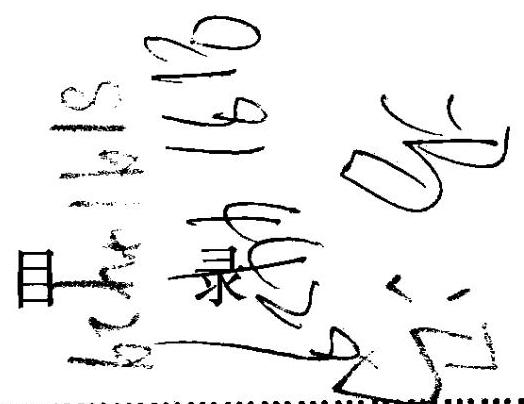

一、集合 1

二、抽屉原则与平均数原则 15

三、命题与条件 22

第二章 函数 32

一、函数的概念 32

二、函数的性质 45

三、初等函数模型 61

四、函数的应用 74

第三章 不等式 87

一、不等式的性质 87

二、不等式的证明 89

三、解不等式 97

四、不等式的应用 116

第四章 三角函数 129

一、任意角的三角函数 129

二、三角函数的图像和性质 151

三、两角和与差的三角函数 173

四、反三角函数和简单三角方程 201

第五章 直线与平面 225

一、平面 225

二、空间两条直线 230

三、空间直线与平面 235

四、空间两个平面 250

五、直线与平面的应用 264

第六章 多面体与旋转体 273

一、多面体 273

二、旋转体 297

三、多面体与旋转体的体积 314

四、多面体与旋转体的应用 335

第七章 行列式、矩阵与向量初步 343

一、行列式 343

二、矩阵 354

三、向量初步 371

练习与复习参考题答案 400

recorrecte

第一章

集合与命题 Set and Proposition

## 一、集 合

### 1.1 集合及其表示法

在现实生活和数学中, 我们经常要考察一些由确定对象组成的集体. 例如:

(1)所有的等腰三角形；

(2)30 的所有正因数；

(3)不等式 ${3x} + 2 > 0$ 的解的全体;

(4)平面上与一个定点距离等于定长的所有点；

(5)某校所有的计算机某些指定的对象集 $d$ ___表

以上这些有确定对象的集体，称为一个集合. 集合中的各个对象，称为该集合的元素.

对于一个给定的集合，集合中的元素是确定的. 也就是说，任何一个对象或者是这个给定集合的元素,或者不是它的元素. 例如: 由 “ 30 的所有正因数”组成的集合，3 是这个集合的元素，而 -2、7 都不是这个集合的元素.

同时，一个给定集合的元素是互异的. 这就是说，集合中的任何两个元素都是不同的对象,集合中的元素不重复出现.

集合内各元素地位相等结构序无关.

根据集合中所含元素的个数，可将集合分为有限集和无限集. 有限集含有有限个元素, 像前面所举例的 (2), (5) 都是有限集; 无限集含有无限个元素, 例 (1), (3), (4)就是无限集.

为简便起见,集合常用大写的英文字母 $A, B, C,\cdots \cdots$ 表示,集合中的元素用小写的英文字母 $a, b, c,\cdots \cdots$ 表示. 如果 $a$ 是集合 $A$ 的元素，就说 $a$ 属于集合 $A$ ，记作 $a \in  A$ ; 如果 $a$ 不是集合 $A$ 的元素,就说 $a$ 不属于 $A$ ,记作 $a \notin  A$ .

数学中,把常用的数集用特定的字母表示. 例如:

全体自然数组成的集合,记作 $\underline{N}, N = \{ 0,1,2,\cdots \cdots \}$ ;

全体整数组成的集合，记作 $\underline{{\mathbf{Z}}_{5}}$ 正整数集合记作 $\underline{{\mathbf{N}}^{ * }}$ ;

全体有理数组成的集合,记作 $\mathbf{Q}$ ;

全体实数组成的集合,记作 $\mathbf{R}$ ;

正实数集记为 ${\mathbf{R}}^{ + }$ ; 负有理数集记作 ${\mathbf{Q}}^{ - }$ . “

由于实际需要,我们引入空集的概念. 空集不含有任何元素,记作 $\varnothing$ .

表示一个给定的集合，常用的方法有两种:

## 1 列举法

把一个集合的所有元素逐个列举出来,并用大括号 $\{ \;\}$ 括起来，这种表示集合的方法叫做列举法.

例如, 30 的所有正因数组成的集合, 就可以表示为

$$
A = \{ 1,2,3,5,6,{10},{15},{30}\} .
$$

例 1 小于 50 的所有质数组成的集合 $A$ ,可用列举法表示为 $A = \; \{ 2,3,5,7,{11},{13},{17},{19},{23},{29},{31},{37},{41},{43},{47}\} .$

## 2. 特征性质描述法

一个集合用列举法表示有时显得很繁, 特别是当集合含有无限多个元素时, 列举法表示就不大容易了. 此时, 常用该集合所含元素的共有特征性质来描述.

定义 1 若性质 $\alpha$ 和集合 $A$ 具有以下关系: 集合 $A$ 中的任何一个元素都具有性质 $\alpha$ ,而且任何一个具有性质 $\alpha$ 的元素也都是集合 $A$ 的元素,则称 $\alpha$ 是集合 $A$ 的一个特征性质.

例如:(1)集合 $E = \{$ 奇数 $\}$ 的一个特征性质是 $\alpha$ :被 2 除余 1 的整数； (2)集合 $A = \{ 1, - 1\}$ 的一个特征性质是 $\alpha$ :平方等于 1 的有理数. 它还有另一个特征性质是 $\beta$ : 绝对值等于 1 的有理数.

如果在大括号内先写出这个集合的元素的一般形式, 再划一条竖线, 在竖线右边写上这个集合元素的特征性质, 那么这种表示集合的方法叫做特征性质描述法.

例 2 用特征性质描述法表示被 3 除余 2 的整数的全体所组成的集合.

解: $\{ x \mid  x = {2k} + 2, k \in  \mathbf{Z}\}$ .

例 3 用符号“ $\in$ ”或者“ $\notin$ ”填空:

(1)2___ $\mathrm{N}$ ； (2) $\sqrt{2}$ ___ ${\mathbf{Q}}^{ + }$ ； (3) $- \frac{1}{2}$ ___ ${\mathbf{R}}^{ - }$ ； (4)0___ $\varnothing$ ；

(5)3___ $\left\{  {x\left| {\;x = {n}^{2} + 1}\right. , n \in  \mathbf{N}}\right\}$ ； (6)5___ $\left\{  {x\left| {\;x = {n}^{2} + 1}\right. , n \in  \mathbf{N}}\right\}$ ；

(7) $\left( {-1,1}\right) \_ \left\{  {\left( {x, y}\right)  \mid  y = {x}^{2}}\right\}$ ； (8) $\left( {-1,1}\right)$ ___ $\left\{  {y\left| {y = {x}^{2}}\right. }\right\}$ .

解:(1) $2\underline{ \in  }\mathrm{N}$ ； (2) $\sqrt{2} \notin  {\mathbf{Q}}^{ + }$ ； (3) $- \frac{1}{2}\underline{\underline{ \subset  }}{\mathbf{R}}^{ - }$ ； (4) $0 \notin  \varnothing$ ；

(5)令 ${n}^{2} + 1 = 3$ ，则 $n =  \pm  \sqrt{2} \notin  \mathbf{N}$ ， $\therefore \; 3 \notin  \{ x \mid  x = {n}^{2} + 1, n \in  \mathbf{N}\} ;$

(6) 令 ${n}^{2} + 1 = 5$ ,则 $n =  \pm  2,2 \in  \mathbf{N},\;\therefore 5 \in  \{ x \mid  x = {n}^{2} + 1, n \in  \mathbf{N}\}$ ;

(7) $\because 1 = {\left( -1\right) }^{2},\therefore \left( {-1,1}\right) \underline{\underline{ \in  }}\left\{  {\left( {x, y}\right)  \mid  y = {x}^{2}}\right\}$ ;

$\left\{  8\right\}  \because \left\{  {y \mid  y = {x}^{2}}\right\}$ 中的元素是数， $\therefore \left( {-1,1}\right)  \notin  \left\{  {y \mid  y = {x}^{2}}\right\}$ .

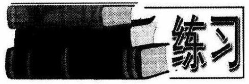

1. 犯下列对象看作一个整体，判断是否为集合?

(1)大于-6且小于3的自然数；

(2)非常靠近原点的点;

(3)直线 $x + y = 5$ 上的点；

(4)华师大二附中某班的全体同学；

(5)华师大二附中某班的高个子同学；

(6) 华师大二附中某班的身高在 1.80 米以上的同学. ✓

3 试分别举出两个有限集和两个无限集的例子.

3. 任选一种方法表示以下各组元素组成的集合:

(1)我国的五大水系:长江、黄河、珠江、海河、黑龙江；

(2)不等式 ${x}^{2} - {10x} + {25} > 0$ 的解集；

(3)不小于 0 的偶数；

(4)10 的正整数次幂的数；

(5)绝对值小于 5 的整数；

(6)我国现有的直辖市.

4. 用列举法表示下列集合:

(1) $\left\{  {x\left| {\;x < {10}}\right. , x\text{ 为质数 }}\right\}$ ；

(2) $\left\{  {x\left| {\; - \frac{10}{3} < x < \frac{8}{3}}\right. , x \in  \mathbf{Z}}\right\}$ ；

(3) $\left\{  {x\left| {\;x = \sqrt{a}, a < {50}}\right. , x \in  \mathbf{N}}\right\}$ ；

(4) $\{ \left( {x, y}\right)  \mid  x + y = 6, x \in  \mathbf{N}, y \in  \mathbf{N}\}$ .

5. 用描述法表示下列集合:

(1) $\{  \pm  {18}, \pm  {12}, \pm  6,0\}$ ；

(2)满足不等式 ${5x} + 6 > x - 3$ 的实数 $x$ 的全体;

(3)被 5 除余 1 的自然数的全体;

(4)一次函数 $y = {kx} + b\left( {k \neq  0}\right)$ 的图像上所有点的集合.

6. 设集合 $A = \left\{  {{k}^{2} - k,{2k}}\right\}$ ，求实数 $k$ 的取值范围. $x \neq  0$ .)

9. 已知集合 $A = \left\{  {x|a{x}^{2} + {2x} + 1 = 0, a \in  \mathbf{R}, x \in  \mathbf{R}}\right\}$ 中至少有一个元素，求: $a$ 的取值范围. 又

8. 设 $a, b$ 是整数，集合 $E = \left\{  {\left( {x, y}\right)  \mid  {\left( x - a\right) }^{2} + {3b} \leq  {6y}}\right\}$ ，点 $\left( {2,1}\right)  \in  E$ ，但点 $\left( {1,0}\right)  \notin  E,\left( {3,2}\right)  \notin  E$ ,求 $a, b$ 的值.

### 1.2 子集、全集和补集

我们知道,每个整数都是有理数,就是说: 整数集 $\mathbf{Z}$ 中的每个元素都属于有理数集 $\mathbf{Q}$ ; 同样,每个有理数都是实数,也就是说: 有理数集 $\mathbf{Q}$ 中的每个元素都属于实数集 R. 集合之间的这类关系是常见而重要的.

定义 2 对于两个集合 $A$ 与 $B$ ,如果 $A$ 中的任何一个元素都属于 $B$ (即如果 $a \; \in  A$ ,那么 $a \in  B$ ),那么就把 $A$ 叫做 $B$ 的子集,记作 $A \subseteq  B$ (或 $B \supseteq  A$ ),读作“ $A$ 包含于 $B$ ”(或“ $B$ 包含 $A$ ”).

例如,考察集合 $\{ x \mid  x = {6k}, k \in  \mathbf{Z}\}$ 与 $\{ x \mid  x = {2m}, m \in  \mathbf{Z}\}$ . 因为能被 6 整除的整数必定是偶数,故得 $\{ x \mid  x = {6k}, k \in  \mathbf{Z}\}  \subseteq  \{ x \mid  x = {2m}, m \in  \mathbf{Z}\}$ . 如果集合 $A$ 不是集合 $B$ 的子集，可记作 $A \nsubseteq  B$ .

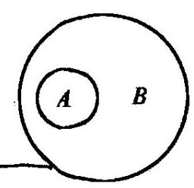

图 1-1

定义 3 对于两个集合 $A$ 与 $B$ ,如果 $A \subseteq  B$ ,并且 $B$ 中至少有一个元素不属于 $A$ ,那么集合 $A$ 叫做集合 $B$ 的真子集,记作 $A \subset \; B$ (或 $B \supset  A$ ),读作“ $A$ 真包含于 $B$ ”(或“ $B$ 真包含 $A$ ”). 这种包含关系可用图 1-1 直观表示,其中 $A\text{ 、 }B$ 两个圈的内部分别代表集合 $A, B$ . 这种表示法叫集合的图示法 (又称维恩图).

对于数集 $\mathrm{N},\mathrm{Z},\mathrm{Q},\mathrm{R}$ 来说,有 $\mathrm{N} \subset  \mathrm{Z} \subset  \mathrm{Q} \subset  \mathrm{R}$ . 若集合 $A$ 不是集合 $B$ 的真子集, 可记作 $A \text{ ⊄ } B$ .

需要指出,我们规定,空集是任何集合的子集. 两个集合 $A$ 与 $B$ ,如果 $A \subseteq  B$ ,并且 $B \; \subseteq  A$ ,则称集合 $A$ 与集合 $B$ 相等,记作 $A = B$ . 此时, $A$ 与 $B$ 所包含的元素完全相同.

例

$$
A = \{ n \mid  n = {4k} \pm  1, k \in  \mathbf{Z}\} ;B = \{ m \mid  m = {2k} + 1, k \in  \mathbf{Z}\} .
$$

解: $B$ 是由全体奇数所组成的集合,而 $A$ 的每个元素都是奇数,所以 $A \subseteq  B$ . 另一方面,奇数 $m$ 除以 4 的余数只可能是 1 或 3 . 如果 $m$ 除以 4 余 1,则 $m = {4k} + 1 \; \left( {k \in  \mathbf{Z}}\right)  \in  A$ ; 如果 $m$ 除以 4 余 3,那么 $m = {4k} + 3 = 4\left( {k + 1}\right)  - 1 \in  A$ ,所以有 $B \subseteq  A$ . 综上所述， $A = B$ .

例 2 写出集合 $\{ 1,2,3\}$ 的所有真子集.

解: 集合 $\{ 1,2,3\}$ 的所有真子集是 $\varnothing ,\{ 1\} ,\{ 2\} ,\{ 3\} ,\{ 1,2\} ,\{ 1,3\}$ , $\{ 2,3\}$ .

在研究集合与集合之间的关系时, 这些集合往往是某个给定集合的子集. 这个给定的集合叫做全集,用符号 $I$ 表示. 全集含有我们所要研究的各个集合的全部元素. 例如, 在研究平面几何中的线段、三角形、圆等问题时, 全集通常取 “平面上所有的点组成的集合”; 在研究不等式的解集时,如果不加说明,全集就是“实数集 ${\mathbf{R}}^{n}$ .

已知全集 $I$ ，集合 $A \subseteq  I$ ，由 $I$ 中所有不属于 $A$ 的元素全体所组成的集合叫做集合 $A$ 在集合 $I$ 中的补集，记作 $\bar{A}$ (读作 $A$ 补)，即 $\bar{A} = \{ x \mid  x \in  I, x \notin  A\}$ ， $\bar{A}$ 可以用图 1-2 中的阴影部分来表示.

对全集 $\mathbf{R}$ 来说,无理数集是 $\overline{\mathbf{Q}}$ .

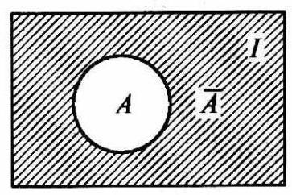

图 1-2

由补集的定义易知, $\overline{\bar{A}} = A$ .

例 $3/{\text{ 若 }\text{ 集 }\text{ 合 }}\;A = \left\{  {x\left| {\; - 2 < x \leq  1}\right. }\right\}  ,\text{ 当 }\;$  $\left( 1\right) \text{ 且 }\;\left\lbrack  x\right\rbrack  {\text{ 与 }\text{ 人 }\text{ 际 }\text{ 革 }\text{ 用 }\text{ 上 }\text{ 界 }nz\text{ 同 }\text{ 向 }\text{ 上 }}$ (1) $Y = \mathbf{R};$ (2) $I = \{ x \mid  x \leq  3\} ;\left( 3\right) \;I = \; \{ x \mid   - 5 \leq  x \leq  1\}$ 时,求 $\bar{A}$ .

解:(1)因为 $A = \{ x \mid   - 2 < x \leq  1\} , I = \mathbf{R}$ ，

所以 $\bar{A} = \{ x \mid  x > 1$ 或 $x \leq   - 2\}$ ;

(2) $\overline{A} = \{ x \mid  1 < x \leq  3$ 或 $x \leq   - 2\}$ ；

(3) $\bar{A} = \{ x \mid   - 5 \leq  x \leq   - 2\}$ .

1. 集合 $\{ 0\}$ 与 $\varnothing$ 是否相等？它们满足什么关系?

2. “如果 $A \subseteq  B, B \subseteq  S$ ,那么 $A \subseteq  S$ ”,这种说法是否正确?

3. 集合 $A = \{ 1, a, b\} , B = \left\{  {a,{a}^{2},{ab}}\right\}$ ,且 $A = B$ ,求实数 $a, b$ .

4. 设 $A = \{ 1,2,3\} , B = \{ C \mid  C \subseteq  A\}$ ,求 $B$ .

5. 已知集合 $A = \left\{  {x \mid  {x}^{2} - {2x} - 3 \leq  0}\right\}  , B = \left\{  {x \mid  {x}^{2} - {5x} + 6 \leq  0, x \in  \mathbf{Z}}\right\}$ ,求证: $B \subset  A$ .

6. 已知集合 $A = \left\{  {x| - {x}^{2} + {3x} + {10} \geq  0}\right\}  , B = \left\{  {x|m + 1 \leq  x \leq  {2m} - 1}\right\}$ ,若 $B \; \subset  A$ ,求实数 $m$ 的取值范围.

7. 在小于 20 的正偶数中, $A = \{$ 质数 $\} , B = \{ {10}$ 的因数 $\}$ ,求 $\bar{A}$ 与 $B$ .

8. 在一次国际学术会议上, $k$ 个科学家共使用 $p$ 种不同的语言,如果任何两个科学家都至少使用一种共同的语言,但没有任何两位科学家使用的语言完全相同,求证: $k = {2}^{p - 1}$ .

### 1.3 交集、并集与差集

定义 4 由两个集合 $A, B$ 的公共元素组成的集合,叫做集合 $A, B$ 的交集,记作 $A \cap  B$ ,读作“ $A$ 交 $B$ ”. 即 $A \cap  B = \{ x \mid  x \in  A$ 且 $x \in  B\}$ .

例如: (1) 集合 $A = \{$ 直角三角形 $\}$ 与 $D = \{$ 等腰三角形 $\}$ 的交集 $A \cap  D =$ \{等腰直角三角形\}.

(2)集合 $A = \{ {10}$ 的正约数 $\}$ 与 $B = \{ {15}$ 的正约数 $\}$ 的交集为 $A \cap  B = \; \{ 1,2,5,{10}\}  \cap  \{ 1,3,5,{15}\}  = \{ 1,5\} ;$

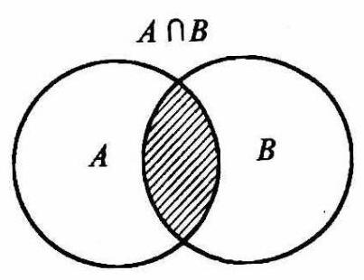

图 1-3

(3)集合 $A = \{$ 奇数 $\}$ 与 $B = \{$ 偶数 $\}$ 的交集为 $A \cap \; B = \varnothing$ .

集合 $A, B$ 的交集 $A \cap  B$ 也可以用图 1-3 中的阴影部分表示.

由交集的定义不难发现,对任何集合 $A$ ,都有: $A \cap \; A = A, A \cap  \varnothing  = \varnothing , A \cap  \bar{A} = \varnothing , A \cap  I = A.$

例 1 已知 $M = \left\{  {\left( {x, y}\right)  \mid  {x}^{2} + {2x} + {y}^{2} = 0}\right\}  , N = \; \{ \left( {x, y}\right)  \mid  y = x + a\}$ ，且 $M \cap  N \supset  \varnothing$ ，求 $a$ 的取值范围.

解: $M \cap  N \supset  \varnothing  \Leftrightarrow$ 方程组 $\left\{  \begin{array}{l} {x}^{2} + {2x} + {y}^{2} = 0, \\  y = x + a \end{array}\right.$ 有实数解,

$\therefore {x}^{2} + {2x} + {\left( x + a\right) }^{2} = 0$ 即 $2{x}^{2} + \left( {2 + {2a}}\right) x + {a}^{2} = 0$ 有实数解.

$\therefore \Delta  = {\left( 2 + 2a\right) }^{2} - 4 \cdot  2 \cdot  {a}^{2} \geq  0 \Rightarrow  1 - \sqrt{2} \leq  a \leq  1 + \sqrt{2}$ .

$\therefore a$ 的取值范围是 $\left\lbrack  {1 - \sqrt{2},1 + \sqrt{2}}\right\rbrack$ .

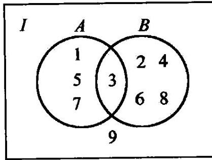

图 1-4

例 $2/\mathrm{E}$ 知全集 $I = \{ x \mid  0 < x < {10}, x \in  \mathbf{N}\} , A \cap \; B = \{ 3\} , A \cap  \bar{B} = \{ 1,5,7\} ,\bar{A} \cap  \bar{B} = \{ 9\}$ ,求 $A, B$ .

解: 由已知 $I = \{ x \mid  0 < x < {10}, x \in  \mathbf{N}\}  = \; \{ 1,2,3,4,5,6,7,8,9\}$ . 把 $A \cap  B = \{ 3\} , A \cap  \bar{B} = \; \{ 1,5,7\} ,\bar{A} \cap  \bar{B} = \{ 9\}$ 用维恩图表示出来,如图 1-4, 于是得:

$$
A = \{ 1,3,5,7\} ,
$$

$$
B = \{ 2,3,4,6,8\} .
$$

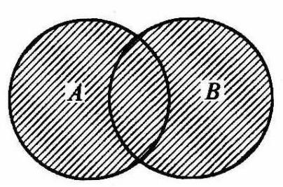

图 1-5

定义 5 由所有属于集合 $A$ 或者属于集合 $B$ 的元素所组成的集合叫做 $A, B$ 的并集，记作 $A \cup  B$ (读作“A 并 $B$ ”)，即

$$
A \cup  B = \{ x \mid  x \in  A\text{ 或 }x \in  B\} .
$$

$A \cup  B$ 可以用图 1-5 中的阴影部分来表示.

由并集的定义可以发现,对于任何集合 $A$ 都有:

$$
A \cup  A = A, A \cup  \varnothing  = A, A \cup  I = I, A \cup  \overline{A} = I.
$$

例3设 $A = \{ x \mid   - 2 < x < 2\} , B = \{ x \mid  1 < x < 3\}$ ,求 $A \cup  B$ .

解: $A \cup  B = \{ x \mid   - 2 < x < 3\}$ .

根据集合的交集与并集的定义，对于任意两个集合 $A, B$ ，成立以下等式:

$$
A \cap  B = B \cap  A, A \cup  B = B \cup  A,\left( {A \cap  B}\right)  \cap  C = A \cap  \left( {B \cap  C}\right)  = A \cap  B \cap  C,
$$

$$
\left( {A \cup  B}\right)  \cup  C = A \cup  \left( {B \cup  C}\right)  = A \cup  B \cup  C.
$$

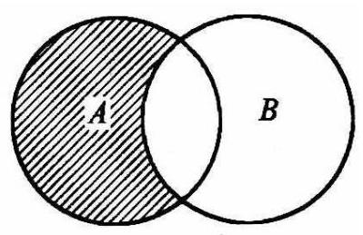

图 1-6

同时,包含关系 $A \cap  B \subseteq  A, A \cap  B \subseteq  B;A \cup  B \supseteq  A, A \; \cup  B \supseteq  B$ 也是成立的.

定义 6 由所有属于 $A$ 而不属于 $B$ 的元素组成的集合，称为 $A$ ， $B$ 的差集，记作 $A - B$ (或 $A/B$ ).

$$
A - B = \{ x \mid  x \in  A\text{ 且 }x \notin  B\} .
$$

差集可用图 1-6 中阴影部分表示.

例4 集合 $A = \left\{  {x \mid  {x}^{2} + {4x} = 0}\right\}  , B = \left\{  {x \mid  {x}^{2} + 2\left( {a + 1}\right) x + {a}^{2} - 1 = 0}\right\}$ .

1) 若 $A \cap  B = B$ ,求 $a$ 的取值范围; (2) 若 $A \cup  B = B$ ,求 $a$ 的取值范围.

解: 由已知 $A = \left\{  {x \mid  {x}^{2} + {4x} = 0}\right\}   = \{  - 4,0\}$ .

(1) $B = \left\{  {x \mid  {x}^{2} + 2\left( {a + 1}\right) x + {a}^{2} - 1 = 0}\right\}$ .

$\because A \cap  B = B,\;\therefore B \subseteq  A$ .

① 若 $0 \in  B$ ，则 ${a}^{2} - 1 = 0,\therefore a =  \pm  1$ . 当 $a = 1$ 时， $B = A, a =  - 1$ 时， $B = \; \{ 0\}$ .

② 若 $- 4 \in  B$ ，则 ${a}^{2} - {8a} + 7 = 0,\therefore a = 7$ 或 1. 当 $a = 7$ 时， $B = \; \{  - {12}, - 4\}  \nsubseteq  A$ .

③ 若 $B = \varnothing$ ，则 $\Delta  = 4{\left( a + 1\right) }^{2} - 4\left( {{a}^{2} - 1}\right)  < 0$ ， $\therefore a <  - 1$ .

综合①，②，③，得 $a = 1$ 或 $a \leq   - 1$ ；

(2) $\because A \cup  B = B,\;\therefore A \subseteq  B$ .

$\because A = \{  - 4,0\} ,\therefore B$ 至少有两个元素-4,0.

又 $B$ 中的元素是一元二次方程的实数解,所以 $B$ 中元素至多只有两个,所以 $A = B$ .

由(1)知，此时 $a = 1$ .

例5 已知集合 $A = \{ \left( {x, y}\right)  \mid  x = n, y = {an} + b, n \in  \mathbf{Z}\} , B = \left\{  \begin{array}{l} \left( {x, y}\right)  \mid  x = m, \\  y = 3{m}^{2} + {15}, m \in  \mathbf{Z} \end{array}\right\}$ , $C = \left\{  {\left( {x, y}\right)  \mid  {x}^{2} + {y}^{2} \leq  {144}}\right\}$ ,问是否存在实数 $a, b$ 使得: (1) $A \cap  B \neq  \varnothing$ ; (2) $\left( {a, b}\right)  \in  C$ 同时成立?

解: 假设存在实数 $a, b$ 使得 $A \cap  B \neq  \varnothing$ ,则集合 $A = \; \{ \left( {x, y}\right)  \mid  x = n, y = {an} + b, n \in  \mathbf{Z}\}$ 与 $B = \{ \left( {x, y}\right)  \mid  x = m, y = 3{m}^{2} + {15}, m \in  \mathbf{Z}\}$ 分别对应集合 ${A}_{1} = \{ \left( {x, y}\right)  \mid  y = {ax} + b, x \in  \mathbf{Z}\}$ 与 ${B}_{1} = \left\{  {\left( {x, y}\right)  \mid  y = 3{x}^{2} + {15}, x \in  \mathbf{Z}}\right\}  .{A}_{1}$ 与 ${B}_{1}$ 对应的直线 $y = {ax} + b$ 与抛物线 $y = 3{x}^{2} + {15}$ 至少要有公共点,所以方程组 $\left\{  \begin{array}{l} y = {ax} + b, \\  y = 3{x}^{2} + {15} \end{array}\right.$ 有解.

即 $3{x}^{2} + {15} = {ax} + b\left( *\right)$ 必有解,此时 $\Delta  = {a}^{2} - {12}\left( {{15} - b}\right)  \geq  0$ .

$\therefore  - {a}^{2} \leq  {12b} - {180}$ .①

又 $\because {a}^{2} + {b}^{2} \leq  {144}$ ,②

①，②相加得 ${b}^{2} \leq  {12b} - {36}$ ，即 ${\left( b - 6\right) }^{2} \leq  0$ ， $\therefore b = 6$ .

$\left. \begin{array}{l} \text{ 将 }b = 6\text{ 代入 ①,得 }\;{a}^{2} \geq  {108} \\  \text{ 再将 }b = 6\text{ 代入 ②得 }\;{a}^{2} \leq  {108} \end{array}\right\}   \Rightarrow  a =  \pm  6\sqrt{3}$ .

再将 $a =  \pm  6\sqrt{3}, b = 6$ 代入方程 $\left( *\right)$ ,得 $3{x}^{2} \pm  6\sqrt{3}x + 9 = 0$ ,解得 $x =  \pm  \sqrt{3} \notin$ 乙,所以不存在实数 $a, b$ 使 (1),(2) 同时成立.

1. $A = \{ 2, - 1,{x}^{2} - x + 1\} , B = \{ {2y}, - 4, x + 4\}$ , $C = \{  - 1,7\}$ ,且 $A \cap  B = C$ ,求 $x, y$ 的值.

2. 已知 $A = \left\{  {x \mid  {x}^{2} \geq  9}\right\}  , B = \left\{  {x\left| {\;\frac{x - 7}{x + 1} \leq  0}\right. }\right\}$ ，

$C = \{ x \mid  \left| {x - 2}\right|  < 4\}$ ,求: (1) $A \cap  B, A \cup  C$ 及 $B - C$ ; (2) 若 $I = \mathbf{R}$ ,求 $A \cap \; \overline{\left( B \cap  C\right) }$ .

3. 已知集合 $A = \left\{  {\left( {x, y}\right)  \mid  y =  - {x}^{2} + {mx} - 1}\right\}  , B = \left\{  {\left( {x, y}\right)  \mid  x + y = 3,0 \leq  x \leq  3}\right\}$ ,若 $A \cap \; B$ 是单元素集,求实数 $m$ 的取值范围.

4. 已知集合 $A = \left\{  {x \mid  {x}^{2} + {3x} + 2 \geq  0}\right\}  , B = \left\{  {x \mid  m{x}^{2} - {4x} + m - 1 > 0, m \in  \mathbf{R}}\right\}$ ,若 $A \cap \; B = \varnothing$ ,且 $A \cup  B = A$ ,求 $m$ 的取值范围.

5. 集合 $A = \left\{  {x \mid  {x}^{2} - {3x} + 2 = 0}\right\}  , B = \left\{  {x \mid  {x}^{2} - {ax} + \left( {a - 1}\right)  = 0}\right\}$ , $C = \left\{  {x \mid  {x}^{2} - {mx} + 2 = 0}\right\}$ ,已知 $A \cup  B = A, A \cap  C = C$ ,求 $a, m$ 的值.

6. 设 $I = \mathbf{R}, A = \left\{  {x \mid  {x}^{2} - x - 6 < 0}\right\}  , B = \{ x \mid  x - a > 0\}$ ,当 $a$ 为何值时,(1) $A \subset  B;\left( 2\right) A \cap  B \neq  \varnothing ;\left( 3\right) A \cup  B = \left( {-2, + \infty }\right)$ .

7. 已知 $M = \left\{  {x \mid  {y}^{2} = x + 1}\right\}  , N = \left\{  {y \mid  y =  - {x}^{2} + {4x}}\right\}$ ,求 $M \cap  N$ .

8. 设集合 $A = \left\{  {\left( {x, y}\right)  \mid  {y}^{2} - x - 1 = 0}\right\}  , B = \left\{  {\left( {x, y}\right)  \mid  4{x}^{2} - {2x} - {2y} + 5 = 0}\right\}$ , $C = \{ \left( {x, y}\right)  \mid  y = {kx} + b\}$ ,是否存在 $k, b\left( {k \in  {\mathbf{N}}^{ * }, b \in  {\mathbf{N}}^{ * }}\right)$ ,使 $\left( {A \cup  B}\right)  \cap  C = \varnothing$ ?

### 1.4 有限集的并集的元素个数

设有限集合 $M$ 所含的元素个数用 $n\left( M\right)$ (或 $\left| M\right|$ ) 表示,并规定 $n\left( \varnothing \right)  = 0$ . 以下对有限集合 $A, B$ ,讨论 $n\left( A\right) , n\left( B\right) , n\left( {A \cap  B}\right) , n\left( {A \cup  B}\right)$ 之间的关系.

例如,设 $A = \{ 1,2,3,4,5,6\} , B = \{ 2,4,6,8\}$ ,则有 $A \cap  B = \{ 2,4,6\} , A \cup  B = \; \{ 1,2,3,4,5,6,8\}$ ,因而有

$$
n\left( A\right)  = 6, n\left( B\right)  = 4, n\left( {A \cap  B}\right)  = 3, n\left( {A \cup  B}\right)  = 7\text{ . }
$$

由此可以发现

$$
n\left( {A \cup  B}\right)  = n\left( A\right)  + n\left( B\right)  - n\left( {A \cap  B}\right) ,\left( *\right)
$$

$$
\text{ 或 }\left| {A \cup  B}\right|  = \left| A\right|  + \left| B\right|  - \left| {A \cap  B}\right| \text{ . }
$$

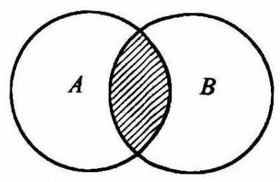

图 1-7

实际上，等式( * )对任何有限集合 $A$ ， $B$ 都是正确的，这可以用图 1-7 来说明. 为计算 $n\left( {A \cup  B}\right)$ ，可先求出 $n\left( A\right)  + n\left( B\right)$ ，然后去掉重复计算的部分 $n\left( {A \cap  B}\right)$ .

特别地,当 $A \cap  B = \varnothing$ 时,有 $n\left( {A \cup  B}\right)  = n\left( A\right)  + \; n\left( B\right)$ .

例 1 据调查, 某班学生参加数学课外小组的人数是参加物理课外小组的人数的 2 倍, 同时参加两个课外小组的人数是 5 ，至少参加一个课外小组的人数是 25 . 试求参加数学小组、物理小组的人数各是多少?

解: 设集合 $A = \{$ 数学小组的学生 $\} , B = \{$ 物理小组的学生 $\}$ . 由题意可知, $n\left( A\right)  = {2n}\left( B\right) , n\left( {A \cap  B}\right)  = 5, n\left( {A \cup  B}\right)  = {25}$ . 应用公式 (*),可得 ${25} = {2n}\left( B\right)  + n\left( B\right)  - 5$ ,解得 $n\left( A\right)  = {20}, n\left( B\right) \; = {10}$ .

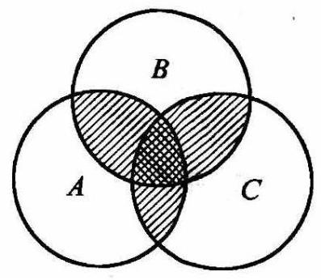

图 1-8

所以，参加数学课外小组的有 20 人，参加物理课外小组的有 10 人.

对于有限集 $A, B, C$ ,由图 1-8 可知

$$
n\left( {A \cup  B \cup  C}\right)  = n\left( A\right)  + n\left( B\right)  + n\left( C\right)  - n\left( {A \cap  B}\right)  -
$$

$n\left( {B \cap  C}\right)  - n\left( {A \cap  C}\right)  + n\left( {A \cap  B \cap  C}\right) .\left( {* * }\right)$

此式可推广至 $m$ 个有限集合. 有

$$
n\left( {{A}_{1} \cup  {A}_{2} \cup  \cdots  \cup  {A}_{m}}\right)  = \mathop{\sum }\limits_{{1 \leq  i \leq  m}}n\left( {A}_{i}\right)  - \mathop{\sum }\limits_{{1 \leq  i \leq  j \leq  m}}n\left( {{A}_{i} \cap  {A}_{j}}\right)  +
$$

$$
\mathop{\sum }\limits_{{1 \leq  i, j, k \leq  m}}n\left( {{A}_{i} \cap  {A}_{j} \cap  {A}_{k}}\right)  - \cdots  + {\left( -1\right) }^{m - 1}n\left( {{A}_{1} \cap  {A}_{2} \cap  \cdots  \cap  {A}_{m}}\right)
$$

成立. 上式即为容斥原理.

例 求不大于 500 且能被 3 或 5 或 7 整除的自然数的个数.

解: 记 ${A}_{1} = \{ x \mid  3$ 整除 $x$ 且 $1 \leq  x \leq  {500}\} ,{A}_{2} = \{ x \mid  5$ 整除 $x$ 且 $1 \leq  x \leq  {500}\}$ , ${A}_{3} = \{ x \mid$ 7整除 $x$ 且 $1 \leq  x \leq  {500}\}$ ,因为3,5,7两两互质,

$\therefore n\left( {A}_{1}\right)  = \left\lbrack  \frac{500}{3}\right\rbrack   = {166}, n\left( {A}_{2}\right)  = \left\lbrack  \frac{500}{5}\right\rbrack   = {100}, n\left( {A}_{3}\right)  = \left\lbrack  \frac{500}{7}\right\rbrack   = {71}$ .

$$
n\left( {{A}_{1} \cap  {A}_{2}}\right)  = \left\lbrack  \frac{500}{15}\right\rbrack   = {33}, n\left( {{A}_{1} \cap  {A}_{3}}\right)  = \left\lbrack  \frac{500}{21}\right\rbrack   = {23}, n\left( {{A}_{2} \cap  {A}_{3}}\right)  = \left\lbrack  \frac{500}{35}\right\rbrack   = {14}.
$$

$$
n\left( {{A}_{1} \cap  {A}_{2} \cap  {A}_{3}}\right)  = \left\lbrack  \frac{500}{105}\right\rbrack   = 4.
$$

由公式 $\left( {* * }\right)$ ,所求自然数的个数为:

$$
n\left( {{A}_{1} \cup  {A}_{2} \cup  {A}_{3}}\right)  = n\left( {A}_{1}\right)  + n\left( {A}_{2}\right)  + n\left( {A}_{3}\right)  - n\left( {{A}_{1} \cap  {A}_{2}}\right)  - n\left( {{A}_{1} \cap  {A}_{3}}\right)
$$

$$
- n\left( {{A}_{2} \cap  {A}_{3}}\right)  + n\left( {{A}_{1} \cap  {A}_{2} \cap  {A}_{3}}\right)
$$

$$
= {166} + {100} + {71} - {33} - {23} - {14} + 4 = {271}\text{ . }
$$

例 3 已知某完全中学共有学生 900 人，其中男生 528 人，高中学生 312 人，共青团员 670 人，高中男生 192 人，男团员 336 人，高中团员 247 人，高中男团员 175 人，试问统计的这些数据是否有错误？

解: 记 $I$ 为该校全体的集合, $A$ 为其中男生的集合, $B$ 为高中学生的集合, $C$ 为团员的集合. 则由题意得:

$$
n\left( I\right)  = {900}, n\left( A\right)  = {528}, n\left( B\right)  = {312}, n\left( C\right)  = {670}.
$$

$$
n\left( {A \cap  B}\right)  = {192}, n\left( {A \cap  C}\right)  = {336}, n\left( {B \cap  C}\right)  = {247}, n\left( {A \cap  B \cap  C}\right)  = {175}.
$$

由公式 $\left( {* * }\right)$ ,得

$$
n\left( {A \cup  B \cup  C}\right)  = {528} + {312} + {670} - {192} - {336} - {247} + {175} = {910} > {900}.
$$

这显然与实际情况不符. 说明统计的数据中一定有错误.

例 4 对任何有限集 $S$ ,记 $\left| S\right|$ 为集合 $S$ 的元素的个数, $m\left( S\right)$ 为集合 $S$ 的子集的个数. 如果 $A, B, C$ 是三个有限集,且满足下列条件: (1) $m\left( A\right)  + m\left( B\right)  + m\left( C\right) \; = m\left( {A \cup  B \cup  C}\right) ;\left( 2\right) \left| A\right|  = \left| B\right|  = {100}$ ,求 $\left| {A \cap  B \cap  C}\right|$ 的最小值.

解: 由 $\left( 1\right)$ ,可知 ${2}^{100} + {2}^{100} + {2}^{\left| C\right| } = {2}^{\left| A \cup  B \cup  C\right| }$ ,即 $1 + {2}^{\left| C\right|  - {101}} = \; 2\left| {A \cup  B \cup  C}\right|  - {101}$ .

因为 $1 + 2\left| C\right|  - {101}$ 是大于 1 且等于一个 2 的整数次幂的整数,所以 $\left| C\right|  =$ 101,从而 $\left| {A \cup  B \cup  C}\right|  = {102}$ .

由公式 $\left( {* * }\right)$ ,得

$$
\left| {A \cup  B \cup  C}\right|  = \left| A\right|  + \left| B\right|  + \left| C\right|  - \left( {\left| {A \cap  B}\right|  + \left| {A \cap  C}\right|  + \left| {B \cap  C}\right| }\right)  +
$$

$\left| {A \cap  B \cap  C}\right|$ ,

所以

$$
\left| {A \cap  B \cap  C}\right|  = \left| {A \cup  B \cup  C}\right|  - \left( {\left| A\right|  + \left| B\right|  + \left| C\right| }\right)  + (\left| {A \cap  B}\right|  + \left| {A \cap  C}\right|  +
$$

$$
\left. {\mid B \cap  C \mid  }\right)
$$

$$
= {102} - \left( {{100} + {100} + {101}}\right)  + \left| {A \cap  B}\right|  + \left| {A \cap  C}\right|  + \left| {B \cap  C}\right|
$$

$$
= \left| {A \cap  B}\right|  + \left| {A \cap  C}\right|  + \left| {B \cap  C}\right|  - {199}\text{ . }
$$

但 $\left| {A \cup  B \cup  C}\right|  = {102} \geq  \left| {A \cup  B}\right|  = \left| A\right|  + \left| B\right|  - \left| {A \cap  B}\right|  = {100} + {100} - \; \left| {A \cap  B}\right|$ ,

$\therefore \left| {A \cap  C}\right|  \geq  {200} - {102} = {98}$ .

又 $\left| {A \cup  B \cup  C}\right|  = {102} \geq  \left| {A \cup  C}\right|  = \left| A\right|  + \left| C\right|  - \left| {A \cap  C}\right|  = {100} + {101} - \; \left| {A \cap  C}\right|$ ,

$\therefore \left| {A \cap  B}\right|  \geq  {201} - {102} = {99}$ . 同理 $\left| {B \cap  C}\right|  \geq  {99}$ .

$\therefore \left| {A \cap  B \cap  C}\right|  \geq  {98} + {99} + {99} - {199} = {97}$ .

例如: $A = \{ 1,2,3,\cdots ,{99},{100}\}$ ,

$B = \{ 3,4,5,\cdots ,{101},{102}\} ,$

$C = \{ 1,2,4,5,\cdots ,{101},{102}\} ,$

则 $\left| {A \cap  B \cap  C}\right|  = \left| {\{ 4,5,6,\cdots ,{101},{102}\} }\right|  = {97}$ .

$\therefore \left| {A \cap  B \cap  C}\right|$ 的最小值为 97 .

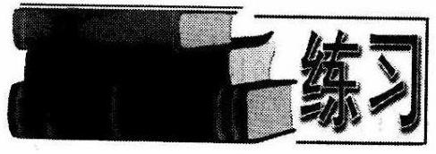

1. 某建筑队有 100 名工人，他们或者能做泥工，或者能做木工，已知能做泥工的有 82 人， 能做木工的有 50 人，问其中既能做泥工，又能做木工的有几人?

2. 12 名学生去商店买水果,有 6 人买苹果, 5 人买桔子, 苹果与桔子都买的有 4 人，其他人什么也没买，问什么也没有买的学生有几个人？

3. 某班学生参加数理化三科考试,数、理、化优秀的学生依次分别有 30 人, 28 人，25 人，数理、理化、数化两种都优秀的依次有 20 人，16 人，17 人，数理化三科全优的有 10 人，问三科中至少有一科优秀的有多少人？

4. 已知集合 $A$ 和集合 $B$ 各含 12 个元素, $A \cap  B$ 含有 4 个元素,试求同时满足:(1) $C \subset  A \cup  B$ 且 $C$ 中含有 3 个元素；(2) $C \cap  A \neq  \varnothing$ 的子集 $C$ 的个数.

5. 在 $1,2,3,\cdots ,{1000}$ 这 1000 个数中,是 3 的倍数或是 7 的倍数的数有多少个? 既不能被 3 整除又不能被 5 整除的数有多少个? 至少能被 3,5,7 之一整除的数有多少个?

6. 分别计算不超过 120 的合数与质数的个数.

7. 一次会议有 1990 位数学家参加, 每人至少有 1327 位合作者, 证明: 可以找到 4 位数学家，他们中每两人都合作过.

8. 在一次中学生数学竞赛中,共出了三道题 $A, B, C$ ,所有参赛学生有 25 名, 每人至少解出一道题. 在没有解出 $A$ 的学生中,解出 $B$ 的人数是解出 $C$ 的人数的 2 倍. 只解出 $A$ 的人数比其他学生中解出 $A$ 的人数多 1 . 只解出一道题的学生中有一半没能解出 $A$ . 问有多少学生只解出 $B$ ?

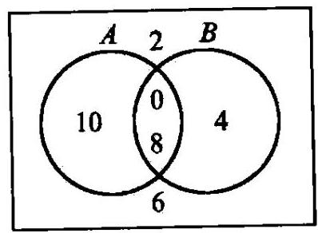

图 1-9

### 1.5 德摩根定律与集合运算性质

任意集合 $A, B, C$ 的交集、并集与补集相结合,会是什么情形呢?

例如,已知全集 $I = \{ 0,2,4,6,8,{10}\}$ ,集合 $A = \; \{ 0,8,{10}\}$ ,集合 $B = \{ 0,4,8\}$ (如图 1-9 所示),则有

$$
A \cap  B = \{ 0,8\} , A \cup  B = \{ 0,4,8,{10}\} ,
$$

$$
\bar{A} = \{ 2,4,6\} ,\bar{B} = \{ 2,6,{10}\} ,\bar{A} \cap  \bar{B} = \{ 2,6\} ,\bar{A} \cup  \bar{B} = \{ 2,4,6,{10}\} .
$$

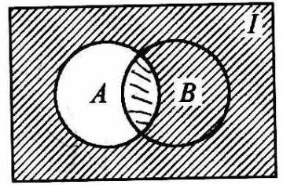

$\bar{A}$

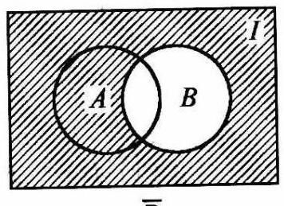

$\bar{B}$

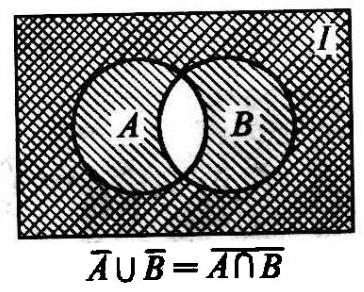

图 1-10

进而, $\overline{A \cap  B} = \{ 2,4,6,{10}\} ,\overline{A \cup  B} = \{ 2,6\}$ .

不难发现, $\overline{A \cap  B} = \{ 2,4,6,{10}\}  = \bar{A} \cup  \bar{B}$ ,

$\overline{A \cup  B} = \{ 2,6\}  = \bar{A} \cap  \bar{B}.$

一般地,对于任意集合 $A, B$ ,下列等式成立:

(1) $\overline{A \cap  B} = \overline{A} \cup  \overline{B}$ ；

(2) $\overline{A \cup  B} = \overline{A} \cap  \overline{B}$ .

这就是著名的德摩根定律，它可以叙述为:

$A, B$ 交集的补集等于 $A, B$ 的补集之并；

$A, B$ 并集的补集等于 $\overline{A, B}$ 的补集之交.

同学们可自行练习用维恩图验证德摩根定律(图 1-10).

例 1 证明德摩根定律: $\overline{A \cup  B} = \bar{A} \cap  \bar{B}$ .

证: $x \in  \overline{A \cup  B} \Leftrightarrow  x \notin  \left( {A \cup  B}\right)  \Leftrightarrow  x \notin  A$ 且 $x \notin  B \Leftrightarrow  x \in  \bar{A}$ 且 $x \in  \bar{B} \Leftrightarrow  x \in  \bar{A} \cap  \bar{B}$ ,

$\therefore \overline{A \cup  B} = \bar{A} \cap  \bar{B}$ .

对于任意集合 $A, B, C$ 的交、并运算,还满足以下运算律:

(1)交换律: $A \cup  B = B \cup  A, A \cap  B = B \cap  A$ .

(2)结合律: $\left( {A \cup  B}\right)  \cup  C = A \cup  \left( {B \cup  C}\right) ,\left( {A \cap  B}\right)  \cap  C = A \cap  \left( {B \cap  C}\right)$ .

(3)分配律: $A \cap  \left( {B \cup  C}\right)  = \left( {A \cap  B}\right)  \cup  \left( {A \cap  C}\right)$ ，

$$
A \cup  \left( {B \cap  C}\right)  = \left( {A \cup  B}\right)  \cap  \left( {A \cup  C}\right) \text{ . }
$$

用维恩图不难验证上述运算律.

例 2 证明: $A \cap  \left( {B \cup  C}\right)  = \left( {A \cup  B}\right)  \cap  \left( {A \cup  C}\right)$ .

证: $x \in  A \cap  \left( {B \cup  C}\right)  \Leftrightarrow  x \in  A$ 且 $x \in  \left( {B \cup  C}\right)$

$\Leftrightarrow  x \in  A$ 且 $\left( {x \in  B\text{ 或 }x \in  C}\right)  \Leftrightarrow  \left( {x \in  A\text{ 且 }x \in  B}\right)$ 或 $\left( {x \in  A\text{ 且 }x \in  C}\right)$

$\Leftrightarrow  x \in  A \cap  B$ 或 $x \in  A \cap  C \Leftrightarrow  x \in  \left( {A \cap  B}\right)  \cup  \left( {A \cap  C}\right)$ ,

$\therefore \;A \cap  \left( {B \cup  C}\right)  = \left( {A \cap  B}\right)  \cup  \left( {A \cap  C}\right)$ .

例 3 运用德摩根定律证明: $\overline{A \cap  B \cap  C} = \bar{A} \cup  \bar{B} \cup  \bar{C}$ .

证: $\because \overline{A \cap  B \cap  C} = \overline{\left( {A \cap  B}\right)  \cap  C} = \left( \overline{A \cap  B}\right)  \cup  \bar{C} = \left( {\bar{A} \cup  \bar{B}}\right)  \cup  \bar{C} = \bar{A} \cup  \bar{B} \cup  \bar{C}$ ,

$\therefore A \cap  \overline{B \cap  C} = \overline{A} \cup  \overline{B} \cup  \overline{C}$ .

类似地可证明 $\overline{A \cup  B \cup  C} = \overline{A} \cap  \overline{B} \cap  \overline{C}$ .

例 4 写出下列集合维恩图中阴影部分集合 (图 1-11).

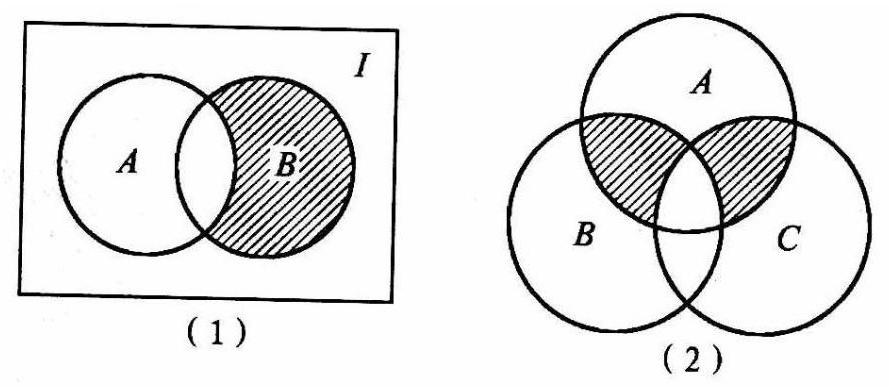

图 1-11

解: (1) $B - A$ 或 $B \cap  \bar{A}$ ;

(2) $\left\lbrack  {\left( {A \cap  B}\right)  \cap  \overline{C}}\right\rbrack   \cup  \left\lbrack  {\left( {A \cap  C}\right)  \cap  \overline{B}}\right\rbrack$ 或 $\left\lbrack  {A \cap  \left( {B \cup  C}\right) }\right\rbrack   \cap  \left( \overline{B \cap  C}\right)$ 或 $\left\lbrack  {A \cap  \left( {B \cup  C}\right) }\right\rbrack   - \left( {A \cap  B \cap  C}\right) .$

1. 对于两个集合 $A, B$ ,若 $A \cup  C = B \cup  C$ ,有 $A = B$ 吗?

2. 证明: 若 $A \cup  B = A \cap  B$ ,则 $A = B$ .

3. 证明: $A \cup  \left( {A \cap  B}\right)  = A, A \cap  \left( {A \cup  B}\right)  = A$ .

4. 用 $A, B, C$ 表示图 1-12 阴影部分表示的集合:

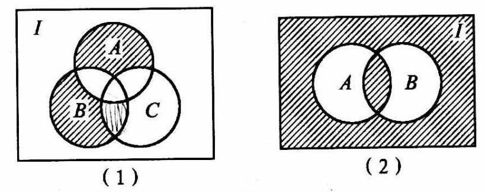

图 1-12

5. 证明: $C \cap  \left( {A - B}\right)  = \left( {A \cap  C}\right)  - \left( {B \cap  C}\right)$ .

6. 证明: $A - \left( {B \cup  C}\right)  = \left( {A - B}\right)  \cap  \left( {A - C}\right)$ .

7. 设 $A, B$ 是任意两个集合,又设集合 $M$ 满足 $A \cap  M = B \cap  M = A \cap  B, A \cup  B \; \cup  M = A \cup  B$ ,求集合 $M$ (用 $A, B$ 表示).

## 二、抽屉原则与平均数原则

### 1.6 抽屉原则

我们知道, 把 5 只苹果分到 4 个抽屉中去, 无论怎样分, 这 4 个抽屉中一定有 1 个抽屉有 2 只或者 2 只以上的苹果. 这是因为如果每个抽屉最多只有 1 只苹果的话，那么 4 个抽屉最多只能分到 4 只苹果.

我们把“苹果”看作元素，把分到某个抽屉中的苹果全体看作一个集合，前面的例子就可以说成，如果把 5 个元素按任一确定的方式分成 4 个集合，那么 $\varpi$ 定有一个集合含有 2 个或者 2 个以上的元素.

一般地，有

原则一 如果把 $m$ 个元素按任一确定的方式分成 $n$ 个集合,并且 $m > n$ ,那么一定有三个集合含有 2 个或者 2 个以上的元素.

例 1 个在边长为 1 的正方形内任意放置 5 个点, 求证: 其中一定有两个点, 它们之间的距离不大于 $\frac{\sqrt{2}}{2}$ .

证: 联结这个正方形的两组对边上的中点, 这两条线段把正方形分成 4 个全等的小正方形(图 1-13).

在大正方形里任意放置 5 个点,就相当于把 5 个点以任一确定的方式放在 4 个小正方形中 (如果有点落在几个小正方形公共边界上, 那么这个点可以属于这几个小正方形中的任意一个)，于是根据原则一，一定有 1 个小正方形， 它包含两个或者两个以上的点. 对于同一个小正方形中的两个点, 它们之间的距离不会超过小正方形对角线的长度, 就是说,不大于 $\frac{\sqrt{2}}{2}$ .

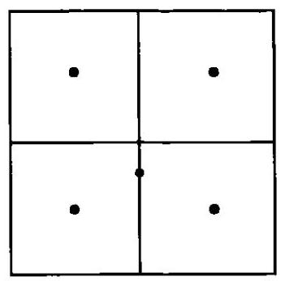

图 1-13

为了推广原则一，我们考虑下面的问题:有红球与白球共 9 个，那么容易知道, 其中至少有 5 个球是相同颜色的. 这是因为，如果红球、白球都最多只有 4 个， 那么球的总数不超过 8 个，这与有 9 个球的已知条件相矛盾.

对于一般的情况，可以得到以下的结论:

原则二 如果把 $m$ 个元素按任一确定的方式分成 $n$ 个集合，并且 $m > {kn}(k \in \; {\mathbf{N}}^{ * }$ ),那么一定有一个集合含有 $k + 1$ 或者 $k + 1$ 个以上的元素.

原则一是原则二在 $k = 1$ 时的特殊情况.

例 2 某班有 50 名学生，把他们的身高精确到厘米. 其中最高的学生是 182 厘米，最矮的是 159 厘米，求证: 至少有 3 名学生的身高相同.

证: 我们知道, ${159},{160},{161},\cdots ,{182}$ 共有 24 个数,现有 50 名学生,因为 ${50} >$ 2×24，所以，应用原则二，至少有 3 名学生身高相同.

原则一、原则二都叫做抽屉原则，它是数学里一个重要原理. 就原理本身并不复杂，但它却是数学解题中的一种强有力的工具，在解决存在性问题中有独到的作用.

20 在不超过 91 的自然数中任取 10 个数, 证明: 这 10 个数中一定有两个数,它们的比值在区间 $\left\lbrack  {\frac{2}{3},\frac{3}{2}}\right\rbrack$ 内.

证: 将 $1,2,3,\cdots ,{91}$ 这 91 个数如下分成 9 个集合:

$$
{A}_{1} = \{ 1\}
$$

$$
{A}_{2} = \{ 2,3\} ,
$$

$$
{A}_{3} = \{ 4,5,6\} ,
$$

$$
{A}_{4} = \{ 7,8,9,{10}\} ,
$$

$$
{A}_{5} = \{ {11},{12},{13},{14},{15},{16}\} ,
$$

$$
{A}_{6} = \{ {17},{18},\cdots ,{25}\} ,
$$

$$
{A}_{7} = \{ {26},{27},\cdots ,{39}\} ,
$$

$$
{A}_{8} = \{ {40},{41},\cdots ,{60}\} ,
$$

$$
{A}_{9} = \{ {61},{62},\cdots ,{91}\} .
$$

由抽屉原则知，任取 10 个数，必有 2 个或者 2 个以上取自同一集合 ${A}_{i}$ ( $i = 1$ ， $2,\cdots ,9)$ . 不难发现 ${A}_{i}$ 内的任两个数它们的比值 $k$ 都适合 $\frac{2}{3} \leq  k \leq  \frac{3}{2}$ ,即 $k$ 在 $\left\lbrack  {\frac{2}{3},\frac{3}{2}}\right\rbrack$ 内,得证.

由上例知,用抽屉原则证题时,关键在于制造合适的抽屉.

例 4 试证: 在任何一次集合时必有两个人, 他们认识的人一样多. (认识是相互的)

分析: 设共有 $n$ 个人,则每个人认识人的个数可能为 $0,1,2,\cdots , n - 1$ 个,我们根据每个人认识人的数目来制造抽屉.

证: 设参加集会的人数为 $n$ ,对每一人来讲,他可能不认识任何人,也可能认识其中 1 个,2 个,..., $n - 1$ 个人. 这样我们按照每个人认识人的数目来制造抽屉:

一个人都不认识的归人抽屉 ${A}_{0}$ ,

只认识一个人的归入抽屉 ${A}_{1}$ ，

认识 2 个人的归入抽屉 ${A}_{2}$ ，

......

认识 $n - 1$ 个人的归入抽屉 ${A}_{n - 1}$ .

这时出现了 $n$ 个抽屉,对 $n$ 个人不能直接用抽屉原则. 但我们注意到: ${A}_{0}$ 与 ${A}_{n - 1}$ 中至少有一个是空集. 事实上,若 ${A}_{0}$ 中至少有一人,则其他人认识的人至多为 $n - 2$ 个，则 ${A}_{n - 1} = \varnothing$ ；若 ${A}_{n - 1}$ 中至少有一人，则其他人至少认识 1 人，则 ${A}_{0} = \varnothing$ . 所以,实际上抽屉至多只有 $n - 1$ 个. 由抽屉原则知,至少有两个人属于同一抽屉,即他们认识的人一样多.

例 5 经统计,青年学者王林在五年期间的每一个月至少在报刊上发表一篇文章, 又知他每年最多发表文章 19 篇, 求证: 王林在某连续的几个月内恰巧发表文章 24 篇.

证: 设王林在五年内按时间顺序逐月发表文章 ${a}_{1},{a}_{2},\cdots ,{a}_{i},\cdots ,{a}_{60}\left( {{a}_{i} \geq  1}\right.$ , $\left. {{a}_{i} \in  N, i = 1,2,\cdots ,{60}}\right)$ 篇.

记 ${S}_{i} = {a}_{1} + {a}_{2} + \cdots  + {a}_{i}$ . 显然 $1 \leq  {S}_{1} < {S}_{2} < \cdots  < {S}_{60} \leq  {19} \times  5 = {95}$ .①

若王林在某连续的几个月内恰巧发表文章 24 篇,那么应存在 $i, j$ ,使 ${S}_{j} = {S}_{i} \; + {24}\left( {1 \leq  i < j \leq  {60}}\right)$ .

为了证明这一事实,将所有 ${S}_{i}$ 加上 24,即设

$$
{b}_{i} = {S}_{i} + {24}\left( {i = 1,2,\cdots ,{60}}\right) .
$$

此时 ${25} \leq  {b}_{1} < {b}_{2} < \cdots  < {b}_{60} = {119}$ .②

①，②式表明 ${S}_{1},{S}_{2},\cdots ,{S}_{60},{b}_{1},{b}_{2},\cdots ,{b}_{60}$ 都在区间 $\left\lbrack  {1,{119}}\right\rbrack$ 内，且都是整数. 根据抽屉原则，存在其中两数相等. 自然这两数只可能分别取自 $\left\{  {S}_{n}\right\}$ ， $\left\{  {b}_{n}\right\}$ 中. 不妨设

$$
{S}_{j} = {b}_{i},
$$

即

$$
{S}_{j} = {S}_{i} + {24}\left( {1 \leq  i < j \leq  {60}}\right) .
$$

命题获证.

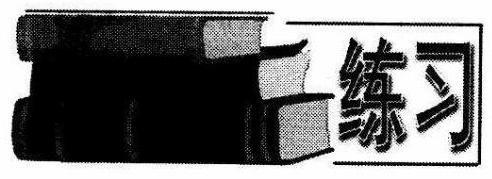

1. 面积是 $S$ 的圆中,任取 17 个点. 求证: 至少存在 3 个点, 使得以它们为顶点的三角形面积小于 $\frac{1}{8}S$ .

2. 边长为 1 的正三角形中任放 5 个点,则其中必有 2 个点,其距离不大于 $\frac{1}{2}$ .

3. 把 130 件玩具分给幼儿园的小朋友，如果不管怎样分，都至少有一位小朋友分得 4 件或 4 件以上的玩具，问这个幼儿园最多有多少个小朋友？

4. 已知每个乒乓球盒最多可装 6 只乒乓球,若任取 22 盒,求证: 必有四盒放的乒乓球个数相同.

5. 证明: 由小于 100 的任意 27 个不同的奇数所组成的集合中, 必定有两个数其和为 102 .

6. 对任给的 97 个互异的正整数 ${a}_{1},{a}_{2},\cdots ,{a}_{97}$ ,试证: 其中一定存在四个正整数, 仅用减号、乘号和括号将它们适当组合成一个算式, 其结果是 1984 的倍数.

7. 设自然数 $n$ 有下面性质: 从 $1,2,\cdots , n$ 中任取 50 个不同的数,这 50 个数中必有两个数之差等于 7 . 这样的 $n$ 最大的一个值是多少?

8. 一张圆桌安排了 12 个席位，席上有 12 位客人的名片，客人入席时没有按照名片对号入座，结果没有一位客人坐在自己的名片前. 证明:可以转动圆桌，使得至少有两位客人同时坐在自己的名片前面.

9. 一个国际社团的成员来自六个国家,共有成员 2000 人，用 1，2， ...，2000 编号. 请证明: 该社团至少有一个成员的号码, 与他的同胞的号码之和相等, 或是他的一个同胞的号码的两倍.

### 1.7 平均数原则

考虑一个三角形的三个内角 $\alpha ,\beta ,\gamma$ . 因为 $\alpha  + \beta  + \gamma  = {180}^{ \circ  }$ ,所以 $\alpha ,\beta ,\gamma$ 三个角不可能都小于 ${60}^{ \circ  }$ ,也就是说, $\alpha ,\beta ,\gamma$ 中必有一个大于或者等于 ${60}^{ \circ  }$ . 同样, $\alpha ,\beta ,\gamma$ 中也必有一个小于或者等于 ${60}^{ \circ  }$ .

上面结论可以推广成如下的一般形式:

设 $n$ 个实数 ${x}_{1},{x}_{2},\cdots ,{x}_{n}$ 的和是 $a$ ,即 ${x}_{1} + {x}_{2} + \cdots  + {x}_{n} = a$ ,那么必有一个 ${x}_{i} \geq  \frac{a}{n}$ ,也必有一个 ${x}_{j} \leq  \frac{a}{n}$ ( $i, j$ 是 $1,2,\cdots , n$ 中的数).

我们把上述结果叫做平均数原则.

例 1 已知四个实数 $x, y, z, w$ 都小于 2,且 $x + y + z + w = 7$ ,求证: 这四个数中有一个大于或者等于 $\frac{7}{4}$ ,还有一个大于 $\frac{5}{3}$ .

证: 由平均数原则,在 $x, y, z, w$ 这四个数中必有一个数大于或者等于 $\frac{7}{4}$ ,不妨设这个数为 $x$ . 由题设 $x < 2$ ,所以 $y + z + w = 7 - x > 7 - 2 = 5$ .

于是再用平均数原则, $y, z, w$ 中必有一个数大于或者等于 $\frac{y + z + w}{3}$ ,不妨设此数为 $y$ ,则 $y \geq  \frac{y + z + w}{3} > \frac{5}{3}$ .

如果 ${x}_{1},{x}_{2},\cdots ,{x}_{n}$ 都是正整数,并且 ${x}_{1} + {x}_{2} + \cdots  + {x}_{n} = a$ ,那么 ${x}_{1},{x}_{2},\cdots$ , ${x}_{n}$ 可看作 $a$ 个元素按任一确定的方式所分成 $n$ 个集合的元素个数,由平均数原则可知,必有一个 ${x}_{i}\left( {1 \leq  i \leq  n, i \in  \mathbf{N}}\right)$ ,使 ${x}_{i} \geq  \frac{a}{n}$ . 如果 $a > k \times  n\left( {k \in  {\mathbf{N}}^{ * }}\right)$ ,即 $\frac{a}{n} > k$ ,那么 ${x}_{i} > k$ . 由于 ${x}_{i}$ 是正整数，所以 ${x}_{i} \geq  k + 1$ ，也就是说，第 $i$ 个集合中的元素个数大于或者等于 $k + 1$ . 因此，抽屉原则可以看作是平均数原则的一个特例.

例 2 平面上任意给定 6 个点 (它们之中无三点共线), 试证明: 总能找到三点,使得这三点为顶点的三角形的内角中有不超过 ${30}^{ \circ  }$ 的角.

证: 记 6 个点为 $A, B, C, D, E, F$ ,经过其中两点(不妨设为 $A, B$ ) 的直线 $l$ ,如图 1-14,使其余四点在 $l$ 同侧 (这一点是可以办到的). $C, D$ , $E, F$ 按顺时针排列.

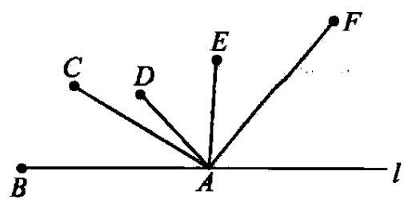

图 1-14

如果 $\angle {BAF} \leq  {120}^{ \circ  }$ ，因为 $\angle {BAC} + \angle {CAD} + \; \angle {DAE} + \angle {EAF} = \angle {BAF}$ ，由平均数原则， $\angle {BAC},\angle {CAD},\angle {DAE},\angle {EAF}$ 中必有一个角不超过 $\frac{1}{4}\angle {BAF} \leq  {30}^{ \circ  }$ 成立.

若 $\angle {BAF} > {120}^{ \circ  }$ ，则转而直接考察 $\bigtriangleup  {BAF}$ ，有 $\angle {ABF} + \angle {AFB} < {60}^{ \circ  }$ . 由平均数原则,其中必有一个角不超过 ${30}^{ \circ  }$ . 综上,所以原命题得证.

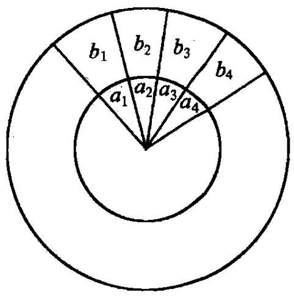

图 1-15

例 3 有两个同心圆盘,各分成 $n$ 个相等的小格, 外盘固定, 内盘可以转动 (如图 1-15). 内、外两盘的小格中,分别写有数 ${a}_{1},{a}_{2},\cdots ,{a}_{n};{b}_{1},{b}_{2},\cdots$ , ${b}_{n}$ ,它们适合

$$
{a}_{1} + {a}_{2} + \cdots  + {a}_{n} < 0,{b}_{1} + {b}_{2} + \cdots  + {b}_{n} < 0.
$$

求证: 一定可以将内盘转到一个适当的位置, 使得内、外两盘上的小格对齐,这时两盘上 $n$ 个对齐的小格中的两数乘积之和为一正数.

证: 转动内盘时,一共有 $n$ 个可能的位置,设在第一位置上,所有 $n$ 对实数乘积之和记为 ${S}_{1}$ ; 当转动内盘到第二个位置上时,对应实数的乘积之和记为 ${S}_{2};\cdots \cdots$ 当内盘转到相对于外盘处于最后一种可能位置时,对应实数的乘积之和记为 ${S}_{n}$ . 因此,在一切可能的情形中,对应的实数对乘积之和的总和是 ${S}_{1} + {S}_{2} + \cdots  + {S}_{n}$ .

我们可以换一种观点来看这个数. 看内盘上的一个小格中的数 ${a}_{i}(i = 1,2$ , $\cdots , n)$ . 当内盘转过 $n$ 个可能的位置时,由 ${a}_{i}$ 产生的乘积之和是 ${a}_{i}{b}_{1} + {a}_{i}{b}_{2} + \cdots  + \; {a}_{i}{b}_{n} = {a}_{i}\left( {{b}_{1} + {b}_{2} + \cdots  + {b}_{n}}\right) , i = 1,2,\cdots , n$ ,所以,一切可能的乘积之和是

$$
{a}_{1}\left( {{b}_{1} + {b}_{2} + \cdots  + {b}_{n}}\right)  + {a}_{2}\left( {{b}_{1} + {b}_{2} + \cdots  + {b}_{n}}\right)  + \cdots  + {a}_{n}\left( {{b}_{1} + {b}_{2} + \cdots  + {b}_{n}}\right)  = \left( {a}_{1}\right.
$$

$\left. {+{a}_{2} + \cdots  + {a}_{n}}\right) \left( {{b}_{1} + {b}_{2} + \cdots  + {b}_{n}}\right) ,$

$\therefore \;{S}_{1} + {S}_{2} + \cdots  + {S}_{n} = \left( {{a}_{1} + {a}_{2} + \cdots  + {a}_{n}}\right) \left( {{b}_{1} + {b}_{2} + \cdots  + {b}_{n}}\right)  > 0$ .

可见, ${S}_{1},{S}_{2},\cdots ,{S}_{n}$ 的算术平均值 $\frac{{S}_{1} + {S}_{2} + \cdots  + {S}_{n}}{n} > 0$ 是一正数,由平均值原则,必有一个 ${S}_{i} > \frac{{S}_{1} + {S}_{2} + \cdots  + {S}_{n}}{n} > 0$ 是正数,命题得证.

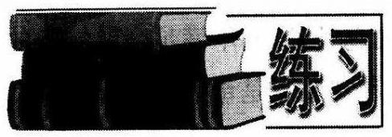

1. 凸四边形 ${ABCD}$ 中,对角线 ${AC},{BD}$ 把四个内角分成八个角. 求证: 这八个角中至少有一个不大于 ${45}^{ \circ  }$ .

2. 已知 ${a}_{1},{a}_{2},{a}_{3},{a}_{4},{a}_{5}$ 是五个整数, ${a}_{1} = 1,{a}_{5} = 6$ ,求证: ${a}_{2} - {a}_{1},{a}_{3} - {a}_{2}$ , ${a}_{4} - {a}_{3},{a}_{5} - {a}_{4}$ 中至少有一个大于或者等于 2 .

3. 设 $P$ 是 $\bigtriangleup {ABC}$ 内一点,求证: $\angle {PAB},\angle {PBC},\angle {PCA}$ 至少有一个小于或等于 ${30}^{ \circ  }$ .

4. 平面上有 $n\left( {n \geq  4}\right)$ 个互不相同的点 ${P}_{1},{P}_{2},\cdots ,{P}_{n}$ ,在每两点之间联起直线段，已知其中长度等于 $d$ 的线段有 $n + 1$ 条，求证:从这 $n$ 个点中可以找出一个点来,使得从这一点出发的线段中至少有 3 条的长度等于 $d$ .

5. 两个大小不同的同心圆各被等分成 100 个扇形. 从每一圆盘上独立地、随机地取出 50 个部分涂上黑色. 把小盘绕中心旋转，转到一个内外扇形对齐的位置之后, 再计算内外颜色相同的扇形的总数. 证明: 不论原先内外盘的颜色是怎样涂的，一定可以将内盘转到一个适当的位置，使得颜色相同的扇形个数不小于 50 .

6. 在半径为 1 的圆周上,任意给定两个点集 $A, B$ ,它们由有限段互不相交的弧组成,其中 $B$ 的每一段弧的长度均等于 $\frac{\pi }{m}, m \in  \mathbf{N}$ . 用 ${A}_{j}$ 表示将集合 $A$ 沿反时针在圆周上转动 $\frac{j\pi }{m}$ 所得的集合 $\left( {j = 1,2,3,\cdots }\right)$ . 求证: 存在自然数 $k$ ,使得

$$
l\left( {{A}_{k} \cap  B}\right)  \geq  \frac{1}{2\pi }l\left( A\right)  \cdot  l\left( B\right) ,
$$

这里 $l\left( x\right)$ 表示组成点集 $x$ 的互不相交的弧段的长度之和.

## 三、命题与条件

### 1.8 四种命题形式与反证法

我们在初中已经学过, 命题是表达判断的语句. 命题有真有假.

要确定一个命题是假命题, 只要举出一个满足命题条件, 而不满足命题结论的例子就可以了. 这在数学中称为举反例. 例如判断命题:“质数是奇数”的真假. 举反例, 2 是质数但却不是奇数, 所以命题 “质数是奇数”为假命题.

要确定一个命题为真命题，则需证明.

例 1 判断命题:“√2是无理数”的真假.

解:这个命题是真命题. 证明如下:

假设 $\sqrt{2}$ 是有理数,则 $p, q \in  \mathbf{Z}\left( {p, q}\right)  = 1, q \neq  0$ ,使得

$\sqrt{2} = \frac{p}{q},\therefore p = \sqrt{2}q$ . 平方得 $2{q}^{2} = {p}^{2}$ .

$\therefore {p}^{2}$ 是偶数, $\therefore p$ 是偶数. 设 $p = {2k}\left( {k \in  \mathbf{Z}}\right)$ ,

则 ${q}^{2} = 2{k}^{2},\therefore {q}^{2}$ 是偶数, $\therefore q$ 是偶数.

这与 $\left( {p, q}\right)  = 1$ 矛盾.

$\therefore$ 假设错误,所以 $\sqrt{2}$ 是无理数.

像例 1 这样一种证明的方法, 称为反证法. 反证法是一种间接证法, 可以分为 3步:

(1)反设:假设结论不成立.

(2)归谬:肯定命题条件进行正确推理，得出矛盾.

(3)结论:由矛盾知结论的否定不成立，从而肯定结论.

我们也已学过命题和逆命题. 例如命题:内接于圆的四边形的对角互补. (1)

它的条件是 “四边形内接于一个圆”, 它的结论是 “四边形的对角互补”. 只要把命题的条件与结论互相交换, 就得到它的逆命题:

对角互补的四边形内接于圆.(2)

一般称像(1)，(2)那样的两个命题是互逆命题.

如果我们把命题(1)的条件与结论分别改为它的否定形式: “四边形不内接于圆”与“四边形的对角不互补”,于是得到一个新的命题:

不内接于圆的四边形的对角不互补.(3)

像(1)，(3)两个命题那样，一个命题的条件与结论分别是另一个命题的条件的否定与结论的否定. 我们把这样的两个命题叫做互否命题. 如果把其中一个叫做原命题，那么另一个就叫做它的否命题.

下面我们来研究一个命题的逆命题的否命题.

命题(2)的否命题是:

对角不互补的四边形不内接于圆.(4)

可以看出,命题 (4) 的条件与结论分别是命题 (1) 的结论的否定与条件的否定.

像(1)，(4)两个命题那样，一个命题的条件和结论分别是另一个命题的结论的否定与条件的否定，我们称这样的两个命题叫做互为逆否命题. 如果把其中一个叫做原命题,那么另一个就叫做它的逆否命题.

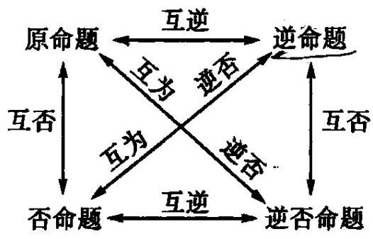

图 1-16

如果用 $\alpha$ 和 $\beta$ 分别表示原命题的条件和结论,用 $\overline{\alpha }$ 和 $\overline{\beta }$ 分别表示 $\alpha$ 和 $\beta$ 的否定, 那么四种命题的形式就是:

原命题:如果 $\alpha$ ，那么 $\beta$ ；

逆命题:如果 $\beta$ ，那么 $\alpha$ ；

否命题:如果 $\overline{\alpha }$ ，那么 $\overline{\beta }$ ；

逆否命题: 如果 $\overline{\beta }$ ，那么 $\overline{\alpha }$ .

四者相互关系如图 1-16 所示.

例 2 试写出“对顶角相等”的逆命题、否命题、逆否命题,并指出它们是否正确.

解: 先将 “对顶角相等” 改写成 “如果······，那么……”形式，得原命题:如果两个角是对顶角, 那么这两个角相等. 然后可得

逆命题: 如果两个角相等，那么这两个角是对顶角.

否命题:如果两个角不是对顶角，那么这两个角不相等.

逆否命题:如果两个角不相等，那么这两个角不是对顶角.

以上四个命题中, 原命题和逆否命题都正确, 逆命题和否命题都不正确.

我们同时发现，“内接于圆的四边形对角互补”和它的逆否命题同时正确. 一般地, 原命题和它的逆否命题同真同假. 但原命题和它的逆命题不一定同真同假.

对于两件事 $\alpha ,\beta$ ,如果 $\alpha$ 这件事成立可以推出 $\beta$ 这件事也成立,那么就说由 $\alpha$ 推出 $\beta$ ，记作 $\alpha  \Rightarrow  \beta$ .

如果甲乙是两个命题，从命题甲可以推出乙; 从命题乙也可以推出命题甲，那么这样的甲乙两个命题叫做等价命题,记作甲 $\Leftrightarrow$ 乙.

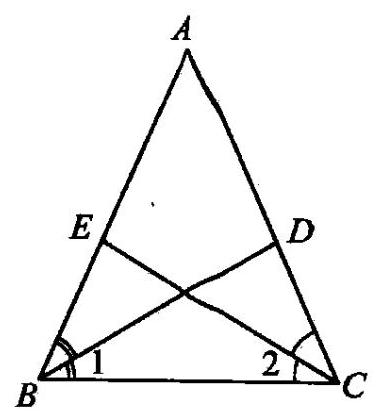

图 1-17

如果两个命题互为逆否命题,那么这两个命题为等价命题.

当我们证明某个命题有困难时,有时可用证明它的逆否命题来代替证明原命题.

例 3 已知 ${BD},{CE}$ 分别是 $\bigtriangleup  {ABC}$ 的 $\angle B,\angle C$ 的角平分线, ${BD} \neq  {CE}$ ,求证: ${AB} \neq  {AC}$ .

证: 为了方便起见,我们证明原命题的逆否命题: 如果 ${AB} = {AC}$ ,那么 ${BD} = {CE}$ .

如图 1-17 所示:

$\left. \begin{array}{l} {AB} = {AC} \Rightarrow  \angle {ABC} = \angle {ACB} \\  {BD},{CE}\text{ 分别是 }\angle {ABC},\angle {ACB}\text{ 的角平分线 } \end{array}\right\}   \Rightarrow  \left. \begin{array}{l} \angle 1 = \angle 2 \\  \angle {ACB} = \angle {ABC} \\  {BC} = {CB} \end{array}\right\}   \Rightarrow$

$\bigtriangleup {BCD} \cong  \bigtriangleup {CBE} \Rightarrow  {BD} = {CE}$ .

由于原命题的逆否命题正确, 所以原命题正确.

这种证明的实质与反证法相同.

例 4 有 12 个互不相等的自然数, 它们均小于 37, 求证: 这些自然数两两相减的差中, 至少有 3 个相等.

分析: 12 个自然数两两作减法,正数差有 66 个,这些差的可能值为 $1,2,\cdots$ , 35 共 35 个. 正面看, 为什么会有 3 个差相等不太明显, 故考虑反证法. 但怎样才能迅速引出矛盾呢? 这里可以作有序化处理.

证: 对所给的 12 个自然数作有序化处理,从小到大记为 ${a}_{1},{a}_{2},\cdots ,{a}_{12}$ . 假若这些自然数两两相减所得的差中,没有 3 个差相等,那么就最多只有 2 个差相等.

则 ${35} = {36} - 1 = \left( {{36} - {a}_{12}}\right)  + \left( {{a}_{12} - {a}_{11}}\right)  + \cdots  + \left( {{a}_{2} - {a}_{1}}\right)  + \left( {{a}_{1} - 1}\right)$

$\geq  \left( {{a}_{12} - {a}_{11}}\right)  + \left( {{a}_{11} - {a}_{10}}\right)  + \cdots  + \left( {{a}_{2} - {a}_{1}}\right)$

$\geq  2\left( {1 + 2 + 3 + 4 + 5}\right)  + 6 = {36}$ . 这一矛盾说明，所得差中至少有 3 个相等.

1. 试写出下列命题的逆命题、否命题及逆否命题，并判断其真假:

(A) 若 ${xy} = 0$ ，则 $x = 0\left( {x, y \in  \mathbf{R}}\right)$ ；

(2)若 ${xy} = 0$ ，则 $x = 0$ 或 $y = 0$ ；

(3)若 $g > 0$ ，则方程 ${x}^{2} + x - g = 0$ 有实根；

(4)若 ${x}^{2} + {y}^{2} = 0$ ，则 $x = 0$ 且 $y = 0$ ；

(5) $n \in  \mathbf{N}$ ，若 $n$ 是完全平方数，则 $\sqrt{n} \in  \mathbf{N}$ .

2. 写出下列命题的否命题、逆命题、逆否命题,并判断其真假:

(1)如果你学好了数学，那么你就会使用电脑；

(2)平行四边形的对角线互相平分；

(3)两个无理数的乘积是有理数；

(4)若两个集合至少有一个公共元素，则它们的交集不空；

(5)没有一个实数 $a$ ，能使 ${a}^{2} + 1 = 0$ 成立.

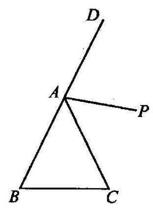

图 1-18

3. 如图 1-18,等腰三角形 ${ABC}$ 中, ${AB} = {AC}$ . 已知 $\angle {DAP} \neq  \angle {PAC}$ ,求证: ${AP}$ 与 ${BC}$ 不平行.

4. 完成反证法证题的全过程:

题目: 设 ${a}_{1},{a}_{2},\cdots ,{a}_{7}$ 是 $1,2,\cdots ,7$ 的一个排列,求证: 乘积 $p = \left( {{a}_{1} - 1}\right) \left( {{a}_{2} - 2}\right) \cdots \left( {{a}_{7} - 7}\right)$ 为偶数.

证:反设 $p$ 为奇数，则 $\left( {a - 1}\right) \cdots \left( {a - 7}\right)$ 均为奇数，因奇数个奇数之和为奇数，故有

奇数 $=$

$=$

$= 0$

但奇数 $\neq$ 偶数,这一矛盾说明, $p$ 为偶数.

5. 证明: 凸五边形的 5 条对角线中必存在 3 条,组成一个三角形.

6. 设 ${a}_{1},{b}_{1},{c}_{1},{a}_{2},{b}_{2},{c}_{2}$ 都是有理数,且二次方程 ${a}_{1}{x}^{2} + {b}_{1}x + {c}_{1} = 0,{a}_{2}{x}^{2} \; + {b}_{2}x + {c}_{2} = 0$ 有唯一公共实数根,证明: $\sqrt{{b}_{1}^{2} - 4{a}_{1}{c}_{1}},\sqrt{{b}_{2}^{2} - 4{a}_{2}{c}_{2}}$ 都是有理数.

7. 设数字 ${a}_{1},{a}_{2},\cdots ,{a}_{2n}$ 是正整数 $1,2,\cdots ,{2n}$ 的任一排列,求证: 和数 $\left( {{a}_{1} + }\right.$ 1), $\left( {{a}_{2} + 2}\right) ,\cdots ,\left( {{a}_{2n} + {2n}}\right)$ 中至少有两个数被 ${2n}$ 除余数相同.

8. 令 $n$ 为大于 5 的整数, $n$ 个共面的点中,每两个的距离均不相等,将每一点与和它距离最近的点用线段相联. 证明: 没有一个点与多于 5 个点相联.

9. 试证明质数的个数是无穷的.

### 1.9 充分条件与必要条件

我们知道, 如果某个整数能够被 4 整除, 那么这个整数必是偶数. 也就是说, 从 “某个整数能被 4 整除”可以推出“该整数是偶数”. 这时候, 我们就说, “某个整数能够被 4 整除”是“某个整数是偶数”的充分条件.

一般地，用 $\alpha$ ， $\beta$ 表示两件事，如果 $\alpha$ 成立，可以推出 $\beta$ 也成立，即 $\alpha  \Rightarrow  \beta$ ，那么 $\alpha$ 就叫做 $\beta$ 的充分条件. 也就是说，为了使 $\beta$ 成立，具备条件 $\alpha$ 就足够了.

例如，“两个角是对顶角”是 “这两个角相等” 的充分条件； $\sqrt[m]{0} < x < 1$ ” 是 “ ${x}^{2} < \; x$ ”的充分条件.

如果某个整数能够被 4 整除, 那么它必是偶数. 换句话说, 如果某个整数不是偶数，那么这个整数就不可能被 4 整除. 这时候，我们就说，“某个整数是偶数”是 “这个整数能被 4 整除”的必要条件.

一般地,如果 $\beta  \Rightarrow  \alpha$ ,那么 $\alpha$ 叫做 $\beta$ 的必要条件.

例如，两个全等的平面图形面积必定相等. 因此，“面积相等”是“两个平面图形全等”的必要条件.

如果既有 $\alpha  \Rightarrow  \beta$ ,又有 $\beta  \Rightarrow  \alpha$ ,即有 $\alpha  \Leftrightarrow  \beta$ ,那么 $\alpha$ 既是 $\beta$ 的充分条件,又是 $\beta$ 的必要条件,这时我们就说, $\alpha$ 是 $\beta$ 的充分而且必要条件,简称充要条件.

例如，在三角形中，“两个内角相等”是 “三角形是等腰三角形” 的充要条件； “ $\left| {a - b}\right|  = 0$ ”是“ $a = b$ ”的充要条件.

对于 $\alpha ,\beta$ 两件事而言， $\alpha$ 与 $\beta$ 之间不一定有充分条件或者必要条件的关系. 例如, 质数不一定是奇数, 奇数也不一定是质数, 即 “一个数为质数” 既不是 “一个数为奇数”的充分条件, 也不是 “一个数为奇数”的必要条件.

例 1 已知实系数一元二次方程 $a{x}^{2} + {bx} + c = 0\left( {a \neq  0}\right) ,$ ， ${}^{u}{b}^{2} - {4ac} = 0$ ”是“它有两个相等的实数根”的什么条件?

解: 我们把方程 $a{x}^{2} + {bx} + c = 0\left( {a \neq  0}\right)$ 变形为

$$
{\left( x + \frac{b}{2a}\right) }^{2} = \frac{{b}^{2} - {4ac}}{4{a}^{2}}.
$$

当 ${b}^{2} - {4ac} = 0$ 时,方程右边是 0,因此,方程有两个相等的实数根 ${x}_{1} = {x}_{2} = \; - \frac{b}{2a}$ .

反过来,如果方程 $a{x}^{2} + {bx} + c = 0\left( {a \neq  0}\right)$ 有两个相等的实数根 ${x}_{1} = {x}_{2}$ ,那么由方程根与系数的关系可得

$$
{x}_{1} + {x}_{2} = 2{x}_{1} =  - \frac{b}{a},{x}_{1}{x}_{2} = {x}_{1}^{2} = \frac{c}{a}.
$$

于是 ${\left( -\frac{b}{2a}\right) }^{2} = \frac{c}{a}$ ,即 ${b}^{2} - {4ac} = 0$ .

所以 “ ${b}^{2} - {4ac} = 0$ ” 是 “一元二次方程 $a{x}^{2} + {bx} + c = 0\left( {a \neq  0}\right)$ 有两个相等的实数根”的充要条件.

例 2 求证: $b = 0$ 是函数 $y = a{x}^{2} + {bx} + c$ 的图像关于 $y$ 轴对称的充要条件.

证:① 充分性:

$\because b = 0,\therefore y = a{x}^{2} + {bx} + c = a{x}^{2} + c$ .

设 $x = m \in  \mathbf{R}$ ,则 $y = a{m}^{2} + c;x =  - m, y = a{m}^{2} + c$ .

$\therefore$ 点 $\left( {-m, a{m}^{2} + c}\right)$ 与点 $\left( {m, a{m}^{2} + c}\right)$ 均在函数 $y = a{x}^{2} + c$ 的图像上

$\therefore$ 函数 $y = a{x}^{2} + {bx} + c$ 的图像关于 $y$ 轴对称.

② 必要性:

$\because y = a{x}^{2} + {bx} + c$ 的图像关于 $y$ 轴对称,而函数 $y = a{x}^{2} + {bx} + c$ 的对称轴为 $x =  - \frac{b}{2a}$ ,

$\therefore \frac{-b}{2a} = 0,\therefore b = 0$ .

综合①,②, $b = 0$ 是函数 $y = a{x}^{2} + {bx} + c$ 的图像关于 $y$ 轴对称的充要条件.

例 3 判断集合 $\{ 1,1 + a,1 + {2a}\}  = \left\{  {1, b,{b}^{2}}\right\}$ 的充要条件,并给予证明.

解: $\because \{ 1,1 + a,1 + {2a}\}  = \left\{  {1, b,{b}^{2}}\right\}$ ,设 $1 + a = b,1 + {2a} = {b}^{2}$ ,

$\therefore 1 + {2a} = {\left( 1 + a\right) }^{2} = 1 + {2a} + {a}^{2},\;\therefore a = 0, b = 1$ .

分别代入 $\{ 1,1 + a,1 + {2a}\}$ 与 $\left\{  {1, b,{b}^{2}}\right\}$ ,可知这与集合内元素的互异性矛盾.

$\therefore a = 0, b = 1$ 不是本题的解.

$\therefore$ 设 $1 + a = {b}^{2},1 + {2a} = b$ .

$\therefore \;1 + a = {\left( 1 + 2a\right) }^{2} = 1 + {4a} + {a}^{2}$ .

$\therefore a = 0$ 或 $a =  - \frac{3}{4}$ .

同样 $a = 0$ 可导出矛盾. $\;\therefore a =  - \frac{3}{4}$ ,此时有 $b =  - \frac{1}{2}$ .

分别代入 $\{ 1,1 + a,1 + {2a}\}$ 与 $\left\{  {1, b,{b}^{2}}\right\}$ ,得

$$
\left\{  {1,\frac{1}{4}, - \frac{1}{2}}\right\}  \text{ 与 }\left\{  {1, - \frac{1}{2},\frac{1}{4}}\right\}  \text{ . }
$$

$\therefore a =  - \frac{3}{4}, b =  - \frac{1}{2}$ 是 $\{ 1,1 + a,1 + {2a}\}  = \left\{  {1, b,{b}^{2}}\right\}$ 的充要条件.

说明: 求出 $a =  - \frac{3}{4}, b =  - \frac{1}{2}$ 证明了必要性,而代入检验则证明了充分性.

1. 判别“ $y \neq  5$ ”是“ ${y}^{2} \neq  {25}$ ”的什么条件?

2. 命题 $A$ 是命题 $B$ 的充分条件,命题 $B$ 是命题 $C$ 的充要条件,命题 $D$ 是命题 $C$ 的必要条件，那么命题 $\overline{A}$ 是命题 $\overline{D}$ 的什么条件?

3. “ $A \subset  B$ ” 是 “ $B \cap  A = A$ ” 的什么条件?

4. “ ${x}_{1} > 3,{x}_{2} > 3$ ” 是 “ ${x}_{1} + {x}_{2} > 6,{x}_{1} \cdot  {x}_{2} > 9$ ” 的什么条件?

5. “ $x \neq  1, y \neq  1$ ” 是 “ $x + y \neq  3$ ” 的什么条件?

6. “ $a + b + 1 < 0$ ” 是 “方程 ${x}^{2} + {ax} + b = 0$ 两根满足 ${x}_{1} < 1$ ，且 ${x}_{2} > 1$ ” 的什么条件?

7. 证明: 一元二次方程 $a{x}^{2} + {bx} + c = 0\left( {a \neq  0}\right)$ 有实根的充要条件是 $\Delta  = {b}^{2} - \; {4ac} \geq  0\left( {a, b, c \in  \mathbf{R}}\right)$ .

8. “ ${xy} > 0$ ” 是 “ $\left| {x + y}\right|  = \left| x\right|  + \left| y\right|$ ” 的什么条件?

9. 已知 $A = \{ \left( {x, y}\right)  \mid  {ax} + y = 1\} , B = \{ \left( {x, y}\right)  \mid  x + {ay} = 1\} , C = \; \left\{  {\left( {x, y}\right)  \mid  {x}^{2} + {y}^{2} = 1}\right\}  .$

(1)求 $\left( {A \cup  B}\right)  \cap  C$ 的元素个数为 2 的充要条件；

(2)求 $\left( {A \cup  B}\right)  \cap  C$ 的元素个数为 3 的充要条件.

10. 集合 $A = \left\lbrack  {-2,3}\right\rbrack  , B = \left\{  {x \mid  k{x}^{2} + {4x} + k + 3 > 0}\right\}$ ,且 $B \neq  \varnothing$ ,求 “ $A > B$ ” 的充要条件.

## 复习参考题

1. 设 $A = \left\{  {x\left| {\;\frac{6}{3x} \in  \mathbf{Z}}\right. , x \in  \mathbf{Z}}\right\}$ ,试用列举法表示集合 $A$ .

2. 已知集合 $M = \{ a, a + d, a + {2d}\} , N = \left\{  {a,{aq}, a{q}^{2}}\right\}$ ，其中 $a \neq  0$ ，且 $M = N$ ， 求 $q$ 的值.

3. 已知 $I = \left\{  {x \mid  {x}^{2} < {50}, x \in  {\mathbf{N}}^{ * }}\right\}  ,\bar{M} \cap  \bar{L} = \{ 1,6\} , M \cap  \bar{L} = \{ 2,3\} ,\bar{M} \cap  L = \; \{ 5\}$ ,求 $M$ 和 $L$ .

4. 已知 $A = \left\{  {x \mid  {x}^{2} + \left( {p + 2}\right) x + 1 = 0, x \in  {\mathbf{R}}^{ + }}\right\}$ ,若 $A \cap  {\mathbf{R}}^{ + } = \varnothing$ ,求 $p$ 的取值范围.

5. 设集合 $A = \left\{  {x \mid  {x}^{2} - {3x} + 2 = 0}\right\}  , B = \left\{  {x \mid  {x}^{2} - {ax} + 2 = 0}\right\}$ ,若 $A \cup  B = A$ , 求 $a$ 的值组成的集合.

6. 设 $x, y$ 是两个非空集合,则 $a \in  \left( {X \cup  Y}\right)$ 是 $a \in  \left( {X \cap  Y}\right)$ 的___ 条件.

7. 已知 $M, N, P, Q$ 分别是 $f\left( x\right)  > 0, g\left( x\right)  > 0, f\left( x\right)  < 0, g\left( x\right)  < 0$ 的解集,则使 $f\left( x\right)  \cdot  g\left( x\right)  < 0$ 成立的充要条件是 $x \in$

8. 设集合 $A = \{ x \mid   - 2 \leq  x \leq  a\}$ 不是空集， $B = \{ y \mid  y = {2x} + 3, x \in  A\} , C = \; \left\{  {y \mid  y = {x}^{2}, x \in  A}\right\}$ ,且 $B \cap  C = C$ ,求实数 $a$ 的取值范围.

9. 已知 $a \in  \mathbf{Z}, n \in  \mathbf{N}, n \geq  2$ ,试写出命题“如果 ${a}^{n}$ 为奇数,那么 $a$ 为奇数”的逆命题、否命题、逆否命题.

10. 设 $A = \left\{  {x \mid  x = {m}^{2} - {n}^{2}, m, n \in  \mathbf{Z}}\right\}$ ,问8,9,10是否属于集合 $A$ ?

11. 设 $A = \{ 1,2,3,4\}$ ,对于 $A$ 的每一个非空子集 $X$ ,用 $\pi \left( X\right)$ 表示 $X$ 中各元素的积,求所有 $\pi \left( X\right)$ 的积.

12. 一个正方形被分成了 ${15} \times  {15} = {225}$ 个大小相同的小方格,在每一个小方格中,任意填写 $1,2,3,\cdots ,{55},{56}$ 中的一个数,求证: 一定能够找到四个小方格,它们的中心构成一个平行四边形的四个顶点, 并且这平行四边形各条对角线两端的两个小方格中的数字之和相等.

13. 从数集 $\{ 1,2,3,\cdots ,{99},{100}\}$ 中任意选出 51 个数,求证: 其中一定有两个数, 它们中的某一个是另外一个的整数倍.

14. 某个人步行了 10 小时, 共走完 45 千米. 已知他第一个小时走 6 千米, 而最后一个小时因疲劳只走了 3 千米. 求证: 一定有连续的两个小时, 这个人至少走了 9 千米.

15. 任意给定一个三角形 ${ABC}$ 及其一个内点 $P$ ,直线 ${AP},{BP},{CP}$ 与对边的交点分别记为 ${A}^{\prime },{B}^{\prime },{C}^{\prime }$ . 求证: 在下列三个比值 $\frac{AP}{P{A}^{\prime }},\frac{BP}{P{B}^{\prime }},\frac{CP}{P{C}^{\prime }}$ 中,至少有一个不大于 2，也至少有一个不小于 2 .

16. 给定 1978 个集合，每个集合恰有 40 个元素，每两个集合恰有一个公共元素, 这 1978 个集合共有多少个元素?

本章 阅读

## 集合论发展简史

集合论是现代数学的基础, 它的起源可追溯到 16 世纪末. 意大利学者伽俐略 (G. Galilei, 1564-1642)就考虑过两个集合间的一一对应. 18 世纪，数学家为了追求微积分的坚实基础，进行了有关数集的大量研究.

集合论公认的创始人是德国数学家康托尔(G. Cantor, 1845-1918). 他就学于苏黎世、哥廷根和柏林，1867 年毕业于柏林大学. 在柏林大学，他颇受外尔斯特拉斯(K. T. W. Weierstrass, 1815—1897)的影响，由学习工程转向学习纯粹数学. 他在 1869 年成为哈雷大学的讲师, 1879 年成为教授.

1874 年，29岁的康托尔发表了一篇题为“关于一切实代数数的一个性质”的论文. 这篇论文被认为是集合论的第一篇革命性的著作. 接着康托尔发表了一系列有关集合论的文章，对任意元素的集合进行了深入的探讨，提出了可数集、不可数集、 集合的运算等基本概念，创造了对角线方法，并创立了关于基数、序数和良序集等理论. 1882 年提出了著名的连续统假设，至今仍未得到完全解决. 1883 年他出版了集合论专著《一般集合理论基础》和《超穷集合论文集》. 康托尔有关集合的论文陆续发表到 1897 年.

康托尔的工作解决了不少长期未能解决的问题，并且纠正了许多前人的直观想法. 例如，他指出“自然数的个数与有理数的个数相同”. 虽然他的观点未被有些人立刻接受，甚至还遭到个别数学家的攻击，然而许多卓越的数学家深为这一新理论所起的作用所感动. 德国著名数学家希尔伯特(D. Hilbert, 1862-1943)在 1926 年说:“没有人能把我们从康托尔为我们创造的乐园中开除出去. ”他还把康托尔的超限理论赞誉为“数学思想最惊人的产物，在纯粹性的范畴中人类活动的最美的表现之一”. 英国著名的数学家、逻辑学家与哲学家罗索(B. A. W. Russell，1872- 1970)把康托尔的工作描述为“可能是这个时代所能夸耀的最巨大的工作”.

随着集合论的发展，逐渐出现了一些有关集合的悖论. 有重大影响的是罗索悖论. 为解决这些悖论, 大大促进了数理逻辑的发展. 1908 年, 德国数学家策梅洛(E. F. F. Zermelo, 1871-1953)列出了第一个集合论公理系统, 在此基础上逐步形成了公理集合论.

现在集合论已渗透到数学分析、泛函分析、概率论、信息论、排队论等现代数学的各个领域.

第二章

函数 Function

## 一、函数的概念

### 2.1 函数的概念及其演变

函数是数学上的一个基本而又重要的概念, 在现代数学中, 它几乎渗透到数学的各个分支中.

由于数学的发展，函数的定义也经历了三次演变:变量说，对应说(即映射说)，关系说.

变量说，即函数的古典定义:如果在某个变化过程中有两个变量 $x, y$ ，并且对于 $x$ 在某个范围内的每一个确定的值，按照某种对应法则， $y$ 都有惟一确定的值和它对应，那么 $y$ 就是 $x$ 的函数， $x$ 叫做自变量， $x$ 的取值范围叫做函数的定义域，和 $x$ 的值对应的 $y$ 的值叫做函数值，函数值的集合叫做函数的值域. $y$ 是 $x$ 的函数， 记作 $y = f\left( x\right)$ .

对应说，即函数的现代定义，是从映射的角度出发，函数是一种特殊的映射。下一节我们将重点讨论这个问题.

函数的“关系说”的定义则是建立在“关系”这个概念基础之上的，并把函数关系看作是一个特殊的关系. 有关“关系”这个定义，我们将在大学的课程抽象代数中学到. 这里我们不作深入的探讨.

函数的这三种定义各有利有弊:简单地说，“变量说”刻划得自然、形象而直观，通俗易懂，初中学生都能接受. 但“变量说”对函数的实质——对应——缺少充分的刻划, 这是最致命的弊病. “对应说”虽然较之 “变量说” 稍觉抽象, 但它却抓住了函数的本质属性，突出了两个集合间元素的对应就是函数(见下一节). 至于“关系说”则更抽象，一般中学生较难接受，这里我们就不说了.

### 2.2 对应与映射

先来考察两个集合元素之间的关系:设集合 $A = \{$ 中国，美国，日本，俄罗斯 $\}$ ，集合 $B = \{$ 北京,东京,上海,莫斯科,华盛顿,纽约 $\}$ .

现在对于集合 $A$ 的元素，按照确定的法则 $f$ :“该国的首都”，来选择集合 $B$ 的元素，并用箭头联结起来，如图 2-1.

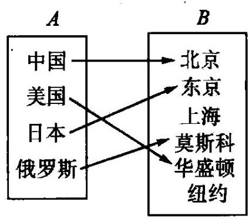

图 2-1

像这样,已知两个集合 $A, B$ ,如果对于集合 $A$ 的元素,通过某种确定的法则 $f$ ,使集合 $B$ 的元素与它联结,我们就把这个法则 $f$ 叫做从集合 $A$ 到集合 $B$ 的对。 应。这时，如果按照这种法则 $f$ ，集合 $A$ 的元素 $a$ 选择了集合 $B$ 的元素 $b$ ，我们就说 $a$ 对应 $b$ ，或 $b$ 对应于 $a$ .

可以看出，一个对应关系包括两个已知的非空集合和一个确定的对应法则 $f.$

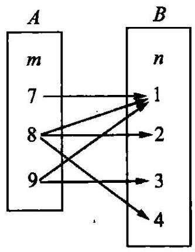

图 2-2

像这样的对应关系我们可以找出很多.

例 $1\;A = \mathbf{R}, B = \mathbf{R}$ ,对应法则 $f$ : 平方运算 $b = {a}^{2}(a \in \; A, b \in  B)$ . 即: 每一个实数都与它的平方数对应.

例 2 设集合 $A = \{ m \mid  m = 7,8,9\}$ ，集合 $B = \; \{ n \mid  n = 1,2,3,4\}$ ，对应法则 $f :$ “ $n$ 是 $m$ 的因数”. 如图 2-2.

例 $3\;A = \{ x \mid  x \in  \mathbf{R}\} , B = \{ y \mid  y \in  \mathbf{R}\} , f : y = x + 2$ .

下面，我们给出“映射”的定义:

设 $A, B$ 是两个非空集合,如果根据某个确定的对应法则 $f$ ,使得对 $\mathbf{A}$ 中的每一个元素 $a$ ,集合 $B$ 中都有惟一的一个元素 $b$ 和它对应,那么这种对应叫做集合 $A$ 到集合 $B$ 的映射,记作 $f : A \rightarrow  B$ .

按照这个定义，例 1、例 3 都是映射，而例 2 则不是映射，这是因为集合 $A$ 中不是每一个元素 (如 8) 在集合 $B$ 中只有唯一的元素和它对应 (如1,2,4都和 8 对应).

像例 1 这种情形称之为“多对一”，例 2 则称之为“一对多”，例 3 则称为“一对一”. 由此我们知道:“一对多”的对应不是“映射”，而“多对一”和“一对一”的对应则是实射。

在前述映射的定义下, $b$ 叫做 $a$ (在 $f$ 作用下) 的像; 记作 $b = f\left( a\right) , a$ 叫做 $b$ (在 $f$ 作用下)的原像. 显然，原像集就是集合 $A$ ，而像集与 $B$ 之间有关系: $f\left( A\right)  \subseteq  B$ .

像例 3 这种情形我们称之为“一一映射”. 即:没有映射 $f : A \rightarrow  B$ ，如果集合 $B$ 中的每一个元素,在集合 $A$ 中都有且仅有一个原像. 我们把具有这样特点的映射叫做集合 $A$ 到集合 $B$ 的一一映射.

一般来说，要证明映射 $f : A \rightarrow  B$ 是一一映射，首先要证明任意 $y \in  B$ ，都对应有关于 $f$ 的原像 $x \in  A$ ；其次还要证明任意 $y \in  B$ 只对应关于 $f$ 的一个原像例

例 4 下列对应是不是从 $A$ 到 $B$ 的映射?

$1)A = \mathbf{R}, B = {\mathbf{R}}^{ + }, f : x \rightarrow  \left| x\right|$ ;

8. $A = \{ x \mid  x \in  \mathbf{R}, x \geq  0\} , B = \mathbf{R}$ ，对应法则 $f$ :任意 $x \in  A$ ，都对应于它的平左根.

(3) $A = \{ x \mid  x \geq  2, x \in  \mathbf{N}\} , B = \{ y \mid  y \geq  0, y \in  \mathbf{Z}\} , f : x \rightarrow  y = {x}^{2} - {2x} + 2.$

解:(1)当 $x = 0 \in  A,\left| x\right|  = 0 \notin  B$ ，即 $A$ 中的元素 0 按对应法则 $f : x \rightarrow \; \left| x\right|$ 在 $B$ 中没有像,所以 (1) 不是映射.

(2)对于集合 $A$ 中任一确定的正实数 $x$ ,在集合 $B$ 中有两个实数 $\pm  \sqrt{x}$ 与它对应，而不是“有且只有一个”元素与它对应. 所以 (2) 也不是从 $A$ 到 $B$ 的映射.

(3)因为 $y = {x}^{2} - {2x} + 2 = {\left( x - 1\right) }^{2} + 1 \geq  1$ ，所以，对任意的 $x$ ，总有 $y \geq  0$ .

又当 $x \geq  2$ ,且 $x \in  \mathbf{N}$ 时, ${x}^{2} - {2x} + 2$ 必为整数,即 $y \in  \mathbf{Z}$ . 由 $A = \; \{ x \mid  x \geq  2, x \in  \mathbf{N}\} , B = \{ y \mid  y \geq  0, y \in  \mathbf{Z}\}$ 知,当 $x \in  A$ 时, ${x}^{2} - {2x} + 2 \in  B$ . 所以,对 $A$ 中每一个元素 $x$ ,按对应法则 $f : x \rightarrow  y = {x}^{2} - {2x} + 2$ ,在 $B$ 中都有惟一的 $y$ 与之对应. 所以 (3) 是映射.

例 5 集合 $A = \{ a, b\} , B = \{ m, n\}$ ,从 $A$ 到 $B$ 可以建立多少种不同的映射?

解: 我们把从 $A = \{ a, b\}$ 到 $B = \{ m, n\}$ 的映射用图形的形式表示出来,见图 2-3.

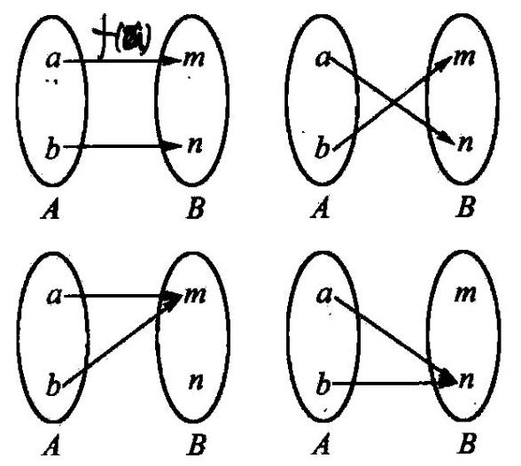

图 2-3

例 6 已知集合 $A = \{ x \mid  x \in  \mathbf{R}, x \neq  1\} , B = \{ y \mid  y \in  \mathbf{R}, y \neq  3\}$ ,对应法则 $f$ : $y = \frac{{3x} + 2}{x - 1}$ . 试证明映射 $f : A \rightarrow  B$ 是一一映射.

分析: 根据一一映射的定义,只要证明 $\forall$ (表示 “任意”) $y \in  B$ ,通过对应法则 $y = \frac{{3x} + 2}{x - 1}$ 能惟一解出 $x \in  A$ .

证: 设 $\;\forall b \in  B$ ,代入对应法则得 $b = \frac{{3x} + 2}{x - 1}$ ,

即

$$
b\left( {x - 1}\right)  = {3x} + 2,
$$

亦即

$$
\left( {b - 3}\right) x = b + 2.
$$

由于 $\forall b \in  B$ ,故有 $b \neq  3$ ,即 $b - 3 \neq  0$ ,因此,关于 $x$ 的方程

$$
\left( {b - 3}\right) x = b + 2
$$

有惟一解

$$
x = \frac{b + 2}{b - 3}.
$$

又因为 $x = \frac{b + 2}{b - 3} = \frac{b - 3 + 5}{b - 3} = 1 + \frac{5}{b - 3}$ ,其中,显然有 $\frac{5}{b - 3} \neq  0$ ,因此有 $x \neq  1$ . 这就是说, $x = \frac{b + 2}{b - 3} \in  A$ .

所以, $\forall b \in  B$ ,有且仅有关于 $f$ 的一个原像 $x \in  A$ . 这就是说,映射 $f : A \rightarrow  B$ 是一一映射.

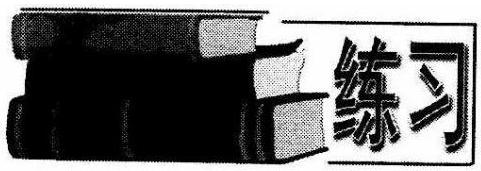

1. 以下给出的对应关系中,是不是集合 $A$ 到 $B$ 的映射? 为什么?

✓(1)设集合 $A = \{$ 平面 $W$ 上的圆 $\} , B =$ 平面 $W$ 上的点 $\}$ ,对应法则 $f$ : 每一个圆都对应它的圆心;

变 设集合 $A = \{$ 圆 $\} , B = \{$ 三角形 $\}$ ,对应法则 $f$ : 每一个圆都对应它的外切三角形;

$\varphi \left( 3\right)$ 设集合 $A = \{ x \mid  x \in  \mathbf{R}\} , B = \{ y \mid  y \in  \mathbf{R}\}$ ,对应法则 $f : y = \frac{1}{x}$ ;

(4) $A = B = N, f : x \rightarrow  \left| {x - 3}\right| .$

2. 设 $f : A \rightarrow  B$ 是 $A$ 到 $B$ 的一个映射,其中 $A = B = \{ \left( {x, y}\right)  \mid  x, y \in  \mathbf{R}\}$ , $f : \left( {x, y}\right)  \rightarrow  \left( {x - y, x + y}\right)$ . 求 $A$ 中的元素 $\left( {-1,2}\right)$ 的像和 $B$ 中的元素 $\left( {-1,2}\right)$ 的原像.

3,设 $M = \{ a, b, c\} , N = \{  - 1,0,1\}$ .

(1)求从 $M$ 到 $N$ 的映射的个数；

(2)从 $M$ 到 $N$ 的映射满足 $f\left( a\right)  > f\left( b\right)  \geq  f\left( c\right)$ ，试确定这样的映射 $f : M \rightarrow  N$ 的个数.

4. 设集合 $A = \{ 1,2\}$ ，则从 $A$ 到 $A$ 的映射 $f$ 中，满足 $f\left( {f\left( x\right) }\right)  = f\left( x\right)$ 的映射有多少个?

5. 设集合 $M = \{ x \mid  1 \leq  x \leq  9, x \in  \mathbf{Z}\} , F = \{ \left( {a, b, c, d}\right)  \mid  a, b, c, d \in  M\}$ ，定义 $F$ 到 $\mathbf{Z}$ 的映射 $f : \left( {a, b, c, d}\right) \overset{f}{ \rightarrow  }{ab} - {cd}$ ,若 $u, v, x, y$ 都是 $M$ 中的元素,且满足 $(u$ , $v, x, y)\overset{f}{ \rightarrow  }{39},\left( {u, y, x, v}\right) \overset{f}{ \rightarrow  }{66}$ ,求 $u + v + x + y$ 的值.

### 2.3 函数及其三要素

上一节我们已经知道“映射”这个概念, 有了这个定义, 我们就可以定义函数这个概念.

对于映射 $f : A \rightarrow  B$ ,当 $A, B$ 都是实数集 $\mathbf{R}$ 或它的非空子集时,就称为整数域为 $A$ 的函数,记作 $y = f\left( x\right)$ . 这时,与自变量 $x = a \in  A$ 对应的函数值为 $y = f\left( a\right)  \in \; B$ ,所有函数值组成的集合,称为这个函数的集,记作 $f\left( A\right)  = \; \{ y \mid  y = f\left( x\right) , x \in  A\}$ . 显然, $f\left( A\right)  \subseteq  B \subseteq  R$ .

由以上定义, 我们可以知道, 函数是一类特殊的映射. 它包括三要素: 定义域、 值域和对应法则，其中对应法则是核心.

应该指出，如果仅给出函数的关系式而没有指出其定义域时，那么这个函数的定义域就是指能使式子有意义的实数 $x$ 的集合；如果是讨论某些实际问题的函数时,那么还要根据自变量 $x$ 在该问题中的可取值范围确定定义域.

例 1 求函数 $y = \frac{\sqrt{{x}^{2} - {3x} - 4}}{\left| {x + 1}\right|  - 2}$ 的定义域.

解: 要使函数有意义,必须使

$$
\left\{  \begin{array}{l} {x}^{2} - {3x} - 4 \geq  0, \\  \left| {x + 1}\right|  - 2 \neq  0. \end{array}\right.
$$

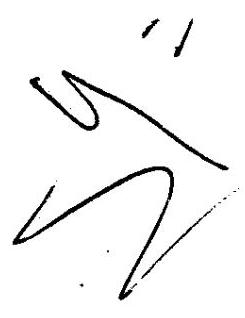

即

$$
\left\{  \begin{array}{l} \left( {x + 1}\right) \left( {x - 4}\right)  \geq  0, \\  x + 1 \neq  2, \\  x + 1 \neq   - 2, \end{array}\right.
$$

解得 $x \leq   - 1, x \neq   - 3$ ,或 $x \geq  4$ .

所以，函数的定义域为 $\{ x \mid  x \leq   - 1, x \neq   - 3$ ，或 $x \geq  4\} .$

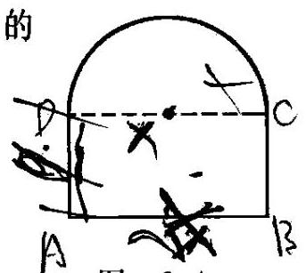

图 2-4

例 2 用长为 $l$ 的铁丝弯成下部为矩形，上部为半圆形的框架,如图 2-4,若矩形底边长为 ${2x}$ ,求此框架围成的面积 $y$ 与 $x$ 的函数关系 $y = f\left( x\right)$ ,并求其定义域.

解: 设 ${AB} = {2x}$ ,则 $\overset{\text{ ⏜ }}{CD} = {\pi x}$ .

于是 ${AD} = \frac{l - {2x} - {\pi x}}{2}$ ，所以，

$y = {2x} \cdot  \frac{l - {2x} - {\pi x}}{2} + \frac{\pi {x}^{2}}{2} \; =  - \frac{\pi  + 4}{2}{x}^{2} + {lx}$ . 由题意,知

$$
\left\{  \begin{array}{l} {2x} > 0, \\  \frac{l - {2x} - {\pi x}}{2} > 0, \end{array}\right.
$$

得 $0 < x < \frac{l}{2 + \pi }$ .

即函数的定义域为 $\left( {0,\frac{l}{2 + \pi }}\right)$ .

函数的值域是高中数学的难点, 它没有固定的方法和模式, 绝大部分值域问题与函数的最大(小)值问题有不解之缘，解答这些问题没有固定的思维定势. 目前常用的方法有:图像法、配方法、判别式法、不等式法、反函数法、换元法、几何法及利用函数的单调性等. ${v}_{1}{v}_{2}{v}_{1}{v}_{2}{v}_{1}{v}_{2}{v}_{1}{v}_{2}{v}_{1}{v}_{2}{v}_{1}{v}_{2}{v}_{1}{v}_{2}{v}_{1}{v}_{2}{v}_{1}{v}_{2}{v}_{1}{v}_{2}{v}_{1}{v}_{2}{v}_{1}{v}_{2}{v}_{1}{v}_{2}{v}_{1}{v}_{2}{v}_{1}{v}_{2}{v}_{1}{v}_{2}{v}_{1}{v}_{2}{v}_{1}{v}_{2}{v}_{1}{v}_{2}{v}_{1}{v}_{2}{v}_{1}{v}_{2}{v}_{1}{v}_{2}{v}_{1}{v}_{2}{v}_{1}{v}_{2}{v}_{1}{v}_{2}{v}_{1}{v}_{2}{v}_{1}{v}_{2}{v}_{1}{v}_{2}{v}_{1}{v}_{2}{v}_{1}{v}_{2}{v}_{1}{v}_{2}{v}_{1}{v}_{2}{v}_{1}{v}_{2}{v}_{1}{v}_{2}{v}_{1}{v}_{2}{v}_{1}{v}_{2}v{v}_{1}{v}^{2} +$

例 3 求函数 $y = \left( {x + 1}\right) \left| x\right|  + 2\left| x\right|$ 的值域.

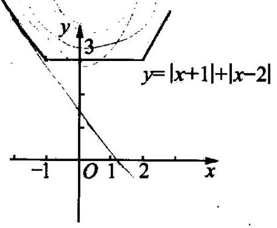

图 2-5

解: (图像法) 函数 $y = \left| {x + 1}\right|  + \left| {x - 2}\right|$ 的零点是 $x =  - 1, x = 2$ . 当 $x <  - 1$ 时, $y =  - {2x} + 1$ ; 当 $- 1 \leq  x < 2$ 时, $y = 3$ ; 当 $x \geq  2$ 时, $y = {2x} - 1$ . 于是

$$
y = \left\{  \begin{array}{l}  - {2x} + 1\left( {x <  - 1}\right) ; \\  3\left( {-1 \leq  x < 2}\right) ; \\  {2x} - 1\left( {x \geq  2}\right) . \end{array}\right.
$$

作出函数的图像 (如图 2-5).

从函数的图像可以看出，函数的值域为 $\{ y \mid  y \geq  3\}$ .

例 4 求函数 $y = \frac{{x}^{2} - {2x} - 3}{2{x}^{2} + {2x} + 1}$ 的值域.

解: 去分母,整理得

$$
\left( {{2y} - 1}\right) {x}^{2} + 2\left( {y + 1}\right) x + \left( {y + 3}\right)  = 0.
$$

当 $y \neq  \frac{1}{2}$ 时，这是一个关于 $x$ 的二次方程，因为 $x$ ， $y$ 均为实数，所以

$$
\Delta  = {\left\lbrack  2\left( y + 1\right) \right\rbrack  }^{2} - 4\left( {{2y} - 1}\right) \left( {y + 3}\right)  \geq  0,
$$

$$
{y}^{2} + {3y} - 4 \leq  0,
$$

所以

$$
- 4 \leq  y \leq  1\text{ . }
$$

说明:本题求函数值域的方法叫做判别式法，这种解法对可以转化为形如 $f\left( y\right) {x}^{2} + g\left( y\right) x + \varphi \left( y\right)  = 0$ 形式的函数,求其值域具有一般性. 常见的函数形式是 ${y}^{\prime } = \frac{{a}_{1}{x}^{2} + {b}_{1}x + {c}_{1}}{{a}_{2}{x}^{2} + {b}_{2}x + {c}_{2}}, y = \frac{{a}_{1}{x}^{2} + {b}_{1}x + {c}_{1}}{{b}_{2}x + {c}_{2}}, y = \frac{{b}_{1}x + {c}_{1}}{{a}_{2}{x}^{2} + {b}_{2}x + {c}_{2}}.$

如果一个函数能用一个数学式子表示出来, 那么这个数学式子叫做函数的解

国家法国的法制引法，不等式法、反函数法、几何法利用单减性

析式. 确定函数的解析式有两条原则，① 求出函数的对应法则。② 在对应法则后面标注函数的定义域。

解: 设 $t = {3x} + 1$ ,则 $x = \frac{t - 1}{3}$ .

解: 设 $t = {3x} + 1$ ,则 $x = \frac{t - 1}{3}$ .

把 $t = {3x} + 1, x = \frac{t - 1}{3}$ 分别代入 $f\left( {{3x} + 1}\right)  = 9{x}^{2} - {6x} + 5$ 的左边和右边,得

$$
f\left( t\right)  = 9{\left( \frac{t - 1}{3}\right) }^{2} - 6\left( \frac{t - 1}{3}\right)  + 5,
$$

即

例 6 已知等腰梯形 ${ABCD}$ 的下底 ${AB} =$ 10，上底 ${CD} = 4$ ，两腰 ${AD} = {BC} = 5$ . 动点 $P$ 在梯形各边上运动，由 $B$ 经 $C$ ， $D$ 至 $A$ ，求 $\bigtriangleup  {APB}$ 的面积 $S$ 随 $P$ 点所行路程 $x$ 的变化而变化的函数关系式.

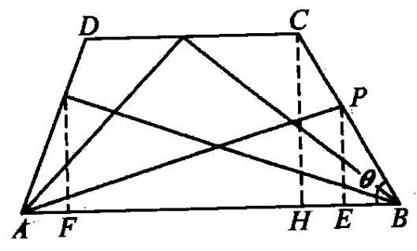

图 2-6

解: 如图 2-6,设腰与底边的夹角为 $\theta$ ,易得 $\sin \theta  = \frac{4}{5}$ .

(1)当 $P$ 在 ${BC}$ 上运动时, ${BP} = x$ ,且 $x \in  \left\lbrack  {0,5}\right\rbrack$ ,

$\therefore {PE} = \frac{4}{5}x,\;\therefore S = \frac{1}{2} \cdot  {10} \cdot  \frac{4}{5}x = {4x}.$

(2)当 $P$ 在 ${CD}$ 上运动时, $S = {20}, x \in  \left\lbrack  {5,9}\right\rbrack$ .

(3)当 $P$ 在 ${DA}$ 上运动时， $x = {BC} + {CD} + {DP} = 9 + {DP} \Rightarrow  {DP} = x - 9$ ，

$\therefore {AP} = 5 - \left( {x - 9}\right)  = {14} - x$ ,且 $x \in  \left\lbrack  {9,{14}}\right\rbrack  ,\therefore {PF} = \frac{4}{5}\left( {{14} - x}\right)$ .

$\therefore S = \frac{1}{2} \cdot  {10} \cdot  \frac{4}{5}\left( {{14} - x}\right)  = {56} - {4x}$ .

综上所述，所求函数关系式为

$$
S = \left\{  \begin{array}{l} {4x}, x \in  \left\lbrack  {0,5}\right\rbrack  ; \\  {20}, x \in  \left\lbrack  {5,9}\right\rbrack  ; \\  {56} - {4x}, x \in  \left\lbrack  {9,{14}}\right\rbrack  . \end{array}\right.
$$

说明:形如例 6 的函数称之为分段函数.

石篆习

1. 已知函数 $f\left( x\right)$ 的定义域为 $\left\lbrack  {-1,1}\right\rbrack$ ,求 $f\left( {ax}\right)  + f\left( \frac{x}{a}\right)$ 的定义域,其中 $a > 0$ .

2. 求 $f\left( x\right)  = \frac{2{x}^{2} + {4x} + 1}{{x}^{2} + {2x}}$ 的定义域和值域.

3. 求函数 $y = \sqrt{-{x}^{2} + {3x} + {18}}$ 的定义域和值域.

4. 已知 $f\left( x\right)  = {x}^{2} + \frac{1}{{x}^{2}}$ ,求 $f\left( x\right)$ 定义域.

5. 已知函数 $y = \sqrt{m{x}^{2} - {6mx} + m + 8}$ 的定义域是 R，求实数 $m$ 的取值范围.

6. 实数 $x, y$ 满足 ${x}^{2} - {3xy} + {y}^{2} = 2$ ,求 ${x}^{2} + {y}^{2}$ 的值域.

7. 函数 $f$ 定义在整数集上,且满足:

$$
f\left( n\right)  = \left\{  \begin{array}{l} n - 3;n \geq  {1000}; \\  f\left\lbrack  {f\left( {n + 5}\right) }\right\rbrack  , n < {1000}. \end{array}\right.
$$

求 $f\left( {84}\right)$ .

8. 如图 2-7,某蔬菜基地种植西红柿,由历年市场行情得知,从二月一日起的 300 天内，西红柿市场售价与上市时间的关系用图( 1 )中的一条折线表示; 西红柿的种植成本与上市时间的关系用图( 2 )中的抛物线段表示.

(I) 写出图(1)表示的市场售价与时间的函数关系式 $P = f\left( t\right)$ ;

写出图(2)表示的种植成本与时间的函数关系式 $Q = g\left( t\right)$ .

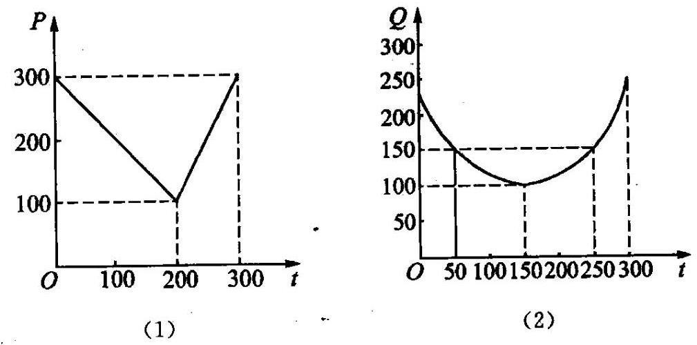

图 2-7

(II) 认定市场售价减去种植成本为纯收益, 问何时上市的西红柿纯收益最大？(注:市场售价和种植成本的单位:元／120kg，时间单位:天)

### 2.4 函数的图像

设函数 $y = f\left( x\right)$ 的定义域为 $A$ ,那么在平面直角坐标系内的点集 $C = \; \{ \left( {x, y}\right)  \mid  y = f\left( x\right) , x \in  A\}$ 就称为函数 $y = f\left( x\right)$ 的图像.

函数的图像可以是直线 (如正比例函数、一次函数图像), 可以是抛物线 (如二次函数)、双曲线(反比例函数)或其他曲线，也可以是一些离散的点或一些线段。

关于函数的图像的作法，我们应重点把握好两点:描点法作图及函数的图像的变换.

如果 $y = f\left( x\right)$ 是解析式，可用以下措点法步骤作图:

① 列表，列表给出自变量与函数的一些对应值.

② 描点，以表中的对应值为坐标，在直角坐标平面内描出相应的点.

③ 联线，按照自变量由小到大的顺序，把所描各点用平滑的曲线联结起来，所得曲线即为函数 $y = f\left( x\right)$ 的图像.

函数的图像的变换则包括以下几点:

## (1)平移变换

左右平稳:将函数 $y = f\left( x\right)$ 的图像向左(或向右)平移 $h$ 个单位 $\left( {h > 0}\right)$ 后得到函数 $y = f\left( {x + h}\right)$ 和 $y = f\left( {x - h}\right)$ 的图像.

上下平移:将函数 $y = f\left( x\right)$ 的图像向上或向下平移 $k$ 个单位 $\left( {k > 0}\right)$ 后得到函数 $y = f\left( x\right)  + k$ 和 $y = f\left( x\right)  - k$ 的图像. 上加下减

## (2)伸缩变换

横向伸缩 纵坐标不变): 将函数 $y = f\left( x\right)$ 的图像上所有点的横坐标缩短 $\left( {w > 1}\right)$ 或伸长 $\left( {0 < w < 1}\right)$ 到原来的 $\frac{1}{w}$ 倍得到函数 $y = f\left( {wx}\right)$ 的图像.

纵向伸缩 (横坐标不变):将函数 $y = f\left( x\right)$ 的图像上所有点的纵坐标伸长 $\left( {A > 1}\right)$ 或缩短 $\left( {0 < A < 1}\right)$ 到原来的 $A$ 倍后得到函数 $y = {\left( A\right) }^{\prime }\left( x\right)$ 的图像.

函数 $y = f\left( x\right)$ 的图像与函数 $y =  - f\left( x\right) , y = f\left( {-x}\right) , y =  - f\left( {-x}\right)$ 的图像分别关于 $x$ 轴分辐、原点对称.

## (43)___

将函数 $y = f\left( x\right)$ 的图像在 $x$ 轴上方的部分不变,下方的部分翻转到 $x$ 轴上方得到函数 $y = \left| {f\left( x\right) }\right|$ 的图像.

将函数 $y = f\left( x\right)$ 的图像在 $y$ 轴右方的部分不变; 左方的部分图像由右方的图像沿 $y$ 轴翻转,得到函数 $y = f\left( \left| x\right| \right)$ 的图像.

例 1 作出函数 $y = \left| {{x}^{2} + x - 2}\right|$ 的图像.

解: 先作出 $y = {x}^{2} + x - 2$ 的图像,然后将此图像在 $x$ 轴下方的部分对称翻折到 $x$ 轴的上方即可,如图 2-8.

解 2 作出函数 $y = \frac{x + 2}{x + 3}$ 的图像.

解:函数的定义域是 $\{ x \mid  x \in  \mathbf{R}$ ，且 $x \neq   - 3\}$ .

当 $x \neq   - 3$ 时，有

$$
y = \frac{x + 2}{x + 3} = \frac{\left( {x + 3}\right)  - 1}{x + 3} = 1 - \frac{1}{x + 3},
$$

即

$$
y = 1 - \frac{1}{x + 3}\left( {x \neq   - 3}\right) .
$$

如图 2-9,函数的图像由双曲线 $y =  - \frac{1}{x}$ 向左平移 3 个单位,再向上平移 1 个单位,再向上平移 1 个单位得到.

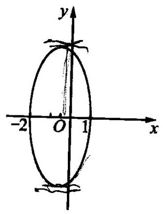

图 2-8

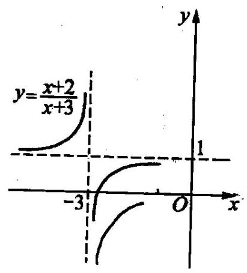

图 2-9

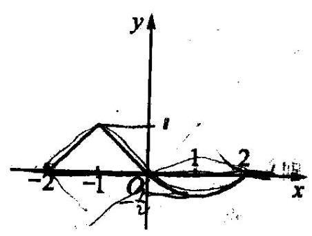

图 2-10

例3 已知定义 $\left\lbrack  {-2,2}\right\rbrack$ 上的函数 $y = f\left( x\right)$ 的图像如图 2-10 所示. 分别画出 $y =  - f\left( x\right) , y = \; f\left( {-x}\right) , y = \left| {f\left( x\right) }\right| , y = f\left( \left| x\right| \right) , y = {2f}\left( x\right) , y = \; f\left( {2x}\right)$ 的图像.

解: $y =  - f\left( x\right) , y = f\left( {-x}\right) , y = \left| {f\left( x\right) }\right| , y = \; f\left( \left| x\right| \right) , y = {2f}\left( x\right) , y = f\left( {2x}\right)$ 的图 . 易的图像的关系依次是 (由 $y = f\left( x\right)$ 的图像得到):

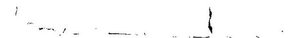

(1)关于 $x$ 轴对称;

(2)关于 $y$ 轴对称；

(3) $y \geq  0$ 部分重合， $y < 0$ 部分关于 $x$ 轴对称；

(4) $x \geq  0$ 部分重合， $x < 0$ 部分关于 $y$ 轴对称；

(5)横坐标不变，纵坐标伸长到原来的 2 倍；

(6)纵坐标不变，横坐标缩短到原来的 $\frac{1}{2}$ 倍.

上述函数的图像见图 2-11(1) < (6).

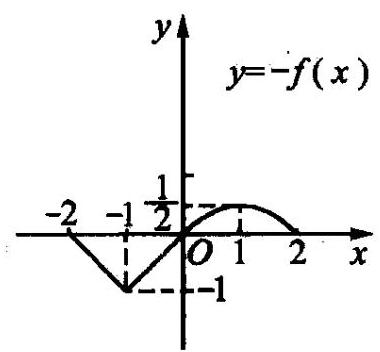

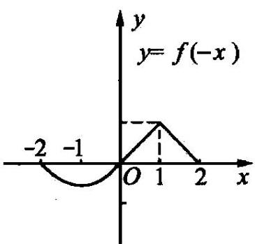

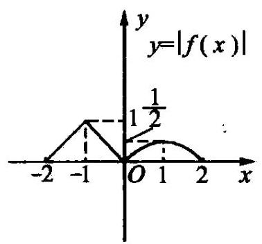

(1) (2) (3)

$y \; y \; y$

$y = f\left( \left| x\right| \right) \; y = {2f}\left( x\right)$

-2 -1 0 1 2 2 0

$x$ -2 -1 0 $x$ -1

之 $x$

今 -1

(4) (5) (6)

图 2-11

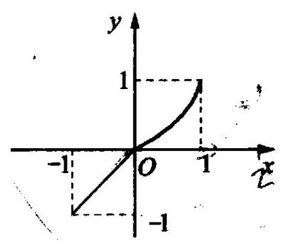

图 2-12

例 4 已知函数

$$
f\left( x\right)  = \left\{  \begin{array}{l} {x}^{2}\left( {0 \leq  x \leq  1}\right) , \\  x\left( {-1 \leq  x < 0}\right) , \end{array}\right.
$$

作出下列函数图像:(1) $f\left( {x - 1}\right)$ ；(2) (2) $f\left( {-x}\right)$ ;

(3) $f\left( \left| x\right| \right)$ ; (4) $\left| {f\left( x\right) }\right|$ ; (5) $f\left( {\frac{3}{2}x}\right)$ .

解: 先作出函数 $f\left( x\right)$ 的图像,见图 2-12,它由抛物线的一部分和一条线段组成(特征如图所示).

(1)将 $f\left( x\right)$ 的图像向右平移一个单位,即得 $f\left( {x - 1}\right)$ 的图像,见图 2-13(1);

(2)将 $f\left( x\right)$ 的图像绕 $y$ 轴翻转即得 $f\left( {-x}\right)$ 的图像,见图 2-13(2)；

(3) $f\left( x\right)$ 的图像 $x \geq  0$ 部分不变，再作出它关于 $y$ 轴对称的图形，便得 $f\left( \left| x\right| \right)$ 的图像，见图 2-13(3)；

(4) $f\left( x\right)$ 的图像 $y \geq  0$ 部分不变，作 $y < 0$ 部分的图像关于 $x$ 轴的对称图形， 两部分合在一起就是 $\left| {f\left( x\right) }\right|$ 的图像，见图 2-13(4)；

(5)将 $f\left( x\right)$ 的图像上所有的点的横坐标缩短到原来的 $\frac{2}{3}$ 倍(纵坐标不变)，即得 $f\left( {\frac{3}{2}x}\right)$ 的图像,见图 2-13(5).

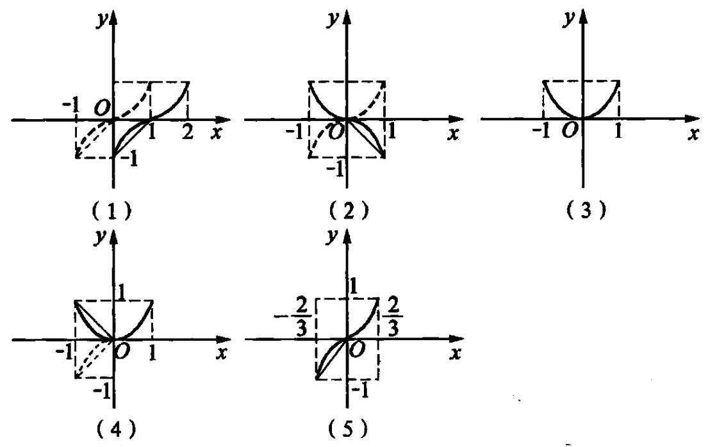

图 2-13

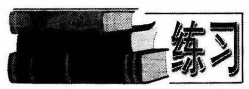

(1) $f\left( x\right)  = \left\lbrack  x\right\rbrack$ ；

(2) $h\left( x\right)  = x - \left\lbrack  x\right\rbrack$ .

1. 作出函数 $y = {x}^{2} - 2\left| x\right|  - 1$ 的图像.

2. 设 $\left\lbrack  x\right\rbrack$ 表示不超过 $x$ 的最大整数,试作出下列函数的图像:

3. 作出函数 $y = \frac{1}{\sqrt{{x}^{2}}}$ 的图像.

4. 作出函数 $y = \frac{1 - \left| x\right| }{\left| 1 - x\right| }$ 的图像.

5. $k$ 为什么实数时,方程 ${x}^{2} - 2\left| x\right|  + 3 = k$ 有四个互不相等的实数根?

6. 设函数 ${f}_{0}\left( x\right)  = \left| x\right| ,{f}_{1}\left( x\right)  = \left| {{f}_{0}\left( x\right)  - 1}\right| ,{f}_{2}\left( x\right)  = \left| {{f}_{1}\left( x\right)  - 2}\right|$ ,求函数 $y = {f}_{2}\left( x\right)$ 的图像与 $x$ 轴所围成的封闭部分图形的面积.

7. 作出函数 $y = 1 + \sqrt{{x}^{2} + {2x}}$ 的图像.

## 二、函数的性质

### 2.5 函数的单调性

我们首先来考察我们熟知的二次函数 $y = {x}^{2}$ 的图像. 可以发现,当 $x \in  ( - \infty$ , 0) 时,且从左到右逐渐增大时, $f\left( x\right)  = {x}^{2}$ 的值逐渐减小,而当 $x \in  \left( {0, + \infty }\right)$ 且从左到右逐渐增大时, $f\left( x\right)  = {x}^{2}$ 的值也逐渐增大.

函数的这种性质叫做函数在某个区间上的单调性.

设函数 $y = f\left( x\right)$ 的定义域为 $D$ ,区间 $M \subseteq  D$ ,则:

(1) $\forall {x}_{1},{x}_{2} \in  M$ ，如果当 ${x}_{1} < {x}_{2}$ 时，都有 $f\left( {x}_{1}\right)  < f\left( {x}_{2}\right)$ ，那么就说 $f\left( x\right)$ 在区间 $M$ 上是增函数.

(2) $\forall {x}_{1},{x}_{2} \in  M$ ，如果当 ${x}_{1} < {x}_{2}$ 时，都有 $f\left( {x}_{1}\right)  > f\left( {x}_{2}\right)$ ，那么就说 $f\left( x\right)$ 在区间 $M$ 上是减函数.

如果函数 $f\left( x\right)$ 在某个区间上是增函数或减函数，那么就说这个函数在这一区间上是单调函数 (或说具有单调性),这个区间就叫做函数 $f\left( x\right)$ 的单调区间.

关于函数的单调性,我们应把握好以下几点:

第一，在中学数学中所说的单调性是指严格单调性，即必须是 $f\left( {x}_{2}\right)$ 或 $f\left( {x}_{1}\right)  > f\left( {x}_{2}\right)$ ,不能是 $f\left( {x}_{1}\right)  \leq  f\left( {x}_{2}\right)$ 或 $f\left( {x}_{1}\right)  \geq  f\left( {x}_{2}\right)$ . (这一点,与高等数学中讲到的“单调性”不完全相同.)

第二，函数的单调性是对某个区间而言的，所以要受到区间的限制. 如，函数 $y = \frac{1}{x}$ 分别在 $\left( {-\infty ,0}\right) ,\left( {0, + \infty }\right)$ 上的单调递减的，但不能说它在整个定义域 $\left( {-\infty ,0}\right)  \cup  \left( {0, + \infty }\right)$ 内单调递减. 又如,函数 $y = {x}^{2}$ 在 $\left( {-\infty ,0}\right) ,\left( {0, + \infty }\right)$ 上分别是减函数和增函数,但 $y = {x}^{2}$ 在 $R$ 上既不是增函数也不是函数,函数的单调性对区间而言，本质上就是对“局部性质”与“整体性质”的关系而言，这个区间应包含在函数的定义域内，或者是定义域的真子集，或者与定义域相等.

第三，讨论函数的单调性与函数在个别点有无定义无关. 如，函数 $y = \frac{1}{x}$ 在点 $x = 0$ 处没有定义，但我们仍然可以讨论 $y = \frac{1}{x}$ 在 $\left( {0, + \infty }\right)$ 上的单调性；又如，讨论函数 $y = \sqrt{x}$ 的单调性,可以写作函数的增函数区间是 $\left( {0, + \infty }\right)$ 或 $\lbrack 0, + \infty )$ ,这样的区间含“ 0 ”与否,要根据是否需要当 $x = 0$ 时的函数值去确定.

第四，学习函数的单调性，要注意定义中条件和结论的双方向使用，即如果 $f\left( x\right)$ 在区间 $A$ 上是增 (减) 函数,则对 ${x}_{1},{x}_{2} \in  A,{x}_{1} < {x}_{2}$ ,有 $f\left( {x}_{1}\right)  < f\left( {x}_{2}\right) \; \left( {f\left( {x}_{1}\right)  > f\left( {x}_{2}\right) }\right) , f\left( {x}_{1}\right) , f\left( {x}_{2}\right)  \in  B$ ; 反之,对 $f\left( {x}_{1}\right) , f\left( {x}_{2}\right)  \in  B, f\left( {x}_{1}\right)  < f\left( {x}_{2}\right)$ , 有 ${x}_{1} < {x}_{2}\left( {{x}_{1} > {x}_{2}}\right)$ .

第五，在单调函数的意义下，抽象不等式可以转化为具体不等式. 如，函数 $y = \; f\left( x\right)$ 在 $\mathbf{R}$ 上是减函数，且 $f\left( {{2x} - 1}\right)  > f\left( 0\right)$ ，则可以肯定 ${2x} - 1 < 0$ . 函数的单调性是函数与不等式有机结合的最佳结合点.

例 1 求证: 函数 $f\left( x\right)  = \frac{1}{x}$ 在区间 $\left( {-\infty ,0}\right)$ 内是单调减函数.

证: 设 $\forall {x}_{1},{x}_{2} \in  \left( {-\infty ,0}\right)$ ,且 ${x}_{1} < {x}_{2} < 0$ ,则有

善

$$
f\left( {x}_{1}\right)  - f\left( {x}_{2}\right)  = \frac{1}{{x}_{1}} - \frac{1}{{x}_{2}} = \frac{{x}_{2} - {x}_{1}}{{x}_{1}{x}_{2}}.
$$

因为 ${x}_{1} < {x}_{2} < 0$ ,所以 ${x}_{2} - {x}_{1} > 0,{x}_{1}{x}_{2} > 0$ . 因而 $f\left( {x}_{1}\right)  - f\left( {x}_{2}\right)  > 0$ ,即 $f\left( {x}_{1}\right)  > f\left( {x}_{2}\right) .$

因此,函数 $f\left( x\right)  = \frac{1}{x}$ 在区间 $\left( {-\infty ,0}\right)$ 内是单调减函数.

同理可证,函数 $f\left( x\right)  = \frac{1}{x}$ 在区间 $\left( {0, + \infty }\right)$ 内也是单调减函数. 但是,不能说 $f\left( x\right)  = \frac{1}{x}$ 在它的定义域内是单调减函数. (为什么?)

例 1 求证: 函数 $f\left( x\right)  =  - \sqrt{x}$ 在它的定义域上是单调减函数.

“函数 $f\left( x\right)  =  - \sqrt{x}$ 的定义域为 $\lbrack 0, + \infty )$ .

设 $\forall {x}_{1},{x}_{2} \in  \lbrack 0, + \infty )$ ,且 ${x}_{1} < {x}_{2}$ ,则有

$$
f\left( {x}_{1}\right)  - f\left( {x}_{2}\right)  =  - \underbrace{\sqrt{{x}_{1}} + \sqrt{{x}_{2}}} = \frac{{x}_{2} - {x}_{1}}{\sqrt{{x}_{2}} + \sqrt{{x}_{1}}}.
$$

因为 $0 \leq  {x}_{1} < {x}_{2}$ ,所以

$$
{x}_{2} - {x}_{1} > 0,\sqrt{{x}_{2}} + \sqrt{{x}_{1}} > 0.
$$

从而 $f\left( {x}_{1}\right)  - f\left( {x}_{2}\right)  > 0$ ,即 $f\left( {x}_{1}\right)  > f\left( {x}_{2}\right)$ .

所以，函数 $f\left( x\right)  =  - \sqrt{x}$ 在定义域 $\lbrack 0, + \infty )$ 上是单调减函数.

例3 判断函数 $f\left( x\right)  =  - {x}^{3} + a\left( {a \in  \mathbf{R}}\right)$ 在 $\mathbf{R}$ 上的单调性.

证: 函数的定义域是 $\mathbf{R}$ .

设 ${x}_{1},{x}_{2} \in  \mathbf{R}$ ,且 ${x}_{1} < {x}_{2}$ ,则

$$
{x}_{1} - {x}_{2} < 0\text{ . }
$$

①

$$
f\left( {x}_{2}\right)  - f\left( {x}_{1}\right)  = \left( {-{x}_{2}^{3} + a}\right)  - \left( {-{x}_{1}^{3} + a}\right)
$$

$$
= \left( {{x}_{1} - {x}_{2}}\right) \left( {{x}_{1}^{2} + {x}_{1}{x}_{2} + {x}_{2}^{2}}\right) \text{ . }
$$

②

由于 ${x}_{1}^{2} + {x}_{1}{x}_{2} + {x}_{2}^{2} = {\left( {x}_{1} + \frac{{x}_{2}}{2}\right) }^{2} + \frac{3}{4}{x}_{2}^{2}$ .

显然由于 ${x}_{1} < {x}_{2},{x}_{1},{x}_{2}$ 不可能同时为零,故 ${x}_{1}^{2} + {x}_{1}{x}_{2} + {x}_{2}^{2} > 0$ .

由①，②知， $f\left( {x}_{2}\right)  < f\left( {x}_{1}\right)$ . 所以，函数 $f\left( x\right)  =  - {x}^{3} + a$ 在 $R$ 上是减函数.

人类共产重要，我们还可以证明以下一些重要结论:

(1)若函数 $y = f\left( x\right)$ 和 $y = g\left( x\right)$ 在公共区间 $A$ 内都是增 (减) 函数，则函数 $y = f\left( x\right)  + g\left( x\right)$ 在 $A$ 内是增 (减) 函数.

(2)若两个正值函数 $y = f\left( x\right)$ 和 $y = g\left( x\right)$ 在公共区间 $A$ 内都是增(减)函数， 则函数 $y = f\left( x\right)  \cdot  g\left( x\right)$ 在区间 $A$ 内也是增(减)函数.

(3)若两个负值函数 $y = f\left( x\right)$ 和 $y = g\left( x\right)$ 在公共区间 $A$ 内都是增(减)函数， 则函数 $y = f\left( x\right)  \cdot  g\left( x\right)$ 在区间 $A$ 内是减(增)函数.

设有函数 $y = f\left( u\right)$ 及 $u = g\left( x\right)$ ,则我们称形如 $y = f\left\lbrack  {g\left( x\right) }\right\rbrack$ 的函数是复合函数. 例如 $f\left( x\right)  = \sqrt{{x}^{2} + {2x} - 3}$ 可以看作是由 $y = \sqrt{u}$ 和 $u = {x}^{2} + {2x} - 3$ 复合而成的复合函数,像这样的函数有很多,其中 $u = g\left( x\right)$ 又称之为内层函数, $y = f\left( u\right)$ 称之为外层函数. 有关复合函数的单调性, 我们很容易证明以下结论 (证明留给读者自己完成) (见下表)。

<table><tr><td>函 数</td><td></td><td></td><td>单 调 性</td><td></td></tr><tr><td>内层函数 $u = g\left( x\right)$</td><td>↗</td><td>↗</td><td>↘</td><td>↘</td></tr><tr><td>外层函数 $y = f\left( u\right)$</td><td>↗</td><td>↘</td><td>↗</td><td>↘</td></tr><tr><td>复合函数 $y = f\left\lbrack  {g\left( x\right) }\right\rbrack$</td><td>↗</td><td>↘</td><td>↘</td><td>↗</td></tr></table>

简单说，上表可以用四个字概括:“同增异减”。

利用以上结论，可以判断一些复合函数的单调性.

例 4 判断函数 $y = \sqrt{\frac{1}{x}}$ 的单调性.

解:函数的定义域是 $\left( {0, + \infty }\right)$ ，由于函数 $y = \sqrt{u}$ 在 $\left( {0, + \infty }\right)$ 上是增函数. $u = \; \frac{1}{x}$ 在 $\left( {0, + \infty }\right)$ 上是减函数，所以 $y = \sqrt{\frac{1}{x}}$ 在 $\left( {0, + \infty }\right)$ 上是减函数.

例 5 求函数 $y = \sqrt{{x}^{2} + {2x} - 3}$ 的单调递减区间.

分析: 设 $u = {x}^{2} + {2x} - 3$ ,则 $y = \sqrt{u}$ 在 $\lbrack 0, + \infty )$ 上是增函数,只需求 $u$ 的递减区间，并注意函数的定义域.

解: 由 ${x}^{2} + {2x} - 3 \geq  0$ ,得 $x \leq   - 3$ ,或 $x \geq  1$ . 即函数的定义域是 $( - \infty , - 3\rbrack  \cup \; \lbrack 1, + \infty )$ .

设 $u = {x}^{2} + {2x} - 3$ ,则 $y = \sqrt{{x}^{2} + {2x} - 3}$ 可化为 $y = \sqrt{u}$ .

由于 $y = \sqrt{u}$ 在 $\lbrack 0, + \infty )$ 上是增函数，所以求 $y = \sqrt{{x}^{2} + {2x} - 3}$ ，只需求 $u = {x}^{2} + \; {2x} - 3$ 的单调递减区间，且满足 $u \geq  0$ .

$u = {x}^{2} + {2x} - 3$ 的单调减区间是 $\left( {-\infty , - 1}\right)$ ,

所以 $y = \sqrt{{x}^{2} + {2x} - 3}$ 的单调减区间是 $( - \infty , - 3\rbrack$ .

说明: 某些函数在个别点处, 如函数的增、减区间的分界点处, 我们往往不去计较. 如二次函数 $y = {x}^{2} + {2x} - 3$ 的单调递减区间为 $\left( {-\infty , - 1}\right)$ ,也可以为 $( - \infty , - 1\rbrack$ .

上面结论中,我们提到: 两个增(减)函数在公共定义域内,它们的和还是增函数. 那么如果一个是增函数, 另一个是减函数情形又是怎么样呢?

一般说来,这样的情况往往不确定,这主要取决于哪一个函数的增、减更厉害.

$$
f\left( {x}_{1}\right)  - f\left( {x}_{2}\right)  = \left( {{x}_{1} + \frac{1}{{x}_{1}}}\right)  - \left( {{x}_{2} + \frac{1}{{x}_{2}}}\right)
$$

$$
= \left( {{x}_{1} - {x}_{2}}\right)  + \left( {\frac{1}{{x}_{1}} - \frac{1}{{x}_{2}}}\right)  = \left( {{x}_{1} - {x}_{2}}\right) \left( {1 - \frac{1}{{x}_{1}{x}_{2}}}\right)
$$

$$
= \underset{ \leftarrow  1}{\underbrace{\left( {x}_{1} - {x}_{2}\right) }} \cdot  \frac{{x}_{1}\overset{\text{ ⏜ }}{{x}_{2} - 1}}{{x}_{1}{x}_{2}}.
$$

以 6 求证: $y = x + \frac{1}{x}$ 在 $\left( {0,1}\right)$ 上是减函数.

证: $\forall 0 < {x}_{1} < {x}_{2} < 1$ ,

由 $0 < {x}_{1} < {x}_{2} < 1$ 知, ${x}_{1} - {x}_{2} < 0,{x}_{1}{x}_{2} - 1 < 0,{x}_{1}{x}_{2} > 0$ .

$$
f\left( {x}_{1}\right)  > f\left( {x}_{2}\right) \text{ . }
$$

所以, $y = x + \frac{1}{x}$ 在 $\left( {0,1}\right)$ 上是减函数.

说明: 例 6 是一个较有用的结论.

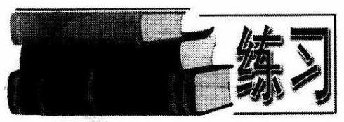

1. 利用定义证明: 函数 $f\left( x\right)  = {x}^{3}$ 在它的定义域上是单调增函数.

2. 利用定义求证: $f\left( x\right)  = \frac{1}{{x}^{2}}$ 在区间 $(0$ , $+ \infty )$ 内是单调减函数.

3. 求函数 $y = \frac{1}{\sqrt{{x}^{2} + x + 1}}$ 的单调区间.

已知 $f\left( x\right)$ 是定义在 $\left\lbrack  {-1,1}\right\rbrack$ 上的增函数，且 $f\left( {x - 1}\right)  < f\left( {{x}^{2} - 1}\right)$ ，求 $x$ 的取值范围. $\left( {1,1}\right)$

5. 已知 $f\left( x\right)$ 是定义在 $\left( {0, + \infty }\right)$ 上的增函数，且满足 $f\left( {x \cdot  y}\right)  = f\left( x\right)  + f\left( y\right)$ , $f\left( 2\right)  = 1$ .(1) 求证: $f\left( 8\right)  = 3$ ; (2) 解不等式 $f\left( x\right)  - f\left( {x - 2}\right)  > 3$ . (2)

6. 若函数 $f\left( x\right)$ 是 $\mathbf{R}$ 上的增函数，且 $f\left( {{x}^{2} + x}\right)  > f\left( {x - a}\right)$ 对一切 $x \in  \mathbf{R}$ 都成立,求实数 $a$ 的取值范围. $\left( {0, + \infty }\right)$

7. 函数 $f\left( x\right)  = 6{x}^{2} - {mx} + 5$ 在区间 $\lbrack  - 2, + \infty )$ 上是增函数，求 $f\left( 1\right)$ 的取值范围.

8. 设 $f\left( x\right)  = {x}^{2} + 1, g\left( x\right)  = f\left\lbrack  {f\left( x\right) }\right\rbrack$ ,令 $F\left( x\right)  = g\left( x\right)  - {\lambda f}\left( x\right)$ ,问是否存在实数 $\lambda$ ,使 $F\left( x\right)$ 在区间 $\left( {-\infty , - \frac{\sqrt{2}}{2}}\right)$ 上是减函数,且在区间 $\left( {-\frac{\sqrt{2}}{2},0}\right)$ 上是增函数?

2.6 函数的奇偶性

## 1. 偶函数

我们知道,二次函数 $y = f\left( x\right)  = {x}^{2}$ 的图像是一条关于 $y$ 轴对称的抛物线. 这一图形特征,可以进一步用数量关系来描述和刻画.

计算: 由 $f\left( {-1}\right)  = 1, f\left( 1\right)  = 1$ ,得 $f\left( {-1}\right)  = f\left( 1\right)$ ; 由 $f\left( {-2}\right)  = 4, f\left( 2\right)  = 4$ ,得 $f\left( {-2}\right)  = f\left( 2\right) ;\cdots \cdots$

一般地, $\forall a \in  \mathbf{R}$ ,这一函数都有 $f\left( {-a}\right)  = f\left( a\right)$ 的特征. 我们定义偶函数如下:

设函数 $y = f\left( x\right)$ 的定义域为 $D$ . 如果 $\forall a \in  D$ ,都有 $f\left( {-a}\right)  = f\left( a\right)$ ,那么就把函数 $y = f\left( x\right)$ 叫做偶函数.

由定义可知,函数的定义域 $D$ 关于 $y$ 轴对称是这个函数为偶函数的必要条件.

偶函数有一条重要的性质定理:

如果函数 $y = f\left( x\right)$ (定义域为 $D$ ) 是偶函数，那么 $f\left( x\right)$ 的图像关于 $y$ 轴成轴对称图形.

证: 由于 $f\left( x\right)$ 是偶函数,对 $\forall a \in  D$ ,都有 $f\left( {-a}\right)  = f\left( a\right)$ ,因此, $f\left( x\right)$ 图像上的点 $\left( {a, f\left( a\right) }\right)$ 与点 $\left( {-a, f\left( {-a}\right) }\right)$ ,就可以表示为点 $\left( {a, f\left( a\right) }\right)$ 与点 $\left( {-a, f\left( a\right) }\right)$ ,而这两点正好关于 $y$ 轴对称,所以,函数 $f\left( x\right)$ 的图像关于 $y$ 轴成轴对称图形.

利用这一性质，如果要画出偶函数 $f\left( x\right)$ 的图像，可以先用描点法画出 $y = \; f\left( x\right)$ 在 $y$ 轴右边部分的图像，然后再作出这部分图像关于 $y$ 轴对称的图形，就可以得到函数 $y = f\left( x\right)$ 在 $y$ 轴左边部分的图像.

## 2. 调函数

类似地,我们知道,反比例函数 $y = \frac{1}{x}\left( {x \neq  0}\right)$ 的图像关于原点成中心对称图形. 通过计算发现: 对于 $\forall a \neq  0$ ,这一函数具有 $f\left( {-a}\right)  =  - f\left( a\right)$ 的特征. 我们定义奇函数的定义如下:

设函数 $y = f\left( x\right)$ 的定义域为 $D$ ,如果 $\forall a \in  D$ ,都有 $f\left( {-a}\right)  =  - f\left( a\right)$ ,那么就把函数 $f\left( x\right)$ 叫做奇函数.

由定义知,函数的定义域 $D$ 关于原点对称是这个函数为奇函数的必要条件.

奇函数也有一条重要的性质定理:

如果函数 $y = f\left( x\right)$ (定义域为 $D$ )，是奇函数，那么 $f\left( x\right)$ 的图像关于原点成中心对称图形.

证: 由于 $f\left( x\right)$ 是奇函数,对 $\forall a \in  D$ ,都有 $f\left( {-a}\right)  =  - f\left( a\right)$ . 因此, $f\left( x\right)$ 图像上的点 $\left( {a, f\left( a\right) }\right)$ 与点 $\left( {-a, f\left( {-a}\right) }\right)$ ,就可以表示为点 $\left( {a, f\left( a\right) }\right)$ 与点 $( - a$ , $- f\left( a\right) )$ ,而这两点正好关于原点对称,所以函数 $f\left( x\right)$ 的图像关于原点成中心对称图形.

利用这一性质，如果要画出奇函数 $f\left( x\right)$ 的图像，可以先用描点法画出 $y = \; f\left( x\right)$ 在 $y$ 轴右边部分的图像，然后再作出这部分图像关于原点成中心对称的图形， 就可以得到函数 $y = f\left( x\right)$ 在 $y$ 轴左边部分的图像.

## 3. 关于奇偶函数的重要结论

A) $f\left( x\right) , g\left( x\right)$ 设为定义域是 ${D}_{1},{D}_{2}$ 的奇函数,那么在 ${D}_{1} \cap  {D}_{2}$ 上, $f\left( x\right)  + \; g\left( x\right)$ 是奇函数， $f\left( x\right)  \cdot  g\left( x\right)$ 是偶函数，类似的有:奇±奇=奇，奇 $\times$ 奇=偶(课后练习)，偶士偶=偶，偶⺀偶=偶，奇⺀俱=奇.

② 函数 $f\left( x\right)$ 是奇数 $\Leftrightarrow$ 曲线 $y = f\left( x\right)$ 关于原点对称. 函数 $f\left( x\right)$ 是偶函数 $\Leftrightarrow$ 曲线 $y = f\left( x\right)$ 关于 $y$ 轴对称.

(3)若 $f\left( x\right)$ 是具有奇偶性的单调函数，则奇(偶)函数在正负对称区间上的单调性是相同(反)的、

(4)对于复合函数 $F\left( x\right)  = f\left\lbrack  {g\left( x\right) }\right\rbrack$ ，若 $g\left( x\right)$ 为偶函数，则 $F\left( x\right)$ 为偶函数；若 $g\left( x\right)$ 为奇函数， $f\left( x\right)$ 为奇函数，则 $F\left( x\right)$ 为奇函数；若 $g\left( x\right)$ 为奇函数， $f\left( x\right)$ 为偶函数，则 $F\left( x\right)$ 为偶函数 (自己证明).

(5) $f\left( x\right)$ 既是奇函数又是偶函数的充要条件是 $f\left( x\right)  = 0$ (定义域关于原点对称).

(6)若函数 $f\left( x\right)$ 的定义域关于原点对称，则 $f\left( x\right)$ 可以表示成如下形式 $f\left( x\right)  = \frac{1}{2}\left\lbrack  {f\left( x\right)  + f\left( {-x}\right) }\right\rbrack   + \frac{1}{2}\left\lbrack  {f\left( x\right)  - f\left( {-x}\right) }\right\rbrack$ . 这个式子的特点是: 右边是一个偶函数与一个奇函数的和 (课后练习):

判断下列函数的奇偶性:

(1) $y =  - {x}^{2}\left( {x \leq  1}\right)$ ；

(2) $y = x - \frac{1}{x}$ ；

(3) $y = \frac{{x}^{4} + 1}{{x}^{2} + 1}$

解:(1)由于函数 $y =  - {x}^{2}$ 的定义域不是关于原点对称，所以它是非奇非偶函数.

(2)函数 $y = x - \frac{1}{x}$ 的定义域是 $\left( {-\infty ,0}\right)  \cup  \left( {0, + \infty }\right)$ ,它关于原点对称,且 $f\left( {-x}\right)  = \left( {-x}\right)  - \frac{1}{\left( -x\right) } =  - x + \frac{1}{x} =  - \left( {x - \frac{1}{x}}\right)  =  - f\left( x\right)$ ,所以它是奇函数.

(3)函数 $y = \frac{{x}^{4} + 1}{{x}^{2} + 1}$ 的定义域是 $\mathbf{R}$ ，它关于原点对称，且 $f\left( {-x}\right)  = \frac{{\left( -x\right) }^{4} + 1}{{\left( -x\right) }^{2} + 1} \; = \frac{{x}^{4} + 1}{{x}^{2} + 1} = f\left( x\right)$ ,所以它是偶函数.

例 2 判断 $f\left( {-x}\right)  =  - {x}^{2} - x$

$$
{f}^{\prime }\left( x\right)  = f\left( x\right)  = \left\{  \begin{array}{l}  - {x}^{2} + x\left( {x > 0}\right) , \\  {x}^{2} + x\left( {x \leq  0}\right)  \end{array}\right.
$$

的奇偶性.

解:(1)当 $x > 0$ 时, $- x < 0$ ，则 $f\left( {-x}\right)  = {\left( -x\right) }^{2} + \left( {-x}\right)  \neq  {x}^{2} - x =  - \left( {-{x}^{2}}\right. \; + x) =  - f\left( x\right)$ ; (2) 当 $x < 0$ 时, $- x > 0$ ,则 $f\left( {-x}\right)  =  - {\left( -x\right) }^{2} + \left( {-x}\right)  =  - {x}^{2} - x \; =  - \left( {{x}^{2} + x}\right)  =  - f\left( x\right) ;\left( 3\right) x = 0$ 时, $f\left( 0\right)  = {0}^{2} + 0 = 0$ ,满足 $f\left( {-x}\right)  =  - f\left( x\right)$ .

综上 $f\left( {-x}\right)  = \left\{  \begin{array}{l}  - \left( {-{x}^{2} + x}\right) \left( {x > 0}\right) ; \\   - \left( {{x}^{2} + x}\right) \left( {x \leq  0}\right) . \end{array}\right.$

即 $f\left( {-x}\right)  =  - f\left( x\right)$ ， $\therefore$ 函数 $f\left( x\right)$ 为奇函数.

例3 已知 $f\left( x\right)$ 是 $\mathbf{R}$ 上的奇函数，且当 $x \in  \lbrack 0, + \infty )$ 时， $f\left( x\right)  = x\left( {1 + \sqrt[3]{x}}\right)$ ， 求当 $x \in  \left( {-\infty ,0}\right)$ 时 $f\left( x\right)$ 的解析式.

解: 设 $x \in  \left( {-\infty ,0}\right)$ ,则 $- x \in  \lbrack 0, + \infty )$ ,由已知,得 $f\left( {-x}\right)  =  - x\left( {1 + \sqrt[3]{-x}}\right) \; =  - x\left( {1 - \sqrt[3]{x}}\right)$ .

又 $f\left( x\right)$ 是 $\mathbf{R}$ 上的奇函数, $\therefore f\left( {-x}\right)  =  - f\left( x\right)$ .

$\therefore f\left( x\right)  =  - f\left( {-x}\right)  = x\left( {1 - \sqrt[3]{x}}\right)$ ,即 $f\left( x\right)  = x\left( {1 - \sqrt[3]{x}}\right)$ .

$\therefore$ 当 $x \in  \left( {-\infty ,0}\right)$ 时 $f\left( x\right)$ 的解析式为

$$
f\left( x\right)  = x\left( {1 - \sqrt[3]{x}}\right) , x \in  \left( {-\infty ,0}\right) .
$$

说明:在哪个区间求解析式， $x$ 就设在那个区间里. 其次要利用已知区间上的解析式进行代入. 最后利用 $f\left( x\right)$ 的奇偶性把 $f\left( {-x}\right)$ 转化为 $- f\left( x\right)$ 或 $f\left( x\right)$ ,从而解出 $f\left( x\right)$ .

例 4 已知 $f\left( x\right)$ 是定义在 $\left( {-1,1}\right)$ 上的偶数,且在 $\left( {0,1}\right)$ 上为增函数, $f\left( {a - 2}\right) \; - f\left( {4 - {a}^{2}}\right)  < 0$ ,求实数 $a$ 的取值范围.

分析:运用函数的奇偶性、单调性去掉函数关系符号“ $f$ ”，将抽象不等式转化为具体不等式问题去解决.

解: $\because f\left( x\right)$ 是偶函数,且在 $\left( {0,1}\right)$ 上是增函数,

$\therefore f\left( x\right)$ 在 $\left( {-1,0}\right)$ 上是减函数.

由 $\left\{  \begin{array}{l}  - 1 < a - 2 < 1, \\   - 1 < 4 - {a}^{2} < 1, \end{array}\right.$ 得 $\sqrt{3} < a < \sqrt{5}$ .

(1)当 $a = 2$ 时， $f\left( {a - 2}\right)  = f\left( {4 - {a}^{2}}\right)  = f\left( 0\right)$ ，不等式不成立；

(2)当 $\sqrt{3} < a < 2$ 时， $- 1 < a - 2 < 0$ ， $- 1 < {a}^{2} - 4 < 0$ ，

$\therefore \;f\left( {a - 2}\right)  < f\left( {4 - {a}^{2}}\right)  = f\left( {{a}^{2} - 4}\right)  \Leftrightarrow$

$\left\{  {\begin{array}{l} \sqrt{3} < a < 2, \\  a - 2 > {a}^{2} - 4, \end{array}\text{ 解得 }\sqrt{3} < a < 2.}\right.$

(3)当 $2 < a < \sqrt{5}$ 时， $0 < a - 2 < 1$ ， $0 < {a}^{2} - 4 < 1$ ，

$\therefore f\left( {a - 2}\right)  < f\left( {4 - {a}^{2}}\right)  = f\left( {{a}^{2} - 4}\right)  \Leftrightarrow$

$\left\{  {\begin{array}{l} 2 < a < \sqrt{5}, \\  a - 2 < {a}^{2} - 4, \end{array}\text{ 解得 }2 < a < \sqrt{5}.}\right.$

综上所述，所求 $a$ 的取值范围是 $\left( {\sqrt{3},2}\right)  \cup  \left( {2,\sqrt{5}}\right)$ .

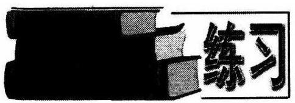

1. 求证:

(1)函数 $f\left( x\right)  = \frac{1}{3} - \frac{1}{4}{x}^{4}$ 是偶函数；

(2)函数 $f\left( x\right)  = 3{x}^{5} - {x}^{3}$ 是奇函数.

2 判断下列函数的奇偶性:

(1) $f\left( x\right)  = x + \frac{1}{x}$ ；

(2) $f\left( x\right)  = {2x} - \sqrt[3]{x}$ ；

(3) $f\left( x\right)  = \frac{1 + x}{1 - x}$ .

3. 若 $a > 0, a \neq  1, F\left( x\right)$ 为奇函数， $G\left( x\right)  = F\left( x\right) \left\lbrack  {\frac{1}{{a}^{x} - 1} + \frac{1}{2}}\right\rbrack$ ，试判断 $G\left( x\right)$ 的奇偶性.

4. 设 $f\left( x\right) , g\left( x\right)$ 为定义域分别是 ${D}_{1},{D}_{2}$ 的奇函数,求证: 在 ${D}_{1} \cap  {D}_{2}$ 上, $f\left( x\right)  \cdot  g\left( x\right)$ 为偶函数.

5. 若函数 $f\left( x\right)$ 的定义域关于原点对称,则 $f\left( x\right)$ 可以表示成一个奇函数与一个偶函数的和.

6. 已知 $f\left( x\right)$ 是奇函数，且当 $x > 0$ 时， $f\left( x\right)  = x\left| {x - 2}\right|$ ，求 $x < 0$ 时， $f\left( x\right)$ 的解析式.

7. 已知 $y = f\left( x\right)$ 是奇函数，它在 $\left( {0, + \infty }\right)$ 上是增函数，且 $f\left( x\right)  < 0$ . 问 $F\left( x\right)  = \; \frac{1}{f\left( x\right) }$ 在 $\left( {-\infty ,0}\right)$ 上是增函数还是减函数? 证明你的结论.

8. 判断函数 $g\left( x\right)  = \frac{1}{2} + \frac{1}{{a}^{x} - 1}\left( {a > 0, a \neq  1}\right)$ 的奇偶性.

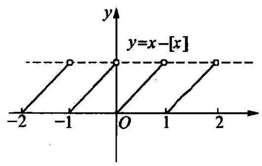

图 2-14

### 2.7 函数的周期性

我们在前面函数的图像这一节中曾经碰到过这样的一个函数 $f\left( x\right)  = x - \left\lbrack  x\right\rbrack  ,({2.4}$ 练习第 2 题),其图像如下: (图 2-14).

从图像中,我们可以发现,其图像每隔一个单位便重复、周期性地出现. 即 $f\left( \frac{1}{2}\right)  = \; f\left( \frac{3}{2}\right)  = f\left( \frac{5}{2}\right)  = f\left( {-\frac{1}{2}}\right)  = \cdots , f\left( \frac{1}{3}\right)  = f\left( \frac{4}{3}\right)  = f\left( \frac{7}{3}\right)  = f\left( {-\frac{2}{3}}\right)  = \cdots .$

类似于这样的函数,我们今后还会碰到.

定义 设有函数 $y = f\left( x\right)$ ,如果存在一个非零常数 $T$ ,使得 $x$ 取定义域内的任何值时, $f\left( {x + T}\right)  = f\left( x\right)$ 总成立,那么就把函数 $y = f\left( x\right)$ 叫做周期函数,非零常数 $T$ 叫做这个函数的周期.

若在函数 $y = f\left( x\right)$ 的所有周期内存在一个最小的正数,那么这个最小的正数称为函数 $y = f\left( x\right)$ 的最小正周期.

有关周期的定义，我们应注意以下几点:

(1)周期函数的定义域必须是无限延伸的(可能有间断点),否则 $f\left( {x + T}\right)$ (T≠0)不全存在.

(2)如果 $T\left( {T \neq  0}\right)$ 是函数 $y = f\left( x\right)$ 的一个周期，那么 ${kT}\left( {k \in  \mathbf{Z}, k \neq  0}\right)$ 都是 $y = f\left( x\right)$ 的周期.

(3)一个函数是周期函数，它并不一定有最小正周期. 如

$D\left( x\right)  = \left\{  \begin{array}{l} 1,\text{ 若 }x\text{ 是有理数; } \\  0,\text{ 若 }x\text{ 是无理数. } \end{array}\right.$

容易发现,任何正的有理数都是 $D\left( x\right)$ 的周期,所以 $D\left( x\right)$ 没有最小正周期.

这个函数称之为“狄利克莱函数”, 在高等数学中经常出现.

(4)一般说来，函数的周期一般是指最小正周期.

例 1 设有函数 $y = f\left( x\right) \left( {x \in  \mathbf{R}}\right)$ ,证明: 若它的图像关于两条直线 $x = a$ 及 $x = b\left( {b \neq  a}\right)$ 对称,则 $f\left( x\right)$ 是一个周期函数.

证: 设 $P\left( {{x}_{0}, f\left( {x}_{0}\right) }\right)$ 是函数图像上任一点,则此点关于直线 $x = a$ 对称的点 ${P}^{\prime }\left( {{2a} - {x}_{0}f\left( x\right) }\right)$ 而由已知 $y = f\left( x\right)$ 的图像关于直线 $x = a$ 对称,于是 ${P}^{\prime }$ 也在 $y = \; f\left( x\right)$ 的图像上,则 $f\left( {{2a} - {x}_{0}}\right)  = f\left( x\right)$ . 同理 $f\left( {x}_{0}\right)  = f\left( {{2b} - {x}_{0}}\right)$ .

$\therefore f\left( {{2a} - {x}_{0}}\right)  = f\left( {{2b} - {x}_{0}}\right)$ .

令 ${T}_{0} = {2a} - {x}_{0}$ ,则由 ${x}_{0}$ 为任意的,知 ${T}_{0}$ 也为任意的. $- {x}_{0} = {T}_{0} - {2a},{2b} - {x}_{0} \; = {2b} + \left( {{T}_{0} - {2a}}\right)  = {2b} - {2a} + {T}_{0}.$

$\therefore f\left( {T}_{0}\right)  = f\left( {{2b} - {2a} + {T}_{0}}\right)$ .

故 $y = f\left( x\right)$ 是以 ${2b} - {2a}$ 为周期的周期函数.

例 2 设 $a$ 是大于 0 的实数, $f\left( x\right)$ 是定义在全体实数 $x$ 上的一个实函数,并且对每一个实数 $x$ 满足条件:

$$
f\left( {x + a}\right)  = \frac{1}{2} + \sqrt{f\left( x\right)  - {\left\lbrack  f\left( x\right) \right\rbrack  }^{2}},
$$

试证明: $f\left( x\right)$ 是周期函数.

证: $f\left( {x + {2a}}\right)  = f\left( {x + a + a}\right)  = \frac{1}{2} + \sqrt{f\left( {x + a}\right)  - {\left\lbrack  f\left( x + a\right) \right\rbrack  }^{2}}$ ,而

$$
f\left( {x + a}\right)  - {\left\lbrack  f\left( x + a\right) \right\rbrack  }^{2} = \frac{1}{2} + \sqrt{f\left( x\right)  - {\left\lbrack  f\left( x\right) \right\rbrack  }^{2}} - {\left\lbrack  \frac{1}{2} + \sqrt{f\left( x\right)  - {\left\lbrack  f\left( x\right) \right\rbrack  }^{2}}\right\rbrack  }^{2}
$$

$$
= \frac{1}{2} + \sqrt{f\left( x\right)  - {\left\lbrack  f\left( x\right) \right\rbrack  }^{2}} - \frac{1}{4} - \sqrt{f\left( x\right)  - {\left\lbrack  f\left( x\right) \right\rbrack  }^{2}}
$$

$$
- \left( {f\left( x\right)  - {\left\lbrack  f\left( x\right) \right\rbrack  }^{2}}\right)
$$

$$
= \frac{1}{4} - \left( {f\left( x\right)  - {\left\lbrack  f\left( x\right) \right\rbrack  }^{2}}\right)
$$

$$
= {\left( f\left( x\right)  - \frac{1}{2}\right) }^{2}\text{ . }
$$

而 $f\left( x\right)  \geq  \frac{1}{2}$ ,故 $f\left( {x + {2a}}\right)  = \frac{1}{2} + f\left( x\right)  - \frac{1}{2} = f\left( x\right)$ ,所以 $f\left( x\right)$ 是以 ${2a}$ 为周期的周期函数.

例 3 设 ${f}_{1}\left( x\right) ,{f}_{2}\left( x\right)$ 定义在公共集合上,且分别是以 ${T}_{1},{T}_{2}$ 为正周期的函数, $\frac{{T}_{1}}{{T}_{2}} = \frac{q}{P}$ ,则 ${f}_{1}\left( x\right)  \pm  {f}_{2}\left( x\right) ,{f}_{1}\left( x\right)  \cdot  {f}_{2}\left( x\right) ,\frac{{f}_{1}\left( x\right) }{{f}_{2}\left( x\right) }\left( {{f}_{2}\left( x\right)  \neq  0}\right)$ 均是以 $P{T}_{1}$ 为周期的函数.

证: 令 $T = P{T}_{1} = q{T}_{2}$ ,则

$$
{f}_{1}\left( {x + T}\right)  \pm  {f}_{2}\left( {x + T}\right)
$$

$$
= {f}_{1}\left( {x + P{T}_{1}}\right)  \pm  {f}_{2}\left( {x + q{T}_{2}}\right)
$$

$$
= {f}_{1}\left( x\right)  \pm  {f}_{2}\left( x\right) \text{ . }
$$

所以， $T = P{T}_{1}$ 是 ${f}_{1}\left( x\right)  \pm  {f}_{2}\left( x\right)$ 的周期.

同理可证其他几个结论(同学们自己完成).

说明: 命题中 ${T}_{1},{T}_{2}$ 都是这函数的最小正周期,并不见得 $P{T}_{1}$ 是它们的和、 差、积、商的最小正周期.

如: ${f}_{1}\left( x\right)  = \left| {\sin x}\right| ,{f}_{2}\left( x\right)  = \left| {\cos x}\right|$ 的最小正周期均为 $\pi$ ,但 $P{T}_{1} = \pi$ 并不是它们和、差、积的最小正周期, $\frac{\pi }{2}$ 才是.

1. 若函数 $y = f\left( x\right) \left( {x \in  \mathbf{R}}\right)$ 的图像关于直线 $x = a$ 及点 $\left( {b, c}\right) \left( {b \neq  a}\right)$ 对称,试证: $y = f\left( x\right)$ 是周期函数.

2. 设 $f\left( x\right)$ 是定义在 $\mathbf{R}$ 内,以 2 为周期的函数,当 $x \in  \left\lbrack  {-1,1}\right\rbrack$ 时, $f\left( x\right)  = {x}^{2}$

(1)求 $x \in  \left\lbrack  {1,3}\right\rbrack$ 时， $f\left( x\right)$ 的解析式;

(2)求 $f\left( {-3}\right)$ 的值. $f\left( {0 + x}\right) g\left( {1/0 - x}\right)$

3. 设 $f\left( x\right)$ 是定义在实数集 $\mathbf{R}$ 上的函数,且满足: $f\left( {{10} + x}\right)  = f\left( {{10} - x}\right)$ , $f\left( {{20} + x}\right)  =  - f\left( {{20} - x}\right)$ ,证明: $f\left( x\right)$ 是奇函数,且 $f\left( x\right)$ 是周期函数.

4. 设 $f$ 是一个从实数集 $\mathbf{R}$ 映射到自身的函数,并且对任何 $x \in  \mathbf{R}$ 都有 $\left| {f\left( x\right) }\right|  \leq  1$ ,以及 $f\left( {x + \frac{13}{42}}\right)  + f\left( x\right)  = f\left( {x + \frac{1}{6}}\right)  + f\left( {x + \frac{1}{7}}\right)$ . 证明: (1) $f(x +$ 1) $- f\left( x\right)  = f\left( {x + 2}\right)  - f\left( {x + 1}\right)$ ; (2) $f\left( x\right)$ 为周期函数.

5. 函数 $f\left( x\right)$ 的定义域关于原点对称，但不包括 0，对定义域中任意数 $x$ ，在定义域中存在 ${x}_{1},{x}_{2}$ ,使 $x = {x}_{1} - {x}_{2}, f\left( {x}_{1}\right)  \neq  f\left( {x}_{2}\right)$ ,且满足以下三个条件: (1) ${x}_{1},{x}_{2}$ 是定义域的数， $f\left( {x}_{1}\right)  \neq  f\left( {x}_{2}\right)$ ，且 $0 < \left| {{x}_{1} - {x}_{2}}\right|  < {2a}$ ，则 $f\left( {{x}_{1} - {x}_{2}}\right)  = \; \frac{f\left( {x}_{1}\right) f\left( {x}_{2}\right)  + 1}{f\left( {x}_{2}\right)  - f\left( {x}_{1}\right) };\left( 2\right) f\left( a\right)  = 1\left( {a\text{ 是一个正的常数 }}\right) ;\left( 3\right)$ 当 $0 < x < {2a}$ 时， $f\left( x\right)  >$ 0. 证明: $f\left( t\right)  = \frac{1}{t}t + \Delta$ $\rightarrow  {\left( xy\right) }^{3}f\left( x\right)$ 是奇函数； $- \infty 2$ (2) ${f}_{s}\left( x\right)$ 是周期函数，并求出其周期；

(3) $f\left( x\right)$ 在 $\left( {0,{4a}}\right)$ 内为减函数. ${\sqrt{2}}^{4} - {\sqrt{2}}^{2}\sqrt{g}$

2.8 反函数

$- \frac{1}{2}L{\left( t - {1t}\right) }^{2}L$

$\frac{1}{2} < t < 3$

在研究一个问题时,常把两个变量 $x, y$ 之间的函数关系表示成 $y$ 是 $x$ 的函数 $y = f\left( x\right)$ ,但有时也需要把 $x$ 表示成 $y$ 的函数.

例如,在自由落体运动中,如果要由已知的时间 $t$ 来确定路程 $S$ ,那么就有函数 $S = \frac{1}{2}g{t}^{2}$ ,其中 $S$ 是 $t$ 的函数 $\left( {t \geq  0}\right)$ ,如果反过来由已知的路程 $S$ 来确定时间 $t$ , 那就要从上式解出函数 $\mathop{\bigcap }\limits_{{i = 1}}^{\infty }\overline{CS}$ ，这时 $t$ 是 $S$ 的函数 $\left( {S \geq  0}\right)$ .

可以看出,这两个函数 $S = f\left( t\right)  = \frac{1}{2}g{t}^{2}$ (定义域是 $\lbrack 0, + \infty )$ ,值域是 $\lbrack 0, + \infty )$ 和 $t = h\left( S\right)  = \sqrt{\frac{2S}{g}}$ (定义域是 $\lbrack 0, + \infty )$ ,值域是 $\lbrack 0, + \infty )$ )实际上是同一种关系的两种表示,用映射的关点来看,确定函数 $S = f\left( t\right)  = \frac{1}{2}g{t}^{2}$ 的是一个由 $\lbrack 0, + \infty )$ 到 $\lbrack 0, + \infty )$ 的一一映射 $f$ ,映射 $h$ 也是一个由 $\lbrack 0, + \infty )$ 到 $\lbrack 0, + \infty )$ 的一一映射,由它又确定了函数 $t = h\left( S\right)  = \sqrt{\frac{2S}{g}}$ . 我们把这样的两个函数 $f$ 和 $h$ 叫做互为反函数，其中的一个函数叫做另一个函数的反函数.

定义 设函数 $y = f\left( x\right)$ 的定义域是 $A$ ,值域是 $f\left( A\right) .\left( 1\right)$ 如果 $f : A \rightarrow  f\left( A\right)$ 是一一映射,那么, $\forall y \in  f\left( A\right)$ ,有且仅有惟一的关于 $f$ 的原像 $x \in  A$ 与之对应, 这样确定的由 $f\left( A\right)$ 到 $A$ 的映射,就称为映射 $f$ 的逆映射,记作 ${f}^{-1} : f\left( A\right)  \rightarrow  A$ . (2)逆映射 ${f}^{-1} : f\left( A\right)  \rightarrow  A$ 所确定的函数叫做函数 $y = f\left( x\right)$ 的反函数，记作 $x = \; {f}^{-1}\left( y\right)$ . 它的定义域为 $f\left( A\right)$ ,值域为 $A$ .

由此可知，当且仅当映射 $f$ 是一一映射时，它才有逆映射 ${f}^{-1}$ . 显然， ${f}^{-1}$ 也是一一映射,它也有逆映射 $f$ . 因而,映射 $f$ 与 ${f}^{-1}$ 互为逆映射. 可见,函数 $y = \; f\left( x\right)$ 与函数 $x = {f}^{-1}\left( y\right)$ 互为反函数. 由于习惯上常用 $x$ 表示自变量, $y$ 表示函数,因而在函数 $x = {f}^{-1}\left( y\right)$ 的表达式中,一般都还要对调字母 $x$ 和 $y$ ,把它改写成 $y = {f}^{-1}\left( x\right)$ .

例 1 判断下列函数是否有反函数,若有,求出它的反函数; 若不存在,说明原因.

(1) $y = {x}^{2}$ ；

(2) $y = {x}^{2}$ ， $x \in  \left( {-\infty ,0}\right)$ ；

(3) $y = \sqrt{x}$ .

解:(1)不存在反函数. 这是因为 $y = {x}^{2}$ 不是一一映射，如同一个 $y$ 值， ${y}_{0} =$ 4，有两个 $x$ 值 $\pm  2$ ，与之对应.

(2) $y = {x}^{2}, x \in  ( - \infty ,0\rbrack$ 存在反函数.

函数 $y = {x}^{2}, x \in  ( - \infty ,0\rbrack$ 的值域是 $\lbrack 0, + \infty )$ .

解关于 $x$ 的方程 $y = {x}^{2}, x \in  ( - \infty ,0\rbrack$ ,得 $x =  - \sqrt{y}, y \in  \lbrack 0, + \infty )$ .

所以,函数 $y = {x}^{2}, x \in  ( - \infty ,0\rbrack$ 的反函数是 $y =  - \sqrt{x}, x \in  \lbrack 0, + \infty )$ .

(3) $y = \sqrt{x}$ 的定义域是 $\{ x \mid  x \geq  0\}$ ，值域是 $\{ y \mid  y \geq  0\}$ .

1 $f\left( x\right)  = \sqrt{a{x}^{2} + b}$ 奇 ${f}^{\prime }\left( x\right)$ 都延 1， $2{f}^{\prime }\left( x\right)$ 与 $f\left( x\right)$ 无偏点的个数为3. 2. 函数 $f\left( x\right)  = \sqrt{x - a}$ (图 $a$ )的图像与仅近似的图像有公共点家数a的取值范围是

由 $y = \sqrt{x}$ ,得 $x = {y}^{2}$ ,

所以，函数 $y = \sqrt{x}$ 的反函数是: $y = {x}^{2}, x \geq  0$ .

说明:一般说来，求反函数的步骤如下:

① 求函数 $y = f\left( x\right)$ 的值域；

② 由 $y = f\left( x\right)$ 解出 $x = {f}^{-1}\left( y\right)$ ;

③ 在 $x = {f}^{-1}\left( y\right)$ 中，将 $x$ ， $y$ 互换得到 $y = {f}^{-1}\left( x\right)$ ；

④ 标明反函数的定义域，即①中求出的值域.

例 2 求函数 $y = \sqrt{1 + x}$ 的反函数，并在同一坐标系中画出它们的图像，并注意观察这二者图像之间的关系.

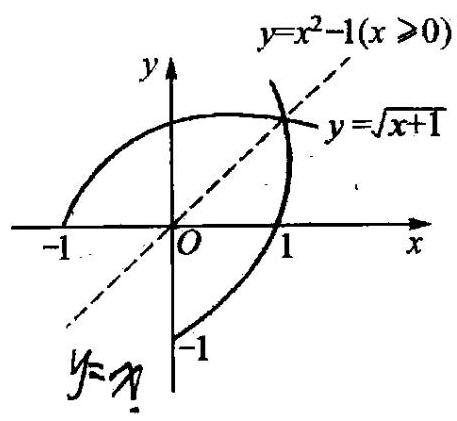

图 2-15

解:函数 $y = \sqrt{1 + x}$ 的定义域是 $\{ x \mid  x \geq   - 1\}$ ， 值域是 $\{ y \mid  y \geq  0\}$ .

由 $y = \sqrt{1 + x}$ ,有 $x = {y}^{2} - 1$ ,

所以，函数 $y = \sqrt{1 + x}$ 的反函数是 $y = {x}^{2} - 1(x \; \geq  0)$ .

由图 2-15 可知,它们的图像关于直线 $y = x$ 对称.

其实, 上述对称现象并不是偶然的, 更一般地, 任何两个互为反函数的图像都有这种特性. 即:

互为反函数的两个函数的图像关于直线 $y = x$ 是对称的.

证: 事实上,如果点 $\left( {a, b}\right)$ 在 $y = f\left( x\right)$ 的图像上,那么点 $\left( {b, a}\right)$ 就在 $y = {f}^{-1}\left( x\right)$ 的图像上. 这是因为点 $\left( {a, b}\right)$ 在 $y = f\left( x\right)$ 的图像上,即 $b = f\left( a\right)$ ,而这一等式又可以写为 $a = {f}^{-1}\left( b\right)$ ,所以,点 $\left( {b, a}\right)$ 在函数 $y = {f}^{-1}\left( x\right)$ 的图像上.

这样一来,当点 $\left( {a, b}\right)$ 走遍 $y = f\left( x\right)$ 的图像时,点 $\left( {b, a}\right)$ 相应地走遍 $y = {f}^{-1}\left( x\right)$ 的图像. 易知,点 $\left( {a, b}\right)$ 与点 $\left( {b, a}\right)$ 关于直线 $y = x$ 是对称的. 因此,函数 $y = f\left( x\right)$ 与它的反函数 $y = {f}^{-1}\left( x\right)$ 的图像关于直线 $y = x$ 对称.

利用这一结论,为得到反函数 $y = {f}^{-1}\left( x\right)$ 的图像,只要作函数 $y = f\left( x\right)$ 的图像关于直线 $y = x$ 的对称图形即可.

另外,我们说,如果有两个函数的图像是关于直线 $y = x$ 对称的,那么,这两个函数一定互为反函数. 即它们之间是互为充分必要条件.

原函数与反函数之间除了上述性质之外, 还有另一个更重要的性质:

若函数 $y = f\left( x\right)$ 在它的定义域上是单调减 (增) 函数. 则它有反函数,且它的反函数 $y = {f}^{-1}\left( x\right)$ 也是单调减 (增) 函数.

关于这一性质的证明, 留作同学们作业.

设函数 $y = f\left( x\right)$ 的定义域为 $A$ ,值域为 $C$ ,则 $y = f\left( x\right)$ 与 $y = {f}^{-1}\left( x\right)$ 的对应法则 $f$ 与 ${f}^{-1}$ 之间有关系: $f\left\lbrack  {{f}^{-1}\left( x\right) }\right\rbrack   = x, x \in  C,{f}^{-1}\left\lbrack  {f\left( x\right) }\right\rbrack   = x, x \in  A$ .

例 $3/$ 已知 $f\left( x\right)  = {x}^{2} - 1\left( {x \leq   - 2}\right)$ ,求 ${f}^{-1}\left( 4\right)$ .

分析:本题可先求 $f\left( x\right)$ 的反函数， ${f}^{-1}\left( x\right)$ 再令 $x = 4$ . 但若不求出反函数，利用上述关系:“4”是原函数的一个函数值.

解: 在 $f\left( x\right)  = {x}^{2} - 1$ 中,令 $f\left( x\right)  = 4$ ,得 ${x}^{2} - 1 = 4$ ,解得 $x =  \pm  \sqrt{5}$ .

又 $x \leq   - 2$ ,所以, ${f}^{-1}\left( 4\right)  =  - \sqrt{5}$ .

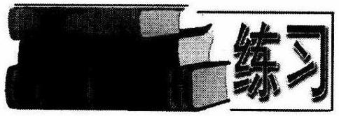

1. 求出下列函数的反函数:

(1) $f\left( x\right)  = {x}^{2} + 1, x \in  \lbrack 0, + \infty )$ ；

(2) $h\left( x\right)  = \sqrt{4 - {x}^{2}}, x \in  \left\lbrack  {0,2}\right\rbrack$ ；

(3) $f\left( x\right)  = {2x} - 3$ .

2. 已知函数 $g\left( x\right)  = \frac{{ax} - 4}{x + b}$ 的反函数是 ${g}^{-1}\left( x\right)  = \frac{{3x} + c}{-x + 2}$ ,求实数 $a, b, c$ 的值.

3. 已知函数

$$
f\left( x\right)  = \left\{  \begin{array}{l}  - x, x \geq  0; \\  {x}^{2}, x < 0. \end{array}\right.
$$

试求反函数 ${f}^{-1}\left( x\right)$ 的表达式.

4. 求证: 若函数 $y = f\left( x\right)$ 在它的定义域上是单调减函数,则它有反函数; 且它的反函数 $y = {f}^{-1}\left( x\right)$ 也是单调减函数.

5. 已知函数 $y = \frac{x - 5}{{2x} - m}$ 的图像关于直线 $y = x$ 对称，求实数 $m$ 的值.

6. 若点 $\left( {2,3}\right)$ 既在 $y = \sqrt{{ax} + b}$ 的图像上，又在其反函数的图像上，求 $a, b$ 的值.

7. 已知 $f\left( x\right)  = {3x} - 9$ ,求 ${f}^{-1}\left( 5\right)$ 的值.

## 三、初等函数模型

### 2.9 幂函数

我们在以后的学习中,会经常碰到诸如这些类型的函数: $y = x, y = {x}^{\frac{1}{2}}, y = \; {x}^{3}, y = {x}^{-1}$ . 下面,我们结合前面学习过的函数的基本性质,从定义域、值域、图像、 单调性、奇偶性等方面加以考察,分两种情况探讨它们的性质.

一般地，函数 $y = {x}^{\alpha }$ 叫做幂函数，其中 $x$ 是自变量， $\alpha$ 是常数(这里我们只讨论 $\alpha$ 是有理数的情况).

例 1 在同一坐标轴中,分别画出 $y = {x}^{\frac{1}{3}}, y = {x}^{\frac{1}{2}}, y = {x}^{\frac{1}{2}}, y = x, y = {x}^{2}, y = {x}^{3}$ 的图像, 并注意观察它们有何共同性质.

解: 我们用列表法先画出 $y = {x}^{\frac{1}{3}}$ ,见下表:

<table><tr><td>$x$</td><td>-3</td><td>-2</td><td>-1</td><td>0</td><td>1</td><td>2</td><td>3</td><td>...</td></tr><tr><td>${x}^{\frac{1}{3}}$</td><td>-2</td><td>-1.260</td><td>-1</td><td>0</td><td>1</td><td>1.260</td><td>1.442</td><td>...</td></tr></table>

用描点法将这些点描出来,并用光滑曲线将它们联结起来,得到如图 2-16 所示的形状 (虚线). 同理,其他函数图像也可作出.

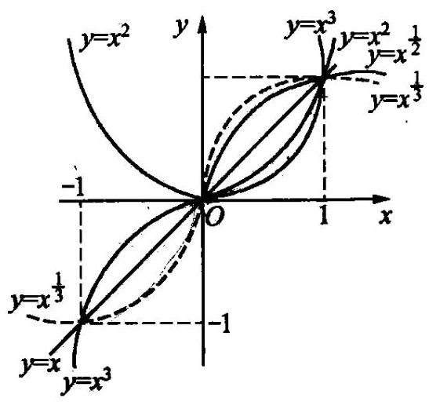

图 2-16

由右图不难发现, $\alpha  > 0$ 时, $y = {x}^{\alpha }$ 有下列性质:

(1)图像都过点 $\left( {0,0}\right) ,\left( {1,1}\right)$ ;

(2)在第一象限内，函数值随 $x$ 的增大而增大，即在 $\left( {0, + \infty }\right)$ 上是增函数.

(3)在第一象限内，以 $y = x$ 为“分界线”， $a > 1$ 时，图像向 $y$ 轴方向弯曲，且 $a$ 值越大，图像愈靠近 $y$ 轴的正半轴； $0 < \alpha  < 1$ 时，图像向 $x$ 轴方向弯曲,且 $\alpha$ 值愈小,图像愈靠近 $x$ 轴.

例 2 在同一坐标系中,作出 $y = {x}^{-2}, y = {x}^{-1}, y = {x}^{-\frac{1}{2}}$ 的图像,并注意观察有什么特点.

解:仿例 1 列表、描点，我们可得到图 2-17.

图 2-17

由右图不难知，当 $\alpha  < 0$ 时，幂函数 $y = \; {x}^{\alpha }$ 有下列性质:

(1)图像都通过点 $\left( {1,1}\right)$ ；

(2)在第一象限内，函数值随着 $x$ 的增大而减小,即在 $\left( {0, + \infty }\right)$ 上是减函数;

(3)在第一象限内，图像向上与 $y$ 轴无限地接近,向右与 $x$ 轴无限地接近.

例 3 比较下列各组数的大小:

(1) ${1.3}^{-\frac{1}{2}},0.{8}^{-\frac{1}{2}},1$ ;

(2) ${\left( -\frac{\sqrt{2}}{2}\right) }^{-\frac{2}{3}},{\left( -\frac{10}{7}\right) }^{\frac{2}{3}},{\left( -{1.1}\right) }^{-\frac{4}{3}}$ .

解:(1)考察幂函数 $y = {x}^{-\frac{1}{2}}$ ，它在 $\left( {0, + \infty }\right)$ 上是减函数，且 $0 < 0.8 < 1 < 1.3$ .

所以 ${0.8}^{-\frac{1}{2}} > {1}^{-\frac{1}{2}} > {1.3}^{-\frac{1}{2}}$ .

即 ${0.8}^{-\frac{1}{2}} > 1 > {1.3}^{-\frac{1}{2}}$ .

(2)本题中每个幂的底都是负数，指数也不相同，为利用幂函数的性质，首先设法统一指数，然后再将底数化为正数，最后进行大小的比较.

$$
{\left( -\frac{\sqrt{2}}{2}\right) }^{-\frac{2}{3}} = {\left( \frac{\sqrt{2}}{2}\right) }^{-\frac{2}{3}}
$$

$$
{\left( -\frac{10}{7}\right) }^{\frac{2}{3}} = {\left( -\frac{7}{10}\right) }^{-\frac{2}{3}} = {\left( \frac{7}{10}\right) }^{-\frac{2}{3}},
$$

$$
{\left( -{1.1}\right) }^{-\frac{4}{3}} = {\left( {1.1}^{2}\right) }^{-\frac{2}{3}} = {1.21}^{-\frac{2}{3}}.
$$

幂函数 $y = {x}^{-\frac{2}{3}}$ 在 $\left( {0, + \infty }\right)$ 上是减函数, $\frac{7}{10} < \frac{\sqrt{2}}{2} < {1.21}$ .

$$
\therefore {\left( \frac{7}{10}\right) }^{-\frac{2}{3}} > {\left( \frac{\sqrt{2}}{2}\right) }^{-\frac{2}{3}} > {1.21}^{-\frac{2}{3}}\text{ , }
$$

即

$$
{\left( -\frac{10}{7}\right) }^{\frac{2}{3}} > {\left( -\frac{\sqrt{2}}{2}\right) }^{-\frac{2}{3}} > {\left( -{1.1}\right) }^{-\frac{4}{3}}.
$$

我们说,幂函数 $y = {x}^{\alpha }$ 随 $\alpha$ 的不同,其定义域、值域、单调性、奇偶性等都有较大的差异, 因此对幂函数的研究往往是从具体的函数入手 (课后练习).

作为本节内容的结束, 我们讨论一类特殊幂函数的奇偶性和单调性.

例 4 讨论函数 $y = {x}^{n}\left( {n \in  \mathbf{N}}\right)$ 的奇偶性和单调性.

解:(1)显然， $n \in  \mathbf{N}$ 时， $y = {x}^{n}$ 的定义域是 $\mathbf{R}$ ，关于原点对称，且易得:

$n$ 为奇数时, $f\left( x\right)$ 为奇函数; $n$ 为偶数时, $f\left( x\right)$ 为偶函数.

(2)设 ${x}_{1} < {x}_{2}$ ，则

$$
{x}_{2}^{n} - {x}_{1}^{n} = \left( {{x}_{2} - {x}_{1}}\right) \left( {{x}_{1}^{n + 1} + {x}_{1}^{n - 2}{x}_{2} + \cdots  + {x}_{2}^{n - 1}}\right) .
$$

把上式右端第 2 个因式记为 $A$ .

当 ${x}_{1} \geq  0$ 时, ${x}_{2} > 0, A > 0$ ,故在 $\lbrack 0, + \infty )$ 上 $f\left( {x}_{2}\right)  > f\left( {x}_{1}\right)$ .

当 ${x}_{2} \leq  0$ 时, ${x}_{1} < 0$ 若 $n$ 是奇数,则 ${x}_{1}^{n - 1} > 0,{x}_{1}^{n - 2}{x}_{2} \geq  0,\cdots ,{x}_{1}^{n - 1} \geq  0$ .

$\therefore A > 0$ ,故在 $\left( {-\infty ,0\rbrack \text{ 上 }f\left( {x}_{2}\right)  > f\left( {x}_{1}\right) \text{ ; 若 }n\text{ 是偶数,则 }A < 0\text{ ,故在 }}\right) \; ( - \infty ,0\rbrack$ 上 $f\left( {x}_{2}\right)  < f\left( {x}_{1}\right)$ .

当 ${x}_{1} < 0 < {x}_{2}$ 时,若 $n$ 是奇数,则从上述证明有 $f\left( {x}_{1}\right)  < f\left( 0\right)  < f\left( {x}_{2}\right)$ ; 若 $n$ 是偶数,则 $A$ 的符号不确定.

综上所述,当 $n$ 为奇数时, $f\left( x\right)  = {x}^{n}$ 在 $\mathbf{R}$ 上是增函数; 当 $n$ 为偶数时, $f\left( x\right)$ 在 $\lbrack 0, + \infty )$ 上是增函数，在 $( - \infty ,0\rbrack$ 上是减函数.

图 2-18

1. 如图 2-18, 所示的曲线是幂函数 $y = {x}^{n}$ 在第一象限的图像,已知 $n$ 取 $\pm  2, \pm  \frac{1}{2}$ 四个值,求相应于曲线 ${C}_{1},{C}_{2},{C}_{3},{C}_{4}$ 的 $n$ 值.

2. 将下表填充完整:

<table><tr><td>函数</td><td>$y = {x}^{0}$</td><td>$y = x$</td><td>$y = {x}^{2}$</td><td>$y = {x}^{3}$</td><td>$y = {x}^{-1}$</td><td>$y = {x}^{-2}$</td><td>$y = {x}^{\frac{1}{2}}$</td><td>$y = {x}^{-\frac{1}{2}}$</td><td>$y = {x}^{\frac{2}{3}}$</td><td>${y}^{-\frac{1}{3}}$</td></tr><tr><td>定义域</td><td></td><td></td><td></td><td></td><td></td><td></td><td></td><td></td><td></td><td></td></tr><tr><td>值域</td><td></td><td></td><td></td><td></td><td></td><td></td><td></td><td></td><td></td><td></td></tr><tr><td>图像形状</td><td></td><td></td><td></td><td>立方抛物线</td><td></td><td></td><td>抛物线</td><td>双曲线</td><td>抛物线</td><td>双曲线</td></tr><tr><td>单调性</td><td>常数 1</td><td></td><td></td><td></td><td>片</td><td></td><td></td><td></td><td></td><td></td></tr><tr><td>奇偶性</td><td></td><td></td><td></td><td></td><td></td><td></td><td></td><td></td><td></td><td></td></tr></table>

3 函数 $y = \left( {{m}^{2} - m - 1}\right) {x}^{{m}^{2} - {2m} - 1}$ 是幂函数，求 $m$ 的值.

4. 讨论幂函数 $y = {x}^{\alpha }$ ( $\alpha$ 是有理数) 的定义域.

5. 已知 ${\left( \alpha  + 1\right) }^{-\frac{1}{3}} < {\left( 3 - 2\alpha \right) }^{-\frac{1}{3}}$ ,求实数 $\alpha$ 的取值范围.

### 2.10 指数函数

定义 我们把形如 $y = {a}^{x}\left( {a > 0\text{ ,且 }a \neq  1}\right)$ 的函数叫做指数函数.

注意,这里的 $a$ 是一个常数. 如函数 $y = {2}^{x}, y = {\left( \frac{1}{3}\right) }^{x}$ 等等都是指数函数. 下面，我们来画出这两个函数的图像.

不难由描点法得出这二者的图像如下(图 2-19):

图 2-19

更一般地，指数函数有如下性质:

(1)定义域是 $\mathbf{R}$ ；(✗)即值充围 )

(2)值域是: $\left\lbrack  {0, + \infty }\right)$ ； $\left| y\right|$ 的原因范围)

(3)单调性: $a > 1$ 时，在 $\mathbf{R}$ 上是增函数； $0 < a < 1$ 时，在 $\mathbf{R}$ 上是减函数.

(4)当 $x = 0$ 时, $y = 1$ ，故其图像始终过点 $\left( {0,1}\right)$ .

(5) 当 $a > 1$ 时:当 $x > 0$ 时， $y > 1$ ； $x < 0$ 时， $0 < y < 1$ . 当 $0 < a < 1$ 时:当 $x >$ 0 时, $0 < y < 1;x < 0$ 时, $y > 1$ .

思考: 为什么在指数函数的定义中规定 $a > 0$ ,且 $a \neq  1$ ?

我们在前面刚学习过幂函数，注意它与这里的指数函数的区别: $y = {a}^{x}$ 与 $y = {x}^{\alpha }$ 的解析式都是幂的形式; 但指数函数中底数是常量,指数是变量; 而幂函数中底数是自变量, 指数是常量.

例 1 下列函数中, 哪些是指数函数, 哪些是幂函数, 哪些既不是幂函数也不是指数函数?

(1) $y = {\pi }^{x}$ ； (2) $y = {x}^{\frac{1}{2}}$ ； (3) $y =  - 3{x}^{2}$ ；

(4) $y = \sqrt[3]{x}$ ； (5) $y = {2}^{-x}$ ； (6) $y =  - {3}^{x}$ .

解: 指数函数有: $y = {\pi }^{x}, y = {2}^{-x}$ ;

幂函数有: $y = {x}^{\frac{1}{2}}, y = \sqrt[3]{x}$ ;

既不是幂函数也不是指数函数的有: $y =  - 3{x}^{2}, y =  - {3}^{x}$ .

有关单调性问题，根据上面指数函数性质的讨论，我们有:

(1)若 $a > 1$ ，则 ${a}^{f\left( x\right) } > {a}^{g\left( x\right) } \Leftrightarrow  f\left( x\right)  > g\left( x\right)$ ， ${a}^{f\left( x\right) } < {a}^{g\left( x\right) } \Leftrightarrow  f\left( x\right)  < g\left( x\right)$ .

(2)若 $0 < a < 1$ ，则 ${a}^{f\left( x\right) } > {a}^{g\left( x\right) } \Leftrightarrow  f\left( x\right)  < g\left( x\right)$ ， ${a}^{f\left( x\right) } < {a}^{g\left( x\right) } \Leftrightarrow  f\left( x\right)  > g\left( x\right)$ .

例 2 比较下列各组数的大小:

(1) ${1.1}^{1.3},{1.1}^{1.31}$ ;

(2) ${0.6}^{-{0.2}} \approx  {0.6}^{-{0.3}}$ ；

(3) ${0.2}{}^{0.3},{0.3}{}^{0.2}$ .

解:(1)指数函数 $y = {1.1}^{x}$ ，是 $\mathbf{R}$ 上的增函数， ${1.3} < {1.31}$ ，所以 ${1.1}^{1.3} < \; {1.1}^{1.31}$ .

(2)指数函数 $y = {0.6}^{x}$ 是 $\mathbf{R}$ 上的减函数， $- {0.2} >  - {0.3}$ ，所以 ${0.6}^{-{0.2}} < \; {0.6}^{-{0.3}}$ .

(3)我们通过找中间量的办法来进行比较:

0.2 ${}^{0.3} <$ 0.2 ${}^{0.2},$ 0.2 ${}^{0.2} <$ 0.3 ${}^{0.2}$ ，所以 ${0.2}{}^{0.3} <$ 0.3 ${}^{0.2}$ .

例3 解不等式 $0.{4}^{-{x}^{2}} + x > {\left( \frac{5}{2}\right) }^{x + 3}$ .

解: 原不等式可化为

即

$$
{\left( \frac{2}{5}\right) }^{-{x}^{2} + x} > {\left( \frac{5}{2}\right) }^{x + 3}
$$

$$
{\left( \frac{5}{2}\right) }^{{x}^{2} - x} > {\left( \frac{5}{2}\right) }^{x + 3}
$$

$$
{x}^{2} - x > x + 3, x > 3\text{ 或 }x <  - 1\text{ . }
$$

原不等式的解集为: $\{ x \mid  x > 3$ 或 $x <  - 1\}$ .

解 求函数 $y = {\left( \frac{1}{2}\right) }^{-{x}^{2} + {3x} - 9}$ 的单调递减区间.

解: 由复合函数及指数函数单调的知识,欲求 $y = {\left( \frac{1}{2}\right) }^{-{x}^{2} + {3x} - 9}$ 的单调递减区间，只求二次函数 $- {x}^{2} + {3x} - 9$ 的单调递增区间即可. 所求的区间即是 $\left( {-\infty ,\frac{3}{2}}\right)$ .

最后, 我们探讨有关指数方程问题: 一般说来, 指数方程大致有四种类型: (1) ${a}^{f\left( x\right) } = b;\left( 2\right) {a}^{f\left( x\right) } = {b}^{g\left( x\right) }\left( {a \neq  b}\right) ;\left( 3\right) {a}^{f\left( x\right) } = {a}^{g\left( x\right) };\left( 4\right) {a}^{2x} + p{a}^{x} + q =$ 0 . 这里我们只讲(3)、(4)，至于(1)，(2)则要到第 11 节中讲到对数以后，才可以做.

例5 解方程 ${2}^{x} \cdot  {5}^{x} = {0.1} \times  {\left( {10}^{{2x} - 1}\right) }^{3}$ .

解:原方程可化为 ${10}^{x} = {10}^{-1} \cdot  {10}^{{6x} - 3}$ ,

即

$$
{10}^{x} = {10}^{{6x} - 4}, x = {6x} - 4,
$$

$$
x = \frac{4}{5}.
$$

例 6 解方程 $2\left( {{4}^{x} + {4}^{-x}}\right)  - 7\left( {{2}^{x} + {2}^{-x}}\right)  + {10} = 0$ .

解: 令 ${2}^{x} + {2}^{-x} = t\left( {t > 0}\right)$ ,则 ${4}^{x} + {4}^{-x} = {\left( {2}^{x} + {2}^{-x}\right) }^{2} - 2 = {t}^{2} - 2$ ,原方程化为 $2\left( {{t}^{2} - 2}\right)  - {7t} + {10} = 0$ ,即 $2{t}^{2} - {7t} + 6 = 0$ .

解得 $t = 2$ 或 $t = \frac{3}{2}$ .

若 $t = 2$ ,则 ${2}^{x} + {2}^{-x} = 2$ ,即 ${2}^{2x} - 2 \cdot  {2}^{x} + 1 = 0,{\left( {2}^{x} - 1\right) }^{2} = 0$ ,从而 $x = 0$ .

若 $t = \frac{3}{2}$ ,则 ${2}^{x} + {2}^{-x} = \frac{3}{2}$ .

即 ${2}^{2x} - \frac{3}{2} \cdot  {2}^{x} + 1 = 0$ ,此方程没有实数解.

所以，原方程的根为 $x = 0$ .

1. 化较下列各组数的大小:

① $1{\left( \frac{2}{3}\right) }^{1.3},{\left( \frac{2}{3}\right) }^{1.31}$ ;

(2) ${0.9}^{-\frac{1}{3}},{0.9}^{-\frac{3}{10}}$ ；

(3) ${0.5}^{0.4},0.{4}^{0.5}$ .

2. 若对任意 $x \in  \mathbf{R}$ ，不等式 ${\left( \frac{1}{3}\right) }^{2{x}^{2} - {mx} + m + 4} < \frac{1}{3{x}^{2} + x}$ 恒成立，求实数 $m$ 的取值范围.

3. 求函数 $y = \left( \frac{2}{5}\right)$

4. 设函数 $f\left( x\right)  = {x}^{2} - {bx} + c$ 满足: $f\left( {1 + x}\right)  = f\left( {1 - x}\right) , f\left( 0\right)  = 3$ ,试比较:

$f\left( {b}^{x}\right)$ 与 $f\left( {c}^{x}\right)$ 的大小.

5. 已知 $f\left( x\right)  = \frac{{a}^{x}}{{a}^{x} + \sqrt{a}}\left( {a > 0}\right)$ ,求 $f\left( \frac{1}{101}\right)  + f\left( \frac{2}{101}\right)  + \cdots  + f\left( \frac{100}{101}\right)$ 的值.

6. 求函数 $y = {\left( \frac{1}{3}\right) }^{-{x}^{2} + {5x}}$ 的值域.

7. 设 $f\left( x\right)  = {2}^{x}, g\left( x\right)  = {x}^{2}$ ,解不等式 $f\left( {g\left( x\right) }\right)  < {3g}\left( {f\left( x\right) }\right)$ .

8. 解下列方程:

(1) $3\sqrt{{5x} - {2y}} + 5\sqrt{y - 5} = 2$ ;

(2) ${\left( \frac{8}{27}\right) }^{x - 2} \cdot  {\left( \frac{9}{4}\right) }^{{3x} + 1} = \frac{81}{16};\; -$

(3) $\frac{1 + {3}^{-x}}{1 + {3}^{x}} = 3$ . -1

2 4

$\left( {x - 1}\right) \left( {{2x} - a}\right)$

### 2.11 对数函数 对数

对数的定义

如果 ${a}^{b} = N\left( {a > 0, a \neq  1}\right)$ ,那么 $b$ 叫做以 $a$ 为底 $N$ 的对数,记作: $b = {\log }_{a}N$ , 其中 $a$ 叫做底数, $N$ 叫做真数.

例如, ${2}^{4} = {16}$ ,则 ${\log }_{2}{16} = 4,{3}^{\frac{1}{2}} = \sqrt{3}$ ,则 ${\log }_{3}\sqrt{3} = \frac{1}{2}$ .

下列几个恒等式是有用的:

① ${a}^{{\log }_{a}N} = N$ ；

② ${\log }_{a}{a}^{n} = n$ ；

③ ${\log }_{a}N = \frac{{\log }_{b}N}{{\log }_{b}a}$ (换底公式)；

④ ${\log }_{a}b = \frac{1}{{\log }_{b}a}$ ;

⑤ ${\log }_{a}M = {\log }_{a}{}^{n}{M}^{n}$ ;

⑥ $\frac{{\log }_{a}M}{{\log }_{a}N} = \frac{{\log }_{b}M}{{\log }_{b}N}$ .

这里我们只证明 3，即换底公式.

设 ${\log }_{b}N = x$ ， ${\log }_{b}a = y$ ，则 $N = {b}^{x}, a = {b}^{y}$ ， ${\log }_{a}N = {\log }_{{b}^{y}}{b}^{x} = \frac{x}{y} = \frac{{\log }_{b}N}{{\log }_{b}a}$ .

其他几个式子的证明, 同学们自己完成.

下面几个式子是对数的运算公式:

① ${\log }_{a}M \cdot  N = {\log }_{a}M + {\log }_{a}N$ ;

② ${\log }_{a}\frac{M}{N} = {\log }_{a}M - {\log }_{a}N$ ;

③ ${\log }_{a}{M}^{n} = n{\log }_{a}M$ ；

④ ${\log }_{a}\sqrt[n]{N} = \frac{1}{n}{\log }_{a}N$ .

这里我们也只证明①.

设 ${\log }_{a}M = x,{\log }_{a}N = y$ ,则 $M = {a}^{x}, N = {a}^{y}, M \cdot  N = {a}^{x} \cdot  {a}^{y} = {a}^{x + y}$ .

$$
{\log }_{a}{MN} = {\log }_{a}{a}^{x + y} = x + y = {\log }_{a}M + {\log }_{a}N.
$$

其他几个的证明,留给同学们作习题(见课后习题).

以 10 为底的对数又叫做常用对数, ${\log }_{10}N$ 记作 $\lg N$ ,即 ${\log }_{10}N = \lg N$ .

设 $\lg N = a$ ,则 $a$ 的整数部分称为首数,显然,大于 1 的数的对数,首数等于真数的整数部分的位数减去 1 ; 小于 1 的正数的对数,首数是负数,这负数的绝对值等于真数里第一个不是零的数字前连续所有零的个数(包括整数单位的一个零).

$a$ 的小数部分称为尾数. 只有小数点位置不同的数,它们的对数的尾数都相同.

例如 $\lg 2 \approx  {0.3010}$ ,首数是 0,尾数是 0.3010. $\lg {20} \approx  {1.3010}$ ,首数是 1,尾数是 0.3010. $\lg {0.2} \approx   - {0.6990}$ ,首数是-1,尾数是 0.3010. (注意,首数不是 0,尾数也不是-0.6990.)

以 $\mathrm{e} = {2.71828}\cdots$ 为底的对数叫做自然对数, ${\log }_{\mathrm{e}}N$ 记为 $\ln N.\mathrm{e}$ 是高等数学中出现的一个常数,它是一个极限. 即 $\mathop{\lim }\limits_{{n \rightarrow  \infty }}{\left( 1 + \frac{1}{n}\right) }^{n} = \mathrm{e}$ .

## 对数函数的定义

一般地，函数 $y = {\log }_{a}x$ ，(其中 $a$ 是常数， $a > 0$ ，且 $a \neq  1$ )叫做对数函数.

不难画出，对数函数的图像如下 (见图 2-20):

图 2-20

根据对数函数的图像，我们有如下性质:

(1)定义域: $\left( {0, + \infty }\right)$ ；

(2)值域: $\left( {-\infty , + \infty }\right)$ ；

(3) 单调性: $a > 1$ 时， $y = {\log }_{a}x$ 在 $\left( {0, + \infty }\right)$ 上是单调递增函数，当 $0 < a < 1$ 时， $y = {\log }_{a}x$ 在 $\left( {0, + \infty }\right)$ 上是单调减函数.

(4)当 $x = 1$ 时， $y = 0$ ，故函数的图像始终过点 $\left( {1,0}\right)$ .

(5)当 $a > 1$ 时,则 $x > 1$ 时, $y > 0;0 < x < 1$ 时, $y < 0$ .

当 $0 < a < 1$ 时,当 $x > 1$ 时, $y < 0;0 < x < 1$ 时, $y > 0$ .

根据上面我们提到的对数的定义,很容易证明: 对数函数 $y = {\log }_{a}x$ ( $a > 0$ ,且 $a \neq  1)$ 与指数函数 $y = {a}^{x}\left( {a > 0, a \neq  1}\right)$ 互为反函数. 由此有: 它们的图像关于直线 $y = x$ 对称 (图 2-21); 它们的定义域和值域恰好互换.

图 2-21

例 1 化简: ${\log }_{2}2 + {\log }_{5}1 - {3}^{2{\log }_{9}5} + {\left( {3}^{{\log }_{3}5}\right) }^{2} + {3}^{{\log }_{3}2}$ .

解:原式 $= 1 + 0 - {\left( {3}^{2}\right) }^{{\log }_{9}5} + {5}^{2} + 2$

$$
= 1 + 0 - 5 + {25} + 2
$$

$$
= {23}\text{ . }
$$

例 2 已知: ${2000}{}^{a} = {1000},{2}^{b} = {1000}$ ,求 $\frac{1}{a} - \frac{1}{b}$ 的值.

解: 由 ${2000}^{a} = {1000}$ ,对此式的两边同时取以 10 为底的常用对数有,

$$
a\lg {2000} = \lg {1000}, a\lg {2000} = 3. \tag{1}
$$

同理, ${2}^{b} = {1000}$ 有, $b\lg 2 = 3$ .(2)

由 (1) 得, $\frac{1}{a} = \frac{1}{3}\lg {2000}$ . 由 (2) 得 $\frac{1}{b} = \frac{1}{3}\lg 2$ . 所以 $\frac{1}{a} - \frac{1}{b} = \frac{1}{3}\left( {\lg {2000} - \lg 2}\right) \; = \frac{1}{3}\lg {1000} = 1$ .

例 3 比较下列各组数的大小:

(1) $\log \frac{1}{3}$ 0.7, $\log \frac{1}{3}$ 0.71;

(2) $\ln {1.1},\ln {1.11}$ .

解:(1)考察对数函数 $y = \log \frac{1}{3}x$ ，它是单调递减的函数，且 ${0.7} < {0.71}$ .

于是

$$
\log \frac{1}{3}{0.7} > \log \frac{1}{3}{0.71}\text{ . }
$$

(2)考察对数函数 $y = \ln x$ ,它是以 $\mathrm{e}\left( { \approx  {2.718}}\right)$ 为底的单调递增的函数,所以

$$
\text{ ln1. }1 < \ln {1.11}\text{ . }
$$

例 4 解不等式 ${\log }_{x}\left( {{2x} + 1}\right)  > {\log }_{x}2$ .

解: $x > 0$ ，且 $x \neq  1$ . 分类讨论如下:

(1)当 $0 < x < 1$ 时，原不等式等价于

$$
\left\{  \begin{array}{l} 0 < x < 1, \\  {2x} + 1 > 0, \\  {2x} + 1 < 2, \end{array}\right.
$$

解得 $0 < x < \frac{1}{2}$ .

(2)当 $x > 1$ 时，原不等式等价于

$$
\left\{  \begin{array}{l} x > 1, \\  {2x} + 1 > 0, \\  {2x} + 1 > 2, \end{array}\right.
$$

解得 $x > 1$ .

综合 (1) 和 (2) 知,原不等式的解集为

$$
\{ x \mid  0 < x < \frac{1}{2}\text{ ,或 }x > 1\} .
$$

例 5 已知常数 $a > 1$ ，解不等式 $\left| {{\log }_{a}x}\right|  < \left| {{\log }_{a}\left( {a{x}^{2}}\right) }\right|  - 2$ . $> 0$

解: 由 $\left| {{\log }_{a}x}\right|  < \left| {{\log }_{a}\left( {a{x}^{2}}\right) }\right|  - 2$ ,化得: $\left| {{\log }_{a}x}\right|  < \left| {1 + 2{\log }_{a}x}\right|  - 2$ .

(I) 当 ${\log }_{a}x \geq  0$ ,原不等式化得: ${\log }_{a}x < 2{\log }_{a}x - 1,\therefore {\log }_{a}x > 1$ . 又 $\because a > 1,\therefore x > a$ .

(II) 当 $- \frac{1}{2} < {\log }_{a}x < 0$ 时,原不等式化得 $- {\log }_{a}x < 2{\log }_{a}x - 1,\therefore {\log }_{a}x \; > \frac{1}{3}$ ， $\therefore$ 原不等式无解. 1 若 $a > 0$ ， $b < 0$ 为 $0 < 0$ ，

(III) 当 ${\log }_{a}x \leq   - \frac{1}{2}$ 时,原不等式化得: $- {\log }_{a}x <  - 2{\log }_{a}x - 3,\therefore {\log }_{a}x$

综上所述，原不等的解集为: $\left\{  {x\left| {0 < x < \frac{1}{{a}^{3}}}\right. \text{ 或 }x > a}\right\}$ .

例 6 解关于 $x$ 的不等式 ${\log }_{a}\left( {{x}^{2} + x - 2}\right)  > {\log }_{a}\left( {x + 1 - \frac{2}{a}}\right)  + 1$ .

分析:本题先“统一底数”,然后对 $a$ 进行分类讨论.

解: 原不等式即 ${\log }_{a}\left( {{x}^{2} + x - 2}\right)  > {\log }_{a}\left( {{ax} + a - 2}\right)$ .

(1)若 $a > 1$ ，则原不等式等价于

$$
\left\{  {\begin{array}{l} {x}^{2} + x - 2 > 0, \\  {ax} + a - 2 > 0, \\  {x}^{2} + x - 2 > {ax} + a - 2, \end{array}\text{ 即 }\left\{  \begin{array}{l} x > 1\text{ 或 }x <  - 2, \\  x > \frac{2 - a}{a}, \\  x > a\text{ 或 }x <  - 1, \end{array}\right. }\right.
$$

即 $x > a$

$$
\left( {\because a > 1,\therefore a - \frac{2 - a}{a} = \frac{{a}^{2} + a - 2}{a} = \frac{\left( {a + 2}\right) \left( {a - 1}\right) }{a} > 0.}\right)
$$

(2)若 $0 < a < 1$ ，则原不等式等价于

$$
\left\{  {\begin{array}{l} {x}^{2} + x - 2 > 0, \\  {ax} + a - 2 > 0, \\  {x}^{2} + x - 2 < {ax} + a - 2, \end{array}\text{ 即 }\left\{  \begin{array}{l} x > 1\text{ 或 }x <  - 2, \\  x > \frac{2 - a}{a}, \\   - 1 < x < a. \end{array}\right. }\right.
$$

$\because 0 < a < 1,\therefore a - \frac{2 - a}{a} = \frac{\left( {a + 2}\right) \left( {a - 1}\right) }{a} < 0$ ,即 $\frac{2 - a}{a} > a$ .

$\therefore$ 此不等式组解集为 $\varnothing$ .

综合 (1),(2) 得: 当 $a > 1$ 时,原不等式的解集为 $\{ x \mid  x > a\}$ ;

当 $0 < a < 1$ 时,原不等式的解集为 $\varnothing$ .

在对数符号后面含有未知数的方程叫做对数方程. 最后我们讨论对数方程.

一般说来,对数方程可分为如下几种类型: ① ${\log }_{a}x = b\left( {a > 0, a \neq  1}\right)$ ,解得 $x = {a}^{b}$ ; ② 形如 ${\log }_{a}f\left( x\right)  = {\log }_{a}g\left( x\right)$ 的方程,有

$$
\left\{  \begin{array}{l} f\left( x\right)  > 0, \\  g\left( x\right)  > 0, \\  f\left( x\right)  = g\left( x\right) . \end{array}\right.
$$

③ 形如 ${\left( {\log }_{a}x\right) }^{2} + p{\log }_{a}x + q = 0$ 的方程，可设 $y = {\log }_{a}x$ ，利用换元法解.

例 7 解方程 ${\log }_{2}\left( {{x}^{2} - {3x} + {12}}\right)  = 4$ .

解: 由 ${\log }_{2}\left( {{x}^{2} - {3x} + {12}}\right)  = 4$ 有

$$
{x}^{2} - {3x} + {12} = {2}^{4}.
$$

${x}_{1} = 4,{x}_{2} =  - 1.$

经检验, 它们都是原方程的解.

一般说来，解对数方程必须验根.

例 8 解方程 ${x}^{\lg x + 2} = {1000}$ .

解: 方程两边同时取常用对数:

$$
\lg {x}^{\lg x + 2} = \lg {1000},
$$

$\frac{2}{a} - 1$

$\left( {\lg x + 3}\right) \left( {\lg x - 1}\right)  = 0,$

$$
{\left( \lg x\right) }^{2} + 2\lg x - 3 = 0,\;\lg x\lg x + 2
$$

$\lg x =  - 3$ 或 1 .

即 $x = \frac{1}{1000}$ ,或 $x = {10}$ .

经检验,它们都是原方程的解.

1. 计算: $\frac{1}{2}\lg {25} + \lg 2 + \lg \sqrt{10} + \; \lg {\left( {0.01}\right) }^{-1}$ .

2. 设 $a, b, c$ 为正数,且 ${a}^{x} = {b}^{y} = {c}^{z}$ ,求证: 若 $\frac{1}{x} + \frac{1}{z} = \frac{1}{y}$ ,则 $b = {ac}$ .

3. 设 $0 < x < 1, a > 0$ ,且 $a \neq  1$ ,比较 $\left| {{\log }_{a}\left( {1 - x}\right) }\right|$ 与 $\left| {{\log }_{a}\left( {1 + x}\right) }\right|$ 的大小.

4. 若 ${\log }_{12}{27} = a$ ,求 ${\log }_{6}{16}$ (用 $a$ 来表示).

5. 根据牛顿的冷却定律, 可得出公式:

$$
\theta  = {\theta }_{0} + \left( {{\theta }_{1} - {\theta }_{0}}\right) {\mathrm{e}}^{-\mathrm{{kt}}},
$$

其中 ${\theta }_{1}$ 是物体原的温度, $\theta$ 是经过冷却了 $t$ 分钟以后的温度, ${\theta }_{0}$ 是该物体周围的温度. 假设有一只金属棒放入水中，如果水的温度保持为 ${20}^{ \circ  }\mathrm{C},2$ 分钟以后金属棒的温度由 ${50}^{ \circ  }\mathrm{C}$ 降至 ${40}^{ \circ  }\mathrm{C}$ ，试求 6 分钟后金属棒的温度.

6. 比较下列各题中两个值的大小:

(1) ${\log }_{\frac{2}{3}}{0.5}$ 与 ${\log }_{0.5}4$

(2) ${\log }_{0.5}3$ 与 ${\log }_{0.5}4$

(3) $\ln 6$ 与 $\ln 8$ ；

(4) ${\log }_{a}{2.3}$ 与 ${\log }_{a}{3.2}$

(5) ${\log }_{m}{0.1}$ 与 ${\log }_{n}{0.1}$ (这里 $m, n \in  \left( {0,1}\right)$ ).

7. 求 $f\left( x\right)  = \log \frac{1}{4}\left( {{x}^{2} - {6x} + 5}\right)$ 的单调递增区间.

8. 当 $a$ 为何值时,方程 $\frac{\lg {2x}}{\lg \left( {x + a}\right) } = 2$ ,有一解、二解、无解?

9. 解不等式 ${\log }_{x + 1}{\left( {x}^{2} + x - 6\right) }^{2} \geq  4$ .

10. 解下列方程:

(1) ${\log }_{x - 3}{25} =  - 2$ ;

(2) ${x}^{{\log }_{2}x} = {32}{x}^{4}$ ；

(3) ${\log }_{3}x + {\log }_{\sqrt{3}}x + {\log }_{\frac{1}{3}}x = 6. > 7$

## 四、函数的应用

### 2.12 函数的应用

正如我们在函数这一章开始中提到, 函数的内容知识体系非常多, 它涉及到的知识面非常广. 这里我们主要从函数在方程中的应用、函数在不等式中的应用及函数的实际应用等其他几方面.

例 1 设 $f\left( x\right)$ 是定义在区间 $\left( {-\infty , + \infty }\right)$ 上以 2 为周期的函数,对 $k \in  \mathbf{Z}$ ,用 ${I}_{k}$ 表示区间 $({2k} - 1,{2k} + 1\rbrack$ ,已知当 $x \in  {I}_{0}$ 时, $f\left( x\right)  = {x}^{2}$ .

(i) 求 $f\left( x\right)$ 在 ${I}_{k}$ 上的解析表达式;

( ii ) 对自然数 $k$ ,求集合 ${M}_{k} = \{ a \mid$ 使方程 $f\left( x\right)  = {ax}$ 在 ${I}_{k}$ 上有两个不相等实根 $\}$ .

解:(i)由周期的定义，易得

$$
f\left( x\right)  = {\left( x - 2k\right) }^{2}, k \in  \mathbf{Z}.
$$

(ii) 当 $k \in  \mathbf{N}$ ，且 $x \in  {I}_{k}$ 时，利用 (i) 的结论可得方程 ${\left( x - 2k\right) }^{2} = {ax}$ ，整理得

$$
{x}^{2} - \left( {{4k} + a}\right) x + 4{k}^{2} = 0.
$$

设 $f\left( x\right)  = {x}^{2} - \left( {{4k} + a}\right) x + 4{k}^{2}$ ,则方程 $f\left( x\right)  = 0$ 在区间 ${I}_{k}$ 上恰有两个不相等的实根的充要条件是

$$
\left\{  \begin{array}{l} f\left( {{2k} - 1}\right)  = {\left( 2k - 1\right) }^{2} - \left( {{4k} + a}\right) \left( {{2k} - 1}\right)  + 4{k}^{2} > 0, \\  f\left( {{2k} + 1}\right)  = {\left( 2k + 1\right) }^{2} - \left( {{4k} + a}\right) \left( {{2k} + 1}\right)  + 4{k}^{2} \geq  0, \\  \Delta  = {\left( 4k + a\right) }^{2} - {16}{k}^{2} > 0, \\  {2k} - 1 < \frac{{4k} + a}{2} < {2k} + 1. \end{array}\right.
$$

解得

$$
0 < a \leq  \frac{1}{{2k} + 1}
$$

所以,所求 ${M}_{k} = \left\{  {a\left| {\;0 < a \leq  \frac{1}{{2k} + 1}}\right. , k \in  \mathbf{Z}}\right\}$ .

例 2 设 $\mathbf{Q}$ 是所有有理数的集合,求满足下列条件的从 $\mathbf{Q}$ 到 $\mathbf{Q}$ 的函数 $f$ :

(1) $f\left( 1\right)  = 2$ ；

(2)对所有 $x, y \in  \mathbf{Q}$ ，有

$$
f\left( {xy}\right)  = f\left( x\right)  \cdot  f\left( y\right)  - f\left( {x + y}\right)  + 1.
$$

解: 在 (2) 中令 $y = 1$ ,即得

$$
f\left( {x + 1}\right)  = f\left( x\right)  + 1.
$$

又 $f\left( 1\right)  = 2$ ,所以对整数 $x$ 有 $f\left( x\right)  = x + 1$ .

对于有理数 $x = \frac{n}{m}$ ,取 $y = m$ ,则

$$
f\left( n\right)  = f\left( \frac{n}{m}\right) \left( {m + 1}\right)  - f\left( {\frac{n}{m} + m}\right)  + 1,
$$

从而 $f\left( \frac{n}{m}\right)  = \frac{n}{m} + 1$ ,即对一切 $x \in  \mathbf{Q}, f\left( x\right)  = x + 1$ .

综上,所求的函数 $f\left( x\right)  = x + 1$ .

类似于例 2 形式的方程，我们称之为函数方程，由于这种类型的方程灵活性较强，故在一些数学竞赛中频频出现.

例 ${3a}$ 取何值时，不等式 ${a}^{2} + {2a} - {\sin }^{2}x - {2a}\cos x > 2$ 的解集是实数集 $\mathbf{R}$ .

解: 设 $t = \cos x$ ,则 ${\sin }^{2}x = 1 - {t}^{2}$ ,原不等式可化为

$$
{t}^{2} - {2at} + {a}^{2} + {2a} - 3 > 0, t \in  \left\lbrack  {-1,1}\right\rbrack  .
$$

于是,问题转化为: $a$ 取何值时,函数

$$
f\left( t\right)  = {t}^{2} - {2at} + {a}^{2} + {2a} - 3, t \in  \left\lbrack  {-1,1}\right\rbrack
$$

的最小值是正数.

由于 $f\left( t\right)  = {\left( t - a\right) }^{2} + {2a} - 3$ ,故它的最小值:

$$
m = \left\{  \begin{array}{l} f\left( {-1}\right)  = {a}^{2} + {4a} - 2,\text{ 若 }a \leq   - 1; \\  f\left( a\right)  = {2a} - 3,\text{ 若 } - 1 < a < 1; \\  f\left( 1\right)  = {a}^{2} - 2,\text{ 若 }a \geq  1. \end{array}\right.
$$

这样,所求的 $a$ 值是下列不等式组的解:

$$
\left\{  {\begin{array}{l} a \leq   - 1, \\  {a}^{2} + {4a} - 2 > 0; \end{array}\;\left\{  {\begin{array}{l}  - 1 < a < 1, \\  {2a} - 3 > 0; \end{array}\;\left\{  \begin{array}{l} a \geq  1, \\  {a}^{2} - 2 > 0. \end{array}\right. }\right. }\right.
$$

分别解得 $a <  - 2 - \sqrt{6}, a \in  \varnothing , a > \sqrt{2}$ .

因此，所求的 $a$ 取值是 $a <  - 2 - \sqrt{6}$ ，或 $a > \sqrt{2}$ .

例 ${4a}$ 取何值时，不等式 ${\log }_{\frac{1}{a}}\left( {\sqrt{{x}^{2} + {ax} + 5} + 1}\right)  \cdot  {\log }_{5}\left( {{x}^{2} + {ax} + 6}\right)  + {\log }_{a}3$ ≥0 恰有一解.

解: 显然 $a > 0$ ,且 $a \neq  1$ . 且原不等式可化为

$$
\frac{-{\log }_{3}\left( {\sqrt{{x}^{2} + {ax} + 5} + 1}\right)  \cdot  {\log }_{5}\left( {{x}^{2} + {ax} + 6}\right)  + 1}{{\log }_{3}a} \geq  0.
$$

①

(1)若 $0 < a < 1$ ，则①等价于

即

$$
{\log }_{3}\left( {\sqrt{{x}^{2} + {ax} + 5} + 1}\right)  \cdot  {\log }_{5}\left( {{x}^{2} + {ax} + 6}\right)  \geq  1,
$$

$$
{\log }_{3}\left( {\sqrt{u} + 1}\right)  \cdot  {\log }_{5}\left( {u + 1}\right)  \geq  1,
$$

②

其中 $u = {x}^{2} + {ax} + 5$ .

令 $f\left( u\right)  = {\log }_{3}\left( {\sqrt{u} + 1}\right)  \cdot  {\log }_{5}\left( {u + 1}\right)$ ,这里 $u \geq  0$ ,易见 $f\left( u\right)$ 是单调递增的函数,且 $f\left( 4\right)  = 1$ . 于是②成立 $\Leftrightarrow  f\left( u\right)  \geq  f\left( 4\right)  \Leftrightarrow  u \geq  4 \Leftrightarrow  {x}^{2} + {ax} + 5 \geq  4$ .

由于 $0 < a < 1$ ,上面最后一个不等式不只有一个解,所以 $0 < a < 1$ 不满足要求.

(2)若 $a > 1$ ，则①式等价于

$0 \leq  {x}^{2} + {ax} + 5 \leq  4$ ,

即

$$
\left\{  \begin{array}{l} {x}^{2} + {ax} + 5 \geq  0, \\  {x}^{2} + {ax} + 1 \leq  0. \end{array}\right.
$$

③

④

又当判别式 $\Delta  = {a}^{2} - 4 \geq  0$ 时④有解，由此得 $a \geq  2$ .

若 $a > 2$ ,则方程 ${x}^{2} + {ax} + 1 = 0$ 有两个不同的实根 ${x}_{1},{x}_{2}$ ,显然,这两个根也满足 ③. 这样, 不等式组③,④至少有 2 解.

若 $a = 2$ ,则④有重根 $x =  - 1$ ,它也满足③. 此时,不等式组③,④只有一解.

综上,所求的 $a$ 值只有 $a = 2$ .

例 5 如图 2-22，由沿河城市 $A$ 运货到城市 $B$ ， $B$ 离河岸最近点 $C$ 为 30 千米， $C$ 和 $A$ 的距离为 40 千米，如果每吨千米运费水路比公路便宜一半，应该怎样从 $B$ 筑一条公路到河岸，才能使 $A$ 到 $B$ 的运费最省?

图 2-22

解: 设公路每吨千米价格为 2 个价格单位,水路每吨千米运费价格为 1 个价格单位. 设 ${AD} = x$ 千米,则由 ${BC} = {30}$ 千米, ${AC} = {40}$ 千米,知

$$
{BD} = \sqrt{{30}^{2} + {\left( {40} - x\right) }^{2}}.
$$

由题意,设总运费为 $y$ ,有 $y = x + 2\sqrt{{30}^{2} + {\left( {40} - x\right) }^{2}}$ ,

整理得

$$
3{x}^{2} - 2\left( {{160} - y}\right) x + \left( {{10000} - {y}^{2}}\right)  = 0,
$$

则 $\Delta  = {16}\left( {{y}^{2} - {18y} - {1100}}\right)  \geq  0$ ,

$\therefore y \geq  {40} + {30}\sqrt{3}$ ,或 $y \leq  {40} - {30}\sqrt{3}$ (负值舍去),

$\therefore y$ 有最小值 ${40} + {30}\sqrt{3}$ .

此时 $x =  - \frac{-2\left( {{160} - y}\right) }{2 \times  3} = {40} - {10}\sqrt{3} \approx  {23}$ .

答: 欲使运费最省,公路的靠河一端应筑于 $A, C$ 之间距 $A$ 约 23 千米处.

例 6 一海轮航时所耗燃料费与其航速的平方成正比. 已知当航速为每小时 $a$ 海里时,每小时所耗燃料费为 $b$ 元; 此外,该海轮航行中每小时的其他费用为 $c$ 元 (与航速无关)，若该海轮匀速航行 $d$ 海里，问航速应为每小时多少海里才能使航行的总费用最省？此时的总费用是多少?

解: 设航速每小时 $v$ 海里时,所耗燃料费为每小时 $x$ 元,则 ${a}^{2} : b = {v}^{2} : x$ .

$\therefore x = \frac{b}{{a}^{2}}{v}^{2}$ .

故航行 $d$ 海里时,其总费用

$$
m = \frac{d}{v} \cdot  c + \frac{d}{v} \cdot  \frac{b{v}^{2}}{{a}^{2}}
$$

$$
= d\left( {\frac{c}{v} + \frac{b}{{a}^{2}}v}\right)
$$

$$
\geq  d \cdot  2\sqrt{\frac{c}{v} \cdot  \frac{b}{{a}^{2}}v} = \frac{2d}{a}\sqrt{bc}.
$$

$\therefore$ 当航速满足 $\frac{c}{v} = \frac{b}{{a}^{2}}v$ ,即 $v = \frac{a}{b}\sqrt{bc}$ 时,总费用最小值是 $\frac{2d}{a}\sqrt{bc}$ 元.

1. 设 $f\left( x\right)$ 是定义在全体正实数上的一个函数.

(j) 对于任意两个正实数 ${x}_{1},{x}_{2}, f\left( x\right)$ 满足关系式 $f\left( {{x}_{1} \cdot  {x}_{2}}\right)  = f\left( {x}_{1}\right)  + f\left( {x}_{2}\right)$ ,

求证: $f\left( 1\right)  = 0$ ;

( ii ) $f\left( x\right)$ 满足关系式 $f\left( x\right)  = f\left( \frac{1}{x}\right)  \cdot  \lg x + 1$ ,求 $f\left( x\right)$ 的表达式.

2. 设 ${\mathbf{N}}_{ + }$ 表示全体正整数的集合, $f : {\mathbf{N}}_{ + } \rightarrow  {\mathbf{N}}_{ + }$ 是满足下列 3 个条件的函数:

(1) $f\left( {xy}\right)  = f\left( x\right)  + f\left( y\right)  - 1$ 对任意正整数 $x, y$ 都成立;

(2)满足 $f\left( x\right)  = 1$ 的 $x$ 只有有限个;

(3) $f\left( {30}\right)  = 4$ .

求 $f\left( {14400}\right)$ 的值.

3. 方程 $4{\cos }^{2}x + \left( {a - 5}\right) \cos x + 1 = 0$ 在 $\left( {0,\frac{\pi }{2}}\right)$ 内有两个不相等的实数解,求 $a$ 的取值范围.

4. 设函数 $f\left( x\right)  = \sqrt{{x}^{2} + 1} - {ax}$ ,其中 $a > 0$ .

(1)解不等式 $f\left( x\right)  \leq  1$ ；

(2)求 $a$ 的取值范围，使函数 $f\left( x\right)$ 在区间 $\lbrack 0, + \infty )$ 上是单调函数.

5. 已知 $a, b, c$ 是实数，函数 $f\left( x\right)  = a{x}^{2} + {bx} + c, g\left( x\right)  = {ax} + b$ ，当 $- 1 \leq  x \leq  1$ 时, $\left| {f\left( x\right) }\right|  \leq  1$ .

(1)证明: $\left| c\right|  \leq  1$ ；

(2)证明:当 $- 1 \leq  x \leq  1$ 时， $\left| {g\left( x\right) }\right|  \leq  2$ ；

(3)设 $a > 0$ ，当 $- 1 \leq  x \leq  1$ 时， $g\left( x\right)$ 的最大值为 2，求 $f\left( x\right) .$

6. 设二次函数 $f\left( x\right)  = a{x}^{2} + {bx} + c\left( {a > 0}\right)$ ,方程 $f\left( x\right)  - x = 0$ 的两个根 ${x}_{1},{x}_{2}$ 满足 $0 < {x}_{1} < {x}_{2} < \frac{1}{a}$ .

(1)当 $x \in  \left( {0,{x}_{1}}\right)$ 时，证明 $x < f\left( x\right)  < {x}_{1}$ ；

(2)设函数 $f\left( x\right)$ 的图像关于直线 $x = {x}_{0}$ 对称，求证: ${x}_{0} < \frac{{x}_{1}}{2}$ .

7. 如图 2-23，为处理含有某种杂质的污水，要制造一底宽为 $2\mathrm{\;m}$ 的无盖长方体沉淀箱,污水从 $A$ 孔流入， 经沉淀后从 $B$ 孔流出,设箱体的长度为 $a\mathrm{\;m}$ ,高度为 $b\mathrm{\;m}$ , 已经流出的水中该杂质的质量分数与 $a, b$ 乘积 ${ab}$ 成反比. 现有制箱材料 ${60}{\mathrm{\;m}}^{2}$ ,问 $a, b$ 各为多少 $\mathrm{m}$ 时,经沉淀后流出的水中该杂质的质量分数最小? $(A, B$ 孔的面积

图 2-23

忽略不计.) $y = \frac{x}{\Delta x} \; 4{a}^{2} + 2{a}^{2} + 4{b}^{2} = {60}$

## A

## 一、选择题

1. 在四个结论:

① $\left( {M \cap  P}\right)  \subset  P$ ； ② 若 $M \subset  P$ ，则 $M \cap  P = M$ ；

③ $\left( {M \cup  P}\right)  \subset  P$ ; ④ $\left( {M \cap  P}\right)  \subset  \left( {M \cup  P}\right)$

中, 正确的个数是 ( )

(A) 1. (B) 2. (C) 3 . (D) 4 .

2. 已知函数 $f\left( x\right)  = k{x}^{2} + {kx} + 1$ 在区间 $\left\lbrack  {-2,2}\right\rbrack$ 上有最大值 4,则实数 $k$ 的值为 ( )

(A) $\frac{1}{2}$ . (B) -12 .

(C) $\frac{1}{2}$ 或 -12 . (D) $- \frac{1}{2}$ 或 12 .

3. 如果 $0 < a < 1$ 且 ${x}_{1} > {x}_{2} > 1$ ,则下列不等式中正确的是 ( )

(A) ${x}_{1}^{a} < {x}_{2}^{a}$ . (B) $a{x}_{1} < a{x}_{2}$ .

(C) $a{x}_{1} > a{x}_{2}$ . (D) ${a}^{{x}_{1}} > {a}^{{x}_{2}}$ .

4. 如果 ${a}^{2} > b > a > 1$ ,则下列三数

$$
M = {\log }_{b}\frac{b}{a}, N = {\log }_{b}a, P = {\log }_{a}b
$$

的大小关系是 ( )

(A) $N < P < M$ . (B) $M < N < P$ .

(C) $N < M < P$ . (D) $P < M < N$ .

5. 设 $a = {\left( \frac{2}{3}\right) }^{x}, b = {x}^{\frac{3}{2}}, c = \log \frac{2}{3}x$ ,则当 $x > 1$ 时, $a\text{ 、 }b\text{ 、 }c$ 的大小关系是( )

(A) $c < a < b$ . (B) $c < b < a$ .

(C) $b < c < a$ . (D) 不能确定的.

6. 当 $0 < a < b < 1$ 时,下列不等式中正确的是 ( )

(A) ${\left( 1 - a\right) }^{\frac{1}{b}} > {\left( 1 - b\right) }^{b}$ . (B) ${\left( 1 + a\right) }^{a} > {\left( 1 + b\right) }^{b}$ .

(C) ${\left( 1 - a\right) }^{b} > {\left( 1 - a\right) }^{\frac{b}{2}}$ . (D) ${\left( 1 - a\right) }^{a} > {\left( 1 - b\right) }^{b}$ .

7. 设 $a =  - \sqrt{10}, b = {\log }_{\frac{1}{27}}3$ ,已知偶函数 $f\left( x\right)$ 在区间 $\left\lbrack  {0,4}\right\rbrack$ 上是增函数,则有

( )

(A) $f\left( a\right)  < f\left( b\right)$ . (B) $f\left( a\right)  = f\left( b\right)$ .

(C) $f\left( a\right)  > f\left( b\right)$ . (D) $f\left( a\right)  \leq  f\left( b\right)$ .

8. 已知函数 $f\left( x\right)  = {\log }_{a}\left( {1 - {a}^{x}}\right)$ (其中 $a > 0, a \neq  1$ ),则该函数 ( )

(A) 是增函数.

(B) 是减函数.

(C) 当 $a > 1$ 时是增函数, $0 < a < 1$ 时是减函数.

(D) 当 $a > 1$ 时是减函数, $0 < a < 1$ 时是增函数.

9. 如果函数 $y = f\left( x\right)$ 在 $\left( {0,2}\right)$ 上是增函数,且关于 $x$ 的函数 $y = f\left( {x + 2}\right)$ 是偶函数，那么下列结论中正确的是 ( )

(A) $f\left( 1\right)  < f\left( \frac{5}{2}\right)  < f\left( \frac{7}{2}\right)$ . (B) $f\left( \frac{7}{2}\right)  < f\left( 1\right)  < f\left( \frac{5}{2}\right)$ .

(C) $f\left( \frac{7}{2}\right)  < f\left( \frac{5}{2}\right)  < f\left( 1\right)$ . (D) $f\left( \frac{5}{2}\right)  < f\left( 1\right)  < f\left( \frac{7}{2}\right)$ .

10. 函数 $f\left( x\right)  = \frac{{2}^{x} - 1}{{2}^{x} + 1} + \ln \frac{x - 1}{x + 1}$ 是 ( )

(A) 偶函数非奇函数. (B) 奇函数非偶函数.

(C) 非奇非偶函数. (D) 奇函数又是偶函数.

11. 函数 $y = \frac{{\mathrm{e}}^{x} - {\mathrm{e}}^{-x}}{2}$ 的反函数 ( )

(A) 是奇函数,它在 $\left( {0, + \infty }\right)$ 上是减函数.

(B) 是偶函数,它在 $\left( {0, + \infty }\right)$ 上是增函数.

(C) 是奇函数,它在 $\left( {0, + \infty }\right)$ 上是增函数.

(D) 是偶函数,它在 $\left( {0, + \infty }\right)$ 上是增函数.

12. 已知集合 $P = \{ \left( {x, y}\right)  \mid  y = x - a\} , Q = \left\{  {\left( {x, y}\right)  \mid  y = {\log }_{a}x}\right\}$ ,如果 $P \cap  Q$ 的子集共有 4 个，那么 $a$ 的取值范围是 ( )

(A) $\left( {0,1}\right)  \cup  \left( {1, + \infty }\right)$ . (B) $\left( {0,1}\right)$ .

(C) $\left( {1, + \infty }\right)$ . (D) $\left( {0,2}\right)  \cup  \left( {2, + \infty }\right)$ .

13. 设函数 $y = f\left( x\right)$ 定义在实数集上,则函数 $y = f\left( {x - 1}\right)$ 与 $y = f\left( {1 - x}\right)$ 的图像关于 ( )

(A) 直线 $y = 0$ 对称. (B) 直线 $x = 0$ 对称.

(C) 直线 $y = 1$ 对称. (D) 直线 $x = 1$ 对称.

14. 若函数 $f\left( x\right)$ 满足 $f\left( {1 - x}\right)  = f\left( {1 + x}\right)$ ,并且方程 $f\left( x\right)  = 0$ 在定义域内有 15 个根, 则这 15 个根之和等于 ( )

(A) 0 . (B) 7.5 . (C) 15 . (D) 30.

15. 已知函数 $f\left( x\right)  = \left| {{\log }_{a}x}\right|$ ,其中 $0 < a < 1$ ,则下列各式中正确的是 ( )

(A) $f\left( \frac{1}{3}\right)  > f\left( 2\right)  > f\left( \frac{1}{4}\right)$ . (B) $f\left( \frac{1}{4}\right)  > f\left( \frac{1}{3}\right)  > f\left( 2\right)$ .

(C) $f\left( 2\right)  > f\left( \frac{1}{3}\right)  > f\left( \frac{1}{4}\right)$ . (D) $f\left( \frac{1}{4}\right)  > f\left( 2\right)  > f\left( \frac{1}{3}\right)$ .

## 二、填空题

16. 已知 $0 < a < 1,0 < b < 1$ . 则不等式 ${a}^{{\log }_{b}\left( {x - 3}\right) } < 1$ 的解集为___.

17. 关于 $x$ 的方程 ${a}^{2}{\mathrm{e}}^{-{ax}} = {b}^{2}{\mathrm{e}}^{-{bx}}\left( {{ab} > 0, a \neq  b}\right)$ 的解集为___.

18. 计算: ${\left( 2\frac{1}{4}\right) }^{\frac{1}{2}} + {\left( -{4.3}\right) }^{0} - {\left( 3\frac{3}{8}\right) }^{-\frac{2}{3}} + {0.1}^{-2} =$ ___.

19. 函数 $y = {\left( 0.2\right) }^{-x} + 1$ 的反函数是___.

20. 已知 ${3}^{a} = {4}^{b} = {36}$ ,则 $\frac{2}{a} + \frac{1}{b}$ 的值等于___.

## 三、解答题

21. 若关于 $x$ 的方程 $2{x}^{2} + {4x} + \log \left( {3 - n}\right) {25} = 0$ 有实根,求 $n$ 的取值范围.

22. 求关于 $x$ 的方程 $9 - \left| {x - 2}\right|  - 4 \times  3 - \left| {x - 2}\right|  - a = 0$ 有实根的条件.

23. 已知函数 $f\left( x\right)  = {\log }_{a}\frac{x + b}{x - b}\left( {a > 0, b > 0\text{ ,且 }a \neq  1}\right)$ .

(1)求 $f\left( x\right)$ 的定义域；

(2)讨论 $f\left( x\right)$ 的奇偶性;

(3)讨论 $f\left( x\right)$ 的单调性；

(4)求反函数 ${f}^{-1}\left( x\right)$ .

24. 某商场销售甲种商品所获利润 $P$ (万元),以及销售乙种商品所获利润 $Q$ (万元) 与投入资金 $x$ (万元) 的关系,根据经验分别为

$$
P = \frac{1}{5}x,\;Q = \frac{3}{5}\sqrt{x}.
$$

现在该商场准备用 3 万元奖金经营这两种商品, 试问应该对甲、乙两种商品分别投入多少资金，才能使经营这两种商品的总利润最大，并求这总利润是多少万元.

25. 对一切实数 $x, y$ ,函数 $f\left( x\right)$ 满足 $f\left( 0\right)  \neq  0, f\left( {x + y}\right)  = f\left( x\right)  \cdot  f\left( y\right)$ ,且当 $x < 0$ 时, $f\left( x\right)  > 1$ ,求证:

(1)当 $x > 0$ 时， $0 < f\left( x\right)  < 1$ ；

(2) $f\left( x\right)$ 在 $x \in  \mathbf{R}$ 上是减函数.

26. 设 $f\left( x\right)$ 是定义在 $\left( {-\infty , + \infty }\right)$ 上以 2 为周期的函数，且是偶函数，在 $\left\lbrack  {0,1}\right\rbrack$ 上， $f\left( x\right)  =  - 2{\left( x - 1\right) }^{2} + 4$ ，

① 求当 $x \in  \left\lbrack  {1,2}\right\rbrack$ 时的 $f\left( x\right)$ 的解析式;

② 若矩形 ${ABCD}$ 的两个顶点 $A, B$ 在轴上， ${C}_{1}D$ 在函数 $f\left( x\right) \left( {x \in  \left\lbrack  {0,2}\right\rbrack  }\right)$ 的图像上，求矩形 ${ABCD}$ 面积的最大值；

③ 若函数 $f\left( x\right)$ 的图形与过定点 $A\left( {0,2}\right)$ 的直线在 $x \in  \lbrack 0, + \infty )$ 上有 4 个不同的交点,求此直线斜率的取值范围.

27. 已知二次函数 $f\left( x\right)$ 满足 $f\left( {-1}\right)  = 0$ ,且 $x \leq  f\left( x\right)  \leq  \frac{1}{2}\left( {{x}^{2} + 1}\right)$ 对一切实数 $x$ 都成立,

(1)求 $f\left( 1\right)$ ；

(2)求 $f\left( x\right)$ 的解析式;

(3)求证: $\frac{1}{f\left( 1\right) } + \frac{1}{f\left( 2\right) } + \cdots  + \frac{1}{f\left( n\right) } > \frac{4n}{{2n} + 4}$ .

28. 已知 $a\text{ 、 }b\text{ 、 }c$ 满足条件 $\frac{a}{m + 2} + \frac{b}{m + 1} + \frac{c}{m} = 0$ ,其中 $m \in  {\mathbf{R}}^{ + }$ ,对于 $f\left( x\right)  = \; a{x}^{2} + {bx} + c,\left( 1\right)$ 如果 $a \neq  0$ ,求证 ${af}\left( \frac{m}{m + 1}\right)  < 0;\left( 2\right)$ 如果 $a \neq  0$ ,求证: 方程 $f\left( x\right)  = 0$ 在 $\left( {0,1}\right)$ 内有解.

## 本章 阅读

## 简论希尔伯特的数学思想

大卫・希尔伯特(David Hilbert,1862-1943)无疑属于 20 世纪最伟大的数学家之列，他的研究涉及代数不变量问题、代数数域论、几何基础、变分法与积分方程、物理学、数学基础等. 希尔伯特的数学思想深刻地影响和推动了 20 世纪数学发展的进程. 他关注数学中的重大问题，不断开拓新的研究领域；他善于从重大而具体的问题入手，在特殊化与一般化的协调中寻找带普遍意义的理论与方法；他追求数学的统一完整，对数学基础问题有着长时期的深入研究，做出了重大贡献；他继承和发扬了将抽象的数学问题与物理问题相结合的哥廷根传统，促进了数学物理的发展.

希尔伯特数学思想的一个重要特征，就是关注重大数学问题. 他根据亲身的经历深切体会到，重大而关键的问题是推动数学发展的重要动力源泉. 事实上，他本人就是从解答不变量理论中著名的“果尔丹问题”开始其数学生涯的，并通过解答一个又一个重大问题，开拓出一个又一个新的领域.

1900 年，希尔伯特应邀参加巴黎第二届国际数学家大会，并在会上作了题为 《数学问题》的著名演讲. 他在这篇具有历史意义的演讲中，强调了重大问题在数学发展中的作用，阐述了重大问题所具有的特点，分析了研究数学问题时常会遇到的困难及解决问题的思路，并根据 19 世纪数学研究的成果与发展趋势，提出了新世纪数学家应努力解决的 23 个数学问题，即著名的“希尔伯特 23 个问题”，他指出: “某类问题对于一般数学进程的深远意义以及它们在研究者个人的工作中所起的重要作用是不可否认的. 只要一门科学分支能提出大量的问题，它就充满着生命力；而问题缺乏则预示着独立发展的衰亡或中止. 正如人类的每项事业都追求着确定的目标一样，数学研究也需要自己的问题. 正是通过这些问题的解决，研究者锻炼其钢铁意志，发现新方法和新观点，达到更为广阔和自由的境界.”

希尔伯特认为，一个堪称完善的数学问题应具备三个基本特征:第一，清晰性和易懂性; 第二，虽困难但又给人以希望；第三，意义深远. 这样的问题才能吸引人的兴趣，它像一盏指路的明灯，引导着有才智的人们为丰富人类的知识而奋斗。“希尔伯特 23 个问题”就具有上述特征，这些问题是他经过近一年的思考，从前辈遗留下来的和当代人提出的纷繁众多的数学问题之中，精心挑选的. 这些问题一经提出, 就受到数学界的普遍关注. 有些问题成为一代又一代数学家终身奋斗的目标. 正如赫尔曼 - 外尔在总结 20 世纪前半叶的数学历史时所说的，希尔伯特的问题是一张航图，过去 50 年间，“我们数学家经常按照这张图来衡量我们的进步.”

希尔伯特的成功，是与他的独到的研究方法分不开的. “希尔伯特典型的研究方式是直攻重大的具体问题，从中寻找带普遍意义的理论与方法，开辟新的研究方向. ”寻求“精通单个具体问题与形成一般抽象概念之间的平衡”，这种希尔伯特培育、提倡的哥廷根数学传统，业已成为全世界数学家的共同财富.

希尔伯特认为，在讨论数学问题时，特殊化比一般化有着更为重要的作用. “可能在大多数场合，我们寻求一个问题的答案而未能成功的原因，是在于这样的事实，即有一些比手头的问题更简单、更容易的问题没有完全解决或完全没有解决. 这时，一切有赖于找出这些比较容易的问题并使用尽可能完善的方法和能够推广的概念来解决它们. 这种方法是克服数学困难的最重要的杠杆之一. ”他本人正是这样做的. 希尔伯特以完善和简化 $\mathrm{E} \cdot  \mathrm{I} \cdot$ 弗雷德霍姆积分方程作为他研究积分方程问题的前奏. 他首先严格地实现了从代数方程过渡到积分方程的极限过程，而这正是弗雷德霍姆工作的缺陷. 如果希尔伯特停留于此，那他就不可能成为 20 世纪领头的分析学家之一了. 他发展了弗雷德霍姆的积分方程论, 确立了这一理论与二次型主轴化代数理论之间的相似性, 并综合运用分析、几何和代数方法发展了特征函数与特征值理论. 他将函数空间中的函数按正交基坐标化为数列, 并提出了具有平方收敛和的数列空间的概念，即希尔伯特空间.

希尔伯特强调证明过程的严格性. 他认为，这种严格性一方面与我们悟性的普遍的哲学需要相应，另一方面又可使问题的思想内容和丰富涵义得以充分体现. 严格的方法同时也是比较简单、比较容易理解的方法. 正是追求严格化的努力驱使我们去寻求比较简单的推理方法.

希尔伯特是所谓形式公理学派的创始人. 他于 1899 年发表了名著《几何基础》，书中成功地建立了欧几里德几何的完整的体系，这就是所谓的希尔伯特公理体系，它使得欧几里德几何成为一个逻辑结构非常完善而严谨的几何体系. 这一工作使数学公理法基本形成，被誉为数学思想发展中的里程碑. 以此为发端，公理化方法深深扎根于一切数学领域. 1917 年，希尔伯特向苏黎世数学会作了题为《公理化思想》的讲演，表明了他通过公理化、形式化实现在精确科学的专门领域里达到统一的世界观. “能够成为数学的思考对象的任何事物，在一个理论的建立一旦成熟时，就开始服从于公理化方法，从而进入了数学. 通过突进到公理更深层次...... 我们能获得科学思维的更深入的洞察力，并弄清楚我们的知识的统一性. 特别是， 得力于公理化方法，数学似乎就被请来在一切学问中起领导作用. ${}^{\prime \prime }$

希尔伯特在其研究生涯的后期致力于把公理化方法推向一个新的阶段，即纯形式化阶段. 其背景是为保卫古典数学已有成就. 他根据自己的哲学观提出了奠定数学基础的希尔伯特计划:把包含有无穷元素(尽管不被认为具有任何真实的意义，但出于方法论的考虑，仍将其作为“理想元素”引入数学之中)的数学理论组织成所谓的形式系统，即应当完全抽去其中的意义而将其看成一种纯粹的符号系统， 在其中所有的推理规则都必须保持有限主义的、直觉的可靠性，如不能涉及无穷， 不允许在无穷集合上使用排中律等等. 其主要思想是:奠定一门数学的基础，应该严格地、数学地证明该门数学的协调性, 即无矛盾性或相容性. 其数学内容就是数理逻辑中的证明论(元数学).

希尔伯特提出要证明每一个形式演绎系统是完备的. 但是 1931 年奥地利逻辑学家哥德尔证明了著名的“不完备性定理”,希尔伯特计划已被证明不可能在原来的意义上得到实现. 尽管如此，他所创立的证明论思想有着重大意义. 它立足于把整个系统作为研究对象这样一个高度, 使人们能够站在系统之上对它进行研究, 获得了许多重大成果. 不完备性定理就是立足于证明论思想高度的重要成果之一. 希尔伯特原先不承认实无穷的客观性，把实无穷说成超乎一切经验之外的理性概念， 然而在哥德尔定理确立之后，他立即修改他的证明论方案，提出在元数学中用超穷归纳法作为证明工具，在实际上承认了实无穷的客观性，这充分体现了希尔伯特的实事求是的科学精神。

将抽象的数学问题与物理问题相结合, 是哥廷根的传统, 它由高斯、韦伯所开创. 希尔伯特等人继承和发扬了这一传统.

与物理学家不同的是，希尔伯特研究物理学的基本途径是“借助公理来研究那些在其中数学起重要作用的物理科学”. 希尔伯特的目标是用公理化手法整理近代物理学的重要部门. 首先是成功地将积分方程论应用于气体分子运动论, 接着又处理了初等辐射论, 物质结构理论和广义相对论等. 1915 年 11 月 20 日，希尔伯特在向哥廷根科学会提交的论文《论物理学的基础，第一份报告》中，独立于爱因斯坦导出了引力场方程. 他在自己的工作中将爱因斯坦关于引力理论的早期工作与 $\mathrm{G}$ . 米纯粹场论的纲领结合起来而预示了统一场论的思想. 但希尔伯特把建立广义相对论的全部荣誉归于爱因斯坦，他认为爱因斯坦理论的漂亮之处在于它的伟大的几何抽象，并在 1915 年匈牙利科学院颁发第三次鲍耶奖时主动地推荐了爱因斯坦. 第一、二次获奖者分别是庞加莱和希尔伯特.

抱着研究物理学并且希望了解它的数学实质的宗旨，希尔伯特着手组织了一个物理学讨论班，这个讨论班先后集合了众多优秀人物，如闵可夫斯基、波恩、弗兰克、海森堡、约当等，推动了不同学科的相互交流和渗透，既为物理学提供了完美的数学表达，同时也促进了数学的发展. 这样在第一次世界大战以后，德国物理学的中心就渐渐地从柏林移到了哥廷根. 后来，希尔伯特的助手柯朗于 1929 年成立了数学研究所，使哥廷根一度成为世界数学的中心. 柯朗在其论著《数学物理方法》一书的封面上把希尔伯特与自己的名字并列在一起. 他在序言中说，他这样做是因为书中大量内容取材于希尔伯特的论文和讲演，同时，也希望该书能在一定程度上体现对数学研究与教育有决定性影响的希尔伯特精神. 这本人们称之为 “柯朗一希尔伯特”的书，追求简单明确的真理，把繁琐芜杂的东西抛到一边，以无比清晰的巨匠手法阐明认识要点之间的相互联系，它熏陶了一代又一代的研究者. 诚如柯朗在哥廷根纪念希尔伯特诞辰 100 周年的演说中所言，“希尔伯特以他感人的榜样向我们证明: ……在纯粹和应用数学之间不存在鸿沟, 数学和科学总体之间, 能够建立起果实丰满的结合体. 因此，我确信，希尔伯特那有感染力的乐观主义，即使到今天也在数学中保持着它的生命力. 唯有希尔伯特的精神，才会引导数学继往开来，不断成功. ”最后，我们以希尔伯特的两句名言结束本文并以此共勉.

我们必须知道，我们必将知道.

(谭金锋 康建生)

recorrected

第二章

不等式

Inequality

## 一、不等式的性质

### 3.1 不等式的性质

我们把表示不等关系的式子叫不等式. 例如: $3 > 2,{a}^{2} + 1 > {a}^{2} - 1\left( {a \in  \mathbf{R}}\right)$ .

一般来讲不等式有如下性质:

① 传递性: $a, b, c \in  \mathbf{R}$ ，如果 $a > b, b > c \Rightarrow  a > c$ .

② 加法性质: $a, b, c \in  \mathbf{R}$ ,如果 $a > b \Rightarrow  a + c > b + c$ ;

如果 $a > b, c > d \Rightarrow  a + c > b + d$ .

③ 乘法性质: $a, b, c \in  \mathbf{R}$ ,如果 $a > b$ 且 $c > 0 \Rightarrow  {ac} > {bc}$ ;

如果 $a > b$ 且 $c < 0 \Rightarrow  {ac} < {bc}$ .

推论 如果 $a > b > 0 \Rightarrow  {a}^{n} > {b}^{n}\left( {n \in  {\mathbf{N}}^{ * }\text{ 且 }n > 1}\right)$ ;

如果 $a > b > 0 \Rightarrow  \sqrt[n]{a} > \sqrt[n]{b}\left( {n \in  {\mathbf{N}}^{ * }\text{ 且 }n > 1}\right)$ .

④ $\left| a\right|  - \left| b\right|  \leq  \left| {a + b}\right|  \leq  \left| a\right|  + \left| b\right|$ ；

$\left| a\right|  - \left| b\right|  \leq  \left| {a - b}\right|  \leq  \left| a\right|  + \left| b\right| .$

例 1 已知 $n \in  \mathbf{N}, f\left( n\right)  = \sqrt{{n}^{2} + 1} - n, t\left( n\right)  = \frac{1}{2n}, g\left( n\right)  = n - \sqrt{{n}^{2} - 1}$ ,问 $f\left( n\right)$ , $t\left( n\right) , g\left( n\right)$ 的大小关系是怎样的?

解: $f\left( n\right)  = \frac{1}{\sqrt{{n}^{2} + 1} + n} < \frac{1}{n + n} = \frac{1}{2n} = t\left( n\right)$ ,

$$
g\left( n\right)  = \frac{1}{n + \sqrt{{n}^{2} - 1}} > \frac{1}{n + n} = \frac{1}{2n} = t\left( n\right) ,
$$

$$
\therefore g\left( n\right)  > t\left( n\right)  > f\left( n\right) \text{ . }
$$

例2 设 $0 < a < b, a + b = 1$ ,则下列四个数中最大的是哪一个?

(A) $a$ . (B) $b$ . (C) ${2ab}$ . (D) ${a}^{2} + {b}^{2}$ .

解: $\left. \begin{array}{l} 0 < a < b \\  a + b = 1 \end{array}\right\}   \Rightarrow  0 < a < \frac{1}{2} < b,{a}^{2} + {b}^{2} > {2ab}$ ,

$\therefore$ 四个数中 $b$ 和 ${a}^{2} + {b}^{2}$ 较大.

又 $\because {a}^{2} + {b}^{2} < {ab} + {b}^{2} = b\left( {a + b}\right)  = b$ ,

$\therefore$ 四数中最大的数是 $b$ ,即(B)是正确的.

例 3 若 $\left| {x - a}\right|  < h,\left| {y - a}\right|  < h$ ,则下列不等式中一定成立的是哪个?

(A) $\left| {x - y}\right|  < h$ . (B) $\left| {x - y}\right|  > h$ .

(C) $\left| {x - y}\right|  > {2h}$ . (D) $\left| {x - y}\right|  < {2h}$ .

解: $\because h > \left| {x - a}\right| , h > \left| {y - a}\right|$ ,

$\therefore \;{2h} > \left| {x - a}\right|  + \left| {y - a}\right|  \geq  \left| {x - a - y + a}\right|  = \left| {x - y}\right|$ .

$\therefore$ (D) 是正确的.

1. 已知 $x < y < 0, a = \left| x\right| , b = \left| y\right| , c = \frac{1}{2} \mid  x \; + y \mid  {, d} = \sqrt{xy}$ ，则下列不等式中正确的是( )

(A) $a < d < c < b$ . (B) $a < c < d < b$ .

(C) $d < b < c < a$ . (D) $b < d < c < a$ .

2. 不等式 $\frac{\left| a + b\right| }{\left| a\right|  + \left| b\right| } \leq  1$ 成立的充要条件是( )

(A) $a, b$ 都不为零. (B) $a, b$ 中至少有一个不为零.

(C) $a, b$ 同号. (D) $a, b$ 异号.

3. 下列命题是否成立？若成立，加以证明；若不成立，举出反例，并适当补充或改变条件, 使结论成立.

① 若 $a < b$ ，则 $c - a > c - b$ ；

② 若 $\frac{a}{{c}^{2}} < \frac{b}{{c}^{2}}$ ，则 $a < b$ ；

③ 若 $\frac{a}{b} > 1$ ，则 $a > b$ ；

④ 若 $a < c, b < c$ ,则 ${ab} < {c}^{2}$ ;

⑤ 若 $a > c > 0, b > d > 0$ ,则 ${ab} > {cd} > 0$ ;

⑥ 若 ${a}^{2} > {b}^{2}, a > 0$ ，则 $a > b$ .

## 二、不等式的证明

### 3.2 证明不等式的常用方法

## 1. 比较法

因为 $a > b \Leftrightarrow  a - b > 0;a < b \Leftrightarrow  a - b < 0$ .

因此要证明 $a > b$ (或 $a < b$ ),只要证明 $a - b > 0$ (或 $a - b < 0$ ).

例 1 已知 $a, b \in  {\mathbf{R}}^{ + }$ ,求证: $\frac{a}{\sqrt{b}} + \frac{b}{\sqrt{a}} \geq  \sqrt{a} + \sqrt{b}$ .

证: $\frac{a}{\sqrt{b}} + \frac{b}{\sqrt{a}} - \left( {\sqrt{a} + \sqrt{b}}\right)$

$= \frac{a - b}{\sqrt{b}} + \frac{b - a}{\sqrt{a}} = \frac{\left( {a - b}\right) \left( {\sqrt{a} - \sqrt{b}}\right) }{\sqrt{ab}}$

$= \frac{{\left( \sqrt{a} - \sqrt{b}\right) }^{2}\left( {\sqrt{a} + \sqrt{b}}\right) }{\sqrt{ab}} \geq  0,$

$\therefore \frac{a}{\sqrt{b}} + \frac{b}{\sqrt{a}} \geq  \sqrt{a} + \sqrt{b}$ .

等号当且仅当 $a = b$ 时成立.

例 2 设 $x > 0, y > 0$ ,求证: ${\left( {x}^{2} + {y}^{2}\right) }^{\frac{1}{2}} > {\left( {x}^{3} + {y}^{3}\right) }^{\frac{1}{3}}$ .

证: 先把不等式两边 6 次方后再比较:

$$
{\left( {x}^{2} + {y}^{2}\right) }^{3} - {\left( {x}^{3} + {y}^{3}\right) }^{2} = {\left( {x}^{6} + 3{x}^{4}{y}^{2} + 3{x}^{2}{y}^{4} + {y}^{6}\right) }^{\prime }
$$

$$
- \left( {{x}^{6} + 2{x}^{3}{y}^{3} + {y}^{6}}\right)  = {x}^{2}{y}^{2}\left( {3{x}^{2} - {2xy} + 3{y}^{2}}\right)
$$

$$
= 3{x}^{2}{y}^{2}\left\lbrack  {{\left( x - \frac{1}{3}y\right) }^{2} + \frac{8}{9}{y}^{2}}\right\rbrack   > 0,
$$

$\therefore {\left( {x}^{2} + {y}^{2}\right) }^{3} > {\left( {x}^{3} + {y}^{3}\right) }^{2}$ ,

$$
{\left( {x}^{2} + {y}^{2}\right) }^{\frac{1}{2}} > {\left( {x}^{3} + {y}^{3}\right) }^{\frac{1}{3}}.
$$

利用比较法证明不等式，一般思路清楚，容易理解. 但不是所有的问题都能用比较法解决,应具体问题,具体分析.

例 3 设 $x, y, z \in  \mathbf{R}, a, b, c \in  {\mathbf{R}}^{ + }$ ,求证:

$$
\frac{b + c}{a}{x}^{2} + \frac{c + a}{b}{y}^{2} + \frac{a + b}{c}{z}^{2} \geq  2\left( {{xy} + {yz} + {zx}}\right) .
$$

证: $\frac{b + c}{a}{x}^{2} + \frac{c + a}{b}{y}^{2} + \frac{a + b}{c}{z}^{2} - {2xy} - {2yz} - {2zx}$

$$
= \left( {\frac{b}{a}{x}^{2} + \frac{a}{b}{y}^{2} - {2xy}}\right)  + {\left( \frac{c}{a}{x}^{2} + \frac{a}{c}{z}^{2} - {2zx}\right) }^{2}
$$

$$
+ \left( {\frac{c}{b}{y}^{2} + \frac{b}{c}{z}^{2} - {2yz}}\right)
$$

$$
= {\left( \sqrt{\frac{b}{a}}x - \sqrt{\frac{a}{b}}y\right) }^{2} + {\left( \sqrt{\frac{c}{a}}x - \sqrt{\frac{a}{c}}z\right) }^{2} + {\left( \sqrt{\frac{c}{b}}y - \sqrt{\frac{b}{c}}z\right) }^{2}
$$

$\geq  0$ .

例 4 设 $a, b$ 是两个正数,且 $a \neq  b$ ,比较 ${\left( {\frac{b}{a}}^{2}\right) }^{\frac{1}{2}} + {\left( \frac{{a}^{2}}{b}\right) }^{\frac{1}{2}}$ 和 $\sqrt{a} + \sqrt{b}$ 的大小.

解: $\frac{{\left( \frac{{b}^{2}}{a}\right) }^{\frac{1}{2}} + {\left( \frac{{a}^{2}}{b}\right) }^{\frac{1}{2}}}{\sqrt{a} + \sqrt{b}} = \frac{\frac{b}{\sqrt{a}} + \frac{a}{\sqrt{b}}}{\sqrt{a} + \sqrt{b}} = \frac{a\sqrt{a} + b\sqrt{b}}{\sqrt{ab}\left( {\sqrt{a} + \sqrt{b}}\right) }$

$$
= \frac{\left( {a\sqrt{a} + b\sqrt{b}}\right) \left( {\sqrt{a} - \sqrt{b}}\right) }{\sqrt{ab}\left( {a - b}\right) } = \frac{\left( {a - b}\right) \left( {a + b - \sqrt{ab}}\right) }{\sqrt{ab}\left( {a - b}\right) } > \frac{2\sqrt{ab} - \sqrt{ab}}{\sqrt{ab}} = 1,
$$

$\therefore \;{\left( \frac{{b}^{2}}{a}\right) }^{\frac{1}{2}} + {\left( \frac{{a}^{2}}{b}\right) }^{\frac{1}{2}} > \sqrt{a} + \sqrt{b}.$

比较法的形式一般有求差和求商两种形式,我们要灵活运用.

1. 比较 $2{x}^{2} - {2x} + 3$ 和 ${x}^{2} + {2x} - 2$ 的大小.

2. 已知 $a > b > c > 0$ ,试比较 ${a}^{2a}{b}^{2b}{c}^{2c}$ 和 ${a}^{b + c}{b}^{c + a}{c}^{a + b}$ 的大小.

3. 若 $a, b, c \in  {\mathbf{R}}^{ + }$ ,求证: $\left( {a + b + c}\right) \left( {{a}^{3} + {b}^{3} + {c}^{3}}\right)  \geq  {\left( {a}^{2} + {b}^{2} + {c}^{2}\right) }^{2}$ .

4. 求证: ${a}^{2} + {b}^{2} + 1 \geq  a + b + {ab}\left( {a, b \in  \mathbf{R}}\right)$ .

## 2. 分析法

证明不等式, 有时可以从求证这个不等式出发, 分析使这个不等式成立的条件, 把证明这个不等式转化为判定这些条件是否具备的问题. 如果能肯定这些条件都已具备，那么就可以肯定原不等式成立.

例 1 已知 $a > b > 0$ ,求证:

$$
\sqrt{{a}^{2} - {b}^{2}} - \sqrt{{ab} - {b}^{2}} > \sqrt{a}\left( {\sqrt{a} - \sqrt{b}}\right) .
$$

证: $\because a > b > 0$ ,

$\therefore \sqrt{{a}^{2} - {b}^{2}} - \sqrt{{ab} - {b}^{2}} > \sqrt{a}\left( {\sqrt{a} - \sqrt{b}}\right)$

$\Leftrightarrow  \sqrt{{a}^{2} - {b}^{2}} + \sqrt{ab} > a + \sqrt{{ab} - {b}^{2}}$

$\Leftrightarrow  {a}^{2} - {b}^{2} + {ab} + 2\sqrt{ab}\sqrt{{a}^{2} - {b}^{2}} > {a}^{2} + {ab} - {b}^{2} + {2a}\sqrt{{ab} - {b}^{2}}$

$$
\Leftrightarrow  \sqrt{ab}\sqrt{{a}^{2} - {b}^{2}} > a\sqrt{{ab} - {b}^{2}}
$$

$\Leftrightarrow  \sqrt{{a}^{2} - {b}^{2}} > \sqrt{a} \cdot  \sqrt{a - b}$

$$
\Leftrightarrow  \sqrt{a + b} > \sqrt{a}\text{ . }
$$

而最后一个不等式 $\sqrt{a + b} > \sqrt{a}$ 成立，故原不等式成立.

例 2 已知 $n \in  {\mathbf{N}}^{ * }$ ,求证 $\frac{1}{n + 1}\left( {1 + \frac{1}{3} + \frac{1}{5} + \cdots  + \frac{1}{{2n} - 1}}\right)  \geq \; \frac{1}{n}\left( {\frac{1}{2} + \frac{1}{4} + \cdots  + \frac{1}{2n}}\right)$

证: 要证上述不等式,只须证:

$$
n\left( {1 + \frac{1}{3} + \frac{1}{5} + \cdots  + \frac{1}{{2n} - 1}}\right)  \geq  \left( {n + 1}\right) \left( {\frac{1}{2} + \frac{1}{4} + \cdots  + \frac{1}{2n}}\right) .
$$

①

$$
\frac{n}{2} + \frac{n}{2} + n\left( {\frac{1}{3} + \frac{1}{5} + \cdots  + \frac{1}{{2n} - 1}}\right) .
$$

②

$$
n\left( {\frac{1}{2} + \frac{1}{4} + \frac{1}{6} + \cdots  + \frac{1}{2n}}\right)  + \left( {\frac{1}{2} + \frac{1}{4} + \cdots  + \frac{1}{2n}}\right) .
$$

$$
= \frac{n}{2} + \left( {\frac{1}{2} + \frac{1}{4} + \cdots  + \frac{1}{2n}}\right)  + n\left( {\frac{1}{4} + \frac{1}{6} + \cdots  + \frac{1}{2n}}\right) .
$$

③

比较②，③，欲证原不等式，只须

$$
\frac{n}{2} \geq  \frac{1}{2} + \frac{1}{4} + \cdots  + \frac{1}{2n}
$$

$$
\frac{1}{3} + \frac{1}{5} + \cdots  + \frac{1}{{2n} - 1} \geq  \frac{1}{4} + \frac{1}{6} + \cdots  + \frac{1}{2n}
$$

同时成立. 而以上两式显然成立, 故原不等式成立.

例 3 求证: $\sqrt{2} + \sqrt{7} < \sqrt{3} + \sqrt{6}$ .

证: $\because \sqrt{2} + \sqrt{7}$ 和 $\sqrt{3} + \sqrt{6}$ 都是正数,

$$
{\left( \sqrt{2} + \sqrt{7}\right) }^{2} < {\left( \sqrt{3} + \sqrt{6}\right) }^{2},
$$

$$
9 + 2\sqrt{14} < 9 + 2\sqrt{18}
$$

$$
2\sqrt{14} < 2\sqrt{18},\sqrt{14} < \sqrt{18},{14} < {18}.
$$

$\therefore$ 只要证明:

即

$\because {14} < {18}$ 成立, $\therefore \sqrt{2} + \sqrt{7} < \sqrt{3} + \sqrt{6}$ 成立.

例 4 设有 $n$ 个实数 ${x}_{1},{x}_{2},\cdots ,{x}_{n}$ 满足条件: ${x}_{1} + {x}_{2} + \cdots  + {x}_{n} = 0,{x}_{1}^{2} + {x}_{2}^{2} + \; \cdots  + {x}_{n}^{2} = 1$ ,其中 ${x}_{1},{x}_{2},\cdots ,{x}_{n}$ 中最小为 $a$ ,最大为 $b$ . 记 $a = \min \left\{  {{x}_{1},{x}_{2},\cdots ,{x}_{n}}\right\}$ , $b = \max \left\{  {{x}_{1},{x}_{2},\cdots ,{x}_{n}}\right\}$ ,求证: ${ab} \leq   - \frac{1}{n}$ .

证: 只要考虑 $1 + {nab} \leq  0$ .①

由已知条件,①可改写为

$$
{x}_{1}^{2} + {x}_{2}^{2} + \cdots  + {x}_{n}^{2} - \left( {{x}_{1} + {x}_{2} + \cdots  + {x}_{n}}\right) \left( {a + b}\right)  + {nab} \leq  0,
$$

即

$$
\left\lbrack  {{x}_{1}^{2} - \left( {a + b}\right) {x}_{1} + {ab}}\right\rbrack   + \left\lbrack  {{x}_{2}^{2} - \left( {a + b}\right) {x}_{2} + {ab}}\right\rbrack   + \cdots
$$

$$
+ \left\lbrack  {{x}_{n}^{2} - \left( {a + b}\right) {x}_{n} + {ab}}\right\rbrack   \leq  0.
$$

现只须证明 ${x}_{i}^{2} - \left( {a + b}\right) {x}_{i} + {ab} \leq  0\left( {i = 1,2,\cdots , n}\right)$ ,

即

$$
\left( {{x}_{i} - a}\right) \left( {{x}_{i} - b}\right)  \leq  0\left( {i = 1,2,\cdots , n}\right) .
$$

而 又 $\because {x}_{i} \geq  a,{x}_{i} \leq  b$ ,

$\therefore \left( {{x}_{i} - a}\right) \left( {{x}_{i} - b}\right)  \leq  0$ 成立. 故命题获证.

例 $5\;a, b, c \in  \mathbf{R},0 < a \leq  b \leq  c \leq  \frac{1}{2}$ ,求证:

$$
\frac{2}{c\left( {1 - c}\right) } \leq  \frac{1}{a\left( {1 - b}\right) } + \frac{1}{b\left( {1 - a}\right) }.
$$

证: $\because 0 < a \leq  b \leq  \frac{1}{2}$ ,由于

$$
c\left( {1 - c}\right)  \geq  b\left( {1 - b}\right) ,
$$

$$
c\left( {1 - c}\right)  \geq  a\left( {1 - a}\right) ,
$$

$\therefore \;\frac{1}{c\left( {1 - c}\right) } \leq  \frac{1}{b\left( {1 - b}\right) },\frac{1}{c\left( {1 - c}\right) } \leq  \frac{1}{a\left( {1 - a}\right) }$ .

只须证明

$$
\frac{1}{a\left( {1 - a}\right) } + \frac{1}{b\left( {1 - b}\right) } \leq  \frac{1}{a\left( {1 - b}\right) } + \frac{1}{b\left( {1 - a}\right) },
$$

即证

$$
\frac{1}{a\left( {1 - a}\right) } - \frac{1}{a\left( {1 - b}\right) } \leq  \frac{1}{b\left( {1 - a}\right) } - \frac{1}{b\left( {1 - b}\right) },
$$

即

$$
\frac{a - b}{a\left( {1 - a}\right) \left( {1 - b}\right) } \leq  \frac{a - b}{b\left( {1 - a}\right) \left( {1 - b}\right) }.
$$

又 $\because a \leq  b, a - b < 0,\left( {1 - a}\right) \left( {1 - b}\right)  > 0$ ,

$\therefore$ 上式成立,因此命题成立.

说明: 应用分析法证明时,要注意过程的每一步都可以逆推,因此在对不等式进行变形时也可采用记号“ $\Leftrightarrow$ ”.

5. 已知 $a, b, x, y \in  \mathbf{R}$ ，且 ${a}^{2} + {b}^{2} = 1,{x}^{2} + {y}^{2} \; = 1$ ,求证: $- 1 \leq  {ax} + {by} \leq  1$ .

6. 设 $a, b$ 都是正数,且 $a + b = 1$ ,求证:

$$
\left( {a + \frac{1}{a}}\right) \left( {b + \frac{1}{b}}\right)  \geq  \frac{25}{4}.
$$

7. 已知 $a, b, c$ 都是正数，且 $a + b + c = 1$ . 求证: $\sqrt{a} + \sqrt{b} + \sqrt{c} \leq  \sqrt{3}$ .

8. 已知 $a, b, c$ 都是正数,求证: ${ab}\left( {a + b}\right)  + {bc}\left( {b + c}\right)  + {ca}\left( {c + a}\right)  \geq  {6abc}$ .

9. 已知 $a, b, c$ 都是正数,求证: $a + b + c \leq  \frac{{a}^{4} + {b}^{4} + {c}^{4}}{abc}$ .

10. 已知实数 $a, b, c$ ,满足: $c < b < a, a + b + c = 1,{a}^{2} + {b}^{2} + {c}^{2} = 1$ ,求证: $1 < a \; + b < \frac{4}{3}$ .

## 3. 综合法

我们先看一个例子:

例 1 已知 $a, b$ 都是正实数，且 $a \neq  b$ ，求证: ${a}^{3} + {b}^{3} > {a}^{2}b + a{b}^{2}$ .

证: $\because a \neq  b,\therefore {\left( a - b\right) }^{2} > 0$ .

$$
{a}^{2} - {2ab} + {b}^{2} > 0,{a}^{2} - {ab} + {b}^{2} > {ab}.
$$

又 $\because a + b > 0,\;\therefore \;\left( {a + b}\right) \left( {{a}^{2} - {ab} + {b}^{2}}\right)  > {ab}\left( {a + b}\right)$ ,

即

$$
{a}^{3} + {b}^{3} > {a}^{2}b + a{b}^{2}.
$$

这是由已知的结论和条件出发, 得到证明过程. 这是一种综合的过程, 我们叫它为综合法. 综合过程是分析的逆推.

有时候, 我们一般用分析法去思考问题, 用综合法描述证明过程.

例 2 若 $x, y, m, n$ 均为正数,试证: $\sqrt{\left( {m + n}\right) \left( {x + y}\right) } \geq  \sqrt{mx} + \sqrt{ny}$ .

证: 分析法

要证

$$
\sqrt{\left( {m + n}\right) \left( {x + y}\right) } \geq  \sqrt{mx} + \sqrt{ny},
$$

只要证

$$
{\left\lbrack  \sqrt{\left( {m + n}\right) \left( {x + y}\right) }\right\rbrack  }^{2} \geq  {\left( \sqrt{mx} + \sqrt{ny}\right) }^{2},
$$

$$
{mx} + {nx} + {my} + {ny} \geq  {mx} + 2\sqrt{mnxy} + {ny},
$$

即

$$
{nx} + {my} \geq  2\sqrt{mnxy},{nx} - 2\sqrt{nxmy} + {my} \geq  0,
$$

$$
{\left( \sqrt{nx} - \sqrt{my}\right) }^{2} \geq  0.
$$

$\because {\left( \sqrt{nx} - \sqrt{my}\right) }^{2} \geq  0$ 成立, $\therefore \sqrt{\left( {m + n}\right) \left( {x + y}\right) } > \sqrt{mx} + \sqrt{ny}$ 成立.

由于用分析法要去思考每一步是否可逆推, 因此我们用综合法描述为:

$$
\because {\left( \sqrt{nx} - \sqrt{ny}\right) }^{2} \geq  0,\therefore {nx} - 2\sqrt{nxmy} + {my} \geq  0\text{ , }
$$

即

$$
{nx} + {my} \geq  2\sqrt{mnxy},
$$

$$
{mx} + {nx} + {my} + {ny} \geq  {mx} + 2\sqrt{mnxy} + {ny},
$$

$$
{\left\lbrack  \sqrt{\left( {m + n}\right) \left( {x + y}\right) }\right\rbrack  }^{2} \geq  {\left( \sqrt{mx} + \sqrt{ny}\right) }^{2},
$$

即

$$
\sqrt{\left( {m + n}\right) \left( {x + y}\right) } \geq  \sqrt{mx} + \sqrt{ny}.
$$

所以，我们一般用分析法思考问题，用综合法描述问题.

## 4. 放缩法

在证明某些不等式时，往往可以把某些量用另外一个较大(小)的辅助量进行替换，从而使原式化简，呈现出一定的规律性. 我们通常把这种方法叫做放大 (缩小) 法,简称放缩法.

例 1 若 $n$ 是大于 1 的自然数,求证:

$$
\frac{1}{2\sqrt{n}} < \frac{1 \cdot  3 \cdot  5 \cdot  \cdots  \cdot  \left( {{2n} - 1}\right) }{2 \cdot  4 \cdot  6 \cdot  \cdots  \cdot  \left( {2n}\right) } < \frac{1}{\sqrt{{2n} + 1}}.
$$

证: $\because \frac{1 \cdot  3 \cdot  5 \cdot  \cdots  \cdot  \left( {{2n} - 1}\right) }{2 \cdot  4 \cdot  6 \cdot  \cdots  \cdot  \left( {2n}\right) } < \frac{2 \cdot  4 \cdot  6 \cdot  \cdots  \cdot  \left( {2n}\right) }{3 \cdot  5 \cdot  7 \cdot  \cdots  \cdot  \left( {{2n} + 1}\right) }$ ,

$\therefore {\left\lbrack  \frac{1 \cdot  3 \cdot  5 \cdot  \cdots  \cdot  \left( {{2n} - 1}\right) }{2 \cdot  4 \cdot  6 \cdot  \cdots  \cdot  \left( {2n}\right) }\right\rbrack  }^{2} < \frac{1 \cdot  3 \cdot  5 \cdot  \cdots  \cdot  \left( {{2n} - 1}\right) }{2 \cdot  4 \cdot  6 \cdot  \cdots  \cdot  {2n}} \times  \frac{2 \cdot  4 \cdot  6 \cdot  \cdots  \cdot  \left( {2n}\right) }{3 \cdot  5 \cdot  7 \cdot  \cdots  \cdot  \left( {{2n} + 1}\right) }$ ,

即

$$
{\left\lbrack  \frac{1 \cdot  3 \cdot  5 \cdot  \cdots  \cdot  \left( {{2n} - 1}\right) }{2 \cdot  4 \cdot  6 \cdot  \cdots  \cdot  \left( {2n}\right) }\right\rbrack  }^{2} < \frac{1}{{2n} + 1},
$$

$\therefore \;\frac{1 \cdot  3 \cdot  5 \cdot  \cdots  \cdot  \left( {{2n} - 1}\right) }{2 \cdot  4 \cdot  6 \cdot  \cdots  \cdot  \left( {2n}\right) } < \frac{1}{\sqrt{{2n} + 1}}.$

同理

$$
\frac{1 \cdot  3 \cdot  5 \cdot  \cdots  \cdot  \left( {{2n} - 1}\right) }{2 \cdot  4 \cdot  6 \cdot  \cdots  \cdot  \left( {2n}\right) } > \frac{1 \cdot  2 \cdot  4 \cdot  \cdots  \cdot  \left( {{2n} - 2}\right) }{2 \cdot  3 \cdot  5 \cdot  \cdots  \cdot  \left( {{2n} - 1}\right) },
$$

$\therefore {\left\lbrack  \frac{1 \cdot  3 \cdot  5 \cdot  \cdots  \cdot  \left( {{2n} - 1}\right) }{2 \cdot  4 \cdot  6 \cdot  \cdots  \cdot  \left( {2n}\right) }\right\rbrack  }^{2} > \frac{1 \cdot  3 \cdot  5 \cdot  \cdots  \cdot  \left( {{2n} - 1}\right) }{2 \cdot  4 \cdot  6 \cdot  \cdots  \cdot  \left( {2n}\right) } \times  \frac{1 \cdot  2 \cdot  4 \cdot  \cdots  \cdot  \left( {{2n} - 2}\right) }{2 \cdot  3 \cdot  5 \cdot  \cdots  \cdot  \left( {{2n} - 1}\right) }$ ,

即

$$
{\left\lbrack  \frac{1 \cdot  3 \cdot  5 \cdot  \cdots  \cdot  \left( {{2n} - 1}\right) }{2 \cdot  4 \cdot  6 \cdot  \cdots  \cdot  \left( {2n}\right) }\right\rbrack  }^{2} > \frac{1}{4n}
$$

$\therefore \frac{1 \cdot  3 \cdot  5 \cdot  \cdots  \cdot  \left( {{2n} - 1}\right) }{2 \cdot  4 \cdot  6 \cdot  \cdots  \cdot  \left( {2n}\right) } > \frac{1}{2\sqrt{n}}$ .

因此,原不等式得证.

例 2 求证: $\frac{1}{10} + \frac{1}{11} + \frac{1}{12} + \cdots  + \frac{1}{100} > 1$ .

证: $\because \frac{1}{11} > \frac{1}{100},\frac{1}{12} > \frac{1}{100},\cdots ,\frac{1}{99} > \frac{1}{100}$ ,

$\therefore \frac{1}{10} + \frac{1}{11} + \frac{1}{12} + \cdots  + \frac{1}{100}$

$> \frac{1}{10} + \frac{1}{100} + \frac{1}{100} + \cdots  + \frac{1}{100}$

$= \frac{1}{10} + \frac{90}{100} = 1$ .

例 3 已知 $a \geq  b > 0, n \in  {\mathbf{N}}^{ * }$ ,求证: $3\left( {a - b}\right) {b}^{2} \leq  {a}^{3} - {b}^{3} \leq  3\left( {a - b}\right) {a}^{2}$ .

证: $\because a \geq  b > 0$ ,

$\therefore \;{a}^{3} - {b}^{3} = \left( {a - b}\right) \left( {{a}^{2} + {ab} + {b}^{2}}\right)  \leq  \left( {a - b}\right) \left( {{a}^{2} + {a}^{2} + {a}^{2}}\right)$

$$
= 3{a}^{2}\left( {a - b}\right) ,
$$

${a}^{3} - {b}^{3} \geq  \left( {a - b}\right) \left( {{b}^{2} + {b}^{2} + {b}^{2}}\right)  = 3{b}^{2}\left( {a - b}\right) ,$

$\therefore \;3\left( {a - b}\right) {b}^{2} \leq  {a}^{3} - {b}^{3} \leq  3\left( {a - b}\right) {a}^{2}.$

说明: 由于 ${a}^{n} - {b}^{n} = \left( {a - b}\right) \left( {{a}^{n - 1} + {a}^{n - 2}b + \cdots  + a{b}^{n - 2} + {b}^{n - 1}}\right)$ ,

$\therefore$ 本题可以推广到一般的情形:

$$
n\left( {a - b}\right) {b}^{n - 1} \leq  {a}^{n} - {b}^{n} \leq  n\left( {a - b}\right) {a}^{n - 1}.
$$

请读者自证.

例 4 已知 $n \in  {\mathbf{N}}^{ * }$ ,求证: $2\sqrt{n + 1} - 2\sqrt{n} < \frac{1}{\sqrt{n}}$ .

证: $2\sqrt{n + 1} - 2\sqrt{n} = 2\left( {\sqrt{n + 1} - \sqrt{n}}\right)$

$= \frac{2}{\sqrt{n + 1} + \sqrt{n}} < \frac{2}{\sqrt{n} + \sqrt{n}} = \frac{1}{\sqrt{n}},$

$\therefore \;2\sqrt{n + 1} - 2\sqrt{n} < \frac{1}{\sqrt{n}}$ .

例 5 已知 $a, b, c, d$ 都是正数，

$$
s = \frac{a}{a + b + d} + \frac{b}{b + c + a} + \frac{c}{c + d + b} + \frac{d}{d + a + c},
$$

求证: $1 < s < 2$ .

证: $\because a, b, c, d$ 都是正数,

$\therefore \frac{a}{a + b} > \frac{a}{a + b + d} > \frac{a}{a + b + c + d},$

$\frac{b}{a + b} > \frac{b}{b + c + a} > \frac{b}{a + b + c + d},$

$\frac{c}{c + d} > \frac{c}{c + d + b} > \frac{c}{a + b + c + d},$

$\frac{d}{c + d} > \frac{d}{d + a + c} > \frac{d}{a + b + c + d}$

$\therefore s < \frac{a}{a + b} + \frac{b}{a + b} + \frac{c}{c + d} + \frac{d}{c + d} = 2$ ,

$s > \frac{a}{a + b + c + d} + \frac{b}{a + b + c + d} + \frac{c}{a + b + c + d} + \frac{d}{a + b + c + d} = 1,$

$\therefore 1 < s < 2$ .

11. 求证 $\frac{k - 1}{k} < \frac{k}{k + 1}\left( {k \in  {\mathbf{N}}^{ * }, k > 1}\right)$ .

12. $\frac{1}{2} \cdot  \frac{3}{4} \cdot  \frac{5}{6} \cdot  \cdots  \cdot  \frac{99}{100} < \frac{1}{10}$ .

13. 已知 $n \in  {\mathbf{N}}^{ * }, n > 1$ ,

求证: $\frac{1}{n} + \frac{1}{n + 1} + \cdots  + \frac{1}{{2n} - 1} + \frac{1}{2n} > \frac{1}{2}$ .

14. 已知 $k \in  {\mathbf{R}}^{ + }$ ,求证: $\sqrt{k} + \frac{1}{\sqrt{k + 1}} > \sqrt{k + 1}$ .

15. 设有 $n$ 个数 ${a}_{1},{a}_{2},\cdots ,{a}_{n}$ 和 $n$ 个正数 ${k}_{1},{k}_{2},\cdots ,{k}_{n}, m = \min \left\{  {{a}_{1},{a}_{2},\cdots }\right.$ , $\left. {a}_{n}\right\}  .M = \max \left\{  {{a}_{1},{a}_{2},\cdots ,{a}_{n}}\right\}$

求证: $m \leq  \frac{{k}_{1}{a}_{1} + {k}_{2}{a}_{2} + \cdots  + {k}_{n}{a}_{n}}{{k}_{1} + {k}_{2} + \cdots  + {k}_{n}} \leq  M$ .

16. 若 $a, b, c \in  {\mathbf{R}}^{ + }$ . 求证:

$$
\frac{{a}^{2}}{b + c} + \frac{{b}^{2}}{c + a} + \frac{{c}^{2}}{a + b} \geq  \frac{a + b + c}{2}.
$$

不等式的证明方法很多, 还有反证法, 构造法. 我们在以后会提到. 请读者要自我体会.

## 三、解 不等式

量与量之间的不等关系是最常见的数量关系. 在生活中，到处都可以遇到数量间的不等关系. 例如:把一块正方形的白铁片，制成一个无盖的方盒，在四个角各剪去一个多大的正方形，才使制成的盒子容积最大？

1995 年 2 月 15 日是“中国 12 亿人口日”，如果要使 21 世纪初我国总人口控制在 13 亿内，今后六年，平均年人口自然增长率应控制在多少以内？

某工厂每年需要用某种电子元件 5000 个组装整机，这种元件每次不论进货多少个, 均需付手续费 400 元, 进厂后每个元件存放一年的保管费用为 2 元. 如果年所需元件一次进货，则只要付一次手续费，但保管费很可观；如分多次进货，则手续费增多，但可节省保管费. 假定每次进货的元件个数相等，为尽量减少手续费和保管费的总支出，那么该厂每年以进货几次为宜？

对于上述这些经常会遇到的问题，都要用到关于不等式的知识，由此不难看出不等式的知识在日常生产与生活中有着广泛的应用.

不等式也是进一步学习数学的重要基础，近年来迅速发展起来的数学规划(包括线性规划)，这一对国民经济十分有用的学科，它的理论就和不等式有着非常密切的关系.

不等式的基本性质是解不等式的重要依据.

### 3.3 一元一次不等式(组)

我们把含有一个未知数, 并且未知数最高次数是一次的整式不等式叫做一元一次不等式.

根据不等式性质，一元一次不等式都可以化为 ${ax} > b$ 的形式.

如果 $a > 0$ ,那么 ${ax} > b$ 的解集为 $\left\{  {x\left| {\;x > \frac{b}{a}}\right. }\right\}$ ;

如果 $a < 0$ ，那么 ${ax} > b$ 的解集为 $\left\{  {x\left| {\;x < \frac{b}{a}}\right. }\right\}$ ；

如果 $a = 0, b < 0$ ,那么 ${ax} > b$ 的解集为 $\mathbf{R}$ ;

如果 $a = 0, b \geq  0$ ,那么 ${ax} > b$ 的解集为 $\varnothing$ .

由两个或两个以上一元一次不等式组成的不等式组叫一元一次不等式组. 不等式组的解集是组成不等式组的所有这些一元一次不等式的解集的交集.

例 1 解不等式 $3 - \frac{{7x} - 3}{6} \geq  {3x} - \frac{{5x} + 3}{2}$ .

解: 两边同乘以 6 , 得

$$
{18} - \left( {{7x} - 3}\right)  \geq  {18x} - 3\left( {{5x} + 3}\right) ,
$$

$$
{21} - {7x} \geq  {3x} - 9,
$$

$$
- {10x} \geq   - {30},
$$

$$
\therefore x \leq  3\text{ . }
$$

$\therefore$ 原不等式的解为 $x \leq  3$ .

例 2 求不等式组 $\left\{  \begin{array}{l} x - \frac{1}{2} > \frac{x - 5}{2} - \frac{{2x} - 9}{6}, \\  2 - \left( {\frac{x - 2}{4} + \frac{2}{3}}\right)  > \frac{5}{6} \end{array}\right.$ 的整数解.

解: 不等式 $x - \frac{1}{2} > \frac{x - 5}{2} - \frac{{2x} - 9}{6}$ 的解为 $x >  - \frac{3}{5}$ ;

不等式 $2 - \left( {\frac{x - 2}{4} + \frac{2}{3}}\right)  > \frac{5}{6}$ 的解为 $x < 4$ .

$\therefore$ 原不等式组在实数集上的解为 $- \frac{3}{5} < x < 4$ .

$\therefore$ 原不等式组的整数解为0,1,2,3.

例 3 解关于 $x$ 的不等式 $3\left( {a + 1}\right) x - 3 > {2ax} - {3a}$ .

解: 原不等式可化为 $\left( {a + 3}\right) x > 3\left( {1 - a}\right)$ .

(1)当 $a >  - 3$ 时，解为 $x > \frac{3\left( {1 - a}\right) }{a + 3}$ ;

(2)当 $a <  - 3$ 时，解为 $x < \frac{3\left( {1 - a}\right) }{a + 3}$ ;

(3)当 $a =  - 3$ 时， $0 \cdot  x > {12}$ ， $\therefore$ 原不等式无解.

说明:对于含有字母系数的不等式，要根据不等式的基本性质，讨论解的情况.

1. 解下列不等式:

(1) $\left( {x - 1}\right) \left( {{x}^{2} + x + 1}\right)  < {x}^{3} + {2x} + 3$ ;

(2) $4 - \frac{{3x} - 1}{2} \geq  {2x} - \frac{x - 2}{6}$ .

2. 求下列不等式组的整数解:

(1) $\left\{  \begin{array}{l} {\left( 2x - 1\right) }^{2} > \left( {{2x} + 5}\right) \left( {{2x} - 3}\right) , \\   - \left( {{2x} + 1}\right)  < 3\left( {x + 3}\right) ; \end{array}\right.$

(2) $\left\{  \begin{array}{l} \frac{x}{6} - \frac{1}{2} \leq  \frac{x}{3} + 1; \\  2\left( {x - 3}\right)  - \frac{{13x} + 1}{4} > 3. \end{array}\right.$

3. 求出同时满足下列条件的 $x$ 的集合:

代数式 $\frac{{2x} - 3}{4} - \frac{x + 4}{3}$ 的值不小于 1 ;

代数式 $\frac{{3x} - 5}{7} - \frac{x + 4}{3}$ 的值不大于 2 .

4. 解下列关于 $x$ 的不等式:

(1) ${mx} - 2 > x - {3m}$ ；

(2) $a\left( {x + 2}\right)  < x + a$ ；

(3) ${ax} + {b}^{2} > {bx} + {a}^{2}$ ；

(4) ${a}^{2}x - 1 < x + a$ .

### 3.4 一元二次不等式

仅含有一个未知数，并且未知数的最高次数是二次的整式不等式叫做一元二次不等式.

根据不等式的基本性质,一元二次不等式都可以化为:

$a{x}^{2} + {bx} + c > 0$ 或 $a{x}^{2} + {bx} + c < 0\left( {a > 0}\right)$ 的形式.

当 $a > 0$ 时,不等式 $a{x}^{2} + {bx} + c > 0$ 或 $a{x}^{2} + {bx} + c < 0$ 可利用二次函数图像来求解,其解的情况如下表:

<table><tr><td></td><td>$y = a{x}^{2} + {bx} + c$ 的图像</td><td>$a{x}^{2} + {bx} + c > 0$</td><td>$a{x}^{2} + {bx} + c < 0$</td></tr><tr><td>$\Delta  > 0$</td><td>[失效外部图片：bo_d8mlu6ilb0pc73bf73u0_107.jpg]</td><td>解为 $x < {x}_{1}$ 或 $x > {x}_{2}$</td><td>解为 ${x}_{1} < x < {x}_{2}$</td></tr><tr><td>$\Delta  = 0$</td><td>[失效外部图片：bo_d8mlu6ilb0pc73bf73u0_107.jpg]</td><td>解为 $x \neq   - \frac{b}{2a}$ 的一切实数</td><td>无解</td></tr><tr><td>$\Delta  < 0$</td><td>[失效外部图片：bo_d8mlu6ilb0pc73bf73u0_107.jpg]</td><td>解为 $x \in  \mathbf{R}$</td><td>无解</td></tr></table>

当 $a < 0$ 时, $a{x}^{2} + {bx} + c > 0$ 或 $a{x}^{2} + {bx} + c < 0$ 变为 $- a{x}^{2} - {bx} - c < 0$ 或 $- a{x}^{2} \; - {bx} - c > 0$ .

例1 解不等式 $2{x}^{2} - {2x} - 1 > 0$ .

解: $\because \Delta  = {\left( -2\right) }^{2} - 4 \times  2 \times  \left( {-1}\right)  = {12} > 0$ ,

方程 $2{x}^{2} - {2x} - 1 = 0$ 的两根是 ${x}_{1} = \frac{1 + \sqrt{3}}{2},{x}_{2} = \frac{1 - \sqrt{3}}{2}$ ,

$\therefore$ 原不等式的解是 $x < \frac{1 - \sqrt{3}}{2}$ 或 $x > \frac{1 + \sqrt{3}}{2}$ .

例 2 解不等式 $- {x}^{2} + 4\sqrt{3}x > {12}$ .

解: 原不等式可化为 ${x}^{2} - 4\sqrt{3}x + {12} < 0$ .

$\because \Delta  = {\left( -4\sqrt{3}\right) }^{2} - 4 \times  {12} = 0$ ,

$\therefore$ 原不等式无解.

例 3 解不等式 $\frac{{2x} + 1}{2 - x} > 3$ .

解: 由原不等式移项,得 $\frac{{2x} + 1}{2 - x} - 3 > 0$ ,

即 $\frac{{5x} - 5}{2 - x} > 0$ .

它与 $\left( {x - 1}\right) \left( {2 - x}\right)  > 0$ 同解,

$\therefore$ 原不等式的解为 $1 < x < 2$ .

例 4 解关于 $x$ 的不等式 $3{x}^{2} - {ax} - a > 0$ .

解: $\Delta  = {a}^{2} + {12a} = a\left( {a + {12}}\right)$ .

(1)当 $\Delta  > 0$ 时,即 $a <  - {12}$ 或 $a > 0$ 时,

原不等式的解为

$$
x < \frac{a - \sqrt{{a}^{2} + {12a}}}{6}\text{ 或 }x > \frac{a + \sqrt{{a}^{2} + {12a}}}{6}.
$$

(2)当 $\Delta  = 0$ 时， $a = 0$ 或 $a =  - {12}$ .

$\therefore a = 0$ 时，原不等式的解为 $x \in  \left( {-\infty ,0}\right)  \cup  \left( {0, + \infty }\right)$ ；

$a =  - {12}$ 时,原不等式的解为 $x \in  \left( {-\infty , - 2}\right)  \cup  \left( {-2, + \infty }\right)$ .

(3)当 $\Delta  < 0$ 时，即 $- {12} < a < 0$ 时，原不等式解为 $x \in  \mathbf{R}$ .

例 5 解关于 $x$ 的不等式 $m{x}^{2} + \left( {m - 2}\right) x - 2 > 0$ .

解:(1)当 $m = 0$ 时，原不等式的解为 $x <  - 1$ .

(2)当 $m \neq  0$ 时，原不等式可化为 $\left( {{mx} - 2}\right) \left( {x + 1}\right)  > 0$ ，

即

$$
m\left( {x - \frac{2}{m}}\right) \left( {x + 1}\right)  > 0.
$$

当 $m <  - 2$ 时,原不等式的解为 $- 1 < x < \frac{2}{m}$ ;

当 $m =  - 2$ 时,原不等式的解 ${\left( x + 1\right) }^{2} < 0$ ,无解;

当 $- 2 < m < 0$ 时,原不等式解为 $\frac{2}{m} < x <  - 1$ ;

当 $m > 0$ 时,原不等式的解为 $x <  - 1$ 或 $x > \frac{2}{m}$ .

例 6 设不等式 $a{x}^{2} + {bx} + c > 0$ 的解集是 $\{ x \mid  \alpha  < x < \beta \} ,0 < \alpha  < \beta$ ,试求不等式 $c{x}^{2} + {bx} + a < 0$ 的解集.

解: 因为 $a{x}^{2} + {bx} + c > 0$ 的解集是 $\{ x \mid  \alpha  < x < \beta \} \left( {0 < \alpha  < \beta }\right) ,\therefore a < 0$ . 并且 $\alpha ,\beta$ 是 $a{x}^{2} + {bx} + c = 0$ 的两正根,于是有

$$
\alpha  + \beta  =  - \frac{b}{a} > 0,\;{\alpha \beta } = \frac{c}{a} > 0.
$$

$\therefore b > 0, c < 0$ .

又 $\because \frac{1}{\alpha } + \frac{1}{\beta } = \frac{\alpha  + \beta }{\alpha \beta } =  - \frac{b}{c} > 0$ ,

$$
\frac{1}{\alpha } \cdot  \frac{1}{\beta } = \frac{1}{\alpha \beta } = \frac{a}{c} > 0,
$$

$\therefore \frac{1}{\alpha },\frac{1}{\beta }$ 是方程 $c{x}^{2} + {bx} + a = 0$ 的两个正根,并且 $0 < \frac{1}{\beta } < \frac{1}{\alpha }$ ,

$\therefore c{x}^{2} + {bx} + a < 0$ 的解集是

$$
\{ x\left| {x < \frac{1}{\beta }}\right|  \cup  \{ x \mid  x > \frac{1}{\alpha }\} .
$$

1. 解下列不等式:

(1) ${x}^{2} + {2x} < 0$ ；

(2) $- 6{x}^{2} - x + 2 \leq  0$ ；

(3) ${x}^{2} - 4\frac{1}{3}x + 5\frac{1}{3} \leq  0$ ；

(4) $x\left( {x - 1}\right)  < x\left( {{2x} - 3}\right)  + 2$ ；

(5) $\left( {3{x}^{2} + {2x} + 5}\right) \left( {x - 2}\right)  > 0$ .

2. 解下列关于 $x$ 的不等式:

(1) $\frac{{2x} + 4}{x - 3} > 1$ ； (2) $\frac{3}{2 - x} <  - 2$ .

3. 解下列关于 $x$ 的不等式:

(1) $m{x}^{2} - 1 < x + m$ ；

(2) $2{x}^{2} + {ax} + 2 > 0$ ；

(3) ${x}^{2} - {mx} - {12}{m}^{2} < 0$ ；

(4) ${x}^{2} - \left( {k + 3}\right) x + {3k} > 0$ .

4. 若关于 $x$ 的不等式 $\left( {k - 1}\right) {x}^{2} + {3x} + k > 0$ 的解集为 $\mathbf{R}$ ,求 $k$ 范围.

5. 已知方程 $\left( {k - 1}\right) {x}^{2} - \left( {k + 1}\right) x + {2k} = 0$ 有两个不同的实数根,求 $k$ 的范围.

6. 不等式 $a{x}^{2} - {3ax} + 5 > 0$ 对任意实数 $x$ 都成立,求 $a$ 的范围.

7. 如果不等式 $\alpha {x}^{2} + {\beta x} + 2 > 0$ 的解为 $- \frac{1}{2} < x < \frac{1}{3}$ ,求 $\alpha ,\beta$ .

### 3.5 含有绝对值的不等式

(1) $\left| x\right|  < a$ .

当 $a > 0$ 时,不等式的解为 $- a < x < a$ ;

当 $a \leq  0$ 时,不等式无解.

(2) $\left| x\right|  > a$ .

当 $a > 0$ 时,不等式的解为 $x <  - a$ 或 $x > a$ ;

当 $a < 0$ 时，不等式的解为一切实数；

当 $a = 0$ 时，不等式的解为一切非零实数.

例 1 解不等式 $\left| {{x}^{2} - {5x}}\right|  < 6$ .

解: 原不等式与 $- 6 < {x}^{2} - {5x} < 6$ 的解相同,

即

$$
\left\{  {\begin{array}{l} {x}^{2} - {5x} < 6, \\  {x}^{2} - {5x} >  - 6 \end{array} \Rightarrow  \left\{  \begin{array}{l} \left( {x - 6}\right) \left( {x + 1}\right)  < 0, \\  \left( {x - 2}\right) \left( {x - 3}\right)  > 0 \end{array}\right. }\right.
$$

$$
\Rightarrow  \left\{  {\begin{array}{l}  - 1 < x < 6, \\  x < 2\text{ 或 }x > 3 \end{array} \Rightarrow   - 1 < x < 2}\right. \text{ 或 }3 < x < 6\text{ . }
$$

$\therefore$ 原不等式的解为 $- 1 < x < 2$ 或 $3 < x < 6$ .

例 2 解不等式 $\left| {x + 3}\right|  - \left| {x - 5}\right|  > 7$ .

解: 原不等式可化为下列三个不等式组:

$$
\left\{  \begin{array}{l} x <  - 3, \\   - \left( {x + 3}\right)  + \left( {x - 5}\right)  > 7; \end{array}\right. \tag{I}
$$

$$
\left\{  \begin{array}{l}  - 3 \leq  x < 5, \\  x + 3 + \left( {x - 5}\right)  > 7; \end{array}\right. \tag{II}
$$

$$
\left\{  \begin{array}{l} x \geq  5, \\  x + 3 - \left( {x - 5}\right)  > 7. \end{array}\right.
$$

(III)

(I)无解; (II) 的解为 $\frac{9}{2} < x < 5$ ; (III) 的解为 $x \geq  5$ .

$\therefore$ 原不等式的解为 $x > \frac{9}{2}$ .

例 3 解不等式 $\left| \frac{{2x} - 3}{x + 2}\right|  > 1$ .

解法一: 原不等式化为

$$
\frac{{2x} - 3}{x + 2} > 1
$$

①

或

$$
\frac{{2x} - 3}{x + 2} <  - 1
$$

②

解得①的解为 $x <  - 2$ 或 $x > 5$ ; ②的解为 $- 2 < x < \frac{1}{3}$ .

$\therefore$ 原不等式的解集为 $\left( {-\infty , - 2}\right)  \cup  \left( {-2,\frac{1}{3}}\right)  \cup  \left( {5, + \infty }\right)$ .

解法二: 原不等式与不等式组

$$
\left\{  \begin{array}{l} \left| {{2x} - 3}\right|  > \left| {x + 2}\right| , \\  x \neq   - 2 \end{array}\right.
$$

①

②

的解相同.

由①两边平方:

$$
{\left( 2x - 3\right) }^{2} > {\left( x + 2\right) }^{2}
$$

$$
3{x}^{2} - {16x} + 5 > 0
$$

$\therefore x > 5$ 或 $x < \frac{1}{3}$ .

$\therefore$ 原不等式的解为 $\left( {-\infty , - 2}\right)  \cup  \left( {-2,\frac{1}{3}}\right)  \cup  \left( {5, + \infty }\right)$ .

例 4 解不等式组 $\left\{  \begin{array}{l} y - \left| {{x}^{2} - {2x}}\right|  + \frac{1}{2} > 0, \\  y + \left| {x - 1}\right|  < 2, \end{array}\right.$ 其中 $x, y \in  \mathbf{Z}$ .

解: 原不等式组可化为

$$
\left\{  \begin{array}{l} y + \frac{1}{2} > \left| {{x}^{2} - {2x}}\right|  \geq  0, \\  y - 2 <  - \left| {x - 1}\right|  \leq  0, \end{array}\right.
$$

$\therefore  - \frac{1}{2} < y < 2$ ,又 $y \in  \mathbf{Z}$ ,故 $y = 0$ 或 1 .

当 $y = 0$ 时,则有 $\left\{  \begin{array}{l} \left| {{x}^{2} - {2x}}\right|  < \frac{1}{2}, \\  \left| {x - 1}\right|  < 2. \end{array}\right.$

由 $\left| {x - 1}\right|  < 2$ 解得 $x = 0,1,2$ . 但 $x = 1$ 不满足 $\left| {{x}^{2} - {2x}}\right|  < \frac{1}{2}$ ,

$\therefore$ 有整数解:

$$
\left\{  {\begin{array}{l} x = 0, \\  y = 0; \end{array}\;\left\{  \begin{array}{l} x = 2, \\  y = 0. \end{array}\right. }\right.
$$

当 $y = 1$ 时,则有 $\left\{  \begin{array}{l} \left| {{x}^{2} - {2x}}\right|  < \frac{3}{2}, \\  \left| {x - 1}\right|  < 1. \end{array}\right.$

由 $\left| {x - 1}\right|  < 1$ 解得整数 $x = 1$ ,且满足 $\left| {{x}^{2} - {2x}}\right|  < \frac{3}{2}$ ,

$\therefore$ 有整数解 $\left\{  \begin{array}{l} x = 1, \\  y = 1. \end{array}\right.$

$\therefore$ 原不等式组的整数解为

$$
\left\{  {\begin{array}{l} x = 0, \\  y = 0; \end{array}\;\left\{  {\begin{array}{l} x = 1, \\  y = 1; \end{array}\;\left\{  \begin{array}{l} x = 2, \\  y = 0. \end{array}\right. }\right. }\right.
$$

例 5 若 $\left| a\right|  < 1,\left| b\right|  < 1$ ,试比较 $\left| {a + b}\right|  + \left| {a - b}\right|$ 与 2 的大小.

解: $\left| {a + b}\right|  + \left| {a - b}\right|  = \sqrt{{\left( \left| a + b\right|  + \left| a - b\right| \right) }^{2}}$

$= \sqrt{2{a}^{2} + 2{b}^{2} + 2\left| {{a}^{2} - {b}^{2}}\right| }$ .

当 $\left| a\right|  \geq  \left| b\right|$ 时，原式 $= \sqrt{4{a}^{2}} = 2\left| a\right|$ .

当 $\left| a\right|  < \left| b\right|$ 时，原式 $= \sqrt{4{b}^{2}} = 2\left| b\right|$ .

$\because \left| a\right|  < 1,\left| b\right|  < 1$ ,

$\therefore \left| {a + b}\right|  + \left| {a - b}\right|  < 2$ .

例 6 设 $f\left( x\right)  = {x}^{2} + {px} + q$ ,求证: $\left| {f\left( 1\right) }\right| ,\left| {f\left( 2\right) }\right| ,\left| {f\left( 3\right) }\right|$ 中至少有一个不小于 $\frac{1}{2}$ .

证: 设 $\left| {f\left( 1\right) }\right| ,\left| {f\left( 2\right) }\right| ,\left| {f\left( 3\right) }\right|$ 都小于 $\frac{1}{2}$ ,则有

$$
\left| {f\left( 1\right) }\right|  + 2\left| {f\left( 2\right) }\right|  + \left| {f\left( 3\right) }\right|  < \frac{1}{2} + 2 \times  \frac{1}{2} + \frac{1}{2},
$$

即

$$
\left| {f\left( 1\right) }\right|  + 2\left| {f\left( 2\right) }\right|  + \left| {f\left( 3\right) }\right|  < 2.
$$

①

由 $f\left( x\right)  = {x}^{2} + {px} + q$ ,可得

$$
f\left( 1\right)  - {2f}\left( 2\right)  + f\left( 3\right)  = 2,
$$

$$
\therefore \left| {f\left( 1\right) }\right|  + 2\left| {f\left( 2\right) }\right|  + \left| {f\left( 3\right) }\right|  \geq  \left| {f\left( 1\right)  - {2f}\left( 2\right)  + f\left( 3\right) }\right|  = 2\text{ . }
$$

②

②与①矛盾，因此假设不成立.

故 $\left| {f\left( 1\right) }\right| ,\left| {f\left( 2\right) }\right| ,\left| {f\left( 3\right) }\right|$ 中至少有一个不小于 $\frac{1}{2}$ .

1. 解下列不等式:

(1) $\left| \frac{1}{1 - x}\right|  < 5$ ；

(2) $\left| {x - 5}\right|  < \left| {x + 3}\right|$ ；

(3) $\left| {{x}^{2} - {3x} - 4}\right|  < x + 1$ ；

(4) $\left| \right| x + 3\left| -\right| x - 3\left| \right|  > 3$ .

2. 当 $a$ 是什么实数时,下列方程的解是正数? 负数?

(1) $\frac{{4a} + {3x}}{a + 2} = {5x}$ ； (2) ${ax} = \left( {1 + {2a}}\right) \left( {x + 2}\right)$ .

3. 关于实数 $x$ 的不等式 $\left| {x - \frac{{\left( a + 1\right) }^{2}}{2}}\right|  \leq  \frac{{\left( a - 1\right) }^{2}}{2}$ 与 ${x}^{2} - 3\left( {a + 1}\right) x + 2({3a} + \; 1) \leq  0\left( {a \in  \mathbf{R}}\right)$ 的解集依次为 $A$ 与 $B$ ,求 $A \subseteq  B$ 成立的 $a$ 的取值范围.

4. 求使 $\frac{{x}^{2} - x + {20}}{m{x}^{2} + 2\left( {m + 1}\right) x + {9m} + 4} < 0\left( {x \in  \mathbf{R}}\right)$ 恒成立的实数 $m$ 的值.

### 3.6 无理不等式

根号内含有未知数的不等式叫做无理不等式.

解无理不等式可以根据不等式的性质和算术根的意义把原不等式化为有理不等式来解.

例 1 求不等式 $\sqrt{{2x} - 1} < 3$ 的解集.

解: 原不等式化为:

$$
\left\{  {\begin{array}{l} {2x} - 1 \geq  0, \\  \left( {{2x} - 1}\right)  < 9 \end{array} \Rightarrow  \left\{  \begin{array}{l} x \geq  \frac{1}{2}, \\  x < 5, \end{array}\right. }\right.
$$

$\therefore$ 原不等式的解集为 $\left\lbrack  {\frac{1}{2},5}\right)$ .

例 2 求不等式 $\sqrt{{x}^{2} - {5x} + 6} > x - 1$ 的解集.

解:在不等式中的根号有意义的条件下，如果不等式是两边是非负实数，那么可以平方; 如果不是, 那么要注意平方后是否等价.

原不等式化为:

(1) $\left\{  {\begin{array}{l} {x}^{2} - {5x} + 6 \geq  0, \\  x - 1 \geq  0, \\  {x}^{2} - {5x} + 6 > {\left( x - 1\right) }^{2}; \end{array}\text{ 或 (2) }\left\{  \begin{array}{l} {x}^{2} - {5x} + 6 \geq  0, \\  x - 1 < 0. \end{array}\right. }\right.$

不等式组(1)的解集为 $\left\lbrack  {1,\frac{5}{3}}\right)$ ; 不等式组(2)的解集为 $\left( {-\infty ,1}\right)$ .

$\therefore$ 原不等式的解集为 $\left( {-\infty ,\frac{5}{3}}\right)$ .

例 3 解不等式 $\sqrt{\left( {x - 2}\right) \left( {1 - x}\right) } < 4 - {3x}$ .

解:原不等式化为

$$
\left\{  {\begin{array}{l} \left( {x - 2}\right) \left( {1 - x}\right)  \geq  0, \\  4 - {3x} \geq  0, \\  \left( {x - 2}\right) \left( {1 - x}\right)  < {\left( 4 - 3x\right) }^{2}, \end{array} \Rightarrow  \left\{  \begin{array}{l} 1 \leq  x \leq  2, \\  x \leq  \frac{4}{3}, \\  x > \frac{3}{2}\text{ 或 }x < \frac{6}{5}, \end{array}\right. }\right.
$$

$\therefore 1 \leq  x < \frac{6}{5}$ .

$\therefore$ 原不等式的解为 $1 \leq  x < \frac{6}{5}$ .

例 4 解不等式 $\sqrt{{x}^{2} + {2x} - 5} > \sqrt{2{x}^{2} - {3x} + 1}$ .

解: 原不等式化为

$$
\left\{  {\begin{array}{l} {x}^{2} + {2x} - 5 \geq  0, \\  2{x}^{2} - {3x} + 1 \geq  0, \\  {x}^{2} + {2x} - 5 > 2{x}^{2} - {3x} + 1, \end{array}\text{ 即 }\left\{  \begin{array}{l} {x}^{2} + {2x} - 5 \geq  0, \\  2{x}^{2} - {3x} + 1 \geq  0, \\  {x}^{2} - {5x} + 6 < 0, \end{array}\right. }\right.
$$

$\therefore \left\{  \begin{array}{l} x \leq   - 1 - \sqrt{6}\text{ 或 }x \geq   - 1 + \sqrt{6}, \\  x \leq  \frac{1}{2}\text{ 或 }x \geq  1, \\  2 < x < 3. \end{array}\right.$

$\therefore$ 原不等式的解集为 $\{ x \mid  2 < x < 3\}$ .

1. 解下列不等式:

(1) $\sqrt{x - 1} < 2$ ；

(2) $\sqrt{2 - x} > x$ ；

(3) $\sqrt{9 - x} > \sqrt{{2x} - 1}$ ；

(4) $\sqrt{{x}^{2} - x - 2} > 3 - x$ ；

(5) $\sqrt{3\left( {3 - x}\right) } > \sqrt{3 - {2x}}$ ；

(6) $\sqrt{{x}^{2} - {3x} - {10}} < 8 - x$ .

2. 解方程: $\sqrt{5 + x - 4\sqrt{x + 1}} + \sqrt{{10} + x - 6\sqrt{x + 1}} = 1$ .

3. 解不等式 $\sqrt{{a}^{2} - 2{x}^{2}} > x + a$ .

### 3.7 指数不等式和对数不等式

指数不等式是指形如

$$
{a}^{f\left( x\right) } > {a}^{g\left( x\right) }\left( {a > 0, a \neq  1}\right)
$$

的不等式,其中 $f\left( x\right) , g\left( x\right)$ 是关于 $x$ 的函数.

对数不等式是指形如

$$
{\log }_{a}f\left( x\right)  > {\log }_{a}g\left( x\right) \left( {a > 0, a \neq  1}\right)
$$

的不等式,其中 $f\left( x\right) , g\left( x\right)$ 是关于 $x$ 的函数.

解指数不等式要利用指数函数的单调性:

当 $a > 1$ 时, ${a}^{f\left( x\right) } > {a}^{g\left( x\right) } \Leftrightarrow  f\left( x\right)  > g\left( x\right)$ ;

当 $0 < a < 1$ 时, ${a}^{f\left( x\right) } > {a}^{g\left( x\right) } \Leftrightarrow  f\left( x\right)  < g\left( x\right)$ .

解对数不等式:

当 $a > 1$ 时, ${\log }_{a}f\left( x\right)  > {\log }_{a}g\left( x\right)  \Leftrightarrow  f\left( x\right)  > g\left( x\right)  > 0$ ;

当 $0 < a < 1$ 时 ${\log }_{a}f\left( x\right)  > {\log }_{a}g\left( x\right)  \Leftrightarrow  0 < f\left( x\right)  < g\left( x\right)$ .

例 1 求下列不等式的解集:

(1) ${16}\frac{\sqrt{{x}^{2} - 2}}{4} > {\left( \frac{1}{2}\right) }^{1 - x}$ ;

(2) $\log \left( {x - 2}\right) \left( {{x}^{2} - {3x} - 4}\right)  < 0$ .

解:(1)原不等式可化为:

$$
{2}^{\sqrt{{x}^{2} - 2}} > {2}^{x - 1}\text{ ,即 }\sqrt{{x}^{2} - 2} > x - 1\text{ . }
$$

解此不等式:

$$
\left\{  {\begin{array}{l} {x}^{2} - 2 \geq  0, \\  x - 1 \geq  0, \\  {x}^{2} - 2 > {\left( x - 1\right) }^{2}, \end{array}\text{ 或 }\left\{  \begin{array}{l} x - 1 < 0, \\  {x}^{2} - 2 \geq  0. \end{array}\right. }\right.
$$

得

$$
x > \frac{3}{2}\text{ 或 }x \leq   - \sqrt{2}\text{ , }
$$

$\therefore$ 原不等式的解集为 $\left\{  {x\left| {\;x > \frac{3}{2}}\right. \text{ 或 }x \leq   - \sqrt{2}}\right\}$ .

(2)原不等式与下列不等式组同解:

$$
\left\{  {\begin{array}{l} {x}^{2} - {3x} - 4 > 1, \\  0 < x - 3 < 1, \end{array}\text{ 或 }\left\{  \begin{array}{l} x - 3 > 1, \\  {x}^{2} - {3x} - 4 > 0, \\  {x}^{2} - {3x} - 4 < 1. \end{array}\right. }\right.
$$

解得

$$
4 < x < \frac{3 + \sqrt{29}}{2}
$$

$\therefore$ 原不等式的解集为 $\left\{  {x\left| {\;4 < x < \frac{3 + \sqrt{29}}{2}}\right. }\right\}$ .

例 2 解不等式 ${2}^{x} + {2}^{\left| x\right| } \geq  2\sqrt{2}$ .

解:(1)当 $x \geq  0$ 时，原不等式化为 ${2}^{x} \geq  \sqrt{2}$ ,

$$
\therefore x \geq  \frac{1}{2}\text{ . }
$$

( 2 )当 $x < 0$ 时，原不等式化为 ${2}^{x} + {2}^{-x} \geq  2\sqrt{2}$ ，

$\therefore {2}^{2x} - 2\sqrt{2} \cdot  {2}^{x} + 1 \geq  0$ ,

${2}^{x} \geq  \sqrt{2} + 1$ 或 ${2}^{x} \leq  \sqrt{2} - 1.$

$\because x < 0,\therefore {2}^{x} < 1,\therefore {2}^{x} \leq  \sqrt{2} - 1$ .

$$
\therefore x \leq  {\log }_{2}\left( {\sqrt{2} - 1}\right) \text{ . }
$$

$\therefore$ 不等式的解集为 $\left\{  {x\left| {\;x \geq  \frac{1}{2}\text{ 或 }x \leq  {\log }_{2}\left( {\sqrt{2} - 1}\right) }\right. }\right\}$ .

例 3 解不等式 ${\log }_{\sqrt{3}}\left( {{x}^{2} + {4x} + 6}\right)  + 6\sqrt{{\log }_{3}\left( {{x}^{2} + {4x} + 6}\right) } \geq  8$ .

分析: 这个不等式首先要使底数一样. 由于

$$
{\log }_{\sqrt{3}}\left( {{x}^{2} + {4x} + 6}\right)  = {\log }_{{\left( \sqrt{3}\right) }^{2}}{\left( {x}^{2} + 4x + 6\right) }^{2} = 2{\log }_{3}\left( {{x}^{2} + {4x} + 6}\right) ,
$$

因此可设

$$
\sqrt{{\log }_{3}\left( {{x}^{2} + {4x} + 6}\right) } = y.
$$

解: 原不等式可化为

$$
2{\log }_{3}\left( {{x}^{2} + {4x} + 6}\right)  + 6\sqrt{{\log }_{3}\left( {{x}^{2} + {4x} + 6}\right) } \geq  8.
$$

设 $\sqrt{{\log }_{3}\left( {{x}^{2} + {4x} + 6}\right) } = y$ ,则有 $2{y}^{2} + {6y} - 8 \geq  0$ ,

解得

$$
y \geq  1, y \leq   - 4\text{ (舍去), }
$$

$\therefore \sqrt{{\log }_{3}\left( {{x}^{2} + {4x} + 6}\right) } \geq  1$ .

解此不等式 $\left\{  \begin{array}{l} {x}^{2} + {4x} + 6 > 0, \\  {\log }_{3}\left( {{x}^{2} + {4x} + 6}\right)  \geq  0, \\  {\log }_{3}\left( {{x}^{2} + {4x} + 6}\right)  \geq  1, \end{array}\right.$

解得

$$
x \leq   - 3\text{ 或 }x \geq   - 1.
$$

$\therefore$ 原不等式的解集为 $\{ x \mid  x \leq   - 3$ 或 $x \geq   - 1\}$ .

例 4 解不等式 ${x}^{{\log }_{a}x} > \frac{{x}^{\frac{9}{2}}}{{a}^{2}}$ .

解: 由原不等式得 $x > 0, a > 0$ ,且 $a \neq  1$ .

(1)当 $0 < a < 1$ 时,原不等式两边取以 $a$ 为底的对数,得

$$
{\log }_{a}x \cdot  {\log }_{a}x < \frac{9}{2}{\log }_{a}x - 2,
$$

即

$$
{\left( {\log }_{a}x\right) }^{2} - \frac{9}{2}{\log }_{a}x + 2 < 0,
$$

解得

$$
\frac{1}{2} < {\log }_{a}x < 4,
$$

$\therefore {a}^{4} < x < {a}^{\frac{1}{2}}$ .

(2)当 $a > 1$ 时，原不等式两边取对数，得

$$
{\log }_{a}x \cdot  {\log }_{a}x > \frac{9}{2}{\log }_{a}x - 2,
$$

即

$$
{\left( {\log }_{a}x\right) }^{2} - \frac{9}{2}{\log }_{a}x + 2 > 0,
$$

解得

$$
{\log }_{a}x < \frac{1}{2}\text{ 或 }{\log }_{a}x > 4,
$$

$\therefore \;0 < x < {a}^{\frac{1}{2}}$ 或 $x > {a}^{4}$ .

例 5 解关于 $x$ 的不等式 $a{\log }_{a}^{2}x - \left( {a + 2}\right) {\log }_{a}x + 2 > 0\left( {a > 0, a \neq  1}\right)$ .

解: 原不等式变为 $\left( {a{\log }_{a}x - 2}\right) \left( {{\log }_{a}x - 1}\right)  > 0$ .

(1)当 $a \geq  2$ 时, ${\log }_{a}x > 1$ 或 ${\log }_{a}x < \frac{2}{a}$ ,

$\therefore x > a$ 或 $0 < x < {a}^{\frac{2}{a}}$ ;

(2)当 $1 < a < 2$ 时， ${\log }_{a}x > \frac{2}{a}$ 或 ${\log }_{a}x < 1$ ，

$$
\therefore x > {a}^{\frac{2}{a}}\text{ 或 }0 < x < a\text{ ; }
$$

(3)当 $0 < a < 1$ ， ${\log }_{a}x > \frac{2}{a}$ 或 ${\log }_{a}x < 1$ ，

$$
\therefore 0 < x < {a}^{\frac{2}{a}}\text{ 或 }x > a\text{ . }
$$

含有参数的指数不等式和对数不等式要注意对参数讨论.

1. 解下列指数不等式:

(1) ${2}^{{2x} + 3} > {\left( \frac{1}{2}\right) }^{x - 7}$ ；

(2) ${4}^{x} + {6}^{x} > {9}^{x}$ ；

(3) ${a}^{{x}^{2} - {2x}} < {a}^{x + 4}\left( {a > 0, a \neq  1}\right)$ ；

(4) ${a}^{{x}^{2} + x - {88}} > {10}^{2\lg a}$ ；

(5) ${a}^{x + 2} + {a}^{x - 2} > {a}^{2x} + 1\left( {a > 1}\right)$ .

2. 解下列对数不等式:

(1) ${\log }_{2}\left( {{2}^{x} - 1}\right)  \cdot  {\log }_{2}\left( {{2}^{x + 1} - 2}\right)  < 2$ ;

(2) $\sqrt{1 + \lg x} > 1 - \lg x$ ；

(3) $1 + \log \frac{1}{2}\left( {4 - {a}^{x}}\right)  \geq  \log \frac{1}{4}\left( {{a}^{x} - 1}\right)$ ;

(4) ${\log }_{2}x + {\log }_{x}2 + \frac{1}{2} \leq  0$ .

3. 已知 $n$ 是自然数，实数 $a > 1$ ，解关于 $x$ 的不等式

${\log }_{a}x - 4{\log }_{{a}^{2}}x + {12}{\log }_{{a}^{3}}x - \cdots  + n{\left( -2\right) }^{n - 1}{\log }_{{a}^{n}}x > \frac{1 - {\left( -2\right) }^{n}}{3}{\log }_{a}\left( {{x}^{2} - a}\right) .$

4. 设 $a > 0, a \neq  1$ ,解关于 $x$ 的不等式

$$
{\log }_{a}\left( {4 + {3x} - {x}^{2}}\right)  - {\log }_{a}\left( {{2x} - 1}\right)  > {\log }_{a}2.
$$

5. 设 $0 < x < 1, a > 0$ ,且 $a \neq  1$ ,比较 $\left| {{\log }_{a}\left( {1 - x}\right) }\right|$ 与 $\left| {{\log }_{a}\left( {1 + x}\right) }\right|$ 的大小.

6. 解不等式 $\sqrt{3{\log }_{a}x - 2} < 2{\log }_{a}x - 1\left( {a > 0, a \neq  1}\right)$ .

7. 已知 $a, b \in  {\mathbf{R}}^{ + }$ ,解不等式

$$
\log \frac{1}{2}\left\lbrack  {{a}^{2x} + \left( {ab}\right) x - 2{b}^{2x} + 1}\right\rbrack   < 0.
$$

### 3.8 一元高次不等式

一元高次不等式的一般形式是 ${a}_{0}{x}^{n} + {a}_{1}{x}^{n - 1} + \cdots  + {a}_{n - 1}x + {a}_{n} > 0$ (或 $< 0$ ). 如果对不等式进行分解,则可化为:

$$
{a}_{0}\left( {x - {x}_{1}}\right) \left( {x - {x}_{2}}\right) \cdots \left( {x - {x}_{s}}\right) \left( {{x}^{2} + {p}_{1}x + {q}_{1}}\right) .
$$

$$
\left( {{x}^{2} + {p}_{2}x + {q}_{2}}\right) \cdots \left( {{x}^{2} + {p}_{t}x + {q}_{t}}\right)  > 0\text{ (或 } < 0),
$$

其中 $s + {2t} = n,{\Delta }_{i} = {p}_{i}^{2} - 4{q}_{i} < 0\left( {i = 1,2,\cdots , t}\right)$ .

$\therefore$ 上述高次不等式可以化为形如:

$$
f\left( x\right)  = \left( {x - {x}_{1}}\right) \left( {x - {x}_{2}}\right) \cdots \left( {x - {x}_{s}}\right)  > 0\text{ (或 } < 0\text{ ) }
$$

的不等式,其中 ${x}_{1} < {x}_{2} < \cdots  < {x}_{s}$ ,且 ${x}_{i} \in  \mathbf{R},\left( {i = 1,2,\cdots , s}\right)$ .

解此不等式，一般分下列步骤:

(1)可先在数轴上标出区间 $\left( {-\infty ,{x}_{1}}\right) ,\left( {{x}_{1},{x}_{2}}\right) ,\cdots \left( {{x}_{s - 1},{x}_{s}}\right) ,\left( {{x}_{s}, + \infty }\right)$ ;

(2)确定 $f\left( x\right)$ 在每个区间的十,一符号；

(3)在数轴上确定图形的起伏，找出区间.

这种解法叫做数轴标根法.

例 1 解不等式 $\frac{\left( {2 - {3x}}\right) \left( {x - 3}\right) }{\left( {{x}^{2} - x + 2}\right) \left( {x - 1}\right) } \geq  0$ .

解: $\because$ 二次三项式 ${x}^{2} - x + 2$ 中的 $\Delta  < 0$ ,

$\therefore {x}^{2} - x + 2 > 0$ .

$\therefore$ 原不等式化为 $\frac{\left( {2 - {3x}}\right) \left( {x - 3}\right) }{x - 1} \geq  0$ ,

图 3-1

即 $\frac{\left( {{3x} - 2}\right) \left( {x - 3}\right) }{x - 1} \leq  0$ .

$\left\{  \begin{array}{l} \left( {{3x} - 2}\right) \left( {x - 3}\right) \left( {x - 1}\right)  \leq  0, \\  x - 1 \neq  0. \end{array}\right.$

$\therefore$ 原不等式的解集为 $\left( {-\infty ,\frac{2}{3}}\right\rbrack   \cup \; (1,3\rbrack$ .

例 2 解不等式 $\frac{\left( {x + 1}\right) {\left( x - 1\right) }^{2}}{{\left( x - 3\right) }^{2}} \geq  0$ .

解: $\frac{\left( {x + 1}\right) {\left( x - 1\right) }^{2}}{{\left( x - 3\right) }^{3}} \geq  0$ .

$\because {\left( x - 3\right) }^{3}$ 与 $\left( {x - 3}\right)$ 同号, ${\left( x - 1\right) }^{2} \geq  0$ ,

$\therefore$ 原不等式等价于

$$
\left\{  \begin{array}{l} \left( {x + 1}\right) \left( {x - 3}\right)  \geq  0,\text{ 或 }x = 1; \\  x - 3 \neq  0, \end{array}\right.
$$

$\therefore$ 原不等式的解集为 $\left( {-\infty , - 1\rbrack \cup \{ 1\} \cup (3, + \infty }\right)$ .

图 3-2

例 3 解不等式 $\frac{{x}^{2} - {3x} + 2}{{x}^{2} - {2x} - 3} < 0$ .

解: 原不等式变为 $\frac{\left( {x - 1}\right) \left( {x - 2}\right) }{\left( {x - 3}\right) \left( {x + 1}\right) } < 0$ .

$\therefore$ 原不等式的解集是 $\{ x \mid   - 1 < x < 1$ 或 $2 < x < 3\}$ .

1. 解不等式: (1) $\left( {{x}^{2} - 1}\right) \left( {x + 2}\right)  < 0$ ;

(2) $\frac{4}{x - 1} \leq  x - 1$ ；

(3) $\left( {x + 1}\right) \left( {x - 4}\right) \left( {x + 2}\right)  \geq  0$ ；

(4) $\left( {{2x} + 1}\right) {\left( x - 3\right) }^{2}\left( {5 + 6{x}^{5}}\right)  \geq  0$ .

2. 解不等式 $\frac{5{x}^{2} - {3x} + {13}}{4{x}^{2} + {4x} + 1} > 1$ .

3. 解不等式 $\frac{{\left( x - 2\right) }^{2}\left( {x + 4}\right) }{{\left( x + 1\right) }^{3}\left( {x - 3}\right) } \leq  0$ .

### 3.9 几个常用不等式

(1)当 $a, b \in  \mathbf{R}$ 时，由于 ${\left( a - b\right) }^{2} \geq  0,\therefore {a}^{2} + {b}^{2} \geq  {2ab}$ .

当且仅当 $a = b$ 时取等号.

特别有: $a, b \in  {\mathbf{R}}^{ + }$ 时, $a + b \geq  2\sqrt{ab}$ 成立.

(2)当 $a, b, c \in  {\mathbf{R}}^{ + }$ 时， ${a}^{3} + {b}^{3} + {c}^{3} \geq  {3abc}$ .

当且仅当 $a = b = c$ 时，取等号. (证明略)

上述不等式的一般解为:

设 ${a}_{1},{a}_{2},\cdots ,{a}_{n}$ 为正数,

$$
{a}_{1} + {a}_{2} + \cdots  + {a}_{n} \geq  n\sqrt[n]{{a}_{1}{a}_{2}\cdots {a}_{n}}
$$

当且仅当 ${a}_{1} = {a}_{2} = {a}_{3} = \cdots  = {a}_{n}$ 时等号成立. (证明略)

我们称上述不等式为平均不等式.

(3)设有非零实数 ${a}_{1},{a}_{2},\cdots ,{a}_{n}$ 及实数 ${b}_{1},{b}_{2},\cdots ,{b}_{n}$ ，则

$$
{\left( {a}_{1}{b}_{1} + {a}_{2}{b}_{2} + \cdots  + {a}_{n}{b}_{n}\right) }^{2} \leq  \left( {{a}_{1}^{2} + {a}_{2}^{2} + \cdots  + {a}_{n}^{2}}\right) \left( {{b}_{1}^{2} + {b}_{2}^{2} + \cdots  + {b}_{n}^{2}}\right) .
$$

当且仅当 ${b}_{i} = \lambda {a}_{i}\left( {i = 1,2,\cdots , n}\right)$ 时等号成立.

以上不等式称为柯西不等式. 证明如下:

构造二次函数 $f\left( x\right)  = \left( {{a}_{1}^{2} + {a}_{2}^{2} + \cdots  + {a}_{n}^{2}}\right) {x}^{2} + 2\left( {{a}_{1}{b}_{1} + {a}_{2}{b}_{2} + \cdots  + {a}_{n}{b}_{n}}\right) x + \; \left( {{b}_{1}^{2} + {b}_{2}^{2} + \cdots  + {b}_{n}^{2}}\right) .$

因为 ${a}_{1}^{2} + {a}_{2}^{2} + \cdots  + {a}_{n}^{2} > 0$ ,且

$$
f\left( x\right)  = {\left( {a}_{1}x + {b}_{1}\right) }^{2} + {\left( {a}_{2}x + {b}_{2}\right) }^{2} + \cdots  + {\left( {a}_{n}x + {b}_{n}\right) }^{2} \geq  0,
$$

$$
\therefore \;4{\left( {a}_{1}{b}_{1} + {a}_{2}{b}_{2} + \cdots  + {a}_{n}{b}_{n}\right) }^{2} - 4\left( {{a}_{1}^{2} + {a}_{2}^{2} + \cdots  + }\right.
$$

$$
\left. {a}_{n}^{2}\right) \left( {{b}_{1}^{2} + {b}_{2}^{2} + \cdots  + {b}_{n}^{2}}\right)  \leq  0,
$$

即得 ${\left( {a}_{1}{b}_{1} + {a}_{2}{b}_{2} + \cdots  + {a}_{n}{b}_{n}\right) }^{2} \leq  \left( {{a}_{1}^{2} + {a}_{2}^{2} + \cdots  + {a}_{n}^{2}}\right) \left( {{b}_{1}^{2} + {b}_{2}^{2} + \cdots  + {b}_{n}^{2}}\right)$ .

当且仅当 ${a}_{i}x + {b}_{i} = 0\left( {i = 1,2,\cdots , n}\right)$ ,即 ${a}_{i} = x{b}_{i}$ 时取等号.

(4)设有两组数 ${a}_{1},{a}_{2},\cdots ,{a}_{n}$ ； ${b}_{1},{b}_{2},\cdots ,{b}_{n}$ ，满足

$$
{a}_{1} \leq  {a}_{2} \leq  \cdots  \leq  {a}_{n},{b}_{1} \leq  {b}_{2} \leq  \cdots  \leq  {b}_{n},
$$

则有

$$
{a}_{1}{b}_{n} + {a}_{2}{b}_{n - 1} + \cdots  + {a}_{n}{b}_{1} \leq  {a}_{1}{b}_{{t}_{1}} + {a}_{2}{b}_{{t}_{2}} + \cdots  + {a}_{n}{b}_{{t}_{n}}
$$

$$
\leq  {a}_{1}{b}_{1} + {a}_{2}{b}_{2} + \cdots  + {a}_{n}{b}_{n}
$$

其中 $\left\{  {{t}_{1},{t}_{2},\cdots ,{t}_{n}}\right\}   = \{ 1,2,\cdots , n\}$ .

以上不等式称为排序不等式. (证明略)

如何运用柯西不等式和排序不等式? 首先要能对照两者的标准形式, 合理地构造出两组数,让它们扮演 ${a}_{1},{a}_{2},\cdots ,{a}_{n};{b}_{1},{b}_{2},\cdots ,{b}_{n}$ 的角色.

例 1 已知 ${a}_{1},{a}_{2},\cdots ,{a}_{n}$ 都是正数,求证:

$$
\frac{{a}_{1} + {a}_{2} + \cdots  + {a}_{n}}{n} \leq  \sqrt{\frac{{a}_{1}^{2} + {a}_{2}^{2} + \cdots  + {a}_{n}^{2}}{n}}.
$$

证: 原式变为 ${\left( {a}_{1} + {a}_{2} + \cdots  + {a}_{n}\right) }^{2} \leq  n\left( {{a}_{1}^{2} + {a}_{2}^{2} + \cdots  + {a}_{n}^{2}}\right)$ .

构造两组数如下: $1,1,\cdots ,1;{a}_{1},{a}_{2},\cdots ,{a}_{n}$ .

由柯西不等式, 有

$$
{\left( 1 \cdot  {a}_{2} + 1 \cdot  {a}_{2} + \cdots  + 1 \cdot  {a}_{n}\right) }^{2} \leq  \left( {{1}^{2} + {1}^{2} + \cdots  + {1}^{2}}\right) \left( {{a}_{1}^{2} + {a}_{2}^{2} + \cdots  + {a}_{n}^{2}}\right) .
$$

化简, 即是所求不等式.

这是一个重要结果, 今后我们将直接用它.

例 2 设集合 $\left\{  {{a}_{1},{a}_{2},\cdots {a}_{n}}\right\}   = \{ 1,2,\cdots , n\}$ ,求证:

$$
\frac{1}{2} + \frac{2}{3} + \cdots  + \frac{n - 1}{n} \leq  \frac{{a}_{1}}{{a}_{2}} + \frac{{a}_{2}}{{a}_{3}} + \cdots  + \frac{{a}_{n - 1}}{{a}_{n}}.
$$

证: 将 ${a}_{1},{a}_{2},\cdots ,{a}_{n - 1}$ 自小到大排序,不妨设为 $1 \leq  {c}_{1} < {c}_{2} < \cdots  < {c}_{n - 1} \leq  n$ .

又将 ${a}_{2},{a}_{3},\cdots ,{a}_{n}$ 自小至大排序,有

$$
1 \leq  {b}_{1} < {b}_{2} < \cdots  < {b}_{n - 1} \leq  n.
$$

由此可得

$$
1 \geq  \frac{1}{{b}_{1}} > \frac{1}{{b}_{2}} > \cdots  > \frac{1}{{b}_{n - 1}} \geq  \frac{1}{n}.
$$

由排序不等式, 有

$$
\frac{{a}_{1}}{{a}_{2}} + \frac{{a}_{2}}{{a}_{3}} + \cdots  + \frac{{a}_{n - 1}}{{a}_{n}}
$$

$$
\geq  \frac{{c}_{1}}{{b}_{1}} + \frac{{c}_{2}}{{b}_{2}} + \cdots  + \frac{{c}_{n - 1}}{{b}_{n - 1}}
$$

$$
\geq  1 \times  \frac{1}{2} + 2 \times  \frac{1}{3} + 3 \times  \frac{1}{4} + \cdots  + \left( {n - 1}\right) \frac{1}{n}
$$

$$
= \frac{1}{2} + \frac{2}{3} + \frac{3}{4} + \cdots  + \frac{n - 1}{n}\text{ . }
$$

一等可

1. 已知 ${a}_{1},{a}_{2},\cdots ,{a}_{n} \in  {\mathbf{R}}^{ + }$ ,求证: $\left( {{a}_{1} + {a}_{2}}\right.$

$$
\left. {+\cdots  + {a}_{n}}\right)  \cdot  \left( {\frac{1}{{a}_{1}} + \frac{1}{{a}_{2}} + \cdots  + \frac{1}{{a}_{n}}}\right)  \geq  {n}^{2}.
$$

2. 已知 ${x}_{i},{y}_{i} \in  \mathbf{R},{y}_{i} > 0\left( {i = 1,2,\cdots , n}\right)$ ,求证:

$$
\frac{{x}_{1}^{2}}{{y}_{1}} + \frac{{x}_{2}^{2}}{{y}_{2}} + \cdots  + \frac{{x}_{n}^{2}}{{y}_{n}} \geq  \frac{{\left( {x}_{1} + {x}_{2} + \cdots  + {x}_{n}\right) }^{2}}{{y}_{1} + {y}_{2} + \cdots  + {y}_{n}}.
$$

3. 已知 ${x}_{i} \geq  0\left( {i = 1,2,\cdots , n}\right)$ ,且 ${x}_{1} + {x}_{2} + \cdots  + {x}_{n} = 1, n \in  \mathbf{N}, n \geq  2$ ,求证: ${x}_{1}{x}_{2}\left( {{x}_{1} + {x}_{2}}\right)  + {x}_{1}{x}_{3}\left( {{x}_{1} + {x}_{3}}\right)  + \cdots  + {x}_{1}{x}_{n}\left( {{x}_{1} + {x}_{n}}\right)  + {x}_{2}{x}_{3}\left( {{x}_{2} + {x}_{3}}\right)  + \cdots  + \; {x}_{n - 1}{x}_{n}\left( {{x}_{n - 1} + {x}_{n}}\right)  \leq  \frac{1}{4}.$

4. 证明排序不等式.

## 四、不等式的应用

### 3.10 不等式的应用

不等式知识贯串在整个中学数学之中, 诸如方程 (组) 解的讨论, 函数单调性的研究, 函数定义域的确定, 尤其是在求函数的最大值、最小值问题时, 利用不等式求解是一种常用方法.

例 1 已知正数 $x, y$ ,满足 $x + {2y} = 1$ ,求 $\frac{1}{x} + \frac{1}{y}$ 的最小值.

解: $\because \frac{1}{x} + \frac{1}{y} = \frac{x + {2y}}{x} + \frac{x + {2y}}{y} = 1 + \frac{2y}{x} + \frac{x}{y} + 2$

$$
= 3 + \frac{2y}{x} + \frac{x}{y} \geq  3 + 2\sqrt{\frac{2y}{x} \cdot  \frac{x}{y}} = 3 + 2\sqrt{2},
$$

当且仅当 $\frac{2y}{x} = \frac{x}{y}$ 时,即 $x = \sqrt{2} - 1, y = \frac{2 - \sqrt{2}}{2}$ 时, $\frac{1}{x} + \frac{1}{y}$ 的最小值为 $3 + 2\sqrt{2}$ .

例 2 求函数 $y = \frac{{x}^{2} + 2}{\sqrt{{x}^{2} + 1}}$ 的最小值.

解: $y = \frac{{x}^{2} + 2}{\sqrt{{x}^{2} + 1}} = \frac{{x}^{2} + 1 + 1}{\sqrt{{x}^{2} + 1}} = \sqrt{{x}^{2} + 1} + \frac{1}{\sqrt{{x}^{2} + 1}} \geq  2\sqrt{\sqrt{{x}^{2} + 1}\frac{1}{\sqrt{{x}^{2} + 1}}} = 2$ ,

$\therefore$ 当且仅当 $\sqrt{{x}^{2} + 1} = \frac{1}{\sqrt{{x}^{2} + 1}}$ ,即 $x = 0$ 时, ${y}_{\min } = 2$ .

例 3 已知 $y = \frac{9}{4\left( {1 + 4{x}^{2}}\right) } + {x}^{2}$ ,则 $y$ 的最小值为多少?

解: $y = \frac{9}{4\left( {1 + 4{x}^{2}}\right) } + \frac{4{x}^{2} + 1}{4} - \frac{1}{4} \geq  2\sqrt{\frac{9}{4\left( {1 + 4{x}^{2}}\right) } \cdot  \frac{4{x}^{2} + 1}{4}} - \frac{1}{4}$

$= \frac{3}{2} - \frac{1}{4} = \frac{5}{4}$ ,

$\therefore$ 当且仅当 $\frac{9}{4\left( {1 + 4{x}^{2}}\right) } = \frac{4{x}^{2} + 1}{4}$ ,即 $x =  \pm  \frac{\sqrt{2}}{2}$ 时, $y$ 的最小值为 $\frac{5}{4}$ .

例 4 求函数 $y = x{\left( {10} - x\right) }^{2}, x \in  \left( {0,{10}}\right)$ 的最大值.

分析: $x{\left( {10} - x\right) }^{2}$ 的两个因子之和 $x + {\left( {10} - x\right) }^{2}$ 不是定值,但如果将 $x({10} - \; x{)}^{2}$ 看作三个因子 ${2x},\left( {{10} - x}\right) ,\left( {{10} - x}\right)$ 之积,它们的和 ${2x} + {10} - x + {10} - x = {20}$ 是定值,便可使用不等式求值.

解: $y = x{\left( {10} - x\right) }^{2} = \frac{1}{2} \cdot  {2x}\left( {{10} - x}\right) \left( {{10} - x}\right)$

$$
\leq  \frac{1}{2}{\left\lbrack  \frac{{2x} + \left( {{10} - x}\right)  + \left( {{10} - x}\right) }{3}\right\rbrack  }^{3} = \frac{1}{2}{\left( \frac{20}{3}\right) }^{3} = \frac{4000}{27}.
$$

当且仅当 ${2x} = {10} - x$ ,即 $x = \frac{10}{3}$ 时, $y$ 最大值为 $\frac{4000}{27}$ .

例 5 当 $x > 0$ 时,求 $y = {3x} + \frac{1}{2{x}^{2}}$ 的最小值.

解: $y = \frac{3x}{2} + \frac{3x}{2} + \frac{1}{2{x}^{2}} \geq  3\sqrt[3]{\frac{3x}{2} \cdot  \frac{3x}{2} \cdot  \frac{1}{2{x}^{2}}} = \frac{3}{2}\sqrt[3]{9}$ ,

$\therefore$ 当且仅当 $\frac{3x}{2} = \frac{1}{2{x}^{2}}$ ,即 $x = \frac{\sqrt[3]{9}}{3}$ 时, $y$ 最小值为 $\frac{3}{2}\sqrt[3]{9}$ .

说明: 如果此题变为 $y = x + {2x} + \frac{1}{2{x}^{2}}$ ,则可知

$$
y \geq  3\sqrt[3]{x \cdot  {2x} \cdot  \frac{1}{2{x}^{2}}} = 3.
$$

但此时 $x = {2x} = \frac{1}{2{x}^{2}}$ ,没有符合条件的 $x$ 值. 因此，利用不等式求函数最大，最小值时，要注意等号成立的条件.

1. 求下列函数的最小值:

(1) $y = 3{x}^{2} + \frac{1}{2{x}^{2}}\left( {x \neq  0}\right)$ ;

(2) $y = {x}^{2} + \frac{1}{{x}^{2} - 1}\left( {\left| x\right|  > 1}\right)$ .

2. 当 $x \in  \left\lbrack  {1,3}\right\rbrack$ 时， $y = x + \frac{1}{x}$ 的值域为___.

3. 当 $x < 0$ 时， $y = \frac{3x}{{x}^{2} + {2x} + 1}$ 的值域为___.

4. 设 $a > 0, b > 0, c > 0$ ,且 $a + b + c = 1$ ,则 $\frac{1}{a} + \frac{1}{b} + \frac{1}{c}$ 的最小值为 ___.

5. 若 $x$ 与实数列 ${a}_{1},{a}_{2},\cdots ,{a}_{n}$ 中各数的差的平方和最小,则 $x =$ ___.

例 6 直角三角形的三边长之和为 2,求这直角三角形面积的最大值.

解: 设直角三角形的两直角边分别为 $a, b$ ,则斜边长为 $\sqrt{{a}^{2} + {b}^{2}}$ . 由已知条件, 得 $a + b + \sqrt{{a}^{2} + {b}^{2}} = 2$ .

$\because a + b \geq  2\sqrt{ab},\sqrt{{a}^{2} + {b}^{2}} \geq  \sqrt{2ab},$

当且仅当 $a = b$ 时,上边两式等号同时成立,

$\therefore \;2 = a + b + \sqrt{{a}^{2} + {b}^{2}} \geq  2\sqrt{ab} + \sqrt{2ab} = \left( {2 + \sqrt{2}}\right)  \cdot  \sqrt{ab},$

$\therefore \sqrt{ab} \leq  \frac{2}{2 + \sqrt{2}} = 2 - \sqrt{2}$ ,

$\therefore \;{S}_{\bigtriangleup } = \frac{1}{2}a \cdot  b \leq  \frac{1}{2}{\left( 2 - \sqrt{2}\right) }^{2} = 3 - 2\sqrt{2}$ .

$\therefore$ 直角三角形面积的最大值为 $3 - 2\sqrt{2}$ .

例 7 为处理含有杂质的污水，要制造一底宽为 $2\mathrm{\;m}$ 的无盖长方体沉淀箱，污水从 $A$ 孔流入，经沉淀后从 $B$ 孔流出，设箱体的长度为 $a\mathrm{\;m}$ ，宽为 $b\mathrm{\;m}$ ，已知流出的水中该杂质的质量分数与 $a$ , $b$ 的乘积 $a \cdot  b$ 成反比，现有制箱材料 ${60}{\mathrm{\;m}}^{2}$ ，问当 $a, b$ 各为多少 $\mathrm{m}$ 时,经沉淀后流出的水中该杂质的质量分数最小?

解: 设 $y$ 为流出的水中杂质的质量分数,则 $y = \frac{k}{a \cdot  b}$ ,其中 $k$ 为比例系数,且 $k \; > 0$ ,依题意只需求出 $a \cdot  b$ 的最大值即可.

$\because {4b} + {2ab} + {2a} = {60}\left( {a > 0, b > 0}\right)$ ,

$\therefore a + {2b} + {ab} = {30}$ .

$\because a + {2b} \geq  2\sqrt{2ab}$ ,

$\therefore {30} \geq  2\sqrt{2ab} + {ab}$ (当 $a = {2b}$ 时取等号).

解此不等式,得 $0 < \sqrt{ab} \leq  3\sqrt{2}$ .

即当 $a = {2b}$ 时, $a \cdot  b$ 取得最大值,其最大值为 18 .

$\therefore 2{b}^{2} = {18}$ ,解得 $b = 3, a = 6$ .

另解: 由题设得 $b = \frac{{30} - a}{2 + a}\left( {0 < a < {30}}\right)$ ,

$\therefore a \cdot  b = \frac{{30a} - {a}^{2}}{2 + a} = {34} - \left( {a + 2 + \frac{64}{a + 2}}\right)  \leq  {34} - {16} = {18}$ .

此时当 $a + 2 = \frac{64}{a + 2}$ ,即 $a = 6\mathrm{\;m}$ 时, $a \cdot  b$ 有最大值 18 .

例 8 某生产材料的企业准备投入适当的广告费，对产品促销，在一年内，预计年销售量 $Q$ (万件)与广告费用 $X$ (万元)之间的函数关系为:

$$
Q = \frac{{3x} + 1}{x + 1}\left( {x \geq  0}\right) .
$$

已知生产此产品的年成本包括:年固定投入 3 万元，每生产 1 万件此产品仍需再投入 32 万元. 若每件售价为 “年产平均每件成本的 150%” 与 “年平均每件所出广告费的 50%”之和. 当年产销量相等时:

(1)求将年利润 $y$ 万元表示为年广告费 $x$ (万元)的函数，并判断当年广告费投入 100 万元时,企业是亏损还是盈利?

(2)当年广告投入多少万元时，企业利润最大(年利润 $w =$ 年收入一年成本 - 年广告费).

解: (1) $y = Q\left( {\frac{3 + {32Q}}{Q} \times  {150}\%  + \frac{x}{Q} \times  {50}\% }\right)  - 3 - {32Q} - x$

$$
= \left( {3 + {32Q}}\right)  \times  {{150}\% } - \left( {3 + {32Q}}\right)  + {{50}\% }x - x
$$

$$
= \left( {3 + {32Q}}\right)  \times  \frac{1}{2} - \frac{1}{2}x = \frac{1}{2}\left( {3 - x + {32} \times  \frac{{3x} + 1}{x + 1}}\right)
$$

$$
= \frac{1}{2}\left\lbrack  {3 - x + {32} \times  \frac{3\left( {x + 1}\right)  - 2}{x + 1}}\right\rbrack   = \frac{1}{2}\left( {3 - x + {96} - \frac{64}{x + 1}}\right)
$$

$$
= \frac{1}{2}\left( {{99} - x - \frac{64}{x + 1}}\right) \;\left( {x \geq  0}\right) .
$$

当 $x = {100}$ 万时, $y = \frac{1}{2}\left( {-1 - \frac{64}{101}}\right)  < 0,\therefore$ 企业是亏本的.

(2)由 $y = \frac{1}{2}\left( {{100} - x - 1 - \frac{64}{x + 1}}\right)  = \frac{1}{2}\left\lbrack  {{100} - \left( {x + 1}\right)  - \frac{64}{x + 1}}\right\rbrack$

$$
\leq  \frac{1}{2}\left( {{100} - {16}}\right)  = {42}\text{ (万元), }
$$

此时取等号时 $x + 1 = \frac{64}{x + 1}, x + 1 = 8, x = 7$ (万元).

$\therefore$ 当年广告投入 7 万元时,企业利润最大.

利用不等式解决应用问题是我们学习不等式知识的一个重要目的. 生活中各种具体问题的解决都需要探索和实践，不等式知识的学习能为我们提供一个很好的工具.

6. 某自来水厂要制作容积为 ${500}{\mathrm{\;m}}^{3}$ 的无盖长方体水箱现有三种不同规格的长方形金属制箱材料(单位 m).

A. ${19} \times  {19}$ ; B. ${30} \times  {10}$ ; C. ${25} \times  {12}$ .

请你选择其中的一种规格并设计出相应的制作方案. (要求: 1. 用料最少; 2. 简便易行.)

7. 如图 3-3,一条河宽 1 千米,相距 4 千米(直线距离) 的两座城市 $A$ 和 $B$ 分别位于河的两岸,现需铺设一条电缆连通 $A$ 与 $B$ ,已知地下电缆修建费为每千米 2 万元，水下电缆修建费为每千米 4 万元, 假定两岸是平行的直线, 问如何铺设电缆, 可使总的修建费用最少?

图 3-3

8. 某种商品每件成本 80 元,每件售价 100 元,每天售出 100 件,已知售价降低 $x$ 成 (1 成 $= {10}\%$ )，售出商品的数量就增加 $\frac{8}{5}x$ 成，如果要求该商品的一天营业额至少是 10260 元,又不能亏本,求 $x$ 的取值范围.

9. 某厂制定明年一种新产品的生产计划, 人事部门提出该厂实际生产的工人数不能多于 130 人，每人年工时为 2400 小时；销售科预测明年的销售量至少是 60000 件；技术科计算每件产品的工时定额为 4 小时，需钢材 20 千克；供应科说目前库存钢材 700 吨，而今年尚需要 220 吨，明年能补充 960 吨，试根据以上信息决定明年可能的生产量.

例 9 已知关于 $x$ 的方程 ${\log }_{a}\left( {x - 3}\right)  = 1 + {\log }_{a}\left( {x + 2}\right)  + {\log }_{a}\left( {x - 1}\right)$ 有实根， 求实数 $a$ 的取值范围.

分析: 原方程可化为 $\left( {x - 3}\right)  = a\left( {x + 2}\right) \left( {x - 1}\right)$ (其中 $x > 3$ ). 按一般思考方法, 这个问题就转化为求 $a$ 的取值范围,使此方程至少有一个比 3 大的根. 而事实上, 由已知条件,得 $a = \frac{x - 3}{\left( {x + 2}\right) \left( {x - 1}\right) }$ (其中 $x > 3$ ),只要在右端式子的值域范围内变化时,方程始终有解.

解: 原方程可化为 $\left\{  \begin{array}{l} x - 3 = a\left( {x + 2}\right) \left( {x - 1}\right) , \\  x - 3 > 0, \\  x + 2 > 0, \\  x - 1 > 0, \end{array}\right.$

$\therefore a = \frac{x - 3}{\left( {x + 2}\right) \left( {x - 1}\right) }$ (其中 $x > 3$ ).

下面转化为求 $a$ 关于 $x > 3$ 时的值域:

$$
\because \frac{1}{a} = \frac{\left( {x + 2}\right) \left( {x - 1}\right) }{x - 3} = \frac{{\left( x - 3\right) }^{2} + 7\left( {x - 3}\right)  + {10}}{x - 3}
$$

$$
= x - 3 + \frac{10}{x - 3} + 7\text{ , }
$$

又 $\because x - 3 > 0,\therefore x - 3 + \frac{10}{x - 3} \geq  2\sqrt{10}$ ,

$$
\therefore \frac{1}{a} \geq  7 + 2\sqrt{10}
$$

即

$$
0 < a < \frac{7 - 2\sqrt{10}}{9}
$$

例 10 设 $f\left( x\right)  = \lg \frac{1 + {2}^{x} + \cdots  + {\left( n - 1\right) }^{x} + {n}^{x}a}{n}\left( {a \in  \mathbf{R}}\right) \left( {n \in  {\mathbf{N}}^{ * }\text{ ,且 }n \geq  2}\right)$ 任意给定自然数 $n$ ,

(1)若 $f\left( x\right)$ 当 $x \in  ( - \infty ,1\rbrack$ 时有意义，求 $a$ 的取值范围；

(2)若 $a \in  (0,1\rbrack$ ，证明 ${2f}\left( x\right)  < f\left( {2x}\right)$ 当 $x \neq  0$ 时成立.

解: (1) 由 $1 + {2}^{x} + \cdots  + {\left( n - 1\right) }^{x} + {n}^{x}a > 0$ ,

即

$$
a >  - \left\lbrack  {{\left( \frac{1}{n}\right) }^{x} + {\left( \frac{2}{n}\right) }^{x} + {\left( \frac{3}{n}\right) }^{x} + \cdots  + {\left( \frac{n - 1}{n}\right) }^{x}}\right\rbrack  .
$$

$\because {\left( \frac{k}{n}\right) }^{x}\left( {k = 1,2,\cdots , n - 1}\right)$ 是底数小于 1 的指数函数,是减函数, $x \in \; ( - \infty ,1\rbrack ,\therefore$ 当 $x = 1$ 时 ${\left( \frac{k}{n}\right) }^{x}$ 有最大值 $\frac{k}{n}$ ,

$\therefore$ 当 $x = 1$ 时, $- \left\lbrack  {{\left( \frac{1}{n}\right) }^{x} + {\left( \frac{2}{n}\right) }^{x} + \cdots  + {\left( \frac{n - 1}{n}\right) }^{x}}\right\rbrack$ 有最大值.

$$
- \left( {\frac{1}{n} + \frac{2}{n} + \cdots  + \frac{n - 1}{n}}\right)  =  - \frac{1}{2}\left( {n - 1}\right) .
$$

$\therefore a$ 的取值范围为 $a >  - \frac{1}{2}\left( {n - 1}\right)$ .

证:(2) $f\left( {2x}\right)  = \lg \frac{1 + {2}^{2x} + \cdots  + {\left( n - 1\right) }^{2x} + {n}^{2x}a}{n}$ ,

${2f}\left( x\right)  = 2\lg \frac{1 + {2}^{x} + \cdots  + {\left( n - 1\right) }^{x} + {n}^{x}a}{n} = \lg {\left( \frac{1 + {2}^{x} + \cdots  + {\left( n - 1\right) }^{x} + {n}^{x}a}{n}\right) }^{2}.$

当 $a = 1, x \neq  0$ 时,由柯西不等式知

$$
n\left\lbrack  {1 + {2}^{2x} + \cdots  + {\left( n - 1\right) }^{2x} + {n}^{2x}}\right\rbrack   \geq  \left\lbrack  {1 + {2}^{x} + \cdots  + {\left( n - 1\right) }^{x} + {n}^{x}}\right\rbrack
$$

成立.

又 $\because 1 \neq  {2}^{x},\therefore f\left( {2x}\right)  > {2f}\left( x\right)$ 成立.

当 $0 < a < 1, x \neq  0$ 时,

$\because {\left\lbrack  1 + {2}^{x} + \cdots  + {\left( n - 1\right) }^{x} + {n}^{x}a\right\rbrack  }^{2} \leq  n\left\lbrack  {1 + {2}^{2x} + \cdots  + {\left( n - 1\right) }^{2x} + {n}^{2x}{a}^{2}}\right\rbrack   < \; n\left\lbrack  {1 + {2}^{2x} + \cdots  + {\left( n - 1\right) }^{2x} + {n}^{2x}a}\right\rbrack  ,$

$\therefore f\left( {2x}\right)  > {2f}\left( x\right)$ 成立.

对一切 $a \in  (0,1\rbrack$ ,当 $x \neq  0$ 时, $f\left( {2x}\right)  > {2f}\left( x\right)$ 成立.

10. 设函数的集合 $s = \{ f\left( x\right) \}$ ，其中每个函数 $f\left( x\right)$ 满足条件: 当 $\left| {x}_{1}\right|  \leq  1,\left| {x}_{2}\right|  \leq  1$ 时； $\left| {f\left( {x}_{1}\right)  - f\left( {x}_{2}\right) }\right|  \leq  4\left| {{x}_{1} - {x}_{2}}\right|$ ,试判断 $g\left( x\right)  = \; {x}^{2} + {2x} + 3$ 是否属于集合 $s$ ?

11. 若关于 $x$ 的方程 $\left( {3 + \lg k}\right) {x}^{2} + 2\left( {1 + \lg k}\right) x + 1 = 0$ 有两相异正数根,求实数 $k$ 的范围.

12. 求使不等式 $\frac{{x}^{2} - {8x} + {20}}{m{x}^{2} + 2\left( {m + 1}\right) x + {9m} + 4} < 0$ 恒成立的实数 $m$ 的值.

13. 当 $k$ 取何值时,方程 ${x}^{2} + \left( {{2k} + 6}\right) x + {4k} + {12} = 0$ 有两个都大于 -1 的实数根?

14. 设对所有实数,不等式

$$
{x}^{2}{\log }_{2}\frac{4\left( {a + 1}\right) }{a} + {2x}{\log }_{2}\frac{2a}{a + 1} + {\log }_{2}\frac{{\left( a + 1\right) }^{2}}{4{a}^{2}} > 0
$$

恒成立,求 $a$ 的取值范围.

15. 已知 $\alpha ,\beta$ 是方程 ${x}^{2} - {2x}{\log }_{a}b + {\log }_{b}a = 0$ 的两实根,且 $0 < \alpha  < 1 < \beta$ ,试比较 $a, b,1$ 的大小.

16. 已知不等式 $\frac{1}{n + 1} + \frac{1}{n + 2} + \cdots  + \frac{1}{2n} > \frac{1}{12}{\log }_{a}\left( {a - 1}\right)  + \frac{2}{3}$ 对一切大于 1 的自然数 $n$ 都成立,求实数 $a$ 的范围.

## 一、选择题

复习参考题人

1. 若 $- 1 < \alpha  < \beta  < 1$ ,则下列各式中恒成立的是 ( )

(A) $- 2 < \alpha  - \beta  < 0$ . (B) $- 2 < \alpha  - \beta  <  - 1$ .

(C) $- 1 < \alpha  - \beta  < 0$ . (D) $- 1 < \alpha  - \beta  < 1$ .

2. 不等式 $\left| \frac{2x}{x + 3}\right|  > \frac{2x}{x + 3}$ 的解集是 ( )

(A) $\{ x \mid   - 3 < x < 0\}$ . (B) $\{ x \mid  x > 3\}$ .

(C) $\{ x \mid  0 < x < 3\}$ . (D) $\{ x \mid  x <  - 3\}$ .

3. 对于任意实数 $x$ ,不等式 ${x}^{2} + {bx} + b > 0$ 恒成立的充要条件是 ( )

(A) $b \leq  0$ 或 $b \geq  4$ . (B) $0 \leq  b \leq  4$ .

(C) $0 < b < 4$ . (D) $b < 0$ 或 $b > 4$ .

4. 不等式 $a{x}^{2} + {bx} + 2 > 0$ 的解集为 $\left( {-\frac{1}{2},\frac{1}{3}}\right)$ ,那么 $a + b$ 为 ( )

(A) 10 . (B) -10 . (C) 14 . (D) -14

5. 若方程 ${x}^{2} - {2x} + \lg \left( {2{a}^{2} - a}\right)  = 0$ 有一正根及一负根,则实数 $a$ 的取值范围是 ( )

(A) $\left( {-\frac{1}{2},1}\right)$ . (B) $\left( {-\frac{1}{2},0}\right)  \cup  \left( {\frac{1}{2},1}\right)$ .

(C) $\left( {-\frac{1}{2},0}\right)$ . (D) $\left( {\frac{1}{2},1}\right)$ .

6. 当 $0 < a < 1$ 时,不等式 ${\log }_{a}\left( {{x}^{2} - x - 2}\right)  > {\log }_{a}\left( {-{x}^{2} + {2x} + 3}\right)$ 成立，则此不等式解集为 ( )

(A) $\{ x \mid   - 1 < x < 3\}$ . (B) $\{ x \mid   - 1 < x < \frac{5}{2}\}$ .

(C) $\left\{  {x\left| {\;x > \frac{5}{2}}\right. \text{ 或 }x < 2}\right\}$ . (D) $\left\{  {x\left| {\;2 < x < \frac{5}{2}}\right. }\right\}$ .

7. 直线 $y = x - k$ 和曲线 $y = \sqrt{1 - {x}^{2}}$ 有两个不同交点,则实数 $k$ 的取值范围是 ( )

(A) $- \sqrt{2} \leq  k \leq  \sqrt{2}$ . (B) $- \sqrt{2} < k \leq   - 1$ .

(C) $- \sqrt{2} \leq  k <  - 1$ . (D) $1 \leq  k < \sqrt{2}$ .

8. 不等式 $\frac{1}{x} > {x}^{{\log }_{\frac{1}{2}}x}$ 的解集是 ( )

(A) $\{ x \mid  1 < x < 2\}$ . (B) $\{ x \mid  x > 2$ 或 $x < 1\}$ .

(C) $\{ x \mid  0 < x < 1$ 或 $x > 2\}$ . (D) $\varnothing$ .

9. 若方程 ${\sin }^{2}x + \cos x + k = 0$ 有解,则实数 $k$ 的取值范围是 ( )

(A) $- 1 \leq  k \leq  \frac{5}{4}$ . (B) $- \frac{5}{4} \leq  k \leq  0$ .

(C) $0 \leq  k \leq  \frac{5}{4}$ . (D) $- \frac{5}{4} \leq  k \leq  1$ .

10. 设 $M = \left\{  {x \mid  {x}^{2} > 4}\right\}  , N = \left\{  {x \mid  {x}^{2} - {ax} \geq  x - a}\right\}$ ,若 $M \subset  N$ ,则 $a$ 的取值范围是 ( )

(A) $a \leq  2$ . (B) $a \geq  2$ 或 $a \leq   - 2$ .

(C) $- 2 \leq  a \leq  2$ . (D) $1 \leq  a \leq  2$ 或 $- 2 \leq  a \leq  1$ .

11. 函数 $y = 4 - \frac{6}{{x}^{2}} - 3{x}^{2}$ 有 ( )

(A) 最大值 $4 - 6\sqrt{2}$ . (B) 最小值 $4 - 6\sqrt{2}$ .

(C) 最大值 $4 + 6\sqrt{2}$ . (D) 最小值 $4 + 6\sqrt{2}$ .

12. 下列不等式中正确的是 ( )

(A) $\arcsin \left( {-\frac{1}{4}}\right)  < \arcsin \left( {-\frac{1}{3}}\right)$ .

(B) $\arccos \left( {-\frac{1}{4}}\right)  < \arccos \frac{1}{3}$ .

(C) $\arctan \frac{1}{4} < \arctan \frac{1}{4}$ .

(D) $\operatorname{arccot}\frac{1}{3} < \operatorname{arccot}\frac{1}{3}$ .

13. 已知 ${\log }_{a}\frac{2}{3} < 1$ ,则 $a$ 的取值范围是 ( )

(A) $0 < a < \frac{2}{3}$ . (B) $a > \frac{2}{3}$ .

(C) $\frac{2}{3} < a < 1$ . (D) $0 < a < \frac{2}{3}$ 或 $a > 1$ .

14. 已知 ${\log }_{m}9 < {\log }_{n}9 < 0$ ,其中 $m, n$ 为不等于 1 的正数,则 $m, n$ 间的关系是 ( )

(A) $n < m < 1$ . (B) $m < n < 1$ .

(C) $1 < n < m$ . (D) $1 < m < n$ .

15. $x$ 满足 $\frac{1}{x} < 2$ 和 $\frac{1}{x} >  - 3$ ,则 $x$ 的取值范围是 ( )

(A) $x > \frac{1}{2}$ . (B) $x <  - \frac{1}{3}$ .

(C) $x > \frac{1}{2}$ 或 $x <  - \frac{1}{3}$ . (D) $- \frac{1}{3} < x < \frac{1}{2}$ .

## 二、填空题

16. 已知 ${x}^{2} + {y}^{2} = 3,{a}^{2} + {b}^{2} = 4$ ，则 ${ax} + {by}$ 的最大值是___.

17. 满足不等式 $\frac{1}{5} < {\log }_{a}2 \leq  \frac{1}{4}$ 的自然数 $a$ 的不同值的个数为___.

18. 函数 $y = {x}^{2} + 2\left( {m - 1}\right) x + 2$ 在区间 $\lbrack 2,\infty )$ 上是单调递增函数,则 $m$ 的取值范围是___.

19. 函数 $y = \arctan \left( {x + \frac{1}{x}}\right)$ 的值域为___.

20. 不等式 $\left| {x + 2}\right|  + \left| {x - 1}\right|  < 4$ 的解集是___.

## 三、解答题

21. 设 $a, b, c$ 是不全相等的正数,且 ${abc} = 1$ .

求证: $\frac{1}{a} + \frac{1}{b} + \frac{1}{c} > \sqrt{a} + \sqrt{b} + \sqrt{c}$ .

22. 设点 $\left( {x, y}\right)$ 在第一象限内,且在直线 ${2x} + {3y} = 8$ 上移动,求 ${\log }_{8}x + {\log }_{8}y$ 的最大值.

23. 关于 $x$ 的方程 $\lg \left( {kx}\right)  \cdot  \lg \left( {k{x}^{2}}\right)  = 4$ 的根都大于 1,求实数 $k$ 的范围.

24. 已知对满足 $p = 4{\sin }^{4}\theta ,\theta  \in  \left\lbrack  {\frac{\pi }{6},\frac{5}{6}\pi }\right\rbrack$ 的所有实数 $p$ ,不等式 ${x}^{2} + {px} + 1 > \; {2x} + p$ 都成立. 试求 $x$ 的取值范围.

25. 已知 $\left| x\right|  < 1,\left| y\right|  < 1,\left| z\right|  < 1$ ,求证:

(1) $\left| \frac{x + y}{1 + {xy}}\right|  < 1$ ； (2) $\left| \frac{x + y + z + {xyz}}{1 + {xy} + {yz} + {zx}}\right|  < 1$ .

26. 给定两组数 ${x}_{1},{x}_{2},\cdots ,{x}_{n}$ 和 ${y}_{1},{y}_{2},\cdots ,{y}_{n}$ 现知

(1) ${x}_{1} > {x}_{2} > {x}_{3} > \cdots  > {x}_{n} > 0,{y}_{1} > {y}_{2} > {y}_{3} > \cdots  > {y}_{n} > 0$ .

(2) ${x}_{1} > {y}_{1},{x}_{1} + {x}_{2} > {y}_{1} + {y}_{2},\cdots ,{x}_{1} + {x}_{2} + \cdots  + {x}_{n} > {y}_{1} + {y}_{2} + \cdots  + {y}_{n}$ .

求证: 对于任何自然数 $k$ ,都有如下的不等式成立:

$$
{x}_{1}^{k} + {x}_{2}^{k} + \cdots  + {x}_{n}^{k} > {y}_{1}^{k} + {y}_{2}^{k} + \cdots  + {y}_{n}^{k}.
$$

27. 设 ${a}_{1},{a}_{2},\cdots ,{a}_{n};{b}_{1},{b}_{2},\cdots ,{b}_{n}$ 是实数. 求证:

使得对任何满足 ${x}_{1} \leq  {x}_{2} \leq  \cdots  \leq  {x}_{n}$ 的实数,不等式

$\mathop{\sum }\limits_{{i = 1}}^{n}{a}_{i}{x}_{i} \leq  \mathop{\sum }\limits_{{i = 1}}^{n}{b}_{i}{x}_{i}$ 恒成立的充要条件是:

$\mathop{\sum }\limits_{{i = 1}}^{k}{a}_{i} \geq  \mathop{\sum }\limits_{{i = 1}}^{k}{b}_{i}\left( {k = 1,2,\cdots , n - 1}\right)$ 且 $\mathop{\sum }\limits_{{i = 1}}^{n}{a}_{i} = \mathop{\sum }\limits_{{i = 1}}^{n}{b}_{i}.$

28. 设 ${x}_{1},{x}_{2},\cdots ,{x}_{n}$ 与 ${a}_{1},{a}_{2},\cdots ,{a}_{n}$ 是满足条件:

(1) $\mathop{\sum }\limits_{{i = 1}}^{n}{x}_{i} = 0$ ； (2) $\mathop{\sum }\limits_{{i = 1}}^{n}\left| {x}_{i}\right|  = 1$ ； (3) ${a}_{1} \geq  {a}_{2} \geq  \cdots  \geq  {a}_{n},{a}_{1} > {a}_{n}$

的任意两组实数 $\left( {n \geq  2}\right)$ ，试求使不等式 $\left| {\mathop{\sum }\limits_{{i = 1}}^{n}{a}_{i}{x}_{i}}\right|  \leq  A\left( {{a}_{1} - {a}_{n}}\right)$ 恒成立的 $A$ 的范围.

木章奥

## Cauchy 不等式的几何解释

我们来介绍一个新的主题. 正像一首乐曲那样，这一主题将和原来的主题编织在一起, 进一步发展出更为美妙的结果.

我们从二维形式开始:

$$
\left( {{a}^{2} + {b}^{2}}\right) \left( {{c}^{2} + {d}^{2}}\right)  \geq  {\left( ac + bd\right) }^{2}.
$$

今考虑乘积 ①: $\left( {{a}^{2} + {b}^{2}}\right) \left( {{c}^{2} + {d}^{2}}\right)$ 展开式后,得 ${a}^{2}{c}^{2} + {b}^{2}{d}^{2} + {a}^{2}{d}^{2} + {b}^{2}{c}^{2}$ . 此式与表达式②: ${\left( ac + bd\right) }^{2} + {\left( bc - ad\right) }^{2}$ 的展开式相等. 即

$$
\left( {{a}^{2} + {b}^{2}}\right) \left( {{c}^{2} + {d}^{2}}\right)  = {\left( ac + bd\right) }^{2} + {\left( bc - ad\right) }^{2}.
$$

$$
\because \;{\left( bc - ad\right) }^{2} \geq  0\text{ , }
$$

$$
\therefore \;\left( {{a}^{2} + {b}^{2}}\right) \left( {{c}^{2} + {d}^{2}}\right)  \geq  {\left( ac + bd\right) }^{2}, a, b, c, d \in  \mathbf{R}\text{ . }
$$

这是贯穿在数学分析和数学物理中的一个极为重要而又非常漂亮的不等式.

在第一次看到表达式①和②恒等时，读者会合情合理地想知道，世界上的人是怎样偶然碰上这个结果的呢？它使读者好像着了一套数学戏法的魔.

数学家有一个信条，那就是在数学当中没有巧遇，凡是重要的结果都应该有一个解释，一旦掌握了它，就使这个结果变得不言而喻了. 当然，这种解释可能并不那么一目了然，而且在一段时间里也可能没有被发现. 一个数学定理的意义往往要从上面去看，也就是说，要从更高的理论观点上去看，才会看清楚. 但是这种含义总是有的. 这是极其重要的一点. 若不是这样, 数学就要退化为一堆没有联系的公式和华而不实的技巧了。

图 3-4

对一个代数结果作最简单的解释, 通常要借助于几何背景. 那些常看来似乎很奇怪，很复杂的公式，一旦暴露其几何根源之后，往往就变得显而易见了.

考虑如图 3-4 所示三角形 ${OPQ}, Q\left( {c, d}\right) , P\left( {a, b}\right)$

$\therefore \left| {OP}\right|  = \sqrt{{a}^{2} + {b}^{2}},\left| {OQ}\right|  = \sqrt{{c}^{2} + {d}^{2}}$ .

$\left| {PQ}\right|  = \sqrt{{\left( a - c\right) }^{2} + {\left( b - d\right) }^{2}}$ ,用 $\theta$ 表示 $\angle {POQ}$ .

${\left| PQ\right| }^{2} = {\left| OP\right| }^{2} + {\left| OQ\right| }^{2} - 2\left| {OP}\right|  \cdot  \left| {OQ}\right| \cos \theta$ ,代入

$\cos \theta  = \frac{{ac} + {bd}}{\sqrt{{a}^{2} + {b}^{2}}\sqrt{{c}^{2} + {d}^{2}}}.$

又 $\because  - 1 \leq  \cos \theta  \leq  1$ ,

$\therefore \frac{{ac} + {bd}}{\left( {{a}^{2} + {b}^{2}}\right) \left( {{c}^{2} + {d}^{2}}\right) } \leq  1,$

$\therefore \;\left( {{a}^{2} + {b}^{2}}\right) \left( {{c}^{2} + {d}^{2}}\right)  \geq  {\left( ac + bd\right) }^{2}$ .

同样方法,我们来考虑三维情形:

设 $P\left( {{a}_{1},{a}_{2},{a}_{3}}\right) , Q\left( {{b}_{1},{b}_{2},{b}_{3}}\right)$ 是不同于原点 $O\left( {0,0,0}\right)$ 的两点,则 ${OP}$ 与 ${OQ}$ 夹角 $\theta$ 的余弦为

$\cos \theta  = \frac{{a}_{1}{b}_{1} + {a}_{2}{b}_{2} + {a}_{3}{b}_{3}}{\sqrt{{a}_{1}^{2} + {a}_{2}^{2} + {a}_{3}^{2}}\sqrt{{b}_{1}^{2} + {b}_{2}^{2} + {b}_{3}^{2}}}.$

$\because \left| {\cos \theta }\right|  \leq  1$

$\therefore \;\left( {{a}_{1}^{2} + {a}_{2}^{2} + {a}_{3}^{2}}\right) \left( {{b}_{1}^{2} + {b}_{2}^{2} + {b}_{3}^{2}}\right)  \geq  {\left( {a}_{1}{b}_{1} + {a}_{2}{b}_{2} + {a}_{3}{b}_{3}\right) }^{2}.$

三维 Cauchy 不等式还有一个严格的代数证明, 它可以由下面的关系式得到:

$$
\left( {{a}_{1}^{2} + {a}_{2}^{2} + {a}_{3}^{2}}\right) \left( {{b}_{1}^{2} + {b}_{2}^{2} + {b}_{3}^{2}}\right)  - {\left( {a}_{1}{b}_{1} + {a}_{2}{b}_{2} + {a}_{3}{b}_{3}\right) }^{2}
$$

$$
= {\left( {a}_{1}{b}_{2} - {a}_{2}{b}_{1}\right) }^{2} + {\left( {a}_{1}{b}_{3} - {a}_{3}{b}_{1}\right) }^{2} + {\left( {a}_{2}{b}_{3} - {a}_{3}{b}_{2}\right) }^{2} \geq  0.
$$

以上恒等式还可推广如下:

$$
\left( {{a}_{1}^{2} + {a}_{2}^{2} + {a}_{3}^{2}}\right) \left( {{b}_{1}^{2} + {b}_{2}^{2} + \cdots  + {b}_{n}^{2}}\right)  - {\left( {a}_{1}{b}_{1} + {a}_{2}{b}_{2} + \cdots  + {a}_{n}{b}_{n}\right) }^{2}
$$

$$
= {\left( {a}_{1}{b}_{2} - {a}_{2}{b}_{1}\right) }^{2} + {\left( {a}_{1}{b}_{3} - {a}_{3}{b}_{1}\right) }^{2} + \cdots  + {\left( {a}_{n - 1}{b}_{n} - {a}_{n}{b}_{n - 1}\right) }^{2} \geq  0.
$$

这就是著名的 Cauchy-lagrange 恒等式.

由此可得 Cauchy 不等式.

美山首

## 三角函数 Trigonometric Function

## 一、任意角的三角函数

### 4.1 角的概念的推广、弧度制

我们知道, 任意一个角可以看作是一条射线绕着它的端点旋转而成, 射线的端点叫做角的顶点，射线旋转的开始位置叫做角的始边，终止位置叫做角的终边.

射线绕端点旋转所形成的角可以是锐角、钝角、平角; 可以是大于平角的角(图 4-1)；可以是旋转若干周后和始边重合的角(图 4-2)；也可以是旋转若干周后和始边不重合的角(图 4-3).

图 4-1

由于射线有两种相反的旋转方向:逆时针方向和顺时针方向，因此，我们约定逆时针方向旋转所形成的角叫做正角，顺时针方向旋转所形成的叫做负角.

图 4-2

图 4-3

例如，图 4-4 中以 ${OA}$ 为始边的角 $\alpha  = {210}^{ \circ  },\beta  =  - {150}^{ \circ  },\gamma  =  - {660}^{ \circ  }$ .

如果射线 ${OA}$ 没有作任何旋转，仍留在开始的位置，那么我们也把它看成一个角, 叫做零角.

这样, 我们把角的概念推广到任意的角, 包括正角、负角和零角.

图 4-4

图 4-5

## 弧度制

与角的概念对应的是弧的概念. 对应于圆的两条半径所构成的任何角, 这个圆上都有以这两条半径的端点为界的一段弧 (图 4-5). 如果半径 ${OA}$ 绕着圆心 $O$ 旋转, 那么半径的端点 A 就在圆上运动. 我们说: 一个点在圆上运动, 如果这个点所半径是按正(负)方向旋转的, 那么就说这个点在圆上按正(负) 方向运动.

图 4-6

一个点在圆上按照正方向运动所形成的弧作为正的弧, 按照负方向运动所形成的弧作为负的弧 (图 4-6).

我们已经知道,如果取一圆的 $\frac{1}{360}$ 的弧作为含有 1 度的弧,而 1 度的弧所对的圆心角是一度的角,记作 ${1}^{ \circ  }$ . 把 1 度分成 60 等份,每一份叫做 1 分,记作 ${1}^{\prime }$ . 把 1 分再分成 60 等份, 每 1 份叫做 1 秒，记作 ${1}^{\prime \prime }$ . 这种用度、分、秒做单位来度量角的制度叫做角度制.

度量角的大小，除了采用角度制外，在生产、科学研究以及在高等数学中还采用弧度制.

图 4-7

定义 以一个角为圆心角，这个角所对的弧长和这个圆的半径之比, 叫做这个角的弧度数.

按照这个定义, 长度等于半径的弧所对的圆心角是 1 弧度. 记作 1rad,读作“1 弧度的角” (如图 4-7).

一般地，正角的弧度数为正数，负角的弧度数为负数，零角的弧度数为零. 任一已知角 $\alpha$ 的弧度数的绝对值 $\left| \alpha \right|  = \frac{l}{R}$ ，其中 $l$ 为以角 $\alpha$ 作为圆心角时所对的圆弧长, $r$ 为圆的半径.

不难证明,某个角的弧度数,由这个角的大小决定,而和圆的半径大小无关.

通常, 用弧度表示角的大小时, 只要不产生误解, 可以省略单位. 例如: 2 弧度、 $\pi$ 弧度,就分别可写成: $2,\pi$ .

在角度制里,一个周角是 ${360}^{ \circ  }$ ,而在弧度制里,一周角 (正的) 的弧度数等于: $\frac{{2\pi }R}{R} = {2\pi }$ 弧度 $\approx  {{6.283185}\cdots }$ ，于是有

$$
{360}^{ \circ  } = {2\pi }\text{ 弧度， }{180}^{ \circ  } = \pi \text{ 弧度， }
$$

$$
{1}^{ \circ  } = \frac{\pi }{180}\text{ 弧度 } \approx  {0.017453}\text{ 弧度, }
$$

1 弧度 $= \frac{{180}^{ \circ  }}{\pi } \approx  {57}^{ \circ  }{17}^{\prime }{45}^{\prime \prime }$ .

下面给出一些常见特殊角的度与弧度数对照表:

<table><tr><td>度</td><td>0°</td><td>${30}^{ \circ  }$</td><td>${45}^{ \circ  }$</td><td>${60}^{ \circ  }$</td><td>${90}^{ \circ  }$</td><td>${120}^{ \circ  }$</td><td>${135}^{ \circ  }$</td><td>150°</td><td>180°</td><td>270°</td><td>360°</td></tr><tr><td>弧度</td><td>0</td><td>$\frac{\pi }{6}$</td><td>$\frac{\pi }{4}$</td><td>$\frac{\pi }{3}$</td><td>$\frac{\pi }{2}$</td><td>$\frac{2}{3}\pi$</td><td>$\frac{3}{4}\pi$</td><td>$\frac{5}{6}\pi$</td><td>$\pi$</td><td>$\frac{3}{2}\pi$</td><td>${2\pi }$</td></tr><tr><td>近似值</td><td>0</td><td>0.5236</td><td>0.7854</td><td>1.0472</td><td>1.5708</td><td>2.0944</td><td>2.3562</td><td>2.6180</td><td>3.1416</td><td>4.7124</td><td>6.2832</td></tr></table>

用弧度做单位来度量角的制度叫做弧度制. 事实上, 我们今后用得较多的是弧度制.

例 1 化 ${67}^{ \circ  }{30}^{\prime }$ 为弧度.

解: ${67}^{ \circ  }{30}^{\prime } = {67.5}^{ \circ  } = \frac{\pi }{180} \times  {67.5}$ 弧度 $= \frac{3}{8}\pi$ 弧度.

例 2 化 $\frac{7}{5}\pi$ 弧度为度.

解: $\frac{7}{5}\pi$ 弧度 $= \frac{{180}^{ \circ  }}{\pi } \times  \frac{7}{5}\pi  = {252}^{ \circ  }$ .

例 3 利用弧度制推导扇形面积公式: $S = \frac{1}{2}{lR}$ ,其中 $l$ 是扇形的弧长, $R$ 是圆的半径.

解: 整个圆的面积为 $\pi {R}^{2}$ . 而圆的弧度数为 ${2\pi }$ ,所以,圆心角为 1 弧度的扇形的面积是 $\frac{1}{2\pi } \cdot  \pi {R}^{2}$ ,而弧长为 $l$ 的扇形的圆心角大小为 $\frac{l}{R}$ ,所以它的面积为

$$
S = \frac{l}{R} \cdot  \frac{1}{2\pi } \cdot  \pi {R}^{2} = \frac{1}{2}{lR}.
$$

我们说，推广以后的角，无论用角度制还是弧度制，都能使角的集合与实数集 R 之间建立起一一对应关系: 每一个角都对应惟一的一个实数; 反过来, 每一个实数也都有惟一的一个角与它对应 (图 4-8). 角度制的度数采用十进制数的写法, 如 ${35}^{ \circ  }{6}^{\prime }$ 写成 ${35.1}^{ \circ  }$ .

图 4-8

下面我们考虑终边相同的角的问题.

为了研究的方便，今后我们常把角放在平面直角坐标系的标准位置:即使角的顶点与坐标原点重合,角的始边与 $x$ 轴的正半轴重合,角的终边在第几象限,就把这个角叫做第几象限角 (或说这个角在第几象限). 当然, 终边在坐标轴上则例外,如: $\frac{\pi }{6}, - 1,2,\pi$ 分别是第一象限,第四象限,第二象限和 $x$ 轴的负半轴的角.

图 4-9

现在，我们在上述建立的平面直角坐标系中画出这样几个特殊角: $\frac{\pi }{6},\frac{13}{6}\pi$ 和 $- \frac{11}{6}\pi$ (图 4-9).

由图容易发现这三个角的终边都相同. $\frac{13}{6}\pi , - \frac{11}{6}\pi$ 可以写成如下形式:

$$
{2\pi } + \frac{\pi }{6}; - {2\pi } + \frac{\pi }{6}.
$$

显然，除了 $\frac{13}{6}\pi$ ， $- \frac{11}{6}\pi$ ，与 $\frac{\pi }{6}$ 的角终边相同的角还有:

$2 \times  {2\pi } + \frac{\pi }{6}; - 2 \times  {2\pi } + \frac{\pi }{6};3 \times  {2\pi } + \frac{\pi }{6}; - 3 \times  {2\pi } + \frac{\pi }{6};\cdots \cdots$

所有和 $\frac{\pi }{6}$ 的角终边相同的角,连同 $\frac{\pi }{6}$ 在内,可以用式子 ${2k\pi } + \frac{\pi }{6}\left( {k \in  \mathbf{Z}}\right)$ 来表示.

更一般地,所有和 $\alpha$ 角终边相同的角,连同 $\alpha$ 在内,可以用式子 ${2k\pi } + \alpha \left( {k \in  \mathbf{Z}}\right)$ 来表示.

由此可见,具有相同终边的角有无限多个. 它们彼此之间相差整数个周角 (正的或负的),即 ${2\pi }$ 的整数倍. 与 $\alpha$ 角终边相同的角 $\left( \alpha \right.$ 角处在标准位置 $)$ 的集合可记作 $\left\{  {\beta  \mid  \beta  = {2k\pi } + \alpha , k \in  \mathbf{Z}}\right\}  \left( {\alpha \text{ 以弧度制给出 }}\right)$ ,或 $\left\{  {\beta  \mid  \beta  = k \cdot  {360}^{ \circ  } + \alpha , k \in  \mathbf{Z}}\right\}  (\alpha$ 以角度制表示).

例 4 写出与 $\frac{15}{7}\pi$ 终边相同的角的集合 $S$ ,并把 $S$ 中在 $- {2\pi }$ 与 ${4\pi }$ 间的角写出来.

解: $S = \left\{  {\beta  \mid  \beta  = {2k\pi } + \frac{15}{7}\pi , k \in  \mathbf{Z}}\right\}  , S$ 中在 $- {2\pi }$ 与 ${4\pi }$ 间的角:

当 $k =  - 2$ 时, $\beta  =  - {4\pi } + \frac{15}{7}\pi  =  - \frac{13}{7}\pi$ ;

当 $k =  - 1$ 时, $\beta  =  - {2\pi } + \frac{15}{7}\pi  = \frac{\pi }{7}$ ;

当 $k = 0$ 时, $\beta  = \frac{15}{7}\pi$ .

例 5 写出在 $- {720}^{ \circ  }$ 到 ${720}^{ \circ  }$ 之间与 $- {1050}^{ \circ  }$ 的角终边相同的角.

分析: 首先写出与 $- {1050}^{ \circ  }$ 的角终边相同的角的一般形式 $k \cdot  {360}^{ \circ  } + \; \left( {-{1050}^{ \circ  }}\right) \left( {k \in  \mathbf{Z}}\right)$ ,然后讨论 $k$ 的值,使 $k \cdot  {360}^{ \circ  } + \left( {-{1050}^{ \circ  }}\right)$ 在 $- {720}^{ \circ  }$ 到 ${720}^{ \circ  }$ 之间.

解: 和 $- {1050}^{ \circ  }$ 的终边相同的所有的角可表示为

$$
k \cdot  {360}^{ \circ  } + \left( {-{1050}^{ \circ  }}\right) \left( {k \in  \mathbf{Z}}\right)
$$

依题意, 得

$$
- {720}^{ \circ  } < k \cdot  {360}^{ \circ  } - {1050}^{ \circ  } < {720}^{ \circ  }.
$$

解得 $\frac{11}{12} < k < 4\frac{11}{12},\therefore k = 1,2,3,4$ .

所求的角为 $1 \times  {360}^{ \circ  } - {1050}^{ \circ  } =  - {690}^{ \circ  },2 \times  {360}^{ \circ  } - {1050}^{ \circ  } =  - {330}^{ \circ  },3 \times  {360}^{ \circ  } - \; {1050}^{ \circ  } = {30}^{ \circ  },4 \times  {360}^{ \circ  } - {1050}^{ \circ  } = {390}^{ \circ  }$ .

例 6 已知角 $\alpha$ 为第一象限的角,确定角 $\frac{\alpha }{2}$ 所在的象限,并画出其变化区域.

解: 角 $\alpha$ 的一般形式: ${2k\pi } < \alpha  < {2k\pi } + \frac{\pi }{2}\left( {k \in  \mathbf{Z}}\right)$ ,两边同时除以 2,得 ${k\pi } < \frac{a}{2} \; < {k\pi } + \frac{\pi }{4}\left( {k \in  \mathbf{Z}}\right)$ .

(1)当 $k$ 为奇数时,设 $k = {2m} + 1\left( {m \in  \mathbf{Z}}\right)$ ,则 $\left( {{2m} + 1}\right) \pi  < \frac{\alpha }{2} < \left( {{2m} + 1}\right) \pi  + \; \frac{\pi }{4}\left( {m \in  \mathbf{Z}}\right)$ ,此时角 $\frac{\alpha }{2}$ 是第三象限的角;

(2)当 $k$ 为偶数时,设 $k = {2m}\left( {m \in  \mathbf{Z}}\right)$ ，则 ${2m\pi } < \frac{\alpha }{2} < {2m\pi } + \frac{\pi }{4}\left( {m \in  \mathbf{Z}}\right)$ 此时角 $\frac{\alpha }{2}$ 是第一象限的角.

综上,角 $\frac{\alpha }{2}$ 是第一象限或第三象限的角.

当角 $\alpha$ 的终边与坐标轴重合时,有下列结论:

终边落在 $x$ 轴正方向上的角的集合为: ${S}_{1} = \{ 2 \mid  2 = {2k\pi }, k \in  \mathbf{Z}\}$ ,终边落在 $x$ 轴负方向上的角的集合为: ${S}_{2} = \left\{  {{\left. \alpha \right| }_{\alpha } = {\left( 2k + 1\right) }_{\pi }, k \in  \mathbf{Z}}\right\}$ . 于是，终边在 $x$ 轴上的角的集合为: ${S}_{1}^{\prime } = {S}_{1} \cup  {S}_{2} = \left\{  {{\left. \alpha \right| }_{\alpha } = {2k\pi }, k \in  \mathbf{Z}}\right\}   \cup  \left\{  {{\left. \alpha \right| }_{\alpha } = \left( {{2k} + 1}\right) \pi , k \in  \mathbf{Z}}\right\}   = {\left. \left\{  {\left. \alpha \right| }_{\alpha } = \right. \right| }_{\alpha } \; \left. {{k\pi }, k \in  \mathbf{Z}}\right\}$ .

同理,终边落在 $y$ 轴正方向上的角的集合为: ${S}_{3} = \left\{  {{\left. \alpha \right| }_{\alpha } = {2k\pi } + \frac{\pi }{2}, k \in  \mathbf{Z}}\right\}$ . 终边落在 $y$ 轴负方向上的角的集合为: ${S}_{4} = \left\{  {{\left. \alpha \right| }_{\alpha } = \left( {{2k} - 1}\right) \pi  + \frac{\pi }{2}, k \in  \mathbf{Z}}\right\}$ . 终边在 $y$ 轴上的角的集合为: ${S}_{2}^{\prime } = {S}_{3} \cup  {S}_{4} = \left\{  {{\left. \alpha \right| }_{\alpha } = {k\pi } + \frac{\pi }{2}, k \in  \mathbf{Z}}\right\}$ .

终边落在坐标轴上的角的集合为: $\left\{  {{\left. \alpha \right| }_{\alpha } = \frac{k}{2}\pi , k \in  \mathbf{Z}}\right\}$ .

1. 把下列各角的度数化为弧度数:

(1)70°； (2) $- {135}^{ \circ  }$ ；

(3) ${315}^{ \circ  }$ ； (4) ${7}^{ \circ  }{30}^{\prime }$ ；

(5) $- {1400}^{ \circ  }$ ； (6) ${123.5}^{ \circ  }$ .

2. 把下列各角的弧度数化成度数:

(1) $- \frac{4}{3}\pi$ (2)-3； (3) $\frac{\pi }{15}$ ；

(4)_ $\frac{3}{10}\pi$ ； (5) $\frac{1}{3}$ ； (6) $\frac{5}{2}$ .

3. 已知扇形弧长为 ${30}\mathrm{\;{cm}}$ ，半径为 ${20}\mathrm{\;{cm}}$ ，求扇形的面积.

4. 已知地球半径为 ${6400}\mathrm{\;{km}}$ ，地面上一段弧所对球心角为 ${1}^{\prime }$ ，求该弧的弧长。

5. 写出与 $- {415}^{ \circ  }$ 终边相同的角的集合，并把集合中在 ${0}^{ \circ  } \sim  {360}^{ \circ  }$ 间的角写出来.

6. 试求出与下列各角终边相同的最小正角和最大负角:

(1) ${1140}^{ \circ  }$ ; (2) $- {1290}^{ \circ  }$ ； (3) ${2002}^{ \circ  }$ .

7. 在弧度制下,写出下面处在标准位置的终边相同的角的集合:

(1)- $\frac{\pi }{7}$ ；

(2)第二象限的角；

(3)角 $\alpha$ 的终边落在左半平面上.

8. 已知 $\alpha$ 为第三象限的角，确定角 $\frac{\alpha }{2}$ 所在的象限，并画出其变化区域.

### 4.2 任意角的三角函数

图 4-10

我们在初中已学习过四种类型的三角函数:正弦、余弦、正切、余切. 这里, 我们将根据上一节所学的知识, 将角的范围推广到任意大小，并增加两种类型的三角函数.

如图 4-10,在平面直角坐标系中,设 $\alpha$ 是一个以 $x$ 轴的正半轴为始边,且 $\alpha$ 的终边上有一点 $P$ ,其坐标为 $\left( {x, y}\right)$ ,又设它与原点的距离是 $r,\left( {r > 0}\right)$ ,那么 $\alpha$ 的六个三角函数定义如下:

正弦函数 $\sin \alpha  = \frac{y}{r}$ ;

余弦函数 $\cos \alpha  = \frac{x}{r}$ ;

正切函数 $\tan \alpha  = \frac{y}{x}$ ;

余切函数 $\;\cot \alpha  = \frac{x}{y}$ ;

正割函数 $\csc \alpha  = \frac{r}{x}$ ;

余割函数 $\csc \alpha  = \frac{r}{y}$ .

由相似三角形的有关知识,不难知道,这六种三角函数只与 $\alpha$ 的大小有关,而与所选的 $P$ 点的位置关系无关.

下面我们讨论这些函数的定义域.

由于 $r > 0$ ，易知，正、余弦函数对任意角 $\alpha$ 均有意义，即 $\{ \alpha  \mid  \alpha  \in  \mathbf{R}\}$ .

正切、正割函数当分母为 0 时无意义，即 $P$ 点的横坐标为 $0, P$ 点应落在 $y$ 轴上，所以正切、正割函数的定义域为: $\{ \alpha  \mid  \alpha  \neq  {k\pi } + \frac{\pi }{2}, k \in  \mathbf{Z}\}$ .

同理，余切、余割函数的定义域为: $\{ \alpha  \mid  \alpha  \neq  {k\pi }, k \in  \mathbf{Z}\}$ .

下面是一些特殊角的三角函数值，同学们最好记住.

<table><tr><td>角   函数</td><td>${0}^{ \circ  }$</td><td>${30}^{ \circ  }$</td><td>${45}^{ \circ  }$</td><td>${60}^{ \circ  }$</td><td>${90}^{ \circ  }$</td><td>180°</td><td>${270}^{ \circ  }$</td><td>360°</td></tr><tr><td>正弦</td><td>0</td><td>$\frac{1}{2}$</td><td>$\frac{\sqrt{2}}{2}$</td><td>$\frac{\sqrt{3}}{2}$</td><td>1</td><td>0</td><td>-1</td><td>0</td></tr><tr><td>余弦</td><td>1</td><td>$\frac{\sqrt{3}}{2}$</td><td>$\frac{\sqrt{2}}{2}$</td><td>$\frac{1}{2}$</td><td>0</td><td>-1</td><td>0</td><td>1</td></tr><tr><td>正切</td><td>0</td><td>3</td><td>1</td><td>$\sqrt{3}$</td><td>不存在</td><td>0</td><td>不存在</td><td>0</td></tr><tr><td>余切</td><td>不存在</td><td>$\sqrt{3}$</td><td>1</td><td>$\frac{\sqrt{3}}{3}$</td><td>0</td><td>不存在</td><td>0</td><td>不存在</td></tr></table>

根据三角函数的定义，我们可以得到六种三角函数的符号如下:

首先, 注意到正弦与余割互为倒数; 余弦与正割互为倒数; 正切与余切互为倒数. 因此,它们的符号相同.

当 $\alpha$ 在第一象限时, $P$ 点的纵坐标 $y > 0,\sin \alpha  > 0,\csc \alpha  > 0$ . 同理,当 $\alpha$ 在第二象限时, $\sin \alpha  > 0,\csc \alpha  > 0$ ,当 $\alpha$ 在第三、四象限时,则有 $\sin \alpha  < 0,\csc \alpha  < 0$ .

以此类推,六种类型的三角函数的符号如下: (图 4-11)

图 4-11

下面，我们讨论三角函数的几何表示——三角函数线.

如图 4-12,设任意角 $\alpha$ 的顶点 $O$ ,始边与 $x$ 轴的非负半轴重合,终边与单位圆相交于点 $P\left( {x, y}\right)$ . 过 $P$ 作 $x$ 轴的垂线,垂足为 $M$ ; 过 $A\left( {1,0}\right)$ 作单位圆的切线,这条切线必然平行于 $y$ 轴 (为什么?). 设它与角 $\alpha$ 的终边 (当 $\alpha$ 为第一、四象限角时) 或其反向延长线 (当 $\alpha$ 为第二,三象限时) 相交于点 $T$ .

图 4-12

显然，线段 ${OM}$ 的长度为 $\left| x\right|$ ，线段 ${MP}$ 的长度为 $\left| y\right|$ ，它们都只能取非负值.

当角 $\alpha$ 的终边不在坐标轴上时，我们把 ${OM},{MP}$ 都看作有向线段 (带有方向的线段):

如果 $x > 0,{OM}$ 与 $x$ 轴同向,此时规定 ${OM}$ 具有正值 $x$ ; 如果 $x < 0,{OM}$ 与 $x$ 轴反向,此时规定 ${OM}$ 具有负值 $x$ . 因而,不论哪一种情况,都有 ${OM} = x$ .

如果 $y > 0,{MP}$ 与 $y$ 轴同向,此时规定 ${MP}$ 具有正值 $y$ ; 如果 $y < 0,{MP}$ 与 $y$ 轴反向,此时规定 ${MP}$ 具有负值 $y$ . 因而,不论哪一种情况,都有 ${MP} = y$ .

于是，根据正弦、余弦函数的定义有

$$
\sin \alpha  = \frac{y}{r} = \frac{y}{1} = y = {MP},
$$

$$
\cos \alpha  = \frac{x}{r} = \frac{x}{1} = x = {OM}.
$$

这两条与单位圆有关的有向线段 ${MP},{OM}$ 分别叫角 $\alpha$ 的正弦线、余弦线.

类似地,我们把 ${AT}$ 看作有向线段,根据正切函数的定义和相似三角形的知识,就有

$$
\tan \alpha  = \frac{y}{x} = \frac{MP}{OM} = \frac{AT}{1} = {AT}.
$$

称有向线段 ${AT}$ 为 $\alpha$ 的正切线， ${AT}$ 在 $x$ 轴上方为正，在 $x$ 轴下方为负.

当角 $\alpha$ 的终边在 $x$ 轴上时，正弦线、正切线分别变成一个点；当角 $\alpha$ 的终边在 $y$ 轴上,余弦线变成一个点,正切线不存在.

例 1 已知角 $\alpha$ 的终边经过点 $P\left( {3, - 2}\right)$ ,求 $\alpha$ 的六个三角函数值.

解: 由于 $x = 3, y =  - 2$ ,所以

$$
r = \sqrt{{3}^{2} + {\left( -2\right) }^{2}} = \sqrt{13}.
$$

所以

$$
\sin \alpha  = \frac{y}{r} = \frac{-2}{\sqrt{13}} =  - \frac{2}{13}\sqrt{13},\;\cos \alpha  = \frac{x}{r} = \frac{3}{\sqrt{13}} = \frac{3}{13}\sqrt{13}.
$$

$$
\tan \alpha  = \frac{y}{x} =  - \frac{2}{3},\;\cot \alpha  = \frac{x}{y} =  - \frac{3}{2}.
$$

$$
\sec \alpha  = \frac{r}{x} = \frac{\sqrt{13}}{3},\;\csc \alpha  = \frac{r}{y} =  - \frac{\sqrt{13}}{2}.
$$

例 2 确定下列三角函数值的符号:

(1) $\sin \left( {-{70}^{ \circ  }}\right)$ ; (2) $\cos \left( {-{700}^{ \circ  }}\right)$ ;

(3) $\tan \left( {{830}^{ \circ  }{25}^{\prime }}\right)$ ; (4) $\cot \frac{16}{7}\pi$ .

解: (1) $- {70}^{ \circ  }$ 是第四象限的角,而正弦在第四象限为负值,所以 $\sin \left( {-{70}^{ \circ  }}\right)  < 0$ .

(2) $- {700}^{ \circ  } = \left( {-{360}^{ \circ  }}\right)  \times  2 + {20}^{ \circ  }$ ,它是第一象限角,而余弦在第一象限为正值, 所以 $\cos \left( {-{700}^{ \circ  }}\right)  > 0$ .

(3) ${830}^{ \circ  }{25}^{\prime } = {360}^{ \circ  } \times  2 + {110}^{ \circ  }{25}^{\prime }$ ，它是第二象限角，而正切在第二象限为负值，所以 $\tan \left( {{830}^{ \circ  }{25}^{\prime }}\right)  < 0$ .

(4) $\frac{16}{7}\pi  = {2\pi } + \frac{2}{7}\pi ,\frac{2}{7}\pi$ 为第一象限角，余切在第一象限为正值，所以 $\cot \frac{16}{7}\pi  > 0$ .

图 4-13

例 3 设 $\alpha$ 是锐角,利用三角函数线,求证: $\sin \alpha  + \cos \alpha  > 1$ .

证: 如图 4-13,由三角函数线有

$$
{\sin }_{\alpha } = {MP},\cos \alpha  = {OM},
$$

这里 ${OM}$ 与 ${MP}$ 都是有向线段,且都为正. 显然,在 $\bigtriangleup {OPM}$ 中, ${OM} + {MP} > {OP}$ ,即 $\sin \alpha  + \cos \alpha  > 1$ .

1. 若 $P$ 点的坐标为 $\left( {-3, y}\right) ,\left| {OP}\right|  = 5$ ,(指 ${OP}$ 的长度),试求出 $y$ 值,并写出终边都过 $P$ 点的角的三角函数值.

2. 确定下列各角的正弦、余弦、正切的符号:

(1) ${850}^{ \circ  }$ ; (2) $- {380}^{ \circ  }$ ； (3) $\frac{55}{6}\pi$ .

3. 如果 (1) $\frac{\cos \alpha }{\tan \alpha } < 0$ ； (2) $\frac{\cot \alpha }{\csc \alpha } < 0$ ； (3) $\sin \alpha \cos \alpha  < 0$ ，试分别确定角 $\alpha$ 的终边所在的象限.

4. 角 $\alpha$ 为何值时,下面式子无意义:

(1) $\cos \alpha  + \frac{1}{\sin \alpha }$ ; (2) $\sec \alpha  + \cos \alpha$ ;

(3) $\tan \alpha  + \cot \alpha$ ；

(4) $\frac{1}{\sin \alpha \cos \alpha }$ .

5. 作出下列各角的正弦线、余弦线、正切线.

(1) $\frac{\pi }{3}$ ； (2) $- \frac{3}{4}\pi$ ； (3) $- \frac{23}{6}\pi$ .

6. 已知角 $\alpha$ 的终边经过点 $P\left( {m - n,2\sqrt{mn}}\right) \left( {n > m > 0}\right)$ ,问 $\alpha$ 是第几象限的角? 并求 $\alpha$ 的六个三角函数值.

7. 已知 $f\left( \alpha \right)  = \frac{\sin \alpha }{\left| \sin \alpha \right| } + \frac{\left| \cos \alpha \right| }{\cos \alpha } + \frac{\tan \alpha }{\left| \tan \alpha \right| } + \frac{\left| \cot \alpha \right| }{\cot \alpha }$ ,求 $f\left( \alpha \right)$ 的值的集合.

### 4.3 同角三角函数的基本关系式

由三角函数的定义，不难得到同角三角函数的下列关系:

(1)倒数关系

$$
\sin \alpha  \cdot  \csc \alpha  = 1,\;\cos \alpha  \cdot  \sec \alpha  = 1,\;\tan \alpha  \cdot  \cot \alpha  = 1.
$$

(2)商数关系

$$
\frac{\sin \alpha }{\cos \alpha } = \tan \alpha ,\;\frac{\cos \alpha }{\sin \alpha } = \cot \alpha .
$$

(3)平方关系

$$
{\sin }^{2}\alpha  + {\cos }^{2}\alpha  = 1,\;{\sec }^{2}\alpha  - {\tan }^{2}\alpha  = 1,\;{\csc }^{2}\alpha  - {\cot }^{2}\alpha  = 1.
$$

以上是同角三角函数的八个基本关系式，利用这些基本关系，可以解决的问题主要有:求值问题、化简问题、证明问题.

## 1. 求值问题

例 1 解答下列各题:

(1)已知 $\cot \alpha  =  - 3$ ,且 $\alpha  \in  \left( {\frac{3}{2}\pi ,{2\pi }}\right)$ ,求角 $\alpha$ 的其他三角函数值;

(2)已知 $\cot \alpha  =  - 3$ ,求 $\sin \alpha ,\cos \alpha$ 的值；

(3)已知 $\cos \alpha  = m\left( {\left| m\right|  \leq  1}\right)$ ，求角 $\alpha$ 的其他三角函数值.

解:(1) $\because \cot \alpha  =  - 3$ ，且 $\alpha  \in  \left( {\frac{3\pi }{2},{2\pi }}\right)$ ，

$\therefore \;\sin \alpha  = \frac{1}{\csc \alpha } = \frac{1}{-\sqrt{1 + {\cot }^{2}\alpha }} =  - \frac{\sqrt{10}}{10}$ ,

$\therefore \;\cos \alpha  = \sin \alpha  \cdot  \cot \alpha  =  - \frac{\sqrt{10}}{10} \cdot  \left( {-3}\right)  = \frac{3\sqrt{3}}{10}$ ,

$$
\tan \alpha  = \frac{1}{\cot \alpha } =  - \frac{1}{3},
$$

$$
\csc \alpha  = \frac{1}{\sin \alpha } =  - \frac{1}{\frac{\sqrt{10}}{10}} =  - \sqrt{10}
$$

$$
{\left( \frac{y}{x}\right) }^{2} - \frac{y}{x} - 1
$$

$$
\begin{array}{l} {Se}{C}^{2}\alpha  - C{b}^{2}\alpha  = 1 \\  {Cs}{C}^{2}\alpha  - {CD}{t}^{2}\alpha  = \frac{1}{2} = \frac{1}{3} = \frac{1}{\sqrt{10}} = \frac{\sqrt{10}}{3}. \\  \end{array}\;\left| {{Cs}{C}^{2}\alpha  - C{d}^{2}\alpha  = \frac{1}{2}}\right| \;C{s}^{2}\alpha  - C{d}^{2}\alpha  = 1
$$

(2) $\because \cot \alpha  =  - 3 < 0$ ，因此 $\alpha$ 是第二或第四象限的角.

① 若 $\alpha$ 是第二象限的角，则

$$
\sin \alpha  = \frac{1}{\csc \alpha } = \frac{1}{\sqrt{1 + {\cot }^{2}\alpha }} = \frac{\sqrt{10}}{10}
$$

$$
\cos \alpha  = \cot \alpha  \cdot  \sin \alpha  =  - \frac{3\sqrt{10}}{10}
$$

② 若 $\alpha$ 是第四象限的角，则

$$
\sin \alpha  =  - \frac{\sqrt{10}}{10},\;\cos \alpha  = \frac{3\sqrt{10}}{10}.
$$

(3)由于 $\cos \alpha  = m\left( {\left| m\right|  \leq  1}\right)$ ，所以角 $\alpha$ 的终边既可以在任何象限内，又可以与坐标轴重合,分类讨论如下:

① 若角 $\alpha$ 在第一或第二象限，则

$$
\sin \alpha  = \sqrt{1 - {\cos }^{2}\alpha } = \sqrt{1 - {m}^{2}},
$$

$$
\csc \alpha  = \frac{1}{\sin \alpha } = \frac{1}{\sqrt{1 - {m}^{2}}} = \frac{\sqrt{1 - {m}^{2}}}{1 - {m}^{2}},
$$

$$
\sec \alpha  = \frac{1}{\cos \alpha } = \frac{1}{m},\;\tan \alpha  = \frac{\sin \alpha }{\cos \alpha } = \frac{\sqrt{1 - {m}^{2}}}{m},
$$

$$
{\cot }_{\alpha } = \frac{1}{\tan \alpha } = \frac{m\sqrt{1 - {m}^{2}}}{1 - {m}^{2}}
$$

② 若角 $\alpha$ 在第三或第四象限，则

$$
\sin \alpha  =  - \sqrt{1 - {\cos }^{2}\alpha } =  - \sqrt{1 - {m}^{2}},
$$

$$
\csc \alpha  = \frac{1}{\sin \alpha } =  - \frac{\sqrt{1 - {m}^{2}}}{1 - {m}^{2}}
$$

$$
\sec \alpha  = \frac{1}{\cos \alpha } = \frac{1}{m},\tan \alpha  = \frac{\sin \alpha }{\cos \alpha } = \frac{\sqrt{1 - {m}^{2}}}{m},
$$

$$
{\cot }_{\alpha } =  - \frac{m\sqrt{1 - {m}^{2}}}{1 - {m}^{2}}
$$

③ 若 $\alpha$ 的终边与 $x$ 轴重合,即 $\alpha  = {k\pi }\left( {k \in  \mathbf{Z}}\right)$ ,则有 $\sin \alpha  = \tan \alpha  = 0,\sec \alpha  =  \pm  1$ , $\csc \alpha$ 和 $\cot \alpha$ 的值不存在.

④ 若角 $\alpha$ 的终边与 $y$ 轴重合,即 $\alpha  = {k\pi } + \frac{\pi }{2}\left( {k \in  \mathbf{Z}}\right)$ ,则有 $\cot \alpha  = 0,\sin \alpha  =  \pm  1$ , $\sec \alpha$ 和 $\tan \alpha$ 的值不存在.

由上例题,可以看到,已知一个角的某一个三角函数值,求这个角的其他三角函数值. 这类问题,可以分成三种情况:

① 一个角的某一个三角函数值和这个角所在的象限或终边落在哪个坐标轴上都是已知的,此类情况只有一组解.

② 一个角的某一个三角函数值是已知的，但这个角所在的象限或终边落在哪个坐标轴上没有给出, 解答这类问题, 首先要根据已知的三角函数值确定这个角所在的象限或终边落在哪个坐标轴上, 然后分不同的情况求解.

③ 一个角的某一个三角函数值是用字母给出的，或用一个角的某一个三角函数来表示这个角的其他三角函数，此类情况有两组解.

## 2. 化简问题

例 2 化简: ${\sin }^{3}\alpha \left( {1 + \cot \alpha }\right)  + {\cos }^{3}\alpha \left( {1 + \tan \alpha }\right)$ .

解: ${\sin }^{3}\alpha \left( {1 + \cot \alpha }\right)  + {\cos }^{3}\alpha \left( {1 + \tan \alpha }\right)$

$$
= {\sin }^{3}\alpha \left( {1 + \frac{\cos \alpha }{\sin \alpha }}\right)  + {\cos }^{3}\alpha \left( {1 + \frac{\sin \alpha }{\cos \alpha }}\right)
$$

$$
= {\sin }^{3}\alpha \frac{\sin \alpha  + \cos \alpha }{\sin \alpha } + {\cos }^{3}\alpha \frac{\cos \alpha  + \sin \alpha }{\cos \alpha }
$$

$$
= {\sin }^{2}\alpha \left( {\sin \alpha  + \cos \alpha }\right)  + {\cos }^{2}\alpha \left( {\sin \alpha  + \cos \alpha }\right)
$$

$$
= \left( {\cos \alpha  + \sin \alpha }\right) \left( {{\sin }^{2}\alpha  + {\cos }^{2}\alpha }\right)
$$

$$
= \sin \alpha  + \cos \alpha \text{ . }
$$

例 3 当 $- {270}^{ \circ  } < x <  - {180}^{ \circ  }$ 时,化简: $\sqrt{{\left( 1 + \tan \frac{x}{2}\right) }^{2} + {\left( 1 - \tan \frac{x}{2}\right) }^{2}}$ .

解: 原式 $= \sqrt{1 + 2\tan \frac{x}{2} + {\tan }^{2}\frac{x}{2} + 1 - 2\tan \frac{x}{2} + {\tan }^{2}\frac{x}{2}}$

$$
= \sqrt{2\left( {1 + {\tan }^{2}\frac{x}{2}}\right) }
$$

$$
= \sqrt{2{\sec }^{2}\frac{x}{2}}
$$

$$
= \sqrt{2}\left| {\sec \frac{x}{2}}\right| \text{ . }
$$

当 $- {270}^{ \circ  } < x <  - {180}^{ \circ  }$ 时,

$- {135}^{ \circ  } < \frac{x}{2} <  - {90}^{ \circ  },\;\sec \frac{x}{2} < 0,$

$\therefore$ 原式 $=  - \sqrt{2}\sec \frac{x}{2}$ .

化简的一般要求是:

① 能求出函数值的要求出函数值来，函数种类尽可能地少；

② 要使化简后的式子项数最少，次数最低；

③ 尽量化去含有根式的式子，尽可能地不含分母.

## 3. 证明问题

例 4 求证 $\cos \alpha \left( {2\sec \alpha  + \tan \alpha }\right) \left( {\sec \alpha  - 2\tan \alpha }\right)  = 2\cos \alpha  - 3\tan \alpha$ .

证: 左边 $= \cos \alpha \left( {\frac{2}{\cos \alpha } + \frac{\sin \alpha }{\cos \alpha }}\right) \left( {\frac{1}{\cos \alpha } - \frac{2\sin \alpha }{\cos \alpha }}\right)$

$$
= \frac{1}{\cos \alpha }\left( {2 + \sin \alpha }\right) \left( {1 - 2\sin \alpha }\right)
$$

$$
= \frac{1}{\cos \alpha }\left( {2 - 2{\sin }^{2}\alpha  - 3\sin \alpha }\right)
$$

$$
= \frac{1}{\cos \alpha }\left( {2{\cos }^{2}\alpha  - 3\sin \alpha }\right)
$$

$$
= 2\cos \alpha  - 3\tan \alpha  = \text{ 右边. }
$$

一般说来，三角恒等式的证明都是从最复杂处开始，从复杂往简单一边证明.

“化弦法”,即把非正弦和非余弦的函数都化为正弦和余弦的方法,在三角变换中有着广泛的应用.

例 5 求证: $\frac{\cos \alpha }{1 - \sin \alpha } = \frac{1 + \sin \alpha }{\cos \alpha }$ .

证法一:由 $\cos \alpha  \neq  0$ ，知 $\sin \alpha  \neq   - 1$ ，所以 $1 + \sin \alpha  \neq  0$ ，于是

左边 $= \frac{\cos \alpha \left( {1 + \sin \alpha }\right) }{\left( {1 - \sin \alpha }\right) \left( {1 + \sin \alpha }\right) }$

$$
= \frac{\cos \alpha \left( {1 + \sin \alpha }\right) }{1 - {\sin }^{2}\alpha }
$$

$$
= \frac{1 + \sin \alpha }{\cos \alpha } = \text{ 右边, }
$$

所以原式成立.

证法二: 因为 $\frac{\cos \alpha }{1 - \sin \alpha } - \frac{1 + \sin \alpha }{\cos \alpha }$

$$
= \frac{\cos \alpha \cos \alpha  - \left( {1 + \sin \alpha }\right) \left( {1 - \sin \alpha }\right) }{\left( {1 - \sin \alpha }\right) \cos \alpha }
$$

$$
= \frac{{\cos }^{2}\alpha  - \left( {1 - {\sin }^{2}\alpha }\right) }{\left( {1 - \sin \alpha }\right) \cos \alpha }
$$

$$
= \frac{{\cos }^{2}\alpha  - {\cos }^{2}\alpha }{\left( {1 - \sin \alpha }\right) \cos \alpha } = 0,
$$

所以

$$
\frac{\cos \alpha }{1 - \sin \alpha } = \frac{1 + \sin \alpha }{\cos \alpha }.
$$

证法三:因为 $\left( {1 - \sin \alpha }\right) \left( {1 + \sin \alpha }\right)$

$$
= 1 - {\sin }^{2}\alpha  = {\cos }^{2}\alpha  = \cos \alpha  \cdot  \cos \alpha ,
$$

又 $1 - \sin \alpha  \neq  0,\cos \alpha  \neq  0$ ,所以

$$
\frac{\cos \alpha }{1 - \sin \alpha } = \frac{1 + \sin \alpha }{\cos \alpha }.
$$

从例 5 可以看出, 证明一个等式, 可以从它的一边开始, 证明它等于另一边; 也可以证明等式两边的差为 0 ; 还可以先证得另一个等式成立, 再推出需要证明的等式成立.

1. 已知 $\cos \alpha  =  - \frac{9}{41},{90}^{ \circ  } < \alpha  < {180}^{ \circ  }$ ,计算 $\sin \alpha ,\tan \alpha ,\cot \alpha ,\sec \alpha ,\csc \alpha .$

2. 已知 $\sin {2\alpha } =  - \frac{24}{25}$ ,计算 $\cos {2\alpha },\tan {2\alpha },\cot {2\alpha }$ .

3. 已知 $\sin \alpha  = m\left( {\left| m\right|  \leq  1}\right)$ ,求角 $\alpha$ 的其他三角函数值.

4. 已知 $\tan \beta  =  - 2$ ,求值:

(1) $\frac{3\sin \beta  - 2\cos \beta }{2\sin \beta  + \cos \beta }$ ；

(2) $3{\sin }^{2}\beta  - 4\sin \beta \cos \beta$ ；

(3) $\frac{3{\sin }^{3}\beta  + \cos \beta }{4{\cos }^{3}\beta  + {\sin }^{2}\beta \cos \beta }$ .

5. (1) 若 $\frac{\pi }{2} < \alpha  < \pi$ ,化简: $\sqrt[r]{\frac{1 + \sin \alpha }{1 - \sin \alpha }} - \sqrt{\frac{1 - \sin \alpha }{1 + \sin \alpha }}$ ;

(2)若 $\frac{3}{2}\pi  < \alpha  < {2\pi }$ ，化简: $\sqrt{\frac{1 - \cos \alpha }{1 + \cos \alpha }} + \sqrt{\frac{1 + \cos \alpha }{1 - \cos \alpha }}$ .

6. 已知 $\sin \alpha  + \cos \alpha  = \sqrt{2}$ ，求:

(1) $\sin \alpha \cos \alpha$ ;

(2) ${\sin }^{3}\alpha  + {\cos }^{3}\alpha$

(3) ${\sin }^{4}\alpha  + {\cos }^{4}\alpha$

7. 求证: $\frac{1 - 2\sin {2x}\cos {2x}}{{\cos }^{2}{2x} - {\sin }^{2}{2x}} = \frac{1 - \tan {2x}}{1 + \tan {2x}}$ .

8. 证明下列恒等式:

(1) ${\sin }^{4}\alpha  + {\sin }^{2}\alpha {\cos }^{2}\alpha  + {\cos }^{2}\alpha  = 1$ ；

(2) $\frac{1 + {\tan }^{4}\alpha }{{\tan }^{2}\alpha  + {\cot }^{2}\alpha } = {\tan }^{2}\alpha$ ；

(3) $\frac{1}{{\sin }^{2}\alpha  - {\cos }^{2}\alpha } = \frac{1 + {\cot }^{2}\alpha }{1 - {\cot }^{2}\alpha }$ ；

(4) ${\left( \sin A + \sec A\right) }^{2} + {\left( \cos A + \csc A\right) }^{2} = {\left( 1 + \sec A \cdot  \csc A\right) }^{2}$ .

### 4.4 诱导公式

在这一节里, 我们将研究几组公式, 利用这些公式, 可以把任意角的三角函数化成锐角的三角函数.

## 1. ${2k\pi } + \alpha$ 与 $\alpha \left( {k \in  \mathbf{Z}}\right)$ 的三角函数间的关系

显然,由于 ${2k\pi } + \alpha \left( {k \in  \mathbf{Z}}\right)$ 与 $\alpha$ 是终边相同的角,根据三角函数的定义有,终边相同的角的同一个三角函数值相同,于是有

$$
\sin \left( {{2k\pi } + \alpha }\right)  = \sin \alpha ,
$$

$$
\cos \left( {{2k\pi } + \alpha }\right)  = \cos \alpha ,
$$

$$
\tan \left( {{2k\pi } + \alpha }\right)  = \tan \alpha ,
$$

$$
\cot \left( {{2k\pi } + \alpha }\right)  = \cot \alpha
$$

## 2. 一 $\alpha$ 与 $\alpha$ 的三角函数间的关系

图 4-14

如图 4-14，任意角 $\alpha$ 的终边与单位圆相交于点 ${P}_{\alpha }$ ，角 $- \alpha$ 的终边与单位圆相交于点 ${P}_{-\alpha }$ ,这两个角的终边关于 $x$ 轴对称.

根据三角函数定义，点 ${P}_{\alpha }$ 的坐标是 $\left( {\cos \alpha ,\sin \alpha }\right)$ ，点 ${P}_{-\alpha }$ 的坐标是 $\left( {\cos \left( {-\alpha }\right) ,\sin \left( {-\alpha }\right) }\right)$ .

因此,由它们关于 $x$ 轴的对称性便知道它们的横坐标相等,纵坐标互为相反数; 也就是说:

$$
\sin \left( {-\alpha }\right)  =  - \sin \alpha ,
$$

$$
\cos \left( {-\alpha }\right)  = \cos \alpha
$$

$$
\tan \left( {-\alpha }\right)  =  - \tan \alpha ,
$$

$$
\cot \left( {-\alpha }\right)  =  - \cot \alpha
$$

由上面公式不难知道, 正弦、正切、余切都是奇函数, 而余弦函数是偶函数.

## 3. ${2\pi } - \alpha$ 与 $\alpha$ 的三角函数间的关系

由于 $\sin \left( {{2\pi } - \alpha }\right)  = \sin \left\lbrack  {{2\pi } + \left( {-\alpha }\right) }\right\rbrack   = \sin \left( {-\alpha }\right)  =  - \sin \alpha ,\cos \left( {{2\pi } - \alpha }\right)  = \cos \lbrack {2\pi } + \; \left( {-\alpha }\right) \rbrack  = \cos \left( {-\alpha }\right)  = \cos \alpha .$

于是有

$$
\sin \left( {{2\pi } - \alpha }\right)  =  - \sin \alpha ,
$$

$$
\cos \left( {{2\pi } - \alpha }\right)  = \cos \alpha
$$

$$
\tan \left( {{2\pi } - \alpha }\right)  =  - \tan \alpha ,
$$

$$
\cot \left( {{2\pi } - \alpha }\right)  =  - \cot \alpha
$$

## 4. $\pi  - \alpha$ 与 $\alpha$ 的三角函数间的关系

图 4-15

由于角 $\alpha$ 和角 $\pi  - \alpha$ 的终边 $O{P}_{1}$ 和 $O{P}_{2}$ 显然关于 $y$ 轴对称,所以点 ${P}_{1}$ 和点 ${P}_{2}$ 也关于 $y$ 轴对称 (图 4-15). 它们的坐标满足:

$$
{x}_{2} =  - {x}_{1},\;{y}_{2} = {y}_{1},
$$

也就是

$$
\cos \left( {\pi  - {\alpha }_{1}}\right)  =  - \cos {\alpha }_{1},
$$

$$
\sin \left( {\pi  - {\alpha }_{1}}\right)  = \sin {\alpha }_{1}.
$$

对于任何角 $\alpha  \in  \mathbf{R}$ 成立，因此，我们有

$$
\cos \left( {\pi  - \alpha }\right)  =  - \cos \alpha
$$

$$
\sin \left( {\pi  - \alpha }\right)  = \sin \alpha
$$

$$
\tan \left( {\pi  - \alpha }\right)  =  - \tan \alpha ,
$$

$$
\cot \left( {\pi  - \alpha }\right)  =  - \cot \alpha
$$

## 5. $\pi  + \alpha$ 与 $\alpha$ 的三角函数间的关系

角 $\alpha$ 和角 $\pi  + \alpha$ 的终边 $O{P}_{1}$ 和 $O{P}_{2}$ 显然和原点成中心对称 (图 4-16),所以点 ${P}_{1}\left( {{x}_{1},{y}_{1}}\right)$ 和点 ${P}_{2}\left( {{x}_{2},{y}_{2}}\right)$ 也关于原点中心对称. 它们的坐标满足: ${x}_{2} =  - {x}_{1},{y}_{2} =  - {y}_{1}$ ；即

$$
\cos \left( {\pi  + \alpha }\right)  =  - \cos \alpha
$$

$$
\sin \left( {\pi  + \alpha }\right)  =  - \sin \alpha ,
$$

$$
\tan \left( {\pi  + \alpha }\right)  = \tan \alpha
$$

$$
\cot \left( {\pi  + \alpha }\right)  = \cot \alpha
$$

图 4-16

## 6. $\frac{\pi }{2} + \alpha$ 与 $\alpha$ 的三角函数间的关系

由图 4-17 及三角形全等的有关知识可知,不论 $\alpha$ 是什么值时, $\frac{\pi }{2} + \alpha$ 的正弦线与 $\alpha$ 的余弦线长度相同并且方向相同， $\frac{\pi }{2} + \alpha$ 的余弦线与 $\alpha$ 的正弦线长度相等

图 4-17

并且方向相反. 因此,对于 $\alpha$ 的任何值都有

$$
= \cos \left( {-\alpha }\right)  = \cos \alpha
$$

$$
\sin \left( {\frac{\pi }{2} + \alpha }\right)  = \cos \alpha
$$

$$
\cos \left( {\frac{\pi }{2} + \alpha }\right)  =  - \sin \alpha ,\lg \left( {1 + \alpha }\right)  =  - \operatorname{ctg}\alpha
$$

$$
\tan \left( {\frac{\pi }{2} + \alpha }\right)  =  - \cot \alpha
$$

$$
\cot \left( {\frac{\pi }{2} + \alpha }\right)  =  - \tan \alpha
$$

前面的六组公式都叫做诱导公式, 它们可以概括如下:

$$
\alpha  + {2k\pi }\left( {k \in  \mathbf{Z}}\right) , - \alpha ,\pi  \pm  \alpha ,{2\pi } - \alpha
$$

的三角函数值，等于 $\alpha$ 的同名函数值，前面加上把 $\alpha$ 看成锐角时原函数值的符号.

$\frac{\pi }{2} + \alpha$ 的三角函数的等于 $\alpha$ 的相应余函数的值，前面加上把 $\alpha$ 看做锐角时原函数值的符号.

有了公式 1 至公式 6，我们就可以把求任意角的三角函数值的问题转化为求锐角三角函数值的问题.

例 1 求下列各三角函数值:

(1) $\sin \left( {-{1480}^{ \circ  }{10}^{\prime }}\right)$ ; (2) $\cos \frac{17}{4}\pi$ .

解: (1) $\sin \left( {-{1480}^{ \circ  }{10}^{\prime }}\right)  =  - \sin {1480}^{ \circ  }{10}^{\prime }$

$=  - \sin \left( {4 \times  {360}^{ \circ  } + {40}^{ \circ  }{10}^{\prime }}\right)$

$=  - \sin {40}^{ \circ  }{10}^{\prime } =  - {0.6451}.$

(2) $\cos \frac{17}{4}\pi  = \cos \left( {{4\pi } + \frac{\pi }{4}}\right)$

$= \cos \frac{\pi }{4} = \frac{\sqrt{2}}{2}$ .

例 2 求下列各三角函数值:

(1) $\sin \frac{11}{6}\pi$ (2) $\cos \frac{13}{8}\pi$ .

解: (1) $\sin \frac{11}{6}\pi  = \sin \left( {{2\pi } - \frac{\pi }{6}}\right)  =  - \sin \frac{\pi }{6} =  - \frac{1}{2}$ ;

(2) $\cos \frac{13}{8}\pi  = \cos \left( {{2\pi } - \frac{3}{8}\pi }\right)  = \cos \frac{3}{8}\pi  = {0.3827}$ .

例 3 求下列各三角函数值:

(1) $\sin \left( {-{1200}^{ \circ  }}\right)$ ; (2) $\tan {945}^{ \circ  }$ ；

(3) $\cot \left( {-\frac{17}{3}\pi }\right)$ .

解: (1) $\sin \left( {-{1200}^{ \circ  }}\right)  =  - \sin {1200}^{ \circ  } =  - \sin \left( {3 \times  {360}^{ \circ  } + {120}^{ \circ  }}\right)  =  - \sin {120}^{ \circ  } = \; - \sin \left( {{180}^{ \circ  } - {60}^{ \circ  }}\right)  = \sin {60}^{ \circ  } =  - \frac{\sqrt{3}}{2};$

(2) $\tan {945}^{ \circ  } = \tan \left( {2 \times  {360}^{ \circ  } + {225}^{ \circ  }}\right)  = \tan {225}^{ \circ  } = \tan \left( {{180}^{ \circ  } + {45}^{ \circ  }}\right)  = \tan {45}^{ \circ  } = 1$ ;

(3) $\cot \left( {-\frac{17}{3}\pi }\right)  =  - \cot \frac{17}{3}\pi  =  - \cot \left( {{6\pi } - \frac{\pi }{3}}\right)  =  - \cot \left( {-\frac{\pi }{3}}\right)  = \cot \frac{\pi }{3} = \frac{\sqrt{3}}{3}$ .

例 4 化简 $\frac{\cos \left( {{90}^{ \circ  } + \alpha }\right)  \cdot  \csc \left( {{270}^{ \circ  } + \alpha }\right)  \cdot  \tan \left( {{180}^{ \circ  } - \alpha }\right) }{\sec \left( {{360}^{ \circ  } - \alpha }\right)  \cdot  \sin \left( {{180}^{ \circ  } + \alpha }\right)  \cdot  \cot \left( {{90}^{ \circ  } - \alpha }\right) }$ .

解: 原式 $= \frac{\left( {-\sin \alpha }\right)  \cdot  \left( {-\sec \alpha }\right)  \cdot  \left( {-\tan \alpha }\right) }{\sec \alpha  \cdot  \left( {-\sin \alpha }\right)  \cdot  \tan \alpha }$

$= 1$ .

例 5 设 $k \in  \mathbf{Z}$ ,求证:

(1) $\cos \left( {\alpha  + {k\pi }}\right)  = {\left( -1\right) }^{k} \cdot  \cos \alpha$ ;

(2) $\sin \left( {\alpha  + {k\pi }}\right)  = {\left( -1\right) }^{k} \cdot  \sin \alpha$ .

证: 当 $k$ 为偶数,可设 $k = {2n}\left( {n \in  \mathbf{Z}}\right)$ ,

则 $\cos \left( {\alpha  + {k\pi }}\right)  = \cos \left( {\alpha  + {2n\pi }}\right)  = \cos \alpha$

$= {\left( -1\right) }^{2n}\cos \alpha  = {\left( -1\right) }^{k}\cos \alpha ,$

$\sin \left( {\alpha  + {k\pi }}\right)  = \sin \left( {\alpha  + {2n\pi }}\right)  = \sin \alpha$

$= {\left( -1\right) }^{2n}\sin \alpha  = {\left( -1\right) }^{k}\sin \alpha ;$

当 $k$ 为奇数,可设 $k = {2n} + 1\left( {n \in  \mathbf{Z}}\right)$ ,则

$$
\cos \left( {\alpha  + {k\pi }}\right)  = \cos \left\lbrack  {\alpha  + \left( {{2n} + 1}\right) \pi }\right\rbrack   = \cos \left( {\alpha  + \pi }\right)
$$

$$
=  - \cos \alpha  = {\left( -1\right) }^{{2n} + 1}\cos \alpha  = {\left( -1\right) }^{k}\cos \alpha ,
$$

$$
\sin \left( {\alpha  + {k\pi }}\right)  = \sin \left\lbrack  {\alpha  + \left( {{2n} + 1}\right) \pi }\right\rbrack   = \sin \left( {\alpha  + \pi }\right)
$$

$$
=  - \sin \alpha  = {\left( -1\right) }^{{2n} + 1}\sin \alpha  = {\left( -1\right) }^{k}\sin \alpha \text{ . }
$$

因此,对任意整数 $k$ ,

$$
\cos \left( {\alpha  + {k\pi }}\right)  = {\left( -1\right) }^{k}\cos \alpha ,
$$

$$
\sin \left( {\alpha  + {k\pi }}\right)  = {\left( -1\right) }^{k}\sin \alpha
$$

成立.

最后补充一点说明的是，关于 $k \cdot  \frac{\pi }{2} + \alpha \left( {k \in  \mathbf{Z}}\right)$ 的诱导公式，可用九个字

“奇余偶同,符号看象限”概括,使计算一步到位. 即把 $\alpha$ 看成锐角,由 $k \cdot  \frac{\pi }{2} + \alpha$ 所在的象限确定函数值的符号,当 $k$ 为奇数时得余名函数,当 $k$ 为偶数时得同名函数.

1. 求下列各三角函数值:

(1) $\sin {1110}^{ \circ  }$ ; (2) $\tan \left( {-{710}^{ \circ  }{10}^{\prime }}\right)$ ；

(3) $\sec \frac{11}{6}\pi$ .

2. 求下列各三角函数值:

(1) $\sin \left( {-\frac{\pi }{6}}\right)$ ; (2) $\cos \left( {-{72}^{ \circ  }{15}^{\prime }}\right)$ ；

(3) $\tan \left( {-{37}^{ \circ  }}\right)$ ； (4) $\cot \left( {-{75}^{ \circ  }}\right)$ .

3. 求下列各三角函数的值:

(1) $\cos \left( {-{1180}^{ \circ  }{20}^{\prime }}\right)$ ; (2) $\sin \left( {-\frac{19}{6}\pi }\right)$ ； (3) $\sin {650}^{ \circ  }{40}^{\prime }$ .

4. 求下列各三角函数的值:

(1) $\tan {590}^{ \circ  }$ ； (2) $\cot \left( {-\frac{12}{5}\pi }\right)$ ； (3) $\csc {510}^{ \circ  }$ .

5. 化简:

(1) $\frac{\cos \left( {\alpha  - \pi }\right) }{\sin \left( {\pi  - \alpha }\right) }\sin \left( {\alpha  - {2\pi }}\right) \cos \left( {{2\pi } - \alpha }\right)$ ；

(2) ${\cos }^{2}\left( {-\alpha }\right)  - \frac{\tan \left( {{360}^{ \circ  } + \alpha }\right)  \cdot  \cos \left( {{180}^{ \circ  } + \alpha }\right) }{\sin \left( {-\alpha }\right) }$ .

6. 求证: $\frac{\sin \left\lbrack  {\alpha  + \left( {{2n} + 1}\right) \pi }\right\rbrack   + \sin \left\lbrack  {\alpha  - \left( {{2n} + 1}\right) \pi }\right\rbrack  }{\sin \left( {\alpha  + {2n\pi }}\right) \cos \left( {\alpha  - {2n\pi }}\right) } =  - \frac{2}{\cos \alpha }\left( {n \in  \mathbf{Z}}\right)$ .

7. 化简 $\frac{\sqrt{1 - 2\sin {10}^{ \circ  }\cos {10}^{ \circ  }}}{\cos {10}^{ \circ  } - \sqrt{1 - {\cos }^{2}{170}^{ \circ  }}}$ .

8. 证明下列恒等式:

(1) $\sin \left( {-\alpha }\right)  \cdot  \sin \left( {\pi  - \alpha }\right)  - \tan \left( {-\alpha }\right) \cot \left( {\alpha  - \pi }\right)  - 2{\cos }^{2}\left( {-\alpha }\right)  + 1 = {\sin }^{2}\alpha$ ;

(2) $\frac{\cos \left( {\alpha  - \pi }\right) \cot \left( {{5\pi } - \alpha }\right) }{\tan \left( {{2\pi } - \alpha }\right) \sin \left( {-{2\pi } - \alpha }\right) } = {\cot }^{3}\alpha$ .

## 二、三角函数的图像和性质

我们知道，函数的图像能把函数性质形象地表现出来，为了便于掌握三角函数的性质，我们现在来作出各三角函数的图像，并研究各三角函数的性质.

### 4.5 正弦函数、余弦函数的图像和性质

下面我们用两种方法来作出函数 $y = \sin x$ 的图像.

(1)描点法 我们知道正弦函数的定义域是(-3, +5, code, red。 图像关于原点对称，可沿 $x$ 轴的正、负方向无限延伸.

列出由 0 到 ${2\pi }$ 每隔 $\frac{\pi }{6}$ 的值的正弦值表如下:

<table><tr><td>$x$ (弧度)</td><td>0</td><td>$\frac{\pi }{6}$</td><td>$\frac{\pi }{3}$</td><td>$\frac{\pi }{2}$</td><td>$\frac{2}{3}\pi$</td><td>$\frac{5}{6}\pi$</td><td>$\pi$</td></tr><tr><td>$y = \sin x$</td><td>0</td><td>$\frac{1}{2} = {0.5}$</td><td>$\frac{\sqrt{3}}{2} \approx  {0.87}$</td><td>1</td><td>$\frac{\sqrt{3}}{2} \approx  {0.87}$</td><td>$\frac{1}{2} = {0.5}$</td><td>0</td></tr></table>

<table><tr><td>$x$ (弧度)</td><td>$\frac{7}{6}\pi$</td><td>$\frac{4}{3}\pi$</td><td>$\frac{3}{2}\pi$</td><td>$\frac{5}{3}\pi$</td><td>$\frac{11}{6}\pi$</td><td>${2\pi }$</td></tr><tr><td>$y = \sin x$</td><td>$- \frac{1}{2} =  - {0.5}$</td><td>$- \frac{\sqrt{3}}{2} \approx   - {0.87}$</td><td>-1</td><td>$- \frac{\sqrt{3}}{2} \approx   - {0.87}$</td><td>$- \frac{1}{2} =  - {0.5}$</td><td>0</td></tr></table>

图 4-18

把表内 $x\text{ 、 }y$ 的每一对值作为点的坐标,在直角坐标系内描出对应的点, 将它们依次联结成平滑曲线, 这条曲线就是 $\left\lbrack  {0,{2\pi }}\right\rbrack$ 上正弦函数 $y = \sin x$ 的图像 (图 4-18).

因为终边相同的角有相同的三角函数值，所以对于每一个 $k$ 值，函数

$$
y = \sin x, x \in  \left\lbrack  {{2k\pi },2\left( {k + 1}\right) \pi }\right\rbrack  ,\left( {k \in  \mathbf{Z}}\right)
$$

的图像，都与函数

$$
y = \sin x, x \in  \left\lbrack  {0,{2\pi }}\right\rbrack  \text{ . }
$$

的图像形状一样; 因此, 为了要作出整个定义域上的正弦函数的图像, 我们只要把它在 $\left\lbrack  {0,{2\pi }}\right\rbrack$ 上的图像向左、右平移动 (每次移动 ${2\pi }$ 个单位长度), 就可以得到正弦函数

$$
y = \sin x, x \in  \mathbf{R}
$$

的图像(图 4-19).

图 4-19

正弦函数 $y = \sin x, x \in  \mathbf{R}$ 的图像叫做正弦曲线.

由上面描点法可以看出,要作出整个定义域上正弦函数 $y = \sin x$ 的图像,关键要作出 $y = \sin x$ 在 $\left\lbrack  {0,{2\pi }}\right\rbrack$ 上的图像; 而要作出 $\left\lbrack  {0,{2\pi }}\right\rbrack$ 上正弦函数的图像,只要确定五个起关键作用的点: 在此区间上的零点 $\left( {0,0}\right) ,\left( {\pi ,0}\right) ,\left( {{2\pi },0}\right)$ ,最高点 $\left( {\frac{\pi }{2},1}\right)$ , 最低点 $\left( {\frac{3}{2}\pi , - 1}\right)$ ,就可以基本确定它的图像.

因此，在精确度要求不太高时，我们常用“五点法”作正弦函数 $y = \sin x$ 在 $\lbrack 0$ ， ${2\pi }\rbrack$ 上的图像.

(2)几何法 我们也可以利用正弦线画出 $\left\lbrack  {0,{2\pi }}\right\rbrack$ 上正弦函数的图像.

图 4-20

如图 4-20 所示,在 $x$ 轴的负半轴上取任意一点 ${O}_{1}$ ,以 ${O}_{1}$ 为圆心,单位长为半径作圆,从 $\odot  {O}_{1}$ 与 $x$ 轴的交点 $A$ 起把 $\odot  {O}_{1}$ 分成 12 等分 (所分的份数宜取 6 的倍数,分得越细画出的图像越精确),过 $\odot  {O}_{1}$ 上的各分点作 $x$ 轴的垂线,可以得到对应于 $0,\frac{\pi }{6},\frac{\pi }{3},\frac{\pi }{2},\cdots ,{2\pi }$ 等角的正弦线 (例如,有向线段 ${O}_{1}B$ 对应于角 $\frac{\pi }{2}$ 的正弦线). 相应地,把 $x$ 轴上从 0 到 ${2\pi }$ 这一段 $\left( {{2\pi } \approx  {6.28}}\right)$ 分成 12 等份 (例如,从原点起向右的第四个点,就是对应于角 $\frac{\pi }{2}$ 的点),把角 $x$ 的正弦线向右平移,使它的起点与 $x$ 轴上表示数 $x$ 的点重合 (例如,把正弦线 ${O}_{1}B$ 向右平移,使点 ${O}_{1}$ 与 $x$ 轴上的点 $\frac{\pi }{2}$ 重合),再用光滑曲线把这些正弦线的终点联结起来,就得到正弦函数 $y = \; \sin x$ 在 $\left\lbrack  {0,{2\pi }}\right\rbrack$ 区间上的图像.

如果把曲线在 $\left\lbrack  {0,{2\pi }}\right\rbrack$ 间的一段,沿着 $x$ 轴向左、右连续移动,每次移动 ${2\pi }$ 个单位长度,就可得到如图 4-20 所示的连续不断的正弦曲线.

因为余弦函数的定义域是 $\left( {-\infty , + \infty }\right)$ ,它是偶函数,所以余弦函数的图像是关于 $y$ 轴对称的沿 $x$ 轴的正、负方向都无限延伸,连续不断的曲线.

由诱导公式

$y = \cos x = \cos \left( {-x}\right)  = \sin \left\lbrack  {\frac{\pi }{2} - \left( {-x}\right) }\right\rbrack   = \sin \left( {\frac{\pi }{2} + x}\right)$ 可知, $y = \cos x$ 的图像就

是函数

$$
y = \sin \left( {x + \frac{\pi }{2}}\right)
$$

的图像,也就是说余弦函数 $y = \cos x$ 的图像可以通过将正弦曲线 $y = \sin x$ 向左移 $\frac{\pi }{2}$ 个单位得到 (如图 4-21 所示).

图 4-21

同学们还可以用描点法作出余弦函数的图像.

图 4-22

余弦函数 $y = \cos x, x \in  \mathbf{R}$ 的图像叫做余弦曲线.

与作正弦曲线相同，只要把余弦曲线在 $\left\lbrack  {0,{2\pi }}\right\rbrack$ 上的五个点，即零点 (与 $x$ 轴的交点),最高点,最低点作出后,在这一段上的余弦曲线就基本确定了,在精确度要求不太高的情况下,可用五点法作出余弦函数的图像.

我们同样可以用几何法作出 $\left\lbrack  {0,{2\pi }}\right\rbrack$ 上的余弦函数的图像 (图 4-23).

图 4-23

因为 $y = \cos x = \sin \left( {x + \frac{\pi }{2}}\right)$ ,所以任何一个角的余弦就等于比这个角大 $\frac{\pi }{2}$ 的正弦，例如

$$
\cos 0 = \sin \frac{\pi }{2},\;\cos \frac{\pi }{6} = \sin \frac{2}{3}\pi ,\;\cos \frac{\pi }{3} = \sin \frac{5}{6}\pi
$$

等等.

根据这一等式,我们可以像作正弦函数的图像那样用几何方法来作余弦函数的图像. 作法是: 由 $x$ 轴上表示各角的点作 $x$ 轴的垂线,过圆上对应于比这角大 $\frac{\pi }{2}$ 的角的分点作 $x$ 轴的平行线. 垂线和平行线分别相交 (例如,由 $x$ 轴上表示 $\frac{\pi }{6}$ 的点作 $x$ 轴上表示 $\frac{\pi }{6}$ 的点作 $x$ 轴的垂线,使它与过圆上对应于 $\frac{2}{3}\pi$ 的分点所作的 $x$ 轴的平行线相交). 这样, 就可以依次得到余弦函数图像上的相应各点.

三角函数的性质问题主要有:定义域、值域、奇偶性、有界性、周期性、单调性、 最值等. 下面我们讨论正弦函数、余弦函数的性质.

根据前面我们所讲的正弦函数、余弦函数的图像知，正弦、余弦函数有以下主要性质:

(1)定义域 都是实数集 $\mathbf{R}$ .

(2)值域 由三角函数的定义不难看出:

即

$$
\left| {\sin x}\right|  \leq  1,\;\left| {\cos x}\right|  \leq  1,
$$

$$
- 1 \leq  \sin x \leq  1,\; - 1 \leq  \cos x \leq  1.
$$

这说明正弦函数、余弦函数的值域都是 $\left\lbrack  {-1,1}\right\rbrack$ .

正弦函数当且仅当 $x = {2k\pi } + \frac{\pi }{2}, k \in  \mathbf{Z}$ 时，有最大值 1；当且仅当 $x = {2k\pi } - \frac{\pi }{2}, \; k \in  \mathbf{Z}$ 时,有最小值 -1 .

余弦函数当且仅当 $x = {2k\pi }, k \in  \mathbf{Z}$ 时，取得最大值 1；当且仅当 $x = \left( {{2k} + 1}\right) \pi$ ， $k \in  \mathbf{Z}$ 时，取得最小值-1.

(3)周期性 由正、余弦函数的图像及诱导公式 $\sin \left( {x + {2k\pi }}\right)  = \sin x,\cos (x + \; {2k\pi }) = \cos x\left( {k \in  \mathbf{Z}}\right)$ 可知，正、余弦函数都是周期函数， ${2k\pi }\left( {k \neq  0, k \in  \mathbf{Z}}\right)$ 都是它们的周期, ${2\pi }$ 是它们的最小正周期.

(4)奇偶性 由诱导公式 $\sin \left( {-x}\right)  =  - \sin x,\cos \left( {-x}\right)  = \cos x$ 可知，正弦函数是奇函数，其图像关于原点 $O$ 对称；余弦函数是偶函数，其图像关于 $y$ 轴对称.

(5)单调性 由正弦曲线可以看出:当 $x$ 由 $- \frac{\pi }{2}$ 增大到 $\frac{\pi }{2}$ 时，曲线逐渐上升, $\sin x$ 的值由 -1 增大到 1,当 $x$ 由 $\frac{\pi }{2}$ 增大到 $\frac{3}{2}\pi$ 时,曲线逐渐下降, $\sin x$ 的值由 1 减小到 -1 . 由此可知，正弦函数在闭区间 $\left\lbrack  {-\frac{\pi }{2},\frac{\pi }{2}}\right\rbrack$ 上是增函数. 若用单调性的定义，则须等到学习三角函数的和差化积后方可证明.

同理有,正弦函数 $y = \sin x$ 在闭区间 $\left\lbrack  {\frac{\pi }{2},\frac{3}{2}\pi }\right\rbrack$ 上是单调递减的函数.

又由正弦函数的周期性可知,正弦函数 $y = \sin x$ 在每一个区间 $\left\lbrack  {{2k\pi } - \frac{\pi }{2},{2k\pi } + \frac{\pi }{2}}\right\rbrack  \left( {k \in  \mathbf{Z}}\right)$ 上都是单调递增函数,其值从 -1 增大到 1 ; 在每一个区间 $\left\lbrack  {{2k\pi } + \frac{\pi }{2},{2k\pi } + \frac{3}{2}\pi }\right\rbrack  \left( {k \in  \mathbf{Z}}\right)$ 上都是减函数,其值从 1 减小到 -1 . 所以,这两类区间都是正弦函数的单调区间.

类似地,我们有:

余弦函数在每一个区间 $\left\lbrack  {\left( {{2k} - 1}\right) \pi ,{2k\pi }}\right\rbrack  \left( {k \in  \mathbf{Z}}\right)$ 上都是增函数,其值从 -1 增到 1 ; 在每一个区间 $\left\lbrack  {{2k\pi },\left( {{2k} + 1}\right) \pi }\right\rbrack  \left( {k \in  \mathbf{Z}}\right)$ 上都是减函数,其值从 1 减小到 -1,所以这两类区间都是余弦函数的单调区间.

例 1 用 “五点作图法”画出下列函数的简图.

(1) $y = 1 + \sin x, x \in  \left\lbrack  {0,{2\pi }}\right\rbrack$ ；

(2) $y =  - \cos x, x \in  \left\lbrack  {0,{2\pi }}\right\rbrack  .$

解:(1)按五个关键点列表:

<table><tr><td>$x$</td><td>0</td><td>$\frac{\pi }{2}$</td><td>$\pi$</td><td>$\frac{3}{2}\pi$</td><td>${2\pi }$</td></tr><tr><td>$\sin x$</td><td>0</td><td>1</td><td>0</td><td>-1</td><td>0</td></tr><tr><td>$1 + \sin x$</td><td>1</td><td>2</td><td>1</td><td>0</td><td>1</td></tr></table>

描点作图(图 4-24):

图 4-24

(2)按五个关键点列表:

<table><tr><td>$x$</td><td>0</td><td>$\frac{\pi }{2}$</td><td>$\pi$</td><td>$\frac{3}{2}\pi$</td><td>${2\pi }$</td></tr><tr><td>$\cos x$</td><td>1</td><td>0</td><td>-1</td><td>0</td><td>1</td></tr><tr><td>$- \cos x$</td><td>-1</td><td>0</td><td>1</td><td>0</td><td>-1</td></tr></table>

描点作图(如图 4-25):

图 4-25

说明: 除了用五点作图法之外,也可用第二章讲到的图像平移知识: 将 $y = \; \sin x$ 的图像上的每一点向上平移 1 个单位即得 $y = 1 + \sin x$ 的图像; 作出 $y = \cos x$ 的图像关于 $x$ 轴对称的图像,即得 $y =  - \cos x$ 的图像.

例 $y\left( 1\right)$ 求 $y = 2\sin \left( {{2x} - \frac{\pi }{5}}\right)$ 的单调递增区间;

(2)求函数 $y = \cos \left( {\frac{\pi }{3} - {2x}}\right)$ 的单调递减区间.

解:(1) 设 $u = {2x} - \frac{\pi }{5}$ ，则函数 $y = 2\sin \left( {{2x} - \frac{\pi }{5}}\right)$ 是由函数 $y = 2\sin u$ 和 $u = \; {2x} - \frac{\pi }{5}$ 复合而成.

由于 $y = 2\sin u$ 的递增区间是 $\left\lbrack  {{2k\pi } - \frac{\pi }{2},{2k\pi } + \frac{\pi }{2}}\right\rbrack  , u = {2x} - \frac{\pi }{5}$ 在 $\left( {-\infty , + \infty }\right)$ 上是递增的,由复合函数的有关知识有: ${2k\pi } - \frac{\pi }{2} \leq  {2x} - \frac{\pi }{5} \leq  {2k\pi } + \frac{\pi }{2}$ ,得 ${k\pi } - \; \frac{3}{20}\pi  \leq  x \leq  {k\pi } + \frac{7}{20}\pi , k \in  \mathbf{Z}$ . 即函数 $y = 2\sin \left( {{2x} - \frac{\pi }{5}}\right)$ 的单调递增区间是 $\left\lbrack  {{k\pi } - \frac{3}{20}\pi ,{k\pi } + \frac{7}{20}\pi }\right\rbrack  , k \in  \mathbf{Z}.$

(2)令 $u = \frac{\pi }{3} - {2x}$ ，则由复合函数的有关知识可知，实际上是求 $y = \cos u$ 的单调递增区间即 $\frac{\pi }{3} - {2x} \in  \left\lbrack  {{2k\pi } + \pi ,{2k\pi } + {2\pi }}\right\rbrack$ . $x \in  \left\lbrack  {{k\pi } - \frac{3}{10}\pi ,{k\pi } - \frac{\pi }{3}}\right\rbrack  , k \in  \mathbf{Z}$ .

例 3 求下列函数的定义域:

(1) $y = \lg \left( {\cos x + \frac{1}{2}}\right)$ ；

(2) $y = \lg \sin \alpha  + \sqrt{{192} - 3{\alpha }^{2}}$ .

解:(1)要使函数 $y = \lg \left( {\cos x + \frac{1}{2}}\right)$ 有意义，则 $\cos x + \frac{1}{2} > 0$ ，即 $\cos x > \; - \frac{1}{2}$ .

利用单位圆解得 ${2k\pi } - \frac{2}{3}\pi  < x < {2k\pi } + \frac{2}{3}\pi \left( {k \in  \mathbf{Z}}\right) ,\therefore$ 函数的定义域是 $\left\{  {x\left| {\;{2k\pi } - \frac{2}{3}\pi  < x < {2k\pi } + \frac{2}{3}\pi }\right. , k \in  \mathbf{Z}}\right\}  .$

(2)要使函数 $y = \lg \sin \alpha  + \sqrt{{192} - 3{\alpha }^{2}}$ 有意义，则有 $\left\{  \begin{array}{l} \sin \alpha  > 0, \\  {192} - 3{\alpha }^{2} \geq  0, \end{array}\right.$ 即 $\left\{  \begin{array}{l} {2k\pi } < \alpha  < {2k\pi } + \pi \left( {k \in  \mathbf{Z}}\right) , \\   - 8 \leq  \alpha  \leq  8. \end{array}\right.$

$\therefore$ 函数的定义域为 $\left( {-{2\pi }, - \pi }\right)  \cup  \left( {0,\pi }\right)  \cup  \left( {{2\pi },8}\right)$ .

例 4 求下列函数的值域:

(1) $y = 2{\cos }^{2}x + 5\sin x - 4$ ；

(2) $y = \frac{\sin x + 2}{\sin x - 1}$ .

解: (1) $y = 2\left( {1 - {\sin }^{2}x}\right)  + 5\sin x - 4$

$=  - 2{\sin }^{2}x + 5\sin x - 2$

$=  - 2{\left( \sin x - \frac{5}{4}\right) }^{2} + \frac{9}{8}$ .

由于 $\sin x \in  \left\lbrack  {-1,1}\right\rbrack$ ,所以 $y \in  \left\lbrack  {-9,1}\right\rbrack$ ;

(2)由 $y = \frac{\sin x + 2}{\sin x - 1}$ 可得

$$
y\sin x - y = \sin x + 2,\left( {y - 1}\right) \sin x = y + 2,
$$

显然 $y \neq  1$ ,于是 $\sin x = \frac{y + 2}{y - 1}, - 1 \leq  \frac{y + 2}{y - 1} < 1$ ,解得 $y \leq   - \frac{1}{2}$ ,即函数的值域是 $\left( {-\infty , - \frac{1}{2}}\right\rbrack$ .

例 5 求下列函数的周期:

(1) $y = 3\cos x, x \in  \mathbf{R}$ ；

(2) $y = \sin {2x}, x \in  \mathbf{R}$ ；

(3) $y = 2\sin \left( {\frac{1}{2}x - \frac{\pi }{6}}\right) , x \in  \mathbf{R}$ .

解:(1)由于 $\cos x$ 的周期是 ${2\pi }$ ，即 $\cos \left( {x + {2\pi }}\right)  = \cos x$ ，所以 $3\cos \left( {x + {2\pi }}\right)  = \; 3\cos x$ ,因此, $y = 3\cos x$ 的周期是 ${2\pi }$ .

(2)为了要找出对于 $x$ 的一切值都能使

$$
\sin 2\left( {x + T}\right)  = \sin {2x}
$$

成立的最小正数 $T$ ,可以由

$$
\sin \left( {{2x} + {2\pi }}\right)  = \sin {2x},
$$

得到

$$
\sin 2\left( {x + \pi }\right)  = \sin {2x},
$$

所以 $y = \sin {2x}$ 的最小正周期是 $\pi$ .

(3)因为 $2\sin \left\lbrack  {\left( {\frac{1}{2}x - \frac{\pi }{6}}\right)  + {2\pi }}\right\rbrack   = 2\sin \left\lbrack  {\frac{1}{2}x + {2\pi } - \frac{\pi }{6}}\right\rbrack   = \; 2\sin \left\lbrack  {\frac{1}{2}\left( {x + {4\pi }}\right)  - \frac{\pi }{6}}\right\rbrack$ ，所以 $y = 2\sin \left( {\frac{1}{2}x - \frac{\pi }{6}}\right)$ 的周期为 ${4\pi }.$

一般地，函数

$$
y = A\sin \left( {{\omega x} + \varphi }\right) , x \in  \mathbf{R}
$$

及函数

$$
y = A\cos \left( {{\omega x} + \varphi }\right) , x \in  \mathbf{R}
$$

(其中 $A,\omega ,\varphi$ 为常数,且 $A \neq  0,\omega  > 0$ ) 的周期为 $T = \frac{2\pi }{\omega }$ .

1. 用五点法分别作出下列各函数的图像, 并说明这些函数的图像和 $y = \sin x$ 图像的区别.

(1) $y = 2\sin x - 1$ ；

(2) $y = 2\sin \frac{1}{2}x$ .

2. 观察正弦曲线和余弦曲线，写出满足下列条件的区间:

(1) $\sin x > 0$ ； (2) $\cos x < 0$ ；

(3) $\sin x > \frac{1}{2}$ ； (4) $\cos x <  - \frac{\sqrt{2}}{2}$ .

3. 分别作出 $y = \left| {\sin x}\right|$ 和 $y = \sin \left| x\right|$ 的图像,并讨论它们的奇偶性和周期性.

4. 求下列函数的单调递增区间:

(1) $y =  - 3\cos \left( {{2x} - \frac{\pi }{7}}\right)$ ；

(2) $y =  - 2\sin \left( {\frac{\pi }{4} - {3x}}\right)$ ；

(3) $y = {\left( \frac{1}{3}\right) }^{\lg \cos x}$ .

5. 求下列函数的最大值与最小值,及取得相应最值时的 $x$ 值.

(1) $y = 3 - 2\sin \left( {x - \frac{\pi }{3}}\right)$ ;

(2) $y = 3{\cos }^{2}x - 4\sin x - 2$ ；

(3) $y = 2{\sin }^{2}x - 3\sin x + 1, x \in  \left\lbrack  {\frac{\pi }{3},\frac{2}{3}\pi }\right\rbrack$ .

6. 确定函数 $y = \log \frac{1}{3}\left\lbrack  {\sqrt{2}\sin \left( {x - \frac{\pi }{4}}\right) }\right\rbrack$ 的定义域、值域、单调区间、奇偶性、周期性.

7. 求下列函数的周期:

(1) $y = \sin {3x} + \cos x$

(2) $y = \frac{1 + \sin x + \cos x}{1 + \sin x - \cos x} + \frac{1 + \sin x - \cos x}{1 + \sin x + \cos x}$ ;

(3) $y = 2\cos \left( {{3x} - 2}\right)  + 5$ .

8. 求 $y = \sin \left( {{2x} + \frac{5}{2}\pi }\right)$ 的图像的对称轴方程.

### 4.6 函数 $y = A\sin \left( {{\omega x} + \varphi }\right)$ 的图像

在物理和工程技术的许多问题中,经常要遇到形如 $y = A\sin \left( {{\omega x} + \varphi }\right)$ 的函数 (其中 $A,\omega ,\varphi$ 都是常数). 例如,物体简谐振动时位移 $S$ 与时间 $t$ 的关系、交流电中电流 $I$ 与时间 $t$ 的关系等,都可以由这类函数解析式表示.

本节专门讨论函数

$$
y = A\sin \left( {{\omega x} + \varphi }\right) \left( {x \in  \mathbf{R}}\right)
$$

的简图的画法.

例 1 画出函数

$$
y = 2\sin x\left( {x \in  \mathbf{R}}\right) ,
$$

$$
y = \frac{1}{2}\sin x\left( {x \in  \mathbf{R}}\right)
$$

的简图.

解: 这两个函数的周期都是 ${2\pi }$ ,利用 “五点法” 可画出它们在 $\left\lbrack  {0,{2\pi }}\right\rbrack$ 上的简图.

<table><tr><td>$x$</td><td>0</td><td>$\frac{\pi }{2}$</td><td>$\pi$</td><td>$\frac{3}{2}\pi$</td><td>${2\pi }$</td></tr><tr><td>$\sin x$</td><td>0</td><td>1</td><td>0</td><td>-1</td><td>0</td></tr><tr><td>$2\sin x$</td><td>0</td><td>2</td><td>0</td><td>-2</td><td>0</td></tr><tr><td>$\frac{1}{2}\sin x$</td><td>0</td><td>$\frac{1}{2}$</td><td>0</td><td>$- \frac{1}{2}$</td><td>0</td></tr></table>

简图如图 4-26 所示:

图 4-26

利用这两个函数的周期性,可以把上面的简图向左、向右平移,得出 $y = 2\sin x \; \left( {x \in  \mathbf{R}}\right)$ 及 $y = \frac{1}{2}\sin x\left( {x \in  \mathbf{R}}\right)$ 的简图 (从略).

从图 4-26 可以看出,对于同一个 $x$ 值,函数 $y = 2\sin x, x \in  \left\lbrack  {0,{2\pi }}\right\rbrack$ 的图像上点的纵坐标等于函数 $y = \sin x, x \in  \left\lbrack  {0,{2\pi }}\right\rbrack$ 的图像上的点的纵坐标的 2 倍,因此,函数 $y = 2\sin x, x \in  \mathbf{R}$ 的图像就是把函数 $y = \sin x, x \in  \mathbf{R}$ 的图像上所有点的纵坐标 2 倍(横坐标不变)而得到的. 函数 $y = 2\sin x, x \in  \mathbf{R}$ 的值域是 $\left\lbrack  {-2,2}\right\rbrack$ ，最大值是 2，最小值是 -2。

类似地,函数 $y = \frac{1}{2}\sin x, x \in  \mathbf{R}$ 的图像就是把函数 $y = \sin x, x \in  \mathbf{R}$ 的图像上所有点的纵坐标 $\frac{1}{2}$ 倍 (横坐标不变) 而得到的. 函数 $y = \frac{1}{2}\sin x, x \in  \mathbf{R}$ 的值域是 $\left\lbrack  {-\frac{1}{2},\frac{1}{2}}\right\rbrack$ ，最大值是 $\frac{1}{2}$ ，最小值是 $- \frac{1}{2}$ .

一般地，函数 $y = A\sin x, x \in  \mathbf{R}$ (其中 $A > 0$ ,且 $A \neq  1$ ) 的图像就是把函数 $y = \; \sin x, x \in  \mathbf{R}$ 的图像上所有点的纵坐标 $A$ 倍 (横坐标不变) 而得到的. 函数 $y = \; A\sin x, x \in  \mathbf{R}$ 的值域是 $\left\lbrack  {-A, A}\right\rbrack$ ，最大值是 $A$ ，最小值是 $- A$ .

例 2 画出函数

$$
y = \sin {2x}, x \in  \mathbf{R},
$$

$$
y = \sin \frac{1}{2}x, x \in  \mathbf{R}
$$

的简图.

解: 函数 $y = \sin {2x}, x \in  \mathbf{R}$ 的周期 $T = \frac{2\pi }{2} = \pi$ . 我们先画出它在 $\left\lbrack  {0,\pi }\right\rbrack$ 上的简图.

令 ${2x} = X$ ,那么 $\sin {2x} = \sin X$ ,当 $X$ 取 $0,\frac{\pi }{2},\pi ,\frac{3}{2}\pi ,{2\pi }$ 时,所对应的五点是函数 $y = \sin X, X \in  \left\lbrack  {0,{2\pi }}\right\rbrack$ 图像上起关键作用的点. 这里 $x = \frac{X}{2}$ ,所以当 $x$ 取 $0,\frac{\pi }{4}$ , $\frac{\pi }{2},\frac{3}{4}\pi ,\pi$ 时,所对应的五点是函数

$$
y = \sin {2x}, x \in  \left\lbrack  {0,\pi }\right\rbrack
$$

的图像上起关键作用的点.

列表:

<table><tr><td>$x$</td><td>0</td><td>$\frac{\pi }{4}$</td><td>$\frac{\pi }{2}$</td><td>$\frac{3}{4}\pi$</td><td>$\pi$</td></tr><tr><td>${2x}$</td><td>0</td><td>$\frac{\pi }{2}$</td><td>$\pi$</td><td>$\frac{3}{2}\pi$</td><td>${2\pi }$</td></tr><tr><td>$\sin {2x}$</td><td>0</td><td>1</td><td>0</td><td>-1</td><td>0</td></tr></table>

描点画图，如图 4-27 所示.

函数 $y = \sin \frac{1}{2}x, x \in  \mathbf{R}$ 的周期 $T = \frac{2\pi }{\frac{1}{2}} = {4\pi }$ .

列表:

<table><tr><td>$x$</td><td>0</td><td>$\pi$</td><td>${2\pi }$</td><td>${3\pi }$</td><td>${4\pi }$</td></tr><tr><td>$\frac{1}{2}x$</td><td>0</td><td>$\frac{\pi }{2}$</td><td>$\pi$</td><td>$\frac{3}{2}\pi$</td><td>${2\pi }$</td></tr><tr><td>$\sin \frac{x}{2}$</td><td>0</td><td>1</td><td>0</td><td>-1</td><td>0</td></tr></table>

描点画图，如图 4-27 所示.

图 4-27

利用这两个函数的周期性，我们可以把上面的简图向左、右平移，得出 $y = \; \sin {2x}, x \in  \mathbf{R}$ 及 $y = \sin \frac{1}{2}x, x \in  \mathbf{R}$ 的简图 (从略).

从图 4-27 中可以看出,在函数 $y = \sin {2x}, x \in  \left\lbrack  {0,\pi }\right\rbrack$ 的图像上,横坐标为 $\frac{{x}_{0}}{2}\left( {x}_{0}\right. \; \in  \left\lbrack  {0,{2\pi }}\right\rbrack  )$ 的纵坐标,同函数 $y = \sin x, x \in  \left\lbrack  {0,{2\pi }}\right\rbrack$ 上横坐标为 ${x}_{0}$ 的坐标相等 (例如,当 ${x}_{0} = \frac{\pi }{2}$ 时, $\sin \left( {2 \cdot  \frac{{x}_{0}}{2}}\right)  = \sin \frac{\pi }{2} = 1,\sin {x}_{0} = \sin \frac{\pi }{2} = 1$ ). 因此,函数 $y = \; \sin {2x}, x \in  \mathbf{R}$ 的图像,就是把函数 $y = \sin x, x \in  \mathbf{R}$ 的图像上所有的点的横坐标 $\frac{1}{2}$ 倍 (纵坐标不变)而得到的.

类似地,函数 $y = \sin \frac{1}{2}x, x \in  \mathbf{R}$ 的图像就是把函数 $y = \sin x, x \in  \mathbf{R}$ 的图像上所有点的横坐标 2 倍 (纵坐标不变) 而得到的.

一般地，函数 $y = \sin {\omega x}, x \in  \mathbf{R}$ (其中 $\omega  > 0$ 且 $\omega  \neq  1$ ) 的图像，就是把函数 $y = \; \sin x, x \in  \mathbf{R}$ 的图像上所有点的横坐标 $\frac{1}{\omega }$ 倍 (纵坐标不变) 而得到的.

例 3 画出函数

$$
y = \sin \left( {x + \frac{\pi }{3}}\right) , x \in  \mathbf{R};
$$

$$
y = \sin \left( {x - \frac{\pi }{4}}\right) , x \in  \mathbf{R}
$$

的简图.

解: 由余弦函数的图像可知,函数 $y = \cos x = \sin \left( {x + \frac{\pi }{2}}\right) , x \in  \mathbf{R}$ 的图像就是把函数 $y = \sin x, x \in  \mathbf{R}$ 图像上所有的点向左平移动 $\frac{\pi }{2}$ 个单位长度而得到的,通过比较, 不难发现函数

$$
y = \sin \left( {x + \frac{\pi }{3}}\right) , x \in  \mathbf{R}
$$

A 的图像就是把函数 $y = \sin x, x \in  \mathbf{R}$ 图像上所有的点向左平移动 $\frac{\pi }{3}$ 个单位长度而得到的.

因为 $y = \sin \left( {x - \frac{\pi }{4}}\right)  = \sin \left\lbrack  {x + \left( {-\frac{\pi }{4}}\right) }\right\rbrack  , x \in  \mathbf{R}$ 所以这个函数的图像就是把函数 $y = \sin x, x \in  \mathbf{R}$ 图像上所有的点向右平移动 $\frac{\pi }{4}$ 个单位长度而得到的.

函数

$$
y = \sin x, x \in  \left\lbrack  {0,{2\pi }}\right\rbrack  ,
$$

$$
y = \sin \left( {x + \frac{\pi }{3}}\right) , x \in  \left\lbrack  {-\frac{\pi }{3},\frac{5}{3}\pi }\right\rbrack  ,
$$

$$
y = \sin \left( {x - \frac{\pi }{4}}\right) , x \in  \left\lbrack  {\frac{\pi }{4},\frac{9}{4}\pi }\right\rbrack
$$

的图像如图 4-28 所示.

图 4-28

一般地,函数 $y = \sin \left( {x + \varphi }\right) , x \in  \mathbf{R}$ (其中 $\varphi  \neq  0$ ) 的图像,就是把函数 $y = \sin x$ , $x \in  \mathbf{R}$ 的图像上所有的点向左 (当 $\varphi  > 0$ 时) 或向右 (当 $\varphi  < 0$ 时) 平行移动 $\left| \varphi \right|$ 个单位长度而得到的.

例 4 画出函数

$$
y = 3\sin \left( {{2x} + \frac{\pi }{3}}\right)
$$

的简图.

解: 函数 $y = 3\sin \left( {{2x} + \frac{\pi }{3}}\right) , x \in  \mathbf{R}$ 的周期 $T = \frac{2\pi }{2} = \pi$ ,我们先画出它在长度为一个周期的闭区间上的简图.

令 $X = {2x} + \frac{\pi }{3}$ ,那么 $3\sin \left( {{2x} + \frac{\pi }{3}}\right)  = 3\sin X, x = \frac{X - \frac{\pi }{3}}{2} = \frac{X}{2} - \frac{\pi }{6}$ . 当 $X$ 取 0, $\frac{\pi }{2},\pi ,\frac{3}{2}\pi ,{2\pi }$ 时, $x$ 取 $- \frac{\pi }{6},\frac{\pi }{12},\frac{\pi }{3},\frac{7}{12}\pi ,\frac{5}{6}\pi$ ,所对应的五点是函数

$$
y = 3\sin \left( {{2x} + \frac{\pi }{3}}\right) , x \in  \left\lbrack  {-\frac{\pi }{6},\frac{5}{6}\pi }\right\rbrack
$$

的图像起关键作用的点，列表如下: 描点画图(图 4-29).

<table><tr><td>$x$</td><td>$- \frac{\pi }{6}$</td><td>$\frac{\pi }{12}$</td><td>$\frac{\pi }{3}$</td><td>$\frac{7}{12}\pi$</td><td>$\frac{5}{6}\pi$</td></tr><tr><td>${2x} + \frac{\pi }{3}$</td><td>0</td><td>$\frac{\pi }{2}$</td><td>$\pi$</td><td>$\frac{3}{2}\pi$</td><td>${2\pi }$</td></tr><tr><td>$y = 3\sin \left( {{2x} + \frac{\pi }{3}}\right)$</td><td>0</td><td>3</td><td>0</td><td>-3</td><td>0</td></tr></table>

图 4-29

利用这个函数的周期性, 我们把上面所得到的简图向左, 向右分别平移, 就可以得到函数 $y = 3\sin \left( {{2x} + \frac{\pi }{3}}\right) , x \in  \mathbf{R}$ 的简图 (从略).

函数 $y = 3\sin \left( {{2x} + \frac{\pi }{3}}\right) , x \in  \mathbf{R}$ 的图像也可以用下面的方法得到: 先把函数 $y = \sin x, x \in  \mathbf{R}$ 的图像上所有的点向左平移 $\frac{\pi }{3}$ 个单位长度,得到函数 $y = \; \sin \left( {x + \frac{\pi }{3}}\right) , x \in  \mathbf{R}$ 的图像; 再把函数 $y = \sin \left( {x + \frac{\pi }{3}}\right) , x \in  \mathbf{R}$ 的图像上所有的点的横坐标变到原来的 $\frac{1}{2}$ 倍 (纵坐标不变),得到函数 $y = \sin \left( {{2x} + \frac{\pi }{3}}\right) , x \in  \mathbf{R}$ 的图像, 再把函数 $y = \sin \left( {{2x} + \frac{\pi }{3}}\right) , x \in  \mathbf{R}$ 的图像上所有的点的纵坐标 3 倍 (横坐标不变), 从而得到函数 $y = 3\sin \left( {{2x} + \frac{\pi }{3}}\right) , x \in  \mathbf{R}$ 的图像.

## 一般地，函数

$$
y = A\sin \left( {{\omega x} + \varphi }\right) , x \in  \mathbf{R}\text{ (其中 }A > 0,\omega  > 0\text{ ) }
$$

的图像可以看作是用下面的方法得到: 先把函数 $y = \sin x, x \in  \mathbf{R}$ 的图像上所有的点向左 (当 $\varphi  > 0$ 时) 或向右 (当 $\varphi  < 0$ 时) 平移 $\left| \varphi \right|$ 个单位长度,然后把所得各点的横坐标变到原来的 $\frac{1}{\omega }$ 倍 (纵坐标不变),再把所得各点的纵坐标变到原来的 $A$ 倍 (横坐标不变). 这一过程的步骤如下:

可以看出,这一过程体现了由简单到复杂,由特殊到一般的化归思想.

函数 $y = A\cos \left( {{\omega x} + \varphi }\right) , x \in  \mathbf{R}$ (其中 $A > 0,\omega  > 0$ )的简图,可用类似方法画出. 当函数

$$
y = A\sin \left( {{\omega x} + \varphi }\right) , x \in  \lbrack 0, + \infty )
$$

(其中 $A > 0,\omega  > 0$ )表示一个振动量时， $A$ 就是表示这个量振动时离开平衡位置的最大距离，通常把它叫做这个振动的振幅.

往复振动一次所需要的时间

先把函数 $y = \sin x\;x \in  R$

生平移再入再扩

周期变

称为这个振动的周期.

单位时间内重复振动的次数

$$
f = \frac{1}{T} = \frac{\omega }{2\pi },
$$

称为振动的频率.

${\omega x} + \varphi$ 称为相位. $\omega  = 0$ 时的相位 $\varphi$ 称为初相.

1. 如图 4-30,已知函数 $y = 2\sin \left( {{\omega x} + \varphi }\right) \; \left( {\left| \varphi \right|  \leq  \frac{\pi }{2}}\right)$ 的图像,求 $\omega ,\varphi$ .

2. 若正弦函数 $y = A\sin \left( {{\omega x} + \varphi }\right)$ 的图像如图 4-31 所示, 求它的解析式、初相、周期与振幅.

图 4-30

图 4-31

3. 函数 $y = 2\sin \left( {{3x} + \frac{\pi }{4}}\right)$ 的图像可以看作是由函数 $y = 2\sin {3x}$ 的图像如何变换得到?

4. 经过怎样的图像变换,函数 $y = \sin x$ 的图像可以变换成为函数 $y = \; 2\sin \left( {{2x} + \frac{\pi }{6}}\right)  + 2$ 的图像? 反之,函数 $y = 2\sin \left( {{2x} + \frac{\pi }{6}}\right)  + 2$ 的图像经过怎样的变换成为函数 $y = \sin x$ 的图像?

5. 已知函数 $y = A\sin \left( {{\omega x} + \varphi }\right)  + C,\left( {A > 0,\omega  > 0,\left| \varphi \right|  < \frac{\pi }{2}}\right)$ 在同一周期中的最高点坐标为 $\left( {2,2}\right)$ ,最低点坐标为 $\left( {8, - 4}\right)$ ,求 $A,\omega ,\varphi , C$ .

6. 已知函数 $y = 2\sin \left( {{2x} - \frac{\pi }{3}}\right)  + 1$ .

(1)求以 $x = {2\pi }$ 为对称轴的该函数图像的对称图像的函数表达式；

(2)求以 $\left( {\frac{\pi }{2},0}\right)$ 为对称中心的该函数图像的函数表达式.

7. 求 $y = \left| {\sin x}\right|  + \left| {\cos x}\right|$ 的最小正周期.

### 4.7 正切、余切函数的图像和性质

图 4-32

利用单位圆上的正切线, 我们可以画出函数 $y = \tan x, x \in  \left( {-\frac{\pi }{2},\frac{\pi }{2}}\right)$ 的图像 (图 4-32).

由诱导公式 $\tan \left( {x + \pi }\right)  = \tan x$ 很容易证明 $\pi$ 是它的一个周期,而且是最小正周期. 于是,根据正切函数的周期性,我们可以把上述图像向左、向右平移，得到正切函数 $y = \tan x, x \in  \mathbf{R}$ ,且 $x \neq  {k\pi } + \frac{\pi }{2}\left( {k \in  \mathbf{Z}}\right)$ 的图像. 并称之为正切曲线 (图 4-33).

图 4-33

由图 4-33 可以看出,正切曲线是由被互相平行的直线 $x = {k\pi } + \frac{\pi }{2}\left( {k \in  \mathbf{Z}}\right)$ 所隔开的无穷多支曲线组成的. 这些直线叫做正切曲线各支的渐近线.

正切函数 $y = \tan x, x \in  \mathbf{R}$ 且 $x \neq  \frac{\pi }{2} + {k\pi }(k \in$ 乙) 有以下的主要性质:

(1)定义域

$\left\{  {x\left| {x \in  \mathbf{R}\text{ 且 }x \neq  \frac{\pi }{2} + {k\pi }, k \in  \mathbf{Z}}\right| }\right\}  .$

(2)值域

从图 4-33 可以看出,当 $x$ 小于 $\frac{\pi }{2} + {k\pi }\left( {k \in  \mathbf{Z}\text{ ,同下 }}\right)$ ,且无限接近于 $\frac{\pi }{2} + {k\pi }$ 时, $\tan x$ 无限增大; 当 $x$ 大于 $\frac{\pi }{2} + {k\pi }, k \in  \mathbf{Z}$ ,且无限接近于 $- \frac{\pi }{2} + {k\pi }$ 时, $\tan x$ 无限减小. 这就是说, $\tan x$ 可以取任意实数值,即 $y = \tan x$ 的值域是实数集 $\mathbf{R}$ .

(3)周期性

由于 $\tan \left( {x + \pi }\right)  = \tan x$ ，因此正切函数 $y = \tan x$ 是周期函数，周期是 $\pi$ .

(4)奇偶性

从诱导公式

$$
\tan \left( {-x}\right)  = \frac{\sin \left( {-x}\right) }{\cos \left( {-x}\right) } = \frac{-\sin x}{\cos x} =  - \tan x
$$

可知正切函数 $y = \tan x$ 是奇函数，它的图像关于原点对称.

(5)单调性

图 4-34

从图 4-33 可以看出，每个开区间 $\left( {-\frac{\pi }{2} + {k\pi },\frac{\pi }{2} + {k\pi }}\right) , k \in  \mathbf{Z}$ 都是函数 $y = \tan x$ 的增区间.

余切函数 $y = \cot x$ 的图像如图 4-34 所示.

由图 4-34 可知,余切曲线是由被互相平行的直线 $x = {k\pi }\left( {k \in  \mathbf{Z}}\right)$ 所隔开的无穷多支曲线组成的. 这些直线叫做余切曲线的各支的渐近线.

余切函数 $y = \cot x, x \in  \mathbf{R}$ ,且 $x \neq  {k\pi }$ 有以下的主要性质:

(1)定义域

$$
\{ x \mid  x \in  k\text{ ,且 }x \neq  {k\pi }, k \in  \mathbf{Z}\} \text{ . }
$$

(2)值域

由图 4-34 可知,当 $x$ 大于 ${k\pi }\left( {k \in  \mathbf{Z}}\right)$ ,且无限接近于 ${k\pi }$ 时, $\cot x$ 无限增大; 当 $x$ 小于 ${k\pi }\left( {k \in  \mathbf{Z}}\right)$ ,且无限接近于 ${k\pi }$ 时, $\cot x$ 无限减小. 即 $\cot x$ 可以取任意实数, $y = \cot x$ 的值域是实数集 $\mathbf{R}$ .

(3)周期性

由于 $\cot \left( {\pi  + x}\right)  = \cot x$ ,所以余切函数是周期函数, $\pi$ 是它的最小正周期.

(4)奇偶性

由 $\cot \left( {-x}\right)  =  - \cot x$ 公式知，余切函数 $y = \cot x$ 是奇函数，它的图像关于原点对称.

(5)单调性

由图 4-34 可知,每个开区间 $\left( {{k\pi },\left( {k + 1}\right) \pi }\right)$ 都是函数 $y = \cot x$ 的单调减区间.

例 1 判断函数 $f\left( x\right)  = \lg \frac{\tan x + 1}{\tan x - 1}$ 的奇偶性.

解: 函数的定义域应满足 $\frac{\tan x + 1}{\tan x - 1} > 0$ ,即 $\tan x <  - 1$ ,或 $\tan x > 1$ .

于是定义域是 $\left( {{k\pi } - \frac{\pi }{2},{k\pi } - \frac{\pi }{4}}\right)  \cup  \left( {{k\pi } + \frac{\pi }{4},{k\pi } + \frac{\pi }{2}}\right) \left( {k \in  \mathbf{Z}}\right)$ ,定义域是关于原点对称的.

$f\left( {-x}\right)  = \lg \frac{\tan \left( {-x}\right)  + 1}{\tan \left( {-x}\right)  - 1} = \lg \frac{-\tan x + 1}{-\tan x - 1} = \lg {\left( \frac{1 + \tan x}{\tan x - 1}\right) }^{-1} =  - \lg \frac{\tan x + 1}{\tan x - 1} =  - f\left( x\right) .$

所以, $y = \lg \frac{\tan x + 1}{\tan x - 1}$ 是奇函数.

例 2 解不等式 $\tan {2x} \leq   - 1$ .

解: 如图 4-35,在 $\left( {-\frac{\pi }{2},\frac{\pi }{2}}\right)$ 内, $\tan \left( {-\frac{\pi }{4}}\right)  =  - 1$ .

$\therefore$ 不等式 $\tan {2x} \leq   - 1$ 的解集由不等式

$$
{k\pi } - \frac{\pi }{2} < {2x} \leq  {k\pi } - \frac{\pi }{4}\left( {k \in  \mathbf{Z}}\right)
$$

确定, 解得

$$
\frac{k\pi }{2} - \frac{\pi }{4} < x \leq  \frac{k\pi }{2} - \frac{\pi }{8}\left( {k \in  \mathbf{Z}}\right) ,
$$

$\therefore$ 不等式 $\tan {2x} \leq   - 1$ 的解集为 $\left\{  {x\left| {\;\frac{k\pi }{2} - \frac{\pi }{4} < x \leq  \frac{k\pi }{2} - \frac{\pi }{8}}\right. , k \in  \mathbf{Z}}\right\}$ .

图 4-35

图 4-36

例 3 作出函数 $y = \tan \left| x\right|$ 的图像.

解: $y = \tan \left| x\right|$ 可化为

$$
y = \left\{  \begin{array}{l} \tan x,\left( {x \neq  {k\pi } + \frac{\pi }{2}, x \geq  0}\right) ; \\   - \tan x,\left( {x \neq  {k\pi } + \frac{\pi }{2}, x < 0}\right) . \end{array}\right.
$$

其图像如图 4-36 所示.

可以证明, $y = A\tan \left( {{\omega x} + \varphi }\right) ,\left( {A \neq  0,\omega  > 0}\right) , y = A\cot \left( {{\omega x} + \varphi }\right) \left( {A \neq  0,\omega  > 0}\right)$ 的最小正周期是 $T = \frac{\pi }{\omega }$ .

1. 有人说: “正切函数 $y = \tan x$ 在整个定义域内是单调递增的函数. ”这句话对吗? 为什么?

2. 求下列函数的周期:

(1) $y = \tan {3x}$ ;

(2) $y = 3\cot \left( {-\frac{1}{2}x + \frac{\pi }{6}}\right)$ .

3. 求函数 $y = \frac{1}{1 + \tan {2x}}$ 的定义域.

4. 求函数 $y = \frac{{\tan }^{2}x - \tan x + 1}{{\tan }^{2}x + \tan x + 1}$ 的最大值、最小值,并求函数取得最大值或最小值时自变量 $x$ 的集合.

5. 利用函数性质指出下列各组函数值的差哪些大于零, 哪些小于零 (不求值).

(1) $\tan {142}^{ \circ  } - \tan {137}^{ \circ  }$ ;

(2) $\tan \left( {-\frac{11}{3}\pi }\right)  - \tan \left( {-\frac{\pi }{8}}\right)$ ；

(3) $\cot {275}^{ \circ  } - \cot {335}^{ \circ  }$ ;

(4) $\cot \left( {-\frac{17}{7}\pi }\right)  - \cot \left( {-\frac{23}{8}\pi }\right)$ .

## 三、两角和与差的三角函数

图 4-37

### 4.8 两角和与差的正弦、余弦、正切

在研究三角函数时,我们还常常遇到这样的问题: 已知任意角 $\alpha ,\beta$ 的三角函数值,如何求出 $\alpha  + \beta$ , $\alpha  - \beta$ 的三角函数值.

## 1. 两角和、差的余弦公式

如图 4-37,角 $\beta$ 的终边与单位圆交于点 ${P}_{1}(\cos \beta$ , $\sin \beta )$ ,角 $\alpha$ 的终边与单位圆交于点 ${P}_{2}\left( {\cos \alpha ,\sin \alpha }\right)$ ,则 $\alpha  - \beta  = {2k\pi } \pm  \angle {P}_{1}O{P}_{2}\left( {k \in  \mathbf{Z},0 \leq  \angle {P}_{1}O{P}_{2} \leq  \pi }\right)$ . 由诱导公式可知: $\cos \left( {\alpha  - \beta }\right)  = \cos \angle {P}_{1}O{P}_{2}$ .

在 $\bigtriangleup {P}_{1}O{P}_{2}$ 中, $\left| {{P}_{1}{P}_{2}}\right|  = \sqrt{{\left( \cos \alpha  - \cos \beta \right) }^{2} + {\left( \sin \alpha  - \sin \beta \right) }^{2}},\left| {O{P}_{1}}\right|  = \left| {O{P}_{2}}\right|  =$ 1 , 由余弦定理可知,

$$
{\left( \cos \alpha  - \cos \beta \right) }^{2} + {\left( \sin \alpha  - \sin \beta \right) }^{2} = {1}^{2} + {1}^{2} - 2\cos \left( {\alpha  - \beta }\right) .
$$

展开并整理得,

$$
\cos \left( {\alpha  - \beta }\right)  = \cos \alpha \cos \beta  + \sin \alpha \sin \beta .
$$

①

这个公式对于任意的角 $\alpha ,\beta$ 都成立.

在上式中若用 $- \beta$ 代替 $\beta$ ,则有

$$
\cos \left( {\alpha  + \beta }\right)  = \cos \alpha \cos \beta  - \sin \alpha \sin \beta .
$$

②

## 2. 两角和、差的正弦公式

由上述两角和、差的余弦公式及诱导公式, 就可推导出正弦公式.

$$
\sin \left( {\alpha  + \beta }\right)  = \cos \left\lbrack  {\frac{\pi }{2} - \left( {\alpha  + \beta }\right) }\right\rbrack
$$

$$
= \cos \left\lbrack  {\left( {\frac{\pi }{2} - \alpha }\right)  - \beta }\right\rbrack
$$

$$
= \cos \left( {\frac{\pi }{2} - \alpha }\right) \cos \beta  + \sin \left( {\frac{\pi }{2} - \alpha }\right) \sin \beta
$$

$$
= \sin \alpha \cos \beta  + \cos \alpha \sin \beta \text{ . }
$$

即

$$
\sin \left( {\alpha  + \beta }\right)  = \sin \alpha \cos \beta  + \cos \alpha \sin \beta .
$$

③

在③中用 $- \beta$ 代替 $\beta$ ，又有

$$
\sin \left( {\alpha  - \beta }\right)  = \sin \alpha \cos \beta  - \cos \alpha \sin \beta .
$$

④

## 3. 两角和、差的正切公式

当 $\cos \left( {\alpha  + \beta }\right)  \neq  0$ 时，将公式③，①的两边分别相除，即

$$
\tan \left( {\alpha  + \beta }\right)  = \frac{\sin \alpha \cos \beta  + \cos \alpha \sin \beta }{\cos \alpha \cos \beta  - \sin \alpha \sin \beta }.
$$

若 $\cos \alpha \cos \beta  \neq  0$ ,我们可以将分子、分母都除以 $\cos \alpha  \cdot  \cos \beta$ ,从而得到

$$
\tan \left( {\alpha  + \beta }\right)  = \frac{\tan \alpha  + \tan \beta }{1 - \tan \alpha \tan \beta }.
$$

⑤

在⑤中用 $- \beta$ 代替 $\beta$ ，又有

$$
\tan \left( {\alpha  - \beta }\right)  = \frac{\tan \alpha  - \tan \beta }{1 + \tan \alpha \tan \beta }.
$$

⑥

注意:在两角和与差的正弦、余弦公式中， $\alpha$ ， $\beta$ 可以是任意的，但是在使用⑤， ⑥时，必须注意以下几点:

(1) $\tan \alpha ,\tan \beta$ 的值必须存在.

$\alpha ,\beta$ 都不得为 ${n\pi } + \frac{\pi }{2}\left( {n \in  \mathbf{Z}}\right)$ . 例如,若 $\alpha  = \frac{\pi }{2},\beta  = \frac{\pi }{6}$ ,则 $\tan \left( {\alpha  + \beta }\right)  = \tan \frac{2}{3}\pi  = \; - \sqrt{3}$ ，左边的值虽然存在，但等式右边的 $\tan \alpha  = \tan \frac{\pi }{2}$ 不存在，因而就不能运用公式⑤进行计算.

(2) $1 \pm  \tan \alpha \tan \beta  \neq  0$ .

一方面,这是因为当分母为 0 时没有意义. 另一方面,假若 $1 - \tan \alpha \tan \beta  = 0$ ,则 $\tan \alpha  = \frac{1}{\tan \beta } = \cot \beta  = \tan \left( {\frac{\pi }{2} - \beta }\right) .$

当 $\alpha  + \beta  = {n\pi } + \frac{\pi }{2}$ 时 $\left( {n \in  \mathbf{Z}}\right)$ ,等式左边的 $\tan \left( {\alpha  + \beta }\right)$ 没有意义,因而也不能运用此公式. 同理,当 $1 + \tan \alpha \tan \beta  = 0$ 时, $\tan \left( {\alpha  - \beta }\right)$ 没有意义.

例 1 不查表,求 ${75}^{ \circ  },{15}^{ \circ  }$ 的正弦、余弦、正切值.

解: $\sin {75}^{ \circ  } = \sin \left( {{45}^{ \circ  } + {30}^{ \circ  }}\right)$

$$
= \sin {45}^{ \circ  }\cos {30}^{ \circ  } + \cos {45}^{ \circ  }\sin {30}^{ \circ  }
$$

$$
= \frac{\sqrt{2}}{2} \cdot  \frac{\sqrt{3}}{2} + \frac{\sqrt{2}}{2} \cdot  \frac{1}{2} = \frac{\sqrt{6} + \sqrt{2}}{4},
$$

$$
\cos {75}^{ \circ  } = \cos \left( {{45}^{ \circ  } + {30}^{ \circ  }}\right)
$$

$$
= \cos {45}^{ \circ  }\cos {30}^{ \circ  } - \sin {45}^{ \circ  }\sin {30}^{ \circ  }
$$

$$
= \frac{\sqrt{2}}{2} \cdot  \frac{\sqrt{3}}{2} - \frac{\sqrt{2}}{2} \cdot  \frac{1}{2} = \frac{\sqrt{6} - \sqrt{2}}{4},
$$

$$
\tan {75}^{ \circ  } = \frac{\sin {75}^{ \circ  }}{\cos {75}^{ \circ  }} = \frac{\sqrt{6} + \sqrt{2}}{\sqrt{6} - \sqrt{2}} = 2 + \sqrt{3},
$$

$$
\sin {15}^{ \circ  } = \sin \left( {{90}^{ \circ  } - {75}^{ \circ  }}\right)  = \cos {75}^{ \circ  } = \frac{\sqrt{6} - \sqrt{2}}{4},
$$

$$
\cos {15}^{ \circ  } = \cos \left( {{90}^{ \circ  } - {75}^{ \circ  }}\right)  = \sin {75}^{ \circ  } = \frac{\sqrt{6} + \sqrt{2}}{4},
$$

$$
\tan {15}^{ \circ  } = \frac{\sin {15}^{ \circ  }}{\cos {15}^{ \circ  }} = \frac{\sqrt{6} - \sqrt{2}}{\sqrt{6} + \sqrt{2}} = 2 - \sqrt{3}
$$

例 2 已知 $\cos \alpha  = \frac{1}{7},\cos \left( {\alpha  + \beta }\right)  =  - \frac{11}{14},{0}^{ \circ  } < \alpha  < {90}^{ \circ  },{0}^{ \circ  } < \beta  < {90}^{ \circ  }$ ,求 $\cos \beta$ .

分析: 在解决三角函数的问题时,要分析问题中各角的关系. 对于本例,在 $\alpha$ , $\beta$ 和 $\alpha  + \beta$ 三个角中,要求其三角函数值的角 $\beta$ 是 $\alpha  + \beta$ 与 $\alpha$ 的差.

解:

$$
\sin \beta  = \sin \left\lbrack  {\left( {\alpha  + \beta }\right)  - \alpha }\right\rbrack
$$

$$
= \sin \left( {\alpha  + \beta }\right) \cos \alpha  - \cos \left( {\alpha  + \beta }\right) \sin \alpha \text{ . }
$$

因为 $\cos \alpha  = \frac{1}{7},{0}^{ \circ  } < \alpha  < {90}^{ \circ  }$ ,所以 $\sin \alpha  = \frac{4\sqrt{3}}{7}$ . 又因为 $\cos \left( {\alpha  + \beta }\right)  =  - \frac{11}{14} < 0$ ,且 ${0}^{ \circ  } < \alpha  + \beta  < {180}^{ \circ  }$ ,所以 $\alpha  + \beta$ 是第二象限的角, $\sin \left( {\alpha  + \beta }\right)  = \sqrt{1 - {\cos }^{2}\left( {\alpha  + \beta }\right) } = \frac{5\sqrt{3}}{14}$ , 于是

$$
\sin \beta  = \frac{5\sqrt{3}}{14} \cdot  \frac{1}{7} - \left( {-\frac{11}{14}}\right)  \cdot  \frac{4\sqrt{3}}{7}
$$

$$
= \frac{5\sqrt{3} + {44}\sqrt{3}}{98} = \frac{{49}\sqrt{3}}{98}
$$

$$
= \frac{\sqrt{3}}{2}\text{ . }
$$

例 3 计算 $\frac{1 + \tan {15}^{ \circ  }}{1 - \tan {15}^{ \circ  }}$ 的值.

分析:因为 $\tan {45}^{ \circ  } = 1$ ，所以原式可以看成是 $\frac{\tan {45}^{ \circ  } + \tan {15}^{ \circ  }}{1 - \tan {45}^{ \circ  }\tan {15}^{ \circ  }}$ .

这样,我们就可以运用正切的和角公式,把原式化为 $\tan \left( {{45}^{ \circ  } + {15}^{ \circ  }}\right)$ ,从而求得原式的值.

解: 因为 $\tan {45}^{ \circ  } = 1$ ,所以

$$
\frac{1 + \tan {15}^{ \circ  }}{1 - \tan {15}^{ \circ  }} = \frac{\tan {45}^{ \circ  } + \tan {15}^{ \circ  }}{1 - \tan {45}^{ \circ  }\tan {15}^{ \circ  }}
$$

$$
= \tan \left( {{45}^{ \circ  } + {15}^{ \circ  }}\right)
$$

$$
= \tan {60}^{ \circ  }
$$

$$
= \sqrt{3}\text{ . }
$$

例 4 已知: $\sin \alpha  + \sin \beta  = \frac{3}{5},\cos \alpha  + \cos \beta  = \frac{4}{5}$ ,求 $\cos \left( {\alpha  - \beta }\right)$ 的值.

解: 由 $\sin \alpha  + \sin \beta  = \frac{3}{5}$ ,①

$$
\cos \alpha  + \cos \beta  = \frac{4}{5}.
$$

②

${\text{ ① }}^{2} + {\text{ ② }}^{2}$ 有， $2 + 2\left( {\cos \alpha \cos \beta  + \sin \alpha \sin \beta }\right)  = 1$ ，

故 $\cos \left( {\alpha  - \beta }\right)  =  - \frac{1}{2}$ .

说明: 对于上面的几组公式,应做到正、逆方向都能使用.

例 5 已知 $\cos \left( {\alpha  + \beta }\right)  = \frac{4}{5},\cos \left( {\alpha  - \beta }\right)  =  - \frac{4}{5},\frac{3}{2}\pi  < \alpha  + \beta  < {2\pi },\frac{\pi }{2} < \alpha  - \beta  < \pi$ , 求 $\cos {2\alpha }$ 与 $\cos {2\beta }$ .

解: 由于 $\frac{3}{2}\pi  < \alpha  + \beta  < {2\pi },\cos \left( {\alpha  + \beta }\right)  = \frac{4}{5}$ ,所以 $\sin \left( {\alpha  + \beta }\right)  =  - \frac{3}{5}$ .

同理, $\frac{\pi }{2} < \alpha  - \beta  < \pi ,\cos \left( {\alpha  - \beta }\right)  =  - \frac{4}{5}$ ,则有 $\sin \left( {\alpha  - \beta }\right)  = \frac{3}{5}$ .

故 $\cos {2\alpha } = \cos \left\lbrack  {\left( {\alpha  + \beta }\right)  + \left( {\alpha  - \beta }\right) }\right\rbrack   = \cos \left( {\alpha  + \beta }\right) \cos \left( {\alpha  - \beta }\right)  - \sin \left( {\alpha  + \beta }\right) \sin \left( {\alpha  - \beta }\right)  =  - \frac{7}{25}$ ,

$\cos {2\beta } = \cos \left\lbrack  {\left( {\alpha  + \beta }\right)  - \left( {\alpha  - \beta }\right) }\right\rbrack   = \cos \left( {\alpha  + \beta }\right) \cos \left( {\alpha  - \beta }\right)  + \sin \left( {\alpha  + \beta }\right) \sin \left( {\alpha  - \beta }\right)  =  - 1.$

例6 已知: $5\sin \beta  = \sin \left( {{2\alpha } + \beta }\right)$ ,求证: $2\tan \left( {\alpha  + \beta }\right)  = 3\tan \alpha$ .

证: $5\sin \beta  = 5\sin \left\lbrack  {\left( {\alpha  + \beta }\right)  - \alpha }\right\rbrack   = 5\sin \left( {\alpha  + \beta }\right) \cos \alpha  - 5\cos \left( {\alpha  + \beta }\right)  \cdot  \sin \alpha$ ,

$\sin \left( {{2\alpha } + \beta }\right)  = \sin \left\lbrack  {\left( {\alpha  + \beta }\right)  + \alpha }\right\rbrack   = \sin \left( {\alpha  + \beta }\right) \cos \alpha  + \cos \left( {\alpha  + \beta }\right)  \cdot  \sin \alpha .$

于是,由 $5\sin \beta  = \sin \left( {{2\alpha } + \beta }\right)$ 知,

$5\sin \left( {\alpha  + \beta }\right) \cos \alpha  - 5\cos \left( {\alpha  + \beta }\right) \sin \alpha  = \sin \left( {\alpha  + \beta }\right) \cos \alpha  + \cos \left( {\alpha  + \beta }\right)  \cdot  \sin \alpha ,$

$4\sin \left( {\alpha  + \beta }\right)  \cdot  \cos \alpha  = 6\cos \left( {\alpha  + \beta }\right) \sin \alpha ,$

故 $2\tan \left( {\alpha  + \beta }\right)  = 3\tan \alpha$ .

例 1 化下列各式为一个角的正弦形式:

(1) $\frac{\sqrt{3}}{2}\sin x + \frac{1}{2}\cos x$ ； (2) $a\sin x + b\cos x$ .

分析:(1)观察系数的特征，有 ${\left\lbrack  \frac{\sqrt{3}}{2}\right\rbrack  }^{2} + {\left( \frac{1}{2}\right) }^{2} = 1$ ，就可以把 $\frac{\sqrt{3}}{2}$ ， $\frac{1}{2}$ 看成同一个角的余弦和正弦值,这个角就是 $\frac{\pi }{6}$ .

(2)因为 ${a}^{2} + {b}^{2} = 1$ 不一定成立，所以就不一定存在这样的一个角 $\theta$ ，恰好满足 $\cos \theta  = a,\sin \theta  = b$ . 设 ${a}^{2} + {b}^{2} = k$ ,则

$$
{\left( \frac{a}{k}\right) }^{2} + {\left( \frac{b}{k}\right) }^{2} = 1
$$

即

$$
{\left\lbrack  \frac{a}{\sqrt{{a}^{2} + {b}^{2}}}\right\rbrack  }^{2} + {\left\lbrack  \frac{b}{\sqrt{{a}^{2} + {b}^{2}}}\right\rbrack  }^{2} = 1
$$

于是，至少存在一个角 $\theta$ (事实上，这样的 $\theta$ 角有无数个)，满足

$$
\left\{  \begin{array}{l} \cos \theta  = \frac{a}{\sqrt{{a}^{2} + {b}^{2}}}, \\  \sin \theta  = \frac{b}{\sqrt{{a}^{2} + {b}^{2}}}. \end{array}\right.
$$

解: (1) $\frac{\sqrt{3}}{2}\sin x + \frac{1}{2}\cos x$

$$
= \sin x\cos \frac{\pi }{6} + \cos x\sin \frac{\pi }{6}
$$

$$
= \sin \left( {x + \frac{\pi }{6}}\right) \text{ . }
$$

(2) $a\sin x + b\cos x$

$$
= \sqrt{{a}^{2} + {b}^{2}}\left\lbrack  {\frac{a}{\sqrt{{a}^{2} + {b}^{2}}}\sin x + \frac{b}{\sqrt{{a}^{2} + {b}^{2}}}\cos x}\right\rbrack
$$

$$
= \sqrt{{a}^{2} + {b}^{2}}\left( {\sin x\cos \theta  + \cos x\sin \theta }\right)
$$

$$
= \sqrt{{a}^{2} + {b}^{2}}\sin \left( {x + \theta }\right) ,
$$

其中, $\theta$ 是满足 $\left\{  \begin{array}{l} \cos \theta  = \frac{a}{\sqrt{{a}^{2} + {b}^{2}}} \\  \sin \theta  = \frac{b}{\sqrt{{a}^{2} + {b}^{2}}} \end{array}\right.$ 的角.

说明: (1) 上面两个小题中引入的角 $\theta$ 称为辅助角.

(2)化 $a\sin x + b\cos x$ 为一个角的正弦形式的一般步骤是:

① $a\sin x + b\cos x$

$$
= \sqrt{{a}^{2} + {b}^{2}}\left\lbrack  {\frac{a}{\sqrt{{a}^{2} + {b}^{2}}}\sin x + \frac{b}{\sqrt{{a}^{2} + {b}^{2}}}\cos x}\right\rbrack  .
$$

② 引入辅助角 $\theta$ ，使得

$$
\left\{  \begin{array}{l} \cos \theta  = \frac{a}{\sqrt{{a}^{2} + {b}^{2}}}, \\  \sin \theta  = \frac{b}{\sqrt{{a}^{2} + {b}^{2}}}. \end{array}\right.
$$

③ 应用公式

$$
a\sin x + b\cos x
$$

$$
= \sqrt{{a}^{2} + {b}^{2}}\left( {\sin x\cos \theta  + \cos x\sin \theta }\right)
$$

$$
= \sqrt{{a}^{2} + {b}^{2}}\sin \left( {x + \theta }\right) \text{ . }
$$

运用例 7 的结论可以解决许多问题. 请看下例.

例 8 求 $y = \sin \left( {\frac{\pi }{3} - {2\theta }}\right)  + \cos \left( {\frac{\pi }{3} + {2\theta }}\right)$ 的最大值和周期.

解: $y = \sin \left( {\frac{\pi }{3} - {2\theta }}\right)  + \cos \left( {\frac{\pi }{3} + {2\theta }}\right)$

$$
= \left( {\sin \frac{\pi }{3}\cos {2\theta } - \cos \frac{\pi }{3}\sin {2\theta }}\right)  + \left( {\cos \frac{\pi }{3}\cos {2\theta } - \sin \frac{\pi }{3}\sin {2\theta }}\right)
$$

$$
= \frac{1 + \sqrt{3}}{2}\left( {\cos {2\theta } - \sin {2\theta }}\right)
$$

$$
=  - \frac{\sqrt{6} + \sqrt{2}}{2}\sin \left( {{2\theta } - \frac{\pi }{4}}\right) \text{ . }
$$

当 ${2\theta } - \frac{\pi }{4} = {2k\pi } - \frac{\pi }{2}$ ,即 $\theta  = {k\pi } - \frac{\pi }{8}\left( {k \in  \mathbf{Z}}\right)$ 时, ${y}_{\max } = \frac{\sqrt{6} + \sqrt{2}}{2}, T = \frac{2\pi }{2} = \pi$ .

即函数的最大值是 $\frac{\sqrt{6} + \sqrt{2}}{2}$ ，周期是 $\pi$ .

1. 不查表，求下列各三角函数值:

(1) $\sin {105}^{ \circ  }$ ; (2) $\sin \left( {-\frac{5}{12}\pi }\right)$ ；

(3) cos165°； (4) $\tan {105}^{ \circ  }$ .

2. 不查表，求下列各式的值:

(1) $\sin {10}^{ \circ  } \cdot  \cos {20}^{ \circ  } + \cos {10}^{ \circ  } \cdot  \sin {20}^{ \circ  }$ ;

(2) $\cos {110}^{ \circ  } \cdot  \cos {50}^{ \circ  } + \sin {110}^{ \circ  } \cdot  \sin {50}^{ \circ  }$ ；

(3) $\frac{\tan {22}^{ \circ  } + \tan {23}^{ \circ  }}{1 - \tan {22}^{ \circ  } \cdot  \tan {23}^{ \circ  }}$ ；

(4) $\frac{1 - \tan {15}^{ \circ  }}{1 + \tan {15}^{ \circ  }}$ ；

(5) $\frac{\tan {15}^{ \circ  } + \frac{\sqrt{3}}{3}}{1 - \frac{\sqrt{3}}{3} \cdot  \tan {15}^{ \circ  }}$ .

3. 已知 $\sin \alpha  = \frac{5}{13},\cos \beta  =  - \frac{15}{17}$ ,且 $\alpha ,\beta$ 都是第二象限角,求 $\sin \left( {\alpha  - \beta }\right) ,\cos (\alpha  + \; \beta ),\tan \left( {\alpha  - \beta }\right) ,\tan \left( {\alpha  + \beta }\right)$ 的值.

4. 已知 $\tan \alpha  = 2,\tan \beta  = 3$ ,且 $\alpha ,\beta$ 都是锐角,求证: $\alpha  + \beta  = \frac{3}{4}\pi$ .

5. 已知 $5\sin \beta  = \sin \left( {{2\alpha } + \beta }\right)$ ,求 $\frac{\tan \left( {\alpha  + \beta }\right) }{\tan \alpha }$ 的值.

6. 已知锐角 $\alpha$ 满足 $\cos \alpha  = \frac{3}{5},\cos \left( {\alpha  + \beta }\right)  =  - \frac{5}{13}$ ,试求 $\beta$ 所在的象限.

7. 已知 $a\sin \left( {\theta  + x}\right)  = b\sin \left( {\theta  + y}\right)$ ,求证: $\tan \theta  = \frac{b\sin y - a\sin x}{a\cos x - b\cos y}$ .

8. 求 $\tan {20}^{ \circ  } + \tan {40}^{ \circ  } + \sqrt{3}\tan {20}^{ \circ  } \cdot  \tan {40}^{ \circ  }$ 的值.

9. 如果 $\tan \alpha ,\tan \beta$ 是关于 $x$ 的一元二次方程 ${x}^{2} + {px} + q = 0$ 的两根,求 $\frac{\sin \left( {\alpha  + \beta }\right) }{\cos \left( {\alpha  - \beta }\right) }$ 的值.

10. 求证: $\frac{\sin \left( {{2\alpha } - \beta }\right) }{\sin \alpha } - 2\cos \left( {\alpha  - \beta }\right)  =  - \sin \beta  \cdot  \csc \alpha$ .

11. 已知 $x \in  \left\lbrack  {0,\frac{\pi }{2}}\right\rbrack$ ,求函数 $y = \cos \left( {\frac{\pi }{12} - x}\right)  - \cos \left( {\frac{5}{12}\pi  + x}\right)$ 的值域.

### 4.9 倍角、半角的三角函数

在前面一节中讲到的和角公式中,令 $\beta  = \alpha$ ,就可以得出对应的二倍角的三角函数公式:

$$
\sin {2\alpha } = 2\sin \alpha  \cdot  \cos \alpha ,
$$

$$
\cos {2\alpha } = {\cos }^{2}\alpha  - {\sin }^{2}\alpha ,
$$

$$
\tan {2\alpha } = \frac{2\tan \alpha }{1 - {\tan }^{2}\alpha }\left( {\alpha  \neq  {k\pi } + \frac{\pi }{2}\text{ ,及 }\frac{k}{2}\pi  + \frac{\pi }{4}, k \in  \mathbf{Z}}\right) .
$$

由于 ${\sin }^{2}\alpha  + {\cos }^{2}\alpha  = 1$ ,所以 $\cos {2\alpha }$ 还可以变形为

$$
\cos {2\alpha } = 2{\cos }^{2}\alpha  - 1,\;\cos {2\alpha } = 1 - 2{\sin }^{2}\alpha .
$$

上面这些公式都叫做倍角公式.

由公式 $\cos {2\alpha } = 2{\cos }^{2}\alpha  - 1$ ,我们有

$$
{\cos }^{2}\alpha  = \frac{1 + \cos {2\alpha }}{2},
$$

同理有

$$
{\sin }^{2}\alpha  = \frac{1 - \cos {2\alpha }}{2},
$$

上面这两个公式是余弦的倍角公式的一个变形,又称之为“降幂公式”,在三角函数中,应用很广.

例 1 化简: $\sin {50}^{ \circ  }\left( {1 + \sqrt{3}\tan {10}^{ \circ  }}\right)$ .

解: 原式 $= \sin {50}^{ \circ  } \cdot  \left( {1 + \frac{\sqrt{3}\sin {10}^{ \circ  }}{\cos {10}^{ \circ  }}}\right)$

$$
= \sin {50}^{ \circ  } \cdot  \frac{2\left( {\frac{1}{2}\cos {10}^{ \circ  } + \frac{\sqrt{3}}{2}\sin {10}^{ \circ  }}\right) }{\cos {10}^{ \circ  }}
$$

$$
= 2\sin {50}^{ \circ  } \cdot  \frac{\sin {30}^{ \circ  }\cos {10}^{ \circ  } + \cos {30}^{ \circ  }\sin {10}^{ \circ  }}{\cos {10}^{ \circ  }}
$$

$$
= 2\sin {50}^{ \circ  } \cdot  \frac{\sin {40}^{ \circ  }}{\cos {10}^{ \circ  }}
$$

$$
= \frac{\sin {40}^{ \circ  }}{\cos {10}^{ \circ  }} \cdot  2\cos {40}^{ \circ  }
$$

$$
= \frac{\sin {80}^{ \circ  }}{\cos {10}^{ \circ  }}
$$

$$
= \frac{\cos {10}^{ \circ  }}{\cos {10}^{ \circ  }} = 1\text{ . }
$$

例 2 求证: $\sin {3\alpha } = 3\sin \alpha  - 4{\sin }^{3}\alpha$ .

证: $\sin {3\alpha } = \sin \left( {\alpha  + {2\alpha }}\right)  = \sin \alpha \cos {2\alpha } + \cos \alpha \sin {2\alpha }$

$$
= \sin \alpha \left( {1 - 2{\sin }^{2}\alpha }\right)  + \cos \alpha  \cdot  2\sin \alpha \cos \alpha
$$

$$
= \sin \alpha \left( {1 - 2{\sin }^{2}\alpha }\right)  + \left( {1 - {\sin }^{2}\alpha }\right)  \cdot  2\sin \alpha
$$

$$
= \sin \alpha  - 2{\sin }^{3}\alpha  + 2\sin \alpha  - 2{\sin }^{3}\alpha
$$

$$
= 3\sin \alpha  - 4{\sin }^{3}\alpha \text{ . }
$$

说明:例2 又称为三倍角公式 同理可证明: $\cos {3\alpha } = 4{\cos }^{3}\alpha  - 3\cos \alpha$ (课后练习).

例 3 求证:

$$
\cos \alpha  = \frac{1 - {\tan }^{2}\frac{\alpha }{2}}{1 + {\tan }^{2}\frac{\alpha }{2}}\left( {\alpha  \neq  {\left( 2k + 1\right) }_{\pi }, k \in  \mathbf{Z}}\right) ;\;\text{ 分能公式 }
$$

$$
\sin \alpha  = \frac{2\tan \frac{\alpha }{2}}{1 + {\tan }^{2}\frac{\alpha }{2}}\left( {\alpha  \neq  {\left( 2k + 1\right) }_{\pi }, k \in  \mathbf{Z}}\right) ;\bigvee
$$

$$
\tan \alpha  = \frac{2\tan \frac{\alpha }{2}}{1 - {\tan }^{2}\frac{\alpha }{2}}\left( {\alpha  \neq  \left( {{2k} + 1}\right) \pi \text{ ,且 }\alpha  \neq  {k\pi } + \frac{\pi }{2}, k \in  \mathbf{Z}}\right) .
$$

证: 根据倍角公式,有

$$
\cos \alpha  = {\cos }^{2}\frac{\alpha }{2} - {\sin }^{2}\frac{\alpha }{2},
$$

$$
\sin \alpha  = 2\sin \frac{\alpha }{2}\cos \frac{\alpha }{2}
$$

因为 ${\sin }^{2}\frac{\alpha }{2} + {\cos }^{2}\frac{\alpha }{2} = 1$ ,所以上面两个等式可以改写为

$$
\cos \alpha  = \frac{{\cos }^{2}\frac{\alpha }{2} - {\sin }^{2}\frac{\alpha }{2}}{{\sin }^{2}\frac{\alpha }{2} + {\cos }^{2}\frac{\alpha }{2}}
$$

$$
\sin \alpha  = \frac{2\sin \frac{\alpha }{2}\cos \frac{\alpha }{2}}{{\sin }^{2}\frac{\alpha }{2} + {\cos }^{2}\frac{\alpha }{2}}
$$

因为 $\alpha  \neq  {2k\pi } + \pi$ ,所以 $\frac{\alpha }{2} \neq  \frac{\pi }{2} + {k\pi }$ ,即 $\frac{\alpha }{2}$ 角的终边不在 $y$ 轴上,因而, $\cos \frac{\alpha }{2} \neq  0$ .

上面两个等式的右边的分子,分母同除以 ${\cos }^{2}\frac{\alpha }{2}$ ,得

$$
{\cos }_{\alpha } = \frac{1 - {\tan }^{2}\frac{\alpha }{2}}{1 + {\tan }^{2}\frac{\alpha }{2}},\;{\sin }_{\alpha } = \frac{2\tan \frac{\alpha }{2}}{1 + {\tan }^{2}\frac{\alpha }{2}},
$$

其中, $\alpha  \neq  \left( {{2k} + 1}\right) \pi , k \in  \mathbf{Z}$ .

这两个式子相除,就得到

$$
\tan \alpha  = \frac{2\tan \frac{\alpha }{2}}{1 - {\tan }^{2}\frac{\alpha }{2}}\left( {\alpha  \neq  {k\pi } + \frac{\pi }{2}\text{ 且 }\alpha  \neq  {2k\pi } + \pi , k \in  \mathbf{Z}}\right)
$$

例 3 中三个公式右边都是关于 $\tan \frac{\alpha }{2}$ 的代数式,应用它,就可以将角 $\alpha$ 的任一种三角函数化为以 $\tan \frac{\alpha }{2}$ 为变量的有理函数,这对问题的解决往往是有益的. 这三

## 个公式通常叫做万能公式

前面提到的“降幂公式” ${\cos }^{2}\alpha  = \frac{1 + \cos {2\alpha }}{2},{\sin }^{2}\alpha  = \frac{1 - \cos {2\alpha }}{2}$ ,两式相除有 ${\tan }^{2}\alpha \; = \frac{1 - \cos {2\alpha }}{1 + \cos {2\alpha }}$ .

稍作变形即有

$$
\cos \frac{\alpha }{2} =  \pm  \sqrt{\frac{1 + \cos \alpha }{2}}
$$

$$
\sin \frac{\alpha }{2} =  \pm  \sqrt{\frac{1 - \cos \alpha }{2}}
$$

$$
\tan \frac{\alpha }{2} =  \pm  \sqrt{\frac{1 - \cos \alpha }{1 + \cos \alpha }}\left( {\alpha  \neq  \left( {{2k} + 1}\right) \pi , k \in  \mathbf{Z}}\right) .
$$

另外, $\tan \frac{\alpha }{2}$ 还有另两种不含根式的表示:

$\tan \frac{\alpha }{2} = \frac{\sin \frac{\alpha }{2}}{\cos \frac{\alpha }{2}} = \frac{2\sin \frac{\alpha }{2}\cos \frac{\alpha }{2}}{2{\cos }^{2}\frac{\alpha }{2}} = \frac{\sin \alpha }{1 + \cos \alpha }\;\left( {\alpha  \neq  \left( {{2k} + 1}\right) \pi , k \in  \mathbf{Z}}\right) ,$

或 $\underline{\tan }\frac{\alpha }{2} = \frac{\sin \frac{\alpha }{2}}{\cos \frac{\alpha }{2}} = \frac{2{\sin }^{2}\frac{\alpha }{2}}{2\sin \frac{\alpha }{2}\cos \frac{\alpha }{2}} = \frac{1 - \cos \alpha }{\sin \alpha }\;\left( {\alpha  \neq  {k\pi }, k \in  \mathbf{Z}}\right)$ .

以上五组公式, 统称为半角公式.

例 4 不查表求值 $\sin {10}^{ \circ  } \cdot  \sin {30}^{ \circ  } \cdot  \sin {50}^{ \circ  } \cdot  \sin {70}^{ \circ  }$ .

解: 原式 $= \cos {80}^{ \circ  } \cdot  \cos {60}^{ \circ  } \cdot  \cos {40}^{ \circ  } \cdot  \cos {20}^{ \circ  }$

$$
= \frac{1}{2} \cdot  \frac{\sin {20}^{ \circ  }}{\sin {20}^{ \circ  }} \cdot  \cos {20}^{ \circ  } \cdot  \cos {40}^{ \circ  } \cdot  \cos {80}^{ \circ  }
$$

$$
= \frac{1}{4} \cdot  \frac{\sin {40}^{ \circ  }}{\sin {20}^{ \circ  }} \cdot  \cos {40}^{ \circ  } \cdot  \cos {80}^{ \circ  }
$$

$$
= \frac{1}{8} \cdot  \frac{\sin {80}^{ \circ  } \cdot  \cos {80}^{ \circ  }}{\sin {20}^{ \circ  }}
$$

$$
= \frac{1}{16} \cdot  \frac{\sin {160}^{ \circ  }}{\sin {20}^{ \circ  }}
$$

$$
= \frac{1}{16}\text{ . }
$$

例 5 求 $\sin {18}^{ \circ  }$ 和 $\cos {36}^{ \circ  }$ 的值.

解: $\sin {36}^{ \circ  } = \cos {54}^{ \circ  },\sin 2 \times  {18}^{ \circ  } = \cos 3 \times  {18}^{ \circ  }$ .

$$
2\sin {18}^{ \circ  } \cdot  \cos {18}^{ \circ  } = 4{\cos }^{3}{18}^{ \circ  } - 3\cos {18}^{ \circ  },
$$

由于 $\cos {18}^{ \circ  } \neq  0$ ,则

$$
2\sin {18}^{ \circ  } = 4{\cos }^{2}{18}^{ \circ  } - 3,
$$

$$
2\sin {18}^{ \circ  } = 4\left( {1 - \sin {218}^{ \circ  }}\right)  - 3,
$$

$$
4{\sin }^{2}{18}^{ \circ  } + 2\sin {18}^{ \circ  } - 1 = 0.
$$

解得 $\sin {18}^{ \circ  } = \frac{\sqrt{5} - 1}{4}$ (舍去负根),

$$
\cos {36}^{ \circ  } = 1 - 2\sin {218}^{ \circ  }
$$

$$
= 1 - 2 \times  {\left( \frac{\sqrt{5} - 1}{4}\right) }^{2}
$$

$$
= \frac{\sqrt{5} + 1}{4}\text{ . }
$$

例 6 已知 $A, B, C$ 为锐角三角形的三个内角,求证: $\sin A + \sin B + \sin C + \; \tan A + \tan B + \tan C > {2\pi }$ .

证: $\sin A + \tan A = \frac{2\tan \frac{A}{2}}{1 + {\tan }^{2}\frac{A}{2}} + \frac{2\tan \frac{A}{2}}{1 - {\tan }^{2}\frac{A}{2}}$

$$
= 2\tan \frac{A}{2}\left( {\frac{1}{1 + {\tan }^{2}\frac{A}{2}} + \frac{1}{1 - {\tan }^{2}\frac{A}{2}}}\right)  = \frac{4\tan \frac{A}{2}}{1 - {\tan }^{4}\frac{A}{2}}.
$$

因为 ${0}^{ \circ  } < A < {90}^{ \circ  },{0}^{ \circ  } < \frac{A}{2} < {45}^{ \circ  },0 < \tan \frac{A}{2} < 1$ ,

所以,

$$
\frac{4\tan \frac{A}{2}}{1 - {\tan }^{4}\frac{A}{2}} > 4\tan \frac{A}{2}.
$$

又因 $\frac{A}{2}$ 为锐角, $\tan \frac{A}{2} > \frac{A}{2}$ . 于是

$$
\sin A + \tan A > 4 \cdot  \frac{A}{2} = {2A}.
$$

同理

$$
\sin B + \tan B > {2B},
$$

$$
\sin C + \tan C > {2C}\text{ . }
$$

相加后,即得原不等式成立.

例 7 已知 $\sin \alpha  =  - \frac{8}{17}$ ,并且 $\pi  < \alpha  < \frac{3}{2}\pi$ ,求 $\sin \frac{\alpha }{2},\cos \frac{\alpha }{2},\tan \frac{\alpha }{2}$ 的值.

解: 因为 $\sin \alpha  =  - \frac{8}{17},\pi  < \alpha  < \frac{3}{2}\pi$ ,所以, $\cos \alpha  =  - \frac{15}{17}$ .

又 $\frac{\pi }{2} < \frac{\alpha }{2} < \frac{3}{4}\pi$ ,所以

$$
\sin \frac{\alpha }{2} = \sqrt{\frac{1 - \cos \alpha }{2}} = \sqrt{\frac{1 - \left( {-\frac{15}{17}}\right) }{2}} = \frac{4}{17}\sqrt{17}
$$

$$
\cos \frac{\alpha }{2} =  - \sqrt{\frac{1 + \cos \alpha }{2}} =  - \sqrt{\frac{1 + \left( {-\frac{15}{17}}\right) }{2}} =  - \frac{\sqrt{17}}{17}
$$

$$
\tan \frac{\alpha }{2} = \frac{1 - \cos \alpha }{\sin \alpha } = \frac{1 - \left( {-\frac{15}{17}}\right) }{-\frac{8}{17}} =  - 4.
$$

1. 已知 $\sin \alpha  = \frac{5}{13},\alpha  \in  \left( {\frac{\pi }{2},\pi }\right)$ ,求 $\sin {2\alpha }$ , $\cos {2\alpha },\tan {2\alpha }$ .

2. 求证: $\left\lbrack  {\sin \theta \left( {1 + \sin \theta }\right)  + \cos \theta \left( {1 + \cos \theta }\right) }\right\rbrack   \cdot  \left\lbrack  {\sin \theta \left( {1 - \sin \theta }\right)  + \cos \theta \left( {1 - \cos \theta }\right) }\right\rbrack \; = \sin {2\theta }$ .

3. 求下列各式的值:

(1) ${\cos }^{2}{15}^{ \circ  } - \frac{1}{2}$ ; (2) $\frac{1 - {\tan }^{2}{75}^{ \circ  }}{1 + {\tan }^{2}{75}^{ \circ  }}$ ;

(3) ${\cos }^{2}\frac{\pi }{8} - {\sin }^{2}\frac{\pi }{8}$ ;

(4) $\frac{\tan \frac{\pi }{8}}{1 - {\tan }^{2}\frac{\pi }{8}}$ ;

(5) $\sin {15}^{ \circ  } \cdot  \cos {15}^{ \circ  }$ .

4. 试用万能公式求 $\tan \frac{\pi }{8}$ 的值.

5. 设 $n$ 为正整数,求证:

$$
\cos \frac{x}{2} \cdot  \cos \frac{x}{4} \cdot  \cdots  \cdot  \cos \frac{x}{{2}^{n}} = \frac{\sin x}{{2}^{n}\sin \frac{x}{{2}^{n}}}.
$$

6. 已知 $\sin x =  - \frac{4}{5},\frac{3}{2}\pi  < x < {2\pi }$ ,应用半角公式求 $\sin \frac{x}{2},\tan \frac{x}{2}$ .

7. 已知 $\cos \alpha  = \frac{119}{169}$ ,求 $\sin \frac{\alpha }{2},\cos \frac{\alpha }{2},\tan \frac{\alpha }{2}$ .

8. 求证三倍角公式: $\cos {3\alpha } = 4{\cos }^{3}\alpha  - 3\cos \alpha$ .

9. 若 $\sin \alpha  + \cos \alpha  =  - \frac{1}{5}$ ,且 $0 \leq  \alpha  \leq  \pi$ ,求 $\tan \alpha$ 的值.

10. 试用万能公式求函数 $y = \frac{\sin x + 1}{\cos x + 2}$ 的值域.

11. 求证下列恒等式:

(1) $\frac{1 - \cos {2\alpha } + \sin {2\alpha }}{1 + \cos {2\alpha } + \sin {2\alpha }} = \tan \alpha$ ；

(2) ${\sin }^{3}\frac{\alpha }{3} + 3{\sin }^{3}\frac{\alpha }{{3}^{2}} + \cdots  + {3}^{n - 1}{\sin }^{3}\frac{\alpha }{{3}^{n}} = \frac{1}{4}\left( {{3}^{n}\sin \frac{\alpha }{{3}^{n}} - \sin \alpha }\right)$ ；

(3) $\tan {2\alpha } + \frac{1}{2}\tan \alpha  = \frac{1}{2}\cot \alpha  - 2\cot {4\alpha }$ .

### 4.10 三角函数的积化和差与和差化积

前面我们已学习过公式:

$$
\sin \left( {\alpha  + \beta }\right)  = \sin \alpha \cos \beta  + \cos \alpha \sin \beta ,
$$

$$
\sin \left( {\alpha  - \beta }\right)  = \sin \alpha \cos \beta  - \cos \alpha \sin \beta .
$$

将这两个式子相加, 再除以 2 , 有

$$
\sin \alpha \cos \beta  = \frac{1}{2}\left\lbrack  {\sin \left( {\alpha  + \beta }\right)  + \sin \left( {\alpha  - \beta }\right) }\right\rbrack  ;
$$

①

相减, 再除以 2 , 有

$$
\cos \alpha \sin \beta  = \frac{1}{2}\left\lbrack  {\sin \left( {\alpha  + \beta }\right)  - \sin \left( {\alpha  - \beta }\right) }\right\rbrack  .
$$

②

同理,将余弦的两个展开式分别相加、减,并除以 2,也有

$$
\cos \alpha \cos \beta  = \frac{1}{2}\left\lbrack  {\cos \left( {\alpha  + \beta }\right)  + \cos \left( {\alpha  - \beta }\right) }\right\rbrack  ,
$$

③

$$
\sin \alpha \sin \beta  =  - \frac{1}{2}\left\lbrack  {\cos \left( {\alpha  + \beta }\right)  - \cos \left( {\alpha  - \beta }\right) }\right\rbrack  .
$$

④

上面的等式①,②,③,④就是三角函数的积化和差公式.

在公式① $\sim$ ④中,令 $\alpha  + \beta  = \theta ,\alpha  - \beta  = \varphi$ ,则有 $\alpha  = \frac{\theta  + \varphi }{2},\beta  = \frac{\theta  - \varphi }{2}$ .

把 $\alpha ,\beta$ 的值代入，就有

$$
\sin \frac{\theta  + \varphi }{2}\cos \frac{\theta  - \varphi }{2} = \frac{1}{2}\left( {\sin \theta  + \sin \varphi }\right) ,
$$

$$
\cos \frac{\theta  + \varphi }{2}\sin \frac{\theta  - \varphi }{2} = \frac{1}{2}\left( {\sin \theta  - \sin \varphi }\right) ,
$$

$$
\cos \frac{\theta  + \varphi }{2}\cos \frac{\theta  - \varphi }{2} = \frac{1}{2}\left( {\cos \theta  + \cos \varphi }\right) ,
$$

$$
\sin \theta  + \sin \varphi  = 2\sin \frac{\theta  + \varphi }{2} =  - \frac{1}{2}\left( {\cos \theta  - \cos \varphi }\right) .
$$

即

$$
\sin \theta  + \sin \varphi  = 2\sin \frac{\theta  + \varphi }{2}\cos \frac{\theta  - \varphi }{2},
$$

⑤

$$
\sin \theta  - \sin \varphi  = 2\cos \frac{\theta  + \varphi }{2}\sin \frac{\theta  - \varphi }{2},
$$

⑥

$$
\cos \theta  + \cos \varphi  = 2\cos \frac{\theta  + \varphi }{2}\cos \frac{\theta  - \varphi }{2},
$$

⑦

$$
\cos \theta  - \cos \varphi  =  - 2\sin \frac{\theta  + \varphi }{2}\sin \frac{\theta  - \varphi }{2}.
$$

⑧

上面的等式⑤,⑥,⑦,⑧就是三角函数的和差化积公式.

例 1 求 ${\sin }^{2}{20}^{ \circ  } + {\cos }^{2}{50}^{ \circ  } + \sin {20}^{ \circ  } \cdot  \cos {50}^{ \circ  }$ 的值.

解: 原式 $= \frac{1 - \cos {40}^{ \circ  }}{2} + \frac{1 + \cos {100}^{ \circ  }}{2} + \frac{1}{2}\left( {\sin {70}^{ \circ  } - \sin {30}^{ \circ  }}\right)$

$$
= 1 - \frac{1}{4} + \frac{1}{2}\left( {\cos {100}^{ \circ  } - \cos {40}^{ \circ  }}\right)  + \frac{1}{2}\sin {70}^{ \circ  }
$$

$$
= \frac{3}{4} + \frac{1}{2} \times  \left( {-2}\right) \sin {30}^{ \circ  } \cdot  \sin {70}^{ \circ  } + \frac{1}{2}\sin {70}^{ \circ  }
$$

$$
= \frac{3}{4}\text{ . }
$$

例2 已知 $\sin \alpha  + \sin \beta  = \frac{1}{4},\cos \alpha  + \cos \beta  = \frac{1}{3}$ ,求 $\tan \left( {\alpha  + \beta }\right)$ 的值.

解: 由已知

$$
\sin \alpha  + \sin \beta  = \frac{1}{4},
$$

$$
\cos \alpha  + \cos \beta  = \frac{1}{3},
$$

得

$$
2\sin \frac{\alpha  + \beta }{2} \cdot  \cos \frac{\alpha  - \beta }{2} = \frac{1}{4},
$$

①

$$
2\cos \frac{\alpha  + \beta }{2} \cdot  \cos \frac{\alpha  - \beta }{2} = \frac{1}{3}.
$$

②

①式除以②式得

$$
\tan \frac{\alpha  + \beta }{2} = \frac{3}{4}
$$

所以, $\tan \left( {\alpha  + \beta }\right)  = \frac{2\tan \frac{\alpha  + \beta }{2}}{1 - {\tan }^{2}\frac{\alpha  + \beta }{2}} = \frac{2 \times  \frac{3}{4}}{1 - {\left( \frac{3}{4}\right) }^{2}} = \frac{24}{7}$ .

例 3 求函数

$$
y = \frac{\sin {3x}{\sin }^{3}x + \cos {3x}{\cos }^{3}x}{{\cos }^{2}{2x}} + \sin {2x}
$$

的最小值.

解: 因为 $\sin {3x}{\sin }^{3}x + \cos {3x}{\cos }^{3}x$

$$
= \left( {\sin {3x}\sin x}\right) {\sin }^{2}x + \left( {\cos {3x}\cos x}\right) {\cos }^{2}x
$$

$$
= \frac{1}{2}\left\lbrack  {\left( {\cos {2x} - \cos {4x}}\right) {\sin }^{2}x + \left( {\cos {2x} + \cos {4x}}\right) {\cos }^{2}x}\right\rbrack
$$

$$
= \frac{1}{2}\left\lbrack  {\left( {{\sin }^{2}x + {\cos }^{2}x}\right) \cos {2x} + \left( {{\cos }^{2}x - {\sin }^{2}x}\right) \cos {4x}}\right\rbrack
$$

$$
= \frac{1}{2}\left( {\cos {2x} + \cos {2x}\cos {4x}}\right)  = \frac{1}{2} \cdot  \cos {2x}\left( {1 + \cos {4x}}\right)
$$

$$
= {\cos }^{3}{2x},
$$

所以 $y = \frac{{\cos }^{3}{2x}}{{\cos }^{2}{2x}} + \sin {2x} = \cos {2x} + \sin {2x}$

$= \sqrt{2}\sin \left( {{2x} + \frac{\pi }{4}}\right)$ .

当 $\sin \left( {{2x} + \frac{\pi }{4}}\right)  =  - 1$ 时, $y$ 取最小值 $- \sqrt{2}$ .

↘例 求证: 式子 $y = {\cos }^{2}x + {\cos }^{2}\left( {x + \alpha }\right)  - 2\cos \alpha \cos \left( {x + \alpha }\right) \cos x$ 与 $x$ 无关,这里 $\alpha$ 是一个常数.

$$
\text{ 证: }y = \frac{1 + \cos {2x}}{2} + \frac{1 + \cos \left( {{2x} + {2\alpha }}\right) }{2} - \cos \alpha \left\lbrack  {\cos \left( {{2x} + \alpha }\right)  + \cos \alpha }\right\rbrack
$$

$$
= 1 + \cos \left( {{2x} + \alpha }\right) \cos \alpha  - \cos \alpha \cos \left( {{2x} + \alpha }\right)  - {\cos }^{2}\alpha
$$

$$
= {\sin }^{2}\alpha \text{ . }
$$

$\therefore y$ 与 $x$ 无关

例 5 求证:

(1) $\sin {3\theta } = 4\sin \theta  \cdot  \sin \left( {{60}^{ \circ  } - \theta }\right)  \cdot  \sin \left( {{60}^{ \circ  } + \theta }\right)$ ;

(2) $\cos {3\theta } = 4\cos \theta  \cdot  \cos \left( {{60}^{ \circ  } - \theta }\right)  \cdot  \cos \left( {{60}^{ \circ  } + \theta }\right)$ ；

(3) $\tan {3\theta } = \tan \theta  \cdot  \tan \left( {{60}^{ \circ  } - \theta }\right)  \cdot  \tan \left( {{60}^{ \circ  } + \theta }\right)$ .

我们只证明 (1), 其余两个留作习题.

证: $4\sin \theta  \cdot  \sin \left( {{60}^{ \circ  } - \theta }\right)  \cdot  \sin \left( {{60}^{ \circ  } + \theta }\right)$

$$
=  - 2\sin \theta \left\lbrack  {\cos {120}^{ \circ  } - \cos {2\theta }}\right\rbrack
$$

$$
= 2\sin \theta \left( {\frac{1}{2} + \cos {2\theta }}\right)
$$

$$
= 2\sin \theta \left( {\frac{3}{2} - 2{\sin }^{2}\theta }\right)
$$

$= 3\sin \theta  - 4{\sin }^{3}\theta$

$$
= \sin {3\theta }\text{ . }
$$

1. 求证: (1) $\cos {3\theta } = 4\cos \theta  \cdot  \cos \left( {{60}^{ \circ  } - \theta }\right) \; \cdot  \cos \left( {{60}^{ \circ  } + \theta }\right)$ ;

(2) $\tan {3\theta } = \tan \theta  \cdot  \tan \left( {{60}^{ \circ  } - \theta }\right)  \cdot  \tan \left( {{60}^{ \circ  } + \theta }\right)$ .

2. 求证: $\tan \frac{3}{2}x - \tan \frac{x}{2} = \frac{2\sin x}{\cos x + \cos {2x}}$ .

3. 求 ${\sin }^{2}{20}^{ \circ  } + {\cos }^{2}{80}^{ \circ  } + \sqrt{3}\sin {20}^{ \circ  } \cdot  \cos {80}^{ \circ  }$ 的值.

4. 已知 $\sin \alpha  + \cos \beta  = \frac{3}{5},\cos \alpha  + \sin \beta  = \frac{4}{5}$ ,求 $\cos \alpha \sin \beta$ 的值.

5. 求值 $\frac{\sin {7}^{ \circ  } + \sin {8}^{ \circ  } \cdot  \cos {15}^{ \circ  }}{\cos {7}^{ \circ  } - \sin {8}^{ \circ  } \cdot  \sin {15}^{ \circ  }}$ .

6. 已知函数 $f\left( x\right)  = \tan x, x \in  \left( {0,\frac{\pi }{2}}\right)$ . 若 ${x}_{1},{x}_{2} \in  \left( {0,\frac{\pi }{2}}\right)$ ,且 ${x}_{1} \neq  {x}_{2}$ ,求证: $\frac{1}{2}\left\lbrack  {f\left( {x}_{1}\right)  + f\left( {x}_{2}\right) }\right\rbrack   > f\left( \frac{{x}_{1} + {x}_{2}}{2}\right) .$

7. 求 $\sin {6}^{ \circ  } \cdot  \sin {42}^{ \circ  } \cdot  \sin {66}^{ \circ  } \cdot  \sin {78}^{ \circ  }$ 的值.

8. 在 $\bigtriangleup {ABC}$ 中, $a, b, c$ 分别是角 $A, B, C$ 的对边. 设 $a + c = {2b}, A - C = \frac{\pi }{3}$ ,求 $\sin B$ 的值.

### 4.11 三角形中的三角恒等式与不等式

我们知道, 任何一个三角形中, 有两个著名定理: 正弦定理、余弦定理. 这两个定理的内容都涉及到三角函数. 因此, 三角形与三角函数之间存在着千丝万缕的联系.

余弦定理: 三角形任何一边的平方等于其他两边平方的和, 减去这两边与它们夹角的余弦的积的 2 倍, 即

$$
{a}^{2} = {b}^{2} + {c}^{2} - {2bc} \cdot  \cos A,
$$

$$
{b}^{2} = {c}^{2} + {a}^{2} - {2ac} \cdot  \cos B,
$$

$$
{c}^{2} = {a}^{2} + {b}^{2} - {2ab} \cdot  \cos C.
$$

正弦定理:在一个三角形中，各边和它的所对角的正弦比相等，并且都等于外接圆的直径，即

$$
\frac{a}{\sin A} = \frac{b}{\sin B} = \frac{c}{\sin C} = {2R}.
$$

三角形中的三角恒等式非常多, 这里, 我们举出几个有代表性的几个, 其余的将在课后习题中出现.

例 1 在非直角的 $\bigtriangleup {ABC}$ 中,求证: $\tan A + \tan B + \tan C = \tan A\tan B\tan C$ .

证:在 $\bigtriangleup  {ABC}$ 中， $A + B + C = \pi$ ，

即

$$
A + B = \pi  - C,
$$

两边同时取正切,有

即

$$
\tan \left( {A + B}\right)  =  - \tan C,
$$

$$
\frac{\tan A + \tan B}{1 - \tan A\tan B} =  - \tan C,
$$

$$
\tan A + \tan B =  - \tan C + \tan A\tan B\tan C.
$$

所以，

$$
\tan A + \tan B + \tan C = \tan A \cdot  \tan B \cdot  \tan C.
$$

例 2 在 $\bigtriangleup  {ABC}$ 中，求证:

$$
\sin A + \sin B + \sin C = 4\cos \frac{A}{2}\cos \frac{B}{2}\cos \frac{C}{2}.
$$

证: $\sin A + \sin B + \sin C$

$$
= 2\sin \frac{A + B}{2}\cos \frac{A - B}{2} + \sin \left( {A + B}\right)
$$

$$
= 2\sin \frac{A + B}{2}\cos \frac{A - B}{2} + 2\sin \frac{A + B}{2}\cos \frac{A + B}{2}
$$

$$
= 2\sin \frac{A + B}{2}\left( {\cos \frac{A - B}{2} + \cos \frac{A + B}{2}}\right)
$$

$$
= 2\sin \frac{A + B}{2} \cdot  2\cos \frac{A}{2}\cos \frac{B}{2}
$$

$$
= 4\sin \frac{\pi  - C}{2}\cos \frac{A}{2}\cos \frac{B}{2}
$$

$$
= 4\cos \frac{A}{2}\cos \frac{B}{2}\cos \frac{C}{2}.
$$

例 3 在 $\bigtriangleup {ABC}$ 中,求证:

$$
{\sin }^{2}A + {\sin }^{2}B + {\sin }^{2}C = 2 + 2\cos A\cos B\cos C.
$$

证:左边 $= \frac{1 - \cos {2A}}{2} + \frac{1 - \cos {2B}}{2} + \frac{1 - \cos {2C}}{2}$

$$
= \frac{3}{2} - \frac{1}{2}\left( {\cos {2A} + \cos {2B} + \cos {2C}}\right)
$$

$$
= \frac{3}{2} - \frac{1}{2}\left\lbrack  {2\cos \left( {A + B}\right) \cos \left( {A - B}\right)  + 2{\cos }^{2}C - 1}\right\rbrack
$$

$$
= 2 - \left\lbrack  {\cos \left( {A + B}\right) \cos \left( {A - B}\right)  + {\cos }^{2}\left( {A + B}\right) }\right\rbrack
$$

$$
= 2 - \cos \left( {A + B}\right)  \cdot  \left\lbrack  {\cos \left( {A - B}\right)  + \cos \left( {A + B}\right) }\right\rbrack
$$

$$
= 2 - 2\cos \left( {A + B}\right) \cos A\cos B
$$

$$
= 2 + 2\cos A\cos B\cos C\text{ . }
$$

图 4-38

例 4 记 $\bigtriangleup  {ABC}$ 的三边长为 $a, b, c, p$ 为其半周长, 求证: $\left( {a + b}\right) \cos C + \left( {b + c}\right) \cos A + \left( {c + a}\right) \cos B = {2p}$ .

证: 如图 4-38,过 $\bigtriangleup {ABC}$ 的顶点 $A$ 作 ${BC}$ 边上的高 ${AD}, D$ 为垂足,则 ${BC} = {BD} + {DC} = c\cos B + b\cos C$ ,即 $a = c\cos B + b\cos C.$

同理, $\;b = a\cos C + c\cos A$ ,

$$
c = a\cos B + b\cos A.
$$

这三个式子相加,即得要证的结论.

说明: $a = c\cos B + b\cos C, b = a\cos C + c\cos A, c = a\cos B + b\cos A$ ,又称为 $\bigtriangleup {ABC}$ 中的射影定理.

例 5 在 $\bigtriangleup {ABC}$ 中,求证:

(1) $\cos A\cos B\cos C \leq  \frac{1}{8}$ ;

(2) $\sin A + \sin B + \sin C \leq  \frac{3}{2}\sqrt{3}$ .

证:(1)显然 $A, B, C$ 中必有一个为锐角，不妨设 $C$ 为锐角，则 $\cos A\cos B\cos C = \frac{1}{2}\cos C\left\lbrack  {\cos \left( {A + B}\right)  + \cos \left( {A - B}\right) }\right\rbrack   \leq  \frac{1}{2}\cos C\left\lbrack  {1 + \cos \left( {A + B}\right) }\right\rbrack$

$$
= \frac{1}{2}\cos C\left( {1 - \cos C}\right)  \leq  \frac{1}{2}{\left( \frac{\cos C + 1 - \cos C}{2}\right) }^{2} = \frac{1}{8}.
$$

(2) $\sin A + \sin B + \sin C + \sin \frac{A + B + C}{3}$

$$
= 2\sin \frac{A + B}{2}\cos \frac{A - B}{2} + 2\sin \frac{A + B + {4C}}{6}\cos \frac{A + B - {2C}}{6}
$$

$$
\leq  2\sin \frac{A + B}{2} + 2\sin \frac{A + B + {4C}}{6} = 4\sin \frac{A + B + C}{3}\cos \frac{A + B - {2C}}{6}
$$

$$
\leq  4\sin \frac{A + B + C}{3}\text{ . }
$$

所以, $\sin A + \sin B + \sin C \leq  3\sin \frac{A + B + C}{3} = \frac{3}{2}\sqrt{3}$ .

例 6 证明: 对于任意 $\bigtriangleup {ABC}$ ,不等式 $a\cos A + b\cos B + c\cos C \leq  p$ 成立,其中 $a, b, c$ 为三角形三边, $A, B, C$ 分别为它们的对角, $p$ 为半周长.

$a\cos B + b\cos A = c$

证: 由于 $y = \cos x, x \in  \left( {0,\pi }\right)$ 是一个单调递减的函数,于是 $a - b$ 与 $\cos A - \; \cos B$ 异号. 从而

$$
\left( {a - b}\right) \left( {\cos A - \cos B}\right)  \leq  0,
$$

即

$$
a\cos A + b\cos B \leq  a\cos B + b\cos A = C,
$$

当且仅当 $a = b$ 时等号成立.

同理

$$
a\cos A + c\cos C \leq  b,
$$

$$
b\cos B + c\cos C \leq  a.
$$

将三式相加,再除以 2 即得.

例 7 在 $\bigtriangleup {ABC}$ 中, $a, b, c$ 分别是角 $A, B, C$ 的对边. 设 $a + c = {2b}, A - C = \frac{\pi }{3}$ , 求 $\sin B$ 的值.

解: 由正弦定理和已知条件 $a + c = {2b}$ 得

$$
\sin A + \sin C = 2\sin B.
$$

由和差化积公式得 $2\sin \frac{A + C}{2}\cos \frac{A - C}{2} = 2\sin B$ .

由 $A + B + C = \pi$ 得 $\sin \frac{A + C}{2} = \cos \frac{B}{2}$ .

又 $A - C = \frac{\pi }{3}$ ,得 $\frac{\sqrt{3}}{2}\cos \frac{B}{2} = \sin B$ .

$\therefore \frac{\sqrt{3}}{2}\cos \frac{B}{2} = 2\sin \frac{B}{2}\cos \frac{B}{2}$ .

$\therefore \;0 < \frac{B}{2} < \frac{\pi }{2},\cos \frac{B}{2} \neq  0$ ,

$\therefore \sin \frac{B}{2} = \frac{\sqrt{3}}{4}$ .

从而 $\cos \frac{B}{2} = \sqrt{1 - {\sin }^{2}\frac{B}{2}} = \frac{\sqrt{13}}{4}$ ,

$\therefore \;\sin B = \frac{\sqrt{3}}{2} \cdot  \frac{\sqrt{13}}{4} = \frac{\sqrt{39}}{8}$ .

图 4-39

例 8 (欧拉公式) $\bigtriangleup {ABC}$ 的外心为 $O$ ,内心为 $I$ , 则有 $O{I}^{2} = {R}^{2} - {2Rr}$ ,这里 $R, r$ 分别是 $\bigtriangleup {ABC}$ 的外接圆、内切圆的半径 (图 4-39).

证: 在 $\bigtriangleup {OBI}$ 中, ${OB} = R,{IB} = \frac{r}{\sin \frac{B}{2}}$ ,

$$
\angle {OBI} = \frac{\angle B}{2} - \left( {\frac{\pi }{2} - \angle A}\right)
$$

$$
= \frac{\angle A - \angle C}{2}\text{ , }
$$

$$
O{I}^{2} = {R}^{2} + \frac{{r}^{2}}{{\sin }^{2}\frac{B}{2}} - \frac{2Rr}{\sin \frac{B}{2}}\cos \frac{A - C}{2}
$$

$$
= {R}^{2} - {2R}r\left\lbrack  {\frac{\cos \frac{A - C}{2}}{\sin \frac{B}{2}} - \frac{r}{{2R}{\sin }^{2}\frac{B}{2}}}\right\rbrack  .
$$

现在只要证明 $\frac{\cos \frac{A - C}{2}}{\sin \frac{B}{2}} - \frac{r}{{2R}{\sin }^{2}\frac{B}{2}} = 1$ .

为了化去 $\frac{r}{R}$ ,由 $\frac{r}{R} = 4\sin \frac{A}{2}\sin \frac{B}{2}\sin \frac{C}{2}$ (习题 5) 有:

$$
\frac{\cos \frac{A - C}{2}}{\sin \frac{B}{2}} - \frac{r}{{2R}{\sin }^{2}\frac{B}{2}}
$$

$$
= \frac{\cos \frac{A - C}{2}}{\sin \frac{B}{2}} - \frac{2\sin \frac{A}{2}\sin \frac{C}{2}}{\sin \frac{B}{2}}
$$

$$
= \frac{\cos \frac{A}{2}\cos \frac{C}{2} - \sin \frac{A}{2}\sin \frac{C}{2}}{\sin \frac{B}{2}}
$$

$$
= \frac{\cos \frac{A + C}{2}}{\sin \frac{B}{2}}
$$

$$
= 1\text{ . }
$$

1. 在 $\bigtriangleup {ABC}$ 中,求证下列恒等式:

(1) $\cos A + \cos B + \cos C = 1 + 4\sin \frac{A}{2}\sin \frac{B}{2}$

$\cdot  \sin \frac{C}{2}$

(2) $\cot \frac{A}{2} + \cot \frac{B}{2} + \cot \frac{C}{2} = \cot \frac{A}{2}\cot \frac{B}{2}\cot \frac{C}{2}$ ;

(3) ${\cos }^{2}A + {\cos }^{2}B + {\cos }^{2}C = 1 - 2\cos A\cos B\cos C$ ；___

(4) ${\sin }^{2}\frac{A}{2} + {\sin }^{2}\frac{B}{2} + {\sin }^{2}\frac{C}{2} = 1 - 2\sin \frac{A}{2}\sin \frac{B}{2}\sin \frac{C}{2}$ .

2. 在 $\bigtriangleup {ABC}$ 中,证明下列不等式:

(1) $1 < \cos A + \cos B + \cos C \leq  \frac{3}{2}$ ；

(2) $\sin A\sin B\sin C \leq  \frac{3}{8}\sqrt{3}$ .

3. 在锐角 $\bigtriangleup {ABC}$ 中,求证:

(1) $1 + \cos A + \cos B + \cos C < \sin A + \sin B + \sin C$ ；

(2) ${\tan }^{n}A + {\tan }^{n}B + {\tan }^{n}C \geq  3 + \frac{3}{2}n$ ，这里 $n$ 为任意正整数.

4. 设 $\bigtriangleup {ABC}$ 的外接圆半径为 $R$ ,内切圆半径为 $r$ ,求证: ${2Rr} = \frac{abc}{a + b + c}$ .

5. 在 $\bigtriangleup {ABC}$ 中,求证:

$$
\frac{r}{R} = 4\sin \frac{A}{2}\sin \frac{B}{2}\sin \frac{C}{2}.
$$

这里 $r, R$ 分别是 $\bigtriangleup {ABC}$ 的内切圆、外接圆的半径.

6. 已知 $\bigtriangleup {ABC}$ 的三个内角 $A, B, C$ 满足: $A + C = {2B},\frac{1}{\cos A} + \frac{1}{\cos C} =  - \frac{\sqrt{2}}{\cos B}$ , 求 $\cos \frac{A - C}{2}$ 的值.

7. 在锐角 $\bigtriangleup  {ABC}$ 中，求证: $\sin A + \sin B + \sin C > \cos A + \cos B + \cos C$ .

8. 已知 $\bigtriangleup  {ABC}$ 的三边 $a, b, c$ 和三内角 $A, B, C$ 满足条件: $\frac{c}{\cos \frac{C}{2}} = a \cdot  \cot B + \; b \cdot  \cot A$ ,试判定该三角形的形状.

### 4.12 三角与几何

平面几何的证明中,除了纯几何方法之外,利用三角、向量、解析法等也是很重要的思想和方法.

三角是数学中的重要工具之一, 我们学习三角函数的主要目的在于掌握这一工具，从而应用到数学的其他分支.

正弦定理、余弦定理及三角形的面积公式是联系角度、面积和长度的桥梁, 通过这些桥梁, 许多平面几何问题可以转化为三角问题来处理.

例 1 (爱尔多士-莫德尔不等式) 设 $P$ 为 $\bigtriangleup {ABC}$ 内部或边界上一点, $P$ 到三边 ${BC},{AC},{AB}$ 的距离分别为 ${PD},{PE},{PF}$ . 求证:

$$
{PA} + {PB} + {PC} \geq  2\left( {{PD} + {PE} + {PF}}\right) ,
$$

图 4-40

并且,当且仅当 $\bigtriangleup {ABC}$ 为正三角形,且 $P$ 为其中心时等号成立.

证: 如图 4-40,为方便起见,记 ${PD} = p,{PE} = q$ , ${PF} = r$ .

注意到 ${PD} \bot  {BC},{PE} \bot  {AC}$ ,所以 $P, E, C, D$ 四点共圆, ${PC}$ 为该圆的一条直径. 于是 ${DE} = {PC} \cdot  \sin C$ .

另一方面，由余弦定理，及 $\angle {DPE} = {180}^{ \circ  } - \angle C = \; \angle A + \angle B$ 知,

$$
{DE} = \sqrt{{p}^{2} + {q}^{2} - {2pq} \cdot  \cos \left( {A + B}\right) }
$$

$$
= \sqrt{{p}^{2} - {2pq}\left( {\cos A\cos B - \sin A\sin B}\right)  + {q}^{2}}
$$

$$
= \sqrt{{\left( p\sin B + q\sin A\right) }^{2} + {\left( p\cos B - q\cos A\right) }^{2}}
$$

$$
\geq  p\sin B + q\sin A\text{ . }
$$

于是, 我们有

$$
{PC} = \frac{DE}{\sin C} \geq  \frac{p\sin B + q\sin A}{\sin C}.
$$

同理, 有

$$
{PA} \geq  \frac{q\sin C + r\sin B}{\sin A},{PB} \geq  \frac{r\sin A + p\sin C}{\sin B}.
$$

所以

$$
{PA} + {PB} + {PC}
$$

$$
\geq  p\left( {\frac{\sin B}{\sin C} + \frac{\sin C}{\sin B}}\right)  + q\left( {\frac{\sin C}{\sin A} + \frac{\sin A}{\sin C}}\right)  + r\left( {\frac{\sin A}{\sin B} + \frac{\sin B}{\sin A}}\right)
$$

$$
\geq  {2p} + {2q} + {2r} = 2\left( {{PD} + {PE} + {PF}}\right) .
$$

图 4-41

所以，原不等式成立，当且仅当 $\sin A = \sin B = \; \sin C$ ,且 $p = q = r$ 时等号成立，即 $\bigtriangleup  {ABC}$ 为正三角形， 且 $p$ 为其中心.

例 2 在凸四边形 ${ABCD}$ 中,对角线 ${AC}$ 平分 $\angle {BAD}$ ,在 ${CD}$ 上取一点 $E,{BE}$ 与 ${AC}$ 相交于 $F$ ,延长 ${DF}$ 交 ${BC}$ 于 $G$ ,求证: $\angle {GAC} = \angle {EAC}$ (图 4-41).

证: 设 $\angle {BAG} = \alpha ,\angle {DAE} = \beta ,\angle {CAG} = \gamma ,\angle {CAE} \; = \delta$ ,联结 ${BD}$ . 在 $\bigtriangleup {BCD}$ 中由塞瓦定理,

$$
\frac{BG}{GC} \cdot  \frac{CE}{DE} \cdot  \frac{DH}{HB} = 1.
$$

另一方面，

$$
\frac{BG}{GC} = \frac{{S}_{\bigtriangleup {ABG}}}{{S}_{\bigtriangleup {ACG}}} = \frac{\frac{1}{2}{AB} \cdot  {AG} \cdot  \sin \alpha }{\frac{1}{2}{AC} \cdot  {AG} \cdot  \sin \gamma },
$$

$$
\frac{CE}{DE} = \frac{{S}_{\bigtriangleup {ACE}}}{{S}_{\bigtriangleup {ADE}}} = \frac{\frac{1}{2}{AC} \cdot  {AE} \cdot  \sin \delta }{\frac{1}{2}{AD} \cdot  {AE} \cdot  \sin \beta },
$$

$$
\frac{DH}{BH} = \frac{{S}_{\bigtriangleup {ADH}}}{{S}_{\bigtriangleup {ABH}}} = \frac{\frac{1}{2}{AD} \cdot  {AH} \cdot  \sin \left( {\beta  + \delta }\right) }{\frac{1}{2}{AB} \cdot  {AH} \cdot  \sin \left( {\alpha  + \delta }\right) }.
$$

$\therefore \;\sin \alpha \sin \delta  \cdot  \sin \left( {\beta  + \delta }\right)  = \sin \beta \sin \delta \sin \left( {\alpha  + \gamma }\right)$ .

又 $\because \alpha  + \gamma  = \beta  + \delta$ ,

$\therefore \;\sin \alpha \sin \delta  = \sin \beta \sin \gamma$ ,

$\therefore \cos \left( {\alpha  + \delta }\right)  - \cos \left( {\alpha  - \delta }\right)  = \cos \left( {\beta  + \gamma }\right)  - \cos \left( {\beta  - \gamma }\right)$ .

又 $\alpha  + \gamma  = \beta  + \delta  \Rightarrow  \alpha  - \delta  = \beta  - \gamma$ ,

$\therefore \cos \left( {\alpha  + \delta }\right)  = \cos \left( {\beta  + \gamma }\right)$ .

于是 $\left\{  \begin{array}{l} \alpha  + \delta  = \beta  + \gamma \\  \alpha  + \gamma  = \beta  + \delta , \end{array}\right.$ 相加后有 $\alpha  = \beta$ .

说明:本题综合运用了塞瓦定理、面积公式及三角函数的积化和差、和差化积等公式.

图 4-42

例 3 如图 4-42,设 $\bigtriangleup {ABC}$ 的外接圆的半径为 $R$ ,内心为 $I,\angle B = {60}^{ \circ  },\angle A < \angle C,\angle A$ 的外角平分线交圆 $O$ 于 $E$ ,求证:

(1) ${IO} = {AE}$ ；

(2) ${2R} < {IO} + {IA} + {IC} < \left( {1 + \sqrt{3}}\right) R$ .

证:(1)联结 ${AI}$ 与圆相交于 $F$ ,则由于 $\angle {EAF} = \; {90}^{ \circ  }$ ,有 $F, O, E$ 三点共线, ${EF}$ 为直径.

由欧拉公式,我们有 $O{I}^{2} = {R}^{2} - {2Rr}$ ,

$$
\angle {AEF} = \angle {ACG} = \angle {AFG} + \frac{A}{2} = \angle {ABC} + \frac{A}{2} = {60}^{ \circ  } + \frac{A}{2}.
$$

于是

$$
{AE} = {2R} \cdot  \cos \left( {{60}^{ \circ  } + \frac{A}{2}}\right) .
$$

①

由内切圆的半径公式有

$$
{2r} = \left( {a + c - b}\right) \tan \frac{B}{2}
$$

$$
= \frac{\sqrt{3}}{3}\left( {a + c - b}\right)
$$

$$
= \frac{2}{3}\sqrt{3}R\left( {\sin A + \sin C - \sin B}\right)
$$

$$
O{I}^{2} = {R}^{2} - \frac{2}{3}\sqrt{3}{R}^{2}\left( {\sin A + \sin C - \sin B}\right)
$$

$$
= {R}^{2} - \frac{2}{3}\sqrt{3}{R}^{2}\left( {2\sin \frac{A + C}{2}\cos \frac{A - C}{2} - \frac{\sqrt{3}}{2}}\right)
$$

$$
= {R}^{2} - {R}^{2}\left( {2\cos \frac{A - C}{2} - 1}\right)
$$

$$
= {R}^{2}\left( {2 - 2\cos \frac{A - C}{2}}\right)  = {R}^{2}\left\lbrack  {2 - 2\cos \left( {{60}^{ \circ  } - A}\right) }\right\rbrack  .
$$

②

又由①, $A{E}^{2} = 4{R}^{2} \cdot  \frac{1 + \cos 2\left( {{60}^{ \circ  } + \frac{A}{2}}\right) }{2}$

$$
= {R}^{2}\left\lbrack  {2 + 2\cos \left( {{120}^{ \circ  } + A}\right) }\right\rbrack
$$

$$
= {R}^{2}\left\lbrack  {2 - 2\cos \left( {{60}^{ \circ  } - A}\right) }\right\rbrack  ,
$$

所以,

$$
{AE} = {OI}\text{ . }
$$

(2)因为 ${IC} = {IF}\left( {\bigtriangleup {ICF}}\right)$ 为等边三角形)， ${IO} = {AE}$ ，

所以

$$
{IO} + {IA} + {IC} = {AF} + {AE} > {EF} = {2R}\text{ . }
$$

$$
{AF} + {AE} = {2R}\sin \left( {{60}^{ \circ  } + \frac{A}{2}}\right)  + {2R}\cos \left( {{60}^{ \circ  } + \frac{A}{2}}\right)  = {2\sqrt{2}R}\sin  \cdot  \left( {{105}^{ \circ  } + \frac{A}{2}}\right) .
$$

注意到 $\angle A < \angle C$ ,则 ${0}^{ \circ  } < A < {60}^{ \circ  },{105}^{ \circ  } < {105}^{ \circ  } + \frac{A}{2} < {135}^{ \circ  }$ .

$$
\sin \left( {{105}^{ \circ  } + \frac{A}{2}}\right)  < \sin {105}^{ \circ  } = \sin {75}^{ \circ  } = \frac{\sqrt{6} + \sqrt{2}}{4}.
$$

$$
{AF} + {AE} < 2\sqrt{2}R \cdot  \frac{\sqrt{6} + \sqrt{2}}{4} = \left( {1 + \sqrt{3}}\right) R.
$$

图 4-43

说明: (1) 这里用到了欧拉公式,如图 4-43, $O$ 是外心, $I$ 是内心,则有 $O{I}^{2} = {R}^{2} - {2Rr}$ ,这里 $R, r$ 分别是外接圆、内切圆的半径.

(2)内切圆的半径公式，如图 4-44、 $O$ 是 $\bigtriangleup  {ABC}$ 的内切圆的圆心. 在 Rt $\bigtriangleup {OBD}$ 中， ${BD} = \frac{b + c - a}{2}$ ，于是， $r = {OD} \; = \frac{b + c - a}{2} \cdot  \tan \frac{B}{2}$ .

图 4-44

图 4-45

例 4 设 $P$ 是 $\bigtriangleup {ABC}$ 内一点,求证: $\angle {PAB},\angle {PBC},\angle {PCA}$ 中至少有一个角小于或等于 ${30}^{ \circ  }$ .

证: 记 $\angle {PAB} = \alpha ,\angle {PBC} = \beta ,\angle {PCA} = \gamma$ (如图 4-45). 则由正弦定理知,

$$
\frac{PA}{\sin \left( {B - \beta }\right) } = \frac{PB}{\sin \alpha },\;\frac{PB}{\sin \left( {C - \gamma }\right) } = \frac{PC}{\sin \beta },\;\frac{PC}{\sin \left( {A - \alpha }\right) } = \frac{PA}{\sin \gamma }.
$$

上面三式相乘，有

$$
\sin \alpha \sin \beta \sin \gamma  = \sin \left( {A - \alpha }\right) \sin \left( {B - \beta }\right) \sin \left( {C - \gamma }\right) .
$$

由于 $y =  - \ln \sin x$ 是 $\left\lbrack  {0,\pi }\right\rbrack$ 上的凸函数,所以 ${\sin }^{2}\alpha {\sin }^{2}\beta {\sin }^{2}\gamma  = \sin \alpha \sin \left( {A - \alpha }\right) \; \cdot  \sin \beta \sin \left( {B - \beta }\right) \sin \gamma \sin \left( {C - \gamma }\right)  \leq  {\sin }^{6}\frac{\alpha  + A - \alpha  + \beta  + B - \beta  + \gamma  + C - \gamma }{6} = \; {\sin }^{6}\frac{A + B + C}{6} = {\left( \frac{1}{2}\right) }^{6}$ .

所以, $\sin \alpha \sin \beta \sin \gamma  \leq  \frac{1}{8}$ ,故 $\alpha ,\beta ,\gamma$ 中至少有某一个角,设为 $\gamma ,\sin \gamma  \leq  \frac{1}{2}$ ,即 $\gamma  \leq \; {30}^{ \circ  }$ 或 $\gamma  \geq  {150}^{ \circ  }$ . 若为后一情形,则 $\alpha ,\beta$ 都小于 ${30}^{ \circ  }$ .

说明: $f\left( x\right)$ 是 $\left( {a, b}\right)$ 上的一个凸函数是指: 对于 $\left( {a, b}\right)$ 内任意 $n$ 个实数 ${x}_{1}$ , ${x}_{2},\cdots ,{x}_{n}$ ,都有 $\frac{1}{n}\left\lbrack  {f\left( {x}_{1}\right)  + f\left( {x}_{2}\right)  + \cdots  + f\left( {x}_{n}\right) }\right\rbrack   \geq  f\left( \frac{{x}_{1} + {x}_{2} + \cdots  + {x}_{n}}{n}\right)$ ,且等号成立当且仅当 ${x}_{1} = {x}_{2} = \cdots  = {x}_{n}$ .

1. 已知点 $P$ 是锐角三角形 ${ABC}$ 内一点,使得 $\angle {PBC} = \angle {PCA} = \angle {PAB}$ ，求证: $\cot \angle {PAB}$

$$
= \cot A + \cot B + \cot C\text{ . }
$$

2. $\bigtriangleup {ABC}$ 是单位圆内接三角形, $r$ 是 $\bigtriangleup {ABC}$ 的内切圆半径, $p$ 是 $\bigtriangleup {ABC}$ 的垂足三角形 $\bigtriangleup {A}^{\prime }{B}^{\prime }{C}^{\prime }$ 的内切圆半径,求证: $p \leq  1 - \frac{1}{3}{\left( 1 + r\right) }^{2}$ .

3. 一个有内切圆的凸四边形边长分别为 $a, b, c, d$ ,并且此四边形的面积 $S = \; \sqrt{abcd}$ ，求证:这个四边形的四个顶点共圆。

4. $\bigtriangleup {ABC}$ 的角 $A, B, C$ 的角平分线，分别与 $\bigtriangleup {ABC}$ 的外接圆交于另一点 ${A}^{\prime }$ , ${B}^{\prime },{C}^{\prime }$ ,求证: ${S}_{\bigtriangleup {A}^{\prime }{B}^{\prime }{C}^{\prime }} \geq  {S}_{\bigtriangleup {ABC}}$ .

5. 已知四边形 ${ABCD}$ 是一个圆外切四边形,边 ${AB},{BC},{CD},{DA}$ 分别与其内切于点 $E, G, F, H$ ,求证: ${AC},{BD},{EF},{GH}$ 四线共点.

## 四、反三角函数和简单三角方程

### 4.13 反三角函数

在工程和测量等实际计算中,会遇到两类相反的问题,以 $y = \sin x$ 为例.

一类是: 已知 $x$ ,求 $y$ ,如给定 $x = \frac{\pi }{6}$ ,则 $y = \sin \frac{\pi }{6} = \frac{1}{2}$ .

另一类是: 已知 $y$ ,求 $x$ ,如已知 $\sin A = \frac{1}{3}$ ,求锐角 $A$ .

这里的这二类问题,就是我们要讨论的反三角函数问题.

我们知道,函数 $y = \sin x$ 在 $x \in  \mathbf{R}$ 不是单调函数,不存在反函数,但在闭区间 $\left\lbrack  {-\frac{\pi }{2},\frac{\pi }{2}}\right\rbrack$ 上是一个单调函数, $y$ 的值由 -1 递增到 1 . 即函数 $y = \sin x, x \in \; \left\lbrack  {-\frac{\pi }{2},\frac{\pi }{2}}\right\rbrack$ ,对应于闭区间 $\left\lbrack  {-\frac{\pi }{2},\frac{\pi }{2}}\right\rbrack$ 内的每一个角 $x$ ,在闭区间 $\left\lbrack  {-1,1}\right\rbrack$ 内有 $\sin x$ 的一个确定的值；而且，对应于闭区间 $\left\lbrack  {-\frac{\pi }{2},\frac{\pi }{2}}\right\rbrack$ 内的任何两个不同的角 ${x}_{1}$ 和 ${x}_{2}$ ,它们的正弦值也不同,即 $\sin {x}_{1} \neq  \sin {x}_{2}$ .

反之,对于任一正弦值 ${y}_{0} \in  \left\lbrack  {-1,1}\right\rbrack$ ,存在惟一的一个角 ${x}_{0} \in  \left\lbrack  {-\frac{\pi }{2},\frac{\pi }{2}}\right\rbrack$ ,使得 $\sin {x}_{0} = {y}_{0}$ . 由此可见,函数 $y = \sin x$ 的映射是闭区间 $\left\lbrack  {-\frac{\pi }{2},\frac{\pi }{2}}\right\rbrack$ 到 $\left\lbrack  {-1,1}\right\rbrack$ 上的一一映射,它的逆映射所确定的函数就是 $y = \sin x, x \in  \left\lbrack  {-\frac{\pi }{2},\frac{\pi }{2}}\right\rbrack$ 的反函数.

定义 正弦函数 $y = \sin x$ 在区间 $\left\lbrack  {-\frac{\pi }{2},\frac{\pi }{2}}\right\rbrack$ 上的反函数,叫做反正弦函数,记作 $y = \arcsin x$ . 它的定义域是 $\left\lbrack  {-1,1}\right\rbrack$ ,值域是 $\left\lbrack  {-\frac{\pi }{2},\frac{\pi }{2}}\right\rbrack$ .

这样， $\arcsin x$ . 有两层含义: (1) 它表示一个角度,这个角度的取值范围是 $\left\lbrack  {-\frac{\pi }{2},\frac{\pi }{2}}\right\rbrack  ;\left( 2\right)$ 这个角度的正弦值等于 $x$ . 例如 $\arcsin \left( {-\frac{1}{2}}\right)  =  - \frac{\pi }{6},\arcsin 1 = \; \frac{\pi }{2}$ , $\arcsin \frac{\sqrt{2}}{2} = \frac{\pi }{4}$ .

由反正弦函数的定义有

$$
\sin \left( {\arcsin x}\right)  = x\;\left( {-1 \leq  x \leq  1}\right) ;
$$

$$
\arcsin \left( {\sin y}\right)  = y\;\left( {-\frac{\pi }{2} \leq  y \leq  \frac{\pi }{2}}\right) .
$$

图 4-46

根据前面有关反函数的知识可知: 互为反函数的图像关于直线 $y = x$ 对称,于是反正弦函数 $y = \arcsin x$ 的图像如图 4-46 所示.

反正弦函数的性质主要有:

(1) $y = \arcsin x$ 的定义域是 $\left\lbrack  {-1,1}\right\rbrack$ ,值域是 $\left\lbrack  {-\frac{\pi }{2},\frac{\pi }{2}}\right\rbrack$ ,且当 $x =  - 1$ 时, $y$ 有最小值 $- \frac{\pi }{2}$ ; 当 $x = 1$ 时, $y$ 有最大值 $\frac{\pi }{2}$ .

(2)单调性 由于正弦函数 $y = \sin x$ 在 $\left\lbrack  {-\frac{\pi }{2},\frac{\pi }{2}}\right\rbrack$ 上是单调递增的，故其反函数 $y = \arcsin x$ 在 $\left\lbrack  {-1,1}\right\rbrack$ 上也是单调递增的.

(3)奇偶性 由 $y = \arcsin x, x \in  \left\lbrack  {-1,1}\right\rbrack$ 的图像知,它的图像关于原点对称, 它是一个奇函数,且有 $\arcsin \left( {-x}\right)  =  - \arcsin x$ .

类似地, 根据余弦函数、正切函数、余切函数的类似性质, 我们可以定义它们的性质分别如下:

定义 余弦函数 $y = \cos x$ 在区间 $\left\lbrack  {0,\pi }\right\rbrack$ 上的反函数,叫做反余弦函数,记作 $y \; = \arccos x$ ,它的定义域是 $\left\lbrack  {-1,1}\right\rbrack$ ,值域是 $\left\lbrack  {0,\pi }\right\rbrack$ .

对于 $\left\lbrack  {-1,1}\right\rbrack$ 上的一个固定 $\overline{{x}_{0}}$ , $\arccos \overline{{x}_{0}\text{ 的含义如下: (1) 它是 }\left\lbrack  {0,\pi }\right\rbrack  \text{ 上的某 }}$ 一角度; (2) 此角度的余弦值为 ${x}_{0}$ . 例如 $\arccos \left( \frac{1}{2}\right)  = \frac{\pi }{3}$ , $\arccos \left( {-1}\right)  = \pi$ , $\arccos 1 = 0$ .

由反余弦函数的定义可得

$$
\cos \left( {\arccos x}\right)  = x\;\left( {-1 \leq  x \leq  1}\right) ;
$$

$$
\arccos \left( {\cos x}\right)  = x\;\left( {0 \leq  x \leq  \pi }\right) .
$$

图 4-47

反余弦函数 $y = \arccos x$ 的图像如图 4-47 所示.

反余弦函数的性质主要有:

(1) $y = \arccos x$ 的定义域是 $\left\lbrack  {-1,1}\right\rbrack$ ，值域是 $\left\lbrack  {0,\pi }\right\rbrack$ . 且当 $x =  - 1$ 时, $y$ 有最大值 $\pi$ ; 当 $x = 1$ 时, $y$ 有最小值 0 .

(2)单调性 由于余弦函数 $y = \cos x$ 在 $\left\lbrack  {0,\pi }\right\rbrack$ 上是单调递减的，故其反函数 $y = \arccos x$ 在 $\left\lbrack  {-1,1}\right\rbrack$ 上也是单调递减的.

(3) 奇偶性 由 $y = \arccos x, x \in  \left\lbrack  {-1,1}\right\rbrack$ 的图像知,它的图像既不关于原点对称,也不关于 $y$ 轴对称,它是一个非奇非偶函数. 可以证明 $\arccos \left( {-x}\right)  = \pi  - \arccos x, x \in  \left\lbrack  {-1,1}\right\rbrack$ .

反正弦函数与反余弦函数之间有一个很重要的关系:

例 1 求证: $\arcsin x + \arccos x = \frac{\pi }{2}, x \in  \left\lbrack  {-1,1}\right\rbrack$ .

证:

$$
\sin \left( {\arcsin x}\right)  = x,
$$

$$
\sin \left\lbrack  {\frac{\pi }{2} - \arccos x}\right\rbrack   = \cos \left( {\arccos x}\right)  = x.
$$

又由于 $\arcsin x \in  \left\lbrack  {-\frac{\pi }{2},\frac{\pi }{2}}\right\rbrack$ , $\arccos x \in  \left\lbrack  {0,\pi }\right\rbrack  ,\frac{\pi }{2} - \arccos x \in \; \left\lbrack  {-\frac{\pi }{2},\frac{\pi }{2}}\right\rbrack$

所以

$$
\arcsin x = \frac{\pi }{2} - \arccos x,
$$

即

$$
\arcsin x + \arccos x = \frac{\pi }{2}.
$$

一般说来，要证明两个角 $\alpha  = \beta$ 的方法是:先证明这两个角的同一个三角函数值相等，比如 $\sin \alpha  = \sin \beta$ ；再证明这两个角在同一个单调区间内.

定义 正切函数 $y = \tan x$ 在区间 $\left( {-\frac{\pi }{2},\frac{\pi }{2}}\right)$ 内的反函数，叫做反正切函数，记作 $y = \arctan x$ ,它的定义域是 $\mathbf{R}$ ,值域是 $\left( {-\frac{\pi }{2},\frac{\pi }{2}}\right)$ .

$\arctan x$ 的含义如下: 它是 $\left( {-\frac{\pi }{2},\frac{\pi }{2}}\right)$ 内的一个角,这个角的正切值等于 $x$ . 如 $\arctan 1 = \frac{\pi }{4},\arctan \left( {-\frac{\sqrt{3}}{3}}\right)  =  - \frac{\pi }{6}$ .

由反正切函数的定义有:

$$
\tan \left( {\arctan x}\right)  = x\;\left( {-\infty  < x <  + \infty }\right) ;
$$

$$
\arctan \left( {\tan y}\right)  = y\;\left( {-\frac{\pi }{2} < y < \frac{\pi }{2}}\right) .
$$

定义 余切函数 $y = \cot x$ 在区间 $\left( {0,\pi }\right)$ 内的反函数,叫做反余切函数,记作 $y = \operatorname{arccot}x$ ,它的定义域是 $\mathbf{R}$ ,值域是 $\left( {0,\pi }\right)$ .

$\operatorname{arccot}x$ 的含义如下: 它是 $\left( {0,\pi }\right)$ 内的一个角,这个角的余切值是 $x$ ,例如, $\operatorname{arccot}1 = \frac{\pi }{4},\operatorname{arccot}\left( {-\sqrt{3}}\right)  = \frac{5}{6}\pi .$

由反余切函数的定义有

$$
\cot \left( {\operatorname{arccot}x}\right)  = x\;\left( {-\infty  < x <  + \infty }\right) ;
$$

$$
\operatorname{arccot}\left( {\cot y}\right)  = y\;\left( {0 < y < \pi }\right) .
$$

反正切、反余切函数的图像分别如图 4-48 和图 4-49 所示.

图 4-48

图 4-49

反正切、反余切函数的性质如下:

(1) $y = \arctan x$ 的定义域是 $\left( {-\infty , + \infty }\right)$ ，值域是 $\left( {-\frac{\pi }{2},\frac{\pi }{2}}\right) ;y = \operatorname{arccot}x$ 的定义域是 $\left( {-\infty , + \infty }\right)$ ,值域是 $\left( {0, + \infty }\right)$ .

(2)单调性 $y = \arctan x$ 是 $\left( {-\infty , + \infty }\right)$ 上的增函数; $y = \operatorname{arccot}x$ 是 $( - \infty$ , $+ \infty )$ 上的减函数.

(3)奇偶性 $\int y = \arctan x$ 是一个奇函数，对任一 $x \in  \mathbf{R}$ 有 $\arctan \left( {-x}\right)  = \; - \arctan x;y = \operatorname{arccot}x$ 是一个非奇非偶的函数，且对任一 $x \in  \mathbf{R}$ ，有 $\operatorname{arccot}\left( {-x}\right)  = \; \pi  - \operatorname{arccot}x$ .

反正切、反余切函数之间有一个很重要的关系式:

arc cos(-v) $= \lambda  - {a}_{\lambda \left( 2\right) }\cos x$

$$
\arctan x + \operatorname{arccot}x = \frac{\pi }{2}, x \in  \mathbf{R}.
$$

例 2 求下列各式的值:

(1) $\arccos \left( {-\frac{1}{2}}\right)$ ; (2) $\arcsin \left( {-\frac{\sqrt{3}}{2}}\right)$ ;

(3) $\arctan \left( {\tan \left( {-\frac{5}{4}\pi }\right) }\right)$ ; (4) $\arctan \left( {\tan 4}\right)$ .

解: (1) 因为 $\cos \frac{2}{3}\pi  =  - \frac{1}{2}$ ,且 $0 < \frac{2}{3}\pi  < \pi$ ,由定义知 $\arccos \left( {-\frac{1}{2}}\right)  = \frac{2}{3}\pi$ ;

(2)因为 $\sin \left( {-\frac{\pi }{3}}\right)  =  - \frac{\sqrt{3}}{2}$ ，且 $- \frac{\pi }{2} < x < \frac{\pi }{2}$ ，于是由定义有 $\arcsin \left( {-\frac{\sqrt{3}}{2}}\right)  = \; - \frac{\pi }{3}$

(3) 因为 $\tan \left( {-\frac{5}{4}\pi }\right)  = \tan \left( {-\pi  - \frac{\pi }{4}}\right)  = \tan \left( {-\frac{\pi }{4}}\right)  =  - 1$ ,所以 $\arctan \left( {\tan \left( {-\frac{5}{4}\pi }\right) }\right)  = \arctan \left( {-1}\right)  =  - \frac{\pi }{4};$

(4)因为 $\tan 4 = \tan \left( {4 - \pi }\right)$ ，且 $- \frac{\pi }{2} < 4 - \pi  < \frac{\pi }{2}$ ，所以 $\arctan \left( {\tan 4}\right)  = \; \arctan \left\lbrack  {\tan \left( {4 - \pi }\right) }\right\rbrack   = 4 - \pi$ .

例 2 比较下面各组数的大小:

(1) $\arcsin \frac{2}{3}$ 与 $\arcsin \frac{4}{7}$ ;

(2) arc cot1.3 与 arc cot1.31;

(3) $\arcsin \frac{2}{3}$ 与 $\operatorname{arccot}\frac{2}{3}$ ;

(4) $\arctan \frac{1}{3}$ 与 $\operatorname{arccot}2$ .

解:(1)由于 $\arcsin x$ 是一个单调递增的函数，且 $\frac{2}{3} > \frac{4}{7}$ ，于是 $\arcsin \frac{2}{3} > \; \arcsin \frac{4}{7}$

(2)由于 $\operatorname{arccot}x$ 是一个单调递减的函数，且 ${1.3} < {1.31}$ ，所以 $\operatorname{arccot}{1.3} >$ arc cot1.31;

(3)设 $\alpha  = \operatorname{arccot}\frac{2}{3}$ ，则 $\cot \alpha  = \frac{2}{3}$ ，且 $\alpha  \in  \left( {0,\frac{\pi }{2}}\right)$ ，于是 $\sin \alpha  = \frac{1}{\csc \alpha } = \; \frac{1}{\sqrt{1 + {\cot }^{2}\alpha }} = \frac{1}{\sqrt{1 + {\left( \frac{2}{3}\right) }^{2}}} = \frac{3}{\sqrt{13}}$ ,所以 $\alpha  = \arcsin \frac{3}{\sqrt{13}}$ . 又 $\frac{2}{3} > \frac{3}{\sqrt{13}}$ ,故 $\arcsin \frac{2}{3} \; > \operatorname{arccot}\frac{2}{3}$ .

(4)设 $\alpha  = \operatorname{arccot}2$ ，则 $\cot \alpha  = 2,\tan \alpha  = \frac{1}{2}$ ，于是 $\operatorname{arccot}2 = \arctan \frac{1}{2}$ ，故 $\arctan \frac{1}{3} < \operatorname{arccot}2.$

例 4 求下列各式的值:

(1) $\sin \left( {\arccos \frac{1}{3}}\right)$ ;

(2) $\cos \left( {\frac{1}{2}\operatorname{arc}\sin \frac{4}{5}}\right)$ ;

(3) $\tan \left\lbrack  {\arcsin \frac{1}{2} - \arccos \frac{3}{5}}\right\rbrack$ .

解: (1) 设 $\alpha  = \arccos \frac{1}{3}$ ,则 $\cos \alpha  = \frac{1}{3}$ ,且 $\alpha  \in  \left( {0,\frac{\pi }{2}}\right)$ ,于是

$$
{\sin }_{\alpha } = \sin \left( {\arccos \frac{1}{3}}\right)  = \sqrt{1 - {\cos }^{2}\alpha } = \frac{2}{3}\sqrt{2};
$$

(2)设 $\alpha  = \arcsin \frac{4}{5}$ ，则 $\sin \alpha  = \frac{4}{5}$ ，且 $\alpha  \in  \left( {0,\frac{\pi }{2}}\right)$ ，于是

$$
{\cos }_{\alpha } = \sqrt{1 - {\sin }^{2}\alpha } = \frac{3}{5},
$$

所以，

$$
\cos \left( {\frac{1}{2}\arcsin \frac{4}{5}}\right)  = \cos \frac{\alpha }{2} = \sqrt{\frac{1 + \cos \alpha }{2}} = \frac{2}{5}\sqrt{5};
$$

(3)设 $\alpha  = \arcsin \frac{1}{2},\beta  = \arccos \frac{3}{5}$ ，则 $\sin \alpha  = \frac{1}{2},\cos \beta  = \frac{3}{5}$ ，于是 $\cos \alpha  =$

$$
\sqrt{1 - \frac{1}{4}} = \frac{\sqrt{3}}{2},\sin \beta  = \sqrt{1 - {\left( \frac{3}{5}\right) }^{2}} = \frac{4}{5},\tan \alpha  = \frac{\sqrt{3}}{3},\tan \beta  = \frac{4}{3}\text{ . }
$$

$$
\tan \left( {\alpha  - \beta }\right)  = \frac{\tan \alpha  - \tan \beta }{1 + \tan \alpha  \cdot  \tan \beta }
$$

$$
= \frac{\frac{\sqrt{3}}{3} - \frac{4}{3}}{1 + \frac{\sqrt{3}}{3} \cdot  \frac{4}{3}} = \frac{3\sqrt{3} - {12}}{9 + 4\sqrt{3}}
$$

$$
=  - \frac{{48} - {25}\sqrt{3}}{11}\text{ . }
$$

例 5 求证: $4\arctan \frac{1}{5} - \arctan \frac{1}{239} = \frac{\pi }{4}$ .

证: 设 $\alpha  = \arctan \frac{1}{5}$ ,则 $\tan \alpha  = \frac{1}{5}$ .

由倍角公式,有

$$
\tan {2\alpha } = \frac{2\tan \alpha }{1 - {\tan }^{2}\alpha } = \frac{\frac{2}{5}}{1 - \frac{1}{25}} = \frac{5}{12}
$$

$$
\tan {4\alpha } = \frac{2\tan {2\alpha }}{1 - {\tan }^{2}{2\alpha }} = \frac{\frac{5}{6}}{1 - {\left( \frac{5}{12}\right) }^{2}} = \frac{120}{119}.
$$

$$
\text{ 又 }\tan \left( {\frac{\pi }{4} + \arctan \frac{1}{239}}\right)  = \frac{1 + \frac{1}{239}}{1 - \frac{1}{239}} = \frac{120}{119}\text{ . }
$$

由于 $0 < \arctan \frac{1}{5} < \arctan \frac{\sqrt{3}}{3} = \frac{\pi }{6}$ ,所以

$$
0 < 4\arctan \frac{1}{5} < \frac{2}{3}\pi .
$$

又 $\tan {4\alpha } = \frac{120}{119} > 0$ ,故 $0 < 4\arctan \frac{1}{5} < \frac{\pi }{2}$ .

易见

$$
0 < \frac{\pi }{4} + \arctan \frac{1}{239} < \frac{\pi }{2}.
$$

所以

$$
4\arctan \frac{1}{5} - \arctan \frac{1}{239} = \frac{\pi }{4}.
$$

例 6 求函数 $y = \sin x\left( {\frac{\pi }{2} \leq  x \leq  \frac{3}{2}\pi }\right)$ 的反函数.

解: 易见,原函数的值域是 $\{ y \mid   - 1 \leq  y \leq  1\}$ . 由诱导公式 $y = \sin x = \sin \left( {\pi  - x}\right)$ , 且由 $\frac{\pi }{2} \leq  x \leq  \frac{3}{2}\pi$ ,知 $- \frac{\pi }{2} \leq  \pi  - x \leq  \frac{\pi }{2}$ .

于是 $\pi  - x = \arcsin y$ ,即 $x = \pi  - \arcsin y$ .

所以,原函数的反函数是 ${f}^{-1}\left( x\right)  = \pi  - \operatorname{arc}\sin x\left( {-1 \leq  x \leq  1}\right)$ .

例 7 作函数 $y = \arcsin \left( {\sin x}\right) \left( {-\pi  \leq  x \leq  \pi }\right)$ 的图像.

分析: 先化简函数的解析式,再作图.

解: (1) 当 $x \in  \left\lbrack  {-\pi , - \frac{\pi }{2}}\right)$ 时,有

$$
- \frac{\pi }{2} <  - \pi  - x \leq  0 < \frac{\pi }{2}\text{ ，且 }\sin \left( {-\pi  - x}\right)  = \sin x\text{ ， }
$$

于是, $\arcsin \left( {\sin x}\right)  = \arcsin \left\lbrack  {\sin \left( {-\pi  - x}\right) }\right\rbrack   =  - \pi  - x$ .

( 2 )当 $x \in  \left\lbrack  {-\frac{\pi }{2},\frac{\pi }{2}}\right\rbrack$ 时，有

$$
\text{ arc }\sin \left( {\sin x}\right)  = x\text{ ; }
$$

(3)当 $x \in  \left( {\frac{\pi }{2},\pi }\right\rbrack$ 时，有

$$
0 \leq  \pi  - x < \frac{\pi }{2}\text{ ,且 }\sin \left( {\pi  - x}\right)  = \sin x\text{ , }
$$

于是, $\arcsin \left( {\sin x}\right)  = \arcsin \left\lbrack  {\sin \left( {\pi  - x}\right) }\right\rbrack   = \pi  - x$ .

综上,原来的函数是分段函数,即

$$
y = \arcsin \left( {\sin x}\right)  = \left\{  \begin{array}{l}  - \pi  - x, x \in  \left\lbrack  {-\pi , - \frac{\pi }{2}}\right) ; \\  x, x \in  \left\lbrack  {-\frac{\pi }{2},\frac{\pi }{2}}\right\rbrack  ; \\  \pi  - x, x \in  \left( {\frac{\pi }{2},\pi }\right\rbrack  . \end{array}\right.
$$

图 4-50

它的图像由三条线段组成，如图 4-50 所示.

1. 计算下列各式的值:

(1) $\arcsin \left( {-\frac{1}{2}}\right)$ ; (2) $\arcsin \left( {-1}\right)$ ;

(3) $\arccos \left( {-\frac{\sqrt{2}}{2}}\right)$ ; (4) $\arccos \frac{\sqrt{2}}{2}$ ;

(5) arc tan0; (6) $\arctan \sqrt{3}$ ;

(7) $\arctan \left( {-1}\right)$ ; (8) $\operatorname{arccot}\left( {-1}\right)$ ;

(9) $\operatorname{arccot}\left( {-\sqrt{3}}\right)$ .

2. 比较下列大小:

(1) $\arcsin \frac{5}{7}$ 与 $\arcsin \frac{2}{3}$ ;

(2) $\arccos \left( {-\frac{1}{4}}\right)$ 与 $\arccos \left( {-\frac{2}{5}}\right)$ ;

(3) $\arctan \frac{1}{5}$ 与 $\arctan \frac{1}{7}$ ;

(4) $\operatorname{arccot}\left( {-\frac{1}{5}}\right)$ 与 $\operatorname{arccot}\left( {-\frac{\sqrt{2}}{4}}\right)$ ;

(5) $\arcsin \frac{2}{3}$ 与 $\arccos \frac{3}{5}$ ;

(6) arc tan 4 与 $\operatorname{arccot}\frac{1}{6}$ .

3. 计算下列各式:

(1) $\sin \left\lbrack  {\arccos \frac{1}{3}}\right\rbrack$ ; (2) $\cos \left( {\arccos \left( {-\frac{3}{4}}\right) }\right)$ ；

(3) $\tan \left( {\arccos \left( {-\frac{5}{13}}\right) }\right)$ ; (4) $\cot \left\lbrack  {\arcsin \frac{3}{7}}\right\rbrack$ ;

(5) $\sin \left\lbrack  {\arccos \left( {-\frac{1}{5}}\right)  + \arctan \left( {-2}\right) }\right\rbrack$ ;

(6) $\cos \left\lbrack  {2\operatorname{arccot}\left( {-3}\right) }\right\rbrack$ ;

(7) $\sin \left\lbrack  {\frac{1}{2}\arccos \left( {-\frac{\sqrt{3}}{3}}\right) }\right\rbrack$ ;

(8) $\cos \left( {\arcsin \frac{2}{5} - \arccos \frac{5}{13}}\right)$ ;

(9) $\tan \left( {\arctan \frac{1}{4} - \arctan \frac{1}{5}}\right)$ ;

(10) $\cot \left\lbrack  {2\arctan \left( {-\frac{1}{5}}\right) }\right\rbrack$ .

4. 求证:

$\arctan \left( {3 + 2\sqrt{2}}\right)  - \arccos \frac{\sqrt{6}}{3} = \frac{\pi }{4}$ .

5. 设 $0 \leq  x \leq  1$ ,求证:

$\cos \left( {\arcsin x}\right)  < \arcsin \left( {\cos x}\right)$ .

6. 求函数 $y = \arcsin \left( {{x}^{2} - x}\right)$ 的单调递减区间.

7. 解不等式 $\arccos \left( {{x}^{2} + x - \frac{1}{2}}\right)  > \frac{2}{3}\pi$ .

8. 作出函数 $y = \arccos \left( {\cos x}\right)$ 的图像.

9. 求函数 $y = \cos x\left( {\pi  \leq  x \leq  {2\pi }}\right)$ 的反函数.

### 4.14 简单三角方程

已知任意一个角(当然，角必须属于所涉及的三角函数的定义域)，可以求出它的三角函数值；反过来，已知一个三角函数值，也可以求出它对应的角，这就是我们要讨论的三角方程问题.

例 1 ( 1 )已知 $\sin x = \frac{\sqrt{2}}{2}$ ，且 $x \in  \left\lbrack  {-\frac{\pi }{2},\frac{\pi }{2}}\right\rbrack$ ，求 $x$ ；

(2) $\sin x = \frac{\sqrt{2}}{2}$ ，且 $x \in  \left\lbrack  {0,{2\pi }}\right\rbrack$ ，求 $x$ ；

(3)已知 $\sin x = \frac{\sqrt{2}}{2}$ ，且 $x \in  \mathbf{R}$ ，求 $x$ .

解:(1)由正弦函数在闭区间 $\left\lbrack  {-\frac{\pi }{2},\frac{\pi }{2}}\right\rbrack$ 上是单调递增函数及

$$
\sin \frac{\pi }{4} = \frac{\sqrt{2}}{2}
$$

可知符合条件的角有且仅有一个,即 $\frac{\pi }{4}$ . 于是 $x = \arcsin \frac{\sqrt{2}}{2} = \frac{\pi }{4}$ ;

(2)由于 $\sin x = \frac{\sqrt{2}}{2} > 0$ ，所以 $x$ 是第一或第二象限角. 由正弦函数的单调性及

$$
\sin \left( {\pi  - \frac{\pi }{4}}\right)  = \sin \frac{\pi }{4} = \frac{\sqrt{2}}{2},
$$

可知符合条件的角 $x$ 有且只有两个,即第一象限角 $\frac{\pi }{4}$ 或第二象限角 $\pi  - \frac{\pi }{4} = \frac{3}{4}\pi$ . 于是所求的 $x$ 的集合是 $\left\{  {\frac{\pi }{4},\frac{3}{4}\pi }\right\}$ ;

(3)由正弦函数的周期性可知，当 $x = \frac{\pi }{4} + {2k\pi }$ 或 $x = \frac{3}{4}\pi  + {2k\pi }\left( {k \in  \mathbf{Z}}\right)$ 时， $\sin x = \frac{\sqrt{2}}{2}$ ,即所求的 $x$ 的集合是

$$
\{ x \mid  x = \frac{\pi }{4} + {2k\pi }, k \in  \mathbf{Z}\}  \cup  \{ x \mid  x = \frac{3}{4}\pi  + {2k\pi }, k \in  \mathbf{Z}\} .
$$

下面，我们将对上面三个式子作一个统一处理. (3)式中第一个集合 $\left\{  {x\left| {\;x = \frac{\pi }{4} + {2k\pi }}\right. , k \in  \mathbf{Z}}\right\}$ 中的元素 $x$ 等于 $\pi$ 的偶数倍与 $\frac{\pi }{4}$ 的和,第二个集合中的元素可以改写为 $- \frac{\pi }{4} + \left( {{2k} + 1}\right) \pi$ ，即 $\pi$ 的奇数倍与 $- \frac{\pi }{4}$ 的和. 因为，当 $k$ 为偶数时， ${\left( -1\right) }^{k} = 1$ ; 当 $k$ 为奇数时, ${\left( -1\right) }^{k} =  - 1$ . 于是 (3) 中的并集又可写成 $\left\{  {x\left| {\;x = {\left( -1\right) }^{k} \cdot  \frac{\pi }{4} + {k\pi }}\right. , k \in  \mathbf{Z}}\right\}$ . 又 $\frac{\pi }{4} = \arcsin \frac{\sqrt{2}}{2}$ ,所以,(3) 中的答案进而可以写成 $\left\{  {x\left| {\;x = {\left( -1\right) }^{k} \cdot  \arcsin \frac{\sqrt{2}}{2} + {k\pi }}\right. , k \in  \mathbf{Z}}\right\}$ .

一般说来,已知 $\sin x = a, x$ 的取值集合如下表所示:

<table><tr><td>$a$ 的取值范围</td><td>适合 $\sin x = a$ 的 $x$ 的集合</td></tr><tr><td>$\left| a\right|  > 1$</td><td>$\varnothing$</td></tr><tr><td>$\left| a\right|  = 1$</td><td>$\{ x \mid  x = {2k\pi } + \arcsin a, k \in  \mathbf{Z}\}$</td></tr><tr><td>$\left| a\right|  < 1$</td><td>$\{ x \mid  x = {k\pi } + {\left( -1\right) }^{k} \cdot  \arcsin a, k \in  \mathbf{Z}\}$</td></tr></table>

例 2 (1)已知 $\cos x =  - {0.7660}$ ,且 $x \in  \left\lbrack  {0,\pi }\right\rbrack$ ,求 $x$ ;

(2)已知 $\cos x =  - {0.7660}$ ,且 $x \in  \lbrack 0,{2\pi })$ ,求 $x$ ;

(3)已知 $\cos x =  - {0.7660}$ ,且 $x \in  \mathbf{R}$ ,求 $x$ .

解:(1)由余弦函数在闭区间 $\left\lbrack  {0,\pi }\right\rbrack$ 上是单调减函数和

$$
\cos x =  - {0.7660}
$$

可知, 符合条件的角有且只有一个

$$
x = \arccos \left( {-{0.7660}}\right) .
$$

这个角是钝角,(用计算器)先求出余弦值为 0.7660 对应的锐角 $\theta  = \frac{2}{9}\pi$ ,并由

$$
\cos \left( {\pi  - x}\right)  =  - \cos x = {0.7660},
$$

可得 $\pi  - x = \frac{2\pi }{9}$ ,所以 $x = \pi  - \frac{2\pi }{9} = \frac{7}{9}\pi$ ,即

$$
x = \arccos \left( {-{0.7660}}\right)  = \frac{7}{9}\pi .
$$

(2)因为 $\cos x =  - {0.7660} < 0$ ，所以 $x$ 是第二或第三象限角. 由余弦函数的单调性和

$$
\cos \left( {\pi  + \frac{2}{9}\pi }\right)  = \cos \left( {\pi  - \frac{2}{9}\pi }\right)  = \cos \frac{7}{9}\pi
$$

可知,符合条件的角有且只有两个,即第二象限角 $\frac{7}{9}\pi$ 或第三象限角 $\pi  + \frac{2\pi }{9} = \frac{11\pi }{9}$ . 于是所求 $x$ 的集合是 $\left\{  {\frac{7}{9}\pi ,\frac{11\pi }{9}}\right\}$ .

(3)由余弦函数的周期性，可知当 $x = \frac{7\pi }{9} + {2k\pi }$ 或 $x = \frac{11\pi }{9} + {2k\pi }\left( {k \in  \mathbf{Z}}\right)$ 时， $\cos x =  - {0.7760}$ ,即所求的 $x$ 的集合是

$$
\{ x \mid  x = \frac{7\pi }{9} + {2k\pi }, k \in  \mathbf{Z}\}  \cup  \{ x \mid  x = \frac{11\pi }{9} + {2k\pi }, k \in  \mathbf{Z}\} .
$$

上面的第二个集合中的元素即为

$$
\frac{11}{9}\pi  + {2k\pi } =  - \frac{7}{9}\pi  + 2\left( {k + 1}\right) \pi .
$$

由于 ${2k},2\left( {k + 1}\right)$ 都是偶数,所以上述并集可以改写成

$$
\left\{  {x\left| {\;x =  \pm  \frac{7}{9}\pi  + {2k\pi }}\right. , k \in  \mathbf{Z}}\right\}  ,
$$

即

$$
\{ x \mid  x =  \pm  \arccos \left( {-{0.7760}}\right)  + {2k\pi }, k \in  \mathbf{Z}\} .
$$

一般说来,已知 $\cos x = a, x$ 的取值集合如下表所示:

<table><tr><td>$a$ 的取值范围</td><td>适合 $\cos x = a$ 的 $x$ 的集合</td></tr><tr><td>$\left| a\right|  > 1$</td><td>⌀</td></tr><tr><td>$\left| a\right|  = 1$</td><td>$\{ x \mid  x = {2k\pi } + \arccos a, k \in  \mathbf{Z}\}$</td></tr><tr><td>$\left| a\right|  < 1$</td><td>$\{ x \mid  x = {2k\pi } \pm  \arccos a, k \in  \mathbf{Z}\}$</td></tr></table>

例 3 (1)已知 $\tan x = \frac{1}{3}$ ,且 $x \in  \left( {-\frac{\pi }{2},\frac{\pi }{2}}\right)$ ,求 $x$ ;

(2)已知 $\tan x = \frac{1}{3}$ ，且 $x \in  \mathbf{R}$ ，求 $x$ .

解:(1)由正切函数在开区间 $\left( {-\frac{\pi }{2},\frac{\pi }{2}}\right)$ 上是增函数，可知符合条件的角 $x$ 有且只有一个. 由反正切函数的定义可知:

$$
x = \arctan \frac{1}{3};
$$

( 2 )由正切函数的周期性，可知当

$$
x = \arctan \frac{1}{3} + {k\pi }\left( {k \in  \mathbf{Z}}\right) \text{ 时, }\tan x = \frac{1}{3}\text{ , }
$$

因此所求的 $x$ 的集合是

$$
\left\{  {x\left| {\;x = \arctan \frac{1}{3} + {k\pi }}\right. , k \in  \mathbf{Z}}\right\}  .
$$

一般说来,适合 $\tan x = a$ 的角 $x$ 的集合为

$$
\{ x \mid  x = {k\pi } + \arctan a, k \in  \mathbf{Z}\} .
$$

例 4 (1)已知 $\cot x = 2$ ,且 $x \in  \left( {0,\pi }\right)$ ,求 $x$ ;

(2)已知 $\cot x = 2$ ，且 $x \in  \mathbf{R}$ ，求 $x$ .

解:(1)由余切函数在开区间 $\left( {0,\pi }\right)$ 上是减函数，可知符合条件的角 $x$ 有且只有一个. 由反余切函数的定义可知

$$
x = \operatorname{arccot}2;
$$

( 2 )由余切函数的周期性，可知当

$$
x = \operatorname{arccot}2 + {k\pi }\left( {k \in  \mathbf{Z}}\right) \text{ 时, }\cot x = 2\text{ , }
$$

因此所求的角 $x$ 的集合是

$$
\{ x \mid  x = \operatorname{arccot}2 + {k\pi }, k \in  \mathbf{Z}\}
$$

一般说来,适合 $\cot x = a$ 的角 $x$ 的集合是 $\{ x \mid  x = \operatorname{arccot}a + {k\pi }, k \in  \mathbf{Z}\}$ .

例 5 解方程:

$$
2{\sin }^{2}x - 3\sin x\cos x - 2{\cos }^{2}x = 0.
$$

解: 显然 $\cos x \neq  0$ ,于是原方程可化为

$$
2{\tan }^{2}x - 3\tan x - 2 = 0,
$$

$$
\left( {2\tan x + 1}\right) \left( {\tan x - 2}\right)  = 0.
$$

$$
\tan x =  - \frac{1}{2}\text{ 或 }\tan x = 2\text{ . }
$$

故原方程的解集为

$$
\left\{  {x\left| {\;x = {k\pi } - \arctan \frac{1}{2}}\right. , k \in  \mathbf{Z}}\right\}   \cup  \{ x \mid  x = {k\pi } + \arctan 2, k \in  \mathbf{Z}\} .
$$

例 5 这种形式的方程, 称之为齐次方程. 一般说来, 齐次方程可通过适当变形, 因式分解后求解.

1. 求适合下列方程的角 $x$ 的集合:

(1) $\sin x = \sin a$ ; (2) $\cos x = \cos a$ ；

(3) $\tan x = \tan a$ ； (4) $\cot x = \cot a$ .

2. 求适合下列关系式的 $x$ :

(1) $\cos x =  - \frac{1}{2}$ ;

(2) $\tan x = \sqrt{3}$ ；

(3) $\sin x = {0.3182}$ ;

(4) $\cot x =  - {29.12}$ .

3. 解下列方程:

(1) $\sin {5x} = \sin {3x}$ ;

(2) $\tan {7x} + \tan {3x} = 0$ ；

(3) $\cos {5x} + \cos x = 0$ .

4. 解下列方程:

(1) $2\sin {2x} - 3\cos {2x} = 0$ ；

(2) ${\sin }^{2}x - 7\sin x\cos x + 6{\cos }^{2}x = 0$ .

5. 解方程:

$2{\sin }^{2}x + \sqrt{3}\cos x + 1 = 0.$

## 6. 解方程:

$\sin {2x} - 2\sin x + \cos x - 1 = 0.$

## 7. 解方程:

$3\sin {2x} - 8{\sin }^{2}x - 1 = 0.$

### 4.15 三角函数的应用

三角函数的应用主要表现在代数、平面几何、复数、立体几何及实际应用等方面. 前面在 4.12 中我们讲到过三角在平面几何中的应用, 至于复数, 其三角形式更离不开三角函数，我们将在复数一章中专门讲到，这里我们主要讲的是它在代数、 立体几何及实际应用等方面的应用.

三角函数在代数中的应用，主要有利用三角函数证明代数等式及不等式问题.

例 1 求证: 已知 ${a}^{2} + {b}^{2} = 1,{c}^{2} + {d}^{2} = 1$ ,且 ${ac} + {bd} = 0$ ,求 ${ab} + {cd}$ 的值.

分析: ${a}^{2} + {b}^{2} = 1,{c}^{2} + {d}^{2} = 1$ ,可以考虑应用公式 ${\sin }^{2}x + {\cos }^{2}x = 1$ 解答本题.

解: 由已知,设 $a = \sin \alpha , b = \cos \alpha , c = \sin \beta , d = \cos \beta$ ,其中 $0 \leq  \alpha  < {2\pi },0 \leq  \beta  < {2\pi }$ .

由 ${ac} + {bd} = \sin \alpha \sin \beta  + \cos \alpha \cos \beta  = \cos \left( {\alpha  - \beta }\right)$ 及 ${ac} + {bd} = 0$ ，得 $\cos \left( {\alpha  - \beta }\right)  = 0$ .

故 ${ab} + {cd} = \sin \alpha \cos \alpha  + \sin \beta \cos \beta  = \frac{1}{2}\left( {\sin {2\alpha } + \sin {2\beta }}\right)  = \sin \left( {\alpha  + \beta }\right) \cos \left( {\alpha  - \beta }\right)  = 0$ .

例 2 已知: $\left| a\right|  \leq  1,\left| b\right|  \leq  1$ ,求证: $\left| {{ab} + \sqrt{\left( {1 - {a}^{2}}\right) \left( {1 - {b}^{2}}\right) }}\right|  \leq  1$ .

证: 由于 $\left| a\right|  \leq  1,\left| b\right|  \leq  1$ ,于是,可设 $a = \cos \alpha , b = \cos \beta$ ,其中 $0 \leq  \alpha  \leq  \pi ,0 \leq  \beta  \leq \; \pi$ ,则

$$
\left| {{ab} + \sqrt{\left( {1 - {a}^{2}}\right) \left( {1 - {b}^{2}}\right) }}\right|  = \left| {\cos \alpha \cos \beta  + \sqrt{{\sin }^{2}\alpha {\sin }^{2}\beta }}\right|
$$

$$
= \left| {\cos \alpha \cos \beta  + \sin \alpha \sin \beta }\right|
$$

$$
= \left| {\cos \left( {\alpha  - \beta }\right) }\right|  \leq  1\text{ . }
$$

例 3 求函数 $y = x + 4 + \sqrt{5 - {x}^{2}}$ 的最大值与最小值.

解: 由于 $\left| {x}^{2}\right|  \leq  5,\left| x\right|  \leq  \sqrt{5}$ ,可设 $x = \sqrt{5}\cos \alpha$ ,其中 $0 \leq  \alpha  \leq  \pi$ . 则有

$$
y = \sqrt{5}\cos \alpha  + 4 + \sqrt{5 - 5{\cos }^{2}\alpha }
$$

$$
= \sqrt{5}\cos \alpha  + 4 + \sqrt{5}\left| {\sin \alpha }\right|
$$

$$
= \sqrt{5}\left( {\cos \alpha  + \sin \alpha }\right)  + 4
$$

$$
= \sqrt{10}\sin \left( {\alpha  + \frac{\pi }{4}}\right)  + 4\text{ . }
$$

因 $\frac{\pi }{4} \leq  \alpha  + \frac{\pi }{4} \leq  \frac{5}{4}\pi$ ,故当 $\alpha  = \frac{\pi }{4}$ ,即 $x = \frac{\sqrt{2}}{2}$ 时,函数 $y$ 有最大值是 $\sqrt{10} + 4$ ; 当 $\alpha  = \pi$ ,即 $x =  - \sqrt{5}$ 时, $y$ 有最小值 $4 - \sqrt{5}$ .

思考: 本题在设 $x = \sqrt{5}\cos \alpha$ 后,为什么要令 $0 \leq  \alpha  \leq  \pi$ ? 若忽视 $\alpha$ 的变化范围, 常会将函数最小值错解成 $4 - \sqrt{10}$ .

例 4 设 $a, b, c, d$ 为正实数，并且

$$
\frac{{a}^{2}}{1 + {a}^{2}} + \frac{{b}^{2}}{1 + {b}^{2}} + \frac{{c}^{2}}{1 + {c}^{2}} + \frac{{d}^{2}}{1 + {d}^{2}} = 1,
$$

求证: ${abcd} \leq  \frac{1}{9}$ .

证: 作三角代换,设 $a = \tan {\alpha }_{1}, b = \tan {\alpha }_{2}, c = \tan {\alpha }_{3}, d = \tan {\alpha }_{4}$ ,这里 ${\alpha }_{i} \in \; \left( {0,\frac{\pi }{2}}\right) , i = 1,2,3,4$ . 则

$$
{\sin }^{2}{\alpha }_{1} + {\sin }^{2}{\alpha }_{2} + {\sin }^{2}{\alpha }_{3} + {\sin }^{2}{\alpha }_{4} = 1.
$$

①

利用平均不等式及①式，可知

$$
3\sqrt[3]{{\sin }^{2}{\alpha }_{1}{\sin }^{2}{\alpha }_{2}{\sin }^{2}{\alpha }_{3}{\sin }^{2}{\alpha }_{4}}
$$

$$
\leq  {\sin }^{2}{\alpha }_{2} + {\sin }^{2}{\alpha }_{3} + {\sin }^{2}{\alpha }_{4} = {\cos }^{2}{\alpha }_{1}\text{ . }
$$

类似还有另外三个不等式. 于是累乘就有

$$
{3}^{4}\mathop{\prod }\limits_{{i = 1}}^{4}{\sin }^{2}{\alpha }_{i} \leq  \mathop{\prod }\limits_{{i = 1}}^{4}{\cos }^{2}{\alpha }_{i}
$$

图 4-51

进而 ${\left( \mathop{\prod }\limits_{{i = 1}}^{4}\tan {\alpha }_{i}\right) }^{2} \leq  \frac{1}{{3}^{4}}$ ,即得 ${abcd} \leq  \frac{1}{9}$ .

例 5 设一个球的半径为定值 $R$ ,问在该球外切的圆锥中, 圆锥的底面半径为何值时, 圆锥的全面积最小, 并求这个最小值.

解: 如图 4-51,令圆锥的底面半径为 $r$ ,母线长为 $l$ ,全面积为 $S,\angle {OBD} = \angle {ABO} = \theta \left( {0 < \theta  < \frac{\pi }{4}}\right)$ ,则依题意,有

$$
S = {\pi rl} + \pi {r}^{2} = {\pi r}\left( {r + c}\right)
$$

$$
= {\pi R}\cot \theta \left( {R\cot \theta  + R\cot \theta \sec {2\theta }}\right)
$$

$$
= \pi {R}^{2}{\cot }^{2}\theta \left( {1 + \frac{1}{\cos {2\theta }}}\right)
$$

$$
= \pi {R}^{2}{\cot }^{2}\theta \left( {1 + \frac{1 + {\tan }^{2}\theta }{1 - {\tan }^{2}\theta }}\right)
$$

$$
= \frac{{2\pi }{R}^{2}}{{\tan }^{2}\theta \left( {1 - {\tan }^{2}\theta }\right) }\text{ . }
$$

$\because 0 < \theta  < \frac{\pi }{4},\;\therefore {\tan }^{2}\theta  > 0,1 - {\tan }^{2}\theta  > 0$ ,

又 ${\tan }^{2}\theta  + \left( {1 - {\tan }^{2}\theta }\right)  = 1$ (定值),

$\therefore$ 当 ${\tan }^{2}\theta  = 1 - {\tan }^{2}\theta$ ,

即 $\tan \theta  = \frac{\sqrt{2}}{2} \Rightarrow  r = R\cot \theta  = \sqrt{2}R$ 时， ${\tan }^{2}\theta \left( {1 - {\tan }^{2}\theta }\right)$ 取得最大值 $\frac{{\left\lbrack  {\tan }^{2}\theta  + \left( 1 - {\tan }^{2}\theta \right) \right\rbrack  }^{2}}{2} = \frac{1}{4},\therefore$ 当 $r = \sqrt{2}R$ 时, ${S}_{\min } = {8\pi }{R}^{2}$

例 6 如图 4-52,铁路线上 ${AB}$ 段长 100 千米,工厂 $C$ 到铁路的距离 ${CA}$ 为 20 千米,现在要在 ${AB}$ 上某一点 $D$ 处,向 $C$ 处修一条公路,已知铁路每吨千米和公路每吨千米运费之比为3:5，为了使原料从供应站 $B$ 运到工厂 $C$ 的运费最省, $D$ 点应选在何处?

图 4-52

分析: 依题意知, ${AB} = {100},{AC} = {20}$ ,若设 $\angle {ADC} = \alpha$ ,则 ${BD},{CD}$ 都能用 $\alpha$ 的三角函数表示出来,于是总运费 $y$ 是 $\alpha$ 的函数,问题转化为求三角函数的最小值问题.

解: 设铁路每吨千米运费为 ${3k}$ ,公路每吨千米运费为 ${5k}$ ,设 $\angle {ADC} = \alpha$ ,总运费为 $y$ .

则 $y = {5k} \cdot  \frac{20}{\sin \alpha } + {3k}\left( {{100} - {20} \cdot  \cot \alpha }\right)$ .

$$
= {20k}\text{ . } \cdot  \frac{5 - 3\cos \alpha }{\sin \alpha } + {300k}\text{ . }
$$

令 ${y}^{\prime } = \frac{5 - 3\cos \alpha }{\sin \alpha }$ ,则 ${y}^{\prime }\sin \alpha  + 3\cos \alpha  = 5,\;\sqrt{{y}^{\prime 2} + 9}\sin \left( {\alpha  + \varphi }\right)  = 5$ . 这里 $\tan \varphi \; = \frac{3}{{y}^{\prime }}$ .

由于 $\sin \left( {\alpha  + \varphi }\right)  \leq  1$ ,于是 $\sqrt{{y}^{\prime 2} + 9} \geq  5$ ,即 ${y}^{\prime } \geq  4$ ,且当 $\cot \alpha  = \frac{3}{4}$ 时, ${y}^{\prime }$ 有最小值 4 .

故当 ${AD} = {15}$ 时, $y$ 有最小值.

答: 为使运费最省, $D$ 应选在离 ${A15}$ 千米处.

说明: 此题若选用 ${AD} = x$ 为参数,读者去自己尝试一下,比这种方法要复杂.

1. 若实数 $a, b$ 满足: $a\sqrt{1 - {b}^{2}} + b\sqrt{1 - {a}^{2}} \; = 1$ ,求证: ${a}^{2} + {b}^{2} = 1$ .

2. 若 $\left| a\right|  \leq  r,\left| b\right|  \leq  r$ ,求证:

$$
\left| {{ab} + \sqrt{\left( {1 - {a}^{2}}\right) \left( {1 - {b}^{2}}\right) }}\right|  \leq  r.
$$

3. 已知 ${a}^{2} + {b}^{2} = 1$ ,求证:

$$
\left( {{a}^{2} + \frac{1}{{a}^{2}}}\right) \left( {{b}^{2} + \frac{1}{{b}^{2}}}\right)  \geq  \frac{25}{4}.
$$

4. 求函数 $y = {2x} + \sqrt{4 - {x}^{2}}$ 的值域.

5. 从一个半径为 $R$ 的圆形铁皮上剪下一扇形,围成一圆锥形容器,当扇形的圆心角为多大时, 容器的体积最大?

6. 有一幅图画 ${AB}$ 挂在墙上，它的下边缘在观察者的眼睛上方 $a$ 米，而上边缘在 $b$ 米处. 问观察者站在离墙多远的地方,才能使视角最大?

7. 一个圆锥的外接球体积为 ${972\pi }$ ,且内切球面积为圆锥的侧面积和底面面积的等差中项,求这个圆锥的体积. (提示: 可设圆锥的顶角为 ${2\alpha }$ .)

8. 已知奇函数 $f\left( x\right)$ 在 $\left( {-\infty ,0}\right)  \cup  \left( {0, + \infty }\right)$ 内有定义,且在 $\left( {0, + \infty }\right)$ 内是增函数, $f\left( 1\right)  = 0, g\left( \theta \right)  = {\sin }^{2}\theta  + m\cos \theta  - {2m},\theta  \in  \left\lbrack  {0,\frac{\pi }{2}}\right\rbrack$ ,若集合 $M = \{ m \mid  g\left( \theta \right)  < 0\}$ , 集合 $N = \{ m \mid  f\left( {g\left( \theta \right) }\right)  < 0\}$ ,求 $M \cap  N$ .

9. 已知 $y = f\left( x\right)  = \sqrt{\sin {2x} - \left( {k - 4}\right) \left( {\sin x + \cos x}\right)  + 4}$ .

(1) $\sin x + \cos x = t$ ，求 $y = g\left( t\right)$ 的表达式；

(2)若 $f\left( x\right)$ 的定义域为 $\mathbf{R}$ ，求参数 $k$ 的取值范围.

## 一、选择题:

## 复习参考题,

1. 已知 $\frac{\sin \theta  + \cos \theta }{\sin \theta  - \cos \theta } = 2$ ,则 $\sin \theta \cos \theta$ 的值是 ( )

(A) $\frac{3}{4}$ . (B) $\pm  \frac{3}{10}$ . (C) $\frac{3}{10}$ . (D) $- \frac{3}{10}$ .

2. 已知 $a = {\left( \tan x\right) }^{\cot x}, b = {\left( \tan x\right) }^{\sin x}, c = {\left( \tan x\right) }^{\cos x}, d = {\log }_{\cot x}\cos x \; \left( {0 < x < \frac{\pi }{4}}\right)$ ,则 $a, b, c, d$ 之间的大小关系为 ( )

(A) $d < b < a < c$ . (B) $d < a < b < c$ .

(C) $d < a < c < b$ . (D) $a < c < b < d$ .

3. 已知 $\tan \alpha  = \frac{x\sin \beta }{1 - x\cos \beta },\tan \beta  = \frac{y\sin \alpha }{1 - y\cos \alpha }$ ,且 $\beta  \neq  {k\pi }\left( {k \in  \mathbf{Z}}\right) ,{xy} \neq  0$ ,则 $\frac{\sin \alpha }{\sin \beta }$ 等于 ( )

(A) $\frac{2y}{x}$ . (B) $\frac{x}{y}$ . (C) $- \frac{x}{y}$ . (D) $- \frac{2y}{x}$ .

4. 若 $\sin x + \sin y = \frac{\sqrt{2}}{2}$ ,则 $\cos x + \cos y$ 的取值范围是 ( )

(A) $\left\lbrack  {-\frac{4}{3}\sqrt{2},\frac{4}{3}\sqrt{2}}\right\rbrack$ . (B) $\left\lbrack  {-\frac{2}{3},\frac{2}{3}}\right\rbrack$ .

(C) $\left\lbrack  {-\frac{\sqrt{14}}{2},\frac{\sqrt{14}}{2}}\right\rbrack$ . (D) $\left\lbrack  {-\frac{\sqrt{2}}{2},\frac{\sqrt{2}}{2}}\right\rbrack$ .

5. 下列函数中,最小正周期为 $\pi$ 的是 - ( )

(A) $y = \frac{\sin x}{1 - \cos x}$ . (B) $y = \tan \frac{x}{2} - \frac{1}{\sin x}$ .

(C) $y = {\sin }^{2}\left( {2x}\right)$ . (D) $y = \tan x - \cot x$ .

6. 函数 $y = \sin \left( {{2x} - \frac{\pi }{6}}\right)  - \cos {2x}$ 的图像,可由函数 $y = \sqrt{3}\sin {2x}$ 的图像

( )

(A) 向右平移 $\frac{\pi }{3}$ 个单位得到. (B) 向左平移 $\frac{\pi }{3}$ 个单位得到.

(C) 向右平移 $\frac{\pi }{6}$ 个单位得到. (D) 向左平移 $\frac{\pi }{6}$ 个单位得到.

7. $f\left( x\right)$ 是以 5 为周期的奇函数,且 $f\left( {-3}\right)  = 1,\tan \alpha  = 2$ ,则 $f\left( {{20}\sin \alpha \cos \alpha }\right)$ 的值等于 ( )

(A) 1 . (B) -1 . (C) 3 . (D) 8 .

8. 已知 $\sin \theta  =  - \frac{4}{5}$ ,且 $\lg \left( {{2}^{\cos \theta } - 1}\right)$ 有意义,则 $\sin \frac{\theta }{2}$ 的值是 ( )

(A) $\frac{\sqrt{5}}{5}$ . (B) $- \frac{\sqrt{5}}{5}$ . (C) $\pm  \frac{\sqrt{5}}{5}$ . (D) $\pm  \frac{2\sqrt{5}}{5}$ .

9. 设函数 $y = \arcsin \left( {{x}^{2} + x}\right)$ 的最大值为 $\alpha$ ,最小值为 $\beta$ ,则 $\cos \left( {\beta  - \alpha }\right)$ 的值等于 ( )

(A) $- \frac{1}{4}$ . (B) $\frac{1}{4}$ . (C) 1 . (D) -1 .

10. 满足方程 $\arcsin x - \arcsin y = \frac{\pi }{2}$ 的动点 $\left( {x, y}\right)$ 的轨迹是 ( )

(A) 单位圆. (B) 右半个单位圆. (C) 下半个单位圆.

(D) 单位圆在第四象限的部分(包括两个端点).

## 二、填空:

11. 已知 $\lg \left( {\sin \alpha }\right)  = p,\lg \left( {\cos \alpha }\right)  = q$ ,则 $\tan \frac{\alpha }{2}$ 的值为___.

12. 函数 $y = \sin \frac{x}{2} + \cos \frac{x}{2}$ 在 $\left( {-{2\pi },{2\pi }}\right)$ 内的递增区间为___.

13. 函数 $y = \sin x + \cos x + \sin x\cos x$ 的最大值是___.

14. 已知 $\alpha$ 是第四象限角， $\tan \alpha  =  - \frac{4}{3}$ ，且 $\sin \frac{\alpha }{2} < \cos \frac{\alpha }{2}$ ，则 $\cos \frac{\alpha }{2}$ 的值为 ___.

15. 若 $\sin \alpha  + \sin \beta  = \frac{1}{2},\cos \alpha  + \cos \beta  = \frac{1}{3}$ ,则 ${\cos }^{2}\frac{\alpha  + \beta }{2}$ 的值等于___.

16. 在 $\bigtriangleup {ABC}$ 中, $\left( {a - b}\right) \cot \frac{C}{2} + \left( {b - c}\right) \cot \frac{A}{2} + \left( {c - a}\right) \cot \frac{B}{2}$ 的值等于 ___.

17. 若 $\sin x + \sin y = \sqrt{2},\cos x + \cos y = \frac{2\sqrt{3}}{3}$ ,则 $\tan \left( {x + y}\right)$ 的值等于___ ___.

18. $\tan \left\lbrack  {2\arcsin \left( {-\frac{2}{3}}\right) }\right\rbrack$ 的值等于___.

19. 已知 $\left( {a + 1}\right) \left( {b + 1}\right)  = 2$ ,且 $a, b$ 中至少一个为正数,则 $\arctan a + \arctan b$ 的值等于___.

20. 方程 $\sin {2x} - {12}\left( {\sin x - \cos x}\right)  + {12} = 0$ 的解集为___.

## 三、解答题:

21. 若 $\alpha  \in  \left( {0,\pi }\right)$ 且为定值，函数 $F\left( \theta \right)  = \frac{\sin \theta  + \sin \left( {\theta  + \alpha }\right) }{\cos \theta  - \cos \left( {\theta  + \alpha }\right) }$ ， $\theta  \in  \left\lbrack  {{0,\pi } - \alpha }\right\rbrack$ . 求证: $F\left( \theta \right)$ 必是一个定值.

22. 求函数 $y = {\sin }^{2}x + 2\sin x\cos x + 3{\cos }^{2}x$ 的最小值和最大值.

23. 求函数 $y = \frac{\sin {3x}{\sin }^{3}x + \cos {3x}{\cos }^{3}x}{{\cos }^{2}{2x}} + \sin {2x}$ 的最小值.

24. 求函数 $y = \arctan \left( {\arcsin \frac{\sin x - \cos x}{\sin x + \cos x}}\right)$ 的定义域和值域.

25. 求实数 $a$ 的取值范围,使不等式

$$
\sin {2\theta } - \left( {2\sqrt{2} + a\sqrt{2}}\right) \sin \left( {\theta  + \frac{\pi }{4}}\right)  - \frac{2\sqrt{2}}{\cos \left( {\theta  - \frac{\pi }{4}}\right) } >  - 3 - {2a}
$$

对一切 $\theta  \in  \left\lbrack  {0,\frac{\pi }{2}}\right\rbrack$ 恒成立.

本章 阅读

## 三大不可能的作图问题

数学的美不在于它的答案, 而在于它的方法. 存在着这样的问题, 它的解答就是最终被判定为不可解.

不知什么缘故，“不可解”似乎像是一个令人失望的答案，然而用以抵达这一结论的思维过程却是极具魅力的，而且在这一进程中还能激发出新的思路. 古代著名的三大作图问题便是一个例子. 三大作图问题是:

三等分角问题——把一个给定的角分为三个相等的角.

倍立方问题——作一个立方体使其具有给定立方体两倍的体积.

化圆为方问题——作一个正方形使其具有给定圆的面积.

这些问题在两千多年的时间里, 一直激励着数学的思维和发现. 直至 19 世纪, 这三个作图问题才被最终证实为不可能只用圆规和直尺作出.

上述结论可以这样推知: 一根直尺可用于作直线, 其方程为线性的(一次方程)，例如 $y = {3x} - 4$ 等等. 另一方面，一只圆规能作出圆和弧，其方程为二次的，例如 ${x}^{2} + {y}^{2} = {25}$ 等等. 而这些方程的联立不会产生高于二次的方程. 然而从代数上看，解上述三个作图问题所获得的方程并非是一次或二次的，而是三次或者是带有超越数的, 而这样方程的解或数只用圆规和直尺是无法得到的.

图 4-53

## 三等分角问题:

像 ${135}^{ \circ  }$ 或 ${90}^{ \circ  }$ 这样的特殊角只用圆规和直尺是能够三等分的. 但对于任意给定的角, 只用圆规和直尺要三等分则不可能,因为用来解这个问题的方程显示为三次的形式:

$$
{a}^{3} - {3a} - {2b} = 0.
$$

图 4-54

## 倍立方问题:

在试图将一个立方体体积加倍的努力中,曾有人尝试将其长度加倍 ${}^{\text{ ① }}$ ，然而这样实际上作出了一个八倍于原立方体体积的立方体.

需要加倍的那个立方体体积 $= {a}^{3}$ .

将该立方体的体积加倍，即要求作出一个体积为 $2{a}^{3}$ 的立方体.

$$
{x}^{3} = 2{a}^{3}\text{ ,亦即 }x = \sqrt[3]{2}a\text{ . }
$$

我们再次得到一个只用圆规和直尺无法作出的结局.

图 4-55

图 4-56

化圆为方问题:

图 4-57

给出一个半径为 $r$ 的圆,其面积为 $\pi {r}^{2}$ .

我们要求的是作出一个面积为 $\pi {r}^{2}$ 的正方形。

$$
{x}^{2} = \pi {r}^{2}\text{ ,亦即 }x = \sqrt{\pi }r\text{ . }
$$

由于 $\pi$ 是一个超越数，它不可能通过有限步骤的有理运算和求方根的办法表示出来, 从而只用圆规和直尺也不可能将一个圆化为等积的正方形。

虽然我们看到以上三个作图问题只用圆规和直尺是不可能作出的，然而人们却创造了不少解决它们的精巧方法和设计. 后者对于激发数学思想的发展，同样起着重要的作用. 尼科梅德斯蚌线、阿基米德螺线、希庇亚斯割圆曲线、圆锥曲线、三次曲线、四次曲线以及一些超越曲线, 都发端于这古代三大作图问题的某些思考.

---

① 译者注:作者这里暗指的是一则有关倍立方问题的有趣的神话. 传说公元前 5 世纪古希腊的雅典流行着一场瘟疫. 人们为了消除这一灾难向神祈祷. 神说: “要使病疫不流行, 除非把神殿前的立方体香案的体积扩大一倍”. 开始人们以为十分容易, 只须把香案的各棱放大一倍就行. 不料神灵大怒，疫势愈发不可收拾. 人们只好再次向神灵顶礼膜拜，才知道新香案体积不等于原香案体积的两倍. 这个传说的结局如何, 今天已无从推知, 但这个古老的问题却从此流传了下来.

---

Becesees

第五章

## 直线与平面 Straight and Plane

## 一、平 面

### 5.1 平面

常见的桌面、黑板面、平静的水面等，都给我们以平面的形象. 几何里所说的平面就是从这样一些物体中抽象出来的. 平面是绝对平的，没有厚度，可以无限延展.

平面通常用一个希腊字母 $\alpha ,\beta ,\gamma$ 等来表示. 立体几何中常用画平行四边形来表示平面,所以也可以用表示平行四边形的两个相对顶点的字母来表示. 如平面 $\alpha$ 或平面 ${AC}$ (如图 5-1).

人们经过长期的实践，总结出关于平面的三个基本性质. 我们把它们作为公理,作为进一步推理的基础.

公理 1 如果一条直线上的两点在一个平面内,那么这条直线上的所有点都在这个平面内(如图 5-2).

图 5-1

图 5-2

这时我们说直线在平面内,或者说平面经过直线. 公理 1 可用集合语言描述如下: 若 $A \in  a$ 且 $A \in  a, B \in  a$ 且 $B \in  \alpha$ ,则 $a \subset  \alpha$ .

公理 2 如果两个平面有一个公共点,那么它们有且仅有一条通过这个点的公共直线 (如图 5-3).

公理 2 可简记为: 若 $P \in  \alpha , P \in  \beta ,\alpha  \cap  \beta  = a$ ,则 $P \in  a$ .

公理 3 经过不在同一直线上的三点,有且仅有一个平面 (如图 5-4).

由上述公理,可以得出下面的推论:

图 5-3

图 5-4

推论 1 经过一条直线和这条直线外一点,有且仅有一个平面 (如图 5-5 甲). $A$ 是直线 $a$ 外一点,在 $a$ 上任取两点 $B, C$ . 由公理 3,经过不共线的三点 $A, B, C$ 有一个平面 $\alpha$ . 因为点 $B, C$ 都在平面 $\alpha$ 内,所以根据公理1,直线 $a$ 在平面 $\alpha$ 内. 即平面 $\alpha$ 是经过直线 $a$ 和点 $A$ 的平面. 又因为经过直线 $a$ 与点 $A$ 的平面一定经过 $A, B, C$ ,而过不共线的三点 $A, B, C$ 的平面只有一个,所以经过直线 $a$ 与点 $A$ 的平面也只有一个.

类似地, 可以得出:

推论 2 经过两条相交直线,有且仅有一个平面 (如图 5-5 乙).

推论 3 经过两条平行直线，有且仅有一个平面 (如图 5-5 丙).

图 5-5

图 5-6

“有且仅有一个平面”, 也可以说 “确定一个平面”.

这两个推论请同学们自己证明.

例 1 两两相交且不过同一点的三条直线必在同一平面内(如图 5-6).

已知: 直线 ${AB},{BC},{CA}$ 两两相交,交点分别为 $A, B, C$ .

求证:直线 ${AB},{BC},{CA}$ 共面 (即在同一个平面内).

证: $\because$ 直线 ${AB}$ 和 ${AC}$ 相交于点 $A$ ,

$\therefore$ 直线 ${AB}$ 和 ${AC}$ 确定一个平面 $\alpha$ (推论 2).

$\because B \in  {AB}, C \in  {AC}$ ,

$\therefore B \in  \alpha , C \in  \alpha .{BC} \subset  \alpha$ (公理 1).

因此，直线 ${AB},{BC},{CA}$ 都在平面 $\alpha$ 内,即它们共面.

图 5-7

例 2 已知 $E, F, G, H$ 分别是空间四边形 ${ABCD}$ 各边 ${AB},{AD},{CB},{CD}$ 上的点,且直线 ${EF}$ 和 ${HG}$ 交于点 $P$ (如图 5-7).

求证: 点 $B, D, P$ 在同一直线上.

证: $\because$ 直线 ${EF} \cap$ 直线 ${HG} = P$ ,

$\therefore P \in  {EF}$ ,又 ${EF} \subset$ 平面 ${ABD},\therefore P \in$ 平面 ${ABD}$ .

同理, $P \in$ 平面 ${CBD}$ ,

即点 $P$ 是平面 ${ABD}$ 和平面 ${CBD}$ 的公共点.

显然,点 $B, D$ 也是平面 ${ABD}$ 和平面 ${CBD}$ 的公共点,

由公理 2 知,点 $B, D, P$ 都在平面 ${ABD}$ 和平面 ${CBD}$ 的交线上,

即点 $B, D, P$ 在同一直线上.

把空间图形画在纸上或黑板上, 这就是用一个平面图形来表示空间图形. 这样的平面图形不是空间图形的真实形状, 而是它的直观图. 如图 5-8 是正方体的一种直观图. 正方体的各面本来都是正方形,但是在直观图有一些面画成了平行四边形. 虽然直观图是和空间图形不同的平面图形,但它有较强的立体感.

图 5-8

要画空间图形直观图, 首先要学会水平放置的平面图形的直观图的画法. 下面举例说明一种常用画法.

例 3 画水平放置的正六边形的直观图 (如图 5-9).

画法:(1)在已知正六边形 ${ABCDEF}$ 中，取对角线 ${AD}$ 所在的直线为 $x$ 轴， 取对称轴 ${GH}$ 为 $y$ 轴,画对应的 ${x}^{\prime }$ 轴、 ${y}^{\prime }$ 轴,使 $\angle {x}^{\prime }{O}^{\prime }{y}^{\prime } = {45}^{ \circ  }$ (如图 5-10).

图 5-9

图 5-10

(2)以点 ${O}^{\prime }$ 为中点，在 ${x}^{\prime }$ 轴上取 ${A}^{\prime }{D}^{\prime } = {AD}$ ，在 ${y}^{\prime }$ 轴上取 ${G}^{\prime }{H}^{\prime } = \frac{1}{2} \cdot  {GH}$ . 以点 $H$ 为中点画 ${F}^{\prime }{E}^{\prime }$ 平行于 $x$ 轴,并等于 ${FE}$ ; 再以 ${G}^{\prime }$ 为中点画 ${B}^{\prime }C$ 平行于 ${x}^{\prime }$ 轴,并等于 ${BC}$ .

图 5-11

(3)联结 ${A}^{\prime }{B}^{\prime },{C}^{\prime }{D}^{\prime },{D}^{\prime }{E}^{\prime },{F}^{\prime }{A}^{\prime }$ . 所得的六边形 ${A}^{\prime }{B}^{\prime }{C}^{\prime }{D}^{\prime }{E}^{\prime }{F}^{\prime }$ 就是正六边形 ${ABCDEF}$ 的直观图 (如图 5-11). (注意: 图画好后, 要擦去辅助线.)

图 5-12

上面画直观图的方法叫做斜二测画法, 这种画法的规则是:

(1)在已知图形中取互相垂直的轴 ${Ox},{Oy}$ . 画直观图时,把它画成对应的轴 ${O}^{\prime }{x}^{\prime },{O}^{\prime }{y}^{\prime }$ ,使 $\angle {x}^{\prime }{O}^{\prime }{y}^{\prime } = \; {45}^{ \circ  }$ (或者 ${135}^{ \circ  }$ ). 它们确定的平面表示水平平面.

(2)已知图形中平行于 $x$ 轴或 $y$ 轴的线段，在直观图中分别画成平行于 ${x}^{\prime }$ 轴或 ${y}^{\prime }$ 轴的线段.

(3)已知图形中平行于 $x$ 轴的线段，在直观图中保持原长度不变；平行于 $y$ 轴的线段，长度变为原来的一半.

例 4 画水平放置的正五边形的直观图 (如图 5-12).

画法:(1)在已知正五边形 ${ABCDE}$ 中，取对角线 ${BE}$ 所在的直线为 $x$ 轴，取对称轴 ${AF}$ 为 $y$ 轴. 分别过点 $C, D$ 作 ${CG}//{Oy},{DH}//{Oy}$ ,与 $x$ 轴分别交于 $G, H$ . 画对应的 ${x}^{\prime }$ 轴、 ${y}^{\prime }$ 轴,使 $\angle {x}^{\prime }{O}^{\prime }{y}^{\prime } = {135}^{ \circ  }$ (如图 5-13).

(2)以点 ${O}^{\prime }$ 为中点，在 ${x}^{\prime }$ 轴上截取 ${G}^{\prime }{H}^{\prime } = {GH}$ . 在 ${x}^{\prime }$ 轴的同一侧画线段 ${C}^{\prime }{G}^{\prime } \; //{O}^{\prime }{y}^{\prime },{D}^{\prime }{H}^{\prime }//{O}^{\prime }y$ ,并使 ${C}^{\prime }{G}^{\prime } = \frac{1}{2}{CG},{D}^{\prime }{H}^{\prime } = \frac{1}{2}{DH}$ ; 在 $x$ 轴的另一侧的 ${y}^{\prime }$ 轴上取一点 ${A}^{\prime }$ ,使 ${O}^{\prime }{A}^{\prime } = \frac{1}{2}{OA}$ ; 以点 ${O}^{\prime }$ 为中点,在 ${x}^{\prime }$ 轴上截取 ${B}^{\prime }{E}^{\prime } = {BE}$ .

图 5-13

图 5-14

(3)联结 ${A}^{\prime }{B}^{\prime },{B}^{\prime }{C}^{\prime },{C}^{\prime }{D}^{\prime },{D}^{\prime }{E}^{\prime },{E}^{\prime }A$ ,所得的五边形 ${A}^{\prime }{B}^{\prime }{C}^{\prime }{D}^{\prime }{E}^{\prime }$ 就是正五边形 ABCDE 的直观图 (如图 5-14).

1.(1)三角形、梯形是否一定是平面图形？ 为什么?

(2)四条线段顺次首尾联结，所得的图形一

定是平面图形吗?

(3)三条直线两两相交，可以确定平面的个数是多少？

(4)已知空间中四点,其中任三点不共线,可以确定几个平面？

2. 一条直线与两条平行直线都相交. 证明: 这三条直线共面.

3. 将下列命题改写成语言叙述，并判断命题的真假.

(1)当 $A \in  \alpha , B \in  \alpha$ 时，线段 ${AB} \subset  \alpha$ .

$\left. \begin{matrix} A \in  \alpha \\  \left( 2\right) B \in  \alpha \\  C \in  {AB} \end{matrix}\right\}   \Rightarrow  C \in  \alpha$

4. 怎样用两根细绳来检查一张桌子的四条腿的下端是否在一个平面内?

5. 四边形 ${ABCD}$ 中,已知 ${AB}//{CD},{AB},{BC},{AD},{DC}$ (或延长线) 分别与平面 $\alpha$ 相交于 $E, G, H, F$ ,求证: $E, F, G, H$ 共线.

6. 求证: 空间不共点且两两相交的四条直线共面.

7. 画出图 5-15 中水平放置的四边形 ${OABC}$ 的直观图.

8. 如图 5-16 为按斜二测画法所得的直观图,试绘出原图形.

9. 三个平面分空间为几部分?

图 5-15

图 5-16

## 二、空间两条直线

### 5.2 空间两条直线

我们知道,在同一平面内的两条直线 (注: 本书中没有特别说明的 “两条直线 (平面)”,均指不重合的两条直线(平面)的位置关系只有两种: 平行或相交.)

空间的两条直线之间，还有另外一种位置关系.

图 5-17

观察粉笔盒的棱 ${AB}$ 和 ${CD}$ 所在的直线，可以看出它们不同在一个平面内 (如图 5-17).

我们把不同在任何一个平面内的两条直线叫做异面直线. 显然, 两条异面直线既不平行又不相交.

它们的两条直线的位置关系有以下几种:

(1)相交直线——在同一平面内，有且只有一个公共点；

(2)平行直线——在同一平面内，没有公共点；

(3)异面直线——不同在任何一个平面内，没有公共点.

图 5-18

例 1 平面内一点与平面外一点的联线，和平面内不经过该点的直线是异面直线.

已知: $a \subset  \alpha , A \notin  \alpha , B \in  \alpha , B \notin  a$ (如图 5-18).

求证: 直线 ${AB}$ 与 $a$ 在异面直线.

证: 假设直线 ${AB}$ 与 $a$ 在同一个平面内,那么这个平面一定经过点 $B$ 和直线 $a$ .

$\because B \notin  a$ ,

$\therefore$ 经过点 $B$ 与直线 $a$ 只能有一个平面 $\alpha$ ,

$\therefore$ 直线 ${AB}$ 与 $a$ 应在平面 $\alpha$ 内,

$\therefore A \in  \alpha$ ,这与已知 $A \notin  \alpha$ 矛盾.

$\therefore$ 假设不成立, $\therefore$ 直线 ${AB}$ 与 $a$ 是异面直线.

本题的结论常被称为异面直线判定定理.

在平面几何里,我们曾学过: “在同一个平面内,如果两条直线都和第三条直线平行，那么这两条直线也互相平行. ”对于空间的第三条直线，实际上也有这样的性质.

公理 4 空间三条直线, 如果两条直线都和第三条直线平行, 那么这两条直线也互相平行

例如,图 5-19 中图三棱镜的三条棱,如果 $A{A}^{\prime }// \; B{B}^{\prime }, C{C}^{\prime }//B{B}^{\prime }$ ,这时必有 $A{A}^{\prime }//C{C}^{\prime }$ . 根据公理 4,我们可以证明下面的定理:

图 5-19

定理 如果一个角的两边和另一个角的两边分别平行并且方向相同,那么这两个角相等.

已知: $\angle {BAC}$ 和 $\angle {B}^{\prime }{A}^{\prime }{C}^{\prime }$ 的边 ${AB}//{A}^{\prime }{B}^{\prime },{AC}//{A}^{\prime }{C}^{\prime }$ ,并且方向相同.

求证: $\angle {BAC} = \angle {B}^{\prime }{A}^{\prime }{C}^{\prime }$ (如图 5-18).

证:对于 $\angle {BAC}$ 和 $\angle {{B}^{\prime }{A}^{\prime }{C}^{\prime }}$ 都在同一平面内的概况，在平面几何中已经证明. 下面我们证明两个角不在同一平面内的情况.

图 5-20

如图 5-20,在 ${AB},{A}^{\prime }{B}^{\prime },{AC},{A}^{\prime }{C}^{\prime }$ 上分别取 ${AD} = \; {A}^{\prime }{D}^{\prime },{AE} = {A}^{\prime }{E}^{\prime }$ ,联结 $A{A}^{\prime }, D{D}^{\prime }, E{E}^{\prime },{DE},{D}^{\prime }{E}^{\prime }$ .

$\because {AB}//{A}^{\prime }{B}^{\prime },{AD}//{A}^{\prime }{D}^{\prime }$ ，

$\therefore A{A}^{\prime }D{D}^{\prime }$ 是平行四边形.

$\therefore A{A}^{\prime } \text{ ⫫ } D{D}^{\prime }$ . 同理 $A{A}^{\prime } \text{ ⫫ }$ 且 $= E{E}^{\prime }$ .

根据公理 4，得 $D{D}^{\prime }//E{E}^{\prime }$ ，又可得 $D{D}^{\prime } = E{E}^{\prime }$ ，

$\therefore {ED}$ 设形 $E{E}^{\prime }{D}^{\prime }D$ 是平行四边形,

$\therefore {ED} = {E}^{\prime }{D}^{\prime }$ . 可得 $\bigtriangleup {ADE} \cong  \bigtriangleup {A}^{\prime }{D}^{\prime }{E}^{\prime }$ ,

$\therefore \angle {BAC} = \angle {{B}^{\prime }{A}^{\prime }{C}^{\prime }}$ .

把上面两个角的两条边反向延长，可得出下面的推论:

推论 如果两条相交直线分别平行，那么这两组直线所成的锐角 (或直线) 相等.

注意:由上述定理的证明可知，平面几何中的定义、定理等，对于非平面图形， 需要经过证明才能应用.

直线 $a, b$ 是异面直线. 经过空间任意一点 $O$ ,分别引直线 ${a}^{\prime }//a,{b}^{\prime }//b$ . 由上述定理,知直线 ${a}^{\prime }$ 与 ${b}^{\prime }$ 所成的锐角 (或直角) 的大小,只由直线 $a, b$ 的相互位置来确定,与点 $O$ 的选择无关. 我们把直线 ${a}^{\prime }$ 和 ${b}^{\prime }$ 所成的锐角 (或直角) 叫做异面直线 $a$ 和 $b$ 所成的角.

如果两条异面直线所成的角是直角,我们就说这两条异面直线互相垂直.

图 5-21

图 5-21 中,正方体的棱 $A{A}^{\prime }$ 和 ${B}^{\prime }{C}^{\prime }$ 所在的直线是两条异面直线，因为 $A{A}^{\prime }//B{B}^{\prime }$ ，则 $A{A}^{\prime }$ 与 $B{B}^{\prime }$ ，则 $A{A}^{\prime }$ 与 ${B}^{\prime }{C}^{\prime }$ 互相垂直.

图 5-21 中,我们还发现直线 ${A}^{\prime }{B}^{\prime }$ 与它们都垂直相交. 我们把和两条异面直线都垂直相交的直线叫做两条异面直线的公垂线. 两条异面直线的公垂线在这两条异面直线间的线段长度,叫做两条异面直线的距离. 图 5-21 中线段 ${A}^{\prime }{B}^{\prime }$ 的长度就是异面直线 $A{A}^{\prime }$ 和 ${B}^{\prime }{C}^{\prime }$ 的距离.

例 2 图 5-21 中,正方体棱长为 $a, E, F, G$ 分别是 $A{A}^{\prime },{AB}, C{C}^{\prime }$ 的中点 (如图 5-21),

(1)求 ${AC}$ 与 $B{C}^{\prime }$ 所成的角；

(2)求 ${EF}$ 与 ${A}^{\prime }G$ 所成的角；

(3)求 ${BC}$ 和 $A{A}^{\prime }$ 的距离.

解: (1) 联结 ${A}^{\prime }{C}^{\prime }$ ,由 ${A}^{\prime }{C}^{\prime }//{AC}$ 知, $\angle {A}^{\prime }{C}^{\prime }B$ 就是异面直线 ${AC}$ 与 $B{C}^{\prime }$ 所成的角,联结 ${A}^{\prime }B$ ,由 ${A}^{\prime }{C}^{\prime } = B{C}^{\prime } = B{A}^{\prime } = \sqrt{2}a$ ,有 $\angle {A}^{\prime }{C}^{\prime }B = {60}^{ \circ  }$ ,故异面直线 ${AC}$ 与 $B{C}^{\prime }$ 成 ${60}^{ \circ  }$ 角.

(2)联结 ${A}^{\prime }B,{BG}$ . $\because {A}^{\prime }B//{EF},\therefore \angle B{A}^{\prime }G$ 就是异面直线 ${EF}$ 与 ${A}^{\prime }G$ 所成的角.

$\because {AB} = a,\therefore {A}^{\prime }B = \sqrt{2}a,{BG} = \frac{\sqrt{5}}{2}a,{A}^{\prime }G = \frac{3}{2}a$ .

$\bigtriangleup B{A}^{\prime }G$ 中,由余弦定理得

$$
\cos \angle B{A}^{\prime }G = \frac{{A}^{\prime }{B}^{2} + {A}^{\prime }{G}^{2} - B{G}^{2}}{2 \times  {A}^{\prime }B \times  {AG}} = \frac{2{a}^{2} + \frac{9}{4}{a}^{2} - \frac{5}{4}{a}^{2}}{2 \times  \sqrt{2}a \times  \frac{3}{2}a} = \frac{\sqrt{2}}{2}.
$$

$\because {0}^{ \circ  } < \angle B{A}^{\prime }G \leq  {90}^{ \circ  },\therefore \angle B{A}^{\prime }G = {45}^{ \circ  }$ ,即异面直线 ${EF}$ 与 ${A}^{\prime }G$ 成 ${45}^{ \circ  }$ 角.

(3) $\because {AB} \bot  {A{A}^{\prime }},{AB} \cap  {A{A}^{\prime }} = A$ ，

又 $\because {AB} \bot  {BC},{AB} \cap  {BC} = B$ ,

$\therefore {AB}$ 是 ${BC}$ 与 $A{A}^{\prime }$ 的公垂线段.

$\because {AB} = a,\therefore {BC}$ 与 $A{A}^{\prime }$ 的距离是 $a$ .

例 3 如图 5-20,空间四边形 ${ABCD}$ 中, ${AB} = \; {BD} = {AD} = 2,{BC} = {CD} = \frac{\sqrt{7}}{2},{AC} = \frac{3}{2}$ ,延长 ${BC}$ 到 $E$ ,使 ${CE} = {BC}$ ,取 ${BD}$ 中点 $F$ ,求异面直线 ${AF}$ 与 ${DE}$ 的距离和它们所成的角 (如图 5-22).

解:(1) $\because {AB} = {AD} = {BD} = 2$ ，

$\therefore \bigtriangleup {ABD}$ 为等边三角形.

$\because F$ 为 ${BD}$ 中点,

$\therefore {AF} \bot  {BD}$ ,即 ${DF} \bot  {AF}$ .

$\because {BC} = {CD} = {CE} = \frac{\sqrt{7}}{2},\therefore \angle {BDE}$ 为直角, $\therefore {DF} \bot  {DE}$ .

$\therefore {DF}$ 的长即为异面直线 ${AF},{DE}$ 的距离,又 ${DF} = \frac{1}{2}{BD} = 1$ ,

$\therefore {AF}$ 与 ${DE}$ 的距离为 1 .

(2)联结 ${CF},\because F, C$ 分别是 ${BD},{BF}$ 的中点.

$\therefore {FC}$ 平行且等于 $\frac{1}{2}{DE},\therefore \angle {AFC}$ 即为异面直线 ${AF}$ 与 ${DE}$ 所成的角. 在等边 $\bigtriangleup  {ABD}$ 中， ${AF} = \frac{\sqrt{3}}{2}{AB} = \sqrt{3}$ ，

在 Rt $\bigtriangleup {BDE}$ 中, ${CF} = \frac{1}{2}{DE} = \frac{1}{2}\sqrt{{\left( \sqrt{7}\right) }^{2} - {2}^{2}} = \frac{\sqrt{3}}{2}$ .

$\bigtriangleup  {AFC}$ 中，由余弦定理得

$$
\cos \angle {AFC} = \frac{A{F}^{2} + F{C}^{2} - A{C}^{2}}{2 \times  {AF} \times  {FC}} = \frac{{\sqrt{3}}^{2} + {\left( \frac{\sqrt{2}}{3}\right) }^{2} - {\left( \frac{3}{2}\right) }^{2}}{2 \times  \sqrt{3} \times  \frac{\sqrt{3}}{2}} = \frac{1}{2}.
$$

$\therefore \angle {AFC} = {60}^{ \circ  }$ ,即异面直线 ${AF}$ 与 ${DE}$ 成 ${60}^{ \circ  }$ 角.

1. 分别和两条异面直线 ${AB},{CD}$ 同时相交的两条直线 ${AC},{BD}$ 一定是异面直线吗? 为什么?

2. 正方体 ${ABCD} - {A}_{1}{B}_{1}{C}_{1}{D}_{1}$ 的棱长为 $a$ ,求异面直线 $B{D}_{1}$ 与 ${B}_{1}{C}_{1}$ 所成的角.

3. 长方体 ${ABCD} - {A}_{1}{B}_{1}{C}_{1}{D}_{1}$ 中,已知 ${AB} = a,{BC} = b, A{A}_{1} = c\left( {a > b}\right)$ ,求异面直线 ${D}_{1}B$ 与 ${AC}$ 所成角的余弦值.

4. 正方体 ${ABCD} - {A}_{1}{B}_{1}{C}_{1}{D}_{1}$ 中,棱长为 $a, P$ 为棱 ${A}_{1}{B}_{1}$ 上的动点, $Q$ 为 $B{C}_{1}$ 上的动点,则线段 ${PQ}$ 的最小值为多少?

5. 求证: 空间四边形的两条对角线是异面直线.

6. 已知 $E, F, G, H$ 顺次是空间四边形 ${ABCD}$ 各边中点.

(1)求证: ${EFGH}$ 为平行四边形；

(2)如果 ${AC} = {BD}$ ，那么 ${EFGH}$ 是什么四边形？

(3)如果 ${AC} \bot  {BD}$ ，那么 ${EFGH}$ 是什么四边形？

(4)若对角线 ${BD} = 2,{AC} = 4$ ，求 $E{G}^{2} + H{F}^{2}$ 的值.

7. 长方体 ${ABCD} - {A}_{1}{B}_{1}{C}_{1}{D}_{1}$ 中，已知 ${AB} = {AD} = 2,{A{A}_{1}} = 1, E$ 为 $A{A}_{1}$ 的中点.

(1)求证: ${A{C}_{1}},{B{D}_{1}},{C{A}_{1}},{D{B}_{1}}$ 共点与 $O$ ，且互相平分；

(2)求证: ${EO}\bot {B{D}_{1}},{EO}\bot {A{A}_{1}}$ ；

(3)求异面直线 $A{A}_{1}$ 与 $B{D}_{1}$ 所成角的余弦值；

(4)求异面直线 $A{A}_{1}$ 与 $B{D}_{1}$ 间的距离.

8. 已知正方体 ${ABCD} - {A}_{1}{B}_{1}{C}_{1}{D}_{1}$ 的棱长为 $6\mathrm{\;{cm}}$ ,求 ${AC}$ 与 $D{B}_{1}$ 之间的距离.

9. 一棱长为 $a$ 的木梁,它的两端悬挂在两条互相平行的、长度都为 $b$ 的绳索下，木梁处于水平位置，如果把木梁绕它的中轴转动一个角度 $\varphi$ ，问木梁升高多少?

10. 空间两条异面直线 $a, b$ 所成角 $\alpha$ ,过空间一定点 $O$ 与 $a, b$ 所成角都是 $\theta$ 的直线 $l$ 有多少条?

## 三、空间直线与平面

### 5.3 直线与平面平行

我们观察教室的墙面和地面，它们的相交线在地面上；两墙间的相交线和地面只相交于一点；墙面和天花板的相交线和地面没有交点. 它反映出直线和平面之间存在着不同的位置关系.

如果一条直线与平面没有公共点,那么我们说这条直线和这个平面平行.

一条直线和一个平面的位置关系有且仅有以下三种:

(1)直线在平面内 ——有无数个公共点 (记作 $a \subset  \alpha$ )；

(2)直线与平面内一一有且仅有一个公共点 (记作 $a \cap  \alpha  = A$ )；

(3)直线与平面平行一一没有公共点 (记作 $a//\alpha$ ).

我们把直线与平面相交或平行的情况统称为直线在平面外,记作 $a \text{ ⊄ } \alpha$ .

现在我们来研究直线和平面平行的判定和性质.

直线和平面平行的判定定理 如果平面外一条直线和这个平面内的一条直线平行,那么这条直线和这个平面平行.

图 5-23

已知: $a \text{ ⊄ } \alpha , b \subset  \alpha , a//b$ (如图 5-23).

求证: $a//a$ .

证:

$\because a \text{ ⊄ } \alpha$ ,

$\therefore a//\alpha$ 或 $a \cap  \alpha  = A$ .

下面证明 $a \cap  \alpha  = A$ 不可能.

假设 $a \cap  \alpha  = A,\because a//b$ ,

$\therefore A \notin  b$ .

在平面 $\alpha$ 内过点 $A$ 作直线 $c//b$ ,

根据公理 $4, a//c$ ,这与 $a \cap  c = A$ 矛盾.

$\therefore a \cap  \alpha  = A$ 不可能,

$\therefore a//\alpha$ .

直线和平面平行的性质定理 如果一条直线和一个平面平行,经过这条直线的平面和这个平面相交,那么这条直线就和交线平行.

图 5-24

已知: $a//\alpha ,\alpha  \subset  \beta ,\alpha  \cap  \beta  = b$ (如图 5-24).

求证: $a//b$ .

证:

$\because a//a$ ,

$\therefore a$ 和 $\alpha$ 没有公共点.

又 $\because b \subset  a$ ,

$\therefore a$ 和 $b$ 没有公共点.

$a$ 和 $b$ 同在平面 $\beta$ 内,没有公共点,

$\therefore a//b$ .

请同学们思考直线与平面平行是否还可以得到其他一些结论 (性质)?

例 1 已知有公共边 ${AB}$ 的两个全等的矩形 ${ABCD}$ 和 ${ABEF}$ 不在同一个平面内， $P$ ， $Q$ 分别是对角线 ${AE}$ ， ${BD}$ 上的点，且 ${AP} = {DQ}$ ，求证: ${PQ}//$ 平面 ${CBE}$ (如图 5-25).

图 5-25

证: 作 ${PM}//{AB}$ 交 ${BE}$ 于 $M$ ,

作 ${QN}//{AB}$ 交 ${BC}$ 于 $N$ ,

则 ${PM}//{AB}//{QN}$ .

又 $\frac{PM}{AB} = \frac{EP}{EA},\frac{QN}{CD} = \frac{BQ}{BD},{AP} = {DQ},{AE} = {BD}$ (两矩形全等),

$\therefore {PM} = {QN}$ ,

故四边形 ${PMNQ}$ 是平行四边形.

图 5-26

$\therefore \;{PQ}//{MN}$ .

综上所述， ${PQ} \text{ ⊄ }$ 平面 ${CBE},{MN} \subset$ 平面 ${CBE},{PQ}//{MN}$

$\therefore {PQ}//$ 平面 ${CBE}$ .

例 2 如图 5-26,有一块木料,已知棱 ${BC}$ 平行于面 ${A}^{\prime }{C}^{\prime }$ . 要经过木料表面 ${A}^{\prime }{B}^{\prime }{C}^{\prime }{D}^{\prime }$ 内的一点 $P$ 和棱 ${BC}$ 将木料锯开，应怎样画线? 所画的线与面 ${AC}$ 有什么关系?

解:(1) $\because {BC}//$ 面 ${A}^{\prime }{C}^{\prime }$ ，

面 $B{C}^{\prime }$ 经过 ${BC}$ 和面 ${A}^{\prime }{C}^{\prime }$ 交于 ${B}^{\prime }{C}^{\prime }$ ,

$\therefore {BC}//{B}^{\prime }{C}^{\prime }$ .

经过点 $P$ ，在面 ${A}^{\prime }{C}^{\prime }$ 上画线段 ${EF}//{B}^{\prime }{C}^{\prime }$ ，

根据公理 $4,{EF}//{BC}$ ,

$\therefore {EF} \subset$ 平面 ${BF},{BC} \subset$ 平面 ${BF}$ ,

联结 ${BE}$ 和 ${CF}$ ,

${BE},{CF},{EF}$ 就是所画的线.

(2) $\because {EF}//{BC}$ ，根据线面平行判定定理，则 ${EF}//{AC}$ ，

${BE},{CF}$ 显然与面 ${AC}$ 相交.

例 3 三个平面两两相交的三条交线, 如果其中两条交线平行, 则第三条交线和它们分别平行.

已知: 平面 $\alpha  \cap$ 平面 $\beta  = {l}_{1}$ ,平面 $\alpha  \cap$ 平面 $\gamma  = {l}_{2}$ ,平面 $\beta  \cap$ 平面 $\gamma  = {l}_{3}$ ,且 ${l}_{1}//{l}_{2}$ (如图 5-27).

图 5-27

求证: ${l}_{1}//{l}_{3},{l}_{2}//{l}_{3}$ .

证:

$\because {l}_{1}//{l}_{2},{l}_{1} \text{ ⊄ } \gamma ,{l}_{2} \subset  \gamma$ ,

$\therefore \;{l}_{1}//\gamma$ (判定定理).

又 $\because {l}_{1} \subset  \beta ,\beta  \cap  \gamma  = {l}_{3}$ ,

$\therefore {l}_{1}//{l}_{3}$ (性质定理).

$\because {l}_{1}//{l}_{2},{l}_{1}//{l}_{3}$ ,

$\therefore \;{l}_{2}//{l}_{3}$ (公理 4).

上例是一个典型的平行链 ${l}_{1}//{l}_{2}\frac{{l}_{1} \text{ ⊄ } \gamma ,{l}_{2} \subset  \gamma }{{l}_{1} \subset  \beta ,\beta \bigcap \gamma  = {l}_{3}} \rightarrow  {l}_{1}//{l}_{3}\frac{}{{l}_{1}//{l}_{2}} \rightarrow  {l}_{2}//{l}_{3}$ ,已知线线平行, 要证线线平行. 只需据条件将线线平行转化为线面平行, 再进一步应用线面平行的性质转化为线线平行.

例 4 已知: ${ABCD}$ 是平行四边形,点 $P$ 是平面 ${ABCD}$ 外一点, $M$ 是 ${PC}$ 的中点,在 ${DM}$ 上任取一点 $G$ ,过 $G$ 和 ${AP}$ 作平面交平面 ${BDM}$ 于 ${GH}$ .

求证: ${AP}//{GH}$ .

证: 如图 5-28,联结 ${AC}$ 交 ${BD}$ 于 $O$ ,联结 ${MO}$ ,

图 5-28

$\because {ABCD}$ 是平行四边形.

$\therefore O$ 是 ${AC}$ 中点,又 $M$ 是 ${PC}$ 中点,

$\therefore {AP}//{OM}$ ,又 ${OM} \subset$ 面 ${BMD}$ ,

$\therefore {PA}//$ 平面 ${BMD}$ (线面平行判定定理).

又 $\because {PA} \subset$ 平面 ${PAHG}$ ,且面 ${PAHG} \cap$ 平面 ${BMD} = {GH}$ ,

$\therefore {PA}//{GH}$ (线面平行的性质定理).

此例又是一个平行链, 同学们可试试自行写出链条.

1. 证明: 如果一条直线和一个平面平行, 那么过已知平面内任一点和这条直线平行的直线只有一条, 而且这条直线必在已知平面内.

2. 已知: 直线 $l//$ 平面 $\alpha$ ,直线 $m//l, m \text{ ⊄ } \alpha$ ,求证: $m//\alpha$ .

3. 求证: 如果一条直线与一个平面平行,那么夹在这条直线和平面间的平行线段相等.

4. 已知: $A, B, C, D$ 四点不共面, $M, N$ 分别是 $\bigtriangleup {ABD}$ 和 $\bigtriangleup {BCD}$ 的重心,求证: ${MN}//$ 平面 ${ACD}$ .

5. 求证: 如果一条直线和两个相交平面平行, 那么这条直线和它们的交线平行.

6. 求证: 过两条异面直线中的一条有且仅有一个平面与另一条直线平行.

7. 已知: 空间四边形 ${ABCD}, E, F, H, G$ 分别是 ${AB},{BC},{CD},{DA}$ 的中点. 求证: 平面 ${EFG}//{BD}$ ,平面 ${EFG}//{AC}$ .

8. 已知:正方形 ${ABCD}$ 的边长为 13，平面 ${ABCD}$ 外一点 $P$ 到正方形各顶点的距离也都为 13, $M, N$ 分别是 ${PA},{BD}$ 上的点，且 ${PM} : {MA} = {BN} : {ND} =$ 5 : 8 .

(1)求证:直线 ${MN}//$ 平面 ${PBC}$ ；

(2)求线段 ${MN}$ 的长.

图 5-29

### 5.4 直线与平面垂直

如图 5-29,将书打开直立在桌面 $\alpha$ 上,观察书的书脊 ${AB}$ 和各页与桌面的交线的位置关系，显然，它们都是垂直的.

如果一条直线和一个平面内的任何一条直线都垂直，我们说这条直线和这个平面互相垂直，记作 $l\bot \alpha$ . 此时，直线 $l$ 叫做平面的垂线，平面 $\alpha$ 叫做直线的垂面.

过一点有且仅有一条直线和一个平面垂直(同学们可尝试自己证明上述结论).

平面的垂线和平面一定相交, 交点叫做垂足.

下面我们来研究直线和平面垂直的判定和性质.

直线和平面垂直的判定定理 如果一条直线和一个平面内的两条相交直线都垂直, 那么这条直线垂直于这个平面.

图 5-30

已知: $m \subset  \alpha , n \subset  \alpha , m \cap  n = B, l \bot  m, l \bot  n$ .

求证: $l \bot  \alpha$ .

证: 设 $g$ 是平面 $\alpha$ 内的任意一条直线,要证明 $l\bot \alpha$ ,根据定义,只要证明 $l\bot g$ 就可以了.

先证明 $l, g$ 都通过点 $B$ 的情况 (如图 5-30).

在直线 $l$ 上点 $B$ 的两侧分别取点 $A,{A}^{\prime }$ ,使 ${AB} = {A}^{\prime }B$ .

那么直线 $m, n$ 都是线段 $A{A}^{\prime }$ 的垂直平分线.

为了证明 $l \bot  g$ ,可证明直线 $g$ 也是线段 $A{A}^{\prime }$ 的垂直平分线 (如图 5-30).

当 $g$ 与 $m$ (或 $n$ )重合时,根据已知 $l \bot  m$ (或 $n$ ),可知 $l \bot  g$ 成立.

当 $g$ 与 $m, n$ 都不重合时,在平面 $\alpha$ 内作一直线 ${CD}$ ,与直线 $m, n, g$ 分别交于点 $C, D, E$ . 联结 ${AC},{A}^{\prime }C,{AD},{A}^{\prime }D,{AE},{A}^{\prime }E$ . 则有

${AC} = {A}^{\prime }C,{AD} = {A}^{\prime }D,$

$\therefore \bigtriangleup {ACD} \cong  \bigtriangleup {A}^{\prime }{CD}$ .

得 $\angle {ACE} = \angle {A}^{\prime }{CE}$ ,

$\therefore \bigtriangleup {ACE} \cong  \bigtriangleup {A}^{\prime }{CE}$ .

得 ${AE} = {A}^{\prime }E$ ，

$\therefore g$ 是 $A{A}^{\prime }$ 的垂直平分线.

$\therefore l \bot  g$ .

如果直线 $l, g$ 中有一条或两条不经过点 $B$ ,那么可过点 $B$ 引它们的平行直线, 由于过点 $B$ 的这样两条直线所成的角就是直线 $l$ 与 $g$ 所成的角,同理可证这两条直线垂直.

因而 $l \bot  g$ .

综上所述，可得 $l \bot  \alpha$ .

例 1 如果两条平行直线中的一条垂直于一个平面,那么另一条也垂直于同一个平面 (直线与平面垂直判定定理 2).

已知: $a//b, a \bot  \alpha$ (如图 5-31).

求证: $b \bot  \alpha$ .

证: 在平面 $\alpha$ 内作两条相交直线 $m, n$ .

$$
a\bot \alpha  \Rightarrow  \left\{  \begin{array}{l} a\bot m \\  a\bot n \\  b//a \end{array}\right\}   \Rightarrow  \left\{  \begin{array}{l} b\bot m \\  b\bot n \end{array}\right\}   \Rightarrow  b\bot \alpha .
$$

图 5-31

图 5-32

下面研究直线与平面垂直的性质.

设 $a \bot  a, b \bot  a$ ,问直线 $a$ 和 $b$ 是否平行?

假定 $b$ 与 $a$ 不平行 (如图 5-32).

设 $b \cap  \alpha  = O,{b}^{\prime }$ 是经过点 $O$ 与直线 $\alpha$ 平行的直线,平面 $\beta$ 经过直线 $b$ 与 ${b}^{\prime }$ , $\alpha  \cap  \beta  = c.$

$\because a \bot  \alpha , b \bot  \alpha$ ,

$\therefore a \bot  c, b \bot  c$ .

又 $\because {b}^{\prime }//a$ ,

$\therefore {b}^{\prime } \bot  c$ .

这样在平面 $\beta$ 内,经过直线 $c$ 上一点 $O$ 就有两条直线 $b,{b}^{\prime }$ 与 $c$ 垂直,这是不可能的. 所以，假设不成立.

$\therefore b//a$ .

由此,我们得到:

直线和平面垂直的性质定理 如果两条直线同垂直于一个平面,那么这两条直线平行.

从平面外一点引一个平面的垂线, 这个点和垂足间的距离叫做这个点到这个平面的距离.

图 5-33

例 2 已知: 一条直线 $l$ 和一个平面 $\alpha$ 平行.

求证: 直线 $l$ 上各点到平面 $\alpha$ 的距离相等.

证: 过直线 $l$ 上任意两点 $A, B$ 分别引平面 $\alpha$ 的垂线 $A{A}^{\prime }, B{B}^{\prime }$ ，垂足分别为 ${A}^{\prime },{B}^{\prime }$ (如图 5-33).

$\because A{A}^{\prime } \bot  \alpha , B{B}^{\prime } \bot  \alpha$ ,

$\therefore A{A}^{\prime }//B{B}^{\prime }$ .

设经过直线 $A{A}^{\prime }$ 和 $B{B}^{\prime }$ 的平面为 $\beta ,\beta  \cap  \alpha  = {A}^{\prime }{B}^{\prime }$ .

$\because l//\alpha ,\therefore l//{A}^{\prime }{B}^{\prime }$ .

$\therefore A{A}^{\prime }B{B}^{\prime }$ 是平行四边形.

$\therefore A{A}^{\prime } = B{B}^{\prime }$ .

即直线 $l$ 上各点到平面的距离相等.

一条直线和一个平面平行, 这条直线上任意一点到平面的距离, 叫做这条直线和平面的距离.

图 5-34

例 3 如图 5-34,已知正方形 ${ABCD}$ 的边长为 $4, E$ , $F$ 分别是边 ${AB},{AD}$ 的中点, ${GC}$ 垂直于 ${ABCD}$ 所在的平面,且 ${GC} = 2$ ,求点 $B$ 到平面 ${EFG}$ 的距离.

证: 联结 ${DB},{AC}$ ,设 ${DB} \cap  {AC} = O$ .

$\because E, F$ 分别为 ${AB},{AD}$ 的中点,

$\therefore {DB}//{EF}$ . 又 $\because {DB} \text{ ⊄ }$ 平面 ${EFG}$ ,

$\therefore {BD}//$ 平面 ${EFG}$ .

$\therefore$ 点 $B$ 到平面 ${EFG}$ 的距离就是 ${DB}$ 到平面 ${EFG}$ 的距离,

$\therefore$ 即为点 $O$ 到平面 ${EFG}$ 的距离.

设 ${EF} \cap  {AC} = H$ ,在平面 ${CHG}$ 中,作 ${OS} \bot  {GH}$ .

$\because {DB} \bot  {AC}$ ,又 ${EF}//{BD}$ ,

$\therefore {EF} \bot  {AC}$ .

又 ${GC} \bot$ 面 ${ABCD},\therefore {GC} \bot  {EF}$ .

$\therefore {EF} \bot$ 面 ${CHG}$ .

$\therefore {EF} \bot  {OS}$ . 又 ${OS} \bot  {GH}$ ,

$\therefore {OS} \bot$ 面 ${EFG}$ .

$\therefore {OS}$ 即为 $O$ 点到平面 ${EFG}$ 的距离,即为所求.

$\because \mathrm{{Rt}}\bigtriangleup {HSO} > \mathrm{{Rt}}\bigtriangleup {HGC}$ ,

$\therefore \frac{SO}{GC} = \frac{HO}{GH}$ . 又: ${GC} = 2,{HO} = \frac{1}{4}{AC} = \sqrt{2}$ ,

$$
{GH} = \sqrt{G{C}^{2} + H{C}^{2}} = \sqrt{{2}^{2} + {\left( 3\sqrt{2}\right) }^{2}} = \sqrt{22},
$$

$\therefore {SO} = 2 \times  \frac{\sqrt{2}}{\sqrt{22}} = \frac{2\sqrt{11}}{11}$ ,

$\therefore B$ 到平面 ${EFG}$ 的距离为 $\frac{2\sqrt{11}}{11}$ .

1. $\alpha  \cap  \beta  = {CD},{EA} \bot  \alpha$ ,垂足为 $A,{EB} \bot  \beta$ ,垂足为 $B$ . 求证: ${CD} \bot  {AB}$ .

2. 斜边为 ${AB}$ 的 $\operatorname{Rt}\bigtriangleup {ABC}$ ,过 $A$ 作 ${AP} \bot$ 平面 ${ABC},{AE} \bot  {PB}$ 交于 $E,{AF} \bot  {PC}$ 交于 $F$ . 求证: ${PB} \bot$ 平面 ${AEF}$ .

3. $P$ 为 $\bigtriangleup {ABC}$ 外一点, ${PA},{PB},{PC}$ 两两垂直, ${PH}$ 垂直平面 ${ABC}$ 于 $H$ ,求证: $\frac{1}{P{A}^{2}} + \frac{1}{P{B}^{2}} + \frac{1}{P{C}^{2}} = \frac{1}{P{H}^{2}}$ .

4. 已知: 在 $\bigtriangleup {ABC}$ 中, $\angle {BAC} = {60}^{ \circ  }$ ,线段 ${AD} \bot$ 平面 ${ABC},{AH} \bot$ 平面 ${DBC}$ , $H$ 为垂足. 求证: $H$ 不可能是 $\bigtriangleup {BCD}$ 的垂心.

5. 求证: 经过一点 $A$ 且与一条直线 $l$ 垂直的所有直线,都在经过点 $A$ 且垂直于直线 $l$ 的平面 $\alpha$ 内.

6. 在正方体 ${ABCD} - {A}_{1}{B}_{1}{C}_{1}{D}_{1}$ 中, $M$ 是 $A{A}_{1}$ 的中点,问当点 $N$ 位于 ${AB}$ 上何处时， ${MN}\bot {M{C}_{1}}$ ?

7. 梯形 ${ABCD}$ 的一底边 ${AB}$ 在平面 $M$ 内,另一底边 ${DC}$ 在 $M$ 外且和 $M$ 相距 5 cm,已知 ${AB} : {DC} = 7 : 3$ ，求这个梯形的两条对角线的交点 $O$ 到平面 $M$ 的距离.

8. 正方体 ${ABCD} - {A}_{1}{B}_{1}{C}_{1}{D}_{1}$ ,求证: $A{C}_{1} \bot$ 平面 $C{B}_{1}{D}_{1}$ ,并且垂足为 $\bigtriangleup C{B}_{1}{D}_{1}$ 的外心.

### 5.5 斜线在平面上的射线，直线和平面所成的角

自平面外一点向平面引垂线, 垂足叫做这点在这个平面上的射影. 这个点与垂足间的线段叫做这点到这个平面的垂线段.

一条直线和一个平面相交,但不和这个平面垂直,这条直线叫做这个平面的斜线,斜线和平面的交点叫做斜足. 斜线上一点与斜足间的线段叫做这点到这个平面的斜线段.

过斜线上的一点向平面引垂线, 过垂足和斜足的直线叫做斜线在这个平面上的射影，垂足与斜足间的线段叫做这点到平面的斜线段在这个平面上的射影，斜线上任一点在平面上的射影一定在此斜线的射影上. 当直线和平面垂直时, 直线在平面上的射影是一个点, 当直线和平面平行时, 直线在平面上的射影是和该直线平行的一条直线. 直线在平面上的射影是直线上每一点在平面上的射影的集合.

根据直角三角形性质，我们容易得到:

图 5-35

射影长定理 从平面外一点向这个平面所引的垂线段和斜线段中,

(1)射影相等的两条斜线段相等, 射影较长的斜线段也较长;

(2)相等的斜线段的射影相等，较长的斜线段的射影也较长;

(3)垂线段比任何一条斜线段都短.

如图 5-35, ${AO}$ 是平面 $\alpha$ 的垂线段, ${AB},{AC}$ 是平面 $\alpha$ 的斜线段, ${OB},{OC}$ 分别是 ${AB},{AC}$ 在平面 $\alpha$ 上的射影. 这时有:

(1) ${OB} = {OC} \Rightarrow  {AB} = {AC},{OB} > {OC} \Rightarrow  {AB} > {AC}$ ；

(2) ${AB} = {AC} \Rightarrow  {OB} = {OC},{AB} > {AC} \Rightarrow  {OB} > {OC}$ ；

(3) ${AO} < {AB},{AO} < {AC}$ .

下面研究直线与平面上的射影所成的锐角, 叫做这条直线和这个平面所成的角. 一条直线垂直于平面，我们说它们所成的角是直角；一条直线和平面平行，或在平面内,我们说它们所成的角是 ${0}^{ \circ  }$ 角. 所以,直线和平面所成的角的范围为 $\left\lbrack  {0,\frac{\pi }{2}}\right\rbrack$

最小角定理 斜线和平面所成的角是这条斜线和平面内经过斜足的直线所成的一切角中最小的角.

如图 5-36, $l$ 是平面 $\alpha$ 的斜线, $A$ 是 $l$ 上任意一点, ${AB}$ 是平面 $\alpha$ 的垂线， $B$ 是垂足，所以直线 ${OB}$ 是斜线 $l$ 的射影， $\theta$ 是斜线 $l$ 与平面 $\alpha$ 所成的角. 设 ${OD}$ 是平面 $\alpha$ 内与 ${OB}$ 不同的任意一条直线, ${AC}$ 垂直于 ${OD}$ ,垂足为 $C$ . 因为垂线段 ${AB}$ 小于斜线段 ${AC}$ ,所以在有公共斜边 ${OA}$ 的 Rt $\bigtriangleup {OAB}$ 与 Rt $\bigtriangleup {OAC}$ 中, $\sin \theta  < \sin \angle {AOC}$ . $\therefore \;\theta  < \angle {AOC}$ .

图 5-36

图 5-37

思考题 试在上图中,继续挖掘 $\angle \theta$ 与 $\angle {AOC},\angle {BOC}$ 之间存在什么关系?

例 1 两条斜线段 ${PA},{PB}$ 和平面 $\alpha$ 所成的角相等的充要条件是 ${PA} = {PB}$ .

已知: ${PA},{PB}$ 是平面 $\alpha$ 的两条斜线段, ${PO}$ 是垂线段.

求证: $\angle {PAO} = \angle {PBO} \Leftrightarrow  {PA} = {PB}$ (如图 5-37).

证:(1)先证 $\angle {PAO} = \angle {PBO} \Rightarrow  {PA} = {PB}$ .

$$
\left. \begin{array}{l} {PO}\bot \alpha \\  {OA} \subset  \alpha \\  {OB} \subset  \alpha  \end{array}\right\}   \Rightarrow  \left\{  \begin{array}{l} {PO}\bot {OA} \\  {PO}\bot {OB} \\  {PO}\bot {OB} \\  \angle {PAO} = \angle {PBO} \end{array}\right\}   \Rightarrow  \mathrm{{Rt}} \bigtriangleup  {PAO} \cong  \mathrm{{Rt}} \bigtriangleup  {PBO} \Rightarrow  {PA} = {PB},
$$

(2)再证 ${PA} = {PB} \Rightarrow  \angle {PAO} = \angle {PBO}$ .

类似地,由 ${PA} = {PB}$ 可证 $\operatorname{Rt}\bigtriangleup {PAO} \cong  \operatorname{Rt}\bigtriangleup {PBO}$ ,于是 $\angle {PAO} = \angle {PBO}$ ,

$\therefore \angle {PAO} = \angle {PBO} \Leftrightarrow  {PA} = {PB}$ .

例 2 相交成 ${60}^{ \circ  }$ 的两条直线 ${AB},{AC}$ 和平面 $\alpha$ 所成的角分别为 ${30}^{ \circ  }$ 和 ${45}^{ \circ  }$ ,求这两条斜线在平面 $P$ 内的射影所成的角.

解: 如图 5-38 所示,作 ${AO} \bot$ 平面 $\alpha$ ,垂足为 $O$ ,则 $\angle {ABO} = {30}^{ \circ  },\angle {ACO} = {45}^{ \circ  }$ , 设 ${AO} = h$ ,则 ${AB} = {2h},{AC} = \sqrt{2}h,{BO} = \sqrt{3}h.{CO} = h$

图 5-38

在 $\bigtriangleup {ABC}$ 中,根据余弦定理有

$B{C}^{2} = {\left( 2h\right) }^{2} + {\left( \sqrt{2}h\right) }^{2} - 4\sqrt{2} \cdot  h \cdot  h \cdot  \cos {60}^{ \circ  } = 6{h}^{2} - 2\sqrt{2}{h}^{2}.$

同理,在 $\bigtriangleup {BOC}$ 中,令 $\angle {BOC} = \theta$ ,则有

$B{C}^{2} = {\left( \sqrt{3}h\right) }^{2} + {h}^{2} - 2\sqrt{3} \cdot  h \cdot  h \cdot  \cos \theta  = 4{h}^{2} - 2\sqrt{3}{h}^{2}\cos \theta .$

$\therefore \;6{h}^{2} - 2\sqrt{2}{h}^{2} = 4{h}^{2} - 2\sqrt{3}{h}^{2}\cos \theta .$

$\therefore \;\cos \theta  = \frac{\sqrt{2} - 1}{\sqrt{3}} = \frac{\sqrt{6} - \sqrt{3}}{3},\therefore \;\theta  = \arccos \frac{\sqrt{6} - \sqrt{3}}{3}$ .

所以 ${AB},{AC}$ 在平面 $\alpha$ 内的射影所成的角 $\angle {BOC} = \arccos \frac{\sqrt{6 - \sqrt{3}}}{3}$ .

图 5-39

例 3 已知: 长方体 ${ABCD} - {A}_{1}{B}_{1}{C}_{1}{D}_{1}$ 对角线 $A{C}_{1}$ 和交于点 $A$ 的三个面所成的角为 $\alpha ,\beta ,\gamma$ (如图 5-39).

求证: ${\cos }^{2}\alpha  + {\cos }^{2}\beta  + {\cos }^{2}\gamma  = 2$ .

证:设长方体的长、宽、高分别为 $a$ ， $b$ ， $c$ ，对角线长为 $l$ .

则 ${l}^{2} = {a}^{2} + {b}^{2} + {c}^{2}$ .

另易知 $\angle {B}_{1}A{C}_{1} = \alpha ,\angle {C}_{1}{AC} = \beta ,\angle {C}_{1}A{D}_{1} = \gamma$ ,

$$
\therefore \cos \alpha  = \frac{\sqrt{{a}^{2} + {c}^{2}}}{l}\text{ , }
$$

$$
\cos \beta  = \frac{\sqrt{{a}^{2} + {b}^{2}}}{l},
$$

$$
\cos \gamma  = \frac{\sqrt{{b}^{2} + {c}^{2}}}{l}
$$

$\therefore \;{\cos }^{2}\alpha  + {\cos }^{2}\beta  + {\cos }^{2}\gamma  = \frac{1}{{l}^{2}}\left\lbrack  {2\left( {{a}^{2} + {b}^{2} + {c}^{2}}\right) }\right\rbrack   = \frac{2{l}^{2}}{{l}^{2}} = 2$ .

即 ${\cos }^{2}\alpha  + {\cos }^{2}\beta  + {\cos }^{2}\gamma  = 2$ .

1. 若直线 $l$ 与平面 $\alpha$ 成角为 $\frac{\pi }{3}$ ，直线 $a$ 在平面 $\alpha$ 内,且和直线 $l$ 异面,则 $l$ 与 $a$ 所成角的取值

范围是多少?

2. 已知斜线段的长是它在平面上射影的 2 倍, 求斜线与平面所成的角.

3. 自平面 $M$ 外一点 $P$ ,向平面 $M$ 引垂线 ${PO}$ 和两条斜线 ${PA},{PB}$ ,它们和平面 $M$ 的交角相差 ${45}^{ \circ  }$ ,又它们在平面 $M$ 内的射影 ${AO} = 2$ 米, ${BO} = {12}$ 米,求点 $P$ 到平面 $M$ 的距离.

4. 直角 $\bigtriangleup {ABC}$ 的直角顶点 $A$ 在平面 $P$ 内,斜边 ${BC}//$ 平面 $P$ ,且和平面 $P$ 的距离为 ${10}\mathrm{\;{cm}}$ ,直角边 ${AB},{AC}$ 在平面 $P$ 内的射影 $A{B}_{1}, A{C}_{1}$ 分别为 ${30}\mathrm{\;{cm}}$ 和 ${50}\mathrm{\;{cm}}$ ,求斜边 ${BC}$ 在平面 $P$ 内的射影 ${B}_{1}{C}_{1}$ 的长.

5. $\mathrm{{Rt}} \bigtriangleup  {ABC}$ 的斜边 ${BC}$ 在平面 $M$ 内，两直角边和平面 $M$ 所成的角分别为 ${45}^{ \circ  }$ 和 ${30}^{ \circ  }$ ，求斜边上的高 ${AD}$ 和平面 $M$ 所成的角.

6. ${PD} \bot$ 矩形 ${ABCD}$ 所在平面,联结 ${PB},{PC},{BD}$ ,求证: $\angle {PBD} + \angle {BPC} < {90}^{ \circ  }$ .

7. 棱长为 1 的正方体 ${ABCD} - {A}_{1}{B}_{1}{C}_{1}{D}_{1}$ 中， $E$ ， $F$ 分别是 ${BC},{A}_{1}{D}_{1}$ 的中点， 求 ${AD}$ 和面 ${B}_{1}{EDF}$ 所成角的正弦值.

8. 半径为 $r$ 的 $\odot  O$ 在平面 $\alpha$ 内,正 $\bigtriangleup {ABC}$ 内接于 $\odot  O$ ,平面 $\alpha$ 外一点 $P$ 在平面 $\alpha$ 内的射影是 $O$ 点 ${PA} = a\left( {a > r}\right)$ ,求 $O$ 点到平面 ${PBC}$ 的距离.

9. $A, B, C, D$ 四点在平面 $M$ 和平面 $N$ 之外, $A, B, C, D$ 在平面 $M$ 内的射影为 ${A}_{1},{B}_{1},{C}_{1},{D}_{1}$ ,在 $N$ 内的射影为 ${A}_{2},{B}_{2},{C}_{2},{D}_{2}$ ,已知 ${A}_{1},{B}_{1},{C}_{1},{D}_{1}$ 四点共线, ${A}_{2}{B}_{2}{C}_{2}{D}_{2}$ 是一个平行四边形. 求证: ${ABCD}$ 也是一个平行四边形.

图 5-40

### 5.6 三垂线定理

当一条直线垂直于一个平面时, 这条直线就必垂直于这平面内的一切直线, 那么一条直线如果和平面斜交, 这条直线是否可能垂直于这个平面内的某些直线呢?

三垂线定理 在平面内的一条直线, 如果和这个平面的一条斜线的射影垂直，那么它也和这条斜线垂直.

已知: ${PA},{PO}$ 分别是平面 $\alpha$ 的垂线、斜线, ${AO}$ 是 ${PO}$ 在平面 $\alpha$ 上的射影, $a \subset \; \alpha , a \bot  {AO}$ (如图 5-40).

求证: $a \bot  {PO}$ .

$$
\left. {\left. \begin{array}{l} \text{ 证: }{PA}\bot \alpha \\  a \subset  \alpha \\  {AO}\bot a \\  {PO} \subset  \text{ 面 }{PAO} \end{array}\right\}   \Rightarrow  a\bot \text{ 平面 }{PAO}}\right\}   \Rightarrow  a\bot {PO}.
$$

三垂线定理实质上是平面的一条斜线和平面内的一条直线垂直的判定定理, 这两条直线可以是相交直线, 也可以是异面直线.

类似地可以证明:

三垂线定理的逆定理 在平面内的一条直线, 如果和这个平面的一条斜线垂直,那么它也和这条斜线的射影垂直.

例 1 从一个角的顶点引射线与这个角所在平面斜交，如果此射线与这个角两边所成的两角相等， 那么此射线在平面内的射影是这个角的平分线或其反向延长线.

图 5-41

已知: $\angle {BAC}$ 在平面 $\alpha$ 内,射线 ${AP}$ 与平面 $\alpha$ 斜交于 $A, P$ 是射线上 任一点, ${PO} \bot  \alpha$ ,垂足为 $O$ , $\angle {PAB} = \angle {PAC}$ .

求证:(1)若 $O$ 点在 $\angle {BAC}$ 内,则射线 ${AO}$ 是 $\angle {BAC}$ 的平分线;

(2)若 $O$ 点在 $\angle {BAC}$ 外,则射线 ${AO}$ 是 $\angle {BAC}$ 的平分线的反向延长线(如图 5-41).

证:(1)在图 5-41 中，作 ${OE}\bot {AB},{OF}\bot {AC}, E, F$ 是垂足,联结 ${PE},{PF}$ ,则 ${OE},{OF}$ 分别是 ${PE},{PF}$ 在平面 $\alpha$ 上的射影.

根据三垂线定理,得 ${PE} \bot  {AB},{PF} \bot  {AC}$ ,

、从而在 Rt $\bigtriangleup {PAE}$ 和 Rt $\bigtriangleup {PAF}$ 中, ${PA} = {PA},\angle {PAE} = \angle {PAF}$ ,

$\therefore \bigtriangleup {PEA} \cong  \bigtriangleup {PFA},\therefore {PE} = {PF},{OE} = {OF}$ .

图 5-42

又 $\because {OE} \bot  {AB},{OF} \bot  {AC}$ ,

$\therefore {AO}$ 是 $\angle {BAC}$ 的平分线.

(2)在图 5-42 中，反向延长 ${AB},{AC}$ ，得 $\angle {BAC}$ 的对顶角 $\angle {B}^{\prime }A{C}^{\prime }$ ，由( 1 )的证明得 ${AO}$ 是 $\angle {B}^{\prime }A{C}^{\prime }$ 的平分线,则 ${AO}$ 即是 $\angle {BAC}$ 的平分线的反向延长线.

图 5-43

例 2 道旁有一条河,彼岸有电塔 ${AB}$ ,高 ${15}\mathrm{\;m}$ . 只有测角器和皮尺作测量工具，能否求出电塔顶与道路的距离？

解:如图 5-43，在道边取一点 $C$ ，使 ${BC}$ 与道边所成的水平角等于 ${90}^{ \circ  }$ ，再在道边取一点 $D$ ，使水平角 ${CDB}$ 成 ${45}^{ \circ  }$ ,测得 $C$ , $D$ 的距离等于 ${20}\mathrm{\;m}$ .

$\because {BC}$ 是 ${AC}$ 的射影,且 ${CD} \bot  {BC}$

$\therefore {CD} \bot  {AC}$ ,即斜线 ${AC}$ 的长度就是电塔顶与道路的距离.

$\because \angle {CDB} = {45}^{ \circ  },{CD} \bot  {BC},{CD} = {20}\mathrm{\;m}$ ,

$\therefore \mathrm{{BC}} = {20}\mathrm{\;m}$ ,又 $A{C}^{2} = A{B}^{2} + B{C}^{2},\therefore {AC} = \sqrt{{15}^{2} + {20}^{2}} = {25}\mathrm{\;m}$ .

答: 电塔顶与道路的距离为 25 米.

例 ${3P}$ 是 ${ABC}$ 所在平面 $\alpha$ 外一点, $O$ 是点 $P$ 在 $\alpha$ 内的射影.

(1)若 ${PA},{PB},{PC}$ 两两互相垂直， $O$ 点是 $\bigtriangleup  {ABC}$ 的什么心？

(2)若 $P$ 点到 $\bigtriangleup  {ABC}$ 的三边距离相等，且 $O$ 点在 $\bigtriangleup  {ABC}$ 的内部，则 $O$ 点是 $\bigtriangleup {ABC}$ 的什么心?

(3)若 $P$ 点到 $\bigtriangleup {ABC}$ 的三个顶点等距离,那么 $O$ 点是 $\bigtriangleup {ABC}$ 的什么心?

解:(1) $O$ 点是垂心 (如图 5-44). 下面给出证明:

$\because {AP} \bot  {BP},{AP} \bot  {CP},{BP} \cap  {CP} = P,$

$\therefore {AP} \bot$ 面 ${BPC}$ .

又 $\because {BC} \subset$ 平面 ${BPC},\therefore {AP} \bot  {BC}$ .

又 $\because {PO} \bot$ 平面 ${ABC},{AO}$ 为 ${AP}$ 在面 ${ABC}$ 内的射影,

由三垂线逆定理知 ${AO} \bot  {BC}$ .

同理可证 ${BO} \bot  {AC},{CO} \bot  {AB},\therefore O$ 点为 $\bigtriangleup {ABC}$ 的垂心.

(2) $O$ 点是 $\bigtriangleup {ABC}$ 的内心 (如图 5-45).

图 5-44

图 5-45

作 ${OF} \bot  {AC}$ 于 $F,{OE} \bot  {BC}$ 于 $E,{OD} \bot  {AB}$ 于 $D$ ,联结 ${PF},{PE},{PD}$ ,又 ${PO} \bot  \alpha$ 于 $O$ ,由三垂线定理知, ${PF} \bot  {AC}$ 于 $F,{PE} \bot  {BC}$ 于 $E,{PD} \; \bot  {AB}$ 于 $D$ ，故 ${PF},{PE},{PD}$ 的长分别是 $P$ 点到 ${AC},{BC}$ ， ${AB}$ 的距离，则 ${PF} = {PE} = {PD}$ ，从而 ${OF} = {OE} = {OD}$ ， $\therefore O$ 点为 $\bigtriangleup  {ABC}$ 的内心.

图 5-46

(3) $O$ 点是 $\bigtriangleup  {ABC}$ 的外心 (如图 5-46).

$\because O$ 是 $P$ 点在 $\alpha$ 内的射影,联结 ${OA},{OB},{OC}$ ,则 ${OA},{OB},{OC}$ 分别为 ${PA},{PB},{PC}$ 在 $\alpha$ 内的射影.

又 ${PA} = {PB} = {PC}$ ,有 ${OA} = {OB} = {OC}$ ,

故 $O$ 点是 $\bigtriangleup  {ABC}$ 的外心.

例 4 如图 5-47,在 $\bigtriangleup {ABC}$ 中, $\angle B = {90}^{ \circ  },{SA} \bot$ 平面 ${ABC}$ ,点 $A$ 在 ${SB}$ 和 ${SC}$ 上的射影分别是 $M, N$ ,求证: ${MN} \bot  {SC}$ .

证: $\because {SA} \bot$ 平面 ${ABC},\therefore {AB}$ 为 ${SB}$ 在平面 ${ABC}$ 上的射影. $\because {AB} \bot \; {BC},\therefore {SB}\bot {BC}$ .

图 5-47

已知 ${AM} \bot  {SB},{AN} \bot  {SC},\therefore {AM},{AN}$ 分别是 $\mathrm{{Rt}}\bigtriangleup {SAB},\mathrm{{Rt}}\bigtriangleup {SAC}$ 斜边上的高, $\therefore$ 有 $S{A}^{2} = {SM} \cdot  {SB}$ , $S{A}^{2} = {SN} \cdot  {SC}$

$\therefore {SM} \cdot  {SB} = {SN} \cdot  {SC}$ ,即得 $\frac{SM}{SC} = \frac{SN}{SB}$ .

又 $\angle {MSN} = \angle {BSC},\therefore \bigtriangleup {SMN} \backsim  \bigtriangleup {SBC}$ .

$\because {SB} \bot  {BC},\therefore \angle {SNM} = \angle {SBC} = {90}^{ \circ  }$ .

$\therefore {MN} \bot  {SC}$ .

1. 如果一个角所在平面外一点到角的两边距离相等, 那么这一点在平面上的射影在这个角的平分线上.

2. 四面体 ${ABCD}$ 中,已知 ${AB} \bot  {CD},{AC} \bot  {BD}$ ,求证: ${AD} \bot  {BC}$ .

3. 已知 $\bigtriangleup {ABC}$ 为非直角三角形, ${PA} \bot$ 面 ${ABC}, H$ 为 $A$ 在平面 ${PBC}$ 内的射影. 求证: $H$ 不可能是 $\bigtriangleup {PBC}$ 的垂心.

4. 如图 5-48, $\angle {BOC}$ 在平面 $\alpha$ 内, ${OA}$ 是 $\alpha$ 的斜线,若 $\angle {AOC} = \angle {AOB} = {60}^{ \circ  },{OA} = {OB} = {OC} = a,{BC} = \sqrt{2}a$ ,求 ${OA}$ 与平面 $\alpha$ 所成的角.

图 5-48

5. ${PA},{PB},{PC}$ 是从点 $P$ 引出的三条射线,两两夹角为 ${60}^{ \circ  }$ ,求直线 ${PC}$ 与平面 ${APB}$ 所成的角的余弦值.

6. 已知 ${PA} \bot$ 正六边形 ${ABCDEF}$ 所在平面,且 ${PA} = a,{AB} = b$ ,求 $P$ 点到边 ${BC},{CD}$ 的距离.

7. 四面体 ${ABCD}$ 中, ${DA},{DB},{DC}$ 两两垂直, $D$ 在 $\bigtriangleup {ABC}$ 上的射影为 $O$ ,求证:(1) $\bigtriangleup  {ABC}$ 为锐角三角形；

(2) $\bigtriangleup  {DAB}$ 的面积为 $\bigtriangleup  {OAB}$ 和 $\bigtriangleup  {ABC}$ 面积的比例中项；

(3) ${S}_{\bigtriangleup {ABC}}^{2} = {S}_{\bigtriangleup {DAB}}^{2} + {S}_{\bigtriangleup {BDC}}^{2} + {S}_{\bigtriangleup {ADC}}^{2}$ .

8. 已知: $A{A}_{1}$ 和 ${AB}$ 分别是平面 $M$ 的垂线和斜线,在平面 $M$ 内过斜足 $B$ 任意引一条直线 ${BC}$ ,如果 $\angle {AB}{A}_{1} = \alpha ,\angle {A}_{1}{BC} = \beta ,\angle {ABC} = \gamma$ .

(1)求证: $\cos \gamma  = \cos \alpha  \cdot  \cos \beta$ ；

(2)如果 $\cos \gamma  = \frac{3}{4}$ ，且 $\cos \left( {\alpha  + \beta }\right)  = \frac{1}{2}$ ，求 $\alpha ,\beta$ ；

(3)若 $\cos \alpha ,\cos \beta$ 是方程 $4{x}^{2} - {4x} + 1 = 0$ 的两根，求点 $A$ 到平面 $M$ 与到直线 ${BC}$ 的距离之比.

9. 设 $l, m$ 是两条异面直线,在 $l$ 上有 $A, B, C$ 三点,且 ${AB} = {BC}$ . 过 $A, B, C$ 分别作 $m$ 的垂线 ${AD},{BE},{CF}$ ,垂足依次为 $D, E, F$ . 已知 ${AD} = \sqrt{15},{BE} = \frac{7}{2},{CF} = \; \sqrt{10}$ ,求 $l$ 与 $m$ 的距离.

## 四、空间两个平面

### 5.7 两个平面平行

两个平面间的位置关系有几种呢? 我们可以从两平面的公共点的个数来区分. 如果两个平面没有公共点,我们就说这两个平面平行. 平面 $\alpha$ 与 $\beta$ 平行,记作 $\alpha \; //\beta$ (或 $\alpha  \cap  \beta  = \varnothing$ ). 如果两个平面至少有一个公共点(或者说有一条公共直线)就说这两个平面相交.

现在我们来研究平面与平面平行的判定与性质.

图 5-49

两个平面平行的判定定理 如果一个平面内有两条相交直线都平行于另一个平面,那么这两个平面平行.

已知: 在平面 $\beta$ 内有两条相交直线 $a$ 与 $b, a//\alpha , b//\alpha$ (如图 5-49).

求证: $\beta //\alpha$ .

证: 假设 $\alpha  \cap  \beta  = c$ ,

$\because a//\alpha , a \subset  \beta ,\therefore a//c$ .

同理 $b//c$ .

$\therefore a//b$ 这与题设 $a$ 与 $b$ 是相交直线矛盾,

$\therefore \alpha //\beta$ .

这条判定定理应用很广，例如我们利用水准仪校正平板时，需要将水准仪交叉放置两次, 如果水准仪的气泡都是居中的, 就可以判定这个平面与水平面平行. 这种校正方法的原理就是平面平行的判定定理.

根据上述定理,可以得到下面的推论:

推论 如果一个平面内的两条相交直线,分别平行于另一个平面内的两条相交直线,那么这两个平面平行.

图 5-50

例 1 垂直于同一条直线的两个平面平行.

已知: $A{A}^{\prime } \bot  \alpha , A{A}^{\prime } \bot  \beta$ (如图 5-50).

求证: $\alpha //\beta$ .

证: 设经过直线 $A{A}^{\prime }$ 的两个平面 $\gamma ,\delta$ 分别与平面 $\alpha ,\beta$ 交于直线 $a,{a}^{\prime }$ 和 $b,{b}^{\prime }$ .

$\because A{A}^{\prime }{ \bot  }_{\alpha }, A{A}^{\prime } \bot  \beta$ ,

$\therefore A{A}^{\prime } \bot  a, A{A}^{\prime } \bot  {a}^{\prime }$ ,

$\therefore a//{a}^{\prime }$ .

同理 $b//{b}^{\prime }$ .

又 $a \cap  b = A,{a}^{\prime } \cap  {b}^{\prime } = {A}^{\prime }$ ,

$\therefore \alpha //\beta$ .

下面研究两个平面平行的性质.

根据两个平面平行及直线和平面平行的定义可知, 两个平面平行, 其中一个平面内的直线必平行于另一个平面.

如果两个平行平面 $\alpha ,\beta$ 与另一个平面 $\gamma$ 相交,两条交线为 $a, b$ ,因为 $\alpha //\beta$ ,所以平面 $\alpha$ 与 $\beta$ 没有公共点,因而交线 $a, b$ 也没有公共点. 又因为直线 $a, b$ 都在平面 $\gamma$ 内，所以 $a//b$ . 由此我们可得到下面的定理:

两个平面平行的性质定理 如果两个平行平面同时和第三个平面相交，那么它们的交线平行.

例 2 一条直线垂直于两个平行平面中的一个平面, 它也垂直于另一个平面.

图 5-51

已知: $\alpha //\beta , l \bot  \alpha , l \cap  \alpha  = A$ (如图 5-51).

求证: $l \bot  \beta$ .

证: 在平面 $\beta$ 内任取一条直线 $b$ ,平面 $\gamma$ 是经过点 $A$ 与直线 $b$ 的平面. 设 $\gamma \bigcap \alpha  = a$ ,

$$
\left. \begin{array}{l} \alpha //\beta \\  \alpha  \cap  \gamma  = a \\  \beta  \cap  \gamma  = b \end{array}\right\}   \Rightarrow  a//b\}  \Rightarrow  l\bot b.
$$

因为直线 $b$ 是平面 $\beta$ 内的任意一条直线,所以 $l\bot \beta$ .

和两个平行平面同时垂直的直线, 叫做这两个平行平面的公垂线, 它夹在这两个平行平面间的部分, 叫做这两个平行平面的公垂线段. 易知这两个平行平面的公垂线段都相等. 我们把公垂线段的长度叫做两个平行平面间的距离.

关于平面与平面平行还有许多重要结论. 例如: 经过平面外一点有且只有一个平面与已知平面平行; 夹在两个平行平面间的平行线段相等; 两个平面都平行于第三个平面,那么这两个平面平行 $\cdots$ 请同学们自己思考证明.

例 3 平行四边形 ${ABCD}$ 和平行四边形 ${ABEF}$ 不在同一平面内， $M$ ， $N$ 分别为对角线 ${AC},{BF}$ 上的点，且 $\frac{AM}{FN} = \frac{AC}{FB}$ ，求证: ${MN}//$ 平面 ${BEC}$ .

图 5-52

证: 如图 5-52,在平行四边形 ${ABCD}$ 中,过 $M$ 作 ${MP}//{BC}$ 交 ${AB}$ 于 $P$ ,联结 ${PN}$ .

$\because \frac{AM}{AC} = \frac{AP}{AB}$ ,又 $\frac{AM}{FN} = \frac{AC}{BF}$ ,即 $\frac{AM}{AC} = \frac{FN}{BF}$ .

$\therefore \frac{AP}{AB} = \frac{FN}{BF},\therefore {PN}//{AF}//{BE}$ .

又 ${MP}//{BC},\therefore$ 平面 ${MPN}//$ 平面 ${CBE}$ .

又 ${MN} \subset$ 平面 ${MPN}$ ,

$\therefore {MN}//$ 平面 ${BEC}$ .

例 4 棱长为 $a$ 的正方体 ${ABCD} - {A}_{1}{B}_{1}{C}_{1}{D}_{1}$ 中， $M, N, E, F$ 分别是棱 ${A}_{1}{B}_{1},{A}_{1}{D}_{1},{B}_{1}{C}_{1},{C}_{1}{D}_{1}$ 的中点.

( 1 )求证:平面 ${AMN}//$ 平面 ${EFDB}$ ；

图 5-53

(2)问平面 ${AMN}$ 到平面 ${EFDB}$ 的距离是多少？

证:(1)如图 5-53，联结 ${MF}$ .

$\because M, F$ 是 ${A}_{1}{B}_{1},{C}_{1}{D}_{1}$ 的中点,又 ${A}_{1}{B}_{1}{C}_{1}{D}_{1}$ 是正方形, $\therefore {MF}$ 平行且等于 ${A}_{1}{D}_{1}$ . 又 ${A}_{1}{D}_{1}$ 平行且等于 ${AD}$ ,

$\therefore$ 四边形 ${AMFD}$ 是平行四边形.

$\therefore {AM}//{DF}$ .

$\because {DF} \subset$ 面 ${EFDB},{AM} \text{ ⊄ }$ 平面 ${EFDB}$ ,

$\therefore {AM}//$ 平面 ${EFDB}$ .

同理 ${AN}//$ 平面 ${EFDB}$ .

又 ${AM},{AN} \subset$ 平面 ${AMN},{AM} \cap  {AN} = A$ ,

$\therefore$ 平面 ${AMN}//$ 平面 ${EFDB}$ .

(2)如图 5-54,设棱 $B{B}_{1}$ 与 $C{C}_{1}$ 的中点分别为 $Q, P$ ，联结 ${A}_{1}Q,{A}_{1}P$ .

$\because {PQ}//{BC},{BC} \bot  {AB}{B}_{1}{A}_{1}$ ,

$\therefore {PQ} \bot  {AB}{B}_{1}{A}_{1}$ .

$\because M$ 为 ${A}_{1}{B}_{1}$ 中点,

$\therefore {AM} \bot  {A}_{1}Q$ .

$\therefore {A}_{1}P \bot  {AM}$ . 同理 ${A}_{1}P \bot  {AN}$ ,又 ${AM},{AN} \subset$ 平面 ${AMN},{AM} \cap  {AN} = A$ ,

$\therefore {A}_{1}P \bot$ 平面 ${AMN}$ .

由(1)知，平面 ${AMN}//$ 平面 ${EFDB}$ ,

$\therefore {A}_{1}P \bot$ 平面 ${EFDB}$ .

记 ${A}_{1}P$ 与这两个平行平面分别交于 ${O}_{1}$ 和 ${O}_{2}$ ,记 $A{O}_{1} \cap  {A}_{1}{C}_{1} = {A}_{2},{A}_{4}$ 为 ${AC}$ 的中点, ${A}_{4}{O}_{2} \cap  {A}_{1}{C}_{1} = {A}_{3}$ (如图 5-55). 则 ${O}_{1}{O}_{2}$ 的长即为两平行平面之间的距离. 易知, $A{A}_{2}//{A}_{3}{A}_{4}$ ,

图 5-54

图 5-55

$\therefore$ 在平行四边形 $A{A}_{2}{A}_{3}{A}_{4}$ 中,

$$
A{A}_{1} = a,{A}_{2}{A}_{3} = A{A}_{4} = \frac{\sqrt{2}}{2}a,{A}_{1}{A}_{2} = \frac{\sqrt{2}}{4}a.
$$

$\therefore A{A}_{2} = \frac{3\sqrt{2}}{4}a,{A}_{1}{O}_{1} = \frac{a \cdot  \frac{\sqrt{2}}{4}a}{\frac{3\sqrt{2}}{4}a} = \frac{a}{3}$ .

又 $\frac{{A}_{1}{O}_{1}}{{O}_{1}{O}_{2}} = \frac{A{A}_{2}}{{A}_{2}{A}_{3}} = \frac{1}{2}$ ,

$\therefore \;{O}_{1}{O}_{2} = \frac{2}{3}a$ .

1. 证明: (1) 如果一条直线和两个平行平面中的一个相交,那么它和另一个也相交;

(2)如果一个平面和两个平行平面中的一个相交,那么它和另一个也相交.

2. 两个平行平面之间距离等于 ${12}\mathrm{\;{cm}}$ ，一条直线和它们相交成 ${60}^{ \circ  }$ 角，求这条直线夹在这两个平面间的线段的长.

3. 如图 5-56,直线 ${AB},{DF}$ 被三个平行平面 $\alpha ,\beta ,\gamma$ 所截. 求证: ${AB} : {BC} = \; {DE} : {EF}$ .

4. 过已知平面外一点且平行于该平面的直线,都在过已知点平行于该平面的平面内.

5. 点 $P$ 是 $\bigtriangleup  {ABC}$ 、所在平面外一点， ${A}^{\prime }$ ， ${B}^{\prime }$ ， ${C}^{\prime }$ 分别是 $\bigtriangleup  {PBC}$ ， $\bigtriangleup  {PCA}$ ， $\bigtriangleup  {PAB}$ 的重心.

(1)求证:平面 ${A}^{\prime }{B}^{\prime }{C}^{\prime }//$ 平面 ${ABC}$ ；

(2)求 ${A}^{\prime }{B}^{\prime } : {AB}$ .

6. 棱长为 $a$ 的正方体 ${ABCD} - {A}_{1}{B}_{1}{C}_{1}{D}_{1}$ 中，求平面 ${A}_{1}{BD}$ 和平面 $C{D}_{1}{B}_{1}$ 的距离.

7. 已知: ${AB}$ 与 ${CD}$ 为异面直线, ${CD} \subset$ 平面 $\alpha ,{AB}//\alpha , M, N$ 分别是线段 ${AC}$ 和 ${BD}$ 的中点,求证: ${MN}//$ 平面 $\alpha$ .

8. 如图 5-57,已知平面 $\alpha //$ 平面 $\beta$ ,线段 ${PQ},{PD},{QF}$ 分别交 $\alpha$ 于 $A, C, F$ ,交 $\beta$ 于 $B, D, E$ ,又 ${PA} = 9\mathrm{\;{cm}},{AB} = {12}\mathrm{\;{cm}},{BQ} = {16}\mathrm{\;{cm}},{S}_{\bigtriangleup {ACF}} = {72}{\mathrm{\;{cm}}}^{2}$ ,求 ${S}_{\bigtriangleup {BDE}}$ .

图 5-56

图 5-57

### 5.8 二面角

一个平面内的一条直线, 把平面分成两部分, 其中每一部分都叫做半平面. 从一条直线出发的两个半平面组成的图形叫做二面角. 这条直线叫做二面角的棱, 这两个半平面叫做二面角的面. 棱为 ${AB}$ ,面为 $\alpha ,\beta$ 的二面角,记作二面角 $\alpha  - {AB} - \beta$ ,如图 5-58 甲.

如图 5-58 乙,二面角 $\alpha  - \beta$ 的棱 $a$ 上任取一点 $O$ ,在半平面 $\alpha$ 和 $\beta$ 内,从点 $O$ 分别作垂直于棱 $a$ 的射线 ${OA},{OB}$ ，射线 ${OA}$ 和 ${OB}$ 组成 $\angle {AOB}$ ，在棱 $a$ 上任取一点 ${O}^{\prime }$ ，按同一方法作 $\angle {A}^{\prime }{O}^{\prime }{B}^{\prime }$ . 易知 $\angle {AOB}$ 与 $\angle {A}^{\prime }{O}^{\prime }{B}^{\prime }$ 的两边分别平行且方向相同,因此 $\angle {AOB} = \angle {{A}^{\prime }{O}^{\prime }{B}^{\prime }}$ . 可见, $\angle {AOB}$ 的大小与点 $O$ 在棱上的位置无关.

甲

图 5-58

以二面角的棱上任意一点为端点, 在两个面内分别作垂直于棱的两条射线, 这两条射线所成的角叫做二面角的平面角.

二面角的大小，可以用它的平面角来度量. 平面角相等的两个二面角相等，反之，相等的两个二面角的平面角相等.

平面角是直角的二面角叫做直二面角.

在实际证明与计算中, 作出二面角的平面角常常需要利用三垂线定理.

例 1 山坡的倾斜度 (坡面与水平面所成的二面角的大小) 是 ${60}^{ \circ  }$ ,山坡上有一条直道 ${CD}$ ,它与坡脚的水平线 ${AB}$ 的夹角是 ${30}^{ \circ  }$ , 沿这条路上山，行走 100 米后升高多少米？

解: 已知 ${CD} = {100}$ 米,作 ${DH}$ 垂直于过 ${BC}$ 的水平平面,垂足为 $H$ ,线段 ${DH}$ 的长度就是所求的高度 (如图 5-59). 在平面 ${DBC}$ 内,过点 $D$ 作 ${DG} \bot  {BC}$ ,垂足为 $G$ ,联结 ${GH}$

图 5-59

$\because {DH} \bot$ 面 ${BCH},{DG} \bot  {BC}$ ,

$\therefore {GH} \bot  {BC}$ .

因此, $\angle {DGH}$ 就是坡面 ${DGC}$ 与水平平面 ${BCH}$ 所成二面角的平面角,

$\therefore \angle {DGH} = {60}^{ \circ  }$ .

由此得 ${DH} = {DG} \cdot  \sin {60}^{ \circ  } = {CD} \cdot  \sin {30}^{ \circ  } \cdot  \sin {60}^{ \circ  } = {100} \cdot  \frac{1}{2} \cdot  \frac{\sqrt{3}}{2} = {25}\sqrt{3} \approx$ 43.3(米).

答: 沿直道前进 100 米升高约 43.3 米.

例 2 如图 5-60,在空间四边形 ${SABC}$ 中, ${SA} \bot$ 平面 ${ABC},{AB} \bot  {BC},{DE}$ 在平面 ${SAC}$ 内, ${DE}$ 垂直平分 ${SC}$ ,且分别交 ${AC},{SC}$ 于 $D, E$ ,又 ${SA} = {AB},{SB} = {BC}$ , 求以 ${BD}$ 为棱,以 ${BDE}$ 和 ${BDC}$ 为面的二面角的大小.

图 5-60

解: $\because {SB} = {BC}$ ,且 $E$ 为 ${SC}$ 的中点, $\therefore {BE} \bot  {SC}$ .

又 ${DE}$ 垂直平分 ${SC},\therefore {SC} \bot$ 面 ${BDE},\therefore {SC} \bot  {BD}$ .

又 ${SA} \bot$ 平面 ${ABC},\therefore {SA} \bot  {BD}$ .

$\therefore {BD} \bot$ 平面 ${SAC},\therefore {BD} \bot  {DE},{BD} \bot  {DC}$ ,

$\therefore \angle {EDC}$ 即为 $E - {BD} - C$ 的平面角 (如图 5-55).

设 ${SA} = a$ ,则 ${AB} = a,{SB} = \sqrt{2}a$ .

$\because {SA} \bot$ 面 ${ABC},{BC} \bot  {AB}$ ,

$\therefore {SB} \bot  {BC}.\therefore {SC}$ 为等腰直角三角形 ${SBC}$ 的斜边,又 ${BC} = \sqrt{2}a$ ,

$\therefore {SC} = {2a},{AC} = \sqrt{3}a$ .

$$
\cos \angle {SCA} = \frac{\sqrt{3}a}{2a} = \frac{\sqrt{3}}{2},\therefore \angle {SCA} = {30}^{ \circ  }\text{ . }
$$

$\because {DE} \bot  {SC},\therefore \mathrm{{Rt}} \bigtriangleup  {EDC}$ 中， $\angle {EDC} = {60}^{ \circ  }$ ，即为所求.

注:隐匿在复杂图形中二面角，要想从中分析出来，要先找棱，后找面.

求二面角的大小，还常用一种利用射影面积的方法.

例 3 若 $\bigtriangleup {ABC}$ 所在平面和平面 $\alpha$ 所成的角为 $\theta$ ,其中 $0 < \theta  < \frac{\pi }{2},\bigtriangleup {ABC}$ 在平面 $\alpha$ 内的射影为 $\bigtriangleup {A}_{1}{B}_{1}{C}_{1}$ ,它们的面积分别为 ${S}_{\bigtriangleup {ABC}},{S}_{\bigtriangleup {A}_{1}{B}_{1}{C}_{1}}$ ,则 ${S}_{\bigtriangleup {A}_{1}{B}_{1}{C}_{1}} \; = {S}_{\bigtriangleup {ABC}} \cdot  \cos \theta$ .

证:(1)当 $\bigtriangleup {ABC}$ 只有一边(例如 ${BC}$ )在平面 $\alpha$ 内时(如图 5-61), $\bigtriangleup {ABC}$ 在 $\alpha$ 内的射影为 $\bigtriangleup {A}_{1}{BC}$ ,则 $A{A}_{1} \; \bot  \alpha$ . 在 $\alpha$ 内,过 ${A}_{1}$ 作 ${A}_{1}D \bot  {BC}$ 于 $D$ ,联结 ${AD}$ ,则 ${AD} \bot \; {BC}$ . 从而, $\angle {AD}{A}_{1}$ 即为 $\bigtriangleup {ABC}$ 所在面与 $\alpha$ 所成的二面角的平面角, $\therefore \angle {AD}{A}_{1} = \theta$ . 在 Rt $\bigtriangleup A{A}_{1}D$ 中, ${A}_{1}D = \; {AD} \cdot  \cos \theta$ .

图 5-61

$\therefore \;{S}_{\bigtriangleup {A}_{1}{BC}} = \frac{1}{2} \cdot  {BC} \cdot  {A}_{1}D = \frac{1}{2} \cdot  {BC} \cdot  {AD} \cdot  \cos \theta  = {S}_{\bigtriangleup {ABC}} \cdot  \cos \theta$ .

即 ${S}_{\bigtriangleup {A}_{1}{BC}} = {S}_{\bigtriangleup {ABC}} \cdot  \cos \theta$ .

(2)当 $\bigtriangleup  {ABC}$ 只有一个顶点(例如顶点 $B$ )在平面 $\alpha$ 内时,如图 5-62,设 ${AC}$ 延长线交平面 $\alpha$ 于 $D$ ,联结 ${BD}$ . $\bigtriangleup {ABC}$ 在 $\alpha$ 内的射影为 $\bigtriangleup {A}_{1}B{C}_{1}$ ,则 $\bigtriangleup {ABD},\bigtriangleup {BCD}$ 在 $\alpha$ 内的射影分别为 $\bigtriangleup {A}_{1}{BD},\bigtriangleup B{C}_{1}D$ .

图 5-62

$\because {S}_{\bigtriangleup {A}_{1}{BD}} = {S}_{\bigtriangleup {ABD}} \cdot  \cos \theta$ ,

${S}_{\bigtriangleup {C}_{1}{BD}} = {S}_{\bigtriangleup {CBD}} \cdot  \cos \theta ,$

$\therefore {S}_{\bigtriangleup {A}_{1}B{C}_{1}} = {S}_{\bigtriangleup {A}_{1}{BD}} - {S}_{\bigtriangleup {C}_{1}{BD}} = \left( {{S}_{\bigtriangleup {ABD}} - {S}_{\bigtriangleup {CBD}}}\right)  \cdot  \cos \theta  = {S}_{\bigtriangleup {ABC}} \cdot \; \cos \theta$ .

$\therefore {S}_{\bigtriangleup {A}_{1}B{C}_{1}} = {S}_{\bigtriangleup {ABC}} \cdot  \cos \theta$ .

(3)当 $\bigtriangleup  {ABC}$ 在平面 $\alpha$ 外，如图 5-63 设顶点 $B$ 距平面 $\alpha$ 最近，过 $B$ 作平面 ${\alpha }^{\prime }//\alpha$ ,则由 $\left( 1\right) ,\left( 2\right)$ 可得 ${S}_{\bigtriangleup {A}_{1}{B}_{1}{C}_{1}} = {S}_{\bigtriangleup {ABC}} \cdot  \cos \theta$ .

图 5-63

图 5-64

(4)当 $\bigtriangleup  {ABC}$ 的三个顶点分居在 $\alpha$ 的两侧(例如 $A$ 与 ${BC}$ 在不同侧时)，如图 5-64,设 $\bigtriangleup {ABC}$ 与平面 $\alpha$ 的交线为 ${EF}$ ,则 $\bigtriangleup {ABC}$ 分成三个三角形 $\bigtriangleup {AEF}$ , $\bigtriangleup {CEF},\bigtriangleup {EBC}$ ,它们的射影分别为 $\bigtriangleup {A}_{1}{EF},\bigtriangleup {C}_{1}{EF},\bigtriangleup E{B}_{1}{C}_{1}$ .

由 $\left( 1\right) ,\left( 2\right) ,\left( 3\right)$ 知, ${S}_{\bigtriangleup {A}_{1}{B}_{1}{C}_{1}} = {S}_{\bigtriangleup {A}_{1}{EF}} + {S}_{\bigtriangleup {C}_{1}{EF}} + {S}_{\bigtriangleup E{B}_{1}{C}_{1}}$

$$
= {S}_{\bigtriangleup {AEF}} \cdot  \cos \theta  + {S}_{\bigtriangleup {CEF}} \cdot  \cos \theta  + {S}_{\bigtriangleup {EBC}} \cdot  \cos \theta
$$

$$
= {S}_{\bigtriangleup {ABC}} \cdot  \cos \theta \text{ . }
$$

综合 (1),(2),(3),(4),可知不论 $\bigtriangleup {ABC}$ 与平面 $\alpha$ 关系如何,均有 ${S}_{\bigtriangleup {A}_{1}{B}_{1}{C}_{1}}$

---

$= {S}_{\bigtriangleup {ABC}} \cdot  \cos \theta$ .

---

上述结论还可以推广至多边形的情况. 我们称之为面积射影定理: 多边形在平面 $\alpha$ 内的射影面积与多边形面积之比,等于 $\alpha$ 与多边形所在平面所成的二面角的平面角(锐角)的余弦.

例 4 如图 5-65，已知:平行四边形 ${ABCD}$ 中， ${AB} = {3\sqrt{2}},{AD} = {2\sqrt{3}},{BD} = \; \sqrt{6}$ ，沿 ${BD}$ ，将其折成一个二面角 $A - {BD} - C$ ，若折后 ${AB} \bot  {CD}$ .

(1)求二面角 $A - {BD} - C$ 的大小；

(2)求折后点 $C$ 到平面 ${ABD}$ 的距离.

解:(1)在平行四边形 ${ABCD}$ 中， ${AB} = 3\sqrt{2},{AD} = 2\sqrt{3},{BD} = \sqrt{6}$ ，

$\therefore A{B}^{2} = A{D}^{2} + B{D}^{2}$ ,

$\therefore {AD} \bot  {BD},{BC} \bot  {BD}$ .

作 ${AH} \bot$ 平面 ${BDC}$ ,联结 ${DH}$ ,

$\because {AD} \bot  {BD}$

由三垂线定理的逆定理,得 ${DH} \bot  {BD}$ .

$\therefore \angle {ADH}$ 是二面角 $A - {BD} - C$ 的平面角.

图 5-65

联结 ${BH}$ ,

$\because {AB} \bot  {DC}$ ,设垂足为 $E$ .

得 ${BH} \bot  {DC}$ ,设垂足为 $E$ .

$\operatorname{Rt}\bigtriangleup {BDC}$ 中, ${BE} = \frac{{BD} \cdot  {BC}}{DC} = \frac{\sqrt{6} \cdot  2\sqrt{3}}{3\sqrt{2}} = 2$ ,

$\therefore {DE} = \sqrt{D{B}^{2} - B{E}^{2}} = \sqrt{{\left( \sqrt{6}\right) }^{2} - {2}^{2}} = \sqrt{2}$ .

$\because \;\mathrm{{Rt}}\bigtriangleup {DHB} \backsim  \mathrm{{Rt}}\bigtriangleup {DBE}\therefore \frac{DH}{DB} = \frac{DE}{BE}$ ,

即 ${DH} = \frac{{DE} \cdot  {DB}}{BE} = \frac{\sqrt{2} \cdot  \sqrt{6}}{2} = \sqrt{3}$ .

在 Rt $\bigtriangleup {ADH}$ 中, $\cos \angle {ADH} = \frac{DH}{AD} = \frac{\sqrt{3}}{2\sqrt{3}} = \frac{1}{2},\therefore \angle {ADH} = \frac{\pi }{3}$ ,

即二面角 $A - {BD} - C$ 的大小为 $\frac{\pi }{3}$ .

(2)由对称性， $C$ 到平面 ${ABD}$ 的距离等于 $A$ 到平面 ${BCD}$ 的距离.

$\because {AH} \bot$ 平面 ${BCD}$ ,

$\therefore$ 点 $A$ 到平面 ${BCD}$ 的距离即是线段 ${AH}$ 的长,

$\operatorname{Rt}\bigtriangleup {ADH}$ 中, ${AH} = {AD} \cdot  \sin \angle {ADH} = 2\sqrt{3} \cdot  \frac{\sqrt{3}}{2} = 3$ ,

$\therefore$ 点 $C$ 到平面 ${ABD}$ 的距离为 3 .

1. 在 ${30}^{ \circ  }$ 二面角的一个面内有一个点,它到另一个面的距离为 ${10}\mathrm{\;{cm}}$ ，求它到棱的距离.

2. 正方体 ${ABCD} - {A}_{1}{B}_{1}{C}_{1}{D}_{1}$ 中， $E$ 为棱 $C{C}_{1}$ 的中点,求截面 ${A}_{1}{BD}$ 和截面 ${EBD}$ 所成的二面角的大小.

3. 如图 5-66，在二面角 $\alpha  = l$ - $\beta$ 的面 $\alpha$ 内有一 Rt $\bigtriangleup  {ABC}$ ，斜边 ${BC}$ 在 $l$ 上，若 $A$ 在平面 $\beta$ 内的射影为 $D$ ， $\angle {ACD} = {\theta }_{1}$ ， $\angle {ABD} = {\theta }_{2}$ ，二面角的大小为 $\theta$ ，求证: ${\sin }^{2}\theta  = {\sin }^{2}{\theta }_{1} + {\sin }^{2}{\theta }_{2}$ .

图 5-66

4. 已知 $\bigtriangleup  {OAB}$ 和 $\bigtriangleup  {OCD}$ 是两个全等的正三角形,且有公共的顶点 $O$ ,若 ${AB}$ 平行于 ${CD}$ ,且 ${AB}$ 与 ${CD}$ 间的距离恰是正三角形的边长,求面 ${OAB}$ 与面 ${OCD}$ 所成二面角的大小.

5. $A$ 是 $\bigtriangleup  {BCD}$ 所在平面外一点，联结 ${AB},{AC},{AD}$ 后， ${\angle {ADB}} = {90}^{ \circ  },{AD} = \; {BD} = \sqrt{2},\angle {ABC} = {30}^{ \circ  },{AC}\bot$ 平面 ${BDC}$ ，求二面角 $D - {AB} - C$ 的大小.

6. 边长为 20 的正 $\bigtriangleup  {ABC}$ 顶点 $A$ 在平面 $\alpha$ 内， $B$ 、 $C$ 在平面 $\alpha$ 同侧，且 $B$ ， $C$ 到 $\alpha$ 的距离分别为 10 和 5,求 $\bigtriangleup {ABC}$ 所在平面和 $\alpha$ 所成的二面角的大小.

7. 在直角梯形 ${ABCD}$ 中， ${AB}//{CD},\angle D = {45}^{ \circ  },{AE} \bot  {CD}$ 于 $E$ ，把 $\bigtriangleup  {ADE}$ 沿 ${AE}$ 折起,使二面角 $C - {AE} - D$ 为 ${45}^{ \circ  }$ ,这时点 $D$ 在平面 ${ABCE}$ 内的射影恰好落在 $C$ 点,求二面角 $B - {AD} - E$ 的余弦值.

8. 如图 5-67, $\bigtriangleup {BCD}$ 内接于直角梯形 ${A}_{1}{A}_{2}{A}_{3}D$ ,已知沿 $\bigtriangleup {BCD}$ 三边把 $\bigtriangleup {A}_{1}{BD},\bigtriangleup {A}_{2}{BC},\bigtriangleup {A}_{3}{CD}$ 翻折上去,恰好使 ${A}_{1},{A}_{2},{A}_{3}$ 重合成 $A$ .

(1)求证: ${AB}\bot {CD}$ ；

(2)若 ${A}_{1}D = {10},{A}_{1}{A}_{2} = 8$ ，求二面角 $A - {CD} - B$ 的大小.

图 5-67

### 5.9 两个平面的垂直

两个平面相交, 如果所成的二面角是直二面角, 就说这两个平面互相垂直, 记作,通常画成如图 5-68 或图 5-69 形状.

图 5-68

图 5-69

图 5-70

两个平面垂直的判定定理 如果一个平面经过另一个平面的一条垂线,那么这两个平面互相垂直.

已知: ${AB} \bot  \beta ,{AB} \cap  \beta  = B,{AB} \subset  \alpha$ (如图 5-70).

求证: $\alpha  \bot  \beta$ .

证: 设 $\alpha  \cap  \beta  = {CD}$ ,则 $B \in  {CD}$ ,

$\because {AB} \bot  \beta ,{CD}$ 在 $\beta$ 内, $\therefore {AB} \bot  {CD}$ .

在平面 $\beta$ 内过点 $B$ 作直线 ${BE} \bot  {CD}$ ,

则 $\angle {ABE}$ 是二面角 $\alpha  - {CD} - \beta$ 的平面角. 又 ${AB} \bot  {BE}$ ,

即二面角 $\alpha  - {CD} - \beta$ 是直二面角, $\therefore \alpha  \bot  \beta$ .

建筑工人在砌墙时,常用一端系有铅锤的线来检查所砌的墙是否和水平面垂直, 实际上就是根据这个定理.

下面我们研究两个平面垂直的性质.

设平面 $\alpha$ 和 $\beta$ 垂直，它们交于直线 ${CD}$ ，平面 $\alpha$ 内的直线 ${AB}$ 垂直 ${CD}$ (如图 5- 70),我们看 ${AB}$ 是否垂直于平面 $\beta$ .

在平面 $\beta$ 上引直线 ${BE} \bot  {CD}$ ，则 $\angle {ABE}$ 是二面角 $\alpha  - {CD} - \beta$ 的平面角. $\because \alpha  \bot  \beta$ ， $\therefore {AB} \bot  {BE}$ ,又 $\because {AB} \bot  {CD},\therefore {AB} \bot  \beta$ .

由此我们得到下面的定理:

两个平面垂直的性质定理 如果两个平面垂直, 那么在一个平面内垂直于它们交线的直线垂直于另一个平面.

例 1 如果两个平面垂直，那么经过第一个平面内的一点垂直于第二个平面的直线,在第一个平面内.

已知: $\alpha  \bot  \beta , P \in  a, a \bot  \beta$ (如图 5-71).

求证: $a$ 在 $\alpha$ 上.

证: 设 $\alpha  \cap  \beta  = c$ ,过点 $P$ 在平面 $\alpha$ 内作直线 $b \bot  c$ ,根据上面的定理,有 $b \bot  \beta$ (如图 5-72).

因为经过一点只能有一条直线与平面 $\beta$ 垂直，所以直线 $a$ 应与 $b$ 重合. 当然 $a$ 在 $\alpha$ 内.

图 5-71

图 5-72

例 2 如果两个相交平面都垂直于第三个平面,那么它们的交线垂直于第三个平面.

已知: $\alpha \bigcap \beta  = l,\alpha  \bot  \gamma ,\beta  \bot  \gamma$ .

求证: $l \bot  \gamma$ .

证: 如图 5-73, $\gamma  \cap  \alpha  = m,\gamma  \cap  \beta  = n$ ,

图 5-73

在 $\gamma$ 内取一点 $P$ ,在 $\gamma$ 内过 $P$ 分别作 $m, n$ 的垂线 $a, b$

$\left. \begin{array}{l} \left. {\left. {\gamma  \bot  \alpha ,\text{ 又 }a \bot  m}\right\rbrack   \Rightarrow  a \bot  \alpha }\right\rbrack   \Rightarrow  a \bot  \alpha \\  a \subset  \gamma ,\alpha  \subset  \gamma  = m \\  l \subset  \alpha \\  \text{ 同理 }b \bot  l \\  \text{ 又 }a \cap  b = P, a, b \subset  \gamma  \end{array}\right\}   \Rightarrow  l \bot  \gamma$

例 3 如图 5-74,已知两异面直线 $a, b$ 所成的角为

$\theta$ ,它们的公垂线段 $A{A}^{\prime }$ 的长度为 $d$ . 在直线 $a, b$ 上分别取点 $E, F$ ,设 ${A}^{\prime }E = m,{AF} \; = n$ ,求 ${EF}$ .

图 5-74

解: 设经过 $b$ 且与 ${A}^{\prime }A$ 垂直的平面为 $\alpha$ ,经过 $a$ 和 $A{A}^{\prime }$ 的平面为 $\beta ,\alpha  \cap  \beta  = c$ ; 则 $c//a$ ,因而 $b, c$ 所成角为 $\theta$ ,且 $A{A}^{\prime } \bot  c$

又 $\because A{A}^{\prime } \bot  b,\therefore A{A}^{\prime } \bot  \alpha$ .

根据两个平面垂直的判定定理, $\beta  \bot  \alpha$ .

在平面 $\beta$ 内作 ${EG} \bot  c$ ,则 ${EG} = A{A}^{\prime }$ .

并且根据两个平面垂直的性质定理, ${EG} \bot  \alpha$ .

联结 ${FG}$ ,则 ${EG} \bot  {FG}$ .

在直角三角形 ${EFG}$ 中, $E{F}^{2} = E{G}^{2} + F{G}^{2}$ .

$\because {AG} = m,\bigtriangleup {AFG}$ 中, $F{G}^{2} = {m}^{2} + {n}^{2} - {2mn}\cos \theta$ .

又 $\because E{D}^{2} = {d}^{2},\therefore E{F}^{2} = {d}^{2} + {m}^{2} + {n}^{2} - {2mn}\cos \theta$ .

如果点 $F$ (或 $E$ ) 在点 $A$ (或 ${A}^{\prime }$ ) 的另一侧,则 $E{F}^{2} = {d}^{2} + {m}^{2} + {n}^{2} + {2mn}\cos \theta$ .

因此, ${EF} = \sqrt{{d}^{2} + {m}^{2} + {n}^{2} \pm  {2mn}\cos \theta }$ .

此式我们称为异面直线上两点间的距离公式.

上例中,我们注意到 $A{A}^{\prime } = {EG} < {EF}$ ,所以,两条异面直线的距离是分别在两条异面直线上的两点间的距离中最小的. 实际中, 两条交叉的高压电线放电时, 火花正是通过他们之间的最短距离.

图 5-75

例 4 线段 ${AB}$ 夹在互相垂直的两个平面 $\alpha ,\beta$ 之间. $A \in  \alpha , B \in  \beta ,{AB}$ 和 $\alpha ,\beta$ 分别成 45 度、30 度的角， $A, B$ 在 $\alpha$ 与 $\beta$ 的交线上的射影分别为 $C, D$ ,且 ${CD} = 1$ ,求二面角 $C - {AB} - D$ 的平面角的余弦值.

解:如图 5-75，在 $\bigtriangleup  {ABC}$ 中，过 $C$ 作 ${CM}\bot {AB}$ 于 $M$ ；在 $\bigtriangleup  {ABD}$ 中，过 $D$ 作 ${DN} \; \bot  {AB}$ 于 $N$ .

$\left. \begin{array}{l} {AC} \bot  {CD} \\  \alpha  \bot  \beta \\  {AC} \subset  \alpha  \end{array}\right\}   \Rightarrow  {AC} \bot  \beta  \Rightarrow  \angle {ABC} = {30}^{ \circ  }.$

同理, $\angle {BAD} = {45}^{ \circ  }$ .

设 ${AB} = x$ ,则 ${BC} = \frac{\sqrt{3}}{2}x,{BD} = \frac{\sqrt{2}}{2}x,\operatorname{Rt}\bigtriangleup {BDC}$ 中,

$\because \;{\left( \frac{\sqrt{3}}{2}x\right) }^{2} - {\left( \frac{\sqrt{2}}{2}x\right) }^{2} = 1$ ,

$\therefore x = 2$ ,即 ${AB} = 2$ ,从而 ${BC} = \sqrt{3},{BD} = \sqrt{2}$ .

$\operatorname{Rt}\bigtriangleup {CMB}$ 中, ${CM} = \frac{1}{2}{BC} = \frac{\sqrt{3}}{2},{MB} = {BC} \cdot  \cos {30}^{ \circ  } = \frac{3}{2}$ .

$\operatorname{Rt}\bigtriangleup {DNB}$ 中, ${DN} = {BN} = \frac{\sqrt{2}}{2}{BD} = 1,{MN} = {MB} - {BN} = \frac{1}{2}$ .

设二面角 ${CAB} - D$ 的大小为 $\theta$ ,异面直线 ${CM},{DN}$ 所成的角也为 $\theta$ . 由异面直线两点间距离公式:

$$
{DC} = \sqrt{M{N}^{2} + M{C}^{2} + D{N}^{2} - {2MC} \cdot  {DN} \cdot  \cos \theta },
$$

$\therefore \;\cos \theta  = \frac{M{N}^{2} + M{C}^{2} + D{N}^{2} - D{C}^{2}}{{2MC} \cdot  {DN}} = \frac{{\left( \frac{1}{2}\right) }^{2} + {\left( \frac{\sqrt{3}}{2}\right) }^{2} + {1}^{2} - {1}^{2}}{2 \times  \frac{\sqrt{3}}{2} \times  1} = \frac{\sqrt{3}}{3}$ .

1. 求证: 如果一个平面与另一个平面的平行线垂直, 那么这两个平面互相垂直.

2. 求证: 三个两两垂直的平面的交线两两垂直.

3. 如图 5-76, ${AB}$ 是 $\odot  O$ 的直径, ${PA}$ 垂直于 $\odot  O$ 所在平面, $C$ 是圆周上不同于 $A, B$ 的任意一点.

图 5-76

(1)求证:平面 ${PAC} \bot$ 平面 ${PBC}$ ;

(2) ${AE}\bot {PB}$ 于 $E,{AF}\bot {PC}$ 于 $F$ ，求证:平面 ${AEF}\bot$ 平面 ${PBC}$ .

4. $\bigtriangleup {ABC}$ 所在平面外一点 $S$ 满足 ${SA} = {SB} = {SC} = a$ ,若 $\angle {BSC} = \alpha ,\angle {CSA} = \beta ,\angle {ASB} = \gamma$ ,且 ${\sin }^{2}\frac{\alpha }{2} + {\sin }^{2}\frac{\beta }{2} = {\sin }^{2}\frac{\gamma }{2}$ .

(1)求证:平面 ${SAB} \bot$ 平面 ${ABC}$ ；

(2)求侧面 ${SAC}$ 和底面 ${ABC}$ 所成的角.

5. 已知直角三角形 ${ABC}$ 的两直角边 ${AC} = 2,{BC} = 3, P$ 为斜边 ${AB}$ 上一点,现沿 ${CP}$ 将此直角三角形折成直二面角 $A - {CP} - B$ ，当 ${AB} = \sqrt{7}$ 时，求二面角 $P - {AC} - B$ 的大小.

6. 二面角 $\alpha  = l - \beta$ 的大小是 ${60}^{ \circ  }$ ,二面角内一点 $P$ 到平面 $\alpha ,\beta$ 的距离分别为 ${PA} \; = 1\mathrm{\;{cm}},{PB} = 2\mathrm{\;{cm}}$ ,求 $P$ 点到 $l$ 的距离.

7. 在 ${120}^{ \circ  }$ 的二面角 $\alpha  - a - \beta$ 的两个面 $\alpha$ 和 $\beta$ 内,分别有点 $A$ 和点 $B$ . 已知点 $A$ 和点 $B$ 到棱 $a$ 的距离分别为 2 和 4，且线段 ${AB} = {10}$ .

(1)求直线 ${AB}$ 与棱 $a$ 所成的角；

(2)求直线 ${AB}$ 与平面 $\beta$ 所成的角.

8. 在平行四边形 ${ABCD}$ 中,已知 ${AB} = {CD} = a,{AD} = {BC} = {2a},\angle A = {60}^{ \circ  },{AC} \; \cap  {BD} = E$ ,将其沿对角线 ${BD}$ 折成直二面角.

(1)证明: ${AB}\bot$ 面 ${BCD}$ ；

(2)证明:平面 ${ACD} \bot$ 平面 ${ABD}$ ；

(3)求二面角 $A - {CE} - B$ 的大小.

## 五、直线与平面的应用

### 5.10 直线与平面的应用

例 1 在正方形纸片 ${ABCD}$ 的四边 ${AB},{AD},{CD},{CB}$ 上分别取点 $E, F, G, H$ , 使 ${AE} : {EB} = {AF} : {FB} = {CG} : {GD} = {CH} : {HB} = 1 : 2$ . 将纸片沿对直线 ${BD}$ 折成一个二面角,问当二面角 $A - {BD} - C$ 是多少度时, ${EFGH}$ 是正方形?

图 5-77

解: (1) 首先证明 ${EFGH}$ 是矩形. 如图 5-77,取 ${BD}$ 中点 $K$ ,联结 ${AK},{CK},{AC}$ .

$\because \frac{AE}{AB} = \frac{AF}{FD},\therefore {EF}//{BD}$ .

同理 ${HG}//{BD},\therefore {EF}//{HG}$ .

同理 ${EH}//{AC}//{FG},\therefore$ 四边形 ${EFGH}$ 是平行四边形.

又 $\because {AD} = {BD}, K$ 为 ${BD}$ 中点, $\therefore {BD} \bot  {AK}$ .

同理 ${BD} \bot  {CK},\therefore {BD} \bot$ 平面 ${ACK},\therefore {BD} \bot  {AC}$ .

从而 ${EF} \bot  {EH},\therefore$ 平行四边形 ${EFGH}$ 是矩形.

(2)记 ${AB} = a,\angle {AKC} = \theta$ ，由(1)知， $\angle {AKC}$ 即为 $A$ - ${BD}$ - $C$ 的平面角.

易知 ${BD} = \sqrt{2}a,{AK} = {CK} = \frac{\sqrt{2}}{2}a$ .

$$
{AC} = 2 \cdot  \sin \frac{\theta }{2} \cdot  {AK} = \sqrt{2}a \cdot  \sin \frac{\theta }{2}.
$$

又 ${AE} : {AB} = {AF} : {AD} = 1 : 3$ ， $\therefore {\bigtriangleup {AEF}} \backsim  \bigtriangleup {ABD}$ .

$\therefore {EF} = \frac{1}{3}{BD} = \frac{\sqrt{2}}{3}a$ .

同理,由 ${BE} : {BA} = {BH} : {BC} = 2 : 3$ ,

得 ${EH} = \frac{2}{3}{AC} = \frac{2\sqrt{2}}{3}a \cdot  \sin \frac{\theta }{2}$ .

图 5-78

为使矩形 ${EFGH}$ 为正方形,必需且只需 ${EF} = \; {EH},\therefore \sin \frac{\theta }{2} = \frac{1}{2},\therefore \theta  = {60}^{ \circ  }$ .

即二面角 $A - {BD} - C$ 为 ${60}^{ \circ  }$ 时, ${EFGH}$ 为正方形.

例 2 如图 5-78, ${ABCD} - {A}_{1}{B}_{1}{C}_{1}{D}_{1}$ 是边长为 1 的正方体, ${AM} = {2M}{A}_{1},{NB} = {2CN}$ .

(1)指出 ${MN}$ 的中垂面在已知正方体上截得的截面是一个什么样的图形,并给予证明.

(2)求截面与底面所成的二面角的大小.

解: (1) 记 ${MN}$ 的中点为 $O$ ,取 ${AB}$ 的中点 $E$ ,

由正方体的对称性知 ${ME} = {NE},\therefore {MN} \bot  {OE}$ .

从而 $E$ 在 ${MN}$ 的中垂面上,同理可知 ${C}_{1}{D}_{1}$ 的中点 $H$ 也在 ${MN}$ 的中垂面上.

作 ${EJ} \bot  {AN}$ 于 $J$ ,由三垂线定理知 ${JE} \bot  {MN}$ .

故 $J$ 点在 ${MN}$ 的中垂面内,在平面 ${ABCD}$ 内由平面几何知识知, ${DJ} = \frac{1}{4}$ .

同理可得 $D{D}_{1}, B{B}_{1},{B}_{1}{C}_{1}$ 上的点 $I, F, G$ 都在 ${MN}$ 的中垂面上,且 ${DI} = {B}_{1}G \; = {B}_{1}F = \frac{1}{4}$ .

综上可知: ${MN}$ 的中垂面在已知正方体上截面是一个六边形,且它的三组对边分别平行相等.

(2)设六边形 ${EFGHIJ}$ 在正方体底面 ${ABCD}$ 上的射影为 ${EB}{G}^{\prime }{H}^{\prime }{DJ}$ .

$\because {S}_{\bigtriangleup {AJE}} = {S}_{\bigtriangleup C{G}^{\prime }{H}^{\prime }} = \frac{1}{2} \cdot  \frac{1}{2} \cdot  \frac{3}{4}$ ,

又由 (1) 得 ${S}_{EFGHIJ} = \frac{5\sqrt{17}}{16}$ ,

$\therefore \cos \theta  = \frac{\frac{10}{16}}{\frac{5\sqrt{17}}{16}} = \frac{2}{17}\sqrt{17},\therefore \theta  = \arccos \frac{2\sqrt{17}}{17}$ .

例 3 如图 5-79，某观光旅游区的最高景点，需要经过若干条盘山道才能到达. 其中的两条如图中 ${AC}$ 和 ${BD}$ 所示. 为了吸引中外游客,旅游局决定在山坡上近似平面的一块坡面上再修筑一段可供游客经过的路,如图 5-79 中 ${CD}$ 所示. 经测量,在水平面上, $A$ 到 (*的方向是由西指向东的方向， $B$ 到 $D$ 的方向是正东南方向; ${AC}$ 路段长 $a$ 米, ${BD}$ 路段长 $b$ 米; 由 $A$ 向 $B$ 放下一条绳子，绳子长为 $c$ 米. 问:

图 5-79

(1)认定 ${AB}$ 的长度是分别在 ${AC}$ ， ${BD}$ 路段上两点的距离中最小的，求 ${CD}$ 路段的长度.

(2)设 $a = {310}, c = {100}, D$ 点可以适当的调整位置，但必须仍在 ${BD}$ 路段所在的直线上. $D$ 点在什么位置时,修筑 ${CD}$ 路段的费用最低? 这时 ${CD}$ 路段多长?

解: 如图 5-79,依题意,知 ${AC}$ 与 ${BD}$ 是异面直线,他们所成的角是 ${45}^{ \circ  }$ ,线段 ${AB}$ 是其公垂线段. ${AC} = a,{BD} = b,{AB} = c$ ,所以

(1) ${CD} = \sqrt{{c}^{2} + {a}^{2} + {b}^{2} - {2ab}\cos {45}^{ \circ  }}$

$$
= \sqrt{{c}^{2} + {a}^{2} + {b}^{2} - \sqrt{2}{ab}}\text{ (米). }
$$

(2)将 $a = {310}, c = {100}$ 代入(1)中得到的 ${CD}$ 的式子，得

${CD} = \sqrt{{100}^{2} + {310}^{2} + {b}^{2} - {310}\sqrt{2}b}$

$$
= \sqrt{{\left( b - {155}\sqrt{2}\right) }^{2} + {58050}}\text{ . }
$$

由此可知,当 $b = {155}\sqrt{2}$ 时, ${CD}$ 取得最小值 ${CD} = \sqrt{58050} \approx  {241}$ (米).

所以， $D$ 点选在距 $B$ 点约 219 米处时，修筑 ${CD}$ 路段的费用最低，这时 ${CD}$ 路段约 241 米长.

图 5-80

例 4 我国北方冬季种植蔬菜要在暖室中进行. 如图 5- 80 所示, 某蔬菜专业户要借助自家的围墙修建一暖室, 暖室由两墙面、地面和塑料薄膜面四个面围成. 已知两墙的长度分别为 $a$ 米和 $b$ 米,高度为 $c$ 米. 认定两墙面、地面彼此交线互相垂直，问:

(1)修建暖室要多少塑料薄膜？

(2)暖室最高点固定，在地面面积不变的情况下，怎样设计，塑料薄膜用得最少？

解:依题意，知暖室由图 5-80 中四个三角形面围成.

由 ${CO} \bot  {OA},{CO} \bot  {OB}$ ,得 ${CO} \bot$ 平面 ${OAB}$ .

自 $O$ 向 ${AB}$ 作垂线 ${OM}$ ，垂足为 $M$ . 联结 ${CM}$ ，则 ${OM}$ 是 ${CM}$ 在平面 ${OAB}$ 上的射影. 由三垂线定理,知 ${CM} \bot  {AB}$ .

$\because {AB} = \sqrt{{a}^{2} + {b}^{2}},\therefore {OM} = \frac{ab}{\sqrt{{a}^{2} + {b}^{2}}}$ .

$$
{CM} = \sqrt{{c}^{2} + \frac{{a}^{2}{b}^{2}}{{a}^{2} + {b}^{2}}} = \sqrt{\frac{{a}^{2}{b}^{2} + {b}^{2}{c}^{2} + {c}^{2}{a}^{2}}{{a}^{2} + {b}^{2}}}.
$$

$\therefore {S}_{\bigtriangleup {ABC}} = \frac{1}{2}{AB} \cdot  {CM} = \frac{1}{2}\sqrt{{a}^{2}{b}^{2} + {b}^{2}{c}^{2} + {c}^{2}{a}^{2}}$ .

$\therefore \bigtriangleup {ABC}$ 的面积等于 $\frac{1}{2}\sqrt{{a}^{2}{b}^{2} + {b}^{2}{c}^{2} + {c}^{2}{a}^{2}}$ (平方米).

当 $\bigtriangleup {ABC}$ 面积一定时,即 ${ab}$ 一定,则 $\bigtriangleup {ABC}$ 的面积取得最小值时,就是 ${a}^{2}{b}^{2} \; + {b}^{2}{c}^{2} + {c}^{2}{a}^{2}$ 取得最小值时. 而 ${a}^{2}{b}^{2} + {b}^{2}{c}^{2} + {c}^{2}{a}^{2} = {c}^{2}\left( {{a}^{2} + {b}^{2}}\right)  + {a}^{2}{b}^{2}$ .

其中 ${a}^{2}{b}^{2}$ 与 ${c}^{2}$ 为定值, $\therefore$ 当且仅当 $a = b$ 时,即当 ${OA} = {OB}$ 时, $\bigtriangleup {ABC}$ 的面积最小. 最小值 $= \frac{1}{2}\sqrt{{ab}\left( {2{c}^{2} + {ab}}\right) }$ .

答:(1)修建暖室，需要塑料薄膜 $\frac{1}{2}\sqrt{{a}^{2}{b}^{2} + {b}^{2}{c}^{2} + {c}^{2}{a}^{2}}$ 平方米；

(2)两面墙的长度相等时(取较短的一个的长度)，塑料薄膜用得最少.

1. 两直线 $a, b$ 都在二面角 $\alpha  - l - \beta$ 的面 $\alpha$ 内, 并且与 $l$ 成等角. 求证: $a, b$ 与平面 $\beta$ 成等角.

2. ${BD}$ 是正方形 ${ABCD}$ 的对角线,过 ${AB}$ , ${CD}$ 的中点 $E, F$ 的直线交 ${BD}$ 于 $O$ ,以 ${EF}$ 为棱将正方形 ${ABCD}$ 折成直二面角,求 ${BOD}$ 的度数.

3. 平面 $M$ 的斜线 ${AC},{AB}$ 的长分别为 1 和 $2,{AB},{AC}$ 与平面 $M$ 所成角的差为 ${30}^{ \circ  }$ ,求 $A$ 到平面 $M$ 的距离.

4. 在平形四边形 ${ABCD}$ 中 ${AB} = {2a},{BC} = a,{DB} = \sqrt{3}a$ ,如果沿对角线 ${BD}$ 将平行四边形折成直二面角,求:

(1) ${AC}$ 与 ${BD}$ 所成的角；

(2) ${AC}$ 与 ${BD}$ 之间的距离.

5. 已知定线段 ${AB}$ 垂直于平面 $\alpha , l$ 是平面 $\alpha$ 内不过 $B$ 点的一条定直线,过 ${AB}$ 的两个平面 $\beta ,\gamma$ 互相垂直，且分别与 $l$ 交于点 $M$ ， $N$ (如图 5-81). 求证:

(1) $\bigtriangleup  {AMN}$ 的垂心为定点；

(2) $A{M}^{2} + A{N}^{2} - M{N}^{2}$ 为定值.

6. 已知 $P$ 是棱长为 $a$ 的正方体 ${ABCD} - {A}_{1}{B}_{1}{C}_{1}{D}_{1}$ 的棱 ${AD}$ 上的动点 (如图 5-82).

(1)画出点 $B, P,{D}_{1}$ 的截面，并判断截面的形状.

(2)求截面面积的最小值.

7. 某学校设国旗旗杆时, 测量工具有皮尺和两条绳子. 已知旗杆高 15 米, 两条绳子的长均不小于 26 米. 问只用这两种工具,怎样才能把旗杆设得与地面垂直?

图 5-81

图 5-82

8. 一个山坡与水平面成 ${60}^{ \circ  }$ 的二面角,坡角的水平线为 ${AB}$ . 甲乙两人在 ${AB}$ 上的 $P$ 和 $Q$ 位置时,相距 20 米; 甲乙两人分别沿山坡面和水平面朝垂直于 ${AB}$ 的方向行走至 ${P}_{1}$ 和 ${Q}_{1}$ ，甲走了 31 米，乙走了 13 米，问这时甲乙两人的直线距离为多少?

1. 四棱锥 $S - {ABCD}$ 中，底面是边长为 6 的正方形， ${SA} \bot$ 底面 ${ABCD}$ ， ${SA} = 8$ ， $M$ 是 ${SA}$ 的中点，过 $M$ 和 ${BC}$ 的平面交 ${SD}$ 于 $N$ .

(1)求二面角 $M - {BC} - D$ 的大小；

(2)求 ${CN}$ 与面 ${ABCD}$ 所成的角的大小；

(3)求 ${CN}$ 与 ${BD}$ 所成角的大小；

(4)求两侧面 ${SBC}$ 与 ${SDC}$ 所成角的大小.

2. 棱长为 1 的正方形 ${ABCD} - {A}_{1}{B}_{1}{C}_{1}{D}_{1}$ ,

(1)求点 $A$ 到直线 ${B}_{1}C$ 的距离；

(2)求点 $A$ 到平面 $B{D}_{1}$ 的距离；

(3)求点 ${A}_{1}$ 到平面 $A{B}_{1}{D}_{1}$ 的距离；

(4)求异面直线 $A{D}_{1}$ 与 ${BD}$ 的距离；

(5)求直线 ${AB}$ 到平面 ${CD}{A}_{1}{B}_{1}$ 的距离；

(6)求平面 $A{B}_{1}{D}_{1}$ 与平面 $B{C}_{1}D$ 的距离.

3. ${ABCDEF}$ 是边长为 $a$ 的正六边形,将此六边形沿对角线 ${AD}$ 折成二面角 E-AD-B.

(1)求证:不论二面角 $E - {AD} - B$ 多大， $\bigtriangleup  {EFC}$ 总是直角三角形；

(2)当二面角为 ${60}^{ \circ  }$ 时,求直线 ${AD}$ 与 ${CE}$ 间的距离；

(3)当二面角 $E - {AD} - B$ 多大时， ${FC}$ 与 ${AD}$ 所成的角为 ${45}^{ \circ  }$ ，并求这时点 $F$ 到面 ${ECD}$ 的距离.

4. 已知直二面角 $\alpha  - {MN} - \beta$ ,且 ${AB} \subset  \alpha ,{CD} \subset  \beta .B, D \in  {MN},\angle {ABM} = \angle {CDN} = \; \theta \left( {{0}^{ \circ  } < \theta  < {90}^{ \circ  }}\right)$ ,求 ${AB}$ 与 ${CD}$ 所成的角.

5. ${120}^{ \circ  }$ 的二面角 $\alpha  = l - \beta$ 内, $A \in  \alpha , B \in  \beta ,{AC} \bot  l,{BD} \bot  l, C, D$ 在 $l$ 上, ${AC} = a$ , ${BD} = b,{CD} = c$ ,求 ${AB}$ 与平面 $\beta$ 所成的角.

6. 已知四面体 $S - {ABC}$ 中, $\angle {ASB} = \frac{\pi }{2},\angle {ASC} = \alpha ,\angle {BSC} = \beta$ ,且 $\alpha ,\beta$ 均为锐角,求二面角 $A - {SC} - B$ 的大小.

7. 二面角 $\alpha  - {BC} - \beta$ 的大小为 ${45}^{ \circ  }, P \in  \alpha , Q \in  \beta , M \in  {BC},{MQ}$ 是直线 ${PQ}$ 在 $\beta$ 内的射影, $\angle {CMQ} = \theta$ ( $\theta$ 为锐角), ${PQ}$ 与 $\beta$ 所成的角为 $\Phi ,{PM} = a$ ,求 ${PQ}$ 的长度.

8. 在三条互相平行的直线 ${l}_{1},{l}_{2},{l}_{3}$ 中, ${l}_{1}$ 和 ${l}_{2}$ 在平面 $\alpha$ 内, ${l}_{3}$ 到 $\alpha$ 的距离为 ${15},{l}_{2}$ 到 ${l}_{3}$ 的距离为 ${17},{l}_{2}$ 到 ${l}_{1}$ 的距离为28,求 ${l}_{1}$ 到 ${l}_{3}$ 的距离.

9. 正方体中垂直于对角线的截面何时面积最大?

10. 棱长为 $a$ 的正方体 ${ABCD} - {A}_{1}{B}_{1}{C}_{1}{D}_{1}$ 中， $E$ ， $F$ 分别为 ${AB}$ ， ${BC}$ 的中点，过 ${EF}$ 作与底面成 $\alpha$ 角的截面,求截面面积.

11. 在长方体 ${ABCD} - {A}_{1}{B}_{1}{C}_{1}{D}_{1}$ 中, ${AB} = 2,{BC} = a, A{A}_{1} = 2$ .

(1)在 ${BC}$ 边上是否存在点 $Q$ ，使得 ${A}_{1}Q \bot  {QD}$ ?

(2)若存在 $Q$ 使 ${A}_{1}Q \bot  {QD}$ ，求 $a$ 的最小值，并求出此时二面角 $A - {A}_{1}D - Q$ 的大小.

12. 在四面体 $S - {ABC}$ 中, ${SA} = {BC} = 2\sqrt{3},{SB} = {AC} = \sqrt{5},{SC} = {AB} = 3$ ,求 ${SA}$ 与 ${BC}$ 的距离.

13. 已知二面角 $\alpha  - {CD} - \beta$ 的大小为 ${60}^{ \circ  }$ ， $A \subset  \alpha$ ， $B \subset  \beta$ ， $A$ ， $B$ 公判在平面 $\beta$ 和平面 $\alpha$ 内的射影是 ${A}_{1}$ ， ${B}_{1}$ ，且 $A{A}_{1} = \sqrt{3}$ ， $B{B}_{1} = 2\sqrt{3}$ ， ${AB} = 4$ ，求 $A{A}_{1}$ 与 $B{B}_{1}$ 的距离.

图 5-83

14. 如图 5-83,设点 $P$ 是 ${SA}$ 上分 ${SA}$ 为 $1 : 2$ 的内分点, $Q, R$ 分别是分 ${SB},{SD}$ 为 $2 : 1$ 的内分点, ${ABCD}$ 为正方形,求证: ${SC}$ 平行于过点 $P, Q, R$ 的截面.

15. $\alpha  \vdash  \beta$ 为 ${60}^{ \circ  }$ 的二面角,等腰直角三角形 ${MPN}$ 的直角顶点 $P$ 在 $l$ 上, $M \in  \alpha , N \in  \beta$ ,且 ${MP}$ 与 $\beta$ 所成的角等于 ${NP}$ 与 $\alpha$ 所成的角,求 ${MN}$ 与 $\beta$ 所成的角.

16. 二面角 $M = {CD} - N$ 的大小为 $\theta , A \in  M,{CD} = m,{S}_{\bigtriangleup {ACD}} = S$ . 过点 $A$ 作直线 ${AB}$ 交面 $N$ 于 $B$ ，使 ${AB}\bot {CD}$ 且与平面 $N$ 成 ${30}^{ \circ  }$ 的角. 求 $\theta$ 变化时， $\bigtriangleup  {BCD}$ 面积的最大值.

水章网读

## 欧几里得的第五公设与非欧几何学

公设原是指几何中不加任何证明而承认其正确的那些命题，相当于现在常提的公理. 欧几里得的《几何原本》里一共有五条公设. 他们依次为:

(1)通过任意两个点作一条直线；

(2)直线可以无限地延长；

(3)以任意一点为中心，任意长度为半径，可以作一个圆；

(4)所有的直角都相等;

(5)如果两条直线被第三条直线所截，在截线一侧的两个同侧的内角和小于两个直角, 那么这两条直线在这一侧无限延长后一定会相交.

不难发现《几何原本》中的五条公设，惟独第五公设其正确性不如其余四条公设那样明显，可以让人放心地不去证明. 综观《几何原本》全书，人们还发现，其实欧几里得自己似乎也不很有信心地将它放在公设位置上，因为这个公设要直到第 29 个命题的证明时才用上. 欧几里得想尽量避免它. 于是引起众多数学家对第五公设够不够作为公设被提出来讨论. 这场讨论引起了几何学乃至整个数学的伟大变革, 非欧几何从此诞生.

先后对第五公设进行过讨论和证明的数学家有成百个，影响较大的有意大利数学家塞开里，德国数学家高斯，匈牙利数学家鲍耶，俄国数学家罗巴切夫斯基等. 对第五公设的讨论和证明的漫长过程中，人们发现第五公设不能证明，并得到了一批与第五公设等价的命题，如:

平行公理:过已知直线外的一已知点，只能作一条直线和已知直线平行；

三角形的内角和等于 $\pi$ ;

凸 $n$ 边形的内角和等于 $\left( {n - 2}\right) \pi$ ,等等.

1826 年，俄国喀山大学教授罗巴切夫斯基采用了一个和平行公理相矛盾的命题:“过不在已知直线上的一点，可以引不止一条而至少两条直线和已知直线平行” 来代替第五公设. 然后把欧几里得的其他公设、公理、定义作为一个公理系统，得到了一系列逻辑上无矛盾的新的定理，形成了新的、完善的、严密的几何学理论，称为罗氏几何学. 罗氏几何学中有许多与欧氏几何不同的理论. 例如:

两条直线或者平行或者相交, 如果平行, 它们在一侧渐渐逼近, 而在另一侧则无限地分离；

三角形各内角之和总小于两直角, 而且不同的三角形有不同的内角和;

不存在相似图形;

不在同一直线上的三点不一定能作一个圆.

德国数学家黎曼创立了黎曼几何. 他在 1851 年的论文《论作为几何学基础的假设》中改变了欧氏几何的第五公设，以“过线外一点不能作直线与已知平行”来代替. 黎氏几何的模型是把通过球心的直径两端的点叫做黎氏点，球面上的大圆叫做黎氏直线，球面叫做黎氏平面.

黎氏集合也有许多不同于欧氏几何与罗氏几何的定理. 例如:三角形的三个内角和大于 ${180}^{ \circ  }$ .

过不共线的三点确定四个不同的三角形.

过不在同一直线上的三点确定四个不同的圆.

......

recorrected

第六章

多面体与旋转体

Polyhedra and Solid

of Revolution

一、多面体

### 6.1 棱柱

有两个面互相平行，其余各面都是四边形，并且每相邻两个四边形的公共边互相平行，由这些面围成的几何体叫做棱柱. 这两个互相平行的面叫做棱柱的底面, 其余各面叫做棱柱的侧面. 两个相邻侧面的公共边叫做棱柱的侧棱, 侧面与底面的公共顶点叫做棱柱的顶点，不在同一个面上的两个顶点连线叫做棱柱的对角线，两个底面间的距离叫做棱柱的高.

如图 6-1 中的棱柱,多边形 ${ABCDE}$ 和 ${A}^{\prime }{B}^{\prime }{C}^{\prime }{D}^{\prime }{E}^{\prime }$ 是底面,四边形 ${AB}{B}^{\prime }{A}^{\prime }$ , ${BC}{C}^{\prime }{B}^{\prime }$ 等是侧面， ${A}^{\prime }A,{B}^{\prime }B$ 等是侧棱， $H{H}^{\prime }$ 是高.

侧棱不垂直与底面的棱柱叫做斜棱柱 (图 6-1 甲)；侧棱垂直与底面的棱柱叫做直棱柱 (图 6-1 乙), 底面是正多边形的直棱柱叫做正棱柱(图 6-1 丙), 棱柱的底面可以是三角形、四边形、五边形……,我们把这样的棱柱分别叫做三棱柱 (图 6-1 甲)、四棱柱(图 6-1 乙)、五棱柱(图 6-1 丙)、

根据棱柱的定义，容易得到棱柱的一些性质:

(1)侧棱都相等，侧面是平行四边形;

(2)两个底面与平行于底面的截面是全等的多边形；

(3)互不相邻的两条侧棱的截面是平行四边形.

现在研究四棱柱的特殊情形.

底面是平行四边形的四棱柱叫做平行六面体 (图 6-1 丁). 侧棱与底面垂直的平行六面体叫做直平行六面体(图 6-1 皮)，底面是矩形的直平行六面体叫做长方体(图 6-1 已)，棱长都相等的长方体叫做正方体(图 6-1 庚)。

图 6-1

长方体的对角线有下面的性质:

定理 长方体一条对角线长的平方等于一个顶点上三条棱长的平方和.

图 6-2

已知: 长方体 ${ABCD} - {A}^{\prime }{B}^{\prime }{C}^{\prime }{D}^{\prime }$ 中, ${B}^{\prime }D$ 是一条对角线 (如图 6-2).

求证: ${B}^{\prime }{D}^{2} = A{B}^{2} + B{C}^{2} + B{B}^{\prime 2}$ .

证: 联结 ${BD},\because B{B}^{\prime } \bot  {BD}\therefore {B}^{\prime }{D}^{2} = \; B{D}^{2} + B{B}^{\prime 2}$

又 $\because B{D}^{2} = A{B}^{2} + A{D}^{2} = A{B}^{2} + B{C}^{2}$

$\therefore \;{B}^{\prime }{D}^{2} = A{B}^{2} + B{C}^{2} + B{B}^{\prime 2}$ .

图 6-3

例 1 如图 6-3,长方体 ${ABCD} - {A}_{1}{B}_{1}{C}_{1}{D}_{1}$ 中:

(1)设对角线 ${D}_{1}B$ 与自 ${D}_{1}$ 出发的三条棱分别成 $\alpha$ ， $\beta ,\gamma$ 角,求证: ${\cos }^{2}\alpha  + {\cos }^{2}\beta  + {\cos }^{2}\gamma  = 1$ .

(2)设 ${D}_{1}B$ 与自 ${D}_{1}$ 出发的三个面成 ${\alpha }_{1},{\beta }_{1},{\gamma }_{1}$ 角， 求证: ${\cos }^{2}{\alpha }_{1} + {\cos }^{2}{\beta }_{1} + {\cos }^{2}{\gamma }_{1} = 2$ .

证:(1)联结 $B{C}_{1}$ ，不妨设 $\angle {B{D}_{1}{C}_{1}} = \alpha$ ， $\angle {A}_{1}{D}_{1}B = \; \beta ,\angle B{D}_{1}D = \gamma$ 长方体的三条棱长分别为 ${D}_{1}{C}_{1} = a,{D}_{1}{A}_{1} = b,{D}_{1}D = c$ ,对角线长 ${D}_{1}B = l$ ,则 ${\cos }^{2}\alpha  = \frac{{a}^{2}}{{l}^{2}}$ . 同理 ${\cos }^{2}\beta  = \frac{{b}^{2}}{{l}^{2}},{\cos }^{2}\gamma  = \frac{{c}^{2}}{{l}^{2}}$ .

$\therefore \;{\cos }^{2}\alpha  + {\cos }^{2}\beta  + {\cos }^{2}\gamma  = \frac{{a}^{2} + {b}^{2} + {c}^{2}}{{l}^{2}} = \frac{{l}^{2}}{{l}^{2}} = 1$ .

(2)联结 ${D}_{1}A,{D}_{1}{B}_{1},{D}_{1}C.\;\because {BA} \bot$ 面 $A{A}_{1}{D}_{1}D,\therefore \angle B{D}_{1}A$ 就是 ${D}_{1}B$ 与平面 $A{A}_{1}{D}_{1}D$ 所成的角,不妨设 $\angle B{D}_{1}{A}_{1} = {\alpha }_{1},\angle B{D}_{1}{B}_{1} = {\beta }_{1},\angle B{D}_{1}C = \; {\gamma }_{1}$ ,则 ${\cos }^{2}{\alpha }_{1} = \frac{{b}^{2} + {c}^{2}}{{l}^{2}}$ 同理, ${\cos }^{2}{\beta }_{1} = \frac{{b}^{2} + {a}^{2}}{{l}^{2}},{\cos }^{2}{\gamma }_{1} = \frac{{a}^{2} + {c}^{2}}{{l}^{2}}$ .

$\therefore \;{\cos }^{2}{\alpha }_{1} + {\cos }^{2}{\beta }_{1} + {\cos }^{2}{\gamma }_{1} = \frac{2\left( {{a}^{2} + {b}^{2} + {c}^{2}}\right) }{{l}^{2}} = \frac{2{l}^{2}}{{l}^{2}} = 2$ .

将棱柱的侧面沿一条侧棱剪开后展在一个平面上, 展开图的面积就是棱柱的侧面积. 直棱柱的侧面展开图是矩形 (如图 6-4), 这个矩形的一边等于直棱柱底面周长 $\;c$ ,另一边等于直棱柱的高 $h$ ,由此我们有:

图 6-4

图 6-5

定理 如果直棱柱的底面周长为 $C$ ,高为 $h$ ,那么它的侧面积是 ${S}_{\text{ 直棱柱侧 }} = {Ch}$ .

棱柱的全面积等于侧面积与两底面面积的和.

例 2 求证: 斜棱柱的侧面积等于它的直截面 (垂直于侧棱的截面) 的周长与侧棱长的乘积.

已知:如图 6-5，斜棱柱的侧棱长是 $l$ ，直截面 ${HKLMN}$ 的周长是 ${C}_{1}$ .

求证: ${S}_{\text{ 斜棱柱侧 }} = {C}_{1}l$ .

证明: 延长侧棱 $A{A}^{\prime }$ 到 ${H}^{\prime }$ ,使 ${A}^{\prime }{H}^{\prime } = {AH}$ . 设过 ${H}^{\prime }$ 平行于直截面 ${HKLMN}$ 的平面，与各侧棱的延长线交于 ${K}^{\prime }$ ， ${L}^{\prime },{M}^{\prime },{N}^{\prime }$ . 这样,就得到一个以斜棱柱的直截面为底,侧棱长为高的直棱柱 $H{L}^{\prime }$ (如图 6-5).

因为底面 ${H}^{\prime }{L}^{\prime }//$ 底面 ${HL}$ ,它们的公垂线段 $H{H}^{\prime } = K{K}^{\prime } = \cdots  = N{N}^{\prime } = A{A}^{\prime } = \; l$ ,所以,斜棱柱 $A{C}^{\prime }$ 的各侧面的面积与直棱柱 $H{L}^{\prime }$ 中对应的侧面面积相等. 因此 ${S}_{\text{ 斜棱柱侧 }} = {S}_{\text{ 直棱柱侧 }} = {C}_{1} \cdot  H{H}^{\prime } = {C}_{1} \cdot  l$ .

实际上,在本题的证明中,是把斜棱柱的直截面下面的一部分,移动一下位置, 与另一部分组成直棱柱 $H{L}^{\prime }$ .

例 3 斜三棱柱 ${ABC} - {A}_{1}{B}_{1}{C}_{1}$ 的底面是边长为 5 的正三角形,侧棱长为 4,侧棱 $A{A}_{1}$ 和底面两边 ${A}_{1}{B}_{1}\text{ 、 }{A}_{1}{C}_{1}$ 都成 ${60}^{ \circ  }$ 角,求这个棱柱的侧面积.

解一: 如图 6-6,作 ${B}_{1}D \bot  A{A}_{1}$ ,垂足为 $D$ ,连结 ${C}_{1}D$ .

$\because {A}_{1}{B}_{1} = {A}_{1}{C}_{1},{A}_{1}D = {A}_{1}D,\angle D{A}_{1}{B}_{1} = \angle D{A}_{1}{C}_{1}$ ,

$\therefore \bigtriangleup {A}_{1}{B}_{1}D \cong  \bigtriangleup {A}_{1}{C}_{1}D\;\therefore {B}_{1}D = {C}_{1}D$ .

且 $\angle {A}_{1}D{B}_{1} = \angle {A}_{1}D{C}_{1} = {90}^{ \circ  }\therefore {C}_{1}D \bot  A{A}_{1}$ .

又 $\because {B}_{1}D \bot  A{A}_{1},\therefore A{A}_{1} \bot$ 面 ${B}_{1}D{C}_{1}$ ,

$\therefore$ 面 ${B}_{1}D{C}_{1}$ 是斜三棱柱的直截面.

$\therefore \;{S}_{\text{ 侧 }} = A{A}_{1}\left( {{B}_{1}D + {C}_{1}D + {B}_{1}{C}_{1}}\right)$ .

$\operatorname{Rt}\bigtriangleup {A}_{1}D{B}_{1}$ 中, ${B}_{1}D = {A}_{1}{B}_{1}\sin {60}^{ \circ  } = \frac{5}{2}\sqrt{3}$ ,

$\therefore \;{S}_{\text{ 侧 }} = 4\left( {2 \cdot  \frac{5\sqrt{3}}{2} + 5}\right)  = {20}\left( {1 + \sqrt{3}}\right)$ .

图 6-6

图 6-7

解二: 如图 6-7,作 ${AO} \bot$ 面 ${A}_{1}{B}_{1}{C}_{1}, O$ 为垂足,

$\therefore O$ 点在 $\angle {B}_{1}{A}_{1}{C}_{1}$ 的平分线上 (这个结论在上一章中已有证明). 即 ${A}_{1}O$ 是 $\angle {B}_{1}{A}_{1}{C}_{1}$ 的平分线.

又 $\because \bigtriangleup {A}_{1}{B}_{1}{C}_{1}$ 是正三角形, $\therefore {A}_{1}O \bot  {B}_{1}{C}_{1}$ .

由三垂线定理,得 $A{A}_{1} \bot  {B}_{1}{C}_{1}$ .

又 $B{B}_{1}//A{A}_{1},\therefore B{B}_{1} \bot  {B}_{1}{C}_{1},\therefore B{B}_{1}{C}_{1}C$ 是矩形.

$\therefore \;{S}_{\text{ 侧 }} = {S}_{\text{ 平行 }}$ 四边形 ${AB}{B}_{1}{A}_{1} + {S}_{\text{ 平行 }}$ 四边形 ${A}_{1}{AC}{C}_{1} + {S}_{\text{ 矩形 }}B{B}_{1}{C}_{1}C$

$$
= 2 \times  4 \times  5 \times  \sin {60}^{ \circ  } + 4 \times  5
$$

$= {20}\left( {1 + \sqrt{3}}\right)$ .

例 4 已知 ${A}_{1}{B}_{1}{C}_{1} - {ABC}$ 是正三棱柱， $D$ 是 ${AC}$ 中点.

(1)证明: $A{B}_{1}//$ 平面 ${DB}{C}_{1}$ ；

(2)设 $A{B}_{1} \bot  B{C}_{1}$ ，求以 $B{C}_{1}$ 为棱， ${DB}{C}_{1}$ 与 ${CB}{C}_{1}$ 为面的二面角的大小.

解:(1)如图 6-8，取 ${BC}$ 中点 $E$ ，联结 ${AE}$ 交 ${BD}$ 于 $G$ ，则 $G$ 为 $\bigtriangleup  {ABC}$ 的重心联结 ${B}_{1}E$ ，交 $B{C}_{1}$ 于 $F$ ，联结 ${GF}$ .

$\because {A}_{1}{B}_{1}{C}_{1} - {ABC}$ 为正三棱柱, $\therefore B{B}_{1} \bot$ 面 ${ABC},\therefore B{B}_{1} \bot  {BC}$ .

$\therefore {BC}{C}_{1}{B}_{1}$ 为矩形.

$\therefore \frac{EF}{F{B}_{1}} = \frac{EB}{{B}_{1}{C}_{1}} = \frac{1}{2} = \frac{EG}{GA}$ .

$\therefore {GF}//{A{B}_{1}}$ ，又 $A{B}_{1} \text{ ⊄ }$ 平面 ${DB}{C}_{1},{GF} \subset$ 平面 ${DB}{C}_{1},$

$\therefore A{B}_{1}//$ 平面 ${DB}{C}_{1}$

图 6-8

(2) $\because A{B}_{1} \bot  B{C}_{1}\therefore {GF} \bot  B{C}_{1}$

正 $\bigtriangleup {ABC}$ 中, ${AE} \bot  {BC}$ ,又 $B{B}_{1} \bot  {AE}\therefore {AE} \bot$ 平面 ${BC}{C}_{1}{B}_{1}$ .

$\therefore {EF}\bot {B{C}_{1}},\angle {GFE}$ 为所求二面角的平面角.

不妨设 ${BC} = a$ ，则 ${EG} = \frac{1}{3}{AE} = \frac{\sqrt{3}}{6}a$ ，

如图 6-8(2),矩形 ${BC}{C}_{1}{B}_{1}$ 中, ${BC} = a,{B}_{1}E \bot  B{C}_{1}$ ,

$\therefore \;\mathrm{{Rt}} \bigtriangleup  {BFE} \odot  \mathrm{{Rt}} \bigtriangleup  {B}_{1}{BE},\;\therefore \;\frac{EF}{BE} = \frac{BE}{{B}_{1}E}.$

又 $\frac{{B}_{1}F}{EF} = 2,\therefore {B}_{1}E = {3EF}$ ,

$\therefore E{F}^{2} = \frac{1}{3}B{E}^{2} = \frac{1}{3} \cdot  {\left( \frac{a}{2}\right) }^{2}$ ,

$\therefore {EF} = \frac{\sqrt{3}}{6}a$ .

$\therefore \tan \angle {GFE} = \frac{GE}{EF} = \frac{\frac{\sqrt{3}}{6}a}{\frac{\sqrt{3}}{6}a} = 1\therefore \angle {GFE} = {45}^{ \circ  }$ .

即所求二面角的大小为 ${45}^{ \circ  }$ .

1. 长方体的全面积为 11,所有棱长的总和为 24，求此长方体的对角线长.

2. 直平行六面体的底面是菱形, 过不相邻的两对侧棱的截面的面积是 ${Q}_{1}$ 和 ${Q}_{2}$ ,求它的侧面积.

3. 四棱柱为平行六面体的充要条件是它的对角线交于一点.

4. 平行六面体 ${ABCD} - {A}_{1}{B}_{1}{C}_{1}{D}_{1}$ 的各面都是全等的菱形,求证: 对角面 $A{C}_{1}C \bot$ 对角面 $B{D}_{1}D$ .

5. 已知斜三棱柱 ${ABC} - {A}_{1}{B}_{1}{C}_{1}$ 的侧面 ${A}_{1}{AC}{C}_{1}$ 与底面 ${ABC}$ 垂直， ${\angle {ABC}} = \; {90}^{ \circ  },{BC} = 2,{AB} = {2\sqrt{3}},$ 且 ${A{A}_{1}}\bot {A}_{1}C,{A{A}_{1}} = {A}_{1}C$ .

(1)求侧棱 ${A}_{1}A$ 与底面 ${ABC}$ 所成角的大小；

(2)求侧面 ${A}_{1}{AB}{B}_{1}$ 与底面 ${ABC}$ 所成二面角的大小；

图 6-9

(3)求顶点 $C$ 到侧面 ${A}_{1}{AB}{B}_{1}$ 的距离.

6. 如图 6-9,在平行四边形 ${ABCD}$ 中, ${AB} = {2a}$ , ${AD} = a,\angle {BAD} = {60}^{ \circ  }, E, F$ 分别是 ${AB}$ 和 ${CD}$ 的中点, 现将平行四边形 ${AEFD}$ 沿 ${EF}$ 翻折,使二面角 ${A}^{\prime } - {EF} - \; B$ 为 ${60}^{ \circ  }$ ,求三棱柱 ${A}^{\prime }{BE} - {D}^{\prime }{CF}$ 的侧面积.

7. 三棱柱 ${ABC}{A}_{1}{B}_{1}{C}_{1}$ 中, ${AB} = \sqrt{2}a,{BC},{AC}, A{A}_{1}$ 长均为 $a,{A}_{1}$ 在底面 ${ABC}$ 上的射影 $O$ 在 ${AC}$ 上.

(1)求 ${AB}$ 与侧面 ${AC}{C}_{1}$ 所成的角；

(2)若 $O$ 点恰是 ${AC}$ 的中点，求此三棱柱的侧面积.

8. 正四棱柱 ${ABCD} - {A}_{1}{B}_{1}{C}_{1}{D}_{1}$ 中，过对角线 $A{C}_{1}$ 的一个截面是锐角为 $\alpha$ 的菱形 ${AEGF}$ ,若截面与底面成 $\theta$ 角.

求证:(1)截面与底面的一条对角线平行；

(2) $\cos \theta  = \tan \frac{\alpha }{2}$ .

9. 长方形，长 ${AB}$ 是宽 ${BC}$ 的 $2\sqrt{3}$ 倍，把这纸折成正三棱柱的侧面，使 ${AD}$ 与 ${BC}$ 重合,对角线与折线交于 $M, N$ . 求平面 ${AMN}$ 与棱柱底面所夹的二面角的大小.

图 6-10

### 6.2 棱锥

有一个面是多边形, 其余各面是有一个公共顶点的三角形，由这些面所围成的几何体叫做棱锥，这个多边形叫做棱锥的底面, 其余各面叫做棱锥的侧面. 相邻侧面的公共边叫做棱锥的侧棱, 各侧面的公共顶点叫做棱锥的顶点, 顶点到底面的距离叫做棱锥的高.

如图 6-10 中的棱锥,多边形 ${ABCDE}$ 是底面,三角形 ${SAB},{SBC}$ 等是侧面, ${SA},{SB}$ 等是侧棱, $S$ 是顶点, ${SD}$ 是高.

关于棱锥, 有下面一个重要性质:

定理 如果棱锥被平行于底面的平面所截,那么截面和底面相似,并且它们面积的比等于截得的棱锥的高与已知棱锥的高的平方比.

图 6-11

已知: 如图 6-11,在棱锥 $S - {ABCDE}$ 中, ${SH}$ 是高,截面 ${A}^{\prime }{B}^{\prime }{C}^{\prime }{D}^{\prime }{E}^{\prime }$ 平行于底面,并且与 ${SH}$ 交于 ${H}^{\prime }$ .

求证: 截面 ${A}^{\prime }{B}^{\prime }{C}^{\prime }{D}^{\prime }{E}^{\prime } \backsim$ 底面 ${ABCDE}$ ,并且 $\frac{{S}_{{A}^{\prime }{B}^{\prime }{C}^{\prime }{D}^{\prime }{E}^{\prime }}}{{S}_{ABCDE}} = \frac{S{H}^{\prime 2}}{S{H}^{2}}.$

证: 因为截面平行于底面,所以 ${A}^{\prime }{B}^{\prime }//{AB},{B}^{\prime }{C}^{\prime }// \; {BC},{C}^{\prime }{D}^{\prime }//{CD}\cdots \cdots$

因而 $\angle {A}^{\prime }{B}^{\prime }{C}^{\prime } = \angle {ABC},\angle {B}^{\prime }{C}^{\prime }{D}^{\prime } = \angle {BCD}\cdots \cdots$

又因为过 ${SA},{SH}$ 的平面与底面分别交于 ${A}^{\prime }{H}^{\prime }$ 和 ${AH}$

$\therefore {A}^{\prime }{H}^{\prime }//{AH}$ ,得 $\frac{{A}^{\prime }{B}^{\prime }}{AB} = \frac{S{A}^{\prime }}{SA} = \frac{S{H}^{\prime }}{SH}$ 同理 $\frac{{B}^{\prime }{C}^{\prime }}{BC} = \frac{S{H}^{\prime }}{SH} = \cdots \cdots$

$\therefore \frac{{A}^{\prime }{B}^{\prime }}{AB} = \frac{{B}^{\prime }{C}^{\prime }}{BC} = \cdots \cdots  = \frac{S{H}^{\prime }}{SH}$ .

因此,截面 ${A}^{\prime }{B}^{\prime }{C}^{\prime }{D}^{\prime }{E}^{\prime } \backsim$ 底面 ${ABCDE}$ .

$\therefore \frac{{S}_{{A}^{\prime }{B}^{\prime }{C}^{\prime }{D}^{\prime }{E}^{\prime }}}{{S}_{ABCDE}} = \frac{{A}^{\prime }{B}^{\prime }2}{A{B}^{2}} = \frac{S{H}^{\prime 2}}{S{H}^{2}}$ .

棱锥的底面可以是三角形、四边形、五边形、 $\cdots \cdots$ 因此我们把这样的棱锥分别叫做正棱锥、四棱锥、五棱锥、 $\cdots$

如果一个棱锥的底面是正多边形, 并且顶点在底面的射影是底面中心, 这样的棱锥叫做正棱锥.

正棱锥有下面一些性质:

(1)各侧棱相等, 各侧面相等, 各侧面都是全等的等腰三角形, 各等腰三角形的底边上高相等, 它叫做正棱锥的斜高.

(2)棱锥的高，斜高和斜高在底面上射影组成一个直角三角形；棱锥的高，侧棱和侧棱在底面上的射影也组成一个直角三角形.

图 6-12

例 1 如图 6-12，已知正三棱锥 ${SABC}$ 的高 ${SO} = h$ ，斜高 ${SM} = l$ ，求经过 ${SO}$ 的中点平行于底面的截面(简称中截面) $\bigtriangleup {A}^{\prime }{B}^{\prime }{C}^{\prime }$ 的面积.

解: 联结 ${OM},{OA}$ ,在 Rt $\bigtriangleup {SOM}$ 中, ${OM} = \sqrt{{l}^{2} - {h}^{2}}$

$\because$ 棱锥 $S - {ABC}$ 为正棱锥, $\therefore$ 点 $O$ 为正 $\bigtriangleup {ABC}$ 的中心.

${AB} = {2AM} = {2OM} \cdot  \tan {60}^{ \circ  } = 2\sqrt{3} \cdot  \sqrt{{l}^{2} - {h}^{2}}.$

$$
{S}_{\bigtriangleup {ABC}} = \frac{\sqrt{3}}{4}A{B}^{2} = \frac{\sqrt{3}}{4} \times  4 \times  3 \times  \left( {{l}^{2} - {h}^{2}}\right)  = 3\sqrt{3}\left( {{l}^{2} - {h}^{2}}\right) .
$$

又根据棱锥的性质, $\frac{{S}_{\bigtriangleup {A}^{\prime }{B}^{\prime }{C}^{\prime }}}{{S}_{\bigtriangleup {ABC}}} = \frac{{h}^{\prime 2}}{{h}^{2}} = \frac{1}{4}$ .

$\therefore \;{S}_{\bigtriangleup {A}^{\prime }{B}^{\prime }{C}^{\prime }} = \frac{1}{4}{S}_{\bigtriangleup {ABC}} = \frac{3\sqrt{3}}{4}\left( {{l}^{2} - {h}^{2}}\right) .$

棱锥的侧面积展开图是由各个侧面组成的,展开图的面积就是棱锥的侧面积 (如图 6-13). 设正 $n$ 棱锥的底面边长为 $a$ ,周长为 $C$ ,斜高为 ${h}^{\prime }$ ,则展开图的面积等于 $n$ . $\frac{1}{2}a \cdot  {h}^{\prime } = \frac{1}{2}C \cdot  {h}^{\prime }$ ,由此得到下面定理.

图 6-13

定理 如果正棱锥的底面周长为 $C$ ,斜高是 ${h}^{\prime }$ ,那么它的侧面积是 ${S}_{\text{ 正棱锥侧 }} = \; \frac{1}{2}c \cdot  {h}^{\prime }.$

棱锥的全面积等于侧面积与底面积的和.

图 6-14

例 2 已知正三棱锥 $P - {ABC}$ 的底面边长为 $a$ ,过 ${BC}$ 作截面 ${DBC}$ 垂直侧棱 ${PA}$ 于 $D$ ，且此截面与底面成 ${30}^{ \circ  }$ 角，求此三棱锥的侧面积.

解: 如图 6-14,作 ${PO} \bot$ 底面 ${ABC}$ 于 $O$ .

$\because {PABC}$ 为正三棱锥, $\therefore O$ 为底面正 $\bigtriangleup  {ABC}$ 的中心.

联结 ${AD}$ 交 ${BC}$ 于 $M$ ,联结 ${PM}$ ,则 ${AM} \bot  {BC},{PM} \bot \; {BC},\;\therefore \;{BC} \bot$ 平面 ${APM}.\therefore \;{BC} \bot  {DM},\;\therefore \;\angle {DAM}$ 即面 ${DBC}$ 与底面所成的二面角的平面角.

$\because$ 截面 ${DBC}$ 与底面成 ${30}^{ \circ  }$ 的二面角, $\therefore \angle {AMD} = {30}^{ \circ  }$ . 又 ${PA} \bot$ 平面 ${DBC},\therefore {PA} \bot  {DM},\therefore \angle {PAM} = {60}^{ \circ  }$ .

$\because$ 正 $\bigtriangleup {ABC}$ 边长为 $a,\therefore {AO} = \frac{\sqrt{3}}{3} \cdot  a,{MO} = \frac{\sqrt{3}}{6} \cdot  a$ .

Rt $\bigtriangleup {PAO}$ 中, ${PO} = {AO} \cdot  \tan {60}^{ \circ  } = \frac{\sqrt{3}}{3}a \cdot  \sqrt{3} = a$ ,

Rt $\bigtriangleup {POM}$ 中, ${PM} = \sqrt{P{O}^{2} + O{M}^{2}} = \sqrt{{a}^{2} + {\left( \frac{\sqrt{3}}{6} \cdot  a\right) }^{2}} = \frac{\sqrt{39}}{6} \cdot  a$ ,

$\therefore {S}_{\text{ 正棱锥侧 }} = \frac{1}{2} \cdot  {3a} \cdot  \frac{\sqrt{39}}{6} \cdot  a = \frac{\sqrt{39}}{4}{a}^{2}$ .

例 3 三棱锥 $V - {ABC}$ 中， ${VA} = {BC},{VB} = {AC},{VC} = {AB}$ ，侧面与底面 ${ABC}$ 所成的二面角分别为 $\alpha ,\beta ,\gamma$ (均为锐角),求 $\cos \alpha  + \cos \beta  + \cos \gamma$ .

图 6-15

解: 如图 6-15,过 $V$ 作 ${VO} \bot$ 底面 ${ABC}$ 于 $O$ ,联结 ${AO},{BO},{CO}$ ,则 $\bigtriangleup {OAB},\bigtriangleup {OBC},\bigtriangleup {OCA}$ 分别为三个侧面 ${VAB},{VBC},{VCA}$ 在底面的射影.

由已知,侧面 ${VAB},{VBC},{VCA}$ 和底面 ${ABC}$ 所成的二面角依次为 $\alpha ,\beta ,\gamma$ ,根据射影面积公式,得 ${S}_{\bigtriangleup {OAB}} = {S}_{\bigtriangleup {VAB}} \; \cdot  \cos \alpha ,{S}_{\bigtriangleup {OBC}} = {S}_{\bigtriangleup {VBC}} \cdot  \cos \beta ,{S}_{\bigtriangleup {OCA}} = {S}_{\bigtriangleup {OCA}} \cdot  \cos \gamma .$

$\because {VA} = {BC},{VB} = {AC},{VC} = {AB},\therefore \bigtriangleup {VAB}\underline{ \cong  } \; \bigtriangleup {VBC} \cong  \bigtriangleup {VCA} \cong  \bigtriangleup {ABC}.$

$\therefore {S}_{\bigtriangleup {VAB}} = {S}_{\bigtriangleup {VBC}} = {S}_{\bigtriangleup {VCA}} = {S}_{ABC}$ .

又 $\because \alpha ,\beta ,\gamma$ 均为锐角, $\therefore O$ 必在 $\bigtriangleup {ABC}$ 的内部,

$\therefore \;{S}_{\bigtriangleup {OAB}} + {S}_{\bigtriangleup {OBC}} + {S}_{\bigtriangleup {OCA}} = {S}_{\bigtriangleup {ABC}} = S$ ,

$\therefore S \cdot  \cos \alpha  + S \cdot  \cos \beta  + S \cdot  \cos \gamma  = S$ ,

$\therefore \;\cos \alpha  + \cos \beta  + \cos \gamma  = 1$ .

本题所涉及的三棱锥具有三组对棱分别相等的条件, 这种三棱锥叫做等腰四面体，本题结论是等腰四面体的一条重要性质. 同学们可自行探索等腰四面体的更多性质.

由本题的思路，我们不难得到如下结论:一个棱锥所有的侧面与底面所成的二面角都等于 $\alpha$ ，那么 ${S}_{\text{ 侧 }} = \frac{{S}_{\text{ 底 }}}{\cos \alpha }$ .

图 6-16

例 4 垂直四面体 $V - {ABC}({VA},{VB},{VC}$ 两两垂直), $V$ 在底面 ${ABC}$ 上的射影为 $H$ ,求证:

(1) $\frac{1}{V{H}^{2}} = \frac{1}{V{A}^{2}} + \frac{1}{V{B}^{2}} + \frac{1}{V{C}^{2}}$ ;

(2) ${S}_{\bigtriangleup {ABC}}{}^{2} = {S}_{\bigtriangleup {OAB}}{}^{2} + {S}_{\bigtriangleup {OBC}}{}^{2} + {S}_{\bigtriangleup {OCA}}{}^{2}$ ，

证:(1)如图 6-16，联结 ${AH}$ 并延长交 ${BC}$ 于 $R$ ， 联结 ${VR}$ ,

$\because {VA} \bot  {VB},{VA} \bot  {VC},\therefore {VA} \bot$ 平面 ${VBC},\therefore {VA} \bot  {VR},\therefore {VH}$ 是 $\operatorname{Rt}\bigtriangleup {AVR}$ 的斜边上的高 $\frac{1}{V{H}^{2}} = \frac{1}{V{A}^{2}} + \frac{1}{V{R}^{2}}$ . 又 ${BC} \bot$ 截面 ${VAR},\therefore {VR}$ 是 $\mathrm{{Rt}}\bigtriangleup {BVC}$ 斜边 ${BC}$ 上的高.

$\therefore \frac{1}{V{R}^{2}} = \frac{1}{V{B}^{2}} + \frac{1}{V{C}^{2}}$ ,于是 $\frac{1}{V{H}^{2}} = \frac{1}{V{A}^{2}} + \frac{1}{V{B}^{2}} + \frac{1}{V{C}^{2}}$ .

(2) $\mathrm{{Rt}}\bigtriangleup {AVR}$ 中， $V{R}^{2} = {HR} \cdot  {AR}$ ，

$\therefore \;\frac{1}{4} \cdot  B{C}^{2} \cdot  V{R}^{2} = \frac{1}{2} \cdot  {BC} \cdot  {HR} \cdot  \frac{1}{2} \cdot  {BC} \cdot  {AR}$ ,

即 ${S}_{\bigtriangleup {VBC}}{}^{2} = {S}_{\bigtriangleup {HBC}} \cdot  {S}_{\bigtriangleup {ABC}}$ . 同理可证 ${S}_{\bigtriangleup {VAB}}{}^{2} = {S}_{\bigtriangleup {HAB}} \cdot  {S}_{\bigtriangleup {ABC}}$ .

三式相加即得 ${S}_{\bigtriangleup {ABC}}{}^{2} = {S}_{\bigtriangleup {OAB}}{}^{2} + {S}_{\bigtriangleup {OBC}}{}^{2} + {S}_{\bigtriangleup {OCA}}{}^{2}$ .

1. 已知正三棱锥 $P - {ABC}$ 的各棱长都相等， 求:

(1)侧棱与底面所成角的余弦值;

(2)侧面与底面所成角的正弦值;

(3)相邻侧面所成的二面角的余弦值.

2. 在三棱锥 $P - {ABC}$ 中,已知 ${AB} = 1,{AC} = 2,\bigtriangleup {BAC}$ 的平分线 ${AD} = 1$ ,且棱锥的三个侧面与底面都成 ${60}^{ \circ  }$ 角,求三棱锥的侧面积与高.

3. 已知棱锥的底面积为 ${150}\mathrm{\;{cm}}$ ，平行于底的截面积为 ${54}\mathrm{\;{cm}}$ ，底面和截面的距离为 ${14}\mathrm{\;{cm}}$ ，求该棱锥的高.

4. 已知四棱锥 $V - {ABCD}$ 的高为 1，底面为菱形，侧面 ${VDA}$ 和侧面 ${VDC}$ 所成的角为 ${120}^{ \circ  }$ ,且都垂直于底面,另两侧面与底面所成的角为 ${45}^{ \circ  }$ ,求棱锥的全面积.

5. 已知正四棱锥侧棱与底面成 $\alpha$ 角,侧面与底面成 $\beta$ 角,求证:

$\cot \alpha  \cdot  \tan \beta  = \sqrt{2}$ ;

6. 已知 $N$ 是边长为 2 的正方形 ${ABCD}$ 的边 ${CD}$ 的中点 (如图 6-17),沿 ${AN}$ , ${BN}$ 折起,使 $C, D$ 两点重合于一点 $P$ (如图 6-18),在三棱锥 $P - {ABN}$ 的棱 ${PB}$ 上取一点 $Q$ ,过 $Q$ 作平行于 ${PN},{AB}$ 的截面,若要使截面面积最大, $Q$ 点应取在何处? 其截面面积最大值为多少?

图 6-17

图 6-18

7. 正三棱锥底面边长为 $a$ ,侧棱长为 ${2a}$ ,过作与侧棱相交的截面 ${AEF}$ ,求截面周长的最小值.

8. 直角四面体 $P - {ABC}$ 中, ${PA}$ 与 ${PB} + {PC}$ 都是定值,当 $\bigtriangleup {PBC}$ 的面积为最大时,求证: $\bigtriangleup {ABC}$ 的周长为最小.

9. 证明: 四面体为等腰四面体的充要条件是每顶点处的三个面角和都等于 ${180}^{ \circ  }$ .

图 6-19

### 6.3 棱台

用一个平行于棱锥底面的平面去截棱锥, 底面和截面之间的部分叫做棱台. 原棱锥的底面叫做棱台的下底面, 其他各面叫做棱台的侧面. 相邻侧面的公共边叫做棱台的侧棱, 上、 下底面之间的距离叫做棱台的高.

如图 6-19 中的棱台,多边形 ${A}_{1}{B}_{1}{C}_{1}{D}_{1}$ 和 ${ABCD}$ 是上、 下底面，四边形 ${AB}{B}_{1}{A}_{1}$ ， ${BC}{C}_{1}{B}_{1}$ 等是侧面， $A{A}_{1}$ ， $B{B}_{1}$ 等是侧棱， $O{O}_{1}$ 是它的高.

有三棱锥、四棱锥、五棱锥、 $\cdots \cdots$ 截得的棱台,分别叫做三棱台、四棱台、五棱台、······由正棱锥截得的棱台叫做正棱台.

图 6-20

正棱台有下面性质:

(1)正棱台的侧棱相等, 侧面是全等的等腰梯形. 各等腰梯形的高相等，它叫做正棱台的斜高；

(2)正棱台的两底面以及平行于底面的截面是相似正多边形;

(3)正棱台的两底面中心联线、相应的边心距和斜高组成一个直角梯形; 两底面中心联线、侧棱和两底面相应的半径也组成一个直角梯形 (如图 6-20).

例 1 设棱台的两底面积分别为 $S,{S}^{\prime }$ ,它的中截面的面积为 ${S}_{0}$ . 求证: $2\sqrt{{S}_{0}} \; = \sqrt{S} + {\sqrt{S}}^{r}$ (如图 6-21).

图 6-21

证: 因为棱台的中截面与两底面平行,所以多边形 ${ABC} \; {DE},{A}_{0}{B}_{0}{C}_{0}{D}_{0}{E}_{0},{A}^{\prime }{B}^{\prime }{C}^{\prime }{D}^{\prime }{E}^{\prime }$ 相似，因此 $\frac{S}{{S}_{0}} = \frac{A{B}^{2}}{{A}_{0}{B}_{0}^{2}},\frac{{S}^{\prime }}{{S}_{0}} = \; \frac{{A}^{\prime }{B}^{\prime 2}}{{A}_{0}{B}_{0}^{2}}$

$\therefore \frac{\sqrt{S}}{\sqrt{{S}_{0}}} = \frac{AB}{{A}_{0}{B}_{0}},\frac{\sqrt{{S}^{\prime }}}{\sqrt{{S}_{0}}} = \frac{{A}^{\prime }{B}^{\prime }}{{A}_{0}{B}_{0}}.$

将上面两个等式相加, $\because {A}_{0}{B}_{0}$ 是梯形 ${AB}{B}^{\prime }{A}^{\prime }$ 的中位线,

$\therefore \frac{\sqrt{S} + \sqrt{{S}^{\prime }}}{\sqrt{{S}_{0}}} = \frac{{AB} + {A}^{\prime }{B}^{\prime }}{{A}_{0}{B}_{0}} = \frac{2{A}_{0}{B}_{0}}{{A}_{0}{B}_{0}} = 2$ .

由此得到 $2\sqrt{{S}_{0}} = \sqrt{S} + \sqrt{{S}^{\prime }}$ .

棱台的侧面展开图示由各个侧面组成的. 展开图的面积就是棱台侧面积. 正棱台的侧面展开图如图 6-22 所示. 设它的上、下底面边长是 ${a}^{\prime }, a$ ,边数是 $n$ ,斜高为 ${h}^{\prime }$ ,那么它的侧面积是 $n \cdot  \frac{1}{2}\left( {a + {a}^{\prime }}\right)  \cdot  {h}^{\prime } = \frac{1}{2}\left( {{na} + n{a}^{\prime }}\right)  \cdot  {h}^{\prime }$ ,由于 $n{a}^{\prime },{na}$ 分别是上下底面的周长 ${C}^{\prime }, C$ ,我们得到下面的定理:

图 6-22

定理 如果正棱台的上、下底面的周长是 ${C}^{\prime }, C$ ,斜高是 ${h}^{\prime }$ ,那么它的侧面积是

$$
{S}_{\text{ 正棱台侧 }} = \frac{1}{2}\left( {C + {C}^{\prime }}\right)  \cdot  {h}^{\prime }.
$$

棱台的全面积等于它的侧面积与上、下底面积的和.

在正棱台的侧面积公式中,如果设 ${C}^{\prime } = C$ ,就得到正棱柱的侧面积公式:

${S}_{\text{ 正棱柱侧 }} = C \cdot  {h}^{\prime }$ . 如果 ${C}^{\prime } = 0$ ,就得到正棱锥的侧面积公式: ${S}_{\text{ 正棱柱侧 }} = \frac{1}{2}$ - $C \cdot  {h}^{\prime }$ . 这样,正棱柱、正棱锥、正棱台的侧面积公式之间的关系可表示如下图.

例 2 一个正三棱台的上、下底面边长分别为 $3\mathrm{\;{cm}}$ 和 $6\mathrm{\;{cm}}$ ，高是 $\frac{3}{2}\mathrm{\;{cm}}$ ，求:

(1)三棱台的侧棱长;

(2)侧面与底面所成的角;

(3)三棱台的侧面积.

解: 如图 6-23,设 ${O}_{1}, O$ 分别是上、下底面的中心,则 ${O}_{1}O = \frac{3}{2}\mathrm{\;{cm}}$ ,联结 ${A}_{1}{O}_{1}$ 并延长交 ${B}_{1}{C}_{1}$ 于 ${D}_{1}$ ,联结 ${AO}$ 并延长交 ${BC}$ 于 $D$ ,过 ${D}_{1}$ 作 ${D}_{1}E \; \bot  {AD}$ 于 $E$ ,过 ${A}_{1}$ 作 ${A}_{1}F \bot  {AD}$ 于 $F$ .

图 6-23

(1)在 $\mathrm{{Rt}}\bigtriangleup {A}_{1}{AF}$ 中， ${A}_{1}F = {O}_{1}O = \frac{3}{2}\mathrm{\;{cm}}$ ， ${AF} = {AO} - {A}_{1}{O}_{1} = \frac{\sqrt{3}}{3}\left( {6 - 3}\right)  = \sqrt{3}\mathrm{\;{cm}}.$

$\therefore A{A}_{1} = \sqrt{A{F}^{2} + {A}_{1}{F}^{2}} = \frac{\sqrt{21}}{2}\mathrm{\;{cm}}$ .

(2)易知 ${D}_{1}D \bot  {BC}$ ，又 ${AD} \bot  {BC}$ ， $\therefore \angle {D}_{1}{DA}$ 为侧面与底面所成二面角的平面角.

$\operatorname{Rt}\bigtriangleup {D}_{1}{DE}$ 中, ${D}_{1}E = \frac{3}{2}\mathrm{\;{cm}},{DE} = {DO} - {D}_{1}{O}_{1} = \frac{\sqrt{3}}{6}\left( {6 - 3}\right)  = \frac{\sqrt{3}}{2}\mathrm{\;{cm}}$ .

$\therefore \tan \angle {D}_{1}{DA} = \frac{{D}_{1}E}{DE} = \frac{\frac{3}{2}}{\frac{\sqrt{3}}{2}} = \sqrt{3},\therefore \angle {D}_{1}{DA} = {60}^{ \circ  }$ .

(3)斜高 ${D}_{1}D = \sqrt{{D}_{1}{E}^{2} + D{E}^{2}} = \sqrt{{\left( \frac{3}{2}\right) }^{2} + {\left( \frac{\sqrt{3}}{2}\right) }^{2}} = \sqrt{3}\mathrm{\;{cm}}$ .

$\therefore \;{S}_{\text{ 侧 }} = \frac{1}{2}\left( {3 \times  3 + 3 \times  6}\right)  \times  \sqrt{3} = \frac{27}{2}\sqrt{3}{\mathrm{\;{cm}}}^{2}.$

例 3 在三棱台 ${ABC} = {A}_{1}{B}_{1}{C}_{1}$ 中, $A{A}_{1} \bot$ 下底面 ${ABC}, A{A}_{1} = {A}_{1}{B}_{1} = {B}_{1}{C}_{1} =$

图 6-24

$a, B{B}_{1} \bot  {BC}$ ,且 $B{B}_{1}$ 与底面 ${ABC}$ 所成的角为 ${45}^{ \circ  }$ ,求该棱台的全面积.

解: 如图 6-24, $\because A{A}_{1} \bot$ 底面 ${ABC}$ ,

$\therefore A{A}_{1} \bot  {BC},\therefore A{A}_{1} \bot  {B}_{1}{C}_{1}$ .

又 $\because B{B}_{1} \bot  {BC}$ ,且 $A{A}_{1}$ 与 $B{B}_{1}$ 必相交,

$\therefore {BC} \bot$ 平面 ${AB}{B}_{1}{A}_{1}$ .

$\because {B}_{1}{C}_{1}//{BC},\;\therefore {B}_{1}{C}_{1} \bot$ 平面 ${AB}{B}_{1}{A}_{1},\;\therefore {B}_{1}{C}_{1} \bot  {A}_{1}{B}_{1}$ ,

$\therefore \bigtriangleup {A}_{1}{B}_{1}{C}_{1}$ 为直角三角形.

由 ${A}_{1}{B}_{1} = {B}_{1}{C}_{1} = a,\therefore {S}_{\text{ 上 }} = \frac{1}{2}{a}^{2}$ .

在侧面 ${AB}{B}_{1}{A}_{1}$ 中,过 ${B}_{1}$ 作 ${B}_{1}D//{A}_{1}A$ 且交 ${AB}$ 于 $D$ .

$\because A{A}_{1} \bot$ 平面 ${ABC},\therefore {B}_{1}D \bot$ 平面 ${ABC}$ .

$\therefore \angle {B}_{1}{BD}$ 即为 ${B}_{1}B$ 与底面所成的角,即 $\angle {B}_{1}{BD} = {45}^{ \circ  }$ .

$\therefore {BD} = {B}_{1}D = A{A}_{1} = a,\;\therefore {AB} = {BC} = {2a}$ . 又 $\because \bigtriangleup {ABC}$ 也为直角三角形, $\therefore {S}_{\text{ 下 }} = 2{a}^{2}$ ,且 ${AC} = 2\sqrt{2}a$ .

$\therefore \;{S}_{\text{ 侧 }} = {S}_{\text{ 梯形 }}{AB}{B}_{1}{A}_{1} + {S}_{\text{ 梯形 }}{BC}{C}_{1}{B}_{1} + {S}_{\text{ 梯形 }}{CA}{A}_{1}{C}_{1} = \frac{3}{2}\left( {1 + 2\sqrt{2}}\right) {a}^{2}$ .

$\therefore \;{S}_{\text{ 全 }} = {S}_{\text{ 上 }} + {S}_{\text{ 下 }} + {S}_{\text{ 侧 }} = \left( {4 + 3\sqrt{2}}\right) {a}^{2}.$

例 4 已知正四棱台 ${ABCD} - {A}_{1}{B}_{1}{C}_{1}{D}_{1}$ 中,侧棱 ${C}_{1}C$ 、对角线 $A{C}_{1}$ 与底面的夹角分别为 $\alpha ,\beta$ ，棱台的高为 $h$ ，求此棱台的侧面积.

分析: 如果能算出两底面积 $S,{S}_{1}$ 和侧面积与底面积的夹角 $\theta$ ,则用公式 $\cos \theta  = \frac{S - {S}_{1}}{{S}_{\text{ 侧 }}}$ (由面积射影定理易得)即可求出侧面积. 本题关键在于求 $S$ 和 ${S}_{1}$ 的差.

图 6-25

解: 设上、下底面边长分别为 ${a}_{1}, a$ ,作 ${C}_{1}H$ 上底面 ${ABCD}$ (如图 6-25).

由正棱台性质知 ${A}_{1}A,{C}_{1}C$ 共面,且此平面与底面垂直, $\therefore H$ 落在 ${AC}$ 上.

于是 $\tan \alpha  = \frac{{C}_{1}H}{CH},\tan \beta  = \frac{{C}_{1}H}{AH}$ .

联结上、下底中心 ${O}_{1}O$ ,则 ${O}_{1}O = {C}_{1}H = h$ ,

易知 ${AH} = {AO} + {OH} = \frac{\sqrt{2}}{2}a + \frac{\sqrt{2}}{2}{a}_{1},{CH} = {CO} - {OH} = \frac{\sqrt{2}}{2}a - \frac{\sqrt{2}}{2}{a}_{1}$ ,

$\therefore \;\tan \alpha  \cdot  \tan \beta  = \frac{{C}_{1}{H}^{2}}{{CH} \cdot  {AH}} = \frac{{h}^{2}}{\frac{1}{2}\left( {{a}^{2} - {a}_{1}^{2}}\right) }$ ,即 ${a}^{2} - {a}_{1}^{2} = 2{h}^{2}\cot \alpha  \cdot  \cot \beta$ .

作 ${C}_{1}P \bot  {BC}$ ,联结 ${HP}$ ,则 $\angle {C}_{1}{PH} = \theta$ 为侧面与底面所成二面角的平面角, 于是 $\tan \theta  = \frac{{C}_{1}H}{PH} = \frac{{C}_{1}H}{\frac{\sqrt{2}}{2}{CH}} = \sqrt{2}\tan \alpha$ ,

$\therefore \;{S}_{\text{ 侧 }} = \left( {S - {S}_{1}}\right)  \cdot  \sec \theta  = 2{h}^{2}\cot \alpha  \cdot  \cot \beta  \cdot  \sqrt{1 + 2{\tan }^{2}\alpha } = 2{h}^{2} \cdot  \cot \beta  \cdot \; \sqrt{2 + {\cot }^{2}\alpha }$

1. 一个正三棱台的两个底面的边长分别等于 $8\mathrm{\;{cm}}$ 和 ${18}\mathrm{\;{cm}}$ ,侧棱长等于 ${13}\mathrm{\;{cm}}$ ,求它的侧面积.

2. 已知正六棱台的侧面与底面所成的角为 ${60}^{ \circ  }$ ,求棱台的高、斜高、侧棱长之比.

3. 正棱台上、下底面与侧面面积之比为 $4 : 9 : {10}$ ,求侧面与底面所成的角.

4. 棱台的高为 $H$ ,两底面的面积为 $q$ 与 $Q\left( {Q > q}\right)$ ,一个平行于底面的截面,其面积是两底面积的比例中项,求此截面与上底面 (面积为 $q$ ) 之间的距离.

5. 在四棱台 ${ABCD} - {A}_{1}{B}_{1}{C}_{1}{D}_{1}$ 中,下底面 ${ABCD}$ 是边长为 2 的正方形, $A{A}_{1} \; \bot$ 底面 ${ABCD}$ ,且 $A{A}_{1} = {A}_{1}{D}_{1} = 1$ .

(1)求四棱台 ${ABCD} - {A}_{1}{B}_{1}{C}_{1}{D}_{1}$ 的侧面积;

(2)求证 $C{C}_{1} \bot$ 平面 $A{B}_{1}{D}_{1}$ ；

(3)求平面 $A{B}_{1}{D}_{1}$ 与平面 ${ABCD}$ 所成二面角的正切值.

6. 在正四棱台内，以它的上底面为底面，下底面的中心为顶点作一内接棱锥, 已知棱台上、下底面边长分别为 $b, a$ ,且棱台和内接棱锥的侧面积相等,求棱台的高,并指出本题有解的条件.

图 6-26

7. 如图 6-26 是正四棱台,图中数字表示各线段的长度. 不通过立体内部,求联结两顶点 $B, S$ 的最短路线,并用图表示.

8. 正四棱台 ${ABCD} - {A}^{\prime }{B}^{\prime }{C}^{\prime }{D}^{\prime }$ 中,过 $A{C}^{\prime }$ 且与 ${BD}$ 平行作一截面 ${AK}{C}^{\prime }L$ ,若棱台高为 $h,{AB} = a,{A}^{\prime }{B}^{\prime } = b, a < b$ ，求 ${S}_{\text{ 截面 }}{AK}{C}^{\prime }L$ .

### 6.4 多面体与多面角

前面，我们研究过的棱柱、棱锥、棱台，它们都是由一些多边形围成的几何体. 由若干个多边形所围成的几何体, 叫做多面体. 围成多面体的各个多边形叫做多面体的面，两个面的公共边叫做多面体的棱，若干个面的公共顶点叫做多面体的顶点.

把多面体的任何一个面伸展为平面，如果所有其他各面都在这个平面的同侧， 这样的多面体叫做凸多面体 (图 6-27 甲).

图 6-27

前面研究过的所有的棱柱、棱锥、棱台指的都是凸多面体, 图 6-27 乙中的多面体不是凸多面体.

一个多面体至少有四个面. 多面体依照它的面数分别叫做四面体、五面体、六面体等. 例如, 三棱锥是四面体, 三棱柱是五面体, 正方体是六面体等.

我们考虑任意一个多面体, 假定它的面是用橡胶薄膜做成的. 如果充以气体, 那么它就会连续 (不破裂) 变形, 最后可变为一个球面 (如图 6-27 丁).

像这样，表面连续变形，可变形为球面的多面体叫做简单多面体. 棱柱、棱台、 凸多面体都是简单多面体.

由公共端点并且不在同一平面内的几条射线, 以及相邻两条射线间的平面部分所组成的图形,叫做多面角. 如图 6-27 丙就是多面角. 组成多面角的射线 ${SA}$ , ${SB},\cdots \cdots$ 叫做多面角的棱,这些射线的公共端点 $S$ 叫做多面角的顶点,相邻两棱间的平面部分叫做多面角的面，相邻两个面组成的二面角 $E - {SA} - B, A - {SB} - C\cdots \cdots$ 叫做多面角的二面角.

一个多面角的面数等于它的棱数、面角数、二面角数. 多面角最少应有三个面. 多面角依照它的面数分别叫做三面角、四面角、五面角 ... 一多面角可用它的顶点和棱的字母来表示，如图 6-27 丙中的多面角记作多面角 $S - {ABCDE}$ .

将多面角的任何一个面伸展成为平面，如果其他各面都在这个平面的同侧，这样的多面角叫做凸多面角. 图 6-27 丙中的多面角就是一个凸多面角. 用一个平面截多面角的所有面和棱,一定得到一个凸多边形,如图 6-27 丙.

本书只研究凸多面角. 凸多面角中,最简单的是三面角. 三个面角都是直角的三面角叫做直三面角. 例如墙角、桌角, 都给我们以直三面角的形象. 直三面角的各个二面角都是直二面角.

图 6-28

例 1 已知,三面角 $S - {ABC}$ (如图 6-28),求证: $\angle {ASB} + \angle {BSC} > \angle {ASC}$ .

证: 当 $\angle {ASC} \leq  \angle {BSC}$ 时,显然有 $\angle {ASB} + \angle {BSC} > \; \angle {ASC}.$

现在设 $\angle {ASC} > \angle {BSC}$ . 在面 ${ASC}$ 上作线段 $S{D}^{\prime }$ ,使 $\angle {AS}{D}^{\prime } = \angle {ASB}$ ,过点 ${D}^{\prime }$ 引与各棱都相交的平面 ${A}^{\prime }{B}^{\prime }{C}^{\prime }$ ,使 $S{B}^{\prime } = S{D}^{\prime }$ . 这时 $\bigtriangleup {A}^{\prime }S{B}^{\prime } \cong  \bigtriangleup {A}^{\prime }S{D}^{\prime }$ ,

$\therefore \;{A}^{\prime }{B}^{\prime } = {A}^{\prime }{D}^{\prime }$ .

在 $\bigtriangleup {A}^{\prime }{B}^{\prime }{C}^{\prime }$ 中, ${A}^{\prime }{B}^{\prime } + {B}^{\prime }{C}^{\prime } > {A}^{\prime }{C}^{\prime }$ ,同时 ${A}^{\prime }{D}^{\prime } + {D}^{\prime }{C}^{\prime } = {A}^{\prime }{C}^{\prime }$ ,

由此得到 ${B}^{\prime }{C}^{\prime } > {D}^{\prime }{C}^{\prime }$ .

在 $\bigtriangleup {B}^{\prime }S{C}^{\prime }$ 和 $\bigtriangleup {D}^{\prime }S{C}^{\prime }$ 中, $\because {B}^{\prime }{C}^{\prime } > {D}^{\prime }{C}^{\prime }$ ,

由余弦定理得 $\cos \angle {B}^{\prime }S{C}^{\prime } < \cos \angle {D}^{\prime }S{C}^{\prime }$ .

$\therefore \angle {B}^{\prime }S{C}^{\prime } > \angle {D}^{\prime }S{C}^{\prime }$ ,即 $\angle {BSC} > \angle {D}^{\prime }{SC}$ .

由此 $\angle {ASB} + \angle {BSC} > \angle {AS}{D}^{\prime } + \angle {D}^{\prime }{SC}$ .

即有 $\angle {ASB} + \angle {BSC} > \angle {ASC}$ .

这样,我们得到了三面角的一个性质:

定理 三面角的任意两个面角之和大于第三个面角.

这里我们注意到，如果使三面角的面与三角形的边对应，三面角的二面角与三角形的内角对应，那么三面角的一些性质与三角形类似. 因此，有些三面角的问题， 常归结为三角形的问题来研究.

多面角有下面的性质:

定理 凸多面角的所有面角的和小于四直角.

图 6-29

已知: 凸 $n$ 面角 $S - {ABC}\cdots E$ (如图 6-29),

求证: $\angle {ASB} + \angle {BSC} + \cdots  + \angle {ESA} < 4 \times  {90}^{ \circ  }$ .

证: 用平面截已知多面角的所有面和棱,得到凸 $n$ 边形 ${A}^{\prime }{B}^{\prime }{C}^{\prime }{D}^{\prime }{E}^{\prime }$ . 根据前面的定理,以 ${A}^{\prime },{B}^{\prime },{C}^{\prime },\cdots ,{E}^{\prime }$ 为顶点的各三面角的面角有下面关系:

$$
\angle S{A}^{\prime }{E}^{\prime } + \angle S{A}^{\prime }{B}^{\prime } > \angle {E}^{\prime }{A}^{\prime }{B}^{\prime },
$$

$$
\angle S{B}^{\prime }{A}^{\prime } + \angle S{B}^{\prime }{C}^{\prime } > \angle {A}^{\prime }{B}^{\prime }{C}^{\prime },
$$

$$
\angle S{C}^{\prime }{B}^{\prime } + \angle S{C}^{\prime }{D}^{\prime } > \angle {B}^{\prime }{C}^{\prime }{D}^{\prime },
$$

......

用 $\sum$ 表示已知多面角所有面角的和,

将上面各不等式两边分别相加,左边是 $n$ 个三角形: $\bigtriangleup {A}^{\prime }S{B}^{\prime },\bigtriangleup {B}^{\prime }S{C}^{\prime },\cdots$ , $\bigtriangleup {E}^{\prime }S{A}^{\prime }$ 内角的和 ${2n} \times  {90}^{ \circ  }$ 减去已知多面角所有面角的和 $\sum$ ; 右边是凸多边形 ${A}^{\prime }{B}^{\prime }\cdots {E}^{\prime }$ 所有内角的和,它等于 $2\left( {n - 2}\right)  \times  {90}^{ \circ  }$ ,因此

$$
{2n} \times  {90}^{ \circ  } - \sum  > 2\left( {n - 2}\right)  \times  {90}^{ \circ  },
$$

即 $\sum  < 4 \times  {90}^{ \circ  }$ .

这个证明表明, 如果沿凸多面角的一条棱剪开, 把它展在平面上, 那么它不能铺满一个周角, 而是缺少一部分 (如图 6-30).

图 6-30

例 2 已知: 三面角 $S - {A}_{1}{B}_{1}{C}_{1}$ ,三个二面角大小分别为 $\alpha ,\beta ,\gamma$ ,

求证: $2 \times  {90}^{ \circ  } < \alpha  + \beta  + \gamma  < 6 \times  {90}^{ \circ  }$ .

证: 如图 6-31,在二面角 $S - {A}_{1}{B}_{1}{C}_{1}$ 内任取一点 $O$ ,做三面的垂线 ${OD},{OE}$ , ${OF}$ .

图 6-31

过 ${OD},{OE}$ 作平面,交 $S{C}_{1}$ 于 $C$ ;

过 ${OE},{OF}$ 作平面,交 $S{A}_{1}$ 于 $A$ ;

过 ${OD},{OF}$ 作平面,交 $S{B}_{1}$ 于 $B$ .

易知 $\angle {DCE} = \gamma ,\angle {EAF} = \alpha ,\angle {DBF} = \beta$ ,

且 $\angle {ODC} = \angle {OEC} = {90}^{ \circ  }$ ,

$\therefore \angle {DOE} + \gamma  = {360}^{ \circ  } - \left( {\angle {ODC} + \angle {OEC}}\right)  = 2 \times \; {90}^{ \circ  }$ .

同理 $\angle {EOF} + \alpha  = 2 \times  {90}^{ \circ  }$ ,

$\angle {DOF} + \beta  = 2 \times  {90}^{ \circ  },$

$\therefore \alpha  + \beta  + \gamma  + \left( {\angle {EOF} + \angle {DOF} + \angle {DOE}}\right)  = 6 \times  {90}^{ \circ  }$ .

由前面定理可知,三面角 $O - {DEF}$ 中,有 $0 < \angle {EOF} + \angle {DOF} + \angle {DOE} < 4 \times  {90}^{ \circ  }$ ,

$\therefore \;2 \times  {90}^{ \circ  } < \alpha  + \beta  + \gamma  < 6 \times  {90}^{ \circ  }$ .

本题结论可推广为如下定理:

定理 $n$ 面角的 $n$ 个二面角之和大于 $\left( {{2n} - 4}\right)  \times  {90}^{ \circ  }$ 且小于 ${2n} \times  {90}^{ \circ  }$ .

1. 用图表示简单多面体、凸多面体、棱柱、 棱锥、棱台、平行六面体各集合的包含关系.

2. 下列各组面角能否构成四面角？为

什么?

(1) ${45}^{ \circ  },{60}^{ \circ  },{120}^{ \circ  },{95}^{ \circ  }$ ;

(2) ${75}^{ \circ  },{105}^{ \circ  },{120}^{ \circ  },{60}^{ \circ  }$ ;

(3) ${150}^{ \circ  },{30}^{ \circ  },{70}^{ \circ  },{40}^{ \circ  }$ .

3. 直三面角 $O - {XYZ}$ 内有一点 $P,{OP}$ 在三面角三个面上的射影长分别是 $a$ , $b, c$ ,求 ${OP}$ .

4. 求证: 空间四边形每相邻两边所成的四个角的和小于四直角.

5. 求证: 凸多面角的任何一个面角小于其他面角的和.

6. 已知: 三面角 $S - {ABC}$ 中, $\angle {ASB} = {90}^{ \circ  },\angle {ASC} = \alpha \left( {0 < \alpha  < {90}^{ \circ  }}\right) ,\angle {BSC} = \beta \; \left( {0 < \beta  < {90}^{ \circ  }}\right)$ ,以 ${SC}$ 为棱的二面角大小为 $\theta$ ,求证: $\theta  = \pi  - \arccos \left( {\cot \alpha  \cdot  \cot \beta }\right)$ .

7. 在三面角 $S - {ABC}$ 中, $\angle {BSC} = {90}^{ \circ  },\angle {ASB} = \angle {ASC} = {60}^{ \circ  },{SA} = {SB} = {SC}$ , 求证: 过 $A, B, C$ 三点的平面必垂直于平面 ${SBC}$ .

8. 在三面角 $S - {ABC}$ 中, $\angle C - {SA} - B = A,\angle A - {SB} - C = B,\angle A - {SC} - B = C$ , $\angle {BSC} = \alpha ,\angle {CSA} = \beta ,\angle {ASB} = \gamma$ ,则有

(1) $\cos \alpha  = \cos \beta  \cdot  \cos \gamma  + \sin \beta  \cdot  \sin \gamma  \cdot  \cos A$ ;

(2) $\frac{\sin A}{\sin \alpha } = \frac{\sin B}{\sin \beta } = \frac{\sin C}{\sin \gamma }$ .

9. 根据例 1 的结果与得到的启示, 思考三面角可能具有哪些其他性质? 并证明.

### 6.5 正多面体与欧拉定理

常见的食盐结晶(图 6-32 甲)、明矾的结晶(图 6-32 乙)都是正多面体的形状.

图 6-32

每个面都是有同数边的正多边形, 在每个顶点都有同数棱的凸多面体, 叫做正多面体. 例如, 正方体的所有面都是正方形, 在各个顶点都有三条棱, 而且是凸多面体，所以正方体就是一种正多面体.

我们知道, 正多边形有无限多种, 那么正多面体能有多少种? 现在来研究这个问题.

设多面体的所有面都是正 $n$ 边形,联在每个顶点的棱数都是 $m$ ,也就是说,每个顶点都是一个 $m$ 面角的顶点.

由于凸 $m$ 面角的各面角都是正 $n$ 边形的内角,均等于 $\frac{2\left( {n - 2}\right)  \times  {90}^{ \circ  }}{n}$ ,所以凸 $m$ 面角的所有面角的和等于 $\frac{\left\lbrack  {2\left( {n - 2}\right)  \times  {90}^{ \circ  }}\right\rbrack   \times  m}{n}$ . 根据凸多面角的性质定理,下面的不等式成立:

$$
\frac{\left\lbrack  {2\left( {n - 2}\right)  \times  {90}^{ \circ  }}\right\rbrack   \times  m}{n} < 4 \times  {90}^{ \circ  },
$$

化简得 $m\left( {n - 2}\right)  < {2n}$ ,

即 $m < \frac{2n}{n - 2}\left( {m, n}\right.$ 都是不小于 3 的正整数 $)$ .

解这个不等式,

当 $n = 3$ 时, $m < 6$ ,得 $m = 3,4,5$ ;

当 $n = 4$ 时, $m < 4$ ,得 $m = 3$ ;

当 $n = 5$ 时, $m < \frac{10}{3}$ ,得 $m = 3$ ;

当 $n > 5$ 时, $m < 3$ ,不合题意.

因此，我们只能得到关于 $m$ ， $n$ 的如下五个数组:

$$
\left( {3,3}\right) ,\left( {3,4}\right) ,\left( {3,5}\right) ,\left( {4,3}\right) ,\left( {5,3}\right) \text{ . }
$$

这就是说，正多面体最多只能有五种. 事实上，用正三角形作面可以组成正四面体、正八面体和正二十面体,它们每个顶点上的棱数分别为3,4,5; 用正方形作面可以组成正六面体，每个顶点上的棱数为 3; 用正五边形作面可以组成正十二面体，每个顶点上的棱数是 3. 这五种正多面体如图 6-33 所示.

图 6-33

数一数每种正多面体的顶点数、面数、棱数, 分别填在下面表格内, 研究每种正多面体的顶点数、面数与棱数,能否发现他们有什么关系?

<table><tr><td>正多面体</td><td>顶点数</td><td>面数</td><td>棱数</td></tr><tr><td>正四面体</td><td></td><td></td><td></td></tr><tr><td>正六面体</td><td></td><td></td><td></td></tr><tr><td>正八面体</td><td></td><td></td><td></td></tr><tr><td>正十二面体</td><td></td><td></td><td></td></tr></table>

我们不难发现,五种正多面体的顶点数 $V$ 、棱数 $E$ 和面数 $F$ 有下面关系: $V + F \; - E = 2$ . 下面研究简单多面体的顶点数 $V$ 、棱数 $E$ 和面数 $F$ 是否也有这种关系?

以四面体 ${ABCD}$ 为例.

将它的一个面 ${BCD}$ 去掉,再使它变形为平面图形 (如图 6-34). 这时,四面体的顶点数 $V$ 、棱数 $E$ 与剩下的面数 ${F}_{1}$ ，变形后却没有变. 因此，要研究 $V$ ， $E$ ， $F$ 之间的关系，研究平面图即可. 我们来研究 $V + {F}_{1} - E$ 的数值. 可按下面两步进行:

1. 去掉一条棱,就减少一个面. 例如去掉 ${BC}$ ,就减少一个面 ${ABC}$ . 同理去掉棱 ${CD}\text{ 、 }{BD}$ 时,也都随着各减少一个面 ${ACD},{ABD}$ (如图 6-35),由于 ${F}_{1} - E, V$ 的值都不变，因此 $V + {F}_{1} - E$ 的值不变.

图 6-34

图 6-35

2. 再看剩下的树枝形,去掉一条棱,就减少一个顶点. 例如去掉 ${CA}$ ,则减少一个顶点 $C$ . 同理,去掉棱 ${DA}$ 就减少一个顶点 $D$ ,最后剩下 ${AB}$ (如上图右). 在此过程中 $V - E$ 的值都不变. 但这时因为面数 ${F}_{1}$ 都是 0,所以, $V + {F}_{1} - E$ 的值也不变.

由于最后只剩下 ${AB}$ ,因此 $V + {F}_{1} - E = 2 + 0 - 1 = 1$ .

最后,加上最初去掉的一个面,得到:

$$
V + F - E = 2.
$$

因为对任意简单多面体, 应用这样的方法, 最后都是只剩一条线段, 因而都得到上面的结果,所以得到如下定理:

定理 简单多面体的顶点数 $V$ 、棱数 $E$ 、面数 $F$ ，有下面的关系:

$$
V + F - E = 2.
$$

这个定理叫做欧拉定理. 它表明 2 这个数是简单多面体表面在连续变形下不变的数.

例 1 一个简单多面体的面都是三角形. 求证: $F = {2V} - 4$ .

证:因为已知多面体的每个面有三条边,每相邻两个面有两条边重合为一条棱,所以棱数 $E = \frac{3F}{2}$ ,代入公式 $V + F - E = 2$ ,得 $V + F - \frac{3F}{2} = 2$ ,

化简得 $F = {2V} - 4$ .

例 2 是否存在七条棱的简单多面体?

解: 假设存在七条棱的简单多面体, 又欧拉定理可得:

$$
F + V = 2 + 7 = 9\left( *\right)
$$

$\because$ 多面体至少有四个面,至少有四个顶点,

即 $F \geq  4$ ,且 $V \geq  4,\therefore \left( {F, V}\right)$ 只可能为 $\left( {4,5}\right)$ 或 $\left( {5,4}\right)$ .

我们考虑最简单的多面体 - 四面体，它只有 4 个顶点，而四个顶点的多面体只有四面体，此时 $V = F = 4$ 不满足 (*) 式.

所以不存在七条棱的简单多面体.

例 3 一个简单多面体的棱数为 30, 面数为 12, 每面上的棱数均相等, 求它的各面角之和.

解: $\because$ 多面体共有 30 条棱,而每条棱同属于相邻两面,

$\therefore$ 分别计算各面上的边,则边的总数应为 ${30} \times  2 = {60}$ 条.

又面数 $F = {12},\frac{60}{12} = 5,\therefore$ 各面均为五边形.

各面内角和为 $\left( {5 - 2}\right)  \times  {180}^{ \circ  } = {540}^{ \circ  }$ .

$\therefore$ 所有面角之和为 ${540}^{ \circ  } \times  {12} = {6480}^{ \circ  }$ .

1. 检查六棱柱、五棱柱、四棱台, 看它们的顶点数、棱数、面数是否适合欧拉定理.

2. 求棱长为 $a$ 的正八面体的对角线长.

3. 正六面体各面中心是一个正八面体的顶点, 求这个正六面体与正八面体的表面积之比.

4. 一个凸多面体的各面都是五边形,求证: ${3F} = {2V} - 4$ .

5. 求证: 不存在这样一个多面体, 它的面数是奇数, 且各个面有奇数条边.

图 6-36

6. 已知: 一个简单多面体的各个顶点都有三条棱,求证: $V = \; {2F} - 4$ .

7. 对于图 6-36 中多面体,求 $V + F - E$ 的值.

8. 在正四面体 $A - {BCD}$ 中取两点 $P, Q$ ,求: $\angle {PAQ} \leq  {60}^{ \circ  }$ .

9. 正多面体每个顶点有 $m$ 条棱,每个面均为正 $n$ 边形,试推导 $V, E, F$ 关于 $m, n$ 的计算公式.

## 二、旋转体

### 6.6 圆柱、圆锥、圆台

分别以矩形、直角三角形、直角梯形的一边、一直角边、垂直于底边的腰所在直线为旋转轴, 其余各边旋转而形成的曲面所围成的几何体分别叫做圆柱、圆锥、圆台(如图 6-37).

图 6-37

旋转轴叫做它们的轴，在轴上这条边的长度叫做它们的高，垂直于轴的边旋转而成的圆面叫做它们的底面，不垂直于轴的边旋转而成的曲面叫做它们的侧面，无论旋转到什么位置,这条边都叫做侧面的母线. 图 6-37 中,直线 ${O}^{\prime }O,{SO}$ 是轴,线段 ${O}^{\prime }O,{SO}$ 是高, ${A}^{\prime }A,{B}^{\prime }B,{SA},{SB}$ 等是母线.

很明显，圆台也可以看作是用平行于圆锥底面的平面截这个圆锥而得到的.

圆柱、圆锥、圆台有下面的性质:

(1)平行于底面的截面是圆；

(2)过轴的截面(轴截面)分别是全等的矩形、等腰三角形、等腰梯形.

圆柱、圆锥、圆台的底面都是圆, 圆的直观图, 一般不用斜二测画法, 而用正等测画法. 它的规则是:

(1)在已知图形 $\odot  O$ 中取互相垂直的轴 ${Ox},{Oy}$ . 画直观图时,把它们画成对应的轴 ${O}^{\prime }{x}^{\prime },{O}^{\prime }{y}^{\prime }$ ,使 $\angle {x}^{\prime }{O}^{\prime }{y}^{\prime } = {120}^{ \circ  }$ (或 ${60}^{ \circ  }$ ). 它们确定的平面表示水平平面;

(2)已知图形上平行于 $x$ 轴或 $y$ 轴的线段，在直观图中，分别画成平行于 ${x}^{\prime }$ 轴或 ${y}^{\prime }$ 轴的线段;

(3)平行于 $x$ 轴或 $y$ 轴的线段,长度都不变.

例 1 一个圆锥的底面半径是 ${1.6}\mathrm{\;{cm}}$ ,在它的内部有一个底面半径为 ${0.7}\mathrm{\;{cm}}$ , 高为 ${1.5}\mathrm{\;{cm}}$ 的内接圆柱 (圆柱的下底在圆锥的底面上,上底的圆周在圆锥的侧面上). 画出它们的直观图.

画法:(1)画轴:取 $x$ 轴、 $y$ 轴、 $z$ 轴，使它们相交于 $O$ 点， $x$ 轴与 $y$ 轴成 ${120}^{ \circ  }$ 角, $z$ 轴同时垂直于 $x, y$ 轴.

(2)画底面:以 $O$ 为中心，用正等测法按 $x$ 轴、 $y$ 轴画半径为 ${1.6}\mathrm{\;{cm}}$ 的圆的直观图，它是一个椭圆.

(3)画内接圆柱:以 $O$ 为中心，用正等测法接 $x$ 轴、 $y$ 轴画一个半径为0.7 cm 的圆的直观图,然后在 $z$ 轴上,取线段 $= {1.5}\mathrm{\;{cm}}$ ,过点 ${O}^{\prime }$ 作 ${O}^{\prime }M//x$ 轴, ${O}^{\prime }N//y$ 轴,再以 ${O}^{\prime }$ 为中心,按 ${O}^{\prime }M,{O}^{\prime }N$ 画一个半径为 ${0.7}\mathrm{\;{cm}}$ 的圆的直观图. 画圆柱的两条母线,使它们与这两个椭圆相切.

(4)成图:画圆锥的两条母线与椭圆 ${ABC}$ 和 ${A}^{\prime }{B}^{\prime }{C}^{\prime }$ 相切，再加以整理，就得到所要画的直观图 (图 6-38).

把圆柱、圆锥、圆台的侧面沿着它的一条母线剪开后展在平面上，展开图的面积就是它的侧面积.

图 6-39 甲是圆柱的侧面展开图, 它是一个矩形. 这个矩形的长等于圆柱底面周长 $C$ ,宽等于圆柱侧面的母线长 $l$ . 由此可得: ${S}_{\text{ 圆柱侧 }} = {Cl} = {2\pi rl}$ .

图 . 6-38

图 6-39 乙是圆锥的侧面展开图, 它是一个扇形. 这个扇形的弧长等于圆锥底面的周长 $C$ ，半径等于圆锥侧面的母线长 $l$ ，由此可得: ${S}_{\text{ 圆锥侧 }} = 1/{2Cl} = {\pi rl}$ .

图 6-39 丙是圆台的侧面展开图, 通常把这样的图形叫做扇环. 由扇环可以求出圆台的侧面积. 设圆台侧面的母线长为 $l$ ，上、下底的周长分别为 ${C}^{\prime }, C$ ，半径分别为 ${r}^{\prime }, r$ ,于是

$$
{S}_{\text{ 圆台侧 }} = \frac{1}{2} \cdot  C \cdot  \left( {l + x}\right)  - \frac{1}{2}{C}^{\prime } \cdot  X = \frac{1}{2}\left\lbrack  {{Cl} + \left( {C - {C}^{\prime }}\right) X}\right\rbrack  .
$$

①

$\because \frac{{C}^{\prime }}{C} = \frac{x}{x + l},\;\therefore x = \frac{{C}^{\prime }l}{C - {C}^{\prime }}$ . 代入①,得

$$
{S}_{\text{ 圆台侧 }} = \frac{1}{2}\left\lbrack  {{Cl} + \left( {C - {C}^{\prime }}\right)  \cdot  \frac{{C}^{\prime }l}{C - {C}^{\prime }}}\right\rbrack   = \frac{1}{2}\left( {C + {C}^{\prime }}\right) l = \pi \left( {r + {r}^{\prime }}\right) l.
$$

由此可得: ${S}_{\text{ 圆台侧 }} = \frac{1}{2}\left( {C + {C}^{\prime }}\right) l = \pi \left( {r + {r}^{\prime }}\right)  \cdot  l$ .

图 6-39

在圆台的侧面积公式中,如果设 ${C}^{\prime } = C$ ,就得到圆柱的侧面积公式: ${S}_{\text{ 圆柱侧 }} = \; {Cl}$ . 如果设 ${C}^{\prime } = 0$ ,就得到圆锥侧面积公式: ${S}_{\text{ 圆锥侧 }} = \frac{1}{2}{Cl}$ . 这样,圆柱、圆锥、圆台的侧面积公式之间的关系可表示如下:

圆柱、圆锥、圆台的全面积, 分别等于它们的侧面积与底面积的和.

图 6-40

例 2 已知一个圆锥的底面半径为 $R$ ,高为 $H$ . 在其中有一个高为 $x$ 的内接圆柱,问 $x$ 取何值时,圆柱的侧面积最大?

解:画圆锥及内接圆柱的轴截面 (如图 6-40),设所求的圆柱的底面半径为 $r$ ,它的侧面积 ${S}_{\text{ 圆柱侧 }} = {2\pi rx}$ .

$\because \frac{r}{R} = \frac{H - x}{H}$ (为什么?), $\therefore r = R - \frac{R}{H} \cdot  x$ .

$\therefore {S}_{\text{ 圆柱侧 }} = {2\pi Rx} - \frac{2\pi R}{H} \cdot  {x}^{2}$ .

因为 $S$ 圆柱侧的表达式中 ${x}^{2}$ 的系数小于零,所以这个二次函数有最大值.

图 6-41

这时圆柱的高是 $x =  - \frac{2\pi R}{-2 \cdot  \frac{2\pi R}{H}} = \frac{H}{2} \in  \left\lbrack  {0, H}\right\rbrack$ .

当圆柱的高是已知圆锥的高的一半时, 它的侧面积最大.

例 3 在等边圆锥 (圆锥的轴截面为等边三角形) 中, 底面半径为 $R,{AB}$ 为底面直径. $\angle {ABC} = {60}^{ \circ  }$ ,求异面直线 ${PA}$ ,

${BC}$ 的距离.

解: 在 ${PA}$ 上任取一点 $M$ ,过 $M$ 作 ${ML} \bot$ 底面 $\odot  O$ ,垂足为 $L$ (如图 6-41).

$\because$ 轴截面 ${PAB} \bot$ 底面 $\odot  O,\therefore L$ 在直径 ${AB}$ 上.

再过 $L$ 作 ${LN} \bot  {BC}$ ,垂足为 $N$ .

由三垂线逆定理,可知 ${MN} \bot  {BC}$ .

设 ${ML} = x,\;\because \angle {PAB} = {60}^{ \circ  },\;\therefore {AL} = {ML} \times  \operatorname{ctg}{60}^{ \circ  } = \frac{\sqrt{3}}{3}x$ ,

$\therefore {BL} = {AB} - {AL} = {2R} - \frac{\sqrt{3}}{3}x$ . 又 $\angle {ABC} = {60}^{ \circ  }$ ,

$\therefore \;\operatorname{Rt}\bigtriangleup {BNL}$ 中, $\angle N = {BL} \times  \sin {60}^{ \circ  } = \left( {{2R} - \frac{\sqrt{3}}{3}x}\right) \frac{\sqrt{3}}{2} = \sqrt{3}R - \frac{1}{2}x$ .

$\therefore \;\operatorname{Rt}\bigtriangleup {MLN}$ 中, ${MN} = \sqrt{M{L}^{2} + L{N}^{2}} = \sqrt{{x}^{2} + {\left( \sqrt{3}R - \frac{1}{2}x\right) }^{2}} \geq  \sqrt{\frac{12}{5}{R}^{2}} = \; \frac{2\sqrt{15}}{5}R$

当且仅当 $x = \frac{2\sqrt{3}}{5}R$ 时,等号成立.

${MN}$ 的最短距离即异面直线 ${PA},{BC}$ 之间的距离.

所以,异面直线 ${PA},{BC}$ 的距离为 $\frac{2\sqrt{15}}{5}R$ .

图 6-42

例 4 一个圆台的上、下底面的半径各为 $5\mathrm{\;{cm}},{10}\mathrm{\;{cm}}$ , 母线 ${AB}$ 长为 ${20}\mathrm{\;{cm}}$ ，从 ${AB}$ 的中点 $M$ 处拉一条绳子，围绕圆锥侧面转到 $B$ 处,问这条绳子最短需多长? 这时绳子上的点与圆台上底面周围上的点之间的距离最短是多少?

解: 如图 6-42,将圆台侧面沿母线 ${AB}$ 剪开,展在一平面上.

由 $\frac{x}{x + {20}} = \frac{5}{10},\therefore x = {20}\mathrm{\;{cm}}$ ,

$\therefore$ 扇环所对圆心角 $\alpha  = \frac{{10} - 5}{20} \times  {2\pi } = \frac{\pi }{2}$ .

又 ${SB} = x + {20} = {40}\mathrm{\;{cm}},{A}^{\prime }{M}^{\prime } = {B}^{\prime }{M}^{\prime } = \frac{20}{2} = {10}\mathrm{\;{cm}}, S{M}^{\prime } = {20} + {10} = {30}\mathrm{\;{cm}}$ ,

$\therefore \;\mathrm{{Rt}} \bigtriangleup  {BS}{M}^{\prime }$ 中, $B{M}^{\prime } = {50}\mathrm{\;{cm}}, S$ 到 $B{M}^{\prime }$ 的距离 ${SD} = \frac{{30} \times  {40}}{50} = {24}\mathrm{\;{cm}}$ .

$\because {24} > {20}$ ， $\therefore B{M}^{\prime }$ 在弧 $A{A}^{\prime }$ 下方，即 $B{M}^{\prime }$ 在圆台侧面展开图上，绳子为侧面上联结点 $B$ 与 $M\left( {M}^{\prime }\right)$ 的曲线. 设 ${BD}$ 交弧 $A{A}^{\prime }$ 于 $E$ ,我们证明 ${ED}$ 即为绳 $B{M}^{\prime }$ 上的点与圆台上底面上的点的最短距离. 事实上， ${E}^{\prime }$ 为 $A{A}^{\prime }$ 上任一点， ${D}^{\prime }$ 为 $B{M}^{\prime }$ 上任一点.

$B{E}^{\prime } + {E}^{\prime }{D}^{\prime } \geq  B{D}^{\prime } \geq  {SD} = {SE} + {ED} = S{E}^{\prime } + {ED},$

$\therefore {E}^{\prime }{D}^{\prime } \geq  {ED}$ .

$\therefore$ 所求最小距离 ${ED} = {SD} - {SE} = {24} - {20} = 4\mathrm{\;{cm}}$ .

答: 绳子最短长度应为 ${50}\mathrm{\;{cm}}$ ,此时绳上点与上底的圆周上的点之间的最短距离应为 $4\mathrm{\;{cm}}$ .

1. 一个圆台的母线长为 $5\mathrm{\;{cm}}$ ,两底面半径的比为 $2 : 5$ ,侧面展开图的圆心角为 ${216}^{ \circ  }$ ,求这个圆台的侧面积.

2. 圆柱侧面展开图的长与宽 (即圆柱的高) 的比为 ${3\pi } : 4$ ,其中宽 $A{A}_{1} = \; {16}\mathrm{\;{cm}},{A}_{1}{B}_{1}$ 是底面直径, ${C}_{1}$ 为弧 ${A}_{1}{B}_{1}$ 的中点,求二面角 ${C}_{1} - A{B}_{1} - {A}_{1}$ 的大小.

3. 圆台的上、下底面，平行于底面的截面依次为 ${S}_{1}$ ， ${S}_{2}$ ， $c$ ，若截面把圆台的高自上而下分成 $m : n$ 两段,求证: $\sqrt{{S}_{0}} = \frac{n\sqrt{{S}_{1}} + m\sqrt{{S}_{2}}}{m + n}$ .

4. 圆锥的高是 ${20}\mathrm{\;{cm}}$ ，底面半径是 ${25}\mathrm{\;{cm}}$ ，过它的顶点作一个截面，若底面圆心到这截面的距离是 ${12}\mathrm{\;{cm}}$ ，求此截面的面积.

5. 等边圆柱的全面积为 $S$ ,求其内接正三棱柱的全面积.

6. 圆锥的底面半径为 10,母线长为 ${30},{AB}$ 为底面直径, $P$ 为圆锥顶点, $C$ 为 ${PB}$ 的中点，求在圆锥侧面上 $A, C$ 之间的最短距离.

7. 圆台高为 $3\sqrt{3}$ ,上、下两底面半径之比为 $1 : 2$ ,两底半径之和为 9,若一截面截上、下底面圆周 (在轴的同一侧) 均为三分之一,设截面梯形为 $A{A}_{1}{B}_{1}B$ ,求从点 $A$ 出发沿圆台侧面到点 ${B}_{1}$ 的最短路线的长.

8. 将一个半径为 $R$ 的半圆面,卷成圆锥的侧面. 求:

(1)这圆锥的母线与高的夹角；

(2)将所得圆锥，在平面上绕它的固定的顶点自身滚动一周，求圆锥的高所形成的旋转面的面积;

(3)若从某一位置起, 按顺时针方向绕固定的顶点滚动后, 又回到原位, 求其高扫过的面积.

9. 圆锥母线长为 1,底面半径为 $R$ ,求过圆锥顶点的截面的最大面积?

### 6.7 球

常见的足球、篮球及滚珠等物体都是球形.

半圆以它的直径为旋转轴,旋转所成的曲面叫做球面. 球面所围成的几何体叫做球体,简称球. 半圆的圆心叫做球心. 联结球心和球面上任意一点的线段叫做球的半径. 联结球面上两点并且经过球心的线段叫做球的直径. 球面也可以看作与定点 (球心) 的距离等于定长 (半径) 的所有点的集合.

如图(6-43)所示的球中，点 $O$ 是球心，线段 ${OC}$ 是球的半径，线段 ${AB}$ 是球的直径,一个球常用表示它的球心的字母来表示. 例如球 $O$ . 球的直观图一般用正等测画法.

用一个平面去截一个球, 截面是圆面. 如图 6-44. 球的截面有下面性质:

图 6-43

图 6-44

(1)球心和截面圆心的联线垂直于截面.

(2)球心到截面的距离 $d$ 与球的半径 $R$ 及截面的半径 $r$ 有下面的关系:

$$
r = \sqrt{{R}^{2} - {d}^{2}}.
$$

球面被经过球心的平面截得的圆最大, 这个圆称为球的大圆. 不经过球心的截面所截得的圆称为球的小圆.

当我们把地球看作一个球时, 经线就是球面上从北极到南极的半个大圆. 赤道是一个大圆. 其余的纬线都是小圆(如图 6-45).

在球面上, 两点之间的最短距离就是经过这两点的大圆在这两点间的一段劣弧的长度. 我们把这个弧长叫做两点间的球面距离. 飞机、轮船都是尽可能以大圆弧为航线航行.

例 1 把地球当作半径为 $R$ 的球. 地球上 $A, B$ 两点都在北纬 ${45}^{ \circ  }$ 的纬线上, $A$ , $B$ 两点的球面距离是 $\frac{\pi }{3}R, A$ 在东经 ${20}^{ \circ  }$ ,求 $B$ 点的位置.

解: 如图 6-46,设 $B$ 点在东经 ${\alpha }^{ \circ  }$ 或西经 ${\beta }^{ \circ  }$ .

$\because A, B$ 两点的球面距离为 $\frac{\pi }{3}R$ ,

$\therefore \angle {AOB} = \frac{\pi }{3}$ ，因而 $\bigtriangleup  {AOB}$ 为等边三角形，

$\therefore {AB} = R$ .

又 $A{O}_{1} = B{O}_{1} = {AO} \cdot  \cos {45}^{ \circ  } = \frac{\sqrt{2}}{2}R$ ,

$\therefore$ 在 $\bigtriangleup A{O}_{1}B$ 中, $\angle A{O}_{1}B = {90}^{ \circ  }$ ,

则 $\alpha  = {110}^{ \circ  }$ 或 $\beta  = {70}^{ \circ  }$ .

$\therefore B$ 点在北纬 ${45}^{ \circ  }$ ,东经 ${110}^{ \circ  }$ 或 ${70}^{ \circ  }$ .

图 6-45

图 6-46

圆柱、圆锥、圆台的表面积公式都是利用它们的展开图求出的. 由于球面不能展开成平面图形,所以球的表面积公式无法用展开图求出. 为了求得球的表面积公式，我们来证明一个预备定理:

定理 球面内接圆台 (圆台上、下底面是球的两个平行截面) 的高为 $h$ ，球心到母线的距离为 $p$ ，那么圆台的侧面积为 ${2\pi }{ph}$ .

已知:球面的内接圆台的高 ${O}_{1}{O}^{\prime } = h$ ，球心 $O$ 到母线 ${AD}$ 的距离 ${OE} = p$ (如图 6-47 甲)

求证: ${S}_{\text{ 圆台侧 }} = {2\pi ph}$ .

证: 过圆台的轴的平面截圆台和球分别得轴截面 ${ABCD}$ 和球的大圆 $\odot  O$ . 这时 ${ABCD}$ 是 $\odot  O$ 的内接等腰梯形(如图 6-47 乙).

图 6-47

作 ${OE} \bot  {AD}$ ,垂足 $E$ 是 ${AD}$ 的中点, ${OE} = p$ ,

再作 $D{D}^{\prime } \bot  {AB}, E{E}^{\prime } \bot  {O}_{1}{O}^{\prime }$ ,垂足分别是 ${D}^{\prime }$ 和 ${E}^{\prime }, D{D}^{\prime } = h$ ,

设圆台上、下底面半径为 ${r}^{\prime }, r$ ,母线长为 $l$ ,则

$E{E}^{\prime } = \frac{1}{2}\left( {r + {r}^{\prime }}\right) .$

由于 $\mathrm{{Rt}}\bigtriangleup {AD}{D}^{\prime }$ 和 $\mathrm{{Rt}}\bigtriangleup {OE}{E}^{\prime }$ 的对应角相等,

$\therefore \bigtriangleup A{D}^{\prime }D \backsim  \bigtriangleup {OE}{E}^{\prime }$ ,

$\therefore \;l : h = p : \frac{1}{2}\left( {r + {r}^{\prime }}\right) ,\;\therefore \;l\left( {r + {r}^{\prime }}\right)  = {2ph}.$

代入圆台侧面积公式，得到 ${S}_{\text{ 圆台侧 }} = \pi \left( {r + {r}^{\prime }}\right)  = {2\pi ph}$ .

注意:这个结果对球的内接圆柱、圆锥同样成立.

现在，我们来求半径为 $R$ 的球的表面积.

如图 6-48 将半球面上的半大圆 ${ANB}$ 分成 ${2n}$ 等分，用过各分点平行于半球大圆的平面将半球分为 $n$ 部分. 以截面为底作圆台、圆锥,设它们的高分别是 ${h}_{1}$ , ${h}_{2},\cdots ,{h}_{n}$ . 球心到它们的母线距离都为 $p$ . 根据上面的预备定理,这些圆台、圆锥的侧面积的和为

$$
S = {2\pi p}{h}_{1} + {2\pi p}{h}_{2} + \cdots  + {2\pi p}{h}_{n}
$$

$$
= {2\pi p}\left( {{h}_{1} + {h}_{2} + \cdots  + {h}_{3}}\right)
$$

$$
= {2\pi p} \cdot  {ON}
$$

$$
= {2\pi p} \cdot  R\text{ . }
$$

图 6-48

如果分点无限增加,侧面就无限地接近于半球面,同时 $p$ 也无限地接近于 $R$ . 当 $p$ 变为 $R$ 时,侧面积的和 $S$ 等于 ${2\pi }{R}^{2}$ . 我们把这个和作为半球面的面积. 由此得到下面的定理:

定理 球面面积等于它的大圆面积的四倍. 即

$$
{S}_{\text{ 球面 }} = {4\pi }{R}^{2}.
$$

例 2 一个球内切于圆锥. 已知球与圆锥相切的小圆的半径为 $r$ ,圆锥底面圆的半径为 $R$ . 求球的表面积.

图 6-49

解: 如图 6-49 所示,取圆锥的轴截面. 设球的半径为 ${r}^{\prime }$ .

则又 $\mathrm{{Rt}}\bigtriangleup A{O}^{\prime }E \backsim  \mathrm{{Rt}}\bigtriangleup {ADC}$ ,得 $\frac{AE}{AC} = \frac{{O}^{\prime }E}{DC}$ .

设 ${AE} = x$ ,则有 $\frac{x}{x + R} = \frac{r}{R}$ ,

$\therefore x = \frac{Rr}{R - r}$ .

$\therefore {AC} = R + x = R + \frac{Rr}{R - r} = \frac{{R}^{2}}{R - r}$ ,

$\therefore {AD} = \sqrt{A{C}^{2} - D{C}^{2}} = \sqrt{{\left( \frac{{R}^{2}}{R - r}\right) }^{2} - {R}^{2}} = \frac{R}{R - r} \cdot  \sqrt{{2Rr} - {r}^{2}}$ .

又 $\operatorname{Rt}\bigtriangleup {AOE} \backsim  \operatorname{Rt}\bigtriangleup {ADC}$ ,

$\therefore \frac{AD}{x} = \frac{R}{{r}^{\prime }},\;\therefore \;{r}^{\prime } = \frac{R \cdot  x}{AD} = \frac{R \cdot  \frac{Rr}{R - r}}{\frac{R}{R - r} \cdot  \sqrt{{2Rr} - {r}^{2}}} = \frac{Rr}{\sqrt{{2Rr} - {r}^{2}}}$ ,

$\therefore \;{S}_{\text{ 球 }} = {4\pi }{r}^{\prime 2} = \frac{{4\pi }{R}^{2}}{{2R} - r}$ .

例 3 设一球的半径为 $r$ . 求外切于这球的一切圆锥中全面积最小的圆锥的全面积.

图 6-50

解: 如图 6-50,圆锥的轴截面为 $\bigtriangleup {ABC}$ ,圆 $O$ 为 $\bigtriangleup {ABC}$ 的内切圆,其半径为 $r$ . 设圆锥底面半径为 $R$ ,母线长为 $l$ ,则

$$
{S}_{\text{ 全 }} = {S}_{\text{ 底 }} + {S}_{\text{ 侧 }} = \pi {R}^{2} + {\pi Rl} = \pi {R}^{2}\left( {1 + \frac{l}{R}}\right)  = \pi {R}^{2}\left( {1 + \frac{1}{\cos C}}\right) .
$$

又 $\bigtriangleup {ODC}$ 中有 $R = r \cdot  \cot \frac{C}{2}$ ,

$\therefore \;{S}_{\text{ 全 }} = \pi {r}^{2} \cdot  {\cot }^{2}\frac{C}{2}\left( {1 + \frac{1}{\cos C}}\right)  = \pi {r}^{2} \cdot  \frac{2}{{\tan }^{2}\frac{C}{2}\left( {1 - {\tan }^{2}\frac{C}{2}}\right) } \geq  \pi {r}^{2}\frac{2}{\frac{1}{4}} = \; {8\pi }{r}^{2}$ .

当且仅当 ${\tan }^{2}\frac{C}{2} = 1 - {\tan }^{2}\frac{C}{2}$ ,即 $\tan \frac{C}{2} = \frac{\sqrt{2}}{2}$ 时等号成立.

$\therefore$ 当圆锥母线长 $l$ 与底面夹角的一半的正切值等于 $\frac{\sqrt{2}}{2}$ 时,圆锥的全面积最小，最小值为 ${8\pi }{r}^{2}$ .

图 6-51

例 4 两个半径分别为 $R$ 和 ${R}_{1}$ 球 $O,{O}_{1}$ 相互外切,且内切于一个圆锥. 这两个球和此圆锥相切的点组成两个圆. 求以这两个圆为底面的圆台的侧面积.

解: 作轴截面如图 6-51. 设圆台上、下底面的半径分别为 ${r}_{1}, r, P{P}_{1} = l$ . 圆锥轴截面 $\bigtriangleup {VAB}$ 的半顶角 $\angle {DVB} = \alpha$ .

过 ${O}_{1}$ 作 ${O}_{1}M \bot  {OP}$ 于 $M$ ,

$\because P{P}_{1}$ 是两半径分别为 $R,{R}_{1}$ 的圆与圆锥母线 ${VB}$ 的切点,

$\therefore {O}_{1}{MP}{P}_{1}$ 为矩形.

即 ${O}_{1}M = P{P}_{1} = l,{MP} = {O}_{1}{P}_{1} = {R}_{1}$ ,

于是 ${OM} = R - {R}_{1}$ .

那么,在 $\operatorname{Rt}\bigtriangleup {O}_{1}{MO}$ 中,有 ${O}_{1}M = l = \sqrt{{O}_{1}{O}^{2} - O{M}^{2}} = \sqrt{{\left( R + {R}_{1}\right) }^{2} - {\left( R - {R}_{1}\right) }^{2}} = \; 2\sqrt{R{R}_{1}}$

$\therefore \;\cos \alpha  = \frac{{O}_{1}M}{{O}_{1}O} = \frac{2\sqrt{R{R}_{1}}}{R + {R}_{1}}$ .

又 $r + {r}_{1} = R \cdot  \cos \alpha  + {R}_{1} \cdot  \cos \alpha  = \left( {R + {R}_{1}}\right) \cos \alpha  = 2\sqrt{R{R}_{1}}$ ,

$\therefore S = \pi \left( {r + {r}_{1}}\right) l = \pi \sqrt[2]{R{R}_{1}} \cdot  2\sqrt{R{R}_{1}} = {4\pi R}{R}_{1}$ .

1. 我国首都北京靠近北纬 ${40}^{ \circ  }$ . 求北纬 ${40}^{ \circ  }$ 纬线的长度约为多少千米 (地球半径约 6370 千米),并计算地球表面积是多少平方千米.

2. 已知半径为 5 的球的两个平行截面的周长分别为 ${6\pi }$ 和 ${8\pi }$ ,求这两个截面之间的距离.

3. 已知过球面上 $A, B, C$ 三点的截面和球心的距离等于球半径的一半,且 ${AB} \; = {BC} = {CA} = 2$ ，求球的表面积.

4. 圆台的内切球半径为 $R$ ，且圆台的全面积和球面积之比为 $\frac{21}{8}$ ，求圆台的上、 下底面的半径.

5. 正四面体棱长为 $a$ ,求其内切球和外接球的表面积.

6. 已知球的半径为 $R$ ,要在球内作一内接圆柱,问这个圆柱的底面半径和高为何值时,它的侧面积最大.

7. 设 $O$ 为地球球心, $A, B$ 为同纬度 $\varphi$ 上两点, $A, B$ 的经度差为 $\theta$ ,且 $A, B$ 的球面距离为 $R \cdot  \alpha$ ,求证: $\sin \frac{\alpha }{2} = \cos \varphi  \cdot  \sin \frac{\theta }{2}$ .

8. 圆柱形纸盒直径为 ${4r}$ ,高为 ${2r}$ ,问最多能装直径为 ${2r}$ 的小球多少个?

9. 四个半径为 1 的球相外切,求它们的外接正四面体的棱长.

### 6.8 球冠与球带

光学透镜和反射镜的凹凸面, 都是球面的一部分. 球面被平面所截得的一部分叫做球冠. 截得的圆叫球冠的底, 垂直于截面的直径被截得的一段叫做球冠的高 (如图 6-52). 球冠看作一段圆弧绕经过它的一个端点的直径旋转所成的曲面. 我们完全可以仿照半球面面积的方法求出球冠的面积. 这样就得到下面定理:

图 6-52

定理 球冠的面积等于截成它的球面上的大圆周长与球冠的高的乘积. 即

$$
{S}_{\text{ 球冠 }} = {2\pi Rh}.
$$

这个公式对于小于半球面的球冠, 半球面, 大于半球面的球冠及整个球面都是适用的. 当 $h = {2R}$ 时,就是球面的面积为 ${4\pi }{R}^{2}$ . 球面被两个平行平面所截,球面夹在两个平行截面之间的部分叫做球带. 两个平行截面间的距离叫做球带的高. 易知,如果球的半径为 $R$ ,球带的高为 $h$ ,则 ${S}_{\text{ 球带 }} = {2\pi Rh}$ .

例 1 我国土地面积约为 ${{{9.60} \times  {10}^{6}}\mathrm{k{m}^{2}}}$ ，大部分位于地球北温带. 试求北温带的面积, 并计算我国领土约占北温带的百分之几.

图 6-53

解: 图 6-53 表示经过地球南、北极的一个截面. $N$ 是北极,点 $G$ 在赤道上，点 $A$ ， $B$ 在北回归线上， $C$ ， $D$ 在北极圈上.

易知 ${CD}//{AB},{ON} \bot  {AB},{ON} \bot  {CD}$ .

北温带的面积

${S}_{\text{ 北温带 }} = {S}_{\text{ 球冠 ABN }} - {S}_{\text{ 球冠 CDN }}$

$$
= {2\pi R} \cdot  {EN} - {2\pi R} \cdot  {FN} = {2\pi R}\left( {{EN} - {FN}}\right)  = {2\pi R}\left( {{OF} - {OE}}\right) .
$$

又 $\because {OF} - {OE} = {OC} \cdot  \sin \angle {OCF} - {OA} \cdot  \sin \angle {OAE} \; = {6.37} \times  {10}^{3}\left( {\sin {66.5}^{ \circ  } - \sin {23.5}^{ \circ  }}\right)$

$$
\approx  {6.37} \times  {10}^{3}\left( {{0.9171} - {0.3987}}\right)  \approx  {3.302} \times  {10}^{3}\left( {\mathrm{\;{km}}}^{2}\right) ,
$$

$\therefore \;{S}_{\text{ 北温带 }} = 2 \times  {3.142} \times  {6.37} \times  {10}^{3} \times  {3.302} \times  {10}^{3} \approx  {1.32} \times  {10}^{8}\left( {\mathrm{{km}}}^{2}\right)$ ,

$$
\frac{{9.6} \times  {10}^{6} \times  {100}}{{1.32} \times  {10}^{8} \times  {100}} \approx  {7.27}\% .
$$

答: 北温带面积约为 ${1.32} \times  {10}^{8}{\mathrm{\;{km}}}^{2}$ ,我国领土约占北温带面积的百分之七点二七.

图 6-54

例 2 求证: ${S}_{\text{ 球冠 }} = \pi \left( {{r}^{2} + {h}^{2}}\right)$ ,其中 $r$ 是球冠的底的半径, $h$ 是球冠的高.

证: 如图 6-54 所示, ${O}^{\prime }A = r,{O}^{\prime }B = h$ ,设 ${OA} = r$ ,由球的截面性质知 $O{O}^{\prime } \bot   \odot  {O}^{\prime }$ ,

$\therefore O{A}^{2} = O{O}^{\prime 2} + {O}^{\prime }{A}^{2}$ ,

$\therefore {R}^{2} = {\left( R - h\right) }^{2} + {r}^{2}$ .

即有 ${2Rh} = {h}^{2} + {r}^{2}$ ,

$\therefore \;{S}_{\text{ 球冠 }} = {2\pi Rh} = \pi \left( {{h}^{2} + {r}^{2}}\right) .$

例 3 设飞机离地高度为 $h$ ,求在飞机上能看到的地球表面积 (记地球半径为 $R$ ).

图 6-55

解: 设飞机位于 $P$ 点,如图 6-55. 过点 $P$ 作地球的大圆 $O$ . ${PC}, P{C}^{\prime }$ 分别切 $\odot  O$ 于 $C,{C}^{\prime }$ . 球冠 ${CA}{C}^{\prime }$ 即为飞机所看到的地球部分. 易知 $\bigtriangleup {PAC} \backsim  \bigtriangleup {PCB}$

$\therefore \frac{AC}{CB} = \frac{PC}{PB}$ ,

$\therefore \frac{A{C}^{2}}{C{B}^{2}} = \frac{P{C}^{2}}{P{B}^{2}} = \frac{{PA} \cdot  {PB}}{P{B}^{2}} = \frac{PA}{PB} = \frac{h}{{2R} + h}$ .

又 $C{B}^{2} = A{B}^{2} - A{C}^{2} = 4{R}^{2} - A{C}^{2}$ ,

$\therefore \frac{A{C}^{2}}{4{R}^{2} - A{C}^{2}} = \frac{h}{{2R} + h}$ ,

$\therefore \frac{A{C}^{2}}{4{R}^{2}} = \frac{h}{2\left( {R + h}\right) }$ ,

$\therefore A{C}^{2} = \frac{2{R}^{2}h}{R + h}$ .

${S}_{{CA}{C}^{\prime }} = {2\pi Rh} = \pi  \cdot  {AH} \cdot  {AB} = \pi  \cdot  A{C}^{2} = \frac{{2\pi }{R}^{2}h}{R + h}.$

注:根据本题解题思路，不难得到如下结论:球冠的面积等于以形成球冠的弧所对的弦为半径的圆面积.

例 4 已知两球一大一小，大球半径是小球半径的 2 倍, 小球球心在大球表面上. 小球在大球内的表面积为 ${S}_{1}$ ,大球在小球内的表面积为 ${S}_{2}$ . 求 ${S}_{1}$ 与 ${S}_{2}$ 的比值.

图 6-56

解: 过两球心 ${O}_{1},{O}_{2}$ 作一平面. 截面与两球的交线为两相交的圆,且 ${O}_{1}$ 在圆 ${O}_{2}$ 的圆周上,如图 6-56.

设两圆交线为 ${AB}$ ,过 ${AB}$ 的直线依次与两圆及公共弦的交点为 ${N}_{2}, P, M,{N}_{1}$ .

令 $M{O}_{1} = x$ ,并记小圆半径为 $R$ ,由相交弦定理得 $M{O}_{1} \cdot  {N}_{2}M = A{M}^{2}$ ,

即 $x\left( {{4R} - x}\right)  = A{M}^{2}$ .

同理 ${PM} \cdot  M{N}_{1} = A{M}^{2}$ ,即 $\left( {R - x}\right) \left( {R + x}\right)  = A{M}^{2}$ .

于是得 $x\left( {{4R} - x}\right)  = \left( {R - x}\right) \left( {R + x}\right)$ ,

解得 $x = \frac{R}{4}$ .

$\therefore M{O}_{1} = \frac{R}{4},{PM} = \frac{3}{4}R$ ,

$\therefore {S}_{1} = {2\pi R} \cdot  {PM} = {2\pi R} \cdot  \frac{3}{4}R = \frac{3}{2}\pi {R}^{2}$ ,

$$
{S}_{2} = {2\pi } \cdot  {2R} \cdot  {O}_{1}M = {2\pi } \cdot  {2R} \cdot  \frac{R}{4} = \pi {R}^{2},
$$

$\therefore \;{S}_{1} : {S}_{2} = 3 : 2$ .

1. 有一条半径为 $R$ 的弧,度数是 ${120}^{ \circ  }$ ,它绕经过弧的中点的直径旋转得到一个球冠. 求这个球冠的面积.

2. 我国第一颗人造地球卫星的远地点距离地面 ${2384}\mathrm{\;{km}}$ ,在这时约有多少平方公里上的人能看到这颗卫星？

3. 有直径为 ${10}\mathrm{\;{cm}}$ 的球,以它的一条直径为轴,钻一个直径为 $6\mathrm{\;{cm}}$ 的圆孔. 求这个球的球面剩余部分的面积.

4. 计算地球上热带的面积.

5. 在 $R = {30}$ 的球面上有三点,它们之间的距离分别为20,12,16,则过此三点的截面解得较大球冠的面积是多少?

6. 两面都是凸形的镜片，它的两面都是球冠形，球半径分别为 ${10}\mathrm{\;{cm}},{17}\mathrm{\;{cm}}$ ， 两球心间距离为 ${21}\mathrm{\;{cm}}$ ，求此镜面的表面积.

7. 用一平面把半径为 $R$ 的球面截开成两部分. 如果其中较大的球冠面积是较小球冠面积和球面面积的比例中项，求球心到这个平面的距离.

8. 一球内切于一圆锥, 若过切点且与底面平行的截面将球面分得的上、下两个球冠面积之比为 $m : n$ . 求圆锥母线与底面的交角.

### 6.9 旋转面与旋转体

前面我们学习过的圆柱、圆锥、圆台的侧面，球面及球冠等，都是平面内一条曲线绕一定直线旋转而成的.

一条平面曲线 (包括直线) 绕其所在的平面内一条定直线旋转所形成的曲面叫做旋转面. 这条定直线叫做旋转轴. 无论旋转到什么位置，这条曲线都叫做旋转面的母线.

如图 6-57,直线是旋转轴,曲线 $l$ (不论旋转到什么位置) 是母线.

如果母线是与旋转轴平行的直线,那么形成的旋转面叫做圆柱面 (图 6-57 甲). 如果母线是和旋转轴斜交的直线,那么形成的旋转面叫做圆锥面 (图 6-57 乙). 这时, 母线和轴的交点叫做圆锥面的顶点. 以前学过的圆柱、圆锥、圆台的侧面可分别看成是圆柱面、圆锥面、被垂直于轴的平面截得的一部分. 如果一个圆, 绕同一平面内与它不相交的一条直线旋转,那么形成的旋转面叫做环面 (图 6-57 丙).

封闭的旋转面围成的集合体, 叫做旋转体. 这时, 旋转面的轴也叫做旋转体的轴. 圆锥、圆柱、圆台、球都是旋转体. 环面所围成的几何体也是旋转体，它叫环体， 简称环. 例如充气的车轮内胎就是环形体.

图 6-57

例 1 如图 6-58 所示的平面图形中, ${AB} = 3\mathrm{\;{cm}}, C, D$ 分别是 ${AB}$ 的三等分点. $\angle {EAC} = {45}^{ \circ  },{CD}$ 是 ${EF}$ 在 ${AB}$ 上的射影, $\overset{\text{ ⏜ }}{FB}$ 是以 $D$ 为圆心的圆弧. 将此平面图形绕轴旋转一周得三个旋转面, 其面积从上到下依次为 ${S}_{1},{S}_{2},{S}_{3}$ ,求 ${S}_{1} : {S}_{2} : {S}_{3}$ .

图 6-58

解: 由题设知 $\bigtriangleup {ACE}$ 是等腰直角三角形, ${ECDF}$ 是正方形, $\overset{\text{ ⏜ }}{FB}$ 是 ${90}^{ \circ  }$ 的扇形. 旋分别 ${S}_{1},{S}_{2},{S}_{3}$ 是圆锥面、圆柱面以及球面的一部分.

$\because {EC} = {FD} = 1\mathrm{\;{cm}},{AC} = {CD} = {DB} = 1\mathrm{\;{cm}}$ ,

$\therefore \;{S}_{1} = \pi  \times  {EC} \times  {AE} = \pi  \times  1 \times  \sqrt{2}$ ,

$$
{S}_{2} = {2\pi } \times  {EC} \times  {EF} = {2\pi },
$$

$$
{S}_{3} = \frac{1}{2} \times  {4\pi } \times  D{F}^{2} = {2\pi }.
$$

$\therefore \;{S}_{1} : {S}_{2} : {S}_{3} = \sqrt{2} : 2 : 2$ .

例 2 弦长为 $a$ ,弧度为 $\alpha$ 的弓形, $A{A}^{\prime } = B{B}^{\prime } = a$ ,以和它的弦平行的直线 ${A}^{\prime }{B}^{\prime }$ 旋转一周,求所得旋转体的表面积.

图 6-59

解: 如图 6-59, $\overset{\text{ ⏜ }}{AB}$ 旋转所成的旋转面是一个球带,使球半径

为 $R$ ,则 $R = \frac{a}{2} \times  \frac{1}{\sin \frac{\alpha }{2}}$ .

球带的高 $h = {AB} = a$ .

$\therefore \;{S}_{\text{ 球带 }} = {2\pi Rh} = {2\pi } \times  \frac{a}{2} \times  \frac{a}{\sin \frac{\alpha }{2}} = \frac{\pi {a}^{2}}{\sin \frac{\alpha }{2}}$ .

线段 ${AB}$ 旋转所成的旋转面是一个圆柱侧面，

$$
{S}_{\text{ 圆柱侧 }} = {2\pi rh} = {2\pi } \times  \frac{a}{2} \times  \cot \frac{\alpha }{2} \times  a = \pi {a}^{2}\cot \frac{\alpha }{2},
$$

$\therefore {S}_{\text{ 旋转体表面积 }} = {S}_{\text{ 球带 }} + {S}_{\text{ 圆柱侧 }} = \pi {a}^{2}\left( {\frac{1}{\sin \frac{\alpha }{2}} + \cot \frac{\alpha }{2}}\right)  = \pi {a}^{2} \times  \frac{1 + \cos \frac{\alpha }{2}}{\sin \frac{\alpha }{2}} \; = \pi {a}^{2}\cot \frac{\alpha }{4}$ .

例 3 直线 $l$ 与矩形 ${ABCD}$ 共面 (图 6-60), $A \in  l,{AC} \bot  l$ , ${AB} = 3\mathrm{\;{cm}},{AD} = 4\mathrm{\;{cm}}$ ，求矩形绕直线旋转一周所得的旋转体的全面积.

图 6-60

解: 作 ${BE} \bot  l$ ,垂足为 $E,{DF} \bot  l$ ,垂足为 $F$ .

$\because {AB} = 3\mathrm{\;{cm}},{AD} = 4\mathrm{\;{cm}}$ ,

$\therefore {AC} = 5\mathrm{\;{cm}},{AE} = {AF} = \frac{12}{5}\mathrm{\;{cm}}$ ,

$$
{BE} = \sqrt{A{B}^{2} - A{E}^{2}} = \frac{9}{5}\mathrm{\;{cm}},
$$

$$
{DF} = \sqrt{A{D}^{2} - A{F}^{2}} = \frac{16}{5}\mathrm{\;{cm}}.
$$

${S}_{\text{ 旋转体 }} = {S}_{{AB} - C} + {S}_{{BC} - A} + {S}_{{CD} - A} + {S}_{{AD} - C} \; = \pi  \times  {BE} \times  {AB}{ + }_{\pi } \times  \left( {{BE} + {AC}}\right)  \times  {BC}{ + }_{\pi } \times  \left( {{AC} + {DF}}\right)  \times  {CD}{ + }_{\pi } \times  {DF} \times  {AD} \; = \pi  \times  \frac{9}{5} \times  3 + \pi  \times  \left( {\frac{9}{5} + 5}\right)  \times  4 + \pi  \times  \left( {5 + \frac{16}{5}}\right)  \times  3 + \pi  \times  \frac{16}{5} \times  4 = {70\pi }{\mathrm{{cm}}}^{2}.$

1. 举出一些旋转面和旋转体的实例.

2. 图 6-61 中的阴影部分以直径为轴旋转, 求所得旋转体的表面积.

图 6-61

3. 边长为 $a$ 的正六边形,以它的边为旋转轴,求旋转体的全面积.

4. 已知函数 $f\left( x\right)  = \left| {x - 1}\right| , g\left( x\right)  = \frac{1}{3}x + 2$ ,将由 $f\left( x\right) , g\left( x\right)$ 的图像所围成的封闭图形绕 $x$ 轴旋转一周,求所得几何体的表面积.

## 三、多面体与旋转体的体积

### 6.10 棱柱、圆柱的体积

几何体占有空间部分的大小叫做它的体积. 同度量长度、面积一样, 要度量一个几何体的体积，首先要选取一个单位体积作为标准，然后求出几何体的体积是单位体积的多少倍, 这个倍数就是这个几何体的体积的数值. 通常取棱长等于单位长度的正方体的体积单位.

作为推算体积的基础,我们把下面两个事实作为公理.

公理 5 长方体的体积等于它的长、宽、高的积.

$$
V\text{ 长方体 } = {abc}\text{ . }
$$

从这个公理,可以直接得到下面的理论:

推论 1 长方体的体积等于它的底面积和高的积.

$$
{V}_{\text{ 长方体 }} = {Sh}
$$

推论 2 正方体的体积等于它的棱长的立方.

$$
{V}_{\text{ 正方体 }} = {a}^{3}
$$

公理 6 夹在两个平行平面之间的几何体, 被平行于这两个平面的任意平面所截, 如果截得的两个截面的面积总相等, 那么这两个几何体的体积相等.

图 6-62

例如，取一摞书或一摞纸堆放在桌面上，将它如图 6-62 那样改变一下形状，这时高度没有改变，每页纸的面积也没有改变，因而这摞书或纸张的体积与变形前相等.

我国古代数学家祖暅，早在公元 5 世纪，就在实践的基础上，总结出这个公理， 并首先使用这个公理证明了球的体积公式，因而我们把它叫做祖暅原理. 在欧洲直到 17 世纪，才有意大利的卡法雷利提出这个事实.

下面，我们用以上两个公理作基础，来求柱体的体积.

设有的底面积都等于 $S$ 高都等于 $h$ 的任意一个棱柱和一个圆柱,取一与它们等底面积等高的长方体，是它们的下底面在同一个平面 $\alpha$ 上. 因为它们的上、下底面平行,并且高相等，所以它们的上底面都在和平面 $\alpha$ 平行的同一个平面内(如图 6-63).

图 6-63

用和平面 $\alpha$ 平行的任意平面去截它们时,所得的截面和它们的底面分别全等, 因此这些截面的面积都等于 $S$ . 根据祖暅原理，它们的体积全等. 于是我们得到以下定理:

定理 柱体(棱柱、圆柱)的体积等于它的底面积 $S$ 和高 $h$ 的积. 即

$$
{V}_{\text{ 柱体 }} = {Sh}
$$

图 6-64

推论 底面半径为 $r$ ,高为 $h$ 的圆柱体积是 ${V}_{\text{ 圆柱 }} = \pi {r}^{2}h$ .

例 1 如图 6-64,已知三棱柱的底面是 $\bigtriangleup {ABC},{AB} = \; {13}\mathrm{\;{cm}},{BC} = 5\mathrm{\;{cm}},{CA} = {12}\mathrm{\;{cm}}$ ，侧棱 $A{A}^{\prime }$ 的长是 ${20}\mathrm{\;{cm}}$ . 如果侧棱长 $A{A}^{\prime }$ 与底面所成的角是 ${60}^{ \circ  }$ ,求这个三棱柱的体积.

解: 设 ${A}^{\prime }$ 在平面 ${ABC}$ 上的射影为 $H$ ,则 ${A}^{\prime }H$ 是棱柱的高, $\angle A{A}^{\prime }H = {60}^{ \circ  }$ .

在 $\mathrm{{Rt}}\bigtriangleup {A}^{\prime }{AH}$ 中,

$\because A{A}^{\prime } = {20}$ ,

$\therefore \;{A}^{\prime }H = A{A}^{\prime } \cdot  \sin {60}^{ \circ  } = {10}\sqrt{3}$ .

又在 $\bigtriangleup {ABC}$ 中, ${AB} = {13},{BC} = 5,{CA} = {12}$ ,

$\because A{B}^{2} = B{C}^{2} + C{A}^{2}$ ,

$\therefore \angle C = {90}^{ \circ  }$ ,

$\therefore \;{S}_{\bigtriangleup {ABC}} = \frac{1}{2}{BC} \cdot  {CA} = {30}\left( {\mathrm{\;{cm}}}^{2}\right)$ .

根据柱体体积公式,得

$$
V = {Sh} = {30} \times  {10}\sqrt{3} = {300}\sqrt{3}\left( {\mathrm{\;{cm}}}^{3}\right) .
$$

图 6-65

例 2 斜三棱柱 ${ABC} - {A}_{1}{B}_{1}{C}_{1}$ 的一个侧面面积 $B{B}_{1}{C}_{1}C$ 是 $S$ ,它所对的棱 $A{A}_{1}$ 与此侧面距离为 $a$ ,求此三棱柱的体积.

解: 在斜三棱柱 ${ABC} - {A}_{1}{B}_{1}{C}_{1}$ 的一侧补上一个三棱柱 ${ACD} - {A}_{1}{C}_{1}{D}_{1}$ ,使之成为一个平行六面体 $A{A}_{1}{D}_{1}D - B{B}_{1}{C}_{1}C$ (如图 6-65).

显然, ${V}_{A{A}_{1}{D}_{1}D - B{B}_{1}{C}_{1}C} = a \cdot  S$ ,

$\therefore {V}_{{ABC} - {A}_{1}{B}_{1}{C}_{1}} = {V}_{{ACD} - {A}_{1}{C}_{1}{D}_{1}} = \frac{1}{2}a \cdot  S$ .

本题的解法中运用了“补形”的技巧体积公式. 割补思想在求几何体的体积中常被应用. 在本章第一节中的例 2 , 就是运用割补思想实现了斜棱柱到直棱柱的转化. 按照这一思想,我们可推出斜棱柱体积公式的另一种形式: ${V}_{\text{ 斜棱柱 }} = {S}_{\text{ 直截面 }} \cdot \; l$ ( $l$ 为侧棱长).

例 3 已知一个矩形 ${ABCD}$ 的对角线 ${AC}$ 长为 $l,{AC}$ 与 ${BC}$ 的夹角为 $\alpha$ ,以 ${AB}$ 为高,将这个矩形卷成圆柱的侧面; 或以 ${AD}$ 为高卷成正四棱柱的侧面,试比较这

图 6-66

两个柱体的体积(图 6-66).

解: 易知 ${AB} = l \cdot  \sin \alpha ,{BC} = l \cdot  \cos \alpha ,\alpha  \in  \left( {0,\frac{\pi }{2}}\right)$ .

对于圆柱 ${ABEF}$ 有 $\left\{  \begin{array}{l} {2\pi r} = {BC} = l \cdot  \cos \alpha \\  h = {AB} = l \cdot  \sin \alpha , \end{array}\right.$

$\therefore {V}_{\text{ 圆柱 }} = \pi {r}^{2}h = \pi  \cdot  {\left( \frac{l \cdot  \cos \alpha }{2\pi }\right) }^{2} \cdot  l \cdot  \sin \alpha$

$= \frac{{l}^{3}}{4\pi } \cdot  \sin \alpha  \cdot  {\cos }^{2}\alpha .$

对于正四棱柱 ${AGKH} - D{G}^{\prime }{K}^{\prime }{L}^{\prime }$ ,有 $\left\{  \begin{array}{l} {4a} = {DC} = l \cdot  \sin \alpha , \\  h = {AD} = l \cdot  \cos \alpha , \end{array}\right.$

$\therefore {V}_{\text{ 正四棱柱 }} = {Sh} = {\left( \frac{l \cdot  \sin \alpha }{4}\right) }^{2} \cdot  l \cdot  \cos \alpha  = \frac{{l}^{3}}{16} \cdot  \sin {\alpha }^{2} \cdot  \cos \alpha$ .

$\frac{{V}_{\text{ 圆柱 }}}{{V}_{\text{ 正四棱柱 }}} = \frac{\frac{{l}^{3}}{4\pi } \cdot  \sin \alpha  \cdot  {\cos }^{2}\alpha }{\frac{{l}^{3}}{16} \cdot  {\sin }^{2}\alpha  \cdot  \cos \alpha } = \frac{4}{\pi }\cot \alpha .$

当 $\alpha  \in  \left( {0,\arctan \frac{4}{\pi }}\right)$ 时, $0 < \tan \alpha  < \frac{4}{\pi }$ ,

$\therefore \;\cot \alpha  > \frac{\pi }{4}$

$\therefore \frac{4}{\pi }\cot \alpha  > 1$

则 ${V}_{\text{ 圆柱 }} > {V}_{\text{ 正四棱柱 }}$ ;

当 $\alpha  = \arctan \frac{4}{\pi }$ 时, $\frac{4}{\pi }\cot \alpha  = 1$ ,

则 ${V}_{\text{ 圆柱 }} = {V}_{\text{ 正四棱柱 }}$ ;

图 6-67

当 $\alpha  \in  \left( {\arctan \frac{4}{\pi },\frac{\pi }{2}}\right)$ 时, $\frac{4}{\pi }\cot \alpha  < 1$ ,

则 ${V}_{\text{ 圆柱 }} < {V}_{\text{ 正 }}$ 正四棱柱.

例 4 已知长方体 ${ABCD} - {A}^{\prime }{B}^{\prime }{C}^{\prime }{D}^{\prime }$ 的一个顶点 $B$ 到对角线的距离为 $a$ ，当长方体的对角线的长取最小值时，试问长、宽、 高分别为何值时,它的体积最大?

解: 如图 6-67,设长方体的长、宽、高分别 $x, y, z$ 对角线长为 $l$ ,

则有

$$
\left\{  \begin{array}{l} {x}^{2} + {y}^{2} + {z}^{2} = {l}^{2}, \\  a \cdot  l = \sqrt{{x}^{2} + {y}^{2}} \cdot  z. \end{array}\right.
$$

① ②

由①,②消去 $x, y$ ,得 ${l}^{2} - {z}^{2} = \frac{{a}^{2}{l}^{2}}{{z}^{2}}$ .③

不妨设 ${z}^{2} = t$ ,则③变为 ${t}^{2} - {l}^{2} \cdot  t + {a}^{2}{l}^{2} = 0$ .④

$\because t$ 为方程④的正实根,

$\therefore \left\{  \begin{array}{l} \Delta  = {l}^{2} - 4{a}^{2} \geq  0, \\  {t}_{1}{t}_{2} = {a}^{2}{l}^{2} > 0, \\  {t}_{1} + {t}_{2} = {l}^{2} > 0\text{ 成立. } \end{array}\right.$

又 $\because l > 0, a > 0$ ,

$\therefore l \geq  {2a}$ ,

即 ${l}_{\min } = {2a}$ ,

此时 $t = \frac{{l}^{2}}{2}$ ,即有 ${x}^{2} + {y}^{2} = {z}^{2} = 2{a}^{2}$ .

$\therefore {V}_{\text{ 长方体 }} = {xyz} = \sqrt{2ax}y \leq  \frac{\sqrt{2}}{2}a\left( {{x}^{2} + {y}^{2}}\right)  = \sqrt{2}{a}^{3},$

当且仅当 $x = y = a, z = \sqrt{2}a$ 时等号成立,且 ${V}_{\max } = \sqrt{2}{a}^{3}$ .

1. 一个直平行六面体的侧棱长 $9\mathrm{\;{cm}}$ ，底面两条相邻边的长是 $7\mathrm{\;{cm}}$ 和 ${11}\mathrm{\;{cm}}$ ，夹角为 ${45}^{ \circ  }$ ，求它的体积.

2. 一个平行六面体的两个对角面都垂直于底面,对角面的面积分别为 $8{\mathrm{\;{cm}}}^{2}$ 和 ${12}{\mathrm{\;{cm}}}^{2}$ ,底面积是 $6{\mathrm{\;{cm}}}^{2}$ ,底面两条对角线夹角是 ${30}^{ \circ  }$ ,求此平行六面体的体积.

3. 斜三棱柱 ${ABC} - {A}_{1}{B}_{1}{C}_{1}$ 中,两个侧面 ${AC}{C}_{1}{A}_{1}$ 和 ${AB}{B}_{1}{A}_{1}$ 的面积之比为 5 : 8,它们所成的二面角为 ${60}^{ \circ  }$ ,棱柱的侧面积为 ${60}{\mathrm{\;{cm}}}^{2}$ ,棱柱的体积为 ${15}\sqrt{3}{\mathrm{\;{cm}}}^{3}$ , 求棱柱的侧棱长.

4. 要做一个体积为 $V$ 的有盖圆柱形容器,问高 $h$ 和底半径 $r$ 取何值时,用料最少?

5. 已知 ${EFGH}$ 是长方体 ${ABCD} - {A}_{1}{B}_{1}{C}_{1}{D}_{1}$ 的一个截面,且 ${AB} = 4,{BC} = 3,{AE} = 5,{BF} = 8,{CG} = {12}$ (如图 6-68);

(1)求证: ${EFGH}$ 为菱形；

(2)求多面体 ${ABCD} - {EFGH}$ 的体积.

6. 已知圆柱的高为 $2\mathrm{\;{cm}}$ ，体积为 ${98\pi }{\mathrm{{cm}}}^{3}$ ，一个正方形 ${ABCD}$ 的两个顶点 $A$ ， $D$ 在上底圆周上，另两个顶点 $B$ ， $C$ 在下底圆周上，求正方形 ${ABCD}$ 的面积. 图 6-68

7. 已知正六棱柱最长的对角线是 ${13}\mathrm{\;{cm}}$ ，侧面积是 ${180}{\mathrm{\;{cm}}}^{3}$ ，求这个正六棱柱的体积.

8. 正三棱锥内有一内接正三棱柱,已知棱锥的底面边长为 ${12}\mathrm{\;{cm}}$ ，棱锥高为 15 cm，棱柱的侧面积为 ${120}{\mathrm{\;{cm}}}^{2}$ ，求棱柱的体积.

### 6.11 棱锥、圆锥的体积

前一节，我们用祖暅原理求出了棱锥、圆锥的体积. 为了求出锥体的体积公式， 我们首先研究等底面积等高的任意两个锥体体积之间的关系.

取任意两个锥体，设它们的底面积都是 $S$ ，高为 $h$ ，把它们放在同一平面 $\alpha$ 上， 这时它们的顶点都在和平面 $\alpha$ 平行的同一平面内.

用平行于平面 $\alpha$ 的任意平面去截它们,截面分别与底面相似. 如图 6-69,设截面与底面的距离都是 ${h}_{1}$ ，截面面积分别为 ${S}_{1}$ ， ${S}_{2}$ ，那么 $\frac{{S}_{1}}{S} = \frac{{h}_{1}^{2}}{{h}^{2}}$ ， $\frac{{S}_{2}}{S} = \frac{{h}_{1}^{2}}{{h}^{2}}$ ，

图 6-69

$\therefore \;{S}_{1} = {S}_{2}$

根据祖暅原理，这两个锥体的体积相等. 由此我们得到下面的定理:

定理 等底面积等高的两个锥体的体积相等.

例 1 已知三棱锥 $1\left( {{A}^{\prime } - {ABC}}\right)$ 的底面积为 $S$ ，高是 $h$ . 求证: ${V}_{\text{ 三棱锥 }} = \frac{1}{3}S \cdot  h$

证: 把三棱锥 1 以 $\bigtriangleup {ABC}$ 为底面, $A{A}^{\prime }$ 为侧棱补成一个三棱柱,然后再把这个三棱柱分割成三个三棱锥,就是三棱锥 1 和另外两个三棱锥2,3(如图 6-70).

图 6-70

三棱锥 1、2 的底 $\bigtriangleup  {{AB}{A}^{\prime }}, \bigtriangleup  {B}^{\prime }{A}^{\prime }B$ 的面积相等，高也相等(顶点都是 $C$ )；三棱锥 2，3 的底 $\bigtriangleup  {BC}{B}^{\prime }$ ， $\bigtriangleup  {C}^{\prime }{B}^{\prime }C$ 的面积相等，高也相等(顶点都是 ${A}^{\prime }$ ).

根据例 1 的结果, 因为和一个三棱锥等底面积等高的任何锥体都和这个三棱锥的体积相等,所以我们得到下面的定理:

定理 如果一个锥体(棱锥、圆锥)的底面积是 $S$ ，高是 $h$ ，那么它的体积是

$$
{V}_{\text{ 锥体 }} = \frac{1}{3}S \cdot  h.
$$

推论 如果圆锥的底面半径为 $r$ ,高是 $h$ ,那么它的体积是 ${V}_{\text{ 锥体 }} = \frac{1}{3}\pi$ . ${r}^{2} \cdot  h$ .

例 2 如图 6-71，在边长为 $a$ 的正方形中，剪下一个扇形和一个圆，刚好组成一个圆锥，这个圆与正方形的两邻边及扇形的弧都相切，求:圆锥的体积.

图 6-71

图 6-72

解: 如图 6-72,设圆锥的底的半径为 $r$ ,母线长为 $l$ ,由题意,有 $\left\{  \begin{array}{l} \sqrt{2}r + r + l = \sqrt{2}a, \\  \frac{\pi }{2} \cdot  l = {2\pi r}. \end{array}\right.$

$\therefore l = {4r},\;r = \frac{\sqrt{2}a}{5 + \sqrt{2}}$ .

又 $h = \sqrt{{l}^{2} - {r}^{2}} = \sqrt{15}r = \frac{\sqrt{30}a}{5 + \sqrt{2}}$ ,

$\therefore V = \frac{1}{3}\pi {r}^{2}h = \frac{1}{3} \cdot  \pi  \cdot  {\left( \frac{\sqrt{2}a}{5 + \sqrt{2}}\right) }^{2} \cdot  \frac{\sqrt{30}a}{5 + \sqrt{2}} = \frac{2\sqrt{30}\pi {a}^{3}}{3{\left( 5 + \sqrt{2}\right) }^{3}} = \frac{\sqrt{15}{\left( 5\sqrt{2} - 2\right) }^{3}}{36501}$ - $\pi {a}^{3}$ .

例 3 在三棱锥 $S - {ABC}$ 中, ${SA} = {18},{BC} = {16}$ ，其余棱长均为 17，求:三棱锥的体积.

图 6-73

解: 如图 6-73,设 ${BC}$ 的中点为 $M$ ,联结 ${SM},{AM}$ . 显然: ${BC} \bot  {AM},{BC} \bot  {SM}$ ,则 ${BC} \bot$ 平面 ${SAM}$ .

$\because {SB} = {SC} = {17},{BC} = {16}$ ,

$\therefore {BM} = 8,{SM} = \sqrt{{17}^{2} - {8}^{2}} = {15}$ .

同理 ${AM} = {15}$ .

$\bigtriangleup {SAM}$ 的边 ${SA}$ 上的高为 $\sqrt{A{M}^{2} - {\left( \frac{SA}{2}\right) }^{2}} = \sqrt{{15}^{2} - {9}^{2}} \; = {12}$ ,

图 6-74

$\therefore {V}_{S - {ABC}} = {V}_{C - {SAM}} + {V}_{C - {SAM}} \; = \frac{1}{3} \cdot  {S}_{\bigtriangleup {SAM}} : \left( {{BM} + {CM}}\right)  = \frac{1}{3} \cdot  {S}_{\bigtriangleup {SAM}} \cdot  {BC} \; = \frac{1}{3} \cdot  \frac{1}{2} \cdot  {18} \cdot  {12} \cdot  {16} = {576}.$

例 4 如图 6-74,在三棱锥 $A - {BCD}$ 中, ${V}_{A - {BPQ}} = 6$ , ${V}_{B - {CPQ}} = 2,{V}_{C - {DPQ}} = 8$ ，求 ${V}_{A - {BCD}}.$

解: 设 $B, D$ 到平面 ${AQC}$ 的距离分别为 ${h}_{1},{h}_{2}$ ,则

$\frac{{V}_{B - {CPQ}}}{{V}_{D - {CPQ}}} = \frac{\frac{1}{3} \cdot  {S}_{\bigtriangleup {PCQ}} \cdot  {h}_{1}}{\frac{1}{3} \cdot  {S}_{\bigtriangleup {PCQ}} \cdot  {h}_{2}} = \frac{{h}_{1}}{{h}_{2}},$

又 ${V}_{B - {CPQ}} = 2,{V}_{D - {CPQ}} = {V}_{C - {DPQ}} = 8,\therefore \frac{{h}_{1}}{{h}_{2}} = \frac{2}{8} = \frac{1}{4}$ .

$\frac{{V}_{B - {APQ}}}{{V}_{D - {APQ}}} = \frac{\frac{1}{3} \cdot  {h}_{1} \cdot  {S}_{\bigtriangleup {APQ}}}{\frac{1}{3} \cdot  {h}_{2} \cdot  {S}_{\bigtriangleup {APQ}}} = \frac{{h}_{1}}{{h}_{2}} = \frac{1}{4}$ ，又 ${V}_{B - {APQ}} = {V}_{A - {BPQ}} = 6$ ，

$\therefore {V}_{D - {APQ}} = {24}$ .

${V}_{B{A}^{ - }{BCD}} = {V}_{B - {APQ}} + {V}_{B - {CPQ}} + {V}_{D - {APQ}} + {V}_{D - {CPQ}} = 6 + 2 + {24} + 8 = {40}.$

1. 求证: 棱锥被平行于底面的平面截得的小棱锥的体积和原来棱锥的体积的比, 等于它们的高的立方比.

2. 在三棱锥 $V - {ABC}$ 中，已知 ${AC} = {BC} = {13},{AB} = {10}$ . 三个侧面与底面所成的二面角均为 ${60}^{ \circ  }$ ,求三棱锥的体积.

3. 求证: 过三棱锥 $P - {ABC}$ 的 ${PA},{PB},{PC},{AC}$ 的中点 $M, N, T, R$ 的截面把该三棱锥的体积二等分.

4. 三棱锥 $A - {BCD},{AB} = {CD} = a,{AB}$ 与 ${CD}$ 成 $\theta$ 角，且 ${AB}$ 于 ${CD}$ 的距离为 $b$ ， 求三棱锥的体积.

5. 四面体 $S - {ABC}$ 的三组对棱分别相等,且依次为 $2\sqrt{5},\sqrt{13},5$ ,求四面体的体积.

6. 已知四面体 ${ABCD}$ ,棱 ${AB} = a,{CD} = b$ ,四面体被平行于 ${AB}$ 和 ${CD}$ 的一个平面 $\alpha$ 的距离之比为 $k$ ,求这两部分的体积之比.

7. 在六条棱长分别为2,3,3,4,5,5的所有四面体中,最大的体积是多少?

8. $\bigtriangleup {ABC}$ 中, $\angle C = {90}^{ \circ  },\angle B = {30}^{ \circ  },{AC} = 2, M$ 为 ${AB}$ 的中点,将 $\bigtriangleup {ABC}$ 沿 ${CM}$ 折起,使 $A, B$ 两点间的距离为 $2\sqrt{2}$ ,求此时三棱锥 $A - {BCM}$ 的体积.

9. $P$ 点为四面体 ${ABCD}$ 内任意一点, $A, B, C, D$ 与其相对面的距离分别为 ${h}_{a},{h}_{b},{h}_{c},{h}_{d}, P$ 点到 $A, B, C, D$ 相对面的距离分别为 ${p}_{a},{p}_{b},{p}_{c},{p}_{d}$ ,求 $\frac{{p}_{a}}{{h}_{a}} + \frac{{p}_{b}}{{h}_{b}} + \; \frac{{p}_{c}}{{h}_{c}} + \frac{{p}_{d}}{{h}_{d}}$ 的值.

### 6.12 棱台、圆台的体积

我们知道, 棱台、圆台分别是棱锥、圆锥用平行于底面的平面截去一个锥体得到的. 因此, 台体的体积可以用两个锥体的差来计算.

设任意台体(棱台或圆台)的上、下底面分别是 ${S}^{\prime }, S$ ，高是 $h$ . 截得台体时去掉的锥体的高是 $x$ ，去掉的锥体和原来的锥体体积分别为 ${V}^{\prime }$ ， $V$ (如图 6-75)

图 6-75

$\therefore \;{V}_{\text{ 台体 }} = V - {V}^{\prime } = \frac{1}{3} \cdot  S\left( {h + x}\right)  - \frac{1}{3} \cdot  {S}^{\prime } \cdot  x = \frac{1}{3}\left\lbrack  {{Sh} + \left( {S - {S}^{\prime }}\right) x}\right\rbrack$ .①

又 $\because \frac{{S}^{\prime }}{S} = \frac{{x}^{2}}{{\left( h + x\right) }^{2}}$ ,即 $\frac{\sqrt{{S}^{\prime }}}{\sqrt{S}} = \frac{x}{h + x}$ ,得 $x = \frac{\sqrt{{S}^{\prime }}h}{\sqrt{S} - \sqrt{{S}^{\prime }}}$ .

将 $x$ 代入①式,得

$$
{V}_{\text{ 台体 }} = \frac{1}{3}h\left\lbrack  {S + \left( {S - {S}^{\prime }}\right) \frac{\sqrt{{S}^{\prime }}}{\sqrt{S} - {\sqrt{S}}^{\prime }}}\right\rbrack   = \frac{1}{3}h\left\lbrack  {S + \sqrt{S{S}^{\prime }} + {S}^{\prime }}\right\rbrack  .
$$

由此,我们得到下面的定理:

定理 如果台体(棱台、圆台)的上、下底面的面积分别是 ${S}^{\prime }, S$ ，高是 $h$ ，那么它的体积是

$$
{V}_{\text{ 台体 }} = \frac{1}{3}h\left( {S + \sqrt{S{S}^{\prime } + {S}^{\prime }}}\right) .
$$

推论 如果圆台的上、下底面半径分别是 ${r}^{\prime }, r$ ,高是 $h$ ,那么它的体积是

$$
{V}_{\text{ 圆台 }} = \frac{1}{3}{\pi h}\left( {{r}^{2} + r{r}^{\prime } + {r}^{\prime 2}}\right) .
$$

柱体、锥体、台体的体积公式之间有如下关系:

图 6-76

例 1 已知正三棱台上底面边长为 2 ，下底面边长为 4 ，且侧棱与底面所成的角是 ${45}^{ \circ  }$ ，求这个正三棱台的体积.

解: 如图 6-76, ${O}_{1}, O$ 分别为上、下底面中心,联结 ${A}_{1}{O}_{1}, O{O}_{1},{AO}$ ,过 ${A}_{1}$ 作 ${A}_{1}D \bot  {AO}$ 于 $D$ 点,则 $\angle {A}_{1}{AD} = \; {45}^{ \circ  }$ ,又 ${A}_{1}{O}_{1} = \frac{2}{3} \cdot  \frac{\sqrt{3}}{2} \cdot  {A}_{1}{B}_{1} = \frac{2\sqrt{3}}{3}$ ,

$$
{AO} = \frac{2}{3} \cdot  \frac{\sqrt{3}}{2} \cdot  {AB} = \frac{4\sqrt{3}}{3},
$$

$\therefore \;\operatorname{Rt}\bigtriangleup {A}_{1}{AD}$ 中, ${A}_{1}D = {AD} = {AO} - {A}_{1}{O}_{1} = \frac{4\sqrt{3}}{3} - \frac{2\sqrt{3}}{3} = \frac{2\sqrt{3}}{3}$ .

即棱台的高 $h = {A}_{1}D = \frac{2\sqrt{3}}{3}$ .

$\therefore \;{V}_{\text{ 三棱台 }} = \frac{1}{3}h\left( {{S}_{\bigtriangleup {A}_{1}{B}_{1}{C}_{1}} + \sqrt{{S}_{\bigtriangleup {A}_{1}{B}_{1}{C}_{1}} \cdot  {S}_{\bigtriangleup {ABC}}} + {S}_{\bigtriangleup {ABC}}}\right)$

$$
= \frac{1}{3} \cdot  \frac{2\sqrt{3}}{3}\left( {\sqrt{3} + \sqrt{\sqrt{3} \cdot  4\sqrt{3}} + 4\sqrt{3}}\right)  = \frac{14}{3}.
$$

例 2 若圆台的上、下底面半径之比为 $1 : 4$ ，求中截面将圆台分成两部分的体积之比.

图 6-77

解:不妨设圆台的上、下底面半径为 2 和 8,则它的中截面即为半径为 5 的圆. 如图 6-77,将圆台“回归”到圆锥,则有 ${V}_{\text{ 小锥 }} : {V}_{\text{ 中锥 }} : \; {V}_{\text{ 大锥 }} = {2}^{3} : {5}^{3} : {8}^{3} = 8 : {125} : {512}$

$\therefore \frac{{V}_{1}}{{V}_{2}} = \frac{{V}_{\text{ 中锥 }} - {V}_{\text{ 小锥 }}}{{V}_{\text{ 大锥 }} - {V}_{\text{ 中锥 }}} = \frac{{125} - 8}{{512} - {125}} = \frac{13}{43}$ .

例 3 已知直角三角形 ${ABC}$ 中 $\angle C = {90}^{ \circ  },{BC} = a,{AC} = b,{\bigtriangleup {ABC}}$ 所在平面内有一条直线 $l$ 过直角顶点 $C$ ，且 $\bigtriangleup  {ABC}$ 在 $l$ 的一侧，求 $\mathrm{{Rt}}\bigtriangleup {ABC}$ 以 $l$ 为轴旋转一周所得旋转体体积的最大值.

图 6-78

解: 如图 6-78,设 $\angle {BC}{O}_{2} = \alpha$ ,则 $\angle {CA}{O}_{1} = \alpha$

$$
\mathrm{{Rt}}\bigtriangleup {BC}{O}_{2}\text{ 中, }{r}_{2} = a\sin \alpha ,{h}_{2} = a\cos \alpha \text{ , }
$$

$$
\text{ Rt } \bigtriangleup  {AC}{O}_{1}\text{ 中, }{r}_{1} = b\cos \alpha ,{h}_{1} = b\sin \alpha \text{ . }
$$

$\therefore {V}_{\text{ 旋转体 }} = {V}_{\text{ 圆台 }} - {V}_{\text{ 圆锥 }}C - {O}_{1} - {V}_{\text{ 圆锥 }}C - {O}_{2}$

$$
= \frac{1}{3} \cdot  \pi \left( {{h}_{1} + {h}_{2}}\right) \left( {{r}_{1}^{2} + {r}_{1}{r}_{2} + {r}_{2}^{2}}\right)  - \frac{1}{3} \cdot  \pi {r}_{1}^{2}{h}_{1}
$$

$$
- \frac{1}{3} \cdot  \pi {r}_{2}^{2}{h}_{2}
$$

$$
= \frac{\pi }{3}\left( {{r}_{1} + {r}_{2}}\right) \left( {{h}_{1}{r}_{2} + {h}_{2}{r}_{1}}\right)
$$

$$
= \frac{\pi }{3}{ab}\left( {a\sin \alpha  + b\cos \alpha }\right)
$$

$$
= \frac{\pi }{3}{ab} \cdot  \left( {a\sin \alpha  + b\cos \alpha }\right)
$$

$$
= \frac{\pi }{3}{ab} \cdot  \sqrt{{a}^{2} + {b}^{2}}\sin \left( {\alpha  + \varphi }\right) .
$$

其中 $\cos \varphi  = \frac{a}{\sqrt{{a}^{2} + {b}^{2}}},\sin \varphi  = \frac{b}{\sqrt{{a}^{2} + {b}^{2}}}$ .

当 $\alpha  = \frac{\pi }{2} - \arctan \frac{b}{a}$ 时, $\sin \left( {\alpha  + \varphi }\right)  = 1,{V}_{\text{ 旋转体 }}$ 取到最大值, ${V}_{\text{ 旋转体 max }} = \; \frac{\pi }{3}{ab}\sqrt{{a}^{2} + {b}^{2}}$

例 4 正四棱柱 $A{C}_{1}$ 的对角线与底面成 ${30}^{ \circ  }$ 角,过底面中心 $O$ 作 ${OE} \bot  {A}_{1}C$ 于 $E$ ,求过 $B, D, E$ 的截面将棱柱分成两部分的体积比.

图 6-79

解: 如图 6-79,设正四棱柱的底面边长为 $a$ ,

$\therefore {AC} = \sqrt{2}a$ . 又 $\angle {A}_{1}{CA} = {30}^{ \circ  }$ , $\therefore {A}_{1}A = \; \sqrt{2}a \cdot  \tan {30}^{ \circ  } = \frac{\sqrt{6}}{3}a.$

在平面 ${AC}{C}_{1}{A}_{1}$ 内,过 $O$ 作 ${OE} \bot  {A}_{1}C$ 于 $E$ ,直线 ${OE}$ 交 $C{C}_{1}$ 于点 $F$ . 联结 ${BF},{DF}$ 分别交 ${B}_{1}{C}_{1}$ 于 $M$ ,交 ${D}_{1}{C}_{1}$ 于 $N$ ,联结 ${MN}$ ,则过 $B, D, E$ 的截面即为 ${BMND}$ .

$\because {BD}//$ 平面 ${A}_{1}{B}_{1}{C}_{1}{D}_{1},\therefore {MN}//{BD}$ 且 ${MN} \neq  {BD}$ .

易知截面为等腰梯形,

又 $\operatorname{Rt}\bigtriangleup {A}_{1}{AC} \backsim  \operatorname{Rt}\bigtriangleup {OEC} \backsim  \operatorname{Rt}\bigtriangleup {OCF}$ ,

$\therefore \frac{{A}_{1}A}{OC} = \frac{AC}{CF},\therefore {CF} = \frac{\frac{\sqrt{2}}{2}a \cdot  \sqrt{2}a}{\frac{\sqrt{6}}{3}a} = \frac{\sqrt{6}}{2}a$ .

又 $\operatorname{Rt}\bigtriangleup F{C}_{1}N \backsim  \operatorname{Rt}\bigtriangleup {FCD}$ ,

$\therefore \frac{N{C}_{1}}{DC} = \frac{F{C}_{1}}{FC},\;\therefore N{C}_{1} = \frac{\frac{\sqrt{6}}{2}a - \frac{\sqrt{6}}{3}a}{\frac{\sqrt{6}}{2}a} \cdot  a = \frac{1}{3}a$ .

又 ${C}_{1}M = {C}_{1}N,\therefore {S}_{\bigtriangleup {C}_{1}{MN}} = \frac{1}{18}{a}^{2}$ . 又 ${S}_{\bigtriangleup {CBD}} = \frac{1}{2}{a}^{2}$ ,

$\therefore {V}_{{C}_{1}{MN} - {CBD}} = \frac{1}{3} \cdot  \frac{\sqrt{6}}{3}a\left( {\frac{1}{18}{a}^{2} + \sqrt{\frac{1}{18}{a}^{2} \cdot  \frac{1}{2}{a}^{2}} + \frac{1}{2}{a}^{2}}\right)  = \frac{{13}\sqrt{6}}{162}{a}^{3}$ .

又 ${V}_{\text{ 正四棱柱 }} = \frac{\sqrt{6}}{3}{a}^{3},\;\therefore {V}_{{D}_{1}{A}_{1}{B}_{1}{MN} - {ABD}} = \frac{\sqrt{6}}{3}{a}^{3} - \frac{{13}\sqrt{6}}{162}{a}^{3} = \frac{{41}\sqrt{6}}{162}{a}^{3}$ ,

$\therefore {V}_{{C}_{1}{MN} - {CBD}} : {V}_{{D}_{1}{A}_{1}{B}_{1}{MNB} - {ABD}} = {13} : {41}$ .

即截面将正四棱柱分成两部分体积之比为 ${13} : {41}$ .

1. 设圆台上、下底面半径为 $r$ , $R$ , 平行于圆台底面的截面将圆台分成体积相等的两部分, 求截面圆的半径.

2. 在两个底面对应边长之比为 1:2 的三棱台中, 过上底面一边作平行于这边所对侧棱的平面,求这个平面截三棱台所成两部分的体积之比.

3. 圆台上、下底面半径分别为 $2\mathrm{\;{cm}}$ 和 $8\mathrm{\;{cm}}$ ，侧面展开图是一个半圆环,求此圆台的体积.

4. 已知圆台的轴截面中的对角线互相垂直，母线 $l$ 与较大的底面所成的角等于 $\alpha$ ,求圆台的体积.

5. 正六棱台的两底面边长的比是 1: 2,侧棱长为 $b$ ,侧棱与底面所成的角是 ${60}^{ \circ  }$ ,求这棱台的体积.

图 6-80

6. 在底面半径为 $R$ ,高为 $H$ 的圆锥内,有一个内接圆台,(轴截面如图 6-80),求此内接圆台的体积的最大值.

7. 三棱台 ${ABC} - {A}_{1}{B}_{1}{C}_{1}$ 中,侧棱 $C{C}_{1} \bot$ 底面 ${ABC},\angle {ACB} \; = {120}^{ \circ  },{AC} = a,{BC} = {2a},{C}_{1}{B}_{1} = a$ ,异面直线 $A{B}_{1}$ 与 $C{C}_{1}$ 所成的角为 ${60}^{ \circ  }$ .

(1)求二面角 ${B}_{1} - {AC} - B$ 的正切值；

(2)求点 $B$ 到面 ${B}_{1}{AC}$ 的距离.

8. 四棱台 ${ABCD} - {A}_{1}{B}_{1}{C}_{1}{D}_{1}$ 中, ${AB} = 2{A}_{1}{B}_{1}$ ,求四面体 ${A}_{1} - B{C}_{1}D$ 与原四棱台体积的比.

9. 已知棱台上、下底面对应边之比为 $a : b$ ,试分别求其中截面将此棱台的侧面积、体积分成的两部分之比.

### 6.13 拟柱体及其体积

所有的顶点都在两个平行平面内的多面体叫拟柱体. 它的这两个平行平面内的面叫做拟柱体的底面，其余各面叫做拟柱体的侧面. 两底面之间的距离叫做拟柱体的高.

易知, 拟柱体的侧面是三角形、梯形或平行四边形. 棱柱、棱锥、棱台是特殊的拟柱体.

两底面是矩形,并且它们的对应边平行,这样的拟柱体叫长方台 (如图 6-81 甲)．如果拟柱体的下底面是梯形或平行四边形，上底面变成了与下底面的平行边平行的线段,这样的拟柱体叫楔体 (如图 6-81 乙).

图 6-81

利用棱锥体积公式,可以求出拟柱体的体积.

定理 如果拟柱体的上、下底面积为 ${S}^{\prime }, S$ ,中截面的面积为 ${S}_{0}$ ,高为 $h$ ,那么它的体积是

$$
{V}_{\text{ 拟柱体 }} = \frac{1}{6}h\left( {S + 4{S}_{0} + {S}^{\prime }}\right) .
$$

图 6-82

证: 如图 6-82,在拟柱体 ${ABCDEF} - {A}^{\prime }{B}^{\prime }{C}^{\prime }{D}^{\prime }$ 的中截面 ${A}_{1}{D}_{1}$ 内任取一点 $P$ ,并且把它和这个拟柱体的各个顶点分别连结起来. 这样,把拟柱体分成若干个以 $P$ 为顶点的棱锥，拟柱体的体积等于这些棱锥体积的和.

我们把这些棱锥分成两类: 一类是以拟柱体的底面为底的,一类是以拟柱体的侧面为底的.

第一类的棱锥有两个,棱锥 $P - {AC}$ 和棱锥 $P - {A}^{\prime }{C}^{\prime }$ . 它们的体积分别是:

$$
{V}_{P - {AC}} = \frac{1}{3}S \times  \frac{1}{2}h = \frac{1}{6}{hS}\;{V}_{P - {A}^{\prime }{C}^{\prime }} = \frac{1}{3}{S}^{\prime } \times  \frac{1}{2}h = \frac{1}{6}h{S}^{\prime }
$$

在第二类棱锥中,我们先求其中一个,例如棱锥 $P - C{C}^{\prime }$ 的体积. 因为棱锥 $P - \; {C}_{1}{D}_{1}{B}^{\prime }$ 和棱锥 $P - C{C}^{\prime }$ 的底面在同一平面上,顶点相同,所以它们的高相等. 又因为梯形 ${CD}{C}^{\prime }{B}^{\prime }$ 的面积等于 $\bigtriangleup {C}_{1}{D}_{1}{B}^{\prime }$ 的面积的 4 倍,所以 ${V}_{P - C{C}^{\prime }} = 4{V}_{P - {C}_{1}{D}_{1}{B}^{\prime }}$ .

另一方面, ${V}_{P - {C}_{1}{D}_{1}{B}^{\prime }} = {V}_{{B}^{\prime } - P{C}_{1}{D}_{1}} = \frac{1}{3} \times  \frac{h}{2} \times  \bigtriangleup P{C}_{1}{D}_{1} = \frac{h}{6} \times  {S}_{\bigtriangleup P{C}_{1}{D}_{1}}$

$\therefore \;{V}_{P - C{C}^{\prime }} = \frac{1}{6}h \times  4{S}_{\bigtriangleup P{C}_{1}{D}_{1}}$ .

同样可以证明: ${V}_{P - D{D}^{\prime }} = \frac{1}{6}h \times  4{S}_{\bigtriangleup P{D}_{1}{E}_{1}}$ .

......

把第二类棱锥的体积相加, 得

$$
\frac{1}{6}h\left( {4{S}_{\bigtriangleup P{C}_{1}{D}_{1}} + 4{S}_{\bigtriangleup P{D}_{1}{E}_{1}} + \cdots }\right)  = \frac{1}{6}h \times  4{S}_{0},
$$

$\therefore \;{V}_{\text{ 拟柱体 }} = \frac{1}{6}{hS} + \frac{1}{6}h \times  4{S}_{0} + \frac{1}{6}h{S}^{\prime } = \frac{1}{6}h\left( {S + 4{S}_{0} + {S}^{\prime }}\right)$ .

当拟柱体的上、下底面是对应边平行的全等多边形时,它就是棱柱,这时 ${S}^{\prime } = \; {S}_{0} = S$ ,公式变为 $V = {Sh}$ ;

当拟柱体的上底面退缩成一点时,它就是棱锥,这时 ${S}^{\prime } = 0,{S}_{0} = \frac{1}{4}S$ ,公式变为 $V = \frac{1}{3}{Sh}$ ;

当拟柱体的上、下底面是对应边平行的相似多边形时,它就是棱台. 由 $2\sqrt{{S}_{0}} \; = \sqrt{S} + \sqrt{{S}^{\prime }}$ ,即 $4{S}_{0} = S + 2\sqrt{S{S}^{\prime }} + {S}^{\prime }$ ,得 $V = \frac{1}{3}h\left( {S + \sqrt{S{S}^{\prime }} + {S}^{\prime }}\right)$ .

图 6-83

例 1 楔体的底面 ${ABCD}$ 是边长为 ${50}\mathrm{\;{cm}}$ 和 ${30}\mathrm{\;{cm}}$ 的矩形，棱 ${EF}$ 平行于 ${AB}$ ，与底面距离是 ${60}\mathrm{\;{cm}}$ ，长是 ${40}\mathrm{\;{cm}}$ ， 求这个楔体的体积.

解: 如图 6-83,作中截面 ${GHIJ}$ .

易知 ${GJ} \text{ ⫫ } \frac{1}{2}{AD} \text{ ⫫ } \frac{1}{2}{BC} \text{ ⫫ } {HI},{GH}//{AB}$ 且 ${GH} = \; \frac{1}{2}\left( {{AB} + {EF}}\right)$

$\therefore$ 中截面为边长分别为 ${15}\mathrm{\;{cm}}$ 和 ${45}\mathrm{\;{cm}}$ 的矩形.

$\therefore \;{S}_{0} = {15} \times  {45} = {675}{\mathrm{\;{cm}}}^{2}$ ,

$\therefore \;{V}_{\text{ 楔体 }} = \frac{1}{6}h\left( {4{S}_{0} + S}\right)  = \frac{1}{6} \times  {60} \times  \left( {4 \times  {675} + {50} \times  {30}}\right)  = {42000}{\mathrm{\;{cm}}}^{2}$ .

图 6-84

例 2 一个高为 $4\mathrm{\;{cm}}$ 的正四棱台,它的上、下两底面边长分别为 $2\mathrm{\;{cm}}$ 和 $5\mathrm{\;{cm}}$ ,通过上底面两个相对的边分别作垂直于下底面的平面,将这棱台分成三部分,求这三部分的体积之比.

解: 如图 6-84,正四棱台被分割成两个全等的楔体与一个长方台.

又 ${BC} = 2\mathrm{\;{cm}}$ ,

${S}_{{EF}{C}_{1}{B}_{1}} = \frac{3}{2} \times  5 = \frac{15}{2}{\mathrm{\;{cm}}}^{2}$ ,

${V}_{\text{ 楔体 }} = \frac{1}{6}h\left( {4{S}_{0} + {S}_{{EF}{C}_{1}{B}_{1}}}\right)  = \frac{1}{6} \times  4 \times  \left( {4 \times  \frac{3}{4} \times  \frac{7}{2} + \frac{15}{2}}\right)  = {12}{\mathrm{\;{cm}}}^{3},$

${V}_{\text{ 长方台 }} = \frac{1}{6} \times  4 \times  \left( {{2}^{2} + 4 \times  2 \times  \frac{7}{2} + 2 \times  5}\right)  = {28}{\mathrm{\;{cm}}}^{3}.$

$\therefore$ 三部分体积之比为 ${12} : {28} : {12} = 3 : 7 : 3$ .

例 3 一草垛下部是倒长方台形，上部是以长方台的上底为底的楔体形，已知长方台上底面边长为 ${8.4}\mathrm{\;m}$ 和 ${4.2}\mathrm{\;m}$ ，下底面边长为 ${7.6}\mathrm{\;m}$ 和 ${3.0}\mathrm{\;m}$ ，高是 ${2.2}\mathrm{\;m}$ ， 楔体形上面的棱长为 ${5.8}\mathrm{\;m}$ ，高为 ${1.5}\mathrm{m}$ . 问这垛草的重量约为多少千克？(每一立方米的草重约 300 千克)

解: 长方台的中截面的边长分别是 $\frac{1}{2}\left( {{8.4} + {7.6}}\right) \mathrm{m}$ 和 $\frac{1}{2}\left( {{4.2} + {3.0}}\right) \mathrm{m}$

$\therefore \;{S}_{0} = \frac{1}{2}\left( {{8.4} + {7.6}}\right)  \times  \frac{1}{2}\left( {{4.2} + {3.0}}\right)  = {28.8}{\mathrm{\;m}}^{2}$ ,

${V}_{\text{ 长方台 }} = \frac{1}{6} \times  {2.2} \times  \left( {{8.4} \times  {4.2} + 4 \times  {28.8} + {7.6} \times  {3.0}}\right)  \approx  {63.5}{\mathrm{\;m}}^{3}.$

楔体的中截面边长是 $\frac{1}{2}\left( {{8.4} + {5.8}}\right) \mathrm{m}$ 和 $\frac{1}{2} \times  {4.2}\mathrm{\;m}$ ,

$\therefore \;{S}_{0} = \frac{1}{2}\left( {{8.4} + {5.8}}\right)  \times  \frac{1}{2} \times  {4.2} \approx  {14.9}{\mathrm{\;m}}^{2}$ ,

$\therefore \;{V}_{\text{ 楔体 }} = \frac{1}{6} \times  {1.5} \times  \left( {4 \times  {14.9} + {8.4} \times  {4.2}}\right)  \approx  {23.7}{\mathrm{\;m}}^{3}$ .

草垛体积 $V \approx  {63.5} + {23.7} \approx  {87}{\mathrm{\;m}}^{3}$ ,

重量 $W \approx  {300} \times  {87} \approx  {2.6} \times  {10}^{4}$ 千克.

答: 这垛草重约 2.6 万千克.

1. 长方台的长底面边长为 $a, b$ ,下底面与它门平行的边长是 ${a}^{\prime },{b}^{\prime }$ ，高是 $h$ ，求长方台的体积.

2. 有一碴石堆,它的下底是矩形,长宽分别为 $a$ 米和 $b$ 米,上、下底面相互平行,各侧面与地面成 ${45}^{ \circ  }$ 角,碴石堆高 $h$ 米,求它的体积.

3. 有一沙堆, 它的上底面和下底面是互相平行的两个矩形, 各侧面都是梯形, 上底面的边长约是 ${5.2}\mathrm{\;m}$ 和 ${3.4}\mathrm{\;m}$ ，下底面的边长约是 ${7.3}\mathrm{\;m}$ 和 ${4.2}\mathrm{\;m}$ ，上下底面距离约 ${2.5}\mathrm{\;m}$ ,问这堆沙有多少立方米?

4. 已知 ${EFGH}$ 是长方体 ${ABCD} - {A}_{1}{B}_{1}{C}_{1}{D}_{1}$ 的一个截面, $E, F, G, H$ 分别落在 $A{A}_{1}, B{B}_{1}, C{C}_{1}, D{D}_{1}$ 上,且 ${AB} = 4,{BC} = 3,{AE} = 5,{BF} = 8,{CG} = {12}$ ,求多面体 ${ABCD}$ -EFGH 的体积.

### 6.14 球的体积

和柱体、锥体一样，可以应用祖暅原理推出球体的体积公式.

我们先研究半径为 $R$ 的半球的体积. 取一个底面半径和高都等于 $R$ 的圆柱, 从圆柱当中挖去一个以圆柱的上底面为底面、下底面圆心为顶点的圆锥,把所得的几何体和半球放在同一个平面 $\alpha$ 上 (如图 6-85).

图 6-85

因为圆柱的高等于 $R$ 所以这个几何体和半球都夹在两个平行平面之间. 用平行于平面 $\alpha$ 的任意一个平面去截这两个几何体,截面分别是圆面和圆环面. 如果截平面与平面 $\alpha$ 的距离为 $l$ ，那么圆面半径 $r = \sqrt{{R}^{2} - {l}^{2}}$ ， $\therefore {S}_{\text{ 圆 }} = \pi {r}^{2} = \pi \left( {{R}^{2} - }\right. \; \left. {l}^{2}\right)$ . 圆环面的大圆半径为 $R$ ,小圆半径为 $l$ ,

$\therefore {S}_{\text{ 圆环 }} = \pi {R}^{2} - \pi {l}^{2} = \pi \left( {{R}^{2} - {l}^{2}}\right)$ ,

$\therefore {S}_{\text{ 圆 }} = {S}_{\text{ 圆环 }}$ .

根据祖暅原理，这两个几何体的体积相等，

$\therefore \;\frac{1}{2}{V}_{\text{ 球 }} = \pi {R}^{2} \cdot  R - \frac{1}{3}\pi {R}^{2} \cdot  R = \frac{2}{3}\pi {R}^{3}$ ,

$\therefore \;{V}_{\text{ 球 }} = \frac{4}{3}\pi {R}^{3}$ .

由此,我们得到下面定理:

定理 如果球的半径 $R$ ,那么它的体积是

$$
{V}_{\text{ 球 }} = \frac{4}{3}\pi {R}^{3}.
$$

一个球被平面截下的一部分叫球缺. 截面叫做球缺的底面, 垂直于截面的半径被截下的线段长，叫做球冠的高. 显然，球缺也可以看作是球冠与截面所围成的几何体.

设球面的半径 $R$ ,球缺的高为 $h$ ,利用前面的图及证明,可得

$$
{V}_{\text{ 球缺 }} = {V}_{\text{ 圆柱 }} - {V}_{\text{ 圆台 }}
$$

$$
= \pi {R}^{2}h - \frac{1}{3}{\pi h}\left\lbrack  {{R}^{2} + R\left( {R - h}\right)  + {\left( R - h\right) }^{2}}\right\rbrack
$$

$$
= \frac{1}{3}\pi {h}^{2}\left( {{3R} - h}\right) .
$$

由此我们得到下面定理:

图 6-86

定理 如果球缺的半径 $R$ ,球缺的高是 $h$ ,那么球缺的体积是 ${V}_{\text{ 球缺 }} = \frac{1}{3}\pi {h}^{2}\left( {{3R} - h}\right)$ .

另外,若球缺的底面半径为 $r$ ,由图 6-86,易知 ${r}^{2} = {R}^{2} - (R - \; h{)}^{2} = {2hR} - {h}^{2},$

$\therefore R = \frac{{r}^{2}}{2h} + \frac{h}{2}$ .

代人球缺公式, 得

$$
{V}_{\text{ 球缺 }} = \pi {h}^{2}\left( {\frac{{r}^{2}}{2h} + \frac{h}{2} - \frac{h}{3}}\right)  = \frac{1}{6}{\pi h}\left( {3{r}^{2} + {h}^{2}}\right) .
$$

这也是常用的求球缺体积的公式.

例 1 求球体与它的外切圆柱、外切等边圆锥的体积之比.

解: 如图 6-87,等边三角形 ${SAB}$ 为圆锥的轴截面,以此截面截圆柱的正方形 ${C}_{1}{CD}{D}_{1}$ ,截球面得大圆 ${O}_{1}$ .

设球的半径 ${O}_{1}O = R$ ,则它的外切圆柱的高为 ${2R}$ ,底面半径为 $R$ ,

$\therefore {V}_{\text{ 圆柱 }} = \pi {R}^{2} \cdot  {2R} = {2\pi }{R}^{3}$ .

图 6-88

${V}_{\text{ 圆锥 }} = \frac{1}{3}\pi  \cdot  {\left( \sqrt{3}R\right) }^{2} \cdot  \left( {{2R} + R}\right)  = {3\pi }{R}^{3}.$

图 6-87

$\therefore {V}_{\text{ 圆柱 }} : {V}_{\text{ 圆锥 }} = 2 : 3$ .

例 2 如图 6-88,三棱锥 $A - {BCD}$ 的两条棱 ${AB} = {CD} = 6$ ，其余各棱长均为 5，求三棱锥的内切球的体积.

解: 取 ${CD}$ 的中点 $E$ ,则 ${CD} \bot  {AE},{CD} \bot  {BE}$ ,

$\therefore {CD} \bot$ 面 ${ABE}$ .

由 ${AD} = 5,{DE} = 3$ ,得 ${AE} = {BE} = 4$ ,

$\therefore {S}_{\bigtriangleup {ABE}} = 3\sqrt{7}$ .

$\therefore {V}_{A - {BCD}} = {V}_{C - {ABE}} + {V}_{D - {ABE}} = \frac{1}{3} \cdot  {S}_{\bigtriangleup {ABE}} \cdot  {CD} = \frac{1}{3} \cdot  3\sqrt{7} \cdot  6 = 6\sqrt{7}$ .

又易知,三棱锥的四个侧面全等,各侧面面积为 12. 设三棱锥的内切球半径为 $r$ ,

则 ${V}_{A - {BCD}} = {V}_{O - {ABC}} + {V}_{O - {BCD}} + {V}_{O - {ACD}} + {V}_{O - {ABD}}$

$$
= \frac{1}{3}\left( {{S}_{\bigtriangleup {ABC}} + {S}_{\bigtriangleup {BCD}} + {S}_{\bigtriangleup {ACD}} + {S}_{\bigtriangleup {ABD}}}\right)  \cdot  r = \frac{1}{3} \cdot  {48r}
$$

$$
= {16r}\text{ . }
$$

$\therefore \;{16r} = 6\sqrt{7},\;\therefore \;r = \frac{3\sqrt{7}}{8}$ .

$\therefore \;{V}_{\text{ 球 }O} = \frac{4}{3} \cdot  \pi  \cdot  {\left( \frac{3\sqrt{7}}{8}\right) }^{3} = \frac{{63}\sqrt{7}}{128}\pi .$

图 6-89

例 3 一个半径为 $R$ 的球内切于一个圆锥内,球面与圆锥侧面切于一个圆. 若过这个圆的平面截圆锥所得的小圆锥的侧面面积恰是这个平面截球所得的小球冠面积的 2 倍, 求这个球冠所对应的球缺的体积.

解: 如图 6-89,圆锥和它的内切球的轴截面是等腰三角形 ${PAB}$ 和它的内切圆 $O$ .

设小圆锥的母线 ${PD} = {l}_{1}$ ,底面 ${DF} = {r}_{1}$ ,圆锥轴截面顶角为 ${2\theta }$ ,则 $\angle {APC} = \angle {ODF} = \theta$ ,

则 ${l}_{1} = R\cot \theta ,{r}_{1} = R\cos \theta ,{OF} = R\sin \theta$ ,

$\therefore \;{S}_{\text{ 小圆锥侧 }} = \pi {r}_{1}{l}_{1} = \pi {R}^{2}\cos \theta  \cdot  \cot \theta$ .

又设球冠的高 ${EF} = H$ ,

则 $H = R - {OF} = R\left( {1 - \sin \theta }\right)$ ,

$\therefore \;{S}_{\text{ 小球冠 }} = {2\pi R} \cdot  H = {2\pi }{R}^{2}\left( {1 - \sin \theta }\right)$ .

由题设知 ${S}_{\text{ 小圆锥 }} = 2{S}_{\text{ 小球冠 }}$ ,

即

$$
\pi {R}^{2}\cos \theta  \cdot  \cot \theta  = 2 \cdot  {2\pi }{R}^{2}\left( {1 - \sin \theta }\right) \text{ ，又 }0 < \theta  < \frac{\pi }{2}\text{ ， }
$$

解得

$$
\sin \theta  = \frac{1}{3}.
$$

$\therefore H = R\left( {1 - \frac{1}{3}}\right)  = \frac{2}{3}R$ ,

$\therefore \;{V}_{\text{ 小 球缺 }} = \frac{1}{3}\pi {H}^{2}\left( {{3R} - H}\right)  = \frac{28}{81}\pi {R}^{3}$ .

图 6-90

例 4 正三角锥形和它的内切球的体积之比为 $\frac{{27}\sqrt{3}}{4\pi }$ ，求这个棱锥侧面和底面所成的二面角的大小.

解: 如图 6-90,作 ${PO} \bot$ 面 ${ABC}$ ,垂足为 $O$ ,联结 ${CO}$ 交 ${AB}$ 于 $M$ . 易知内切球球心 ${O}_{1}$ 在它的高 ${PO}$ 上,内切球 ${O}_{1}$ 与底面 ${ABC}$ 的切点是正 $\bigtriangleup {ABC}$ 的中点 $O$ ,与侧面 ${PAB}$ 的切点 $H$ 在斜高 ${PM}$ 上.

$\because {PM} \bot  {AB},{CM} \bot  {AB}$ ,

$\therefore \angle {PMC}$ 是侧面与底面所成的二面角的平面角.

联结 ${O}_{1}H,{O}_{1}M$ ,设 $O{O}_{1} = {O}_{1}H = r,{OM} = a,\angle {PMC} = {2\theta }$ ,

则 $r = a\tan \theta ,{PO} = a\tan {2\theta },{CM} = {3a},{AC} = 2\sqrt{3}a$ ,

$\therefore \;{V}_{\text{ 锥 }} = \frac{1}{3} \cdot  \frac{\sqrt{3}}{4} \cdot  {\left( 2\sqrt{3}a\right) }^{2} \cdot  a\tan {2\theta } = \sqrt{3}{a}^{3}\tan {2\theta }$ ,

${V}_{\text{ 球 }} = \frac{4}{3}\pi {\left( a\tan \theta \right) }^{3} = \frac{4}{3}\pi {a}^{3} \cdot  {\tan }^{3}\theta .$

$\therefore \frac{{V}_{\text{ 锥 }}}{{V}_{\text{ 球 }}} = \frac{\sqrt{3}{a}^{3}\tan {2\theta }}{\frac{4}{3}\pi {a}^{3}{\tan }^{3}\theta } = \frac{{27}\sqrt{3}}{4\pi }$ ,

点 $\tan {2\theta } = 9{\tan }^{3}\theta$ .

解三角方程,得 $\tan \theta  = \frac{\sqrt{3}}{3}$ 或 $\tan \theta  = \frac{\sqrt{6}}{3}$ ,

$\therefore \;\theta  = \frac{\pi }{6}$ 或 $\arctan \frac{\sqrt{6}}{3}$ .

正三棱锥侧面与底面所成的二面角的大小为 $\frac{\pi }{6}$ 或 $\arctan \frac{\sqrt{6}}{3}$ .

1. 球缺的体积是 $\frac{\pi }{3}{\mathrm{\;{cm}}}^{3}$ ,它的高是 $\frac{1}{2}\mathrm{\;{cm}}$ , 求截面球缺的球的半径.

2. 球的半径是 $3\mathrm{\;{cm}}$ ，在其正中钻一个半径为 $1\mathrm{\;{cm}}$ 的圆孔，求其余部分的体积.

3. 球的内接正方体棱长为 3，求这个球的体积.

4. 一个球既内切于一个圆锥, 又内切于一个圆柱, 设圆柱、圆锥的体积分别为 ${V}_{1},{V}_{2}$ ,则

(1) ${V}_{1} = {V}_{2}$ 是否成立?

(2)求出使等式 ${V}_{1} = k{V}_{2}$ 成立的最小 $k$ 值.

5. 圆台外切于球,已知圆台侧面积与球的表面积之比为 $4 : 3$ ,求圆台体积与球的体积之比.

6. 圆锥轴截面的顶角为 ${60}^{ \circ  }$ ,这个圆锥的内切球 $O$ 的半径为 $r$ ,求球面与圆锥顶间部分的体积.

7. 求外切于半径为 $R$ 的球的圆锥的最小体积.

8. 求弦长为 $a$ 的弓形以平行于弦的直径为轴旋转一周所得几何体的体积.

9. 设 ${V}_{1},{V}_{2}$ 分别是正四棱锥的外接球和内切球的体积,求 $\frac{{V}_{1}}{{V}_{2}}$ 的最小值.

## 四、多面体与旋转体的应用

### 6.15 多面体与旋转体的应用

例 1 某厂有一批边长为 ${10}\mathrm{\;{cm}}$ 的正方形铁片,按图形 (图甲) 将阴影部分剪下，然后用余下的四个全等等腰三角形制成一个正四棱锥的容器，要使这个容器容

图 6-91

积最大，等腰三角形的底边应是多少厘米？

解: 设正四棱锥底面的边长为 $x\mathrm{\;{cm}}$ ,则正四棱锥的侧棱长为 $\sqrt{{5}^{2} + {\left( \frac{1}{2} \cdot  x\right) }^{2}}\mathrm{\;{cm}}$ , 如图 6-91.

正四棱锥的高为 ${EO} = \sqrt{A{E}^{2} - A{O}^{2}} = \sqrt{\left( {{25} + \frac{1}{4} \cdot  {x}^{2}}\right)  - {\left( \frac{\sqrt{2}}{2} \cdot  x\right) }^{2}} = \; \sqrt{{25} - \frac{1}{4} \cdot  {x}^{2}}$

容积 $V = \frac{1}{3} \cdot  {x}^{2} \cdot  \sqrt{{25} - \frac{1}{4} \cdot  {x}^{2}}$ .

由于 $V$ 与 ${V}^{2}$ 同时取最大值,故只要求使 ${V}^{2}$ 取最大值的 $x$ 值即可.

又 ${V}^{2} = \frac{1}{9} \cdot  {x}^{4}\left( {{25} - \frac{1}{4} \cdot  {x}^{2}}\right)  = \frac{64}{9} \cdot  \left( {\frac{1}{8} \cdot  {x}^{2}}\right) \left( {\frac{1}{8} \cdot  {x}^{2}}\right) \left( {{25} - \frac{1}{4} \cdot  {x}^{2}}\right)  \leq \; \frac{64}{9} \cdot  {\left( \frac{25}{3}\right) }^{3}$

当且仅当 $\frac{1}{8} \cdot  {x}^{2} = {25} - \frac{1}{4} \cdot  {x}^{2}$ 时等号成立,此时 $x = \frac{{10}\sqrt{6}}{3}\mathrm{\;{cm}}$ .

所以，等腰三角形底边长为 $\frac{{10}\sqrt{6}}{3}\mathrm{\;{cm}}$ 时，这个容器的容积最大.

图 6-92

例 2 半球形的碗, 盛满水后, 使碗的平面与水平面成 ${30}^{ \circ  }$ 角,求碗内水流失几分之几?

解: 图 6-92 是过碗口的最低点 $A$ 和最高点 $B$ 作垂直于水平面的平面的截面图, ${AB}$ 是半圆 $O$ 的直径.

过 $A$ 作 ${AC}//{DE}$ ，则 $\angle {BAC} = {30}^{ \circ  }$ ，

过 $O$ 作 ${OF} \bot  {AC}$ 交半圆周 ${ACB}$ 于 $E$ ， $E$ 即为碗口与水平面的交点

Rt $\bigtriangleup  {OFA}$ 中， ${OF} = \frac{1}{2}R$ ， $\therefore {FE} = R - {OF} = \frac{1}{2}R$ ，

$\therefore {V}_{\text{ 球缺 AEC }} = \frac{1}{3} \cdot  \pi  \cdot  E{F}^{2} \cdot  \left( {{3R} - {EF}}\right)  = \frac{1}{3}\pi  \cdot  {\left( \frac{R}{2}\right) }^{2}\left( {{3R} - \frac{R}{2}}\right)  = \frac{5}{24} \cdot  \pi$ - ${R}^{3}$ .

又 $V$ 半球 $= \frac{2}{3} \cdot  \pi  \cdot  {R}^{3}$ ,

$\therefore \frac{{V}_{\text{ 半球 }} - {V}_{\text{ 球缺 }}}{{V}_{\text{ 半球 }}} = \frac{\frac{2}{3}\pi {R}^{3} - \frac{5}{24}\pi {R}^{3}}{\frac{2}{3}\pi {R}^{3}} = \frac{\frac{11}{24}\pi {R}^{3}}{\frac{2}{3}\pi {R}^{3}} = \frac{11}{16}$ .

所以碗内水流失原来的 $\frac{11}{16}$ .

图 6-93

例 3 一个倒立圆锥形容器, 它的轴截面是正三角形, 在这个容器内注入水并且放入一个半径为 $r$ 的铁球,这时水面恰好和球面相切, 问将球从圆锥内取出后, 圆锥内水平面的高是多少?

解: 作轴截面如图 6-93,设球未取出时高 ${PC} = h$ ,球取出后水面高 ${PH} = x$ .

$\because {OC} = {OD} = r,\;\therefore {AC} = \sqrt{3}r,\;\therefore {PC} = {3r}$ .

$\therefore$ 以 ${AB}$ 为底面直径的圆锥容积为:

$$
{V}_{\text{ 圆锥 }} = \frac{1}{3} \cdot  \pi  \cdot  A{C}^{2} \cdot  {PC} = \frac{1}{3} \cdot  \pi {\left( \sqrt{3}r\right) }^{2} \cdot  {3r} = {3\pi }{r}^{3},
$$

$$
{V}_{\text{ 球 }} = \frac{4}{3}\pi {r}^{3}.
$$

球取出后水面下降到 ${EF}$ ,水的体积为

${V}_{\text{ 水 }} = \frac{1}{3} \cdot  \pi  \cdot  E{H}^{2} \cdot  {PH} = \frac{1}{3} \cdot  \pi {\left( PH \cdot  \tan {30}^{ \circ  }\right) }^{2} \cdot  {PH} = \frac{1}{9} \cdot  \pi  \cdot  {x}^{3},$

而 ${V}_{\text{ 水 }} = {V}_{\text{ 圆锥 }} - {V}_{\text{ 球 }}$ ,即 $\frac{1}{9} \cdot  \pi {x}^{3} = {3\pi }{r}^{3} - \frac{4}{3}\pi {r}^{3}$ ,

$\therefore x = \sqrt[3]{15}r$ .

故球取出后水面的高度为 $\sqrt[3]{15}r$ .

1. 将底面半径为 $a$ ,母线为 ${3a}$ 的铁皮圆锥, 沿圆锥侧面的一条母线剪开后摊平,以它为材料剪一个长方形作为圆柱侧面,使圆柱侧面积最大，问如何剪法？

2. 已知圆锥底面积与侧面积之和为 ${50\pi }{\mathrm{{cm}}}^{3}$ ,求底面半径 $x$ 的取值范围.

3. 将半径等于 $3\mathrm{\;{cm}}$ ，中心角等于 ${300}^{ \circ  }$ 的扇形卷成圆锥的侧面，求过圆锥顶点的截面面积的最大值，并求圆锥底面中心到该截面的距离.

4. 在棱长为 $l$ 的正方体内，有两球相外切，并且又分别和正方体内切.

(1)求两球半径之和；

(2)球的半径是多少时,两球体积之和最小.

5. 四面体的一条棱长为 $x$ ,其余各条棱长都是 $l$ .

(1)把四面体的体积 $V$ 表示成 $x$ 的函数 $f\left( x\right)$ ；

(2)求 $f\left( x\right)$ 的值域.

6. 在四面体 $V - {ABC}$ 中， ${VA},{VB},{VC}$ 两两垂直，若它的六条棱长的和为定值 $l$ ，求它的体积的最大值.

7. 有一个倒放着的轴截面为正三角形的圆锥形容器,内盛有高为 $h$ 的水,放入一个铁球后，上升的水平面恰好与球相切，求球面上的点到圆锥顶点的最小距离.

8. 有一木制圆球浮于水面，已知其浮于水面的球缺的高为2cm，底面半径为 4 cm，求木球的比重.

## 复习参考题

1. 正三棱锥内有一个与它的各面都相切的球, 过它的一条侧棱和高做截面, 正确的图形是图 6-94 中的( )

图 6-94

2. 圆锥的母线长为 $l$ ,母线与圆锥底面所成的角为 $\alpha$ ,这个圆锥中有一内切球, 球内有一个内接正方体, 求此正方体的全面积.

3. 三棱锥 $P - {ABC}$ 中， ${PA} = a,{AB} = {AC} = {2a},\angle {PAB} = \angle {PAC} = \angle {BAC} = \; {60}^{ \circ  }$ ,求三棱锥 $P - {ABC}$ 的体积.

4. 三棱锥 $S - {ABC}$ 中， ${SA} = {18},{BC} = {16}$ ，其余棱长均为 17，求三棱锥的体积.

5. 正三棱台的侧面与下底面夹角为 ${30}^{ \circ  }$ ，下底边长为 $a$ ，侧面积为 $S$ ，求此棱台的体积.

6. 制造容积为 $\frac{\pi }{2}$ 立方米的无盖圆柱形桶,用来做底面的金属板的价格为每平方米 30 元，做侧面的金属板的价格为每平方米 20 元，要使用料成本最低，求此圆柱形桶的底面半径和高.

7. 棱锥的底面是长方形,底面积为 $S$ ,两相对侧面与地面所成的角皆为 $\alpha$ ,另两个相对侧面与底面所成的角皆为 $\beta$ ,求它的侧面积.

8. 正四棱锥 $V - {ABC}$ 中，底面边长为 $a$ ，侧棱和高成 ${30}^{ \circ  }$ 角，过底面的一个定点 $B$ 做垂直于相对棱 ${VD}$ 的截面，求截面面积.

9. 四面体 ${ABCD}$ 的棱长 ${AB} = a,{CD} = b$ ，四面体被一个平行于 ${AB}$ 和 ${CD}$ 的截面分成两部分，已知直线 ${AB}$ ， ${CD}$ 到截面距离之比为2，求四面体 ${ABCD}$ 被截面分成的两部分体积之比.

10. 在四面体 ${ABCD}$ 中, $\angle {BDC} = {90}^{ \circ  }$ ,由 $D$ 到 $\bigtriangleup {ABC}$ 所在平面的垂线的垂足 $H$ 是 $\bigtriangleup {ABC}$ 的垂心,求证:

${\left( AB + BC + CA\right) }^{2} \leq  6\left( {D{A}^{2} + D{B}^{2} + D{C}^{2}}\right)$ .

11. 已知四面体 ${ABCD}$ 的体积 $V = 5$ ，过 ${AD},{BC}$ 之中点 $K$ ， $N$ 做一截面，交 ${CD}$ 于 $M$ ,若 ${CM} : {MD} = 3 : 2$ ,点 $A$ 到截面的距离为 $l$ ,求截面面积.

12. 在三棱锥 $S - {ABC}$ 中,已知棱 ${SA} = 5\sqrt{5},{SB} = \sqrt{10},{SC} = \sqrt{5},\angle {ASC} =$ 2arc $\cos \frac{4}{5},\angle {BSC} = {45}^{ \circ  },\cos \angle {ACB} = \frac{9}{\sqrt{145}}$ ,求此三棱锥的体积.

13. 在半径为 $R$ 的球内作体积最大的圆锥,求圆锥的高及此圆锥的体积.

14. S-ABCD 是正四棱锥, $F$ 是棱 ${SC}$ 中点, $L$ 分 ${AD}$ 为 $1 : 2$ ,求过 $B, L, F$ 的截面分棱锥所成两部分的体积之比.

15. 矩形 ${ABCD}$ 中, ${AB} = 3\mathrm{\;{cm}},{AD} = 4\mathrm{\;{cm}}$ ,以对角线 ${AC}$ 为轴将矩形 ${ABCD}$ 旋转一周, 求所得旋转体的表面积.

16. 在 $\bigtriangleup {ABC}$ 中, ${BC} = a,{AC} = b,{AB} = c,\angle {ACB} = \theta$ ,现将 $\bigtriangleup {ABC}$ 分别以 ${BC}$ , ${AC},{AB}$ 所在直线为轴旋转一周,设所得三个旋转体的体积依次为 ${V}_{1},{V}_{2},{V}_{3}$ .

(1)求 $T = \frac{{V}_{3}}{{V}_{1} + {V}_{2}}$ ；

(2)若 $\theta$ 为定值，并令 $\frac{a + b}{c} = x$ ，将 $T$ 表示为 $x$ 的函数，并求此函数的最大值 $u$ ；

(3)当 $\theta$ 在 $\left\lbrack  {\frac{\pi }{3},\pi }\right)$ 内变化时，求 $u$ 的最大值.

本章

## 祖暅原理与球的体积公式

如何求球的体积?

早在公元前 3 世纪，古希腊数学家阿基米德在其论著《论球和圆柱》中，用穷竭法研究了球的体积，在七个引理之后，证明了“球体积等于以球的大圆为底，球半径为高的圆锥体积的四倍”这一结论. 但它的推导过程十分繁琐，缺乏直观性，一般人不易理解. 能否找到一种简明直观的方法导出球体积公式呢？中国古代数学家用自己的智慧做出了肯定的、漂亮的回答.

在汉代以前，人们按照实际经验得出一个球体积的近似公式 $V \approx  \frac{2}{3}\pi {R}^{3}$ ，《九章算术》里就是按此公式进行计算的. 刘徽在注解《九章算术》时就发现这个近似公式的误差较大. 他设计了一个立体模型. 他设想有一个边长为 ${2R}$ 的立方体,从两侧各嵌入一个相内切的等边 (2R) 圆柱, 这两个圆柱的母线互相垂直, 其相交的公共部分，像是装有四根骨子撑起来的两把阳伞对合而成的立体. 刘徽称它为“牟台方盖”(如图 6-95).

图 6-95

现再设想: 将一个直径为 ${2R}$ 的球放入立方体内,则它与立方体各面相切,且它含于二圆柱内并于两圆柱也内切. 因此,球也含于 “牟合方盖”内,并相切. 当用平行于上下底面的平面去截它，这时平面截“牟合方盖”是一个正方形，截其内含的球是一个圆, 圆内切于正方形. 易得

$$
{S}_{\text{ 盖截 }} : {S}_{\text{ 球截 }} = 4 : \pi \text{ . }
$$

试想:将方盖和球同时切成无数片“薄片”，当“薄片”很薄，厚度均匀时，可以相信处于同一层上的两个薄片的体积之比也是 $4 : \pi$ . 再将所有薄片加起来,使得到 ${V}_{\text{ 盖 }} : {V}_{\text{ 球 }} = 4 : \pi$ . 但刘徽未能求出 “牟合方盖”的体积,因而未找到球体积的准确公式.

250 余年后，祖暅彻底解决了球体积公式问题，并在刘徽思想的基础上，总结出关于体积的一条公理——祖暅原理。如果两个立体夹在两平行平面之间，用任意平行平面去截它们所得截面面积之比为定值的话,那么这两个立体的体积之比也一定是这个定值; 特别的, 若这个定值为 1 , 即二截面面积相等, 那么这两个立体体积相等. 祖暅概括为“幂势(二截面面积之比)既同，则积不容易(二立体体积之比也不会改变)”. 今天，我们把它称作“祖暅原理”.

为了解决球体积公式，祖暅在刘徽已有工作的基础上，着力去求“牟合方盖”的体积. 他把一个内含“牟合方盖”的立方体分为两部分:一是“牟合方盖”，称作“内棋”，一是其余部分，称为“外棋”。他采取迂回路线，设法求“外棋”的体积.

“外棋”有三部分组成: 其一, 不属于任何一个圆柱; 其二, 属于此一圆柱而不属于他一圆柱; 其三, 属于他一圆柱而不属于此一圆柱. 因为圆形的对称性, 只需考虑立方体的八分之一, 其中“外棋”部分也是整个大立方体“外棋”的八分之一. 如图 6-96.

图 6-96

图 6-97

将“外棋”于一倒立的“阳马”(有一棱垂直于底面的四棱锥) 至于两个相距为 $R$ 的平行平面之间，用平行于这两个平面的平面从高度为 $h$ 处截这两个立体. 由上图,可知 “外棋” 截面为一曲形尺,其面积为 ${R}^{2} - {\left( \sqrt{{R}^{2} - {h}^{2}}\right) }^{2} = {h}^{2}$ .

另易知,倒“阳马”的截面面积为 ${R}^{2} \cdot  {\left( \frac{h}{R}\right) }^{2} = {h}^{2}$ (如图 6-97)

由祖暅原理，断定这两个立体体积必相等。又 $\because {V}_{\text{ 阳马 }} = \; \frac{1}{3} \cdot  {R}^{2} \cdot  R = \frac{1}{3}{R}^{3}$

$\therefore \;{V}_{\text{ 小外棋 }} = \frac{1}{3}{R}^{3}\;\therefore \;{V}_{\text{ 外棋 }} = \frac{8}{3}{R}^{3}$

$\therefore \;{V}_{\text{ 盖 }} = {\left( 2R\right) }^{3} - \frac{8}{3}{R}^{3} = \frac{16}{3}{R}^{3}$ .

再根据刘徽所得的结果 ${V}_{\text{ 盖 }} : {V}_{\text{ 球 }} = 4 : \pi$

$\therefore \;{V}_{\text{ 球 }} = \frac{\pi }{4}\;{V}_{\text{ 盖 }} = \frac{4}{3}\pi {R}^{3}.$

这就是今天的球体体积公式.

刘徽和祖暅都已过去一千余年，但他们在解决球体积公式上的努力，尤其是构思出“牟合方盖”这一立体模型，提出“祖暅原理”，把立体体积比较转化为平面图形面积的比较, 今天依然闪耀着智慧的光辉, 对我们仍有启示和借鉴作用.

Receicedee

第七章

行列式、矩阵与向量初步

Elementary Knowledge of

Determinants, Matrices and Vectors

一、行 列 式

### 7.1 三阶行列式与三元线性方程组

在初中代数中, 我们知道二元线性方程组

(I) $\left\{  \begin{array}{l} {a}_{1}x + {b}_{1}y = {c}_{1}, \\  {a}_{2}x + {b}_{2}y = {c}_{2}, \end{array}\right.$

当 ${a}_{1}{b}_{2} - {a}_{2}{b}_{1} \neq  0$ 时,二元线性方程组有唯一解: $\left\{  \begin{array}{l} x = \frac{{c}_{1}{b}_{2} - {c}_{2}{b}_{1}}{{a}_{1}{b}_{2} - {a}_{2}{b}_{1}}, \\  y = \frac{{a}_{1}{c}_{2} - {a}_{2}{c}_{1}}{{a}_{1}{b}_{2} - {a}_{2}{b}_{1}}. \end{array}\right.$

为了便于记忆,当时引入了二阶行列式的概念,定义 $\left| \begin{array}{ll} a & c \\  b & d \end{array}\right|  = {ad} - {bc}$ ,把 $\left| \begin{array}{ll} a & c \\  b & d \end{array}\right|$ 叫做二阶行列式,其中横排叫做行,纵排叫做列,四个数 $a, b, c, d$ 叫做这个二阶行列式的元素, ${ad} - {bc}$ 叫做这个二阶行列式的展开式. 不妨记 $D = \left| \begin{array}{ll} {a}_{1} & {b}_{1} \\  {a}_{2} & {b}_{2} \end{array}\right|$ , ${D}_{x} = \left| \begin{array}{ll} {c}_{1} & {b}_{1} \\  {c}_{2} & {b}_{2} \end{array}\right| ,{D}_{y} = \left| \begin{array}{ll} {a}_{1} & {c}_{1} \\  {a}_{2} & {c}_{2} \end{array}\right|$ ,则 (I) 的唯一解可以写成

$$
\left\{  {\begin{array}{l} x = \frac{{D}_{x}}{D}, \\  y = \frac{{D}_{y}}{D}. \end{array}\left( {D \neq  0}\right) }\right.
$$

类似地, 可以应用三阶行列式来简便地写出三元线性方程组的解. 对于方程组

(II) $\left\{  \begin{array}{l} {a}_{1}x + {b}_{1}y + {c}_{1}z = {d}_{1}, \\  {a}_{2}x + {b}_{2}y + {c}_{2}z = {d}_{2}, \\  {a}_{3}x + {b}_{3}y + {c}_{3}z = {d}_{3}, \end{array}\right.$

运用加减消元法,在方程中消去 $y, z$ ,就可以得到

$$
\left( {{a}_{1}{b}_{2}{c}_{3} + {a}_{2}{b}_{3}{c}_{1} + {a}_{3}{b}_{1}{c}_{2} - {a}_{1}{b}_{3}{c}_{2} - {a}_{2}{b}_{1}{c}_{3} - {a}_{3}{b}_{2}{c}_{1}}\right) x
$$

$$
= {d}_{1}{b}_{2}{c}_{3} + {d}_{2}{b}_{3}{c}_{1} + {d}_{3}{b}_{1}{c}_{2} - {d}_{1}{b}_{3}{c}_{2} - {d}_{2}{b}_{1}{c}_{3} - {d}_{3}{b}_{2}{c}_{1}
$$

(*)

现在用 $D = \left| \begin{array}{lll} {a}_{1} & {b}_{1} & {c}_{1} \\  {a}_{2} & {b}_{2} & {c}_{2} \\  {a}_{3} & {b}_{3} & {c}_{3} \end{array}\right|$ 来表示方程 $\left( *\right)$ 中 $x$ 的系数,也就是记

$$
D = \left| \begin{array}{lll} {a}_{1} & {b}_{1} & {c}_{1} \\  {a}_{2} & {b}_{2} & {c}_{2} \\  {a}_{3} & {b}_{3} & {c}_{3} \end{array}\right|  = {a}_{1}{b}_{2}{c}_{3} + {a}_{2}{b}_{3}{c}_{1} + {a}_{3}{b}_{1}{c}_{2} - {a}_{1}{b}_{3}{c}_{2} - {a}_{2}{b}_{1}{c}_{3} - {a}_{3}{b}_{2}{c}_{1},
$$

我们把 $D$ 叫做三阶行列式, ${a}_{1},{b}_{1},{c}_{1},{a}_{2},{b}_{2},{c}_{2},{a}_{3},{b}_{3},{c}_{3}$ 叫做三阶行列式的元素, ${a}_{1}{b}_{2}{c}_{3} + {a}_{2}{b}_{3}{c}_{1} + {a}_{3}{b}_{1}{c}_{2} - {a}_{1}{b}_{3}{c}_{2} - {a}_{2}{b}_{1}{c}_{3} - {a}_{3}{b}_{2}{c}_{1}$ 叫做这个三阶行列式的展开式. 容易看出,方程 $\left( *\right)$ 右边刚好是行列式 $D$ 中的 ${a}_{1},{a}_{2},{a}_{3}$ 分别换成 ${d}_{1},{d}_{2},{d}_{3}$ 而得到的结果, 记

$$
{D}_{x} = \left| \begin{array}{lll} {d}_{1} & {b}_{1} & {c}_{1} \\  {d}_{2} & {b}_{2} & {c}_{2} \\  {d}_{3} & {b}_{3} & {c}_{3} \end{array}\right|
$$

则方程 $\left( *\right)$ 可以写成 $D \cdot  x = {D}_{x}$

同理, $D \cdot  y = {D}_{y}, D \cdot  z = {D}_{z}$ 其中 ${D}_{y}$ 是 $D$ 中的 ${b}_{1},{b}_{2},{b}_{3}$ 分别换成 ${d}_{1},{d}_{2},{d}_{3}$ 所得的行列式, ${D}_{z}$ 是 $D$ 中的 ${c}_{1},{c}_{2},{c}_{3}$ 分别换成 ${d}_{1},{d}_{2},{d}_{3}$ 所得的行列式.

若 $D \neq  0$ ,则方程组 $\left( \text{ II }\right)$ 有唯一解为 $\left\{  \begin{array}{l} x = \frac{{D}_{x}}{D}, \\  y = \frac{{D}_{y}}{D}, \\  z = \frac{{D}_{z}}{D}. \end{array}\right.$

图 7-1

若 $D = 0$ ，则方程组 (II) 可能无解，可能有无穷组解.

我们研究一下三阶行列式的构造, 不难发现三阶行列式站看的规则; 现在行列式 $D$ 的第三列的旁边顺次另写第一列和第二列,如图 7-1 所示。

然后把每一条实线经过的三个元素的积的和, 减去每一条虚线经过的三个元素的积的和，就得到三阶行列式 $D$ 的展开式:

$$
D = {a}_{1}{b}_{2}{c}_{3} + {a}_{2}{b}_{3}{c}_{1} + {a}_{3}{b}_{1}{c}_{2} - \left( {{a}_{1}{b}_{3}{c}_{2} + {a}_{2}{b}_{1}{c}_{3} + {a}_{3}{b}_{2}{c}_{1}}\right) .
$$

这种展开三阶行列式的方法叫作对角线法.

例 1 用对角线法计算三阶行列式 $D = \left| \begin{array}{lll} 1 & 2 & 3 \\  4 & 5 & 6 \\  7 & 8 & 9 \end{array}\right|$ 的值.

解: $D = \left( {1 \times  5 \times  9 + 2 \times  6 \times  7 + 3 \times  4 \times  8}\right)  - \left( {7 \times  5 \times  3 + 1 \times  8 \times  6 + 2 \times  4 \times  9}\right)$

$$
= \left( {{45} + {84} + {96}}\right)  - \left( {{105} + {48} + {72}}\right)
$$

$$
= {225} - {225}
$$

$$
= 0\text{ . }
$$

例 2 解方程组 $\left\{  \begin{array}{l} 3{x}_{1} + 2{x}_{2} + {x}_{3} - {14} = 0, \\  {x}_{1} + {x}_{2} + {x}_{3} - {10} = 0, \\  2{x}_{1} + 3{x}_{2} - {x}_{3} - 1 = 0. \end{array}\right.$

解: 原方程化为一般形式为 $\left\{  \begin{array}{l} 3{x}_{1} + 2{x}_{2} + {x}_{3} = {14}, \\  {x}_{1} + {x}_{2} + {x}_{3} = {10}, \\  2{x}_{1} + 3{x}_{2} - {x}_{3} = 1, \end{array}\right.$

$\therefore \;D = \left| \begin{matrix} 3 & 2 & 1 \\  1 & 1 & 1 \\  2 & 3 &  - 1 \end{matrix}\right|  =  - 3 + 3 + 4 - 2 - 9 + 2 =  - 5$ .

$$
{D}_{1} = \left| \begin{matrix} {14} & 2 & 1 \\  {10} & 1 & 1 \\  1 & 3 &  - 1 \end{matrix}\right|  =  - {14} + {30} + 2 - 1 - {42} + {20} =  - 5;
$$

$$
{D}_{2} = \left| \begin{matrix} 3 & {14} & 1 \\  1 & {10} & 1 \\  2 & 1 &  - 1 \end{matrix}\right|  =  - {30} + 1 + {28} - {20} - 3 + {14} =  - {10};
$$

$$
{D}_{3} = \left| \begin{array}{lll} 3 & 2 & {14} \\  1 & 1 & {10} \\  2 & 3 & 1 \end{array}\right|  = 3 + {42} + {40} - {29} - {90} - 2 =  - {35}.
$$

$\therefore \left\{  \begin{array}{l} {x}_{1} = \frac{{D}_{1}}{D} = \frac{-5}{-5} = 1, \\  {x}_{2} = \frac{{D}_{2}}{D} = \frac{-{10}}{-5} = 2, \\  {x}_{3} = \frac{{D}_{3}}{D} = \frac{-{35}}{-5} = 7. \end{array}\right.$

故原方程组的解为 $\left\{  \begin{array}{l} {x}_{1} = 1, \\  {x}_{2} = 2, \\  {x}_{3} = 7. \end{array}\right.$

用对角线法计算三阶行列式比较麻烦, 为了简化行列式的计算, 我们需要研究三阶行列式的一些性质.

性质 1 把行列式的某一行的所有元素乘以一个数 $k$ ，等于用 $k$ 乘以这个行列式.

例如,

$$
\left| \begin{matrix} {a}_{1} & {b}_{1} & {c}_{1} \\  k{a}_{2} & k{b}_{2} & k{c}_{2} \\  {a}_{3} & {b}_{3} & {c}_{3} \end{matrix}\right|  = k{a}_{1}{b}_{2}{c}_{3} + k{a}_{2}{b}_{3}{c}_{1} + k{a}_{3}{b}_{1}{c}_{2} - k{a}_{3}{b}_{2}{c}_{1} - k{a}_{2}{b}_{1}{c}_{3}
$$

$$
- k{a}_{1}{b}_{3}{c}_{2} = k\left( {{a}_{1}{b}_{2}{c}_{3} + {a}_{2}{b}_{3}{c}_{1} + {a}_{3}{b}_{1}{c}_{2} - {a}_{3}{b}_{2}{c}_{1}}\right.
$$

$$
- {a}_{2}{b}_{1}{c}_{3} - {a}_{1}{b}_{3}{c}_{2}) = k\left| \begin{array}{lll} {a}_{1} & {b}_{1} & {c}_{1} \\  {a}_{2} & {b}_{2} & {c}_{2} \\  {a}_{3} & {b}_{3} & {c}_{3} \end{array}\right| .
$$

(注:下面性质的证明方法同性质 1，均可用对角线法展开作比较，就不给予证明了.)

由性质 1 , 容易得到下面两个推论:

推论 1 行列式中某一行所有元素的公因子可以提到行列式记号的外边.

推论 2 如果行列式中某一行的元素全为零,那么这个行列式的值为零.

性质 2 交换行列式的任意两行, 行列式的绝对值不变, 而符号相反.

例如, $\left| \begin{array}{lll} {a}_{1} & {b}_{1} & {c}_{1} \\  {a}_{2} & {b}_{2} & {c}_{2} \\  {a}_{3} & {b}_{3} & {c}_{3} \end{array}\right|  =  - \left| \begin{array}{lll} {a}_{3} & {b}_{3} & {c}_{3} \\  {a}_{2} & {b}_{2} & {c}_{2} \\  {a}_{1} & {b}_{1} & {c}_{1} \end{array}\right|$

由性质 2, 也容易得到下面两个概括:

推论 3 如果行列式有两行的对应元素相同, 那么这个行列式的值为零.

推论 4 如果行列式的某两行的对应元素成比例,那么这个行列式的值为零.

性质 3 如果行列式的某一行的元素都是二项式, 那么这个行列式等于把这些二项式各取一项组成相应的行, 而其余行不变的两个行列式的和.

例如, $\left| \begin{matrix} {a}_{1} & {b}_{1} & {c}_{1} \\  {a}_{2} + {a}_{2}^{\prime } & {b}_{2} + {b}_{2}^{\prime } & {c}_{2} + {c}_{2}^{\prime } \\  {a}_{3} & {b}_{3} & {c}_{3} \end{matrix}\right|  = \left| \begin{matrix} {a}_{1} & {b}_{1} & {c}_{1} \\  {a}_{2} & {b}_{2} & {c}_{2} \\  {a}_{3} & {b}_{3} & {c}_{3} \end{matrix}\right|  + \left| \begin{matrix} {a}_{1} & {b}_{1} & {c}_{1} \\  {a}_{2}^{\prime } & {b}_{2}^{\prime } & {c}_{2}^{\prime } \\  {a}_{3} & {b}_{3} & {c}_{3} \end{matrix}\right|$ .

性质 4 把行列式的某一行所有元素乘以同一个数, 交到另一行的各个对应元素上, 行列式的值不变.

例如, $\left| \begin{matrix} {a}_{1} + k{a}_{2} & {b}_{1} + k{b}_{2} & {c}_{1} + k{c}_{2} \\  {a}_{2} & {b}_{2} & {c}_{2} \\  {a}_{3} & {b}_{3} & {c}_{3} \end{matrix}\right|  = \left| \begin{matrix} {a}_{1} & {b}_{1} & {c}_{1} \\  {a}_{2} & {b}_{2} & {c}_{2} \\  {a}_{3} & {b}_{3} & {c}_{3} \end{matrix}\right|$ .

上面的性质都是针对三阶行列式的行来叙述的, 对于三阶行列式的列来说, 是否也具有这些性质?

在三阶行列式 $D = \left| \begin{array}{lll} {a}_{1} & {b}_{1} & {c}_{1} \\  {a}_{2} & {b}_{2} & {c}_{2} \\  {a}_{3} & {b}_{3} & {c}_{3} \end{array}\right|$ 中,把所有的行改为列,所有的列改为行,而

不变元素原来的顺序,得到另一个三阶行列式 ${D}^{\prime } = \left| \begin{array}{lll} {a}_{1} & {a}_{2} & {a}_{3} \\  {b}_{1} & {b}_{2} & {b}_{3} \\  {c}_{1} & {c}_{2} & {c}_{3} \end{array}\right|$ ,我们把 ${D}^{\prime }$ 叫做 $D$ 的转置行列式.

性质 5 行列式与它的转置行列式相等.

即 $D = \left| \begin{array}{lll} {a}_{1} & {b}_{1} & {c}_{1} \\  {a}_{2} & {b}_{2} & {c}_{2} \\  {a}_{3} & {b}_{3} & {c}_{3} \end{array}\right|  = \left| \begin{array}{lll} {a}_{1} & {a}_{2} & {a}_{3} \\  {b}_{1} & {b}_{2} & {b}_{3} \\  {c}_{1} & {c}_{2} & {c}_{3} \end{array}\right|$ .

由性质 5 ，可知，前面所属的四个性质及其推论中，把“行”换成“列”，结果同样成立.

例 3 证明: $\left| \begin{array}{lll} a + b - c & c &  - a \\  c + a - b & b &  - c \\  b + c - a & a &  - b \end{array}\right|  = \left| \begin{array}{lll} b & a & c \\  a & c & b \\  c & b & a \end{array}\right|$ .

证一:利用性质 3 、性质 2 以及推论 1 和推论 3，有

左边 $= \left| \begin{array}{lll} a + b - c & c &  - a \\  c + a - b & b &  - c \\  b + c - a & a &  - b \end{array}\right|  = \left| \begin{array}{lll} a & c &  - a \\  c & b &  - c \\  b & a &  - b \end{array}\right|  + \left| \begin{array}{lll} b & c &  - a \\  a & b &  - c \\  c & a &  - b \end{array}\right|$

$$
+ \left| \begin{matrix}  - c & c &  - a \\   - b & b &  - c \\   - a & a &  - b \end{matrix}\right|  =  - \left| \begin{matrix} a & c & a \\  c & b & c \\  b & a & b \end{matrix}\right|  - \left| \begin{matrix} b & c & a \\  a & b & c \\  c & a & b \end{matrix}\right|  + \left| \begin{matrix} c & c & a \\  b & b & c \\  a & a & b \end{matrix}\right|
$$

$$
=  - \left| \begin{array}{lll} b & c & a \\  a & b & c \\  c & a & b \end{array}\right|  = \left| \begin{array}{lll} b & a & c \\  a & c & b \\  c & b & a \end{array}\right|  = \text{ 右边. }
$$

证二: 利用性质 4 、性质 2 以及推论 1 ，有

左边 $= \left| \begin{array}{lll} b & c &  - a \\  a & b &  - c \\  c & a &  - b \end{array}\right|  =  - \left| \begin{array}{lll} b & c & a \\  a & b & c \\  c & a & b \end{array}\right|  = \left| \begin{array}{lll} b & a & c \\  a & c & b \\  c & b & a \end{array}\right|  =$ 右边.

思考: 由三阶行列式的概念与性质, 是否可以得出相应的高阶行列式的概念及其性质?

(2) $\left| \begin{matrix} \sin \alpha &  - \cos \alpha \\  \cos \alpha &  - \sin \alpha  \end{matrix}\right|$ ；

1. 用对角线法计算下列行列式:

(1) $\left| \begin{matrix} {35} &  - 5 \\  7 &  - 1 \end{matrix}\right|$ ；

(3) $\left| \begin{matrix} 6 &  - 2 & 3 \\   - 2 & 5 &  - 1 \\  4 &  - 6 & 9 \end{matrix}\right|$ ; (4) $\left| \begin{array}{lll} a & c & b \\  b & a & c \\  c & b & a \end{array}\right|$ .

2. 利用行列式解下列方程组:

(2) $\left\{  \begin{array}{l} {2x} + y = 5, \\  x - {3z} =  - {14}, \\  {5y} - z = {10}; \end{array}\right.$ (2) $\left\{  \begin{array}{l} 3{x}_{1} + 2{x}_{2} + 3{x}_{3} = {15}, \\  4{x}_{1} - 3{x}_{2} + 2{x}_{3} = 9, \\  5{x}_{1} - 4{x}_{2} + {x}_{3} = 7. \end{array}\right.$

3. 利用行列式性质,化简并计算下列行列式:

(1) $\left| \begin{matrix}  - 6 & 8 & 2 \\  {15} &  - {20} & 5 \\  3 & 4 &  - 1 \end{matrix}\right|$ ; (2) $\left| \begin{array}{lll} 1 & a & b + c \\  1 & b & c + a \\  1 & c & a + b \end{array}\right|$ ;

(3) $\left| \begin{matrix}  - \frac{2}{3} & \frac{1}{2} & \frac{5}{6} \\  \frac{1}{2} & \frac{2}{3} & \frac{1}{6} \\  \frac{1}{6} & \frac{3}{2} &  - \frac{2}{3} \end{matrix}\right|$ .

4. 不展开行列式,证明下列行列式的值为零:

(1) $\left| \begin{matrix} 0 &  - {ma} & {nab} \\  c & 0 &  - {nb} \\   - c & m & 0 \end{matrix}\right|$ ; (2) $\left| \begin{matrix} 2 & 5 & 4 \\   - 1 & 3 & 1 \\  3 & 2 & 3 \end{matrix}\right|  + \left| \begin{matrix}  - 1 & 2 & 3 \\  3 & 5 & 2 \\  1 & 4 & 3 \end{matrix}\right|$ .

5. 利用行列式性质证明:

(1) $\left| \begin{matrix} b + c & c + a & a + b \\  {b}_{1} + {c}_{1} & {c}_{1} + {a}_{1} & {a}_{1} + {b}_{1} \\  {b}_{2} + {c}_{2} & {c}_{2} + {a}_{2} & {a}_{2} + {b}_{2} \end{matrix}\right|  = 2\left| \begin{matrix} a & b & c \\  {a}_{1} & {b}_{1} & {c}_{1} \\  {a}_{2} & {b}_{2} & {c}_{2} \end{matrix}\right|$ ;

(2) $\left| \begin{array}{lll} 1 & a & {a}^{2} \\  1 & b & {b}^{2} \\  1 & c & {c}^{2} \end{array}\right|  = \left( {a - b}\right) \left( {b - c}\right) \left( {c - a}\right)$ .

### 7.2 三阶行列式的展开与三元齐次线性方程组

前面一节，我们介绍了利用三阶行列式的性质简化行列式的计算. 下面我们介绍另一种简化行列式计算的思路.

首先, 引入子行列式和代数余子式的概念.

定义 1 把三阶行列式某元素所在的行和列划去, 剩下的元素组成的二阶行列式,叫做这个元素的子行列式.

例如，三阶行列式 $D$ 中的元素 ${a}_{2}$ 的子行列式如下:

$$
D = \left| \begin{array}{lll} {a}_{1} & {b}_{1} & {c}_{1} \\  {a}_{2} & {b}_{2} & {c}_{2} \\  {a}_{3} & {b}_{3} & {c}_{3} \end{array}\right|  \rightarrow  \left| \begin{array}{ll} {b}_{1} & {c}_{1} \\  {b}_{3} & {c}_{3} \end{array}\right| .
$$

定义 2 如果用 $i$ 和 $j$ 分别表示三阶行列式某元素所在的行数和列数,那么这个元素的子式乘以 ${\left( -1\right) }^{i + j}$ 所得的式子,叫做这个元素的代数余子式. 通常用这个元素的大写字母附以相同的下标来表示.

例如，三阶行列式 $D$ 中的元素 ${a}_{2}$ 的代数余子式如下:

$$
{A}_{2} = {\left( -1\right) }^{2 + 1}\left| \begin{array}{ll} {b}_{1} & {c}_{1} \\  {b}_{3} & {c}_{3} \end{array}\right| .
$$

由上可知,三阶行列式中每一个元素的代数余子式,可由这个元素的子式前面添加正号或负号得到,正负号添加规律如下图:

$$
\left| \begin{matrix}  + &  - &  + \\   - &  + &  - \\   + &  - &  +  \end{matrix}\right|
$$

下面我们来考虑，能否把三阶行列式转化为二阶行列式来计算？

定理 1 三阶行列式 $D$ 等于它的任意一行(或列)的所有元素分别和它们的代数余子式的乘积的和.

例如, $D = \left| \begin{array}{lll} {a}_{1} & {b}_{1} & {c}_{1} \\  {a}_{2} & {b}_{2} & {c}_{2} \\  {a}_{3} & {b}_{3} & {c}_{3} \end{array}\right|  = {a}_{2}{A}_{2} + {b}_{2}{B}_{2} + {c}_{2}{C}_{2}$ .

因为, ${a}_{2}{A}_{2} + {b}_{2}{B}_{2} + {c}_{2}{C}_{2}$

$$
= {a}_{2} \cdot  {\left( -1\right) }^{2 + 1}\left| \begin{array}{ll} {b}_{1} & {c}_{1} \\  {b}_{3} & {c}_{3} \end{array}\right|  + {b}_{2} \cdot  {\left( -1\right) }^{2 + 2}\left| \begin{array}{ll} {a}_{1} & {c}_{1} \\  {a}_{3} & {c}_{3} \end{array}\right|  + {c}_{2} \cdot  {\left( -1\right) }^{2 + 3} \cdot  \left| \begin{array}{ll} {a}_{1} & {b}_{1} \\  {a}_{3} & {b}_{3} \end{array}\right|
$$

$=  - {a}_{2}\left( {{b}_{1}{c}_{1} - {b}_{3}{c}_{1}}\right)  + {b}_{2}\left( {{a}_{1}{c}_{3} - {a}_{3}{c}_{1}}\right)  - {c}_{2}\left( {{a}_{1}{b}_{3} - {a}_{3}{b}_{1}}\right)$

$=  - {a}_{2}{b}_{1}{c}_{1} + {a}_{2}{b}_{3}{c}_{1} + {b}_{2}{a}_{1}{c}_{3} - {b}_{2}{a}_{3}{c}_{1} - {c}_{2}{a}_{1}{b}_{3} + {c}_{2}{a}_{3}{b}_{1}$

$$
= {a}_{1}{b}_{2}{c}_{3} + {a}_{2}{b}_{3}{c}_{1} + {a}_{3}{b}_{1}{c}_{2} - {a}_{3}{b}_{2}{c}_{1} - {a}_{2}{b}_{1}{c}_{3} - {a}_{1}{b}_{3}{c}_{2}
$$

$= D$ ,

所以, $D = {a}_{2}{A}_{2} + {b}_{2}{B}_{2} + {c}_{2}{C}_{2}$ .

同学们可以自行验证:三阶行列式可以表示成以下多种不同形式:

$D = {a}_{3}{A}_{3} + {b}_{3}{B}_{3} + {c}_{3}{C}_{3},\;D = {a}_{1}{A}_{1} + {b}_{1}{B}_{1} + {c}_{1}{C}_{1}.$

例 1 计算行列式 $D = \left| \begin{matrix} 4 &  - 3 & 1 \\  2 & 5 & 3 \\  1 & 4 &  - 2 \end{matrix}\right|$ . 的值.

解:按第三行展开

$$
D = 1 \cdot  {\left( -1\right) }^{3 + 1}\left| \begin{matrix}  - 3 & 1 \\  5 & 3 \end{matrix}\right|  + 4 \cdot  {\left( -1\right) }^{3 + 2}\left| \begin{array}{ll} 4 & 1 \\  2 & 3 \end{array}\right|  + \left( {-2}\right)  \cdot  {\left( -1\right) }^{3 + 3}
$$

- $\left| \begin{matrix} 4 &  - 3 \\  2 & 5 \end{matrix}\right| \; = \left( {-9 - 5}\right)  - 4\left( {{12} - 2}\right)  - 2\left( {{20} + 6}\right) \; =  - {14} - {40} - {52}$

$$
=  - {106}\text{ . }
$$

对于三阶行列式的代数余子式，还有下面的性质:

定理 2 三阶行列式的某一行(或列)的各元素分别和另一行(或列)对应元素的代数余子式的乘积的和等于零.

例如,对于三阶行列式 $D = \left| \begin{array}{lll} {a}_{1} & {b}_{1} & {c}_{1} \\  {a}_{2} & {b}_{2} & {c}_{2} \\  {a}_{3} & {b}_{3} & {c}_{3} \end{array}\right|$ ,有 ${a}_{1}{A}_{2} + {b}_{1}{B}_{2} + {c}_{1}{C}_{2} = 0$ .

为了证明上面这个等式成立，把行列式 $D$ 的第二行元素 ${a}_{2},{b}_{2},{c}_{2}$ 换成第一行

元素 ${a}_{1},{b}_{1},{c}_{1}$ ,得到行列式 ${D}^{\prime } = \left| \begin{array}{lll} {a}_{1} & {b}_{1} & {c}_{1} \\  {a}_{1} & {b}_{1} & {c}_{1} \\  {a}_{3} & {b}_{3} & {c}_{3} \end{array}\right|$ ,然后按第二行展开 ${D}^{\prime }$ ,因为这一行各元素的代数余子式 ${A}_{2},{B}_{2},{C}_{2}$ ,于是由定理 1,有 ${D}^{\prime } = {a}_{1}{A}_{2} + {b}_{1}{B}_{2} + {c}_{1}{C}_{2}$

又因为 ${D}^{\prime }$ 中有两行对应元素完全相同,由三阶行列式的性质 2 的推论,有 ${D}^{\prime } \; = 0$ ,因此得 ${a}_{1}{A}_{2} + {b}_{1}{B}_{2} + {c}_{1}{C}_{2} = 0$ .

同样方法,可以证得: ${a}_{1}{A}_{3} + {b}_{1}{B}_{3} + {c}_{1}{C}_{3} = 0;{a}_{2}{A}_{1} + {b}_{2}{B}_{1} + {c}_{2}{C}_{1} = 0$ .

例 2 计算 $\left| \begin{matrix} 3 & 0 & 8 \\  0 &  - 1 & 1 \\  4 & 5 & 0 \end{matrix}\right|$ 的值.

解: 先利用三阶行列式的性质 4,把第 3 列元素加到第二列的对应元素上,行列式的值不变. 这样, 这个行列式的第二行就有两个元素为零, 再按这一行展开.

原式 $= \left| \begin{array}{lll} 3 & 8 & 8 \\  0 & 0 & 1 \\  4 & 5 & 0 \end{array}\right|  = 1 \times  {\left( -1\right) }^{2 + 3}\left| \begin{array}{ll} 3 & 8 \\  4 & 5 \end{array}\right|  =  - \left( {{15} - {32}}\right)  = {17}$ .

有了上面的基础，我们可以研究一类特殊的三元线性方程组一一三元齐次线性方程组,形式如下:

(II) $\left\{  \begin{array}{l} {a}_{1}x + {b}_{1}y + {c}_{1}z = 0, \\  {a}_{2}x + {b}_{2}y + {c}_{2}z = 0, \\  {a}_{3}x + {b}_{3}y + {c}_{3}z = 0. \end{array}\right.$

很明显,三元齐次线形方程组都有一组解 $\left\{  \begin{array}{l} x = 0, \\  y = 0,\text{ 这组解称为三元齐次线形方 } \\  z = 0. \end{array}\right.$ 程组的零解. 现在的问题是三元齐次线形方程组是否还有非零解?

由于三元齐次线形方程组是三元线性方程组的特例, 所以由第一节的结论可知:

当系数行列式 $D \neq  0$ 时,方程组 II 有唯一解,即零解.

当系数行列式 $D = 0$ 时,方程组 II 有无穷多解或无解. 由于三元齐次线性方程组至少有零解, 所以方程组 II 有无穷多解.

这样, 可以得到如下的重要结论:

定理 3 三元齐次线性方程组有非零解的充要条件是它的系数行列式 $D = 0$ .

推论 如果方程组 II 有非零解,那么 $\left\{  \begin{array}{l} x = k{A}_{1}, \\  y = k{B}_{1},\left( {k\text{ 为任意常数 }}\right) \text{ 是这个方程组 } \\  z = k{C}_{1} \end{array}\right.$ 的解.

证: $\because$ 方程组 II 有非零解,根据定理 $3, D = 0$ .

因此, ${a}_{1}\left( {k{A}_{1}}\right)  + {b}_{1}\left( {k{B}_{1}}\right)  + {c}_{1}\left( {k{C}_{1}}\right)$

$= k\left( {{a}_{1}{A}_{1} + {b}_{1}{B}_{1} + {c}_{1}{C}_{1}}\right)  = {kD} = 0.$

又 ${a}_{2}\left( {k{A}_{1}}\right)  + {b}_{2}\left( {k{B}_{1}}\right)  + {c}_{2}\left( {k{C}_{1}}\right)  = k\left( {{a}_{2}{A}_{1} + {b}_{2}{B}_{1} + {c}_{2}{C}_{1}}\right)  = 0$ ,

${a}_{3}\left( {k{A}_{1}}\right)  + {b}_{3}\left( {k{B}_{1}}\right)  + {c}_{3}\left( {k{C}_{1}}\right)  = k\left( {{a}_{3}{A}_{1} + {b}_{3}{B}_{1} + {c}_{3}{C}_{1}}\right)  = 0.$

所以, $\left\{  \begin{array}{l} x = k{A}_{1}, \\  y = k{B}_{1},\left( {k\text{ 为任意常数 }}\right) \\  z = k{C}_{1} \end{array}\right.$

是这个方程组的解.

例 3 解下列方程组:

(1) $\left\{  \begin{array}{l} {4x} - {3y} + {5z} = 0, \\  {3x} + y - {2z} = 0, \\  x + {4y} - {3z} = 0; \end{array}\right.$ (2) $\left\{  \begin{array}{l} x - y + z = 0, \\  x + y - z = 0, \\  {5x} + y - z = 0. \end{array}\right.$

解: (1) 因为 $D = \left| \begin{matrix} 4 &  - 3 & 5 \\  3 & 1 &  - 2 \\  1 & 4 &  - 3 \end{matrix}\right|  = 4\left| \begin{matrix} 1 &  - 2 \\   - 4 &  - 3 \end{matrix}\right|  - 3\left| \begin{matrix}  - 3 & 5 \\   - 4 &  - 3 \end{matrix}\right|  + \left| \begin{matrix}  - 3 & 5 \\  1 &  - 2 \end{matrix}\right|$

$$
= 4 \cdot  \left( {-{11}}\right)  - 3 \cdot  \left( {29}\right)  + 1 =  - {44} - {87} + 1 =  - {130} \neq  0\text{ , }
$$

所以,原方程组有唯一的零解 $\left\{  \begin{array}{l} x = 0, \\  y = 0, \\  z = 0. \end{array}\right.$

(2)因为 $D = \left| \begin{matrix} 1 &  - 1 & 1 \\  1 & 1 &  - 1 \\  5 & 1 &  - 1 \end{matrix}\right|  = \left| \begin{matrix} 1 & 0 & 1 \\  1 & 0 &  - 1 \\  5 & 0 &  - 1 \end{matrix}\right|  = 0$ ,

${A}_{1} = \left| \begin{array}{ll} 1 &  - 1 \\  1 &  - 1 \end{array}\right|  = 0,\;{B}_{1} =  - \left| \begin{array}{ll} 1 &  - 1 \\  5 &  - 1 \end{array}\right|  =  - 4,\;{C}_{1} = \left| \begin{array}{ll} 1 & 1 \\  5 & 1 \end{array}\right|  =  - 4,$

所以,这个方程组有无穷多组解: $\left\{  \begin{array}{l} x = 0, \\  y =  - {4k}, \\  z =  - {4k}, \end{array}\right.$ ( $k$ 为任意常数).

思考 三阶行列式的展开定理对高阶行列式是否适用? 你能归纳或推导三阶行列式的乘法运算吗?

1. 利用代数余子式展开下列三阶行列式并求值,并用对角线法验算:

(1) $\left| \begin{matrix} 1 & 2 & 2 \\  4 & 5 & 1 \\  3 &  - 1 & 4 \end{matrix}\right|$ ; (2) $\left| \begin{matrix} 5 & 8 &  - 4 \\  3 &  - 4 & 5 \\   - 4 & 6 & 3 \end{matrix}\right|$ .

2. 计算下列行列式:

(1) $\left| \begin{matrix} 8 & 3 &  - 7 \\  5 & 0 & 4 \\   - 9 &  - 2 & 2 \end{matrix}\right|$ ; (2) $\left| \begin{matrix} {15} &  - {25} & 5 \\   - {25} & {15} & 5 \\  5 &  - {25} & {15} \end{matrix}\right|$ ；

(3) $\left| \begin{matrix} 6 & {42} & {27} \\  8 &  - {28} & {36} \\  {20} & {35} & {135} \end{matrix}\right|$ .

3. 解下列齐次线性方程组:

(1) $\left\{  \begin{array}{l} x + y + z = 0, \\  {2x} + {3y} + {2z} = 0, \\  {4x} + {5y} + {4z} = 0; \end{array}\right.$ (2) $\left\{  \begin{array}{l} x + y + {2z} = 0, \\  {2x} + y + z = 0, \\  x + {2y} + z = 0; \end{array}\right.$ (3) $\left\{  \begin{array}{l} {6x} - y - {7z} = 0, \\  {5x} + {10y} + {5z} = 0, \\  {4x} - {3y} - {7z} = 0. \end{array}\right.$

## 二、矩阵

### 7.3 矩阵的定义及其运算

我们日常生活中, 经常接触到数据的计算与统计, 这些数据能够反映出许多内容. 有的数据通过列表, 更便于分析和研究.

例如, 某班级学生期中考试语文、数学和外语三门学科的成绩, 按优、良、及格和不及格分类列表如下:

<table><tr><td></td><td>优</td><td>良</td><td>及格</td><td>不及格</td></tr><tr><td>语文</td><td>12</td><td>16</td><td>20</td><td>2</td></tr><tr><td>数学</td><td>8</td><td>14</td><td>23</td><td>5</td></tr><tr><td>外语</td><td>15</td><td>20</td><td>15</td><td>0</td></tr></table>

上面表格中的数字,反映了这个班级的三门学科的学习情况. 这 $3 \times  4 = {12}$ 个数在上表中是按一定次序排列着的, 我们可以把它表示成下面的形式:

$$
\left( \begin{matrix} {12} & {16} & {20} & 2 \\  8 & {24} & {23} & 5 \\  {15} & {20} & {15} & 0 \end{matrix}\right) .
$$

定义 1 由 $m \times  n$ 个数 ${a}_{ij}\left( {i = 1,2,3,\cdots , m;j = 1,2,3,\cdots , n}\right)$ ,按一定的次序排列成的矩形表

$$
A = \left( \begin{matrix} {a}_{11} & {a}_{12} & \cdots & {a}_{1n} \\  {a}_{21} & {a}_{22} & \cdots & {a}_{2n} \\  \cdots & \cdots & \cdots & \cdots \\  {a}_{m1} & {a}_{m2} & \cdots & {a}_{mn} \end{matrix}\right) ,
$$

叫做一个 $m$ 行 $n$ 列的矩阵,简记为 $m \times  n$ 矩阵,读作 $m$ 乘 $n$ 矩阵. 横的各排叫做矩阵的行,纵的各排叫做矩阵的列,数 ${a}_{ij}$ 叫做矩阵的元素. 通常用大写字母,例如 $A$ 表示矩阵,也可记作 ${\left( {a}_{ij}\right) }_{m \times  n}$ ,说明 $A$ 是一个以 ${a}_{ij}$ 为元素的 $m$ 行 $n$ 列矩阵.

下面介绍几种特殊类型的矩阵.

1. 正方矩阵: 在一般矩阵中,如果行数和列数相等 (即 $m = n$ ),这种矩阵成为正方矩阵, 简称方阵.

例如, $\left( \begin{array}{lll} 3 & 4 & 1 \\  2 & 5 & 6 \\  8 & 3 & 2 \end{array}\right)$ 就是三阶方阵.

注意:方阵是矩阵中重要的一类, 三阶方阵和三阶行列是在元素排列上完全相同，但表达方式相异，它们之间有本质的差别. 我们决不能把三阶方阵和三阶行列式混为一谈.

2. 行矩阵: 若一个矩阵的行数为 1 , 则称这个矩阵为行矩阵.

例如，(3 5 2 4)实际上这就是4 个数组成的有序数组.

3. 列矩阵:若一个矩阵的列数为 1，则称这个矩阵为列矩阵.

例如 $\left( \begin{array}{l} 2 \\  1 \\  4 \\  6 \end{array}\right)$ ，同样，这也是由 4 个数组成的有序数组.

4. 单位矩阵: 若一个方阵中,主对角线上的元素 ${a}_{ij}\left( {i = j}\right)$ 全是 1,其余元素 ${a}_{ij}\left( {i \neq  j}\right)$ 全为零,则称这种方阵为单位矩阵,记作 $I$ .

5. 零矩阵: 元素全为零的矩阵称为零矩阵,例如, $\left( \begin{array}{llll} 0 & 0 & 0 & 0 \\  0 & 0 & 0 & 0 \\  0 & 0 & 0 & 0 \end{array}\right)$ ,记作 ${\left( 0\right) }_{3 \times  4}$ .

必须指出, 两个矩阵相等, 指的是这两个矩阵的行数、列数相同, 而且对应的元素都一一相等. 即若 $A = {\left( {a}_{ij}\right) }_{m \times  n}, B = {\left( {b}_{ij}\right) }_{m \times  n}$ ,当且仅当 ${a}_{ij} = {b}_{ij}(i = 1,2$ , $3,\cdots , m;j = 1,2,3,\cdots , n)$ 都成立时,这两个矩阵相等,记作 $A = B$ .

下面我们来研究矩阵的运算及其性质.

## 1. 矩阵的加法及性质

定义 2 若 $A = {\left( {a}_{ij}\right) }_{m \times  n}, B = {\left( {b}_{ij}\right) }_{m \times  n}$ 都是 $m \times  n$ 矩阵,则矩阵 $C = \; {\left( {c}_{ij}\right) }_{m \times  n} = {\left( {a}_{ij} + {b}_{ij}\right) }_{m \times  n}$ 叫做矩阵 $A$ 和 $B$ 的和,记作 $C = A + B$ .

具体地说,若

$$
A = {\left( {a}_{ij}\right) }_{m \times  n} = \left( \begin{matrix} {a}_{11} & {a}_{12} & \cdots & {a}_{1n} \\  {a}_{21} & {a}_{22} & \cdots & {a}_{2n} \\  \cdots & \cdots & \cdots & \cdots \\  {a}_{m1} & {a}_{m2} & \cdots & {a}_{mn} \end{matrix}\right) ,
$$

$$
B = {\left( {b}_{ij}\right) }_{m \times  n} = \left( \begin{matrix} {b}_{11} & {b}_{12} & \cdots & {b}_{1n} \\  {b}_{21} & {b}_{22} & \cdots & {b}_{2n} \\  \cdots & \cdots & \cdots & \cdots \\  {b}_{m1} & {b}_{m2} & \cdots & {b}_{mn} \end{matrix}\right) ,
$$

则 $C = A + B = \left( \begin{matrix} {a}_{11} + {b}_{11} & {a}_{12} + {b}_{12} & \cdots & {a}_{1n} + {b}_{1n} \\  {a}_{21} + {b}_{21} & {a}_{22} + {b}_{22} & \cdots & {a}_{2n} + {b}_{2n} \\  \cdots & \cdots & \cdots & \cdots \\  {a}_{m1} + {b}_{m1} & {a}_{m2} + {b}_{m2} & \cdots & {a}_{mn} + {b}_{mn} \end{matrix}\right)$ .

求矩阵和的运算叫做矩阵的加法.

矩阵的加法满足以下规律:

(1)交换律: $A + B = B + A$ .

(2)结合律: $A + \left( {B + C}\right)  = \left( {A + B}\right)  + C$ .

以上两规律，同学们可自行验证.

对矩阵 $A = {\left( {a}_{ij}\right) }_{m \times  n}$ ,称矩阵 $- A = {\left( -{a}_{ij}\right) }_{m \times  n}$ 为矩阵 $A$ 的负矩阵,有 $A + \; \left( {-A}\right)  = {\left( {a}_{ij}\right) }_{m \times  n} + {\left( -{a}_{ij}\right) }_{m \times  n} = {\left( {a}_{ij} - {a}_{ij}\right) }_{m \times  n} = {\left( 0\right) }_{m \times  n}.$

我们把 $A + \left( {-B}\right)$ 记为 $A - B$ ,叫做两矩阵 $A$ 和 $B$ 的差. 求矩阵差的运算叫做矩阵的减法. 矩阵的加法和矩阵的减法只有在两矩阵的行数、列数都相同时才可以进行,并且两个矩阵相加 (减)归结为其对应元素相加 (减).

例 $1\;A = \left( \begin{array}{lll} 1 & 3 & 4 \\  2 & 7 & 8 \end{array}\right) ,\;B = \left( \begin{matrix} 2 & 1 &  - 1 \\  0 & 0 & 7 \end{matrix}\right)$ ,求 $A + B$ 和 $A - B$ .

解: $A + B = \left( \begin{array}{lll} 1 & 3 & 4 \\  2 & 7 & 8 \end{array}\right)  + \left( \begin{array}{lll} 2 & 1 &  - 1 \\  0 & 0 & 7 \end{array}\right)  = \left( \begin{array}{lll} 1 + 2 & 3 + 1 & 4 - 1 \\  2 + 0 & 7 + 0 & 8 + 7 \end{array}\right)$

$$
= \left( \begin{matrix} 3 & 4 & 3 \\  2 & 7 & {15} \end{matrix}\right) ,
$$

$$
A - B = \left( \begin{array}{lll} 1 & 3 & 4 \\  2 & 7 & 8 \end{array}\right)  - \left( \begin{array}{lll} 2 & 1 &  - 1 \\  0 & 0 & 7 \end{array}\right)  = \left( \begin{array}{lll} 1 - 2 & 3 - 1 & 4 - 1 \\  2 - 0 & 7 - 0 & 8 - 7 \end{array}\right)
$$

$$
= \left( \begin{matrix}  - 1 & 2 & 5 \\  2 & 7 & 1 \end{matrix}\right) .
$$

## 2. 数乘矩阵及其性质

定义 3 以数 $k$ 乘矩阵 $A = {\left( {a}_{ij}\right) }_{m \times  n}$ 的每个元素所得的矩阵 ${\left( k{a}_{ij}\right) }_{m \times  n}$ 叫做数 $k$ 与矩阵 $A$ 相乘的积,记作 ${kA}$ . 具体表示为

$$
{kA} = k{\left( {a}_{ij}\right) }_{m \times  n} = k\left( \begin{matrix} {a}_{11} & {a}_{12} & \cdots & {a}_{1n} \\  {a}_{21} & {a}_{22} & \cdots & {a}_{2n} \\  \cdots & \cdots & \cdots & \cdots \\  {a}_{m1} & {a}_{m2} & \cdots & {a}_{mn} \end{matrix}\right)  = \left( \begin{matrix} k{a}_{11} & k{a}_{12} & \cdots & k{a}_{1n} \\  k{a}_{11} & k{a}_{22} & \cdots & k{a}_{2n} \\  \cdots & \cdots & \cdots & \cdots \\  k{a}_{m1} & k{a}_{m2} & \cdots & k{a}_{mn} \end{matrix}\right) .
$$

求数乘矩阵的运算叫做数与矩阵的乘法.

数与矩阵的乘法满足以下规律:

(1) $\left( {k + l}\right) A = {kA} + {lA}$ ( $k$ 为数， $A$ 为矩阵)；

(2) $k\left( {A + B}\right)  = {kA} + {kB}$ ( $k$ 为数， $A$ ， $B$ 为矩阵)；

(3) $k\left( {lA}\right)  = \left( {kl}\right) A\left( {k, l\text{ 为数， }A\text{ 为矩阵 }}\right) .$

## 3. 矩阵的乘法及其性质

定义 4 设矩阵 $A = {\left( {a}_{ik}\right) }_{m \times  s}, B = {\left( {b}_{kj}\right) }_{s \times  n}$ ,矩阵 $C = {\left( {c}_{ij}\right) }_{m \times  n}$ 中， ${c}_{ij} = {a}_{i1} \; {b}_{1j} + {a}_{i2}{b}_{2j} + \cdots  + {a}_{is}{b}_{sj} = \mathop{\sum }\limits_{{k = 1}}^{s}{a}_{ik}{b}_{kj}$ ,则 $C$ 叫做矩阵 $A$ 和矩阵 $B$ 的乘积,记作 $C = \; A \cdot  B$ ,或简写成 $C = {AB}$ .

由定义 4 知,只有当第一个矩阵的列数与第二个矩阵的行数相同时,则这两个矩阵才可以相乘.

矩阵的乘法满足以下规律:

(1)结合律: $A\left( {BC}\right)  = \left( {AB}\right) C$ ;

(2)分配律: $A\left( {B + C}\right)  = {AB} + {BC},\left( {B + C}\right) A = {BA} + {CA}$ ；

(3) $k\left( {AB}\right)  = \left( {kA}\right) B = A\left( {kB}\right)$ ( $k$ 为数， $A$ ， $B$ 为矩阵)；

(4) ${AI} = {IA} = A$ .

例 2 求 $\left( \begin{matrix} 3 & 0 \\  1 & 4 \\  2 &  - 1 \end{matrix}\right)  \cdot  \left( \begin{matrix} 0 & 1 & 2 \\  3 & 2 &  - 1 \end{matrix}\right)  \cdot  \left( \begin{matrix} 3 & 1 & 2 \\  2 & 0 & 4 \\  0 & 2 &  - 1 \end{matrix}\right)$ .

解: 原式 $= \left( \begin{matrix} 3 \times  0 + 0 \times  3 & 3 \times  1 + 0 \times  2 & 3 \times  2 + 0 \times  \left( {-1}\right) \\  1 \times  0 + 4 \times  3 & 1 \times  1 + 4 \times  2 & 1 \times  2 + 4 \times  \left( {-1}\right) \\  2 \times  0 + \left( {-1}\right)  \times  3 & 2 \times  1 + \left( {-1}\right)  \times  2 & 2 \times  2 + \left( {-1}\right)  \times  \left( {-1}\right)  \end{matrix}\right)$

$$
\left( \begin{matrix} 3 & 1 & 2 \\  1 & 0 & 4 \\  2 & 2 &  - 1 \end{matrix}\right)  = \left( \begin{matrix} 0 & 3 & 6 \\  {12} & 9 &  - 2 \\   - 3 & 0 & 5 \end{matrix}\right)  \cdot  \left( \begin{matrix} 3 & 1 & 2 \\  2 & 0 & 4 \\  0 & 2 &  - 1 \end{matrix}\right)
$$

$$
= \left( \begin{matrix} 0 \times  3 + 3 \times  2 + 6 \times  0 & 0 \times  1 + 3 \times  0 + 6 \times  2 \\  {12} \times  3 + 9 \times  0 + \left( {-2}\right)  \times  2 & {12} \times  1 + 9 \times  0 + \left( {-2}\right)  \times  2 \\  \left( {-3}\right)  \times  1 + 0 \times  0 + 5 \times  0 & \left( {-3}\right)  \times  1 + 0 \times  0 + 5 \times  2 \end{matrix}\right.
$$

$$
\left. \begin{array}{l} 0 \times  2 + 3 \times  4 + 6 \times  \left( {-1}\right) \\  {12} \times  2 + 9 \times  4 + \left( {-2}\right)  \times  \left( {-1}\right) \\  \left( {-3}\right)  \times  2 + 0 \times  4 + 5 \times  \left( {-1}\right)  \end{array}\right\rbrack   = \left( \begin{matrix} 6 & {12} & 6 \\  {54} & 8 & {62} \\   - 9 & 7 &  - {11} \end{matrix}\right) .
$$

注意:

(1)矩阵的乘法一般不满足交换律.

例如,对 $A = \left( \begin{matrix} 3 & 1 & 2 \\   - 1 & 0 & 1 \\  2 & 2 & 1 \end{matrix}\right) ,\;B = \left( \begin{matrix} 1 & 1 & 0 \\  2 & 3 &  - 1 \\  0 & 1 & 2 \end{matrix}\right)$ ,有

$$
{AB} = \left( \begin{matrix} 3 & 1 &  - 2 \\   - 1 & 0 & 1 \\  2 & 2 & 1 \end{matrix}\right)  \cdot  \left( \begin{matrix} 1 & 1 & 0 \\  2 & 3 &  - 1 \\  0 & 1 & 2 \end{matrix}\right)  = \left( \begin{matrix} 5 & 4 &  - 5 \\   - 1 & 0 & 2 \\  6 & 9 & 0 \end{matrix}\right) ,
$$

$$
{BA} = \left( \begin{matrix} 1 & 1 & 0 \\  2 & 3 &  - 1 \\  0 & 1 & 2 \end{matrix}\right)  \cdot  \left( \begin{matrix} 3 & 1 &  - 2 \\   - 1 & 0 & 1 \\  2 & 2 & 1 \end{matrix}\right)  = \left( \begin{matrix} 2 & 1 &  - 1 \\  1 & 0 &  - 2 \\  3 & 4 & 3 \end{matrix}\right) .
$$

显然, ${AB} \neq  {BA}$

(2)两个不为零的矩阵，其乘积可能为零.

例如，对 $A = \left( \begin{matrix} 1 & 1 \\   - 1 &  - 1 \end{matrix}\right)$ ， $B = \left( \begin{matrix} 1 &  - 1 \\   - 1 & 1 \end{matrix}\right)$ ，有

$$
{AB} = \left( \begin{matrix} 1 & 1 \\   - 1 &  - 1 \end{matrix}\right)  \cdot  \left( \begin{matrix} 1 &  - 1 \\   - 1 & 1 \end{matrix}\right)  = \left( \begin{array}{ll} 0 & 0 \\  0 & 0 \end{array}\right) .
$$

## 4. 逆矩阵及其性质

定义 5 对于 $N$ 阶方阵 $A$ ,如果有一个 $N$ 阶方阵 $B$ ,满足 ${AB} = {BA} = {I}_{n}$ ,则 $B$ 叫做 $A$ 的逆矩阵. 我们把 $A$ 的逆矩阵记作 ${A}^{-1}$ ,则 $A{A}^{-1} = {A}^{-1}A = {I}_{n}$ .

例 3 已知 $A = \left( \begin{array}{lll} 4 & 3 & 2 \\  3 & 2 & 1 \\  2 & 1 & 1 \end{array}\right) ,\;B = \left( \begin{matrix}  - 1 & 1 & 1 \\  1 & 0 &  - 2 \\  1 &  - 2 & 1 \end{matrix}\right)$ ,问 $A$ 是否为 $B$ 的逆矩阵?

解: ${AB} = \left( \begin{array}{lll} 4 & 3 & 2 \\  3 & 2 & 1 \\  2 & 1 & 1 \end{array}\right)  \cdot  \left( \begin{matrix}  - 1 & 1 & 1 \\  1 & 0 &  - 2 \\  1 &  - 2 & 1 \end{matrix}\right)  = \left( \begin{array}{lll} 1 & 0 & 0 \\  0 & 1 & 0 \\  0 & 0 & 1 \end{array}\right)  = {I}_{3}$ ,

$$
{BA} = \left( \begin{matrix}  - 1 & 1 & 1 \\  1 & 0 &  - 2 \\  1 &  - 2 & 1 \end{matrix}\right)  \cdot  \left( \begin{array}{lll} 4 & 3 & 2 \\  3 & 2 & 1 \\  2 & 1 & 1 \end{array}\right)  = \left( \begin{array}{lll} 1 & 0 & 0 \\  0 & 1 & 0 \\  0 & 0 & 1 \end{array}\right)  = {I}_{3},
$$

$\therefore A$ 是 $B$ 的逆矩阵, $B$ 也是 $A$ 的逆矩阵.

关于逆矩阵,有以下性质:

(1)若 $A$ 有逆矩阵,则其逆矩阵是唯一的.

事实上,如果 $B, C$ 都是 $A$ 的逆矩阵,则 ${AB} = {BA} = I,{AC} = {CA} = I$ ,于是 $C = \; {CI} = C\left( {AB}\right)  = \left( {CA}\right) B = {IB} = B.$

(2)若 $A$ 有逆矩阵，则 $A$ 必定是非奇异矩阵. (所谓非奇异矩阵是指一个 $N$ 方阵,它的行列式 $\left| A\right|  \neq  0$ ; 若方阵 $A$ 的行列式 $\left| A\right|  = 0$ ,则称 $A$ 为奇异矩阵.) 事实上,设 $B$ 是 $A$ 的逆矩阵,按逆矩阵的定义,有 ${AB} = {BA} = I$ ,则 $\left| {AB}\right|  = \left| A\right|  \cdot \; \left| B\right|  = \left| I\right|  = 1,\therefore A$ 是非奇异矩阵.

1. 设矩阵 $A = \left( \begin{array}{ll} 1 & 2 \\  3 & 1 \\  5 & 6 \end{array}\right) ,\;B = \left( \begin{array}{ll} 1 & 0 \\  2 & 4 \\  3 & 2 \end{array}\right)$ ,

$C = \left( \begin{array}{ll} 5 & 2 \\  3 & 2 \\  4 & 1 \end{array}\right) ,$

求: (1) $A + B;\left( 2\right) A + \left( {B + C}\right) ;\left( 3\right) A - B + {2C};\left( 4\right)$ 3B-2A.

2. 求下列矩阵的乘积:

(1) $\left( \begin{array}{lll} 7 & 1 & 5 \end{array}\right)  \cdot  \left( \begin{array}{ll} 3 & 1 \\  6 & 4 \\  2 & 5 \end{array}\right)$ ; (2) $\left( \begin{array}{lll} 2 & 1 & 0 \\  3 & 2 & 1 \end{array}\right)  \cdot  \left( \begin{array}{ll} 2 & 1 \\  3 & 0 \\  4 & 1 \end{array}\right)$ ;

(3) $\left( \begin{array}{lll} 3 & 0 & 1 \\  0 & 5 & 4 \\  2 & 1 & 5 \end{array}\right)  \cdot  \left( \begin{array}{lll} 6 & 0 & 1 \\  2 & 3 & 4 \\  3 & 2 & 1 \end{array}\right)$ .

3. 设矩阵 $A = \left( \begin{matrix}  - 2 & 1 & 5 \\  3 & 0 & 6 \\   - 2 & 2 & 1 \end{matrix}\right) ,\;B = \left( \begin{matrix} 0 &  - 3 & 1 \\  7 & 6 & 0 \\  2 & 1 &  - 5 \end{matrix}\right) ,\;C = \left( \begin{matrix} 4 & 1 & 0 \\  2 &  - 1 & 3 \\   - 6 & 2 & 4 \end{matrix}\right)$ ,

求:(1) $A\left( {2B}\right)  - C$ ；(2) ${3A} + {BC}$ .

4. 试判断 $A = \left( \begin{array}{llll} 0 & 1 & 0 & 0 \\  0 & 0 & 1 & 0 \\  0 & 0 & 0 & 1 \\  0 & 0 & 0 & 0 \end{array}\right)$ 和 $B = \left( \begin{array}{llll} a & b & c & d \\  0 & a & b & d \\  0 & 0 & a & b \\  0 & 0 & 0 & a \end{array}\right)$ 是否互为逆矩阵?

### 7.4 线性方程组的求解

为了适应解一般线形方程的需要, 我们引进矩阵的初等变化的概念. 对于一般

线性方程组 $\left\{  \begin{matrix} {a}_{11}{x}_{1} + {a}_{12}{x}_{2} + \cdots  + {a}_{1n}{x}_{n} = {b}_{1}, \\  {a}_{21}{x}_{1} + {a}_{22}{x}_{2} + \cdots  + {a}_{2n}{x}_{n} = {b}_{2}, \\  \cdots \cdots \\  {a}_{m1}{x}_{1} + {a}_{m2}{x}_{2} + \cdots  + {a}_{mn}{x}_{n} = {b}_{m}, \end{matrix}\right.$ 矩阵 $A = \left\{  \begin{matrix} {a}_{11} & {a}_{12} & \cdots & {a}_{1n} \\  {a}_{21} & {a}_{22} & \cdots & {a}_{2n} \\  \cdots & \cdots & \cdots & \cdots \\  {a}_{m1} & {a}_{m2} & \cdots & {a}_{mn} \end{matrix}\right\}$ .

它叫做一般线性方程组的系数矩阵. 当我们把这个方程组的常数项列入矩阵 $A$ ,得到

$\bar{A} = \left\{  \begin{matrix} {a}_{11} & {a}_{12} & \cdots & {a}_{1n} & {b}_{1} \\  {a}_{21} & {a}_{22} & \cdots & {a}_{2n} & {b}_{2} \\  \cdots & \cdots & \cdots & \cdots & \cdots \\  {a}_{m1} & {a}_{m2} & \cdots & {a}_{mn} & {b}_{m} \end{matrix}\right\}$ ,它叫做一般线性方程组的增广矩阵.

定义 矩阵 $A$ 的初等变换,指的是对 $A$ 施行如下的变换:

(1)交换矩阵 $A$ 的两行(列);

(2)以非零常数 $k$ 乘矩阵的某一行(列)；

(3)以非零常数 $k$ 乘矩阵的某一行(列)后加到 $A$ 的另一行(列)上去.

例 1 对方程组 $\left\{  \begin{array}{l} 3{x}_{1} + 5{x}_{2} + {x}_{3} = 1, \\  2{x}_{1} + 3{x}_{3} =  - 2, \\   - 4{x}_{1} + 2{x}_{2} - 6{x}_{3} = 6 \end{array}\right.$ 的增广矩阵施行初等变换,使其尽可

能多的元素都变为 0 .

解: 增广矩阵 $\bar{A} = \left( \begin{matrix} 3 & 5 & 1 & 1 \\  2 & 0 & 3 &  - 2 \\   - 4 & 2 &  - 6 & 6 \end{matrix}\right) \xrightarrow[]{\begin{matrix} \text{ 第二行乘以 }2 \\  \text{ 再加到第三行 } \end{matrix}}\left( \begin{matrix} 3 & 5 & 1 & 1 \\  2 & 0 &  - 3 &  - 2 \\  0 & 2 & 0 & 2 \end{matrix}\right)$

$\xrightarrow[]{\text{ 以 }\frac{1}{2}\text{ 乘第三行 }}\left( \begin{matrix} 3 & 5 & 1 & 1 \\  2 & 0 & 3 &  - 2 \\  0 & 1 & 0 & 1 \end{matrix}\right) \xrightarrow[]{\begin{array}{l} \text{ 第三行乘以 }\left( {-5}\right) \\  \text{ 再加到第一行 } \end{array}}\left( \begin{matrix} 3 & 0 & 1 &  - 4 \\  2 & 0 & 3 &  - 2 \\  0 & 1 & 0 & 1 \end{matrix}\right)$

$\xrightarrow[]{\text{ 第二行乘以 }\left( {-1}\right) }\left( \begin{matrix} 1 & 0 &  - 2 &  - 2 \\  2 & 0 & 3 &  - 2 \\  0 & 1 & 0 & 1 \end{matrix}\right) \xrightarrow[]{\text{ 第一行乘以 }\left( {-2}\right) }\left( \begin{matrix} 1 & 0 &  - 2 &  - 2 \\  0 & 0 & 7 & 2 \\  0 & 1 & 0 & 1 \end{matrix}\right)$

$\xrightarrow[]{\text{ 以 }\frac{1}{7}\text{ 乘第二行 }}\left( \begin{matrix} 1 & 0 &  - 2 &  - 2 \\  0 & 0 & 1 & \frac{2}{7} \\  0 & 1 & 0 & 1 \end{matrix}\right) \xrightarrow[]{\begin{matrix} \text{ 第二行乘以 }2 \\  \text{ 再加到第一行 } \end{matrix}}\left( \begin{matrix} 1 & 0 & 0 &  - \frac{10}{7} \\  0 & 0 & 1 & \frac{2}{7} \\  0 & 1 & 0 & 1 \end{matrix}\right)$

$$
\xrightarrow[]{\text{ 交换第二、三行 }}\left( \begin{matrix} 1 & 0 & 0 &  - \frac{10}{7} \\  0 & 1 & 0 & 1 \\  0 & 0 & 1 & \frac{2}{7} \end{matrix}\right) .
$$

上面对线性方程的增广矩阵施行初等变换, 其实质就是用消元法解线性方程组.

具体来讲, $\left( \begin{matrix} 3 & 5 & 1 & 1 \\  2 & 0 & 3 &  - 2 \\   - 4 & 2 &  - 6 & 6 \end{matrix}\right) \xrightarrow[]{\begin{matrix} \text{ 第二行乘以 2 } \\  \text{ 再加到第三行 } \end{matrix}}\left( \begin{matrix} 3 & 5 & 1 & 1 \\  2 & 0 & 3 &  - 2 \\  0 & 2 & 0 & 2 \end{matrix}\right)$ 就是

$\left\{  {\begin{array}{l} 3{x}_{1} + 5{x}_{2} + {x}_{3} = 1, \\  2{x}_{1} + 3{x}_{3} =  - 2, \\   - 4{x}_{1} + 2{x}_{2} - 6{x}_{3} = 6, \end{array}\text{ ② }\frac{\text{ ② } \times  2 + \text{ ③ }}{}}\right. \left\{  \begin{array}{l} 3{x}_{1} + 5{x}_{2} + {x}_{3} = 1,\left( 1\right) \\  2{x}_{1} + 3{x}_{3} =  - 2,\left( 2\right) \\  2{x}_{2} = 2,\;\left( 3\right)  \end{array}\right. \left( \begin{matrix} 3 & 5 & 1 & 1 \\  2 & 0 & 3 &  - 2 \\  0 & 2 & 0 & 2 \end{matrix}\right)$

$\overset{\text{ 第三行乘以 }\frac{1}{2}}{ = }\left( \begin{matrix} 3 & 5 & 1 & 1 \\  2 & 0 & 3 &  - 2 \\  0 & 1 & 0 & 1 \end{matrix}\right)$ 就是

$\left\{  {\begin{array}{l} 3{x}_{1} + 5{x}_{2} + {x}_{3} = 1, \\  2{x}_{1} + 3{x}_{3} =  - 2, \\  2{x}_{2} = 2, \end{array}\text{ ① }\frac{\text{ ④ } \times  \frac{1}{2}}{}}\right.  \rightarrow  \left\{  \begin{array}{l} 3{x}_{1} + 5{x}_{2} + {x}_{3} = 1,\text{ ① } \\  2{x}_{1} + 3{x}_{3} =  - 2, \\  {x}_{2} = 1. \end{array}\right.$

类似地,由 $\left( \begin{matrix} 3 & 5 & 1 & 1 \\  2 & 0 & 3 &  - 2 \\   - 4 & 2 &  - 6 & 6 \end{matrix}\right) \xrightarrow[]{\text{ 初等变换 }}\left( \begin{matrix} 1 & 0 & 0 &  - \frac{10}{7} \\  0 & 1 & 0 & 1 \\  0 & 0 & 1 & \frac{2}{7} \\  0 & 0 & 1 & \frac{2}{7} \end{matrix}\right)$ 就是

$\left\{  {\begin{array}{l} 3{x}_{1} + 5{x}_{2} + {x}_{3} = 1, \\  2{x}_{1} + 3{x}_{3} =  - 2, \\   - 4{x}_{1} + 2{x}_{2} - 6{x}_{3} = 6, \end{array}\text{ ① }\left\{  \begin{array}{l} {x}_{1} =  - \frac{10}{7}, \\  {x}_{2} = 1, \\  {x}_{3} = \frac{2}{7}, \end{array}\right. }\right.$ 这就是原线性方程组的解.

于是我们得出如下结论:用消元法解线性方程组的过程，也就是对这个线性方程组的增广矩阵施行初等变换.

例 2 解方程组 $\left\{  \begin{array}{l} 3{x}_{1} + 2{x}_{2} + {x}_{3} = {17}, \\  {x}_{1} - {x}_{2} + {x}_{3} = 4, \\  {x}_{1} - {x}_{2} - {x}_{3} =  - 6. \end{array}\right.$

解: $\left( \begin{array}{rrrr} 3 & 2 & 1 & {17} \\  1 &  - 1 & 1 & 4 \\  1 &  - 1 &  - 1 &  - 6 \end{array}\right) \xrightarrow[]{\begin{matrix} \text{ 第二行乘以 }\left( {-1}\right) \\  \text{ 加到第三行 } \end{matrix}}\left( \begin{array}{rrrr} 3 & 2 & 1 & {17} \\  1 &  - 1 & 1 & 4 \\  0 & 0 & 1 & 5 \end{array}\right)$

$\xrightarrow[{\text{ 第三行乘以 }\left( {-1}\right) \text{ 加到第二行 }}]{\text{ 第三行乘以 }\left( {-1}\right) \text{ 加到第一行 }}\left( \begin{matrix} 3 & 2 & 0 & {12} \\  1 &  - 1 & 0 &  - 1 \\  0 & 0 & 1 & 5 \end{matrix}\right) \xrightarrow[]{\begin{matrix} \text{ 第二行乘以 2 } \\  \text{ 加到第一行 } \\  \text{ 加到等 } \end{matrix}}$

$\left( \begin{matrix} 1 & 0 & 0 & 2 \\  1 &  - 1 & 0 &  - 1 \\  0 & 0 & 1 & 5 \end{matrix}\right) \xrightarrow[\text{ 以 (-1) 乘以第二行 }]{\begin{matrix} \text{ 第一行乘以 (-1) } \\  \text{ 加到第二行 } \end{matrix}}\left( \begin{array}{llll} 1 & 0 & 0 & 2 \\  0 & 1 & 0 & 3 \\  0 & 0 & 1 & 5 \end{array}\right)$ ,原方程的增广矩

阵最后化成 $\left( \begin{array}{llll} 1 & 0 & 0 & 2 \\  0 & 1 & 0 & 3 \\  0 & 0 & 1 & 5 \end{array}\right)$ ,与起对应的方程组是 $\left\{  \begin{array}{l} {x}_{1} = 2, \\  {x}_{2} = 3, \\  {x}_{3} = 5, \end{array}\right.$ 故原方程组有唯一解

$$
\left\{  \begin{array}{l} {x}_{1} = 2, \\  {x}_{2} = 3, \\  {x}_{3} = 5. \end{array}\right.
$$

对三元方程组 $\left\{  \begin{array}{l} {a}_{11}{x}_{1} + {a}_{12}{x}_{2} + {a}_{13}{x}_{3} = {b}_{1}, \\  {a}_{21}{x}_{1} + {a}_{22}{x}_{2} + {a}_{23}{x}_{3} = {b}_{2}, \\  {a}_{31}{x}_{1} + {a}_{32}{x}_{2} + {a}_{33}{x}_{3} = {b}_{3}. \end{array}\right.$ 这个方程组可以写成矩阵形式 ${AX} = B$ ,其中 $A = \left( \begin{array}{lll} {a}_{11} & {a}_{12} & {a}_{13} \\  {a}_{21} & {a}_{22} & {a}_{23} \\  {a}_{31} & {a}_{32} & {a}_{33} \end{array}\right) , x = \left( \begin{array}{l} {x}_{1} \\  {x}_{2} \\  {x}_{3} \end{array}\right) , B = \left( \begin{array}{l} {b}_{1} \\  {b}_{2} \\  {b}_{3} \end{array}\right) .$

如果 $A$ 为非奇异矩阵,则在 ${AX} = B$ 两边乘 ${A}^{-1}$ ,有 ${A}^{-1}\left( {AX}\right)  = {A}^{-1}B$ ,即 $\left( {{A}^{-1}A}\right) x = {A}^{-1}B$ ,即 ${IX} = {A}^{-1}B$ ,所以 $X = {A}^{-1}B$ . 这就是原方程的解. 由此可知,解三元线形方程组的过程, 相当于求这个方程组的系数矩阵的逆矩阵.

定理 设 $A = \left( {a}_{ij}\right)$ 是三阶非奇异矩阵,则 $A$ 有逆矩阵 ${A}^{-1}$ ,且 ${A}^{-1} = \; \frac{1}{\left| A\right| } \cdot  {A}^{ * } = \frac{1}{\left| A\right| }\left( \begin{array}{lll} {A}_{11} & {A}_{21} & {A}_{31} \\  {A}_{12} & {A}_{22} & {A}_{32} \\  {A}_{13} & {A}_{23} & {A}_{33} \end{array}\right)$ ,其中 ${A}_{ij}$ 是行列式 $\left| A\right|$ 中元素 ${a}_{ij}$ 的代数余子式, ${A}^{ * }$ 称为 $A$ 的伴随矩阵.

证: 因为

$$
A{A}^{-1} = \left( \begin{array}{lll} {a}_{11} & {a}_{12} & {a}_{13} \\  {a}_{21} & {a}_{22} & {a}_{23} \\  {a}_{31} & {a}_{32} & {a}_{33} \end{array}\right)  \cdot  \left( \begin{array}{lll} {A}_{11} & {A}_{21} & {A}_{31} \\  {A}_{12} & {A}_{22} & {A}_{32} \\  {A}_{13} & {A}_{23} & {A}_{33} \end{array}\right)  \cdot  \frac{1}{\left| A\right| }
$$

$= \frac{1}{\left| A\right| }\left( \begin{array}{lll} {C}_{11} & {C}_{21} & {C}_{31} \\  {C}_{12} & {C}_{22} & {C}_{32} \\  {C}_{13} & {C}_{23} & {C}_{33} \end{array}\right)$ ,其中 ${C}_{ij} = {a}_{i1}{A}_{j1} + {a}_{i2}{A}_{j2} + {a}_{i3}{A}_{j3}$ .

由行列式的性质知,当 $i = j$ 时, ${C}_{ij} = \left| A\right|$ : 当 $i \neq  j$ 时, ${C}_{ij} = 0$ .

所以 $A{A}^{-1} = \frac{1}{\left| A\right| }\left( \begin{matrix} \left| A\right| & 0 & 0 \\  0 & \left| A\right| & 0 \\  0 & 0 & \left| A\right|  \end{matrix}\right)  = \left( \begin{array}{lll} 1 & 0 & 0 \\  0 & 1 & 0 \\  0 & 0 & 1 \end{array}\right)  = I$ ,同理 ${A}^{-1}A = I$ ,所以 ${A}^{-1}$ 就是 $A$ 的逆矩阵.

例 2 用求逆矩阵的方法,解下列方程组: $\left\{  \begin{array}{l} {x}_{1} + 2{x}_{2} - {x}_{3} = 1, \\  3{x}_{1} - 2{x}_{2} + {x}_{3} = 0, \\  {x}_{1} - {x}_{2} - {x}_{3} = 2. \end{array}\right.$

解: 设 $A$ 为这个方程组的系数矩阵,有 $A = \left( \begin{matrix} 1 & 2 &  - 1 \\  3 &  - 2 & 1 \\  1 &  - 1 &  - 1 \end{matrix}\right)$ ,因为 $\left| A\right|  = \; \left| \begin{matrix} 1 & 2 &  - 1 \\  3 &  - 2 & 1 \\  1 &  - 1 &  - 1 \end{matrix}\right|  = \left| \begin{array}{lll} 1 & 3 & 0 \\  3 & 1 & 4 \\  1 & 0 & 0 \end{array}\right|  = \left| \begin{array}{ll} 3 & 0 \\  1 & 4 \end{array}\right|  = {12} \neq  0$ ,所以 $A$ 为非奇异矩阵,因而 $A$ 存在逆矩阵.

$$
\text{ 又 }{A}_{11} = \left| \begin{matrix}  - 2 & 1 \\   - 1 &  - 1 \end{matrix}\right|  = 3,{A}_{12} =  - \left| \begin{matrix} 3 & 1 \\  1 &  - 1 \end{matrix}\right|  = 4,{A}_{13} = \left| \begin{matrix} 3 &  - 2 \\  1 &  - 1 \end{matrix}\right|  =  - 1\text{ , }
$$

$$
{A}_{21} =  - \left| \begin{matrix} 2 &  - 1 \\   - 1 &  - 1 \end{matrix}\right|  = 3,{A}_{22} = \left| \begin{matrix} 1 &  - 1 \\  1 &  - 1 \end{matrix}\right|  = 0,{A}_{23} =  - \left| \begin{matrix} 1 & 2 \\  1 &  - 1 \end{matrix}\right|  = 3,
$$

$$
{A}_{31} = \left| \begin{matrix} 2 &  - 1 \\   - 2 & 1 \end{matrix}\right|  = 0,{A}_{32} =  - \left| \begin{matrix} 1 &  - 1 \\  3 & 1 \end{matrix}\right|  =  - 4,{A}_{33} = \left| \begin{matrix} 1 & 2 \\  3 &  - 2 \end{matrix}\right|  =  - 8,
$$

则 $A$ 的逆矩阵为 ${A}^{-1} = \frac{1}{12}\left( \begin{matrix} 3 & 3 & 0 \\  4 & 0 &  - 4 \\   - 1 & 3 &  - 8 \end{matrix}\right)$ ,

因此 $\left( \begin{array}{l} {x}_{1} \\  {x}_{2} \\  {x}_{3} \end{array}\right)  = \frac{1}{12}\left( \begin{matrix} 3 & 3 & 0 \\  4 & 0 &  - 4 \\   - 1 & 3 &  - 8 \end{matrix}\right) \left( \begin{array}{l} 1 \\  0 \\  2 \end{array}\right)  = \frac{1}{12}\left( \begin{array}{r} 3 \\   - 4 \\   - {17} \end{array}\right)  = \left( \begin{array}{r} \frac{1}{4} \\   - \frac{1}{3} \\  {17} \end{array}\right)$ ,

故原方程组的解为 $\left\{  \begin{array}{l} {x}_{1} = \frac{1}{4}, \\  {x}_{2} =  - \frac{1}{3}, \\  {x}_{3} =  - \frac{17}{12}. \end{array}\right.$

广缘园

1. 写出方程 $\left\{  \begin{array}{l} {x}_{1} - {x}_{2} + 2{x}_{3} = 1, \\  {x}_{1} - 5{x}_{2} - {x}_{3} = 2, \\  2{x}_{1} + 3{x}_{3} = 2, \\  3{x}_{1} - {x}_{2} + 5{x}_{3} = 3 \end{array}\right.$ 的系数矩阵和增广矩阵.

2. 对下列方阵施以初等变换,使之成为单位方阵:

(1) $\left( \begin{matrix} 1 &  - 1 & 3 \\  3 &  - 2 & 7 \\  1 & 3 &  - 3 \end{matrix}\right)$ ; (2) $\left( \begin{matrix} 3 & 2 & 1 \\  1 &  - 1 & 1 \\  1 &  - 1 &  - 1 \end{matrix}\right)$ .

3. 用矩阵的初等变换解下列线性方程组:

(1) $\left\{  \begin{array}{l} {x}_{1} + 3{x}_{3} =  - 1, \\  2{x}_{1} + {x}_{2} - 2{x}_{3} = 3, \\  4{x}_{2} - {11}{x}_{3} = 5; \end{array}\right.$ (2) $\left\{  \begin{array}{l} {x}_{1} + {x}_{2} + 2{x}_{3} = 1, \\   - 3{x}_{1} + 5{x}_{2} + {x}_{3} =  - 2, \\   - {x}_{1} + 7{x}_{2} + 5{x}_{3} = 2. \end{array}\right.$

4. 求下列矩阵的逆矩阵:

(1) $\left( \begin{array}{ll} 2 & 4 \\  3 & 7 \end{array}\right)$ ； (2) $\left( \begin{matrix} 1 & 2 &  - 1 \\  3 & 4 &  - 2 \\  5 &  - 3 & 1 \end{matrix}\right)$ .

5. 用求逆矩阵的方法, 解下列方程组:

(1) $\left\{  \begin{array}{l} 2{x}_{1} + 3{x}_{3} = 2, \\  3{x}_{1} - 2{x}_{2} =  - 8, \\  2{x}_{1} + {x}_{2} + 3{x}_{3} = 3; \end{array}\right.$ (2) $\left\{  \begin{array}{l} {x}_{1} - {x}_{2} - {x}_{3} = 2, \\  2{x}_{1} - {x}_{2} - 3{x}_{3} = 1, \\   - 3{x}_{1} - 2{x}_{2} + 5{x}_{3} = 0. \end{array}\right.$

### 7.5 矩阵的简单应用

前面7.3,7.4中,我们看到矩阵在解线性方程组中的一些应用. 其实,矩阵的应用领域非常广泛. 本节, 我们将补充介绍矩阵的几种简单的应用.

## 1. 用矩阵贮存信息

我们在日常生活和生产中, 经常接触到许多数据, 这些数据往往表示某些信息, 用矩阵可以简单明了地贮存这些信息.

例 1 用矩阵来贮存数据，描绘信息.

(1)有 $A, B, C$ 三支足球队各自进行了许多次世界杯热身比赛， $A$ 队参加了 18 场比赛,胜 11 场、平 4 场、负 3 场; $B$ 队参加了 17 场比赛,胜 10 场、平 6 场、负 1 场; $C$ 队参加了 17 场比赛,胜 10 场、平 4 场、负 3 场.

这三支足球队热身赛的胜负情况，可以用下面矩阵表示:

场 胜 平 负

$$
\begin{array}{l} A \\  B \\  C \end{array}\left( \begin{array}{llll} {18} & {11} & 4 & 3 \\  {17} & {10} & 6 & 1 \\  {17} & {10} & 4 & 3 \end{array}\right)
$$

(2)我国南方三城市(上海、南京、杭州)同北方四城市(北京、天津、沈阳、哈尔滨)联系和往来密切，为计算路程，用矩阵表示南北城市之间的距离 (单位千米)；

北京 天津 沈阳 哈尔滨

$$
\begin{array}{l} \text{ 上海 }\left( \begin{array}{llll} {1462} & {1325} & {2029} & {2576} \end{array}\right) \\  \text{ 南京 }\left( \begin{array}{llll} {1157} & {1020} & {1724} & {2271} \\  {1651} & {1514} & {2218} & {2765} \end{array}\right) . \end{array}
$$

(3)某工厂有七个工种 $A, B, C, D, E, F$ 和 $G$ ，每个工种有一、二、三、四和五共五种不同的等级工资. 现在矩阵 $M$ 表示该工厂每个工种和每种工资等级的工人数:

$$
\begin{array}{l} A \\  B \\  C \\  D \\  A \\  E \\  H \\  B \\  H \\  B \\  H \\  H \\  B \\  H \\  H \\  B \\  H \\  H \\  H \\  H \\  H \\  H \\  H \\  H \\  H \\  H \\  H \\  H \\  H \\  H \\  H \\  H \\  H \\  H \\  H \\  H \\  H \\  H \\  H \\  H \\  H \\  H \\  \end{array}
$$

## 2. 用矩阵算帐

日常生活中，算帐是经常碰到的事情，利用矩阵算帐是一种简便清楚、行之有效的方法.

例 2 学生甲乙两人到附近商店购买文具，学生甲在商店买了三本练习册、两支铅笔和一块橡皮；学生乙买了两本练习册、三支铅笔和一块橡皮. 已知练习册单价为 0.5 元，铅笔单价为 0.4 元，橡皮单价为 0.3 元，求甲乙两人应付多少钱？

解:现在用两个矩阵分别表示两个学生购买二种文具的数量和价格，用这两个矩阵相乘, 可以清楚算出应付的金额

练习册 铅笔 橡皮

数量矩阵 $A = \frac{\text{ 甲 }}{\text{ 乙 }}\left( \begin{matrix} 3 & 2 & 1 \\  2 & 3 & 1 \end{matrix}\right)$ ,

徐格矩阵 $B =$ 铅笔 $\left( \begin{array}{l} {0.5} \\  {0.4} \\  \text{ 橡皮 } \end{array}\right)$ .

所以, 甲应付人民币 2.6 元, 乙应付人民币 2.5 元.

## 3. 用矩阵表示网络

所谓网络是指用结点和联线组成的图形. 今有四个城市 $a, b, c, d$ ,它们之间的道路联结如图, 把城市看成结点, 道路看成联线, 就构成一个网络.

图 7-2

例 3 考虑图 7-2 中的网络,如果两个城市间有 $n$ 条道路联结记作 $n$ ,没有道路联结记作 0,试用矩阵表示这个网络.

解:表示如下

这里从 $a$ 到 $d$ 有两条道路,每一条都沿着图形走,方向不同,所以从 $a$ 到 $d$ 记作 2 .

## 4. 用矩阵研究几何变换

图 7-3

几何学是研究图形的形状、位置和大小的学科，把一个图形移到新位置，或者改变它的形状或大小，就说对这个图形作了一次变换. 矩阵可以用来描述各种变换.

(1)用矩阵改变几何图形的大小:

已知四边形 ${ABCD}$ (如图 7-3) 四个顶点坐标 $A\left( {-1,2}\right) , B\left( {1,1}\right) , C\left( {1, - 1}\right) , D\left( {-3, - 1}\right)$ 组成矩阵:

$\begin{array}{llll} A & B & C & D \end{array}$

$\left( \begin{matrix}  - 1 & 1 & 1 &  - 3 \\  2 & 1 &  - 1 &  - 1 \end{matrix}\right)$

用矩阵 $\left( \begin{array}{ll} 2 & 0 \\  0 & 2 \end{array}\right)$ 左乘这个矩阵,有

$$
\left( \begin{array}{ll} 2 & 0 \\  0 & 2 \end{array}\right)  \cdot  \left( \begin{matrix}  - 1 & 1 & 1 &  - 3 \\  2 & 1 &  - 1 &  - 1 \end{matrix}\right)  = \left( \begin{matrix}  - 2 & 2 & 2 &  - 6 \\  4 & 2 &  - 2 &  - 2 \end{matrix}\right) .
$$

新矩阵的四列是新的四边形的四顶点坐标 ${A}^{\prime }\left( {-2,4}\right) ,{B}^{\prime }\left( {2,2}\right) ,{C}^{\prime }\left( {2, - 2}\right)$ , ${D}^{\prime }\left( {-6, - 2}\right)$ . 新四边形 ${A}^{\prime }{B}^{\prime }{C}^{\prime }{D}^{\prime }$ 相当于 ${ABCD}$ 放大二倍. 即用矩阵可改变图形的大小.

图 7-4

(2)用矩阵改变几何图形的位置:

如图 7-4,已知矩阵 ${ABCD}$ ,四顶点坐标 $A\left( {1,6}\right)$ , $B\left( {4,6}\right) , C\left( {4,1}\right) , D\left( {1,1}\right)$ 组成矩阵

$\begin{array}{llll} A & B & C & D \end{array}$

$$
\left( \begin{array}{llll} 1 & 4 & 4 & 1 \\  6 & 6 & 1 & 1 \end{array}\right)
$$

用矩阵 $\left( \begin{matrix} 0 &  - 1 \\  1 & 0 \end{matrix}\right)$ 左乘这个矩阵,可得 $\left( \begin{matrix} 0 &  - 1 \\  1 & 0 \end{matrix}\right)  \cdot  \left( \begin{array}{llll} 1 & 4 & 4 & 1 \\  6 & 6 & 1 & 1 \end{array}\right)  = \; \left( \begin{matrix}  - 6 &  - 6 &  - 1 &  - 1 \\  1 & 4 & 4 & 1 \end{matrix}\right) .$

新矩阵的四列为新矩形的四顶点坐标 ${A}^{\prime }\left( {-6,1}\right) ,{B}^{\prime }\left( {-6,4}\right) ,{C}^{\prime }\left( {-1,4}\right)$ , ${D}^{\prime }\left( {-1,1}\right)$ ,新矩形 ${A}^{\prime }{B}^{\prime }{C}^{\prime }{D}^{\prime }$ 是由矩形 ${ABCD}$ 移动位置而得到的,也就是说,用矩阵可改变图形的位置.

(3)用矩阵改变几何图形的形状:

图 7-5

如图 7-5,已知 $\bigtriangleup {ABC}$ ,三个顶点坐标 $A\left( {0,3}\right)$ , $B\left( {2, - 1}\right) , C\left( {-3, - 1}\right)$ 构成矩阵

用矩阵 $\left( \begin{array}{ll} 2 & 0 \\  0 & 1 \end{array}\right)$ 左乘这个矩阵,得

$$
\left( \begin{array}{ll} 2 & 0 \\  0 & 1 \end{array}\right)  \cdot  \left( \begin{matrix} 0 & 2 &  - 3 \\  3 &  - 1 &  - 1 \end{matrix}\right)  = \left( \begin{matrix} 0 & 4 &  - 6 \\  3 &  - 1 &  - 1 \end{matrix}\right) .
$$

新矩阵的三列为新三角形的三个顶点坐标 ${A}^{\prime }\left( {0,3}\right) ,{B}^{\prime }\left( {4, - 1}\right) ,{C}^{\prime }( - 6$ , $- 1)$ . 显然, $\bigtriangleup {A}^{\prime }{B}^{\prime }{C}^{\prime }$ 和 $\bigtriangleup {ABC}$ 的形状不同,所以说,用矩阵可以改变图形形状.

图 7-6

1. 写出表示图 7-6 中网络的矩阵.

2. 画出和下列矩阵相对应的网络:

$\begin{array}{llll} a & b & c & d \end{array}$

(1) $\begin{array}{l} a\left( \begin{array}{lll} 0 & 0 & 3 \\  0 & 0 & 1 \\  3 & 1 & 0 \end{array}\right) ; \\  c\left( \begin{array}{lll} 3 & 1 & 0 \end{array}\right)  \end{array}$ (2) $\begin{array}{l} a \\  b \\  c \\  d \end{array}\left( \begin{array}{llll} 0 & 1 & 2 & 0 \\  1 & 1 & 0 & 0 \\  1 & 0 & 0 & 1 \\  1 & 0 & 0 & 2 \end{array}\right)$ .

3. 某食品店接受定购 $A\text{ 、 }B\text{ 、 }C$ 三种不同规格的生日蛋糕,蛋糕配料如下:

水果 油 糖 面粉 鸡蛋 酒

$$
M = B\left( \begin{array}{llllll} {0.3} & {0.6} & {0.8} & {0.1} & {0.6} & {0.3} \\  {0.2} & {0.4} & {0.6} & {0.1} & {0.4} & {0.2} \\  {0.1} & {0.2} & {0.4} & {0.1} & {0.2} & {0.1} \end{array}\right) \text{ (单位为千克) }
$$

各种配料单价如下:

若该店一天要定制 $A$ 类蛋糕 4 个、 $B$ 类蛋糕 6 个、 $C$ 类蛋糕 8 个，问一天的成本为多少?

4. 图 7-7 中的平行四边形的四个顶点坐标组成矩阵用 $\left( \begin{array}{ll} 2 & 1 \\  1 & 2 \end{array}\right)$ 左乘该矩阵, 试画出新的四边形.

图 7-7

图 7-8

5. 用矩阵 $\left( \begin{matrix} 1 & 0 \\  0 &  - 1 \end{matrix}\right)$ 左乘图 7-8 中 $\bigtriangleup {PQR}$ 三顶点组成的矩阵,试画出新三角形. 并问能否找到一个矩阵, 把新三角形移回原来位置?

## 三、向量初步

### 7.6 平面向量

现实生活中, 有些量在有了测定单位之后只需用一个实数就可以表示, 例如温度、时间、面积, 这些只需用一个实数就可以表示的量叫作标量. 还有些量不能只用一个实数表示，例如位移、力、速度等既有大小又有方向的量，这些既有大小又有方向的量叫作向量.

数学中常用平面内带有箭头的线段来表示平面向量. 以线段的长来表示向量的大小:以箭头所指的方向 (即从始点到终点的方向) 来表示向量的方向. 一般地， 以点 $P$ 为始点,点 $Q$ 为终点的向量记作 $\overrightarrow{PQ}$ . 为书写简便,在不强调向量的起点与终点时. 也可以用一个小写的字母并在上面画一个小箭头来表示，如 $\overrightarrow{a}$ . $\overrightarrow{PQ}$ 的大小叫作 $\overrightarrow{PQ}$ 的模，记作 $\left| \overrightarrow{PQ}\right|$ ，类似地， $\overrightarrow{a}$ 的模记作 $\left| \overrightarrow{a}\right|$ . 向量的模是非负实数.

数学上，我们认为大小相等，并且方向相同的两个向量叫作相等的向量. 由此， 我们可以把向量平移到任何位置. 我们把与 $\overrightarrow{a}$ 的模相等，方向相反的向量叫作 $\overrightarrow{a}$ 的负向量. 起点与终点重合的称为零向量,记作0 . 易知 $\left| \overrightarrow{0}\right|  = 0$ . 零向量的方向是不确定的. 方向相同或方向相反的两个向量称为平行的向量. 当两个向量平行时, 这两个向量所在的直线平行或重合.

在直角坐标平面内,以原点为起点,点 $P$ 为终点的向量 $\overrightarrow{OP}$ ，叫作 $P$ 的位置向量(图 7-9). 由向量相等的定义，任何向量都有唯一确定并与它相等的位置向量. 若已知点 $P$ 的坐标为 $\left( {{x}_{0},{y}_{0}}\right)$ ,则称 ${x}_{0},{y}_{0}$ 为位置向量 $\overrightarrow{OP}$ 的坐标，记作 $\overrightarrow{OP} = \left\{  {{x}_{0},{y}_{0}}\right\}$ .

图 7-9

如果已知的向量 $\overrightarrow{AB}$ 的始点 $A$ 的坐标为 $\left( {{x}_{1},{y}_{1}}\right) , B$ 的坐标为 $\left( {{x}_{2},{y}_{2}}\right)$ ,则由两点间的距离公式得向量 $\overrightarrow{AB}$ 的模为 $\left| \overrightarrow{AB}\right|  = \sqrt{{\left( {x}_{2} - {x}_{1}\right) }^{2} + {\left( {y}_{2} - {y}_{1}\right) }^{2}}$ . 模为 1 的向量叫作单位向量.

一般地，把以 $\overrightarrow{OA}$ ， $\overrightarrow{OB}$ 为邻边的平行四边形 ${OACB}$ 的对角线 $\overrightarrow{OC}$ ，叫作 $\overrightarrow{OA}$ 和 $\overrightarrow{OB}$ 这两个向量的和，即 $\overrightarrow{OA} + \overrightarrow{OB} = \overrightarrow{OC}$ ，此称为向量平行四边形法则. 求两个向量的和可以按平行四边形法则进行(图 7-10).

图 7-10

又 $\because \overrightarrow{AC} = \overrightarrow{OB},\therefore \overrightarrow{OA} + \overrightarrow{AC} = \overrightarrow{OC}$ .

由此发现, 当第二个向量的始点与第一个向量的终点重合时, 这两个向量的和向量即为第一个向量的始点指向第二个向量终点的向量. 此法则称为向量加法的三角形法则. 求两个平行向量的和，也可以用三角形法则进行(图 7-11).

图 7-11

向量的加法满足交换律与结合律,即

$\overrightarrow{a} + \overrightarrow{b} = \overrightarrow{b} + \overrightarrow{a},\left( {\overrightarrow{a} + \overrightarrow{b}}\right)  + \overrightarrow{c} = \overrightarrow{a} + \left( {\overrightarrow{b} + \overrightarrow{c}}\right) .$

显然,对于任何 $\overrightarrow{a}$ ,有 $\overrightarrow{a} + \overrightarrow{0} = \overrightarrow{a};\overrightarrow{a} + \left( {-\overrightarrow{a}}\right)  = \overrightarrow{0}$ .

图 7-12

例 1 已知平面内有三个非零向量 $\overrightarrow{OA},\overrightarrow{OB},\overrightarrow{OC}$ ,它们的模都相等,并且两两的夹角都是 ${120}^{ \circ  }$ ,求证: $\overrightarrow{OA} + \overrightarrow{OB} \; + \overrightarrow{OC} = \overrightarrow{0}$ .

证: 如图 7-12,以 $\overrightarrow{OB},\overrightarrow{OC}$ 为邻边作平行四边形 ${OBDC}$ .

因为 $\left| \overrightarrow{OB}\right|  = \left| \overrightarrow{OC}\right|$ ,所以平行四边形 ${OBDC}$ 是菱形, 于是 $\angle {BOD} = \frac{1}{2}\angle {BOC} = {60}^{ \circ  },\left| \overrightarrow{OD}\right|  = \left| \overrightarrow{OB}\right|$ .

图 7-13

又 $\because \angle {AOB} + \angle {BOD} = {180}^{ \circ  },\therefore \overrightarrow{OD} =  - \overrightarrow{OA}$ .

于是 $\overrightarrow{OA} + \overrightarrow{OB} + \overrightarrow{OC} = \overrightarrow{OA} + \left( {\overrightarrow{OB} + \overrightarrow{OC}}\right)  = \overrightarrow{OA} + \overrightarrow{OD} = \; \overrightarrow{OA} + \left( {-\overrightarrow{OA}}\right)  = \overrightarrow{0}$ .

类似于数的减法运算, 可定义向量的减法运算. 如果已知 $\overrightarrow{a}$ 与 $\overrightarrow{b}$ ，且 $\overrightarrow{b} + \overrightarrow{c} = \overrightarrow{a}$ ，那么我们把 $\overrightarrow{c}$ 叫作 $\overrightarrow{a}$ 与 $\overrightarrow{b}$ 这两个向量的差，记作 $\overrightarrow{c} = \overrightarrow{a} - \overrightarrow{b}$ .

向量减法可按以下方法进行:

首先把 $\overrightarrow{a},\overrightarrow{b}$ 进行平移，使它们的始点是同一个点 $O$ ，设 $\overrightarrow{OA} = \overrightarrow{a},\overrightarrow{OB} = \overrightarrow{b}$ (如图 7-13).

作出以 $\overrightarrow{b}$ 的终点 $B$ 为始点, $\overrightarrow{a}$ 的终点 $A$ 为终点的向量 $\overrightarrow{BA}$ ，因为 $\overrightarrow{OB} + \overrightarrow{BA} = \; \overrightarrow{OA}$ ，即 $\overrightarrow{b} + \overrightarrow{BA} = \overrightarrow{a}$ ， $\therefore \overrightarrow{BA} = \overrightarrow{a} - \overrightarrow{b}$ .

上述方法称为向量减法的三角形法则.

例 2 求证: $\left| \right| \overrightarrow{a}\left| -\right| \overrightarrow{b}\left| \right|  \leq  \left| {\overrightarrow{a} \pm  \overrightarrow{b}}\right|  \leq  \left| \overrightarrow{a}\right|  + \left| \overrightarrow{b}\right|$ .

证:由向量加减法的三角形法则知，当 $\overrightarrow{a}$ 与 $\overrightarrow{b}$ 不为平行向量时, $\overrightarrow{a},\overrightarrow{b}$ 与 $\overrightarrow{a} + \overrightarrow{b}$ (或 $\overrightarrow{a} - \overrightarrow{b}$ ) 构成三角形,由三角形三边关系,有 $\left| \right| \overrightarrow{a}\left| -\right| \overrightarrow{b}\left| \right|  \leq  \left| {\overrightarrow{a} \pm  \overrightarrow{b}}\right|  \leq  \left| \overrightarrow{a}\right|  + \; \left| \overrightarrow{b}\right|$ .

当 $\overrightarrow{a}$ 与 $\overrightarrow{b}$ 平行时,若 $\overrightarrow{a}$ 与 $\overrightarrow{b}$ 同向,则有 $\left| \right| \overrightarrow{a}\left| -\right| \overrightarrow{b}\left| \right|  = \left| {\overrightarrow{a} - \overrightarrow{b}}\right| ,\left| {\overrightarrow{a} + \overrightarrow{b}}\right|  = \; \left| \overrightarrow{a}\right|  + \left| \overrightarrow{b}\right|$

若 $\overrightarrow{a}$ 与 $\overrightarrow{b}$ 反向，有 $\left| \right| \overrightarrow{a}\left| -\right| \overrightarrow{b}\left| \right|  = \left| {\overrightarrow{a} + \overrightarrow{b}}\right| ,\left| {\overrightarrow{a} - \overrightarrow{b}}\right|  = \left| \overrightarrow{a}\right|  + \left| \overrightarrow{b}\right|$ .

综上,对任意 $\overrightarrow{a}$ 与 $\overrightarrow{b}$ ,有 $\left| \right| \overrightarrow{a}\left| -\right| \overrightarrow{b}\left| \right|  \leq  \left| {\overrightarrow{a} \pm  \overrightarrow{b}}\right|  \leq  \left| \overrightarrow{a}\right|  + \left| \overrightarrow{b}\right|$ .

一般地,对于实数 $k, k\overrightarrow{a}$ 表示一个向量,叫做实数 $k$ 与向量的积. $k\overrightarrow{a}$ 的模与方向规定如下:

(1) $\left| {k\overrightarrow{a}}\right|  = \left| k\right| \left| \overrightarrow{a}\right|$

(2)当 $k$ 大于 0 时， $k\overrightarrow{a}$ 与 $\overrightarrow{a}$ 的方向相同，当 $k$ 小于 0 时， $k\overrightarrow{a}$ 与 $\overrightarrow{a}$ 的方向相反；当 $k$ 等于 0 时, $k\overrightarrow{a}$ 为零向量.

以上规定的实数与向量求积的运算叫作实数与向量的乘法.

实数与向量的乘法满足以下运算式:

当 $m, n \in  \mathbf{R}$ 时,

1. $\left( {m + n}\right) \overrightarrow{a} = m\overrightarrow{a} + n\overrightarrow{a}$ ;

2. $m\left( {\overrightarrow{a} + \overrightarrow{b}}\right)  = m\overrightarrow{a} + m\overrightarrow{b}$ ;

3. $m\left( {n\overrightarrow{a}}\right)  = \left( {mn}\right) \overrightarrow{a}$ .

图 7-14

例 3 试用向量的几何表示验证: $2\left( {\overrightarrow{a} + \overrightarrow{b}}\right)  = 2\overrightarrow{a} + 2\overrightarrow{b}$ .

证: 如图 7-14,设 $\overrightarrow{OA} = \overrightarrow{a},\overrightarrow{AB} = \overrightarrow{b},\overrightarrow{OC} = 2\overrightarrow{a},\overrightarrow{CD} = 2\overrightarrow{b}$ .

$\because \overrightarrow{AB}//\overrightarrow{CD},\therefore \angle {OAB} = \angle {OCD}$ .

又 $\frac{OA}{OC} = \frac{AB}{CD} = \frac{1}{2}$ ,

$\therefore \bigtriangleup {OAB} \backsim  \bigtriangleup {OCD}$ ,于是 $\angle {AOB} = \angle {COD}$ ,

$\therefore O, B, D$ 共线,且 $\frac{OB}{OD} = \frac{1}{2}$ ,

$\therefore \overrightarrow{OD} = 2\overrightarrow{OB}$ .

$\because \overrightarrow{a} + \overrightarrow{b} = \overrightarrow{AB} + \overrightarrow{OA} = \overrightarrow{OB}$ ,

$2\overrightarrow{a} + 2\overrightarrow{b} = \overrightarrow{OC} + \overrightarrow{CD} = \overrightarrow{OD}$ ,

$\therefore 2\left( {\overrightarrow{a} + \overrightarrow{b}}\right)  = 2\overrightarrow{a} + 2\overrightarrow{b}$ .

向量的运算也可以用坐标来表示(图 7-15). 对于任何一个给定的非零向量 $\overrightarrow{a}$ ,与 $\overrightarrow{a}$ 同方向的单位向量记作 ${\overrightarrow{a}}_{0}$ ,则 ${\overrightarrow{a}}_{0} = \frac{1}{\left| \overrightarrow{a}\right| }\overrightarrow{a}$ . 直角坐标平面内, $\overrightarrow{OP} = \; \left\{  {{x}_{1},{y}_{1}}\right\}$ 如果把与 $X$ 轴正半轴同方向的单位向量记作 $\overrightarrow{i}$ ，把与 $Y$ 轴正半轴同方向的单位向量记作 $\overrightarrow{j}$ ，那么有 $\overrightarrow{OP} = \overrightarrow{O{P}_{1}} + \overrightarrow{O{P}_{2}} = {x}_{1}\overrightarrow{i} + {y}_{1}\overrightarrow{j}.$

图 7-15

我们不难得到:

如果 $\overrightarrow{a} = \left\{  {{a}_{1},{a}_{2}}\right\}  ,\overrightarrow{b} = \left\{  {{b}_{1},{b}_{2}}\right\}$ ,那么 $\overrightarrow{a} + \overrightarrow{b} = \left\{  {{a}_{1} + {b}_{1},{a}_{2} + {b}_{2}}\right\}$

证: $\because \overrightarrow{a} = {a}_{1}\overrightarrow{i} + {a}_{2}\overrightarrow{j}$ ,

$\overrightarrow{b} = {b}_{1}\overrightarrow{i} + {b}_{2}\overrightarrow{j},$

$\therefore \overrightarrow{a} + \overrightarrow{b} = \left( {{a}_{1}\overrightarrow{i} + {a}_{2}\overrightarrow{j}}\right)  + \left( {{b}_{1}\overrightarrow{i} + {b}_{2}\overrightarrow{j}}\right)  = \left( {{a}_{1}\overrightarrow{i} + {b}_{1}\overrightarrow{i}}\right)  + \left( {{a}_{2}\overrightarrow{j} + {b}_{2}\overrightarrow{j}}\right) \; = \left( {{a}_{1} + {a}_{2}}\right) \overrightarrow{i} + \left( {{b}_{1} + {b}_{2}}\right) \overrightarrow{j} \; = \left\{  {{a}_{1} + {a}_{2},{b}_{1} + {b}_{2}}\right\}  .$

类似地, $\overrightarrow{a} - \overrightarrow{b} = \left\{  {{a}_{1} - {b}_{1},{a}_{2} - {b}_{2}}\right\}$ ,

$k\overrightarrow{a} = \left\{  {k{a}_{1}, k{a}_{2}}\right\}  \left( {k\text{ 为实数 }}\right)$ .

例 4 已知点 ${P}_{1},{P}_{2}$ 的坐标分别为 $\left( {{x}_{1},{y}_{1}}\right) ,\left( {{x}_{2},{y}_{2}}\right) ,\lambda$ 为实数,且 $\lambda  \neq   - 1$ . 求点 $P$ 的坐标,使 $\overrightarrow{{P}_{1}P} = \lambda \overrightarrow{P{P}_{2}}$ .

解: 设点 $P$ 的坐标为 $\left( {x, y}\right)$ .

$$
\overrightarrow{{P}_{1}P} = \left\{  {x - {x}_{1}, y - {y}_{1}}\right\}  ,\;\overrightarrow{P{P}_{2}} = \left\{  {{x}_{2} - x,{y}_{2} - y}\right\}  ,
$$

$\therefore \lambda \overrightarrow{P{P}_{2}} = \left\{  {\lambda \left( {{x}_{2} - x}\right) ,\lambda \left( {{y}_{2} - y}\right) }\right\}$ .

则: $\overrightarrow{{P}_{1}P} = \lambda \overrightarrow{P{P}_{2}}$ ，

$\therefore \left\{  \begin{array}{l} x - {x}_{1} = \lambda \left( {{x}_{2} - x}\right) , \\  y - {y}_{1} = \lambda \left( {{y}_{2} - y}\right) . \end{array}\right.$

因为 $\lambda  \neq   - 1$ ,所以可解得 $\left\{  \begin{array}{l} x = \frac{{x}_{1} + \lambda {x}_{2}}{1 + \lambda }, \\  y = \frac{{y}_{1} + \lambda {y}_{2}}{1 + \lambda }. \end{array}\right.$

所得结果称为定比分点公式. 已知点 $P$ 在 ${P}_{1},{P}_{2}$ 的联线上. 当 $\lambda  > 0$ 时, $P$ 在 ${P}_{1},{P}_{2}$ 之间,称为 ${P}_{1}{P}_{2}$ 的内分点; 当 $\lambda  < 0$ 时, $P$ 在线段 ${P}_{1}{P}_{2}$ 外,称为 ${P}_{1}{P}_{2}$ 的外分点. 特别地,当 $\lambda  = 1$ 时,有 $\overrightarrow{{P}_{1}P} = \overrightarrow{P{P}_{2}}$ ,即 $P$ 为线段 ${P}_{1}{P}_{2}$ 的中点,此时点 $P$ 坐标为 $\left( {\frac{{x}_{1} + {x}_{2}}{2},\frac{{y}_{1} + {y}_{2}}{2}}\right)$ .

思考题 试推导定比分点公式的向量几何形式.

1. 求证: $\overrightarrow{a} - \overrightarrow{b} = \overrightarrow{a} + \left( {-\overrightarrow{b}}\right)$ .

2. 根据图 7-16 中所给的向量 $\overrightarrow{a},\overrightarrow{b},\overrightarrow{c}$ ,分别画出下列向量:(1) $\overrightarrow{a} - \left( {\overrightarrow{b} - \overrightarrow{c}}\right)$ ; (2) $\overrightarrow{a} - \overrightarrow{b} + \overrightarrow{c}$ ；

(3) $3\overrightarrow{a} + 2\overrightarrow{b}$ .

3. 已知: $\overrightarrow{a} = \frac{1}{2}\overrightarrow{i} - 3\overrightarrow{j},\overrightarrow{b} =  - 5\overrightarrow{i} - \overrightarrow{j}$ ,求 $4\overrightarrow{a} - \overrightarrow{j}\overrightarrow{a}\;{\left| \overrightarrow{b}\right| }^{2} \; 3\overrightarrow{b}$ .

4. 已知: $\overrightarrow{a} = \{ 5, - 2\} ,\overrightarrow{b} = \{ 3,4\} ,\overrightarrow{c} = \{  - 1,7\}$ , 求 $\overrightarrow{a} + 2\overrightarrow{b} - 3\overrightarrow{c}$ 的坐标,并求与 $\overrightarrow{b}$ 同方向的单位向量 $\overrightarrow{{b}_{0}}$ .

图 7-16

5. 已知正六边形 ${ABCDEF}$ ，且 $\overrightarrow{AB} = \overrightarrow{a}$ ， $\overrightarrow{AE} = \overrightarrow{b}$ ，试用 $\overrightarrow{a}$ ， $\overrightarrow{b}$ 表示:

(1) $\overrightarrow{DE}$ ；(2) $\overrightarrow{AD}$ ；(3) $\overrightarrow{BC}$ ；(4) $\overrightarrow{EF}$ ；(5) $\overrightarrow{FA}$ ；(6) $\overrightarrow{CD}$ ；(7) $\overrightarrow{AC}$ ；(8) $\overrightarrow{CE}$ .

6. 已知 $\overrightarrow{a} = \{ 5,4\} ,\overrightarrow{b} = \{ 3,2\} ,\overrightarrow{c} = \{ 3,6\}$ ,求证: 向量 $2\overrightarrow{a} - 3\overrightarrow{b}$ 与向量 $\overrightarrow{c}$ 为平行的向量.

7. 已知 $A, B$ 两点的坐标分别为 $\left( {2,5}\right) ,\left( {-3,0}\right)$ ,当 $\overrightarrow{AP} =  - \frac{6}{5}\overrightarrow{PB}$ 时,求点 $P$ 的坐标.

8. 三角形 ${ABC}$ 的三顶点坐标分别为 $A\left( {{X}_{1},{Y}_{1}}\right) , B\left( {{X}_{2},{Y}_{2}}\right) , C\left( {{X}_{3},{Y}_{3}}\right)$ ,试求 $\bigtriangleup {ABC}$ 的重心 $G$ 的坐标.

### 7.7 向量的数量积

一般地,如果已知 $\overrightarrow{a}$ 和 $\overrightarrow{b}$ 的夹角为 $\theta \left( {0 \leq  \theta  \leq  \pi }\right)$ ,那么我们把 $\left| \overrightarrow{a}\right|  \cdot  \left| \overrightarrow{b}\right| \cos \theta$ 叫做 $\overrightarrow{a},\overrightarrow{b}$ 的数量积,记作 $\overrightarrow{a} \cdot  \overrightarrow{b}$ ,即 $\overrightarrow{a} \cdot  \overrightarrow{b} = \left| \overrightarrow{a}\right|  \cdot  \left| \overrightarrow{b}\right| \cos \theta$ .

注意, $\overrightarrow{a}$ 与 $\overrightarrow{b}$ 的数量积的记法中,“ $\cdot$ ”不能省略,也不能写成 “ $\times$ ”. $\overrightarrow{a} \cdot  \overrightarrow{b}$ 表示一个数量.

对于任意的 $\overrightarrow{a}$ ，我们规定 $\overrightarrow{a} \cdot  \overrightarrow{0} = 0$ . 对于坐标轴上的单位向量 $\overrightarrow{i}$ 与 $\overrightarrow{j}$ ，有:

$$
\overrightarrow{i} \cdot  \overrightarrow{i} = \overrightarrow{j} \cdot  \overrightarrow{j} = 1,\overrightarrow{i} \cdot  \overrightarrow{j} = \overrightarrow{j} \cdot  \overrightarrow{i} = 0.
$$

下面我们利用向量的坐标来求向量的数量积.

在图 7-17 中,设 $\overrightarrow{a} = {x}_{1}\overrightarrow{i} + {y}_{1}\overrightarrow{j},\overrightarrow{b} = {x}_{2}\overrightarrow{i} + {y}_{2}\overrightarrow{j},\overrightarrow{a}$ 与 $\overrightarrow{b}$ 的夹角为 $\theta \left( {0 \leq  \theta  \leq  \pi }\right)$ , 那么 $\overrightarrow{AB} = \overrightarrow{b} - \overrightarrow{a}$ .

由余弦定理得 ${\left| \overrightarrow{b} - \overrightarrow{a}\right| }^{2} = {\left| \overrightarrow{a}\right| }^{2} + {\left| \overrightarrow{b}\right| }^{2} - 2\left| \overrightarrow{a}\right|  \cdot  \left| \overrightarrow{b}\right| \cos \theta$ .

$\because {\left| \overrightarrow{b} - \overrightarrow{a}\right| }^{2} = {\left( {x}_{2} - {x}_{1}\right) }^{2} + {\left( {y}_{2} - {y}_{1}\right) }^{2},{\left| \overrightarrow{a}\right| }^{2} = {x}_{1}^{2} + {y}_{1}^{2},\left| \overrightarrow{b}\right|  = {x}_{2}^{2} + {y}_{2}^{2}$ ,

$\therefore$ 上式可改为 ${\left( {x}_{2} - {x}_{1}\right) }^{2} + {\left( {y}_{2} - {y}_{1}\right) }^{2} = {x}_{1}^{2} + {y}_{1}^{2} + {x}_{2}^{2} + {y}_{2}^{2} - 2\left| \overrightarrow{a}\right|  \cdot  \left| \overrightarrow{b}\right| \cos \theta$ .

化简得 $\left| \overrightarrow{a}\right|  \cdot  \left| \overrightarrow{b}\right| \cos \theta  = {x}_{1}{x}_{2} + {y}_{1}{y}_{2}$ ,

于是 $\overrightarrow{a} \cdot  \overrightarrow{b} = {x}_{1}{x}_{2} + {y}_{1}{y}_{2}$ .

这就是说, 两个向量的数量积等于他们对应坐标的积的和.

图 7-17

容易验证向量的数量积满足以下运算律:

(1) $\overrightarrow{a} \cdot  \overrightarrow{b} = \overrightarrow{b} \cdot  \overrightarrow{a}$ ；

(2) $\left( {\overrightarrow{a} + \overrightarrow{b}}\right)  \cdot  \overrightarrow{c} = \overrightarrow{a} \cdot  \overrightarrow{c} + \overrightarrow{b} \cdot  \overrightarrow{c}$ ；

(3) $m\left( {\overrightarrow{a} \cdot  \overrightarrow{b}}\right)  = \left( {m\overrightarrow{a}}\right)  \cdot  \overrightarrow{b} = \overrightarrow{a} \cdot  \left( {m\overrightarrow{b}}\right)$ .

由向量数量积的定义，我们可知:

两个非零向量 $\overrightarrow{a}$ 与 $\overrightarrow{b}$ 垂直的充要条件是 $\overrightarrow{a} \cdot  \overrightarrow{b} = 0$ .

两个非零向量 $\overrightarrow{a}$ 与 $\overrightarrow{b}$ 平行的充要条件是 $\overrightarrow{a} \cdot  \overrightarrow{b} =  \pm  \left| \overrightarrow{a}\right|  \cdot  \left| \overrightarrow{b}\right| ;\cos \theta  = \frac{\overrightarrow{a} \cdot  \overrightarrow{b}}{\left| \overrightarrow{a}\right|  \cdot  \left| \overrightarrow{b}\right| }$ .

例 1 已知 $\overrightarrow{a} = \{ 1,2\} ,\overrightarrow{b} = \{  - 3,2\}$ .

(1)求 $\overrightarrow{a}$ 与 $\overrightarrow{b}$ 的夹角；

(2)求实数 $k$ ，使 $k\overrightarrow{a} + \overrightarrow{b}$ 与 $\overrightarrow{a} - 3\overrightarrow{b}$ 互相垂直；

(3)求实数 $k$ ，使 $k\overrightarrow{a} + \overrightarrow{b}$ 与 $\overrightarrow{a} - 3\overrightarrow{b}$ 互相平行.

解: (1) $\cos \theta  = \frac{\overrightarrow{a} \cdot  \overrightarrow{b}}{\left| \overrightarrow{a}\right| \left| \overrightarrow{b}\right| } = \frac{1 \times  \left( {-3}\right)  + 2 \cdot  2}{\sqrt{{1}^{2} + {2}^{2}} \cdot  \sqrt{{\left( -3\right) }^{2} + {2}^{2}}} = 0$ ,又 $0 \leq  \theta  \leq  \pi$ ,

$\therefore \theta  = \frac{\pi }{2}$ .

(2) $k\overrightarrow{a} + \overrightarrow{b} = \{ k - 3,{2k} + 2\} ,\overrightarrow{a} - 3\overrightarrow{b} = \{ {10}, - 4\}$ ，

$\therefore \;\left( {k\overrightarrow{a} + \overrightarrow{b}}\right)  \cdot  \left( {\overrightarrow{a} - 3\overrightarrow{b}}\right)  = \left( {k - 3}\right)  \times  {10} + \left( {{2k} + 2}\right) \left( {-4}\right)  = {2k} - {38}.$

由两个向量互相垂直的充要条件知,当 $\left( {k\overrightarrow{a} + \overrightarrow{b}}\right)  \cdot  \left( {\overrightarrow{a} - 3\overrightarrow{b}}\right)  = 0$ ,

即 ${2k} - {38} = 0, k = {19}$ 时, $k\overrightarrow{a} + \overrightarrow{b}$ 与 $\overrightarrow{a} - 3\overrightarrow{b}$ 互相垂直.

(3) $\because \left( {k\overrightarrow{a} + \overrightarrow{b}}\right) .\left( {\overrightarrow{a} - 3\overrightarrow{b}}\right)  = {2k} - {38}$ ,

又 $\left| {k\overrightarrow{a} + \overrightarrow{b}}\right|  = \sqrt{{\left( k - 3\right) }^{2} + {\left( 2k + 2\right) }^{2}} = \sqrt{5{k}^{2} + {2k} + {13}},\left| {\overrightarrow{a} - 3\overrightarrow{b}}\right|  = \; \sqrt{{10}^{2} + {\left( -4\right) }^{2}} = 2\sqrt{29}.$

由题意可得 $\left( {k\overrightarrow{a} + \overrightarrow{b}}\right)  \cdot  \left( {\overrightarrow{a} - 3\overrightarrow{b}}\right)  =  \pm  \left| {k\overrightarrow{a} + \overrightarrow{b}}\right|  \cdot  \left| {\overrightarrow{a} - 3\overrightarrow{b}}\right|$ ,

即 ${2k} - {38} =  \pm  \sqrt{5{k}^{2} + {2k} + {13}} \times  2\sqrt{29}$ .

整理得 $9{k}^{2} + {6k} + 1 = 0,\therefore k =  - \frac{1}{3}$ .

即当 $k =  - \frac{1}{3}$ 时， $k\overrightarrow{a} + \overrightarrow{b} = \left\{  {-\frac{10}{3},\frac{4}{3}}\right\}$ 与 $\overrightarrow{a} - 3\overrightarrow{b}$ 平行且反向.

例 2 已知 $\overrightarrow{OP} = \{ \cos \theta ,\sin \theta \} ,\overrightarrow{OQ} = \{ 2 + \sin \theta ,2 - \cos \theta \}$ ,试讨论当 $\theta \left( {0 \leq  \theta  < {2\pi }}\right)$ 取何值时, $\left| \overrightarrow{PQ}\right|$ 为最大? 并求此时 $\overrightarrow{OP}$ 与 $\overrightarrow{OQ}$ 的夹角.

解: $\overrightarrow{PQ} = \{ 2 + \sin \theta  - \cos \theta ,2 - \cos \theta  - \sin \theta \}$

$\therefore {\left| \overrightarrow{PQ}\right| }^{2} = {\left( 2 + \sin \theta  - \cos \theta \right) }^{2} + {\left( 2 - \cos \theta  - \sin \theta \right) }^{2} = {10} - 8\cos \theta$ .

当 $\theta  = \pi$ 时, ${\left| \overrightarrow{PQ}\right| }_{\max }^{2} = {18},\therefore {\left| \overrightarrow{PQ}\right| }_{\max } = 3\sqrt{2}$ ,

此时 $\overrightarrow{OP} = \{  - 1,0\} ,\overrightarrow{OQ} = \{ 2,3\}$ .

设 $\overrightarrow{OP}$ 与 $\overrightarrow{OQ}$ 的夹角为 $\alpha$ ,则

$$
\cos \alpha  = \frac{\overrightarrow{OP} \cdot  \overrightarrow{OQ}}{\left| \overrightarrow{OP}\right| \left| \overrightarrow{OQ}\right| } = \frac{\left( {-1}\right)  \cdot  2 + 0 \cdot  3}{\sqrt{{\left( -1\right) }^{2} + {0}^{2}} \cdot  \sqrt{{2}^{2} + {3}^{2}}} = \frac{-2\sqrt{13}}{13},
$$

$$
\therefore \alpha  = \arccos \frac{-2\sqrt{13}}{13} = \pi  - \arccos \frac{2\sqrt{13}}{13}\text{ . }
$$

例 3 试用向量方法证明: $\left( {{x}_{1}^{2} + {y}_{1}^{2}}\right) \left( {{x}_{2}^{2} + {y}_{2}^{2}}\right)  \geq  {\left( {x}_{1}{x}_{2} + {y}_{1}{y}_{2}\right) }^{2}$ .

证: 设 $\overrightarrow{a} = \left\{  {{x}_{1},{y}_{1}}\right\}  ,\overrightarrow{b} = \left\{  {{x}_{2},{y}_{2}}\right\}$ .

$\because \left| {\overrightarrow{a} \cdot  \overrightarrow{b}}\right|  = \left| \right| \overrightarrow{a}\left| \cdot \right| \overrightarrow{b}\left| {\cos \theta }\right|  \leq  \left| \overrightarrow{a}\right|  \cdot  \left| \overrightarrow{b}\right|$ ,

$\therefore \left| {{x}_{1}{x}_{2} + {y}_{1}{y}_{2}}\right|  \leq  \sqrt{{x}_{1}^{2} + {y}_{1}^{2}} \cdot  \sqrt{{x}_{2}^{2} + {y}_{2}^{2}}$ ,

$\therefore \;\left( {{x}_{1}^{2} + {y}_{1}^{2}}\right)  \cdot  \left( {{x}_{2}^{2} + {y}_{2}^{2}}\right)  \geq  {\left( {x}_{1}{x}_{2} + {y}_{1}{y}_{2}\right) }^{2}$ .

等号当且仅当 $\overrightarrow{a} = k\overrightarrow{b}$ ,即 $\frac{{x}_{1}}{{y}_{1}} = \frac{{x}_{2}}{{y}_{2}} = k$ 时成立.

注: 本例是柯西不等式在二元时的情形,当向量空间推广到 $n$ 维时,类似可得

$\left( {{x}_{1}^{2} + {x}_{2}^{2} + \cdots  + {x}_{n}^{2}}\right) \left( {{y}_{1}^{2} + {y}_{2}^{2} + \cdots  + {y}_{n}^{2}}\right)  \geq  {\left( {x}_{1}{y}_{1} + {x}_{2}{y}_{2} + \cdots  + {x}_{n}{y}_{n}\right) }^{2}.$

例 4 试证: $\cos {5}^{ \circ  } + \cos {77}^{ \circ  } + \cos {149}^{ \circ  } + \cos {221}^{ \circ  } + \cos {293}^{ \circ  } = 0$ .

图 7-18

证: 如图 7-18 封闭向量折线为正五边形,边长为 1 . $\overrightarrow{{A}_{1}{A}_{2}}$ 与 $x$ 轴正方向夹角为 ${5}^{ \circ  }$ . 则 $\overrightarrow{{A}_{2}{A}_{3}},\overrightarrow{{A}_{3}{A}_{4}},\overrightarrow{{A}_{4}{A}_{5}}$ , $\overrightarrow{{A}_{5}{A}_{1}}$ 与 $x$ 轴正方向夹角依次为 ${77}^{ \circ  },{149}^{ \circ  },{221}^{ \circ  },{293}^{ \circ  }$ .

易知 $\overrightarrow{{A}_{1}{A}_{2}} + \overrightarrow{{A}_{2}{A}_{3}} + \overrightarrow{{A}_{3}{A}_{4}} + \overrightarrow{{A}_{4}{A}_{5}} + \overrightarrow{{A}_{5}{A}_{1}} = 0$ .

在上式两边同时与作数量积,

则有 ${\cos }^{ \circ  } + \cos {77}^{ \circ  } + \cos {149}^{ \circ  } + \cos {221}^{ \circ  } + \cos {293}^{ \circ  } = 0$ .

注: 由本题可推知,首尾相接的 $n$ 个向量组成一个封闭向量组,它们的和为零向量. 而且它们在任何方向上的射影和为 0 .

1. 判断下列两向量是否垂直或平行, 若既不垂直又不平行,则求出它们的夹角:

(1) $\overrightarrow{a} = 3\overrightarrow{i} - 4\overrightarrow{j},\overrightarrow{b} =  - 4\overrightarrow{i} - 3\overrightarrow{j}$ ;

(2) $\overrightarrow{a} = \{ 3,4\} ,\overrightarrow{b} = \{ 6,8\} ;$

(3) $\overrightarrow{a} = 3\overrightarrow{i} - 4\overrightarrow{j},\overrightarrow{b} = {24}\overrightarrow{i} + 7\overrightarrow{j}$ ；

(4) $\overrightarrow{a} = \{  - 6,1\} ,\overrightarrow{b} = \{ 1,2\} .$

2. 求证: ${\left( \overrightarrow{a} + \overrightarrow{b}\right) }^{2} = {\overrightarrow{a}}^{2} + 2\overrightarrow{a} \cdot  \overrightarrow{b} + {\overrightarrow{b}}^{2}$ .

3. 非零向量 $\overrightarrow{a},\overrightarrow{b}$ ，若 $\left| {\overrightarrow{a} + \overrightarrow{b}}\right|  = \left| {\overrightarrow{a} - \overrightarrow{b}}\right|$ ，求证: $\overrightarrow{a},\overrightarrow{b}$ 互相垂直.

4. 已知 $\left| \overrightarrow{a}\right|  = 3,\left| \overrightarrow{b}\right|  = 2,\overrightarrow{a}$ 与 $\overrightarrow{b}$ 的夹角为 $\frac{\pi }{3},\overrightarrow{c} = 3\overrightarrow{a} + 5\overrightarrow{b},\overrightarrow{d} = m\overrightarrow{a} - 3\overrightarrow{b}$ ,当 $m$ 为何值时, $\overrightarrow{c}$ 与 $\overrightarrow{d}$ 相互垂直?

5. 若 $0 < \beta  < \alpha  < \pi$ ,用向量方法验证: $\cos \left( {\alpha  - \beta }\right)  = \cos \alpha  \cdot  \cos \beta  + \sin \alpha  \cdot  \sin \beta$ .

6. 用向量方法证明: 菱形对角线互相垂直.

7. 用向量方法证明: $\bigtriangleup {ABC}$ 中, $\angle A$ 的平分线交 ${BC}$ 于 $D$ ,则 $\frac{AB}{AC} = \frac{BD}{CD}$ .

8. 用向量方法证明: 已知空间四点 $A, B, C, D,\angle {ABC} = \angle {BCD} = \angle {CDA} = \; \angle {DAB} = {90}^{ \circ  }$ ,则 $A, B, C, D$ 四点共面.

### 7.8 空间向量及其线性运算

类似于平面向量,我们用空间带有箭头的线段 ${AB}$ 表示空间向量. 以 $A$ 为始点, $B$ 为中点的空间向量,记作 $\overrightarrow{AB}$ ,也可记为 $\overrightarrow{a}$ . 平面向量中的许多概念,例如向量的模，两个向量相等，一个向量的负向量，零向量，一个非零向量的单位向量，两个向量平行等, 在空间向量中仍适用. 平面向量的线性运算 (记向量加法、减法、数乘以及它们的混合运算) 的法则和运算律对空间向量亦全部有效.

从空间某一个定点 $O$ 引三条互相垂直且有相同长度单位的数轴: ${OX}$ 轴、 ${OY}$ 轴和 ${OZ}$ 轴,这样就建立了空间直角坐标系. 点 $O$ 叫做坐标原点,这三条数轴叫做坐标轴. 一般用 $\overrightarrow{i},\overrightarrow{j},\overrightarrow{k}$ 分别表示与 ${OX}$ 轴、 ${OY}$ 轴、 ${OZ}$ 轴的正半轴有相同方向的单位向量，始点是坐标原点 $O$ 、终点是 $P$ 的向量 ${OP}$ 叫做点 $P$ 的位置向量. 如图 7- 19，若点 $P$ 在空间直角坐标系中的坐标为 $\left( {x, y, z}\right)$ ，则 $\overrightarrow{OP} = \overrightarrow{OA} + \overrightarrow{OB} + \overrightarrow{OC} = \overrightarrow{{x}_{i}} + \; \overrightarrow{{y}_{j}} + \overrightarrow{{z}_{k}}$ ，简记为 $\overrightarrow{OP} = \{ x, y, z\}$ .

类似于平面向量，空间向量间的线性运算也可以用坐标间的运算来表示. 例如: 已知 $\overrightarrow{a} = \left\{  {{a}_{1},{a}_{2},{a}_{3}}\right\}  ,\overrightarrow{b} = \left\{  {{b}_{1},{b}_{2},{b}_{3}}\right\}  , k$ 为实数,那么 $\overrightarrow{a} + \overrightarrow{b} = \left\{  {{a}_{1} + {b}_{1},{a}_{2} + {b}_{2}}\right.$ , $\left. {{a}_{3} + {b}_{3}}\right\}  ,\overrightarrow{a} - \overrightarrow{b} = \left\{  {{a}_{1} - {b}_{1},{a}_{2} - {b}_{2},{a}_{3} - {b}_{3}}\right\}  , k\overrightarrow{a} = \left\{  {k{a}_{1}, k{a}_{2}, k{a}_{3}}\right\}  ,\overrightarrow{a} \cdot  \overrightarrow{b} = {a}_{1}{b}_{1} + {a}_{2}{b}_{2} \; + {a}_{3}{b}_{3}$ .

又当 $\overrightarrow{a}$ 与 $\overrightarrow{b}$ 都是空间非零向量时,它们的夹角 $\theta$ 的余弦是

$$
\cos \theta  = \frac{\overrightarrow{a} \cdot  \overrightarrow{b}}{\left| \overrightarrow{a}\right|  \cdot  \left| \overrightarrow{b}\right| } = \frac{{a}_{1}{b}_{1} + {a}_{2}{b}_{2} + {a}_{3}{b}_{3}}{\sqrt{{a}_{1}^{2} + {a}_{2}^{2} + {a}_{3}^{2}} \cdot  \sqrt{{b}_{1}^{2} + {b}_{2}^{2} + {b}_{3}^{2}}}.
$$

图 7-19

由此的两个非零向量 $\overrightarrow{a}$ 和 $\overrightarrow{b}$ 垂直的充要条件是: ${a}_{1}{b}_{1} \; + {a}_{2}{b}_{2} + {a}_{3}{b}_{3} = 0$ . 两个非零向量 $\overrightarrow{a}$ 和 $\overrightarrow{b}$ 平行的充要条件是 $\overrightarrow{a} \cdot  \overrightarrow{b} =  \pm  \left| \overrightarrow{a}\right|  \cdot  \left| \overrightarrow{b}\right| .$

例 1 已知 $\overrightarrow{a} = \{ 8, - 1,4\} ,\overrightarrow{b} = \{  - 3,4,7\} ,\overrightarrow{c} = \{ 2,2,1\}$ ,求:

(1) $\overrightarrow{a}$ 与 $\overrightarrow{b}$ 的位置关系；

(2) $\overrightarrow{a}$ 与 $\overrightarrow{c}$ 的夹角 $\theta$ .

解: (1) $\because \overrightarrow{a} \cdot  \overrightarrow{b} = 8 \times  \left( {-3}\right)  + \left( {-1}\right)  \times  4 + 4 \times  7 = 0$ ,

$\therefore \overrightarrow{a}$ 与 $\overrightarrow{b}$ 垂直.

(2) $\because \overrightarrow{a} \cdot  \overrightarrow{c} = 8 \times  2 + \left( {-1}\right)  \times  2 + 4 \times  1 = {18}$ ,

又 $\left| \overrightarrow{a}\right|  = \sqrt{{8}^{2} + {\left( -1\right) }^{2} + {4}^{2}} = 9,\left| \overrightarrow{c}\right|  = \sqrt{{2}^{2} + {2}^{2} + {1}^{2}} = 3$ ,

$\therefore \;\cos \theta  = \frac{\overrightarrow{a} \cdot  \overrightarrow{c}}{\left| \overrightarrow{a}\right|  \cdot  \left| \overrightarrow{c}\right| } = \frac{18}{9 \times  3} = \frac{2}{3}$ .

因此, $\theta  = \arccos \frac{2}{3}$ .

图 7-20

例 2 在四面体 ${ABCD}$ 中,已知 $P, Q, M, N$ 分别为 ${AD}$ , ${BD},{BC},{AC}$ 的中点,且 ${AB} = {CD}$ ,试用向量方法证明: ${PM} \bot \; {QN}$ .

证: 如图 7-20,设 $\overrightarrow{AB} = \overrightarrow{a},\overrightarrow{AC} = \overrightarrow{b},\overrightarrow{AD} = \overrightarrow{c}$ ,

则有 $\overrightarrow{AP} = \frac{1}{2}\overrightarrow{c},\overrightarrow{AM} = \frac{1}{2}\left( {\overrightarrow{a} + \overrightarrow{b}}\right) ,\overrightarrow{PM} = \overrightarrow{AM} - \overrightarrow{AP} = \frac{1}{2}(\overrightarrow{a} \; + \overrightarrow{b} - \overrightarrow{c}),$

同理, $\overrightarrow{AN} = \frac{1}{2}\overrightarrow{b},\overrightarrow{AQ} = \frac{1}{2}\left( {\overrightarrow{a} + \overrightarrow{c}}\right) ,\overrightarrow{QN} = \overrightarrow{AN} - \overrightarrow{AQ} = \frac{1}{2}\left\lbrack  {\overrightarrow{b} - \left( {\overrightarrow{a} + \overrightarrow{c}}\right) }\right\rbrack$ ,

$\therefore \overrightarrow{PM} \cdot  \overrightarrow{QN} = \frac{1}{4}\left\lbrack  {\overrightarrow{a} + \overrightarrow{b} - \overrightarrow{c}}\right\rbrack   \cdot  \left\lbrack  {\overrightarrow{b} - \left( {\overrightarrow{a} + \overrightarrow{c}}\right) }\right\rbrack$

$$
= \frac{1}{4}\left\lbrack  {\left( {\overrightarrow{b} - \overrightarrow{c}}\right) \left( {\overrightarrow{b} - \overrightarrow{c}}\right)  - \overrightarrow{a} \cdot  \overrightarrow{a}}\right\rbrack
$$

$$
= \frac{1}{4}\left\lbrack  {{\left| \overrightarrow{b} - \overrightarrow{c}\right| }^{2} - {\left| \overrightarrow{a}\right| }^{2}}\right\rbrack
$$

$$
= \frac{1}{4}\left( {D{C}^{2} - A{B}^{2}}\right)  = 0,
$$

$\therefore {PM} \bot  {QN}$ .

下面，我们来探讨一下一个非零向量 $\overrightarrow{a}$ 和一个单位向量 $\overrightarrow{e}$ 的数量积 $\overrightarrow{a} \cdot  \overrightarrow{e}$ 的几何意义.

作 $\overrightarrow{OE} = \overrightarrow{e},\overrightarrow{OA} = \overrightarrow{a}$ . 设 $\overrightarrow{OE}$ 所在直线为 $l$ ，过点 $A$ 和 $A{A}^{\prime } \bot  l$ ，点 ${A}^{\prime }$ 为垂足(如图 7-21).

我们把 $O{A}^{\prime }$ 叫做 $\overrightarrow{OA}$ 在 $\overrightarrow{OE}$ 方向上的投影的代数量.

图 7-21

显然 $O{A}^{\prime } = \left| {OA}\right| \cos \angle {AOE} = \left| \overrightarrow{a}\right| \cos \theta  = \overrightarrow{a} \cdot  \overrightarrow{e}$ .

由此可见, $\overrightarrow{a}.\overrightarrow{e}$ 就是 $\overrightarrow{a}$ 在 $\overrightarrow{e}$ 方向上的投影的代数量. 再由 $\left| {O{A}^{\prime }}\right|  = \left| {\overrightarrow{a} \cdot  \overrightarrow{e}}\right|$ 可知, $\left| {\overrightarrow{a} \cdot  \overrightarrow{e}}\right|$ 是 $\overrightarrow{a}$ 在 $\overrightarrow{e}$ 方向上投影的长.

图 7-22

例 3 如图 7-22，已知在长方体 ${OABC} - {O}_{1}{A}_{1}{B}_{1}{C}_{1}$ 中, $\left| {OA}\right|  = 4,\left| {OC}\right|  = 6,\left| {O{O}_{1}}\right|  = 4, P$ 是棱 ${AB}$ 上的点,且 $Q$ 是棱 $C{C}_{1}$ 的中点, $M$ 是线段 ${O}_{1}{B}_{1}$ 的中点,

(1)求点 $M$ 到直线 ${PQ}$ 的距离 $\left| {M{M}^{\prime }}\right|$ ；

(2)求异面直线 ${AM}$ 与直线 ${PQ}$ 所成的角 $\theta$ .

解:(1)由题意，可建立如下空间直角坐标系，使得 $A\left( {4,0,0}\right) , B\left( {4,6,0}\right) , C\left( {0,6,0}\right) ,{C}_{1}\left( {0,6,4}\right) ,{B}_{1}\left( {4,6,4}\right) , \; {O}_{1}\left( {0,0,4}\right)$ .

$\because P\left( {4,2,0}\right) , Q\left( {0,6,2}\right) , M\left( {2,3,4}\right)$ ,

$\therefore \overrightarrow{PM} = \{  - 2,1,4\} ,\overrightarrow{PQ} = \{  - 4,4,2\} ,$

$\therefore \left| \overrightarrow{PM}\right|  = \sqrt{21},\left| \overrightarrow{PQ}\right|  = 6$ ,

$\therefore \overrightarrow{e} = \frac{\overrightarrow{PQ}}{\left| \overrightarrow{PQ}\right| } = \left\{  {-\frac{2}{3},\frac{2}{3},\frac{1}{3}}\right\}$ .

$\left| {P{M}^{\prime }}\right|  = \left| {\overrightarrow{PM} \cdot  \overrightarrow{e}}\right|  = \left| {\left( {-2}\right)  \cdot  \left( {-\frac{2}{3}}\right)  + \frac{2}{3} + 4\left( \frac{1}{3}\right) }\right|  = \frac{10}{3},$

$\therefore \left| {M{M}^{\prime }}\right|  = \sqrt{{\left( PM\right) }^{2} - {\left( P{M}^{\prime }\right) }^{2}} = \sqrt{{21} - \frac{100}{9}} = \frac{1}{3}\sqrt{89}$ .

(2) $\overrightarrow{AM} = \{  - 2,3,4\} ,\overrightarrow{PQ} = \{  - 4,4,2\}$ ,

$\cos \theta  = \left| \frac{\overrightarrow{AM} \cdot  \overrightarrow{PQ}}{\left| \overrightarrow{AM}\right| \left| \overrightarrow{PQ}\right| }\right|  = \left| \frac{\left( {-2}\right) \left( {-4}\right)  + 3 \cdot  4 + 4 \cdot  2}{\sqrt{{\left( -2\right) }^{2} + {3}^{2} + {4}^{2}} \cdot  \sqrt{{\left( -4\right) }^{2} + {4}^{2} + {2}^{2}}}\right| \; = \frac{28}{\sqrt{29} \cdot  6} = \frac{{14}\sqrt{29}}{87},$

$\therefore \theta  = \arccos \frac{{14}\sqrt{29}}{87}$ .

因此异面直线 ${AM}$ 与直线 ${PQ}$ 所成的角大小为 $\arccos \frac{{14}\sqrt{29}}{87}$ .

图 7-23

例 4 已知四边形 ${ABCD}$ 和 ${ABEF}$ 是两个正方形,他们所在的平面互相垂直， $M \in  {AC}$ ， $N \in  {BF}$ ，且 ${AM} = {FN}$ . 求证:不论 $M$ 在 ${AC}$ 上何处，直线 ${MN}$ 不可能同时垂直 ${AC}$ 和 ${BF}$ .

证: 如图 7-23,设 $\overrightarrow{BA} = \overrightarrow{a},\overrightarrow{BE} = \overrightarrow{b},\overrightarrow{BC} = \overrightarrow{c},\overrightarrow{BN} = t \cdot  \overrightarrow{BF}$ ,则 $\overrightarrow{BN} = t\left( {\overrightarrow{a} + \overrightarrow{b}}\right)  = t\left( {\overrightarrow{a} + \overrightarrow{b}}\right) ,\overrightarrow{AM} = \left( {1 - t}\right) \left( {\overrightarrow{c} - \overrightarrow{a}}\right) ,$

$\overrightarrow{BM} = \overrightarrow{AM} - \overrightarrow{AB} = \left( {1 - t}\right) \left( {\overrightarrow{c} - \overrightarrow{a}}\right)  + \overrightarrow{a}.$

于是 $\overrightarrow{MN} = \overrightarrow{BN} - \overrightarrow{BM} = \left\lbrack  {t\left( {\overrightarrow{a} + \overrightarrow{b}}\right) }\right\rbrack   - \left\lbrack  {\left( {1 - t}\right) \left( {\overrightarrow{c} - \overrightarrow{a}}\right)  + \overrightarrow{a}}\right\rbrack   = t\overrightarrow{b} - \left( {1 - t}\right) \overrightarrow{c}$ .

假设 ${MN}$ 同时垂直 ${AC}$ 和 ${BF}$ ,则 $\left\{  \begin{array}{l} \overrightarrow{MN} \cdot  \overrightarrow{AC} = 0, \\  \overrightarrow{MN} \cdot  \overrightarrow{BF} = 0. \end{array}\right.$

由题设,知 $\overrightarrow{a} \cdot  \overrightarrow{b} = 0,\overrightarrow{a} \cdot  \overrightarrow{c} = 0,\overrightarrow{b} \cdot  \overrightarrow{c} = 0$ .

由 $\overrightarrow{MN} \cdot  \overrightarrow{BF} = \left\lbrack  {t\overrightarrow{b} - \left( {1 - t}\right) \overrightarrow{c}}\right\rbrack   \cdot  \left\lbrack  {\overrightarrow{c} - \overrightarrow{a}}\right\rbrack   = \left( {t - 1}\right)  \cdot  {\left| \overrightarrow{c}\right| }^{2}$ ,

得 $t - 1 = 0$ 即 $t = 1$ . ①

由 $\overrightarrow{MN} \cdot  \overrightarrow{BF} = \left\lbrack  {t\overrightarrow{b} - \left( {1 - t}\right) \overrightarrow{c}}\right\rbrack   \cdot  \left( {\overrightarrow{a} + \overrightarrow{b}}\right)  = t \cdot  {\left| \overrightarrow{b}\right| }^{2} = 0$ ,

得 $t = 0$ . ②

显然①与②矛盾.

所以， ${MN}$ 不可能同时垂直 ${AC}$ 和 ${BF}$ .

1. 已知: $\left| \overrightarrow{a}\right|  = 3,\left| \overrightarrow{b}\right|  = 5,\left| {\overrightarrow{a} + \overrightarrow{b}}\right|  = 7$ ,求: $\overrightarrow{a} \cdot  \overrightarrow{b}$ .

2. 已知: $\overrightarrow{AB} = \{  - 4,6, - 1\} ,\overrightarrow{AC} = \{ 4,3$ , $- 2\} ,\left| \overrightarrow{a}\right|  = 1$ ,且 $\overrightarrow{a}$ 分别与 $\overrightarrow{AB},\overrightarrow{AC}$ 垂直,求 $\overrightarrow{a}$ 的坐标.

3. 已知: $\overrightarrow{a} = \{ 1,2,4\} ,\overrightarrow{b} = \{ 1,1,1\} ,\overrightarrow{c} = \overrightarrow{b} - k\overrightarrow{a}\left( {k \in  \mathbf{R}}\right)$ ,若 $\overrightarrow{c} \bot  \overrightarrow{a}$ ,求 $\overrightarrow{c}$ 的坐标.

4. 已知正方体 ${OABC} - {O}_{1}{A}_{1}{B}_{1}{C}_{1}$ 的棱长为 1,

(1)求证: $\overrightarrow{{A}_{1}C}$ 与 $\overrightarrow{B{C}_{1}}$ 垂直；

(2)求 $\overrightarrow{AC}$ 与 $\overrightarrow{B{C}_{1}}$ 的夹角 $\theta$ .

5. 长方体 ${ABCD} - {A}_{1}{B}_{1}{C}_{1}{D}_{1}$ 中,已知 ${AB} = {BC} = 2, A{A}_{1} = 4, E, F$ 分别为 ${A}_{1}{D}_{1},{A}_{1}{B}_{1}$ 的中点.

(1)求异面直线 ${BE},{CF}$ 所成角的大小；

(2)若 $\bigtriangleup {AC}{D}_{1}$ 的重心为 $G$ ,求证: $D, G,{B}_{1}$ 三点共线.

6. 长方体 ${OAEB} - {O}_{1}{A}_{1}{E}_{1}{B}_{1}$ 中, $\left| {OA}\right|  = 2,\left| {OB}\right|  = 6,\left| {O{O}_{1}}\right|  = 1;P$ 为棱 ${OB}$ 上的点,且 $\left| {PB}\right|  = 2\left| {OP}\right| , M$ 为棱 ${AE}$ 上的点,且 $\left| {AM}\right|  = 2\left| {ME}\right| , N$ 为棱 ${E}_{1}{B}_{1}$ 的中点,求异面直线 ${A}_{1}P$ 与 ${MN}$ 所成的角.

7. 求上题中 $M$ 到 ${A}_{1}P$ 的距离.

8. 已知在三棱锥 ${COAB} + {OAB}$ 是以 ${AB}$ 为斜边的直角三角形， ${CO}\bot$ 平面 ${OAB},\left| {OA}\right|  = {18},\left| {OB}\right|  = 9,\left| {OC}\right|  = 6, G$ 为 $\bigtriangleup {ABC}$ 的重心, $M$ 为 ${OA}$ 的中点, 求直线 ${OG}$ 与 ${BM}$ 所成的角 $\theta$ .

### 7.9 向量的向量积

图 7-24

如图 7-24,空间三个不共面的向量 $\overrightarrow{a},\overrightarrow{b},\overrightarrow{c}$ ,当我们把右手的拇指和食指分别顺着 $\overrightarrow{a},\overrightarrow{b}$ 的方向,中指能顺着 $\overrightarrow{c}$ 的方向时,称这种顺序的三个向量 $\overrightarrow{a},\overrightarrow{b},\overrightarrow{c}$ 为构成右手系的向量组,即 $\left\lbrack  {\overrightarrow{a},\overrightarrow{b},\overrightarrow{c}}\right\rbrack$ 为右手组.

下面，我们来定义两个向量的一种新的运算.

已知向量 $\overrightarrow{a},\overrightarrow{b}$ ，如果向量 $\overrightarrow{c}$ 同时满足下列三个条件:

(1) $\left| \overrightarrow{c}\right|  = \left| \overrightarrow{a}\right| \left| \overrightarrow{b}\right| \sin \angle \left( {\overrightarrow{a},\overrightarrow{b}}\right)$ ；

图 7-25

(2) $\overrightarrow{c}\bot \overrightarrow{a}$ ，且 $\overrightarrow{c}\bot \overrightarrow{b}$ ；

(3) $\left\lbrack  {\overrightarrow{a},\overrightarrow{b},\overrightarrow{c}}\right\rbrack$ 为右手组.

那么向量 $\overrightarrow{c}$ 叫做 $\overrightarrow{a}$ 与 $\overrightarrow{b}$ 的向量积,记作 $\overrightarrow{a} \times  \overrightarrow{b}$ ,即 $\overrightarrow{c} = \; \overrightarrow{a} \times  \overrightarrow{b}$ .

如图 7-25,如果 $\overrightarrow{a}$ 与 $\overrightarrow{b}$ 不平行,则可以在空间任取一点 $O$ ,作 $\overrightarrow{OA} = \overrightarrow{a},\overrightarrow{OB} = \overrightarrow{b}$ ,再作平行四边形 ${OACB}$ ,那么 $\left| {\overrightarrow{a} \times  \overrightarrow{b}}\right|  = \; \left| \overrightarrow{a}\right| \left| \overrightarrow{b}\right| \sin \angle \left( {\overrightarrow{a},\overrightarrow{b}}\right)  = {S}_{OACB}$ . 这就是向量积的模的几何意义. 易知 $\overrightarrow{a}//\overrightarrow{b}$ 的充要条件是 $\overrightarrow{a} \times  \overrightarrow{b} = \overrightarrow{0}$ .

向量积有以下几个重要运算性质:

(1) $\overrightarrow{a} \times  \overrightarrow{b} =  - \left( {\overrightarrow{b} \times  \overrightarrow{a}}\right)$ ；

(2) $\left( {k\overrightarrow{a}}\right)  \times  \overrightarrow{b} = \overrightarrow{a} \times  \left( {k\overrightarrow{b}}\right)  = k\left( {\overrightarrow{a} \times  \overrightarrow{b}}\right) \;\left( {k \in  \mathbf{R}}\right)$ ；

(3) $\left( {\overrightarrow{a} + \overrightarrow{b}}\right)  \times  \overrightarrow{c} = \overrightarrow{a} \times  \overrightarrow{c} + \overrightarrow{b} \times  \overrightarrow{c}$ .

例 1 已知两个互不平行的向量 $\overrightarrow{a},\overrightarrow{b}$ ，求证: $\left( {\overrightarrow{a} - \overrightarrow{b}}\right)  \times  \left( {\overrightarrow{a} + \overrightarrow{b}}\right)  = 2\left( {\overrightarrow{a} \times  \overrightarrow{b}}\right)$ ，并说明它的几何意义.

图 7-26

证:

$$
\left( {\overrightarrow{a} - \overrightarrow{b}}\right)  \times  \left( {\overrightarrow{a} + \overrightarrow{b}}\right)  = \overrightarrow{a} \times  \left( {\overrightarrow{a} + \overrightarrow{b}}\right)  - \overrightarrow{b} \times  \left( {\overrightarrow{a} + \overrightarrow{b}}\right)
$$

$$
= \overrightarrow{a} \times  \overrightarrow{a} + \overrightarrow{a} \times  \overrightarrow{b} - \overrightarrow{b} \times  \overrightarrow{a} - \overrightarrow{b} \times  \overrightarrow{b}
$$

$$
= \overrightarrow{0} + \overrightarrow{a} \times  \overrightarrow{b} + \overrightarrow{a} \times  \overrightarrow{b} - \overrightarrow{0}
$$

$$
= 2\left( {\overrightarrow{a} \times  \overrightarrow{b}}\right)
$$

几何意义如下: 由等式,得 $\left| {\left( {\overrightarrow{a} - \overrightarrow{b}}\right)  \times  \left( {\overrightarrow{a} + \overrightarrow{b}}\right) }\right|  = 2\left| {\overrightarrow{a} \times  \overrightarrow{b}}\right|$ . 如图 7-26,若取一定点 $O$ ,作 $\overrightarrow{OA} = \overrightarrow{a},\overrightarrow{OB} = \overrightarrow{b}$ ,以 ${OA},{OB}$ 为邻边也作平行四边形 ${OAEB}.\because \overrightarrow{BA} = \; \overrightarrow{a} - \overrightarrow{b},\overrightarrow{OE} = \overrightarrow{a} + \overrightarrow{b}$ ，作 $\overrightarrow{BG} = \overrightarrow{OE}$ ，以 ${BA}$ ， ${BG}$ 为邻边也作平行四边形 ${BAFG}$ .

$\because \left| {\overrightarrow{BA} \times  \overrightarrow{BG}}\right|  = {S}_{BAFG},\left| {\overrightarrow{OA} \times  \overrightarrow{OB}}\right|  = {S}_{OAEB}$ ，于是平行四边形面积的两倍等于以它的对角线为邻边的平行四边形的面积.

当建立了空间直角坐标系后，如果已知 $\overrightarrow{a}$ 的坐标和 $\overrightarrow{b}$ 的坐标，可以求出 $\overrightarrow{a} \times  \overrightarrow{b}$ 的坐标.

设已知 $\overrightarrow{a} = \left\{  {{x}_{1},{y}_{1},{z}_{1}}\right\}  ,\overrightarrow{b} = \left\{  {{x}_{2},{y}_{2},{z}_{2}}\right\}$ ,那么

$$
\overrightarrow{a} \times  \overrightarrow{b} = \left( {{x}_{1}\overrightarrow{i} + {y}_{1}\overrightarrow{j} + {z}_{1}\overrightarrow{k}}\right)  \times  \left( {{x}_{2}\overrightarrow{i} + {y}_{2}\overrightarrow{j} + {z}_{2}\overrightarrow{k}}\right)
$$

$$
= {x}_{1}{x}_{2}\overrightarrow{i} \times  \overrightarrow{i} + {x}_{1}{y}_{2}\overrightarrow{i} \times  \overrightarrow{j} + {x}_{1}{z}_{2}\overrightarrow{i} \times  \overrightarrow{k} + {y}_{1}{x}_{2}\overrightarrow{j} \times  \overrightarrow{i} + {y}_{1}{y}_{2}\overrightarrow{j} \times  \overrightarrow{j} +
$$

$$
{u}_{1}{z}_{2}\overrightarrow{j} \times  \overrightarrow{k} + {z}_{1}{x}_{2}\overrightarrow{k} \times  \overrightarrow{i} + {z}_{1}{y}_{2}\overrightarrow{k} \times  \overrightarrow{j} + {z}_{1}{z}_{2}\overrightarrow{k} \times  \overrightarrow{k}
$$

$$
= {x}_{1}{x}_{2}\overrightarrow{0} + {x}_{1}{y}_{2}\overrightarrow{k} - {x}_{1}{z}_{2}\overrightarrow{j} - {y}_{1}{x}_{2}\overrightarrow{k} + {y}_{1}{y}_{2}\overrightarrow{0} + {y}_{1}{z}_{2}\overrightarrow{i} + {z}_{1}{x}_{2}\overrightarrow{j} - {z}_{1}{y}_{2}\overrightarrow{i} + {z}_{1}{z}_{2}\overrightarrow{0}
$$

$$
= \left( {{y}_{1}{z}_{2} - {y}_{2}{z}_{1}}\right) \overrightarrow{i} + \left( {{z}_{1}{x}_{2} - {z}_{2}{x}_{1}}\right) \overrightarrow{j} + \left( {{x}_{1}{y}_{2} - {x}_{2}{y}_{1}}\right) \overrightarrow{k}
$$

$$
= \left| \begin{array}{ll} {y}_{1} & {z}_{1} \\  {y}_{2} & {z}_{2} \end{array}\right| \overrightarrow{i} + \left| \begin{array}{ll} {z}_{1} & {x}_{1} \\  {z}_{2} & {x}_{2} \end{array}\right| \overrightarrow{j} + \left| \begin{array}{ll} {x}_{1} & {y}_{1} \\  {x}_{2} & {y}_{2} \end{array}\right| \overrightarrow{k},
$$

$\therefore \overrightarrow{a} \times  \overrightarrow{b}$ 的坐标是 $\left\{  {\left| \begin{array}{ll} {y}_{1} & {z}_{1} \\  {y}_{2} & {z}_{2} \end{array}\right| ,\left| \begin{array}{ll} {z}_{1} & {x}_{1} \\  {z}_{2} & {x}_{2} \end{array}\right| ,\left| \begin{array}{ll} {x}_{1} & {y}_{1} \\  {x}_{2} & {y}_{2} \end{array}\right| }\right\}$ ,也可简记作 $\overrightarrow{a} \times  \overrightarrow{b} = \; \left| \begin{matrix} \overrightarrow{i} & \overrightarrow{j} & \overrightarrow{k} \\  {x}_{1} & {y}_{1} & {z}_{1} \\  {x}_{2} & {y}_{2} & {z}_{2} \end{matrix}\right| .$

因为把这个三阶行列式按第一行展开,即可得到 $\overrightarrow{a} \times  \overrightarrow{b}$ 的坐标.

如果非零向量 $\overrightarrow{a}$ 所在的直线在平面 $M$ 上或平行于平面 $M$ ,那么称 $\overrightarrow{a}$ 平行于平面 $M$ ;

如果非零向量 $\overrightarrow{a}$ 所在的直线垂直于平面 $M$ ,那么称 $\overrightarrow{a}$ 垂直于平面 $M$ .

垂直于平面 $M$ 的任一个非零向量 $\overrightarrow{n}$ ,都叫做平面 $M$ 的法向量. 垂直于平面 $M$ , 且长度为 1 的向量 $\overrightarrow{{n}_{0}}$ ，叫做平面 $M$ 的单位法向量。

图 7-27

例 2 已知长方体 ${ABCD} - {A}_{1}{B}_{1}{C}_{1}{D}_{1},\left| {AB}\right|  = 4$ , $\left| {AD}\right|  = 3,\left| {A{A}_{1}}\right|  = 2$ ,如图 7-27,建立直角坐标系.

(1)求垂直于平面 ${AC}{D}_{1}$ 的一个单位向量 $\overrightarrow{{n}_{0}}$ 的坐标；

(2)求 $\overrightarrow{A{B}_{1}} \cdot  \overrightarrow{{n}_{0}}$ ，并指出 $\left| {\overrightarrow{A{B}_{1}} \cdot  \overrightarrow{{n}_{0}}}\right|$ 的几何意义.

解:(1)设 $\overrightarrow{n}$ 为平面 ${AC}{D}_{1}$ 的一个法向量， $\because \overrightarrow{n}\bot$ 平面 ${AC}{D}_{1},\therefore \overrightarrow{n} \bot  \overrightarrow{AC}$ 且 $\overrightarrow{n} \bot  \overrightarrow{A{D}_{1}}$ .

又 $\because \overrightarrow{AC}$ 和 $\overrightarrow{A{D}_{1}}$ 不平行, $\therefore \overrightarrow{AC} \times  \overrightarrow{A{D}_{1}} \neq  \overrightarrow{0}$ 且 $\overrightarrow{AC} \times  \overrightarrow{A{D}_{1}}$ 垂直于平面 ${AC}{D}_{1}$ 因此可取 $\overrightarrow{AC} \times  \overrightarrow{A{D}_{1}}$ 作为平面 ${AC}{D}_{1}$ 的一个法向量 $\overrightarrow{{n}_{0}}$ .

在直角坐标系 $D - {XYZ}$ 中 $A\left( {3,0,0}\right) , C\left( {0,4,0}\right) ,{D}_{1}\left( {0,0,2}\right)$ ,得

$$
\overrightarrow{AC} = \{  - 3,4,0\} ,\overrightarrow{A{D}_{1}} = \{  - 3,0,2\} ,
$$

$$
\overrightarrow{AC} \times  \overrightarrow{A{D}_{1}} = \left| \begin{matrix} \overrightarrow{i} & \overrightarrow{j} & \overrightarrow{k} \\   - 3 & 4 & 0 \\   - 3 & 0 & 2 \end{matrix}\right|  = \{ 8,6,{12}\} ,\therefore \overrightarrow{n} = \{ 8,6,{12}\} .
$$

$$
\overrightarrow{{n}_{0}} = \frac{n}{\left| \overrightarrow{n}\right| } = \frac{\{ 8,6,{12}\} }{\sqrt{{8}^{2} + {6}^{2} + {12}^{2}}} = \frac{\{ 8,6,{12}\} }{2\sqrt{61}} = \left\{  {\frac{4}{\sqrt{61}},\frac{3}{\sqrt{61}},\frac{6}{\sqrt{61}}}\right\}  .
$$

(2)由 $A\left( {3,0,0}\right) ,{B}_{1}\left( {3,4,2}\right)$ ，得 $\overrightarrow{A{B}_{1}} = \{ 0,4,2\}$ ，

$\therefore \overrightarrow{A{B}_{1}} \cdot  \overrightarrow{{n}_{0}} = \{ 0,4,2\}  \cdot  \left\{  {\frac{4}{\sqrt{61}},\frac{3}{\sqrt{61}},\frac{6}{\sqrt{61}}}\right\}   = \frac{1}{\sqrt{61}}\left( {{12} + {12}}\right)  = \frac{24}{\sqrt{61}}$ . 作 ${B}_{1}H \bot$ 平面 ${AC}{D}_{1}$ ,点 $H$ 为垂足,则 ${B}_{1}H$ 是点 ${B}_{1}$ 到平面 ${AC}{D}_{1}$ 的距离. 因为 $\left| {{B}_{1}H}\right|  = \overrightarrow{A{B}_{1}} \cdot  \overrightarrow{{n}_{0}}$ ,

所以 $\overrightarrow{A{B}_{1}} \cdot  \overrightarrow{{n}_{0}}$ 表示点 ${B}_{1}$ 到平面 ${AC}{D}_{1}$ 的距离.

例 3 已知 $\overrightarrow{a} = \{ 2,0, - 1\} ,\overrightarrow{b} = \{ 1, - 4,3\} ,\overrightarrow{c} = \{  - 2,1,1\}$

求(1) $\left( {\overrightarrow{a} \times  \overrightarrow{b}}\right)  \times  \overrightarrow{c}$ ； (2) $\overrightarrow{a} \times  \left( {\overrightarrow{b} \times  \overrightarrow{c}}\right)$ .

解: (1) $\overrightarrow{a} \times  \overrightarrow{b} = \left| \begin{matrix} \overrightarrow{i} & \overrightarrow{j} & \overrightarrow{k} \\  2 & 0 &  - 1 \\  1 &  - 4 & 3 \end{matrix}\right|  = \{  - 4, - 7, - 8\}$ ,

$\therefore \;\left( {\overrightarrow{a} \times  \overrightarrow{b}}\right)  \times  \overrightarrow{c} = \left| \begin{matrix} \overrightarrow{i} & \overrightarrow{j} & \overrightarrow{k} \\   - 4 &  - 7 &  - 8 \\   - 2 & 1 & 1 \end{matrix}\right|  = \{ 1,{20},{18}\} .$

(2) $\overrightarrow{b} \times  \overrightarrow{c} = \left| \begin{matrix} \overrightarrow{i} & \overrightarrow{j} & \overrightarrow{k} \\  1 &  - 4 & 3 \\   - 2 & 1 & 1 \end{matrix}\right|  = \{  - 7, - 7, - 7\}$ ,

$\overrightarrow{a} \times  \left( {\overrightarrow{b} \times  \overrightarrow{c}}\right)  = \left| \begin{matrix} \overrightarrow{i} & \overrightarrow{j} & \overrightarrow{k} \\  2 & 0 &  - 1 \\   - 7 &  - 7 &  - 7 \end{matrix}\right|  = \{  - 7,{21}, - {14}\} .$

由本题可见,三个向量进行向量积运算不满足结合律.

如果把向量 $\overrightarrow{a},\overrightarrow{b}$ 作向量积,再将向量 $\overrightarrow{a} \times  \overrightarrow{b}$ 与向量 $\overrightarrow{c}$ 作数量积,得 $\left( {\overrightarrow{a} \times  \overrightarrow{b}}\right)  \cdot  \overrightarrow{c}$ ,这是一个常数. 它的几何意义如下: 由二个不共面的向量 $\overrightarrow{a},\overrightarrow{b},\overrightarrow{c}$ 所作的 $\left( {\overrightarrow{a} \times  \overrightarrow{b}}\right)  \cdot  \overrightarrow{c}$ 的绝对值等于以 $\overrightarrow{a},\overrightarrow{b},\overrightarrow{c}$ 为棱的平行六面体的体积 $V$ . 如图 7-28,

$$
\left| {\left( {\overrightarrow{a} \times  \overrightarrow{b}}\right)  \cdot  \overrightarrow{c}}\right|  = \left| {\left( {\overrightarrow{OA} \times  \overrightarrow{OB}}\right)  \cdot  \overrightarrow{OC}}\right|  = \left| {\overrightarrow{OA} \times  \overrightarrow{OB}}\right|  \cdot  \left| \overrightarrow{OC}\right|  \cdot  \cos \theta
$$

$$
= S \cdot  \left| \overrightarrow{OC}\right|  \cdot  \cos \theta  = {Sh} = V.
$$

图 7-28

(图中 $\left\lbrack  {\overrightarrow{a},\overrightarrow{b},\overrightarrow{c}}\right\rbrack$ 为右手组,此时 $\theta$ 为锐角.)

在直角坐标系 $O - {XYZ}$ 中,已知

$\overrightarrow{a} = \left\{  {{x}_{1},{y}_{1},{z}_{1}}\right\}  ,\overrightarrow{b} = \left\{  {{x}_{2},{y}_{2},{z}_{2}}\right\}  ,\overrightarrow{c} = \left\{  {{x}_{3},{y}_{3},{z}_{3}}\right\}$ ,则

$$
\left( {\overrightarrow{a} \times  \overrightarrow{b}}\right)  \cdot  \overrightarrow{c} = \left| \begin{array}{ll} {y}_{1} & {z}_{1} \\  {y}_{2} & {z}_{2} \end{array}\right| {x}_{3} + \left| \begin{array}{ll} {z}_{1} & {x}_{1} \\  {z}_{2} & {x}_{2} \end{array}\right| {y}_{3} + \left| \begin{array}{ll} {x}_{1} & {y}_{1} \\  {x}_{2} & {y}_{2} \end{array}\right| {z}_{3} = \left| \begin{array}{ll} {y}_{1} & {z}_{1} \\  {y}_{2} & {z}_{2} \end{array}\right| {x}_{3} -
$$

$\left| \begin{array}{ll} {x}_{1} & {z}_{1} \\  {x}_{2} & {z}_{2} \end{array}\right| {y}_{3} + \left| \begin{array}{ll} {x}_{1} & {y}_{1} \\  {x}_{2} & {y}_{2} \end{array}\right| {z}_{3} = \left| \begin{array}{lll} {x}_{1} & {y}_{1} & {z}_{1} \\  {x}_{2} & {y}_{2} & {z}_{2} \\  {x}_{3} & {y}_{3} & {z}_{3} \end{array}\right| .$

此外,由行列式的性质可以得到 $\left( {\overrightarrow{a} \times  \overrightarrow{b}}\right)  \cdot  \overrightarrow{c} = \left( {\overrightarrow{b} \times  \overrightarrow{c}}\right)  \cdot  \overrightarrow{a} = \left( {\overrightarrow{c} \times  \overrightarrow{a}}\right)  \cdot  \overrightarrow{b}$ .

例 4 求证: 三个非零向量 $\overrightarrow{a},\overrightarrow{b},\overrightarrow{c}$ 共面的充要条件是 $\left( {\overrightarrow{a} \times  \overrightarrow{b}}\right)  \cdot  \overrightarrow{c} = 0$

证: 如果向量 $\overrightarrow{a},\overrightarrow{b},\overrightarrow{c}$ 共面,不妨设 $\overrightarrow{a},\overrightarrow{b},\overrightarrow{c}$ 平行于平面 $M$ 或在平面 $M$ 内. 于是得 $\left( {\overrightarrow{a} \times  \overrightarrow{b}}\right)  \bot$ 平面 $M$ .

$\because \overrightarrow{c}//$ 平面 $M$ 或 $\overrightarrow{c}$ 在平面内, $\therefore \;\left( {\overrightarrow{a} \times  \overrightarrow{b}}\right) \bot \overrightarrow{c},\therefore \;\left( {\overrightarrow{a} \times  \overrightarrow{b}}\right)  \cdot  \overrightarrow{c} = 0$ .

反之,如果 $\left( {\overrightarrow{a} \times  \overrightarrow{b}}\right)  \cdot  \overrightarrow{c} = 0$ ,那么 $\overrightarrow{c} \bot  \left( {\overrightarrow{a} \times  \overrightarrow{b}}\right)$ .

但 $\left( {\overrightarrow{a} \times  \overrightarrow{b}}\right)  \bot  \overrightarrow{a}$ ,且 $\left( {\overrightarrow{a} \times  \overrightarrow{b}}\right)  \bot  \overrightarrow{b}$ ,于是 $\overrightarrow{a},\overrightarrow{b},\overrightarrow{c}$ 共面.

1. 求证: ${\left( \overrightarrow{a} \times  \overrightarrow{b}\right) }^{2} + {\left( \overrightarrow{a} \cdot  \overrightarrow{b}\right) }^{2} = {\overrightarrow{a}}^{2}{\overrightarrow{b}}^{2}$ .

2. 已知 $\overrightarrow{a} \times  \overrightarrow{b} = \overrightarrow{c} \times  \overrightarrow{d},\overrightarrow{a} \times  \overrightarrow{c} = \overrightarrow{b} \times  \overrightarrow{d}$ ,求证: $\left( {\overrightarrow{a} - \overrightarrow{d}}\right) //\left( {\overrightarrow{b} - \overrightarrow{c}}\right) .$

3. 已知 $\overrightarrow{a} = \{ 2, - 3,1\} ,\overrightarrow{b} = \{ 1, - 2,3\} ,\overrightarrow{d} = \{ 2,1, - 7\}$ ,求与 $\overrightarrow{a},\overrightarrow{b}$ 都垂直,且满足 $\left| {\overrightarrow{c} \times  \overrightarrow{d}}\right|  = 6$ 的向量 $\overrightarrow{c}$ .

4. 已知空间 $A\left( {1,2,3}\right) , B\left( {2, - 1,5}\right) , C\left( {3,2, - 5}\right)$ 三点,求: (1) $\bigtriangleup {ABC}$ 的面积; (2) $\bigtriangleup {ABC}$ 的 ${AC}$ 边上的高.

5. 已知在长方体 ${OADB} - {O}_{1}{A}_{1}{D}_{1}{B}_{1}$ 中, $\left| {OA}\right|  = 3,\left| {OB}\right|  = 6,\left| {O{O}_{1}}\right|  = 2, G$ 为 $\bigtriangleup {O}_{1}{D}_{1}{B}_{1}$ 的重心, $M$ 为棱 ${AD}$ 的中点,求:

(1) $\bigtriangleup  {GMB}$ 的面积；

(2) $\bigtriangleup  {GMB}$ 的 ${GM}$ 边上的高；

(3)点 ${O}_{1}$ 到平面 ${GMB}$ 的距离.

6. 已知 $\overrightarrow{OA} = \left( {4, - 1,3}\right) ,\overrightarrow{OB} = \{  - 3, - 2,1\} ,\overrightarrow{OC} = \{ 1,2,0\}$ ,求以 $\overrightarrow{OA},\overrightarrow{OB},\overrightarrow{OC}$ 为棱的平行六面体的体积 $V$ .

7. 已知 $\overrightarrow{a} = \{ 6, - 2,5\} ,\overrightarrow{b} = \{  - 1,3, - 4\} ,\overrightarrow{c} = \{ 9,5, - 2\}$ ,当 $\overrightarrow{a} + k\overrightarrow{b},\overrightarrow{b} + k\overrightarrow{c},\overrightarrow{c} + \; \overrightarrow{a}$ 共面时,求 $k$ 的值.

8. 设 $\bigtriangleup  {ABC}$ 的三顶点为 $A\left( \overrightarrow{a}\right) , B\left( \overrightarrow{b}\right) , C\left( \overrightarrow{c}\right)$ ，求证: $\bigtriangleup  {ABC}$ 的面积 $S$ 为

$S = \frac{1}{2}\left| {\overrightarrow{a} \times  \overrightarrow{b} + \overrightarrow{b} \times  \overrightarrow{c} + \overrightarrow{c} \times  \overrightarrow{a}}\right| .$

### 7.10 向量在平面几何中的应用

例 1 在三角形 ${ABC}$ 中,已知 $D, E$ 分别是边 ${AB}$ 和 ${AC}$ 上的中点,求证: ${DE} \; //{BC},{DE} = \frac{1}{2}{BC}$ .

图 7-29

证: 如图 7-29, $\overrightarrow{BC} = \overrightarrow{AC} - \overrightarrow{AB}$ .

因为 $D$ 是边 ${AB}$ 的中点,所以 $\left| \overrightarrow{AD}\right|  = \frac{1}{2}\left| \overrightarrow{AB}\right|$ .

又 $\because \overrightarrow{AD}$ 与 $\overrightarrow{AB}$ 方向相同,所以 $\overrightarrow{AD} = \frac{1}{2}\overrightarrow{AB}$ .

同理可得: $\overrightarrow{AE} = \frac{1}{2}\overrightarrow{AC}$ .

所以 $\overrightarrow{DE} = \overrightarrow{AE} - \overrightarrow{AD} = \frac{1}{2}\overrightarrow{AC} - \frac{1}{2}\overrightarrow{AB} = \frac{1}{2}\left( {\overrightarrow{AC} - \overrightarrow{AB}}\right)  = \frac{1}{2}\overrightarrow{BC}$ .

因此, ${DE}//{BC}$ ,且 ${DE} = \frac{1}{2}{BC}$ .

图 7-30

例 2 证明射影定理: 三角形 ${ABC}$ 中, $a\cos A + b\cos A = c$ .

证: 如图 7-30, $\left| \overrightarrow{a}\right|  = a,\left| \overrightarrow{b}\right|  = b,\left| \overrightarrow{c}\right|  = c$ ,

且 $\overrightarrow{a} + \overrightarrow{b} = \overrightarrow{c}$

上式两边同时与 $\overrightarrow{c}$ 作数量积,可得:

$\overrightarrow{a} \cdot  \overrightarrow{c} + \overrightarrow{b} \cdot  \overrightarrow{c} = {\overrightarrow{c}}^{2}$

即 $a \cdot  c \cdot  \cos \angle \left( {\overrightarrow{a},\overrightarrow{c}}\right)  + b \cdot  c \cdot  \cos \angle \left( {-\overrightarrow{b}, - \overrightarrow{c}}\right)  = c \cdot  c \cdot  \cos C$ ,

图 7-31

$\therefore a \cdot  c \cdot  \cos B + b \cdot  c \cdot  \cos A = {c}^{2}$ ,

即 $a\cos A + b\cos A = c$ .

例 3 证明: 三角形的外心 $O$ ,垂心 $H$ ,重心 $G$ 三点共线, 且 $\left| {OG}\right|  : \left| {GH}\right|  = 1 : 2$ .

证:(1)如图 7-31，设 $X$ 为三角形 ${ABC}$ 所在平面上的任一点.

因 $G$ 为三角形的重心,

故 $G$ 分中线 ${AD}$ 为 $\left| {AG}\right|  : \left| {GD}\right|  = 2 : 1$ .

由 1.1 节定比分点公式的向量形式可得:

$$
\overrightarrow{XG} = \frac{\overrightarrow{XA} + 2\overrightarrow{XD}}{1 + 2} = \frac{1}{3}\overrightarrow{XA} + \frac{2}{3}\overrightarrow{XD}.
$$

又, $D$ 为 ${BC}$ 中点, $\therefore \overrightarrow{XD} = \frac{1}{2}\left( {\overrightarrow{XB} + \overrightarrow{XC}}\right)$ .

代入上式，得 $\overrightarrow{XG} = \frac{1}{3}\left( {\overrightarrow{XA} + \overrightarrow{XB} + \overrightarrow{XC}}\right)$ .

取 $X$ 为三角形的中心 $O$ ,即有

$$
3\overrightarrow{OG} = \overrightarrow{OA} + \overrightarrow{OB} + \overrightarrow{OC}\text{ . }
$$

(2)如图7-32, ${BC}$ 为直径， $\angle {BAD} = \angle {BCD} = {90}^{ \circ  }$ ，

图 7-32

即 ${AD} \bot  {AB},{CD} \bot  {BC}$ .

又 ${AH} \bot  {BC},{CH} \bot  {AB}$ ,

$\therefore {AH}//{CD},{AD}//{CH},\therefore$ 四边形 ${AHCD}$ 为平行四边形.

$\therefore \overrightarrow{AH} = \overrightarrow{DC}$ .

又 $\overrightarrow{OH} = \overrightarrow{OA} + \overrightarrow{AH} = \overrightarrow{OA} + \overrightarrow{DC}$ ,

且 $\overrightarrow{DC} = \overrightarrow{OC} - \overrightarrow{OD} = \overrightarrow{OC} + \overrightarrow{OB}$ ,代入上式,得

$\overrightarrow{OH} = \overrightarrow{OA} + \overrightarrow{OB} + \overrightarrow{OC}$ .

综合 (1),(2),得 $3\overrightarrow{OG} = \overrightarrow{OH}$ .

$\therefore O, G, H$ 三点共线, $G$ 在 ${OH}$ 上,且 $3\left| {OG}\right|  = \left| {OH}\right|$ .

$\therefore \left| {OG}\right|  : \left| {GH}\right|  = 1 : 2$ .

例 4 证明: 四边形 ${ABCD}$ 的面积 ${S}_{ABCD} = \frac{1}{2}\left| {\overrightarrow{a} \times  \overrightarrow{b} + \overrightarrow{b} \times  \overrightarrow{c} + \overrightarrow{c} \times  \overrightarrow{d} + \overrightarrow{d} \times  \overrightarrow{a}}\right|$

图 7-33

(其中 $\overrightarrow{a},\overrightarrow{b},\overrightarrow{c},\overrightarrow{d}$ 分别为 $A, B, C, D$ 的位置矢量).

证: 如图 7-33,联结 ${AC}$ .

因为 $\overrightarrow{AB},\overrightarrow{AC},\overrightarrow{AB} \times  \overrightarrow{AC}$ 与 $\overrightarrow{AC},\overrightarrow{AD},\overrightarrow{AC} \times  \overrightarrow{AD}$ 均符合右手系, 且转向相同.

$\therefore$ 向量 $\overrightarrow{AB} \times  \overrightarrow{AC}$ 与 $\overrightarrow{AC} \times  \overrightarrow{AD}$ 有相同单位向量,记为 ${\overrightarrow{n}}_{0}$ .

则 $\overrightarrow{AB} \times  \overrightarrow{AC} = \left( {{AB} \cdot  {AC} \cdot  \sin {\varphi }_{1}}\right)  \cdot  \overrightarrow{{n}_{0}}$ ,

$\overrightarrow{AC} \times  \overrightarrow{AD} = \left( {{AC} \cdot  {AD} \cdot  \sin {\varphi }_{2}}\right)  \cdot  \overrightarrow{{n}_{0}},$

$\therefore \;\frac{1}{2}\left| {\overrightarrow{AB} \times  \overrightarrow{AC} + \overrightarrow{AC} \times  \overrightarrow{AD}}\right|  = \frac{1}{2}\left| {\left( {{AB} \cdot  {AC} \cdot  \sin {\varphi }_{1} + {AC} \cdot  {AD} \cdot  \sin {\varphi }_{2}}\right)  \cdot  \overrightarrow{{n}_{0}}}\right|$

$= \frac{1}{2}{AB} \cdot  {AC} \cdot  \sin {\varphi }_{1} + \frac{1}{2}{AC} \cdot  {AD} \cdot  \sin {\varphi }_{2}$

$= {S}_{\bigtriangleup {ABC}} + {S}_{\bigtriangleup {ACD}}$

$= {S}_{ABCD}$ .

又 $\overrightarrow{AB} \times  \overrightarrow{AC} + \overrightarrow{AC} \times  \overrightarrow{AD} = \overrightarrow{AC} \times  \overrightarrow{AD} - \overrightarrow{AC} \times  \overrightarrow{AB}$ ， $= \overrightarrow{AC} \times  \left( {\overrightarrow{AD} - \overrightarrow{AB}}\right)  = \overrightarrow{AC} \times  \overrightarrow{BD} = \left( {\overrightarrow{c} - \overrightarrow{a}}\right)  \times  \left( {\overrightarrow{d} - \overrightarrow{b}}\right) \; = \overrightarrow{a} \times  \overrightarrow{b} + \overrightarrow{b} \times  \overrightarrow{c} + \overrightarrow{c} \times  \overrightarrow{d} + \overrightarrow{d} \times  \overrightarrow{a},$

$\therefore \;{S}_{ABCD} = \frac{1}{2}\left| {\overrightarrow{a} \times  \overrightarrow{b} + \overrightarrow{b} \times  \overrightarrow{c} + \overrightarrow{c} \times  \overrightarrow{d} + \overrightarrow{d} \times  \overrightarrow{a}}\right|$ .

1. 证明三角形中线的一个常用表达式: $\bigtriangleup {ABC}$ 中, $D$ 是边 ${BC}$ 的中点,则 $\overrightarrow{AD} = \; \frac{1}{2}\left( {\overrightarrow{AB} + \overrightarrow{AC}}\right) .$

图 7-34

2. 如图 7-34 所示，已知 $D$ ， $E$ 是 $\bigtriangleup  {ABC}$ 中 ${AB}$ 和 ${BC}$ 边上的中线，联结 ${CD}$ 并延长至 $M$ ，使 ${DM} = {CD}$ ，联结 ${BE}$ 并延长至 $N$ ，使 ${EN} = {BE}$ ，用向量证明:

(1) $M$ ， $A$ ， $N$ 三点共线；

(2) ${MN}$ 平行且等于 ${2BC}$ .

3. 已知正方形 ${ABCD}$ 中 $E$ 为 ${BC}$ 上一点， $\angle {EAD}$ 的平分线交 ${DC}$ 于 $F$ ，求证 ${BE} + {DF} = {AE}$ .

4. 在直角梯形 ${ABCD}$ 中, ${AB}//{CD},\angle {CDA} = \angle {DAB} = \; {90}^{ \circ  }$ ,又知 ${CD} = {DA} = \frac{1}{2}{AB}$ ,试证: ${AC} \bot  {BC}$ .

图 7-35

5. $\bigtriangleup {ABC}$ 满足什么条件时,角 $A$ 的平分线和从 $B$ 引的中线互相垂直?

6. 如图 7-35， $\frac{{A}^{\prime }C}{BC} = \frac{{B}^{\prime }A}{CA} = \frac{{C}^{\prime }B}{AB} = \frac{1}{3}$ ，用向量法求证: ${S}_{\bigtriangleup {A}^{\prime }{B}^{\prime }{C}^{\prime }} = \frac{1}{3}{S}_{\bigtriangleup {ABC}}$ .

7. 在 $\bigtriangleup {ABC}$ 中， $D, E, F$ 分别为 ${BC},{CA},{AB}$ 的中点，求证: ${AD},{BE},{CF}$ 能构成一个三角形，且此三角形的面积为 $\frac{3}{4}{S}_{\bigtriangleup {ABC}}.$

图 7-36

8. 如图 7-36, $D, E, F$ 分别为 $\bigtriangleup {ABC}$ 各边 ${AB},{BC},{CA}$ 的延长线上的点,且满足 ${AB} = {BD},{BC} = {CE},{CA} = {AF}$ ,求证: ${S}_{\bigtriangleup {DEF}} = 7{S}_{\bigtriangleup {ABD}}$ .

### 7.11 向量在立体几何中的应用

例 1 已知矩形 ${ABCD}$ 和 ${ADEF}$ 以 ${AD}$ 为公共边,但它们不在同一平面上. 点 $M, N$ 分别在对角线 ${BD},{AE}$ 上,且 $\left| {BM}\right|  = \frac{1}{3}\left| {BD}\right| ,\left| {AN}\right|  = \frac{1}{3}\left| {AE}\right|$ ,求证: ${MN}//$ 平面 ${CED}$ .

证: 以点 $D$ 为原点,

图 7-37

如图 7-37 建立直角坐标系 $D - {xyz}$ .

设 $A\left( {a,0,0}\right) , C\left( {0, c,0}\right) , B\left( {a, c,0}\right) , E\left( {0, d, e}\right)$ ,

则 $N\left( {\frac{2a}{3},\frac{d}{3},\frac{e}{3}}\right) , M\left( {\frac{2a}{3},\frac{2c}{3},0}\right)$ ,

所以 $\overrightarrow{DC} = \{ 0, c,0\} ,\overrightarrow{DE} = \{ 0, d, e\}$ 且 $\overrightarrow{EA} = \{ a, - d, - e\}$ .

$\overrightarrow{DB} = \{ a, c,0\} ,\overrightarrow{AB} = \{ 0, c,0\} ,\overrightarrow{NM} = \left\{  {0,\frac{{2c} - d}{3}, - \frac{e}{3}}\right\}  .$

$\because \overrightarrow{NM} \cdot  \left( {\overrightarrow{DC} \times  \overrightarrow{DE}}\right)  = \left| \begin{matrix} 0 & \frac{{2c} - d}{3} &  - \frac{1}{3}e \\  0 & c & 0 \\  0 & d & e \end{matrix}\right|  = 0$ ,

$\therefore \overrightarrow{MN}//$ 平面 ${CDE}$ ,又 ${MN}$ 在平面 ${CDE}$ 外,所以 ${MN}//$ 平面 ${CDE}$ .

图 7-38

例 2 已知单位正方体 ${ABCD} - {A}_{1}{B}_{1}{C}_{1}{D}_{1}, E, F$ 分别是棱 ${B}_{1}{C}_{1}$ 和 ${C}_{1}{D}_{1}$ 的中点. 求:

(1)直线 $A{D}_{1}$ 与 ${EF}$ 所成角的大小；

(2)直线 $A{D}_{1}$ 与平面 ${BEFD}$ 所成角的大小；

(3)二面角 ${B}_{1} - {BE} - F$ 的大小.

解:(1)如图 7-38，建立空间直角坐标系 $D - {xyz}$ .

则有 $A\left( {1,0,0}\right) , C\left( {0,1,0}\right) , B\left( {1,1,0}\right) , D\left( {0,0,1}\right) , E\left( {\frac{1}{2},1,1}\right) , F\left( {0,\frac{1}{2},1}\right)$ , 可得 $\overrightarrow{A{D}_{1}} = \{  - 1,0,1\} ,\overrightarrow{EF} = \left\{  {-\frac{1}{2}, - \frac{1}{2},0}\right\}$ .

$\therefore \overrightarrow{A{D}_{1}} \cdot  \overrightarrow{EF} = \frac{1}{2},\left| \overrightarrow{A{D}_{1}}\right|  = \sqrt{2},\left| \overrightarrow{EF}\right|  = \frac{\sqrt{2}}{2}$ ,

$\therefore \cos \angle \left( {\overrightarrow{A{D}_{1}},\overrightarrow{EF}}\right)  = \frac{\overrightarrow{A{D}_{1}} \cdot  \overrightarrow{EF}}{\left| \overrightarrow{A{D}_{1}}\right| \left| \overrightarrow{EF}\right| } = \frac{\frac{1}{2}}{\sqrt{2} \cdot  \frac{\sqrt{2}}{2}} = \frac{1}{2}$

$\therefore \angle \left( {\overrightarrow{A{D}_{1}},\overrightarrow{EF}}\right)  = \frac{\pi }{3},\therefore A{D}_{1}$ 与 ${EF}$ 所成的角的大小为 $\frac{\pi }{3}$ .

(2) $\overrightarrow{EF} = \left\{  {-\frac{1}{2}, - \frac{1}{2},0}\right\}  ,\overrightarrow{BE} = \left\{  {-\frac{1}{2},0,1}\right\}$ ,

$\overrightarrow{BE} \times  \overrightarrow{EF} = \left| \begin{matrix} \overrightarrow{i} & \overrightarrow{j} & \overrightarrow{k} \\   - \frac{1}{2} & 0 & 1 \\   - \frac{1}{2} &  - \frac{1}{2} & 0 \end{matrix}\right|  = \left\{  {\frac{1}{2}, - \frac{1}{2},\frac{1}{4}}\right\}  ,$

得平面 ${BEFD}$ 的一个法向量 $\overrightarrow{{n}_{1}} = \left\{  {\frac{1}{2}, - \frac{1}{2},\frac{1}{4}}\right\}$ ，

$\overrightarrow{A{D}_{1}} \cdot  \overrightarrow{{n}_{1}} = \{  - 1,0,1\}  \cdot  \left\{  {\frac{1}{2}, - \frac{1}{2},\frac{1}{4}}\right\}   =  - \frac{1}{4},\left| \overrightarrow{{n}_{1}}\right|  = \sqrt{\frac{1}{4} + \frac{1}{4} + \frac{1}{16}} = \frac{3}{4},$

$\therefore \cos \angle \left( {\overrightarrow{A{D}_{1}},\overrightarrow{{n}_{1}}}\right)  = \frac{\overrightarrow{A{D}_{1}} \cdot  \overrightarrow{{n}_{1}}}{\left| \overrightarrow{A{D}_{1}}\right|  \cdot  \left| \overrightarrow{{n}_{1}}\right| } = \frac{-\frac{1}{4}}{\sqrt{2} \cdot  \frac{3}{4}} =  - \frac{\sqrt{2}}{6}$ .

$\because \angle \left( {\overrightarrow{A{D}_{1}},\overrightarrow{{n}_{1}}}\right)  = \pi  - \arccos \frac{\sqrt{2}}{6} \in  \left( {\frac{\pi }{2},\pi }\right\rbrack$ ,所以 $A{D}_{1}$ 与平面 ${BEFD}$ 所成的角的大小为 $\left( {\pi  - \arccos \frac{\sqrt{2}}{6}}\right)  - \frac{\pi }{2} = \arcsin \frac{\sqrt{2}}{6}$ .

(3)平面 ${B}_{1}{BE}$ 的一个法向量为 $\overrightarrow{{n}_{2}} = \{ 0,1,0\}$ ，则 $\overrightarrow{{n}_{1}} \cdot  \overrightarrow{{n}_{2}} = \left\{  {\frac{1}{2}, - \frac{1}{2},\frac{1}{4}}\right\}$ 。

$\{ 0,1,0\}  =  - \frac{1}{2},$

$\cos \angle \left( {\overrightarrow{{n}_{1}},\overrightarrow{{n}_{2}}}\right)  = \frac{\overrightarrow{{n}_{1}} \cdot  \overrightarrow{{n}_{2}}}{\left| \overrightarrow{{n}_{1}}\right| \left| \overrightarrow{{n}_{2}}\right| } = \frac{-\frac{1}{2}}{\frac{3}{4} \cdot  1} =  - \frac{2}{3},$

$\therefore \angle \left( {\overrightarrow{{n}_{1}},\overrightarrow{{n}_{2}}}\right)  = \pi  - \arccos \frac{2}{3}$ .

$\because$ 由图形可知二面角 ${B}_{1} - {BE} - F$ 是钝二面角,

$\therefore$ 二面角 ${B}_{1} - {BE} - F$ 的大小为 $\pi  - \arccos \frac{2}{3}$ .

例 3 已知直三棱柱 ${ABC} - {A}_{1}{B}_{1}{C}_{1}$ ,过 ${A}_{1}, B,{C}_{1}$ 三点的平面与平面 ${ABC}$ 的交线为 $l$ .

图 7-39

(1)判定直线 ${A}_{1}{C}_{1}$ 和 $l$ 的位置关系,并加以证明;

(2)如果 $\left| {A{A}_{1}}\right|  = 1,\left| {AB}\right|  = 4,\left| {BC}\right|  = 3,\angle {ABC} = {90}^{ \circ  }$ , 求点 ${A}_{1}$ 到直线 $l$ 的距离.

解: (1) 如图 7-39 建立直角坐标系 $A - {xyz}$ 设 $B\left( {a, b,0}\right)$ , ${A}_{1}\left( {0,0, h}\right) ,{C}_{1}\left( {0, c, h}\right) .$

$\overrightarrow{B{A}_{1}} = \{  - a, - b, h\} ,\overrightarrow{B{C}_{1}} = \{  - a, c - b, h\} .$

再设直线 $l$ 的一个方向向量

$\overrightarrow{v} = \{ x, y,0\} ,\because \overrightarrow{v},\overrightarrow{B{A}_{1}},\overrightarrow{B{C}_{1}}$ 都在平面 ${A}_{1}{BC}$ 上, $\therefore \overrightarrow{v} \cdot  \left( {\overrightarrow{B{A}_{1}} \times  \overrightarrow{B{C}_{1}}}\right)  = 0$ . 即 $\left| \begin{matrix} x & y & 0 \\   - a &  - b & h \\   - a & c - b & h \end{matrix}\right|  = 0$ ,由此得 $- {chx} = 0.\because {ch} \neq  0,\therefore x = 0$ .

从而 $\overrightarrow{v} = \{ 0, y,0\} .\because \overrightarrow{{A}_{1}{C}_{1}} = \{ 0, c,0\} ,\therefore \overrightarrow{v}//{A}_{1}{C}_{1}$ . 又因点 $B$ 不在直线 ${A}_{1}{C}_{1}$ 上,因此直线 ${A}_{1}{C}_{1}$ 与 $l$ 平行.

图 7-40

(2)如图 7-40 建立直角坐标系 $A - {xyz}$ . 由已知条件得 $B\left( {4,0,0}\right) , C\left( {4,3,0}\right) ,{A}_{1}\left( {0,0,1}\right) ,{C}_{1}\left( {4,3,1}\right) .$

则 $\overrightarrow{{A}_{1}B} = \{ 4,0, - 1\} ,\overrightarrow{{A}_{1}{C}_{1}} = \{ 4,3,0\}$ ,由 (1) 知, $l//{A}_{1}{C}_{1}$ ,所以 $l$ 的一个单位方向向量 $\overrightarrow{{v}_{0}} = \left\{  {\frac{4}{5},\frac{3}{5},0}\right\}$ . 作 ${A}_{1}H \bot  l$ ,垂足为 $H$ 点,则 $\left| {{A}_{1}H}\right|$ 是点 ${A}_{1}$ 到 $l$ 的距离.

$\because \left| {{A}_{1}B}\right|  = \left| \overrightarrow{{A}_{1}B}\right|  = \sqrt{17},\;\left| {BH}\right|  = \left| {\overrightarrow{{A}_{1}B} \cdot  \overrightarrow{{v}_{0}}}\right|  = \frac{16}{5},$

$\therefore \left| {{A}_{1}H}\right|  = \sqrt{{\left| {A}_{1}B\right| }^{2} - {\left| BH\right| }^{2}} = \sqrt{{17} - \frac{256}{25}} = \frac{13}{5}$ ,

即点 ${A}_{1}$ 到 $l$ 的距离为 $\frac{13}{5}$ .

图 7-41

例 4 已知棱长为 4 的正方体 ${ABCD} - {A}_{1}{B}_{1}{C}_{1}{D}_{1}, P, Q$ 分别为 ${A}_{1}{B}_{1},{A}_{1}A$ 的中点, $R$ 为 ${PQ}$ 的中点,求异面直线 ${B}_{1}D$ 与 ${RC}$ 之间的距离.

解:如图 7-41，建立直角坐标系 $A$ -xyz，

则 $P\left( {2,0,4}\right) , Q\left( {0,0,2}\right) , C\left( {4,4,0}\right) ,{B}_{1}\left( {4,0,4}\right) , D\left( {0,4,0}\right)$ .

所以 $R$ 为 $\left( {1,0,3}\right)$ .

$\overrightarrow{RC} = \{ 3,4, - 3\} ,\overrightarrow{{B}_{1}D} = \{  - 4,4, - 4\} ,\overrightarrow{DR} = \{ 1, - 4,3\} .$

以 $\overrightarrow{RC},\overrightarrow{{B}_{1}D},\overrightarrow{DR}$ 为棱作平行六面体,则

$\left( {\overrightarrow{RC} \times  \overrightarrow{{B}_{1}D}}\right)  \cdot  \overrightarrow{DR} = \left| \begin{matrix} 3 & 4 &  - 3 \\   - 4 & 4 &  - 4 \\  1 &  - 4 & 3 \end{matrix}\right|  =  - {16}.$

又 $\left| {\overrightarrow{RC} \times  \overrightarrow{{B}_{1}D}}\right|  = \left| \left| \begin{matrix} \overrightarrow{i} & \overrightarrow{j} & \overrightarrow{k} \\  3 & 4 &  - 3 \\   - 4 & 4 &  - 4 \end{matrix}\right| \right|  = \left| {-4\overrightarrow{i} + {24}\overrightarrow{j} + {28}\overrightarrow{k}}\right|$

$= \sqrt{{4}^{2} + {24}^{2} + {28}^{2}}$ ,

所以 $d = \frac{\left| -{16}\right| }{\sqrt{{4}^{2} + {24}^{2} + {28}^{2}}} = \frac{4}{\sqrt{86}} = \frac{2\sqrt{86}}{43}$ ,

此即为异面直线 ${B}_{1}D$ 与 ${RC}$ 之间的距离.

1. 已知 $a//\alpha , a//\beta ,\alpha  \cap  \beta  = l$ ,求证: $a//l$ .

2. 已知平面 $\alpha ,\beta ,\gamma ,\beta  \bot  \alpha ,\gamma  \bot  \alpha ,\beta  \cap  \gamma  = l$ ,求证: $l \bot  \alpha$ .

3. 已知长方体 ${ABCD} - {A}_{1}{B}_{1}{C}_{1}{D}_{1},\left| {AB}\right|  = 4,\left| {AD}\right|  = \left| {A{A}_{1}}\right|  = 2$ .

求:(1)点 ${A}_{1}$ 到平面 ${C}_{1}{BD}$ 的距离；

(2)直线 $A{D}_{1}$ 与平面 ${C}_{1}{BD}$ 的距离.

4. 已知矩形 ${ABCD},\left| {AB}\right|  = 3,\left| {AD}\right|  = 4$ 沿对角线 ${AC}$ 把矩形折成使二面角 $B - {AC} - D$ 为直角的图形,

求:(1) $B$ ， $D$ 两点间的距离；

(2) ${BD}$ 与平面 ${ABC}$ 所成角的大小.

5. 已知三棱柱 ${ABC} - {A}_{1}{B}_{1}{C}_{1}$ 的各棱长都等于 $a$ ，侧面 ${A}_{1}{AC}{C}_{1}$ 与底面 ${ABC}$ 垂直， $\angle {{A}_{1}{AC}} = {60}^{ \circ  }$ ，

求:(1)点 ${C}_{1}$ 到平面 ${A}_{1}{BC}$ 的距离；

(2)四面体 ${A}_{1}{BC}{B}_{1}$ 的体积.

6. 已知二面角 $\alpha  \sim  l - \beta$ 为 ${120}^{ \circ  }, A, B \in  l,{AC} \subset$ 平面 $\alpha$ ,且 ${AC} \bot  l,{BD} \subset$ 平面 $\beta$ ,且 ${BD} \bot  l,\left| {AB}\right|  = 6,\left| {AC}\right|  = 2,\left| {BD}\right|  = 4.$

求:(1) $C, D$ 两点间的距离；

(2) ${CD}$ 与 ${AB}$ 所成角的大小；

(3) ${CD}$ 与平面 $\beta$ 所成角的大小；

(4)异面直线 ${AB}$ 与 ${CD}$ 的距离.

7. 空间四点 $A, B, C, D$ ,求证: $A{C}^{2} + B{D}^{2} + A{D}^{2} + B{C}^{2} \geq  A{B}^{2} + C{D}^{2}$ .

8. 求证: 对空间任意四个向量 $\overrightarrow{a},\overrightarrow{b},\overrightarrow{c},\overrightarrow{d}$ ,如果 $\overrightarrow{a} + \overrightarrow{b} + \overrightarrow{c} + \overrightarrow{d} = \overrightarrow{0}$ ,那么由 $\overrightarrow{a},\overrightarrow{b},\overrightarrow{c}$ , $\overrightarrow{d}$ 中任意三向量为邻边所构成的平行六面体的体积相等.

复习参考题

1. 计算: (1) $\left| \begin{matrix} 9 & {12} &  - 6 \\   - {15} &  - {40} & {10} \\  {21} & {84} &  - {14} \end{matrix}\right|$ ;

(2) $\left| \begin{matrix}  - 2 & 5 &  - 1 \\  1 &  - 9 & {13} \\  3 &  - 1 & 5 \end{matrix}\right|$ ； (3) $\left| \begin{array}{rrr} {246} & {427} & {327} \\  {1014} & {543} & {443} \\   - {342} & {721} & {621} \end{array}\right|$ .

2. 计算:

(1) $\left| \begin{matrix} {a}_{0} & 1 & 1 \\  1 & {a}_{1} & 0 \\  1 & 0 & {a}_{2} \end{matrix}\right| \left( {{a}_{1} \neq  0,{a}_{2} \neq  0}\right)$ ; (2) $\left| \begin{matrix} 1 + {a}_{1} & 1 & 1 \\  1 & 1 + {a}_{2} & 1 \\  1 & 1 & 1 + {a}_{3} \end{matrix}\right|$ ;

(3) $\left| \begin{array}{lll} {a}_{1} - {b}_{1} & {a}_{1} - {b}_{2} & {a}_{1} - {b}_{3} \\  {a}_{2} - {b}_{1} & {a}_{2} - {b}_{2} & {a}_{2} - {b}_{3} \\  {a}_{3} - {b}_{1} & {a}_{3} - {b}_{2} & {a}_{3} - {b}_{3} \end{array}\right|$ .

3. 证明:

$\left| \begin{matrix} b + c & c + a & a + b \\  {b}_{1} + {c}_{1} & {c}_{1} + {a}_{1} & {a}_{1} + {b}_{1} \\  {b}_{2} + {c}_{2} & {c}_{2} + {a}_{2} & {a}_{2} + {b}_{2} \end{matrix}\right|  = 2 \cdot  \left| \begin{matrix} a & b & c \\  {a}_{1} & {b}_{1} & {c}_{1} \\  {a}_{2} & {b}_{2} & {c}_{2} \end{matrix}\right| .$

4. 解不等式:

$\left| \begin{matrix} x - a & b &  - c \\  a & x - b & c \\   - a & b & x - c \end{matrix}\right|  > 0$

5. 已知 $A, B, C$ 是 $\bigtriangleup {ABC}$ 的三个内角,且 $\left| \begin{matrix} \sin A & \cos A & 1 \\  \sin B & \cos B & 1 \\  \sin C & \cos C & 1 \end{matrix}\right|  = 0$ ,

判断 $\bigtriangleup {ABC}$ 的形状.

6. 解方程组:

(1) $\left\{  \begin{array}{l} {4x} - {5y} + {2z} = 0, \\  {3x} + {2y} + {7z} = {28}, \\  x - y + {2z} = 5; \end{array}\right.$

(2) $\left\{  \begin{array}{l} 2{x}_{1} - {x}_{2} + 3{x}_{3} =  - 2, \\  4{x}_{1} + 3{x}_{2} + {x}_{3} = 6, \\  {x}_{1} - 2{x}_{2} + 2{x}_{3} =  - 1. \end{array}\right.$

图 7-42

7. 用矩阵表示图 7-42 中直角平面坐标系中 ABCD 四个顶点的坐标, 并试用矩阵运算把此图放大 3 倍.

8. 一个无线电厂生产三种类型的收音机，分别为Ⅰ型、Ⅱ型和Ⅲ型.Ⅰ型含有 1 个晶体管、 10 个电阻和 5 个电容; II型含有 2 个晶体管、 18 个电阻和 7 个电容; III型含有 3 个晶体管、 24 个电阻和 10 个电容. 假设该工厂每天生产收音机 I 型 100 台、II 型 250 台和III型 80 台, 求出该工厂每天生产所需的晶体管、电阻和电容数 (用矩阵表示).

9. 三角形的顶点 $A\left( {5, - 1}\right) , B\left( {-1,7}\right) , C\left( {1,2}\right) ,{AD}$ 是角 $A$ 的平分线,求 $\overrightarrow{AD}$ 的坐标.

10. 已知位置向量 $\overrightarrow{OA}$ 的坐标为 $\left\{  {\cos \left( {\alpha  - \frac{\pi }{6}}\right) ,\cos \left( {\alpha  + \frac{\pi }{6}}\right) }\right\}$ ,位置向量 $\overrightarrow{OB}$ 的坐标为 $\left\{  {\sin \left( {\alpha  - \frac{\pi }{6}}\right) ,\sin \left( {\alpha  + \frac{\pi }{6}}\right) }\right\}$ ,求 $\overrightarrow{AB}$ 的模的取值范围.

11. 已知点 $E$ 是线段 ${AB}$ 上一点， $\overrightarrow{OA} = \overrightarrow{a}$ ， $\overrightarrow{OB} = \overrightarrow{b}$ ， $\overrightarrow{OE} = m\overrightarrow{a} + n\overrightarrow{b}$ ，求 $m + n$ .

12. 已知 $\overrightarrow{a} = \left\{  {\cos \alpha ,\sin \alpha }\right\}  ,\overrightarrow{b} = \{ \cos \beta ,\sin \beta \} ,\overrightarrow{a}$ 与 $\overrightarrow{b}$ 之间有关系: $\left| {k\overrightarrow{a} + \overrightarrow{b}}\right|  = \; \sqrt{3}\left| {\overrightarrow{a} - k\overrightarrow{b}}\right|$ ,其中 $k > 0$ . 求: $\overrightarrow{a} \cdot  \overrightarrow{b}$ 的最小值,并求此时 $\overrightarrow{a}$ 与 $\overrightarrow{b}$ 所成角 $\theta$ 的大小.

13. 已知向量 $\overrightarrow{a} + 3\overrightarrow{b}$ 垂直于向量 $7\overrightarrow{a} - 5\overrightarrow{b}$ ，向量 $\overrightarrow{a} - 4\overrightarrow{b}$ 垂直于向量 $7\overrightarrow{a} - 2\overrightarrow{b}$ ，求 $\overrightarrow{a}$ 与 $\overrightarrow{b}$ 的夹角.

14. 已知空间三点 $P\left( {-2,0,2}\right) , Q\left( {-1,1,2}\right)$ 和 $R\left( {-3,0,4}\right)$ ,设 $\overrightarrow{m} = \overrightarrow{PQ},\overrightarrow{n} = \; \overrightarrow{PR}$ ,当 $k$ 为何值时,向量 $\overrightarrow{km} + \overrightarrow{n}$ 与向量 $k\overrightarrow{m} - 2\overrightarrow{n}$ 互相垂直?

15. 用向量法证明: 菱形的对角线互相垂直.

16. 已知在等腰 $\bigtriangleup {ABC}$ 中, $B{B}^{\prime }, C{C}^{\prime }$ 是两腰的中线,且 $B{B}^{\prime } \bot  C{C}^{\prime }$ ,求顶角 $A$ .

17. 已知 ${PO} \bot$ 平面 $\alpha , O$ 为垂足， ${PQ}$ 斜交平面 $\alpha , Q$ 为斜足; 又 $l \subset  \alpha$ 且 $l \bot  {OQ}$ , 试用向量方法证明 ${PQ} \bot  l$ .

18. 已知三棱锥的顶点为 $A\left( {1,2,3}\right) , B\left( {-2,4,1}\right) , C\left( {7,6,3}\right) , D\left( {4, - 3, - 1}\right)$ , 求 ${AD}$ 和 ${BC}$ 之间的角.

19. 已知斜三棱柱 ${ABC} - {A}_{1}{B}_{1}{C}_{1}$ 中,底面是边长为 2 的正三角形, ${A}_{1}$ 在底面 ${ABC}$ 内的射影 $G$ 是 $\bigtriangleup {ABC}$ 的重心, $\bigtriangleup {ABC}$ 的高为 $\frac{2\sqrt{6}}{3}$ . 用向量方法求 ${A}_{1}B$ 与 ${B}_{1}C$ 所成角的大小及 ${ABC} - {A}_{1}{B}_{1}C$ 的体积.

20. 在长方体 ${ABCO} - {A}_{1}{B}_{1}{C}_{1}{O}_{1}$ 中, ${OA} = {OC} = 2, O{O}_{1} = 4, D$ 为 $B{C}_{1}$ 与 ${B}_{1}C$ 的交点， $E$ 为 ${A}_{1}{C}_{1}$ 与 ${O}_{1}{B}_{1}$ 的交点. 用向量方法求:

(1)异面直线 ${BE}$ 与 ${AD}$ 所成的角；

(2) ${A}_{1}D$ 与平面 ${B}_{1}{BC}$ 所成角的大小；

(3)二面角 $B - {A}_{1}{C}_{1} - C$ 的大小.

21. 侧棱长相等的三棱锥 $P - {ABC}$ 中，底面是顶角为 ${120}^{ \circ  }$ 的等腰三角形 ${ABC}$ ， 且 ${AB} = {BC} = 2$ ，二面角 $P - {AC} - B$ 的大小为 ${120}^{ \circ  }$ ，设 $M$ 为 ${PB}$ 的中点，用向量方法求异面直线 ${AM}$ 与 ${PC}$ 所成角的大小.

22. 试用向量的方法证明空间余弦定理.

23. 试用向量的方法证明异面直线上任意两点间的距离公式.

24. 已知点 $A, B$ 在平面 $\alpha$ 内,点 $C, D$ 在平面 $\alpha$ 的同侧, ${AC}$ 与平面 $\alpha$ 成 ${30}^{ \circ  }$ 角, ${AC} \bot  {AB},{BD} \bot$ 平面 $\alpha ,\left| {AB}\right|  = a,\left| {AC}\right|  = \left| {BD}\right|  = b$ .

求:(1) $C, D$ 两点的距离；

(2) ${CD}$ 与平面 $\alpha$ 所成角的大小.

本章

## 行列式史话

“行列式”这个词(determinant)是在著名数学家高斯(Gauss)把它用以表示二次型的判别式, 柯西 (Cauchy) 又给以应用时才提出的, 当时已是 18 世纪了. 行列式两侧的竖线则是在公元 1841 年由凯莱 (Cayley) 引进的.

在 19 世纪中叶，行列式受到很大的关注. 并有大量关于行列式的论文发表. 譬如，斯柯特(Heinrich F. Scherk)在《数学论文》一书中给出了行列式的几个新的性质. 他建立了只有其中一行(列)不同的两个行列式相加的规则以及一常数乘行列式的规则. 他还叙述了:当一个行列式的某一行是另外两行或几行的线形组合时， 其行列式的值必为零 (例如，行列式 $\left| \begin{matrix} {a}_{1} & {b}_{1} & {c}_{1} \\  {a}_{2} & {b}_{2} & {c}_{2} \\  3{a}_{1} + 2{a}_{2} & 3{b}_{1} + 2{b}_{2} & 3{c}_{1} + 2{c}_{2} \end{matrix}\right|$ 的值为零); 以及三角行列式 (元素所在位置 ${a}_{11},{a}_{22},{a}_{33},\cdots ,{a}_{nn}$ 称为主对角线,主对角线一侧的所有元素皆为零的行列式称为三角行列式)的值等于其主对角线上的全部元素的乘积 (例如 $\left| \begin{matrix} {a}_{11} & 0 & 0 \\  {a}_{21} & {a}_{22} & 0 \\  {a}_{31} & {a}_{32} & {a}_{33} \end{matrix}\right|  = \left| \begin{matrix} {a}_{11} & {a}_{12} & {a}_{13} \\  0 & {a}_{22} & {a}_{23} \\  0 & 0 & {a}_{33} \end{matrix}\right|  = {a}_{11} \cdot  {a}_{22} \cdot  {a}_{33}$ ).

接着,柯西又提出了行列式的乘法定理 $\left| {a}_{ij}\right|  \cdot  \left| {b}_{ij}\right|  = \left| {c}_{ij}\right|$ .

这里 $\left| {a}_{ij}\right| ,\left| {b}_{ij}\right|$ 和 $\left| {c}_{ij}\right|$ 都表示 $n$ 阶行列式,其中 ${c}_{ij} = \mathop{\sum }\limits_{k}{a}_{ik}{b}_{kj}$ ,也就是说在乘积行列式 $\left| {c}_{ij}\right|$ 的第 $i$ 行第 $j$ 列的元素 ${c}_{ij}$ 是行列式 $\left| {a}_{ij}\right|$ 的第 $i$ 行与行列式 $\left| {b}_{ij}\right|$ 的第 $j$ 列对应元素的乘积之和.

例如

$$
\left| \begin{array}{lll} {a}_{11} & {a}_{12} & {a}_{13} \\  {a}_{21} & {a}_{22} & {a}_{23} \\  {a}_{31} & {a}_{32} & {a}_{33} \end{array}\right|  \cdot  \left| \begin{array}{lll} {b}_{11} & {b}_{12} & {b}_{13} \\  {b}_{21} & {b}_{22} & {b}_{23} \\  {b}_{31} & {b}_{32} & {b}_{33} \end{array}\right|  =
$$

$$
\left| \begin{array}{lll} {a}_{11}{b}_{11} + {a}_{12}{b}_{21} + {a}_{13}{b}_{31} & {a}_{11}{b}_{12} + {a}_{12}{b}_{22} + {a}_{13}{b}_{32} & {a}_{11}{b}_{13} + {a}_{12}{b}_{23} + {a}_{13}{b}_{33} \\  {a}_{21}{b}_{11} + {a}_{22}{b}_{21} + {a}_{23}{b}_{31} & {a}_{21}{b}_{12} + {a}_{22}{b}_{22} + {a}_{23}{b}_{32} & {a}_{21}{b}_{13} + {a}_{22}{b}_{23} + {a}_{23}{b}_{33} \\  {a}_{31}{b}_{11} + {a}_{32}{b}_{21} + {a}_{33}{b}_{31} & {a}_{31}{b}_{12} + {a}_{32}{b}_{22} + {a}_{33}{b}_{32} & {a}_{31}{b}_{13} + {a}_{32}{b}_{23} + {a}_{33}{b}_{33} \end{array}\right|
$$

整个 19 世纪都有行列式的新结果出现. 除了一般行列式的大量其他定理外, 还有成百个有关特殊形式行列式的有关定理提出. 这些特殊形式中有对称行列式 $\left( {{a}_{ij} = {a}_{ji}}\right)$ 、斜对称行列式 $\left( {{a}_{ij} =  - {a}_{ji}}\right)$ 、正交行列式、加边行列式、复合行列式等等. 至 19 世纪末，傅立叶又把行列式的研究推广到了无限阶.

行列式之所以会在 19 世纪得到如此广泛的重视和如此快速的发展，是因为它在这个时期得到了广泛的应用，尤其在解析几何学方面应用颇多. 随着数学的进一步发展，行列式的应用空间也将不断扩展.

## 练习与复习参考题答案

## 第一章 集合与命题

### 1.1 集合及其表示法

(5)否； 集合: $A = \{ x \mid  1 < x < 3, x \in  \mathbf{N}\} , B = \{ x \mid  x$ 为 30 的正因数 $\}$ ; 无限集合: $C = \{ x \mid  1 < \; x\langle 3, x \in  \mathbf{R}\} , D = \{ x \mid  x$ 为质数 $\}$ . 3. ( 1 )我国五大水系= \{长江,黄河,珠江,海河,黑龙江\};(2) $A = \{ x \mid  x \neq  5$ ,且 $x \in  \mathbf{R}\} ;\left( 3\right) A = \{ x \mid  2$ 整除 $x$ 且 $x \geq  0\} ;\left( 4\right) A = \left\{  {x\left| {\;x = {10}^{k}}\right. , k \in  {\mathbf{Z}}^{ + }}\right\}  ;\left( 5\right) A = \{ x\left| \right| x \mid   < 5, x \in  \mathbf{Z}\}$ ; (6) $A = \{$ 上海,北京,天津,重庆 $\}$ . 4. $\left( 1\right) \{ 2,3,5,7\}$ ; (2) $\{  - 3, - 2, - 1, \; 0,1,2\} ;\;\left( 3\right) \{ 1,2,3,4,5,6,7\} ;$ $\{ \left( {1,5}\right) ,\left( {2,4}\right) ,\left( {3,3}\right) ,\left( {4,2}\right) ,\left( {5,1}\right) \} .$ 5. (1) $\left\{  {x\left| {x = {6k},}\right| k \mid   \leq  3\text{ 且 }k \in  \mathbf{Z}}\right\}$ ; (2 $\left\{  {x\left| {\;x >  - \frac{9}{4}}\right. }\right\}  ;\left( 3\right) \{ x \mid  x = {5k} - 4, k \in  \mathbf{N}\} ;$ (4) $\{ \left( {x, y}\right)  \mid  y = {kx} + b, k \neq  0\}$ . 6. $\{ k \mid  k \neq  0$ 或 $k \neq  3, k \in  \mathbf{R}\}$ . 7. $\{ a \mid  a \leq  1\}$ . 8. $a =  - 1, b =  - 1$ .

### 1.2 子集、全集和补集

1. 不相等, $\varnothing  \subset  \{ 0\}$ . 2. 正确. 3. $a =  - 1, b = 0$ . 4. $B = \{ \varnothing ,\{ 1\}$ , $\{ 2\} ,\{ 3\} ,\{ 1,2\} ,\{ 2,3\} ,\{ 1,3\} ,\{ 1,2,3\} \} .$ 5. $A = \{ x \mid   - 1 \leq  x \leq  3\} , B = \{ x \mid  2 \leq \; x \leq  3\} ,\;\therefore \;B \subset  A$ . 6. $A = \{ x \mid   - 2 \leq  x \leq  5\}$ . 7. $A = \{ 2\} ,\;\therefore \bar{A} = \{ 4,6,8,{10},{12},{14},{16},{18}\} ;B = \{ 2,{10}\} ,\therefore \bar{B} = \{ 4,6,8,{12}$ , ，16，18). 8．每位科学家可能使用的语言不同情况有 ${2}^{p}$ ，又因为每两人至少有一种共同语言, $\therefore \;k = \frac{{2}^{p}}{2} = {2}^{p - 1}$ .

### 1.3 交集、并集与差集

2. (1) $A \cap  B = \{ x \mid  x \geq  7$ 或 $x \leq   - 3\} , A \cap  C = \{ x \mid  3 \leq  x \; < 6\} , B - C = \{ x \mid  x \geq  7$ 或 $x \leq   - 2\} ;\;\left( 2\right) A \cap  \left( \overline{B \cap  C}\right)  = \{ x \mid  x \geq  3$ 或 $x \leq   - 3\}$ .

3. $m = 3.\;$ 4. $m > \frac{1}{2} + \frac{\sqrt{15}}{2}$ 或 $m < \frac{1 - \sqrt{15}}{2}$ . 5. $a = 3$ 或 $a = 2, m = 3$ .

6. (1) $a \leq   - 2$ ； (2) $a \leq  3$ ； (3) $- 2 \leq  a < 3$ . 7. $M \cap  N = \{ x \mid   - 1 \leq  x \leq  4\}$ .

8. 不存在.

### 1.4 有限集的并集的元素个数

1. 32 人. 2. 5 人. 3. 40 人. 4.(1)1140； (2) ${2}^{20} - {2}^{8}$ .

5. 428(533，543. 6. 质数有 32 个；合数有 88 个. 7. 设1990 个数学家为 ${a}_{1},{a}_{2},\cdots ,{a}_{1990}$ ,与 ${a}_{i}$ 合作过的数学家记为 ${A}_{i}, i = 1,2,\cdots ,{1990}$ ,不妨设 ${a}_{1}$ 与 ${a}_{2}$ 合作过,由 $\left| {{A}_{1} \cap  {A}_{2}}\right|  = \left| {A}_{1}\right|  + \left| {A}_{2}\right|  - \left| {{A}_{1} \cup  {A}_{2}}\right|  \geq  2 \times  {1327} - {1990} > 0$ 知有数学家 ${a}_{3}$ 与 ${a}_{1},{a}_{2}$ 都合作过,又 $\left| {{A}_{1} \cap  {A}_{2} \cap  {A}_{3}}\right|  = \left| {{A}_{1} \cap  {A}_{2}}\right|  + \left| {A}_{3}\right|  - \left| {\left( {{A}_{1} \cap  {A}_{2}}\right)  \cup  {A}_{3}}\right| \; \geq  3 \times  {1327} - 2 \times  {1990} = 1,\;\therefore$ 必存在一数学家 ${a}_{4}$ ,与 ${a}_{1},{a}_{2},{a}_{3}$ 都合作过.

8. 6 名学生.

### 1.5 德摩根定律与集合运算性质

1. 不对,如 $A = \{ 1\} , B = \{ 2\} , C = \{ 1,2\}$ ,这时 $A \cup  C = B \cup  C$ ,但 $A \neq  B$ . 2. 略. 提示: 用反证法. . 3. 略. 提示: 由维恩图易证. 4. (1) $A \cup  B - {CLU} \; \left( {A \cap  B}\right) \rbrack$ ；(2) $A \cap  B \cup  \left( \overline{A \cup  B}\right)$ . 5. 略. 提示:由维恩图或德摩根定律易证. 6. 略. 提示: 由维恩图或德摩根定律易证. 7. $M = A \cap  B$ .

### 1.6 抽屉原则

1. 把圆均分为 8 等分，任取 17 个点，必有 3 点在同一等分内，以它们为顶点的三角形面积小于 $\frac{1}{8}S$ . 2. 略. 3. $\left\lbrack  \frac{130}{4}\right\rbrack   = {32}$ , $\therefore$ 最多有 32 个小朋友. 4. $\left\lbrack  \frac{22}{6}\right\rbrack   + 1 = 4,\therefore$ 任取 22 盒,必有 4 盒里乒乓球数目相等. 5. 把小于 100 的奇数分成如下几组: $\{ 1\} ,\{ 3,{99}\} ,\{ 5,{97}\} ,\{ 7,{95}\} ,\cdots ,\{ {49},{53}\} ,\{ {51}\}$ 共 26 组. 任取 27 个数,必有 2 数来自同一组,它们的和为 102. 6. ${1984} = {31} \times  6 \; {31} + {64} = {95}.\;\therefore \;$ 任取的 97 个数中,一定存在四个正整数可以两两配对,使之一对差为 31,另一对为 64,它们两对差的乘积为 1987. 7. 把 $1,2,\cdots , n$ 作如下配对: $\{ 1,8\} ,\{ 2,9\} ,\{ 3,{10}\} ,\cdots ,\{ 7,{14}\} ,\{ {15},{22}\} ,\{ {16},{23}\} ,\cdots ,\{ {21},{28}\} ,\{ {29},{36}\} ,\cdots$ 要使任取 50 个数中有两数之差为 7,则最大有这样的 49 组, $\therefore n$ 最大值为 98 . 8. 用反证法. 设无论怎样转,都能使一位客人坐在名片之前. 由于一共有 11 种转法,而名片与客人共有 12 对, $\therefore$ 至少有一种转法使至少两位客人同时坐在自己名片前. 9. 略. 把 2000 人分组，由抽屉原则易得.

### 1.7 平均数原则

1. 八个角之和为 ${360}^{ \circ  }$ ,由平均数原则,至少有一个不大于 ${45}^{ \circ  }$ . 2. ${a}_{5} - {a}_{1} \; = 5,\therefore$ 四个差中至少有个大于等于2.3. 略. 由平均数原则易证. 4. 每一条大于 $d$ 的线段对应 2 个点， $\therefore n + 1$ 条对应 ${2n} + 2$ 个点. 由平均数原则， 易得必存在 1 点引出 3 条大于 $d$ 的线段. 5. 把涂上黑色的格为 1,设有涂色的记为 -1,共有 $n$ 种转法,设第 $i$ 种转法时,内盘和外盘之积的总和为 ${S}_{i}, i = 1$ , $2,\cdots , n$ . 参照例 3,可得 ${S}_{1} + {S}_{2} + {S}_{3} + \cdots  + {S}_{n} = 0,\therefore$ 必有一个 ${S}_{i} \geq  0$ ,得证.

6. 由平均数原则易得; 略.

### 1.8 四种命题形式与反证法

1. 2. 3. 略. 4. ${a}_{1} - 1,{a}_{2} - 2,{a}_{3} - 3,\cdots ,{a}_{7} - 7;\left( {{a}_{1} - 1}\right)  + \left( {{a}_{2} - 2}\right)  + ({a}_{3} \; - 3) + \cdots  + \left( {{a}_{7} - 7}\right) ;\left( {{a}_{1} + {a}_{2} + {a}_{3} + \cdots  + {a}_{7}}\right)  - \left( {1 + 2 + 3 + \cdots  + 7}\right)$ . 5 .～9. 提示: 用反证法.

### 1.9 充分条件与必要条件

1. 充分非必要. 2. 充分. 3. 充分必要. 4. 充分非必要.

8. 充分必要条件. 9. (1)a =

1; (2) $a = \sqrt{2} - 1.\;$ 10. $- 4 < k <  - \frac{3}{2}$ .

## 复习参考题

3. $M = \{ 2,3,4,7\} ;L = \{ 2,3,5\}$ .

-2 或 $p <  - 4$ . 5. $\{ a \mid  a = 3$ 或 $- 2\sqrt{2} < a < 2\sqrt{2}\}$ . 6. 必要 7. $M \cap  Q$ 或 $N \cap  P$ . 8. $- 1 \leq  a \leq  3$ . 9. 略. 10. $8,9 \in  A,{10}\overline{ \in  }A$ . 11. ${24}^{8}$ . 12.13. 略. 14. 提示: 平均数原则. 15. 提示: 反证法. 16. 77143 .

## 第二章 函数

### 2.2 对应与映射

(4) 是.

2. $\left( {-3,1}\right) ,\left( {\frac{1}{2},\frac{3}{2}}\right)$ .

3. (1)27 ，(2)4. 4.3. 5.26 或 24.

### 2.3 函数及其三要素

1. $x \in  \left\{  \begin{array}{ll} \left\lbrack  {-\frac{1}{a},\frac{1}{a}}\right\rbrack  & \left( {a \geq  1}\right) ; \\  \left\lbrack  {-a, a}\right\rbrack  & \left( {a < 1}\right) . \end{array}\right.$ 2. 定义域为 $\left( {-\infty , - 2}\right)  \cup  \left( {-2,0}\right)  \cup  (0$ ,

$+ \infty )$ ,值域为 $\left( {2,2\frac{1}{3}}\right\rbrack$ . 3 . 定义域为 $\left\lbrack  {-3,6}\right\rbrack$ ,值域为 $\left\lbrack  {0,\frac{9}{2}}\right\rbrack$ . 4 . 定义

域为 $\left( {-\infty ,0}\right)  \cup  \left( {0, + \infty }\right)$ . 5. $m \in  \left\lbrack  {0,1}\right\rbrack$ . 6. 值域为 $\left\lbrack  {2,4}\right\rbrack$ .

8. ( I ) $P = f\left( t\right)  = \left\{  {\begin{array}{l} {300} - t, t \in  \left\lbrack  {0,{200}}\right\rbrack  , \\  {2t} - {300}, t \in  ({200},{300}\rbrack ; \end{array}Q = g\left( t\right)  = \frac{1}{200}{\left( t - {150}\right) }^{2} + {100}, t \in  }\right. \; \left\lbrack  {0,{300}}\right\rbrack  ;\left( {II}\right) {50}$ 天.

### 2.4 函数的图像

1. 一4. 图略. 5. $k \in  \left( {2,3}\right)$ . 6. 图略. 封闭部分面积为7. 7. 图略.

### 2.5 函数的单调性

1. 略. 2.略. 3. 在 $\left( {-\infty ,\frac{1}{2}}\right)$ 时单调增加 $\left( \frac{1}{2}\right)  + \infty )$ 内单调减小.

4. $x \in  (1,\sqrt{2}\rbrack$ . 6. $a \in  \lbrack 0, + \infty )$ .

7. $\lbrack {35}, + \infty )$ . 8. 略.

### 2.6 函数的奇偶性

3. 偶函 8. 奇函数.

### 2.7 函数的周期性

1. 2. (1) $f\left( x\right)  = {\left( x - 2\right) }^{2}$ ;

### 2.8 反函数

1. (1) ${f}^{-1}\left( x\right)  = \sqrt{x - 1}, x \in  \lbrack 1, + \infty )$ ; (2) ${h}^{-1}\left( x\right)  = \sqrt{4 - {x}^{2}}, x \in  \left\lbrack  {0,2}\right\rbrack$ ; (3) ${f}^{-1}\left( x\right)  = \frac{x}{2} + \frac{3}{2}$ . $\;2.\;a = 2, b = 3, c = 4.\;3.{f}^{-1}\left( x\right)  = \; \left\{  \begin{array}{l}  - x\left( {x \leq  0}\right) ; \\   - \sqrt{x}\left( {x > 0}\right) . \end{array}\right.$ 4. 略. 5. $m = 1.6.a =  - 5, b = {19}.7.{f}^{-1}\left( 5\right) \; \frac{14}{3}$ .

### 2.9 幂函数

1. ${C}_{1},{C}_{2},{C}_{3},{C}_{4}$ 对应的 $n$ 值分别是 $2,\frac{1}{2}, - \frac{1}{2}, - 2$ .

2.

<table><tr><td>函数</td><td>$y = {x}^{0}$</td><td>$y = x$</td><td>$y = {x}^{2}$</td><td>$y = {x}^{3}$</td><td>$y = {x}^{-1}$</td><td>$y = {x}^{-2}$</td><td>$y = {x}^{\frac{1}{2}}$</td><td>$y = {x}^{-\frac{1}{2}}$</td><td>$y = {x}^{\frac{2}{3}}$</td><td>$y = {x}^{-\frac{1}{3}}$</td></tr><tr><td>定义域</td><td>${\mathbf{R}}^{ + }\bigcup {\mathbf{R}}^{ - }$</td><td>$\mathbf{R}$</td><td>$\mathbf{R}$</td><td>$\mathbf{R}$</td><td>${\mathbf{R}}^{ + }\bigcup {\mathbf{R}}^{ - }$</td><td>${\mathbf{R}}^{ + }\bigcup {\mathbf{R}}^{ - }$</td><td>${\mathbf{R}}^{ - }$</td><td>$\mathbf{{R}^{ + }}$</td><td>$\mathbf{R}$</td><td>${\mathbf{R}}^{ + } \cup  {\mathbf{R}}^{ - }$</td></tr><tr><td>值域</td><td>\{1\}</td><td>$\mathbf{R}$</td><td>${\mathbf{R}}^{ - }$</td><td>$\mathbf{R}$</td><td>${\mathbf{R}}^{ + }\bigcup {\mathbf{R}}^{ - }$</td><td>${\mathbf{R}}^{ + }$</td><td>${\mathbf{R}}^{ - }$</td><td>$\mathbf{{R}^{ + }}$</td><td>${\mathbf{R}}^{ - }$</td><td>${\mathbf{R}}^{ + }\bigcup {\mathbf{R}}^{ - }$</td></tr><tr><td>图像形状</td><td>两条射线</td><td>直线</td><td>抛物线</td><td>立方抛物线</td><td>双曲线</td><td>双曲线</td><td>抛物线</td><td>双曲线</td><td>抛物线</td><td>双曲线</td></tr><tr><td>单调性</td><td>常数 1</td><td>增</td><td>$x \leq  0$ 减 $x \geq  0$ 增</td><td>增</td><td>$x < 0$ 减 $x > 0$ 减</td><td>$x < 0$ 增   $x > 0$ 减</td><td>增</td><td>减</td><td>$x < 0$ 减 $x > 0$ 增</td><td>减</td></tr><tr><td>奇偶性</td><td>偶</td><td>奇</td><td>偶</td><td>奇</td><td>奇</td><td>偶</td><td>非奇, 非偶</td><td>非奇, 非偶</td><td>偶</td><td>奇</td></tr></table>

3. 由幂函数的定义有 ${m}^{2} - m - 1 = 1$ ,且 ${m}^{2} - {2m} - 1 \in  \mathbf{Q}$ . 解得 ${m}_{1} =  - 1,{m}_{2} \; = 2$ . 4. 分四种情况讨论如下:① 若 $\alpha  \in  \mathbf{N}$ ，则 $x \in  \mathbf{R}$ ，这时函数的定义域是: $R$ ; ② 若 $\alpha  \in  \overline{{z}^{ + }}$ ，则 $x \in  \left( {-\infty ,0}\right)  \cup  \left( {0, + \infty }\right)$ ，这时函数的定义域是 $\left( {-\infty ,0}\right)  \cup \; \left( {0, + \infty }\right)$ ；③ 若 $\alpha  = \frac{n}{m}\left( {m, n \in  \mathbf{N}\text{ ,且 }m, n\text{ 互质)则 }m\text{ 为偶数时,定义域是 }\overline{\mathbf{R}} - ;m}\right)$ 为奇数时,定义域是 $\mathbf{R}$ ; ④ 若 $\alpha  =  - \frac{n}{m},\left( {m, n \in  \mathbf{N}}\right.$ ，且 $m, n$ 互质)，则 $m$ 是偶数时， 定义域是 ${\mathbf{R}}^{ + };m$ 是奇数时，函数的定义域是 $\left( {-\infty ,0}\right)  \cup  \left( {0, + \infty }\right)$ . 5. 由于 $f \; \left( x\right)  = {x}^{-\frac{1}{3}}$ 在 $\left( {-\infty ,0}\right)$ 和 $\left( {0, + \infty }\right)$ 上是减函数,分三种情形讨论如下: ① $\alpha  + 1,3 \; - {2\alpha }$ 同正,则 $\alpha  + 1 > 3 - {2\alpha } > 0,\frac{2}{3} < \alpha  < \frac{3}{2}$ ; ② $\alpha  + 1,3 - {2\alpha }$ 同负,则 $3 - {2\alpha } < \alpha \; + 1 < 0$ ，此时 $\alpha$ 无解；③ $\alpha  + 1,3 - {2\alpha }$ 异号，则 $\alpha  + 1 < 0,3 - {2\alpha } > 0,\alpha  <  - 1$ . 综上, $\alpha$ 的取值范围是 $\left\{  {\alpha \left| {\;\alpha  <  - 1}\right. \text{ ,或 }\frac{2}{3} < \alpha  < \frac{3}{2}}\right\}$ .

### 2.10 指数函数

1. (1) ${\left( \frac{2}{3}\right) }^{1.3} > {\left( \frac{2}{3}\right) }^{1.31}$ ；(2) ${0.9}^{-\frac{1}{3}} > {0.9}^{-\frac{3}{10}}$ ；(3) ${0.5}^{0.4} > {0.4}^{0.5}$ 。

2. 原不等式即 ${\left( \frac{1}{3}\right) }^{2{x}^{2} - {mx} + m + 4} < {\left( \frac{1}{3}\right) }^{{x}^{2} + x}$ ,由指数函数 $f\left( x\right)  = {\left( \frac{1}{3}\right) }^{x}$ 的单调性有 $2{x}^{2} - {mx} + m + 4 > {x}^{2} + x,{x}^{2} - \left( {m + 1}\right) x + m + 4 > 0$ . 令 $\Delta  = {\left( m + 1\right) }^{2} - \; 4\left( {m + 4}\right)  < 0$ ,解得 $- 3 < m < 5$ . 3. 由指数函数的单调性有 $x \in  \left( {-\infty ,\frac{3}{4}}\right\rbrack$ .

4. 由 $f\left( {1 + x}\right)  = f\left( {1 - x}\right)$ ,知 $f\left( x\right)$ 的对称轴为 $x = 1,\therefore b = 2$ ,又 $f\left( 0\right)  = C = 3$ .

$\therefore f\left( x\right)  = {x}^{2} - {2x} + 3$ . 当 $x \geq  0$ 时, ${3}^{x} \geq  {2}^{x} \geq  1, f\left( {3}^{x}\right)  \geq  f\left( {2}^{x}\right)$ ; 当 $x < 0$ 时, ${3}^{x} < {2}^{x} < 1, f\left( {3}^{x}\right)  > f\left( {2}^{x}\right)$ . 综上, $f\left( {3}^{x}\right)  \geq  f\left( {2}^{x}\right)$ . 5. 若 $x + y = 1$ ,则 $f\left( x\right) \; + f\left( y\right)  = \frac{{a}^{x}}{{a}^{x} + \sqrt{a}} + \frac{{a}^{y}}{{a}^{y} + \sqrt{a}} = \frac{{a}^{x}\left( {{a}^{y} + \sqrt{a}}\right)  + {a}^{y}\left( {{a}^{x} + \sqrt{a}}\right) }{\left( {{a}^{x} + \sqrt{a}}\right) \left( {{a}^{y} + \sqrt{a}}\right) } = \frac{{2a} + \sqrt{a}\left( {{a}^{x} + {a}^{y}}\right) }{{a}^{x + y} + \sqrt{a}\left( {{a}^{x} + {a}^{y}}\right)  + a} \; = 1$ . 于是 $f\left( \frac{1}{101}\right)  + f\left( \frac{2}{101}\right)  + \cdots  + f\left( \frac{100}{101}\right)  = {50}$ . 6. $- {x}^{2} + {5x} = \; - {\left( x - \frac{5}{2}\right) }^{2} + \frac{25}{4} \leq  \frac{25}{4},\therefore y \in  \left\lbrack  {{\left( \frac{1}{3}\right) }^{\frac{25}{4}}, + \infty }\right) .\;$ 7. $f\left\lbrack  {g\left( x\right) }\right\rbrack   = {2}^{{x}^{2}}, g\left\lbrack  {f\left( x\right) }\right\rbrack \; = {2}^{2x}$ ,所以 ${2}^{{x}^{2}} < 3 \cdot  {2}^{2x} = {2}^{{2x} + {\log }_{2}3},{x}^{2} < {2x} + {\log }_{2}3,\therefore 1 - \sqrt{{\log }_{2}6} < x < 1 + \; \sqrt{{\log }_{2}6}.\;$ 8.(1)由于 $\sqrt{{5x} - {2y}} \geq  0,\sqrt{y - 5} \geq  0,{3}^{\sqrt{{5x} - {2y}}} \geq  1,5\sqrt{y - 5} \geq  1$ , $\therefore$

原方程成立时必有 ${5x} - {2y} = y - 5 = 0$ ,从而 $\left\{  \begin{array}{l} x = 2, \\  y = 5; \end{array}\right.$ (2)原方程可化为 ${\left( \frac{2}{3}\right) }^{{3x} - 6} \cdot  {\left( \frac{2}{3}\right) }^{-{6x} - 2} = {\left( \frac{2}{3}\right) }^{-4},\therefore {3x} - 6 - {6x} - 2 =  - 4, x =  - \frac{4}{3};$

(3)设 ${3x} = t$ ，则 ${3}^{-x} = \frac{1}{t}$ ， $\frac{1 + \frac{1}{t}}{1 + t} = 3$ ，解得 $t = \frac{1}{3}, t =  - 1$ (舍去)， $\therefore 3 - x = 3, x =  - 1$ .

### 2.11 对数函数

1. 原式 $= \lg 5 + \lg 2 + \frac{1}{2} + 2 = 3\frac{1}{2}$ .

2. 设 ${a}^{x} = {b}^{y} = {c}^{z} = m$ ,则 $x = {\log }_{a}m, y = {\log }_{b}m, z = {\log }_{c}m$ ,由 $\frac{1}{x} + \frac{1}{z} = \frac{1}{y}$ 有 ${\log }_{m}a + {\log }_{m}c = {\log }_{m}b,{\log }_{m}{ac} = {\log }_{m}b$ ,即 $b = {ac}.\;$ 3. 由于 $\left| \frac{{\log }_{a}\left( {1 - x}\right) }{{\log }_{a}\left( {1 + x}\right) }\right|  = \; \left| {{\log }_{1 + x}\left( {1 - x}\right) }\right|$ ,且 $0 < x < 1$ 知, $\left| \frac{{\log }_{a}\left( {1 - x}\right) }{{\log }_{a}\left( {1 + x}\right) }\right|  =  - {\log }_{1 + x}\left( {1 - x}\right)  = \; {\log }_{1 + x}\frac{1}{1 - x}.\because \frac{1}{1 - x} - \left( {1 + x}\right)  = \frac{1 - \left( {1 - {x}^{2}}\right) }{1 - x} = \frac{{x}^{2}}{1 - x} > 0,\therefore \frac{1}{1 - x} > 1 + x > 1$ ,故 $\left| {{\log }_{a}\left( {1 - x}\right) }\right|  > \left| {{\log }_{a}\left( {1 - x}\right) }\right| .\;$ 4. ${\log }_{27}{12} = \frac{1}{a},{\log }_{{3}^{3}}3 \times  {2}^{2} = \frac{1}{a},\frac{1}{3}\lbrack 1 + \; 2{\log }_{3}2\rbrack  = \frac{1}{a},{\log }_{3}2 = \frac{3 - a}{2a},{\log }_{2}3 = \frac{2a}{3 - a}.{\log }_{16}6 = {\log }_{{2}^{4}}2 \times  3 = \frac{1}{4}\left( {1 + {\log }_{2}3}\right)  = \; \frac{3 + a}{4\left( {3 - a}\right) },\therefore \;{\log }_{6}{16} = \frac{4\left( {3 - a}\right) }{3 + a}.$ 6.(1) $\log \frac{2}{3}\;{0.5} > \lg 1$ ； (2) ${\log }_{0.5}3 > {\log }_{0.5}4$ ；(3) $\ln 6 < \ln 8$ ；(4) $a > 1$ 时， ${\log }_{a}{2.3} < {\log }_{a}{3.2}$ ；当 $0 < a$ <1时， ${\log }_{a}{2.3} > {\log }_{a}{3.2}$ ；(5)当 $0 < m < n < 1$ 时， ${\log }_{m}{0.1} < {\log }_{n}{0.1}$ ；当 $0 < m \; = n < 1$ 时, ${\log }_{m}{0.1} = {\log }_{n}{0.1}$ ; 当 $0 < n < m < 1$ 时, ${\log }_{m}{0.1} > {\log }_{n}{0.1}$ . 7. 由 ${x}^{2} \; - {6x} + 5 > 0$ 有 $x > 5$ 或 $x < 1.{x}^{2} - {6x} + 5 = {\left( x - 3\right) }^{2} - 4$ ，由复合函数的单调性知识有 $x \in  \left( {-\infty ,1}\right)$ . 8. 当 $a = \frac{1}{2}$ 时，方程有一解； $a < \frac{1}{2}$ 时方程有两解；当 $a > \frac{1}{2}$

时,方程无解. 9. 原不等式即 $2{\log }_{x + 1}\left| {{x}^{2} + x - 6}\right|  \geq  4,\left| {{x}^{2} + x - 6}\right|  \geq  (x + \; 1{)}^{2}$ ,若 ${x}^{2} + x - 6 \geq  0$ ,则 ${x}^{2} + x - 6 \geq  {\left( x + 1\right) }^{2}, x \leq   - 7$ ,但 $x \leq   - 7$ 时, $x + 1 < 0$ (舍去); ${x}^{2} + x - 6 < 0$ ,则 $- \left( {{x}^{2} + x - 6}\right)  \geq  {\left( x + 1\right) }^{2}, - \frac{5}{2} \leq  x \leq  1$ ,又 $x >  - 1$ 且 $x \neq  0$ ,故-1 $< x \leq  1$ ,且 $x \neq  0.\;{10}.\left( 1\right) x = 3\frac{1}{5};\;\left( 2\right) {x}_{1} = {32},{x}_{2} = \frac{1}{2}.\;\left( 3\right) x = {27}$ .

### 2.12 函数的应用

1. ( i ) $f\left( 1\right)  = f\left( 1\right)  + f\left( 1\right) ,\therefore f\left( 1\right)  = 0;$ ( ii ) $f\left( x\right)  + f\left( \frac{1}{x}\right)  = 0, f\left( x\right)  = \; - \lg x, f\left( x\right)  + 1, f\left( x\right)  = \frac{1}{1 + \lg x}.\;$ 2. $f\left( {14400}\right)  = {2f}\left( {120}\right)  - 1 = 2(f\left( {30}\right)  + \; f\left( 4\right) ) - 1 = {2f}\left( 4\right)  + 7$ ,在 (1) 中取 $x = y = 1$ ,则有 $f\left( 1\right)  = f\left( 1\right)  + f\left( 1\right)  - 1,\therefore f\left( 1\right) \; = 1$ . 假设存在 ${x}_{0} > 1$ ,使 $f\left( {x}_{0}\right)  = 1$ ,则由 $f\left( {x}_{0}^{2}\right)  = {2f}\left( {x}_{0}\right)  - 1 = 1$ 可知有无数个 $x$ 使 $f\left( x\right)  = 1$ ， $\therefore$ 对于 $x \geq  2$ ，有 $f\left( x\right)  \geq  2$ ， $\therefore 4 = f\left( {30}\right)  = f\left( {15}\right)  + f\left( 2\right)  - 1 = f\left( 5\right) \; + f\left( 3\right)  + f\left( 2\right)  - 2 \geq  2 + 2 + 2 - 2 = 4,\therefore \;f\left( 2\right)  = 2,\therefore \;f\left( 4\right)  = {2f}\left( 2\right)  - 1 = 3, \; \therefore f\left( {14400}\right)  = {13}$ . 3. 设 $f\left( t\right)  = 4{t}^{2} + \left( {a - 5}\right) t + 1,\left\{  {\begin{array}{l} \Delta  > 0 \\  0 <  - \frac{a - 5}{8} < 1 \\  f\left( 0\right)  > 0 \\  f\left( 1\right)  > 0 \end{array} \Rightarrow  0 < a < 1}\right.$ . 4. $a \geq  1$ 时, $x \geq  0,0 < a < 1$ 时, $0 \leq  x \leq  \frac{2a}{1 - {a}^{2}}$ . 5. (1) $\left| c\right|  = \left| {f\left( 0\right) }\right|  \leq  1$ ; (2) $\left\{  {\begin{array}{l} \left| {a + b + c}\right|  = \left| {f\left( 1\right) }\right|  \leq  1 \\  \left| c\right|  \leq  1 \end{array} \Rightarrow  \left| {a + b}\right|  \leq  2}\right.$ ,同样, $\left| {a - b}\right|  \leq  2,\therefore \left| {g\left( x\right) }\right|  \leq  2,\forall x \; \in  \left\lbrack  {-1,1}\right\rbrack  ;\;\left( 3\right) f\left( x\right)  = 2{x}^{2} - 1.\;$ 6. (1) 设 $g\left( x\right)  = f\left( x\right)  - x = a\left( {x - {x}_{1}}\right) (x \; \left. {-{x}_{2}}\right) ,\because x < {x}_{1} < {x}_{2},\therefore f\left( x\right)  - x > 0, f\left( x\right)  - {x}_{1} = f\left( x\right)  - x + x - {x}_{1} = (x - \; \left. {{x}_{1}) \cdot  \left\lbrack  {a\left( {x - {x}_{2}}\right)  + 1}\right\rbrack   = a\left( {x - {x}_{1}}\right) \left( {x - {x}_{2} + \frac{1}{a}}\right)  < 0;\;\left( 2\right) \;{x}_{0} =  - \frac{b}{2a} = \frac{{x}_{1} + {x}_{2}}{2} - }\right\rbrack \; \frac{1}{2a} = \frac{{x}_{1}}{2} + \frac{1}{2}\left( {{x}_{2} - \frac{1}{a}}\right)  < \frac{{x}_{1}}{2}.\;$ 7. 设 $y$ 为沉淀后流出的水中杂质的质量分数, 则 $y = \frac{k}{ab}\left( {k > 0, k\text{ 为比例系数 }}\right)$ . 要使 $y$ 最小,则 ${ab}$ 的值最大. 由题意有 ${2a} + \; {4b} + {2ab} = {60},\;a + {2b} + {ab} = {30}.\;\because a, b \in  {\mathbf{R}}^{ + },\;\therefore a + {2b} \geq  2\sqrt{2ab}$ ,当且仅当 $a = {2b}$ 时,等号成立. $\therefore 2\sqrt{2ab} + {ab} \leq  {30},0 < \sqrt{ab} \leq  3\sqrt{2},0 < {ab} \leq  {18}$ . 故当 $a = {2b}$ 时,即当 $b = 3, a = b$ 时, ${ab}$ 有最大值, $y$ 有最小值.

## 复习参考题

一、选择题

4. B. 5. A. 6. D. 7. C. 8. B.

13. D. 14. C. 15. B.

二、填空题

17. $\frac{2\ln \frac{b}{a}}{b - a}$ . 18. ${102}\frac{1}{18}$ . 19. ${f}^{-1}\left( x\right)  = \; {\log }_{5}\left( {x - 1}\right) ,\left( {x > 1}\right) .\;$ 20. 1.

## 三、解答题

21. 原方程有实根 $\Leftrightarrow  \Delta  = {4}^{2} - 4 \times  2 \times  {\log }_{\left( 3 - n\right) }{25} \geq  0$ ,即 ${\log }_{\left( 3 - n\right) }{25} \leq  2$ , ${\left( 3 - n\right) }^{2} \geq  {25},3 - n \geq  5$ ,故 $n \leq   - 2.\;{22}$ . 令 $3 - \left| {x - 2}\right|  = t$ ,则 $t \in  (0,1\rbrack$ ,原方程可化为 ${t}^{2} - {4t} - a = 0$ ,即 $a = {t}^{2} - {4t}, a = {\left( t - 2\right) }^{2} - 4$ ,由 $t \in  (0,1\rbrack$ 有 $a \in  \left\lbrack  {-3,0}\right\rbrack$ . 23. (A) $\frac{x + b}{x - b} > 0, x > b$ 或 $x <  - b$ ; (B) $f\left( {-x}\right)  = {\log }_{a}\frac{-x + b}{-x - b} = {\log }_{a}\frac{x - b}{x + b} = \; - {\log }_{a}\frac{x + b}{x - b} =  - f\left( x\right) , f\left( x\right)$ 为奇函数; (C) 由于 $\frac{x + b}{x - b} = 1 + \frac{2b}{x - b},\frac{x + b}{x - b}$ 为单调递减函数,所以,当 $a > 1$ 时, $f\left( x\right)$ 为单调递减函数; 当 $0 < a < 1$ 时, $f\left( x\right)$ 为单调递增函数; (D) 令 $y = {\log }_{a}\frac{x + b}{x - b},\frac{x + b}{x - b} = {a}^{y},1 + \frac{2b}{x - b} = {a}^{y}, x = b + \frac{2b}{{a}^{y} - 1}$ ,故 ${f}^{-1}\left( x\right)  = \; b + \frac{2b}{{a}^{x} - 1}$ . 24. 设对甲商品、乙商品投资金额分别为 $3 - x, x$ 万元. 总利润是 $y$ , 则 $y = \frac{1}{5}\left( {3 - x}\right)  + \frac{3}{5}\sqrt{x} = \frac{1}{5}\left\lbrack  {3 - x + 3\sqrt{x}}\right\rbrack$ ,令 $\sqrt{x} = t$ ,则 $x = {t}^{2}, y = \frac{1}{5}\left\lbrack  {3 - {t}^{2} + {3t}}\right\rbrack \; = \frac{1}{5}\left\lbrack  {-{\left( t - \frac{3}{2}\right) }^{2} + \frac{21}{4}}\right\rbrack   \leq  \frac{1}{5} \times  \frac{21}{4} = \frac{21}{20}$ ,此时 $t = \frac{3}{2}$ ,即 $x = \frac{9}{4}$ 时, $y$ 有最大值 $\frac{21}{20}$ . 即应对甲乙两种商品分别投入 $\frac{3}{4},\frac{9}{4}$ 万元时,总利润最大,总利润是 $\frac{21}{20}$ 万元.

25. ( 1 )令 $x = y = 0$ ，则 $f\left( 0\right)  = f{\left( 0\right) }^{2}$ ，由 $f\left( 0\right)  \neq  0$ ，有 $f\left( 0\right)  = 1$ ，令 $y =  - x$ ，则 $f\left( 0\right)  = f\left( x\right)  \cdot  f\left( {-x}\right) , f\left( x\right)  = \frac{1}{f\left( {-x}\right) }$ ,若 $x > 0$ ,则 $- x < 0, f\left( {-x}\right)  > 1,\therefore f\left( x\right)  = \; \frac{1}{f\left( {-x}\right) } < 1$ ,且 $f\left( x\right)  > 0$ ; (2) 由 (1) 知,对任意 $x \in  \mathbf{R}$ 均有 $f\left( x\right)  > 0$ ,设 ${x}_{1} < {x}_{2}$ , ${x}_{1},{x}_{2} \in  \mathbf{R}$ ,则 $f\left( {{x}_{1} - {x}_{2}}\right)  = f\left( {x}_{1}\right)  \cdot  f\left( {-{x}_{2}}\right)  = \frac{f\left( {x}_{1}\right) }{f\left( {x}_{2}\right) }$ ,由于 ${x}_{1} - {x}_{2} < 0, f\left( {{x}_{1} - }\right. \; \left. {x}_{2}\right)  > 1$ ,且 $f\left( {x}_{2}\right)  > 0,\therefore f\left( {x}_{1}\right)  > f\left( {x}_{2}\right)$ ,即 $f\left( x\right)$ 在 $x \in  \mathbf{R}$ 上是减函数.

26. ① 设 $x \in  \left\lbrack  {1,2}\right\rbrack$ ,则 $x - 2 \in  \left\lbrack  {-1,0}\right\rbrack$ ,又 $2 - x \in  \left\lbrack  {0,1}\right\rbrack  , f\left( {2 - x}\right)  =  - 2(2 - x - \; 1{)}^{2} + 4$ ,即 $f\left( x\right)  =  - 2{\left( x - 1\right) }^{2} + 4$ ; ② 当 $x = 3 - 2\sqrt{2}$ 时,矩形 ${ABCD}$ 面积,有最大值; ③ 斜率 $k \in  \left( {\frac{2}{5},\frac{2}{3}}\right)$ . 27. (1) 由 $1 \leq  f\left( 1\right)  \leq  \frac{1}{2}\left( {{1}^{2} + 1}\right)$ 知， $f\left( 1\right)  = 1$ ；

(2)设 $f\left( x\right)  = a{x}^{2} + {bx} + c, f\left( {-1}\right)  = 0$ 有 $a - b + c = 0$ ，又 $a + b + c = 1$ ， $\therefore b = a \; + c = \frac{1}{2}, f\left( x\right)  \geq  x, a{x}^{2} + {bx} + c \geq  x, a{x}^{2} + \left( {b - 1}\right) x + c \geq  0,{\left( b - 1\right) }^{2} - {4ac} \leq  0,{ac} \geq \; \frac{1}{16}$ ,而 ${ac} \leq  {\left( \frac{a + c}{2}\right) }^{2} = \frac{1}{16}$ ,则 ${ac} = \frac{1}{16}$ ,且 $a = c = \frac{1}{4}$ ,故 $f\left( x\right)  = \frac{1}{4}{x}^{2} + \frac{1}{2}x + \frac{1}{4}$ .

(3) 由 (2) $f\left( x\right)  = \frac{1}{4}{\left( x + 1\right) }^{2},\frac{1}{f\left( 1\right) } + \frac{1}{f\left( 2\right) } + \cdots  + \frac{1}{f\left( n\right) } = \frac{4}{{\left( 1 + 1\right) }^{2}} + \frac{4}{{\left( 2 + 1\right) }^{2}} + \cdots \; + \frac{4}{{\left( n + 1\right) }^{2}} = \frac{4}{{2}^{2}} + \frac{4}{{3}^{2}} + \cdots  + \frac{4}{{\left( n + 1\right) }^{2}} > \frac{4}{2 \times  3} + \frac{4}{3 \times  4} + \cdots  + \frac{4}{\left( {n + 1}\right) \left( {n + 2}\right) } = \; 4\left\lbrack  {\left( {\frac{1}{2} - \frac{1}{3}}\right)  + \left( {\frac{1}{3} - \frac{1}{4}}\right)  + \cdots  + \left( {\frac{1}{n + 1} - \frac{1}{n + 2}}\right) }\right\rbrack   = 4\left\lbrack  {\frac{1}{2} - \frac{1}{n + 2}}\right\rbrack   = \frac{4n}{{2n} + 4}.$

28. (1) $f\left( \frac{m}{m + 1}\right)  = a{\left( \frac{m}{m + 1}\right) }^{2} + b\left( \frac{m}{m + 1}\right)  + c = a{\left( \frac{m}{m + 1}\right) }^{2} - \frac{am}{m + 2} = \; - \frac{am}{{\left( m + 1\right) }^{2}\left( {m + 2}\right) },\therefore {af}\left( \frac{m}{m + 1}\right)  =  - \frac{{a}^{2}m}{{\left( m + 1\right) }^{2}\left( {m + 2}\right) }$ ,又 $m > 0$ ,故 ${af}\left( \frac{m}{m + 1}\right)  < 0$ ;

(2)先设 $a > 0$ ，则由(1)知 $f\left( \frac{m}{m + 1}\right)  < 0$ . 若 $c > 0$ ，则因 $f\left( 0\right)  = c > 0$ ，故必有一根 ${x}_{0}$ 满足 $0 < {x}_{0} < \frac{m}{m + 1} < 1$ ; 若 $c \geq  0$ ,则 $f\left( 1\right)  = a + b + c = \left( {m + 2}\right) \frac{a}{m + 2} + \left( {m + 1}\right) \; \cdot  \frac{b}{m + 1} + c = \frac{a}{m + 2} + \left( {m + 1}\right) \left( {\frac{a}{m + 2} + \frac{b}{m + 1} + \frac{c}{m}}\right)  - \frac{c}{m} = \frac{a}{m + 2} - \frac{c}{m} > 0$ . 故必有一根 ${x}_{0}$ 满足 $0 < \frac{m}{m + 1} < {x}_{0} < 1$ ; 同理,若 $a < 0$ ,命题也成立. 综上, $a \neq  0$ ,方程 $f\left( x\right)  =$ 0 在 $\left( {0,1}\right)$ 内总有解.

## 第三章 不等式

### 3.1 不等式的性质

1. (D). 2. (B). 3. 略.

### 3.2 不等式证明

1. $2{x}^{2} - {2x} - 3 > {x}^{2} + {2x} - 2$ . 2. ${a}^{2a}{b}^{2b}{c}^{2c} > {a}^{b + c}{b}^{a + c}{c}^{a + b}$ . 3. $\sim  {16}$ . 略.

### 3.3 一元一次不等式(组)

1. ( 1 ) $x >  - 2$ ；( 2 ) $x \leq  \frac{5}{4}.\;$ 2.( 1 ) $- \frac{4}{5} < x < 2$ ；( 2 ) $- 9 \leq  x \leq   - \frac{37}{5}$ . 3. $\frac{37}{2} \leq  x \leq  \frac{85}{2}\;$ 4.(1)当 $m > 1$ 时， $x > \frac{2 - {3m}}{m - 1}$ ；当 $m < 1$ 时， $x < \frac{2 - {3m}}{m - 1}$ ；当 $m = 1$ 时,无解; (2) $a > 1$ 时, $x < \frac{-a}{a - 1};a < 1$ 时, $x > \frac{-a}{a - 1};a = 1$ 时,无解; (3) $a > b$ 时, $x > a + b;a < b$ 时, $x < a + b;a = b$ 时,无解; (4) $- 1 < a < 1$ 时, $x > \frac{1}{a - 1};a > 1$ 或 $a <  - 1$ 时, $x < \frac{1}{a - 1};a = 1$ 时, $x \in  \mathbf{R};a =  - 1$ 时,无解.

### 3.4 一元二次不等式

1. ( 1 ) $- 2 < x < 0$ ；( 2 ) $x \leq   - \frac{2}{3}$ 或 $x \geq  \frac{1}{2}$ ；( 3 ) $2 \leq  x \leq  \frac{8}{3}$ ；( 4 ) $x \in  \mathbf{R}$ ； (5) $x > 2.\;$ 2. (1) $x <  - 7$ 或 $x > 3$ ; (2) $2 < x < \frac{8}{3}.\;$ 3. (1) $m = 0$ 时, $x >  - 1; - \frac{1}{2} < m < 0$ 时, $\frac{m + 1}{m} < x <  - 1;m =  - \frac{1}{2}$ 时,无解; $m <  - \frac{1}{2}$ 或 $m > 0$ 时, $- 1 < x < \frac{m + 1}{m};\;\left( 2\right) \; - 4 < a < 4$ 时, $x \in  \mathbf{R};a = 4$ 时, $x >  - 1$ 或 $x <  - 1;a =  - 4$ 时, $x < 1$ 或 $x > 1;a > 4$ 或 $a <  - 4$ 时, $x < \frac{-a - \sqrt{{a}^{2} + b}}{4}$ 或 $x > \frac{-a + \sqrt{{a}^{2} + b}}{4}$ ;

(3) $m > 0$ 时， $- {3m} < x < {4m}$ ； $m < 0$ 时， ${4m} < x <  - {3m}$ ； $m = 0$ 时，无解；(4) $k > 3$ 时, $x > k$ 或 $x < 3$ ; $k < 3$ 时, $x < k$ 或 $x > 3$ ; $k = 3$ 时, $x > 3$ 或 $x < 3$ . $\;{4.0} < k < \; \frac{1 + \sqrt{10}}{2}$ . 5. $\frac{-5 - 4\sqrt{2}}{7} < k < \frac{-5 + 4\sqrt{2}}{7}$ . 6. $0 < a < \frac{20}{9}$ . 7. $\alpha  =  - {12}$ , $\beta  =  - 2$ .

### 3.5 含有绝对值的不等式

1.(1) $x < \frac{4}{5}$ 或 $x > \frac{6}{5}$ ；(2) $x > 1$ ； (3) $3 < x < 5$ ； (4) $x > \frac{3}{2}$ 或 $x < \; - \frac{3}{2}.\;$ 2. (1) $a > 0$ 或 $a <  - \frac{7}{5}$ 且 $a \neq  2$ 时，解为正数； $- \frac{7}{5} < a < 0$ 时，解为负

数; (2) $a <  - 1$ 或 $a >  - \frac{1}{2}$ 时，解为负数; $- 1 < a <  - \frac{1}{2}$ 时，解为正数. 3.1

$\leq  a \leq  3$ 或 $a =  - 1.\;$ 4. $m <  - \frac{1}{2}$ .

### 3.6 无理不等式

1. (1) $1 \leq  x < 5$ ； (2) $x < 1$ ； (3) $\frac{1}{2} \leq  x < \frac{10}{3}$ ； (4) $x > \frac{11}{5}$ ； (5) $x < \; \frac{3}{2};\;\left( 6\right) 5 < x < \frac{74}{13}$ 或 $x <  - 2$ . 3. $a > 0$ 时, $- \frac{2}{3}a < x < 0$ ; $a < 0$ 时, $0 < x < \frac{2}{3}a;a = 0$ 时,无解.

### 3.7 指数不等式和对数不等式

1. ( 1 ) $x > \frac{4}{3}$ ；( 2 ) $x < {\log }_{\frac{2}{3}}\frac{-1 + \sqrt{5}}{2}$ ；( 3 ) $0 < a < 1$ 时， $- 1 < x < 4;a > 1$ 时, $x <  - 1$ 或 $x > 4$ ； ( 4 ) $0 < a < 1$ 时， $- {10} < x < 9;a > 1$ 时， $x <  - {10}$ 或 $x > 9$ ；

(5) $- 2 < x < 2.\;$ 2. (1) $0 < x < {\log }_{2}3;\;$ (2) $x > 1;\;$ (3) $a > 1$ 时, ${\log }_{a}2 < x < \; {\log }_{a}{10};0 < a < 1$ 时, ${\log }_{a}{10} < x < {\log }_{a}2;\;\left( 4\right) 0 < x < 1.\;3.\sqrt{a} < x < \; \frac{1 + \sqrt{1 + {4a}}}{2}$ . 4. $a > 1$ 时, $\frac{1}{2} < x < 3;0 < a < 1$ 时, $3 < a < 4$ . 5. $0 < a < 1$ 时, $\left| {{\log }_{a}\left( {1 - x}\right) }\right|  < \left| {{\log }_{a}\left( {1 + x}\right) }\right| ;a > 1$ 时, $\left| {{\log }_{a}\left( {1 - x}\right) }\right|  > \left| {{\log }_{a}\left( {1 + x}\right) }\right|$ . 6. $a >$ 1 时, ${a}^{\frac{2}{3}} \leq  x < {a}^{\frac{3}{4}}$ 或 $x > a;0 < a < 1$ 时, ${a}^{\frac{3}{4}} < x \leq  {a}^{\frac{2}{3}}$ 或 $0 < x < a.\;7.a > b$ 时, $x > \; 0;a < b$ 时, $x > 0;a = b, x \in  \mathbf{R}$ .

### 3.8 一元高次不等式

1. (1) $x <  - 2$ 或 $- 1 < x < 1$ ； (2) $- 1 < x < 1$ 或 $x > 3$ ； (3) $- 2 \leq  x \leq   - 1$ 或 $x \geq  4$ ；(4) $x \geq   - \frac{1}{2}$ 或 $x < {\left( -\frac{5}{6}\right) }^{\frac{1}{5}}$ . 2. $x > 4$ 或 $x < 3$ 且 $x \neq   - \frac{11}{2}$ . 3. $x \leq   - 4$ 或 $- 1 < x < 3$ .

### 3.9 几个常用不等式

1. ~4. 略.

### 3.10 不等式的应用

1. (1) $\sqrt{6};\left( 2\right) 3.\;2.y \in  \left\lbrack  {2,\frac{10}{3}}\right\rbrack  .\;3.y \in  ( - \infty ,0\rbrack .\;4.9.$ 5. $\frac{{a}_{1} + {a}_{2} + \cdots  + {a}_{n}}{n}$ . 6. B. 7. 地上 2 千米,水中 $\sqrt{5}$ 千米. 8. $\frac{1}{2} \leq  x \leq  2$ .

12. $m <  - \frac{1}{2}$ .

15. $1 < a < b$ . 16. $1 < a < \; \frac{1 + \sqrt{5}}{2}$

## 复习参考题

一、1. A. 2. A. 3. B. 4. D. 5. B. 6. D. 7. D.

8. C. 9. D. 10. C. 11. A. 12. C. 13. D. 14. A. 15. C.

二、16. $2\sqrt{3}$ . 17. 16. 18. $m \geq   - 1$ . 19. $y \in  \lbrack \arctan 2,\frac{\pi }{2})$ . 20. $x \in  \left( {-\frac{5}{2},\frac{3}{2}}\right)$ .

24. $x \in  \left( {-\infty , - 3}\right)  \cup  \left( {1, + \infty }\right)$ . 25. $\sim$ 27. 略. 28. $A \in  \left\lbrack  {\frac{1}{2}, + \infty }\right)$ .

## 第四章 三角函数

### 4.1 角的概念的推广、弧度制

略.

### 4.2 任意角的三角函数

1. 略. 2. (1) $+  -  -$ ; (2) $-  +  -$ ; (3) $-  -  +$ . 3. (1) III, IV; (2) $\frac{\pi }{2} + {k\pi }\left( {k \in  \mathbf{Z}}\right)$ ； (3) $\frac{k\pi }{2}$ 7. $\{ 4, - 2,0\}$ .

### 4.3 同角三角函数的基本关系式

1. ${\sin }_{\alpha } = \frac{40}{41};{\tan }_{\alpha } =  - \frac{40}{9};{\cot }_{\alpha } =  - \frac{9}{40};{\sec }_{\alpha } =  - \frac{41}{9};{\csc }_{\alpha } = \frac{41}{40}.\;$ 2. $\pm  \frac{7}{25}$ ; $\pm  \frac{24}{7}; \pm  \frac{7}{24}.\;3.{\cos }_{\alpha } =  \pm  \sqrt{1 - {m}^{2}},{\tan }_{\alpha } =  \pm  \frac{m}{\sqrt{1 - {m}^{2}}}{\cot }_{\alpha } =  \pm  \frac{\sqrt{1 - {m}^{2}}}{m},{\sec }_{\alpha } = \; \pm  \frac{1}{\sqrt{1 - {m}^{2}}};\csc \alpha  = \frac{1}{m}.$ 4.(1) $\frac{8}{3};\left( 2\right) ,\left( 3\right)$ 略. 5. 略. 6. $\left( 1\right) \frac{1}{2}$ ;

(2) $\frac{\sqrt{2}}{2}$ ；(3) $\frac{1}{2}$ . 7. 8. 略.

### 4.4 诱导公式

(略)

### 4.5 正弦函数、余弦函数的图像和性质

1. 略. 2. (1) $\left( {{2k\pi },\left( {{2k} + 1}\right) \pi }\right) \left( {k \in  \mathbf{Z}}\right)$ ; (2) $\left( {{2k\pi } - \frac{\pi }{2},{2k\pi } + \frac{\pi }{2}}\right) (k \in$ ); $\;\left( 3\right) \;\left( {{2k\pi } + \frac{\pi }{6},{2k\pi } + \frac{5\pi }{6}}\right) \left( {k \in  \mathbf{Z}}\right) ;\left( 4\right) \; \left( {{2k\pi } + \frac{3}{4}\pi ,{2k\pi } + \frac{5}{4}\pi }\right) \left( {k \in  \mathbf{Z}}\right) .$

略. 4. (1) $\left( {{k\pi } + \frac{\pi }{14},{k\pi } + \frac{4}{7}\pi }\right) \left( {k \in  \mathbf{Z}}\right)$ ; (2) $\left( {-\frac{2}{3}{k\pi } - \frac{\pi }{6}, - \frac{2}{3}\pi  - \frac{\pi }{12}}\right)$

$\left( {k \in  \mathbf{Z}}\right) ;\;\left( 3\right) \;\left( {{2k\pi },\left( {{2k} + 1}\right) \pi }\right) \left( {k \in  \mathbf{Z}}\right) .$ 5. (1) ${y}_{\max } = 5,{y}_{\min } = 1, x$ 的取值分别为 ${2k\pi } - \frac{\pi }{6}$ 及 ${2k\pi } + \frac{5}{6}\pi \left( {k \in  \mathbf{Z}}\right)$ . 6. 7. 略. 8. $x = \frac{kx}{4}\left( {k \in  \mathbf{Z}}\right)$ .

### 4.6 函数 $y = A\sin \left( {{\omega x} + \varphi }\right)$ 的图像

1. $\omega  = 2,\varphi  = \frac{\pi }{6};\;$ 2. $y = \frac{3}{2}\sin \left( {-\frac{3}{2}x + \frac{\pi }{2}}\right)$ . 3. 向左移 $\frac{\pi }{12}$ 个单位. 4. 略. 5. $A = 3,\omega  = \frac{\pi }{6},\varphi  = \frac{5}{6}\pi , C =  - 1$ . ${6.1}\left( 1\right) y =  - \; \sin \left( {{2x} + \frac{\pi }{3}}\right)  + 1;\left( 2\right) y = 2\sin \left( {{2x} + \frac{\pi }{3}}\right)  - 1.\;7.{2\pi }.$

### 4.7 正切、余切函数的图像和性质

1. 不对. 2. (1) $\frac{\pi }{6}$ ；(2) ${2\pi }$ . 3. $x \neq   - \frac{\pi }{8} + \frac{k\pi }{2};x \neq  \frac{k\pi }{2} + \frac{\pi }{4}\left( {k \in  \mathbf{Z}}\right)$ . 4. ${y}_{\min } = \frac{1}{3},{y}_{\max } = 3, x$ 取值分别为 $\frac{\pi }{4} + {k\pi }$ 及 $- \frac{\pi }{4} + {k\pi }\left( {k \in  \mathbf{Z}}\right)$ . 5. (1) $< 0$ ; (2) $> 0;\;\left( 3\right)  < 0;\;\left( 4\right)  < 0$ .

### 4.8 两角和与差的正弦、余弦、正切

1. $\left( 1\right) \frac{\sqrt{6} + \sqrt{2}}{4}$ ; (2) $- \frac{\sqrt{6} + \sqrt{2}}{4}$ (3) $- \frac{\sqrt{6} + \sqrt{2}}{4}$ ； (4) $- \left( {2 + \sqrt{3}}\right)$ .

3. $\frac{21}{221}; - \frac{220}{221};\frac{11}{220}; - \frac{171}{140}$ . 4. 略. 5. $\frac{3}{2}$ . 6. I 或 II.

### 4.9 倍角、半角的三角函数

1. $\sin {2\alpha } =  - \frac{120}{169},\cos {2\alpha } = \frac{119}{169},\tan {2\alpha } =  - \frac{120}{119}$ . 2. 略. 3. ① $\frac{\sqrt{3}}{4}$ ； 4. $\sqrt{2} - 1$ . 5. 略. 6. $\sin \frac{x}{2} = \frac{\sqrt{5}}{5}$ , $\tan \frac{x}{2} =  - \frac{1}{2}$ . 7. $\sin \frac{\alpha }{2} =  \pm  \frac{5}{13},\cos \frac{\alpha }{2} =  \pm  \frac{12}{13},\tan \frac{\alpha }{2} =  \pm  \frac{5}{12}$ . 8. 略. 9. $\tan \alpha  =  - \frac{3}{5}$ . 10. $\left\lbrack  {0,\frac{4}{3}}\right\rbrack$ . 11. 1

### 4.10 三角函数的积化和差与和差化积

1. 略. 2. 略. 3. $\frac{1}{4}$ . 4. $- \frac{11}{100}$ . 5. $2 - \sqrt{3}$ . 6. 略. 7. $\frac{1}{16}$ . 8. $\frac{\sqrt{39}}{8}$ .

### 4.11 三角形中的三角恒等式与不等式

1. ( 1 ) $\cos A + \cos B + \cos C = 2\cos \frac{A + B}{2}\cos \frac{A - B}{2} + 1 - 2{\sin }^{2}\frac{C}{2} = 2\sin \frac{C}{2}$ . $\left( {\cos \frac{A - B}{2} - \cos \frac{A + B}{2}}\right)  + 1 = 4\sin \frac{A}{2}\sin \frac{B}{2}\sin \frac{C}{2} + 1;\left( 2\right)$ 原式 $\Leftrightarrow  \tan \left( {\frac{\pi }{2} - \frac{A}{2}}\right)  + \; \tan \left( {\frac{\pi }{2} - \frac{B}{2}}\right)  + \tan \left( {\frac{\pi }{2} - \frac{C}{2}}\right)  = \tan \left( {\frac{\pi }{2} - \frac{A}{2}}\right) \tan \left( {\frac{\pi }{2} - \frac{B}{2}}\right) \tan \left( {\frac{\pi }{2} - \frac{C}{2}}\right) \left( *\right)$ . 由于 $\left( {\frac{\pi }{2} - \frac{A}{2}}\right)  + \left( {\frac{\pi }{2} - \frac{B}{2}}\right)  + \left( {\frac{\pi }{2} - \frac{C}{2}}\right)  = \pi ,\therefore \left( *\right)$ 式成立;(3) 由例 3 有 ${\sin }^{2}A \; + {\sin }^{2}B + {\sin }^{2}C = 2 + 2\cos A\cos B\cos C$ ,即 $\left( {1 - {\cos }^{2}A}\right)  + \left( {1 - {\cos }^{2}B}\right)  + \; \left( {1 - {\cos }^{2}C}\right)  = 2 + 2\cos A\cos B\cos C$ ,可知 (3) 中式成立;(4) 由 (1) 知,右边 $= 1 - \; \frac{1}{2}\left( {\cos A + \cos B + \cos C - 1}\right)$ ,而左边 $= \frac{1 - \cos A}{2} + \frac{1 - \cos B}{2} + \frac{1 - \cos C}{2},\therefore$ 左 $=$ 右.

2. ( 1 )由 $1\left( 1\right)$ 可知 $\cos A + \cos B + \cos C = 1 + 4\sin \frac{A}{2}\sin \frac{B}{2}\sin \frac{C}{2} > 1$ ，而 $\cos A + \; \cos B + \cos C = 2\cos \frac{A + B}{2}\cos \frac{A - B}{2} + 1 - 2{\sin }^{2}\frac{C}{2} \leq   - 2{\sin }^{2}\frac{C}{2} + 2\sin \frac{C}{2} + 1 = \; - 2{\left( \sin \frac{C}{2} - \frac{1}{2}\right) }^{2} + \frac{3}{2} \leq  \frac{3}{2};\;\left( 2\right) \sin A\sin B\sin C \leq  {\left\lbrack  \frac{1}{3}\left( \sin A + \sin B + \sin C\right) \right\rbrack  }^{3} \leq \; {\left( \frac{1}{3} \times  \frac{3}{2}\sqrt{3}\right) }^{3} = \frac{3}{8}\sqrt{3}.\;$ 3. (1) $\left( {1 + \cos A + \cos B + \cos C}\right)  - (\sin A + \sin B + \; \sin C) = 2{\cos }^{2}\frac{A}{2} - 2\sin \frac{A}{2}\cos \frac{A}{2} + 2\cos \frac{B + C}{2}\cos \frac{B - C}{2} - 2\sin \frac{B + C}{2}\cos \frac{B - C}{2} = \; 2\cos \frac{A}{2}\left( {\cos \frac{A}{2} - \sin \frac{A}{2}}\right)  + 2\cos \frac{B - C}{2}\left( {\sin \frac{A}{2} - \cos \frac{A}{2}}\right)  = 2\left( {\cos \frac{A}{2} - \sin \frac{A}{2}}\right)$ .

$$
\left( {\cos \frac{A}{2} - \cos \frac{B - C}{2}}\right) ,\cos \frac{A}{2} - \sin \frac{A}{2} = \sqrt{2}\sin \frac{1}{2}\left( {\frac{\pi }{2} - A}\right)  > 0,\cos \frac{A}{2} - \cos \frac{B - C}{2} =
$$

$2\sin \frac{A + B - C}{4}\sin \frac{B - C - A}{4}, A + B - C = \pi  - {2C} \in  \left( {0,\pi }\right) ,\therefore \sin \frac{A + B - C}{4} > 0$ ,同理 $\sin \frac{B - C - A}{4} < 0,\therefore \;\left( {1 + \cos A + \cos B + \cos C}\right)  - \left( {\sin A + \sin B + \sin C}\right)  < 0$ ;

(2) $\tan A\tan B\tan C = \tan A + \tan B + \tan C \geq  3\sqrt[3]{\tan A\tan B\tan C}$ ，

$\therefore \sqrt[3]{\tan A\tan B\tan C} \geq  \sqrt{3},\therefore \;{\tan }^{n}A + {\tan }^{n}B + {\tan }^{n}C \geq  3\sqrt[3]{{\left( \tan A\tan B\tan C\right) }^{n}} \geq \; 3{\left( \sqrt{3}\right) }^{n} > 3{\left( 1 + \frac{1}{2}\right) }^{n} \geq  3\left( {1 + \frac{n}{2}}\right)  = 3 + \frac{3}{2}n.\;$ 4. $s = \frac{1}{2}r\left( {a + b + c}\right) , s = \frac{abc}{4R}$ . 5. $\frac{r}{R} = \frac{2s}{\frac{a + b + c}{R}} = \frac{{4R}\sin A\sin B\sin C}{{2R}\left( {\sin A + \sin B + \sin C}\right) } = \frac{2\sin A\sin B\sin C}{4\cos \frac{A}{2}\cos \frac{B}{2}\cos \frac{C}{2}} = 4\sin \frac{A}{2}\sin \frac{B}{2}$ . $\sin \frac{C}{2}.\;$ 6. $B = \frac{\pi }{3},\frac{\cos A + \cos C}{\cos A\cos C} =  - 2\sqrt{2},\frac{2\cos \frac{A + C}{2}\cos \frac{A - C}{2}}{\frac{1}{2}\left\lbrack  {\cos \left( {A + C}\right)  + \cos \left( {A - C}\right) }\right\rbrack  } = \; - 2\sqrt{2}$ ，设 $\cos \frac{A - C}{2} = t$ ， $\frac{t}{2{t}^{2} - \frac{3}{2}} =  - \sqrt{2}$ ， $t = \frac{1}{\sqrt{2}} = \frac{\sqrt{2}}{2}$ . 7. 见 3(1). 8. 略.

### 4.12 三角与几何

1. 作 $\bigtriangleup {BPC}$ 的外接圆 $\odot  O$ ,延长 ${AP}$ 交 $\odot  O$ 于点 $T$ .

则 $\angle {PTC} = \angle {PBC} = \angle {BAP},\therefore {AB}//{TC}$ .

作 $B{B}_{1} \bot  {TC}$ ,垂足是 ${B}_{1}$ ; 作 $C{C}_{1} \bot  {AB}$ ,垂足是 ${C}_{1}$ .

作 $A{A}_{1} \bot  {CT}$ ,垂足是 ${A}_{1}$ ; 设 $A{A}_{1} = B{B}_{1} = C{C}_{1} = h$ .

$\cot A = \cot \angle {AC}{A}_{1} = \frac{C{A}_{1}}{h},$

$\cot B = \cot \angle {CB}{C}_{1} = \frac{B{C}_{1}}{h},$

由于 $\angle {PTC} = \angle {ACP},\therefore {AC}$ 是 $\odot  O$ 的切线， $\therefore \angle {ACB} = \angle {BT}{B}_{1}$ .

$\therefore \;\cot C = \cot \angle {BT}{B}_{1} = \frac{T{B}_{1}}{h}$ .

$\therefore \cot \angle {PAB} = \frac{T{A}_{1}}{A{A}_{1}} = \frac{{C{A}_{1}} + {BC} + {T{B}_{1}}}{h} = \cot A + \cot B + \cot C$ .

1 题图

2 题图

2. $P = {HT} = {DH}\sin \angle {HDT} = {DH}\cos A = {CD}\tan \angle {DCH}\cos A \; = b\cos C\operatorname{ctg}B\cos A = \frac{b\cos A\cos B\cos C}{\sin B} = {2R}\cos A\cos B\cos C \; = 2\cos A\cos B\cos C = 1 - \left( {{\cos }^{2}A + {\cos }^{2}B + {\cos }^{2}C}\right) \; \leq  1 - \frac{1}{3}{\left( \cos A + \cos B + \cos C\right) }^{2} = 1 - \frac{1}{3}{\left( 4\sin \frac{A}{2}\sin \frac{B}{2}\sin \frac{C}{2} + 1\right) }^{2}$

$$
= 1 - \frac{1}{3}{\left( \frac{r}{R} + 1\right) }^{2} = 1 - \frac{1}{3}{\left( r + 1\right) }^{2}.
$$

3. 由已知, 有

$$
a + c = b + d,
$$

①

$$
\frac{1}{2}\left( {{ad}\sin A + {bc}\sin C}\right)  = \sqrt{abcd}.
$$

②

由余弦定理有

$$
{a}^{2} + {d}^{2} - {2ad}\cos A = {b}^{2} + {c}^{2} - {2bc}\cos C,
$$

$$
{\left( a - d\right) }^{2} + {2ad}\left( {1 - \cos A}\right)  = {\left( b - c\right) }^{2} + {2bc}(1 -
$$

$\cos C)$ ,

结合①,有 ${ad}\left( {1 - \cos A}\right)  = {bc}\left( {1 - \cos C}\right)$ ，

② 式两边平方，有 ${4abcd}\left( {1 - \frac{1}{2}\sin A\sin C}\right)$

$= {\left( ad\right) }^{2}\left( {1 - {\cos }^{2}A}\right)  + {\left( bc\right) }^{2}\left( {1 - {\cos }^{2}C}\right)$

$= {ad}\left( {1 - \cos A}\right)  \cdot  {ad}\left( {1 + \cos A}\right)  + {bc}\left( {1 - \cos C}\right)  \cdot  {bc}\left( {1 + \cos C}\right)$

$= {bc}\left( {1 - \cos C}\right)  \cdot  {ad}\left( {1 + \cos A}\right)  + {ad}\left( {1 - \cos A}\right)  \cdot  {bc}\left( {1 + \cos C}\right)$ ,

$\therefore \;\left( {1 - \cos C}\right) \left( {1 + \cos A}\right)  + \left( {1 - \cos A}\right) \left( {1 + \cos C}\right)  = 4 - 2\sin A\sin C$ .

$\therefore \;\cos C\cos A - \sin A\sin C =  - 1$ ,

$\cos \left( {A + C}\right)  =  - 1$ ,

$\therefore A + C = \pi$ .

$A, B, C, D$ 四点共圆.

4. 先证明一个引理: $\sin x\sin y \leq  {\sin }^{2}\frac{x + y}{2}$ ,

$\sin x\sin y = \frac{1}{2}\left\lbrack  {\cos \left( {x - y}\right)  - \cos \left( {x + y}\right) }\right\rbrack \; \leq  \frac{1}{2}\left\lbrack  {1 - \cos \left( {x + y}\right) }\right\rbrack   = {\sin }^{2}\frac{x + y}{2}.$

$$
{S}_{\bigtriangleup {ABC}} = 2{R}^{2}\sin A\sin B\sin C,
$$

$$
{S}_{\bigtriangleup {A}^{\prime }{B}^{\prime }{C}^{\prime }} = 2{R}^{2}\sin \frac{A + B}{2}\sin \frac{B + C}{2}\sin \frac{C + A}{2}.
$$

再利用引理, 即可.

5. ${BA},{CD}$ 延长后交于 $P,{DA},{CB}$ 延长交于 $Q,{GH}$ 交 ${AC}$ 于 $M,{EF}$ 交 ${AC}$ 于 $N$ .

$\frac{CM}{MA} \cdot  \frac{AH}{HQ} \cdot  \frac{QG}{GC} = 1,$

$\frac{CN}{NA} \cdot  \frac{AE}{EP} \cdot  \frac{PF}{FC} = 1,$

又 ${AH} = {AE},{HQ} = {GQ},{PE} = {PF},{CG} = {CF}$ ,

$\therefore \frac{CM}{MA} = \frac{CN}{NA}$ .

$\therefore M, N$ 重合. ${GH},{EF},{AC}$ 交于一点.

同样,有 ${GH},{EF},{BD}$ 交于一点.

### 4.13 反三角函数

2. (1) $>$ ; (2) $< ;$ (5) $< ;\;\left( 6\right)  <$ . 3. $\left( 1\right)  - \frac{2\sqrt{2}}{3}$ ; (4) $\frac{2\sqrt{10}}{3}$ (5) $\frac{\sqrt{2}\left( {\sqrt{6} + 1}\right) }{5};\;\left( 6\right)  - \frac{4}{5}$ ; (7) $\sqrt{\frac{\sqrt{3} + 3}{6}}$ ； (8) $\frac{{24} + 5\sqrt{21}}{65}$ ； (9) $\frac{1}{21}$ ; (10) $\frac{12}{5}$ . 4. 略. 5. 略. 6. $\left\lbrack  {\frac{1 - \sqrt{1 + {2\pi }}}{2},\frac{1}{2}}\right\rbrack  .\;7. - 1 \leq  {x}^{2} + x - \; \frac{1}{2} <  - \frac{1}{2}.\;$ 8. 略. 9. $y = {f}^{-1}\left( x\right)  = {2\pi } - \arccos x$ .

### 4.14 简单三角方程

1. (1) $x = {k\pi } + {\left( -1\right) }^{k}a, k \in  \mathbf{Z}$ ； (2) $x = {2k\pi } \pm  a, k \in  \mathbf{Z};$ (3) $x = {k\pi } + a, k \in \; Z;\;\left( 4\right) x = {k\pi } + a, k \in  Z.$ 2. (1) $x = {2k\pi } \pm  \frac{2\pi }{3}, k \in  Z;$ (2) $x = {k\pi } + \frac{\pi }{3}, k \in  \mathbf{Z};$ (3) $x = {k\pi } + {\left( -1\right) }^{k}\arcsin {0.3182}, k \in  \mathbf{Z};\;$ (4) $x = {k\pi } + \pi  - \operatorname{arccot}{29.12};k \in  \mathbf{Z}$ .

3. ( 1 ) $x = \frac{k\pi }{2} \pm  \frac{\pi }{8}$ 或 $x = {k\pi }, k \in  \mathbf{Z}.$ ；( 2 ) $x = \frac{k\pi }{10}, k \in  \mathbf{Z}.$ ；( 3 ) $x = \frac{2k\pi }{3} \pm  \frac{\pi }{6}$ 或 $x \; = {k\pi } \pm  \frac{\pi }{4}, k \in  \mathbf{Z}.\;$ 4. ( 1 )由 $\tan {2x} = \frac{3}{2},\therefore {2x} = {k\pi } + \arctan \frac{3}{2}, x = \frac{k\pi }{2} + \; \frac{1}{2}\arctan \frac{3}{2}, k \in  \mathbf{Z}$ . ; (2) ${\tan }^{2}x - 7\tan x + 6 = 0,\therefore \;\tan x = 6$ 或 $\tan x = 1,\therefore x = \; \arctan 6 + {k\pi }, x = {k\pi } + \frac{\pi }{4}, k \in  \mathbf{Z}.5.2\left( {1 - {\cos }^{2}x}\right)  + \sqrt{3}\cos x + 1 = 0, - 2{\cos }^{2}x + \sqrt{3} \; \cos x + 3 = 0,\cos x =  - \frac{\sqrt{3}}{2},\cos x =  - \sqrt{3}\left( \text{ 舍 }\right) ;x =  \pm  \frac{5\pi }{6} + {2k\pi }, k \in  \mathbf{Z}.\;{6.2}\sin x \cdot \; \left( {\cos x - 1}\right)  + \left( {\cos x - 1}\right)  = 0,\sin x =  - \frac{1}{2}$ 或 $\cos x = 1;x =  - \frac{\pi }{6} + {2k\pi }$ 或 $x = \frac{7}{6}\pi  + \; {2k\pi }$ 或 $x = {2k\pi }, k \in  \mathbf{Z}.\;\mathbf{7.3}\sin {2x} - 4\left( {1 - \cos {2x}}\right)  - 1 = 0,3\sin {2x} + 4\cos {2x} = 5$ , $\sin \left( {{2x} + \varphi }\right)  = 1$ ,这里 $\varphi  = \arctan \frac{4}{3}, x = \frac{1}{2}\left( {\frac{\pi }{2} + {2k\pi } - \varphi }\right)  = \frac{\pi }{4} + {k\pi } - \frac{\varphi }{2}$ .

### 4.15 三角函数的应用

1. $a = \cos \alpha ,\alpha  \in  \left\lbrack  {0,\pi }\right\rbrack  , b = \cos \beta ,\beta  \in  \left\lbrack  {0,\pi }\right\rbrack  ,\cos \alpha \sin \beta  + \cos \beta \sin \alpha  = 1,\sin \left( {\alpha  + \beta }\right)  =$ 1; 又 $\alpha  + \beta  \in  \left\lbrack  {0,{2\pi }}\right\rbrack  ,\therefore \alpha  + \beta  = \frac{\pi }{2},\therefore {a}^{2} + {b}^{2} = 1.\;$ 2. 见例 2. 3. 设 $a = \; \cos \theta , b = \sin \theta ,\left( {{a}^{2} + \frac{1}{{a}^{2}}}\right) \left( {{b}^{2} + \frac{1}{{b}^{2}}}\right)  = {a}^{2}{b}^{2} + \frac{1}{{a}^{2}{b}^{2}} + \frac{{b}^{2}}{{a}^{2}} + \frac{{a}^{2}}{{b}^{2}} \geq  {\sin }^{2}\theta {\cos }^{2}\theta  + \; \frac{1}{{\sin }^{2}\theta {\cos }^{2}\theta } + 2 = \frac{1}{4}\left( {{\sin }^{2}{2\theta } + \frac{16}{{\sin }^{2}{2\theta }}}\right)  + 2 \geq  \frac{1}{4}\left( {1 + \frac{16}{1}}\right)  + 2 = \frac{25}{16}$ . 4. $x = 2\cos \theta ,\theta  \in  \left\lbrack  {0,\pi }\right\rbrack  ;y = 4\cos \theta  + 4\sin \theta  = 4\sqrt{2} \; \sin \left( {\theta  + \frac{\pi }{4}}\right) ,{y}_{\max } = 4\sqrt{2};{y}_{\min } = 4\cos \pi  + 4\sin \pi  =  - 4;y \; \in  \left\lbrack  {-4,4\sqrt{2}}\right\rbrack  .\;$ 5. $r = \frac{R\theta }{2\pi }, V = \frac{1}{3}\pi {r}^{2}\sqrt{{R}^{2} - {r}^{2}},{V}^{2} \; = \frac{1}{9}{\pi }^{2}{r}^{4}\left( {{R}^{2} - {r}^{2}}\right)  = \frac{1}{18}{\pi }^{2} \cdot  {r}^{4}\left( {2{R}^{2} - 2{r}^{2}}\right)  \leq$

$\frac{1}{18}{\pi }^{2}{\left( \frac{2{R}^{2}}{3}\right) }^{3}$ ; 当 $2{R}^{2} - 2{r}^{2} = {R}^{2}$ 时, $V$ 取到最大值,即 $\theta  = \frac{2\pi }{\sqrt{2}} = \sqrt{2}\pi$ . 6. 设 $\tan \alpha \; = \frac{a}{x},\tan \beta  = \frac{b}{x},\tan \theta  = \operatorname{tg}\left( {\beta  - \alpha }\right)  = \frac{\frac{b}{x} - \frac{a}{x}}{1 + \frac{ab}{{x}^{2}}} = \frac{b - a}{x + \frac{ab}{x}} \leq  \frac{b - a}{2\sqrt{ba}}$ ,当 $x = \sqrt{ab}$ 时,视角最

大. 7. 设外接球半径为 ${R}_{1}$ ,则 $\frac{4}{3}{R}_{1}^{3}\pi  = {972\pi }$ , $\therefore {R}_{1} = 9$ . 设圆锥内切球半径

为 ${R}_{2}$ . 母线与底面夹角为 ${2\theta }$ ,则 $2 \times  {4\pi }{R}_{2}^{2} \; = \pi {\left( {R}_{2}\cot \theta \right) }^{2}\left( {1 + \frac{1}{\cos {2\theta }}}\right) ,8 = \frac{1}{{\tan }^{2}\theta }$ . $\left( {1 + \frac{1 + {\tan }^{2}\theta }{1 - {\tan }^{2}\theta }}\right) ,\frac{1}{4} = {\tan }^{2}\theta \left( {1 - {\tan }^{2}\theta }\right) ,$

$\therefore \;{\tan }^{2}\theta  = \frac{1}{2},\tan \theta  = \frac{1}{\sqrt{2}},\sin {2\theta } = \frac{2\tan \theta }{1 + \tan \theta } \; \begin{aligned}  = \frac{\sqrt{2}}{\frac{3}{2}} = \frac{2\sqrt{2}}{3},\cos {2\theta } &  = \frac{1}{3};{AB} = 2{R}_{1}\sin {2\theta } = {12}\sqrt{2},{BO} = {12}\sqrt{2} \cdot  \frac{1}{3} = 4\sqrt{2},{AO} = {12}\sqrt{2} \end{aligned}$ - $\frac{2}{3}\sqrt{2} = {16},{V}_{\text{ 圆锥 }} = \frac{1}{3} \times  {\left( 4\sqrt{2}\right) }^{2}\pi  \times  {16} = \frac{512}{3}\pi .\;$ 8. $N = \{ m$ 8. $N = \{ m \mid  g\left( \theta \right)  \in  ( - \infty$ , 1) $\left. {J\left( {0,1}\right) }\right\}  ,\therefore M \cap  N = \{ m \mid  g\left( \theta \right)  <  - 1\}$ . 设 $c = \cos \theta$ ,则 $\theta  \in  \left\lbrack  {0.1}\right\rbrack  , - {c}^{2} + (c -$ 2) $m + 1 <  - 1, m > \frac{{c}^{2} - 2}{c - 2} = \left( {c - 2}\right)  + \frac{2}{c - 2} + 4, c - 2 \in  \left\lbrack  {-2, - 1}\right\rbrack  \therefore m > 4 - 2\sqrt{2}$ , $M \cap  N = \left( {4 - 2\sqrt{2}, + \infty }\right) . \; \in  \left\lbrack  {-\sqrt{2},\sqrt{2}}\right\rbrack$ 都 ${t}^{2} + 3 - \left( {k - 4}\right) t \geq  0, - \frac{5}{\sqrt{2}} + 4 \leq  k \leq  \frac{5}{\sqrt{2}} + 4$ .

## 复习参考题

1. (C). 2. (C). 3. (B). 4. (C). 5. (B). 6. (C). 7. (B). 8. (C). 9. (A). 10. (D). 11. $\frac{{10}^{p}}{1 + {10}^{q}}$ . 12. $\left\lbrack  {-\frac{3}{2}\pi ,\frac{\pi }{2}}\right\rbrack$ . 13. $\sqrt{2} + \frac{1}{2}$ . 14. $\frac{2}{5}\sqrt{5}$ . 17. $- 2\sqrt{6}$ . 18. $- 4\sqrt{5}$ . 19. $\frac{\pi }{4}$ . 20. $\left\{  {x\left| {\;x = \frac{k}{2}\pi }\right. , k \in  \mathbf{Z}}\right\}$ .

21. 证明: $F\left( \theta \right)  = \frac{2\sin \frac{{2\theta } + 2}{2}\cos \frac{\alpha }{2}}{-2\sin \frac{{2\theta } + 2}{2}\sin \frac{\alpha }{2}} =  - \cot \frac{\alpha }{2}$ . 由于 $\alpha$ 为定值,则 $F\left( \theta \right)$ 为定值. 22. $y = 1 + \sin {2x} + 2{\cos }^{2}x = 1 + \sin {2x} + 1 + \cos {2x} = \sqrt{2}\sin \left( {{2x} + \frac{\pi }{4}}\right)  + 2,{y}_{\max } = \sqrt{2} \; + 2,{y}_{\min } =  - \sqrt{2} + 2.\;\begin{array}{l} {23}.\sin {3x}{\sin }^{3}x + \cos {3x}{\cos }^{3}x = \frac{1}{2}\left( {\cos {2x} - \cos {4x}}\right) {\sin }^{2}x \end{array} \; + \frac{1}{2}\left( {\cos {2x} + \cos {4x}}\right) {\cos }^{2}x = \frac{1}{2}\left( {\cos {2x} + \cos {4x}\cos {2x}}\right)  = \frac{1}{2}\cos {2x}\left( {1 + \cos {4x}}\right)  = \; {\cos }^{3}{2x}, y = \cos {2x} + \sin {2x} = \sqrt{2}\sin \left( {{2x} + \frac{\pi }{4}}\right) ,{y}_{\min } =  - \sqrt{2}$ .

## 第五章 直线与平面

### 5.1 平面

1.(1)是，三点确立一个平面；二平行直线确立一个平面；(2)否，如空间 2. 略. 3. 略. 4. 略. 5. 略. 6. 略. 7. 略. 8. 略. 9. 可分为4,6,7,8个部分.

### 5.2 空间两条直线

1. 是. 2. $\arctan \sqrt{2}$ . 3. $\left( {{a}^{2} - {b}^{2}}\right) {\left\lbrack  \left( {a}^{2} + {b}^{2}\right) \left( {a}^{2} + {b}^{2} + {c}^{2}\right) \right\rbrack  }^{-\frac{1}{2}}$ . 4. $\frac{\sqrt{2}}{2}a.\;$ 5. 略. 6. (1) 略; (2) 菱形; (3) 矩形; (4) 10. 8. $3\mathrm{\;{cm}}$ . 9. $b - \left( {{b}^{2} - {a}^{2}}\right. \; \left. {{\sin }^{2}\frac{\varphi }{2}}\right) \frac{1}{2}.\;{10}.\left( i\right) 0 < \theta  < \frac{\alpha }{2},0$ 条; ( ii ) $\theta  = \frac{\alpha }{2},1$ 条;(iii) $\frac{\alpha }{2} < \theta  < \frac{\pi }{2} - \frac{\alpha }{2},2$ 条; (iv) $\theta  = \frac{\pi }{2} - \frac{\alpha }{2},3$ 条; (v) $\frac{\pi }{2} - \frac{\alpha }{2} < \theta  < \frac{\pi }{2},4$ 条; (vi) $\theta  = \frac{\pi }{2},1$ 条.

### 5.3 直线与平面平行

1. 略. 2. 略. 3. 略. 4. 略. 5. 略. 6. 略. 7. 略. 8. 证:(1)延长 ${AN}$ 交 ${BC}$ 于 $L$ ，联 ${PL}$ ，可证 ${MN}//{PL},{MN}//$ 面 ${PBC}$ ；(2) 7.

### 5.4 直线与平面垂直

1. 证:可先证 ${CD} \bot$ 面 ${ABE}$ . 2. 证:先证 ${AF}\bot$ 面 ${PBC}$ ，则 ${AF}\bot {BC},{AE} \; \bot  {BC},\therefore {BC} \bot$ 面 ${AEF}$ . 3. 证: 先证 ${S}_{\bigtriangleup {ABP}}^{2} + {S}_{\bigtriangleup {BCP}}^{2} + {S}_{\bigtriangleup {CAP}}^{2} = {S}_{\bigtriangleup {ABC}}^{2}$ , 可得 $\frac{{V}^{2}}{P{A}^{2}} + \frac{{V}^{2}}{P{B}^{2}} + \frac{{V}^{2}}{P{C}^{2}} = \frac{{V}^{2}}{P{H}^{2}}$ ,则结论成立. 4. 用反证法. 5. 用反证法. 6. ${AN} = \frac{1}{4}{AB}$ .

### 5.5 斜线在平面上的射线, 直线和平面所成的角

1. $\left\lbrack  {\frac{\pi }{3},\frac{\pi }{2}}\right\rbrack$ . 2. $\frac{\pi }{3}$ . 3. 4 或 6. 4. ${60}\mathrm{\;{cm}}$ . 5. $\frac{\pi }{3}$ . 6. 略. 7. $\frac{\sqrt{6}}{3}$ . 8. $r{\left( 3 + \frac{{a}^{2}}{{a}^{2} + {r}^{2}}\right) }^{-\frac{1}{2}}$ . 9. 略.

### 5.6 三垂线定理

3. 反证法. 4. $\frac{\pi }{4}$ . 5. $\frac{\sqrt{3}}{3}$ . 6. $\sqrt{{a}^{2} + \frac{3}{4}{b}^{2}}$ , $\sqrt{{a}^{2} + 3{b}^{2}}$ . 8.(1)略； (2) $\alpha  = \beta  = \frac{\pi }{6}$ ； (3) $2 : \sqrt{5}$ . 9. $\sqrt{6}$ .

### 5.7 两个平行平面

1. 略. 2. $8\sqrt{3}\mathrm{\;{cm}}$ . 3. 略. 4. 反证法. 5. (1)略；(2) $\frac{1}{3}$ . 6. $\frac{\sqrt{3}}{3}a$ .

### 5.8 二面角

1. ${20}\mathrm{\;{cm}}$ . 2. $\frac{\pi }{2}$ . 3. 略. 4. $\arccos \frac{1}{3}$ . 5. $\arccos \frac{\sqrt{3}}{3}$ . 6. $\frac{\pi }{3}$ . 7. $\pi  - \arccos \frac{\sqrt{3}}{3}$ . (2) $\arccos \frac{8}{9}$ .

### 5.9 两个平面的垂直

1. 略.

5. $\arccos \frac{\sqrt{3}}{3}$ . 6. $\frac{2}{3}\sqrt{21}\mathrm{\;{cm}}$ . 7. (1) $\arcsin \frac{\sqrt{7}}{5}$ ; (2) $\arcsin \frac{\sqrt{3}}{10}$ .

8.(1)略；(2)略；(3) $\arccos \frac{\sqrt{30}}{10}$ .

### 5.10 直线与平面的应用

1. 略. 2. $\frac{2\pi }{3}$ . 3. ${\left( 5 - 2\sqrt{3}\right) }^{-\frac{1}{2}}$ . 4. (1) $\arccos \frac{\sqrt{15}}{5};\left( 2\right) \frac{\sqrt{2}}{2}a$ . 6.(1)略； (2) $\frac{\sqrt{6}}{2}{a}^{2}$ . 7. 将绳分成 ${17}\mathrm{\;m}$ 与 $8\mathrm{\;m}$ 两段. $\;{8.7}\sqrt{23}\mathrm{\;m}$ .

## 复习参考题

1. (1) arc tan $\frac{2}{3}$ ; (2) $\arcsin \frac{4\sqrt{61}}{61}$ ; (3) $\arccos \frac{3\sqrt{122}}{122} \; \arccos \frac{9}{25}$ . 2. (1) $\frac{\sqrt{6}}{2}$ ; (2) $\frac{\sqrt{2}}{2}$ ； (3) $\frac{\sqrt{3}}{3}$ ； (4) $\frac{\sqrt{3}}{3}$ ； (5) $\frac{\sqrt{2}}{2}$ ； (6) $\frac{\sqrt{3}}{3}$ .

3. (1)略；(2) $\frac{3}{4}a$ ；(3) $\arccos \frac{1}{3}$ ， $\frac{\sqrt{6}}{3}a.\;$ 4. $\arccos \left( {{\cos }^{2}\theta }\right)$ .

5. $\arcsin \frac{\sqrt{3}a}{2\sqrt{{a}^{2} + {b}^{2} + {c}^{2} + {ab}}}$ . 6. $\pi  - \arccos \left( {\cot \alpha \cot \beta }\right)$ . 7. $\frac{a\sin \theta }{\sin \varphi \sqrt{1 + {\sin }^{2}\theta }}$ .

8. 25. 9. 中垂面.

$$
\text{ 10. }S = \left\{  \begin{array}{l} \frac{7{a}^{2}}{8\cos \alpha } \cdot  \frac{{a}^{2}}{8\cos \alpha },\;0 \leq  a \leq  \operatorname{arccot}\frac{3\sqrt{2}}{4}; \\  \left\lbrack  {\frac{7}{8} - {\left( \frac{3\sqrt{2}}{4} - \cot \alpha \right) }^{2}}\right\rbrack   \cdot  \frac{{a}^{2}}{\cos \alpha } \cdot  \frac{{a}^{2}}{8\cos \alpha },\operatorname{arccot}\frac{3\sqrt{2}}{4} < \alpha  \leq  \operatorname{arccot}\frac{\sqrt{2}}{4}; \\  \left\lbrack  {{\left( \cot \alpha  + \frac{\sqrt{2}}{4}\right) }^{2} - \frac{1}{8}}\right\rbrack  \frac{{a}^{2}}{\cos \alpha }\text{ 或 }{\left\lbrack  \frac{1}{8} - {\left( \frac{\sqrt{2}}{4} - \cot \alpha \right) }^{2}\right\rbrack  }^{2}\frac{{a}^{2}}{\cos \alpha },\operatorname{arccot}\frac{\sqrt{2}}{4} < \alpha  < \frac{\pi }{2}; \\  \frac{\sqrt{2}}{4}{a}^{2},\alpha  = \frac{\pi }{2}, \end{array}\right.
$$

12. 1 . 13. $\sqrt[4]{12}\left( {\sqrt{3} - 1}\right)$ . 14. 略. 15. $\frac{\pi }{6}$ . 16. ${2S}$ .

## 第六章 多面体与旋转体

### 6.1 棱柱

1. 5 . 2. $2\sqrt{{Q}_{1}^{2} + {Q}_{2}^{2}}$ . 3.4. 略. 5. (1) $\frac{\pi }{4}$ ； (2)arc tan2; (3) $\frac{4\sqrt{5}}{5}$ . 6. $\frac{3\sqrt{3}}{2}{a}^{2}$ . 7. $\left( 1\right) \frac{\pi }{4}$ ; (2) $\left( {\frac{\sqrt{7}}{2} + \frac{\sqrt{3}}{2} + 1}\right) {a}^{2}$ . 8. 略. 9. $\arctan \frac{1}{2}$ .

6.2 棱锥

1. $\left( 1\right) \frac{\sqrt{3}}{3}$ ; (2) $\frac{\sqrt{6}}{3}$ ； (3) $\frac{1}{3}$ . 2. $\frac{3\sqrt{7}}{4};\frac{2\sqrt{21} - \sqrt{42}}{4}$ . 3. ${35}\mathrm{\;{cm}}$ . 4. $\frac{\left( {2 + \sqrt{2}}\right) 2\sqrt{3}}{3}$ 5. 略. 7. $\frac{11}{4}a$ . 9. 略.

### 6.3 棱台

2. $3 : 2\sqrt{3} : \sqrt{13}$ . 3. $\frac{\pi }{3}$ . 4. $\frac{H\sqrt[4]{q}}{\sqrt[4]{Q} + \sqrt[4]{q}}$ .

5.(1) $3 + 3\sqrt{2}$ ；(2)证:取 ${B}_{1}{D}_{1}$ 中点 ${O}_{1}$ ，依次证 $C{C}_{1} \bot  A{O}_{1}, C{C}_{1} \bot  {B}_{1}{D}_{1}$ ； (3) $\sqrt{2};\;6.\;{\left( 4{b}^{4} - {a}^{4}\right) }^{\frac{1}{2}} \cdot  {\left( 4{a}^{2} - 4{b}^{2}\right) }^{-\frac{1}{2}}, b < a < \sqrt{2}b$ . 17. 略. 8. ${ab}\sqrt{2{\left( \frac{h}{a + b}\right) }^{2} + 1}$ .

### 6.4 多面体与多面角

1. 略. 2. (1) 否；(2)否；(3)否. 3. $\sqrt{{a}^{2} + {b}^{2} + {c}^{2}}$ . 4. 略. 5. 略. 6. 略. 7. 略. 8. 略.

### 6.5 正多面体与欧拉定理

4. 略. 5. C 它的棱长不是整数. 6. 略. 7.38. 8. 略. 9. $V = \frac{4n}{2\left( {m + n}\right)  - m \cdot  n}, E = \frac{2mn}{2\left( {m + n}\right)  - {mn}}, F = \; \frac{4m}{2\left( {m + n}\right)  - {mn}}.$

### 6.6 圆柱、圆锥、圆台

4. 320 . 5. $\frac{{25}\sqrt{3}}{4\pi } \cdot  {r}^{2}$ . 6. ${15}\sqrt{3}$ . 7. $6\sqrt{3}$ . 8.(1) $\frac{\pi }{6}$ ；(2) $\frac{\sqrt{3}}{2}\pi {R}^{2}$ ；(3) $\sqrt{3} \cdot  \pi  \cdot  R \cdot  r$ (r 为该固定点至底面圆心之距离). $\;9.\frac{1}{2}$ .

### 6.7 球

1. $l = {12740\pi }\cos {40}^{ \circ  }, s = {4\pi } \cdot  {6370}^{2}.\;$ 2. 1 或 7. $\;{3.64}/3.\;4.\frac{\sqrt{34} \pm  3\sqrt{2}}{2}R.\;5.{S}_{\text{ 内切 }} = \; \frac{1}{6}\pi {a}^{2},{S}_{\text{ 外 }} = \frac{3}{2}\pi {a}^{2}.$ 6. $r = \frac{\sqrt{2}}{2}R, h = \sqrt{2}R$ 时, ${S}_{\text{ 大 }} \; = {2\pi }{R}^{2}$ . 7. 等腰 $\bigtriangleup {ADB}$ , $\therefore \sin \frac{\alpha }{2} = \frac{\frac{1}{2}{AB}}{AO} = \; \frac{AB}{2R}$ . 同理, $\sin \frac{\theta }{2} = \frac{AB}{2 \cdot  {AO}}$ ,又 $\sin \varphi  = \frac{A{O}_{1}}{r},\therefore \sin \frac{\alpha }{2} = \cos \varphi  \cdot  \sin \frac{\theta }{2}$ . 8.27. 9. $4 + 2\sqrt{3}$ .

### 6.8 球冠与球带

1. $\pi {R}^{2}$ . 2. 设地球半径为 $R$ ,远地点离地面 $h,\therefore s = \frac{{2\pi }{R}^{2}h}{R + h}, h = {2384} \; {\mathrm{{km}}}^{2}.\;{3.82\pi }.\;$ 4. 设地球半径为 $R,\therefore s = {4\pi }{R}^{2}\left( {1 - \sin {23.6}^{ \circ  }}\right)$ .

5. ${60\pi }\left( {{30} - {10}\sqrt{5}}\right)$ . 6. ${148\pi }$ . 7. $\left( {\sqrt{5} - 2}\right) R$ . 8. 略.

### 6.9 旋转面与旋转体

1. 圆柱、球等. 2. ${3\pi }{R}^{2}$ . 3. $6\sqrt{3}\pi {a}^{2}$ . 4. $\frac{147}{16}\sqrt{10} + \frac{245}{16}\sqrt{2}$ .

### 6.10 棱柱、圆柱的体积

1. $\frac{{693}\sqrt{2}}{2}{\mathrm{\;{cm}}}^{3}$ . 2. $2{\mathrm{\;{cm}}}^{3}$ . 3. $6\mathrm{\;{cm}}$ . 4. $s = {6\pi }\sqrt[3]{{V}^{2}/4{\pi }^{2}},\;r = \; \sqrt[3]{\frac{V}{2\pi }}, h = \frac{V}{h\sqrt{\frac{{V}^{2}}{4{\pi }^{2}}}}$ . 5. (1) 易得 ${EF} = {FG} = 5$ ,又 $\square {EFGH},\therefore$ 菱形

EFGH；(2)102. 6. $\frac{49}{2}{\mathrm{\;{cm}}}^{2}$ . ${7.270}\sqrt{3}{\mathrm{\;{cm}}}^{3}$ 或 $\frac{{225}\sqrt{3}}{2}{\mathrm{\;{cm}}}^{3}$ . 8. ${40}\sqrt{3}{\mathrm{\;{cm}}}^{3}$ 或 ${80}\sqrt{3}{\mathrm{\;{cm}}}^{3}$ .

### 6.11 棱锥、圆锥的体积

2. $\frac{{200}\sqrt{3}}{3}$ . 4. $\frac{1}{6}{a}^{2}b\sin \theta$ . 5. 8 . 6. ${U}_{1} : {U}_{2}$ 8. $\frac{2\sqrt{2}}{3}$ . 9. 1 .

### 6.12 棱台、圆台的体积

1. $\sqrt[3]{\frac{{R}^{3} + {r}^{3}}{2}}$ . 3. ${168}\sqrt{3}\pi {\mathrm{{cm}}}^{3}$ . 4. $\frac{\left( {1 + 2{\sin }^{2}\alpha }\right) \sin \alpha  \cdot  {l}^{3}\pi }{12}$ 5. $\frac{21}{16}{b}^{3}$ . 6. $\frac{7{R}^{3}{H\pi }}{81}$ . 7. $\left( 1\right) \sqrt{7}/2;\left( 2\right) \sqrt{\frac{21}{10}}$ . 8. $2 : 7$ . 9. ${V}_{1} : {V}_{2} = \frac{7{a}^{2} + {b}^{2} + {4ab}}{7{b}^{2} + {a}^{2} + {4ab}},{s}_{1} : {s}_{2} = \left( {{3a} + b}\right)  : \left( {{3b} + a}\right)$ .

### 6.13 拟柱体及其体积

1. $\frac{1}{6}\left\lbrack  {{ab} + {a}^{\prime }{b}^{\prime } + \left( {a + {a}^{\prime }}\right) \left( {{b}^{\prime } + b}\right) }\right\rbrack  h$ . 2. $\frac{1}{3}h\left( {{3ab} - {3ah} - {3bh} + 4{h}^{2}}\right) {\mathrm{m}}^{3}$ . 3. ${59.725}{\mathrm{\;m}}^{3}$ . 4.102.

### 6.14 球的体积

1. $\frac{\sqrt{5}}{2}\mathrm{\;{cm}}$ . 2. $\frac{56}{3}\pi {\mathrm{{cm}}}^{3}$ . 3. $\frac{{27}\sqrt{3}}{2}\pi$ . 4. (1) 不能. 5. ${13} : 6$ . 6. $\frac{1}{12}\pi {r}^{3}$ . 7. $\frac{8}{3}\pi {R}^{3}$ . 8. $\frac{4}{3}\pi {R}^{3} - {\pi a}{R}^{2} + \frac{\pi }{4}{a}^{3}$ . 9. $7 + 5\sqrt{2}$ .

### 6.15 多面体与旋转体的应用

1. $3\sqrt{3}{a}^{2}$ . 2. $0\mathrm{\;{cm}} < x < 5\mathrm{\;{cm}}$ . 3. ${S}_{\max } = \frac{9}{2}{\mathrm{\;{cm}}}^{2},\frac{\sqrt{11}}{12}\mathrm{\;{cm}}$ . 4. (1) $\frac{1}{2};\left( 2\right) r = \frac{1}{4}$ . 5. (1) $f\left( x\right)  = \frac{x\sqrt{3 - {x}^{2}}}{12};\left( 2\right) \left( {0,\frac{1}{8}}\right.$ 6. ${l}^{3}/{162}$ . 7. $h/\sqrt[3]{15}$ . 8. ${0.896}\mathrm{\;g}/{\mathrm{{cm}}}^{3}$ .

## 复习参考题

1. C. 2. $\frac{2{l}^{2}{\sin }^{2}{2\alpha }}{{\left( 1 + \cos \alpha \right) }^{2}}$ . 3. $\frac{\sqrt{2}}{3}{a}^{3}$ . 4. 576. 5. $\frac{1}{{24}\sqrt{3}}\left( {2{a}^{2} - {2s} + }\right. \; \left. {a\sqrt{{a}^{2} - {2s}}}\right)  \cdot  \left( {a - \sqrt{{a}^{2} - {2s}}}\right)$ . 6. $r = \frac{1}{\sqrt[3]{3}}, h = \frac{\sqrt[3]{9}}{2}$ . 7. $\frac{s}{4\cos \alpha }$ 与 $\frac{s}{4\cos \beta }$ . 8. $\frac{\sqrt{3}}{2}$ . 9. ${20} : 7$ . 10. 略. 11. ${27}/8$ . 12. $\sqrt{35}$ . 13. $V = \frac{{32}{R}^{3}\pi }{81}, h = \frac{4R}{3}$ . 14. $\frac{89}{5} \div  {31}$ . 15. $\frac{84}{5}\pi {\mathrm{{cm}}}^{3}$ . 16. (1) $\frac{ab}{{ac} + {bc}}$ ; (2) $T = \frac{1}{2\cos \theta  + 1} \cdot  \frac{{x}^{2} - 1}{x}$ ； (3) ${T}_{\max } = \frac{1}{2}$ .

## 第七章 行列式、矩阵与向量初步

7.1 三阶行列式与三元线性方程组

1. (1)0 ; (2)1 ; (4) ${a}^{3} + {b}^{3} + {c}^{3} - {3abc}$ . 2. (1)

$\left\{  {\begin{array}{l} x = 1, \\  y = 3, \\  z = 5; \end{array}\;\left( 2\right) \left\{  {\begin{array}{l} {x}_{1} = \frac{5}{3}, \\  {x}_{2} = 1, \\  {x}_{3} = \frac{8}{3}. \end{array}\;\text{ 3. (1) }{480};\;\text{ (2) }0;\;\text{ (3) }\frac{127}{108}.\;\text{ 4. 略. }}\right. }\right.$

5. 略.

### 7.2 三阶行列式的展开与三元齐次线性方程组

1. (1) -43 ; (2) -450. 2. $\left( 1\right)  - 4$ ; (2) -2000 ; (3)-22680.

3. (1) $\left\{  {\begin{array}{l} x = k, \\  y = 0, \\  z =  - k, \end{array}\;\left( {k \in  \mathbf{R}}\right) ;}\right.$ (2) $\left\{  \begin{array}{l} x = 0, \\  y = 0, \\  z = 0; \end{array}\right.$ (3) $\left\{  \begin{array}{l} x = k, \\  y =  - k,\;\left( {k \in  \mathbf{R}}\right) . \\  z = k, \end{array}\right.$

### 7.3 矩阵的定义及其运算

1. (1) $\left( \begin{array}{ll} 1 & 2 \\  5 & 5 \\  8 & 8 \end{array}\right)$ ; (2) $\left( \begin{array}{ll} 7 & 4 \\  8 & 7 \\  {12} & 9 \end{array}\right)$ ; (3) $\left( \begin{array}{ll} {10} & 6 \\  7 & 1 \\  {10} & 6 \end{array}\right)$ ; (4) $\left( \begin{matrix} 1 &  - 4 \\  0 & {10} \\   - 1 &  - 6 \end{matrix}\right)$ .

(3) $\left( \begin{matrix} {21} & 2 & 4 \\  {22} & {23} & {24} \\  {29} & {13} & {11} \end{matrix}\right)$ .

3. (1) $\left( \begin{matrix} {30} & {33} &  - {54} \\  {22} &  - 5 &  - {57} \\  {38} & {36} &  - {18} \end{matrix}\right) ;\;\left( 2\right) \left( \begin{matrix}  - {18} & 8 & {10} \\  {49} & 1 & {36} \\  {34} &  - 3 &  - {14} \end{matrix}\right)$ . 4. 不是.

### 7.4 线性方程组的求解

1. $A = \left( \begin{matrix} 1 &  - 1 & 2 \\  1 &  - 5 &  - 1 \\  2 & 0 & 3 \\  3 &  - 1 & 5 \end{matrix}\right) ,\bar{A} = \left( \begin{matrix} 1 &  - 1 & 2 & 1 \\  1 &  - 5 &  - 1 & 2 \\  2 & 0 & 3 & 2 \\  3 &  - 1 & 5 & 3 \end{matrix}\right)$ . 2. 略

3. (1) $\left\{  \begin{array}{l} {x}_{1} = \frac{8}{7}, \\  {x}_{2} =  - \frac{5}{7},\left( 2\right) \left( {{x}_{1},{x}_{2},{x}_{3}}\right)  \in  \varnothing . \\  {x}_{3} =  - \frac{5}{7}; \end{array}\right.$ 4. (1) $\left( \begin{matrix} \frac{7}{2} &  - 2 \\   - \frac{3}{2} & 1 \end{matrix}\right)$ ;

(2) $\left( \begin{matrix}  - 2 & 1 & 0 \\   - {13} & 6 &  - 1 \\   - {29} & {13} &  - 2 \end{matrix}\right)$ . 5. (1) $\left\{  \begin{array}{l} {x}_{1} =  - 2 \\  {x}_{2} = 1 \\  {x}_{3} = 2 \end{array}\right.$ (2) $\left\{  \begin{array}{l} {x}_{1} = 5, \\  {x}_{2} = 0, \\  {x}_{3} = 3. \end{array}\right.$

### 7.5 矩阵的简单应用

$\begin{array}{l} a \\  b \\  c \\  d \\  e \\  d \\   \end{array}$ 4. 略. 5. 图略; 能够,取逆矩阵 (自身) $\left( \begin{matrix} 1 & 0 \\  0 &  - 1 \end{matrix}\right)$ 即可.

### 7.6 平面向量

1. 2. 略. 3. ${17}\overrightarrow{i} - 9\overrightarrow{j}$ . 4. $\{ {14}, - {15}\} ;\overrightarrow{{b}_{0}} = \left\{  {\frac{14}{\sqrt{421}}, - \frac{15}{\sqrt{421}}}\right\}$ . 5. $\left( 1\right)  - \overrightarrow{a}$ ; (2) $\overrightarrow{a} + \overrightarrow{b}$ ； (3) $\frac{\overrightarrow{a}}{2} + \frac{\overrightarrow{b}}{2}$ ； (4) $- \frac{1}{2}\overrightarrow{a} - \frac{1}{2}\overrightarrow{b}$ ； (5) $\frac{1}{2}\overrightarrow{a} - \frac{1}{2}\overrightarrow{b}$ ； (6) $\frac{1}{2}\overrightarrow{b} - \frac{1}{2}\overrightarrow{a}$ ； (7) $\frac{3}{2}\overrightarrow{a} + \frac{1}{2}\overrightarrow{b}$ (8) $\frac{1}{2}\overrightarrow{b} - \frac{3}{2}\overrightarrow{a}$ (答案不唯一). 6. 略. 7. $P = \left( {-{28}, - {25}}\right)$ 8. $G = \left( {\frac{{X}_{1} + {X}_{2} + {X}_{3}}{3},\frac{{Y}_{1} + {Y}_{2} + {Y}_{3}}{3}}\right)$

### 7.7 向量的数量积

1.(1)垂直； (2)平行; (3) $\arccos \frac{44}{125}$ ; (4) $\arccos  - \frac{4}{\sqrt{185}}$ .

2. 3. 略. 4. $m = \frac{29}{14}$ . 5. 6. 7. 8. 略.

### 7.8 空间向量及其线性运算

1. $\frac{15}{2}$ . 2. $\left\{  {\frac{3}{13},\frac{4}{13},\frac{12}{13}}\right\}$ . 3. $\left\{  {\frac{2}{3},\frac{1}{3}, - \frac{1}{3}}\right\}$ . 4.(1)略；(2) $\frac{\pi }{3}$ .

5. (1) $\arccos \frac{16}{21}$ ; 6. $\arccos \frac{5\sqrt{6}}{18}$ . 7. $2\sqrt{2}$ . 8. $\arccos \frac{3\sqrt{2}}{14}$ .

### 7.9 向量的向量积

1. 2. 略.

3. $\overrightarrow{C} = \left\{  {\frac{\sqrt{434}}{31},\frac{5\sqrt{434}}{217},\frac{\sqrt{434}}{217}}\right\}$ .

4. $\left( 1\right) 3\sqrt{21}$ ; (2) $\frac{3\sqrt{357}}{17}$ . 5. $\left( 1\right) \frac{9}{2}$ ;

(2) $3;\;\left( 3\right) \frac{8}{3}$ . 6. 21 . 7. $k = 0$ . 8. 略.

### 7.10 向量在平面几何中的应用

-4. 略. 5. $\left| {AC}\right|  = 2\left| {AB}\right|$ 6. $\sim$ 8. 提示: 利用向量的向量积.

### 7.11 向量在立体几何中的应用

1. 2. 略. 3. (1) $\frac{8}{3}$ ; (2) $\frac{4}{3}$ . 4. $\left( 1\right) \frac{\sqrt{337}}{5}$ ; (2) $\arcsin \frac{{12}\sqrt{337}}{337}$ . (2) $\frac{\sqrt{2}}{12}{a}^{3}$ . 6. (1) 8 ; (2) $\arccos \frac{3}{4}$ ； (3) $\arcsin \frac{\sqrt{3}}{8}$ ； (4) $\frac{\sqrt{21}}{7}$ .

7. 略. 8. 提示: 利用三阶行列式的性质.

## 复习参考题

1. (1) 0 ; (2) 208; (3) -29400000 . 2. (1) ${a}_{0}{a}_{1}{a}_{2} - {a}_{1} - {a}_{2}$ ； (2) ${a}_{1}{a}_{2}{a}_{3} + {a}_{1}{a}_{2} + {a}_{2}{a}_{3} + {a}_{1}{a}_{3}$ ; (3) 0 . 3. 略. 4. $x > a + b + c, x \neq  0$ .

5. 等腰三角形. $\left( \begin{matrix} 2 & 3 &  - 1 &  - 2 \\  2 &  - 1 &  - 2 & 1 \end{matrix}\right) .$ 8. $\left( \begin{array}{l} {840} \\  {7420} \\  {3050} \end{array}\right)$ . 9. $\left\{  {-\frac{14}{3},\frac{14}{3}}\right\}$ . 10. $\left\lbrack  {1,\sqrt{3}}\right\rbrack$ .

11. 1 . 12. $\frac{1}{2};\frac{\pi }{3}$ . 13. $\frac{\pi }{3}$ . 14. $k = 2$ 或 $- \frac{5}{2}$ .

16. $2\arctan \frac{1}{3}$ . 18. $\arccos \frac{9}{\sqrt{4450}}$ . 19. $\frac{\pi }{2};2\sqrt{2}$ .

20. (1) $\arccos \frac{7\sqrt{2}}{18}$ ; (2) $\arcsin \frac{2}{3}$ ; (3) $\arctan \frac{\sqrt{2}}{4}$ . 21. $\arccos \frac{\sqrt{10}}{10}$ .

22. 23. 略. 24. (1) $\sqrt{{a}^{2} + {b}^{2}}$ ；

(2) $\arctan \frac{b}{2\sqrt{{a}^{2} + \frac{3}{4}{b}^{2}}}$ .

[General Information]

书名=数学 高中 上

作者=

页数=432

SS号=

DX号=

出版日期=

出版社=

封面

书名

版权

前言

目录

第一章 集合与命题

一、集合

二、抽屉原则与平均数原则

三、命题与条件

第二章 函数

一、函数的概念

二、函数的性质

三、初等函数模型

四、函数的应用

第三章 不等式

一、不等式的性质

二、不等式的证明

三、解不等式

四、不等式的应用

第四章 三角函数

一、任意角的三角函数

二、三角函数的图像和性质

三、两角和与差的三角函数

四、反三角函数和简单三角方程

第五章 直线与平面

一、平面

二、空间两条直线

三、空间直线与平面

四、空间两个平面

五、直线与平面的应用

第六章 多面体与旋转体

一、多面体

二、旋转体

三、多面体与旋转体的体积

四、多面体与旋转体的应用

第七章 行列式、矩阵与向量初步

一、行列式

二、矩阵

三、向量初步

练习与复习参考题答案
