华东师范大学第二附属中学

(理科班用)

# 数学 MATHEMATICS (高中下册)

SHANGHAI educational publishing HOUSE

---

No.2

Secondary School

Attached to East

China Normal

University

刘初喜

施洪亮

范端喜编著

---

责任编辑 正 怡

世纪集团

数 学 (高中上册)

物 理 (高中上册)

化 学 (高中上册)

数 学(高中下册)

物 理 (高中下册)

化 学(高中下册)

易文网:www.ewen.cc

定价:13.50元

# 華東師危大學第2附属中學

(理科 班 用)

# 数 学

(高中下册)

刘初喜 施洪亮 范端喜 编著

上海教育出版社

华乘师范大学第二附属中学

(理科班用)

数 学

(高中下册)

刘初喜 施洪亮 范端培 编著

出版发行上海世纪出版集团

上海教育出版社

易文网: www. ewen. cc

(上海永福路123号 邮编:200031)

各地长辈专庄经销 上海祝桥新华印刷厂印刷

开本 890×1240 1/32 印张 10.75 字数 318,000

2003 年 9 月第 1 版 2004 年 7 月第 3 次印刷

印数 8,101-13,100 本

ISBN 7-5320-8922-3/G·8856 定价:13.50 元

## 前言

华东师范大学附属第二中学是一所上海市重点中学，也是教育部直属的重点中学. 多年来, 学校一直面向上海市招收上海理科班, 从 1994 年起面向全国招收全国理科班. 学校以“追求卓越、培养创造未来的人”的办学宗旨；确定了“优秀加特长”的培养目标；形成了“坚持科技教育与人文教育相结合、坚持共性要求与个性发展相结合、坚持学科教学与实践活动相结合”的办学策略; 学校注重学生的自我教育和主动发展.

学校重视数学教育，在传授知识的基础上，教会学生运用学到的知识去发现和解决新的问题，注重考察知识的运用能力，加强培养学生的观察力、想象力和创造力. 我校每年都有学生荣获全国高中数学联赛上海赛区一、二、三等奖. 近年来我校共有 30 多人次入选全国数学冬令营，10 多人次入选全国数学国家集训队，在国际数学奥林匹克竞赛(IMO)中获二枚金牌、一枚银牌.

经过长期实践和总结，数学教研组针对理科班教学活动，形成了一定的经验， 积累了一些资料. 为满足学生学习的需要, 使今后的教学活动系统化, 学校特组织理科班任课教师将历年来讲稿整理出版. 本书知识点全面, 起点较高, 例题选取较好、讲解详细、解法多样. 习题量不多, 适合每一节课的要求. 我们的愿望是提高课堂教学质量，激发学生学习数学的兴趣. 希望学生通过本书的学习，掌握数学的基本技能，领悟数学的思想和方法. 本书是华东师范大学二附中理科班学生的数学课本, 也适合基础较好又喜欢数学的同学使用.

为了便于读者学习，本书分为上、下两册，每册各七章. 每一章节除了有完整的知识点外,还增加一节“综合运用”、一节“本章阅读”. “综合运用”总结每一章所述的数学知识及所贯穿的数学思想方法, 旨在加强综合运用数学知识的能力. “本章阅读”主要介绍一些有趣数学问题和定理, 既提高学生的兴趣, 也强调科学精神与人文理念的贯通. 每一章节的习题都有解答.

本书不完全以知识点为主线, 而根据教学思想方法来组织安排内容, 这本身就是一种新的尝试. 尽管我们作了较大的努力，但毕竟水平有限，编写时间较紧，难免会有不尽如人意的地方，恳请读者批评指正.

编 者

2003 年 4 月

## 目 录

第八章 复数 1

一、复数的概念与运算 1

二、复数运算的几何意义 14

三、复数的应用——复数法解题 30

第九章 数列与数学归纳法 50

一、数列 50

二、递推公式 53

三、等差数列和等比数列 58

四、数列求和 61

五、数学归纳法 68

六、猜想与证明 73

七、数列极限 77

八、数列应用 82

第十章 坐标平面上的直线 93

一、坐标法 93

二、直线的倾斜角和斜率 96

三、直线方程的几种形式 99

四、两直线的关系 103

五、点到直线的距离 114

六、二元一次不等式表示的区域 119

第十一章 圆锥曲线 133

一、曲线与方程 133

二、圆 136

三、椭圆 142

四、双曲线 152

五、抛物线 166

第十二章 坐标变换 178

一、坐标轴的平移 178

二、坐标轴的旋转 182

三、参数方程 185

四、极坐标 191

五、圆锥曲线的应用 203

第十三章 排列组合与二项式定理 221

一、计数原理 221

二、排列 225

三、组合 231

四、排列与组合的综合应用 236

五、二项式定理 240

第十四章 概率与统计 251

一、概率初步 251

二、统计初步 281

练习与复习参考题答案 299

第八章

## 复 数 Complex Number

## 一、复数的概念与运算

### 8.1 数的概念的发展和复数的定义

数的概念是从实践中产生和发展起来的. 早在原始社会末期，由于计数的需要, 建立起了自然数的概念. 为了表示各种具有相反意义的量以及满足计数法的需要,人们引进了负数与零. 用 $\mathrm{N}$ 表示 $0,1,2\cdots \cdots$ 构成的集合,称为自然数集或非负整数集. 用 ${\mathrm{N}}^{ * }$ 表示正整数构成的集合; 用 $\mathbf{Z}$ 表示正整数及其相反数和零构成的集合, 称为整数集, 为了解决测量、分配中遇到的将某些量进行等分的问题, 人们又引进了分数, 数集于是扩充到有理数集 $\mathbf{Q}$ . 为了解有些量与量之间的比例不能用有理数表示的矛盾，人们又引进了无理数，有理数与无理数并在一起，构成实数集 $\mathbf{R}$ .

但是，数的范围扩充到实数集 $\mathbf{R}$ 以后，像 ${x}^{2} =  - 1$ 这样简单的方程还是无解， 这就有必要把实数集加以扩充. 在 16 世纪，由于解方程的需要，人们开始引入一个新数 $i$ ,叫作虚数单位,并规定: $\left( 1\right) {i}^{2} =  - 1;\left( 2\right)$ 实数可以与 $i$ 进行四则运算,运算时原有的加法、乘法运算规律仍然成立. 在上述规定下,出现了形如 $a + {bi}(a, b \; \in  \mathbf{R})$ 的数,人们把它们叫做复数. 全体复数组成的集合称为复数集,一般用字母 $\mathbf{C}$ 表示. 易知 $\mathbf{N} \subset  \mathbf{Z} \subset  \mathbf{Q} \subset  \mathbf{R} \subset  \mathbf{C}$ .

复数 $z = a + {bi}\left( {a, b \in  \mathbf{R}}\right)$ 中，实数 $a$ 叫做复数的实部 (记为 $\operatorname{Re}z$ )，实数 $b$ 叫做复数的虚部 (记为 $\operatorname{Im}z$ ). 当 $b = 0$ 时, $z$ 就是实数,当 $b \neq  0$ 时, $z$ 叫做虚数; 当 $a = 0$ 且 $b \neq  0$ 时, $z$ 叫做纯虚数. 对于两个复数 $a + {bi}, c + {di}\left( {a, b, c, d \in  \mathbf{R}}\right)$ 当且仅当 $a = c$ , $b = d$ 时,称复数 $a + {bi}$ 和 $c + {di}$ 相等. 当两个复数的实部相等,虚部互为相反数时, 这两个复数叫做互为共轭复数. $z = a + {bi}\left( {a, b \in  \mathbf{R}}\right)$ 的共轭复数用 $\bar{z} = a - {bi}(a, b \in$ R) 表示, 实数的共轭复数仍为本身.

例 1 已知复数 $z = \frac{{m}^{2} - m - {12}}{m + 4} + \left( {{m}^{2} - {10m} + {24}}\right) i\left( {m \in  \mathbf{R}}\right)$ ,问 $m$ 为何值时, $z$ 是实数? 虚数? 纯虚数?

解: $\because m \in  \mathbf{R},\therefore \frac{{m}^{2} - m - {12}}{m + 4} \in  \mathbf{R},{m}^{2} - {10m} + {24} \in  \mathbf{R},\therefore \operatorname{Re}z = \; \frac{{m}^{2} - m - {12}}{m + 4},\operatorname{Im}z = {m}^{2} - {10m} + {24}$ . 易知 $m \neq   - 4$ .

当 $\operatorname{Im}z = 0$ ,即 ${m}^{2} - {10m} + {24} = 0$ 时, $z$ 为实数. 此时解得 $m = 4$ 或 $m = 6$ ;

当 $\operatorname{Im}z \neq  0$ ,即 ${m}^{2} - {10m} + {24} \neq  0$ 时, $z$ 为虚数. 此时 $m \neq  4$ 且 $m \neq  6$ .

当 $\operatorname{Re}z = 0$ 且 $\operatorname{Im}z \neq  0$ ,即 $\frac{{m}^{2} - m - {12}}{m + 4} = 0$ 且 ${m}^{2} - {10m} + {24} \neq  0$ 时, $z$ 为纯虚数. 此时解得 $m =  - 3$ .

综上所述,当 $m = 4$ 或 6 时, $z$ 为实数; 在 $m$ 为不等于 $4, - 4,6$ 时, $z$ 为虚数; 特别地,当 $m =  - 3$ 时, $z$ 为纯虚数.

例 2 设 ${z}_{1} = {m}^{2} - {2m} - 3 + \left( {{m}^{2} - {4m} + 3}\right) i\left( {m \in  \mathbf{R}}\right) ,{z}_{2} = 5 - {3i}$ ,问 $m$ 为何值时, ${z}_{1} = \overline{{z}_{2}}$ .

解: ${z}_{2} = 5 - {3i},\therefore \overline{{z}_{2}} = 5 + {3i}$ .

由 ${z}_{1} = \overline{{z}_{2}}$ ,有 ${m}^{2} - {2m} - 3 + \left( {{m}^{2} - {4m} + 3}\right) i = 5 + {3i}$ .

$\because m \in  \mathbf{R},\therefore {m}^{2} - {2m} - 3 \in  \mathbf{R},{m}^{2} - {4m} + 3 \in  \mathbf{R}$ .

由复数相等的充要条件,有 ${m}^{2} - {2m} - 3 = 5$ 且 ${m}^{2} - {4m} + 3 = 3$ .

解这个方程组,得 $m = 4$ .

$\therefore m = 4$ 时, ${z}_{1} = \overline{{z}_{2}}$ .

例 3 已知复数 $z = a + {bi}\left( {a, b \in  \mathbf{R}}\right)$ . 若存在实数 $t$ ,使 $\bar{z} = \frac{2 + {4i}}{t} - {ati}$ 成立,求 ${2a} + b$ .

解: 由 $\bar{z} = \frac{2 + {4i}}{t} - {ati}$ ,得 $a - {bi} = \frac{2}{t} + \left( {\frac{4}{t} - {at}}\right) i$ . $\therefore a = \frac{2}{t},\;b = {at} - \frac{4}{t}$ . $\therefore {2a} + b = 2\left( \frac{2}{t}\right)  + \left( \frac{2}{t}\right) t - \frac{4}{t} = 2$ .

1. $m$ 为何实数时,复数 $z = {m}^{2} + {5m} + 6 + \; \left( {{m}^{2} - {2m} - {15}}\right) i$ 是实数? 虚数? 纯虚数?

2. $m$ 为何实数时,复数 $z = {m}^{2}\left( {1 + i}\right)  - \; \left( {m + i}\right)$ 是实数? 虚数? 纯虚数?

3. 要使复数 $z = {a}^{2} - a - 6 + \frac{{a}^{2} + {2a} - {15}}{{a}^{2} - 4}i$ 为纯虚数,实数 $a$ 是否存在?

4. 关于 $x$ 的方程 $a\left( {1 + i}\right) {x}^{2} + \left( {1 + {a}^{2}i}\right) x + {a}^{2} + i = 0\left( {a \in  \mathbf{R}}\right)$ 有实根,求 $a$ 的值.

5. 关于 $x$ 的方程 $3{x}^{2} - \frac{a}{2}x - 1 = {10i} - {ix} - {2i}{x}^{2}\left( {a \in  \mathbf{R}}\right)$ 有实根,求 $a$ 的值.

6. 已知 ${z}_{1} = x + y + \left( {{x}^{2} - {xy} - {2y}}\right) i,{z}_{2} = \left( {{2x} - y}\right)  - \left( {y - {xy}}\right) i\left( {x, y \in  \mathbf{R}}\right)$ ,问 $x$ , $y$ 为何值时, ${z}_{1}$ 与 ${z}_{2}$ 为共轭复数?

7. 已知 $f\left( z\right)  = {2z} + \bar{z} - {3i}, f\left( {\overline{{z}_{0}} + i}\right)  = 6 - {3i}$ ,求 $f\left( {-{z}_{0}}\right)$ .

8. 已知方程 ${x}^{2} + \left( {2 + i}\right) x + {4ab} + \left( {{2a} - b}\right) i = 0\left( {a, b \in  \mathbf{R}}\right)$ 有实根,求实根的取值范围.

### 8.2 复数的四则运算及其性质

设 ${z}_{1} = a + {bi}\left( {a, b \in  \mathbf{R}}\right) ,{z}_{2} = c + {di}\left( {c, d \in  \mathbf{R}}\right)$ 是任意两个复数,它们的和为

$$
\left( {a + {bi}}\right)  + \left( {c + {di}}\right)  = \left( {a + c}\right)  + \left( {b + d}\right) i
$$

它们的差为

$$
\left( {a + {bi}}\right)  - \left( {c + {di}}\right)  = \left( {a - c}\right)  + \left( {b - d}\right) i.
$$

很明显, 两个复数的和与差仍然是一个复数.

复数的加法满足以下运算律:

交换律: ${z}_{1} + {z}_{2} = {z}_{2} + {z}_{1}\;\left( {\forall {z}_{1},{z}_{2} \in  \mathbf{C}}\right)$ .

结合律: $\left( {{z}_{1} + {z}_{2}}\right)  + {z}_{3} = {z}_{1} + \left( {{z}_{2} + {z}_{3}}\right) \left( {\forall {z}_{1},{z}_{2},{z}_{3} \in  \mathbf{C}}\right)$ .

复数的乘法规定按照如下法则进行: 设 ${z}_{1} = a + {bi}\left( {a, b \in  \mathbf{R}}\right) ,{z}_{2} = c + {di} \; \left( {c, d \in  \mathbf{R}}\right)$ 是任意两个复数,它们的积为: $\left( {a + {bi}}\right) \left( {c + {di}}\right)  = {ac} + {bci} + {adi} + {bd}{i}^{2} = \; \left( {{ac} - {bd}}\right)  + \left( {{bc} + {ad}}\right) i$ . 也就是说,复数的乘法与多项式的乘法是类似的,只需在所得结果中把 ${i}^{2}$ 换成 -1,并且把实部与虚部分别合并即得.

两个复数的积仍然是一个复数.

复数 $a + {bi}$ 除以复数 $c + {di}$ 的商 $\left( {c + {di} \neq  0}\right)$ 记作 $\left( {a + {bi}}\right)  \div  \left( {c + {di}}\right)$ 或 $\frac{a + {bi}}{c + {di}}$ ，且

$$
\frac{a + {bi}}{c + {di}} = \frac{\left( {a + {bi}}\right) \left( {c - {di}}\right) }{\left( {c + {di}}\right) \left( {c - {di}}\right) }
$$

$$
= \frac{\left( {{ac} + {bd}}\right)  + \left( {{bc} - {ad}}\right) i}{{c}^{2} + {d}^{2}}
$$

$$
= \frac{{ac} + {bd}}{{c}^{2} + {d}^{2}} + \frac{{bc} - {ad}}{{c}^{2} + {d}^{2}}i.
$$

$$
c + {di} \neq  0,\;\therefore \;{c}^{2} + {d}^{2} \neq  0.
$$

由此可见,商 $\frac{a + {bi}}{c + {di}}$ 是一个唯一确定的复数.

复数的乘法满足以下运算律,对 $\forall {z}_{1},{z}_{2},{z}_{3} \in  \mathbf{C}$ ,有

交换律: ${z}_{1}{z}_{2} = {z}_{2}{z}_{1}$ . 结合律: $\left( {{z}_{1}{z}_{2}}\right) {z}_{3} = {z}_{1}\left( {{z}_{2}{z}_{3}}\right)$ . 分配律: ${z}_{1}\left( {{z}_{2} + {z}_{3}}\right)  = {z}_{1}{z}_{2} + {z}_{1}{z}_{3}$ .

另外,实数集 $\mathbf{R}$ 中正整数指数幂的运算律,在复数集 $\mathbf{C}$ 中仍然成立. 即对 $\forall z \in  \mathbf{C}, m, n \in  {\mathbf{N}}^{ * }$ ,均有 ${z}^{m}{z}^{n} = {z}^{m + n};{\left( {z}^{m}\right) }^{n} = {z}^{mn};{z}^{-n} = \frac{1}{{z}^{n}};{z}^{0} = 1\left( {z \neq  0}\right)$ .

思考: 由共轭复数的定义, 试讨论共轭复数的运算有哪些性质?

在有关复数幂的问题中,我们需要注意两个特殊的复数 $i$ 与 $\omega$ .

$n \in  {\mathbf{N}}^{ * }$ 时,

$$
{i}^{4n} = 1,{i}^{{4n} + 1} = i,{i}^{{4n} + 2} =  - 1,{i}^{{4n} + 3} =  - i.
$$

$\therefore \;{i}^{n}$ 的最小正周期为 4,且

$$
{i}^{4n} + {i}^{{4n} + 1} + {i}^{{4n} + 2} + {i}^{{4n} + 3} = 0.
$$

$\because \;\omega  =  - \frac{1}{2} + \frac{\sqrt{3}}{2}i$ ,且有 $\overline{\omega } = {\omega }^{2},{\omega }^{3} = 1$ . $n \in  \mathbf{N}$ 时, ${\omega }^{n}$ 的最小正周期为 3,且

$$
{\omega }^{n} + {\omega }^{n + 1} + {\omega }^{n + 2} = 0.
$$

例 1 求值 ${i}^{2001} - {\left( \frac{\sqrt{2}}{1 - i}\right) }^{50} + {\left( \frac{-3 - 3\sqrt{3}i}{2}\right) }^{2} + {\left( \frac{6}{3 + \sqrt{3}i}\right) }^{4}$ .

解:

$$
{i}^{2001} = {i}^{{500} \times  4 + 1} = {i}^{1} = i
$$

$$
{\left( \frac{\sqrt{2}}{1 - i}\right) }^{50} = {\left( \frac{2}{-{2i}}\right) }^{25} = {i}^{25} = i
$$

$$
{\left( \frac{-3 - 3\sqrt{3}i}{2}\right) }^{2} = {\left\lbrack  -3\left( -\frac{1}{2} - \frac{\sqrt{3}}{2}i\right) \right\rbrack  }^{2} = {\left( -3\overline{\omega }\right) }^{2} = {9\omega },
$$

$$
{\left( \frac{6}{3 + \sqrt{3}i}\right) }^{4} = {\left\lbrack  \frac{6{\left( 3 - \sqrt{3}i\right) }^{\prime }}{\left( {3 + \sqrt{3}i}\right) \left( {3 - \sqrt{3}i}\right) }\right\rbrack  }^{4} = {\left( \frac{3 - \sqrt{3}i}{2}\right) }^{4}
$$

$$
= {\left\lbrack  \sqrt{3}i\left( -\frac{1}{2} - \frac{\sqrt{3}i}{2}\right) \right\rbrack  }^{4} = 9{\overline{\omega }}^{4} = 9\overline{\omega }\text{ . }
$$

$\therefore$ 原式 $= i - i + {9\omega } + 9\overline{\omega } = 9\left( {\omega  + \overline{\omega }}\right)  = 9 \cdot  \left( {-1}\right)  =  - 9$ .

例 2 设 $z$ 是虚数, $w = z + \frac{1}{z}$ 是实数,且 $- 1 < w < 2$ .

(1)设 $u = \frac{1 - z}{1 + z}$ ，求证: $u$ 为纯虚数；

(2)求 $w - {u}^{2}$ 的最小值.

解: (1) $\because z$ 是虚数,可设 $z = x + {yi}\left( {x, y \in  \mathbf{R}, y \neq  0}\right)$ . 把它代入 $w = z + \frac{1}{z}$ ,得

$$
w = x + {yi} + \frac{1}{x + {yi}} = x + {yi} + \frac{x - {yi}}{{x}^{2} + {y}^{2}}
$$

$$
= x\left( {1 + \frac{1}{{x}^{2} + {y}^{2}}}\right)  + y\left( {1 - \frac{1}{{x}^{2} + {y}^{2}}}\right) \text{ i. }
$$

又 $\because w \in  \mathbf{R},\therefore 1 - \frac{1}{{x}^{2} + {y}^{2}} = 0$ . 即有 ${x}^{2} + {y}^{2} = 1$ .

这时 $w = {2x}$ . 再由 $- 1 < w < 2$ ,得 $- 1 < {2x} < 2$ .

$$
\therefore \; - \frac{1}{2} < x < 1\text{ . }
$$

此时，

$$
u = \frac{1 - z}{1 + z} = \frac{1 - \left( {x + {yi}}\right) }{1 + \left( {x + {yi}}\right) }
$$

$$
= \frac{\left( {1 - x - {yi}}\right) \left( {1 + x - {yi}}\right) }{{\left( 1 + x\right) }^{2} + {y}^{2}}
$$

$$
= \frac{1 - {y}^{2} - {x}^{2} - {2yi}}{1 + {2x} + {x}^{2} + {y}^{2}}\text{ . }
$$

由前面的结论 ${x}^{2} + {y}^{2} = 1$ ,得

$$
u =  - \frac{y}{1 + x}i
$$

$\because y \neq  0,\therefore u$ 为纯虚数.

(2) $w - {u}^{2} = \left( {z + \frac{1}{z}}\right)  - {\left( \frac{1 - z}{1 + z}\right) }^{2} = {2x} - {\left( \frac{-{yi}}{1 + x}\right) }^{2} = {2x} + \frac{{y}^{2}}{{\left( 1 + x\right) }^{2}}$

$$
= {2x} + \frac{1 - {x}^{2}}{{\left( 1 + x\right) }^{2}} = {2x} + \frac{1 - x}{1 + x} = 2\left( {x + 1}\right)  + \frac{2}{x + 1} - 3\text{ . }
$$

$$
\because \; - \frac{1}{2} < x < 1,\therefore x + 1 > 0\text{ . }
$$

因此, 由均值不等式得

$$
w - {u}^{2} \geq  2\sqrt{2\left( {x + 1}\right) \frac{2}{x + 1}} - 3 = 4 - 3 = 1,
$$

上式当且仅当 $x + 1 = \frac{1}{x + 1}$ ,即 $x = 0$ 时,等号成立.

$\therefore w - {u}^{2}$ 的最小值为 1 ; 取得最小值时, $z =  \pm  i$ .

例 3 求同时满足下列两个条件的所有复数 $z$ :

(1) $z + \frac{10}{z} \in  \mathbf{R}$ ,且 $1 < z + \frac{10}{z} \leq  6$ ;

(2) $z$ 的实部与虚部都为整数.

解: $\because z + \frac{10}{z} \in  \mathbf{R},\therefore \left( {z + \frac{10}{z}}\right)  = z + \frac{10}{z}$ .

由共轭复数性质,有 $\bar{z} + \frac{10}{\bar{z}} = z + \frac{10}{z}$ . 即

$$
\left( {z - \bar{z}}\right) \left( {1 - \frac{10}{z \cdot  \bar{z}}}\right)  = 0.
$$

若 $z - \bar{z} = 0$ ,则 $z$ 是实数. 又 $1 < z + \frac{10}{z}$ ,知 $z$ 为正实数. 此时 $z + \frac{10}{z} \geq  2\sqrt{10}$ ,不满足 $z + \frac{10}{z} \leq  6$ .

$$
\therefore z \cdot  \bar{z} = {10}\text{ . 又 }\because 1 < z + \frac{10}{z} \leq  6\text{ , }
$$

从而 ${0.5} < \operatorname{Re}z \leq  3$ .

又 $\because z$ 的实部是整数, $\therefore \operatorname{Re}z = 1,2,3$ .

又由 $z \cdot  \bar{z} = {10}$ ,可知 ${\left( \operatorname{Re}z\right) }^{2} + {\left( \operatorname{Im}z\right) }^{2} = {10}$ ,

$\therefore$ 当 $\operatorname{Re}z = 1$ 时, $\operatorname{Im}z =  \pm  3 \in  \mathbf{Z}$ ;

$\therefore$ 当 $\operatorname{Re}z = 2$ 时, $\operatorname{Im}z =  \pm  \sqrt{6} \notin  \mathbf{Z}$ ;

$\therefore$ 当 $\operatorname{Re}z = 3$ 时, $\operatorname{Im}z =  \pm  1 \in  \mathbf{Z}$ .

综上所述,符合条件的复数为 $z = 1 \pm  {3i}$ 或 $z = 3 \pm  i$ .

1. 已知 $z =  - \frac{2}{1 + \sqrt{3}i}$ ,求 $1 + z + {z}^{2} + \cdots  + {z}^{9}$

的值.

2. 计算: $\frac{{\left( 1 - \sqrt{3}i\right) }^{15} - {\left( 1 + \sqrt{3}i\right) }^{6}}{{2i}{\left( -1 + i\right) }^{12} \cdot  {\left( \frac{1}{2} + \frac{1}{2}i\right) }^{4}}$ .

3. 求 $- 7 + {24i}$ 的四次方根.

4. 已知 ${z}_{1} + {z}_{2} = 3 - {5i},\overline{{z}_{1}} - \overline{{z}_{2}} =  - 1 + i$ ,求 ${z}_{1}^{2} + {z}_{2}^{2}$ .

5. 求实系数一元二次方程 $a{x}^{3} + b{x}^{2} + {cx} + d = 0$ 有纯虚根的充要条件.

6. 已知复数 $z = 1 + i$ ,如果 $\frac{{z}^{2} + {az} + b}{{z}^{2} - z + 1} = 1 - i$ ,求实数 $a, b$ 的值.

7. 已知 $a, b, c$ 分别为 1 的立方根,求 $\frac{1}{{a}^{n}{b}^{n}} + \frac{1}{{b}^{n}{c}^{n}} + \frac{1}{{c}^{n}{a}^{n}}$ 的值 $\left( {n \in  {\mathbf{N}}^{ * }}\right)$ .

8. 已知虚数 $z$ 使得 ${z}_{1} = \frac{z}{1 + {z}^{2}}$ 和 ${z}_{2} = \frac{{z}^{2}}{1 + z}$ 都是实数,求 $z$ .

### 8.3 复数的模及其运算

对任意复数 $z = a + {bi}\left( {a, b \in  \mathbf{R}}\right)$ ,我们把 $\sqrt{{a}^{2} + {b}^{2}}$ 称为该复数的模,记作 $\left| z\right|$ 或

i $\left| {a + {bi}}\right|$ .

若 $b = 0$ ,则 $z \in  \mathbf{R},\left| z\right|  = \left| a\right|$ .

由 $\left| z\right|  = \sqrt{{a}^{2} + {b}^{2}}$ ,故 $\left| z\right|  \geq  0$ . 所以复数的模具有非负实数的一切性质.

由 $\bar{z} = a - {bi},\therefore \left| \bar{z}\right|  = \sqrt{{a}^{2} + {b}^{2}} = \left| z\right|$ . 即复数 $z$ 与它的共轭复数 $\bar{z}$ 的模相等, 且 $z \cdot  \bar{z} = {a}^{2} + {b}^{2} = {\left| z\right| }^{2}$ .

复数的模的运算具有以下性质:

① $\left| {{z}_{1} \cdot  {z}_{2}}\right|  = \left| {z}_{1}\right|  \cdot  \left| {z}_{2}\right|$ ；

② $\left| \frac{{z}_{1}}{{z}_{2}}\right|  = \frac{\left| {z}_{1}\right| }{\left| {z}_{2}\right| }$ ；

③ $\left| {z}^{n}\right|  = {\left| z\right| }^{n}, n \in  {\mathbf{N}}^{ * }$ ；

④ $\left| \right| {z}_{1}\left| -\right| {z}_{2}\left| \right|  \leq  \left| {{z}_{1} \pm  {z}_{2}}\right|  \leq  \left| {z}_{1}\right|  + \left| {z}_{2}\right|$ .

我们不妨证明一下性质①.

证: 设 ${z}_{1} = a + {bi}\left( {a, b \in  \mathbf{R}}\right) ,{z}_{2} = c + {di}\left( {c, d \in  \mathbf{R}}\right)$ ,

$$
{z}_{1} \cdot  {z}_{2} = {ac} - {bd} + \left( {{ad} + {bc}}\right) i.
$$

$$
\therefore \;\left| {{z}_{1} \cdot  {z}_{2}}\right|  = \sqrt{{\left( ac - bd\right) }^{2} + {\left( ad + bc\right) }^{2}}
$$

$$
= \sqrt{{a}^{2}{c}^{2} + {b}^{2}{d}^{2} + {a}^{2}{d}^{2} + {b}^{2}{c}^{2}}
$$

$$
= \sqrt{\left( {{a}^{2} + {b}^{2}}\right) \left( {{c}^{2} + {d}^{2}}\right) }
$$

$$
= \sqrt{{a}^{2} + {b}^{2}} \cdot  \sqrt{{c}^{2} + {d}^{2}} = \left| {z}_{1}\right|  \cdot  \left| {z}_{2}\right| .
$$

其余性质请同学们自己证明.

思考: 上述性质,当 $z \in  \mathbf{R}$ 时,显然符合实数绝对值的性质. 我们可以把它们看作实数集中的绝对值的性质在复数集的推广.

但也有很多实数集内的结论在复数集内并不成立, 读者试自行举例说明.

例 1 求复数 $z = \left| \frac{\left( {3 + {4i}}\right) \left( {\sqrt{2} - \sqrt{2}i}\right) }{\left( {\frac{1}{2} - \frac{\sqrt{3}i}{2}}\right) \left( {-\sqrt{3} + i}\right) \left( {1 + {2i}}\right) }\right|  - {2i}$ 的模.

解: 由复数的模的性质可知

$$
z = \frac{\left| {3 + {4i}}\right| \left| {\sqrt{2} - \sqrt{2}}\right| }{\left| {\frac{1}{2} - \frac{\sqrt{3}i}{2}}\right|  - \sqrt{3} + i\left| {1 + {2i}}\right| } - {2i} = \frac{5 \cdot  2}{1 \cdot  2 \cdot  \sqrt{5}} - {2i} = \sqrt{5} - {2i},
$$

$$
\therefore \;\left| z\right|  = \sqrt{{\left( \sqrt{5}\right) }^{2} + {\left( -2\right) }^{2}} = 3\text{ . }
$$

例 2 复数 ${z}_{1},{z}_{2}$ 满足 $\left| {z}_{1}\right|  = \left| {z}_{2}\right|  = 1,\left| {{z}_{1} + {z}_{2}}\right|  = \sqrt{2}$ ,求 $\left| {{z}_{1} - 2{z}_{2}}\right|$ .

解: $\because \left| {z}_{1}\right|  = 1,\;\therefore {\left| {z}_{1}\right| }^{2} = {z}_{1} \cdot  \overline{{z}_{1}} = 1$ .

$$
{\left| {z}_{1} + {z}_{2}\right| }^{2} = \left( {{z}_{1} + {z}_{2}}\right) \left( {\overline{{z}_{1}} + \overline{{z}_{2}}}\right)
$$

$$
= {z}_{1} \cdot  \overline{{z}_{1}} + {z}_{1} \cdot  \overline{{z}_{2}} + {z}_{2} \cdot  \overline{{z}_{1}} + {z}_{2} \cdot  \overline{{z}_{2}}
$$

$$
= 2 + {z}_{1} \cdot  \overline{{z}_{2}} + {z}_{2} \cdot  \overline{{z}_{1}} = 2,
$$

$$
\therefore \;{z}_{1} \cdot  \overline{{z}_{2}} + {z}_{2} \cdot  \overline{{z}_{1}} = 0\text{ . }
$$

于是,

$$
{\left| {z}_{1} - 2{z}_{2}\right| }^{2} = \left( {{z}_{1} - 2{z}_{2}}\right) \left( \overline{{z}_{1} - 2{z}_{2}}\right)
$$

$$
= \left( {{z}_{1} - 2{z}_{2}}\right) \left( {\overline{{z}_{1}} - 2\overline{{z}_{2}}}\right)
$$

$$
= {z}_{1} \cdot  \overline{{z}_{1}} - 2\left( {{z}_{1}\overline{{z}_{2}} + {z}_{2}\overline{{z}_{1}}}\right)  + 4{z}_{2}\overline{{z}_{2}}
$$

$$
= 1 - 0 + 4 = 5\text{ . }
$$

$$
\therefore \left| {{z}_{1} - 2{z}_{2}}\right|  = \sqrt{5}\text{ . }
$$

例 3 复数 $z$ 满足 $\left| z\right|  = 1$ ,求 $\left| {{z}^{3} - {3z} - 2}\right|$ 的最值及相应的 $z$ .

解: 设 $z = x + {yi}\left( {x, y \in  \mathbf{R}}\right)$ ,由 $\left| z\right|  = 1$ ,得 ${x}^{2} + {y}^{2} = 1$ .

$$
\left| {{z}^{3} - {3z} - 2}\right|  = \left| {{\left( z + 1\right) }^{2}\left( {z - 2}\right) }\right|  = {\left| z + 1\right| }^{2}\left| {z - 2}\right|
$$

$$
= {\left| x + 1 + yi\right| }^{2}\left| {x - 2 + {yi}}\right|
$$

$$
= \left\lbrack  {{\left( x + 1\right) }^{2} + {y}^{2}}\right\rbrack   \cdot  \sqrt{{\left( x - 2\right) }^{2} + {y}^{2}}
$$

$$
= 2\left( {x + 1}\right)  \cdot  \sqrt{5 - {4x}}\text{ . }
$$

由 ${x}^{2} + {y}^{2} = 1,\therefore \left| x\right|  \leq  1$ . 故 $x + 1 \geq  0,5 - {4x} > 0$ .

$\therefore x =  - 1, y = 0$ ,即 $z =  - 1$ 时, $\left| {{z}^{3} - {3z} - 2}\right|$ 达到最小值 0 .

又因为 $\left( {{2x} + 2}\right)  + \left( {{2x} + 2}\right)  + \left( {5 - {4x}}\right)  \geq  3 \cdot  \sqrt[3]{{\left( 2x - 2\right) }^{2}\left( {5 - {4x}}\right) }$ ,所以 ${\left( 2x + 2\right) }^{2} \; \cdot  \left( {5 - {4x}}\right)  \leq  {27}$ ,即

$$
\left( {{2x} + 2}\right) \sqrt{5 - {4x}} \leq  3\sqrt{3}\text{ . }
$$

当且仅当 ${2x} + 2 = 5 - {4x}$ ,即 $x = \frac{1}{2}$ 时,上式取等号. 此时 $y = { \pm  }^{\prime }\frac{\sqrt{3}}{2}$ .

$\therefore z = \frac{1}{2} \pm  \frac{\sqrt{3}i}{2}$ 时, ${\left| {z}^{3} - 3z - 2\right| }_{\max } = 3\sqrt{3}$ .

综上所述,当 $z =  - 1$ 时, ${\left| {z}^{3} - 3z - 2\right| }_{\text{ min }} = 0$ ; 当 $z = \frac{1}{2} \pm  \frac{\sqrt{3}i}{2}$ 时, ${\left| {z}^{3} - 3z - 3\right| }_{\max } = 3\sqrt{3}$ .

例 4 已知 $z \in  \mathbf{C},\left| {z + \frac{1}{z}}\right|  = 1$ ,求证: $\frac{\sqrt{5} - 1}{2} \leq  \left| z\right|  \leq  \frac{\sqrt{5} + 1}{2}$ .

解: 由复数模的不等式 $\left| {\left| {z}_{1}\right|  - \left| {z}_{2}\right| }\right|  \leq  \left| {{z}_{1} + {z}_{2}}\right|$ ,得

$$
\left| \right| z\left| -\right| \frac{1}{z}\left| \right|  \leq  \left| {z + \frac{1}{z}}\right|  = 1
$$

即

$$
- 1 \leq  \left| z\right|  - \left| \frac{1}{z}\right|  \leq  1 \Leftrightarrow   - \left| z\right|  \leq  {\left| z\right| }^{2} - 1 \leq  \left| z\right|
$$

$$
\Leftrightarrow  \left\{  {\begin{array}{l} {\left| z\right| }^{2} - \left| z\right|  - 1 \leq  0 \\  {\left| z\right| }^{2} + \left| z\right|  + 1 \geq  0 \end{array} \Leftrightarrow  \left\{  \begin{array}{l} 0 \leq  \left| z\right|  \leq  \frac{1 + \sqrt{5}}{2}, \\  \left| z\right|  \geq  \frac{\sqrt{5} - 1}{2}, \end{array}\right. }\right.
$$

$$
\therefore \frac{\sqrt{5} - 1}{2} \leq  \left| z\right|  \leq  \frac{\sqrt{5} + 1}{2}\text{ . }
$$

1. 求复数 $z = \frac{{\left( 3 - 4i\right) }^{3}}{{\left( \frac{\sqrt{3}}{2} - \frac{i}{2}\right) }^{2}{\left( \sqrt{3} + \sqrt{2}i\right) }^{4}}$ 的模:

2. 已知复数 $z$ 满足 $z + \left| z\right|  = 2 + {8i}$ ,求 ${\left| z\right| }^{2}$ .

3. 已知 ${z}_{1} = {x}^{2} + \sqrt{{x}^{2} + 1}i,{z}_{2} = \left( {{x}^{2} + a}\right) i$ ,对于任意 $x \in  \mathbf{R}$ 均有 $\left| {z}_{1}\right|  > \left| {z}_{2}\right|$ 成立,试求实数 $a$ 的取值范围.

4. 已知复数 $z$ 满足 $\left| z\right|  = 2$ ,求 $\left| {1 + \sqrt{3}i + z}\right|$ 的最值.

5. 已知 ${\left| z + 3 - 4i\right| }^{2} + {\left| z - 3 + 4i\right| }^{2} = {70}$ ,求 $\left| z\right|$ .

6. ${z}_{1},{z}_{2}$ 为不相等的两个非零复数, $A = {z}_{1} \cdot  \overline{{z}_{2}} + {z}_{2} \cdot  \overline{{z}_{1}}, B = {z}_{1} \cdot  \overline{{z}_{1}} + {z}_{2} \cdot  \overline{{z}_{2}}$ , 问 $A$ 、 $B$ 能否比较大小？

7. 复数 $z$ 满足 $\left| z\right|  = 1$ ,且 ${z}^{2} + z < 0$ ,求复数 $z$ .

8. 已知 $\alpha \text{ 、 }\beta \text{ 、 }z$ 为复数,且 $\left| \alpha \right|  > \left| \beta \right| , w = \frac{\alpha  \cdot  z + \beta }{\overline{\beta } \cdot  z + \overline{\alpha }}$ ,

i) 如果 $\left| z\right|  < 1$ ,证明: $\left| w\right|  < 1$ ;

ii) 取 $\alpha  = 1 - {ti},\beta  = {ti}$ ,其中 $t \in  \mathbf{R}$ ,若 $\left| {z - \frac{1}{2}}\right|  < \frac{1}{2}$ ,证明: $\left| {w - \frac{1}{2}}\right|  < \frac{1}{2}$ .

### 8.4 复数集内的方程.

数的概念扩展到复数后, 代数方程的种类增加了, 方程的理论更加完善, 我们可以在复数范围内进一步讨论一元二次方程 $a{x}^{2} + {bx} + c = 0\left( {a \neq  0}\right)$ 的解.

(1)实系数一元二次方程 $a{x}^{2} + {bx} + c = 0\left( {a \neq  0, a, b, c \in  \mathbf{R}}\right) ,\Delta  = {b}^{2} - {4ac}$ .

当 $\Delta  > 0$ 时,方程有两个不等实根, ${x}_{1,2} = \frac{-b \pm  \sqrt{{b}^{2} - {4ac}}}{2a}$ ;

当 $\Delta  = 0$ 时,方程有两个相等实根, ${x}_{1} = {x}_{2} =  - \frac{b}{2a}$ ;

当 $\Delta  < 0$ 时,方程有两个虚根且互为共轭, ${x}_{1,2} = \frac{-b \pm  \sqrt{{4ac} - {b}^{2}}i}{2a}$ .

(2)复系数一元二次方程 $a{x}^{2} + {bx} + c = 0\left( {a \neq  0, a, b, c \in  \mathbf{C}}\right)$ .

${b}^{2} - {4ac}$ 一般不能用来判断这个方程根的情况，然而实系数一元二次方程中根与系数的关系(即韦达定理)对于复系数一元二次方程仍然适用,即有 ${x}_{1} + {x}_{2} = \; - \frac{b}{a},{x}_{1}{x}_{2} = \frac{c}{a}$ . 一元二次方程的求根公式仍然成立,只不过两根不一定成共轭复数.

由上可知,实系数一元二次方程在复数范围内一定有两个根,他们是两个实根或者是一对共轭虚根,推广到实系数一元 $n$ 次方程 $\left( {n > 2}\right)$ ,可得两个类似的结果:

I) 实系数一元 $n$ 次方程 ${a}_{n}{x}^{n} + {a}_{n - 1}{x}^{n - 1} + \cdots  + {a}_{1}x + {a}_{0} = 0$ (其中 ${a}_{n}$ , $\left. {{a}_{n - 1},\cdots ,{a}_{0} \in  \mathbf{R}\text{ ,并且有 }{a}_{n} \neq  0}\right)$ ,在复数范围内一定有 $n$ 个根 ${x}_{1},{x}_{2},\cdots ,{x}_{n}$ ,并且有 ${a}_{n}{x}^{n} + {a}_{n - 1}{x}^{n - 1} + \cdots  + {a}_{1}x + {a}_{0} = {a}_{n}\left( {x - {x}_{1}}\right) \left( {x - {x}_{2}}\right) \cdots \left( {x - {x}_{n}}\right)$ . 这可以由代数基本定理(实系数一元 $n$ 次方程在复数范围内至少有一个根) 得到.

II) 如果虚数 $z$ 是实系数一元 $n$ 次方程 ${a}_{n}{x}^{n} + {a}_{n - 1}{x}^{n - 1} + \cdots  + {a}_{1}x + {a}_{0} = 0 \; \left( {{a}_{n} \neq  0}\right)$ 的根,那么 $\bar{z}$ 也是这个方程的根. (共轭虚根定理) 请同学们尝试自己证明其轭虚根定理.

根据上述定理, 可以推得实系数一元三次方程有三个根, 或者都是实根, 或者有一个实根与一对共轭虚根. 也就是说: 实系数一元三次方程至少有一个实根.

例 1 解方程 $\left( {1 + i}\right) {x}^{2} - \left( {1 - i}\right) x - \left( {2 + {6i}}\right)  = 0$ .

解: $\Delta  = {\left( i - 1\right) }^{2} + 4\left( {1 + i}\right) \left( {2 + {6i}}\right)  =  - {16} + {30i}$ .

设 $\Delta$ 的平方根为 $a + {bi}\left( {a, b \in  \mathbf{R}}\right)$ .

由 ${\left( a + bi\right) }^{2} =  - {16} + {30i}$ ,得

$$
\left\{  \begin{array}{l} {a}^{2} - {b}^{2} =  - {16} \\  {2ab} = {30} \end{array}\right.
$$

$$
\therefore \left\{  {\begin{array}{l} a = 3 \\  b = 5 \end{array}\text{ 或 }\left\{  \begin{array}{l} a =  - 3 \\  b =  - 5. \end{array}\right. }\right.
$$

由求根公式,得

$$
x = \frac{\left( {1 - i}\right)  \pm  \left( {3 + {5i}}\right) }{2\left( {1 + i}\right) }
$$

$$
\therefore {x}_{1} = 2,\;{x}_{2} =  - 2 - i\text{ . }
$$

例 2 已知方程 $2{x}^{3} - {13}{x}^{2} + {46x} - {65} = 0$ 有一个根是 $2 - {3i}$ ，求方程的其他两个根.

解: 因为复数 $2 - {3i}$ 是原方程的根,根据共轭虚根定理,复数 $2 - {3i}$ 的共轭复数 $2 + {3i}$ 也是原方程的一个根. 设 ${x}_{3}$ 是原方程的第三个根,那么

$$
2{x}^{3} - {13}{x}^{2} + {46x} - {65} = 2\left\lbrack  {x - \left( {2 - {3i}}\right) }\right\rbrack  \left\lbrack  {x - \left( {2 + {3i}}\right) }\right\rbrack  \left( {x - {x}_{3}}\right)
$$

$$
= 2\left( {{x}^{2} - {4x} + {13}}\right) \left( {x - {x}_{3}}\right) \text{ . }
$$

$$
\therefore \;x - {x}_{3} = \frac{2{x}^{3} - {13x} + {46x} - {65}}{2\left( {{x}^{2} - {4x} + {13}}\right) } = x - \frac{5}{2}\text{ . }
$$

即 $x = \frac{5}{2}$ 是原方程的第三个根.

例 3 设关于 $x$ 的方程 $3{x}^{2} - 6\left( {m - 1}\right) x + {m}^{2} + 1 = 0$ 的两根的模的和为 2,求实数 $m$ 的值.

解:(1)假若方程两根 ${x}_{1}$ 、 ${x}_{2}$ 均为实数，则 $\Delta  \geq  0$ .

$\because {x}_{1} \cdot  {x}_{2} = \frac{{m}^{2} + 1}{3} > 0,\therefore {x}_{1}\text{ 、 }{x}_{2}$ 同号,

$\therefore \left| {{x}_{1} + {x}_{2}}\right|  = \left| {x}_{1}\right|  + \left| {x}_{2}\right|  = 2$ ,

$\therefore \left\{  {\begin{array}{l} \Delta  \geq  0, \\  {x}_{1} + {x}_{2} =  \pm  2. \end{array}\text{ 即 }\left\{  {\begin{array}{l} {36}{\left( m - 1\right) }^{2} - {12}\left( {{m}^{2} + 1}\right)  \geq  0, \\  2\left( {m - 1}\right)  =  \pm  2. \end{array}\therefore m = 0.}\right. }\right.$

(2)若方程两根不均为实数，则 $\Delta  < 0$ . 又因为方程为实系数方程，所以 ${x}_{1},{x}_{2}$ 为一对共轭复数. 故有 $\left| {x}_{1}\right|  = \left| {x}_{2}\right|  = 1.\;\therefore \;{x}_{1} \cdot  {x}_{2} = {x}_{1} \cdot  \overline{{x}_{1}} = {\left| {x}_{1}\right| }^{2} = 1$ .

由 $\left\{  \begin{array}{l} \Delta  < 0, \\  {x}_{1} \cdot  {x}_{2} = 1, \end{array}\right.$ 即 $\left\{  {\begin{array}{l} {36}{\left( m - 1\right) }^{2} - {12}\left( {{m}^{2} + 1}\right)  < 0, \\  \frac{{m}^{2} + 1}{3} = 1. \end{array}\;\therefore m = \sqrt{2}}\right.$ .

综上,所求的 $m$ 值为 $m = 0$ 或 $m = \sqrt{2}$ .

例 4 设 $a \geq  0$ ,在复数集中解方程 ${z}^{2} + 2\left| z\right|  = a$ .

解: 将原方程变形为 ${z}^{2} =  - 2\left| z\right|  + a$ .

因为 $- 2\left| z\right|  + a \in  \mathbf{R}$ ,可知方程根只能是实数或纯虚数.

设 $z = x + {yi}\left( {x, y \in  \mathbf{R}}\right)$ ,下面分别以 $z$ 为实数或纯虚数加以讨论.

(1)若 $z \in  \mathbf{R}$ ，即有 $z = x$ . 问题变为在实数范围内求解方程 ${x}^{2} + 2\left| x\right|  = a$ .

由 ${x}^{2} + 2\left| x\right|  - a = 0$ ,解得 $\left| x\right|  =  - 1 + \sqrt{1 + a}$ .

$\therefore$ 原方程的实数解为 $z =  \pm  \left( {-1 + \sqrt{1 + a}}\right)$ .

(2)若 $z$ 为纯虚数，即 $z = {yi}\left( {y \neq  0}\right)$ . 此时问题变为解方程 $- {y}^{2} + 2\left| y\right|  = a$ ， 即 ${\left| y\right| }^{2} - 2\left| y\right|  + a = 0.\;\therefore \;\left| y\right|  = 1 \pm  \sqrt{1 - a}\left( {0 \leq  a \leq  1}\right)$ .

即当 $0 \leq  a \leq  1$ 时,原方程的纯虚数根是 $z =  \pm  \left( {1 + \sqrt{1 - a}}\right) i$ 或 $z = \; \pm  \left( {1 - \sqrt{1 - a}}\right) i\left( {a \neq  0}\right)$ .

综上所述,当 $a > 1$ 时,方程的解为 $z =  \pm  \left( {-1 + \sqrt{1 + a}}\right)$ ; 当 $0 < a \leq  1$ 时,方程除上述实数解外,还有四个纯虚数根 $z =  \pm  \left( {1 \pm  \sqrt{1 - a}}\right) i$ ; 当 $a = 0$ 时,方程的实数解为 $z = 0$ 有两个纯虚数根为 $z =  \pm  {2i}$ .

1. 在复数集内解方程 $2{x}^{2} - {5x} + 2 + \left( {{x}^{2} - x}\right. \; - 2)i = 0$ .

2. 已知 $1 + i$ 是方程 $2{x}^{3} - 7{x}^{2} + {10} - 6 = 0$ 的一个根,求其余根.

3. $- \frac{1}{2} + \frac{\sqrt{3}}{2}i$ 是方程 ${x}^{2} + {kx} + 2 = 0\left( {k \in  \mathbf{C}}\right)$ 的一个根,求 $k$ 的值.

4. 解方程 ${z}^{2} - 4\left| z\right|  + 3 = 0$ .

5. 已知实系数方程 ${x}^{3} + {2k}{x}^{2} + {10x} + {5k} = 0$ 的一个实数根等于 $\sqrt{5}$ ,求 $k$ 的值并解方程.

6. 已知 $\alpha  : \beta$ 为实系数二次方程 $a{x}^{2} + {bx} + c = 0$ 的两根, $\alpha$ 为虚数,且 $\frac{{\alpha }^{2}}{\beta } \in  \mathbf{R}$ , 求 $\frac{\alpha }{\beta }$ .

7. 二次方程 $a{x}^{2} + x + 1 = 0$ 的两根的模都小于 2,求实数 $a$ 的取值范围.

8. 试确定方程 $z + a\left| {z + 1}\right|  - 1 = 0$ 有实数解的实数 $a$ 的取值范围.

9. 设 $A\text{ 、 }B\text{ 、 }C\text{ 、 }D \in  \mathbf{R}$ ,方程 ${x}^{2} + {Ax} + B = 0$ 及 ${x}^{2} + {Cx} + D = 0$ 的根的模都小于 1, 证明: 方程 ${x}^{2} + \frac{1}{2}\left( {A + C}\right) x + \frac{1}{2}\left( {B + D}\right)  = 0$ 的根的模都小于 1 .

## 二、复数运算的几何意义

### 8.5 复平面与复数的几何表示

由复数相等的定义,我们知道每一个复数 $z = a + {bi} \; \left( {a, b \in  \mathbf{R}}\right)$ 都唯一确定一个有序实数对 $\left( {a, b}\right)$ . 反过来,每一个有序实数对 $\left( {a, b}\right)$ 也都唯一确定一个复数 $z = a + {bi}$ . 根据复数与有序实数对的这种一一对应关系,就可以用平面直角坐标系中的点 $z\left( {a, b}\right)$ 来表示复数 $z = a + {bi}$ (如图 8-1).

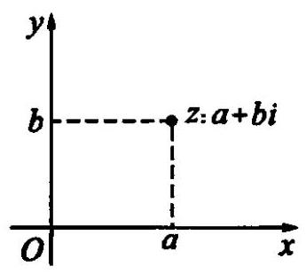

图 8-1

建立了直角坐标系来表示复数的平面就叫做复平面. 复平面中, $x$ 轴叫做实轴, $y$ 轴叫做虚轴. 显然,表示实数的点都在实轴上,表示纯虚数的点都在除了原点的虚轴上. 由上述表示法,复数集 $\mathbf{C}$ 和复平面内的所有的点构成的集合建立了一一对应关系:

$$
z = a + {bi}\left( {a, b \in  \mathbf{R}}\right)  \leftrightarrow  \text{ 点 }z\left( {a, b}\right) .
$$

复平面建立后,复数 $a + {bi}\left( {a, b \in  \mathbf{R}}\right)$ 与复平面内的点 $Z\left( {a, b}\right)$ 是一一对应的. 联结 ${OZ}$ ,并把方向指向 $Z$ ,得到向量 $\overrightarrow{OZ}$ . 则点 $Z\left( {a, b}\right)$ 与向量 $\overrightarrow{OZ}$ 一一对应. 向量 $\overrightarrow{OZ}$ 与点 $Z$ 都是复数 $z = a + {bi}$ 的几何表示, 三者关系如右(图 8-2):

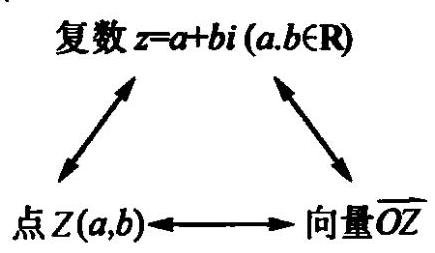

图 8-2

注意:由向量相等的定义，复平面内与向量 $\overrightarrow{OZ}$ 相等的向量有无数个. 对于任意非零复数, 复平面内会有无数多个向量与其对应相等. 因此非零复数并不是与复平面上的向量一一对应的, 复数集只能与复平面内以原点为起点的向量的集合构成一一对应关系.

另外,复数 $z = a + {bi}$ 的模 $\left| {a + {bi}}\right|  = \sqrt{{a}^{2} + {b}^{2}}$ ,它的几何意义是复平面内 $z$ 的对应点 $Z\left( {a, b}\right)$ 到原点 $O$ 的距离,也即 $\overrightarrow{OZ}$ 的模.

例 1 已知 $a \in  \mathbf{R}$ ,问复数 $z = {a}^{2} - {2a} + 4 - \left( {{a}^{2} - {2a} + 2}\right) i$ 所对应的点在第几象限? 复数 $z$ 对应点的轨迹是什么?

解: $\because {a}^{2} - {2a} + 4 = {\left( a - 1\right) }^{2} + 3 \geq  3 > 0$ ,

$$
- \left( {{a}^{2} - {2a} + 2}\right)  =  - {\left( a - 1\right) }^{2} - 1 \leq   - 1 < 0,
$$

$\therefore$ 复数 $z$ 的实部大于 0,且虚部小于 0. $\therefore$ 复数 $z$ 的对应点在第四象限.

设 $z = x + {yi}, x, y \in  \mathbf{R}$ ,则 $x = {a}^{2} - {2a} + 4, y =  - \left( {{a}^{2} - {2a} + 2}\right)$ .

消去 $a$ ,得 $y =  - x + 2\left( {x \geq  3}\right)$ .

$\therefore$ 复数 $z$ 的对应点的轨迹是以 $\left( {3, - 1}\right)$ 为端点的一条射线 $y =  - x + 2\left( {x \geq  3}\right)$ .

例 2 设 $z = x + {yi}\left( {x, y \in  \mathbf{R}}\right)$ ,在复平面内画出满足下列条件的点 $Z$ 的集合所表示的图形.

(1) $\left| x\right|  \leq  3$ ,且 $0 < \left| y\right|  < 2$ ;

(2) $2 \leq  \left| z\right|  < 4$ ;

(3) $\left| z\right|  \leq  3$ 且 $x + y = 3$ .

解: (1) $\left| x\right|  \leq  3$ ,且 $0 < \left| y\right|  < 2$ 表示由 $x =  \pm  3, y =  \pm  2$ 四条直线组成的矩形,包括边界 ${BC}$ 和 ${AD}$ ,不包括边界 ${AB}$ 和 ${CD}$ 及矩形内的实轴部分如图 8-3(a).

(2) $2 \leq  \left| z\right|  < 4$ 化为不等式组 $\left\{  \begin{array}{l} \left| z\right|  < 4, \\  \left| z\right|  \geq  2. \end{array}\right.$ 不等式 $\left| z\right|  < 4$ 的解集是圆 $\left| z\right|  = 4$ 内部所有点组成的集合. 不等式 $\left| z\right|  \geq  2$ 的解集是圆 $\left| z\right|  = 2$ 上的点及外部的点组成的集合. 这两个集合的交集,就是上述不等式组的解集,所求集合为以原点 $O$ 为圆心,分别以 2 及 4 为半径的两个圆所夹的圆环,但不包括外周界,如图 8-3(b) 中阴影.

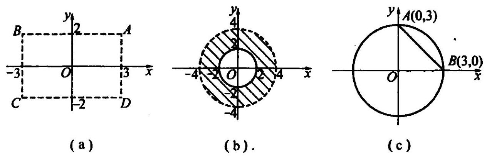

图 8-3

(3)满足 $\left| z\right|  \leq  3$ 的解集是圆 $\left| z\right|  = 3$ 上及内部所有点组成的集合,满足 $x + y = 3$ 点集是直线 $l$ ,同时满足上述条件的点集是直线 $l$ 被上述圆截得的弦,即以 $A\left( {0,3}\right)$ , $B\left( {3,0}\right)$ 为端点的弦 ${AB}$ ,包括 $A, B$ 两点,如图 8-3(c).

例 3 已知虚数 $z = \left( {x - 2}\right)  + {yi}\left( {x, y \in  \mathbf{R}}\right)$ 的模为 $\sqrt{3}$ ,求 $\frac{y}{x}$ 的最大值.

解: $\because \left( {x - 2}\right)  + {yi}$ 是虚数 $\therefore y \neq  0$ .

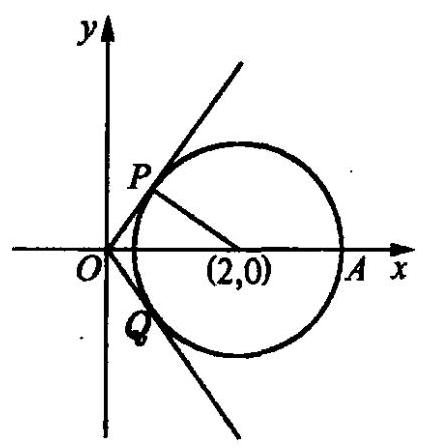

图 8-4

又 $\because \left| {x - 2 + {yi}}\right|  = \sqrt{3},\;\therefore {\left( x - 2\right) }^{2} + {y}^{2} = 3$ .

即复数 $z$ 对应的点组成的集合是以 $\left( {2,0}\right)$ 为圆心, $\sqrt{3}$ 为半径的圆 (除去 $\left( {2 \pm  \sqrt{3},0}\right)$ ),而 $\frac{y}{x}$ 是圆上动点 $z\left( {x, y}\right)$ 与原点联线的斜率.

作圆的切线 ${OP}\text{ 、 }{OQ}$ ,则斜率的最大值

$$
{K}_{\max } = {\left( \frac{y}{x}\right) }_{\max } = \tan \angle {AOP} = \sqrt{3}\text{ (如图 8-4). }
$$

$\therefore \frac{y}{x}$ 的最大值为 $\sqrt{3}$ .

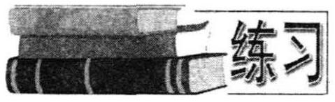

1. 设 $z = 3 + {2i}, z$ 和 $\bar{z}$ 在复平面内对应的点分别为 $A$ 和 $B, O$ 为坐标原点,求 $\bigtriangleup {AOB}$ 的面积.

2. 满足等式 $4{\left| z\right| }^{2} + 7\left| z\right|  - {15} = 0$ 的复数

$z$ 在复平面内的对应点的集合是什么?

3. 已知复数 $z = a + {bi}\left( {a, b \in  \mathbf{R}}\right)$ ,画出满足下列条件的点 $z$ 的集合所组成的图形.

(1) $\left| a\right|  < 2$ 且 $\left| b\right|  < 2$ ；

(2) $\left| z\right|  \leq  2$ 且 $\left| b\right|  > 1$ ；

(3) $\left| z\right|  = 2$ 且 $a > b$ .

4. 已知 $z = {\log }_{\sin 1}\tan 1 + i{\log }_{\tan 1}\sin 1$ ,那么 $z$ 对应的点落在复平面的第几象限?

5. 设复数 $z = {\log }_{2}\left( {\cos \alpha  + \frac{1}{2}}\right)  + i{\log }_{2}\left( {\sin \alpha  + \frac{1}{2}}\right)$ ,求 $\alpha$ 使 $z$ 在复平面内的对应点在第二象限，并且 $z$ 的实部与虚部互为相反数.

6. 已知两个复数集: $M = \left\{  {z \mid  z = t + \left( {4 - {t}^{2}}\right) i, t \in  \mathbf{R}}\right\}$ 及 $N = \left\{  {z \mid  z = 2\cos \theta  + }\right. \; \left( {\lambda  + 3\sin \theta }\right) i,\lambda  \in  \mathbf{R},\theta  \in  \mathbf{R}\}$ 的交集为非空集合,求 $\lambda$ 的取值范围.

7. 在复平面上,复数 ${z}_{1}$ 在联结 $1 + i$ 和 $1 - i$ 的线段上移动,复数 ${z}_{2}$ 在以原点为圆心, 1 为半径的圆周上运动, 求:

(1)复数 ${z}_{1} \cdot  {z}_{2}$ 移动的轨迹是什么图形？并求它的面积；

(2) ${z}_{1} + {z}_{2}$ 移动的轨迹所围图形的面积.

### 8.6 复数加减法的几何意义

求两个复数的和，可以先画出与这两个复数对应的向量 $\overrightarrow{O{Z}_{1}},\overrightarrow{O{Z}_{2}}$ . 用平行四边形法则或三角形法则作出它们的和向量 $\overrightarrow{OZ}$ . $\overrightarrow{OZ}$ 对应的复数就是所求两个复数的和，如图 8-5(a).

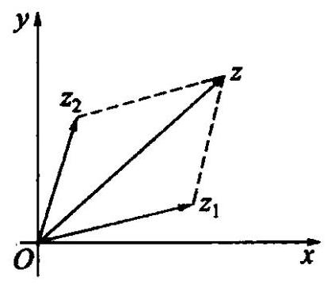

图 8-5(a)

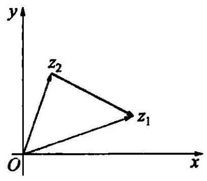

图 8-5(b)

类似地,两个复数的差对应的向量,是以 ${z}_{2}$ 对应的点 ${Z}_{2}$ 为起点, ${z}_{1}$ 对应的点 ${Z}_{1}$ 为终点的向量,即向量 $\overrightarrow{O{Z}_{1}}$ 减去 $\overrightarrow{O{Z}_{2}}$ 的差向量 $\overrightarrow{{Z}_{2}{Z}_{1}}$ ,如图 8-5(b).

由上述复数减法的几何意义, ${z}_{1},{z}_{2}$ 在复平面内对应的两点 ${Z}_{1},{Z}_{2}$ 间的距离 $d$ ,即为向量 $\overrightarrow{{Z}_{2}{Z}_{1}}$ 的模.

$$
\therefore \;d = \left| \overrightarrow{{Z}_{2}{Z}_{1}}\right|  = \left| {{Z}_{1} - {Z}_{2}}\right| \text{ . }
$$

由此,我们可以得到复平面内以 ${Z}_{0}$ 为圆心, $r$ 为半径的圆的复数方程为 $\left| {Z - {Z}_{0}}\right|  = r\left( {r > 0}\right)$ . 在 1.3 节中提到的模的性质 $\left| {{Z}_{1}\left| -\right| {Z}_{2}\left| \right| }\right|  \leq  \left| {{Z}_{1} \pm  {Z}_{2}}\right|  \leq \; \left| {Z}_{1}\right|  + \left| {Z}_{2}\right|$ 在此也可作如下几何解释: 当 ${z}_{1}\text{ 、 }{z}_{2}$ 在复平面内对应的点与原点不共线时,画出 ${z}_{1}\text{ 、 }{z}_{2}\text{ 、 }{z}_{1} \pm  {z}_{2}$ 对应的向量后,根据三角形的任一边小于其他两边之和，大于其他两边之差，即知上面的不等式成立. 当 ${z}_{1}$ ， ${z}_{2}$ 在复平面内对应的点与原点共线时, 两个不等式可以取到等号.

有了复平面内两点间距离公式 $d = \left| {{Z}_{1} - {Z}_{2}}\right|$ ,我们不难写出一些常用曲线复数形式的方程. 这留给同学们自己完成.

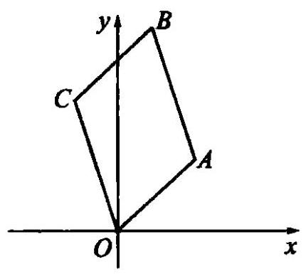

图 8-6

例 1 如图 8-6 所示, 平行四边形 OABC 的顶点 $O, A, C$ 分别表示 $0,3 + {2i}, - 2 + {4i}$ ,试求:

(1) $\overrightarrow{AO}$ 表示的复数；

(2) $\overrightarrow{CA}$ 表示的复数；

(3) $\overrightarrow{OB}$ 表示的复数.

解:(1) $\overrightarrow{AO} =  - \overrightarrow{OA}$ ， $\therefore \overrightarrow{AO}$ 表示复数为 $- 3 - {2i}$ ；

(2) $\overrightarrow{CA} = \overrightarrow{OA} - \overrightarrow{OC}$ ， $\therefore \overrightarrow{CA}$ 表示的复数为 $\left( {3 + {2i}}\right)  - \left( {-2 + {4i}}\right)  = 5 - {2i}$ ；

(3) $\overrightarrow{OB} = \overrightarrow{OA} + \overrightarrow{OC}$ ， $\therefore \overrightarrow{OB}$ 表示的复数为 $\left( {3 + {2i}}\right)  + \left( {-2 + {4i}}\right)  = 1 + {6i}$ .

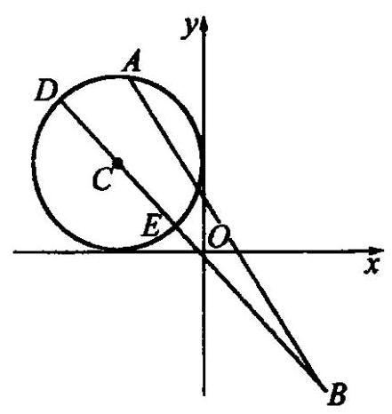

图 8-7

例 2 若 $\left| {z + 1 - i}\right|  = 1$ ,求 $\left| {z - 3 + {4i}}\right|$ 的最值.

解: 由条件 $\left| {z - \left( {-1 + i}\right) }\right|  = 1$ ,知复数 $z$ 对应点 $A$ 在以 $\left( {-1,1}\right)$ 为圆心,1 为半径的圆上运动. 而 $\left| {z - 3 + {4i}}\right|  = \left| {z - \left( {3 - {4i}}\right) }\right|$ 表示点 $A$ 和点 $B\left( {3, - 4}\right)$ 的距离 (如图 8-7).

显然 $\left| {BE}\right|  \leq  \left| {AB}\right|  \leq  \left| {BD}\right|$ ,

$\therefore {\left| z - 3 + 4i\right| }_{\max } = \left| {BD}\right|  = \left| {BC}\right|  + r = \sqrt{41} + 1$ ; ${\left| z - 3 + 4i\right| }_{\min } = \left| {BE}\right|  = \left| {BC}\right|  - r = \sqrt{41} - 1.$

例 3 已知 ${z}_{1} = \left( {x + \sqrt{5}}\right)  + {yi},{z}_{2} = \left( {x - \sqrt{5}}\right)  + {yi},\left( {x, y \in  \mathbf{R}}\right)$ . 满足 $\left| {z}_{1}\right|  + \; \left| {z}_{2}\right|  = 6$ ,求 $\left| {{2x} - {3y} - {12}}\right|$ 的最值.

解: 由已知,得 $\left| {x + {yi} + \sqrt{5}}\right|  + \left| {x + {yi} - \sqrt{5}}\right|  = 6$ .

根据椭圆定义，上式表示以原点为中心， $\left( {\pm \sqrt{5},0}\right)$ 为焦点的椭圆，其半长轴 $a = 3.\;\therefore \;b = \sqrt{{3}^{2} - 5} = 2$ .

$\therefore$ 椭圆方程为 $\frac{{x}^{2}}{9} + \frac{{y}^{2}}{4} = 1$ .

不妨令 ${2x} - {3y} - {12} = p$ ,再设 ${2x} - {3y} = p + {12} = k$ . 此式的图象是一族平行直线系， $k$ 的取值范围即是直线系与椭圆有交点时所确定的 $k$ 值.

由 $\left\{  \begin{array}{l} 4{x}^{2} + 9{y}^{2} = {36}, \\  {2x} - {3y} = k, \end{array}\right.$ 解 $\Delta  \geq  0 \Rightarrow   - 6\sqrt{2} \leq  \widehat{k} \leq  6\sqrt{2}$ .

$\therefore  - 6\sqrt{2} - {12} \leq  {2x} - {3y} - {12} \leq  6\sqrt{2} - {12}$ .

$\therefore \;{12} - 6\sqrt{2} \leq  \left| {{2x} - {3y} - {12}}\right|  \leq  {12} + 6\sqrt{2}$ .

例 4 设 $p \in  \mathbf{R}$ . 方程 ${x}^{2} - {2x} + 2 = 0$ 的两复数根的对应点为 $A\text{ 、 }B$ . 方程 ${x}^{2} + {2px} \; - 1 = 0$ 的两复根的对应点为 $C, D$ . 若 $A, B, C, D$ 四点共圆,求 $p$ 的值.

解: 易知 ${x}^{2} - {2x} + 2 = 0$ 的两根为 ${z}_{A} = 1 + i,{z}_{B} = 1 - i$ .

又方程 ${x}^{2} + {2px} - 1 = 0$ 的 $\Delta  = 4{p}^{2} + 4 > 0$ ,

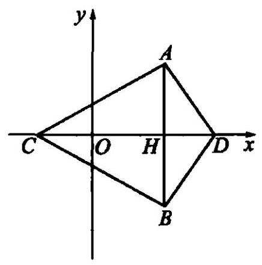

图 8-8

$\therefore$ 此方程有两个实根,不妨设为 ${x}_{C}\text{ 、 }{x}_{D}$ .

如图 8-8,设 ${AB}$ 与 ${CD}$ 交于点 $H$ . 易知 ${z}_{H} = 1$ .

$\because A\text{ 、 }B\text{ 、 }C\text{ 、 }D$ 四点共圆,

$\therefore \left| {CH}\right|  \cdot  \left| {DH}\right|  = \left| {AH}\right|  \cdot  \left| {BH}\right|$ .

$\therefore$ 即 $\left( {1 - {x}_{C}}\right) \left( {{x}_{D} - 1}\right)  = \left| {1 + i - 1}\right|$ . $\left| {1 - i - 1}\right|$ .

$$
- 1 + {x}_{C} + {x}_{D} - {x}_{C} \cdot  {x}_{D} = 1,
$$

$$
- {2p} = 1,\;\therefore \;p =  - \frac{1}{2}\text{ . }
$$

1. 复数 $z$ 满足 $\left| {z + i}\right|  + \left| {z - i}\right|  = 2$ ,求 $\left| {z + 1 + i}\right|$ 的最值.

2. $\left| z\right|  = 1$ ,且 ${z}^{5} + z = 1$ ,求 $z$ .

3. 下面是应用公式 $\left| {z}_{1}\right|  - \left| {z}_{2}\right|  \leq  \left| {{z}_{1} \pm  {z}_{2}}\right|  \leq  \left| {z}_{2}\right|  + \left| {z}_{2}\right|$ 求最值,三种解法答案各不相同,问哪个解答错? 错在哪里?

已知复数 $z$ 的对应点 $z$ 在虚轴上移动,求 $\frac{3}{\left| {z - 1}\right|  + \left| {z - 2 - {2i}}\right| }$ 的最大值.

解一: $\because \left| {z - 1}\right|  + \left| {z - 2 - {2i}}\right|  \leq  \left| {z - 1 + z - 2 - {2i}}\right|  = \left| {{2z} - 3 - {2i}}\right|$ ,

$\because z$ 为纯虚数,令 $z = {bi}\left( {b \in  \mathbf{R}, b \neq  0}\right) ,\;\therefore \left| {{2z} - 3 - {2i}}\right|  = \sqrt{9 + 4{\left( b - 1\right) }^{2}} \geq  3$ .

$\therefore b = 1$ 时,即 $z = i$ 时,原式 $\mathop{\max }\limits_{\max } = \frac{3}{3} = 1$ .

解二: $\because \left| {1 - z}\right|  = \left| {z - 1}\right|$ ,

$\therefore \;\left| {z - 1}\right|  + \left| {z - 2 - {2i}}\right|  \geq  \left| {1 - z + z - 2 - {2i}}\right|  = \left| {-1 - {2i}}\right|  = \sqrt{5}$ .

$\therefore \;$ 原式 $\mathop{\max }\limits_{\max } = \frac{3}{\sqrt{5}} = \frac{3\sqrt{5}}{5}$ .

解三: $\because \left| {z - 2 - {2i}}\right|  = \left| {2 + {2i} - z}\right|$ ,又 $z$ 为纯虚数, $\therefore \left| {z - 1}\right|  = \left| {z + 1}\right|$ .

$\therefore$ 原式 $= \left| {z + 1}\right|  + \left| {2 + {2i} - z}\right|  \geq  \left| {z + 1 + 2 + {2i} - z}\right|  = \sqrt{13}$ .

$\therefore \;$ 原式 $\mathop{\max }\limits_{\max } = \frac{3}{\sqrt{13}} = \frac{3\sqrt{13}}{13}$ .

4. 已知 $z = 3 + {ai}$ 且 $\left| {z - 2}\right|  \leq  2$ ,求 $\left( 1\right) \left| {z + 2}\right|$ 的最值; (2) 求实数 $a$ 的取值范围.

5. 已知集合 $A = \{ z\left| \right| z - 2 \mid   \leq  2, z \in  \mathbf{C}\} , B = \left\{  {z\left| {\;z = \frac{{z}_{1}i}{2} + b}\right. ,{z}_{1} \in  \mathbf{A}, b \in  \mathbf{R}}\right\}$ ,

(1)当 $b = 0$ 时,求出集合 $B$ 所在的区域;

(2)当 $A \cap  B = \varnothing$ 时,求实数 $b$ 的取值范围.

6. 已知 $a \in  \mathbf{R}$ ,试确定方程 $\left| {z - i}\right|  - \left| {z + i}\right|  = {2a}$ 在复平面上所表示的点集.

7. 在复平面上有两个动点 $w$ 与 $z, w = {iz} + 2$ ,当 $z$ 沿曲线 $\left| {z - 1}\right|  + \left| {z + 1}\right|  = \; 2\sqrt{2}$ 运动时,求点 $w$ 的轨迹方程,并求 $\left| w\right|$ 的最值.

8. 设 $A\text{ 、 }B\text{ 、 }C\text{ 、 }D$ 为平面上任意四点,用复数知识求证: ${AC} \cdot  {BD} \leq  {AB} \cdot  {CD} + \; {AD} \cdot  {BC}$ .

### 8.7 复数的三角形式及其运算

在复平面内,复数 $z = a + {bi}\left( {a, b \in  \mathbf{R}}\right)$ 对应向量 ${OZ}$ ,向量 ${OZ}$ 的模 $r$ 叫做复数 $z$ 的模,且 $r = \sqrt{{a}^{2} + {b}^{2}}$ . 以实轴的正半轴为始边,向量 ${OZ}$ 所在的射线为终边的角 $\theta$ ,叫做复数的辐角,记作 $\arg z$ , 如图 8-9. 易知 $\cos \theta  = a/r,\sin \theta  = b/r$ . 所以 $z = a + {bi} =$

$$
r\left( {\cos \theta  + i\sin \theta }\right) \left( {r > 0}\right) \text{ . }
$$

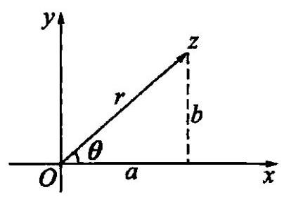

图 8-9

$r\left( {\cos \theta  + i\sin \theta }\right) \left( {r > 0}\right)$ 叫做复数 $a + {bi}$ 的三角形式 任何一个复数 $z = a + {bi}\left( {a, b \in  \mathbf{R}}\right)$ 都可以表示成 $r\left( {\cos \theta  + i\sin \theta }\right) \left( {r > 0}\right)$ 的形式. $\theta$ 为 $z$ 的辐角, $r$ 为 $z$ 的模. $\lbrack 0,{2\pi })$ 中的辐角,叫做 $z$ 的辐角主值,记作 $\arg z$ . 易知, $\arg z = \arg z + {2k\pi }\left( {k \in  \mathbf{Z}}\right)$ .

非零复数与它的一组模和辐角主值一一对应. 两个非零复数相等当且仅当它们的模与辐角主值分别相等. 复数 0 的辐角是任意的.

$$
{z}_{1} = {r}_{1}\left( {\cos {\theta }_{1} + i\sin {\theta }_{1}}\right) ,{z}_{2} = {r}_{2}\left( {\cos {\theta }_{2} + i\sin {\theta }_{2}}\right) \text{ ,则 }
$$

$$
{z}_{1} \cdot  {z}_{2} = {r}_{1}\left( {\cos {\theta }_{1} + i\sin {\theta }_{1}}\right)  \cdot  {r}_{2}\left( {\cos {\theta }_{2} + i\sin {\theta }_{2}}\right)
$$

$$
= {r}_{1}{r}_{2}\left\lbrack  {\cos {\theta }_{1}\cos {\theta }_{2} - \sin {\theta }_{1}\sin {\theta }_{2} + i\left( {\sin {\theta }_{1}\cos {\theta }_{2} + \cos {\theta }_{1}\sin {\theta }_{2}}\right) }\right\rbrack
$$

$$
= {r}_{1} \cdot  {r}_{2}\left\lbrack  {\cos \left( {{\theta }_{1} + {\theta }_{2}}\right)  + i\sin \left( {{\theta }_{1} + {\theta }_{2}}\right) }\right\rbrack  .
$$

即两个复数相乘，积的模等于各复数模的积，积的辐角等于各复数的辐角的和.

上述结果可以推广到 $n$ 个复数相乘:

$$
{z}_{1} \cdot  {z}_{2} \cdot  \cdots  \cdot  {z}_{n} = {r}_{1} \cdot  {r}_{2} \cdot  \cdots  \cdot  {r}_{n}\left\lbrack  {\cos \left( {{\theta }_{1} + {\theta }_{2} + \cdots  + {\theta }_{n}}\right)  + i\sin \left( {{\theta }_{1} + {\theta }_{2} + \cdots  + {\theta }_{n}}\right) }\right\rbrack  .
$$

特殊地,如果 ${r}_{1} = {r}_{2} = \cdots  = {r}_{n} = r,{\theta }_{1} = {\theta }_{2} = \cdots  = {\theta }_{n} = \theta$ ,就有

$$
{\left\lbrack  r\left( \cos \theta  + i\sin \theta \right) \right\rbrack  }^{n} = {r}^{n}\left( {\cos {n\theta } + i\sin {n\theta }}\right) .
$$

这就是说，复数 $z$ 的 $n$ 次方的模等于这个复数 $z$ 的模的 $n$ 次方幂，复数 $z$ 的 $n$ 次方的辐角等于这个复数 $z$ 的辐角的 $n$ 倍. 这个结论叫做棣莫佛定理.

除法为乘法的逆运算，开方为乘方的逆运算，所以

$$
\frac{{r}_{1}\left( {\cos {\theta }_{1} + i\sin {\theta }_{1}}\right) }{{r}_{2}\left( {\cos {\theta }_{2} + i\sin {\theta }_{2}}\right) } = \frac{{r}_{1}}{{r}_{2}}\left\lbrack  {\cos \left( {{\theta }_{1} - {\theta }_{2}}\right)  + i\sin \left( {{\theta }_{1} - {\theta }_{2}}\right) }\right\rbrack  .
$$

这就是说, 两个复数相除, 商的模等于被除数的模除以除数的模所得的商, 商的辐角等于被除数的辐角减去除数的辐角所得的差.

复数 $r\left( {\cos \theta  + i\sin \theta }\right)$ 的 $n$ 次方根是 $\sqrt[n]{r}\left\{  {\cos \left\lbrack  \frac{\left( \theta  + 2k\pi \right) }{n}\right\rbrack   + i\sin \left\lbrack  \frac{\left( \theta  + 2k\pi \right) }{n}\right\rbrack  }\right\} \; \left( {k = 0,1,2,\cdots , n - 1}\right)$ .

这就是说,复数的 $n\left( {n \in  {\mathbf{N}}^{ * }}\right)$ 次方根是 $n$ 个复数,它们的模都等于这个复数的模的 $n$ 次算术根,它们的辐角分别等于这个复数的辐角与 ${2\pi }$ 的 $0,1,2,\cdots , i - 1$ 倍的和的 $\frac{1}{n}$ .

注意:以上的运算法则，必须在参加运算的所有复数都是三角形式时才有效.

例 1 写出下列复数的三角形式并求辐角主值:

(1) $- 4 - {3i}$ (2) $2\left( {\sin \frac{5\pi }{4} + i\cos \frac{5\pi }{4}}\right)$

(3) $\cos \alpha  + i\left( {1 - \sin \alpha }\right) ,\alpha  \in  \left( {\frac{\pi }{2},{2\pi }}\right)$ ;

(4) $1 - \cos \theta  + i\sin \theta \left( {-\pi  < \theta  < \pi }\right)$ .

解: (1) $r = \sqrt{{\left( -4\right) }^{2} + {\left( -3\right) }^{2}} = 5$ .

$\cos \theta  =  - {0.8},\sin \theta  =  - {0.6}$ ,所以 $\tan \theta  = \frac{3}{4}$ . 因为与 $- 4 - {3i}$ 对应的点在第三象限,所以 $\arg \left( {-4 - {3i}}\right)  = \pi  + \arctan \frac{3}{4}$ .

所以 $- 4 - {3i} = 5\left\lbrack  {\cos \left( {\pi  + \arctan \frac{3}{4}}\right)  + i\sin \left( {\pi  + \arctan \frac{3}{4}}\right) }\right\rbrack$ .

(2) $2\left( {\sin \frac{5\pi }{4} + i\cos \frac{5\pi }{4}}\right)  = 2\left\lbrack  {\cos \left( {\frac{\pi }{2} - \frac{5\pi }{4}}\right)  + i\sin \left( {\frac{\pi }{2} - \frac{5\pi }{4}}\right) }\right\rbrack$

$$
= 2\left\lbrack  {\cos \left( {-\frac{3\pi }{4}}\right)  + i\sin \left( {-\frac{3\pi }{4}}\right) }\right\rbrack  .
$$

因为 $- \frac{3\pi }{4}$ 不属于 $\left\lbrack  {0,{2\pi }}\right\rbrack$ ,所以

$$
\arg \left\lbrack  {2\left( {\sin \frac{5\pi }{4} + \cos \frac{5\pi }{4}}\right) }\right\rbrack   =  - \frac{3\pi }{4} + {2\pi } = \frac{5\pi }{4}.
$$

(3) $\cos \alpha  + i\left( {1 - \sin \alpha }\right)  = {\cos }^{2}\frac{\alpha }{2} - {\sin }^{2}\frac{\alpha }{2} + i{\left( \cos \frac{\alpha }{2} - \sin \frac{\alpha }{2}\right) }^{2}$

$$
= \left( {\cos \frac{\alpha }{2} - \sin \frac{\alpha }{2}}\right) \left\lbrack  {\left( {\cos \frac{\alpha }{2} + \sin \frac{\alpha }{2}}\right)  + i\left( {\cos \frac{\alpha }{2} - \sin \frac{\alpha }{2}}\right) }\right\rbrack
$$

$$
= {\left( \sqrt{2}\right) }^{2}\cos \left( {\frac{\alpha }{2} + \frac{\pi }{4}}\right) \left\lbrack  {\cos \left( {\frac{\alpha }{2} - \frac{\pi }{4}}\right)  + i\sin \left( {\frac{\pi }{4} - \frac{\alpha }{2}}\right) }\right\rbrack
$$

$$
= 2\cos \left( {\frac{\alpha }{2} + \frac{\pi }{4}}\right) \left\lbrack  {\cos \left( {\frac{\pi }{4} - \frac{\alpha }{2}}\right)  + i\sin \left( {\frac{\pi }{4} - \frac{\alpha }{2}}\right) }\right\rbrack  .
$$

因为 $\frac{\pi }{2} < \alpha  < {2\pi }$ ,所以 $\frac{\pi }{2} < \frac{\alpha }{2} + \frac{\pi }{4} < \frac{5\pi }{4}$ ,此时 $\cos \left( {\frac{\alpha }{2} + \frac{\pi }{4}}\right)  < 0$ ,

所以 $\cos \alpha  + i\left( {1 - \sin \alpha }\right)  =  - 2\cos \left( {\frac{\alpha }{2} + \frac{\pi }{4}}\right) \left\lbrack  {\cos \left( {\frac{5\pi }{4} - \frac{\alpha }{2}}\right)  + i\sin \left( {\frac{5\pi }{4} - \frac{\alpha }{2}}\right) }\right\rbrack$ . 又 $\frac{5\pi }{4} - \frac{\alpha }{2} \in  \lbrack 0,{2\pi })$ ,所以

$$
\arg \left\lbrack  {\cos \alpha  + i\left( {1 - \sin \alpha }\right) }\right\rbrack   = \frac{5\pi }{4} - \frac{\alpha }{2}\left( {\alpha  \in  \left( {\frac{\pi }{2},{2\pi }}\right) }\right) .
$$

(4) $1 - \cos \theta  + i\sin \theta  = 2{\sin }^{2}\frac{\theta }{2} + {2i}\sin \frac{\theta }{2}\cos \frac{\theta }{2}$

$$
= 2\sin \frac{\theta }{2}\left\lbrack  {\cos \left( {\frac{\pi }{2} - \frac{\theta }{2}}\right)  + i\sin \left( {\frac{\pi }{2} - \frac{\theta }{2}}\right) }\right\rbrack  .
$$

1. 当 $\theta  = 0$ 时, $\arg 0$ 为任意角;

2. 当 $\theta  \in  \left( {0,\pi }\right)$ 时, $\sin \frac{\theta }{2} > 0,0 < \frac{\pi }{2} - \frac{\theta }{2} < {2\pi }$ ,所以 $\arg z = \frac{\pi }{2} - \frac{\theta }{2}$ ;

3. 当 $\theta  \in  \left( {-\pi ,0}\right)$ 时, $\sin \frac{\theta }{2} < 0$ ,所以

$$
z =  - 2\sin \frac{\theta }{2}\left\lbrack  {-\cos \left( {\frac{\pi }{2} - \frac{\theta }{2}}\right)  - i\sin \left( {\frac{\pi }{2} - \frac{\theta }{2}}\right) }\right\rbrack
$$

$$
=  - 2\sin \frac{\theta }{2}\left\lbrack  {\cos \left( {\frac{3\pi }{2} - \frac{\theta }{2}}\right)  + i\sin \left( {\frac{3\pi }{2} - \frac{\theta }{2}}\right) }\right\rbrack  ,
$$

且 $\frac{3\pi }{2} < \frac{3\pi }{2} - \frac{\theta }{2} < {2\pi }$ ,

所以 $\arg z = \frac{3\pi }{2} - \frac{\theta }{2}$ .

例 2 (1)计算: $\frac{{\left( 1 + \sqrt{3}i\right) }^{5}}{\left\lbrack  {16}\sqrt{2}\left( \cos \frac{\pi }{6} - i\sin \frac{\pi }{6}\right) \right\rbrack  }$ ;

(2)求 $1 - i$ 的立方根.

解:(1) 原式 $= \frac{{2}^{5}{\left\lbrack  \frac{\left( 1 + \sqrt{3}i\right) }{2}\right\rbrack  }^{5}}{\left\{  {16}\sqrt{2}\left\lbrack  \cos \left( -\frac{\pi }{6}\right)  + i\sin \left( -\frac{\pi }{6}\right) \right\rbrack  \right\}  }$

$$
= \frac{\sqrt{2}{\left( \cos \frac{\pi }{3} + i\sin \frac{\pi }{3}\right) }^{5}}{\left\lbrack  \cos \left( -\frac{\pi }{6}\right)  + i\sin \left( -\frac{\pi }{6}\right) \right\rbrack  }
$$

$$
= \sqrt{2}\left( {\cos \frac{11\pi }{6} + i\sin \frac{11\pi }{6}}\right)
$$

$$
= \sqrt{2}\left( {\frac{\sqrt{3}}{2} - \frac{i}{2}}\right)  = \frac{\sqrt{6}}{2} - \frac{\sqrt{2}}{2}i\text{ . }
$$

( 2 )因为 $1 - i = \sqrt{2}\left( {\cos \frac{7\pi }{4} + i\sin \frac{7\pi }{4}}\right)$ ，所以 $1 - i$ 的立方根是

$$
\sqrt[6]{2}\left\lbrack  {\cos \frac{1}{3}\left( {\frac{7\pi }{4} + {2k\pi }}\right)  + i\sin \frac{1}{3}\left( {\frac{7\pi }{4} + {2k\pi }}\right) }\right\rbrack
$$

$$
= \sqrt[6]{2}\left\lbrack  {\cos \frac{1}{12}\left( {{7\pi } + {8k\pi }}\right)  + i\sin \frac{1}{12}\left( {{7\pi } + {8k\pi }}\right) }\right\rbrack  \left( {k = 0,1,2}\right) \text{ . }
$$

则 $1 - i$ 的立方根是下列 3 个复数:

$$
\sqrt[6]{2}\left( {\cos \frac{7\pi }{12} + i\sin \frac{7\pi }{12}}\right) ,\sqrt[6]{2}\left( {\cos \frac{5\pi }{4} + i\sin \frac{5\pi }{4}}\right) ,\sqrt[6]{2}\left( {\cos \frac{23\pi }{12} + i\sin \frac{23\pi }{12}}\right) \text{ . }
$$

例 3 已知复数 ${z}_{1},{z}_{2}$ 满足 $\left| {z}_{1}\right|  = 1,\left| {z}_{2}\right|  = 1$ ,且 ${z}_{1} + {z}_{2} =  - \frac{7}{5} + \frac{1}{5}i$ . 求 ${z}_{1} \cdot  {z}_{2}$ 的值.

解: 设 ${z}_{1} = \cos {\theta }_{1} + i\sin {\theta }_{2},{z}_{2} = \cos {\theta }_{2} + i\sin {\theta }_{2}$ ,则

$$
{z}_{1} + {z}_{2} = \left( {\cos {\theta }_{1} + \cos {\theta }_{2}}\right)  + i\left( {\sin {\theta }_{1} + \sin {\theta }_{2}}\right)  =  - \frac{7}{5} + \frac{1}{5}i.
$$

$\therefore \left\{  \begin{array}{l} \sin {\theta }_{1} + \sin {\theta }_{2} = \frac{1}{5}, \\  \cos {\theta }_{1} + \cos {\theta }_{2} =  - \frac{7}{5}. \end{array}\right.$ 即 $\left\{  \begin{array}{l} 2\sin \frac{{\theta }_{1} + {\theta }_{2}}{2} \cdot  \cos \frac{{\theta }_{1} - {\theta }_{2}}{2} = \frac{1}{5}, \\  2\cos \frac{{\theta }_{1} + {\theta }_{2}}{2} \cdot  \cos \frac{{\theta }_{1} - {\theta }_{2}}{2} =  - \frac{7}{5}. \end{array}\right.$

$\frac{\text{ ① }}{\text{ ② }}$ ，得: $\tan \frac{{\theta }_{1} + {\theta }_{2}}{2} =  - \frac{1}{7}$ ，

$$
\sin \left( {{\theta }_{1} + {\theta }_{2}}\right)  = \frac{2\tan \frac{{\theta }_{1} + {\theta }_{2}}{2}}{1 + {\tan }^{2}\frac{{\theta }_{1} + {\theta }_{2}}{2}} =  - \frac{7}{25},\cos \left( {{\theta }_{1} + {\theta }_{2}}\right)  = \frac{1 - {\tan }^{2}\frac{{\theta }_{1} + {\theta }_{2}}{2}}{1 + {\tan }^{2}\frac{{\theta }_{1} + {\theta }_{2}}{2}} = \frac{24}{25}.
$$

$\therefore \;{z}_{1} \cdot  {z}_{2} = \cos \left( {{\theta }_{1} + {\theta }_{2}}\right)  + i\sin \left( {{\theta }_{1} + {\theta }_{2}}\right)  = \frac{24}{25} - \frac{7}{25}i$ .

例 4 设 $O$ 为复平面的原点, ${Z}_{1}$ 和 ${Z}_{2}$ 为复平面内两个动点,且同时满足:

(1) ${Z}_{1}$ 和 ${Z}_{2}$ 对应的复数的辐角分别为定值 $\theta$ 和 $- \theta \left( {0 < \theta  < \frac{\pi }{2}}\right)$ ,

(2) $\bigtriangleup  O{Z}_{1}{Z}_{2}$ 的面积为定值 $S$ .

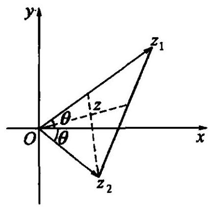

图 8-10

求 $\bigtriangleup O{Z}_{1}{Z}_{2}$ 的重心 $Z$ 对应的复数的模的最小值 (如图 8-10).

解: 设 ${Z}_{1},{Z}_{2}$ 分别对应复数 ${z}_{1} = {r}_{1}(\cos \theta  + \; i\sin \theta ),{z}_{2} = {r}_{2}\left( {\cos \theta  - i\sin \theta }\right)$ .

$\because Z$ 为 $\bigtriangleup O{Z}_{1}{Z}_{2}$ 的重心,它对应的复数为

$$
z = \frac{0 + {z}_{1} + {z}_{2}}{3} = \frac{{z}_{1} + {z}_{2}}{3}
$$

$$
= \frac{1}{3}\left\lbrack  {\left( {{r}_{1} + {r}_{2}}\right) \cos \theta  + \left( {{r}_{1} - {r}_{2}}\right) i\sin \theta }\right\rbrack  .
$$

则 ${\left| z\right| }^{2} = \frac{1}{9}\left\lbrack  {{\left( {r}_{1} + {r}_{2}\right) }^{2}{\cos }^{2}\theta  + {\left( {r}_{1} - {r}_{2}\right) }^{2}{\sin }^{2}\theta }\right\rbrack$

$$
= \frac{1}{9}\left\lbrack  {{\left( {r}_{1} - {r}_{2}\right) }^{2} + 4{r}_{1}{r}_{2}{\cos }^{2}\theta }\right\rbrack  .
$$

$S = \frac{1}{2}{r}_{1}{r}_{2} \cdot  \sin {2\theta },\;\therefore \;{r}_{1}{r}_{2} = \frac{2S}{\sin {2\theta }}.$

$\therefore {\left| z\right| }^{2} = \frac{1}{9}\left\lbrack  {{\left( {r}_{1} - {r}_{2}\right) }^{2} + 4 \cdot  \frac{2S}{\sin {2\theta }} \cdot  {\cos }^{2}\theta }\right\rbrack   = \frac{1}{9}\left\lbrack  {{\left( {r}_{1} - {r}_{2}\right) }^{2} + {4S} \cdot  \cot \theta }\right\rbrack$ .

当 ${r}_{1} = {r}_{2} = \sqrt{\frac{2S}{\sin {2\theta }}}$ 时, ${\left| z\right| }_{\min }^{2} = \frac{4}{9}S \cdot  \cot \theta$ .

$\therefore {\left| z\right| }_{\min } = \frac{2}{3}\sqrt{S \cdot  \cot \theta }$ .

1. 将下列复数化成三角形式，并求出辐角

(1) $z =  - \sqrt{3} + i$ ；

(2) $z =  - 3\left( {{\cos }^{50} + i\sin {40}^{ \circ  }}\right)$ ;

(3) $z = \tan \alpha  + i\left( {\frac{\pi }{2} < \alpha  < \pi }\right)$ ；

(4) $z = \frac{1 + i\tan \frac{\pi }{5}}{1 - i\tan \frac{\pi }{5}}$

(5) $z = \frac{1 + \cos \theta  + i\sin \theta }{1 + \cos \theta  - i\sin \theta }$ .

2. 若复数 ${z}_{1} = \cos \alpha  + i\left( {1 - \sin \alpha }\right)$ 和 ${z}_{2} = 1 + i$ 在复平面内的对应点的距离为 1,求复数 ${z}_{1}$ 的模与辐角主值.

3. 已知复数 $z$ 满足 $\left| z\right|  = 2,\arg \left( {z + 2}\right)  = \frac{\pi }{3}$ ,求 $z$ .

4. 设 $\arg \left( {1 + {2i}}\right)  = \alpha ,\arg \left( {3 - {4i}}\right)  = \beta$ ,求 ${2\alpha } - \beta$ 的值.

5. 已知 $\arg \left( {{z}^{4} + 1}\right)  = \frac{\pi }{3},\arg \left( {{z}^{4} - 1}\right)  = \frac{5\pi }{6}$ ,求复数 $z$ .

6. 若 $z + \frac{5}{z}$ 是实数，且 $z + 3$ 的辐角主值是 $\frac{3\pi }{4}$ ，问这样的虚数 $z$ 是否存在？

7. 已知 $z = \sqrt{\left| \cos t\right| } + i\sqrt{\left| \sin t\right| }$ ,

(1)求 $\left| z\right|$ 的取值范围；

(2)求 $t$ 的范围，使 $0 \leq  \arg z \leq  \frac{\pi }{4}$ .

8. 已知辐角分别为 ${\theta }_{1},{\theta }_{2}$ 的复数 ${z}_{1},{z}_{2}$ 满足 ${z}_{1} + {z}_{2} = {5i},\left| {{z}_{1} \cdot  {z}_{2}}\right|  = {14}$ ,求 $\cos \left( {{\theta }_{1} - {\theta }_{2}}\right)$ 的最值,并求出最小值.

9. 设复数集合 $M = \{ z\left| \right| z - 2 + i \mid   \leq  2, z \in  \mathbf{C}\}  \cap  \{ z\left| \right| z - 2 - i \mid   = \left| {z - 4 + i}\right| , z \in  \mathbf{C}\}$ , 求集合 $M$ 中元素 $z$ 的辐角主值的范围以及 $z$ 的模的范围.

### 8.8 复数的乘法、除法、乘方、开方的几何意义

$$
{r}_{1}\left( {\cos {\theta }_{1} + i\sin {\theta }_{1}}\right)  \cdot  {r}_{2}\left( {\cos {\theta }_{2} + i\sin {\theta }_{2}}\right)  = {r}_{1}{r}_{2}\left\lbrack  {\cos \left( {\theta }_{1}\right. }\right.
$$

$+ {\theta }_{2}) + i\sin \left( {{\theta }_{1} + {\theta }_{2}}\right) \rbrack$ ,即两个复数相乘,积的模等于两复数模的积, 积的辐角等于两复数的辐角的和. 可得复数乘法的几何意义如下: 两个复数 ${z}_{1},{z}_{2}$ 相乘,可以先分别画出与 ${z}_{1},{z}_{2}$ 对应的向量 $\overrightarrow{O{Z}_{1}},\overrightarrow{O{Z}_{2}}$ ,然后把 $\overrightarrow{O{Z}_{1}}$ 按逆时针方向旋转一个角 ${\theta }_{2}$ ，再把它的模变为原来的 ${r}_{2}$ 倍，所得的向量 ${OZ}$ 就表示积 ${z}_{1}{z}_{2}$ (如图 8-11).

$$
{\left\lbrack  r\left( \cos \theta  + i\sin \theta \right) \right\rbrack  }^{n} = {r}^{n}\left( {\cos {n\theta } + i\sin {n\theta }}\right) \left( {n \in  {\mathbf{N}}^{ * }}\right) ,
$$

即复数的 $n\left( {n \in  {\mathbf{N}}^{ * }}\right)$ 次幂的模等于这个复数的模的 $n$ 次幂，它的辐角等于这个复数的辐角的 $n$ 倍. 于是复数乘方的几何意义是: 复数 $z$ 的 $n$ 次幂. 可以先画出与 $z$ 对应的向量 $\overrightarrow{OZ}$ ,然后把向量 $\overrightarrow{OZ}$ 按逆时针方向旋转到角 ${n\theta }$ ,再把它的模变为原来的 $n$ 次幂,所得的向量 $\overrightarrow{OP}$ 就表示 ${z}^{n}$ (如图 8-12).

$$
\frac{{r}_{1}\left( {\cos {\theta }_{1} + i\sin {\theta }_{1}}\right) }{{r}_{2}\left( {\cos {\theta }_{2} + i\sin {\theta }_{2}}\right) } = \frac{{r}_{1}}{{r}_{2}}\left\lbrack  {\cos \left( {{\theta }_{1} - {\theta }_{2}}\right)  + i\sin \left( {{\theta }_{1} - {\theta }_{2}}\right) }\right\rbrack  \text{ ,即两个复数相除,商的 }
$$

模等于被除数的模除以除数的模所得的商, 商的辐角等于被除数的辐角减去除数的辐角所得的差. 因此复数除法的几何意义是: 两个复数 ${z}_{1},{z}_{2}\left( {{z}_{2} \neq  0}\right)$ 相除,可以先分别画出与 ${z}_{1},{z}_{2}$ 对应的向量 $\overrightarrow{O{Z}_{1}},\overrightarrow{O{Z}_{2}}$ ，然后把向量 $\overrightarrow{O{Z}_{1}}$ 按顺时针旋转一个角 ${\theta }_{2}$ ,再把它的模变为原来的 $\frac{1}{{r}_{2}}$ ,所得的向量 $\overrightarrow{OZ}$ 就表示商 $\frac{{z}_{1}}{{z}_{2}}$ .

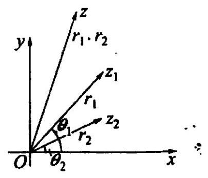

图 8-11

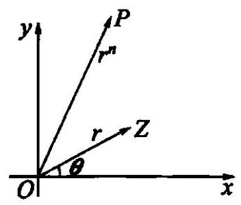

图 8-12

复数 $r\left( {\cos \theta  + i\sin \theta }\right)$ 的 $n$ 次方根是 $\sqrt[n]{r}\left( {\cos \frac{\theta  + {2k\pi }}{n} + i\sin \frac{\theta  + {2k\pi }}{n}}\right) (k = 0,1,\cdots$ , $n - 1)$ ,即复数的 $n$ 次方根是 $n$ 个复数,它们的模都等于这个复数的模的 $n$ 次算术根,它们的辐角分别等于这个复数的辐角与 ${2\pi }$ 的 $0,1,2,\cdots , n - 1$ 倍的和的 $n$ 分之一. 所以复数开方的几何意义是: 复数 $z\left( {z \neq  0}\right)$ 开方,以原点为中心,模的 $n$ 次算术根 $\sqrt[n]{r}$ 为半径作圆,与 $x$ 轴交于点 $A$ ; 在圆上取点 ${Z}_{1}$ ,使 $\overset{\text{ ⏜ }}{A{Z}_{1}}$ 的度数为辐角主值 $\theta$ 的 $\frac{1}{n}$ ; 再取点 ${Z}_{2},{Z}_{3},\cdots ,{Z}_{n}$ ,使相邻两点对应的辐角相差 $\frac{2\pi }{n}$ . 这些点均匀地分布在圆上， ${Z}_{1}{Z}_{2}\cdots {Z}_{n}$ 是圆的内接正 $n$ 边形，向量 $\overrightarrow{O{Z}_{1}},\overrightarrow{O{Z}_{2}},\cdots ,\overrightarrow{O{Z}_{n}}$ 表示复数 $z$ 的 $n$ 次方根.

特别地,1 的 $n$ 次方根 (也叫 $n$ 次单位根),在复平面上对应的点 ${Z}_{1},{Z}_{2},\cdots ,{Z}_{n}$ 把单位圆 $n$ 等分, ${Z}_{1}{Z}_{2}\cdots {Z}_{n}$ 为单位圆的内接正 $n$ 边形,且点 ${Z}_{1}$ 对应复数 1 .

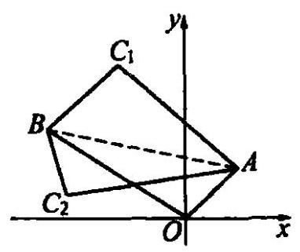

图 8-13

例 1 已知直角三角形 ${ABC}$ 的顶点 $A\left( {1,1}\right)$ ， $B\left( {-3,2}\right)$ ， $\angle B = {60}^{ \circ  }$ ，求直角顶点 $C$ 的坐标.

解: 如图 8-13,在复平面上,点 $A, B$ 对应的复数分别为 $1 + i, - 3 + {2i}$ .

$\because \overrightarrow{BA} = \overrightarrow{OA} - \overrightarrow{OB},\therefore \overrightarrow{BA}$ 对应的复数为 ${z}_{1} = \; \left( {1 + i}\right)  - \left( {-3 + {2i}}\right)  = 4 - i.$

在 Rt $\bigtriangleup {ABC}$ 中, $\angle C = {90}^{ \circ  },\angle B = {60}^{ \circ  }\;\therefore \left| \overrightarrow{BC}\right|  = \frac{1}{2}\left| \overrightarrow{BA}\right|$ .

$\therefore \overrightarrow{BC}$ 是 $\overrightarrow{BA}$ 按逆时针(或顺时针)方向旋转 ${60}^{ \circ  }$ ，并且把它的模变为原来的 $\frac{1}{2}$ 后得到的向量. $\therefore \overrightarrow{BC}$ 对应的复数为 ${z}_{2} = {z}_{1} \cdot  \frac{1}{2} \cdot  \left\lbrack  {\cos \left( {\pm {60}^{ \circ  }}\right)  + i\sin \left( {\pm {60}^{ \circ  }}\right) }\right\rbrack \; = \left( {4 - i}\right)  \cdot  \frac{1}{2}\left( {\frac{1}{2} \pm  \frac{\sqrt{3}}{2}i}\right)  = \left( {1 \pm  \frac{\sqrt{3}}{4}}\right)  + \left( {-\frac{1}{4} \pm  \sqrt{3}}\right) i$ .

$\therefore \overrightarrow{OC} = \overrightarrow{OB} + \overrightarrow{BC}\therefore$ 直角顶点 $C$ 对应的复数为

$$
z =  - 3 + {2i} + \left( {1 \pm  \frac{\sqrt{3}}{4}}\right)  + \left( {-\frac{1}{4} \pm  \sqrt{3}}\right) i = \left( {-2 \pm  \frac{\sqrt{3}}{4}}\right)  + \left( {\frac{7}{4} \pm  \sqrt{3}}\right) i.
$$

例 2 在复平面上 $A, B$ 两点对应的复数分别为 $\alpha ,\beta$ , 已知 $\bigtriangleup {OAB}$ 是直角三角形,且 $\angle {OBA} = \frac{\pi }{2},\angle {AOB} = \frac{\pi }{3}$ , 求证: ${\alpha }^{2} - {2\alpha \beta } + 4{\beta }^{2} = 0$ (如图 8-14).

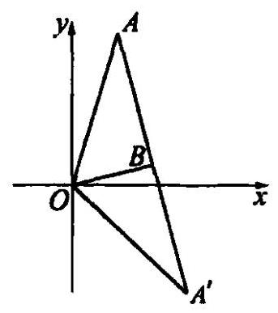

图 8-14

解: 由题意,得向量 $\overrightarrow{OA}$ 和 $\overrightarrow{OB}$ 的夹角为 $\frac{\pi }{3},\frac{\left| OA\right| }{\left| OB\right| } = 2$ .

根据复数除法的几何意义, 可得

$$
\frac{\alpha }{\beta } = 2\left\lbrack  {\cos \left( {\pm \frac{\pi }{3}}\right)  + i\sin \left( {\pm \frac{\pi }{3}}\right) }\right\rbrack   = 1 \pm  \sqrt{3}i.
$$

$\therefore \;\alpha  = \beta \left( {1 \pm  \sqrt{3}i}\right) .\;\therefore \;\alpha  - \beta  =  \pm  \sqrt{3}{\beta i}$ .

两边平方后,得 ${\alpha }^{2} - {2\alpha \beta } + {\beta }^{2} =  - 3{\beta }^{2}.\;\therefore {\alpha }^{2} - {2\alpha \beta } + 4{\beta }^{2} = 0$ .

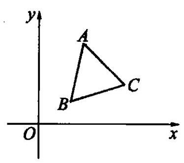

图 8-15

例 3 顶点按逆时针方向排列的三角形 ${ABC}$ 是正三角形的充要条件是 $a + {b\omega } + c{\omega }^{2} = 0$ ,其中 $a\text{ 、 }b\text{ 、 }c$ 分别是三点 $A$ 、 $B$ 、 $C$ 对应的复数， $\omega$ 是三次单位根 $\frac{-1 + \sqrt{3}i}{2}$ .

证: 必要性: 如图 8-15,

$\because \bigtriangleup {ABC}$ 是顶点按逆时针方向排列的正三角形,

$\therefore$ 向量 $\overrightarrow{BC}$ 按逆时针旋转 ${120}^{ \circ  }$ 与 $\overrightarrow{CA}$ 重合,

$\therefore \;a - c = \left\lbrack  {\left( {c - b}\right)  \cdot  \left( {\cos \frac{2\pi }{3} + i\sin \frac{2\pi }{3}}\right) }\right\rbrack   = \left( {c - b}\right)  \cdot  \omega$ ,

$\therefore a + {b\omega } - c\left( {1 + \omega }\right)  = 0$ .

$\because 1 + \omega  = 1 + \frac{-1 + \sqrt{3}i}{2} = \frac{1 + \sqrt{3}i}{2} =  - {\left( \frac{-1 + \sqrt{3}i}{2}\right) }^{2} =  - {\omega }^{2}$ ,

$\therefore a + {b\omega } + c{\omega }^{2} = 0$ .

充分性: 由于以上各步都是可逆的,因此由 $a + {b\omega } + c{\omega }^{2} = 0$ 可得出 $\bigtriangleup {ABC}$ 是顶点按逆时针方向排列的正三角形.

综上, 命题得证.

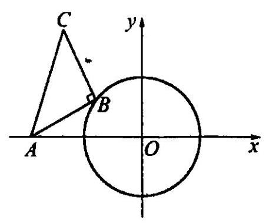

图 8-16

例 4 已知定点 $A\left( {-2,0}\right)$ 和圆 ${x}^{2} + {y}^{2} = 1$ 上的动点 $B$ ,点 $A\text{ 、 }B\text{ 、 }C$ 按逆时针方向排列,且 $\left| {AB}\right|$ : $\left| {BC}\right|  : \left| {CA}\right|  = 3 : 4 : 5$ ,求点 $C$ 的轨迹方程 (如图 8-16).

解: 设 $C\text{ 、 }B$ 分别对应复数 $z$ 与 ${z}_{0}$ . 由几何意义,得

$z = {z}_{0} + \left( {-2 - {z}_{0}}\right)  \cdot  \left( {-\frac{4}{3}i}\right)  = {z}_{0} + \frac{4}{3}i{z}_{0} + \frac{8}{3}i \; \therefore \;\left( {1 + \frac{4}{3}i}\right) {z}_{0} = z - \frac{8}{3}i$

两边取模,得 $\left| {1 + \frac{4}{3}i}\right|  \cdot  \left| {z}_{0}\right|  = \left| {z - \frac{8}{3}i}\right|$ . 又 $\left| {z}_{0}\right|  = 1$ .

$\therefore \;\left| {z - \frac{8}{3}i}\right|  = \frac{5}{3}$

即点 $C$ 的轨迹是以 $\left( {0,\frac{8}{3}}\right)$ 为圆心, $\frac{5}{3}$ 为半径的圆.

一练习

1. 复数 $z - i$ 对应的向量 $O{Z}_{1}$ 按逆时针方向旋转 ${60}^{ \circ  }$ 得到 $\overrightarrow{OZ}$ ,求与向量 $\overrightarrow{OZ}$ 对应的复数 $z$ .

2. 复平面上,正三角形一个顶点在原点,它的中心所对应的复数为 $1 + \frac{\sqrt{3}}{3}i$ ,求这个正三角形另外两顶点对应的复数 $\left( {0,{Z}_{1},{Z}_{2}}\right.$ 按逆时针方向排列 $)$ .

3. 已知复平面内的正方形 ${ABCD}$ 的两个相邻顶点 $A\text{ 、 }B$ 所对应的复数分别是 $1 + {2i}$ 和 $3 - {5i}$ ，求另外两顶点所对应的复数.

4. 解方程 ${\left( z - 1\right) }^{6} = {\left( 1 + i\right) }^{6}$ ,说明它的根的几何意义.

5. 已知复数 ${z}_{1},{z}_{2}$ 满足 $\left| {z}_{1}\right|  = \left| {{z}_{1} + {z}_{2}}\right|  = 3,\left| {{z}_{1} - {z}_{2}}\right|  = 3\sqrt{3}$ ,求 ${\left( \frac{{z}_{1}}{{z}_{2}}\right) }^{1998} + \; {\left( \frac{{z}_{1}}{{z}_{2}}\right) }^{1999} + {\left( \frac{{z}_{1}}{{z}_{2}}\right) }^{2000}$ 的值.

6. 设两个复数 $\alpha$ 和 $\beta$ 满足等式 ${\alpha }^{2} + {\beta }^{2} = {2\beta }$ 和 $\left| {\alpha  - \beta }\right|  = 2$ ,它们在复平面上对应的点分别是 $A\text{ 、 }B$ ,试求 $\bigtriangleup {OAB}$ 的面积.

7. 分别以 $\bigtriangleup {ABC}$ 的三边为一边向形外作正三角形 ${A}_{1}{CB},{B}_{1}{AC},{C}_{1}{BA}$ (顶点按逆时针方向排列),设它们的中心分别为 ${A}_{0},{B}_{0},{C}_{0}$ ,证明: $\bigtriangleup {A}_{0}{B}_{0}{C}_{0}$ 是正三角形.

8. 已知点 $M$ 在圆 ${\left( x - 2\right) }^{2} + {\left( y + 1\right) }^{2} = 9$ 上移动,以 $O$ 为直角顶点, ${OM}$ 为一腰作等腰直角三角形 ${OMP}$ (顶点按逆时针方向排列),点 $M$ 关于点 $N\left( {0, - 1}\right)$ 的对称点为 $Q$ ,求 $\left| {PQ}\right|$ 的最值.

9. 单位圆内接正多边形 ${A}_{1}{A}_{2}\cdots {A}_{n}, P$ 为圆上任意一点,求证: 点 $P$ 到各顶点的距离的平方的和为定值.

## 三、复数的应用——复数法解题

### 8.9 复数与代数

复数由于它有多种形式(代数形式,三角形式,几何形式),以及每种形式中有两个相互独立的变量和所用的方法灵活多样, 使复数应用很广泛.

本节主要从复数的模及单位根着手, 简要介绍一下复数在证明不等式与等式、 解方程等方面的应用.

例 $1\;a\text{ 、 }b\text{ 、 }x\text{ 、 }y$ 都是实数,求证: $\sqrt{{\left( x - a\right) }^{2} + {\left( y - b\right) }^{2}} + \sqrt{{\left( x - a\right) }^{2} + {y}^{2}} + \; \sqrt{{x}^{2} + {\left( y - b\right) }^{2}} + \sqrt{{x}^{2} + {y}^{2}} \geq  2\sqrt{{a}^{2} + {b}^{2}}.$

证: 设 ${z}_{1} =  - \left( {x - a}\right)  - \left( {y - b}\right) i$ ,则 $\left| {z}_{1}\right|  = \sqrt{{\left( x - a\right) }^{2} + {\left( y - b\right) }^{2}}$ .

设 ${z}_{2} =  - \left( {x - a}\right)  + {yi}$ ,则 $\left| {z}_{2}\right|  = \sqrt{{\left( x - a\right) }^{2} + {y}^{2}}$ .

设 ${z}_{3} = x - \left( {y - b}\right) i$ ,则 $\left| {z}_{3}\right|  = \sqrt{{x}^{2} + {\left( y - b\right) }^{2}}$ .

设 ${z}_{4} = x + {yi}$ ,则 $\left| {z}_{4}\right|  = \sqrt{{x}^{2} + {y}^{2}}$ .

此时 ${z}_{1} + {z}_{2} + {z}_{3} + {z}_{4} = 2\left( {a + {bi}}\right) ,\therefore \left| {{z}_{1} + {z}_{2} + {z}_{3} + {z}_{4}}\right|  = 2\sqrt{{a}^{2} + {b}^{2}}$ .

又, $\left| {z}_{1}\right|  + \left| {z}_{2}\right|  + \left| {z}_{3}\right|  + \left| {z}_{4}\right|  \geq  \left| {{z}_{1} + {z}_{2} + {z}_{3} + {z}_{4}}\right|$ ,

$\therefore \;\sqrt{{\left( x - a\right) }^{2} + {\left( y - b\right) }^{2}} + \sqrt{{\left( x - a\right) }^{2} + {y}^{2}} + \sqrt{{x}^{2} + {\left( y - b\right) }^{2}} + \sqrt{{x}^{2} + {y}^{2}} \geq \; 2\sqrt{{a}^{2} + {b}^{2}}$ .

例 2 求证: 多项式 ${x}^{9999} + {x}^{8888} + {x}^{7777} + \cdots  + {x}^{1111} + 1$ 能被 ${x}^{9} + {x}^{8} + {x}^{7} \; + \cdots  + x + 1$ 整除.

证: 设 ${x}^{9} + {x}^{8} + {x}^{7} + \cdots  + x + 1 = 0$ 的根为 $\omega$ ,则有 ${\omega }^{9} + {\omega }^{8} + {\omega }^{7} + \cdots  + \omega  + 1 = 0$ .

$\therefore {\omega }^{10} - 1 = \left( {\omega  - 1}\right) \left( {{\omega }^{9} + {\omega }^{8} + {\omega }^{7} + \cdots  + \omega  + 1}\right)  = 0.\;\therefore {\omega }^{10} = 1$ (即 $\omega$ 为 10 次单位根).

设 $f\left( x\right)  = {x}^{9999} + {x}^{8888} + {x}^{7777} + \cdots  + {x}^{1111} + 1$ .

$\therefore f\left( \omega \right)  = {\omega }^{9999} + {\omega }^{8888} + {\omega }^{7777} + \cdots  + {\omega }^{1111} + 1$

$$
= {\left( {\omega }^{10}\right) }^{999}{\omega }^{9} + {\left( {\omega }^{10}\right) }^{888}{\omega }^{8} + \cdots  + {\left( {\omega }^{10}\right) }^{111}\omega  + 1
$$

$$
= {\omega }^{9} + {\omega }^{8} + {\omega }^{7} + \cdots  + \omega  + 1 = 0.
$$

$\therefore f\left( x\right)$ 可被 ${x}^{9} + {x}^{8} + {x}^{7} + \cdots  + x + 1$ 整除.

例 3 已知 $x + \frac{1}{x} = 2\cos \theta$ ,求证: ${x}^{n} + \frac{1}{{x}^{n}} = 2\cos {n\theta }\left( {n \in  \mathbf{N}}\right)$ .

证: $\because x + \frac{1}{x} = 2\cos \theta ,\;\therefore {x}^{2} - 2\cos {\theta x} + 1 = 0$ .

解得 $x = \cos \theta  \pm  i\sin \theta$ .

$\therefore \;{x}^{n} + \frac{1}{{x}^{n}} = {\left( \cos \theta  \pm  i\sin \theta \right) }^{n} + {\left( \cos \theta  \pm  i\sin \theta \right) }^{-n}$

$$
= \cos {n\theta } \pm  i\sin {n\theta } + \cos {n\theta } \mp  i\sin {n\theta } = 2\cos {n\theta }.
$$

故 ${x}^{n} + \frac{1}{{x}^{n}} = 2\cos {n\theta }$ .

例 4 已知 ${x}^{2} + {y}^{2} \leq  1,{a}^{2} + {b}^{2} \leq  2\left( {x, y, a, b \in  \mathbf{R}}\right)$ ,求证: $\left| {b\left( {{x}^{2} - {y}^{2}}\right)  + {2axy}}\right|  \leq \; \sqrt{2}$ .

证: 构造复数 ${z}_{1} = x + {yi},{z}_{2} = a + {bi}$ ,满足 $\left| {z}_{1}\right|  \leq  1,\left| {z}_{2}\right|  \leq  \sqrt{2}$ .

进而, ${z}_{1}^{2} \cdot  {z}_{2} = {\left( x + yi\right) }^{2} \cdot  \left( {a + {bi}}\right)  = \left( {{x}^{2} - {y}^{2} + {2xyi}}\right)  \cdot  \left( {a + {bi}}\right)$

$= a\left( {{x}^{2} - {y}^{2}}\right)  - {2bxy} + b\left( {{x}^{2} - {y}^{2}}\right) i + {2axyi},$

于是 $\operatorname{Im}\left( {{z}_{1}^{2} : {z}_{2}}\right)  = b\left( {{x}^{2} - {y}^{2}}\right)  + {2axy}$ .

$\therefore \;\left| {b\left( {{x}^{2} - {y}^{2}}\right)  + {2axy}}\right|  = \left| {\operatorname{Im}\left( {{z}_{1}^{2}{z}_{2}}\right) }\right|  \leq  \left| {{z}_{1}^{2}{z}_{2}}\right|  = \left| {z}_{1}^{2}\right| \left| {z}_{2}\right|  \leq  \sqrt{2}$ .

1. 复数范围内因式分解 ${x}^{5}y - {x}^{3}y + 2{x}^{2}y - {xy}$ .

2. 已知 ${x}^{2} + x + 1 = 0$ ,求有理式 ${x}^{14} + \frac{1}{{x}^{14}}$ .

3. 设 $n$ 为奇数且不是 3 的倍数,试用 $\omega$ 的性质证明: ${\left( x + y\right) }^{n} - {x}^{n} - {y}^{n}$ 能被 ${x}^{2} + {xy} + {y}^{2}$ 整除.

4. 对于 $x \in  \mathbf{R}$ ,试确定 $\sqrt{{x}^{2} + x + 1} - \sqrt{{x}^{2} - x + 1}$ 的所有的可能的值.

5. 设 $a\text{ 、 }b\text{ 、 }c \in  \mathbf{R}$ ,求证: $\sqrt{{a}^{2} + {\left( 1 - b\right) }^{2}} + \sqrt{{b}^{2} + {\left( 1 - c\right) }^{2}} + \sqrt{{c}^{2} + {\left( 1 - a\right) }^{2}} \geq \; \frac{3\sqrt{2}}{2}$

6. 解方程 $2\sqrt{{x}^{2} + 1} + \sqrt{{x}^{2} - {2x} + 2} = \sqrt{{x}^{2} + {2x} + {10}}$ .

7. 在锐角三角形 ${ABC}$ 中,求证: $\sqrt{{\tan }^{2}A + {\tan }^{2}B} + \sqrt{{\tan }^{2}B + {\tan }^{2}C} + \; \sqrt{{\tan }^{2}A + {\tan }^{2}C} \geq  \sqrt{6}$

8. 设 ${z}_{1},{z}_{2},\cdots ,{z}_{n}$ 为复数,满足 $\left| {z}_{1}\right| \left| {z}_{2}\right| \cdots \left| {z}_{n}\right|  = 1$ . 求证: 上述 $n$ 个复数中, 必存在若干个,它们的和不小于 $\frac{1}{6}$ .

### 8.10 复数与轨迹

如果某曲线上的点与一个复数方程 $f\left( z\right)  = 0$ 的解建立了如下关系:

(1)曲线上的点所对应的复数都是这个方程的解；

(2)这个方程的解所对应的点都是曲线上的点.

那么，称这个方程是曲线的复数方程，曲线是复数方程的曲线.

一般地，求轨迹的复数方程的步骤:

(1)建立适当的坐标系；

(2)设动点 $Z$ 对应的复数为 $z$ ；

(3)写出点 $Z$ 对应的几何条件；

(4)用复数表示上述条件，列出复数方程 $f\left( z\right)  = 0$ ；

(5)化方程 $f\left( z\right)  = 0$ 为最简形式；

(6) 证明得到的方程是所求轨迹的复数方程(不作要求).

平面解析几何中有些涉及角和旋转的轨迹问题，把它转化到复平面上通常来得比较简便.

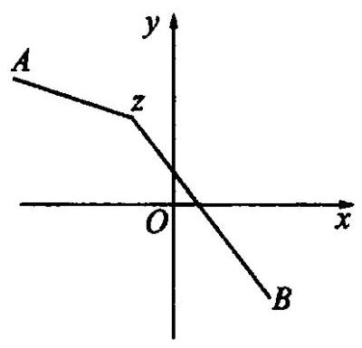

图 8-17

例 1 在复平面上已知两个定点 $A$ 和 $B$ ,它们所对应的复数分别为 $- 2 + {3i}$ 和 $1 - i$ ,求与 $A\text{ 、 }B$ 两点距离之比为 1:3 的动点 $Z$ 的轨迹方程 (如图 8-17).

解: 设动点 $Z$ 对应的复数为 $z$ ,

由题意得 $\left| \frac{ZA}{ZB}\right|  = \frac{1}{3}$ ,即 $\frac{\left| z + 2 - 3i\right| }{\left| z - 1 + i\right| } = \frac{1}{3}$ .

所以动点 $Z$ 的轨迹方程是 $\left| {z - 1 + i}\right|  = \; 3\left| {z + 2 - {3i}}\right|$ .

例 2 复数 $z = r\left( {\cos \theta  + i\sin \theta }\right) , w = u + {vi}$ ,且 $w = z + \frac{1}{z},\left( r\right.$ 是正实数, $\theta  \in  \mathbf{R})$ .

(1)试用 $r,\theta$ 表示 $u, v$ ；

(2)当 $r = 2$ 时,复数 $w$ 在复平面上对应的点 $W$ 的轨迹是什么图形?

(3)当 $\theta  = \frac{\pi }{3}$ 时，复数 $w$ 在复平面上对应的点 $W$ 的轨迹是什么图形？

解:(1)

$$
\left\{  \begin{array}{l} u = \left( {r + \frac{1}{r}}\right) \cos \theta , \\  v = \left( {r - \frac{1}{r}}\right) \sin \theta . \end{array}\right.
$$

(2) 当 $r = 2$ 时, $\left\{  \begin{array}{l} u = \frac{5}{2}\cos \theta , \\  v = \frac{3}{2}\sin \theta . \end{array}\right.$ 消去 $\theta$ ,得 $\frac{4{u}^{2}}{25} + \frac{4{v}^{2}}{9} = 1$ .

所以点 $W$ 的轨迹是一个椭圆.

(3) 当 $\theta  = \frac{\pi }{3}$ 时, $\left\{  \begin{array}{l} u = \frac{1}{2}\left( {r + \frac{1}{r}}\right) , \\  v = \frac{\sqrt{3}}{2}\left( {r - \frac{1}{r}}\right) . \end{array}\right.$ 消去 $r$ ,得 ${u}^{2} - \frac{{v}^{2}}{3} = 1\left( {u \geq  1}\right)$ .

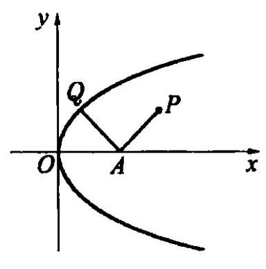

图 8-18

所以 $W$ 的轨迹是双曲线的右支.

例 3 设点 $Q$ 是抛物线 ${y}^{2} = {4x}$ 上一动点. 以点 $A\left( {6,0}\right)$ 为中心，将 ${AQ}$ 按顺时针方向旋转 ${90}^{ \circ  }$ ，得到 ${AP}$ . 求点 $P$ 的轨迹 (如图 8-18).

解: 设点 $Q$ 和 $P$ 的坐标分别为 $\left( {{x}_{1},{y}_{1}}\right)$ 和 $\left( {x, y}\right)$ , 对应的复数分别为 ${z}_{1} = {x}_{1} + {y}_{1}i, z = x + {yi}$ ,点 $A$ 对应的复数为 $6,\overrightarrow{AQ} = {z}_{1} - 6$ ,

因为 $\overrightarrow{AP}$ 是由 $\overrightarrow{AQ}$ 按顺时针方向旋转 ${90}^{ \circ  }$ 得到,所以 $\overrightarrow{AP}$ 对应的复数 $\left( {{z}_{1} - 6}\right)$ . $\left\lbrack  {\cos \left( {-\frac{\pi }{2}}\right)  + i\sin \left( {-\frac{\pi }{2}}\right) }\right\rbrack   = \left( {{z}_{1} - 6}\right) \left( {-i}\right)  =  - i{z}_{1} + {6i}.$

又, $\overrightarrow{AP} = \overrightarrow{OP} - \overrightarrow{OA}$ 对应的复数为 $z - 6$ ,所以

$$
- i{z}_{1} + {6i} = z - 6
$$

$$
- i\left( {{x}_{1} + {y}_{1}i}\right)  + {6i} = x + {yi} - 6.
$$

$$
\therefore \;{y}_{1} + \left( {6 - {x}_{1}}\right) i = x - 6 + {yi}\text{ . }
$$

$$
\therefore \left\{  \begin{array}{l} {y}_{1} = x - 6, \\  y = 6 - {x}_{1}, \end{array}\right. \text{ 即 }\left\{  \begin{array}{l} {x}_{1} = 6 - y, \\  {y}_{1} = x - 6. \end{array}\right.
$$

因为 $Q$ 在抛物线 ${y}^{2} = {4x}$ 上, $\therefore {y}_{1}^{2} = 4{x}_{1}$ . 代入,得所求抛物线为 ${\left( x - 6\right) }^{2} = \; - 4\left( {y - 6}\right)$ .

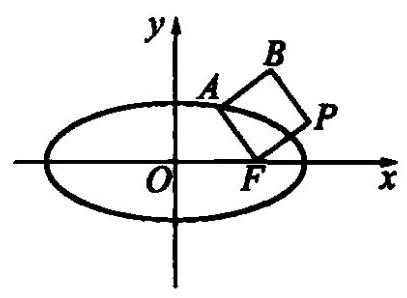

图 8-19

例 4 联结椭圆 $\frac{{x}^{2}}{4} + {y}^{2} = 1$ 的右焦点 $F$ 与椭圆上的动点 $A$ ,作正方形 ${FABP}(F, A, B, P$ 按顺时针方向排列) (如图 8-19),求顶点 $P$ 的轨迹方程.

解: 设点 $P$ 的坐标 $\left( {x, y}\right)$ 对应的复数为 $z$ . 取点 $A$ 的离心角 $\theta$ 为参数.

因为椭圆长轴 ${2a} = 4$ ,短轴 ${2b} = 2$ ,焦距 ${2c} = 2\sqrt{3}$ ,

$\therefore \overrightarrow{OA}$ 对应复数 $2\cos \theta  + i\sin \theta$ ,

$\rightarrow$

OF对应复数 $\sqrt{3}$ ，

$\overrightarrow{FA}$ 对应复数 $\left( {2\cos \theta  - \sqrt{3}}\right)  + i\sin \theta$ ,

$\overrightarrow{FP}$ 对应复数 $\left\lbrack  {\left( {2\cos \theta  - \sqrt{3}}\right)  + i\sin \theta }\right\rbrack  \left\lbrack  {\cos \left( {-\frac{\pi }{2}}\right)  + i\sin \left( {-\frac{\pi }{2}}\right) }\right\rbrack   = \sin \theta  + \; \left( {\sqrt{3} - 2\cos \theta }\right) i$

$\therefore \overrightarrow{OP}$ 对应复数 $z = \sqrt{3} + \sin \theta  + \left( {\sqrt{3} - 2\cos \theta }\right) i$ .

又 $z = x + {yi},\therefore \left\{  \begin{array}{l} x = \sqrt{3} + \sin \theta , \\  y = \sqrt{3} - 2\cos \theta . \end{array}\right.$

消去参数 $\theta$ ,得点 $P$ 的轨迹方程是 ${\left( x - \sqrt{3}\right) }^{2} + \frac{{\left( y - \sqrt{3}\right) }^{2}}{4} = 1$ .

1. 设 $z$ 是复数，在复平面上画出下列方程表示的图形:

(1) $\left| {z + i}\right|  + \left| {z - i}\right|  = 3$ ;

(2) $\left| {z + 2 - i}\right|  = \left| {z - 1 - {2i}}\right|$ ;

(3) $\left| {z + 3}\right|  = 2\left| {z - 3}\right|$

(4) $\left| {z - {3i}}\right|  = \left| {i + 2\bar{z}}\right|$ .

2. 在复平面上,求与复数 $- {2i}$ 和 ${2i}$ 所对应的点的距离平方差为 4 的点的轨迹方程.

3. 已知一个动圆和定圆 $\left| {z}_{1}\right|  = 2$ 相外切,又和定圆 $\left| {{z}_{2} - 6}\right|  = {10}$ 相内切,求此动圆圆心的轨迹方程.

4. 已知复数 $z$ 在复平面上对应的点 $Z$ 在以原点为圆心,2 为半径的圆上运动, 求复数 $w = i\left( {1 + z}\right)$ 对应的点 $W$ 运动的轨迹.

5. 已知复平面上的点 $Z$ 对应的复数 $z$ 满足条件 $\left| z\right|  = 1$ ，复数 $w = 3{z}^{2} + \frac{1}{{z}^{2}}$ ，求复数 $w$ 所对应的点 $W$ 的轨迹.

6. $M$ 为抛物线 $y = {x}^{2}$ 上一个动点. 联结原点 $O$ 与 $M$ . 以 ${OM}$ 为一边,作正方形 OMNK. 求动点 $K$ 的轨迹.

7. $A$ 为双曲线 $\frac{{x}^{2}}{{a}^{2}} - \frac{{y}^{2}}{{b}^{2}} = 1$ 上一点. 联结原点 $O$ 与 $A$ . 以 ${OA}$ 为直角边, $O$ 为直角顶点，作等腰直角三角形 ${AOC}$ . 当点 $A$ 在双曲线上运动时，求点 $C$ 的轨迹.

8. 已知抛物线 ${y}^{2} = {2px}\left( {p > 0}\right)$ 的焦点为 $F$ . $M$ 是抛物线上一动点. 以 ${MF}$ 为斜边,作等腰直角三角形 ${MFQ}\left( {M, F, Q}\right.$ 按顺时针方向排列). 求点 $Q$ 的轨迹方程.

9. 正 $n$ 边形 ${A}_{1}{A}_{2}\cdots {A}_{n}$ 在沿着直线 ${A}_{1}{A}_{n}$ 滚动时,求它的顶点 ${A}_{n}$ 的轨迹,并求所成的轨迹与直线 ${A}_{1}{A}_{n}$ 所围成的面积.

### 8.11 复数与几何

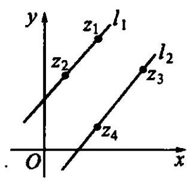

图 8-20

由复数减法的几何意义,点 ${z}_{1}\text{ 、 }{z}_{2}$ 之间的距离为 $\left| \overrightarrow{{z}_{1}{z}_{2}}\right|  = \left| {{z}_{1} - {z}_{2}}\right| .$

在两条直线 ${l}_{1}$ 和 ${l}_{2}$ 上分别取两点 ${Z}_{1},{Z}_{2}$ 和 ${Z}_{3},{Z}_{4}$ ,它们分别对应复数 ${z}_{1},{z}_{2},{z}_{3},{z}_{4}$ (如图 8-20). 不难得到,两直线 ${l}_{1}$ 和 ${l}_{2}$ 平行或重合的充要条件是 $\frac{{z}_{1} - {z}_{2}}{{z}_{3} - {z}_{4}} = \lambda$ ( $\lambda$ 为实数). 也可以写成 $\operatorname{Im}\left( \frac{{z}_{1} - {z}_{2}}{{z}_{3} - {z}_{4}}\right)  = 0$ . 由此还可以得出复数 ${z}_{1},{z}_{2},{z}_{3}$ 对应的三点 ${Z}_{1},{Z}_{2},{Z}_{3}$ 共线的充要条件是 $\frac{{z}_{2} - {z}_{1}}{{z}_{3} - {z}_{1}} = \lambda$ ( $\lambda$ 为实数),也可以写成 $\operatorname{Im}\left( \frac{{z}_{2} - {z}_{1}}{{z}_{3} - {z}_{1}}\right)  = 0.$

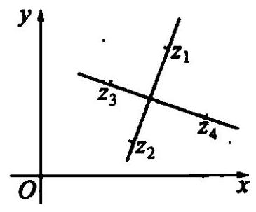

图 8-21

在两条相交直线 ${l}_{1}$ 和 ${l}_{2}$ 上分别取两点 ${Z}_{1},{Z}_{2}$ 和 ${Z}_{3},{Z}_{4}$ ,它们分别对应复数 ${z}_{1},{z}_{2},{z}_{3},{z}_{4}$ (如图 8-21). 则两条直线 ${l}_{1}$ 和 ${l}_{2}$ 垂直的充要条件是 $\frac{{z}_{1} - {z}_{2}}{{z}_{3} - {z}_{4}} = {\lambda i}$ ( $\lambda$ 为非零实数),也可以写成 $\operatorname{Re}\left( \frac{{z}_{1} - {z}_{2}}{{z}_{3} - {z}_{4}}\right)  = 0$ 且 $\operatorname{Im}\left( \frac{{z}_{1} - {z}_{2}}{{z}_{3} - {z}_{4}}\right)  \neq  0.$

复平面上两点 ${Z}_{1},{Z}_{2}$ ,它们所对应的复数分别为 ${z}_{1},{z}_{2}$ . 根据复数除法的几何意义,向量 $\overrightarrow{O{Z}_{1}}$ 和 $\overrightarrow{O{Z}_{2}}$ 的夹角是 $\theta  = \arg \frac{{z}_{1}}{{z}_{2}} \; \left( {0 \leq  \arg \frac{{z}_{1}}{{z}_{2}} \leq  \pi }\right)$ ,或 $\theta  = {2\pi } - \arg \frac{{z}_{1}}{{z}_{2}}\left( {\pi  < \arg \frac{{z}_{1}}{{z}_{2}} < {2\pi }}\right)$ . 如图 8-22.

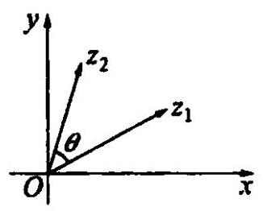

图 8-22

同样,如果点 $Z$ 所对应的复数为 $z$ ,那么向量 $\overrightarrow{Z{Z}_{1}}$ 和 $\overrightarrow{Z{Z}_{2}}$ 的夹角是 $\theta  = \arg \frac{{z}_{1} - z}{{z}_{2} - z}\left( {0 \leq  \arg \frac{{z}_{1} - z}{{z}_{2} - z} \leq  \pi }\right)$ ,或 $\theta  = \; {2\pi } - \arg \frac{{z}_{1} - z}{{z}_{2} - z}\left( {\pi  < \arg \frac{{z}_{1} - z}{{z}_{2} - z} < {2\pi }}\right)$ . 如图 8-23.

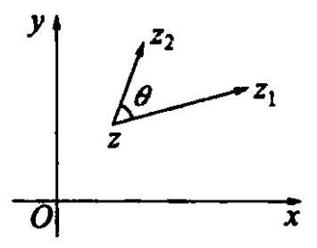

图 8-23

例 1 分别以任意三角形 ${ABC}$ 的边 ${AB}$ 和 ${AC}$ 为一边,在外侧作正三角形 ${ABD}$

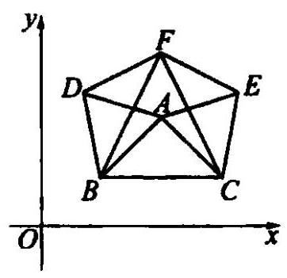

图 8-24

和 ${ACE}$ . 以边 ${BC}$ 为一边在内侧作正三角形 ${BCF}$ . 求证: ADFE 是平行四边形 (如图 8-24).

证: 建立直角坐标系,设 $A\text{ 、 }B\text{ 、 }C\text{ 、 }D\text{ 、 }E\text{ 、 }F$ 对应的复数分别为 $a\text{ 、 }b\text{ 、 }c\text{ 、 }d\text{ 、 }e\text{ 、 }f$ .

则 $\overrightarrow{BA}$ 对应的复数为 $a - b$ ,

$\overrightarrow{BD}$ 对应的复数 $\left( {a - b}\right) \left( {\cos \frac{\pi }{3} + i\sin \frac{\pi }{3}}\right)$ .

$\therefore \;d = \left( {a - b}\right) \left( {\frac{1}{2} + \frac{\sqrt{3}}{2}i}\right)  + a = \frac{1}{2}\left( {a + b}\right)  + \frac{\sqrt{3}}{2}\left( {a - b}\right) i.$

同理, $\overrightarrow{CE}$ 对应的复数为 $\left( {a - c}\right) \left( {\cos \left( {-\frac{\pi }{3}}\right)  + i\sin \left( {-\frac{\pi }{3}}\right) }\right)$ ,

$\therefore \;e = \left( {a - c}\right) \left( {\frac{1}{2} - \frac{\sqrt{3}}{2}i}\right)  + c = \frac{1}{2}\left( {a + c}\right)  - \frac{\sqrt{3}}{2}\left( {a - c}\right) i.$

$\overrightarrow{BF}$ 对应复数为 $\left( {c - b}\right) \left( {\cos \frac{\pi }{3} + i\sin \frac{\pi }{3}}\right)$ ,

$\therefore f = \left( {c - b}\right) \left( {\frac{1}{2} + \frac{\sqrt{3}}{2}i}\right)  + b = \frac{1}{2}\left( {c + b}\right)  + \frac{\sqrt{3}}{2}\left( {c - b}\right) i,$

$$
\frac{e - a}{f - d} = \frac{\frac{1}{2}\left( {a + c}\right)  - \frac{\sqrt{3}}{2}\left( {a - c}\right) i - a}{\frac{1}{2}\left( {c + b}\right)  + \frac{\sqrt{3}}{2}\left( {c - b}\right) i - \frac{1}{2}\left( {a + b}\right)  - \frac{\sqrt{3}}{2}\left( {a - b}\right) i} = 1,
$$

$\therefore {AE}\underline{ \text{ ⫫ } }{DF}$ .

同理, ${AD}\underline{ \text{ ⫫ } }{EF}.\;\therefore {ADFE}$ 是平行四边形.

例 2 设在复平面上有三个点 $A, B, C$ . 它们对应的复数分别为 $z,{z}^{2},{z}^{3}$ . 其中 $\left| z\right|  = 2$ . 若 $\bigtriangleup {ABC}$ 为直角三角形,求复数 $z$ .

解: $\because \left| z\right|  = 2,\therefore z \neq  0$ .

(1)若 $A$ 为直角顶点，则 ${AB} \bot  {AC}$ .

$\therefore \frac{{z}^{3} - z}{{z}^{2} - z} = {\lambda i}\left( {\lambda \text{ 为非零实数 }}\right) .\;\therefore z =  - 1 + {\lambda i}$ .

由 $\left| z\right|  = 2$ ,得 $\left| {-1 + {\lambda i}}\right|  = 2$ .

$\therefore \sqrt{{\left( -1\right) }^{2} + {\lambda }^{2}} = 2.\;\therefore \lambda  =  \pm  \sqrt{3}.\;\therefore z =  - 1 \pm  \sqrt{3}i$ .

(2)若 $B$ 为直角顶点，则 ${AB}\bot {BC}$ .

$\therefore \;\frac{{z}^{3} - {z}^{2}}{z - {z}^{2}} = {\lambda i}$ ( $\lambda$ 为非零实数). $\;\therefore \;z =  - {\lambda i}.$

由 $\left| z\right|  = 2$ ,得 $\left| {-{\lambda i}}\right|  = 2.\therefore z =  \pm  {2i}$ .

(3)若 $C$ 为直角顶点，则 ${AC}\bot {BC}$ .

$\therefore \frac{{z}^{2} - {z}^{3}}{z - {z}^{3}} = {\lambda i}$ ( $\lambda$ 为非零实数). $\therefore z = \frac{\lambda i}{1 - {\lambda i}}$ .

由 $\left| z\right|  = 2$ ,得 $\left| \frac{\lambda i}{1 - {\lambda i}}\right|  = 2.\therefore \frac{{\lambda }^{2}}{1 + {\lambda }^{2}} = 4$ . 即 $3{\lambda }^{2} + 4 = 0$ .

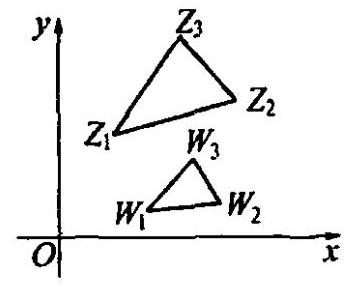

图 8-25

这样的 $\lambda$ 不存在, $\therefore C$ 不可能是直角顶点.

综上所述， $z =  - 1 + \sqrt{3}i$ 或 $z =  \pm  {2i}$ .

例 3 如图 8-25， $\bigtriangleup {Z}_{1}{Z}_{2}{Z}_{3}$ 和 $\bigtriangleup {W}_{1}{W}_{2}{W}_{3}$ 顶点上排列的方向相同，它们对应的复数分别为 ${z}_{1},{z}_{2},{z}_{3}$ 和 ${w}_{1},{w}_{2},{w}_{3}$ ,那么 $\bigtriangleup {Z}_{1}{Z}_{2}{Z}_{3}$ 相似于 $\bigtriangleup {W}_{1}{W}_{2}{W}_{3}$ 的充要条件是 $\frac{{z}_{2} - {z}_{1}}{{z}_{3} - {z}_{1}} = \frac{{w}_{2} - {w}_{1}}{{w}_{3} - {w}_{1}}$ .

证: 必要性: $\because \bigtriangleup {Z}_{1}{Z}_{2}{Z}_{3} \backsim  \bigtriangleup {W}_{1}{W}_{2}{W}_{3}$ ,

$\therefore \angle {Z}_{1}{Z}_{2}{Z}_{3} = \angle {W}_{1}{W}_{2}{W}_{3}$ ,且 $\frac{\left| {Z}_{2}{Z}_{1}\right| }{\left| {Z}_{3}{Z}_{1}\right| } = \frac{\left| {W}_{2}{W}_{1}\right| }{\left| {W}_{3}{W}_{1}\right| }$ .

即 $\arg \left( \frac{{z}_{2} - {z}_{1}}{{z}_{3} - {z}_{1}}\right)  = \arg \left( \frac{{w}_{3} - {w}_{1}}{{w}_{2} - {w}_{1}}\right)$ ,且 $\frac{\left| {z}_{2} - {z}_{1}\right| }{\left| {z}_{3} - {z}_{1}\right| } = \frac{\left| {w}_{2} - {w}_{1}\right| }{\left| {w}_{3} - {w}_{1}\right| }$ .

即 $\frac{{z}_{2} - {z}_{1}}{{z}_{3} - {z}_{1}} = \frac{{w}_{2} - {w}_{1}}{{w}_{3} - {w}_{1}}$ .

充分性: 上述过程可以逆推,所以由 $\frac{{z}_{2} - {z}_{1}}{{z}_{3} - {z}_{1}} = \frac{{w}_{2} - {w}_{1}}{{w}_{3} - {w}_{1}}$ 可以得到 $\bigtriangleup {Z}_{1}{Z}_{2}{Z}_{3} \rightsquigarrow \; \bigtriangleup {W}_{1}{W}_{2}{W}_{3}$ .

例 4 已知 ${Z}_{1},{Z}_{2},{Z}_{3}$ 三点对应的复数分别是 ${z}_{1},{z}_{2},{z}_{3}$ ,求证: $\bigtriangleup {Z}_{1}{Z}_{2}{Z}_{3}$ 是正三角形的充要条件是 ${z}_{1}^{2} + {z}_{2}^{2} + {z}_{3}^{2} = {z}_{1}{z}_{2} + {z}_{1}{z}_{3} + {z}_{2}{z}_{3}$ .

证: 必要性: $\because \bigtriangleup {Z}_{1}{Z}_{2}{Z}_{3}$ 是正三角形,

$\therefore \;\bigtriangleup {Z}_{1}{Z}_{2}{Z}_{3} \backsim  \bigtriangleup {Z}_{2}{Z}_{3}{Z}_{1}$ .

$\therefore \;\frac{{z}_{2} - {z}_{1}}{{z}_{3} - {z}_{1}} = \frac{{z}_{3} - {z}_{2}}{{z}_{1} - {z}_{2}}$

$\therefore \; - {\left( {z}_{1} - {z}_{2}\right) }^{2} = \left( {{z}_{3} - {z}_{1}}\right) \left( {{z}_{3} - {z}_{2}}\right) ,$

即 ${z}_{1}^{2} + {z}_{2}^{2} + {z}_{3}^{2} = {z}_{1}{z}_{2} + {z}_{1}{z}_{3} + {z}_{2}{z}_{3}$ .

充分性: 上述过程可以逆推,由 ${z}_{1}^{2} + {z}_{2}^{2} + {z}_{3}^{2} = {z}_{1}{z}_{2} + {z}_{1}{z}_{3} + {z}_{2}{z}_{3}$ ,可以得到 $\bigtriangleup {Z}_{1}{Z}_{2}{Z}_{3}$ 是正三角形.

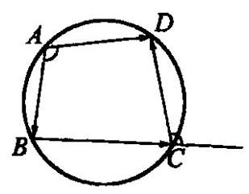

图 8-26

例 5 设 $A, B, C, D$ 为平面上任意四点,求证:

$$
\left| {AC}\right|  \cdot  \left| {BD}\right|  \leq  \left| {AB}\right|  \cdot  \left| {CD}\right|  + \left| {BC}\right|  \cdot  \left| {AD}\right| .
$$

证: 设 $A\text{ 、 }B\text{ 、 }C\text{ 、 }D$ 对应的复数依次为 ${z}_{1}\text{ 、 }{z}_{2}\text{ 、 }{z}_{3}\text{ 、 }{z}_{4}$ (如图 8-26), 欲证不等式在复平面上等价于

$$
\left| {{z}_{3} - {z}_{1}}\right|  \cdot  \left| {{z}_{4} - {z}_{2}}\right|  \leq  \left| {{z}_{2} - {z}_{1}}\right|  \cdot  \left| {{z}_{4} - {z}_{3}}\right|  + \left| {{z}_{4} - {z}_{1}}\right|  \cdot  \left| {{z}_{3} - {z}_{2}}\right| .
$$

①

构造恒等式

$$
\left( {{z}_{2} - {z}_{1}}\right) \left( {{z}_{4} - {z}_{3}}\right)  + \left( {{z}_{4} - {z}_{1}}\right) \left( {{z}_{3} - {z}_{2}}\right)  = \left( {{z}_{3} - {z}_{1}}\right) \left( {{z}_{4} - {z}_{2}}\right) .
$$

两边取模,得

$$
\left| {\left( {{z}_{3} - {z}_{1}}\right) \left( {{z}_{4} - {z}_{2}}\right) }\right|
$$

$$
= \left| {\left( {{z}_{2} - {z}_{1}}\right) \left( {{z}_{4} - {z}_{3}}\right)  + \left( {{z}_{4} - {z}_{1}}\right) \left( {{z}_{3} - {z}_{2}}\right) }\right|
$$

$$
\leq  \left| {\left( {{z}_{2} - {z}_{1}}\right) \left( {{z}_{4} - {z}_{3}}\right) }\right|  + \left| {\left( {{z}_{4} - {z}_{1}}\right) \left( {{z}_{3} - {z}_{2}}\right) }\right|
$$

$$
= \left| {{z}_{2} - {z}_{1}}\right| \left| {{z}_{4} - {z}_{3}}\right|  + \left| {{z}_{4} - {z}_{1}}\right| \left| {{z}_{3} - {z}_{2}}\right| ,
$$

所以不等式成立.

①式等号成立当且仅当 $\left( {{z}_{2} - {z}_{1}}\right) \left( {{z}_{4} - {z}_{3}}\right)$ 与 $\left( {{z}_{3} - {z}_{2}}\right) \left( {{z}_{4} - {z}_{1}}\right)$ 平行而且同向,即 $\frac{\left( {{z}_{2} - {z}_{1}}\right) \left( {{z}_{4} - {z}_{3}}\right) }{\left( {{z}_{3} - {z}_{2}}\right) \left( {{z}_{4} - {z}_{1}}\right) } = K\left( {K > 0}\right)$ ,

即 $\arg \frac{{z}_{4} - {z}_{3}}{{z}_{3} - {z}_{2}} = \arg \frac{{z}_{4} - {z}_{1}}{{z}_{2} - {z}_{1}}$ .

如图 8-26,有 $\angle {DCB} = \arg \frac{{z}_{4} - {z}_{3}}{{z}_{3} - {z}_{2}},\angle {BAD} = \arg \frac{{z}_{4} - {z}_{1}}{{z}_{2} - {z}_{1}}$ ,所以当且仅当 $\angle {DCE} = \; \angle {BAD}$ 时，也即 $A$ 、 $B$ 、 $C$ 、 $D$ 四点共圆时，等号成立.

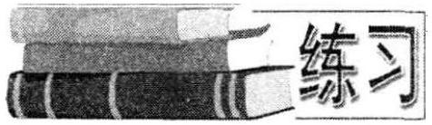

1. 在等腰直角三角形 ${ABC}$ 中, $\angle C$ 是直角, 点 $D$ 是 ${BC}$ 中点,点 $E$ 在 ${AB}$ 上,且 ${AE} = {2EB}$ ,求证: ${AD} \bot  {CE}$ .

2. 在椭圆 $\frac{{x}^{2}}{45} + \frac{{y}^{2}}{20} = 1$ 上求一点 $P$ ,使它与两个焦点 ${F}_{1}$ 和 ${F}_{2}$ 的连线互相垂直.

3. 设 $w =  - \frac{1}{2} + \frac{\sqrt{3}}{2}i$ ,以复平面上三个点 $O, A = W - Z, B = W + Z$ 为顶点的三角形是等腰直角三角形,求复数 $z$ .

4. 若 ${z}_{1},{z}_{2},{z}_{3}$ 三个复数满足下列条件: ${z}_{1} + {z}_{2} + {z}_{3} = 0$ 且 $\left| {z}_{1}\right|  = \left| {z}_{2}\right|  = \; \left| {z}_{3}\right|  = 1$ ,求证: ${Z}_{1},{Z}_{2},{Z}_{3}$ 是内接于单位圆的正三角形的三个顶点.

5. 证明 ${\left| {z}_{1} + {z}_{2}\right| }^{2} + {\left| {z}_{1} - {z}_{2}\right| }^{2} = 2\left( {{\left| {z}_{1}\right| }^{2} + {\left| {z}_{2}\right| }^{2}}\right)$ ,并说明它的几何意义.

6. 平面上有两个正三角形 ${ABC}$ 和 ${A}_{1}{B}_{1}{C}_{1}$ (顶点按顺时针方向排列)，边 ${BC}$ 与 ${B}_{1}{C}_{1}$ 的中点重合,求证: (1) $A{A}_{1} \bot  B{B}_{1},\left( 2\right) A{A}_{1} : B{B}_{1} = \sqrt{3} : 1$ .

7. $\bigtriangleup {ABC}$ 的三个顶点对应的复数分别为 ${z}_{1},{z}_{2},{z}_{3}$ . 若 $\frac{{z}_{2} - {z}_{1}}{{z}_{3} - {z}_{1}} = 1 + \frac{4}{3}i$ ,试求 $\bigtriangleup {ABC}$ 的三边之比.

8. 设复数 $1,2,\beta ,{2\beta },\frac{2}{\beta }$ 在复平面上对应的点分别为 $L, A, B, C, D$ ,求证: $\bigtriangleup {OLA} \backsim  \bigtriangleup {OBC},\bigtriangleup {OLB} \backsim  \bigtriangleup {ODA}.$

9. 试推导三角形面积公式:

$$
{S}_{ABC} = \frac{1}{2}\left| {\operatorname{Im}\left( {{z}_{1} \cdot  {z}_{2} + {z}_{2} \cdot  {z}_{3} + {z}_{3} \cdot  {z}_{1}}\right) }\right|
$$

(其中 ${z}_{1},{z}_{2},{z}_{3}$ 为 $A, B, C$ 在复平面内对应的复数).

### 8.12 复数与三角

设复数 $z = r\left( {\cos \theta  + i\sin \theta }\right)$ (模为 $r$ ,辐角为 $\theta$ ). 不妨令 $r = 1$ .

由棣莫佛定理, 得:

$$
{z}^{n} = \cos {n\theta } + i\sin {n\theta }\left( {n \in  {\mathbf{N}}^{ * }}\right) ,
$$

$$
{\bar{z}}^{n} = \cos {n\theta } - i\sin {n\theta }\left( {n \in  {\mathbf{N}}^{ * }}\right) .
$$

于是有 ${z}^{n} + {\bar{z}}^{n} = 2\cos {n\theta },{z}^{n} - {\bar{z}}^{n} = {2i}\sin {n\theta },{z}^{n} \cdot  {\bar{z}}^{n} = 1$ .

$$
\therefore \;\cos {n\theta } = \frac{{z}^{n} + {\bar{z}}^{n}}{2} = \frac{{z}^{2n} + 1}{2{z}^{n}}\text{ ; }
$$

①

$$
\sin {n\theta } = \frac{{z}^{n} - {\bar{z}}^{n}}{2i} = \frac{1 - {z}^{2n}}{2 \cdot  {z}^{n}}i
$$

②

$$
\tan {n\theta } = \frac{{z}^{2n} - 1}{i\left( {{z}^{2n} + 1}\right) }.
$$

③

下面来推导成等差数列的各角的正弦、余弦和的公式

设 $z = \cos \theta  + i\sin \theta$ ,则 ${z}^{2} = \cos {2\theta } + i\sin {2\theta },{z}^{3} = \cos {3\theta } + i\sin {3\theta },\cdots ,{z}^{n} = \cos {n\theta } + \; i\sin \theta$ . 两边相加,得

$$
\mathop{\sum }\limits_{{k = 1}}^{n}\cos {k\theta } + i\mathop{\sum }\limits_{{k = 1}}^{n}\sin {k\theta } = z + {z}^{2} + {z}^{3} + \cdots  + {z}^{n}
$$

$$
= \frac{z\left( {1 - {z}^{n}}\right) }{1 - z}
$$

$$
= \frac{\left( {\cos \theta  + i\sin \theta }\right) \left\lbrack  {1 - {\left( \cos \theta  + i\sin \theta \right) }^{n}}\right\rbrack  }{1 - \left( {\cos \theta  + i\sin \theta }\right) }
$$

$$
= \frac{1 - \cos {n\theta } - i\sin {n\theta }}{1 - \cos \theta  - i\sin \theta } \cdot  \left( {\cos \theta  + i\sin \theta }\right)
$$

$$
= \frac{2{\sin }^{2}\frac{n\theta }{2} - {2i}\sin \frac{n\theta }{2}\cos \frac{n\theta }{2}}{2{\sin }^{2}\frac{\theta }{2} - {2i}\sin \frac{\theta }{2}\cos \frac{\theta }{2}} \cdot  \left( {\cos \theta  + i\sin \theta }\right)
$$

$$
\begin{array}{l}  = \frac{\sin \frac{n\theta }{2}}{\sin \frac{\theta }{2}} \cdot  \frac{\sin \frac{n\theta }{2} - i\cos \frac{n\theta }{2}}{\sin \frac{\theta }{2} - i\cos \frac{\theta }{2}} \cdot  \left( {\cos \theta  + i\sin \theta }\right) \\  \end{array}
$$

$$
= \frac{\sin \frac{n\theta }{2}}{\sin \frac{\theta }{2}} \cdot  \frac{\cos \left( {\frac{n\theta }{2} - \frac{\pi }{2}}\right)  + i\sin \left( {\frac{n\theta }{2} - \frac{\pi }{2}}\right) }{\cos \left( {\frac{\theta }{2} - \frac{\pi }{2}}\right)  + i\sin \left( {\frac{\theta }{2} - \frac{\pi }{2}}\right) } \cdot  (\cos \theta  + i\sin \theta
$$

$$
= \frac{\sin \frac{n\theta }{2}}{\sin \frac{\theta }{2}} \cdot  \left( {\cos \frac{n + 1}{2}\theta  + i\sin \frac{n + 1}{2}\theta }\right) .
$$

由复数相等的条件, 得

$$
\mathop{\sum }\limits_{{k = 1}}^{n}\cos {k\theta } = \frac{\sin \frac{n\theta }{2} \cdot  \cos \frac{n + 1}{2}\theta }{\sin \frac{\theta }{2}},\mathop{\sum }\limits_{{k = 1}}^{n}\sin {k\theta } = \frac{\sin \frac{n\theta }{2} \cdot  \sin \frac{n + 1}{2}\theta }{\sin \frac{\theta }{2}}.
$$

例 1 求 $\sin \frac{\pi }{18} \cdot  \sin \frac{3\pi }{18} \cdot  \sin \frac{5\pi }{18} \cdot  \sin \frac{7\pi }{18} \cdot  \sin \frac{9\pi }{18}$ 的值.

解: 由诱导公式,

$$
\text{ 原式 } = \cos \frac{4\pi }{9} \cdot  \cos \frac{3\pi }{9} \cdot  \cos \frac{2\pi }{9} \cdot  \cos \frac{\pi }{9}
$$

$$
= \frac{1}{2} \cdot  \cos \frac{\pi }{9} \cdot  \cos \frac{2\pi }{9} \cdot  \cos \frac{4\pi }{9}.
$$

设 $z = \cos \frac{\pi }{9} + i\sin \frac{\pi }{9}$ ,由公式①, $\cos {n\theta } = \frac{{z}^{2n} + 1}{2{z}^{n}}$ ,

$\therefore$ 上式 $= \frac{1}{2} \cdot  \frac{\left( {{z}^{2} + 1}\right) \left( {{z}^{4} + 1}\right) \left( {{z}^{8} + 1}\right) }{{2z} \cdot  2{z}^{2} \cdot  2{z}^{4}}$

$$
= \frac{\left( {{z}^{2} + 1}\right) \left( {{z}^{4} + 1}\right) \left( {{z}^{8} + 1}\right) }{{16}{z}^{7}}
$$

$$
= \frac{1 + {z}^{2} + {z}^{4} + {z}^{6} + {z}^{8} + {z}^{10} + {z}^{12} + {z}^{14}}{{16}{z}^{7}}
$$

$$
= \frac{1}{{16}{z}^{7}} \cdot  \frac{\left\lbrack  1 - {\left( {z}^{2}\right) }^{8}\right\rbrack  }{1 - {z}^{2}} = \frac{1}{{16}{z}^{7}} \cdot  \frac{1 - {z}^{16}}{1 - {z}^{2}}\text{ . }
$$

$\because \;z = \cos \frac{\pi }{9} + i\sin \frac{\pi }{9},\;\therefore {z}^{9} =  - 1,{z}^{18} = 1$ .

$\therefore$ 上式 $= \frac{1}{{16}{z}^{9}} \cdot  \frac{{z}^{2} - {z}^{18}}{1 - {z}^{2}} =  - \frac{1}{16} \cdot  \frac{{z}^{2} - 1}{1 - {z}^{2}} = \frac{1}{16}$ .

例 2 把 ${\sin }^{3}x \cdot  {\cos }^{5}x$ 化为和差形式.

解: 设 $z = \cos x + i\sin x$ ,则

$$
\cos x = \frac{{z}^{2} + 1}{2z},\sin x = \frac{i\left( {1 - {z}^{2}}\right) }{2z},\sin {nx} = \frac{i\left( {1 - {z}^{2n}}\right) }{2{z}^{n}}.
$$

$\therefore \;{\sin }^{3}x \cdot  {\cos }^{5}x = {\left\lbrack  \frac{i\left( {1 - {z}^{2}}\right) }{2z}\right\rbrack  }^{3} \cdot  {\left( \frac{{z}^{2} + 1}{2z}\right) }^{5}$

$$
=  - \frac{i}{{256}{z}^{8}}\left( {-{z}^{16} - 2{z}^{14} + 2{z}^{12} + 6{z}^{10} - 6{z}^{6} - 2{z}^{4} + 2{z}^{2} + 1}\right)
$$

$$
=  - \frac{1}{128}\left\lbrack  {\frac{i\left( {1 - {z}^{16}}\right) }{2{z}^{8}} + \frac{{2i}\left( {1 - {z}^{12}}\right) }{2{z}^{6}} - \frac{{2i}\left( {1 - {z}^{8}}\right) }{2{z}^{4}} - \frac{{6i}\left( {1 - {z}^{4}}\right) }{2{z}^{2}}}\right\rbrack  .
$$

$$
=  - \frac{1}{128}\left( {\sin {8x} + 2\sin {6x} - 2\sin {4x} - 6\sin {2x}}\right) .
$$

例 3 计算: $\arctan \frac{1}{3} + \arctan \frac{1}{5} + \arctan \frac{1}{7} + \arctan \frac{1}{8}$ .

解: $\arctan \frac{1}{3},\arctan \frac{1}{5},\arctan \frac{1}{7},\arctan \frac{1}{8}$ 分别为复数 ${z}_{1} = 3 + i,{z}_{2} = \; 5 + i,{z}_{3} = 7 + i,{z}_{4} = 8 + i$ 的辐角主值. 且 $0 < \arctan \frac{1}{3} < \frac{\pi }{2},0 < \arctan \frac{1}{5} < \frac{\pi }{2}$ , $0 < \arctan \frac{1}{7} < \frac{\pi }{2},0 < \arctan \frac{1}{8} < \frac{\pi }{2}\therefore \;0 < \arctan \frac{1}{3} + \arctan \frac{1}{5} + \arctan \frac{1}{7} \; + \arctan \frac{1}{8} < {2\pi }$

$$
\therefore \;\arctan \frac{1}{3} + \arctan \frac{1}{5} + \arctan \frac{1}{7} + \arctan \frac{1}{8}
$$

$$
= \arg {z}_{1} + \arg {z}_{2} + \arg {z}_{3} + \arg {z}_{4}
$$

$$
= \arg \left( {{z}_{1} \cdot  {z}_{2} \cdot  {z}_{3} \cdot  {z}_{4}}\right)  = \arg \left\lbrack  {\left( {3 + i}\right) \left( {5 + i}\right) \left( {7 + i}\right) \left( {8 + i}\right) }\right\rbrack
$$

$$
= \arg \left\lbrack  {{650}\left( {1 + i}\right) }\right\rbrack   = \frac{\pi }{4}.
$$

故 $\arctan \frac{1}{3} + \arctan \frac{1}{5} + \arctan \frac{1}{7} + \arctan \frac{1}{8} = \frac{\pi }{4}$ .

例 4 解三角方程 $\sin {3x} = 8{\sin }^{3}x$ .

解: 设 $z = \cos x + i\sin x$ ,则

$$
\sin x = \frac{i\left( {1 - {z}^{2}}\right) }{2z},\;\sin {3x} = \frac{1 - {z}^{6}}{2{z}^{3}}i,
$$

$\therefore \;\frac{1 - {z}^{6}}{2{z}^{3}}i = 8{\left\lbrack  \frac{i\left( {1 - {z}^{2}}\right) }{2z}\right\rbrack  }^{3}$ .

变形,得 $3{z}^{6} - 6{z}^{4} + 6{z}^{2} - 3 = 0$ ,

得 $\left( {{z}^{2} - 1}\right) \left( {{z}^{4} - {z}^{2} + 1}\right)  = 0$ ,

$\therefore {z}^{2} = 1$ 或 ${z}^{2} = \frac{1 \pm  \sqrt{3}i}{2}$ .

由 ${z}^{2} = 1$ ,得 $z =  \pm  1$ ,即 $\cos x + i\sin x =  \pm  1$ ,

$\therefore \cos x =  \pm  1,\therefore x = {k\pi }\left( {k \in  \mathbf{Z}}\right)$ .

由 ${z}^{2} = \frac{1 \pm  \sqrt{3}i}{2}$ ,即 $\cos {2x} + i\sin {2x} = \frac{1 \pm  \sqrt{3}i}{2}$ ,

$\therefore \;\cos {2x} = \frac{1}{2},\;\therefore \;{2x} = {2k\pi } \pm  \frac{\pi }{3}, x = {k\pi } \pm  \frac{\pi }{6}\left( {k \in  \mathbf{Z}}\right) .$

由上,方程的解集为 $\left\{  {x\left| {\;x = {k\pi }\text{ 或 }x = {k\pi } \pm  \frac{\pi }{6}\left( {k \in  \mathbf{Z}}\right) }\right. }\right\}$ .

例 5 求和: (1) $\sin \frac{2\pi }{n} + 2\sin \frac{4\pi }{n} + \cdots  + \left( {n - 1}\right) \sin \frac{2\left( {n - 1}\right) \pi }{n}$ ;

(2) $\cos \frac{2\pi }{n} + 2\cos \frac{4\pi }{n} + \cdots  + \left( {n - 1}\right) \cos \frac{2\left( {n - 1}\right) \pi }{n}$ .

解: 记 $A = \cos \frac{2\pi }{n} + 2\cos \frac{4\pi }{n} + \cdots  + \left( {n - 1}\right) \cos \frac{2\left( {n - 1}\right) \pi }{n}$ ,

$$
B = \sin \frac{2\pi }{n} + 2\sin \frac{4\pi }{n} + \cdots  + \left( {n - 1}\right) \sin \frac{2\left( {n - 1}\right) \pi }{n}.
$$

并设 $\varepsilon  = \cos \frac{2\pi }{n} + i\sin \frac{2\pi }{n}$ .

则有 ${\varepsilon }^{n} = 1$ ,且 $1 + \varepsilon  + {\varepsilon }^{2} + \cdots  + {\varepsilon }^{n - 1} = 0$ .

设 $S = 1 + {2\varepsilon } + 3{\varepsilon }^{2} + \cdots  + n{\varepsilon }^{n - 1}$ ,则 ${\varepsilon S} = \varepsilon  + 2{\varepsilon }^{2} + 3{\varepsilon }^{3} + \cdots  + \left( {n - 1}\right) {\varepsilon }^{n - 1} + \; n{\varepsilon }^{n},$

$$
\therefore \;\left( {1 - \varepsilon }\right)  \cdot  S = 1 + \varepsilon  + {\varepsilon }^{2} + \cdots  + {\varepsilon }^{n - 1} - n{\varepsilon }^{n} = \frac{1 - {\varepsilon }^{n}}{1 - \varepsilon } - n \cdot  {\varepsilon }^{n} =  - n.
$$

$\therefore \;S = \frac{n}{\varepsilon  - 1}$ .

$$
A + {Bi} = \frac{n}{\varepsilon  - 1} = \frac{n\left( {\overline{\varepsilon } - 1}\right) }{\left( {\varepsilon  - 1}\right) \left( {\overline{\varepsilon } - 1}\right) } = \frac{n\left( {\cos \frac{2\pi }{n} - 1 - i\sin \frac{2\pi }{n}}\right) }{{\left( \cos \frac{2\pi }{n} - 1\right) }^{2} + {\sin }^{2}\frac{2\pi }{n}}
$$

$$
= \frac{n\left( {\cos \frac{2\pi }{n} - 1}\right)  - {in}\sin \frac{2\pi }{n}}{2\left( {1 - \cos \frac{2\pi }{n}}\right) } =  - \frac{n}{2} - i\frac{n}{2}\cot \frac{\pi }{n}.
$$

由此可得

$$
\sin \frac{2\pi }{n} + 2\sin \frac{4\pi }{n} + \cdots  + \left( {n - 1}\right) \sin \frac{2\left( {n - 1}\right) \pi }{n} =  - \frac{n}{2}\cot \frac{\pi }{n};
$$

$$
\cos \frac{2\pi }{n} + 2\cos \frac{4\pi }{n} + \cdots  + \left( {n - 1}\right) \cos \frac{2\left( {n - 1}\right) \pi }{n} =  - \frac{n}{2}.
$$

1. 求和: ${\cos }^{ \circ  } + \cos {2}^{ \circ  } + \cdots  + \cos {89}^{ \circ  } +$

2. 求值: $\cos \frac{\pi }{7} - \cos \frac{2\pi }{7} + \cos \frac{3\pi }{7}$ .

3. 若 $0 < \theta  < \pi$ ,求证: $\left| {\sin {n\theta }}\right|  \leq  n\sin \theta \left( {n \in  {\mathbf{N}}^{ * }}\right)$ .

4. 计算: $\arcsin \frac{3}{\sqrt{10}} + \arccos \frac{2}{\sqrt{5}} + \arctan \frac{1}{3} + \arctan \frac{1}{2}$ .

5. 求 $\sin \left( {\arctan \frac{3}{4} + \operatorname{arc}\sin \frac{4}{5} + 2\operatorname{arc}\cos \frac{5}{13}}\right)$ 的值.

6. 已知 $0 < \alpha  < \beta  < \chi  < {2\pi }$ ,且 $\cos \alpha  + \cos \beta  + \cos \chi  = \sin \alpha  + \sin \beta  + \sin \chi  = 0$ ,求 $\beta  - \alpha$ 与 $x - \beta$ 的值.

7. 已知 $x + \frac{1}{x} = 2\cos \theta$ ,求证: ${x}^{n} + \frac{1}{{x}^{n}} = 2\cos {n\theta }$ .

8. 求 $\tan \frac{3\pi }{11} + 4\sin \frac{2\pi }{11}$ 的值 (不查表).

## 一、选择题

## 复习参考题

1. $n \in  \mathbf{N}$ ,且 ${\left( 1 + i\right) }^{n}$ 是纯虚数, $n$ 的最小值是 ( )

(A) 0 . (B) 2 . (C) 4. (D) 6.

2. $\theta  \in  \left( {{3\pi },{4\pi }}\right)$ ,则 $1 - \cos \theta  - i\sin \theta$ 的辐角主值是 ( )

(A) $\frac{\pi  + \theta }{2}$ . (B) $\frac{\pi  - \theta }{2}$ . (C) $\frac{{3\pi } - \theta }{2}$ . (D) $\frac{\theta  - {3\pi }}{2}$ .

3. 设 $z = x + {yi}\left( {x, y \in  \mathbf{R}}\right)$ ,则 $\frac{z - 1}{z + 1}$ 是纯虚数的充要条件是 ( )

(A) $x = 1$ . (B) $\left| z\right|  = 1$ .

(C) $x = 1$ 且 $y \neq  0$ . (D) $\left| z\right|  = 1$ 且 $z \neq   \pm  1$ .

4. 方程 ${z}^{2} - 5\left| z\right|  + 6 = 0$ 在复数集内的解的个数是 ( )

(A) 2 . (B) 3 . (C) 4 . (D) 6 .

5. 已知 $z \in  \mathbf{C},\arg \left( {z - i}\right)  = \frac{\pi }{4},\left| z\right|  = \sqrt{5}$ ,则 $z =$ ( )

(A) $1 + {2i}$ . (B) $- 2 - i$ . (C) $1 - {2i}$ . (D) $2 + i$ .

6. 复平面内, $z =  - 1 + i$ ,则 $\bar{z}$ 在第(   )象限

(A) 1 . (B) 2 . (C) 3 . (D) 4 .

7. 设 $\arg z = \theta \left( {0 \leq  \theta  < \pi }\right)$ ,则 $\arg {z}^{2} =$ ( )

(A) ${2\theta }$ . (B) $- {2\theta }$ . (C) ${2\pi } - {2\theta }$ . (D) ${2\theta } - {2\pi }$ .

8. 满足 $\left| {z - {25i}}\right|  \leq  {15}$ 的辐角最小的复数是 ( )

(A) ${10i}$ . (B) ${25i}$ . (C) ${12} + {10i}$ . (D) ${12} + {16i}$ .

9. 复平面内,复数 $z$ 满足 $\arg \left( {z + 3}\right)  = \frac{3}{4}\pi$ ,则 $\left| {z + 6}\right|  + \left| {z - {3i}}\right|$ 的最小值是

( )

(A) $3\sqrt{5}$ . (B) 3 . (C) $5\sqrt{3}$ . (D) 5 .

10. 设 $z = \cos \theta  + i\sin \theta ,\theta  \in  \lbrack 0,{2\pi })$ ,要使 $\left| {z + 1 - i}\right|$ 的值最大,则 $\theta$ 值应是 ( )

(A) $\frac{3\pi }{4}$ . (B) $\frac{7\pi }{4}$ . (C) $\frac{3\pi }{4}$ 或 $\frac{7\pi }{4}$ . (D) 以上都不是.

## 二、填空题

11. 方程 ${x}^{2} + \left( {k + {2i}}\right) x + 2 + {ki} = 0$ 有实根，则实数 $k$ 是___.

12. 已知 $z = {\log }_{\frac{1}{3}}9 + 2\left| {1 + \sqrt{2}i}\right| i$ ，则 $\left| z\right|  =$ ___.

13. $\cos {90}^{ \circ  } + i\sin {30}^{ \circ  }$ 的三角形式是___.

14. 已知 ${z}_{1} = \frac{1 + {2i}}{3 - i},\overline{{z}_{2}} = \frac{\overline{{z}_{1}}}{2 - i}$ ,则 ${z}_{2} =$ ___.

15. 已知 $\left| {z}_{1}\right|  = \left| {z}_{2}\right|  = \left| {z}_{3}\right|  = \frac{1}{3}$ ,则 $\left| \frac{\frac{1}{{z}_{1}} + \frac{1}{{z}_{2}} + \frac{1}{{z}_{3}}}{{z}_{1} + {z}_{2} + {z}_{3}}\right|$ 的值为___.

16. 已知 $\left| {z}_{1}\right|  = \left| {z}_{2}\right|  = 1,\left| {{z}_{1} + {z}_{2}}\right|  = \sqrt{2}$ ,则 $\left| {{z}_{1} - {z}_{2}}\right|  =$ ___.

17. $\arg \left( {1 + {2i}}\right)  = \alpha ,\arg \left( {3 - {4i}}\right)  = \beta$ ,则 ${2\alpha } - \beta  =$ ___.

18. $1 + i,1 - {2i},1 - {3i}$ 的辐角主值分别为 $\alpha ,\beta ,\gamma$ ,则 $\alpha  + \beta  + \gamma  =$

19. 已知 ${z}_{1} =  - 2 + i,{z}_{2} = 3 + {4i}$ ,分别对应 $A, B$ . 线段 ${AB}$ 上一点 $P$ ,对应复数 ${z}_{3}$ ，且 $\left| \frac{{z}_{1} - {z}_{3}}{{z}_{2} - {z}_{3}}\right|  = \frac{3}{2}$ ，则 ${z}_{3} =$ ___.

20. 若复平面内点 $A$ 、 $B$ 分别对应 $3 + i$ 和 $2 + {5i}$ ，则 ${S}_{\bigtriangleup {AOB}} =$ ___.

## 三、解答题

21. 复数 $z,\alpha , x$ 满足 $x = \frac{\alpha  - z}{1 - {\alpha z}}$ ,且 $\left| z\right|  = 1$ ,求证: $\left| x\right|  = 1$ .

22. $x \in  \mathbf{R}$ ,且 $\left| {{4i} + {\log }_{\frac{1}{2}}x}\right|  \geq  5$ ,求 $x$ 的范围.

23. 设 3 个复数 ${z}_{1}\text{ 、 }{z}_{2}\text{ 、 }{z}_{3}$ 模相等,辐角成等差数列,公差为 $\frac{2}{3}\pi$ ,求证: ${z}_{1} + \; {z}_{2} + {z}_{3} = 0$

24. 若关于 $x$ 的方程 ${x}^{2} - {2ax} + 2{a}^{2} - 7 = 0$ 至少有一个模为 2 的复数根，求实数 $a$ 的值.

25. 已知 $\left| {z}_{1}\right|  \leq  1,\left| {z}_{2}\right|  \leq  1$ ,求证: $\left| {{z}_{1} + {z}_{2}}\right|  \leq  \left| {1 + \overline{{z}_{1}}{z}_{2}}\right|$ .

本章 阅读

## 虚数形成的历史

1484 年,舒开 (Nicolas Chuguet,生卒年份不详,法国学者) 在《算术三篇》一书中. 解二次方程 $4 + {x}^{2} = {3x}$ ,得根为 $x = \frac{3}{2} \pm  \sqrt{2\frac{1}{4} - 4}$ ,他声明这是不可能的.

1545 年,卡当 ( Girolamo Cardano, 1501-1576,意大利学者) 在他所著的《大术》 一书中,发表了他解一元三次方程 ${x}^{3} + {px} + q = 0\left( {p, q \in  \mathbf{R}}\right)$ 的著名公式:

$$
x = \sqrt[3]{-\frac{q}{2} + \sqrt{\frac{{q}^{2}}{4} + \frac{{p}^{3}}{27}}} + \sqrt[3]{-\frac{q}{2} - \sqrt{\frac{{q}^{2}}{4} + \frac{{p}^{3}}{27}}}.
$$

但根据这个公式解方程时，却产生了一个当时意料不到的困难. 例如，在解方程 ${x}^{3} = {15x} + 4$ 时，由上面公式得

$$
x = \sqrt[3]{2 + \sqrt{-{121}}} + \sqrt[3]{2 - \sqrt{-{121}}},
$$

而这个方程显然可以被 4 和另外两个实数值所满足. 这一切令人十分困惑，以致卡当说，一定有一种新型的数(复数)存在.

1637 年，笛卡儿(Fene Descartes，1596-1650，法国数学家)在《几何学》一书中, 第一次给出了虚数的名称 “imaginaries” (虚的), 和 “realles” (实的) 相对.

1777 年，欧拉(Leonhard Euler, 1707-1783，瑞士数学家)在递交给彼得堡科学院的论文《微分公式》中，首次使用 ${i}^{2}$ 来表示 -1 .

真正对虚数作出合理解释的是未塞尔(Caspar Wessel, 1745-1818, 挪威学者).1797 年，未塞尔向丹麦科学院递交论文《方向的解析表示，特别应用于平面与球面多边形的测定》，其中用 +1 表示正方向的单位， $+ \varepsilon$ 表示另一种单位，方向与前者垂直且有相同的原点. 文中并用 $\sqrt{-1} = \varepsilon$ 及 $\cos \chi  + \varepsilon \sin \chi$ 等记法. 除了虚数单位的符号不同之外, 和现代表示法一致.

1799 年，高斯(C. F. Gauss, 1777—1855，德国数学家)规定了复数的几何表示， 但直到 1831 年才作出详细说明. 他主张用有序实数对 $\left( {a, b}\right)$ 来代表 $a + {bi}$ ，这样复数的和与积都可以用纯代数的方法来定义，无需作几何解释.

随着生产的发展，复数在数学和其他有关的科学技术中日益起着巨大的作用. 在 19 世纪中叶以后，对复数的研究已逐渐发展为一个庞大的数学分支——复变函数论.

第九章

数列与数学归纳法

Sequences and Mathematical

Inductive Method

# 一、数 列

### 9.1 数列

按照一定次序排列的一列数叫数列. 例如:

$$
1,2,3,4,\cdots ,{2003},\cdots
$$

①

$$
{10},{10},{10},\cdots ,{10},\cdots
$$

②

$$
2,{2}^{2},{2}^{3},\cdots ,{2}^{2003},\cdots
$$

③

数列中的每一个数都叫做这个数列的项，各项依次叫做这个数列的第一项 (或首项),第二项,……,第 $n$ 项,…….

数列的一般形式可以写成:

$$
{a}_{1},{a}_{2},{a}_{3},\cdots ,{a}_{n},\cdots
$$

其中 ${a}_{n}$ 是数列的第 $n$ 项. 有时我们把上面的数列简记作 $\left\{  {a}_{n}\right\}$ . 例如,把数列 $1,\frac{1}{2}$ , $\frac{1}{3},\cdots ,\frac{1}{n},\cdots$ 简记作 $\left\{  \frac{1}{n}\right\}$ .

如果数列 $\left\{  {a}_{n}\right\}$ 的第 $n$ 项 ${a}_{n}$ 与 $n$ 之间的函数关系式可以用一个公式来表示, 这个公式就叫做数列的通项公式.

例如: 数列①的通项公式为: ${a}_{n} = n$ ; ②的通项公式为: ${a}_{n} = {10}$ ; ③的通项公式为: ${a}_{n} = {2}^{n}$ .

如果已知一个数列的通项公式,那么只要依次用 $1,2,3,\cdots$ 去代替通项公式中的 $n$ ,就可以求出数列的各项. 因此,数列是一种特殊的函数 $f\left( n\right)$ ,其定义域是自然数集 ${\mathbf{N}}^{ * }$ (或它的子集). 如果将数列用图形来表示，我们发现，数列可用一群孤立的点来表示.

项数有限的数列叫做有穷数列,项数无穷的数列叫做无穷数列. 例如:3,2,4, 5,100 就是有穷数列;0.1,0.01,0.001,...,10 ${}^{-n},\cdots$ 就是无穷数列.

例 1 根据下面数列 $\left\{  {a}_{n}\right\}$ 的通项公式,写出它的前 5 项:

(1) ${a}_{n} = {\left( -1\right) }^{n}\left( {{2n} - 1}\right)$ ;

(2) ${a}_{n} = \left\{  {\begin{array}{ll} \frac{n}{2}, & n = {2k}; \\  \frac{n + 1}{2}, & n = {2k} - 1. \end{array}\;\left( {k = 0,1,2,\cdots }\right) }\right.$

解: (1) ${a}_{1} =  - 1,{a}_{2} = 3,{a}_{3} =  - 5,{a}_{4} = 7,{a}_{5} =  - 9$ .

(2) ${a}_{1} = 1,{a}_{2} = 1,{a}_{3} = 2,{a}_{4} = 2,{a}_{5} = 3$ .

例 2 写出下列数列的通项公式:

(1) $- \frac{1 + 2 \times  1}{4 - 1},\frac{1 + 4 \times  3}{8 - 2}, - \frac{1 + 6 \times  5}{{16} - 3},\frac{1 + 8 \times  7}{{32} - 4},\cdots$ ;

(2) $2,2,2,\cdots ,2,\cdots$

解: (1) ${a}_{n} = {\left( -1\right) }^{n}\frac{1 + {2n} \times  \left( {{2n} - 1}\right) }{{2}^{n + 1} - n} = {\left( -1\right) }^{n}\frac{4{n}^{2} - {2n} + 1}{{2}^{n + 1} - n}$ .

(2) ${a}_{n} = 2$ .

例 3 如图 9-1 所示，据下列图形及相应的点的个数，找出其中的一种或几种规律，画出第 4 个，第 5 个图形，并写出相应的点数，求这些图形点数的通项公式. 解: 如图 9-2 所示,第四个图形为: 第五个图形为:

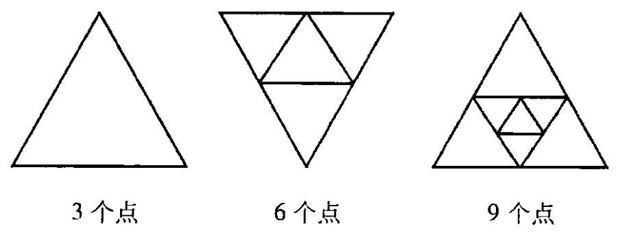

图 9-1

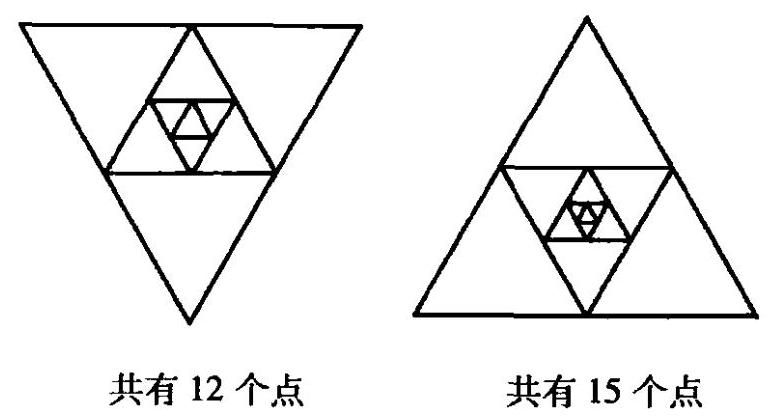

图 9-2

第 $n$ 个图形共有 ${a}_{n} = 3 \cdot  n = {3n}$ 个点.

例 4 已知数列 $\sqrt{17},5,\sqrt{33},\sqrt{41},7,\cdots ,\sqrt{{b}_{n}}$ ,且 ${b}_{n}$ 是 $n$ 的一次函数,则 9 是这个数列的第几项.

解: 因为 ${b}_{n}$ 是一次函数,所以不妨设 ${b}_{n} = {kn} + g\left( {k \neq  0}\right)$ .

当 $n = 1$ 时， ${b}_{1} = k + g,\sqrt{{b}_{1}} = \sqrt{k + g} = \sqrt{17}$ ， $\therefore k + g = {17}$ .①

当 $n = 2$ 时， ${b}_{2} = {2k} + g$ ， $\sqrt{{b}_{2}} = \sqrt{{2k} + g} = 5$ ， $\therefore {2k} + g = {25}$ .②

解①和②，得: $\left\{  \begin{array}{l} k = 8, \\  g = 9. \end{array}\right.$

$\therefore \;{b}_{n} = \sqrt{{8n} + 9} = 9,\therefore n = 9$ . 所以 9 是这个数列的第 9 项.

1. 写出下列数列的通项公式:

(1) ${90},{70},{40},0, - {50},\cdots$ ;

(2) ${1.1},{1.01},{1.001},{1.0001},\cdots$ ;

(3) $3,7,{13},{21},{31},\cdots$ ;

(4) $1,0,1,0,\cdots$ .

2. 数列 $1,1,2,3,5,8, x,{21},{34},{55},\cdots$ 中, $x$ 的值是多少?

3. 数列 $\left\{  {a}_{n}\right\}$ 中, ${a}_{n} = \frac{{2n} + 3}{n + 1}$ ,若 $\varepsilon  = \frac{1}{100}$ ,为使 $n > N$ 时,恒有 $\left| {{a}_{n} - 2}\right|  < \frac{1}{100}$ 成立,则正整数 $N$ 的最小值是多少?

## 二、递推公式

### 9.2 数列递推公式

在一组生物实验中, 发现细胞每隔 1 分钟分裂一次, 即一个细胞变成两个细胞 1 分钟后,1 个细胞变成 ${a}_{1} = 1 \times  2$ 个; 2 分钟后, ${a}_{2} = {a}_{1} \times  2 = 4$ 个; 3 分钟后, ${a}_{3} = {a}_{2} \times  2 = 8$ 个; $\cdots , n$ 分钟后, ${a}_{n} = {a}_{n - 1} \times  2 = {2}^{n}$ 个. 我们把 ${a}_{n}$ 与 ${a}_{n - 1}$ 的关系式叫数列递推公式. 例如 ${a}_{n} = 2{a}_{n - 1}$ .

递推公式在计算机语言中被称为 “循环体”，是计算机运算的重要理论基础.

例 1 数列 $\left\{  {a}_{n}\right\}$ 中， ${a}_{1} = 1,{a}_{n + 1} = 2{a}_{n} + 1\left( {n \in  {\mathbf{N}}^{ * }}\right)$ ，求通项 $\left\{  {a}_{n}\right\}$ .

解: $\because {a}_{n + 1} = 2{a}_{n} + 1,\therefore \frac{{a}_{n + 1} + 1}{{a}_{n} + 1} = 2$ .

$\therefore {a}_{n} + 1$ 是一个以 2 为首项,2 为公比的等比数列.

$\therefore \;{a}_{n} + 1 = {2}^{n},\;\therefore \;{a}_{n} = {2}^{n} - 1$ .

说明: ${a}_{n} + 1$ 是一个等比数列,我们并不是凑出来的,这里有一个通用的方法. 由 $\underline{{a}_{n + 1} + x = 2\left( {{a}_{n} + x}\right) }$ 展开为 ${a}_{n + 1} = 2{a}_{n} + x$ ,与已知 ${a}_{n + 1} = 2{a}_{n} + 1$ 比较系数,我们发现 $x = 1$ .

例 2 已知数列 $\left\{  {a}_{n}\right\}$ 中, ${a}_{1} = 2,{a}_{k + 1} = {a}_{k} + {4k}$ ,求数列的通项 ${a}_{n}$ .

解: 由 ${a}_{k + 1} = {a}_{k} + {4k}$ 得:

$$
{a}_{k + 1} - {a}_{k} = {4k}
$$

$$
\therefore \;{a}_{2} - {a}_{1} = 4 \times  1\text{ , }
$$

$$
{a}_{3} - {a}_{2} = 4 \times  2
$$

......

$$
{a}_{n - 1} - {a}_{n - 2} = 4 \times  \left( {n - 2}\right) ,
$$

$$
{a}_{n} - {a}_{n - 1} = 4 \times  \left( {n - 1}\right) .
$$

将以上各式相加, 得:

$$
{a}_{n} - {a}_{1} = 4 \times  \left\lbrack  {1 + 2 + 3 + \cdots  + \left( {n - 2}\right)  + \left( {n - 1}\right) }\right\rbrack   = 4 \times  \frac{n\left( {n - 1}\right) }{2}.
$$

$$
\therefore \;{a}_{n} = {a}_{1} + 4 \times  \frac{n\left( {n - 1}\right) }{2} = 2{n}^{2} - {2n} + 2.
$$

例 3 已知 $\left\{  \begin{array}{l} {a}_{1} = 2\sqrt{5}, \\  {a}_{n + 1} = \frac{1}{2}\left( {{a}_{n} + \frac{5}{{a}_{n}}}\right) \left( {n \in  {\mathbf{N}}^{ * }}\right) ,\text{ 求数列通项 }{a}_{n}. \end{array}\right.$

解: 已知由

$$
\left\{  \begin{array}{l} {a}_{n + 1} - \sqrt{5} = \frac{{\left( {a}_{n} - \sqrt{5}\right) }^{2}}{2{a}_{n}}, \\  {a}_{n + 1} + \sqrt{5} = \frac{{\left( {a}_{n} + \sqrt{5}\right) }^{2}}{2{a}_{n}}. \end{array}\right.
$$

②

①

$\frac{\text{ ① }}{\text{ ② }}$ 得 $\frac{{a}_{n + 1} - \sqrt{5}}{{a}_{n + 1} + \sqrt{5}} = {\left( \frac{{a}_{n} - \sqrt{5}}{{a}_{n} + \sqrt{5}}\right) }^{2} = \cdots  = {\left( \frac{{a}_{1} - \sqrt{5}}{{a}_{1} + \sqrt{5}}\right) }^{{2}^{n}}$ .

$$
\therefore \;\frac{{a}_{n} - \sqrt{5}}{{a}_{n} + \sqrt{5}} = {\left( \frac{{a}_{1} - \sqrt{5}}{{a}_{1} + \sqrt{5}}\right) }^{{2}^{n - 1}} = {\left( \frac{2\sqrt{5} - \sqrt{5}}{2\sqrt{5} + \sqrt{5}}\right) }^{{2}^{n - 1}} = {\left( \frac{1}{3}\right) }^{{2}^{n - 1}}.
$$

解方程,得: ${a}_{n} = \frac{\sqrt{5}\left\lbrack  {1 + {\left( \frac{1}{3}\right) }^{{2}^{n - 1}}}\right\rbrack  }{1 - {\left( \frac{1}{3}\right) }^{{2}^{n - 1}}}$ .

例 4 若数列 $\left\{  {a}_{n}\right\}$ 满足下列条件: ${a}_{1} = 1,{a}_{2} = 3,{a}_{n + 2} = 4{a}_{n + 1} - 3{a}_{n}$ ,求数列通项 ${a}_{n}$ .

解: $\because {a}_{n + 2} - {a}_{n + 1} = 3\left( {{a}_{n + 1} - {a}_{n}}\right) ,\therefore {a}_{n + 2} - {a}_{n + 1} = 2 \times  {3}^{n}$ ,

$$
\therefore \;{a}_{2} - {a}_{1} = 2\text{ , }
$$

$$
{a}_{3} - {a}_{2} = 2 \times  3
$$

$$
{a}_{4} - {a}_{3} = 2 \times  {3}^{2},
$$

$$
{a}_{n} - {a}_{n - 1} = 2 \times  {3}^{n - 2}.
$$

把以上各式相加得:

$$
{a}_{n} - {a}_{1} = 2 + 2 \times  3 + 2 \times  {3}^{2} + \cdots  + 2 \times  {3}^{n - 2} = 2 \times  \left( \frac{1 - {3}^{n - 1}}{1 - 3}\right)  = {3}^{n - 1} - 1.
$$

$$
\therefore {a}_{n} = {3}^{n - 1}\text{ . }
$$

例 5 某人欲登一楼梯，如果规定每步只能跨上一级或两级楼梯，现在要登上第 $n$ 级,问有多少种不同走法?

解: 设有 ${a}_{n}$ 种走法. 如果最后一步跨一级,有 ${a}_{n - 1}$ 种走法; 如果最后一步跨两级，那么有 ${a}_{n - 2}$ 种走法. 故:

$$
{a}_{n} = {a}_{n - 1} + {a}_{n - 2},\left( {n \geq  3}\right) .
$$

$$
{a}_{1} = 1,{a}_{2} = 2
$$

上式就是有名的菲波那契数列的递推关系.

中世纪亚欧经济开始繁荣，西方商人到东方经商的逐渐增多，其中有一位意大利人菲波那契在东方旅行之后写了一本《算法之书》，其中提出了一对兔子的繁殖问题.

如果每一对兔子每月能生一对新兔，而一对新兔在出生后的第三个月开始生一对新兔. 假定不发生任何死亡,那么一对初生的兔子在一年后能有多少对.

列表如下:

<table><tr><td>月 份</td><td>去年</td><td>1</td><td>2</td><td>3</td><td>4</td><td>5</td><td>6</td><td>7</td><td>8</td><td>9</td><td>10</td><td>11</td><td>12</td></tr><tr><td>兔子对数</td><td>1</td><td>1</td><td>2</td><td>3</td><td>5</td><td>8</td><td>13</td><td>21</td><td>34</td><td>55</td><td>89</td><td>144</td><td>233</td></tr></table>

现在我们感兴趣的是这个问题中所反映出来的量的关系. 记 ${u}_{n}$ 为 $n$ 个月后兔子的对数 $\left( {n = 0,1,2,\cdots }\right)$ ,则显然有: ${u}_{n + 2} = {u}_{n + 1} + {u}_{n},\left( {n = 0,1,2,\cdots }\right)$

这一递推式刻划了当月兔子对数与前两个月兔子对数的关系. 由 ${u}_{0} = 1,{u}_{1} =$ 1 逐个代入计算,便可得到: ${u}_{2} = 2,{u}_{3} = 3,{u}_{4} = 5,\cdots$ . 人们把这一数列叫做斐波那契数列.

数学上,如何求出满足递推式的数列 ${u}_{n}$ 的一般表达式呢?

我们假设满足递推式的 ${u}_{n}$ 具有下列形式:

$$
{u}_{n} = C{\lambda }^{n}, n = 0,1,2,\cdots
$$

作为试探. 代入递推式, 得

$$
C{\lambda }^{n + 2} = C{\lambda }^{n + 1} + C{\lambda }^{n}\text{ ,即 }{\lambda }^{2} - \lambda  - 1 = 0\text{ . }
$$

解得

$$
{\lambda }_{1} = \frac{1 + \sqrt{5}}{2},\;{\lambda }_{2} = \frac{1 - \sqrt{5}}{2}.
$$

$$
\therefore \;{u}_{n} = {C}_{1}{\left( \frac{1 + \sqrt{5}}{2}\right) }^{n} + {C}_{2}{\left( \frac{1 - \sqrt{5}}{2}\right) }^{n}, n = 0,1,2,\cdots \text{ . }
$$

利用 ${u}_{0} = 1,{u}_{1} = 1$ ,有

$$
\left\{  \begin{array}{l} {C}_{1} + {C}_{2} = 1, \\  \frac{1 + \sqrt{5}}{2}{C}_{1} + \frac{1 - \sqrt{5}}{2}{C}_{2} = 1. \end{array}\right. \text{ 从而 }{C}_{1} = \frac{1}{\sqrt{5}}\left( \frac{1 + \sqrt{5}}{2}\right) ,{C}_{2} = \frac{-1}{\sqrt{5}}\left( \frac{1 - \sqrt{5}}{2}\right) \text{ . }
$$

因此,斐波那契数列 ${u}_{n} = \frac{1}{\sqrt{5}}\left\lbrack  {{\left( \frac{1 + \sqrt{5}}{2}\right) }^{n + 1} - {\left( \frac{1 - \sqrt{5}}{2}\right) }^{n + 1}}\right\rbrack  , n = 0,1,2,\cdots$ .

以上求解的方法在讨论类似的递推式中是常用的, 称为特征根方程法. 数学就是如此奇妙, 看来难以解决的递推式经过这么一变, 就转化为解简单的代数方程了.

斐波那契数列

$$
{u}_{n} = \frac{1}{\sqrt{5}}\left\lbrack  {{\left( \frac{1 + \sqrt{5}}{2}\right) }^{n + 1} - {\left( \frac{1 - \sqrt{5}}{2}\right) }^{n + 1}}\right\rbrack  , n = 0,1,2,\cdots .
$$

这一式子是耐人寻味的. 虽然所有的 ${u}_{n}$ 都是正整数，却由一些无理数表示出来. 实际计算时,由于 $\frac{\sqrt{5} - 1}{2}$ 是小于 1 的正数,可以看出并不需要算出 $\frac{1}{\sqrt{5}}{\left( \frac{1 - \sqrt{5}}{2}\right) }^{n + 1}$ 的值. 当 $n$ 是奇数时, ${u}_{n}$ 等于 $\frac{1}{\sqrt{5}}{\left( \frac{1 + \sqrt{5}}{2}\right) }^{n + 1}$ 的整数部分; 而当 $n$ 是偶数时, ${u}_{n}$ 等于 $\frac{1}{\sqrt{5}}{\left( \frac{1 + \sqrt{5}}{2}\right) }^{n + 1}$ 的整数部分加 1 .

有趣的是, 还可以发现

$$
{u}_{0} + {u}_{1} + {u}_{2} + \cdots  + {u}_{n - 2} = {u}_{n} - 1
$$

特别令人惊奇的是, 邻近的两个斐波那契数的比值

$$
{C}_{n} = \frac{{u}_{n}}{{u}_{n + 1}},\;n = 0,1,2,\cdots .
$$

显然, $0 < {C}_{n} < 1$ . 当 $n$ 逐渐增大时, ${C}_{n}$ 的数值逐渐接近众所熟知的黄金分割 (0.618).

数学奥妙无穷. 斐波那契数列的递推关系: ${u}_{n + 2} = {u}_{n + 1} + {u}_{n}$ 除了从上文中所述的兔子繁殖中可以得到外, 在日常生活中一些毫不起眼的事例也是由这种关系所确定的.

请大家按上述方法推导例 5 的结果.

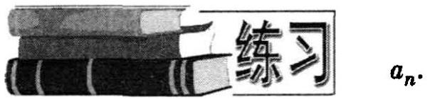

1. 若数列 $\left\{  {a}_{n}\right\}$ 中,满足下列条件,求通项

(1) ${a}_{n + 1} = \frac{1}{3}{a}_{n} + 4,{a}_{1} = 2$

(2) ${a}_{n + 1} = {a}_{{n}^{ \circ  }} + {2n} + 1,{a}_{1} = 1;$

(3) ${a}_{n + 1} = {a}_{n} + {2}^{n},{a}_{1} = 1$ .

2. 已知 $f\left( x\right)  = \frac{3x}{x + 3}$ ,数列 $\left\{  {a}_{n}\right\}$ 的通项 ${a}_{n}$ 满足条件 ${a}_{n} = f\left( {a}_{n - 1}\right) ,(n > 1$ , $\left. {{a}_{1} \neq  0}\right)$ .

(1)求证: $\left\{  \frac{1}{{a}_{n}}\right\}$ 是等差数列; (2) 当 ${a}_{1} = \frac{1}{4}$ 时，求 ${a}_{40}$ 的值.

3. 已知 ${a}_{1} = {2p},{a}_{n} = {2p} - \frac{{p}^{2}}{{a}_{n - 1}}\left( {p\text{ 常数,且 }p \neq  0}\right) ,{b}_{n} = \frac{1}{{a}_{n} - p}$ ,求证: 数列 $\left\{  {b}_{n}\right\}$ 是等差数列.

4. 在数列 $\left\{  {a}_{n}\right\}$ 中,已知 $\left\{  \begin{array}{l} {a}_{1} = {a}_{2} = 1, \\  {a}_{n + 2} = \frac{2}{3}{a}_{n + 1} + \frac{5}{3}{a}_{n}, \end{array}\right.$ 求数列 $\left\{  {a}_{n}\right\}$ 的通项 ${a}_{n}$ .

5. 一枚均匀的硬币掷 10 次，问:不连续出现正面的可能情形共有多少种？

6. 试用特征根方程法,求满足下列递推式的数列 ${a}_{n}$ .

(1) ${a}_{n + 2} = {a}_{n + 1} + 2{a}_{n},{a}_{0} = 1,{a}_{1} = 0$ ;

(2) ${a}_{n + 2} = 3{a}_{n + 1} - 2{a}_{n},{a}_{0} = 0,{a}_{1} = 1$ ;

(3) ${a}_{n + 3} - 2{a}_{n + 2} - {a}_{n + 1} + 2{a}_{n} = 0,{a}_{0} = 0,{a}_{1} = 0,{a}_{2} = 6$ .

7. 已知 ${x}_{1} > 0$ ,且 ${x}_{1} \neq  1,{x}_{n + 1} = \frac{{x}_{x}\left( {{x}_{n}^{2} + 3}\right) }{3{x}_{n}^{2} + 1}\left( {n = 1,2,3,\cdots }\right)$ . 试证: 数列 $\left\{  {x}_{n}\right\}$ 或者对任意自然数 $n$ 都满足 ${x}_{n} < {x}_{n + 1}$ ,或者对任意自然数 $n$ 都满足 ${x}_{n} > {x}_{n + 1}$ .

## 三、等差数列和等比数列

### 9.3 等差数列和等比数列

数列 $1,2,3,4,5,\cdots , n$ 有一个特点: 从第二项开始,每一项与它的前一项的差都等于 1 .

一般地，如果一个数列 $\left\{  {a}_{n}\right\}$ ，从第 2 项起 $\left( {n \geq  2}\right)$ 的每一项 ${a}_{n}$ 与它的前一项 ${a}_{n - 1}$ 的差等于同一常数,这个数列就叫做等差数列,这个常数叫做等差数列的公差,公差通常用字母 $d$ 表示.

用公式叙述为: ${a}_{n} - {a}_{n - 1} = d$ .

如果等差数列 ${a}_{1},{a}_{2},{a}_{3},\cdots ,{a}_{n},\cdots$ 公差为 $d$ ,我们发现:

$$
{a}_{2} = {a}_{1} + d
$$

$$
{a}_{3} = {a}_{2} + d = \left( {{a}_{1} + d}\right)  + d = {a}_{1} + {2d},
$$

$$
{a}_{4} = {a}_{3} + d = \left( {{a}_{1} + {2d}}\right)  + d = {a}_{1} + {3d},
$$

......

由此可知,等差数列 $\left\{  {a}_{n}\right\}$ 的通项公式是:

$$
{a}_{n} = {a}_{1} + \left( {n - 1}\right) d
$$

如果在两个实数 $a$ 与 $b$ 中间插入一个实数 $A$ ,使 $a, A, b$ 成等差数列,那么 $A$ 叫做 $a$ 与 $b$ 的等差中项.

如果 $A$ 是 $a$ 与 $b$ 的等差中项,那么 $A - a = b - A,\therefore A = \frac{a + b}{2}$ .

容易发现，在一个等差数列中，从第 2 项起，每一项(有穷等差数列的末项除外)都是它的前一项与后一项的等差中项.

看下面的数列:

$$
2,4,8,{16},\cdots \cdots
$$

这个数列有这样的特点: 从第 2 项起, 每一项与它前一项的比都等于常数 2 .

一般地,如果一个数列 $\left\{  {a}_{n}\right\}$ 从第 2 项起 $\left( {n \geq  2}\right)$ ,每一项 ${a}_{n}$ 与它前一项 ${a}_{n - 1}$ 的比等于同一个常数，这个数列就叫做等比数列，这个常数叫做等比数列的公比， 一般用字母 $q$ 表示.

用公式描述为: $\frac{{a}_{n}}{{a}_{n - 1}} = q\left( {n \geq  2}\right)$ .

如果等比数列 ${a}_{1},{a}_{2},{a}_{3},\cdots ,{a}_{n},\cdots$ 公比为 $q$ ,我们发现:

$$
{a}_{2} = {a}_{1}q
$$

$$
{a}_{3} = {a}_{2}q = {a}_{1}{q}^{2}
$$

$$
{a}_{4} = {a}_{3}q = {a}_{1}{q}^{3}
$$

......

由此可知,等比数列 $\left\{  {a}_{n}\right\}$ 的通项公式为:

$$
{a}_{n} = {a}_{1}{q}^{n - 1}
$$

如果在 $a$ 与 $b$ 中间插入一个数 $G$ ,使 $\frac{G}{a} = \frac{b}{G}$ ,即使 $a, G, b$ 成等比数列,那么 $G$ 叫做 $a$ 与 $b$ 的等比中项. 如果 $G$ 是 $a$ 与 $b$ 的等比中项,那么 ${G}^{2} = {ab},\therefore G = \; \pm  \sqrt{ab}$ .

容易发现，一个等比数列从第 2 项起，每一项(有穷等比数列的末项除外)是它的前一项与后一项的等比中项.

例 1 试判断数列: $\lg 5,\lg {10},\lg {20},\lg {40},\cdots$ 是不是等差数列,并求出这个数列的第 18 项.

解:

$$
\because \;\lg {10} - \lg 5 = \lg \frac{10}{5} = \lg 2\text{ , }
$$

$$
\lg {20} - \lg {10} = \lg \frac{20}{10} = \lg 2,
$$

$$
\lg {40} - \lg {20} = \lg \frac{40}{20} = \lg 2,
$$

......

$\therefore$ 已知数列是等差数列,其公差 $d = \lg 2$ .

$$
{a}_{18} = \lg 5 + \left( {{18} - 1}\right) \lg 2 = \lg 5 + \lg {2}^{17} = \lg {655360}.
$$

例 2 若有四个数, 前三项数成等差数列, 后三项数成等比数列, 并且第一个数与第四个数的和为 37, 第二个数与第三个数的和为 36, 求这四个数.

解一: 设前三个数为 $a - d, a, a + d$ ,则第四个数为 $\frac{{\left( a + d\right) }^{2}}{a}$ . 依题意,可得方程组:

$$
\left\{  {\begin{array}{l} a - d + \frac{{\left( a + d\right) }^{2}}{a} = {37}, \\  a + a + d = {36}. \end{array}\text{ 解得: }\left\{  \begin{array}{l} a = {16}, \\  d = 4. \end{array}\right. }\right. \text{ 或 }\left\{  \begin{array}{l} a = \frac{81}{4}, \\  d =  - \frac{9}{2}. \end{array}\right.
$$

$\therefore$ 所求的四个数是12,16,20,25或 $\frac{99}{4},\frac{81}{4},\frac{63}{4},\frac{49}{4}$ .

解二: 设后三个数为 $\frac{a}{q}, a,{aq}$ ,则第一个数为 $\frac{2a}{q} - a$ . 依题意,可得方程组:

$$
\left\{  {\begin{array}{l} \frac{2a}{q} - a + {aq} = {37}, \\  \frac{a}{q} + a = {36}. \end{array}\text{ 解方程组,得 }\left\{  {\begin{array}{l} q = \frac{5}{4}, \\  a = {20}. \end{array}\text{ 或 }\left\{  \begin{array}{l} q = \frac{7}{9}, \\  a = \frac{63}{4}. \end{array}\right. }\right. }\right.
$$

$\therefore$ 所求的四个数是12,16,20,25或 $\frac{99}{4},\frac{81}{4},\frac{63}{4},\frac{49}{4}$ .

说明: 若已知的三数成等差数列,常设三个数为 $a - d, a, a + d$ ,其中 $d$ 为公差; 若已知三数成等比数列,常设三个数为 $\frac{a}{q}, a,{aq}$ ,其中 $q$ 是公比,这样能为我们计算带来方便.

例 3 设 $a, b, c, x \in  \mathbf{R}$ ,且 $\left( {{a}^{2} + {b}^{2}}\right) {x}^{2} - {2b}\left( {a + c}\right) x + {b}^{2} + {c}^{2} = 0$ ,求证: $a, b, c$ 成等比数列,并且公比是 $x$ .

证: $\because a, b, c, x$ 都是实数,

$\therefore \Delta  = 4{b}^{2}{\left( a + c\right) }^{2} - 4\left( {{a}^{2} + {b}^{2}}\right) \left( {{b}^{2} + {c}^{2}}\right)  \geq  0$ .

整理,得: $- {\left( {b}^{2} - ac\right) }^{2} \geq  0$ .

又 $\because  - {\left( {b}^{2} - ac\right) }^{2} \leq  0,\;\therefore {b}^{2} - {ac} = 0$ ,即 ${b}^{2} = {ac}$ .

$\therefore a, b, c$ 成等比数列.

解已知方程，得

$$
x = \frac{b\left( {a + c}\right) }{{a}^{2} + {b}^{2}} = \frac{b\left( {a + c}\right) }{{a}^{2} + {ac}} = \frac{b}{a}.
$$

$\therefore x$ 为公比.

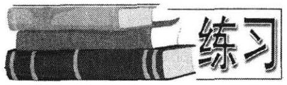

1. 设 $a, b, c$ 三数成等差数列,同时又成等比数列,求 $a, b, c$ .

2. 若 $a, b, c, d$ 成等比数列,求证: ${\left( b - c\right) }^{2} + \; {\left( c - a\right) }^{2} + {\left( d - b\right) }^{2} = {\left( a - d\right) }^{2}.$

3. 有一等比数列与一个等差数列,它们的首项是一个相等的正数,且第 $({2n} +$ 1) 项相等,问第 $\left( {n + 1}\right)$ 项哪个大?

4. 已知 $f\left( x\right)  = a{x}^{2} + {bx} + c\left( {a \neq  0}\right)$ . 当 $n = 1,2,3,\cdots$ 时,数列 $\{ f\left( {n + 1}\right)  - f\left( n\right) \}$ 是等差数列还是等比数列?

5. 等比数列 $\left\{  {a}_{n}\right\}$ 的首项为 ${a}_{1}$ ,公比为 $q$ ,写出一个使 $\left\{  {a}_{n}\right\}$ 为单调递增数列的充要条件.

6. 设 $x, y, z$ 为等差数列, $x + y, y + z, x + z$ 成等比数列,且三个整数 $x\text{ 、 }y\text{ 、 }z$ 的和介于 40 与 50 之间，求 $x, y, z$ .

## 四、数列求和

### 9.4 数列求和

对于数列 ${a}_{1},{a}_{2},{a}_{3},\cdots ,{a}_{n}$ ,把 ${a}_{1} + {a}_{2} + {a}_{3} + \cdots  + {a}_{n}$ 称为数列 $\left\{  {a}_{n}\right\}$ 的前 $n$ 项的和，用 ${S}_{n}$ 表示. 记为 ${S}_{n} = {a}_{1} + {a}_{2} + \cdots  + {a}_{n}$ .

如果等差数列 ${a}_{1},{a}_{2},{a}_{3},\cdots ,{a}_{n}$ 公差为 $d$ ，它的前 $n$ 项和 ${S}_{n} = {a}_{1} + {a}_{2} + \cdots  + \; {a}_{n}$ ,那么

$$
{S}_{n} = {a}_{1} + \left( {{a}_{1} + d}\right)  + \left( {{a}_{1} + {2d}}\right)  + \cdots  + \left\lbrack  {{a}_{n} + \left( {n - 1}\right) d}\right\rbrack
$$

①

再把项的次序反过来, ${S}_{n}$ 可以写成 ${S}_{n} = {a}_{n} + {a}_{n - 1} + \cdots  + {a}_{1}$ ,

$$
{S}_{n} = {a}_{n} + \left( {{a}_{n} - d}\right)  + \left( {{a}_{n} - {2d}}\right)  + \cdots  + \left\lbrack  {{a}_{n} - \left( {n - 1}\right) d}\right\rbrack  .
$$

②

把①+②，得

$$
2{S}_{n} = \left( {{a}_{1} + {a}_{n}}\right)  + \left( {{a}_{1} + {a}_{n}}\right)  + \cdots  + \left( {{a}_{1} + {a}_{n}}\right)  = n\left( {{a}_{1} + {a}_{n}}\right) .
$$

$$
\therefore \;{S}_{n} = \frac{n\left( {{a}_{1} + {a}_{n}}\right) }{2}\text{ . }
$$

又 $\because {a}_{n} = {a}_{1} + \left( {n - 1}\right) d$ ,

$\therefore \;{S}_{n} = n{a}_{1} + \frac{n\left( {n - 1}\right) d}{2}$ .

如果等比数列 ${a}_{1},{a}_{2},{a}_{3},\cdots ,{a}_{n}$ 的公比为 $q$ ,它的前 $n$ 项和 ${S}_{n} = {a}_{1} + {a}_{2} + \cdots  + \; {a}_{n}$ . 即

$$
{S}_{n} = {a}_{1} + {a}_{1}q + \cdots  + {a}_{1}{q}^{n - 1}.
$$

①

现将①式两边同乘以 $q$ ，得:

$$
q{S}_{n} = {a}_{1}q + {a}_{1}{q}^{2} + \cdots  + {a}_{1}{q}^{n}.
$$

②

当 $q \neq  1$ 时，① - ②整理得 ${S}_{n} = \frac{{a}_{1}\left( {1 - {q}^{n}}\right) }{1 - q}$ .

当 $q = 1$ 时, ${S}_{n} = {a}_{1} + {a}_{2} + \cdots  + {a}_{n} = {a}_{1} + {a}_{1} + \cdots  + {a}_{1} = n{a}_{1}$ .

$$
\therefore \;{S}_{n} = \left\{  \begin{array}{ll} \frac{{a}_{1}\left( {1 - {q}^{n}}\right) }{1 - q}, & q \neq  1; \\  n{a}_{1}, & q = 1. \end{array}\right.
$$

例 1 已知等差数列 $\frac{1}{\sqrt{3} + \sqrt{2}},\sqrt{3},\frac{1}{\sqrt{3} - \sqrt{2}},\cdots$ 的前 $n$ 项和是 $9\sqrt{3} + {27}\sqrt{2}$ ,求项数 $n$ 和第 $n$ 项 ${a}_{n}$ .

解: ${a}_{1} = \frac{1}{\sqrt{3} + \sqrt{2}} = \sqrt{3} - \sqrt{2},{a}_{2} = \sqrt{3}$ ,

$\therefore d = {a}_{2} - {a}_{1} = \sqrt{3} - \left( {\sqrt{3} - \sqrt{2}}\right)  = \sqrt{2}$ .

∵ $\;{S}_{n} = n{a}_{1} + \frac{n\left( {n - 1}\right) d}{2} = 9\sqrt{3} + {27}\sqrt{2}$ ,

得

$$
n\left( {\sqrt{3} - \sqrt{2}}\right)  + \frac{1}{2}n\left( {n - 1}\right) \sqrt{2} = 9\sqrt{3} + {27}\sqrt{2}.
$$

化简,得: $\sqrt{2}{n}^{2} + \left( {2\sqrt{3} - 3\sqrt{2}}\right) n - {18}\sqrt{3} - {54}\sqrt{2} = 0$ .

即 $\left\lbrack  {\sqrt{2}n + \left( {2\sqrt{3} + 6\sqrt{2}}\right) }\right\rbrack  \left( {n - 9}\right)  = 0$ .

$\therefore n = 9$ 或 $n =  - \frac{2\sqrt{3} + 6\sqrt{2}}{\sqrt{2}}$ (舍去).

${a}_{9} = \left( {\sqrt{3} - \sqrt{2}}\right)  + \left( {9 - 1}\right) \sqrt{2} = \sqrt{3} + 7\sqrt{2}.\;\therefore \;n = 9,{a}_{9} = \sqrt{3} + 7\sqrt{2}$ .

例 2 求数 $1\frac{1}{2},3\frac{1}{4},5\frac{1}{8},\cdots ,\left\lbrack  {\left( {{2n} - 1}\right)  + {\left( \frac{1}{2}\right) }^{n}}\right\rbrack$ 的和.

解: ${S}_{n} = \left( {1 + \frac{1}{2}}\right)  + \left( {3 + \frac{1}{4}}\right)  + \left( {5 + \frac{1}{8}}\right)  + \cdots  + \left\lbrack  {\left( {{2n} - 1}\right)  + {\left( \frac{1}{2}\right) }^{n}}\right\rbrack$

$$
= 1 + 3 + 5 + \cdots  + \left( {{2n} - 1}\right)  + \left\lbrack  {\left( \frac{1}{2}\right)  + {\left( \frac{1}{2}\right) }^{2} + \cdots  + {\left( \frac{1}{2}\right) }^{n}}\right\rbrack
$$

$$
= {n}^{2} + \frac{\frac{1}{2}\left\lbrack  {1 - {\left( \frac{1}{2}\right) }^{n}}\right\rbrack  }{1 - \frac{1}{2}} = {n}^{2} + 1 - \frac{1}{{2}^{n}}\text{ . }
$$

例 3 已知数列 $\frac{1}{2},\frac{3}{{2}^{2}},\frac{5}{{2}^{3}},\cdots ,\frac{{2n} - 1}{{2}^{n}}$ ,求这 $n$ 项的和 ${S}_{n}$ .

解: 由于 ${S}_{n} = \frac{1}{2} + \frac{3}{{2}^{2}} + \frac{5}{{2}^{3}} + \cdots  + \frac{{2n} - 1}{{2}^{n}}$ ,

则 $\frac{1}{2}{S}_{n} = \frac{1}{{2}^{2}} + \frac{3}{{2}^{3}} + \frac{5}{{2}^{4}} + \cdots  + \frac{{2n} - 3}{{2}^{n}} + \frac{{2n} - 1}{{2}^{n + 1}}$ .

两式相减，得: $\frac{1}{2}{S}_{n} = \frac{1}{2} + 2\left( {\frac{1}{{2}^{2}} + \frac{1}{{2}^{3}} + \cdots  + \frac{1}{{2}^{n}}}\right)  - \frac{{2n} - 1}{{2}^{n + 1}}$ .

$\therefore \;{S}_{n} = 1 + 4\left( {\frac{1}{{2}^{2}} + \frac{1}{{2}^{3}} + \cdots  + \frac{1}{{2}^{n}}}\right)  - \frac{{2n} - 1}{{2}^{n}}$

$$
= 1 + 4\frac{\frac{1}{4}\left\lbrack  {1 - {\left( \frac{1}{2}\right) }^{n - 1}}\right\rbrack  }{1 - \frac{1}{2}} - \frac{{2n} - 1}{{2}^{n}} = 3 - \frac{{2n} + 3}{{2}^{n}}.
$$

等比数列求和的方法也是常用的求和思想, 我们要认真体会.

例 4 设数列 $\left\{  {a}_{n}\right\}$ 满足 ${S}_{n + 1} + {S}_{n} = 2{a}_{n + 1}$ ,且 ${a}_{1} = 3$ ,求通项 ${a}_{n}$ 及前 $n$ 项和 ${S}_{n}$ .

解: $\because {S}_{n + 1} + {S}_{n} = 2{a}_{n + 1}$ ,且 ${a}_{1} = 3$ ,即 ${S}_{1} = 3$ ,

$\therefore \;{S}_{1} + {S}_{2} = 2{a}_{2},\left( {{a}_{1} + {a}_{2}}\right)  + {a}_{1} = 2{a}_{2}$ ,

解得 ${a}_{2} = 6$ .

当 $n \geq  3$ 时,有:

$$
{S}_{n} + {S}_{n - 1} = 2{a}_{n}
$$

①

$$
{S}_{n - 1} + {S}_{n - 2} = 2{a}_{n - 1}.
$$

②

①-②，得: ${S}_{n} - {S}_{n - 2} = 2\left( {{a}_{n} - {a}_{n - 1}}\right)$ . 即

$\therefore \;{a}_{n} = 3{a}_{n - 1},\;\therefore \;{a}_{n} = \left\{  \begin{array}{ll} 3, & n = 1; \\  3, & n = 1; \\  2 \cdot  {3}^{n - 1}, & n \geq  2. \end{array}\right.$

$\therefore \;{S}_{n} = 3 + \frac{6\left( {{3}^{n - 1} - 1}\right) }{3 - 1} = {3}^{n}$ .

例 5 已知数列 $\left\{  {a}_{n}\right\}$ 的通项公式为 ${a}_{n} = \left\{  \begin{array}{ll} {2n} + 3, & n\text{ 为奇数; } \\  {4}^{n}, & n\text{ 为偶数. } \end{array}\right.$ 求这数列的前 ${2m}\left( {n \in  {\mathbf{N}}^{ * }}\right)$ 项之和.

解: 由 $\left\{  {a}_{n}\right\}$ 通项公式可知,数列为:

$$
{a}_{1} = 5,{a}_{2} = {16},{a}_{3} = 9,{a}_{4} = {256},\cdots
$$

$\therefore$ 前 ${2m}$ 项和为:

$$
{S}_{2m} = {a}_{1} + {a}_{2} + {a}_{3} + \cdots  + {a}_{2m}
$$

$$
= \left( {{a}_{1} + {a}_{3} + \cdots  + {a}_{{2m} - 1}}\right)  + \left( {{a}_{2} + {a}_{4} + \cdots  + {a}_{2m}}\right)
$$

$$
= \left\lbrack  {5 + 9 + \cdots  + 2\left( {{2m} - 1}\right)  + 3}\right\rbrack   + {16} + {256} + \cdots  + {4}^{2m}
$$

$$
= \frac{\left\lbrack  {5 + 2\left( {{2m} - 1}\right)  + 3}\right\rbrack   \times  m}{2} + \frac{{16}\left( {1 - {16}^{m}}\right) }{1 - {16}}
$$

$$
= \left( {{2m} + 3}\right)  \times  m + \frac{{16}^{m + 1} - {16}}{15}
$$

$$
= 2{m}^{2} + {3m} + \frac{{16}^{m + 1}}{15} - \frac{16}{15}.
$$

1. 一等差数列，前 12 项的和为 354，其中第偶数项之和对于第奇数项之和的比为 32:27, 求首项和公差.

2. 已知 $a, b, c, d$ 成等比数列,求证: $a + b, b + c, c + d$ 成等比数列.

3. 若数列 $\left\{  {a}_{n}\right\}$ 的前 $n$ 项和 ${S}_{n}$ 与通项 ${a}_{n}$ 之间满足关系 ${S}_{n} = 1 + p{a}_{n}(p$ 是不为 1 的常数),试求出数列 ${a}_{n}$ 的通项公式,并说明它是什么数列.

4. 已知数列 $\left\{  {a}_{n}\right\}  ,{a}_{n} = \lg \frac{{10}^{n - 1}}{{8}^{n}}$ ,求前 $n$ 项和 ${S}_{n}$ .

5. 已知 $\left\{  {a}_{n}\right\}$ 是等差数列,且 ${S}_{m} = n,{S}_{n} = m$ ,求 ${S}_{m + n}$ 的值 $\left( {S}_{m}\right.$ 表前 $m$ 项和).

6. 求数列 $\frac{1}{3},\frac{4}{{3}^{2}},\frac{7}{{3}^{3}},\cdots ;\frac{{3n} - 2}{{3}^{n}}$ 的前 $n$ 项的和 ${S}_{n}$ .

7. 设数列 $\left\{  {a}_{n}\right\}$ 的前 $n$ 项和 ${S}_{n}$ ,并且 ${a}_{1} = 1,{S}_{n + 1} = 4{a}_{n} + 2\left( {n \in  {\mathbf{N}}^{ * }}\right)$ .

(1)设 ${b}_{n} = {a}_{n + 1} - 2{a}_{n}$ ，求证:数列 $\left\{  {b}_{n}\right\}$ 是等差数列；

(2)设 ${c}_{n} = \frac{{a}_{n}}{{2}^{n}}$ ，求证:数列 $\left\{  {c}_{n}\right\}$ 是等差数列；

(3) 求 ${a}_{1} + {a}_{2} + {a}_{3} + \cdots  + {a}_{n}$ .

8. 设实数 $a \neq  0$ ，数列 $\left\{  {a}_{n}\right\}$ 是首项为 $a$ ，公比为 $- a$ 的等比数列，记 ${b}_{n} = \; {a}_{n}\lg \left| {a}_{n}\right| \left( {n = 1,2,\cdots }\right) ,{S}_{n} = {b}_{1} + {b}_{2} + \cdots  + {b}_{n}\left( {n = 1,2,\cdots }\right) .$

(1)求证:当 $a \neq   - 1$ 时，对任意自然数 $n$ ，都有 ${S}_{n} = \frac{a\lg \left| a\right| }{{\left( 1 + a\right) }^{2}}\left\lbrack  {1 + {\left( -1\right) }^{n + 1}}\right. \; \left. {\cdot \left( {1 + n + {na}}\right) {a}^{n}}\right\rbrack$ ;

(2)试问:当 $0 < a < 1$ 时，是否存在自然数 $m$ ，使得对任意自然数 $n$ ，都有 ${b}_{n} \leq  {b}_{m}$ ? 证明你的结论.

### 9.5 数列求和的几种方法

数列不仅有等比数列和等差数列, 对于一些其他的数列, 我们也努力去探求他们的和.

例 1 求数列 $\frac{1}{1 \times  3},\frac{1}{2 \times  4},\frac{1}{3 \times  5},\cdots ,\frac{1}{n\left( {n + 2}\right) }$ 的前 $n$ 项的和.

解: 由通项 ${a}_{n} = \frac{1}{n\left( {n + 2}\right) } = \left( {\frac{1}{n} - \frac{1}{n + 2}}\right)  \times  \frac{1}{2}$ ,

$$
\therefore \;{S}_{n} = \frac{1}{1 \times  3} + \frac{1}{2 \times  4} + \frac{1}{3 \times  5} + \cdots  + \frac{1}{n\left( {n + 2}\right) }
$$

$$
= \frac{1}{2}\left( {1 - \frac{1}{3} + \frac{1}{2} - \frac{1}{4} + \frac{1}{3} - \frac{1}{5} + \cdots  + \frac{1}{n} - \frac{1}{n + 2}}\right)
$$

$$
= \frac{1}{2}\left( {1 + \frac{1}{2} - \frac{1}{n + 1} - \frac{1}{n + 2}}\right)
$$

$$
= \frac{3\left( {n + 1}\right) \left( {n + 2}\right)  - 2\left( {n + 2}\right)  - 2\left( {n + 1}\right) }{2\left( {n + 1}\right) \left( {n + 2}\right) }
$$

$$
= \frac{3{n}^{2} + {5n}}{2\left( {n + 1}\right) \left( {n + 2}\right) }\text{ . }
$$

对于一些形如 ${a}_{n} = \frac{1}{n\left( {n + k}\right) }$ 的数列求和,一般要观察数列通项的特征. 因为它并不是我们所熟悉的等差数列、等比数列,此类 ${a}_{n} = \frac{1}{n\left( {n + k}\right) }$ 可分解为: ${a}_{n} = \; \frac{1}{n\left( {n + k}\right) } = \left( {\frac{1}{n} - \frac{1}{n + k}}\right) \frac{1}{k}$

例 2 求数列 ${1}^{2},{2}^{2},{3}^{2},\cdots ,{n}^{2},\cdots$ 的前 $n$ 项和.

解: 由通项 ${a}_{n} = {n}^{2}$ ,我们考察:

$$
\because \;{\left( n + 1\right) }^{3} - {n}^{3} = 3{n}^{2} + {3n} + 1\text{ , }
$$

$$
\therefore \;{n}^{2} = \frac{1}{3}\left\lbrack  {{\left( n + 1\right) }^{3} - {n}^{3} - {3n} - 1}\right\rbrack  .
$$

$\therefore \;{S}_{n} = {a}_{1} + {a}_{2} + \cdots  + {a}_{n} = {1}^{2} + {2}^{2} + \cdots  + {n}^{2}$

$$
= \frac{1}{3}\left\lbrack  {{\left( 1 + 1\right) }^{3} - {1}^{3} - 3 \times  1 - 1}\right\rbrack   + \frac{1}{3}\left\lbrack  {{\left( 2 + 1\right) }^{3} - {2}^{3} - 3 \times  2 - 1}\right\rbrack
$$

$$
+ \frac{1}{3}\left\lbrack  {{\left( 3 + 1\right) }^{3} - {3}^{3} - 3 \times  3 - 1}\right\rbrack   + \cdots  + \frac{1}{3}\left\lbrack  {{\left( n + 1\right) }^{3} - {n}^{3} - {3n} - 1}\right\rbrack
$$

$$
= \frac{1}{3}\left\lbrack  {{\left( 1 + 1\right) }^{3} - {1}^{3} + {\left( 2 + 1\right) }^{3} - {2}^{3} + {\left( 3 + 1\right) }^{3} - {3}^{3} + \cdots  + {\left( n + 1\right) }^{3}}\right.
$$

$$
\left. {-{n}^{3} - 3\left( {1 + 2 + \cdots  + n}\right)  - n}\right\rbrack
$$

$$
= \frac{1}{3}\left\lbrack  {{\left( n + 1\right) }^{3} - {1}^{3} - 3 \times  \frac{\left( {1 + n}\right) n}{2} - n}\right\rbrack
$$

$$
= \frac{n\left( {n + 1}\right) \left( {{2n} + 1}\right) }{6}\text{ . }
$$

按此方法,可求得 ${1}^{3} + {2}^{3} + {3}^{3} + \cdots  + {n}^{3} = \frac{1}{4}{n}^{2}{\left( n + 1\right) }^{2}$ .

例 3 求数列 $5,{55},{555},{5555},\cdots ,\underset{n}{\underbrace{{55}\cdots 5}}$ 的前 $n$ 项和.

解: $\because$ 通项 ${a}_{n} = {55}\cdots 5 = 5 \times  {11}\cdots 1 = \frac{5}{9} \times  {99}\cdots 9 = \frac{5}{9} \times  \left( {{10}^{n} - 1}\right)$ ,

$$
\therefore \;{S}_{n} = \frac{5}{9}\left( {{10} - 1 + {10}^{2} - 1 + {10}^{3} - 1 + \cdots  + {10}^{n} - 1}\right)
$$

$$
= \frac{5}{9}\left( {{10} + {10}^{2} + \cdots  + {10}^{n} - n}\right)
$$

$$
= \frac{5}{9}\left\lbrack  {\frac{{10}\left( {1 - {10}^{n}}\right) }{1 - {10}} - n}\right\rbrack   = \frac{5}{9}\left\lbrack  {\frac{{10}\left( {{10}^{n} - 1}\right) }{9} - n}\right\rbrack  .
$$

例 4 用 $g\left( n\right)$ 表示自然数 $n$ 的最大奇因子,例如 $g\left( 3\right)  = 3, g\left( {14}\right)  = 7$ ,求 $g\left( 1\right) \; + g\left( 2\right)  + g\left( 3\right)  + \cdots  + g\left( {2}^{n}\right)$ 的值.

解: 令 ${S}_{n} = g\left( 1\right)  + g\left( 2\right)  + \cdots  + g\left( {2}^{n}\right)$ ,则 ${S}_{1} \equiv  g\left( 1\right)  \pm  g\left( 2\right)  = 2$ .

由题意,当 $k$ 是偶数时, $g\left( {2k}\right)  = g\left( k\right)$ ; 当 $k$ 是奇数时, $g\left( k\right)  = k$ .

于是,对于自然数 $n \geq  2$ ,有

$$
{S}_{n} = \left\lbrack  {g\left( 1\right)  + g\left( 3\right)  + \cdots  + g\left( {{2}^{n} - 1}\right) }\right\rbrack   + \left\lbrack  {g\left( 2\right)  + g\left( 4\right)  + \cdots  + g\left( {2}^{n}\right) }\right\rbrack
$$

$$
= 1 + 3 + \cdots  + \left( {{2}^{n} - 1}\right)  + \left\lbrack  {g\left( 1\right)  + g\left( 2\right)  + \cdots  + g\left( {2}^{n - 1}\right) }\right\rbrack
$$

$$
= {4}^{n - 1} + {S}_{n - 1}\text{ . }
$$

即 ${S}_{n} - {S}_{n - 1} = {4}^{n - 1}\left( {n \geq  2}\right)$ .

故 ${S}_{n} = {S}_{1} + \left( {{S}_{2} - {S}_{1}}\right)  + \left( {{S}_{3} - {S}_{2}}\right)  + \cdots  + \left( {{S}_{n} - {S}_{n - 1}}\right) \; = 2 + {4}^{1} + {4}^{2} + \cdots  + {4}^{n - 1} = \frac{1}{3}\left( {{4}^{n} + 2}\right)$ .

数列的形式多种多样, 数列求和的方法也各不相同, 隐藏在数学中的乐趣有待我们去研究去发现.

1. 求数列 $1,\frac{1}{1 + 2},\frac{1}{1 + 2 + 3},\cdots$ , $\frac{1}{1 + 2 + \cdots  + n}$ ,...的前 $n$ 项和. ( ${d}_{n} = \frac{1}{\frac{n\left( {n + 1}\right) }{2}}$

2. 已知数列 $\left\{  {a}_{n}\right\}$ 中 ${a}_{n} = \frac{2n}{\sqrt{{n}^{2} + n + 1} + \sqrt{{n}^{2} - n + 1}}$ ,求它的前 $n$ 项和 ${S}_{n}$ .

3. 已知数列 $0.3,{0.33},{0.333},\cdots ,{0.33}\cdots 3$ ,求它的前 $n$ 项和.

4. 已知数列 $\left\{  {a}_{n}\right\}  ,{a}_{n} = 1 + 2 + \cdots  + {2}^{n - 1}$ ,求 ${S}_{n} = {a}_{1} + {a}_{2} + \cdots  + {a}_{n}$ .

5. 已知数列 $\left\{  {a}_{n}\right\}$ 的通项为: ${a}_{n} = \left\{  \begin{array}{l} {2n} - 3, n\text{ 为奇数 } \\  {5}^{n} - 2, n\text{ 为偶数 } \end{array}\right.$ ,求这数列前 $m$ 项和 $\left( {m \in  {\mathbf{N}}^{ * }}\right)$ .

6. 函数 $f$ 定义在整数集上,且满足: $f\left( n\right)  = \left\{  \begin{array}{l} n - 3,\text{ 当 }n \geq  {1000} \\  f\left\lbrack  {f\left( {n + 5}\right) }\right\rbrack  ,\text{ 当 }n < {1000} \end{array}\right.$ ,求 $f\left( {84}\right)$ .

7. 设 $E = \{ 1,2,3,\cdots ,{200}\} , G = \left\{  {{a}_{1},{a}_{2},{a}_{3},\cdots ,{a}_{100}}\right\}$ ,且 $G \subset  E.G$ 具有下列性质:

① 对任何 $1 \leq  i < j \leq  {100}$ ，恒有 ${a}_{i} + {a}_{j} \neq  {201}$ ；② $\mathop{\sum }\limits_{{i = 1}}^{{100}}{a}_{i} = {10080}$ .

试证明: $G$ 中的奇数的个数是 4 的倍数,且 $G$ 中所有数字的平方和为一个定数.

## 五、数学归纳法

### 9.6 数学归纳法

我们在推导首项为 ${a}_{1}$ ,公差为 $d$ 的等差数列 $\left\{  {a}_{n}\right\}$ 的通项公式时,是采用这样的方法:

$$
{a}_{1} = {a}_{1} + {0d}
$$

$$
{a}_{2} = {a}_{1} + d = {a}_{1} + {1d}
$$

$$
{a}_{3} = {a}_{2} + d = {a}_{1} + {2d}
$$

$$
{a}_{4} = {a}_{3} + d = {a}_{1} + {3d}
$$

......

由此得到,等差数列 $\left\{  {a}_{n}\right\}$ 的通项公式是:

$$
{a}_{n} = {a}_{1} + \left( {n - 1}\right) d
$$

像这样由一系列有限的特殊事例得出一般结论的推理方法, 通常叫做归纳法. 用归纳法可以帮助我们从具体事例中发现一般规律. 英国数学家休厄有句名言 “若无某种大胆放肆的猜测,一般是做不出知识的进展的.” 美国数学家、教育家波利亚也曾说过，“要成为一个好的数学家……必须是一个好的猜想家.”还说:“我要向各年级所有对数学有兴趣的同学提出: 的确, 我们应该学习证明法, 但我们也要学习猜测法."

我们要注意，仅根据一系列有限的特殊事例所得出的一般结论，有时是不正确的.

例如:一个数列的通项公式是

$$
{a}_{n} = {\left( {n}^{2} - 5n + 5\right) }^{2}.
$$

容易发现: ${a}_{1} = 1,{a}_{2} = 1,{a}_{3} = 1,{a}_{4} = 1$ .

如果仅由此做出结论——对于任何 $n \in  {\mathbf{N}}^{ * },{a}_{n} = {\left( {n}^{2} - 5n + 5\right) }^{2} = 1$ 都成立, 那就是错误的. 事实上, ${a}_{5} = {25} \neq  1$ .

对于由归纳法得到的某些与自然数有关的数学命题,我们通常采用下面的方法来证明它们的正确性: 先证明当取第一个值 ${n}_{0}$ (例如 ${n}_{0} = 1$ ) 时命题成立; 然后假设 $n = k$ 时命题成立,再证明当 $n = k + 1$ 时命题也成立. 这种证明方法叫做数学归纳法.

例 1 用数归法证明: ${1}^{2} + {2}^{2} + \cdots  + {n}^{2} = \frac{n\left( {n + 1}\right) \left( {{2n} + 1}\right) }{6}$ .

证: 1 . 当 $n = 1$ 时,左边是 ${1}^{2} = 1$ ,右边是 $\frac{1}{6} \times  1 \times  2 \times  3 = 1$ ,等式成立.

2. 假设当 $n = k$ 时等式成立,就是 ${1}^{2} + {2}^{2} + \cdots  + {k}^{2} = \frac{k\left( {k + 1}\right) \left( {{2k} + 1}\right) }{6}$ . 于是,

$$
{1}^{2} + {2}^{2} + \cdots  + {k}^{2} + {\left( k + 1\right) }^{2} = \frac{k\left( {k + 1}\right) \left( {{2k} + 1}\right) }{6} + {\left( k + 1\right) }^{2}
$$

$$
= \frac{k\left( {k + 1}\right) \left( {{2k} + 1}\right)  + 6{\left( k + 1\right) }^{2}}{6}
$$

$$
= \frac{\left( {k + 1}\right) \left( {k + 2}\right) \left( {{2k} + 3}\right) }{6}
$$

$$
= \frac{\left( {k + 1}\right) \left\lbrack  {\left( {k + 1}\right)  + 1}\right\rbrack  \left\lbrack  {2\left( {k + 1}\right)  + 1}\right\rbrack  }{6}\text{ . }
$$

这就是说,当 $n = k + 1$ 时等式成立.

根据 1 和 2,可知等式对任何 $n \in  {\mathbf{N}}^{ * }$ 都成立.

例 2 用数归法证明:

$$
\sin \alpha  + \sin {2\alpha } + \cdots  + \sin {n\alpha } = \frac{\sin \frac{n\alpha }{2}\sin \frac{\left( {n + 1}\right) \alpha }{2}}{\sin \frac{\alpha }{2}}.
$$

证: 1. 当 $n = 1$ 时,上式左边为 $\sin \alpha$ ,右边为 $\sin \alpha ,\therefore$ 等式成立.

2. 设 $n = k\left( {k \geq  1}\right)$ 时等式成立,即

$$
\sin \alpha  + \sin {2\alpha } + \cdots  + \sin {k\alpha } = \frac{\sin \frac{k\alpha }{2}\sin \frac{\left( {k + 1}\right) \alpha }{2}}{\sin \frac{\alpha }{2}}.
$$

则

$$
\sin \alpha  + \sin {2\alpha } + \cdots  + \sin {k\alpha } + \sin \left( {k + 1}\right) \alpha
$$

$$
= \frac{\sin \frac{k\alpha }{2}\sin \frac{\left( {k + 1}\right) \alpha }{2}}{\sin \frac{\alpha }{2}} + \sin \left( {k + 1}\right) \alpha
$$

$$
= \frac{1}{\sin \frac{\alpha }{2}}\left\lbrack  {\sin \frac{k\alpha }{2}\sin \frac{\left( {k + 1}\right) \alpha }{2} + \sin \frac{\alpha }{2}\sin \left( {k + 1}\right) \alpha }\right\rbrack
$$

$$
= \frac{1}{2\sin \frac{\alpha }{2}}\left\lbrack  {\cos \frac{\alpha }{2} - \cos \frac{\left( {{2k} + 1}\right) \alpha }{2} + \cos \frac{\left( {{2k} + 1}\right) \alpha }{2} - \cos \frac{\left( {{2k} + 3}\right) \alpha }{2}}\right\rbrack
$$

$$
= \frac{1}{2\sin \frac{\alpha }{2}}\left\lbrack  {\cos \frac{\alpha }{2} - \cos \frac{\left( {{2k} + 3}\right) \alpha }{2}}\right\rbrack
$$

$$
= \frac{-2\sin \frac{\left( {k + 2}\right) \alpha }{2}\sin \left\lbrack  {-\frac{\left( {k + 1}\right) \alpha }{2}}\right\rbrack  }{2\sin \frac{\alpha }{2}} = \frac{\sin \frac{\left( {k + 1}\right) \alpha }{2}\sin \frac{\left( {k + 1 + 1}\right) \alpha }{2}}{\sin \frac{\alpha }{2}}.
$$

即当 $n = k + 1$ 时等式成立.

由 1 和 2,可知等式对一切 $n \in  {\mathbf{N}}^{ * }$ 都成立.

例 3 用数归法证明: ${a}^{n + 2} + {\left( a + 1\right) }^{{2n} + 1}$ 可以被 $\left( {{a}^{2} + a + 1}\right)$ 整除 $\left( {n \in  {\mathbf{N}}^{ * }}\right)$ .

证: 1 . 当 $n = 1$ 时, ${a}^{3} + {\left( a + 1\right) }^{3} = 2{a}^{3} + 3{a}^{2} + {3a} + 1 = {2a}\left( {{a}^{2} + a + 1}\right)  + \left( {a}^{2}\right. \; + a + 1) = \left( {{a}^{2} + a + 1}\right) \left( {{2a} + 1}\right)$ 可以被 $\left( {{a}^{2} + a + 1}\right)$ 整除.

2. 设 $n = k$ 时, ${a}^{k + 2} + {\left( a + 1\right) }^{{2k} + 1}$ 可以被 $\left( {{a}^{2} + a + 1}\right)$ 整除.

当 $n = k + 1$ 时,

$$
{a}^{k + 3} + {\left( a + 1\right) }^{{2k} + 1} = a{a}^{k + 2} + {\left( a + 1\right) }^{2}{\left( a + 1\right) }^{{2k} + 1}
$$

$$
= a\left\lbrack  {{a}^{k + 2} + {\left( a + 1\right) }^{{2k} + 1}}\right\rbrack   + \left( {{a}^{2} + a + 1}\right) {\left( a + 1\right) }^{{2k} + 1}.
$$

因为 $\left( {{a}^{2} + a + 1}\right) {\left( a + 1\right) }^{{2k} + 1}$ 与 ${a}^{k + 2} + {\left( a + 1\right) }^{{2k} + 1}$ 都能被 $\left( {{a}^{2} + a + 1}\right)$ 整除, 故 ${a}^{k + 3} + {\left( a + 1\right) }^{{2k} + 3}$ 也能被 $\left( {{a}^{2} + a + 1}\right)$ 整除.

由 1 和 2 可知,对于任意 $n \in  {\mathbf{N}}^{ * },{a}^{n + 2} + {\left( a + 1\right) }^{{2n} + 1}$ 均可以被 $\left( {{a}^{2} + a + 1}\right)$ 整除.

例 4 已知函数 $f\left( n\right)  = \frac{{2}^{n} - 1}{{2}^{n} + 1}$ ,求证: 对于任意不小于 3 的自然数 $n$ ,都有 $f\left( n\right)  > \frac{n}{n + 1}$ 成立.

证: 1 . 当 $n = 3$ 时, $f\left( 3\right)  = \frac{{2}^{3} - 1}{{2}^{3} + 1} = \frac{7}{9} > \frac{3}{4}$ 成立.

2. 设 $n = k\left( {k \geq  3}\right)$ 时, $f\left( k\right)  > \frac{k}{k + 1}$ 成立.

$$
f\left( k\right)  = \frac{{2}^{k} - 1}{{2}^{k} + 1} = 1 - \frac{2}{{2}^{k} + 1},\;\frac{k}{k + 1} = 1 - \frac{1}{k + 1},
$$

$\therefore 1 - \frac{2}{{2}^{k} + 1} > 1 - \frac{1}{k + 1}$ ,即 ${2}^{k} - 1 > {2k}$ . $\therefore \;2\left( {{2}^{k} - 1}\right)  > {4k}$ ,即 ${2}^{k + 1} - 1 > {4k} + 1$ .

$\because {4k} + 1 = 2\left( {k + 1}\right)  + {2k} - 1$ ,且 $k \geq  3,\therefore {2k} - 1 > 0$ ,

$\therefore {2}^{k + 1} - 1 > {4k} + 1 > 2\left( {k + 1}\right)$ . $\;\therefore \frac{1}{k + 1 + 1} > \frac{2}{{2}^{k + 1} + 1}$ .

即 ${2}^{k + 1} + 1 > 2\left( {k + 1 + 1}\right) ,\therefore \frac{1}{k + 1 + 1} > \frac{2}{{2}^{k + 1} + 1}$ .

$\therefore \;1 - \frac{2}{{2}^{k + 1} + 1} > 1 - \frac{1}{\left( {k + 1}\right)  + 1}$ .

即: $\frac{{2}^{k} - 1}{{2}^{k} + 1} > \frac{k + 1}{\left( {k + 1}\right)  + 1},\therefore f\left( {k + 1}\right)  > \frac{k + 1}{k + 2}$ 成立.

由 1 和 2 可知,对于任意不小于 3 的自然数 $n$ ,都有 $f\left( n\right)  > \frac{n}{n + 1}$ 成立.

数学归纳法的用途很多, 我们要体会它的基本思想, 通过命题合理的转换, 使其适合用数学归纳法, 证明:

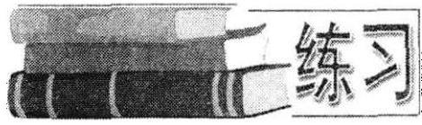

1. 用数学归纳法,证明:

$$
1\left( {{n}^{2} - 1}\right)  + 2\left( {{n}^{2} - {2}^{2}}\right)  + \cdots  + n\left( {{n}^{2} - {n}^{2}}\right)  =
$$

$$
\frac{{n}^{2}\left( {n - 1}\right) \left( {n + 1}\right) }{4}
$$

2. 设 $f\left( n\right)  = 1 + \frac{1}{2} + \frac{1}{3} + \cdots  + \frac{1}{n}, n \in  {\mathbf{N}}^{ * }$ . 当 $n \geq  2$ 时,证明:

$$
n + f\left( 1\right)  + f\left( 2\right)  + \cdots  + f\left( {n - 1}\right)  = {nf}\left( n\right) .
$$

3. 证明: $n$ 是自然数时, ${\left( 2 + \sqrt{3}\right) }^{n}$ 总可以表示为 $a + b\sqrt{3}$ 的形式,其中 $a, b$ 是自然数.

4. 设 ${P}_{n} = {\sin }^{n}\theta  + {\cos }^{n}\theta \left( {n \in  {\mathbf{N}}^{ * }}\right)$ ,已知 ${P}_{1} = \sin \theta  + \cos \theta$ 是一个有理数,证明: ${P}_{n}$ 是有理数.

5. 设 ${\alpha }_{1},{\alpha }_{2},\cdots ,{\alpha }_{n}$ 和 ${\alpha }_{1} + {\alpha }_{2} + \cdots  + {\alpha }_{n}$ 均为锐角,求证:

$$
\tan \left( {{\alpha }_{1} + {\alpha }_{2} + \cdots  + {\alpha }_{n}}\right)  > \tan {\alpha }_{1} + \tan {\alpha }_{2} + \cdots  + \tan {\alpha }_{n}\left( {n \geq  2}\right) .
$$

6. 证明: ${\left( x + 1\right) }^{n + 1} + {\left( x + 2\right) }^{{2n} - 1}$ 能被 ${x}^{2} + {3x} + 3$ 整除.

7. 证明: $\frac{1}{\sin {2x}} + \frac{1}{\sin {4x}} + \cdots  + \frac{1}{\sin {2}^{n}x} = \tan x - \tan {2}^{n}x\;\left( {n \in  {\mathbf{N}}^{ * }}\right)$ .

8. 在同一平面内有 $n$ 个圆,其中每两个圆都相交于两点,并且每三个圆都不相交于同一个点,试证明: 这 $n$ 个圆把平面分成 ${n}^{2} - n + 2$ 个部分.

## 六、猜想与证明

### 9.7 猜想与证明

当我们考虑 ${1}^{3} + {2}^{3} + \cdots  + {n}^{3}$ 求和这个问题时,一开始会困难重重. 但如果我们能考虑一些特殊情况:

$$
n = 1\text{ 时, }{1}^{3} = 1\text{ , }
$$

$$
n = 2\text{ 时, }{1}^{3} + {2}^{3} = 9\text{ , }
$$

$$
n = 3\text{ 时, }{1}^{3} + {2}^{3} + {3}^{3} = {36}\text{ , }
$$

$$
n = 4\text{ 时, }{1}^{3} + {2}^{3} + {3}^{3} + {4}^{3} = {100}\text{ , }
$$

......

我们可以猜想 ${S}_{n} = {1}^{3} + {2}^{3} + {3}^{3} + \cdots  + {n}^{3} = {\left\lbrack  \frac{1}{2}n\left( n + 1\right) \right\rbrack  }^{2}$ . 但这个结论只是根据特殊值下所猜得, 它是否成立, 还要用数学归纳法来证明.

如何进行猜想呢? 通常是从具体素材或具体问题入手, 运用观察, 试验, 分析, 结合, 抽象, 概括, 类比, 归纳等多种方法, 提炼有待探索的数学问题, 提出要证明的数学猜想.

例 1 数列 $1,2,3,4,5,\cdots , n,\cdots$ 排成下表形式:

<table><tr><td>1</td><td>2</td><td>4</td><td>7</td><td>11</td><td>16</td><td>... ...</td></tr><tr><td>3</td><td>5</td><td>8</td><td>12</td><td>17</td><td></td><td></td></tr><tr><td>6</td><td>9</td><td>13</td><td>18</td><td></td><td></td><td></td></tr><tr><td>10</td><td>14</td><td>19</td><td></td><td></td><td></td><td></td></tr><tr><td>15</td><td>20</td><td></td><td></td><td></td><td></td><td></td></tr><tr><td>21</td><td></td><td></td><td></td><td></td><td></td><td></td></tr><tr><td>... ...</td><td></td><td></td><td></td><td></td><td></td><td></td></tr></table>

问:(1) 表中第 4 行第 10 列的数是多少? (2) 1996 这个数出现在哪个位置上?

观察:将右上角至左下角的对角线上的数字作为一组数，可得到下面的分组数列:

$\{ 1\} ,\{ 2,3\} ,\{ 4,5,6\} ,\{ 7,8,9,{10}\} ,\cdots \cdots$ 逐组观察,发现: 1 是第 1 组第 1 个数,即第 1 行第 1 列上的数,……,3 是第 2 组第 2 个数,也就是第 2 行第 $\left( {2 + 1 - 2}\right)$ =1 列上的数,......,8 是第 4 组第 2 个数,就是第 2 行第 $\left( {4 + 1 - 2}\right)  = 3$ 列上的数, $\cdots \cdots$ . 发现如下规律: 第 $m$ 组第 $k$ 个数是第 $k$ 行第 $\left( {m + 1 - k}\right)$ 列上的数.

解: (1) 由 $k = 4, m + 1 - k = {10}$ ,得: $m = {13}, k = 4.\therefore$ 表中第 4 行第 10 列的数是分组中第 13 组第 4 个数.

$$
\therefore \;n = \left( {1 + 2 + 3 + \cdots  + {12}}\right)  + 4 = {82}.
$$

(2)设1996属于第 $k$ 组,则第 $k$ 组第一个数为: $\left( {1 + 2 + 3 + \cdots  + k - 1}\right)  + 1 = \; \frac{1}{2}k\left( {k - 1}\right)  + 1$ . 最后一个数为: $\frac{1}{2}k\left( {k - 1}\right)  + k$ . 可以设 $\frac{k\left( {k - 1}\right) }{2} + 1 \leq  {1996} \leq \; \frac{k\left( {k - 1}\right) }{2} + k$ ,得 $k = {63}$ .

前 62 组共含有 $1 + 2 + \cdots  + {62} = {1953}$ 个数, ${1996} - {1953} = {43}$ .

$\therefore \;{1996}$ 属于第 63 组第 43 个数,即 1996 位于第 43 行第 21 列的位置上.

例 2 设数列 $\left\{  {a}_{n}\right\}$ 是 12，1122，111222， $\cdots$ ⋯， $\underset{n \uparrow  }{\underbrace{{111}\cdots \cdots 1}}2\underset{n \uparrow  }{\underbrace{{22}\cdots \cdots 2}}.$

试问: $\left\{  {a}_{n}\right\}$ 的每一项是否可以表示为某两个相邻整数的乘积?

观察: ${a}_{1} = {12} = 3 \times  4$ ,

$$
{a}_{2} = {1122} = {33} \times  {34},
$$

$$
{a}_{3} = {111222} = {333} \times  {334}
$$

$$
{a}_{4} = {11112222} = {3333} \times  {3334},
$$

猜想: ${a}_{n} = \underset{n \uparrow  }{\underbrace{{111}\cdots \cdots 1}}\underset{n \uparrow  }{\underbrace{{222}\cdots \cdots 2}} = \underset{n \uparrow  }{\underbrace{{333}\cdots \cdots 3}} \times  \underset{n \uparrow  }{\underbrace{{333}\cdots \cdots {34}}}$ .

归纳法有完全归纳法和不完全归纳法. 例 1 是完全归纳法, 例 2 是不完全归纳法. 猜想有时会因为观察、思考中的片面性，局限性，而误把仅属于个别特例的属性扩展为一类对象的共性, 误把在本质上有差异的性质从一类对象迁移到另一类相似的对象, 产生猜想的错误. 因此, 数学上, 对不完全归纳法所获得的猜想, 不论施以多少次试验性的验证, 其仅仅是提高了猜想的可信度, 不足以证明猜想一定可靠. 要证明猜想的一般规律, 必须对猜想进行论证.

$$
\text{ 证: }{a}_{n} = \underset{n \uparrow  }{\underbrace{{11}\cdots \cdots 1}}\underset{n \uparrow  }{\underbrace{{000}\cdots \cdots 0}} + \underset{n \uparrow  }{\underbrace{{222}\cdots \cdots 2}}
$$

$$
= \underset{n \uparrow  }{\underbrace{{11}\cdots \cdots 1}} \times  {10}^{n} + \underset{n \uparrow  }{\underbrace{{11}\cdots \cdots 1}} \times  2
$$

$$
= \underset{n \uparrow  }{\underbrace{{111}\cdots \cdots 1}}\left( {{10}^{n} + 2}\right)
$$

$$
= \underset{n \uparrow  }{\underbrace{{11}\cdots \cdots 1}}\left( {\underset{n \uparrow  }{\underbrace{{999}\cdots \cdots 9}} + 3}\right)
$$

$$
= \underset{n \uparrow  }{\underbrace{{111}\cdots \cdots 1}} \times  3 \times  \left( {\underset{n \uparrow  }{\underbrace{{11}\cdots \cdots 1}} \times  3 + 1}\right)
$$

$$
= \underset{n \uparrow  }{\underbrace{{333}\cdots \cdots 3}} \times  \left( {\underset{n \uparrow  }{\underbrace{{333}\cdots \cdots 3}} + 1}\right)
$$

$\therefore$ 原题得证.

例 3 正数数列 $\left\{  {a}_{n}\right\}$ 的前 $n$ 项和为 ${S}_{n}$ ,且 ${S}_{n} = \frac{1}{2}\left( {{a}_{n} + \frac{1}{{a}_{n}}}\right)$ ,

(1)求 ${a}_{1}$ ， ${a}_{2}$ ， $,{a}_{3}$ ， $,{a}_{4}$ ，并由此猜测 ${a}_{n}$ .

(2)用数学归纳法证明.

解: (1) 由 ${a}_{1} = {S}_{1} = \frac{1}{2}\left( {{a}_{1} + \frac{1}{{a}_{1}}}\right)$ 得 $2{a}_{1} = {a}_{1} + \frac{1}{{a}_{1}}.\therefore {a}_{1}^{2} = 1$ .

${a}_{1} > 0,\;\therefore \;{a}_{1} = 1.$

由 ${a}_{1} + {a}_{2} = {S}_{2} = \frac{1}{2}\left( {{a}_{2} + \frac{1}{{a}_{2}}}\right)$ ,得 $2\left( {{a}_{1} + {a}_{2}}\right)  = {a}_{2} + \frac{1}{{a}_{2}}$ .

将 ${a}_{1} = 1$ 代入，得 ${a}_{2}^{2} + 2{a}_{2} - 1 = 0$ . 解得 ${a}_{2} = \sqrt{2} - 1$ .

同理,得: ${a}_{3} = \sqrt{3} - \sqrt{2},{a}_{4} = \sqrt{4} - \sqrt{3}$ .

猜测: ${a}_{n} = \sqrt{n} - \sqrt{n - 1}$ .

(2)用数学归纳法证明 ${a}_{n} = \sqrt{n} - \sqrt{n - 1}$ .

① 当 $n = 1$ 时，命题已经由( 1 )得证.

② 设 $n = k$ 时 $\left( {k \geq  1}\right)$ 有 ${a}_{k} = \sqrt{k} - \sqrt{k - 1}$ 成立.

$\because \;{a}_{k + 1} = {S}_{k + 1} - {S}_{k} = \frac{1}{2}\left( {{a}_{k + 1} + \frac{1}{{a}_{k + 1}}}\right)  - \frac{1}{2}\left( {{a}_{k} + \frac{1}{{a}_{k}}}\right)$ ,

$\therefore \;2{a}_{k + 1} = \left( {{a}_{k + 1} + \frac{1}{{a}_{k + 1}}}\right)  - \left( {{a}_{k} + \frac{1}{{a}_{k}}}\right) .$

${a}_{k + 1} - \frac{1}{{a}_{k + 1}} =  - \left( {{a}_{k} + \frac{1}{{a}_{k}}}\right)  =  - \left( {\sqrt{k} - \sqrt{k - 1} + \sqrt{k} + \sqrt{k - 1}}\right) .$

整理,得 ${a}_{k + 1}^{2} + 2\sqrt{k}{a}_{k + 1} - 1 = 0$ .

${a}_{k + 1} > 0$ ,解得 ${a}_{k} = \sqrt{k + 1} - \sqrt{k}$ . 因此,当 $n = k + 1$ 时命题成立.

由①和②可知，对所有 $n \in  {\mathbf{N}}^{ * }$ ， ${a}_{n} = \sqrt{n} - \sqrt{n - 1}$ .

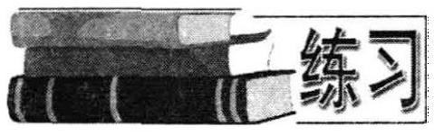

1. 设数列 $\left\{  {a}_{n}\right\}$ 为: ${16},{1156},{111556},\cdots$ , $\underset{n \uparrow  }{\underbrace{{11}\cdots 1}}\underset{n - 1 \uparrow  }{\underbrace{{55}\cdots {56}}}$ ,求证: $\left\{  {a}_{n}\right\}$ 的每一项都是完全平

方数.

2. 在数列 $\left\{  {a}_{n}\right\}$ 中,已知: ${a}_{1} = \frac{1}{2},{a}_{2} = \frac{1}{6},{a}_{n} + {a}_{n + 1} + {a}_{n + 2} = \frac{3}{n\left( {n + 3}\right) }(n$ 为正整数).

(1)求 ${a}_{3},{a}_{4}$ ；(2)猜测 ${a}_{n}$ ，并用数学归纳法证明.

3. 数列 ${x}_{n}$ 中，已知 ${x}_{1} = 1$ ，前 $n$ 项和为 ${S}_{n}$ ，并且 ${S}_{n}$ ， ${S}_{n + 1}$ ， $2{x}_{1}$ 成等差数列，求 ${S}_{1}$ ， ${S}_{2}$ ， ${S}_{3}$ ；猜测 ${S}_{n}$ ，并加证明.

4. 是否存在常数 $a, b, c$ ,使得等式 $1 - 4 + 9 - {16} + \cdots  + {\left( -1\right) }^{n - 1}{n}^{2} = \; {\left( -1\right) }^{n - 1}\left( {a{n}^{2} + {bn} + c}\right)$ 对一切自然数 $n$ 都成立,并证明你的结论.

5. 设 ${a}_{n}$ 为 ${f}_{n}\left( x\right)  = \left( {1 + {2x}}\right) \left( {1 + {2}^{2}x}\right) \left( {1 + {2}^{3}x}\right) \cdots \left( {1 + {2}^{n}x}\right)$ 的展开式中 ${x}^{2}$ 的系数,试问是否存在实数 $a, b$ ,使对于不小于 2 的自然数 $n$ ,关系式 ${a}_{n} = \frac{8}{3}\left( {{2}^{n - 1} - 1}\right)$ - $\left( {a \cdot  {2}^{n} + b}\right)$ 成立. 并加证明.

6. 设 ${P}_{1},{P}_{2},{P}_{3},\cdots ,{P}_{n}$ 是曲线 $y = \sqrt{x}$ 上的点列, ${Q}_{1},{Q}_{2},{Q}_{3},\cdots ,{Q}_{n}$ 是 $x$ 轴正半轴上的点列,且 $\bigtriangleup O{Q}_{1}{P}_{1},\bigtriangleup {Q}_{1}{Q}_{2}{P}_{2},\cdots ,\bigtriangleup {Q}_{n - 1}{Q}_{n}{P}_{n}$ 都是正三角形,设它们的边长为 ${a}_{1},{a}_{2},{a}_{3},\cdots ,{a}_{n}.{S}_{n}$ 表示前 $n$ 项的和. 求 ${S}_{1},{S}_{2},{S}_{3},{S}_{n}$ ,并加以证明.

## 七、数列极限

### 9.8 数列极限

先看两个数列

${2.9},\;{2.999},\;{2.99999},\;\cdots ,\;{2.99}\cdots {999},\;\cdots$

3.01,3.0001,3.000001, $\cdots ,\;$ 3.00 $\cdots {001}$ , $\;\cdots$

为了统一研究这两个数列的极限，不妨把它们合并成一个数列 ${U}_{n}$ ，其通项公式为

$$
{U}_{n} = 3 + {\left( -1\right) }^{n} \cdot  \frac{1}{{10}^{n}}.
$$

可以断言,当 $n \rightarrow  \infty$ 时, ${U}_{n} \rightarrow  3$ . 我们说其极限为 3 .

对于数列 ${a}_{n}$ ,若存在一个常数 $A$ ,对于任意小的正数 $\varepsilon$ ,总存在自然数 $N$ ,使得当 $n > N$ 时,恒成立 $\left| {{a}_{n} - A}\right|  < \varepsilon$ ,则称常数 $A$ 为数列 ${a}_{n}$ 的极限,记作 $\mathop{\lim }\limits_{{n \rightarrow  \infty }}{a}_{n} = A$ .

如果 $\mathop{\lim }\limits_{{n \rightarrow  \infty }}{a}_{n} = A,\mathop{\lim }\limits_{{n \rightarrow  \infty }}{b}_{n} = B$ ,则

$$
\mathop{\lim }\limits_{{n \rightarrow  \infty }}{a}_{n} \pm  {b}_{n} = A \pm  B
$$

$$
\mathop{\lim }\limits_{{n \rightarrow  \infty }}{a}_{n}{b}_{n} = {AB}
$$

$$
\mathop{\lim }\limits_{{n \rightarrow  \infty }}\frac{{a}_{n}}{{b}_{n}} = \frac{A}{B},\left( {B \neq  0}\right) .
$$

例 1 用极限定义，证明: $\mathop{\lim }\limits_{{n \rightarrow  \infty }}\frac{2n}{1 + {3n}} = \frac{2}{3}$ .

分析 欲证 $\mathop{\lim }\limits_{{n \rightarrow  \infty }}\frac{2n}{1 + {3n}} = \frac{2}{3}$ ,只要证对于任意小的正数 $\varepsilon$ ,总存在自然数 $N$ ,使得当 $n > N$ 时,恒成立:

$$
\left| {\frac{2n}{1 + {3n}} - \frac{2}{3}}\right|  = \left| \frac{-2}{3\left( {1 + {3n}}\right) }\right|  = \frac{2}{{9n} + 3} < \frac{2}{3n} < \varepsilon .
$$

只要 $n > \frac{2}{3}\varepsilon$ ,取 $N = \left\lbrack  {\frac{2}{3}\varepsilon }\right\rbrack$ .

证: 对于任意小的正数 $\varepsilon$ ,取 $N = \left\lbrack  {\frac{2}{3}\varepsilon }\right\rbrack$ . 当 $n > N$ 时,恒成立 $\left| {\frac{2n}{1 + {3n}} - \frac{2}{3}}\right|  < \; \varepsilon$ ,所以 $\mathop{\lim }\limits_{{n \rightarrow  \infty }}\frac{2n}{1 + {3n}} = \frac{2}{3}$ .

例 2 计算下列极限.

(1) $\mathop{\lim }\limits_{{n \rightarrow  \infty }}\frac{2{n}^{2} + {3n} - 2}{{n}^{2} + 1}$ (2) $\mathop{\lim }\limits_{{n \rightarrow  \infty }}\left( {\sqrt{n + 5} - \sqrt{n + 3}}\right)$ ;

(3) $\mathop{\lim }\limits_{{n \rightarrow  \infty }}\frac{3}{\sqrt{2{n}^{2} + n} - \sqrt{2{n}^{2} - 1}}$ .

解: (1) $\mathop{\lim }\limits_{{n \rightarrow  \infty }}\frac{2{n}^{2} + {3n} - 2}{{n}^{2} + 1} = \mathop{\lim }\limits_{{n \rightarrow  \infty }}\frac{2 + \frac{3}{n} - \frac{2}{{n}^{2}}}{1 + \frac{1}{{n}^{2}}} = \frac{\mathop{\lim }\limits_{{n \rightarrow  \infty }}\left( {2 + \frac{3}{n} - \frac{2}{{n}^{2}}}\right) }{\mathop{\lim }\limits_{{n \rightarrow  \infty }}\left( {1 + \frac{1}{{n}^{2}}}\right) } = 2$ .

(2) $\mathop{\lim }\limits_{{n \rightarrow  \infty }}\left( {\sqrt{n + 5} - \sqrt{n + 3}}\right)  = \mathop{\lim }\limits_{{n \rightarrow  \infty }}\frac{\left( {\sqrt{n + 5} - \sqrt{n + 3}}\right) \left( {\sqrt{n + 5} + \sqrt{n + 3}}\right) }{\sqrt{n + 5} + \sqrt{n + 3}} \; = \mathop{\lim }\limits_{{n \rightarrow  \infty }}\frac{2}{\sqrt{n + 5} + \sqrt{n + 3}} = 0.$

(3) $\mathop{\lim }\limits_{{n \rightarrow  \infty }}\frac{3}{\sqrt{2{n}^{2} + n} - \sqrt{2{n}^{2} - 1}} = \mathop{\lim }\limits_{{n \rightarrow  \infty }}\frac{3\left( {\sqrt{2{n}^{2} + n} + \sqrt{2{n}^{2} - 1}}\right) }{\left( {\sqrt{2{n}^{2} + n} - \sqrt{2{n}^{2} - 1}}\right) \left( {\sqrt{2{n}^{2} + n} + \sqrt{2{n}^{2} - 1}}\right) }$

$$
= \mathop{\lim }\limits_{{n \rightarrow  \infty }}\frac{3\left( {\sqrt{2 + \frac{1}{n}} + \sqrt{2 - \frac{1}{{n}^{2}}}}\right) }{1 + \frac{1}{n}} = 6\sqrt{2}
$$

下面介绍一个重要的极限公式: $\mathop{\lim }\limits_{{n \rightarrow  \infty }}{\left( 1 + \frac{1}{n}\right) }^{n} = e$ .

例 3 求极限.

(1) $\mathop{\lim }\limits_{{n \rightarrow  \infty }}{\left( 1 + \frac{3}{n}\right) }^{n}$ (2) $\mathop{\lim }\limits_{{n \rightarrow  \infty }}{\left( \frac{n}{n - 1}\right) }^{2\left( {n - 1}\right) }$ .

解: (1) $\mathop{\lim }\limits_{{n \rightarrow  \infty }}{\left( 1 + \frac{3}{n}\right) }^{n} = \mathop{\lim }\limits_{{n \rightarrow  \infty }}{\left\lbrack  {\left( 1 + \frac{3}{n}\right) }^{\frac{n}{3}}\right\rbrack  }^{3} = {e}^{3}$ .

(2) $\mathop{\lim }\limits_{{n \rightarrow  \infty }}{\left( \frac{n}{n - 1}\right) }^{2\left( {n - 1}\right) } = \mathop{\lim }\limits_{{n \rightarrow  \infty }}{\left( 1 + \frac{1}{n - 1}\right) }^{2\left( {n - 1}\right) } = \mathop{\lim }\limits_{{n \rightarrow  \infty }}{\left\lbrack  {\left( 1 + \frac{1}{n - 1}\right) }^{\left( n - 1\right) }\right\rbrack  }^{2} = {e}^{2}$ .

我们曾学过等比数列 $\left\{  {a}_{n}\right\}$ 求和公式: ${S}_{n} = \frac{{a}_{1}\left( {1 - {q}^{n}}\right) }{1 - q}\left( {q \neq  1}\right)$ ,若 $\left| q\right|  < 1$ ,则称 $\left\{  {a}_{n}\right\}$ 为递缩等比数列. 当 $n \rightarrow  \infty$ 时,此时和为

$$
S = \mathop{\lim }\limits_{{n \rightarrow  \infty }}{S}_{n} = \mathop{\lim }\limits_{{n \rightarrow  \infty }}\frac{{a}_{1}\left( {1 - {q}^{n}}\right) }{1 - q} = \frac{{a}_{1}}{1 - q}.
$$

上式为无穷递缩等比数列的求和公式.

例 4 求下列无穷数列的和.

(1) $\frac{\sqrt{2} + 1}{\sqrt{2} - 1},\frac{1}{2 - \sqrt{2}},\frac{1}{2},\cdots ,\left( {3 + 2\sqrt{2}}\right) {\left( \frac{2 - \sqrt{2}}{2}\right) }^{n - 1},\cdots$ ;

(2) $\frac{1}{7},\frac{2}{{7}^{2}},\frac{1}{{7}^{3}},\frac{2}{{7}^{4}},\cdots ,\frac{1}{{7}^{n}}\left( {\frac{3}{2} + {\left( -1\right) }^{n}\frac{1}{2}}\right) ,\cdots$ .

解: (1) $\because$ 已知数列是公比为 $q = \frac{2 - \sqrt{2}}{2}$ 的等比数列,且 $\left| q\right|  = \left| \frac{2 - \sqrt{2}}{2}\right|  < 1$ ,

$$
\therefore \;S = \frac{{a}_{1}}{1 - q} = \frac{\frac{\sqrt{2} + 1}{\sqrt{2} - 1}}{1 - \frac{2 - \sqrt{2}}{2}} = 4 + 3\sqrt{2}.
$$

(2) $S = \left( {\frac{1}{7} + \frac{1}{{7}^{3}} + \cdots }\right)  + \left( {\frac{2}{{7}^{2}} + \frac{2}{{7}^{4}} + \cdots }\right)  = \frac{\frac{1}{7}}{1 - \frac{1}{{7}^{2}}} + \frac{\frac{2}{{7}^{2}}}{1 - \frac{1}{{7}^{2}}} = \frac{3}{16}$ .

例 5 化纯循环小数 0.53 为分数.

解: ${0.53} = \frac{53}{100} + \frac{53}{100} \times  {10}^{-2} + \cdots$

$$
= \mathop{\lim }\limits_{{n \rightarrow  \infty }}\frac{\frac{53}{100}\left\lbrack  {1 - {\left( \frac{1}{{10}^{2}}\right) }^{n}}\right\rbrack  }{1 - \frac{1}{{10}^{2}}} = \mathop{\lim }\limits_{{n \rightarrow  \infty }}\frac{53}{99}\left\lbrack  {1 - {\left( \frac{1}{100}\right) }^{n}}\right\rbrack
$$

$$
= \frac{53}{99}\text{ . }
$$

例 6 设双曲线 ${xy} = 1\left( {x > 0, y > 0}\right)$ 与直线 $y = x$ 的交点为 ${A}_{1}$ . 过 ${A}_{1}$ 作直线 $y = x$ 的垂线,交 $x$ 轴于 ${B}_{1}$ ; 过 ${B}_{1}$ 作直线 $y = x$ 的平行线,交双曲线于 ${A}_{2}$ ,再过 ${A}_{2}$ 作直线 ${B}_{1}{A}_{2}$ 的垂线,交 $x$ 轴于 ${B}_{2};\cdots \cdots$ 依此无限地作下去,可得点列 ${B}_{1},{B}_{2},{B}_{3},\cdots$ , ${B}_{n},\cdots$ . 求 $\mathop{\lim }\limits_{{n \rightarrow  \infty }}\frac{\left| {B}_{n}{B}_{n + 1}\right| }{\left| {B}_{n - 1}{B}_{n}\right| }$ .

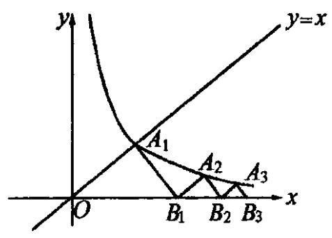

图 9-3

解: 如图 9-3.

由 $\left\{  \begin{array}{l} {xy} = 1\;\left( {x > 0, y > 0}\right) , \\  y = x, \end{array}\right.$ 得 $\left\{  \begin{array}{l} x = 1, \\  y = 1. \end{array}\right.$

$\therefore \;{A}_{1}\left( {1,1}\right) ,{B}_{1}\left( {2,0}\right)$ .

设 ${B}_{n}\left( {{b}_{n},0}\right)$ ,则直线 ${B}_{n}{A}_{n + 1}$ 的方程是 $y = \; x - {b}_{n}$ ,又设该直线和曲线 ${xy} = 1\left( {x > 0, y > 0}\right)$ ,交点 ${A}_{n + 1}$ 的坐标是 $\left( {{x}_{n + 1},{y}_{n + 1}}\right)$ .

由 $\left\{  \begin{array}{l} {xy} = 1\left( {x > 0, y > 0}\right) , \\  y = x - {b}_{n}, \end{array}\right.$ 得: ${x}_{n + 1} = \frac{\sqrt{{b}_{n}^{2} + 4} + {b}_{n}}{2},{y}_{n + 1} = \frac{\sqrt{{b}_{n}^{2} + 4} - {b}_{n}}{2}$ .

设 ${B}_{n + 1} = \left( {{b}_{n + 1},0}\right)$ ,由 ${b}_{n + 1} = {x}_{n + 1} + {y}_{n + 1}$ 可得:

$$
{b}_{n + 1} = \frac{\sqrt{{b}_{n}^{2} + 4} + {b}_{n}}{2} + \frac{\sqrt{{b}_{n}^{2} + 4} - {b}_{n}}{2} = \sqrt{{b}_{n}^{2} + 4}.
$$

因此，数列 $\left\{  {b}_{n}^{2}\right\}$ 是等差数列，公差为 4 .

$\therefore {b}_{n + 1}^{2} - {b}_{n}^{2} = 4$ .

首项为 ${b}_{1}^{2} = 4$ .

$\therefore \;{b}_{n}^{2} = 4 + 4\left( {n - 1}\right)  = {4n},{b}_{n} = 2\sqrt{n}$ .

$$
\left| {{B}_{n}{B}_{n + 1}}\right|  = {b}_{n + 1} - {b}_{n} = 2\sqrt{n + 1} - 2\sqrt{n},
$$

$$
\left| {{B}_{n - 1}{B}_{n}}\right|  = {b}_{n} - {b}_{n - 1} = 2\sqrt{n} - 2\sqrt{n - 1}.
$$

$$
\therefore \mathop{\lim }\limits_{{n \rightarrow  \infty }}\frac{\left| {B}_{n}{B}_{n + 1}\right| }{\left| {B}_{n - 1}{B}_{n}\right| } = \mathop{\lim }\limits_{{n \rightarrow  \infty }}\frac{2\sqrt{n + 1} - 2\sqrt{n}}{2\sqrt{n} - 2\sqrt{n - 1}} = \mathop{\lim }\limits_{{n \rightarrow  \infty }}\frac{\sqrt{n} + \sqrt{n - 1}}{\sqrt{n + 1} + \sqrt{n}}
$$

$$
= \mathop{\lim }\limits_{{n \rightarrow  \infty }}\frac{1 + \sqrt{1 - \frac{1}{n}}}{1 + \sqrt{1 + \frac{1}{n}}} = 1.
$$

1. 求 $\mathop{\lim }\limits_{{n \rightarrow  \infty }}{n}^{2}\left( {\frac{1}{n + 1} - \frac{1}{n - 1}}\right)$ .

2. 若 $\mathop{\lim }\limits_{{n \rightarrow  \infty }}\frac{{a}^{2}{n}^{2} + {bn} + 8}{{2n} + 3} = 5$ ,试求常数 $a\text{ 、 }b$ 的值.

3. 求下列极限:

(1) $\mathop{\lim }\limits_{{n \rightarrow  \infty }}\frac{n}{\sqrt{{n}^{2} + 1} - \sqrt{n}}$ ; (2) $\mathop{\lim }\limits_{{n \rightarrow  \infty }}\left( {\frac{1}{{n}^{2}} + \frac{2}{{n}^{2}} + \cdots  + \frac{n}{{n}^{2}}}\right)$ ;

(3) $\mathop{\lim }\limits_{{n \rightarrow  \infty }}\left( {\sqrt{1 + 2 + \cdots  + n} - \sqrt{1 + 2 + \cdots  + \left( {n - 1}\right) }}\right)$ .

4. 求无穷数列的和: $1 + \frac{4}{5} + \frac{7}{{5}^{2}} + \cdots  + \frac{{3n} - 2}{{5}^{n - 1}} + \cdots$

5. 化混循环小数0.3245为分数.

6. 求下列极限:

(1) $\mathop{\lim }\limits_{{n \rightarrow  \infty }}{\left( 1 + \frac{1}{4n}\right) }^{8n}$ (2) $\mathop{\lim }\limits_{{n \rightarrow  \infty }}{\left( \frac{n}{n + 1}\right) }^{n - 3}$ .

7. 相交于 $O$ 点的两条不互相垂直直线 ${OA}$ 、 ${OB}$ ，在 ${OA}$ 上取一点 ${A}_{1}$ ，作 $A{B}_{1} \bot  {OB}$ ， 作 ${B}_{1}{A}_{2} \bot  {OA}$ ，作 ${A}_{2}{B}_{2} \bot  {OB},\cdots \cdots$ ，一直无限地作下去. 若已知 ${A}_{1}{B}_{1} = 7,{B}_{1}{A}_{2} = 6$ ，求所有垂线段长度的和.

8. 设 ${\left( 5 + \sqrt{3}\right) }^{n} = {a}_{n} + {b}_{n}\sqrt{3},{a}_{n},{b}_{n} \in  \mathbf{Z}$ .

(1)猜测用 ${a}_{n}$ ， ${b}_{n}$ 表示 ${\left( 5 - \sqrt{3}\right) }^{n}$ 的表达式；

(2)若点 ${P}_{n}$ 的坐标是 $\left( {{a}_{n},{b}_{n}}\right)$ ，求当 $n \rightarrow  \infty$ 时，直线 ${P}_{n + 1}{P}_{n}$ 斜率的极限.

## 八、数列应用

### 9.9 数列应用

如何从现实问题中提炼出数学模型, 是数列应用问题的重点. 以下通过几个具体问题来举例说明.

例 1 新建成一条马路，长 1000 米，今要从起点到终点每隔 50 米在马路两旁各安装一根电线杆. 若一辆运输车能装载 6 根电线杆, 堆放电线杆的仓库距离新马路起点 500 米，若运输车从仓库出发，往返装载，完成任务后，车辆返回仓库. 试设计出此辆车的最佳运输方案, 使运输的总行程最小, 并求出此最小值.

解: 要运输的电线杆共有 2(1000÷50+1)=42(根),

第一次装 6 根, 运到起点放下 2 根, 前进 50 米又放下 2 根, 再前进 50 米再放下 2 根,空车返回仓库,第一次总行程为 ${S}_{1} = 2\left( {{500} + {50} + {50}}\right)  = 2 \times  {600}$ (米).

第二次装 6 根, 运到 650 米处放下 2 根, 前进 50 米, 放下 2 根, 再前进 50 米, 再放下 2 根,空车返回仓库,第二次总行程为 ${S}_{2} = 2\left( {{600} + {50} + {50} + {50}}\right)  = 2 \times  ({600} +$ 150) (米).

依此类推,得到一个数列 ${S}_{1},{S}_{2},{S}_{3},{S}_{4},{S}_{5},{S}_{6},{S}_{7}$ .

第七次的行程为 ${S}_{7} = 2\left( {{600} + 6 \times  {150}}\right)$ (米).

因这个数列是等差数列, 所以

$$
S = \frac{2\left( {{600} + {1500}}\right)  \times  7}{2} = {14700}\text{ (米). }
$$

故最佳方案是运输车往返于仓库和埋电杆处,从起点至终点每 50 米处,逐次卸放 2 根, 可使行程最少, 最短路程为 14700 米.

例 2 排球落地后弹起的高度,为落地前高度的 $\frac{1}{3}$ . 如果球从 6 米高度落下, 让其自由弹跳,直至停下,球总共的运动路程是多少?

解: 因为球每一次落下的路程恰为前一次弹起的路程的 $\frac{1}{3}$ ,于是球落下的路程依次为 $6,6 \times  \frac{1}{3},6 \times  {\left( \frac{1}{3}\right) }^{2},6 \times  {\left( \frac{1}{3}\right) }^{3}\cdots$ ,球弹起的路程依次为 $6 \times  \frac{1}{3}$ , $6 \times  {\left( \frac{1}{3}\right) }^{2},6 \times  {\left( \frac{1}{3}\right) }^{3}\cdots$

所以,落下的路程的总和为 ${S}_{1} = 6 + 6 \times  \frac{1}{3} + 6 \times  {\left( \frac{1}{3}\right) }^{2} + \cdots  = \frac{6}{1 - \frac{1}{3}} = 9$ (米), 球弹起的路程的总和为 $6 \times  \frac{1}{3} + 6 \times  {\left( \frac{1}{3}\right) }^{2} + \cdots  = \frac{6 \times  \frac{1}{3}}{1 - \frac{1}{3}} = \frac{2}{1 - \frac{1}{3}} = 3$ (米).

因此,球的运动总路程为 12 米.

例 3 林场去年底森林木材储存量为 $a$ 立方米,若树木以每年 25% 的增长率增长,计划从今年起,每年冬天要砍伐的木材量为 $x$ 立方米,为了实现经过 20 年木材储存量翻两番的目标,问:每年砍伐的木材量 $x$ 的最大值是多少(计算时取 $\lg 2 = {0.3}$ ).

解: 设从今年起每年年底木材储存量组成的数列为 $\left\{  {a}_{n}\right\}$ ,则

$$
{a}_{1} = a\left( {1 + \frac{25}{100}}\right)  - x = \frac{5}{4}a - x,
$$

$$
{a}_{2} = \frac{5}{4}\left( {\frac{5}{4}a - x}\right)  - x = {\left( \frac{5}{4}\right) }^{2}a - \left( {\frac{5}{4} + 1}\right) x
$$

$$
{a}_{3} = \frac{5}{4}\left\lbrack  {{\left( \frac{5}{4}\right) }^{2}a - \left( {\frac{5}{4} + 1}\right) x}\right\rbrack   - x = {\left( \frac{5}{4}\right) }^{3}a - \left\lbrack  {{\left( \frac{5}{4}\right) }^{2} + \left( \frac{5}{4}\right)  + 1}\right\rbrack  x,
$$

......

依次类推, 可归纳得

$$
{a}_{n} = {\left( \frac{5}{4}\right) }^{n}a - \left\lbrack  {{\left( \frac{5}{4}\right) }^{n - 1} + {\left( \frac{5}{4}\right) }^{n - 2} + \cdots  + \left( \frac{5}{4}\right)  + 1}\right\rbrack  x.
$$

(用数学归纳法证之, 证略.)

由此可得

$$
{a}_{n} = {\left( \frac{5}{4}\right) }^{n}a + 4\left\lbrack  {1 - {\left( \frac{5}{4}\right) }^{n}}\right\rbrack  x.
$$

这里,通项公式 ${a}_{n}$ 也可以用递推式得出: 由 ${a}_{n + 1} = \frac{5}{4}{a}_{n} - x$ 变形为

$$
{a}_{n + 1} - {4x} = \frac{5}{4}\left( {{a}_{n} - {4x}}\right)
$$

$$
\therefore \;{a}_{n} - {4x} = \left( {{a}_{1} - {4x}}\right) {\left( \frac{5}{4}\right) }^{n - 1}\text{ , }
$$

$$
{a}_{n} = {\left( \frac{5}{4}\right) }^{n}a + 4\left\lbrack  {1 - {\left( \frac{5}{4}\right) }^{n}}\right\rbrack  x.
$$

根据题意, 得

$$
{\left( \frac{5}{4}\right) }^{20}a + 4\left\lbrack  {1 - {\left( \frac{5}{4}\right) }^{20}}\right\rbrack  x = {4a}.
$$

用对数计算时取 $\lg 2 = {0.3}$ ,可得 ${\left( \frac{5}{4}\right) }^{20} = {100}$ ,代入上式,得 $x = \frac{8}{33}a$ . 即每年砍伐的木材量的最大值是去年存储量的 $\frac{8}{33}$ .

例 4 一名个体户, 一月初向银行贷款 10000 元作为启动资金开店, 每月月底获得的利润是该月月初投入资金的 20%,每月月底需要缴纳所得税为该月利润的 10%, 每月的生活费开支为 300 元, 余额作为资金全部投入下个月的经营, 如此继续，问:到这年年底，这名个体户有多少资金？若贷款的年利率为 25% ，那么这个个体户还清贷款之后纯收入为多少元?

解: 第一个月月底的余款为:

$$
{a}_{1} = {10000} \cdot  \left( {1 + {20}\% }\right)  - \left( {{10000} \cdot  {20}\% }\right)  \cdot  {10}\%  - {300} = {11500}\left( \text{ 元 }\right) .
$$

设第 $n$ 个月月底的余款为 ${a}_{n}$ ,第 $n + 1$ 个月月底的余款为 ${a}_{n + 1}$ ,则有:

$$
{a}_{n + 1} = {a}_{n} \cdot  \left( {1 + {20}\% }\right)  - \left( {{a}_{n} \cdot  {20}\% }\right)  \cdot  {10}\%  - {300} = \left( {{1.18}{a}_{n} - {300}}\right) \text{ (元). }
$$

如果把上述数据进行一般化处理,得: 已知数列 $\left\{  {a}_{n}\right\}$ 的项满足 $\left\{  {\begin{array}{l} {a}_{1} = b, \\  {a}_{n + 1} = c \cdot  {a}_{n} + d. \end{array}\text{ 由递推式可得: }{a}_{n} = \frac{b{c}^{n} + \left( {d - b}\right) {c}^{n - 1} - d}{c - 1}\left( {c \neq  0, c \neq  1}\right) .}\right.$

把数据 $b = {11500}, c = {1.18}, d =  - {300}, n = {12}$ 代入上式,得:

$$
{a}_{12} = \frac{{11500} \times  {1.18}^{12} + \left( {-{300} - {11500}}\right)  \times  {1.18}^{11} + {300}}{{1.18} - 1} \approx  {62400}\text{ (元). }
$$

则纯收入为:

$$
{a}_{12} - {10000} \times  \left( {1 + {25}\% }\right)  = {49900}\left( \text{ 元 }\right) .
$$

到这年年底，这名个体户有资金 62400 元；还清银行贷款后，纯收入为 49900 元.

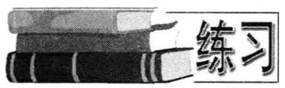

1. 50 年代人们挖掘秦淮河的淤泥作肥料. 在成直线状的一段岸边, 置有淤泥 50 堆, 每堆相隔 5 米, 在第 50 堆处有一转运站. 如果从转运站用手推车搬运，每次只能装满一堆逐次将 49 堆淤泥运至转运站，问:搬运完毕，共需走多少路?

2. 某人从 1995 年起,每年 7 月 1 日到银行存款一年定期 $a$ 元. 若年利率 $r$ 保持不变, 且每年到期存款均自动转为新的一年定期. 到 2000 年 7 月 1 日, 将所有的存款和利息全部取回，问:他可取回多少元？

3. 银行扶贫贷款给某企业 50 万元，允许其每年还一次，共 10 次还清，每次还款数目相同. 若贷款利率以每年 10% 计算，试问:该企业每次应还款多少？(取 1. ${1}^{10} \approx  {2.6}$ .)

4. $A, B$ 两个喷雾器中分别有浓度为 ${12}\% ,6\%$ 的药水各 10 千克. 现有两个容量为 1 千克的药瓶，从 $A, B$ 两喷雾器中分别取得 1 千克药水，将 $A$ 中取得的倒入 $B$ 中， $B$ 中取得的倒入 $A$ 中，这样操作了 $n$ 次后， $A$ 喷雾器药水成了浓度为 ${a}_{n}\%$ 的药水，B 喷雾器药水成了浓度为 ${b}_{n}\%$ 的药水.

(1)证明: ${a}_{n} + {b}_{n}$ 是一个常量.

(2)建立 ${a}_{n}$ 和 ${a}_{n - 1}$ 的关系式.

(3)按照这样的方式进行下去，两个喷雾器内药水的浓度能否大致相同？

## 一、选择题

1. 已知 ${\left( a + \frac{1}{2b}\right) }^{n}$ 的展开式中前三项系数 ( ) 成等差数列,则 $n =$

## 复习参考题

(A) 8. (B) 4. (C) 8 或 1. (D) 4 或 1.

2. 数列 $1,\sqrt{3 - 2\sqrt{2}},\sqrt{5 - 2\sqrt{6}},\sqrt{7 - 4\sqrt{3}},\cdots$ 前 $n$ 项的和为 ( )

(A) ${n}^{2}$ . (B) $n$ . (C) $\sqrt{n}$ . (D) $\frac{1}{{n}^{2} - n}$ .

3. 等差数列 $\left\{  {a}_{n}\right\}$ 中,公差为 $d\left( {d \neq  0}\right) ,{S}_{20} = {10m}$ . 下列结论中正确的是

( )

(A) $m = 2{a}_{5} + {a}_{10} - d$ . (B) $m = {a}_{1} + 2{a}_{10}$ .

(C) $m = {a}_{5} + {a}_{15}$ . (D) $m = 2{a}_{10} + d$ .

4. 一个数列, ${a}_{1} = 1$ ; 当 $n \geq  2$ 时,前 $n$ 项的乘积是 ${n}^{2}$ ,则该数列 ${a}_{3} + {a}_{5} =$ ( )

(A) $\frac{25}{9}$ . (B) $\frac{61}{16}$ . (C) $\frac{31}{18}$ . (D) $\frac{576}{225}$ .

5. 数列 $\left\{  {a}_{n}\right\}$ 是等比数列,且 ${a}_{n} > 0$ ,公比 $q \neq  1$ ,则 ( )

(A) ${a}_{1} + {a}_{8} > {a}_{4} + {a}_{5}$ . (B) ${a}_{1} + {a}_{8} < {a}_{4} + {a}_{5}$ .

(C) ${a}_{1} + {a}_{8} = {a}_{4} + {a}_{5}$ . (D) 不能确定.

6. 等差数列 $\left\{  {a}_{n}\right\}$ 中， $\frac{{S}_{m}}{{S}_{n}} = \frac{{m}^{2} - {2m}}{{n}^{2} - {2n}}$ ，则 $\frac{{a}_{m}}{{a}_{n}}$ 等于 ( )

(A) $\frac{{2m} - 3}{{2n} - 3}$ . (B) $\frac{m - 2}{n - 2}$ . (C) $\frac{{2m} - 1}{{2n} - 1}$ . (D) $\frac{{2m} + 1}{{2n} + 1}$ .

7. 等比数列中, ${a}_{n} > 0$ 且 ${a}_{n} = {a}_{n + 1} + {a}_{n + 2}\left( {n \in  {\mathbf{N}}^{ * }}\right)$ ,则公比 $q$ 的值为

( )

(A) $\frac{2}{\sqrt{5}}$ (B) $\frac{\sqrt{5} + 1}{2}$ . (C) $\frac{\sqrt{5} - 1}{2}$ . (D) $\frac{\sqrt{5}}{2}$ .

8. 连结三角形 ${ABC}$ 三边中点 $D$ 、 $E$ 、 $F$ ，得三角形 ${DEF}$ . 联结三角形 ${DEF}$ 的三边的中点，得三角形 ${GHI}$ . 以此类推，所得一切新三角形的面积之和与原三角形 ${ABC}$ 面积之比为 ( )

(A) 1:1. (B) 1:2. (C) 1:3. (D) 1:4.

9. 设数列 $\left\{  {a}_{2n}\right\}$ 是数列 $\left\{  {a}_{n}\right\}$ 中所有偶数项,按原来的顺序排列组成的数列. 下列命题中,正确的是 ( )

(A) 若 $\mathop{\lim }\limits_{{n \rightarrow  \infty }}{a}_{n}$ 存在,则 $\mathop{\lim }\limits_{{n \rightarrow  \infty }}{a}_{2n}$ 也存在,但不一定相等.

(B) 若 $\mathop{\lim }\limits_{{n \rightarrow  \infty }}{a}_{2n}$ 存在,则 $\mathop{\lim }\limits_{{n \rightarrow  \infty }}{a}_{n}$ 也存在.

(C) 若 $\mathop{\lim }\limits_{{n \rightarrow  \infty }}{a}_{n}$ 和 $\mathop{\lim }\limits_{{n \rightarrow  \infty }}{a}_{2n}$ 都存在,则必相等.

(D) $\mathop{\lim }\limits_{{n \rightarrow  \infty }}{a}_{n}$ 和 $\mathop{\lim }\limits_{{n \rightarrow  \infty }}{a}_{2n}$ 同时存在,或同时不存在.

10. 已知 ${a}_{n},{b}_{n}$ 分别是 ${\left( 3 - x\right) }^{n}$ 和 ${\left( 2p + 3q\right) }^{n}$ 展开式的系数和,则 $\mathop{\lim }\limits_{{n \rightarrow  \infty }}\frac{3{a}_{n} - {b}_{n}}{2{a}_{n} + {b}_{n}}$ 的值为 ( )

(A) $\frac{3}{2}$ . (B) $\frac{2}{3}$ . (C) -1 (D) -1 或 $\frac{3}{2}$ .

## 二、填空题

11. 已知 $\left\{  {a}_{n}\right\}$ 是等比数列， ${S}_{n} = {48}$ ， ${S}_{2n} = {60}$ ，则 ${S}_{3n} =$ ___.

12. 已知 $\left\{  {a}_{n}\right\}$ 是等比数列， ${a}_{3} = 3$ ， ${a}_{9} = {192}$ ，则 ${S}_{n} =$ ___.

13. 在等比数列中， ${a}_{3} = 2{S}_{2} + 1$ ， ${a}_{4} = 2{S}_{3} + 1$ ，则 $q =$ ___.

14. 在等比数列中， ${a}_{3} = {12},{a}_{6} = {96}$ ，则前 $n$ 项之积为___.

15. 已知数列满足 ${a}_{1} = 3$ 且 ${a}_{n}{a}_{n + 1} = 5$ ，则 ${a}_{n} =$ ___.

16. 已知数列满足 ${a}_{1} = 1$ 且 ${a}_{n}{a}_{n - 1} = \frac{{a}_{n - 1} - {a}_{n}}{2}$ ，则 ${a}_{n} =$ ___.

17. 已知数列 $\left\{  {a}_{n}\right\}$ 中， ${a}_{n} = 1$ ，且 $n \geq  2$ 时，前 $n$ 项的和 ${S}_{n}$ 与 ${a}_{n}$ 有关系: $2{S}_{n}^{2} = \; 2{a}_{n}{S}_{n} - {a}_{n}$ ,则 ${a}_{n} =$ ___.

18. $\mathop{\lim }\limits_{{n \rightarrow  \infty }}\left( {\sqrt{n + 5} - \sqrt{n + 1}}\right)  =$ ___.

19. $\mathop{\lim }\limits_{{n \rightarrow  \infty }}\frac{3}{\sqrt{2{n}^{2} + n} - \sqrt{2{n}^{2} - 1}} =$ ___.

20. $\mathop{\lim }\limits_{{n \rightarrow  \infty }}\left\lbrack  {n\left( {1 - \frac{1}{3}}\right) \left( {1 - \frac{1}{4}}\right) \cdots \left( {1 - \frac{1}{n + 2}}\right) }\right\rbrack   =$ ___.

## 三、解答题

21. 是否存在常数 $a, b, c$ ,使得等式:

$$
1 \times  {2}^{2} + 2 \times  {3}^{2} + \cdots  + n{\left( n + 1\right) }^{2} = \frac{n\left( {n + 1}\right) }{12}\left( {a{n}^{2} + {bn} + c}\right)
$$

对一切自然数 $n$ 成立? 并证明你的结论.

22. 设数列 $\left\{  {a}_{n}\right\}$ 的首项 ${a}_{1} = 1$ ,前 $n$ 项的和 ${S}_{n}$ 满足关系式

$$
{3t}{S}_{n} - \left( {{2t} + 3}\right) {S}_{n - 1} = {3t}\;\left( {t > 0, n = 2,3,4,\cdots }\right) ,
$$

(1)求证:数列 $\left\{  {a}_{n}\right\}$ 是等比数列；

(2)数列 $\left\{  {a}_{n}\right\}$ 的公比为 $f\left( t\right)$ ，作数列 $\left\{  {b}_{n}\right\}$ ，使 ${b}_{1} = 1$ ， ${b}_{n} = f\left( \frac{1}{{b}_{n - 1}}\right) ,(n = 2$ , $3,4,\cdots )$ ,求 $\mathop{\lim }\limits_{{n \rightarrow  \infty }}\frac{\lg {a}_{n}}{{b}_{n}}$ ;

(3) 求和: ${b}_{1}{b}_{2} - {b}_{2}{b}_{3} + {b}_{3}{b}_{4} - \cdots  - {\left( -1\right) }^{n - 1}{b}_{n}{b}_{n + 1}$ .

23. 已知数列 $\left\{  {a}_{n}\right\}$ 满足: ${a}_{1} + 2{a}_{2} + 3{a}_{3} + \cdots  + n{a}_{n} = {n}^{3} + 3{n}^{2} + {2n} + 1(n \in \; \left. {\mathbf{N}}^{ * }\right)$ ,求 ${a}_{n}$ .

24. 设 $n \geq  2, n \in  {\mathbf{N}}^{ * }$ ,证明: $\frac{1}{n + 1} + \frac{1}{n + 2} + \cdots  + \frac{1}{2n} > \frac{13}{24}$ .

25. 数列的前 $n$ 项的和是 ${S}_{n} = n\left( {n + 1}\right) \left( {{2n} + 5}\right)$ ,其偶数项不改变顺序构成数列 $\left\{  {a}_{n}\right\}$ ,

(1)求 $\left\{  {a}_{n}\right\}$ ；

(2)若其前 $n$ 项和为 ${T}_{n}$ ,证明: $4\left( {\frac{1}{{T}_{1}} + \frac{1}{{T}_{2}} + \cdots  + \frac{1}{{T}_{n}}}\right)  > \frac{n\left( {n + 3}\right) }{8\left( {n + 1}\right) \left( {n + 2}\right) }$ .

26. 设正项数列 $\left\{  {a}_{n}\right\}$ 的前 $n$ 项和 ${S}_{n} = \frac{1}{2}\left( {{a}_{n} + \frac{1}{{a}_{n}}}\right)$ ,

(1) 求 ${a}_{1},{a}_{2},{a}_{3},{a}_{4}$ ;

(2)猜测 ${a}_{n}$ 的表达式，并证明你的结论.

27. 设在数列 ${a}_{1},{a}_{2},\cdots ,{a}_{n},\cdots$ 的项之间有关系

$$
{a}_{n} = {a}_{n - 1}{\sin }^{2}\theta  + {a}_{n + 1}{\cos }^{2}\theta \;\left( {n \geq  2,\left| \theta \right|  < \frac{\pi }{2},\theta  \neq  0}\right) .
$$

求证: ${a}_{n}{\sin }^{2}\theta  + {a}_{2}{\cos }^{2}\theta  = {a}_{1}{\sin }^{2}\theta  + {a}_{n + 1}{\cos }^{2}\theta$ .

本章 阅读

## 47 年与 17 秒

幻方冲破方阵限制至少可以追溯到 700 年前. 在公元 1275 年出版的我国古代著作《续古摘奇算法》中，就收入了如下一个幻方(图9-4)，称为“攒九图”. 这是一个奇特的圆形幻方，由 1 到 33 的自然数，排成四个同心圆. 中心置 9 ，并形成四条直径. 各直径上的数字和均为 147 , 各圆周上的数字和都等于 138 .

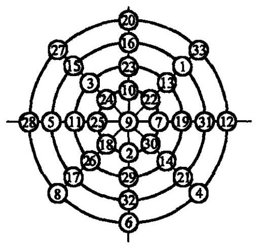

图 9-4

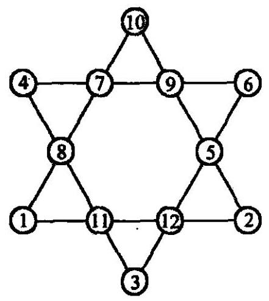

图 9-5

图 9-5 是一个六角心形的幻方. 幻方中的每一直线上四个数字和均为 26，而六个角上六个数字和也是 26. 这一幻方虽然简单，但不乏趣味，可以使人赏心悦目.

对于“反幻方”的研究，始于 20 世纪著名的美国幻方大师马丁. 加德纳. 大家知道, 对幻方来说, “变幻常数”是至关重要的. 例如，当我们知道了一个三阶幻方的变幻常数 $N$ ，实际上就等于知道了占中央位置的数 ${x}_{5}$ (图 9-6). 这是由于,从含有 ${x}_{5}$ 的定数式可得:

$$
\left\{  \begin{array}{l} {x}_{2} + {x}_{5} + {x}_{8} = N, \\  {x}_{4} + {x}_{5} + {x}_{6} = N, \\  {x}_{1} + {x}_{5} + {x}_{9} = N, \\  {x}_{3} + {x}_{5} + {x}_{7} = N. \end{array}\right.
$$

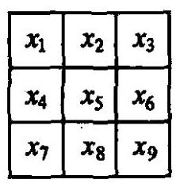

图 9-6

以上各式相加,

$$
\left( {{x}_{1} + {x}_{2} + {x}_{3}}\right)  + \left( {{x}_{4} + {x}_{5} + {x}_{6}}\right)  + \left( {{x}_{7} + {x}_{8} + {x}_{9}}\right)  + 3{x}_{5} = {4N}.
$$

从而 ${3N} + 3{x}_{5} = {4N}$ ,

$$
{x}_{5} = \frac{N}{3}.
$$

利用这个性质，我们可以通过少量的已知数字，推断出幻方中未知的数字. 例如我们已知某三阶幻方变幻常数为 $N = {111}$ ，其余已知数字如图 9-7. 如何填出题中幻方所缺的数字，这对锻炼思维无疑是一个极好的练习.

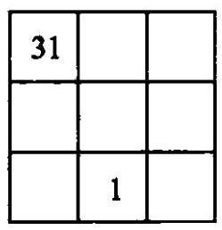

图 9-7

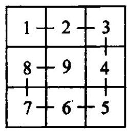

图 9-8

马丁・加德纳考虑的是:把 $1,2,3,\cdots ,9$ 九个数字随意地填在三阶幻方的九个格子内，会出现什么现象？他发现，在一般的情况下，总会出现一些行，一些列或对角线上的数字和会相等. 于是马丁博士提出了这样的疑问，是否存在一个方阵， 它的任一行，任一列，或对角线上的数字和都不相等呢？这就是“反幻方”问题. 马丁 - 加德纳终于找到了这种反幻方，有趣的是，反幻方中的九个数，竟然形成按序咬接“一条龙” (图 9-8).

在幻方中最为奥妙，最为壮观的大约要数“双料幻方”(图 9-9). 这是一个 8 阶幻方，它的每行、每列、每条对角线上的各八个数，不仅和为定数 840，而且积也为定数，等于 2058068231856000. 这可真是天工造物. 真不知当初人们是怎么想出来的!

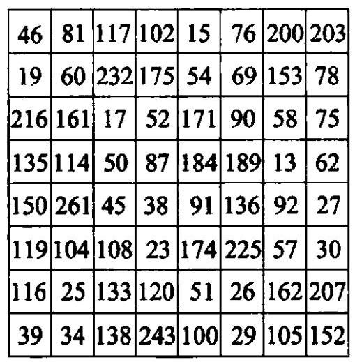

图 9-9

把幻方的研究从平面推向立体，似乎是自然的事. 所谓 “幻立方”，一般的是指: 用 1 至 ${n}^{3}$ 个自然数,填入 ${n}^{3}$ 个小立方体,使立方体的每个剖面正方形上的每行，每列，每条对角线上的各数的和都等于定数. “幻立方”问题要比幻方问题困难得多. 已经证明 3 阶,4 阶幻立方不存在. 5 阶,6 阶幻立方是否存在,目前人们还不清楚. 7 阶幻立方已经有人做出. 8 阶幻立方诞生于 1970 年春天.

翻开整部幻方的历史，最为稀有和最富戏剧性的莫过于六角幻方。

公元 1910 年，一个名叫亚当斯的青年对六角幻方发生了浓厚的兴趣. 由于一层六角幻方显然是不存在. 否则，在图 9-10 中，从 $x + y = y + z$ ，将得出 $x = z$ ，这是不允许的. 于是, 亚当斯把自己全部注意力, 都集中在由 19 个数组成的两层六角幻方上. 他利用自己在铁路公司阅览室当职员之便,用一切空闲的时间,不停摆弄从 1 到 19 这十九个数，如此这般度过了漫漫 47 个春秋. 这时的亚当斯已不复是过去英姿风发的年轻小伙子了，无数的失败、挫折和无情的岁月，使他成了两鬓斑白的老人. 但亚当斯依旧兴趣不减. 在 1957 年的一天, 患病中的亚当斯在病床上无意中排列成功了(图9-10). 他惊喜万分，连忙翻身下床找纸把它记录下来. 几天后他病愈出院. 到家时却不幸发现那张记录六角幻方的纸竟然不见了! 然而，亚当斯并没有因此灰心，他继续奋斗了 5 年，终于在 1962 年 12 月的一天，重新找到了那个丢失了的图形. 这时的亚当斯已是古稀之人.

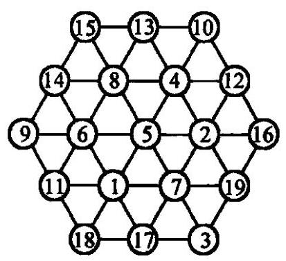

图 9-10

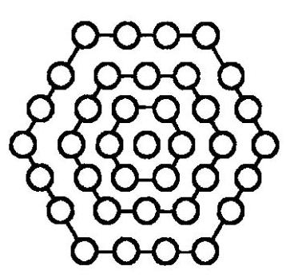

图 9-11

亚当斯排出了六角幻方，激动无比. 他对此视若珍宝，并把它拿给前面提到过的幻方专家马丁·加德纳鉴赏. 面对着这巧夺天工的珍奇，马丁博士顿感眼界大开，并为此写信给才华横溢的数学游戏专家特里格. 特里格企图在亚当斯六角幻方的基础上, 对层数作出突破. 但经过反复的研究, 终于惊奇地发现, 自己所作的一切努力都是无用功！两层以上的幻方根本不存在！

1969 年，滑铁卢大学二年级学生阿莱尔对特里格的结论，作出了如下极为简单巧妙的证明: 设六角幻方层数为 $n$ (图 9-11),则中心有一个数,第一层有 6 个数, 第二层有 12 个数,...,第 $n$ 层有 6 n 个数. 若整个幻方 $N$ 个数,则

$$
N = 1 + 6 + {12} + \cdots  + {6n} = 3{n}^{2} + {3n} + 1.
$$

令这 $N$ 个数之和为 $M$ ，则

$$
M = 1 + 2 + \cdots  + N = \frac{1}{2}N\left( {N + 1}\right)
$$

$$
= \frac{1}{2}\left( {3{n}^{2} + {3n} + 1}\right) \left( {3{n}^{2} + {3n} + 2}\right) \text{ . }
$$

由于 $n$ 层六角幻方应有 ${2n} + 1$ 行,且每行数字的和均相等,所以 $\left( {{2n} + 1}\right)$ 必须除尽 M. 由于

$$
M = \frac{1}{2}\left( {3{n}^{2} + {3n} + 1}\right) \left( {3{n}^{2} + {3n} + 2}\right)
$$

$$
= \frac{1}{2}\left\lbrack  {\left( {{2n} + 1}\right) \left( {n + 1}\right)  + {n}^{2}}\right\rbrack  \left\lbrack  {\left( {{2n} + 1}\right) \left( {n + 1}\right)  + {n}^{2} + 1}\right\rbrack  ,
$$

因而 ${n}^{2}\left( {{n}^{2} + 1}\right)$ 也应为 $\left( {{2n} + 1}\right)$ 整除. 又因为 ${n}^{2}$ 与 $\left( {{2n} + 1}\right)$ 是互质的,所以 $\left( {{2n} + 1}\right)$ 必须整除 $\left( {{n}^{2} + 1}\right)$ ,但

$$
4\left( {{n}^{2} + 1}\right)  = \left( {{2n} + 1}\right) \left( {{2n} - 1}\right)  + 5.
$$

这意味着, $\left( {{2n} + 1}\right)$ 必须整除 $\left( {{2n} + 1}\right) \left( {{2n} - 1}\right)  + 5$ ,也就是必须整除 5 . 这样, 只能是 $\left( {{2n} + 1}\right)  = 1$ 或 $\left( {{2n} + 1}\right)  = 5$ . 前者推出 $n = 0$ ,只剩下一个中心点; 后者得到 $n = 2$ ,即六角幻方只能有两层.

后来，阿莱尔更上一层楼，把六角幻方的可能选择输入电子计算机测试. 结果用了 17 秒时间，得出了与亚当斯完全相同的结果. 电子计算机向人类庄严宣告:普通的幻方可能有千千万万种排法，但六角幻方却只能有亚当斯这一个！难怪亚当斯为此花了 47 年!

第十章

## 坐标平面上的直线 Lines on the Coordinate Plane

## 一、坐 标 法

### 10.1 坐标法

在古代, 对于曲线性质的研究,一直是古希腊几何学的一大内容. 古希腊的数学家们通过对众多的曲线的研究, 开始对曲线的本质有了统一的认识, 他们把曲线看成是符合一定条件的所有的点组成的,从而把曲线都称之为轨迹.

认识是统一了,但是在具体的研究中,又各不相同,对于各种不同的曲线,缺少一种一般的表示方法和统一的研究手段. 法国数学家费马(Fermat, 1601-1665)在他的《平几和立几轨迹引论》一书中，就指出了这一问题，他认为对轨迹的研究. 没有给予充分而又一般的表示方法.

费马认为，对轨迹要给予一般的表示，那只能借助于代数. 费马所建立的一般方法, 就是坐标法. 对坐标法的突破, 则是由法国数学家笛卡尔 (Descartes, 1596- 1650) 做出的. 他建立的坐标就是常用的直角坐标, 所以也称笛卡尔直角坐标. 由此, 历史上公认费马、笛卡尔为解析几何的创始人.

在直角坐标系中,点 $P$ 能够用有序实数对 $\left( {{x}_{0},{y}_{0}}\right)$ 来确定. 两者是一一对应的关系(如图 10-1).

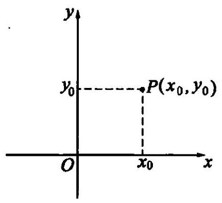

图 10-1

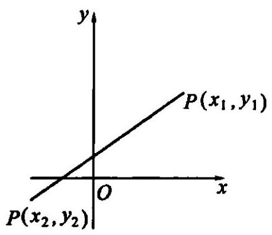

图 10-2

如图 10-2,点 ${P}_{1}\left( {{x}_{1},{y}_{1}}\right)$ 和点 ${P}_{2}\left( {{x}_{2},{y}_{2}}\right)$ 间的距离公式为:

$$
\left| {{P}_{1}{P}_{2}}\right|  = \sqrt{{\left( {x}_{1} - {x}_{2}\right) }^{2} + {\left( {y}_{1} - {y}_{2}\right) }^{2}}.
$$

两点中点坐标公式为:

$$
{x}_{0} = \frac{{x}_{1} + {x}_{2}}{2},\;{y}_{0} = \frac{{y}_{1} + {y}_{2}}{2}.
$$

例 1 在平面直角坐标系内有两已知点 $A\left( {-1, - 4}\right)$ 和 $B\left( {2,2}\right)$ ,点 $P$ 在 $x$ 轴上,且 $\left| {PA}\right|  = 2\left| {PB}\right|$ ,求点 $P$ 的坐标.

解: 设点 $P$ 的坐标为 $\left( {x,0}\right)$ . 由 $\left| {PA}\right|  = 2\left| {PB}\right|$ ,

$\therefore \sqrt{{\left( x + 1\right) }^{2} + {4}^{2}} = 2\sqrt{{\left( x - 2\right) }^{2} + {\left( -2\right) }^{2}},\;\therefore {x}^{2} - {6x} + 5 = 0$ .

解得 ${x}_{1} = 1,{x}_{2} = 5$ .

$\therefore$ 点 $P$ 的坐标为 $\left( {1,0}\right) \text{ 、 }\left( {5,0}\right)$ .

例 ${2P}$ 是等腰三角形 ${ABC}$ 的底边 ${BC}$ 上的任一点,求证: ${\left| AP\right| }^{2} = {\left| AB\right| }^{2} - \; \left| {BP}\right| \left| {PC}\right|$ .

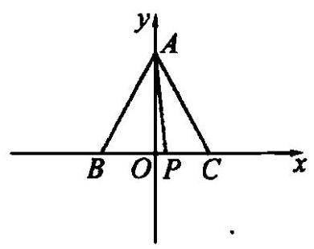

图 10-3

证: 如图 10-3,建立直角坐标系. 设点 $A, C, P$ 的坐标分别为 $A\left( {0, a}\right) , C\left( {c,0}\right) , P\left( {x,0}\right)$ ,则点 $B$ 的坐标为 $\left( {-c,0}\right)$ ,且 $x \in  \left\lbrack  {-c, c}\right\rbrack$ .

$$
\therefore {\left| AP\right| }^{2} = {a}^{2} + {x}^{2}\text{ . }
$$

$$
{\left| AB\right| }^{2} - \left| {BP}\right|  \cdot  \left| {PC}\right|  = \left( {{c}^{2} + {a}^{2}}\right)  - \left( {x + c}\right) \left( {c - x}\right)
$$

$$
= {a}^{2} + {x}^{2}\text{ , }
$$

$$
\therefore {\left| AP\right| }^{2} = {\left| AB\right| }^{2} - \left| {BP}\right|  \cdot  \left| {PC}\right| \text{ . }
$$

利用解析法来解决有关问题，首先要选取适当的坐标系，通过坐标之间的代数关系来解决问题.

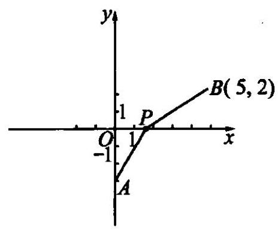

图 10-4

例 3 求函数 $y = \sqrt{{x}^{2} + 9} + \sqrt{{x}^{2} - {10x} + {29}}$ 的最小值.

解: 由 $y = \sqrt{{x}^{2} + 9} + \sqrt{{\left( x - 5\right) }^{2} + 4}$ ,构造一个几何图形,如图 10-4.

设 $A\left( {0, - 3}\right) , B\left( {5,2}\right) , P\left( {x,0}\right)$ ,则

$\left| {AP}\right|  = \sqrt{{\left( x - 0\right) }^{2} + {\left( 0 + 3\right) }^{2}} = \sqrt{{x}^{2} + 9},$

$\left| {BP}\right|  = \sqrt{{\left( x - 5\right) }^{2} + {\left( 0 - 2\right) }^{2}} = \sqrt{{x}^{2} - {10x} + {29}}.$

$$
\because \;y = \left| {AP}\right|  + \left| {BP}\right|  \geq  \left| {AB}\right|  = \sqrt{{\left( 5 - 0\right) }^{2} + {\left( 2 + 3\right) }^{2}} = 5\sqrt{2}\text{ , }
$$

$\therefore y$ 最小值为 $5\sqrt{2}$ ,此时 $A, P, B$ 三点共线.

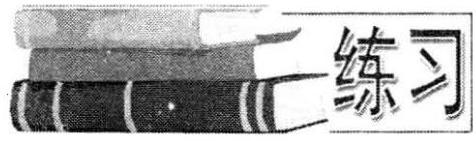

1. $\bigtriangleup {ABC}$ 的重心 $G$ 的坐标为 $\left( {\frac{13}{6}, - 1}\right) ,{AB}$ 的中点 $D$ 的坐标为 $\left( {-\frac{5}{4}, - 2}\right) ,{BC}$ 中点 $E$ 的坐

标为 $\left( {\frac{11}{4}, - 4}\right)$ ,求 $\bigtriangleup {ABC}$ 三个顶点的坐标.

2. 三角形的三个顶点是 $A\left( {-1,3}\right) , B\left( {0,2}\right) , C\left( {1, - 1}\right)$ ,求三角形 ${ABC}$ 外接圆的圆心坐标和半径.

图 10-5

3. 求证: 若 ${ABCD}$ 是圆 $O$ 的内接四边形,且 ${AC} \bot  {BD}.E$ 为垂足, $F, G$ 分别是 ${AB},{DC}$ 的中点, ${OF}$ 垂直 ${AB}$ 于 $F$ ,则 ${EG} \; = {OF}$ (如图 10-5).

4. 在直角三角形 ${AOB}$ 中, $\angle {AOB} = \frac{\pi }{2}$ ,两直角边 ${OA} = a$ , ${OB} = b, M\text{ 、 }N$ 两点三等分斜边 ${AB}$ . 若 ${OM} = \cos \alpha ,{ON} = \; \sin \alpha \left( {0 < \alpha  < \frac{\pi }{2}}\right)$ ,求斜边 ${AB}$ 的长.

5. 已知三角形 ${ABC}, P$ 是平面 ${ABC}$ 上的一点,求证: $P$ 到三角形 ${ABC}$ 三顶点距离平方之和取得最小值是,点 $P$ 恰好为三角形 ${ABC}$ 重心.

## 二、直线的倾斜角和斜率

### 10.2 直线的倾斜角和斜率

为了建立直角坐标系中的直线方程，需要研究直线的倾斜角和斜率.

一条直线 $l$ 向上的方向与 $x$ 轴的正方向所成的最小正角,叫做这条直线的倾斜角,如图 10-6 中的 $\alpha$ .

图 10-6

特别地,当直线 $l$ 和 $x$ 轴平行时,我们规定它的倾斜角为 ${0}^{ \circ  }$ .

因此,倾斜角的取值范围是 ${0}^{ \circ  } \leq  \alpha  < {180}^{ \circ  }$ .

倾斜角不是 90 度的直线,它的倾斜角的正切叫做这条直线的斜率. 直线斜率常用 $k$ 表示，即

$$
k = \tan \alpha \text{ . }
$$

倾斜角是 90 度的直线没有斜率; 倾斜角不是 90 度的直线都有斜率, 并且是确定的. 我们常用斜率来表示倾斜角不等于 90 度的直线对于 $x$ 轴的倾斜程度.

在坐标平面上,如果两点 ${P}_{1}\left( {{x}_{1},{y}_{1}}\right) ,{P}_{2}\left( {{x}_{2},{y}_{2}}\right)$ ,那么直线 ${P}_{1}{P}_{2}$ 就是确定的.

下面我们来研究,当 ${P}_{1}{P}_{2}$ 的倾斜角不等于 ${90}^{ \circ  }$ 时,怎样用两点的坐标来表示直线 ${P}_{1}{P}_{2}$ 的斜率.

已知直线 ${P}_{1}{P}_{2}$ 的倾角为 $\alpha ,{P}_{1}$ 的坐标为 $\left( {{x}_{1},{y}_{1}}\right) ,{P}_{2}$ 的坐标为 $\left( {{x}_{2},{y}_{2}}\right)$ ,当 $\alpha  \neq  {90}^{ \circ  }$ 时,如图 10-7.

图 10-7

我们发现:

$$
\tan \alpha  = \frac{{y}_{2} - {y}_{1}}{{x}_{2} - {x}_{1}}.
$$

例 1 已知点 $A\left( {-2,3}\right) , B\left( {3,2}\right) , C\left( {1,1}\right)$ . 求这个三角形三边的斜率和倾斜角.

解: 三边斜率分别为

$$
{k}_{AB} = \frac{2 - 3}{3 + 2} =  - \frac{1}{5},\;{k}_{BC} = \frac{1 - 2}{1 - 3} = \frac{1}{2},\;{k}_{AC} = \frac{1 - 3}{1 - \left( {-2}\right) } =  - \frac{2}{3}.
$$

倾斜角分别为

$$
{\alpha }_{AB} = \arctan \left( {-\frac{1}{5}}\right)  + \pi  = \pi  - \arctan \frac{1}{5},
$$

$$
{\alpha }_{BC} = \arctan \frac{1}{2},
$$

$$
{\alpha }_{AC} = \arctan \left( {-\frac{2}{3}}\right)  + \pi  = \pi  - \arctan \frac{2}{3}.
$$

例 2 已知直线的倾角为 $\alpha ,\sin \alpha  = \frac{\sqrt{2}}{2}$ ,且 ${P}_{1}\left( {2,{y}_{1}}\right) ,{P}_{2}\left( {{x}_{2}, - 3}\right) ,{P}_{3}\left( {4,2}\right)$ 是这直线上的三个点,求 ${y}_{1}$ 和 ${x}_{2}$ .

解: $\because {P}_{1},{P}_{2},{P}_{3}$ 三点共线,

$\therefore$ 它们的斜率有如下关系:

$$
{k}_{{P}_{1}{P}_{2}} = {k}_{{P}_{2}{P}_{3}} = {k}_{{P}_{1}{P}_{3}} = \tan \alpha .
$$

$$
\therefore \;\frac{{y}_{1} + 3}{2 - {x}_{2}} = \frac{2 + 3}{4 - {x}_{2}} = \frac{2 - {y}_{1}}{4 - 2}\text{ . }
$$

又 $\because \sin \alpha  = \frac{\sqrt{2}}{2}$ ,

$$
\therefore \alpha  = \frac{\pi }{4}\text{ 或 }\frac{3\pi }{4}.
$$

当 $\alpha  = \frac{\pi }{4}$ 时, $\tan \alpha  = 1$ ,此时 ${x}_{2} =  - 1,{y}_{1} = 0$ .

当 $\alpha  = \frac{3\pi }{4}$ 时, $\tan \alpha  =  - 1$ ,此时 ${x}_{2} = 9,{y}_{1} = 4$ .

例 3 如果直线 $l$ 的斜率为 $k\left( {k \neq  0}\right) , l$ 的倾斜角的平分线的斜率为 ${k}^{\prime }(k \neq \; \pm  1)$ 那么 $k$ 和 ${k}^{\prime }$ 之间满足什么关系?

解: 设 $l$ 的倾斜角为 ${2\theta }$ ,则 $\tan \theta  = {k}^{\prime },\tan {2\theta } = k$ .

$\because \;\tan {2\theta } = \frac{2\tan \theta }{1 - {\tan }^{2}\theta },\;\therefore \;k = \frac{2{k}^{\prime }}{1 - {k}^{\prime 2}}, k - k{k}^{\prime 2} = 2{k}^{\prime }$ .

1. 已知 $- \frac{\pi }{2} < \alpha  < 0$ ,求直线 $y = x\tan \alpha$ 的倾斜角.

2. 斜率为 3 的直线过点 $A\left( {1,1}\right)$ 和 $B\left( {x, - 2}\right)$ ,求 $x$ 的值.

3. 如果函数 $y = \lg \left( {{10} - m{x}^{2}}\right)$ 的定义域是 $\mathbf{R}$ ,直线 $y = x\sin \left( {\arctan m}\right)  + {10}$ 的倾斜角 $\theta$ ，求 $\theta$ 的值. (用 $m$ 表示)

4. 设直线 $l$ 的倾斜角为 $\alpha$ ， ${P}_{1}\left( {{x}_{1},{y}_{1}}\right)$ ， ${P}_{2}\left( {{x}_{2},{y}_{2}}\right)$ 是 $l$ 上的任意两个不同点， 求证:

$$
\left| {{P}_{1}{P}_{2}}\right|  = \sqrt{1 + {\tan }^{2}\alpha }\left| {{x}_{1} - {x}_{2}}\right|  = \sqrt{1 + {\tan }^{2}\alpha }\left| {{y}_{2} - {y}_{1}}\right| .
$$

5. 已知直线 ${l}_{1} : y = {kx} + {2k} + 1,{l}_{2} : y =  - \frac{1}{2}x + 2$ . 设 ${l}_{1} \cap  {l}_{2} = P$ ,且 $P$ 位于第一象限，求 $k$ 的取值范围.

## 三、直线方程的几种形式

### 10.3 直线方程的几种形式

一条直线在直角坐标平面内的位置，可以由不同的条件来确定. 下面，我们来研究怎样根据所给的条件，求出直线的方程.

## 1. 点斜式

已知直线 $l$ 的斜率是 $k$ ，并且过点 ${P}_{1}\left( {{x}_{1},{y}_{1}}\right)$ ，求直线 $l$ 的方程. (图 10-8(a))

设点 $P\left( {x, y}\right)$ 是直线 $l$ 上不同于点 ${P}_{1}$ 的任意一点. 根据经过两点的直线的斜率公式,得

$$
k = \frac{y - {y}_{1}}{x - {x}_{1}}.
$$

可得

$$
y - {y}_{1} = k\left( {x - {x}_{1}}\right) .
$$

可以验证,直线上的每个点的坐标都是方程的解; 反之,以这个方程的解为坐标的点都在直线 $l$ 上. 这个方程,叫做直线方程的点斜式.

图 10-8

特别的,当倾斜角 $\alpha  = {0}^{ \circ  }$ 时, $k = 0$ (图 10-8(b)). 直线方程变为 $y = {y}_{1}$ . 当倾斜角 $\alpha  = {90}^{ \circ  }$ 时,直线没有斜率,它的方程不能用点斜式表示 (图 10-9).

图 10-9

图 10-10

## 2. 斜截式

如果已知直线 $l$ 的斜率是 $k$ ，与 $y$ 轴的交点是 $\left( {0, b}\right)$ ， (其中 $b$ 是直线 $l$ 在 $y$ 轴上的截距),代入斜截式,得直线 $l$ 的方程:

$$
y - b = k\left( {x - 0}\right) .
$$

也就是:

$$
y = {kx} + b.
$$

这个方程由直线的斜率 $k$ 和它在 $y$ 轴上的截距确定,所以叫做直线方程的斜截式(图 10-10).

## 3. 两点式

已知直线 $l$ 经过两点 ${P}_{1}\left( {{x}_{1},{y}_{1}}\right) ,{P}_{2}\left( {{x}_{2},{y}_{2}}\right) \left( {{x}_{1} \neq  {x}_{2}}\right)$ ,求直线 $l$ 的方程.

图 10-11

因为 $l$ 经过点 ${P}_{1}\left( {{x}_{1},{y}_{1}}\right) ,{P}_{2}\left( {{x}_{2},{y}_{2}}\right)$ ,并且 ${x}_{1} \neq  {x}_{2}$ ,所以它的斜率 $k = \; \frac{{y}_{2} - {y}_{1}}{{x}_{2} - {x}_{1}}$ . 代入点斜式,得

$$
y - {y}_{1} = \frac{{y}_{2} - {y}_{1}}{{x}_{2} - {x}_{1}}\left( {x - {x}_{1}}\right) .
$$

当 ${y}_{2} \neq  {y}_{1}$ 时,方程可以写成

$$
\frac{y - {y}_{1}}{{y}_{2} - {y}_{1}} = \frac{x - {x}_{1}}{{x}_{2} - {x}_{1}}
$$

这个方程是由直线上两点确定,叫做直线方程的两点式 (图 10-11).

## 4. 截距式

如果已知直线 $l$ 在 $x$ 轴和 $y$ 轴上的截距分别是 $a$ 和 $b\left( {a \neq  0, b \neq  0}\right)$ ,求直线 $l$ 的方程(如图 10-12).

图 10-12

因为 $l$ 过 $A\left( {a,0}\right) , B\left( {0, b}\right)$ 两点,将两点坐标代入两点式,得 $\frac{y - 0}{b - 0} = \frac{x - a}{0 - a}$ ,

即

$$
\frac{x}{a} + \frac{y}{b} = 1
$$

## 5. 直线方程的一般形式

我们知道,在直角坐标系中,每一条直线都有倾斜角 $\alpha$ .

当 $\alpha$ 不等于 90 度时,它们都有斜率,方程可写成如下形式: $y = {kx} + b$ ;

当 $\alpha$ 等于 90 度时,它的方程可以写成 $x = {x}_{1}$ 形式. 由于是在坐标平面上讨论问题，所以这个方程应认为是关于 $x$ 、 $y$ 的二元一次方程，其中 $y$ 的系数是 0 .

这样, 对于每一条直线都可以求得它的方程, 而且是二元一次方程. 就是说, 直线方程都是关于 $x\text{ 、 }y$ 的一次方程 ${Ax} + {By} + C = 0$ .

下证任何关于 $x$ 、 $y$ 的一次方程 ${Ax} + {By} + C = 0$ 都可以表示一条直线，其中 $A$ 、 $B$ 不同时为 0 .

① 当 $B \neq  0$ 时，方程变为

$$
y =  - \frac{A}{B}x - \frac{C}{B},
$$

它表示直线的斜截式方程，斜率为 $- \frac{A}{B}$ ，在 $y$ 轴上截距为 $- \frac{C}{B}$ .

② 当 $B = 0$ 时， $A \neq  0$ ，方程变为

$$
x =  - \frac{C}{A}
$$

它表示一条直线与 $y$ 轴平行或重合的直线.

例 1 已知直线经过点 $A\left( {6, - 4}\right)$ ,斜率为 $- \frac{4}{3}$ ,求直线的 ① 点斜式,② 一般式,③ 截距式.

解: 经过点 $A\left( {6, - 4}\right)$ ,并且斜率为 $- \frac{4}{3}$ 的直线的点斜式是

$$
y + 4 =  - \frac{4}{3}\left( {x - 6}\right) .
$$

化成一般式，得

$$
{4x} + {3y} - {12} = 0.
$$

把常数移到等号右边，把方程两边都除以 12 ，就得到截距式

$$
\frac{x}{3} + \frac{y}{4} = 1
$$

例 2 三角形的顶点是 $A\left( {-5,0}\right) , B\left( {3, - 3}\right) , C\left( {0,2}\right)$ ,求这个三角形三边所在直线的方程.

解: 直线 ${AB}$ 过点 $A\left( {-5,0}\right) , B\left( {3, - 3}\right)$ 两点,由两点式得

$$
\frac{y - 0}{-3 - 0} = \frac{x - \left( {-5}\right) }{3 - \left( {-5}\right) }\text{ 即 }{3x} + {8y} + {15} = 0.
$$

直线 ${BC}$ 在 $y$ 轴上截距是 2,斜率是 $k = \frac{2 - \left( {-3}\right) }{0 - 3} =  - \frac{5}{3}$ ,由斜截式得

$$
y =  - \frac{5}{3}x + 2\text{ 即 }{5x} + {3y} - 6 = 0.
$$

直线 ${AC}$ 在 $x$ 轴和 $y$ 轴上的截距分别是-5,2,由截距式得

$$
\frac{x}{-5} + \frac{y}{2} = 1\text{ 即 }{2x} - {5y} + {10} = 0.
$$

1. 根据下列条件，求直线 $l$ 的方程:

① $l$ 过定点 $P\left( {1,4}\right)$ ，且与 $A\left( {-5, - 2}\right)$ 、 $B\left( {3,2}\right)$ 的距离相等.

② $l$ 过定点 $P\left( {-5,2}\right)$ ，并且在两坐标轴上的截距相等.

③ $l$ 过定点 $P\left( {2,5}\right)$ ，并且在两坐标轴上截得的点到原点的距离相等.

2. 由下列各条件，分别写出直线方程，并且化成一般式:

① 斜率是 $- \frac{1}{2}$ ,经过点 $A\left( {8, - 2}\right)$ .

② 经过点 $B\left( {4,2}\right)$ ，平行于 $x$ 轴.

③ 经过点 $C\left( {-\frac{1}{2},0}\right)$ ，平行于 $y$ 轴.

④ $x$ 轴上截距为 -7，倾斜角为 120 度.

3. $P$ 是直线 $y = {3x}$ 上位于第一象限的点, $M\left( {3,2}\right)$ 为一定点,直线 ${PM}$ 交 $x$ 轴正半轴于 $Q$ ,求 $\bigtriangleup {POQ}$ 面积的最小值及此时直线 ${PQ}$ 的方程 (如图 10-13).

图 10-13

4. 已知直线 ${l}_{1} : {ax} - {2y} - {2a} + 4 = 0,{l}_{2} : {2x} + \; {a}^{2}y - 2{a}^{2} - 4 = 0$ ,其中 $0 < a < 2$ ,当 ${l}_{1},{l}_{2}$ 与两坐标轴围成一四边形,且该四边形的面积最小时,求 ${l}_{1}$ 与 ${l}_{2}$ 的方程.

5. 光线从点 $M\left( {-2,1}\right)$ 出发，先经过 $x$ 轴反射，再经 $y$ 轴反射到达 $N\left( {-1,2}\right)$ . 求光线从点 $M$ 到点 $N$ 所经过的路程.

6. 已知直线 $l$ 经过点 $\left( {0,0}\right)$ ,若 $A\left( {0, - 1}\right) , B\left( {8,0}\right)$ 关于 $l$ 的对称点都在二次函数 $f\left( x\right)  = a{x}^{2}$ 的图像上,求直线 $l$ 的方程与二次函数 $f\left( x\right)$ 的解析式.

## 四、两直线的关系

### 10.4 两直线的平行与垂直

设两直线 ${l}_{1}$ 和 ${l}_{2}$ 的斜率为 ${k}_{1}$ 和 ${k}_{2}$ ，他们的方程分别是

$$
{l}_{1} : y = {k}_{1}x + {b}_{1};\;{l}_{2} : y = {k}_{2}x + {b}_{2}.
$$

我们首先研究两直线平行 (不重合) 的情形.

图 10-14

如果 ${l}_{1}$ 平行于 ${l}_{2}$ (图 10-14),那么它们的倾斜角相等， ${\alpha }_{1} = {\alpha }_{2}$ .

$\therefore \;\tan {\alpha }_{1} = \tan {\alpha }_{2}$ ,即 ${k}_{1} = {k}_{2}$ .

反之,如果两直线的斜率相等, ${k}_{1} = {k}_{2}$ ,也就是 $\tan {\alpha }_{1} = \tan {\alpha }_{2}$ .

由于 ${0}^{ \circ  } \leq  {\alpha }_{1} < {180}^{ \circ  },{0}^{ \circ  } \leq  {\alpha }_{2} < {180}^{ \circ  }$ ,

$\therefore \;{\alpha }_{1} = {\alpha }_{2}$ .

又 $\because$ 两条直线不重合,

$$
\therefore {l}_{1}//{l}_{2}\text{ . }
$$

以上的结论说明:两条直线有斜率且不重合，如果它们平行，则斜率相等；反之, 如果它们的斜率相等, 则它们平行. 即

$$
{l}_{1}//{l}_{2} \Leftrightarrow  {k}_{1} = {k}_{2}\text{ . }
$$

现在研究两条直线垂直的情形.

如果 ${l}_{1} \bot  {l}_{2}$ ,这时 ${\alpha }_{1} \neq  {\alpha }_{2}$ .

设 ${\alpha }_{2} < {\alpha }_{1}$ (图 10-15),根据三角形外角等于和它不相邻的两内角的和,得

$$
{\alpha }_{1} = {90}^{ \circ  } + {\alpha }_{2}.
$$

图 10-15

因为 ${l}_{1},{l}_{2}$ 的斜率是 ${k}_{1},{k}_{2}$ ，而 ${\alpha }_{1} \neq  {90}^{ \circ  }$ ，所以 ${\alpha }_{2} \neq  {0}^{ \circ  }$ .

$$
\therefore \tan {\alpha }_{1} = \tan \left( {{90}^{ \circ  } + {\alpha }_{2}}\right)  =  - \frac{1}{\tan {\alpha }_{2}}\text{ . }
$$

即 ${k}_{1} =  - \frac{1}{{k}_{2}}$ ,或 ${k}_{1}{k}_{2} =  - 1$ .

反过来,如果 ${k}_{1} =  - \frac{1}{{k}_{2}}$ ,即 ${k}_{1}{k}_{2} =  - 1$ . 设其中一个,例如 ${k}_{2}$ 是正数,则 ${k}_{1}$ 是负数. 那么 ${\alpha }_{2}$ 是锐角, ${\alpha }_{1}$ 是钝角.

$$
\therefore \;\tan {\alpha }_{1} =  - \frac{1}{\tan {\alpha }_{2}} = \tan \left( {{90}^{ \circ  } + {\alpha }_{2}}\right) .
$$

$\therefore {\alpha }_{1} = {90}^{ \circ  } + {\alpha }_{2}$ ,即 ${l}_{1} \bot  {l}_{2}$ .

以上的结论说明: 两条直线都有斜率, 如果它们互相垂直, 则它们的斜率互为负倒数; 反之, 如果它们的斜率互为负倒数, 则它们互相垂直. 即

$$
{l}_{1} \bot  {l}_{2} \Leftrightarrow  {k}_{1} =  - \frac{1}{{k}_{2}}\text{ 或 }{l}_{1} \bot  {l}_{2} \Leftrightarrow  {k}_{1}{k}_{2} =  - 1.
$$

例 1 求过点 $A\left( {1, - 4}\right)$ ,且与直线 ${2x} + {3y} + 5 = 0$ 平行的直线方程.

解: 已知直线的斜率为 $- \frac{2}{3}$ ,因为所求直线与已知直线平行,因此所求直线的斜率也是 $- \frac{2}{3}$ . 于是,所求方程为 ${2x} + {3y} + {10} = 0$ .

例 2 求证: 以 $A\left( {-4,2}\right) , B\left( {1, - 1}\right) , C\left( {5,5}\right) , D\left( {-\frac{1}{3},\frac{7}{2}}\right)$ 为顶点的四边形是梯形.

证: $\because A\text{ 、 }B$ 所在直线斜率 ${k}_{AB} = \frac{1}{5}$ ,

$B\text{ 、 }C$ 两点所在直线斜率 ${k}_{BC} = \frac{6}{4} = \frac{3}{2}$ .

$C\text{ 、 }D$ 两点所在直线斜率 ${k}_{CD} = \frac{-\frac{3}{2}}{-\frac{1}{3} - 5} = \frac{9}{32}$ .

$A\text{ 、 }D$ 两点所在直线斜率 ${k}_{AD} = \frac{\frac{7}{2} + 2}{-\frac{1}{3} + 4} = \frac{3}{2}$ .

$\therefore {BC}//{AD},{AB}//{CD}$ .

$\therefore$ 四边形 ${ABCD}$ 是梯形.

例 3 用坐标法证明菱形的对角线相互垂直.

图 10-16

证: 如图 10-16 建立直角坐标系,设 $C$ 点坐标为 $\left( {{x}_{1},{y}_{1}}\right) , A$ 点坐标为 $\left( {{x}_{2},0}\right)$ .

则 $B$ 点的坐标为 $\left( {{x}_{1} + {x}_{2},{y}_{1}}\right)$ ,原点 $O\left( {0,0}\right)$ .

$\therefore O\text{ 、 }B$ 两点直线的斜率 ${k}_{OB} = \frac{{y}_{1} - 0}{{x}_{1} + {x}_{2} - 0}$ ,

$A\text{ 、 }C$ 两点直线的斜率 ${k}_{AC} = \frac{{y}_{1} - 0}{{x}_{1} - {x}_{2}}$ .

又 $\because \left| {OA}\right|  = \left| {OC}\right| ,\;\therefore {x}_{2}^{2} = {x}_{1}^{2} + {y}_{1}^{2}$ .

$\therefore \;{k}_{AC} \cdot  {k}_{OB} = \frac{{y}_{1}}{{x}_{1} + {x}_{2}} \cdot  \frac{{y}_{1}}{{x}_{1} - {x}_{2}} = \frac{{y}_{1}^{2}}{{x}_{1}^{2} - {x}_{2}^{2}} = \frac{{x}_{2}^{2} - {x}_{1}^{2}}{{x}_{1}^{2} - {x}_{2}^{2}} =  - 1$ .

$\therefore {AC}$ 与 ${OB}$ 两直线是垂直的.

1. 已知平行四边形 ${ABCD}$ 的顶点 $A\left( {2, - 1}\right)$ ， $B\left( {4,3}\right)$ ， $C\left( {3, - 2}\right)$ ，求顶点 $D$ 的坐标.

2. 直线 ${ax} + {2y} + 6 = 0$ 与直线 $x + \left( {a - 1}\right) y \; + \left( {{a}^{2} - 1}\right)  = 0$ 平行但不重合，则 $a$ 的值等于___.

3. 点 $\left( {a, b}\right)$ 关于 $x + y = 0$ 的对称点的坐标为___.

4. 点 $M\left( {2,3}\right)$ 关于直线 $x + y = 1$ 对称点 ${M}^{\prime }$ 的坐标为___.

5. 求与直线 ${2x} + {3y} - 6 = 0$ 关于点 $\left( {1, - 1}\right)$ 对称的直线方程.

6. 如果直线 ${l}_{1} : y = \frac{x}{2} - 1$ 与直线 ${l}_{2}$ 关于直线 $l : y = {2x} - 4$ 对称,求直线 ${l}_{2}$ 的方程.

7. 已知点 $A\left( {4,1}\right)$ 和 $B\left( {0,4}\right)$ . 在直线 $l : {3x} - y - 1 = 0$ 上找一点 $M$ ,使 $\left| {MA}\right|  - \; \left| {MB}\right|$ 的差最大,求 $M$ 点的坐标.

### 10.5 两条直线所成的角

两直线 ${l}_{1}$ 和 ${l}_{2}$ 相交,构成四个角. 它们是两对对顶角[图 10-17(a)]. 为区别这些角,我们把直线 ${l}_{1}$ 依逆时针方向旋转到与 ${l}_{2}$ 重合时所转过的角,叫做 ${l}_{1}$ 到 ${l}_{2}$ 的角[图 10-17(b)].

图 10-17

直线 ${l}_{1}$ 到 ${l}_{2}$ 的角是 ${\theta }_{1},{l}_{2}$ 到 ${l}_{1}$ 的角是 ${\theta }_{2}$ ,则有 ${\theta }_{1} + {\theta }_{2} = {180}^{ \circ  }$ .

现在我们来求斜率为 ${k}_{1},{k}_{2}$ 的两条直线 ${l}_{1}$ 到 ${l}_{2}$ 的角 $\theta$ . 设已知直线的方程分别为:

$$
{l}_{1} : y = {k}_{1}x + {b}_{1},\;{l}_{2} : y = {k}_{2}x + {b}_{2}.
$$

如果 $1 + {k}_{1}{k}_{2} = 0$ ,那么 $\theta  = {90}^{ \circ  }$ .

如果 $1 + {k}_{1}{k}_{2} \neq  0$ 时,设 ${l}_{1},{l}_{2}$ 的倾角分别是 ${\alpha }_{1}$ 和 ${\alpha }_{2}$ ,即

$$
\tan {\alpha }_{1} = {k}_{1},\;\tan {\alpha }_{2} = {k}_{2}.
$$

$\because \;\theta  = {\alpha }_{2} - {\alpha }_{1}$ [图 10-18(a)],或 $\theta  = \pi  - \left( {{\alpha }_{1} - {\alpha }_{2}}\right)$ [图 10-18(b)],

$\therefore \;\tan \theta  = \tan \left( {{\alpha }_{2} - {\alpha }_{1}}\right)$ ,或 $\tan \theta  = \tan \left\lbrack  {\pi  - \left( {{\alpha }_{1} - {\alpha }_{2}}\right) }\right\rbrack   = \tan \left( {{\alpha }_{2} - {\alpha }_{1}}\right)$ .

即

$$
\tan \theta  = \frac{\tan {\alpha }_{2} - \tan {\alpha }_{1}}{1 + \tan {\alpha }_{1}\tan {\alpha }_{2}} = \frac{{k}_{2} - {k}_{1}}{1 + {k}_{1}{k}_{2}}.
$$

图 10-18

从一条直线到另一条直线的角可能不大于直角, 也可能大于直角, 但我们只需要考虑不大于直角的角. 我们把两直线形成的不大于直角的角叫做两直线夹角. 用下面公式表示:

$$
\tan \theta  = \left| \frac{{k}_{1} - {k}_{2}}{1 + {k}_{1}{k}_{2}}\right| .
$$

例 1 已知直线 ${l}_{1} : x + {2y} - 3 = 0$ 和直线 ${l}_{2} : x - y = 5$ ,求 ${l}_{1}$ 到 ${l}_{2}$ 的角以及它们的夹角.

解: ${l}_{1}\text{ 、 }{l}_{2}$ 的斜率分别为 ${k}_{1} =  - \frac{1}{2},{k}_{2} = 1$ .

设 ${l}_{1}$ 到 ${l}_{2}$ 的角为 ${\theta }_{1},{l}_{1}$ 与 ${l}_{2}$ 的夹角为 ${\theta }_{2}$ ,

则 $\tan {\theta }_{1} = \frac{{k}_{2} - {k}_{1}}{1 + {k}_{1}{k}_{2}} = \frac{1 - \left( {-\frac{1}{2}}\right) }{1 + 1 \times  \left( {-\frac{1}{2}}\right) } = 3.\therefore {\theta }_{1} = \arctan 3$ .

$$
\tan {\theta }_{2} = \left| \frac{{k}_{1} - {k}_{2}}{1 + {k}_{1}{k}_{2}}\right|  = 3,\;\therefore \;{\theta }_{2} = \arctan 3.
$$

例 2 已知 $\bigtriangleup  {ABC}$ 的两个顶点 $A\left( {4,1}\right)$ ， $B\left( {7,5}\right)$ ， $\angle A$ 的外角平分线交 ${CB}$ 的延长线于 $D\left( {{18},3}\right)$ ,求顶点 $C$ 的坐标.

解: 如图 10-19,设直线 ${AD},{AB},{CA}$ 的斜率分别为 ${k}_{AD},{k}_{AB},{k}_{AC}$ .

图 10-19

则 ${k}_{AD} = \frac{3 - 1}{{18} - 4} = \frac{1}{7},{k}_{AB} = \frac{5 - 1}{7 - 4} = \frac{4}{3}$ .

$\because {LEAD} = \angle {DAB}$ ,

$\therefore \tan \angle {EAD} = \tan \angle {DAB}$ .

从而 $\frac{{k}_{AD} - {k}_{AC}}{1 + {k}_{AD}{k}_{AC}} = \frac{{k}_{AB} - {k}_{AD}}{1 + {k}_{AB}{k}_{AD}}$ .

即 $\frac{\frac{1}{7} - k}{1 + \frac{1}{7}k} = \frac{\frac{4}{3} - \frac{1}{7}}{1 + \frac{4}{3} \cdot  \frac{1}{7}}$ . (记 $k = {k}_{AC}$ ) $\therefore k =  - \frac{3}{4}$ .

于是直线 ${AC}$ 的方程为

$$
y - 1 =  - \frac{3}{4}\left( {x - 4}\right) .
$$

①

直线 ${BD}$ 的方程为 $\frac{y - 5}{3 - 5} = \frac{x - 7}{{18} - 7}$ 即

$$
{2x} + {11y} - {69} = 0.
$$

②

由①和②，得 $C$ 的坐标为 $\left( {-4,7}\right)$ .

例 3 求两直线 ${l}_{1} : x + y - 2 = 0$ 和 ${l}_{2} : {7x} - y + 4 = 0$ 所成角的平分线的方程. 解: 先求 ${l}_{1}$ 和 ${l}_{2}$ 的交点的坐标,由 $\left\{  \begin{array}{l} x + y - 2 = 0, \\  {7x} - y + 4 = 0. \end{array}\right.$ 解得

$$
\left\{  \begin{array}{l} x =  - \frac{1}{4} \\  y = \frac{9}{4} \end{array}\right.
$$

设平分线方程为 $y - \frac{9}{4} = k\left( {x + \frac{1}{4}}\right)$ .

由夹角公式,得 $\left| \frac{k + 1}{1 - k}\right|  = \left| \frac{k - 7}{1 + {7k}}\right|$ .

解得 ${k}_{1} = \frac{1}{3},{k}_{2} =  - 3$ .

$\therefore$ 夹角平分线方程为 $x - {3y} + 7 = 0$ ,或 ${6x} + {2y} - 3 = 0$ .

例 4 一束光线由点 $A\left( {2,3}\right)$ 出发，射到直线 $l : x + y + 1 = 0$ 上，反射光线通过. 点 $B\left( {1,1}\right)$ ,求入射光线和反射光线的方程.

解: 如图 10-20. 设点 $A$ 关于直线 $l$ 的对称点为 ${A}^{\prime }\left( {x, y}\right)$ ,则

$$
\left\{  \begin{array}{l} \frac{x - 2}{1} = \frac{y - 3}{1} \\  \frac{x + 2}{2} + \frac{y + 3}{2} + 1 = 0 \end{array}\right.
$$

图 10-20

解上方程组,得 $\left\{  \begin{array}{l} x =  - 4, \\  y =  - 3. \end{array}\right.$ 即 $A\left( {-4, - 3}\right)$ .

$\because B\left( {1,1}\right)$ 的反射光线在直线 ${A}^{\prime }B$ 上,所求的反射光线方程为 $\frac{x + 4}{1 + 4} = \frac{y + 3}{1 + 3}$ ,即 ${4x} - {5y} + 1 = 0$ .

由 $\left\{  \begin{array}{l} x + y + 1 = 0, \\  {4x} - {5y} + 1 = 0, \end{array}\right.$ 得

$$
\left\{  \begin{array}{l} x =  - \frac{2}{3} \\  y =  - \frac{1}{3} \end{array}\right.
$$

即直线 ${A}^{\prime }B$ 与 $l$ 的交点 $P\left( {-\frac{2}{3}, - \frac{1}{3}}\right)$ .

$\therefore$ 入射光线 ${PA}$ 的方程为 $\frac{x + \frac{2}{3}}{2 + \frac{2}{3}} = \frac{y + \frac{1}{3}}{3 + \frac{1}{3}}$ .

即 ${5x} - {4y} + 2 = 0$ .

1. 三角形 ${ABC}$ 的三个顶点是 $A\left( {1, - {10}}\right)$ , $B\left( {6,4}\right) , C\left( {8,2}\right)$ ,则三个内角的大小是多少?

2. 求两条直线 ${l}_{1} : y - x - 1 = 0$ 与 ${l}_{2} : y + x \; - 5 = 0$ 的交角的平分线的方程.

3. 从点 $A\left( {-3,5}\right)$ 出发的光线,经直线 $l : {3x} - {4y} + 4 = 0$ 反射后,反射光线经过 $B\left( {2,{15}}\right)$ ,求反射光线所在直线方程.

4. 在 $\bigtriangleup  {ABC}$ 中，已知 $\angle A$ 的平分线所在直线方程为 ${2x} + y - 1 = 0$ ，顶点 $B$ 的坐标为 $\left( {1,2}\right)$ ，顶点 $C$ 的坐标为 $\left( {-1,1}\right)$ ，求顶点 $A$ 的坐标.

5. 求两直线 $2{x}^{2} - {5xy} + 2{y}^{2} = 0$ 所夹的角.

### 10.6 两直线的交点

平面内, 两条直线不平行, 则相交. 两直线相交有且只有一个交点.

设两直线的方程是

$$
{l}_{1} : {A}_{1}x + {B}_{1}y + {C}_{1} = 0,\;{l}_{2} : {A}_{2}x + {B}_{2}y + {C}_{2} = 0.
$$

如果这两条直线相交,由于交点同时在这两条直线上,交点的坐标一定是这两个方程的公共解; 反之, 如果这两个二元一次方程只有一个公共解, 那么以这个解为坐标的点必是直线 ${l}_{1}$ 和 ${l}_{2}$ 的交点. 因此,两条直线是否有交点,就要看这两条直线的方程所组成的方程组

$$
\left\{  \begin{array}{l} {A}_{1}x + {B}_{1}y + {C}_{1} = 0, \\  {A}_{2}x + {B}_{2}y + {C}_{2} = 0 \end{array}\right.
$$

是否有唯一解.

设 ${A}_{1},{A}_{2},{B}_{1},{B}_{2}$ 全不为零. 解此方程组,得:

$$
\left( {{A}_{1}{B}_{2} - {A}_{2}{B}_{1}}\right) x + {B}_{2}{C}_{1} - {B}_{1}{C}_{2} = 0.
$$

下面分两种情形进行讨论:

1. 当 ${A}_{1}{B}_{2} - {A}_{2}{B}_{1} \neq  0$ 时,方程有唯一解

$$
\left\{  \begin{array}{l} x = \frac{{B}_{1}{C}_{2} - {B}_{2}{C}_{1}}{{A}_{1}{B}_{2} - {A}_{2}{B}_{1}}, \\  y = \frac{{C}_{1}{A}_{2} - {C}_{2}{A}_{1}}{{A}_{1}{B}_{2} - {A}_{2}{B}_{1}}. \end{array}\right.
$$

这时, ${l}_{1}$ 与 ${l}_{2}$ 相交,上面解得的 $x$ 和 $y$ 的值就是交点的坐标.

因为 ${l}_{1}$ 与 ${l}_{2}$ 的斜率分别是 ${k}_{1} =  - \frac{{A}_{1}}{{B}_{1}}$ 和 ${k}_{2} =  - \frac{{A}_{2}}{{B}_{2}}$ ,由于 $\frac{{A}_{1}}{{A}_{2}} \neq  \frac{{B}_{1}}{{B}_{2}}$ 可得 $- \frac{{A}_{1}}{{B}_{1}} \neq \; - \frac{{A}_{2}}{{B}_{2}}$ . 也就是说,两条直线的斜率不相等,它们必定相交于一点.

2. 当 ${A}_{1}{B}_{2} - {A}_{2}{B}_{1} = 0$ 时,

① 如果 ${B}_{1}{C}_{2} - {B}_{2}{C}_{1} \neq  0$ ,这时 ${C}_{1},{C}_{2}$ 不能全为 0 . 设 ${C}_{2} \neq  0$ ,有 $\frac{{A}_{1}}{{A}_{2}} = \frac{{B}_{1}}{{B}_{2}} \neq  \frac{{C}_{1}}{{C}_{2}}$ . 方程组无解, 也就是两直线不相交, 即两直线平行.

因为 $\frac{{A}_{1}}{{A}_{2}} = \frac{{B}_{1}}{{B}_{2}} \neq  \frac{{C}_{1}}{{C}_{2}}$ ,即 $\frac{{A}_{1}}{{B}_{1}} = \frac{{A}_{2}}{{B}_{2}},\frac{{C}_{1}}{{B}_{1}} \neq  \frac{{C}_{2}}{{B}_{2}}$ ,所以直线 ${l}_{1}$ 与 ${l}_{2}$ 的斜率 $- \frac{{A}_{1}}{{B}_{1}} =  - \frac{{A}_{2}}{{B}_{2}}$ , 截距 $\frac{{C}_{1}}{{B}_{1}} \neq  \frac{{C}_{2}}{{B}_{2}}$ ,显然两直线平行.

② 如果 ${B}_{1}{C}_{2} - {B}_{2}{C}_{1} = 0$ ,这时 ${C}_{1},{C}_{2}$ 或全为零,或全不为零. 两个方程是同解方程,因此它们有无穷多解.

这时,两条直线的斜率 $- \frac{{A}_{1}}{{B}_{1}} =  - \frac{{A}_{2}}{{B}_{2}}$ ,在 $y$ 轴上截距 $- \frac{{C}_{1}}{{B}_{1}} =  - \frac{{C}_{2}}{{B}_{2}}$ ,两方程的直线重合.

例 1 求下列两直线的交点. ${l}_{1} : {3x} + {4y} - 2 = 0,{l}_{2} : {2x} + y + 2 = 0$ .

解: 解方程组 $\left\{  \begin{array}{l} {3x} + {4y} - 2 = 0, \\  {2x} + y + 2 = 0, \end{array}\right.$ 解得 $\left\{  {\begin{array}{l} x =  - 2, \\  y = 2. \end{array}\;\therefore \;{l}_{1}}\right.$ 与 ${l}_{2}$ 的交点是 $M\left( {-2,2}\right)$ .

例 2 已知两直线 ${l}_{1} : x + {my} + 6 = 0,{l}_{2} : \left( {m - 2}\right) x + {3y} + {2m} = 0$ ,当 $m$ 为何值时， ${l}_{1}$ 与 ${l}_{2}$ ① 相交；② 平行；③ 重合.

解: 将两直线的方程组成方程组

$$
\left\{  \begin{array}{l} x + {my} + 6 = 0, \\  \left( {m - 2}\right) x + {3y} + {2m} = 0. \end{array}\right.
$$

此时, $\frac{{A}_{1}}{{A}_{2}} = \frac{1}{m - 2},\frac{{B}_{1}}{{B}_{2}} = \frac{m}{3},\frac{{C}_{1}}{{C}_{2}} = \frac{6}{2m}$ .

当 $\frac{{A}_{1}}{{A}_{2}} = \frac{{B}_{1}}{{B}_{2}}$ 时, $\frac{1}{m - 2} = \frac{m}{3}$ . 解得 $m =  - 1$ 或 $m = 3$ .

当 $\frac{{A}_{1}}{{A}_{2}} = \frac{{C}_{1}}{{C}_{2}}$ 时, $\frac{1}{m - 2} = \frac{6}{2m}$ . 解得 $m = 3$ .

$\therefore$ ① 当 $m \neq   - 1$ ,且 $m \neq  3$ 时,方程组有唯一解, ${l}_{1}$ 与 ${l}_{2}$ 相交.

② 当 $m =  - 1$ 时， $\frac{{A}_{1}}{{A}_{2}} = \frac{{B}_{1}}{{B}_{2}}$ ， $\frac{{A}_{1}}{{A}_{2}} \neq  \frac{{C}_{1}}{{C}_{2}}$ ，方程组无解， ${l}_{1}$ 与 ${l}_{2}$ 平行.

③ 当 $m = 3$ 时,方程组有无穷多组解, ${l}_{1}$ 与 ${l}_{2}$ 重合.

例 3 求证: 不论 $k$ 为何实数,直线 $\left( {{2k} - 1}\right) x - \left( {k + 3}\right) y - \left( {k - {11}}\right)  = 0$ 恒过一定点,并求出这个定点.

证法 1: 取 $k = \frac{1}{2}$ 和 $k =  - 3$ ,得方程组

$$
\left\{  {\begin{array}{l}  - \frac{7}{2}y =  - \frac{21}{2}, \\   - {7x} =  - {14}. \end{array}\text{ 解得 }\left\{  \begin{array}{l} x = 2, \\  y = 3. \end{array}\right. }\right.
$$

- 把 $\left( {2,3}\right)$ 代入 $\left( {{2k} - 1}\right) x - \left( {k + 3}\right) y - \left( {k - {11}}\right)  = 0$ ,得 $\left( {{2k} - 1}\right)  \times  2 - 3\left( {k + 3}\right)  - k$ +11=0恒成立，即对任何 $k \in  \mathbf{R}$ ，直线都过点 $\left( {2,3}\right)$ .

证法 2: 由 $\left( {{2k} - 1}\right) x - \left( {k + 3}\right) y - \left( {k - {11}}\right)  = 0$ 得

$$
{2kx} - {ky} - k - x - {3y} + {11} = 0.
$$

$$
k\left( {{2x} - y - 1}\right)  - \left( {x + {3y} - {11}}\right)  = 0.
$$

对任何 $k \in  \mathbf{R}$ 都有上式成立, $\therefore \left\{  \begin{array}{l} {2x} - y - 1 = 0, \\  x + {3y} - {11} = 0. \end{array}\right.$ 解得 $\left\{  \begin{array}{l} x = 2, \\  y = 3. \end{array}\right.$ 即定点为 $\left( {2,3}\right)$ .

1. 已知三条直线 ${l}_{1} : x + {ky} + 3 = 0,{l}_{2} : y = \; \frac{1}{2}x - 1,{l}_{3} : {kx} + {4y} = 0$ 共点,求 $k$ 的值.

2. 已知 ${l}_{1} : y = {kx} + {3k} - 2,{l}_{2} : y =  - \frac{x}{4} + 1$ . 如果 ${l}_{1}$ 和 ${l}_{2}$ 的交点在第四象限, 那么 $k$ 的取值范围是多少.

3. $m, n$ 为任何实数时,直线 $\left( {{2m} + n}\right) x + \left( {m + n}\right) y + \left( {m - n}\right)  = 0$ 总通过的定点是哪一点.

图 10-21

4. 已知定点 $A\left( {0,3}\right)$ . 动点 $B$ 在直线 ${l}_{1} : y = 1$ 上,动点 $C$ 在直线 ${l}_{2} : y =  - 1$ 上,且 $\angle {BAC} = {90}^{ \circ  }$ ,求 $\bigtriangleup  {ABC}$ 面积的最小值 (图 10-21).

5. 已知 ${l}_{1} : x + y = 0\left( {x < 0}\right) ,{l}_{2} : x - y = 0\left( {x > 0}\right) .l$ 过定点 $P\left( {1,2}\right)$ ,和 ${l}_{1}$ 交于 $A$ ，和 ${l}_{2}$ 交于 $B$ . 当 $\bigtriangleup  {OAB}$ 面积最小时，求 $l$ 的方程.

6. $a$ 和 $b$ 取什么值时,直线 ${ax} + {3y} - 4 = 0$ 和直线 ${4x} - {6y} + b = 0\left( 1\right)$ 平行，(2) 重合, (3) 相交.

7. 设直线 ${l}_{1}$ 通过点 $A\left( {a,0}\right)$ ,直线 ${l}_{2}$ 通过点 $B\left( {-a,0}\right)$ ,它们在 $y$ 轴上的截距之积为 $m$ ( $m$ 为不等于 0 的常数),求两直线交点 $P$ 的坐标所满足的方程.

## 五、点到直线的距离

### 10.7 点到直线的距离

已知点 $P\left( {{x}_{0},{y}_{0}}\right)$ 和直线 $l : {Ax} + {By} + C = 0$ ，怎样求点 $P$ 到直线 $l$ 的距离呢？

点到直线的距离,是点 $P$ 到直线 $l$ 的垂线段的长.

设点 $P$ 到直线 $l$ 的垂线为 ${l}^{\prime }$ ，垂足为 $Q$ . 由 ${l}^{\prime } \bot  l$ 可知， ${l}^{\prime }$ 的斜率为 $\frac{B}{A}\left( {A \neq  0}\right)$ . 根据点斜式可写出 ${l}^{\prime }$ 的方程，并由 $l$ 与 ${l}^{\prime }$ 的方程求出点 $Q$ 的坐标；由此即可求 $\left| {PQ}\right|$ ， 这就是点 $P$ 到直线 $l$ 的距离.

这个方法虽然思路自然, 但是运算很繁. 下面介绍另一种求法.

设 $A \neq  0, B \neq  0$ ，直线 $l$ 的倾斜角为 $\alpha$ . 过点 $P$ 作 ${PM}$ 平行于 ${Oy},{PM}$ 与 $l$ 相交于点 $M\left( {{x}_{1},{y}_{1}}\right)$ (图 10-22 及图 10-23).

图 10-22

图 10-23

$\because {PM}$ 平行于 ${Oy},\therefore {x}_{1} = {x}_{0}$ .

代入直线 $l$ 的方程，可得

$$
{y}_{1} =  - \frac{A{x}_{0} + C}{B}
$$

$\therefore \left| {PM}\right|  = \left| {{y}_{0} - {y}_{1}}\right|  = \left| {{y}_{0} + \frac{A{x}_{0} + C}{B}}\right|  = \frac{\left| A{x}_{0} + B{y}_{0} + C\right| }{B}$ .

当 $\alpha  < {90}^{ \circ  }$ 时 [ 如图 10-22], ${\alpha }_{1} = \alpha$ .

当 $\alpha  > {90}^{ \circ  }$ 时 [如图 10-23], ${\alpha }_{1} = \pi  - \alpha$ .

所以, 在以上两种情况都有

$$
{\tan }^{2}{\alpha }_{1} = {\tan }^{2}\alpha  = \frac{{A}^{2}}{{B}^{2}}.
$$

$\because {\alpha }_{1} < {90}^{ \circ  }$ ,

$$
\cos {\alpha }_{1} = \frac{1}{\sqrt{1 + {\tan }^{2}{\alpha }_{1}}} = \frac{1}{\sqrt{1 + \frac{{A}^{2}}{{B}^{2}}}} = \frac{\left| B\right| }{\sqrt{{A}^{2} + {B}^{2}}},
$$

$$
\therefore \left| {PQ}\right|  = \left| {PM}\right| \cos {\alpha }_{1}
$$

$$
= \frac{\left| A{x}_{0} + B{y}_{0} + C\right| }{\left| B\right| } \cdot  \frac{\left| B\right| }{\sqrt{{A}^{2} + {B}^{2}}}
$$

$$
= \frac{\left| A{x}_{0} + B{y}_{0} + C\right| }{\sqrt{{A}^{2} + {B}^{2}}}.
$$

这样,我们就得到平面内点 $P\left( {{x}_{0},{y}_{0}}\right)$ 到一条直线 ${Ax} + {By} + C = 0$ 的距离公式

$$
d = \frac{\left| A{x}_{0} + B{y}_{0} + C\right| }{\sqrt{{A}^{2} + {B}^{2}}}.
$$

如果 $A = 0$ 或 $B = 0$ ，上面的距离公式仍然成立. 但此时不需要利用公式就可直接求出距离.

例 1 求点 ${P}_{0}\left( {-1,2}\right)$ 到直线 $\left( 1\right) {2x} + y - {10} = 0;\left( 2\right) {3x} - 2 = 0$ 的距离.

解:(1)由点到直线的距离公式，得

$$
d = \frac{\left| A{x}_{0} + B{y}_{0} + C\right| }{\sqrt{{A}^{2} + {B}^{2}}} = \frac{\left| 2 \times  \left( -1\right)  + 1 \times  2 - {10}\right| }{\sqrt{{2}^{2} + {1}^{2}}} = 2\sqrt{5}.
$$

(2)因为直线 ${3x} = 2$ 与 $y$ 轴平行，所以

$$
{d}_{2} = \left| {\frac{2}{3} - \left( {-1}\right) }\right|  = \frac{5}{3}.
$$

例 2 求两平行线 ${ax} + {by} + {c}_{1} = 0;{ax} + {by} + {c}_{2} = 0\left( {{c}_{1} \neq  {c}_{2}}\right)$ 之间的距离.

解: 设 $A\left( {{x}_{0},{y}_{0}}\right)$ 是直线 ${ax} + {by} + {c}_{1} = 0$ 上一点,则 $a{x}_{0} + b{y}_{0} + {c}_{1} = 0$ ,从而 $a{x}_{0} + b{y}_{0} =  - {c}_{1}.$

点 $A\left( {{x}_{0},{y}_{0}}\right)$ 到直线 ${ax} + {by} + {c}_{2} = 0$ 的距离为

$$
d = \frac{\left| a{x}_{0} + b{y}_{0} + {c}_{2}\right| }{\sqrt{{a}^{2} + {b}^{2}}} = \frac{\left| {c}_{2} - {c}_{1}\right| }{\sqrt{{a}^{2} + {b}^{2}}}.
$$

$\because$ 两平行直线间的距离等于其中任一直线上一点到另一直线的距离,

$\therefore$ 两平行线间距离为 $\frac{\left| {c}_{2} - {c}_{1}\right| }{\sqrt{{a}^{2} + {b}^{2}}}$ .

例 3 设 $a \in  {\mathbf{R}}^{ + }$ . 求直线 $l$ ,使得两点 $A\left( {4,3}\right) , B\left( {-4, - 3}\right)$ 到 $l$ 的距离都是 $a$ .

图 10-24

解: 如图 10-24. 分两种情况讨论.

(1) 点 $A, B$ 在直线 $l$ 的同侧.

$\because$ 点 $A, B$ 到直线 $l$ 的距离相等,

$\therefore \;l//{AB}$ .

$l$ 的方程为 $y = \frac{3}{4}x + m$ ,

即 ${3x} - {4y} + {4m} = 0$ .

$\because A\left( {4,3}\right)$ 到直线 $l$ 的距离为 $a,\therefore \frac{\left| 4m\right| }{5} = a$ ,解得 $m =  \pm  \frac{5}{4}a$ .

所求直线方程为 ${3x} - {4y} \pm  {5a} = 0$ .

(2)点 $A, B$ 在直线 $l$ 的两侧.

$\because$ 点 $A, B$ 到直线 $l$ 的距离相等,

$\therefore$ 直线 $l$ 必过 ${AB}$ 的中点,即坐标原点.

若直线 $l$ 的斜率不存在,则直线 $l$ 的方程为 $x = 0$ ,此时 $a = 4$ .

若直线 $l$ 的斜率为 $k$ ,即 $l : {kx} - y = 0$ ,

$\because$ 点 $A\left( {4,3}\right)$ 到直线 $l$ 的距离为 $a$ ,

$\therefore \frac{\left| 4k - 3\right| }{\sqrt{{k}^{2} + 1}} = a$ . 化简,得

$$
\left( {{16} - {a}^{2}}\right) {k}^{2} - {24k} + 9 - {a}^{2} = 0.
$$

①

若 $a = 4$ ,则 $k =  - \frac{7}{24},\therefore l$ 的方程为 ${7x} + {24y} = 0$ .

若 $a \neq  4$ ,则 $\Delta  = 4{a}^{2}\left( {{25} - {a}^{2}}\right)$ .

$\because$ 当 $a > 5$ 时, $\Delta  < 0,\therefore$ 方程①无实数解;

当 $a = 5$ 时, $k =  - \frac{4}{3}$ ,即 $l$ 的方程为: ${4x} + {3y} = 0$ ;

当 $0 < a < 5$ 时,方程①有 2 个不相等的实根,

$$
k = \frac{{12} \pm  a\sqrt{{25} - {a}^{2}}}{{16} - {a}^{2}},
$$

$\therefore \;l$ 的方程为: $y = \frac{{12} \pm  a\sqrt{{25} - {a}^{2}}}{{16} - {a}^{2}}x$ .

综上所述,有

① 当 $a \in  \left( {0,4}\right)  \cup  \left( {4,5}\right)$ 时,满足条件的直线有 4 条:

$$
{3x} - {4y} \pm  {5a} = 0,\;y = \frac{{12} \pm  a\sqrt{{25} - {a}^{2}}}{{16} - {a}^{2}}x;
$$

② 当 $a = 4$ 时,满足条件的直线有 4 条: ${3x} - {4y} \pm  {20} = 0,{7x} + {24} = 0, x = 0$ ;

③ 当 $a = 5$ 时,满足条件的直线有 3 条: ${4x} + {3y} = 0,{3x} - {4y} \pm  {25} = 0$ ;

④ 当 $a > 5$ 时,满足条件的直线有 2 条: ${3x} - {5y} \pm  {5a} = 0$ .

例 4 设集合 $L = \{ l \mid$ 直线 $l$ 与直线 $y = {2x}$ 相交,且以交点的横坐标为斜率 $\}$

(1)点(-2,2)到 $L$ 中的哪条直线的距离最小？

(2)设 $a \in  {\mathbf{R}}^{ + }$ . 点 $P\left( {-2, a}\right)$ 到 $L$ 中的直线的距离的最小值设为 ${d}_{\min }$ ，求 ${d}_{\min }$ 的表达式.

图 10-25

解: 如图 10-25.

(1)设直线 $l$ 与直线 $y = {2x}$ 的交点为 $\left( {k,{2k}}\right)$ .

由已知, $l : y - {2k} = k\left( {x - k}\right)$ .

即 ${kx} - y + {2k} - {k}^{2} = 0$ .

$\because$ 点 $\left( {-2,2}\right)$ 到 $l$ 的距离为

$$
d = \sqrt{{k}^{2} + 1} + \frac{1}{\sqrt{{k}^{2} + 1}} \geq  2,
$$

当 $k = 0$ 时,取等号.

$\therefore$ 点 $\left( {-2,2}\right)$ 到 $L$ 中的直线 $y = 0$ 的距离最小.

(2)设点 $P\left( {-2, a}\right)$ 到直线 $l$ 的距离 $d = \frac{{k}^{2} + a}{\sqrt{{k}^{2} + 1}}$ .

当 $a \in  \lbrack 2, + \infty )$ 时,

$$
\frac{{k}^{2} + a}{\sqrt{{k}^{2} + 1}} = \sqrt{{k}^{2} + 1} + \frac{a - 1}{\sqrt{{k}^{2} + 1}} \geq  2\sqrt{a - 1},
$$

当 ${k}^{2} = a - 2$ 时,取到等号. ${d}_{\min } = 2\sqrt{a - 1}$ .

当 $a \in  \left( {0,2}\right)$ 时,令 $u = \sqrt{{k}^{2} + 1}$ ,

$$
\frac{{k}^{2} + a}{\sqrt{{k}^{2} + 1}} = u + \frac{a - 1}{u}.
$$

设 $f\left( u\right)  = u + \frac{a - 1}{u}, u \in  \lbrack 1, + \infty )$ . 任取 ${u}_{1} < {u}_{2}$ ,且 ${u}_{1},{u}_{2} \in  \lbrack 1, + \infty )$ ,

$$
f\left( {u}_{1}\right)  - f\left( {u}_{2}\right)  = \left( {{u}_{1} - {u}_{2}}\right) \left( {1 - \frac{a - 1}{{u}_{1}{u}_{2}}}\right) .
$$

$\because \;a \in  \left( {0,2}\right) ,\;\therefore \; - 1 < \frac{a - 1}{{u}_{1}{u}_{2}} < 1$ ,即 $f\left( {u}_{1}\right)  < f\left( {u}_{2}\right) .\;\therefore \;f\left( u\right)$ 在 $\lbrack 1, + \infty )$ 上单调递增.

当 $u = 1$ 时,即 $k = 0$ 时, ${d}_{\min } = a$ .

$$
\therefore \;{d}_{\min } = \left\{  \begin{array}{ll} a, & a \in  \left( {0,2}\right) ; \\  2\sqrt{a - 1}, & a \in  \lbrack 2, + \infty ). \end{array}\right.
$$

1. 在直线 $x + {3y} = 0$ 上找一点 $P$ ,使它到原点和直线 $x + {3y} - 2 = 0$ 的距离相等.

2. 已知点 $\left( {3,1}\right)$ 和 $\left( {-4,0}\right)$ 在直线 $l : {3x} - \; {2y} + a = 0$ 的两侧,求 $a$ 的范围.

3. 正三角形 ${ABC}$ 内任意点 $P$ 到三边距离的和为一个定值,用坐标法证明.

4. 已知三角形 ${ABC}$ 的顶点 $A, B, C$ 的坐标分别为 $\left( {{x}_{1},{y}_{1}}\right) ,\left( {{x}_{2},{y}_{2}}\right) ,\left( {{x}_{3},{y}_{3}}\right)$ , 求证: 它的面积 $S = \frac{1}{2}\left| {{x}_{1}\left( {{y}_{2} - {y}_{3}}\right)  + {x}_{2}\left( {{y}_{3} - {y}_{1}}\right)  + {x}_{3}\left( {{y}_{1} - {y}_{2}}\right) }\right|$ .

5. 两条平行的直线分别过 $A\left( {6,2}\right)$ ， $B\left( {-3, - 1}\right)$ ，并且绕着 $A$ 、 $B$ 旋转. 如果两条平行线间的距离为 $d$ ，(1)求 $d$ 的变化范围；(2)求当 $d$ 取得最大值时，两条直线的方程.

6. 求平行于已知直线 $x - y - 2 = 0$ ，且与已知直线距离为 $2\sqrt{2}$ 的直线方程.

7. 若集合 $M = \{ l \mid$ 直线 $l$ 过点 $\left( {-2,2}\right)$ ，且与 $x$ 轴， $y$ 轴所围成的三角形面积为 $S\}$

(1)讨论集合 $M$ 中元素的个数和相应的 $S$ 值的范围.

(2)若集合 $M$ 中恰有 3 个元素,求相应的直线方程.

## 六、二元一次不等式表示的区域

### 10.8 二元一次不等式表示的区域

前面，我们研究二元一次方程和直线的关系. 用同样的方法，也可以研究二元一次不等式和它的解为坐标的图形的关系.

我们先考虑一个特殊的不等式

$$
y > {2x} + 1
$$

①

图 10-26

的解,并把它在坐标平面内表示出来. 为了求①的任何一个实数解,可任选如 $x = 1$ ,把它看作一次方程,这个方程的图形是平行于 $y$ 轴的直线,它与直线 $l : y = \; {2x} + 1$ 相交于点 $A\left( {1,3}\right)$ . 如图 10-26.

在直线 $x = 1$ 上, $A$ 上方的所有点如 $B\left( {1,4}\right)$ , $C\left( {1,5}\right)$ 的坐标都满足不等式①，它们是①的解；

在直线 $x = 1$ 上， $A$ 下方所有点如 ${B}^{\prime }\left( {1,2}\right)$ ， ${C}^{\prime }(1$ ， 1)的坐标均不满足①，它们不是①的解.

可见，以不等式①的解为坐标的点的集合 $P = \; \{ M \mid  y > {2x} + 1\}$ 是直线 $l$ 上方的半平面所有的点，也就是图 10-26 中阴影部分，但不包括边界直线. 这时，直线 $l$ 画成虚线.

以二元一次不等式的解为坐标的所有点构成的平面图形, 叫不等式表示的区域.

一般地,直线 $y = {kx} + b$ 把平面分成两个半平面, $y > {kx} + b$ 表示的区域是直线上方的半平面, $y < {kx} + b$ 表示的区域是直线下方的半平面; 直线 $y = {kx} + b$ 是两个半平面的边界.

例 1 画出不等式组 $\left\{  \begin{array}{l} {3x} + {4y} - 2 < 0, \\  {2x} + y + 2 > 0, \\  x - y \geq  0 \end{array}\right.$ 表示的平面区域.

图 10-27

分析: 不等式组表示的平面区域是各个不等式所表示的平面区域的公共部分.

解: 不等式 ${3x} + {4y} - 2 < 0$ 表示的平面区域是直线 ${3x} + {4y} - 2 = 0$ 的左下方; 不等式 ${3x} + {4y} - 2 > 0$ 表示的平面区域是直线 ${3x} + {4y} - 2 = 0$ 的右下方; 不等式 $x - y \geq  0$ 表示的平面区域是直线 $x - y = 0$ 及其右下方. 它们的公共部分就是不等式组所表示的平面区域，即图 10-27 中所示的阴影部分 (包括实线表示的边界).

我们再讨论下面问题:

已知三种食物 $\mathrm{P},\mathrm{Q},\mathrm{R}$ 的维生素含量与成本如下表所示.

<table><tr><td></td><td>食物 P</td><td>食物 Q</td><td>食物 R</td></tr><tr><td>维生素A(单位/千克)</td><td>400</td><td>600</td><td>400</td></tr><tr><td>维生素B(单位/千克)</td><td>800</td><td>200</td><td>400</td></tr><tr><td>成本(元/千克)</td><td>6</td><td>5</td><td>4</td></tr></table>

现在将 $x$ 千克的食物 $\mathrm{P}$ 和 $y$ 千克的食物 $\mathrm{Q}$ 及 $z$ 千克的食物 $\mathrm{R}$ 混合，制成 100 千克的混合物. 如果这 100 千克的混合物中最少含维生素 A 44000 单位与维生素 B 48000 单位,那么 $x, y, z$ 为何值时,混合物的成本最小?

由 $x + y + z = {100}$ ,得 $z = {100} - x - y$ . 所以,上述问题可以看作只含 $x, y$ 两个变量, $z$ 值由 $x, y$ 的取值确定. 于是,已知条件可归结为下列不等式:

$$
\left\{  {\begin{array}{l} x \geq  0, \\  y \geq  0, \\  x + y \leq  {100}, \\  {400x} + {600y} + {400}\left( {{100} - x - y}\right)  \geq  {44000}, \\  {800x} + {200y} + {400}\left( {{100} - x - y}\right)  \geq  {48000}. \end{array}\text{ 即 }\left\{  \begin{array}{l} x + y \leq  {100}, \\  y \geq  {20}, \\  {2x} - y \geq  {40}. \end{array}\right. }\right.
$$

②

在平面直角坐标系 ${xOy}$ 中,画出不等式组②所表示的平面区域,这个区域是由直线 $x + y = {100}, y = {20}$ 和 ${2x} - y = {40}$ 形成的一个三角形区域 ${EFG}$ (包括边界),如图 10-28 中所示阴影部分. 区域上的每一点坐标 $\left( {x, y}\right)$ 都是这个不等式组的解.

图 10-28

设混合物的成本为 $k$ 元,那么 $k = {6x} + {5y} + 4\left( {{100} - x - y}\right)$ ,即

$$
k = {2x} + y + {400}
$$

③

显然 $k$ 是不等式组②表示的区域 ${EFG}$ 上的点的坐标分量 $x, y$ 的函数. 于是, 这个问题就归结为求 $k$ 在区域 ${EFG}$ 上的最小值.

怎样求 $k$ 的最小值呢?

由函数解析式③，联想方程 ${2x} + y = 0$ 表示的直线 ${l}_{0}$ 和点到 ${l}_{0}$ 的有向距离. 容易知道,在 ${l}_{0}$ 的正侧的点 $P\left( {x, y}\right)$ 的坐标 $\left( {x, y}\right)$ 都有 ${2x} + y > 0$ ,且当点 $P$ 与 ${l}_{0}$ 的距离 $\frac{\left| 2x + y\right| }{\sqrt{5}}$ 越小时, ${2x} + y$ 的值也就越小. 因为函数解析式③中的变量 $x, y$ 是区域 EFG 上的点的坐标分量(即区域 EFG 是函数 $k$ 的定义域),而区域 EFG 在 ${l}_{0}$ 的正侧,所以只要在区域 ${EFG}$ 上找出与 ${l}_{0}$ 的距离最小的点,设它的坐标为 $\left( {{x}_{0},{y}_{0}}\right)$ , 则在这个函数的定义域中, $2{x}_{0} + {y}_{0}$ 的值最小,从而 $2{x}_{0} + {y}_{0} + {400}$ 最小,这就是函数 $k = {2x} + y + {400}$ 的最小值.

于是,为了寻求 $k$ 的最小值,可以先作直线 ${l}_{0} : {2x} + y = 0$ . 将 ${l}_{0}$ 沿着 $n = \{ 2,1\}$ 的方向作平行移动，逐渐向区域 ${EFG}$ 接近，第一个接触到区域 ${EFG}$ 的点是 $E$ . 可以知道, $E$ 是区域 ${EFG}$ 上与 ${l}_{0}$ 距离最小的点. 把 $E$ 的坐标代入③式，得到 $k$ 的最小值.

由 $\left\{  \begin{array}{l} {2x} - y = {40}, \\  y = {20}, \end{array}\right.$ 得点 $E$ 的坐标是 $\left( {{30},{20}}\right)$ .

$$
\therefore \;{k}_{\text{ 最小值 }} = 2 \times  {30} + {20} + {400} = {480}\text{ (元). }
$$

也就是说,取 $x = {30}, y = {20}, z = {100} - {30} - {20} = {50}$ 时,混合物的成本最小,最小值是 480 元.

在上述问题中，不等式组②是一组对变量 $x$ ， $y$ 的约束条件，这组约束条件都是关于 $x$ ， $y$ 的一次不等式，所以又称为线性约束条件. 式③是欲达到最小值时所涉及的变量 $x$ ， $y$ 的解析式，称为目标函数. 而这个解析式又是 $x$ ， $y$ 的一次解析式，所以又称为线性目标函数. 这个问题就是求线性目标函数 $k = {2x} + y + {400}$ 在线性约束条件②下的最小值的问题.

线性约束条件除了用一次不等式外，有时也可用一次方程表示.

一般的，求线性目标函数在线性约束条件下的最大值或最小值的问题，统称为线性规划问题. 满足线性约束条件的解 $\left( {x, y}\right)$ 叫可行解，由所有可行解组成的集合叫做可行域. 在上述问题中, 可行域就是图中阴影部分表示的三角形区域, 其中可行解(30,20)使目标函数 $k$ 取得最小值，称为这个问题的最优解.

生产实际中有许多问题都可归结为线性规划问题. 下面我们来讨论如何解线性规划问题.

例 2 已知 $x, y$ 满足约束条件

$$
\left\{  \begin{array}{l} x \geq  1, \\  x - {3y} \leq   - 4, \\  {3x} + {5y} \leq  {30}, \end{array}\right.
$$

求目标函数 $k = {2x} - y$ 的最大值和最小值.

解: 如图 10-29,根据 $x, y$ 应满足的约束条件,作出可行域,即图中阴影部分. (包括边界).

图 10-29

作直线 ${l}_{0} : {2x} - y = 0$ . 对于在 ${l}_{0}$ 正侧的点 $P$ . 的坐标 $\left( {x, y}\right)$ ，都有 ${2x} - y > 0$ ，且当点 $P$ 与 ${l}_{0}$ 的距离越大时, ${2x} - y$ 的值越大; 在 ${l}_{0}$ 负侧的点 $Q$ 的坐标 $\left( {x, y}\right)$ ,都有 ${2x} - y < 0$ ,且当点 $Q$ 与 ${l}_{0}$ 的距离越大时, ${2x} - y$ 的值越小.

将直线 ${l}_{0}$ 沿 $n = \{ 2, - 1\}$ 的方向平行移动，可见在可行域中，点 $B$ 与 ${l}_{0}$ 距离最大; 将 ${l}_{0}$ 沿 $n$ 的反方向平行移动时,则可见在可行域中点 $C$ 与 ${l}_{0}$ 的距离最大. 因此,点 $B$ 的坐标使 $k = {2x} - y$ 的值最大,点 $C$ 的坐标使 $k = {2x} - y$ 的值最小.

由 $\left\{  \begin{array}{l} x - {3y} + 4 = 0, \\  {3x} + {5y} - {30} = 0, \end{array}\right.$ 解得点 $B$ 的坐标为 $\left( {5,3}\right)$ ;

由 $\left\{  \begin{array}{l} x = 1, \\  {3x} + {5y} - {30} = 0, \end{array}\right.$ 解得点 $C$ 的坐标为 $\left( {1,\frac{27}{5}}\right)$ .

所以， ${k}_{\text{ 最大值 }} = 2 \times  5 - 3 = 7$ ； ${k}_{\text{ 最小值 }} = 2 \times  1 - \frac{27}{5} =  - \frac{17}{5}$ .

例 3 某工厂需要招聘技工与辅助工共 20 到 50 名，其中技工人数不小于辅助工人数的一半，且技工至少 12 名. 技工的月工资每人 900 元，辅助工的月工资每人 600 元. 在这样的条件下, 怎样招聘, 才能使工厂花费的月工资数为最小? 月工资总数最少是多少元?

解: 设技工的招聘人数为 $x$ ,辅助工的招聘人数为 $y$ ,则:

$$
\left\{  \begin{array}{l} x \geq  {12}, \\  y \geq  0, \\  x + y \geq  {20}, \\  x + y \leq  {50}, \\  x \geq  \frac{y}{2} \end{array}\right.
$$

作出可行域，如图 10-30 所示阴影部分.

图 10-30

目标函数为 $k = {900x} + {600y}$ .

作直线 ${l}_{0} : {900x} + {600y} = 0$ ，即 ${3x} + {2y} = 0$ . 将 ${l}_{0}$ 沿 $n = \left( {3,2}\right)$ 的方向作平行移动,它与可行域接触的第一个点即与 ${l}_{0}$ 距离最小的点 $A$ ,所以点 $A$ 的坐标使 $k = \; {900x} + {600y}$ 的值最小.

由 $x = {12}, x + y = {20}$ ,得点 $A$ 的坐标为 $\left( {{12},8}\right)$ .

因为点 $A$ 的横坐标和纵坐标都是非负整数,符合题意. 所以,当 $x = {12}, y = 8$ 时,

$$
{k}_{\text{ 最小值 }} = {900} \times  {12} + {600} \times  8 = {15600}.
$$

答: 应招聘技工 12 名,辅助工 8 名,这时工厂花费的工资总数最小,最小值为 15600 元.

例 4 某工厂生产甲乙两种产品,已知生产甲种产品 1 吨需 A 种矿石 10 吨、 $B$ 种矿石 5 吨、煤 4 吨; 生产乙种产品 1 吨需要 $A$ 种矿石 4 吨、B 种矿石 4 吨、煤 9 吨. 每 1 吨甲种产品的利润是 600 元, 每 1 吨乙种产品的利润是 1000 元. 工厂在生产这两种产品的计划中,要求消耗 $A$ 种矿石不超过 300 吨、 $B$ 种矿石不超过 200 吨、煤不超过 360 吨. 问甲乙两种产品应各生产多少(精确到 1 吨),能使利润总额达到最大? 最大利润总额是多少?

分析: 将已知数据列成下表.

<table><tr><td></td><td>甲产品(1 吨)</td><td>乙产品(1 吨)</td><td>资源限量(1 吨)</td></tr><tr><td>A 种矿石(1 吨)</td><td>10</td><td>4</td><td>300</td></tr><tr><td>B 种矿石(1 吨)</td><td>5</td><td>4</td><td>200</td></tr><tr><td>煤(1 吨)</td><td>4</td><td>9</td><td>360</td></tr><tr><td>利润(元)</td><td>600</td><td>1000</td><td></td></tr></table>

再列出约束条件和目标函数,归结为线性规划问题.

解: 设生产甲、乙两种产品分别为 $x$ 吨和 $y$ 吨,利润总额为 $k$ 元,则

$$
\left\{  \begin{array}{l} {10x} + {4y} \leq  {300}, \\  {5x} + {4y} \leq  {200}, \\  {4x} + {9y} \leq  {360}, \\  x \geq  0, \\  x \geq  0. \end{array}\right.
$$

目标函数为 $k = {600x} + {1000y}$ . 作出可行域，如图 10-31 中所示阴影部分.

图 10-31

作直线 ${l}_{0} : {600x} + {1000y} = 0$ ,即 ${3x} + {5y} = 0$ .

将直线 ${l}_{0}$ 沿 $n = \{ 3,5\}$ 的方向作平行移动，可见在可行域中，点 $M$ 与 ${l}_{0}$ 的距离最大,所以点 $M$ 的坐标使 $k = {600x} + {1000y}$ 的值达到最大,它是最优解.

由 ${5x} + {4y} = {200},{4x} + {9y} = {360}$ ,解得点 $M$ 的坐标为 $\left( {\frac{360}{29},\frac{1000}{29}}\right)$ .

取 $x = \frac{360}{29} \approx  {12}, y = \frac{1000}{29} \approx  {34}$ ,得 ${k}_{\text{ 最小值 }} \approx  {600} \times  {12} + {1000} \times  {34} = {41200}$ 元.

答: 应生产甲种产品 12 吨, 乙种产品 34 吨, 这时利润总额达到最大值, 最大值约为 41200 元.

1. 画出二元一次方程组 $\left\{  \begin{array}{l} {3x} - y - 2 \geq  0, \\  x - y + 2 \geq  0, \\  {3x} + y \leq  {17}, \\  x - {2y} \leq  2 \end{array}\right.$ 的解集

的图形.

2. 已知 $x, y$ 满足 $\left\{  \begin{array}{l} {2x} - y - 3 \leq  0, \\  {4x} + {5y} - {27} \leq  0, \\  {8x} + {3y} - {19} \geq  0, \end{array}\right.$ 求目标函数 $k = x + y$ 取得最小值和最大值

时 $x, y$ 的值.

3. 某车间生产甲乙两种产品, 已知生产两种产品每吨所需消耗煤、电量及取得的产值如下表:

<table><tr><td></td><td>用煤(吨)</td><td>用电(千瓦)</td><td>产值(万元)</td></tr><tr><td>甲产品</td><td>30</td><td>50</td><td>2</td></tr><tr><td>乙产品</td><td>40</td><td>90</td><td>3</td></tr></table>

如果该车间每个月最多供煤 450 吨，用电最多 1000 千瓦，问应当如何生产，才能使该厂月产值最大？最大月产值多少元?

4. 某运输公司有 10 辆载重量为 6 t 的 $A$ 型卡车与 5 辆载重量为 5 t 的 $B$ 型卡车,有 11 名驾驶员. 在建筑某高速公路中,此公司承包了每天至少搬运 480 t 沥青的任务. 已知每辆卡车每天往返的次数为 $A$ 型卡车 8 次, $B$ 型卡车 7 次; 每辆卡车每天的成本费 A 型车 350 元，B 型车 400 元. 问每天派出 A 型车与 B 型车各多少辆，公司所花费的成本费最低.

5. 要将两种大小不同的钢板截成 $A$ 、 $B$ 、 $C$ 三种规格，每张钢板可同时截得三种规格的小钢板的块数如下表所示:

<table><tr><td></td><td>$A$ 规格</td><td>$B$ 规格</td><td>$C$ 规格</td></tr><tr><td>第一种钢板</td><td>4</td><td>2</td><td>6</td></tr><tr><td>第二种钢板</td><td>2</td><td>4</td><td>5</td></tr></table>

现在至少需要 $A$ 、 $B$ 、 $C$ 三种规格的成品各 18,20,36 块. 问各截取这两种钢板多少张可得所需三种规格成品,且使所需的钢板数最少?

## 一、选择题

复习参考题

1. 已知线段 ${AB}$ 的两个端点为 $A\left( {2, - 3}\right)$ , $B\left( {-3, - 2}\right)$ ,直线 $l$ 过点 $P\left( {1,1}\right)$ ,且与直线段 ${AB}$ 相交, $l$ 的斜率 $k$ 的取值范围是 ( )

(A) $- 4 \leq  k \leq  \frac{3}{4}$ . (B) $k \leq   - 4$ 或 $k \geq  \frac{3}{4}$ .

(C) $k \neq   - \frac{1}{5}$ . (D) $k \in  \mathbf{R}$ .

2. 直线 ${mx} + {ny} + l = 0$ 过第 $\mathrm{I}\text{ 、 }\mathrm{{II}}\text{ 、 }\mathrm{{II}}$ 象限, $m\text{ 、 }n\text{ 、 }l$ 之间的关系是

(A) ${mn} > 0$ 且 ${nl} > 0$ . (B) ${mn} > 0$ 且 ${nl} < 0$ .

(C) ${mn} < 0$ 且 ${nl} > 0$ . (D) ${mn} < 0$ 且 ${nl} < 0$ .

3. 设 $a : b = c : d, a\text{ 、 }b\text{ 、 }c\text{ 、 }d$ 均为正数,而直线 ${l}_{1} : \left( {a + b}\right) x + \left( {c + d}\right) y = p$ , ${l}_{2} : \sqrt{{a}^{2} + {b}^{2}}x + \sqrt{{c}^{2} + {d}^{2}}y + q = 0$ ，且 $\frac{a + b}{\sqrt{{a}^{2} + {b}^{2}}} \neq   - \frac{p}{q}$ ，则 ${l}_{1}$ 和 ${l}_{2}$ 关系为( )

(A) 平行. (B) 相交. (C) 垂直. (D) 重合.

4. 由方程 $\left| {x - 1}\right|  + \left| {y + 1}\right|  = 1$ 确定的曲线所围成图形的面积是 ( )

(A) 1 . (B) 2 . (C) $\pi$ . (D) 4.

5. 直线 $l$ 与 ${l}^{\prime }$ 关于直线 $x + y = 0$ 对称, $l$ 为 ${ax} + {by} + c = 0,{l}^{\prime }$ 方程为 ( )

(A) ${bx} + {ay} - c = 0$ . (B) ${ay} + {bx} + c = 0$ .

(C) ${ay} - {bx} - c = 0$ . (D) ${ay} - {bx} + c = 0$ .

6. 若点 $A\left( {a,2}\right)$ 到直线 ${4x} - {2y} - 1 = 0$ 的距离不大于 $\sqrt{5}$ ,则 $a$ 的取值范围是 ( )

(A) $\left\lbrack  {-\frac{15}{4},\frac{15}{4}}\right\rbrack$ . (B) $\left\lbrack  {-\frac{5}{4},\frac{15}{4}}\right\rbrack$ .

(C) $\left( {-\frac{15}{4},\frac{15}{4}}\right)$ . (D) $\left( {-\frac{5}{4},\frac{15}{4}}\right)$ .

7. 到点 $A\left( {1,0}\right)$ , $B\left( {3,2\sqrt{3}}\right)$ 的距离都是 2 的直线有 ( )

(A) 1 条. (B) 2 条. (C) 3 条. (D) 4 条.

8. ${l}_{1} : {A}_{1}x + {B}_{1}y + {C}_{1} = 0,{l}_{2} : {A}_{2}x + {B}_{2}y + {C}_{2} = 0$ ,则 ${A}_{1}{B}_{2} \neq  {A}_{2}{B}_{1}$ 为 ${l}_{1}$ 和 ${l}_{2}$ 相交的 ( )

(A) 充分非必要条件. (B) 必要非充分条件.

(C) 充要条件. (D) 非充分必要条件.

9. $l : F\left( {x, y}\right)  = 0$ 关于直线 $x - y + 1 = 0$ 的对称曲线 ${l}^{\prime }$ 的方程是 ( )

(A) $F\left( {y - 1, x}\right)  = 0$ . (B) $F\left( {y - 1, x + 1}\right)  = 0$ .

(C) $F\left( {x + 1, y}\right)  = 0$ . (D) $F\left( {y + 1, x - 1}\right)  = 0$ .

10. $y = \lg \left( {{10} - m{x}^{2}}\right)$ 的定义域为 $\mathrm{R}$ ,直线 $y = x\sin \left( {\arctan m}\right)  + {10}$ 的倾斜角 $\theta$ 为 ( )

(A) $\arctan \frac{m}{\sqrt{1 + {m}^{2}}}$ (B) $- \arctan \frac{m}{\sqrt{1 + {m}^{2}}}$

(C) $\pi  - \arctan \frac{m}{\sqrt{1 + {m}^{2}}}$ (D) $\pi  + \arctan \frac{m}{\sqrt{1 + {m}^{2}}}$ .

## 二、填空题

1. 等腰直角三角形的直角顶点在原点，另一顶点为 $\left( {2,6}\right)$ ，则第三顶点为 ___.

2. $A\left( {a, b}\right) , B\left( {c, d}\right)$ 为直线 ${mx} + n = y$ 上的两点,则 $\left| {AB}\right|  =$ ___.

3. 直线 ${2x} + y - 2 = 0$ 与 ${mx} - y + 1 = 0$ 的夹角为 $\frac{\pi }{4}, m$ 的值为___.

4. 直线 ${2x} - {7y} + 8 = 0$ 与 ${2x} - {7y} - 6 = 0$ 间的距离是___.

5. 过点 $A\left( {2, - 3}\right)$ 且倾斜角等于直线 $y =  - \frac{1}{3}x + 2$ 的倾斜角的 2 倍,此直线方程是___.

6. $x + {2my} - 4 = 0$ 与 ${mx} + {8y} + m + {10} = 0$ 互相平行， $m =$ ___.

7. $\left( {a - 1}\right) x + \left( {{2a} - 1}\right) y = a - 5$ 恒过一定点，该点是___.

8. ${AD}$ 是等边三角形 ${ABC}$ 的高,其中 $A\left( {4, - 3}\right) , D\left( {3, - 2}\right)$ ,求顶点 $B$ 的坐标 ___.

9. $A$ 在直线 $l : x + {3y} = 0$ 上. $A$ 到原点与直线 $x + {3y} - 2 = 0$ 的距离相等, $A$ 为 ___.

10. ${l}_{1} : {5x} - {2y} + {3m}\left( {{3m} + 1}\right)  = 0,{l}_{2} : {2x} + {6y} - {3m}\left( {{9m} + {20}}\right)  = 0,{l}_{1}$ 与 ${l}_{2}$ 的交点到直线 ${4x} - {3y} - {12} = 0$ 的距离最短时, $m =$ ___.

## 三、解答题

1. $A$ 为原点， $B\left( {1,0}\right)$ ， $C\left( {0,1}\right)$ . 直线 $y = {2x} + m$ 把三角形 ${ABC}$ 截成面积相等的两部分,求 $m$ 的值.

2. 三角形 ${ABC}$ 的顶点 $C\left( {4,1}\right)$ ,两条内角平分线所在直线分别是 $x - 1 = 0, x - \; y - 1 = 0$ ,求三角形 ${ABC}$ 三边所在直线.

3. 直线经过点 $\left( {1,2}\right)$ ,且被两平行线 ${4x} + {3y} + 1 = 0,{4x} + {3y} + 6 = 0$ 截得的线段长为 $\sqrt{2}$ ，求直线方程.

4. 已知直线 ${l}_{1} : {3x} + {4y} - {12} = 0,{l}_{2} : {3x} - {14y} - {12} = 0, M\left( {-5,0}\right)$ . 求直线 $m$ 的方程, $m$ 被 ${l}_{1},{l}_{2}$ 截成的线段 ${AB}$ 以 $M$ 为中点.

5. 三角形 ${ABC}$ 三条高交于 $y$ 轴上的一点 $H$ . 直线 ${AB}$ 的斜率是 $- \frac{1}{2}$ . 高 ${BH}$ 的方程是 $\frac{y}{3} - \frac{x}{5} = 1$ . 求: (1) ${CH}$ 的方程; (2) 若 ${AC}$ 过点 ${P}_{0}\left( {2, - 2}\right)$ ,求顶点 $C$ 在 $y$ 轴的哪一侧?

6. $\bigtriangleup {ABC}$ 的顶点坐标都是整数,且顶点 $A\left( {0,0}\right) , B\left( {{36},{15}}\right)$ ,求 $\bigtriangleup {ABC}$ 面积的最小值.

## 笛卡儿与费马

进入 16 世纪以后，欧洲文艺复兴运动的浪潮推动了科学技术的迅猛发展，许多新技术的发明和运用给科学家提供了更丰富的素材，也提出了新的问题，其中许多问题摆在了数学家的面前，这些问题用已有的常量数学已无法解决，人们迫切寻求解决变量问题的新的数学方法.17 世纪前半叶，解析几何的创立，标志着近代数学的开始, 为数学的应用开辟了广阔的领域. 在创立解析几何的过程中, 法国数学家笛卡儿和费马作出了最重要的贡献，成为解析几何的创立者.

笛卡儿(Rene Descartes，1596-1650)出生于法国的拉哈那，两岁丧母，深受父亲宠爱。父亲是一名律师，曾任布尼塔尼省地方议会的议员. 笛卡儿学生时代受到了良好的教育，为他打下了坚实的数学基础. 他喜欢博览群书，以开阔眼界和思路. 1612 年大学毕业后, 他去巴黎当了一名律师. 1617 年笛卡儿参军去了荷兰. 在荷兰，一张公开张贴求解的数学问题，激发了他对数学的浓厚兴趣. 离开军队后，他曾到丹麦、荷兰、瑞士、意大利等地游历，并移居荷兰达 20 多年之久. 在此期间，笛卡儿充分认识到数学对科学的广泛作用及其重要性, 把数学方法看成是一切领域建立真理的方法, 并主张把数学应用于各个领域. 他认为应该把量化方法用于一般科学的研究. 在数学中，他看到了代数与几何割裂的弊病，主张把代数与几何结合起来. 1637 年，他发表了重要的著作《方法论》，作为《方法论》一个附录的《几何学》 中，他把代数方法应用于几何的作图问题，指出了作图问题与求方程组的解之间的关系. 通过具体问题，他提出了坐标方法，把几何曲线表示成代数方程，断言曲线的次数与坐标轴的选择无关，并用方程的次数对曲线加以分类，认识到了曲线的交点与方程组的解之间的关系.《几何学》的发表，标志着解析几何的创立. 由于望远镜、显微镜以及其他光学仪器对于天文学和生物学的重要性，他非常关心这些仪器中透镜的设计，在《方法论》的另一个附录《折光》里，他用坐标方法研究了折射等光学现象.

笛卡儿不仅是近代数学、近代哲学的开创者, 同时又是物理学、近代生物学的奠基人之一。

17 世纪，另一位杰出数学家是费马(Pierre de Fermat, 1601-1665). 他出生于法国的图卢兹附近的一个皮革商家庭，大学时专修法律，毕业后也当了律师，并任图卢兹议会顾问三十余年. 费马在 30 岁后才开始从事数学研究, 由于他博闻饱学, 又结交了笛卡儿、梅森、惠更斯等著名学者，经常书信往来，讨论数学问题，因此他的数学成就在 17 世纪数学史上非常突出，为微积分、概率论、数论的创立和发展作出了重要的贡献，被誉为 “业余数学家之王”. 对于解析几何，在笛卡儿的《几何学》 发表之前，费马已经发现了研究曲线问题的代数方法，这种方法实质上是坐标法. 他明确指出了从方程可以得到相应的曲线. 1629 年，费马在他的著作《平面和立体轨迹引论》中，把他的坐标方法应用于古希腊数学家阿波罗尼曾经专门研究过的圆锥曲线，把有关的结果翻译成代数形式，并得到了相当于现代形式的圆锥曲线的方程. 他还借助于方程定义了许多新的曲线，其中许多曲线的名称至今仍被人们沿用.

费马通过与帕斯卡的通信讨论赌金分配问题，得出了正确的解答，成为概率论的创始人之一. 17 世纪的数论几乎是费马的天下，他证明和提出了许多命题，如形如 ${4n} + 1$ 的素数均能惟一地表示为两个平方数之和; 若 $p$ 是素数, $a$ 是正整数,则 $p \mid  \left( {{a}^{p} - a}\right)$ (费马小定理) 等. 著名的“费马大定理”: “方程 ${x}^{n} + {y}^{n} = {z}^{n}\left( {n > 2}\right)$ 没有正整数解”更是吸引着众多的数学家. 费马在研究《算术》第二卷时，在这本书的页边处记下了他发现的这个结论，并写下了一个附加的评注:“我有一个对这个命题的十分美妙的证明，这里空白太小，写不下. ”这个评注苦恼了一代又一代的数学家们，直到 1994 年，这个困惑了世间智者 358 年的谜才被解开，在美国普林斯顿工作的数学家 A·怀尔斯(Wiles)终于宣布证明费马的猜想，并获得世界的公认.

笛卡儿和费马创立解析几何，在数学史上具有划时代的意义. 恩格斯说:“数学中的转折点是笛卡儿的变数，有了变数，运动进入了数学；有了变数，辩证法进入了数学；有了变数，微分和积分也就立刻成为必要的了. ”解析几何提供了坐标法这种解决问题的一般方法. 解析几何产生之前，几何问题的解决往往要借助于特殊的方法和技巧. 有了坐标系，几何问题的解决可转化成坐标的代数运算，其方法具有一般性. 解析几何沟通了数与形、代数与几何等最基本对象之间的联系，几何的对象得以用代数形式表示，几何目标得以用代数方法达到；反之，代数形式可以得到几何解释而变得直观、易懂. 从此，代数与几何这两门学科相互吸取营养得到迅速发展，并结合产生出许多新的学科，近代数学便很快发展起来了.

第十章

圆锥曲线

Conic Section

## 一、曲线与方程

### 11.1 曲线与方程

我们知道,两坐标轴所成的角在第一、三象限的平分线的方程是 $x - y = 0$ . 就是说,如果点 $M\left( {{x}_{0},{y}_{0}}\right)$ 是这条直线上的任意一点,它到两坐标轴的距离一定相等,即 ${x}_{0} = {y}_{0}$ ,那么它的坐标 $\left( {{x}_{0},{y}_{0}}\right)$ 是方程 $x - y = 0$ 的解. 反过来,如果 $\left( {{x}_{0},{y}_{0}}\right)$ 是方程 $x - y = 0$ 的解,即 ${x}_{0} = {y}_{0}$ ,那么以这个解为坐标的点到两坐标轴的距离相等,它一定在这条平分线上. 这样,我们就说 $x - y = 0$ 是这条平分线的方程.

一般地,在直角坐标系中,如果某曲线 $C($ 看作是适合某种条件的点的集合或轨迹)上的点与一个二元方程 $f\left( {x, y}\right)  = 0$ 的实数解建立了如下的关系:

1. 曲线上的点的坐标都是这个方程的解;

2. 以这个方程的解为坐标的点都是曲线上的点,

那么，这个方程叫做曲线的方程；这条曲线叫做方程的曲线.

例 1 已知直角三角形 ${ABM}$ 的顶点是 $A\left( {-3,0}\right) , B\left( {3,0}\right)$ ,求证:直角顶点 $M\left( {x, y}\right)$ 的轨迹 $C$ 的方程为 ${x}^{2} + {y}^{2} - 9 = 0\left( {y \neq  0}\right)$ .

证:(1)设 $M\left( {x, y}\right)$ 是曲线上任意一点，则 ${AM},{BM}$ 两直线互相垂直，

$$
\therefore \frac{y - 0}{x + 3} \times  \frac{y - 0}{x - 3} =  - 1\text{ , }
$$

$$
\therefore {y}^{2} =  - {x}^{2} + {3}^{2}\text{ . }
$$

即 ${x}^{2} + {y}^{2} - 9 = 0$ .

因为 $y = 0$ 时, $A, B, M$ 都在 $x$ 轴上,不可能形成三角形, $\therefore y \neq  0$ .

即点 $M$ 的坐标 $\left( {x, y}\right)$ 是 ${x}^{2} + {y}^{2} - 9 = 0\left( {y \neq  0}\right)$ 的解.

(2)设点 $M$ 满足方程 ${x}^{2} + {y}^{2} - 9 = 0\left( {y \neq  0}\right)$ 的任意解，那么 ${x}_{1}^{2} + {y}_{1}^{2} = 9$ ，即 ${x}_{1}^{2} - {3}^{2} =  - {y}_{1}^{2}$

$$
\therefore \frac{{y}_{1} - 0}{{x}_{1} + 3} \times  \frac{{y}_{1} - 0}{{x}_{1} - 3} =  - 1\text{ . }
$$

$\therefore \;{k}_{AM} \times  {k}_{BM} =  - 1,\;\therefore \;{AM}$ 与 ${BM}$ 垂直.

$\therefore M$ 是曲线上的点.

例 2 点 $M$ 与两条互相垂直的直线的距离的积是常数 $k\left( {k > 0}\right)$ ,求点 $M$ 的轨迹方程.

图 11-1

解: 如图 11-1,取两条互相垂直的直线为坐标轴,建立直角坐标系.

设点 $M$ 的坐标为 $\left( {x, y}\right)$ ,点 $M$ 的轨迹就是与坐标轴的距离的积是常数 $k$ 的点的集合:

$$
p = \{ M\left| {\left| {MR}\right|  \cdot  }\right| {MQ} \mid   = k\} .
$$

其中, $Q, R$ 分别是点 $M$ 到 $x$ 轴, $y$ 轴的垂线的垂足.

因为点 $M$ 到 $x$ 轴, $y$ 轴的距离分别是它的纵坐标和横坐标的绝对值,所以条件 $\left| {MR}\right|  \cdot  \left| {MQ}\right|  = k$ 可写成:

$$
\left| x\right|  \cdot  \left| y\right|  = k\text{ ,即 }{xy} =  \pm  k\text{ . }
$$

下面证明:上方程(1)即是所求的轨迹方程.

(1)由上面求方程的过程可知,曲线上的点的坐标都是上方程的解.

(2)设点 ${M}_{1}$ 的坐标 $\left( {{x}_{1},{y}_{1}}\right)$ 是上方程的解，那么 ${x}_{1}{y}_{1} =  \pm  k$ ，即 $\left| {x}_{1}\right|  \cdot  \left| {y}_{1}\right|  = \; k$ ,而 $\left| {x}_{1}\right| \text{ 、 }\left| {y}_{1}\right|$ 正是点 ${M}_{1}$ 到纵轴,横轴的距离. 因此,点 ${M}_{1}$ 到两条直线的距离的积是常数 $k$ ,点 ${M}_{1}$ 在上方程的曲线上.

由 $\left( 1\right) ,\left( 2\right)$ 可知,上方程即是所求轨迹的方程.

由上面的两个例子可以看出,求曲线的方程,一般有如下几个步骤:

(1)建立适当的直角坐标系,用 $\left( {x, y}\right)$ 表示曲线上任意一点 $M$ 的坐标；

(2)写出适合条件 $P\left( M\right)$ 的点 $M$ 的集合 $P = \{ M \mid  P\left( M\right) \}$ ;

(3)用适当坐标表示条件 $P\left( M\right)$ ,列出方程 $f\left( {x, y}\right)  = 0$ ;

(4)化方程 $f\left( {x, y}\right)  = 0$ 为最简形式;

(5)证明化简后的方程的解为坐标的点都是曲线上的点.

除个别情况外, 化简过程都是同解变形, 步骤 (5) 可以省略. 如果有特殊情况, 可适当予以说明. 另外, 根据情况, 也可以省略步骤 (2), 直接写出方程.

例 3 已知曲线在 $x$ 轴的上方,它上面的每一点到 $A\left( {2,0}\right)$ 的距离减去它到 $x$ 轴的距离的差都是 2 ，求这条曲线的方程 (如图 11-2).

图 11-2

解: 设点 $M\left( {x, y}\right)$ 是曲线上任意一点 ${MB} \bot  x$ 轴,垂足是 $B$ . 那么，点 $M\left( {x, y}\right)$ 应满足:

$$
\left| {MA}\right|  - \left| {MB}\right|  = 2\text{ . }
$$

即: $\sqrt{{x}^{2} + {\left( y - 2\right) }^{2}} - y = 2$ .

整理,得 $: {x}^{2} + {\left( y - 2\right) }^{2} = {\left( y + 2\right) }^{2}$ .

化简,得: $y = \frac{1}{8}{x}^{2}$ .

因为曲线在 $x$ 轴上方, $y > 0,\therefore \left( {0,0}\right)$ 虽然是方程的解,但不属于所求曲线.

$\therefore$ 所求曲线方程为: $y = \frac{1}{8}{x}^{2}\left( {x \neq  0}\right)$ .

例 4 曲线 ${x}^{2} + {y}^{2} + 2{d}_{1}x + 2{e}_{1}y + {f}_{1} = 0$ 与曲线 ${x}^{2} + {y}^{2} + 2{d}_{2}x + 2{e}_{2}y + {f}_{2} = 0$ 相交于 ${P}_{1},{P}_{2}$ 两点,求直线 ${P}_{1}{P}_{2}$ 的方程.

解: 设 ${P}_{i}\left( {{x}_{i},{y}_{i}}\right) \left( {i = 1,2}\right)$ ,则:

$$
\left\{  \begin{array}{l} {x}_{i}^{2} + {y}_{i}^{2} + 2{d}_{1}{x}_{i} + 2{e}_{1}{y}_{i} + {f}_{1} = 0, \\  {x}_{i}^{2} + {y}_{i}^{2} + 2{d}_{2}{x}_{i} + 2{e}_{2}{y}_{i} + {f}_{2} = 0. \end{array}\right.
$$

两式相减,得 $2\left( {{d}_{1} - {d}_{2}}\right) {x}_{i} + 2\left( {{e}_{1} - {e}_{2}}\right) {y}_{i} + {f}_{1} - {f}_{2} = 0$ .

$\because {d}_{1}$ 与 ${d}_{2},{e}_{1}$ 与 ${e}_{2}$ 不可能同时相等(否则没有交点),

$\therefore$ 上式可变成直线 $2\left( {{d}_{1} - {d}_{2}}\right) x + 2\left( {{e}_{1} - {e}_{2}}\right) y + {f}_{1} - {f}_{2} = 0$ ,而 ${P}_{1},{P}_{2}$ 两点坐标满足上述直线方程,即 ${P}_{1}{P}_{2}$ 在直线上.

$\therefore$ 所求 ${P}_{1}{P}_{2}$ 的直线方程为 $2\left( {{d}_{1} - {d}_{2}}\right) x + 2\left( {{e}_{1} - {e}_{2}}\right) y + {f}_{1} - {f}_{2} = 0$ .

1. 若 $\bigtriangleup  {ABC}$ 的两点 $B, C$ 坐标分别为 $\left( {-a,0}\right)$ ， $\left( {a,0}\right)$ ,顶点 $A$ 在运动,且 ${BC}$ 边上的高为 $h$ ,求它的垂心 $H$ 的轨迹方程.

2. 一动直线与坐标轴围成的三角形面积 $S$ 保持一定,求这条直线被坐标轴所截线段的中点的轨迹方程.

3. 如果两条曲线的方程分别是 ${f}_{1}\left( {x, y}\right)  = 0$ 和 ${f}_{2}\left( {x, y}\right)  = 0$ ,它们的交点是 $P\left( {{x}_{0},{y}_{0}}\right)$ ,求证: 方程 ${f}_{1}\left( {x, y}\right)  + A{f}_{2}\left( {x, y}\right)  = 0$ 的曲线也过点 $P\left( {A \in  \mathbf{R}}\right)$ .

4. 已知直线 $y =  - {kx} + k$ 与曲线 $y = {x}^{2} - {2x}$ ,求曲线与直线相交而得两交点的中点的轨迹方程.

5. 过抛物线 $y = {x}^{2}$ 的顶点任作两条互相垂直的弦 ${OA}$ 和 ${OB}$ . 分别以 ${OA},{OB}$ 为直径作圆,求这两个圆 (除原点外) 的另一个交点 $C$ 的轨迹.

## 二、圆

### 11.2 圆

平面内与定点距离等于定长的点的集合是圆. 定点就是圆心,定长就是半径.

图 11-3

根据圆的定义，我们来求圆心是 $C\left( {a, b}\right)$ ，半径是 $r$ 的圆的方程(图 11-3).

设 $M\left( {x, y}\right)$ 是圆上任意一点. 根据定义,点 $M$ 到圆心 $C$ 的距离等于 $r$ .

$\because \left| {MC}\right|  = r$ ,

$\therefore \sqrt{{\left( x - a\right) }^{2} + {\left( y - b\right) }^{2}} = r$ .

得

$$
{\left( x - a\right) }^{2} + {\left( y - b\right) }^{2} = {r}^{2}
$$

①

方程①就是圆心是 $C\left( {a, b}\right)$ ,半径为 $r$ 的圆心方程. 我们把它叫做圆的标准方程. 如果圆心在坐标原点,这时 $a = 0, b = 0$ ,那么圆的方程就是

$$
{x}^{2} + {y}^{2} = {r}^{2}.
$$

我们把方程①展开，得

$$
{x}^{2} + {y}^{2} - {2ax} - {2by} + {a}^{2} + {b}^{2} - {r}^{2} = 0.
$$

可见, 任何一个圆的方程都可以写成下面的形式:

$$
{x}^{2} + {y}^{2} + {Dx} + {Ey} + F = 0.
$$

②

反过来,我们来研究形如②式的方程的曲线是不是圆.

将②式的左边配方，得:

$$
{\left( x + \frac{D}{2}\right) }^{2} + {\left( y + \frac{E}{2}\right) }^{2} = \frac{{D}^{2} + {E}^{2} - {4F}}{4}.
$$

③

1. 当 $\frac{{D}^{2} + {E}^{2} - {4F}}{4} > 0$ 时,方程 ② 表示以 $\left( {-\frac{D}{2}, - \frac{E}{2}}\right)$ 为圆心, $\frac{1}{2}\sqrt{{D}^{2} + {E}^{2} - {4F}}$ 为半径的圆；

2. 当 $\frac{{D}^{2} + {E}^{2} - {4F}}{4} = 0$ 时,方程②只有一组实数解 $x =  - \frac{D}{2}, y =  - \frac{E}{2}$ ,所以表示一个点 $\left( {-\frac{D}{2}, - \frac{E}{2}}\right)$ ;

3. 当 $\frac{{D}^{2} + {E}^{2} - {4F}}{4} < 0$ 时,方程没有实数解,它不表示任何图形.

因此,当 $\frac{{D}^{2} + {E}^{2} - {4F}}{4} > 0$ 时,方程②表示一个圆,方程②叫做圆的一般方程.

例 1 已知一个圆 $C : {x}^{2} + {y}^{2} + {4x} - {12y} + {39} = 0$ 和一条直线 $l : {3x} - {4y} + 5 = 0$ , 求圆 $C$ 关于直线 $l$ 对称的圆的方程.

解: 把圆 $C$ 的方程化为标准方程,得:

$$
{\left( x + 2\right) }^{2} + {\left( y - 6\right) }^{2} = 1
$$

$\therefore$ 圆心为 $\left( {-2,6}\right)$ ,半径 $r = 1$ .

设所求圆的圆心为 ${C}^{\prime }\left( {a, b}\right)$ ,则线段 $C{C}^{\prime }$ 的中点 $\left( {\frac{a - 2}{2},\frac{b + 6}{2}}\right)$ 应在直线 $l$ 上,

$\therefore$ 有 $\frac{3\left( {a - 2}\right) }{2} - \frac{4\left( {b + 6}\right) }{2} + 5 = 0$ ,

即 ${3a} - {4b} - {20} = 0$ .①

又 $\because \;C{C}^{\prime }\bot l$ ,得:

$$
\frac{b - 6}{a + 2} \times  \frac{3}{4} =  - 1
$$

即

$$
{4a} + {3b} - {10} = 0.
$$

②

由①、②得: $a = 4, b =  - 2$ .

故所求的圆的方程为 ${\left( x - 4\right) }^{2} + {\left( y + 2\right) }^{2} = 1$ .

例 2 已知 $\bigtriangleup  {ABC}$ 的顶点为 $A\left( {-\frac{13}{7}, - \frac{15}{7}}\right) , B\left( {5,3}\right) , C\left( {-4,3}\right)$ ，求这个三角形的外接圆方程.

解: 设 $\bigtriangleup  {ABC}$ 的外接圆方程为

$$
{x}^{2} + {y}^{2} + {Dx} + {Ey} + F = 0.
$$

$\because$ 外接圆过 $\bigtriangleup  {ABC}$ 的各顶点,代入,得:

$$
\left\{  \begin{array}{l} {\left( -\frac{13}{7}\right) }^{2} + {\left( -\frac{15}{7}\right) }^{2} + D\left( {-\frac{13}{7}}\right)  + E\left( {-\frac{15}{7}}\right)  + F = 0, \\  {5}^{2} + {3}^{2} + D \cdot  5 + 3 \cdot  E + F = 0, \\  {\left( -4\right) }^{2} + {3}^{2} + D\left( {-4}\right)  + 3 \cdot  E + F = 0. \end{array}\right.
$$

解上述方程组,得 $D =  - 1, E = {21}, F =  - {92}$ .

$\therefore \bigtriangleup {ABC}$ 的外接圆方程为 ${x}^{2} + {y}^{2} - x + {21y} - {92} = 0$ .

例 3 求以两圆 ${x}^{2} + {y}^{2} - {2x} + {2y} - 3 = 0$ 和 $5{x}^{2} + 5{y}^{2} - x + {7y} - {12} = 0$ 的公共弦为直径的圆的方程.

解: 由两圆的公共弦为

$$
5{x}^{2} + 5{y}^{2} - x + {7y} - {12} - 5\left( {{x}^{2} + {y}^{2} - {2x} + {2y} - 3}\right)  = 0.
$$

即 ${3x} - y + 1 = 0$ .

由 $\left\{  \begin{array}{l} {x}^{2} + {y}^{2} - {2x} + {2y} - 3 = 0, \\  {3x} - y + 1 = 0. \end{array}\right.$ 得

$$
\left\{  {\begin{array}{l} {x}_{1} = 0, \\  {y}_{1} = 1; \end{array}\left\{  \begin{array}{l} {x}_{2} =  - 1, \\  {y}_{2} =  - 2. \end{array}\right. }\right.
$$

$\therefore$ 所求的圆的方程为 ${x}^{2} + {y}^{2} + x + y - 2 = 0$ .

例 4 已知圆 $C : {\left( x - a\right) }^{2} + {\left( y - b\right) }^{2} = {r}^{2}$ ,求与圆 $C$ 相切于点 ${P}_{0}\left( {{x}_{0},{y}_{0}}\right)$ 的切线 $l$ 的方程.

解:(1)当圆心 $C\left( {a, b}\right)$ 与 ${P}_{0}\left( {{x}_{0},{y}_{0}}\right)$ 的连线的斜率存在，且不为 0 时(图 11-4)， 由直线 $C{P}_{0}$ 斜率 ${k}_{C{P}_{0}} = \frac{{y}_{0} - b}{{x}_{0} - a},\therefore$ 直线 $l$ 的斜率

$$
{k}_{1} = \frac{{x}_{0} - a}{b - {y}_{0}}
$$

$\therefore l$ 的方程为 $y - {y}_{0} = \frac{{x}_{0} - a}{b - {y}_{0}}\left( {x - {x}_{0}}\right)$ ,化为

$$
\left( {{x}_{0} - a}\right) \left( {x - {x}_{0}}\right)  + \left( {{y}_{0} - b}\right) \left( {y - {y}_{0}}\right)  = 0.
$$

(2)当直线 $C{P}_{0}$ 斜率不存在时,即 ${x}_{0} = a$ ,这时切线 $l$ 的斜率为 0 (图 11-5), $\therefore$ 直线 $l$ 的方程为

$$
y - {y}_{0} = 0\text{ . }
$$

图 11-4

图 11-5

图 11-6

(3)当直线 $C{P}_{0}$ 斜率为 0 时， ${y}_{0} = b$ ，切线 $l$ 的斜率不存在 (图 11-6)，

$\therefore$ 直线 $l$ 的方程为

$$
x - {x}_{0} = 0\text{ . }
$$

综合以上三种情况: 切线 $l$ 的方程是 $\left( {{x}_{0} - a}\right) \left( {x - {x}_{0}}\right)  + \left( {{y}_{0} - b}\right) \left( {y - {y}_{0}}\right)  = 0$ .

例 5 由圆 ${x}^{2} + {y}^{2} = {r}^{2}$ 外一点 ${P}_{0}\left( {{x}_{0},{y}_{0}}\right)$ 作圆的两条切线,切点分别为 ${P}_{1}$ , ${P}_{2}$ ,求 ${P}_{1}{P}_{2}$ 所在直线的方程.

解: 设切点的坐标分别为 ${P}_{1}\left( {{x}_{1},{y}_{1}}\right) ,{P}_{2}\left( {{x}_{2},{y}_{2}}\right)$ ,则过 ${P}_{1},{P}_{2}$ 的切线分别为

$$
{x}_{1}x + {y}_{1}y = {r}^{2},\;{x}_{2}x + {y}_{2}y = {r}^{2}.
$$

因为切线都过 $P\left( {{x}_{0},{y}_{0}}\right)$ 点,所以

$$
{x}_{1}{x}_{0} + {y}_{1}{y}_{0} = {r}^{2}
$$

①

$$
{x}_{2}{x}_{0} + {y}_{2}{y}_{0} = {r}^{2}.
$$

②

由①,②可知, ${P}_{1}\text{ 、 }{P}_{2}$ 在直线 ${x}_{0}x + {y}_{0}y = {r}^{2}$ 上,

所以弦 ${P}_{1}{P}_{2}$ 所在直线方程为

$$
{x}_{0}x + {y}_{0}y = {r}^{2}.
$$

例 6 已知圆 $C : {x}^{2} + {y}^{2} - {6x} - {8y} = 0$ 和 $x$ 轴交于原点 $O$ 和定点 $A$ . 点 $B$ 是动点,且 $\angle {OBA} = {90}^{ \circ  },{OB}$ 交 $\odot  C$ 于 $M,{AB}$ 交 $\odot  C$ 于 $N$ ,求 ${MN}$ 的中点 $P$ 的轨迹.

解法一: 如图 11-7.

图 11-7

设圆 $C : {\left( x - 3\right) }^{2} + {\left( y - 4\right) }^{2} = {5}^{2}$ 和 $y$ 轴交于点 $D$ . 联结 ${ND},{DA}$ . 则

$$
\angle {DOA} = {90}^{ \circ  },\;\therefore \;\angle {DNA} = {90}^{ \circ  }\text{ . }
$$

$\because {DN}//{OM},\therefore \left| {MN}\right|  = \left| {OD}\right| ,\left| {MN}\right|  = 8$ , 于是 $\left| {PC}\right|  = 3$ .

设 $P\left( {x, y}\right)$ ,则 $P$ 点的轨迹方程为 $C : {\left( x - 3\right) }^{2} \; + {\left( y - 4\right) }^{2} = 9\left( {x \neq  0, y \neq  0}\right)$ ,故 $P$ 点的轨迹是以 $C$ 为圆心, 3 为半径的圆,但不含 $\left( {0,4}\right)$ 和 $\left( {6,4}\right)$ 两点.

解法二: 圆 ${x}^{2} + {y}^{2} - {6x} - {8y} = 0$ 与 $x$ 轴、 $y$ 轴的交点的坐标分别为 $D\left( {0,8}\right)$ , $A\left( {6,0}\right) , O\left( {0,0}\right)$ .

设直线 ${OM}$ 的方程为 $y = {kx}$ ,则直线 ${AN}$ 的方程为 $y =  - \frac{1}{k}\left( {x - 6}\right)$ .

于是，0M与圆的交点 $M$ 的坐标可由下列方程组解得:

$$
\left\{  \begin{array}{l} y = {kx}, \\  {x}^{2} + {y}^{2} - {6x} - {8y} = 0. \end{array}\right.
$$

解得

$$
\left\{  \begin{array}{l} x = \frac{6 - {8k}}{1 + {k}^{2}}, \\  y = \frac{{6k} - 8{k}^{2}}{1 + {k}^{2}}. \end{array}\right.
$$

又,直线 ${AN}$ 与圆的交点 $N$ 为

$$
\left\{  {\begin{array}{l} y =  - \frac{1}{k}\left( {x - 6}\right) , \\  {x}^{2} + {y}^{2} - {6x} - {8y} = 0. \end{array}\text{ 解得 }N\left( {\frac{6 + {8k}}{{k}^{2} + 1},\frac{6 - {8k}}{{k}^{2} + 1}}\right) .}\right.
$$

设 ${MN}$ 中点坐标为 $\left( {{x}_{0},{y}_{0}}\right)$ ,由上面求得的点 $M\text{ 、 }N$ 的坐标,可得

$$
\left\{  \begin{array}{l} {x}_{0} = \frac{\frac{6 + {8k}}{{k}^{2} + 1} + \frac{6 - {8k}}{{k}^{2} + 1}}{2} = \frac{6}{{k}^{2} + 1}, \\  {y}_{0} = \frac{\frac{6 - {8k}}{{k}^{2} + 1} + \frac{{6k} - 8{k}^{2}}{1 + {k}^{2}}}{2} = \frac{3 - k - 4{k}^{2}}{{k}^{2} + 1}. \end{array}\right.
$$

消去 $k$ ,得 ${\left( {x}_{0} - 3\right) }^{2} + {\left( {y}_{0} - 4\right) }^{2} = 9\left( {{x}_{0} \neq  0}\right)$ .

又 $\because {x}_{0} = 6$ 时, $k = 0$ ,此时 ${AN}$ 没有斜率.

$\therefore$ 中点 $P$ 的轨迹方程为 ${\left( x - 3\right) }^{2} + {\left( y - 4\right) }^{2} = 9\left( {x \neq  0\text{ 且 }x \neq  6}\right)$ .

1. 已知直线 $y = k\left( {x + 2}\right)  - 4$ 与半圆 ${x}^{2} + {y}^{2} =$ 4( $x \geq  0$ )有公共点，则 $k$ 的范围是什么？

2. 圆心在 $P\left( {5,4}\right)$ ,且和圆 ${x}^{2} + {y}^{2} - {2x} - {2y}$ +1=0 相切的圆的方程是___.

3. 已知 $P\left( {x, y}\right)$ 在圆 ${\left( x - 3\right) }^{2} + {\left( y - \sqrt{3}\right) }^{2} = 6$ 上运动，则 $\frac{y}{x}$ 的范围是 ___.

---

4. 若圆 ${x}^{2} + {y}^{2} = 1$ 与直线 $\frac{x}{a} + \frac{y}{b} = 1\left( {a > 0, b > 0}\right)$ 相切,求 ${ab}$ 的最小值.

---

5. 在 Rt $\bigtriangleup {ABO}$ 中, $\angle {BOA} = {90}^{ \circ  },\left| {OA}\right|  = 8,\left| {OB}\right|  = 6, P$ 为它的内切圆 $\odot  {O}^{\prime }$ 上任一点,求点 $P$ 到顶点 $A\text{ 、 }B\text{ 、 }O$ 的距离的平方和的最大值和最小值 (如图 11-8).

图 11-8

图 11-9

6. 如图 11-9 所示,过坐标原点向圆 ${\left( x - 2\right) }^{2} + {y}^{2} = 1$ 作两条切线,动点 $M$ 在圆 ${\left( x - 2\right) }^{2} + {y}^{2} = 1$ 上,求点 $M$ 到两条切线距离的平方和的最大值和最小值.

7. 自点 $A\left( {-3,3}\right)$ 发出的光线射到 $x$ 轴上,被 $x$ 轴反射,其反射光线所在直线与圆 ${x}^{2} + {y}^{2} - {4x} - {4y} + 7 = 0$ 相切,求光线 $l$ 所在直线的方程.

8. 过点 $M\left( {a,0}\right) , a \in  \left( {0,4}\right)$ ,作直线 $l$ 与圆 ${x}^{2} + {y}^{2} = {16}$ 交于 $A\text{ 、 }B$ 两点. 当直线 $l$ 的倾斜角为何值时, $\bigtriangleup {AOB}$ 的面积最大? 并求这个最大值.

## 三、椭 圆

### 11.3 椭圆的标准方程

取一条一定长的细绳，把它的两端固定在画图板上的 ${F}_{1}$ 和 ${F}_{2}$ 两点 [图 11-10 (a)]. 当绳长大于 ${F}_{1}$ 和 ${F}_{2}$ 的距离时,用铅笔尖把绳子拉紧,使笔尖在图板上慢慢移动，就可以画出一个椭圆.

图 11-10

从上面的画图过程,我们可以看出,椭圆是由与点 ${F}_{1}$ 和 ${F}_{2}$ 的距离的和等于这条绳长的点组成的.

我们把平面内与两个定点 ${F}_{1}$ 和 ${F}_{2}$ 的距离的和等于常数 (大于 $\left| {{F}_{1}{F}_{2}}\right|$ ) 的点的轨迹叫作椭圆. 这两个定点叫作椭圆的焦点,两焦点的距离叫做焦距.

根据椭圆的定义，我们来求椭圆的方程.

取过焦点 ${F}_{1}$ 和 ${F}_{2}$ 的直线为 $x$ 轴，线段 ${F}_{1}{F}_{2}$ 的垂直平分线为 $y$ 轴,建立直角坐标系[图 11-10(b)].

设 $M\left( {x, y}\right)$ 是椭圆上任意一点，椭圆的焦距为 ${2c}\left( {c > 0}\right)$ ， $M$ 与 ${F}_{1}$ 和 ${F}_{2}$ 的距离的和等于正常数 ${2a}$ ,则 ${F}_{1}$ 和 ${F}_{2}$ 的坐标分别是 $\left( {-c,0}\right) ,\left( {c,0}\right)$ .

$$
\because \left| {M{F}_{1}}\right|  = \sqrt{{\left( x + c\right) }^{2} + {y}^{2}},\;\left| {M{F}_{2}}\right|  = \sqrt{{\left( x - c\right) }^{2} + {y}^{2}}\text{ , }
$$

得方程

$$
\sqrt{{\left( x + c\right) }^{2} + {y}^{2}} + \sqrt{{\left( x - c\right) }^{2} + {y}^{2}} = {2a}.
$$

将这个方程移项, 两边平方, 得

$$
{\left( x + c\right) }^{2} + {y}^{2} = 4{a}^{2} - {4a}\sqrt{{\left( x - c\right) }^{2} + {y}^{2}} + {\left( x - c\right) }^{2} + {y}^{2},
$$

$$
{a}^{2} - {cx} = a\sqrt{{\left( x - c\right) }^{2} + {y}^{2}}.
$$

两边再平方, 得

$$
{a}^{4} - 2{a}^{2}{cx} + {c}^{2}{x}^{2} = {a}^{2}{x}^{2} - 2{a}^{2}{cx} + {a}^{2}{c}^{2} + {a}^{2}{y}^{2}.
$$

整理, 得

$$
\left( {{a}^{2} - {c}^{2}}\right) {x}^{2} + {a}^{2}{y}^{2} = {a}^{2}\left( {{a}^{2} - {c}^{2}}\right) .
$$

由椭圆定义可知, ${2a} > {2c}$ 即 $a > c$ ,所以 ${a}^{2} - {c}^{2} > 0$ . 设 ${a}^{2} - {c}^{2} = {b}^{2}\left( {b > 0}\right)$ ,得

$$
{b}^{2}{x}^{2} + {a}^{2}{y}^{2} = {a}^{2}{b}^{2}.
$$

两边除以 ${a}^{2}{b}^{2}$ ,得

$$
\frac{{x}^{2}}{{a}^{2}} + \frac{{y}^{2}}{{b}^{2}} = 1\;\left( {a > b > 0}\right) .
$$

①

图 11-11

这个方程叫做椭圆的标准方程. 它所表示的椭圆的焦点在 $x$ 轴上,焦点是 ${F}_{1}\left( {-c,0}\right) ,{F}_{2}\left( {c,0}\right)$ . 这里 ${c}^{2} = {a}^{2} - {b}^{2}$ .

如果椭圆的焦点在 $y$ 轴上,焦点是 ${F}_{1}\left( {0, - c}\right) ,{F}_{2}\left( {0, c}\right)$ (图 11-11),只要将方程①的 $x, y$ 互换,就可以得到它的方程. 这时方程为

$$
\frac{{y}^{2}}{{a}^{2}} + \frac{{x}^{2}}{{b}^{2}} = 1\;\left( {a > b > 0}\right) .
$$

这个方程也是椭圆的标准方程.

例 1 已知椭圆的焦距是 4 ，椭圆上的点到两焦点的距离的和是 10 ，写出椭圆的标准方程.

解: 因为 $\left| {{F}_{1}{F}_{2}}\right|  = {2c} = 4,{2a} = {10}$ ,

$\therefore c = 2, a = 5, b = \sqrt{{a}^{2} - {c}^{2}} = \sqrt{21}$ .

当焦点在 $x$ 轴上时,椭圆的标准方程

$$
\frac{{x}^{2}}{25} + \frac{{y}^{2}}{21} = 1
$$

当焦点在 $y$ 轴上时,椭圆的标准方程

$$
\frac{{y}^{2}}{25} + \frac{{x}^{2}}{21} = 1
$$

例 2 求证: 椭圆 $\frac{{x}^{2}}{25} + \frac{{y}^{2}}{21} = 1$ 与椭圆 $\frac{{y}^{2}}{25} + \frac{{x}^{2}}{21} = 1$ 的四个交点共圆.

证: 由 $\frac{{x}^{2}}{25} + \frac{{y}^{2}}{21} = 1$ 和 $\frac{{y}^{2}}{25} + \frac{{x}^{2}}{21} = 1$ 相加,得

$$
\frac{{x}^{2}}{25} + \frac{{y}^{2}}{21} + \frac{{y}^{2}}{25} + \frac{{x}^{2}}{21} = 2
$$

即

$$
{46}{x}^{2} + {46}{y}^{2} = 2 \times  {25} \times  {21}
$$

即

$$
{x}^{2} + {y}^{2} = \frac{2 \times  {25} \times  {21}}{46} = \frac{{25} \times  {21}}{23},
$$

这是一个圆方程.

设 $P\left( {{x}_{1},{y}_{1}}\right)$ 是四个交点中任一个,则有: $\frac{{x}_{1}^{2}}{25} + \frac{{y}_{1}^{2}}{21} = 1,\frac{{y}_{1}^{2}}{25} + \frac{{x}_{1}^{2}}{21} = 1$ .

$\therefore {x}_{1}^{2} + {y}_{1}^{2} = \frac{{25} \times  {21}}{23}$ ,

即 $P\left( {{x}_{1},{y}_{1}}\right)$ 在圆 ${x}^{2} + {y}^{2} = \frac{{25} \times  {21}}{23}$ 上.

$\therefore$ 四点共 ${x}^{2} + {y}^{2} = \frac{{25} \times  {21}}{23}$ 这个圆.

例 3 已知一个动圆与圆 $C : {\left( x + 4\right) }^{2} + {y}^{2} = {100}$ 相内切,且过点 $A\left( {4,0}\right)$ ,求这个动圆的圆心 $M$ 的轨迹方程.

解: 设圆 $M$ 与圆 $C$ 内切于点 $T$ ,则 $\left| {CM}\right|  + \left| {MT}\right|  = \left| {CT}\right|$ .

$\because \left| {MT}\right|  = \left| {MA}\right| ,\left| {CT}\right|  = {10}$ ,

$$
\therefore \left| {MC}\right|  + \left| {MA}\right|  = {10}\text{ . }
$$

又 $\left| {OC}\right|  = \left| {OA}\right|  = 4$ ,

$\therefore$ 由椭圆的定义，得点 $M$ 的轨迹是以 $C, A$ 为两个焦点，长轴为 10 的椭圆.

$\because a = 5, c = 4,\therefore b = \sqrt{{a}^{2} - {c}^{2}} = 3.M$ 的轨迹方程是

$$
\frac{{x}^{2}}{25} + \frac{{y}^{2}}{9} = 1
$$

例 4 已知直线 $y = {kx} + m$ 与椭圆 ${b}^{2}{x}^{2} + {a}^{2}{y}^{2} = {a}^{2}{b}^{2}$ 相交,得弦为 ${AB}$ . 求 $\left| {AB}\right|$ .

解: 设 $A, B$ 的坐标分别为 $\left( {{x}_{1},{y}_{1}}\right) ,\left( {{x}_{2},{y}_{2}}\right)$ ,则

$$
\left| {AB}\right|  = \sqrt{{\left( {x}_{1} - {x}_{2}\right) }^{2} + {\left( {y}_{1} - {y}_{2}\right) }^{2}} = \sqrt{{\left( {x}_{1} - {x}_{2}\right) }^{2}\left( {1 + {k}^{2}}\right) }.
$$

$y = {kx} + m$ 代入椭圆方程,得

$$
\left( {{a}^{2}{k}^{2} + {b}^{2}}\right) {x}^{2} + 2{a}^{2}{kmx} + {a}^{2}\left( {{m}^{2} - {b}^{2}}\right)  = 0,
$$

则

$$
\left| {{x}_{1} - {x}_{2}}\right|  = \sqrt{{\left( {x}_{1} + {x}_{2}\right) }^{2} - 4{x}_{1}{x}_{2}}
$$

$$
= \frac{\sqrt{{\left( 2{a}^{2}km\right) }^{2} - 4{a}^{2}\left( {{a}^{2}{k}^{2} + {b}^{2}}\right) \left( {{m}^{2} - {b}^{2}}\right) }}{{a}^{2}{k}^{2} + {b}^{2}}
$$

$$
= \frac{{2ab}\sqrt{{a}^{2}{k}^{2} + {b}^{2} - {m}^{2}}}{{a}^{2}{k}^{2} + {b}^{2}}.
$$

于是

$$
\left| {AB}\right|  = \frac{{2ab}\sqrt{\left( {{k}^{2} + 1}\right) \left( {{a}^{2}{k}^{2} + {b}^{2} - {m}^{2}}\right) }}{{a}^{2}{k}^{2} + {b}^{2}}.
$$

例 5 已知椭圆 $\frac{{x}^{2}}{4} + \frac{{y}^{2}}{3} = 1$ 和直线 $y = {4x} + m$ . 如果椭圆上总存在两点关于直线 $l$ 对称,求 $m$ 的范围.

解: 设椭圆上关于直线 $l$ 对称的两点为 $A\left( {{x}_{1},{y}_{1}}\right) , B\left( {{x}_{2},{y}_{2}}\right)$ .

设 ${AB}$ 与 $l$ 交于 $M\left( {{x}_{0},{y}_{0}}\right)$ ,则 ${AB} \bot  l,\left| {AM}\right|  = \left| {MB}\right|$ .

设直线 ${AB}$ 的方程为 $y =  - {0.25x} + n$ ,代入椭圆方程中,得

$$
{13}{x}^{2} - {8nx} + {16}\left( {{n}^{2} - 3}\right)  = 0.
$$

$$
\because \Delta  = {\left( -8n\right) }^{2} - 4 \times  {13} \times  {16}\left( {{n}^{2} - 3}\right)  > 0\text{ , }
$$

$$
\therefore \; - \frac{\sqrt{13}}{2} < n < \frac{\sqrt{13}}{2}
$$

①

由韦达定理,得 ${x}_{1} + {x}_{2} = \frac{8n}{13}.\;\therefore \;{x}_{0} = \frac{4n}{13},{y}_{0} = \frac{12n}{13}$ .

$\because$ 点 $M$ 在直线 $y = {4x} + m$ 上,

$\therefore m = {y}_{0} - 4{x}_{0} =  - \frac{4}{13}n$ .

即

$$
n =  - \frac{13}{4}m
$$

②

把②代入①中，可得

$$
- \frac{2\sqrt{13}}{13} < m < \frac{2\sqrt{13}}{13}
$$

$$
\therefore m \in  \left\{  {m\left| {\; - \frac{2\sqrt{13}}{13} < m < \frac{2\sqrt{13}}{13}}\right. }\right\}
$$

1. 已知 $\bigtriangleup  {ABC}$ 的一边 ${BC} = 6$ ，周长 16，求顶点 $A$ 的轨迹方程.

2. 已知椭圆的中心为原点,它在 $x$ 轴上的一个焦点与短轴两端的联线互相垂直，且焦点与长轴较近端点的距离为 $4\left( {\sqrt{2} - 1}\right)$ ，求这个椭圆的方程.

3. 已知椭圆的中心在坐标原点 $O$ ，焦点在坐标轴上，直线 $y = x + 1$ 与该椭圆交于 $P, Q$ 两点,且 ${OP} \bot  {OQ},\left| {PQ}\right|  = \frac{\sqrt{10}}{2}$ ,求这个椭圆的方程.

4. 已知椭圆 $\frac{{x}^{2}}{4} + {y}^{2} = 1$ 上存在关于直线 $y = {kx} + 2$ 对称的两点,求 $k$ 的范围.

5. 求点 $M\left( {m,0}\right) \left( {m \neq   \pm  \sqrt{2}}\right)$ 与椭圆 ${x}^{2} + 2{y}^{2} = 2$ 上的点的最短距离.

6. 一条直线过点 $P\left( {2,0}\right)$ ，且与椭圆 ${x}^{2} + 2{y}^{2} = 1$ 交于 $M$ ， $N$ . 求 $\bigtriangleup  {OMN}$ 面积的最大值及这时直线 ${MN}$ 的方程.

7. 已知椭圆 $a{x}^{2} + b{y}^{2} = 1$ 的斜率为 1 的平行弦的中点轨迹为线段 ${CD}$ ，且 ${CD}$ 所在直线的斜率为 $- {0.5},\left| {CD}\right|  = \frac{\sqrt{30}}{3}$ ,求这个椭圆的方程.

### 11.4 椭圆的性质

我们根据椭圆的标准方程 $\frac{{x}^{2}}{{a}^{2}} + \frac{{y}^{2}}{{b}^{2}} = 1\;\left( {a > b > 0}\right)$ 来研究椭圆的性质.

## 1. 范围

图 11-12

由标准方程可知,椭圆上点的坐标 $\left( {x, y}\right)$ 都适合不等式

$$
\frac{{x}^{2}}{{a}^{2}} \leq  1,\frac{{y}^{2}}{{b}^{2}} \leq  1\text{ ,即 }{x}^{2} \leq  {a}^{2},{y}^{2} \leq  {b}^{2},
$$

$$
\therefore \left| x\right|  \leq  a,\left| y\right|  \leq  b\text{ , }
$$

这说明椭圆位于直线 $x =  \pm  a$ 和 $y =  \pm  b$ 所围成的矩形里 (图 11-12).

## 2. 对称性

在标准方程中，把 $x$ 换成 $- x$ ；或把 $y$ 换成 $- y$ ；或把 $x$ 、 $y$ 同时换成 $- x$ 、 $- y$ 时， 方程都不变，所以图形关于 $y$ 轴、 $x$ 轴和原点都是对称的. 这时，坐标轴是椭圆的对称轴,原点是椭圆的对称中心,椭圆的对称中心叫做椭圆的中心.

## 3. 顶点

在标准方程中,令 $x = 0$ ,得 $y =  \pm  b$ . 这说明 ${B}_{1}\left( {0, - b}\right) \text{ 、 }{B}_{2}\left( {0, b}\right)$ 是椭圆和 $y$ 轴的两个交点.

同理,令 $y = 0$ 时,得 $x =  \pm  a.{A}_{1}\left( {-a,0}\right) \text{ 、 }{A}_{2}\left( {a,0}\right)$ 是椭圆和 $x$ 轴的两个交点.

因为 $x$ 轴、 $y$ 轴是椭圆的对称轴,所以椭圆和它的对称轴有四个交点,这四个交点, 叫做椭圆的顶点.

线段 ${A}_{1}{A}_{2}\text{ 、 }{B}_{1}{B}_{2}$ 分别叫做椭圆的长轴和短轴. 它们的长分别等于 ${2a}$ 和 ${2b}, a$ 和 $b$ 分别叫做椭圆的长半轴长和短半轴长.

## 4. 离心率

椭圆的焦距与长轴长的比 $e = \frac{c}{a}$ ,叫做椭圆的离心率.

因为 $a > c > 0$ ,所以 $0 < e.e$ 越接近 1,则 $c$ 越接近 $a$ ,从而 $b = \sqrt{{a}^{2} - {c}^{2}}$ 越小,因此椭圆越扁，反之， $e$ 越接近于 0， $c$ 越接近于 0，从而 $b$ 越接近于 $a$ ，这时椭圆就接近于圆.

如果 $a = b$ ,则 $c = 0$ ,两个焦点重合,这时椭圆的标准方程,成为 ${x}^{2} + {y}^{2} = {a}^{2}$ ,图形就是圆了.

例 1 我国发射的第一颗人造地球卫星的运行轨道，是以地球的中心为一个焦点的椭圆,近地点 $A$ 距地面 439 千米,远地点 $B$ 距地面 2384 千米,地球半径约为 6371 千米,求卫星的轨道方程.

图 11-13

解: 选取坐标系如图 11-13,

$$
a - c = \left| {OA}\right|  - \left| {O{F}_{2}}\right|  = \left| {{F}_{2}A}\right|  = {6371} + {439} = {6810},
$$

$a + c = \left| {OB}\right|  + \left| {O{F}_{2}}\right|  = \left| {{F}_{2}B}\right|  = {6371} + {2384} = {8755}.$

解得 $a = {7782.5}, c = {972.5}$ .

$$
\therefore b = \sqrt{{a}^{2} - {c}^{2}} = \sqrt{\left( {a + c}\right) \left( {a - c}\right) }
$$

$$
= \sqrt{{8755} \times  {6810}} = {7721.5}\text{ . }
$$

因此, 卫星的轨道方程 (近似) 是

$$
\frac{{x}^{2}}{{7783}^{2}} + \frac{{y}^{2}}{{7722}^{2}} = 1
$$

例 2 点 $M\left( {x, y}\right)$ 与定点 $F\left( {c,0}\right)$ 的距离和它到定直线 $l : x = \frac{{a}^{2}}{c}$ 的距离的比是常数 $\frac{c}{a}\left( {a > c > 0}\right)$ . 求点 $M$ 的轨迹 (图 11-14).

图 11-14

解: 设 $d$ 是点 $M$ 到直线 $l$ 的距离. 根据题意, 所求轨迹就是集合

$$
P = \left\{  {M\left| {\;\frac{\left| MF\right| }{d} = \frac{c}{a}}\right. }\right\}
$$

由此得

$$
\frac{\sqrt{{\left( x - c\right) }^{2} + {y}^{2}}}{\left| \frac{{a}^{2}}{c} - x\right| } = \frac{c}{a}.
$$

将上式化简,得

$$
\left( {{a}^{2} - {c}^{2}}\right) {x}^{2} + {a}^{2}{y}^{2} = {a}^{2}\left( {{a}^{2} - {c}^{2}}\right) .
$$

设 ${a}^{2} - {c}^{2} = {b}^{2}$ ,就可化成

$$
\frac{{x}^{2}}{{a}^{2}} + \frac{{y}^{2}}{{b}^{2}} = 1
$$

这是椭圆的标准方程，所以点 $M$ 的轨迹是椭圆.

由例 2 可知,点 $M$ 与一个定点的距离和它到一条定直线的距离的比是常数 $e = \frac{c}{a}\left( {e < 1}\right)$ 时,这个点的轨迹是椭圆. 定点是椭圆的焦点,定直线叫做椭圆的准线,常数 $e$ 是椭圆的离心率.

对于椭圆 $\frac{{x}^{2}}{{a}^{2}} + \frac{{y}^{2}}{{b}^{2}} = 1$ ,相对于焦点 $F\left( {-c,0}\right)$ 的准线方程是 $x =  - \frac{{a}^{2}}{c}$ . 根据椭圆的对称性,相对于焦点 ${F}^{\prime }\left( {-c,0}\right)$ 的准线方程是 $x = \frac{{a}^{2}}{c}$ . 所以,椭圆有两条准线.

例 3 过点 $P\left( {-\sqrt{3},0}\right)$ 作直线 $l$ ,交椭圆 ${11}{x}^{2} + {y}^{2} = 9$ 于 $M\text{ 、 }N$ 两点. 当直线 $l$ 的倾角是何值时,以 ${MN}$ 为直径的圆恰好通过椭圆中心?

解: 设 $y = k\left( {x + \sqrt{3}}\right)$ 代入椭圆方程 ${11}{x}^{2} + {y}^{2} = 9$ ,得

$$
\left( {{k}^{2} + {11}}\right) {x}^{2} + 2\sqrt{3}{k}^{2}x + 3\left( {{k}^{2} - 3}\right)  = 0.
$$

①.

$\because M\left( {{x}_{1},{y}_{1}}\right) , N\left( {{x}_{2},{y}_{2}}\right)$ 在椭圆 ${11}{x}^{2} + {y}^{2} = 9$ 上，

$$
\therefore \;{x}_{1}^{2} + {y}_{1}^{2} = 9 - {10}{x}_{1}^{2},\;{x}_{2}^{2} + {y}_{2}^{2} = 9 - {10}{x}_{2}^{2}.
$$

$\because$ 点 $O\left( {0,0}\right)$ 在以 ${MN}$ 为直径的圆上,

$$
\therefore {\left| OM\right| }^{2} + {\left| ON\right| }^{2} = {\left| MN\right| }^{2}\text{ . }
$$

即 ${18} - {10}\left( {{x}_{1}^{2} + {x}_{2}^{2}}\right)  = \left( {{k}^{2} + 1}\right) {\left( {x}_{1} - {x}_{2}\right) }^{2}$ .

整理, 得

$$
\left( {{k}^{2} + {11}}\right) {\left( {x}_{1} + {x}_{2}\right) }^{2} - 4\left( {{k}^{2} + 6}\right) {x}_{1}{x}_{2} = {18}.
$$

②

由①知

$$
{x}_{1} + {x}_{2} =  - \frac{2\sqrt{3}{k}^{2}}{{k}^{2} + {11}},\;{x}_{1}{x}_{2} = \frac{3\left( {{k}^{2} - 3}\right) }{{k}^{2} + {11}}.
$$

代入②式,得

$$
\frac{{12}{k}^{4}}{{k}^{2} + {11}} - \frac{{12}\left( {{k}^{2} + 6}\right) \left( {{k}^{2} - 3}\right) }{{k}^{2} + {11}} = {18}.
$$

化简, 得

$$
{k}^{2} = \frac{1}{3},\;\therefore \;k =  \pm  \frac{\sqrt{3}}{3}.
$$

$\therefore$ 当直线斜率为 $\frac{\pi }{6}$ 或 $\frac{5\pi }{6}$ 时,以 ${MN}$ 为直径的圆恰好过圆中心.

例 4 设 $A\left( {{x}_{1},{y}_{1}}\right)$ 为椭圆 ${x}^{2} + 2{y}^{2} = 2$ 上任意一点. 过点 $A$ 作一条斜率为 $- \frac{{x}_{1}}{2{y}_{1}}$ 的直线 $l$ ,又设 $d$ 为原点到直线 $l$ 的距离, ${r}_{1}\text{ 、 }{r}_{2}$ 分别为点 $A$ 到椭圆的焦点的距离,试证明: $\sqrt{{r}_{1}{r}_{2}} \cdot  d =$ 常数.

证: 直线 $l$ 的方程为 $y - {y}_{1} =  - \frac{{x}_{1}}{2{y}_{1}}\left( {x - {x}_{1}}\right)$ ,即 $x{x}_{1} + {2y}{y}_{1} - 2{y}_{1}^{2} - {x}_{1}^{2} = 0$ ,

$$
\therefore x{x}_{1} + {2y}{y}_{1} - 2 = 0\text{ . }
$$

$\therefore$ 原点到直线 $l$ 的距离 $d = \frac{2}{\sqrt{{x}_{1}^{2} + 4{y}_{1}^{2}}}$ ,

点 $A$ 到两焦点距离

$$
{r}_{1} = \sqrt{{\left( {x}_{1} + 1\right) }^{2} + {y}_{1}^{2}},\;{r}_{2} = \sqrt{{\left( {x}_{1} - 1\right) }^{2} + {y}_{1}^{2}},
$$

$$
\therefore \;{r}_{1}{r}_{2} = \sqrt{\left\lbrack  {{\left( {x}_{1} + 1\right) }^{2} + 1 - \frac{1}{2}{x}_{1}^{2}}\right\rbrack  \left\lbrack  {{\left( {x}_{1} - 1\right) }^{2} + 1 - \frac{1}{2}{x}_{1}^{2}}\right\rbrack  }
$$

$$
= \sqrt{\left( {\frac{1}{2}{x}_{1}^{2} + 2{x}_{1} + 2}\right) \left( {\frac{1}{2}{x}_{1}^{2} - 2{x}_{1} + 2}\right) } = \sqrt{\frac{1}{4}{\left( {x}_{1} + 2\right) }^{2}{\left( {x}_{1} - 2\right) }^{2}}
$$

$$
= \frac{1}{2}\sqrt{{\left( 4 - {x}_{1}^{2}\right) }^{2}}\text{ . }
$$

由椭圆的性质 ${x}_{1}^{2} < 2$ ,

$$
\therefore \;{r}_{1}{r}_{2} = \frac{1}{2}\left( {4 - {x}_{1}^{2}}\right) \text{ . }
$$

$$
\therefore \sqrt{{r}_{1}{r}_{2}}d = \sqrt{\frac{1}{2}\left( {4 - {x}_{1}^{2}}\right) } \cdot  \frac{2}{\sqrt{{x}_{1}^{2} + 4 - 2{x}_{1}^{2}}} = \frac{2}{\sqrt{2}} = \sqrt{2}\text{ 为常数. }
$$

例 5 已知椭圆 $\frac{{x}^{2}}{{a}^{2}} + \frac{{y}^{2}}{{b}^{2}} = 1\left( {a > b > 0}\right) , A\text{ 、 }B$ 是椭圆上的两点,线段 ${AB}$ 的垂直平分线与 $x$ 轴相交于点 $P\left( {{x}_{0},0}\right)$ ,证明: $- \frac{{a}^{2} - {b}^{2}}{a} < {x}_{0} < \frac{{a}^{2} - {b}^{2}}{a}$ .

证: 设 $A\text{ 、 }B$ 的坐标分别为 $\left( {{x}_{1},{y}_{1}}\right)$ 和 $\left( {{x}_{2},{y}_{2}}\right)$ . 因 ${AB}$ 的垂直平分线与 $x$ 轴相交，故 ${AB}.$ 不平行于 $y$ 轴，即 ${x}_{1} \neq  {x}_{2}.$ 又，交点为 $P\left( {{x}_{0},0}\right)$ ，故 $\left| {PA}\right|  = \left| {PB}\right|$ ，即

$$
{\left( {x}_{1} - {x}_{0}\right) }^{2} + {y}_{1}^{2} = {\left( {x}_{2} - {x}_{0}\right) }^{2} + {y}_{2}^{2}.
$$

①

$\because A\text{ 、 }B$ 在椭圆上,

$$
\therefore \;{y}_{1}^{2} = {b}^{2} - \frac{{b}^{2}}{{a}^{2}}{x}_{1}^{2},\;{y}_{2}^{2} = {b}^{2} - \frac{{b}^{2}}{{a}^{2}}{x}_{2}^{2}.
$$

代入①式,得

$$
2\left( {{x}_{2} - {x}_{1}}\right) {x}_{0} = \left( {{x}_{2}^{2} - {x}_{1}^{2}}\right) \frac{{a}^{2} - {b}^{2}}{{a}^{2}}.
$$

②

$\because {x}_{1} \neq  {x}_{2}$ ,可得

$$
{x}_{0} = \frac{{x}_{1} + {x}_{2}}{2} \cdot  \frac{{a}^{2} - {b}^{2}}{{a}^{2}}.
$$

③

$$
- a \leq  {x}_{1} \leq  a, - a \leq  {x}_{2} \leq  a\text{ ,且 }{x}_{1} \neq  {x}_{2},\;\therefore \; - {2a} < {x}_{1} + {x}_{2} < {2a}\text{ . }
$$

$$
\therefore \; - \frac{{a}^{2} - {b}^{2}}{a} < {x}_{0} < \frac{{a}^{2} - {b}^{2}}{a}\text{ . }
$$

广练习

1. 设两圆: ${x}^{2} + {y}^{2} + {6x} = 0$ 和 ${x}^{2} + {y}^{2} - {6x} \; - {40} = 0$ ,求与两圆之一内切而与另一个外切的. 动圆圆心的轨迹方程.

2. 设椭圆 $\frac{{x}^{2}}{{a}^{2}} + \frac{{y}^{2}}{{b}^{2}} = 1$ 和 $x$ 轴的交点为 $A$ ，和 $y$ 轴的交点为 $B$ . 在弧 ${AB}$ 上取一点 $P$ ,求四边形 ${OAPB}$ 的面积的最大值.

3. 设长为 $b$ 的线段,一端在椭圆 $\frac{{x}^{2}}{{a}^{2}} + \frac{{y}^{2}}{{b}^{2}} = 1\left( {a > b > 0}\right)$ 上运动,另一端在 $x$ 轴上运动, 试求此线段的中点的轨迹.

4. 椭圆 $\frac{{x}^{2}}{{a}^{2}} + \frac{{y}^{2}}{{b}^{2}} = 1$ 上一点 $P$ 与两焦点 ${F}_{1},{F}_{2}$ 联结所成角 ${F}_{1}P{F}_{2}$ 为 $\alpha$ ,求 $\bigtriangleup {F}_{1}P{F}_{2}$ 的面积.

5. (1) 讨论椭圆 $3{x}^{2} + {y}^{2} = 9$ 和直线 $y = {2x} - 5$ 是否相交;

(2)当点 $\left( {x, y}\right)$ 在椭圆 $3{x}^{2} + {y}^{2} = 9$ 上运动时, $y - {2x}$ 如果有最大值或最小值， 试求之.

6. 椭圆的方程是 $\frac{{x}^{2}}{{a}^{2}} + \frac{{y}^{2}}{{b}^{2}} = 1\left( {a > b > 0}\right) , P\text{ 、 }Q$ 为椭圆上任意两点,且 $\angle {POQ} = \; \frac{\pi }{2}$ ,求证: $\frac{1}{O{P}^{2}} + \frac{1}{O{Q}^{2}}$ 是定值.

四、双 曲 线

### 11.5 双曲线的标准方程

平面内与两个定点 ${F}_{1},{F}_{2}$ 的距离的差的绝对值是常数 (小于 $\left| {{F}_{1}{F}_{2}}\right|$ ) 的点的轨迹叫做双曲线. 这两个定点叫做焦点,两焦点的距离叫做焦距.

取过焦点 ${F}_{1},{F}_{2}$ 的直线为 $x$ 轴,线段 ${F}_{1},{F}_{2}$ 的垂直平分线为 $y$ 轴,建立直角坐标系(如图 11-15).

图 11-15

双曲线的焦距为 ${2c}\left( {c > 0}\right)$ ,那么, ${F}_{1},{F}_{2}$ 的坐标分别是 $\left( {-c,0}\right) ,\left( {c,0}\right)$ . 设 $M\left( {x, y}\right)$ 是双曲线上的任意一点,设 $M$ 与 ${F}_{1}$ 和 ${F}_{2}$ 的距离的差的绝对值等于常数 ${2a}$ .

由定义可知,双曲线就是集合: $P = \left\{  {M\left| \right| M{F}_{1}\left| -\right| M{F}_{2}}\right\} \; =  \pm  {2a}\}$ ,

$$
\because \;\left| {M{F}_{1}}\right|  = \sqrt{{\left( x + c\right) }^{2} + {y}^{2}},\left| {M{F}_{2}}\right|  = \sqrt{{\left( x - c\right) }^{2} + {y}^{2}}\text{ , }
$$

得方程

$$
\sqrt{{\left( x + c\right) }^{2} + {y}^{2}} - \sqrt{{\left( x - c\right) }^{2} + {y}^{2}} =  \pm  {2a}.
$$

化简, 得

$$
\left( {{c}^{2} - {a}^{2}}\right) {x}^{2} - {a}^{2}{y}^{2} = {a}^{2}\left( {{c}^{2} - {a}^{2}}\right) .
$$

由双曲线定义, ${2c} > {2a}$ ,即 $c > a,\therefore {c}^{2} - {a}^{2} > 0$ . 设 ${c}^{2} - {a}^{2} = {b}^{2}\left( {b > 0}\right)$ ,代入上式, 得

$$
{b}^{2}{x}^{2} - {a}^{2}{y}^{2} = {a}^{2}{b}^{2}.
$$

图 11-16

也就是,

$$
\frac{{x}^{2}}{{a}^{2}} - \frac{{y}^{2}}{{b}^{2}} = 1
$$

①

这个方程是双曲线的标准方程,它所表示的双曲线的焦点在 $x$ 轴上,焦点是 ${F}_{1}\left( {-c,0}\right) ,{F}_{2}\left( {c,0}\right)$ . 这里 ${c}^{2} = {a}^{2} + {b}^{2}$ .

如果双曲线的焦点在 $y$ 轴上,焦点是 ${F}_{1}\left( {0, - c}\right)$ , ${F}_{2}\left( {0, c}\right)$ (如图 11-16),只要将方程①中的 $x, y$ 互换,就得到它的方程

$$
\frac{{y}^{2}}{{a}^{2}} - \frac{{x}^{2}}{{b}^{2}} = 1
$$

图 11-17

这个方程也是双曲线的标准方程.

例 1 已知双曲线的中心为坐标原点,焦点在坐标轴上,焦距是 10,且过点 $P\left( {0,3}\right)$ ,求双曲线的方程和大致图形.

解: 如图 11-17,由中心在原点,焦点在坐标轴上,可得 ${2c} = {10}, c = 5$ .

$\therefore {a}^{2} + {b}^{2} = {25}$ .

又 $\because$ 过 $P\left( {0,4}\right)$ ,

设双曲线方程为 $\frac{{y}^{2}}{{a}^{2}} - \frac{{x}^{2}}{{b}^{2}} = 1$ ,将 $P$ 点的坐标代入,得

$$
\therefore \;{b}^{2} = {16},\;{a}^{2} = 9\text{ . }
$$

$\therefore$ 双曲线方程为 $\frac{{y}^{2}}{9} - \frac{{x}^{2}}{16} = 1$ .

例 2 已知 $\bigtriangleup  {ABC}$ 的底边 ${BC}$ 固定，且 $\left| {BC}\right|  = {2a}\left( {a > 0}\right)$ . 顶点 $A$ 运动，满足 $\cos \frac{A}{2} = 2\sin \frac{C - B}{2}$ . 求动点 $A$ 的轨迹方程.

图 11-18

解: 如图 11-18,以 ${BC}$ 的中点 $O$ 为原点, ${OC}$ 为 $x$ 轴, 建立直角坐标系.

由 $\cos \frac{A}{2} = 2\sin \frac{C - B}{2}$ ,可得

$$
\sin C - \sin B = \frac{1}{2}\sin A.
$$

由正弦定理, 可知

$$
\left| {AB}\right|  - \left| {AC}\right|  = \frac{1}{2}\left| {BC}\right|  = a.
$$

由双曲线的定义, 所求轨迹方程为

$$
\frac{{x}^{2}}{\frac{{a}^{2}}{4}} - \frac{{y}^{2}}{\frac{3{a}^{2}}{4}} = 1.\;\left( {x > \frac{a}{2}}\right)
$$

例 3 设两圆 ${x}^{2} + {y}^{2} + {6x} = 0$ 和 ${x}^{2} + {y}^{2} - {6x} - {40} = 0$ .

图 11-19

① 求与两圆均内切的动圆的圆心的轨迹方程；

② 与两圆均外切的动圆的圆心的轨迹方程.

解: ① 如图 11-19, 两已知圆即是 ${\left( x + 3\right) }^{2} + {y}^{2} = 9$ 和 ${\left( x - 3\right) }^{2} + {y}^{2} = {49}$ ,可见两已知圆的圆心和半径分别为 ${O}_{1}\left( {-3,0}\right)$ , ${r}_{1} = 3,{O}_{2}\left( {3,0}\right) ,{r}_{2} = 7$

设动点为 $P\left( {x, y}\right)$ ,动圆半径为 $R$ ,则

$$
\left\{  {\begin{array}{l} \left| {P{O}_{2}}\right|  = 7 - R, \\  \left| {P{O}_{1}}\right|  = 3 - R. \end{array}\text{ 或 }\left\{  \begin{array}{l} \left| {P{O}_{2}}\right|  = R - 7, \\  \left| {P{O}_{1}}\right|  = R - 3. \end{array}\right. }\right.
$$

$$
\therefore \;\left| {P{O}_{2}}\right|  - \left| {P{O}_{1}}\right|  =  \pm  4\text{ . }
$$

由双曲线的定义可知,动点 $P$ 的轨迹方程为

$$
\frac{{x}^{2}}{{a}^{2}} - \frac{{y}^{2}}{{b}^{2}} = 1
$$

$\because a = 2, c = 3$ ,得

$$
\frac{{x}^{2}}{4} - \frac{{y}^{2}}{5} = 1
$$

但轨迹只是双曲线右支和左支的一部分,即 $- \frac{10}{3} < x \leq   - 2$ 和 $x \geq  2$ .

图 11-20

② 如图 11-20,同理 $\left| {P{O}_{2}}\right|  = 7 + R,\left| {P{O}_{1}}\right|  = \; 3 + R$ .

$$
\therefore \left| {P{O}_{2}}\right|  - \left| {P{O}_{1}}\right|  = 4\text{ . }
$$

动点 $P$ 的轨迹方程为

$$
\frac{{x}^{2}}{4} - \frac{{y}^{2}}{5} = 1
$$

$\because$ 动点必在圆外, $\therefore x <  - \frac{10}{3}$ .

例 4 给定椭圆 $\frac{{x}^{2}}{{b}^{2}} + \frac{{y}^{2}}{{a}^{2}} = 1\left( {a > b > 0}\right)$ ，求与这个椭圆有公共焦点的双曲线， 使得以它们的交点为顶点的四边形面积最大, 并求相应的四边形的顶点坐标.

解: 设所求双曲线的方程为:

$$
\frac{{x}^{2}}{{\alpha }^{2}} - \frac{{y}^{2}}{{\beta }^{2}} =  - 1
$$

由已知, ${c}^{2} = {a}^{2} - {b}^{2} = {\alpha }^{2} + {\beta }^{2}$ . 解方程组

$$
\left\{  \begin{array}{l} \frac{{x}^{2}}{{b}^{2}} + \frac{{y}^{2}}{{a}^{2}} = 1, \\  \frac{{x}^{2}}{{a}^{2}} - \frac{{y}^{2}}{{c}^{2} - {a}^{2}} =  - 1, \end{array}\right.
$$

得椭圆与双曲线的交点坐标满足:

$$
\left| x\right|  = \frac{b\alpha }{c},\;\left| y\right|  = \alpha \sqrt{1 - \frac{{\alpha }^{2}}{{c}^{2}}}.
$$

$\because$ 椭圆与双曲线关于坐标轴对称.

$\therefore$ 以它们交点为顶点的四边形是矩形,从而其面积:

$$
S = 4\left| {xy}\right|  = {4ab}\frac{\alpha }{c\sqrt{1 - \frac{{\alpha }^{2}}{{c}^{2}}}} \leq  {4ab} \cdot  \frac{1}{2}\left\lbrack  {\frac{{\alpha }^{2}}{{c}^{2}} + {\left( \sqrt{1 - \frac{{\alpha }^{2}}{{c}^{2}}}\right) }^{2}}\right\rbrack  .
$$

$$
S \leq  {2ab}.
$$

显然,上式等号在 $\frac{{\alpha }^{2}}{{c}^{2}} = 1 - \frac{{\alpha }^{2}}{{c}^{2}}$ ,即 $\frac{{\alpha }^{2}}{{c}^{2}} = \frac{1}{2}$ 时成立.

于是 ${S}_{\max } = {2ab}$ ,这时

$$
{\alpha }^{2} = \frac{1}{2}{c}^{2} = \frac{1}{2}\left( {{a}^{2} - {b}^{2}}\right) ,\;{\beta }^{2} = \frac{1}{2}{c}^{2} = \frac{1}{2}\left( {{a}^{2} - {b}^{2}}\right) .
$$

故所求的双曲线方程为

$$
\frac{{x}^{2}}{\frac{1}{2}\left( {{a}^{2} - {b}^{2}}\right) } - \frac{{y}^{2}}{\frac{1}{2}\left( {{a}^{2} - {b}^{2}}\right) } =  - 1.
$$

从而易得相应的四边形的四个顶点的坐标为

$$
\left( {\frac{\sqrt{2}}{2}b,\frac{\sqrt{2}}{2}a}\right) ,\left( {-\frac{\sqrt{2}}{2}b,\frac{\sqrt{2}}{2}a}\right) ,\left( {-\frac{\sqrt{2}}{2}b, - \frac{\sqrt{2}}{2}a}\right) ,\left( {\frac{\sqrt{2}}{2}b, - \frac{\sqrt{2}}{2}a}\right) .
$$

例 5 已知直线 $y = {mx} + b\left( {\left| m\right|  < 1}\right)$ 与圆 ${x}^{2} + {y}^{2} = 1$ 交于 $P, Q$ ; 与双曲线 ${x}^{2} - \; {y}^{2} = 1$ 交于 $R, S$ . 如果 $P, Q$ 两点把线段 ${RS}$ 三等分,求直线方程.

图 11-21

解: 如图 11-21,设 $R\left( {{x}_{1},{y}_{1}}\right) , S\left( {{x}_{2},{y}_{2}}\right)$ .

$\because \left| {RP}\right|  = \left| {PQ}\right|  = \left| {QS}\right|$ ,

$\therefore \;{x}_{P} = \frac{{x}_{2} + 2{x}_{1}}{3},\;{x}_{Q} = \frac{{x}_{1} + 2{x}_{2}}{3}$ .

$\therefore \;{x}_{P} + {x}_{Q} = {x}_{1} + {x}_{2}$①

由 $\left\{  \begin{array}{l} y = {mx} + b, \\  {y}^{2} + {x}^{2} = 1, \end{array}\right.$ 得 ${x}_{P} + {x}_{Q} = \frac{-{2mb}}{1 + {m}^{2}}$ .

由 $\left\{  \begin{array}{l} y = {mx} + b, \\  {x}^{2} - {y}^{2} = 1, \end{array}\right.$ 得 ${x}_{1} + {x}_{2} = \frac{2mb}{1 - {m}^{2}}$ .

由①知， $\frac{-{2mb}}{1 + {m}^{2}} = \frac{2mb}{1 - {m}^{2}},\therefore m = 0$ 或 $b = 0$ .

当 $b = 0$ 时, ${x}_{P}{x}_{Q} = \frac{-1}{1 + {m}^{2}},{x}_{1}{x}_{2} = \frac{-1}{1 - {m}^{2}}$ .

$\because \;{x}_{P}{x}_{Q} = \frac{{x}_{1}{x}_{2}}{9},\;\therefore \;\frac{-1}{1 + {m}^{2}} = \frac{-1}{9\left( {1 - {m}^{2}}\right) }, \; \therefore m =  \pm  \frac{2}{5}\sqrt{5},\;\therefore y =  \pm  \frac{2}{5}\sqrt{5}x$ .

当 $m = 0$ 时, $b =  \pm  \frac{2}{5}\sqrt{5},\therefore y =  \pm  \frac{2}{5}\sqrt{5}$ .

所求方程为 $y =  \pm  \frac{2}{5}\sqrt{5}x$ 或 $y =  \pm  \frac{2}{5}\sqrt{5}$ .

1. 已知双曲线的方程为 $\frac{{x}^{2}}{9} - \frac{{y}^{2}}{16} = 1,{F}_{1}\text{ 、 }{F}_{2}$ 是左右两个焦点,点 $P$ 是双曲线上一点, $\left| {P{F}_{1}}\right| \; \cdot  \left| {P{F}_{2}}\right|  = {32}$ ,求 $\angle {F}_{1}P{F}_{2}$ 的大小.

2. 若直线 $l$ 过 $Q\left( {2,1}\right)$ ，且与双曲线 ${x}^{2} - \frac{{y}^{2}}{2} = 1$ 交于 ${P}_{1}\text{ 、 }{P}_{2}$ 两点,求 ${P}_{1}{P}_{2}$ 的中点 $P$ 的轨迹方程.

3. 已知双曲线 ${x}^{2} - {y}^{2} = 8$ 被直线 $y = {7x} + k$ 所截得的弦 ${PQ}$ 的长为 $\frac{25}{6}\sqrt{2}$ .

(1)求 $k$ 的值；

(2)若 $x$ 轴上有一点 $M$ ，使 $\bigtriangleup  {PQM}$ 的面积为 $\frac{70}{3}$ ，求 $M$ 的坐标.

4. 在相距 ${1400}\mathrm{\;m}$ 的 $A$ 和 $B$ 两哨所，听到炮弹爆炸的时间差为 $3\mathrm{\;s}$ ，已知声速是 340m/s，问:炮弹爆点在怎样的曲线上？

5. $\bigtriangleup {ABC}$ 一边的两个端点是 $B\left( {0,6}\right) , C\left( {0, - 6}\right)$ . 另两边斜率的积是 $\frac{4}{9}$ ,求顶点 $A$ 的轨迹.

6. 求曲线 $\frac{{x}^{2}}{5 + k} + \frac{{y}^{2}}{3 + k} = 1$ 通过定点 $\left( {a, b}\right)$ 时的参数 $k$ ,并证明适合此条件的曲线有两种,其一为椭圆,另一为双曲线 $\left( {a \cdot  b \neq  0}\right)$ .

7. 双曲线的中心在原点,焦点在 $x$ 轴上,过双曲线右焦点且斜率为 $\sqrt{\frac{3}{5}}$ 的直线交双曲线于 $P, Q$ 两点,若 ${OP} \bot  {OQ},\left| {PQ}\right|  = 4$ ,求双曲线方程.

### 11.6 双曲线的性质

线段 ${A}_{1}{A}_{2}$ 叫做双曲线的实轴,它的长等于 ${2a}.a$ 叫做双曲线的实半轴长. 线段 ${B}_{1}{B}_{2}$ 叫做双曲线的虚轴,它的长等于 ${2b}, b$ 叫做双曲线的虚半轴长.

渐近线: 经过 ${A}_{2}\text{ 、 }{A}_{1}$ 作 $y$ 轴的平行线 $x =  \pm  a$ , 经过 ${B}_{2}\text{ 、 }{B}_{1}$ 作 $x$ 轴的平行线 $y =  \pm  b$ ,四条直线围成一个矩形 (图 11-22). 这矩形的两条对角线所在的直线方程是 $y =  \pm  \frac{b}{a}x$ . 从图 2-22 可以看出,双曲线 $\frac{{x}^{2}}{{a}^{2}} - \frac{{y}^{2}}{{b}^{2}} = 1$ 的各支向外延伸时,与这两条直线逐渐接近.

图 11-22

下面，我们来证明这个事实.

双曲线在第一象限内的一部分的方程可写为:

$$
y = \frac{b}{a}\sqrt{{x}^{2} - {a}^{2}}\left( {x > a}\right) ,
$$

设 $M\left( {x, y}\right)$ 是它上面的点, $N\left( {x, Y}\right)$ 是直线 $y = \frac{b}{a}x$ 上与 $M$ 有相同横坐标的点,

则 $Y = \frac{b}{a}x$ .

$$
\because y = \frac{b}{a}\sqrt{{x}^{2} - {a}^{2}} = \frac{b}{a}x\sqrt{1 - {\left( \frac{a}{x}\right) }^{2}} < \frac{b}{a}x = Y,
$$

$$
\therefore \left| {MN}\right|  = Y - y = \frac{b}{a}\left( {x - \sqrt{{x}^{2} - {a}^{2}}}\right)
$$

$$
= \frac{b}{a} \cdot  \frac{\left( {x - \sqrt{{x}^{2} - {a}^{2}}}\right) \left( {x + \sqrt{{x}^{2} - {a}^{2}}}\right) }{x + \sqrt{{x}^{2} - {a}^{2}}}
$$

$$
= \frac{ab}{x + \sqrt{{x}^{2} - {a}^{2}}}\text{ . }
$$

当 $x \rightarrow  \infty$ 时, $\left| {MN}\right|  \rightarrow  0$ ,所以渐近线无限接近双曲线.

我们根据双曲线的标准方程 $\frac{{x}^{2}}{{a}^{2}} - \frac{{y}^{2}}{{b}^{2}} = 1$ ,来研究它的几何性质.

## 1. 范围

由标准方程可知,双曲线上点的坐标 $\left( {x, y}\right)$ ,对于任何实数 $x, y$ ,都适合不等式 $\frac{{x}^{2}}{{a}^{2}} \geq  1$ . 即 ${x}^{2} \geq  {a}^{2}.\;\therefore \;x \geq  a$ 或 $x \leq   - a$ . 这说明双曲线在两条直线 $x = a, x =  - a$ 的外侧.

## 2. 对称性

双曲线关于每个坐标轴和原点都是对称的. 这时, 坐标轴是双曲线的对称轴, 原点是双曲线的对称中心. 双曲线的对称中心叫做双曲线的中心.

图 11-23

## 3. 顶点

在标准方程中,令 $y = 0$ ,得 $x =  \pm  a$ . 因此,双曲线和 $x$ 轴有两个交点 ${A}_{1}\left( {-a,0}\right) ,{A}_{2}\left( {a,0}\right)$ ,它们叫做双曲线的顶点. 令 $x = 0$ ,得 ${y}^{2} =  - {b}^{2}$ ,这个方程没有实数根,说明双曲线和 $y$ 轴没有交点,但我们也把 ${B}_{1}\left( {0, - b}\right) ,{B}_{2}\left( {0, b}\right)$ 画在 $y$ 轴上(图 11-23).

例 1 已知双曲线的中心在原点,顶点间的距离是 6,渐近线方程是 $y =  \pm  \frac{3}{2}x$ . 求双曲线的标准方程以及它的焦点坐标.

解: $\because$ 顶点间的距离为 6,即 ${2a} = 6,\therefore a = 3$ .

又,渐近线方程为 $y =  \pm  \frac{3}{2}x$ ,分两种情况讨论:

(1)如果焦点在 $x$ 轴上，可设双曲线方程为: $\frac{{x}^{2}}{{a}^{2}} - \frac{{y}^{2}}{{b}^{2}} = 1$ ，那么渐近线方程为: $y =  \pm  \frac{b}{a}x.\;\therefore \;\frac{b}{a} = \frac{3}{2}$ ,

$$
\therefore b = \frac{3}{2}a = \frac{9}{2}\text{ , }
$$

$$
c = \sqrt{{a}^{2} + {b}^{2}} = \frac{3}{2}\sqrt{13}
$$

所以，所求双曲线方程为 $\frac{{x}^{2}}{9} - \frac{{y}^{2}}{\frac{81}{4}} = 1$ ，焦点坐标为 $\left( {\pm \frac{3\sqrt{13}}{2},0}\right)$ .

(2)如果焦点在 $y$ 轴上，可设双曲线方程为 $\frac{{y}^{2}}{{a}^{2}} - \frac{{x}^{2}}{{b}^{2}} = 1$ ，那么，渐近线方程为 $y =  \pm  \frac{a}{b}x.\;\therefore \;\frac{a}{b} = \frac{3}{2}$ ,

$$
\therefore b = \frac{2}{3}a = 2\text{ , }
$$

$$
c = \sqrt{{a}^{2} + {b}^{2}} = \sqrt{13}
$$

图 11-24

所以，所求方程为 $\frac{{y}^{2}}{9} - \frac{{x}^{2}}{4} = 1$ ，焦点坐标 $\left( {0, \pm  \sqrt{13}}\right)$ .

例 2 求证: 任一直线截双曲线及其渐近线所得的双曲线与渐近线之间的线段相等.

解: 如图 11-24,设双曲线方程为: $\frac{{x}^{2}}{{a}^{2}} - \frac{{y}^{2}}{{b}^{2}} = 1$ ,

渐近线方程为: $\frac{{x}^{2}}{{a}^{2}} - \frac{{y}^{2}}{{b}^{2}} = 0$ ,

直线方程为: $y = {kx} + m$ .

设直线交双曲线于 $P\left( {{x}_{1},{y}_{1}}\right) , Q\left( {{x}_{1},{y}_{2}}\right)$ ; 交两渐近线于 $M\left( {{x}_{3},{y}_{3}}\right)$ , $N\left( {{x}_{4},{y}_{4}}\right)$ .

由双曲线方程与直线方程,得

$$
\left( {{b}^{2} - {a}^{2}{k}^{2}}\right) {x}^{2} - 2{a}^{2}{mkx} - \left( {{a}^{2}{m}^{2} + {a}^{2}{b}^{2}}\right)  = 0.
$$

$\because {x}_{1},{x}_{2}$ 是方程的根,

$$
\therefore \;{x}_{1} + {x}_{2} = \frac{2{a}^{2}{mk}}{{b}^{2} - {a}^{2}{k}^{2}}\text{ . }
$$

设 ${PQ}$ 的中点为 $\left( {{x}_{0},{y}_{0}}\right)$ ,则

$$
{x}_{0} = \frac{{x}_{1} + {x}_{2}}{2} = \frac{{a}^{2}{mk}}{{b}^{2} - {a}^{2}{k}^{2}}.
$$

由渐近线方程与直线方程, 得:

$$
\left( {{b}^{2} - {a}^{2}{k}^{2}}\right) {x}^{2} - 2{a}^{2}{mkx} - {a}^{2}{m}^{2} = 0.
$$

设 ${MN}$ 的中点为 $\left( {{x}^{\prime }{}_{0},{y}^{\prime }{}_{0}}\right)$ ,则

$$
{x}_{.0}^{\prime } = \frac{{x}_{3} + {x}_{4}}{2} = \frac{{a}^{2}{mk}}{{b}^{2} - {a}^{2}k}.
$$

$\because {PQ}$ 中点与 ${MN}$ 中点的横坐标相同,它们又在一条直线上, $\therefore$ 它们是同一点. $\;\therefore \;\left| {PM}\right|  = \left| {QN}\right|$ .

例 3 以已知双曲线的虚轴为实轴, 实轴为虚轴的双曲线, 叫做原双曲线的共轭双曲线. 求证:

(1)双曲线和它的共轭双曲线有共同的渐近线;

(2)双曲线和它的共轭双曲线的四个焦点在同一个圆上.

证:(1)设已知双曲线的方程是 $\frac{{x}^{2}}{{a}^{2}} - \frac{{y}^{2}}{{b}^{2}} = 1$ . 根据定义，它的共轭双曲线的方程是 $\frac{{y}^{2}}{{b}^{2}} - \frac{{x}^{2}}{{a}^{2}} = 1$ . 已知双曲线的渐近线方程是 $y =  \pm  \frac{b}{a}x$ ,它的共轭双曲线的渐近线方程便是 $x =  \pm  \frac{a}{b}y$ ,即 $y =  \pm  \frac{b}{a}x$ . 所以双曲线和它的共轭双曲线有共同的渐近线.

(2)设已知双曲线的焦点为 ${F}_{1}\left( {-c,0}\right) ,{F}_{2}\left( {c,0}\right)$ ; 它的共轭双曲线的焦点为

$$
{F}_{1}^{\prime }\left( {0, - {c}^{\prime }}\right) ,{F}_{2}^{\prime }\left( {0,{c}^{\prime }}\right) \text{ . }
$$

$\because c = \sqrt{{a}^{2} + {b}^{2}},{c}^{\prime } = \sqrt{{b}^{2} + {a}^{2}},\therefore c = {c}^{\prime }$ .

所以四个焦点 ${F}_{1}\text{ 、 }{F}_{2}\text{ 、 }{F}^{\prime }\text{ 、 }{F}^{\prime }{}_{2}$ 在同一个圆 ${x}^{2} + {y}^{2} = {a}^{2} + {b}^{2}$ 上 (图 11-25).

图 11-25

图 11-26

例 4 点 $M\left( {x, y}\right)$ 到定点 $F\left( {c,0}\right)$ 的距离和它到定直线 $l : x = \frac{{a}^{2}}{c}$ 的距离的比是常数 $\frac{c}{a}\left( {c > a > 0}\right)$ ,求点 $M$ 的轨迹.

解: 设 $d$ 是点 $M$ 到直线 $l$ 的距离. 根据题意,所求轨迹就是集合 $P = \; \left\{  {M\left| {\;\frac{\left| MF\right| }{d} = \frac{c}{a}}\right. }\right\}$

由此得 $\frac{\sqrt{{\left( x - c\right) }^{2} + {y}^{2}}}{\left| x - \frac{{a}^{2}}{c}\right| } = \frac{c}{a}$ . 化简,得

$$
\left( {{c}^{2} - {a}^{2}}\right) {x}^{2} - {a}^{2}{y}^{2} = {a}^{2}\left( {{c}^{2} - {a}^{2}}\right) .
$$

设 ${c}^{2} - {a}^{2} = {b}^{2}$ ,就可化为 $\frac{{x}^{2}}{{a}^{2}} - \frac{{y}^{2}}{{b}^{2}} = 1$ ,这是双曲线的标准方程 (图 11-26).

因此,点 $M$ 到一个定点的距离和它到一条定直线的距离的比是常数 $e = \frac{c}{a} \; \left( {e > 1}\right)$ 时,这个点的轨迹是双曲线. 定点是焦点,定直线叫做双曲线的准线,常数 $e$ 是双曲线的离心率.

对于双曲线 $\frac{{x}^{2}}{{a}^{2}} - \frac{{y}^{2}}{{b}^{2}} = 1$ ,相应于焦点 $F\left( {c,0}\right)$ 的准线方程是 $x = \frac{{a}^{2}}{c}$ . 根据双曲线的对称性,相应于焦点 ${F}^{\prime }\left( {-c,0}\right)$ 的准线方程是 $x =  - \frac{{a}^{2}}{c}$ . 所以,双曲线有两条准线.

图 11-27

例 5 如图 11-27,双曲线 $\frac{{x}^{2}}{{a}^{2}} - \frac{{y}^{2}}{{b}^{2}} = 1 \; \left( {a > 0, b > 0}\right)$ 上任取一点 $P$ ,分别作两条渐近线的平行线,求这四条直线围成的平行四边形 ${OMPN}$ 的面积.

解: 设 $P$ 的坐标为 $\left( {{x}_{0},{y}_{0}}\right)$ ,则

$$
\frac{{x}_{0}^{2}}{{a}^{2}} - \frac{{y}_{0}^{2}}{{b}^{2}} = 1\left( {a > 0, b > 0}\right) .
$$

直线 ${PN}$ 与 ${PM}$ 的方程分别为

$$
y - {y}_{0} = \frac{b}{a}\left( {x - {x}_{0}}\right) ,\;y - {y}_{0} =  - \frac{b}{a}\left( {x - {x}_{0}}\right) .
$$

解方程组

$$
\left\{  \begin{array}{l} y - {y}_{0} = \frac{b}{a}\left( {x - {x}_{0}}\right) , \\  y =  - \frac{b}{a}x, \end{array}\right.
$$

得点 $N$ 的坐标为 $\left( {\frac{1}{2}\left( {{x}_{0} - \frac{a}{b}{y}_{0}}\right) , - \frac{1}{2}\left( {\frac{b}{a}{x}_{0} - {y}_{0}}\right) }\right)$ .

从而

$$
\left| {ON}\right|  = \frac{1}{2}\sqrt{{\left( {x}_{0} - \frac{a}{b}{y}_{0}\right) }^{2} + {\left( \frac{b}{a}{x}_{0} - {y}_{0}\right) }^{2}}
$$

$$
= \frac{1}{2\sqrt{}\left( {{a}^{2} + {b}^{2}}\right) }{\left( \frac{{x}_{0}}{a} - \frac{{y}_{0}}{b}\right) }^{2}.
$$

同理, $\left| {OM}\right|  = \frac{1}{2\sqrt{}}\sqrt{\left( {{a}^{2} + {b}^{2}}\right) {\left( \frac{{x}_{0}}{a} + \frac{{y}_{0}}{b}\right) }^{2}}$ .

$$
\therefore \;\left| {OM}\right|  \cdot  \left| {ON}\right|  = \frac{1}{4}\left( {{a}^{2} + {b}^{2}}\right) \sqrt{{\left( \frac{{x}_{0}^{2}}{{a}^{2}} - \frac{{y}_{0}^{2}}{{b}^{2}}\right) }^{2}} = \frac{1}{4}\left( {{a}^{2} + {b}^{2}}\right) .
$$

设直线 ${OM}$ 的倾角为 $\alpha$ ,

$$
\tan \alpha  = \frac{b}{a}.
$$

从而 $\sin \angle {MON} = \sin {2\alpha } = \frac{2\tan \alpha }{1 + {\tan }^{2}\alpha } = \frac{2ab}{{a}^{2} + {b}^{2}}$ .

$\therefore$ 四边形 ${OMPN}$ 的面积为 $S = \left| {OM}\right|  \cdot  \left| {ON}\right|  \cdot  \sin {2\alpha } = \frac{1}{2}{ab}$ .

例 6 给定双曲线 ${x}^{2} - \frac{{y}^{2}}{2} = 1$ ,过点 $A\left( {2,1}\right)$ 的直线 $l$ 与所给双曲线交于 ${P}_{1}$ 和 ${P}_{2}$ ,求线段 ${P}_{1}{P}_{2}$ 的中点 $P$ 的轨迹方程.

解: 若直线 $l$ 的斜率存在,则设直线 $l$ 的方程为

$$
y - 1 = k\left( {x - 2}\right) \text{ ,即 }y = {kx} + 1 - {2k}\text{ . }
$$

把它代入双曲线的方程中, 整理, 得

$$
\left( {2 - {k}^{2}}\right) {x}^{2} + 2\left( {2{k}^{2} - k}\right) x - 4{k}^{2} + {4k} - 3 = 0.
$$

设 ${P}_{1}\left( {{x}_{1},{y}_{1}}\right) ,{P}_{2}\left( {{x}_{2},{y}_{2}}\right)$ ,则由韦达定理,得

$$
{x}_{1} + {x}_{2} = \frac{2\left( {2{k}^{2} - k}\right) }{{k}^{2} - 2}.
$$

设 ${P}_{1}{P}_{2}$ 的中点 $P$ 的坐标为 $\left( {x, y}\right)$ ,则

$$
\left\{  \begin{array}{l} x = \frac{{x}_{1} + {x}_{2}}{2} = \frac{2{k}^{2} - k}{{k}^{2} - 2}, \\  y - 1 = k\left( {x - 2}\right) . \end{array}\right.
$$

①

②

由②, 得

$$
k = \frac{y - 1}{x - 2}
$$

把它代入①中，整理，

$$
2{x}^{2} - {y}^{2} - {4x} + y = 0.
$$

③

当直线 $l$ 的斜率不存在时, ${P}_{1}{P}_{2}$ 的中点为 $\left( {2,0}\right)$ ,显然,它的坐标方程满足方程③.

1. 若双曲线的渐近线方程为 $y =  \pm  x$ ,顶点间的距离为 1 , 求双曲线方程.

2. 若椭圆 $\frac{{x}^{2}}{m} + \frac{{y}^{2}}{n} = 1\left( {m > n > 0}\right)$ 和双曲线 $\frac{{x}^{2}}{a} - \frac{{y}^{2}}{b} = 1\left( {a > b > 0}\right)$ 有相同的焦点 ${F}_{1}\text{ 、 }{F}_{2}, P$ 是两曲线的一个公共点,求 $\left| {P{F}_{1}}\right|$ . $\left| {P{F}_{2}}\right|$ 的值.

3. 已知一直线与双曲线 $\frac{{x}^{2}}{{a}^{2}} - \frac{{y}^{2}}{{b}^{2}} = 1\left( {a > 0, b > 0}\right)$ ,及其渐近线交于 $A, B, C, D$ 四点, $C$ 是坐标原点,求证: $\bigtriangleup {OAB}$ 与 $\bigtriangleup {OCD}$ 的面积相等.

4. 已知直线 $l : x - {ay} + a = 0$ 和双曲线 $C : {x}^{2} - {y}^{2} = 1$ 的左支交于 $A\text{ 、 }B$ 两点. 过弦 ${AB}$ 的中点 $Q$ 与定点 $P\left( {-2,1}\right)$ 的直线 ${PQ}$ ,交 $y$ 轴于 $\left( {0, b}\right)$ . 当 $a$ 变动时,求 $b$ 的范围.

5. 设 $B$ 是双曲线 $C : 2{x}^{2} - 4{y}^{2} + 1 = 0$ 上靠近 $A\left( {0, m}\right) \left( {m > 1}\right)$ 的一个焦点.

(1)用 $m$ 表示 $\left| {AB}\right|$ .

(2)就 $m$ 的取值范围讨论以 $A$ 为圆心， $\left| {AB}\right|$ 为半径的圆 $A$ 与曲线 $C$ 的交点个数.

6. 过 $A\left( {1,1}\right)$ 能否作直线 $l$ ，使 $l$ 与双曲线 ${x}^{2} - \frac{{y}^{2}}{2} = 1$ 交于 $P$ 、 $Q$ 两点，使 $A$ 是 ${PQ}$ 的中点. 若存在,则求出它的方程.

## 五、抛物线

### 11.7 抛物线

平面内与一个定点 $F$ 和一条定直线 $l$ 的距离相等的点的轨迹叫做抛物线. 点 $F$ 叫做抛物线的焦点,直线 $l$ 叫做抛物线的准线.

取经过焦点 $F$ 且垂直于准线 $l$ 的直线为 $x$ 轴, $x$ 轴与 $l$ 相交于 $K$ ,以线段 ${KF}$ 的垂直平分线为 $y$ 轴,建立直角坐标系 (图 11-28). 设 $\left| {KF}\right|  = p$ ,那么,焦点 $F$ 的坐标为 $\left( {\frac{p}{2},0}\right)$ ,准线 $l$ 的方程为 $x =  - \frac{p}{2}$ .

图 11-28

设抛物线上的点 $M\left( {x, y}\right)$ 到 $l$ 的距离为 $d$ ,抛物线也就是集合 $P = \{ M \mid  \left| {MF}\right|  = d\}$ .

$$
\because \left| {MF}\right|  = \sqrt{{\left( x - \frac{p}{2}\right) }^{2} + {y}^{2}}, d = \left| {x + \frac{p}{2}}\right| \text{ , }
$$

$$
\therefore \sqrt{{\left( x - \frac{p}{2}\right) }^{2} + {y}^{2}} = \left| {x + \frac{p}{2}}\right| \text{ . }
$$

将上式两边平方, 并化简, 得:

$$
{y}^{2} = {2px}\;\left( {p > 0}\right) .
$$

①

方程①叫做抛物线的标准方程. 它表示的抛物线的焦点在 $x$ 轴的正半轴上,坐标是 $\left( {\frac{p}{2},0}\right)$ ,准线方程是 $x =  - \frac{p}{2}$ .

一条抛物线,由于它在坐标平面上的位置不同,方程也不同. 所以,抛物线的标准方程还有其他几种形式: ${y}^{2} =  - {2px},{x}^{2} = {2py},{x}^{2} =  - {2py}$ . 它们的焦点坐标,准线方程以及图形列表如下:

<table><tr><td>方</td><td>焦 点</td><td>准 线</td><td>图 形</td></tr><tr><td>${y}^{2} = {2px}\left( {p > 0}\right)$</td><td>$F\left( {\frac{p}{2},0}\right)$</td><td>$x =  - \frac{p}{2}$</td><td>[失效外部图片：bo_d8mltjqlb0pc73bf73n0_174.jpg]</td></tr><tr><td>${y}^{2} =  - {2px}\left( {p > 0}\right)$</td><td>$F\left( {-\frac{p}{2},0}\right)$</td><td>$x = \frac{p}{2}$</td><td>[失效外部图片：bo_d8mltjqlb0pc73bf73n0_174.jpg]</td></tr><tr><td>${x}^{2} = {2py}\left( {p > 0}\right)$</td><td>$F\left( {0,\frac{p}{2}}\right)$</td><td>$y =  - \frac{p}{2}$</td><td>[失效外部图片：bo_d8mltjqlb0pc73bf73n0_174.jpg]</td></tr><tr><td>${x}^{2} =  - {2py}\left( {p > 0}\right)$</td><td>$F\left( {0, - \frac{p}{2}}\right)$</td><td>$y = \frac{p}{2}$</td><td>[失效外部图片：bo_d8mltjqlb0pc73bf73n0_174.jpg]</td></tr></table>

我们根据抛物线的标准方程 ${y}^{2} = {2px}\left( {p > 0}\right)$ ，来研究它的几何性质.

## 1. 范围

因为 $p > 0$ ，由方程①可知，对于抛物线①的点 $M\left( {x, y}\right)$ ，有 $x \geq  0$ . 所以，这条抛物线在 $y$ 轴的右侧. 当 $x$ 的值增大时， $\left| y\right|$ 也增大. 这说明抛物线向右上方和右下方无限延伸.

## 2. 对称性

以 $- y$ 代替 $y$ ,方程①不变. 所以,这个抛物线关于 $x$ 轴对称. 我们把抛物线的对称轴叫做抛物线的轴.

## 3. 顶点

抛物线和它的轴的交点叫做抛物线的顶点. 在方程①中,当 $y = 0$ 时, $x = 0$ . 因此,抛物线①的顶点就是坐标原点.

## 4. 离心率

抛物线上的点 $M$ 与焦点和准线的距离的比,叫做抛物线的离心率,用 $e$ 表示. 按抛物线的定义, $e = 1$ .

例 1 已知抛物线的顶点在原点,对称轴为坐标轴,且过点 $A\left( {-2,4}\right)$ ,求抛物线的标准方程.

解: 由题意, 可知抛物线的方程可能是

$$
{y}^{2} =  - {2px}\text{ 或 }{x}^{2} = {2py}\left( {p > 0}\right) ,
$$

当抛物线方程为 ${y}^{2} =  - {2px}$ 时,因抛物线过点 $A$ ,有 ${4}^{2} =  - {2p} \times  \left( {-2}\right)$ ,得 $p =$ 4. 则此时抛物线方程为 ${y}^{2} =  - {8x}$ ;

当抛物线方程为 ${x}^{2} = {2py}$ 时, $p = \frac{1}{2}$ ,则抛物线方程为 ${x}^{2} = y$ .

综上所述，所求的抛物线方程为 ${y}^{2} =  - {8x}$ ，或 ${x}^{2} = y$ .

例 2 探照灯反射镜是由抛物线的一部分绕 $x$ 轴旋转而成的曲面. 已知灯口直径是 ${60}\mathrm{\;{cm}}$ ，灯深 ${40}\mathrm{\;{cm}}$ ，求抛物线的标准方程和焦点位置.

图 11-29

解: 以反射镜的顶点 (即抛物线的顶点) 为坐标原点,过顶点垂直于灯口直径的直线为 $x$ 轴,建立直角坐标系(如图 11-29).

设抛物线的标准方程是 ${y}^{2} = {2px}\left( {p > 0}\right)$ ,将点坐标 $\left( {{40},{30}}\right)$ 代入方程，得 $p = \frac{45}{4}$ ，

$\therefore$ 抛物线方程为 ${y}^{2} = \frac{45}{2}x$ ,焦点坐标是 $F\left( {\frac{45}{8},0}\right)$ ,

因此，焦点到顶点的距离等于 $5\frac{5}{8}\mathrm{\;{cm}}$ .

例 3 若抛物线通过直线 $y = x$ 与圆 ${x}^{2} + {y}^{2} + {6x} = 0$ 的交点，且以原点为顶点， 坐标轴为对称轴,求该抛物线的方程,并写出它的焦点坐标和标准方程.

解: 由 $\left\{  \begin{array}{l} y = x, \\  {x}^{2} + {y}^{2} + {6x} = 0 \end{array}\right.$ 解得抛物线过点 $\left( {0,0}\right)$ 与 $\left( {-3, - 3}\right)$ .

按照题意,抛物线的方程有两种可能: ${y}^{2} =  - {2px}$ 或 ${x}^{2} =  - {2py}\left( {p > 0}\right)$ .

若方程形如 ${y}^{2} =  - {2px}$ ,且过点 $A\left( {-3, - 3}\right)$ ,则 ${\left( -3\right) }^{2} = {6p}, p = \frac{3}{2}$ . 故方程为 ${y}^{2} =  - {3x}$ ,焦点坐标为 $\left( {-\frac{3}{4},0}\right)$ ,准线方程为 $x = \frac{3}{4}$ .

若方程形如 ${x}^{2} =  - {2py}$ ,且过点 $A\left( {-3, - 3}\right)$ ,则 ${\left( -3\right) }^{2} = {6p}, p = \frac{3}{2}$ . 故方程为 ${x}^{2} =  - {3y}$ ,焦点坐标为 $\left( {0, - \frac{3}{4}}\right)$ ,准线方程为 $y = \frac{3}{4}$ .

例 4 一动圆与圆 $M : {x}^{2} + {\left( y - 2\right) }^{2} = 1$ 相外切,且与 $x$ 轴相切,求动圆的圆心 $P$ 的轨迹方程.

图 11-30

解: 设动圆的圆心 $P$ 的坐标是 $\left( {x, y}\right)$ ,则有 $\left| {PM}\right| \; = \left| y\right|  + 1$ ,即

$\sqrt{{\left( x - 0\right) }^{2} + {\left( y - 2\right) }^{2}} = \left| y\right|  + 1$ ,也即:

$$
{x}^{2} + {y}^{2} - {4y} + 4 = {y}^{2} + 2\left| y\right|  + 1
$$

$\because y > 0,\therefore {x}^{2} - {6y} + 3 = 0$ .

$\therefore P$ 的轨迹方程为 ${x}^{2} = {6y} - 3$ .

例 5 长度等于 3 的线段的两个端点在抛物线 ${y}^{2} = x$ 上运动,求 ${AB}$ 的中点 $M$ 到 $y$ 轴的距离的最小值.

解法一: 设 $A\left( {{x}_{1},{y}_{1}}\right) , B\left( {{x}_{2},{y}_{2}}\right) , M\left( {x, y}\right)$ ,则

$$
{2x} = {x}_{1} + {x}_{2} = {y}_{1}^{2} + {y}_{2}^{2},
$$

①

$$
{2y} = {y}_{1} + {y}_{2},
$$

②

$$
{\left( {y}_{1}^{2} - {y}_{2}^{2}\right) }^{2} + {\left( {y}_{1} - {y}_{2}\right) }^{2} = 9.
$$

③

由③式得:

$$
{\left( {y}_{1} - {y}_{2}\right) }^{2} \cdot  \left\lbrack  {{\left( {y}_{1} + {y}_{2}\right) }^{2} + 1}\right\rbrack   = 9
$$

$$
\because \;{\left( {y}_{1} - {y}_{2}\right) }^{2} + {\left( {y}_{1} + {y}_{2}\right) }^{2} + 1 \geq  2 \times  3,
$$

$$
\therefore \;2\left( {{y}_{1}^{2} + {y}_{2}^{2}}\right)  \geq  5\text{ ,即 }x \geq  \frac{5}{4}\text{ . }
$$

故 ${\left( {y}_{1} - {y}_{2}\right) }^{2} = {\left( {y}_{1} + {y}_{2}\right) }^{2} + 1$ 时, ${x}_{\min } = \frac{5}{4}$ .

由 ${\left( {y}_{1} - {y}_{2}\right) }^{2} = {\left( {y}_{1} + {y}_{2}\right) }^{2} + 1$ 及③式，可得

$$
{\left( {y}_{1} + {y}_{2}\right) }^{2} + 1 = 3
$$

$\therefore {y}_{1} + {y}_{2} =  \pm  \sqrt{2}$ ,故 $y =  \pm  \frac{\sqrt{2}}{2}$ .

$\because M$ 到 $y$ 轴距离最小值为 $\frac{5}{4}$ ,此时 $M$ 点坐标为 $\left( {\frac{5}{4}, \pm  \frac{\sqrt{2}}{2}}\right)$ .

图 11-31

解法二: 如图 11-31,当 ${AB}$ 直线过焦点时,中点 $E$ 到 $y$ 轴的距离最小.

$\because {AB}$ 过焦点,

$\therefore E$ 到准线距离 $\left| {EF}\right|  = \frac{1}{2}\left( {\left| {AD}\right|  + \left| {BC}\right| }\right)  = \; \frac{1}{2}\left| {AB}\right|  = \frac{3}{2}.$

而 ${AB}$ 不过焦点时,如 ${A}^{\prime }{B}^{\prime }$ ,则联接 ${A}^{\prime }F$ 和 ${B}^{\prime }F$ ,有 $\left| {{A}^{\prime }F}\right|  + \left| {{B}^{\prime }F}\right|  > \left| {{A}^{\prime }{B}^{\prime }}\right|  = 3.$

$\therefore \;\left| {{A}^{\prime }{B}^{\prime }}\right|$ 的中点 ${E}^{\prime }$ 到准线距离 $\left| {{E}^{\prime }{F}^{\prime }}\right|  = \frac{1}{2}\left( {\left| {{A}^{\prime }F}\right|  + \left| {{B}^{\prime }F}\right| }\right)  > \frac{3}{2}$ .

$\therefore \left| {EF}\right|  = \frac{3}{2}$ 为最小, $\therefore M$ 到 $y$ 轴最小距离为 $\frac{3}{2} - \frac{1}{4} = \frac{5}{4}$ ,再可求 $M$ 点坐标为 $\left( {\frac{5}{4}, \pm  \frac{\sqrt{2}}{2}}\right)$ .

1. 过抛物线 ${y}^{2} = {4x}$ 的焦点,作倾角为 $\frac{3\pi }{4}$ 的直线,它与抛物线交于 $A, B$ 两点,求 $A, B$ 间的

距离.

2. 在抛物线 ${y}^{2} = {4x}$ 上求一点 $M$ ,使它到点 $P\left( {2,2}\right)$ 和焦点 $F$ 的距离之和为最小.

3. 已知抛物线 ${y}^{2} = {2px}\left( {p > 0}\right)$ ,若过焦点 $F$ 的弦 ${AB}$ 的直线倾角为 $\theta \left( {\theta  \neq  0}\right)$ , 求 ${AB}$ 的弦长.

4. 已知抛物线 ${y}^{2} = x$ 的一条弦 ${PQ}$ 被直线 $y = k\left( {x - 1}\right)  + 1$ 垂直平分, $k$ 的范围是多少? 若 $k \in  \mathbf{Z}$ ,则弦 ${PQ}$ 的长为多少?

5. 双曲线 ${x}^{2} - {y}^{2} =  - 1$ 与抛物线 ${y}^{2} = \left( {k - 1}\right) x$ 至少有两个公共点,求 $k$ 的取值范围.

6. $M$ 为抛物线 ${y}^{2} = {2px}\left( {p > 0}\right)$ 上一点， $F$ 为抛物线的焦点，且点 $N\left( {p, p}\right)$ . 要使 $\left| {MN}\right|  + \left| {MF}\right|$ 最小,求 $M$ 的坐标.

7. 已知圆锥曲线 $C$ 经过定点 $P\left( {3,2\sqrt{3}}\right)$ ,它的一个焦点为 $F\left( {1,0}\right)$ ,对应 $F$ 的准线为 $x =  - 1$ . 过焦点 $F$ 作 $C$ 的弦 ${AB}$ ,若 ${AB}$ 的长不超过 8; 且 ${AB}$ 与椭圆 $3{x}^{2} + \; 2{y}^{2} = 2$ 相交于不同的两点,求 ${AB}$ 的倾角的取值范围.

8. 已知抛物线 ${y}^{2} = {2px}\left( {p > 0}\right)$ 的焦点 $F$ 是圆 ${x}^{2} + {y}^{2} - {4x} = 0$ 的圆心. 过 $F$ 作斜率为 2 的直线,依次与抛物线和圆交于 $A\text{ 、 }B\text{ 、 }C\text{ 、 }D$ 四点,求 $\left| {AB}\right|  + \left| {CD}\right|$ 的值.

9. 已知抛物线 ${y}^{2} = {4ax}\left( {a > 0}\right)$ 上一点 $P$ 的横坐标为 $\left( {3 + 2\sqrt{2}}\right)  \cdot  a$ . 过点 $P$ 和焦点 $F$ 的直线与抛物线的交点为 $Q$ . 今以抛物线的对称轴为棱,将抛物线上、下部分分折成直二面角,这时求 $P\text{ 、 }Q$ 两点间的距离.

## 复习参考题

1. 平行移动抛物线 ${y}^{2} = {4x}$ 的对称轴,使其焦点在直线 $y = x - 1$ 上滑动. 平移时抛物线与直线 $x \; = k$ 交于 $A\text{ 、 }B$ 两点,与 $y = \frac{1}{2}x + 4$ 交于 $C\text{ 、 }D$ 两点,问抛物线焦点在什么位置时, $\left| {AB}\right|  = \left| {CD}\right|$ ?

2. 过点 $M\left( {-1,0}\right)$ 的直线 $l$ 与一段抛物线 ${y}^{2} = {4x}\left( {y \geq  0}\right)$ 交于 ${P}_{1},{P}_{2}$ 两点. 记 ${P}_{1},{P}_{2}$ 的中点为 $P$ .

(1)求点 $P$ 的轨迹.

(2)在 $x$ 轴上取点 $N\left( {a,0}\right) \left( {a <  - 1}\right)$ ，联结 ${PN}$ ，设直线 ${PN}$ 的斜率为 ${k}_{PN}$ ，求出 ${k}_{PN}$ 的范围.

3. 已知直线 $l$ 过原点. 抛物线 $C$ 的顶点在原点,焦点在 $x$ 轴正半轴上. 若点 $A\left( {-1,0}\right) \text{ 、 }B\left( {0,8}\right)$ 关于 $l$ 的对称点都在 $C$ 上,求直线 $l$ 和抛物线 $C$ 的方程.

4. 设椭圆 $\frac{{x}^{2}}{{a}^{2}} + \frac{{y}^{2}}{{b}^{2}} = 1\left( {a > b > 0}\right)$ 的焦点分别为 ${F}_{1}$ 和 ${F}_{2}, P$ 为椭圆上任意一点,一条斜率为 $\frac{1}{2}$ 的直线交椭圆于 $A\text{ 、 }B$ 两点,若 $a$ 变化时可同时满足: (1) $\angle {F}_{1}P{F}_{2}$ 的最大值为 $\frac{\pi }{3},\left( 2\right)$ 直线 $l : {ax} + y + 1 = 0$ 平分线段 ${AB},$ 求实数 $a$ 的取值范围.

5. 线段 ${AB}$ 过 $x$ 轴正半轴上一定点 $M\left( {m,0}\right)$ ,端点 $A\text{ 、 }B$ 到 $x$ 轴距离之积为 $2\mathrm{\;m}$ . 以 $x$ 轴为对称轴,过 $A, O, B$ 三点作抛物线.

(1)求抛物线的方程.

(2)若 $\tan \angle {AOB} =  - 1$ ，求 $m$ 的取值范围.

6. 已知直线 $l$ 过定点 $A\left( {3,0}\right)$ ，倾角为 $a$ ，试求 $a$ 的范围，使得曲线 $M : y = {x}^{2}$ 的所有弦都不能被直线 $l$ 垂直平分.

7. 已知: (1) 半圆的直径 ${AB}$ 长为 ${2r}$ . (2) 半圆外的直线 $l$ 与 ${BA}$ 的延长线垂直,垂足为点 $T,\left| {AT}\right|  = {2a}\left( {{2a} < \frac{r}{2}}\right)$ . (3) 半圆上有相异两点 $M\text{ 、 }N$ ,它们与直线 $l$ 的距离 $\left| {MP}\right| \text{ 、 }\left| {NQ}\right|$ 满足 $\frac{\left| MP\right| }{\left| AM\right| } = \frac{\left| NQ\right| }{\left| AN\right| } = 1$ . 求证: $\left| {AM}\right|  + \left| {AN}\right|  = \left| {AB}\right|$ .

8. 定长为 $l\left( {l \geq  1}\right)$ 的线段 ${AB}$ 其两端点在抛物线 $y = {x}^{2}$ 上移动,求:

(1)动线段 ${AB}$ 的中点 $M$ 的轨迹方程；

(2)离 $x$ 轴最近的中点 $M$ 的坐标.

9. 已知过抛物线 ${y}^{2} = {4ax}$ 两动点 ${P}_{1},{P}_{2}$ 的切线交于 $P$ 点,过顶点的切线与此两切线围成的 $\bigtriangleup  {PMN}$ 的面积为常数 ${c}^{2}$ ，求 $P$ 的轨迹方程.

10. 设 ${PQ}$ 是抛物线 ${y}^{2} = {2px}$ 的动弦， $M$ 为点 $O$ 在 ${PQ}$ 上的射影，如果满足 ${\left| OM\right| }^{2} = \left| {PM}\right|  \cdot  \left| {QM}\right|$ ,求以 ${OM}$ 为一边的正方形 ${OMAB}$ (逆时针方向) 的顶点 $A$ 的轨迹.

## 本章 阅读

## 圆锥曲线方程

周末，育新中学组织初二年级学生去刚建成的音乐厅观看市中、小学生交响乐团的汇报演出. 小威班级的同学们，一部分的座位在厅前区，一部分的座位在厅后区，发给小威的入场券是前排后座.

走进音乐厅，湖蓝色的墙壁经椭圆形屋顶上柔和的灯光的照射，营造出一份悠闲、愉悦的氛围. 演出开始了，精彩的节目引人入胜，小威看得津津有味，听得心弛神往. 幕间休息时, 小威到后区与同学闲聊, 有一个同学与他换了座位. 后半场, 小威坐在后排，居然感到比在前排听得更清楚. 好奇爱问的小威一到演出结束，就急不可待地问老师:“为什么坐在后排，反而比在前排听得更清楚？”老师指着椭圆形屋顶说:“秘密就在这儿。”

“屋顶上装有机关？”

“不是机关, 是数学原理. ”

“这是什么数学原理？我怎么一点也不明白.”

“数学中有很多知识, 这是圆锥曲线的性质, 现在你们还没有学过, 今后你会懂的. ”老师抚着威威的头，轻轻地说. 他们走出了音乐厅，老师忙于关照同学们回家，他不便再问下去.

小威记得以前学过圆锥，真想知道这个与圆锥曲线的性质有关的秘密是什么. 回到家里，他缠住了爸爸，要爸爸给他解开这个秘密。

于是爸爸告诉威威，音乐厅的屋顶建造成椭圆形，把乐池安置在椭圆的一个焦点处. 椭圆有这样的性质:“从椭圆的一个焦点发出的光线或声波，经过椭圆面的反射，都集中到另外一个焦点上”. 所以乐池里演奏的声波经椭圆屋顶的反射后， 集中到大厅后部的另一个焦点处. 你坐在后排的位置就在那另一个焦点附近, 所以听起来就格外清楚. 又譬如电影院里, 放映机所用的放映灯泡, 它的反射镜面也是旋转椭球面的一部分, 它的灯丝位于椭圆的一个焦点上, 片门位于另一个焦点上, 这样可使光源发出的光被充分地利用, 放电影时的光线就更明亮. 所以我们称这个性质为椭圆的光学性质.

小威马上接着说:“我知道了，我的手电筒里的小电珠也是椭圆面，所以它的光也特别亮."

妈妈在一边说:“你倒联想得很快，但电筒里的反射面是抛物镜面. 小电珠是在抛物面的焦点上, 由此发出的光线经过抛物镜面的反射后形成一束平行光线, 由于光线集中于一个方向，因此可以照得很远. ”

小威禁不住又问:“探照灯也是这个道理吗？”

“这次你说对了，”爸爸说:“探照灯、汽车前灯、雷达天线以至反射式天文望远镜，都是利用了抛物线的这一光学性质. 数学在实际生活中有很多用处，用数学知识可以解决很多问题. 你在学习中，不但要学会知识，还要学会用学到的知识去解决实际问题的本领. 知道吗?”小威高兴地点头称是.

图 11-32

下面，我们给出椭圆与抛物线光学性质的证明.

(1)如图 11-32，已知 ${F}_{1}$ ， ${F}_{2}$ 是椭圆 $\frac{{x}^{2}}{{a}^{2}} + \frac{{y}^{2}}{{b}^{2}} = 1 \; \left( {a > b > 0}\right)$ 的两个焦点,点 $P\left( {{x}_{0},{y}_{0}}\right)$ 在椭圆上, $l$ 是过 $P$ 点椭圆的切线， ${l}^{\prime }$ 是过 $P$ 点的法线. 求证: ${l}^{\prime }$ 平分 $\angle {F}_{1}P{F}_{2}$ .

证:1°当点 $P$ 为椭圆顶点时，显然成立.

${2}^{ \circ  }$ 当点 $P$ 异于椭圆的顶点,由点 $P$ 在椭圆上,所以 $\frac{{{x}_{0}}^{2}}{{a}^{2}} + \frac{{{y}_{0}}^{2}}{{b}^{2}} = 1$ ,即 ${b}^{2}{{x}_{0}}^{2} + \; {a}^{2}{y}_{0}^{2} = {a}^{2}{b}^{2}$

因为,椭圆过点 $P\left( {{x}_{0},{y}_{0}}\right)$ 的切线 $l$ 的方程为 $\frac{{x}_{0}x}{{a}^{2}} + \frac{{y}_{0}y}{{b}^{2}} = 1$ ,

所以,点 $P$ 处的法线 ${l}^{\prime }$ 的斜率为 ${k}_{{l}^{\prime }} = \frac{{a}^{2}{y}_{0}}{{b}^{2}{x}_{0}}$ .

因为焦点 ${F}_{1}\left( {-c,0}\right) ,{F}_{2}\left( {c,0}\right)$ ,所以

$$
{k}_{{F}_{1}P} = \frac{{y}_{0}}{{x}_{0} + c},{k}_{{F}_{2}P} = \frac{{y}_{0}}{{x}_{0} - c},
$$

$$
\tan \angle {F}_{1}{PM} = \frac{{k}_{{l}^{\prime }} - {k}_{{F}_{1}P}}{1 + {k}_{{l}^{\prime }} \cdot  {k}_{{F}_{1}P}} = \frac{\frac{{a}^{2}{y}_{0}}{{b}^{2}{x}_{0}} - \frac{{y}_{0}}{{x}_{0} + c}}{1 + \frac{{a}^{2}{y}_{0}}{{b}^{2}{x}_{0}} \cdot  \frac{{y}_{0}}{{x}_{0} + c}}
$$

$$
= \frac{{y}_{0}\left( {{a}^{2}{x}_{0} + {a}^{2}c - {b}^{2}{x}_{0}}\right) }{{b}^{2}{x}_{0}{}^{2} + {b}^{2}c{x}_{0} + {a}^{2}{y}_{0}{}^{2}} = \frac{{y}_{0}c\left( {{a}^{2} + c{x}_{0}}\right) }{{b}^{2}\left( {{a}^{2} + c{x}_{0}}\right) } = \frac{c{y}_{0}}{{b}^{2}},
$$

$\tan \angle {MP}{F}_{2} = \frac{{k}_{{F}_{2}P} - {k}_{{l}^{\prime }}}{1 + {k}_{{l}^{\prime }} \cdot  {k}_{{F}_{2}P}} = \frac{\frac{{y}_{0}}{{x}_{0} - c} - \frac{{a}^{2}{y}_{0}}{{b}^{2}{x}_{0}}}{1 + \frac{{a}^{2}{y}_{0}}{{b}^{2}{x}_{0}} \cdot  \frac{{y}_{0}}{{x}_{0} - c}} = \frac{{y}_{0}\left( {{b}^{2}{x}_{0} - {a}^{2}{x}_{0} + {a}^{2}c}\right) }{{b}^{2}{x}_{0}{}^{2} - {b}^{2}c{x}_{0} + {a}^{2}{y}_{0}{}^{2}}$

$= \frac{{y}_{0}c\left( {{a}^{2} - c{x}_{0}}\right) }{{b}^{2}\left( {{a}^{2} - c{x}_{0}}\right) } = \frac{c{y}_{0}}{{b}^{2}},\angle {F}_{1}{PM},\angle {MP}{F}_{2} \in  \left( {0,\frac{\pi }{2}}\right)$ ,所以 $\angle {F}_{1}{PM} = \angle {MP}{F}_{2}$ ,即 ${l}^{\prime }$ 平分 $\angle {F}_{1}P{F}_{2}$ .

图 11-33

所以， ${F}_{1}P$ 的反射线必经过点 ${F}_{2}$ .

(2)如图 ${11} - {33}, F$ 是抛物线 ${y}^{2} = {2px}$ 的焦点，点 $P$ 在抛物线上, $l$ 是过点 $P$ 抛物线的切线, ${l}^{\prime }$ 是过点 $P$ 的法线，PD//x轴(抛物线的对称轴).

求证: ${l}^{\prime }$ 平分 $\angle {FPD}$ .

证:(平面几何证法)设 $m$ 是抛物线的准线. 过 $P$ 作 ${PH} \bot  m$ 于 $H$ 点. 联结 ${PF},{HF}$ . 由抛物线定义, ${PH} = {PF}$ .

所以， $\bigtriangleup  {PHF}$ 是等腰三角形. 设 ${HF}$ 交 $y$ 轴于点 $M$ ，准线 $m$ 交 $x$ 轴于点 $E$ .

因为 ${EO} = {OF}$ ,准线 $m//y$ 轴,所以 $M$ 是 ${HF}$ 中点,联结 ${MP}$ ,所以 ${PM}$ 垂直平分 ${HF}$ ，且 ${PM}$ 平分 $\angle {HPF}$ .

在 ${PM}$ 上任取点 $Q$ (异于 $P$ ),则 ${QH} = {QF}$ . 作 $Q{H}^{\prime } \bot  m$ 于 ${H}^{\prime }$ 点,则 $Q{H}^{\prime } < {QH}$ .

所以 $Q{H}^{\prime } \neq  {QF}$ ,即 $Q$ 点不在抛物线上. 也即直线 ${PM}$ 与抛物线有且只有一个公共点 $P$ ，且 ${PM}$ 与 $x$ 轴不平行. 所以 ${PM}$ 是抛物线的切线，即 ${PM}$ 与 $l$ 重合.

因为 ${l}^{\prime }$ 是过 $P$ 的法线，所以 ${l}^{\prime } \bot  l$ (PM). 又因为 ${PH}//x$ 轴 $//{PD}$ ，所以 $H, P, D$ 在一直线上.

因为 $\angle {HPM} = \angle {DPQ},{MP}$ 平分 $\angle {HPF}$ ,所以 $\left\{  {\begin{array}{l} \angle {FPM} = \angle {DPQ}, \\  {l}^{\prime } \bot  l, \end{array} \Rightarrow  {l}^{\prime }}\right.$ 平分 $\angle {FPD}$ .

因为直线 ${HPD}$ 与准线垂直，所以 ${HD}//x$ 轴 (对称轴).

故 ${FP}$ 的反射线 ${PD}$ 平行于对称轴 ( $x$ 轴).

*

小威当然看不懂以上的证明. 但对于阅读本书的同学，恐怕会有所启发. 你能自己动手用解析法来证明双曲线和抛物线的光学性质吗?

圆锥曲线是在科学研究以及生产和生活中具有广泛应用的曲线. 关于圆锥曲线的基本理论，成熟于古希腊，对建立理论作出杰出贡献的是古希腊数学家阿波罗尼奥斯(Apollonius of Perga)，而最先发现圆锥曲线的则是古希腊的另一位数学家门奈赫莫斯(Menaechmus).

门奈赫莫斯是通过用垂直于母线的平面去截直角、钝角、锐角圆锥面(圆锥面的轴截面顶角分别为直角、钝角、锐角), 得到各种类型的圆锥曲线的. 促使他用平面去截圆锥面得出圆锥曲线的动因，是当时研究古希腊三大作图问题之一的倍立方问题的需要. 圆锥曲线及其应用一经提出，立即受到数学界的重视，不仅同时代还有学者作深入的研究，欧几里得(Euclid)、阿基米德(Archimedes)等大师又进一步加以研究，最后由阿波罗尼奥斯集其大成. 在后世，圆锥曲线也一直是一项专门的数学研究课题.

现在，我们从 “圆锥面和一个平面的交线叫做圆锥曲线” 这一角度来观察圆锥曲线.

设一动直线 $m$ 与一定直线 $l$ 相交于定点 $A$ ，直线 $m$ 与 $l$ 的夹角为定角 $\theta \left( {0 < \theta  < \frac{\pi }{2}}\right)$ . 直线 $m$ 绕 $l$ 旋转一周所生成的曲面叫做正圆锥曲面,简称圆锥面; 直线 $l$ 叫做圆锥面的轴,直线 $m$ 叫做圆锥面的母线,点 $A$ 叫做圆锥面的顶点,圆锥面被它的顶点分为向上、向下两支 (见图 11-34).

用一个平面去截圆锥面,所得的截线是圆锥曲线,截线的形态与截平面的位置有关.

设圆锥面 $C$ 的轴线 $l$ 与截平面 $P$ 所成的角为 $\alpha ,0 \leq  \alpha  \leq  \frac{\pi }{2}$ .

1. 如果平面 $P$ 经过圆锥面 $C$ 的顶点 $A$ ,即 $A \in  P$ ,则 $C \cap  P$ 有三种可能情况:

(1)当 $\alpha  > \theta$ 时， $C \cap  P$ 只含有一个点 $A$ ；

(2)当 $\alpha  = \theta$ 时， $C \cap  P$ 只含有一条母线；

(3)当 $\alpha  < \theta$ 时， $C \cap  P$ 只含有两条母线；

以上三种情况是圆锥曲线的特例，都叫做蜕化锥线.

图 11-34

2. 如果平面 $\pi$ 不经过圆锥面 $C$ 的顶点 $A$ ,即 $A \notin  P$ ,则 $C \cap  P$ 有四种可能情况 (图 11-34):

(1) $\alpha  = \frac{\pi }{2}$ 时， $C \cap  P$ 是一个圆；

(2) $\frac{\pi }{2} > \alpha  > \theta$ 时， $C \cap  P$ 叫做椭圆；

(3) $\alpha  = \theta$ 时， $C \cap  P$ 叫做抛物线；

(4) $0 \leq  \alpha  < \theta$ 时， $C \cap  P$ 叫做双曲线 (这时平面 $\pi$ 与圆锥面 $C$ 的两支都相交，形成双曲线的两支).

圆锥曲线是我们日常生活中常见的曲线，是描述天体运行轨道时常用的曲线. 还要看到，圆锥曲线的光学性质在现实生活中的应用很普遍.

下面我们不加证明直接列出圆锥曲线的光学性质:

(1)从椭圆的一个焦点处发出的光线照射到椭圆上, 经反射后都通过另一个焦点(如图 11-35);

图 11-35

图 11-36

(2)从双曲线的一个焦点处发出的光线照射到双曲线上,经反射会使光线散开，如同光线从另一焦点发出来的一样(如图 11-36)；

(3) 从抛物线焦点发出的光线照射到抛物线上, 经反射后都平行于抛物线的轴 (图 11-37); 反之, 平行于抛物线的轴的光线照射到抛物线上, 经反射后都通过焦点 (如图 11-38).

图 11-37

图 11-38

圆锥曲线的光学性质被人们广泛地应用于各种设计中. 例如电影放映机的聚光灯的反射镜的形状是旋转椭圆面；手电筒、探照灯、太阳灶的反光镜都是旋转抛物面.

## 第十二章 坐标变换 Transformation of Coordinates

## 一、坐标轴的平移

### 12.1 坐标轴的平移

点的坐标和曲线的方程是对一定的坐标系来说的. 例如,图 12-1 中 $\odot  {O}^{\prime }$ 的圆心 ${O}^{\prime }$ ,在坐标系 ${xOy}$ 中的坐标是 $\left( {3,2}\right) , \odot  {O}^{\prime }$ 的方程是 ${\left( x - 3\right) }^{2} + {\left( y - 2\right) }^{2} = {5}^{2}$ ; 如果取坐标系 ${x}^{\prime }{O}^{\prime }{y}^{\prime }\left( {{O}^{\prime }{x}^{\prime }//{Ox},{O}^{\prime }{y}^{\prime }//{Oy}}\right)$ ,那么在这个坐标系中,它们就分别变成 (0.0) 和 ${x}^{2} + {y}^{2} = {5}^{2}$ .

图 12-1

图 12-2

坐标轴的方向和长度单位都不改变，只改变原点的位置，这种坐标系的变换叫做坐标轴的平移. 简称移轴.

下面研究在平移情况下,同一个点在两个不同的坐标系中坐标之间的关系.

设 ${O}^{\prime }$ 在原坐标系 ${xOy}$ 中的坐标为 $\left( {h, k}\right)$ ,以 ${O}^{\prime }$ 为原点平移坐标轴,建立新坐标系 ${x}^{\prime }{O}^{\prime }{y}^{\prime }$ . 平面内任意一点 $M$ 在原坐标系中的坐标为 $\left( {x, y}\right)$ ,在新坐标系中的坐标为 $\left( {{x}^{\prime },{y}^{\prime }}\right)$ ,点 $M$ 到 $x$ 轴, $y$ 轴的垂线的垂足分别是 ${M}_{1}\text{ 、 }{M}_{2}$ . 从图 12-2 可以看出

$$
x = 0{O}_{1} + {O}_{1}{M}_{1} = h + {x}^{\prime },
$$

$$
y = 0{O}_{2} + {O}_{2}{M}_{2} = k + {y}^{\prime }
$$

因此,点 $M$ 的原坐标、新坐标之间有下面的关系:

$$
x = {x}^{\prime } + h, y = {y}^{\prime } + k.
$$

①

或者写成

$$
{x}^{\prime } = x - h,{y}^{\prime } = y - k.
$$

②

公式①，②叫做平移(移轴)公式.

例 1 平移坐标轴,把原点移到 ${O}^{\prime }\left( {2, - 3}\right)$ ,求 ${x}^{2} + {y}^{2} - {4x} + {6y} - 3 = 0$ 在新坐标系下的方程，并画出新坐标轴和图形.

解: 由坐标系平移公式,将 $\left\{  \begin{array}{l} x = {x}^{\prime } + 2, \\  y = {y}^{\prime } - 3 \end{array}\right.$ 代入 ${x}^{2} + {y}^{2} - {4x} + {6y} - 3 = 0$ ,得:

${\left( {x}^{\prime } + 2\right) }^{2} + {\left( {y}^{\prime } - 3\right) }^{2} - 4\left( {{x}^{\prime } + 2}\right)  + 6\left( {{y}^{\prime } - 3}\right)  - 3 = 0,$

化简,得: ${x}^{\prime 2} + {y}^{\prime 2} = {16}$ .

图 12-3

例 2 证明: 二次函数 $y = a{x}^{2} + {bx} + c$ 的图形是一条抛物线.

证: 把原方程化简, 如果能化成抛物线的标准方程, 就可以证明它是抛物线.

$$
y = a\left( {{x}^{2} + \frac{b}{a}x + \frac{{b}^{2}}{4{a}^{2}}}\right)  + c - \frac{{b}^{2}}{4{a}^{2}}
$$

$$
= a{\left( x + \frac{b}{2a}\right) }^{2} + \frac{{4ac} - {b}^{2}}{4a}\text{ , }
$$

将上式变形为 ${\left( x + \frac{b}{2a}\right) }^{2} = \frac{1}{a}\left( {y - \frac{{4ac} - {b}^{2}}{4a}}\right)$ ,

设 ${x}^{\prime } = x + \frac{b}{2a},{y}^{\prime } = y - \frac{{4ac} - {b}^{2}}{4a}$ ,得 ${x}^{\prime 2} = \frac{1}{a}{y}^{\prime }$ .

因此,二次函数 $y = a{x}^{2} + {bx} + c$ 的图形是以 ${O}^{\prime }\left( {-\frac{b}{2a},\frac{{4ac} - {b}^{2}}{4a}}\right)$ 为顶点,对称轴平行于 $y$ 轴的抛物线. 当 $a > 0$ 时,开口向上; 当 $a < 0$ 时,开口向下. 图形如下:

图 12-4

图 12-5

例 3 已知抛物线 ${y}^{2} = a\left( {x + 1}\right)$ 的准线方程为 $x + 3 = 0$ ,求这抛物线的焦点坐标.

解: 把平移公式 ${x}^{\prime } = x + 1,{y}^{\prime } = y$ 代入原方程,得标准方程为

$$
{y}^{\prime 2} = a{x}^{\prime }.
$$

在新坐标系 ${x}^{\prime }{O}^{\prime }{y}^{\prime }$ 中,抛物线的准线方程为 ${x}^{\prime } + \frac{a}{4} = 0$ .

又,由已知 $x + 3 = 0$ ,可得这条抛物线的准线方程为 $\left( {{x}^{\prime } - 1}\right)  + 3 = 0$ ,即 ${x}^{\prime } + 2 =$ 0.

$\therefore \frac{a}{4} = 2$ ,即 $a = 8.\;\therefore$ 在新坐标系中焦点为 $\left( {2,0}\right)$ .

由坐标平移公式,得抛物线在原坐标系 ${xOy}$ 中的焦点坐标为 $\left( {1,0}\right)$ .

例 4 已知双曲线的两条渐近线方程分别是 ${3x} - {4y} - 2 = 0$ 和 ${3x} + {4y} - {10} = 0$ , 实轴在平行于 $y$ 轴的直线上,且实轴长为 6,求双曲线方程,并写出顶点坐标和焦点坐标.

解: 由方程组 $\left\{  \begin{array}{l} {3x} - {4y} - 2 = 0, \\  {3x} + {4y} - {10} = 0, \end{array}\right.$ 可得双曲线中心 $\left( {2,1}\right)$ .

设 $\left\{  \begin{array}{l} {x}^{\prime } = x - 2, \\  {y}^{\prime } = y - 1, \end{array}\right.$ 可得所求双曲线为 $\frac{{y}^{\prime 2}}{{a}^{2}} - \frac{{x}^{\prime 2}}{{b}^{2}} = 1$ ,

渐近线方程为 $3{x}^{\prime } \pm  4{y}^{\prime } = 0$ ,

$\therefore a = 3, b = 4$ . 从而双曲线方程为 $\frac{{\left( y - 1\right) }^{2}}{9} - \frac{{\left( x - 2\right) }^{2}}{16} = 1$ .

$\therefore$ 顶点坐标 $\left( {2,4}\right)$ 和 $\left( {2, - 2}\right)$ ,焦点坐标为 $\left( {2,6}\right) ,\left( {2, - 4}\right)$ .

例 5 已知抛物线 $\mathbf{C} : {\left( y + 1\right) }^{2} = x + 1$ 和直线 $l : y = x\tan \theta ,\theta  \in  \lbrack 0,\pi ),\theta  \neq  \frac{\pi }{2} \cdot  \theta$ 在什么范围内取值时, $C$ 上不存在关于直线 $l$ 对称的两个不同的点?

解: 设 $k = \tan \theta$ . 由 $P\text{ 、 }Q$ 两点 $\left( {{x}_{1},{y}_{1}}\right) ,\left( {{x}_{2},{y}_{2}}\right)$ 关于 $l$ 对称,

$\therefore \left\{  \begin{array}{l} y =  - \frac{1}{k}x + m, \\  {\left( y + 1\right) }^{2} = x + 1. \end{array}\right.$ 得 ${y}^{2} + \left( {2 + k}\right) y - {km} = 0$ .

$$
\therefore \;{y}_{1} + {y}_{2} =  - \left( {2 + k}\right) \text{ . }
$$

$\therefore {PQ}$ 中点 $M$ 的坐标为 $M\left( {\frac{{2km} + {2k} + {k}^{2}}{2}, - \frac{2 + k}{2}}\right)$ . 由于 $M \in  l$ ,

所以，

$$
- \frac{2 + k}{2} = \frac{k\left( {{2km} + {2k} + {k}^{2}}\right) }{2}
$$

$\therefore \;{2km} =  - \left( {\frac{2 + k}{k} + {2k} + {k}^{2}}\right)$ .

又 $\because \Delta  = {\left( 2 + k\right) }^{2} + {4km} > 0$ ,

$\therefore {\left( 2 + k\right) }^{2} - 2 \cdot  \frac{2 + k + {k}^{2} + {k}^{3}}{k} > 0$ ,即 $\frac{\left( {k + 2}\right) \left( {{k}^{2} - {2k} + 2}\right) }{k} < 0$ .

$\because {k}^{2} - {2k} + 2$ 恒正, $\therefore k\left( {k + 2}\right)  < 0.\;\therefore \; - 2 < k < 0$ .

即 $- 2 < k < 0$ 时, $C$ 上存在关于 $l$ 对称的两个不同点,

于是, $k \geq  0$ 或 $k \leq   - 2$ . 故当 $\theta  \in  \left\lbrack  {0,\frac{\pi }{2}}\right)  \cup  \left( {\frac{\pi }{2},\pi  - \arctan 2}\right\rbrack$ 时,没有关于 $l$ 对称的两点.

1. 已知抛物线的对称轴平行于 $y$ 轴,顶点是 $\left( {1,2}\right)$ ,且过点 $\left( {3,6}\right)$ ,求抛物线的方程.

2. 已知双曲线两顶点的坐标是 $\left( {2,1}\right)$ 和 $\left( {2, - 5}\right)$ ,虚轴长 8,求双曲线的方程.

3. 已知双曲线 $4{x}^{2} - 9{y}^{2} - {8x} - {18y} - 5 - m = 0\left( {m > 0}\right)$ 的焦距为 10,求 $m$ 的值.

4. 已知抛物线的顶点为 $\left( {3,4}\right)$ ,准线是 $x = 0$ ,求这抛物线的方程.

5. 已知两个定圆 ${C}_{1} : {\left( x - 8\right) }^{2} + {y}^{2} = 4$ 和 ${C}_{2} : {x}^{2} + {y}^{2} = {25}$ ,一动圆 $P$ 与它们都相外切,求动圆的圆心 $P$ 的轨迹方程.

6. 椭圆 $\frac{{\left( x + 2\right) }^{2}}{4} + \frac{{y}^{2}}{2} = 1$ 的中心在直线 $y = {3x} + 6$ 上滑动,对称轴作平行移动,

(1)求滑动时的椭圆方程；

(2)中心滑到何位置时，椭圆与直线 $y =  - x + 6$ 相交所得的弦长为 $\frac{4}{3}\sqrt{2}$ .

7. 将直线 $l$ 沿 $x$ 轴正向平移 3 个单位,沿 $y$ 轴正向平移 5 个单位,得到的直线为 ${l}^{\prime }$ . 再将 ${l}^{\prime }$ 沿 $x$ 轴正向平移 1 个单位,沿 $y$ 轴反向平移 2 个单位,而与原直线重合.

(1)求直线 $l$ 与 ${l}^{\prime }$ 之间的距离；

(2)当 $l$ 与 ${l}^{\prime }$ 关于点 $\left( {2,3}\right)$ 对称时,求直线 $l$ 的方程.

## 二、坐标轴的旋转

### 12.2 坐标轴的旋转

如果坐标轴的原点和长度单位都不变, 只是坐标轴按照同一方向绕原点旋转同一角度, 这种坐标系的变换叫做坐标轴的旋转, 简称转轴.

我们来求转轴时的坐标变换公式.

设坐标轴旋转角度为 $\theta$ . 在平面内任取一点 $M$ ,它在坐标系 ${xOy}$ 和 ${x}^{\prime }{O}^{\prime }{y}^{\prime }$ 中的坐标分别为 $\left( {x, y}\right)$ 和 $\left( {{x}^{\prime },{y}^{\prime }}\right)$ . 作 ${MS},{MP}$ 分别垂直于

图 12-6

$x$ 轴, ${x}^{\prime }$ 轴. 联结 ${OM}$ ,

设 $\angle {POM} = \alpha$ ,那么

$$
{x}^{\prime } = \left| {OM}\right| \cos \alpha ,\;{y}^{\prime } = \left| {OM}\right| \sin \alpha ,
$$

所以，

$$
x = \left| {OM}\right| \cos \left( {\theta  + \alpha }\right)  = \left| {OM}\right| \left( {\cos \theta \cos \alpha  - }\right.
$$

$\sin \theta \sin \alpha ) = {x}^{\prime }\cos \theta  - {y}^{\prime }\sin \theta ,$

$$
y = \left| {OM}\right| \sin \left( {\theta  + \alpha }\right)  = \left| {OM}\right| \left( {\sin \theta \cos \alpha  + }\right.
$$

$\cos \theta \sin \alpha ) = {x}^{\prime }\sin \theta  + {y}^{\prime }\cos \theta$ .

也就是

$$
x = {x}^{\prime }\cos \theta  - {y}^{\prime }\sin \theta ,
$$

①

$$
y = {x}^{\prime }\sin \theta  + {y}^{\prime }\cos \theta
$$

由① 解出 ${x}^{\prime },{y}^{\prime }$ ,得:

$$
{x}^{\prime } = x\cos \theta  + y\sin \theta ,
$$

②

$$
{y}^{\prime } =  - x\sin \theta  + y\cos \theta .
$$

公式①是用新坐标表示原坐标的旋转变换公式，公式②是用原坐标表示新坐标的旋转变换公式，统称旋转 (转轴) 公式.

公式②还可以用下面方法求出:

如果 $x$ 轴, $y$ 轴旋转 $\theta$ 角到 ${x}^{\prime }$ 轴, ${y}^{\prime }$ 轴的位置,那么 ${x}^{\prime }$ 轴, ${y}^{\prime }$ 轴旋转 -6 角就到 $x$ 轴, $y$ 轴的位置. 这样, $\left( {{x}^{\prime },{y}^{\prime }}\right)$ 变为点 $M$ 的原坐标,而 $\left( {x, y}\right)$ 就变为它的新坐标. 这时直接把 $- \theta$ 代入公式①，得到:

$$
{x}^{\prime } = x\cos \left( {-\theta }\right)  - y\sin \left( {-\theta }\right) ,
$$

$$
{y}^{\prime } = x\sin \left( {-\theta }\right)  + y\cos \left( {-\theta }\right) ,
$$

改写之后就是公式②.

例 1 坐标轴旋转 $\frac{\pi }{6}$ ,求点 $P\left( {-1,\sqrt{3}}\right)$ 在新坐标系中的坐标.

解: 把 $\theta  = \frac{\pi }{6}, x =  - 1, y = \sqrt{3}$ 代入公式②,得:

$$
{x}^{\prime } =  - 1 \cdot  \cos \frac{\pi }{6} + \sqrt{3}\sin \frac{\pi }{6} = 0,{y}^{\prime } =  - \left( {-1}\right) \sin \frac{\pi }{6} + \sqrt{3}\cos \frac{\pi }{6} = 2.
$$

点 $M$ 在新坐标系中的坐标是 $\left( {0,2}\right)$ .

例 2 坐标轴旋转 $\frac{\pi }{3}$ ,求曲线: $2{x}^{2} - \sqrt{3}{xy} + {y}^{2} = {10}$ 在新坐标系中的方程,并画图.

解: 把 $\theta  = \frac{\pi }{3}$ 代入公式①,得:

$$
x = {x}^{\prime }\cos \frac{\pi }{3} - {y}^{\prime }\sin \frac{\pi }{3} = \frac{1}{2}{x}^{\prime } - \frac{\sqrt{3}}{2}{y}^{\prime },
$$

$$
y = {x}^{\prime }\sin \frac{\pi }{3} + {y}^{\prime }\cos \frac{\pi }{3} = \frac{\sqrt{3}}{2}{x}^{\prime } + \frac{1}{2}{y}^{\prime }.
$$

图 12-7

代入方程, 得新坐标系的方程:

$$
2{\left( \frac{1}{2}{x}^{\prime } - \frac{\sqrt{3}}{2}{y}^{\prime }\right) }^{2} - \sqrt{3}\left( {\frac{1}{2}{x}^{\prime } - \frac{\sqrt{3}}{2}{y}^{\prime }}\right) \left( {\frac{\sqrt{3}}{2}{x}^{\prime } + \frac{1}{2}{y}^{\prime }}\right)
$$

$$
+ {\left( \frac{\sqrt{3}}{2}{x}^{\prime } + \frac{1}{2}{y}^{\prime }\right) }^{2} = {10}
$$

化简，得标准方程

$$
\frac{{x}^{\prime 2}}{20} + \frac{{y}^{\prime 2}}{4} = 1
$$

它是一个椭圆, 画出图形如图 12-7.

例 3 (1) ${xy}$ 平面上， $x$ ， $y$ 轴绕原点逆时针方向旋转 $\theta$ 角之后得到 $X$ 轴， $Y$ 轴. 多项式 $f\left( {x, y}\right)  = 3{x}^{2} - 2\sqrt{3}{xy} + 5{y}^{2}$ 用 $X$ ， $Y$ 表示的话，交叉项 ${XY}$ 没有了，求旋转角度 $\theta$ ;

(2)作出 ${xy}$ 平面上 $f\left( {x, y}\right)  = {24}$ 的图像;

(3) $\left( {x, y}\right)  \neq  \left( {0,0}\right)$ ,求 $g\left( {x, y}\right)  = \frac{3{x}^{2} - 2\sqrt{3}{xy} + 5{y}^{2}}{{x}^{2} + {y}^{2}}$ 的最大值和最小值,并在 ${xy}$ 平面上标出取最大值和最小值的点.

解:(1)坐标轴旋转 $\theta$ 角， $\left\{  \begin{array}{l} x = X\cos \theta  - Y\sin \theta , \\  y = X\sin \theta  + Y\cos \theta , \end{array}\right.$ 代入 $f\left( {x, y}\right)$ ，得:

$3{\left( X\cos \theta  - Y\sin \theta \right) }^{2} - 2\sqrt{3}\left( {X\cos \theta  - Y\sin \theta }\right) \left( {X\sin \theta  + Y\cos \theta }\right)  + 5{\left( X\sin \theta  + Y\cos \theta \right) }^{2},$

其中 ${XY}$ 项系数为:

$$
- 6\sin \theta \cos \theta  - 2\sqrt{3}{\cos }^{2}\theta  + 2\sqrt{3}{\sin }^{2}\theta  + {10}\sin \theta \cos \theta  = 0.
$$

$\therefore \;2\sin {2\theta } - 2\sqrt{3}\cos {2\theta } = 0,\tan {2\theta } = \sqrt{3}$ .

${2\theta } = \frac{\pi }{3} + {k\pi },\;\theta  = \frac{\pi }{6} + \frac{k\pi }{2}\left( {k = 0, \pm  1, \pm  2, \pm  3,\ldots }\right) ,\;\theta  = \frac{\pi }{6}$ 为最小正角.

(2)旋转 ${30}^{ \circ  }$ 之后， $f\left( {x, y}\right)  = {24}$ ，在 ${XY}$ 坐标系中为:

$$
2{X}^{2} + 6{Y}^{2} = {24}\text{ ,即 }{X}^{2} + 3{Y}^{2} = {12}\text{ . }
$$

$$
\frac{{X}^{2}}{12} + \frac{{Y}^{2}}{4} = 1\text{ (椭圆). }
$$

(3)在 ${XOY\text{ 坐 }\text{ 标 }\text{ 系 }\text{ 中 }\text{ ， }\text{ 设 }}{X}^{2} + {Y}^{2} = {a}^{2}$ ，

$g\left( {X, Y}\right)  = \frac{2{X}^{2} + 6{Y}^{2}}{{X}^{2} + {Y}^{2}} = 2 + \frac{4}{{a}^{2}}{Y}^{2},\;0 \leq  {Y}^{2} \leq  {X}^{2} + {Y}^{2} = {a}^{2},\;$ 则

① 当 $X = 0,{Y}^{2} = {a}^{2}$ 时， $g\left( {X, Y}\right)$ 最大值为 6，在直线 $X = 0$ ，即 $y =  - \sqrt{3}x$ 上取到 (扣除原点).

② ${X}^{2} = {a}^{2}, Y = 0$ 时， $g\left( {X, Y}\right)  = 2$ 为最小值，在直线 $Y = 0$ ，即 $y = \frac{\sqrt{3}}{3}x$ 上取到 (扣除原点).

1. 设旋转角 $\theta  =  - \frac{\pi }{4}$ ,求新坐标中的两点 $A\left( {-3,2}\right) , B\left( {1,0}\right)$ 在原坐标系中的坐标.

2. 设旋转角 $\theta  = \frac{\pi }{6}$ ,求原坐标中的两点 $C\left( {2, - 1}\right) , D\left( {0,1}\right)$ 在新坐标系中的坐标.

3. 利用坐标轴的旋转,化简下列方程:

${x}^{2} + {2xy} + {y}^{2} - 2\sqrt{2}x + 2\sqrt{2}y = 0$ ,使它不含 ${xy}$ 项.

## 三、参数方程

### 12.3 参数方程

前面我们所研究过的曲线方程 $F\left( {x, y}\right)  = 0$ ,都是表示曲线上任意一点 $x\text{ 、 }y$ 之间的直接关系的. 但是,在解决某些问题时,对于曲线上任意点,它们的坐标 $x\text{ 、 }y$ 的这种关系往往不容易发现,而通过另一个变数间接地表示 $x\text{ 、 }y$ 之间的关系却比较方便. 下面我们看一个例子.

设炮弹的发射角为 $\alpha$ ,发射的初速度为 ${v}_{0}$ ,求弹道曲线的方程 (不计空气阻力).

弹道曲线是炮弹飞行的轨迹. 它上面的各个点都表示炮弹发射后某个时刻的位置. 当这个时刻确定后, 炮弹的位置就确定了.

取炮口为原点，水平方向为 $x$ 轴，建立直角坐标系 (图 12-8). 设炮弹发射后的位置在点 $M\left( {x,}\right. \; y)$ ,因为炮弹在 ${Ox}$ 方向是以 ${v}_{0}\cos \alpha$ 为速度的匀速直线运动,在 ${Oy}$ 方向是以 ${v}_{0}\sin \alpha$ 为初速度的竖直上抛运动. 按匀速直线运动和竖直上抛运动的位移公式，得

$$
\left\{  \begin{array}{l} x = {v}_{0}\cos \alpha  \cdot  t, \\  y = {v}_{0}\sin \alpha  \cdot  t - \frac{1}{2}g{t}^{2}, \end{array}\right.
$$

①

图 12-8

$g$ 是重力加速度 (取9.8米/秒).

这里, ${v}_{0}\text{ 、 }\alpha$ 和 $g$ 都是常数,当 $t$ 取某一个允许值时,由方程组①就可以确定当时炮弹所在的位置. 这就是说,当 $t$ 确定时,点 $M\left( {x, y}\right)$ 的位置也就随着确定了. 这样建立 $t$ 与 $x\text{ 、 }y$ 之间的关系不仅方便,而且还可以反映变数的实际意义. 如方程组 ①中的两个方程就分别反映出炮弹飞行的水平距离、高度与时间的关系.

一般地，在取定的坐标系中，如果曲线上任意一点的坐标 $x$ 、 $y$ 都是某个变数 $t$ 的函数

$$
\left\{  \begin{array}{l} x = f\left( t\right) , \\  y = \varphi \left( t\right) , \end{array}\right.
$$

②

并且对于 $t$ 的每一个允许值,由方程组②所确定的点 $M\left( {x, y}\right)$ 都在这条曲线上,那么方程组②就叫做这条曲线的参数方程，联系 $x$ ， $y$ 之间关系的变数叫做参变数，简称参数. 参数方程中的参数可以是有物理、几何意义的变数，也可以是没有明显意义的变数.

相对于参数方程来说,前面学过的直接给出曲线上点的坐标关系的方程,叫做曲线的普通方程.

例 1 如图 12-9,以原点为圆心,分别以 $a\text{ 、 }b\left( {a > b}\right)$ 为半径作两个圆. 点 $B$ 是大圆半径 ${OA}$ 与小圆的交点. 过点 $A$ 作 ${AN} \bot  {Ox}$ ,垂足为 $N$ . 过点 $B$ 作 ${BM} \bot  {AN}$ ,垂足为 $M$ . 求当半径 ${OA}$ 绕点 $O$ 旋转时,点 $M$ 的轨迹的参数方程.

解: 设点 $M$ 的坐标是 $\left( {x, y}\right) ,\phi$ 是以 ${Ox}$ 为始边, ${OA}$ 为终边的正角. 取 $\phi$ 为参

数,那么

$$
x = {ON} = \left| {OA}\right| \cos \phi ,
$$

$$
y = {NM} = \left| {OB}\right| \sin \phi
$$

图 12-9

也就是

$$
\left\{  \begin{array}{l} x = a\cos \phi , \\  y = b\sin \phi . \end{array}\right.
$$

这就是所求点 $M$ 的轨迹的参数方程(图形是一个椭圆). 其中 $\phi$ 称为离心角.

例 2 求经过点 ${M}_{0}\left( {{x}_{0},{y}_{0}}\right)$ ,倾斜角为 $\alpha$ 的直线 $l$ 的参数方程.

解: 设点 $M\left( {x, y}\right)$ 是直线上任意一点. 过点 $M$ 作 $y$ 轴的平行线,过点 ${M}_{0}$ 作 $x$ 轴的平行线,两直线相交于点 $Q$ . 规定直线 $l$ 向上的方向为正方向 (图 12-10).

图 12-10

当 $\overline{{M}_{0}M}$ 与 $l$ 同方向，或两点 $M$ 、 ${M}_{0}$ 重合时，因 ${M}_{0}M \; = \left| {{M}_{0}M}\right|$ ,由三角函数定义,有

$$
{M}_{0}Q = {M}_{0}M\cos \alpha ,{QM} = {M}_{0}M\sin \alpha .
$$

当 $\overline{{M}_{0}M}$ 与 $l$ 反方向时, ${M}_{0}M\text{ 、 }{M}_{0}Q\text{ 、 }{QM}$ 同时改变符号,上式仍然成立.

设 ${M}_{0}M = t$ ,取 $t$ 为参数.

$\because {M}_{0}Q = x - {x}_{0}$ ,

$$
{QM} = y - {y}_{0},
$$

$\therefore x - {x}_{0} = t\cos \alpha$ ,

$y - {y}_{0} = t\sin \alpha$

即

$$
\left\{  \begin{array}{l} x = {x}_{0} + t\cos \alpha , \\  y = {y}_{0} + t\sin \alpha . \end{array}\right.
$$

这就是所求直线 $l$ 的参数方程.

例 3 已知 $P\text{ 、 }Q$ 是椭圆 ${x}^{2} + 4{y}^{2} = {16}$ 上的两个动点, $O$ 是原点,联结 ${OP}\text{ 、 }{OQ}$ , 如果 ${OP}\text{ 、 }{OQ}$ 的斜率之积为 $- \frac{1}{4}$ ,

(1)求证: ${\left| OP\right| }^{2} + {\left| OQ\right| }^{2}$ 为定值；

(2)求线段 ${PQ}$ 的中点的轨迹方程.

(1)证: 设 $P\left( {4\cos {\theta }_{1},2\sin {\theta }_{1}}\right) , Q\left( {4\cos {\theta }_{2},2\sin {\theta }_{2}}\right)$ (这里 $0 \leq  {\theta }_{1} < {\theta }_{2} < {2\pi }$ ),则

$$
\frac{2\sin {\theta }_{1}}{4\cos {\theta }_{1}} \cdot  \frac{2\sin {\theta }_{2}}{4\cos {\theta }_{2}} =  - \frac{1}{4}.
$$

$\therefore \;\cos {\theta }_{1}\cos {\theta }_{2} + \sin {\theta }_{1}\sin {\theta }_{2} = 0$ ,

$\therefore \cos \left( {{\theta }_{1} - {\theta }_{2}}\right)  = 0$ .

$\therefore \;{\theta }_{2} = \frac{\pi }{2} + {\theta }_{1}$ 或 ${\theta }_{2} = \frac{3}{2}\pi  + {\theta }_{1}.$

$\therefore {\left| OP\right| }^{2} + {\left| OQ\right| }^{2}$

$= {16}{\cos }^{2}{\theta }_{1} + 4{\sin }^{2}{\theta }_{1} + {16}{\cos }^{2}{\theta }_{2} + 4{\sin }^{2}{\theta }_{2}$

$= {16}{\cos }^{2}{\theta }_{1} + 4{\sin }^{2}{\theta }_{1} + {16}{\sin }^{2}{\theta }_{1} + 4{\cos }^{2}{\theta }_{1} = {20}$ .

(2)解: 设 ${PQ}$ 中点为 $M\left( {x, y}\right)$ ，则

$$
\left\{  \begin{array}{l} x = \frac{4\left( {\cos {\theta }_{1} + \cos {\theta }_{2}}\right) }{2}, \\  y = \frac{2\left( {\sin {\theta }_{1} + \sin {\theta }_{2}}\right) }{2}. \end{array}\right.
$$

$$
\therefore \left\{  \begin{array}{l} \frac{x}{2} = \cos {\theta }_{1} + \cos {\theta }_{2}, \\  y = \sin {\theta }_{1} + \sin {\theta }_{2}. \end{array}\right.
$$

平方相加,得 $\frac{{x}^{2}}{4} + {y}^{2} = 2 + 2\cos \left( {{\theta }_{1} - {\theta }_{2}}\right)  = 2$ .

$\therefore M$ 点轨迹方程为 $\frac{{x}^{2}}{8} + \frac{{y}^{2}}{2} = 1\left( {x \neq   \pm  2, y \neq   \pm  1}\right)$ .

例 4 证明: 椭圆 $\frac{{x}^{2}}{{a}^{2}} + \frac{{y}^{2}}{{b}^{2}} = 1$ 上四点 $A\text{ 、 }B\text{ 、 }C\text{ 、 }D$ 共圆的充要条件是此四点的离心角之和为 $\pi$ 的偶数倍.

证: 设椭圆为 $\frac{{x}^{2}}{{a}^{2}} + \frac{{y}^{2}}{{b}^{2}} = 1$ ,其上依次有四点 $A\text{ 、 }B\text{ 、 }C\text{ 、 }D$ ,不妨设 ${AC}$ 与 ${BD}$ 交于一点 $\left( {{x}_{0},{y}_{0}}\right) ,{AC}$ 与 ${BD}$ 的倾角分别为 $\theta ,\varphi$ .

则 ${AC},{BD}$ 的参数方程分别为 $\left\{  \begin{array}{l} x = {x}_{0} + t\cos \theta , \\  y = {y}_{0} + t\sin \theta ; \end{array}\right.$①

$$
\left\{  \begin{array}{l} x = {x}_{0} + t\cos \varphi , \\  y = {y}_{0} + t\sin \varphi . \end{array}\right.
$$

②

分别代入椭圆方程，有:

$\left( {{b}^{2}{\cos }^{2}\theta  + {a}^{2}{\sin }^{2}\theta }\right) {t}^{2} + {2t}\left( {{b}^{2}{x}_{0}\cos \theta  + {a}^{2}{y}_{0}\sin \theta }\right)  + {b}^{2}{x}_{0}^{2} + {a}^{2}{y}_{0}^{2} - {a}^{2}{b}^{2} = 0$ ,③

$\left( {{b}^{2}{\cos }^{2}\varphi  + {a}^{2}{\sin }^{2}\varphi }\right) {t}^{2} + {2t}\left( {{b}^{2}{x}_{0}\cos \varphi  + {a}^{2}{y}_{0}\sin \varphi }\right)  + {b}^{2}{x}_{0}^{2} + {a}^{2}{y}_{0}^{2} - {a}^{2}{b}^{2} = 0.$ ④

方程③的两个根分别为 ${t}_{1} = {QA},{t}_{2} = {QC}$ ;

方程④的两个根分别为 ${t}_{3} = {QB},{t}_{4} = {QD}$ .

根据韦达定理,有: ${t}_{1}{t}_{2} = \frac{{b}^{2}{x}_{0}^{2} + {a}^{2}{y}_{0}^{2} - {a}^{2}{b}^{2}}{{b}^{2}{\cos }^{2}\theta  + {a}^{2}{\cos }^{2}\theta }$ ,

$$
{t}_{3}{t}_{4} = \frac{{b}^{2}{x}_{0}^{2} + {a}^{2}{y}_{0}^{2} - {a}^{2}{b}^{2}}{{b}^{2}{\cos }^{2}\varphi  + {a}^{2}{\sin }^{2}\varphi }.
$$

⑤

必要性:如果 $A\text{ 、 }B\text{ 、 }C\text{ 、 }D$ 四点共圆，根据圆幂定理，有

$$
\left| {QA}\right|  \cdot  \left| {QC}\right|  = \left| {QB}\right|  \cdot  \left| {QD}\right| \text{ ,即 }\left| {{t}_{1}{t}_{2}}\right|  = \left| {{t}_{3}{t}_{4}}\right| \text{ . }
$$

$$
\therefore \;{b}^{2}{\cos }^{2}\theta  + {a}^{2}{\sin }^{2}\theta  = {b}^{2}{\cos }^{2}\varphi  + {a}^{2}{\sin }^{2}\varphi ,\therefore \;\sin \theta  = \sin \varphi ,\theta  \neq  \varphi ,
$$

$\therefore \theta  + \varphi  = \pi$ ,即 ${AC},{BD}$ 的斜率之和为零.

设 $A\text{ 、 }B\text{ 、 }C\text{ 、 }D$ 四点的离心角依次为 $\alpha ,\beta ,\gamma ,\delta$ ,

$$
{k}_{AC} =  - \frac{b}{a}\cot \frac{1}{2}\left( {\alpha  + \gamma }\right) ,{k}_{BD} =  - \frac{b}{a}\cot \frac{1}{2}\left( {\beta  + \delta }\right) ,
$$

$$
\cot \frac{1}{2}\left( {\alpha  + \gamma }\right)  = \cot \frac{1}{2}\left( {\beta  + \delta }\right) ,
$$

$$
- \frac{1}{2}\left( {\alpha  + \gamma }\right)  + \frac{1}{2}\left( {\beta  + \delta }\right)  = {n\pi }, n \in  \mathbf{Z}.
$$

故 $\alpha  + \beta  + \gamma  + \delta  = {2n\pi }\left( {n \in  \mathbf{Z}}\right)$ .

充分性: 如果 $\alpha  + \beta  + \gamma  + \delta  = {2n\pi }\left( {n \in  \mathbf{Z}}\right)$ ,则 $\alpha  + \gamma  = {2n\pi } - \left( {\beta  + \delta }\right)$ .

$\therefore \;\cot \frac{1}{2}\left( {\alpha  + \gamma }\right)  = \cot \frac{1}{2}\left( {{2n\pi } - \beta  - \delta }\right)$ .

$\because \;{k}_{AC} =  - \frac{b}{a}\cot \frac{1}{2}\left( {\alpha  + \gamma }\right) \; = {k}_{BD}^{\prime \prime } =  - \frac{b}{a}\cot \frac{1}{2}\left( {\beta  + \delta }\right) ,$

$\therefore \;{k}_{AC} + {k}_{BD} = 0$ ,故 $\theta  + \varphi  = \pi$ .

$$
{b}^{2}{\cos }^{2}\theta  + {a}^{2}{\sin }^{2}\theta  = {b}^{2}{\cos }^{2}\left( {\pi  - \varphi }\right)  + {a}^{2}{\sin }^{2}\left( {\pi  - \varphi }\right)  = {b}^{2}{\cos }^{2}\varphi  + {a}^{2}{\sin }^{2}\varphi ,
$$

$\therefore \;{t}_{1}{t}_{2} = {t}_{3}{t}_{4}$ . 故 $\left| {QA}\right|  \cdot  \left| {QC}\right|  = \left| {QB}\right|  \cdot  \left| {QD}\right|$ . 根据圆幂定理的逆定理,可知 $A\text{ 、 }B\text{ 、 }C\text{ 、 }D$ 四点共圆.

1. 抛物线 $y = {x}^{2} - {2x} + 2$ 交直线 $y = {mx}(m \; > 0)$ 于 ${P}_{1},{P}_{2}$ 两点 $\left( {{P}_{1}\text{ 和 }{P}_{2}}\right.$ 可重合),点 $Q$ 在线段 ${P}_{1}{P}_{2}$ 上,且满足 $\frac{1}{\left| O{P}_{1}\right| } + \frac{1}{\left| O{P}_{2}\right| } = \frac{2}{\left| OQ\right| }$ , 求点 $Q$ 的轨迹方程.

2. 设圆与双曲线 ${b}^{2}{x}^{2} - {a}^{2}{y}^{2} = {a}^{2}{b}^{2}$ 有四个交点,依次顺时针排列为 $A, B, C$ , D. 若直线 ${AC},{BD}$ 的倾角分别为 $\alpha$ 和 $\beta$ ,求证: $\alpha  + \beta  = \pi$ .

3. 已知曲线 $C : \left\{  \begin{array}{l} x = 2\cos \theta , \\  y = \sin \theta . \end{array}\right.$

(1)若 $A$ 、 $B$ 是曲线 $C$ 上关于坐标轴不对称的任意两点，求 ${AB}$ 垂直平分线 $l$ 在 $x$ 轴上截距的范围.

(2)设过点 $M\left( {1,0}\right)$ 的直线 $l$ 是曲线上某两点 $A$ 、 $B$ 联线的垂直平分线，求 $l$ 的斜率 $k$ 的取值范围.

4. 已知抛物线 ${y}^{2} = {4p}\left( {x + p}\right) ,\left( {p > 0}\right)$ . 过坐标原点作互相垂直的两条直线, 分别交抛物线于 $A\text{ 、 }B\text{ 、 }C\text{ 、 }D$ 四点,求四边形 ${ACBD}$ 的面积的最小值.

5. 已知点 $P$ 是定长线段 ${AB}$ 上的一个动点, $\left| {AB}\right|  = a$ . 在 ${AB}$ 同侧以 ${AP},{PB}$ 为边,分别作等边三角形 ${APM}$ 和 ${PBN}$ ,求线段 ${MN}$ 的中点 $Q$ 的轨迹.

6. 在直角坐标系中, 椭圆和抛物线的参数方程分别是:

$\left\{  {\begin{array}{l} x = m + 2\cos \theta , \\  y = \sqrt{3}\sin \theta ; \end{array}\text{ ( }\theta }\right.$ 为参数)②

求证: 当且仅当 $m \in  \left\lbrack  {-\frac{1}{2},\frac{7}{2}}\right\rbrack$ 时,椭圆①和抛物线②有交点.

7. 根据双曲线 $\frac{{x}^{2}}{{a}^{2}} - \frac{{y}^{2}}{{b}^{2}} = 1$ 的图中所给出的 $\varphi$ ,说明它的参数方程是 $\left\{  \begin{array}{l} x = a\sec \varphi , \\  y = b\tan \varphi . \end{array}\right.$ 并研究根据不同的 $\varphi$ ,如何作出双曲线的一些点来画双曲线 (图 12-11 中大圆半径是 $a$ ,小圆半径是 $b)$ .

图 12-11

图 12-12

8. 已知 $P$ 为圆 ${x}^{2} + {y}^{2} - {6x} - {8y} + {21} = 0$ 上的一点,且 $A\left( {-1,0}\right) , B\left( {1,0}\right)$ . 求使 ${\left| AP\right| }^{2} + {\left| BP\right| }^{2}$ 取最小值时 $P$ 的坐标.

9. 点 $P$ 在圆 ${x}^{2} + {\left( y - 2\right) }^{2} = \frac{1}{4}$ 上移动,点 $Q$ 在椭圆 ${x}^{2} + 4{y}^{2} = 4$ 上移动,求 $\left| {PQ}\right|$ 的最大值及相应的点 $Q$ 的坐标 (图 12-12).

四、极 坐 标

### 12.4 极坐标

在物理学中有这样一个问题:一个动点沿着一条射线作匀速运动，同时射线又绕着它的端点作等角速度旋转，如何求这动点的轨迹方程？

这是一个直线运动和圆周运动合成的运动, 动点的位置是由距离和角度两个量来确定. 在直角坐标系中求它的轨迹方程很困难. 如能建立一个与角度有关的坐标系，解决问题可能会容易些.

在平面内取定一点 0 . 以点 0 为端点,引射线 0x . 取射线 0x 的方向为零度角的方向，再选定一个长度单位，并规定旋转角的正向(一般取逆时针方向). 这时， 对于平面上异于点 $O$ 的任意一点 $P$ ,设 $\rho  = \left| {OP}\right| ,\theta$ 表示从射线 ${Ox}$ 的方向到 $\overrightarrow{OP}$ 方向的旋转角,则点 $P$ 的位置可以用有序数对 $\left( {\rho ,\theta }\right)$ 表示 (如图 12-13). 对于点 $O$ , 显然有 $\rho  = 0,\theta$ 可取任意值. 这样,就在平面上建立了一个不同于直角坐标系的坐标系 —— 极坐标系.

图 12-13

在极坐标系中,我们称点 $O$ 为极点, ${Ox}$ 为极轴, $\left( {\rho ,\theta }\right)$ 就叫做点 $P$ 的极坐标,记作 $P\left( {\rho ,\theta }\right)$ ,其中 $\rho$ 叫做点 $P$ 的极径, $\theta$ 叫做点 $P$ 的极角.

容易想到,在极坐标系中,任一实数对 $\left( {\rho ,\theta }\right)$ 都有惟一的一点 $P$ 与它对应. 反过来,对极坐标系中任一点 $P$ ,所对应的有序实数对有无数多,即如果 $\left( {\rho ,\theta }\right)$ 是点 $P$ 的极坐标,那么 $\left( {\rho ,\theta  + {2k\pi }}\right)$ (其中 $k \in  \mathbf{Z}$ ) 都是点 $P$ 的极坐标. 如果我们规定

$$
0 < \rho  <  + \infty ,0 \leq  \theta  < {2\pi },
$$

那么在极坐标平面上,除了极点外的所有点所成的集合和实数对的集合

$$
\{ \left( {\rho ,\theta }\right)  \mid  0 < \rho  <  + \infty ,0 \leq  \theta  < {2\pi }\}
$$

具有一一对应关系.

有时为了研究问题的需要, $\left( {\rho ,\theta }\right)$ 中的 $\rho$ 和 $\theta$ 也可取任意实数.

下面我们就利用极坐标来研究前面提出的问题.

如图 12-14,以射线的端点为极点,以射线 $\mathbf{l}$ 的初始位置为极轴,建立极坐标系 ${Ox}$ .

图 12-14

设 ${M}_{0}\left( {{\rho }_{0},0}\right)$ 是动点 $M$ 的初始位置, $M$ 在 $\mathbf{l}$ 上运动的速度为 $v, l$ 绕点 $O$ 转动的角速度为 $\omega$ ,经过时刻 $t$ 后, $l$ 转过的角度为 $\theta$ ,动点到达位置 $M\left( {\rho ,\theta }\right)$ .

因为点 $M$ 沿 $l$ 作匀速运动，所以

$$
\rho  = {\rho }_{0} + {vt}
$$

①

射线绕点 $O$ 作等角速度旋转,得 $\theta  = {\omega t}$ . 由于动点 $M$ 是直线运动与旋转运动的合成,所以将 $t = \frac{\theta }{\omega }$ 代入①式,得

$$
\rho  = {\rho }_{0} + v \cdot  \frac{\theta }{\omega },
$$

②

其中 ${\rho }_{0}$ 是常数, $\omega , v$ 是给定值. 可设 $\frac{v}{\omega } = a$ ,则②式可写为

$$
\rho  = {\rho }_{0} + {a\theta }.
$$

这就是所求轨迹的极坐标方程.

如果动点 $M$ 的初始位置在极点 0,那么 ${\rho }_{0} = 0$ ,方程变为

$$
\rho  = {a\theta }\text{ . }
$$

方程 $\rho  = {a\theta }\left( {a > 0}\right)$ 的图形,就是通常所说的阿基米德螺线或称作等速螺线.

下面我们用描点作图的方法作出 $a = 1$ 时的图形.

列表:

<table><tr><td>$\theta$</td><td>0</td><td>$\frac{\pi }{4}$</td><td>$\frac{\pi }{2}$</td><td>$\frac{3\pi }{4}$</td><td>$\pi$</td><td>$\frac{5}{4}\pi$</td><td>$\frac{3}{2}\pi$</td><td>$\frac{7}{4}\pi$</td><td>${2\pi }$</td></tr><tr><td>$\rho$</td><td>0</td><td>0.78</td><td>1.57</td><td>2.36</td><td>3.14</td><td>3.93</td><td>4.71</td><td>5.50</td><td>6.28</td></tr></table>

取点描图，即得图 12-15 中的实线所示的图形.

图 12-15

如果 $\theta$ 取负值，那么 $\rho$ 也为负值，就得到图 12-15 中的虚线所示的图形.

试一试,当 $a < 0$ 时,方程 $\rho  = {a\theta }$ 的图形又是什么形状呢? 同学们可取定 $a$ 的一个负值,自己动手画出图形.

从上面的例子可以看出, 有些问题在极坐标系中去解决确实比较方便. 那么, 平面上的两个最基本的图形——直线和圆在极坐标系中的方程是怎样的呢？

下面直接给出直线和圆的极坐标方程, 它们的推导过程这里不予详述.

<table><tr><td></td><td colspan="2">直线</td><td colspan="2">圆</td></tr><tr><td>图形</td><td>[失效外部图片：bo_d8mltjqlb0pc73bf73n0_200.jpg]</td><td>[失效外部图片：bo_d8mltjqlb0pc73bf73n0_200.jpg]</td><td>[失效外部图片：bo_d8mltjqlb0pc73bf73n0_200.jpg]</td><td>[失效外部图片：bo_d8mltjqlb0pc73bf73n0_200.jpg]</td></tr><tr><td>方程</td><td>$\theta  = \alpha$   $\left( {\rho  \in  \mathbf{R}}\right)$</td><td>$\rho \sin \left( {\alpha  - \theta }\right)  = d \; \left( {d = {\rho }_{0}\sin \left( {\alpha  - {\theta }_{0}}\right) }\right)$</td><td>$\rho  = r$   $\left( {\theta  \in  \mathbf{R}}\right)$ .</td><td>${\rho }^{2} + {\rho }_{0}^{2} - {2\rho }{\rho }_{0}\cos (\theta \; \left. {-{\theta }_{0}}\right)  = {r}^{2}$</td></tr></table>

平面上一点 $P$ ,在直角坐标系中有一实数对 $\left( {x, y}\right)$ 与之对应,在极坐标系中也有一实数对 $\left( {\rho ,\theta }\right)$ 与之对应,我们很自然也会想到通过点 $P$ 来建立这两种坐标系之间的联系. 下面我们对这一问题进行探求.

如图 12-16 所示. 以极点 $O$ 为坐标原点,以极轴为 $x$ 轴的正半轴,建立直角坐标系 ${xOy}$ ,并且使两种坐标系中所取的单位长度相同, 这样就得到了给定极坐标系相应的直角坐标系. 反过来,以坐标原点为极点,以 $x$ 轴的正半轴为极轴建立极坐标系,就得到给定直角坐标系相应的极坐标系. 对于平面内任一点 $P$ ,设它的直角坐标为 $\left( {x, y}\right)$ ,极坐标为 $\left( {\rho ,\theta }\right) \left( {\rho  \geq  0,0 \leq  \theta  < {2\pi }}\right)$ ,则由三角知识我们不难得出它们之间有如下变换公式:

图 12-16

(1) $\left\{  \begin{array}{l} x = \rho \cos \theta \\  y = \rho \sin \theta  \end{array}\right.$ (2) $\rho  = \sqrt{{x}^{2} + {y}^{2}};\;\theta  = \left\{  \begin{array}{ll} \arctan \frac{y}{x}, & x > 0, y \geq  0, \\  \frac{\pi }{2}, & x = 0, y > 0, \\  \pi  + \arctan \frac{y}{x}, & x < 0, y \in  \mathbf{R}, \\  \frac{3}{2}\pi , & x = 0, y < 0. \end{array}\right.$

由(1)式，我们易将一个点的极坐标化为直角坐标. 如果要将点的直角坐标化为极坐标则可用(2)式.

由(2)式求 $\rho ,\theta$ 时应注意，一般来说点 $P$ 的极坐标有无穷多对值，其中任一对数值都可作为点 $P$ 的极坐标. 如果不作特别说明，那么我们只取满足 $\rho  \geq  0,0 \leq  \theta  < \; {2\pi }$ 的一对值,也就是公式 (2) 中所确定的 $\rho ,\theta$ 值.

例如: 把点 $P$ 的极坐标 $\left( {-5,\frac{\pi }{6}}\right)$ 化成直角坐标.

解: 因为 $x = \rho \cos \theta  =  - 5 \cdot  \cos \frac{\pi }{6} =  - \frac{5\sqrt{3}}{2}$ ,

$$
y = \rho \sin \theta  =  - 5 \cdot  \sin \frac{\pi }{6} =  - \frac{5}{2},
$$

所以点 $P$ 的直角坐标是 $\left( {-\frac{5\sqrt{3}}{2}, - \frac{5}{2}}\right)$ .

再如: 把点 $M$ 的直角坐标 $\left( {-\sqrt{3}, - 1}\right)$ 化成极坐标.

解: 因为 $\rho  = \sqrt{{x}^{2} + {y}^{2}} = \sqrt{{\left( -\sqrt{3}\right) }^{2} + {\left( -1\right) }^{2}} = 2$ ,

又由 $\tan \theta  = \frac{y}{x} = \frac{-1}{-\sqrt{3}} = \frac{\sqrt{3}}{3}$ ,

$$
x =  - \sqrt{3} < 0,
$$

得

$$
\theta  = \pi  + \arctan \frac{\sqrt{3}}{3} = \pi  + \frac{\pi }{6} = \frac{7}{6}\pi
$$

所以,点 $M$ 的极坐标是 $\left( {2,\frac{7}{6}\pi }\right)$ .

前面已经涉及到关于极坐标方程的问题,对此我们再作一些说明.

同直角坐标系一样,在极坐标系中,我们是用一对有序实数 $\left( {\rho ,\theta }\right)$ 来确定平面上一点的位置,因此方程 $F\left( {\rho ,\theta }\right)  = 0$ 的解集

$$
A = \{ \left( {\rho ,\theta }\right)  \mid  F\left( {\rho ,\theta }\right)  = 0\}
$$

惟一确定了一个点集

$$
B = \{ P\left( {\rho ,\theta }\right)  \mid  F\left( {\rho ,\theta }\right)  = 0\} .
$$

这个点集 $B$ 叫做方程 $F\left( {\rho ,\theta }\right)  = 0$ 的曲线 (或轨迹),而 $F\left( {\rho ,\theta }\right)  = 0$ 就叫做点集 $B$ 的极坐标方程.

在直角坐标系中,曲线和方程的关系是:(1) 曲线上任一点的坐标都是这个方程的解; (2) 以方程的解为坐标的点都在这条曲线上. 这样的方程叫做这条曲线的方程. 在极坐标系中,方程和曲线是否也有这种关系呢? 我们在前面已经提到过,在极坐标系中,平面内除极点外,任一点 $P\left( {\rho ,\theta }\right)$ 都有两种类型的极坐标,即 $(\rho$ , $\theta  + {2k\pi })$ 与 $\left( {-\rho ,\theta  + \left( {{2k} + 1}\right) \pi }\right)$ ，其中 $k \in  \mathbf{Z}$ . 这样就产生了问题:曲线上的点的坐标不一定都适合方程. 例如极坐标方程 $\rho  = \theta$ ,对于点 $P\left( {\frac{\pi }{3},\frac{\pi }{3}}\right)$ ,显然 $P$ 的极坐标适合于方程 $\rho  = \theta$ ,所以点 $P$ 在方程 $\rho  = \theta$ 的曲线上,但点 $P$ 的另一极坐标 $\left( {\frac{\pi }{3},\frac{7}{3}\pi }\right)$ 就不适合于方程 $\rho  = \theta$ . 因此在极坐标系中曲线和方程的关系应为:

(1)以方程 $F\left( {\rho ,\theta }\right)  = 0$ 的解 $\left( {\rho ,\theta }\right)$ 为极坐标的点都在曲线上(或说都在点集 $B$ 中);

(2)曲线上(或点集 $B$ 中) 每一点的所有极坐标中,至少有一极坐标 $\left( {\rho ,\theta }\right)$ 是方程 $\mathbf{F}\left( {\mathbf{\rho },\mathbf{\theta }}\right)  = 0$ 的解.

图 12-17 是一些常见的极坐标方程和它所表示的图形(方程中 $a > 0$ ).

(a) 心脏线 $\rho  = a\left( {1 + \cos \theta }\right)$ (b) 心脏线 $\rho  = a\left( {1 - \cos \theta }\right)$

(c) 三叶玫瑰线 $\rho  = a\cos {3\theta }$ (d) 四叶玫瑰线 $\rho  = a\cos {2\theta }$

(e) 双纽线 ${\rho }^{2} = {a}^{2}\cos {2\theta }$ (f) 双纽细线 ${\rho }^{2} = {a}^{2}\sin {2\theta }$

(h) 对数螺线 $\rho  = {e}^{\alpha \theta }$ 或 $\ln \rho  = {\alpha \theta }$

图 12-17

例 1 将下列直角坐标系方程化成极坐标方程.

(1) $x - \sqrt{3}y - 4 = 0$ ; (2) ${x}^{2} + {y}^{2} - {2ax} = 0$ .

解: (1) 用 $x = \rho \cos \theta , y = \rho \sin \theta$ 代入,得

$$
\rho \cos \theta  - \sqrt{3}\rho \sin \theta  - 4 = 0\text{ ,即 }\rho \sin \left( {\frac{\pi }{3} - \theta }\right)  = 8\text{ . }
$$

(2)用 ${x}^{2} + {y}^{2} = {\rho }^{2}, x = \rho \cos \theta$ 代入，得

$$
{\rho }^{2} - {2a\rho }\cos \theta  = 0\text{ ,即 }\rho  = 0\text{ 或 }\rho  = {2a}\cos \theta \text{ . }
$$

例 2 将下列极坐标方程化为直角坐标方程.

(1) $\rho  = \cos \left( {\theta  - \arcsin \frac{3}{5}}\right) ;\left( 2\right) {\rho }^{2} = {a}^{2}\sin {2\theta }$ .

解: (1) 设 $\alpha  = \arcsin \frac{3}{5}$ ,则 $\sin \alpha  = \frac{3}{5},\cos \alpha  = \frac{4}{5}$ .

由 $\rho  = \cos \left( {\theta  - \alpha }\right)$ ,可得 $\rho  = \cos \theta \cos \alpha  + \sin \theta \sin \alpha$ ,

即 $\rho  = \frac{4}{5}\cos \theta  + \frac{3}{5}\sin \theta$ . 得 ${\rho }^{2} = \frac{4}{5}\rho \cos \theta  + \frac{3}{5}\rho \sin \theta$ ,

即 ${x}^{2} + {y}^{2} - \frac{4}{5}x - \frac{3}{5}y = 0$ .

(2)已知方程可化成: ${\rho }^{2} = 2{a}^{2}\sin \theta \cos \theta ,{\rho }^{4} = 2{a}^{2}\rho \cos \theta  \cdot  \rho \sin \theta$ .

图 12-18

即 ${\left( {x}^{2} + {y}^{2}\right) }^{2} = 2{a}^{2}{xy}$ .

例 3 如图 12-18 所示,已知圆 ${x}^{2} + {y}^{2} - {4x} \; = 0$ ,直线 $l : x = 4$ . 过 $O$ 任作弦 $O{P}_{1}$ ,并延长交直线于 $A$ . 在 ${OA}$ 上截取 ${OP} = {P}_{1}A$ ,当弦 $O{P}_{1}$ 绕 $O$ 点转动时,求 $P$ 点的轨迹.

解: 建立极坐标系,设 $P$ 点坐标为 $\left( {\rho ,\theta }\right)$ ,联结 $B{P}_{1}$ ,

易知 $\left| {{P}_{1}A}\right|  = \left| {B{P}_{1}}\right|  \cdot  \tan \theta  = \left| {OB}\right|  \cdot  \sin \theta  \cdot  \tan \theta$ ,

$\therefore \rho  = 4\sin \theta \tan \theta$

即为动点 $P$ 的轨迹的极坐标方程.

1. 在极轴上与 $A\left( {4\sqrt{2},\frac{\pi }{4}}\right)$ 距离为 5 的点的极坐标是( ).

2. 点 $M$ 的直角坐标为 $\left( {\sin \frac{\pi }{12}, - \cos \frac{\pi }{12}}\right)$ ,则其极坐标为(   ).

3. 曲线 $\left\{  \begin{array}{l} x = {\cos }^{2}\frac{\theta }{2}, \\  y = \frac{1}{2}\sin \theta , \end{array}\right.$ ( $\theta$ 为参数) 在以原点为极点、 $x$ 轴正半轴为极轴,长度单位不变时的极坐标方程为 ( ).

4. 已知定直线 $l$ ，极点 0 在 $l$ 的右侧，到 $l$ 的距离为 $p$ ，0 在 $l$ 上的阴影为D. 在 $l$ 上一动点 $Q$ ,过 $Q$ 与 ${OQ}$ 垂直的直线交 ${CD}$ 的延长线于 $R$ 点,延长 ${RQ}$ 到 $P$ ,使 $\left| {QP}\right|  = \left| {RQ}\right|$ ,试求点 $P$ 的轨迹的极坐标方程.

5. ${P}_{1}\left( {{\rho }_{1},{\theta }_{1}}\right) ,{P}_{2}\left( {{\rho }_{2},{\theta }_{2}}\right)$ 为曲线 $\ln \rho  = {a\theta },\left( {\theta  \in  \lbrack {2k\pi },{2k\pi } + {2\pi }}\right) , k \in  \mathbf{Z})$ 上任意两点,直线 $\theta  = \frac{1}{2}\left( {{\theta }_{1} + {\theta }_{2}}\right)$ 与曲线交于点 $P,\rho$ 为点 $P$ 的极径,求证: ${\rho }_{1},{\rho }_{2},{\rho }_{3}$ 成等比数列.

6. 已知直线上三点的极坐标分别为 $A\left( {{\rho }_{1},{\theta }_{1}}\right) , B\left( {{\rho }_{2},{\theta }_{2}}\right) , C\left( {{\rho }_{3},{\theta }_{3}}\right)$ ,且 ${\rho }_{1}$ , ${\rho }_{2},{\rho }_{3}$ 均为正数,求证: $\frac{\sin \left( {{\theta }_{1} - {\theta }_{2}}\right) }{{\rho }_{3}} + \frac{\sin \left( {{\theta }_{2} - {\theta }_{3}}\right) }{{\rho }_{1}} + \frac{\sin \left( {{\theta }_{3} - {\theta }_{1}}\right) }{{\rho }_{2}} = 0$ .

### 12.5 三种圆锥曲线的统一的极坐标方程

椭圆、双曲线、抛物线可以统一定义为:与一个定点(焦点)的距离和一条定直线(准线)的距离的比等于常数 $e$ 的点的轨迹. 当 $0 < e < 1$ 时是椭圆; $e > 1$ 是双曲线; $e = 1$ 是抛物线. 现在我们根据这个定义来求这三种圆锥曲线统一的极坐标方程.

图 12-19

过点 $F$ 作准线 $l$ 的垂线,垂足为 $K$ . 以焦点 $F$ 为极点, ${FK}$ 的反向延长线 ${Fx}$ 为极轴,建立极坐标系(图 12-19).

设 $M\left( {\rho ,\theta }\right)$ 是曲线上任意一点. 联结 ${MF}$ ,作 ${MA} \bot  l,{MB} \bot \; {Fx}$ ,垂足分别为 $A\text{ 、 }B$ . 那么,曲线就是集合

$$
P = \left\{  {M\left| {\;\frac{\left| MF\right| }{\left| MA\right| } = e}\right. }\right\}  .
$$

设焦点 $F$ 到准线 $l$ 的距离 $\left| {FK}\right|  = p$ . 由 $\left| {MF}\right|  = \rho ,\left| {MA}\right|  = \; \left| {BK}\right|  = p + \rho \cos \theta$ ,得

$$
\frac{\rho }{p + \rho \cos \theta } = e
$$

即

$$
\rho  = \frac{ep}{1 - e\cos \theta }.
$$

这就是椭圆、双曲线、抛物线的统一的极坐标方程. 当 $0 < e < 1$ 时,方程表示椭圆,定点 $F$ 是它的左焦点,定直线 $l$ 是它的左准线. $e = 1$ 时,方程表示开口向右的抛物线; $e > 1$ 时,方程只表示双曲线右支,定点 $F$ 是它的右焦点,定直线 $l$ 是它的右准线,如果允许 $\rho  < 0$ ,方程就表示整个双曲线 (图 12-20).

图 12-20

例 1 椭圆的极坐标方程 $\rho  = \frac{3}{2 - \cos \theta }$ ,

(1)求顶点的极坐标；(2)求准线的极坐标方程.

解:(1)如图 12-21，令 $\theta  = 0$ ，得

$$
a + c = 3;
$$

图 12-21

令 $\theta  = \pi$ ,得

$$
a - c = 1\text{ . }
$$

解之,得 $a = 2, c = 1$ . 于是,四个顶点为

$$
{A}_{1}\left( {1,\pi }\right) ,{A}_{2}\left( {3,0}\right) ,{B}_{1}\left( {2, - \frac{\pi }{3}}\right) ,{B}_{2}\left( {2,\frac{\pi }{3}}\right) \text{ . }
$$

(2) $\because \rho  = \frac{{b}^{2}}{c} = 3$ ,

$\therefore \;{l}_{1} : \rho \cos \theta  =  - 3,\;{l}_{2} : \rho \cos \theta  = 5.$

例 2 椭圆的长轴的长为 6,焦距为 $4\sqrt{2}$ . 过右焦点 ${F}_{1}$ 引直线 $l$ ,交椭圆于 $A\text{ 、 }B$ 两点. 如果 $\left| {AB}\right|$ 等于椭圆短轴长,求直线 $l$ 到椭圆长轴所成的角.

解: 如图 12-22,以 ${F}_{1}$ 为极点,射线 ${F}_{1}{F}_{2}$ 为极轴 $\left( {F}_{2}\right.$ 是左焦点),建立极坐标系.

由于 $a = 3, c = 2\sqrt{2}$ ,所以 ${b}^{2} = 1$ ,且椭圆的极坐标方程为

$$
\rho  = \frac{1}{3 - 2\sqrt{2}\cos \theta }.
$$

设 $B\left( {{\rho }_{1},\theta }\right) , A\left( {{\rho }_{2},\pi  + \theta }\right)$ ,则

$$
{\rho }_{1} = \frac{1}{3 - 2\sqrt{2}\cos \theta },\;{\rho }_{2} = \frac{1}{3 + 2\sqrt{2}\cos \theta }.
$$

图 12-22

依题意 ${\rho }_{1} + {\rho }_{2} = 2$ ,

$\therefore \;\frac{1}{3 - 2\sqrt{2}\cos \theta } + \frac{1}{3 + 2\sqrt{2}\cos \theta } = 2$ .

$\cos \theta  =  \pm  \frac{\sqrt{3}}{2},\therefore \theta  = \frac{\pi }{6}$ 或 $\frac{5\pi }{6}$ .

故 $l$ 到椭圆长轴所成的角是 $\frac{\pi }{6}$ 或 $\frac{5\pi }{6}$ .

例3 过点 $P\left( {2,1}\right)$ 作直线 $l$ ，交双曲线 ${x}^{2} - {y}^{2} = 1$ 于 $A$ 、 $B$ 两点. $P$ 是线段 ${AB}$ 的三等分点,求 $l$ 的方程.

解: 以 $P$ 为新原点,平移坐标系. 双曲线的新方程为 ${\left( {x}^{\prime } + 2\right) }^{2} - {\left( {y}^{\prime } + 1\right) }^{2} = 1$ .

即 ${x}^{\prime 2} - {y}^{\prime 2} + 4{x}^{\prime } - 2{y}^{\prime } + 2 = 0$ .

化为极坐标方程,得

$$
{\rho }^{2}{\cos }^{2}\theta  - {\rho }^{2}{\sin }^{2}\theta  + {4\rho }\cos \theta  - {2\rho }\sin \theta  + 2 = 0,
$$

即 ${\rho }^{2}\cos {2\theta } + {4\rho }\cos \theta  - {2\rho }\sin \theta  + 2 = 0$ .

由于 $A\left( {\rho ,\theta }\right) , B\left( {{2\rho },\theta  + \pi }\right)$ 在双曲线上,

$$
\therefore \left\{  \begin{array}{l} {\rho }^{2}\cos {2\theta } + {4\rho }\cos \theta  - {2\rho }\sin \theta  + 2 = 0, \\  4{\rho }^{2}\cos {2\theta } - {8\rho }\cos \theta  + {4\rho }\sin \theta  + 2 = 0. \end{array}\right.
$$

① ②

① ${x2} + 2$ ，得:

$$
{\rho }^{2}\cos {2\theta } =  - 1
$$

③

③代入①，得:

$$
\rho  = \frac{1}{2\sin \theta  - 4\cos \theta }.
$$

④

④代入③，得:

$$
3{\tan }^{2}\theta  - {16}\tan \theta  + {17} = 0.
$$

$\therefore \;k = \frac{8 \pm  \sqrt{13}}{3},\therefore \;l$ 的方程为:

$$
y - 1 = \frac{8 \pm  \sqrt{13}}{3}\left( {x - 2}\right) .
$$

例 4 椭圆 $A{x}^{2} + B{y}^{2} = 1, O$ 是原点， $F$ 是左焦点.

(1)若 ${MN}$ 和 ${PQ}$ 都经过 $O$ ,且满足 ${MN} \bot  {PQ}$ ,则 $\frac{1}{{\left| MN\right| }^{2}} + \frac{1}{{\left| PQ\right| }^{2}}$ 为定值;

(2)若 ${MN}$ 和 ${PQ}$ 都经过 $F$ ，且满足 ${MN} \bot  {PQ}$ ，则 $\frac{1}{\left| MN\right| } + \frac{1}{\left| PQ\right| }$ 为定值.

图 12-23

解:(1)如图 12-23，以原点 $O$ 为极点， $x$ 轴的正半轴 ${Ox}$ 为极轴,建立极坐标系 ${Ox}$ .

不妨设 $M\left( {{\rho }_{1},\varphi }\right) , P\left( {{\rho }_{2},\varphi  + \frac{\pi }{2}}\right)$ .

由 $\left\{  \begin{array}{l} x = \rho \cos \theta , \\  y = \rho \sin \theta , \end{array}\right.$ 可把椭圆方程 $A{x}^{2} + B{y}^{2} = 1$ 化成

$$
A{\rho }^{2}{\cos }^{2}\theta  + B{\rho }^{2}{\sin }^{2}\theta  = 1\text{ . }
$$

即有

$$
\frac{1}{{\rho }^{2}} = A{\cos }^{2}\theta  + B{\sin }^{2}\theta
$$

于是

$$
\frac{1}{{\rho }_{1}^{2}} + \frac{1}{{\rho }_{2}^{2}} = A{\cos }^{2}\varphi  + B{\sin }^{2}\varphi  + A{\cos }^{2}\left( {\varphi  + \frac{\pi }{2}}\right)  + B{\sin }^{2}\left( {\varphi  + \frac{\pi }{2}}\right)
$$

$$
= A\left( {{\cos }^{2}\varphi  + {\sin }^{2}\varphi }\right)  + B\left( {{\cos }^{2}\varphi  + {\sin }^{2}\varphi }\right)  = A + B.
$$

故 $\frac{1}{{\left| MN\right| }^{2}} + \frac{1}{{\left| PQ\right| }^{2}} = \frac{1}{4}\left( {\frac{1}{{\left| OM\right| }^{2}} + \frac{1}{{\left| OP\right| }^{2}}}\right)  = \frac{1}{4}\left( {A + B}\right)$ 为定值.

(2)如图 12-23，以焦点 $F\left( {O}^{\prime }\right)$ 为极点，射线 ${Fx}\left( {{O}^{\prime }x}\right)$ 为极轴，建立极坐标系 ${O}^{\prime }x$ .

设 $a, b, c, e, p$ 分别表示椭圆的半长轴长,半短轴长,半焦距,离心率和焦参数,则椭圆 $A{x}^{2} + B{y}^{2} = 1$ 的极坐标方程为 $\rho  = \frac{ep}{1 - e\cos \theta }$ (对椭圆,因 $0 < e < 1,\cos \theta  \leq$ 1,所以 $1 - e\cos \theta  > 0,\rho$ 恒为正值)，即有:

$$
\frac{1}{\rho } = \frac{1 - e\cos \theta }{ep}.
$$

(这里: ${a}^{2} = \frac{1}{A},{b}^{2} = \frac{1}{B},{c}^{2} = {a}^{2} - {b}^{2}, e = \frac{c}{a}, p = \frac{{a}^{2}}{c} - c$ )

仿①，不妨假设 $N\left( {{\rho }_{1},\varphi }\right)$ ， $P\left( {{\rho }_{2},\varphi  + \frac{\pi }{2}}\right)$ ， $M\left( {{\rho }_{3},\varphi  + \pi }\right)$ ， $Q\left( {{\rho }_{4},\varphi  - \frac{\pi }{2}}\right)$ . 则:

$$
\left| {MN}\right|  = {\rho }_{1} + {\rho }_{3} = \frac{ep}{1 - e\cos \varphi } + \frac{ep}{1 - e\cos \left( {\varphi  + \pi }\right) }
$$

$= \frac{ep}{1 - e\cos \varphi } + \frac{ep}{1 + e\cos \varphi } = \frac{2ep}{1 - {e}^{2}{\cos }^{2}\varphi }.$

同理:

$\left| {PQ}\right|  = \frac{2ep}{1 - {e}^{2}{\cos }^{2}\left( {\varphi  + \frac{\pi }{2}}\right) } = \frac{2ep}{1 - {e}^{2}{\sin }^{2}\varphi }. \; \therefore \;\frac{1}{\left| MN\right| } + \frac{1}{\left| PQ\right| } = \frac{1 - {e}^{2}{\cos }^{2}\varphi  + 1 - {e}^{2}{\sin }^{2}\varphi }{2ep}$

$$
= \frac{2 - {e}^{2}}{2ep} = \frac{2 - \frac{{c}^{2}}{{a}^{2}}}{2 \cdot  \frac{c}{a} \cdot  \left( {\frac{{a}^{2}}{c} - c}\right) }
$$

$= \frac{2{a}^{2} - {c}^{2}}{{2a}\left( {{a}^{2} - {c}^{2}}\right) } = \frac{{a}^{2} + {b}^{2}}{{2a}{b}^{2}} = \frac{\frac{1}{A} + \frac{1}{B}}{2\sqrt{\frac{1}{A}} \cdot  \frac{1}{B}} = \frac{B + A}{2\sqrt{A}}$ 为定值.

1. 已知椭圆的极坐标方程

$$
\rho  = \frac{5}{3 - 2\cos \theta }.
$$

(1)求顶点和焦点的极坐标. (2)求准线的极坐标方程.

2. $F$ 是椭圆的左焦点，过 $F$ 的直线交椭圆于 $A$ ， $B$ 两点， ${AB}$ 的垂直平分线交 ${AB}$ 于 $C$ ,交椭圆长轴于 $D$ ,求证: $\frac{\left| AB\right| }{\left| OF\right| }$ 是定值.

3. 画出方程的曲线: ${\rho }^{2} - 2\left( {\sin \theta  + \cos \theta }\right)  + 2\sin {2\theta } = 0\left( {\frac{\pi }{2} < \theta  < \pi }\right)$ .

4. 过椭圆 $\frac{{x}^{2}}{{a}^{2}} + \frac{{y}^{2}}{{b}^{2}} = 1\left( {a > b > 0}\right)$ 的左焦点作互相垂直的两条弦 ${AB}$ 和 ${CD}$ .

(1)求证: $\frac{1}{\left| AB\right| } + \frac{1}{\left| CD\right| }$ 为定值. (2)求 $\left| {AB}\right|  + \left| {CD}\right|$ 的最小值.

5. 已知双曲线 ${\rho }^{2}\cos {2\theta } = 1$ 与圆 ${\rho }^{2} - {2\rho \rho }\sin \theta  + {p}^{2} - {r}^{2} = 0$ 交于四个不同的点 $A, B, C, D, O$ 为极点,则 ${\left| OA\right| }^{2} + {\left| OB\right| }^{2} + {\left| OC\right| }^{2} + {\left| OD\right| }^{2}$ 的值是多少?

6. 设椭圆 $\rho  = \frac{ep}{1 - e\cos \theta }$ 上三点: ${P}_{1}\text{ 、 }{P}_{2}\text{ 、 }{P}_{3}$ 焦点为 $F$ ,若 $\angle {P}_{1}F{P}_{2} = \angle {P}_{2}F{P}_{3} = \; \angle {P}_{3}F{P}_{1}$ ,求证: ${P}_{1},{P}_{2},{P}_{3}$ 到准线的距离的倒数和为定值.

## 五、圆锥曲线的应用.

### 12.6 圆锥曲线的切线和法线

圆、椭圆、双曲线和抛物线统称圆锥曲线. 圆锥曲线的切线和法线的性质, 在光学上有很多应用. 为了研究它们的性质，我们来研究什么叫圆锥曲线的切线和法线,并求出它们的方程.

设直线 ${l}^{\prime }$ 与圆锥曲线相交于 $P\text{ 、 }Q$ 两点 (图 12-24). 将直线 ${l}^{\prime }$ 绕点 $P$ 旋转,使点 $Q$ 逐渐靠近点 $P$ ，当 ${l}^{\prime }$ 转到直线 $l$ 的位置时，点 $Q$ 与点 $P$ 重合，这时，直线 $l$ 叫做圆锥曲线在点 $P$ 的切线， $P$ 叫切点. 经过点 $P$ 与切线垂直的直线叫做圆锥曲线在点 $P$ 的法线.

图 12-24

图 12-25

根据圆锥曲线切线的定义，先求抛物线的切线方程.

设 $P\left( {{x}_{0},{y}_{0}}\right) \left( {{x}_{0} \neq  0}\right)$ 是抛物线 ${y}^{2} = {2px}$ 上一点，经过点 $P$ 的直线与抛物线交于另一点 $Q$ (图 12-25),直线 ${PQ}$ 的方程可写成

$$
y - {y}_{0} = k\left( {x - {x}_{0}}\right) \left( {k \neq  0}\right) .
$$

下面，我们来确定当这条直线成为切线时 $k$ 的值.

因为直线 ${PQ}$ 与抛物线的交点 $P\text{ 、 }Q$ 的坐标是方程组

$$
\left\{  \begin{array}{l} {y}^{2} = {2px}, \\  y - {y}_{0} = k\left( {x - {x}_{0}}\right)  \end{array}\right.
$$

①

②

的解,由切线定义可知,当直线 ${PQ}$ 与抛物线相切时,点 $Q$ 与点 $P$ 重合,因此,这时方程组应有两个相同的实数解. 根据这个条件,可以确定 $k$ 的值.

由方程①，得

$$
x = \frac{{y}^{2}}{2p},
$$

③

因为点 $P\left( {{x}_{0},{y}_{0}}\right)$ 在抛物线上,所以

$$
{x}_{0} = \frac{{y}_{0}^{2}}{2p}.
$$

④

将③、④代入方程②，得

$$
y - {y}_{0} = k\left( {\frac{{y}^{2}}{2p} - \frac{{y}_{0}^{2}}{2p}}\right)
$$

即

$$
k{y}^{2} - {2py} + \left( {{2p}{y}_{0} - k{y}_{0}^{2}}\right)  = 0.
$$

这是一个关于 $y$ 的一元二次方程,它有相等的实数解的充要条件是判别式等于 0,即

$$
4{p}^{2} - {4k}\left( {{2p}{y}_{0} - k{y}_{0}^{2}}\right)  = 0
$$

$$
{\left( p - k{y}_{0}\right) }^{2} = 0
$$

由此得

$$
k = \frac{p}{{y}_{0}}.
$$

于是得到切线的方程

$$
y - {y}_{0} = \frac{p}{{y}_{0}}\left( {x - {x}_{0}}\right) .
$$

因为 ${y}_{0}^{2} = {2p}{x}_{0}$ ，上式可化简为

$$
{y}_{0}y = p\left( {x + {x}_{0}}\right) .
$$

⑤

这就是抛物线 ${y}^{2} = {2px}$ 在点 $P\left( {{x}_{0},{y}_{0}}\right)$ 的切线方程.

因为两直线垂直，它们的斜率的积为 -1,所以，抛物线 ${y}^{2} = {2px}$ 在点 $P$ 的法线的斜率为

$$
{k}_{1} =  - \frac{{y}_{0}}{p}.
$$

由此可求出抛物线在点 $P\left( {{x}_{0},{y}_{0}}\right)$ 的法线方程

$$
y - {y}_{0} =  - \frac{{y}_{0}}{p}\left( {x - {x}_{0}}\right) .
$$

⑥

当 ${x}_{0} = 0$ 时, ${y}_{0} = 0$ . 从图 12-25 可以看出,这时抛物线 ${y}^{2} = {2px}$ 的切线与 $y$ 轴重合,方程是 $x = 0$ ; 法线是 $x$ 轴,方程是 $y = 0$ . 因此,抛物线 ${y}^{2} = {2px}$ 在点 $P\left( {{x}_{0},{y}_{0}}\right)$ 的切线方程⑤和法线方程⑥，对于 ${x}_{0} = 0$ 也是成立的.

用同样的方法,我们还可以求出椭圆

$$
\frac{{x}^{2}}{{a}^{2}} + \frac{{y}^{2}}{{b}^{2}} = 1
$$

在点 $P\left( {{x}_{0},{y}_{0}}\right)$ 的切线方程是

$$
\frac{{x}_{0}x}{{a}^{2}} + \frac{{y}_{0}y}{{b}^{2}} = 1
$$

双曲线

$$
\frac{{x}^{2}}{{a}^{2}} - \frac{{y}^{2}}{{b}^{2}} = 1
$$

在点 $P\left( {{x}_{0},{y}_{0}}\right)$ 的切线方程是

$$
\frac{{x}_{0}x}{{a}^{2}} - \frac{{y}_{0}y}{{b}^{2}} = 1
$$

利用曲线在一点的切线和法线互相垂直的性质, 还可以求出椭圆和双曲线在点 $P\left( {{x}_{0},{y}_{0}}\right)$ 的法线方程.

一般二次曲线 $A{x}^{2} + {Bxy} + C{y}^{2} + {Dx} + {Ey} + F = 0$ ,过它上面一点 $\left( {{x}_{0},{y}_{0}}\right)$ 的切线方程为:

$$
A{x}_{0}x + {Cy}{y}_{0} + B \cdot  \frac{{x}_{0}y + {y}_{0}x}{2} + D \cdot  \frac{x + {x}_{0}}{2} + E \cdot  \frac{y + {y}_{0}}{2} + F = 0.
$$

例 1 求抛物线 ${y}^{2} = {8x}$ 在点 $P\left( {2,4}\right)$ 的切线方程和法线方程.

解: 因为 $p = 4,{x}_{0} = 2,{y}_{0} = 4$ ,代入⑤式，得切线方程

$$
{4y} = 4\left( {x + 2}\right) \text{ , }
$$

即

$$
x - y + 2 = 0.
$$

因为切线的斜率是 1 , 所以法线的斜率是 -1 , 所求法线方程是

$$
y - 4 =  - 1 \cdot  \left( {x - 2}\right) ,
$$

即

$$
x + y - 6 = 0.
$$

例 2 求直线 $x\cos \alpha  + y\sin \alpha  = p$ 与椭圆 $\frac{{x}^{2}}{{a}^{2}} + \frac{{y}^{2}}{{b}^{2}} = 1$ 相切的条件.

解: 设切点为 $\left( {{x}_{0},{y}_{0}}\right)$ ,则切线方程为 ${b}^{2}{x}_{0}x + {a}^{2}{y}_{0}y = {a}^{2}{b}^{2}$ . 若直线 $x\cos \alpha  + \; y\sin \alpha  = p$ 也为切线，则两线重合.

$\therefore {x}_{0} = \frac{{a}^{2}\cos \alpha }{p},{y}_{0} = \frac{{b}^{2}\sin \alpha }{p}$ .

又切点在椭圆上，故所求的条件为

$$
\frac{{a}^{4}{b}^{2}{\cos }^{2}\alpha }{{p}^{2}} + \frac{{a}^{2}{b}^{4}{\sin }^{2}\alpha }{{p}^{2}} = {a}^{2}{b}^{2},
$$

即 ${a}^{2}{\cos }^{2}\alpha  + {b}^{2}{\sin }^{2}\alpha  = {p}^{2}$ .

例 3 过定点 ${P}_{0}\left( {{x}_{0},{y}_{0}}\right)$ 的动直线与双曲线 $\frac{{x}^{2}}{{a}^{2}} - \frac{{y}^{2}}{{b}^{2}} = 1$ 的两交点为 ${Q}_{1},{Q}_{2}$ , 试求 ${Q}_{1},{Q}_{2}$ 两点切线交点的轨迹.

解: 设 $P\left( {\alpha ,\beta }\right)$ 为轨迹上任意一点, ${Q}_{1},{Q}_{2}$ 为点 $P$ 关于曲线 $\frac{{x}^{2}}{{a}^{2}} - \frac{{y}^{2}}{{b}^{2}} = 1$ 的切点弦,其方程为 $\frac{\alpha x}{{a}^{2}} - \frac{\beta y}{{b}^{2}} = 1$ .

$\because \;{Q}_{1}{Q}_{2}$ 通过点 ${P}_{0}\left( {{x}_{0},{y}_{0}}\right)$ ,

$\therefore \frac{{x}_{0}\alpha }{{a}^{2}} - \frac{{y}_{0}\beta }{{b}^{2}} = 1$ . 以 $x, y$ 代换 $\alpha ,\beta$ ,即得到所求轨迹方程为

$$
\frac{{x}_{0}x}{{a}^{2}} - \frac{{y}_{0}y}{{b}^{2}} = 1
$$

1. 经过点 $P\left( {8,{13}}\right)$ ,作抛物线 ${y}^{2} = {6x}$ 的切线,求切线.

2. 求证: 椭圆 $\frac{{x}^{2}}{25} + \frac{{y}^{2}}{9} = 1$ 和双曲线 ${x}^{2} - \; {15}{y}^{2} = {15}$ 在交点的切线互相垂直.

图 12-26

3. 如图 12-26,设 $F$ 是抛物线的焦点, $M$ 是抛物线上的任一点, ${MT}$ 是抛物线在点 $M$ 的切线, ${MN}$ 是法线, ${ME}$ 是平行于抛物线的轴的直线,求证: 法线 ${MN}$ 必平分 $\angle {FME}$ ,即 ${\varphi }_{1} = {\varphi }_{2}$ .

4. 自 ${P}_{0}\left( {{x}_{0},{y}_{0}}\right)$ 作椭圆 $\frac{{x}^{2}}{{a}^{2}} + \frac{{y}^{2}}{{b}^{2}} = 1$ 的两切线，切点分别为 ${P}_{1}$ 、 ${P}_{2}$ ，试求直线 ${P}_{1}{P}_{2}$ 的方程.

5. 中心在原点,焦点在 $x$ 轴的双曲线,其实轴长 $2\sqrt{15}$ ，且双曲线与椭圆 $\frac{{x}^{2}}{25} + \frac{{y}^{2}}{9} = 1$ 相交于四个交点，在每一交点处椭圆的切线与双曲线的切线垂直，试求此双曲线的方程...

### 12.7 圆锥曲线的应用

圆锥曲线的应用非常广泛. 例如建筑工程中的拱结构、星体运行的轨道、力学和光学的科学技术方面以及航海和航空中的定位问题等，都与圆锥曲线有关.

## 1. 在工程和技术上的应用

椭圆常用作为隧道的横断面；在屋架和桥梁的结构中，则常用到抛物线.

图 12-27

例 1 图 12-27 是某隧道的横断面,直线 ${l}_{1}$ 以下部分是直线形, ${l}_{1}$ 以上部分是半个椭圆拱, ${l}_{2}$ 是拱的对称轴. 试根据图上的尺寸(单位:厘米)，用一个式子表示底面到拱上每一点的高度.

解: 由图 ${12} - {27}$ ,得 $a = {430}, b = \frac{1}{2} \times  {540} = {270}$ .

以 ${l}_{1}$ 为 $x$ 轴, ${l}_{2}$ 为 $y$ 轴,建立直角坐标系. 则椭圆的方程为

$$
\frac{{x}^{2}}{{270}^{2}} + \frac{{y}^{2}}{{430}^{2}} = 1
$$

$$
y = \frac{43}{27}\sqrt{{270}^{2} - {x}^{2}}\left( {0 \leq  \left| x\right|  \leq  {270}}\right) .
$$

根据横断面的对称性,只要表示出对称轴一侧的高度 $h$ .

$\therefore h = {350} + \frac{43}{27}\sqrt{{270}^{2} - {x}^{2}}\left( {0 \leq  \left| x\right|  \leq  {270}}\right)$ (单位: 厘米).

例 2 图 12-28 是一座桥梁的结构示意图，曲线是抛物线弧, 试根据图示尺寸(单位:米)，算出斜撑 ${Q}_{1}{P}_{2}$ 、 ${Q}_{5}{P}_{4}$ 、 ${Q}_{5}{P}_{6}$ 的长度(精确到 0.001).

图 12-28

解: 以点 ${P}_{7}$ 为原点,直线 ${Q}_{7}{P}_{7}$ 为 $y$ 轴,建立直角坐标系. 设抛物线的方程 ${x}^{2} =  - {2py}$

以点 ${P}_{11}\left( {Q}_{11}\right)$ 的坐标 $\left( {{20}, - {10}}\right)$ 代入,得 ${2p} = {40}$ ,则抛物线的方程为

$$
{x}^{2} =  - {40y}
$$

于是, 得各点的坐标为

$$
{Q}_{1}\left( {-{30}, - {10}}\right) ,{P}_{2}\left( {-{25}, - \frac{125}{8}}\right) ,{Q}_{5}\left( {-{10}, - {10}}\right) \text{ , }
$$

$$
{P}_{4}\left( {-{15}, - \frac{45}{8}}\right) ,{P}_{6}\left( {-5, - \frac{5}{8}}\right) .
$$

根据勾股定理, 得

$$
\left| {{Q}_{1}{P}_{2}}\right|  = \sqrt{{5}^{2} + {\left( \frac{45}{8}\right) }^{2}} \approx  {7.526}\left( \text{ * }\right) ;
$$

$$
\left| {{Q}_{5}{P}_{4}}\right|  = \sqrt{{5}^{2} + {\left( \frac{35}{8}\right) }^{2}} \approx  {6.644}\left( \text{ * }\right) ;
$$

$$
\left| {{Q}_{5}{P}_{6}}\right|  = \sqrt{{5}^{2} + {\left( \frac{75}{8}\right) }^{2}} = {10.625}\text{ (米). }
$$

## 2. 双曲线时差定位图

当船在某一海域航行时，为了要确定船在某一时刻的位置，常利用几座无线电台同时发出的讯号，根据所收到讯号的时间差，再利用双曲线来定位.

如图 12-29 所示的是一张海图. 在沿海或岛屿上设置了 ${F}_{1}$ 、 ${F}_{2}$ 、 ${F}_{3}$ 三个无线电讯号发射台,它们同时发出无线电讯号. 已知 ${F}_{1}\text{ 、 }{F}_{2}$ 两台相距 800 千米,无线电波传播速度为 $3 \times  {10}^{5}$ 千米/秒. 当船在 $A$ 处的某时刻收到 ${F}_{1}$ 的讯号比 ${F}_{2}$ 讯号迟 1333 微秒 (1秒 $= {10}^{6}$ 微秒) 时，则可知此时刻船位于以 ${F}_{1}$ 、 ${F}_{2}$ 为焦点的双曲线上.

$$
\because {2c} = \left| {{F}_{1}{F}_{2}}\right|  = {800},\therefore \;c = {400}\text{ . }
$$

该船到双曲线的两个焦点 ${F}_{1}$ 和 ${F}_{2}$ 的距离差为

图 12-29

$$
{2a} = 3 \times  {10}^{5} \times  \frac{1333}{{10}^{6}} \approx  {400}, a \approx  {200}.
$$

$$
\therefore b = \sqrt{{c}^{2} - {a}^{2}} \approx  {346}\text{ . }
$$

所以,以直线 ${F}_{1}{F}_{2}$ 为 $x$ 轴, ${F}_{1}{F}_{2}$ 的中点为原点,建立直角坐标系,则此刻船所在的双曲线的方程为

$$
\frac{{x}^{2}}{{200}^{2}} - \frac{{y}^{2}}{{346}^{2}} = 1
$$

因收到 ${F}_{1}$ 发射的讯号迟,可知船在双曲线的右支 ${l}_{1}$ 上.

同样,如果再根据在此时刻收到 ${F}_{3}\text{ 、 }{F}_{1}$ 发出讯号的时间差,则又可得到另一双曲线方程,由于 ${F}_{3}$ 离船远,也可知船在这双曲线的右支 ${l}_{2}$ 上.

这样, ${l}_{1}$ 和 ${l}_{2}$ 的交点 $A$ ,就是船在此时刻的位置.

“双曲线时差定位图”就是在某海域的海图上, 按照不同的时间差, 绘有各种相应的双曲线. 船在某时刻根据收到讯号的时间差, 即可在该图上标出船的位置.

## 3. 人造星体的轨道

意大利物理学家伽利略(1564-1642 年)在力学研究中，早就得出抛掷物体的轨道是抛物线. 此后, 人们在研究中又发现, 凡是在万有引力场中运动的物体, 其轨道都是圆锥曲线.

人造星体的运动轨道，与它的发射速度有着密切的关系.

设人造星体的发射速度为 ${v}_{0}$ . 第一宇宙速度 ${v}_{1} = {7.91}$ 千米/秒，第二宇宙速度 ${v}_{2} = {11.2}$ 千米/秒.

图 12-30

当 ${v}_{0} = {v}_{1}$ 时，人造星体的轨道是绕地球的一个圆；

${v}_{1} < {v}_{0} < {v}_{2}$ 时，轨道是绕地球的一个椭圆；

${v}_{0} = {v}_{2}$ 时,轨道对地球来说是抛物线;

${v}_{0} > {v}_{2}$ 时,轨道对地球来说是双曲线的一支 (如图 12-30).

例 3 炮弹的飞行轨道是抛物线，现测得炮位 $A$ 与目标 $B$ 的水平距离为 6000 米. 而当射程是 6000 米时，炮弹的最大高度为 1200 米. 在 $A$ 、 $B$ 间距离 ${A500}$ 米的 $D$ 处有一高达 350 米的障碍物，试计算炮弹能否飞越障碍物而命中目标(图 12-31).

解: 以 ${AB}$ 为 $x$ 轴, $A$ 为原点,建立直角坐标系. 则最高点 $C$ 的坐标为 $({3000}$ , 1200).

所以，炮弹轨道的抛物线方程为

$$
y = a{\left( x - {3000}\right) }^{2} + {1200}
$$

图 12-31

因为 $A\left( {0,0}\right)$ 在抛物线上,代入上式,得

$$
a =  - \frac{1}{7500}.
$$

所以, 炮弹轨道的抛物线方程为

$$
y =  - \frac{1}{7500}{\left( x - {3000}\right) }^{2} + {1200}.
$$

因此,当 $x = {500}$ 时,

$$
y =  - \frac{1}{7500}{\left( {500} - {3000}\right) }^{2} + {1200} = \frac{1100}{3} > {350}.
$$

所以，炮弹能飞越障碍物而命中目标.

## 4. 光学性质的应用

根据椭圆、双曲线、抛物线的切线和法线的性质 (证明略)，可以得到它们的物理意义分别是(如图 12-32 $)$ :

图 12-32

从椭圆的一个焦点发出的光线或声波,经过反射后,都集中到另一个焦点上;

从双曲线的一个焦点 ${F}_{2}$ 发出的光线或声波,射到靠近 ${F}_{2}$ 的双曲线一支上, 经过反射以后,就好像从另一个焦点 ${F}_{1}$ 射出来的一样;

从抛物线的焦点发出的光线或声波, 经过反射后, 变成平行于轴的平行光线或声波.

圆锥曲线的光学性质，在光学和声学等科学技术方面有很广的应用.

某些特殊灯具,例如电影放映机所用的放映灯泡的反射镜面,就是椭圆绕轴旋转而成的椭球面镜面. 它的优点是放映机结构简单, 体积小, 能使光源发出的光充分地被利用.

激光机中的聚光罩是一个椭圆柱面，它的横截面都是相同的椭圆. 把棒状的氙灯以及棒状激光材料分别装置在所有横截面椭圆的焦点所组成的两条焦线位置上，于是氙灯发出的光线经过反射后，集中在激光材料上，发出方向性好、亮度高的激光.

由于抛物线能把从焦点发出的光线反射成平行于轴的平行光线，因此探照灯和汽车前灯等就利用了这个性质. 它们的反光镜面都是抛物线绕轴旋转而成的抛物面镜面，使光线能集中朝一个方向发射出去. 这样光效高、射程远

反过来，利用抛物线的这个性质，可把平行光线集中于抛物线的焦点. 太阳灶就是利用这个原理设计的.

根据同样的原理，雷达天线也做成抛物面，以保证电磁波的发射和接收有良好的方向性能.

例 4 如图 12-33,电影放映机所用的放映灯泡的反射镜面是椭球面的一部分, 光源设在一个焦点 ${F}_{1}$ 处,经反射后都聚集在另一焦点 ${F}_{2}$ 处. 若 ${F}_{1}\text{ 、 }{F}_{2}$ 到反射面顶点 $A$ 的距离分别为 $A{F}_{1} = {14.5}$ 毫米, $A{F}_{2} = {46.5}$ 毫米,求这个反射面的中心截面椭圆的方程(精确到 0.1 ).

图 12-33

解: 如图 12-33,以 ${F}_{1}{F}_{2}$ 所在直线为 $x$ 轴, ${F}_{1}{F}_{2}$ 的中点 $O$ 为原点建立直角坐标系.

设所求的椭圆方程为

$$
\frac{{x}^{2}}{{a}^{2}} + \frac{{y}^{2}}{{b}^{2}} = 1
$$

由题设条件, 得

$$
{2c} = \left| {{F}_{1}{F}_{2}}\right|  = {46.5} - {14.5} = {32}, c = {16};
$$

$\because \;\left| {A{F}_{1}}\right|  = \left| {{F}_{2}{A}_{1}}\right|$ ,

$\therefore \;{2a} = \left| {A{A}_{1}}\right|  = {46.5} + {14.5} = {61}, a = {30.5}$ .

$$
b = \sqrt{{a}^{2} - {c}^{2}} = \sqrt{{30.5}^{2} - {16}^{2}} \approx  {25.97}.
$$

所以,反射面中心截面的椭圆方程为

$$
\frac{{x}^{2}}{{30.5}^{2}} + \frac{{y}^{2}}{{26.0}^{2}} = 1
$$

五、圆锥曲线的应用

图 12-34

1. 在船体放样中, 画甲板弧线时, 由于半径很大, 无法在场地上画出,需要求出圆弧的方程,再用描点法来画出圆弧. 如图 12-34,已知 $\overset{\text{ ⏜ }}{AB}$ 的半径 $r = {29}$ 米,宽度 $l = {12}$ 米,试求出 $\overset{\text{ ⏜ }}{AB}$ 的方程(精确到0.001).

2. 如图 12-35 所示是自行车飞轮的齿廓线的一部分. 其中 $\overset{\text{ ⏜ }}{AB}$ 是一段圆弧,圆心为 $O$ ,半径 $r = {3.97}$ 毫米, $\alpha  = \; {52}^{ \circ  };\overset{\text{ ⏜ }}{BC}$ 也是一段圆弧,圆心为 $P$ ,半径 $R = {10.21}$ 毫米. 试求 $\overset{\text{ ⏜ }}{BC}$ 所在圆的方程 (精确到 0.001 ).

图 12-35

图 12-36

3. 如图 12-36,电机的转子是一个半径为 ${OC} = {50}$ 毫米的圆,磁极 $\overset{\text{ ⏜ }}{MM}$ "是椭圆的一部分,它与转子的最小空隙为 ${AB} = {0.5}$ 毫米,最大空隙 ${CM} = 2$ 毫米, $\angle {MO}{M}^{\prime } \; = {120}^{ \circ  }$ ,求 ${\overset{\text{ ⏜ }}{MM}}^{\prime }$ 所在椭圆的长轴、短轴的长以及它的离心率(精确到0.01).

4. 在例 3 中,试以炮弹的轨道的最高点即图 12-31 中抛物线的 $C$ 点为原点, 平行于 ${AB}$ 的直线为 $x$ 轴,建立直角坐标系来解答问题.

5. 彗星“紫金山一号”是我国紫金山天文台发现的，它的运行轨道是以太阳为一个焦点的椭圆. 测得轨道的近日点到太阳的距离是 1.486 天文单位, 远日点到太阳的距离是 5.563 天文单位. 试求出这彗星的运行轨道的方程 (精确到 0.001 ). (1 天文单位 =1.5 亿千米)

6. 激光机中聚光罩是个椭圆柱面，它的截面都是相同的椭圆. 棒状的氙灯和激光材料分别放在两个焦点上，已知椭圆的长轴长为 72 毫米，焦点在长轴的两个对称的四等分点上,求出这个椭圆的标准方程.

## 一、选择题

1. 把直线 $y = {2x} + 1$ 沿 $x$ 轴正方向平移 2 个单位,再沿 $y$ 轴负方向平移 3 个单位,所得新直 ( )

## 复习参考题

## 线的方程是

(A) $y = {2x} + 2$ . (B) $y = {4x} + 2$ .

(C) $y - 3 = 2\left( {x + 3}\right)  + 1$ . (D) $y + 3 = 2\left( {x - 2}\right)  + 1$ .

2. 点 $\left( {3, - 5}\right)$ 关于直线 ${3x} - {2y} - 6 = 0$ 的对称点的坐标是 ( )

(A) $\left( {-3, - 1}\right)$ . (B) $\left( {-1, - 3}\right)$ .

(C) $\left( {0, - 2}\right)$ . (D) $\left( {1, - 3}\right)$ .

3. 曲线 $C : F\left( {x, y}\right)  = 0$ 关于直线 $x - y + 1 = 0$ 的对称曲线 ${C}^{\prime }$ 的方程是

( )

(A) $F\left( {y - 1, x}\right)  = 0$ . (B) $F\left( {y - 1, x + 1}\right)$ .

(C) $F\left( {x + 1, y}\right)$ . (D) $F\left( {y + 1, x - 1}\right)$ .

4. 关于方程 $y = \left| x\right|$ 的曲线的对称性,下列各论断中正确的是 ( )

(A) 关于 $x$ 轴对称. (B) 关于 $y$ 轴对称.

(C) 关于原点对称. (D) 以上说法都不对.

5. 双曲线 $4{x}^{2} - 9{y}^{2} = {36}$ 中，被 $\left( {2,1}\right)$ 点平分的弦所在的直线方程是( )

(A) ${8x} - {9y} = 7$ . (B) ${8x} + {9y} = {25}$ .

(C) ${4x} - {9y} =  - 1$ . (D) ${2x} - y = 3$ .

6. 曲线 ${x}^{2} + 4{y}^{2} - {2x} - {16y} + {13} = 0$ 关于直线 $x - y + 1 = 0$ 对称的曲线方程是 ( )

(A) $4{x}^{2} + {y}^{2} - {8x} - {4y} + 4 = 0$ . (B) $4{x}^{2} + {y}^{2} + {8x} - {4y} + 4 = 0$ .

(C) $4{x}^{2} + {y}^{2} - {12x} - {6y} + 4 = 0$ . (D) $4{x}^{2} + {y}^{2} - {12x} - {6y} + {16} = 0$ .

7. 在极坐标平面上,曲线 $L$ 和 ${L}^{\prime }$ 关于极点对称,如果 $L$ 的方程是 $\rho  = \; \frac{1}{2\cos \theta  - \sin \theta }$ ,那么 ${L}^{\prime }$ 的方程是 ( )

(A) $\rho  = \frac{1}{2\sin \theta  - \cos \theta }$ . (B) $\rho  = \frac{1}{\sin \theta  - 2\cos \theta }$

(C) $\rho  = \frac{-1}{2\cos \theta  + \sin \theta }$ . (D) $\rho  = \frac{1}{2\cos \theta  + \sin \theta }$ .

8. 曲线 ${xy} = 1$ 沿顺时针,以原点为中心旋转 $\frac{\pi }{4}$ ,所得的曲线为 ( )

(A) ${x}^{2} + {y}^{2} = 2$ . (B) ${y}^{2} - {x}^{2} = 2$ .

(C) ${xy} =  - 1$ . (D) ${x}^{2} - {y}^{2} = 2$ .

9. 给定圆 $C : {\left( y - 1\right) }^{2} + {x}^{2} - {2x} = 2$ ,定点 $A\left( {-1,1}\right)$ . 现有动点 $B$ 在 $x$ 轴上运动,动点 $D$ 在 $C$ 上自由运动,则 $\left| {AD}\right|  + \left| {BD}\right|$ 的最小值是 ( )

(A) $2\sqrt{3} + \sqrt{2}$ . (B) $2\sqrt{3} - \sqrt{2}$ .

(C) $2\sqrt{2} - \sqrt{3}$ . (D) $2\sqrt{2} + \sqrt{3}$ .

10. 给定椭圆 $\frac{{x}^{2}}{25} + \frac{{y}^{2}}{9} = 1$ 及定点 $P\left( {2,2}\right)$ . 过 $P$ 且被 $P$ 平分的线段两端都在椭圆上,则该线段所在直线的斜率是 ( )

(A) $- \frac{3}{5}$ . (B) $- \frac{4}{5}$ . (C) $- \frac{16}{25}$ . (D) $- \frac{9}{25}$ .

## 二、填空题

11. 已知两曲线 ${C}_{1} : \left( {{2A} + 2}\right) {x}^{2} + \left( {A + D}\right) {y}^{2} + \left( {A + D + C}\right) x + \left( {B + {2D}}\right) y + 2 =$ 0 和 ${C}_{2} : \left( {{2A} - 1}\right) {x}^{2} + \left( {C - D}\right) {y}^{2} + \left( {C - B}\right) x + \left( {{4D} - 2}\right) y + 1 = 0$ 关于 $y$ 轴对称,试判断它们是什么曲线？___

12. 一抛物线的顶点和焦点分别是椭圆 ${25}{x}^{2} + {169}{y}^{2} - {100x} + {338y} - {3956} = 0$ 的左右焦点,则此抛物线的方程是___.

13. 将曲线 ${x}^{2} - 3{y}^{2} + {2x} + {12y} - {23} = 0$ 先向右平移一个单位,再向下平移两个单位,得曲线 $C$ . 在直线 $x + y = 8$ 上取一点 $M$ ,过 $M$ 作与曲线 $C$ 共焦点的椭圆,则所做椭圆长轴最短时 $M$ 的坐标( ___，___).

14. 如果双曲线 ${x}^{2} - {y}^{2} - {2x} - {2y} - 1 = 0$ 经过平移坐标轴后得新方程 ${x}^{\prime 2} - {y}^{\prime 2}$ =1，那么新坐标系的坐标原点在原坐标系下的坐标为( ) ___，___ ).

15. 已知圆 $C : {x}^{2} + {y}^{2} + {4x} - {12y} + {39} = 0$ 和直线 $l : {3x} - {4y} =  - 5$ . $C$ 关于 $l$ 对称的圆的方程为___.

16. 抛物线 $y = {x}^{2}$ 沿 $x$ 轴平移___个单位 (正方向为正),沿 $y$ 轴平移 ___个单位 (正方向为正) 后,与直线 ${2x} - y - 5 = 0$ 相切于点 $\left( {3,1}\right)$ .

17. 设抛物线 ${y}^{2} = {4x}$ 向右平移一个单位,向上平移两个单位后与直线 $x - {2y} \; + b = 0$ 相切，则切点坐标是___.

18. 已知椭圆 $5{\left( x - 3\right) }^{2} + {30}{y}^{2} = {150}$ ，则对称中心到准线的距离是___.

19. 将椭圆 $C : \frac{{\left( x + 2\right) }^{2}}{4} + \frac{{y}^{2}}{2} = 1$ 在坐标平面上平行移动，使它的中心保持在 $y \; = {3x} + 6$ 上，中心在___时，椭圆在 $L : y = 6 - x$ 截得弦长为 1 .

20. 已知两个定圆 ${C}_{1} : {x}^{2} + {y}^{2} = {25}$ 和 ${C}_{2} : {\left( x - 8\right) }^{2} + {y}^{2} = 4$ ，一动圆 $P$ 与它们都相外切，则圆心 $P$ 的轨迹___.

## 三、解答题

21. 直线 $l$ 到直线 $\frac{x}{3} + \frac{y}{2} = 1$ 的角为 ${135}^{ \circ  }$ 且和圆 ${x}^{2} + {y}^{2} = 1$ 相切,求 $l$ 的方程.

22. 已知抛物线 $C : {\left( y + 1\right) }^{2} = x + 1$ 和直线 $l : y = x\tan \theta \left( {0 \leq  \theta  \leq  \pi ,\theta  \neq  \frac{\pi }{2}}\right) .\theta$ 在什么范围内取值时, $C$ 上不存在关于 $l$ 对称的两个不同的点?

23. 将曲线 ${x}^{2} - 3{y}^{2} = {12}$ 先向左平移 1 个单位，再向上平移 2 个单位，得曲线 $C$ . 在直线 $l : x + y - 8 = 0$ 上任取点 $M$ ，以曲线 $C$ 的焦点为焦点，过 $M$ 作椭圆，问:点 $M$ 何处时，所做椭圆的长轴最短，并求出具有最短长轴的椭圆方程.

24. 设圆与双曲线 ${b}^{2}{x}^{2} - {a}^{2}{y}^{2} = {a}^{2}{b}^{2}$ 有 4 个交点,依顺时针方向排列为 $A, B$ , $C, D$ . 若直线 ${AC},{BD}$ 的倾角分别为 $\alpha ,\beta$ ,求证: $\alpha  + \beta  = \pi$ .

25. 设 $f\left( x\right)$ 是定义在区间 $\left( {-\infty , + \infty }\right)$ 上以 2 为周期的函数. $k \in  \mathbf{Z}$ ,用 ${I}_{k}$ 表示区间 $({2k} - 1,{2k} + 1\rbrack$ . 已知当 $x \in  {I}_{0}$ 时， $f\left( x\right)  = {x}^{2}$ .

(1)求 $f\left( x\right)$ 在 ${I}_{k}$ 上的解析表达式；

(2)对自然数 $k$ ，求集合 ${M}_{k} = \left\{  {a \mid  }\right.$ 使方程 $f\left( x\right)  = {ax}$ 在 ${I}_{k}$ 上有两个不等实根 $\}$ .

26. 用旋转的方法证明曲线 $C : {x}^{2} + \left( {6 + {4y}}\right) x + 4{y}^{2} + {9y} + {17} = 0$ 是抛物线.

## 本章 阅读

## 笛卡尔与解析几何学

在数学史上，公元 17 世纪，被称为天才的、富于伟大发现的英雄世纪. 17 世纪数学的最大成就是创立了解析几何和微积分学，为变量数学即近代数学大厦的形成和发展提供了坚实基础. 哲学家兼数学家笛卡尔是解析几何学的主要创立者之一，笛卡尔(Rene Descartes，1596 - 1650)出生于法国图朗(Tourainc)一个贵族之家，父亲若阿基姆·笛卡尔(Joachim Descartes)是地方议员，母亲娜·布罗沙尔 (Jeanne Brochard) 1597 年去世, 他由保姆照料长大, 深受父亲溺爱. 1604 年, 笛卡尔 8 岁, 被送进一所地方教会学校读书. 由于体质虚弱, 其父亲与校方商量, 特许他每天在床上多睡些时间，直到他想去学校时为止. 后来笛卡尔一直保持着这种晚起和躺在床上晨思的习惯.

笛卡尔成年后的经历，大致可分为两个阶段. 第一阶段，1616 年从普瓦界大学毕业至 1628 年去荷兰之前，为学习和探索时期. 他经历了从 1617 年至 1621 年的自由军队生活，1621 年至 1625 年的丹麦、荷兰、瑞士和意大利等地的历游，1625 年至 1628 年的与梅尔塞尼、笛沙格、迈尔洽等人在巴黎的数学讨论，这些活动为他后来创立解析几何学创造了条件. 第二阶段, 1628 年至 1649 年, 定居荷兰, 得到较为安静自由的学术环境，完成了他的所有主要著作，其中包括:《宇宙论》(1634 年)、 《方法论》(1637 年)、《形而上学的沉思》(1641 年)、《哲学原理》(1644 年)、《论心灵的各种感情》(1649 年) .

1649 年，笛卡尔接受瑞典女王克利斯蒂娜(Christina, 1626-1689)的邀请，赴斯德哥尔摩为她讲授哲学，不幸在那里患感冒，又转成肺炎，于 1650 年 2 月 11 日与世长辞.

笛卡尔创立解析几何学，不是偶然的. 从 16 世纪起, 欧洲的生产实践向数学提出了各种需要给以定量描述的问题，而这些问题难以在常量数学的范围内获得解决. 从数学本身的发展，也具备了两个极为重要的条件:1. 初等数学的日臻成熟； 2. 数学观和数学方法论的巨大变化. 解析几何学就是以这些成熟的条件为背景而产生的.

笛卡尔的解析几何思想，有一个从萌芽到形成的发展过程. 1618 年，他在贝克曼(Lsaac Beeckman，1588-1637)的帮助下，解决了自由落体问题. 1619 年，一个比例中项的插入问题，以及与此有关的三次方程的图解法，也引起了笛卡尔的兴趣. 他考虑了求两个已知量 $A$ 和 $B$ 的两个比例中项的作图问题. 1620 年前后，他证明了四次方程 ${x}^{4} + p{x}^{2} + {qx} + r = 0$ 的根,可以通过抛物线和圆的交点求出.1628 年他发表了《指导思想的规则》，注意到为使“数、形结合”，必须考虑到横坐标和纵坐标的依存关系.1637 年 6 月 8 日，其《几何学》作为《方法论》的第三个附录问世，明确地提出了曲线方程的思想，并用于解决许多几何作图问题. 笛卡尔《几何学》的出版，标志着一门新的数学学科——解析几何学诞生了. 他在解析几何学中，表明了两个基本观点:1. 坐标观念. 笛卡尔认为坐标不仅表示点的位置,而且可通过坐标, 把点动成线的观点, 具体地应用到建立曲线的方程上. 2. 方程观念. 他把有关联的两个未知数的任意代数方程，看成平面上的一条曲线.

笛卡尔的《几何学》共三章，阐述的主要问题是希腊数学中的几何作图问题. 第一章题名:“关于只用圆和直线的作图可能性问题”；第二章题名:“曲线的性质”; 第三章题名:“关于立体和三次以上问题的作图”.

在第一章中, 笛卡尔首先用代数方法去解决几何作图问题, 他指出, 这个问题的实质在于“定出所求线段的长度”, 因此它完全可以像算术中对数进行加、减、 乘、除、开方 (本质上还是除) 那样, 通过运算来解决. 要做到这一点, 笛卡尔认为首先要定义单位线段,在此基础上再定义线段的加、减、乘、除和开方. 例如, 假定取 ${AB}$ 作为单位,求 ${BC}$ 乘 ${BD}$ 的积. 笛卡尔说: “我只需要联结点 $A$ 和 $C$ ,然后引 ${DE}$ 平行于 ${CA}$ ；那么， ${BE}$ ，就等于 ${BD}$ 和 ${BC}$ 的积. ”(图 12-37)

图 12-37

图 12-38

他又说:“如果要求用 ${BD}$ 来除 ${BE}$ ，我就联结 $E$ 和 $D$ ，再引 ${AC}$ 平行于 ${DE}$ ，那么 ${BC}$ 是除的结果”. 如果要求 ${CH}$ 的平方根,我沿同一直线加上 ${FC},{FC}$ 等于单位,然后在 $K$ 点将 ${FH}$ 二等分. 我以 $K$ 为中心画圆 ${FIH}$ ,再从 $C$ 引垂线 $I$ ,那么, ${CI}$ 就是所要求的根(图 12-38).

笛卡尔方法的意义在于他把“单位”的思想引入对线段的运算, 有意识地解开了几何捆绑在代数上的绳索——齐次方程.

所谓齐次原则是指用方程表示几何问题时必须遵循的原则——方程中各项的次数必须一致. 根据齐次原则，体积、面积和长度属于不同的量纲，不能彼此相加， 因此表示几何量之间关系的方程，像方程 $a{x}^{2} + {bx} + c = 0$ ，便没有几何意义；因为 $a{x}^{2}$ 是一个体积量. 而 ${bx}$ 和 $c$ 又分别是面积量和长度量，它们不能相加. 笛卡尔不受这个原则的限制. 他通过引入单位的概念, 使所有的几何量都通过单位而变成统一的关于数的表示. 于是, 图形中的各种量之间的关系, 都化成各个数之间的关系, 这就解决了把代数与几何统一起来的一个关键问题.

解析几何学的精髓所在，是通过引进坐标把几何曲线表示成代数方程，然后通过对方程的研究来揭示曲线的性质. 笛卡尔通过帕普斯问题的解法，表达了他的这个新思想和新方法, 虽然它在形式上没有现在的解析几何学那样完整.

帕普斯问题是这样的: 设给定四条直线 ${AB},{AD},{EF}$ 和 ${GH}$ ,然后从某点 $C$ 引直线 ${CB},{CD},{CF},{CH}$ 各与一条所给直线构成已知角 ${CBA},{CDA},{CFE},{CHG}$ ,要求满足

$$
{CB} \cdot  {CF} = {CD} \cdot  {CH}
$$

(*)

图 12-39

的点的轨迹 (图 12-39).

笛卡尔的解法是,首先,假定 $C$ 点已经找出来了,为了使问题有一个一般的形式,他采取了一个重大的步骤,即把给定直线之一与所求直线之一,例如 ${AB}$ 与 ${BC}$ 作为主线来考虑,然后使其他直线与它们发生关系. 笛卡尔记 ${AB}$ 为 $x$ , ${BC}$ 为 $y$ .

因为三角形 ${ARB}$ 的所有角都是给定的,所以边 ${AB}$ 与 ${BR}$ 的比一定,若令 ${AB} : {BR} = z : b$ ,那么由于 ${AB} = x$ ,因此 ${BR} = \frac{bx}{z}$ ,因为 $B$ 在 $C$ 与 $R$ 之间，所以 ${CR} = y + \frac{bx}{z}$ . 假如 $R$ 在 $C$ 与 $B$ 之间，则 ${CR} = y - \frac{bx}{z}$ ，假如 $C$ 在 $B$ 与 $R$ 之间,则 ${CR} =  - y + \frac{bx}{z}$ . 根据同样的思想,考虑三角形 ${DRC},{ESB}$ 以及 ${FSC}$ ,分别得出:

$$
{CD} = \frac{cy}{z} + \frac{bcx}{zz},{CF} = \frac{{ezy} + {dek} + {dex}}{zz},
$$

$$
{CH} = \frac{{gzy} + {fgl} - {fgx}}{zz}
$$

注意到 ${CB},{CD},{CF},{CH}$ 都是关于未知数 $x, y$ 的一次式，因此把它们代入 $\left( *\right)$ 时，等式两边关于 $x, y$ 的次数都不会高于二次，即满足帕普斯问题的 $C$ 点轨迹的一般方程是:

$$
{y}^{2} = {my} + {nxy} + {px} + q{x}^{2}.
$$

其中, $m, n, p, q$ 是由已知量组成的简单的代数式.

接着,笛卡尔强调指出: “如果我们逐次地给线段 $y$ 以无限多个不同的值,对于线段 $x$ 也可找到无限个值. 这样被表示出来的 $C$ 点就可以有无限多个,因此可把所求的曲线表示出来”。

这样，笛卡尔就把以往对立着的两个研究对象“数”与“形”统一起来了，并在数学中引入了变量的思想，这在数学史上具有划时代的意义. 它不仅使整个古典几何学领域处于代数学的支配之下，而且从此开拓了变量数学的领域，特别是加速了微分和积分的发展.

恩格斯高度评价了笛卡尔的创新思想，他说:数学中的转折点是笛卡尔的变数. 有了变数, 运动进入了数学; 因而辩证法进入了数学; 因而微分和积分的运算也就立刻成为必要的了。

刚诞生的解析几何学并不完善，许多方面有待改进和补充，在笛卡尔以后，解析几何学又有了进一步的发展. 发展情况可概括如下: 1. 对笛卡尔的思想加以阐发，使它被广泛地理解和接受；2. 坐标法的进一步完善和圆锥曲线的系统研究；3. 极坐标的引进；4. 对曲线概念的扩充和深入研究；5. 将解析几何从平面推广到空间；6. 解析几何学的系统化；7. 18 世纪 80 年代《向量分析》的创立，对解析几何学产生深刻的影响. 19 世纪后，现代数学的两个分支——泛函分析和代数几何，可以说是解析几何的直接延续. 解析几何作为一种有效的数学工具，广泛地被采用于物理学和其他工程技术领域，还渗透到各个数学分支，在整个数学中发挥作用.

(吴琦)

## 参考文献:

[1] 张光远，《近现代数学发展概论》，重庆出版社，1991，P. 1 - P. 2.

[2] 高希尧，《世界数学史略》，陕西科技出版社，1992，P. 111 - P. 113.

[3] 中外数学简史编写组, 《外国数学简史》, 山东教育出版社, 1987, P. 309 - P. 322.

[4] 吴文俊，《世界著名数学家传记(上)》，科学出版社，1995，P. 443.

[5] 恩格斯, 《自然辩证法》, 人民出版社, 1984, P. 164.

reseeeee

第十二章

## 排列组合与二项式定理 Permutation, Combination and the Binominal Theorem

## 一、计数原理

### 13.1 计数原理

在生产和生活实际中，经常会遇到计数问题. 例如:甲城到乙城有 3 条旅游线路,由乙城到丙城有 2 条旅游线路(如图 13-1),

图 13-1

那么,从甲城经过乙城去丙城,一共有多少条旅游线路?

对于这类计数问题，数学上一般不采用一个一个去数的枚举法, 而常采用如下思考方法: 从甲城经过乙城去丙城旅游，需要两个步骤:第一步，从甲城到乙城，有 3 条线路；第二步，由乙城到丙城， 有 2 条线路; 因为对于从甲城到乙城的每一条线路都可以通过 2 条不同线路从乙城到达丙城,所以从甲城经过乙城去丙城共有 $3 \times  2$ 条线路.

归纳可得如下计数原理:

如果完成一件事须要 $n$ 个步骤,做第一步有 $m$ 种方法,做第二步有 ${m}_{1}$ 种方法, $\cdots \cdots$ ,做第 $n$ 步有 ${m}_{n}$ 种方法,那么完成这件事共有 $N = {m}_{1} \times  {m}_{2} \times  \cdots  \times  {m}_{n}$ 种方法. 我们将上面计数原理称为乘法原理.

类似地,如果某件事情可以由 $k$ 类不同办法完成,在第一类办法中有 ${m}_{1}$ 种不同的办法完成，在第二类办法中有 ${m}_{2}$ 种不同的办法完成，……，在第 $k$ 类办法中有 ${m}_{k}$ 种不同的办法完成,那么完成这件事情共有 ${m}_{1} + {m}_{2} + \cdots  + {m}_{k}$ 种办法. 这种计数原理我们称之为加法原理.

对比乘法原理与加法原理, 我们可以发现: 乘法原理的关键是分步, 加法原理的关键是分类.

例 1 问 $\left( {{a}_{1} + {a}_{2} + {a}_{3}}\right) \left( {{b}_{1} + {b}_{2} + {b}_{3} + {b}_{4}}\right) \left( {{c}_{1} + {c}_{2}}\right)$ 展开后共有多少项?

解: 求上式展开后的项数, 是计数问题. 展开后的多项式的项可以看作从第一个括号内取一个数,从第二个括号内取一个数,从第三个括号内取一个数相乘而得. 为了便于分析,可考虑作如下树图 (图 13-2):

因为确定展开式的每一项需要分三个步骤完成: 第一步, 从第一个括号内取出 ${a}_{i}\left( {i = 1,2,3}\right)$ ,有 3 种取法;第二步,从第二个括号内取出 ${b}_{j}\left( {j = 1,2,3,4}\right)$ ,有 4 种取法; 第三步,从第三个括号内取出 ${c}_{k}(k \; = 1,2)$ ,有 2 种取法. 因此,根据乘法原理,原式展开后的项数为 $n = 3 \times  4 \times  2 = {24}$ .

图 13-2

例 2 从 $3\text{ 、 }5\text{ 、 }7\text{ 、 }{11}\text{ 、 }{13}\text{ 、 }{17}$ 这 6 个数中,取两个数作成假分数,这样的假分数有多少个?

解: 将这样的假分数分成分别以这 6 个数作分母的六类, 考虑每一类的这样的假分数的个数. 因这 6 个数是从小到大顺序排列且两两互质, 故:

以 3 作分母的这样的假分数有 $6 - 1 = 5$ (个),

以 5 作分母的这样的假分数有 $6 - 2 = 4$ (个),

以 7 作分母的这样的假分数有 $6 - 3 = 3$ (个),

以 11 作分母的这样的假分数有 $6 - 4 = 2$ (个),

以 13 作分母的这样的假分数有 $6 - 5 = 1$ (个),

以 17 作分母的这样的假分数有 $6 - 6 = 0$ (个).

因此,由加法原理知,这样的假分数共有 $5 + 4 + 3 + 2 + 1 + 0 = {15}$ (个).

例 3 能被 3 整除又含有数字 6 的五位数有多少个?

解: 易知, 由 10000-99999 这 90000 个五位数中, 有 30000 个能被 3 整除. 下面不妨先求其中不含数字 6 的数字有多少个.

万位上的数可取 1、2、3、4、5、7、8、9，有 8 种可能取法；

千位、百位、十位各可取 0、1、2、3、4、5、7、8、9，有 9 种可能取法:

对个位，若前 4 位数字之和能被 3 除 2，则个位取 1、4、7 中的一个；若前 4 位数字之和能被 3 整除，则个位取 0、3、9 中的一个；总之，个位数的取法有三种.

由乘法原理,可知不含数字 6 且能被 3 整除的 5 位数有 $8 \times  9 \times  9 \times  9 \times  3 =$ 17496 个.

$\therefore$ 满足题意的 5 位数有 30000 -17496 = 12504 个.

例 4 一个正三角形,边长为 1,每边被等分成 $n$ 份,过各分点作其他两边的平行线，一共可产生多少个三角形？

图 13-3

解: 如图 13-3,

将其中所有的三角形可以分成两大类: $\Delta$ 称为 “头朝上”， $\nabla$ 称为 “头朝下”.

(1)“头朝上”的三角形又可分类如下:

边长为 $\frac{1}{n}$ 的“头朝上”的三角形,有 $1 + 2 + \cdots  + n = \; \frac{n\left( {n + 1}\right) }{2}$ 个;

边长为 $\frac{2}{n}$ 的“头朝上”的三角形,有 $1 + 2 + \cdots  + n - 1 = \frac{n\left( {n - 1}\right) }{2}$ 个;

......

$\therefore$ “头朝上”的三角形的个数为 $\mathop{\sum }\limits_{{i = 1}}^{n}\frac{i\left( {i + 1}\right) }{2} = \frac{n\left( {n + 1}\right) \left( {n + 2}\right) }{6}$ .

(2)“头朝下”的三角形亦可分类如下:

边长为 $\frac{1}{n}$ 的“头朝下”的三角形,有 $\left( {n - 1}\right)  + \left( {n - 2}\right)  + \cdots  + 1 = \frac{n\left( {n - 1}\right) }{2}$ 个;

边长为 $\frac{2}{n}$ 的“头朝下”的三角形,有 $\left( {n - 3}\right)  + \left( {n - 4}\right)  + \cdots  + 1 = \frac{\left( {n - 3}\right) \left( {n - 2}\right) }{2}$ 个;

......

边长为 $\frac{k}{n}$ 的 “头朝下” 的三角形有 $\mathop{\sum }\limits_{{i = 1}}^{{n - {2k} + 1}}i\left( {n + 1 > {2k}}\right)$ 个,

由上,当 $n$ 为奇数时,“头朝下”的三角形数为:

$$
\mathop{\sum }\limits_{{i = 1}}^{{n - 1}}i + \mathop{\sum }\limits_{{i = 1}}^{{n - 3}}i + \cdots  + \mathop{\sum }\limits_{{i = 1}}^{2}i = \frac{\left( {n - 1}\right) \left( {n + 1}\right) \left( {{2n} + 3}\right) }{24}
$$

当 $n$ 为偶数时,“头朝下”的三角形数为:

$$
\mathop{\sum }\limits_{{i = 1}}^{{n - 1}}i + \mathop{\sum }\limits_{{i = 1}}^{{n - 3}}i + \cdots  + \mathop{\sum }\limits_{{i = 1}}^{1}i = \frac{n\left( {n + 2}\right) \left( {{2n} - 1}\right) }{24}.
$$

综合 (1)、(2),由加法原理可得,当 $n$ 为奇数时,一共产生的三角形个数为

$$
\frac{n\left( {n + 1}\right) \left( {n + 2}\right) }{6} + \frac{\left( {n - 1}\right) \left( {n + 1}\right) \left( {{2n} + 3}\right) }{24} = \frac{2{n}^{3} + 5{n}^{2} + {2n} - 1}{8};
$$

当 $n$ 为偶数时,一共产生的三角形个数为 $\frac{n\left( {n + 1}\right) \left( {n + 2}\right) }{6} + \frac{n\left( {n + 2}\right) \left( {{2n} - 1}\right) }{24} \; = \frac{2{n}^{3} + 5{n}^{2} + {2n}}{8}$

1. 一个双层书架, 上层放六本不同的数学书, 下层放 5 本不同的语文书.

(1)从中任取一本，有多少种不同取法？

(2)从中任取语文数学书各一本，有多少种不同取法？

2. $\left( {{a}_{1} + {a}_{2} + \cdots  + {a}_{8}}\right)  \times  \left( {{b}_{1} + {b}_{2} + \cdots  + {b}_{6}}\right)$ 展开后共有几项?

3. 在 64 个小方格组成的正方形国际象棋棋盘中, 有多少个由整数个小方格组成的大小不同或位置不同的正方形?

4. 用数字 $0,1,2,3;4,5$ 能够组成多少个大于 201345 的没有重复数字的自然数?

5. 已知集合 $M = \{ 1, - 2,3\} , N = \{  - 4,5,6, - 7\}$ . 从这两个集合中各取一个元素作为点的坐标组成点，则直角坐标系中，落在第一第二象限内的点的个数？

6. 有一元人民币三张,五元两张,十元四张,五十元四张,从中至少取一张,共可得到多少币值?

7. 3570 有多少不同的偶数因子?

8. 用 5 种不同的颜色涂立方体各面，规定相邻面必须涂不同的颜色，问有多少种不同涂色方式?

9. 设正 $m\left( {m \geq  4}\right)$ 边形内接一个半径为 $r$ 的圆,考虑所有以这 $m$ 边形的顶点为顶点的三角形,问其中有多少个三角形内部包含圆心?

## 一、排 列

### 13.2 排列与排列数公式

我们来看这样一个例子:赵、钱、孙三个候选人中确定一位组长，一位副组长， 问有多少种不同的选择方法?

完成这件事，可以考虑分两个步骤完成:第一步，从赵、钱、孙三个候选人中选一位组长，显然有三种方法；第二步，选一位副组长，从剩下的两人中挑选，有二种方法. 根据乘法原理,共有 $3 \times  2 = 6$ 种不同选择方法.

上面问题中, 把候选人抽象为元素, 那么问题就转化为从三个不同元素 (候选人)中任意选择二个，按一定顺序(组长、副组长)排成一列，求共有多少种不同排法.

一般地，从 $n$ 个不同元素中，任取 $m\left( {m \leq  n}\right)$ 个元素，按一定顺序排成一列，叫做从 $n$ 个不同元素中取出 $m$ 个不同元素的一个排列; 当 $m = n$ 时，称为 $n$ 个元素的全排列.

两个排列相同，不仅指这两个排列的元素必须相同，而且排列的元素顺序也必须相同.

从 $n$ 个不同元素中,每次取出 $m\left( {m \leq  n}\right)$ 个元素的所有排列的个数,叫做从 $n$ 个不同元素中取出 $m$ 个不同元素的排列数,用符号 ${P}_{n}^{m}$ 表示; 当 $m = n$ 时,叫做 $n$ 的全排列数,用符号 ${P}_{n}^{n}$ 表示,有时也记做 ${P}_{n}$ .

一般地,在求排列数 ${P}_{n}^{m}$ 时,可以认为所构成的每个排列是从 $n$ 个不同元素中,每次取出 $m$ 个元素排在 $m$ 个空位上排列. 由乘法原理易知, ${P}_{n}^{m} = n\left( {n - 1}\right)  \cdot  (n \; - 1)\cdots \left( {n - m + 1}\right)$ (其中 $n, m \in  {\mathbf{N}}^{ * }$ ,且 $m \leq  n$ ),我们把这个公式叫做排列数公式. 显然, $n$ 个元素的全排列数为 ${P}_{n}^{n} = n\left( {n - 1}\right)  \cdot  \left( {n - 2}\right) \cdots 3 \cdot  2 \cdot  1$ . 自然数从 1 到 $n$ 的连乘积,数学上叫做 $n$ 的阶乘,记为 $n$ ! . 则上述公式可简写为 ${P}_{n} = n!,{P}_{n}^{m} = \; \frac{n!}{\left( {n - m}\right) !}$

例 1 用 0 到 9 这 10 个数字,可组成多少个没有重复数字的三位数?

解: 因为百位数不能取 0,共有 ${P}_{9}^{1}$ 个; 十位、个位从剩下的 9 个中取出两个, 有 ${P}_{9}^{2}$ 个.

$\therefore {P}_{9}^{1} \times  {P}_{9}^{2} = {648}$ ,所以符合题意的三位数共有 648 个.

例2 甲、乙、丙、丁四人排队，甲不站排头，丁不站排尾，这样的排列有多少种?

解: 四人排队,不受任何限制的排法共有 ${P}_{4}^{4}$ 种,

去掉甲站排头的情形有 ${P}_{3}^{3}$ 种,再去掉丁站排尾的情形 ${P}_{3}^{3}$ 种,但此时甲站排头且丁站排尾的情形被减了 2 次,应补回,此种排列有 ${P}_{2}^{2}$ 种.

$\therefore {P}_{4}^{4} - 2{P}_{3}^{3} + {P}_{2}^{2} = 4! - 2 \times  3! + 2! = {14}$ ,

所以符合题意的排列共有 14 种.

例 3 证明: (1) ${P}_{n}^{n} = {P}_{n + 1}^{n + 1} - n \cdot  {P}_{n}^{n}$ ; (2) ${P}_{n}^{m} + m \cdot  {P}_{n}^{m - 1} = {P}_{n}^{m + 1}$ .

证: (1) ${P}_{n + 1}^{n + 1} = \left( {n + 1}\right) ! - n \cdot  n! = n!\left\lbrack  {\left( {n + 1}\right)  - n}\right\rbrack   = n! = {P}_{n}^{n}$ ;

(2) ${P}_{n}^{m} + m \cdot  {P}_{n}^{m - 1} = \frac{n!}{\left( {n - m}\right) !} + m \cdot  \frac{n!}{\left( {n - m + 1}\right) !}$

$$
= \frac{\left( {n - m + 1}\right)  \cdot  n!}{\left( {n - m + 1}\right)  \cdot  \left( {n - m}\right) !} + \frac{m \cdot  n!}{\left( {n - m + 1}\right) !}
$$

$$
= \frac{\left( {n + 1}\right)  \cdot  n!}{\left( {n - m + 1}\right) !} = \frac{\left( {n + 1}\right) !}{\left( {n + 1 - m}\right) !}
$$

$$
= {P}_{n}^{m + 1}\text{ . }
$$

例 4 一场晚会有 5 个唱歌节目和 3 个舞蹈节目. 问按下列要求, 各可排出多少种不同的节目单?

(1)前 4 个节目中既要有唱歌，又要有舞蹈；

(2)3 个舞蹈节目排在一起；

(3)3 个舞蹈节目彼此分开；

(4)3 个舞蹈节目在节目单中的先后顺序固定.

解: (1) 8 个节目的全排列数 ${P}_{8}^{8}$ ,其中前 4 个节目为全唱歌的排列为 ${P}_{5}^{4} \cdot  {P}_{4}^{4}$ 种,

$\therefore$ 符合要求的排列数,即不同的节目单数为 ${P}_{8}^{8} - {P}_{5}^{4} \cdot  {P}_{4}^{4} = {37440}$ 种.

(2)把 3 个舞蹈捆绑在一起看作一个整体参与排列，有 ${P}_{6}^{6}$ 种. 又， 3 个舞蹈节目之间的排列有 ${P}_{3}^{3}$ 种,

$\therefore$ 符合要求的排列数为 ${P}_{6}^{6} \cdot  {P}_{3}^{3} = {4320}$ 种.

(3)把 5 个唱歌节目先排定顺序共有 ${P}_{5}^{5}$ 种，再将这 5 个唱歌节目的 4 个空隙及前后共 6 个可能位置中选出 3 个来安插舞蹈节目，有 ${P}_{6}^{3}$ 种不同的插入方式，所以不同排列数共计 ${P}_{5}^{5} \cdot  {P}_{6}^{3} = {14400}$ 种.

(4)8 个节目的全排列数 ${P}_{8}^{8}$ ，其中 3 个舞蹈节目的内部排列有 ${P}_{3}^{3}$ 种，只有一种顺序符合要求, $\therefore$ 所求为 $\frac{{P}_{8}^{8}}{{P}_{3}^{3}} = {6720}$ 种.

例 5 一铁路线上原有 $n$ 个车站. 为适应客运需要,新增加了 $m$ 个车站 $\left( {m > }\right)$ 1), 客运车票因此增加了 62 种. 问现有多少个车站?

解: 易知原有车票 ${P}_{n}^{2}$ 种,现有车票 ${P}_{n + m}^{2}$ 种;

$\therefore {P}_{n + m}^{2} - {P}_{n}^{2} = {62}$ ,即 ${2mn} + {m}^{2} - m = {62}$ ,

$\because m\text{ 、 }n \in  {\mathbf{N}}^{ * },\therefore {m}^{2} - m < {62}$ ,又 $m > 1$ ,

$\therefore \;1 < m < \frac{1 + \sqrt{249}}{2}$ ,又 $m \in  {\mathbf{N}}^{ * }$ ,即有 $1 < m \leq  8$ .

当 $m = 2$ 时, $n = {15}$ ;

当 $m = 3,4,5,6,7,8$ 时, $n$ 均不为正整数,不符合题意.

故现有车站 ${15} + 2 = {17}$ 个.

1. 从 6 个同学中，挑选 3 人分别担任正组长、副组长和干事，问共有几种不同的选法?

2. 由 $1\text{ 、 }4\text{ 、 }5\text{ 、 }x$ 四个不同的数字组成的无重复数字的所有四位数的数字之和为 288,求数字 $x$ .

3. 解方程: (1) $3{P}_{x}^{3} = 2{P}_{x + 1}^{2} + 6{P}_{x}^{2}$ ; (2) ${P}_{13}^{x} = {17160}$ .

4. 7 人站成一排，甲不在左端，乙不在右端，共有多少种排法?

5. 用 0 到 9 这 10 个数字组成没有重复数字的四位数，问满足下列条件的数各有多少个?

(1)四位偶数;

(2)小于 5500 的四位数；

(3)能被 25 整除的四位数.

6. 10 个人站成一排，要求甲、乙之间必须站 4 个人，问共有多少种不同的站法?

7. 在 3000 和 8000 之间有多少个有重复数字的奇数?

8. 有 8 个队比赛，采用淘汰制，在赛前抽签时，实际上可得到多少种不同的安排法?

9. 给定了 ${n}^{2}$ 个不同的实数,排列成 $n \times  n$ 方阵,在每一列中取最大的数,在每一行中取最小的数,求恰可取出 ${2n}$ 个不同的数的排列方式数.

### 13.3 其他几种排列

前面我们学习了从 $n$ 个不同元素中取出 $m$ 个不同元素的排列,下面将再介绍几种常见的排列.

从 $m$ 个不同的元素中,每次取出 $k$ 个元素,元素允许重复出现,按照一定的顺序排成一列,称为从 $m$ 个不同的元素中每次取出 $k$ 个允许重复的排列. 由乘法原理易知,其排列数的计算公式为: $v\left( {m, k}\right)  = {m}^{k}$ .

在 $m$ 个元素中,有 ${n}_{1}$ 个元素相同,又另有 ${n}_{2}$ 个元素相同,……,一直到又另有 ${n}_{r}$ 个元素相同,且 ${n}_{1} + {n}_{2} + \cdots  + {n}_{r} = m$ ,这 $m$ 个元素的全排列叫做不尽相异的 $m$ 个元素的全排列. 不难得到,此全排列数计算公式为: $X = \frac{m!}{{n}_{1}!{n}_{2}!\cdots {n}_{r}!}$ .

从 $n$ 个不同元素中仅取 $m\left( {1 \leq  m \leq  n}\right)$ 个不同的元素按照圆圈排列,这种排列叫做从 $n$ 个元素里取 $m$ 个元素的环排列. 两个环排列,如果元素之间的相关位置没有改变，它们就是同一种排列. 把一个 $m$ 个元素的环在 $m$ 个不同的位置拆开，即得 $m$ 个不同的排列. 由于 $n$ 个不同元素中仅取 $m$ 个元素的排列方法 ${P}_{n}^{m}$ 种,所以 $n$ 个不同元素中仅取 $m$ 个元素的环排列方法有 $\frac{{P}_{n}^{m}}{m}$ 种. 特别地, $n$ 个不同元素的环排列方法有 $\frac{{P}_{n}^{n}}{n} = \left( {n - 1}\right) !$ 种.

例 1 (1)有 3 封不同的信投入到 4 个不同的邮筒时，共有几种投信方式？

(2)3 名运动员在运动会上争夺 4 项冠军，不同的比赛结果有几种？

解: (1) 不同的信可以投进相同的邮筒, 因此邮筒是可重复的元素. 不同的投信方式即为从 3 封信中每次取出一封投向 4 个邮筒中的任一个. 由可重排列公式知,排列数为 ${4}^{3}$ ,即不同投法有 64 种.

(2)4 项冠军每一个都可以由 3 名运动员中的任何一人来获得，获冠军的运动员是允许重复的,所以不同的比赛结果有 ${3}^{4} = {81}$ 种.

例 2 某城市有 7 条纵街和 5 条横街(如图 13-4)，邮递员要将邮件从西南角 $A$ 送到东北角 $B$ ，最短走法有几种?

解: $A$ 到 $B$ 的最短走法要经过 6 条横街 (用 $a$ 表示)和 4 条纵街 (用 $b$ 表示). 一种最短走法对应于 6 个相同的 $a$ 和 4 个相同的 $b$ 的一种全排列. 如图中箭头描绘的走法即对应于排列 baaabbaaba.

图 13-4

$\therefore$ 最短走法的总数即为不尽相异元素的全排列数.

$\therefore$ 共有 $\frac{{10}!}{6! \times  4!} = {210}$ 种最短走法.

例 3 求 ${\left( x + y + z\right) }^{7}$ 展开式里含 ${x}^{3}{y}^{2}{z}^{2}$ 项的系数.

解: $\because {\left( x + y + z\right) }^{7} = \left( {x + y + z}\right)  \times  \left( {x + y + z}\right)  \times  \cdots$ (共 7 个 $\left( {x + y + z}\right)$ 连乘)

3 个 $x,2$ 个 $y,2$ 个 $z$ 这七个元素的任一个排列,如 ${xxyzzx}$ 对应于第 1 个因式里的 $y$ ,第 6 $x$ ,第 2 个因式里的 $x$ ,第 3 个因式里的 $y$ ,第 4 个因式里的 $z$ ,第 5 个因式里的 $y$ ,第 6 个因式里的 $z$ ,第 7 个因式里的 $x$ ,这 7 个数相乘. 所以,这 7 个元素的全排列的种数就是展开乘得 ${x}^{3}{y}^{2}{z}^{2}$ 的个数,也就是展开式里 ${x}^{3}{y}^{2}{z}^{2}$ 的系数.

因不尽相异七个元素的全排列数为 $x = \frac{7!}{3!2!2!} = {210}$ ,所以 ${\left( x + y + z\right) }^{7}$ 展开式里含 ${x}^{3}{y}^{2}{z}^{2}$ 项的系数为 210 .

进一步思考: ${\left( {x}_{1} + {x}_{2} + \cdots  + {x}_{n}\right) }^{n}$ 展开式的通项公式如何表示?

例 4 (1)6 名男生与 6 名女生围圆桌相隔而坐，有几种不同的做法？

(2)6 颗不同珍珠与 6 颗不同的玛瑙相隔串成一串项链, 有多少种不同的串法?

解: (1) 6 名男生先坐好,6 个元素的环排列有 5 ! 种,这时再让 6 名女生插入男生之间形成的 6 个空档. 考虑到周围男生的不同，所以女生的坐法为 6 ! 种.

图 13-5

由乘法原理,不同的坐法共有 $5! \times  6! =$ 86400 种.

(2)类似(1)的讨论, 珍珠与玛瑙相隔围成珠圈的方法有 $5! \times  6!$ 种. 但是对于项链的同一种串法, 对应于两种不同的围法. 因为项链可以翻转, 故如图 13-5, 它们的串法没有改变, 本质上是一样的.

$\therefore$ 不同的串法有 $\frac{1}{2} \times  5! \times  6! = {43200}$ 种.

1. 一个城市的电话号码用八位数字, 问最多可安装多少台不同号码的电话?

2. 七名运动员争取参加三项比赛，且每项比赛只派一名运动员参加. 若每人最多只能参加一个项目，共有几种分配方法？若没有参赛限制, 有几种分配方法?

3. 求 ${\left( 1 + x + 3{x}^{2}\right) }^{10}$ 的展开式中 ${x}^{5}$ 项的系数.

4. 25 个学生做游戏, 围成两圈, 中间 5 人围成一圈, 其余人在外围一圈, 且要求其中一个年龄最大的与一个年龄最小的只参加外围并排在一起, 问共有几种不同的围法?

图 13-6

5. 2 粒相同的黑珠，4 粒相同的红珠和 3 粒相同的白珠.

(1)把它们放在桌上排成一圈，有几种不同摆法？

(2)将它们串成项链，有多少种不同的串法？

6. 如图 13-6,10 个人围着桌子而坐，不同的坐法有几种？

7. 有 $n$ 个匣子，每个匣子有一把钥匙，各匣子的钥匙不能通用，现在随意在每个匣子里放入一把钥匙，然后把匣子全部锁上. 如果允许砸开一个匣子, 试问有多少种方式可以相继用钥匙打开所有匣子?

图 13-7

8. 如图 13-7 所示的街区，邮递员从 $A$ 到 $D$ 的最短路线有几条？其中不经过 $C$ 的最短路线又有几条？

## 三、组 合

### 13.4 组合与组合数公式

我们来看下面的例子: 从赵、钱、孙三个候选人中选两个参加某次会议,一共有多少种选法?

容易看出, 有 3 种选法: 赵钱; 赵孙; 钱孙. 这个问题与前面举的选正、副组长的例子不同，这里选出的两人没有正、副的区别，即没有顺序，所以它不是排列问题. 把上述问题中的候选人抽象为元素,可转化为“从 3 个不同元素里每次取出 2 个不同元素,不管顺序组成一组,一共有多少不同的组.”

一般的，从 $n$ 个不同的元素中，任意取 $m\left( {m \leq  n}\right)$ 个元素，并成一组，叫做从 $n$ 个不同的元素中取出 $m$ 个元素的一个组合.

如果两个组合中的元素完全相同,那么不论元素的顺序如何,这两个组合是相同的组合; 只有当两个组合中的元素不完全相同时,才是不同的组合.

从 $n$ 个不同元素中,每次取出 $m\left( {m \leq  n}\right)$ 个元素的所有组合的总数,叫做从 $n$ 个不同元素中取出 $m$ 个的组合数,用符号 ${C}_{n}^{m}$ 表示.

在导出组合数 ${C}_{n}^{m}$ 的计算公式前,不妨先研究一下排列数 ${P}_{n}^{m}$ 与组合数 ${C}_{n}^{m}$ 之间的关系.

从 $n$ 个不同元素中取出 $m\left( {m \leq  n}\right)$ 个元素的排列可以分步完成: 第一步,从 $n$ 个不同元素中每次取出 $m$ 个元素并为一个组合,其 ${C}_{n}^{m}$ 个不同组合; 第二步,对每一个组合中的 $m$ 个不同元素全排列,于是 ${P}_{n}^{m} = {C}_{n}^{m} \times  {P}_{m}$ .

$\therefore \;{C}_{n}^{m} = \frac{{P}_{n}^{m}}{{P}_{m}} = \frac{n\left( {n - 1}\right) \cdots \left( {n - m + 1}\right) }{m!}$ ,或者写成 ${C}_{n}^{m} = \frac{n!}{\left( {n - m}\right) !m!}$ .

例 1 5 个男同学和 3 个女同学中各选 2 人去参加会议, 问有多少种不同的选择方法?

解: 这个问题可分两个步骤考虑:先从 5 个男同学中选 2 人,再从 3 个女同学中选 2 人.

由乘法原理,所求的选择方法共有

$$
{C}_{5}^{2} \times  {C}_{3}^{2} = \frac{5 \times  4}{1 \times  2} \times  \frac{3 \times  2}{1 \times  2} = {30}\text{ (种). }
$$

例 2 在产品检验时, 常从产品中抽出一部分检查. 现在从 100 件产品 (已知其中有 2 件次品) 中任意抽出 3 件, 问

(1)恰好有 1 件是次品的抽法有几种?

(2)至少有 1 件是次品的抽法有几种?

解: (1) 从 2 件次品中抽出 1 件次品的抽法有 ${C}_{2}^{1}$ 种,从 98 件合格品中抽出 2 件合格品的抽法有 ${C}_{98}^{2}$ 种.

由乘法原理,恰有 1 件次品的抽法共 ${C}_{2}^{1} \times  {C}_{98}^{2} = 2 \times  \frac{{98} \times  {97}}{2 \times  1} = {9506}$ 种.

(2)100 件产品中任意抽 3 件，共有 ${C}_{100}^{3}$ 种抽法. 其中 3 件均为正品的抽法共 ${C}_{98}^{3}$ 种.

$\therefore \;$ 所求至少有 1 件次品的抽法有 ${C}_{100}^{3} - {C}_{98}^{3} = {161700} - {152096} = {9604}$ 种.

例 3 证明: (1) ${C}_{n}^{m} = {C}_{n}^{n - m}$ ;

(2) ${C}_{n}^{m} + {C}_{n}^{m - 1} = {C}_{n + 1}^{m}\left( {m \geq  1}\right)$ ;

(3) ${C}_{n - 1}^{k - 1} + {C}_{n - 2}^{k - 1} + {C}_{n - 3}^{k - 1} + \cdots  + {C}_{k - 1}^{k - 1} = {C}_{n}^{k}$ .

证: (1) ${C}_{n}^{n - m} = \frac{n!}{\left\lbrack  {n - \left( {n - m}\right) }\right\rbrack  !\left( {n - m}\right) !} = \frac{n!}{m!\left( {n - m}\right) !} = {C}_{n}^{m}$ .

当 $m = n$ 时,规定 ${C}_{n}^{0} = 1$ ,上述结论也成立.

(2) ${C}_{n}^{m} + {C}_{n}^{m - 1} = \frac{n!}{\left( {n - m}\right) !m!} + \frac{n!}{\left( {n - m + 1}\right) !\left( {m - 1}\right) !} = \; \frac{n!\left\lbrack  {\left( {n - m + 1}\right)  + m}\right\rbrack  }{\left( {n - m + 1}\right) !m!} = \frac{\left( {n + 1}\right) !}{\left( {n + 1 - m}\right) !m!} = {C}_{n + 1}^{m}.$

(3)利用(2)的结论，有:

$$
{C}_{n}^{k} = {C}_{n - 1}^{k} + {C}_{n - 1}^{k - 1}
$$

$$
{C}_{n - 1}^{k} = {C}_{n - 2}^{k} + {C}_{n - 2}^{k - 1}
$$

......

$$
{C}_{k + 2}^{k} = {C}_{k + 1}^{k} + {C}_{k + 1}^{k - 1}
$$

$$
{C}_{k + 1}^{k} = {C}_{k}^{k} + {C}_{k}^{k - 1},
$$

把上列各式相加,左右两边抵消同类项后,得

$$
{C}_{n}^{k} = {C}_{n - 1}^{k - 1} + {C}_{n - 2}^{k - 1} + \cdots  + {C}_{k + 1}^{k - 1} + {C}_{k}^{k - 1} + {C}_{k}^{k}.
$$

又

$$
\because \;{C}_{k}^{k} = {C}_{k - 1}^{k - 1}\text{ , }
$$

$$
\therefore \;{C}_{n - 1}^{k - 1} + {C}_{n - 2}^{k - 1} + \cdots  + {C}_{k + 1}^{k - 1} + {C}_{k}^{k - 1} + {C}_{k - 1}^{k - 1} = {C}_{n}^{k}.
$$

例 4 从 5 双不同尺码的鞋子中任取 4 只, 使其中至少有 2 只能配成一双, 问有多少种不同的取法?

解: 对取出的 4 只鞋子进行分类:

第一类: 4 只中有两只配成一双, 另两只不成双.

首先在 5 双中取一双,有 ${C}_{5}^{1}$ 种取法; 再在余下的 4 双中任选 2 双,其中每双各取一只,有 ${C}_{4}^{2}{C}_{2}^{1}{C}_{2}^{1}$ 种取法.

由乘法原理知,第一类共有 ${C}_{5}^{1}{C}_{4}^{2}{C}_{2}^{1}{C}_{2}^{1}$ 种取法.

第二类: 4 只恰好配成 2 双,取法为 ${C}_{5}^{2}$ 种.

由加法原理知,总计不同的取法有 ${C}_{5}^{1}{C}_{4}^{2}{C}_{2}^{1}{C}_{2}^{1} + {C}_{5}^{2} = {120} + {10} = {130}$ 种.

例 5 已知方程 $x + y + z + w = {100}$ ,求

(1)方程的正整数解的组数；

(2)方程的非负整数解的组数.

解:(1)设想把 100 枚棋子排成一行，它们之间共有 99 个空挡，用 3 支铅笔分别插入其中 3 个空挡，把这一行棋子分为 4 部分，每部分棋子数顺次记为 $x$ 、 $y$ 、 $z$ 、 $w$ ,所以上述的每一种插法与方程的一组正整数解一一对应.

所以正整数解的组数等于 ${C}_{99}^{3} = {156849}$ (组).

(2) 令 ${x}^{\prime } = x + 1,{y}^{\prime } = y + 1,{z}^{\prime } = z + 1,{w}^{\prime } = w + 1$ ,

由 $x + y + z + w = {100}$ 得 ${x}^{\prime } + {y}^{\prime } + {z}^{\prime } + {w}^{\prime } = {104}$ .

所以方程 $x + y + z + w = {100}$ 的非负整数解与 ${x}^{\prime } + {y}^{\prime } + {z}^{\prime } + w = {104}$ 的正整数解一一对应.

类比(1)的解法,易知 ${x}^{\prime } + {y}^{\prime } + {z}^{\prime } + {w}^{\prime } = {104}$ 的正整数解有 ${C}_{103}^{3}$ 种,

$\therefore$ 方程 $x + y + z + w = {100}$ 的非负整数解共有 ${C}_{103}^{3} = {176851}$ (组).

1. 某班有男同学 25 人，女同学 23 人，要推举 5 人参加某项会议,要求 5 人中有男有女,可以有多少种不同的推举结果?

2. 用 $1\text{ 、 }2\text{ 、 }3\text{ 、 }4\text{ 、 }5\text{ 、 }6\text{ 、 }7$ 这七个数字组成没有重复数字的四位数.

(1)其中有多少个奇数？(2)其中有多少个大于 2500 的数？

3. 3 名医生和 6 名护士被分配到 3 所学校为学生体检，每校分配 1 名医生和 2 名护士,不同的分配方法有几种?

4. 解方程 ${C}_{12}^{{8x} - 1} = {C}_{12}^{{4x} + 7}$ .

5. 解方程 ${C}_{x}^{3} + {C}_{x}^{2} = {15}{C}_{x - 1}^{1}$ .

6. 划船运动员 8 人，其中 3 人只会划右舷，2 人只会划左舷，另 3 人左右舷都会划. 现从中选 6 人平均分配在两舷划桨, 有多少不同的取法?

7. 有 9 本不同的书,

(1)平均分给 3 个人,有几种分法?

(2)甲分得 2 本，乙分得 3 本，丙分得 4 本，有几种分法?

(3)1 人得两本，1 人得 3 本，1 人得 4 本，有几种分法?

(4)平均分成 3 份，有几种分法？

8. 在 1 与 ${10}^{6}$ 之间有多少个整数的各位数字之和等于 9 ?

### 13.5 其他几种组合

这里我们再学习两种常见的组合:

## 1. 相异元素允许重复的组合

从 $n$ 个不同的元素里,取出 $k$ 个元素,元素可以重复选取,不管顺序并成一组, 叫做从 $n$ 个相异元素允许重复的 $k$ 元组合,我们把这种组合数记为 ${H}_{n}^{k}$ ,这里的 $k$ 可以大于 $n$ .

计算有重复的组合数公式为 ${H}_{n}^{k} = {C}_{n + k - 1}^{k} = \frac{\left( {n + k - 1}\right) !}{k!\left( {n - 1}\right) !}$ .

请思考:上述公式是怎样推导出来的?

## 2. 不尽相异元素的组合

一般地,如果 $n = p + q + \cdots  + r$ 个元素,其中 $p$ 个相同, $q$ 个相同, $\cdots , r$ 个相同, 但彼此并不相同,即 $n$ 个元素不尽相异. 从其中每次取 1 个,2 个, $\cdots , n$ 个,由乘法原理易知,组合数总和为 $\left\lbrack  {\left( {p + 1}\right) \left( {q + 1}\right) \cdots \left( {r + 1}\right) }\right\rbrack   - 1$ 个.

如果 $p = q = \cdots  = r = 1$ ,就得到 $n$ 个相异元素的组合数总和公式 ${2}^{n} - 1$ .

例 1 将 $k$ 个相同的球放入 $m$ 个不同的盒子,每盒放的球数不限,有多少种不同的放法?

解: 设第 $i$ 个盒子放球 ${x}_{i}$ 个 $\left( {i = 1,2,\cdots , m}\right) ,{x}_{i}$ 为非负整数, ${x}_{i} \in  \{ 0,1,\cdots$ , $k\} ,{x}_{i}$ 允许相同,有方程

$$
{x}_{1} + {x}_{2} + \cdots  + {x}_{m} = k.\left( *\right)
$$

这里, $\left( *\right)$ 的非负整数解相当于从 $0,1,\cdots , k$ 共 $k$ 个数中允许重复地选了 $m$ 个.

由上节的知识可知,方程 $\left( *\right)$ 的非负整数解个数有 ${C}_{m + k - 1}^{m - 1}$ .

$\because$ 每一组解与一个放法一一对应, $\therefore$ 不同的放法有 ${C}_{m + k - 1}^{m - 1}$ 种.

注: 由本例可知,可重复组合的计数与不定方程 $\left( *\right)$ 的非负整数解的个数是一个等价问题.

例 2 用七种不同颜色中的一种、两种、三种或四种,分别涂在正四面体的各个面上, 每一面不能涂多种颜色, 也不能不涂色, 问一共有几种着色法?

解: 因为每一面涂色的先后顺序是无关的, 并且正四面体, 各面的地位相等, 所以本题是一个组合问题. 又允许各面涂的颜色可以相同，所以是一个有重复的组合问题.

问题的实质是求七个元素里每次取出四个元素允许重复组合的个数, 所以有 ${H}_{7}^{4} = {C}_{7 + 4 - 1}^{4} = {C}_{10}^{4} = {210}$ 种.

例 3 今有 5 元人民币 2 张，10 元人民币 3 张，50 元人民币 9 张，可以组成多少种不同的币值?

解: 这里 5 元人民币 2 张不能看成 10 元的人民币 1 张，否则不能支付 5 元， 15 元等币值. 为此可先取 5 元人民币一张，10 元人民币 3 张，50 元人民币 9 张付款.

由不尽相异元素的组合数总和公式有 $\left( {1 + 1}\right) \left( {3 + 1}\right) \left( {9 + 1}\right)  - 1 = {79}$ 种.

但其中未包括 5 元人民币 2 张，10 元人民币 3 张，50 元人民币分别取 0 张，1 张、2 张, ……, 9 张这 10 种情形.

所以总共可支付 79 +10 = 89 种不同的币值.

例 4 地铁车站有 4 个进站口, 今有 9 人进站, 有多少种不同的进站方式? (所谓不同的进站方式，是指同一人进站口的选法不同，或几个人由同一进站口进站时的次序有先后之分.)

解: 设 4 个进站口分别设为 $A\text{ 、 }B\text{ 、 }C\text{ 、 }D$ . 先选进站口,相当于集合 $\{ A\text{ 、 }B\text{ 、 }C\text{ 、 }D\}$ 的 9 元重复组合的选取,不同的选取方式有 ${H}_{4}^{9} = {C}_{12}^{9}$ 种. 对上述进站口的每一选取方式,对应进站口的一个序列.

然后让 9 个人选取自己的进站口,对于每一进站口序列,有 9 ! 种选取方式.

所以，不同的进站方式有 ${C}_{12}^{9} \times  9! = {P}_{12}^{9}$ 种.

1. 把可乐, 雪碧, 芬达三种饮料, 任意注入三个杯子, 不使它们混合, 有几种不同的结果?

2. 边长是 4cm,5cm,6cm,7cm 中任一组数

值的三角形有多少个?

3. 有 3 本不同的数学书,2 本不同的物理书,1 本化学书,让一位同学去借,问有多少种不同的借法?

4. 书柜有 5 层, 每一层可以放 20 本书, 现在要把 20 本不同的书放到书柜内, 有多少种不同的放法?

5. 今有 1 元人民币 5 张，5 元人民币 2 张，10 元人民币 1 张，可以组成多少种不同的币值(不包括 0 元)？

6. 同时投掷 10 枚相同的硬币，能得到多少种“正面”、“反面”的数目？

7. 电视台在 $n$ 天内共播出 $r$ 次商业广告,问:若每天至少播出 $p$ 次广告 $({np} \leq$ r)，就每天播出广告的次数而论，共有几种不同的播放方法？

8. 有 10 本书, 其中 4 本是相同的数学书, 3 本是相同的语文书, 2 本是相同的外语书，一本是词典，从中取出 4 本，有多少种不同的取法？

## 四、排列与组合的综合应用

### 13.6 排列组合的综合应用

对于具体的计数问题，经常不是单纯的排列或单纯的组合，而是两者相互交融. 解答排列与组合综合应用题,我们有如下的总体思路:

(1)对事件 $A$ 和方法 $S$ 分类:

分类要满足 $A = {A}_{1} \cup  {A}_{2} \cup  \cdots  \cup  {A}_{n}$ ,且 ${A}_{i} \cap  {A}_{j} = \varnothing \left( {i \neq  j,1 \leq  i, j \leq  n}\right) , S = {S}_{1} \cup  {S}_{2} \; U\cdots U{S}_{n}$ ,且 ${S}_{i} \cap  {S}_{j} = \varnothing \left( {i \neq  j,1 \leq  i, j \leq  n}\right)$ ;

(2)对 $A$ 的每一类 ${A}_{k}$ 和 $S$ 的每一类 ${S}_{k}$ 分步 $\left( {k = 1,2,\cdots , n}\right)$ :

分步要满足各步骤的连续和独立.

图 13-8

树图如图 13-8 所示.

在这样的分类和步骤下, 方法数

$$
S = \left( {{S}_{11} \cdot  {S}_{12}\cdots {S}_{1n}}\right)  + \left( {{S}_{21} \cdot  {S}_{22}\cdots {S}_{2n}}\right)  + \cdots
$$

$$
+ \left( {{S}_{m1} \cdot  {S}_{m2}\cdots {S}_{mn}}\right) \text{ . }
$$

其中 ${S}_{ij}$ 的使用，根据问题中元素是否允许相同,是否有顺序关系,适当的选用 ${P}_{n}^{m}\text{ 、 }{C}_{n}^{m}\text{ 、 }{H}_{n}^{k}$ 、 $U\left( {m, k}\right)$ 等.

例1 在1、3、5、7、9中任取 3 个数字，在0、2、 4、6、8 中任取两个数字，可组成多少个五位偶数？

解: 0 不能作首位数, 所以它是特殊元素, 可以根据选 0 或不选 0 作为分类标准, 将数分为两大类.

第一类: 五位数中不含数字 0 .

第一步: 选出五个数字,共有 ${C}_{5}^{3} \cdot  {C}_{4}^{2}$ 种选法.

第二步: 排成偶数一先排末位数,有 ${P}_{2}^{1}$ 种排法,再排其他四位数字,有 ${P}_{4}^{4}$ 种排法.

$\therefore \;{N}_{1} = {C}_{5}^{3} \cdot  {C}_{4}^{2} \cdot  {P}_{2}^{1} \cdot  {P}_{4}^{4}\left( \text{ 个 }\right)$ .

第二类:五位数含有数字0.

第一步: 选出五个数字,共有 ${C}_{5}^{3} \cdot  {C}_{4}^{1}$ 种选法.

第二步:按 0 是否排在末位又分为两小类:

(1)末位排 0，有 ${P}_{1}^{1} \cdot  {P}_{4}^{1}$ 种排列方法.

(2)末位不排0，这时末位有 ${P}_{1}^{1}$ 种选法，首位有 ${P}_{3}^{1}$ 种排法，其余三个数字则有 ${P}_{3}^{3}$ 种排法,

$\therefore \;{N}_{2} = {C}_{5}^{3} \cdot  {C}_{4}^{1}\left( {{P}_{1}^{1} \cdot  {P}_{4}^{4} + {P}_{1}^{1} \cdot  {P}_{3}^{1} \cdot  {P}_{3}^{3}}\right)$ (个).

综上, 满足条件的五位偶数的个数

$$
N = {N}_{1} + {N}_{2} = {C}_{5}^{3} \cdot  {C}_{4}^{2} \cdot  {P}_{2}^{1} \cdot  {P}_{4}^{4} + {C}_{5}^{3} \cdot  {C}_{4}^{1}\left( {{P}_{1}^{1} \cdot  {P}_{4}^{4} + {P}_{1}^{1}{P}_{3}^{1}{P}_{3}^{3}}\right)  = {4560}\text{ (个). }
$$

例 2 已知集合 $A = \{ 1,2,3,4\} , B = \{ 5,6,7,8,9\} .f$ 为 $A \rightarrow  B$ 的映射. 分别求满足下列条件的映射个数,

(1) $i \neq  j$ ，则 $f\left( i\right)  \neq  f\left( j\right)$ ；

(2) $i < j$ ，则 $f\left( i\right)  < f\left( j\right)$ ；

(3) $i < j$ ，则 $f\left( i\right)  \leq  f\left( j\right)$ .

解: (1) 满足条件的映射既是使 $A$ 中一个元素对应 $B$ 中的一个元素,且无两个元素对应于 $B$ 中同一元素.

所以本题实质上是从 $B$ 中选出 4 个元素作为 $A$ 中元素的像 4 对 4 的顺序是可以排列的, $\therefore$ 映射数为 ${P}_{5}^{4} = {120}$ (个).

(2)本小题同样满足(1)小题中的条件，只不过在 4 对 4 的对应中顺序是固定的 (必须要 $A$ 中最小指向 $B$ 中最小……这样依次对应),

$\therefore$ 所求的映射数为 ${C}_{5}^{4} = 5$ (个).

(3)对应于(2)小题,本题允许 $f\left( i\right)  = f\left( j\right)$ ，即 $B$ 中 5 个元素选 4 个的时候允许元素重复选取. 所以所求映射数为 ${H}_{5}^{4} = {C}_{5 + 4 - 1}^{4} = {C}_{8}^{4} = {70}$ (种).

例 $3\;n$ 个人排成一列,其中甲、乙两人之间要站 $r$ 个人,乙、丙之间也要站 $r$ 个人(0 < 2 r < n -3)，问有多少种不同的列队方式？

解: 先让其余的 $n - 3$ 人排成一列,共有 $\left( {n - 3}\right) !$ 种排法,再把甲、乙、丙三人插入.

三人的顺序只能为甲、乙、丙或乙、丙、甲 2 种，在每种顺序下，一旦甲的位置定下后，乙、丙的位置也能确定.

对于甲来说，每一种顺序甲可选的位置是 $n - 3$ 人形成的 $n - 2$ 个空挡，还要留出左端 (或右端) 的 ${2r}$ 个位置以保证丙能有规定的位置，所以甲可选的位置共有 $n \; - 2 - {2r}$ 个.

故排列总数为 $\left( {n - 3}\right) ! \cdot  \left( {n - 2 - {2r}}\right)  \cdot  2$ 种.

例 4 马路上有编号为 $1,2,3\cdots ,9$ 的 9 盏灯,为节约用电,要求将其中的 3 盏灯关掉，但不能同时关掉相邻的 2 盏或 3 盏，也不能关掉两端的路灯，问不同的关灯方案有几种?

解: 一种关灯方案对应一种 6 盏亮灯与 3 盏暗灯的排列 (图 13-9).

图 13-9

由题意，原题等价于在 6 盏亮灯中插入 3 盏暗灯，但暗灯不相邻，且暗灯不在两端.

因此，关灯方案数相当于在 6 盏亮灯的排列内形成的 5 个空挡中选 3 个插入暗灯的方法数，即有 ${C}_{5}^{3} = {10}$ 种:

例 5 五个同学坐在一排的五个位置上, 然后重新编排座位, 使得没有一人坐在原来的座位上,问有多少种不同的编排方法?

解: 将五个同学记为 ${a}_{1}\text{ 、 }{a}_{2}\text{ 、 }{a}_{3}\text{ 、 }{a}_{4}\text{ 、 }{a}_{5}$ ,他们原来的座位编号为1,2,3,4,5,则原命题等价于五个元素 ${a}_{i}\left( {i = 1,2,3,4,5}\right)$ 重新排列,使 ${a}_{i}$ 不在第 $i$ 号位置上 (这样的排列我们称之为错位排列,亦称更列),求 5 个元素的错位排列有多少种.

五个元素的全排列为 $5! = \frac{5!}{0!}$ 种,

${a}_{i}$ 排在第 $i$ 号位置上排法种数为 $4! \times  {C}_{5}^{1} = \frac{5!}{1!}$ 种,

${a}_{i},{a}_{j}\left( {i \neq  j}\right)$ 同时排在 $i, j$ 上的排法种数为 $3! \times  {C}_{5}^{2} = \frac{5!}{2!}$ 种,

${a}_{i},{a}_{j},{a}_{k}$ 同时排在 $i, j, k$ 上的排法种数为 $2! \times  {C}_{5}^{3} = \frac{5!}{3!}$ 种,

${a}_{i},{a}_{j},{a}_{k},{a}_{s}$ 同时排在 $i, j, k, s$ 的排法种数为 $1! \times  {C}_{5}^{4} = \frac{5!}{4!}$ 种,

五个元素同时排在原来位置上的排法为 $1 = \frac{5!}{5!}$ 种,

由容斥原理，五个元素的错位排列总数为

$$
\frac{5!}{0!} - \frac{5!}{1!} + \frac{5!}{2!} - \frac{5!}{3!} + \frac{5!}{4!} - \frac{5!}{5!} = {44}\text{ 种. }
$$

上述问题可推广,得: $n$ 个元素的错位排列总数

$$
d\left( n\right)  = \frac{n!}{0!} - \frac{n!}{1!} + \frac{n!}{2!} - \cdots  + {\left( -1\right) }^{n}\frac{n!}{n!} = n!\mathop{\sum }\limits_{{k = 0}}^{n}\frac{{\left( -1\right) }^{k}}{k!}.
$$

1. 从 6 个男同学和 4 个女同学里, 选出 3 个男同学和 2 个女同学分别承担 $A\text{ 、 }B\text{ 、 }C\text{ 、 }D\text{ 、 }E$ 等五项不同的工作，一共有多少种不同的分配方法?

2. 电梯里有 7 位乘客，在有 10 层楼房每一层停留，共有多少种下客的方法? 如果恰有 3 个乘客在同一层出去,有 2 个乘客在另一层同时出去,这样的下客方法有多少种?

3. 将编号为 1、2、3、4 的小球, 放入编号为一、二、三、四的盒子里, 每盒放一球. 分别求满足下列情况的不同方法有几种?

(1)恰有两个球与盒号码相同；

(2)至少有一个球号码与盒号相同；

(3)球、盒号码均不相同.

4. 一副扑克牌共有 52 张，将牌发给 4 个人，每人 13 张，则其中一个人获得的 13 张牌中 4 种花色都齐全的情况有多少种?

5. 把 2000 个不加区别的小球分别放在 10 个不同的盒子里,使得第 $i$ 个盒子里至少有 $i$ 个球 $\left( {i = 1,2,\cdots ,{10}}\right)$ ,问不同的放法总数是多少?

6. 在 $\angle {AOB}$ 的边 ${OA}$ 上除顶点 $O$ 外有 5 个点, ${OB}$ 上除 $O$ 外有 6 个点,以这些点为顶点 (包括 $O$ ),能组成多少个凸多边形?

7. 7 粒相同的骰子扔在桌面上，可能出现多少种不同的结果?

8. 8 个人围圆桌聚餐，甲、乙两人必须相邻，而乙、丙两人不得相邻，问有几种不同的坐法?

## 五、二项式定理

### 13.7 二项式定理

我们知道

---

$$
{\left( a + b\right) }^{1} = a + b
$$

$$
{\left( a + b\right) }^{2} = {a}^{2} + {2ab} + {b}^{2}
$$

---

$$
{\left( a + b\right) }^{3} = {a}^{3} + 3{a}^{2}b + {3a}{b}^{2} + {b}^{3}
$$

那么, ${\left( a + b\right) }^{n}\left( {n \in  {\mathbf{N}}^{ * }}\right)$ 的展开式又是怎样的呢?

下面，我们不妨研究 ${\left( a + b\right) }^{4}$ 的展开式. 因为 ${\left( a + b\right) }^{4} = \left( {a + b}\right) \left( {a + b}\right) \left( {a + b}\right) \; \left( {a + b}\right)$ ，展开式每项由四个括号内各取一个字母作乘积得到，因此各项都是 4 次项，按 $a$ 的指数降幂排列是: ${a}^{4}$ 、 ${a}^{3}b$ 、 ${a}^{2}{b}^{2}$ 、 $a{b}^{3}$ 、 ${b}^{4}$ .

因为 ${a}^{4}$ 是由 $\left( {a + b}\right) \left( {a + b}\right) \left( {a + b}\right) \left( {a + b}\right)$ 中任取一个括号内的 $b$ 与另外三个括号内的 $a$ 相乘而得,所以有 ${C}_{4}^{1}$ 种选择方法 (当选定 $b$ 后,其余三个括号内的 $a$ 就确定了),故 ${a}^{3}b$ 的系数为 ${C}_{4}^{1}$ ;

同理, ${a}^{2}{b}^{2}$ 的系数为 ${C}_{4}^{2};a{b}^{3}$ 的系数为 ${C}_{4}^{3};{b}^{4}$ 的系数为 ${C}_{4}^{4}$ .

综上所述 ${\left( a + b\right) }^{4} = {a}^{4} + {C}_{4}^{1}{a}^{3}b + {C}_{4}^{2}{a}^{2}{b}^{2} + {C}_{4}^{3}a{b}^{3} + {C}_{4}^{4}{b}^{4}$ ,即 ${\left( a + b\right) }^{4} = {C}_{4}^{0}{a}^{4} \; + {C}_{4}^{1}{a}^{3}b + {C}_{4}^{2}{a}^{2}{b}^{2} + {C}_{4}^{3}a{b}^{3} + {C}_{4}^{4}{b}^{4}$ .

一般地, 有以下公式

$$
{\left( a + b\right) }^{n} = {C}_{n}^{0}{a}^{n} + {C}_{n}^{1}{a}^{n - 1}b + {C}_{n}^{2}{a}^{n - 2}b + \cdots  + {C}_{n}^{n - 1}a{b}^{n - 1} + {C}_{n}^{n}{b}^{n}.
$$

以上公式称为二项式定理. 等号右边的式子叫做 ${\left( a + b\right) }^{n}$ 的二项展开式. 它共有 $n$ +1 项，其中 ${C}_{n}^{k}\left( {k = 0,1,\cdots , n}\right)$ 叫做二项式系数. 二项展开式中的第 $k + 1$ 项 (即 $\left. {{C}_{n}^{k}{a}^{n - k}{b}^{k}}\right)$ 叫做二项展开式的通项,用 ${T}_{k + 1}$ 表示,即 ${T}_{k + 1} = {C}_{n}^{k}{a}^{n - k}{b}^{k}$ .

现在我们用数学归纳法来证明二项式定理.

证:(1)当 $n = 1$ 时，等式显然成立.

(2)假设 $n = m$ 时等式成立，即

$$
{\left( a + b\right) }^{m} = {C}_{m}^{0}{a}^{m} + {C}_{m}^{1}{a}^{m - 1}b + {C}_{m}^{2}{a}^{m - 2}{b}^{2} + \cdots  + {C}_{m}^{m - 1}a{b}^{m - 1} + {C}_{m}^{m}{b}^{m},
$$

则当 $n = m + 1$ 时,

$$
{\left( a + b\right) }^{m + 1} = {\left( a + b\right) }^{m} \cdot  \left( {a + b}\right)
$$

$$
= \left( {{C}_{m}^{0}{a}^{m} + {C}_{m}^{1}{a}^{m - 1}b + {C}_{m}^{2}{a}^{m - 2}{b}^{2} + \cdots  + {C}_{m}^{m - 1}a{b}^{m - 1} + {C}_{m}^{m}{b}^{m}}\right)  \cdot  \left( {a + b}\right)
$$

$$
= {C}_{m}^{0}{a}^{m + 1} + \left( {{C}_{m}^{1} + {C}_{m}^{0}}\right) {a}^{m}b + \left( {{C}_{m}^{2} + {C}_{m}^{1}}\right) {a}^{m - 1}{b}^{2} + \cdots  + \left( {{C}_{m}^{m - 1} + }\right.
$$

$$
\left. {C}_{m}^{m - 2}\right) {a}^{2}{b}^{m - 1} + \left( {{C}_{m}^{m} + {C}_{m}^{m - 1}}\right) a{b}^{m} + {C}_{m}^{m}{b}^{m + 1}\text{ . }
$$

而

$$
{C}_{m}^{0} = {C}_{m + 1}^{0},{C}_{m}^{1} + {C}_{m}^{0} = {C}_{m + 1}^{1},{C}_{m}^{2} + {C}_{m}^{1} = {C}_{m + 1}^{2},\cdots ,{C}_{m}^{m} + {C}_{m}^{m - 1} = {C}_{m + 1}^{m},
$$

$$
{C}_{m}^{m} = {C}_{m + 1}^{m + 1}
$$

因此，

$$
{\left( a + b\right) }^{m + 1} = {C}_{m + 1}^{0}{a}^{m + 1} + {C}_{m + 1}^{1}{a}^{m}b + {C}_{m + 1}^{2}{a}^{m - 1}{b}^{2} + \cdots  + {C}_{m + 1}^{m}a{b}^{m} +
$$

$$
{C}_{m + 1}^{m + 1}{b}^{m}
$$

图 13-10

$\therefore n = m + 1$ 时等式也成立.

综合 (1), (2), 可得原命题成立.

值得一提的是, 类似二项式定理的结论, 早在 13 世纪我国宋朝数学家杨辉的著作《详解九章算术》一书里就已经出现(图 13-10).

图中的三角形数表, 我们常称之为杨辉三角, 西方又称为帕斯卡三角.

例 1 求 ${\left( a - b\right) }^{6}$ 的二项展开式.

解: ${\left( a - b\right) }^{6} = {C}_{6}^{0}{a}^{6} + {C}_{6}^{1}{a}^{5}\left( {-b}\right)  + {C}_{6}^{2}{a}^{4}{\left( -b\right) }^{2} + {C}_{6}^{3}{a}^{3}{\left( -b\right) }^{3}$

$$
+ {C}_{6}^{4}{a}^{2}{\left( -b\right) }^{4} + {C}_{6}^{5}a{\left( -b\right) }^{5} + {C}_{6}^{6}{\left( -b\right) }^{m}
$$

$$
= {a}^{6} - 6{a}^{5}b + {15}{a}^{4}{b}^{2} - {20}{a}^{3}{b}^{3} + {15}{a}^{2}{b}^{4} - {6a}{b}^{5} + {b}^{6}\text{ . }
$$

例 2 求 ${\left( x - \frac{1}{x}\right) }^{9}$ 展开式中含 ${x}^{3}$ 项的系数.

解: 设二项展开式中含 ${x}^{3}$ 的项为第 $k + 1$ 项,即

$$
{T}_{k + 1} = {C}_{9}^{k} \cdot  {x}^{9 - k} \cdot  {\left( -\frac{1}{x}\right) }^{k} = {\left( -1\right) }^{k} \cdot  {C}_{9}^{k} \cdot  {x}^{9 - {2k}},
$$

由 $9 - {2k} = 3$ ,得 $k = 3$ .

此时该项的系数为 ${\left( -1\right) }^{3} \cdot  {C}_{9}^{3} =  - {84}$ .

我们知道, ${\left( a + b\right) }^{n}$ 的二项展开式的二项式系数为 ${C}_{n}^{0},{C}_{n}^{1},{C}_{n}^{2},\cdots ,{C}_{n}^{n - 1},{C}_{n}^{n}$ . 二项式系数有如下性质:

(1)在 ${\left( a + b\right) }^{n}$ 的二项展开式中，与首末两端“等距离”的两项的二项式系数相等.

(2)如果二项式的幂指数是偶数，中间一项的二项式系数最大；如果二项式的幂指数是奇数，中间两项的二项式系数相等并且最大.

(3)二项式系数的和为 ${2}^{n}$ ，即

$$
{C}_{n}^{0} + {C}_{n}^{1} + {C}_{n}^{2} + \cdots  + {C}_{n}^{n - 1} + {C}_{n}^{n} = {2}^{n}
$$

(4)奇数项的二项式系数的和等于偶数项的二项式系数的和，即

$$
{C}_{n}^{0} + {C}_{n}^{2} + \cdots  = {C}_{n}^{1} + {C}_{n}^{3} + \cdots  = {2}^{n - 1}.
$$

性质(1)、(2)可由组合数性质推得. 下面我们来证明性质(3)、(4).

证: ${\left( a + b\right) }^{n} = {C}_{n}^{0}{a}^{n} + {C}_{n}^{1}{a}^{n - 1}b + {C}_{n}^{2}{a}^{n - 2}{b}^{2} + \cdots  + {C}_{n}^{n - 1}a{b}^{n - 1} + {C}_{n}^{n}{b}^{n}$ . (*)

令 $a = 1, b = 1$ 代入 $\left( *\right)$ 式，得:

$$
{2}^{n} = {C}_{n}^{0} + {C}_{n}^{1} + {C}_{n}^{2} + \cdots  + {C}_{n}^{n - 1} + {C}_{n}^{n}.
$$

①

$\therefore$ 性质(3)得证.

令 $a = 1, b =  - 1$ 代入 $\left( *\right)$ 式，得

$$
{\left( 1 - 1\right) }^{n} = {C}_{n}^{0} - {C}_{n}^{1} + {C}_{n}^{2} - {C}_{n}^{3} + \cdots  + {\left( -1\right) }^{n}{C}_{n}^{n}.
$$

$\therefore$

$$
{C}_{n}^{0} + {C}_{n}^{2} + {C}_{n}^{4} + \cdots  = {C}_{n}^{1} + {C}_{n}^{3} + {C}_{n}^{5} + \cdots
$$

②

综合①、②，得

$$
{C}_{n}^{0} + {C}_{n}^{2} + \cdots  = {C}_{n}^{1} + {C}_{n}^{3} + \cdots  = {2}^{n - 1}.
$$

$\therefore$ 性质(4)得证.

例 $3{\left( 1 + 2x\right) }^{n}$ 的展开式中第 6 项与第 7 项的系数相等,求:

(1)展开式中二项式系数最大的项；

(2)系数最大的项；

(3)各项系数之和.

解: ${T}_{6} = {C}_{n}^{5}{\left( 2x\right) }^{5},{T}_{7} = {C}_{n}^{6}{\left( 2x\right) }^{6}$ ,

由题意，得 ${C}_{n}^{5}{2}^{5} = {C}_{n}^{6}{2}^{6}$ .

$\therefore n = 8$ .

(1) ${\left( 1 + 2x\right) }^{8}$ 的展开式中二项式系数最大的项为 ${T}_{5} = {C}_{8}^{4}{\left( 2x\right) }^{4} = {1120}{x}^{4}$ .

(2)设第 $k + 1$ 系数最大，则有

$$
\left\{  {\begin{array}{l} {C}_{8}^{k}{2}^{k} \geq  {C}_{8}^{k - 1}{2}^{k - 1} \\  {C}_{8}^{k}{2}^{k} \geq  {C}_{8}^{k + 1}{2}^{k + 1} \end{array} \Rightarrow  5 \leq  k \leq  6}\right. \text{ ,又 }k \in  {\mathbf{N}}^{ * }\text{ . }
$$

$\therefore k = 5$ ,或 $k = 6$ .

$\therefore$ 系数最大的项为 ${T}_{6} = {1792}{x}^{5},{T}_{7} = {1792}{x}^{6}$ .

(3)令 $x = 1$ ，则 ${\left( 1 + 2x\right) }^{8}$ 的二项展开式各项系数之和为 ${\left( 1 + 2 \cdot  1\right) }^{8} = {3}^{8} =$ 6561.

例 4 求 ${\left( \frac{1}{x} + x - 1\right) }^{5}$ 展开式中含 $x$ 一次幂的项.

解: ${\left( \frac{1}{x} + x - 1\right) }^{5} = {\left( x + \frac{1}{x}\right) }^{5} - 5{\left( x + \frac{1}{x}\right) }^{4} + {10}{\left( x + \frac{1}{x}\right) }^{3} - {10}{\left( x + \frac{1}{x}\right) }^{2} \; + 5\left( {x + \frac{1}{x}}\right)  - 1$ .

${\left( x + \frac{1}{x}\right) }^{5}$ 的通项 ${T}_{r + 1} = {C}_{5}^{r}{x}^{5 - r}{\left( \frac{1}{x}\right) }^{r} = {C}_{5}^{r}{x}^{5 - {2r}}$ .

由 $5 - {2r} = 1,\therefore r = 2.\therefore {\left( x + \frac{1}{x}\right) }^{5}$ 展开式中含 $x$ 一次幂的项为 ${T}_{3} = \; {C}_{5}^{2}x = {10x}.$

${\left( x + \frac{1}{x}\right) }^{3}$ 的通项 ${T}_{r + 1} = {C}_{3}^{r}{x}^{3 - r}{\left( \frac{1}{x}\right) }^{r} = {C}_{3}^{r}{x}^{3 - {2r}}$ ,

由 $3 - {2r} = 1$ ,得 $r = 1.\;\therefore \;{\left( x + \frac{1}{x}\right) }^{3}$ 展开式中含 $x$ 一次幂的项为 ${T}_{2} = {C}_{2}^{1}x \; = {3x}$ ;

$\left( {x + \frac{1}{x}}\right)$ 展开式中含 $x$ 的一次项为 $x$ ;

${\left( x + \frac{1}{x}\right) }^{4}$ 与 ${\left( x + \frac{1}{x}\right) }^{2}$ 展开式中均为 $x$ 的偶次幂,不含 $x$ 的一次幂;

$\therefore {\left( \frac{1}{x} + x - 1\right) }^{5}$ 的展开式中,含 $x$ 一次幂的项为 ${10x} + {10} \cdot  {3x} + 5 \cdot  x = {45x}$ .

思考: 试推导 ${\left( x + y + z\right) }^{n}$ 的展开式.

1. 求 ${\left( {x}^{2} + \frac{3}{x}\right) }^{5}$ 的展开式.

2. 求 ${\left( \frac{\sqrt[3]{x}}{4} - \frac{3}{\sqrt[3]{x}}\right) }^{18}$ 的展开式中含 ${x}^{4}$ 项的系数.

3. 求 ${\left( \sqrt{x} - \sqrt[3]{x}\right) }^{9}$ 展开式中的有理项.

4. 已知 ${\left( \sqrt[4]{{a}^{-1}} - \sqrt[3]{{a}^{2}}\right) }^{n}$ 展开式中倒数第三项的系数的绝对值为 45,求展开式中含 ${a}^{3}$ 的项.

5. 设 $m\text{ 、 }n \in  \mathbf{N}, f\left( x\right)  = {\left( x + 1\right) }^{m} + {\left( x + 1\right) }^{n}$ 中 $x$ 的一次项系数为 19,求 $f\left( x\right)$ 中含 ${x}^{2}$ 项的系数的最小值,并求出此时 $f\left( x\right)$ 中含 ${x}^{7}$ 项的系数.

6. 求 ${\left( 2x - 3y\right) }^{28}$ 展开式中系数的绝对值最大的项.

7. 求 ${\left( 1 + 2x - 3{x}^{2}\right) }^{6}$ 的展开式中 ${x}^{5}$ 项的系数.

8. ${\left( {x}^{\lg x} + 1\right) }^{n}$ 展开式中,末尾 3 项的系数的和是方程 ${3}^{{y}^{2}} \cdot  {9}^{-{10y}} = {81}^{11}$ 的正整数解,而正中间项是 $3\sqrt{\frac{z}{2}} = {100} + \sqrt{2z}$ 的解,求 $x$ .

9. 求 ${\left( x + 2y - 3z\right) }^{100}$ 展开式中系数的和.

10. 在 ${\left( 1 + x - {x}^{2}\right) }^{25}$ 展开式中找出这样的一项,使该项 $x$ 的指数是展开式中所有系数的和的 3 倍.

### 13.8 二项式定理的应用

二项式定理在近似计算中有着广泛的用途.

由二项展开式 ${\left( 1 + x\right) }^{n} = 1 + {nx} + {C}_{n}^{2}{x}^{2} + \cdots  + {C}_{n}^{n - 1}{x}^{n - 1} + {x}^{n}$ ,我们可以看出, 当 $\left| x\right|$ 与 0 很接近时, ${x}^{2},\cdots ,{x}^{n}$ 与 0 也非常接近,并且在 $n$ 不太大时, ${C}_{n}^{2}{x}^{2},\cdots ,{x}^{n}$ 与 0 也非常接近. 所以在这种条件下,可用 $1 + {nx}$ 表示 ${\left( 1 + x\right) }^{n}$ 的近似值,即 $(1 + \; x{)}^{n} \approx  1 + {nx}.$

例 1 用 ${\left( 1 + x\right) }^{n} \approx  1 + {nx}$ ,求下列数的近似值:

(1) ${1.0003}^{5}$ ; (2) ${0.998}^{4}$ .

解: (1) ${1.000}{3}^{5} = {\left( 1 + {0.0003}\right) }^{5} \approx  1 + 5 \times  {0.0003} = {1.0015}$ ;

(2) ${0.99}{8}^{4} = {\left( 1 - {0.002}\right) }^{4} \approx  1 + 4 \times  \left( {-{0.002}}\right)  = {0.992}$ .

利用二项式定理,也可以解决一些高次幂的整除与求余问题.

例 2 若 2 为正奇数,求 ${7}^{n} + {7}^{n - 1}{C}_{n}^{1} + {7}^{n - 2}{C}_{n}^{2} + \cdots  + 7{C}_{n}^{n - 1}$ 被 9 除的余数.

解: ${7}^{n} + {7}^{n - 1}{C}_{n}^{1} + {7}^{n - 2}{C}_{n}^{2} + \cdots  + 7{C}_{n}^{n - 1}$

$$
= {7}^{n} + {7}^{n - 1}{C}_{n}^{1} + {7}^{n - 2}{C}_{n}^{2} + \cdots  + 7{C}_{n}^{n - 1} + {C}_{n}^{n} - 1
$$

$$
= {\left( 1 + 7\right) }^{n} - 1
$$

$$
= {8}^{n} - 1
$$

$$
= {\left( 9 - 1\right) }^{n} - 1
$$

$$
= {9}^{n} - {C}_{n}^{1}{9}^{n - 1} + {C}_{n}^{2}{9}^{n - 2} + \cdots  + {\left( -1\right) }^{n - 1}{C}_{n}^{n - 1}9 + {\left( -1\right) }^{n}{C}_{n}^{n} - 1
$$

$$
= {\left( -1\right) }^{n}{C}_{n}^{n} - 1 + {9M}\text{ . }
$$

$\because n$ 为正奇数,

$\therefore \;$ 上式 $= {9M} - 2$ .

$\therefore \;$ 上式被 9 除的余数为 7 .

二项式定理在组合恒等式以及不等式的证明中有着更广泛的用途.

例 3 求证: ${C}_{n}^{0}{C}_{n}^{r} + {C}_{n}^{1}{C}_{n}^{r + 1} + \cdots  + {C}_{n}^{n - r}{C}_{n}^{n} = \frac{\left( {2n}\right) !}{\left( {n + r}\right) !\left( {n - r}\right) !}$ .

证: 可知 ${\left( 1 + x\right) }^{n} = {C}_{n}^{0}{x}^{0} + {C}_{n}^{1}x + {C}_{n}^{2}{x}^{2} + \cdots  + {C}_{n}^{n - r}{x}^{n - r} + \cdots  + {C}_{n}^{n}{x}^{n}$ ,

且 ${\left( x + 1\right) }^{n} = {C}_{n}^{0}{x}^{n} + {C}_{n}^{1}{x}^{n - 1} + {C}_{n}^{2}{x}^{n - 2} + \cdots  + {C}_{n}^{r}{x}^{n - r} + \cdots  + {C}_{n}^{n}{x}^{0}$ .

而 ${\left( 1 + x\right) }^{n}{\left( x + 1\right) }^{n}$ 中找出含 ${x}^{n - r}$ 项的系数为 ${C}_{n}^{0}{C}_{n}^{r} + {C}_{n}^{1}{C}_{n}^{r + 1} + \cdots  + \; {C}_{n}^{n - r}{C}_{n}^{n}$

又, ${\left( 1 + x\right) }^{n}{\left( x + 1\right) }^{n} = {\left( 1 + x\right) }^{2n}$ 中含 ${x}^{n - r}$ 的项系数为 ${C}_{2n}^{n - r} \cdot  {1}^{n + r}$ .

$\therefore \;{C}_{n}^{0}{C}_{n}^{r} + {C}_{n}^{1}{C}_{n}^{r + 1} + \cdots  + {C}_{n}^{n - r}{C}_{n}^{n} = {C}_{2n}^{n - r} = \frac{\left( {2n}\right) !}{\left( {n + r}\right) !\left( {n - r}\right) !}$ .

$\therefore$ 命题得证.

例 4 证明: $1 - {C}_{100}^{2} + {C}_{100}^{4} - {C}_{100}^{6} + \cdots  + {C}_{100}^{100} =  - {2}^{50}$ .

证: 由 ${\left( 1 + x\right) }^{100} = {C}_{100}^{0} + {C}_{100}^{1}x + {C}_{100}^{2}{x}^{2} + \cdots  + {C}_{100}^{100}{x}^{100}$ ,

取 $x = i$ ,则上式左边 $= {\left( 1 + i\right) }^{100} = {\left\lbrack  {\left( 1 + i\right) }^{2}\right\rbrack  }^{50} = {\left( 2i\right) }^{50} = {2}^{50}{i}^{50} =  - {2}^{50}$ ,

上式右边 $= {C}_{100}^{0} + {C}_{100}^{1}i + {C}_{100}^{2}{i}^{2} + {C}_{100}^{3}{i}^{3} + {C}_{100}^{4}{i}^{4} + \cdots  + {C}_{100}^{99}{i}^{99} + {C}_{100}^{100}{i}^{100} \; = {C}_{100}^{0} + {C}_{100}^{1}i + {C}_{100}^{2}{i}^{2} + {C}_{100}^{3}{i}^{3} + {C}_{100}^{4}{i}^{4} + \cdots  + {C}_{100}^{99}{i}^{99} + {C}_{100}^{100}{i}^{100}$

$$
= 1 + {C}_{100}^{1}i - {C}_{100}^{2} - {C}_{100}^{3}i + {C}_{100}^{4} + {C}_{100}^{5}i - \cdots  - {C}_{100}^{99}i + {C}_{100}^{100}
$$

$$
= \left( {1 - {C}_{100}^{2} + {C}_{100}^{4} - {C}_{100}^{6} + \cdots  + {C}_{100}^{100}}\right)  + i\left( {{C}_{100}^{1} - {C}_{100}^{3} + {C}_{100}^{5} - }\right.
$$

$$
\left. {\cdots  - {C}_{100}^{99}}\right) \text{ . }
$$

$\because$ 左边 $=$ 右边,

$\therefore \;1 - {C}_{100}^{2} + {C}_{100}^{4} - {C}_{100}^{6} + \cdots  + {C}_{100}^{100} =  - {2}^{50}$ ,得证.

另外,由上题易知 ${C}_{100}^{1} - {C}_{100}^{3} + {C}_{100}^{5} - \cdots  - {C}_{100}^{99} = 0$ .

例 5 求证: $\sqrt{n} < \sqrt[n]{n!}\left( {n \in  {\mathbf{N}}^{ * }, n \geq  3}\right)$ .

证: 原不等式等价于 ${n}^{n} < {\left( n!\right) }^{2}$ .

下面用数学归纳法证明上式:

(1) $n = 3$ 时,左边 $= {3}^{3} = {27} < {36} = {\left( 3!\right) }^{2} =$ 右边.

(2)假设当 $n = k\left( {k \geq  3}\right)$ 时，不等式成立，即 ${k}^{k} < {\left( k!\right) }^{2}$ ，则当 $n = k + 1$ 时，

$$
{\left( k + 1\right) }^{k + 1} = \left( {k + 1}\right) \left( {{k}^{k} + {k}^{k - 1}{C}_{k}^{1} + \cdots  + {C}_{k}^{k}}\right)
$$

$$
< \left( {k + 1}\right) \left( {{k}^{k} + k \cdot  {k}^{k - 1} + \cdots  + {k}^{k}}\right)
$$

$$
= \left( {k + 1}\right) \left( {k + 1}\right) {k}^{k} < {\left( k + 1\right) }^{2}{\left( k!\right) }^{2} = {\left\lbrack  \left( k + 1\right) !\right\rbrack  }^{2}
$$

即 $n = k + 1$ 时,不等式成立.

综合 (1), (2) 可知,原不等式成立.

例 6 求证: $2 \leq  {\left( 1 + \frac{1}{n}\right) }^{n} \leq  3\;\left( {n \in  {\mathbf{N}}^{ * }}\right)$ .

证: ${\left( 1 + \frac{1}{n}\right) }^{n} = 1 + {C}_{n}^{1}\frac{1}{n} + {C}_{n}^{2}\frac{1}{{n}^{2}} + \cdots  = 1 + 1 + {C}_{n}^{2}\frac{1}{{n}^{2}} + \cdots  \geq  2$ .

$\therefore$ 不等式左边得证.

$$
{\left( 1 + \frac{1}{n}\right) }^{n} = 1 + {C}_{n}^{1}\frac{1}{n} + {C}_{n}^{2}\frac{1}{{n}^{2}} + \cdots
$$

$$
= 2 + \frac{1}{2!}\left( {1 - \frac{1}{n}}\right)  + \cdots  + \frac{1}{n!}\left( {1 - \frac{1}{n}}\right) \left( {1 - \frac{2}{n}}\right) \cdots \left( {1 - \frac{n - 1}{n}}\right)
$$

$$
\leq  2 + \frac{1}{2!} + \frac{1}{3!} + \cdots  + \frac{1}{n!}
$$

$$
\leq  2 + \frac{1}{2} + \frac{1}{{2}^{2}} + \cdots  + \frac{1}{{2}^{n - 1}}
$$

$$
= 3 - \frac{1}{{2}^{n - 1}} < 3\text{ . }
$$

$\therefore$ 不等式右边得证.

综合,原不等式得证.

1. (1)求 ${1.04}^{6}$ 的近似值(精确到 0.01)； (2)求 ${0.991}^{5}$ 的近似值(精确到 0.001 ).

2. 今天是星期一,问 ${3}^{100}$ 天以后是星期几?

3. ${a}_{n} = {6}^{n} + {8}^{n}$ ,求 ${a}_{83}$ 被 49 除所得的余数.

4. 求证: ${2}^{n} - {C}_{n}^{2} \cdot  {2}^{n - 1} + {C}_{n}^{2} \cdot  {2}^{n - 2} - \cdots  + {\left( -1\right) }^{n} = 1$ .

5. 证明: ${\left( {C}_{n}^{0} - {C}_{n}^{2} + {C}_{n}^{4} - {C}_{n}^{6} + \cdots \right) }^{2} + {\left( {C}_{n}^{1} - {C}_{n}^{3} + {C}_{n}^{5}\cdots \right) }^{2} = {2}^{n}$ .

6. 证明: ${C}_{n}^{0} + {C}_{n}^{3} + {C}_{n}^{6} + \cdots  = \frac{1}{3}\left\lbrack  {{2}^{n} + 2\cos \frac{n\pi }{3}}\right\rbrack$ .

7. 证明: ${3}^{n} > {2}^{n - 1}\left( {n + 2}\right) \;\left( {n \in  {\mathbf{N}}^{ * }, n > 2}\right)$ .

8. 若 $a > 1, n > 2, n \in  {\mathbf{N}}^{ * }$ ,则 ${a}^{n} > \frac{{\left( a - 1\right) }^{2}}{4} \cdot  {n}^{2}$ .

9. 求证: ${\left( \frac{2}{3}\right) }^{n - 1} < \frac{2}{n + 1}\;\left( {n \in  {\mathbf{N}}^{ * }, n \geq  3}\right)$ .

10. 设 ${a}_{1},{a}_{2},\cdots ,{a}_{n} \in  {\mathbf{R}}^{ + }$ ,且 ${a}_{1} + {a}_{2} + \cdots  + {a}_{n} = S$ ,求证:

$\left( {1 + {a}_{1}}\right) \left( {1 + {a}_{2}}\right) \cdots \left( {1 + {a}_{n}}\right)  \leq  1 + S + \frac{{S}^{2}}{2!} + \frac{{S}^{3}}{3!} + \cdots  + \frac{{S}^{n}}{n!}.$

复习参考题

1. 某一考生打算从 7 所重点大学中选 3 所,填在第一档次的 3 个志愿栏中,其中 $A$ 志愿为第一志愿，再从 5 所一般院校中选 3 所填在第二档次的 3 个志愿栏中，其中 $B$ ， $C$ 两校必选且 $B$ 在 $C$ 前，问有多少种不同的填表方法?

2. 5 个字母 $a, b, c, d, e$ 组成的单词的字典排序中,(每个单词均长 5 个字母)

(1)bdcea 前有多少个?

(2)第 1491 个是什么？

3. 200 件产品中有 5 件是次品, 先从中任意选取 4 件, 按下列条件, 各有多少种不同取法?

(1)恰有 1 件次品；(2)至少有 2 件次品.

4. 某人射击 7 枪，击中 5 枪，问击中和未击中的不同顺序情况有多少种？

5. 从 6 双不同颜色的鞋中任取 4 只，其中恰有 2 只配成一双的取法有多少种？

6. 解不等式 ${P}_{8}^{x} < 6{P}_{8}^{x - 2}$ .

7. 四面体的顶点和各棱中点共 10 个点, 在其中取 4 个不共面的点, 不同的取法有多少种?

8. 已知方程 $x + y + w + z = {100}$ ,求这个方程的非负整数解的组数.

9. 3 个白球, 6 个红球排成一个圆环, 共有多少种不同的排法?

10. 解方程组 $\left\{  \begin{array}{l} {C}_{x}^{y} = {C}_{x}^{2y}, \\  2{C}_{x}^{y + 1} = 7{C}_{x}^{y - 1}. \end{array}\right.$

11. 组成 mathematician 的 13 个字母，可以组成多少个不同的 13 字母的单词?

12. 晚会上共有 9 个演唱节目和 4 个舞蹈节目，要求每两个舞蹈节目之间至少有两个演唱节目. 问有多少种不同的节目顺序表?

13. 将一个四棱锥的每个顶点染上一种颜色, 并使同一条棱的两端点异色, 如果只有 5 种颜色可供使用，那么不同的染色方法的种数是多少？

14. 证明: ${C}_{n}^{0} - {C}_{n}^{2} + {C}_{n}^{4} - {C}_{n}^{6} + \cdots  = \sqrt{{2}^{n}}\cos \frac{n\pi }{4}$ .

15. 从 $1,2,3,4,\cdots ,{21}$ 中任取若干个数相加,使其和为偶数,问共有多少种不同的取法?

16. 求证: $\frac{{C}_{n}^{0}}{1} + \frac{{C}_{n}^{1}}{2} + \frac{{C}_{n}^{2}}{3} + \cdots  + \frac{{C}_{n}^{n}}{n + 1} = \frac{{2}^{n + 1} - 1}{n + 1}$ .

17. 求证: ${11}^{102} + {12}^{201}$ 能被 133 整除.

18. 空间有 $n$ 个平面,其中任意 2 个不平行,任意 3 个不共线,任意 4 个不共点, 求整个空间被划分成多少个区域?

本章 阅读

## 陆家羲和他的组合数学研究

20 世纪初的中国数学，在内容和体系上已经和西方数学融合，但中国传统文化却影响着每一位知识分子. 陆家羲是一位杰出的数学家，又是一位中国传统文化的代表. 他和古代中国的数学家一样，都是业余研究者，完全是凭着对数学的热爱而研究数学. 他甘于清贫，孜孜不倦，最后为追求数学真理而献身.

在介绍陆家羲的生平之前，我们必须要介绍两个著名的组合数学问题——寇克满女生问题与斯坦纳三元系问题. 寇克满是英国数学家，1850 年，寇克满在《女士与先生之日记》杂志上发表题为“疑问大”的文章，提出了著名的 15 个女学生问题:一位女教师带领她班上的学生去散步. 她学生分为 5 组，每组 3 人. 问能不能作出一个连续 7 天的分组计划, 使每两个女生能分到一组且只分到一组(即同伴一次且仅同伴一次)? 这就是著名的“寇克满女生问题”.

和寇克满女生问题相关的组合问题是斯坦纳三元系问题. 斯坦纳是瑞士数学家，1853 年，他提出了斯坦纳三元系的存在问题. 斯坦纳三元系可定义为: $X$ 是一个有 $r$ 个元素的集合， $B$ 是 $b$ 个 $X$ 的 3 元素的子集构成的子集族，使得 $X$ 的每一对元素会在一个且仅在一个三元组中. 是否有三元组完全不相同的两组解 $B$ (称为互斥)? 如果有的话，完全不同的互斥解 $B$ 有多少? 这就是斯坦纳三元系问题.

陆家羲, 1935 年生于上海, 1949 年初中毕业后到工厂去当学徒, 1952 年到哈尔滨电机厂工作. 陆家羲自幼喜欢科学. 1957 年，陆家羲从《数学方法趣引》一书中知道了“寇克满女生问题”，并立志投身于组合数学的研究. 1956 年，陆家羲考入东北师范大学物理系，4 年后分配到包头钢铁学院工作，之后又到包头市的多个中学任教，频繁的调动，使陆家羲的生活不得安宁，但杰出的科学成果却像发芽的种子， 顽强的顶着重重的压力，破土而出.

1961 年 12 月 31 日，陆家羲向中国科学院数学研究所寄去了两篇文章.《寇克满系列与斯坦纳系列的构造方法》和《应用组合系列制作正交拉丁方的一些结果》.1965 年 3 月 14 日，他又改写了题为《平衡不完全区组与可分解不完全区组的构造方法》的论文. 但那时的中国正处于“文革”前夜，一切都已离开正常的轨道. 陆家羲解决了世界难题，却无人知晓，无人支持. 直到 1987 年，一个权威的评审委员会认定，陆家羲的这篇作文宣告了“寇克满女生问题”的首次解决，它比 1971 年由查尔哈里和威尔逊发表的同一结果早 6 年.

1979 年以后, 陆家羲转向研究“斯坦纳三元系问题”, 于 1981 年 9 月 18 日起, 陆续向国际上最负盛名的《组合论杂志》发出有关斯坦纳三元系大集问题的系列论文，被加拿大多伦多大学校长斯特朗威誉为 “闻名西方的组合数学专家”. 陆家羲的论文《论不相交斯坦纳三元系大集问题》于 1983 年和 1984 年先后在《组合论杂志》上发表，“斯坦纳三元系大集问题”获得了最终解决.

1983 年 10 月, 中国数学会在武汉召开第四届大会, 作为中学物理教师的陆家羲被破例邀请出席. 大会充分肯定了他的成就. 武汉会议结束后, 陆家羲回到包头, 于 10 月 30 日下午到家，当晚心脏病突发，猝然去世，年仅 48 岁.

组合数学本身仍在迅速发展，前景广阔，组合数学的中国传统将得到继续，组合数学之花将在中国大地上怒放！

——本文改编自张奠宙教授的《组合数学方兴未艾》(广西教育出版社)

第十四章

## 概率与统计 Probability and Statistics

## 一、概率初步

### 14.1 随机事件与概率

在实际生活中,我们会遇到很多事件. 对众多的事件，我们可以如下分类:

必然事件——在给定条件下，一定发生的事件. 例如 “地球绕着太阳转”.

不可能事件——在给定条件下，必然不发生的事件. 例如 “用石头孵出小鸡”.

随机事件——在给定条件下，可能发生，也可能不发生的事件. 例如 “明天下雨”.

我们把前提条件的实现统称为 “试验”. 结果确定无疑的试验(或实验) 称为决定性的试验. 必然事件是试验必然要发生的事件，不可能事件则是试验中决不会发生的事件. 试验结果无法预先确定，要随机会而定的试验称为随机试验. 随机试验中可能发生也可能不发生的结果称为随机事件.

本章我们研究的对象是随机事件. 为简化起见,我们用大写字母 $A\text{ 、 }B\text{ 、 }C\cdots \cdots$ 来表示随机事件. 随机事件具有 “可能发生, 也可能不发生” 的特点, 人们常想知道它发生的可能性的大小.

例如，在乒乓球比赛的抽签实验中，抛掷一枚均匀的圆塑料片，它一面为红，一面为绿. 规定掷出红的由甲方先发球,掷出绿的由乙方先发球. 显然,在这个抽签实验中，“甲方先发球”是一个随机事件，记为 $A$ ；同样，“乙方先发球” 也是一个随机事件，记为 $B$ . 由于抛掷的是一枚均匀的圆塑料片，所以随机事件 $A$ 与 $B$ 发生的可能性相同. 又因为这个实验仅有两个结果:不是 $A$ 发生，就是 $B$ 发生，若用一个数来表示事件 $A$ 发生的可能性,我们说事件 $A$ 发生的可能性是 $\frac{1}{2}$ .

表示随机事件发生的可能性的大小的数,叫做该随机事件的概率. 随机事件 $A$ 的概率记为 $P\left( A\right)$ . 必然事件发生的可能性为 1,不可能事件的可能性为 0,即必然事件与不可能事件的概率分别为 1 和 0 . 一般的,事件 $A$ 的概率 $P\left( A\right)$ 满足条件: $0 \leq  P\left( A\right)  \leq  1$ .

掷一枚骰子,我们列举出全部的实验结果.

记 ${W}_{1} =$ “骰得 1 点”,

${W}_{2} =$ “骰得 2 点”,

${W}_{3} =$ “骰得 3 点”,

${W}_{4} =$ “骰得 4 点”,

${W}_{5} =$ “骰得 5 点”,

${W}_{6} =$ “骰得 6 点”,

$\Omega  = \left\{  {{W}_{1},{W}_{2},{W}_{3},{W}_{4},{W}_{5},{W}_{6}}\right\}  .$

像 $\Omega$ 这样,实验中可能出现的结果的全体称为样本空间,其中的元素 ${W}_{i}$ 称为样本点. 如果出现样本点 $W$ ,随机事件 $A$ 就发生,则称 $W$ 为 $A$ 的有利样本点. 我们可用随机事件 $A$ 的有利样本点的全体来表示随机事件,即可以用 $\Omega$ 的一个子集来表示.

例 1 “将一枚 1 元硬币连掷三次”, 试写出这个随机实验的样本空间.

解: 这枚硬币连掷三次的结果如图 14-1 分布:

第一次 第二次 第三次

图 14-1

记实验样本点 ${W}_{1} =$ (正,正,正), ${W}_{2} =$ (正, 正,反), ${W}_{3} =$ (正,反,正), ${W}_{4} =$ (正,反,反), ${W}_{5} =$ (反,正,正), ${W}_{6} =$ (反,正,反), ${W}_{7} =$ (反,反,正), ${W}_{8} =$ (反,反,反).

样本空间即为 $\Omega  = \left\{  {{W}_{1},{W}_{2},{W}_{3},{W}_{4},{W}_{5},{W}_{6}}\right.$ , $\left. {{W}_{7},{W}_{8}}\right\}$ .

事件既然用样本空间的子集来表示，事件的运算也能相应用集合的运算来表示. 例如 “ $B \supseteq  A$ ” 表示事件 $A$ 发生必然导致 $B$ 发生; “ $A \cap  B$ ”表示事件 $A$ 与 $B$ 都发生,若 $A \cap  B = \varnothing$ 则表示 $A$ 与 $B$ 不可能都发生,称 $A\text{ 、 }B$ 为互斥事件; “ $A \cup  B$ ” 表示事件 $A$ 与 $B$ 中至少有一个发生; “ $A - B$ ” 表示 $A$ 发生 $B$ 不发生; $\bar{A} = \Omega  - A$ 称为 $A$ 的对立事件，表示 $A$ 不发生.

例 $2\;A\text{ 、 }B\text{ 、 }C$ 为三个随机事件，试用 $A, B, C$ 表示下列事件:

(1)A 发生，但 B 与 C 都不发生；

(2)A 与 B 都发生，而 C 不发生；

(3)三个事件中恰好发生一个.

解: (1) $A \cap  \left( {\bar{B} \cap  \bar{C}}\right)  = A \cap  \left( \overline{B \cup  C}\right)  = A - \left( {B \cup  C}\right)$ ;

(2) $A \cap  B \cap  \overline{C} = \left( {A \cap  B}\right)  - C$ ；

(3) $\left( {A\overline{BC}}\right)  \cup  \left( {B\overline{CA}}\right)  \cup  \left( {C\overline{AB}}\right)$ (注: $A \cap  B$ 常被简记为 ${AB}$ ).

随机事件的每一次发生与否不能事先确定,但在大量的重复实验的情况下,它的发生则会出现一定的规律. 假定做了 $n$ 次实验,其中 $A$ 发生了 $m$ 次,则 ${f}_{1}\left( A\right)  = \; \frac{m}{n}$ 为事件 $A$ 在这 $n$ 次实验中出现的频率. 易知, $0 \leq  {f}_{1}\left( A\right)  \leq  1$ . 频率常作为概率的估计值,但它与概率之间有差异. 一般地,随着 $n$ 的增大,这个差异将缩小. 下面我们以掷币实验为例来研究概率与频率的关系.

掷币实验有如下数据:

<table><tr><td>实验者</td><td>抛掷次数 $n$</td><td>出现正面的次数 $m$</td><td>频率</td></tr><tr><td>狄・摩根</td><td>2048</td><td>1061</td><td>0.5181</td></tr><tr><td>布丰</td><td>4040</td><td>2048</td><td>0.5069</td></tr><tr><td>费勒</td><td>10000</td><td>4979</td><td>0.4979</td></tr><tr><td>卡・皮尔逊</td><td>24000</td><td>12012</td><td>0.5005</td></tr></table>

从上表可以看到,频率总在 0.5 附近摆动,而且当抛掷次数增多时,逐渐接近与0.5 . 统计学上,人们常把 $n$ 充分大时,随机事件 $A$ 发生的频率的稳定值称为随机事件 $A$ 的概率. 需要指出的是,这种客观存在的频率稳定性在个别实验中是不能观察到的对个别实验也没有指导意义.

在非等可能的情况下,随机事件的概率通常也可通过大量重复实验利用所得的数据资料计算频率而得.

1. 下面的现象哪些是随机现象?

(1)太阳从东方升起；

(2)明天的最高温度；

(3)新生儿的体重；

(4)边长为 $a, b$ 的矩形面积；

(5)从装有 10 个红球的袋中掷出 1 球看颜色；

(6)打靶射击中，弹着点离靶心的距离.

2. 有人告诉你，某事件的发生概率如下:

(1) 50%;(2) 1%;(3) 90%.

试使用文字描述该事件发生的可能性.

3. 每次随机实验中,如果事件 $A$ 发生,那么 $B$ 一定发生,问 $P\left( A\right)$ 与 $P\left( B\right)$ 的关系如何?

4. 一个罐子中有 4 个球,编号为 $1\text{ 、 }2\text{ 、 }3\text{ 、 }4$ ,从中任取两球,观察两球的编号之和，试给出样本空间.

5. 同时掷两枚硬币,求一个正面、一个反面的概率.

6. 同时掷三个骰子,记录三个骰子的点数之和,令事件 $A$ 表示“掷出点数之和为2”, $B$ 表示“掷出点数之和为 6”,试判断 $P\left( A\right)$ 与 $P\left( B\right)$ 的大小.

7. 一个射击游戏规定:命中目标提供 5 元奖金，但参加游戏要交 2 元. 若某人命中目标的可能性是 $\frac{1}{3}$ ，问参加游戏对他有利吗?

8. 能否认为: 当重复实验的次数 $n$ 越大,事件 $A$ 的频率 $\frac{m}{n}$ 就越接近于概率 $P\left( A\right)$ ,或者说 $\mathop{\lim }\limits_{{n \rightarrow  \infty }}\frac{m}{n} = P\left( A\right)$ ?

### 14.2 等可能事件与古典概型

上一节中我们曾做过抽签、掷币、掷骰子等实验. 这些实验的共同点是: 实验的全部结果(即样本点) 为有限个,且每个结果出现的可能性相同. 一般地说,如果一个实验共有 $n$ 种等可能出现的结果,而且其中任意两个结果都不可能同时出现,则称这个实验为等可能实验. 在一个共有 $n$ 种等可能结果的等可能实验中,每一种结果都是随机事件,这种随机事件称为该实验的基本事件,它的概率为 $\frac{1}{n}$ . 一般地, 如果某个实验共有 $n$ 种等可能出现的结果,记样本空间为 $\Omega  = \left\{  {{W}_{1},{W}_{2},\cdots ,{W}_{n}}\right\}$ , 其中事件 $A$ 包含的结果 (有利样本点) 有 $k$ 个,那么事件 $A$ 的概率 $P\left( A\right)  = \frac{k}{n}$ .

像上述定义的概率模型称为等可能概型, 又称古典概型. 本章研究的概率模型均为古典概型.

对古典概率,我们容易发现以下性质:

(1)非负性 $0 \leq  P\left( A\right)  \leq  1$ ；

(2)正则性 $P\left( \Omega \right)  = 1$ ；

(3)可加性若事件 $A\text{ 、 }B$ 互不相容,则有 $P\left( {A \cup  B}\right)  = P\left( A\right)  + P\left( B\right)$ .

证:(1)对于任意事件 $A$ ，以 ${m}_{a}$ 表示其所含样本点的个数. 假设 $n$ 为样本空间 $\Omega$ 中样本点的总数，则 $0 \leq  {m}_{a} \leq  n$ ， $0 \leq  \frac{{m}_{a}}{n} \leq  1$ .

故 $0 \leq  P\left( A\right)  \leq  1$ .

(2)特别地,当 $m = n$ 时,即有 $P\left( \Omega \right)  = 1$ .

(3)设事件 $A$ 包含 ${m}_{1}$ 个样本点,事件 $B$ 包含 ${m}_{2}$ 个样本点,

则 $P\left( A\right)  = \frac{{m}_{1}}{n}, P\left( B\right)  = \frac{{m}_{2}}{n}$ ,

由于 $A\text{ 、 }B$ 互不相容，所以包含 ${m}_{1} + {m}_{2}$ 个样本点，从而

$$
P\left( {A \cup  B}\right)  = \frac{\left( {m}_{1} + {m}_{2}\right) }{n} = \frac{{m}_{1}}{n} + \frac{{m}_{2}}{n} = P\left( A\right)  + P\left( B\right) .
$$

上述三条性质实质上是概率应具备的基本性质, 它在任何概率模型中都应得到满足.

例 1 从全体三位正整数中任取一数,求此数以 2 为底的对数也是正整数的概率. 1, 2, 9

解: $\Omega  = \{ {100},{101},{102},\cdots ,{999}\}$ 共 900 个样本点,

其中符合条件的样本点是 ${2}^{7} = {128},{2}^{8} = {256},{2}^{9} = {512}$ . 即有利样本点有 3 个.

因为取数是随机的,所以本实验适用古典概型.

所求概率为 $\frac{3}{900} = \frac{1}{300}$ .

例 2 袋中装有 9 个黑球和 1 个白球, 从袋中一个一个随机地将球摸出, 求事件 ${A}_{k}$ : 第 $k$ 次摸出白球的概率.

解一: 从摸球者角度来看实验: 把球一个一个摸出来, 直至摸尽, 相当于把这 10 个球作一次排列, 样本点总数为 10!;

对于事件 ${A}_{k}$ ,白球必须排在第 $k$ 个位置,其余可随意排, ${A}_{k}$ 的有利样本点总数为 9 !;

$$
\therefore \;P\left( {A}_{k}\right)  = \frac{9!}{{10}!} = \frac{1}{10}\text{ . }
$$

解二: 从第 $k$ 次被摸出的球来看实验: 看哪个球在第 $k$ 次被摸出. 总共有 10 个球,每个都可能在第 $k$ 次被摸出,样本点总数为 10,并且它们是等可能的,但其中只有一种有利于 ${A}_{k}$ ,

$$
\therefore P\left( {A}_{k}\right)  = \frac{1}{10}\text{ . }
$$

解三: 从白球来看实验: 白球可能第一次被摸出, 也可能第二次, 第三次, ......,第 $n$ 次被摸出. 显然这 10 种结果等可能,其中 ${A}_{k}$ 的有利样本点只有 1 个.

$\therefore P\left( {A}_{k}\right)  = \frac{1}{10}$ .

从上题可知,选取怎样的样本空间可以有一定的自由度,合适的样本空间将有助于简化概率计算. 一般地, 选取的标准有两条:

1. 样本点必须只有有限个且等可能;

2. 所求的概率事件必须可表示为样本空间的子集.

例 3 任取一个正整数，求该数的平方的末位数是 1 的概率.

解:一个正整数的平方的末位数取决于该正整数的末位数，它可以是 0、1、2、 3、4、...9 十个数字中的任意一个.

任取一个正整数的含义,是这十个数字出现在末位是等可能的.

所以可令 $\Omega  = \{ 0,1,2,3,4,\cdots ,9\}$ .

而所求事件 $A = \{ 1,9\}$ .

$\therefore P\left( A\right)  = \frac{2}{10} = \frac{1}{5}$ .

例 4 8 支篮球队中, 有 2 支强队. 将 8 支队任意分成两组(每组 4 队), 进行分组比赛. 两支强队被分在同一个组的概率是多少? 解一: 假定组与组之间没有顺序可分,则不同的分组方法有

$$
\frac{{C}_{8}^{4} \times  {C}_{4}^{4}}{2!} = {35}\text{ 种. }
$$

两支强队分在一组的办法有

$$
{C}_{6}^{2}{C}_{4}^{4} = {15}\text{ 种. }
$$

$\therefore P\left( A\right)  = \frac{15}{35} = \frac{3}{7}$ .

解二: 给两组编号,记为第一组与第二组.

则不同的分组方法有 ${C}_{8}^{4}{C}_{4}^{4}$ 种.

两支强队都分在第一组有 ${C}_{6}^{2}$ 种,第二组也有 ${C}_{6}^{2}$ 种.

$$
\therefore P\left( A\right)  = \frac{2{C}_{6}^{2}}{{C}_{8}^{4}{C}_{4}^{4}} = \frac{3}{7}\text{ . }
$$

解三: 设有编号为 $1\text{ 、 }2\text{ 、 }3\text{ 、 }4\text{ 、 }5\text{ 、 }6\text{ 、 }7\text{ 、 }8$ 的八根签, $1\text{ 、 }2\text{ 、 }3\text{ 、 }4$ 为一组, $5\text{ 、 }6\text{ 、 }7\text{ 、 }8$ 为一组. 强队 $A\text{ 、 }B$ 从八支签中抽取两签,其结果有 ${C}_{8}^{4}$ 种;

其中，强队 $A$ 、 $B$ 同时取得1、2、3、4 中的两签有 ${C}_{4}^{2}$ 种抽法，同样，从 5、6、7、8 中抽取两签有 ${C}_{4}^{2}$ .

$\therefore P\left( A\right)  = \frac{2{C}_{4}^{2}}{{C}_{8}^{2}} = \frac{3}{7}$ .

解四: 设强队 $A$ 编组已经确定,如图 14-2.

剩下 7 个空位,与 $A$ 同组的空位有 3 个,将 $B$ 任添入其中一个空位,均为事件的有利样本点.

图 14-2

而样本点总数为 7 , 且等可能.

$$
\therefore P\left( A\right)  = \frac{3}{7}\text{ . }
$$

1. 掷 3 颗骰子，求所出 3 个点数全不同的概率.

2. 在 100 个产品中有 90 个一级品, 10 个二级品. 从这 100 个产品中任意取出 2 个, 求:

(1)二个都是一级品的概率;

(2)二个都是二级品的概率;

(3)一个是一级品，另一个是二级品的概率.

3. 号码锁有 8 个拨盘，每个拨盘有 $0 \sim  9$ 十个数字. 当这 8 个拨盘上的数字组成某一确定的 8 位数时，锁才能开. 若不知密码，求一次开锁的概率.

4. 把 10 本书任意放在书架上,求其中指定的 3 本书放在一起的概率.

5. 从 $0,1,2,\cdots ,9$ 这 10 数字中取 4 个不同的数字组成的四位数,任取一个这样的四位数, 百, 十位上是奇数的概率是多少?

6. 10 个外型一样的排球, 其中正品 6 个, 副品 4 个. 从 10 个中任意取出 3 个, 三个中至多有 2 个是副品的概率是多少?

7. 袋中有 $a$ 个红球, $b$ 个白球,摸了 $n$ 次 $\left( {n \leq  a + b}\right)$ .

(1)摸后即放回，求摸出 $k$ 个红球的概率；

(2)摸后不放回，求摸出 $k$ 个红球的概率.

8. 袋中有 $a$ 个黑球, $b$ 个白球. 将球随机一只只摸出 (不放回),直到袋中剩下的球颜色相同为止, 求最后剩下全是黑球的概率.

### 14.3 几何概率

人们意识到，只考虑有限个等可能样本点的古典概型是不够的.

我们来看下面的试验: 设 $\Omega$ 是平面上面积为 $L\left( \Omega \right)$ 的固定区域,向区域 $\Omega$ 中随机地投掷一个质点 $m$ ，如果质点 $m$ 在 $\Omega$ 中的分布是均匀的(所谓“质点在 $\Omega$ 中分布是均匀”的含义，是每次投掷， $m$ 必落在 $\Omega$ 中，且落入 $\Omega$ 的某一子区域 $a$ 中的可能性只与 $a$ 的面积 $L\left( a\right)$ 成正比，而与 $a$ 的形状和位置无关),这种随机试验我们称之为平面上的几何型随机试验.

在几何型随机试验中,规定 $P\left( A\right)  = \frac{L\left( A\right) }{L\left( \Omega \right) }$ . 易知 $P\left( A\right)$ 符合概率的三条基本性质，这样确定的概率称为几何概率.

类似地, 可用线段的长度定义直线上的几何概率, 用体积大小定义空间的几何概率. 易验证,几何概率满足概率的三条基本性质.

例 1 如图 14-3 所示,地面由 ${10}\mathrm{\;{cm}} \times  {10}\mathrm{\;{cm}}$ 的瓷砖铺成,随便往地面上丢一枚半径是 $1\mathrm{\;{cm}}$ 的硬币,求

(1)只盖住一块瓷砖的概率；

(2)求盖住三块瓷砖的概率.

解:(1)假定硬币的圆心落在瓷砖 $s$ 上，

图 14-3

若硬币只盖住一块瓷砖，则圆心所在的位置就在右图的 $A$ 中,

$\because L\left( A\right)  = {8}^{2}, L\left( S\right)  = {10}^{2}$ ,

$\therefore \;{P}_{1} = \frac{L\left( A\right) }{L\left( S\right) } = \frac{{8}^{2}}{{10}^{2}} = \frac{16}{25}$ .

(2)要使硬币盖住三块瓷砖，则圆心只能落在图中四个角的阴影部分 $B$ 内,易知 $L\left( B\right)  = 4 \times$

$$
\left( {{1}^{2} - \frac{1}{4} \times  1 \times  1 \times  \pi }\right)  = 4 - \pi
$$

$$
\therefore \;{P}_{2} = \frac{L\left( B\right) }{L\left( A\right) } = \frac{\left( 4 - \pi \right) }{100}\text{ . }
$$

例 2 在边长为 1 的正方形 $G$ 中作一内切圆 $g$ ，并向 $G$ 中掷点 $M$ ，设 $M$ 在 $G$ 中均匀分布，试求 $M$ 落在 $g$ 中的概率 $P\left( A\right)$ .

图 14-4

解: 如图 14-4,易知 $L\left( G\right)  = 1, L\left( g\right)  = \pi  \times  {\left( \frac{1}{2}\right) }^{2} = \frac{\pi }{4}$ ,

$\therefore \;P\left( A\right)  = \frac{L\left( G\right) }{L\left( g\right) } = \frac{\pi }{4}.$

此式给出了一个求 $\pi$ 值的方法. 如果我们事先求得 $P\left( A\right)$ (一般可用频率方法求得近似值),则由上式,即可求出 $\pi$ 值.

例3 (约会问题)甲乙二人约定于 12 时到下午 1 时在公园门口约会，约定先到者应等候另一人一刻钟，过时即离开，求二人能会面的概率.

图 14-5

解: 以 $x$ 和 $y$ 分别表示甲乙二人到达公园门口的时间,则二人能会面的充要条件是 $\left| {x - y}\right|  \leq  {15}$ (分钟).

若以 12 时为原点, 以分为单位, 在平面上建立直角坐标系,如图 14-5 所示.

则点 $\left( {x, y}\right)$ 必随机落在边长为 60 的正方形 $\Omega$ 内,它的面积 $L\left( \Omega \right)  = {60}^{2}$ .

而可能会面 (记为事件 $A$ ) 的点则由图中的阴影部分表示,它是直线 $x - y = {15}$ 与 $x - y =  - {15}$ 在 $\Omega$ 的所夹区域 $A$ .

易知 $L\left( A\right)  = {60}^{2} - {45}^{2}$ .

$\therefore P\left( A\right)  = \frac{L\left( A\right) }{L\left( \Omega \right) } = \frac{\left( {60}^{2} - {45}^{2}\right) }{{60}^{2}} = \frac{7}{16} = {0.4375}$ .

例 4 在长为 1 的线段上随机取两点, 问所得三个线段能组成一个三角形的概率是多少?

图 14-6

解: 如图 14-6. 设 $x\text{ 、 }y\text{ 、 }z$ 为两个随机点把长为 1 的线段分为三段的长度,

则样本空间 $\Omega$ 是空间某个区域.

$$
\Omega  = \{ \left( {x, y, z}\right)  \mid  x \geq  0, y \geq  0, z \geq  0, x + y + z = 1\}
$$

图 14-7

这是空间直角坐标系第一卦限内的 $\bigtriangleup  {ABC}$ (如图 14-7).

又设事件 $A$ 为三线段 $x\text{ 、 }y\text{ 、 }z$ 能组成一个三角形，

则 $A$ 可表示为

$$
A = \{ \left( {x, y, z}\right)  \mid  x > 0, y > 0, z > 0, x + y + z = 1, x +
$$

$y > z, x + z > y, y + z > x\} .$

它是样本空间 $\Omega$ 上三边中点组成的 $\bigtriangleup {DEF}$ ,

故 $P\left( A\right)  = \frac{{S}_{\bigtriangleup {DEF}}}{{S}_{\bigtriangleup {ABC}}} = \frac{1}{4} = {0.25}$ .

思考: 把例 4 改动一下,有下题: 在线段 $\left\lbrack  {0, a}\right\rbrack$ 上任意取三个点,试求由 0 到三个点的三角线段构成三角形的概率?

1. 公共汽车每隔 5 分钟来一辆，求每一位乘客来到停车站后等车时间超过 3 分钟的概率.

2. 在四舍五入法中，遇到小数化为整数，则误差在 -0.5 到 0.5 之间，即 $G = \left\lbrack  {-{0.5},{0.5}}\right\rbrack$ ，求误差的绝对值不超过 0.2 的概率.

3. 设信号和干扰从 0 到 30 分内进入电子仪器，各停 5 分钟后消失，求信号受干扰的概率.

4. 两艘轮船都要停泊同一泊位, 他们可能在一昼夜的任意时间到达, 该两艘船要停泊的时间分别为 1 小时和 2 小时, 求有一艘船要停泊位时必须等候一段时间的概率.

5. 在半径为 $r$ 的圆 $C$ 内,任意作一弦,试求此弦长度大于圆内接正三角形的边长的概率 $P$ .

6. 求满足 $0 \leq  b \leq  a \leq  4$ 的实数 $a$ 、 $b$ ，并使方程 ${x}^{2} + {ax} + b = 0$ 有实数解的概率.

### 14.4 概率的加法计算

在 14.2 中我们引出了概率的可加性,由此可以推导得到概率的加法运算的几条重要法则.

定理 4.1 设 $A$ 是样本空间 $\Omega$ 中的一个事件,其概率为 $P\left( A\right)$ ,则对立事件 $\bar{A}$ 的概率为

$$
P\left( \bar{A}\right)  = 1 - P\left( A\right) . \tag{4.1}
$$

证: $\because$ 对立事件 $A$ 与 $\bar{A}$ 互不相容,且 $A \cup  \bar{A} = \Omega$ ,

$$
\therefore P\left( {A \cup  \bar{A}}\right)  = P\left( A\right)  + P\left( \bar{A}\right) \text{ . }
$$

$$
\text{ 又 }P\left( {A \cup  A}\right)  = P\left( \Omega \right)  = 1\text{ , }
$$

$$
\therefore \;P\left( A\right)  = 1 - P\left( A\right) \text{ . }
$$

例 1 (生日问题) $n$ 个人中至少有两个人生日相同的概率是多少？

解: 假定一年为 365 天, $n \leq  {365}$ (若 $n > {365}$ ,由抽屉原理,易知必有两人生日相同,则概率为 1 ).

$n$ 个人共有 ${365}^{n}$ 种可能.

记 $A =$ “至少有两个人有相同生日”,由于 $A$ 较复杂,但它的对立事件 ${A}^{-n}n$ 个人生日都不相同”的有利样本点较易计算,即为 ${P}_{365}^{n}$ 个.

$\therefore$ “至少有两个人有相同生日”的概率 ${P}_{n}\left( A\right)  = 1 - {P}_{n}\left( \bar{A}\right)  = 1 - \frac{{P}_{365}^{n}}{{365}^{n}}$ .

计算部分结果如下:

<table><tr><td>$n$</td><td>5</td><td>10</td><td>15</td><td>20</td><td>25</td><td>30</td><td>35</td><td>45</td><td>50</td><td>55</td></tr><tr><td>${P}_{n}\left( A\right)$</td><td>0.03</td><td>0.12</td><td>0.25</td><td>0.41</td><td>0.57</td><td>0.71</td><td>0.81</td><td>0.94</td><td>0.97</td><td>0.99</td></tr></table>

由上表可知，只要 $n \geq  {55}$ ，概率已非常接近 1 .

根据概率的可加性，若 $A$ 、 $B$ 是互不相容事件，则

$$
P\left( {A \cup  B}\right)  = P\left( A\right)  + P\left( B\right) ,
$$

上述公式称为概率的加法公式.

加法公式可推到两个以上事件.

定理 4.2 若事件 ${A}_{1},{A}_{2},\cdots ,{A}_{n}$ 两两互不相容,则

$$
P\left( {{A}_{1} \cup  {A}_{2} \cup  \cdots  \cup  {A}_{n}}\right)  = P\left( {A}_{1}\right)  + P\left( {A}_{2}\right)  + \cdots  + P\left( {A}_{n}\right) . \tag{4.2}
$$

证: $\because {A}_{1} \cup  {A}_{2} \cup  \cdots  \cup  {A}_{n - 1}$ 与事件 ${A}_{n}$ 显然互斥,其和为 ${A}_{1} \cup  {A}_{2} \cup  \cdots  \cup  {A}_{n}$ , 由加法公式得

$$
P\left( {{A}_{1} \cup  {A}_{2} \cup  \cdots  \cup  {A}_{n}}\right)  = P\left( {{A}_{1} \cup  {A}_{2} \cup  \cdots  \cup  {A}_{n - 1}}\right)  - P\left( {A}_{n}\right) .
$$

同理,事件 ${A}_{1} \cup  {A}_{2} \cup  \cdots  \cup  {A}_{n - 2}$ 与 ${A}_{n - 1}$ 互斥,其和为 ${A}_{1} \cup  {A}_{2} \cup  \cdots  \cup  {A}_{n - 1}$ ,

$\therefore P\left( {{A}_{1} \cup  {A}_{2} \cup  \cdots  \cup  {A}_{n - 1}}\right)  = P\left( {{A}_{1} \cup  {A}_{2} \cup  \cdots  \cup  {A}_{n - 2}}\right)  + P\left( {A}_{n - 1}\right)$ ,

$\therefore P\left( {{A}_{1} \cup  {A}_{2} \cup  \cdots  \cup  {A}_{n}}\right)  = P\left( {{A}_{1} \cup  {A}_{2} \cup  \cdots  \cup  {A}_{n - 2}}\right)  + P\left( {A}_{n - 1}\right)  + P\left( {A}_{n}\right)$ .

如此推导重复有限次, 即可完成定理的证明.

例 2 设一个盒中有 5 个白球, 4 个红球和 3 个黄球, 从盒中任取 4 个球, 各种颜色的球都有的概率是多少?

解: 设事件 $A$ 表示“取出的 4 个球中有 2 白1 红1 黄”,

事件 $B$ 表示 “取出的 4 个球中有 1 白2 红1 黄”,

事件 $C$ 表示“取出的 4 个球中有 1 白1 红2 黄”,

则 $A \cup  B \cup  C$ 表示“各种颜色的球都有”.

由于事件 $A\text{ 、 }B\text{ 、 }C$ 互不相容,

$\therefore P\left( {A \cup  B \cup  C}\right)  = P\left( A\right)  + P\left( B\right)  + P\left( C\right)$ .

用古典概率方法分别计算, 得:

$$
P\left( A\right)  = \frac{{C}_{5}^{2}{C}_{4}^{1}{C}_{3}^{1}}{{C}_{12}^{4}} = \frac{120}{495}
$$

$$
P\left( B\right)  = \frac{{C}_{5}^{1}{C}_{4}^{2}{C}_{3}^{1}}{{C}_{12}^{4}} = \frac{90}{495};
$$

$P\left( C\right)  = \frac{{C}_{5}^{1}{C}_{4}^{1}{C}_{3}^{2}}{{C}_{12}^{4}} = \frac{60}{495}$

$\therefore P\left( {A \cup  B \cup  C}\right)  = \frac{{120} + {90} + {60}}{495} = \frac{6}{11} \approx  {0.545}$ .

当事件 $A$ 包含事件 $B$ 时,其差事件 $A - B$ 的概率可表为定理 4.3 .

定理 4.3 设 $A\text{ 、 }B$ 是两个事件,若 $A \supset  B$ ,则有

$$
P\left( {A - B}\right)  = P\left( A\right)  - P\left( B\right) . \tag{4.3}
$$

只要注意到 $A = B \cup  \left( {A - B}\right)$ ，且 $B \cap  \left( {A - B}\right)  = \varnothing$ ，便可用加法公式得

$$
P\left( A\right)  = P\left\lbrack  {B \cup  \left( {A - B}\right) }\right\rbrack   = P\left( B\right)  + P\left( {A - B}\right) .
$$

移项，即得(4.3)式.

当事件 $A$ 与事件 $B$ 没有包含关系时，我们有

定理 4.4 对任意事件 $A$ 与 $B$ ,有 $P\left( {A - B}\right)  = P\left( A\right)  - P\left( {AB}\right)$ .(4.4)

证: 如图 14-8,有 $A - B = A - {AB}$ ,

而 $A \supset  {AB}$ ,

由定理 4.3,得 $P\left( {A - B}\right)  = P\left( A\right)  - P\left( {AB}\right)$ .

例 3 掷 $n$ 颗骰子,掷得最大点数为 5 的概率是多少?

解: 记事件 $A =$ “最大点数为 5”,

图 14-8

$B =$ “最大点数不超过 5”,

$C =$ “最大点数不超过 4”,

易知 $A = B - C$ ,且 $C \subset  B$ .

又, $B \Leftrightarrow$ “掷 $n$ 颗骰子不出现 6 点”,

$\therefore P\left( B\right)  = \frac{{5}^{n}}{{6}^{n}}$ . 同理, $P\left( C\right)  = \frac{{4}^{n}}{{6}^{n}}$ .

$\therefore P\left( A\right)  = P\left( B\right)  - P\left( C\right)  = \frac{{5}^{n} - {4}^{n}}{{6}^{n}}$ .

定理 4.5 对任意两个事件 $A$ 与 $B$ ,有

$$
P\left( {A \cup  B}\right)  = P\left( A\right)  + P\left( B\right)  - P\left( {AB}\right) . \tag{4.5}
$$

证: 从上例图可以看出

$A \cup  B = A \cup  \left( {B - {AB}}\right) , A$ 与 $B - {AB}$ 不相容,

$\therefore P\left( {A \cup  B}\right)  = P\left( A\right)  + P\left( {B - {AB}}\right)$ .

又 $B \supset  {AB},\therefore P\left( {B - {AB}}\right)  = P\left( B\right)  - P\left( {AB}\right)$ ,

$\therefore \;P\left( {A \cup  B}\right)  = P\left( A\right)  + P\left( B\right)  - P\left( {AB}\right)$ .

上述定理可推广至更一般的情形

$$
P\left( {{A}_{1} \cup  {A}_{2} \cup  \cdots  \cup  {A}_{n}}\right)  = \mathop{\sum }\limits_{{i = 1}}^{n}P\left( {A}_{i}\right)  - \mathop{\sum }\limits_{{1 \leq  i, j \leq  n}}P\left( {{A}_{i}{A}_{j}}\right)  + \mathop{\sum }\limits_{{1 \leq  i, j, k \leq  n}}P\left( {{A}_{i}{A}_{j}{A}_{k}}\right)  - \cdots  +
$$

$$
{\left( -1\right) }^{n - 1}P\left( {{A}_{1}{A}_{2}\cdots {A}_{n}}\right) \text{ . }
$$

例 4 (匹配问题) 某人写了 3 封信给不同的 3 个人, 并在 3 只信封上写好个人的地址,但在装信时却不看信封,随意地往每只信封里塞进一封信,问至少有一封信放对信封的概率是多少?

解: 给信编号,记 ${A}_{i}$ 为 “第 $i$ 封信放对了信封” $\left( {i = 1,2,3}\right)$ .

所求概率即为 $P\left( {{A}_{1} \cup  {A}_{2} \cup  {A}_{3}}\right)$ .

故 $P\left( {{A}_{1} \cup  {A}_{2} \cup  {A}_{3}}\right)  = P\left( {A}_{1}\right)  + P\left( {A}_{2}\right)  + P\left( {A}_{3}\right)  - P\left( {{A}_{1}{A}_{2}}\right)  - P\left( {{A}_{1}{A}_{3}}\right)  - \; P\left( {{A}_{2}{A}_{3}}\right)  + P\left( {{A}_{1}{A}_{2}{A}_{3}}\right) .$

由对称性及古典概率, 我们有

$P\left( {A}_{1}\right)  = P\left( {A}_{2}\right)  = P\left( {A}_{3}\right)  = \frac{1}{3}$ ,(因为对于某一封信,它可放进 3 只信封中的任一只, 而只有一种放法是正确的.)

$$
P\left( {{A}_{1}{A}_{2}}\right)  = P\left( {{A}_{1}{A}_{3}}\right)  = P\left( {{A}_{2}{A}_{3}}\right)  = \frac{1}{6},
$$

$$
P\left( {{A}_{1}{A}_{2}{A}_{3}}\right)  = \frac{1}{6}
$$

$$
\therefore \;P\left( {{A}_{1} \cup  {A}_{2} \cup  {A}_{3}}\right)  = 3 \times  \frac{1}{3} - 3 \times  \frac{1}{6} + \frac{1}{6} = \frac{2}{3}\text{ . }
$$

1. 将一骰子掷4次，问至少出现 1 次“6 点” 的概率是多少?

2. 某射手射 10 环靶, 规定 9 环或 10 环为优秀, 已知该射手射中 10 环的概率为 0.24 , 击中 9 环的概率为 0.32 , 求该射手取得优秀成绩的概率.

3. 已知 $P\left( A\right)  = \frac{1}{2}, P\left( B\right)  = \frac{1}{3}$ ,

(1) $A, B$ 互不相容，求 $P\left( {A\overline{B}}\right)$ ；

(2) $A \supset  B$ ，求 $P\left( {A\overline{B}}\right)$ ；

(3) $P\left( {AB}\right)  = \frac{1}{8}$ ，求 $P\left( {A\overline{B}}\right)$ .

4. 某人写了 4 封信和 4 个信封, 随意将信放入信封, 问至少有一封信放对的概率是多少?

5. 15 台电视机中, 有 10 台是 TCL 牌, 有 5 台是长虹牌. 从中任选两台, 问两台中至少有 1 台是 TCL 牌的概率是多少?

6. 10 个外型一样的排球, 其中正品 6 个, 次品 4 个. 从中任意取出 3 个, 事件 “3 个中至多有 2 个是次品”的概率是多少?

7. 10 张人民币，其中伍元2张，贰元3张，壹元5张. 从中任意抽取3张，“3张币值之和不等于 7 元”的概率是多少?

8. 从数字 $1,2,\cdots ,9$ 中任取一个数字,取了 $n$ 次,数字可重复地取,求 $n$ 次所取数字的乘积能被 10 整除的概率.

### 14.5 条件概率与乘法公式

就实际问题而言,在给定的随机实验中,我们不但要考虑事件 $B$ 发生的概率, 也要考虑在事件 $A$ 发生的条件下,事件 $B$ 发生的概率. 一般来讲,这两个概率是不一样的. 后者我们称之为条件概率,记为 $P\left( {B \mid  A}\right)$ .

下面我们来看一下等可能概型的条件概率.

对事件 $A\text{ 、 }B$ 及样本空间 $\Omega$ ,试求 $P\left( {B \mid  A}\right)$ .

因为 $A$ 已发生, $A$ 之外的样本点就不可能发生,所以 $A$ 就代替了原来的样本空间 $\Omega , A$ 中各样本仍然是等可能的,下面求 $A$ 发生前提下, $B$ 仍发生的概率. 只要计算 $A$ 中包含多少个 $B$ 的有利样本点. 即 $\underbrace{A \cap  B}$ 的有利样本点个数.

$\therefore P\left( {B \mid  A}\right)  = \frac{l\left( {A \cap  B\text{ 的有利样本点数 }}\right) }{k\left( {A\text{ 的有利样本点数 }}\right) }$ .

由上定义,易知 $P\left( {B \mid  A}\right)  = \frac{l}{k} = \frac{\frac{l}{n}}{\frac{k}{n}} = \frac{P\left( {AB}\right) }{P\left( A\right) }$ ,

$\therefore P\left( {AB}\right)  = P\left( A\right)  \times  P\left( {B \mid  A}\right)$ ,

此式又称概率的乘法公式.

另外,条件概率也具有概率的全部性质:

(1) $P\left( {B \mid  A}\right)  \geq  0$ ;

(2) $P\left( {\Omega  \mid  A}\right)  = 1$ ；

(3) ${B}_{1}$ 、 ${B}_{2}$ ， $\cdots$ ， ${B}_{n}$ 互斥，则 $P\left( {\mathop{\bigcup }\limits_{{i = 1}}^{n}{B}_{n} \mid  A}\right)  = \mathop{\sum }\limits_{{i = 1}}^{n}P\left( {{B}_{i} \mid  A}\right)$ .

例 1 袋中有 2 个白球和 3 个黑球, 从袋中依次取出 2 个球, 求取出 2 个白球的概率.

解: 记 $A =$ “取出两个白球”, ${A}_{1} =$ “第一次取出白球”, ${A}_{2} =$ “第二次取出白

球”, 易知

$$
P\left( {A}_{1}\right)  = \frac{2}{5},
$$

$$
P\left( {{A}_{2} \mid  {A}_{1}}\right)  = \frac{1}{4},
$$

则 $P\left( A\right)  = P\left( {{A}_{2}{A}_{1}}\right)  = P\left( {A}_{1}\right) P\left( {{A}_{2} \mid  {A}_{1}}\right)  = \frac{2}{5} \cdot  \frac{1}{4} = \frac{1}{10}$ .

例 2 有两张卡片,一张卡片两面都是红色,另一张卡片一面为红色,另一面为蓝色. 任取一张, 随意放在桌上, 朝上的一面可看到, 朝下的一面看不到. 你看到卡片是红色的，问此卡片的另一面也是红色的概率是多少？

解:已知卡片的一面是红色这一事实，所以实际上是在求条件概率.

以 $B$ 记事件“看到的卡片的一面是红色”,

以 $A$ 记事件“这张卡片的另一面是红色的”,

$\therefore$ 相当于求 $P\left( {B \mid  A}\right)$ .

${AB}$ 表示事件“取到的卡片两面都是红色”,

$\therefore P\left( {BA}\right)  = \frac{1}{2}$ ,又 $P\left( B\right)  = \frac{3}{4}$ ,

$\therefore \;P\left( {A \mid  B}\right)  = \frac{P\left( {AB}\right) }{P\left( B\right) } = \frac{\frac{1}{2}}{\frac{3}{4}} = \frac{2}{3}$ .

图 已知 $P\left( A\right)  = {0.3}, P\left( {A \mid  B}\right)  = {0.25}, P\left( {\bar{A} \cap  \bar{B}}\right)  = P\left( \overline{A \cup  B}\right)  = {0.4}$ ,求 $P\left( {B \mid  A}\right)$ .

解: $P\left( {\bar{A} \cap  \bar{B}}\right)  = P\left( \overline{A \sqcup  B}\right)  = {0.4}$ ,

$\therefore \;P\left( {A \cap  B}\right)  = 1 - {0.4} = {0.6}$ .

又 $P\left( {A \cap  B}\right)  = P\left( {B \cap  A}\right)  = P\left( B\right) P\left( {A \mid  B}\right)  = {0.75P}\left( B\right)$ ,

又 $P\left( {A \cup  B}\right)  = P\left( A\right)  + P\left( B\right)  - P\left( {A \cap  B}\right)$

$= {0.3} + P\left( B\right)  - {0.25P}\left( B\right)$

$= {0.3} + {0.75P}\left( B\right)$

$= {0.6}$ .

$\therefore \;P\left( B\right)  = {0.4}$ ,

$\therefore \;P\left( {B \mid  A}\right)  = {0.25} \times  \frac{0.4}{0.3} = \frac{1}{3}$ .

例 4 袋中有 $a$ 个红球, $b$ 个黑球. 每次任取一球,取后放回,并且再往袋中加入 $c$ 个与取到球同色的球,重复前面的做法. 假设总共取了 3 次,问三次取出的球颜色依次是黑、红、黑的概率是多少?

解: 记 ${A}_{i}$ 为 “第 $i$ 次取到红球” $\left( {i = 1,2,3}\right)$ ,则 $\overline{{A}_{i}}$ 为 “第 $i$ 次取到黑球”.

$\therefore$ 所求之概率为 $P\left( {\overline{{A}_{1}}{A}_{2}\overline{{A}_{3}}}\right)$ .

不难求得，

$$
P\left( \overline{{A}_{1}}\right)  = \frac{b}{a + b}
$$

$$
P\left( {{A}_{2} \mid  \overline{{A}_{1}}}\right)  = \frac{a}{a + b + c},
$$

$$
P\left( {\overline{{A}_{3}} \mid  \overline{{A}_{1}}{A}_{2}}\right)  = \frac{b + c}{a + b + {2c}},
$$

由乘法定理, 得

$$
P\left( {\overline{{A}_{1}}{A}_{2}\overline{{A}_{3}}}\right)  = P\left( {\overline{{A}_{1}}{A}_{2}}\right)  \times  P\left( {\overline{{A}_{3}} \mid  \overline{{A}_{1}}{A}_{2}}\right)
$$

$$
= P\left( \overline{{A}_{1}}\right)  \times  P\left( {{A}_{2} \mid  \overline{{A}_{1}}}\right)  \times  P\left( {\overline{{A}_{3}} \mid  \overline{{A}_{1}}{A}_{2}}\right)
$$

$$
= \frac{b}{a + b} \times  \frac{a}{a + b + c} \times  \frac{b + c}{a + b + {2c}}.
$$

1. 甲坛中有 6 个白球与 4 个黑球, 乙坛中有 3 个白球与 5 个黑球, 从两坛中分别摸出一个球. 记 $A =$ “甲坛中摸出一白球”, $B =$ “乙坛中摸出一白球”,求 $\left( 1\right) P\left( A\right) ;\;\left( 2\right) P\left( {A \mid  B}\right) ;\;\left( 3\right) P\left( {B \mid  A}\right)$ .

2. 在 $0,1,2,\cdots ,9$ 这十个数中任取一奇数,求“取得素数”的概率.

3. 设有零件 100 个，其中有 10 个次品. 每次取一件，取后不放回. 求取到第三次才取得正品的概率.

4. 某职工在评定职称时，要经过两次考试:一是书面理论考试；二是实际操作技能的鉴定. 若它通过书面测试的概率为 $\frac{2}{3}$ ,通过操作技能鉴定的概率为 $\frac{4}{5}$ ,求他在通过书面测试的前提下，通过技能鉴定的概率.

5. 在某一地区，雨天占 $\frac{1}{4}$ . 同时，在前一天下雨的条件下，第二天下雨的概率为 $\frac{2}{3}$ . 若前一天天晴,求第二天下雨的概率.

6. 某人平均出去 5 次丢 1 次帽子. 一天,他先后去了 $A\text{ 、 }B\text{ 、 }C$ 三处地方,回来后发现帽子丢了，问他把帽子丢在 $B$ 处的概率是多少？

7. 袋中有 9 个白球和 3 个红球,每次从袋中任意摸出 1 个(不放回)，共摸了三次.

(1)求第三次摸出的是白球的概率;

(2)已知第三次摸出的是白球,求第一次摸出的也是白球的概率.

### 14.6 全概率公式与贝叶斯公式

让我们看一个例子:

例 1 有两个箱子,分别编号为 1 与 2.1 号箱装有 3 个黑球和 1 个白球,2 号箱装有 2 个黑球和 2 个白球. 某人掷一颗骰子,若掷出的点数能被 3 整除则选 1 号箱, 否则选 2 号箱; 然后再从所选的箱中任意摸出一球, 求取得黑球的概率.

我们可求解如下: 记 ${A}_{i} =$ “球取自 $i$ 号箱” $\left( {i = 1,2,\cdots }\right) , B =$ “取得黑球”. 要使 $B$ 发生,要么从 1 号箱取得黑球,要么从 2 号箱取得黑球,即 $B$ 与事件 ${A}_{1},{A}_{2}$ 之一同时发生.

$$
\therefore B = {A}_{1}B \cup  {A}_{2}B\text{ . }
$$

又 $\because {A}_{1},{A}_{2}$ 互不相容, $\therefore {A}_{1}B\text{ 、 }{A}_{2}B$ 互不相容.

由加法公式,得 $P\left( B\right)  = P\left( {{A}_{1}B \cup  {A}_{2}B}\right)  = P\left( {{A}_{1}B}\right)  + P\left( {{A}_{2}B}\right)$ .

对右端每一项使用乘法公式,得

$$
P\left( B\right)  = P\left( {A}_{1}\right)  \cdot  P\left( {B \mid  {A}_{1}}\right)  + P\left( {A}_{2}\right)  \cdot  P\left( {B \mid  {A}_{2}}\right) .
$$

易知 $P\left( {A}_{1}\right)  = \frac{1}{3}, P\left( {A}_{2}\right)  = \frac{2}{3}, P\left( {B \mid  {A}_{1}}\right)  = \frac{3}{4}, P\left( {B \mid  {A}_{2}}\right)  = \frac{1}{2}$ ,

$$
\therefore P\left( B\right)  = \frac{1}{3} \cdot  \frac{3}{4} + \frac{2}{3} \cdot  \frac{1}{2} = \frac{7}{12}\text{ . }
$$

将此例中所用的方法推广到一般的情形, 就得到在概率计算中常用的全概率公式.

定义 设事件 ${A}_{1},{A}_{2},\cdots ,{A}_{n}$ 两两互斥,且 $\mathop{\bigcup }\limits_{{i = 1}}^{n}{A}_{i} = \Omega$ ,即事件 ${A}_{1},{A}_{2},\cdots ,{A}_{n}$ 至少发生一个且只发生一个,这时称 $\left\{  {{A}_{1},{A}_{2},\cdots ,{A}_{n}}\right\}$ 为样本空间的一个分割.

定理 设 $\left\{  {{A}_{1},{A}_{2},\cdots ,{A}_{n}}\right\}$ 为必然事件的一个分割,且 $P\left( {A}_{i}\right)  > 0, i = 1,2,\cdots , n$ , 则对任一事件 $B$ ，

$$
P\left( B\right)  = \mathop{\sum }\limits_{{i = 1}}^{n}P\left( {A}_{i}\right)  \cdot  P\left( {B \mid  {A}_{i}}\right) . \tag{6.1}
$$

证: $\because B = {B\Omega } = B\left( {\mathop{\bigcup }\limits_{{i = 1}}^{n}{A}_{i}}\right)  = \mathop{\bigcup }\limits_{{i = 1}}^{n}\left( {{A}_{i}B}\right)$ ,且 ${A}_{1}B,{A}_{2}B,\cdots ,{A}_{n}B$ 两两互斥,

$\therefore \;P\left( B\right)  = \mathop{\sum }\limits_{{i = 1}}^{n}P\left( {{A}_{i}B}\right)$ .

又 $P\left( {{A}_{i}B}\right)  = P\left( {A}_{i}\right)  \cdot  P\left( {B \mid  {A}_{i}}\right)$ ,

$\therefore \;P\left( B\right)  = \mathop{\sum }\limits_{{i = 1}}^{n}P\left( {A}_{i}\right)  \cdot  P\left( {B \mid  {A}_{i}}\right) .$

上述公式 (6.1) 即为全概率公式,它的意义在于: 在较复杂的情况下,直接计算 $P\left( B\right)$ 不易,但 $B$ 总是伴随着某个 ${A}_{i}$ 出现,适当去构造一组 ${A}_{i}$ 往往可以简化计算.

例 2 人民法庭对有罪的人判决有罪的概率为 0.95 ，对无罪的人判决无罪概率为 0.99 . 某人犯罪的概率为 $\beta$ ，当他被法庭判处有罪时，他确实犯罪的概率为 $P\left( \beta \right)$ ,求 $\mathop{\lim }\limits_{{\beta  \rightarrow  0}}P\left( \beta \right)$ .

解: 记 $A =$ “某人犯罪”, $B =$ “法庭判他有罪”.

由题意,有 $P\left( A\right)  = \beta , P\left( {B \mid  A}\right)  = {0.95}, P\left( {\bar{B} \mid  \bar{A}}\right)  = {0.99}$ .

$\therefore \;P\left( {B \mid  \bar{A}}\right)  = 1 - {0.99} = {0.01}$ .

$$
P\left( B\right)  = P\left( A\right) P\left( {B \mid  A}\right)  + P\left( \bar{A}\right) P\left( {B \mid  \bar{A}}\right)  = {0.95\beta } + \left( {1 - \beta }\right)  \times  {0.01} = {0.94\beta } +
$$

0.01 ,

$\therefore P\left( \beta \right)  = P\left( {A \mid  B}\right)  = \frac{P\left( {AB}\right) }{P\left( B\right) } = \frac{0.95\beta }{{0.94\beta } + {0.01}}$ ,

$\therefore \;\mathop{\lim }\limits_{{\beta  \rightarrow  0}}P\left( \beta \right)  = \frac{0}{0.01} = 0$ .

上例是在全概率公式的假定之下,观察到事件 $B$ 已发生,进而寻找导致 $B$ 发生的每个原因 ${A}_{i}$ 的概率. 此条件概率 $P\left( {{A}_{i} \mid  B}\right)$ 可称为事件 ${A}_{i}$ 的后验概率.

对后验概率,我们有贝叶斯公式:

$$
P\left( {{A}_{i} \mid  B}\right)  = \frac{P\left( {B{A}_{i}}\right) }{P\left( B\right) } = \frac{P\left( {A}_{i}\right) P\left( {B \mid  {A}_{i}}\right) }{\mathop{\sum }\limits_{{i = 1}}^{n}P\left( {A}_{i}\right)  \cdot  P\left( {B \mid  {A}_{i}}\right) }. \tag{6.2}
$$

例 3 某一地区患有癌症的人占 0.005，患者对一种试验反应是阳性(表示有癌症)的概率为 0.95 ，正常人对这种试验反应是阳性的概率为 0.05 . 现抽查一人， 试验反应为阳性，问此人是癌症患者的概率有多大?

解: 设 $C =$ “抽查的人患有癌症”, $A =$ “试验结果是阳性”,则 $\bar{C}$ 表示 “抽查的人不患癌症”.

现已知 $P\left( C\right)  = {0.005}, P\left( \bar{C}\right)  = {0.995}, P\left( {A \mid  C}\right)  = {0.95}, P\left( {A \mid  \bar{C}}\right)  = {0.05}$ ,要求 $P\left( {C \mid  A}\right)$ .

由贝叶斯公式,可计算得

$$
P\left( {C \mid  A}\right)  = \frac{P\left( C\right)  \cdot  P\left( {A \mid  C}\right) }{P\left( C\right)  \cdot  {PC}\left( {A \mid  C}\right)  + P\left( \bar{C}\right)  \cdot  P\left( {A \mid  \bar{C}}\right) }
$$

$$
= \frac{{0.005} \times  {0.95}}{{0.005} \times  {0.95} + {0.995} \times  {0.05}} = {0.087}.
$$

我们不妨来分析一下上题结果的意义.

从题设条件看,如果不做实验,抽查一入,他是癌症患者的概率只有 0.005 ; 若实验后的阳性反应, 则此人是患者的概率从 0.005 增加到 0.087 , 将近增加 18 倍, 所以对确诊是有帮助的. 但是，即使你查出阳性，尚不必过于悲观，因为这种可能性仍只有 8.7%，尚须医生进一步检查确认.

例 4 有朋自远方来, 他乘火车, 轮船, 汽车, 飞机来的概率分别为 0.3, 0.2 , 0.1,0.4 . 如果他乘火车,轮船,汽车来的话,他迟到的概率分别为 $\frac{1}{4},\frac{1}{3},\frac{1}{12}$ ; 乘飞机则不会迟到. 结果是他迟到了，试问他是乘火车来的概率为多少？

解: 记 ${A}_{1} =$ “朋友乘火车来”, ${A}_{2} =$ “朋友乘轮船来”， ${A}_{3} =$ “朋友乘汽车来”， ${A}_{4} =$ “朋友乘飞机来”，

$B =$ “朋友迟到了”.

- 由题意可知,

$$
P\left( {A}_{1}\right)  = {0.3}, P\left( {A}_{2}\right)  = {0.2}, P\left( {A}_{3}\right)  = {0.1}, P\left( {A}_{4}\right)  = {0.4}.
$$

$$
P\left( {B \mid  {A}_{1}}\right)  = \frac{1}{4}, P\left( {B \mid  {A}_{2}}\right)  = \frac{1}{3}, P\left( {B \mid  {A}_{3}}\right)  = \frac{1}{12}, P\left( {B \mid  {A}_{4}}\right)  = 0.
$$

要求 $P\left( {{A}_{1} \mid  B}\right)$ . 由贝叶斯公式,得

$$
P\left( {{A}_{1} \mid  B}\right)  = \frac{P\left( {A}_{1}\right)  \cdot  P\left( {B \mid  {A}_{1}}\right) }{\mathop{\sum }\limits_{{i = 1}}^{4}P\left( {A}_{i}\right)  \cdot  P\left( {B \mid  {A}_{i}}\right) }
$$

$$
= \frac{{0.3} \times  \frac{1}{4}}{{0.3} \times  \frac{1}{4} + {0.2} \times  \frac{1}{3} + {0.1} \times  \frac{1}{12} + {0.4} \times  0} = \frac{1}{2}\text{ . }
$$

1. 设 1000 个男人中有 5 个色盲者，而 10000 个女人中只有 25 个色盲者. 如检查色盲的人中有 3000 个男人，2000 个女人. 任检查一人，求此人是色盲的概率.

2. 向三个相邻的军火库投掷一颗炸弹，炸中第一军火库的概率为 0.025 ，炸中其余两个军火库的概率均为 0.1 . 只要炸中一个，另外两个也会爆炸，求军火库爆炸的概率.

3. 在射击室里有 9 支枪,其中试射过的有 2 支,试射过的枪的命中率为 0.8 , 未试射过的枪的命中率是 0.1 . 今从射击室里任取一支枪，发射一次，结果命中了. 求“所取的枪是试射过的”这一事件的概率.

4. 根据有关资料知:某地大旱年、大涝年、正常年的概率分别为0.2、0.3、0.5 而在大旱年、大涝年、正常年有地震的概率分别为0.6、0.3、0.4, 求当地地震的概率.

5. 炮弹爆炸时有大、中、小三种弹片，其打中、打穿坦克的概率如下表:

<table><tr><td>弹片种类</td><td>大</td><td>中</td><td>小</td></tr><tr><td>打中概率</td><td>0.1</td><td>0.3</td><td>0.6</td></tr><tr><td>打穿概率</td><td>0.9</td><td>0.2</td><td>0.05</td></tr></table>

已知坦克被一弹片打穿，求其被“中片打穿”的概率.

6. 甲、乙两人比赛射击, 每回射击胜者得 1 分. 每回射击中, 甲获胜的概率为 $\alpha$ ,乙获胜的概率为 $\beta \left( {\alpha  + \beta  = 1}\right)$ ,比赛进行到有一人比对方多 2 分为止,多两分者最终获胜. 求甲最终获胜的概率.

7. 假设患肺炎的人通过透视，被诊断出的概率为 0.95 ，而未患肺炎的人通过透视, 被诊断为有病的概率为 0.002 . 又设某地区成年居民患肺炎率为 0.001 . 若从该区成年居民中随机抽选一人，通过透视，被诊断为患肺炎，求此人确实患肺炎的概率.

8. 在标准化考试中,一道考试题同时列出 4 种选择答案,要求学生把其中唯一的正确答案选出来,某考生可能知道哪个答案,也可能乱猜. 设考生们知道正确答案的概率为 $\frac{1}{2}$ ,乱猜答案答对的概率为 $\frac{1}{4}$ . 考试后已知该考生答对了,问他确实知道正确答案的概率是多少?

### 14.7 相互独立事件

在实际生活中,存在着这样的两个事件,一个事件是否发生,对另一个事件发生的概率没有影响. 例如，将一枚均匀的硬币接连抛掷两次，设:A 表示 “第一次抛掷出现正面”; $B$ 表示 “第二次抛掷出现正面”，不论第一次抛掷出现正面还是反面，第二次抛掷出现正面的概率总是 $\frac{1}{2}$ . 即事件 $A$ 发生与否，对事件 $B$ 发生的概率没有影响，即 $P\left( {B \mid  A}\right)  = P\left( B\right)$ ，此时我们说 $A$ 独立于 $B$ .

在事件独立的情况下，乘法公式 $P\left( {AB}\right)  = P\left( A\right) P\left( {B \mid  A}\right)$ 可简化为 $P\left( {AB}\right)  = \; P\left( A\right) P\left( B\right)$ .

一般地,如果 $A$ 和 $B$ 是独立事件,那么:

$$
P\left( {AB}\right)  = P\left( A\right) P\left( B\right) .
$$

反过来,若事件 $A, B$ 满足 $P\left( {AB}\right)  = P\left( A\right) P\left( B\right)$ ,则也有 $A, B$ 相互独立. 一般地,如果事件 ${A}_{1},{A}_{2},\cdots ,{A}_{n}$ 是否发生,相互之间没有影响,那么称 ${A}_{1},{A}_{2},\cdots ,{A}_{n}$ 相互独立. 如果事件 ${A}_{1},{A}_{2},\cdots ,{A}_{n}$ 相互独立,那么 $P\left( {{A}_{1}{A}_{2}\cdots {A}_{n}}\right)  = P\left( {A}_{1}\right)  \cdot  P\left( {A}_{2}\right) \; \cdot  \cdots  \cdot  P\left( {A}_{n}\right)$ .

例 1 从一副标准的扑克牌中随意抽出一张,记事件 $A$ 为 “抽到 6 ”,事件 $B$ 为 “抽到的牌是黑色的”,问事件 $A$ 与事件 $B$ 独立吗?

解: $P\left( A\right)  = \frac{4}{52} = \frac{1}{13}, P\left( B\right)  = \frac{26}{52} = \frac{1}{2}, P\left( {AB}\right)  = \frac{2}{52} = \frac{1}{26}$ .

那么 $P\left( {AB}\right)  = P\left( A\right) P\left( B\right)$ ,说明事件 $A$ 与 $B$ 独立.

例 2 有两门高射炮, 每一门击中飞机的概率都是 0.6 . 假设这两门高射炮是否击中飞机，相互之间没有影响. 如果两门高射炮同时各发射一发炮弹，计算:

(1)飞机被击中的概率；

(2)如果要使飞机被击中的概率在99.9%以上，那么至少需要多少门高射炮同时发射?

解:(1)设 $A$ 表示“第一门高射炮射击一次，且击中飞机”， $B$ 表示“第二门高射炮射击一次，且击中飞机”，C 表示“飞机被击中”，

则 ${AB}$ 表示“两发炮弹都击中飞机”， $\left( \overline{AB}\right)  \cup  \left( \overline{AB}\right)$ 表示“两发炮弹中恰有一发击中飞机”. 因为 $A$ 、 $B$ 独立，所以 $\bar{A}$ 与 $B$ ， $A$ 与 $\bar{B}$ 相互独立.

$$
\therefore P\left( C\right)  = P\left( {AB}\right)  + P\left( {\left( {A\bar{B}}\right)  \cup  \left( {\bar{A}B}\right) }\right)
$$

$$
= P\left( {AB}\right)  + P\left( {AB}\right)  + P\left( {AB}\right)
$$

$$
= P\left( A\right)  \cdot  P\left( B\right)  + P\left( A\right)  \cdot  P\left( \bar{B}\right)  + P\left( \bar{A}\right)  \cdot  P\left( B\right) .
$$

$\therefore P\left( A\right)  = P\left( B\right)  = {0.6}\therefore P\left( \bar{A}\right)  = P\left( \bar{B}\right)  = 1 - {0.6} = {0.4}$ ,

$\therefore \;P\left( C\right)  = {0.6} \times  {0.6} + {0.6} \times  {0.4} + {0.4} \times  {0.6} = {0.84}$ .

另解:本题可先考虑事件 $C$ 的互斥事件 $\bar{C}$ ,易知 $\bar{C} = \overline{AB}$ ,

$$
\therefore \;P\left( C\right)  = 1 - P\left( \bar{C}\right)  = 1 - P\left( \overline{AB}\right)
$$

$$
= 1 - P\left( \bar{A}\right)  \cdot  P\left( \bar{B}\right)  = 1 - {0.4} \times  {0.4} = {0.84}.
$$

(2)设至少需要 $n$ 门高射炮同时射击，令 ${A}_{i}$ 表示 “第 $i$ 门炮射击一次 $(i = 1$ ， $2,\cdots , n)$ ,且击中飞机”.

由题意知, ${A}_{1},{A}_{2},\cdots ,{A}_{n}$ 相互独立,

$$
\therefore \;P\left( C\right)  = 1 - P\left( {\overline{{A}_{1}}\overline{{A}_{2}}\cdots \overline{{A}_{n}}}\right)
$$

$$
= 1 - P\left( \overline{{A}_{1}}\right)  \cdot  P\left( \overline{{A}_{2}}\right)  \cdot  \cdots  \cdot  P\left( \overline{{A}_{n}}\right)
$$

$$
= 1 - {0.4}^{n}\text{ . }
$$

解不等式 $1 - {0.4}^{n} > {0.999}$ ,得

$n > \frac{\lg {0.001}}{\lg {0.4}} \approx  {7.5}.$

即要八门高射炮同时各发射一发炮弹，就能以99.9%以上的概率击中飞机.

在生产实践中,通常把元件能正常工作的概率称为可靠度. 一个系统由若干个元件联结而成,系统正常工作的概率称为系统的可靠度. 电子元件有两种联结方式: 串联 (图 14-9) 与并联(图 14-10).

图 14-9

图 14-10

在 $n$ 个元件组成的串联系统中,系统正常工作当且仅当该通路上的元件都能正常工作. 设 ${A}_{i}$ 表示 “元件 $i$ 正常工作”, $P\left( {A}_{i}\right)  = {P}_{i}$ ,易知 ${A}_{i}$ 互相独立,所以该系统的可靠度是

$$
P\left( {{A}_{1}{A}_{2}\cdots {A}_{b}}\right)  = P\left( {A}_{1}\right)  \cdot  P\left( {A}_{2}\right) \cdots P\left( {A}_{n}\right)  = {\bar{P}}_{1}{\bar{P}}_{2}\cdots {\bar{P}}_{n}. \tag{1}
$$

类似的,在 $n$ 个元件组成的并联系统中,系统正常工作当且仅当通路上的元件中至少有一个元件能正常工作. 所以该系统可靠度为

$$
P\left( {{A}_{1} \cup  {A}_{2} \cup  \cdots  \cup  {A}_{n}}\right)
$$

$$
= 1 - P\left( {{\bar{A}}_{1}{\bar{A}}_{2}\cdots {\bar{A}}_{n}}\right)
$$

$$
= 1 - P\left( {\bar{A}}_{1}\right) P\left( {\bar{A}}_{2}\right) \cdots P\left( {\bar{A}}_{n}\right)
$$

$$
= 1 - \left( {1 - {\bar{P}}_{1}}\right) \left( {1 - {\bar{P}}_{2}}\right) \cdots \left( {1 - {\bar{P}}_{n}}\right) . \tag{2}
$$

例 3 下面是一个串联电路的示意图 (14-11), $A\text{ 、 }B\text{ 、 }C\text{ 、 }D\text{ 、 }E\text{ 、 }F\text{ 、 }G\text{ 、 }H$ 都是电路中的元件，它们下方的小数是它们各自正常工作的概率，求该电路正常工作的概率.

图 14-11

解: 将电路正常工作记为 $W$ . 由于各元件独立工作,有

$$
P\left( W\right)  = P\left( A\right)  \cdot  P\left( B\right)  \cdot  P\left( {C \cup  D \cup  E}\right)  \cdot  P\left( {F \cup  G}\right)  \cdot  P\left( H\right) .
$$

其中 $C\text{ 、 }D\text{ 、 }E$ 三元件构成系统,由 (2) 式,

$$
P\left( {C \cup  D \cup  E}\right)  = 1 - \left( {1 - {0.70}}\right) \left( {1 - {0.70}}\right) \left( {1 - {0.70}}\right)  = {0.973}.
$$

$F\text{ 、 }G$ 构成并联系统,

$$
P\left( {F \cup  G}\right)  = 1 - \left( {1 - {0.75}}\right) \left( {1 - {0.78}}\right)  = {0.945}.
$$

$$
\therefore \;P\left( W\right)  = P\left( A\right)  \cdot  P\left( B\right)  \times  P\left( {C \cup  D \cup  E}\right)  \cdot  P\left( {F \cup  G}\right)  \cdot  P\left( H\right)
$$

$$
= {0.95} \times  {0.99} \times  {0.976} \times  {0.945} \times  {0.95}
$$

$$
\approx  {0.8215}\text{ . }
$$

所以电路正常工作的概率约为 0.8215 .

例 4 系统由 5 个元件组成 (如图 14-12), 假设每个元件的可靠度均为 $P$ ,求该系统的可靠度.

图 14-12

解: 以 $A$ 记“元件 5 正常工作. ”若 $A$ 发生,则系统 ${f}_{a}^{\prime \prime }$ 和 ${f}_{a}^{\prime \prime }$ 中

此时系统可靠度为 ${\left\lbrack  1 - \left( 1 - p\right) \left( 1 - p\right) \right\rbrack  }^{2} = {\left( 2p - {p}^{2}\right) }^{2}$ .

若 $\overrightarrow{A}$ 发生,即元件 5 失效,

此时系统 $\Leftrightarrow   - \frac{\left\lbrack  {}^{2} - {\left\lbrack  {}^{2}\right\rbrack  }^{1 - \alpha }\right\rbrack  }{\left\lbrack  {}^{\alpha } - \alpha \right\rbrack  }$

此时系统可靠度为 $1 - \left( {1 - {p}^{2}}\right) \left( {1 - {p}^{2}}\right)  = {p}^{2}\left( {2 - {p}^{2}}\right)$ .

由全概率公式,原系统的可靠度

$$
P = P\left( A\right)  \cdot  {\left( 2p - {p}^{2}\right) }^{2} + P\left( \bar{A}\right) \left\lbrack  {{p}^{2}\left( {2 - {p}^{2}}\right) }\right\rbrack
$$

$$
= p{\left( 2p - {p}^{2}\right) }^{2} + \left( {1 - p}\right)  \cdot  {p}^{2} \cdot  \left( {2 - {p}^{2}}\right)
$$

$$
= 2{p}^{5} - 5{p}^{4} + 2{p}^{3} + 2{p}^{2}\text{ . }
$$

1. 抛掷一枚图钉, “顶尖朝上”的概率为 0.65 . 如果将一枚图钉接连抛两次,求:

(1)两次都是钉尖朝上的概率；

(2)1次钉尖朝上，1次朝下的概率.

2. “若 $P\left( A\right)  > 0, P{\left( B\right) }^{ \circ  } > 0$ ，事件 $A$ 、 $B$ 互斥，则 $A$ 、 $B$ 不相互独立.”判断上述命题的真假.

3. 由甲、乙、丙三台机床，一小时内，“甲机床不需要工人照顾”的概率为 0.9 ， “乙机床不需要工人照顾”的概率为 0.8 ，“丙机床不需要工人照顾”的概率为 0.85 ， 求“三台机床在一小时内至少有一台不需要工人照顾”的概率.

4. 三个猎人同时向一只兔子射击, 他们的命中率分别是 0.6,0.3,0.2 . 问这只兔子被射中的概率有多大?

5. 电池 $A, B, C$ 损坏概率分别是0.3,0.2,0.2. 求图 14-13 电路的断电概率.

图 14-13

6. 某种武器 10 件, 同时涉及一目标,若每件武器的命中率均为 0.3 , 求目标被命中的概率?

7. 三个人独立破译一种密码，他们各自能译出的概率分别是0.2,0.2, 0.25 . 求不能把密码破译出的概率.

图 14-14

8. 如图 14-14,求电路正常工作的概率.

### 14.8 概率分布

不少随机试验的结果可以用数量

来表示. 例如观察某城市 7 月里一天的最高温度. 这个温度是一个变量，它可能取某个区间内的任一个实数 (比如 ${30}^{ \circ  }\mathrm{C} \sim  {45}^{ \circ  }\mathrm{C}$ )，而且它取这些数值中的哪一个是随机的, 事先无法准确预言. 我们把这种取值带有随机性的变量称作随机变量.

另外,如“掷一枚硬币”这一实验的结果表现为“正面向上”或“反面向上”,这种试验结果可以数量化,常用的办法是对任何一个样本点 $\omega  \in  \Omega$ 都让一个数与之对应.

引进变量 $x$ ,用它表示正面出现的次数. 当出现正面时,令 $x = 1$ ; 当出现反面时,令 $x = 0$ . 即

$$
x = \left\{  \begin{array}{l} 1,\text{ 掷出正面; } \\  0,\text{ 掷出反面. } \end{array}\right.
$$

易知 $x$ 是一个随机变量,试验中它到底取哪个值,要等掷完硬币后才可知道.

从函数概念上说,随机变量是定义在样本空间 $\Omega$ 上的一个函数.

由于试验结果的出现有一定的概率, 于是随机变量取每个值 (或某个确定范围内的值) 的概率也是确定的. 例如前面 $P\left( {x = 1}\right)  = \frac{1}{2}, P\left( {x = 0}\right)  = \frac{1}{2}$ .

再看一个复杂一点的例子.

例 1 从装有 6 个白球, 4 个黑球和 2 个黄球的箱中随机地取出两个球, 规定每取出一个黑球我们赢 2 元,而每取出一个白球我们输 1 元,取出黄球无输赢. 以 $x$ 表示我们赢的钱数. 问随机变量 $x$ 可以取到哪些值? 取到各个值的概率又是多少?

解: 由于从箱中取两球的情形有以下 6 种, 现逐个分析其输赢情况:

2 白,1 白1 黄,2 黄,1 白1 黑,1 黄1 黑,2 黑.

当取到 2 白时,我们要输 2 元. 这可记为随机变量 $x =  - 2$ ;

当取到 1 白 1 黄时，我们要输 1 元，记 $x =  - 1$ ；

当取到 2 黄时, $x = 0$ ;

当取到 1 白 1 黑时, $x = 1$ ;

当取到 1 白 1 黑时, $x = 1$ ; 当取到 1 黄 1 黑时, $x = 2$ ;

当取到 2 黑时, $x = 4$ .

故 $x$ 可以取 $- 2, - 1,0,1,2,4$ 为值. 现在我们来计算 $x$ 取各个值时的概率.

$P\left( {x =  - 2}\right)  = \frac{{C}_{6}^{2}}{{C}_{12}^{2}} = \frac{5}{22},\;P\left( {x =  - 1}\right)  = \frac{{C}_{6}^{1} \cdot  {C}_{2}^{1}}{{C}_{12}^{2}} = \frac{2}{11},$

$P\left( {x = 0}\right)  = \frac{{C}_{2}^{2}}{{C}_{12}^{2}} = \frac{1}{66},\;P\left( {x = 1}\right)  = \frac{{C}_{6}^{1} \cdot  {C}_{4}^{1}}{{C}_{12}^{2}} = \frac{4}{11},\;P\left( {x = 2}\right)  = \frac{{C}_{4}^{1} \cdot  {C}_{2}^{1}}{{C}_{12}^{2}} = \frac{4}{33},$

$$
P\left( {x = 4}\right)  = \frac{{C}_{4}^{2}}{{C}_{12}^{2}} = \frac{1}{11}.
$$

上述 6 个值和 6 个概率可用下表表示.

<table><tr><td>$x$ 值</td><td>-2</td><td>-1</td><td>0</td><td>1</td><td>2</td><td>4</td></tr><tr><td>概率</td><td>5 2</td><td>$\frac{2}{11}$</td><td>$\frac{1}{66}$</td><td>$\frac{4}{11}$</td><td>43</td><td>$\frac{1}{11}$</td></tr></table>

不难发现, 这些概率的和为 1 . 这是因为每次验证中, 随即变量必取到其中的某一个值. 上表就是我们赢钱数 $x$ 的概率分布.

一般地,若随机变量可能取值为 ${x}_{1},{x}_{2},\cdots ,{x}_{n}$ ,而相应的概率是 ${p}_{1},{p}_{2}\cdots ,{p}_{n}$ , 可写成 $x \sim  \left\lbrack  \begin{array}{llll} {x}_{1}, & {x}_{2}, & \cdots , & {x}_{n} \\  {p}_{1}, & {p}_{2}, & \cdots , & {p}_{n} \end{array}\right\rbrack$ ,其中 ${p}_{i} \geq  0, i = 1,2,\cdots , n,{p}_{1} + {p}_{2} + \cdots  + {p}_{n} = 1$ .

列出这种表,就意味着给出了随机变量的概率分布.

只要知道了随机变量的概率分布，就可以计算与该随机变量有关的事件的概率.

如例 1 中,若要求我们赢钱的概率,则它等于

$$
P\left( {X = 1}\right)  + P\left( {X = 2}\right)  + P\left( {X = 4}\right)  = \frac{19}{33},
$$

而输钱的概率为

$$
P\left( {X =  - 1}\right)  + P\left( {X =  - 2}\right)  = \frac{9}{22}.
$$

下面我们将介绍在实际中最常见的几个概率分布. 它们是二项分布、泊松分布和正态分布.

二项分布是一种有广泛应用的概率模型. 设一次试验中只有两个可能的结果: $A$ 或 $A$ . 不妨把这两个结果分别叫做“成功”和“失败”. “成功”的概率为 $p$ ，“失败” 的概率为 $q$ (有 $q = 1 - p$ ). 这种试验称为贝努利试验. 若重复地进行 $n$ 次独立的贝努利试验,其结果为若干个 $A$ 和若干个 $A$ (共 $n$ 个)排成的序列,以 $X$ 表示 $n$ 重贝努利试验中事件 $A$ (成功) 出现的次数,则事件“ $X = k$ ” ( $n$ 次试验中 $A$ 出现 $k$ 次) 的概率有以下公式:

$$
P\left( {X = k}\right)  = {C}_{n}^{k} \cdot  {p}^{k} \cdot  {q}^{n - k}\left( {k = 0,1,\cdots , n}\right) \tag{8.1}
$$

证:由试验的独立性知,在 $n$ 次独立试验中 $A$ 出现 $k$ 次, $\bar{A}$ 出现 $n - k$ 次的概率为 ${p}^{k}{q}^{n - k}$ .

而 $A$ 在 $n$ 次试验中出现 $k$ 次的位置有多种结果,共有 ${C}_{n}^{k}$ 种. 由于这些结果是互不相容的(即互斥事件), 故

$$
P\left( {X = k}\right)  = {C}_{n}^{k}{p}^{k}{q}^{n - k}\left( {k = 0,1,\cdots , n}\right) .
$$

由 (8.1) 式表示的一组概率组成一个概率分布. 因为我们总有

$$
{C}_{n}^{k}{p}^{k}{q}^{n - k} \geq  0\left( {k = 0,1,\cdots , n}\right) \text{ ,且 }\mathop{\sum }\limits_{{k = 0}}^{n}{C}_{n}^{k}{p}^{k}{q}^{n - k} = {\left( p + q\right) }^{n} = 1\text{ . }
$$

我们称 $n$ 重贝努利试验中的随机变量 $x$ 服从参数为 $n$ 和 $p$ 的二项分布,记作 $X \; \sim  B\left( {n, p}\right)$ .

例 2 甲乙两名棋手约定进行 10 盘比赛 (要求每盘比赛必须分出胜负). 假设每盘棋甲棋手赢的概率为 $\frac{2}{3}$ ，乙赢的概率为 $\frac{1}{3}$ . 最后约定:赢的盘数多者胜. 试求甲获胜的概率.

解:这里可把下每盘棋看成一次试验，总共要进行 10 次试验. 可以认为每盘的结果不影响其他各盘的结果,这就是贝努利模型. 设 10 盘中甲赢的次数为 $X$ ,则 $X \sim  B\left( {{10},\frac{2}{3}}\right)$ . 于是

$$
P\left( {X = k}\right)  = {C}_{10}^{k}{\left( \frac{2}{3}\right) }^{k}{\left( \frac{1}{3}\right) }^{{10} - k}\left( {k = 0,1,\cdots ,{10}}\right)
$$

甲只要赢 6 盘以上,则获胜. 于是事件 $A =$ “甲获胜”的概率为 $P\left( A\right)  = P(X \geq$

$$
\text{ 6) } = P\left( {X = 6}\right)  + P\left( {X = 7}\right)  + P\left( {X = 8}\right)  + P\left( {X = 9}\right)  + P\left( {X = {10}}\right)
$$

$$
= {C}_{10}^{6}{\left( \frac{2}{3}\right) }^{6}{\left( \frac{1}{3}\right) }^{4} + {C}_{10}^{7}{\left( \frac{2}{3}\right) }^{7}{\left( \frac{1}{3}\right) }^{3} + {C}_{10}^{8}{\left( \frac{2}{3}\right) }^{8}{\left( \frac{1}{3}\right) }^{2} + {C}_{10}^{9}{\left( \frac{2}{3}\right) }^{9}\frac{1}{3} +
$$

$$
{\left( \frac{2}{3}\right) }^{10}
$$

$$
= \frac{{2}^{6} \cdot  {726}}{{3}^{10}} \approx  {0.7869}\text{ . }
$$

若随机变量 $X$ 可以取 0,1,2 等值,取各个值的概率是 $P\left( {X = k}\right)  = \frac{{\lambda }^{k}{e}^{-\lambda }}{k!}(k = \; 0,1,\cdots )$ ,其中 $\lambda  \geq  0$ ,我们称 $X$ 服从具有参数为 $\lambda$ 的泊松分布,记为 $P\left( \lambda \right)$ .

$n$ 重贝努利试验中稀有事件出现的次数近似地服从泊松分布,通常 $\lambda  = n \cdot  p$ . 下面是通常认为服从或近似服从泊松分布的随机变量的一些例子:

(1)电话交换台在某段时间内接收到的呼叫次数；

(2)放射性物质在某段时间内放射出的粒子数；

(3)某段时间内到达某汽车总站的汽车数；

(4)某商店一天中卖出的电视机台数；

(5)一本书一页中印刷错误的字数；

(6)天空中某范围的星体数；

(7)用显微镜观察在某区域的微生物的数目；

......

例 3 设每小时到达总站的出租车平均有 180 辆，那么在指定的一分钟内，有 5 辆出租车到达的概率是多少?

解: 可假定在指定的一分钟内到达总站的出租车数 $X$ 服从参数为 $\lambda$ 的泊松分布, 则所求概率为

$$
P\left( {X = 5}\right)  = \frac{{\lambda }^{5} \cdot  {e}^{-\lambda }}{5!}.
$$

因为每小时平均到达总站的出租车有 180 辆. 那么每分钟有 $\frac{180}{60} = 3$ 辆到达, 因此可以认为 $\lambda  = 3$ .

于是 $P\left( {X = 5}\right)  = \frac{{\lambda }^{5} \cdot  {e}^{-\lambda }}{5!} = \frac{{3}^{5} \times  {2.71828}^{-3}}{5!} \approx  {0.1008}$ .

正态分布是使用最多的一种概率分布. 若随机变量 $X$ 服从正态分布 $N\left( {\mu ,\delta }\right)$ ,则 $X$ 在区间 $\left( {a, b}\right)$ 内取值的概率 $P\left( {a \leq  X \leq  b}\right)$ 就是曲边梯形 ${abcd}$ 的面积 (如图 14-15).

图 14-15

几种曲边梯形的面积的计算将通过查表获得. 有关正态分布的具体计算将在后面统计部分加以补充介绍, 这里就不多加叙述.

1. 10 个产品中有 3 个次品, 从中任取两个, 求其中的次品数的概率分布.

2. 由长期观察，商场用频率方法获得一位顾客进该商场购买商品件数 $X$ 有如下分布:

<table><tr><td>$X$</td><td>0</td><td>1</td><td>2</td><td>3</td><td>4</td><td>5</td></tr><tr><td>概率</td><td>0.11</td><td>0.33</td><td>0.31</td><td>0.12</td><td>0.09</td><td>0.04</td></tr></table>

求顾客在商场选购 1 至 3 件商品的概率是多少?

3. 已知 100 个产品中有 5 件次品. 现从中有放回地取 3 次，每次任取 1 个产品,求在所取 3 个中恰有 2 个次品的概率.

4. 某射手射击一次命中率为 0.7 . 在 10 次射击中,他命中 5 次的概率是多少?

5. 在一个繁忙的交通路口,单独一辆汽车发生事故的概率为 $p = {0.0001}$ ,如果某段时间内有 1000 辆汽车通过这个路口，问出事故次数不小于 2 的概率是多少？

6. 某人为找工作的有关单位发出申请信，若他每次申请能接受的概率为 $\frac{1}{5}$ , 他共发出 5 封信，求他能找到工作的概率.

7. 一个著名的放射性物质试验中,共进行了 $N = {2608}$ 次试验,每次时间区间为 7.5 秒，粒子到达指定区域的平均次数为 3.87 ，试计算 7 个粒子在 7.5 秒内到达指定区域的理论值.

8. 动点 $P$ 从 $O$ 出发，按如下规则移动:掷两次骰子:

(1)掷 1 次上移 1 个单位，

(2)掷出的和不大于 4 则向右移 2，掷出的和不小于 5 则向左移 1，

求 $P$ 点移到 (2,7) 点的概率是多少?

## 二、统计初步

### 14.9 总体与样本

统计学是研究如何收集、整理和分析数据的一门科学. 其理论基础是概率论, 其核心是各种统计方法. 这里将讨论统计学中的几个基本概念和一些常用统计方法.

在统计中,我们把所要研究对象的全体叫做总体,构成总体的每个成员称为个体. 例如, 在研究上海市人口的年龄构成时, 我们把每个上海人(有上海户籍的人) 的年龄看作个体，而所有上海人的年龄就是所研究问题的总体.

在九年义务教育阶段，我们已经学习了如何求一批数据的平均数、中位数、方差和标准差, 并且知道平均数和中位数可用来表示数据的平均状况, 方差和标准差可用来度量数据的离散程度. 类似地, 我们有总体的平均数、中位数、方差和标准差等概念和计算方法.

设总体中有 $N$ 个个体,它们所取的值分别为 ${x}_{1},{x}_{2},\cdots ,{x}_{N}$ ,那么 $\mu  = \frac{1}{N}\left( {{x}_{1} + }\right. \; \left. {{x}_{2} + \cdots  + {x}_{N}}\right)$ 叫做总体平均数. 它表示总体的平均状况,即一般水平.

除总体平均数外,总体中位数也可以用来表示总体的一般水平. 把总体中各个体 ${x}_{1},{x}_{2},\cdots ,{x}_{N}$ 依次由小到大的顺序排列,当 $N$ 为奇数时,位于该数列正中位置的数,叫做总体中位数,记作 $\xi$ . 当 $N$ 为偶数时,位于该数列正中位置的两个数的平均数叫做总体中位数. 中位数的基本思想是把总体依由小到大的顺序分两部分, 使这两个部分中的个体个数相同, 中位数是这两部分的分界线.

总体中, 各个体之间是有差别的, 它们的取值是参差不齐的. 在用平均数 (或中位数)表示总体一般水平的同时, 也要反映各个体之间的差别程度, 即离散程度. 设总体有 $N$ 个个体,它们分别为 ${x}_{1},{x}_{2},\cdots ,{x}_{N}$ ,那么各个个体与总体平均数 $\mu$ 的差的平方分别是 ${\left( {x}_{1} - \mu \right) }^{2},{\left( {x}_{2} - \mu \right) }^{2},\cdots ,{\left( {X}_{N} - \mu \right) }^{2}$ ,我们把它们的平均数称为总体方差,记作 ${\delta }^{2}$ ,即

$$
{\delta }^{2} = \frac{1}{N}\left\lbrack  {{\left( {x}_{1} - \mu \right) }^{2} + {\left( {x}_{2} - \mu \right) }^{2} + \cdots  + {\left( {x}_{N} - \mu \right) }^{2}}\right\rbrack
$$

$$
= \frac{1}{N}\left( {{x}_{1}^{2} + {x}_{2}^{2} + \cdots  + {x}_{N}^{2}}\right)  - {2\mu }\frac{{x}_{1} + {x}_{2} + \cdots  + {x}_{N}}{N} + {\mu }^{2}
$$

$$
= \frac{1}{N}\left( {{x}_{1}^{2} + {x}_{2}^{2} + \cdots  + {x}_{N}^{2}}\right)  - {\mu }^{2}\text{ . }
$$

总体方差反映各个个体离开平均数 $\mu$ 的偏离程度. ${\delta }^{2}$ 越大,总体各个个体之间的差别也越大; ${\delta }^{2}$ 越小,总体各个个体越靠近平均数 $\mu$ .

我们把总体方差的算术平方根 $\delta$ 称为总体标准差, $\delta$ 和 $\mu$ 有相同的量纲.

例 1 某小区所有的 263 户家庭人口数分组表示如下:

<table><tr><td>家庭人口数</td><td>1</td><td>2</td><td>3</td><td>4</td><td>5</td><td>6</td><td>7</td><td>8</td><td>9</td><td>10</td></tr><tr><td>家庭数</td><td>20</td><td>29</td><td>48</td><td>50</td><td>46</td><td>36</td><td>19</td><td>8</td><td>4</td><td>3</td></tr></table>

计算总体平均数 $\mu$ 、中位数 $\xi$ 、方差 ${\delta }^{2}$ 和标准差 $\delta$ .

解:总体平均数，即平均每户人口数为

$$
\mu  = \frac{1 \times  {20} + 2 \times  {29} + \cdots  + {10} \times  3}{263} = \frac{1131}{263} \approx  {4.3}\text{ (人). }
$$

由于总体共有 263 个个体, 因此 263 户家庭人口数由小到大排列后, 第 132 个位置为正中位置. 这个位置属于每户 4 人的那个组,所以中位数 $\xi  = 4$ .

总体方差

$$
{\delta }^{2} = \frac{{1}^{2} \times  {20} + {2}^{2} \times  {29} + \cdots  + {10}^{2} \times  3}{263} - {\mu }^{2} = \frac{5881}{263} - {4.3}^{2} \approx  {3.87},
$$

总体标准差 $\delta  \approx  {1.97}$ (人).

了解总体的情况，我们可以作全面调查，对每一个个体进行调查研究，但全面调查耗时间、费财力，较难实施，甚至不可能. 例如人口普查，要全国动员，耗资巨大；又如考察灯泡的使用寿命，需要对灯泡进行损坏性试验，当测得寿命数据后，这批灯泡也就报废了，这样的全面调查也就毫无意义了。

抽样调查是一种行之有效的方法. 抽样调查就是从总体中抽取部分个体进行调查研究, 基于这一部分个体的情况对总体的整个情况作出一个推断. 这是个别到一般的归纳推理. 如果抽样调查的方法是科学的，则归纳推理的结论就是可信的.

从总体中抽取的一部分个体组成的集合叫做样本, 样本中的个体成为样品. 样本中所含的样品的个数叫做样本容量.

设样本容量为 $n$ ,样本中 $n$ 个样品的数值分别为 ${x}_{1},{x}_{2},\cdots ,{x}_{n}$ ,所谓归纳推理, 就是用样本平均数 $\bar{x} = \frac{1}{n}\left( {{x}_{1} + {x}_{2} + \cdots  + {x}_{n}}\right)$ ,样本中位数 $m$ ,样本方差 ${s}^{2} = \frac{1}{n}\left\lbrack  \left( {x}_{1}\right. \right. \; \left. {-\bar{x}{)}^{2} + {\left( {x}_{2} - \bar{x}\right) }^{2} + \cdots  + {\left( {x}_{n} - \bar{x}\right) }^{2}}\right\rbrack   = \frac{1}{n}\left( {{x}_{1}^{2} + {x}_{2}^{2} + \cdots  + {x}_{n}^{2}}\right)  - {\bar{x}}^{2}$ ,样本标准差 $s$ , 依次作为总体平均数 $\mu$ ，中位数 $\xi$ ，方差 ${\sigma }^{2}$ ，标准差 $\sigma$ 的估计值.

例 2 由于气候条件的影响，农作物害虫的生长繁殖情况，每年都不同，各地区每年都要做当地害虫是否成灾的预报，通常用单位面积中平均的虫卵数来预测灾情. 试做一个调查, 来进行预报.

解: 如果全面调查,则需对全地区所有农作物土地都进行调查,工作量很大, 周期太长，得出的结果也将失去预报的意义. 因此，通常采用抽样调查.

若抽查了十块田,每块田的面积为一亩,经过检查得到这十块田上的虫卵数是 (单位万个)

$$
{6.4},{7.8},{12.3},{4.6},{8.9},{21.5},{18.7},{3.4},{7.6},{5.8}\text{ . }
$$

这就是样本. 样本平均数

$$
\bar{x} = \frac{1}{10}\left( {{6.4} + {7.8} + {12.3} + \cdots  + {7.6} + {5.8}}\right)  = {9.7}\text{ (万个). }
$$

则该地区农作物土地中每亩平均虫卵数的估计值为 9.7 万个.

依据过去的经验, 如果每亩平均虫卵数大于 12 万个, 就会成灾; 如果不大于 12 万个，不会成灾. 于是，据上述每亩平均虫卵数的估计值，我们可以作出当年该地区农作物害虫不会成灾的预报.

科学地实施抽样调查的最基本的原则, 是抽样必须是随机的. 否则, 样本的代表性就不高,那么基于样本的情况对总体作出的推断的可信程度也就不高,甚至引出错误的结论.

例 39497 年美国一些报刊报道:“1924 年级的耶鲁大学毕业生一般年收入为 25111 美元”. 这个数字相当于当时六、七个人年薪的总和，因此引起一些统计学家的评论.

美国统计学家 DoHuff 在他的著作《怎能利用统计撒谎》中对这个平均数进行了判断. 首先不怀疑这个数字是从耶鲁大学毕业生中抽取的一个样本算出的. 关键在于样本的来源及其代表性. 理智告诉人们:没有一个人能掌握耶鲁大学 1924 年级毕业至 1949 年还活着的全部成员的情况，包括他(她)们的地址. 即使知道地址的人，他们中间有许多人对调查表，特别是有关隐私的调查表是不愿作出答复的. 经验显示,某些邮寄的调查表能回收 $5\%  \sim  {10}\%$ 就算不错了. 这样就有两个问题:

(1)哪些人的地址不详呢？是华尔街老板、公司头头、制造业的经理吗？这些富人的地址不难找到. 而被遗漏地址的人可能是获得耶鲁大学学士学位后, 25 年来不能实现其闪光誓言的一些人，他们是一些店员、技工、流浪汉、失业的酒鬼……这些人可能会由于付不起旅费而不能出席校友联欢会.

(2)哪些人在收到调查表而不回答呢？人们无法确定知道，但可以猜想他们之中有许多工资不高,或不足以炫耀于他人之前的人.

由此可见，获得平均年收入 25111 美元的样本至少缺少两组最能使平均年收入降低的人. 25111 只能代表那些知道地址而又愿意告知他们能赚多少钱的人，不能代表 1924 年级的全体毕业生. 假如把后者看作一个总体, 则用来算出 25111 美元的样本显然是从年收入偏高的那部分人中抽得, 统计上称这种样本为有偏样本, 有偏样本不能代表总体, 故用有偏样本获得的平均数也不能代表总体, 用有偏样本的平均数也不能代表总体的平均数. 因此, 本例错误的来源在于抽样方法不当.

上例告诉我们, 在考察一项统计结论时, 往往要仔细查看他的统计方法. 实施随机抽样调查的方法很多,其中主要的有以下方法:

1. 抽签法 把总体中所有 $N$ 个个体都编上号:1，2，⋯，N，把纸条上分别写着数字 $1,2,\cdots , N$ ,把纸条对折后随意地放在一起，然后从中不加选择地取出 $n$ 张纸条,这 $n$ 张纸条上的号码所对应的 $n$ 个个体就是样本.

2. 随机数法 利用计算器,依次按 INV RAN 键,就可得到一个随机数,这个随机数是在 0 与 1 之间,有 3 个有效数字,把它乘以 1000 ,就得到三位整数的随机数.

3. 随机数表法 与抽签法类似,将总体的各个个体逐一编号. 下面是一份随机数表,它由 $0,1,2,\cdots \cdots ,9$ 这 10 个数字,共 50 行,50 列,2500 个数字. 使用随机数表, 首先要确定从哪一行, 哪一列的数开始用, 这可用抽签法随机确定. 设总体有 $N = {500}$ 个个体,要抽取容量 $n = {10}$ 的样本. 假如我们抽签得到起点为第 23 行第 10 列,由于 $N = {500}$ ,所以取三位数,从第一个数字往下看,依次选中的前四个三位数为 712,684,655,896,因为它们都超过 500 不能用,依次往下看, 舍去超过 500,或为 000 的三位数，最后得到 10 个三位数为 009,110,183,007,167,237,418,080,185, 216. 那么编号为这 10 个数的个体就是样本.

表 14-1 随机数表

<table><tr><td>28</td><td>89</td><td>65</td><td>87</td><td>08</td><td>13</td><td>50</td><td>63</td><td>04</td><td>23</td><td>25</td><td>47</td><td>57</td><td>91</td><td>13</td><td>52</td><td>62</td><td>24</td><td>19</td><td>94</td><td>91</td><td>67</td><td>48</td><td>57</td><td>10</td></tr><tr><td>30</td><td>29</td><td>43</td><td>65</td><td>42</td><td>78</td><td>66</td><td>28</td><td>55</td><td>80</td><td>47</td><td>46</td><td>41</td><td>90</td><td>08</td><td>55</td><td>98</td><td>78</td><td>10</td><td>70</td><td>49</td><td>92</td><td>05</td><td>12</td><td>07</td></tr><tr><td>95</td><td>74</td><td>62</td><td>60</td><td>53</td><td>51</td><td>57</td><td>32</td><td>22</td><td>27</td><td>12</td><td>72</td><td>-72</td><td>27</td><td>77</td><td>44</td><td>67</td><td>32</td><td>23</td><td>13</td><td>67</td><td>95</td><td>07</td><td>76</td><td>30</td></tr><tr><td>01</td><td>85</td><td>54</td><td>96</td><td>72</td><td>66</td><td>86</td><td>65</td><td>64</td><td>60</td><td>56</td><td>59</td><td>75</td><td>36</td><td>75</td><td>46</td><td>44</td><td>33</td><td>63</td><td>71</td><td>54</td><td>50</td><td>06</td><td>44</td><td>75</td></tr><tr><td>10</td><td>91</td><td>46</td><td>96</td><td>86</td><td>19</td><td>83</td><td>52</td><td>47</td><td>53</td><td>65</td><td>00</td><td>51</td><td>93</td><td>51</td><td>30</td><td>80</td><td>05</td><td>19</td><td>29</td><td>56</td><td>23</td><td>27</td><td>19</td><td>03</td></tr><tr><td>05</td><td>33</td><td>18</td><td>08</td><td>51</td><td>51</td><td>78</td><td>57</td><td>26</td><td>17</td><td>34</td><td>87</td><td>96</td><td>23</td><td>95</td><td>89</td><td>99</td><td>93</td><td>39</td><td>79</td><td>11</td><td>25</td><td>94</td><td>15</td><td>32</td></tr><tr><td>04</td><td>43</td><td>13</td><td>37</td><td>00</td><td>79</td><td>68</td><td>96</td><td>26</td><td>60</td><td>70</td><td>39</td><td>83</td><td>66</td><td>56</td><td>62</td><td>03</td><td>55</td><td>86</td><td>57</td><td>77</td><td>55</td><td>33</td><td>62</td><td>02</td></tr><tr><td>05</td><td>85</td><td>40</td><td>25</td><td>24</td><td>73</td><td>52</td><td>93</td><td>70</td><td>50</td><td>48</td><td>21</td><td>47</td><td>74</td><td>63</td><td>17</td><td>27</td><td>27</td><td>51</td><td>26</td><td>35</td><td>96</td><td>29</td><td>00</td><td>45</td></tr><tr><td>84</td><td>90</td><td>90</td><td>65</td><td>77</td><td>63</td><td>99</td><td>25</td><td>69</td><td>02</td><td>09</td><td>04</td><td>03</td><td>35</td><td>78</td><td>19</td><td>79</td><td>95</td><td>07</td><td>21</td><td>02</td><td>84</td><td>48</td><td>51</td><td>97</td></tr><tr><td>28</td><td>55</td><td>53</td><td>09</td><td>48</td><td>86</td><td>28</td><td>30</td><td>02</td><td>35</td><td>71</td><td>30</td><td>32</td><td>06</td><td>47</td><td>93</td><td>74</td><td>21</td><td>86</td><td>33</td><td>49</td><td>90</td><td>21</td><td>69</td><td>74</td></tr><tr><td>89</td><td>83</td><td>40</td><td>69</td><td>80</td><td>97</td><td>96</td><td>47</td><td>59</td><td>97</td><td>56</td><td>33</td><td>24</td><td>87</td><td>36</td><td>17</td><td>18</td><td>16</td><td>90</td><td>46</td><td>75</td><td>27</td><td>28</td><td>52</td><td>13</td></tr><tr><td>73</td><td>20</td><td>96</td><td>05</td><td>68</td><td>93</td><td>41</td><td>69</td><td>96</td><td>07</td><td>97</td><td>50</td><td>81</td><td>79</td><td>59</td><td>42</td><td>37</td><td>13</td><td>81</td><td>83</td><td>92</td><td>42</td><td>85</td><td>04</td><td>31</td></tr><tr><td>10</td><td>89</td><td>07</td><td>76</td><td>21</td><td>· 40</td><td>24</td><td>74</td><td>36</td><td>42</td><td>40</td><td>33</td><td>04</td><td>46</td><td>24</td><td>35</td><td>63</td><td>02</td><td>31</td><td>61</td><td>34</td><td>59</td><td>43</td><td>36</td><td>96</td></tr><tr><td>91</td><td>50</td><td>27</td><td>78</td><td>37</td><td>06</td><td>06</td><td>16</td><td>25</td><td>98</td><td>17</td><td>78</td><td>80</td><td>36</td><td>85</td><td>26</td><td>41</td><td>77</td><td>63</td><td>37</td><td>71</td><td>63</td><td>94</td><td>94</td><td>33</td></tr><tr><td>03</td><td>45</td><td>44</td><td>66</td><td>88</td><td>97</td><td>81</td><td>26</td><td>03</td><td>89</td><td>39</td><td>46</td><td>67</td><td>21</td><td>17</td><td>98</td><td>10</td><td>39</td><td>33</td><td>15</td><td>61</td><td>63</td><td>00</td><td>25</td><td>92</td></tr><tr><td>89</td><td>41</td><td>58</td><td>91</td><td>63</td><td>65</td><td>99</td><td>59</td><td>97</td><td>84</td><td>90</td><td>14</td><td>79</td><td>61</td><td>55</td><td>56</td><td>16</td><td>88</td><td>87</td><td>60</td><td>32</td><td>15</td><td>99</td><td>67</td><td>43</td></tr><tr><td>13</td><td>43</td><td>00</td><td>97</td><td>26</td><td>16</td><td>91</td><td>21</td><td>32</td><td>41</td><td>60</td><td>22</td><td>66</td><td>72</td><td>17</td><td>31</td><td>85</td><td>33</td><td>69</td><td>07</td><td>68</td><td>49</td><td>20</td><td>43</td><td>29</td></tr><tr><td>71</td><td>71</td><td>00</td><td>51</td><td>72</td><td>62</td><td>03</td><td>89</td><td>26</td><td>32</td><td>35</td><td>27</td><td>99</td><td>18</td><td>25</td><td>78</td><td>12</td><td>03</td><td>09</td><td>70</td><td>50</td><td>93</td><td>19</td><td>35</td><td>56</td></tr><tr><td>19</td><td>28</td><td>15</td><td>00</td><td>41</td><td>92</td><td>27</td><td>73</td><td>40</td><td>38</td><td>37</td><td>11</td><td>05</td><td>75</td><td>16</td><td>98</td><td>81</td><td>99</td><td>37</td><td>29</td><td>92</td><td>20</td><td>32</td><td>39</td><td>67</td></tr><tr><td>56</td><td>38</td><td>30</td><td>92</td><td>30</td><td>45</td><td>51</td><td>94</td><td>69</td><td>04</td><td>00</td><td>84</td><td>14</td><td>36</td><td>37</td><td>95</td><td>66</td><td>39</td><td>01</td><td>09</td><td>21</td><td>68</td><td>40</td><td>95</td><td>79</td></tr><tr><td>39</td><td>27</td><td>52</td><td>89</td><td>11</td><td>00</td><td>81</td><td>06</td><td>28</td><td>48</td><td>12</td><td>08</td><td>05</td><td>75</td><td>26</td><td>03</td><td>35</td><td>63</td><td>05</td><td>77</td><td>13</td><td>81</td><td>20</td><td>67</td><td>58</td></tr><tr><td>73</td><td>13</td><td>28</td><td>58</td><td>01</td><td>05</td><td>06</td><td>42</td><td>24</td><td>07</td><td>60</td><td>60</td><td>29</td><td>99</td><td>93</td><td>72</td><td>93</td><td>78</td><td>04</td><td>36</td><td>25</td><td>76</td><td>01</td><td>54</td><td>03</td></tr><tr><td>81</td><td>60</td><td>84</td><td>51</td><td>57</td><td>12</td><td>68</td><td>46</td><td>55</td><td>89</td><td>60</td><td>09</td><td>71</td><td>87</td><td>89</td><td>70</td><td>81</td><td>10</td><td>95</td><td>91</td><td>83</td><td>79</td><td>68</td><td>20</td><td>66</td></tr><tr><td>05</td><td>62</td><td>98</td><td>07</td><td>85</td><td>07</td><td>79</td><td>26</td><td>69</td><td>61</td><td>67</td><td>85</td><td>72</td><td>37</td><td>41</td><td>85</td><td>79</td><td>76</td><td>48</td><td>23</td><td>61</td><td>58</td><td>87</td><td>08</td><td>05</td></tr><tr><td>62</td><td>97</td><td>16</td><td>29</td><td>18</td><td>52</td><td>16</td><td>16</td><td>23</td><td>56</td><td>62</td><td>95</td><td>80</td><td>97</td><td>63</td><td>32</td><td>25</td><td>34</td><td>03</td><td>36</td><td>48</td><td>84</td><td>60</td><td>37</td><td>65</td></tr><tr><td>31</td><td>13</td><td>63</td><td>21</td><td>08</td><td>16</td><td>01</td><td>92</td><td>58</td><td>21</td><td>48</td><td>79</td><td>74</td><td>73</td><td>72</td><td>08</td><td>64</td><td>80</td><td>91</td><td>38</td><td>07</td><td>28</td><td>66</td><td>61</td><td>59</td></tr><tr><td>97</td><td>38</td><td>35</td><td>34</td><td>19</td><td>89</td><td>84</td><td>05</td><td>34</td><td>47</td><td>88</td><td>09</td><td>31</td><td>54</td><td>88</td><td>97</td><td>96</td><td>86</td><td>01</td><td>69</td><td>46</td><td>13</td><td>95</td><td>65</td><td>96</td></tr><tr><td>32</td><td>11</td><td>78</td><td>33</td><td>82</td><td>51</td><td>99</td><td>98</td><td>44</td><td>39</td><td>12</td><td>75</td><td>10</td><td>60</td><td>36</td><td>80</td><td>66</td><td>39</td><td>94</td><td>97</td><td>42</td><td>36</td><td>31</td><td>16</td><td>59</td></tr><tr><td>81</td><td>99</td><td>13</td><td>37</td><td>05</td><td>08</td><td>12</td><td>60</td><td>39</td><td>23</td><td>61</td><td>73</td><td>84</td><td>89</td><td>18</td><td>26</td><td>02</td><td>04</td><td>37</td><td>95</td><td>96</td><td>18</td><td>69</td><td>06</td><td>30</td></tr><tr><td>45</td><td>74</td><td>00</td><td>03</td><td>05</td><td>69</td><td>99</td><td>47</td><td>26</td><td>52</td><td>48</td><td>06</td><td>30</td><td>00</td><td>18</td><td>03</td><td>30</td><td>28</td><td>55</td><td>59</td><td>66</td><td>10</td><td>71</td><td>44</td><td>05</td></tr><tr><td>11</td><td>84</td><td>13</td><td>69</td><td>01</td><td>88</td><td>91</td><td>28</td><td>79</td><td>50</td><td>71</td><td>42</td><td>14</td><td>96</td><td>55</td><td>98</td><td>59</td><td>96</td><td>01</td><td>36</td><td>88</td><td>77</td><td>90</td><td>45</td><td>59</td></tr><tr><td>14</td><td>66</td><td>12</td><td>87</td><td>22</td><td>59</td><td>45</td><td>27</td><td>08</td><td>51</td><td>85</td><td>64</td><td>23</td><td>85</td><td>41</td><td>64</td><td>72</td><td>08</td><td>59</td><td>44</td><td>67</td><td>98</td><td>36</td><td>65</td><td>56</td></tr><tr><td>40</td><td>25</td><td>67</td><td>87</td><td>82</td><td>84</td><td>27</td><td>17</td><td>30</td><td>37</td><td>48</td><td>69</td><td>49</td><td>02</td><td>58</td><td>98</td><td>02</td><td>50</td><td>58</td><td>11</td><td>95</td><td>39</td><td>06</td><td>35</td><td>63</td></tr><tr><td>44</td><td>48</td><td>97</td><td>49</td><td>43</td><td>65</td><td>45</td><td>53</td><td>41</td><td>07</td><td>14</td><td>83</td><td>46</td><td>74</td><td>11</td><td>76</td><td>66</td><td>63</td><td>60</td><td>08</td><td>90</td><td>54</td><td>33</td><td>65</td><td>84</td></tr><tr><td>41</td><td>94</td><td>54</td><td>06</td><td>57</td><td>48</td><td>28</td><td>01</td><td>83</td><td>84</td><td>09</td><td>11</td><td>21</td><td>91</td><td>73</td><td>97</td><td>28</td><td>44</td><td>74</td><td>06</td><td>22</td><td>30</td><td>95</td><td>69</td><td>72</td></tr><tr><td>07</td><td>12</td><td>15</td><td>58</td><td>84</td><td>93</td><td>18</td><td>31</td><td>83</td><td>45</td><td>54</td><td>52</td><td>62</td><td>29</td><td>91</td><td>53</td><td>58</td><td>54</td><td>66</td><td>05</td><td>47</td><td>19</td><td>63</td><td>92</td><td>75</td></tr><tr><td>64</td><td>27</td><td>90</td><td>43</td><td>52</td><td>18</td><td>26</td><td>32</td><td>96</td><td>83</td><td>50</td><td>58</td><td>45</td><td>27</td><td>57</td><td>14</td><td>96</td><td>39</td><td>64</td><td>85</td><td>73</td><td>87</td><td>86</td><td>76</td><td>23</td></tr><tr><td>80</td><td>71</td><td>86</td><td>41</td><td>03</td><td>45</td><td>62</td><td>63</td><td>40</td><td>88</td><td>35</td><td>69</td><td>34</td><td>10</td><td>94</td><td>32</td><td>22</td><td>52</td><td>04</td><td>74</td><td>69</td><td>63</td><td>21</td><td>83</td><td>41</td></tr><tr><td>27</td><td>06</td><td>08</td><td>09</td><td>92</td><td>26</td><td>22</td><td>59</td><td>28</td><td>27</td><td>38</td><td>58</td><td>22</td><td>14</td><td>79</td><td>24</td><td>32</td><td>12</td><td>38</td><td>42</td><td>33</td><td>56</td><td>90</td><td>92</td><td>57</td></tr><tr><td>54</td><td>68</td><td>97</td><td>20</td><td>54</td><td>33</td><td>26</td><td>74</td><td>03</td><td>30</td><td>74</td><td>22</td><td>19</td><td>13</td><td>48</td><td>30</td><td>28</td><td>01</td><td>92</td><td>49</td><td>58</td><td>61</td><td>52</td><td>27</td><td>03</td></tr><tr><td>02</td><td>92</td><td>65</td><td>68</td><td>99</td><td>05</td><td>53</td><td>15</td><td>26</td><td>70</td><td>04</td><td>69</td><td>22</td><td>64</td><td>07</td><td>04</td><td>73</td><td>25</td><td>74</td><td>82</td><td>78</td><td>35</td><td>22</td><td>21</td><td>88</td></tr><tr><td>83</td><td>52</td><td>57</td><td>78</td><td>62</td><td>98</td><td>61</td><td>70</td><td>48</td><td>22</td><td>68</td><td>50</td><td>64</td><td>55</td><td>75</td><td>42</td><td>70</td><td>32</td><td>09</td><td>60</td><td>58</td><td>70</td><td>61</td><td>43</td><td>97</td></tr><tr><td>82</td><td>82</td><td>76</td><td>31</td><td>33</td><td>85</td><td>13</td><td>41</td><td>38</td><td>10</td><td>16</td><td>47</td><td>61</td><td>43</td><td>77</td><td>83</td><td>27</td><td>19</td><td>70</td><td>41</td><td>34</td><td>78</td><td>77</td><td>60</td><td>25</td></tr><tr><td>38</td><td>61</td><td>34</td><td>09</td><td>49</td><td>04</td><td>41</td><td>66</td><td>09</td><td>76</td><td>20</td><td>50</td><td>73</td><td>40</td><td>95</td><td>24</td><td>77</td><td>95</td><td>73</td><td>20</td><td>47</td><td>42</td><td>80</td><td>61</td><td>03</td></tr><tr><td>01</td><td>01</td><td>11</td><td>88</td><td>38</td><td>03</td><td>10</td><td>46</td><td>82</td><td>24</td><td>39</td><td>58</td><td>20</td><td>12</td><td>39</td><td>82</td><td>77</td><td>02</td><td>18</td><td>88</td><td>33</td><td>11</td><td>49</td><td>15</td><td>16</td></tr></table>

1. 某校某年级所有 256 个学生一年来患感冒的次数分组表示如下:

<table><tr><td>患感冒次数</td><td>0</td><td>1</td><td>2</td><td>3</td><td>4</td><td>5</td><td>6</td><td>7</td><td>...   8</td><td>9</td><td>10</td><td>11</td><td>12</td></tr><tr><td>学 生 数</td><td>106</td><td>73</td><td>33</td><td>18</td><td>10</td><td>7</td><td>5</td><td>2</td><td>1</td><td>0</td><td>0</td><td>0</td><td>1</td></tr></table>

试求他们一年来患感冒次数的平均数、中位数、方差和标准差.

2. 某公司共有 25 个雇员，他们的年工资情况如下:

<table><tr><td>年工资(千元)</td><td>135.0</td><td>45.0</td><td>30.0</td><td>17.1</td><td>15.0</td><td>11.1</td><td>9.0</td><td>6.0</td></tr><tr><td>人 数</td><td>1</td><td>1</td><td>2</td><td>1</td><td>3</td><td>4</td><td>1</td><td>12</td></tr></table>

试求他们年工资的平均数和中位数.

3. 说明人们的财力时, 平均数和中位数有较大的差别. 在说明人的身高、体重或其他与人体特征有关的数据时, 平均数和中位数的差别如何? 为什么?

4. 人们常认为 16°C 是适宜人的年平均温度. 单纯根据平均气温的报告来选择野营地点是否恰当？为什么？

5. 从一个有 14848 户居民的某区中抽取一个 30 户的样本，样本中每户的人数依次为

5,6,3,3,2,3,3,3,4,4,3,2,7,4,3,5,4,4,3,3,4,3, 3,1,2,4,3,4,2,4.

估计:(1)该区平均每户人数；

(2)该区居民总数.

6. 从有 15786 位老人的某区中抽了 525 位老人进行调查, 调查每位老人的性别以及是否能够生活自理, 结果如下:

<table><tr><td>生活能否自理</td><td>男</td><td>女</td></tr><tr><td>能</td><td>211</td><td>263</td></tr><tr><td>不能</td><td>31</td><td>20</td></tr></table>

(1)估计该区老人中，男性的比例；

(2)估计该区生活不能自理的老人比例；

(3)估计该区生活不能自理的女性老人在该区老人中的比例、在该区女性老人中的比例及总人数.

### 14.10 正态分布

总体中各个个体的数值不尽相同. 我们常常需要知道具有不同数值的个体在总体中所占的比例. 例如考察上海的年龄构成时, 总体是上海所有公民的年龄的全体. 为了了解上海人口是否具有老龄化的趋势, 我们就需要知道年龄为 65 岁及 65 岁以上的上海公民在总体中所占的比例.

具有不同数值的个体在总体所占的比例, 称为总体分布. 总体分布有两种表示方法:列表(数频分布表)和描图(频率直方图).

据 1990 年第四次人口普查资料，上海人口年龄构成的频率分布如表 14-2:

表 14-2 上海市分年龄组人口数占总人口比例表

<table><tr><td>年龄组(岁)</td><td>0~4</td><td>5~9</td><td>10~14</td><td>15~19</td><td>20~24</td><td>25~29</td><td>30~34</td><td>35 ~ 39</td><td>40~44</td></tr><tr><td>比例(%)</td><td>6. 3</td><td>6.8</td><td>5.1</td><td>5.3</td><td>7.1</td><td>9.8</td><td>12.4</td><td>10.9</td><td>7. 3</td></tr><tr><td>年龄组(岁)</td><td>45 ~ 49</td><td>50~54</td><td>55 ~ 59</td><td>60 ~ 64</td><td>65 ~ 69</td><td>70 ~ 74</td><td>75 ~ 79</td><td>80 ~ 84</td><td>85 以上</td></tr><tr><td>比例(%)</td><td>4.8</td><td>4.6</td><td>5.6</td><td>4.7</td><td>3.8</td><td>2. 6</td><td>1.6</td><td>0.9</td><td>0.4</td></tr></table>

根据第四次人口普查资料，1990 年在上海市 65 岁及 65 岁以上的人口所占的比例为

$$
{3.8}\%  + {2.6}\%  + {1.6}\%  + {0.9}\%  + {0.4}\%  = {9.3}\% .
$$

而根据第二次和第三次人口普查资料，1964 年和 1982 年上海市 65 岁及 65 岁以上的人口所占的比例分别为 ${3.6}\%$ 和 ${7.4}\%$ . 因此,上海市人口老龄化程度发展较快.

总体分布有很多种类型,其中最重要,最常见的是正态分布. 在自然界和社会领域中，很多变量的频率直方图都有“两头小，中间大，左右近似对称”的性质. 例如,一大群同年龄男性青年的身高,个子很高和很矮的都是少数，多数是中间状态，以平均身高为中心，比它高的和比它矮的比例基本相等，又如，一大批同样的罐头的实际净重, 很重的和很轻的都是少数, 多数是中间状态, 以平均净重为中心, 比它重的和比它轻的比例基本相等. 德国伟大的科学家高斯发现, 这种类型的频率直方图与正态曲线(其方程将在本节稍后介绍) 相接近, 如图 14-16 所示

图 14-16

在考察这种类型的变量时, 高斯认为它们的分布可用正态曲线来描述. 这也就是说, 在图 14-17 中,正态曲线下面阴影部分的面积表示了数值在 $a$ 与 $b$ 之间的个体在总体中所占的比例. 我们称这种总体分布是正态分布.

图 14-17

最典型、最简单的正态分布是标准正态分布. 如果某个总体的分布是标准正态分布,那么它的总体分布可以用如图 14-18 所示的曲线来描述. 这条曲线关于 $y$ 轴对称,其方程为

$$
y = \frac{1}{\sqrt{2\pi }}{e}^{-\frac{{x}^{2}}{2}}
$$

它称为标准正态曲线.

图 14-18

图 14-19

为了计算图 14-18 中阴影部分的面积, 我们把标准正态曲线下如图 14-19 所示的阴影部分的面积记为 $\Phi \left( u\right) ,\Phi \left( u\right)$ 表示了数值小于和等于 $u$ 的个体在总体中所占的比例.

如同频率直方图中所有长方形的面积之和等于 1,标准正态曲线与 $x$ 轴之间的面积也等于 1 . 因此，在图 14-19 中，阴影部分右边的面积为 $1 - \Phi \left( u\right)$ ，它表示数值大于 $u$ 的个体在总体中所占的比例.

在 $u \geq  0$ 时， $\Phi \left( u\right)$ 的值如表 14-3 所示.

表 14-3 标准正态分布表

<table><tr><td>$u$</td><td>0.00</td><td>0.01</td><td>0.02</td><td>0.03</td><td>0.04</td><td>0.05</td><td>0.06</td><td>0.07</td><td>0.08</td><td>0.09</td></tr><tr><td>0.0</td><td>0.5000</td><td>0.5040</td><td>0.5080</td><td>0.5120</td><td>0.5160</td><td>0.5199</td><td>0.5239</td><td>0.5279</td><td>0.5319</td><td>0.5399</td></tr><tr><td>0.1</td><td>0.5398</td><td>0.5438</td><td>0.5478</td><td>0.5517</td><td>0.5557</td><td>0.5596</td><td>0.5636</td><td>0.5675</td><td>0.5714</td><td>0.5753</td></tr><tr><td>0.2</td><td>0.5793</td><td>0.5832</td><td>0.5871</td><td>0.5910</td><td>0.5948</td><td>0.5987</td><td>0.6026</td><td>0.6064</td><td>0.6103</td><td>0.6141</td></tr><tr><td>0.3</td><td>0.6179</td><td>0.6217</td><td>0.6255</td><td>0.6293</td><td>0.6331</td><td>0.6368</td><td>0.6406</td><td>0.6443</td><td>0.6480</td><td>0.6517</td></tr><tr><td>0.4</td><td>0.6554</td><td>0.6591</td><td>0.6628</td><td>0.6664</td><td>0.6700</td><td>0.6736</td><td>0.6772</td><td>0.6808</td><td>0.6844</td><td>0.6879</td></tr><tr><td>0.5</td><td>0.6915</td><td>0.6950</td><td>0.6985</td><td>0.7019</td><td>0.7054</td><td>0.7088</td><td>0.7123</td><td>0.7157</td><td>0.7190</td><td>0.7224</td></tr><tr><td>0.6</td><td>0.7257</td><td>0.7291</td><td>0.7324</td><td>0.7357</td><td>0.7389</td><td>0.7422</td><td>0.7454</td><td>0.7486</td><td>0.7517</td><td>0.7549</td></tr><tr><td>0.7</td><td>0.7580</td><td>0.7611</td><td>0.7642</td><td>0.7673</td><td>0.7704</td><td>0.7734</td><td>0.7764</td><td>0.7794</td><td>0.7823</td><td>0.7852</td></tr><tr><td>0.8</td><td>0.7881</td><td>0.7910</td><td>0.7939</td><td>0.7967</td><td>0.7995</td><td>0.8023</td><td>0.8051</td><td>0.8079</td><td>0.8106</td><td>0.8133</td></tr><tr><td>0.9</td><td>0.8159</td><td>0.8186</td><td>0.8212</td><td>0.8238</td><td>0.8264</td><td>0.8289</td><td>0.8315</td><td>0.8340</td><td>0.8365</td><td>0.8389</td></tr><tr><td>1.0</td><td>0.8413</td><td>0.8438</td><td>0.8461</td><td>0.8485</td><td>0.8508</td><td>0.8531</td><td>0.8554</td><td>0.8577</td><td>0.8599</td><td>0.8621</td></tr><tr><td>1.1</td><td>0.8643</td><td>0.8665</td><td>0.8686</td><td>0.8708</td><td>0.8729</td><td>0.8749</td><td>0.8770</td><td>0.8790</td><td>0.8810</td><td>0.8830</td></tr><tr><td>1.2</td><td>0.8849</td><td>0.8869</td><td>0.8888</td><td>0.8907</td><td>0.8925</td><td>0.8944</td><td>0.8962</td><td>0.8980</td><td>0.8997</td><td>0.9015</td></tr><tr><td>1.3</td><td>0.9032</td><td>0.9049</td><td>0.9066</td><td>0.9082</td><td>0.9099</td><td>0.9115</td><td>0.9131</td><td>0.9147</td><td>0.9162</td><td>0.9177</td></tr><tr><td>1.4</td><td>0.9192</td><td>0.9207</td><td>0.9222</td><td>0.9236</td><td>0.9251</td><td>0.9265</td><td>0.9279</td><td>0.9292</td><td>0.9306</td><td>0.9319</td></tr><tr><td>1.5</td><td>0.9332</td><td>0.9345</td><td>0.9357</td><td>0.9370</td><td>0.9382</td><td>0.9394</td><td>0.9406</td><td>0.9418</td><td>0.9429</td><td>0.9441</td></tr><tr><td>1.6</td><td>0.9452</td><td>0.9463</td><td>0.9474</td><td>0.9484</td><td>0.9495</td><td>0.9505</td><td>0.9515</td><td>0.9525</td><td>0.9535</td><td>0.9545</td></tr><tr><td>1.7</td><td>0.9554</td><td>0.9564</td><td>0.9573</td><td>0.9582</td><td>0.9591</td><td>0.9599</td><td>0.9608</td><td>0.9616</td><td>0.9625</td><td>0.9633</td></tr><tr><td>1.8</td><td>0.9641</td><td>0.9649</td><td>0.9656</td><td>0.9664</td><td>0.9671</td><td>0.9678</td><td>0.9686</td><td>0.9693</td><td>0.9699</td><td>0.9706</td></tr><tr><td>1.9</td><td>0.9713</td><td>0.9719</td><td>0.9726</td><td>0.9732</td><td>0.9738</td><td>0.9744</td><td>0.9750</td><td>0.9756</td><td>0.9761</td><td>0.9767</td></tr><tr><td>2.0</td><td>0.9773</td><td>0.9779</td><td>0.9783</td><td>0.9788</td><td>0.9793</td><td>0.9798</td><td>0.9803</td><td>0.9808</td><td>0.9812</td><td>0.9817</td></tr><tr><td>2.1</td><td>0.9821</td><td>0.9826</td><td>0.9830</td><td>0.9834</td><td>0.9838</td><td>0.9842</td><td>0.9846</td><td>0.9850</td><td>0.9854</td><td>0.9857</td></tr><tr><td>2.2</td><td>0.9861</td><td>0.9864</td><td>0.9868</td><td>0.9871</td><td>0.9875</td><td>0.9878</td><td>0.9881</td><td>0.9884</td><td>0.9887</td><td>0.9890</td></tr><tr><td>2.3</td><td>0.9893</td><td>0.9896</td><td>0.9898</td><td>0.9901</td><td>0.9904</td><td>0.9906</td><td>0.9909</td><td>0.9911</td><td>0.9913</td><td>0.9916</td></tr><tr><td>2.4</td><td>0.9918</td><td>0.9920</td><td>0.9922</td><td>0.9925</td><td>0.9927</td><td>0.9929</td><td>0.9931</td><td>0.9932</td><td>0.9934</td><td>0.9936</td></tr><tr><td>2.5</td><td>0.9938</td><td>0.9940</td><td>0.9941</td><td>0.9943</td><td>0.9945</td><td>0.9946</td><td>0.9948</td><td>0.9949</td><td>0.9951</td><td>0.9952</td></tr><tr><td>2.6</td><td>0.9953</td><td>0.9955</td><td>0.9956</td><td>0.9957</td><td>0.9959</td><td>0.9960</td><td>0.9961</td><td>0.9962</td><td>0.9963</td><td>0.9964</td></tr><tr><td>2.7</td><td>0.9965</td><td>0.9966</td><td>0.9967</td><td>0.9968</td><td>0.9969</td><td>0.9970</td><td>0.9971</td><td>0.9972</td><td>0.9973</td><td>0.9974</td></tr><tr><td>2.8</td><td>0.9974</td><td>0.9975</td><td>0.9976</td><td>0.9977</td><td>0.9977</td><td>0.9978</td><td>0.9979</td><td>0.9979</td><td>0.9980</td><td>0.9981</td></tr><tr><td>2.9</td><td>0.9981</td><td>0.9982</td><td>0.9983</td><td>0.9983</td><td>0.9984</td><td>0.9984</td><td>0.9985</td><td>0.9985</td><td>0.9986</td><td>0.9986</td></tr><tr><td>3.0</td><td>0.9987</td><td>0.9987</td><td>0.9987</td><td>0.9988</td><td>0.9988</td><td>0.9989</td><td>0.9989</td><td>0.9989</td><td>0.9990</td><td>0.9990</td></tr><tr><td>3.1</td><td>0.9990</td><td>0.9991</td><td>0.9991</td><td>0.9991</td><td>0.9992</td><td>0.9992</td><td>0.9992</td><td>0.9992</td><td>0.9993</td><td>0.9993</td></tr><tr><td>3.2</td><td>0.9993</td><td>0.9993</td><td>0.9994</td><td>0.9994</td><td>0.9994</td><td>0.9994</td><td>0.9994</td><td>0.9995</td><td>0.9995</td><td>0.9995</td></tr><tr><td>3.3</td><td>0.9995</td><td>0.9995</td><td>0.9996</td><td>0.9996</td><td>0.9996</td><td>0.9996</td><td>0.9996</td><td>0.9996</td><td>0.9996</td><td>0.9997</td></tr><tr><td>3.4</td><td>0.9997</td><td>0.9997</td><td>0.9997</td><td>0.9997</td><td>0.9997</td><td>0.9997</td><td>0.9997</td><td>0.9997</td><td>0.9997</td><td>0.9998</td></tr><tr><td>3.5</td><td>0.9998</td><td>0.9998</td><td>0.9998</td><td>0.9998</td><td>0.9998</td><td>0.9998</td><td>0.9998</td><td>0.9998</td><td>0.9998</td><td>0.9998</td></tr><tr><td>3.6</td><td>0.9998</td><td>0.9998</td><td>0.9999</td><td>0.9999</td><td>0.9999</td><td>0.9999</td><td>0.9999</td><td>0.9999</td><td>0.9999</td><td>0.9999</td></tr><tr><td>3.7</td><td>0.9999</td><td>0.9999</td><td>0.9999</td><td>0.9999</td><td>0.9999</td><td>0.9999</td><td>0.9999</td><td>0.9999</td><td>0.9999</td><td>0.9999</td></tr><tr><td>3.8</td><td>0.9999</td><td>0.9999</td><td>0.9999</td><td>0.9999</td><td>0.9999</td><td>0.9999</td><td>0.9999</td><td>0.9999</td><td>0.9999</td><td>0.9999</td></tr></table>

图 14-20

由于标准正态曲线是关于 $y$ 轴对称的,所以图 14-20 中两个阴影部分的面积相等. 因此,在 $u < 0$ 时, 有

$$
\Phi \left( u\right)  = 1 - \Phi \left( {-u}\right) .
$$

在图 14-21 中，阴影部分的面积为

$$
S = \Phi \left( b\right)  - \Phi \left( a\right) .
$$

例 1 查表计算 $\Phi \left( {1.3}\right)$ 和 $\Phi \left( {-{1.3}}\right)$ .

图 14-21

解: $\Phi \left( {1.3}\right)  = {0.9032}$ ,

$\Phi \left( {-{1.3}}\right)  = 1 - \Phi \left( {1.3}\right)  = {0.0968}.$

在考察我国城市中的 17 岁男青年的身高时, 总体就是我国所有城市中的 17 岁男青年的身高的全体. 它的分布用图 14-21 所示的正态曲线来描述. 这条曲线关于直线 $x = \mu$ 对称,它的方程为

$$
y = \frac{1}{\sqrt{2\pi } \cdot  \sigma } \cdot  {e}^{-\frac{{\left( x - \mu \right) }^{2}}{2{\sigma }^{2}}},
$$

其中 $\mu$ 是总体平均数,即我国所有城市中的 17 岁男青年的身高的平均数, $\sigma$ 是它的标准差. 这时,我们称总体 (我国城市中的 17 岁男青年的身高) 服从正态分布 $N \; \left( {\mu ,{\sigma }^{2}}\right)$ .

标准正态分布是 $\mu  = 0,\sigma  = 1$ 时的正态分布. 标准正态分布记为 $N\left( {0,1}\right)$ .

记图 14-21 中阴影部分的面积为 $F\left( u\right)$ . 可以证明:

$$
F\left( u\right)  = \Phi \left( \frac{u - \mu }{\sigma }\right) .
$$

图 14-22

因此, $F\left( u\right)$ 的值也可以通过查正态分布表 14-3 而得到. 和标准正态分布相类似, 图 14-21 中阴影部分右边的面积为

$$
1 - F\left( u\right)  = 1 - \Phi \left( \frac{u - \mu }{\sigma }\right) .
$$

如果不进行全面调查,我们无法得到 $\mu$ 和 $\sigma$ 的精确数值. 1979 年国家体委、教育部、卫生部对全国 16 个省、市 183414 名城乡青少年身体形态进行测试, 其中城市中的 17 岁男青年有 3315 人. 这 3315 人的身高，相对于总体，即我国所有城市中的 17 岁男青年的身高来说就是样本. 经计算,样本平均数 $x$ 和样本标准差 $S$ 分别为 ${163.6}\mathrm{\;{cm}}$ 和 5. 72cm. 由此总体平均数 $\mu$ 和标准差 $\sigma$ 的估计值分别为 163.6cm 和 5.72cm. 由此可见, 我国城市中的 17 岁男青年的身高近似地服从正态分布

$$
N\left( {{163.6},{5.72}^{2}}\right) \text{ , }
$$

其正态曲线 (图 14-22) 方程为

$$
y = \frac{1}{\sqrt{2\pi } \cdot  {5.72}}{e}^{-\frac{{\left( x - {163.6}\right) }^{2}}{2 \cdot  {5.72}^{2}}}.
$$

在图 14-22 中，阴影部分 I 的面积是城市的 17 岁男青年中，身高不超过 150cm 的男青年所占的比例的估计值；阴影部分 II 的面积是城市的 17 岁男青年中，身高在 165cm~170cm 之间的男青年所占的比例的估计值；阴影部分 III 的面积是城市的 17 岁男青年中，身高超过 180cm 的男青年所占的比例的估计值.

在图 14-22 中, $\mu  = {163.6},\sigma  = {5.72}$ ,所以我们得到:

(1)阴影部分 I 的面积为

$$
{S}_{1} = F\left( {150}\right)  = \Phi \left( \frac{{150} - {163.6}}{5.72}\right)
$$

$$
\approx  \Phi \left( {-{2.38}}\right)  = 1 - \Phi \left( {2.38}\right)  = 1 - {0.9913}
$$

$$
= {0.0087}\text{ , }
$$

因此城市的 17 岁男青年中，身高不超过 150cm 的男青年所占的比例的估计值为 0.87%;

(2)阴影部分 II 的面积为

$$
{S}_{2} = F\left( {170}\right)  - F\left( {165}\right)
$$

$$
= \Phi \left( \frac{{170} - {163.6}}{5.72}\right)  - \Phi \left( \frac{{165} - {163.6}}{5.72}\right)
$$

$$
\approx  \Phi \left( {1.12}\right)  - \Phi \left( {0.24}\right)
$$

$$
= {0.8686} - {0.5948} = {0.2738}\text{ , }
$$

因此城市的 17 岁男青年中，身高在 165cm~170cm 之间的男青年所占的比例的估计值为 27.38%;

(3)阴影部分Ⅲ的面积为

$$
{S}_{3} = 1 - F\left( {180}\right)  = 1 - \Phi \left( \frac{{180} - {163.6}}{5.72}\right)
$$

$$
\approx  1 - \Phi \left( {2.87}\right)  = 1 - {0.9979}
$$

$$
= {0.0021}\text{ , }
$$

因此城市的 17 岁男青年中，身高超过 180cm 的男青年所占的比例的估计值为 0.21%.

还可使用抽样的方法估计城市的 17 岁男青年中，身高超过 180cm 的男青年所占的比例. 例如由前面所述知,城市的 17 岁男青年中有 3315 人参加调查,这 3315 人中身高超过 180cm 的所占的比例就可用来估计城市的 17 岁男青年中，身高超过 180cm 男青年所占的比例. 但是人们通常使用这里给出的方法, 即在知道总体服从正态分布后, 首先由样本估计总体平均数和方差, 然后由正态分布的概率计算公式估计比例.

例 2 求 $u$ ,使得下列各式成立:

(1) $\Phi \left( u\right)  = {0.5}$ ;

(2) $\Phi \left( u\right)  = {0.95}$ ；

(3) $\Phi \left( u\right)  = {0.10}$ .

解: (1) $u = 0$ .

(2)由于 $\Phi \left( {1.64}\right)  = {0.9495},\Phi \left( {1.65}\right)  = {0.9505}$ ,所以取 $u \approx  {1.64}$ .

(3)由于 $\Phi \left( u\right)  = {0.10} < {0.5}$ ,所以 $u < 0$ ,而

$$
\Phi \left( u\right)  = 1 - \Phi \left( {-u}\right) ,
$$

所以

$$
\Phi \left( {-u}\right)  = {0.90}
$$

图 14-23

由于 $\Phi \left( {1.28}\right)  = {0.8997},\Phi \left( {1.29}\right)  =$ 0.9015,故取 $- u \approx  {1.28}, u \approx   - {1.28}$ .

例 3 对我国城市中的 17 岁男青年，求 $a$ 和 $b$ ,使得图 14-23 所表示的情况成立. 根据图 14-23,对我国城市中的 17 岁男青年身高的分布作一概要的描述.

解: 根据 1979 年的测试, 我国城市中的 17 岁男青年身高的平均值和标准差的估计值分别是 ${163.6}\mathrm{\;{cm}}$ 和 ${5.72}\mathrm{\;{cm}}$ ,即 $\mu  = \; {163.6},\sigma  = {5.72}$ .

(1) $F\left( {{163.6} + a}\right)  - F\left( {{163.6} - a}\right)  = \Phi \left( \frac{a}{5.72}\right)  - \Phi \left( {-\frac{a}{5.72}}\right)$

$$
= 2 \cdot  \Phi \left( \frac{a}{5.72}\right)  - 1 = {0.80}\text{ , }
$$

$$
\Phi \left( \frac{a}{5.72}\right)  = {0.90}
$$

$$
\frac{a}{5.72} \approx  {1.28}
$$

$$
a \approx  {7.3};
$$

(2) $F\left( {{163.6} - b}\right)  = \Phi \left( {-\frac{b}{5.72}}\right)  = 1 - \Phi \left( \frac{b}{5.72}\right)  = {0.01}$ ，

$$
\Phi \left( \frac{b}{5.72}\right)  = {0.99}
$$

$$
\frac{b}{5.72} \approx  {2.3}\dot{3}
$$

$$
b \approx  {13.3}\text{ . }
$$

由于

$$
{163.6} - b = {150.3},{163.6} - a = {156.3}\text{ , }
$$

$$
{163.6} + a = {170.9},{163.6} + b = {176.9}\text{ , }
$$

所以我国城市中 17 岁男青年的身高 80% 在 156.3cm ~ 170.9cm 之间；各有 9% 在 150.3cm ~ 156.3cm 和 170.9cm ~ 176.9cm 之间；各有 1% 的不到 150.3cm 和超过 176.9cm. 这是对我国城市中的 17 岁男青年身高的分布所作的一个概要的描述.

例 4 当某种型号产品的直径在 ${56.0}\mathrm{\;{mm}} \sim  {58.5}\mathrm{\;{mm}}$ 之间时,该产品才是合格品. 今从某工人生产的这种产品中随机抽取 385 个产品进行检验. 对测得的 385 个直径数据，算得其平均数为 57.24mm，标准差为 0.82mm . 在该工人生产的产品中， 合格品所占的比例多大?

解: 依题意,直径服从正态分布 $N\left( {{57.24},{0.82}^{2}}\right)$ . 该工人生产的产品中,合格品所占的比例为

$$
F\left( {58.5}\right)  - F\left( {56.0}\right)  = \Phi \left( \frac{{58.5} - {57.24}}{0.82}\right)  - \Phi \left( \frac{{56.0} - {57.24}}{0.82}\right)
$$

$$
\approx  \Phi \left( {1.54}\right)  - \Phi \left( {-{1.51}}\right)
$$

$$
= \Phi \left( {1.54}\right)  + \Phi \left( {1.51}\right)  - 1
$$

$$
= {0.8727}\text{ . }
$$

在该工人生产的产品中,合格品所占的比例的估计值为 87.27%.

统计是一门应用性很强的学科，近半个多世纪以来，统计的理论与方法都有了很大的发展, 其应用愈来愈广泛. 各行各业都有数据, 数据中有着丰富的信息. 如何收集数据，如何分析数据，都是离不开统计的. 统计能力已成了现代人必须具备的素质之一.

1. 为考察某地区高中三年级学生的身高， 随机地抽取一所中学进行调查. 该中学高中三年级 80 名男学生的身高的实测数值(单位:cm)如

下:

<table><tr><td>171</td><td>170</td><td>165</td><td>169</td><td>167</td><td>167</td><td>170</td><td>161</td><td>164</td><td>167</td></tr><tr><td>171</td><td>163</td><td>163</td><td>169</td><td>166</td><td>168</td><td>168</td><td>165</td><td>160</td><td>168</td></tr><tr><td>158</td><td>160</td><td>163</td><td>167</td><td>173</td><td>168</td><td>169</td><td>170</td><td>160</td><td>164</td></tr><tr><td>171</td><td>169</td><td>167</td><td>159</td><td>151</td><td>168</td><td>170</td><td>174</td><td>160</td><td>168</td></tr><tr><td>164</td><td>172</td><td>163</td><td>156</td><td>161</td><td>167</td><td>172</td><td>163</td><td>170</td><td>165</td></tr><tr><td>165</td><td>168</td><td>174 -</td><td>161</td><td>167</td><td>156</td><td>157</td><td>180</td><td>164</td><td>169</td></tr><tr><td>164</td><td>163</td><td>166</td><td>156</td><td>157</td><td>158</td><td>163</td><td>157</td><td>161</td><td>166</td></tr><tr><td>176</td><td>157</td><td>162</td><td>166</td><td>158</td><td>164</td><td>163</td><td>161</td><td>163</td><td>167</td></tr></table>

(1)填写下列频率分布表:

<table><tr><td>身 高 (cm)</td><td>频 数</td><td>频 率 (%)</td></tr><tr><td>150.5 ~ 153.5</td><td></td><td></td></tr><tr><td>153.5 ~ 156.5</td><td></td><td></td></tr><tr><td>156.5 ~ 159.5</td><td></td><td></td></tr><tr><td>159.5 ~ 162.5</td><td></td><td></td></tr><tr><td>162.5 ~ 165.5</td><td></td><td></td></tr><tr><td>165.5 ~ 168.5</td><td></td><td></td></tr><tr><td>168.5 ~ 171.5</td><td></td><td></td></tr><tr><td>171.5 ~ 174.5</td><td></td><td></td></tr><tr><td>174.5 ~ 177.5</td><td></td><td></td></tr><tr><td>177.5 ~ 180.5</td><td></td><td></td></tr><tr><td>总计</td><td></td><td></td></tr></table>

(2)画频率直方图.

2. 查表求下列各值:

$$
\Phi \left( 1\right) ,\Phi \left( {2.16}\right) ,\Phi \left( {-{0.5}}\right) ,\Phi \left( {1.6}\right) ,\Phi \left( {-2}\right) ,\Phi \left( {-{1.57}}\right) \text{ . }
$$

3. 服从标准正态分布的总体,

(1)数值在 0.5 与 3 之间的个体所占的比例为多少?

(2)数值在 -2.4 与 0.3 之间的个体所占的比例为多少?

(3)数值在 -1 与 -0.7 之间的个体所占的比例为多少？

(4)数值不超过 -1.5 的个体所占的比例为多少？

(5)数值超过 0.8 的个体所占的比例为多少？

4. 1979 年国家体委、教育部、卫生部曾对城市中 3256 个 17 岁女青年的身高进行了测量，得平均身高为 158.1cm，标准差为5.18cm.

(1)我国城市中 17 岁女青年的身高服从何种正态分布？

(2)估计城市中身高不超过 150cm 的 17 岁女青年在我国城市中所有 17 岁女青年中所占的比例; 城市中身高在 165cm ~ 170cm 之间的 17 岁女青年所占的比例; 城市中身高超过 180cm 的 17 岁女青年所占的比例.

5. 类似课本例 3 ，对练习题第 4 题中的我国城市 17 岁女青年身高的分布作 一个概要的描述.

1. 有五条线段，长度分别为1,3,5,7,9. 从这 5 条线段中任取三条,求所取三条线段能构成一个三角形的概率.

2. 20 只二极管中，有锗管 14 只，硅管 6 只. 从中任取 3 只二极管，求其中至少有 2 只锗管的概率.

3. 从 0,1,2,...,9 这 10 个数中，不重复地任取 3 个数，求这 3 个数中最小的数小于或 等于 5 的概率.

4. 在分别写有1,2,3,4,5,8的 6 张卡片中任取两张,把卡片上的两个数字组成分数,求所得分数为既约分数的概率.

5. 投掷 $n$ 次硬币,求正面出现次数多于反面出现次数的概率.

6. 从数字 $1,2,\cdots ,9$ 中任取一个数字,取了 $n$ 次,数字可重复选取. 求 $n$ 次所取得的数字的乘积能被 10 整除的概率.

7. 一批产品共 100 件，其中有 5 件不合格. 收购站从中任意抽取 5 件进行检查. 若 5 件中至少有一件不合格,那么收购站就不收购这批产品. 求这批产品被收购的概率.

8. 一盒螺钉有 20 个，其中 16 个合格；另一盒螺母有 24 个，其中 18 个合格. 从两盒中各任取一个螺钉和一个螺母,求能旋上的概率.

9. 三台机床生产三种部件,废品率分别为0.03,0.01,0.02. 从三种产品中各取一件进行检验,求三件均为合格品的概率.

10. 某批产品中有 20% 的次品, 进行重复的抽样检查, 共取了 4 件样品, 试求这 4 件样品中恰好有 3 件次品的概率.

11. 袋中有 5 个黑球和 3 个白球, 从中任取 1 个, 放回, 并且向袋中加入 2 个与取出的球颜色相同的球. 求第 2 次取出黑球时,第一次取出的也是黑球的概率.

12. 从 $1,2,3,\cdots ,{2n}$ 这 ${2n}$ 个数中,任取不同的两个数 $x, y\left( {x < y}\right)$ ,这两个数满足 $y - x \geq  n$ 的概率是多少?

13. 从 $1,2,3,\cdots ,{2n}$ 这 ${2n}$ 个数中任取 3 个数 $x, y, z\left( {x < y < z}\right) , x, y, z$ 组成公差为 2 的等差数列的概率是多少?

14. 掷 5 次骰子,所得点数记为 $x, y, z, u, v$ . 求这 5 个数满足 $\left( {x - y}\right) \left( {y - z}\right) (z - \; u)\left( {u - v}\right)  = 0$ 的概率.

15. 一个射手,他在前一枪射中的前提下击中的概率为 0.8 , 在前一枪不中的前提下仍不中的概率为 0.4,求 $\mathop{\lim }\limits_{{n \rightarrow  \infty }}{p}_{n}$ (记 ${p}_{n}$ 为第 $n$ 枪击中的概率).

16. 某人做了 10 道选择题(4 选 1 ), 他是随便乱选的, 问他做对 8 道以下的概率为多少?

17. $r$ 个人相互传球,球从甲手中开始传出,每次传球时,传球者等可能地把球传给其余 $r - 1$ 个人中的任何一个. 求第 $n$ 次球仍由甲传出的概率.

18. 掷均匀硬币,求共掷了 $n$ 次时第一次出现连续两个正面的概率.

19. 检查甲、乙两厂的 100 瓦电灯的生产质量, 分别抽取 20 只灯泡, 检查结果如下:

<table><tr><td>瓦数</td><td>94</td><td>96</td><td>98</td><td>100</td><td>102</td><td>104</td><td>106</td></tr><tr><td>甲厂个数</td><td>0</td><td>3</td><td>6</td><td>8</td><td>2</td><td>0</td><td>1</td></tr><tr><td>乙厂个数</td><td>1</td><td>2</td><td>7</td><td>4</td><td>3</td><td>2</td><td>1</td></tr></table>

(1)估计甲、乙两个灯泡瓦数的平均数；

(2)若105~95 瓦的灯泡为合格品，两厂产量均为 100 万只，试估计两厂的合格灯泡数量;

(3)哪个厂的生产情况较稳定.

20. 设次品率为 0.005 , 求任取 10000 个产品, 次品不超过 70 的概率. (用正态分布计算)

本章 阅读

## “来路不正”的概率论

概率的出现, 带有许多传奇的色彩, 正如拉普拉斯所说的那样: 一门开始于研究赌博机会的科学，居然成为人类知识中最为重要的科学，这无疑是令人惊讶的事情，这门科学就是概率论. 所谓的“概率论来路不正”，正是因为概率论来源于赌博问题.

16 世纪的意大利数学家卡当首先觉察到:赌博中的输赢虽带偶然性，但是在较多的赌博次数中会呈现出一定的规律. 通过计算，可以找到不输或少输的方法. 他还专门为此写了一本《论赌博》的小册子，成为概率论的雏形. 但真正为概率论奠定基础的，还是 17 世纪的两位法国数学家帕斯卡和费马. 据说他们当时对一些赌徒所提出的古怪问题进行了认真的讨论, 发现这种偶然性现象的规律用以往的数学方法无法解决, 必须开创和发展新方法, 并预见到这种对偶然性的研究将会对自然科学和哲学产生深刻的影响. 古怪问题的其中之一，便是著名的“赌本分配问题”, 它直接推动了概率论的产生.

据说, 有一天, 赌徒保罗和梅累两人相约掷骰子, 各押赌注 12 个金币, 共 24 个. 约定:梅累若先掷出 3 次“6点”,或保罗先掷出 3 次“4 点”,就算赢了对方. 赌博进行了一段时间后，梅累已掷出 2 次“6点”，保罗也已掷出了 1 次“4点”，这时一件意外的事中断了他们的赌博，以后也不想再继续这场还没有结束的赌博，可怎样分配赌金才算公平呢? 两人各执己见，互不相让.

保罗说:“你要再掷一次‘6 点’才算赢，而我要是掷出两次‘4 点’也就赢了. 所以你应得全部金币的 $\frac{2}{3}$ ，即 16 个，而我自己应得 $\frac{1}{3}$ ，即 8 个. ”

“这不公平.”精通赌博的梅累对此提出抗议,“即使下一次你掷出了‘ 4 点’, 两人也是平分秋色，各自收回 12 个金币，何况下一次我还有一半的可能掷出 6 点 ’,所以,我应得全部金币的 $\frac{3}{4}$ ,即 18 个,而你只能得 $\frac{1}{4}$ ,即 6 个.”

两人谁也不服谁，最后决定去请教著名数学家帕斯卡和费马. 没想到这个问题居然一下子难住了帕斯卡和费马. 他们竟为此整整考虑了 3 年. 最后费马用组合知识解决了这一问题. 他分析，假如他们再玩下去，金币分配就能确定，共会有 4 种等可能结果:梅累胜，保罗胜；梅累胜，梅累胜；保罗胜，梅累胜；保罗胜，保罗胜. 其中前三种结果使梅累先胜 3 次, 只有最后一种结果才能使保罗先胜 3 次. 因此, 梅累应得全部金币的 $\frac{3}{4}$ ,即 18 个,而保罗只能得 $\frac{1}{4}$ ,即 6 个. 帕斯卡用了另一方法解决, 但得出的是同一结果. 不久, 荷兰数学家惠更斯知道后, 也十分感兴趣, 由此专门研究了赌博中的计算问题，并于 1657 年出版了《关于骰子游戏或赌博的计算》 一书. 从此, 概率论登上了数学大舞台.

## 练习与复习参考题答案

## 第八章 氮

### 8.1 数的概念的发展和复数的定义

1. 当 $m = 5$ 或 -3 时, $z \in  \mathbf{R}$ ; 当 $m \neq  5$ 且 $m \neq   - 3$ 时, $z$ 是虚数; 当 $m =  - 2$ 时, $z$ 是纯虚数.

2. $m = 1$ 或-1时, $z \in  \mathbf{R}$ ; 当 $m \neq  1$ 且 $m \neq   - 1$ 时, $z$ 是虚数; 当 $m = 0$ 时, $z$ 是纯虚数.

3. $a$ 不存在. 5. $a =  - \frac{71}{5}$ 或 11.

7. $- 6 - {4i}$ . 8. $- 4 \leq  x \leq  0$ .

### 8.2 复数的四则运算及其性质

1. 1. 2. ${1026i}$ . 3. $1 - {2i}, - 1 + {2i},2 + i, - 2 - i$ .

4. $8 - {14i}$ . 5. ${ad} = {bc} \neq  0$ . 6. $a =  - 1, b = 2$ .

7. $x = 3\left( {n \equiv  0\left( {\;\operatorname{mod}\;3}\right) }\right)$ ; 反之, $x = 0.\;$ 8. $z =  - \frac{1}{2} \pm  \frac{\sqrt{3}}{2}i$

### 8.3 复数的模及其运算

1. 5. 2. 289. 3. $- 1 \leq  a \leq  {0.5}$ .

4. 最小值是 0,最大值是 ${4.5}.\sqrt{10}$ . 6. $A \leq  B$ .

7. $- \frac{1}{2} + \frac{\sqrt{3}}{2}i$ . 8. 略.

### 8.4 复数集内的方程

1. $x = 2$ 或 $\frac{1 - {3i}}{5}$ . 2. $1 - i,\frac{3}{2}$ . 3. $\frac{3}{2} + \frac{\sqrt{3}}{2}i$ .

4. $\pm  1, \pm  3, - \left( {2 \pm  \sqrt{7}}\right) i.\;$ 5. $k =  - \sqrt{5}$ ,方程解为: $\sqrt{5},\frac{\sqrt{5}}{2} \pm  \frac{\sqrt{15}}{2}i$ .

6. $- \frac{1}{2} \pm  \frac{\sqrt{3}}{2}i$ .

7. $a \in  \left( {-\infty , - \frac{3}{4}}\right)  \cup  \left( {\frac{1}{4}, + \infty }\right)$ . 8. $a >  - 1$ . 9. 略.

### 8.5 复平面与复数的几何表示

1. ${S}_{\bigtriangleup {ABC}} = 6$ . 2. $\left\{  {Z\left| {\text{ 点 }Z\text{ 在 }\text{ 复 }\text{ 平 }\text{ 面 }\text{ 中 }\text{ 所 }\text{ 对 }\text{ 应 }\text{ 的 }\text{ 复 }\text{ 数 }}\right. }\right. z$ 满足 $\left. {\left| z\right|  = \frac{5}{4}}\right\}$

3. 略.

4. $z$ 对应的点落在第三象限.

5. 提示:

$\left\{  {\begin{array}{l} {\log }_{2}\left( {\cos \alpha  + \frac{1}{2}}\right) {\log }_{2}\left( {\sin \alpha  + \frac{1}{2}}\right)  = 0 \\  {\log }_{2}\left( {\cos \alpha  + \frac{1}{2}}\right)  < 0 \\  {\log }_{2}\left( {\sin \alpha  + \frac{1}{2}}\right)  > 0 \end{array} \Rightarrow  \left\{  \begin{array}{l} \left( {\cos \alpha  + \frac{1}{2}}\right) \left( {\sin \alpha  + \frac{1}{2}}\right)  = 0 \\  0 < \cos \alpha  + \frac{1}{2} < 1 \end{array}\right. }\right.$

6. $\left\lbrack  {-\frac{73}{16},3}\right\rbrack$

7.(1)轨迹是圆环，内圆为 $\left| z\right|  = 1$ ,外圆为 $\left| z\right|  = \sqrt{2}$ ,面积为 $\pi$ ；

(2)面积为 $\pi  + 4$ .

### 8.6 复数加减法的几何意义

1. 设 $z = {ti}, t \in  \left\lbrack  {-1,1}\right\rbrack  ,\left| {z + 1 + i}\right|  = \left| {1 + \left( {t + 1}\right) i}\right|  = \sqrt{{\left( t + 1\right) }^{2} + 1}$ 上式最小值为 1,最大值为 $\sqrt{5}$ .

2. $\left| {1 - z}\right|  = \left| {z}^{5}\right|  = 1.\therefore z = \frac{1}{2} \pm  \frac{\sqrt{3}}{2}i$ .

3. 解三对.

对于解一: 当 $\left| {z - 1}\right|  + \left| {z - 2 - {2i}}\right|  \leq  \left| {{2z} - 3 - {2i}}\right|$ 取到等号时又 $z$ 是纯虚数.

则 $z =  - {2i}\;\therefore$ 解一错.

对于解二: 设 $z = {bi}.b \in  \mathbf{R},\left| {1 - z}\right|  + \left| {z - 2 - {2i}}\right|  \geq  \left| {1 - z + z - 2 - {2i}}\right|$①

$\operatorname{Re}\left( {1 - z}\right)  = 1,\operatorname{Re}\left( {z - 2 - {2i}}\right)  =  - 2,2$ 个复数方向不同向,①式不能取等号.

4.(1) $\left| {z + 2}\right|$ 最大值为 $2\sqrt{7}$ ，最小值为 5

(2) $a \in  \left\lbrack  {-\sqrt{3},\sqrt{3}}\right\rbrack$ .

5. (1) $z = \frac{{z}_{1}i}{2},{z}_{1} =  - {2zi},\;\left| {-{2zi} - 2}\right|  \leq  2,\left| {{zi} + 1}\right|  \leq  1,\left| {z - i}\right|  \leq  1$ ;

(2)考虑 $C = \left\{  {z\left| {\;z = \frac{{z}_{1}i}{2}}\right. ,{z}_{1} \in  A}\right\}  C$ 所在区域为 $\left| {z - i}\right|  \leq  1$ .

$A \cap  B = \phi  \Leftrightarrow  \left| {\frac{{z}_{1}i}{2} + b - 2}\right|  > 2,{z}_{1} \in  A$ ,即 $\left| {\frac{{z}_{1}i}{2} - \left( {2 - b}\right) }\right|  > 2$ .

$\therefore \;2 - b > \sqrt{{3}^{2} - {1}^{2}}$ 或 $2 - b <  - \sqrt{{3}^{2} - {1}^{2}}$ . 即 $b < 2 - 2\sqrt{2}$ 或 $b > 2 + 2\sqrt{2}$ .

6. 若 $a \in  \left( {-\infty , - 1}\right)  \cup  \left( {1, + \infty }\right)$ ,则方程在复平面上表示的点集为 $\phi$ .

若 $a = 1$ ,则 $z = {yi}, y \in  \mathbf{R}, y \leq   - 1$ ;

若 $a =  - 1$ ,则 $z = {yi}, y \in  \mathbf{R}, y \geq  1$ ;

若 $a = 0$ ,则方程在复平面上表示的点集为实轴;

若 $0 < a < 1$ ,则双曲线 $\frac{{y}^{2}}{{a}^{2}} - \frac{{x}^{2}}{1 - {a}^{2}} = 1$ 的下半支;

若 $- 1 < a < 0$ ,则双曲线 $\frac{{y}^{2}}{{a}^{2}} - \frac{{x}^{2}}{1 - {a}^{2}} = 1$ 的上半支.

7. $z = \frac{w - 2}{i},\left| {\frac{w - 2}{i} - 1}\right|  + \left| {\frac{w - 2}{i} + 1}\right|  = 2\sqrt{2}$ 即 $\left| {w - \left( {2 + i}\right) }\right|  + \left| {w - \left( {2 - i}\right) }\right| \; = 2\sqrt{2}$ ,设 $w = x + {yi}.\;x, y \in  \mathbf{R}$ . 则 ${\left( x - 2\right) }^{2} + \frac{1}{2}{y}^{2} = 1$ .

$\left| w\right|  = \sqrt{{x}^{2} + {y}^{2}} = \sqrt{2 - 2{\left( x - 2\right) }^{2} + {x}^{2}} = \sqrt{-{x}^{2} + {8x} - 6} = \sqrt{-{\left( x - 4\right) }^{2} + {10}}.$

又 $\because x \in  \left\lbrack  {1,3}\right\rbrack  ,\;\therefore \;{\left| w\right| }_{\min } = \sqrt{-{\left( 1 - 4\right) }^{2} + {10}} = 1,{\left| w\right| }_{\max } = \; \sqrt{-{\left( 3 - 4\right) }^{2} + {10}} = 3$

8. 设 $a, b, c, d$ 分别为 $A, B, C, D$ 复平面上对应的复数,即要证:

$\left| {a - c}\right| \left| {b - d}\right|  \leq  \left| {a - b}\right| \left| {c - d}\right|  + \left| {a - d}\right| \left| {b - c}\right| .$

注意到 $\left| {\left( {a - b}\right) \left( {c - d}\right) }\right|  + \left| {\left( {a - d}\right) \left( {b - c}\right) }\right|$

$\geq  \left| {\left( {a - b}\right) \left( {c - a}\right)  + \left( {a - d}\right) \left( {b - c}\right) }\right|  = \left| {\left( {a - c}\right) \left( {b - d}\right) }\right| .$

$\therefore {AC} \cdot  {BD} \leq  {AB} \cdot  {CD} + {AD} \cdot  {BC}$ 成立.

### 8.7 复数的三角形式及其运算

1. (1) $z = 2\left( {-\frac{\sqrt{3}}{2} + \frac{1}{2}i}\right)  = 2\left( {\cos \frac{5}{6}\pi  + i\sin \frac{5}{6}\pi }\right) ,\arg z = \frac{5}{6}\pi$ .

(2) $z =  - 3\left( {\cos {50}^{ \circ  } + i\cos {50}^{ \circ  }}\right)  =  - 3\cos {50}^{ \circ  }\left( {1 + i}\right)$

$= 3\sqrt{2}\cos {50}^{ \circ  }\left( {\cos {225}^{ \circ  } + i\sin {225}^{ \circ  }}\right) ,\arg z = {225}^{ \circ  } = \frac{5\pi }{4}$ .

(3) $z = \operatorname{tg}\alpha  + i = \sqrt{{\operatorname{tg}}^{2}\alpha  + 1}\left( {\frac{\operatorname{tg}\alpha }{\sqrt{{\operatorname{tg}}^{2}\alpha  + 1}} + \frac{1}{\sqrt{{\operatorname{tg}}^{2}\alpha  + 1}}i}\right)$

$= \sqrt{{\operatorname{tg}}^{2}\alpha  + 1}\left\lbrack  {\cos \left( {\frac{3}{2}\pi  - \alpha }\right)  + i\sin \left( {\frac{3}{2}\pi  - \alpha }\right) }\right\rbrack  ,$

$\frac{3}{2}\pi  - \alpha  \in  \left( {\frac{\pi }{2},\pi }\right) ,\arg z = \frac{3}{2}\pi  - \alpha$

(4) $z = \frac{1 + i\tan {36}^{ \circ  }}{1 - i\tan {36}^{ \circ  }} = \frac{\cos {36}^{ \circ  } + i\sin {36}^{ \circ  }}{\cos {36}^{ \circ  } - i\sin {36}^{ \circ  }} = \cos {72}^{ \circ  } + i\sin {72}^{ \circ  },\arg z = {72}^{ \circ  }$ .

(5) $z = \frac{1 - \cos \theta  + i\sin \theta }{1 + \cos \theta  - i\sin \theta } = \frac{2{\cos }^{2}\frac{\theta }{2} + {2i}\sin \frac{\theta }{2}\cos \frac{\theta }{2}}{2\cos \frac{\theta }{2} - 2\sin \frac{\theta }{2}\cos \frac{\theta }{2}} = \cos \theta  + i\sin \theta$ .

$\arg z = \theta  + {2k\pi }.k \in  z$ 且 $\theta  + {2k\pi } \in  \lbrack 0,{2\pi })$ .

2. 设 ${z}_{1} = x + {yi}\;x.y \in  \mathbf{R}$ 则 $x = \cos \alpha .y = 1 - \sin \alpha$ .

$\therefore {x}^{2} + {\left( y - 1\right) }^{2} = 1$ ,又 ${z}_{1}$ 与 ${z}_{2} = 1 + i$ 对应点距离为 1,

$\therefore \;{\left( x - 1\right) }^{2} + {\left( y - 1\right) }^{2} = 1,\;\therefore \;{x}^{2} = {\left( x - 1\right) }^{2}$ 即 $x = \frac{1}{2}$ ,

$\therefore y - 1 =  \pm  \frac{\sqrt{3}}{2}$ 即 $y = 1 \pm  \frac{\sqrt{3}}{2}$ .

设 $r,\theta$ 分别为 $z$ 的模和辐角主值,当 ${z}_{1} = \frac{1}{2} + \left( {1 + \frac{\sqrt{3}}{2}}\right) i$ 时,

$r = \sqrt{{\left( \frac{1}{2}\right) }^{2} + {\left( 1 + \frac{\sqrt{3}}{2}\right) }^{2}} = \frac{\sqrt{1 + {\left( 2 + \sqrt{3}\right) }^{2}}}{2} = \frac{\sqrt{8 + 4\sqrt{3}}}{2} = \frac{\sqrt{6 + \sqrt{2}}}{2},\theta  = {75}^{ \circ  }$ ,

当 ${z}_{1} = \frac{1}{2} + \left( {1 - \frac{\sqrt{3}}{2}}\right) i$ 时, $r = \frac{\sqrt{6} - \sqrt{2}}{2},\theta  = {15}^{ \circ  }$ .

3. $z =  - 1 + \sqrt{3}i$ .

4. $\frac{{\left( 1 + 2i\right) }^{2}}{3 - {4i}} = \frac{-3 + {4i}}{3 - {4i}} =  - 1$ 又 $\because \frac{\pi }{4} < \alpha  < \frac{\pi }{2},\frac{3}{2}\pi  < \beta  < \frac{7}{4}\pi$ ,

$\therefore \;{2\alpha } - \beta  < \pi  - \frac{3}{2}\pi  =  - \frac{\pi }{2}$ ,且 ${2\alpha } - \beta  > \frac{\pi }{2} - \frac{7}{4}\pi  =  - \frac{5}{4}\pi$ ,

$\therefore \;{2\alpha } - \beta  =  - \pi$ .

5. ${z}^{4} = {e}^{i\frac{2}{3}\pi }, z = \cos \frac{\frac{2}{3}\pi  + {2k\pi }}{4} + i\sin \frac{\frac{2}{3}\pi  + {2k\pi }}{4}, k = 0,1,2,3$ .

6. 不存在.

假设存在虚数 $z$ 满足 $z + \frac{5}{z}$ 是实数且 $\arg \left( {z + 3}\right)  = \frac{3}{4}\pi$ ,则 $z + \frac{5}{z} - z - \frac{5}{z} = 0$ , $\left( {z - \bar{z}}\right) \left( {1 - \frac{5}{{\left| z\right| }^{2}}}\right)  = 0.$

$\because z$ 是虚数 $\therefore z \neq  \bar{z},\left| z\right|  = \sqrt{5}$ . 又 $\because \arg \left( {z + 3}\right)  = \frac{3}{4}\pi ,\therefore \left| z\right|  \geq  3$ 矛盾.

$\therefore$ 这样的 $z$ 不存在.

7. (1) $\left| z\right|  = \sqrt{\left| \sin \right|  + \left| {\cos t}\right| } \in  \left\lbrack  {1,\sqrt{2}}\right\rbrack$ , (2) $\left\lbrack  {-\frac{\pi }{4} + {2k\pi },\frac{\pi }{4} + {2k\pi }}\right\rbrack$ .

8. 设 ${z}_{1} = {r}_{1}\left( {\cos {\theta }_{1} + i\sin {\theta }_{1}}\right) ,{z}_{2} = {r}_{2}\left( {\cos {\theta }_{2} + i\sin {\theta }_{2}}\right)$ ,

则 ${r}_{1}{r}_{2} = {14}$ .①

${r}_{1}\cos {\theta }_{1} + {r}_{2}\cos {\theta }_{2} = 0$ ,②

${r}_{1}\sin {\theta }_{1} + {r}_{2}\sin {\theta }_{2} = 5,$③

${\left( {\partial }^{2} + {\Im }^{2}{r}_{1}{r}_{2} + {r}_{2}{r}_{1} + 2{r}_{1}{r}_{2}\cos \left( {\theta }_{1} - {\theta }_{2}\right)  = {25},\right) }^{2}$

$\cos \left( {{\theta }_{1} - {\theta }_{2}}\right)  = \frac{{25} - \left( {{r}_{1}{}^{2} + {r}_{2}{}^{2}}\right) }{2{r}_{1}{r}_{2}} \leq  \frac{{25} - 2{r}_{1}{r}_{2}}{28} =  - \frac{3}{28},$

另一方面,当 ${z}_{1} = \sqrt{14}\left( {\frac{\sqrt{31}}{2\sqrt{14}} + \frac{5}{2\sqrt{14}}i}\right) ,{z}_{2} = \sqrt{14}\left( {-\frac{\sqrt{31}}{2\sqrt{13}} + \frac{5}{2\sqrt{14}}i}\right)$ ;

或 ${z}_{1} = \sqrt{14}\left( {-\frac{\sqrt{31}}{2\sqrt{14}} + \frac{5}{2\sqrt{14}}i}\right) ,{z}_{2} = \sqrt{14}\left( {\frac{\sqrt{31}}{2\sqrt{13}} + \frac{5}{2\sqrt{14}}i}\right)$ 时,

$\therefore \;\cos \left( {{\theta }_{1} - {\theta }_{2}}\right)$ 的最大值为 $- \frac{3}{28}$ ,显然 $\cos \left( {{\theta }_{1} - {\theta }_{2}}\right)  \geq   - 1$ .

另外,当 ${z}_{1} = {7i}.{z}_{2} =  - {2i}$ ; 或 ${z}_{1} =  - {2i}{z}_{2} = {7i}$ 时 $\cos \left( {{\theta }_{1} - {\theta }_{2}}\right)  =  - 1$

$\therefore \cos \left( {{\theta }_{1} - {\theta }_{2}}\right)$ 最小值为 -1 .

9. 直线 $l$ 的方程为 $y = x - 3$ ,圆 $C$ 方程为: ${\left( x - 2\right) }^{2} + {\left( y + 1\right) }^{2} = 4$ ,两者交点为:

$$
A\left( {2 + \sqrt{2},\sqrt{2} - 1}\right) , B\left( {2 - \sqrt{2}, - \sqrt{2} - 1}\right) \text{ . }
$$

设 $\left| z\right|  = r$ ,则 ${r}_{\max } = \sqrt{{\left( 2 + \sqrt{2}\right) }^{2} + {\left( \sqrt{2} - 1\right) }^{2}} = \sqrt{6 + 4\sqrt{2} + 3 - 2\sqrt{2}} = \sqrt{9 + 2\sqrt{2}}$ .

原点 $O$ 到 $l$ 的距离为 $\frac{3}{\sqrt{2}}\therefore {r}_{\min } = \frac{3}{2}\sqrt{2},\left| z\right|$ 范围为 $\left\lbrack  {\frac{3}{2}\sqrt{2},\sqrt{9 + 2\sqrt{2}}}\right\rbrack$ ,

$\tan \angle {AOx} = \frac{\sqrt{2} - 1}{2 + \sqrt{2}} = \frac{\sqrt{2} - 1}{\sqrt{2}\left( {\sqrt{2} + 1}\right) } = \frac{3 - 2\sqrt{2}}{\sqrt{2}} = \frac{3\sqrt{2} - 4}{2} = \frac{3}{2}\sqrt{2} - 2$ ,

$z$ 辐角主值范围: $\left\lbrack  {0,\arctan \left( {\frac{3}{2}\sqrt{2} - 2}\right) }\right\rbrack   \cup  \left\lbrack  {{2\pi } - \arctan \left( {\frac{3}{2}\sqrt{2} + 2}\right) }\right.$ , $\left. {\frac{1}{2} + 2}\right\rbrack   = \frac{3}{2}\sqrt{2} + 2$ ,

$z$ 辐角主值范围: $\left\lbrack  {0,\arctan \left( {\frac{3}{2}\sqrt{2} - 2}\right) }\right\rbrack   \cup  \left\lbrack  {{2\pi } - \arctan \left( {\frac{3}{2}\sqrt{2} + 2}\right) ,{2\pi }}\right\rbrack$ .

### 8.8 复数的乘法、除法、乘方、开方的几何意义

1. $z = \left( {z - i}\right) \left( {\frac{1}{2} + \frac{\sqrt{3}}{2}i}\right)  \Rightarrow  z = \frac{\sqrt{3}}{2} + \frac{1}{2}i$ .

2. ${z}_{1} = 2\;{z}_{2} = 1 + \sqrt{3}i$ ,若 $A, B, C, D$ 按逆时针排列.

$$
\overrightarrow{AB} = \left( {3 - {5i}}\right)  - \left( {1 + {2i}}\right)  = 2 - {7i},\overrightarrow{AD} = i\left( {2 - {7i}}\right)  = 7 + {2i}
$$

$$
{z}_{D} = \left( {7 + {2i}}\right)  + \left( {1 + {2i}}\right)  = 8 + {4i}
$$

$$
{z}_{C} = {z}_{B} + {z}_{D} = {z}_{A} = \left( {3 - {5i}}\right)  + \left( {8 + {4i}}\right)  - \left( {1 + {2i}}\right)  = {10} - {3i}.
$$

若 $A, B, C, D$ 按顺序时针方向排列,略.

4. $z - 1 = \sqrt{2}{e}^{\frac{1}{6}\left( {\frac{\pi }{4} + {2k\pi }}\right) i}$

$$
z = 1 + \sqrt{2}\left( {\cos \frac{\frac{\pi }{4} + {2k\pi }}{6} + i\sin \frac{\frac{\pi }{4} + {2k\pi }}{6}}\right)
$$

$$
k = 0,1,2,3,4,5.
$$

5. $\frac{{z}_{1}}{{z}_{2}} = {e}^{i\left( {\pm \frac{2}{3}\pi }\right) },{\left( \frac{{z}_{1}}{{z}_{2}}\right) }^{1998} + {\left( \frac{{z}_{1}}{{z}_{2}}\right) }^{1999} + {\left( \frac{{z}_{1}}{{z}_{2}}\right) }^{2000} = 0$ .

6. 略. 7. 略.

8. 设 $M\left( {a, b}\right)$ ,则 ${z}_{P} = \sqrt{2}\left( {a + {bi}}\right) \left( {\frac{1}{\sqrt{2}} + \frac{1}{\sqrt{2}}i}\right)  = \left( {a + {bi}}\right) \left( {1 + i}\right)  = \left( {a - b}\right)  + (a \; + b)i$

$$
{z}_{Q} =  - a - \left( {2 + b}\right) i,\left| {PQ}\right|  = \left| {{z}_{p} - {z}_{q}}\right|  = \left| {\left( {{2a} - b}\right)  + \left( {a + {2b} + 2}\right) i}\right|
$$

$$
= \sqrt{{\left( 2a - b\right) }^{2} + {\left( a + 2b + 2\right) }^{2}} = \sqrt{5\left( {{a}^{2} + {b}^{2}}\right)  + {4a} + {8b} + 4}.
$$

$\because M$ 在圆 ${\left( x - 2\right) }^{2} + {\left( y + 1\right) }^{2} = 9$ 上， $\therefore {\left( a - 2\right) }^{2} + {\left( b + 1\right) }^{2} = 9$ .

${a}^{2} + {b}^{2} - {4a} + {2b} - 4 = 0,\;\therefore \;\left| {PQ}\right|  = \sqrt{5\left( {{4a} - {2b} + 4}\right)  + {4a} + {8b} + 4}$

$= \sqrt{{24a} - {2b} + {24}} = \sqrt{2\left( {{12a} - b + {12}}\right) }$ .

设 ${12a} - b + {12} = t$ ,设 $T$ 为 $t$ 的最值, $\frac{\left| {12} \times  2 - \left( -1\right)  + {12} - T\right| }{\sqrt{{12}^{2} + 1}} = 3,\frac{\left| {37} - T\right| }{\sqrt{145}} = 3$ .

$T = {37} \pm  \sqrt{145},{\left| PQ\right| }_{\max } = \sqrt{2\left( {{37} + 3\sqrt{145}}\right) },{\left| PQ\right| }_{\min } = \sqrt{2\left( {{37} - 3\sqrt{145}}\right) }$ .

9. $\mathop{\sum }\limits_{{k = 0}}^{{n - 1}}{\left| z - {\varepsilon }^{k}\right| }^{2} = \mathop{\sum }\limits_{{k = 0}}^{{n - 1}}\left( {z - {\varepsilon }^{k}}\right) \left( {\bar{z} - {\overline{\varepsilon }}^{k}}\right)  = \mathop{\sum }\limits_{{k = 0}}^{{n - 1}}\left( {2 - \bar{z}{\varepsilon }^{k} - z{\overline{\varepsilon }}^{k}}\right)  = {2n} - \mathop{\sum }\limits_{{k = 0}}^{{-n - 1}}{\varepsilon }^{k} - \mathop{\sum }\limits_{{k = 0}}^{{-n - 1 - k}}$

又 $\mathop{\sum }\limits_{{k = 0}}^{{n - 1}}{\varepsilon }^{k} = \frac{{\varepsilon }^{n} - 1}{\varepsilon  - 1} = 0\therefore \mathop{\sum }\limits_{{k = 1}}^{{n - 1}}{\varepsilon }^{k} = \overline{\left( \mathop{\sum }\limits_{{k = 1}}^{{n - 1}}{\varepsilon }^{k}\right) } = 0,\therefore \mathop{\sum }\limits_{{k = 0}}^{{n - 1}}{\left| z - {\varepsilon }^{k}\right| }^{2} = {2n}$ .

### 8.9 复数与代数

1. ${xy}\left( {{x}^{4} - {x}^{2} + {2x} - 1}\right)  = {xy}\left\lbrack  {{x}^{4} - {\left( x - 1\right) }^{2}}\right\rbrack   = {xy}\left( {{x}^{2} + x - 1}\right) \left( {{x}^{2} - x + 1}\right)$

$$
= {xy}\left( {x - \frac{-1 + \sqrt{5}}{2}}\right) \left( {x + \frac{1 + \sqrt{5}}{2}}\right) \left( {x + \frac{1}{2} - \frac{\sqrt{3}}{2}i}\right) \left( {x + \frac{1}{2} + \frac{\sqrt{3}}{2}i}\right) .
$$

2. -1. 3. 略. 4. (-1,1). 5-8. 略.

### 8.10 复数与轨迹

1. (1) 椭圆 $\frac{{x}^{2}}{1.25} + \frac{{y}^{2}}{2.25} = 1$ .

(2) $\left| {z - \left( {-2 + i}\right) }\right|  = \left| {z - \left( {1 + {2i}}\right) }\right|$ ，设点 $A\left( {-2,1}\right)$ 和 $B\left( {1,2}\right)$ ，连线段的中垂线为 $l$ ,

${AB}$ 中点为 $\left( {-\frac{1}{2},\frac{3}{2}}\right) ,{k}_{AB} = \frac{1}{3}$ ,则 $l : y =  - 3\left( {x + \frac{1}{2}}\right)  + \frac{3}{2} =  - {3x}$ .

(3) ${\left( x + 3\right) }^{2} + {y}^{2} = 4{\left( x - 3\right) }^{2} + 4{y}^{2},3{x}^{2} + 3{y}^{2} - {30x} = {27} = 0$ ,

${x}^{2} + {y}^{2} - {10x} + 9 = 0,{\left( x - 5\right) }^{2} + {y}^{2} = {16}.$

(4) $\left| {z - {3i}}\right|  = 2\left| {z - \frac{i}{2}}\right| ,{x}^{2} + \left( {y - 3}\right)  = 4{x}^{2} + 4{\left( y - \frac{1}{2}\right) }^{2}$ .

${x}^{2} + {y}^{2} - {6y} + 9 = 4{x}^{2} + 4{y}^{2} - {4y} + 1,3{x}^{2} + 3{y}^{2} + {2y} - 8 = 0.$

${x}^{2} + {y}^{2} + \frac{2}{3}y - \frac{8}{3} = 0,{x}^{2} + {\left( y + \frac{1}{3}\right) }^{2} = {\left( \frac{5}{3}\right) }^{2}$ .

2. ${\left| z + 2i\right| }^{2} - {\left| z - 2i\right| }^{2} = 4,\left( {z + {2i}}\right) \left( {\bar{z} - {2i}}\right)  - \left( {z - {2i}}\right) \left( {\bar{z} + {2i}}\right)  = 4$ ,

$4\overset{ - }{i} - {4z}\overset{ - }{i} = 4,\overset{ - }{z} - z = \frac{4}{4\overset{ - }{i}} =  - i, z - \overset{ - }{z} = i,\operatorname{lm}\left( z\right)  = \frac{1}{2}.$

3. $\left| {O{Q}_{2}}\right|  + \left| {O{Q}_{1}}\right|  = \left( {{10} - r}\right)  + \left( {2 + r}\right)  = {12}$ ,故所求轨迹椭圆: $\left| z\right|  + \left| {z - 6}\right|  = {12}$ .

4. $\left| z\right|  = 2, z =  - {iw} - 1,\;\therefore \;\left| {{iw} + 1}\right|  = 2,\left| {w - i}\right|  = 2$ .

5. $\left| {z}^{2}\right|  = 1$ ,设 ${z}^{2} = \cos \theta  + i\sin \theta$ ,则 $w = 3\left( {\cos \theta  + i\sin \theta }\right)  + \cos \theta  - i\sin \theta \; = 4\cos \theta  + {2i}\sin \theta$ .

设 $w = x + {yi}$ ,则 ${\left( \frac{x}{4}\right) }^{2} + {\left( \frac{y}{2}\right) }^{2} = 1$ .

6. 设 $k\left( {x, y}\right) M\left( {{x}_{0},{y}_{0}}\right)$ ,则 $x + {yi} = \left( {{x}_{0} + {y}_{0}i}\right)  =  - {y}_{0} + {x}_{0}i,\left\{  {\begin{array}{l} x =  - {y}_{0} \\  y = {x}_{0} \end{array} \Rightarrow  }\right. \; \left\{  \begin{array}{l} {x}_{0} = y \\  {y}_{0} =  - x \end{array}\right.$

$\because \;{y}_{0} = {x}_{0}^{2}\;\therefore \; - x = {y}^{2}$ 即 ${y}^{2} =  - x$ .

7. 设 $C\left( {x, y}\right) A\left( {{x}_{0},{y}_{0}}\right)$ ,则由上题可知 $\left\{  \begin{array}{l} {x}_{0} = y \\  {y}_{0} =  - x \end{array}\right.$ ,又 $\because \frac{{x}_{0}{}^{2}}{{a}^{2}} - \frac{{y}_{0}{}^{2}}{{b}^{2}} = 1$

$\therefore \frac{{y}^{2}}{{a}^{2}} - \frac{{x}^{2}}{{b}^{2}} = 1$ .

8. $F\left( {\frac{p}{2},0}\right) \;Q\left( {x, y}\right) \;M\left( {{x}_{0},{y}_{0}}\right)$ ,

$$
x - \frac{p}{2} + {yi} = \frac{1}{\sqrt{2}}\left( {{x}_{0} - \frac{p}{2} + {y}_{0}i}\right) \left( {\frac{1}{\sqrt{2}} + \frac{1}{\sqrt{2}}i}\right)
$$

$$
= \frac{1}{2}\left( {{x}_{0} - \frac{p}{2} - {y}_{0} + \left( {{x}_{0} - \frac{p}{2} + {y}_{0}}\right) i}\right) .
$$

$\left\{  {\begin{array}{l} x - \frac{p}{2} = \frac{1}{2}\left( {{x}_{0} - \frac{p}{2} - {y}_{0}}\right) \\  y = \frac{1}{2}\left( {{x}_{0} - \frac{p}{2} + {y}_{0}}\right)  \end{array},\left\{  {\begin{array}{l} {x}_{0} - {y}_{0} = {2x} - p = \frac{p}{2} + {2x} - \frac{p}{2} \\  {x}_{0} + {y}_{0} = {2y} + \frac{p}{2} \end{array}.}\right. }\right.$

$\left\{  \begin{array}{l} {x}_{0} = x + y \\  {y}_{0} = \frac{{2y} + p - {2x}}{2} = y - x + \frac{p}{2} \end{array}\right.$ ,又 ${y}_{0}{}^{2} = {2p}{x}_{0},\therefore \;{\left( y - x + \frac{p}{2}\right) }^{2} = {2p}\left( {x + y}\right) .$

即 ${x}^{2} + {y}^{2} + \frac{{p}^{2}}{4} - {2xy} + {py} - {px} = {2px} + {2py}$ ,即 ${x}^{2} + {y}^{2} - {2xy} - {py} - {3px} + \frac{{p}^{2}}{4} = 0$ .

9. 略.

### 8.11 复数与几何

1. $\overrightarrow{DA} =  - \frac{1}{2} + i,\overrightarrow{CE} = \frac{2}{3} + \frac{1}{3}i$ ,

$\frac{\overrightarrow{DA}}{\overrightarrow{CE}} = \frac{-\frac{1}{2} + i}{\frac{2}{3} + \frac{1}{3}i} = \frac{-\frac{1}{2}\left( {1 - {2i}}\right) }{\frac{1}{3}\left( {2 + i}\right) } =  - \frac{3}{2} \times  \frac{\left( {1 - {2i}}\right) \left( {2 - i}\right) }{5} = \frac{3}{2}i,\therefore {DA} \bot  {CE}$ .

2. 设 $p\left( {x, y}\right)$ ,则 $\left\{  {\begin{array}{l} {y}^{2} + {x}^{2} = {25} \\  \frac{{x}^{2}}{45} + \frac{{y}^{2}}{20} = 1 \end{array} \Rightarrow  \left( {x, y}\right)  = \left( {3,4}\right) \text{ 、 }\left( {3, - 4}\right) \text{ 、 }\left( {-3,4}\right) \text{ 、 }\left( {-3,4}\right) }\right.$ .

### 3.6 种情况.

(1) $w + z = \left( {w - z}\right) i, z\left( {i + 1}\right)  = w\left( {i - 1}\right)$ .

$$
z = \frac{\left( {-\frac{1}{2} + \frac{\sqrt{3}}{2}}\right) \left( {-1 + i}\right) }{1 + i} = \left( {-\frac{1}{2} + \frac{\sqrt{3}}{2}i}\right) {e}^{i\frac{\pi }{2}} =  - \frac{\sqrt{3}}{2} - \frac{1}{2}i
$$

(2) $w - z = \left( {w + z}\right) i, z\left( {1 + i}\right)  = w\left( {1 - i}\right)  < \frac{{e}^{i\frac{2\pi }{3}} \cdot  {e}^{i\left( {-\frac{\pi }{4}}\right) }}{{e}^{i\frac{\pi }{4}}} = {e}^{i\frac{\pi }{6}} = \frac{\sqrt{3}}{2} + \frac{1}{2}i$ .

(3) $w - z = \frac{1}{\sqrt{2}}\left( {w + z}\right) \left( {\frac{1}{\sqrt{2}} + \frac{1}{\sqrt{2}}i}\right)  = \frac{1}{2}\left( {w + z}\right) \left( {1 + i}\right)$ ,

$$
{2w} - {2z} = \left( {w + z}\right) \left( {1 + i}\right) ,\left( {1 - i}\right) w = z\left( {3 + i}\right) .
$$

$$
z = \frac{\left( {1 - i}\right) w}{3 + i} = \frac{\left( {1 - i}\right) \left( {-\frac{1}{2} + \frac{\sqrt{3}}{2}i}\right) \left( {3 - i}\right) }{10} = \frac{-1 + 2\sqrt{3} + \left( {2 + \sqrt{3}}\right) i}{10}.
$$

(4) $w + z = \frac{1}{\sqrt{2}}\left( {w - z}\right) \left( {\frac{1}{\sqrt{2}} + \frac{1}{\sqrt{2}}i}\right) ,{2w} + {2z} = \left( {w - z}\right) \left( {1 + i}\right) ,\left( {3 + i}\right) z = w\left( {-1 + i}\right)$ .

$$
z = \frac{\left( {-\frac{1}{2} + \frac{\sqrt{3}}{2}i}\right) \left( {-1 + i}\right) \left( {3 + i}\right) }{10} = \frac{{\left( -\frac{1}{2} + \frac{\sqrt{3}}{2}i\right) }^{10}\left( {-2 + {4i}}\right) }{10}
$$

$$
= \frac{{\left( -1 + \sqrt{3}i\right) }^{10}\left( {-1 + 2}\right) i}{10} = \frac{{\left( 1 - 2\sqrt{3}\right) }^{10} - \left( {\sqrt{3} + 2}\right) i}{10}\text{ . }
$$

(5) $w + z = \sqrt{3}\left( {w - z}\right) \left( {\frac{1}{\sqrt{2}} + \frac{1}{\sqrt{2}}i}\right) ,\left( {2 + i}\right) z = {wi}$ ,

$$
z = \frac{\left( {-\frac{1}{2} + \frac{\sqrt{3}}{2}i}\right) i}{2 + i} = \frac{\left( {-\frac{\sqrt{3}}{2} - \frac{1}{2}i}\right) \left( {2 - i}\right) }{5} = \frac{\left( {-\sqrt{3} - \frac{1}{2}}\right)  + \left( {\frac{\sqrt{3}}{2} - 1}\right) i}{5}.
$$

(6) $w - z = \left( {w + z}\right) \left( {1 + i}\right) , - {wi} = \left( {2 + i}\right) z$ .

$$
z = \frac{-{wi}}{2 + i} = \frac{\left( {\frac{1}{2} - \frac{\sqrt{3}}{2}i}\right) i}{2 + i} = \frac{\left( {\frac{\sqrt{3}}{2} + \frac{1}{2}}\right)  + \left( {1 - \frac{\sqrt{3}}{2}}\right) i}{5}.
$$

4. 略.

$$
\text{ 5. }{\left| {z}_{1} + {z}_{2}\right| }^{2} + {\left| {z}_{1} - {z}_{2}\right| }^{2}
$$

$$
= \left( {{z}_{1} + {z}_{2}}\right) \left( {{\bar{z}}_{1} + {\bar{z}}_{2}}\right)  + \left( {{z}_{1} - {z}_{2}}\right) \left( {{\bar{z}}_{1} - {\bar{z}}_{2}}\right)  = {\left| {z}_{1}\right| }^{2} + {\left| {z}_{2}\right| }^{2} + {z}_{1}{\bar{z}}_{2} + {z}_{2}{\bar{z}}_{1} + {\left| {z}_{1}\right| }^{2}
$$

$$
+ {\left| {z}_{2}\right| }^{2} - {z}_{2}{\bar{z}}_{1} - {z}_{1}{\bar{z}}_{2}
$$

$= 2\left( {{\left| {z}_{1}\right| }^{2} + {\left| {z}_{2}\right| }^{2}}\right)$ .

几何意义: 在 ${ABCD}$ 中, $B{D}^{2} + A{C}^{2} = A{B}^{2} + B{C}^{2} + C{D}^{2} + D{A}^{2}$ .

6. 设 $a, b, c,{a}_{1},{b}_{1},{c}_{1}$ 为与点 $A, B, C,{A}_{1},{B}_{1},{C}_{2}$ 相对应的复数,不妨设 $D$ 为圆点 $b = 1, c =  - 1, a = \sqrt{3}i$ .

设 ${a}_{1} = \sqrt{3}r\left( {\cos \left( {\frac{\pi }{2} - \theta }\right)  + i\sin \left( {\frac{\pi }{2} - \theta }\right) }\right)  = \sqrt{3}r\left( {\sin \theta  + i\cos \theta }\right)$ ,

${b}_{1} = r\left( {\cos \left( {-\theta }\right)  + i\sin \left( {-\theta }\right) }\right)  = r\left( {\cos \theta  - i\sin \theta }\right) .$

$\overrightarrow{A{A}_{1}} = \sqrt{3}r\left( {\sin \theta  + i\cos \theta }\right)  - \sqrt{3}i,\;\overrightarrow{BB} = r\left( {\cos \theta  - i\sin \theta }\right)  - 1.$

$\frac{\overrightarrow{A{A}_{1}}}{\overrightarrow{B{B}_{2}}} = \sqrt{3}\frac{r\sin \theta  + \left( {r\cos \theta  - 1}\right) i}{\left( {r\cos \theta  - 1}\right)  - {ri}\sin \theta }$

$= \sqrt{3}\frac{\left\lbrack  {r\sin \theta  + \left( {r\cos \theta  - 1}\right) i}\right\rbrack   \cdot  \left\lbrack  {r\cos \theta  - 1 + {ri}\sin \theta }\right\rbrack  }{{\left( r\cos \theta  - 1\right) }^{2} + {\left( r\sin \theta \right) }^{2}}$

$$
= \sqrt{3}\frac{r\sin \left( {r\cos \theta  - 1}\right)  - r\sin \theta \left( {r\cos \theta  - 1}\right)  + \left\lbrack  {{\left( r\cos \theta  - 1\right) }^{2} + {\left( r\sin \theta \right) }^{2}}\right\rbrack  }{{\left( r\cos \theta  - 1\right) }^{2} + {\left( r\sin \theta \right) }^{2}} = \sqrt{3}i.
$$

$\therefore A{A}_{1} \bot  B{B}_{1}$ 且 $A{A}_{1} : B{B}_{1} = \sqrt{3} : 1$ .

7. $\frac{c}{b} = \left| {1 + \frac{4}{3}i}\right|  = \sqrt{1 + {\left( \frac{4}{3}\right) }^{2}} = \frac{5}{3},\tan A = \frac{4}{3},\therefore {AB} : {BC} : {CA} = 5 : 4 : 3$ .

8. 要证 $\bigtriangleup {OLA} \backsim  \bigtriangleup {OBC}$ ,只须证明 $\frac{L}{A} = \frac{B}{C}$ ,即 $\frac{1}{\alpha } = \frac{B}{\alpha B}$ ,上式显然成立.

要证 $\bigtriangleup {OLB} \backsim  \bigtriangleup {ODA}$ ,只要证明 $\frac{L}{B} = \frac{D}{A}$ ,即 $\frac{1}{B} = \frac{\frac{x}{B}}{x}$ ,上式显然成立.

9. 略.

8. 12 复数与三角

1. $\frac{1}{2}\cot {0.5}^{ \circ  } - \frac{1}{2}$ . 2. $\frac{1}{2}$ .

3. 略. 4.π.

5. $- \frac{119}{169}\;{6.\beta } - \alpha  = \frac{2}{3}\pi ,\;x - \beta  = \frac{2}{3}\pi$ .

7. 8. 略.

## 复数单元测试

## 一、选择题

1. B. 2. D. 3. D. 4. D. 5. A. 6. C. 7. C. 8. D. 9. A. 10. B.

## 二、填空题

1. $k =  \pm  2\sqrt{2}$ . 3. $\frac{1}{2}\left( {\cos {90}^{ \circ  } + \sin {90}^{ \circ  }}\right)$ .

7. -π. 8. $\frac{7}{2}\pi$ . 9. $1 + \frac{14}{5}i$ 10. $\frac{13}{2}$ .

## 三、解答题

1. 证 $x \cdot  \bar{x} = 1$ 即可. $\;{2.0} < x \leq  \frac{1}{8}$ 或 $x \geq  8$ .

3. 设 ${z}_{1} = r\left( {\cos \left( {\theta  - \frac{2}{3}x}\right)  + \sin \left( {\theta  - \frac{2}{3}\pi }\right) }\right) ,{z}_{2} = r\left( {\cos \theta  + \sin \theta }\right)$ ,

${z}_{1} + {z}_{2} + {z}_{3} = 0.$

4. 设方程根 $p + {qi}\left( {p, q \in  \mathbf{R}\text{ 且 }{p}^{2} + {q}^{2} = 4}\right)$ 代入方程,得

${\left( p + qi\right) }^{2} - {2a}\left( {p + {qi}}\right)  + 2{a}^{2} - 7 = 0,$

$\left\{  \begin{array}{l} {p}^{2} - {q}^{2} - {2ap} + 2{a}^{2} - 7 = 0, \\  {pq} - {aq} = 0. \end{array}\right.$

由 $\text{ ② }q = 0$ 或 $a = p$ ,当 $q = 0$ 时 $p =  \pm  2$ ,把 $p = 2$ 代入方程 $a =  - \frac{1}{2}$ 或 $\frac{{11} \pm  \sqrt{89}}{4}$ , - 利用公式 ${\left| z\right| }^{2} = z\bar{z}$ ,先证 ${\left| {z}_{1} + {z}_{2}\right| }^{2} - {\left| 1 + \overline{{z}_{1}{z}_{2}}\right| }^{2} \leq  0$ .

5. 略.

## 第九章 数列

9. 1 数列

1. (1) ${a}_{n} = {a}_{n - 1} - {10n} = {a}_{1} - {10}\left( {2 + 3 + \cdots  + n}\right)$

$$
= {90} - {10} \cdot  \frac{1}{2}\left( {n + 2}\right) \left( {n - 1}\right)
$$

$$
= {100} - 5{n}^{2} - {5n}\left( {n = 1,2,\cdots }\right) \text{ ; }
$$

(2) ${a}_{n} = 1 + {10}^{-n}\left( {n = 1,2,\cdots }\right)$ ;

(3) ${a}_{n} = {a}_{n - 1} + {2n}$

$= {a}_{1} + 2\left( {2 + 3 + \cdots  + n}\right)$

$= 3 + \left( {n + 2}\right) \left( {n - 1}\right)  = {n}^{2} + n + 1\left( {n = 1,2,\cdots }\right)$

(4) ${a}_{n} = \left\{  {\begin{array}{l} 1, n\text{ 为奇数 } \\  0, n\text{ 为偶数 } \end{array}\text{ 或 }{a}_{n} = \frac{1 + {\left( -1\right) }^{n + 1}}{2}\left( {n = 1,2,\cdots }\right) }\right.$ .

2. $x = {13}$ .

3. ${N}_{\min } = {99}$ .

### 9.2 数列递推公式

1. (1) ${a}_{n} = 6 - \frac{4}{{3}^{n - 1}}\left( {n = 1,2,\cdots }\right)$ ;

(2) ${a}_{n} = {a}_{n - 1} + \left( {{2n} - 1}\right)  = {a}_{1} + 3 + 5 + \cdots  + \left( {{2n} - 1}\right)  = {n}^{2}\left( {n = 1,2,\cdots }\right)$ ;

(3) ${a}_{n} = {2}^{n} + {2}^{n - 1} + \cdots  + 2 + {a}_{1} = {2}^{n + 1} - 1$ .

2. (1) $\frac{1}{{a}_{n}} = \frac{{a}_{n - 1} + 3}{3{a}_{n - 1}} = \frac{1}{3} + \frac{1}{{a}_{n - 1}}$ ， $\therefore \left\{  \frac{1}{{a}_{n}}\right\}$ 是等差数列；

(2) $\frac{1}{{a}_{40}} = \frac{1}{3} \times  {39} + \frac{1}{{a}_{1}} = {13} + 4 = {17},\therefore {a}_{40} = \frac{1}{17}$ .

3. 略.

4. ${a}_{n} =  - \frac{1}{4}{\left( -1\right) }^{n} + \frac{9}{20}{\left( \frac{5}{3}\right) }^{n}$ .

$\left( {n = 1,2,\cdots }\right)$ .

5. 144.

6. (1) ${a}_{n} = \frac{{2}^{n} + 2{\left( -1\right) }^{n}}{3}$ ;

(2) ${a}_{n} = {2}^{n} - 1$ ；

(3) ${a}_{n} = {2}^{n + 1} - 3 + {\left( -1\right) }^{n}$ .

7. 略.

### 9.3 等差数列和等比数列

1. $\left\{  {\begin{array}{l} {b}^{2} = {ac} \\  {2b} = a + c \end{array},\therefore {\left( \frac{a + c}{2}\right) }^{2} = {ac}}\right.$ .

$\therefore \;{\left( a - c\right) }^{2} = 0.\;\therefore \;a = c,\;\therefore \;a = b = c.$

2. 由已知 ${ac} = {b}^{2},{bd} = {c}^{2},{bc} = {ad}$

要求证的等式 $\Leftrightarrow   - \left( {{2bc} + {2ca} + {2bd}}\right)  + 2{b}^{2} + 2{c}^{2} =  - {2ad} \Leftrightarrow  {b}^{2} + {c}^{2} + {ad} = {ac} + \; {bc} + {da}$ 显然成立.

3. $\left\{  \begin{array}{l} {a}_{1} = {b}_{1}, \\  {a}_{{2n} + 1} = {b}_{{2n} + 1}. \end{array}\right.$

${a}_{n + 1} + \sqrt{{a}_{1} \cdot  {a}_{{2n} + 1}} = \sqrt{{b}_{1} \cdot  {b}_{{2n} + 1}} \leq  \frac{{b}_{1} + {b}_{{2n} + 1}}{2} = {b}_{n + 1},$

$\therefore \;{b}_{n + 1} \geq  {a}_{n + 1}$ .

4. 等差数列.

5. $\left\{  \begin{array}{l} q > 1 \\  {a}_{1} > 0 \end{array}\right.$ 或 $\left\{  \begin{array}{l} q \in  \left( {0,1}\right) \\  {a}_{1} < 0 \end{array}\right.$ .

6. $\left\{  \begin{array}{l} x + z = {2y}\text{ ① } \\  {\left( y + z\right) }^{2} = \left( {x + y}\right) \left( {x + z}\right) \text{ ② } \\  {40} < x + y + z < {50} \end{array}\right.$

将①代入②消去 $x$ 有 $\left( {z - y}\right) \left( {z + {5y}}\right)  = 0$

(1) $z = y$ ,由① $x = y.\;\therefore x = y = z$

${40} < x + y + z < {50},\;\therefore \;x = y = z = {14}$ 或 15 或 16

(2) $z =  - {5y}$ 则 $x =  - {7y}.x + y + z = {3y}$ ,

由②只有 $y = 0$ 时成立，但 $x + y + z = 0$ 不满足条件.

$\therefore x = y = z = {14}$ 或 15 或 16.

### 9.4 数列求和

1. ${a}_{1} = 2.d = 5$ .

2. 只要证明: $\left( {a + b}\right) \left( {c + d}\right)  = {\left( b + c\right) }^{2} \Leftrightarrow  {ac} + {ad} + {bd} = {b}^{2} + {c}^{2} + {bc}$ . 显然可由 ${ac} = {b}^{2},{ad} = {bc},{bd} = {c}^{2}$ 得到.

3. ${a}_{n} = \frac{1}{1 - p}{\left( \frac{p}{p - 1}\right) }^{n - 1}$ . 等比数列,

4. ${S}_{n} = \frac{\left( {n - 1}\right) n}{2} - \frac{n\left( {n + 1}\right) }{2}\lg 8$ .

5. ${S}_{m + n} =  - \left( {m + n}\right)$ .

6. ${S}_{n} = \frac{5 \times  {3}^{n} - {6n} - 5}{4 \times  {3}^{n}} \cdot  7 \cdot  \left( {{3n} - 4}\right)  \cdot  {2}^{n - 1} + 2$ . 8. 略.

### 9.5 数列求和方法

1. ${S}_{n} = \frac{2n}{n + 1}\;$ 2. ${S}_{n} = \sqrt{{n}^{2} + n + 1} - 1$ .

3. ${S}_{n} = \frac{n}{3} - \frac{1 - {10}^{-n}}{27}$ . 4. ${S}_{n} = {2}^{n + 1} - 2 - n$ .

5. ${S}_{m} = \left\{  \begin{array}{l} 2{k}^{2} - {5k} + \frac{25}{24} \times  \left( {2{5}^{k} - 1}\right) .m = {2k} \\  2{k}^{2} - k - 1 + \frac{25}{24}\left( {2{5}^{k} - 1}\right) .m = {2k} + 1 \end{array}\right.$ .

6. 997. 7. 略.

### 9.6 数学归纳法

1. $n = 1$ 时显然,若 $n = k$ 时成立. 当 $n = k + 1$ 时,

$$
\text{ 左边 } = 1.\left( {{\left( k + 1\right) }^{2} - 1}\right)  + 2\left( {{\left( k + 1\right) }^{2} - {2}^{2}}\right)  + \cdots  + \left( {k + 1}\right) \left( {{\left( k + 1\right) }^{2} - {\left( k + 1\right) }^{2}}\right)
$$

$$
= 1\left( {{k}^{2} - 1}\right)  + 2\left( {{k}^{2} - {2}^{2}}\right)  + \cdots  + k\left( {{k}^{2} - {k}^{2}}\right)  + \left( {{2k} + 1}\right) \left( {1 + 2 + \Lambda  + k}\right)
$$

$$
= \frac{{k}^{2}\left( {k - 1}\right) \left( {k + 1}\right) }{4} + \left( {{2k} + 1}\right)  \cdot  \frac{k\left( {k + 1}\right) }{2}
$$

$= \frac{{\left( k + 1\right) }^{2}k\left( {k + 2}\right) }{4}$

$\therefore$ 结论对 $n = k + 1$ 亦成立.

2. $n = 2$ 时. 显然,若 $n = k$ 时有 $k + f\left( 1\right)  + \cdots  + f\left( {k - 1}\right)  = {kf}\left( k\right)$

则对于 $n = k + 1$ ,有 $k + 1 + f\left( 1\right)  + \cdots  + f\left( {k - 1}\right)  + f\left( k\right)$

$$
= {kf}\left( k\right)  + 1 + f\left( k\right)
$$

$$
= \left( {k + 1}\right) \left( {1 + \frac{1}{2} + \cdots  + \frac{1}{k}}\right)  + 1
$$

$$
= \left( {k + 1}\right) \left( {1 + \frac{1}{2} + \cdots  + \frac{1}{k} + \frac{1}{k + 1}}\right)  = \left( {k + 1}\right) f\left( {k + 1}\right) \text{ . }
$$

3. $n = 1$ 时. 令 $a = 2.b = 1$ 即可,若 $n = k$ 时. 有存在这样的 $a, b \in  \mathbf{N}$ .

则 ${\left( 2 + \sqrt{3}\right) }^{k + 1} = \left( {2 + \sqrt{3}}\right) \left( {a + b\sqrt{3}}\right)$ ,

令 ${a}^{1} = {2a} + {3b} \in  {\mathbf{Z}}^{ + },{b}^{\prime } = a + {2b} \in  {\mathbf{Z}}^{ + }$ ,

$\therefore$ 结论时 $n = k + 1$ 亦成立.

4. 由于 ${p}_{1} = \sin \theta  + \cos \theta  \in  \mathbf{Q}$ , $\therefore \;\sin \theta \cos \theta  \in  \mathbf{Q}$ .

$\therefore \;{p}_{1}{}^{2} - 1 = 2\sin \theta \cos \theta  \in  \mathbf{Q}.\;\therefore \;\sin \theta \cos \theta  \in  \mathbf{Q}$ .

$n = 1,2$ 时显然 ${P}_{n} \in  \mathbf{Q}$ .

若 $n \leq  k$ 时成立考虑 $n = k + 1$ 的情况,

${P}_{k + 1} = \left( {\cos \theta  + \sin \theta }\right) {P}_{k} - \cos \theta \sin \theta {P}_{k - 1}.$

由于 $\cos \theta  + \sin \theta  \in  \mathbf{Q}.{P}_{k} \in  \mathbf{Q}.\cos \theta \sin \theta .{P}_{k - 1} \in  \mathbf{Q}$ .

$\therefore \;{P}_{k + 1} \in  \mathbf{Q}.\;\therefore \;$ 结论对 $n = k + 1$ 亦成立.

5. $\tan \left( {\left( {{\alpha }_{1} + \cdots  + {\alpha }_{n}}\right)  + {\alpha }_{n + 1}}\right)  = \frac{\tan \left( {{\alpha }_{1} + \cdots  + {\alpha }_{n}}\right)  + \tan {\alpha }_{n + 1}}{1 - \tan \left( {{\alpha }_{1} + {\alpha }_{n}}\right) \tan {\alpha }_{n + 1}}$

$> \tan \left( {{\alpha }_{1} + \cdots  + {\alpha }_{n}}\right)  + \tan {\alpha }_{n + 1}$

再用归纳法即可.

6. 略.

7. $\frac{1}{\sin {2}^{k}x} = \cot {2}^{k - 1}x - \cot {2}^{k}x$ . 对 $k = 1,2,\cdots n$ 求和即可.

8. 当平面上有 $k$ 个圆时,再增加一个圆,与原来的 $k$ 个圆共生产 ${2k}$ 个交点,于是新增了 ${2k}$ 个部分.

$$
\therefore \;{a}_{k + 1} = {a}_{k} + {2k},\;\therefore \;{a}_{n} = 2 + 2 + 4 + \cdots  + 2\left( {n - 1}\right)  = {n}^{2} - n + 2.
$$

### 9.7 猜想与证明

1. ${a}_{n} = {\left( \underset{\left( {n - 1}\right) \text{ 个 }3}{\underbrace{{33}\cdots \cdots {34}}}\right) }^{2}$ .

2. (1) ${a}_{3} = \frac{1}{12}.\;{a}_{4} = \frac{1}{20};\;\left( 2\right) {a}_{n} = \frac{1}{n\left( {n + 1}\right) }$ .

3. $2{S}_{n + 1} = {S}_{n} + 2{x}_{1} = {S}_{n} + 2$ .

${S}_{1} \cdot  {S}_{2} = \frac{3}{2}.\;{S}_{3} = \frac{7}{4}.\;{S}_{n} = 2 - \frac{1}{{2}^{n - 1}}.$

4. $a = b = \frac{1}{2}.\;c = 0.\;$ 5. $a = 1.\;b =  - 1$ .

6. ${S}_{1} = \frac{2}{3},{S}_{2} = 2,{S}_{3} = 4.\;{S}_{n} = \frac{1}{3}n\left( {n + 1}\right)$ .

### 9.8 数列极限

1. -2. 2. $a = 0.\;b = {10}$ .

3. ①1② $\frac{1}{2}$ ③ $\frac{\sqrt{2}}{2}$ ___4. $\frac{35}{16}$ .

5. $\frac{357}{1100}$ . (2) $\frac{1}{e}$ .

7. 49.

49. 8. (1) ${\left( 5 - \sqrt{3}\right) }^{n} = {a}_{n} - {b}_{n}\sqrt{3}$ ; (2) $\frac{\sqrt{3}}{3}$ .

### 9.9 数列应用

1.12250米. 2. $\frac{a\left( {1 + r}\right) \left( {{\left( 1 + r\right) }^{5} - 1}\right) }{r}$ 元.

3. 每平均还 81250 元.

4. (1) ${a}_{0} = {12}.\;{b}_{0} = 6$ .②

① + ② 有 ${10}\left( {{a}_{n} + {b}_{n}}\right)  = {10}\left( {{a}_{n - 1} + {b}_{n - 1}}\right)$ .

${a}_{n} + {b}_{n} = {a}_{n - 1} + {b}_{n - 1} + {b}_{n - 1} = \cdots  = {a}_{0} + {b}_{0} = {18}$ 为常量.

(2) ${10}{a}_{n} = 8{a}_{n - 1} + \left( {{a}_{n - 1} + {b}_{n - 1}}\right)  = 8{a}_{n - 1} + {18}$ ,

$\therefore \;{a}_{n} = \frac{4}{5}{a}_{n - 1} + \frac{9}{5}$ .

(3) ${a}_{n} = 9 + {\left( \frac{4}{5}\right) }^{n} \times  3,{b}_{n} = 9 - {\left( \frac{4}{5}\right) }^{n} \times  3$ .

当 $n \rightarrow  \infty$ 时, ${a}_{n} = {b}_{n} = 9\therefore$ 其浓度可以大致相同.

## 复习参考题

## 一、选择题

5. A. 6. A. 7. C.

8. C. 9. C. 10. C.

## 二、填空题

11. 63. 12. $\frac{1}{4}\left( {1 - {\left( -2\right) }^{n}}\right)$ 或 $\frac{3}{4}\left( {{2}^{n} - 1}\right)$ . 13. 3.

14. ${3}^{n} \times  {2}^{\frac{n\left( {n - 1}\right) }{2}}$ . 15. $\frac{7}{3} + \frac{2}{3}{\left( -1\right) }^{n - 1}$ . 16. $\frac{1}{{2n} - 1}$ .

17. $- \frac{2}{\left( {{2n} - 1}\right) \left( {{2n} - 3}\right) }$ . 18.0.19.6 2. 20.2.

## 三、解答题

21. $a = 3.\;b = {11}.\;c = {10}$ .

22. ( 2 ) $\frac{3}{2}\lg \frac{{2t} + 3}{3t}$ ；( 3 ) ${S}_{n} = \left\{  \begin{array}{l}  - \frac{2n}{9}\left( {n + 3}\right) , n\text{ 为偶数 } \\  \frac{1}{9}\left( {2{n}^{2} + {6n} + 7}\right) , n\text{ 为奇数 } \end{array}\right.$

23. ${a}_{n} = {3n} + 3$ .

24. 提示: 用数学归纳法.

25. (1) ${a}_{n} = {8n}\left( {{3n} + 2}\right) .\;$ (2)提示:当 $n \geq  3$ 时，右边 $< \frac{1}{8} <$ 左边.

26. (1) ${a}_{1} = 1,{a}_{2} = \sqrt{2} - 1,{a}_{3} = \sqrt{3} - \sqrt{2},{a}_{4} = 2 - \sqrt{3}$ .

(2) ${a}_{n} = \sqrt{n} - \sqrt{n - 1}$

27. 略.

## 第十章 坐标平面上的直线

10.1 坐标法

1. $A\left( {1,5}\right) , B\left( {-\frac{7}{2}, - 9}\right) , C\left( {9,1}\right)$ .

2. 圆心坐标 $\left( {-4, - 1}\right)$ 半径为 5 .

3. 先证: ${FO}//{EG}$ . 再证: ${EF}//{GO}$ .

4. $\frac{3\sqrt{5}}{5}$ 5. 略

### 10.2 直线的倾斜角与斜率

1. $\frac{\pi }{2} - \alpha$ 2. $x = 0$ .

3. $\pi  + \arctan \left( {\sin \left( {\arctan m}\right) }\right)$ .

4. 提示: 利用 $\tan x = \frac{{y}_{2} - {y}_{1}}{{x}_{2} - {x}_{1}}$ 结合两点间距离公式.

5. $\left( {-\frac{1}{6},\frac{1}{2}}\right)$ .

### 10.3 直线方程的几种形式

1. ① $y = {2x} + 2$ ；② $y =  - x - 3$ 或 $y =  - \frac{2}{5}x$ ；

③ $y = x + 3$ 或 $y =  - x + 7$ 或 $y = \frac{5}{2}x$ .

2. ① $- \frac{1}{2}x + 2 - y = 0$ ; ② $y - 2 = 0$ ；

③ $x + \frac{1}{2} = 0$ ； ④ $\sqrt{3}x + y + 7\sqrt{3} = 0$ .

3. ${S}_{\bigtriangleup {POQ}}$ 最小值为 $\frac{28}{3}$ ,

此时直线 ${PQ}$ 为 ${6x} + {5y} = {28}$

4. $x - {4y} + 6 = 0,\;{8x} + y - {18} = 0$ .

5. 路程为 $3\sqrt{2}$ . 6. $l : y = \frac{-1 + 5}{2}x, f\left( x\right)  = \frac{\sqrt{5}}{4}$ 、

### 10.4 两直线的平行与垂直

2. -1 .

3. $\left( {-b, - a}\right)$ . 4. $\left( {-2, - 1}\right)$ .

5. ${2x} + {3y} + 8 = 0.\;$ 6. $y =  - \frac{11}{2}x + {11}$ .

7. $M$ 为 $y = \frac{1}{2}x + 4$ 与 $y = {3x} - 1$ 的交点为 $\left( {2,5}\right)$ .

### 10.5 两条直线所成的角

1. 略. 2. $y = 3$ 或 $x = 2$ . 3. $y =  - {18x} + {51}$ .

4. $A$ 不存在. $5.\arctan \frac{3}{4}$ .

### 10.6 两直线的交点

1. +4 或 -1 . 2. $\left( {-\frac{1}{4},\frac{2}{7}}\right)$ .

3. $\left( {-2,3}\right)$ .

5. $y = \frac{1}{2}x + \frac{3}{2}$ .

6. ① $a =  - 2$ . $b \neq  8$ ; ② $a =  - 2$ . $b = 8$ ③ $a \neq   - 2$ .

7. $\frac{{x}^{2}}{{a}^{2}} + \frac{{y}^{2}}{m} = 1\left( {y \neq  0, x \neq   \pm  a}\right)$ .

### 10.7 点到直线的距离

1. $\left( {\frac{3}{5}, - \frac{1}{5}}\right) ;\left( {-\frac{3}{5},\frac{1}{5}}\right) .\;$ 2. $\left( {-7,{12}}\right)$ .

3. 先设顶点坐标 $\left( {1,0}\right) \left( {-1,0}\right) \left( {0,\frac{\sqrt{3}}{2}}\right)$ 再用点线间距离公式即可.

4. 略.

5. ① $\left( {0,3\sqrt{10}}\right)$ ； ② $y =  - {3x} + {20}.\;y =  - {3x} - {10}.$

6. $x - y + 2 = 0.\;x - y - 6 = 0$ .

7. ① $S \in  \left( {-\infty ,0}\right) ,\left| M\right|  = 0;S = 0,\left| M\right|  = 1;S \in  \left( {0,8}\right) ,\left| M\right|  = 2$ ; $S = 8,\;\left| M\right|  = 3;\;S \in  \left( {8, + \infty }\right) ,\;\left| M\right|  = 4.$

② $S = 8.\;y = x + 4, y = \left( {-3 + 2\sqrt{2}}\right) \left( {x - 2}\right)  + 2$ ,

$$
y = \left( {-3 - 2\sqrt{2}}\right) \left( {x - 2}\right)  + 2.
$$

### 10.8 二元一次不等式表示的区域

1. 略.

2. (2，1)与(3，3)；

3,4,5. 略.

复习参考题

一、1. B. 2. D. 3. A. 4. B. 5. A. 6. B. 7. C.

8. C. 9. B. 10. D.

二、1. $\left( {-6,2}\right)$ 或 $\left( {6, - 2}\right)$ . 2. $\sqrt{1 + {m}^{2}}\left| {a - c}\right|$ .

3.3或 $- \frac{1}{3}$ . 4. $\frac{{14}\sqrt{53}}{53}$ .

5. ${3x} + {4y} + 6 = 0$ . 6. 2 .

7. $\left( {9, - 4}\right)$ .

8. $\left( {\pm \frac{\sqrt{3}}{3}, - 2 \pm  \frac{\sqrt{3}}{3}}\right)$ .

9. $\left( {\pm \frac{3}{5}, \pm  \frac{1}{5}}\right)$ . 10. $- \frac{5}{9}$ .

三、1. $- 2 + \sqrt{3}$ .

2. $x + {2y} - 6 = 0;\;x - {2y} + 4 = 0;\;{2x} - y - 7 = 0$ .

3. ${7x} - y - 5 = 0$ 或 $x + {7y} - {15} = 0$ .

4. ${3x} - {5y} + {15} = 0$ .

5. ${CH} : {2x} - y + 3 = 0, c$ 在 $y$ 轴左侧.

6. $\frac{3}{2}$ .

## 第十一章 圆锥曲线

### 11.1 曲线与方程

1. 作 $H$ 关于 ${BC}$ 的对称点 ${H}^{\prime }$ ，则 $A$ 、 $B$ 、 ${H}^{\prime }$ 、 $C$ 共圆再由相交弦定理，可得垂心的轨迹方程为 $\left| {yh}\right|  = \left| {{x}^{2} - {a}^{2}}\right|$ .

2. 设中点为 $\left( {x, y}\right)$ 则直线与 $x, y$ 轴交于 $\left( {{2x},0}\right) .\left( {0,{2y}}\right)$ 有 $\frac{1}{2}\left| {2x}\right| \left| {2y}\right|  = S$ ,

$\therefore$ 中点轨迹为 $\left| {xy}\right|  = \frac{1}{2}S$ .

3. 略. 4. $y = 2{\left( x - 1\right) }^{2}.\;5.{x}^{2} + {\left( y - \frac{1}{2}\right) }^{2} = \frac{1}{4}\left( {\left( {x, y}\right)  \neq  \left( {0,0}\right) }\right)$ .

11.2 圆

1. 结合图象可知 $k \in  \left\lbrack  {\frac{3}{4},3}\right\rbrack  .\;2.{\left( x - 5\right) }^{2} + {\left( y - 4\right) }^{2} = {16}$ 或 ${\left( x - 5\right) }^{2} + \; {\left( y - 4\right) }^{2} = {36}$

3. $\left\lbrack  {\sqrt{3} - 2,\sqrt{3} + 2}\right\rbrack$ . 4. ${ab} = 2$ ，当 $a = b = \sqrt{2}$ 时取到等号.

6. 最小值为 $\frac{1}{2}$ ，最大值为 $\frac{9}{2}$ .

7. 作 $A$ 关于 $x$ 轴的对称点,解得 ${3x} + {4y} - 3 = 0$ 或 ${4x} + {3y} + 3 = 0$ .

8. 当 $a \in  \left( {0,2\sqrt{2}}\right)$ 时， ${S}_{\bigtriangleup {AOB}}$ 的最大值为 $2\sqrt{2}a$ ，此时 $l$ 的倾斜角为 ${90}^{ \circ  }$ ；

当 $a \in  \lbrack 2\sqrt{2},4)$ 时, ${S}_{\bigtriangleup {AOB}}$ 的最大值为 8,此时 $l$ 的倾斜角为 $\operatorname{arccot}\sqrt{\frac{{a}^{2}}{8} - 1}$ 或 $\pi  - \operatorname{arccot}\sqrt{\frac{{a}^{2}}{8} - 1}$

11.3 椭圆

1. $\frac{{x}^{2}}{25} + \frac{{y}^{2}}{16} = 1\left( {y \neq  0}\right)$ . 2. $\frac{{x}^{2}}{32} + \frac{{y}^{2}}{16} = 1$ .

3. 设 $Q\left( {{x}_{0},{x}_{0} + 1}\right)$ 则 $P\left( {{x}_{0} + \frac{\sqrt{5}}{2},{x}_{0} + \frac{\sqrt{5}}{2} + 1}\right)$ .

$\therefore \;{OP} \bot  {OQ}\therefore \frac{{x}_{0}}{{x}_{0} + 1} \cdot  \frac{{x}_{0} + \frac{\sqrt{5}}{2}}{{x}_{0} + \frac{\sqrt{5}}{2} + 1} =  - 1$ .

$\therefore \;{x}_{0} =  - \frac{\sqrt{5} + 1}{4}$ 或 $- \frac{\sqrt{5} + 3}{4}$ .

$\therefore Q\left( {-\frac{\sqrt{5} + 1}{4},\frac{3 - \sqrt{5}}{4}}\right) , P\left( {\frac{\sqrt{5} - 1}{4},\frac{\sqrt{5} + 3}{4}}\right)$ 且 $P, Q$ 均在椭圆 $\frac{{x}^{2}}{{a}^{2}} + \frac{{y}^{2}}{{b}^{2}} = 1$ ,解得

$\left\{  {\begin{array}{l} {a}^{2} = \frac{2}{3}, \\  {b}^{2} = 2, \end{array}\;\therefore \;\text{ 椭圆方程为 }\frac{3{x}^{2}}{2} + \frac{{y}^{2}}{2} = 1}\right.$ .

4. $R \in  \left( {-\infty , - \frac{4}{5}\sqrt{5}}\right)  \cup  \left( {+\frac{4}{5}\sqrt{5}, + \infty }\right)$ .

5. $\left\{  \begin{array}{l}  - {m}^{2} + 1\left( {-\frac{\sqrt{2}}{2} \leq  m \leq  \frac{\sqrt{2}}{2}}\right) \\  {m}^{2} - 2\sqrt{2}\left| m\right|  + 3\left( {\left| m\right|  > \frac{\sqrt{2}}{2}}\right)  \end{array}\right.$

6. ${S}_{\bigtriangleup {MON}}$ 最大值为 $\frac{\sqrt{2}}{4}$ ,此时直线 ${MN}$ 方程为 $x = \sqrt{14}y + 2.7.{x}^{2} + 2{y}^{2} = 1$ .

### 11.4 椭圆性质

1. $\frac{{x}^{2}}{25} + \frac{{y}^{2}}{16} = 1.\;$ 2. $\frac{\sqrt{2}}{2}{ab}$ .

3. $\frac{{x}^{2}}{{\left( a + \frac{1}{2}b\right) }^{2}} + \frac{{y}^{2}}{{\left( \frac{1}{2}b\right) }^{2}} = 1$ 及 $\frac{{x}^{2}}{{\left( a - \frac{1}{2}b\right) }^{2}} + \frac{{y}^{2}}{{\left( \frac{1}{2}b\right) }^{2}} = 1$ .

4. $S = \frac{{b}^{2}\sin x}{1 + \cos x} = {b}^{2}\tan \frac{\alpha }{2}$ . 5. (1) 不相交; (2) $\sqrt{21}, - \sqrt{21}$ . 6. 略.

### 11.5 双曲线

1. 由双曲线性质 $\left| {P{F}_{1}}\right|  - \left| {P{F}_{2}}\right|  = b$ 且 $\left| {P{F}_{1}}\right|  \cdot  \left| {P{F}_{2}}\right|  = {32}$ ,

$\therefore \cos \angle {F}_{1}P{F}_{2} = \frac{{\left| P{F}_{1}\right| }^{2} + {\left| P{F}_{2}\right| }^{2} - {\left| {F}_{1}{F}_{2}\right| }^{2}}{2\left| {P{F}_{1}}\right|  \cdot  \left| {P{F}_{2}}\right| } = 0,\therefore \angle {F}_{1}P{F}_{2} = \frac{\pi }{2}$ .

2. $2{x}^{2} - {y}^{2} - {4x} + y = 0$ .

3. (1)略; (2) $\left( {4,0}\right)$ 或 $\left( {-{12},0}\right)$ . 4. 双曲线的一支.

5. $\frac{{x}^{2}}{36} - \frac{{y}^{2}}{81} = 1$ . 6. 略. 7. ${x}^{2} - \frac{{y}^{2}}{3} = 1$ .

### 11.6 双曲线性质

1. $\left| {{x}^{2} - {y}^{2}}\right|  = \frac{1}{4}.\;2.m - a$ .

3. 略. 4. $b \in  \left( {-\infty , - 3 - 2\sqrt{2}}\right)  \cup  \lbrack 3, + \infty )$ .

5. (1) $\left| {AB}\right|  = m - \frac{\sqrt{3}}{2}$ ；

(2) $m > \frac{5}{2}\sqrt{3}$ 四个交点， $m = \frac{5}{2}\sqrt{3}$ 两个交点， $1 < m < \frac{5}{2}\sqrt{3}$ 没有交点.

6. 不存在.

### 11.7 抛物线

1. ${AB} = 8$ . 2. $M\left( {1,2}\right)$ . 3. $l = \frac{2p}{{\sin }^{2}\theta }$ .

4. $k \in  \left( {-2,0}\right) ;\left| {PQ}\right|  = \sqrt{10}$ . 5. $R \in  \left( {-\infty , - 1\rbrack \cup \lbrack 3, + \infty }\right)$ .

6. $M\left( {\frac{p}{2}, p}\right)$ . 7. $R \in  \left( {-\frac{\pi }{3}, - \frac{\pi }{4}}\right\rbrack   \cup  \left\lbrack  {\frac{\pi }{4},\frac{\pi }{3}}\right)$ .

9. $\left| {PQ}\right|  = 2\sqrt{14}a$ .

## 复习参考题

1. 焦点 $\left( {\frac{k + {26}}{6},\frac{k + {20}}{6}}\right)$ .

2. ( 1 )轨迹: ${y}^{2} = {2x} + 2\left( {x > 1, y > 0}\right)$ ；( 2 )当 $a <  - 3$ 时， $0 < {k}_{PN} \leq \; \frac{1}{\sqrt{-2\left( {a + 1}\right) }}$ ; 当 $- 3 \leq  a <  - 1$ 时, $0 < {k}_{PN} < \frac{2}{1 - a}$ .

3. 直线: $y = \frac{1 + \sqrt{5}}{2}x$ ; 抛物线: ${y}^{2} = \frac{4\sqrt{5}}{5}x$ .

4. $a > \frac{3 + \sqrt{41}}{4}$ .

5. ( 1 )抛物线: ${y}^{2} = {2x}$ ；( 2 ) $m > 6 + 4\sqrt{2}$ 或 $m < 6 - 4\sqrt{2}$ .

6. $0 \leq  x \leq  \frac{\pi }{2}$ 或 $\pi  - \arg \tan \frac{1}{2} \leq  a < \pi$ . 7. 略.

8. ( 1 )轨迹方程: $4\left( {y - {x}^{2}}\right) \left( {1 + 4{x}^{2}}\right)  = {l}^{2}$ ；

(2) $M\left( {\frac{\sqrt{l - 1}}{2},\frac{{2l} - 1}{4}}\right)$ 或 $\left( {\frac{-\sqrt{l - 1}}{2},\frac{{2l} - 1}{4}}\right)$ .

9. ${x}^{2}{y}^{2} - {4a}{x}^{3} - 4{c}^{4} = 0$ .

10. $A$ 的轨迹方程为以 $\left( {P, P}\right)$ 为圆心， $\sqrt{2}P$ 为半径的圆.

## 第十二章 坐标变换

### 12.1 坐标轴的平移

1. 设 $y = k{\left( x - 1\right) }^{2} + 2$ ,得 $k = 1,\therefore y = {x}^{2} - {2x} + 3$ .

2. $\frac{{\left( y + 2\right) }^{2}}{9} - \frac{{\left( x - 2\right) }^{2}}{16} = 1$ . 3. $m = \frac{900}{13}$ .

4. ${\left( y - 4\right) }^{2} = {12}\left( {x - 3}\right)$ . 5. $\frac{4{\left( x - 4\right) }^{2}}{9} - \frac{4{y}^{2}}{55} = 1\;\left( {x \geq  \frac{11}{2}}\right)$ .

6. (1) $\frac{{\left( x + k\right) }^{2}}{4} + \frac{{\left( y + 3k - 6\right) }^{2}}{2} = 1$ ；(2) $k =  \pm  \frac{1}{2}$ ，即中心为 $\left( {-\frac{1}{2},\frac{9}{2}}\right)$ 或 $\left( {\frac{1}{2},\frac{15}{2}}\right)$

7. (1)距离 $d = \frac{11}{5}$ ,

(2) $y = \frac{3}{4}x + \frac{1}{8}.$

### 12.2 坐标轴的旋转

1. ${A}^{\prime }\left( {-\frac{\sqrt{2}}{2},\frac{5}{2}\sqrt{}2}\right) ,{B}^{\prime }\left( {\frac{\sqrt{2}}{2}, - \frac{\sqrt{2}}{2}}\right)$ .

2. ${C}^{\prime }\left( {\sqrt{3} - \frac{1}{2}, - 1 - \frac{\sqrt{3}}{2}}\right) ,{D}^{\prime }\left( {\frac{1}{2},\frac{\sqrt{3}}{2}}\right)$ .

3. 旋转用 $\theta  = \frac{\pi }{4},{x}^{\prime 2} + 2{y}^{\prime } = 0$ .

### 12.3 参数方程

1. ${2x} + y = 4,\left( {x \in  \left( {0,\sqrt{2}}\right) }\right.$ .

2. 设过 ${AC}$ 直线为 $y = {kx} + t$ 与双曲线交于 $A\text{ 、 }C$ 两点,设过 $B$ 且斜率为 $- k$ 的直线为 $y =  - {kx} + {t}_{2}$ ; 与双曲线交于 $B$ 与 ${D}^{\prime }$ 证明: $A, B, C,{D}^{\prime }$ 共圆. 由 $A, B, C, D$ 共圆得 ${DB}$ 与 ${D}^{\prime }$ 重合 $\therefore A, C, B, D$ 斜率相反,即 $\alpha  + \beta  = \pi$ .

3. (1) $\left( {-\frac{3}{2},\frac{3}{2}}\right)$ 4. ${32}{p}^{2}$ .

5. 到线段 ${AB}$ 的距离为 $\frac{\sqrt{3}}{4}a$ 的两条线段.

6. 7. 略.

8. 最小值为 20,此时: $P = \left( {\frac{9}{5},\frac{12}{5}}\right)$ .

9. $\frac{1}{2} + \frac{\sqrt{84}}{3}, Q\left( {-\frac{2\sqrt{5}}{3}, - \frac{2}{3}}\right)$ 或 $\left( {\frac{2\sqrt{5}}{3}, - \frac{2}{3}}\right)$ .

### 12.4 极坐标

1. $\left( {1,0}\right) ,\left( {7,0}\right)$ . 2. $\left( {1,\frac{19\pi }{12}}\right)$ .

3. $\rho  = \cos \theta$ . $\;4.\rho  = \frac{p}{{\sin }^{2}\frac{\theta }{2}}$ .

5.6. 略.

### 12.5 三种圆锥曲线统一的极坐标形式

1. 顶点 $\left( {5,0}\right) ,\left( {1,\pi }\right)$ ; 焦点 $\left( {0,0}\right) ,\left( {4,0}\right) ;\rho \cos \theta  = \frac{13}{2}$ 或 $\rho \cos \theta  =  - \frac{5}{2}$ .

2. 略. 3.略. 4. (1) 略; (2) $\frac{{8a}{b}^{2}}{{a}^{2} + {b}^{2}}$ . 5. $4{r}^{2}$ . 6.略.

### 12.6 圆锥曲线的切线和法线

1. $y = \frac{3}{2}x + 1$ 或 $y = \frac{1}{8}x + {12}$ . 2. 略. 3.略

4. $\frac{{x}_{0}x}{{a}^{2}} + \frac{{y}_{0}y}{{b}^{2}} = 1$ . 5. $\frac{{x}^{2}}{15} - {y}^{2} = 1$ .

12.7 圆锥曲线的应用

1. ${x}^{2} + {y}^{2} + {56.745y} = {36}$ . 2. ${x}^{2} + {9.834x} + {y}^{2} + {7.683y} = {65.307}$ .

3. $e = {0.274}$ . 4. 略.

5. $\frac{{x}^{2}}{12.422} + \frac{{y}^{2}}{8.267} = 1$ (单位 Au). 6. $\frac{{x}^{2}}{1296} + \frac{{y}^{2}}{972} = 1$ .

## 复习参考题

2. A. 3. B. 4. B. 5. A. 6. A. 7. B.

8. D. 9. C. 10. D.

11. 椭圆. 12. ${\left( y + 1\right) }^{2} = {96}\left( {x + {10}}\right)$ .

13. (5,3). 14. $\left( {1, - 1}\right)$ .

15. ${\left( x - 4\right) }^{2} + {\left( y + 2\right) }^{2} = 1$ . 16. 2,0.

17. $\left( {5,6}\right)$ . 18.6.

19. $\left( {\frac{\sqrt{87}}{16},\frac{3\sqrt{87}}{16} + 6}\right)$ 或 $\left( {-\frac{\sqrt{87}}{16}, - 3\frac{3\sqrt{87}}{16} + 6}\right)$ .

20. 双曲线 $\frac{4}{9}{\left( x - 4\right) }^{2} - \frac{4}{55}{y}^{2} = 1$ 的右支.

21. $x - {5y} - \sqrt{26} = 0$ 或 $x - {5y} + \sqrt{26} = 0$ .

22. $\theta  \in  \left\lbrack  {0,\frac{\pi }{2}}\right)  \cup  \left( {\frac{\pi }{2},\pi  - \arctan 2}\right\rbrack$ .

23. $M\left( {\frac{51}{14},\frac{61}{14}}\right) ,\frac{2{\left( x + 1\right) }^{2}}{65} + \frac{2{\left( y - 2\right) }^{2}}{33} = 1$ . 24. 略.

25. (1) $x \in  {I}_{k}$ 时， $f\left( x\right)  = {\left( x - 2k\right) }^{2}$ .

(2) ${M}_{K} = \left\{  {a\left| {\;0 < a \leq  \frac{1}{{2k} + 1}}\right. }\right\}$

26. 略.

## 第十三章 排列、组合、二项式定理

### 13.1 计数的原理

(2) 30(种). 2. 48 项.

3. 204(个). 4. 479(个). 5. 6(个).

6. 203(种). 7. 16(个). 8. 55(种).

9. $M$ 为奇数时, ${C}_{m}^{3} - m{C}_{\frac{m - 1}{2}}^{2};M$ 为偶数时, ${C}_{m}^{3} - m{C}_{\frac{m}{2}}^{2}$ .

### 13.2 排列与排列数公式

1. 120(种).

4. 3720(种). 5. (1) 2296(个);(2) 2296(个); (3) 154(个).

6. 403200(种). 7. 1268(个). 8. 315(种).

9. $\left( {n}^{2}\right) ! - {n}^{2}\left( {{n}^{2} - {2n} + 1}\right) !\mathop{\sum }\limits_{{k = n}}^{{{n}^{2} - n + 1}}{P}_{k - 1}^{n - 1}{P}_{{n}^{2} - k}^{n - 1}$ .

### 13.3 其他几种排列

1. ${10}^{8}\left( \text{ 个 }\right)$ . 2. 若有限制, 210 件; 若无限制, 343 种.

3. 6012. 4. ${C}_{23}^{5} \cdot  4! \cdot  2 \cdot  {18}!$ .

6. $\frac{{10}!}{2}$ (种). 7. $\left( {n - 1}\right) !$ .

8. $A \rightarrow  D\;{175}$ 种; 不过 $C,{139}$ 种.

### 13.4 组合与组合数公式

1. ${C}_{25}^{4}{C}_{23}^{1} + {C}_{25}^{3}{C}_{23}^{2} + {C}_{25}^{2}{C}_{23}^{3} + {C}_{25}^{1}{C}_{23}^{4}$ .

2. (1) ${480}\left( \text{ 个 }\right)$ ; (2) ${660}\left( \text{ 个 }\right)$ .

3. ${540}\left( \text{ 种 }\right) .\;4.x = \frac{1}{2}.\;5.x = 9$ .

6. 55(种).

7.(1)1680(种)；(2)1260(种)；(3)7560(种)；(4) 280(种).

8. 2002(个).

### 13.5 其他几种组合

1. 6(种). 2. 20(种). 3. 63(种).

4. ${5}^{20}$ (种). 5. 25(种).

7. ${C}_{\left( {r - {np}}\right)  + n - 1}^{n - 1}$ (种). 8.20(种).

### 13.6 排列组合的综合运用

1. 14400(种). 2. (1)107(种)；

3. (1)6(种)； (2)15(种)；

4. ${C}_{52}^{13} - 4 - {C}_{4}^{2}\mathop{\sum }\limits_{{k = 1}}^{{12}}{C}_{13}^{k} \cdot  {C}_{13}^{{13} - k} - {C}_{4}^{3}\mathop{\sum }\limits_{\substack{{1 \leq  m, n \leq  {12}} \\  {m + n \leq  {12}} }}{C}_{13}^{m}{C}_{13}^{n}{C}_{13}^{{13} - m - n}$ .

5. ${C}_{1954}^{9}$ (种). 6. 315(个). 7. ${C}_{12}^{5}$ (种).

8.1200(种).

### 13.7 二项式定理

1. ${x}^{10} + {15}{x}^{7} + {90}{x}^{4} + {270x} + \frac{405}{{x}^{2}} + \frac{243}{{x}^{5}}$ .

2. $- {C}_{18}^{3}\frac{{3}^{3}}{{4}^{15}}.\;$ 3. $- {C}_{9}^{6}{x}^{4} - {x}^{3}$ . 4. ${C}_{10}^{4} \cdot  {a}^{3}$ .

156. 6. $- {2}^{11} \cdot  {3}^{17} \cdot  {C}_{28}^{11}{x}^{11}{y}^{17}$ . 7.-168.

8. $x = {10}$ 或 $\frac{1}{10}.\;$ 9. 0. $\;{10.1700}{x}^{3}$ .

### 13.8 二项式定理的运用

(2) 0.956 2. 星期五. 3. 35.

4-10. 略.

## 复习参考题

1. 270(种). 2. (1) 1070(个); (2) cbeda.

3. (1) ${C}_{5}^{1} \cdot  {C}_{195}^{3}$ ; (2) ${C}_{5}^{2} \cdot  {C}_{195}^{3} + {C}_{5}^{3}{C}_{195}^{1} + {C}_{5}^{4}$ . 4. 21(种). 5. 240(种).

6. $x = 8$ . 7. 141 (种). 8. ${C}_{103}^{3}$ (组).

9. 10(种). 10. $\left\{  \begin{array}{l} x = 9 \\  y = 3. \end{array}\right.$ 11. $\frac{{13}!}{2! \cdot  2! \cdot  2! \cdot  3!}$ .

12. $4! \cdot  9! \cdot  {C}_{7}^{4}$ . 13. 480(种).

15. ${2}^{20} - 1$ (种). 16. 略. 17. 略.

18. $\frac{1}{6}\left( {{n}^{3} + {5n} + 6}\right)$ 个.

## 第十四章 概率与估计

### 14.1 随机事件与概率

1. (2)、(3)、(6). 2. 略. 3. $P\left( A\right)  \leq  P\left( B\right)$ .

4. 略. 5. $\frac{1}{2}$ . 6. $P\left( A\right)  < P\left( B\right)$ . 7. 不利. 8. 能.

### 14.2 等可能事件与古典概型

1. $\frac{5}{9}$ . 2. (1) $\frac{{C}_{90}^{2}}{{C}_{100}^{2}}$ (2) $\frac{{C}_{10}^{2}}{{C}_{100}^{2}}$ (3) $\frac{{C}_{90}^{1} \cdot  {C}_{10}^{1}}{{C}_{100}^{2}}$ .

3. $\frac{1}{{10}^{8}}$ . 4. $\frac{8! \cdot  3!}{{10}!}$ 5. $\frac{{P}_{5}^{2}\left( {{P}_{8}^{2} - {P}_{7}^{1}}\right) }{{P}_{10}^{4} - {P}_{9}^{3}}$ . 6. $\frac{29}{30}$ .

7. (1) ${\left( \frac{a}{a + b}\right) }^{k}{\left( \frac{b}{a + b}\right) }^{n - k}$ ; (2) $\frac{{C}_{a}^{k}{C}_{b}^{n - k}}{{C}_{a + b}^{n}}$ .

8. $\frac{{C}_{a}^{a} - 1}{{C}_{a + b}^{a}}$ .

14.3 几何概率

1. $\frac{2}{5}$ . 2. $\frac{2}{5}$ . 3. $\frac{11}{36}$

4. $\frac{139}{1152}$ 5. $\frac{1}{3}$ . 6. $\frac{2}{3}$ .

### 14.4 概率的加法计算

1. $\frac{671}{1296}$ 2. 0.56. 3. (1) $\frac{1}{2}$ ;

4. $\frac{5}{8}$ . 5. $\frac{19}{21}$ 6. $\frac{29}{30}$

7. $\frac{5}{6}$ . 8. $\frac{{9}^{n} + {4}^{n} - {5}^{n} - {8}^{n}}{{9}^{n}}$ .

### 14.5 条件概率与乘法公式

1. (1) $\frac{3}{5}$ ; (2) $\frac{3}{5}$ ； (3) $\frac{3}{8}$ . 2. $\frac{3}{5}$ . 3. $\frac{9}{1078}$

4. $\frac{4}{5}$ . 5. $\frac{1}{9}$ .

7. $\left( 1\right) \frac{3}{4}$ ; (2) $\frac{8}{11}$

### 14.6 全概率公式与贝叶斯公式

1. $\frac{1}{250}$ 2. 0.225. 3. $\frac{16}{23}$ .

4. 0.41 . 5. $\frac{1}{3}$ . 6. $\frac{{\alpha }^{2}}{1 - {2\alpha \beta }}$ .

7. $\frac{475}{1474}$ 8. $\frac{4}{5}$ .

### 14.7 相互独立事件

1. $\left( 1\right) \frac{169}{400}$ ; (2) $\frac{91}{200}$ . 2. 真. 3. 0.997.

4. 0.776. 5. (1) 0.328; (2) 0.012

6. $1 - {\left( {0.7}\right) }^{10}$ . 7. 0.48 . 8. 0.912 .

### 14.8 概率分布

1. 一个次品 $\frac{21}{45}$ ,二个次品 $\frac{1}{15}$ ,没有次品 $\frac{21}{45}$ .

2. 0.76 3. $\frac{57}{8000}$ 4. $\frac{{7}^{5} \cdot  {3}^{5}}{{10}^{10}} \cdot  {C}_{10}^{5}$ .

5. $1 - {\left( {0.9999}\right) }^{1000} - {0.1} \cdot  {\left( {0.9999}\right) }^{999}.\;{6.1} - {\left( \frac{4}{5}\right) }^{5}$ .

7-8. 略.

### 14.9 总体与样本

略

14.10 正态分布

略.

## 复习参考题

1. $\frac{3}{10}$ 2. $\frac{91}{114}$ 3. $\frac{29}{30}$ .

4. $\frac{4}{5}$ . 5. $n$ 为奇数时, $\frac{1}{2};n$ 为偶数时, $\frac{{2}^{n} - {C}_{n}^{\frac{n}{2}}}{{2}^{n + 1}}$ .

7. $\frac{{C}_{95}^{5}}{{C}_{100}^{5}}$ .

8. $\frac{3}{5}$ 9. 0.941094. 10. 0.0256.

11. $\frac{7}{10}$ . 12. $\frac{n + 1}{{4n} - 2}$ . 13. $\frac{{3n} - 6}{n\left( {n - 1}\right) \left( {{2n} - 1}\right) }$ .

14. $\frac{671}{1296}$ . 15. $\frac{3}{4}$ .

16. $1 - {C}_{10}^{8}{\left( \frac{1}{4}\right) }^{8}{\left( \frac{3}{4}\right) }^{2} - {C}_{10}^{9}{\left( \frac{1}{4}\right) }^{9}{\left( \frac{3}{4}\right) }^{1} - {C}_{10}^{10}{\left( \frac{1}{4}\right) }^{10}$ .

17. $\frac{{\left( r - 1\right) }^{n - 2} + {\left( -1\right) }^{n - 1}}{r{\left( r - 1\right) }^{n - 2}}$ .

18. $\frac{{\left( \frac{\sqrt{5} + 1}{2}\right) }^{n - 1} - {\left( \frac{1 - \sqrt{5}}{2}\right) }^{n - 1}}{{2}^{n}\sqrt{5}}$ . 19. 略. 20. 略.

---

[General Information]

	书名=数学 高中 下

作者=

页数=331

SS号=

DX号=

	出版日期=

	出版社=

---

封面

书名

版权

前言

目录

第八章 复数

一、复数的概念与运算

二、复数运算的几何意义

三、复数的应用——复数法解题

第九章 数列与数学归纳法

一、数列

二、递推公式

三、等差数列和等比数列

四、数列求和

五、数学归纳法

六、猜想与证明

七、数列极限

八、数列应用

第十章 坐标平面上的直线

一、坐标法

二、直线的倾斜角和斜率

三、直线方程的几种形式

四、两直线的关系

五、点到直线的距离

六、二元一次不等式表示的区域

第十一章 圆锥曲线

一、曲线与方程

二、圆

三、椭圆

四、双曲线

五、抛物线

第十二章 坐标变换

一、坐标轴的平移

二、坐标轴的旋转

三、参数方程

四、极坐标

五、圆锥曲线的应用

第十三章 排列组合与二项式定理

一、计数原理

二、排列

三、组合

四、排列与组合的综合应用

五、二项式定理

第十四章 概率与统计

一、概率初步

二、统计初步

练习与复习参考题答案
