致力于拔尖创新人才培养华东师大二附中高中数学学练方案大公开

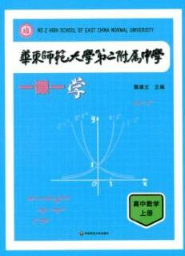

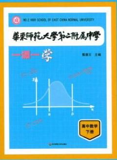

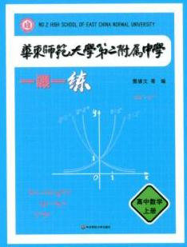

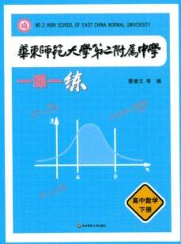

NO.2 HIGH SCHOOL OF EAST CHINA NORMAL UNIVERSITY

# 华東师范大学第二附属中学

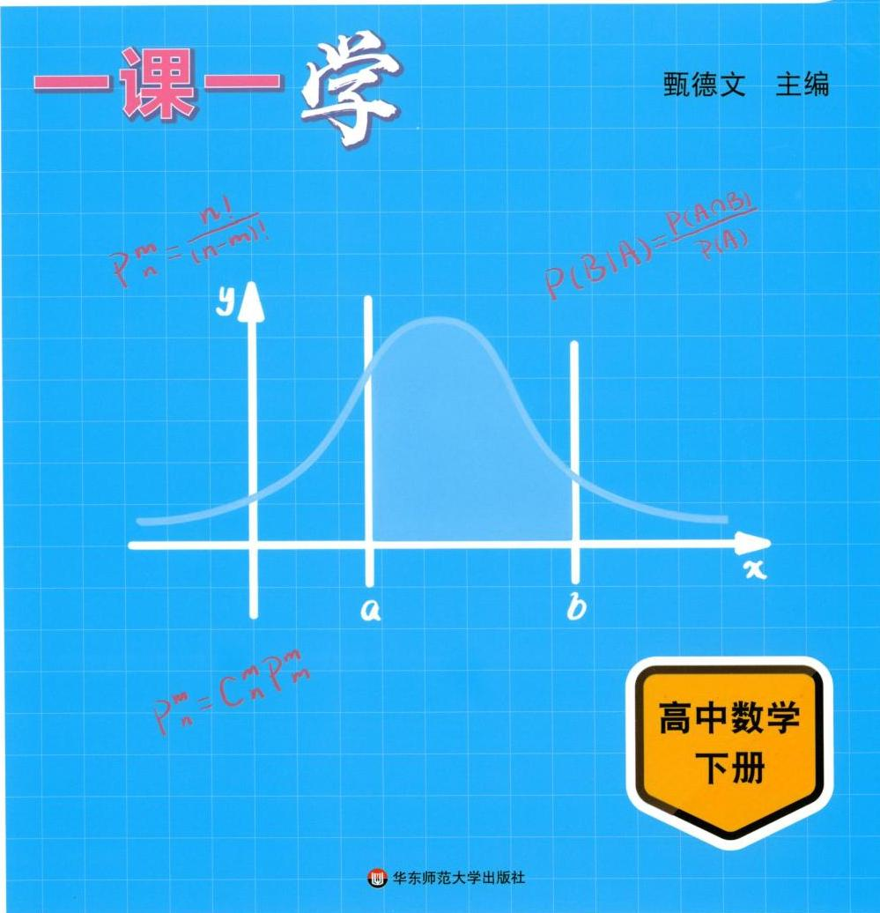

NO.2 HIGH SCHOOL OF EAST CHINA NORMAL UNIVERSITY

# 华东师范大学第二附属中学

## 高中数学 下册

主 编 甄德文

副主编 汪 健

参 编 张成鹏 孙佳琰 何一骏 吴辰骋

时华东师范大学出版社

图书在版编目(CIP)数据

华东师范大学第二附属中学一课一学. 高中数学 下册/ 甄德文主编. 一上海:华东师范大学出版社，2023

ISBN 978-7-5760-4677-9

I. ①华… II. ①甄... Ⅲ. ①中学数学课-高中-教学参考资料 IV. ①G634

中国国家版本馆 CIP 数据核字(2024)第 023947 号

HUADONGSHIFANDAXUE DI-ER FUSHU ZHONGXUE YIKEYIXUE 华东师范大学第二附属中学一课一学高中数学下册

主 编 甄德文

项目编辑 应向阳

责任编辑 芮 磊

特约审读 娄 鑫

责任校对 时东明

装帧设计 刘怡霖

封面插图 夏淑桐

出版发行 华东师范大学出版社

社 址 上海市中山北路 3663 号 邮编 200062

网 址 www. ecnupress. com. cn

电 话 021-60821666 行政传真 021-62572105

客服电话 021-62865537 门市(邮购) 电话 021-62869887

地址 上海市中山北路3663号华东师范大学校内先锋路口

网 店 http://hdsdcbs.tmall.com

印 刷 者 常熟市大宏印刷有限公司

开 本 889 毫米 × 1194 毫米 × 1/16

印 张 29.5

字 数 692 千字

版 次 2024 年 7 月第 1 版

印 次 2024 年 7 月第 1 次

书 号 ISBN 978-7-5760-4677-9

定 价 108.00 元

出版人 王 焰

(如发现本版图书有印订质量问题,请寄回本社客服中心调换或电话 021-62865537 联系)

## 目 录

第 10 章 空间直线与平面 / 1

10.1 平面及其基本性质 / 1

10.2 直线与直线的位置关系 / 10

10.3 直线与平面的位置关系 / 18

10.4 平面与平面的位置关系 / 30

10.5 异面直线间的距离 / 38

第 11 章 简单几何体 / 43

11.1 柱体 / 43

11.2 锥体 / 55

11.3 多面体与旋转体 / 69

11.4 球 / 76

第 12 章 空间向量及其应用 / 86

12.1 空间向量 / 86

12.2 空间向量的坐标表示 / 93

12.3 空间向量在立体几何中的应用 / 98

第 13 章 坐标平面上的直线 / 116

13.1 直线的倾斜角和斜率 / 116

13.2 直线的方程 / 120

13.3 两条直线的位置关系 / 128

13.4 点到直线的距离 / 137

13.5 线性规划 / 146

第 14 章 圆锥曲线 / 155

14.1 圆 / 155

14.2 椭圆 / 171

14.3 双曲线 / 189

14.4 抛物线 / 205

14.5 曲线与方程 / 218

第 15 章 导数及其应用 / 243

15.1 函数的极限与连续性 / 243

15.2 导数的概念及意义 / 247

15.3 导数的运算 / 254

15.4 导数的应用 / 263

第 16 章 计数原理 / 285

16.1 乘法原理与加法原理 / 285

16.2 排列 / 290

16.3 组合 / 304

16.4 二项式定理 / 316

第 17 章 概率初步 / 329

17.1 古典概型 / 329

17.2 频率与概率 / 337

17.3 事件的和与积的概率 / 342

17.4 条件概率与相关公式 / 353

17.5 随机变量的分布与特征 / 361

17.6 常用分布 / 372

第 18 章 统计初步 / 388

18.1 总体与样本 / 388

18.2 抽样方法 / 393

18.3 统计图表 / 396

18.4 统计估计 / 406

18.5 成对统计量及其相关性 / 414

18.6 一元线性回归分析 / 420

18.7 独立性检验 / 426

附录 1 随机数表 / 435

附录 2 参考答案与提示 / 437

## 第 10 章 空间直线与平面

在初中，我们已经学习了平面几何，研究了平面上的一些平面图形及其几何性质. 平面图形是二维的, 由一个平面上的点与线所构成. 但我们生活在三维世界中, 在三维空间中的几何图形是由点、线、面所构成的, 也可以看作是空间中点的集合, 统称为空间图形或立体图形, 而平面图形只是空间图形的一部分. 立体几何要研究的就是一些空间图形及其几何性质.

在本章中，我们将学习空间图形的基本性质、位置关系、度量方法并实际应用，从而锻炼我们在文字语言、图形语言、符号语言等方面的数学表达能力，提升我们的空间想象能力和逻辑推理能力, 使我们从几何的角度更好地理解现实世界.

### 10.1 平面及其基本性质

## 一、空间的点、直线与平面

光滑的桌面、平整的墙面、平静的水面等都给我们以平面的形象. 与平面几何中的点与直线一样, 几何中的平面也是从实际生活中抽象出来的一个数学概念. 正如平面几何中点没有大小，直线没有粗细且可无限延伸，平面也是不加定义的原始概念，无厚薄，无边界，在空间可无限延展.

由于平面无边无界, 我们习惯上用一个平行四边形来表示平面. 当平面水平放置时, 通常把这个平行四边形的锐角画成 ${45}^{ \circ  }$ ,且横边长等于邻边长的 2 倍,如图 10-1 所示. 如果一个平面被另一个平面遮住时, 应把被遮挡的部分画成虚线或者不画, 这样看起来立体感强一些. 如图 10-2 所示.

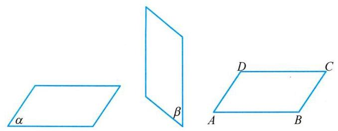

图 10-1

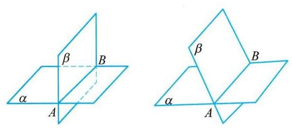

图 10-2

平面的表示方法很多,通常用一个小写的希腊字母来表示,如图 10-1 中的平面 $\alpha$ 、平面 $\beta$ 等；也可以用表示平面的平行四边形的四个顶点字母或一条对角线端点的字母来表示，如图 10-1 中的平面 ${ABCD}$ 、平面 ${AC}$ 等；有时也可以用一个或多个大写英文字母表示，如平面 $M$ 、 平面 ${ABC}$ 等.

下面，我们来讨论点、直线与平面的位置关系，我们把空间的直线和平面都看成是由点所组成的集合，这样就可以借用集合的语言和符号表示点、直线与平面之间的关系. 为了叙述方便，我们一般用大写的英文字母 $A$ 、 $B$ 、 $C$ 等表示点，用小写的英文字母 $a$ 、 $b$ 、 $c$ 等表示直线， 用小写的希腊字母 $\alpha$ 、 $\beta$ 、 $\gamma$ 等表示平面.

如无特别说明，本章中所说的两个点、两条直线、两个平面等均指它们不重合的情形. 这样,在空间中,点与直线、点与平面的位置关系如表 10-1:

表 10-1

<table><tr><td></td><td>位置关系</td><td>符号表示</td><td>图形表示</td></tr><tr><td rowspan="2">点与直线</td><td>点 $A$ 在直线 $l$ 上,也称直线 $l$ 经过点 $A$</td><td>$A \in  l$</td><td>[失效外部图片：bo_d7nifec91nqc7384gl70_6.jpg]</td></tr><tr><td>点 $B$ 不在直线 $l$ 上,也称直线 $l$ 不经过点 $B$</td><td>$B \notin  l$</td><td>[失效外部图片：bo_d7nifec91nqc7384gl70_6.jpg]</td></tr><tr><td rowspan="2">点与平面</td><td>点 $A$ 在平面 $\alpha$ 上,也称平面 $\alpha$ 经过点 $A$</td><td>$A \in  \alpha$</td><td>[失效外部图片：bo_d7nifec91nqc7384gl70_6.jpg]</td></tr><tr><td>点 $B$ 不在平面 $\alpha$ 上,也称平面 $\alpha$ 不经过点 $B$</td><td>$B \notin  \alpha$</td><td>[失效外部图片：bo_d7nifec91nqc7384gl70_6.jpg]</td></tr></table>

平面是立体几何中的一个基本图形. 长方体的每个面都是某个平面的一部分. 在图 10-3 中,长方体 ${ABCD} - {A}_{1}{B}_{1}{C}_{1}{D}_{1}$ 就可以看作是由六个平面所围成的空间图形. 且 $A \in$ 直线 ${AB},{A}_{1} \notin$ 直线 ${AB}, B \in$ 平面 $B{B}_{1}{C}_{1}C, A \notin$ 平面 $B{B}_{1}{C}_{1}C$ 等. 我们还可以发现,直线 ${AB}$ 在平面 ${ABCD}$ 上(即直线 ${AB}$ 上的所有点都在平面 ${ABCD}$ 上)，但直线 ${AB}$ 不在平面 $B{B}_{1}{C}_{1}C$ 上.

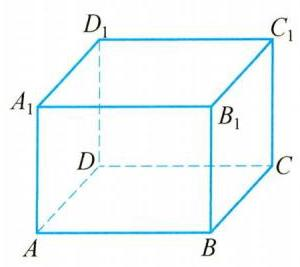

图 10-3

## 二、公理 1

因为直线和平面都可以看做点的集合, 那么当一条直线和一个平面有公共点时, 这条直线和这个平面的位置关系如何呢? 在生产与生活中, 人们经过长期的观察与实践, 总结出了一个关于直线和平面位置关系的基本事实，我们把它当作一个公理，作为进一步推理论证的基石， 这就是公理 1.

公理1:如果一条直线上有两个点在一个平面上，那么这条直线上所有的点都在这个平面上.

这时，我们说这条直线在这个平面上，或者说此平面经过该直线. 如图 10-4，公理 1 可用集合语言描述为:

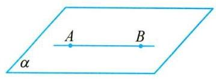

图 10-4

若点 $A \in  \alpha$ ,点 $B \in  \alpha$ ,则直线 ${AB} \subset  \alpha$ .

公理 1 可以用来判断一条直线是否在某个平面上, 由公理 1 可知, 如果一条直线不在平面上, 那么这条直线与平面至多只有一个公共点.

如果直线 $l$ 与平面 $\alpha$ 只有一个公共点 $A$ ,就称直线 $l$ 与平面 $\alpha$ 相交于点 $A$ ,或称 $A$ 是直线 $l$ 与平面 $\alpha$ 的交点，记作 $l \cap  \alpha  = A$ (如图 10-5(1)). 如果直线 $l$ 与平面 $\alpha$ 没有公共点，就称直线 $l$ 与平面 $\alpha$ 平行,记作 $l//\alpha$ 或 $l \cap  \alpha  = \varnothing$ (如图 10-5(2)).

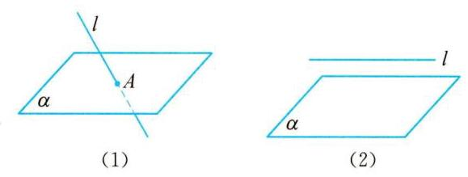

图 10-5

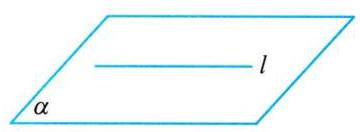

图 10-6

画图时,若直线 $l$ 在平面 $\alpha$ 上时,应将直线 $l$ 画在表示平面 $\alpha$ 的平行四边形的内部,如图 10-6 所示.

例 1 已知三角形 ${ABC}$ 的三个顶点 $A\text{ 、 }B\text{ 、 }C$ 都在平面 $\alpha$ 上,求证: 该三角形 ${ABC}$ 的重心 $G$ 也在平面 $\alpha$ 上.

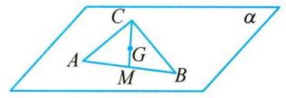

图 10-7

证明 如图 10-7,记线段 ${AB}$ 的中点为 $M$ . 因为 $A \in  \alpha , B \in \; \alpha$ ,由公理 1 可知,直线 ${AB} \subset  \alpha$ ,而 $M \in  {AB}$ ,从而 $M \in  \alpha$ .

又因为 $C \in  \alpha$ ,仍由公理1知, ${CM} \subset  \alpha$ . 由于重心 $G$ 是线段 ${CM}$ 的一个三等分点,因此 $G \in  \alpha$ .

## 练一练

1 判断下列说法是否正确？

① 一个平面长 4 米，宽 2 米；

② 平面是无限延展的;

③ 一个平面的厚度是 0.001 毫米；

④ 某个平行四边形的面积是 $4{\mathrm{\;{cm}}}^{2}$ ;

⑤ 一个平面可以把空间分成两部分.

2 用符号表示下列语句, 并画出图形.

(1)点 $A$ 、 $B$ 在平面 $\alpha$ 上，直线 $a$ 与平面 $\alpha$ 交于点 $C$ ，点 $C$ 不在直线 ${AB}$ 上；

(2)直线 $a$ 和直线 $b$ 相交于平面 $\alpha$ 上的一点 $M$ .

3 证明: 若三角形的三个顶点在一个平面上, 则此三角形的中位线也在这个平面上.

## 三、公理 2

我们知道两点确定一条直线, 那么在空间中要确定一个平面, 需要几个点呢?

生活中我们都有这样的经验: 三脚架在不平的地面上也可以稳固地支撑一部照相机; 两个轮子的自行车在停止运动后要加上一个支撑脚才能稳定 (如图 10-8).

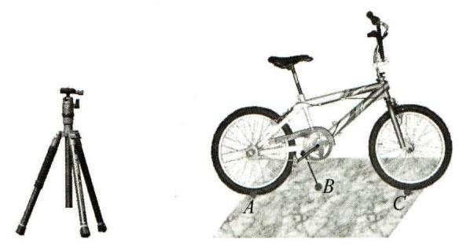

图 10-8

这样的事例都说明了一个事实，那就是不在同一直线上的三点才能确定一个平面，由此， 我们得到了第 2 条公理.

公理 2: 不在同一直线上的三点确定一个平面.

这里, “确定一个平面”指的是经过不在同一直线上三点有且仅有一个平面, 即存在一个平面经过这三个点, 而且这样的平面是唯一的 (如图 10-9). 公理 2 是确定一个平面的方法, 经过不共线三点 $A\text{ 、 }B\text{ 、 }C$ 的平面可记作“平面 ${ABC}$ ”.

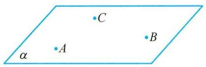

图 10-9

根据公理 2 ，我们可以得到下面的推论.

推论 1:一条直线和这条直线外的一点确定一个平面.

推论 2: 两条相交直线确定一个平面.

推论 3: 两条平行直线确定一个平面.

图 10-10 给出了上述三条推论的图形表示, 这些推论也可以用符号语言描述, 如推论 1 可以表述为:若 $A \notin  l$ ，则存在唯一的平面 $\alpha$ ，使得 $A \in  \alpha$ ， $l \subset  \alpha$ .

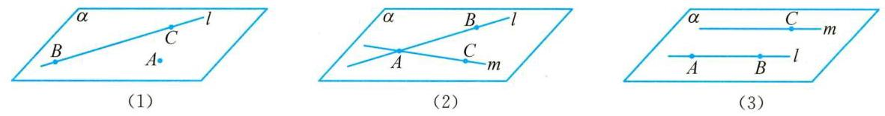

图 10-10

公理是不证自明的事实，但公理的推论是需要证明的，下面我们仅给出推论 1 的证明，请同学们自行证明推论 2 和推论 3.

证明 如图 10-10(1),设 $A$ 是直线 $l$ 外一点,在直线 $l$ 上任取两点 $B$ 和 $C$ ,则 $A\text{ 、 }B\text{ 、 }C$ 是不在同一直线上的三点. 由公理 2 可知,经过此三点的平面有且仅有一个,记为平面 $\alpha$ ,因为 $B\text{ 、 }C \in$ 平面 $\alpha$ ,又 $B\text{ 、 }C \in$ 直线 $l$ ,所以根据公理1,有 $l \subset  \alpha$ ,从而平面 $\alpha$ 是由直线 $l$ 和点 $A$ 确定的, 即经过直线和直线外一点的平面有且仅有一个.

公理 2 及其三条推论, 可以用来构造平面, 或者用来判断点与直线是不是在同一个平面上，如果可以判断某个空间图形在同一个平面上，那么它实际上就是一个平面图形，从而应用平面几何的知识和方法来解决相应的问题.

例 2 已知四条直线两两相交,且不过同一点,证明这四条直线共面.

证明 设这四条直线为 ${l}_{1}\text{ 、 }{l}_{2}\text{ 、 }{l}_{3}\text{ 、 }{l}_{4}$ ,其位置关系可分为下列两类:

(1)如图10-11(1)，有三条直线共点，不妨设 ${l}_{1} \cap  {l}_{2} \cap  {l}_{3} = A,{l}_{4} \cap  {l}_{1} = B,{l}_{4} \cap  {l}_{2} = C$ , ${l}_{4} \cap  {l}_{3} = D$ .

因为 $A\text{ 、 }B\text{ 、 }C$ 三点不共线,所以 $A\text{ 、 }B\text{ 、 }C$ 三点确定一个平面,记为 $\alpha$ . 因为 $A\text{ 、 }B \in  {l}_{1}$ ,所以 ${l}_{1} \subset  \alpha$ .

同理, ${l}_{2}\text{ 、 }{l}_{4} \subset  \alpha$ . 因为 $D \in  {l}_{4},{l}_{4} \subset  \alpha$ ,所以 $D \in  \alpha$ . 因为 $A\text{ 、 }D \in  \alpha , A\text{ 、 }D \in  {l}_{3}$ ,所以 ${l}_{3} \subset  \alpha$ .

故直线 ${l}_{1}\text{ 、 }{l}_{2}\text{ 、 }{l}_{3}\text{ 、 }{l}_{4}$ 共面.

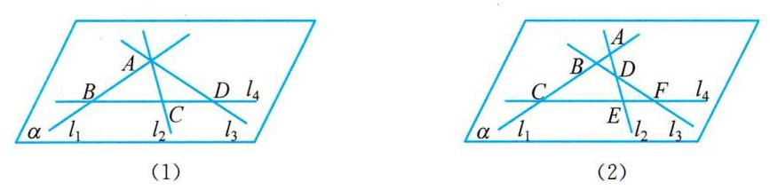

图 10-11

(2)如图10-11(2)，若已知四条直线中任三条直线都不交于同一点，设 ${l}_{1} \cap  {l}_{2} = A,{l}_{1} \cap \; {l}_{3} = B,{l}_{1} \cap  {l}_{4} = C,{l}_{2} \cap  {l}_{3} = D,{l}_{2} \cap  {l}_{4} = E,{l}_{3} \cap  {l}_{4} = F$ .

因为 $A\text{ 、 }C\text{ 、 }E$ 三点不共线,所以 $A\text{ 、 }C\text{ 、 }E$ 三点确定一个平面,记为 $\alpha$ . 因为 $A\text{ 、 }C \in  {l}_{1}$ , $A\text{ 、 }E \in  {l}_{2}$ ,所以 ${l}_{1}\text{ 、 }{l}_{2} \subset  \alpha$ .

因为 $B \in  {l}_{1}, D \in  {l}_{2}$ ,所以 $B\text{ 、 }D \in  \alpha$ .

又因为 $B\text{ 、 }D \in  {l}_{3}$ ,所以 ${l}_{3} \subset  \alpha$ . 同理, ${l}_{4} \subset  \alpha$ . 故直线 ${l}_{1}\text{ 、 }{l}_{2}\text{ 、 }{l}_{3}\text{ 、 }{l}_{4}$ 共面.

综上所述, 两两相交且不过同一点的四条直线共面.

## 练一练

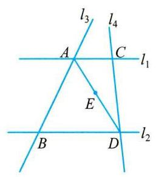

(第 5 题)

4 已知三条直线两两相交,且不过同一点,证明这三条直线共面.

5 如图，已知直线 ${l}_{1}//{l}_{2}$ ，直线 ${l}_{3}$ 与 ${l}_{1}$ 、 ${l}_{2}$ 分别交于 $A$ 、 $B$ 两点，直线 ${l}_{4}$ 与 ${l}_{1}\text{ 、 }{l}_{2}$ 分别交于 $C\text{ 、 }D$ 两点, $E \in  {AD}$ . 证明: $A\text{ 、 }B\text{ 、 }C\text{ 、 }D\text{ 、 }E$ 五点共面.

6 已知一条直线与三条平行直线都相交, 求证: 这四条直线在同一平面上.

## 四、公理 3

观察教室里的墙面，翻翻课本，可以看到:相邻的两个墙面或课本页面之间都有一条交线. 所以我们总结经验, 有了下面这条公理.

公理 3:如果两个不同的平面有一个公共点，那么它们有且只有一条过该点的公共直线。

公理 3 可以具体表述为: 若两个平面有一个公共点, 则它们有唯一的公共直线, 且这个公共点在这条直线上. 用符号语言可以描述为: 若 $A \in  \alpha$ 且 $A \in  \beta$ ,则 $A \in  l$ , $\alpha  \cap  \beta  = l$ ,如图 10-12 所示.

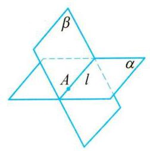

图 10-12

根据公理 3，我们可以看出，两个平面的位置关系只有两种，相交于一条直线或者没有公共点,前者称为相交，用 $\alpha  \cap  \beta  = l$ 表示，后者称为平行，记作 $\alpha //\beta$ 或 $\alpha  \cap  \beta  = \varnothing$ .

画两个相交平面时,通常要画出它们的交线,如图 10-12 所示; 画两个平行平面时,要使表示这两个平面的相应平行四边形的对应边平行, 如图 10-13 所示. 注意, 在画图时, 凡被一个平面遮住的所有线条要画成虚线.

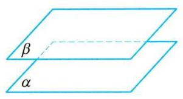

图 10-13

例 3 如图 10-14 所示,在正方体 ${ABCD} - {A}_{1}{B}_{1}{C}_{1}{D}_{1}$ 中, $E$ 是棱 $C{C}_{1}$ 上一点,试说明 ${D}_{1}\text{ 、 }A\text{ 、 }E$ 三点确定的平面与平面 ${ABCD}$ 相交,并画出这两个平面的交线.

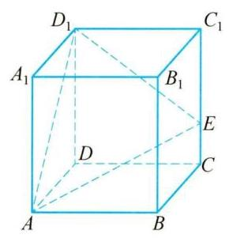

图 10-14

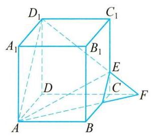

图 10-15

解 因为 $A \in$ 平面 ${D}_{1}{AE}, A \in$ 平面 ${ABCD}$ ,由公理 3 可知,平面 ${D}_{1}{AE}$ 与平面 ${ABCD}$ 相交.

在平面 ${DC}{C}_{1}{D}_{1}$ 上延长 ${D}_{1}E$ 与 ${DC}$ ,设它们相交于点 $F$ ,如图 10-15 所示,则 $F \in$ 直线 ${D}_{1}E$ ,直线 ${D}_{1}E \subset$ 平面 ${D}_{1}{AE}, F \in$ 直线 ${DC}$ ,直线 ${DC} \subset$ 平面 ${ABCD}$ ,则 $F \in$ 平面 ${D}_{1}{AE} \cap$ 平面 ${ABCD}$ ,由公理 3 可知 ${AF}$ 为平面 ${D}_{1}{AE}$ 与平面 ${ABCD}$ 的交线,如图 10- 15 所示.

例 4 如图 10-16 所示,在正方体 ${ABCD} - {A}_{1}{B}_{1}{C}_{1}{D}_{1}$ 中,点 $O$ 为正方形 ${ABCD}$ 的中心, $H$ 为直线 ${B}_{1}D$ 与平面 ${AC}{D}_{1}$ 的交点. 求证: ${D}_{1}\text{ 、 }H\text{ 、 }O$ 三点共线.

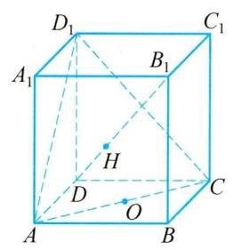

图 10-16

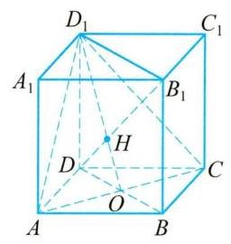

图 10-17

证明 如图 10-17,连接 ${BD}\text{ 、 }{B}_{1}{D}_{1}$ ,则 ${BD} \cap  {AC} = O$ ,由正方体性质可知 $B{B}_{1} \text{ ⫫ } D{D}_{1}$ , 所以四边形 $B{B}_{1}{D}_{1}D$ 为平行四边形,又 $H \in  {B}_{1}D,{B}_{1}D \subset$ 平面 $B{B}_{1}{D}_{1}D$ ,则 $H \in$ 平面 $B{B}_{1}{D}_{1}D$ ,又 $H \in$ 平面 ${AC}{D}_{1}$ ,所以 $H \in$ 平面 ${AC}{D}_{1} \cap$ 平面 $B{B}_{1}{D}_{1}D$ ,因为 ${BD} \cap  {AC} = O$ , 所以 $O \in  {AC} \subset$ 平面 ${AC}{D}_{1}, O \in  {BD} \subset$ 平面 $B{B}_{1}{D}_{1}D$ ,则 $O \in$ 平面 ${AC}{D}_{1} \cap$ 平面 $B{B}_{1}{D}_{1}D$ . 显然 ${D}_{1} \in$ 平面 ${AC}{D}_{1} \cap$ 平面 $B{B}_{1}{D}_{1}D$ ,所以平面 ${AC}{D}_{1} \cap$ 平面 $B{B}_{1}{D}_{1}D = O{D}_{1}$ .

根据公理 3 可知 $H \in  O{D}_{1}$ ,即 ${D}_{1}\text{ 、 }H\text{ 、 }O$ 三点共线.

1. 三个平面可能把空间分成几部分? 四个平面把空间最多分成几部分?

## 练一练

7 画出满足下列条件的图形 (其中 $\alpha$ 、 $\beta$ 为平面， $a$ 、 $b$ 、 $l$ 为直线).

(1) $\alpha  \cap  \beta  = l, a \subset  \alpha , b \subset  \beta , a//l, b \cap  l = A, B \in  a$ ;

(2)平面 $\alpha$ 与 $\beta$ 相交于直线 $l$ ，直线 $a$ 与 $\alpha$ 、 $\beta$ 分别相交于点 $A$ 、 $B$ .

8 如图所示， ${AC} \cap  \alpha  = P$ ， ${BC} \cap  \alpha  = Q$ ， ${AB} \cap  \alpha  = O$ ，则平面 ${ABC} \cap  \alpha  =$ ___；点 $O$ 与直线 ${PQ}$ 的位置关系是 $O$ ___ ${PQ}$ .

9 如图所示，已知 $\alpha  \cap  \beta  = {EF}, A \in  \alpha , C, B \in  \beta ,{BC}$ 与 ${EF}$ 相交，在图中分别画出平面 ${ABC}$ 与平面 $\alpha$ 、 $\beta$ 的交线.

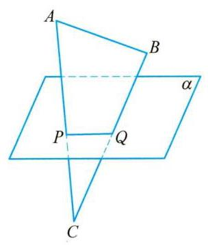

(第 8 题)

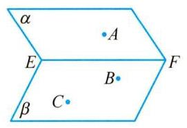

(第 9 题)

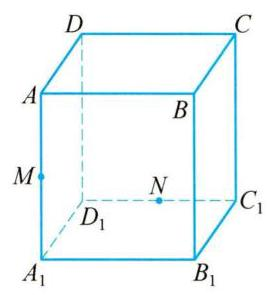

(第 10 题)

10 如图所示，正方体 ${ABCD} - {A}_{1}{B}_{1}{C}_{1}{D}_{1}$ 的棱长为 $a, M$ 、 $N$ 分别是 $A{A}_{1}$ 、 ${D}_{1}{C}_{1}$ 的中点,过 $D\text{ 、 }M\text{ 、 }N$ 三点的平面与正方体下底面 ${A}_{1}{B}_{1}{C}_{1}{D}_{1}$ 相交于直线 $l$ . 试画出直线 $l$ 的位置, 并说明理由.

11 已知三个平面 $\alpha$ 、 $\beta$ 、 $\gamma$ 两两相交，有三条交线 $a$ 、 $b$ 、 $c$ ，且 $\alpha  \cap  \beta  = a$ ， $\alpha  \cap  \gamma  = b$ ， $\beta  \cap \; \gamma  = c$ ,若直线 $a \cap  b = O$ ,求证: $O \in  c$ .

12 如果 $\bigtriangleup {ABC}$ 所在平面和 $\bigtriangleup {A}_{1}{B}_{1}{C}_{1}$ 所在平面相交,且直线 ${AB}$ 和 ${A}_{1}{B}_{1}$ ,直线 ${BC}$ 和 ${B}_{1}{C}_{1}$ ,直线 ${AC}$ 和 ${A}_{1}{C}_{1}$ 分别相交于点 $P\text{ 、 }Q\text{ 、 }R$ ,求证: $P\text{ 、 }Q\text{ 、 }R$ 三点在同一直线上.

## 五、空间图形的平面直观图的画法

我们知道,立体几何的研究对象是空间图形,要将空间图形在一个平面上呈现出来,就需要在平面内画出具有立体感的空间图形的直观图. 为了把空间图形画得既富有立体感, 又能表达出图形各主要部分的位置关系和度量关系，我们有很多画空间图形直观图的方法，如中心投影法、平行投影法等.

下面，我们介绍一种在立体几何中常用的作图方法:斜二测画法，我们通过两个例子来体会用斜二测画法画空间图形直观图的方法与步骤.

例 5 用斜二测画法画一个水平放置的正六边形的直观图.

画法 (1) 如图 10-18(1),在已知正六边形 ${ABCDEF}$ 中,取 ${AD}$ 所在直线为 $x$ 轴,取 ${AD}$ 的垂直平分线 ${MN}$ 为 $y$ 轴,两轴相交于点 $O$ (坐标原点). 在图 10-18(2) 中,画相应的 ${x}^{\prime }$ 轴和 ${y}^{\prime }$ 轴,两轴相交于点 ${O}^{\prime }$ ,且使 $\angle {x}^{\prime }{O}^{\prime }{y}^{\prime } = {45}^{ \circ  }$ .

(2)在图 10-18(2) 中，以 ${O}^{\prime }$ 为中点，在 ${x}^{\prime }$ 轴上取线段 ${A}^{\prime }{D}^{\prime } = {AD}$ ，在 ${y}^{\prime }$ 轴上取线段 ${M}^{\prime }{N}^{\prime }$ ，使 ${M}^{\prime }{O}^{\prime } = {N}^{\prime }{O}^{\prime } = \frac{1}{2}{MO}$ . 以 ${M}^{\prime }$ 为中点画线段 ${E}^{\prime }{F}^{\prime }$ 平行于 ${x}^{\prime }$ 轴，并使 ${E}^{\prime }{F}^{\prime } = {EF}$ ；类似地，再以 ${N}^{\prime }$ 为中点画线段 ${B}^{\prime }{C}^{\prime }$ 平行于 ${x}^{\prime }$ 轴，并使 ${B}^{\prime }{C}^{\prime } = {BC}$ .

(3)顺次连接 ${A}^{\prime }\text{ 、 }{B}^{\prime }\text{ 、 }{C}^{\prime }\text{ 、 }{D}^{\prime }\text{ 、 }{E}^{\prime }\text{ 、 }{F}^{\prime }\text{ 、 }{A}^{\prime }$ ，所得到的六边形 ${A}^{\prime }{B}^{\prime }{C}^{\prime }{D}^{\prime }{E}^{\prime }{F}^{\prime }$ 就是水平放置的正六边形 ${ABCDEF}$ 的直观图. 画好图后,要擦去辅助线,最后如图 10-18(3) 所示.

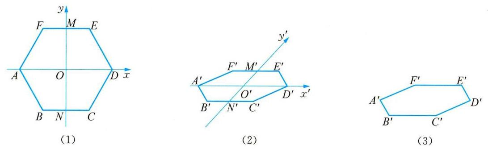

图 10-18

例 6 用斜二测画法画长、宽、高分别为 $4\text{ 、 }3\text{ 、 }2$ 的长方体的直观图.

画法 (1) 画底面:画平行四边形 ${OABC}$ ，使得 ${OA} = 4,{OC} = \frac{3}{2},\angle {AOC} = {45}^{ \circ  }$ ，如图 10-19(1)所示.

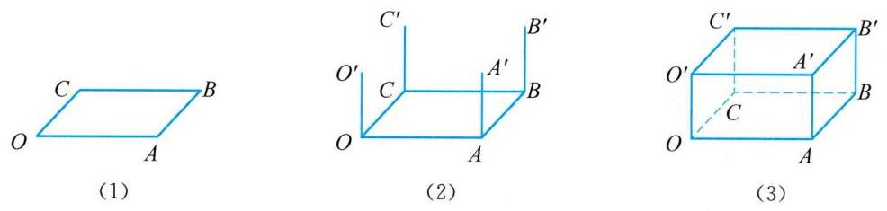

图 10-19

(2)画侧棱:过 $O$ 、 $A$ 、 $B$ 、 $C$ 各点分别作 ${OA}$ 和 ${BC}$ 的垂线，在这些垂线上分别截取长为 2 的线段 $O{O}^{\prime }\text{ 、 }A{A}^{\prime }\text{ 、 }B{B}^{\prime }\text{ 、 }C{C}^{\prime }$ ,如图 10-19(2) 所示.

(3)成图:顺次连接 ${O}^{\prime }\text{ 、 }{A}^{\prime }\text{ 、 }{B}^{\prime }\text{ 、 }{C}^{\prime }$ ，并擦去辅助线，将被遮挡的部分改为虚线，可得长方体的直观图，如图 10-19(3)所示.

2. 用斜二测画法画出的平面图形的平面直观图, 其面积与原图形的面积有怎样的关系?

3. 用一个平面去截正方体,所得到的平面图形叫做截面.

(1)如果截面是三角形，可以截出几类不同的三角形？为什么？

(2)能否截出正五边形？为什么？

(3)其截面有没有可能是边数超过 6 的多边形？为什么？

进一步，如果给定正方体表面上不同的三个点，且这三个点不在同一个表面上， 那么如何作出经过这三个点截正方体所得的截面?

## 练一练

13 若下图表示水平放置的 $\bigtriangleup  {ABC}$ 的平面直观图(其中 $D$ 为 ${BC}$ 的中点)，则在原来的 $\bigtriangleup  {ABC}$ 中，四条线段中最长的是___.

14 如图所示，梯形 ${O}_{1}{A}_{1}{B}_{1}{C}_{1}$ 为水平放置的四边形 ${OABC}$ 的平面直观图，其中 ${O}_{1}{A}_{1}\not{= } \; \frac{1}{2}{B}_{1}{C}_{1},{A}_{1}{B}_{1}//{y}_{1}$ 轴， ${A}_{1}{B}_{1} = 2,{O}_{1}{A}_{1} = 1$ ，则四边形 ${OABC}$ 的面积为___.

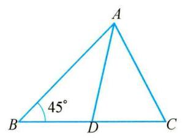

(第 13 题)

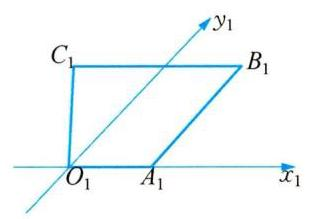

(第 14 题)

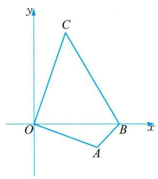

(第 15 题)

15 如图所示，已知平面直角坐标系中的四边形 ${OABC}$ ，请画出它的平面直观图.

## 读一读

## 著名几何学家苏步青

苏步青，浙江温州平阳人. 苏步青从小生活在一个偏僻的山村，童年时代放牛喂猪，干过割草等农活. 1911 年，靠种地为生的父亲挑上一担米当学费，带苏步青到 100 多里外的平阳县第一小学当了插班生. 1914 年苏步青以优秀成绩考进旧四年制的浙江省立第十中学. 有一次, 教数学的杨老师在一堂课上的一席话:“当今世界，弱肉强食，世界列强依仗船坚炮利，都想蚕食瓜分中国. 中华亡国灭种的危险迫在眉睫，振兴科学，发展实业，救亡图存，在此一举. ‘天下兴亡，匹夫有责，在座的每一位同学都有责任. 为了救亡图存，必须振兴科学，数学是科学的开路先锋，为了发展科学，必须学好数学. ”苏步青一生不知听过多少堂课，但这一堂课使他终身难忘. 受此影响, 苏步青的兴趣从文学转向了数学, 并迷上了数学, 现在温州一中 (当时省立十中) 还珍藏着苏步青的一本几何练习簿，用毛笔书写，工工整整.

1919 年 7 月, 苏步青东渡日本留学. 1920 年 2 月, 苏步青考入日本东京高等工业学校电机系. 1924 年毕业后, 又考入日本东北帝国大学数学系, 并于 1931 年获日本东北帝国大学理学博士学位.

1928 年初, 苏步青在一般曲面的研究中发现了四次 (三阶) 代数锥面, 论文发表后, 在日本和国际数学界产生很大反响，人称“苏锥面”. 从 1928 年到 1948 年，苏步青所撰写的 41 篇仿射微分几何和射影微分几何方面的研究论文, 陆续发表在日本、英国、美国、意大利的数学刊物上，“自成一家言”，国际数学界称苏步青是“东方国度上升起的灿烂的数学明星”.

1931 年初, 苏步青应陈建功之邀, 来到浙江大学数学系任教, 并和陈建功先生在浙江大学开创数学讨论 班. 1933 年, 苏步青担任数学系主任. 在抗日战争期间, 浙江大学西迁到贵州, 苏步青和他的学生方德植、熊全治、张素诚、白正国等人，仍在坚持射影微分几何的研究，产生了一系列的重要成果，在国际几何学界享有崇高的声誉，以苏步青为首的浙江大学微分几何学派已开始形成. 1952 年 10 月, 苏步青调任复旦大学数学系任教授、系主任, 为新中国培养了大量的数学人才，其中谷超豪、胡和生、李大潜等都是世界闻名的数学家.

苏步青先后在仿射微分几何、射影微分几何、一般空间微分几何及射影共轭网理论等方面做出了杰出的贡献, 创建了国际公认的中国微分几何学派; 在 70 多岁时, 他还结合解决船体数学放样的实际课题，创建和开始了计算几何的新研究方向. 他被誉为 “东方第一几何学家”“数学之王”.

### 10.2 直线与直线的位置关系

## 一、空间的平行直线

在平面几何中,我们学过平行线的基本性质:经过已知直线外的一点,有且只有一条直线与已知直线平行; 而且,我们也知道直线的平行关系具有传递性: 即在同一平面上,如果两条直线都和第三条直线平行，那么这两条直线也互相平行. 那么，对于空间中的直线，这样的性质是否依然成立呢?

在生活中，我们都有这样的经验:当我们开门时，在任一位置，门的竖直边沿 ${AB}$ 和门框的竖直边沿 ${A}_{1}{B}_{1}$ 始终是平行的(图 10-20)；当我们打开书本时，每一页纸的外边沿看上去也是互相平行的(图 10-21).

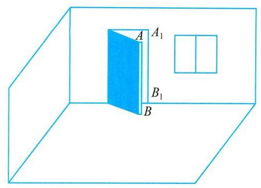

图 10-20

图 10-21

在实践中, 我们总结出下面这条性质, 暂把它作为一个公理.

公理 4 平行于同一条直线的两条直线相互平行.

这条公理用符号语言可以表示为: 若 $a//b$ ,且 $a//c$ ,则 $b//c$ .

公理 4 表明, 直线的平行关系在空间同样具有传递性, 我们也把这条公理叫平行公理. 请同学们用公理 4 来解释前面两种实际情景中的平行关系.

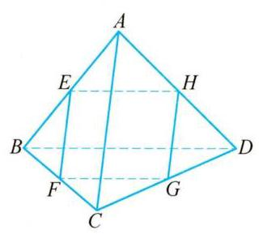

图 10-22

例 1 已知空间不共面四点 $A\text{ 、 }B\text{ 、 }C\text{ 、 }D$ 首尾相连所构成的四边形叫做空间四边形,若 $E\text{ 、 }F\text{ 、 }G\text{ 、 }H$ 分别是空间四边形 ${ABCD}$ 的边 ${AB}\text{ 、 }{BC}\text{ 、 }{CD}\text{ 、 }{DA}$ 的中点,求证: 四边形 EFGH 是平行四边形.

证明 如图 10-22,连接 ${AC}\text{ 、 }{BD}$ .

在 $\bigtriangleup {ABD}$ 中，因为 $E\text{ 、 }H$ 分别为 ${AB}\text{ 、 }{AD}$ 的中点，所以 ${EH}//{BD}$ .

同理在 $\bigtriangleup {CBD}$ 中, ${FG}//{BD}$ .

根据公理 4，得 ${EH}//{FG}$ ；同理 ${EF}//{GH}$ .

因此,四边形 ${EFGH}$ 为平行四边形.

等角定理:如果一个角的两边和另一个角的两边分别平行并且方向相同,那么这两个角相等.

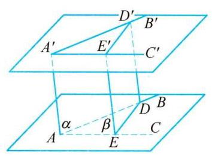

图 10-23

例 2 如图 10-23,已知 $\angle {BAC}$ 与 $\angle {B}^{\prime }{A}^{\prime }{C}^{\prime }$ 的边 ${AB}//{A}^{\prime }{B}^{\prime }$ , ${AC}//{A}^{\prime }{C}^{\prime }$ ,并且方向相同,即 $\overrightarrow{AB}$ 与 $\overrightarrow{{A}^{\prime }{B}^{\prime }},\overrightarrow{AC}$ 与 $\overrightarrow{{A}^{\prime }{C}^{\prime }}$ 方向相同. 求证: $\angle {BAC} = \angle {B}^{\prime }{A}^{\prime }{C}^{\prime }$ .

证明 因为 ${AB}//{A}^{\prime }{B}^{\prime },{AC}//{A}^{\prime }{C}^{\prime }$ ，由公理 2 推论 3 可知， ${AB}\text{ 、 }{A}^{\prime }{B}^{\prime }$ 确定一个平面，记为 $\alpha$ ； ${AC}\text{ 、 }{A}^{\prime }{C}^{\prime }$ 也确定一个平面，记为 $\beta$ . 在直线 ${AB}\text{ 、 }{AC}$ 上分别取点 $D\text{ 、 }E$ ,在直线 ${A}^{\prime }{B}^{\prime }\text{ 、 }{A}^{\prime }{C}^{\prime }$ 上分别取点 ${D}^{\prime }\text{ 、 }{E}^{\prime }$ ,使得 ${AD} = {A}^{\prime }{D}^{\prime },{AE} = {A}^{\prime }{E}^{\prime }$ . 因为在平面 $\alpha$ 上, ${AD}//{A}^{\prime }{D}^{\prime },{AD} = {A}^{\prime }{D}^{\prime }$ ,所以四边形 ${A}^{\prime }{D}^{\prime }{DA}$ 是一个平行四边形,从而 $A{A}^{\prime }//D{D}^{\prime }$ ,且 $A{A}^{\prime } = D{D}^{\prime }$ . 同理, $A{A}^{\prime }//E{E}^{\prime }$ ,且 $A{A}^{\prime } = \; E{E}^{\prime }$ .

这样就有 $D{D}^{\prime }//E{E}^{\prime }$ ,且 $D{D}^{\prime } = E{E}^{\prime }$ ,即四边形 ${D}^{\prime }{E}^{\prime }{ED}$ 是一个平行四边形. 于是, ${ED} = \; {E}^{\prime }{D}^{\prime }$ ,从而 $\bigtriangleup {ADE} \cong  \bigtriangleup {A}^{\prime }{D}^{\prime }{E}^{\prime }$ ,即得 $\angle {BAC} = \angle {B}^{\prime }{A}^{\prime }{C}^{\prime }$ .

由上述定理,我们容易得出下面两个推论.

推论 1: 如果一个角的两边和另一个角的两边分别平行,那么这两个角相等或者互补.

推论 2: 如果两条相交直线和另两条相交直线分别平行,那么这两组直线所成的锐角(或直角)相等.

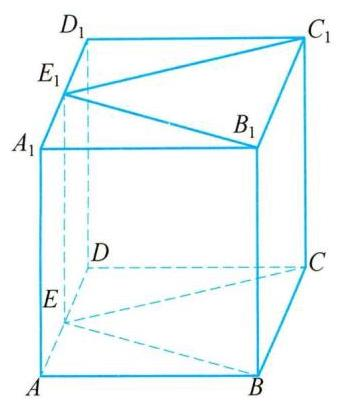

图 10-24

例 3 如图 10-24,已知 $E\text{ 、 }{E}_{1}$ 是正方体 ${ABCD} - {A}_{1}{B}_{1}{C}_{1}{D}_{1}$ 的棱 ${AD}\text{ 、 }{A}_{1}{D}_{1}$ 的中点. 求证: $\angle {BEC} = \angle {B}_{1}{E}_{1}{C}_{1}$ .

证明 因为 $E\text{ 、 }{E}_{1}$ 分别是正方体 ${ABCD} - {A}_{1}{B}_{1}{C}_{1}{D}_{1}$ 的棱 ${AD}\text{ 、 }{A}_{1}{D}_{1}$ 中点,所以 ${AE}//{A}_{1}{E}_{1},{AE} = {A}_{1}{E}_{1}$ .

所以四边形 ${AE}{E}_{1}{A}_{1}$ 为平行四边形.

所以 ${A}_{1}A//E{E}_{1}, A{A}_{1} = E{E}_{1}$ . 又因为 $A{A}_{1}//B{B}_{1}, A{A}_{1} = B{B}_{1}$ , 由公理 $4, E{E}_{1}//B{B}_{1}$ 且 $E{E}_{1} = B{B}_{1}$ . 所以四边形 ${BE}{E}_{1}{B}_{1}$ 是平行四边形. 所以 ${BE}//{B}_{1}{E}_{1}$ . 同理 ${CE}//{C}_{1}{E}_{1}$ . 又 $\angle {BEC}$ 和 $\angle {B}_{1}{E}_{1}{C}_{1}$ 的方向相同，由等角定理得 $\angle {BEC} = \angle {{B}_{1}{E}_{1}{C}_{1}}$ .

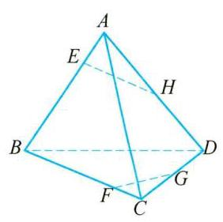

图 10-25

例 4 如图 10-25,在空间四边形 ${ABCD}$ 中, $H\text{ 、 }G$ 分别是 ${AD}$ 、 ${CD}$ 的中点, $E\text{ 、 }F$ 分别是边 ${AB}\text{ 、 }{BC}$ 上的点,且 $\frac{CF}{FB} = \frac{AE}{EB} = \frac{1}{3}$ . 求证: 直线 ${EH}\text{ 、 }{BD}\text{ 、 }{FG}$ 相交于一点.

证明 如图 10-26,连接 ${EF}\text{ 、 }{GH}$ .

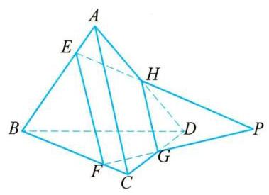

图 10-26

在三角形 ${ACD}$ 中,因为 $H\text{ 、 }G$ 分别是 ${AD}\text{ 、 }{CD}$ 的中点,所以 ${GH}//{AC}$ ,且 ${GH} = \frac{1}{2}{AC}$ .

在三角形 ${ABC}$ 中,因为 $\frac{CF}{FB} = \frac{AE}{EB} = \frac{1}{3}$ ,所以 ${EF}//{AC}$ ,且 ${EF} = \frac{3}{4}{AC}.$

由公理 4,得 ${GH}//{EF}$ ,所以 $E\text{ 、 }F\text{ 、 }G\text{ 、 }H$ 四点共面.

又因为 ${GH} \neq  {EF}$ ,所以 ${EH}$ 与 ${FG}$ 相交,设交点为 $P$ . 因为 ${EH} \subset$ 平面 ${ABD}$ ,所以 $P \in$ 平面 ${ABD}$ ,同理 $P \in$ 平面 ${BCD}$ . 又由平面 ${ABD} \cap$ 平面 ${BCD} = {BD}$ ,因此 $P \in  {BD}$ . 所以,直线 ${EH}\text{ 、 }{BD}\text{ 、 }{FG}$ 相交于一点.

## 练一练

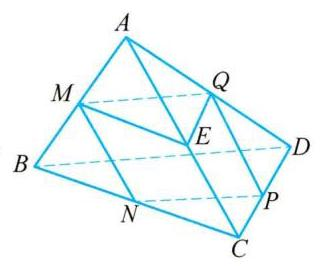

(第 2 题)

1 空间两个角 $\alpha$ 、 $\beta$ 的两边分别对应平行,且 $\alpha  = {60}^{ \circ  }$ ,则 $\beta  =$ ___.

2 如图，在空间四边形 ${ABCD}$ 中， $M$ 、 $N$ 、 $P$ 、 $Q$ 、 $E$ 分别是 ${AB}$ 、 ${BC}$ 、 ${CD}$ 、 ${AD}$ 、 ${AC}$ 的中点，则下列说法中不正确的是().

(A) ${AB}//{NQ}$

(B) $\angle {QME} = \angle {CBD}$

(C) $\bigtriangleup {BCD} \backsim  \bigtriangleup {MEQ}$

(D) 四边形 ${MNPQ}$ 为平行四边形

3 如图，在一块长方体形状的木块的表面 ${A}_{1}{C}_{1}$ 上有一点 $P$ ，如何在平面 ${A}_{1}{C}_{1}$ 上过点 $P$ 作一条直线和棱 ${CD}$ 平行? 请作图并说明理由.

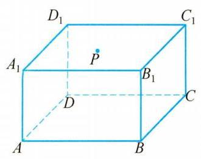

(第 3 题)

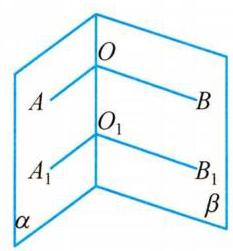

(第 4 题)

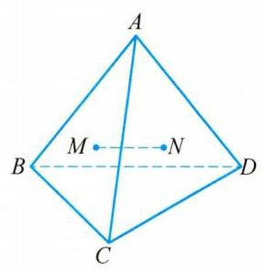

(第 5 题)

4 如图，在两个相交平面 $\alpha$ 、 $\beta$ 的交线上任意取两点 $O$ 与 ${O}_{1}$ . 在平面 $\alpha$ 上，过点 $O$ 与 ${O}_{1}$ 分别作射线 ${OA}$ 与 ${O}_{1}{A}_{1}$ 垂直于 $O{O}_{1}$ ; 在平面 $\beta$ 上,过点 $O$ 与 ${O}_{1}$ 分别作射线 ${OB}$ 与 ${O}_{1}{B}_{1}$ 垂直于 $O{O}_{1}$ . 求证: $\angle {AOB} = \angle {A}_{1}{O}_{1}{B}_{1}$ .

5 如图， $A$ 是 $\bigtriangleup  {BCD}$ 所在平面外一点， $M$ 、 $N$ 分别是 $\bigtriangleup  {ABC}$ 和 $\bigtriangleup  {ACD}$ 的重心.

(1)求证: ${MN}//{BD}$ ；

(2)若 ${BD} = 6$ ，求 ${MN}$ 的长.

## 二、异面直线

我们知道, 在同一平面上的两条直线只有平行或相交两种位置关系: 两条直线只有一个公共点时, 就是相交关系; 两条直线没有公共点时, 就是平行关系.

空间中的两条直线仍具有平行和相交这两种位置关系, 但我们在生活中经常观察到空间的两条直线还有另一种位置关系: 既不相交, 也不平行. 例如, 校园中的旗杆与地面上的一些直线; 教室里天花板上和地板上的一些直线都给我们这样的印象，这两种情形可以用图 10-27 来直观地表示.

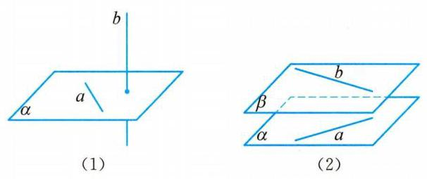

图 10-27

据此，我们给出下面的定义.

## 定义:不同在任何一个平面上的两条直线叫做异面直线.

必须要说明的是，这里“不同在任何一个平面上的两条直线”是指不存在任何一个平面，使得这两条直线都在这个平面上.

这样，空间中的两条直线就有三种不同的位置关系，可以用表 10-2 来分类:

表 10-2

<table><tr><td>位置关系</td><td>是否共面</td><td>是否有公共点</td></tr><tr><td>相交</td><td>是</td><td>是</td></tr><tr><td>平行</td><td>是</td><td>否</td></tr><tr><td>异面</td><td>否</td><td>否</td></tr></table>

画两条异面直线时,为了更加形象和直观,我们通常要借助辅助平面来衬托,如图 10-28 所示.

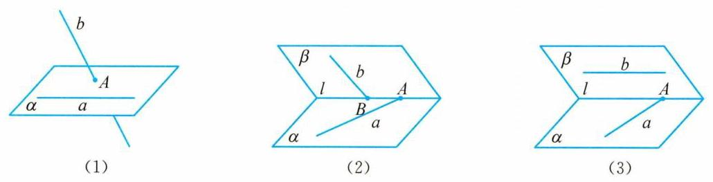

图 10-28

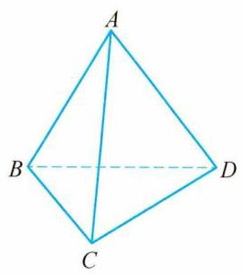

图 10-29

例 5 如图 10-29,已知 $A\text{ 、 }B\text{ 、 }C\text{ 、 }D$ 是空间中的四个点,且直线 ${AB}$ 与 ${CD}$ 是异面直线. 请用反证法证明: 直线 ${AC}$ 与 ${BD}$ 也是异面直线.

证明 假设直线 ${AC}$ 与 ${BD}$ 不是异面直线,则 ${AC}$ 与 ${BD}$ 在同一平面上，记这个平面为 $\alpha$ .

所以 $A\text{ 、 }C\text{ 、 }B\text{ 、 }D$ 四点都在平面 $\alpha$ 上，即直线 ${AB}\text{ 、 }{CD}$ 分别有两个点在平面 $\alpha$ 上，由公理 1 知，直线 ${AB}$ 、 ${CD}$ 在平面 $\alpha$ 上. 所以， ${AB}$ 与 ${CD}$ 不是异面直线，这与已知条件产生矛盾.

因此，假设不成立，即 ${AC}$ 和 ${BD}$ 是异面直线.

需要注意的是，若根据定义判断两条直线为异面直线，就要判断这两条直线“不同在任何一个平面上”, 这显然不太可行. 因此, 一般就如例 5 一样用反证法来进行论证. 为了更方便地判断两条直线为异面直线,我们再给出下面的判定定理.

异面直线判定定理:过平面外一点与平面上一点的直线,和此平面上不经过该点的任何一条直线都是异面直线.

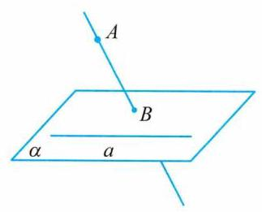

图 10-30

例 6 如图 10-30,已知: 直线 $a$ 在平面 $\alpha$ 上,点 $A$ 不在平面 $\alpha$ 上,直线 ${AB}$ 与平面 $\alpha$ 交于点 $B$ ,点 $B$ 在平面 $\alpha$ 上但不在直线 $a$ 上.

求证:直线 ${AB}$ 和 $a$ 是异面直线.

证明 假设存在一个平面 $\beta$ ,使得直线 ${AB}$ 与 $a$ 均在平面 $\beta$ 上,那么平面 $\beta$ 一定经过点 $A$ 、 $B$ 和直线 $a$ . 因为 $B \notin  a$ ，由公理 2 推论 1，经过点 $B$ 与直线 $a$ 只能有一个平面,它就是 $\alpha$ ,从而平面 $\alpha$ 与 $\beta$ 是同一个平面. 这样,点 $A$ 就应在平面 $\alpha$ 上,与已知 $A \notin  \alpha$ 矛盾. 所以,直线 ${AB}$ 和 $a$ 必为异面直线.

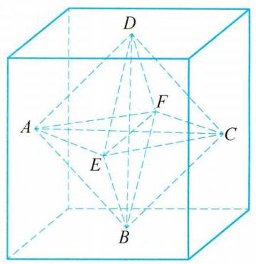

图 10-31

例 7 若两条直线为异面直线，则称它们为一对异面直线，那么在正方体六个表面的中心所确定的直线中，异面直线共有多少对?

解 如图 10-31,正方体六个表面的中心依次为点 $A\text{ 、 }B\text{ 、 }C$ 、 $D\text{ 、 }E\text{ 、 }F$ .

若两个中心点不是相对表面的中心 (如 $A$ 与 $C$ ),则这样确定的直线有 12 条.

对于直线 ${AB}$ ，与其异面的直线有 4 条，分别为 ${CE}$ 、 ${CF}$ 、 ${DE}$ 、 ${DF}$ ,即与 ${AB}$ 异面的直线有 4 对. 由对称性可知,共有 $\frac{{12} \times  4}{2} = {24}$ 对异面直线.

若两个中心点是相对表面的中心 (如 $A$ 与 $C$ ),则这样确定的直线有 3 条,分别为 ${AC}$ 、 ${BD}\text{ 、 }{EF}$ ，它们相交于同一点，即正方体的中心.

对于直线 ${AC}$ ，与其异面的直线有 4 条，分别为 ${BE}$ 、 ${ED}$ 、 ${DF}$ 、 ${FB}$ ，即与 ${AC}$ 异面的直线有 4 对. 由对称性可知,共有 $3 \times  4 = {12}$ 对异面直线.

综上可知，共有 ${24} + {12} = {36}$ 对异面直线.

1. 我们知道，平面几何中的一些结论推广到空间，有些依然成立，例如平行公理、等角定理等；但也有一些不再成立，例如，“四边相等的四边形是菱形”在空间就不成立了. 请再列举出一些这样的例子.

2. 若空间三条直线 $a\text{ 、 }b\text{ 、 }c$ 两两成异面直线，则与 $a\text{ 、 }b\text{ 、 }c$ 都相交的直线有多少条?

## 练一练

6 判断下列说法是否正确，并说明理由.

(1)分别在两个不同平面上的两条直线是异面直线；

(2)分别与两条异面直线平行的两条直线也是异面直线；

(3)分别与两条异面直线相交的两条直线也是异面直线；

(4)若 $a\text{ 、 }b$ 是异面直线且 $a\text{ 、 }c$ 是异面直线，则 $b\text{ 、 }c$ 也是异面直线；

(5)若一条直线与两条相交直线中的一条直线平行,则必与另一条直线成异面直线;

(6)垂直于同一直线的两条直线一定平行;

(7)平行于同一直线的两直线平行;

(8)有三个角是直角的四边形一定是矩形.

7 若把两条异面直线称作“一对”，那么由正方体的任意两个顶点所确定的直线中，有多少对异面直线?

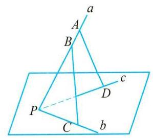

(第 8 题)

8 如图，已知不共面的三条直线 $a$ 、 $b$ 、 $c$ 相交于点 $P$ ， $A \in  a$ ， $B \in \; a, C \in  b, D \in  c$ ,求证: ${AD}$ 与 ${BC}$ 是异面直线.

9 在两条异面直线上分别任取一点, 证明: 连接这两点的线段的中点都在同一平面上.

## 三、异面直线所成的角

我们知道, 在平面几何中, 对于两条相交直线, 可以用它们的夹角大小来确定其相对位置; 对于两条平行线，可以用它们之间的距离来确定其相对位置. 那么，在空间中，对于两条异面直线, 我们该如何确定它们之间的相对位置呢?

异面直线没有公共点, 这一特征与平行直线类似, 而平移两条异面直线中的一条直线或两条直线, 总能使平移后的异面直线有公共点, 这又与相交直线关联. 因此我们同时引入角度和距离 (异面直线间的距离将在 10.5 中学习) 来刻画两条异面直线的相对位置.

一般地，如图 10-32(1)，直线 $a$ 、 $b$ 是异面直线，则经过空间任意一点 $O$ ，分别引直线 ${a}_{1}// \; a,{b}_{1}//b$ ,则直线 ${a}_{1}$ 和 ${b}_{1}$ 是相交直线，如图 10-32(2)，它们所成的锐角(或直角)是确定的，根据等角定理的推论 2,这个角的大小与点 $O$ 的位置无关.

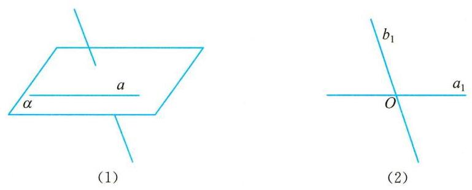

图 10-32

下面，我们给出异面直线所成角的定义.

定义:两条异面直线平移到相交位置时所得到的锐角或直角，称为这两条异面直线所成的角.

由定义可知,两条异面直线所成角 $\alpha$ 的范围是 ${0}^{ \circ  } < \alpha  \leq  {90}^{ \circ  }$ ,或 $\alpha  \in  \left( {0,\frac{\pi }{2}}\right\rbrack$ .

特别地,如果两条异面直线 $a\text{ 、 }b$ 所成的角是直角,就说这两条异面直线互相垂直,记作 $a \bot  b$ . 由上述定义容易推出: 如果 $a \bot  b, b//c$ ,那么 $a \bot  c$ .

例 8 如图 10-33(1),在正方体 ${ABCD} - {A}_{1}{B}_{1}{C}_{1}{D}_{1}$ 中,求下列异面直线所成角的大小.

(1) ${AC}$ 与 $B{C}_{1}$ ；(2) ${B}_{1}D$ 与 $B{C}_{1}$ .

解 (1) 用平移法,如图 10-33(2),因为 $A{A}_{1}//C{C}_{1}$ 且 $A{A}_{1} = C{C}_{1}$ ,所以四边形 $A{A}_{1}{C}_{1}C$ 为平行四边形,则 ${AC}//{A}_{1}{C}_{1}$ ,所以, $\angle {A}_{1}{C}_{1}B$ 为异面直线 ${AC}$ 与 $B{C}_{1}$ 所成的角(或其补角).

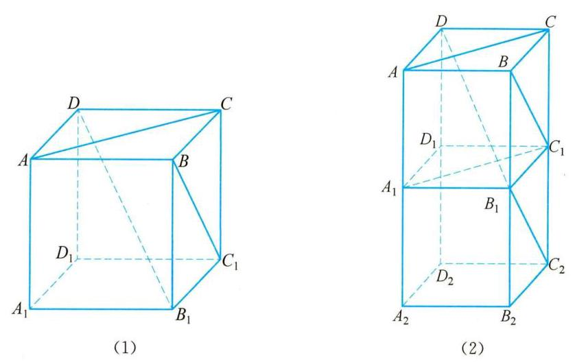

图 10-33

易知 $\bigtriangleup {A}_{1}{C}_{1}B$ 为等边三角形,则 $\angle {A}_{1}{C}_{1}B = \frac{\pi }{3}$ . 即异面直线 ${AC}$ 与 $B{C}_{1}$ 所成角的大小为 $\frac{\pi }{3}$ .

(2)用补形法，如图10-33(2)，在正方体 ${ABCD} - {A}_{1}{B}_{1}{C}_{1}{D}_{1}$ 下方补一个相同的正方体， 即正方体 ${A}_{1}{B}_{1}{C}_{1}{D}_{1} - {A}_{2}{B}_{2}{C}_{2}{D}_{2}$ ,易知 ${B}_{1}{C}_{2}//B{C}_{1}$ ,所以 $\angle D{B}_{1}{C}_{2}$ 为异面直线 ${B}_{1}D$ 与 $B{C}_{1}$ 所成的角或其补角.

设正方体的边长为 $a$ ,在 $\bigtriangleup D{B}_{1}{C}_{2}$ 中,计算得 $D{B}_{1} = \sqrt{3}a,{B}_{1}{C}_{2} = \sqrt{2}a, D{C}_{2} = \sqrt{5}a$ ,因为 $D{B}_{1}^{2} + {B}_{1}{C}_{2}^{2} = D{C}_{2}^{2}$ ,所以 $\angle D{B}_{1}{C}_{2} = \frac{\pi }{2}$ ,即异面直线 ${B}_{1}D$ 与 $B{C}_{1}$ 所成角的大小为 $\frac{\pi }{2}$ .

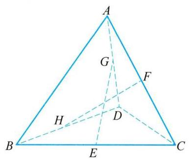

图 10-34

例 9 如图 10-34，在空间四边形 ${ABCD}$ 中， ${AB} = {CD} = 8$ ， $E\text{ 、 }F\text{ 、 }G\text{ 、 }H$ 分别是线段 ${BC}\text{ 、 }{CA}\text{ 、 }{AD}\text{ 、 }{DB}$ 的中点, ${FH} = 6$ .

(1)求证:直线 ${EG}$ 与直线 ${FH}$ 相互垂直；

(2)求异面直线 ${AB}$ 与 ${CD}$ 所成角的大小；

(1)证明 如图10-35,因为在空间四边形 ${ABCD}$ 中, ${AB} = \; {CD} = 8$ ，且 $E$ 、 $F$ 、 $G$ 、 $H$ 分别是线段 ${BC}$ 、 ${CA}$ 、 ${AD}$ 、 ${DB}$ 的中点， 所以 ${FG} = {GH} = {HE} = {EF} = 4,{FG}//{EH}$ ,所以四边形 ${EFGH}$ 为菱形,根据菱形的性质,对角线 ${EG}$ 与 ${FH}$ 相互垂直.

图 10-35

(2)解 如图10-35，因为 ${AB} = {CD} = 8, E$ 、 $F$ 、 $G$ 、 $H$ 分别是线段 ${BC}\text{ 、 }{CA}\text{ 、 }{AD}\text{ 、 }{DB}$ 的中点，所以 ${AB}//{GH},{CD}//{GF}$ . 因此, $\angle {HGF}$ 是异面直线 ${AB}$ 与 ${CD}$ 所成角 (或其补角).

在三角形 ${GHF}$ 中,由 ${GH} = {GF} = 4,{FH} = 6$ ,得 $\cos \angle {HGF} = \; \frac{{4}^{2} + {4}^{2} - {6}^{2}}{2 \times  4 \times  4} =  - \frac{1}{8},\angle {HGF} = \arccos \left( {-\frac{1}{8}}\right)$ ,因为异面直线所成角的范围是 $\left( {0,\frac{\pi }{2}}\right\rbrack$ ，所以，异面直线 ${AB}$ 与 ${CD}$ 所成角的大小为 $\arccos \frac{1}{8}$ .

3. ① 过直线 $a$ 外一点 $P$ 且与直线 $a$ 所成角为 ${60}^{ \circ  }$ 的直线构成什么图形?

② 已知异面直线 $a$ 、 $b$ 所成角为 ${60}^{ \circ  }$ ，过一定点 $P$ 且与直线 $a$ 、 $b$ 所成角都为 ${60}^{ \circ  }$ 的直线是否存在? 若存在, 有几条?

## 练一练

(第 10 题)

10 如图是一个正方体的平面展开图, 在这个正方体中, 下列说法中正确的序号是___.

① 直线 ${AF}$ 与直线 ${DE}$ 相交;

② 直线 ${CN}$ 与直线 ${DE}$ 平行;

③ 直线 ${BM}$ 与直线 ${DE}$ 是异面直线;

④ 直线 ${CN}$ 与直线 ${BM}$ 成 ${60}^{ \circ  }$ 角.

11 已知 ${O}_{1}\text{ 、 }{O}_{2}\text{ 、 }{O}_{3}$ 分别是正方体 ${ABCD} - {A}_{1}{B}_{1}{C}_{1}{D}_{1}$ 的三个表面 ${A}_{1}{B}_{1}{C}_{1}{D}_{1}$ 、 $C{C}_{1}{D}_{1}D\text{ 、 }{BC}{C}_{1}{B}_{1}$ 的中心,求异面直线 $A{O}_{1}$ 与 ${O}_{2}{O}_{3}$ 所成角的大小.

(第 13 题)

12 在长方体 ${ABCD} - {A}_{1}{B}_{1}{C}_{1}{D}_{1}$ 中, ${AB} = A{A}_{1} = 2\mathrm{\;{cm}},{AD} = \; 1\mathrm{\;{cm}}$ ,求异面直线 ${A}_{1}{C}_{1}$ 与 $B{D}_{1}$ 所成角的大小.

13 在空间四边形 ${ABCD}$ 中, ${AD} = {BC} = 2, E\text{ 、 }F$ 分别是 ${AB}$ 、 ${CD}$ 的中点,异面直线 ${AD}\text{ 、 }{BC}$ 所成角为 ${60}^{ \circ  }$ . 求线段 ${EF}$ 的长度.

14 已知空间四边形 ${ABCD},{AD} = 1,{BC} = \sqrt{3},{AD} \bot  {BC}$ ,对角线 ${BD} = \frac{\sqrt{13}}{2},{AC} = \frac{\sqrt{3}}{2}$ ,求 ${AC}$ 与 ${BD}$ 所成角的大小.

15 已知空间四边形 ${ABCD}$ .

(1)若 $E$ 、 $F$ 、 $G$ 、 $H$ 、 $I$ 、 $J$ 分别是 ${AB}$ 、 ${BC}$ 、 ${CD}$ 、 ${DA}$ 、 ${AC}$ 、 ${BD}$ 的中点. 求证: ${EG}$ 、 ${FH}$ 、 ${IJ}$ 交于一点且互相平分;

(2)若其边长及对角线长相等，且 $E$ 、 $F$ 分别是 ${CD}$ 、 ${AB}$ 的中点，求 ${DF}$ 与 ${BE}$ 所成角的大小.

### 10.3 直线与平面的位置关系

在空间中,直线 $l$ 与平面 $\alpha$ 的位置关系可以按它们的公共点个数分成三类:

(1)若直线 $l$ 与平面 $\alpha$ 没有公共点,则称直线 $l$ 与平面 $\alpha$ 平行,记作 $l//\alpha$ ;

(2)若直线 $l$ 与平面 $\alpha$ 只有一个公共点，则称直线 $l$ 与平面 $\alpha$ 相交，记作 $l \cap  \alpha  = A$ ( $A$ 是公共点);

(3)若直线 $l$ 与平面 $\alpha$ 有两个公共点，则由公理 1 可知，直线 $l$ 上的所有点都在平面 $\alpha$ 上， 即直线 $l$ 在平面 $\alpha$ 上,记作 $l \subset  \alpha$ .

我们把直线与平面平行、直线与平面相交统称为直线在平面外,记作 $l \text{ ⊄ } \alpha$ .

## 一、直线与平面平行

前面我们已经划分了空间中直线与平面的三种位置关系, 其中, 当直线与平面平行时, 直线与平面没有公共点. 但是, 考虑到直线的无限延伸性和平面是无限延展的, 据此来判断直线与平面是否平行不太可行, 所以我们就需要一个判定直线与平面平行的法则.

图 10-36

观察图 10-36 中房门打开的情景,门无论转到什么位置,门外沿所在的直线 ${AB}$ 都平行于门框所在的平面. 这是因为根据公理 4，在门转动的过程中门的外沿所在直线 ${AB}$ 始终与门框的竖直边沿所在直线 ${A}_{1}{B}_{1}$ 是平行的.

一般地，我们给出下面的直线与平面平行的判定定理:

如果平面外的一条直线平行于平面内的一条直线，那么这条直线平行于这个平面.

下面，我们用反证法来证明这个定理.

图 10-37

如图 10-37,已知直线 $a\text{ 、 }b$ 和平面 $\alpha$ 满足 $a \text{ ⊄ } \alpha , b \subset  \alpha$ ,且 $a//$ b. 求证: $a//\alpha$ .

证明 假设直线 $a$ 不平行于平面 $\alpha$ ,由于 $a \text{ ⊄ } \alpha$ ,所以直线 $a$ 与平面 $\alpha$ 相交,记交点为 $A$ . 因为 $a//b$ ,所以 $a\text{ 、 }b$ 确定一个平面,记为平面 $\beta$ ,则由已知得 $\alpha  \cap  \beta  = b$ . 由 $A \in  a, a \subset  \beta$ ,得点 $A \in  \beta$ . 又因为 $A \in  \alpha$ ,根据公理 2,得 $A \in  \alpha  \cap  \beta  = b$ . 这与已知条件 $a//b$ 相矛盾,所以假设不成立,即直线 $a//$ 平面 $\alpha$ .

根据上述判定定理，要判断不在平面上的一条直线与这个平面平行，只要在此平面上找到此直线的一条平行线即可.

例 1 求证:空间四边形的对角线平行于四边中点所确定的平面.

图 10-38

已知:如图10-38，在空间四边形 ${ABCD}$ 中， $E$ 、 $F$ 、 $G$ 、 $H$ 分别是边 ${AB}$ 、 ${BC}$ 、 ${CD}$ 、 ${DA}$ 的中点. 求证: ${AC}//$ 平面 ${EFGH}$ ， ${BD}//$ 平面 ${EFGH}$ .

证明 由 10.2 节中例 1 可知,若 $E\text{ 、 }F\text{ 、 }G\text{ 、 }H$ 分别是边 ${AB}$ 、 ${BC}\text{ 、 }{CD}\text{ 、 }{DA}$ 的中点,则 $E\text{ 、 }F\text{ 、 }G\text{ 、 }H$ 四点共面,且四边形 ${EFGH}$ 是平行四边形.

在三角形 ${ABC}$ 中,因为 $E\text{ 、 }F$ 分别是边 ${AB}\text{ 、 }{BC}$ 的中点,所以 ${AC}//{EF}$ ,又 ${AC} \text{ ⊄ }$ 平面 ${EFGH},{EF} \subset$ 平面 ${EFGH}$ ,所以由直线与平面平行的判定定理,得到 ${AC}//$ 平面 ${EFGH}$ .

同理 ${BD}//$ 平面 ${EFGH}$ .

本例中, 还有哪些直线与平面平行? 找找看!

图 10-39

例 2 如图 10-39 所示,已知两个全等的正方形 ${ABCD}$ 和 ${ABEF}$ 所在平面相交于 ${AB}$ ，点 $M$ 、 $N$ 分别在线段 ${AC}$ 、 ${FB}$ 上(与端点不重合)，且 ${AM} = {FN}$ . 求证: ${MN}//$ 平面 ${BCE}$ .

证明 方法一:如图10-40，作 ${MP}//{AB}$ 交 ${BC}$ 于点 $P$ ， ${NQ}// \; {AB}$ 交 ${BE}$ 于点 $Q$ ，所以 ${MP}//{NQ}$ .

图 10-40

因为 ${AM} = {FN}$ ，所以 ${MP} = \frac{\sqrt{2}}{2}{MC} = \frac{\sqrt{2}}{2}{BN} = {NQ}$ . 所以 ${MP}\underline{ \text{ ⫫ } }{NQ}$ . 所以四边形 ${MNQP}$ 为平行四边形,所以 ${MN}//{PQ}$ .

因为 ${MN} \text{ ⊄ }$ 平面 ${BCE},{PQ} \subset$ 平面 ${BCE}$ ,所以 ${MN}//$ 平面 ${BCE}$ .

方法二: 如图 10-41,连接 ${AN}$ 并延长交 ${BE}$ 的延长线于点 $G$ ,连接 ${CG}$ .

图 10-41

因为 ${AF}//{BG}$ ,所以 $\frac{AN}{NG} = \frac{FN}{NB} = \frac{AM}{MC}$ ,所以 ${MN}//{CG}$ .

因为 ${MN} \text{ ⊄ }$ 平面 ${BCE},{CG} \subset$ 平面 ${BCE}$ ,所以 ${MN}//$ 平面 ${BCE}$ .

如果一条直线和一个平面平行,那么在这个平面上是否一定能找到直线与这条直线平行呢? 我们有下面的定理:

直线与平面平行的性质定理:如果一条直线和一个平面平行,过这条直线的一个平面与这个平面相交,那么这条直线与交线平行.

图 10-42

如图 10-42,已知直线 $a$ 和平面 $\alpha , a//\alpha , a \subset$ 平面 $\beta$ ,且 $\alpha  \cap  \beta  =$ 直线 $b$ .

求证: $a//b$ .

证明 由 $a//\alpha$ ,故直线 $a$ 和 $\alpha$ 没有公共点. 又因为 $b \subset  \alpha$ ,所以直线 $a$ 和 $b$ 没有公共点. 因为直线 $a$ 和 $b$ 同在平面 $\beta$ 上,且没有公共点,所以 $a//b$ .

图 10-43

例 3 已知直线 $a\text{ 、 }b$ 和平面 $\alpha , a//b, a//\alpha$ ，直线 $a\text{ 、 }b$ 都不在平面 $\alpha$ 上,求证: $b//\alpha$ .

证明 如图 10-43 所示,过直线 $a$ 作平面 $\beta$ ,使 $\alpha  \cap  \beta  =$ 直线 $c$ ,因为 $a//\alpha , a \subset  \beta ,\alpha  \cap  \beta  = c$ ,根据直线与平面平行的性质定理,得到 $a//c$ .

由已知 $a//b$ ，所以 $b//c$ ，又 $c \subset  \alpha$ ， $b \text{ ⊄ } \alpha$ ，根据直线与平面平行的判定定理，得到 $b//\alpha$ .

图 10-44

例 4 已知: 四边形 ${ABCD}$ 是平行四边形,点 $P$ 是平面 ${ABCD}$ 外一点, $M$ 是 ${PC}$ 的中点,在 ${DM}$ 上任取一点 $G$ ,过点 $G$ 和 ${AP}$ 作平面交平面 ${BDM}$ 于 ${GH}$ . 求证: ${AP}//{GH}$ .

证明 如图 10-44,连接 ${AC}$ 交 ${BD}$ 于点 $O$ ,连接 ${MO}$ ,

因为四边形 ${ABCD}$ 是平行四边形,所以 $O$ 是 ${AC}$ 中点,又 $M$ 是 ${PC}$ 中点,所以 ${AP}//{OM}$ ,又 ${OM} \subset$ 平面 ${BMD}$ .

因为 ${PA}$ 不在平面 ${BMD}$ 内,所以 ${PA}//$ 平面 ${BMD}$ .

又因为 ${PA} \subset$ 平面 ${PAHG}$ ，且平面 ${PAHG} \cap$ 平面 ${BMD} = {GH}$ ，

所以 ${PA}//{GH}$ .

1. 三个平面两两相交,有几条交线? 这些交线的位置关系如何?

## 练一练

1 回答下列问题,并说明理由.

(1)若一条直线平行于一个平面内的无数条直线，则这条直线平行于这个平面吗？

(2)若两条平行直线中有一条平行于一个平面，则另一条也平行于这个平面吗？

(3)平行于同一个平面的两条直线的位置关系如何？

(4)若一条直线平行于一个平面，则这条直线与这个平面内的任意直线平行吗?

(第 2 题)

(5)过平面外一点可作多少条直线和这个平面平行？

(6)过直线外一点可作多少个平面和这条直线平行？

2 如图，在直角梯形 ${ABCD}$ 中， ${BC}\bot {CD},{AB} = {BC} = 2,{CD} = \; 4, E$ 为 ${CD}$ 中点， $M$ 、 $N$ 分别为 ${AD}$ 、 ${BC}$ 的中点，将 $\bigtriangleup  {ADE}$ 沿 ${AE}$ 折起,使点 $D$ 到 ${D}_{1}$ ,点 $M$ 到 ${M}_{1}$ ,求证: 在翻折过程中, ${M}_{1}N//$ 平面 $C{D}_{1}E$ .

(第 3 题)

3 如图，有一块木料，已知棱 ${BC}$ 平行于平面 ${A}^{\prime }{B}^{\prime }{C}^{\prime }{D}^{\prime }$ .

(1)要经过木料表面 ${A}^{\prime }{B}^{\prime }{C}^{\prime }{D}^{\prime }$ 内的一点 $P$ 和棱 ${BC}$ 将木料锯开，应怎样画线?

(2)所画的直线和平面 ${ABCD}$ 有什么样的位置关系？

4 求证:如果一条直线与两个相交平面都平行,那么这条直线与这两个平面的交线平行.

## 二、直线与平面垂直

在日常生活中，我们经常看到路边支撑树木的支架，操场上笔直的旗杆，大桥下高大的桥柱等等. 支架与地面给我们以直线和平面成一定角度 (锐角) 的形象，旗杆与地面、桥柱与水面则给我们以直线与平面垂直的形象，这是我们对几何对象的直觉感受.

下面，我们给出直线与平面垂直的定义.

定义:如果一条直线与一个平面上的任意一条直线都垂直，就说这条直线与这个平面互相垂直.

其中这条直线叫做这个平面的垂线(或法线)，这个平面也叫做该直线的垂面，垂线和这个平面的交点称为垂足.

图 10-45 图 10-46

如图 10-45,画直线 $l$ 与平面 $\alpha$ 垂直的示意图时,把平面的垂线 $l$ 画成与表示平面 $\alpha$ 的平行四边形的水平边垂直， 用符号表示为: $l \bot  \alpha$ .

显然, 用上述线面垂直的定义来判断直线与平面是否垂直是行不通的, 能否像判断直线与平面平行那样, 找到一个简便的判定定理呢?

在生活中, 我们经常发现许多竖杆的底座是十字形的 (图 10-46)，只要竖杆与底座的两条边垂直，就可以保证竖杆垂直于地面.

一般地，我们在实践中得到下面的基本事实.

直线与平面垂直的判定定理:如果一条直线垂直于一个平面上的两条相交直线,那么这条直线垂直于这个平面.

图 10-47

如图 10-47 所示,已知直线 $a\text{ 、 }b\text{ 、 }l$ 和平面 $\alpha$ ,且 $a \subset  \alpha , b \subset  \alpha$ , $a \cap  b = O, l \bot  a, l \bot  b.$

求证: $l \bot  \alpha$ .

证明 设直线 $c$ 是平面 $\alpha$ 上任意一条直线.

(1)当直线 $l$ 与直线 $c$ 都经过点 $O$ 时，如图 10-48，在直线 $l$ 上点 $O$ 的两侧分别取点 $P\text{ 、 }Q$ 使得 ${OP} = {OQ}$ ,在平面 $\alpha$ 上作一条直线,使它与 $a\text{ 、 }b\text{ 、 }c$ 分别交于点 $A\text{ 、 }B\text{ 、 }C$ ,连接 ${PA}\text{ 、 }{PB}\text{ 、 }{PC}\text{ 、 }{QA}\text{ 、 }{QB}\text{ 、 }{QC}$ .

图 10-48

因为 ${OA}$ 垂直平分 ${PQ}$ ,所以 ${PA} = {QA}$ . 同理 ${PB} = {QB}$ .

因为 ${PA} = {QA},{PB} = {QB},{AB} = {AB}$ ,所以 $\bigtriangleup {PAB} \cong  \bigtriangleup {QAB}$ ,得 $\angle {PAC} = \angle {PAB} = \angle {QAB} = \angle {QAC}$ ,而 ${PA} = {QA},{AC}$ 为公共边,所以 $\bigtriangleup {PAC} \cong  \bigtriangleup {QAC}$ ,所以 ${PC} = {QC}$ . 所以 ${PQ} \bot  c$ ,即 $l \bot  c$ .

(2)若直线 $l$ 与直线 $c$ 不都经过点 $O$ ，则过 $O$ 引与直线 $l$ 、 $c$ 的平行线 ${l}_{1}\text{ 、 }{c}_{1}$ ,由 (1) 可知 ${l}_{1} \bot  {c}_{1}$ . 又由等角定理可知 $l \bot  c$ .

综上所述,直线 $l$ 垂直于平面 $\alpha$ 上任意一条直线 $c$ ,即 $l\bot \alpha$ .

例 5 如图 10-49,已知 $O$ 是平行四边形 ${ABCD}$ 两条对角线的交点, $P$ 是平面 ${ABCD}$ 外一点,且 ${PA} = {PC},{PB} = {PD}$ . 求证: ${PO} \bot$ 平面 ${ABCD}$ .

证明 因为 $O$ 为平行四边形 ${ABCD}$ 对角线的交点,所以 $O$ 为线段 ${AC}$ 的中点. 又因为 ${PA} = {PC}$ ,所以 ${PO} \bot  {AC}$ . 同理可证 ${PO} \bot  {BD}$ . 又因为 ${AC} \cap  {BD} = \; O,{AC} \subset$ 平面 ${ABCD},{BD} \subset$ 平面 ${ABCD}$ ,所以 ${PO} \bot$ 平面 ABCD.

图 10-49

生活中，我们常常可以看见一排排相互平行的电线杆或树木都垂直于地面, 这容易联想到立体几何中是否会有这样的性质: 如果一组平行线中的一条直线与一个平面垂直，那么其他直线也都与这个平面垂直(可以自己试一试证明这个结论)；反过来，如果一组直线都垂直于同一个平面，那么这组直线也相互平行吗?

## 直线与平面垂直的性质定理: 垂直于同一个平面的两条直线相互平行.

图 10-50

已知: $a\text{ 、 }b$ 是两条直线,且 $a \bot  \alpha , b \bot  \alpha$ (图 10-50). 求证: $a//b$ .

证明 用反证法. 设 $a$ 与 $b$ 不平行,直线 $b$ 与平面 $\alpha$ 的交点为 $B$ . 过点 $B$ 作直线 ${b}^{\prime }$ ，使得 ${b}^{\prime }//a$ . 由直线 $b$ 与 ${b}^{\prime }$ 确定的平面记为 $\beta$ ，设平面 $\beta$ 与平面 $\alpha$ 的交线为 $l$ . 因为 $a \bot  \alpha , b \bot  \alpha$ ,所以 $a \bot  l, b \bot  l$ ; 由 ${b}^{\prime }//a$ ,又可得出 ${b}^{\prime } \bot  l$ . 直线 $b$ 与 ${b}^{\prime }$ 都在平面 $\beta$ 上,都过点 $B$ ,且都垂直于直线 $l$ ，这与 “在同一个平面上，过一点有且只有一条直线与已知直线垂直” 矛盾. 所以假设不成立，即 $a//b$ .

由上述线面垂直的定义及定理能得到下面两个推论.

推论 1: 过一点有且只有一个平面与给定的直线垂直.

推论 2: 过一点有且只有一条直线与给定的平面垂直.

由推论 2 可知,过平面 $\alpha$ 外一点 $M$ 作平面 $\alpha$ 的垂线,这样的垂线有且只有一条,我们把点 $M$ 和垂足 $N$ 之间的距离叫做点 $M$ 到平面 $\alpha$ 的距离. 如果一条直线 $l$ 与平面 $\alpha$ 平行,那么可以证明直线 $l$ 上任意一点到平面 $\alpha$ 的距离都相等,因此,我们把直线 $l$ 上任意一点 $M$ 到平面 $\alpha$ 的距离叫做直线 $l$ 到与它平行的平面 $\alpha$ 的距离 (图 10-51).

图 10-51

例 6 已知正方体 ${ABCD} - {A}_{1}{B}_{1}{C}_{1}{D}_{1}$ 的边长为 $a$ .

(1)求证: ${B}_{1}D \bot  C{D}_{1}$ ；

(2)求证: ${B}_{1}D \bot$ 平面 ${AC}{D}_{1}$ ；

(3)求点 $D$ 到平面 ${AC}{D}_{1}$ 的距离.

图 10-52

(1)证明 由正方体的性质,可知 ${B}_{1}{C}_{1} \bot  {C}_{1}{D}_{1},{B}_{1}{C}_{1} \bot  {C}_{1}C$ ,又 ${C}_{1}{D}_{1} \cap  {C}_{1}C = {C}_{1}$ ,所以 ${B}_{1}{C}_{1} \bot$ 平面 ${C}_{1}{D}_{1}{DC}$ ,且 $C{D}_{1} \subset$ 平面 ${C}_{1}{D}_{1}{DC}$ ,所以 ${B}_{1}{C}_{1} \bot  C{D}_{1}$ . 由四边形 ${C}_{1}{D}_{1}{DC}$ 为正方形,可知 ${C}_{1}D \bot  C{D}_{1}$ ,又 ${B}_{1}{C}_{1} \cap  {C}_{1}D = {C}_{1}$ ,所以 $C{D}_{1} \bot$ 平面 $D{B}_{1}{C}_{1}$ ,且 ${B}_{1}D \subset$ 平面 $D{B}_{1}{C}_{1}$ ,所以 ${B}_{1}D \bot  C{D}_{1}$ .

(2)证明 由(1)可知 ${B}_{1}D \bot  C{D}_{1}$ ，同理可证 ${B}_{1}D \bot  A{D}_{1}$ ，又 $C{D}_{1} \cap  A{D}_{1} = {D}_{1}$ ，所以 ${B}_{1}D \bot$ 平面 ${AC}{D}_{1}$ .

(3)如图10-52(1),设 ${AC} \cap  {BD} = O$ ,则平面 ${BD}{D}_{1}{B}_{1} \cap$ 平面 ${AC}{D}_{1} = {D}_{1}O$ . 设 ${B}_{1}D \cap$ 平面 ${AC}{D}_{1} = H$ ,则 $H \in  {D}_{1}O$ ,即 ${B}_{1}D \cap  {D}_{1}O = H$ . 由 (2) 可知 ${DH} \bot$ 平面 ${AC}{D}_{1}$ ,所以 ${DH}$ 的长度是点 $D$ 到平面 ${AC}{D}_{1}$ 的距离. 如图 10-52(2),因为 $\bigtriangleup {D}_{1}{DO}$ 是直角三角形且 $\angle {OD}{D}_{1} = {90}^{ \circ  },{DO} = \frac{\sqrt{2}}{2}a, D{D}_{1} = a, O{D}_{1} = \frac{\sqrt{6}}{2}a$ ,解得 ${DH} = \frac{\sqrt{3}}{3}a$ ,即点 $D$ 到平面 ${AC}{D}_{1}$ 的距离为 $\frac{\sqrt{3}}{3}a$ .

例 7 已知正方形 ${ABCD}$ 的边长为 $4, E\text{ 、 }F$ 分别是 ${AB}\text{ 、 }{AD}$ 的中点, ${PC} \bot$ 面 ${ABCD}$ , ${PC} = 2$ . 求点 $B$ 到平面 ${PEF}$ 的距离.

解 如图 10-53,连接 ${EP}\text{ 、 }{FP}\text{ 、 }{EF}\text{ 、 }{BD}\text{ 、 }{AC},{EF}\text{ 、 }{BD}$ 分别交 ${AC}$ 于点 $H\text{ 、 }O$ . 因为 ${ABCD}$ 是正方形, $E\text{ 、 }F$ 分别为 ${AB}$ 和 ${AD}$ 的中点,故 ${EF}//{BD}.H$ 为 ${AO}$ 的中点, ${BD}$ 不在平面 ${EFP}$ 上. 由直线和平面平行的判定定理知 ${BD}//$ 平面 ${EFP}$ ,所以 ${BD}$ 和平面 ${EFP}$ 的距离就是点 $B$ 到平面 ${EFP}$ 的距离.

图 10-53

因为 ${BD} \bot  {AC}$ ,所以 ${EF} \bot  {HC}$ . 因为 ${PC} \bot$ 平面 ${ABCD}$ ,所以 ${EF} \bot  {PC}$ ,又 ${PC} \cap  {HC} = C$ ,所以 ${EF} \bot$ 平面 ${HCP}$ .

在 $\bigtriangleup {PCH}$ 中,作 ${OK} \bot  {HP}$ 交 ${HP}$ 于点 $K$ ,由 ${EF} \bot$ 平面 ${HCP}$ 且 ${OK} \subset$ 平面 ${HCP}$ ,可知 ${OK} \bot  {EF}$ . 又因为 ${EF} \cap  {HP} = H$ ,所以 ${OK} \bot$ 平面 ${EFP}$ ,所以线段 ${OK}$ 的长就是点 $B$ 到平面 ${EFP}$ 的距离.

因为正方形 ${ABCD}$ 的边长为 $4,{PC} = 2$ ,所以 ${AC} = 4\sqrt{2},{HO} = \sqrt{2},{HC} = 3\sqrt{2}$ . 所以在 $\mathrm{{Rt}}\bigtriangleup {HCP}$ 中, ${HP} = \sqrt{{\left( 3\sqrt{2}\right) }^{2} + {2}^{2}} = \sqrt{22}$ .

因为 $\mathrm{{Rt}}\bigtriangleup {HKO}$ 和 $\mathrm{{Rt}}\bigtriangleup {HCP}$ 有一个公共的锐角,故 $\mathrm{{Rt}}\bigtriangleup {HKO} \backsim  \mathrm{{Rt}}\bigtriangleup {HCP}$ .

所以 ${OK} = \frac{{HO} \cdot  {PC}}{PH} = \frac{2 \times  \sqrt{2}}{\sqrt{22}} = \frac{2\sqrt{11}}{11}$ ，即点 $B$ 到平面 ${EFP}$ 的距离为 $\frac{2\sqrt{11}}{11}$ .

2. 如果一条直线与一个平面垂直，那么，称此直线与平面构成一个“正交线面对”. 在一个正方体中，由两个顶点确定的直线与含有三个或四个顶点的平面构成的 “正交线面对”的个数是多少?

3. 与空间不共面的四个点距离相等的平面有多少个?

## 练一练

5 “直线 $l$ 垂直于平面 $\alpha$ 内的无数条直线”是“ $l\bot \alpha$ ”的___条件.

6 如果一条直线垂直于一个平面内的:①三角形的两边；②梯形的两边；③圆的两条直径；④正六边形的两条边，则能保证该直线与平面垂直的是___.

7 如图，在正方形 ${ABCD}$ 中， $E$ 、 $F$ 分别是 ${AB}\text{ 、 }{BC}$ 的中点，现在沿 ${DE}\text{ 、 }{DF}$ 及 ${EF}$ 把 $\bigtriangleup {ADE}\text{ 、 }\bigtriangleup {CDF}\text{ 、 }\bigtriangleup {BEF}$ 折起,使 $A\text{ 、 }B\text{ 、 }C$ 三点重合,重合后的点记为 $P$ ,那么关于下面四个命题:

① ${DM}\bot$ 平面 ${PEF}$ ; ② ${PM}\bot$ 平面 ${DEF}$ ; ③ ${DP}\bot$ 平面 ${PEF}$ ; ④ ${EF}\bot$ 平面 ${DPM}$ .

其中能够成立的是___. (写出所有正确答案的序号)

(第 7 题)

8 如图，已知 ${PA} \bot  \alpha$ ， ${PB} \bot  \beta$ ，垂足分别为 $A$ 、 $B$ ，且 $\alpha  \cap  \beta  = m$ . 求证: $m \bot$ 平面 ${PAB}$ .

(第 8 题)

(第 9 题)

9 如图， ${PA}$ 垂直于圆所在平面， ${AC}$ 为圆的直径， $B$ 为圆周上不与点 $A$ 、 $C$ 重合的点， ${AS} \bot  {PC},{AN} \bot  {PB}$ ,且 $S\text{ 、 }N$ 为垂足,请写出图中所有的线面垂直关系.

(第 10 题)

10 在正方体 ${ABCD} - {A}_{1}{B}_{1}{C}_{1}{D}_{1}$ 中, ${AB} = 2, O$ 为 ${AC}$ 与 ${BD}$ 的交点, $G$ 为 $C{C}_{1}$ 的中点. 求:

(1)点 ${A}_{1}$ 到平面 ${GBD}$ 的距离；

(2)直线 $A{C}_{1}$ 到平面 ${GBD}$ 的距离.

## 三、直线与平面所成的角

我们知道,直线与平面垂直,这只是直线与平面相交的特殊情形,还有一种更为一般的位置关系,即直线 $l$ 与平面 $\alpha$ 相交,但不垂直,我们称直线 $l$ 与平面 $\alpha$ 斜交. 如图 10-54(1),此时直线 $l$ 叫做平面 $\alpha$ 的斜线,直线 $l$ 与平面 $\alpha$ 的交点 $A$ 叫做斜足.

图 10-54

显然, 平面的不同斜线相对于平面的倾斜程度一般并不相同, 那么如何来度量这种倾斜程度呢? 为此,我们引入直线与平面所成角的概念.

如图 10-54(2)，我们在平面 $\alpha$ 的斜线 $l$ 上任取一个不同于斜足的点 $P$ ，过点 $P$ 作平面 $\alpha$ 的垂线,垂足记为 $O$ . 连接 ${OA}$ ,直线 ${OA}$ 叫做斜线 $l$ 在平面 $\alpha$ 上的投影 (也称射影). 线段 ${PA}$ 的投影是线段 ${OA}$ ,容易证明,平面的一条斜线在平面上的投影与点 $P$ 的选择无关,是唯一确定的, 从而可以用斜线与它的投影所成的锐角 $\theta$ 来定义此斜线与平面所成的角.

定义:平面的一条斜线和它在平面上的投影所成的锐角,叫做这条直线和这个平面所成的角.

另外,我们约定,如果一条直线垂直于平面,我们说它们所成的角是直角; 如果一条直线和平面平行或在该平面上,就说它们所成的角是 ${0}^{ \circ  }$ 的角. 这样,直线与平面所成角的范围是 ${0}^{ \circ  } \leq  \theta  \leq  {90}^{ \circ  }$ ,或表示为 $\theta  \in  \left\lbrack  {0,\frac{\pi }{2}}\right\rbrack$ .

例 8 在正方体 ${ABCD} - {A}_{1}{B}_{1}{C}_{1}{D}_{1}$ 中,求直线 ${B}_{1}D$ 与平面 ${AB}{C}_{1}{D}_{1}$ 所成角的大小.

解 因为 ${AB} \bot  {BC},{AB} \bot  {B}_{1}B,{BC} \cap  B{B}_{1} = B$ ,所以 ${AB} \bot$ 平面 ${B}_{1}{C}_{1}{CB}$ ,又 ${B}_{1}C \subset$ 平面 ${B}_{1}{C}_{1}{CB}$ ,所以 ${AB} \bot  {B}_{1}C$ .

因为四边形 ${B}_{1}{C}_{1}{CB}$ 为正方形,所以 ${B}_{1}C \bot  B{C}_{1}$ ,又 ${AB} \bot  {B}_{1}C,{AB} \cap  B{C}_{1} = B$ ,可得 ${B}_{1}C \bot$ 平面 ${AB}{C}_{1}{D}_{1}$ .

设 ${B}_{1}C \cap  B{C}_{1} = M$ ,则 ${B}_{1}$ 在平面 ${AB}{C}_{1}{D}_{1}$ 上的射影为点 $M$ .

图 10-55

设正方体的中心为 $O$ ,则 $O \in  {B}_{1}D, O \in$ 平面 ${AB}{C}_{1}{D}_{1}$ ,所以 ${B}_{1}D$ 在平面 ${AB}{C}_{1}{D}_{1}$ 上的射影为 ${OM}$ ,即 $\angle {B}_{1}{OM}$ 为直线 ${B}_{1}D$ 与平面 ${AB}{C}_{1}{D}_{1}$ 所成角 (如图 10-55).

在直角三角形 $\bigtriangleup {B}_{1}{OM}$ 中,易得 $\tan \angle {B}_{1}{OM} = \frac{{B}_{1}M}{OM} = \sqrt{2}$ ,所以 $\angle {B}_{1}{OM} = \arctan \sqrt{2}$ . 即直线 ${B}_{1}D$ 与平面 ${AB}{C}_{1}{D}_{1}$ 所成角的大小为 $\arctan \sqrt{2}$ .

例 9 已知 $\angle {AOB}$ 在平面 $\alpha$ 上， $P$ 为平面 $\alpha$ 外一点，且 $\angle {POA} = \angle {POB} = \theta$ ( $\theta$ 为锐角), 记点 $P$ 在平面 $\alpha$ 上的射影为点 $Q$ .

(1)求证:点 $Q$ 在 $\angle {AOB}$ 的平分线上;

(2)探究 $\angle {POA}\text{ 、 }\angle {POQ}$ 和 $\angle {QOA}$ 的余弦值之间的关系.

图 10-56

(1)证明 如图 10-56，过点 $Q$ 分别作 ${AO}$ 、 ${BO}$ 的垂线，垂足分别为点 $E$ 、 $F$ .

因为 ${PQ} \bot$ 平面 $\alpha ,{OA} \subset$ 平面 $\alpha$ ，所以 ${PQ} \bot  {OA}$ ，又 ${OA} \bot \; {QE},{PQ} \cap  {QE} = Q$ ，所以 ${OA}\bot$ 平面 ${PEQ}$ ，且 ${PE} \subset$ 平面 ${PEQ}$ ， 所以 ${OA} \bot  {PE}$ . 同理可得 ${OB} \bot  {PF}$ .

在 $\bigtriangleup {POE}$ 和 $\bigtriangleup {POF}$ 中, $\angle {POE} = \angle {POF} = \theta ,{PO} = {PO}$ , $\angle {PEO} = \angle {PFO} = {90}^{ \circ  }$ ,所以 $\bigtriangleup {POE} \cong  \bigtriangleup {POF}$ ,则 ${OE} = {OF}$ ,又 ${OQ} = {OQ},{OA} \bot  {QE},{OB} \bot  {QF}$ ,所以 $\bigtriangleup {OQE} \cong  \bigtriangleup {OQF}$ ,所以 $\angle {EOQ} = \angle {FOQ}$ ,即点 $Q$ 在 $\angle {AOB}$ 的平分线上.

(2)在直角三角形 $\bigtriangleup {POE}$ 中， $\cos \angle {POA} = \cos \angle {POE} = \frac{OE}{PO}$ ，在直角三角形 $\bigtriangleup {POQ}$ 中， $\cos \angle {POQ} = \frac{OQ}{PO}$ ，在直角三角形 $\bigtriangleup {OQE}$ 中， $\cos \angle {AOQ} = \cos \angle {EOQ} = \frac{OE}{OQ}$ . 所以三个角 $\angle {POA}\text{ 、 }\angle {POQ}$ 和 $\angle {QOA}$ 的余弦值满足关系

$$
\cos \angle {POA} = \cos \angle {AOQ} \cdot  \cos \angle {POQ}.
$$

从例 9 可知, $\angle {POQ}$ 是斜线 ${OP}$ 与平面 $\alpha$ 所成的角, $\angle {POA}$ 是斜线 ${OP}$ 与平面 $\alpha$ 上过点 $O$ 的直线 ${OA}$ 所成的角,因为 $\angle {POA}\text{ 、 }\angle {POQ}\text{ 、 }\angle {QOA}$ 都是锐角,所以

$$
\cos \angle {POA} = \cos \angle {AOQ} \cdot  \cos \angle {POQ} < \cos \angle {POQ},
$$

因为在 $\left( {0,\frac{\pi }{2}}\right)$ 上余弦函数是减函数,因此 $\angle {POA} > \angle {POQ}$ .

如果 $l$ 是平面 $\alpha$ 上的任意直线,则可以在平面 $\alpha$ 内平行移动直线 $l$ 使其过点 $O$ ,那么斜线 ${OP}$ 与 $l$ 所成的角 $\theta$ 也满足 $\theta  > \angle {POQ}$ ,或者 $\theta  = \angle {POQ}$ (此时直线 $l$ 正好是直线 ${OQ}$ 或平移后与直线 ${OQ}$ 重合),所以,我们得到下面的这条性质.

4. 求直线与平面所成角是否可以借助求异面直线所成角来解决？

5. 在平面上，两条直线的位置关系有相交、平行、重合三种. 已知 $\alpha$ ， $\beta$ 是两个相交平面，空间两条直线 ${l}_{1}$ 、 ${l}_{2}$ 在 $\alpha$ 上的射影是直线 ${s}_{1}$ 、 ${s}_{2}$ ， ${l}_{1}$ 、 ${l}_{2}$ 在 $\beta$ 上的射影是直线 ${t}_{1}\text{ 、 }{t}_{2}$ . 请写出 ${s}_{1}$ 与 ${s}_{2},{t}_{1}$ 与 ${t}_{2}$ 的位置关系来确定 ${l}_{1}$ 与 ${l}_{2}$ 位置关系的充要条件.

## 练一练

11 判断下列说法是否正确，并说明理由.

(1)两条平行直线在同一平面内的射影一定是平行直线；

(2)两条相交直线在同一平面内的射影一定是相交直线；

(3)两条异面直线在同一平面内的射影要么是平行直线，要么是相交直线；

(4)若斜线段长相等，则它们在平面内的射影长也相等；

(5)若两条直线与一个平面所成的角相等，则这两条直线平行.

12 已知点 $P$ 是 $\bigtriangleup  {ABC}$ 所在平面外一点，点 $P$ 在 $\bigtriangleup  {ABC}$ 所在平面上的射影是点 $Q$ ，那么

(1)若 $P$ 点到 $\bigtriangleup  {ABC}$ 三个顶点距离相等，则点 $Q$ 是 $\bigtriangleup  {ABC}$ 的___，

(2)若 $P$ 点到 $\bigtriangleup  {ABC}$ 三条边距离相等，则点 $Q$ 是 $\bigtriangleup  {ABC}$ 的___，心.

13 在正方体 ${ABCD} - {A}_{1}{B}_{1}{C}_{1}{D}_{1}$ 中分别求 ${B}_{1}B\text{ 、 }{A}_{1}B$ 和平面 ${A}_{1}{B}_{1}{CD}$ 所成的角.

14 已知线段 ${MN}$ 长 6 厘米,点 $M$ 到平面 $\beta$ 的距离是 1 厘米,点 $N$ 到平面 $\beta$ 的距离是 4 厘米,求直线 ${MN}$ 与平面 $\beta$ 所成角的大小.

## 四、三垂线定理

在空间图形的位置关系中,线线垂直和线面垂直是可以相互转化的,下面给出平面上的直线与平面的斜线及其在平面上的射影之间垂直关系的一种直接判断方法.

性质 1: 如果平面上的一条直线和这个平面的一条斜线在此平面上的射影垂直, 那么它就和这条斜线垂直.

图 10-57

如图 10-57,已知 ${PA}\text{ 、 }{PO}$ 分别是平面 $\alpha$ 的垂线、斜线, ${AO}$ 是 ${PO}$ 在平面 $\alpha$ 上的射影,直线 $a \subset  \alpha$ ,且 $a \bot  {AO}$ . 因为 ${PA} \bot  \alpha , a \subset  \alpha$ , 得到 ${PA} \bot  a$ ,又 ${AO} \bot  a,{PA} \cap  {AO} = A$ ,所以, $a \bot$ 平面 ${PAO}$ ,又因为 ${PO} \subset$ 平面 ${PAO}$ ,所以 $a \bot  {PO}$ .

性质 2:如果平面内的一条直线和这个平面的一条斜线垂直,那么它也和这条斜线在该平面内的射影垂直.

如图 10-57,已知 ${PA}\text{ 、 }{PO}$ 分别是平面 $\alpha$ 的垂线、斜线, ${AO}$ 是 ${PO}$ 在平面 $\alpha$ 上的射影,直线 $a \subset  \alpha$ ,且 $a \bot  {PO}$ . 因为 ${PA} \bot  \alpha , a \subset  \alpha$ ,得到 ${PA} \bot  a$ ,又 ${PO} \bot  a,{PA} \cap  {PO} = P$ ,所以, $a \bot$ 平面 ${PAO}$ ,又因为 ${AO} \subset$ 平面 ${PAO}$ ,所以 $a \bot  {AO}$ .

根据性质 1 和性质 2 ，我们有下面的定理.

三垂线定理:平面上的一条直线和这个平面的一条斜线垂直的充要条件是它和这条斜线在平面上的投影垂直.

例 10 给定不共面的 4 点, 其中任意 3 个点都确定 1 个平面, 这样由 4 个平面所围成的几何体称为四面体，其中这 4 个点称为四面体的顶点，2 个顶点的连线称为四面体的棱，3 个顶点所确定的三角形称为四面体的面. 已知在四面体 ${ABCD}$ 中， ${AB}\bot {CD},{AC}\bot {BD}$ ，求证: ${AD} \bot  {BC}$ .

图 10-58

证明 如图 10-58,设点 $A$ 在平面 ${BCD}$ 上的射影是 $O$ 点,则 ${AO} \bot$ 平面 ${BCD}$ ,连接 ${BO}\text{ 、 }{CO}\text{ 、 }{DO}$ .

因为 ${AB} \bot  {CD},{AB}$ 是平面 ${BCD}$ 的斜线, ${BO}$ 是其在平面 ${BCD}$ 上的射影,且 ${CD} \subset$ 平面 ${BCD}$ ,所以根据三垂线定理可得 ${BO} \bot  {CD}$ .

同理 ${CO} \bot  {BD}$ ,于是点 $O$ 是 $\bigtriangleup {BCD}$ 的垂心,所以 ${DO} \bot  {BC}$ .

因为 ${AD}$ 是平面 ${BCD}$ 的斜线, ${DO}$ 是其在平面 ${BCD}$ 上的射影,且 ${BC} \subset$ 平面 ${BCD},{BC} \bot  {DO}$ ,所以根据三垂线定理可得 ${AD} \bot  {BC}$ .

例 11 如图 10-59(1),笔直的道路旁有一条小河,彼岸有电塔 ${AB}$ ,高 15 米,现只有测角器和皮尺作测量工具，能否求出电塔顶与道路的距离？(测角器只能测水平面角)

图 10-59

解 如图 10-59(2),在道路边取一点 $C$ ,使 ${BC}$ 与道路所成水平角等于 ${90}^{ \circ  }$ ,在道路边再取一点 $D$ ,使 $\angle {CDB} = {45}^{ \circ  }$ (也可以是其他角度),因为 ${BC}$ 是 ${AC}$ 在水平面上的射影,且 ${CD} \bot \; {BC}$ ,所以,根据三垂线定理可得 ${CD} \bot  {AC}$ . 因此斜线 ${AC}$ 的长度就是电塔顶 $A$ 与道路的距离.

由上可知 ${CD} = {CB}$ ,可测得 $C\text{ 、 }D$ 的距离等于 $a$ 米,所以 ${BC} = a$ 米.

在直角 $\bigtriangleup {ABC}$ 中, $A{C}^{2} = A{B}^{2} + B{C}^{2}$ ,即 $A{C}^{2} = {15}^{2} + {a}^{2}$ ,所以电塔顶 $A$ 与道路的距离是 $\sqrt{{225} + {a}^{2}}$ 米.

6. 已知异面直线 $a\text{ 、 }b$ 所成的角为 $\alpha$ ,若过空间一点 $P$ 的直线 $c$ 与直线 $a\text{ 、 }b$ 所成角均为 $\beta$ ,试讨论满足条件的直线 $c$ 是否存在? 若存在,有几条这样的直线? 想

## 练一练

15 已知 $\bigtriangleup  {ABC}$ 为锐角三角形， ${PA}\bot$ 平面 ${ABC}$ ，点 $A$ 在平面 ${PBC}$ 上的射影为点 $H$ ，求证: $H$ 不可能为 $\bigtriangleup  {PBC}$ 垂心.

16 已知 ${PA}\text{ 、 }{PB}\text{ 、 }{PC}$ 两两互相垂直，且 ${PA} = 3,{PB} = 4,{PC} = 6$ ，求点 $P$ 到平面 ${ABC}$ 的距离.

17 已知 $\bigtriangleup {ABC}$ 的三个顶点 $A\text{ 、 }B\text{ 、 }C$ 到平面 $\alpha$ 的距离分别为 $2\text{ 、 }3\text{ 、 }4$ ,求 $\bigtriangleup {ABC}$ 的重心到平面 $\alpha$ 的距离.

18 在长方体 ${ABCD} - {A}_{1}{B}_{1}{C}_{1}{D}_{1}$ 中,已知 $A{A}_{1} = 1,{AB} = {AD} = 2$ ,且 $E\text{ 、 }F$ 分别是棱 ${AB}\text{ 、 }{BC}$ 中点,证明: ${A}_{1}\text{ 、 }{C}_{1}\text{ 、 }F\text{ 、 }E$ 四点共面,并求直线 $C{D}_{1}$ 与平面 ${A}_{1}{C}_{1}{EF}$ 所成角的大小.

19 已知不共面的三条射线 ${OA}\text{ 、 }{OB}\text{ 、 }{OC}$ 两两成 ${60}^{ \circ  }$ 角,求直线 ${OA}$ 与平面 ${BOC}$ 所成角的大小.

20 已知空间中的直角 $\angle {ABC}$ ,其一边 ${AB}$ 所在直线与平面 $\alpha$ 斜交,另一边 ${BC}$ 所在直线不在平面 $\alpha$ 上,证明: “ ${BC}//\alpha$ ” 是 “ $\angle {ABC}$ 在平面 $\alpha$ 上的射影仍为直角” 的充要条件.

### 10.4 平面与平面的位置关系

两个平面的位置关系只有两种情况.

(1)两个平面平行:若两个平面没有公共点，则称这两个平面互相平行.

(2)两个平面相交:若两个平面有公共点，则称这两个平面相交，且它们所有公共点的集合是一条过该点的直线.

## 一、平面与平面平行

我们知道,判断直线与平面平行,可以转化为判断直线与直线平行,那么判断两个平面平行, 是否也可以转化为判断直线与直线平行或直线与平面平行呢?

为此，我们先思考下面的问题.

(1)如果一个平面上有一条直线与另一个平面平行，那么这两个平面平行吗？

(2)如果一个平面上有两条直线与另一个平面平行，那么这两个平面平行吗？

问题(1)显然不能确定这两个平面是平行的，例如，在如图 10- 60 所示的长方体中，直线 ${A}_{1}{B}_{1}$ 与平面 ${ABCD}$ 平行，但是过直线 ${A}_{1}{B}_{1}$ 的平面 ${AB}{B}_{1}{A}_{1}$ 与平面 ${ABCD}$ 相交，而且在平面 ${AB}{B}_{1}{A}_{1}$ 上有无数条与 ${A}_{1}{B}_{1}$ 平行的直线,这些直线都与平面 ${ABCD}$ 平行 (除直线 ${AB})$ ,所以问题 (2) 也不能确定两个平面互相平行.

图 10-60

从问题(2)还可以看出，即使在一个平面上有无数条直线都与另一个平面平行, 只要这些直线是相互平行的, 都无法确定这两个平面是相互平行的. 因此我们把条件中的平行直线换成相交直线, 再判断这两个平面是否平行.

图 10-61

已知: $a\text{ 、 }b$ 是平面 $\alpha$ 上的两条相交直线,且 $a\text{ 、 }b$ 都与平面 $\beta$ 平行 (如图 10-61).

求证: $\alpha //\beta$ .

证明 用反证法. 假设平面 $\alpha$ 与平面 $\beta$ 相交于直线 $l$ ,因为直线 $a//$ 平面 $\beta , a \subset$ 平面 $\alpha$ ,且 $\alpha  \cap  \beta  = l$ ,根据直线与平面平行的性质定理,得 $a//l$ . 同理可得 $b//l$ . 由公理 $4, a//b$ ,这与已知 $a\text{ 、 }b$ 是平面 $\alpha$ 上的两条相交直线相矛盾. 所以假设不成立,即 $\alpha //\beta$ .

于是,我们有了下面的定理和推论.

平面与平面平行的判定定理:如果一个平面上的两条相交直线与另一个平面平行,那么这两个平面平行.

推论:如果一平面内有两条相交直线分别平行于另一个平面内的两条相交直线，那么这两个平面平行.

由两个平面平行的定义及平面与平面平行的判定定理, 我们可以得到下面的一些性质:

(1)如果两个平面平行，则其中一个平面上的任意直线都平行于另一个平面；

(2)如果一条直线与两个平行平面相交，则这条直线与这两个平面所成的角相等；

(3)如果一条直线垂直于两个平行平面中一个平面，则它必垂直于另一个平面；

(4)如果两个平面分别与第三个平面平行，则这两个平面也相互平行;

(5)如果两个平面平行，则其中一个平面上的任意一点到另一个平面的距离都相等. 我们把它定义为两个平行平面之间的距离.

这些性质, 可以自己试一试去证明它们.

除此之外, 还有一条常用的性质, 我们以定理的形式给出.

两个平面平行的性质定理: 如果两个平行平面同时和第三个平面相交, 那么它们的交线平行.

证明 如图 10-62,设平面 $\gamma$ 与平行平面 $\alpha \text{ 、 }\beta$ 相交,有两条交线 $a\text{ 、 }b$ . 因为 $\alpha //\beta$ ,所以 $\alpha \text{ 、 }\beta$ 没有公共点,从而交线 $a\text{ 、 }b$ 也没有公共点. 又因为 $a\text{ 、 }b$ 都在平面 $\gamma$ 上,所以 $a//b$ .

图 10-62

图 10-63

例 1 如图 10-63,已知四边形 ${ABCD}$ 是矩形,点 $P$ 是平面 ${ABCD}$ 外一点, $M\text{ 、 }N$ 分别为 ${BC}\text{ 、 }{PD}$ 的中点.

(1)证明: ${MN}//$ 平面 ${PAB}$ ；

(2)若 $K$ 为 ${AD}$ 的中点，证明:平面 ${MNK}//$ 平面 ${PAB}$ .

(1)证明 如图 10-64(1)，因为 $M$ 、 $N$ 分别为 ${BC}$ 、 ${PD}$ 的中点. 取 ${PA}$ 的中点 $R$ ，连接 ${NR}\text{ 、 }{BR}$ ，所以 ${NR}//{AD}$ ，且 ${NR} = \frac{1}{2}{AD},{BM} = \frac{1}{2}{BC}$ ，因为四边形 ${ABCD}$ 是矩形，所以 ${AD}// \; {BC}$ ,且 ${AD} = {BC}$ ,所以 ${NR}//{BM}$ ,且 ${NR} = {BM}$ ,所以四边形 ${BMNR}$ 是平行四边形,所以 ${MN}//{BR}$ ,因为 ${MN} \text{ ⊄ }$ 平面 ${PAB},{BR} \subset$ 平面 ${PAB}$ ,所以 ${MN}//$ 平面 ${PAB}$ .

图 10-64

(2)证明 如图 10-64(2)，由(1)知 ${MN}//$ 平面 ${PAB}$ ，因为 $K$ 为 ${AD}$ 的中点， $M$ 为 ${BC}$ 的中点. 四边形 ${ABCD}$ 是矩形,所以 ${MK}//{AB}$ ，因为 ${MK} \text{ ⊄ }$ 平面 ${PAB}$ ， ${AB} \subset$ 平面 ${PAB}$ ，所以 ${MK}//$ 平面 ${PAB}$ ，因为 ${MK} \cap  {MN} = M$ ，所以平面 ${MNK}//$ 平面 ${PAB}$ .

图 10-65

例 2 如图 10-65, ${AE} \bot$ 平面 ${ABCD},{BF}//$ 平面 ${ADE}$ , ${CF}//{AE},{AD} \bot  {AB},{AB} = {AD} = 1,{AE} = {BC} = 2$ .

(1)求证: ${AD}//{BC}$ ；

(2)求点 $F$ 到平面 ${ADE}$ 的距离.

(1)证明 依题意 ${CF}//{AE},{CF} \text{ ⊄ }$ 平面 ${ADE},{AE} \subset$ 平面 ${ADE}$ ,所以 ${CF}//$ 平面 ${ADE}$ ,又 ${BF}//$ 平面 ${ADE},{BF} \cap  {CF} = F$ , ${BF}\text{ 、 }{CF} \subset$ 平面 ${BCF}$ ,所以平面 ${BCF}//$ 平面 ${ADE}$ ,又因为平面 ${BCF} \cap$ 平面 ${ABCD} = {BC}$ ,平面 ${ADE} \cap$ 平面 ${ABCD} = {AD}$ ,所以,根据平面与平面平行的性质定理,得 ${AD}//{BC}$ .

(2)由(1)可知，平面 ${BCF}//$ 平面 ${ADE}$ ，所以点 $F$ 到平面 ${ADE}$ 的距离就是平面 ${BCF}$ 到平面 ${ADE}$ 的距离，因为平面 ${BCF}$ 上的任意一点到平面 ${ADE}$ 的距离都相等，所以可求点 $B$ 到平面 ${ADE}$ 的距离. 因为 ${AE} \bot$ 平面 ${ABCD},{AB} \subset$ 平面 ${ABCD}$ ,所以 ${AE} \bot  {AB}$ ,又已知 ${AD} \bot \; {AB},{AE} \cap  {AD} = A$ ,所以 ${AB} \bot$ 平面 ${ADE}$ . 即 ${AB}$ 的长度就是点 $B$ 到平面 ${ADE}$ 的距离,因为 ${AB} = 1$ ,所以点 $F$ 到平面 ${ADE}$ 的距离等于 1 .

1. 已知长方体 ${ABCD} - {A}_{1}{B}_{1}{C}_{1}{D}_{1}$ 中, ${AB} = a,{BC} = b$ ,在线段 ${BD}\text{ 、 }{A}_{1}{C}_{1}$ 上分别取一点 $P\text{ 、 }Q$ ,点 $M$ 在线段 ${PQ}$ 上,且 ${PM} = {2MQ}$ ,那么点 $M$ 的轨迹是什么图形, 你能求出这个图形的面积吗?

## 练一练

1 判断下列结论是否正确，并说明理由.

(1)平行于同一条直线的两个平面平行;

(2)与同一条直线所成角相等的两个平面平行；

(3)垂直于同一条直线的两个平面平行；

(4)若一个平面上有 3 个不同的点到另一个平面的距离相等，则这两个平面相互平行；

(5)夹在两个平行平面间的平行线段相等;

(6)如果一个平面内任意直线都平行于另一个平面,那么这两个平面平行;

(7)如果 $a\text{ 、 }b$ 是异面直线，且 $a//\alpha , b//\alpha , a//\beta , b//\beta$ ，那么 $\alpha //\beta$ .

2 已知平面 $\alpha //$ 平面 $\beta$ ，直线 $l \subset  \alpha$ ，点 $P \in  l$ ，且平面 $\alpha$ 与平面 $\beta$ 间的距离为 4，则在平面 $\beta$ 上到点 $P$ 的距离为 5 且到直线 $l$ 距离为 4.5 的点的轨迹(图像)是( ).

(A) 一个圆 (B) 两条平行直线 (C) 四个点 (D) 两个点

3 在空间四边形 ${ABCD}$ 中, $M\text{ 、 }E\text{ 、 }F$ 分别为 $\bigtriangleup {BAC}\text{ 、 }\bigtriangleup {ACD}\text{ 、 }\bigtriangleup {ABD}$ 的重心,求证: 平面MEF // 平面 ${BCD}$ .

(第 3 题)

(第 4 题)

4 如图，已知正方体 ${ABCD} - {A}_{1}{B}_{1}{C}_{1}{D}_{1}$ 的棱长为 $2, E$ 、 $F$ 、 $G$ 分别为 ${AB}$ 、 ${BC}$ 、 ${B{B}_{1}}$ 的中点.

(1)若 ${O}_{1}\text{ 、 }{O}_{2}$ 分别是 ${A}_{1}{C}_{1}\text{ 、 }{EF}$ 的中点,求证: $D{O}_{1}//G{O}_{2}$ ;

(2)求平面 ${A}_{1}D{C}_{1}$ 与平面 ${EFG}$ 间的距离.

5 已知平面 $\alpha //$ 平面 $\beta$ ，点 $A$ 、 $B$ 分别在平面 $\alpha$ 、 $\beta$ 的两侧且线段 ${AB}$ 分别交 $\alpha$ 、 $\beta$ 于点 $M\text{ 、 }N$ ,线段 ${AD}$ 分别交 $\alpha \text{ 、 }\beta$ 于点 $C\text{ 、 }D$ ,线段 ${BF}$ 分别交 $\alpha \text{ 、 }\beta$ 于点 $F\text{ 、 }E$ . 若 ${AM} = m,{BN} = \; n,{MN} = p$ ,且 $\bigtriangleup {MCF}$ 的面积为 $\left( {m + p}\right) \left( {n + p}\right)$ ,试求 $\bigtriangleup {NDE}$ 的面积.

图 10-66

## 二、二面角

在生活中,有很多平面相交的情形 (如图 10-66),但给我们的直观感受却不一样，有些平面之间的“夹角”比较大，有些平面之间的“夹角”就比较小，那么，这里所指的平面之间的夹角是如何定义的呢? 下面，我们给出二面角及其平面角的概念.

图 10-67

一般地，一个平面内的一条直线将这个平面分成两部分，其中每一部分都叫半平面. 如图 10-67,从一条直线出发的两个半平面所组成的图形叫二面角. 这条直线叫做二面角的棱, 这两个半平面叫做二面角的面. 记作二面角 $\alpha  - l - \beta$ 或 $P - {AB} - Q$ 或 $\alpha  - {AB} - \beta$ 或 $P - l - Q$ 等.

我们知道,二面角是一个空间图形,那么该如何刻画“角”的大小呢? 与异面直线所成角以及直线与平面所成角类似,我们通过平面角来度量这些空间角的大小.

如图 10-68,在二面角 $\alpha  - l - \beta$ 的棱 $l$ 上任取一点 $P$ ,过点 $P$ 分别在两个半平面 $\alpha$ 与 $\beta$ 上作垂直于棱 $l$ 的两条射线 ${PA}\text{ 、 }{PB}$ ,则射线 ${PA}\text{ 、 }{PB}$ 构成 $\angle {APB}$ . 在二面角 $\alpha  - l - \beta$ 的棱 $l$ 上另取一点 ${P}_{1}$ ,用同样的方式得到 $\angle {A}_{1}{P}_{1}{B}_{1}$ . 由等角定理容易证明 $\angle {APB} = \angle {A}_{1}{P}_{1}{B}_{1}$ ,即射线 ${PA}\text{ 、 }{PB}$ 所构成的 $\angle {APB}$ 的大小与点 $P$ 的取法无关. 因此,我们可以用 $\angle {APB}$ 的大小来度量二面角 $\alpha  - l - \beta$ 的大小，并称其为二面角 $\alpha  - l - \beta$ 的平面角. 因此，今后所说的二面角大小，即指其平面角的大小，由定义，其取值范围为 $\left\lbrack  {0,\pi }\right\rbrack$ .

图 10-68

如图 10-69,当二面角 $\alpha  - l - \beta$ 的大小等于直角时,我们称这个二面角为直二面角. 当两个平面相交所成的二面角是直二面角时,我们就说这两个平面互相垂直,记作 $\alpha  \bot  \beta$ .

图 10-69

在生活实践中, 劳动人民充分发挥聪明才智, 发现了一些判断面面垂直的办法 (如图 10-70). 受此启发，我们得到了下面的定理，依此来判定两个平面相互垂直，这比直接用定义更加简便一些.

图 10-70

垂直.

图 10-71

证明 如图 10-71,已知直线 ${AO} \subset  \beta ,{AO} \bot  \alpha$ ,设 $\alpha  \cap  \beta  = l$ , 则 $O \in  l$ ，且 ${AO}\bot l$ .

在平面 $\alpha$ 上过点 $O$ 作 ${OB} \bot  l$ ，则 $\angle {AOB}$ 是二面角 $\alpha  - l - \beta$ 的平面角. 由 ${OA} \bot  \alpha$ 与 ${OB} \subset  \alpha$ ,推出 ${OA} \bot  {OB}$ ,即 $\angle {AOB}$ 是直角,从而二面角 $\alpha  - l - \beta$ 是直二面角,所以 $\beta  \bot  \alpha$ .

反过来, 由两个平面相互垂直, 可以得到一组直线与平面垂直的位置关系, 即

平面与平面垂直的性质定理:如果两个平面垂直,那么其中一个平面上垂直于两平面交线的直线与另一个平面垂直.

证明 如图 10-71,已知平面 $\alpha  \bot  \beta$ ,设 $\alpha  \cap  \beta  = l,{AO} \subset  \beta$ ,且 ${AO} \bot  l$ ,垂足为 $O$ ,过点 $O$ 在平面 $\alpha$ 上作 ${OB} \bot  l$ ，则 $\angle {AOB}$ 是二面角 $\alpha  - l - \beta$ 的平面角. 由于 $\beta  \bot  \alpha$ ，所以 $\angle {AOB}$ 是直角,即 ${AO} \bot  {OB}$ ,又 ${AO} \bot  l,{OB} \cap  l = O$ ,所以 ${AO} \bot  \alpha$ .

例 3 如图 10-72,已知正方体 ${ABCD} - {A}_{1}{B}_{1}{C}_{1}{D}_{1}$ .

图 10-72

(1)作出二面角 ${A}_{1} - {BD} - A$ 的平面角;

(2)求证:平面 ${A}_{1}{AC}{C}_{1} \bot$ 平面 ${A}_{1}{BD}$ .

解(1)连接 ${AC},{AC}$ 与 ${BD}$ 交于点 $O$ ,则 ${AC} \bot  {BD}$ ,连接 $O{A}_{1}$ . 由 ${A}_{1}B = {A}_{1}D$ ,且 ${OB} = {OD}$ ,知 ${A}_{1}O \bot  {BD}$ ,所以 $\angle {A}_{1}{OA}$ 就是二面角 ${A}_{1} - {BD} - A$ 的一个平面角.

(2)证明 因为 ${A}_{1}A \bot$ 平面 ${ABCD}$ ，所以 ${BD} \bot  {A}_{1}A$ . 再由 ${BD} \bot \; {AC},{A}_{1}A \cap  {AC} = A$ ,可得 ${BD} \bot$ 平面 ${A}_{1}{AC}{C}_{1}$ . 由平面与平面垂直的判定定理可得平面 ${A}_{1}{AC}{C}_{1} \bot$ 平面 ${A}_{1}{BD}$ .

图 10-73

例 4 如图 10-73,沿对角线 ${AC}$ 将矩形 ${ABCD}$ 中的 $\bigtriangleup {DAC}$ 沿 ${AC}$ 折起,使得 ${BD} = {AB} = 4$ ,其中 ${BC} = 3$ ,求此时二面角 $D - {AC} - B$ 的大小.

解 如图,分别过点 $D\text{ 、 }B$ 作 ${DO}\text{ 、 }{BM}$ 垂直于 ${AC}$ 且垂足为点 $O\text{ 、 }M$ ,过点 $O$ 作 ${OE}\underline{ \text{ ⫫ } }{MB}$ ,连接 ${BE}$ ,则 ${BE} = {OM}$ .

在 Rt $\bigtriangleup {ADC}$ 中, ${OD} = \frac{12}{5},{AO} = \frac{9}{5}$ . 同理,在 Rt $\bigtriangleup {ABC}$ 中, ${BM} = \frac{12}{5},{CM} = \frac{9}{5}$ ,则 ${BE} = {OM} = {AC} - {CM} - {AO} = \frac{7}{5}$ .

因为 ${AC} \bot  {OE},{AC} \bot  {OD}$ ,所以 $\angle {DOE}$ 为所求二面角的平面角.

又因为 ${AC} \bot$ 平面 ${DOE},{BE}//{AC}$ ,故 ${BE} \bot$ 平面 ${DOE}$ ,则 ${BE} \bot  {DE}$ . 因此

$$
{DE} = \sqrt{B{D}^{2} - B{E}^{2}} = \sqrt{{16} - \frac{49}{25}} = \frac{\sqrt{351}}{5}.
$$

在 $\bigtriangleup {DOE}$ 中, $\cos \angle {DOE} = \frac{O{D}^{2} + O{E}^{2} - D{E}^{2}}{{2OD} \cdot  {OE}} = \frac{\frac{144}{25} + \frac{144}{25} - \frac{351}{25}}{2 \times  \frac{144}{25}} = \frac{-{63}}{288} =  - \frac{7}{32}$ .

图 10-74

所以二面角 $D - {AC} - B$ 的大小为 $\pi  - \arccos \frac{7}{32}$ .

例 5 如图 10-74,已知点 $A\text{ 、 }B$ 在平面 $\alpha$ 上,点 $C$ 是平面外一点,且在平面 $\alpha$ 上的射影为 $D, A\text{ 、 }B\text{ 、 }D$ 三点不共线,二面角 $C - {AB} - D$ 的大小为 $\theta$ ，求证: $\cos \theta  = \frac{{S}_{\bigtriangleup {DAB}}}{{S}_{\bigtriangleup {CAB}}}$ .

证明 过点 $D$ 作 ${DM} \bot  {AB}$ ,垂足为 $M$ ,连接 ${CM}$ .

因为 ${CD} \bot  \alpha ,{AB} \subset  \alpha$ ,所以 ${CD} \bot  {AB}$ . 又 ${AB} \bot  {DM}$ ,因此 ${AB} \bot$ 平面 ${CDM}$ ,即 ${AB} \bot \; {CM}$ ,所以 $\angle {CMD}$ 为二面角 $C - {AB} - D$ 的平面角.

在直角三角形 ${CDM}$ 中有 $\cos \theta  = \cos \angle {CMD} = \frac{DM}{CM} = \frac{\frac{1}{2}{AB} \cdot  {DM}}{\frac{1}{2}{AB} \cdot  {CM}} = \frac{{S}_{\bigtriangleup {ABD}}}{{S}_{\bigtriangleup {CAB}}}$ .

例 6 如图 10-75，已知 $P$ 是二面角 $\alpha  - {AB} - \beta$ 棱上一点，过点 $P$ 分别在 $\alpha$ 、 $\beta$ 内引射线 ${PM}\text{ 、 }{PN}$ ,且 $\angle {MPN} = {60}^{ \circ  },\angle {BPM} = \angle {BPN} = {45}^{ \circ  }$ ,求二面角 $\alpha  - {AB} - \beta$ 的大小.

图 10-75

图 10-76

解 如图 10-76,在射线 ${PB}$ 上取不同于点 $P$ 的一点 $O$ ,在 $\alpha$ 内过点 $O$ 作 ${OC} \bot  {AB}$ 交 ${PM}$ 于点 $C$ ，在 $\beta$ 内作 ${OD} \bot  {AB}$ 交 ${PN}$ 于点 $D$ ，连接 ${CD}$ ，可得 $\angle {COD}$ 是二面角 $\alpha  - {AB} - \beta$ 的平面角. 设 ${PO} = a$ ，因为 $\angle {BPM} = \angle {BPN} = {45}^{ \circ  }$ ，所以 ${CO} = a$ ， ${DO} = a$ ， ${PC} = \sqrt{2}a$ ， ${PD} = {\sqrt{2}a}$ ， 又 $\angle {MPN} = {60}^{ \circ  }$ ,所以 ${CD} = {PC} = \sqrt{2}a$ ，因此 $\angle {COD} = {90}^{ \circ  }$ ，即二面角 $\alpha  - {AB} - \beta$ 的大小为 ${90}^{ \circ  }$ .

图 10-77

例 7 如图 10-77，山坡的倾斜度(坡面与水平面所成的二面角的度数) 是 ${60}^{ \circ  }$ ,山坡上有一条直道 ${CD}$ ,它和坡脚的水平线 ${AB}$ 的夹角是 ${30}^{ \circ  }$ ，沿这条山路上山，行走 100 米后升高多少米？

解 如图 10-78 所示，坡面即平面 $\alpha$ ，水平面即平面 $\beta$ . 作 ${DH}$ 垂直于平面 $\beta$ ,垂足为 $H$ ,则线段 ${DH}$ 的长度就是所求的高度. 在平面 $\beta$ 内,过点 $H$ 作 ${HG} \bot  {BC}$ ,垂足为 $G$ ,连接 ${GD}$ ,则 ${GD} \bot  {BC}$ . 因此, $\angle {DGH}$ 就是坡面 $\alpha$ 和水平面 $\beta$ 所成二面角的平面角,即 $\angle {DGH} = {60}^{ \circ  }$ . 所以 ${DH} = {DG}\sin {60}^{ \circ  } = \; {CD}\sin {30}^{ \circ  }\sin {60}^{ \circ  } = {100}\sin {30}^{ \circ  }\sin {60}^{ \circ  } \approx  {43.3}$ (米)，因此沿直道 ${CD}$ 前进 100 米,升高约 43.3 米.

图 10-78

2. 我们讨论了线线、线面、面面的平行与垂直的位置关系, 想一想, 这些位置关系之间是如何实现相互转化的?

3. 请想一想“等角定理”在定义空间的角时所起的作用.

## 练一练

6 判断下列结论是否正确.

(1)如果平面 $\alpha$ 内有一条直线垂直于平面 $\beta$ 内的一条直线，则 $\alpha  \bot  \beta$ .

(2)如果平面 $\alpha$ 内有一条直线垂直于平面 $\beta$ 内的两条直线，则 $\alpha  \bot  \beta$ .

(3)如果平面 $\alpha$ 内的一条直线垂直于平面 $\beta$ 内的两条相交直线，则 $\alpha  \bot  \beta$ .

(4)若直线 $m \bot$ 平面 $\alpha$ ，直线 $m//$ 平面 $\beta$ ，则 $\alpha  \bot  \beta$ .

7 填空:

(1)过平面 $\alpha$ 的一条垂线可作___个平面与平面 $\alpha$ 垂直.

(2)过一点可作___个平面与已知平面垂直.

(3)过平面 $\alpha$ 的一条斜线，可作___个平面与平面 $\alpha$ 垂直.

(4)过平面 $\alpha$ 的一条平行线可作___个平面与 $\alpha$ 垂直.

8 如图，在正方体 ${ABCD} - {A}_{1}{B}_{1}{C}_{1}{D}_{1}$ 中，其棱长为 $a, E$ 为 ${A}_{1}{D}_{1}$ 的中点.

(1)求二面角 $E - {AC} - D$ 的大小；(2)求二面角 $C - {AE} - D$ 的大小.

9 如图，点 $P$ 为二面角 $\alpha  - l - \beta$ 内一点， ${PA}\bot \alpha ,{PB}\bot \beta$ ，且 ${PA} = 5,{PB} = 8,{AB} = 7,$ 求二面角 $\alpha  - l - \beta$ 的大小.

(第 8 题)

(第 9 题)

(第 10 题)

10 如图，已知 $A$ 、 $B$ 是 ${120}^{ \circ  }$ 的二面角 $\alpha  - l - \beta$ 棱上的两点，线段 ${AC}$ 、 ${BD}$ 分别在面 $\alpha$ 、 $\beta$ 内,且 ${AC} \bot  l,{BD} \bot  l,{AC} = 2,{BD} = 1,{AB} = 3$ ,求线段 ${CD}$ 的长.

11 已知空间四边形 ${ABCD}$ 中, ${AC}\text{ 、 }{BD}$ 为其对角线.

(1)若 ${AB} = {BC} = {CD} = {DA}, M\text{ 、 }N\text{ 、 }P\text{ 、 }Q\text{ 、 }K$ 分别是 ${DC}\text{ 、 }{CB}\text{ 、 }{AB}\text{ 、 }{AD}\text{ 、 }{BD}$ 的中点， 求证:平面 ${MNPQ} \bot$ 平面 ${AKC}$ ；

(2)若 $\angle {BAC} = \angle {CAD} = {45}^{ \circ  }$ ， $\angle {DAB} = {60}^{ \circ  }$ ，求证:平面 ${BAC} \bot$ 平面 ${DAC}$ .

12 如图， ${DB}$ 、 ${EC}$ 都垂直于正三角形 ${ABC}$ 所在的平面，且 ${EC} = {BC} = {2BD}$ .

(1)求证:平面 ${ADE} \bot$ 平面 ${ACE}$ ；

(2)求半平面 ${ADE}$ 与半平面 ${ABC}$ 所成二面角的大小.

(第 12 题)

### 10.5 异面直线间的距离

在空间中, 我们已经定义了两条异面直线所成的角, 用它来刻画两条异面直线的相对位置,但这显然还不够. 例如,如图 10-79,在长方体 ${ABCD} - \; {A}_{1}{B}_{1}{C}_{1}{D}_{1}$ 中, $E\text{ 、 }F$ 分别是 ${A}_{1}{B}_{1}\text{ 、 }{AB}$ 的中点,则 ${AD}$ 与 $B{B}_{1}$ 、 ${AD}$ 与 ${EF}$ 都成异面直线，且 ${AD}$ 与 $B{B}_{1}$ 、 ${AD}$ 与 ${EF}$ 所成的角都是 ${90}^{ \circ  }$ ,但 ${AD}$ 和 $B{B}_{1}\text{ 、 }{EF}$ 给我们以“远近”不同的直观印象. 因此，我们再引入 “距离” 来刻画这种 “远和近” 的差异.

图 10-79

我们先给出下面的定理.

## 定理:对于任意给定的两条异面直线,有且只有一条直线与这两条直线都垂直且相交.

图 10-80

这个定理的证明留给读者自己完成.

我们将与两条异面直线都垂直且相交的直线称为这两条异面直线的公垂线, 公垂线的两个垂足之间的线段称为异面直线的公垂线段. 如图 10-80 所示,异面直线 $A{A}^{\prime }$ 与 $B{C}^{\prime }$ 的公垂线是直线 ${AB}$ ,公垂线段为线段 ${AB}$ . 由上面的定理,任意两条异面直线的公垂线是唯一存在的. 因此,我们规定两条异面直线的公垂线段的长度叫做两条异面直线间的距离. 还可以证明: 两条异面直线的公垂线段, 是连接这两条异面直线的所有线段中最短的线段.

图 10-81

求两条异面直线之间的距离的困难在于要找到两条异面直线的公垂线, 为此, 给出下面的性质.

性质:两条异面直线的距离，等于其中一条直线 $a$ 到过另一条直线 $b$ 且与直线 $a$ 平行的平面 $\alpha$ 间的距离. 如图 10-81.

由这条性质,异面直线 $a$ 与 $b$ 的距离可以转化为直线 $a$ 上的任意一点 $P$ 到平面 $\alpha$ 的距离.

这条性质也可以自己试一试证明.

图 10-82

例 1 如图 10-82,已知正方体 ${ABCD} - {A}_{1}{B}_{1}{C}_{1}{D}_{1}$ 的棱长为 $a$ .

(1)求异面直线 ${D}_{1}{B}_{1}$ 与 ${AB}$ 之间的距离；

(2)求异面直线 $B{D}_{1}$ 与 ${AD}$ 之间的距离.

解(1)因为 ${AB}\bot {B{B}_{1}},{D}_{1}{B}_{1}\bot {B{B}_{1}}$ ，所以 $B{B}_{1}$ 就是异面直线 ${D}_{1}{B}_{1}$ 与 ${AB}$ 的公垂线段,从而所求的距离为 $a$ .

(2)因为 ${AD}//{BC}$ ，而 ${BC}$ 在平面 ${A}_{1}{BC}{D}_{1}$ 上，所以 ${AD}//$ 平面 ${A}_{1}{BC}{D}_{1}$ . 又因为 $B{D}_{1}$ 在平面 ${A}_{1}{BC}{D}_{1}$ 上,所以异面直线 $B{D}_{1}$ 与 ${AD}$ 之间的距离就等于直线 ${AD}$ 到平面 ${A}_{1}{BC}{D}_{1}$ 的距离,即等于点 $A$ 到平面 ${A}_{1}{BC}{D}_{1}$ 的距离,易得所求距离为 $\frac{\sqrt{2}}{2}a$ .

例 2 已知两条异面直线 $a\text{ 、 }b$ 所成的角为 $\theta$ ，它们的公垂线段 $A{A}_{1}$ 的长度为 $d$ . 在直线 $a\text{ 、 }b$ 上分别取点 $E\text{ 、 }F$ ,设 ${A}_{1}E = m,{AF} = n$ . 求证: ${EF} = \sqrt{{d}^{2} + {m}^{2} + {n}^{2} \pm  {2mn}\cos \theta }$ .

证明 如图 10-83,设经过 $b$ 与 $a$ 平行的平面为 $\alpha$ ,经过 $a$ 和 $A{A}_{1}$ 的平面为 $\beta ,\alpha  \cap  \beta  = c$ ,则 $c//a$ . 因而 $b\text{ 、 }c$ 所成的角等于 $\theta$ ,且 $A{A}_{1} \bot  c$ . 又因为 $A{A}_{1} \bot  b$ ,所以 $A{A}_{1} \bot  \alpha$ . 根据两个平面垂直的判定定理,可得 $\beta  \bot  \alpha$ . 在平面 $\beta$ 内作 ${EG} \bot  c$ ,垂足为 $G$ ,则 ${EG} = A{A}_{1}$ . 并且根据两个平面垂直的性质定理,可得 ${EG} \bot  \alpha$ . 连接 ${FG}$ ,则 ${EG} \bot  {FG}.$

图 10-83

易知 ${AG} = m$ ,所以在 $\bigtriangleup {AFG}$ 中, $F{G}^{2} = A{G}^{2} + A{F}^{2} - {2AG}$ . ${AF} \cdot  \cos \angle {FAG} = {m}^{2} + {n}^{2} - {2mn}\cos \theta$ . 易知 ${EG} = d$ ,所以在 $\operatorname{Rt}\bigtriangleup {EFG}$ 中, $E{F}^{2} = E{G}^{2} + F{G}^{2} = {d}^{2} + {m}^{2} + {n}^{2} - {2mn}\cos \theta$ .

若点 $F$ (或 $E$ ) 在点 $A$ (或 ${A}_{1}$ ) 的另一侧,则 $E{F}^{2} = {d}^{2} + {m}^{2} + {n}^{2} + {2mn}\cos \theta$ .

因此, ${EF} = \sqrt{{d}^{2} + {m}^{2} + {n}^{2} \pm  {2mn}\cos \theta }$ .

例 3 在四面体 ${SABC}$ 中， ${SA} = {BC} = {13},{SB} = {AC} = {14},{SC} = {AB} = {15}$ ，求异面直线 ${AS}$ 与 ${BC}$ 间的距离.

解 构造如图 10-84 所示长方体,使得长方体中三个相邻矩形的对角线长分别为 13、 14、15.

设 ${AD} = x,{BD} = y,{SD} = z$ ,则 ${x}^{2} + {y}^{2} = A{B}^{2},{y}^{2} + {z}^{2} = S{B}^{2}$ , ${x}^{2} + {z}^{2} = S{A}^{2}$ ,即 $\left\{  \begin{array}{l} {x}^{2} + {y}^{2} = {225}, \\  {y}^{2} + {z}^{2} = {196}, \\  {x}^{2} + {z}^{2} = {169}, \end{array}\right.$ 解得 $\left\{  \begin{array}{l} x = 3\sqrt{11}, \\  y = 3\sqrt{14},\text{ 即 }{AD} = 3\sqrt{11}, \\  z = \sqrt{70}, \end{array}\right. \; {BD} = 3\sqrt{14},{SD} = \sqrt{70}.$

图 10-84

由长方体性质,可知 ${BD} \bot$ 平面 ${ADSF},{BD} \bot$ 平面 ${BGCE}$ ,且平面 ${ADSF}//$ 平面 ${BGCE}$ ,所以 ${BD}$ 为平面 ${ADSF}$ 和平面 ${BGCE}$ 之间的距离.

又 ${AS} \subset$ 平面 ${ADSF},{BC} \subset$ 平面 ${BGCE}$ ,所以 ${BD}$ 的长度就是异面直线 ${AS}$ 与 ${BC}$ 间的距离，即异面直线 ${AS}$ 与 ${BC}$ 间的距离为 $3\sqrt{14}$ .

本章中关于距离的定义有哪些？你能发现它们有哪些共同特征吗？

## 练一练

1 若 $P$ 为异面直线 $a\text{ 、 }b$ 外一点,则过点 $P$ 与 $a\text{ 、 }b$ 同时:

(1)平行的直线有___条；

(2)垂直的直线有___条；

(3)相交的直线有___条。

2 已知 $m\text{ 、 }l$ 是异面直线，下列结论正确的结论有___.

(1)必存在平面 $\alpha$ ，过 $m$ 且与 $l$ 平行；

(2)必存在平面 $\beta$ ，过 $m$ 且与 $l$ 垂直；

(3)必存在平面 $\gamma$ ，与 $m$ 、 $l$ 都垂直；

(4)必存在平面 $\varphi$ ，与 $m$ 、 $l$ 的距离都相等.

3 在棱长为 2 的正方体中，求下列各对异面直线的距离:

(1) ${A}_{1}B$ 、 ${B}_{1}C$ ；(2) ${B}_{1}C$ 、 $B{D}_{1}$ .

4 在空间四边形 ${ABCD}$ 中, ${AB} = {CD} = 4,{BC} = {AD} = 3,{AD} \bot  {DC},{AD} \bot  {BC},{AB} \bot \; {BC}$ ,求证: ${BD}$ 是异面直线 ${AD}$ 和 ${BC}$ 的公垂线.

5 在空间四边形 ${ABCD}$ 中, ${AB} = {AD} = 2\sqrt{13},{BC} = {CD} = {BD} = 4$ ,二面角 $A - {BD} - C$ 的平面角等于 ${120}^{ \circ  }$ . 求异面直线 ${AC}$ 与 ${BD}$ 之间的距离.

## 读一读

## 欧氏几何和非欧几何

古希腊最重要的数学著作《原本》是欧几里得编著完成的, 时间大约在公元前 300 年. 他将公元前 7 世纪以来希腊几何学家积累起来的丰富成果收集、整理起来，并且加以系统化，并从少数已被经验反复验证的公理出发，运用逻辑推理以及数学运算方法演绎出一系列定理与推论，写成了十三卷数学巨著《原本》，使几何学成为一门独立的、演绎的科学.《原本》在人类数学史中第一次给出了公理化的数学体系，其公理化方法即按照数学的定义、公理与三段论的逻辑论证来组织数学——已成为人们的共识, 其体现的理性精神对数学的发展产生了深远影响, 并跨越地域、民族、语言、时间的障碍传播到了整个世界. 并由此开创了一个全新的研究领域—— 欧几里得几何学，简称欧氏几何.

我们所熟知的“几何”一词源于《原本》的翻译. 明朝末年，科学家徐光启与传教士利玛窦合作翻译欧几里得的《原本》(前 6 卷)，命名为《几何原本》，其中“几何”的原文是“geometria”，徐光启和利玛窦在翻译时取 “geo” 的明朝音 “gi-ho”，译为 “几何”，而且 “几何”二字中文原意又有 “衡量大小”的意思. 因此用“几何”译“geometria”，音义兼顾，确是神来之笔. 《几何原本》中最基本的一些术语，如点、线、面、角、三角形和四边形等中文译名，都是这个译本确定下来的，它们一直流传到今天，且东渡日本、韩国，影响深远.

《几何原本》是世界数学史上流传时间最久、使用范围最广, 影响力最大的一部数学教科书，它从尽可能少的原始概念和尽可能少的一组不加证明的原始命题(公设或公理)出发，通过严格的逻辑推理, 推导出其余的命题. 原始概念是不加定义的, 它们必须是真正基本的, 无法用更原始、更基本的概念定义. 如我们知道的点、直线、平面等概念. 公理是对原始概念间的相互关系和基本性质所作的一种阐述和规定，如“两点确定一条直线”等等.

在《几何原本》中，欧几里得共提出了 5 条公设(公理):

(1)两点可连一条直线；

(2)直线可以向两端无限延伸；

(3)以任一点为圆心，任一长度为半径可以作一个圆；

(4)所有直角彼此相等;

(5)如果一条直线与两条直线相交,且在同一侧的内角之和小于两个直角之和,则这两条直线在该侧相交于一点.

许多数学家认为第 5 公设的叙述相对于其他 4 条公设(公理)过于复杂，因此对把它作为 “不证自明”的公设感到怀疑，于是不少数学家试图对它给出一个仅依赖于其他公设的证明，结果都以失败而告终. 不过数学家们也得到了一个与第 5 公设等价的命题，它看起来更简单明了，即我们熟知的平行公理:过直线外一点能且只能作一条平行线.

17 世纪后，许多数学家改用反证法，即从第 5 公设不成立的假设下，希望推导出其他与已知公设或定理相矛盾的结果，但实际上，这种尝试引发了欧氏几何学的一次革命.

到了 19 世纪，德国数学家高斯、俄国数学家罗巴切夫斯基和匈牙利数学家 J·波尔约等人已经认为第 5 公设不可能被证明, 同时, 他们也在研究的过程中发现存在一种全新的几何体系.

高斯虽然很早就意识到欧几里得的第 5 公设不能从其他公设中推导出来, 并于 19 世纪初发展了在第 5 公设不成立的情形下的新几何，称之为“反欧几里得几何”，后又改成“非欧几里得几何”简称“非欧几何”，但是，高斯关于非欧几何的信件和笔记在他生前没有公开发表，只是在他去世后的文集出版时，才引起人们的注意.

罗巴切夫斯基于 1815 年左右开始研究平行线理论，在研究中，他果断地放弃了第 5 公设， 并推理出“第 5 公设不能被证明”的重要结论. 1826 年，罗巴切夫斯基发布了论文《几何学原理及平行线定理严格证明的摘要》，虽不被数学界认可还饱受抨击，但他并没有为此消沉，反而更加锲而不舍地探索新几何的奥秘. 事实上, 这篇创造性论文的问世已经标志着罗巴切夫斯基几何的诞生，1829 年他又正式发布题为《论几何学基础》的论文，在文章中，他成功地建立了非欧几何学的体系，并论述了这种新几何的合理性.

1823 年, J·波尔约也独立发现了非欧几何, 并把自己的研究成果以附录的形式附于父亲 $\mathrm{W}$ - 波尔约的一本著作中. $\mathrm{W}$ - 波尔约也是一位数学家，他把儿子 $\mathrm{J}$ - 波尔约的文章寄给自己的同学和挚友高斯征求意见，高斯回信中写道:“关于你儿子的工作，我不能赞美他，……因为， 称赞他就等于称赞我自己，文章的内容，思路，方法及成果，和我青年时的一部分工作完全相同，……但我本来就是不愿发表的……”. 这封信，对 J 构建多线商人打击. 1832 年，该附录以《绝对空间的科学》为题正式出版，在这本书中，J·波尔约以精练的语言仅用了 26 页就阐述了自己的重大创见.

在上述非欧几何中，用 “在同一平面内，过直线外一点可作两条直线平行于已知直线”代替第 5 公设,由此导出了一系列新结论,例如 “三角形内角和小于 180°” 等,后人称为罗氏几何 (又称双曲几何).

1854 年德国数学家黎曼在哥廷根大学作了题为《关于作为几何学基础的假设》的演讲. 他用“在同一平面内，过直线外任一点不存在直线平行于已知直线”代替第 5 公设，同样导出了一系列新结论，例如 “三角形内角和大于 180° ” 等，后人称为黎曼几何 (又称椭圆几何).

习惯上，人们将罗氏几何、黎曼几何统称为非欧几何，而把高斯、罗巴切夫斯基和 J·波尔约并列看作非欧几何的创始人.

## 第 11 章 简单几何体

从粉墙黛瓦的乡间农舍到高耸入云的摩天大楼，各式建筑虽然千姿百态，但它们往往都是由一些球体、锥体、柱体等简单几何体组合而成的.

对于简单几何体的研究可追溯至古代，我国古代数学名著《九章算术》中记载的“堑堵”“阳马”“鳖臑”等几何体就是一些特殊的锥体和柱体.

在第 10 章中, 我们讨论了空间中点、线、面的位置关系及其几何性质, 在此基础上, 本章中我们将研究简单几何体的形状、几何性质以及表面积、体积等度量问题.

### 11.1 柱 体

在日常生活中，我们经常看到长方体货车车厢、六角螺帽、易拉罐、圆柱形垃圾桶等等，它们都是常见的柱体模型.

## 一、多面体

像四面体、长方体这样，由若干三角形或平面多边形包围起来而形成的封闭几何体叫做多面体，构成多面体表面的各三角形或平面多边形叫做多面体的面，相邻面的公共边叫做多面体的棱, 棱与棱的交点叫做多面体的顶点, 连接不在同一面内的两个顶点的线段, 叫做多面体的对角线.

若把多面体的任意一个面延展成平面, 而此多面体的所有其他各面都在这个平面的同一侧，则这样的多面体叫做凸多面体. 如图 11-1 所示的多面体是凸多面体，图 11-2 所示的几何体不是凸多面体，我们可以称之为凹多面体.

图 11-1

图 11-2

多面体的面的个数至少有四个，一个多面体按其面数分类，可以分别称为四面体、五面体等等, 图 11-1 所示的几何体是二十面体.

## 二、棱柱

观察图 11-3 中的多面体，我们可以发现有如下共同特征:有一对互相平行的面，且这两个面是两个全等的三角形或平面多边形; 同时不在这两个面上的棱都相互平行, 我们把这样的多面体叫做棱柱. 棱柱中互相平行的两个面叫做棱柱的底面, 其余各面叫做棱柱的侧面, 不在底面上的棱叫做棱柱的侧棱, 底面多边形的顶点叫做棱柱的顶点, 不在同一个面上的两个顶点的连线叫做棱柱的对角线, 而两底面所在平面的公垂线段或两个底面间的距离叫做棱柱的高.

图 11-3

通常按棱柱底面多边形的边数把棱柱分为三棱柱、四棱柱、五棱柱等, 例如, 图 11-3 中, 从左到右依次是三棱柱、五棱柱和六棱柱; 棱柱还可以按侧棱与底面是否垂直分为直棱柱和斜棱柱:侧棱垂直于底面的棱柱叫做直棱柱，侧棱与底面不垂直的棱柱叫做斜棱柱，特别地，底面是正多边形的直棱柱叫做正棱柱. 在图 11-3 中, (1)、(2)、(3) 分别为直三棱柱、斜五棱柱和正六棱柱.

底面是平行四边形的棱柱叫做平行六面体(图 11-4)，底面是矩形的直棱柱叫做长方体 (图 11-5), 所有棱长都相等的长方体叫做正方体(图 11-6).

图 11-4

图 11-5

图 11-6

根据棱柱的相关定义，我们不难发现棱柱具有下列性质:

(1)棱柱的侧棱都相等，侧面都是平行四边形；

(2)棱柱的底面及平行于底面的截面都是全等的多边形；

(3)过不相邻的两条侧棱的截面是平行四边形.

直棱柱具有下列性质:

(1)直棱柱的各个侧面都是矩形;

(2)直棱柱的所有侧棱与高相等;

(3)正棱柱的各个侧面都是全等的矩形.

例 1 已知斜三棱柱 ${ABC} - {A}^{\prime }{B}^{\prime }{C}^{\prime }$ 的底面是正三角形，侧棱 $A{A}^{\prime } \bot  {BC}$ ,并且与底面所成角是 ${60}^{ \circ  }$ ,设侧棱长为 $l$ .

(1)求此三棱柱的高；

(2)求证:侧面 $B{B}^{\prime }{C}^{\prime }C$ 是矩形;

(3)求证:点 ${A}^{\prime }$ 在底面 ${ABC}$ 上的投影 $O$ 在 $\angle {BAC}$ 的平分线上.

解(1)如图 11-7,过点 ${A}^{\prime }$ 作 ${A}^{\prime }O$ 垂直于平面 ${ABC}, O$ 为垂足,则线段 ${A}^{\prime }O$ 的长就是三棱柱的高, $\angle {A}^{\prime }{AO}$ 就是侧棱 $A{A}^{\prime }$ 与底面所成角. 根据已知,有 $\angle {A}^{\prime }{AO} = {60}^{ \circ  }, A{A}^{\prime } = l$ ,所以三棱柱的高 ${A}^{\prime }O = \; l\sin {60}^{ \circ  } = \frac{\sqrt{3}}{2}l.$

图 11-7

(2)证明 由棱柱的定义，可知侧面 $B{B}^{\prime }{C}^{\prime }C$ 是平行四边形，又因为 $A{A}^{\prime } \bot  {BC}, A{A}^{\prime }//B{B}^{\prime }$ ,所以 $B{B}^{\prime } \bot  {BC}$ ,所以侧面 $B{B}^{\prime }{C}^{\prime }C$ 是矩形.

(3)证明 因为 $A{A}^{\prime } \bot  {BC},{A}^{\prime }O$ 垂直于平面 ${ABC}$ ,由三垂线定理,知 ${AO} \bot  {BC}$ ,延长 ${AO}$ 交 ${BC}$ 于点 $D$ ，则 ${AD}$ 是 $\bigtriangleup  {ABC}$ 的边 ${BC}$ 上的高. 因为 $\bigtriangleup  {ABC}$ 是正三角形，所以 ${AD}$ 也是 $\angle {BAC}$ 的平分线，即点 ${A}^{\prime }$ 在平面 ${ABC}$ 上的射影在 $\angle {BAC}$ 的平分线上.

例 2 已知长方体的一条对角线与从它的一个端点出发的三条棱所成的角分别是 $\alpha$ 、 $\beta$ 、 $\gamma$ ,请写出一个角 $\alpha \text{ 、 }\beta \text{ 、 }\gamma$ 满足的关系式.

图 11-8

解 如图 11-8 所示,在长方体 ${ABCD} - {A}^{\prime }{B}^{\prime }{C}^{\prime }{D}^{\prime }$ 中,设 $\angle {A}^{\prime }{CD} = \alpha ,\angle {A}^{\prime }{CB} = \beta ,\angle {A}^{\prime }C{C}^{\prime } = \gamma .$

在 Rt $\bigtriangleup {A}^{\prime }{DC}$ 中, $\cos \alpha  = \frac{DC}{{A}^{\prime }C}$ ,同理 $\cos \beta  = \frac{BC}{{A}^{\prime }C},\cos \gamma  = \frac{{C}^{\prime }C}{{A}^{\prime }C}$ .

又根据长方体性质得: $D{C}^{2} + B{C}^{2} + {C}^{\prime }{C}^{2} = {A}^{\prime }{C}^{2}$ ,所以 ${\cos }^{2}\alpha  + {\cos }^{2}\beta  + {\cos }^{2}\gamma  = \frac{D{C}^{2} + B{C}^{2} + {C}^{\prime }{C}^{2}}{{A}^{\prime }{C}^{2}} = 1.$

注:若角 $\alpha \text{ 、 }\beta \text{ 、 }\gamma$ 分别是长方体的一条对角线与它的一个顶点处两两相交的三个平面所成的角, 结果又如何呢?

## 三、圆柱

如图 11-9,将矩形 ${ABCD}$ 绕其一边 ${AB}$ 所在直线旋转一周,所形成的几何体叫做圆柱, ${AB}$ 所在直线叫做该圆柱的轴,线段 ${AD}$ 和 ${BC}$ 分别旋转而成的圆面叫做圆柱的底面,线段 ${CD}$ 旋转而成的曲面叫做圆柱的侧面， ${CD}$ 叫做该圆柱的母线，圆柱的两个底面间的距离(即 ${AB}$ 的长度)叫做圆柱的高.

图 11-9

根据圆柱形成的过程, 我们易知圆柱有两个互相平行的底面, 有无穷多条互相平行的母线，且母线与其轴平行.

另外, 圆柱的两个底面是全等的圆; 圆柱的轴经过两个底面的圆心, 且垂直于两个底面, 连接两个底面的圆心的线段长等于圆柱的高.

过圆柱轴的截面, 叫做圆柱的轴截面, 且圆柱的轴截面是矩形; 若圆柱的轴截面是正方形, 则这个圆柱叫做等边圆柱.

一般地, 棱柱和圆柱统称为柱体.

例 3 证明: (1) 过圆柱的轴的任意平面与圆柱形成的截面都是全等的矩形;

(2)任意一个平行于圆柱底面的平面与圆柱形成的截面都是与底面全等的圆.

图 11-10

证明 ( 1 )设过圆柱的轴 ${O}_{1}{O}_{2}$ 的任一平面与圆柱相截所形成的截面为 $A{A}_{1}{B}_{1}B$ ,且 ${AB}\text{ 、 }{A}_{1}{B}_{1}$ 都是底面圆的直径,如图 11-10(1) 所示.

因为圆柱的底面互相平行, 所以由两个平面平行的性质定理,可知: ${AB}//{A}_{1}{B}_{1}$ ,又因为 $A{A}_{1}//{O}_{1}{O}_{2},{O}_{1}{O}_{2}// \; B{B}_{1}$ ,于是 $A{A}_{1}//B{B}_{1}$ ,所以四边形 $A{A}_{1}{B}_{1}B$ 是平行四边形.

由 ${O}_{1}{O}_{2}$ 垂直于底面,知 $A{A}_{1}$ 垂直于底面,因此 $A{A}_{1} \bot  {A}_{1}{B}_{1}$ ,所以 $A{A}_{1}{B}_{1}B$ 是矩形,其一组对边的长是底面的直径,另一组对边的长是圆柱的高, 它们都是完全确定的, 即这些截面都互相全等.

(2)任意作一个平行于底面并与圆柱相交的平面 $\alpha$ ，把平面 $\alpha$ 截圆柱侧面所形成的封闭曲线记为 $C$ ,设 $P$ 是 $C$ 上的任意一点,如图 11-10(2) 所示. 由圆柱的形成过程,可知圆柱侧面上任意一点到圆柱的轴的距离都等于圆柱的底面半径,所以点 $P$ 到点 $O$ 的距离必等于底面半径, 从而 $C$ 所围成的截面是一个与底面全等的圆.

例 4 如图 11-11,已知圆柱的底面半径是 $r$ ,用一个平行于轴的平面截圆柱,所得的截面面积是轴截面面积的一半, 求圆柱的轴到截面的距离.

图 11-11

解 设圆柱的高是 $h$ ,平行于轴的平面截面是 ${A}^{\prime }{AC}{C}^{\prime },{AC} = a$ ,截面 ${A}^{\prime }{AC}{C}^{\prime }$ 和轴截面 ${A}^{\prime }{AB}{B}^{\prime }$ 的面积分别是 ${S}_{\text{ 截 }}$ 和 ${S}_{\text{ 轴 }}$ . 因为 ${S}_{\text{ 截 }} = {ah},{S}_{\text{ 轴 }} = {2rh},{S}_{\text{ 截 }} : {S}_{\text{ 轴 }} = 1 : 2$ ,所以 $a = r$ .

过底面圆的圆心 $O$ 作 ${AC}$ 的垂线,垂足是 $D$ ,易知 ${OD}$ 是圆柱的轴到截面的距离. 因为 $\bigtriangleup {OAC}$ 是边长是 $r$ 的正三角形,所以 ${OD} = \frac{\sqrt{3}}{2}r$ . 即圆柱的轴到截面的距离为 $\frac{\sqrt{3}}{2}r$ .

1. 棱柱和圆柱有哪些共同点, 有哪些不同点?

2. 已知三棱柱 ${ABC} - {A}_{1}{B}_{1}{C}_{1}$ 中侧面 $A{A}_{1}{B}_{1}B$ 与侧面 $A{A}_{1}{C}_{1}C$ 所成二面角大小记为 $\alpha$ ,请写出一个关于三个侧面的面积 ${S}_{A{A}_{1}{B}_{1}B}\text{ 、 }{S}_{A{A}_{1}{C}_{1}C}\text{ 、 }{S}_{B{B}_{1}{C}_{1}C}$ 与角 $\alpha$ 之间的关系式, 并说明理由.

## 练一练

1 可以用 “有两个面相互平行，其余各面都是平行四边形的多面体” 作为棱柱的定义吗？

2 判断下列命题是否正确:

(1)有两个侧面是矩形的棱柱是直棱柱.

(2)有一个侧面垂直于底面的棱柱是直棱柱.

(3)有一条侧棱垂直于底面的两条边的棱柱是直棱柱.

(第 4 题)

(4)有两个相邻侧面垂直于底面的棱柱是直棱柱.

3 试说明四棱柱集合、平行六面体集合、直平行六面体集合、长方体集合、正方体集合之间有怎样的包含关系，并用文氏图直观地表示这种关系.

4 如图，一个圆柱的底面半径为 $R$ ，上底面一条弦 ${CD}$ 长为 $a$ ( $R < \; a < {2R}$ )，它与下底面的一条直径 ${AB}$ 所成角等于 ${60}^{ \circ  }$ ，且平面 ${ACD}$ 与下底面所成角为 ${45}^{ \circ  }$ ,求圆柱的高.

## 四、柱体的体积

一般地,几何体在三维空间中所占空间的大小叫做体积. 我们已经知道了长方体的体积等于长、宽、高的乘积, 那么对于一般的柱体, 又如何计算它的体积呢?

早在公元 5 世纪，我国数学家祖暅在研究球的体积时, 就已经提出了一个原理: “缘幂势既同，则积不容异. ”这里的“幂”是截面积，“势”是几何体的高，意思是“两个等高的几何体，若在任意给定的等高处的截面积相等, 则它们的体积也相等”. 如图 11-12 所示, 这个原理我们称之为祖暅原理, 用现代的数学语言表示如下:

图 11-12

祖暅原理:夹在两个平行平面间的两个几何体，如果被平行于这两个平面的任意平面截得的两个截面都有相等的面积, 那么这两个几何体的体积必相等.

祖暅是我国古代数学家祖冲之的儿子，他在实践的基础上首先提出了这个原理，并利用了这个原理得到了球的体积公式，但这个原理的严格证明需要用微积分才能完成.

在初中，求三角形面积时，曾有“等底等高的两个三角形面积相等”的结论，这是由于“夹在两条平行直线之间的两个底边长相等的三角形，任取一条平行于两条平行线的直线，所截得的线段长始终相等”，因此这两个三角形的面积相等，这其实就是平面中的祖暅原理.

我们也可以把图 11-12 看成装满水的两个不同的容器，若在任意给定的等高处液面面积相等,则容器中的水一样多. 更为直观的,我们可以取一堆书放在桌面上(图 11-13)，无论如何改变形状，只要书堆的高度没有变化，每页的面积也不变化，那么这堆书的体积与变形前是相同的.

图 11-13

有了祖暅原理，我们就能方便地推导一般柱体的体积公式.

设某个棱柱的底面积是 $S$ ,高为 $h$ ,为了计算它的体积,我们先构造一个底面积也是 $S$ ,高为 $h$ 的长方体,把棱柱和长方体一起置于两个平行平面之间,如图 11-14 所示.

图 11-14

用平行于底面的任意平面去截棱柱, 依据棱柱的性质, 所截得截面与底面多边形全等, 面积自然也相等. 根据祖暅原理，这个棱柱的体积等于这个等底等高的长方体的体积，于是就得到了一般棱柱的体积公式:

$$
{V}_{\text{ 棱柱 }} = {S}_{\text{ 底 }}h\text{ . }
$$

其中, ${S}_{\text{ 底 }}$ 为棱柱的底面积, $h$ 为棱柱的高.

用类似的方法可以推导出圆柱的体积公式:

$$
{V}_{\text{ 圆柱 }} = {S}_{\text{ 底 }}h = \pi {r}^{2}h.
$$

其中， ${S}_{\text{ 底 }}$ 为圆柱的底面积， $h$ 为圆柱的高， $r$ 为圆柱的底面半径.

图 11-15

例 5 如图 11-15，在三棱柱 ${ABC} - {A}_{1}{B}_{1}{C}_{1}$ 中，侧面 $A{A}_{1}{C}_{1}C \bot$ 底面 ${ABC},\angle {A}_{1}{AC} = {60}^{ \circ  },{AB} \bot  {BC}, A{A}_{1} = {AC} = \; 2,{BC} = 1, E\text{ 、 }F$ 分别为 ${A}_{1}{C}_{1}\text{ 、 }{BC}$ 的中点.

(1)求证: ${C}_{1}F//$ 平面 ${ABE}$ ；

(2)求三棱柱 ${ABC} - {A}_{1}{B}_{1}{C}_{1}$ 的体积.

解 (1) 证明: 如图 11-16,取 ${AB}$ 的中点 $G$ ,连接 ${GE}\text{ 、 }{GF}$ .

因为 $G\text{ 、 }F$ 分别为 ${AB}\text{ 、 }{BC}$ 的中点,所以 ${GF}\overset{d}{ = }\frac{1}{2}{AC}$ ,所以 ${GF}\overset{U}{ = }E{C}_{1}$ ,即四边形 ${GF}{C}_{1}E$ 是平行四边形,所以 ${EG}\overset{U}{ = }{C}_{1}F$ , 又因为 ${C}_{1}F \text{ ⊄ }$ 平面 ${ABE},{EG} \subset$ 平面 ${ABE}$ ,所以 ${C}_{1}F//$ 平面 ${ABE}$ .

图 11-16

(2)解 如图 11-6，过点 ${A}_{1}$ 作 ${A}_{1}M \bot  {AC}$ ，垂足为 $M$ .

因为侧面 $A{A}_{1}{C}_{1}C \bot$ 底面 ${ABC}$ ,交线为 ${AC},{A}_{1}M \subset$ 平面 $A{A}_{1}{C}_{1}C$ ，所以 ${A}_{1}M \bot$ 底面 ${ABC}$ .

在 Rt $\bigtriangleup A{A}_{1}M$ 中, ${A}_{1}M = {A}_{1}A \cdot  \sin \angle {A}_{1}{AC} = 2 \times  \sin {60}^{ \circ  } = \sqrt{3}$ ,在 Rt $\bigtriangleup {ABC}$ 中, ${AB} = \; \sqrt{A{C}^{2} - B{C}^{2}} = \sqrt{{2}^{2} - {1}^{2}} = \sqrt{3}$ . 所以三棱柱 ${ABC} - {A}_{1}{B}_{1}{C}_{1}$ 的体积

$$
V = {A}_{1}M \times  {S}_{\bigtriangleup {ABC}} = {A}_{1}M \times  \frac{1}{2} \times  {AB} \times  {BC} = \sqrt{3} \times  \frac{1}{2} \times  \sqrt{3} \times  1 = \frac{3}{2}.
$$

例 6 如图 11-17,已知底面半径为 $r$ 的圆柱被一个平面所截,剩下部分母线长的最大值为 $a$ ,最小值为 $b$ ,那么圆柱被截后剩下部分的体积是多少?

图 11-17

图 11-18

解 如图 11-18,过点 $B$ 作平行于底面的截面,将剩下的几何体分为两部分,下部分是底面半径为 $r$ ,高为 $b$ 的圆柱,其体积 ${V}_{1} = \pi {r}^{2}b$ ,将上半部分补成圆柱,这样上部分的体积为补成圆柱体积的一半, 其体积

$$
{V}_{2} = \frac{1}{2}\pi {r}^{2}\left( {a - b}\right) ,
$$

所以圆柱被截后剩下部分的体积 $V = {V}_{1} + {V}_{2} = \frac{1}{2}\pi {r}^{2}\left( {a + b}\right)$ .

3. 你可以用祖暅原理来求函数 $y = \lg x, y = \lg \left( {x - 3}\right) , y = 0, y = 3$ 围成图形的面 $\sqrt{}$ 想积吗?

## 练一练

(第 5 题)

5 有一堆规格相同的铁制(铁的密度为 ${7.8}\mathrm{\;g}/{\mathrm{{cm}}}^{3}$ ) 六角螺帽共重 6 kg，已知该种规格的螺帽底面是正六边形，边长是 ${12}\mathrm{\;{mm}}$ ，内孔直径为 10 mm，高为 ${10}\mathrm{\;{mm}}$ .

(1)求一个六角螺帽的体积; (精确到 ${0.001}{\mathrm{\;{cm}}}^{3}$ )

(2)问这堆六角螺帽大约有多少个？

6 有一个封闭的正三棱柱容器,高为 12,内装水若干(如图 1,底面处于水平状态)，将容器放倒 (如图 2,一个侧面处于水平状态),这时水面与各棱交点 $F\text{ 、 }E\text{ 、 }{E}_{1}\text{ 、 }{F}_{1}$ 分别为所在棱的中点, 求图 1 中水面的高度.

(第 6 题)

(第 7 题)

7 如图，四棱柱 ${ABCD} - {A}_{1}{B}_{1}{C}_{1}{D}_{1}$ 的底面 ${ABCD}$ 为菱形， 且 $\angle {A}_{1}{AB} = \angle {A}_{1}{AD}$ .

(1)证明:四边形 $B{B}_{1}{D}_{1}D$ 为矩形;

(2)若 ${AB} = {A}_{1}A = 2$ ， $\angle {BAD} = {60}^{ \circ  },{A}_{1}C \bot$ 平面 $B{B}_{1}{D}_{1}D$ ， 求四棱柱 ${ABCD} - {A}_{1}{B}_{1}{C}_{1}{D}_{1}$ 的体积.

8 如图，在圆柱 ${EF}$ 中，底面圆的半径为2,母线长为 $6,\overset{\text{ ⏜ }}{AB}$ 和 $\overset{\text{ ⏜ }}{CD}$ 的长均为所在圆的周长的 $\frac{1}{6}$ ,若沿着面 ${ABCD}$ 将圆柱截开, 试求所截得的体积较小的几何体的体积 $V$ .

(第 8 题)

## 五、柱体的表面积

柱体的表面是由底面和侧面两部分组成, 其中, 底部是多边形或圆. 因此, 柱体的表面积 (或全面积)是两个底面积和所有侧面的面积之和, 其中, 所有侧面的面积之和称为柱体的侧面积. 例如,棱长分别是 $a\text{ 、 }b\text{ 、 }c$ 的长方体的表面积为 $2\left( {{ab} + {bc} + {ca}}\right)$ .

根据柱体的特点，下面我们只讨论直棱柱和圆柱的表面积.

图 11-19

对于直棱柱, 由定义可知它的每个侧面都是矩形, 且每个矩形的一边都等于棱柱的高, 另一边则是底面多边形的其中一条边, 所以, 直棱柱的侧面积等于棱柱的高乘以底面多边形的周长.

我们也可以把直棱柱沿着一条侧棱剪开,并展开为一个平面图形,再求出其侧面积. 如图 11-19,将左边的直五棱柱按上述方法展开在一个平面上, 可以得到右边的平面图形.

这样, 直棱柱的侧面积的计算公式, 可以直接从它的侧面展开图得到, 直棱柱的侧面展开图是矩形,矩形的长和宽分别是直棱柱的底面周长 $c$ 和直棱柱的高 $h$ .

所以,直棱柱的侧面积公式是: ${S}_{\text{ 直棱柱侧 }} = {ch}$ ;

直棱柱的表面积公式是: ${S}_{\text{ 直棱柱全 }} = {S}_{\text{ 直棱柱侧 }} + 2{S}_{\text{ 底 }} = {ch} + 2{S}_{\text{ 底 }}$ .

其中, ${S}_{\text{ 底 }}$ 为棱柱的底面积.

对于斜棱柱, 我们可以将棱柱的各个侧面和底面的面积求和就能得到它的表面积.

对于圆柱, 由于它的侧面是一个曲面, 虽然不能像直棱柱那样直接求其面积, 但仍然可以采用平面展开图的方法求侧面积, 如图 11-20, 将圆柱的侧面沿着某条母线剪开, 并展开在一个平面上,同样得到一个矩形,该矩形的一边等于圆柱的母线长 (即圆柱的高 $h$ ),另一边是圆柱底面圆的周长 $c$ ,其中 $c = {2\pi r}, r$ 是圆柱底面圆半径.

图 11-20

这样, 可得圆柱的侧面积:

$$
{S}_{\text{ 圆柱侧 }} = {ch} = {2\pi rh};
$$

圆柱的全面积:

$$
{S}_{\text{ 圆柱表 }} = {S}_{\text{ 圆柱侧 }} + 2{S}_{\text{ 底 }} = {2\pi rh} + {2\pi }{r}^{2}.
$$

其中, ${S}_{\text{ 底 }}$ 为圆柱的底面积.

例 7 已知长方体 ${ABCD} - {A}^{\prime }{B}^{\prime }{C}^{\prime }{D}^{\prime }$ 的表面积为 ${22}{\mathrm{\;{cm}}}^{2}$ ,所有棱长的和为 ${24}\mathrm{\;{cm}}$ . 求此长方体的对角线长.

解 设 ${AB} = a,{AD} = b,{AA}^{\prime } = c$ . 由题意，得 ${2\left( {{ab} + {bc} + {ca}}\right) } = {22},4\left( {a + b + c}\right)  = {24}$ ， 所以

$$
{a}^{2} + {b}^{2} + {c}^{2} = {\left( a + b + c\right) }^{2} - 2\left( {{ab} + {bc} + {ca}}\right)  = {14},
$$

因此，长方体的对角线长为 $\sqrt{{a}^{2} + {b}^{2} + {c}^{2}} = \sqrt{14}\mathrm{\;{cm}}$ .

图 11-21

例 8 如图 11-21 所示的几何体是一棱长为 $4\mathrm{\;{cm}}$ 的正方体，若在它的各个面的中心位置上，打一个直径为 $2\mathrm{\;{cm}}$ ，深为 $1\mathrm{\;{cm}}$ 的圆柱形的孔，求打孔后几何体的表面积是多少？(精确到 0.01cm

解 由于正方体的棱长为 4, 圆柱的高是 1, 所以挖去的六个圆形，恰好等于柱体的六个底面.

因此，该几何体的表面积为正方体的表面积和六个圆柱的侧面积之和为

$$
{S}_{\text{ 表 }} = 6 \times  4 \times  4 + {12\pi } \approx  {133.68}{\mathrm{\;{cm}}}^{2}.
$$

图 11-22

例 9 如图 11-22,已知 ${AB}$ 为圆柱 $O{O}_{1}$ 底面圆 $O$ 的直径, $C$ 为 $\overset{\text{ ⏜ }}{AB}$ 的中点,点 $P$ 为圆柱上底面圆 ${O}_{1}$ 上一点, ${PA} \bot$ 平面 ${ABC},{PA} = {AB}$ ,过 $A$ 作 ${AE} \bot  {PC}$ ,交 ${PC}$ 于点 $E$ .

(1)求证: ${AE}\bot {PB}$ ；

(2)若点 $C$ 到平面 ${PAB}$ 的距离为 1，求圆柱 $O{O}_{1}$ 的表面积.

解(1)证明:因为 ${AB}$ 为圆柱 $O{O}_{1}$ 底面圆 $O$ 的直径， $C$ 为 $\overset{\text{ ⏜ }}{AB}$ 的中点,所以 ${BC} \bot  {AC}$ .

因为 ${PA} \bot$ 平面 ${ABC},{BC} \subset$ 平面 ${ABC}$ ,所以 ${PA} \bot  {BC}$ ,又因为 ${PA} \cap  {AC} = A$ ,所以 ${BC} \bot$ 平面 ${PAC}$ .

因为 ${AE} \subset$ 平面 ${PAC}$ ,所以 ${BC} \bot  {AE}$ . 又因为 ${AE} \bot  {PC}$ ,且 ${PC} \cap  {BC} = C$ ,所以 ${AE} \bot$ 平面 ${PBC}$ . 由 ${PB} \subset$ 平面 ${PBC}$ ,可知 ${AE} \bot  {PB}$ .

(2)因为点 $C$ 到平面 ${PAB}$ 的距离为 1，且 $C$ 为 $\overset{\text{ ⏜ }}{AB}$ 的中点，所以 ${CO} = 1$ ，于是 ${PA} = {AB} =$ 2,所以圆柱 $O{O}_{1}$ 的表面积

$$
S = 2{S}_{\text{ 底 }} + {S}_{\text{ 侧 }} = 2 \times  \pi  \times  {1}^{2} + {2\pi } \times  1 \times  2 = {6\pi }.
$$

图 11-23

例 10 如图 11-23 所示,在正三棱柱 ${ABC} - {A}_{1}{B}_{1}{C}_{1}$ 中, ${AB} = 3$ , $A{A}_{1} = 4, M$ 为 $A{A}_{1}$ 中点, $P$ 是 ${BC}$ 上一点,且由 $P$ 沿棱柱侧面经过棱 $C{C}_{1}$ 到 $M$ 的最短距离为 $\sqrt{29}$ ，设这条最短路线与 $C{C}_{1}$ 的交点为 $N$ ，求:

(1)该三棱柱的侧面展开图的对角线长；___

(2) ${PC}$ 与 ${NC}$ 的长；

(3)此棱柱的表面积.

解 (1) 该三棱柱的侧面展开图为边长分别为y 4 和 9 的矩形，故对角线长为 $\sqrt{{4}^{2} + {9}^{2}} = \sqrt{97}$ .

图 11-24

(2)如图 11-24，将该三棱柱的侧面沿棱 $B{B}^{\prime }$ 展开.

设 ${PC} = x$ ,则 $M{P}^{2} = M{A}^{2} + {\left( AC + x\right) }^{2}$ ,因为 ${MP} = \sqrt{29}$ , ${MA} = 2,{AC} = 3$ ,所以 $x = 2$ ,即 ${PC} = 2$ .

又 ${NC}//{AM}$ ,故 $\frac{PC}{PA} = \frac{NC}{AM}$ ,即 $\frac{2}{5} = \frac{NC}{2}$ ,所以 ${NC} = \frac{4}{5}$ .

(3)因为 ${S}_{\text{ 侧 }} = 3 \times  4 \times  3 = {36},{S}_{\text{ 底 }} = 2 \times  \frac{\sqrt{3}}{4} \times  9 = \frac{9\sqrt{3}}{2}$ ，所以 ${S}_{\text{ 表 }} = {36} + \frac{9\sqrt{3}}{2}$ .

图 11-25

例 11 将一铁块高温熔化后制成一张厚度忽略不计, 面积为 ${100}{\mathrm{{dm}}}^{2}$ 的矩形薄铁皮(如图 11-25)，并沿虚线 ${l}_{1}$ 、 ${l}_{2}$ 裁剪成 $A$ 、 $B$ 、 $C$ 三个矩形 $\left( {B\text{ 、 }C\text{ 全等 }}\right)$ ，用来制成一个柱体，现有两种方案:

方案①:以 ${l}_{1}$ 为母线，将 $A$ 作为圆柱的侧面展开图，并从 $B$ 、 $C$ 中各裁剪出一个圆形作为圆柱的两个底面；

方案②:以 ${l}_{1}$ 为侧棱，将 $A$ 作为正四棱柱的侧面展开图，并从 $B$ 、 $C$ 中各裁剪出一个正方形(各边分别与 ${l}_{1}$ 或 ${l}_{2}$ 垂直)作为正四棱柱的两个底面.

(1)设 $B\text{ 、 }C$ 都是正方形,且其内切圆恰为按方案①制成的圆柱的底面，求底面半径；

(2)设 ${l}_{1}$ 的长为 $x\mathrm{{dm}}$ ，则当 $x$ 为多少时，能使按方案②制成的正四棱柱的体积最大？

解 (1) 设所得圆柱的半径为 $r\mathrm{{dm}}$ ,则 $\left( {{2\pi r} + {2r}}\right)  \times  {4r} = {100}$ ,解得 $r = \frac{5\sqrt{2\left( {\pi  + 1}\right) }}{2\left( {\pi  + 1}\right) }$ .

(2)设所得正四棱柱的底面边长为 $a\mathrm{\;{dm}}$ ,则 $\left\{  \begin{array}{l} a \leq  \frac{x}{2}, \\  a \leq  \frac{100}{x} - {4a}. \end{array}\right.$ 即 $\left\{  \begin{array}{l} a \leq  \frac{x}{2}, \\  a \leq  \frac{20}{x}. \end{array}\right.$

方法一: 所得正四棱柱的体积 $V = {a}^{2}x \leq  \left\{  \begin{array}{ll} \frac{{x}^{3}}{4}, & 0 < x \leq  2\sqrt{10}, \\  \frac{400}{x}, & x > 2\sqrt{10}. \end{array}\right.$ 记函数 $p\left( x\right)  =$

$\left\{  \begin{array}{ll} \frac{{x}^{3}}{4}, & 0 < x \leq  2\sqrt{10}, \\  \frac{400}{x}, & x > 2\sqrt{10}. \end{array}\right.$ 则 $p\left( x\right)$ 在 $(0,2\sqrt{10}\rbrack$ 上单调增,在 $\left\lbrack  {2\sqrt{10}, + \infty }\right)$ 上单调减.

当 $x = 2\sqrt{10}$ 时, $p{\left( x\right) }_{\max } = {20}\sqrt{10}$ . 所以当 $x = 2\sqrt{10}, a = \sqrt{10}$ 时, ${V}_{\max } = {20}\sqrt{10}{\mathrm{{dm}}}^{3}$ .

方法二: ${2a} \leq  x \leq  \frac{20}{a}$ ,从而 $a \leq  \sqrt{10}$ . 所得正四棱柱的体积 $V = {a}^{2}x \leq  {a}^{2}\left( \frac{20}{a}\right)  = {20a} \leq \; {20}\sqrt{10}$ . 所以当 $a = \sqrt{10}, x = 2\sqrt{10}$ 时， ${V}_{\max } = {20}\sqrt{10}{\mathrm{{dm}}}^{3}$ .

4. 有两个相同的直三棱柱,高为 $\frac{2}{a}$ ,底面三角形的三边长分别为 ${3a}\text{ 、 }{4a}\text{ 、 }{5a}\left( {a > \sqrt{n}}\right)$ 0). 用它们拼成一个三棱柱或四棱柱, 有多少种可能的情形? 若在所有可能的情形中，全面积最小的是一个四棱柱，则实数 $a$ 应满足什么条件?

5. 任给一张三角形纸片，请设计一个方案，把三角形纸片剪拼成直三棱柱.

## 练一练

9 已知在正三棱柱 ${ABC} - {A}_{1}{B}_{1}{C}_{1}$ 中， $E$ 、 $F$ 分别是棱 ${BC}$ 、 ${A}_{1}{C}_{1}$ 的中点.

(1)若该三棱柱的侧面展开图是边长分别为 6 和 4 的矩形，求它的表面积；

(2)若异面直线 $A{A}_{1}$ 与 ${EF}$ 所成的角是 ${45}^{ \circ  }$ ，该三棱柱的侧面积与表面积的比值是多少？

10 已知侧面积为 27 的正三棱柱的侧棱恰好是某个圆柱的三条母线，且圆柱底面半径为 2 , 求这个圆柱的表面积.

11 如图所示，四边形 ${BC}{C}_{1}{B}_{1}$ 是圆柱的轴截面. $A{A}_{1}$ 是圆柱的一条母线，已知 ${AB} = 2$ ， ${AC} = 2\sqrt{2}, A{A}_{1} = 3$ .

(1)求证: ${AC}\bot {B{A}_{1}}$ ；

(2)求圆柱的侧面积.

(第 11 题)

(第 12 题)

12 如图， $A{A}_{1}$ 、 $B{B}_{1}$ 为圆柱 $O{O}_{1}$ 的母线， ${BC}$ 是底面圆 $O$ 的直径， $D$ 、 $E$ 分别是 $A{A}_{1}$ 、 $C{B}_{1}$ 的中点, ${BA} = 2,{AC} = 1,{B}_{1}C = 3$ .

(1)证明: ${DE}//$ 平面 ${ABC}$ ；

(2)求圆柱 $O{O}_{1}$ 的体积和表面积.

(第 13 题)

13 如图所示，现有一张边长为 ${10}\mathrm{\;{cm}}$ 的正三角形纸片 ${ABC}$ ，在三角形的三个角沿图中虚线剪去三个全等的四边形 ${AD}{A}_{1}{F}_{1}$ 、 $B{D}_{1}{B}_{1}E\text{ 、 }C{E}_{1}{C}_{1}F$ (剪去的四边形均有一组对角为直角),然后把三个矩形 ${A}_{1}{B}_{1}{D}_{1}D\text{ 、 }{B}_{1}{C}_{1}{E}_{1}E\text{ 、 }{A}_{1}{C}_{1}F{F}_{1}$ 折起,构成一个以 ${A}_{1}{B}_{1}{C}_{1}$ 为底面的无盖正三棱柱容器.

(1)若所折成的正三棱柱的底面边长与高之比为 3，求该三棱柱的高；

(2)若所折成的正三棱柱容器的表面积为 ${16}\sqrt{3}$ ，求该三棱柱的体积.

14 已知圆柱 $O{O}_{1}$ 的底面半径为 2,高为 4 .

(1)求从下底面圆周上一点出发环绕圆柱侧面一周到达上底面的最短路径长；

(2)若平行于轴 $O{O}_{1}$ 的截面 ${ABCD}$ 将底面圆周截去四分之一，求截面面积；

(3)在(2)的条件下，设截面将圆柱分成的两部分中较小部分为 I，较大部分为 II，求 ${V}_{\mathrm{I}}$ : ${V}_{\text{ II }}$ (体积之比).

### 11.2 锥 体

除了柱体以外, 锥体也是一种日常生活中常见的几何体之一, 比如铅锤、金字塔等 (图 11- 26). 在本节中, 我们将进一步地研究一些简单锥体的形状特征与度量方法.

图 11-26

## 一、棱锥

观察图 11-27 中的多面体, 可以发现它们有如下共同特征: 有一个面是三角形或平面多边形，且不在这个面上的棱都有一个公共点，这样的多面体叫做棱锥. 其中，这个三角形或平面多边形叫做棱锥的底面, 其余的面叫做棱锥的侧面, 不在底面上的棱称为棱锥的侧棱, 所有侧棱的公共点叫做棱锥的顶点, 顶点到底面的垂直线段或顶点到底面的距离叫做棱锥的高.

图 11-27

如果棱锥的底面是正多边形, 且顶点在底面上的射影是底面正多边形的中心, 那么这个棱锥叫做正棱锥.

类似于棱柱的分类, 按照底面多边形的边数, 棱锥可以为三棱锥、四棱锥、五棱锥等 (图 11- 27); 特别地, 正棱锥也可以分为正三棱锥、正四棱锥、正五棱锥等.

棱锥常用其顶点与底面多边形的字母来表示，例如图 11-28 中的三棱锥记为 $P - {ABC}$ ，图 11-29 中的五棱锥记为 $P - {ABCDE}$ 等.

图 11-28

例 1 证明: 在正三棱锥中, 任意两条异面的棱都互相垂直.

证明 如图 11-28,设 $P - {ABC}$ 是正三棱锥,则它的底面三角形 ${ABC}$ 是正三角形,顶点 $P$ 在底面上的射影 $O$ 为 $\bigtriangleup {ABC}$ 的中心,两条异面的棱可以 ${PC}$ 与 ${AB}$ 为代表,其余情况相同,所以只要证明 ${PC} \bot  {AB}$ .

连接 ${CO}$ 并延长交 ${AB}$ 于点 $D$ ，因为 $O$ 为正三角形 ${ABC}$ 的中心，所以 ${CD}\bot {AB}$ . 又因为 ${PO}$ 垂直于平面 ${ABC}$ ，所以 ${CD}$ 是 ${PC}$ 在平面 ${ABC}$ 上的射影，由三垂线定理可知 ${PC} \bot  {AB}$ .

图 11-29

例 2 如图 11-29 所示,在五棱锥 $P - {ABCDE}$ 中,与底面平行的平面截棱锥得五边形 ${A}^{\prime }{B}^{\prime }{C}^{\prime }{D}^{\prime }{E}^{\prime }$ ,点 $P$ 在底面、 截面上的射影分别是 $H\text{ 、 }{H}^{\prime }$ . 求证:

(1) $\frac{P{H}^{\prime }}{PH} = \frac{P{A}^{\prime }}{PA} = \frac{P{B}^{\prime }}{PB} = \frac{P{C}^{\prime }}{PC} = \frac{P{D}^{\prime }}{PD} = \frac{P{E}^{\prime }}{PE}$ ;

(2)截面 ${A}^{\prime }{B}^{\prime }{C}^{\prime }{D}^{\prime }{E}^{\prime }$ 与底面 ${ABCDE}$ 相似；

(3) $\frac{{S}_{{A}^{\prime }{B}^{\prime }{C}^{\prime }{D}^{\prime }{E}^{\prime }}}{{S}_{ABCDE}} = \frac{P{H}^{\prime 2}}{P{H}^{2}}$ .

证明 (1) 如图11-29,连接 ${A}^{\prime }{H}^{\prime }$ 和 ${AH}$ ,则 ${A}^{\prime }{H}^{\prime }$ 和 ${AH}$ 分别是平面 ${A}^{\prime }{B}^{\prime }{C}^{\prime }{D}^{\prime }{E}^{\prime }$ 和平面 ${ABCDE}$ 与平面 ${PAH}$ 的交线.

因为平面 ${A}^{\prime }{B}^{\prime }{C}^{\prime }{D}^{\prime }{E}^{\prime }//$ 平面 ${ABCDE}$ ,所以根据面面平行的性质定理,得 ${A}^{\prime }{H}^{\prime }//{AH}$ , 则 $\bigtriangleup P{A}^{\prime }{H}^{\prime } \backsim  \bigtriangleup {PAH},\frac{P{H}^{\prime }}{PH} = \frac{P{A}^{\prime }}{PA}$ . 同理可证, $\frac{P{H}^{\prime }}{PH} = \frac{P{B}^{\prime }}{PB},\frac{P{H}^{\prime }}{PH} = \frac{P{C}^{\prime }}{PC},\frac{P{H}^{\prime }}{PH} = \frac{P{D}^{\prime }}{PD}$ , $\frac{P{H}^{\prime }}{PH} = \frac{P{E}^{\prime }}{PE}$

所以 $\frac{P{H}^{\prime }}{PH} = \frac{P{A}^{\prime }}{PA} = \frac{P{B}^{\prime }}{PB} = \frac{P{C}^{\prime }}{PC} = \frac{P{D}^{\prime }}{PD} = \frac{P{E}^{\prime }}{PE}$ .

(2)因为 $\frac{P{A}^{\prime }}{PA} = \frac{P{B}^{\prime }}{PB}$ ， $\angle {BPA}$ 是公共角，所以 $\bigtriangleup  {P{A}^{\prime }{B}^{\prime }} \backsim   \bigtriangleup  {PAB}$ ，故 $\frac{{A}^{\prime }{B}^{\prime }}{AB} = \frac{P{A}^{\prime }}{PA} = \frac{P{H}^{\prime }}{PH}$ .

同理可证, $\frac{{B}^{\prime }{C}^{\prime }}{BC} = \frac{P{H}^{\prime }}{PH},\frac{{C}^{\prime }{D}^{\prime }}{CD} = \frac{P{H}^{\prime }}{PH},\frac{{D}^{\prime }{E}^{\prime }}{DE} = \frac{P{H}^{\prime }}{PH},\frac{{E}^{\prime }{A}^{\prime }}{EA} = \frac{P{H}^{\prime }}{PH}$ . 类似地, $\frac{{A}^{\prime }{C}^{\prime }}{AC} = \frac{{A}^{\prime }{B}^{\prime }}{AB} = \; \frac{{B}^{\prime }{C}^{\prime }}{BC}$ ,故 $\bigtriangleup {A}^{\prime }{B}^{\prime }{C}^{\prime } \backsim  \bigtriangleup {ABC}$ ,从而 $\angle {A}^{\prime }{B}^{\prime }{C}^{\prime } = \angle {ABC}$ . 同理, $\angle {B}^{\prime }{C}^{\prime }{D}^{\prime } = \angle {BCD},\angle {C}^{\prime }{D}^{\prime }{E}^{\prime } = \; \angle {CDE},\angle {D}^{\prime }{E}^{\prime }{A}^{\prime } = \angle {DEA},\angle {E}^{\prime }{A}^{\prime }{B}^{\prime } = \angle {EAB}.$

因为截面 ${A}^{\prime }{B}^{\prime }{C}^{\prime }{D}^{\prime }{E}^{\prime }$ 与底面 ${ABCDE}$ 的对应边成比例,对应角相等,所以截面 ${A}^{\prime }{B}^{\prime }{C}^{\prime }{D}^{\prime }{E}^{\prime }$ 与底面 ${ABCDE}$ 相似.

(3)因为截面 ${A}^{\prime }{B}^{\prime }{C}^{\prime }{D}^{\prime }{E}^{\prime }$ 与底面 ${ABCDE}$ 相似，所以 $\frac{{S}_{{A}^{\prime }{B}^{\prime }{C}^{\prime }{D}^{\prime }{E}^{\prime }}}{{S}_{ABCDE}} = \frac{{A}^{\prime }{B}^{\prime 2}}{A{B}^{2}} = \frac{P{H}^{\prime 2}}{P{H}^{2}}$ .

一般地, 若棱锥被平行于底面的平面所截, 则可得如下性质:

(1)侧棱和高被这个平面分成比例线段。

(2)截面与底面是相似多边形.

图 11-30

(3)截面面积与底面面积之比，等于顶点到截面与顶点到底面的距离的平方比.

对于正棱锥,如图 11-30,还有以下这些性质:

(1)正棱锥各侧棱都相等，各侧面都是全等的等腰三角形；各等腰三角形底边上的高相等(称为正棱锥的斜高).

(2)正棱锥的高、斜高和斜高在底面上的射影组成一个直角三角形.

(3)正棱锥的高、侧棱、侧棱在底面上的射影也组成一个直角三角形.

例 3 已知正四棱锥 $S - {ABCD}$ 的侧面是边长为 $a$ 的等边三角形.

(1)求侧棱与底面所成角的大小；

(2)求侧面与底面所成二面角的大小；

(3)求相邻两侧面所成二面角的大小.

图 11-31

解 如图 11-31,设正四棱锥 $S - {ABCD}$ 的底面中心是 $O$ ,连接 ${SO}\text{ 、 }{AO}\text{ 、 }{BO}$ ,由正棱锥的性质有: ${SO} \bot$ 平面 ${ABCD},{AO}$ 是侧棱 SA 在平面 ${ABCD}$ 上的射影.

(1)由上可知 $\angle {SAO}$ 是侧棱 ${SA}$ 与底面 ${ABCD}$ 所成的角,易知 ${AO} = \frac{\sqrt{2}}{2}a,{SO} = \frac{\sqrt{2}}{2}a$ ,所以 $\angle {SAO} = {45}^{ \circ  }$ ,即侧棱 ${SA}$ 与底面 ${ABCD}$ 成的角的大小为 ${45}^{ \circ  }$ ,由对称性可知,各侧棱与底面所成角的大小都等于 ${45}^{ \circ  }$ .

(2)设侧面与底面所成二面角的大小为 ${\theta }_{1}$ ，由计算可得 ${S}_{\bigtriangleup {SAB}} = \frac{\sqrt{3}}{4}{a}^{2},{S}_{\bigtriangleup {OAB}} = \frac{\sqrt{3}}{4}{a}^{2}$ ，所以 $\cos {\theta }_{1} = \frac{{S}_{\bigtriangleup {OAB}}}{{S}_{\bigtriangleup {SAB}}} = \frac{\sqrt{3}}{3},{\theta }_{1} = \arccos \frac{\sqrt{3}}{3}$ ,即侧面与底面所成二面角的大小为 $\arccos \frac{\sqrt{3}}{3}$ .

应用面积法求锐二面角大小，在第 10 章中 10.4 节例 5 曾予以证明.

(3)设 $E$ 是 ${SB}$ 的中点，连接 ${AE}\text{ 、 }{CE}$ . 因为棱锥的侧面是边长为 $a$ 的等边三角形，所以 ${AE} \bot  {SB},{CE} \bot  {SB}$ ,二面角 $A - {SB} - C$ 的平面角 ${\theta }_{2} = \angle {AEC}$ .

在 $\bigtriangleup {ACE}$ 中, ${AE} = {CE} = \frac{\sqrt{3}}{2}a,{AC} = \sqrt{2}a$ ,所以

$$
\cos {\theta }_{2} = \frac{\frac{3}{4}{a}^{2} + \frac{3}{4}{a}^{2} - 2{a}^{2}}{2 \times  \frac{\sqrt{3}}{2}a \times  \frac{\sqrt{3}}{2}a} =  - \frac{1}{3},
$$

即

$$
{\theta }_{2} = \pi  - \arccos \frac{1}{3}.
$$

因此,二面角 $A - {SB} - C$ 的平面角大小为 $\pi  - \arccos \frac{1}{3}$ ,由对称性可知,相邻两侧面所成二面角的大小都等于 $\pi  - \arccos \frac{1}{3}$ .

1. 有一个三棱锥和一个四棱锥, 棱长都相等, 将它们的一个侧面重叠后, 所得到的多面体有几个面?

2. 在三棱锥的四个面中, 最多有几个面为直角三角形? 在六棱锥的六个侧面中, 最多有几个面是正三角形?

## 练一练

1 正棱锥的等价定义可以是:底面是正多边形，且___的棱锥是正棱锥.

2 已知正三棱锥各棱长均为 $a$ ，求该正棱锥的高，侧棱与底面所成二面角的大小及相邻侧面所成二面角的大小.

3 在四棱锥 $P - {ABCD}$ 中，底面是直角梯形， ${AD}//{BC}$ ， $\angle {BAD} = {90}^{ \circ  },{PA}\bot$ 底面 ${ABCD}$ ,且 ${PA} = {AD} = {AB} = {2BC}, M\text{ 、 }N$ 分别为 ${PC}\text{ 、 }{PB}$ 的中点.

(1)求证: ${PB}\bot {DM}$ ；

(2)求 ${BD}$ 与平面 ${ADMN}$ 所成角的大小.

## 二、棱台

用一个平行于棱锥底面的平面去截棱锥, 底面和截面之间的部分叫做棱台, 如图 11-32. 原棱锥的底面和截面分别叫做棱台的下底面和上底面, 其他各面叫做棱台的侧面. 相邻两个侧面的公共边叫做棱台的侧棱,上下底面之间的距离叫做棱台的高. 由 $n$ 棱锥所截得的棱台叫做 $n$ 棱台,由正棱锥所截得的棱台叫做正棱台.

图 11-32

类比正棱锥的性质,我们也可以得到正棱台有下列性质:

(1)正棱台的上下底面以及平行于底面的截面都是边数相同的正多边形.

(2)正棱台的侧棱都相等，侧面都是全等的等腰梯形，此等腰梯形的高都相等(也称为正棱台的斜高).

(3)正棱台的两底面中心连线、相应的边心距(底面中心和底面的边的中点的连线)和斜高组成一个直角梯形; 两底面中心连线、侧棱和两底面相应的半径(底面中心和底面顶点的连线) 也组成一个直角梯形.

例 4 正三棱台的高为 3,上、下底面边长分别为 2 和 4,求这个棱台的侧棱长和斜高.

解 如图 11-33,在正三棱台 ${ABC} - {A}_{1}{B}_{1}{C}_{1}$ 中,高 $O{O}_{1} = 3$ ,底面边长为 ${A}_{1}{B}_{1} = 2,{AB} = 4$ ,所以 ${OA} = \frac{\sqrt{3}}{3}{AB} = \frac{4}{3}\sqrt{3},{O}_{1}{A}_{1} = \; \frac{\sqrt{3}}{3}{A}_{1}{B}_{1} = \frac{2}{3}\sqrt{3}$ ，所以侧棱长 $A{A}_{1} = \sqrt{{3}^{2} + {\left( \frac{4}{3}\sqrt{3} - \frac{2}{3}\sqrt{3}\right) }^{2}} = \frac{\sqrt{93}}{3}$ .

图 11-33

设点 $E\text{ 、 }{E}_{1}$ 分别是边 ${AB}\text{ 、 }{A}_{1}{B}_{1}$ 的中点,又 ${OE} = \frac{2\sqrt{3}}{3},{O}_{1}{E}_{1} = \; \frac{\sqrt{3}}{3}$ ,所以斜高

$$
E{E}_{1} = \sqrt{{3}^{2} + {\left( \frac{2}{3}\sqrt{3} - \frac{\sqrt{3}}{3}\right) }^{2}} = \frac{2}{3}\sqrt{21}.
$$

## 三、圆锥与圆台

图 11-34

除了棱锥, 还有一类常见的锥体就是圆锥.

如图 11-34,将直角三角形 ${ABC}$ 绕其一条直角边 ${AB}$ 所在直线旋转一周形成的几何体叫做圆锥. 其中, ${AB}$ 所在直线叫做圆锥的轴, 点 $A$ 叫做圆锥的顶点,直角边 ${BC}$ 旋转而成的圆面叫做圆锥的底面, 斜边 ${AC}$ 旋转而成的曲面叫做圆锥的侧面,斜边 ${AC}$ 及其旋转到任意位置所得的边都叫做圆锥的母线, 圆锥的顶点到底面间的距离 (即 ${AB}$ 的长度) 叫做圆锥的高. 从圆锥的形成过程中,我们可以发现,圆锥有无数条母线,且所有的母线交于圆锥的顶点. 为了方便起见,我们把棱锥和圆锥统称为锥体.

与棱锥类似,圆锥有如下性质:

(1)圆锥的底面是圆，它所在的平面垂直于圆锥的轴；

(2)圆锥的轴过顶点和底面圆的圆心，连接顶点和底面圆心的线段长等于圆锥的高；

(3)圆锥的母线都经过顶点且长度相等，各母线和圆锥的轴的夹角也相等.

过圆锥轴的截面, 叫做圆锥的轴截面, 圆锥的轴截面都是等腰三角形. 若圆锥的轴截面是正三角形, 则这个圆锥叫做等边圆锥.

图 11-35

例 5 已知等边圆锥的轴截面面积是 $3\sqrt{3}$ ,求它的底面圆半径和高.

解 如图 11-35,设圆锥底面圆半径为 $r$ ,高为 $h$ . 因为等边圆锥的轴截面 ${ABC}$ 是等边三角形,则 ${S}_{\text{ 轴截面 }} = \frac{\sqrt{3}}{4}{\left( 2r\right) }^{2} = \sqrt{3}{r}^{2} = 3\sqrt{3}$ , 所以 $r = \sqrt{3}, h = \sqrt{3}r = 3$ . 即此圆锥的底面半径 $r = \sqrt{3}$ ,高 $h = 3$ .

例 6 如图 11-36,用平行于圆锥 $P - {O}_{1}$ 底面的平面截这个圆锥,得到的一个小圆锥 $P - {O}_{2}$ ,如果这两个圆锥的高分别为 ${h}_{1}$ 和 ${h}_{2}$ ,求这两个圆锥的底面面积之比.

图 11-36

解 设 ${PA}$ 是大圆锥的一条母线,过 ${PA}$ 和 $P - {O}_{1}$ 的平面与两个圆锥的底面的交线分别为直线 ${O}_{1}A$ 与 ${O}_{2}B$ ,则由两个平面平行的性质定理,知 ${O}_{1}A//{O}_{2}B$ ,所以 $\bigtriangleup P{O}_{2}B$ 与 $\bigtriangleup P{O}_{1}A$ 相似,所以 $\frac{{S}_{\square A{O}_{1}}}{{S}_{\square A{O}_{2}}} = {\left( \frac{P{O}_{1}}{P{O}_{2}}\right) }^{2} = {\left( \frac{{h}_{1}}{{h}_{2}}\right) }^{2}$ .

像例 6 这样,用平行于底面的平面截去圆锥含顶点的小圆锥后,剩下的几何体其实是由直角梯形 ${O}_{1}{AB}{O}_{2}$ 绕直角边 ${O}_{1}{O}_{2}$ 旋转一周所形成的几何体.

图 11-37

一般地,如图 11-37,将直角梯形 ${ABCD}$ 绕其垂直底边的腰 ${AB}$ 所在直线旋转一周形成的几何体叫做圆台. ${AB}$ 所在直线叫做圆台的轴,梯形的两条底边 ${AD}\text{ 、 }{BC}$ 旋转而成的两个互相平行的圆面叫做圆台的底面，梯形另一条腰 ${CD}$ 旋转而成的曲面叫做圆台的侧面，腰 ${CD}$ 叫做圆台的母线，两个底面间的距离叫做圆台的高.

为了方便起见，我们可以把棱台和圆台统称为台体；与台体有关的问题, 我们一方面可以转化为锥体的问题来解决, 另一方面我们也可以把锥体看作是台体的极端情形.

3. 三角形是平面几何中最基本的多边形, 三棱锥 (或四面体) 则是立体几何中最基本的多面体, 你能否由三角形的一些性质, 通过类比得到三棱锥的一些性质?

## 练一练

4 判断下列命题的真假(正确的打“✓”，错误的打“✗”)

① 有一个面是多边形, 其余各面都是三角形的几何体是棱锥. ( )

② 底面是正多边形的棱锥是正棱锥. ( )

③ 上、下两个底面平行且是相似四边形的几何体是四棱台. ( )

④ 侧面都是全等的等腰三角形的棱锥是正棱锥. ( )

⑤ 过圆锥的任意两条母线作一个平面与圆锥相截，所得到的截面三角形中面积最大的是轴截面三角形. ( )

5 如图所示，已知三棱台 ${ABC} - {A}^{\prime }{B}^{\prime }{C}^{\prime }$ .

(1)把它分成一个三棱柱和一个多面体，并用字母表示；

(2)把它分成三个三棱锥并用字母表示.

(第 5 题)

(第 6 题)

6 显然, 通过延长圆台的任意两条母线都可以使它们交于同一点, 从而得到一个圆锥. 如图所示, 这样的几何体是否也可以通过延长棱的方法得到一个棱锥?

7 一个圆锥的母线长为 ${20}\mathrm{\;{cm}}$ ，底面面积为 ${100\pi }{\mathrm{{cm}}}^{2}$ .

(1)求圆锥的高；

(2)用一个平行于圆锥底面的平面去截这个圆锥，截得的截面面积为 ${4\pi }{\mathrm{{cm}}}^{2}$ ，求截得的圆台的母线长.

8 已知正四棱锥 $S - {ABCD}$ 的侧面与底面所成二面角的平面角大小记为 ${\theta }_{1}$ ，相邻两侧面所成二面角的平面角大小记为 ${\theta }_{2}$ ，试用 ${\theta }_{1}$ 表示 ${\theta }_{2}$ .

## 四、锥体的体积

我们先研究三棱锥的体积.

在平面几何中, 我们把一个平行四边形沿其一条对角线分割为两个面积相等的三角形, 再利用已知的平行四边形面积公式推导出三角形面积公式 (图 11-38). 类似地, 我们也可以把三棱柱分割成若干个三棱锥, 再利用柱体体积公式推导出锥体的体积公式.

图 11-38

如图 11-39 所示,我们先把三棱柱 ${ABC} - {A}^{\prime }{B}^{\prime }{C}^{\prime }$ 分割为一个三棱锥 $A - {A}^{\prime }{B}^{\prime }{C}^{\prime }$ 和一个四棱锥 $A - {BC}{C}^{\prime }{B}^{\prime }$ ,再把四棱锥 $A - {BC}{C}^{\prime }{B}^{\prime }$ 分成两个等底等高的三棱锥 $A - {BC}{B}^{\prime }$ 和 $A - C{C}^{\prime }{B}^{\prime }$ ,

图 11-39

不难发现: 三棱锥 $A - {A}^{\prime }{B}^{\prime }{C}^{\prime }$ 和 ${B}^{\prime } - {ABC}$ 的底面积相等且高相等；三棱锥 $A - {A}^{\prime }{B}^{\prime }{C}^{\prime }$ 和 ${B}^{\prime } - {AC}{C}^{\prime }$ 也是底面积相等且高相等. 那么我们自然会思考: 等底等高的两个三棱锥,它们的体积相等吗?

事实上,我们可以证明: 等底等高的三棱锥的体积相等.

如图 11-40,已知三棱锥 $O - {ABC}$ 与 $P - {DEF}$ 的高 $h$ 相等,先把这两个三棱锥的底面都放在平面 $\alpha$ 上,再任意作平面 $\beta$ 平行于 $\alpha$ ,设平面 $\beta$ 截三棱锥 $O - {ABC}$ 所得的截面为 $\bigtriangleup {A}^{\prime }{B}^{\prime }{C}^{\prime }$ , 其面积为 ${S}_{1}$ ; 平面 $\beta$ 截三棱锥 $P - {DEF}$ 所得的截面为 $\bigtriangleup  {D}^{\prime }{E}^{\prime }{F}^{\prime }$ ，其面积为 ${S}_{2}$ ，记三棱锥的顶点 $O$ 和 $P$ 到截面的距离为 ${h}_{1}$ ，那么可推得

$$
\frac{O{A}^{\prime }}{OA} = \frac{O{B}^{\prime }}{OB} = \frac{O{C}^{\prime }}{OC} = \frac{{h}_{1}}{h}\text{ 和 }\frac{{A}^{\prime }{B}^{\prime }}{AB} = \frac{{B}^{\prime }{C}^{\prime }}{BC} = \frac{{C}^{\prime }{A}^{\prime }}{CA} = \frac{{h}_{1}}{h},
$$

图 11-40

于是,得 $\bigtriangleup {A}^{\prime }{B}^{\prime }{C}^{\prime } \backsim  \bigtriangleup {ABC}$ ,相似比是 $\frac{{h}_{1}}{h}$ ,同理可得 $\bigtriangleup {D}^{\prime }{E}^{\prime }{F}^{\prime } \backsim  \bigtriangleup {DEF}$ ,相似比也是 $\frac{{h}_{1}}{h}$ ,由相似形的性质,得: $\frac{{S}_{1}}{S} = {\left( \frac{{h}_{1}}{h}\right) }^{2},\frac{{S}_{2}}{S} = {\left( \frac{{h}_{1}}{h}\right) }^{2}$ ,即 ${S}_{1} = {S}_{2} = {\left( \frac{{h}_{1}}{h}\right) }^{2}S$ .

这说明用任意平行于底面的平面截两个等底等高的三棱锥时, 所得的截面面积相等, 所以由祖暅原理可得三棱锥 $O - {ABC}$ 和 $P - {DEF}$ 的体积相等,即等底等高的三棱锥的体积相等.

于是,由三棱柱 ${ABC} - {A}^{\prime }{B}^{\prime }{C}^{\prime }$ 分割而成的 3 个三棱锥 $A - {A}^{\prime }{B}^{\prime }{C}^{\prime }\text{ 、 }A - {BC}{B}^{\prime }$ 和 $A - C{C}^{\prime }{B}^{\prime }$ 的体积相等，得 ${V}_{\text{ 三棱柱 }{ABC} - {A}^{\prime }{B}^{\prime }{C}^{\prime }} = 3{V}_{A - {A}^{\prime }{B}^{\prime }{C}^{\prime }}$ ，即 ${V}_{A - {A}^{\prime }{B}^{\prime }{C}^{\prime }} = \frac{1}{3}{V}_{\text{ 三棱柱 }{ABC} - {A}^{\prime }{B}^{\prime }{C}^{\prime }} = \frac{1}{3}{Sh}$ . 其中 $S$ 是三棱锥 $A - {A}^{\prime }{B}^{\prime }{C}^{\prime }$ 的底面积, $h$ 为三棱锥 $A - {A}^{\prime }{B}^{\prime }{C}^{\prime }$ 的高.

图 11-41

对于任意棱锥，由于其都可以分割成若干个同高的三棱锥 (图 11-41)， 因此其体积是这些等高的三棱锥体积之和, 所以, 一般棱锥的体积公式为:

$$
{V}_{\text{ 棱锥 }} = \frac{1}{3}{Sh},
$$

其中 $S$ 指棱锥的底面积, $h$ 为棱锥的高.

利用棱锥的体积公式和祖暅原理，可以进一步得到圆锥的体积公式:

$$
{V}_{\text{ 圆锥 }} = \frac{1}{3}{Sh} = \frac{1}{3}\pi {r}^{2}h,
$$

其中 $S$ 指圆锥的底面积, $h$ 为圆锥的高, $r$ 为圆锥底面圆的半径.

例 7 已知三棱锥 $P - {ABC}$ 的侧棱长都等于 6.5,底面是等腰三角形,且三角形 ${ABC}$ 的底边长和底边上的高都等于 4 , 求此棱锥的体积.

解 如图 11-42,不妨设 ${AB} = {AC}$ ,设点 $P$ 在底面 ${ABC}$ 上的射影为 $O$ ,连接 ${AO}$ 延长交 ${BC}$ 于点 $D$ .

图 11-42

图 11-43

因为 ${PA} = {PB} = {PC} = {6.5}$ ,所以点 $O$ 为 $\bigtriangleup {ABC}$ 的外接圆圆心.

如图 11-43,设 $\bigtriangleup {ABC}$ 外接圆半径为 $R$ ,则 ${R}^{2} = 4 + {\left( 4 - R\right) }^{2} = {R}^{2} - {8R} + {20}$ ,解得 $R = \frac{5}{2}$ , 计算可得三棱锥的高 $h = \sqrt{P{A}^{2} - O{A}^{2}} = \sqrt{\frac{169}{4} - \frac{25}{4}} = 6$ ,底面积 ${S}_{\bigtriangleup {ABC}} = \frac{1}{2} \times  4 \times  4 = 8$ .

所以三棱锥的体积 $V = \frac{1}{3}{S}_{\bigtriangleup {ABC}}h = {16}$ .

图 11-44

例 8 已知圆锥的高与母线的夹角是 $\beta$ ,底面圆内一条长为 $a$ 的弦所对的圆心角为 $\alpha$ ,求此圆锥的体积.

解 如图 11-44,设圆锥底面圆心为点 $O$ ,半径为 $r$ ,连接 ${SO}$ ,设 ${SO} = h$ .

已知弦 ${AB}$ 所对的圆心角为 $\alpha$ ,过点 $O$ 作 ${OC}$ 垂直于 ${AB}$ ,垂足为点 $C$ .

连接 ${OB}\text{ 、 }{OA}$ ,在 $\operatorname{Rt}\bigtriangleup {OCB}$ 中, $\angle {BOC} = \frac{\alpha }{2}$ ,所以 $r = \frac{1}{2}a \cdot  \frac{1}{\sin \frac{\alpha }{2}}$ ;

又在 Rt $\bigtriangleup {OSA}$ 中, $h = {OA} \cdot  \cot \beta  = \frac{1}{2}a \cdot  \frac{1}{\sin \frac{\alpha }{2}} \cdot  \cot \beta$ ; 所以圆锥的体积

$$
V = \frac{1}{3}\pi {r}^{2}h = \frac{\pi {a}^{3}\cot \beta }{{24}{\sin }^{3}\frac{\alpha }{2}}.
$$

图 11-45

例 9 如图 11-45，在一个圆锥内作一个内接等边圆柱(一个底面在圆锥的底面上，且轴截面是正方形的圆柱), 再在等边圆柱的上底面截得的小圆锥内做一个内接等边圆柱, 这样无限的做下去.

(1)证明:这些等边圆柱的体积从大到小排成一个等比数列；

(2)已知这些等边圆柱的体积之和为原来圆锥体积的 $\frac{3}{7}$ ,求最大的等边圆柱的体积与圆锥的体积之比.

图 11-46

(1)证明 如图 11-46，设圆锥的底面半径为 $r$ ，高为 $h$ ，内接等边圆柱的底面半径为 $a$ ,则在 $\bigtriangleup {POB}$ 中,由 ${DF}//{OP}$ 可得 $\frac{2a}{h} = \; \frac{r - a}{r}$ ,解得 $a = \frac{rh}{{2r} + h}$ . 所以圆柱的体积

$$
V = \pi {a}^{2} \cdot  {2a} = {2\pi }{a}^{3} = {2\pi } \cdot  {\left( \frac{rh}{{2r} + h}\right) }^{3}.
$$

设第 $n$ 个等边圆柱的底面半径为 ${a}_{n}$ ,其外接圆锥的底面半径为 ${r}_{n}$ ,高为 ${h}_{n}$ ,则该圆柱的体积 ${V}_{n} = {2\pi }{a}_{n}^{3} = {2\pi } \cdot  {\left( \frac{{r}_{n}{h}_{n}}{2{r}_{n} + {h}_{n}}\right) }^{3}$ .

再设第 $n + 1$ 个等边圆柱的底面半径为 ${a}_{n + 1}$ ,则其外接圆锥的底面半径为 ${r}_{n + 1} = \frac{{r}_{n}{h}_{n}}{2{r}_{n} + {h}_{n}}$ , 高为 $\frac{{r}_{n + 1}{h}_{n}}{{r}_{n}} = \frac{{h}_{n}^{2}}{2{r}_{n} + {h}_{n}}$ ,则第 $n + 1$ 个等边圆柱的体积

$$
{V}_{n + 1} = {2\pi }{a}_{n + 1}^{3} = {2\pi } \cdot  {\left( \frac{\frac{{r}_{n}{h}_{n}}{2{r}_{n} + {h}_{n}} \cdot  \frac{{h}_{n}^{2}}{2{r}_{n} + {h}_{n}}}{\frac{2{r}_{n}{h}_{n}}{2{r}_{n} + {h}_{n}} + \frac{{h}_{n}^{2}}{2{r}_{n} + {h}_{n}}}\right) }^{3} = {2\pi } \cdot  {\left( \frac{{r}_{n}{h}_{n}^{2}}{{\left( 2{r}_{n} + {h}_{n}\right) }^{2}}\right) }^{3}.
$$

因为此过程中所得各圆锥均相似,即 $\frac{{h}_{n}}{{r}_{n}} = \frac{h}{r}$ ,所以 $\frac{{V}_{n + 1}}{{V}_{n}} = {\left( \frac{{h}_{n}}{2{r}_{n} + {h}_{n}}\right) }^{3} = {\left( \frac{h}{{2r} + h}\right) }^{3}$ 为定值, 因此,这些等边圆柱的体积从大到小排成一个以 ${V}_{1} = {2\pi } \cdot  {\left( \frac{rh}{{2r} + h}\right) }^{3}$ 为首项,以 ${\left( \frac{h}{{2r} + h}\right) }^{3}$ 为公比的等比数列.

(2)原圆锥的体积为 $\frac{1}{3}\pi {r}^{2}h$ ，这些等边圆柱的体积之和 $V = \frac{{V}_{1}}{1 - q} = \frac{{2\pi }{\left( \frac{rh}{{2r} + h}\right) }^{3}}{1 - {\left( \frac{h}{{2r} + h}\right) }^{3}} = \; \frac{\pi {r}^{2}{h}^{3}}{4{r}^{2} + {6rh} + 3{h}^{2}}$ . 由 $\frac{\pi {r}^{2}{h}^{3}}{4{r}^{2} + {6rh} + 3{h}^{2}} = \frac{3}{7} \cdot  \frac{1}{3}\pi {r}^{2}h$ ,解得 $2{r}^{2} + {3rh} - 2{h}^{2} = 0, h = {2r}$ .

所以最大的等边圆柱的体积为 $\frac{\pi {r}^{3}}{4}$ ，圆锥的体积为 $\frac{{2\pi }{r}^{3}}{3}$ ，体积之比为 $\frac{3}{8}$ .

4. 你能否推导出棱台和圆台的体积公式?

5. 如果一个四面体由长度为 1、2、3 的三种棱所构成, 那么这样的四面体有多少个? 请计算出它们的体积.

## 练一练

9 某一时间段内，从天空降落到地面上的雨水，未经蒸发、渗漏、流失而在水平面上积聚的深度,称为这个时段的降雨量 $\left( {\text{ 单位: }\mathrm{{mm}}}\right) {.24}\mathrm{\;h}$ 降雨量的等级划分如下:

<table><tr><td>等级</td><td>24h降雨量(精确到0.1)</td></tr><tr><td>小雨</td><td>≤9.9</td></tr><tr><td>中雨</td><td>10.0~24.9</td></tr><tr><td>大雨</td><td>25.0~49.9</td></tr><tr><td>暴雨</td><td>50.0~99.9</td></tr><tr><td>......</td><td>......</td></tr></table>

(第 9 题)

在综合实践活动中，某小组自制了一个底面直径为 ${200}\mathrm{\;{mm}}$ ，高为 ${300}\mathrm{\;{mm}}$ 的圆锥形雨量器. 若一次降雨过程中,该雨量器收集的 ${24}\mathrm{\;h}$ 的雨水高度是 ${150}\mathrm{\;{mm}}$ (如图所示),则这 ${24}\mathrm{\;h}$ 降雨量的等级是( ).

(A) 小雨 (B) 中雨 (C) 大雨 (D) 暴雨

10 在棱长为 1 的正方体上，分别用过正方体同一个顶点的三条棱中点的平面去截该正方体，则截去 8 个三棱锥后，剩下的凸多面体的体积是多少？

11 正四棱台的高为 ${12}\mathrm{\;{cm}}$ ，两底面边长之差为 ${10}\mathrm{\;{cm}}$ ，一个侧面的面积为 ${91}{\mathrm{\;{cm}}}^{2}$ ，求底面的边长和棱台的体积.

(第 10 题)

(第 12 题)

12 如图，已知圆锥的轴截面 ${ABC}$ 是边长为 2cm 的正三角形，点 $O$ 是底面圆心. 过圆锥的高 ${AO}$ 的中点 ${O}^{\prime }$ 作平行于圆锥底面的截面，求截得的圆台的体积.

(第 13 题)

13 如图所示的几何体由一个三棱锥和一个半圆锥组合而成, 两个锥体的底面在同一个平面内, ${BC}$ 是半圆锥底面的直径, $D$ 在底面半圆弧上, 且 $\overset{\text{ ⏜ }}{BD} = 2\overset{\text{ ⏜ }}{DC},\bigtriangleup {ABC}$ 与 $\bigtriangleup {SBC}$ 都是边长为 2 的正三角形.

(1)求证: ${SA}\bot {BC}$ ；

(2)求证: ${CD}//$ 平面 ${SAB}$ ；

(3)求此几何体的体积.

## 五、锥体的表面积

与棱柱类似, 锥体的表面积也等于侧面积与底面积之和. 对于棱锥或圆锥来说, 由于底面是一个平面多边形或者圆, 可以用平面几何的方法计算面积, 因此, 求出侧面积是解决问题的关键.

图 11-47

棱锥的每个侧面都是三角形, 其侧面积容易求得, 但难以写成一个一般的公式; 而求圆锥的侧面积, 则是一个新的问题. 下面我们仅讨论正棱锥和圆锥的表面积.

将正棱锥的斜高记为 ${h}^{\prime }$ ，如果正棱锥的底面周长为 $c$ ,底面的面积为 ${S}_{\text{ 底 }}$ ,那么容易根据正棱锥的展开图 (图 11-47), 可求得正棱锥的侧面积和表面积分别是:

$$
{S}_{\text{ 正棱锥侧 }} = \frac{1}{2}c{h}^{\prime },
$$

$$
{S}_{\text{ 正棱锥表 }} = {S}_{\text{ 正棱锥侧 }} + {S}_{\text{ 底 }} = \frac{1}{2}c{h}^{\prime } + {S}_{\text{ 底 }}\text{ . }
$$

对于圆锥，我们也可以采取与圆柱类似的方法，将其沿一条母线剪开，展开在一个平面内， 如图 11-48,可以看到圆锥的侧面展开图是一个以圆锥母线 ${h}^{\prime }$ 为半径的扇形.

图 11-48

设扇形的弧长即圆锥底面圆的周长为 $c$ ,其中 $c = {2\pi r}$ ,则圆锥的侧面积

$$
{S}_{\text{ 圆锥侧 }} = \frac{1}{2}c{h}^{\prime } = \frac{1}{2} \times  {2\pi r}{h}^{\prime } = {\pi r}{h}^{\prime }.
$$

圆锥的表面积

$$
{S}_{\text{ 圆锥全 }} = {S}_{\text{ 侧 }} + {S}_{\text{ 底 }} = {\pi r}{h}^{\prime } + \pi {r}^{2}.
$$

类似地, 可以计算棱台和圆台的侧面积和全面积.

图 11-49

例 10 如图 11-49,圆锥的底面半径为 2,母线长 ${SA} = 6$ .

(1)求该圆锥的侧面积和体积；

(2)若用细绳从底面圆上 $A$ 点绕圆锥一周后回到 $A$ 处,则此时细绳的最短长度为多少?

解(1)设点 $O$ 是此圆锥的底面圆心，因为 ${OA} = 2,{SA} = 6$ ，所以 ${SO} = \; \sqrt{S{A}^{2} - O{A}^{2}} = \sqrt{{36} - 4} = 4\sqrt{2}$ ,则 $V = \frac{1}{3}{Sh} = \frac{1}{3} \times  {4\pi } \times  4\sqrt{2} = \frac{{16}\sqrt{2}}{3}\pi ;{S}_{\text{ 侧 }} = \; \frac{1}{2} \times  {4\pi } \times  6 = {12\pi }.$

图 11-50

(2)将圆锥沿母线 ${SA}$ 展开成平面图形,即扇形,从图中可知细绳的最短长度为弦 $A{A}^{\prime }$ 的长度,如图 11-50.

因为 $\overset{\text{ ⏜ }}{A{A}^{\prime }}$ 的弧长为 $l = {C}_{\text{ 底面周长 }} = {2\pi r} = {4\pi },{SA} = R = 6$ ,所以 $\angle {A}^{\prime }{SA} = \; \frac{l}{R} = \frac{2\pi }{3}$ ,在 $\bigtriangleup S{A}^{\prime }A$ 中, ${A}^{\prime }{A}^{2} = S{A}^{2} + S{A}^{\prime 2} - {2SA} \times  S{A}^{\prime }\cos \frac{2\pi }{3} = {36} + {36} + \; 2 \times  6 \times  6 \times  \frac{1}{2} = {108}$ ,所以 ${A}^{\prime }A = 6\sqrt{3}$ . 即细绳的最短长度为 $6\sqrt{3}$ .

例 11 已知正四棱台两底面边长分别为 $a$ 和 $b\left( {a < b}\right)$ .

(1)若侧棱所在直线与上、下底面正方形中心的连线所成的角为 ${45}^{ \circ  }$ ,求棱台的侧面积;

(2)若棱台的侧面积等于两底面积之和，求棱台的高.

解(1)设正四棱台的侧棱延长交于点 $P$ ，如图 11-51 所示.

图 11-51

因为 ${PO} \bot$ 平面 ${ABCD}$ ,侧棱所在直线与上、下底面正方形中心的连线所成的角为 ${45}^{ \circ  }$ ,所以 $\angle {PAO} = \angle {APO} = {45}^{ \circ  }$ ,所以 ${PO} = \; {OA} = \frac{\sqrt{2}}{2}b, P{O}_{1} = {O}_{1}{A}_{1} = \frac{\sqrt{2}}{2}a.$

分别取 ${AB}\text{ 、 }{A}_{1}{B}_{1}$ 的中点 $E\text{ 、 }{E}_{1}$ ,连接 ${OE}\text{ 、 }{O}_{1}{E}_{1}$ ,则 ${PE} = \sqrt{{\left( \frac{b}{2}\right) }^{2} + {\left( \frac{\sqrt{2}}{2}b\right) }^{2}} = \frac{\sqrt{3}}{2}b, P{E}_{1} = \sqrt{{\left( \frac{a}{2}\right) }^{2} + {\left( \frac{\sqrt{2}}{2}a\right) }^{2}} = \frac{\sqrt{3}}{2}a.$

所以斜高 $E{E}_{1} = {PE} - P{E}_{1} = \frac{\sqrt{3}}{2}\left( {b - a}\right)$ . 所以,正四棱台的侧面积

$$
{S}_{\text{ 侧 }} = 4 \times  \frac{1}{2}\left( {a + b}\right)  \times  \frac{\sqrt{3}}{2}\left( {b - a}\right)  = \sqrt{3}\left( {{b}^{2} - {a}^{2}}\right) .
$$

(2)因为棱台的侧面积等于两底面积之和，所以 ${4 \times  \frac{1}{2}}\left( {a + b}\right)  \times  {E{E}_{1}} = {a}^{2} + {b}^{2}$ ，解得 $E{E}_{1} = \; \frac{{a}^{2} + {b}^{2}}{2\left( {a + b}\right) }$ . 所以

$$
O{O}_{1} = \sqrt{E{E}_{1}^{2} - {\left( EO - {E}_{1}{O}_{1}\right) }^{2}} = \sqrt{{\left\lbrack  \frac{{a}^{2} + {b}^{2}}{2\left( {a + b}\right) }\right\rbrack  }^{2} - {\left( \frac{b - a}{2}\right) }^{2}} = \frac{ab}{a + b}.
$$

6. 你能否推导出正棱台和圆台的侧面积和表面积公式?

7. 空间中三个点 $A$ 、 $B$ 、 $C$ ,满足 ${AB} = {BC} = {CA} = 1$ ，在空间任取 2 个不同的点，使得它们与点 $A$ 、 $B$ 、 $C$ 恰好成为一个正四棱锥的五个顶点，则不同的取法有多少种？

8. 我国古代数学名著《九章算术》中研究过一种叫“鳖臑”的几何体，它指的是由四个直角三角形围成的四面体，那么在一个长方体的八个顶点中任取四个，所组成的四面体中“鳖臑”有多少个？

## 练一练

14 已知正六棱锥 $V - {ABCDEF}$ 的底面积是 $6\sqrt{3}$ ，对角面 ${PAD}$ 的面积是 6，求正六棱锥 $V - {ABCDEF}$ 的侧面积.

15 已知圆锥的侧面展开图是圆心角为 ${120}^{ \circ  }$ 的扇形,且圆锥的侧面积为 $\frac{4\pi }{3}$ ,求:

(1)圆锥的底面半径和母线长；

(2)圆锥的体积.

16 用一个平行于圆锥底面的平面去截圆锥,截得圆台的母线长为 ${12}\mathrm{\;{cm}}$ ,两底面积分别为 ${4\pi }{\mathrm{{cm}}}^{2}$ 和 ${25\pi }{\mathrm{{cm}}}^{2}$ ,求:

(1)圆台的高；

(2)圆台的体积；

(3)截得此圆台的圆锥的表面积.

17 我国古代数学名著《九章算术》对立体几何也有深入的研究:譬如 “堑堵”意指底面为直角三角形，且侧棱垂直于底面的三棱柱，“阳马”指底面为矩形且有一侧棱垂直于底面的四棱锥. 现有一如图所示的“堑堵”, 即三棱柱 ${ABC} - {A}_{1}{B}_{1}{C}_{1}$ ，其中 ${AC}\bot {BC}$ ，若 ${A{A}_{1}} = {AB} = 1$ ，当“阳马”即四棱锥 $B - {A}_{1}{AC}{C}_{1}$ 体积最大时，“堑堵” 即三棱柱 ${ABC} - {A}_{1}{B}_{1}{C}_{1}$ 的表面积是多少?

(第 17 题)

18 已知圆锥底面圆半径是 10,母线长是 30, A 是圆锥底面圆周上的点.

(1)求由点 $A$ 出发绕圆锥侧面一周再回到点 $A$ 的最短路程的长；

(2)当动点在最短路程上运行时，求其到底面的最大距离.

(第 18 题)

### 11.3 多面体与旋转体

在本章前两节中，我们已经研究了棱柱、棱锥、圆柱、圆锥等重要的几何体，它们又可以分为多面体和旋转体两类.

## 一、多面体

在平面几何中,研究多边形时,我们根据多边形的特征,把多边形分为凸多边形和凹多边形. 在空间中,我们也有类似的概念,对于一个多面体,像图 11-52(1)、(2)这样,把多面体的任意一个面无限延展，而此多面体的所有其他面都在这个平面同一侧，这样的多面体叫作凸多面体，否则，称之为凹多面体，如图 11-52(3). 在本章中，我们仅研究凸多面体.

图 11-52

在平面上，多边形至少有三个顶点、三条边，并用它的边数进行命名:三角形、四边形、五边形等. 类似地, 在空间中, 多面体至少有四个顶点、四个面、六条棱, 可以按它的面数进行分类: 四面体、五面体、六面体等. 一般地,一个 $n$ 棱锥有一个底面和 $n$ 个侧面,所以是 $n + 1$ 面体; $n$ 棱柱或 $n$ 棱台有两个底面和 $n$ 个侧面,所以是 $n + 2$ 面体.

特别地, 与平面上的正多边形类似, 在空间有正多面体.

如果一个多面体的所有面都是全等的正三角形或正多边形, 且每个顶点处连接的棱的数目都相等，那么这个多面体就叫做正多面体，它是凸多面体.

在古希腊时期，著名思想家柏拉图就已经发现，存在五种正多面体(图 11-53)，所以正多面体也叫柏拉图立体. 柏拉图在研究过程中，却遇到了无法解决的瓶颈，找不到第六个满足条件的正多面体，但也无法证明只有五个，直到他去世，这个问题也没有解决.

图 11-53

著名数学家欧拉也对正多面体进行了研究，他发现了正多面体的顶点数、面数、棱数间的关系(表 11-1):

表 11-1

<table><tr><td>正多面体</td><td>顶点数 Vertex</td><td>面数 Face</td><td>棱数 Edge</td><td>$V + F - E$</td></tr><tr><td>正四面体</td><td>4</td><td>4</td><td>6</td><td>2</td></tr><tr><td>正六面体</td><td>8</td><td>6</td><td>12</td><td>2</td></tr><tr><td>正八面体</td><td>6</td><td>8</td><td>12</td><td>2</td></tr><tr><td>正十二面体</td><td>20</td><td>12</td><td>30</td><td>2</td></tr><tr><td>正二十面体</td><td>12</td><td>20</td><td>30</td><td>2</td></tr></table>

因此，欧拉给出一般简单多面体的顶点数 $V$ ，棱数 $E$ 及面数 $F$ 间的一个等式:

$$
V + F - E = 2,
$$

我们称之为欧拉定理.

这里的“简单多面体”的概念，可以这样理解:设想多面体的面都是用具有良好弹性的橡胶做成的，如果往这个多面体充足够多的气体以后能够使这个多面体膨胀成一个球体，那么这个多面体就是一个简单多面体.

下面,给出欧拉定理的一个描述性证明.

以四面体 ${ABCD}$ 为例,将它的一个面 ${BCD}$ 去掉，再使它变为平面图形 (图 11-54)，则四面体的顶点数 $V$ 、棱数 $E$ 与剩下的面数 ${F}_{1}$ 变形后都没有变 (这里 ${F}_{1} = F - 1$ ),因此,要研究 $V\text{ 、 }E$ 和 $F$ 的关系,只要去掉一个面,将它变形为平面图形即可. 即只需证明: $V + {F}_{1} - E = 1$ .

图 11-54

(1)去掉一条棱,就减少一个面， $V + {F}_{1} - E$ 的值不变，例如去掉 ${BC}$ ，就减少一个面 ${ABC}$ ， 同理去掉棱 ${CD}$ 、 ${BD}$ ，也就各减少一个面 ${ACD}$ 、 ${ABD}$ (图 11-55)，由于 $V$ 、 ${F}_{1} - E$ 的值都不变,因此 $V + {F}_{1} - E$ 的值不变.

图 11-55

图 11-56

(2)再从剩下的树枝形中，去掉一条棱,就减少一个顶点， $V + {F}_{1} - E$ 的值不变，例如去掉 ${CA}$ ,就减少一个顶点 $C$ ,同理去掉 ${AD}$ 就减少一个顶点 $D$ ,最后剩下 ${AB}$ ,如图 11-56 所示.

在以上的变化过程中, $V + {F}_{1} - E$ 的值不变, $V + {F}_{1} - E = 2 - 0 - 1 = 1$ ,所以

$$
V + F - E = V + {F}_{1} - E + 1 = 2.
$$

对任意的简单多面体，运用这样的方法，都只剩下一条线段，公式对任意简单多面体都是正确的.

这样我们就能进一步解释,为什么只有五个正多面体了.

由于正多面体，每个面都是全等的正多边形，所以设一个面有 $m$ 条边，包含 $m$ 个顶点，设每个顶点关联 $n$ 条棱,由于每一条棱都被两面共用,每一条棱都被两个顶点关联,于是有

$$
\frac{Fm}{2} = E,\frac{Vn}{2} = E,
$$

代入欧拉定理可知: $\frac{2E}{m} + \frac{2E}{n} - E = 2 \Leftrightarrow  \left( {\frac{2}{m} + \frac{2}{n} - 1}\right) E = 2$ .

所以不等式 $\frac{2}{m} + \frac{2}{n} - 1 > 0$ ,由 $m \geq  3, n \geq  3$ ,解得 $5 \geq  m \geq  3,5 \geq  n \geq  3$ .

当 $m = 3, n = 3, E = 6$ 时,是正四面体;

当 $m = 3, n = 4, E = {12}$ 时,是正八面体;

当 $m = 3, n = 5, E = {30}$ 时,是正二十面体;

当 $m = 4, n = 3, E = {12}$ 时,是正六面体;

当 $m = 5, n = 3, E = {30}$ 时,是正十二面体;

所以仅有这五种情况!

欧拉定理有广泛的应用, 不妨再看几例.

例 1 用欧拉定理说明,一个简单多面体的棱数能否为 6 条?

解 设有简单多面体棱数 $E = 6$ ，由欧拉公式 $V + F - E = 2$ ，得 $V + F = 8$ .

又 $V \geq  4, F \geq  4$ ,所以 $V + F \geq  8$ . 所以 $V = 4, F = 4$ ,即有 4 个顶点、 4 个面.

由于四面体有且仅有 4 个顶点, 从而有且仅有四个面. 所以符合条件的多面体只有一种类型:四面体即三棱锥. 故一个简单多面体的棱数能为 6 条.

例 2 如图 11-57, 足球可以看作一个多面体, 它是由若干个正五边形和正六边形拼接而成, 请运用欧拉定理说明, 足球有几个面? 五边形和六边形的面各几个?

图 11-57

解 设足球表面有正五边形 $x$ 块,正六边形 $y$ 块,则多面体的顶点个数就是正五边形的顶点个数之和,所以 $V = {5x}$ . 又由于每条棱都是两个多边形的公共边,所以 $E = \frac{{5x} + {6y}}{2}$ .

而正五边形和正六边形面数之和就是整个多边形的面数: $F = x + y$ ,代入 $V + F - E = 2$ , 可得 ${7x} - {4y} = 4$ .

球体表面每个顶点处有 3 个正多边形,由此发现 ${5x} + {6y} = {3V}$ .

联立解得 $x = {12}, y = {20}$ ,即足球共有 32 个面,其中正五边形面 12 个,正六边形面 20 个.

## 二、旋转体

我们知道, 虽然圆柱和圆锥也是常见的几何体, 但它们具有与多面体完全不同的特征: 组成这两类几何体的表面不是平面多边形. 在前两节中, 我们把圆柱 (圆锥) 定义成由一个矩形 (直角三角形) 绕它的一条边 (一条直角边) 旋转一周所形成的几何体, 我们称之为旋转体. 一般地，我们把一个平面封闭图形，绕着平面内一条定直线旋转一周而得的封闭几何体叫做旋转体,这条定直线叫做旋转体的轴,如图 11-58.

图 11-58

类似地, 如果一条平面内的曲线 (包括直线、折线等) 绕其所在平面上的一条定直线旋转一周所形成的空间图形称为旋转面.

更一般地, 在高等几何中, 我们把一条直线绕着同一平面内另一条直线旋转一周而得的曲面叫做圆柱面或者圆锥面. 如图 11-59(1), 当这两条直线相互平行时得到是圆柱面; 如图 11- 59(2)所示，当这两条直线相交(但不垂直)时得到是圆锥面. 我们把旋转的这条直线称为圆柱面或圆锥面的母线，而圆锥面中母线和旋转轴的交点称为圆锥面的顶点.

图 11-59

在日常生活中,也随处可见旋转体和旋转面的实例(如图 11-60).

图 11-60

1. 在日常生活中，你还能找到哪些应用多面体、旋转体的实例?

2. 我国古代数学名著《九章算术》中，称底面为矩形而有一侧棱垂直于底面的四棱锥为“阳马”. 设 $A{A}_{1}$ 是正六棱柱的一条侧棱,若“阳马”以该正六棱柱的顶点为顶点,以 $A{A}_{1}$ 为底面矩形的一边,则这样的“阳马”有多少个?

## 练一练

(第 1 题)

1 如图，以正方体 ${ABCD} - {A}_{1}{B}_{1}{C}_{1}{D}_{1}$ 六个面的中心为顶点所构成的多面体有多少条棱和多少个面? 并验证欧拉定理; 若正方体的棱长为 1 ，这个多面体的表面积和体积是多少？

2 1750 年，欧拉在给哥德巴赫的一封信中列举了多面体的一些性质,其中一条是: 如果用 $V\text{ 、 }E$ 和 $F$ 分别表示简单凸多面体的顶点数、棱数和面数,则有如下关系: $V - E + F = 2$ . 已知一个正多面体每个面都是全等的等边三角形,每个顶点均连接 5 条棱,则 $V + E + F =$ ___.

3 北京大兴国际机场的显著特点之一是各种弯曲空间的运用，在数学上用曲率刻画空间弯曲性; 规定: 多面体的顶点的曲率等于 ${2\pi }$ 与多面体在该点的面角之和的差 (多面体的面的内角叫做多面体的面角，角度用弧度制度量)，多面体面上非顶点的曲率均为零，多面体的总曲率等于该多面体各顶点的曲率之和; 例如: 正四面体在每个顶点有 3 个面角,每个面角是 $\frac{\pi }{3}$ ,所以正四面体在每个顶点的曲率为 ${2\pi } - 3 \times  \frac{\pi }{3} = \pi$ ,故其总曲率为 ${4\pi }$ ; 现给出下列四个结论,其中错误的结论是( ).

(A) 正方体在每个顶点的曲率均为 ${4\pi }$

(B) 任意四棱锥的总曲率均为 ${4\pi }$

(第 4 题)

(C) 若一个多面体满足顶点数 $V = 6$ ,棱数 $E = 8$ ,面数 $F = {12}$ ,则该类多面体的总曲率是 ${3\pi }$

(D) 若某类多面体的顶点数 $V$ ,棱数 $E$ ,面数 $F$ 满足 $V - E + F = 2$ ,则该类多面体的总曲率是常数

4 如图,梯形 ${ABCD}$ 满足 ${AB}//{CD},\angle {ABC} = {90}^{ \circ  }$ ,且 ${AB} = 2\sqrt{3},{BC} = 1$ , $\angle {BAD} = {30}^{ \circ  }$ ,现将梯形 ${ABCD}$ 绕 ${AB}$ 所在的直线旋转一周,所得几何体记作 $\Omega$ .

(1)求Ω的体积 $V$ ；

(2)求Ω的表面积 $S$ .

读一读

## 中国古代形形色色的几何体

体积问题在《算数书》和《九章算术》中占有重要地位. 《算数书》中有除、郓都、刍、旋粟、困盖、圜亭、井材 7 条.《九章算术》的体积问题集中于商功章. “商功”本来要解决工程量的分配, 是一般算术问题. 但要分配工作量, 首先要计算土木工程中某些立体的体积、容积, 体积问题遂成为商功章中最重要的内容. 此外,《九章算术》少广章有体积的逆运算开立方术、开立圆术, 后者蕴涵了球体积公式. 《九章算术》共有 23 种立体体积公式.

下面列举几种常见的几何体，供同学们参考:

1. 堑堵

图 11-61

堑堵是沿长方体相对两棱剖开所得的楔形体. 如图 11-61 所示. 刘徽说:“邪解立方得两堑堵. 虽复随方，亦为堑堵. ”随，音、义通椭. 随方即长方体. 《九章算术》的堑堵求积方法是:

术曰:广袤相乘，以高乘之，二而一.

若堑堵的下广、袤、高分别为 $a$ 、 $b$ 、 $h$ ，则

$$
V = \frac{1}{2}{abh}.
$$

《九章算术》也只有一道例题:

今有堑堵，下广二丈，袤一十八丈六尺，高二丈五尺. 问:积几何？

依据公式，其体积为 $V = \frac{1}{2} \times  2$ 丈 $\times  {18}$ 丈 6 尺 $\times  2$ 丈 5 尺 $= {46500}{\text{ 尺 }}^{3}$ .

2. 方锥

图 11-62

方锥是大家所熟知的，如图 11-62 所示，《九章算术》给出其求积方法为:

术曰:下方自乘，以高乘之，三而一.

设下方为 $a$ ，高 $h$ ，则:

$$
V = \frac{1}{3}{a}^{2}h
$$

《九章算术》也只有一道例题:

今有方锥，下方二丈七尺，高二丈九尺. 问:积几何？

依据公式，其体积为 $V = \frac{1}{3} \times  {\left( 2 \times  7R\right) }^{2} \times  2$ 丈 ${9R} = {7047}{R}^{3}$ .

3. 阳马

阳马是直角四棱锥, 如图 11-63 所示. 刘徽说: “阳马之形, 方锥一隅也. 今谓四柱屋隅为阳马.”阳马是古代的建筑零件术语.《九章算术》提出阳马的求积方法为:

术曰:广、袤相乘，以高乘之，三而一.

图 11-63

设阳马的广、袤、高分别为 $a\text{ 、 }b\text{ 、 }h$ ,则体积公式为

$$
V = \frac{1}{3}{abh},
$$

与方锥的公式相同.

《九章算术》也只有一道例题:

今有阳马，广五尺，袤七尺，高八尺. 问:积几何？

依据上面的公式，其体积为 $V = \frac{1}{3} \times  5$ R $\times  7$ R $\times  8$ R $= {93}\frac{1}{3}{\text{ R }}^{3}$ .

图 11-64

## 4. 鳖臑

鳖臑是一个有下广，无下袤，有上袤，无上广的四面体，如图 11-64 所示. 它的四面都是勾股形. 刘徽说:“儒者，臂骨也. 或曰半阳马，其形有似鳖肘，故以名云. ”斜解一堑堵，就得到一个阳马，一个鳖臑. 刘徽说:“鳖臑之物， 不同器用. ”就是说，鳖臑不是如其他立体那样来源于实际应用，而是立体分割的产物. 《九章算术》提出它的求积方法是:

术曰:广、袤相乘，以高乘之，六而一.

若下广为 $a$ ,上袤为 $b$ ,高为 $h$ ,则其体积为 $V = \frac{1}{6}{abh}$ .

《九章算术》也只有一道例题:

今有鳖臑，下广五尺，无袤；上袤四尺，无广；高七尺. 问:积几何？

依据公式，其体积为 $V = \frac{1}{6} \times  5$ 尺 $\times  4$ 尺 $\times  7$ 尺 $= {23}\frac{1}{3}{\text{ 尺 }}^{3}$ .

### 11.4 球

球是日常生活中最常见的几何体之一，比如篮球、乒乓球、弹珠等，它们的形状都可以看作一个球体.

图 11-65

## 一、球

和圆柱、圆锥一样,球也是一个旋转体. 如图 11-65,我们将圆心为 $O$ 的半圆面绕其直径所在的直线旋转一周而得的封闭几何体就叫做球,记作球 $O$ . 半圆的圆弧绕直线旋转所形成的旋转面叫做球面,点 $O$ 到球面上任意一点的距离都相等,点 $O$ 叫做球心. 把这个半圆的半径和直径叫做球的半径和直径. 球具有完美的对称性,所有过球心 $O$ 的直线都可以作为球的旋转轴,每条旋转轴和球面交点之间的线段都是球的直径.

我们用一个平面去截球, 得到的截面是一个圆面 (简称截面圆). 当截面过球心时, 这个圆面的半径正好等于球半径, 此时我们称所截的圆是大圆, 当截面不过球心时, 此时圆面的半径小于球的半径, 我们则称所截的圆是小圆.

图 11-66

如图 11-66，可以证明，球具有以下性质:

(1)用任意平面截球所得的截面都是圆面, 球心与所截圆面 (小圆)圆心的连线与截面垂直；

(2)若用 $R$ 和 $r$ 分别表示球的半径和所截圆面的半径，用 $d$ 表示球心到所截圆面的距离，则 $d = \sqrt{{R}^{2} - {r}^{2}}$ .

在平面上,两点间的距离是连接两点的直线段的长度. 在球面上, 连接两点的最短路径的长度叫做两点的球面距离. 可以证明两点的球面距离是过这两点的球的大圆的劣弧 (或半圆) 的长度.

例 1 已知球的两个平行截面的面积分别为 ${49\pi }$ 、 ${400\pi }$ ，且两个截面之间的距离为 9 ，求球的半径.

图 11-67

解 如图 11-67,是球的一个大圆截面, ${O}_{1}\text{ 、 }{O}_{2}$ 是两个截面的圆心,则 $\pi  \cdot  {O}_{1}{A}^{2} = {49\pi }$ ,所以 ${O}_{1}A = 7$ ,同理 ${O}_{2}B = {20}$ .

设球的半径为 $R$ ,则 $O{O}_{1} = \sqrt{{R}^{2} - {49}}, O{O}_{2} = \sqrt{{R}^{2} - {400}}$ .

(1)当两截面在球心同侧时，则有 $O{O}_{1} - O{O}_{2} = 9$ ，即 $\sqrt{{R}^{2} - {49}} - \; \sqrt{{R}^{2} - {400}} = 9$ ,解得 ${R}^{2} = {625}$ ,所以 $R = {25}$ .

(2)当两截面在球心异侧时,则有 $O{O}_{1} + O{O}_{2} = 9$ ,即 $\sqrt{{R}^{2} - {49}} + \; \sqrt{{R}^{2} - {400}} = 9$ ,方程无解.

综上,球的半径等于 25 .

图 11-68

例 2 如图 11-68,设 ${AB}$ 是球 $O$ 的一条直径,过球心 $O$ 作一个大圆 ${ODC}$ 与 ${AB}$ 垂直,过直径 ${AB}$ 上不同于点 $O$ 的任一点 ${O}_{1}$ 作与 ${AB}$ 垂直的平面,与球 $O$ 交于小圆 ${O}_{1}$ ,过直径 ${AB}$ 作两个平面与球分别交于两个大圆 ${OEC}$ 和 ${OFD}, E$ 和 $F$ 分别是这两个大圆的圆周与圆 ${O}_{1}$ 的交点. 求证:

(1) $\angle {DOC}\text{ 、 }\angle {F{O}_{1}E}$ 都是二面角 $D - {AB} - C$ 的平面角；

(2) ${OE}$ 和 ${OF}$ 与平面 ${ODC}$ 所成的角相等.

证明 (1) 由题设,大圆 ${ODC}$ 及小圆 ${O}_{1}$ 所在平面都垂直于 ${AB}$ , 所以 ${O}_{1}F \bot  {AB},{O}_{1}E \bot  {AB},{OD} \bot  {AB},{OC} \bot  {AB}$ ,即 $\angle {DOC}$ 、 $\angle F{O}_{1}E$ 都是二面角 $D - {AB} - C$ 的平面角.

(2)因为平面 ${OEC}$ 和平面 ${OFD}$ 都经过直线 ${AB}$ ，而直线 ${AB}$ 垂直于平面 ${ODC}$ ，由平面与平面垂直的判定定理,平面 ${OEC}$ 和平面 ${OFD}$ 都垂直于平面 ${ODC}$ ,所以直线 ${OC}$ 和 ${OD}$ 分别是斜线 ${OE}$ 和 ${OF}$ 在平面 ${ODC}$ 上的射影,即 $\angle {EOC}\text{ 、 }\angle {FOD}$ 分别是斜线 ${OE}$ 和 ${OF}$ 与平面 ${ODC}$ 所成的角. 因为 ${OE} = {OF},{O}_{1}E = {O}_{1}F, O{O}_{1}$ 是公共边,所以 $\bigtriangleup {OF}{O}_{1} \cong  \bigtriangleup {OE}{O}_{1}$ ,所以 $\angle {EO}{O}_{1} = \angle {FO}{O}_{1}$ . 由此得 $\angle {EOC} = \angle {FOD}$ ,即 ${OE}$ 和 ${OF}$ 与平面 ${ODC}$ 所成的角相等.

我们生活的地球可以看作一个球体, 在地理课上, 我们学习过经度、纬度、赤道等相关概念, 下面我们给出它们的数学解释.

如图 11-68,设地球的直径 ${AB}$ 的两个端点分别是地球的北极点和南极点,赤道平面是与 ${AB}$ 垂直的大圆,即大圆 ${ODC}$ . 用平行于赤道平面的平面截地球得到的小圆 (图 11-69) 的圆周称为纬线，按照南北方向分为南纬和北纬(图 11-69). 过 ${AB}$ 的大圆的半圆周(如半圆 ${AFDB}$ ) 称为经线 (图 11-70). 按照约定,通过英国伦敦格林尼治天文台原址的那条经线称为 0 度经线, 从它开始, 分别按照东西方向分为东经和西经. 地球上某点的纬度是该点和地心连线与赤道平面所成的角，同一条纬线上的点的纬度都相同；该点的经度是它所在的经线半圆与 0 度经线半圆所成二面角的度数 (图 11-71).

图 11-69

图 11- 70

图 11-71

例 3 已知 ${SN}$ 是连接地球南北两极的直径, ${O}^{\prime }$ 是线段 ${SN}$ 的一个三等分点,求过点 ${O}^{\prime }$ 且垂直 ${SN}$ 的平面截球所得的截面圆面积与球的大圆面积的比值.

解 如图 11-72 所示,在球的轴截面中,设球半径是 $r$ ,截面圆半径是 ${r}^{\prime }$ .

图 11-72

因为 $\bigtriangleup {BN}{O}^{\prime } \backsim  \bigtriangleup {SB}{O}^{\prime }$ ,所以 $\frac{B{O}^{\prime }}{N{O}^{\prime }} = \frac{{O}^{\prime }S}{B{O}^{\prime }}$ ,即 $B{O}^{\prime 2} = N{O}^{\prime } \cdot  {O}^{\prime }S$ .

又因为 ${O}^{\prime }$ 是线段 ${SN}$ 的三等分点, $N{O}^{\prime } = \frac{2}{3}r,{O}^{\prime }S = \frac{4}{3}r,{r}^{\prime 2} = \frac{8}{9}{r}^{2}$ ,所以截面圆面积与球的大圆面积的比值是 $\frac{8}{9}$ .

例 4 已知 $A\text{ 、 }B$ 两点在地球球面上,设地球的半径为 $R$ ,点 $A$ 位于东经 ${x}^{ \circ  }$ ,北纬 ${y}^{ \circ  }$ ,点 $B$ 位于东经 ${u}^{ \circ  }$ ,北纬 ${v}^{ \circ  }$ .

(1)当 $x = u$ ， $y = {15}$ ， $v = {75}$ 时，求 $A$ 、 $B$ 两点的球面距离；

(2)当 $y = v = {45}, x = {15}, u = {75}$ 时，求 $A$ 、 $B$ 两点的球面距离.

解(1)设球心为 $O$ . 因为当 $x = u$ 时， $A$ 、 $B$ 两点在同一条经线上，所以 $A$ 、 $B$ 两点的球面距离是经线上的 ${AB}$ 弧长. 因为 $\angle {AOB} = {60}^{ \circ  }$ ,所以 $A\text{ 、 }B$ 两点的球面距离是 $\frac{\pi }{3}R$ .

(2)设 $A\text{ 、 }B$ 两点所在的 ${45}^{ \circ  }$ 纬度圈圆心为 ${O}^{\prime }$ ，半径为 $r$ . 因为 $r = A{O}^{\prime } = B{O}^{\prime } = R\cos {45}^{ \circ  } = \; \frac{\sqrt{2}}{2}R,\angle A{O}^{\prime }B = {60}^{ \circ  }$ ,所以 ${AB} = \frac{\sqrt{2}}{2}R$ .

因为 $\cos \angle {AOB} = \frac{O{A}^{2} + O{B}^{2} - A{B}^{2}}{{2OA} \cdot  {OB}} = \frac{{R}^{2} + {R}^{2} - \frac{1}{2}{R}^{2}}{2{R}^{2}} = \frac{3}{4}$ ，所以 $A$ 、 $B$ 两点的球面距离是 $R\arccos \frac{3}{4}$ .

1. 过球面上两个不同的点作球的大圆, 这样的大圆有多少个?

2. 如何求球面上两点之间的球面距离？

## 练一练

1 一个正方体内接于一个球,过球心作一截面,则截面的可能图形有___.

(第 1 题)

2 已知半径为 ${13}\mathrm{\;{cm}}$ 的球面上有 $A\text{ 、 }B\text{ 、 }C$ 三点，且 ${AB} = 6\mathrm{\;{cm}},{BC} = 8\mathrm{\;{cm}},{CA} = {10}\mathrm{\;{cm}}$ ， 求这三点所在的平面与球心的距离.

3 在四面体 ${ABCD}$ 中， ${AB} = {CD} = 5,{AC} = {BD} = \sqrt{34},{AD} = {BC} = \sqrt{41}$ ，求四面体 ${ABCD}$ 的外接球 (即点 $A\text{ 、 }B\text{ 、 }C\text{ 、 }D$ 在球面上) 半径.

4 已知地球的半径约为 6371 千米,北京的位置约为东经 ${116}^{ \circ  }$ ,北纬 ${40}^{ \circ  }$ ,纽约的位置约为西经 ${74}^{ \circ  }$ ,北纬 ${40}^{ \circ  }$ ,求两个城市的球面距离 (结果精确到 1 千米).

## 二、球的体积

我们已经得到了柱体和锥体的体积公式, 现在用祖暅原理来推导球的体积公式. 因为球是一个中心对称的几何体，所以不妨先考虑半球的体积. 如图 11-73，我们取一个半径为 $R$ 的半球置于某一平面上,作为对比的几何体,我们取底面半径为 $R$ ,高为 $R$ 的圆柱,并从中切去一个倒置的底面半径为 $R$ 、高为 $R$ 的圆锥 (圆锥的底面置于圆柱的上底面,圆锥的顶点置于圆柱下底面的圆心) 也置于该平面上.

图 11-73

用平行于底面且高度为 $h$ 的平面截这两个几何体. 半球在大圆截口上方高度 $h$ 处的截面是半径为 $\sqrt{{R}^{2} - {h}^{2}}$ 的圆,所以它的截面面积是 $\pi \left( {{R}^{2} - {h}^{2}}\right)$ ; 易知右边几何体中被切掉的圆锥在高度 $h$ 上的截面的半径是 $h$ ,所以右边几何体在高度 $h$ 上的截面面积是 $\pi {R}^{2} - \pi {h}^{2} = \pi \left( {{R}^{2} - }\right. \; {h}^{2}$ ). 这两个截面面积相等，根据祖暅原理，这两个几何体的体积相等，即半球的体积为图 11- 73 中圆柱体积减去圆锥体积 $\pi {R}^{3} - \frac{1}{3}\pi {R}^{3} = \frac{2}{3}\pi {R}^{3}$ .

因此,球的体积公式是 $V = \frac{4}{3}\pi {R}^{3}$ .

例 5 把半径分别为 $6\mathrm{\;{cm}}\text{ 、 }8\mathrm{\;{cm}}\text{ 、 }{10}\mathrm{\;{cm}}$ 的三个铁球熔成一个大铁球,这个大铁球的半径是多少?

解 设大铁球的半径为 $R$ ,则 $\frac{4}{3}\pi {R}^{3} = \frac{4}{3}\pi  \cdot  {6}^{3} + \frac{4}{3}\pi  \cdot  {8}^{3} + \frac{4}{3}\pi  \cdot  {10}^{3}$ ,解得 ${R}^{3} = {1728}$ ,即 $R = {12}$ .

所以这个大铁球的半径为 ${12}\mathrm{\;{cm}}$ .

例 6 已知等边圆锥有一内切球,球内又内接一个等边圆柱,求它们的体积之比.

图 11-74

解 设等边圆锥的底面圆半径为 ${r}_{1}$ ,等边圆锥的内切球的半径为 ${r}_{2}$ ，球内接等边圆柱的底面圆半径为 ${r}_{3}$ ，轴截面如图 11-74.

因为 ${r}_{2} = \frac{\sqrt{3}}{3}{r}_{1},{r}_{3} = \frac{\sqrt{2}}{2}{r}_{2} = \frac{\sqrt{6}}{6}{r}_{1}$ ,所以 ${r}_{2}^{3} = \frac{\sqrt{3}}{9}{r}_{1}^{3},{r}_{3}^{3} = \frac{\sqrt{6}}{36}{r}_{1}^{3}$ .

又因为 ${V}_{\text{ 圆锥 }} = \frac{1}{3}\pi {r}_{1}^{2}\sqrt{3}{r}_{1} = \frac{\sqrt{3}}{3}\pi {r}_{1}^{3},{V}_{\text{ 球 }} = \frac{4}{3}\pi {r}_{2}^{3} = \frac{4\sqrt{3}}{27}\pi {r}_{1}^{3},{V}_{\text{ 圆柱 }} = \; {2\pi }{r}_{3}^{3} = \frac{\sqrt{6}}{18}\pi {r}_{1}^{3}$ ,所以 ${V}_{\text{ 圆锥 }} : {V}_{\text{ 球 }} : {V}_{\text{ 圆柱 }} = 9\sqrt{2} : 4\sqrt{2} : 3$ .

3. 有 4 个半径都是 1 的小球. ① 若把其中 3 个两两相切放在桌面上，第 4 个放在这 3 个小球的上面, 使其与这 3 个小球都相切, 则第 4 个小球球心到桌面距离为多少? ②若把这 4 个小球装入一个大球内, 则此大球半径的最小值为多少? ③若这 4 个小球两两相切, 另外有一个小球与它们都相切, 则这个小球的半径是多少?

## 练一练

5 若将棱长为 2 的正方体削成一个体积最大的球, 则这个球的体积为多少?

6 已知圆柱形容器内部盛有高度为 $8\mathrm{\;{cm}}$ 的水，若放入三个相同的球(球的半径与圆柱的底面半径相同)后，水恰好淹没最上面的球，求球的半径.

7 已知点 $A$ 、 $B$ 、 $C$ 、 $D$ 在半径为 4 的球的球面上，若 $\bigtriangleup  {ABC}$ 为等边三角形且其面积为 $9\sqrt{3}$ ，则三棱锥 $D - {ABC}$ 体积的最大值为多少？

(第 6 题)

(第 8 题)

8 已知半球内有一个内接正方体，则这个半球的体积与正方体的体积之比是多少？

## 三、球的表面积

球的表面积就是球面的面积. 由于球是一个旋转体, 它是由一条半圆弧绕其直径所在直线旋转一周而成的曲面, 且不能像圆柱面或者圆锥面那样展开为平面图, 因此求球的表面积就不能化为求平面图形面积的问题.

实际上,球的表面积公式的严格推导或证明需要用到极限和微积分等工具,此处暂不给出,我们试着用极限的思想给出一个描述性说明,以作为严格证明的代替.

如图 11-75,将球面任意分割成一些“小球面片”,它们的面积分别用 $\bigtriangleup {S}_{1},\bigtriangleup {S}_{2},\cdots$ , $\bigtriangleup {S}_{i},\cdots$ 表示,则球的表面积 $S = \bigtriangleup {S}_{1} + \bigtriangleup {S}_{2} + \bigtriangleup {S}_{3} + \cdots$ .

图 11-75

如图 11-76，设以第 $i$ 块 “小球面片”为底，球心为顶点的 “小棱锥” 的体积为 ${V}_{i}$ ，这个 “小棱锥”的底面积 $\bigtriangleup {S}_{i}$ 近似等于对应的小棱锥的底面积，又设小棱锥的高为 ${h}_{i}$ ，则 ${V}_{i} \approx  \frac{1}{3}{h}_{i}\bigtriangleup {S}_{i}$ ， 即 $\bigtriangleup {S}_{i} \approx  \frac{3{V}_{i}}{{h}_{i}}$ ,则球的表面积可表示为:

$$
S \approx  \frac{3{V}_{1}}{{h}_{1}} + \frac{3{V}_{2}}{{h}_{2}} + \frac{3{V}_{3}}{{h}_{3}} + \cdots
$$

①

图 11-76

当分割无限加细时,每个“小球面片”无穷小,小棱锥的高 ${h}_{i}$ 趋近于球的半径 $R$ ,于是,我们由①式得出 $S$ 的精确值:

$$
S = \frac{3{V}_{1}}{R} + \frac{3{V}_{2}}{R} + \frac{3{V}_{3}}{R} + \cdots  = \frac{3}{R}\left( {{V}_{1} + {V}_{2} + {V}_{3} + \cdots }\right)
$$

$$
= \frac{3}{R}V = \frac{3}{R}\left( {\frac{4}{3}\pi {R}^{3}}\right)  = {4\pi }{R}^{2}.
$$

这样, 我们利用极限的思想, 在已知球的体积公式的前提下, 求得了球的表面积公式:

$$
{S}_{\text{ 球 }} = {4\pi }{R}^{2}.
$$

图 11-77

例 7 如图 11-77, 圆柱的底面直径与高都等于球的直径, 则球的表面积与圆柱的侧面积之比是多少?

解 设球的半径为 $R$ ,则球的表面积 ${S}_{\text{ 表 }} = {4\pi }{R}^{2}$ ,圆柱的侧面积 ${S}_{\text{ 侧 }} = \; {2\pi R} \times  {2R} = {4\pi }{R}^{2}$ ,所以 ${S}_{\text{ 表 }} : {S}_{\text{ 侧 }} = 1 : 1$ ;

例 8 已知球面上的四点 $P\text{ 、 }A\text{ 、 }B\text{ 、 }C$ ,且 ${PA}\text{ 、 }{PB}\text{ 、 }{PC}$ 的长分别为 3、 4、5，若这三条线段两两垂直，求这个球的表面积.

解 球面上的四点 $P\text{ 、 }A\text{ 、 }B\text{ 、 }C,{PA}\text{ 、 }{PB}\text{ 、 }{PC}$ 的长分别为 $3\text{ 、 }4\text{ 、 }5$ ,且这三条线段两两垂直,故把四面体 $P - {ABC}$ 看作是长方体的一部分,将其扩展为长方体，则两者的外接球相同，因为长方体的对角线长为 $\sqrt{{3}^{2} + {4}^{2} + {5}^{2}} = 5\sqrt{2}$ ，所以外接球的半径为 $\frac{5\sqrt{2}}{2}$ ，则外接球的表面积为 ${4\pi }{\left( \frac{5\sqrt{2}}{2}\right) }^{2} = {50\pi }$ .

4. 用一个平面去截球, 如何求被截面分成的两个几何体的表面积和体积?

5. 汽车轮胎可以近似地看作是一个圆面绕一条定直线旋转而形成的几何体，请设计一个方案求车胎的体积. (注:定直线与圆面在同一平面上且相离)

## 练一练

9 已知一圆锥的母线长为 ${10}\mathrm{\;{cm}}$ ，底面圆半径为 $6\mathrm{\;{cm}}$ .

(1)求圆锥的高；

(2)若圆锥内有一球，球与圆锥的底面及圆锥的所有母线都相切，求球的表面积.

10 已知正三棱锥的高为 1,底面边长为 $2\sqrt{6}$ ,有一个球与它的四个面都相切,求:

(1)棱锥的表面积;

(2)球的半径.

11 蹴鞠，又名蹴球、蹴圆、筑球、踢圆等，蹴有用脚蹴、踢的含义，鞠(如图所示)最早系外包皮革、内实米糠的球. 因而蹴鞠就是指古人以脚蹴、蹋、 踢皮球的活动, 类似现在的足球. 2006 年 5 月 20 日, 蹴鞠已作为非物质文化遗产经国务院批准列入第一批国家非物质文化遗产名录. 已知某鞠 (近似看作球体) 的表面上有四个点 $S$ 、 $A$ 、 $B$ 、 $C$ ,满足 $S - {ABC}$ 为正三棱锥， $M$ 是 ${SC}$ 的中点，且 ${AM}\bot {SB}$ ，侧棱 ${SA} = 1$ ，求该鞠的表面积.

(第 11 题)

12 在 $\bigtriangleup  {ABC}$ 中， ${AB} = 3,{BC} = 4,{AC} = 5$ ，点 $P$ 为 $\bigtriangleup  {ABC}$ 内部一动点(含边界). 在空间中，若到点 $P$ 的距离不超过 1 的点轨迹为 $L$ ，试求几何体 $L$ 的表面积和体积.

## 读一读

## 牟合方盖与球

## (一) 刘徽设计的牟合方盖

刘徽为解决球体积, 设计了牟合方盖. 他说:

取立方棋八枚，皆令立方一寸，积之为立方二寸. 规之为圆囷，径二寸，高二寸. 又复横因之，则其形有似牟合方盖矣. 八棋皆似阳马，圆然也. 按:合盖者，方率也，丸居其中，即圆率也. 推此言之，谓夫圆囷为方率，岂不阙哉？

图 11-78 牟合方盖

刘徽取两个相等的圆柱体使之正交，其公共部分称作牟合方盖， 如图 11-78 所示. 设牟合方盖的体积为 ${V}_{\text{ 方盖 }}$ ,刘徽指出:

$$
{V}_{\text{ 球 }} : {V}_{\text{ 方盖 }} = \pi  : 4\text{ . }
$$

由于 ${V}_{\text{ 方盖 }} < {V}_{\text{ 圆柱 }}$ 是不言而喻的,因而证明 ${V}_{\text{ 球 }} : {V}_{\text{ 圆柱 }} = \pi  : 4$ 是错误的. 刘徽认为，只要求出牟合方盖的体积，便可求出球的体积，从而指出了解决球体积的正确途径.

刘徽经过努力未能求出牟合方盖的体积，不强为之说，坦诚地记下了自己的困惑:

观立方之内，合盖之外，虽衰杀有渐，而多少不掩. 判合总结，方圆相缠，浓纤诡互，不可等正. 欲陋形措意，惧失正理. 敢不阙疑，以俟能言者. 显示了一位真正科学家实事求是的高风亮节. 二百年后，祖冲之父子彻底解决了这个问题.

## (二) 祖暅之关于牟合方盖的求积方法

祖暅之利用祖暅原理求出了牟合方盖的体积，解决了球体积问题，完成了刘徽的遗志. 钱宝琮根据祖冲之《驳议》说“立圆旧误，张衡述而弗改”，在《中国数学史》中说“《缀述》中很可能有一篇讨论牟合方盖和立圆体积的计算方法”，换言之，球体积的解决是祖冲之、祖暅之父子的共同贡献. 李淳风等注释引祖暅之开立圆术说:

祖暅之开立圆术曰:“以二乘积，开立方除之，即立圆径. 其意何也？取立方棋一枚，令立枢于左后之下隅，从规去其右上之廉；又合而横规之，去其前上之廉. 于是立方之棋分而为四:规内棋一，谓之内棋；规外棋三，谓之外棋. 规更合四棋，复横断之. 以勾股言之，令余高为勾，内棋断上方为股，本方之数，其弦也. 勾股之法: 以勾幂减弦幂, 则余为股幂. 若令余高自乘, 减本方之幂，余即内棋断上方之幂也. 本方之幂即此四棋之断上幂. 然则余高自乘，即外三棋之断上幂矣. 不问高卑, 势皆然也. 然固有所归同而涂殊者尔. 而乃控远以演类, 借况以析微. 按: 阳马方高数参等者，倒而立之，横截去上，则高自乘与断上幂数亦等焉. 夫叠棋成立积，缘幂势既同，则积不容异. 由此观之，规之外三棋旁蹙为一，即一阳马也. 三分立方，则阳马居一，内棋居二可知矣. 合八小方成一大方, 合八内棋成一合盖. 内棋居小方三分之二, 则合盖居立方亦三分之二, 较然验矣. 置三分之二, 以圆幂率三乘之, 如方幂率四而一, 约而定之, 以为丸率. 故曰丸居立方二分之一也.”

祖暅之考虑立方的八分之一. 他着眼于正方体中在切割出牟合方盖后剩余的部分. 正方体的 $\frac{1}{8}$ 为 ${ABCDEFGO}$ ,如图 11-79(a) 所示. 其内切牟合方盖的 $\frac{1}{8}$ 为 ${AEFGO}$ ,称为内棋,如图 11-79 (b)所示. 正方体与牟合方盖之间的部分在切割出牟合方盖时被切割成三部分: ${ABGF}$ , ${ADEF},{ABCDF}$ ,称为外三棋,如图 11-79(c) (e) (e) 所示. 用一平面在高 ${OA}$ 上任一点 $N$ 处横截 ${ABCDEFGO}$ ,得截面 ${IJKN}$ . 设 ${ON} = a$ ,称为余高,则其截面 ${IJKN}$ 的面积为球半径之平方 ${r}^{2}$ . 内棋的截面为正方形 ${NMHL}$ ,设其面积为 ${b}^{2}$ ,那么,显然,外三棋的截面,即长方形 ${MIPH},{LHQK}$ 和正方形HPJQ的面积之和应为 ${r}^{2} - {b}^{2}$ . 而由勾股形 ${ONM},{r}^{2} - {b}^{2} = {a}^{2}$ ,即余高自乘. 而 ${a}^{2}$ 恰恰等于一个长、宽、高相等的阳马距顶点为 $a$ 处的横截面积,如图 11-79(f) 所示. 由祖暅原理,外三棋的体积之和与其长、宽、高为球半径 $r$ 的阳马的体积相等,即等于小立方的 $\frac{1}{3}$ . 因此,内棋的体积是小立方的 $\frac{2}{3}$ . 这就证明了牟合方盖的体积是其外切正方体体积的 $\frac{2}{3}$ . 若取 $\pi  = 3$ ,则球体积为

$$
{V}_{\text{ 球 }} = \frac{2}{3} \times  \frac{3}{4}{D}^{3} = \frac{1}{2}{D}^{3}
$$

从而最终解决了球体积问题.

图 11-79 立圆求积

祖暅之的高明之处在于, 他将祖暅原理应用于几块立体的截面积之和与另一立体的截面积的比较上；而且，这几块立体的截面积也没有保持同一形状，而是逐渐变化的；更重要的，各截面积的变化率也不是如《九章算术》和刘徽所论者都是线性的, 而是非线性的. 这种应用的拓展表明祖暅之对此原理的认识比刘徽进了一大步.

## 第 12 章 空间向量及其应用

我们已经学习了平面向量，讨论了平面向量的运算规则、坐标表示及其几何意义，并能应用向量法解决一些数学问题，特别是平面几何问题. 我们知道，平面只是空间的一部分，因此， 对于立体几何，也可以借助于向量开辟一条新的研究途径.

在本章中，我们将把平面向量推广到空间向量，并通过建立空间直角坐标系，把空间向量坐标化, 应用空间向量的理论与方法解决立体几何相关问题, 从而架起连接代数与几何的一座桥梁，实现数与形的统一.

### 12.1 空间向量

## 一、空间向量及其运算

我们知道，向量是既有大小又有方向的量，它可以用有向线段来表示. 若研究的向量都限制在同一平面上，这就是平面向量；若研究范围拓展到空间，空间中任何有向线段都表示向量， 这就是空间向量.

空间向量在平行移动时, 既不改变大小, 也不改变方向. 因此, 空间中任意两个向量总可以通过平移, 使它们的起点重合, 此时, 这两个向量所在的直线在同一个平面上. 所以, 我们把可以平移到同一个平面上的向量, 叫做共面向量. 对于空间中任意两个向量, 它们总是共面的.

在第 7 章 “平面向量”中, 虽然仅讨论了平面向量, 但许多概念都没有特别冠以 “平面”二字，这些概念实际上都适用于空间向量，它们包括:向量的模、零向量、单位向量、相等向量、负向量、向量的夹角等.

类似地, 空间向量的和、差、数乘、数量积等运算规则及相关性质, 都可以直接用平面向量的有关结论, 这些结论包括:

① 向量加法与减法的平行四边形法则和三角形法则;

② 两个向量平行的充要条件:向量 $\overrightarrow{b}$ 与非零向量 $\overrightarrow{a}$ 平行的充要条件是存在唯一实数 $\lambda$ ，使 $\overrightarrow{b} = \lambda \overrightarrow{a}$ .

③ 数量积: $\overrightarrow{a} \cdot  \overrightarrow{b} = \left| \overrightarrow{a}\right| \left| \overrightarrow{b}\right| \cos \theta$ ,其中 $\theta$ 为两个向量的夹角, $\theta  \in  \left\lbrack  {0,\pi }\right\rbrack$ ,当 $\theta  = \frac{\pi }{2}$ 时称两个向量垂直，记作 $\overrightarrow{a}\bot \overrightarrow{b}$ .

④ 性质一:

(1)加法交换律: $\overrightarrow{a} + \overrightarrow{b} = \overrightarrow{b} + \overrightarrow{a}$ ；

(2)加法结合律: $\left( {\overrightarrow{a} + \overrightarrow{b}}\right)  + \overrightarrow{c} = \overrightarrow{a} + \left( {\overrightarrow{b} + \overrightarrow{c}}\right)$ ；

(3)数乘分配律: $\lambda \left( {\overrightarrow{a} + \overrightarrow{b}}\right)  = \lambda \overrightarrow{a} + \lambda \overrightarrow{b}$ . 其中 $\lambda  \in  \mathbf{R}$ .

⑤ 性质二:

(1) $\overrightarrow{a}\bot \overrightarrow{b} \Leftrightarrow  \overrightarrow{a} \cdot  \overrightarrow{b} = 0$ ；

(2) ${\left| \overrightarrow{a}\right| }^{2} = \overrightarrow{a} \cdot  \overrightarrow{a}$ ；

(3) $\left( {\lambda \overrightarrow{a}}\right)  \cdot  \overrightarrow{b} = \lambda \left( {\overrightarrow{a} \cdot  \overrightarrow{b}}\right)$ ；

(4) $\overrightarrow{a} \cdot  \overrightarrow{b} = \overrightarrow{b} \cdot  \overrightarrow{a}$ ；

(5) $\overrightarrow{a} \cdot  \left( {\overrightarrow{b} + \overrightarrow{c}}\right)  = \overrightarrow{a} \cdot  \overrightarrow{b} + \overrightarrow{a} \cdot  \overrightarrow{c}$ . 其中 $\lambda  \in  \mathbf{R}$ .

图 12-1

例 1 如图 12-1,在正六棱柱 ${ABCDEF} - {A}^{\prime }{B}^{\prime }{C}^{\prime }{D}^{\prime }{E}^{\prime }{F}^{\prime }$ 中,请指出:

(1)与 $\overrightarrow{BC}$ 相等的向量；

(2) $\overrightarrow{B{B}^{\prime }}$ 的负向量；

(3)与 $\overrightarrow{AB}$ 平行的向量.

解(1)因为模相等且方向相同的向量相等,所以由正六棱柱的性质,可知与 $\overrightarrow{BC}$ 相等的向量有 $\overrightarrow{FE}\text{ 、 }\overrightarrow{{B}^{\prime }{C}^{\prime }}$ 和 $\overrightarrow{{F}^{\prime }{E}^{\prime }}$ .

(2)因为模相等且方向相反的向量互为负向量，所以由正六棱柱的性质，可知 $\overrightarrow{B{B}^{\prime }}$ 的负向量有 $\overrightarrow{{B}^{\prime }B}\text{ 、 }\overrightarrow{{C}^{\prime }C}\text{ 、 }\overrightarrow{{D}^{\prime }D}\text{ 、 }\overrightarrow{{E}^{\prime }E}\text{ 、 }\overrightarrow{{F}^{\prime }F}$ 和 $\overrightarrow{{A}^{\prime }A}$ .

(3)因为方向相同或相反的向量是平行的向量，所以由正六棱柱的性质，可知与 $\overrightarrow{AB}$ 平行的向量有 $\overrightarrow{{A}^{\prime }{B}^{\prime }}\text{ 、 }\overrightarrow{ED}\text{ 、 }\overrightarrow{{E}^{\prime }{D}^{\prime }}\text{ 、 }\overrightarrow{BA}\text{ 、 }\overrightarrow{{B}^{\prime }{A}^{\prime }}\text{ 、 }\overrightarrow{DE}$ 和 $\overrightarrow{{D}^{\prime }{E}^{\prime }}$ .

图 12-2

例 2 如图 12-2,已知平行六面体 ${ABCD} - {A}^{\prime }{B}^{\prime }{C}^{\prime }{D}^{\prime }, E\text{ 、 }F$ 分别是棱 ${B}^{\prime }{C}^{\prime }\text{ 、 }{CD}$ 的中点,设 $\overrightarrow{AB} = \overrightarrow{a},\overrightarrow{AD} = \overrightarrow{b},\overrightarrow{A{A}^{\prime }} = \overrightarrow{c}$ ,用 $\overrightarrow{a}\text{ 、 }\overrightarrow{b}$ 、 $\overrightarrow{c}$ 表示下列向量:(1) $\overrightarrow{{A}^{\prime }C}$ ；(2) $\overrightarrow{{B}^{\prime }D}$ ；(3) $\overrightarrow{{A}^{\prime }F}$ ；(4) $\overrightarrow{EF}$ .

解(1)在平行四边形 ${A}^{\prime }{B}^{\prime }{C}^{\prime }{D}^{\prime }$ 中，由向量加法的平行四边形法则，得 $\overrightarrow{{A}^{\prime }{C}^{\prime }} = \overrightarrow{{A}^{\prime }{B}^{\prime }} + \overrightarrow{{A}^{\prime }{D}^{\prime }}$ ；

在三角形 ${A}^{\prime }{C}^{\prime }C$ 中,由向量加法的三角形法则,得

$$
\overrightarrow{{A}^{\prime }C} = \overrightarrow{{A}^{\prime }{C}^{\prime }} + \overrightarrow{{C}^{\prime }C}.
$$

由平行六面体的定义，可知 $\overrightarrow{{A}^{\prime }{B}^{\prime }} = \overrightarrow{AB},\overrightarrow{{A}^{\prime }{D}^{\prime }} = \overrightarrow{AD},\overrightarrow{{C}^{\prime }C} = \overrightarrow{{A}^{\prime }A}$ ，所以， $\overrightarrow{{A}^{\prime }C} = \overrightarrow{{A}^{\prime }{B}^{\prime }} + \; \overrightarrow{{A}^{\prime }{D}^{\prime }} + \overrightarrow{{C}^{\prime }C} = \overrightarrow{AB} + \overrightarrow{AD} + \overrightarrow{{A}^{\prime }A} = \overrightarrow{a} + \overrightarrow{b} - \overrightarrow{c}.$

(2)在平行四边形 ${A}^{\prime }{B}^{\prime }{C}^{\prime }{D}^{\prime }$ 中,有 $\overrightarrow{{B}^{\prime }{D}^{\prime }} = \overrightarrow{{A}^{\prime }{D}^{\prime }} - \overrightarrow{{A}^{\prime }{B}^{\prime }}$ ; 在三角形 ${B}^{\prime }{D}^{\prime }D$ 中,有 $\overrightarrow{{B}^{\prime }D} = \; \overrightarrow{{B}^{\prime }{D}^{\prime }} + \overrightarrow{{D}^{\prime }D}$ . 所以, $\overrightarrow{{B}^{\prime }D} = \overrightarrow{{A}^{\prime }{D}^{\prime }} - \overrightarrow{{A}^{\prime }{B}^{\prime }} + \overrightarrow{{D}^{\prime }D} = \overrightarrow{AD} - \overrightarrow{AB} + \overrightarrow{{A}^{\prime }A} = \overrightarrow{b} - \overrightarrow{a} - \overrightarrow{c}$ .

(3)类似地， $\overrightarrow{{A}^{\prime }F} = \overrightarrow{{A}^{\prime }D} + \overrightarrow{DF} = \overrightarrow{{A}^{\prime }{D}^{\prime }} + \overrightarrow{{A}^{\prime }A} + \frac{1}{2}\overrightarrow{DC}$

$$
= \overrightarrow{{A}^{\prime }{D}^{\prime }} - \overrightarrow{A{A}^{\prime }} + \frac{1}{2}\overrightarrow{AB} = \overrightarrow{b} - \overrightarrow{c} + \frac{1}{2}\overrightarrow{a}.
$$

(4)类似地， $\overrightarrow{EF} = \overrightarrow{E{C}^{\prime }} + \overrightarrow{{C}^{\prime }C} + \overrightarrow{CF} = \frac{1}{2}\overrightarrow{{A}^{\prime }{D}^{\prime }} + \overrightarrow{{C}^{\prime }C} + \frac{1}{2}\overrightarrow{CD}$

$$
= \frac{1}{2}\overrightarrow{{A}^{\prime }{D}^{\prime }} + \overrightarrow{{C}^{\prime }C} - \frac{1}{2}\overrightarrow{{A}^{\prime }{B}^{\prime }} = \frac{1}{2}\overrightarrow{b} - \overrightarrow{c} - \frac{1}{2}\overrightarrow{a}.
$$

图 12-3

例 3 如图 12-3,已知正方体 ${ABCD} - {A}_{1}{B}_{1}{C}_{1}{D}_{1}$ 的棱长为 $a$ ,点 $E$ 是棱 $C{C}_{1}$ 的中点.

(1)求 $\overrightarrow{D{D}_{1}} \cdot  \overrightarrow{D{C}_{1}}$ ；

(2)求 $\overrightarrow{AE} \cdot  \overrightarrow{{C}_{1}{A}_{1}}$ ；

(3)求 $\overrightarrow{AE}$ 与 $\overrightarrow{{C}_{1}{A}_{1}}$ 夹角的度数；(精确到 ${1}^{\prime }$ )

(4)判断 $\overrightarrow{AE}$ 与 $\overrightarrow{DB}$ 是否垂直.

解 (1) 由 $\overrightarrow{D{D}_{1}} \bot  \overrightarrow{{D}_{1}{C}_{1}}$ 且 $\left| \overrightarrow{D{D}_{1}}\right|  = \left| \overrightarrow{{D}_{1}{C}_{1}}\right|  = a$ ,得

$$
\left| \overrightarrow{D{C}_{1}}\right|  = \sqrt{{\left( \overrightarrow{D{D}_{1}} + \overrightarrow{{D}_{1}{C}_{1}}\right) }^{2}} = \sqrt{{\left| \overrightarrow{D{D}_{1}}\right| }^{2} + {\left| \overrightarrow{{D}_{1}{C}_{1}}\right| }^{2}} = \sqrt{{a}^{2} + {a}^{2}} = \sqrt{2}a,
$$

再根据向量数量积的定义，得

$$
\overrightarrow{D{D}_{1}} \cdot  \overrightarrow{D{C}_{1}} = \left| \overrightarrow{D{D}_{1}}\right| \left| \overrightarrow{D{C}_{1}}\right| \cos \left\langle  {\overrightarrow{D{D}_{1}},\overrightarrow{D{C}_{1}}}\right\rangle
$$

$$
= a \cdot  \sqrt{2}a\cos {45}^{ \circ  }
$$

$$
= {a}^{2}\text{ . }
$$

(2)因为 $\overrightarrow{AE} = \overrightarrow{AB} + \overrightarrow{BC} + \overrightarrow{CE} = \overrightarrow{AB} + \overrightarrow{BC} + \frac{1}{2}\overrightarrow{A{A}_{1}},\overrightarrow{{C}_{1}{A}_{1}} = \overrightarrow{{C}_{1}{D}_{1}} + \overrightarrow{{D}_{1}{A}_{1}} =  - \overrightarrow{AB} - \overrightarrow{BC}$ ， 并注意到 $\overrightarrow{A{A}_{1}} \bot  \overrightarrow{AB},\overrightarrow{A{A}_{1}} \bot  \overrightarrow{BC},\overrightarrow{AB} \bot  \overrightarrow{BC}$ 以及 $\left| \overrightarrow{AB}\right|  = \left| \overrightarrow{BC}\right|  = a$ . 所以

$$
\overrightarrow{AE} \cdot  \overrightarrow{{C}_{1}{A}_{1}} = \left( {\overrightarrow{AB} + \overrightarrow{BC} + \frac{1}{2}\overrightarrow{A{A}_{1}}}\right)  \cdot  \left( {-\overrightarrow{AB} - \overrightarrow{BC}}\right)
$$

$$
=  - {\left( \overrightarrow{AB} + \overrightarrow{BC}\right) }^{2} - \frac{1}{2}\overrightarrow{A{A}_{1}} \cdot  \left( {\overrightarrow{AB} + \overrightarrow{BC}}\right)
$$

$$
=  - \overrightarrow{A{B}^{2}} - \overrightarrow{B{C}^{2}}
$$

$$
=  - 2{a}^{2}\text{ . }
$$

(3)由(1)类似的方法可得 $\left| \overrightarrow{{C}_{1}{A}_{1}}\right|  = \sqrt{2}a$ . 又由 $\overrightarrow{AB}$ 、 $\overrightarrow{BC}$ 与 $\overrightarrow{A{A}_{1}}$ 两两互相垂直且模均为 $a$ ,得

$$
\left| \overrightarrow{AE}\right|  = \sqrt{{\left( \overrightarrow{AB} + \overrightarrow{BC} + \frac{1}{2}\overrightarrow{A{A}_{1}}\right) }^{2}} = \sqrt{{\left| \overrightarrow{AB}\right| }^{2} + {\left| \overrightarrow{BC}\right| }^{2} + \frac{1}{4}{\left| \overrightarrow{A{A}_{1}}\right| }^{2}} = \frac{3}{2}a.
$$

从而 $\cos \left\langle  {\overrightarrow{AE},\overrightarrow{{C}_{1}{A}_{1}}}\right\rangle   = \frac{\overrightarrow{AE} \cdot  \overrightarrow{{C}_{1}{A}_{1}}}{\left| \overrightarrow{AE}\right| \left| \overrightarrow{{C}_{1}{A}_{1}}\right| } = \frac{-2{a}^{2}}{\frac{3}{2}a \cdot  \sqrt{2}a} =  - \frac{2\sqrt{2}}{3} \approx   - {0.9428}$ .

所以, $\left\langle  {\overrightarrow{AE},\overrightarrow{{C}_{1}{A}_{1}}}\right\rangle   \approx  {180}^{ \circ  } - {19}^{ \circ  }{28}^{\prime } = {160}^{ \circ  }{32}^{\prime }$ .

(4)由于 $\overrightarrow{DB} = \overrightarrow{AB} - \overrightarrow{AD} = \overrightarrow{AB} - \overrightarrow{BC}$ ，而且 $\overrightarrow{A{A}_{1}} \bot  \overrightarrow{AB},\overrightarrow{A{A}_{1}} \bot  \overrightarrow{BC}$ ，所以

$$
\overrightarrow{AE} \cdot  \overrightarrow{DB} = \left( {\overrightarrow{AB} + \overrightarrow{BC} + \frac{1}{2}\overrightarrow{A{A}_{1}}}\right)  \cdot  \left( {\overrightarrow{AB} - \overrightarrow{BC}}\right)
$$

$$
= {\left| \overrightarrow{AB}\right| }^{2} - {\left| \overrightarrow{BC}\right| }^{2} = {a}^{2} - {a}^{2} = 0.
$$

由此可知 $\overrightarrow{AE} \bot  \overrightarrow{DB}$ .

例 4 已知向量 $\overrightarrow{a}$ 、 $\overrightarrow{b}$ 、 $\overrightarrow{c}$ 两两之间的夹角都为 ${60}^{ \circ  }$ ，且模都是 1，求向量 $\overrightarrow{a}$ 在向量 $\overrightarrow{a} - \overrightarrow{b} + \; 2\overrightarrow{c}$ 方向上的数量投影.

解 因为 ${\left| \overrightarrow{a} - \overrightarrow{b} + 2\overrightarrow{c}\right| }^{2} = \left( {\overrightarrow{a} - \overrightarrow{b} + 2\overrightarrow{c}}\right)  \cdot  \left( {\overrightarrow{a} - \overrightarrow{b} + 2\overrightarrow{c}}\right)$

$$
= {\left| \overrightarrow{a}\right| }^{2} + {\left| \overrightarrow{b}\right| }^{2} + 4{\left| \overrightarrow{c}\right| }^{2} - 2\left| \overrightarrow{a}\right| \left| \overrightarrow{b}\right| \cos {60}^{ \circ  } -
$$

$$
4\left| \overrightarrow{b}\right| \left| \overrightarrow{c}\right| \cos {60}^{ \circ  } + 4\left| \overrightarrow{a}\right| \left| \overrightarrow{c}\right| \cos {60}^{ \circ  }
$$

$$
= {1}^{2} + {1}^{2} + 4 \times  {1}^{2} - 2 \times  1 \times  1 \times  \frac{1}{2} - 4 \times  1 \times  1 \times  \frac{1}{2} + 4 \times  1 \times  1 \times  \frac{1}{2}
$$

$$
= 5\text{ . }
$$

所以 $\left| {\overrightarrow{a} - \overrightarrow{b} + 2\overrightarrow{c}}\right|  = \sqrt{5}$ .

又因为 $\overrightarrow{a} \cdot  \left( {\overrightarrow{a} - \overrightarrow{b} + 2\overrightarrow{c}}\right)  = \overrightarrow{a} \cdot  \overrightarrow{a} - \overrightarrow{a} \cdot  \overrightarrow{b} + 2\overrightarrow{a} \cdot  \overrightarrow{c} = 1 \times  1 - 1 \times  1 \times  \cos {60}^{ \circ  } + 2 \times  1 \times  1 \times \; \cos {60}^{ \circ  } = \frac{3}{2}$ . 所以向量 $\overrightarrow{a}$ 在向量 $\overrightarrow{a} - \overrightarrow{b} + 2\overrightarrow{c}$ 方向上的数量投影是

$$
\left| \overrightarrow{a}\right| \cos \theta  = \frac{\overrightarrow{a} \cdot  \left( {\overrightarrow{a} - \overrightarrow{b} + 2\overrightarrow{c}}\right) }{\left| \overrightarrow{a} - \overrightarrow{b} + 2\overrightarrow{c}\right| } = \frac{\frac{3}{2}}{\sqrt{5}} = \frac{3\sqrt{5}}{10}.
$$

1. 请把平面向量的概念、运算(法则)及相关性质做全面梳理并推广至空间向量.

## 练一练

(第 1 题)

1 如图，在三棱锥 $O - {ABC}$ 中，已知点 $M$ 、 $N$ 、 $P$ 分别是棱 ${AB}$ 、 ${BC}\text{ 、 }{CA}$ 的中点，若设 $\overrightarrow{OA} = \overrightarrow{a},\overrightarrow{OB} = \overrightarrow{b},\overrightarrow{OC} = \overrightarrow{c}$ ，试用 $\overrightarrow{a}$ 、 $\overrightarrow{b}$ 、 $\overrightarrow{c}$ 的线性组合表示下列向量: $\overrightarrow{OM}$ 、 $\overrightarrow{MN}$ 、 $\overrightarrow{AN}$ .

2 已知在空间四边形 ${ABCD}$ 中. (1)若 ${AB} \bot  {CD},{AC} \bot  {BD}$ ,求证: ${AD}\bot {BC}$ ；(2)若 $A{B}^{2} + C{D}^{2} = A{C}^{2} + B{D}^{2}$ ，求证: ${AD}\bot {BC}$ .

3 如图，已知在平行六面体 ${ABCD} - {A}^{\prime }{B}^{\prime }{C}^{\prime }{D}^{\prime }$ 中，点 $M$ 在对角线 ${A}^{\prime }B$ 上，且 $\left| \overrightarrow{{A}^{\prime }M}\right|  = \frac{1}{2}\left| \overrightarrow{MB}\right|$ ，点 $N$ 在对角线 ${A}^{\prime }C$ 上，且 $\left| \overrightarrow{{A}^{\prime }N}\right|  = \frac{1}{3}\left| \overrightarrow{NC}\right|$ . 求证: $M$ 、 $N$ 、 ${D}^{\prime }$ 三点在同一直线上.

(第 3 题)

4 已知 $\overrightarrow{a}\bot \overrightarrow{b}$ ，向量 $\overrightarrow{c}$ 与 $\overrightarrow{a}$ 、 $\overrightarrow{b}$ 的夹角都为 ${60}^{ \circ  }$ ，且 $\left| \overrightarrow{a}\right|  = 1$ ， $\left| \overrightarrow{b}\right|  = 2$ ， $\left| \overrightarrow{c}\right|  = 3$ . 计算:

(1) $\left( {{3\overrightarrow{a}} - {2\overrightarrow{b}}}\right)  \cdot  \left( {\overrightarrow{b} - {3\overrightarrow{c}}}\right)$ ；(2) $\left| {\overrightarrow{a} + {2\overrightarrow{b}} - \overrightarrow{c}}\right|$ ；(3) $\overrightarrow{a} + {2\overrightarrow{b}} - \overrightarrow{c}$ 与 $\overrightarrow{b}$ 的夹角 $\theta$ .

## 二、空间向量基本定理

我们知道, 对于空间任意两个向量, 它们总是共面的, 但空间中任意三个向量就不一定是共面向量.

设 $\overrightarrow{a}\text{ 、 }\overrightarrow{b}$ 是不共线的向量，若 $\overrightarrow{c}$ 与 $\overrightarrow{a}\text{ 、 }\overrightarrow{b}$ 是共面向量，则可以将它们平移到同一个平面上. 由平面向量分解定理可知:存在实数对 $\left( {\lambda ,\mu }\right)$ 满足 $\overrightarrow{c} = \lambda \overrightarrow{a} + \mu \overrightarrow{b}$ . 反之，若存在实数对 $\left( {\lambda ,\mu }\right)$ 满足 $\overrightarrow{c} = \lambda \overrightarrow{a} + \mu \overrightarrow{b}$ ,则对空间任意一点 $O$ ,可以作 $\overrightarrow{OA} = \overrightarrow{a},\overrightarrow{AB} = \overrightarrow{b},\overrightarrow{O{A}_{1}} = \lambda \overrightarrow{a},\overrightarrow{{A}_{1}{B}_{1}} = \mu \overrightarrow{b}$ ,根据直线与平面的性质,此时点 $O\text{ 、 }A\text{ 、 }B\text{ 、 }{A}_{1}\text{ 、 }{B}_{1}$ 是共面的. 因为

$$
\overrightarrow{O{B}_{1}} = \overrightarrow{O{A}_{1}} + \overrightarrow{{A}_{1}{B}_{1}} = \lambda \overrightarrow{a} + \mu \overrightarrow{b} = \overrightarrow{c},
$$

也就是说, $\overrightarrow{c}$ 可以平移到 $O\text{ 、 }A\text{ 、 }B$ 三点所在的平面上,即 $\overrightarrow{a}\text{ 、 }\overrightarrow{b}\text{ 、 }\overrightarrow{c}$ 共面.

由上述分析,可以得到

向量共面的充要条件: 如果 $\overrightarrow{a}$ 与 $\overrightarrow{b}$ 是两个不共线的向量,那么空间中的向量 $\overrightarrow{c}$ 与 $\overrightarrow{a}\text{ 、 }\overrightarrow{b}$ 共面的充要条件是,存在唯一的一对实数 $\lambda$ 与 $\mu$ ,使得 $\overrightarrow{c} = \lambda \overrightarrow{a} + \mu \overrightarrow{b}$ .

例 5 利用空间向量证明: 如果一条直线垂直于一个平面内的两条相交直线,那么这条直线垂直于这个平面 (即垂直于这个平面中的任何直线).

图 12-4

已知: 如图 12-4, $a\text{ 、 }b$ 是平面 $\alpha$ 内的两条相交直线,直线 $l$ 满足 $l \bot  a, l \bot  b$ . 求证: $l \bot  \alpha$ .

证明 在平面 $\alpha$ 内任意作直线 $m$ ,并分别在直线 $l\text{ 、 }a\text{ 、 }b\text{ 、 }m$ 上取非零向量 $\overrightarrow{l}\text{ 、 }\overrightarrow{a}\text{ 、 }\overrightarrow{b}\text{ 、 }\overrightarrow{m}$ .

因为直线 $a$ 与 $b$ 相交,所以向量 $\overrightarrow{a}\text{ 、 }\overrightarrow{b}$ 不平行. 由向量共面条件知, $\overrightarrow{m}$ 是 $\overrightarrow{a}\text{ 、 }\overrightarrow{b}$ 的线性组合, 即

$$
\overrightarrow{m} = \lambda \overrightarrow{a} + \mu \overrightarrow{b}\left( {\lambda ,\mu  \in  \mathbf{R}}\right) .
$$

将上式两边与向量 $\overrightarrow{l}$ 作数量积,由题意知 $\overrightarrow{l} \cdot  \overrightarrow{a} = 0,\overrightarrow{l} \cdot  \overrightarrow{b} = 0$ ,所以

$$
\overrightarrow{l} \cdot  \overrightarrow{m} = \lambda \overrightarrow{l} \cdot  \overrightarrow{a} + \mu \overrightarrow{l} \cdot  \overrightarrow{b} = 0,
$$

从而 $l \bot  m$ . 这说明直线 $l$ 垂直于平面 $\alpha$ 内的任意一条直线,所以 $l \bot  \alpha$ .

我们知道,在平面上,用一组不共线的向量可以表示这个平面上的任意向量,这是平面向量基本定理,类似地,在空间,我们也有如下定理.

空间向量基本定理: 如果三个向量 $\overrightarrow{a}\text{ 、 }\overrightarrow{b}\text{ 、 }\overrightarrow{c}$ 不共面,那么对于空间中任意向量 $\overrightarrow{d}$ ,存在唯一的实数组 $\left( {x, y, z}\right)$ ,使得 $\overrightarrow{d} = x\overrightarrow{a} + y\overrightarrow{b} + z\overrightarrow{c}$ .

证明 如图 12-5,过空间任意点 $O$ 作 $\overrightarrow{OA} = \overrightarrow{a},\overrightarrow{OB} = \overrightarrow{b},\overrightarrow{OC} = \overrightarrow{c},\overrightarrow{OP} = \overrightarrow{d}$ . 再过点 $P$ 作 $P{P}_{1}//{OC}$ ,交平面 ${OAB}$ 于点 ${P}_{1}$ ,则 $\overrightarrow{d} = \overrightarrow{OP} = \overrightarrow{O{P}_{1}} + \overrightarrow{{P}_{1}P}$ .

图 12-5

因为 $P{P}_{1}//{OC}$ ,根据向量平行的充要条件可得: $\overrightarrow{{P}_{1}P} = z\overrightarrow{c}, z \in  \mathbf{R}$ . 在平面 ${AOB}$ 中,存在 $x, y \in  \mathbf{R}$ ,满足 $\overrightarrow{O{P}_{1}} = x\overrightarrow{OA} + y\overrightarrow{OB}$ ,因此有

$$
\overrightarrow{d} = \overrightarrow{OP} = \overrightarrow{O{P}_{1}} + \overrightarrow{{P}_{1}P} = x\overrightarrow{OA} + y\overrightarrow{OB} + z\overrightarrow{OC}.
$$

若还存在 $\left( {{x}_{1},{y}_{1},{z}_{1}}\right)  \neq  \left( {x, y, z}\right)$ ,满足 $\overrightarrow{d} = x\overrightarrow{a} + y\overrightarrow{b} + z\overrightarrow{c}$ ,即

$$
\overrightarrow{d} = x\overrightarrow{a} + y\overrightarrow{b} + z\overrightarrow{c} = {x}_{1}\overrightarrow{a} + {y}_{1}\overrightarrow{b} + {z}_{1}\overrightarrow{c}.
$$

因为 $\left( {{x}_{1},{y}_{1},{z}_{1}}\right)  \neq  \left( {x, y, z}\right)$ ,不妨设 ${x}_{1} \neq  x$ ,于是有

$$
\overrightarrow{a} = \frac{{y}_{1} - y}{x - {x}_{1}}\overrightarrow{b} + \frac{{z}_{1} - z}{x - {x}_{1}}\overrightarrow{c}.
$$

根据向量共面的充要条件可知 $\overrightarrow{a}\text{ 、 }\overrightarrow{b}\text{ 、 }\overrightarrow{c}$ 共面,这与已知矛盾. 所以满足

$$
\overrightarrow{d} = x\overrightarrow{a} + y\overrightarrow{b} + z\overrightarrow{c}
$$

的实数组是唯一的.

由定理可知,如果三个向量 $\overrightarrow{a}\text{ 、 }\overrightarrow{b}\text{ 、 }\overrightarrow{c}$ 不共面,那么空间中所有向量均可以由 $\overrightarrow{a}\text{ 、 }\overrightarrow{b}\text{ 、 }\overrightarrow{c}$ 唯一表示,此时我们称 $\overrightarrow{a}\text{ 、 }\overrightarrow{b}\text{ 、 }\overrightarrow{c}$ 为空间向量的一个基底, $\overrightarrow{a}\text{ 、 }\overrightarrow{b}\text{ 、 }\overrightarrow{c}$ 都叫做基向量.

例 6 求证: 任意三点不共线的四点 $A\text{ 、 }B\text{ 、 }C\text{ 、 }D$ 共面的充要条件是: 对空间任意一点 $O$ ,有 $\overrightarrow{OD} = x\overrightarrow{OA} + y\overrightarrow{OB} + z\overrightarrow{OC}$ (其中 $x + y + z = 1$ ).

证明 充分性: 由 $\overrightarrow{OD} = x\overrightarrow{OA} + y\overrightarrow{OB} + z\overrightarrow{OC}$ (其中 $x + y + z = 1$ ),可得

$$
\overrightarrow{OD} = \left( {1 - y - z}\right) \overrightarrow{OA} + y\overrightarrow{OB} + z\overrightarrow{OC},
$$

整理可得 $\overrightarrow{OD} - \overrightarrow{OA} = y\left( {\overrightarrow{OB} - \overrightarrow{OA}}\right)  + z\left( {\overrightarrow{OC} - \overrightarrow{OA}}\right)$ ,即 $\overrightarrow{AD} = y\overrightarrow{AB} + z\overrightarrow{AC}$ .

所以 $\overrightarrow{AD}\text{ 、 }\overrightarrow{AB}\text{ 、 }\overrightarrow{AC}$ 是共面向量, $A\text{ 、 }B\text{ 、 }C\text{ 、 }D$ 四点共面.

必要性: 若 $A\text{ 、 }B\text{ 、 }C\text{ 、 }D$ 四点共面且任意三点不共线,即 $\overrightarrow{AD}\text{ 、 }\overrightarrow{AB}\text{ 、 }\overrightarrow{AC}$ 是共面向量且两两不共线,所以存在实数对 $\left( {\lambda ,\mu }\right)$ 满足 $\overrightarrow{AD} = \lambda \overrightarrow{AB} + \mu \overrightarrow{AC}$ .

于是,对于空间任意一点 $O$ ,都有 $\overrightarrow{OD} - \overrightarrow{OA} = \overrightarrow{AD} = \lambda \left( {\overrightarrow{OB} - \overrightarrow{OA}}\right)  + \mu \left( {\overrightarrow{OC} - \overrightarrow{OA}}\right)$ ,化简整理得 $\overrightarrow{OD} = \left( {1 - \lambda  - \mu }\right) \overrightarrow{OA} + \lambda \overrightarrow{OB} + \mu \overrightarrow{OC}$ .

设 $x = 1 - \lambda  - \mu , y = \lambda , z = \mu$ ,则 $\overrightarrow{OD} = x\overrightarrow{OA} + y\overrightarrow{OB} + z\overrightarrow{OC}$ (其中 $x + y + z = 1$ ).

综上可知，任意三点不共线的四点 $A$ 、 $B$ 、 $C$ 、 $D$ 共面的充要条件是:对空间任意一点 $O$ ， 有 $\overrightarrow{OD} = x\overrightarrow{OA} + y\overrightarrow{OB} + z\overrightarrow{OC}$ (其中 $x + y + z = 1$ ).

2. 空间中四点共线的充要条件是什么?

3. 若正三棱锥 $A - {BCD}$ 的底面边长为 6,高为 $\sqrt{13}$ ，动点 $P$ 满足 $\left( {\overrightarrow{DA} + \overrightarrow{CB}}\right)  \bot \; \left( {\overrightarrow{PA} + \overrightarrow{PB} + \overrightarrow{PC} + \overrightarrow{PD}}\right)$ ,试判断点 $P$ 的位置并求 $\left| {\overrightarrow{PA} + \overrightarrow{PB}}\right|  + 2\left| \overrightarrow{PA}\right|$ 的最小值.

## 练一练

5 判断下列命题是否正确，并说明理由:

(1)若 $\overrightarrow{p} = x\overrightarrow{a} + y\overrightarrow{b}\left( {x, y \in  \mathbf{R}}\right)$ ，则 $\overrightarrow{a}$ 、 $\overrightarrow{b}$ 、 $\overrightarrow{p}$ 共面.

(2)若 $\overrightarrow{a}$ 、 $\overrightarrow{b}$ 、 $\overrightarrow{p}$ 共面，则存在 $x, y \in  \mathbf{R}$ ，使 $\overrightarrow{p} = x\overrightarrow{a} + y\overrightarrow{b}$ .

6 如图所示，在平行六面体 ${ABCD} - {{A}_{1}{B}_{1}{C}_{1}{D}_{1}}$ 中，点 $E$ 、 $F$ 分别在 ${B}_{1}B$ 和 ${D}_{1}D$ 上，且 ${BE} = \frac{1}{3}B{B}_{1},{DF} = \frac{2}{3}D{D}_{1}.$

(1)证明: $A$ 、 $E$ 、 ${C}_{1}$ 、 $F$ 四点共面；

(2)若 $\overrightarrow{EF} = x\overrightarrow{AB} + y\overrightarrow{AD} + z\overrightarrow{A{A}_{1}}$ ，求 $x + y + z$ 的值.

(第 6 题)

(第 7 题)

7 在棱长为 2 的正四面体 ${ABCD}$ 中, $\overrightarrow{BM} = \overrightarrow{MC}$ .

(1)设 $\overrightarrow{AB} = \overrightarrow{a},\overrightarrow{AM} = \overrightarrow{b},\overrightarrow{AD} = \overrightarrow{c}$ ，用 $\overrightarrow{a}$ 、 $\overrightarrow{b}$ 、 $\overrightarrow{c}$ 表示 $\overrightarrow{CD}$ ；

(2)若 $\overrightarrow{AN} = \lambda \overrightarrow{AD}$ ，且 $\overrightarrow{AM} \cdot  \overrightarrow{CN} =  - \frac{8}{3}$ ，求 $\lambda$ 的值.

(第 8 题)

8 如图，在三棱柱 ${ABC} - {A}_{1}{B}_{1}{C}_{1}$ 中， $M$ 、 $N$ 分别是 ${A}_{1}B$ 、 ${B}_{1}{C}_{1}$ 上的点,且 ${BM} = 2{A}_{1}M,{C}_{1}N = 2{B}_{1}N$ . 设 $\overrightarrow{AB} = \overrightarrow{a},\overrightarrow{AC} = \overrightarrow{b}$ , $\overrightarrow{A{A}_{1}} = \overrightarrow{c}$ .

(1)试用 $\overrightarrow{a}\text{ 、 }\overrightarrow{b}\text{ 、 }\overrightarrow{c}$ 表示向量 $\overrightarrow{MN}$ ；

(2)若 $\angle {BAC} = {90}^{ \circ  }$ ， $\angle {{BA}{A}_{1}} = \angle {{CA}{A}_{1}} = {60}^{ \circ  }$ ， ${AB} = {AC} = \; A{A}_{1} = 1$ ，求 ${MN}$ 的长.

9 已知正四面体 $A - {BCD}$ 的棱长为 $2\sqrt{2}$ ，空间内任意一点 $P$ 满足 $\left| {\overrightarrow{PB} + \overrightarrow{PC}}\right|  = 2$ ，试求 $\overrightarrow{AP} \cdot  \overrightarrow{AD}$ 的取值范围.

10 体积为 $\frac{\sqrt{2}}{12}{a}^{3}$ 的正四面体内有一个球 $O$ ,球 $O$ 与该正四面体的各面均有且只有一个公共点,点 $M\text{ 、 }N$ 是球 $O$ 的表面上的两动点,点 $P$ 在该正四面体的表面上运动,当 $\left| \overrightarrow{MN}\right|$ 最大时, 求 $\overrightarrow{PM} \cdot  \overrightarrow{PN}$ 的最大值.

### 12.2 空间向量的坐标表示

## 一、空间直角坐标系

我们知道,平面向量可以用坐标表示,这样就能把平面向量的线性运算和数量积都转化为向量坐标的代数运算.

类似地, 空间向量也可以坐标化. 为此, 我们先建立空间直角坐标系.

如图 12-6(1),取有公共点 $O$ 的三条两两互相垂直,且有相同单位长度的数轴 ${Ox}\text{ 、 }{Oy}$ 、 ${Oz}$ ,这样就构成一个空间直角坐标系,记作 $O - {xyz}$ . 其中 $O$ 称为坐标原点, $x$ 轴、 $y$ 轴和 $z$ 轴分别称为横轴、纵轴、竖轴, 统称为坐标轴. 我们规定坐标系应符合右手系原则, 即以右手握住 $z$ 轴,当四个手指从 $x$ 轴正方向以 $\frac{\pi }{2}$ 角度转向 $y$ 轴正方向时,大拇指所指方向就是 $z$ 轴的正方向,如图 12-6(2). 由 $x$ 轴和 $y$ 轴所确定的平面叫做 ${xOy}$ 平面,类似地,还有 ${xOz}$ 平面和 ${yOz}$ 平面,它们统称为坐标平面. 三个坐标平面将整个空间分割成八个部分,每个部分称为一个卦限. 如图 12-7,在 ${xOy}$ 平面上、下方分别是 I、II、III、IV 卦限和 V、VI、VII、VIII 卦限.

图 12-6

图 12-7

在空间直角坐标系中,已知空间一点 $A$ ,把向量 $\overrightarrow{OA}$ 在 $x$ 轴、 $y$ 轴和 $z$ 轴上的数量投影记为 $x\text{ 、 }y$ 和 $z$ ,如图 12-8,这样空间的点 $A$ 就和有序实数组 $\left( {x, y, z}\right)$ 之间建立了一一对应的关系. 我们把有序实数组 $\left( {x, y, z}\right)$ 叫做点 $A$ 的坐标,记作 $A\left( {x, y, z}\right)$ .

图 12-8

## 二、空间向量的坐标表示

在空间直角坐标系 $O - {xyz}$ 中,我们把方向与 $x$ 轴、 $y$ 轴、 $z$ 轴正方向相同的三个单位向量叫做基本单位向量,依次记作 $\overrightarrow{i}\text{ 、 }\overrightarrow{j}\text{ 、 }\overrightarrow{k}$ .

图 12-9

如图 12-9,对于空间任意向量 $\overrightarrow{a}$ ,可以将它平移至起点是坐标原点,终点是 $A$ 点,这时得到的向量 $\overrightarrow{OA}$ 称为 $\overrightarrow{a}$ 的位置向量,这样,空间任意向量 $\overrightarrow{a}$ 都对应唯一一个位置向量 $\overrightarrow{OA}$ .

设点 $A$ 的坐标为 $\left( {x, y, z}\right)$ ,则根据空间向量基本定理,有

$$
\overrightarrow{OA} = x\overrightarrow{i} + y\overrightarrow{j} + z\overrightarrow{k}.
$$

因此我们把有序实数组 $\left( {x, y, z}\right)$ 叫做 $\overrightarrow{a}$ 的坐标,记作 $\overrightarrow{a} = \left( {x, y, z}\right)$ ,并称向量的这种表示法为它的坐标表示,根据空间向量基本定理可知, $\overrightarrow{a}$ 的坐标是唯一的.

图 12-10

如果 $P\text{ 、 }Q$ 为空间直角坐标系中的任意两点,那么向量 $\overrightarrow{PQ}$ 的坐标应如何表示呢?

如图 12-10,设起点 $P$ 和终点 $Q$ 的坐标分别为 $P\left( {{x}_{1},{y}_{1},{z}_{1}}\right)$ , $Q\left( {{x}_{2},{y}_{2},{z}_{2}}\right)$ ,则

$$
\overrightarrow{OP} = \left( {{x}_{1},{y}_{1},{z}_{1}}\right)  = {x}_{1}\overrightarrow{i} + {y}_{1}\overrightarrow{j} + {z}_{1}\overrightarrow{k};
$$

$$
\overrightarrow{OQ} = \left( {{x}_{2},{y}_{2},{z}_{2}}\right)  = {x}_{2}\overrightarrow{i} + {y}_{2}\overrightarrow{j} + {z}_{2}\overrightarrow{k}.
$$

因为 $\overrightarrow{PQ} = \overrightarrow{OQ} - \overrightarrow{OP}$ ,所以 $\overrightarrow{PQ} = \left( {{x}_{2}\overrightarrow{i} + {y}_{2}\overrightarrow{j} + {z}_{2}\overrightarrow{k}}\right)  - \left( {{x}_{1}\overrightarrow{i} + {y}_{1}\overrightarrow{j} + {z}_{1}\overrightarrow{k}}\right)$

$$
= \left( {{x}_{2} - {x}_{1}}\right) \overrightarrow{i} + \left( {{y}_{2} - {y}_{1}}\right) \overrightarrow{j} + \left( {{z}_{2} - {z}_{1}}\right) \overrightarrow{k},
$$

即

$$
\overrightarrow{PQ} = \left( {{x}_{2} - {x}_{1},{y}_{2} - {y}_{1},{z}_{2} - {z}_{1}}\right) .
$$

$$
\left| \overrightarrow{PQ}\right|  = \sqrt{{\left( {x}_{2} - {x}_{1}\right) }^{2} + {\left( {y}_{2} - {y}_{1}\right) }^{2} + {\left( {z}_{2} - {z}_{1}\right) }^{2}}.
$$

有了空间向量的坐标，我们就可以把空间向量的运算转化为向量坐标的代数运算.

设 $\overrightarrow{a} = \left( {{a}_{1},{a}_{2},{a}_{3}}\right) ,\overrightarrow{b} = \left( {{b}_{1},{b}_{2},{b}_{3}}\right) ,\lambda  \in  \mathbf{R}$ ,则

$$
\overrightarrow{a} + \overrightarrow{b} = \left( {{a}_{1} + {b}_{1},{a}_{2} + {b}_{2},{a}_{3} + {b}_{3}}\right) ;
$$

$$
\overrightarrow{a} - \overrightarrow{b} = \left( {{a}_{1} - {b}_{1},{a}_{2} - {b}_{2},{a}_{3} - {b}_{3}}\right) ;
$$

$$
\lambda \overrightarrow{a} = \left( {\lambda {a}_{1},\lambda {a}_{2},\lambda {a}_{3}}\right) ;
$$

$$
\overrightarrow{a} \cdot  \overrightarrow{b} = {a}_{1}{b}_{1} + {a}_{2}{b}_{2} + {a}_{3}{b}_{3};
$$

$$
\left| \overrightarrow{a}\right|  = \sqrt{{a}_{1}^{2} + {a}_{2}^{2} + {a}_{3}^{2}}
$$

$$
\cos \langle \overrightarrow{a},\overrightarrow{b}\rangle  = \frac{\overrightarrow{a} \cdot  \overrightarrow{b}}{\left| \overrightarrow{a}\right|  \cdot  \left| \overrightarrow{b}\right| } = \frac{{a}_{1}{b}_{1} + {a}_{2}{b}_{2} + {a}_{3}{b}_{3}}{\sqrt{{a}_{1}^{2} + {a}_{2}^{2} + {a}_{3}^{2}} \cdot  \sqrt{{b}_{1}^{2} + {b}_{2}^{2} + {b}_{3}^{2}}}\left( {\overrightarrow{a} \neq  \overrightarrow{0},\overrightarrow{b} \neq  \overrightarrow{0}}\right) .
$$

对于空间非零向量 $\overrightarrow{a}\text{ 、 }\overrightarrow{b}$ ，还有如下常用结论:

$\overrightarrow{a}//\overrightarrow{b} \Leftrightarrow$ 存在 $\lambda  \in  \mathbf{R}$ ,使得 ${a}_{1} = \lambda {b}_{1},{a}_{2} = \lambda {b}_{2},{a}_{3} = \lambda {b}_{3} \Leftrightarrow  \overrightarrow{a} \cdot  \overrightarrow{b} =  \pm  \left| \overrightarrow{a}\right| \left| \overrightarrow{b}\right|$ ;

$$
\overrightarrow{a} \bot  \overrightarrow{b} \Leftrightarrow  {a}_{1}{b}_{1} + {a}_{2}{b}_{2} + {a}_{3}{b}_{3} = 0.
$$

设点 $A\text{ 、 }B$ 的坐标分别为 $\left( {{x}_{1},{y}_{1},{z}_{1}}\right) \text{ 、 }\left( {{x}_{2},{y}_{2},{z}_{2}}\right)$ ,若直线 ${AB}$ 上一点 $M\left( {x, y, z}\right)$ 满足 $\overrightarrow{AM} = \lambda \overrightarrow{MB}\left( {\lambda  \neq   - 1}\right)$ ,则可得定比分点公式:

$$
x = \frac{{x}_{1} + \lambda {x}_{2}}{1 + \lambda }, y = \frac{{y}_{1} + \lambda {y}_{2}}{1 + \lambda }, z = \frac{{z}_{1} + \lambda {z}_{2}}{1 + \lambda }.
$$

特别地,线段 ${AB}$ 的中点坐标公式:

$$
x = \frac{{x}_{1} + {x}_{2}}{2}, y = \frac{{y}_{1} + {y}_{2}}{2}, z = \frac{{z}_{1} + {z}_{2}}{2}.
$$

例 1 设点 $P$ 的坐标为 $\left( {x, y, z}\right)$ ，分别求下列点的坐标:

(1)点 $P$ 关于坐标平面的对称点;

(2)点 $P$ 关于坐标轴的对称点;

(3)点 $P$ 关于坐标原点的对称点.

解 若两个点关于坐标平面对称,则这两点在该坐标平面上的射影相同,故点 $P(x, y$ , $z)$ 关于 ${xOy}$ 平面 ${yOz}$ 平面与 ${xOz}$ 平面的对称点分别是 $\left( {x, y, - z}\right) \text{ 、 }\left( {-x, y, z}\right)$ 与 $(x$ , $- y, z)$ .

若两个点关于坐标轴对称,则这两点在该坐标轴上的射影相同,故点 $P\left( {x, y, z}\right)$ 关于 $x$ 轴、 $y$ 轴与 $z$ 轴的对称点分别是 $\left( {x, - y, - z}\right)$ 、 $\left( {-x, y, - z}\right)$ 与 $\left( {-x, - y, z}\right)$ .

若两个点关于坐标原点对称,则这两点连线的中点是坐标原点,故点 $P\left( {x, y, z}\right)$ 关于坐标原点的对称点是 $\left( {-x, - y, - z}\right)$ .

图 12-11

例 2 如图 12-11,在四棱锥 $P - {ABCD}$ 中, ${PA} \bot$ 平面 ${ABCD}$ , 底面四边形 ${ABCD}$ 是菱形, ${PA} = {AB} = 2,\angle {BAD} = {60}^{ \circ  }$ . 试建立适当的空间直角坐标系，并解决下列问题.

(1)写出四棱锥各顶点的坐标；

(2)求向量 $\overrightarrow{BP}$ 与 $\overrightarrow{AC}$ 的夹角的大小.

解 (1) 如图 12-12,因为四边形 ${ABCD}$ 是菱形,所以 ${AC} \bot \; {BD}$ . 设 ${AC} \cap  {BD} = O$ ,因为 $\angle {BAD} = {60}^{ \circ  },{AB} = {AD} = 2$ ,所以 ${BO} = \; {DO} = 1,{AO} = {CO} = \sqrt{3}$ .

图 12-12

以 $O$ 为坐标原点, ${OB}$ 方向为 $x$ 轴正方向, ${OC}$ 方向为 $y$ 轴正方向,建立空间直角坐标系 $O - {xyz}$ ,则 $P\left( {0, - \sqrt{3},2}\right) , A(0, - \sqrt{3}$ , $0), B\left( {1,0,0}\right) , C\left( {0,\sqrt{3},0}\right) , D\left( {-1,0,0}\right)$ .

(2)由(1)可得 $\overrightarrow{BP} = \left( {-1, - \sqrt{3},2}\right) ,\overrightarrow{AC} = \left( {0,2\sqrt{3},0}\right)$ .

设向量 $\overrightarrow{BP}$ 与 $\overrightarrow{AC}$ 的夹角为 $\theta$ ,则

$$
\cos \theta  = \frac{\overrightarrow{BP} \cdot  \overrightarrow{AC}}{\left| \overrightarrow{PB}\right|  \cdot  \left| \overrightarrow{AC}\right| } = \frac{-6}{2\sqrt{2} \times  2\sqrt{3}} =  - \frac{\sqrt{6}}{4}.
$$

所以向量 $\overrightarrow{BP}$ 与 $\overrightarrow{AC}$ 的夹角的大小为 $\arccos \left( {-\frac{\sqrt{6}}{4}}\right)$ .

例 3 已知空间中三点 $A\left( {1,0,0}\right) \text{ 、 }B\left( {3,1,1}\right) \text{ 、 }C\left( {2,0,1}\right)$ ,试求:

(1) $\bigtriangleup  {ABC}$ 的面积；

(2)点 $D$ 的坐标，使四边形 ${ABCD}$ 是平行四边形；

(3) $\bigtriangleup {ABC}$ 的重心、垂心的坐标.

解 由 $A\text{ 、 }B\text{ 、 }C$ 三点的坐标可得:

$$
\overrightarrow{AB} = \left( {2,1,1}\right) ,\overrightarrow{AC} = \left( {1,0,1}\right) ,\overrightarrow{BC} = \left( {-1, - 1,0}\right) .
$$

(1)设向量 $\overrightarrow{AB}$ 与 $\overrightarrow{AC}$ 的夹角为 $\theta$ ，则 $\cos \theta  = \frac{\overrightarrow{AB} \cdot  \overrightarrow{AC}}{\left| \overrightarrow{AB}\right|  \cdot  \left| \overrightarrow{AC}\right| } = \frac{3}{\sqrt{6} \times  \sqrt{2}} = \frac{\sqrt{3}}{2}$ .

所以, $\angle {BAC} = {30}^{ \circ  }$ ,又 $\left| \overrightarrow{AB}\right|  = \sqrt{6},\left| \overrightarrow{AC}\right|  = \sqrt{2}$ ,所以 $\bigtriangleup {ABC}$ 的面积为

$$
{S}_{\bigtriangleup {ABC}} = \frac{1}{2}\left| \overrightarrow{AB}\right|  \cdot  \left| \overrightarrow{AC}\right|  \cdot  \sin \angle {BAC} = \frac{1}{2} \times  \sqrt{6} \times  \sqrt{2} \times  \frac{1}{2} = \frac{\sqrt{3}}{2}\text{ . }
$$

(2)设 $D$ 点坐标为 $\left( {x, y, z}\right)$ ，由题意，得 $\overrightarrow{AD} = \left( {x - 1, y, z}\right)$ . 因为四边形 ${ABCD}$ 是平行四边形,所以 ${AD}$ 与 ${BC}$ 平行且相等,即 $\overrightarrow{AD} = \overrightarrow{BC}$ ,即 $\left( {x - 1, y, z}\right)  = \left( {-1, - 1,0}\right)$ ,因为相等的向量具有相同的坐标,所以 $x - 1 =  - 1, y =  - 1, z = 0$ . 解得 $x = 0, y =  - 1, z = 0$ ,所以点 $D$ 的坐标是 $\left( {0, - 1,0}\right)$ .

(3)设重心 $G$ 坐标为 $\left( {{x}_{1},{y}_{1},{z}_{1}}\right)$ ，因为重心 $G$ 分中线所成的定比为 2，所以有

$$
\overrightarrow{BG} = \frac{2}{3} \times  \frac{1}{2}\left( {\overrightarrow{BA} + \overrightarrow{BC}}\right)  = \frac{1}{3}\left( {-3, - 2, - 1}\right)  = \left( {-1, - \frac{2}{3}, - \frac{1}{3}}\right) .
$$

于是

$$
\left( {{x}_{1} - 3,{y}_{1} - 1,{z}_{1} - 1}\right)  = \left( {-1, - \frac{2}{3}, - \frac{1}{3}}\right) .
$$

解得 ${x}_{1} = 2,{y}_{1} = \frac{1}{3},{z}_{1} = \frac{2}{3}$ ,所以重心 $G$ 的坐标为 $\left( {2,\frac{1}{3},\frac{2}{3}}\right)$ .

设 $\bigtriangleup {ABC}$ 的垂心为 $H$ ,因为垂心 $H$ 在平面 ${ABC}$ 上,所以向量 $\overrightarrow{AH}\text{ 、 }\overrightarrow{AB}\text{ 、 }\overrightarrow{AC}$ 是共面向量, 于是可设

$$
\overrightarrow{AH} = \lambda \overrightarrow{AB} + \mu \overrightarrow{AC}\left( {\lambda ,\mu  \in  \mathbf{R}}\right) ,
$$

即 $\overrightarrow{AH} = \left( {{2\lambda } + \mu ,\lambda ,\lambda  + \mu }\right)$ ,所以 $\overrightarrow{OH} = \overrightarrow{OA} + \overrightarrow{AH} = \left( {{2\lambda } + \mu  + 1,\lambda ,\lambda  + \mu }\right) ,\overrightarrow{BH} = \overrightarrow{OH} - \; \overrightarrow{OB} = \left( {{2\lambda } + \mu  - 2,\lambda  - 1,\lambda  + \mu  - 1}\right) .$

又因为垂心 $H$ 与各顶点连线垂直于三角形相应的边,所以有 $\overrightarrow{AH} \cdot  \overrightarrow{BC} = 0,\overrightarrow{BH} \cdot  \overrightarrow{AC} = 0$ , 且 $\overrightarrow{AB} = \left( {2,1,1}\right) ,\overrightarrow{AC} = \left( {1,0,1}\right) ,\overrightarrow{BC} = \left( {-1, - 1,0}\right)$ 于是

$$
\left\{  \begin{array}{l} \left( {{2\lambda } + \mu }\right)  \times  \left( {-1}\right)  - \lambda  = 0, \\  \left( {{2\lambda } + \mu  - 2}\right)  + \left( {\lambda  + \mu  - 1}\right)  = 0. \end{array}\right.
$$

解得 $\lambda  =  - 1,\mu  = 3$ ,所以垂心 $H$ 坐标为 $\left( {2, - 1,2}\right)$ .

在空间直角坐标系中, 各卦限内的点, 各坐标轴上的点和各坐标平面上的点, 它们的坐标 $\left( {x, y, z}\right)$ 有什么特征?

## 练一练

1 在空间直角坐标系中, 指出下列各点分别在哪个卦限?

$$
A\left( {1, - 2,3}\right) , B\left( {2,3, - 4}\right) , C\left( {2, - 3, - 4}\right) , D\left( {-2, - 3,1}\right) \text{ . }
$$

2 解下列各题:

(1)若空间向量 $\overrightarrow{a} = \left( {5,3, m}\right) ,\overrightarrow{b} = \left( {1, - 1, - 2}\right) ,\overrightarrow{c} = \left( {0,2, - 3}\right)$ 共面，求 $m$ 的值.

(2)设 $x\text{ 、 }y \in  \mathbf{R}$ ，向量 $\overrightarrow{a} = \left( {x,1,1}\right) ,\overrightarrow{b} = \left( {1, y,1}\right) ,\overrightarrow{c} = \left( {3, - 6,3}\right)$ 且 $\overrightarrow{a} \bot  \overrightarrow{c},\overrightarrow{b}//\overrightarrow{c},$ 求 $\left| {\overrightarrow{a} + \overrightarrow{b}}\right|$ .

(3)若向量 $\overrightarrow{a} = \left( {x, - 4, - 5}\right) ,\overrightarrow{b} = \left( {1, - 2,2}\right)$ ，且 $\overrightarrow{a}$ 与 $\overrightarrow{b}$ 的夹角的余弦值为 $- \frac{\sqrt{2}}{6}$ ，求实数 $x$ .

(4)已知向量 $\overrightarrow{a} = \left( {1,1,0}\right) ,\overrightarrow{b} = \left( {-1,0,2}\right)$ ，且 $k\overrightarrow{a} + \overrightarrow{b}$ 与 $2\overrightarrow{a} - \overrightarrow{b}$ 的夹角为钝角，求实数 $k$ 的取值范围.

3 已知空间三点 $A\left( {1, - 1,1}\right) \text{ 、 }B\left( {2,1, - 1}\right) \text{ 、 }C\left( {-1, - 1, - 2}\right)$ . 试求:

(1) $\bigtriangleup  {ABC}$ 的面积；

(2)点 $D$ 的坐标，使四边形 ${ABCD}$ 是平行四边形；

(3) $\bigtriangleup  {ABC}$ 的重心、垂心的坐标.

4 在正四棱台 ${ABCD} - {A}_{1}{B}_{1}{C}_{1}{D}_{1}$ 中， ${AB} = 3,{A}_{1}{B}_{1} = 1, A{A}_{1} = 2$ ，且 $M$ 是 ${C}_{1}{D}_{1}$ 的中点,在直线 $A{A}_{1}\text{ 、 }{BC}$ 上各取一点 $P$ 和 $Q$ ,使得 $M\text{ 、 }P\text{ 、 }Q$ 三点共线,求线段 ${PQ}$ 的长度.

## 读一读

## 向量概念的推广与应用

学习了平面向量以后我们知道,如果 $\overrightarrow{{e}_{1}}\text{ 、 }\overrightarrow{{e}_{2}}$ 是不平行的两个向量,那么平面内任一个向量 $\overrightarrow{a}$ 可以被 $\overrightarrow{{e}_{1}}\text{ 、 }\overrightarrow{{e}_{2}}$ 唯一表示为: $\overrightarrow{a} = x\overrightarrow{{e}_{1}} + y\overrightarrow{{e}_{2}}$ ,即 $\overrightarrow{a}$ 与有序实数对 $\left( {x, y}\right)$ 建立了一一对应关系，因此平面向量又称为二维向量. 在本章学习了空间向量后我们知道，给定空间一组基底 $\overrightarrow{{e}_{1}}$ 、 $\overrightarrow{{e}_{2}}\text{ 、 }\overrightarrow{{e}_{3}}$ ,空间任意一个向量 $\overrightarrow{a}$ 可以被 $\overrightarrow{{e}_{1}}\text{ 、 }\overrightarrow{{e}_{2}}\text{ 、 }\overrightarrow{{e}_{3}}$ 唯一表示为: $\overrightarrow{a} = x\overrightarrow{{e}_{1}} + y\overrightarrow{{e}_{2}} + z\overrightarrow{{e}_{3}},\overrightarrow{a}$ 与一个三元有序实数组 $\left( {x, y, z}\right)$ 之间建立一一对应,空间向量又称之为三维向量.

在实际生活中, 往往会遇到一些量, 需要更多的实数来表示. 比如某次跳水比赛 7 个裁判给运动员的每一次跳水的评分，对一些精密仪器的监测往往需要上千个指标的监测等等.

定义向量 $\overrightarrow{a} = \left( {{a}_{1},{a}_{2},\cdots ,{a}_{n - 1},{a}_{n}}\right)$ ,称之为 $n$ 维向量. 所有 $n$ 维向量的全体构成的集合, 叫做 $n$ 维向量空间. 我们可以类似定义向量的运算如

$$
\left| \overrightarrow{a}\right|  = \sqrt{{a}_{1}^{2} + {a}_{2}^{2} + \cdots  + {a}_{n}^{2}}.
$$

若 $\overrightarrow{b} = \left( {{b}_{1},{b}_{2},\cdots ,{b}_{n - 1},{b}_{n}}\right)$ ,那么 $\overrightarrow{a} = \overrightarrow{b} \Leftrightarrow  {a}_{1} = {b}_{1},{a}_{2} = {b}_{2},\cdots ,{a}_{n} = {b}_{n}$ ,且非零向量 $\overrightarrow{a}$ 、 $\overrightarrow{b}$ 的夹角 $\alpha$ 满足

$$
\cos \alpha  = \frac{\overrightarrow{a} \cdot  \overrightarrow{b}}{\left| \overrightarrow{a}\right| \left| \overrightarrow{b}\right| } = \frac{{a}_{1}{b}_{1} + {a}_{2}{b}_{2} + \cdots  + {a}_{n}{b}_{n}}{\sqrt{{a}_{1}^{2} + {a}_{2}^{2} + \cdots  + {a}_{n}^{2}} \cdot  \sqrt{{b}_{1}^{2} + {b}_{2}^{2} + \cdots  + {b}_{n}^{2}}}.
$$

由此容易得到: ${\left( {a}_{1}{b}_{1} + {a}_{2}{b}_{2} + \cdots  + {a}_{n}{b}_{n}\right) }^{2}$

$$
\leq  \left( {{a}_{1}^{2} + {a}_{2}^{2} + \cdots  + {a}_{n}^{2}}\right) \left( {{b}_{1}^{2} + {b}_{2}^{2} + \cdots  + {b}_{n}^{2}}\right) ,
$$

(*)

等号成立时向量 $\overrightarrow{a}\text{ 、 }\overrightarrow{b}$ 平行. 我们将 $\left( *\right)$ 称为柯西不等式,它在处理多变量不等式中有着广泛的应用。

为了研究某跳水运动员在跳水比赛的各个规定动作上稳定性与裁判的关系，我们可以将该运动员在 9 次比赛中的成绩用向量表示为

$$
\overrightarrow{{a}_{1}} = \left( {{a}_{11},{a}_{12},\cdots ,{a}_{17}}\right)
$$

$$
\overrightarrow{{a}_{2}} = \left( {{a}_{21},{a}_{22},\cdots ,{a}_{27}}\right)
$$

$$
\overrightarrow{{a}_{9}} = \left( {{a}_{91},{a}_{92},\cdots ,{a}_{97}}\right)
$$

那么 9 次比赛的平均得分为 $\frac{1}{9}\left( {\overrightarrow{{a}_{1}} + \overrightarrow{{a}_{2}} + \cdots  + \overrightarrow{{a}_{9}}}\right)$ ,观察这 9 个变量,就可以看出该运动员动作的稳定性是否与裁判有关了.

### 12.3 空间向量在立体几何中的应用

## 一、判断空间直线、平面的位置关系

我们知道, 在平面上可以用直线的方向向量和法向量来刻画直线的方向, 类似地, 也可以用空间向量来刻画空间直线与平面的特征.

对于空间任意一条直线 $l$ ，我们把与直线 $l$ 平行的非零向量 $\overrightarrow{d}$ 叫做直线 $l$ 的一个方向向量. 一条直线 $l$ 有无穷多个方向向量，它们是相互平行的.

对于非零空间向量 $\overrightarrow{n}$ ,如果它所在的直线与平面 $\alpha$ 垂直,那么向量 $\overrightarrow{n}$ 叫做平面 $\alpha$ 的一个法向量. 一个平面 $\alpha$ 有无穷多个法向量，它们也是相互平行的.

在本章中，为了利用空间向量来研究空间直线、平面的有关问题，我们先给出三个真命题， 并称它们为基础命题，我们省略了对它们的演绎证明，而只通过直观感知和实践检验来确认其正确性.

关于直线与直线的位置关系,我们给出:

基础命题 1. 两条直线平行或重合的充要条件是它们的方向向量互相平行.

推论 1. 两条直线垂直的充要条件是它们的方向向量互相垂直.

关于直线与平面的位置关系，我们给出:

基础命题 2. 一条直线与一个平面平行或在一个平面内的充要条件是这条直线的方向向量垂直于这个平面的法向量.

推论 2. 两个平面平行或重合的充要条件是它们的法向量互相平行.

关于平面与平面的位置关系, 我们给出:

基础命题 3. 一条直线与一个平面垂直的充要条件是这条直线的方向向量与这个平面的法向量互相平行.

推论 3. 两个平面垂直的充要条件是它们的法向量互相垂直.

以这三个基础命题、推论和在空间图形中所学过的定义、公理和定理为依据，可以用空间向量这一工具来判断空间直线、平面的位置关系.

例 1 证明: 平面上的一条直线和这个平面的一条斜线垂直的充要条件是它和这条斜线在平面上的射影垂直.

图 12-13

已知: 如图 12-13, ${PA}$ 是平面 $\alpha$ 的一条斜线, ${OA}$ 是 ${PA}$ 在 $\alpha$ 上的射影,直线 $l$ 在平面 $\alpha$ 上. 求证: $l \bot  {PA}$ 的充要条件是 $l \bot  {OA}$ .

证明 根据射影的定义， ${PO} \bot  \alpha$ ，所以 ${PO} \bot  l$ ，取 $l$ 的任意一个方向向量 $\overrightarrow{a}$ ,则 $\overrightarrow{PO} \bot  \overrightarrow{a}$ . 又因为 $\overrightarrow{PA} = \overrightarrow{PO} + \overrightarrow{OA}$ ,所以

$$
\overrightarrow{a} \cdot  \overrightarrow{PA} = \overrightarrow{a} \cdot  \left( {\overrightarrow{PO} + \overrightarrow{OA}}\right)  = \overrightarrow{a} \cdot  \overrightarrow{PO} + \overrightarrow{a} \cdot  \overrightarrow{OA} = \overrightarrow{a} \cdot  \overrightarrow{OA}.
$$

由此推出 $l \bot  {PA} \Leftrightarrow  \overrightarrow{a} \cdot  \overrightarrow{PA} = 0 \Leftrightarrow  \overrightarrow{a} \cdot  \overrightarrow{OA} = 0 \Leftrightarrow  l \bot  {OA}$ .

在立体几何中难以证明的三垂线定理, 在这里很容易就证明了, 甚至连坐标系都不需要建立.

图 12-14

例 2 如图 12-14,在三棱锥 $P - {ABC}$ 中, ${PA} \bot$ 平面 ${ABC}$ , $\angle {BAC} = {90}^{ \circ  }, D\text{ 、 }E\text{ 、 }F$ 分别是棱 ${AB}\text{ 、 }{BC}\text{ 、 }{CP}$ 的中点, ${AB} = {AC} = 1$ , ${PA} = 2$ . 试建立空间直角坐标系,解决下列问题.

(1)分别求直线 ${PB}$ 与 ${DF}$ 的一个方向向量；

(2)分别求平面 ${ABC}$ 与平面 ${DEF}$ 的一个法向量.

解(1)如图 12-15，以点 $A$ 为坐标原点，分别以 ${AB}$ 、 ${AC}$ 、 ${AP}$ 为 $x\text{ 、 }y\text{ 、 }z$ 轴建立空间直角坐标系,则 $A\left( {0,0,0}\right) , B\left( {1,0,0}\right) , C\left( {0,1,0}\right)$ , $P\left( {0,0,2}\right)$ .

图 12-15

由中点坐标公式,得 $D\left( {\frac{1}{2},0,0}\right) , F\left( {0,\frac{1}{2},1}\right)$ ,易知直线 ${PB}$ 的一个方向向量是 $\overrightarrow{BP} = \left( {-1,0,2}\right)$ ，直线 ${DF}$ 的一个方向向量是 $\overrightarrow{DF} = \left( {-\frac{1}{2},\frac{1}{2},1}\right)$ .

(2)同(1)建立空间直角坐标系，则 $\overrightarrow{DE} = \left( {0,\frac{1}{2},0}\right) ,\overrightarrow{DF} = ( - \frac{1}{2}$ , $\left. {\frac{1}{2},1}\right)$ . 设 $\overrightarrow{n} = \left( {x, y,1}\right)$ 是平面 ${DEF}$ 的一个法向量,则 $\left\{  \begin{array}{l} \overrightarrow{n} \cdot  \overrightarrow{DE} = 0, \\  \overrightarrow{n} \cdot  \overrightarrow{DF} = 0, \end{array}\right.$ 可得 $\left\{  \begin{array}{l} \frac{1}{2}y = 0, \\   - \frac{1}{2}x + \frac{1}{2}y + 1 = 0, \end{array}\right.$ 解得 $\left\{  \begin{array}{l} x = 2, \\  y = 0. \end{array}\right.$

所以,平面 ${DEF}$ 的一个法向量可以是 $\overrightarrow{n} = \left( {2,0,1}\right)$ ; 显然,平面 ${ABC}$ 的一个法向量可以是 $\overrightarrow{n} = \left( {0,0,1}\right)$ .

图 12-16

例 3 如图 12-16，已知在直三棱柱 ${ABC} - {A}_{1}{B}_{1}{C}_{1}$ 中， $\bigtriangleup  {ABC}$ 为等腰直角三角形， $\angle {BAC} = {90}^{ \circ  }$ ，且 ${AB} = {A{A}_{1}}$ ， $D$ 、 $E$ 、 $F$ 分别为 ${B}_{1}A$ 、 ${C}_{1}C\text{ 、 }{BC}$ 的中点. 求证:

(1) ${DE}//$ 平面 ${ABC}$ ；

(2) ${B}_{1}F \bot$ 平面 ${AEF}$ .

图 12-17

解 如图 12-17,建立空间直角坐标系 $A - {xyz}$ ,令 ${AB} = \; A{A}_{1} = 4$ ,则 $A\left( {0,0,0}\right) \text{ 、 }E\left( {0,4,2}\right) \text{ 、 }F\left( {2,2,0}\right) \text{ 、 }B\left( {4,0,0}\right)$ 、 ${B}_{1}\left( {4,0,4}\right) \text{ 、 }D\left( {2,0,2}\right)$ .

(1)因为 $\overrightarrow{DE} = \left( {-2,4,0}\right)$ ，显然平面 ${ABC}$ 的一个法向量是 $\overrightarrow{n} = \left( {0,0,1}\right)$ ,且 $\overrightarrow{DE} \cdot  \overrightarrow{n} = \left( {-2,4,0}\right)  \cdot  \left( {0,0,1}\right)  = 0$ ,则 $\overrightarrow{DE} \bot \; \overrightarrow{n}$ ，且 ${DE} \text{ ⊄ }$ 平面 ${ABC}$ ，所以 ${DE}//$ 平面 ${ABC}$ .

(2)因为 $\overrightarrow{{B}_{1}F} = \left( {-2,2, - 4}\right) ,\overrightarrow{EF} = \left( {2, - 2, - 2}\right) ,\overrightarrow{AF} = (2$ , $2,0)$ ,所以 $\overrightarrow{{B}_{1}F} \cdot  \overrightarrow{EF} = \left( {-2,2, - 4}\right)  \cdot  \left( {2, - 2, - 2}\right)  = 0$ ,则 $\overrightarrow{{B}_{1}F} \bot \; \overrightarrow{EF};\overrightarrow{{B}_{1}F} \cdot  \overrightarrow{AF} = \left( {-2,2, - 4}\right)  \cdot  \left( {2,2,0}\right)  = 0$ ,则 $\overrightarrow{{B}_{1}F} \bot  \overrightarrow{AF}$ . 又 ${AF} \cap  {EF} = F$ ，所以 $\overrightarrow{{B}_{1}F}$ 是平面 ${AEF}$ 的一个法向量，即 ${B}_{1}F\bot$ 平面 ${AEF}$ .

图 12-18

例 4 如图 12-18,在长方体 ${ABCD} - {A}_{1}{B}_{1}{C}_{1}{D}_{1}$ 中, $A{A}_{1} = \; {AD} = 1, E$ 为 ${CD}$ 中点.

(1)求证: ${B}_{1}E \bot  A{D}_{1}$ ；

(2)在棱 $A{A}_{1}$ 上是否存在一点 $P$ ，使得 ${DP}//$ 平面 ${B}_{1}{AE}$ ？若存在,求 ${AP}$ 的长; 若不存在,请说明理由.

解 (1) 如图 12-19,以点 $A$ 为原点建立空间直角坐标系, 设 ${AB} = a$ ,则 $A\left( {0,0,0}\right) , D\left( {0,1,0}\right) ,{D}_{1}\left( {0,1,1}\right)$ , $E\left( {\frac{a}{2},1,0}\right) ,{B}_{1}\left( {a,0,1}\right)$ . 所以 $\overrightarrow{A{D}_{1}} = \left( {0,1,1}\right) ,\overrightarrow{{B}_{1}E} = \; \left( {-\frac{a}{2},1, - 1}\right) ,\overrightarrow{A{B}_{1}} = \left( {a,0,1}\right) ,\overrightarrow{AE} = \left( {\frac{a}{2},1,0}\right) .$

图 12-19

因为 $\overrightarrow{A{D}_{1}} \cdot  \overrightarrow{{B}_{1}E} =  - \frac{a}{2} \times  0 + 1 \times  1 + \left( {-1}\right)  \times  1 = 0$ ,所以 ${B}_{1}E \bot  A{D}_{1}$ .

(2)假设在棱 $A{A}_{1}$ 上存在一点 $P\left( {0,0, t}\right)$ ，使得 ${DP}//$ 平面 ${B}_{1}{AE}$ ，则 $\overrightarrow{DP} = \left( {0, - 1, t}\right)$ .

设平面 ${B}_{1}{AE}$ 的法向量为 $\overrightarrow{n} = \left( {x, y, z}\right)$ ,则有

$$
\left\{  {\begin{array}{l} \overrightarrow{n} \cdot  \overrightarrow{A{B}_{1}} = 0, \\  \overrightarrow{n} \cdot  \overrightarrow{AE} = 0, \end{array} \Rightarrow  \left\{  \begin{array}{l} {ax} + z = 0, \\  \frac{ax}{2} + y = 0, \end{array}\right. }\right.
$$

取 $x = 1$ ，可得 $\overrightarrow{n} = \left( {1, - \frac{a}{2}, - a}\right)$ ，因 ${DP} \text{ ⊄ }$ 平面 ${B}_{1}{AE}$ ，要使 ${DP}//$ 平面 ${B}_{1}{AE}$ ，只要 $\overrightarrow{DP} \bot \; \overrightarrow{n}$ . 由此得 $\frac{a}{2} - {at} = 0$ 解得 $t = \frac{1}{2}$ ,所以存在点 $P$ 使 ${DP}//$ 平面 ${B}_{1}{AE}$ ,此时 ${AP} = \frac{1}{2}$ .

图 12-20

例 5 如图 12-20,在多面体 ${ABCDEF}$ 中,梯形 ${ADEF}$ 与平行四边形 ${ABCD}$ 所在平面互相垂直, ${AF}//{DE},{DE} \bot  {AD},{AD} \bot  {BE}$ , ${AF} = {AD} = \frac{1}{2}{DE} = 1,{AB} = \sqrt{2}.$

(1)求证: ${BF}//$ 平面 ${CDE}$ ；

(2)判断线段 ${BE}$ 上是否存在点 $Q$ ，使得平面 ${CDQ} \bot$ 平面 ${BEF}$ ? 若存在,求出 $\frac{BQ}{BE}$ 的值,若不存在,请说明理由.

解 连接 ${BD}$ ,因为平面 ${ADEF} \bot$ 平面 ${ABCD}$ ,平面 ${ADEF} \cap$ 平面 ${ABCD} = {AD},{DE} \bot \; {AD}$ ,所以 ${DE} \bot$ 平面 ${ABCD},{DB} \subset$ 平面 ${ABCD}$ ,则 ${DE} \bot  {DB}$ .

图 12-21

又因为 ${DE} \bot  {AD},{AD} \bot  {BE},{DE} \cap  {BE} = E$ ,所以 ${AD} \bot$ 平面 ${BDE}$ ,又因为 ${BD} \subset$ 平面 ${BDE}$ ,则 ${AD} \bot  {BD}$ .

故 ${DA}\text{ 、 }{DB}\text{ 、 }{DE}$ 两两垂直,所以以 ${DA}\text{ 、 }{DB}\text{ 、 }{DE}$ 所在的直线分别为 $x$ 轴、 $y$ 轴和 $z$ 轴,如图 12-21,建立空间直角坐标系,则 $D\left( {0,0,0}\right)$ , $A\left( {1,0,0}\right) , B\left( {0,1,0}\right) , C\left( {-1,1,0}\right) , E\left( {0,0,2}\right) , F\left( {1,0,1}\right)$ .

(1)由底面 ${ABCD}$ 为平行四边形,知 ${AB}//{CD}$ ,又因为 ${AB} \text{ ⊄ }$ 平面 ${CDE},{CD} \subset$ 平面 ${CDE}$ ，所以 ${AB}//$ 平面 ${CDE}$ . 同理， ${AF}//$ 平面 ${CDE}$ ,又 ${AB} \cap  {AF} = A$ . 所以平面 ${ABF}//$ 平面 ${CDE}$ ,又因 ${BF} \subset \; {ABF}$ ，所以 ${BF}//$ 平面 ${CDE}$ .

(2)设平面 ${BEF}$ 的一个法向量为 $\overrightarrow{m} = \left( {x, y, z}\right)$ ，

由 $\overrightarrow{m} \cdot  \overrightarrow{BE} = 0,\overrightarrow{m} \cdot  \overrightarrow{EF} = 0$ ,得 $\left\{  \begin{array}{l}  - y + {2z} = 0, \\  x - z = 0, \end{array}\right.$ 令 $z = 1$ ,得 $\overrightarrow{m} = \left( {1,2,1}\right)$ .

设 $\overrightarrow{BQ} = \lambda \overrightarrow{BE} = \left( {0, - \lambda ,{2\lambda }}\right) \left( {\lambda  \in  \left\lbrack  {0,1}\right\rbrack  }\right)$ ,所以 $\overrightarrow{DQ} = \overrightarrow{DB} + \overrightarrow{BQ} = \left( {0,1 - \lambda ,{2\lambda }}\right)$ .

设平面 ${CDQ}$ 的法向量为 $\overrightarrow{u} = \left( {a, b, c}\right)$ ,又因为 $\overrightarrow{DC} = \left( {-1,1,0}\right)$ ,所以 $\overrightarrow{u} \cdot  \overrightarrow{DQ} = 0,\overrightarrow{u} \cdot  \overrightarrow{DC} =$ 0,即 $\left\{  \begin{array}{l} \left( {1 - \lambda }\right) b + {2\lambda c} = 0, \\   - a + b = 0. \end{array}\right.$

若平面 ${CDQ} \bot$ 平面 ${BEF}$ ,则 $\overrightarrow{m} \cdot  \overrightarrow{u} = 0$ ,即 $a + {2b} + c = 0$ ,解得 $\lambda  = \frac{1}{7} \in  \left\lbrack  {0,1}\right\rbrack$ .

所以线段 ${BE}$ 上存在点 $Q$ ,使得平面 ${CDQ} \bot$ 平面 ${BEF}$ ,且此时 $\frac{BQ}{BE} = \frac{1}{7}$ .

1. 在空间直角坐标系中, 各坐标轴的方向向量有什么特征? 各坐标平面的法向量有什么特征?

2. 已知正方体 ${ABCD} - {A}_{1}{B}_{1}{C}_{1}{D}_{1}$ 的棱长为 $1,{\lambda }_{i} \in  \{  - 1,1\} \left( {i = 1,2,3,4}\right)$ ,试求 $\left| {{\lambda }_{1}\overrightarrow{AB} + {\lambda }_{2}\overrightarrow{BC} + {\lambda }_{3}\overrightarrow{A{C}_{1}} + {\lambda }_{4}\overrightarrow{B{D}_{1}}}\right|$ 的最大值.

## 练一练

1 试建立适当的空间直角坐标系，求侧棱长为 2，底面边长为 1 的正三棱锥 $P - {ABC}$ 的各顶点坐标.

2 如图，已知正方体 ${ABCD} - {A}^{\prime }{B}^{\prime }{C}^{\prime }{D}^{\prime }$ 的棱长为 $a$ .

(1)若点 $E$ 、 $F$ 是线段 $A{D}^{\prime }$ 、 ${BD}$ 上的点(不与端点重合)，且 ${AE} = {BF}$ ，求证: ${EF}//$ 平面 ${D}^{\prime }{DC}{C}^{\prime }$ ;

(2)若 $P\text{ 、 }Q$ 分别为 ${AB}\text{ 、 }{BC}$ 的中点，试在棱 $B{B}^{\prime }$ 上找一点 $M$ ，使得 ${D}^{\prime }M \bot$ 平面 ${PQ}{B}^{\prime }$ .

(第 2 题)

(第 3 题)

3 如图，四边形 ${ABCD}$ 是边长为 3 的正方形， ${DE} \bot$ 平面 ${ABCD}$ ， ${AF}//{DE}$ ， ${DE} = \; {3AF},{BE}$ 与平面 ${ABCD}$ 所成角为 ${60}^{ \circ  }$ .

(第 4 题)

(1)求证: ${AC}\bot$ 平面 ${BDE}$ ；

(2)设点 $M$ 是线段 ${BD}$ 上一个动点,试确定点 $M$ 的位置，使得 ${AM}//$ 平面 ${BEF}$ ,并证明你的结论.

4 如图，在正三棱柱 ${ABC} - {A}^{\prime }{B}^{\prime }{C}^{\prime }$ 中，若 $A{B}^{\prime }\bot B{C}^{\prime }$ ，求证: $A{B}^{\prime }\bot \; {A}^{\prime }C$ .

## 二、求角度

## 1. 异面直线所成的角

设异面直线 $a\text{ 、 }b$ 所成的角为 $\theta \left( {0 < \theta  \leq  \frac{\pi }{2}}\right)$ ,它们各自的方向向量分别是 $\overrightarrow{{d}_{1}}$ 和 $\overrightarrow{{d}_{2}}$ . 如图 ${12} - {22},\overrightarrow{{d}_{1}}$ 与 $\overrightarrow{{d}_{2}}$ 的夹角为 $\varphi \left( {0 < \varphi  < \pi }\right)$ . 根据异面直线所成角的定义,可知 $\theta$ 与 $\varphi$ 的关系是

$$
\theta  = \left\{  \begin{array}{ll} \varphi , & \left( {0 < \varphi  \leq  \frac{\pi }{2}}\right) , \\  \pi  - \varphi , & \left( {\frac{\pi }{2} < \varphi  < \pi }\right) . \end{array}\right.
$$

图 12-22

于是有

$$
\cos \theta  = \left| {\cos \varphi }\right|  = \frac{\left| \overrightarrow{{d}_{1}} \cdot  \overrightarrow{{d}_{2}}\right| }{\left| \overrightarrow{{d}_{1}}\right| \left| \overrightarrow{{d}_{2}}\right| }.
$$

## 2. 直线与平面所成的角

当直线 $l$ 与平面 $\alpha$ 相交且不垂直时,设它们所成的角为 $\theta \left( {0 < \theta  < \frac{\pi }{2}}\right) ,\overrightarrow{d}$ 是直线 $l$ 的一个方向向量, $\overrightarrow{n}$ 是平面 $\alpha$ 的一个法向量,如图 12-23, $\overrightarrow{d}$ 与 $\overrightarrow{n}$ 的夹角为 $\varphi \left( {0 < \varphi  < \pi }\right)$ . 根据直线与平面所成角的定义，可知 $\theta$ 与 $\varphi$ 的关系是

$$
\theta  = \left\{  \begin{array}{ll} \frac{\pi }{2} - \varphi , & \left( {0 < \varphi  < \frac{\pi }{2}}\right) , \\  \varphi  - \frac{\pi }{2}, & \left( {\frac{\pi }{2} < \varphi  < \pi }\right) . \end{array}\right.
$$

图 12-23

当直线 $l$ 与平面 $\alpha$ 平行或在平面 $\alpha$ 内时, $\theta  = 0,\varphi  = \frac{\pi }{2}$ ; 当直线 $l$ 与平面 $\alpha$ 垂直时, $\theta  = \frac{\pi }{2}$ , $\varphi  = 0.$

于是有

$$
\sin \theta  = \left| {\cos \varphi }\right|  = \frac{\left| \overrightarrow{d} \cdot  \overrightarrow{n}\right| }{\left| \overrightarrow{d}\right| \left| \overrightarrow{n}\right| }.
$$

## 3. 二面角

设二面角的两个半平面所在的平面 $\alpha$ 、 $\beta$ 的法向量分别是 $\overrightarrow{{n}_{1}}$ 、 $\overrightarrow{{n}_{2}}$ ，两个法向量的夹角为 $\varphi \left( {0 \leq  \varphi  \leq  \pi }\right)$ ,二面角的大小为 $\theta \left( {0 \leq  \theta  \leq  \pi }\right)$ . 如图 12-24,可以看出 $\theta  = \varphi$ 或 $\theta  = \pi  - \varphi$ .

图 12-24

于是

$$
\cos \theta  = \cos \varphi  = \frac{\overrightarrow{{n}_{1}} \cdot  \overrightarrow{{n}_{2}}}{\left| \overrightarrow{{n}_{1}}\right| \left| \overrightarrow{{n}_{2}}\right| }\text{ 或 }\cos \theta  = \cos \left( {\pi  - \varphi }\right)  =  - \frac{\overrightarrow{{n}_{1}} \cdot  \overrightarrow{{n}_{2}}}{\left| \overrightarrow{{n}_{1}}\right| \left| \overrightarrow{{n}_{2}}\right| }\text{ , }
$$

图 12-25

例 6 如图 12-25，在正三棱柱 ${ABC} - {A}_{1}{B}_{1}{C}_{1}$ 中， ${AB} = A{A}_{1} = 2$ ， 点 $P\text{ 、 }Q$ 分别为 ${A}_{1}{B}_{1}\text{ 、 }{BC}$ 的中点.

(1)求异面直线 ${PB}$ 与 $A{C}_{1}$ 所成角的大小；

(2)求直线 $C{C}_{1}$ 与平面 ${AQ}{C}_{1}$ 所成角的大小.

解(1)在正三棱柱 ${ABC} - {A}_{1}{B}_{1}{C}_{1}$ 中，设 ${AC}\text{ 、 }{A}_{1}{C}_{1}$ 的中点分别为 $O\text{ 、 }{O}_{1}$ ,则 ${OB} \bot  {OC}, O{O}_{1} \bot  {OC}, O{O}_{1} \bot  {OB}$ ,故以 $O$ 为原点建立空间直角坐标系 $O - {xyz}$ ,如图 12-26.

图 12-26

由 ${AB} = A{A}_{1} = 2$ ,得 $A\left( {0, - 1,0}\right) , B\left( {\sqrt{3},0,0}\right) , C\left( {0,1,0}\right)$ , ${A}_{1}\left( {0, - 1,2}\right) ,{B}_{1}\left( {\sqrt{3},0,2}\right) ,{C}_{1}\left( {0,1,2}\right) ..$

因为点 $P$ 为 ${A}_{1}{B}_{1}$ 的中点,所以 $P\left( {\frac{\sqrt{3}}{2}, - \frac{1}{2},2}\right) ,\overrightarrow{BP} = \left( {-\frac{\sqrt{3}}{2}}\right.$ , $\left. {-\frac{1}{2},2}\right) ,\overrightarrow{A{C}_{1}} = \left( {0,2,2}\right)$ .

设异面直线 ${BP}$ 与 $A{C}_{1}$ 所成角为 $\theta$ ，则 $\cos \theta  = \left| {\cos \left\langle  {\overrightarrow{BP},\overrightarrow{A{C}_{1}}}\right\rangle  }\right|  = \; \frac{\left| \overrightarrow{BP} \cdot  \overrightarrow{A{C}_{1}}\right| }{\left| \overrightarrow{BP}\right|  \cdot  \left| \overrightarrow{A{C}_{1}}\right| } = \frac{\left| -1 + 4\right| }{\sqrt{5} \times  2\sqrt{2}} = \frac{3\sqrt{10}}{20}$ . 所以,异面直线 ${BP}$ 与 $A{C}_{1}$ 所成角为 $\arccos \frac{3\sqrt{10}}{20}$ .

(2)因为 $Q$ 为 ${BC}$ 的中点. 所以 $Q\left( {\frac{\sqrt{3}}{2},\frac{1}{2},0}\right) ,\overrightarrow{AQ} = \left( {\frac{\sqrt{3}}{2},\frac{3}{2},0}\right) ,\overrightarrow{A{C}_{1}} = \left( {0,2,2}\right)$ ， $\overrightarrow{C{C}_{1}} = \left( {0,0,2}\right) .$

设平面 ${AQ}{C}_{1}$ 的一个法向量为 $\overrightarrow{n} = \left( {x, y, z}\right)$ ,由 $\left\{  \begin{array}{l} \overrightarrow{AQ} \cdot  \overrightarrow{n} = \frac{\sqrt{3}}{2}x + \frac{3}{2}y = 0, \\  \overrightarrow{A{C}_{1}} \cdot  \overrightarrow{n} = {2y} + {2z} = 0, \end{array}\right.$ 可取 $\overrightarrow{n} = \; \left( {\sqrt{3}, - 1,1}\right)$ .

设直线 $C{C}_{1}$ 与平面 ${AQ}{C}_{1}$ 所成角为 $\theta ,\sin \theta  = \left| {\cos \left\langle  {\overrightarrow{C{C}_{1}},\overrightarrow{n}}\right\rangle  }\right|  = \frac{\left| \overrightarrow{C{C}_{1}} \cdot  \overrightarrow{n}\right| }{\left| \overrightarrow{C{C}_{1}}\right|  \cdot  \left| \overrightarrow{n}\right| } = \frac{2}{\sqrt{5} \times  2} = \; \frac{\sqrt{5}}{5}$ ，所以，直线 $C{C}_{1}$ 与平面 ${AQ}{C}_{1}$ 所成角为 $\arcsin \frac{\sqrt{5}}{5}$ .

图 12-27

例 7 如图 12-27,在三棱柱 ${ABC} - {A}_{1}{B}_{1}{C}_{1}$ 中, $H$ 是正方形 $A{A}_{1}{B}_{1}B$ 的中心, $A{A}_{1} = 2\sqrt{2},{C}_{1}H \bot$ 平面 $A{A}_{1}{B}_{1}B$ ,且 ${C}_{1}H = \sqrt{5}$ .

(1)求异面直线 ${AC}$ 与 ${A}_{1}{B}_{1}$ 所成角的大小；

(2)求二面角 $A - {A}_{1}{C}_{1} - {B}_{1}$ 的正弦值.

解 如图 12-28,以点 $B$ 为坐标原点,建立空间直角坐标系,则可得有关点的坐标为:

图 12-28

$A\left( {2\sqrt{2},0,0}\right) , B\left( {0,0,0}\right) , C\left( {\sqrt{2}, - \sqrt{2},\sqrt{5}}\right) ,{A}_{1}(2\sqrt{2}$ , $\left. {2\sqrt{2},0}\right) ,{B}_{1}\left( {0,2\sqrt{2},0}\right) ,{C}_{1}\left( {\sqrt{2},\sqrt{2},\sqrt{5}}\right)$ .

于是

$$
\overrightarrow{AC} = \left( {-\sqrt{2}, - \sqrt{2},\sqrt{5}}\right) ,\overrightarrow{{A}_{1}{B}_{1}} = \left( {-2\sqrt{2},0,0}\right) ,
$$

$$
\overrightarrow{A{A}_{1}} = \left( {0,2\sqrt{2},0}\right) ,\overrightarrow{{A}_{1}{C}_{1}} = \left( {-\sqrt{2}, - \sqrt{2},\sqrt{5}}\right) .
$$

(1)设异面直线 ${AC}$ 与 ${A}_{1}{B}_{1}$ 所成角为 $\theta$ ，因为

$$
\cos \theta  = \left| {\cos \left\langle  {\overrightarrow{AC},\overrightarrow{{A}_{1}{B}_{1}}}\right\rangle  }\right|  = \frac{\left| \overrightarrow{AC} \cdot  \overrightarrow{{A}_{1}{B}_{1}}\right| }{\left| \overrightarrow{AC}\right|  \cdot  \left| \overrightarrow{{A}_{1}{B}_{1}}\right| } = \frac{4}{3 \times  2\sqrt{2}} = \frac{\sqrt{2}}{3},
$$

所以 $\theta  = \arccos \frac{\sqrt{2}}{3}$ ,即异面直线 ${AC}$ 与 ${A}_{1}{B}_{1}$ 所成角的大小为 $\arccos \frac{\sqrt{2}}{3}$ .

(2)设平面 $A{A}_{1}{C}_{1}C$ 的法向量 $\overrightarrow{m} = \left( {x, y, z}\right)$ ，则

$$
\left\{  \begin{array}{l} m \cdot  \overrightarrow{{A}_{1}{C}_{1}} = 0, \\  m \cdot  \overrightarrow{A{A}_{1}} = 0, \end{array}\right. \text{ 即 }\left\{  \begin{array}{l}  - \sqrt{2}x - \sqrt{2}y + \sqrt{5}z = 0, \\  2\sqrt{2}y = 0. \end{array}\right.
$$

不妨令 $x = \sqrt{5}$ ,可得 $\overrightarrow{m} = \left( {\sqrt{5},0,\sqrt{2}}\right)$ .

同样地,设平面 ${A}_{1}{B}_{1}{C}_{1}$ 的法向量 $\overrightarrow{n} = \left( {{x}_{1},{y}_{1},{z}_{1}}\right)$ ,则

$$
\left\{  {\begin{array}{l} n \cdot  \overrightarrow{{A}_{1}{C}_{1}} = 0, \\  n \cdot  \overrightarrow{{A}_{1}{B}_{1}} = 0 \end{array}\text{ ,即 }\left\{  \begin{array}{l}  - \sqrt{2}{x}_{1} - \sqrt{2}{y}_{1} + \sqrt{5}{z}_{1} = 0, \\   - 2\sqrt{2}{x}_{1} = 0. \end{array}\right. }\right.
$$

不妨令 ${y}_{1} = \sqrt{5}$ ,可得 $\overrightarrow{n} = \left( {0,\sqrt{5},\sqrt{2}}\right)$ .

设向量 $\overrightarrow{m}\text{ 、 }\overrightarrow{n}$ 的夹角为 $\varphi$ ,于是 $\cos \varphi  = \frac{\overrightarrow{m} \cdot  \overrightarrow{n}}{\left| \overrightarrow{m}\right| \left| \overrightarrow{n}\right| } = \frac{2}{\sqrt{7} \cdot  \sqrt{7}} = \frac{2}{7}$ ,所以二面角 $A - {A}_{1}{C}_{1} - {B}_{1}$ 的正弦值为 $\frac{3\sqrt{5}}{7}$ .

例 8 在棱长为 2 的正方体 ${ABCD} - {A}_{1}{B}_{1}{C}_{1}{D}_{1}$ 中， $E$ 、 $F$ 分别为 ${A}_{1}{B}_{1}$ 、 ${CD}$ 的中点.

(1)求直线 ${EC}$ 与平面 ${B}_{1}{BC}{C}_{1}$ 所成角的大小；

(2)求二面角 $E - {AF} - D$ 的大小.

图 12-29

解 (1) 如图 12-29,建立空间直角坐标系,可得有关点的坐标为 $E\left( {2,1,2}\right) , C\left( {0,2,0}\right)$ ,于是 $\overrightarrow{EC} = \left( {-2,1, - 2}\right)$ . 所以直线 ${EC}$ 的一个方向向量为 $\overrightarrow{d} = \left( {-2,1, - 2}\right)$ ,且平面 ${B}_{1}{BC}{C}_{1}$ 的一个法向量为 $\overrightarrow{{n}_{1}} = \left( {0,1,0}\right)$ .

设直线 ${EC}$ 与平面 ${B}_{1}{BC}{C}_{1}$ 成角为 $\theta$ ,则

$$
\sin \theta  = \left| {\cos \left\langle  {\overrightarrow{d},\overrightarrow{{n}_{1}}}\right\rangle  }\right|  = \frac{\left| \overrightarrow{{n}_{1}} \cdot  \overrightarrow{d}\right| }{\left| \overrightarrow{{n}_{1}}\right| \left| \overrightarrow{d}\right| } = \left| \frac{1}{\sqrt{9} \times  1}\right|  = \frac{1}{3}.
$$

故 ${EC}$ 与平面 ${B}_{1}{BC}{C}_{1}$ 成角大小为 $\arcsin \frac{1}{3}$ .

(2)设平面 ${AEF}$ 的一个法向量为 $\overrightarrow{{n}_{2}} = \left( {x, y, z}\right)$ ，因为 $\overrightarrow{AF} = \left( {-2,1,0}\right) ,\overrightarrow{AE} = (0,1$ , 2), 所以

$$
\left\{  \begin{array}{l}  - {2x} + y = 0, \\  y + {2z} = 0, \end{array}\right.
$$

令 $x = 1$ ,则 $y = 2, z =  - 1 \Rightarrow  \overrightarrow{{n}_{2}} = \left( {1,2, - 1}\right)$ .

又平面 ${ABCD}$ 的一个法向量为 $\overrightarrow{{n}_{1}} = \left( {0,0,1}\right)$ .

于是

$$
\cos \theta  = \frac{\left| \overrightarrow{{n}_{1}} \cdot  \overrightarrow{{n}_{2}}\right| }{\left| \overrightarrow{{n}_{1}}\right| \left| \overrightarrow{{n}_{2}}\right| } = \left| \frac{-1}{\sqrt{1 + 4 + 1}}\right|  = \frac{\sqrt{6}}{6}.
$$

结合图 12-29 可判断二面角 $E - {AF} - D$ 为钝角，它的大小为 $\pi  - \arccos \frac{\sqrt{6}}{6}$ .

例 9 如图 12-30(1),在 Rt $\bigtriangleup {ABC}$ 中, $\angle C = {90}^{ \circ  },{BC} = 3,{AC} = 6, D\text{ 、 }E$ 分别是 ${AC}$ 、 ${AB}$ 上的点，且 ${DE}//{BC},{DE} = 2$ ，将 $\bigtriangleup  {ADE}$ 沿 ${DE}$ 折起到 $\bigtriangleup  {A}_{1}{DE}$ 的位置，使 ${A}_{1}C$ 上 ${CD}$ ， 如图(2).

图 12-30

(1)求证: ${A}_{1}C \bot$ 平面 ${BCDE}$ ；

(2)若 $M$ 是 ${A}_{1}D$ 的中点，求 ${CM}$ 与平面 ${A}_{1}{BE}$ 所成角的大小；

(3)线段 ${BC}$ 上是否存在点 $P$ ，使平面 ${A}_{1}{DP}$ 与平面 ${A}_{1}{BE}$ 垂直？说明理由.

解(1)因为 ${CD} \bot  {DE},{A}_{1}D \bot  {DE}$ ，且 ${CD} \cap  {A}_{1}D = D$ ，所以 ${DE} \bot$ 平面 ${A}_{1}{CD}$ . 又因为 ${A}_{1}C \subset$ 平面 ${A}_{1}{CD}$ ,所以 ${A}_{1}C \bot  {DE}$ ,又 ${A}_{1}C \bot  {CD}$ ,且 ${DE} \cap  {CD} = D$ ,所以 ${A}_{1}C \bot$ 平面 ${BCDE}$ .

图 12-31

(2)如图12-31,建立空间直角坐标系 $C - {xyz}$ ,则可得有关点的坐标为:

$D\left( {-2,0,0}\right) ,{A}_{1}\left( {0,0,2\sqrt{3}}\right) , B\left( {0,3,0}\right) , E\left( {-2,2,0}\right)$ .

于是, $\overrightarrow{{A}_{1}B} = \left( {0,3, - 2\sqrt{3}}\right) ,\overrightarrow{{A}_{1}E} = \left( {-2,2, - 2\sqrt{3}}\right)$ .

设平面 ${A}_{1}{BE}$ 的法向量为 $\overrightarrow{n} = \left( {x, y, z}\right)$ ,则

$$
\left\{  {\begin{array}{l} \overrightarrow{{A}_{1}B} \cdot  \overrightarrow{n} = 0, \\  \overrightarrow{{A}_{1}E} \cdot  \overrightarrow{n} = 0, \end{array}\text{ 即 }\left\{  \begin{array}{l} {3y} - 2\sqrt{3}z = 0, \\   - {2x} + {2y} - 2\sqrt{3}z = 0, \end{array}\right. }\right. \text{ 解得 }\left\{  \begin{array}{l} z = \frac{\sqrt{3}}{2}y, \\  x =  - \frac{y}{2}. \end{array}\right.
$$

不妨取 $y = 2$ ,则 $\overrightarrow{n} = \left( {-1,2,\sqrt{3}}\right)$ ,又 $M\left( {-1,0,\sqrt{3}}\right) ,\overrightarrow{CM} = \left( {-1,0,\sqrt{3}}\right)$ .

设直线 ${CM}$ 与平面 ${A}_{1}{BE}$ 所成角的大小为 $\theta$ ,于是

$$
\sin \theta  = \left| {\cos \langle \overrightarrow{CM},\overrightarrow{n}\rangle }\right|  = \frac{\left| \overrightarrow{CM} \cdot  \overrightarrow{n}\right| }{\left| \overrightarrow{CM}\right|  \cdot  \left| \overrightarrow{n}\right| } = \frac{1 + 3}{\sqrt{1 + 4 + 3} \cdot  \sqrt{1 + 3}} = \frac{\sqrt{2}}{2}.
$$

所以 $\theta  = {45}^{ \circ  }$ ,即 ${CM}$ 与平面 ${A}_{1}{BE}$ 所成角的大小为 ${45}^{ \circ  }$ .

(3)设线段 ${BC}$ 上存在点 $P$ ，设 $P$ 点坐标为 $\left( {0, a,0}\right)$ ，则 $a \in  \left\lbrack  {0,3}\right\rbrack$ ， $\overrightarrow{{A}_{1}P} = (0, a$ ， $- 2\sqrt{3}),\overrightarrow{DP} = \left( {2, a,0}\right)$ .

设平面 ${A}_{1}{DP}$ 的法向量为 $\overrightarrow{{n}_{1}} = \left( {{x}_{1},{y}_{1},{z}_{1}}\right)$ ,则

$$
\left\{  {\begin{array}{l} a{y}_{1} - 2\sqrt{3}{z}_{1} = 0, \\  2{x}_{1} + a{y}_{1} = 0, \end{array}\text{ 即 }\left\{  \begin{array}{l} {z}_{1} = \frac{\sqrt{3}}{6}a{y}_{1}, \\  {x}_{1} =  - \frac{1}{2}a{y}_{1}. \end{array}\right. }\right.
$$

于是法向量可以取 $\overrightarrow{{n}_{1}} = \left( {-{3a},6,\sqrt{3}a}\right)$ .

假设平面 ${A}_{1}{DP}$ 与平面 ${A}_{1}{BE}$ 垂直,则 $\overrightarrow{{n}_{1}} \cdot  \overrightarrow{n} = 0$ ,即 ${3a} + {12} + {3a} = 0,{6a} =  - {12}, a =  - 2$ . 因为 $0 < a < 3$ ,所以线段 ${BC}$ 上不存在点 $P$ ,使平面 ${A}_{1}{DP}$ 与平面 ${A}_{1}{BE}$ 垂直.

3. 用向量法求二面角大小时, 如何判断所求二面角是钝角还是锐角?

## 练一练

5 已知在三棱锥 $P - {ABC}$ 中， ${PA}\bot$ 平面 ${ABC},{AB}\bot {AC},{PA} = {AC} = \frac{1}{2}{AB}, N$ 为 ${AB}$ 上一点,且 ${AB} = {4AN}, S$ 为 ${BC}$ 上一点,且 ${BC} = {3BS}, M$ 为 ${PB}$ 的中点.

(1)求异面直线 ${SN}$ 与 ${PC}$ 所成角的大小；

(2)求 ${SN}$ 与平面 ${CMN}$ 所成角的大小.

6 如图，在直三棱柱 ${ABC} - {A}_{1}{B}_{1}{C}_{1}$ 中， ${AB} = {AC} = {A{A}_{1}} = 1,{AB}\bot {AC}, D$ 是棱 ${BC}$ 的中点. 试求:

(1)异面直线 $A{B}_{1}$ 、 $D{C}_{1}$ 所成角的大小；

(2)直线 $B{B}_{1}$ 与平面 ${B}_{1}{AD}$ 所成角的大小.

(第 6 题)

(第 7 题)

7 如图，在四棱锥 $P - {ABCD}$ 中，底面 ${ABCD}$ 为矩形， ${PA}\bot$ 底面 ${ABCD},{PA} = {AB} = \; \sqrt{2}$ ,点 $E$ 是棱 ${PB}$ 的中点.

(1)证明: ${AE}\bot$ 平面 ${PBC}$ ；

(第 8 题)

(2)若 ${AD} = 1$ ，求二面角 $B - {EC} - D$ 的大小.

8 如图， $\bigtriangleup  {BCD}$ 与 $\bigtriangleup  {MCD}$ 都是边长为 2 的正三角形，平面 ${MCD} \bot$ 平面 ${BCD},{AB} \bot$ 平面 ${BCD},{AB} = 2\sqrt{3}$ ,求:

(1)异面直线 ${AC}\text{ 、 }{MD}$ 所成角的大小；

(2)直线 ${AC}$ 与平面 ${AMD}$ 所成角的大小；

(3)平面 ${ACM}$ 与平面 ${BCD}$ 所成锐二面角的大小.

## 三、求距离

已知平面 $\alpha$ 和平面 $\alpha$ 外一点 $M$ ,如何用向量求点 $M$ 到平面 $\alpha$ 的距离呢?

图 12-32

如图 12-32,设点 $M$ 在平面 $\alpha$ 上的射影是点 $N, A$ 是平面 $\alpha$ 上任意一点, $\overrightarrow{n}$ 是平面 $\alpha$ 过点 $A$ 的法向量,向量 $\overrightarrow{AM}$ 与 $\overrightarrow{n}$ 的夹角为 $\varphi \left( {0 \leq  \varphi  \leq  \pi }\right)$ . 根据数量积的定义有

$$
\overrightarrow{n} \cdot  \overrightarrow{AM} = \left| \overrightarrow{n}\right| \left| \overrightarrow{AM}\right| \cos \varphi .
$$

设点 $B$ 是点 $M$ 在 $\overrightarrow{n}$ 上的射影,则 $\left| \overrightarrow{AB}\right|  = \left| \overrightarrow{AM}\right| \left| {\cos \varphi }\right|$ , 所以

$$
\left| {\overrightarrow{n} \cdot  \overrightarrow{AM}}\right|  = \left| \overrightarrow{AB}\right| \left| \overrightarrow{n}\right| .
$$

又点 $M$ 到平面 $\alpha$ 的距离 $d = \left| \overrightarrow{AB}\right|$ ,于是

$$
d = \frac{\left| \overrightarrow{n} \cdot  \overrightarrow{AM}\right| }{\left| \overrightarrow{n}\right| }.
$$

图 12-33

例 10 如图 12-33,在长方体 $A{C}_{1}$ 中, ${AD} = A{A}_{1} = 1,{AB} =$ 2,点 $E$ 在棱 ${AB}$ 上移动.

(1)证明: ${D}_{1}E \bot  {A}_{1}D$ ;

(2)当 $E$ 为 ${AB}$ 的中点时,求点 $E$ 到面 ${AC}{D}_{1}$ 的距离.

解 如图 12-34,以 $D$ 为坐标原点,建立空间直角坐标系,设 ${AE} = x$ ,则有关点的坐标为:

图 12-34

${A}_{1}\left( {1,0,1}\right) ,{D}_{1}\left( {0,0,1}\right) , E\left( {1, x,0}\right) , A\left( {1,0,0}\right) , C(0$ , $2,0)$ . 于是 $\overrightarrow{D{A}_{1}} = \left( {1,0,1}\right) ,\overrightarrow{{D}_{1}E} = \left( {1, x, - 1}\right)$ .

(1)因为 $\overrightarrow{D{A}_{1}} \cdot  \overrightarrow{{D}_{1}E} = \left( {1,0,1}\right)  \cdot  \left( {1, x, - 1}\right)  = 0$ ，所以 $\overrightarrow{D{A}_{1}} \bot  \overrightarrow{{D}_{1}E}$ ,即 ${D}_{1}E \bot  {A}_{1}D$ .

(2)若 $E$ 为 ${AB}$ 的中点，则 $E\left( {1,1,0}\right)$ ，从而 $\overrightarrow{{D}_{1}E} = {(1,1}$ ， $- 1),\overrightarrow{AC} = \left( {-1,2,0}\right) ,\overrightarrow{A{D}_{1}} = \left( {-1,0,1}\right)$ .

设平面 ${AC}{D}_{1}$ 的法向量为 $\overrightarrow{n} = \left( {a, b, c}\right)$ ,则

$$
\left\{  {\begin{array}{l} \overrightarrow{n} \cdot  \overrightarrow{AC} = 0, \\  \overrightarrow{n} \cdot  \overrightarrow{A{D}_{1}} = 0, \end{array}\text{ 即 }\left\{  \begin{array}{l}  - a + {2b} = 0, \\   - a + c = 0, \end{array}\right. }\right.
$$

解得 $\left\{  \begin{array}{l} a = {2b}, \\  a = c, \end{array}\right.$ 不妨取 $a = 2$ ,从而 $\overrightarrow{n} = \left( {2,1,2}\right)$ .

所以点 $E$ 到平面 $A{D}_{1}C$ 的距离为

$$
h = \frac{\left| \overrightarrow{{D}_{1}E} \cdot  \overrightarrow{n}\right| }{\left| \overrightarrow{n}\right| } = \frac{2 + 1 - 2}{3} = \frac{1}{3}.
$$

图 12-35

例 11 如图 12-35,已知 ${ABCD} - {A}_{1}{B}_{1}{C}_{1}{D}_{1}$ 是底面边长为 1 的正四棱柱, ${O}_{1}$ 是 ${A}_{1}{C}_{1}$ 和 ${B}_{1}{D}_{1}$ 的交点.

(1)设 $A{B}_{1}$ 与底面 ${A}_{1}{B}_{1}{C}_{1}{D}_{1}$ 所成的角的大小为 $\alpha$ ，二面角 $A$ - ${B}_{1}{D}_{1} - {A}_{1}$ 的大小为 $\beta$ . 求证: $\tan \beta  = \sqrt{2}\tan \alpha$ ;

(2)若点 $C$ 到平面 $A{B}_{1}{D}_{1}$ 的距离为 $\frac{4}{3}$ ，求正四棱柱 ${ABCD} - \; {A}_{1}{B}_{1}{C}_{1}{D}_{1}$ 的高.

解 设正四棱柱的高为 $h$ .

图 12-36

(1)如图 12-36，连接 $A{O}_{1}, A{A}_{1}$ 上底面 ${A}_{1}{B}_{1}{C}_{1}{D}_{1}$ 于 ${A}_{1}$ ，所以 $A{B}_{1}$ 与底面 ${A}_{1}{B}_{1}{C}_{1}{D}_{1}$ 所成的角为 $\angle A{B}_{1}{A}_{1}$ ,即 $\angle A{B}_{1}{A}_{1} = \alpha$ . 因为 $A{B}_{1} = A{D}_{1},{O}_{1}$ 为 ${B}_{1}{D}_{1}$ 中点,所以 $A{O}_{1} \bot  {B}_{1}{D}_{1}$ ,又 ${A}_{1}{O}_{1} \bot  {B}_{1}{D}_{1}$ ,所以 $\angle A{O}_{1}{A}_{1}$ 是二面角 $A - {B}_{1}{D}_{1} - {A}_{1}$ 的平面角,即 $\angle A{O}_{1}{A}_{1} = \beta$ .

所以 $\tan \alpha  = \frac{A{A}_{1}}{{A}_{1}{B}_{1}} = h,\tan \beta  = \frac{A{A}_{1}}{{A}_{1}{O}_{1}} = \sqrt{2}h = \sqrt{2}\tan \alpha$ .

(2)如图 12-37，建立空间直角坐标系，有关点的坐标分别为

$$
A\left( {0,0, h}\right) ,{B}_{1}\left( {1,0,0}\right) ,{D}_{1}\left( {0,1,0}\right) , C\left( {1,1, h}\right) \text{ . }
$$

于是

$$
\overrightarrow{A{B}_{1}} = \left( {1,0, - h}\right) ,\overrightarrow{A{D}_{1}} = \left( {0,1, - h}\right) ,\overrightarrow{AC} = \left( {1,1,0}\right) .
$$

图 12-37

设平面 $A{B}_{1}{D}_{1}$ 的一个法向量为 $\overrightarrow{n} = \left( {x, y, z}\right)$ ,则

$$
\left\{  {\begin{array}{l} \overrightarrow{n} \bot  \overrightarrow{A{B}_{1}}, \\  \overrightarrow{n} \bot  \overrightarrow{A{D}_{1}}, \end{array}\text{ 即 }\left\{  {\begin{array}{l} \overrightarrow{n} \cdot  \overrightarrow{A{B}_{1}} = 0, \\  \overrightarrow{n} \cdot  \overrightarrow{A{D}_{1}} = 0, \end{array}\text{ 即 }\left\{  \begin{array}{l} x - {zh} = 0, \\  y - {zh} = 0, \end{array}\right. }\right. }\right.
$$

不妨取 $z = 1$ ，得到 $\overrightarrow{n} = \left( {h, h,1}\right)$ .

所以点 $C$ 到平面 $A{B}_{1}{D}_{1}$ 的距离为

$$
d = \frac{\left| \overrightarrow{n} \cdot  \overrightarrow{AC}\right| }{\left| \overrightarrow{n}\right| } = \frac{h + h + 0}{\sqrt{{h}^{2} + {h}^{2} + 1}} = \frac{4}{3},
$$

则 $h = 2$ ,即正四棱柱 ${ABCD} - {A}_{1}{B}_{1}{C}_{1}{D}_{1}$ 的高是 2 .

图 12-38

例 12 如图 12-38,在多面体 ${ABCDEF}$ 中,四边形 ${ABCD}$ 是菱形, $\angle {ABC} = {60}^{ \circ  },{EA} \bot$ 平面 ${ABCD},{EA}//{BF},{AB} = {AE} = \; {2BF} = 2$ .

(1)证明: ${CF}//$ 平面 ${ADE}$ ；

(2)在棱 ${EC}$ 上有一点 $M$ (不包括端点)，使得平面 ${MBD}$ 与平面 ${BCF}$ 所成的锐二面角余弦值为 $\frac{\sqrt{15}}{5}$ ，求点 $M$ 到平面 ${BCF}$ 的距离.

图 12-39

(1)证明 如图 12-39，取 ${AE}$ 的中点 $G$ ，连接 ${GD}$ 、 ${GF}$ ，因为 ${BF}//{EA}$ ，且 ${BF} = \frac{1}{2}{AE}$ ，所以 ${AG}//{BF}$ 且 ${AG} = {BF}$ ，所以四边形 ${AGFB}$ 是平行四边形，所以 ${GF}//{AB}$ .

又因为四边形 ${ABCD}$ 是菱形,所以 ${AB}//{DC}$ ,且 ${AB} = {DC}$ ,所以 ${GF}//{DC}$ 且 ${GF} = {DC}$ ,所以四边形 ${CFGD}$ 是平行四边形, ${CF}//{DG}$ , 又 ${CF} \text{ ⊄ }$ 平面 ${ADE},{DG} \subset$ 平面 ${ADE}$ ,所以 ${CF}//$ 平面 ${ADE}$ .

(2)连接 ${BD}$ 交 ${AC}$ 于点 $N$ ，取 ${CE}$ 中点 $P$ ，因为 ${PN}//{AE}$ ， ${EA} \bot$ 平面 ${ABCD}$ ,所以 ${PN} \bot$ 平面 ${ABCD}$ ,且 ${CN} \bot  {BN}$ .

图 12-40

因此,如图 12-40 所示,以 $N$ 为原点, ${NC}\text{ 、 }{NB}\text{ 、 }{NP}$ 所在直线分别为 $x$ 轴、 $y$ 轴、 $z$ 轴,建立空间直角坐标系,易得 $E\left( {-1,0,2}\right)$ 、 $B\left( {0,\sqrt{3},0}\right) \text{ 、 }C\left( {1,0,0}\right) \text{ 、 }F\left( {0,\sqrt{3},1}\right) \text{ 、 }A\left( {-1,0,0}\right) \text{ 、 }D(0$ , $- \sqrt{3},0)$ .

设 $\overrightarrow{CM} = \lambda \overrightarrow{CE} = \lambda \left( {-2,0,2}\right) \left( {0 < \lambda  < 1}\right)$ ,故 $M\left( {1 - {2\lambda },0,{2\lambda }}\right)$ , 所以 $\overrightarrow{DM} = \left( {1 - {2\lambda },\sqrt{3},{2\lambda }}\right) ,\overrightarrow{DB} = \left( {0,2\sqrt{3},0}\right) ,\overrightarrow{BC} = (1, - \sqrt{3}$ , $0),\overrightarrow{FB} = \left( {0,0, - 1}\right)$ .

设平面 ${DBM}$ 的一个法向量为 $\overrightarrow{n} = \left( {x, y, z}\right)$ ,则

$$
\left\{  {\begin{array}{l} \overrightarrow{n} \cdot  \overrightarrow{DM} = 0, \\  \overrightarrow{n} \cdot  \overrightarrow{DB} = 0, \end{array}\text{ 即 }\left\{  \begin{array}{l} \left( {1 - {2\lambda }}\right) x + \sqrt{3}y + {2\lambda z} = 0, \\  2\sqrt{3}y = 0. \end{array}\right. }\right.
$$

令 $y = 0, x =  - {2\lambda }, z = 1 - {2\lambda }$ ,得 $\overrightarrow{n} = \left( {-{2\lambda },0,1 - {2\lambda }}\right)$ .

设平面 ${FBC}$ 的一个法向量为 $\overrightarrow{m} = \left( {a, b, c}\right)$ ,则

$\left\{  {\begin{array}{l} \overrightarrow{m} \cdot  \overrightarrow{BC} = 0, \\  \overrightarrow{m} \cdot  \overrightarrow{FB} = 0, \end{array}\text{ 即 }\left\{  {\begin{array}{l} a - \sqrt{3}b = 0, \\   - c = 0, \end{array}\text{ 取 }b = 1}\right. }\right.$ ,得 $\overrightarrow{m} = \left( {\sqrt{3},1,0}\right) .$

设在棱 ${EC}$ 上存在点 $M$ 使得平面 ${MBD}$ 与平面 ${BCF}$ 所成的锐二面角余弦值为 $\frac{\sqrt{15}}{5}$ .

所以, $\left| {\cos \langle \overrightarrow{n},\overrightarrow{m}\rangle }\right|  = \frac{\left| \overrightarrow{m} \cdot  \overrightarrow{n}\right| }{\left| \overrightarrow{m}\right|  \cdot  \left| \overrightarrow{n}\right| } = \frac{\left| -2\sqrt{3}\lambda \right| }{2\sqrt{{\left( -2\lambda \right) }^{2} + {\left( 1 - 2\lambda \right) }^{2}}} = \frac{\sqrt{15}}{5}$ ,解得 $\lambda  = \frac{1}{3}$ 或 $\lambda  = 1$ , 又 $0 < \lambda  < 1$ ,所以 $\lambda  = \frac{1}{3}$ ,此时 $M\left( {\frac{1}{3},0,\frac{2}{3}}\right) ,\overrightarrow{CM} = \left( {-\frac{2}{3},0,\frac{2}{3}}\right)$ .

所以,点 $M$ 到平面 ${BCF}$ 的距离 $d = \frac{\left| \overrightarrow{CM} \cdot  \overrightarrow{m}\right| }{\left| \overrightarrow{m}\right| } = \frac{\frac{2\sqrt{3}}{3}}{2} = \frac{\sqrt{3}}{3}$ .

4. 用向量法如何求两条异面直线的距离呢?

## 练一练

9 如图，正方形 ${ABCD}$ 的边长为4， $E$ 、 $F$ 分别是 ${AB}$ 、 ${AD}$ 的中点， ${PC}\bot$ 面 ${ABCD}$ ， ${PC} = 2$ . 请用不同方法求点 $B$ 到平面 ${PEF}$ 的距离.

(第 9 题)

(第 10 题)

10 如图，在正方体 ${ABCD} - {A}_{1}{B}_{1}{C}_{1}{D}_{1}$ 中，棱长为 $a, E$ 为 $B{B}_{1}$ 的中点.

(1)求证: $B{C}_{1}//$ 平面 $A{D}_{1}E$ ；

(2)求直线 $A{B}_{1}$ 到面 ${C}_{1}{BD}$ 的距离.

11 已知正方体 ${ABCD} - {PQMN}$ 的棱长为 $a$ ,求:

(1)异面直线 ${MD}$ 与 ${PC}$ 的距离；

(2)异面直线 ${MD}$ 与 ${QC}$ 的距离.

(第 12 题)

12 如图,在四棱锥 $P - {ABCD}$ 中,平面 ${PAD} \bot$ 平面 ${ABCD}$ , ${PA} = {PD},{AB} = {AD} = 4,{CD} = \sqrt{3},{PA} \bot  {PD},{AD} \bot  {CD},\angle {BAD} = \; {60}^{ \circ  }, M\text{ 、 }N$ 分别为 ${AD}\text{ 、 }{PA}$ 的中点.

(1)证明:平面 ${BMN}//$ 平面 ${PCD}$ ；

(2)求平面 ${BMN}$ 与平面 ${PCD}$ 的距离；

(3)求点 $M$ 到平面 ${BCP}$ 的距离.

读一读

## 两个向量的向量积

物理中的力矩是个既有大小又有方向的量. 例如力 $\overrightarrow{f}$ 的作用点是 $A,\overrightarrow{OA} = \overrightarrow{r}$ ,如图 12-41,那么力矩 $\overrightarrow{m}$ 的大小是由向量 $\overrightarrow{r}$ 和 $\overrightarrow{f}$ 为边所构成的平行四边形的面积; 力矩 $\overrightarrow{m}$ 的方向与 $\overrightarrow{r}\text{ 、 }\overrightarrow{f}$ 都垂直,并且按 $\overrightarrow{r}\text{ 、 }\overrightarrow{f}\text{ 、 }\overrightarrow{m}$ 的次序构成右手系.

图 12-41

容易看出, $\overrightarrow{m}$ 的方向与 $\overrightarrow{r}\text{ 、 }\overrightarrow{f}$ 的次序有关,如果将 $\overrightarrow{r}\text{ 、 }\overrightarrow{f}$ 的次序调换,那么按照右手系的规则,图中 $\overrightarrow{m}$ 的方向是向下的.

现在，我们把类似于求力矩的法则定义为两个向量的一种运算.

已知两个向量 $\overrightarrow{a}$ 和 $\overrightarrow{b}$ ，且它们的夹角为 $\theta \left( {0 \leq  \theta  \leq  \pi }\right)$ ，如果向量 $\overrightarrow{c}$ 满足下列条件:

(1) $\left| \overrightarrow{c}\right|  = \left| \overrightarrow{a}\right| \left| \overrightarrow{b}\right| \sin \theta$ ；

(2) $\overrightarrow{c}\bot \overrightarrow{a}$ 且 $\overrightarrow{c}\bot \overrightarrow{b}$ ；

(3)按 $\overrightarrow{a}$ 、 $\overrightarrow{b}$ 、 $\overrightarrow{c}$ 的次序构成右手系，

那么把向量 $\overrightarrow{c}$ 叫做向量 $\overrightarrow{a}$ 与 $\overrightarrow{b}$ 的向量积,记作 $\overrightarrow{c} = \overrightarrow{a} \times  \overrightarrow{b}$ .

根据定义,可知向量 $\overrightarrow{a}$ 与 $\overrightarrow{b}$ 的向量积仍是一个向量,它的模等于向量 $\overrightarrow{a}\text{ 、 }\overrightarrow{b}$ 构成的平行四边形的面积,它的方向垂直于 $\overrightarrow{a}\text{ 、 }\overrightarrow{b}$ 所在的平面. 可以证明,向量积的运算满足下列运算律:

(1) $\left( {\overrightarrow{{a}_{1}} + \overrightarrow{{a}_{2}}}\right)  \times  \overrightarrow{b} = \overrightarrow{{a}_{1}} \times  \overrightarrow{b} + \overrightarrow{{a}_{2}} \times  \overrightarrow{b}$ ；

(2) $\left( {\lambda \overrightarrow{a}}\right)  \times  \overrightarrow{b} = \lambda \left( {\overrightarrow{a} \times  \overrightarrow{b}}\right) \left( {\lambda  \in  \mathbf{R}}\right)$ ；

(3) $\overrightarrow{b} \times  \overrightarrow{a} =  - \left( {\overrightarrow{a} \times  \overrightarrow{b}}\right)$ .

设向量 $\overrightarrow{a}$ 的坐标为 $\left( {{x}_{1},{y}_{1},{z}_{1}}\right)$ ,向量 $\overrightarrow{b}$ 的坐标为 $\left( {{x}_{2},{y}_{2},{z}_{2}}\right)$ ,则它们的向量积根据运算律可展开为

$$
\overrightarrow{c} = \overrightarrow{a} \times  \overrightarrow{b} = \left( {{x}_{1}\overrightarrow{i} + {y}_{1}\overrightarrow{j} + {z}_{1}\overrightarrow{k}}\right)  \times  \left( {{x}_{2}\overrightarrow{i} + {y}_{2}\overrightarrow{j} + {z}_{2}\overrightarrow{k}}\right)
$$

$$
= \left( {{x}_{1}{x}_{2}}\right) \left( {\overrightarrow{i} \times  \overrightarrow{i}}\right)  + \left( {{x}_{1}{y}_{2}}\right) \left( {\overrightarrow{i} \times  \overrightarrow{j}}\right)  + \left( {{x}_{1}{z}_{2}}\right) \left( {\overrightarrow{i} \times  \overrightarrow{k}}\right)
$$

$$
+ \left( {{y}_{1}{x}_{2}}\right) \left( {\overrightarrow{j} \times  \overrightarrow{i}}\right)  + \left( {{y}_{1}{y}_{2}}\right) \left( {\overrightarrow{j} \times  \overrightarrow{j}}\right)  + \left( {{y}_{1}{z}_{2}}\right) \left( {\overrightarrow{j} \times  \overrightarrow{k}}\right)
$$

$$
+ \left( {{z}_{1}{x}_{2}}\right) \left( {\overrightarrow{k} \times  \overrightarrow{i}}\right)  + \left( {{z}_{1}{y}_{2}}\right) \left( {\overrightarrow{k} \times  \overrightarrow{j}}\right)  + \left( {{z}_{1}{z}_{2}}\right) \left( {\overrightarrow{k} \times  \overrightarrow{k}}\right) ,
$$

因为 $\left| {\overrightarrow{i} \times  \overrightarrow{i}}\right|  = \left| \overrightarrow{i}\right|  \cdot  \left| \overrightarrow{i}\right|  \cdot  \sin {0}^{ \circ  } = 0$ ,所以 $\overrightarrow{i} \times  \overrightarrow{i} = \overrightarrow{0}$ .

同理, $\overrightarrow{j} \times  \overrightarrow{j} = \overrightarrow{0},\overrightarrow{k} \times  \overrightarrow{k} = \overrightarrow{0}$ .

又因为 $\overrightarrow{i} \times  \overrightarrow{j}$ 的方向是向量 $\overrightarrow{k}$ 的方向,

$$
\left| {\overrightarrow{i} \times  \overrightarrow{j}}\right|  = \left| \overrightarrow{i}\right|  \cdot  \left| \overrightarrow{j}\right|  \cdot  \sin {90}^{ \circ  } = 1,
$$

所以 $\overrightarrow{i} \times  \overrightarrow{j} = \overrightarrow{k}$ .

同理, $\overrightarrow{j} \times  \overrightarrow{k} = \overrightarrow{i},\overrightarrow{k} \times  \overrightarrow{i} = \overrightarrow{j}$ .

又根据运算律有

$$
\overrightarrow{j} \times  \overrightarrow{i} =  - \overrightarrow{i} \times  \overrightarrow{j},\overrightarrow{k} \times  \overrightarrow{j} =  - \overrightarrow{j} \times  \overrightarrow{k},\overrightarrow{i} \times  \overrightarrow{k} =  - \overrightarrow{k} \times  \overrightarrow{i},
$$

于是得

$$
\overrightarrow{c} = \overrightarrow{a} \times  \overrightarrow{b} = \left( {{y}_{1}{z}_{2} - {y}_{2}{z}_{1}}\right) \overrightarrow{i} + \left( {{z}_{1}{x}_{2} - {z}_{2}{x}_{1}}\right) \overrightarrow{j} + \left( {{x}_{1}{y}_{2} - {x}_{2}{y}_{1}}\right) \overrightarrow{k}.
$$

①

借助线性代数的工具，①所表示的向量积可用行列式表示为

$$
\overrightarrow{c} = \overrightarrow{a} \times  \overrightarrow{b} = \left| \begin{matrix} \overrightarrow{i} & \overrightarrow{j} & \overrightarrow{k} \\  {x}_{1} & {y}_{1} & {z}_{1} \\  {x}_{2} & {y}_{2} & {z}_{2} \end{matrix}\right| .
$$

由于向量积的模具有明显的几何意义, 因此可用来解决一些空间图形的度量问题.

例 已知空间三点 $A\left( {1,2,3}\right) \text{ 、 }B\left( {2, - 1,5}\right)$ 和 $C\left( {3,2, - 5}\right)$ ,求:

(1) $\bigtriangleup  {ABC}$ 的面积；

(2) $\bigtriangleup  {ABC}$ 的 ${AB}$ 边上的高.

解 可计算得 $\overrightarrow{AB} = \left( {1, - 3,2}\right) ,\overrightarrow{AC} = \left( {2,0, - 8}\right)$ .

(1)如图 12-42，由于 $\bigtriangleup  {ABC}$ 的面积 $S$ 等于平行四边形 ${ABDC}$ 的面积的 $\frac{1}{2}$ ，而平行四边形 ${ABDC}$ 的面积等于 $\overrightarrow{AB}$ 与 $\overrightarrow{AC}$ 的向量积的模,

$$
\overrightarrow{AB} \times  \overrightarrow{AC} = \left| \begin{matrix} \overrightarrow{i} & \overrightarrow{j} & \overrightarrow{k} \\  1 &  - 3 & 2 \\  2 & 0 &  - 8 \end{matrix}\right|  = {24}\overrightarrow{i} + {12}\overrightarrow{j} + 6\overrightarrow{k},
$$

图 12-42

可得

$$
\left| {\overrightarrow{AB} \times  \overrightarrow{AC}}\right|  = \sqrt{{24}^{2} + {12}^{2} + {6}^{2}} = 6\sqrt{21}.
$$

于是

$$
S = \frac{1}{2}\left| {\overrightarrow{AB} \times  \overrightarrow{AC}}\right|  = 3\sqrt{21}.
$$

(2)因为 $\bigtriangleup  {ABC}$ 的 ${AB}$ 边上的高 ${CH}$ 是平行四边形 ${ABDC}$ 的 ${AB}$ 边上的高，所以

$$
\overrightarrow{CH} = \frac{\left| \overrightarrow{AB} \times  \overrightarrow{AC}\right| }{\left| \overrightarrow{AB}\right| }.
$$

$$
\left| \overrightarrow{AB}\right|  = \sqrt{{1}^{2} + {\left( -3\right) }^{2} + {2}^{2}} = \sqrt{14},
$$

$$
\left| {\overrightarrow{AB} \times  \overrightarrow{AC}}\right|  = 6\sqrt{21},
$$

$$
\left| \overrightarrow{CH}\right|  = \frac{6\sqrt{21}}{\sqrt{14}} = 3\sqrt{6}.
$$

又因为

所以

由例题可见, 利用向量积的概念, 可以计算平行四边形 (或三角形) 的面积, 还可以计算空间点到直线的距离.

试一试:

已知空间三点 $A\left( {5,1, - 1}\right) \text{ 、 }B\left( {0, - 4,3}\right)$ 和 $C\left( {1, - 3,7}\right)$ ,求:

(1) $\bigtriangleup  {ABC}$ 的面积；

(2) $\bigtriangleup  {ABC}$ 的三条高的长.

## 第 13 章 坐标平面上的直线

在初中学习的平面几何里, 我们定性地研究了直线的平行、垂直、相交等位置关系以及角的大小、距离等问题; 在函数学习中,我们知道一次函数的图像是直线. 而一次函数 $y = {kx} + b$ 又可以写成二元一次方程 ${kx} - y + b = 0$ 的形式,这样我们发现:几何中的直线与代数中的二元一次方程存在着对应关系. 在本章中，我们就将借助这种对应关系定量地研究直线，开辟一条用代数方法研究几何问题的新途径.

### 13.1 直线的倾斜角和斜率

图 13-1

## 一、直线的倾斜角和斜率

如图 13-1 所示,在平面直角坐标系中, ${l}_{1}$ 与 ${l}_{2}$ 是都经过点 $\left( {1,0}\right)$ 的两条直线,不同之处在于相对于 $x$ 轴而言,直线 ${l}_{1}$ 较平坦些，而 ${l}_{2}$ 较陡些. 那么我们如何用数量来刻画直线这种“陡”的程度呢? 这就需要引入直线的倾斜角和斜率的概念.

图 13-2

在平面直角坐标系中,设直线 $l$ 与 $x$ 轴交于点 $M$ ,将 $x$ 轴绕点 $M$ 按逆时针方向旋转至与直线 $l$ 重合时所形成的最小正角 $\alpha$ 叫做直线 $l$ 的倾斜角，如图 13-2 所示. 当直线 $l$ 与 $x$ 轴平行或重合时,规定其倾斜角 $\alpha  = 0$ ,因此直线的倾斜角 $\alpha$ 的范围是 $\alpha  \in  \lbrack 0,\pi )$ .

当直线的倾斜角 $\alpha  \neq  \frac{\pi }{2}$ 时,把角 $\alpha$ 的正切值 $\tan \alpha$ 叫做直线 $l$ 的斜率,记作 $k = \tan \alpha$ .

当 $\alpha  = \frac{\pi }{2}$ 时,直线的斜率 $k$ 不存在 (或称趋向于无穷大).

图 13-3

直线的斜率和倾斜角之间的关系可用图 13-3 表示.

当 $\alpha  = 0$ 时,斜率 $k = 0$ ;

当 $0 < \alpha  < \frac{\pi }{2}$ 时,斜率 $k > 0$ ,角 $\alpha$ 增大时 $k$ 随之增大;

当 $\frac{\pi }{2} < \alpha  < \pi$ 时,斜率 $k < 0$ ,角 $\alpha$ 增大时 $k$ 也是随之增大.

反之,当 $k = 0$ 时,倾斜角 $\alpha  = 0$ ;

当 $k > 0$ 时,倾斜角 $\alpha  = \arctan k$ ; 当 $k < 0$ 时,倾斜角 $\alpha  = \pi  + \arctan k$ .

## 二、直线的方向向量和法向量

我们知道,如果在平面上作一条直线 $l$ ,使它通过某个已知点 $P$ ,且与已知的非零向量 $\overrightarrow{d} = \; \left( {u, v}\right)$ 平行,那么这样的直线 $l$ 是唯一确定的; 同样地,如果在平面上作一条直线 $l$ ,使它通过某个已知点 $Q$ ,且与已知的非零向量 $\overrightarrow{n} = \left( {a, b}\right)$ 垂直,那么这样的直线 $l$ 也是唯一确定的. 因此,为了确定平面上的直线 $l$ ,向量 $\overrightarrow{d} = \left( {u, v}\right)$ 与 $\overrightarrow{n} = \left( {a, b}\right)$ 就具有重要的意义. 我们把与直线 $l$ 平行的非零向量 $\overrightarrow{d} = \left( {u, v}\right)$ 叫做直线 $l$ 的方向向量,所有与 $\overrightarrow{d}$ 平行的非零向量都是直线 $l$ 的方向向量; 与直线 $l$ 垂直的非零向量 $\overrightarrow{n} = \left( {a, b}\right)$ 叫做直线 $l$ 的法向量,所有与 $\overrightarrow{n}$ 平行的非零向量都是直线 $l$ 的法向量.

下面用点的坐标来计算直线的斜率,设直线 $l$ 经过两个不同的点 $P\left( {{x}_{1},{y}_{1}}\right) , Q\left( {{x}_{2},{y}_{2}}\right)$ , 当 ${x}_{1} = {x}_{2}$ 时,直线 $l$ 与 $x$ 轴垂直,此时直线的倾斜角为 $\frac{\pi }{2}$ ,直线的斜率不存在,如图 13-4(1) 所示.

图 13-4

当 ${x}_{1} \neq  {x}_{2}$ 时,不妨设 ${x}_{1} < {x}_{2}$ ,有以下 3 种情况:

(1)若 ${y}_{1} < {y}_{2}$ ，则直线 $l$ 的倾斜角 $\alpha$ 为锐角，如图 13-4(2) 所示，作直角三角形 ${PRQ}$ ，可得 $k = \frac{{y}_{2} - {y}_{1}}{{x}_{2} - {x}_{1}}$ .

(2)若 ${y}_{1} = {y}_{2}$ ，则直线 $l$ 的倾斜角 $\alpha  = 0$ ，斜率等于 0，这样 (1) 中得到的公式 $k = \frac{{y}_{2} - {y}_{1}}{{x}_{2} - {x}_{1}}$ 也成立;

(3)若 ${y}_{1} > {y}_{2}$ ，则直线 $l$ 的倾斜角 $\alpha$ 为钝角，如图 13-4(3)所示，同样作直角三角形 ${PRQ}$ ， 则 $\angle {RQP} = \pi  - \alpha$ ，在直角三角形 ${PRQ}$ 中，因为 $\tan \angle {RQP} = \frac{\left| PR\right| }{\left| QR\right| } = \frac{{y}_{1} - {y}_{2}}{{x}_{2} - {x}_{1}}$ ，所以 $\tan (\pi  - \; \alpha ) = \frac{{y}_{1} - {y}_{2}}{{x}_{2} - {x}_{1}}$ ,由此得 $\tan \alpha  = \frac{{y}_{2} - {y}_{1}}{{x}_{2} - {x}_{1}}$ ,即 $k = \frac{{y}_{2} - {y}_{1}}{{x}_{2} - {x}_{1}}$ ,这与(1)中得到的斜率计算公式相同.

因此,在平面直角坐标系中,经过不同的两点 $P\left( {{x}_{1},{y}_{1}}\right) \text{ 、 }Q\left( {{x}_{2},{y}_{2}}\right) \left( {{x}_{1} \neq  {x}_{2}}\right)$ 的直线 $l$ 的斜率为 $k = \frac{{y}_{2} - {y}_{1}}{{x}_{2} - {x}_{1}}$ .

由上面的讨论可知: 直线 $l$ 的方向向量 $\overrightarrow{d} = \left( {u, v}\right)$ 、法向量 $\overrightarrow{n} = \left( {a, b}\right)$ 、倾斜角 $\alpha$ 和斜率 $k$ 都是刻画直线方向的量，它们之间可以相互转化.

如果已知方向向量 $\overrightarrow{d} = \left( {u, v}\right)$ ，那么法向量可以是 $\overrightarrow{n} = \left( {v, - u}\right)$ 或 $\overrightarrow{n} = \left( {-v, u}\right)$ 等；

如果已知方向向量 $\overrightarrow{d} = \left( {u, v}\right)$ ，那么当 $u \neq  0$ 时，斜率 $k = \frac{v}{u}$ ；当 $u = 0$ 时，斜率 $k$ 不存在；

如果已知倾斜角 $\alpha$ ，那么方向向量可以是 $\overrightarrow{d} = \left( {\cos \alpha ,\sin \alpha }\right)$ ；

如果已知斜率 $k$ ，那么方向向量可以是 $\overrightarrow{d} = \left( {1, k}\right)$ .

例 1 已知直线 $l$ 经过两点 $A$ 、 $B$ ，求直线 $l$ 的斜率 $k$ 和倾斜角 $\alpha$ .

(1) $A\left( {-1,2}\right)$ 、 $B\left( {2,\sqrt{2}}\right)$ ；

(2) $A\left( {2,1}\right)$ 、 $B\left( {1,{m}^{2}}\right) \left( {m \in  \mathbf{R}}\right)$ .

解(1)由斜率公式得: $k = \frac{\sqrt{2} - 2}{2 - \left( {-1}\right) } = \frac{\sqrt{2} - 2}{3}$ ，因为 $k = \tan \alpha  = \frac{\sqrt{2} - 2}{3} < 0$ ，且 $0 \leq  \alpha  < \; \pi$ ,所以直线 $l$ 的倾斜角 $\alpha  = \pi  + \arctan \frac{\sqrt{2} - 2}{3}$ .

( 2 )由斜率公式得: $k = \frac{{m}^{2} - 1}{1 - 2} = 1 - {m}^{2}$ ，因为 $k = \tan \alpha  = 1 - {m}^{2}$ ，且 $0 \leq  \alpha  < \pi$ ，所以直线 $l$ 的倾斜角

$$
\alpha  = \left\{  \begin{array}{ll} \arctan \left( {1 - {m}^{2}}\right) , & \left| m\right|  \leq  1, \\  \pi  + \arctan \left( {1 - {m}^{2}}\right) , & \left| m\right|  > 1. \end{array}\right.
$$

另外,在本例中 $k = 1 - {m}^{2} \leq  1$ ,所以当 $0 \leq  k \leq  1$ 时, $0 \leq  \alpha  \leq  \frac{\pi }{4}$ ; 当 $k < 0$ 时, $\frac{\pi }{2} < \alpha  < \; \pi$ ,由此可得直线 $l$ 的倾斜角 $\alpha$ 的取值范围为 $\left\lbrack  {0,\frac{\pi }{4}}\right\rbrack   \cup  \left( {\frac{\pi }{2},\pi }\right)$ .

例 2 已知两点 $M\left( {2, - 3}\right) , N\left( {-3, - 2}\right)$ ,直线 $l$ 过点 $P\left( {1,1}\right)$ ,且与线段 ${MN}$ 相交,分别求直线 $l$ 的斜率 $k$ 和倾斜角 $\alpha$ 的取值范围.

图 13-5

解 如图 13-5 所示,因为直线 $l$ 经过点 $P\left( {1,1}\right)$ ,且与线段 ${MN}$ 相交,所以当直线 $l$ 由初始位置 ${PN}$ 逆时针旋转到位置 ${PM}$ 的过程中,直线 $l$ 的倾斜角 $\alpha$ 严格增大.

直线 $l$ 在初始位置 ${PN}$ 时的斜率 $k = \frac{-2 - 1}{-3 - 1} = \frac{3}{4}$ ,倾斜角 $\alpha  = \; \arctan \frac{3}{4}$ 是锐角; 直线 $l$ 在位置 ${PM}$ 时的斜率 $k = \frac{-3 - 1}{2 - 1} =  - 4$ ,倾斜角 $\alpha  = \pi  + \arctan \left( {-4}\right)$ 是钝角. 所以由数形结合可得直线 $l$ 的斜率 $k \geq  \frac{3}{4}$ 或 $k \leq   - 4$ ; 直线 $l$ 的倾斜角: $\arctan \frac{3}{4} \leq  \alpha  \leq  \pi  + \; \arctan \left( {-4}\right)$ .

1. 直线方向的四个量(倾斜角、斜率、方向向量、法向量)之间是如何相互转化的？ 请整理并列表说明.

2. 设直线 ${l}_{1}\text{ 、 }{l}_{2}$ 的倾斜角分别为 ${\theta }_{1}\text{ 、 }{\theta }_{2}$ ,试给出 ${l}_{1}//{l}_{2}$ 或 ${l}_{1} \bot  {l}_{2}$ 的充要条件.

## 练一练

1 已知刻画直线 $l$ 方向的量有:方向向量 $\overrightarrow{d}$ 、法向量 $\overrightarrow{n}$ 、斜率 $k$ 、倾斜角 $\alpha$ . 根据下列的一个量,求出其他三个量.

(1) $\alpha  = {150}^{ \circ  }$ ；(2) $k = \frac{1 - \sqrt{3}}{2}$ ；(3) $\overrightarrow{n} = \left( {-3,0}\right)$ ；(4) $\overrightarrow{d} = \left( {m + 5, m - 1}\right)$ .

2 已知 $\bigtriangleup  {ABC}$ 的三个顶点为 $A\left( {1,6}\right)$ 、 $B\left( {-1, - 2}\right)$ 、 $C\left( {6,3}\right)$ ，分别求直线 ${AB}$ 、 ${BC}$ 、 ${CA}$ 的斜率和倾斜角.

3 已知直线 $l$ 经过三点 $A\left( {m,0}\right) \text{ 、 }B\left( {0, n}\right) \text{ 、 }C\left( {1,3}\right)$ ，且 $m\text{ 、 }n$ 均为正整数，求直线 $l$ 的斜率和倾斜角.

4 (1)已知两点 $A\left( {-1,2}\right)$ 、 $B\left( {m,3}\right)$ ，且实数 $m \in  \left\lbrack  {-\frac{\sqrt{3}}{3} - 1,\sqrt{3} - 1}\right\rbrack$ ，求直线 ${AB}$ 的倾斜角的取值范围;

(2)已知两点 $A\left( {-2,4}\right)$ 、 $B\left( {4,2}\right)$ ，直线 $l$ 过点 $P\left( {0, - 2}\right)$ 且与线段 ${AB}$ 相交，求直线 $l$ 的斜率的取值范围.

5 已知实数 $x\text{ 、 }y$ 满足 $y = {x}^{2} - {2x} + 2\left( {-1 \leq  x \leq  1}\right)$ ,试求 $\frac{y + 3}{x + 2}$ 的最大值与最小值.

## 2. 读一读

## 解析几何的诞生

16 世纪以后, 由于生产力和科学技术的发展. 天文、力学、航海等方面都对几何学提出了新的需要. 比如, 德国天文学家开普勒发现行星是绕着太阳沿着椭圆形轨道运行的, 太阳处在这个椭圆的一个焦点上; 意大利科学家伽利略发现投掷物体是沿着抛物线运动的. 这些发现都涉及圆锥曲线，要研究这些比较复杂的曲线，原先的一套方法显然已经不适应了，这就导致了解析几何的出现.

1637 年，法国的哲学家和数学家笛卡尔发表了他的著作《方法论》，这本书的后面有三篇附录，一篇叫《折光学》，一篇叫《流星学》，一篇叫《几何学》。当时的这个“几何学”实际上指的就是数学，就像我国古代“算术”和“数学”是一个意思一样.

笛卡尔的《几何学》共分三卷，第一卷讨论尺规作图，第二卷是曲线的性质，第三卷是立体和“超立体”作图，但它实际是代数问题，探讨方程的根的性质. 后世的数学家和数学史学家都把笛卡尔的《几何学》作为解析几何的起点.

从笛卡尔的《几何学》中可以看出, 笛卡尔的中心思想是建立起一种 “普遍”的数学, 把算术、代数、几何统一起来. 他设想，把任何数学问题化为一个代数问题，再把任何代数问题归结到去解一个方程式.

为了实现上述的设想, 笛卡尔从天文和地理的经纬度出发, 指出平面上的点和实数对 $\left( {x, y}\right)$ 的对应关系. $x\text{ 、 }y$ 的不同数值可以确定平面上许多不同的点,这样就可以用代数的方法研究曲线的性质, 这就是解析几何的基本思想.

具体地说，平面解析几何的基本思想有两个要点:第一，在平面上建立坐标系，一点的坐标与一组有序的实数对相对应; 第二, 在平面上建立了坐标系后, 平面上的一条曲线就可由带两个变数的一个代数方程来表示了. 从这里可以看到, 运用坐标法不仅可以把几何问题通过代数的方法解决, 而且还可以把变量、函数以及数和形等重要概念密切联系起来.

解析几何的创立, 引入了一系列新的数学概念, 特别是将变量引入数学, 使数学进入了一个新的发展时期，这就是变量数学的时期，解析几何在数学发展中起到了推动作用. 恩格斯对此曾经作过评价“数学中的转折点是笛卡尔的变数，有了变数，运动进入了数学；有了变数，辩证法进入了数学；有了变数，微分和积分也就立刻成为必要的了，……”

解析几何又分为平面解析几何和空间解析几何. 在平面解析几何中, 除了研究直线的有关性质外, 主要是研究圆锥曲线 (圆、椭圆、抛物线、双曲线) 的有关性质.

总的来说，解析几何运用坐标法可以解决两类基本问题:一类是满足给定条件的点的轨迹，通过坐标系建立它的方程；另一类是通过方程的讨论，研究方程所表示的曲线的性质.

运用坐标法解决问题的步骤是:首先在平面上建立坐标系，把已知点的轨迹的几何条件 “翻译”成代数方程，然后运用代数工具对方程进行研究，最后把代数方程的性质用几何语言叙述, 从而得到原先几何问题的答案.

### 13.2 直线的方程

## 一、直线的两点式方程

图 13-6

在直角坐标平面上,已知直线 $l$ 的方向向量是 $\overrightarrow{d} = \left( {u, v}\right)$ ,且经过点 $P\left( {{x}_{0},{y}_{0}}\right)$ ,如图 13-6 所示. 若在直线 $l$ 上任取不同于点 $P$ 的另一点 $Q\left( {x, y}\right)$ ,则必有向量 $\overrightarrow{PQ}//\overrightarrow{d}$ . 因为向量 $\overrightarrow{PQ} = \left( {x - {x}_{0}}\right.$ , $\left. {y - {y}_{0}}\right) ,\overrightarrow{d} = \left( {u, v}\right)$ ,由向量平行的充要条件,得

$$
v\left( {x - {x}_{0}}\right)  = u\left( {y - {y}_{0}}\right) .
$$

①

显然点 $P$ 的坐标 $\left( {{x}_{0},{y}_{0}}\right)$ 也是方程①的解.

反之,如果 $\left( {{x}_{1},{y}_{1}}\right)$ 是方程①的一组解,即 $v\left( {{x}_{1} - {x}_{0}}\right)  = u\left( {{y}_{1} - }\right. \; \left. {y}_{0}\right)$ ,那么以 $P\left( {{x}_{0},{y}_{0}}\right)$ 为起点,以 $\left( {{x}_{1},{y}_{1}}\right)$ 为坐标的点 ${Q}_{1}$ 为终点的向量 $\overrightarrow{P{Q}_{1}}$ 与向量 $\overrightarrow{d}$ 平行,即点 ${Q}_{1}$ 在直线 $l$ 上.

由此可见,直线 $l$ 上所有的点的坐标 $\left( {x, y}\right)$ 都满足方程①,而以方程①的解 $\left( {x, y}\right)$ 为坐标的点都在直线 $l$ 上. 这样就建立了直线 $l$ 上所有点组成的集合与方程①的解的集合之间的一一对应关系. 我们把方程①叫做直线 $l$ 的方程，直线 $l$ 叫做方程①的直线.

如果 $\overrightarrow{d} = \left( {u, v}\right)$ 的坐标都不为零,即 $u \neq  0, v \neq  0$ 时,那么方程①可以化为

$$
\frac{x - {x}_{0}}{u} = \frac{y - {y}_{0}}{v}.
$$

②

方程②也被叫做直线 $l$ 的点方向式方程. 当 $u = 0, v \neq  0$ 时,方程①可化为 $x = {x}_{0}$ ，它表示经过点 $P\left( {{x}_{0},{y}_{0}}\right)$ ，且垂直于 $x$ 轴的直线，如图 13-7 所示；当 $u \neq  0, v = 0$ 时，方程①可化为 $y = {y}_{0}$ ,它表示经过点 $P\left( {{x}_{0},{y}_{0}}\right)$ ,且垂直于 $y$ 轴的直线,如图 13-8 所示.

图 13-7

图 13-8

一般地,若直线 $l$ 经过两点 $P\left( {{x}_{1},{y}_{1}}\right) \text{ 、 }Q\left( {{x}_{2},{y}_{2}}\right)$ ,且 ${x}_{1} \neq  {x}_{2},{y}_{1} \neq  {y}_{2}$ ,则向量 $\overrightarrow{PQ} = \; \left( {{x}_{2} - {x}_{1},{y}_{2} - {y}_{1}}\right)$ 就是直线 $l$ 的一个方向向量,因此直线 $l$ 的方程可以写成

$$
\frac{x - {x}_{1}}{{x}_{2} - {x}_{1}} = \frac{y - {y}_{1}}{{y}_{2} - {y}_{1}}.
$$

③

方程③称为直线的两点式方程.

例 1 在 $\bigtriangleup {ABC}$ 中,已知 $D\left( {-1,2}\right) \text{ 、 }E\left( {2, - 3}\right) \text{ 、 }F\left( {-3,4}\right)$ 依次为 ${AB}\text{ 、 }{BC}\text{ 、 }{CA}$ 的中点,求 ${AB}\text{ 、 }{BC}\text{ 、 }{CA}$ 所在直线的两点式方程.

解 设点 $A\text{ 、 }B\text{ 、 }C$ 的坐标分别为 $\left( {{x}_{1},{y}_{1}}\right) \text{ 、 }\left( {{x}_{2},{y}_{2}}\right) \text{ 、 }\left( {{x}_{3},{y}_{3}}\right)$ .

因为点 $D\left( {-1,2}\right) \text{ 、 }E\left( {2, - 3}\right) \text{ 、 }F\left( {-3,4}\right)$ 分别是边 ${AB}\text{ 、 }{BC}\text{ 、 }{CA}$ 的中点,由中点坐标公式可知

$$
\left\{  {\begin{array}{l} {x}_{1} + {x}_{2} =  - 2, \\  {x}_{2} + {x}_{3} = 4, \\  {x}_{3} + {x}_{1} =  - 6, \end{array}\left\{  \begin{array}{l} {y}_{1} + {y}_{2} = 4, \\  {y}_{2} + {y}_{3} =  - 6, \\  {y}_{3} + {y}_{1} = 8. \end{array}\right. }\right.
$$

解得 $\left\{  {\begin{array}{l} {x}_{1} =  - 6, \\  {x}_{2} = 4, \\  {x}_{3} = 0, \end{array}\left\{  \begin{array}{l} {y}_{1} = 9, \\  {y}_{2} =  - 5, \\  {y}_{3} =  - 1. \end{array}\right. }\right.$ 于是求得点 $A\left( {-6,9}\right) \text{ 、 }B\left( {4, - 5}\right) \text{ 、 }C\left( {0, - 1}\right)$ . 所以直线 ${AB}$ 、 ${BC}\text{ 、 }{CA}$ 的一个方向向量分别为 $\overrightarrow{AB} = \left( {{10}, - {14}}\right) \text{ 、 }\overrightarrow{BC} = \left( {-4,4}\right) \text{ 、 }\overrightarrow{CA} = \left( {-6,{10}}\right)$ .

直线 ${AB}$ 的两点式方程为 $\frac{x + 6}{10} = \frac{y - 9}{-{14}}$ ; 直线 ${BC}$ 的两点式方程为 $\frac{x - 4}{-4} = \frac{y + 5}{4}$ ; 直线 ${CA}$ 的两点式方程为 $\frac{x}{-6} = \frac{y + 1}{10}$ .

## 二、直线的点法式方程

已知直线 $l$ 的法向量为 $\overrightarrow{n} = \left( {a, b}\right)$ ，且经过点 $P\left( {{x}_{0},{y}_{0}}\right)$ ，如何根据条件求出直线 $l$ 的方程呢?

图 13-9

如图 13-9 所示,设 $Q\left( {x, y}\right)$ 为直线 $l$ 上的任意一点,则向量 $\overrightarrow{PQ} = \left( {x - {x}_{0}, y - {y}_{0}}\right)$ ,且 $\overrightarrow{PQ} \bot  \overrightarrow{n}$ . 由向量垂直的充要条件可知 $\overrightarrow{PQ} \cdot  \overrightarrow{n} = 0$ ,所以

$$
a\left( {x - {x}_{0}}\right)  + b\left( {y - {y}_{0}}\right)  = 0,
$$

④

显然点 $P$ 的坐标 $\left( {{x}_{0},{y}_{0}}\right)$ 是方程④的解.

这就是说,经过已知点 $P\left( {{x}_{0},{y}_{0}}\right)$ ,且法向量为 $\overrightarrow{n} = \left( {a, b}\right)$ 的直线 $l$ 上任意点的坐标都满足方程④.

反之,如果 $\left( {{x}_{1},{y}_{1}}\right)$ 是方程④的任意一组解,即 $a\left( {{x}_{1} - {x}_{0}}\right)  + b\left( {{y}_{1} - {y}_{0}}\right)  = 0$ ,那么以 $P\left( {{x}_{0},{y}_{0}}\right)$ 为起点，以 $\left( {{x}_{1},{y}_{1}}\right)$ 为坐标的点 ${Q}_{1}$ 为终点的向量 $\overrightarrow{P{Q}_{1}} = \left( {{x}_{1} - {x}_{0},{y}_{1} - {y}_{0}}\right)$ 与向量 $\overrightarrow{n}$ 的数量积为零,可以推出 $\overrightarrow{P{Q}_{1}} \bot  \overrightarrow{n}$ ,于是点 ${Q}_{1}\left( {{x}_{1},{y}_{1}}\right)$ 在直线 $l$ 上.

我们把方程④叫做直线 $l$ 的点法式方程.

图 13-10

例 2 如图 13-10 所示,在正方形 ${ABCO}$ 中,点 $O$ 为坐标原点,且向量 $\overrightarrow{OA} = \left( {3,4}\right)$ ,求:

(1)边 ${AB}$ 所在直线的点法式方程；

(2)对角线 ${OB}$ 所在直线的点法式方程.

解(1)因为四边形 ${ABCO}$ 为正方形，所以 ${OA}\bot {AB}$ ，因此向量 $\overrightarrow{OA} = \left( {3,4}\right)$ 是直线 ${AB}$ 的一个法向量，又点 $A$ 的坐标是 $\left( {3,4}\right)$ ，所以直线 ${AB}$ 的点法式方程为: $3\left( {x - 3}\right)  + 4\left( {y - 4}\right)  = 0$ .

(2)设 $\overrightarrow{OC} = \left( {x, y}\right)$ ，因为 ${OC} \bot  {OA}$ 且 ${OC} = {OA}$ ，所以 $\overrightarrow{OC}$ . $\overrightarrow{OA} = 0$ 且 $\left| \overrightarrow{OC}\right|  = \left| \overrightarrow{OA}\right|$ .

因此 $\left\{  \begin{array}{l} {3x} + {4y} = 0, \\  {x}^{2} + {y}^{2} = {25}, \end{array}\right.$ 解方程组可得: $\left\{  \begin{array}{l} x =  - 4, \\  y = 3, \end{array}\right.$ 或 $\left\{  \begin{array}{l} x = 4, \\  y =  - 3. \end{array}\right.$ 即点 $C$ 的坐标为 $\left( {-4,3}\right)$ 或 $\left( {4, - 3}\right)$ .

因为线段 ${AC}$ 的垂直平分线是 ${OB}$ 所在直线,所以 $\overrightarrow{AC} = \left( {-7, - 1}\right)$ 或 $\overrightarrow{AC} = \left( {1, - 7}\right)$ 是 ${OB}$ 所在直线的一个法向量. 又根据中点坐标公式可求 ${AC}$ 中点 $M$ 的坐标.

$$
\left\{  {\begin{array}{l} x = \frac{3 + \left( {-4}\right) }{2} =  - \frac{1}{2}, \\  y = \frac{4 + 3}{2} = \frac{7}{2} \end{array}\text{ 或 }\left\{  \begin{array}{l} x = \frac{3 + 4}{2} = \frac{7}{2}, \\  y = \frac{4 + \left( {-3}\right) }{2} = \frac{1}{2}, \end{array}\right. }\right.
$$

即中点 $M$ 的坐标为 $\left( {-\frac{1}{2},\frac{7}{2}}\right)$ 或 $\left( {\frac{7}{2},\frac{1}{2}}\right)$ .

所以对角线 ${OB}$ 所在直线的点法式方程为

$$
\left( {-7}\right)  \cdot  \left( {x + \frac{1}{2}}\right)  + \left( {-1}\right)  \cdot  \left( {y - \frac{7}{2}}\right)  = 0\text{ 或 }1 \cdot  \left( {x - \frac{7}{2}}\right)  + \left( {-7}\right)  \cdot  \left( {y - \frac{1}{2}}\right)  = 0.
$$

例 3 已知 $\bigtriangleup  {ABC}$ 的三个顶点为 $A\left( {1,6}\right)$ 、 $B\left( {-1, - 2}\right)$ 、 $C\left( {6,3}\right)$ ， $D$ 为 ${BC}$ 的中点，求:

(1) ${BC}$ 边上的高所在直线的方程；

(2)中线 ${AD}$ 所在直线的方程；

(3) $\angle A$ 的平分线所在直线的方程.

解(1)因为 ${BC}$ 边上的高所在直线的一个法向量为 $\overrightarrow{BC} = \left( {7,5}\right)$ ，且经过点 $A\left( {1,6}\right)$ ，所以 ${BC}$ 边上的高所在直线的点法式方程为

$$
7\left( {x - 1}\right)  + 5\left( {y - 6}\right)  = 0.
$$

(2)因为 $D$ 为 ${BC}$ 的中点，所以由中点坐标公式可求点 $D$ 的坐标，有 $\left\{  \begin{array}{l} x = \frac{6 + \left( {-1}\right) }{2} = \frac{5}{2}\text{ , } \\  y = \frac{3 + \left( {-2}\right) }{2} = \frac{1}{2}\text{ , } \end{array}\right.$ 即点 $D$ 的坐标为 $\left( {\frac{5}{2},\frac{1}{2}}\right)$ .

又因为中线 ${AD}$ 所在直线的一个方向向量是 $\overrightarrow{AD} = \left( {\frac{3}{2}, - \frac{11}{2}}\right)$ ，所以中线 ${AD}$ 所在直线的两点式方程为 $\frac{x - 1}{\frac{3}{2}} = \frac{y - 6}{-\frac{11}{2}}$ .

(3)由已知可以得到 $\overrightarrow{AB} = \left( {-2, - 8}\right) ,\overrightarrow{AC} = \left( {5, - 3}\right)$ ,且 $\left| \overrightarrow{AB}\right|  = \sqrt{68},\left| \overrightarrow{AC}\right|  = \sqrt{34}$ ,它们的单位向量分别是

$$
\overrightarrow{A{B}_{0}} = \frac{1}{\sqrt{68}} \cdot  \left( {-2, - 8}\right)  = \left( {-\frac{2}{\sqrt{68}}, - \frac{8}{\sqrt{68}}}\right) ,\overrightarrow{A{C}_{0}} = \frac{1}{\sqrt{34}} \cdot  \left( {5, - 3}\right)  = \left( {\frac{5}{\sqrt{34}}, - \frac{3}{\sqrt{34}}}\right) .
$$

所以由向量加法的平行四边形法则可知:

$$
\overrightarrow{A{B}_{0}} + \overrightarrow{A{C}_{0}} = \left( {-\frac{2}{\sqrt{68}}, - \frac{8}{\sqrt{68}}}\right)  + \left( {\frac{5}{\sqrt{34}}, - \frac{3}{\sqrt{34}}}\right)  = \left( {\frac{5\sqrt{2} - 2}{\sqrt{68}},\frac{-3\sqrt{2} - 8}{\sqrt{68}}}\right)
$$

是与 $\angle A$ 的平分线共线的向量,即 $\overrightarrow{A{B}_{0}} + \overrightarrow{A{C}_{0}} = \left( {\frac{5\sqrt{2} - 2}{\sqrt{68}},\frac{-3\sqrt{2} - 8}{\sqrt{68}}}\right)$ 是 $\angle A$ 的平分线所在直线的一个方向向量. 所以 $\angle A$ 的平分线所在直线的点方向式方程为 $\frac{x - 1}{\frac{5\sqrt{2} - 2}{\sqrt{68}}} = \frac{y - 6}{\frac{-3\sqrt{2} - 8}{\sqrt{68}}}$ , 即 $\frac{x - 1}{5\sqrt{2} - 2} = \frac{y - 6}{-3\sqrt{2} - 8}$ .

1. 已知三个不同的点 $A\left( {2, a}\right) \text{ 、 }B\left( {a + 1,{2a} + 1}\right) \text{ 、 }C\left( {-4,1 + a}\right)$ 在同一条直线上， 你能用哪些方法求出实数 $a$ 的值？

## 练一练

1 已知 $\bigtriangleup  {ABC}$ 的三个顶点为 $A\left( {-6,9}\right)$ 、 $B\left( {4, - 5}\right)$ 、 $C\left( {0, - 1}\right)$ ，求:

(1) ${BC}$ 边的中位线所在直线的两点式方程；

(2) ${BC}$ 边的中线所在直线的两点式方程；

(3) ${BC}$ 边的高所在直线的点法式方程；

(4) ${BC}$ 边的垂直平分线的点法式方程.

2 已知在 $\bigtriangleup {ABC}$ 中, $\angle {BAC} = {90}^{ \circ  }$ ,点 $B\text{ 、 }C$ 的坐标分别为 $\left( {4,2}\right) \text{ 、 }\left( {2,8}\right)$ ,向量 $\overrightarrow{d} = \; \left( {3,2}\right)$ ,且 $\overrightarrow{d}$ 与 ${AC}$ 边平行,求 $\bigtriangleup {ABC}$ 的两条直角边所在直线的方程.

3 已知 $\bigtriangleup {ABC}$ 的三个顶点为 $A\left( {1,2}\right) \text{ 、 }B\left( {4,1}\right) \text{ 、 }C\left( {3,6}\right)$ ,求:

(1)过点 $A$ 且与 ${BC}$ 平行的直线的方程；

(2)过点 $A$ 且与坐标原点距离最大的直线的方程；

(3)求 $\angle A$ 的平分线所在直线的方程.

## 三、直线的点斜式方程

如果直线 $l$ 经过点 $P\left( {{x}_{0},{y}_{0}}\right)$ ,且斜率为 $k$ ,那么直线 $l$ 便被唯一确定了. 此时直线 $l$ 的一个方向向量是 $\overrightarrow{d} = \left( {1, k}\right)$ ，因为直线 $l$ 的法向量 $\overrightarrow{n}$ 与方向向量 $\overrightarrow{d}$ 相互垂直，所以直线 $l$ 的一个法向量可以是 $\overrightarrow{n} = \left( {-k,1}\right)$ . 于是得到直线 $l$ 的点法式方程为:

$$
- k\left( {x - {x}_{0}}\right)  + \left( {y - {y}_{0}}\right)  = 0,
$$

即

$$
y - {y}_{0} = k\left( {x - {x}_{0}}\right) .
$$

⑤

我们把方程⑤叫做直线 $l$ 的点斜式方程.

设直线 $l$ 的倾斜角是 $\alpha$ ,当 $\alpha  \neq  \frac{\pi }{2}$ 时,有 $k = \tan \alpha$ ,方程⑤也可以写作

$$
y - {y}_{0} = \tan \alpha  \cdot  \left( {x - {x}_{0}}\right) .
$$

特别地,若直线 $l$ 经过 $y$ 轴上的点 $B\left( {0, b}\right)$ ,且斜率为 $k$ ,则直线 $l$ 的点斜式方程为 $y - b = \; k\left( {x - 0}\right)$ ,即

$$
y = {kx} + b.
$$

⑥

我们把方程⑥叫做直线 $l$ 的斜截式方程.

图 13-11

若直线 $l$ 与 $x$ 轴和 $y$ 轴分别交于点 $A\left( {a,0}\right) \text{ 、 }B\left( {0, b}\right) ({ab} \neq \; 0)$ ,如图 13-11 所示,我们把坐标 $a\text{ 、 }b$ 分别叫做直线 $l$ 在坐标轴上的横截距和纵截距.

此时,直线 $l$ 的斜率为 $k = \frac{b - 0}{0 - a} =  - \frac{b}{a}$ ,根据直线的点斜式方程可得直线 $l$ 的方程为: $y - 0 =  - \frac{b}{a}\left( {x - a}\right)$ ,即 ${bx} + {ay} = {ab}$ ,等式两边同除以 ${ab}$ 得到

$$
\frac{x}{a} + \frac{y}{b} = 1
$$

我们把方程⑦叫做直线 $l$ 的截距式方程.

显然, 直线的方程用点斜式或斜截式表示时, 直线的斜率必须存在; 同样, 直线的方程用截距式表示时, 直线在坐标轴上的截距不能为零.

## 四、直线的一般式方程

直线的两点式方程、点法式方程、点斜式方程等都可化为关于 $x\text{ 、 }y$ 的二元一次方程

$$
{ax} + {by} + c = 0\left( {a\text{ 、 }b\text{ 不同时为零 }}\right)
$$

⑧

的形式. 对于二元一次方程 ${ax} + {by} + c = 0\left( {a\text{ 、 }b\text{ 不同时为零 }}\right)$ ,当 $b = 0$ 时,则 $a$ 必不为零,此时方程⑧可化为 ${ax} + c = 0$ 或 $x + \frac{c}{a} = 0$ 的形式，它是垂直于 $x$ 轴且经过点 $\left( {-\frac{c}{a},0}\right)$ 的直线的方程; 当 $b \neq  0$ 时,我们可将方程⑧化为 $a\left( {x - 0}\right)  + b\left( {y + \frac{c}{b}}\right)  = 0$ 的形式,由直线的点法式方程可知,它是以 $\overrightarrow{n} = \left( {a, b}\right)$ 为法向量,且经过点 $\left( {0, - \frac{c}{b}}\right)$ 的直线的方程.

我们把方程⑧叫做直线的一般式方程. 由上述分析可知，由方程⑧中 $x\text{ 、 }y$ 的系数 $a\text{ 、 }b$ 构成的向量 $\overrightarrow{n} = \left( {a, b}\right)$ 是直线 $l$ 的一个法向量，易得 $\left( {b, - a}\right)$ 是直线 $l$ 的一个方向向量.

例 4 求经过点 $A\left( {2, - 5}\right)$ 且平行于直线 ${l}_{1} : {4x} - {3y} + 2 = 0$ 的直线方程.

解 方法一:由直线的一般式方程中系数的意义可知，向量 $\overrightarrow{n} = \left( {4, - 3}\right)$ 是直线 ${l}_{1}$ 的一个法向量. 因为所求直线平行于 ${l}_{1}$ ，所以 $\overrightarrow{n} = \left( {4, - 3}\right)$ 也是所求直线的一个法向量. 又因为该直线过点 $A\left( {2, - 5}\right)$ ,所以它的点法式方程为 $4\left( {x - 2}\right)  - 3\left( {y + 5}\right)  = 0$ . 经整理,所求直线的一般式方程为 ${4x} - {3y} - {23} = 0$ .

方法二: 因为 $\overrightarrow{n} = \left( {4, - 3}\right)$ 是直线 ${l}_{1}$ 的一个法向量,而所求直线平行于 ${l}_{1}$ ,所以 $\overrightarrow{n} = \left( {4, - 3}\right)$ 也是所求直线的一个法向量. 于是可设所求直线的一般式方程为 ${4x} - {3y} + c = 0$ .

又因为该直线经过点 $A\left( {2, - 5}\right)$ ,所以点 $A$ 的坐标满足方程,即 $4 \cdot  2 - 3 \cdot  \left( {-5}\right)  + c = 0$ , 解得 $c =  - {23}$ . 因此,所求直线的一般式方程为 ${4x} - {3y} - {23} = 0$ .

方法三: 因为 $\overrightarrow{n} = \left( {4, - 3}\right)$ 是直线 ${l}_{1}$ 的一个法向量,而所求直线平行于 ${l}_{1}$ ,所以 $\overrightarrow{n} = \left( {4, - 3}\right)$ 也是所求直线的一个法向量. 于是得到所求直线的一个方向向量为 $\overrightarrow{d} = \left( {3,4}\right)$ ，则该直线的斜率为 $k = \frac{4}{3}$ . 所以它的点斜式方程是 $y - \left( {-5}\right)  = \frac{4}{3}\left( {x - 2}\right)$ ,经整理,所求直线的一般式方程为 ${4x} - {3y} - {23} = 0.$

一般地, 求直线的方程时, 最后结果通常用直线的一般式方程表示.

我们已学习了多种形式的直线的方程，根据不同的条件，选择适当的形式，可以方便地写出直线的方程，那么同一条直线的不同形式的方程之间有怎样的联系呢？事实上，不同形式的直线方程一般可以相互转化.

例如,对于直线 $l$ 的两点式方程 $\frac{x - {x}_{1}}{{x}_{2} - {x}_{1}} = \frac{y - {y}_{1}}{{y}_{2} - {y}_{1}}$ ,可将方程化为直线 $l$ 的点法式方程 $\left( {{y}_{2} - {y}_{1}}\right) \left( {x - {x}_{1}}\right)  - \left( {{x}_{2} - {x}_{1}}\right) \left( {y - {y}_{1}}\right)  = 0$ ,还可将方程化为直线 $l$ 的一般式方程 $\left( {{y}_{2} - }\right. \; \left. {y}_{1}\right) x - \left( {{x}_{2} - {x}_{1}}\right) y + {x}_{2}{y}_{1} - {x}_{1}{y}_{2} = 0$ .

例 5 已知直线 $l$ 的一般式方程为 ${3x} - {5y} - {15} = 0$ ，分别求直线 $l$ 的下列方程形式:

(1)点法式；(2)两点式；(3)点斜式；(4)斜截式；(5)截距式.

解(1)在 ${3x} - {5y} - {15} = 0$ 中，令 $y = 0$ ，得 $x = 5$ ，即 $\left( {5,0}\right)$ 是直线 $l$ 上一点. 由 $l$ 的方程， 可知直线 $l$ 的一个法向量为 $\overrightarrow{n} = \left( {3, - 5}\right)$ . 所以,直线 $l$ 的点法式方程为 $3\left( {x - 5}\right)  - 5(y - \; 0) = 0$ .

(2)易得 $\left( {5,0}\right)$ 是直线上一点， $\left( {0, - 3}\right)$ 也为直线上一点，所以，直线 $l$ 的两点式方程为 $\frac{x - 5}{5 - 0} = \frac{y}{0 - \left( {-3}\right) }.$

(3)由(1)可知直线 $l$ 的方向向量 $\overrightarrow{d} = \left( {5,3}\right)$ ，可得直线 $l$ 的斜率 $k = \frac{3}{5}$ . 所以，直线 $l$ 的点斜式方程为 $y - 0 = \frac{3}{5}\left( {x - 5}\right)$ .

(4)令 $x = 0$ ，则 $y =  - 3$ ，所以直线在 $y$ 轴上的截距为 -3，因此直线 $l$ 的斜截式方程为: $y = \frac{3}{5}x - 3.$

(5) 由直线 $l$ 的一般式方程: ${3x} - {5y} - {15} = 0$ ，移项得: ${3x} - {5y} = {15}$ ，两边同除以 15 即得到直线 $l$ 的截距式方程 $\frac{x}{5} + \frac{y}{-3} = 1$ .

其实, 确定一条直线需要两个条件:一是要知道直线所经过的点, 二是要知道刻画直线方向的一个量: 方向向量、法向量、斜率、倾斜角等. 而刻画直线方向的这四个量就隐含在该直线的方程中，我们将方向向量 $\overrightarrow{d} = \left( {u, v}\right) \left( {u \neq  0, v \neq  0}\right)$ 、法向量 $\overrightarrow{n}$ 和斜率 $k$ 互化的结果列表如下 (表 13-1),其中空白处请同学自己填入:

表 13-1

<table><tr><td>直线方程</td><td>方向向量 $\overrightarrow{d}$</td><td>法向量 $\overrightarrow{n}$</td><td>斜率 $k$</td></tr><tr><td>$\frac{x - {x}_{0}}{u} = \frac{y - {y}_{0}}{v}$</td><td>$\left( {u, v}\right)$</td><td>$\left( {v, - u}\right)$</td><td>$\frac{v}{u}$</td></tr><tr><td>$a\left( {x - {x}_{0}}\right)  + b\left( {y - {y}_{0}}\right)  = 0$</td><td></td><td>$\left( {a, b}\right)$</td><td></td></tr><tr><td>$y - {y}_{0} = k\left( {x - {x}_{0}}\right)$</td><td></td><td></td><td>$k$</td></tr><tr><td>${ax} + {by} + c = 0$</td><td></td><td>$\left( {a, b}\right)$</td><td></td></tr></table>

例 6 已知直线 $l$ 经过点 $P\left( {-2,1}\right)$ ，且斜率为 $k\left( {k > 1}\right)$ . 将直线 $l$ 绕 $P$ 点按逆时针方向旋转 ${45}^{ \circ  }$ 得直线 $m$ ，若直线 $l$ 和 $m$ 分别与 $y$ 轴交于 $Q$ 、 $R$ 两点，则当 $k$ 为何值时， $\bigtriangleup  {PQR}$ 的面积最小? 并求出面积最小时直线 $l$ 的方程.

解 设直线 $l$ 的倾斜角为 $\alpha$ ,则直线 $m$ 的倾斜角为 $\alpha  + {45}^{ \circ  }$ ,且 $k = \tan \alpha$ . 直线 $m$ 的斜率是

$$
\tan \left( {{45}^{ \circ  } + \alpha }\right)  = \frac{1 + \tan \alpha }{1 - \tan \alpha } = \frac{1 + k}{1 - k}.
$$

所以直线 $l$ 的方程为 $y - 1 = k\left( {x + 2}\right)$ ,直线 $m$ 的方程为 $y - 1 = \frac{1 + k}{1 - k}\left( {x + 2}\right)$ .

令 $x = 0$ ,可以得到直线 $l$ 和 $m$ 与 $y$ 轴交点 $Q\text{ 、 }R$ 的纵坐标分别为 ${y}_{Q} = {2k} + 1,{y}_{R} = \frac{3 + k}{1 - k}$ . 所以, $\bigtriangleup {PQR}$ 的面积是 ${S}_{\bigtriangleup {PQR}} = \frac{1}{2}\left| {{y}_{Q} - {y}_{R}}\right|  \cdot  \left| {x}_{P}\right|  = \left| \frac{2\left( {{k}^{2} + 1}\right) }{k - 1}\right|$ .

因为 $k > 1$ ,所以 ${S}_{\bigtriangleup {PQR}} = \left| \frac{2\left( {{k}^{2} + 1}\right) }{k - 1}\right|  = 2 \cdot  \frac{{k}^{2} + 1}{k - 1} = 2\left\lbrack  {\left( {k - 1}\right)  + \frac{2}{k - 1} + 2}\right\rbrack   \geq  4\left( {\sqrt{2} + 1}\right)$ . 由 $k - 1 = \frac{2}{k - 1}$ 得 $k = \sqrt{2} + 1\left( {k = 1 - \sqrt{2}\text{ 舍掉 }}\right)$ ,即当 $k = \sqrt{2} + 1$ 时, $\bigtriangleup {PQR}$ 的面积最小,最小值为 $4\left( {\sqrt{2} + 1}\right)$ .

此时直线 $l$ 的方程是 $\left( {\sqrt{2} + 1}\right) x - y + 2\sqrt{2} + 3 = 0$ .

2. 已知直线 $l : \left( {a - 1}\right) x + \left( {3 - {2a}}\right) y + a + 1 = 0$ ,请谈谈这条直线有什么特点?

3. 本节给出了不同形式的直线方程, 请思考: 每种直线方程的特点, 适用条件, 并比较其优劣.

## 练一练

4 下列四个命题中真命题为( ).

(A) 过点 $P\left( {{x}_{0},{y}_{0}}\right)$ 的直线都可以用 $y - {y}_{0} = k\left( {x - {x}_{0}}\right)$ 表示

(B) 过任意两点 ${P}_{1}\left( {{x}_{1},{y}_{1}}\right) \text{ 、 }{P}_{2}\left( {{x}_{2},{y}_{2}}\right)$ 的直线都可以用方程 $\left( {y - {y}_{1}}\right) \left( {{x}_{2} - {x}_{1}}\right)  = (x - \; \left. {x}_{1}\right) \left( {{y}_{2} - {y}_{1}}\right)$ 表示

(C) 不过原点的直线都可以用方程 $\frac{x}{a} + \frac{y}{b} = 1$ 表示

(D) 经过 $A\left( {0, b}\right)$ 的直线都可以用方程 $y = {kx} + b$ 表示

5 设直线 $l$ 的方程为 ${ax} + {by} + c = 0$ ，其倾斜角为 $\alpha$ ，且 $\sin \alpha  + \cos \alpha  = 0$ ，则实数 $a$ 、 $b$ 满足的关系是___.

6 (1)设直线 $l : x\cos \alpha  + y\sin \alpha  + c = 0$ (α为钝角)，求直线 $l$ 的倾斜角.

(2)设直线 $l : x\sin \theta  - \sqrt{3}y + 2 = 0$ ，求直线 $l$ 的倾斜角的取值范围.

7 求经过点 $P\left( {1,2}\right)$ 且垂直于直线 $l : x - {3y} - 5 = 0$ 的直线的方程.

8 求经过点 $\left( {4, - 3}\right)$ 且在两坐标轴上截距相等的直线的方程.

9 已知直线 $l$ 过点 $P\left( {3,2}\right)$ ，且与两坐标轴的正半轴分别交于 $A$ 、 $B$ 两点.

(1)求 $\bigtriangleup  {AOB}$ 面积的最小值及此时 $l$ 的方程；

(2)求直线 $l$ 在两坐标轴上的截距之和的最小值及此时 $l$ 的方程.

10 已知直线 ${l}_{1} : {ax} + {by} + 1 = 0$ 与 ${l}_{2} : {cx} + {dy} + 1 = 0\left( {a \neq  b, c \neq  d}\right)$ 的交点为 $\left( {2,3}\right)$ ， 求经过点 $A\left( {a, b}\right)$ 和点 $B\left( {c, d}\right)$ 的直线的方程.

### 13.3 两条直线的位置关系

## 一、两条直线的相交、平行与重合

在平面几何中，两条直线可依据公共点的个数分为三种位置关系:平行 (无公共点)、相交 (仅有一个公共点) 和重合(无穷多个公共点). 但用几何方法来判断平面上两条直线是否有公共点、有几个公共点, 有时候并不是一件容易的事.

解析几何的本质是用代数方法解决几何问题, 先是在平面直角坐标系中, 把点、直线、曲线用代数方程的形式表示出来，接着通过讨论代表这些几何对象的方程或方程组来深入研究这些几何对象的特征或它们之间的联系. 所以, 要研究两条直线的位置关系, 就可以从代表它们的二元一次方程组入手.

设直角坐标平面上两条直线的方程分别为

$$
{l}_{1} : {a}_{1}x + {b}_{1}y + {c}_{1} = 0\left( {{a}_{1}\text{ 、 }{b}_{1}}\right. \text{ 不同时为零 ), }
$$

①

$$
{l}_{2} : {a}_{2}x + {b}_{2}y + {c}_{2} = 0\left( {{a}_{2}\text{ 、 }{b}_{2}}\right. \text{ 不同时为零 ), }
$$

②

如果直线 ${l}_{1}\text{ 、 }{l}_{2}$ 的一个公共点是 $P\left( {x, y}\right)$ ,那么点 $P$ 的坐标既满足方程①又满足方程②,则点

$P$ 的坐标必是二元一次方程组

$$
\left\{  \begin{array}{l} {a}_{1}x + {b}_{1}y + {c}_{1} = 0, \\  {a}_{2}x + {b}_{2}y + {c}_{2} = 0 \end{array}\right.
$$

③

的解. 反之,如果 $\left( {x, y}\right)$ 是方程组③的解,那么以 $\left( {x, y}\right)$ 为坐标的点一定既在直线 ${l}_{1}$ 上,又在直线 ${l}_{2}$ 上,即该点是两条直线的公共点,于是直线 ${l}_{1}\text{ 、 }{l}_{2}$ 的交点个数与方程组③的解的个数是相同的. 因此,我们只需讨论方程组③的解的情况,就可以判断直线 ${l}_{1}\text{ 、 }{l}_{2}$ 的位置关系.

方程组③的解可分三种情况讨论:

情况 1 两个方程的所有系数都对应成比例,即存在 $\lambda  \in  \mathbf{R}$ ,使得 ${a}_{1} = \lambda {a}_{2},{b}_{1} = \lambda {b}_{2}$ 且 ${c}_{1} = \; \lambda {c}_{2}$ ,方程组③的两个方程表示的是同一条直线,也就是说,直线 ${l}_{1}$ 与 ${l}_{2}$ 重合 (此时方程组③有无数组解).

情况 2 两个方程的一次项系数对应成比例,但常数项不与它们成比例,即存在 $\lambda  \in  \mathbf{R}$ 且 $\lambda  \neq  0$ ,使得 ${a}_{1} = \lambda {a}_{2},{b}_{1} = \lambda {b}_{2}$ 但 ${c}_{1} \neq  \lambda {c}_{2}$ ,把第二个方程两边同乘以 $\lambda$ 后减去第一个方程,得到 $\lambda {c}_{2} - {c}_{1} = 0$ ,这与 ${c}_{1} \neq  \lambda {c}_{2}$ 矛盾,所以方程组③无解,即直线 ${l}_{1}$ 与 ${l}_{2}$ 无公共点,从而直线 ${l}_{1}$ 与 ${l}_{2}$ 平行.

情况 3 两个方程的一次项系数不成比例,此时 ${a}_{1}{b}_{2} \neq  {a}_{2}{b}_{1}$ ,用加减消元法可以求得方程组③的唯一解 $\left\{  \begin{array}{l} x = \frac{{c}_{2}{b}_{1} - {c}_{1}{b}_{2}}{{a}_{1}{b}_{2} - {a}_{2}{b}_{1}}, \\  y = \frac{{c}_{1}{a}_{2} - {c}_{2}{a}_{1}}{{a}_{1}{b}_{2} - {a}_{2}{b}_{1}}, \end{array}\right.$ 说明直线 ${l}_{1}$ 与 ${l}_{2}$ 有唯一的公共点,即直线 ${l}_{1}$ 与 ${l}_{2}$ 相交.

如果直线 ${l}_{2}$ 的方程中系数 ${a}_{2}\text{ 、 }{b}_{2}$ 与 ${c}_{2}$ 均不为 0,则上面三种情况可以很简洁地表述为:

$$
{l}_{1}\text{ 与 }{l}_{2}\text{ 重合 } \Leftrightarrow  \frac{{a}_{1}}{{a}_{2}} = \frac{{b}_{1}}{{b}_{2}} = \frac{{c}_{1}}{{c}_{2}}\text{ ; }
$$

$$
{l}_{1}//{l}_{2} \Leftrightarrow  \frac{{a}_{1}}{{a}_{2}} = \frac{{b}_{1}}{{b}_{2}} \neq  \frac{{c}_{1}}{{c}_{2}};
$$

$$
{l}_{1}\text{ 与 }{l}_{2}\text{ 相交 } \Leftrightarrow  \frac{{a}_{1}}{{a}_{2}} \neq  \frac{{b}_{1}}{{b}_{2}}\text{ . }
$$

综上,直线 ${l}_{1}\text{ 、 }{l}_{2}$ 的位置关系可依据表 13-2 进行判断,其中空白处请同学自己填入.

表 13-2

<table><tr><td>方程组 $\left\{  \begin{array}{l} {a}_{1}x + {b}_{1}y + {c}_{1} = 0, \\  {a}_{2}x + {b}_{2}y + {c}_{2} = 0 \end{array}\right.$ 的解</td><td></td><td>一组</td><td></td></tr><tr><td>条件</td><td></td><td>${a}_{1}{b}_{2} - {a}_{2}{b}_{1} \neq  0$</td><td></td></tr><tr><td>公共点个数</td><td></td><td></td><td>无数个</td></tr><tr><td>位置关系</td><td>平行</td><td></td><td></td></tr></table>

还有其他一些方法也可以简单地判断两条直线相交与否:

因为 $\overrightarrow{{n}_{1}} = \left( {{a}_{1},{b}_{1}}\right)$ 与 $\overrightarrow{{n}_{2}} = \left( {{a}_{2},{b}_{2}}\right)$ 分别是直线 ${l}_{1}$ 与 ${l}_{2}$ 的法向量,因此,直线 ${l}_{1}$ 与 ${l}_{2}$ 相交的充要条件是它们的法向量不平行,直线 ${l}_{1}$ 与 ${l}_{2}$ 平行或重合的充要条件是它们的法向量平行.

如果 ${b}_{1}$ 与 ${b}_{2}$ 均不为零,那么容易求出 ${l}_{1}$ 与 ${l}_{2}$ 的斜率分别是 ${k}_{1} =  - \frac{{a}_{1}}{{b}_{1}}$ 与 ${k}_{2} =  - \frac{{a}_{2}}{{b}_{2}}$ ,因此, 直线 ${l}_{1}$ 与 ${l}_{2}$ 相交的充要条件是它们的斜率不相等,直线 ${l}_{1}$ 与 ${l}_{2}$ 平行或重合的充要条件是它们的斜率相等.

用法向量或斜率来判断直线 ${l}_{1}$ 与 ${l}_{2}$ 的位置关系从几何上看也是直观的.

例 1 讨论下列各组直线之间的位置关系:

(1) ${l}_{1} : x + {m}^{2}y + 6 = 0,{l}_{2} : \left( {m - 2}\right) x + {3my} + {2m} = 0$ ;

(2) ${l}_{1} : y - 3 = {k}_{1}\left( {x - 4}\right) ,{l}_{2} : y - 3 = {k}_{2}\left( {x + 4}\right)$ .

解(1)当 $m = 0$ 时,直线 ${l}_{1} : x =  - 6$ ,直线 ${l}_{2} : x = 0$ ,此时直线 ${l}_{1}$ 与 ${l}_{2}$ 平行;

当 $m \neq  0$ 时,令 $\frac{m - 2}{1} = \frac{3m}{{m}^{2}}$ ,解得 $m = 3$ 或 $m =  - 1$ ;

若 $m =  - 1$ ,则直线 ${l}_{1} : x + y + 6 = 0$ ,直线 ${l}_{2} : {3x} + {3y} + 2 = 0$ ,此时直线 ${l}_{1}$ 与 ${l}_{2}$ 平行;

若 $m = 3$ ,则直线 ${l}_{1} : x + {9y} + 6 = 0$ ,直线 ${l}_{2} : x + {9y} + 6 = 0$ ,此时直线 ${l}_{1}$ 与 ${l}_{2}$ 重合;

所以当 $m \neq  0$ 且 $m \neq  3$ 且 $m \neq   - 1$ 时,直线 ${l}_{1}$ 与 ${l}_{2}$ 相交.

(2)由直线 ${l}_{1}$ 与 ${l}_{2}$ 的点斜式方程，可知直线 ${l}_{1}$ 与 ${l}_{2}$ 分别经过点 $\left( {4,3}\right)$ 和 $\left( {-4,3}\right)$ ，且 ${l}_{1}$ 与 ${l}_{2}$ 的斜率分别为 ${k}_{1}$ 与 ${k}_{2}$ ,所以

(i) 当 ${k}_{1} \neq  {k}_{2}$ 时,直线 ${l}_{1}$ 与 ${l}_{2}$ 的倾斜角不相等,直线 ${l}_{1}$ 与 ${l}_{2}$ 相交;

(ii) 当 ${k}_{1} = {k}_{2} = 0$ 时,直线 ${l}_{1}$ 与 ${l}_{2}$ 的倾斜角相等且在 $y$ 轴上的截距都是 3,直线 ${l}_{1}$ 与 ${l}_{2}$ 重合;

(iii) 当 ${k}_{1} = {k}_{2} \neq  0$ 时,直线 ${l}_{1}$ 与 ${l}_{2}$ 的倾斜角相等但在 $y$ 轴上的截距不相等,直线 ${l}_{1}$ 与 ${l}_{2}$ 平行.

本例中(2)也可以把直线 ${l}_{1}$ 与 ${l}_{2}$ 的方程化为直线的一般式方程，再应用(1)中的方法判断.

例 2 (1)当实数 $k$ 为何值时,直线 $l : {kx} - y + 3 = 0$ 经过直线 ${l}_{1} : {2x} - y + 1 = 0$ 与 ${l}_{2} : \; y = x + 5$ 的交点?

(2)若两条直线 ${l}_{1} : y = {kx} + {2k} + 1$ 和 ${l}_{2} : x + {2y} - 4 = 0$ 的交点在第四象限，求实数 $k$ 的取值范围.

解 (1) 方法一: 联立方程组 $\left\{  \begin{array}{l} {2x} - y + 1 = 0, \\  y = x + 5, \end{array}\right.$ 解得 $\left\{  \begin{array}{l} x = 4, \\  y = 9. \end{array}\right.$ 即直线 ${l}_{1}$ 与 ${l}_{2}$ 的交点坐标为 $\left( {4,9}\right)$ ,因为直线 $l$ 经过点 $\left( {4,9}\right)$ ,所以 ${4k} - 9 + 3 = 0$ ,解得 $k = \frac{3}{2}$ . 即当 $k = \frac{3}{2}$ 时,直线 $l : {kx} - \; y + 3 = 0$ 经过直线 ${l}_{1} : {2x} - y + 1 = 0$ 与 ${l}_{2} : y = x + 5$ 的交点.

方法二: 设经过直线 ${l}_{1} : {2x} - y + 1 = 0$ 与 ${l}_{2} : y = x + 5$ 的交点的直线 ${l}_{0}$ 的方程为

$$
\left( {{2x} - y + 1}\right)  + \lambda \left( {x - y + 5}\right)  = 0.
$$

整理得 ${l}_{0} : \left( {2 + \lambda }\right) x - \left( {\lambda  + 1}\right) y + 1 + {5\lambda } = 0$ .

根据题意直线 $l$ 与 ${l}_{0}$ 重合,把直线 $l$ 与 ${l}_{0}$ 的方程化为斜截式方程:

$$
l : y = {kx} + 3,{l}_{0} : y = \frac{2 + \lambda }{\lambda  + 1}x + \frac{1 + {5\lambda }}{\lambda  + 1}.
$$

所以 $k = \frac{2 + \lambda }{\lambda  + 1},3 = \frac{1 + {5\lambda }}{\lambda  + 1}$ ,解得 $\lambda  = 1, k = \frac{3}{2}$ . 即当 $k = \frac{3}{2}$ 时,直线 $l : {kx} - y + 3 = 0$ 经过直线 ${l}_{1} : {2x} - y + 1 = 0$ 与 ${l}_{2} : y = x + 5$ 的交点.

注意: 方程 $\left( {{2x} - y + 1}\right)  + \lambda \left( {x - y + 5}\right)  = 0$ 表示的直线是经过直线 ${l}_{1} : {2x} - y + 1 = 0$ 与 ${l}_{2} : y = x + 5$ 的交点的任意直线,但不包括直线 $y = x + 5$ .

(2)联立方程组 $\left\{  \begin{array}{l} x + {2y} - 4 = 0, \\  y = {kx} + {2k} + 1, \end{array}\right.$ 解得 $\left\{  \begin{array}{l} x =  - \frac{{4k} - 2}{{2k} + 1}, \\  y = \frac{{6k} + 1}{{2k} + 1}, \end{array}\right.$ 即直线 ${l}_{1}$ 与 ${l}_{2}$ 交点为 $\left( {-\frac{{4k} - 2}{{2k} + 1},\frac{{6k} + 1}{{2k} + 1}}\right)$ . 因为直线 ${l}_{1}$ 与 ${l}_{2}$ 交点在第四象限,所以 $\left\{  \begin{array}{l}  - \frac{{4k} - 2}{{2k} + 1} > 0, \\  \frac{{6k} + 1}{{2k} + 1} < 0, \end{array}\right.$ 解得: $- \frac{1}{2} < \; k <  - \frac{1}{6}$ ,即当 $- \frac{1}{2} < k <  - \frac{1}{6}$ 时,直线 ${l}_{1} : y = {kx} + {2k} + 1$ 和 ${l}_{2} : x + {2y} - 4 = 0$ 的交点在第四象限.

1. 请整理总结判断两条直线位置关系的方法, 并比较不同方法之优劣.

2. 已知 $a\cos \alpha  + b\sin \alpha  = c, a\cos \beta  + b\sin \beta  = c\left( {\alpha  \pm  \beta  \neq  {k\pi }, k \in  \mathbf{Z}}\right)$ ,试从两条直线位置关系的角度证明: $\frac{a}{\cos \frac{\alpha  + \beta }{2}} = \frac{b}{\sin \frac{\alpha  + \beta }{2}} = \frac{c}{\cos \frac{\alpha  - \beta }{2}}$ .

3. 若关于 $x$ 的方程 $\left| {{ax} - 1}\right|  = {bx}$ 有且只有一个正实数解,试讨论实数 $a$ 与 $b$ 的关系.

## 练一练

1 若直线 ${l}_{1} : {ax} + {3y} + 1 = 0$ 与 ${l}_{2} : {2x} + \left( {a + 1}\right) y + 1 = 0$ 互相平行，则实数 $a$ 的值等于

2 已知两条直线 ${l}_{1} : x + {my} + 6 = 0,{l}_{2} : \left( {m - 2}\right) x + {3y} + {2m} = 0$ ，求当实数 $m$ 为何值时， 直线 ${l}_{1}$ 与 ${l}_{2}$ 有如下位置关系:

(1)相交；(2)平行；(3)重合.

3 已知 $a$ 为实数，两条直线 ${l}_{1} : {ax} + y + 1 = 0$ 与 ${l}_{2} : x + y - a = 0$ 相交，求证:这两条直线的交点不可能在第一象限及 $x$ 轴上.

4 已知三条直线 ${l}_{1} : {4x} + y - 4 = 0,{l}_{2} : {mx} + y = 0,{l}_{3} : {2x} - {3my} - 4 = 0$ ，求满足下列条件的实数 $m$ 的值:

(1)使这三条直线交于一点；

(2)使这三条直线不能构成三角形.

## 二、两条直线的夹角

如图 13-12, 13-13 所示, 平面上两条直线相交时构成四个角, 它们是两组对顶角. 我们把两条直线相交所形成的锐角或直角称为两条直线的夹角. 如果两条直线平行或重合, 就规定它们的夹角为 0 .

图 13-12

图 13-13

如果已知两条直线的方程分别为

$$
{l}_{1} : {a}_{1}x + {b}_{1}y + {c}_{1} = 0\left( {{a}_{1}\text{ 、 }{b}_{1}}\right. \text{ 不同时为零 })\text{ , }
$$

$$
{l}_{2} : {a}_{2}x + {b}_{2}y + {c}_{2} = 0\left( {{a}_{2}\text{ 、 }{b}_{2}\text{ 不同时为零 }}\right) ,
$$

那么如何根据方程来确定 ${l}_{1}$ 与 ${l}_{2}$ 的夹角呢?

设直线 ${l}_{1}$ 与 ${l}_{2}$ 的方向向量分别为 ${\overrightarrow{d}}_{1}\text{ 、 }{\overrightarrow{d}}_{2}$ ,向量 ${\overrightarrow{d}}_{1}\text{ 、 }{\overrightarrow{d}}_{2}$ 的夹角为 $\theta$ ,直线 ${l}_{1}\text{ 、 }{l}_{2}$ 的夹角为 $\alpha$ .

当 $0 \leq  \theta  \leq  \frac{\pi }{2}$ 时,可得 $\alpha  = \theta$ ,如图 13-12 所示; 当 $\frac{\pi }{2} < \theta  \leq  \pi$ 时,可得 $\alpha  = \pi  - \theta$ ,如图 13-13 所示. 因此得

$$
\cos \alpha  = \left| {\cos \theta }\right| ,
$$

①

根据直线 ${l}_{1}$ 与 ${l}_{2}$ 的方程,取它们的方向向量分别为 $\overrightarrow{{d}_{1}} = \left( {{b}_{1}, - {a}_{1}}\right) \text{ 、 }\overrightarrow{{d}_{2}} = \left( {{b}_{2}, - {a}_{2}}\right)$ ,由两个向量的夹角的计算公式,得

$$
\cos \theta  = \frac{\overrightarrow{{d}_{1}} \cdot  \overrightarrow{{d}_{2}}}{\left| \overrightarrow{{d}_{1}}\right|  \cdot  \left| \overrightarrow{{d}_{2}}\right| } = \frac{{a}_{1}{a}_{2} + {b}_{1}{b}_{2}}{\sqrt{{a}_{1}^{2} + {b}_{1}^{2}}\sqrt{{a}_{2}^{2} + {b}_{2}^{2}}}.
$$

由①可得两条直线的夹角公式为 $\cos \alpha  = \frac{\left| {a}_{1}{a}_{2} + {b}_{1}{b}_{2}\right| }{\sqrt{{a}_{1}^{2} + {b}_{1}^{2}}\sqrt{{a}_{2}^{2} + {b}_{2}^{2}}}$ .

因为 $\alpha  \in  \left\lbrack  {0,\frac{\pi }{2}}\right\rbrack$ ,余弦函数在 $\left\lbrack  {0,\frac{\pi }{2}}\right\rbrack$ 上是减函数,所以由上式确定的夹角 $\alpha$ 是唯一的.

特别地,当 ${a}_{1}{a}_{2} + {b}_{1}{b}_{2} = 0$ 时, $\cos \alpha  = 0$ ,即 $\alpha  = \frac{\pi }{2}$ ,此时 ${l}_{1} \bot  {l}_{2}$ ; 反之,若 ${l}_{1} \bot  {l}_{2}$ ,它们的法向量 $\overrightarrow{{n}_{1}} = \left( {{a}_{1},{b}_{1}}\right)$ 与 $\overrightarrow{{n}_{2}} = \left( {{a}_{2},{b}_{2}}\right)$ 垂直,即 $\overrightarrow{{n}_{1}} \cdot  \overrightarrow{{n}_{2}} = {a}_{1}{a}_{2} + {b}_{1}{b}_{2} = 0$ .

故直线 ${l}_{1}$ 与 ${l}_{2}$ 垂直的充要条件是 ${a}_{1}{a}_{2} + {b}_{1}{b}_{2} = 0$ .

当直线 ${l}_{1}$ 与 ${l}_{2}$ 的斜率都存在时,求直线的夹角还有另一个计算公式. 设直线 ${l}_{1}$ 与 ${l}_{2}$ 的斜率分别为 ${k}_{1}$ 和 ${k}_{2}$ ,则 ${k}_{1} =  - \frac{{a}_{1}}{{b}_{1}},{k}_{2} =  - \frac{{a}_{2}}{{b}_{2}}$ .

当 ${k}_{1} \cdot  {k}_{2} \neq   - 1$ 时,有 $\tan \alpha  = \left| \frac{{k}_{1} - {k}_{2}}{1 + {k}_{1}{k}_{2}}\right| ,\alpha  \in  \left\lbrack  {0,\frac{\pi }{2}}\right)$ ;

当 ${k}_{1} \cdot  {k}_{2} =  - 1$ 时,即 $\left( {-\frac{{a}_{1}}{{b}_{1}}}\right)  \cdot  \left( {-\frac{{a}_{2}}{{b}_{2}}}\right)  + 1 = 0$ ,所以 ${a}_{1}{a}_{2} + {b}_{1}{b}_{2} = 0$ ,即 ${l}_{1} \bot  {l}_{2},\alpha  = \frac{\pi }{2}$ .

例 3 已知直线 ${l}_{1} : {ax} + {2y} + 6 = 0$ 和直线 ${l}_{2} : x + \left( {a - 1}\right) y + {a}^{2} - 1 = 0$ .

(1)当 ${l}_{1}//{l}_{2}$ 时，求实数 $a$ 的值;

(2)当 ${l}_{1} \bot  {l}_{2}$ 时，求实数 $a$ 的值.

解(1)由题意得 $\left\{  \begin{array}{l} a\left( {a - 1}\right)  - 1 \times  2 = 0, \\  2\left( {{a}^{2} - 1}\right)  - 6\left( {a - 1}\right)  \neq  0, \end{array}\right.$ 解得 $a =  - 1$ . 故当 ${l}_{1}//{l}_{2}$ 时，实数 $a$ 的值为 -1 .

(2)由题意得 $a + 2\left( {a - 1}\right)  = 0$ ，解得 $a = \frac{2}{3}$ ，故当 ${l}_{1} \bot  {l}_{2}$ 时，实数 $a$ 的值为 $\frac{2}{3}$ .

例 4 已知直线 $l$ 经过点 $P\left( {-2,\sqrt{3}}\right)$ ，且与直线 ${l}_{0} : x - \sqrt{3}y + 2 = 0$ 的夹角为 $\frac{\pi }{3}$ ，求直线 $l$ 的方程.

解 方法一:分两种情况讨论.

(i) 如果直线 $l$ 的斜率存在,那么可设直线 $l$ 的方程为 $y - \sqrt{3} = k\left( {x + 2}\right)$ ,即

$$
{kx} - y + {2k} + \sqrt{3} = 0.
$$

①

因为直线 $l$ 与 ${l}_{0}$ 的夹角为 $\frac{\pi }{3}$ ,所以有 $\frac{\left| k + \sqrt{3}\right| }{\sqrt{4} \cdot  \sqrt{{k}^{2} + 1}} = \cos \frac{\pi }{3} = \frac{1}{2}$ ,解得 $k =  - \frac{\sqrt{3}}{3}$ .

代入方程①，经化简，得直线 $l$ 的方程为 $x + \sqrt{3}y - 1 = 0$ .

(ii) 如果直线 $l$ 的斜率不存在，那么可得直线 $l$ 的倾斜角为 $\frac{\pi }{2}$ . 由 $l$ 经过点 $P\left( {-2,\sqrt{3}}\right)$ ，得 $l$ 的方程为 $x + 2 = 0$ ,它与 ${l}_{0}$ 的夹角 $\alpha$ 满足 $\cos \alpha  = \frac{\left| 1 \times  1 + 0 \times  \left( -\sqrt{3}\right) \right| }{\sqrt{1} \times  \sqrt{4}} = \frac{1}{2}$ .

即直线 $x + 2 = 0$ 与 ${l}_{0}$ 的夹角也是 $\frac{\pi }{3}$ .

由 (i)、(ii) 可知,直线 $l$ 的方程为 $x + \sqrt{3}y - 1 = 0$ 或 $x + 2 = 0$ .

方法二: 设直线 $l$ 的一个法向量为 $\overrightarrow{n} = \left( {a, b}\right)$ ,则直线 $l$ 的点法式方程为 $a\left( {x + 2}\right)  + b(y - \; \sqrt{3}) = 0$ . 整理,得 ${ax} + {by} + {2a} - \sqrt{3}b = 0$ .

因为 $l$ 与 ${l}_{0}$ 的夹角为 $\frac{\pi }{3}$ ,由两条直线的夹角公式,得

$$
\frac{\left| a - \sqrt{3}b\right| }{\sqrt{1 + 3} \cdot  \sqrt{{a}^{2} + {b}^{2}}} = \cos \frac{\pi }{3} = \frac{1}{2}.
$$

整理,得 $\left| {a - \sqrt{3}b}\right|  = \sqrt{{a}^{2} + {b}^{2}}$ ,即 ${b}^{2} = \sqrt{3}{ab}$ .

当 $b = 0$ 时,直线 $l$ 的方程为 $x + 2 = 0$ ;

当 $b \neq  0$ 时, $b = \sqrt{3}a$ ,直线 $l$ 的方程为 $x + \sqrt{3}y - 1 = 0$ .

所以,直线 $l$ 的方程为 $x + \sqrt{3}y - 1 = 0$ 或 $x + 2 = 0$ .

例 5 已知等腰三角形一腰所在直线 ${l}_{1}$ 的方程是 $x - {2y} - 2 = 0$ ，底边所在直线 ${l}_{2}$ 的方程是 $x + y - 1 = 0$ ,点 $\left( {-2,0}\right)$ 在另一腰所在直线上,求这条腰所在直线 ${l}_{3}$ 的方程.

解 设直线 ${l}_{1}\text{ 、 }{l}_{2}\text{ 、 }{l}_{3}$ 的斜率分别为 ${k}_{1}\text{ 、 }{k}_{2}\text{ 、 }{k}_{3},{l}_{1}$ 与 ${l}_{2}$ 的夹角是 ${\theta }_{1},{l}_{2}$ 与 ${l}_{3}$ 的夹角是 ${\theta }_{2}$ ,因为 ${l}_{1}\text{ 、 }{l}_{2}\text{ 、 }{l}_{3}$ 所围成的三角形是等腰三角形,所以 ${\theta }_{1} = {\theta }_{2}$ ,则 $\tan {\theta }_{2} = \tan {\theta }_{1}$ .

因为

$$
\tan {\theta }_{1} = \left| \frac{{k}_{1} - {k}_{2}}{1 + {k}_{1}{k}_{2}}\right|  = \left| \frac{\frac{1}{2} - \left( {-1}\right) }{1 + \frac{1}{2} \cdot  \left( {-1}\right) }\right|  = 3.
$$

所以由 $\tan {\theta }_{2} = \left| \frac{{k}_{3} - {k}_{2}}{1 + {k}_{3}{k}_{2}}\right|  = \left| \frac{{k}_{3} - \left( {-1}\right) }{1 + {k}_{3} \cdot  \left( {-1}\right) }\right|  = 3$ ,解得: ${k}_{3} = 2,{k}_{3} = \frac{1}{2}$ (舍).

因为直线 ${l}_{3}$ 经过点 $\left( {-2,0}\right)$ ,斜率为 2,所以直线 ${l}_{3}$ 的点斜式方程为 $y = 2\left\lbrack  {x - \left( {-2}\right) }\right\rbrack$ ,即 ${2x} - y + 4 = 0.$

例 6 已知两点 $A\left( {-1,1}\right) , B\left( {1,1}\right)$ ,点 $P$ 是直线 $y = x - 2$ 上的一动点,当 $\angle {APB}$ 最大时,求点 $P$ 的坐标及 $\angle {APB}$ 的最大值.

图 13-14

解 设点 $P$ 坐标为 $\left( {t, t - 2}\right)$ ,当 $t \neq   \pm  1$ 时,直线 ${AP}$ 与 ${BP}$ 的斜率为 ${k}_{AP} = \frac{t - 3}{t + 1},{k}_{BP} = \frac{t - 3}{t - 1}$ . 如图 13-14 所示,

当 $t = 1$ 时， $\angle {APB} = \frac{\pi }{4}$ ；

当 $t =  - 1$ 时， $\angle {APB} = \arctan \frac{1}{2}$ ；

当 $t = 3$ 时, $\angle {APB} = 0$ ;

当 $t < 3$ 且 $t \neq   \pm  1$ 时, $\tan \angle {APB} = \left| \frac{{k}_{AP} - {k}_{BP}}{1 + {k}_{AP}{k}_{BP}}\right|  = \left| \frac{\frac{t - 3}{t + 1} - \frac{t - 3}{t - 1}}{1 + \frac{t - 3}{t + 1} \cdot  \frac{t - 3}{t - 1}}\right|$

$$
= \left| \frac{-2\left( {t - 3}\right) }{{t}^{2} - 1 + {\left( t - 3\right) }^{2}}\right|  = \left| \frac{-2\left( {t - 3}\right) }{{\left( t - 3 + 3\right) }^{2} - 1 + {\left( t - 3\right) }^{2}}\right|
$$

$$
= \left| \frac{2\left( {t - 3}\right) }{{\left( t - 3\right) }^{2} + 6\left( {t - 3}\right)  + 8 + {\left( t - 3\right) }^{2}}\right|
$$

$$
= \left| \frac{1}{\left( {t - 3}\right)  + 3 + \frac{4}{t - 3}}\right|
$$

$$
= \frac{1}{\left( {3 - t}\right)  - 3 + \frac{4}{3 - t}} < 1,
$$

即 $\angle {APB} < \frac{\pi }{4}$ ;

当 $t > 3$ 时,同理可求得 $\angle {APB}$ 的最大值是 $\arctan \frac{1}{7}$ .

所以,当 $P$ 点的坐标是 $\left( {-1,1}\right)$ 时, $\angle {APB}$ 有最大值 $\frac{\pi }{4}$ .

4. 设直线 ${l}_{1}\text{ 、 }{l}_{2}$ 的斜率分别为 ${k}_{1}\text{ 、 }{k}_{2}$ ,如何证明直线 ${l}_{1}\text{ 、 }{l}_{2}$ 的夹角公式:

$$
\tan \alpha  = \left| \frac{{k}_{2} - {k}_{1}}{1 + {k}_{2} \cdot  {k}_{1}}\right| \left( {{k}_{1} \cdot  {k}_{2} \neq   - 1}\right) .
$$

5. 若方程 $a{x}^{2} - {4xy} + \sqrt{3}{y}^{2} + 3\sqrt{3}x - {3y} = 0$ 表示两条相交直线,请求出这两条直线的交点与夹角.

## 练一练

5 “ $m = \frac{1}{2}$ ” 是 “直线 $\left( {m + 2}\right) x + {3my} + 1 = 0$ 与直线 $\left( {m - 2}\right) x + \left( {m + 2}\right) y - 3 = 0$ 相互垂直”的___条件.

6 (1)求直线 ${l}_{1} : x = 2$ 和 ${l}_{2} : x - \frac{\sqrt{3}}{3}y + 6 = 0$ 的夹角；

(2)求直线 ${l}_{1} : y =  - {2x} + 3$ 和 ${l}_{2} : y = x - \frac{3}{2}$ 的夹角.

7 已知直线 ${l}_{2}$ 经过点 $P\left( {2,1}\right)$ 且与直线 ${l}_{1} : \sqrt{3}x + y + 3 = 0$ 的夹角等于 ${30}^{ \circ  }$ ,求直线 ${l}_{2}$ 的方程.

8 已知等腰直角三角形 ${ABC}$ 的一条直角边 ${AB}$ 所在直线的方程为 $y = {2x}$ ，斜边的中点为 $M\left( {4,2}\right)$ ,求直角边 ${AC}$ 所在直线的方程.

9 在平面直角坐标系中,在 $y$ 轴的正半轴上给定两点 $A\left( {0, a}\right) \text{ 、 }B\left( {0, b}\right) \left( {a > b > 0}\right)$ . 试在 $x$ 轴的正半轴上求点 $C$ ，使 $\angle {ACB}$ 最大，并求出这个最大值.

例 7 已知点 $A$ 的坐标为 $\left( {-4,4}\right)$ ，直线 $l$ 的方程为 ${3x} + y - 2 = 0$ ，试求:

(1)点 $A$ 关于直线 $l$ 的对称点 ${A}^{\prime }$ 的坐标；

(2)直线 $l$ 关于点 $A$ 的对称直线 ${l}^{\prime }$ 的方程.

解(1)设点 ${A}^{\prime }$ 的坐标为 $\left( {{x}^{\prime },{y}^{\prime }}\right)$ . 因为点 $A$ 与 ${A}^{\prime }$ 关于直线 $l$ 对称，所以 $A{A}^{\prime } \bot  l$ ，且 $A{A}^{\prime }$ 的中点在直线 $l$ 上.

由直线 $l$ 的方程 ${3x} + y - 2 = 0$ ,可得直线 $l$ 的斜率是 -3,因为 $A{A}^{\prime } \bot  l$ ,所以直线 $A{A}^{\prime }$ 的斜率 ${k}_{A{A}^{\prime }} = \frac{1}{3}$ . 所以

$$
\frac{{y}^{\prime } - 4}{{x}^{\prime } + 4} = \frac{1}{3}.
$$

①

又因为 $A{A}^{\prime }$ 的中点 $\left( {\frac{{x}^{\prime } - 4}{2},\frac{{y}^{\prime } + 4}{2}}\right)$ 在直线 $l : {3x} + y - 2 = 0$ 上,所以

$$
3 \cdot  \frac{{x}^{\prime } - 4}{2} + \frac{{y}^{\prime } + 4}{2} - 2 = 0.
$$

②

由①和②，解方程组得 ${x}^{\prime } = 2,{y}^{\prime } = 6$ ，所以 ${A}^{\prime }$ 点的坐标为 $\left( {2,6}\right)$ .

(2)因为关于点 $A$ 对称的直线 $l$ 与 ${l}^{\prime }$ 互相平行，于是可设 ${l}^{\prime }$ 的方程为 ${3x} + y + c = 0$ . 在直线 $l$ 上取一点 $M\left( {0,2}\right)$ ,设其关于点 $A$ 对称的点为 ${M}^{\prime }\left( {{x}^{\prime },{y}^{\prime }}\right)$ ,于是 ${M}^{\prime }$ 点在直线 ${l}^{\prime }$ 上,且线段 $M{M}^{\prime }$ 的中点为点 $A$ ，因此 $\frac{{x}^{\prime } + 0}{2} =  - 4$ ， $\frac{{y}^{\prime } + 2}{2} = 4$ ，解得 ${x}^{\prime } =  - 8$ ， ${y}^{\prime } = 6$ . 即点 ${M}^{\prime }$ 的坐标为 $\left( {-8,6}\right)$ .

因为点 ${M}^{\prime }$ 在直线 ${l}^{\prime }$ 上，所以 $3 \times  \left( {-8}\right)  + 6 + c = 0$ ，解得 $c = {18}$ ，故直线 ${l}^{\prime }$ 的方程为 ${3x} + y + \; {18} = 0.$

例 8 已知对于直线 $l$ 上的任意点 $\left( {x, y}\right)$ ，点 $\left( {x + {3y},{8x} - y}\right)$ 仍在直线 $l$ 上，求直线 $l$ 的方程.

解 设直线 $l$ 的方程为 ${ax} + {by} + c = 0\left( {a, b\text{ 不全为零 }}\right)$ .

因为对于直线 $l$ 上的任意点 $\left( {x, y}\right)$ ,点 $\left( {x + {3y},{8x} - y}\right)$ 仍在直线 $l$ 上,故

$$
a\left( {x + {3y}}\right)  + b\left( {{8x} - y}\right)  + c = 0.
$$

化简整理得 $\left( {a + {8b}}\right) x + \left( {{3a} - b}\right) y + c = 0$ . 此二元一次方程的图像仍是一条直线,记为 ${l}_{0}$ . 所以对于直线 $l$ 上的任意点 $\left( {x, y}\right)$ ,其坐标都满足直线 ${l}_{0}$ 的方程,因此直线 $l$ 与 ${l}_{0}$ 重合,即 $\left\{  \begin{array}{l} {ax} + {by} + c = 0, \\  \left( {a + {8b}}\right) x + \left( {{3a} - b}\right) y + c = 0 \end{array}\right.$ 有无穷多组解,所以

$$
\left\{  \begin{array}{l} a\left( {{3a} - b}\right)  - \left( {a + {8b}}\right) b = 0, \\  {ac} - \left( {a + {8b}}\right) c = 0. \end{array}\right.
$$

解得 $c = 0,{3a} + {4b} = 0$ 或 $a - {2b} = 0$ . 所以直线 $l$ 的方程是 ${4x} - {3y} = 0$ 或 ${2x} + y = 0$ .

6. 有一条笔直的小河，河宽 5 米，在河的两岸各有一个村庄，村庄到河岸的距离分别为 300 米和 400 米. 为方便两个村庄的村民来往, 准备在河上架一座木桥并修建连接木桥和村庄的直道, 那么由一个村庄前往另一个村庄的最短路程是多少米? 请给出你的造桥方案.

## 练一练

10 (1)求直线 $l : x - {2y} + 1 = 0$ 关于直线 ${l}_{0} : x = 1$ 对称的直线的方程；

(2)求直线 $l : x - y - 2 = 0$ 关于直线 ${l}_{0} : {3x} - y + 3 = 0$ 对称的直线的方程.

11 在 $\bigtriangleup {ABC}$ 中, $A\left( {3, - 1}\right) ,{AB}$ 边上的中线 ${CM}$ 所在直线方程为: ${6x} + {10y} - {59} = 0$ , $\angle B$ 的平分线 ${BT}$ 所在直线的方程为: $x - {4y} + {10} = 0$ ,求边 ${BC}$ 所在直线的方程.

12 在直线 ${3x} - y - 1 = 0$ 上求一点 $M$ ,使它到点 $A\left( {4,1}\right)$ 和 $B\left( {0,4}\right)$ 的距离之差最大.

13 已知点 $M\left( {3,5}\right)$ ,在直线 $l : x - {2y} + 2 = 0$ 和 $y$ 轴上各找一个点 $P$ 和 $Q$ ,使 $\bigtriangleup {MPQ}$ 的周长最小.

14 是否存在这样的直线: 任取它上面一点 $P\left( {x, y}\right)$ ,都有点 $Q\left( {x + \sqrt{3}y,\sqrt{3}x - y}\right)$ 在该直线上? 若存在,求出所有这样的直线; 若不存在,请说明理由.

### 13.4 点到直线的距离

已知直线 $l$ 的方程是 ${ax} + {by} + c = 0\left( {a\text{ 、 }b}\right.$ 不同时为零 $)$ ,点 $P\left( {{x}_{0},{y}_{0}}\right)$ 是直线 $l$ 外一点, 那么点 $P$ 到直线 $l$ 的距离如何求呢?

如图 13-15 所示,设点 $P$ 在直线 $l$ 上的射影为 $Q\left( {{x}_{1},{y}_{1}}\right)$ ,则点 $P$ 到直线 $l$ 的距离就是线段 ${PQ}$ 的长度,也就是向量 $\overrightarrow{QP}$ 的模.

图 13-15

因为直线 $l : {ax} + {by} + c = 0$ 的法向量 $\overrightarrow{n} = \left( {a, b}\right)$ 与向量 $\overrightarrow{QP} = \left( {{x}_{0} - {x}_{1},{y}_{0} - {y}_{1}}\right)$ 平行,所以当这两个向量同方向时,其夹角为0; 当这两个向量反方向时,其夹角为 $\pi$ . 因此 $\overrightarrow{QP} \cdot  \overrightarrow{n} = \; \pm  \left| \overrightarrow{QP}\right|  \cdot  \left| \overrightarrow{n}\right|$ ,于是

$$
\left| \overrightarrow{QP}\right|  = \frac{\left| \overrightarrow{QP} \cdot  \overrightarrow{n}\right| }{\left| \overrightarrow{n}\right| } = \frac{\left| a\left( {x}_{0} - {x}_{1}\right)  + b\left( {y}_{0} - {y}_{1}\right) \right| }{\sqrt{{a}^{2} + {b}^{2}}}
$$

$$
= \frac{\left| a{x}_{0} + b{y}_{0} - \left( a{x}_{1} + b{y}_{1}\right) \right| }{\sqrt{{a}^{2} + {b}^{2}}}.
$$

①

因为点 $Q\left( {{x}_{1},{y}_{1}}\right)$ 在直线 $l : {ax} + {by} + c = 0$ 上，所以点 $Q$ 的坐标满足直线 $l$ 的方程，则 $a{x}_{1} + b{y}_{1} + c = 0$ ,于是 $a{x}_{1} + b{y}_{1} =  - c$ ,代入①式，整理得

$$
\left| \overrightarrow{QP}\right|  = \frac{\left| a{x}_{0} + b{y}_{0} + c\right| }{\sqrt{{a}^{2} + {b}^{2}}}.
$$

因此点 $P\left( {{x}_{0},{y}_{0}}\right)$ 到直线 $l : {ax} + {by} + c = 0\left( {a\text{ 、 }b}\right.$ 不同时为零 $)$ 的距离为

$$
d = \frac{\left| a{x}_{0} + b{y}_{0} + c\right| }{\sqrt{{a}^{2} + {b}^{2}}}.
$$

②

公式②叫做点到直线的距离公式.

例 1 已知点 $P\left( {2, - 1}\right)$ ,求:

(1)过点 $P$ 且与原点距离为 2 的直线方程；

(2)过点 $P$ 且与原点距离最大的直线方程，并求出最大值.

解 (1) 当斜率不存在时,方程 $x = 2$ ,符合题意;

当斜率存在时,设直线方程为 $y + 1 = k\left( {x - 2}\right)$ ,即 ${kx} - y - {2k} - 1 = 0$ ,则原点到直线的距离 $d = \frac{\left| 2k + 1\right| }{\sqrt{{k}^{2} + 1}} = 2$ ,解得 $k = \frac{3}{4}$ . 所以直线方程为 ${3x} - {4y} - {10} = 0$ .

故所求直线的方程为 $x = 2$ 或 ${3x} - {4y} - {10} = 0$ .

(2)过点 $P$ 且与原点距离最大的直线方程应为过点 $P$ 且与 ${OP}$ 垂直的直线，因为 ${k}_{OP} =  - \frac{1}{2}$ ,则所求直线的斜率为 2,故所求直线的方程为 ${2x} - y - 5 = 0$ ,最大距离为 $d = \; \left| {OP}\right|  = \sqrt{5}$ .

例 2 求证:两条平行直线 ${l}_{1} : {Ax} + {By} + {C}_{1} = 0$ 与 ${l}_{2} : {Ax} + {By} + {C}_{2} = 0$ 的距离 $d = \; \frac{\left| {C}_{1} - {C}_{2}\right| }{\sqrt{{A}^{2} + {B}^{2}}}.$

证明 设 ${P}_{0}\left( {{x}_{0},{y}_{0}}\right)$ 是直线 ${Ax} + {By} + {C}_{2} = 0$ 上任一点,则 $A{x}_{0} + B{y}_{0} + {C}_{2} = 0$ ,即 $A{x}_{0} + \; B{y}_{0} =  - {C}_{2}$ ,点 ${P}_{0}$ 到直线 ${Ax} + {By} + {C}_{1} = 0$ 的距离 $d = \frac{\left| A{x}_{0} + B{y}_{0} + {C}_{1}\right| }{\sqrt{{A}^{2} + {B}^{2}}}$ ,由于 $A{x}_{0} + \; B{y}_{0} =  - {C}_{2}$ ,所以 $d = \frac{\left| {C}_{1} - {C}_{2}\right| }{\sqrt{{A}^{2} + {B}^{2}}}$ .

例 3 已知正方形的中心是点 $M\left( {-1,0}\right)$ ,一条边所在的直线 ${l}_{1}$ 的方程是 $x + {3y} - 5 =$ 0 , 求其他三边所在的直线方程.

解 设与直线 ${l}_{1} : x + {3y} - 5 = 0$ 平行的另一边所在的直线 ${l}_{2}$ 的方程是 $x + {3y} + {c}_{1} = 0$ . 因为正方形的中心 $M\left( {-1,0}\right)$ 到直线 ${l}_{1}$ 的距离 $d = \frac{\left| \left( -1\right)  + 3 \times  0 - 5\right| }{\sqrt{{1}^{2} + {3}^{2}}} = \frac{3\sqrt{10}}{5}$ . 所以点 $M$ 到直线 ${l}_{2}$ 的距离也为 $\frac{3\sqrt{10}}{5}$ ,于是有 $\frac{\left| \left( -1\right)  + 3 \times  0 + {c}_{1}\right| }{\sqrt{{1}^{2} + {3}^{2}}} = \frac{3\sqrt{10}}{5}$ . 解得 ${c}_{1} = 7$ 或 ${c}_{1} =$ -5 (舍),即与直线 ${l}_{1}$ 平行的边所在的直线方程是 $x + {3y} + 7 = 0$ .

又设与直线 ${l}_{1} : x + {3y} - 5 = 0$ 垂直的边所在的直线方程是 ${3x} - y + {c}_{2} = 0$ ,则点 $M$ 到这条直线的距离也为 $\frac{3\sqrt{10}}{5}$ ，由点到直线的距离公式得

$$
\frac{\left| 3 \times  \left( -1\right)  - 1 \times  0 + {c}_{2}\right| }{\sqrt{{3}^{2} + {1}^{2}}} = \frac{3\sqrt{10}}{5}.
$$

解得 ${c}_{2} =  - 3$ 或 ${c}_{2} = 9$ . 即与直线 ${l}_{1}$ 垂直的两边所在的直线的方程是 ${3x} - y - 3 = 0$ 和 ${3x} - y + \; 9 = 0.$

所以,该正方形的其他三边所在的直线的方程分别是 $x + {3y} + 7 = 0,{3x} - y - 3 = 0$ 和 ${3x} - \; y + 9 = 0.$

1. 你还能用其他方法推导点到直线的距离公式 $d = \frac{\left| a{x}_{0} + b{y}_{0} + c\right| }{\sqrt{{a}^{2} + {b}^{2}}}$ 吗?

2. 已知动点 $Q\left( {x, y}\right)$ 在直线 ${ax} + {by} + c = 0(a\text{ 、 }b$ 不全为 0) 上,则如何求 $\sqrt{{\left( x - {x}_{0}\right) }^{2} + {\left( y - {y}_{0}\right) }^{2}}$ 的最小值?

## 练一练

1 若点 $\left( {4, t}\right)$ 到直线 ${4x} - {3y} = 1$ 的距离不大于 3，则实数 $t$ 的取值范围是___.

2 求点 $A\left( {1,1}\right)$ 到直线 $x\cos \theta  + y\sin \theta  - 2 = 0$ 的距离的最大值.

3 已知 $\bigtriangleup {ABC}$ 的三个顶点坐标分别为 $A\left( {1,3}\right) , B\left( {3,1}\right) , C\left( {-1,0}\right)$ ,求 $\bigtriangleup {ABC}$ 的面积.

4 已知三条直线 ${l}_{1} : {2x} - y + a = 0\left( {a > 0}\right)$ ，直线 ${l}_{2} :  - {4x} + {2y} + 1 = 0$ 和直线 ${l}_{3} : x + y - \; 1 = 0$ ,且 ${l}_{1}$ 与 ${l}_{2}$ 的距离是 $\frac{7}{10}\sqrt{5}$ .

(1)求 $a$ 的值；

(2)能否找到一点 $P$ ，使得 $P$ 点同时满足下列三个条件:① $P$ 是第一象限的点；② 点 $P$ 到 ${l}_{1}$ 的距离是点 $P$ 到 ${l}_{2}$ 的距离的 $\frac{1}{2}$ ; ③点 $P$ 到 ${l}_{1}$ 的距离与点 $P$ 到 ${l}_{3}$ 的距离之比是 $\sqrt{2} : \sqrt{5}$ ? 若能,求点 $P$ 的坐标; 若不能,请说明理由.

5 求证:直线 $l : \left( {m + 2}\right) x - \left( {1 + m}\right) y - \left( {6 + {4m}}\right)  = 0$ 与点 $P\left( {4, - 1}\right)$ 的距离不等于 3 .

在点到直线距离公式的推理过程中,若设 $\delta  = \frac{a{x}_{0} + b{y}_{0} + c}{\sqrt{{a}^{2} + {b}^{2}}}$ ,则当点 ${P}_{0}\left( {{x}_{0},{y}_{0}}\right)$ 在直线 $l$ : ${ax} + {by} + c = 0$ 法向量 $\overrightarrow{n} = \left( {a, b}\right)$ 指向的一侧时, $\delta  = d > 0$ ( $d$ 为点 $P$ 到直线 $l$ 的距离); 当点 ${P}_{0}\left( {{x}_{0},{y}_{0}}\right)$ 在直线 $l : {ax} + {by} + c = 0$ 法向量 $\overrightarrow{n} = \left( {a, b}\right)$ 指向的另一侧时， $\delta  =  - d < 0$ ；当点 ${P}_{0}\left( {{x}_{0},{y}_{0}}\right)$ 在直线 $l : {ax} + {by} + c = 0$ 上时， $\delta  = d = 0$ .

因此, $\delta  = \frac{a{x}_{0} + b{y}_{0} + c}{\sqrt{{a}^{2} + {b}^{2}}}$ 的符号确定了点 ${P}_{0}$ 相对于直线 $l$ 的位置:

在直线同侧的所有点, $\delta$ 的符号是相同的; 在直线异侧的点, $\delta$ 的符号是相反的.

例 4 已知直线 $l : y = {kx} + 1$ 与两点 $A\left( {-1,5}\right) \text{ 、 }B\left( {4, - 2}\right)$ ,若直线 $l$ 与线段 ${AB}$ 相交, 求实数 $k$ 的取值范围.

解 直线 $l$ 的一般式方程为 ${kx} - y + 1 = 0$ ,由直线 $l$ 与线段 ${AB}$ 相交,可知点 $A\text{ 、 }B$ 在直线 $l$ 的异侧或在 $l$ 上,因此点 $A\text{ 、 }B$ 对应的 ${\delta }_{1}\text{ 、 }{\delta }_{2}$ 满足 ${\delta }_{1} \cdot  {\delta }_{2} \leq$ 0 , 即

$$
{\delta }_{1} \cdot  {\delta }_{2} = \frac{k \cdot  \left( {-1}\right)  - 5 + 1}{\sqrt{1 + {k}^{2}}} \cdot  \frac{k \cdot  4 - \left( {-2}\right)  + 1}{\sqrt{1 + {k}^{2}}} \leq  0,
$$

图 13-16

化简,得 $\left( {k + 4}\right) \left( {{4k} + 3}\right)  \geq  0$ . 解不等式,得 $k \leq   - 4$ 或 $k \geq \; - \frac{3}{4}$ .

所以,当 $k \leq   - 4$ 或 $k \geq   - \frac{3}{4}$ 时,直线 $l$ 与线段 ${AB}$ 相交,如图 13-16 所示.

例 5 已知三条直线 ${l}_{1} : {mx} - y + m = 0,{l}_{2} : x + {my} - m\left( {m + 1}\right)  = 0,{l}_{3} : \left( {m + 1}\right) x - y + \; \left( {m + 1}\right)  = 0$ ,它们围成 $\bigtriangleup {ABC}$ .

(1)求证:不论 $m$ 取何值时， $\bigtriangleup  {ABC}$ 中总有一个顶点为定点；

(2)当 $m$ 取何值时， $\bigtriangleup  {ABC}$ 的面积取最大值、最小值？请求出最大值、最小值.

解(1)因为直线 ${l}_{1} : {mx} - y + m = 0$ 的方程可以化为 $m\left( {x + 1}\right)  - y = 0$ ，于是得到直线 ${l}_{1}$ 过定点 $\left( {-1,0}\right)$ ;

同理,直线 ${l}_{3} : \left( {m + 1}\right) x - y + \left( {m + 1}\right)  = 0$ 的方程可以化为 $m\left( {x + 1}\right)  + x - y + 1 = 0$ ,于是得到直线 ${l}_{3}$ 也过定点 $\left( {-1,0}\right)$ .

即不论 $m$ 取何值时, $\bigtriangleup {ABC}$ 中总有一个顶点为定点 $\left( {-1,0}\right)$ ,不妨设为 $A$ .

(2)因为直线 ${l}_{1}$ 与 ${l}_{2}$ 的法向量分别是 $\overrightarrow{{n}_{1}} = \left( {m, - 1}\right) ,\overrightarrow{{n}_{2}} = \left( {1, m}\right)$ ，且 $\overrightarrow{{n}_{1}} \cdot  \overrightarrow{{n}_{2}} = \left( {m, - 1}\right)$ 。 $\left( {1, m}\right)  = m - m = 0$ ,所以直线 ${l}_{1}$ 与 ${l}_{2}$ 互相垂直.

设 ${l}_{1}$ 与 ${l}_{2}$ 交点为 $C$ ,则 $\bigtriangleup {ABC}$ 的面积为 ${S}_{\bigtriangleup {ABC}} = \frac{1}{2}\left| {AC}\right|  \cdot  \left| {BC}\right|$ .

由直线 ${l}_{2}$ 与 ${l}_{3}$ 的方程,联立方程组解得 ${l}_{2}$ 与 ${l}_{3}$ 的交点 $B\left( {0, m + 1}\right)$ ,则 $\left| {BC}\right|$ 等于点 $B\left( {0, m + 1}\right)$ 到直线 ${l}_{1}$ 的距离 $\left| {BC}\right|  = \frac{\left| -m - 1 + m\right| }{\sqrt{{m}^{2} + 1}} = \frac{1}{\sqrt{{m}^{2} + 1}}$ .

$\left| {AC}\right|$ 等于点 $A\left( {-1,0}\right)$ 到直线 ${l}_{2}$ 的距离

$$
\left| {AC}\right|  = \frac{\left| -1 - m\left( m + 1\right) \right| }{\sqrt{{m}^{2} + 1}} = \frac{{m}^{2} + m + 1}{\sqrt{{m}^{2} + 1}},
$$

所以 ${S}_{\bigtriangleup {ABC}} = \frac{1}{2}\left| {AC}\right|  \cdot  \left| {BC}\right|  = \frac{1}{2} \cdot  \frac{{m}^{2} + m + 1}{\sqrt{{m}^{2} + 1}} \cdot  \frac{1}{\sqrt{{m}^{2} + 1}} = \frac{1}{2}\left( {1 + \frac{1}{m + \frac{1}{m}}}\right) \left( {m \neq  0}\right)$ .

当 $m > 0$ 时, $0 < \frac{1}{m + \frac{1}{m}} \leq  \frac{1}{2},{S}_{\bigtriangleup {ABC}} \in  \left( {\frac{1}{2},\frac{3}{4}}\right\rbrack$ ; 当 $m < 0$ 时, $- \frac{1}{2} \leq  \frac{1}{m + \frac{1}{m}} < 0,{S}_{\bigtriangleup {ABC}} \in \; \left\lbrack  {\frac{1}{4},\frac{1}{2}}\right)$ ; 又当 $m = 0$ 时, ${S}_{\bigtriangleup {ABC}} = \frac{1}{2}$ .

所以当 $m = 1$ 时, $\bigtriangleup {ABC}$ 的面积取最大值 $\frac{3}{4}$ ; 当 $m =  - 1$ 时, $\bigtriangleup {ABC}$ 的面积取最小值 $\frac{1}{4}$ .

例 6 已知倾斜角为 ${45}^{ \circ  }$ 的直线 $l$ 过点 $A\left( {1, - 2}\right)$ 和点 $B$ ，点 $B$ 在第一象限， $\left| {AB}\right|  = \; 3\sqrt{2}$ .

(1)求点 $B$ 的坐标；

(2)对于平面上任一点 $P$ ，当点 $Q$ 在线段 ${AB}$ 上运动时，称 $\left| {PQ}\right|$ 的最小值为点 $P$ 与线段 ${AB}$ 的距离. 已知点 $P$ 在 $x$ 轴上运动,写出点 $P\left( {t,0}\right)$ 到线段 ${AB}$ 的距离 $h$ 关于 $t$ 的函数关系式.

解(1)直线 ${AB}$ 方程为 $y - \left( {-2}\right)  = \left( {\tan {45}^{ \circ  }}\right)  \cdot  \left( {x - 1}\right)$ ，即 $y = x - 3$ .

设点 $B\left( {{x}_{1},{y}_{1}}\right)$ ,由 $B\left( {{x}_{1},{y}_{1}}\right)$ 在直线 $l$ 上及 $\left| {AB}\right|  = 3\sqrt{2}$ 得到 $\left\{  \begin{array}{l} {y}_{1} = {x}_{1} - 3, \\  {\left( {x}_{1} - 1\right) }^{2} + {\left( {y}_{1} + 2\right) }^{2} = {18}, \end{array}\right.$ 又 ${x}_{1} > 0,{y}_{1} > 0$ ,解得 ${x}_{1} = 4,{y}_{1} = 1$ . 所以点 $B$ 的坐标为 $\left( {4,1}\right)$ .

(2)解法一:设线段 ${AB}$ 上任意一点 $Q$ 的坐标为 $Q\left( {x, x - 3}\right)$ ，则 $\left| {PQ}\right|  = \; \sqrt{{\left( t - x\right) }^{2} + {\left( x - 3\right) }^{2}}$ ,记 $f\left( x\right)  = \sqrt{{\left( t - x\right) }^{2} + {\left( x - 3\right) }^{2}} = \sqrt{2{\left( x - \frac{t + 3}{2}\right) }^{2} + \frac{{\left( t - 3\right) }^{2}}{2}}(1 \leq \; x \leq  4)$ .

当 $1 \leq  \frac{t + 3}{2} \leq  4$ 时,即 $- 1 \leq  t \leq  5$ 时, ${\left| PQ\right| }_{\min } = f\left( \frac{t + 3}{2}\right)  = \frac{\sqrt{2}\left| {t - 3}\right| }{2}$ ;

当 $\frac{t + 3}{2} > 4$ ,即 $t > 5$ 时, $f\left( x\right)$ 在 $\left\lbrack  {1,4}\right\rbrack$ 上严格减, ${\left| PQ\right| }_{\min } = f\left( 4\right)  = \sqrt{{\left( t - 4\right) }^{2} + 1}$ ;

当 $\frac{t + 3}{2} < 1$ ,即 $t <  - 1$ 时, $f\left( x\right)$ 在 $\left\lbrack  {1,4}\right\rbrack$ 上严格增, ${\left| PQ\right| }_{\min } = f\left( 1\right)  = \sqrt{{\left( t - 1\right) }^{2} + 4}$ .

综上所述, $h\left( t\right)  = \left\{  \begin{array}{ll} \sqrt{{\left( t - 1\right) }^{2} + 4}, & t <  - 1, \\  \frac{\sqrt{2}\left| {t - 3}\right| }{2}, &  - 1 \leq  t \leq  5, \\  \sqrt{{\left( t - 4\right) }^{2} + 1}, & t > 5. \end{array}\right.$

图 13-17

解法二:过 $A\text{ 、 }B$ 两点分别作线段 ${AB}$ 的垂线,交 $x$ 轴于 ${A}^{\prime }\left( {-1,0}\right) \text{ 、 }{B}^{\prime }\left( {5,0}\right)$ ,如图 13-17 所示.

当点 $P$ 在线段 ${A}^{\prime }{B}^{\prime }$ 上,即 $- 1 \leq  t \leq  5$ 时,由点到直线的距离公式得: ${\left| PQ\right| }_{\min } = f\left( \frac{t + 3}{2}\right)  = \frac{\sqrt{2}\left| {t - 3}\right| }{2}$ ；

当点 $P$ 在点 ${A}^{\prime }$ 的左边,即 $t <  - 1$ 时, ${\left| PQ\right| }_{\min } = \sqrt{{\left( t - 1\right) }^{2} + 4}$ ;

当点 $P$ 在点 ${A}^{\prime }$ 的右边,即 $t > 5$ 时, ${\left| PQ\right| }_{\min } = \sqrt{{\left( t - 4\right) }^{2} + 1}$ .

综上所述, $h\left( t\right)  = \left\{  \begin{array}{ll} \sqrt{{\left( t - 1\right) }^{2} + 4}, & t <  - 1, \\  \frac{\sqrt{2}\left| {t - 3}\right| }{2}, &  - 1 \leq  t \leq  5, \\  \sqrt{{\left( t - 4\right) }^{2} + 1}, & t > 5. \end{array}\right.$

3. 如图 13-18, 用 35 个单位正方形拼成一个矩形,点 ${P}_{1}\text{ 、 }{P}_{2}\text{ 、 }{P}_{3}\text{ 、 }{P}_{4}$ 以及四个标记为 “ $\Delta$ ” 的点在正方形的顶点处,设集合 $\Omega  = \left\{  {P}_{1}\right.$ , $\left. {{P}_{2},{P}_{3},{P}_{4}}\right\}$ ,点 $P \in  \Omega$ ,过 $P$ 作直线 ${l}_{P}$ ,使得不在 ${l}_{P}$ 上的“ $\bigtriangleup$ ”的点分布在 ${l}_{P}$ 的两侧. 用 ${D}_{1}\left( {l}_{P}\right)$ 和 ${D}_{2}\left( {l}_{P}\right)$ 分别表示 ${l}_{P}$ 一侧和另一侧的“▲”的点到 ${l}_{P}$ 的距离之和. 若过点 $P$ 的直线 ${l}_{P}$ 中有且仅有一条满足 ${D}_{1}\left( {l}_{P}\right)  = \; {D}_{2}\left( {l}_{P}\right)$ ,则 $\Omega$ 中哪些点满足条件?

图 13-18

## 练一练

6 已知直线 $l$ 过点 $M\left( {2,3}\right)$ ，且被两直线 ${3x} + {4y} - 7 = 0$ 与 ${3x} + {4y} + 8 = 0$ 截得的线段长为 $3\sqrt{2}$ ,求直线 $l$ 的方程.

7 已知两点 $A\left( {-3,4}\right) , B\left( {3,2}\right)$ ，过点 $P\left( {2, - 1}\right)$ 的直线 $l$ 与线段 ${AB}$ 有公共点.

(1)求直线 $l$ 的斜率 $k$ 的取值范围；

(2)求直线 $l$ 的倾斜角 $\alpha$ 的取值范围.

8 已知两平行直线 ${l}_{1}\text{ 、 }{l}_{2}$ 分别过点 ${P}_{1}\left( {1,0}\right) \text{ 、 }{P}_{2}\left( {0,5}\right)$ .

(1)若 ${l}_{1}\text{ 、 }{l}_{2}$ 的距离为 5，求 ${l}_{1}\text{ 、 }{l}_{2}$ 的方程；

(2)设 ${l}_{1}$ 、 ${l}_{2}$ 之间的距离为 $d$ ，求 $d$ 的取值范围.

9 已知过点 $A\left( {1,1}\right)$ 且斜率为 $- m\left( {m > 0}\right)$ 的直线 $l$ 与 $x$ 轴、 $y$ 轴分别交于 $P\text{ 、 }Q$ 两点, 过 $P\text{ 、 }Q$ 两点分别作直线 ${2x} + y = 0$ 的垂线,垂足分别为 $R\text{ 、 }S$ ,求四边形 ${PRSQ}$ 面积的最小值及此时直线 $l$ 的方程.

10 在平面直角坐标系中,定义点 $P\left( {{x}_{1},{y}_{1}}\right) , Q\left( {{x}_{2},{y}_{2}}\right)$ 之间的“直角距离”为

$$
d\left( {P, Q}\right)  = \left| {{x}_{1} - {x}_{2}}\right|  + \left| {{y}_{1} - {y}_{2}}\right| .
$$

若 $C\left( {x, y}\right)$ 到点 $A\left( {1,3}\right) \text{ 、 }B\left( {6,9}\right)$ 的“直角距离”相等,其中实数 $x\text{ 、 }y$ 满足 $0 \leq  x \leq  {10},3 \leq \; y \leq  9$ ,求所有满足条件的点 $C$ 的轨迹的长度之和.

## 读一读

## “距离”知多少

距离这个概念, 大家在上小学的时候就知道了, 它衡量的是两点之间的远近程度. 我们日常生活中的距离一般指的是欧氏距离, 即连接两点的线段长度叫做两点间的距离, 两点间所有的连线中线段最短. 如果建立平面直角坐标系，就可以得到大家熟知的两点间距离公式:

$$
d = \sqrt{{\left( {x}_{2} - {x}_{1}\right) }^{2} + {\left( {y}_{2} - {y}_{1}\right) }^{2}},
$$

其中两点的坐标分别为 $\left( {{x}_{1},{y}_{1}}\right) \text{ 、 }\left( {{x}_{2},{y}_{2}}\right)$ .

图 13-19

但在实际生活中, 仅有这个距离公式还不够, 请看下例.

假设在某街区从 $P$ 点 (左下角) 走到 $Q$ 点 (右上角),如图 13- 19，白色正方形表示高楼大厦，纵横交错的淡蓝色表示街道，那么该如何行走，才能使所走路程最短呢？显然行走的路线不唯一，比如我们可以沿着黑色、蓝色或者白色所示的路线行走，所走路程都相同, 但这个路程并不能直接应用上面的距离公式计算得出, 需要引入距离的另一个定义:曼哈顿距离.

因此，在数学中距离的定义并非只有一种形式，为了要解决不同的问题，必须定义不同的距离，使用不同的距离公式，即使有些公式与我们的直觉相去甚远!

下面就介绍几种常见的距离定义来拓展我们的知识和视野.

## 1. 欧氏距离

欧几里得度量也称欧氏距离，是一个最常用的距离定义，它是指在 $n$ 维空间中两点之间的真实距离,或者是 $n$ 维向量的模,在 2 维和 3 维空间中的欧氏距离就是两点间的实际距离.

设 $n$ 维空间中的两点 $A\left( {{x}_{1},{x}_{2},\cdots ,{x}_{n}}\right) , B\left( {{y}_{1},{y}_{2},\cdots ,{y}_{n}}\right)$ ,则点 $A\text{ 、 }B$ 之间的距离为

$$
d\left( {A, B}\right)  = \sqrt{{\left( {x}_{1} - {y}_{1}\right) }^{2} + {\left( {x}_{2} - {y}_{2}\right) }^{2} + \cdots  + {\left( {x}_{n} - {y}_{n}\right) }^{2}} = \sqrt{\mathop{\sum }\limits_{{i = 1}}^{n}{\left( {x}_{i} - {y}_{i}\right) }^{2}}.
$$

特别地,2 维平面上两点 $A\left( {{x}_{1},{x}_{2}}\right) \text{ 、 }B\left( {{y}_{1},{y}_{2}}\right)$ 间的欧氏距离为

$$
d\left( {A, B}\right)  = \sqrt{{\left( {x}_{1} - {y}_{1}\right) }^{2} + {\left( {x}_{2} - {y}_{2}\right) }^{2}};
$$

3 维空间两点 $A\left( {{x}_{1},{x}_{2},{x}_{3}}\right)$ 、 $B\left( {{y}_{1},{y}_{2},{y}_{3}}\right)$ 间的欧氏距离为

$$
d\left( {A, B}\right)  = \sqrt{{\left( {x}_{1} - {y}_{1}\right) }^{2} + {\left( {x}_{2} - {y}_{2}\right) }^{2} + {\left( {x}_{3} - {y}_{3}\right) }^{2}}.
$$

它们在中学数学中应用十分广泛, 不再赘述.

## 2. 曼哈顿距离

出租车几何或曼哈顿距离是由十九世纪的赫尔曼 $\cdot$ 闵可夫斯基所创词汇,它是一种使用在几何度量空间的几何学用语, 用以标明两个点在标准坐标系上的绝对轴距总和.

因为曼哈顿这个城市的街道是方方正正的, 就像坐标平面上的坐标格网一样. 想象你在曼哈顿街区要从一个十字路口开车到另一个十字路口, 驾驶距离显然不是两点间的直线距离. 其实际驾驶距离就是这个“曼哈顿距离”, 此即曼哈顿距离名称的来源, 同时, 曼哈顿距离也称为城市街区距离.

设 $n$ 维空间中的两点 $A\left( {{x}_{1},{x}_{2},\cdots ,{x}_{n}}\right) , B\left( {{y}_{1},{y}_{2},\cdots ,{y}_{n}}\right)$ ,则点 $A\text{ 、 }B$ 之间的曼哈顿距离为

$$
d\left( {A, B}\right)  = \mathop{\sum }\limits_{{k = 1}}^{n}\left| {{x}_{k} - {y}_{k}}\right| .
$$

图 13-20

特别地,2 维平面上两点 $A\left( {{x}_{1},{x}_{2}}\right) \text{ 、 }B\left( {{y}_{1},{y}_{2}}\right)$ 间的曼哈顿距离为

$$
d\left( {A, B}\right)  = \left| {{x}_{1} - {x}_{2}}\right|  + \left| {{y}_{1} - {y}_{2}}\right| .
$$

3. 切比雪夫距离

平面直角坐标系上两个点之间的切比雪夫距离是其各坐标数值差的绝对值的最大值. 如图 13-20, 在国际象棋棋盘上, 两个位置间的切比雪夫距离是指“王”要从一个位置移至另一个位置最少需要走的步数 (王可以直行、横行、斜行，每步限走一格).

设 $n$ 维空间中的两点 $A\left( {{x}_{1},{x}_{2},\cdots ,{x}_{n}}\right) \text{ 、 }B\left( {{y}_{1},{y}_{2},\cdots ,{y}_{n}}\right)$ ,则点 $A\text{ 、 }B$ 之间的切比雪夫距离为

$$
d\left( {A, B}\right)  = \mathop{\max }\limits_{{i = 1}}^{n}\left| {{x}_{i} - {y}_{i}}\right| .
$$

## 4. 闵可夫斯基距离

闵氏空间指狭义相对论中由一个时间维和三个空间维组成的时空, 为俄裔德国数学家闵可夫斯基最先表述. 闵氏距离不是一种距离, 而是一组距离的定义, 是对多个距离度量公式的概括性的表述. 闵氏距离有时也指时空间隔，其计算方式如下:

设 $n$ 维空间中的两点 $A\left( {{x}_{1},{x}_{2},\cdots ,{x}_{n}}\right)$ 、 $B\left( {{y}_{1},{y}_{2},\cdots ,{y}_{n}}\right)$ ,则点 $A\text{ 、 }B$ 之间的闵氏距离为

$$
d\left( {A, B}\right)  = {\left( \mathop{\sum }\limits_{{i = 1}}^{n}{\left| {x}_{i} - {y}_{i}\right| }^{p}\right) }^{\frac{1}{p}}.
$$

当 $p = 1$ 时,上式为曼哈顿距离;

当 $p = 2$ 时,上式为欧式距离;

当 $p = \infty$ 时,上式为切比雪夫距离.

5. 标准化欧氏距离

标准化欧氏距离是针对欧氏距离的缺点而作的一种改进. 标准欧氏距离的思路:既然数据各维分量的分布不一样, 那先将各个分量都“标准化”到均值、方差相等 (也就是将数据投影到 $N\left( {0,1}\right)$ 区间),再根据标准化之后的数据计算欧氏距离.

设样本空间中第 $i$ 个维度的均值和标准差分别记为 ${m}_{i}$ 和 ${s}_{i}$ ,则对样本空间中一个分量 $A \; \left( {{x}_{1},{x}_{2},\cdots ,{x}_{n}}\right)$ 先数据标准化为:

$$
{x}_{i}^{ * } = \frac{{x}_{i} - {m}_{i}}{{s}_{i}}.
$$

同样地,样本空间中的另一个分量 $B\left( {{y}_{1},{y}_{2},\cdots ,{y}_{n}}\right)$ 也数据标准化为 $B\left( {{y}_{1}^{ * },{y}_{2}^{ * },\cdots }\right.$ , $\left. {y}_{n}^{ * }\right)$ .

图 13-21

则 $A\text{ 、 }B$ 这两个分量之间的标准化欧氏距离为

$$
d\left( {A, B}\right)  = \sqrt{\mathop{\sum }\limits_{{i = 1}}^{n}{\left( \frac{{x}_{i}^{ * } - {y}_{i}^{ * }}{{s}_{i}}\right) }^{2}}.
$$

## 6. 余弦距离

在几何中, 两个向量的夹角余弦可用来度量两个向量方向的差异；在机器学习中，借用这一概念来衡量两个样本向量之间的差异. 图 13-21 中的 $\cos \theta$ 就是指余弦距离 (Cosine Distance),它的取值范围为 $\left\lbrack  {-1,1}\right\rbrack$ ,而 $\operatorname{dist}\left( {A, B}\right)$ 就是指的欧氏距离.

设 $n$ 维空间中的两点 $A\left( {{x}_{1},{x}_{2},\cdots ,{x}_{n}}\right) , B\left( {{y}_{1},{y}_{2},\cdots ,{y}_{n}}\right)$ ,则点 $A\text{ 、 }B$ 之间的余弦距离为

$$
d\left( {A, B}\right)  = \frac{\mathop{\sum }\limits_{{i = 1}}^{n}{x}_{i} \cdot  {y}_{i}}{\sqrt{\mathop{\sum }\limits_{{i = 1}}^{n}{x}_{i}^{2}} \cdot  \sqrt{\mathop{\sum }\limits_{{i = 1}}^{n}{y}_{i}^{2}}}.
$$

其实, 在不同的应用场景中, 距离还有不同的定义, 有兴趣的同学可以通过网络或查阅资料来进一步学习和了解它们.

最后, 让我们给出距离的严格且比较抽象的定义, 这是高等数学中的一个非常重要的数学概念.

给定一个集合 $V$ ,在 $V$ 上定义一种新的运算: $V \times  V \rightarrow  \mathbf{R}$ ,且 $\forall x\text{ 、 }y \in  V$ ,在 $\mathbf{R}$ 中都有唯一的元素 $\delta$ 与之对应,则称 $\delta  = d\left( {x, y}\right)$ 为 $x\text{ 、 }y$ 之间的距离,其满足性质:

(1) $d\left( {x, y}\right)  \geq  0,\forall x, y \in  V$ 且 $d\left( {x, y}\right)  = 0 \Leftrightarrow  x = y$ (非负性);

(2) $d\left( {x, z}\right)  \leq  d\left( {x, y}\right)  + d\left( {y, z}\right)$ (三角不等式);

(3) $d\left( {x, y}\right)  = d\left( {y, x}\right)$ (自反性).

### 13.5 线性规划

## 一、二元一次不等式的解集

在平面直角坐标系中，以二元一次不等式的解为坐标的点的集合所表示的图形，叫做二元一次不等式表示的平面区域.

已知点 $P\left( {{x}_{0},{y}_{0}}\right)$ 和直线 $l : {ax} + {by} + c = 0\left( {a\text{ 、 }b}\right.$ 不同时为零 $)$ ，那么

$$
\delta  = \frac{a{x}_{0} + b{y}_{0} + c}{\sqrt{{a}^{2} + {b}^{2}}}
$$

的符号确定了点 $P$ 关于直线 $l$ 的相对位置:在直线同侧的所有点， $\delta$ 的符号是相同的；在直线异侧的点, $\delta$ 的符号是相反的.

所以二元一次不等式 ${ax} + {by} + c > 0$ 在坐标平面中表示直线 ${ax} + {by} + c = 0$ 某一侧所有点组成的平面区域; 而二元一次不等式 ${ax} + {by} + c < 0$ 则表示直线 ${ax} + {by} + c = 0$ 另一侧所有点组成的平面区域.

由于将在直线 ${ax} + {by} + c = 0$ 同一侧的所有点 $\left( {x, y}\right)$ 的坐标代入 ${ax} + {by} + c$ 所得的实数的符号都相同,因此只需在这条直线的这一侧取一个特殊点 $\left( {{x}_{0},{y}_{0}}\right)$ ,以 $a{x}_{0} + b{y}_{0} + c$ 的正负情况便可判断不等式 ${ax} + {by} + c > 0$ 表示的是该直线哪一侧的平面区域. 特别地,当 $c \neq  0$ 时,常把原点作为此特殊点.

例如,不等式 ${2x} + y - 6 < 0$ 表示的平面区域如图 13-22 所示.

图 13-22

又如,不等式 ${2x} + y - 6 \geq  0$ 表示的平面区域如图 13-23 所示.

图 13-23

例 1 将图 13-24 中的平面区域(阴影部分)用不等式表示出来(图(1)中的区域不包含 $y$ 轴).

图 13-24

解 (1) $x > 0$ (2) $x + y \geq  0$ (3) ${2x} + y - 4 < 0$

例 2 画出不等式 $\left( {x + {2y} - 1}\right) \left( {x - y + 3}\right)  > 0$ 表示的区域.

解 原不等式等价于 $x + {2y} - 1 < 0$ 且 $x - y + 3 < 0$ ,或 $x + {2y} - 1 > 0$ 且 $x - y +$ 3 > 0. 所表示区域如图 13-25 所示.

图 13-25

图 13-26

例 3 画出不等式组 $\left\{  \begin{array}{l} {2x} - y - 3 \leq  0, \\  {4x} + {5y} - {27} \leq  0, \\  {8x} + {3y} \geq  {19} \end{array}\right.$ 面中所表示的平面区域.

解 在平面直角坐标系中,作出三条直线 ${l}_{1} : {2x} - \; y - 3 = 0,{l}_{2} : {4x} + {5y} - {27} = 0,{l}_{3} : {8x} + {3y} - {19} = 0.$

不等式组 $\left\{  \begin{array}{l} {2x} - y - 3 \leq  0, \\  {4x} + {5y} - {27} \leq  0, \\  {8x} + {3y} \geq  {19} \end{array}\right.$ 在坐标平面中所表示的平面区域是上述三条直线围成一个三角形区域 (如图 13-26 所示).

图 13-27

例 4 画出不等式组 $\left\{  \begin{array}{l} x - {4y} + 4 \leq  0, \\  {2x} - y + 1 \geq  0, \\  {3x} + {2y} - {16} \geq  0 \end{array}\right.$ 在坐标平面中所表示的平面区域.

解 在平面直角坐标系中,作出三条直线 ${l}_{1} : x - \; {4y} + 4 = 0,{l}_{2} : {2x} - y + 1 = 0,{l}_{3} : {3x} + {2y} - {16} = 0.$

满足不等式组 $\left\{  \begin{array}{l} x - {4y} + 4 \leq  0, \\  {2x} - y + 1 \geq  0, \\  {3x} + {2y} - {16} \geq  0 \end{array}\right.$ 的点 $\left( {x, y}\right)$ 的平面区域是上述三条直线在平面上围成了开放的三边形区域, 如图 13-27 所示.

## 练一练

1 在平面直角坐标系中画出下列不等式组所表示的平面区域:

(1) $\left\{  \begin{array}{l} y \leq  x, \\  x + y \leq  1, \\  y \geq   - 1; \end{array}\right.$ (2) $\left\{  \begin{array}{l} {4x} + {3y} - {12} \\  3 - x \geq  0, \\  x + {3y} \leq  {12}; \end{array}\right.$ (3) $\left\{  \begin{array}{l} y \geq  \frac{1}{2}x, \\  y \leq   - \left| x\right|  + 3; \end{array}\right.$ (4) $\left\{  \begin{array}{l} y \geq  \left| {x - 1}\right| , \\  y \leq   - x + 2, \\  x \geq  0. \end{array}\right.$

2 求由三条直线 $x - y - 5 = 0,{2x} + y - 3 = 0$ 及 $x + {2y} - {10} = 0$ 所围成的平面区域所表示的不等式组.

## 二、线性规划问题

先看下面的一个例子.

如表 13-3 所示，某工厂生产甲、乙两种产品，生产 1 t 甲种产品需要 $A$ 种原料 4 t、 $B$ 种原料 12 t，产生的利润为 2 万元；生产 $1\mathrm{t}$ 乙种产品需要 $A$ 种原料 $1\mathrm{t}$ 、 $B$ 种原料 $9\mathrm{t}$ ，产生的利润为 1 万元. 现有库存 $A$ 种原料 ${10}\mathrm{t}$ 、 $B$ 种原料 ${60}\mathrm{t}$ ，如何安排生产才能使利润最大？

表 13-3

<table><tr><td></td><td>$A$ 种原料(t)</td><td>$B$ 种原料(t)</td><td>利润(万元)</td></tr><tr><td>甲种产品</td><td>4</td><td>12</td><td>2</td></tr><tr><td>乙种产品</td><td>1</td><td>9</td><td>1</td></tr><tr><td>现有库存</td><td>10</td><td>60</td><td></td></tr></table>

设生产甲、乙两种产品分别为 $x\text{ 、 }y$ 吨,则有不等式组:

$$
\left\{  \begin{array}{l} {4x} + y \leq  {10}, \\  {12x} + {9y} \leq  {60}, \\  x \geq  0, \\  y \geq  0. \end{array}\right.
$$

①

设工厂利润为 $z$ ,则

$$
z = {2x} + y.
$$

②

上述问题中,我们把关于 $x\text{ 、 }y$ 的二元一次不等式 (组) ① 叫做线性约束条件; 关于 $x\text{ 、 }y$ 的一次函数②叫做线性目标函数；而线性规划问题就是在线性约束条件下寻求线性目标函数的最大(小)值的问题.

在线性规划问题中,满足线性约束条件①的解 $\left( {x, y}\right)$ 叫做可行解; 所有可行解构成的区域叫做可行域，它是关于 $x$ 、 $y$ 的二元一次不等式组①的解集所表示的一个平面区域；使目标函数达到最大(或最小)值的可行解叫做最优解.

例 5 某工艺品加工厂被授权生产具有收藏价值的亚运会纪念品和亚运会吉祥物. 该厂所用的主要原料为 $A\text{ 、 }B$ 两种,已知生产一套亚运会纪念品需用原料 $A$ 和原料 $B$ 的量分别为 4 盒和 3 盒；生产一套亚运会吉祥物需用原料 $A$ 和原料 $B$ 的量分别为 5 盒和 10 盒. 若亚运会纪念品每套可获利 700 元，亚运会吉祥物每套可获利 1200 元，该厂月初一次性购进原料 $A$ 、 $B$ 的量分别为 200 盒和 300 盒. 问: 该厂生产亚运会纪念品和亚运会吉祥物各多少套才能使该厂月利润最大，最大利润为多少？

解 设该厂每月生产亚运会纪念品和亚运会吉祥物分别为 $x$ 、 $y$ 套,月利润为 $z$ 元，由题意得线性约束条件:

$$
\left\{  {\begin{array}{l} {4x} + {5y} \leq  {200}, \\  {3x} + {10y} \leq  {300}, \\  x \geq  0, \\  y \geq  0 \end{array}\;\left( {x, y \in  \mathbf{N}}\right) .}\right.
$$

①

线性目标函数为

$$
z = {700x} + {1200y}.
$$

②

图 13-28

作出二元一次不等式组所表示的平面区域, 即可行域,如图 13-28 所示.

由于目标函数可变形为 $y =  - \frac{7}{12}x + \frac{z}{1200}$ ,其几何意义是斜率为 $- \frac{7}{12}$ 的平行直线系,于是当直线系在 $y$ 轴上截距取最大值时,目标函数 $z$ 也取到最大值.

先过原点作出直线 $l : y =  - \frac{7}{12}x$ 的图像,再平行移动直线 $l$ ,使直线 $l$ 保持与可行域有公共点.

由数形结合可得直线 $l$ 过点 $A$ 时,在 $y$ 轴上截距最大,此时 $z$ 取到最大值.

所以当 $y =  - \frac{7}{12}x + \frac{z}{1200}$ 通过图中的点 $A$ 时, $\frac{z}{1200}$ 最大,这时 $z$ 最大.

解方程组 $\left\{  \begin{array}{l} {3x} + {10y} - {300} = 0, \\  {4x} + {5y} - {200} = 0 \end{array}\right.$ 得 $A$ 点坐标为 $\left( {{20},{24}}\right)$ ,代入目标函数 $z = {700x} + {1200y}$ , 得到 $z$ 的最大值为 42800(元),即该厂生产亚运会纪念品和亚运会吉祥物分别为 20 套、 24 套时, 月利润最大为 42800 元.

例 6 某人上午 7 时,乘摩托艇以 $v$ 海里/时 $\left( {4 \leq  v \leq  {20}}\right)$ 匀速从 $A$ 港出发到距 50 海里的 $B$ 港去,然后乘汽车以 $w$ 千米/时 $\left( {{30} \leq  w \leq  {100}}\right)$ 匀速自 $B$ 港向距 300 千米的 $C$ 市驶去, 计划在同一天下午 4 点至 9 点之间到达 $C$ 市. 设汽车、摩托艇所需的时间分别是 $x\text{ 、 }y$ 小时.

(1)写出 $x$ 、 $y$ 所满足的约束条件，并在坐标平面中作出表示点( $x$ ， $y$ )所表示的区域；

(2)如果已知所需的经费 $p = {{100} + 3\left( {5 - x}\right)  + 2\left( {8 - y}\right) }$ (元)，那么 $v$ 、 $w$ 分别是多少时走得最经济? 此时需花费多少元?

解 (1) 由题意得: $v = \frac{50}{y}, w = \frac{300}{x},4 \leq  v \leq  {20},{30} \leq  w \leq  {100}$ .

所以

$$
3 \leq  x \leq  {10},\frac{5}{2} \leq  y \leq  \frac{25}{2}.
$$

①

图 13-29

由于汽车、摩托艇所要的时间和 $x + y$ 应在 9 至 14 小时之间，即

$$
9 \leq  x + y \leq  {14},
$$

②

因此满足①②的点 $\left( {x, y}\right)$ 的区域是图 13-29 中阴影部分(包括边界).

(2)因为 $p = {{100} + 3\left( {5 - x}\right)  + 2\left( {8 - y}\right) }$ ，所以 ${{3x} + {2y} = {131}} - \; p$ . 设 ${131} - p = k$ ,那么当 $k$ 最大时， $p$ 最小.

在图 13-29 中,画出直线 $l : {3x} + {2y} = 0$ 的图像,再平行移动直线 $l$ ,使直线 $l$ 保持与可行域有公共点.

由数形结合可以得到: 直线 ${3x} + {2y} = k$ 中使 $k$ 值最大的直线必通过点 $\left( {{10},4}\right)$ ,即当 $y = 4$ 时, $p$ 最小,此时 $x = {10}, v = {12.5}, w = {30}, p$ 的最小值为 93 元.

一般地，线性规划问题图解法按以下步骤解决:

(1)根据题意，设出变量 $x$ 、 $y$ ；

(2)找出线性约束条件；

(3)确定线性目标函数 $z = f\left( {x, y}\right)$ ；

(4)画出可行域；

(5)作平行直线系 $z = f\left( {x, y}\right)$ ；

(6)观察图形，找到直线 $z = f\left( {x, y}\right)$ 在可行域上使 $z$ 取得最值的位置，以确定最优解.

关于最优解, 还有如下结论:

若线性规划有有限个最优解,则它必在可行域 $D$ 的某个顶点处达到.

例 7 已知变量 $x, y$ 满足条件 $\left\{  \begin{array}{l} x - y + 2 \leq  0, \\  x \geq  1, \\  x + y - 7 \leq  0, \end{array}\right.$ 求:

图 13-30

(1) $\frac{y}{x}$ 的取值范围；

(2) ${x}^{2} + {\left( y - 5\right) }^{2}$ 的取值范围.

解 作出不等式组 $\left\{  \begin{array}{l} x - y + 2 \leq  0, \\  x \geq  1, \\  x + y - 7 \leq  0 \end{array}\right.$ 在平面直角坐标系中的可行域, 如图 13-30 所示.

(1)因为 $\frac{y}{x}$ 表示过可行域内一点 $\left( {x, y}\right)$ 和原点 $\left( {0,0}\right)$ 的直线的斜率.

解方程组 $\left\{  \begin{array}{l} x + y - 7 = 0, \\  x - y + 2 = 0, \end{array}\right.$ 得到点 $A\left( {\frac{5}{2},\frac{9}{2}}\right)$ ,所以 ${k}_{OA} = \frac{\frac{9}{2}}{\frac{5}{2}} = \frac{9}{5}$ ; 解方程组 $\left\{  \begin{array}{l} x + y - 7 = 0, \\  x = 1, \end{array}\right.$ 得到点 $B\left( {1,6}\right)$ ,所以 ${k}_{OB} = \frac{6}{1} = 6$ .

于是由数形结合得到直线 ${OB}$ 的斜率最大,直线 ${OA}$ 的斜率最小,即 $\frac{y}{x}$ 的取值范围为 $\left\lbrack  {\frac{9}{5},6}\right\rbrack$ .

(2)因为 ${x}^{2} + {\left( y - 5\right) }^{2}$ 表示过可行域内一点 $\left( {x, y}\right)$ 和点 $\left( {0,5}\right)$ 的距离的平方. 点 $\left( {0,5}\right)$ 到直线 $x = 1$ 的距离为 1 ; 点 $\left( {0,5}\right)$ 到点 $A\left( {\frac{5}{2},\frac{9}{2}}\right)$ 的距离为 $\sqrt{{\left( \frac{5}{2}\right) }^{2} + {\left( 5 - \frac{9}{2}\right) }^{2}} = \frac{\sqrt{26}}{2}$ ; 点 $\left( {0,5}\right)$ 到点 $B\left( {1,6}\right)$ 的距离为 $\sqrt{{1}^{2} + {\left( 5 - 6\right) }^{2}} = \sqrt{2}$ ; 点 $\left( {0,5}\right)$ 到点 $C\left( {1,3}\right)$ 的距离为 $\sqrt{{1}^{2} + {\left( 5 - 3\right) }^{2}} =$ ✓5.

于是由数形结合得到点 $\left( {0,5}\right)$ 到可行域内点的距离最小值为 1,最大值为 $\frac{\sqrt{26}}{2}$ ,于是 ${x}^{2} + \; {\left( y - 5\right) }^{2}$ 的取值范围为 $\left\lbrack  {1,\frac{13}{2}}\right\rbrack$ .

当线性约束条件中的变量是整数时, 如何求目标函数的最优解?

## 练一练

3 设实数 $x\text{ 、 }y$ 满足不等式组 $\left\{  \begin{array}{l} x + {2y} - 5 > 0, \\  {2x} + y - 7 > 0,\text{ 若 }x\text{ 、 }y\text{ 为整数,求 }{3x} + {4y}\text{ 的最 } \\  x \geq  0, y \geq  0, \end{array}\right.$ 小值.

4 某运输公司有 12 名驾驶员和 19 名工人，有 8 辆载重量为 10 吨的甲型卡车和 7 辆载重量为 6 吨的乙型卡车. 某天需运往 $A$ 地至少 72 吨的货物,派用的每辆车需满载且只运送一次. 派用的每辆甲型卡车需配 2 名工人，运送一次可得利润 450 元；派用的每辆乙型卡车需配 1 名工人，运送一次可得利润 350 元. 若该公司合理计划当天派用两类卡车的车辆数，求当天可获得的最大利润.

5 已知变量 $x\text{ 、 }y$ 满足条件 $\left\{  \begin{array}{l} x + y \leq  6, \\  x - y \leq  2, \\  x \geq  0, \\  y \geq  0, \end{array}\right.$ 若目标函数 $z = {ax} + y$ (其中 $a > 0$ ),仅在 $\left( {4,2}\right)$ 处取得最大值,求实数 $a$ 的取值范围.

6 设 $D$ 是不等式组 $\left\{  \begin{array}{l} x + {2y} \leq  {10}, \\  {2x} + y \geq  3, \\  0 \leq  x \leq  4, \\  y \geq  1 \end{array}\right.$ 表示的平面区域,求 $D$ 中的点 $P\left( {x, y}\right)$ 到直线 $x + \; y = {10}$ 距离的最大值.

7 已知 $A\left( {3,\sqrt{3}}\right) , O$ 是原点,点 $P\left( {x, y}\right)$ 的坐标满足 $\left\{  \begin{array}{l} \sqrt{3}x - y \leq  0, \\  x - \sqrt{3}y + 2 \geq  0, \\  y \geq  0, \end{array}\right.$ 求 $\frac{\overrightarrow{OA} \cdot  \overrightarrow{OP}}{\left| \overrightarrow{OP}\right| }$ 的取值范围.

## 读一读

## 计算大师冯康

冯康在有限元计算方面的工作是 20 世纪中国数学界的重要成果之一.

那么冯康到底是何方神圣呢?

1920 年 9 月 9 日, 出生于江苏省南京市，籍贯浙江绍兴.

1941 年，考入国立中央大学，大学期间患脊椎结核病，留下了驼背的终身残疾.

1944 年,毕业于国立中央大学,大学期间,他兼修了电机、物理、数学三系的主课,这一基础背景对他后来的发展也起了独特的作用.

1945 年, 在复旦大学数学物理系担任助教.

1946 年, 在清华大学任物理系助教.

1951 年, 在清华大学任数学系助教, 同年, 调到中国科学院数学研究所, 担任助理研究员, 后在苏联斯捷克洛夫数学研究所进修.

1957 年, 进入中国科学院计算技术研究所.

1965 年，发表了名为《基于变分原理的差分格式》的论文，这篇论文被国际学术界视为中国独立发展 “有限元法”的重要里程碑.

1978 年, 任中国科学院计算中心主任.

1980 年, 当选为中国科学院院士.

1993 年 8 月 17 日, 逝世于北京.

1994 年, 中国科学院计算数学与科学工程计算研究所设立“冯康科学计算奖”.

1995 年, “冯康科学计算奖”首次颁发.

1997 年, 其开创的“哈密尔顿系统辛几何算法”获得国家自然科学奖一等奖.

冯康是中国有限元法创始人、计算数学研究的奠基人和开拓者, 主要研究拓扑群、广义函数、应用数学、计算数学、科学与工程计算. 他提出的“最小几乎周期拓扑群”解决了这一类李群的结构表征问题；建立了广义函数的泛函对偶定理与“广义梅林变换”；“基于变分原理的差分格式”独立于西方创始了有限元方法；提出了自然边界归化和超奇异积分方程理论，发展了有

限元边界元自然耦合方法；“论差分格式与辛几何”系统地首创辛几何计算方法、动力系统及其工程应用的交叉性研究新领域. 冯康还是两弹一星的幕后英雄, 1999 年 5 月 5 日新华社发表的 《请历史记住他们——关于中国科学院与“两弹一星”的回忆》一文中写道:“……，还有一些科学家在不同领域做出了贡献，有的还是很重要的贡献. 例如原子能所的著名物理学家王淦昌， 物理学家彭桓武、朱洪元，科学院的数学家关肇直和冯康，……”.

## 第 14 章 圆锥曲线

从几何的角度来看, 本章将研究的曲线是圆锥面与一个平面相交的交线. 当这个平面位置不同时，所得的交线可以是圆、椭圆、抛物线或双曲线，我们称之为圆锥曲线. 另一方面，从方程的角度来看，在平面直角坐标系中它们对应的方程都是二元二次方程，所以又称这些曲线为二次曲线.

曲线是客观存在的, 而坐标系及方程的表示方式可以视实际需要, 主观能动地加以选择. 因此我们又引入参数方程、极坐标系和极坐标方程, 用它们来表示某些曲线会显得更加简便.

在本章中我们继续用代数的方法来研究几何问题, 通过二元二次方程来研究圆锥曲线的几何性质、位置关系，进一步深入解析几何的核心领域并体验解析几何的思想和作用.

### 14.1 圆

## 一、曲线方程的概念

在上一章中, 我们学习了坐标平面上的直线, 讨论了平面直角坐标系中直线的方程.

若二元一次方程 ${ax} + {by} + c = 0\left( {a\text{ 、 }b}\right.$ 不全为零 $)$ 是直线 $l$ 的方程,指的是直线 $l$ 上所有的点的坐标 $\left( {x, y}\right)$ 都满足方程 ${ax} + {by} + c = 0$ ; 反过来,以方程 ${ax} + {by} + c = 0$ 的任意解 $\left( {x, y}\right)$ 为坐标的点都在直线 $l$ 上. 这样就建立了图形 (直线 $l$ ) 和代数 (方程 ${ax} + {by} + c = 0$ ) 之间的联系，从而通过讨论方程的解来研究图形的特征、位置关系和相关性质.

如果我们把直线看作是一般的平面曲线的特殊情形，就可以直接把直线方程的概念推广， 从而给出曲线方程的定义.

一般地，在平面直角坐标系中，曲线 $C$ 上的点的坐标都是二元方程 $f\left( {x, y}\right)  = 0$ 的解；以这个方程 $f\left( {x, y}\right)  = 0$ 的解为坐标的点都是曲线上 $C$ 的点,那么这个方程 $f\left( {x, y}\right)  = 0$ 叫做曲线的方程,这条曲线 $C$ 叫做方程的曲线.

在本章最后一节, 我们还要深入地研究曲线的方程与方程的曲线的相关内容.

## 二、圆的标准方程

平面上到定点距离等于定长 (大于零) 的点的轨迹 (或集合) 叫做圆, 这个定点叫做圆心, 定长就是圆的半径.

我们知道,在平面上,只要圆心的位置和圆的半径确定,那么这个圆的位置就完全确定了. 因此，在平面直角坐标系中，我们可以求出圆心是 $C\left( {a, b}\right)$ ，半径为 $r\left( {r > 0}\right)$ 的圆的方程. 设 $P \; \left( {x, y}\right)$ 是圆上任意点,根据圆的定义,则 $\left| {PC}\right|  = r$ ,如图 14-1. 即

$$
\sqrt{{\left( x - a\right) }^{2} + {\left( y - b\right) }^{2}} = r,
$$

图 14-1

化简得

$$
{\left( x - a\right) }^{2} + {\left( y - b\right) }^{2} = {r}^{2}\left( {r > 0}\right) .
$$

①

所以，圆 $C$ 上任意一点 $P\left( {x, y}\right)$ 的坐标都满足方程①.

反之,若平面上有一点 $M$ 的坐标 $\left( {{x}_{1},{y}_{1}}\right)$ 是方程①的解,则 ${\left( {x}_{1} - a\right) }^{2} + {\left( {y}_{1} - b\right) }^{2} = {r}^{2}$ ,即 ${\left| MC\right| }^{2} = {r}^{2}$ ,可得 $\left| {MC}\right|  = r$ . 所以点 $M$ 在以 $C$ 为圆心、 $r$ 为半径的圆上.

因此,方程①是圆 $C$ 的方程. 我们把它叫做圆的标准方程.

特别地,当 $a = b = 0$ ,即圆心在原点 $O\left( {0,0}\right)$ 时,圆的标准方程为

$$
{x}^{2} + {y}^{2} = {r}^{2}\left( {r > 0}\right) .
$$

例 1 求满足下列条件的圆的方程:

(1)过三点 $A\left( {0,5}\right) , B\left( {1, - 2}\right) , C\left( {-3, - 4}\right)$ ；

(2)过点 $A\left( {1,2}\right)$ 和 $B\left( {1,{10}}\right)$ 且与直线 $x - {2y} - 1 = 0$ 相切.

解 (1) 方法一: 设圆的标准方程为 ${\left( x - a\right) }^{2} + {\left( y - b\right) }^{2} = {r}^{2}$ . 因为点 $A\left( {0,5}\right) , B(1$ , $- 2), C\left( {-3, - 4}\right)$ 都在圆上,所以它们的坐标都满足圆的方程,于是有

$$
\left\{  \begin{array}{l} {\left( 0 - a\right) }^{2} + {\left( 5 - b\right) }^{2} = {r}^{2}, \\  {\left( 1 - a\right) }^{2} + {\left( -2 - b\right) }^{2} = {r}^{2}, \\  {\left( -3 - a\right) }^{2} + {\left( -4 - b\right) }^{2} = {r}^{2}. \end{array}\right. \text{ 解此方程组,得 }\left\{  \begin{array}{l} a =  - 3, \\  b = 1, \\  r = 5. \end{array}\right.
$$

故所求圆的标准方程是 ${\left( x + 3\right) }^{2} + {\left( y - 1\right) }^{2} = {25}$ .

方法二: 已知点 $A\left( {0,5}\right) , B\left( {1, - 2}\right)$ ,所以线段 ${AB}$ 的中点的坐标为 $\left( {\frac{1}{2},\frac{3}{2}}\right)$ ,

直线 ${AB}$ 的斜率 ${k}_{AB} = \frac{-2 - 5}{1 - 0} =  - 7$ .

所以线段 ${AB}$ 的垂直平分线的方程是 $y - \frac{3}{2} = \frac{1}{7}\left( {x - \frac{1}{2}}\right)$ ,即 $x - {7y} + {10} = 0$ ,同理,线段 ${BC}$ 的垂直平分线的方程是 ${2x} + y + 5 = 0$ .

因为圆的弦的垂直平分线过圆心,则列方程组 $\left\{  \begin{array}{l} x - {7y} + {10} = 0, \\  {2x} + y + 5 = 0, \end{array}\right.$ 解得圆心 $P\left( {-3,1}\right)$ .

又因为圆的半径长 $r = \left| {PA}\right|  = \sqrt{{\left( -3 - 0\right) }^{2} + {\left( 1 - 5\right) }^{2}} = 5$ ,所以,所求圆的标准方程是 ${\left( x + 3\right) }^{2} + {\left( y - 1\right) }^{2} = {25}.$

(2)设圆心坐标为 $\left( {a, b}\right)$ ，因为 ${AB}$ 的中点为 $\left( {1,6}\right)$ ，所以 ${AB}$ 的垂直平分线为 $y = 6$ .

因为圆心 $\left( {a, b}\right)$ 在 ${AB}$ 的垂直平分线上,所以 $b = 6$ ,由题意得圆的半径 $r = \; \sqrt{{\left( a - 1\right) }^{2} + {\left( 6 - 2\right) }^{2}}$ ,圆心到直线 $x - {2y} - 1 = 0$ 的距离为 $d = \frac{\left| a - 2 \times  6 - 1\right| }{\sqrt{{1}^{2} + {\left( -2\right) }^{2}}}$ ,已知圆与直线 $x - {2y} - 1 = 0$ 相切,所以 $r = d$ ,解得 $a = 3$ 或 -7 .

当 $a = 3$ 时， $r = \sqrt{{\left( 3 - 1\right) }^{2} + {\left( 6 - 2\right) }^{2}} = 2\sqrt{5}$ ；

当 $a =  - 7$ 时， $r = \sqrt{{\left( -7 - 1\right) }^{2} + {\left( 6 - 2\right) }^{2}} = 4\sqrt{5}$ .

所以,所求圆的方程为 ${\left( x - 3\right) }^{2} + {\left( y - 6\right) }^{2} = {20}$ 或 ${\left( x + 7\right) }^{2} + {\left( y - 6\right) }^{2} = {80}$ .

例 2 设平面上有一条长度为 4 的线段 ${AB}$ ,试建立适当的平面直角坐标系,求到线段 ${AB}$ 两端点的距离之比为 2 的点的轨迹方程.

图 14-2

解 如图 14-2 所示,取 ${AB}$ 中点 $O$ 为原点, ${AB}$ 所在直线为 $x$ 轴,过点 $O$ 且垂直于 ${AB}$ 的直线为 $y$ 轴,建立平面直角坐标系,则有 $A\left( {-2,0}\right) \text{ 、 }B\left( {2,0}\right)$ .

设动点 $M$ 坐标为 $\left( {x, y}\right)$ ,不妨设 $\left| {AM}\right|  = 2\left| {BM}\right|$ ,则

$$
\sqrt{{\left( x + 2\right) }^{2} + {y}^{2}} = 2\sqrt{{\left( x - 2\right) }^{2} + {y}^{2}},
$$

化简得

$$
{\left( x - \frac{10}{3}\right) }^{2} + {y}^{2} = \frac{64}{9}
$$

因此，所求轨迹方程为 ${\left( x - \frac{10}{3}\right) }^{2} + {y}^{2} = \frac{64}{9}$ ，其轨迹是以点 $C\left( {\frac{10}{3},0}\right)$ 为圆心， $\frac{8}{3}$ 为半径的圆.

一般地，平面上到两定点距离的比值为常数 $\lambda \left( {\lambda  > 0,\lambda  \neq  1}\right)$ 的动点的轨迹是圆，称为阿波罗尼斯圆，简称阿氏圆.

图 14-3

例 3 如图 14-3 所示，一隧道内设双向车道， 其截面由一段圆弧和一个长方形构成. 已知隧道总宽度 ${AD}$ 为 $6\sqrt{3}\mathrm{\;m}$ ，行车道总宽度 ${BC}$ 为 $2\sqrt{11}\mathrm{\;m}$ ，隧道侧壁墙 ${EA}$ 、 ${FD}$ 高为 $2\mathrm{\;m}$ ，弧顶高 ${MN}$ 为 $5\mathrm{\;m}$ .

(1)试建立适当的平面直角坐标系，求圆弧所在的圆的方程；

(2)为保证安全，要求行驶车辆顶部(设为平顶) 与隧道顶部在竖直方向上的高度之差至少要有 0.5m. 请计算车辆通过隧道的限制高度是多少.

解(1)如图 14-4 所示，取 ${EF}$ 中点 $O$ 为原点， ${EF}$ 所在直线为 $x$ 轴， ${MN}$ 所在直线为 $y$ 轴,以 $1\mathrm{\;m}$ 为单位长度建立平面直角坐标系,则 $E\left( {-3\sqrt{3},0}\right) \text{ 、 }F\left( {3\sqrt{3},0}\right) \text{ 、 }M\left( {0,3}\right)$ .

由题意可知,所求圆的圆心在 $y$ 轴上,故设圆的标准方程为 ${\left( x - 0\right) }^{2} + {\left( y - b\right) }^{2} = {r}^{2}(r > \; 0)$ ,又点 $F\text{ 、 }M$ 在圆上,因此有 $\left\{  \begin{array}{l} {\left( 3\sqrt{3}\right) }^{2} + {b}^{2} = {r}^{2}, \\  {0}^{2} + {\left( 3 - b\right) }^{2} = {r}^{2}, \end{array}\right.$ 解得 $b =  - 3, r = 6$ .

图 14-4

所以，所求圆的方程为 ${x}^{2} + {\left( y + 3\right) }^{2} = {36}$ .

(2)设限高为 $h$ ，过点 $C$ 作 ${CP}\bot {AD}$ 交圆弧于点 $P$ ,则 $\left| {CP}\right|  = h + {0.5}$ . 由 (1) 可知,点 $C$ 的坐标为 $\left( {\sqrt{11},0}\right)$ ,所以点 $P$ 的横坐标 $x = \; \sqrt{11}$ ,代入圆的方程得

$$
{\left( \sqrt{11}\right) }^{2} + {\left( y + 3\right) }^{2} = {36},
$$

解得点 $P$ 的纵坐标 $y = 2$ 或 $y =  - 8$ (舍).

所以 $h = \left| {CP}\right|  - {0.5} = \left( {y + \left| {DF}\right| }\right)  - {0.5} = \; \left( {2 + 2}\right)  - {0.5} = {3.5}\left( \mathrm{\;m}\right) .$

因此，车辆通过隧道的限制高度是 ${3.5}\mathrm{\;m}$ .

1. 阿氏圆是古希腊数学家阿波罗尼奥斯的研究成果之一,请你推导阿氏圆一般形式的方程并研究其性质. 想

## 练一练

1 已知圆 $C$ 的圆心在直线 $x - {2y} - 3 = 0$ 上，且经过点 $A\left( {2, - 3}\right)$ 和点 $B\left( {-2, - 5}\right)$ ，求圆 $C$ 的标准方程.

(第 2 题)

2 如图，一座圆拱桥，当水面在 $m$ 位置时，拱顶离水面 2 米，水面宽 12 米. 当水面下降 1 米后水面宽多少米?

3 若圆 $C$ 的半径为 1,圆心在第一象限,且与直线 ${4x} - {3y} = 0$ 和 $x$ 轴都相切,求圆 $C$ 的标准方程.

## 三、圆的一般方程

我们将圆的标准方程 ${\left( x - a\right) }^{2} + {\left( y - b\right) }^{2} = {r}^{2}\left( {r > 0}\right)$ 展开,得

$$
{x}^{2} + {y}^{2} - {2ax} - {2by} + {a}^{2} + {b}^{2} - {r}^{2} = 0.
$$

由此可见, 任何一个圆的标准方程都可以写成下面的形式.

$$
{x}^{2} + {y}^{2} + {Dx} + {Ey} + F = 0.
$$

②

其中, $D\text{ 、 }E\text{ 、 }F$ 都是实常数.

反过来，我们来研究方程②所表示的曲线是否都是圆呢？将方程②左边配方并整理，

$$
{x}^{2} + {y}^{2} + {Dx} + {Ey} + F = {\left( x + \frac{D}{2}\right) }^{2} + {\left( y + \frac{E}{2}\right) }^{2} - \frac{{D}^{2} + {E}^{2} - {4F}}{4} = 0,
$$

得

$$
{\left( x + \frac{D}{2}\right) }^{2} + {\left( y + \frac{E}{2}\right) }^{2} = \frac{{D}^{2} + {E}^{2} - {4F}}{4}.
$$

③

由此可得:

(1)当 $\frac{{D}^{2} + {E}^{2} - {4F}}{4} > 0$ 时，方程 ③ 表示圆心为 $\left( {-\frac{D}{2}, - \frac{E}{2}}\right)$ ，半径为 $\frac{1}{2}\sqrt{{D}^{2} + {E}^{2} - {4F}}$ 的圆;

(2)当 $\frac{{D}^{2} + {E}^{2} - {4F}}{4} = 0$ 时,方程 ③ 表示点 $\left( {-\frac{D}{2}, - \frac{E}{2}}\right)$ ；

(3)当 $\frac{{D}^{2} + {E}^{2} - {4F}}{4} < 0$ 时，方程③不表示任何图形；

所以,当 ${D}^{2} + {E}^{2} - {4F} > 0$ 时,我们把方程 ${x}^{2} + {y}^{2} + {Dx} + {Ey} + F = 0$ 叫做圆的一般方程, ${D}^{2} + {E}^{2} - {4F} > 0$ 可以称为方程②的判别式.

若线段 ${AB}$ 是圆的直径,且 $A\left( {{x}_{1},{y}_{1}}\right) \text{ 、 }B\left( {{x}_{2},{y}_{2}}\right)$ ,设 $M\left( {x, y}\right)$ 是此圆上异于 $A\text{ 、 }B$ 的任一点,由平面几何中圆的性质可知: ${MA} \bot  {MB}$ ,所以 $\overrightarrow{MA} \bot  \overrightarrow{MB}$ ,用坐标表示为

$$
\left( {x - {x}_{1}}\right) \left( {x - {x}_{2}}\right)  + \left( {y - {y}_{1}}\right) \left( {y - {y}_{2}}\right)  = 0.
$$

④

显然,点 $A\text{ 、 }B$ 的坐标也满足上式.

我们也把方程④叫做以 ${AB}$ 为直径的圆的直径式方程.

例 4 已知三角形 ${ABC}$ 的顶点坐标分别是 $A\left( {2, - 1}\right) \text{ 、 }B\left( {6,3}\right) \text{ 、 }C\left( {-2,3}\right)$ ,求 $\bigtriangleup {ABC}$ 的外接圆的方程.

解 设 $\bigtriangleup {ABC}$ 的外接圆的方程为

$$
{x}^{2} + {y}^{2} + {Dx} + {Ey} + F = 0,
$$

其中, $D\text{ 、 }E\text{ 、 }F$ 是待定常数.

因为点 $A\text{ 、 }B\text{ 、 }C$ 都在所求圆上,所以有方程组

$$
\left\{  \begin{array}{l} 5 + {2D} - E + F = 0, \\  {45} + {6D} + {3E} + F = 0, \\  {13} - {2D} + {3E} + F = 0, \end{array}\right.
$$

解得

$$
D =  - 4, E =  - 6, F =  - 3.
$$

此时

$$
{D}^{2} + {E}^{2} - {4F} = {16} + {36} + {12} = {64} > 0.
$$

因此，所求圆的一般方程为 ${x}^{2} + {y}^{2} - {4x} - {6y} - 3 = 0$ .

例 5 设方程 ${x}^{2} + {y}^{2} - 2\left( {m + 3}\right) x + 2\left( {1 - 4{m}^{2}}\right) y + {16}{m}^{4} + 9 = 0$ 表示一个圆.

(1)求实数 $m$ 的取值范围；

(2)当 $m$ 取何值时，圆的半径最大？并求出半径的最大值；

(3)求圆心的轨迹方程.

解(1)由圆的一般方程，知 ${D}^{2} + {E}^{2} - {4F} > 0$ ，所以

$$
4{\left( m + 3\right) }^{2} + 4{\left( 1 - 4{m}^{2}\right) }^{2} - 4\left( {{16}{m}^{4} + 9}\right)  > 0,
$$

化简得

$$
7{m}^{2} - {6m} - 1 < 0,
$$

解得

$$
- \frac{1}{7} < m < 1
$$

所以 $m$ 的取值范围是 $\left( {-\frac{1}{7},1}\right)$ .

(2)因为圆的半径

$$
r = \frac{1}{2}\sqrt{{D}^{2} + {E}^{2} - {4F}} = \sqrt{-7{m}^{2} + {6m} + 1} = \sqrt{-7{\left( m - \frac{3}{7}\right) }^{2} + \frac{16}{7}},
$$

所以,当 $m = \frac{3}{7}$ 时,圆的半径最大为 ${r}_{\max } = \frac{4\sqrt{7}}{7}$ .

(3)把圆的一般方程 ${x}^{2} + {y}^{2} - {2\left( {m + 3}\right) }x + {2\left( {1 - 4{m}^{2}}\right) }y + {16}{m}^{4} + 9 = 0$ 化为标准方程

$$
{\left( x - \left( m + 3\right) \right) }^{2} + {\left( y - \left( 4{m}^{2} - 1\right) \right) }^{2} =  - 7{m}^{2} + {6m} + 1.
$$

设圆心坐标为 $\left( {x, y}\right)$ ,则

$$
\left\{  \begin{array}{l} x = m + 3, \\  y = 4{m}^{2} - 1, \end{array}\right.
$$

消去 $m$ ,得

$$
y = 4{\left( x - 3\right) }^{2} - 1.
$$

因为 $- \frac{1}{7} < m < 1$ ,所以 $\frac{20}{7} < x < 4$ .

因此,该圆圆心的轨迹方程为 $y = 4{\left( x - 3\right) }^{2} - 1\left( {\frac{20}{7} < x < 4}\right)$ ,图形是抛物线的一部分.

2. 确定一个圆的方程, 一般需要几个条件?

3. 我们知道, 在平面直角坐标系中, 可以用圆的标准方程和一般方程来表示圆, 想一想, 还有没有其他表示圆的方法呢?

## 练一练

4 若方程 ${x}^{2} + {y}^{2} + {2mx} - {2y} + {m}^{2} + {5m} = 0$ 表示圆,求实数 $m$ 的取值范围,并写出圆心坐标和半径.

5 写出关于 $x\text{ 、 }y$ 的方程 $A{x}^{2} + {Bxy} + C{y}^{2} + {Dx} + {Ey} + F = 0$ 表示一个圆的充要条件.

6 一个等腰三角形 ${ABC}$ 底边上的高等于 4,底边两端点的坐标分别是 $B\left( {-3,0}\right)$ 和 $C\left( {3,0}\right)$ ,求它的外接圆的方程.

7 已知圆经过点 $\left( {4,2}\right)$ 和 $\left( {-2, - 6}\right)$ ,该圆在坐标轴上的四个截距之和为 -2,求圆的一般方程.

## 四、点与圆的位置关系

平面上点与圆的位置关系有三种: 点在圆内、点在圆上、点在圆外, 我们可以借助于点的坐标以及圆的标准方程, 通过代数计算来判断它们的位置关系.

设点 $P\left( {{x}_{0},{y}_{0}}\right)$ 与圆 $C : {\left( x - a\right) }^{2} + {\left( y - b\right) }^{2} = {r}^{2}$ ,若点 $P$ 到圆心 $C$ 的距离为 $d$ ,则

$$
d = \sqrt{{\left( {x}_{0} - a\right) }^{2} + {\left( {y}_{0} - b\right) }^{2}},
$$

所以

(1)点 $P$ 在圆外 $\Leftrightarrow  d > r \Leftrightarrow  {\left( {x}_{0} - a\right) }^{2} + {\left( {y}_{0} - b\right) }^{2} > {r}^{2}$ ；

(2)点 $P$ 在圆内 $\Leftrightarrow  d < r \Leftrightarrow  {\left( {x}_{0} - a\right) }^{2} + {\left( {y}_{0} - b\right) }^{2} < {r}^{2}$ ；

(3)点 $P$ 在圆上 $\Leftrightarrow  d = r \Leftrightarrow  {\left( {x}_{0} - a\right) }^{2} + {\left( {y}_{0} - b\right) }^{2} = {r}^{2}$ .

例 6 判断点 ${M}_{1}\left( {6, - 6}\right) \text{ 、 }{M}_{2}\left( {-5, - 1}\right) \text{ 、 }{M}_{3}\left( {3,1}\right)$ 与圆 $C : {\left( x - 2\right) }^{2} + {\left( y + 3\right) }^{2} = {25}$ 的位置关系.

解 由圆 $C$ 的标准方程可知,圆心 $C$ 的坐标为 $\left( {2, - 3}\right)$ ,半径为 5,

对于点 ${M}_{1}\left( {6, - 6}\right)$ : 由 ${\left( 6 - 2\right) }^{2} + {\left( -6 + 3\right) }^{2} = {25}$ ,所以点 ${M}_{1}$ 在圆上,

对于点 ${M}_{2}\left( {-5, - 1}\right)$ : 由 ${\left( -5 - 2\right) }^{2} + {\left( -1 + 3\right) }^{2} > {25}$ ,所以点 ${M}_{2}$ 在圆外,

对于点 ${M}_{3}\left( {3,1}\right)$ : 由 ${\left( 3 - 2\right) }^{2} + {\left( 1 + 3\right) }^{2} < {25}$ ,所以点 ${M}_{3}$ 在圆内.

例 7 已知圆 $C : {x}^{2} + {y}^{2} - {2x} - {4y} - {20} = 0$ 和直线 $l : \left( {{2m} + 1}\right) x + \left( {m + 1}\right) y - {7m} - \; 4 = 0$ .

求证:直线 $l$ 与圆 $C$ 恒有两个交点.

证明 先把圆 $C : {x}^{2} + {y}^{2} - {2x} - {4y} - {20} = 0$ 化为标准方程,即

$$
{\left( x - 1\right) }^{2} + {\left( y - 2\right) }^{2} = {25},
$$

所以,圆 $C$ 的圆心 $C\left( {1,2}\right)$ ,半径 $r = 5$ .

再把直线 $l : \left( {{2m} + 1}\right) x + \left( {m + 1}\right) y - {7m} - 4 = 0$ 化为 $m\left( {{2x} + y - 7}\right)  + \left( {x + y - 4}\right)  = 0$ .

解方程组 $\left\{  \begin{array}{l} {2x} + y - 7 = 0, \\  x + y - 4 = 0, \end{array}\right.$ 得 $\left\{  \begin{array}{l} x = 3, \\  y = 1, \end{array}\right.$ 可知直线 $l$ 恒过定点 $Q\left( {3,1}\right)$ ,由

$$
\left| {CQ}\right|  = \sqrt{{\left( 3 - 1\right) }^{2} + {\left( 1 - 2\right) }^{2}} = \sqrt{5} < 5,
$$

所以,点 $Q$ 在圆 $C$ 内,即直线 $l$ 经过 $\odot  C$ 内一个定点,即证直线 $l$ 与圆 $C$ 恒有两个交点.

4. 你还有什么方法可以判断点与圆的位置关系?

练一练

8 已知圆的标准方程为 ${\left( x - 1\right) }^{2} + {\left( y - 2\right) }^{2} = {r}^{2}\left( {r > 0}\right)$ ,若点 $A\left( {1,1}\right)$ 在圆内, $B\left( {3,2}\right)$ 在圆外,求半径 $r$ 的取值范围.

9 若过点 $\left( {1,2}\right)$ 总可以作两条直线和圆 ${x}^{2} + {y}^{2} + {kx} + {2y} + {k}^{2} - {15} = 0$ 相切,求实数 $k$ 的取值范围.

## 五、直线与圆的位置关系

在平面几何中,我们已经知道直线与圆的三种位置关系: 有两个不同的公共点时二者相交, 有且只有一个公共点时二者相切, 没有公共点时二者相离. 我们可以借助直线与圆的方程, 利用代数方法来讨论直线与圆的位置关系.

已知直线 $l : {Ax} + {By} + C = 0\left( {A\text{ 、 }B}\right.$ 不全为零 $)$ 和圆 $C : {\left( x - a\right) }^{2} + {\left( y - b\right) }^{2} = {r}^{2}\left( {r > 0}\right)$ . 与上一章讨论两条直线的交点类似, 平面上一点是直线与圆的公共点的充要条件是: 这一点的坐标是下面方程组的解,

$$
\left\{  \begin{array}{l} {Ax} + {By} + C = 0, \\  {\left( x - a\right) }^{2} + {\left( y - b\right) }^{2} = {r}^{2}. \end{array}\right.
$$

从而, 可以通过讨论上述方程组的解的不同情形来判断直线与圆的位置关系.

我们也可以通过比较圆心 $C\left( {a, b}\right)$ 到直线 ${Ax} + {By} + C = 0$ 的距离 $d = \frac{\left| Aa + Bb + C\right| }{\sqrt{{A}^{2} + {B}^{2}}}$ 与半径 $r$ 的大小来判定直线与圆的位置关系:

$$
\text{ 直线与圆相离 } \Leftrightarrow  d > r \Leftrightarrow  \frac{\left| Aa + Bb + C\right| }{\sqrt{{A}^{2} + {B}^{2}}} > r\text{ ; }
$$

$$
\text{ 直线与圆相切 } \Leftrightarrow  d = r \Leftrightarrow  \frac{\left| Aa + Bb + C\right| }{\sqrt{{A}^{2} + {B}^{2}}} = r\text{ ; }
$$

$$
\text{ 直线与圆相交 } \Leftrightarrow  d < r \Leftrightarrow  \frac{\left| Aa + Bb + C\right| }{\sqrt{{A}^{2} + {B}^{2}}} < r\text{ . }
$$

特别地,在直线 $l$ 与圆 $C$ 相交情况下,设直线被圆 $C$ 所截得的弦的长度为 $l$ ,则

$$
{\left( \frac{l}{2}\right) }^{2} + {d}^{2} = {r}^{2}\text{ . (垂径定理) }
$$

例 8 已知圆 $C : {x}^{2} + {y}^{2} = 2$ 和直线 $l : y = x + b$ ,当 $b$ 为何值时,

(1)直线 $l$ 与圆 $C$ 有两个公共点;

(2)直线 $l$ 与圆 $C$ 只有一个公共点;

(3)直线 $l$ 与圆 $C$ 没有公共点.

解 方法一:圆 $C : {x}^{2} + {y}^{2} = 2$ 的圆心坐标为 $\left( {0,0}\right)$ ，半径为 $\sqrt{2}$ ，直线 $l : y = x + b$ ，即 $l : x - \; y + b = 0$ ,则圆心 $C$ 到直线 $l$ 的距离 $d = \frac{\left| b\right| }{\sqrt{2}}$ .

(1)若直线 $l$ 与圆 $C$ 有两个公共点，则 $\frac{\left| b\right| }{\sqrt{2}} < \sqrt{2}$ ，解得 $- 2 < b < 2$ ；

(2)若直线 $l$ 与圆 $C$ 只有一个公共点，则 $\frac{\left| b\right| }{\sqrt{2}} = \sqrt{2}$ ，解得 $b =  \pm  2$ ；

(3)若直线 $l$ 与圆 $C$ 没有公共点，则 $\frac{\left| b\right| }{\sqrt{2}} > \sqrt{2}$ ，解得 $b <  - 2$ 或 $b > 2$ .

方法二: 联立直线 $l$ 与圆 $C$ 的方程,得方程组 $\left\{  \begin{array}{l} {x}^{2} + {y}^{2} = 2, \\  y = x + b. \end{array}\right.$ 消去 $y$ 得一元二次方程:

$$
2{x}^{2} + {2bx} + {b}^{2} - 2 = 0,
$$

(*)

其判别式为 $\Delta  = {16} - 4{b}^{2}$ .

(1)当 $\Delta  > 0$ ，即 $- 2 < b < 2$ 时，方程(*)有两个不相等的实数根，从而原方程组有两组不同的实数解，所以直线 $l$ 与圆 $C$ 有两个公共点；

(2)当 $\Delta  = 0$ ，即 $b =  \pm  2$ 时，方程(*)有两个相等的实数根，从而原方程组有两组相同的实数解,所以直线 $l$ 与圆 $C$ 只有一个公共点;

(3)当 $\Delta  < 0$ ，即 $b <  - 2$ 或 $b > 2$ 时，方程(*)没有实数根，从而原方程组没有实数解，所以直线 $l$ 与圆 $C$ 没有公共点.

图 14-5

例 9 (1)如图 14-5 所示，已知点 $M\left( {{x}_{0},{y}_{0}}\right)$ 为圆 $C : {x}^{2} + {y}^{2} = 4$ 上一点,求过点 $M$ 的圆 $C$ 的切线 $l$ 的方程;

(2)若直线 $l : {mx} + {ny} = 4$ 和圆 $C : {x}^{2} + {y}^{2} = 4$ 没有公共点,试判断点 $P\left( {m, n}\right)$ 与圆 $C$ 的位置关系.

解 (1) 因为点 $M\left( {{x}_{0},{y}_{0}}\right)$ 是直线 $l$ 与圆 $C$ 的切点,可知 ${x}_{0}^{2} + {y}_{0}^{2} =$ 4，且过点 $M$ 的半径 ${OM}$ 与 $l$ 垂直，即 $\overrightarrow{OM} = \left( {{x}_{0},{y}_{0}}\right)$ 是直线 $l$ 的一个法向量,于是可得切线 $l$ 的点法式方程为

$$
{x}_{0}\left( {x - {x}_{0}}\right)  + {y}_{0}\left( {y - {y}_{0}}\right)  = 0.
$$

整理得

$$
{x}_{0}x + {y}_{0}y = {x}_{0}^{2} + {y}_{0}^{2} = 4.
$$

所以,过点 $M$ 的圆 $C$ 的切线 $l$ 的方程为 ${x}_{0}x + {y}_{0}y = 4$ .

(2)因为直线 ${mx} + {ny} = 4$ 与圆 ${x}^{2} + {y}^{2} = 4$ 没有公共点,所以圆心 $\left( {0,0}\right)$ 到直线 ${mx} + {ny} =$ 4 的距离大于半径,即 $\frac{\left| 0 + 0 - 4\right| }{\sqrt{{m}^{2} + {n}^{2}}} > 2,{m}^{2} + {n}^{2} < 4$ ,所以点 $P\left( {m, n}\right)$ 在圆内.

请将例 9(1) 的结论加以推广, 使之成为推广后命题的一个特例.

例 10 已知圆 $C : {\left( x + 1\right) }^{2} + {y}^{2} = {r}^{2}.\left( {r > 0}\right)$

(1)当 $r = 2$ 时,过点 $P\left( {1,3}\right)$ 作圆的切线,求切线 $l$ 的方程;

(2)已知圆 $C$ 上只有 2 个点到直线 ${l}^{\prime } : {4x} - {3y} - 6 = 0$ 的距离为 1，求 $r$ 的取值范围.

解(1)由条件，可知圆心 $C\left( {-1,0}\right)$ ，半径为 2 . 因为 ${\left( 1 + 1\right) }^{2} + {3}^{2} > 4$ ，所以点 $P$ 在圆外, 过圆外一点作圆的切线有 2 条.

① 当直线斜率 $k$ 存在时,设切线 $l$ 的方程为 $y - 3 = k\left( {x - 1}\right)$ ，即 ${kx} - y - k + 3 = 0$ ，则圆心 $C$ 到直线 $l$ 的距离 $d = \frac{\left| -k - k + 3\right| }{\sqrt{1 + {k}^{2}}} = 2$ ,解得 $k = \frac{5}{12}$ ,此时切线 $l$ 的方程为 ${5x} - {12y} + \; {31} = 0;$

② 当直线斜率 $k$ 不存在时,切线 $l$ 的方程为 $x = 1$ .

综上,所求切线 $l$ 的方程为 ${5x} - {12y} + {31} = 0$ 或 $x = 1$ .

(2)圆心 $C\left( {-1,0}\right)$ 到直线 ${l}^{\prime }$ 的距离为

$$
d = \frac{\left| -4 - 6\right| }{\sqrt{{4}^{2} + {3}^{2}}} = \frac{10}{5} = 2.
$$

当圆上只有 1 个点到直线 ${l}^{\prime }$ 的距离为 1,则 $r + 1 = 2, r = 1$ ;

当圆上有 3 个点到直线 ${l}^{\prime }$ 的距离为 1,则 $r = 2 + 1, r = 3$ .

所以圆上有 2 个点到直线 ${l}^{\prime }$ 的距离为 1 时,满足 $r - 1 < d < r + 1$ ,即 $r \in  \left( {1,3}\right)$ .

因此半径 $r$ 的取值范围是 $\left( {1,3}\right)$ .

例 11 已知圆 $C$ 的圆心在直线 ${l}_{1} : {2x} - y = 0$ 上,且圆 $C$ 与 $x$ 轴相切,直线 ${l}_{2} : {3x} - {4y} =$ 0 被圆 $C$ 截得的弦长为 $2\sqrt{3}$ ，求圆 $C$ 的标准方程.

解 由圆 $C$ 的圆心在直线 ${l}_{1} : {2x} - y = 0$ 上，可设圆心 $C$ 的坐标为 $\left( {b,{2b}}\right)$ ，又圆 $C$ 与 $x$ 轴相切,则半径 $r = \left| {2b}\right|$ .

设圆心到直线 ${l}_{2}$ 的距离为 $d$ ,则 $d = \frac{\left| 3b - 8b\right| }{5} = \left| b\right|$ ,由垂径定理可得 ${\left( \sqrt{3}\right) }^{2} = {r}^{2} - {d}^{2}$ , 即

解得

$$
4{b}^{2} - {b}^{2} = 3
$$

$$
b =  \pm  1\text{ . }
$$

此时圆心坐标为 $\left( {1,2}\right)$ 或 $\left( {-1, - 2}\right)$ ,半径为 $r = 2$ .

因此,圆 $C$ 的标准方程为 ${\left( x - 1\right) }^{2} + {\left( y - 2\right) }^{2} = 4$ 或 ${\left( x + 1\right) }^{2} + {\left( y + 2\right) }^{2} = 4$ .

例 12 已知方程 ${x}^{2} + {y}^{2} - {2x} - {4y} + m = 0$ .

(1)若此方程表示圆，求实数 $m$ 的取值范围；

(2)当实数 $m$ 变化时，是否存在与直线 $x + {2y} - 4 = 0$ 相交于 $M$ 、 $N$ 两点，且 ${OM}\bot {ON}$ ( $O$ 为坐标原点) 的圆,如果存在,求出 $m$ 的值; 如果不存在,请说明理由.

解(1)原方程可化为

$$
{\left( x - 1\right) }^{2} + {\left( y - 2\right) }^{2} = 5 - m,
$$

若此方程表示圆,则 $5 - m > 0$ ,即 $m < 5$ .

所以当 $m < 5$ 时,方程 ${x}^{2} + {y}^{2} - {2x} - {4y} + m = 0$ 表示圆.

(2)设 $M\text{ 、 }N$ 两点的坐标分别为 $\left( {{x}_{1},{y}_{1}}\right) \text{ 、 }\left( {{x}_{2},{y}_{2}}\right)$ ，它们应满足如下方程组

$$
\left\{  \begin{array}{l} x + {2y} - 4 = 0, \\  {x}^{2} + {y}^{2} - {2x} - {4y} + m = 0. \end{array}\right.
$$

消元得,

$$
5{y}^{2} - {16y} + m + 8 = 0,
$$

因为 $\Delta  = {16}^{2} - {20}\left( {8 + m}\right)  > 0$ ,所以 $m < \frac{24}{5}$ .

又由(1)可知 $m < 5$ ，所以 $m < \frac{24}{5}$ .

由已知 ${OM} \bot  {ON}$ ,可得 ${x}_{1}{x}_{2} + {y}_{1}{y}_{2} = 0$ .

因为 $M\text{ 、 }N$ 两点在直线 $x + {2y} - 4 = 0$ 上,则 ${x}_{1} = 4 - 2{y}_{1},{x}_{2} = 4 - 2{y}_{2}$ ,所以 ${16} - 8\left( {{y}_{1} + }\right. \; \left. {y}_{2}\right)  + 5{y}_{1}{y}_{2} = 0$ ,又由韦达定理,知 ${y}_{1} + {y}_{2} = \frac{16}{5},{y}_{1}{y}_{2} = \frac{8 + m}{5}$ ,代入上式,得 ${16} - 8 \times  \frac{16}{5} + 5 \times \; \frac{8 + m}{5} = 0$ . 解得 $m = \frac{8}{5} < \frac{24}{5}$ .

因此，存在实数 $m = \frac{8}{5}$ 满足题意，此时圆的标准方程为 ${\left( x - 1\right) }^{2} + {\left( y - 2\right) }^{2} = \frac{17}{5}$ .

例 13 已知过原点的动直线 $l$ 与圆 $C : {x}^{2} + {y}^{2} - {6x} + 5 = 0$ 相交于不同的两点 $A$ 、 $B$ .

(1)求线段 ${AB}$ 的中点 $M$ 的轨迹 $\Gamma$ ;

(2)是否存在实数 $k$ ，使得直线 $l : y = k\left( {x - 4}\right)$ 与曲线 $\Gamma$ 只有一个公共点. 若存在，求出 $k$ 的取值范围；若不存在，请说明理由.

解(1)将圆 $C$ 的方程化为标准方程: ${\left( x - 3\right) }^{2} + {y}^{2} = 4$ ,由此可知圆心为 $C\left( {3,0}\right)$ ,半径为 2. 设弦 ${AB}$ 的中点 $M$ 的坐标为 $\left( {x, y}\right)$ ,连接 ${CM}$ ,则 ${CM} \bot  {AB}$ ,从而 $\overrightarrow{CM} \cdot  \overrightarrow{AB} = 0$ .

又因为 $\overrightarrow{AB}//\overrightarrow{OM}$ ,所以 $\overrightarrow{CM} \cdot  \overrightarrow{OM} = 0$ ,由 $\overrightarrow{CM} = \left( {x - 3, y}\right) ,\overrightarrow{OM} = \left( {x, y}\right)$ ,可得 $\left( {x - 3}\right)$ . $x + y \cdot  y = 0$ ,化简为 ${\left( x - \frac{3}{2}\right) }^{2} + {y}^{2} = \frac{9}{4}$ .

因此,点 $M$ 的轨迹是以 $\left( {\frac{3}{2},0}\right)$ 为圆心,以 $\frac{3}{2}$ 为半径,且位于圆 $C$ 内的一段圆弧.

图 14-6

注: 这段圆弧的方程可以写成 ${\left( x - \frac{3}{2}\right) }^{2} + {y}^{2} = \frac{9}{4}\left( {\frac{5}{3} < x \leq  3}\right)$ .

(2)由(1)知点 $M$ 的轨迹， $\Gamma$ 是以 $P\left( {\frac{3}{2},0}\right)$ 为圆心， $r = \frac{3}{2}$ 为半径的部分圆弧 ${EF}$ (如图 14-6,不包括两端点 $E\text{ 、 }F$ ),且 $E\left( {\frac{5}{3},\frac{2\sqrt{5}}{3}}\right)$ , $F\left( {\frac{5}{3}, - \frac{2\sqrt{5}}{3}}\right)$ .

直线 $l : y = k\left( {x - 4}\right)$ 过定点 $D\left( {4,0}\right)$ ,当直线 $l$ 与圆 $P$ 相切时, 由圆心到直线距离等于半径可得: $\frac{\left| k\left( \frac{3}{2} - 4\right)  - 0\right| }{\sqrt{{k}^{2} + {1}^{2}}} = \frac{3}{2}$ ,解得 $k =  \pm  \frac{3}{4}$ .

又 ${k}_{DF} =  - {k}_{DE} = \frac{0 - \left( {-\frac{2\sqrt{5}}{3}}\right) }{4 - \frac{5}{3}} = \frac{2\sqrt{5}}{7}$ .

由数形结合可知,当 $k \in  \left\{  {-\frac{3}{4},\frac{3}{4}}\right\}   \cup  \left\lbrack  {-\frac{2\sqrt{5}}{7},\frac{2\sqrt{5}}{7}}\right\rbrack$ 时,直线 $l : y = k\left( {x - 4}\right)$ 与曲线 $\Gamma$ 只有一个公共点.

## 练一练

10 已知直线 $y = {kx} + 2$ 和圆 ${x}^{2} + {y}^{2} = 2$ ,当 $k$ 为何值时,直线与圆:

(1)相切；(2)相交；(3)相离.

11 (1) 过点 $M\left( {2,4}\right)$ 向圆 ${\left( x - 1\right) }^{2} + {\left( y + 3\right) }^{2} = 1$ 引切线,求切线的方程.

(2)若将(1)中点 $M$ 的坐标改为(1，-2)，其他条件不变，求切线方程.

12 已知圆 $C$ 过点 $A\left( {0,1}\right)$ ,圆心在射线 $l : x - {3y} = 0\left( {x \geq  0}\right)$ 上.

(1)若圆 $C$ 被直线 $y = x$ 截得的弦长为 $2\sqrt{7}$ ,求圆 $C$ 的方程；

(2)当圆 $C$ 面积最小时,求圆 $C$ 的方程.

(第 13 题)

13 如图，在平面直角坐标系 ${xOy}$ 中，已知 “葫芦”曲线 $C$ 由圆弧 ${C}_{1}$ 与圆弧 ${C}_{2}$ 相接而成，两相接点 $M$ 、 $N$ 均在直线 $y =  - \frac{\sqrt{2}}{3}$ 上. 圆弧 ${C}_{1}$ 所在圆的圆心是坐标原点 $O$ ,半径为 ${r}_{1} = 2$ ; 圆弧 ${C}_{2}$ 过点 $A(0$ , $- 6\sqrt{2})$ .

(1)求圆弧 ${C}_{2}$ 的方程；

(2)已知直线 $l : {mx} - y - 3\sqrt{2} = 0$ 与“葫芦”曲线 $C$ 交于 $E$ 、 $F$ 两点. 当 $\left| {EF}\right|  = 4 + 4\sqrt{2}$ 时,求直线 $l$ 的方程.

14 已知过点 $A\left( {0,1}\right)$ ,且方向向量为 $\overrightarrow{a} = \left( {1, k}\right)$ 的直线 $l$ 与圆 $C$ : ${\left( x - 2\right) }^{2} + {\left( y - 3\right) }^{2} = 1$ 相交于 $M\text{ 、 }N$ 两点.

(1)求实数 $k$ 的取值范围；

(2)求证: $\overrightarrow{AM}$ . $\overrightarrow{AN}$ 的值为定值；

(3)若 $O$ 为坐标原点，且 $\overrightarrow{OM} \cdot  \overrightarrow{ON} = {12}$ ，求实数 $k$ 的值.

15 已知圆 $C : {\left( x + 2\right) }^{2} + {y}^{2} = 5$ ,直线 $l : {mx} - y + 1 + {2m} = 0, m \in  \mathbf{R}$ .

(1)求证:对任意的 $m \in  \mathbf{R}$ ，直线 $l$ 与圆 $C$ 总有两个不同的交点 $A$ 、 $B$ ；

(2)求弦 ${AB}$ 的中点 $M$ 的轨迹方程，并说明其轨迹是什么曲线；

(3)是否存在实数 $m$ ，使得圆 $C$ 上有四个不同的点到直线 $l$ 的距离为 $\frac{4\sqrt{5}}{5}$ ？若存在，求出 $m$ 的取值范围; 若不存在,请说明理由.

## 六、圆与圆的位置关系

在初中平面几何的学习中,我们知道两个圆之间有内含(包括同心)、内切、相交、外切和外离五种位置关系，我们可以通过比较两个圆的圆心距跟半径和与差的大小来判断两个圆的位置关系.

已知圆 ${C}_{1} : {\left( x - {a}_{1}\right) }^{2} + {\left( y - {b}_{1}\right) }^{2} = {r}_{1}^{2}\left( {{r}_{1} > 0}\right)$ 和圆 ${C}_{2} : {\left( x - {a}_{2}\right) }^{2} + {\left( y - {b}_{2}\right) }^{2} = {r}_{2}^{2}\left( {{r}_{2} > }\right.$ 0)，先计算两个圆的圆心距为

$$
d = \sqrt{{\left( {a}_{1} - {a}_{2}\right) }^{2} + {\left( {b}_{1} - {b}_{2}\right) }^{2}},
$$

再根据下面表格(表 14-1)来判断两个圆的位置关系:

表 14-1

<table><tr><td>$d$ 与 ${r}_{1}\text{ 、 }{r}_{2}$ 的关系</td><td>位置关系</td><td>公切线条数</td></tr><tr><td>$d > {r}_{1} + {r}_{2}$</td><td>外离</td><td>4</td></tr><tr><td>$d = {r}_{1} + {r}_{2}$</td><td>外切</td><td>3</td></tr><tr><td>$\left| {{r}_{1} - {r}_{2}}\right|  < d < {r}_{1} + {r}_{2}$</td><td>相交</td><td>2</td></tr><tr><td>$d = \left| {{r}_{1} - {r}_{2}}\right|$</td><td>内切</td><td>1</td></tr><tr><td>$d < \left| {{r}_{1} - {r}_{2}}\right|$</td><td>内含</td><td>0</td></tr></table>

如果已知两个圆的一般方程，我们先把它们都化成圆的标准方程，再用上述方法来判断这两个圆的位置关系.

此外, 我们也可以将两个圆的方程联立成方程组, 通过讨论方程组解的个数来判断两个圆有几个公共点，从而可判断它们是相交、相切(包括内切与外切)还是相离(包括内含与外离).

例 14 已知圆 ${C}_{1} : {x}^{2} + {y}^{2} - {2mx} + {4y} + {m}^{2} - 5 = 0$ 和圆 ${C}_{2} : {x}^{2} + {y}^{2} + {2x} - {2my} + {m}^{2} - \; 3 = 0$ ,当 $m$ 为何值时: (1) 两圆相交;(2) 两圆外切;(3) 两圆内含.

解 将圆 ${C}_{1}$ 与圆 ${C}_{2}$ 的方程化为标准方程.

$$
{C}_{1} : {\left( x - m\right) }^{2} + {\left( y + 2\right) }^{2} = 9,{C}_{2} : {\left( x + 1\right) }^{2} + {\left( y - m\right) }^{2} = 4.
$$

由此可知,两圆的圆心分别是 ${C}_{1}\left( {m, - 2}\right) ,{C}_{2}\left( {-1, m}\right)$ ,半径分别是 ${r}_{1} = 3,{r}_{2} = 2$ ,且两圆的圆心距为 $\left| {{C}_{1}{C}_{2}}\right|  = \sqrt{{\left( m + 1\right) }^{2} + {\left( m + 2\right) }^{2}}$ .

(1)若圆 ${C}_{1}$ 与圆 ${C}_{2}$ 相交,则 $\left| {{r}_{1} - {r}_{2}}\right|  < \left| {{C}_{1}{C}_{2}}\right|  < {r}_{1} + {r}_{2}$ ,即

$$
3 - 2 < \sqrt{{\left( m + 1\right) }^{2} + {\left( m + 2\right) }^{2}} < 3 + 2,
$$

化简为 $\left\{  \begin{array}{l} {m}^{2} + {3m} - {10} < 0, \\  {m}^{2} + {3m} + 2 > 0, \end{array}\right.$ 解得: $- 1 < m < 2$ 或 $- 5 < m <  - 2$ .

(2)若圆 ${C}_{1}$ 与圆 ${C}_{2}$ 外切，则 $\left| {{C}_{1}{C}_{2}}\right|  = {r}_{1} + {r}_{2}$ ，即

$$
\sqrt{{\left( m + 1\right) }^{2} + {\left( m + 2\right) }^{2}} = 3 + 2,
$$

化简为 ${m}^{2} + {3m} - {10} = 0$ ,解得: $m =  - 5$ 或 $m = 2$ .

(3)若圆 ${C}_{1}$ 与圆 ${C}_{2}$ 内含,则 $\left| {{C}_{1}{C}_{2}}\right|  < \left| {{r}_{1} - {r}_{2}}\right|$ ,即

$$
\sqrt{{\left( m + 1\right) }^{2} + {\left( m + 2\right) }^{2}} < 3 - 2,
$$

化简为 ${m}^{2} + {3m} + 2 < 0$ ,解得 $- 2 < m <  - 1$ .

所以,当 $- 1 < m < 2$ 或 $- 5 < m <  - 2$ 时两圆相交; 当 $m =  - 5$ 或 $m = 2$ 时两圆外切; 当 $- 2 < m <  - 1$ 时两圆内含.

例 15 求与 $x$ 轴和圆 ${x}^{2} + {y}^{2} - {4x} - {2y} - 4 = 0$ 都相切且半径为 4 的圆的方程.

解 设所求圆的标准方程为 ${\left( x - a\right) }^{2} + {\left( y - b\right) }^{2} = {r}^{2}\left( {r > 0}\right)$ . 因为此圆与 $x$ 轴相切,且半径为 4,记该圆圆心为 $C$ ,则点 $C$ 坐标为 $\left( {a,4}\right)$ 或 $\left( {a, - 4}\right)$ .

设圆 ${x}^{2} + {y}^{2} - {4x} - {2y} - 4 = 0$ 的圆心为 $A$ ,则点 $A$ 坐标为 $\left( {2,1}\right)$ ,半径为 3 .

若两圆相切,则 $\left| {CA}\right|  = 4 + 3 = 7$ 或 $\left| {CA}\right|  = 4 - 3 = 1$ .

(1)当点 $C$ 坐标为 $\left( {a,4}\right)$ 时,有 ${\left( a - 2\right) }^{2} + {\left( 4 - 1\right) }^{2} = {7}^{2}$ ,或 ${\left( a - 2\right) }^{2} + {\left( 4 - 1\right) }^{2} = {1}^{2}$ ,解得: $a = 2 \pm  2\sqrt{10}$ .

所以,所求圆方程为 ${\left( x - 2 - 2\sqrt{10}\right) }^{2} + {\left( y - 4\right) }^{2} = {16}$ 或 ${\left( x - 2 + 2\sqrt{10}\right) }^{2} + {\left( y - 4\right) }^{2} = {16}$ .

(2)当点 $C$ 坐标为 $\left( {a, - 4}\right)$ 时,有 ${\left( a - 2\right) }^{2} + {\left( -4 - 1\right) }^{2} = {7}^{2}$ ,或 ${\left( a - 2\right) }^{2} + {\left( -4 - 1\right) }^{2} = {1}^{2}$ , 解得: $a = 2 \pm  2\sqrt{6}$ .

因此,所求圆的方程为 ${\left( x - 2 - 2\sqrt{6}\right) }^{2} + {\left( y + 4\right) }^{2} = {16}$ 或 ${\left( x - 2 + 2\sqrt{6}\right) }^{2} + {\left( y + 4\right) }^{2} = {16}$ .

综上,所求圆的方程为 ${\left( x - 2 \pm  \sqrt{10}\right) }^{2} + {\left( y - 4\right) }^{2} = {16}$ 或 ${\left( x - 2 \pm  \sqrt{6}\right) }^{2} + {\left( y + 4\right) }^{2} = {16}$ .

例 16 已知圆 ${C}_{1} : {x}^{2} + {y}^{2} + {2x} + {2y} - 8 = 0$ 与圆 ${C}_{2} : {x}^{2} + {y}^{2} - {2x} + {10y} - {24} = 0$ 相交于 $A\text{ 、 }B$ 两点.

(1)求公共弦 ${AB}$ 所在直线的方程；

(2)求公共弦 ${AB}$ 的长；

(3)求经过 $A\text{ 、 }B$ 两点且面积最小的圆的方程.

解(1)方法一:联立两圆的方程，得方程组:

$$
\left\{  \begin{array}{l} {x}^{2} + {y}^{2} - {2x} + {10y} - {24} = 0, \\  {x}^{2} + {y}^{2} + {2x} + {2y} - 8 = 0, \end{array}\right.
$$

解得:

$$
\left\{  {\begin{array}{l} x =  - 4, \\  y = 0 \end{array}\text{ 或 }\left\{  \begin{array}{l} x = 0, \\  y = 2. \end{array}\right. }\right.
$$

不妨设 $A\left( {-4,0}\right) \text{ 、 }B\left( {0,2}\right)$ ,则易得直线 ${AB}$ 的方程为 $x - {2y} + 4 = 0$ ,这就是公共弦 ${AB}$ 所在的直线方程.

方法二: 将圆 ${C}_{1}$ 与圆 ${C}_{2}$ 的方程两边对应相减,可得方程 $x - {2y} + 4 = 0$ ,此即为公共弦 ${AB}$ 所在的直线方程. 想一想,这是为什么?

(2)圆心 ${C}_{1}\left( {-1, - 1}\right)$ ，半径 ${r}_{1} = \sqrt{10}$ ，点 ${C}_{1}$ 到直线 ${AB}$ 的距离为 $d = \frac{\left| -1 + 2 + 4\right| }{\sqrt{5}} = \; \sqrt{5}$ ,所以公共弦长 $\left| {AB}\right|  = 2\sqrt{{r}_{1}^{2} - {d}^{2}} = 2\sqrt{5}$ .

(3)方法一:因为过点 $A$ 、 $B$ 且面积最小的圆就是以 ${AB}$ 为直径的圆，由 (2)得 ${AB}$ 中点即圆心为 $\left( {-2,1}\right)$ ,半径为 $\sqrt{5}$ ,因此,所求圆的方程为 ${\left( x + 2\right) }^{2} + {\left( y - 1\right) }^{2} = 5$ .

方法二: 因为过点 $A\text{ 、 }B$ 且面积最小的圆就是以 ${AB}$ 为直径的圆,设所求的圆的方程为

$$
{x}^{2} + {y}^{2} - {2x} + {10y} - {24} + \lambda \left( {{x}^{2} + {y}^{2} + {2x} + {2y} - 8}\right)  = 0\left( {\lambda  \neq   - 1}\right) ,
$$

即

$$
\left( {1 + \lambda }\right) {x}^{2} + \left( {1 + \lambda }\right) {y}^{2} + \left( {{2\lambda } - 2}\right) x + \left( {{2\lambda } + {10}}\right) y - {24} - {8\lambda } = 0,
$$

由上式可得圆心坐标 $\left( {-\frac{\lambda  - 1}{1 + \lambda }, - \frac{\lambda  + 5}{1 + \lambda }}\right)$ ,且圆心在 $x - {2y} + 4 = 0$ 上,即

$$
- \frac{\lambda  - 1}{1 + \lambda } + \frac{2\left( {\lambda  + 5}\right) }{1 + \lambda } + 4 = 0,
$$

解得 $\lambda  =  - 3$ .

所以,所求圆的方程为 $- 2{x}^{2} - 2{y}^{2} - {8x} + {4y} = 0$ ,即 ${x}^{2} + {y}^{2} + {4x} - {2y} = 0$ .

例 17 如图 14-7(1) 所示,圆 ${O}_{1}$ 与圆 ${O}_{2}$ 的半径都是 $1,{O}_{1}{O}_{2} = 4$ ,过动点 $P$ 分别作圆 ${O}_{1}$ 、圆 ${O}_{2}$ 的切线 ${PM}$ 、 ${PN}$ ( $M$ 、 $N$ 分别为切点),使得 $\left| {PM}\right|  = \sqrt{2}\left| {PN}\right|$ . 试建立适当的平面直角坐标系,求动点 $P$ 的轨迹.

图 14-7

解 如图 14-7(2) 所示,以 ${O}_{1}{O}_{2}$ 的中点 $O$ 为原点, ${O}_{1}{O}_{2}$ 所在的直线为 $x$ 轴,建立如图所示的平面直角坐标系,则 ${O}_{1}\left( {-2,0}\right) \text{ 、 }{O}_{2}\left( {2,0}\right)$ ,由已知 $\left| {PM}\right|  = \sqrt{2}\left| {PN}\right|$ ,得 $P{M}^{2} = {2P}{N}^{2}$ .

又因为两圆的半径均为 1,所以由勾股定理, $P{M}^{2} = P{O}_{1}^{2} - 1, P{N}^{2} = P{O}_{2}^{2} - 1$ ,从而 $P{O}_{1}^{2} - \; 1 = 2\left( {P{O}_{2}^{2} - 1}\right)$ .

设点 $P$ 的坐标为 $\left( {x, y}\right)$ ,则

$$
{\left( x + 2\right) }^{2} + {y}^{2} - 1 = 2\left\lbrack  {{\left( x - 2\right) }^{2} + {y}^{2} - 1}\right\rbrack  ,
$$

整理, 得

$$
{x}^{2} + {y}^{2} - {12x} + 3 = 0,
$$

化为标准方程为

$$
{\left( x - 6\right) }^{2} + {y}^{2} = {33},
$$

因此，所求的轨迹是以点 $\left( {6,0}\right)$ 为圆心， $\sqrt{33}$ 为半径的圆.

5. 已知圆 ${C}_{1} : {x}^{2} + {y}^{2} + {D}_{1}x + {E}_{1}y + {F}_{1} = 0$ 与圆 ${C}_{2} : {x}^{2} + {y}^{2} + {D}_{2}x + {E}_{2}y + {F}_{2} =$ 0,将这两个方程式对应相减,得到方程: $\left( {{D}_{1} - {D}_{2}}\right) x + \left( {{E}_{1} - {E}_{2}}\right) y + \left( {{F}_{1} - {F}_{2}}\right)  =$ 0 . 请分析这个方程的几何意义.

6. 如图 14-8,设直线 $l$ 为公海与领海的分界线,一巡逻船在 $A$ 处发现北偏东 ${60}^{ \circ  }$ 海面 $B$ 处有一艘走私船，此走私船正向停泊在公海上接应的走私海轮 $C$ 航行，以便上海轮后逃窜. 已知巡逻艇的航速是走私船航速的 2 倍， $A$ 与公海相距约 12 海里，走私船可能向任一方向逃窜. 请回答下列问题:

图 14-8

(1)如果走私船和巡逻艇都是沿直线航行，请找出走私船能被截获的点；

(2)根据截获点的轨迹，探讨“可截获区域”和“非截获区域”；

(3)如果走私船在非截获区域就进入公海，那么巡逻艇追捕失败. 要保证在领海内捕获,就应保证非截获区域与公海区域不相交 (即交集为空集). 此时, $A$ 、 $B$ 相距最远是多少海里?

## 练一练

16 分别根据下列条件,判断两个圆的位置关系:

(1) ${\left( x - 3\right) }^{2} + {\left( y + 2\right) }^{2} = 1$ 与 ${\left( x - 7\right) }^{2} + {\left( y - 1\right) }^{2} = {36}$ ;

(2) $2{x}^{2} + 2{y}^{2} - {3x} + {2y} = 0$ 与 $3{x}^{2} + 3{y}^{2} - x - y = 0$ ;

(3) ${\left( x - 1\right) }^{2} + {\left( y + 2\right) }^{2} = 4$ 与 ${\left( x + 3\right) }^{2} + {\left( y - 1\right) }^{2} = 9$ ;

(4) ${x}^{2} + {y}^{2} + {2x} - {4y} - 4 = 0$ 与 ${x}^{2} + {y}^{2} - {2x} = 0$ .

17 (1)已知 $M = \{ \left( {x, y}\right)  \mid  y = \sqrt{9 - {x}^{2}}, y \neq  0\} , N = \{ \left( {x, y}\right)  \mid  y = x + b\}$ ，若 $M \cap  N \neq \; \varnothing$ ,求实数 $b$ 的取值范围;

(2)已知集合 $A = \left\{  {\left( {x, y}\right)  \mid  {\left( x - 4\right) }^{2} + {y}^{2} = 1}\right\}  , B = \left\{  {\left( {x, y}\right)  \mid  {\left( x - t\right) }^{2} + {\left( y - at + 2\right) }^{2} = }\right. \; 1\}$ ,若存在实数 $t$ ,使得 $A \cap  B \neq  \varnothing$ ,求实数 $a$ 的取值范围.

18 已知圆 $C$ 的方程为 ${x}^{2} + {y}^{2} - {8x} + {15} = 0$ ，若直线 $y = {kx} - 2$ 上至少存在一点，使得以该点为圆心，1 为半径的圆与圆 $C$ 有公共点，求实数 $k$ 的最大值.

19 已知圆 ${O}_{1}$ 的方程为 ${x}^{2} + {\left( y + 1\right) }^{2} = 4$ ,圆 ${O}_{2}$ 的圆心坐标为 $\left( {2,1}\right)$ .

(1)若圆 ${O}_{2}$ 与圆 ${O}_{1}$ 外切，求圆 ${O}_{2}$ 的方程；

(2)若圆 ${O}_{2}$ 与圆 ${O}_{1}$ 交于 $A$ 、 $B$ 两点，且 $\left| {AB}\right|  = {2\sqrt{2}}$ ，求圆 ${O}_{2}$ 的方程.

### 14.2 椭 圆

## 一、椭圆的标准方程

椭圆是一类重要的曲线，早在 1609 年，德国天文学家开普勒就提出了行星运动定律:每一个行星都沿各自的椭圆轨道环绕太阳运动, 而太阳则处在椭圆的一个焦点上. 生活中我们还可以在很多地方看到椭圆的形状，如圆柱(台)形水杯倾斜时液面的边界线，球在地面上的影子边界, 等等.

我们先做一个实验.

第一步:如图 14-9(1) 所示，取一段长为 ${2a}$ 的绳子，将它的两端都固定在图板的一点 $O$ ， 将铅笔尖套在绳子里并拉紧绳子，使笔尖 $P$ 移动一周，那么笔尖点 $P$ 就画出了一个圆心为 $O$ 、 半径为 $a$ 的圆.

第二步:如图 14-9(2) 所示，把这段长为 ${2a}$ 的绳子，将它的两端分别固定在图板上不同的两点 ${F}_{1}$ 和 ${F}_{2}$ 处 $\left( {\left| {{F}_{1}{F}_{2}}\right|  < {2a}}\right)$ ，将铅笔尖套在绳子里并拉紧绳子，使笔尖 $P$ 顺势移动一周， 那么笔尖点 $P$ 就画出了一个椭圆.

图 14-9

我们把平面上到两个不同定点 ${F}_{1}\text{ 、 }{F}_{2}$ 的距离之和等于常数 (大于 $\left| {{F}_{1}{F}_{2}}\right|$ ) 的点的轨迹叫做椭圆. 这两个定点 ${F}_{1}\text{ 、 }{F}_{2}$ 叫做椭圆的焦点,两个焦点之间的距离 $\left| {{F}_{1}{F}_{2}}\right|$ 叫做椭圆的焦距.

下面我们再推导椭圆的标准方程.

如图 14-10 所示,以线段 ${F}_{1}{F}_{2}$ 的中点为坐标原点,以 $\overrightarrow{{F}_{1}{F}_{2}}$ 的方向为 $x$ 轴正方向,建立平面直角坐标系. 设椭圆的焦距 $\left| {{F}_{1}{F}_{2}}\right|  = {2c}\left( {c > 0}\right)$ ,则点 ${F}_{1}\text{ 、 }{F}_{2}$ 的坐标分别为 $\left( {-c,0}\right)$ , $\left( {c,0}\right)$ .

图 14-10

设动点 $M\left( {x, y}\right)$ 是椭圆上任意一点,则点 $M$ 到两个定点 ${F}_{1}$ 、 ${F}_{2}$ 的距离之和等于常数，设为 ${2a}\left( {a > 0}\right)$ ，即椭圆就是由下面的集合所描述的图形.

$$
\left\{  {M\left| \right| M{F}_{1}\left| +\right| M{F}_{2} \mid   = {2a},{2a} > {2c} > 0}\right\}  .
$$

所以,由 $\left| {M{F}_{1}}\right|  + \left| {M{F}_{2}}\right|  = {2a},{2a} > {2c} > 0$ ,得

$$
\sqrt{{\left( x + c\right) }^{2} + {y}^{2}} + \sqrt{{\left( x - c\right) }^{2} + {y}^{2}} = {2a},
$$

则 $\sqrt{{\left( x + c\right) }^{2} + {y}^{2}} = {2a} - \sqrt{{\left( x - c\right) }^{2} + {y}^{2}}$ .

将上式两边平方,得 ${\left( x + c\right) }^{2} + {y}^{2} = 4{a}^{2} - {4a}\sqrt{{\left( x - c\right) }^{2} + {y}^{2}} + {\left( x - c\right) }^{2} + {y}^{2}$ .

整理, 得

$$
{a}^{2} - {cx} = a\sqrt{{\left( x - c\right) }^{2} + {y}^{2}}.
$$

两边再平方, 得

$$
{a}^{4} - 2{a}^{2}{cx} + {c}^{2}{x}^{2} = {a}^{2}{\left( x - c\right) }^{2} + {a}^{2}{y}^{2}.
$$

整理, 得

$$
\left( {{a}^{2} - {c}^{2}}\right) {x}^{2} + {a}^{2}{y}^{2} = {a}^{2}\left( {{a}^{2} - {c}^{2}}\right) .
$$

因为 ${2a} > {2c} > 0$ ,即 $a > c > 0$ . 所以 ${a}^{2} - {c}^{2} > 0$ ,设 ${b}^{2} = {a}^{2} - {c}^{2}$ ,且 $b > 0$ ,则

$$
\frac{{x}^{2}}{{a}^{2}} + \frac{{y}^{2}}{{b}^{2}} = 1\left( {a > b > 0}\right) .
$$

①

上面的推导表明,椭圆上任意一点 $M$ 的坐标 $\left( {x, y}\right)$ 都是方程①的解; 反过来,我们也可以证明以方程①的解为坐标的点都在这个椭圆上 (证明略). 所以,方程①就是这个椭圆的方程, 它表示焦点在 $x$ 轴上的椭圆.

图 14-11

类似地,如果以焦点 ${F}_{1}\text{ 、 }{F}_{2}$ 所在直线为 $y$ 轴,线段 ${F}_{1}{F}_{2}$ 的垂直平分线为 $x$ 轴,建立平面直角坐标系,如图 14-11,则可得到椭圆的方程为

$$
\frac{{y}^{2}}{{a}^{2}} + \frac{{x}^{2}}{{b}^{2}} = 1\left( {a > b > 0}\right) ,
$$

②

它表示焦点在 $y$ 轴上的椭圆,其中焦点是 ${F}_{1}\left( {0, - c}\right) \text{ 、 }{F}_{2}\left( {0, c}\right)$ ,且 ${b}^{2} = {a}^{2} - {c}^{2}\left( {b > 0}\right) .$

方程①和②都叫做椭圆的标准方程.

回顾一下求椭圆标准方程的过程，其步骤概括如下.

1. 建系:建立适当的平面直角坐标系；

2. 设点:设出曲线上任意一点的坐标；

3. 找等量关系:曲线上任一点满足的等量关系(几何关系)；

4. 坐标化:把相关点的坐标代入等量关系；

5. 化简:把曲线方程化到最简形式;

6. 检验:检验以方程的解为坐标的点在曲线上(本书中均略去).

这也是求动点轨迹方程的一般步骤.

例 1 求满足下列条件的椭圆的标准方程.

(1)焦距是 12，椭圆上一点到两个焦点的距离之和等于 16；

(2)焦点坐标分别为 $\left( {0, - 2}\right)$ ， $\left( {0,2}\right)$ ，且经过点 $\left( {4,3\sqrt{2}}\right)$ ；

(3)经过两点 $\left( {\sqrt{3}, - 2}\right)$ ， $\left( {-{2\sqrt{3}},1}\right)$ .

解 (1) 由已知: ${2a} = {16},{2c} = {12}$ ,所以 ${b}^{2} = {a}^{2} - {c}^{2} = {64} - {36} = {28}$ . 当焦点在 $x$ 轴上时, 椭圆的标准方程为 $\frac{{x}^{2}}{64} + \frac{{y}^{2}}{28} = 1$ ; 当焦点在 $y$ 轴上时,椭圆的标准方程为 $\frac{{y}^{2}}{64} + \frac{{x}^{2}}{28} = 1$ .

故所求椭圆的标准方程为 $\frac{{x}^{2}}{64} + \frac{{y}^{2}}{28} = 1$ 或 $\frac{{y}^{2}}{64} + \frac{{x}^{2}}{28} = 1$ .

(2)解法一:由题意，得

$$
{2a} = \sqrt{{\left( 4 - 0\right) }^{2} + {\left( 3\sqrt{2} + 2\right) }^{2}} + \sqrt{{\left( 4 - 0\right) }^{2} + {\left( 3\sqrt{2} - 2\right) }^{2}} = \left( {6 + \sqrt{2}}\right)  + \left( {6 - \sqrt{2}}\right)  = {12},
$$

解得 $a = 6$ . 又 $c = 2$ ,所以 ${b}^{2} = {a}^{2} - {c}^{2} = {32}$ .

故所求椭圆的标准方程为 $\frac{{y}^{2}}{36} + \frac{{x}^{2}}{32} = 1$ .

解法二: 因为椭圆的焦点在 $y$ 轴上,设所求椭圆的标准方程为 $\frac{{y}^{2}}{{a}^{2}} + \frac{{x}^{2}}{{b}^{2}} = 1\left( {a > b > 0}\right)$ . 由题意，得 $\left\{  \begin{array}{l} \frac{16}{{b}^{2}} + \frac{18}{{a}^{2}} = 1, \\  {a}^{2} - {b}^{2} = 4, \end{array}\right.$ 解得 $\left\{  \begin{array}{l} {a}^{2} = {36}, \\  {b}^{2} = {32}. \end{array}\right.$ 故所求椭圆的标准方程为 $\frac{{y}^{2}}{36} + \frac{{x}^{2}}{32} = 1$ .

(3)设所求椭圆的方程为 $A{x}^{2} + B{y}^{2} = 1$ ，其中 $A > 0, B > 0, A \neq  B$ . 由题意，得 $\left\{  {\begin{array}{l} {3A} + {4B} = 1, \\  {12A} + B = 1, \end{array}\text{ 解得 }\left\{  \begin{array}{l} A = \frac{1}{15}, \\  B = \frac{1}{5}. \end{array}\right. }\right.$ 故所求椭圆的标准方程为 $\frac{{x}^{2}}{15} + \frac{{y}^{2}}{5} = 1$ .

例 2 已知定点 ${F}_{1}\left( {-4,0}\right) \text{ 、 }{F}_{2}\left( {4,0}\right)$ 和动点 $M\left( {x, y}\right)$ ,求满足 $\left| {M{F}_{1}}\right|  + \left| {M{F}_{2}}\right|  = \; {2a}\left( {a > 0}\right)$ 的动点 $M$ 的轨迹.

解 当 ${2a} > \left| {{F}_{1}{F}_{2}}\right|$ ,即 $a > 4$ 时,轨迹是以 ${F}_{1}\text{ 、 }{F}_{2}$ 为焦点的椭圆,因为 $c = 4,{b}^{2} = {a}^{2} - \; {c}^{2} = {a}^{2} - {16}$ ,所以椭圆的方程为 $\frac{{x}^{2}}{{a}^{2}} + \frac{{y}^{2}}{{a}^{2} - {16}} = 1$ .

当 ${2a} = \left| {{F}_{1}{F}_{2}}\right|$ ,即 $a = 4$ 时,轨迹是线段 ${F}_{1}{F}_{2}$ ,轨迹方程为 $y = 0\left( {-4 \leq  x \leq  4}\right)$ .

当 ${2a} < \left| {{F}_{1}{F}_{2}}\right|$ ,即 $0 < a < 4$ 时,轨迹不存在.

例 3 已知点 ${F}_{1}\text{ 、 }{F}_{2}$ 为椭圆 $\frac{{x}^{2}}{100} + \frac{{y}^{2}}{{b}^{2}} = 1\left( {0 < b < {10}}\right)$ 的左、右焦点, $P$ 是椭圆上一点.

(1)求 $\left| {P{F}_{1}}\right|  \cdot  \left| {P{F}_{2}}\right|$ 的最大值；

(2)若 $\angle {F}_{1}P{F}_{2} = {60}^{ \circ  }$ 且 $\bigtriangleup {F}_{1}P{F}_{2}$ 的面积为 $\frac{{64}\sqrt{3}}{3}$ ，求实数 $b$ 的值.

解(1)由题意知 $a = {10}$ . 因为点 $P$ 在椭圆上，由椭圆的定义知:

$$
\left| {P{F}_{1}}\right|  + \left| {P{F}_{2}}\right|  = {2a} = {20},
$$

根据平均值不等式 $\left| {P{F}_{1}}\right|  \cdot  \left| {P{F}_{2}}\right|  \leq  {\left( \frac{\left| {P{F}_{1}}\right|  + \left| {P{F}_{2}}\right| }{2}\right) }^{2} = {100}$ .

所以, $\left| {P{F}_{1}}\right|  \cdot  \left| {P{F}_{2}}\right|$ 有最大值 100,此时 $\left| {P{F}_{1}}\right|  = \left| {P{F}_{2}}\right|  = {10}$ .

(2)设 $\left| {P{F}_{1}}\right|  = {t}_{1},\left| {P{F}_{2}}\right|  = {t}_{2},\left| {{F}_{1}{F}_{2}}\right|  = {2c}\left( {c > 0}\right)$ ，则根据椭圆的定义可得:

$$
{t}_{1} + {t}_{2} = {20},
$$

①

在 $\bigtriangleup {F}_{1}P{F}_{2}$ 中, $\angle {F}_{1}P{F}_{2} = {60}^{ \circ  }$ ,根据余弦定理,得

$$
{t}_{1}{}^{2} + {t}_{2}{}^{2} - 2{t}_{1}{t}_{2} \cdot  \cos {60}^{ \circ  } = {\left| {F}_{1}{F}_{2}\right| }^{2} = 4{c}^{2},
$$

②

由①2 一②得

$$
3{t}_{1} \cdot  {t}_{2} = {400} - 4{c}^{2}.
$$

又因为 ${S}_{\bigtriangleup {F}_{1}P{F}_{2}} = \frac{1}{2}{t}_{1}{t}_{2} \cdot  \sin {60}^{ \circ  } = \frac{1}{2} \times  \frac{1}{3} \times  \left( {{400} - 4{c}^{2}}\right)  \times  \frac{\sqrt{3}}{2} = \frac{{64}\sqrt{3}}{3}$ .

解得 $c = 6$ . 所以 $b = \sqrt{{a}^{2} - {c}^{2}} = \sqrt{{10}^{2} - {6}^{2}} = 8$ .

例 4 折纸又称“工艺折纸”，是一种把纸张折成各种不同形状物品的艺术活动，折纸在我国源远流长，某些折纸活动蕴含丰富的数学内容，如图 14-12，用圆形纸片，按如下步骤折纸.

图 14-12

步骤 1: 设圆心是 $O$ ,在圆内不是圆心处取一点,标记为 $F$ ;

步骤 2: 把纸片对折,使圆周正好通过 $F$ ;

步骤 3: 把纸片展开,于是就留下一条折痕;

步骤 4: 不停重复步骤 2 和 3 , 能得到越来越多条的折痕.

所有这些折痕围成的图形的边界就是一个椭圆, 即折痕与半径的交点的轨迹是椭圆.

若取半径为 4 的圆形纸片,设定点 $F$ 到圆心 $O$ 的距离为 2,按上述方法进行折纸. 试建立适当的平面直角坐标系，求折痕所围成椭圆的标准方程.

图 14-13

解 如图 14-13 所示，以 ${FO}$ 所在的直线为 $x$ 轴， ${FO}$ 的中点 $M$ 为原点建立平面直角坐标系.

设 $P\left( {x, y}\right)$ 为椭圆上一点,即折痕与半径 ${OP}$ 的交点. 根据题意,折痕是线段 ${AF}$ 的垂直平分线,所以 $\left| {AP}\right|  = \left| {PF}\right|$ ,因此

$\left| {PF}\right|  + \left| {PO}\right|  = \left| {AP}\right|  + \left| {PO}\right|  = \left| {AO}\right|  = 4 > \left| {FO}\right|  = 2.$

所以 $P$ 点轨迹是以 $F\text{ 、 }O$ 为左右焦点的椭圆,且 ${2c} = 2$ , ${2a} = 4$ ,即 $c = 1, a = 2$ ,所以 ${b}^{2} = {a}^{2} - {c}^{2} = 3$ ,故所求椭圆的标准方程为 $\frac{{x}^{2}}{4} + \frac{{y}^{2}}{3} = 1$ .

1. 例 3 中,关于 $\bigtriangleup {F}_{1}P{F}_{2}$ 的面积,你能得出更一般的结论吗?

2. 在椭圆的定义中，把 “距离之和”换成“距离之差” “距离之积”或“距离之商”，这时动点的轨迹又是什么样的曲线呢?

3. 结合例 4，查一查资料，你还能找到哪些作椭圆的方法?

## 练一练

1 已知定点 ${F}_{1}\text{ 、 }{F}_{2}$ ,其中 ${F}_{1}\left( {-4,0}\right) ,{F}_{2}\left( {4,0}\right)$ ,动点 $P$ 满足 $\left| {P{F}_{1}}\right|  + \left| {P{F}_{2}}\right|  = 8$ ,则动点 $P$ 的轨迹是( ).

(A) 椭圆 (B) 圆 (C) 直线 (D) 线段

2 (1)若方程 $\frac{{x}^{2}}{{16} - m} + \frac{{y}^{2}}{m + 9} = 1$ 表示焦点在 $y$ 轴上的椭圆，则实数 $m$ 的取值范围是 ___；

(2)若方程 ${x}^{2} + k{y}^{2} = 3$ 表示焦点在 $x$ 轴上的椭圆，则实数 $k$ 的取值范围是___.

3 求满足下列条件的椭圆的标准方程.

(1)焦点在 $x$ 轴上，且过点 $\left( {2,0}\right)$ 和点 $\left( {0,1}\right)$ ；

(2)焦距是6，且过点 $\left( {0,4}\right)$ ；

(3)焦点坐标为 $\left( {-2,0}\right)$ 、 $\left( {2,0}\right)$ ，且过点 $\left( {\frac{5}{2}, - \frac{3}{2}}\right)$ ；

(4)过点 $P\left( {3,0}\right)$ 且 $a = {3b}$ .

4 已知两个定点 ${F}_{1}\left( {-1,0}\right)$ 和 ${F}_{2}\left( {1,0}\right)$ ，且动点 $P$ 满足等式 $\left| {P{F}_{1}}\right|  + \left| {P{F}_{2}}\right|  = \; 2\left| {{F}_{1}{F}_{2}}\right|$ .

(1)求动点 $P$ 的轨迹方程；

(2)若 $\angle {F}_{1}P{F}_{2} = {60}^{ \circ  }$ ，求 $\bigtriangleup  P{F}_{1}{F}_{2}$ 的面积.

5 求与两圆 ${C}_{1} : {\left( x + 2\right) }^{2} + {y}^{2} = 1$ 和 ${C}_{2} : {x}^{2} - {4x} + {y}^{2} - {45} = 0$ 都相切的动圆圆心 $P$ 的轨迹方程.

2、读一读

## 且德林双球模型

对于篮球在阳光下的投影，我们可以把太阳光看成一束平行光，如图 14-14(1) 所示，照射在篮球上的平行光线可以抽象为一个斜放的圆柱，篮球面抽象为一个球面，球心记作 ${C}_{1}$ ，篮球面与地面的接触点抽象为球与平面的切点 ${F}_{1}$ ,影子就恰是圆柱面被平面斜截的截面,则此截面的边界线就是椭圆.

图 14-14

如图 14-14(2)所示，我们可以想象着把圆柱面延伸，把截面下面也放一个与圆柱面和截面都相切且同样大的球,球心记作 ${C}_{2}$ ,该球与截面的切点记作 ${F}_{2}$ .

此时,在椭圆上任取一点 $P$ ,过点 $P$ 作圆柱的母线 (即太阳光的光线),分别交球 ${C}_{1}$ 于点 $A$ ,交球 ${C}_{2}$ 于点 $B$ ,则 ${PA}\text{ 、 }P{F}_{1}$ 是球 ${C}_{1}$ 的切线段,所以 ${PA} = P{F}_{1}$ . 同理 ${PB}\text{ 、 }P{F}_{2}$ 是球 ${C}_{2}$ 的切线段,所以 ${PB} = P{F}_{2}$ . 因此, $P{F}_{1} + P{F}_{2} = {PA} + {PB} = {AB}$ ,又 ${AB} = {C}_{1}{C}_{2}$ ,由此可以发现椭圆上的点到两切点 ${F}_{1}\text{ 、 }{F}_{2}$ 的距离之和是定值 ${C}_{1}{C}_{2}$ .

## 二、椭圆的性质

在解析几何中, 可利用曲线的方程研究曲线的几何性质. 我们从椭圆的标准方程

$$
\frac{{x}^{2}}{{a}^{2}} + \frac{{y}^{2}}{{b}^{2}} = 1\left( {a > b > 0}\right)
$$

①

出发, 可以得到椭圆的下列性质.

## 1. 对称性

在方程①中，用 $- x$ 代换 $x$ ，或用 $- y$ 代换 $y$ ，或用 $- x$ 、 $- y$ 代换 $x$ 、 $y$ ，方程①保持不变. 这就是说,若点 ${M}_{1}\left( {x, y}\right)$ 的坐标满足方程①,则它关于 $y$ 轴、 $x$ 轴、坐标原点的对称点 ${M}_{2}\left( {-x, y}\right) \text{ 、 }{M}_{3}\left( {x, - y}\right) \text{ 、 }{M}_{4}\left( {-x, - y}\right)$ 也都满足方程①,如图 14- 15. 所以椭圆关于 $y$ 轴、 $x$ 轴和坐标原点对称. 因此，椭圆既是轴对称图形, 有两条互相垂直的对称轴; 也是中心对称图形, 其唯一的对称中心叫做椭圆的中心. 在椭圆标准方程的条件下, 椭圆的对称轴就是坐标轴, 对称中心就是坐标原点.

图 14-15

## 2. 顶点

如图 14-16 所示,椭圆与它的对称轴的交点叫做椭圆的顶点.

图 14-16

在椭圆的标准方程①中，令 $x = 0$ ，得 $y =  \pm  b$ ；令 $y = 0$ ，得 $x = \; \pm  a$ . 这样我们就得到了椭圆与坐标轴 (对称轴) 的交点坐标: ${A}_{1}\left( {-a,0}\right) \text{ 、 }{A}_{2}\left( {a,0}\right) \text{ 、 }{B}_{1}\left( {0, - b}\right) \text{ 、 }{B}_{2}\left( {0, b}\right)$ ,这四个点都是椭圆的顶点.

因为 $a > b > 0$ ,我们把线段 ${A}_{1}{A}_{2}\text{ 、 }{B}_{1}{B}_{2}$ 分别叫做椭圆的长轴和短轴,长轴长等于 ${2a}$ ,短轴长等于 ${2b}$ ; 而把 $a$ 和 $b$ 分别叫做椭圆的长半轴的长和短半轴的长. 椭圆的焦距为 ${2c}$ ,椭圆的半焦距为 $c$ .

椭圆的两个焦点都在它的长轴上,而椭圆的长轴和短轴分别在椭圆的两条相互垂直的对称轴上,三者之间的数量关系为 ${a}^{2} = {b}^{2} + {c}^{2}$ .

## 3. 范围

图 14-17

由方程①可知，椭圆上任一点的坐标 $\left( {x, y}\right)$ 都满足不等式 $\frac{{x}^{2}}{{a}^{2}} \leq \; 1,\frac{{y}^{2}}{{b}^{2}} \leq  1$ ,即 $- a \leq  x \leq  a, - b \leq  y \leq  b$ .

这就是说椭圆位于直线 $x =  \pm  a$ 和直线 $y =  \pm  b$ 所围成的矩形内, 如图 14-17.

## 4. 离心率

椭圆的焦距与长轴长的比 $\frac{c}{a}$ ,叫做椭圆的离心率,记作 $e = \frac{c}{a}$ .

因为 $a > c > 0$ ,所以 $0 < e < 1.e$ 越接近 1,则 $c$ 越接近 $a$ ,从而 $b = \sqrt{{a}^{2} - {c}^{2}}$ 越小,此时椭圆越扁，反之， $e$ 越接近 0，则 $c$ 越接近 0，从而 $b = \sqrt{{a}^{2} - {c}^{2}}$ 越接近 $a$ ，此时椭圆越接近于圆. 如果 $a = b$ ,则 $c = 0$ ,即椭圆的两个焦点重合,此时的图形就成了圆,方程是 ${x}^{2} + {y}^{2} = {a}^{2}$ .

例 5 求满足下列条件的椭圆的标准方程.

(1)长轴长是短轴长的 2 倍,且过点 $\left( {2, - 6}\right)$ ；

(2)长轴长为 10，离心率为 $\frac{3}{5}$ ；

(3)在 $x$ 轴上的一个焦点与短轴两端点的连线互相垂直，且焦距为 6.

解 (1) 设椭圆的标准方程为 $\frac{{x}^{2}}{{a}^{2}} + \frac{{y}^{2}}{{b}^{2}} = 1$ 或 $\frac{{y}^{2}}{{a}^{2}} + \frac{{x}^{2}}{{b}^{2}} = 1$ .

由已知

$$
a = {2b}\text{ . }
$$

①

又过点 $\left( {2, - 6}\right)$ ,因此有

$$
\frac{{2}^{2}}{{a}^{2}} + \frac{{\left( -6\right) }^{2}}{{b}^{2}} = 1\text{ 或 }\frac{{\left( -6\right) }^{2}}{{a}^{2}} + \frac{{2}^{2}}{{b}^{2}} = 1.
$$

②

由①②,解得 ${a}^{2} = {148},{b}^{2} = {37}$ 或 ${a}^{2} = {52},{b}^{2} = {13}$ . 故所求椭圆的标准方程为 $\frac{{x}^{2}}{148} + \frac{{y}^{2}}{37} =$ 1 或 $\frac{{y}^{2}}{52} + \frac{{x}^{2}}{13} = 1$ .

(2)由题意，得 ${2a} = {10}$ ，即 $a = 5$ . 又 $e = \frac{c}{a} = \frac{3}{5}$ ，所以 $c = 3$ . 因此

$$
{b}^{2} = {a}^{2} - {c}^{2} = {25} - 9 = {16}.
$$

图 14-18

当焦点在 $x$ 轴上时,椭圆方程为 $\frac{{x}^{2}}{25} + \frac{{y}^{2}}{16} = 1$ ; 当焦点在 $y$ 轴上时, 椭圆方程为 $\frac{{y}^{2}}{25} + \frac{{x}^{2}}{16} = 1$ .

(3)由焦距为6,即 ${2c} = 6$ ，所以 $c = 3$ . 如图 14-18 所示，因为 ${B}_{1}F \bot  {B}_{2}F$ ,所以 $\angle {B}_{1}{FO} = {45}^{ \circ  }$ ,即 $\left| {O{B}_{1}}\right|  = \left| {OF}\right|$ ,则 $b = c = 3$ ,所以 ${a}^{2} = {b}^{2} + {c}^{2} = {18}.$

因为焦点在 $x$ 轴上,故所求椭圆的标准方程为 $\frac{{x}^{2}}{18} + \frac{{y}^{2}}{9} = 1$ .

例 6 (1)若椭圆 $5{x}^{2} + k{y}^{2} = 5$ 的一个焦点是 $\left( {0,2}\right)$ ，求 $k$ 的值；

(2)若椭圆 $\frac{{x}^{2}}{2} + \frac{{y}^{2}}{m} = 1$ 的离心率为 $\frac{1}{2}$ ，求实数 $m$ 的值.

解 (1) 将椭圆 $5{x}^{2} + k{y}^{2} = 5$ 化为标准方程 ${x}^{2} + \frac{{y}^{2}}{\frac{5}{k}} = 1$ ,由题意,得 $\left\{  \begin{array}{l} \frac{5}{k} > 1, \\  \frac{5}{k} - 1 = 4, \end{array}\right.$ 所以, $k = 1$ .

(2)由题意，得 $e = \frac{c}{a} = \frac{1}{2}$ ，所以 ${a}^{2} = 4{c}^{2} = 4\left( {{a}^{2} - {b}^{2}}\right)$ ，即 $3{a}^{2} = 4{b}^{2}$ . 当焦点在 $x$ 轴上时， ${a}^{2} = \; 2,{b}^{2} = \frac{3}{2}$ ,即 $m = \frac{3}{2}$ ; 当焦点在 $y$ 轴上时, ${b}^{2} = 2,{a}^{2} = m,{a}^{2} = \frac{4}{3}{b}^{2} = \frac{8}{3}$ ,即 $m = \frac{8}{3}$ .

综上所述， $m = \frac{3}{2}$ 或 $\frac{8}{3}$ .

例 7 已知动点 $M\left( {x, y}\right)$ 与定点 ${F}_{1}\left( {-c,0}\right)$ 的距离和它到定直线 $l : x =  - \frac{{a}^{2}}{c}$ 的距离之比为常数 $\frac{c}{a}\left( {a > c > 0}\right)$ ,求动点 $M$ 的轨迹.

解 设 $d$ 是点 $M\left( {x, y}\right)$ 到直线 $l : x =  - \frac{{a}^{2}}{c}$ 的距离,则 $\frac{\left| M{F}_{1}\right| }{d} = \frac{c}{a}$ .

即

$$
\frac{\sqrt{{\left( x + c\right) }^{2} + {y}^{2}}}{\left| -\frac{{a}^{2}}{c} - x\right| } = \frac{c}{a}.
$$

化简, 得

$$
\left( {{a}^{2} - {c}^{2}}\right) {x}^{2} + {a}^{2}{y}^{2} = {a}^{2}\left( {{a}^{2} - {c}^{2}}\right) .
$$

设 ${a}^{2} - {c}^{2} = {b}^{2}\left( {b > 0}\right)$ ,则有 $\frac{{x}^{2}}{{a}^{2}} + \frac{{y}^{2}}{{b}^{2}} = 1\left( {a > b > 0}\right)$ . 这是椭圆的标准方程,所以点 $M$ 的轨迹是椭圆.

由本例可知,到一个定点的距离和到一条定直线的距离之比等于常数 $e\left( {0 < e < 1}\right)$ 的点的轨迹是椭圆. 我们称之为椭圆的第二定义. 这个定点就是椭圆的一个焦点, 这条定直线叫做椭圆的准线,而常数 $e\left( {0 < e < 1}\right)$ 是椭圆的离心率.

由椭圆的对称性可知，椭圆 $\frac{{x}^{2}}{{a}^{2}} + \frac{{y}^{2}}{{b}^{2}} = 1\left( {a > b > 0}\right)$ 有两条准线:与焦点 ${F}_{1}\left( {-c,0}\right)$ 的对应的准线方程是 $x =  - \frac{{a}^{2}}{c}$ ; 与焦点 ${F}_{2}\left( {c,0}\right)$ 对应的准线方程是 $x = \frac{{a}^{2}}{c}$ .

例 8 人造地球卫星的运行轨道是以地球中心 ${F}_{2}$ 为一个焦点的椭圆,椭圆长轴的两个端点 $A\text{ 、 }B$ 分别为近地点和远地点,如图 14-19 所示,卫星在近地点 $A$ 与地球表面的距离为 439 千米,在远地点 $B$ 与地球表面的距离为 2384 千米,地球中心与点 $A\text{ 、 }B$ 在同一直线上. 已知地球的半径 $R$ 约为 6371 千米,建立适当的平面直角坐标系,求卫星轨道的方程.

图 14-19

解 如图 14-19 所示,以卫星轨道的中心为原点 $O$ ,线段 ${AB}$ 所在直线为 $x$ 轴, $\overrightarrow{OA}$ 方向为 $x$ 轴的正方向,建立平面直角坐标系,则 ${F}_{2}\left( {c,0}\right)$ .

设椭圆的标准方程为 $\frac{{x}^{2}}{{a}^{2}} + \frac{{y}^{2}}{{b}^{2}} = 1,{A}^{\prime }\text{ 、 }{B}^{\prime }$ 是直线 ${AB}$ 与地球表面的两个交点. 则

$$
a - c = A{F}_{2} = A{A}^{\prime } + R = {6371} + {439} = {6810},
$$

$$
a + c = B{F}_{2} = B{B}^{\prime } + R = {6371} + {2384} = {8755}.
$$

解得 $a = {7782.5}, c = {972.5}, b = \sqrt{{7782.5}^{2} - {972.5}^{2}} \approx  {7721.5}$ .

所以,卫星轨道的方程为 $\frac{{x}^{2}}{{7782.5}^{2}} + \frac{{y}^{2}}{{7721.5}^{2}} = 1$ .

4. 我们已经知道了点与圆的位置关系的判断方法,类似地,该如何判断点 $P\left( {x}_{0}\right.$ , ${y}_{0}$ ) 与椭圆 $\frac{{x}^{2}}{{a}^{2}} + \frac{{y}^{2}}{{b}^{2}} = 1\left( {a > b > 0}\right)$ 的位置关系呢?

5. 在例 8 中, 为什么近地点和远地点是卫星运行的椭圆轨道的长轴两个端点?

6. 已知 ${F}_{1}$ 和 ${F}_{2}$ 是椭圆的两个焦点,点 $P$ 是椭圆上除长轴端点外的任意一点,我们称三角形 ${F}_{1}P{F}_{2}$ 为椭圆的焦点三角形,请研究椭圆的焦点三角形有哪些性质.

## 练一练

6 (1)椭圆有这样的光学性质:从椭圆的一个焦点出发的光线，经椭圆反射后，反射光线必经过椭圆的另一个焦点. 今有一个水平放置的椭圆形台球盘,点 $A$ 、 $B$ 是它的两个焦点,长轴长为 ${2a}$ ，焦距为 ${2c}$ . 当放在点 $A$ 的小球 (小球的半径不计)，从点 $A$ 沿直线击出，经椭圆壁反弹后再回到点 $A$ 时，小球经过的路程是( ).

(A) ${4a}$ (B) $2\left( {a - c}\right)$

(C) $2\left( {a + c}\right)$ (D) 以上三种情况都有可能

(2)嫦娥四号月球探测器于 2018 年 12 月 8 日搭载长征三号乙运载火箭在西昌卫星发射中心发射, 12 月 12 日下午，嫦娥四号顺利进入了以月球球心为一个焦点的椭圆形轨道，如图中轨道③所示，其近月点与月球表面距离为 100 公里, 远月点与月球表面距离为 400 公里, 已知月球的直径约为 3476 公里, 则下列对该椭圆的描述中正确的是 ( ).

(第 6 题)

(A) 焦距长约为 150 公里 (B) 长轴长约为 3988 公里

(C) 两焦点坐标约为 $\left( {\pm {150},0}\right)$ (D) 离心率约为 $\frac{75}{994}$

7 (1)若椭圆 ${x}^{2} + m{y}^{2} = 1$ 的焦点在 $y$ 轴上，长轴长是短轴长的两倍，则实数 $m$ 的值是 ___；

(2)若方程 $\frac{{x}^{2}}{4 - k} + \frac{{y}^{2}}{6 + k} = 1$ 表示椭圆，则实数 $k$ 的取值范围是___；

(3)若椭圆 $5{x}^{2} - k{y}^{2} = 5$ 的一个焦点是(0，2)，则该椭圆的离心率 $e =$ ___；

(4)若椭圆的方程为 $a{x}^{2} + b{y}^{2} + {ab} = 0\left( {a < b < 0}\right)$ ，则其焦点坐标为___.

8 求满足下列条件的椭圆的标准方程:

(1)与椭圆 $4{x}^{2} + 9{y}^{2} = {36}$ 有相同焦点，且过点 $\left( {3, - 2}\right)$ ；

(2)焦点在 $x$ 轴上，且一个焦点与短轴两端点的连线互相垂直，且此焦点与长轴较近端点的距离为 $\sqrt{10} - \sqrt{5}$ ；

(3)一个焦点将长轴分成 2:1 两部分,且经过点 $\left( {-3\sqrt{2},4}\right)$ .

9 我国发射的火星探测器天问一号的运行轨道是以火星 (其半径 $R = {34}$ 百公里)的中心 $F$ 为一个焦点的椭圆. 如图,已知探测器的近火星点 (轨道上离火星表面最近的点) $A$ 到火星表面的距离为 8 百公里,远火星点 (轨道上离火星表面最远的点) $B$ 到火星表面的距离为 800 百公里.

(第 9 题)

(1)请求出天问一号运行轨道所在的椭圆的标准方程；

(2)假定该探测器由近火星点 $A$ 第一次逆时针运行到与轨道中心 $O$ 距离为 $\sqrt{ab}$ 百公里时进行变轨，其中 $a$ 、 $b$ 分别为椭圆的长半轴、短半轴的长，求此时探测器与火星表面的距离(精确到 1 百公里).

10 设椭圆的中心是坐标原点，长轴在 $x$ 轴上，且离心率等于 $\frac{\sqrt{3}}{2}$ ，已知点 $P\left( {0,\frac{3}{2}}\right)$ 到这个椭圆上的点的最远距离是 $\sqrt{7}$ ,求这个椭圆方程,并求椭圆上到点 $P\left( {0,\frac{3}{2}}\right)$ 距离是 $\sqrt{7}$ 的点的坐标.

## 三、直线与椭圆的位置关系

直线与椭圆有着非常美妙的位置关系，如椭圆的切线就具有这样的光学性质:从椭圆的一个焦点发出的光线在到达椭圆上后，被经过该点的切线反射后经过椭圆的另一个焦点. 椭圆的这一光学性质有着广泛的应用.

直线与椭圆的位置关系可以通过代数方法进行判断.

(1)联立:把直线与椭圆的方程联立，构成二元二次方程组;

(2)消元:消去未知数 $x$ (或 $y$ )，得到关于 $y$ (或 $x$ )的一元二次方程；

(3)计算该一元二次方程的判别式 $\Delta$ ，并得出结论:

① $\Delta  > 0 \Leftrightarrow$ 有两个公共点；

② $\Delta  = 0 \Leftrightarrow$ 有且只有一个公共点；

③ $\Delta  < 0 \Leftrightarrow$ 没有公共点.

直线与圆锥曲线的位置关系问题，一般都按照上述步骤处理，并能进一步利用根与系数的关系和其他几何等量关系来解决一些问题.

例 9 已知椭圆 $C$ 的两个焦点分别是 ${F}_{1}\left( {-1,0}\right)$ 、 ${F}_{2}\left( {1,0}\right)$ ，且椭圆 $C$ 经过点 $\left( {1,\frac{3}{2}}\right)$ .

(1)求椭圆 $C$ 的标准方程；

(2)当实数 $m$ 取何值时,直线 $l : y = x + m$ 与椭圆 $C$ 满足下列条件:

①有两个公共点；②只有一个公共点；③没有公共点.

解(1)设椭圆 $C$ 的标准方程为 $\frac{{x}^{2}}{{a}^{2}} + \frac{{y}^{2}}{{b}^{2}} = 1\left( {a > b > 0}\right)$ ，由题意可得 $\left\{  \begin{array}{l} c = 1, \\  \frac{1}{{a}^{2}} + \frac{\frac{9}{4}}{{b}^{2}} = 1, \end{array}\right.$ 解得 $\left\{  \begin{array}{l} {a}^{2} = 4, \\  {b}^{2} = 3. \end{array}\right.$ 所以椭圆 $C$ 的标准方程为 $\frac{{x}^{2}}{4} + \frac{{y}^{2}}{3} = 1$ .

( 2 )联立方程组 $\left\{  \begin{array}{l} y = x + m, \\  \frac{{x}^{2}}{4} + \frac{{y}^{2}}{3} = 1. \end{array}\right.$ 消去 $y$ ，得

$$
7{x}^{2} + {8mx} + 4{m}^{2} - {12} = 0,
$$

(*)

则

$$
\Delta  = {64}{m}^{2} - 4 \times  7 \times  \left( {4{m}^{2} - {12}}\right)  = {336} - {48}{m}^{2} = {48}\left( {7 - {m}^{2}}\right) ,
$$

所以

① 当 $\Delta  > 0$ ，即 $- \sqrt{7} < m < \sqrt{7}$ 时，方程(*)有两个不同的实数根，则直线 $y = x + m$ 与椭圆 $C$ 有两个公共点;

② 当 $\Delta  = 0$ ，即 $m =  \pm  \sqrt{7}$ 时，方程(*)有两个相等的实数根，则直线 $y = x + m$ 与椭圆 $C$ 只有一个公共点;

③ 当 $\Delta  < 0$ ，即 $m <  - \sqrt{7}$ 或 $m > \sqrt{7}$ 时，方程(*)无实数根，则直线 $y = x + m$ 与椭圆 $C$ 没有公共点；

综上所述，直线 $l : y = x + m$ 与椭圆 $C :$ ① 当 $- \sqrt{7} < m < \sqrt{7}$ 时有两个公共点；② 当 $m = \; \pm  \sqrt{7}$ 时，有一个公共点；③ 当 $m <  - \sqrt{7}$ 或 $m > \sqrt{7}$ ，没有公共点.

一般地，如果一条直线与一个椭圆有且只有一个公共点，就说这条直线与这个椭圆相切， 这条直线称为这个椭圆的切线.

例 10 已知椭圆 $M : \frac{{x}^{2}}{{a}^{2}} + \frac{{y}^{2}}{{b}^{2}} = 1\left( {a > b > 0}\right)$ 的左、右焦点分别为 ${F}_{1}\text{ 、 }{F}_{2}$ ,离心率等于 $\frac{1}{2}$ , 点 $N\left( {1,\frac{3}{2}}\right)$ 在椭圆 $M$ 上.

(1)求椭圆 $M$ 的标准方程；

(2)若过点 ${F}_{1}$ 的直线 $l$ 与椭圆 $M$ 交于 $P\text{ 、 }Q$ 两点,且 $\left| {PQ}\right|  = \frac{60}{19}$ ,求直线 $l$ 的方程;

图 14-20

(3)如图 14-20 所示，四边形 ${ABCD}$ 是矩形， ${AB}$ 与椭圆 $M$ 相切于点 $F$ ， ${AD}$ 与椭圆 $M$ 相切于点 $E$ ， ${BC}$ 与椭圆 $M$ 相切于点 $G,{CD}$ 与椭圆 $M$ 相切于点 $H$ ，求矩形 ${ABCD}$ 面积的取值范围.

解 (1) 根据已知条件,得 $\left\{  \begin{array}{l} \frac{c}{a} = \frac{1}{2}, \\  \frac{1}{{a}^{2}} + \frac{9}{4{b}^{2}} = 1, \\  {a}^{2} = {b}^{2} + {c}^{2}. \end{array}\right.$ 解得 ${a}^{2} = 4,{b}^{2} =$

$3,{c}^{2} = 1$ . 故所求椭圆的标准方程为 $\frac{{x}^{2}}{4} + \frac{{y}^{2}}{3} = 1$ .

(2)当直线 $l$ 的斜率不存在时,易得 $\left| {PQ}\right|  = \frac{2{b}^{2}}{a} = 3 \neq  \frac{60}{19}$ ,所以直线 $l$ 的斜率存在.

设直线 $l$ 的方程为 $y = k\left( {x + 1}\right)$ ,且 $P\left( {{x}_{1},{y}_{1}}\right) , Q\left( {{x}_{2},{y}_{2}}\right)$ ,联立方程组

$$
\left\{  \begin{array}{l} y = k\left( {x + 1}\right) , \\  \frac{{x}^{2}}{4} + \frac{{y}^{2}}{3} = 1, \end{array}\right.
$$

消去 $y$ 整理得

$$
\left( {3 + 4{k}^{2}}\right) {x}^{2} + 8{k}^{2}x + 4{k}^{2} - {12} = 0.
$$

${x}_{1}\text{ 、 }{x}_{2}$ 是这个方程的两个根,且 $\Delta  = {144}\left( {{k}^{2} + 1}\right)  > 0$ ,所以 ${x}_{1} + {x}_{2} = \frac{-8{k}^{2}}{3 + 4{k}^{2}},{x}_{1}{x}_{2} = \; \frac{4{k}^{2} - {12}}{3 + 4{k}^{2}}$ ,于是

$\left| {PQ}\right|  = \sqrt{{\left( {x}_{1} - {x}_{2}\right) }^{2} + {\left( {y}_{1} - {y}_{2}\right) }^{2}} = \left| {{x}_{1} - {x}_{2}}\right|  \cdot  \sqrt{1 + {\left( \frac{{y}_{1} - {y}_{2}}{{x}_{1} - {x}_{2}}\right) }^{2}} = \sqrt{1 + {k}_{PQ}^{2}} \cdot  \left| {{x}_{1} - {x}_{2}}\right| .$ 即 $\left| {PQ}\right|  = \sqrt{1 + {k}^{2}} \cdot  \sqrt{{\left( {x}_{1} + {x}_{2}\right) }^{2} - 4{x}_{1}{x}_{2}} = \sqrt{1 + {k}^{2}} \cdot  \sqrt{\frac{{64}{k}^{4}}{{\left( 3 + 4{k}^{2}\right) }^{2}} - \frac{{16}{k}^{2} - {48}}{3 + 4{k}^{2}}} = \frac{60}{19}$ . 解得 ${k}^{2} = 4$ ,即 $k =  \pm  2$ ,所以直线 $l$ 的方程为 $y =  \pm  2\left( {x + 1}\right)$ .

(3)当直线 ${AD}$ 的斜率不存在或为 0 时，矩形 ${ABCD}$ 的面积为 ${2a} \times  {2b} = 8\sqrt{3}$ ；

当直线 ${AD}$ 的斜率存在且不为 0 时,设直线 ${AD}$ 的方程为 $y = {k}_{1}x + m$ ,联立方程组

$$
\left\{  \begin{array}{l} y = {k}_{1}x + m, \\  \frac{{x}^{2}}{4} + \frac{{y}^{2}}{3} = 1, \end{array}\right.
$$

消去 $y$ 整理得 $\left( {3 + 4{k}_{1}^{2}}\right) {x}^{2} + 8{k}_{1}{mx} + 4{m}^{2} - {12} = 0.$

由 $\Delta  = {64}{m}^{2}{k}_{1}^{2} - 4\left( {3 + 4{k}_{1}^{2}}\right) \left( {4{m}^{2} - {12}}\right)  = 0$ ,解得 ${m}^{2} = 3 + 4{k}_{1}^{2}$ .

且由椭圆的对称性知矩形 ${ABCD}$ 的中心是坐标原点 $O$ ,故 ${AB}$ 的长度是点 $O$ 到直线 ${AD}$ 距离的 2 倍,即 $\left| {AB}\right|  = \frac{2\left| m\right| }{\sqrt{1 + {k}_{1}^{2}}} = \frac{2\sqrt{3 + 4{k}_{1}^{2}}}{\sqrt{1 + {k}_{1}^{2}}}$ ,同理可得 $\left| {AD}\right|  = \frac{2\sqrt{3 + 4{\left( -\frac{1}{{k}_{1}}\right) }^{2}}}{\sqrt{1 + {\left( -\frac{1}{{k}_{1}}\right) }^{2}}} = \; \frac{2\sqrt{4 + 3{k}_{1}^{2}}}{\sqrt{1 + {k}_{1}^{2}}}$ . 因此矩形 ${ABCD}$ 的面积为

$$
S = \left| {AB}\right|  \cdot  \left| {AD}\right|  = \frac{2\sqrt{3 + 4{k}_{1}^{2}}}{\sqrt{1 + {k}_{1}^{2}}} \times  \frac{2\sqrt{4 + 3{k}_{1}^{2}}}{\sqrt{1 + {k}_{1}^{2}}} = \frac{4\sqrt{{12}{k}_{1}^{4} + {25}{k}_{1}^{2} + {12}}}{1 + {k}_{1}^{2}}.
$$

令 $1 + {k}_{1}^{2} = t > 1$ ,则 $S = 4\sqrt{{12} + \frac{1}{t} - \frac{1}{{t}^{2}}}$ ,又 $t > 1$ ,所以 $\frac{1}{t} \in  \left( {0,1}\right)$ ,则

$$
{12} + \frac{1}{t} - \frac{1}{{t}^{2}} =  - {\left( \frac{1}{t} - \frac{1}{2}\right) }^{2} + \frac{49}{4},
$$

当 $\frac{1}{t} = \frac{1}{2}$ ,即 $t = 2$ 时, ${12} + \frac{1}{t} - \frac{1}{{t}^{2}}$ 取得最大值为 $\frac{49}{4}$ . 因此, ${12} + \frac{1}{t} - \frac{1}{{t}^{2}} \in  \left( {{12},\frac{49}{4}}\right\rbrack$ ,即 $S \in \; (8\sqrt{3},{14}\rbrack$ .

综上所述，矩形 ${ABCD}$ 的面积的取值范围为 $\left\lbrack  {8\sqrt{3},{14}}\right\rbrack$ .

例 11 已知 ${F}_{1}\text{ 、 }{F}_{2}$ 分别为椭圆 $W : \frac{{x}^{2}}{4} + {y}^{2} = 1$ 的左、右焦点， $M$ 为椭圆 $W$ 上的一点.

(1)若点 $M$ 的坐标为 $\left( {1, m}\right) \left( {m > 0}\right)$ ，求 $\bigtriangleup  {F}_{1}M{F}_{2}$ 的面积；

(2)若点 $M$ 的坐标为 $\left( {{x}_{0},{y}_{0}}\right)$ ，且 $\angle {F}_{1}M{F}_{2}$ 是钝角，求横坐标 ${x}_{0}$ 的范围；

(3)若点 $M$ 的坐标为 $\left( {0,1}\right)$ ，且直线 $y = {kx} - \frac{3}{5}\left( {k \in  \mathbf{R}}\right)$ 与椭圆 $W$ 交于不同两点 $A$ 、 $B$ ， 求证: $\overrightarrow{MA} \cdot  \overrightarrow{MB}$ 为定值,并求出该定值.

解 (1) 因为点 $M\left( {1, m}\right)$ 在椭圆上,得 $\frac{1}{4} + {m}^{2} = 1$ ,且 $m > 0$ ,所以 $m = \frac{\sqrt{3}}{2}$ .

根据椭圆方程 $\frac{{x}^{2}}{4} + {y}^{2} = 1$ 可知 $a = 2, b = 1$ ,则 $c = \sqrt{{a}^{2} - {b}^{2}} = \sqrt{3},\left| {{F}_{1}{F}_{2}}\right|  = 2\sqrt{3}$ . 所以

$$
{S}_{\bigtriangleup {F}_{1}M{F}_{2}} = \frac{1}{2}\left| {{F}_{1}{F}_{2}}\right| m = \frac{1}{2} \times  2\sqrt{3} \times  \frac{\sqrt{3}}{2} = \frac{3}{2}.
$$

(2)由余弦定理,得

$$
\cos \angle {F}_{1}M{F}_{2} = \frac{{\left| {F}_{1}M\right| }^{2} + {\left| M{F}_{2}\right| }^{2} - {\left| {F}_{1}{F}_{2}\right| }^{2}}{2\left| {{F}_{1}M}\right|  \times  \left| {M{F}_{2}}\right| } = \frac{{\left( {x}_{0} + \sqrt{3}\right) }^{2} + {y}_{0}^{2} + {\left( {x}_{0} - \sqrt{3}\right) }^{2} + {y}_{0}^{2} - {12}}{2\left| {{F}_{1}M}\right|  \times  \left| {M{F}_{2}}\right| }.
$$

因为 $\angle {F}_{1}M{F}_{2}$ 是钝角，所以 ${\left( {x}_{0} + \sqrt{3}\right) }^{2} + {y}_{0}^{2} + {\left( {x}_{0} - \sqrt{3}\right) }^{2} + {y}_{0}^{2} - {12} < 0$ ,又因为点 $M$ 在椭圆上,所以 ${y}_{0}^{2} = 1 - \frac{{x}_{0}^{2}}{4}$ ,代入上面的不等式,解得 $- \frac{2\sqrt{6}}{3} < {x}_{0} < \frac{2\sqrt{6}}{3}$ .

根据椭圆的性质,有 $- 2 \leq  {x}_{0} \leq  2$ . 所以 ${x}_{0}$ 的取值范围为 $- \frac{2\sqrt{6}}{3} < {x}_{0} < \frac{2\sqrt{6}}{3}$ .

(3)设 $A\left( {{x}_{1},{y}_{1}}\right)$ ， $B\left( {{x}_{2},{y}_{2}}\right)$ ，联立方程组 $\left\{  \begin{array}{l} \frac{{x}^{2}}{4} + {y}^{2} = 1, \\  y = {kx} - \frac{3}{5}, \end{array}\right.$ 消去 $y$ 整理得 $\left( {1 + 4{k}^{2}}\right) {x}^{2} - \; \frac{24}{5}{kx} - \frac{64}{25} = 0$ ，且 $\Delta  = {64}{k}^{2} + \frac{256}{25} > 0$ ，

所以

$$
{x}_{1} + {x}_{2} = \frac{24k}{5\left( {4{k}^{2} + 1}\right) },{x}_{1}{x}_{2} =  - \frac{64}{{25}\left( {4{k}^{2} + 1}\right) }.
$$

又因为 ${y}_{1} = k{x}_{1} - \frac{3}{5},{y}_{2} = k{x}_{2} - \frac{3}{5}$ ,所以,

$$
\overrightarrow{MA} \cdot  \overrightarrow{MB} = \left( {{x}_{1},{y}_{1} - 1}\right)  \cdot  \left( {{x}_{2},{y}_{2} - 1}\right)
$$

$$
= \left( {1 + {k}^{2}}\right) {x}_{1}{x}_{2} - \frac{8}{5}k\left( {{x}_{1} + {x}_{2}}\right)  + \frac{64}{25}
$$

$$
= \left( {1 + {k}^{2}}\right)  \times  \frac{-{64}}{{25}\left( {4{k}^{2} + 1}\right) } - \frac{8k}{5} \times  \frac{24k}{5\left( {4{k}^{2} + 1}\right) } + \frac{64}{25}
$$

$$
= \frac{{64}\left\lbrack  {-\left( {1 + {k}^{2}}\right)  - 3{k}^{2} + 4{k}^{2} + 1}\right\rbrack  }{{25}\left( {4{k}^{2} + 1}\right) }
$$

$$
= 0\text{ . }
$$

即 $\overrightarrow{MA} \cdot  \overrightarrow{MB} = 0$ ,所以 $\overrightarrow{MA} \cdot  \overrightarrow{MB}$ 为定值 0 .

例 12 已知椭圆的焦点分别为 ${F}_{1}\left( {-4,0}\right) \text{ 、 }{F}_{2}\left( {4,0}\right)$ ,过点 ${F}_{2}$ 并垂直于 $x$ 轴的直线与椭圆的一个交点为 $B$ ,且 $\left| {{F}_{1}B}\right|  + \left| {{F}_{2}B}\right|  = {10}$ . 椭圆上不同的两点 $A\left( {{x}_{1},{y}_{1}}\right) \text{ 、 }C\left( {{x}_{2},{y}_{2}}\right)$ 满足条件: $\left| {{F}_{2}A}\right| \text{ 、 }\left| {{F}_{2}B}\right| \text{ 、 }\left| {{F}_{2}C}\right|$ 成等差数列.

(1)求该椭圆的方程；

(2)求弦 ${AC}$ 中点的横坐标；

(3)设弦 ${AC}$ 垂直平分线的方程为 $y = {kx} + m$ ，求实数 $m$ 的取值范围.

解(1)由椭圆定义及条件知, ${2a} =  \mid  {F}_{1}B \mid   + \left| {{F}_{2}B}\right|  = {10}$ ,得 $a = 5$ ,又 $c = 4$ ,所以 $b = \; \sqrt{{a}^{2} - {c}^{2}} = 3$ ,故椭圆方程为 $\frac{{x}^{2}}{25} + \frac{{y}^{2}}{9} = 1$ .

(2)由点 $B\left( {4,{y}_{B}}\right)$ 在椭圆上，得 $\left| {{F}_{2}B}\right|  = \left| {y}_{B}\right|  = \frac{9}{5}$ . 因为椭圆右准线方程为 $x = \frac{25}{4}$ ，离心率为 $\frac{4}{5}$ ,根据椭圆的第二定义,有 $\left| {{F}_{2}A}\right|  = \frac{4}{5}\left( {\frac{25}{4} - {x}_{1}}\right) ,\left| {{F}_{2}C}\right|  = \frac{4}{5}\left( {\frac{25}{4} - {x}_{2}}\right)$ ,由 $\left| {{F}_{2}A}\right|$ 、 $\left| {{F}_{2}B}\right| \text{ 、 }\left| {{F}_{2}C}\right|$ 成等差数列,得 $\frac{4}{5}\left( {\frac{25}{4} - {x}_{1}}\right)  + \frac{4}{5}\left( {\frac{25}{4} - {x}_{2}}\right)  = 2 \times  \frac{9}{5}$ ,由此得出 ${x}_{1} + {x}_{2} = 8$ . 设弦 ${AC}$ 的中点为 $P\left( {{x}_{0},{y}_{0}}\right)$ ,则 ${x}_{0} = \frac{{x}_{1} + {x}_{2}}{2} = 4$ .

(3)由 $A\left( {{x}_{1},{y}_{1}}\right)$ 、 $C\left( {{x}_{2},{y}_{2}}\right)$ 在椭圆上，得 $\left\{  \begin{array}{ll} 9{x}_{1}^{2} + {25}{y}_{1}^{2} = 9 \times  {25}, & \text{ ① } \end{array}\right.$

①-②得 $9\left( {{x}_{1}^{2} - {x}_{2}^{2}}\right)  + {25}\left( {{y}_{1}^{2} - {y}_{2}^{2}}\right)  = 0$ ，即

$$
9 \times  \left( \frac{{x}_{1} + {x}_{2}}{2}\right)  + {25}\left( \frac{{y}_{1} + {y}_{2}}{2}\right)  \cdot  \left( \frac{{y}_{1} - {y}_{2}}{{x}_{1} - {x}_{2}}\right)  = 0\left( {{x}_{1} \neq  {x}_{2}}\right) ,
$$

将 $\frac{{x}_{1} + {x}_{2}}{2} = {x}_{0} = 4,\frac{{y}_{1} + {y}_{2}}{2} = {y}_{0},\frac{{y}_{1} - {y}_{2}}{{x}_{1} - {x}_{2}} =  - \frac{1}{k}\left( {k \neq  0}\right)$ ,代入上式,得 $9 \times  4 + \; {25}{y}_{0}\left( {-\frac{1}{k}}\right)  = 0\left( {k \neq  0}\right)$ ,即 $k = \frac{25}{36}{y}_{0}$ (当 $k = 0$ 时也成立).

由点 $P\left( {4,{y}_{0}}\right)$ 在弦 ${AC}$ 的垂直平分线上,得 ${y}_{0} = {4k} + m$ ，所以

$$
m = {y}_{0} - {4k} = {y}_{0} - \frac{25}{9}{y}_{0} =  - \frac{16}{9}{y}_{0}.
$$

由点 $P\left( {4,{y}_{0}}\right)$ 在线段 $B{B}^{\prime }\left( {B}^{\prime }\right.$ 与 $B$ 关于 $x$ 轴对称) 的内部,得 $- \frac{9}{5} < {y}_{0} < \frac{9}{5}$ ,所以 $- \frac{16}{5} < \; m < \frac{16}{5}.$

7. 我们把椭圆 $\frac{{x}^{2}}{{a}^{2}} + \frac{{y}^{2}}{{b}^{2}} = 1\left( {a > b > 0}\right)$ 上任一点 $P$ 与其焦点 $F$ 连接而得的线段 ${PF}$ ___相连称为焦半径,请尝试推导焦半径 ${PF}$ 的长度公式.

8. 请尝试推导过椭圆 $\frac{{x}^{2}}{{a}^{2}} + \frac{{y}^{2}}{{b}^{2}} = 1\left( {a > b > 0}\right)$ 上一点 $P\left( {{x}_{0},{y}_{0}}\right)$ 的切线方程.

## 练一练

11 已知直线 $l : y = {kx} + 2$ 和椭圆 $C : \frac{{x}^{2}}{4} + {y}^{2} = 1$ . 试问当 $k$ 取何值时,直线 $l$ 与椭圆满足下列条件:

(1)有两个公共点; (2) 有且只有一个公共点; (3) 没有公共点.

12 已知椭圆的中心在坐标原点 $O$ ,焦点在 $x$ 轴上,直线 $y = x + 1$ 与椭圆相交于点 $P$ 和点 $Q$ ,且 ${OP} \bot  {OQ},\left| {PQ}\right|  = \frac{\sqrt{10}}{2}$ ,求椭圆的标准方程.

13 已知椭圆 $E : \frac{{x}^{2}}{4} + \frac{{y}^{2}}{3} = 1$ 的一个顶点为 $H\left( {2,0}\right)$ ,对于 $x$ 轴上的点 $P\left( {t,0}\right)$ ,椭圆 $E$ 上存在点 $M$ ,使得 ${MP} \bot  {MH}$ ,求实数 $t$ 的取值范围.

14 设 ${F}_{1}\text{ 、 }{F}_{2}$ 分别是椭圆 $\frac{{x}^{2}}{4} + {y}^{2} = 1$ 的左、右焦点.

(1)若 $P$ 是该椭圆上的一个动点，求 $\overrightarrow{P{F}_{1}} \cdot  \overrightarrow{P{F}_{2}}$ 的最大值和最小值；

(2)设过定点 $M\left( {0,2}\right)$ 的直线 $l$ 与椭圆交于不同的两点 $A$ 、 $B$ ，且 $\angle {AOB}$ 为锐角(其中 $O$ 为坐标原点),求直线 $l$ 的斜率 $k$ 的取值范围.

15 (1)已知椭圆 $C$ 的方程是 $\frac{{x}^{2}}{{a}^{2}} + \frac{{y}^{2}}{{b}^{2}} = 1\left( {a > b > 0}\right)$ . 设点 $P$ 是椭圆 $C$ 上的任意一点，过原点的直线 $l$ 与椭圆相交于 $M\text{ 、 }N$ 两点,当直线 ${PM}\text{ 、 }{PN}$ 的斜率都存在,并记为 ${k}_{PM}\text{ 、 }{k}_{PN}$ , 试探究 ${k}_{PM} \cdot  {k}_{PN}$ 的值是否与点 $P$ 及直线 $l$ 有关,并证明你的结论.

(2)已知椭圆 $C$ 的方程是 $\frac{{x}^{2}}{{a}^{2}} + \frac{{y}^{2}}{{b}^{2}} = 1\left( {a > b > 0}\right)$ . 设斜率为 $k$ 的直线 $l$ 交椭圆 $C$ 于 $A$ 、 $B$ 两点, ${AB}$ 的中点为 $P$ . 证明: 当直线 $l$ 平行移动时,点 $P$ 在一条过原点的定直线上.

## 读一读

## 椭圆的光学性质

椭圆光学性质是指: 由椭圆一焦点射出的光线经椭圆内壁反射后必经过另一焦点. 其等价形式有: 椭圆上任意点的切线与两焦半径所成夹角相同. 椭圆的光学性质在生产与科技方面有着广泛应用，如电影放映机的聚光灯泡，如图 14-21 所示，就是利用椭圆的这一性质.

图 14-21 椭圆光学性质在电影放映中的应用示意图

从古至今，椭圆的光学性质都是数学家们探讨和分析的热点, 不少数学家从不同的角度给出了不同的证明方法.

1. 经典证法

经典证法源于古希腊亚历山大时期数学三杰之一的阿波罗尼奥斯的《圆锥曲线论》. 这本著作几乎囊括了圆锥曲线的所有性质，致使之后的 2000 余年，数学家们在此领域几无建树，所以《圆锥曲线论》也当仁不让成了其领域上巍然屹立的丰碑，古典希腊几何的登峰造极之作.

由于阿波罗尼奥斯深受欧几里得的《几何原本》影响，因此《圆锥曲线论》的编写方式也采取公理化体系. 其中在《圆锥曲线论》的第三卷的命题 48 中如此阐述了椭圆的光学性质:“要求证明, 从切点到两贴合点的直线与这切线构成相等的角. ”

问题改述 “贴合点”即是我们现在所说的焦点. 现有一个长轴为 ${AB}$ 的椭圆,其焦点为点 $G$ 、 $F$ ,过椭圆上一点 $E$ 作椭圆的切线. 求证: $\angle {KEG} = \angle {CEF}$ (点 $C\text{ 、 }K$ 的由来在证明中说明).

证明 如图 14-22 所示,过点 $A\text{ 、 }B$ 分别作垂直于长轴 ${AB}$ 的直线与切线交于点 $C\text{ 、 }D$ ,并延长 ${AB}$ 交切线于点 $K$ ,连接 ${DG}\text{ 、 }{DF}\text{ 、 }{CG}\text{ 、 }{CF}$ ,设 ${DF}$ 交 ${CG}$ 于点 $H$ , 再连接 ${EH}$ . 由《圆锥曲线论》第三章命题 ${45}\text{ 、 }{47}$ (由命题 45 得 $\angle {DGC} = \angle {DFC} = \frac{\pi }{2}$ ,命题47得 ${EH} \bot  {DC}$ ) 知, $\angle {DEH} = \angle {DGH} = \frac{\pi }{2}$ ,则 $D\text{ 、 }E\text{ 、 }H\text{ 、 }G$ 四点共圆,因而有 $\angle {DHG} = \angle {DEG}$ ; 同理可得, $C\text{ 、 }E\text{ 、 }H\text{ 、 }F$ 四点共圆, 进而有 $\angle {CEF} = \angle {CHF}$ . 因为 $\angle {DHG} = \angle {CHF}$ ,所以 $\angle {DEG} = \angle {CEF}$ ,得证.

图 14-22

2. 直观证法

直观证法源于 20 世纪数学大家、形式主义奠基人 D. 希尔伯特的几何学著作《直观几何》， 此书中的直观证法较之《圆锥曲线论》中的经典证法，则更注重几何图形中关系的具体意义，用其书中原话说:“希望读者易于看透数学的本质，不致在繁难的学习面前望而却步，从而使数学更易于为人所欣赏”.

问题改述 如图 14-23 所示,现已知一椭圆两焦点 ${F}_{1}\text{ 、 }{F}_{2}$ ,过椭圆上点 $B$ 作切线 ${T}_{1}{T}_{2}$ , 求证: $\angle {F}_{2}B{T}_{1} = \angle {F}_{1}B{T}_{2}$ .

图 14-23

图 14-24

证明 如图 14-24 所示,作点 ${F}_{2}^{\prime }$ 与点 ${F}_{2}$ 关于直线 ${T}_{1}{T}_{2}$ 对称,同切线 ${T}_{1}{T}_{2}$ 交于点 ${B}_{1}$ 的线段 ${F}_{1}{F}_{2}^{\prime }$ 为点 ${F}_{1}$ 与点 ${F}_{2}^{\prime }$ 间的最短距离. 在切线 ${T}_{1}{T}_{2}$ 上再任选异于点 ${B}_{1}$ 的一点 ${B}_{2}$ ,有 $\left. {\left| {{F}_{1}{B}_{2}\parallel  + }\right| {B}_{2}{F}_{2}^{\prime }\left|  > \right| {F}_{1}{F}_{2}^{\prime }\mid ,\text{ 又点 }{F}_{1}\text{ 、 }{F}_{2}\text{ 的两点间的最短的并且与切线相交的路线是由过 }}\right)$ 切点 $B$ 的两条焦半径组成的 (因为切线上其他点都在椭圆外,从而从两焦点到这样一点的距离之和必大于从两焦点到点 $B$ 的距离之和),所以点 $B$ 同点 ${B}_{1}$ 重合. 又因为线段 ${F}_{2}^{\prime }{B}_{1}$ 与线段 ${F}_{2}{B}_{1}$ 关于直线 ${T}_{1}{T}_{2}$ 对称,故 $\angle {F}_{2}^{\prime }{B}_{1}{T}_{1} = \angle {F}_{2}{B}_{1}{T}_{1}$ ,而由对顶角相等知 $\angle {F}_{2}^{\prime }{B}_{1}{T}_{1} = \; \angle {F}_{1}{B}_{1}{T}_{2}$ ,所以 $\angle {F}_{2}{B}_{1}{T}_{1} = \angle {F}_{1}{B}_{1}{T}_{2}$ ,由于点 $B$ 同点 ${B}_{1}$ 重合,则 $\angle {F}_{2}B{T}_{1} = \angle {F}_{1}B{T}_{2}$ , 得证.

3. 解析证法

解析证法源于解析几何学，作为解析几何学的创始人，欧洲文艺复兴时期的笛卡尔与费马，通过建立坐标系，使得几何问题代数化，让人们在解决几何问题时，无需如以往那样只能依靠精密的推导证明或巧妙的构思. 由于其证明方法的普遍性, 所以其证明基本上只需要遵循一种机械化的法则, 在平面直角坐标系下, 以往大家感到无从下手的几何问题, 如今只需要进行简单的分析处理，即可得到所求，方便至极。

问题改述 先建立平面直角坐标系，以焦点 ${F}_{1}$ 、 ${F}_{2}$ 的中点 $O$ 为原点，焦点 ${F}_{1}$ 、 ${F}_{2}$ 所在直线为 $x$ 轴 (定义 ${F}_{1}$ 指向 ${F}_{2}$ 为正方向),将 $x$ 轴绕原点 $O$ 逆时针旋转 $\frac{\pi }{2}$ 得到 $y$ 轴. 设椭圆方程为 $\frac{{x}^{2}}{{a}^{2}} + \frac{{y}^{2}}{{b}^{2}} = 1\left( {a > b > 0}\right)$ ,左焦点 ${F}_{1}\left( {-c,0}\right)$ ,右焦点 ${F}_{2}\left( {c,0}\right)$ ,任取椭圆上一点 $P,{MN}$ 为过 $P$ 点的切线. 证明: $\angle {NP}{F}_{1} = \angle {MP}{F}_{2}$ .

这个证法就留给读者自行完成吧!

### 14.3 双曲线

## 一、双曲线的标准方程

我们知道平面上到两个定点的距离之和等于常数 (此常数大于两定点之间的距离) 的点的轨迹是椭圆，那么平面上到两个定点的距离之差等于常数的点的轨迹又是什么曲线呢？不妨先动手做下面的实验.

如图 14-25 所示,将一条拉链先拉开一部分,并将拉开的一支的一端固定在 ${F}_{2}$ 处,在另一支上选择一点固定在 ${F}_{1}$ 处,使 $\left| {M{F}_{2}}\right|  - \left| {M{F}_{1}}\right|  = \left| {P{F}_{1}}\right|$ 为常数,在点 $M$ 处放上一支铅笔, 然后逐渐拉开拉链,让铅笔尖 $M$ 顺势移动,则笔尖 $M$ 画出的图形 (图 14-26 中上半支实线) 就是使 $\left| {M{F}_{2}}\right|  - \left| {M{F}_{1}}\right|$ 为常数 $\left| {P{F}_{1}}\right|$ 的点 $M$ 的轨迹的一部分.

图 14-25

图 14-26

如果把拉链想象成无限长,那么得到的点 $M$ 的轨迹就是上半支完整的曲线了; 如果把拉链翻转 ${180}^{ \circ  }$ ,又可以画出图 14-26 中的下半支实线. 图中用虚线表示的曲线也可用类似方法画出.

这个实验中画出来的曲线就是双曲线.

我们把平面上与两个定点 ${F}_{1}\text{ 、 }{F}_{2}$ 的距离之差的绝对值等于常数 (此常数大于零且小于这两个定点之间的距离) 的点的轨迹叫做双曲线. 两个定点 ${F}_{1}\text{ 、 }{F}_{2}$ 叫做双曲线的焦点,两焦点之间的距离 $\left| {{F}_{1}{F}_{2}}\right|$ 叫做双曲线的焦距.

下面根据双曲线的定义，参照求椭圆标准方程的方法推导双曲线的标准方程.

图 14-27

如图 14-27 所示,以线段 ${F}_{1}{F}_{2}$ 中点为坐标原点,以 $\overrightarrow{{F}_{1}{F}_{2}}$ 的方向为 $x$ 轴正方向,建立平面直角坐标系.

设双曲线的焦距 $\left| {{F}_{1}{F}_{2}}\right|  = {2c}\left( {c > 0}\right)$ ,则点 ${F}_{1}\text{ 、 }{F}_{2}$ 的坐标分别为 $\left( {-c,0}\right) ,\left( {c,0}\right)$ .

设动点 $M\left( {x, y}\right)$ 是双曲线上任意一点,则点 $M$ 到两个定点 ${F}_{1}\text{ 、 }{F}_{2}$ 的距离之差的绝对值等于常数,设为 ${2a}\left( {0 < {2a} < {2c}}\right)$ ,即双曲线就是由下面的集合所描述的图形:

$$
\left\{  {M\left| \right| \left| {M{F}_{1}}\right|  - \left| {M{F}_{2}}\right|  \mid   = {2a},{2c} > {2a} > 0}\right\}  .
$$

所以

$$
\left| {M{F}_{1}}\right|  - \left| {M{F}_{2}}\right|  =  \pm  {2a},
$$

所以

$$
\sqrt{{\left( x + c\right) }^{2} + {y}^{2}} - \sqrt{{\left( x - c\right) }^{2} + {y}^{2}} =  \pm  {2a},
$$

即

$$
\sqrt{{\left( x + c\right) }^{2} + {y}^{2}} = \sqrt{{\left( x - c\right) }^{2} + {y}^{2}} \pm  {2a},
$$

将上式两边平方,并整理后可得 ${cx} - {a}^{2} =  \pm  a\sqrt{{\left( x - c\right) }^{2} + {y}^{2}}$ .

再将上式两边平方,并整理后可得 $\left( {{c}^{2} - {a}^{2}}\right) {x}^{2} - {a}^{2}{y}^{2} = {a}^{2}\left( {{c}^{2} - {a}^{2}}\right)$ ,因为 ${2c} > {2a} > 0$ ,即 $c > \; a > 0$ ,所以 ${c}^{2} - {a}^{2} > 0$ ,令 ${b}^{2} = {c}^{2} - {a}^{2}$ ,且 $b > 0$ ,则

$$
\frac{{x}^{2}}{{a}^{2}} - \frac{{y}^{2}}{{b}^{2}} = 1\left( {a > 0, b > 0}\right) .
$$

①

上面的推导表明，双曲线上任意一点 $M$ 的坐标 $\left( {x, y}\right)$ 都是方程①的解. 反过来，我们也可以证明以方程①的解为坐标的点都在这个双曲线上(证明略). 所以，方程①就是这个双曲线的方程,它表示焦点是 ${F}_{1}\left( {-c,0}\right) \text{ 、 }{F}_{2}\left( {c,0}\right)$ 且 ${c}^{2} = {a}^{2} + {b}^{2}$ 的双曲线,其图形由两支分开的曲线组成(如图 14-27).

图 14-28

类似地,如果以焦点 ${F}_{1}\text{ 、 }{F}_{2}$ 所在直线为 $y$ 轴,线段 ${F}_{1}{F}_{2}$ 的垂直平分线为 $x$ 轴,建立平面直角坐标系如图 14-28 所示,则可得到双曲线的方程为

$$
\frac{{y}^{2}}{{a}^{2}} - \frac{{x}^{2}}{{b}^{2}} = 1\left( {a > 0, b > 0}\right) ,
$$

②

其中焦点是 ${F}_{1}\left( {0, - c}\right) \text{ 、 }{F}_{2}\left( {0, c}\right)$ ,且 ${b}^{2} = {c}^{2} - {a}^{2}\left( {b > 0}\right)$ .

方程①和②都叫做双曲线的标准方程.

例 1 (1) 已知点 $M\left( {x, y}\right)$ 到点 ${F}_{1}\left( {-3,0}\right)$ 的距离减去它到点 ${F}_{2}$ (3，0)的距离的差是 4，求点 $M$ 的轨迹方程；

(2)已知点 $M\left( {x, y}\right)$ 到点 ${F}_{1}\left( {-3,0}\right)$ 的距离与它到点 ${F}_{2}\left( {3,0}\right)$ 的距离的差的绝对值等于 6，求点 $M$ 的轨迹方程.

解(1)依题意， $\left| {M{F}_{1}}\right|  - \left| {M{F}_{2}}\right|  = 4\left( {4 < \left| {{F}_{1}{F}_{2}}\right| }\right)$ ，所以点 $M$ 的轨迹是以 ${F}_{1}$ 、 ${F}_{2}$ 为焦点的双曲线的右支,且 $c = 3,{2a} = 4$ .

因此 ${b}^{2} = {c}^{2} - {a}^{2} = 5$ ,所以点 $M$ 的轨迹方程为 $\frac{{x}^{2}}{4} - \frac{{y}^{2}}{5} = 1\left( {x \geq  2}\right)$ .

(2)因为 $\left| \right| M{F}_{1}\left| -\right| M{F}_{2}\left| \right|  = 6$ ，而 $\left| {{F}_{1}{F}_{2}}\right|  = 6$ ，所以当 $\left| {M{F}_{1}}\right|  - \left| {M{F}_{2}}\right|  = 6$ 时，点 $M$ 的轨迹是在 $x$ 轴上以 ${F}_{2}$ 为端点向右的一条射线 $y = 0\left( {x \geq  3}\right)$ ;

当 $\left| {M{F}_{1}}\right|  - \left| {M{F}_{2}}\right|  =  - 6$ 时,点 $M$ 的轨迹是在 $x$ 轴上以 ${F}_{1}$ 为端点向左的一条射线 $y = \; 0\left( {x \leq   - 3}\right)$ .

所以点 $M$ 的轨迹方程为 $y = 0\left( {\left| x\right|  \geq  3}\right)$ .

例 2 (1)求与双曲线 $C : \frac{{x}^{2}}{2} - {y}^{2} = 1$ 有公共的焦点，且过点 $P\left( {\sqrt{2},\sqrt{2}}\right)$ 的双曲线的标准方程;

(2)求经过两点 $P\left( {-\sqrt{3},2\sqrt{2}}\right)$ 、 $Q\left( {\sqrt{6}, - 2\sqrt{3}}\right)$ 的双曲线 $C$ 的标准方程.

解(1)在双曲线 $C : \frac{{x}^{2}}{2} - {y}^{2} = 1$ 中， ${a}^{2} = 2$ ， ${b}^{2} = 1$ ，则 ${c}^{2} = {a}^{2} + {b}^{2} = 3$ ，所以双曲线 $C$ 的焦点坐标为 ${F}_{1}\left( {-\sqrt{3},0}\right)$ 、 ${F}_{2}\left( {\sqrt{3},0}\right)$ .

设所求双曲线的方程为: $\frac{{x}^{2}}{{a}_{1}^{2}} - \frac{{y}^{2}}{{b}_{1}^{2}} = 1\left( {{a}_{1} > 0,{b}_{1} > 0}\right)$ ,则 ${c}_{1}^{2} = {a}_{1}^{2} + {b}_{1}^{2} = 3$ . 由双曲线定义, 得

${2a} = \left| \right| P{F}_{1}\left| -\right| P{F}_{2}\left| \right|  = \left| {\sqrt{{\left( \sqrt{2} + \sqrt{3}\right) }^{2} + 2} - \sqrt{{\left( \sqrt{2} - \sqrt{3}\right) }^{2} + 2}}\right|  = \left| {\left( {\sqrt{6} + 1}\right)  - \left( {\sqrt{6} - 1}\right) }\right|  = 2.$ 所以 $a = 1, b = \sqrt{2}$ . 因此,所求双曲线的标准方程为 ${x}^{2} - \frac{{y}^{2}}{2} = 1$ .

(2)根据题意，可设双曲线 $C$ 的方程为 $A{x}^{2} - B{y}^{2} = 1\left( {{AB} > 0}\right)$ . 因为双曲线 $C$ 过 $P\left( {-\sqrt{3},2\sqrt{2}}\right) \text{ 、 }Q\left( {\sqrt{6}, - 2\sqrt{3}}\right)$ 两点,所以 $\left\{  \begin{array}{l} {3A} - {8B} = 1, \\  {6A} - {12B} = 1, \end{array}\right.$ 解得 $\left\{  \begin{array}{l} A =  - \frac{1}{3}, \\  B =  - \frac{1}{4}. \end{array}\right.$

因此,双曲线的标准方程为 $\frac{{y}^{2}}{4} - \frac{{x}^{2}}{3} = 1$ .

例 3 已知动圆 $C$ 与两定圆 ${\left( x + \sqrt{5}\right) }^{2} + {y}^{2} = 4,{\left( x - \sqrt{5}\right) }^{2} + {y}^{2} = 4$ 中的一个内切,与另一个外切.

(1)求动圆 $C$ 的圆心的轨迹 $L$ 的方程；

(2)已知点 $M\left( {\frac{3\sqrt{5}}{5},\frac{4\sqrt{5}}{5}}\right)$ 、 $F\left( {\sqrt{5},0}\right)$ ，且 $P$ 为曲线 $L$ 上动点，求 $\left| {MP}\right|  - \left| {FP}\right|  \mid$ 的最大值及此时点 $P$ 的坐标.

解 (1) 设动圆 $C$ 的圆心坐标为 $\left( {x, y}\right)$ ,半径为 $r$ . 两定圆的圆心分别记为 ${F}_{1}\left( {-\sqrt{5},0}\right)$ 、 ${F}_{2}\left( {\sqrt{5},0}\right)$ ，且它们的位置关系是外离，则根据题意，

$$
\left| {C{F}_{2}}\right|  = r + 2,\left| {C{F}_{1}}\right|  = r - 2\text{ ,或 }\left| {C{F}_{2}}\right|  = r - 2,\left| {C{F}_{1}}\right|  = r + 2\text{ . }
$$

即

$$
\left| {C{F}_{2}}\right|  - \left| {C{F}_{1}}\right|  = 4\text{ 或 }\left| {C{F}_{2}}\right|  - \left| {C{F}_{1}}\right|  =  - 4\text{ . }
$$

所以

$$
\left| \right| C{F}_{2}\left| -\right| C{F}_{1}\left| \right|  = 4 = {2a} < \left| {{F}_{1}{F}_{2}}\right|  = 2\sqrt{5} = {2c}\text{ . }
$$

即圆心 $C$ 的轨迹是以 ${F}_{1}\left( {-\sqrt{5},0}\right) \text{ 、 }{F}_{2}\left( {\sqrt{5},0}\right)$ 为焦点的双曲线,且 $a = 2, c = \sqrt{5},{b}^{2} = {c}^{2} - {a}^{2} =$ 1. 故动圆 $C$ 的圆心的轨迹 $L$ 的方程为 $\frac{{x}^{2}}{4} - {y}^{2} = 1$ .

(2)如图 14-29 所示，|| ${MP}\left| -\right| {FP}\left| \right|  \leq  \left| {MF}\right|$ . 当 $M\text{ 、 }P\text{ 、 }F$ 三点共线，且点 $P$ 在 ${MF}$ 延长线上时, $\left| \right| {MP}\left| -\right| {FP}\left| \right|$ 取得最大值 $\left| {MF}\right|$ ,且 $\left| {MF}\right|  = 2$ .

易得直线 ${MF}$ 的方程为 $y =  - 2\left( {x - \sqrt{5}}\right)$ ，与双曲线方程 $\frac{{x}^{2}}{4} - \; {y}^{2} = 1$ 联立求得交点为 $P\left( {\frac{6\sqrt{5}}{5}, - \frac{2\sqrt{5}}{5}}\right) \text{ 、 }Q\left( {\frac{{14}\sqrt{5}}{15},\frac{2\sqrt{5}}{15}}\right)$ . 因为点 $P$ 在线段 ${MF}$ 延长线上,点 $Q$ 在线段 ${MF}$ 上,所以

$$
\left| \right| {MP}\left| -\right| {FP}\left| \right|  = \left| {MF}\right|  = 2,\left| \right| {MQ}\left| -\right| {FQ}\left| \right|  < \left| {MF}\right|  = 2\text{ . }
$$

图 14-29

综上所述, $\left| \right| {MP}\left| -\right| {FP}\left| \right|$ 的最大值为 2,此时点 $P$ 的坐标为 $\left( {\frac{6\sqrt{5}}{5}, - \frac{2\sqrt{5}}{5}}\right)$ .

例 4 某市轨道交通 $s$ 号线的线路示意图如图 14-30 所示,已知点 $M\text{ 、 }N$ 是东西方向主干道边两个景点,点 $P\text{ 、 }Q$ 是南北方向主干道边两个景点,四个景点距离城市中心 $O$ 均为 $5\sqrt{2}\mathrm{\;{km}}$ ,线路 ${AB}$ 段上的任意一点到景点 $N$ 的距离比到景点 $M$ 的距离都多 ${10}\mathrm{\;{km}}$ ,线路 ${BC}$ 段上的任意一点到点 $O$ 的距离都相等,线路 ${CD}$ 段上的任意一点到景点 $Q$ 的距离比到景点 $P$ 的距离都多 ${10}\mathrm{\;{km}}$ ,以 $O$ 为原点建立如图 14- 30 所示的平面直角坐标系.

图 14-30

(1)求轨道交通 $s$ 号线的线路示意图所在曲线的方程；

(2)规划部门在设计 $s$ 号线线路的一个站点 $G$ 时,考虑到景点 $Q$ 为客流量巨大的热门景点,为了最大程度便于轨道交通 $s$ 号线的乘客到达景点 $Q$ ,应该如何设置站点 $G$ 的位置?

解 (1) 设曲线上任意一点 $R\left( {x, y}\right)$ ,依题意,有

$$
M\left( {-5\sqrt{2},0}\right) , N\left( {5\sqrt{2},0}\right) , P\left( {0, - 5\sqrt{2}}\right) , Q\left( {0,5\sqrt{2}}\right) , B\left( {-5,0}\right) \text{ . }
$$

当 $x < 0, y \geq  0$ 时, $\left| {RN}\right|  - \left| {RM}\right|  = {10} < {10}\sqrt{2} = \left| {MN}\right|$ .

因此线路 ${AB}$ 段所在曲线是以点 $M\text{ 、 }N$ 为焦点的双曲线的左支在 $x$ 轴及上方部分,则线路 ${AB}$ 段所在曲线的方程为 ${x}^{2} - {y}^{2} = {25}\left( {x < 0, y \geq  0}\right)$ .

当 $x \leq  0, y \leq  0$ 时, $\left| {RO}\right|  = \left| {BO}\right|  = 5$ ,因此线路 ${BC}$ 段所在曲线是以点 $O$ 为圆心、以 ${OB}$ 长为半径的圆,则线路 ${BC}$ 段所在曲线的方程为 ${x}^{2} + {y}^{2} = {25}\left( {x \leq  0, y \leq  0}\right)$ .

当 $x \geq  0, y < 0$ 时, $\left| {RQ}\right|  - \left| {RP}\right|  = {10} < {10}\sqrt{2} = \left| {PQ}\right|$ ,因此线路 ${CD}$ 段所在曲线是以点 $Q\text{ 、 }P$ 为焦点的双曲线下支在 $y$ 轴及右侧部分,则线路 ${CD}$ 段所在曲线的方程为

$$
{x}^{2} - {y}^{2} =  - {25}\left( {x \geq  0, y < 0}\right) .
$$

所以轨道交通 $s$ 号线的线路示意图所在曲线的方程为 $x\left| x\right|  + y\left| y\right|  =  - {25}$ .

(2)设 $G\left( {{x}_{0},{y}_{0}}\right)$ ，而 $Q\left( {0,5\sqrt{2}}\right)$ ，则

$$
\left| {GQ}\right|  = \sqrt{{x}_{0}^{2} + {\left( {y}_{0} - 5\sqrt{2}\right) }^{2}} = \sqrt{{x}_{0}^{2} + {y}_{0}^{2} - {10}\sqrt{2}{y}_{0} + {50}}.
$$

① 当 ${y}_{0} > 0$ 时， ${x}_{0}^{2} = {25} + {y}_{0}^{2}$ ，所以

$$
\left| {GQ}\right|  = \sqrt{2{y}_{0}^{2} - {10}\sqrt{2}{y}_{0} + {75}} = \sqrt{2{\left( {y}_{0} - \frac{5\sqrt{2}}{2}\right) }^{2} + {50}} \geq  5\sqrt{2}.
$$

当且仅当 ${y}_{0} = \frac{5}{2}\sqrt{2},{x}_{0} =  - \frac{5}{2}\sqrt{6}$ 时取等号,此时点 $G$ 的坐标为 $\left( {-\frac{5}{2}\sqrt{6},\frac{5}{2}\sqrt{2}}\right)$ .

② 当 $- 5 < {y}_{0} \leq  0$ 时， ${x}_{0}^{2} = {{25} - {y}_{0}^{2}}$ ，则 $\left| {GQ}\right|  = \sqrt{-{10}\sqrt{2}{y}_{0} + {75}} \geq  \sqrt{75} = 5\sqrt{3}$ ， 当且仅当 ${y}_{0} = 0$ 时取等号.

③ 当 ${y}_{0} \leq   - 5$ 时， ${x}_{0}^{2} = {y}_{0}^{2} - {25}$ ，则 $\left| {GQ}\right|  = \sqrt{2{y}_{0}^{2} - {10}\sqrt{2}{y}_{0} + {25}} = 5 - \sqrt{2}{y}_{0} \geq  5 + 5\sqrt{2}$ ， 当且仅当 ${y}_{0} =  - 5$ 时取等号.

显然 $5 + 5\sqrt{2} > 5\sqrt{3} > 5\sqrt{2}$ ,因此 ${\left| GQ\right| }_{\min } = 5\sqrt{2}$ ,即当 $G$ 坐标为 $\left( {-\frac{5}{2}\sqrt{6},\frac{5}{2}\sqrt{2}}\right)$ 时,使点 $G$ 到景点 $Q$ 的距离最近,能最大程度便于轨道交通 $s$ 号线的乘客到达景点 $Q$ ,所以站点 $G$ 应设置在点 $\left( {-\frac{5}{2}\sqrt{6},\frac{5}{2}\sqrt{2}}\right)$ 处.

1. 在双曲线定义中, 为什么要加上条件 “此常数大于零且小于这两个定点之间的距离”?

2. 比较椭圆与双曲线的定义及标准方程的联系与区别.

3. 方程 $A{x}^{2} + B{y}^{2} = C$ 表示什么样的曲线?

## 练一练

1 求满足下列条件的双曲线的标准方程:

(1)经过点 $\left( {\sqrt{6},0}\right) ,\left( {3,2}\right)$ ；

(2)焦点为 $\left( {0, - 5}\right) ,\left( {0,5}\right)$ ,经过点 $\left( {\frac{4\sqrt{3}}{3},2\sqrt{3}}\right)$ ;

(3) $a = b$ ，经过点 $\left( {3, - 1}\right)$ ；

(4)经过两点 $\left( {3, - {4\sqrt{2}}}\right)$ 和 $\left( {\frac{9}{4},5}\right)$ .

2 (1)当实数 $k$ 为何值时,方程 $\frac{{x}^{2}}{1 - k} - \frac{{y}^{2}}{\left| k\right|  - 3} =  - 1$ 表示的曲线是双曲线？

(2)当实数 $k$ 为何值时,方程 $\frac{{x}^{2}}{{25} - k} + \frac{{y}^{2}}{9 - k} = 1$ 表示的曲线是椭圆或双曲线？并指出它们的共同特征.

3 设点 $P$ 是双曲线 $\frac{{x}^{2}}{{a}^{2}} - \frac{{y}^{2}}{{b}^{2}} = 1\left( {a > 0, b > 0}\right)$ 上任一点,且 $\angle {F}_{1}P{F}_{2} = {2\theta }\left( {0 < \theta  < \frac{\pi }{2}}\right)$ , 求 $\bigtriangleup P{F}_{1}{F}_{2}$ 的面积.

4 在相距 2000 米的两个观察站 $A$ 、 $B$ 先后听到远处传来的爆炸声，已知 $A$ 站听到爆炸声的时间比 $B$ 站早 4 秒，声速是 340 米/秒，请判断爆炸点可能在什么样的曲线上，并建立适当的平面直角坐标系求出该曲线的方程.

## 二、双曲线的性质

下面根据双曲线 $C$ 的标准方程

$$
\frac{{x}^{2}}{{a}^{2}} - \frac{{y}^{2}}{{b}^{2}} = 1\left( {a > 0, b > 0}\right)
$$

①

来研究它的性质.

## 1. 对称性

与研究椭圆的对称性类似, 可知双曲线既是轴对称图形, 也是中心对称图形, 它有两条互相垂直的对称轴, 其唯一的对称中心叫做双曲线的中心. 在双曲线的标准方程的条件下, 双曲线的对称轴就是坐标轴, 双曲线的中心就是坐标原点.

## 2. 顶点

双曲线与它的对称轴的交点叫做双曲线的顶点.

图 14-31

在方程①中，令 $y = 0$ ，得 $x =  \pm  a$ ，因此 ${A}_{1}\left( {-a,0}\right)$ 、 ${A}_{2}\left( {a,0}\right)$ 是双曲线的两个顶点. 令 $x = 0$ ,得 ${y}^{2} =  - {b}^{2}, y$ 没有实数根,因此双曲线与 $y$ 轴没有交点,但我们也把 ${B}_{1}\left( {0, - b}\right) ,{B}_{2}\left( {0, b}\right)$ 画在 $y$ 轴上,如图 14-31 所示.

线段 ${A}_{1}{A}_{2}$ 和 ${B}_{1}{B}_{2}$ 分别在双曲线的两条对称轴上,我们把线段 ${A}_{1}{A}_{2}$ 叫做双曲线的实轴,实轴的长等于 ${2a}, a$ 为双曲线的实半轴长; 线段 ${B}_{1}{B}_{2}$ 叫做双曲线的虚轴,虚轴的长等于 ${2b}, b$ 为双曲线的虚半轴长. 双曲线的焦距为 ${2c}$ ,半焦距为 $c$ ,且满足 ${c}^{2} = {a}^{2} + {b}^{2}$ . 显然,双曲线的两个焦点都在它的实轴上.

我们把实轴和虚轴等长的双曲线叫做等轴双曲线,即方程①中 $a = b$ ; 我们把实轴和虚轴对换的两个双曲线叫做一对共轭双曲线,即方程 ① 与方程 $\frac{{x}^{2}}{{a}^{2}} - \frac{{y}^{2}}{{b}^{2}} =  - 1\left( {a > 0, b > 0}\right)$ 代表一对共轭双曲线.

## 3. 范围

由方程①可知 $\frac{{x}^{2}}{{a}^{2}} - 1 = \frac{{y}^{2}}{{b}^{2}} \geq  0$ ，所以 $\frac{{x}^{2}}{{a}^{2}} \geq  1$ ，即 $\left| x\right|  \geq  a$ ，且随着 $\left| x\right|$ 不断增大， $\left| y\right|$ 也相应地不断增大. 所以，双曲线 $\frac{{x}^{2}}{{a}^{2}} - \frac{{y}^{2}}{{b}^{2}} = 1$ ( $a > 0$ ， $b > 0)$ 在不等式 $x \geq  a$ 或 $x \leq   - a$ 所表示的区域内，且由两支组成:一支双曲线在直线 $x =  - a$ 的左侧,向左上、左下两方无限延伸; 另一支双曲线在直线 $x = a$ 的右侧,向右上、右下两方无限延伸,如图 14-32 所示.

图 14-32

## 4. 渐近线

过双曲线的实轴顶点 ${A}_{1}\left( {-a,0}\right) \text{ 、 }{A}_{2}\left( {a,0}\right)$ 作 $y$ 轴的平行线 $x =  \pm  a$ ,过双曲线的虚轴顶点 ${B}_{1}\left( {0, - b}\right) \text{ 、 }{B}_{2}\left( {0, b}\right)$ 作 $x$ 轴的平行线 $y =  \pm  b$ ,它们围成一个矩形,如图 14-33 所示. 这个矩形的两条对角线所在的直线的方程是 $y =  \pm  \frac{b}{a}x$ ,当双曲线的两支向外无限延伸时,双曲线与这两条直线无限趋近,但永不相交. 所以,称直线 $y =  \pm  \frac{b}{a}x$ 为双曲线 $\frac{{x}^{2}}{{a}^{2}} - \frac{{y}^{2}}{{b}^{2}} = 1\left( {a > 0\text{ 、 }b > 0}\right)$ 的两条渐近线.

图 14-33

下面我们来证明这个结果.

图 14-34

双曲线在第一象限内部分的方程为 $y = \frac{b}{a}\sqrt{{x}^{2} - {a}^{2}}\left( {x > a}\right)$ . 如图 14-34 所示,设点 $M\left( {{x}_{0},{y}_{0}}\right)$ 是第一象限内双曲线上面的任意一点,且 ${x}_{0} > a > 0$ ; 点 $P\left( {{x}_{0},{y}_{1}}\right)$ 是直线 $y = \frac{b}{a}x$ 上与 $M$ 有相同横坐标的点,则 ${y}_{1} = \frac{b}{a}{x}_{0}$ .

因为 ${y}_{0} = \frac{b}{a}\sqrt{{x}_{0}^{2} - {a}^{2}} = \frac{b}{a}{x}_{0}\sqrt{1 - {\left( \frac{a}{{x}_{0}}\right) }^{2}} < \frac{b}{a}{x}_{0} = {y}_{1}$ , 所以

$$
\left| {MP}\right|  = {y}_{1} - {y}_{0} = \frac{b}{a}\left( {{x}_{0} - \sqrt{{x}_{0}^{2} - {a}^{2}}}\right)  = \frac{b}{a} \cdot  \frac{\left( {{x}_{0} - \sqrt{{x}_{0}^{2} - {a}^{2}}}\right) \left( {{x}_{0} + \sqrt{{x}_{0}^{2} - {a}^{2}}}\right) }{{x}_{0} + \sqrt{{x}_{0}^{2} - {a}^{2}}}
$$

$$
= \frac{ab}{{x}_{0} + \sqrt{{x}_{0}^{2} - {a}^{2}}}.
$$

图 14-35

所以,当 ${x}_{0} \rightarrow   + \infty$ 时, $\left| {MP}\right|  \rightarrow  0$ ,即双曲线的右支向右上方无限延伸时,它总在渐近线 $y = \frac{b}{a}x$ 的下方,与渐近线 $y = \frac{b}{a}x$ 无限趋近,但永不相交.

根据双曲线的对称性,双曲线 $\frac{{x}^{2}}{{a}^{2}} - \frac{{y}^{2}}{{b}^{2}} = 1\left( {a > 0, b > 0}\right)$ 和两条渐近线在其他象限也有类似性质. 可以证明, 双曲线位于以两条渐近线为边界的左、右平面区域内, 如图 14-35 所示.

对于焦点在 $y$ 轴上的双曲线 $\frac{{y}^{2}}{{a}^{2}} - \frac{{x}^{2}}{{b}^{2}} = 1$ ,其渐近线相应的为 $x = \; \pm  \frac{b}{a}y$ ,即 $y =  \pm  \frac{a}{b}x$ .

## 5. 离心率

双曲线的焦距与实轴长的比 $\frac{c}{a}$ ,叫做双曲线的离心率,记作 $e = \frac{c}{a}$ .

因为 $c > a > 0$ ,所以双曲线的离心率 $e > 1$ . 由等式 ${c}^{2} - {a}^{2} = {b}^{2}$ ,可得

$$
\frac{b}{a} = \frac{\sqrt{{c}^{2} - {a}^{2}}}{a} = \sqrt{{\left( \frac{c}{a}\right) }^{2} - 1} = \sqrt{{e}^{2} - 1}.
$$

因此离心率 $e$ 越大, $\frac{b}{a}$ 也越大,即渐近线 $y =  \pm  \frac{b}{a}x$ 的斜率的绝对值越大,这时双曲线的形状就从扁狭逐渐变得开阔. 这说明，双曲线的离心率越大，它的开口就越开阔；反之，离心率越小, 双曲线的开口就越狭窄.

例 5 求满足下列条件的双曲线的标准方程:

(1)与双曲线 $\frac{{x}^{2}}{9} - \frac{{y}^{2}}{16} = 1$ 有共同渐近线，且过点 $\left( {-3,2\sqrt{3}}\right)$ ；

(2)与双曲线 $\frac{{x}^{2}}{16} - \frac{{y}^{2}}{4} = 1$ 有公共焦点，且过点 $\left( {{3\sqrt{2}},2}\right)$ .

解 (1) 设所求双曲线方程为 $\frac{{x}^{2}}{9} - \frac{{y}^{2}}{16} = \lambda \left( {\lambda  \neq  0}\right)$ . 因为双曲线过点 $\left( {-3,2\sqrt{3}}\right)$ ,所以 $\frac{9}{9} - \frac{12}{16} = \lambda$ ,解得 $\lambda  = \frac{1}{4}$ ,所以有 $\frac{{x}^{2}}{9} - \frac{{y}^{2}}{16} = \frac{1}{4}$ . 故所求双曲线的标准方程为 $\frac{{x}^{2}}{\frac{9}{4}} - \frac{{y}^{2}}{4} = 1$ .

(2)设所求双曲线方程为 $\frac{{x}^{2}}{{16} - k} - \frac{{y}^{2}}{4 + k} = 1\left( {-4 < k < {16}}\right)$ . 因为双曲线过点 $\left( {3\sqrt{2},2}\right)$ , 所以 $\frac{18}{{16} - k} - \frac{4}{4 + k} = 1$ ,得 ${k}^{2} + {10k} - {56} = 0$ ,解得 $k = 4$ 或 $k =  - {14}$ (舍).

故所求双曲线的标准方程为 $\frac{{x}^{2}}{12} - \frac{{y}^{2}}{8} = 1$ .

例 6 已知动点 $M\left( {x, y}\right)$ 到定点 ${F}_{1}\left( {-c,0}\right)$ 的距离和它到定直线 $l : x =  - \frac{{a}^{2}}{c}$ 的距离之比为常数 $\frac{c}{a}\left( {c > a > 0}\right)$ ,求动点 $M$ 的轨迹.

解 设 $d$ 是动点 $M\left( {x, y}\right)$ 到直线 $l : x =  - \frac{{a}^{2}}{c}$ 的距离,则 $\frac{\left| M{F}_{1}\right| }{d} = \frac{c}{a}$ .

即

$$
\frac{\sqrt{{\left( x + c\right) }^{2} + {y}^{2}}}{\left| -\frac{{a}^{2}}{c} - x\right| } = \frac{c}{a}.
$$

化简, 得

$$
\left( {{a}^{2} - {c}^{2}}\right) {x}^{2} + {a}^{2}{y}^{2} = {a}^{2}\left( {{a}^{2} - {c}^{2}}\right) .
$$

设 ${c}^{2} - {a}^{2} = {b}^{2}\left( {b > 0}\right)$ ,则有 $\frac{{x}^{2}}{{a}^{2}} - \frac{{y}^{2}}{{b}^{2}} = 1\left( {a > 0, b > 0}\right)$ . 这就是双曲线的标准方程,所以点 $M$ 的轨迹是双曲线.

由本例可知,到一个定点的距离和到一条定直线的距离之比等于常数 $e\left( {e > 1}\right)$ 的点的轨迹是双曲线，我们称之为双曲线第二定义. 这个定点就是双曲线的一个焦点，这条定直线叫做双曲线的准线，而常数 $e\left( {e > 1}\right)$ 是双曲线的离心率.

由双曲线的对称性可知,双曲线 $\frac{{x}^{2}}{{a}^{2}} - \frac{{y}^{2}}{{b}^{2}} = 1\left( {a > 0, b > 0}\right)$ 有两条准线: 与焦点 ${F}_{1}( - c$ , 0) 对应的准线方程是 $x =  - \frac{{a}^{2}}{c}$ ; 与焦点 ${F}_{2}\left( {c,0}\right)$ 对应的准线方程是 $x = \frac{{a}^{2}}{c}$ .

例 7 某电厂冷却塔的外形是由双曲线 ${C}_{1}$ 的一部分绕其虚轴所在的直线旋转所形成的曲面，如图 14-36(1)所示，已知它的最小半径为 ${20}\mathrm{\;m}$ ，上口半径为 ${10}\sqrt{5}\mathrm{\;m}$ ，下口半径为 ${20}\sqrt{2}\mathrm{\;m}$ ,高为 ${60}\mathrm{\;m}$ ,请建立适当的平面直角坐标系.

(1)求此双曲线 ${C}_{1}$ 的方程；

(2)求双曲线 ${C}_{1}$ 的共轭双曲线 ${C}_{2}$ 的方程；

(3)设(2)中的双曲线 ${C}_{1}$ 、 ${C}_{2}$ 的离心率分别为 ${e}_{1}$ 、 ${e}_{2}$ ，请写出 ${e}_{1}$ 与 ${e}_{2}$ 满足的一个关系式， 并证明之.

解(1)以冷却塔的轴截面的最窄处所在的直线为 $x$ 轴且与曲面交于点 $A{A}^{\prime }$ ，以线段 $A{A}^{\prime }$ 的垂直平分线为 $y$ 轴建立平面直角坐标系，如图 14-36(2) 所示.

图 14-36

设双曲线的方程为 $\frac{{x}^{2}}{{a}^{2}} - \frac{{y}^{2}}{{b}^{2}} = 1\left( {a > 0, b > 0}\right)$ ,由题意知,

$$
\left| {A{A}^{\prime }}\right|  = {2a} = {40}, a = {20},\left| {C{C}^{\prime }}\right|  = {20}\sqrt{5},\left| {B{B}^{\prime }}\right|  = {40}\sqrt{2}\text{ , }
$$

所以,设点 $C\left( {{10}\sqrt{5}, t}\right) \left( {t > 0}\right)$ ,点 $B\left( {{20}\sqrt{2}, - {60} + t}\right)$ ,则

$$
\left\{  \begin{array}{l} \frac{{\left( {10}\sqrt{5}\right) }^{2}}{{20}^{2}} - \frac{{t}^{2}}{{b}^{2}} = 1, \\  \frac{{\left( {20}\sqrt{2}\right) }^{2}}{{20}^{2}} - \frac{{\left( t - {60}\right) }^{2}}{{b}^{2}} = 1, \end{array}\right. \text{ 解得 }\left\{  \begin{array}{l} b = {40}, \\  t = {20}, \end{array}\right.
$$

所以双曲线 ${C}_{1}$ 的方程为 $\frac{{x}^{2}}{400} - \frac{{y}^{2}}{1600} = 1$ .

(2)双曲线 ${C}_{1}$ 的共轭双曲线 ${C}_{2}$ 的方程为 $\frac{{y}^{2}}{1600} - \frac{{x}^{2}}{400} = 1$ .

(3)双曲线 ${C}_{1}$ 与 ${C}_{2}$ 的离心率 ${e}_{1}$ 与 ${e}_{2}$ 满足关系式为 $\frac{1}{{e}_{1}^{2}} + \frac{1}{{e}_{2}^{2}} = 1$ ，证明如下:

双曲线 ${C}_{1}$ 的半焦距 $c = \sqrt{{400} + {1600}} = {20}\sqrt{5}$ ,所以双曲线 ${C}_{1}$ 的离心率为 ${e}_{1} = \frac{c}{a} = \frac{{20}\sqrt{5}}{20} = \; \sqrt{5}$ . 双曲线 ${C}_{2}$ 的半焦距 $c = \sqrt{{400} + {1600}} = {20}\sqrt{5}$ ,所以双曲线 ${C}_{2}$ 的离心率为 ${e}_{2} = \frac{c}{b} = \frac{{20}\sqrt{5}}{40} = \; \frac{\sqrt{5}}{2}$ . 所以

$$
\frac{1}{{e}_{1}^{2}} + \frac{1}{{e}_{2}^{2}} = {\left( \frac{a}{c}\right) }^{2} + {\left( \frac{b}{c}\right) }^{2} = {\left( \frac{1}{\sqrt{5}}\right) }^{2} + {\left( \frac{2}{\sqrt{5}}\right) }^{2} = 1.
$$

___圆。

因此，曲线 ${C}_{1}\text{ 、 }{C}_{2}$ 的离心线 ${y}_{1} = \frac{b}{a}x$ ，那么它们的方程有没有统一的表达。 形式?

5. 设 ${F}_{1}$ 和 ${F}_{2}$ 是双曲线的两个焦点,点 $P$ 是双曲线上除实轴端点外的任意一点,我们称 $\bigtriangleup {F}_{1}P{F}_{2}$ 为双曲线的焦点三角形,请研究双曲线的焦点三角形有哪些性质?

6. 我们知道, 椭圆上到焦点距离最远和最近的点恰是椭圆长轴的两个端点. 类似地，在双曲线上到焦点距离最远和最近的点是实轴的两个端点吗?

7. 为什么说反比例函数 $y = \frac{k}{x}\left( {k \neq  0}\right)$ 的图像是双曲线，你能证明吗？你还能找到哪些函数, 它们的图像也是双曲线?

## 练一练

5 求下列双曲线的实轴和虚轴的长、离心率、焦点和顶点坐标、渐近线方程:

(1) ${x}^{2} - 7{y}^{2} = 7;\left( 2\right) {x}^{2} - 2{y}^{2} =  - 8$ .

6 求满足下列条件的双曲线的标准方程:

(1)焦点 ${F}_{1}\left( {-2,0}\right)$ 、 ${F}_{2}\left( {2,0}\right)$ ，一个顶点为 $\left( {1,0}\right)$ ；

(2)一个焦点为 $\left( {0,3}\right)$ ，离心率为 3 ；

(3)一条渐近线为 ${2x} - {3y} = 0$ ，且过点 $\left( {1, - 1}\right)$ ；

(4)经过点 $\left( {3, - {4\sqrt{2}}}\right)$ 、 $\left( {\frac{9}{4},5}\right)$ .

7 已知双曲线的方程是 $\frac{{x}^{2}}{9} - \frac{{y}^{2}}{16} = 1$ .

(1)如果 $\left| {P{F}_{1}}\right|  = 7$ ,求 $\left| {P{F}_{2}}\right|$ ;

(2)求此双曲线的焦点坐标和两条渐近线的夹角(用反三角函数表示);

(3)若点 $P$ 在双曲线上，且满足 $\left| {P{F}_{1}}\right|  \cdot  \left| {P{F}_{2}}\right|  = {32}$ ，求 $\angle {F}_{1}P{F}_{2}$ 的大小.

8 求证: 双曲线 $C : \frac{{x}^{2}}{{a}^{2}} - \frac{{y}^{2}}{{b}^{2}} = 1\left( {a > 0, b > 0}\right)$ 上任意一点到其渐近线 ${l}_{1} : y = \frac{b}{a}x$ 和 ${l}_{2} : \; y =  - \frac{b}{a}x$ 的距离之积是常数.

## 三、直线与双曲线的位置关系

直线与双曲线的位置关系可以通过代数方法进行判断.

例如,若设直线 $l$ 的方程为 $y = {kx} + m\left( {m \neq  0}\right)$ ,双曲线 $C$ 的方程为 $\frac{{x}^{2}}{{a}^{2}} - \frac{{y}^{2}}{{b}^{2}} = 1(a > 0, b >$ 0),则联立方程组 $\left\{  \begin{array}{l} y = {kx} + m, \\  \frac{{x}^{2}}{{a}^{2}} - \frac{{y}^{2}}{{b}^{2}} = 1. \end{array}\right.$ 消去未知数 $y$ ,得

$$
\left( {{b}^{2} - {a}^{2}{k}^{2}}\right) {x}^{2} - 2{a}^{2}{mkx} - {a}^{2}{m}^{2} - {a}^{2}{b}^{2} = 0.
$$

(1)当 ${b}^{2} - {a}^{2}{k}^{2} = 0$ ,即 $k =  \pm  \frac{b}{a}$ 时,直线 $l$ 与双曲线 $C$ 的渐近线平行,此时直线与双曲线 $C$ 相交于一点;

(2)当 ${b}^{2} - {a}^{2}{k}^{2} \neq  0$ ,即 $k \neq   \pm  \frac{b}{a}$ 时,计算判别式 $\Delta  = {\left( -2{a}^{2}mk\right) }^{2} - 4\left( {{b}^{2} - {a}^{2}{k}^{2}}\right) \left( {-{a}^{2}{m}^{2} - }\right. \; \left. {{a}^{2}{b}^{2}}\right)$ .

① 当 $\Delta  > 0$ 时，直线 $l$ 与双曲线相交，有两个公共点；

② 当 $\Delta  = 0$ 时,直线 $l$ 与双曲线相切,有且仅有一个公共点;

③ 当 $\Delta  < 0$ 时,直线 $l$ 与双曲线相离,无公共点.

例 8 设 $k$ 为实数,已知双曲线 $C$ 的方程为 $\frac{{x}^{2}}{4} - {y}^{2} = 1$ ,直线 $l$ 的方程是 $y = {kx} + 1$ . 当实数 $k$ 为何值时,直线 $l$ 与双曲线 $C$ 满足:

(1)有两个公共点; (2) 仅有一个公共点; (3) 没有公共点.

解 联立方程组 $\left\{  \begin{array}{l} \frac{{x}^{2}}{4} - {y}^{2} = 1, \\  y = {kx} + 1. \end{array}\right.$ 消去 $y$ ,整理得

$$
\left( {1 - 4{k}^{2}}\right) {x}^{2} - {8kx} - 8 = 0.
$$

(1)当直线 $l$ 与双曲线 $C$ 有两个公共点时,有 $\left\{  \begin{array}{l} 1 - 4{k}^{2} \neq  0, \\  \Delta  = {64}{k}^{2} + {32}\left( {1 - 4{k}^{2}}\right)  > 0. \end{array}\right.$ 解得 $k \in  \left( {-\frac{\sqrt{2}}{2}, - \frac{1}{2}}\right)  \cup  \left( {-\frac{1}{2},\frac{1}{2}}\right)  \cup  \left( {\frac{1}{2},\frac{\sqrt{2}}{2}}\right)$ .

(2)当直线 $l$ 与双曲线 $C$ 仅有一个公共点时,有 $1 - 4{k}^{2} = 0$ 或 $\left\{  \begin{array}{l} 1 - 4{k}^{2} \neq  0, \\  \Delta  = {64}{k}^{2} + {32}\left( {1 - 4{k}^{2}}\right)  = 0. \end{array}\right.$ 解得 $k =  \pm  \frac{1}{2}$ 或 $\pm  \frac{\sqrt{2}}{2}$ .

(3)当直线 $l$ 与双曲线 $C$ 没有公共点时,有 $\left\{  \begin{array}{l} 1 - 4{k}^{2} \neq  0, \\  \Delta  = {64}{k}^{2} + {32}\left( {1 - 4{k}^{2}}\right)  < 0. \end{array}\right.$ 解得 $k \in  \left( {-\infty , - \frac{\sqrt{2}}{2}}\right)  \cup  \left( {\frac{\sqrt{2}}{2}, + \infty }\right)$ .

例 9 已知 $F\left( {2,0}\right)$ 为双曲线 $C : \frac{{x}^{2}}{{a}^{2}} - \frac{{y}^{2}}{{b}^{2}} = 1\left( {a > 0, b > 0}\right)$ 的右焦点,且点 $F$ 到双曲线 $C$ 的一条渐近线的距离为 $\sqrt{3}$ .

(1)求双曲线 $C$ 的方程；

(2)设过点 $F$ 的直线 $l$ 与双曲线 $C$ 相交于点 $P\text{ 、 }Q$ ，线段 ${PQ}$ 的垂直平分线与 $x$ 轴交于点 $M$ ,若 $\left| {MF}\right|  = 6$ ,求直线 $l$ 的方程.

解(1)因为 ${bx} - {ay} = 0$ 是双曲线 $C$ 的一条渐近线方程，则 $\frac{\left| 2b\right| }{\sqrt{{a}^{2} + {b}^{2}}} = \sqrt{3}$ ，所以 $b = \sqrt{3}$ ， 又因为 $c = 2$ ,所以 ${a}^{2} = {c}^{2} - {b}^{2} = 1$ ,即 $a = 1$ .

所以双曲线 $C$ 的方程为 ${x}^{2} - \frac{{y}^{2}}{3} = 1$ .

(2)设直线 $l$ 的方程为 $x = {my} + 2$ ，点 $P$ 、 $Q$ 的坐标分别为 $P\left( {{x}_{1},{y}_{1}}\right)$ 、 $Q\left( {{x}_{2},{y}_{2}}\right)$ .

若 $m = 0$ ,则线段 ${PQ}$ 的垂直平分线即为 $x$ 轴,不满足题意,所以 $m \neq  0$ .

当 $m =  \pm  \frac{\sqrt{3}}{3}$ 时,此时直线 $l$ 的斜率为 $k =  \pm  \sqrt{3}$ ,即直线 $l$ 与双曲线的渐近线平行,则直线 $l$ 与双曲线只有一个交点,所以 $m \neq   \pm  \frac{\sqrt{3}}{3}$ ,即 $3{m}^{2} - 1 \neq  0$ .

联立方程组 $\left\{  \begin{array}{l} {x}^{2} - \frac{{y}^{2}}{3} = 1, \\  x = {my} + 2. \end{array}\right.$ 消去 $x$ ,整理得

$$
\left( {3{m}^{2} - 1}\right) {y}^{2} + {12my} + 9 = 0.
$$

其判别式 $\Delta  = {\left( {12}m\right) }^{2} - 4 \times  9\left( {3{m}^{2} - 1}\right)  = {36}\left( {{m}^{2} + 1}\right)  > 0$ 恒成立，即直线与双曲线始终有两个交点, 且依据根与系数关系, 有

$$
\left\{  \begin{array}{l} {y}_{1} + {y}_{2} =  - \frac{12m}{3{m}^{2} - 1}, \\  {y}_{1}{y}_{2} = \frac{9}{3{m}^{2} - 1}. \end{array}\right.
$$

设线段 ${PQ}$ 的中点 $E$ 为 $\left( {{x}_{0},{y}_{0}}\right)$ ,则 ${y}_{0} = \frac{{y}_{1} + {y}_{2}}{2} =  - \frac{6m}{3{m}^{2} - 1},{x}_{0} = m{y}_{0} + 2 = \; - \frac{6{m}^{2}}{3{m}^{2} - 1} + 2 =  - \frac{2}{3{m}^{2} - 1}$ . 又直线 ${PQ}$ 的斜率满足 ${k}_{PQ} = \frac{1}{m}$ ,所以线段 ${PQ}$ 的垂直平分线的方程为

$$
y + \frac{6m}{3{m}^{2} - 1} =  - m\left( {x + \frac{2}{3{m}^{2} - 1}}\right) .
$$

令 $y = 0$ ,则 $x =  - \frac{8}{3{m}^{2} - 1}$ ,即 $M\left( {-\frac{8}{3{m}^{2} - 1},0}\right)$ ,所以

$$
\left| {MF}\right|  = \left| {2 + \frac{8}{3{m}^{2} - 1}}\right|  = \frac{6\left( {{m}^{2} + 1}\right) }{\left| 3{m}^{2} - 1\right| } = 6.
$$

即 $\left| {3{m}^{2} - 1}\right|  = {m}^{2} + 1$ .

所以 ${\left( 3{m}^{2} - 1\right) }^{2} = {\left( {m}^{2} + 1\right) }^{2}$ ,解得 ${m}^{2} = 1$ 或 $m = 0$ (舍去),所以 $m =  \pm  1$ .

因此,直线 $l$ 的方程为 $x + y - 2 = 0$ 或 $x - y - 2 = 0$ .

图 14-37

例 10 某团队分别在点 $O$ 西侧与东侧 10 千米处设有 $A\text{ 、 }B$ 两个站点,测量距离发现点 $P$ 满足 $\left| {PA}\right|  - \left| {PB}\right|  = {10}$ 千米,由此可知点 $P$ 在以 $A\text{ 、 }B$ 为焦点的双曲线上. 以 $O$ 点为原点,正东方向为 $x$ 轴正方向,正北方向为 $y$ 轴正方向,建立平面直角坐标系,且点 $P$ 在点 $O$ 北偏东 ${60}^{ \circ  }$ 处,如图 14-37 所示.

(1)求点 $P$ 坐标；

(2)该团队又分别在 $O$ 点南侧、北侧 15 千米处设有 $C\text{ 、 }D$ 两个站点,测量距离发现 $\left| {QA}\right|  - \left| {QB}\right|  = {16}$ 千米, $\left| {QC}\right|  - \left| {QD}\right|  = {10}$ 千米, 求 $\left| {OQ}\right|$ (精确到 1 千米) 和 $Q$ 点位置(精确到 ${1}^{ \circ  }$ ).

解 (1) 设双曲线的方程为 $\frac{{x}^{2}}{{a}^{2}} - \frac{{y}^{2}}{{b}^{2}} = 1\left( {a > 0, b > 0, x \geq  a}\right)$ ，由题意可知 ${2a} = {{10},{2c}} =$ 20, ${b}^{2} = {c}^{2} - {a}^{2} = {75}$ ,故双曲线的方程为 $\frac{{x}^{2}}{25} - \frac{{y}^{2}}{75} = 1\left( {x \geq  5}\right)$ .

根据题意可得直线 ${OP}$ 的方程为 $y = \frac{\sqrt{3}}{3}x$ ,代入双曲线方程可得 $\frac{{x}^{2}}{25} - \frac{{x}^{2}}{225} = 1$ ,解得 $x = \; \frac{{15}\sqrt{2}}{4}, y = \frac{\sqrt{3}}{3} \times  \frac{{15}\sqrt{2}}{4} = \frac{5\sqrt{6}}{4}$ ,即点 $P$ 坐标为 $\left( {\frac{{15}\sqrt{2}}{4},\frac{5\sqrt{6}}{4}}\right)$ .

(2)由 $\left| {QA}\right|  - \left| {QB}\right|  = {16}$ 可知点 $Q$ 在 $A\text{ 、 }B$ 为焦点的双曲线上(如图 14-38)，设该双曲线方程为 $\frac{{x}^{2}}{{m}^{2}} - \frac{{y}^{2}}{{n}^{2}} = 1\left( {m > 0, n > 0, x \geq  m}\right)$ . 且 ${2m} = {16},{m}^{2} + {n}^{2} = {10}^{2}$ ，解得 ${n}^{2} = {36}$ ，故双曲线方程为 $\frac{{x}^{2}}{64} - \frac{{y}^{2}}{36} = 1\left( {x \geq  8}\right)$ .

图 14-38

由 $\left| {QC}\right|  - \left| {QD}\right|  = {10}$ 可知点 $Q$ 在 $C\text{ 、 }D$ 为焦点的双曲线上,如图 14-38 所示,同理求得双曲线方程为 $\frac{{y}^{2}}{25} - \frac{{x}^{2}}{200} = 1\left( {y \geq  5}\right)$ .

联立两方程 $\left\{  \begin{array}{l} \frac{{x}^{2}}{64} - \frac{{y}^{2}}{36} = 1\left( {x \geq  8}\right) , \\  \frac{{y}^{2}}{25} - \frac{{x}^{2}}{200} = 1\left( {y \geq  5}\right) . \end{array}\right.$

解得 $\left\{  \begin{array}{l} x = \frac{4\sqrt{427}}{7}, \\  y = \frac{3\sqrt{231}}{7}, \end{array}\right.$ 点 $Q$ 的坐标为 $\left( {\frac{4\sqrt{427}}{7},\frac{3\sqrt{231}}{7}}\right)$ .

所以 $\left| {OQ}\right|  = \sqrt{{\left( \frac{4\sqrt{427}}{7}\right) }^{2} + {\left( \frac{3\sqrt{231}}{7}\right) }^{2}} = \frac{\sqrt{8911}}{7} \approx  {13}$ 千米. 且 $\tan \angle {QOx} = \frac{3\sqrt{33}}{4\sqrt{61}}$ , $\angle {QOx} \approx  {29}^{ \circ  }$ ，因此点 $Q$ 位于点 $O$ 北偏东 ${61}^{ \circ  }$ 约 13 千米处.

例 11 如图 14-39 所示,已知双曲线 $C$ 的方程为 $\frac{{x}^{2}}{{a}^{2}} - \frac{{y}^{2}}{{b}^{2}} = \; 1\left( {a > b > 0}\right)$ ,两条渐近线的夹角为 $\arccos \frac{3}{5}$ ,焦点到渐近线的距离为 1 . 且 $M\text{ 、 }N$ 两动点在双曲线 $C$ 的两条渐近线上,并分别位于第一象限和第四象限,点 $P$ 是直线 ${MN}$ 与双曲线右支的一个公共点,设 $\overrightarrow{MP} = \lambda \overrightarrow{PN}$ .

图 14-39

(1)求双曲线 $C$ 的方程；

(2)当 $\lambda  = 1$ 时,求 $\overrightarrow{PM} \cdot  \overrightarrow{PN}$ 的取值范围;

(3)试用 $\lambda$ 表示 $\bigtriangleup  {MON}$ 的面积 $S$ ，设双曲线 $C$ 上的点到其焦点的距离的取值范围为集合 $\Omega$ ,若 $\frac{\lambda }{5} \in  \Omega$ ,求 $S$ 的取值范围.

解 (1) 已知双曲线渐近线方程为 ${bx} \pm  {ay} = 0$ ,由夹角公式,得

$$
\cos \alpha  = \frac{\left| {b}^{2} - {a}^{2}\right| }{{a}^{2} + {b}^{2}} = \frac{{a}^{2} - {b}^{2}}{{a}^{2} + {b}^{2}} = \frac{3}{5}.
$$

所以 ${a}^{2} = 4{b}^{2}$ . 又焦点到渐近线距离等于 1,则 $\frac{\left| bc\right| }{\sqrt{{b}^{2} + {a}^{2}}} = 1$ . 解得 $b = 1, a = 2$ .

所以双曲线 $C$ 的方程为 $\frac{{x}^{2}}{4} - {y}^{2} = 1$ .

(2)由题意，设 $M\left( {{2m}, m}\right)$ ， $N\left( {{2n}, - n}\right)$ ， $m > 0$ ， $n > 0$ .

当 $\lambda  = 1$ 时, $\overrightarrow{MP} = \overrightarrow{PN}$ ,则点 $P$ 的坐标为 $\left( {m + n,\frac{m - n}{2}}\right)$ ,所以有

$$
\frac{{\left( m + n\right) }^{2}}{4} - \frac{{\left( m - n\right) }^{2}}{4} = 1,
$$

整理,得 ${mn} = 1$ .

又 $\overrightarrow{PM} = \left( {m - n,\frac{m + n}{2}}\right) ,\overrightarrow{PN} = \left( {n - m,\frac{-n - m}{2}}\right)$ ,

所以

$$
\overrightarrow{PM} \cdot  \overrightarrow{PN} =  - {\left( m - n\right) }^{2} - \frac{{\left( \dot{m} + n\right) }^{2}}{4}
$$

$$
=  - \frac{5}{4}\left( {{m}^{2} + {n}^{2}}\right)  + \frac{3}{2}
$$

$$
\leq   - \frac{5}{4} \cdot  {2mn} + \frac{3}{2} =  - 1,
$$

当且仅当 $m = n = 1$ 时,等号成立. 所以 $\overrightarrow{PM} \cdot  \overrightarrow{PN} \in  ( - \infty , - 1\rbrack$ .

(3)同(2)，可设 $M\left( {{2m}, m}\right)$ ， $N\left( {{2n}, - n}\right)$ ， $m > 0$ ， $n > 0$ .

由 $\overrightarrow{MP} = \lambda \overrightarrow{PN}$ ,得 $\overrightarrow{OP} - \overrightarrow{OM} = \lambda \left( {\overrightarrow{ON} - \overrightarrow{OP}}\right)$ ,即 $\left( {1 + \lambda }\right) \overrightarrow{OP} = \overrightarrow{OM} + \lambda \overrightarrow{ON}$ ,则

$$
\overrightarrow{OP} = \frac{1}{1 + \lambda }\overrightarrow{OM} + \frac{\lambda }{1 + \lambda }\overrightarrow{ON} = \left( {\frac{{2m} + {2\lambda n}}{1 + \lambda },\frac{m - {\lambda n}}{1 + \lambda }}\right) .
$$

所以 $P\left( {\frac{{2m} + {2\lambda n}}{1 + \lambda },\frac{m - {\lambda n}}{1 + \lambda }}\right)$ . 把点 $P$ 的坐标代入双曲线的方程,得

$$
\frac{{\left( \frac{{2m} + {2\lambda n}}{1 + \lambda }\right) }^{2}}{4} - {\left( \frac{m - {\lambda n}}{1 + \lambda }\right) }^{2} = 1.
$$

即 ${\left( m + \lambda n\right) }^{2} - {\left( m - \lambda n\right) }^{2} = {\left( 1 + \lambda \right) }^{2}$ ,所以 ${mn} = \frac{{\left( 1 + \lambda \right) }^{2}}{4\lambda }$ . 因为直线 ${MN}$ 的斜率为 ${k}_{MN} = \; \frac{m + n}{{2m} - {2n}}$ ,则直线 ${MN}$ 的方程为 $y - m = \frac{m + n}{{2m} - {2n}}\left( {x - {2m}}\right)$ . 即 $\left( {m + n}\right) x - \left( {{2m} - {2n}}\right) y - {4mn} =$ 0 . 所以点 $O$ 到直线 $\left( {m + n}\right) x - \left( {{2m} - {2n}}\right) y - {4mn} = 0$ 的距离为

$$
d = \frac{\left| -4mn\right| }{\sqrt{{\left( m + n\right) }^{2} + {\left( 2m - 2n\right) }^{2}}} = \frac{4\left| {mn}\right| }{\sqrt{{\left( m + n\right) }^{2} + 4{\left( m - n\right) }^{2}}},
$$

又 $\left| {MN}\right|  = \sqrt{{\left( 2m - 2n\right) }^{2} + {\left( m + n\right) }^{2}} = \sqrt{4{\left( m - n\right) }^{2} + {\left( m + n\right) }^{2}}$ ,所以

$$
S = \frac{1}{2} \cdot  \left| {MN}\right|  \cdot  d = 2\left| {mn}\right|  = \left| \frac{{\left( 1 + \lambda \right) }^{2}}{2\lambda }\right| .
$$

由题意知, $\lambda  > 0$ ,所以 $S = \frac{{\left( 1 + \lambda \right) }^{2}}{2\lambda } = 1 + \frac{1}{2}\left( {\lambda  + \frac{1}{\lambda }}\right)$ .

设 $P\left( {x, y}\right)$ 是双曲线右支上一点,记双曲线左右焦点分别为 ${F}_{1}\left( {-\sqrt{5},0}\right) \text{ 、 }{F}_{2}\left( {\sqrt{5},0}\right)$ .

由双曲线的性质可得, $\left| {P{F}_{1}}\right|  > \left| {P{F}_{2}}\right|$ ,又

$$
\left| {P{F}_{2}}\right|  = \sqrt{{\left( x - \sqrt{5}\right) }^{2} + {y}^{2}} = \sqrt{{x}^{2} - 2\sqrt{5}x + 5 + \frac{1}{4}{x}^{2} - 1}
$$

$$
= \sqrt{\frac{5}{4}{x}^{2} - 2\sqrt{5}x + 4} = \left| {\frac{\sqrt{5}}{2}x - 2}\right|  = \frac{\sqrt{5}}{2}x - 2, x \in  \lbrack 2, + \infty ).
$$

所以 $\left| {P{F}_{2}}\right|  \in  \lbrack \sqrt{5} - 2, + \infty )$ ,即双曲线上的点到其焦点的距离的范围是 $\lbrack \sqrt{5} - 2, + \infty )$ .

由题意可得, $\lambda  \in  \lbrack 5\sqrt{5} - {10}, + \infty )$ .

令 $f\left( x\right)  = \frac{1}{2}\left( {x + \frac{1}{x}}\right)  + 1, x \in  \left\lbrack  {5\sqrt{5} - {10}, + \infty }\right)$ ,任取 $1 < 5\sqrt{5} - {10} < {x}_{1} < {x}_{2}$ ,则

$$
f\left( {x}_{1}\right)  - f\left( {x}_{2}\right)  = \frac{1}{2}\left( {{x}_{1} + \frac{1}{{x}_{1}}}\right)  - \frac{1}{2}\left( {{x}_{2} + \frac{1}{{x}_{2}}}\right)  = \frac{1}{2}\left( {{x}_{1} - {x}_{2}}\right) \left( {1 - \frac{1}{{x}_{1}{x}_{2}}}\right)  < 0
$$

恒成立,所以 $f\left( x\right)  = \frac{1}{2}\left( {x + \frac{1}{x}}\right)  + 1$ 在 $x \in  \left\lbrack  {5\sqrt{5} - {10}, + \infty }\right)$ 上严格递增.

因此 $f{\left( x\right) }_{\min } = f\left( {5\sqrt{5} - {10}}\right)  = \frac{{13}\sqrt{5} - {19}}{5}$ ,即 ${S}_{\min } = \frac{{13}\sqrt{5} - {19}}{5}$ ,所以 $S \in \; \left\lbrack  {\frac{{13}\sqrt{5} - {19}}{5}, + \infty }\right)$ .

8. 若直线与双曲线只有一个公共点, 则直线与双曲线相切吗? 为什么?

9. 椭圆与双曲线堪称 “伴侣曲线”, 请搜集一些关于这两个曲线的对偶性质, 分析它们之间的联系.

## 练一练

9 在平面直角坐标系 ${xOy}$ 中,双曲线 $C : \frac{{x}^{2}}{4} - {y}^{2} = 1$ 的左、右焦点分别为 ${F}_{1}\text{ 、 }{F}_{2}$ .

(1)若直线 $l$ 过点 $Q\left( {-1,0}\right)$ ，且与双曲线 $C$ 的左、右支各有一个公共点，求直线 $l$ 的斜率 $k$ 的取值范围;

(2)若点 $P$ 为双曲线 $C$ 上一点，求 $\overrightarrow{P{F}_{1}} \cdot  \overrightarrow{P{F}_{2}}$ 的最小值.

10 已知双曲线 $C$ 的焦点在 $y$ 轴上,渐近线方程为 $y =  \pm  \frac{1}{2}x$ ,且双曲线 $C$ 的焦点到渐近线的距离为 2 .

(1)求双曲线 $C$ 的方程；

(2)若 $y = {kx} + 2$ 与双曲线 $C$ 交于点 $A$ 、 $B$ ，且 ${OA}\bot {OB}$ ，求实数 $k$ 的值()为坐标原点).

11 已知 $A\text{ 、 }B\text{ 、 }C$ 是我方三个炮兵阵地. $A$ 在 $B$ 的正东，相距 6 千米； $C$ 在 $B$ 的北偏西 ${30}^{ \circ  }$ ,相距 4 千米. $P$ 为敌炮兵阵地. 某时刻 $A$ 发现 $P$ 地某种信号,4 秒后 $B\text{ 、 }C$ 两地才同时发现这种信号 (该信号的传播速度为 1 千米/秒). 若从 $A$ 地炮击 $P$ 地,求准确炮击的方位角. (精确到 $\left. {0.{1}^{ \circ  }}\right)$

(第 12 题)

12 如图，在双曲线 $C : \frac{{x}^{2}}{4} - \frac{{y}^{2}}{5} = 1$ 中， ${F}_{1}$ 、 ${F}_{2}$ 分别为双曲线 $C$ 的左、右两个焦点， $P$ 为双曲线上且在第一象限内的点， $\bigtriangleup  P{F}_{1}{F}_{2}$ 的重心为 $G$ ,内心为 $I$ .

(1)求内心 $I$ 的横坐标；

(2)已知 $A$ 为双曲线 $C$ 的左顶点，过右焦点 ${F}_{2}$ 的直线 $l$ 与双曲线 $C$ 交于 $M\text{ 、 }N$ 两点,若 ${AM}\text{ 、 }{AN}$ 的斜率分别为 ${k}_{1}\text{ 、 }{k}_{2}$ 且满足 ${k}_{1} + \; {k}_{2} =  - \frac{1}{2}$ ,求直线 $l$ 的方程;

(3)若 ${IG}//{F}_{1}{F}_{2}$ ，求点 $P$ 的坐标.

13 已知双曲线 $\frac{{y}^{2}}{12} - \frac{{x}^{2}}{13} = 1$ 的一支上有三点 $A\left( {{x}_{1},{y}_{1}}\right)$ 、 $B\left( {\sqrt{26},6}\right)$ 、 $C\left( {{x}_{2},{y}_{2}}\right)$ 与焦点 $F\left( {0,5}\right)$ 的距离成等差数列.

(1)求 ${y}_{1} + {y}_{2}$ ；

(2)证明:线段 ${AC}$ 的垂直平分线经过一定点，并求该定点的坐标.

### 14.4 抛物线

## 一、抛物线的标准方程

抛物线是一种常见的曲线，例如喷泉中喷出的水珠，抛出的篮球所经过的轨迹都是抛物线. 抛物线的用途很广泛, 生活中到处都有它的身影, 例如太阳灶、探照灯、雷达天线、卫星的天线、射电望远镜、工程建筑等，都充分利用了抛物线在光学、力学等方面的独有特性.

与椭圆、双曲线一样，我们也可通过实验先画出一段抛物线，然后建立平面直角坐标系推导抛物线方程. 如图 14-40 所示, 将一根直尺在一个平面上固定不动. 在一个三角板的一条直角边上取定点 $A$ ，设三角板的直角顶点为 $C$ ，取一条细线使它的长度正好等于 ${AC}$ 的长度. 将这条细线的一端固定在三角板的点 $A$ ,另一端固定在同一平面上的点 $F$ . 用一支铅笔靠着细线将它绷紧,当三角板的另一条直角边靠着直尺滑动时,铅笔尖 $P$ 就画出了一段抛物线. 观察这段曲线的生成过程可以发现,如果把直尺看作一条定直线 $l$ ,那么动点 $P$ 到直线 $l$ 的距离始终等于它与定点 $F$ 之间的距离.

图 14-40

一般地,平面上到一个定点 $F$ 和到一条定直线 $l$ (点 $F$ 不在 $l$ 上)距离相等的点的轨迹叫做抛物线. 点 $F$ 叫做抛物线的焦点,定直线 $l$ 叫做抛物线的准线.

图 14-41

如图 14-41 所示,过焦点 $F$ 作垂直于准线 $l$ 的直线交准线 $l$ 于点 $K$ , 以线段 ${KF}$ 的中点为坐标原点,以 $\overrightarrow{KF}$ 的方向为 $x$ 轴正方向,建立平面直角坐标系. 显然线段 ${KF}$ 的中点到点 $F$ 和直线 $l$ 的距离相等,我们称它为抛物线的顶点.

设 $\left| {KF}\right|  = p\left( {p > 0}\right)$ ,则焦点 $F$ 的坐标为 $\left( {\frac{p}{2},0}\right)$ ,准线 $l$ 的方程为 $x =  - \frac{p}{2}.$

设点 $M\left( {x, y}\right)$ 为抛物线上任意一点,点 $M$ 到直线 $l$ 的距离为 $d$ ,则

$$
\left| {MF}\right|  = \sqrt{{\left( x - \frac{p}{2}\right) }^{2} + {y}^{2}}, d = \left| {x + \frac{p}{2}}\right| ,
$$

由抛物线定义知 $\left| {MF}\right|  = d$ ,于是有

$$
\sqrt{{\left( x - \frac{p}{2}\right) }^{2} + {y}^{2}} = \left| {x + \frac{p}{2}}\right| .
$$

将上式两边平方, 并化简, 得

$$
{y}^{2} = {2px}\left( {p > 0}\right) .
$$

①

上面的推导表明,抛物线上任意一点 $M$ 的坐标 $\left( {x, y}\right)$ 都是方程①的解. 反过来,我们也可以证明以方程①的解为坐标的点都在这个抛物线上(证明略). 所以，方程①就是这个抛物线的方程.

我们把方程①称为抛物线的标准方程，它表示顶点在坐标原点，焦点在 $x$ 轴正半轴上，且焦点坐标为 $\left( {\frac{p}{2},0}\right)$ ,准线方程为 $x =  - \frac{p}{2}$ 的抛物线,我们也形象地称此抛物线开口向右.

按照上述过程，如果抛物线的顶点在坐标原点，焦点分别在 $x$ 轴负半轴上、 $y$ 轴正半轴上和负半轴上,就可以相应地得到抛物线的另外三种标准方程: ${y}^{2} =  - {2px}$ 、 ${x}^{2} = {2py}$ 、 ${x}^{2} =$ -2py. 请同学们填写表 14-2 中的空格.

表 14-2

<table><tr><td>标准方程</td><td>${y}^{2} = {2px}\left( {p > 0}\right)$</td><td>${y}^{2} =  - {2px}\left( {p > 0}\right)$</td><td>${x}^{2} = {2py}\left( {p > 0}\right)$</td><td>${x}^{2} =  - {2py}\left( {p > 0}\right)$</td></tr><tr><td>图形</td><td>[失效外部图片：bo_d7nifec91nqc7384gl70_211.jpg]</td><td>[失效外部图片：bo_d7nifec91nqc7384gl70_211.jpg]</td><td>[失效外部图片：bo_d7nifec91nqc7384gl70_211.jpg]</td><td>[失效外部图片：bo_d7nifec91nqc7384gl70_211.jpg]</td></tr><tr><td>准线方程</td><td>$x =  - \frac{p}{2}$</td><td></td><td></td><td></td></tr><tr><td>焦点</td><td>$F\left( {\frac{p}{2},0}\right)$</td><td></td><td></td><td></td></tr></table>

例 1 根据下列条件求抛物线的标准方程.

(1)准线方程是 $y = 2$ ；

(2)焦点在直线 ${3x} - {4y} - {12} = 0$ 上；

(3)过点 $A\left( {-3,2}\right)$ .

解(1)根据条件可知, $\frac{p}{2} = 2$ ，即 $p = 4$ ，且抛物线焦点在 $y$ 轴的负半轴上. 所以抛物线的标准方程为 ${x}^{2} =  - {8y}$ .

(2)对于直线方程 ${3x} - {4y} - {12} = 0$ ，令 $x = 0$ ，得 $y =  - 3$ ；令 $y = 0$ ，得 $x = 4$ ，所以抛物线的焦点为 $\left( {0, - 3}\right)$ 或 $\left( {4,0}\right)$ .

当焦点为 $\left( {0, - 3}\right)$ 时，抛物线焦点在 $y$ 轴的负半轴上，且 $\frac{p}{2} = 3$ ，即 $p = 6$ ，此时抛物线的标准方程为 ${x}^{2} =  - {12y}$ ;

当焦点为 $\left( {4,0}\right)$ 时,抛物线焦点在 $x$ 轴的正半轴上,且 $\frac{p}{2} = 4$ ,即 $p = 8$ ,此时抛物线的标准方程为 ${y}^{2} = {16x}$ . 所以满足条件的抛物线有两条,它们的标准方程分别为 ${x}^{2} =  - {12y}$ 和 ${y}^{2} = \; {16x}$ .

(3)因为点 $\left( {-3,2}\right)$ 在第二象限，所以满足条件的抛物线的标准方程可以是

$$
{y}^{2} =  - 2{p}_{1}x\left( {{p}_{1} > 0}\right) \text{ 或 }{x}^{2} = 2{p}_{2}y\left( {{p}_{2} > 0}\right) .
$$

代入点坐标 $\left( {-3,2}\right)$ ，解得 ${p}_{1} = \frac{2}{3},{p}_{2} = \frac{9}{4}$ . 因此，满足条件的抛物线有两条，它们的标准方程分别为 ${y}^{2} =  - \frac{4}{3}x$ 和 ${x}^{2} = \frac{9}{2}y$ .

例 2 如图 14-42 所示,直线 ${l}_{1}$ 和 ${l}_{2}$ 相交于点 $M,{l}_{1} \bot  {l}_{2}, N \in  {l}_{1}$ ,以 $A\text{ 、 }B$ 为端点的曲线段 $C$ 上的任一点到 ${l}_{2}$ 的距离与到点 $N$ 的距离相等,若 $\bigtriangleup {AMN}$ 为锐角三角形, $\left| {AM}\right|  = \; \sqrt{7},\left| {AN}\right|  = 3$ ,且 $\left| {BN}\right|  = 6$ ,试建立适当的坐标系,求曲线段 $C$ 的方程.

图 14-42

解 如图 14-42 所示,以 ${l}_{1}$ 为 $x$ 轴, ${MN}$ 的中点为坐标原点 $O$ ,建立平面直角坐标系. 依据题意,曲线段 $C$ 是以 $N$ 为焦点, ${l}_{2}$ 为准线的抛物线的一段,其中 $A\text{ 、 }B$ 分别为曲线段的两端点.

所以可设曲线段 $C$ 满足的抛物线方程为 ${y}^{2} = {2px}$ ( $p > \; 0)\left( {{x}_{A} \leq  x \leq  {x}_{B}, y > 0}\right)$ ,其中 ${x}_{A}\text{ 、 }{x}_{B}$ 分别为点 $A\text{ 、 }B$ 的横坐标.

令 $\left| {MN}\right|  = p$ ,则 $M\left( {-\frac{p}{2},0}\right) \text{ 、 }N\left( {\frac{p}{2},0}\right)$ ,则由 $\left| {AM}\right|  = \sqrt{17}$ , $\left| {AN}\right|  = 3$ ,得 $\left\{  \begin{array}{l} {\left( {x}_{A} + \frac{p}{2}\right) }^{2} + {2p}{x}_{A} = {17}, \\  {\left( {x}_{A} - \frac{p}{2}\right) }^{2} + {2p}{x}_{A} = 9. \end{array}\right.$ 解得 $\left\{  \begin{array}{l} p = 4, \\  {x}_{A} = 1 \end{array}\right.$ 或 $\left\{  \begin{array}{l} p = 2, \\  {x}_{A} = 2. \end{array}\right.$

因为 $\bigtriangleup {AMN}$ 为锐角三角形,所以 $\frac{p}{2} > {x}_{A}$ ,则 $p = 4,{x}_{A} = 1$ . 又因为点 $B$ 在曲线段 $C$ 上, 所以 ${x}_{B} = \left| {BN}\right|  - \frac{p}{2} = 6 - 2 = 4$ . 因此曲线段 $C$ 的方程为 ${y}^{2} = {8x}\left( {1 \leq  x \leq  4, y > 0}\right)$ .

例 3 已知过抛物线 $C : {y}^{2} = {2px}\left( {p > 0}\right)$ 的焦点 $F$ 的直线与抛物线交于 $A$ 、 $B$ 两点,求证: 以线段 ${AB}$ 为直径的圆与该抛物线的准线相切.

图 14-43

证明 如图 14-43 所示,设线段 ${AB}$ 的中点为 $M$ ,且点 $A\text{ 、 }B$ 、 $M$ 在抛物线的准线 $l$ 上的射影依次是点 ${A}_{1}\text{ 、 }{B}_{1}\text{ 、 }{M}_{1}$ ,则 $M{M}_{1}$ 是直角梯形 $A{A}_{1}{B}_{1}B$ 的中位线.

因为点 $A$ 、 $B$ 在抛物线上,则由抛物线定义可知

$$
\left| {A{A}_{1}}\right|  = \left| {AF}\right| ,\left| {B{B}_{1}}\right|  = \left| {BF}\right| \text{ . }
$$

于是

$$
\left| {M{M}_{1}}\right|  = \frac{1}{2}\left( {\left| {A{A}_{1}}\right|  + \left| {B{B}_{1}}\right| }\right)  = \frac{1}{2}\left( {\left| {AF}\right|  + \left| {BF}\right| }\right)  = \frac{1}{2}\left| {AB}\right| .
$$

即点 $M$ 到准线的距离等于圆的半径. 因此,以线段 ${AB}$ 为直径的圆与该抛物线的准线相切.

本例中的线段 ${AB}$ 也称焦点弦,从证明中可知

$$
\left| {AB}\right|  = \left| {AF}\right|  + \left| {BF}\right|  = \left| {A{A}_{1}}\right|  + \left| {B{B}_{1}}\right|  = \left( {{x}_{A} + \frac{p}{2}}\right)  + \left( {{x}_{B} + \frac{p}{2}}\right)  = {x}_{A} + {x}_{B} + p.
$$

1. 已知实数 $x\text{ 、 }y$ 满足等式 $\sqrt{2{\left( x - 2\right) }^{2} + 2{\left( y - 3\right) }^{2}} = \left| {x - y + 1}\right|$ ,则动点 $P(x$ , $y)$ 的轨迹是什么曲线?

2. 我们知道,二次函数的图像是抛物线. 你能找出它的焦点和准线吗?

练一练

1 抛物线 $C : y = 2{x}^{2}$ 的焦点坐标为___，准线方程是___.

2 已知抛物线的焦点在 $x$ 轴上，其准线 $l$ 与圆 ${\left( x - 2\right) }^{2} + {y}^{2} = {25}$ 相切，求该抛物线的标准方程.

3 已知抛物线的顶点在坐标原点，焦点在 $x$ 轴上，且经过点 $M\left( {{x}_{0},2\sqrt{2}}\right)$ . 若点 $M$ 到准线的距离为 3,求该抛物线的标准方程.

4 已知点 $P$ 到点 $F\left( {2,0}\right)$ 的距离比它到直线 $x + 4 = 0$ 的距离小 2,求点 $P$ 的轨迹方程.

5 若点 $A$ 的坐标为 $\left( {3,2}\right) , F$ 为抛物线 ${y}^{2} = {2x}$ 的焦点，点 $P$ 在抛物线上移动，求使 $\left| {PA}\right|  + \left| {PF}\right|$ 取最小值的点 $P$ 的坐标.

## 二、抛物线的性质

下面，我们以顶点在原点、焦点在 $x$ 轴正半轴上的抛物线为例，讨论抛物线的性质. 此时抛物线的标准方程为:

$$
{y}^{2} = {2px}\left( {p > 0}\right) .
$$

②

## 1. 对称性

在方程②中，用 $- y$ 代换 $y$ ，方程②不变. 这就是说，若点 ${M}_{1}\left( {x, y}\right)$ 的坐标满足方程②，则它关于 $x$ 轴的对称点 ${M}_{2}\left( {x, - y}\right)$ 的坐标也满足方程②，所以此抛物线关于 $x$ 轴对称. 因此，抛物线有唯一的对称轴, 对称轴与抛物线的交点就是抛物线的顶点.

## 2. 范围

因为 $p > 0$ ,由方程②可知 $x = \frac{{y}^{2}}{2p} \geq  0$ ,且随着 $x$ 不断增大, $\left| y\right|$ 也相应地不断增大. 但是对于同一个 $x$ 的值,当 $p$ 越大, $\left| y\right|$ 就越大,这说明抛物线的开口越大. 所以,抛物线 ${y}^{2} = \; {2px}\left( {p > 0}\right)$ 的图像开口向右,除顶点外,其他点都在 $y$ 轴右侧,且向右上方和右下方无限延伸，开口大小取决于 $p$ 的大小.

## 3. 离心率

因为抛物线上的点到焦点的距离和到准线 $l$ 距离的比等于 1,所以定义抛物线的离心率 $e = 1$ .

例 4 给定抛物线 ${y}^{2} = {2x}$ ,设点 $A\left( {a,0}\right) , a > 0$ ,点 $P$ 是抛物线上的任一点,且 $\left| {PA}\right|  = \; d$ ,试求 $d$ 的最小值.

解 设 $P\left( {{x}_{0},{y}_{0}}\right) \left( {{x}_{0} \geq  0}\right)$ ,则 ${y}_{0}{}^{2} = 2{x}_{0}$ ,所以

$$
d = \left| {PA}\right|  = \sqrt{{\left( {x}_{0} - a\right) }^{2} + {y}_{0}^{2}}
$$

$$
= \sqrt{{\left( {x}_{0} - a\right) }^{2} + 2{x}_{0}}
$$

$$
= \sqrt{{\left\lbrack  {x}_{0} + \left( 1 - a\right) \right\rbrack  }^{2} + {2a} - 1}.
$$

因为 $a > 0,{x}_{0} \geq  0$ ,所以

(1)当 $0 < a < 1$ 时， $1 - a > 0$ ，此时当 ${x}_{0} = 0$ 时， ${d}_{\min } = \sqrt{{\left( 1 - a\right) }^{2} + {2a} - 1} = a$ ；

(2)当 $a \geq  1$ 时， $1 - a \leq  0$ ，此时当 ${x}_{0} = a - 1$ 时， ${d}_{\min } = \sqrt{{2a} - 1}$ .

例 5 如图 14-44 所示，汽车前灯反射镜与轴截面的交线是抛物线的一部分，灯口所在的圆面与反射镜的轴垂直，灯泡位于抛物线的焦点 $F$ 处. 已知灯口直径是 ${24}\mathrm{\;{cm}}$ ，灯深 10cm，求灯泡与反射镜的顶点 $O$ 的距离.

图 14-44

图 14-45

解 如图 14-45 所示，以 $O$ 为坐标原点，以 $\overrightarrow{OF}$ 方向为 $x$ 轴正方向，建立平面直角坐标系.

设抛物线方程为 ${y}^{2} = {2px}$ ( $p > 0$ ). 因为点 $A\left( {{10},{12}}\right)$ 在抛物线上. 所以 ${144} = {2p} \times  {10}$ . 解得 $\frac{p}{2} = {3.6}$ ,即灯泡与反射镜的顶点 $O$ 的距离为 ${3.6}\mathrm{\;{cm}}$ .

例 6 设抛物线 ${y}^{2} = {8x}$ 的焦点为 $F$ ，点 $P\left( {x, y}\right)$ 为该抛物线上的动点， $x$ 已知点 $A$ (-2, 0),求 $\frac{\left| PA\right| }{\left| PF\right| }$ 的取值范围.

解 由抛物线的定义可得 $\left| {PF}\right|  = x + 2$ ,又 $\left| {PA}\right|  = \sqrt{{\left( x + 2\right) }^{2} + {y}^{2}} = \sqrt{{\left( x + 2\right) }^{2} + {8x}}$ , 所以

$$
\frac{\left| PA\right| }{\left| PF\right| } = \frac{\sqrt{{\left( x + 2\right) }^{2} + {8x}}}{x + 2} = \sqrt{1 + \frac{8x}{{x}^{2} + {4x} + 4}}.
$$

当 $x = 0$ 时, $\frac{\left| PA\right| }{\left| PF\right| } = 1$ ;

当 $x \neq  0$ 时, $\frac{\left| PA\right| }{\left| PF\right| } = \sqrt{1 + \frac{8x}{{x}^{2} + {4x} + 4}} = \sqrt{1 + \frac{8}{x + \frac{4}{x} + 4}}$ .

因为 $x + \frac{4}{x} \geq  2\sqrt{x \cdot  \frac{4}{x}} = 4$ ,当且仅当 $x = \frac{4}{x}$ ,即 $x = 2$ 时取等号,于是 $x + \frac{4}{x} + 4 \geq  8$ . 所以 $\frac{8}{x + \frac{4}{x} + 4} \leq  1$ ,则 $\sqrt{1 + \frac{8}{x + \frac{4}{x} + 4}} \in  (1,\sqrt{2}\rbrack$ .

综上所述, $\frac{\left| PA\right| }{\left| PF\right| }$ 的取值范围是 $\left\lbrack  {1,\sqrt{2}}\right\rbrack$ .

3. 椭圆、双曲线和抛物线统称为圆锥曲线, 它们有怎样的联系?

## 练一练

6 求抛物线 ${y}^{2} = {2x}$ 上任意一点到直线 $x - y + 1 = 0$ 的距离的最小值.

7 已知点 $P$ 在抛物线 ${y}^{2} = x$ 上运动，点 $Q$ 在圆 ${\left( x - 3\right) }^{2} + {y}^{2} = 1$ 上运动，求 $\left| {PQ}\right|$ 的最小值.

8 有一块正方形菜地 EFGH, ${EH}$ 所在直线是一条小河,收获的蔬菜可送到 $F$ 点或河边运走. 于是,菜地分为两个区域 ${S}_{1}$ 和 ${S}_{2}$ ,其中 ${S}_{1}$ 中的蔬菜运到河边较近, ${S}_{2}$ 中的蔬菜运到 $F$ 点较近,而菜地内 ${S}_{1}$ 和 ${S}_{2}$ 的分界线 $C$ 上的点到河边与到 $F$ 点的距离相等,现建立平面直角坐标系,其中原点 $O$ 为 ${EF}$ 的中点,点 $F$ 的坐标为 $\left( {1,0}\right)$ ,如图所示.

(第 8 题)

(1)求菜地内的分界线 $C$ 的方程；

(2)菜农从蔬菜运量估计出 ${S}_{1}$ 面积是 ${S}_{2}$ 面积的两倍，由此得到 ${S}_{1}$ 面积的“经验值”为 $\frac{8}{3}$ . 设 $M$ 是分界线 $C$ 上纵坐标为 1 的点,请计算以 ${EH}$ 为一边,另一边过点 $M$ 的矩形的面积,及五边形 ${EOMGH}$ 的面积,并判断哪一个更接近于 ${S}_{1}$ 面积的“经验值”.

(第 9 题)

9 如图所示的是一种加热水和食物的太阳灶, 上面装有可旋转的抛物面形的反光镜, 镜的轴截面是抛物线的一部分, 盛水和食物的容器放在抛物线的焦点处, 容器由若干根等长的钢筋焊接在一起的架子支撑. 已知镜口圆的直径为 ${12}\mathrm{\;m}$ ,镜深为 $2\mathrm{\;m}$ .

(1)建立适当的平面直角坐标系，求出抛物线的方程和焦点的位置；

(2)若把盛水和食物的容器近似地看作点，试求每根钢筋的长度.

10 已知过抛物线 ${y}^{2} = {2px}\left( {p > 0}\right)$ 焦点 $F$ 的弦 ${AB}$ 的端点 $A$ 、 $B$ 在此抛物线的准线上的射影分别为点 ${A}_{1}\text{ 、 }{B}_{1}$ ,求 $\angle {A}_{1}F{B}_{1}$ .

## 三、直线与抛物线的位置关系

与研究直线和椭圆、双曲线的位置关系一样, 我们可以用代数法研究直线与抛物线的位置关系.

一般地,设直线的方程为 $y = {kx} + m$ ,抛物线的方程为 ${y}^{2} = {2px}\left( {p > 0}\right)$ .

联立方程组,消元,得 $k{y}^{2} - {2py} + {2pm} = 0$ .

(1)若 $k = 0$ ，则直线与抛物线的对称轴平行或重合，直线与抛物线只有一个公共点；

(2)若 $k \neq  0$ ，计算判别式 $\Delta  = {\left( -2p\right) }^{2} - 4 \cdot  k \cdot  {2pm}$ ，则

① $\Delta  > 0 \Leftrightarrow$ 直线和抛物线相交，有两个公共点；

② $\Delta  = 0 \Leftrightarrow$ 直线和抛物线相切，有一个公共点；

③ $\Delta  < 0 \Leftrightarrow$ 直线和抛物线相离，无公共点.

下面我们先来研究抛物线的焦点弦的几个重要性质.

图 14-46

设抛物线 ${y}^{2} = {2px}\left( {p > 0}\right)$ 过焦点 $F$ 的一条弦 ${AB}$ 的端点为 $A \; \left( {{x}_{1},{y}_{1}}\right) \text{ 、 }B\left( {{x}_{2},{y}_{2}}\right)$ ,且 ${AB}$ 的中点为 $M\left( {{x}_{0},{y}_{0}}\right)$ ,过点 $A\text{ 、 }B\text{ 、 }M$ 分别向抛物线的准线作垂线,垂足分别为点 ${A}_{1}\text{ 、 }{B}_{1}\text{ 、 }{M}_{1}$ ,如图 14-46 所示,则根据抛物线的定义有 $\left| {AF}\right|  = \left| {A{A}_{1}}\right| ,\left| {BF}\right|  = \left| {B{B}_{1}}\right|$ .

又 $M{M}_{1}$ 是梯形 $A{A}_{1}{B}_{1}B$ 的中位线,所以

$$
\left| {AB}\right|  = \left| {AF}\right|  + \left| {BF}\right|  = \left| {A{A}_{1}}\right|  + \left| {B{B}_{1}}\right|  = 2\left| {M{M}_{1}}\right| .
$$

综上, 可得

① $\left| {AF}\right|  = {x}_{1} + \frac{p}{2},\left| {BF}\right|  = {x}_{2} + \frac{p}{2}$ ，我们称之为抛物线的焦半径公式；显然 $\left| {AB}\right|  = \; \left( {{x}_{1} + \frac{p}{2}}\right)  + \left( {{x}_{2} + \frac{p}{2}}\right)  = {x}_{1} + {x}_{2} + p$ ，我们称之为抛物线的焦点弦长公式.

② $\left| {AB}\right|  = 2\left( {{x}_{0} + \frac{p}{2}}\right)$ (焦点弦长与中点的关系).

③ $A\text{ 、 }B$ 两点的横坐标之积、纵坐标之积为定值，即 ${x}_{1}{x}_{2} = \frac{{p}^{2}}{4},{y}_{1}{y}_{2} =  - {p}^{2}$ .

已知焦点 $F$ 的坐标为 $\left( {\frac{p}{2},0}\right)$ ,当 ${AB}$ 不垂直于 $x$ 轴时,可设直线 ${AB}$ 的方程为

$$
y = k\left( {x - \frac{p}{2}}\right) \left( {k \neq  0}\right) .
$$

联立方程组 $\left\{  \begin{array}{l} y = k\left( {x - \frac{p}{2}}\right) , \\  {y}^{2} = {2px}. \end{array}\right.$ 消元,得 $k{y}^{2} - {2py} - k{p}^{2} = 0$ ,其判别式 $\Delta  = {\left( -2p\right) }^{2} - {4k}$ . $\left( {-k{p}^{2}}\right)  = 4\left( {{p}^{2} + {k}^{2}{p}^{2}}\right)  > 0.$

所以, ${y}_{1}{y}_{2} =  - {p}^{2},{x}_{1}{x}_{2} = \frac{{y}_{1}^{2}}{2p} \cdot  \frac{{y}_{2}^{2}}{2p} = \frac{{\left( {y}_{1}{y}_{2}\right) }^{2}}{4{p}^{2}} = \frac{{p}^{4}}{4{p}^{2}} = \frac{{p}^{2}}{4}$ .

当 ${AB}$ 垂直于 $x$ 轴时,直线 ${AB}$ 的方程为 $x = \frac{p}{2}$ ,则 ${y}_{1} = p,{y}_{2} =  - p,{y}_{1}{y}_{2} =  - {p}^{2}$ , ${x}_{1}{x}_{2} = \frac{{y}_{1}^{2}}{2p} \cdot  \frac{{y}_{2}^{2}}{2p} = \frac{{p}^{2}}{4}.$

综上所述， ${x}_{1}{x}_{2} = \frac{{p}^{2}}{4},{y}_{1}{y}_{2} =  - {p}^{2}$ .

④ 若直线 ${AB}$ 的倾斜角为 $\alpha$ ，则 $\left| {AB}\right|  = \frac{2p}{{\sin }^{2}\alpha }$ .

当 ${AB}$ 不垂直于 $x$ 轴时,由③可知, ${y}_{1} + {y}_{2} = \frac{2p}{k}\left( {k \neq  0}\right)$ . 因为 $x = \frac{p}{2} + \frac{y}{k}$ ,所以

$$
\left| {AB}\right|  = {x}_{1} + {x}_{2} + p = \left( {\frac{{y}_{1}}{k} + \frac{p}{2}}\right)  + \left( {\frac{{y}_{2}}{k} + \frac{p}{2}}\right)  + p = \frac{{y}_{1} + {y}_{2}}{k} + {2p} = \frac{2p}{{k}^{2}} + {2p}.
$$

又 $k = \tan \alpha$ ,则 $\left| {AB}\right|  = \left( {\frac{1}{{\tan }^{2}\alpha } + 1}\right)  \cdot  {2p} = \frac{2p}{{\sin }^{2}\alpha }$ .

当 $k$ 不存在,即 $\alpha  = \frac{\pi }{2}$ 时, $\left| {AB}\right|  = \frac{2p}{{\sin }^{2}\alpha }$ 亦成立.

所以,当直线 ${AB}$ 的倾斜角为 $\alpha \left( {0 < \alpha  < \pi }\right)$ 时,有 $\left| {AB}\right|  = \frac{2p}{{\sin }^{2}\alpha }$ .

根据 $\left| {AB}\right|  = \frac{2p}{{\sin }^{2}\alpha }$ ,当 $\alpha$ 为 $\frac{\pi }{2}$ 时,即 ${AB}$ 垂直于 $x$ 轴时,弦 ${AB}$ 的长最短,最小值为 ${2p}$ . 此时,我们称 ${AB}$ 为抛物线的通径.

⑤ $\frac{1}{\left| AF\right| } + \frac{1}{\left| BF\right| }$ 为定值 $\frac{2}{p}$ .

由焦半径公式知, $\left| {AF}\right|  = {x}_{1} + \frac{p}{2},\left| {BF}\right|  = {x}_{2} + \frac{p}{2}$ . 所以

$$
\frac{1}{\left| AF\right| } + \frac{1}{\left| BF\right| } = \frac{1}{{x}_{1} + \frac{p}{2}} + \frac{1}{{x}_{2} + \frac{p}{2}} = \frac{{x}_{1} + {x}_{2} + p}{{x}_{1}{x}_{2} + \frac{p}{2}\left( {{x}_{1} + {x}_{2}}\right)  + \frac{{p}^{2}}{4}}.
$$

又 ${x}_{1}{x}_{2} = \frac{{p}^{2}}{4},{x}_{1} + {x}_{2} = \left| {AB}\right|  - p$ ,代入上式,得

$$
\frac{1}{\left| AF\right| } + \frac{1}{\left| BF\right| } = \frac{\left| AB\right| }{\frac{{p}^{2}}{4} + \frac{p}{2}\left( {\left| {AB}\right|  - p}\right)  + \frac{{p}^{2}}{4}} = \frac{2}{p}.
$$

所以, $\frac{1}{\left| AF\right| } + \frac{1}{\left| BF\right| }$ 为定值 $\frac{2}{p}$ .

接下来我们再来研究一组过抛物线顶点且互相垂直的弦的性质.

设 $A\text{ 、 }B$ 是抛物线 ${y}^{2} = {2px}\left( {p > 0}\right)$ 上的两点,满足 ${OA} \bot  {OB}$ ( $O$ 为坐标原点),则

① $A$ 、 $B$ 两点的横坐标之积，纵坐标之积为定值；

② 直线 ${AB}$ 经过一个定点.

设 $A\left( {{x}_{1},{y}_{1}}\right) , B\left( {{x}_{2},{y}_{2}}\right)$ ,则 ${y}_{1}{}^{2} = {2p}{x}_{1},{y}_{2}{}^{2} = {2p}{x}_{2}$ . 所以 ${y}_{1}{}^{2}{y}_{2}{}^{2} = 4{p}^{2}{x}_{1}{x}_{2}$ . 又因为 ${OA} \bot  {OB}$ ,所以 ${x}_{1}{x}_{2} + {y}_{1}{y}_{2} = 0$ . 由此,可解得 ${x}_{1}{x}_{2} = 4{p}^{2},{y}_{1}{y}_{2} =  - 4{p}^{2}$ . 当直线 ${AB}$ 的斜率存在时, ${k}_{AB} = \frac{{y}_{2} - {y}_{1}}{{x}_{2} - {x}_{1}} = \frac{{y}_{2} - {y}_{1}}{\frac{{y}_{2}^{2}}{2p} - \frac{{y}_{1}^{2}}{2p}} = \frac{2p}{{y}_{1} + {y}_{2}}$ .

此时直线 ${AB}$ 的方程为 $y - {y}_{1} = \frac{2p}{{y}_{1} + {y}_{2}}\left( {x - \frac{{y}_{1}^{2}}{2p}}\right)$ . 即 $y\left( {{y}_{1} + {y}_{2}}\right)  - {y}_{1}{y}_{2} = {2px}$ . 由①可得 $y = \; \frac{2p}{{y}_{1} + {y}_{2}}\left( {x - {2p}}\right)$ . 所以直线 ${AB}$ 过定点 $C\left( {{2p},0}\right)$ .

当直线 ${AB}$ 的斜率不存在时,易验证直线 ${AB}$ 也过定点 $C\left( {{2p},0}\right)$ .

综上所述，①、②结论都成立.

有兴趣的同学可沿着这两条线索继续进行研究.

例 7 求过定点 $M\left( {0,1}\right)$ 且与抛物线 ${y}^{2} = {2x}$ 只有一个公共点的直线的方程.

解 设过点 $M\left( {0,1}\right)$ 且不垂直于 $x$ 轴的直线方程为 $y = {kx} + 1$ .

由 $\left\{  \begin{array}{l} y = {kx} + 1, \\  {y}^{2} = {2x}, \end{array}\right.$ 得 $\;{k}^{2}{x}^{2} + 2\left( {k - 1}\right) x + 1 = 0$ .①

当 $k = 0$ 时,方程①为一元一次方程,其解为 $x = \frac{1}{2}$ ,此时直线 $y = 1$ 与抛物线只有一个公共点 $P\left( {\frac{1}{2},1}\right)$ .

图 14-47

当 $k \neq  0$ 时,方程 ① 为一元二次方程,由其判别式 $\Delta  = 4{\left( k - 1\right) }^{2} - \; 4{k}^{2} = 0$ ,解得 $k = \frac{1}{2}$ ,即直线 $y = \frac{1}{2}x + 1$ 与抛物线也只有一个公共点.

显然,过点 $M\left( {0,1}\right)$ 且垂直于 $x$ 轴的直线 $x = 0$ 也满足题意,如图 14-47.

因此所求直线的方程为 $y = 1$ 或 $y = \frac{1}{2}x + 1$ 或 $x = 0$ .

在学习圆和椭圆时, 我们曾经讨论过切线问题. 当直线与圆或椭圆有且只有一个公共点时, 直线与圆或椭圆相切. 由例 7 知, 这一结论在抛物线的情况不一定成立. 当一条直线平行于抛物线的对称轴时, 这条直线与这条抛物线有且只有一个公共点，但它们并不相切.

例 8 已知抛物线的顶点在坐标原点，焦点在 $x$ 轴上，并且经过点 $\left( {1,2}\right)$ ，直线 $l : y = x + \; b$ 与抛物线有两个交点 $A\text{ 、 }B$ ,且 $\left| {AB}\right|  = 4$ .

(1)求抛物线的标准方程；

(2)求直线 $l$ 的方程.

解(1)设抛物线的方程为 ${y}^{2} = {2px}\left( {p > 0}\right)$ ，因为点 $\left( {1,2}\right)$ 在抛物线上，则 $4 = {2p} \times  1$ . 得 $p = 2$ ,故抛物线的标准方程为 ${y}^{2} = {4x}$ .

(2)联立方程组 $\left\{  \begin{array}{l} y = x + b, \\  {y}^{2} = {4x}. \end{array}\right.$ 消元，得

$$
{x}^{2} + \left( {{2b} - 4}\right) x + {b}^{2} = 0.
$$

设 $A\left( {{x}_{1},{y}_{1}}\right) , B\left( {{x}_{2},{y}_{2}}\right)$ ,则 ${x}_{1} + {x}_{2} = 4 - {2b},{x}_{1}{x}_{2} = {b}^{2}$ .

所以 $\left| {AB}\right|  = \sqrt{1 + {k}^{2}} \cdot  \sqrt{{\left( {x}_{1} + {x}_{2}\right) }^{2} - 4{x}_{1}{x}_{2}} = \sqrt{2} \cdot  \sqrt{{\left( 4 - 2b\right) }^{2} - 4{b}^{2}} = 1$ .

解得 $b = \frac{1}{2}$ . 故直线 $l$ 的方程为 $y = x + \frac{1}{2}$ .

例 9 已知抛物线 $C : {y}^{2} = {4x}$ ，点 $F$ 是其焦点，过点 $F$ 的直线 $l$ 与 $C$ 相交于 $A$ 、 $B$ 两点.

(1)设直线 $l$ 的斜率为 1，求 $\overrightarrow{OA}$ 与 $\overrightarrow{OB}$ 夹角的大小；

(2)设 $\overrightarrow{FB} = \lambda \overrightarrow{AF}$ ，若 $\lambda  \in  \left\lbrack  {4,9}\right\rbrack$ ，求直线 $l$ 在 $y$ 轴上截距的取值范围.

解 (1) 因为抛物线 $C$ 的焦点为 $F\left( {1,0}\right)$ ,直线 $l$ 的斜率为 1,所以直线 $l$ 的方程为 $y = \; x - 1$ . 联立方程组 $\left\{  \begin{array}{l} y = x - 1, \\  {y}^{2} = {4x}. \end{array}\right.$ 消元,整理,得

$$
{x}^{2} - {6x} + 1 = 0.
$$

设 $A\left( {{x}_{1},{y}_{1}}\right) , B\left( {{x}_{2},{y}_{2}}\right)$ ,则 ${x}_{1} + {x}_{2} = 6,{x}_{1}{x}_{2} = 1$ . 所以 $\overrightarrow{OA} \cdot  \overrightarrow{OB} = \left( {{x}_{1},{y}_{1}}\right)  \cdot  \left( {{x}_{2},{y}_{2}}\right)  = {x}_{1}{x}_{2} + {y}_{1}{y}_{2} = {x}_{1}{x}_{2} + \left( {{x}_{1} - 1}\right) \left( {{x}_{2} - 1}\right)  = 2{x}_{1}{x}_{2} - \left( {{x}_{1} + }\right. \; \left. {x}_{2}\right)  + 1 =  - 3$ .

且 $\left| \overrightarrow{OA}\right| \left| \overrightarrow{OB}\right|  = \sqrt{{x}_{1}^{2} + {y}_{1}^{2}} \cdot  \sqrt{{x}_{2}^{2} + {y}_{2}^{2}} = \sqrt{{x}_{1}{x}_{2}\left\lbrack  {{x}_{1}{x}_{2} + 4\left( {{x}_{1} + {x}_{2}}\right)  + {16}}\right\rbrack  } = \sqrt{41}$ .

所以

$$
\cos \langle \overrightarrow{OA},\overrightarrow{OB}\rangle  = \frac{\overrightarrow{OA} \cdot  \overrightarrow{OB}}{\left| {OA}\right| \left| {OB}\right| } =  - \frac{3\sqrt{41}}{41}.
$$

即 $\overrightarrow{OA}$ 与 $\overrightarrow{OB}$ 夹角的大小为 $\pi  - \arccos \frac{3\sqrt{41}}{41}$ .

(2)由题设 $\overrightarrow{FB} = \lambda \overrightarrow{AF}$ ，得 $\left( {{x}_{2} - 1,{y}_{2}}\right)  = \lambda \left( {1 - {x}_{1}, - {y}_{1}}\right)$ ，即 $\left\{  \begin{array}{l} {x}_{2} - 1 = \lambda \left( {1 - {x}_{1}}\right) , \\  {y}_{2} =  - \lambda {y}_{1}. \end{array}\right.$ ①

又由于点 $F$ 为抛物线的焦点,则 $\left| \overrightarrow{FB}\right|  = \lambda \left| \overrightarrow{AF}\right|$ . 依据抛物线的定义有

$$
{x}_{2} + 1 = \lambda \left( {{x}_{1} + 1}\right) .
$$

②

联立①②，可求得 ${x}_{1} = \frac{1}{\lambda }$ ，则点 $A\left( {\frac{1}{\lambda }, \pm  \frac{2\sqrt{\lambda }}{\lambda }}\right)$ .

又 $F\left( {1,0}\right)$ ,则可得直线 $l$ 的方程为 $\left( {\lambda  - 1}\right) y = 2\sqrt{\lambda }\left( {x - 1}\right)$ 或 $\left( {\lambda  - 1}\right) y =  - 2\sqrt{\lambda }\left( {x - 1}\right)$ . 所以,当 $\lambda  \in  \left\lbrack  {4,9}\right\rbrack$ 时, $l$ 在方程 $y$ 轴上的截距为 $\frac{2\sqrt{\lambda }}{\lambda  - 1}$ 或 $- \frac{2\sqrt{\lambda }}{\lambda  - 1}$ .

由 $\frac{2\sqrt{\lambda }}{\lambda  - 1} = \frac{1}{\sqrt{\lambda } + 1} + \frac{1}{\sqrt{\lambda } - 1}$ ,可知 $\frac{2\sqrt{\lambda }}{\lambda  - 1}$ 在 $\left\lbrack  {4,9}\right\rbrack$ 上是严格减的,所以

$$
\frac{3}{4} \leq  \frac{2\sqrt{\lambda }}{\lambda  - 1} \leq  \frac{4}{3}, - \frac{4}{3} \leq   - \frac{2\sqrt{\lambda }}{\lambda  - 1} \leq   - \frac{3}{4}.
$$

所以直线 $l$ 在 $y$ 轴上截距的取值范围为 $\left\lbrack  {-\frac{4}{3}, - \frac{3}{4}}\right\rbrack   \cup  \left\lbrack  {\frac{3}{4},\frac{4}{3}}\right\rbrack$ .

本例中(1)的结论可推广至一般情况，请试一试！

图 14-48

例 10 如图 14-48 所示，直线 $l : y = {kx} + b$ 与抛物线 ${x}^{2} = \; {2py}\left( {p > 0}\right)$ 相交于不同的两点 $A\left( {{x}_{1},{y}_{1}}\right) \text{ 、 }B\left( {{x}_{2},{y}_{2}}\right)$ ,且 $\left| {{x}_{2} - {x}_{1}}\right|  = h$ ( $h$ 为定值),线段 ${AB}$ 的中点为 $D$ ,与直线 $l : y = \; {kx} + b$ 平行的直线与抛物线相切于点 $C$ (不与抛物线对称轴平行或重合且与抛物线只有一个公共点的直线称为抛物线的切线,这个公共点为切点).

(1)用 $k$ 、 $b$ 表示出点 $C$ 、 $D$ 的坐标，并证明 ${CD}$ 垂直于 $x$ 轴；

(2)求 $\bigtriangleup  {ABC}$ 的面积，证明 $\bigtriangleup  {ABC}$ 的面积与 $k$ 、 $b$ 无关，只与 $h$ 有关；

(3)小鹏所在的兴趣小组完成上面两个小题后，小鹏连接 ${AC}$ 、 ${BC}$ ，再作与 ${AC}$ 、 ${BC}$ 平行的抛物线的切线,切点分别为点 $E\text{ 、 }F$ ,小鹏马上写出了 $\bigtriangleup  {ACE}\text{ 、 } \bigtriangleup  {BCF}$ 的面积,由此小鹏求出了直线 $l$ 与抛物线围成的图形的面积,你认为小鹏能做到吗? 请你说出理由.

解 (1) 联立方程组 $\left\{  \begin{array}{l} y = {kx} + b, \\  {x}^{2} = {2py}. \end{array}\right.$ 消元,得

$$
{x}^{2} - {2pkx} - {2pb} = 0.
$$

所以 ${x}_{1} + {x}_{2} = {2pk},{x}_{1}{x}_{2} =  - {2pb}$ .

所以点 $D$ 的坐标为 $\left( {{pk}, p{k}^{2} + b}\right)$ .

设切线方程为 $y = {kx} + m$ ,代入抛物线方程 ${x}^{2} = {2py}$ ,可得 ${x}^{2} - {2pkx} - {2pm} = 0$ . 因为 $\Delta  = 4{p}^{2}{k}^{2} + {8pm} = 0$ . 所以 $m =  - \frac{p{k}^{2}}{2}$ ,切点的横坐标为 ${pk}$ ,即 $C\left( {{pk},\frac{p{k}^{2}}{2}}\right)$ .

由于 $C\text{ 、 }D$ 的横坐标相同,所以 ${CD}$ 垂直于 $x$ 轴.

(2)由已知， ${h}^{2} = {\left| {x}_{2} - {x}_{1}\right| }^{2} = {\left( {x}_{2} + {x}_{1}\right) }^{2} - {4 \times  1 \times  2} = 4{p}^{2}{k}^{2} + {8pb}$ ，可得 $b = \frac{{h}^{2} - 4{p}^{2}{k}^{2}}{8p}$ . 所以

$$
{S}_{\bigtriangleup {ABC}} = \frac{1}{2}\left| {CD}\right| \left| {{x}_{2} - {x}_{1}}\right|  = \frac{{h}^{3}}{16p},
$$

即 $\bigtriangleup {ABC}$ 的面积与 $k\text{ 、 }b$ 无关,只与 $h$ 有关.

(3)由(1)中结论可知 ${CD}$ 垂直于 $x$ 轴， $\left| {{x}_{C} - {x}_{A}}\right|  = \left| {{x}_{B} - {x}_{C}}\right|  = \frac{h}{2}$ ，由(2)可得 $\bigtriangleup {ACE}$ 、 $\bigtriangleup {BCF}$ 的面积只与 $\frac{h}{2}$ 有关，将 ${S}_{\bigtriangleup {ABC}} = \frac{{h}^{3}}{16p}$ 中的 $h$ 换成 $\frac{h}{2}$ ，可得 ${S}_{\bigtriangleup {ACE}} = {S}_{\bigtriangleup {BCF}} = \frac{1}{8} \cdot  \frac{{h}^{3}}{16p}$ .

记 ${a}_{1} = {S}_{\bigtriangleup {ABC}} = \frac{{h}^{3}}{16p},{a}_{2} = {S}_{\bigtriangleup {ACE}} + {S}_{\bigtriangleup {BCF}} = \frac{1}{4} \cdot  \frac{{h}^{3}}{16p}$ ,按上面构造三角形的方法,无限的进行下去，可以将抛物线 $C$ 与线段 ${AB}$ 所围成的封闭图形的面积看成无穷多个三角形的面积的和，即数列 $\left\{  {a}_{n}\right\}$ 的所有项和，易证此数列是公比为 $\frac{1}{4}$ 的无穷等比数列，所以封闭图形的面积为

$$
S = \frac{{a}_{1}}{1 - \frac{1}{4}} = \frac{4}{3}{a}_{1} = \frac{{h}^{3}}{12p}.
$$

本例所用方法来自阿基米德所著《抛物线求积法》，有兴趣的同学可查阅相关资料进一步研究学习.

4. 关于抛物线的焦点弦,你还能得到哪些奇妙的性质?

5. 在本节中，我们研究了这样的问题:过抛物线顶点的相互垂直的两条直线与抛物线的另外两个交点的连线过定点. 若把 “过抛物线顶点” 改为 “过抛物线上任意一点”，结论还成立吗？若抛物线换成椭圆或双曲线，结论还成立吗？

6. 从手电筒打出的光束呈圆锥状, 当光束打到墙面上时, 光斑的边缘就形成了一条圆锥曲线，请和几个同学一起进行试验，描出手电筒光束形成的圆锥曲线，并写出对应的方程.

## 练一练

11 (1) 过抛物线 ${y}^{2} = {4x}$ 的焦点作一条直线与抛物线相交于 $A$ 、 $B$ 两点，它们的横坐标之和等于 5 ，则这样的直线 ( ).

(A) 有且仅有一条 (B) 有且仅有两条 C. 有无穷多条 (D) 不存在

(2)设抛物线 ${y}^{2} = {8x}$ 的焦点为 $F$ ,准线为 $l$ ，点 $P$ 为该抛物线上一点， ${PA} \bot  l$ ，点 $A$ 为垂足，如果直线 ${AF}$ 的斜率为 $- \sqrt{3}$ ，那么 $\left| {PF}\right|  =$ ___.

(3)已知以 $F$ 为焦点的抛物线 ${y}^{2} = {4x}$ 上的两点 $A$ 、 $B$ 满足 $\overrightarrow{AF} = 3\overrightarrow{FB}$ ，则弦 ${AB}$ 的中点到准线的距离为___.

12 已知抛物线 ${x}^{2} + {2py} = 0\left( {p > 0}\right)$ 上的点到它的准线的距离的最小值为 $\frac{1}{2}$ .

(1)求抛物线焦点 $F$ 的坐标；

(2)若过 $M\left( {0, - 1}\right)$ 的直线 $l$ 与抛物线交于 $A$ 、 $B$ 两点， $O$ 为坐标原点，且 ${OA}$ 、 ${OB}$ 斜率之和为 1,求直线 $l$ 的方程.

13 设抛物线 ${y}^{2} = {2px}\left( {p > 0}\right)$ 的焦点为 $F$ ，经过点 $F$ 的直线交抛物线于 $A$ 、 $B$ 两点，点 $C$ 在抛物线的准线上，且 ${BC}//x$ 轴. 证明:直线 ${AC}$ 经过坐标原点 $O$ .

14 定长为 3 的线段 ${AB}$ 的两端点在抛物线 ${y}^{2} = x$ 上移动，设点 $M$ 为线段 ${AB}$ 的中点，求点 $M$ 到 $y$ 轴的最小距离，并求此时线段 ${AB}$ 所在直线的方程.

15 已知抛物线 $\Gamma  : {y}^{2} = {2px}\left( {p > 0}\right)$ 经过点 $P\left( {1,2}\right)$ ，直线 $l$ 与抛物线 $\Gamma$ 有两个不同的交点 $A\text{ 、 }B$ ,直线 ${PA}$ 交 $y$ 轴于点 $M$ ,直线 ${PB}$ 交 $y$ 轴于点 $N$ .

(1)若直线 $l$ 过点 $Q\left( {0,1}\right)$ ，求直线 $l$ 的斜率的取值范围；

(2)若直线 $l$ 过点 $Q\left( {0,1}\right)$ ，且 $\overrightarrow{QM} = \lambda \overrightarrow{QO},\overrightarrow{QN} = \mu \overrightarrow{QO}$ ，求 $\frac{1}{\lambda } + \frac{1}{\mu }$ 的值(其中 $O$ 为坐标原点);

(3)若直线 $l$ 过抛物线 $\Gamma$ 的焦点 $F$ ，交 $y$ 轴于点 $D$ ， $\overrightarrow{DA} = \lambda \overrightarrow{AF}$ ， $\overrightarrow{DB} = \mu \overrightarrow{BF}$ ，求 $\lambda  + \mu$ 的值.

### 14.5 曲线与方程

## 一、求轨迹方程

在本章 14.1 节中我们给出了曲线方程的定义:一般地，在平面直角坐标系中，曲线 $C$ 上的点的坐标都是二元方程 $f\left( {x, y}\right)  = 0$ 的解; 以这个方程 $f\left( {x, y}\right)  = 0$ 的解为坐标的点都是曲线 $C$ 上的点,那么这个方程 $f\left( {x, y}\right)  = 0$ 叫做曲线的方程,这条曲线 $C$ 叫做方程的曲线.

根据此定义,要确认一个二元方程 $f\left( {x, y}\right)  = 0$ 是一条平面曲线 $C$ 的方程,必须验证下面两个条件:

(1)曲线 $C$ 上的点的坐标都是方程 $f\left( {x, y}\right)  = 0$ 的解;

(2)以方程 $f\left( {x, y}\right)  = 0$ 的解为坐标的点都是曲线 $C$ 上的点.

现在，我们通过学习圆、椭圆、双曲线和抛物线，应该对这个定义有了更深入的理解，也熟悉了求曲线方程的步骤和过程. 在本章中，我们对条件(2)不做要求，但要明确的是，这两条规定缺一不可.

在解析几何中,曲线经常是用满足一些条件的动点轨迹给出的,如本章的椭圆就定义为 “到两个定点距离之和等于一个给定常数的点的轨迹”,双曲线、抛物线也是类似定义的. 根据曲线方程的定义，并通过本章的学习，我们把求轨迹方程的基本步骤总结如下:

(1)建系:建立适当的平面直角坐标系(若已经给出了平面直角坐标系，则采用给定的平面直角坐标系);

(2)设点:设轨迹 $C$ 上动点 $P$ 的坐标 $\left( {x, y}\right)$ ；

(3)找等量关系:找动点 $P$ 满足的等量关系；

(4)坐标化:把等量关系表示为关于 $x$ 、 $y$ 的方程；

(5)化简:把(4)中所得方程化为最简形式;

(6)检验:检验以所求方程的解为坐标的点都在给定的轨迹 $C$ 上(本书中一般略去).

这里的步骤(2)至(5)对应着曲线方程的条件(1)，步骤(6)对应着曲线方程的条件(2).

在本章前几节中，我们已经接触了求轨迹方程的问题，例如，14.1 节中例 2, 14.2 节中例 4, 14.3 节中例 3,14.4 节例 2 等等，下面我们再通过一些例题和练习来体验求曲线方程的过程与方法.

例 1 (1)方程 $x = \sqrt{1 - {y}^{2}}$ 是圆心在坐标原点、半径为 1 的圆的方程吗？为什么？

(2)方程 ${x}^{2} - {y}^{2} = 0$ 是过点 $\left( {0,0}\right)$ 与 $\left( {1,1}\right)$ 的直线的方程吗? 为什么?

解 (1) 不是. 条件(1)不满足,例如点 $\left( {-1,0}\right)$ 在此圆上,但 $\left\{  \begin{array}{l} x =  - 1, \\  y = 0 \end{array}\right.$ 不是给定方程的解.

(2)不是. 条件 (2) 不满足，例如 $\left\{  \begin{array}{l} x =  - 1, \\  y = 1 \end{array}\right.$ 是给定方程的解，但点 $\left( {-1,1}\right)$ 不在给定的直线上.

例 2 已知直角坐标平面上的点 $Q\left( {2,0}\right)$ 和圆 $C : {x}^{2} + {y}^{2} = 1$ ，动点 $M$ 到圆 $C$ 的切线长与线段 ${MQ}$ 的长度之比等于常数 $\lambda \left( {\lambda  > 0}\right)$ ，求动点 $M$ 的轨迹方程，并说明它表示什么曲线.

解 设动点 $M\left( {x, y}\right)$ ，直线 ${MN}$ 切圆 $C$ 于点 $N$ ，则 $\frac{\left| MN\right| }{\left| MQ\right| } = \lambda$ . 故 $\frac{\sqrt{{\left| MO\right| }^{2} - {\left| ON\right| }^{2}}}{\left| MQ\right| } = \; \lambda$ ,即 $\frac{\sqrt{{x}^{2} + {y}^{2} - 1}}{\sqrt{{\left( x - 2\right) }^{2} + {y}^{2}}} = \lambda$ .

整理, 得

$$
\left( {{\lambda }^{2} - 1}\right) {x}^{2} + \left( {{\lambda }^{2} - 1}\right) {y}^{2} - 4{\lambda }^{2}x + \left( {1 + 4{\lambda }^{2}}\right)  = 0.
$$

这就是动点 $M$ 的轨迹方程.

若 $\lambda  = 1$ ,方程为 $x = \frac{5}{4}$ ,它表示过点 $\left( {\frac{5}{4},0}\right)$ 且与 $x$ 轴垂直的一条直线;

若 $\lambda  \neq  1$ ,方程为 ${\left( x - \frac{2{\lambda }^{2}}{{\lambda }^{2} - 1}\right) }^{2} + {y}^{2} = \frac{1 + 3{\lambda }^{2}}{{\left( {\lambda }^{2} - 1\right) }^{2}}$ ,它表示以 $\left( {\frac{2{\lambda }^{2}}{{\lambda }^{2} - 1},0}\right)$ 为圆心, $\frac{\sqrt{1 + 3{\lambda }^{2}}}{\left| {\lambda }^{2} - 1\right| }$ 为半径的圆.

例 2 中求动点轨迹方程的方法我们称之为直接法或直译法. 直接法或直译法一般是指动点 $P$ 满足的等量关系易于建立，我们可以先列出动点 $P$ 所满足的等量关系，再用动点 $P$ 的坐标 $\left( {x, y}\right)$ 来表示该等量关系式，即可得到动点 $P$ 的轨迹方程.

例 3 在平面直角坐标系中，曲线 ${C}_{1}$ 上的点均在圆 ${C}_{2} : {\left( x - 5\right) }^{2} + {y}^{2} = 9$ 外，且对 ${C}_{1}$ 上任意一点 $M$ ,点 $M$ 到直线 $x =  - 2$ 的距离等于该点与圆 ${C}_{2}$ 上动点距离的最小值.

(1)求曲线 ${C}_{1}$ 的方程；

(2)设 $P\left( {{x}_{0},{y}_{0}}\right) \left( {{y}_{0} \neq   \pm  3}\right)$ 为圆 ${C}_{2}$ 外一点，过点 $P$ 作圆 ${C}_{2}$ 的两条切线，分别与曲线 ${C}_{1}$ 相交于点 $A$ 、 $B$ 和 $C$ 、 $D$ . 证明:当点 $P$ 在直线 $x =  - 4$ 上运动时，点 $A$ 、 $B$ 、 $C$ 、 $D$ 的纵坐标之积为定值.

解(1)解法 1(直接法):设 $M$ 的坐标为 $\left( {x, y}\right)$ ，由已知得

$$
\left| {x + 2}\right|  = \sqrt{{\left( x - 5\right) }^{2} + {y}^{2}} - 3,
$$

易知圆 ${C}_{2}$ 上的点位于直线 $x =  - 2$ 的右侧. 于是 $x + 2 > 0$ ,所以

$$
\sqrt{{\left( x - 5\right) }^{2} + {y}^{2}} = x + 5.
$$

化简得曲线 ${C}_{1}$ 的方程为 ${y}^{2} = {20x}$ .

解法 2 (定义法) : 由题设知,曲线 ${C}_{1}$ 上任意一点 $M$ 到圆心 ${C}_{2}\left( {5,0}\right)$ 的距离等于它到直线 $x =  - 5$ 的距离，因此，曲线 ${C}_{1}$ 是以 $\left( {5,0}\right)$ 为焦点，直线 $x =  - 5$ 为准线的抛物线，故其方程为 ${y}^{2} = {20x}.$

(2)当点 $P$ 在直线 $x =  - 4$ 上运动时,点 $P$ 的坐标为 $\left( {-4,{y}_{0}}\right)$ ,又 ${y}_{0} \neq   \pm  3$ ,则过点 $P$ 且与圆 ${C}_{2}$ 相切的直线的斜率 $k$ 存在且不为 0,设切线方程为 $y - {y}_{0} = k\left( {x + 4}\right)$ ,即 ${kx} - y + {y}_{0} + {4k} =$ 0. 于是 $\frac{\left| 5k + {y}_{0} + 4k\right| }{\sqrt{{k}^{2} + 1}} = 3$ . 整理得

$$
{72}{k}^{2} + {18}{y}_{0}k + {y}_{0}^{2} - 9 = 0.
$$

①

设过点 $P$ 所作的两条切线 ${PA}\text{ 、 }{PC}$ 的斜率分别为 ${k}_{1}\text{ 、 }{k}_{2}$ ,则 ${k}_{1}\text{ 、 }{k}_{2}$ 是方程①的两个实根,

故

$$
{k}_{1} + {k}_{2} =  - \frac{{18}{y}_{0}}{72} =  - \frac{{y}_{0}}{4}.
$$

②

由 $\left\{  \begin{array}{l} {k}_{1}x - y + {y}_{0} + 4{k}_{1} = 0, \\  {y}^{2} = {20x}, \end{array}\right.$ 得 ${k}_{1}{y}^{2} - {20y} + {20}\left( {{y}_{0} + 4{k}_{1}}\right)  = 0$ .③

设点 $A\text{ 、 }B\text{ 、 }C\text{ 、 }D$ 的纵坐标分别为 ${y}_{1}\text{ 、 }{y}_{2}\text{ 、 }{y}_{3}\text{ 、 }{y}_{4}$ ,则 ${y}_{1}\text{ 、 }{y}_{2}$ 是方程③的两个实根,所以

$$
{y}_{1} \cdot  {y}_{2} = \frac{{20}\left( {{y}_{0} + 4{k}_{1}}\right) }{{k}_{1}}.
$$

④

同理可得

$$
{y}_{3} \cdot  {y}_{4} = \frac{{20}\left( {{y}_{0} + 4{k}_{2}}\right) }{{k}_{2}}.
$$

⑤

于是由②④⑤三式得

$$
{y}_{1}{y}_{2}{y}_{3}{y}_{4} = \frac{{400}\left( {{y}_{0} + 4{k}_{1}}\right) \left( {{y}_{0} + 4{k}_{2}}\right) }{{k}_{1}{k}_{2}}
$$

$$
= \frac{{400}\left\lbrack  {{y}_{0}^{2} + 4\left( {{k}_{1} + {k}_{2}}\right) {y}_{0} + {16}{k}_{1}{k}_{2}}\right\rbrack  }{{k}_{1}{k}_{2}}
$$

$$
= \frac{{400}\left\lbrack  {{y}_{0}^{2} - {y}_{0}^{2} + {16}{k}_{1}{k}_{2}}\right\rbrack  }{{k}_{1}{k}_{2}} = {6400}.
$$

所以,当点 $P$ 在直线 $x =  - 4$ 上运动时,点 $A\text{ 、 }B\text{ 、 }C\text{ 、 }D$ 的纵坐标之积为定值 6400 .

例 3 中第( 1 )问的解法二我们称之为定义法,定义法一般是指动点 $P$ 的运动规律符合已知的某种曲线 (如圆、椭圆、双曲线、抛物线) 的定义,我们可以先直接设出其轨迹方程,再根据已知条件,待定轨迹方程中的相关系数,即可得到动点 $P$ 的轨迹方程.

例 4 已知曲线 $C : y = {x}^{2}$ 与直线 $l : x - y + 2 = 0$ 交于两点 $A\left( {{x}_{A},{y}_{A}}\right)$ 和 $B\left( {{x}_{B},{y}_{B}}\right)$ , 且 ${x}_{A} < {x}_{B}$ . 记曲线 $C$ 在点 $A$ 和点 $B$ 之间那一段 $L$ 与线段 ${AB}$ 所围成的平面区域 (含边界) 为 $D$ . 设点 $P\left( {s, t}\right)$ 是 $L$ 上的任一点,且点 $P$ 与点 $A$ 、点 $B$ 均不重合.

(1)若点 $Q$ 是线段 ${AB}$ 的中点，试求线段 ${PQ}$ 的中点 $M$ 的轨迹方程；

(2)若曲线 $G : {x}^{2} - {2ax} + {y}^{2} - {4y} + {a}^{2} + \frac{51}{25} = 0$ 与 $D$ 有公共点，试求实数 $a$ 的最小值.

解(1)联立方程组 $\left\{  \begin{array}{l} y = {x}^{2}, \\  y = x + 2. \end{array}\right.$ 解得 ${x}_{A} =  - 1,{x}_{B} = 2$ ,则 ${AB}$ 中点 $Q\left( {\frac{1}{2},\frac{5}{2}}\right)$ .

设线段 ${PQ}$ 的中点 $M$ 坐标为 $\left( {x, y}\right)$ ,则 $x = \frac{\frac{1}{2} + s}{2}, y = \frac{\frac{5}{2} + t}{2}$ . 即 $s = {2x} - \frac{1}{2}, t = {2y} - \; \frac{5}{2}$ . 又点 $P$ 在曲线 $C$ 上，所以 ${2y} - \frac{5}{2} = {\left( 2x - \frac{1}{2}\right) }^{2}$ . 化简，可得 $y = 2{x}^{2} - x + \frac{11}{8}$ . 又点 $P$ 是 $L$ 上的任一点,且不与点 $A$ 、点 $B$ 重合,则 $- 1 < {2x} - \frac{1}{2} < 2$ ,即 $- \frac{1}{4} < x < \frac{5}{4}$ .

所以中点 $M$ 的轨迹方程为 $y = 2{x}^{2} - x + \frac{11}{8}\left( {-\frac{1}{4} < x < \frac{5}{4}}\right)$ .

(2)曲线 $G : {x}^{2} - {2ax} + {y}^{2} - {4y} + {a}^{2} + \frac{51}{25} = 0$ 表示圆，即 ${\left( x - a\right) }^{2} + {\left( y - 2\right) }^{2} = \frac{49}{25}$ . 其圆心坐标为 $E\left( {a,2}\right)$ ,半径 $r = \frac{7}{5}$ .

设圆 $G$ 与直线 $l : x - y + 2 = 0$ 相切于点 $T\left( {{x}_{T},{y}_{T}}\right)$ ,则有 $\frac{\left| a - 2 + 2\right| }{\sqrt{2}} = \frac{7}{5}$ ,即 $a =  \pm  \frac{7\sqrt{2}}{5}$

过点 $N\left( {a,2}\right)$ 与直线 $l$ 垂直的直线 ${l}^{\prime }$ 的方程是 $y - 2 =  - 1 \times  \left( {x - a}\right)$ ,即 $x + y - 2 - a = 0$ . 由 $\left\{  \begin{array}{l} x - y + 2 = 0, \\  x + y - 2 - a = 0, \end{array}\right.$ 解得 ${x}_{T} = \frac{a}{2},{y}_{T} = \frac{a}{2} + 2$ .

当 $a =  - \frac{7\sqrt{2}}{5}$ 时， $- 1 < {x}_{T} =  - \frac{7\sqrt{2}}{10} < 2$ . 因为 -1、2 分别是 $D$ 上的点的最小和最大横坐标,所以切点 $T \in  D$ ,故 ${a}_{\min } =  - \frac{7\sqrt{2}}{5}$ .

例 4(1)中的方法称为代入法或相关点法. 一般是指动点 $P$ 的运动是由另外一动点 ${P}^{\prime }$ 的运动引发的，而点 ${P}^{\prime }$ 的运动规律已知或点 ${P}^{\prime }$ 的坐标满足已知曲线方程，那么我们先可设出点 $P\left( {x, y}\right)$ ,用点 $P$ 的坐标 $\left( {x, y}\right)$ 去表示出相关点 ${P}^{\prime }$ 的坐标,然后再把点 ${P}^{\prime }$ 的坐标代入已知的曲线方程,这样就可得到动点 $P$ 的轨迹方程.

例 5 求椭圆 $\frac{{x}^{2}}{4} + {y}^{2} = 1$ 中斜率为 1 的平行弦的中点的轨迹.

解 如图 14-49,设平行弦 ${AB}$ 所在直线的方程为 $y = x + b$ . 于是点 $A\text{ 、 }B$ 的坐标 $\left( {x}_{1}\right.$ , $\left. {y}_{1}\right) \text{ 、 }\left( {{x}_{2},{y}_{2}}\right)$ 是方程组

$$
\left\{  \begin{array}{l} \frac{{x}^{2}}{4} + {y}^{2} = 1, \\  y = x + b \end{array}\right.
$$

①

②

的实数解.

图 14-49

将②代入①，并整理得 $5{x}^{2} + {8bx} + 4\left( {{b}^{2} - 1}\right)  = 0$ .③

当 $\Delta  = {\left( 8b\right) }^{2} - 4 \cdot  5 \cdot  4\left( {{b}^{2} - 1}\right)  =  - {16}\left( {{b}^{2} - 5}\right)  > 0$ ,即 $- \sqrt{5} < \; b < \sqrt{5}$ 时,方程③有两个不同的实数解,即弦 ${AB}$ 存在.

设 ${AB}$ 的中点 $M$ 的坐标为 $\left( {{x}_{M},{y}_{M}}\right)$ ,得 ${x}_{M} = \frac{{x}_{1} + {x}_{2}}{2}$ , ${y}_{M} = {x}_{M} + b.$

由方程③，得 ${x}_{1} + {x}_{2} =  - \frac{8b}{5}$ . 所以 ${x}_{M} =  - \frac{4b}{5}$ ， ${y}_{M} = \frac{b}{5}$ ，所以 ${x}_{M} =  - {4{y}_{M}}$ ，即 ${x}_{M} + \; 4{y}_{M} = 0$ .

由 $- \sqrt{5} < b < \sqrt{5}$ ,及 ${x}_{M} =  - \frac{4b}{5}$ ,可得 ${x}_{M} \in  \left( {-\frac{4\sqrt{5}}{5},\frac{4\sqrt{5}}{5}}\right)$ ,即点 $M$ 的轨迹方程为 $x + \; {4y} = 0, x \in  \left( {-\frac{4\sqrt{5}}{5},\frac{4\sqrt{5}}{5}}\right)$ ,故点 $M$ 的轨迹是直线 $x + {4y} = 0$ 在椭圆内的部分.

例 5 中的方法称为参数法. 一般是指采用直接法(直译法)求轨迹方程难以奏效，先寻求引发动点 $P$ 运动的某个几何量 $t$ ，以此量作为参数，分别建立动点 $P$ 的横、纵坐标 $x$ 、 $y$ 与参数 $t$ 的函数关系 $x = f\left( t\right) , y = g\left( t\right)$ ,进而通过消去参数化为普通方程 $f\left( {x, y}\right)  = 0$ .

例 5 也可以用所谓的“点差法”求解,具体解法如下.

设弦的两个端点分别为 $A\left( {{x}_{1},{y}_{1}}\right) \text{ 、 }B\left( {{x}_{2},{y}_{2}}\right) ,{AB}$ 的中点为 $M\left( {x, y}\right)$ . 则

$$
\frac{{x}_{1}^{2}}{4} + {y}_{1}^{2} = 1
$$

①

$$
\frac{{x}_{2}^{2}}{4} + {y}_{2}^{2} = 1
$$

②

①-②，得

$$
\frac{{x}_{1}^{2} - {x}_{2}^{2}}{4} + \left( {{y}_{1}^{2} - {y}_{2}^{2}}\right)  = 0.
$$

所以

$$
\frac{{x}_{1} + {x}_{2}}{4} + \frac{{y}_{1} - {y}_{2}}{{x}_{1} - {x}_{2}}\left( {{y}_{1} + {y}_{2}}\right)  = 0.
$$

又因为

$$
{x}_{1} + {x}_{2} = {2x},{y}_{1} + {y}_{2} = {2y},\frac{{y}_{1} - {y}_{2}}{{x}_{1} - {x}_{2}} = 1,
$$

所以

$$
x + {4y} = 0.
$$

因为弦中点轨迹在已知椭圆内,所以所求弦中点的轨迹方程为 $x + {4y} = 0$ (在已知椭圆内) 的部分.

例 6 已知椭圆 $\frac{{x}^{2}}{{a}^{2}} + \frac{{y}^{2}}{{b}^{2}} = 1\left( {a > b > 0}\right)$ 的两个顶点分别为 ${A}_{1}\left( {-a,0}\right) \text{ 、 }{A}_{2}\left( {a,0}\right)$ ,与 $x$ 轴垂直的直线交椭圆于 ${P}_{1}\text{ 、 }{P}_{2}$ 两点,求证: 直线 ${A}_{1}{P}_{1}$ 与 ${A}_{2}{P}_{2}$ 的交点在双曲线 $\frac{{x}^{2}}{{a}^{2}} - \frac{{y}^{2}}{{b}^{2}} = 1$ 上.

证明 设点 ${P}_{1}\left( {m, n}\right) \text{ 、 }{P}_{2}\left( {m, - n}\right)$ ,且直线 ${A}_{1}{P}_{1}$ 与 ${A}_{2}{P}_{2}$ 的交点为 $S\left( {{x}_{0},{y}_{0}}\right)$ .

因为 ${K}_{{P}_{1}{A}_{1}} = {K}_{{A}_{1}S},{K}_{{P}_{2}{A}_{2}} = {K}_{{P}_{2}S}$ ,所以 $\left\{  \begin{array}{l} \frac{n}{m + a} = \frac{{y}_{0}}{{x}_{0} + a}, \\  \frac{-n}{m - a} = \frac{{y}_{0}}{{x}_{0} - a}. \end{array}\right.$

故 $\frac{n}{m + a} \cdot  \frac{-n}{m - a} = \frac{{y}_{0}}{{x}_{0} + a} \cdot  \frac{{y}_{0}}{{x}_{0} - a}$ ,即 $\frac{{n}^{2}}{{a}^{2} - {m}^{2}} = \frac{{y}_{0}^{2}}{{x}_{0}^{2} - {a}^{2}}$ .

又点 ${P}_{1}\left( {m, n}\right) \text{ 、 }{P}_{2}\left( {m, - n}\right)$ 在椭圆 $\frac{{x}^{2}}{{a}^{2}} + \frac{{y}^{2}}{{b}^{2}} = 1$ 上，所以 $\frac{{m}^{2}}{{a}^{2}} + \frac{{n}^{2}}{{b}^{2}} = 1$ ，即

所以

$$
\frac{{n}^{2}}{{b}^{2}} = 1 - \frac{{m}^{2}}{{a}^{2}},\frac{{n}^{2}}{{a}^{2} - {m}^{2}} = \frac{{b}^{2}}{{a}^{2}}.
$$

$$
\frac{{y}_{0}^{2}}{{x}_{0}^{2} - {a}^{2}} = \frac{{b}^{2}}{{a}^{2}},\frac{{x}_{0}^{2}}{{a}^{2}} - \frac{{y}_{0}^{2}}{{b}^{2}} = 1.
$$

因此,直线 ${A}_{1}{P}_{1}$ 与 ${A}_{2}{P}_{2}$ 的交点在双曲线 $\frac{{x}^{2}}{{a}^{2}} - \frac{{y}^{2}}{{b}^{2}} = 1$ 上.

例 7 已知椭圆 $C : \frac{{x}^{2}}{{a}^{2}} + \frac{{y}^{2}}{{b}^{2}} = 1\left( {a > b > 0}\right)$ 的一个焦点为 $\left( {\sqrt{5},0}\right)$ ,离心率为 $\frac{\sqrt{5}}{3}$ .

(1)求椭圆 $C$ 的标准方程；

(2)若动点 $P\left( {{x}_{0},{y}_{0}}\right)$ 为椭圆外一点，且点 $P$ 到椭圆 $C$ 的两条切线相互垂直，求点 $P$ 的轨迹方程.

解(1)由已知得 $c = \sqrt{5}$ ,又 $\frac{c}{a} = \frac{\sqrt{5}}{3}$ ，所以 $a = 3$ ， ${b}^{2} = {a}^{2} - {c}^{2} = 4$ . 因此，椭圆 $C$ 的标准方程为 $\frac{{x}^{2}}{9} + \frac{{y}^{2}}{4} = 1$ .

(2)设两切线为 ${l}_{1}\text{ 、 }{l}_{2}$ .

① 当 ${l}_{1} \bot  x$ 轴或 ${l}_{1}//x$ 轴时，对应 ${l}_{2}//x$ 轴或 ${l}_{2} \bot  x$ 轴，可知 $P\left( {\pm 3, \pm  2}\right)$ ；

② 当 ${l}_{1}$ 与 $x$ 轴不垂直且不平行时, ${x}_{0} \neq   \pm  3$ .

设 ${l}_{1}$ 的斜率为 $k$ ,则 $k \neq  0,{l}_{2}$ 的斜率为 $- \frac{1}{k}$ ,则 ${l}_{1}$ 的方程为 $y - {y}_{0} = k\left( {x - {x}_{0}}\right)$ ,联立 $\frac{{x}^{2}}{9} + \; \frac{{y}^{2}}{4} = 1$ ,得 $\left( {9{k}^{2} + 4}\right) {x}^{2} + {18}\left( {{y}_{0} - k{x}_{0}}\right) {kx} + 9{\left( {y}_{0} - k{x}_{0}\right) }^{2} - {36} = 0$ .

因为直线与椭圆相切,所以 $\Delta  = 0$ ,可得

即

$$
9{\left( {y}_{0} - k{x}_{0}\right) }^{2}{k}^{2} - \left( {9{k}^{2} + 4}\right) \left\lbrack  {{\left( {y}_{0} - k{x}_{0}\right) }^{2} - 4}\right\rbrack   = 0.
$$

$$
\left( {{x}_{0}^{2} - 9}\right) {k}^{2} - 2{x}_{0}{y}_{0}k + {y}_{0}^{2} - 4 = 0.
$$

所以 $k$ 是方程 $\left( {{x}_{0}^{2} - 9}\right) {x}^{2} - 2{x}_{0}{y}_{0}x + {y}_{0}^{2} - 4 = 0$ 的一个根,同理 $- \frac{1}{k}$ 是方程 $\left( {{x}_{0}^{2} - 9}\right) {x}^{2} - \; 2{x}_{0}{y}_{0}x + {y}_{0}^{2} - 4 = 0$ 的另一个根,所以 $k \cdot  \left( {-\frac{1}{k}}\right)  = \frac{{y}_{0}^{2} - 4}{{x}_{0}^{2} - 9}$ ,得 ${x}_{0}^{2} + {y}_{0}^{2} = {13}$ ,其中 ${x}_{0} \neq   \pm  3$ .

所以点 $P$ 的轨迹方程为 ${x}^{2} + {y}^{2} = {13}\left( {x \neq   \pm  3}\right)$ .

因为点 $P\left( {\pm 3, \pm  2}\right)$ 满足上式,综上可知,点 $P$ 的轨迹方程为 ${x}^{2} + {y}^{2} = {13}$ .

1. 探究曲线 ${x}^{3} + {y}^{3} - {3axy} = 0\left( {a > 0}\right)$ 的性质与图像.

2. 在平面直角坐标系中,定义点 $A\left( {{x}_{1},{y}_{1}}\right) \text{ 、 }B\left( {{x}_{2},{y}_{2}}\right)$ 之间的“曼哈顿距离”为 || ${AB}$ ||=| ${x}_{1} - {x}_{2}$ || ${y}_{1} - {y}_{2}$ |. 在此背景下研究类比于圆、椭圆、双曲线、抛物线的诸曲线的性质.

## 练一练

1 (1)如果命题“坐标满足方程 $f\left( {x, y}\right)  = 0$ 的点都在曲线 $C$ 上”不正确，那么以下命题中正确的是( ).

(A) 曲线 $C$ 上的点的坐标都满足方程 $f\left( {x, y}\right)  = 0$

(B) 坐标满足方程 $f\left( {x, y}\right)  = 0$ 的点有些在曲线 $C$ 上,有些不在曲线 $C$ 上

(C) 坐标满足方程 $f\left( {x, y}\right)  = 0$ 的点都不在曲线 $C$ 上

(D) 一定有不在曲线 $C$ 上的点,其坐标满足方程 $f\left( {x, y}\right)  = 0$

(第 1 题)

(2)数学中有许多形状优美、寓意美好的曲线，例如曲线 $C : {x}^{2} + \; {y}^{2} = 1 + \left| x\right| y$ 就是其中之一 (如图). 给出下列三个结论:

① 曲线 $C$ 恰好经过 6 个整点 (即横、纵坐标均为整数的点)；

② 曲线 $C$ 上任意一点到原点的距离都不超过 $\sqrt{2}$ ；

③ 曲线 $C$ 所围成的“心形”区域的面积小于 3 .

其中，所有正确结论的序号是( ).

(A) ① (B) ② (C) ①② (D) ①②③

2 已知点 $A$ 、 $B$ 的坐标分别是 $A\left( {0, - 1}\right)$ 、 $B\left( {0,1}\right)$ ，直线 ${AM}$ 、 ${BM}$ 相交于点 $M$ ，且它们的斜率之积是 $t\left( {t \neq  0}\right)$ . 求点 $M$ 的轨迹方程，并说明曲线的类型.

3 已知 $A$ 、 $B$ 是两个定点，且 $\left| {AB}\right|  = 2$ ，动点 $M$ 到定点 $A$ 的距离是 4，线段 ${MB}$ 的垂直平分线 $l$ 交线段 ${MA}$ 于点 $P$ ，求动点 $P$ 的轨迹方程.

4 设 $O$ 为坐标原点,动点 $M$ 在椭圆 $C : \frac{{x}^{2}}{2} + {y}^{2} = 1$ 上,过点 $M$ 做 $x$ 轴的垂线,垂足为 $N$ , 点 $P$ 满足 $\overrightarrow{NP} = \sqrt{2}\overrightarrow{NM}$ .

(1)求点 $P$ 的轨迹方程；

(2)设点 $Q$ 在直线 $x =  - 3$ 上，且 $\overrightarrow{OP} \cdot  \overrightarrow{PQ} = 1$ . 证明:过点 $P$ 且垂直于 ${OQ}$ 的直线 $l$ 过 $C$ 的左焦点 $F$ .

(第 5 题)

5 如图所示， $M$ 是抛物线 ${y}^{2} = x$ 上的一点，动弦 ${ME}$ 、 ${MF}$ 分别交 $x$ 轴于 $A$ 、 $B$ 两点，且 ${MA} = {MB}$ .

(1)若 $M$ 为定点，证明:直线 ${EF}$ 的斜率为定值；

(2)若 $M$ 为动点，且 $\angle {EMF} = {90}^{ \circ  }$ ，求 $\bigtriangleup  {EMF}$ 的重心 $G$ 的轨迹.

6 已知椭圆 $\frac{{x}^{2}}{2} + {y}^{2} = 1$ .

(1)求过点 $P\left( {\frac{1}{2},\frac{1}{2}}\right)$ 且被 $P$ 平分的弦所在直线的方程；

(2)求斜率为 2 的平行弦的中点的轨迹方程；

(3)过点 $A\left( {2,1}\right)$ 引椭圆的割线,求截得的弦的中点的轨迹方程；

7 一种作图工具如图 1 所示. $O$ 是滑槽 ${AB}$ 的中点,短杆 ${ON}$ 可绕 $O$ 转动,长杆 ${MN}$ 通过点 $N$ 处铰链与 ${ON}$ 连接, ${MN}$ 上的栓子 $D$ 可沿滑槽 ${AB}$ 滑动,且 ${DN} = {ON} = 1,{MN} = 3$ . 当栓子 $D$ 在滑槽 ${AB}$ 内作往复运动时,带动 $N$ 绕 $O$ 转动一周( $D$ 不动时， $N$ 也不动)，点 $M$ 处的笔尖画出的曲线记为 $C$ . 以 $O$ 为原点, ${AB}$ 所在的直线为 $x$ 轴建立如图 2 所示的平面直角坐标系.

(1)求曲线 $C$ 的方程；

(2)设动直线 $l$ 与两定直线 ${l}_{1} : x - {2y} = 0$ 和 ${l}_{2} : x + {2y} = 0$ 分别交于 $P, Q$ 两点. 若直线 $l$ 总与曲线 $C$ 有且只有一个公共点,试探究: $\bigtriangleup {OPQ}$ 的面积是否存在最小值? 若存在,求出该最小值; 若不存在, 说明理由.

(第 7 题)

8 已知椭圆 $C : \frac{{x}^{2}}{{a}^{2}} + \frac{{y}^{2}}{{b}^{2}} = 1\left( {a > b > 0}\right)$ 的两个焦点分别为 ${F}_{1}\left( {-1,0}\right) \text{ 、 }{F}_{2}\left( {1,0}\right)$ ，且椭圆 $C$ 经过点 $P\left( {\frac{4}{3},\frac{1}{3}}\right)$ .

(1)求椭圆 $C$ 的离心率；

(2)设过点 $A\left( {0,2}\right)$ 的直线 $l$ 与椭圆 $C$ 交于 $M\text{ 、 }N$ 两点，点 $Q$ 是 ${MN}$ 上的点，且 $\frac{2}{{\left| AQ\right| }^{2}} = \; \frac{1}{{\left| AM\right| }^{2}} + \frac{1}{{\left| AN\right| }^{2}}$ ,求点 $Q$ 的轨迹方程.

10. 读一读

## 华罗庚论数形结合

“数”与“形”是数学研究的两个主要对象. 著名数学家华罗庚先生的下列诗文，深刻地论述了数与形的关系.

数与形, 本是相倚依,

焉能分作两边飞.

数缺形时少直觉,

形少数时难入微.

数形结合百般好,

隔裂分家万事非.

切莫忘,

几何代数统一体，

永远联系，

切莫分离.

## 二、简单的参数方程

在求轨迹方程时,有时根据条件很难直接建立曲线上的动点坐标 $\left( {x, y}\right)$ 所满足的方程,但如果引入合适的第三个变量，分别建立 $x$ 、 $y$ 与第三个变量的联系，问题常常会比较容易得到解决, 这就是参数法求轨迹方程, 前面的例 5 就是应用参数法求轨迹方程的例子.

我们先来看一个经典的问题:假设空气阻力忽略不计,求炮弹发射后的运动轨迹的方程.

图 14-50

设炮弹的发射角为 $\alpha$ ,发射时的初速度为 ${v}_{0}$ . 以炮口所在位置 $O$ 为坐标原点,水平方向为 $x$ 轴,铅垂方向为 $y$ 轴,建立平面直角坐标系,如图 14-50.

设炮弹发射后的位置在点 $M\left( {x, y}\right)$ . 可以看出,点 $M$ 运动的特征难以用 $x\text{ 、 }y$ 之间的直接关系表达出来,但是点 $M\left( {x, y}\right)$ 的位置明显地被炮弹飞行的时间 $t$ 所确定. 事实上，由物理学知识可知，此时炮弹在 $\overrightarrow{Ox}$ 方向上以 ${v}_{0}\cos \alpha$ 为初速度做初速度做匀速直线运动，在 $\overrightarrow{Oy}$ 方向上以 ${v}_{0}\sin \alpha$ 为初速度做

竖直上抛运动. 于是有 $\left\{  {\begin{array}{l} x = {v}_{0}\cos \alpha  \cdot  t, \\  y = {v}_{0}\sin \alpha  \cdot  t - \frac{1}{2}g{t}^{2} \end{array}\left( {0 \leq  t \leq  {t}_{1}}\right) }\right.$ ,

其中 $g$ 是重力加速度， ${t}_{1}$ 是炮弹击中目标的时刻. 当 $t$ 取定某个允许值时，由上述方程组就可以唯一地确定此刻炮弹的确切位置. 这样,我们通过引入一个辅助变量 $t$ ,间接地建立 $x\text{ 、 }y$ 之间的关系，不仅十分自然，而且具有实际意义. 例如上述方程组中的两个方程就分别反映了炮弹的水平距离、高度和时间的关系. 由此可见, 上述方程组实际上表示出了炮弹运行的弹道曲线.

我们现在把上述方程组中的变量 $t$ 消去后,观察它表示的是什么曲线. 由第一个方程得 $t = \; \frac{x}{{v}_{0}\cos \alpha }$ . 代入第二个方程,消去参数 $t$ ,得到炮弹运动的轨迹方程为 $y =  - \frac{g}{2{v}_{0}^{2}{\cos }^{2}\alpha }{x}^{2} + \frac{\sin \alpha }{\cos \alpha }x$ . 由于 ${v}_{0}\text{ 、 }\alpha \text{ 、 }g$ 都是确定值,所以炮弹运动的轨迹是一条抛物线.

在这个实际问题中, 炮弹运动的轨迹不可能是整条抛物线. 首先, 因为炮弹击发前是不运动的，必须 $x \geq  0$ . 又因为炮弹击中目标后也不再运动，所以炮弹运动轨迹只是 $x \geq  0$ 与弹着点之间的一段抛物线. 例如，设弹着点与发射点在同一水平线上，则恒有 $y \geq  0$ ，从而由 $- \frac{g}{2{v}_{0}^{2}{\cos }^{2}\alpha }{x}^{2} + \frac{\sin \alpha }{\cos \alpha }x \geq  0$ ,解得 $x \leq  \frac{{v}_{0}^{2}\sin {2\alpha }}{g}$ . 因此,炮弹运动轨迹是上述抛物线在 $0 \leq  x \leq \; \frac{{v}_{0}^{2}\sin {2\alpha }}{g}$ 之间的部分.

一般地,在平面直角坐标系中,如果曲线 $C$ 上任意一点的坐标 $\left( {x, y}\right)$ 与某个随动点变化的变量 $t$ 满足下面的方程组 $\left\{  {\begin{array}{l} x = f\left( t\right) , \\  y = g\left( t\right)  \end{array}\left( {t \in  D}\right) }\right.$ ,其中 $D$ 是一个实数集的非空子集. 并且对于 $t$ 的每一个允许值,由上述方程组所确定的点 $M\left( {x, y}\right)$ 都在曲线 $C$ 上; 反之,对于曲线 $C$ 上任意一点的坐标,都存在 $t$ 的某个允许值使得上述方程组成立,那么上述方程组就叫做曲线 $C$ 的参数方程,变量 $t$ 叫做参变数,简称参数.

相对于参数方程来说,直接给出曲线上点的坐标 $x\text{ 、 }y$ 间关系的方程 $F\left( {x, y}\right)  = 0$ 叫做曲线的普通方程.

例 8 在 $\bigtriangleup {ABC}$ 中, $\angle {ABC} = {90}^{ \circ  },\left| {AB}\right|  = \left| {BC}\right|  = 4$ ,顶点 $A\text{ 、 }B$ 分别在 $y$ 轴、 $x$ 轴的正半轴 (包括坐标原点) 上移动,求顶点 $C$ 的轨迹的参数方程( $A\text{ 、 }B\text{ 、 }C$ 按逆时针方向排列).

解 方法一:如图 14-51(1)，设顶点 $C$ 的坐标为 $\left( {x, y}\right)$ ， $\left| {OB}\right|  = t\left( {0 < t < 4}\right)$ ，取 $t$ 为参数. 过点 $C$ 作 ${CD} \bot  {Ox}, D$ 为垂足.

图 14-51

因为 $\left| {AB}\right|  = \left| {BC}\right| ,\angle {AOB} = \angle {BDC},\angle {ABO} = \angle {BCD}$ ,所以 $\operatorname{Rt}\bigtriangleup {AOB} \cong  \operatorname{Rt}\bigtriangleup {BDC}$ .

所以

$$
\left| {BD}\right|  = \left| {OA}\right|  = \sqrt{{16} - {t}^{2}},\left| {CD}\right|  = \left| {OB}\right|  = t.
$$

所以

$$
x = \left| {OD}\right|  = \left| {OB}\right|  + \left| {BD}\right|  = t + \sqrt{{16} - {t}^{2}},
$$

①

$$
y = \left| {CD}\right|  = \left| {OB}\right|  = t.
$$

②

又当 $t = 0$ 或 $t = 4$ 时,点 $C$ 的坐标为 $\left( {4,0}\right)$ 或 $\left( {4,4}\right)$ ,也适合①和②，故所求顶点 $C$ 的轨迹的参数方程为 $\left\{  {\begin{array}{l} x = t + \sqrt{{16} - {t}^{2}}, \\  y = t \end{array}\left( {0 \leq  t \leq  4}\right) }\right.$ .

方法二:如图 14-51(2),设顶点 $C$ 的坐标为 $\left( {x, y}\right) ,\angle {CBx} = \alpha \left( {0 \leq  \alpha  \leq  \frac{\pi }{2}}\right)$ ,即 $\alpha$ 为参数,过点 $C$ 作 ${CD} \bot  {Ox}, D$ 为垂足,则有 $x = \left| {OD}\right|  = \left| {OB}\right|  + \left| {BD}\right|  = 4\cos \left( {\frac{\pi }{2} - \alpha }\right)  + 4\cos \alpha$ , 即

$$
x = 4\sin \alpha  + 4\cos \alpha .
$$

又 $y = \left| {CD}\right|  = 4\sin \alpha$ ,故所求顶点 $C$ 的轨迹的参数方程为

$$
\left\{  {\begin{array}{l} x = 4\left( {\sin \alpha  + \cos \alpha }\right) , \\  y = 4\sin \alpha  \end{array}\left( {0 \leq  \alpha  \leq  \frac{\pi }{2}}\right) .}\right.
$$

例 9 将曲线的普通方程 ${x}^{2} + 9{y}^{2} = 4$ 化为参数方程.

(1)设 $x = 2\cos \theta$ ；

(2)设 $x = {ty} + 2$ .

解(1)将 $x = 2\cos \theta$ 代入 ${x}^{2} + 9{y}^{2} = 4$ ，得 $9{y}^{2} = 4{\sin }^{2}\theta$ . 则 $y = \frac{2}{3}\sin \theta \left( {0 \leq  \theta  < {2\pi }}\right)$ ，故曲线 ${x}^{2} + 9{y}^{2} = 4$ 的参数方程为 $\left\{  {\begin{array}{l} x = 2\cos \theta , \\  y = \frac{2}{3}\sin \theta  \end{array}\left( {0 \leq  \theta  < {2\pi }}\right) }\right.$ .

(2)将 $x = {ty} + 2$ 代入 ${x}^{2} + 9{y}^{2} = 4$ ，得 $\left( {{t}^{2} + 9}\right) {y}^{2} + {4ty} = 0$ ，解得 $y = 0$ 或 $y =  - \frac{4t}{9 + {t}^{2}}$ .

对 $t \in  \mathbf{R}$ ,将 $y =  - \frac{4t}{9 + {t}^{2}}$ 代入 $x = {ty} + 2$ ,得 $x = \frac{{18} - 2{t}^{2}}{9 + {t}^{2}}$ . 又因为 $x =  - 2 + \frac{36}{9 + {t}^{2}} \neq   - 2$ , 故曲线的 ${x}^{2} + 9{y}^{2} = 4$ 参数方程为

$$
\left\{  {\begin{array}{l} x = \frac{{18} - 2{t}^{2}}{9 + {t}^{2}}, \\  y =  - \frac{4t}{9 + {t}^{2}} \end{array}\left( {t \in  \mathbf{R}}\right) \text{ 和 }\left\{  \begin{array}{l} x =  - 2, \\  y = 0. \end{array}\right. }\right.
$$

从上述例题可以看到, 在求曲线的参数方程时, 参数可以选取时间、角、斜率、线段的长等, 这要根据曲线的性质来考虑. 一般地说, 被选作参数的量, 应满足以下两条:

(1)选定的参数可以确定曲线上一切点的位置.

(2)选定的参数 $t$ 和 $x$ 、 $y$ 的关系比较明显，容易列出 $x$ 、 $y$ 和 $t$ 的关系.

参数方程和普通方程是直角坐标系下曲线方程的不同表示形式，它们都是表示曲线上点的坐标之间关系的. 一般情况下，如果能消去参数方程中的参数 $t$ ，就可以将参数方程化为普通方程; 也可以选择一个参数将普通方程变成参数方程的形式.

例 10 将下列曲线的参数方程化为普通方程:

(1) $\left\{  {\begin{array}{l} x = 2 + {3t}, \\  y = 1 - {2t} \end{array}\left( {t \in  \mathbf{R}}\right) }\right.$ ； (2) $\left\{  {\begin{array}{l} x = \sin \theta , \\  y = \cos {2\theta } \end{array}\left( {\theta  \in  \mathbf{R}}\right) }\right.$ ；

(3) $\left\{  \begin{array}{l} x = 1 - 3\left( {t - \frac{1}{t}}\right) , \\  y =  - 1 + 2\left( {t + \frac{1}{t}}\right)  \end{array}\right. \left( {t \neq  0}\right)$ ; (4) $\left\{  {\begin{array}{l} x = 1 + \cos \theta , \\  y = \sin \theta  + \tan \theta  \end{array}\left( {0 < \theta  < \frac{\pi }{2}}\right) }\right.$ .

解(1)由已知,得 $\left\{  \begin{array}{l} {2x} = 4 + {6t}, \\  {3y} = 3 - {6t}. \end{array}\right.$ 两式相加,得 ${2x} + {3y} = \left( {4 + {6t}}\right)  + \left( {3 - {6t}}\right)  = 7$ . 因此所求的普通方程为 ${2x} + {3y} - 7 = 0$ .

(2)由已知,得 $\left\{  \begin{array}{l} x = \sin \theta , \\  y = 1 - 2{\sin }^{2}\theta . \end{array}\right.$ 所以 $y = 1 - 2{\sin }^{2}\theta  = 1 - 2{x}^{2}$ .

由 $x = \sin \theta  \in  \left\lbrack  {-1,1}\right\rbrack$ ,得 ${x}^{2} \in  \left\lbrack  {0,1}\right\rbrack$ ,从而 $y = 1 - 2{x}^{2} \in  \left\lbrack  {-1,1}\right\rbrack$ . 因此,所求的普通方程为 $y =  - 2{x}^{2} + 1\left( {-1 \leq  x \leq  1}\right)$ .

(3)由已知，得 $\frac{{\left( x - 1\right) }^{2}}{9} = {t}^{2} + \frac{1}{{t}^{2}} - 2,\frac{{\left( y + 1\right) }^{2}}{4} = {t}^{2} + \frac{1}{{t}^{2}} + 2$ . 两式相减，得 $\frac{{\left( x - 1\right) }^{2}}{9} - \; \frac{{\left( y + 1\right) }^{2}}{4} =  - 4$

所以，所求的普通方程为 $\frac{{\left( y + 1\right) }^{2}}{16} - \frac{{\left( x - 1\right) }^{2}}{36} = 1$ .

(4)由已知,得 $y = \left( {1 + \cos \theta }\right) \tan \theta  = x\tan \theta$ ,即 $\tan \theta  = \frac{y}{x}$ . 所以 $y - \frac{y}{x} = \sin \theta$ .

又 $x - 1 = \cos \theta$ ,消去参数,得 ${\left( y - \frac{y}{x}\right) }^{2} + {\left( x - 1\right) }^{2} = 1$ ,即 $\left( {{x}^{2} + {y}^{2}}\right) {\left( x - 1\right) }^{2} = {x}^{2}$ . 由 $0 < \theta  < \frac{\pi }{2}$ ,得 $0 < \cos \theta  < 1$ ,从而 $1 < x < 2$ ; 同理 $y > 0$ .

故所求普通方程为 $\left( {{x}^{2} + {y}^{2}}\right) {\left( x - 1\right) }^{2} = {x}^{2}\left( {1 < x < 2, y > 0}\right)$ .

例 11 参数方程 $\left\{  \begin{array}{l} x = \cos \theta \left( {\sin \theta  + \cos \theta }\right) , \\  y = \sin \theta \left( {\sin \theta  + \cos \theta }\right)  \end{array}\right.$ ( $\theta$ 为参数),表示什么曲线?

解 由已知,得 $\frac{y}{x} = \tan \theta$ ,则

$$
\frac{{y}^{2}}{{x}^{2}} + 1 = \frac{1}{{\cos }^{2}\theta },{\cos }^{2}\theta  = \frac{1}{\frac{{y}^{2}}{{x}^{2}} + 1}.
$$

所以

$$
x = {\cos }^{2}\theta  + \sin \theta \cos \theta  = \frac{1}{2}\sin {2\theta } + {\cos }^{2}\theta  = \frac{1}{2} \times  \frac{2\tan \theta }{1 + {\tan }^{2}\theta } + {\cos }^{2}\theta .
$$

即

$$
x = \frac{1}{2} \times  \frac{2\frac{y}{x}}{1 + \frac{{y}^{2}}{{x}^{2}}} + \frac{1}{1 + \frac{{y}^{2}}{{x}^{2}}} = \frac{\frac{y}{x} + 1}{1 + \frac{{y}^{2}}{{x}^{2}}}, x\left( {1 + \frac{{y}^{2}}{{x}^{2}}}\right)  = \frac{y}{x} + 1.
$$

化简,得 $x + \frac{{y}^{2}}{x} = \frac{y}{x} + 1$ . 即 ${x}^{2} + {y}^{2} - x - y = 0$ .

因此，参数方程 $\left\{  \begin{array}{l} x = \cos \theta \left( {\sin \theta  + \cos \theta }\right) , \\  y = \sin \theta \left( {\sin \theta  + \cos \theta }\right)  \end{array}\right.$ ( $\theta$ 为参数)表示的曲线是一个圆.

但在不少情况下，由曲线的参数方程并不一定能够化为曲线的普通方程. 举一个通俗的例子,假设有一只小虫在直角坐标平面内爬行,小虫的位置坐标 $\left( {x, y}\right)$ 是时间 $t$ 的函数:

$$
\left\{  \begin{array}{l} x = x\left( t\right) , \\  y = y\left( t\right) . \end{array}\right.
$$

这揭示了小虫随时间 $t$ 变化的运动规律，就是小虫运动轨迹的一个参数方程. 由于小虫爬行的轨迹可以倒退或路径相交，不可能化为普通方程来表示，这时，用参数方程来表示这一复杂的运动轨迹就成了唯一合理的选择了.

由此可见, 用参数方程来表示一个曲线, 不仅有具体的物理或几何意义, 而且更具有一般性,应用起来有时也更为简便.

3. 参数方程与普通方程互化时要注意哪些因素?

## 练一练

9 已知边长为 2 的正三角形 ${ABC}$ 的顶点 $A\text{ 、 }B$ 分别在 $y$ 轴、 $x$ 轴的正半轴 (包括坐标原点) 上移动,求顶点 $C$ 的轨迹的参数方程(点 $A\text{ 、 }B\text{ 、 }C$ 按逆时针方向排列).

10 化下列参数方程为普通方程.

(1) $\left\{  {\begin{array}{l} x = 3 + t, \\  y = 4 - \sqrt{3}t \end{array}\left( {t \in  \mathbf{R}}\right) }\right.$ ; (2) $\left\{  {\begin{array}{l} x = {t}^{2} - t, \\  y = {t}^{2} + 2 \end{array}\left( {t \in  \mathbf{R}}\right) }\right.$ ；

(3) $\left\{  {\begin{array}{l} x = 5\cos \theta  + 2, \\  y = 3\sin \theta  - 3 \end{array}\left( {\theta  \in  \lbrack 0,{2\pi }}\right) }\right.$ ；

(4) $\left\{  \begin{array}{l} x = {2t} + \frac{1}{t}, \\  y = t - \frac{1}{2t} \end{array}\right. \left( {t \neq  0}\right)$ .

11 根据所给的条件,化下列方程为参数方程 ( $t$ 和 $\phi$ 是参数).

(1) $4{x}^{2} + {y}^{2} - {16x} + {12} = 0, y = {2\sin \phi };$

(2) $4{x}^{2} + {y}^{2} = {16}, y = {tx} + 4$ ；

(3) ${x}^{\frac{2}{3}} + {y}^{\frac{2}{3}} = 2, x = {2\sqrt{2}}{\cos }^{3}\phi$ ；

(4) ${x}^{2} - {y}^{2} = 4, x = t + \frac{1}{t}.$

下面我们进一步来研究直线、圆锥曲线的参数方程及其应用.

图 14-52

## 1. 直线的参数方程

如图 14-52 所示,直线 $l$ 经过点 ${P}_{0}\left( {{x}_{0},{y}_{0}}\right) , l$ 的一个方向向量为 $\overrightarrow{d} = \left( {u, v}\right)$ . 设 $P\left( {x, y}\right)$ 是 $l$ 上的任意一点,那么设

$$
\frac{x - {x}_{0}}{u} = \frac{y - {y}_{0}}{v} = t,
$$

得直线 $l$ 的参数方程为 $\left\{  {\begin{array}{l} x = {x}_{0} + {ut}, \\  y = {y}_{0} + {vt} \end{array}\left( {t \in  \mathbf{R}}\right) }\right.$ .

如果 $l$ 的倾斜角为 $\alpha$ ,那么 $l$ 的一个方向向量为 $\left( {\cos \alpha ,\sin \alpha }\right) \left( {0 \leq  \alpha  < \pi }\right)$ . 此时,直线 $l$ 的参数方程可写成 $\left\{  {\begin{array}{l} x = {x}_{0} + t\cos \alpha , \\  y = {y}_{0} + t\sin \alpha  \end{array}(t}\right.$ 为参数, $\left. {t \in  \mathbf{R}}\right)$ .

由于 $\overrightarrow{{P}_{0}P} = \left( {x - {x}_{0}, y - {y}_{0}}\right)  = \left( {t\cos \alpha , t\sin \alpha }\right)$ ，所以 $\left| t\right|  = \left| \overrightarrow{{P}_{0}P}\right|$ ，这是参数 $t$ 的几何意义.

## 2. 圆的参数方程

设圆的标准方程为 ${\left( x - a\right) }^{2} + {\left( y - b\right) }^{2} = {r}^{2}\left( {r > 0}\right)$ . 则 ${\left( \frac{x - a}{r}\right) }^{2} + {\left( \frac{y - b}{r}\right) }^{2} = 1$ .

则设

$$
\frac{x - a}{r} = \cos \varphi ,\frac{y - b}{r} = \sin \varphi .
$$

故圆的参数方程是 $\left\{  {\begin{array}{l} x = a + r\cos \varphi , \\  y = b + r\sin \varphi  \end{array}\left( {\varphi \text{ 为参数, }\varphi  \in  \lbrack 0,{2\pi }}\right) }\right. )$ .

## 3. 椭圆的参数方程

设椭圆的标准方程为 $\frac{{x}^{2}}{{a}^{2}} + \frac{{y}^{2}}{{b}^{2}} = 1\left( {a > b > 0}\right)$ . 则设

$$
x = a\cos \varphi , y = b\sin \varphi .
$$

故椭圆的参数方程是 $\left\{  {\begin{array}{l} x = a\cos \varphi , \\  y = b\sin \varphi  \end{array}\left( \varphi \right. }\right.$ 为参数, $\left. {0 \leq  \varphi  < {2\pi }, a > b > 0}\right)$ .

## 4. 双曲线的参数方程

设双曲线的标准方程为 $\frac{{x}^{2}}{{a}^{2}} - \frac{{y}^{2}}{{b}^{2}} = 1\left( {a > 0, b > 0}\right)$ . 由 ${\left( \frac{x}{a}\right) }^{2} - {\left( \frac{y}{b}\right) }^{2} = 1$ ,则设

$$
\frac{x}{a} = \sec \varphi ,\frac{y}{b} = \tan \varphi ,
$$

故双曲线的参数方程是 $\left\{  {\begin{array}{l} x = a\sec \varphi , \\  y = b\tan \varphi  \end{array}\left( \varphi \right. }\right.$ 为参数, $\left. {0 \leq  \varphi  < {2\pi },\varphi  \neq  \frac{\pi }{2},\varphi  \neq  \frac{3\pi }{2}}\right)$ .

## 5. 抛物线的参数方程

设抛物线的标准方程为 ${y}^{2} = {2px}\left( {p > 0}\right)$ .

令 $x = {2p}{t}^{2}\left( {t \in  \mathbf{R}}\right)$ ,代入上述方程,解得 $y =  \pm  {2pt}$ . 因为 $t \in  \mathbf{R}$ ,所以可取 $y = {2pt}$ .

故抛物线的参数方程是 $\left\{  {\begin{array}{l} x = {2p}{t}^{2}, \\  y = {2pt} \end{array}\left( {t \in  \mathbf{R}, t\text{ 为参数 }}\right) }\right.$ .

图 14-53

例 12 如图 14-53 所示,已知圆 ${x}^{2} + {y}^{2} = 8$ 内有一个点 ${P}_{0}(1$ , 2), ${AB}$ 为过点 ${P}_{0}$ 且倾斜角为 $\alpha$ 的弦.

(1)当 $\alpha  = \frac{\pi }{4}$ 时，求 $\left| {AB}\right|$ ；

(2)求当弦 ${AB}$ 被点 ${P}_{0}$ 平分时，直线 ${AB}$ 的方程.

解 设直线 ${AB}$ 的参数方程为 $\left\{  {\begin{array}{l} x = 1 + t\cos \alpha , \\  y = 2 + t\sin \alpha  \end{array}\left( {t \in  \mathbf{R}}\right) }\right.$ . 把上式代入圆的方程 ${x}^{2} + {y}^{2} = 8$ ,整理,得 ${t}^{2} + 2\left( {\cos \alpha  + 2\sin \alpha }\right) t - 3 = 0$ . 显然此方程有两个不相等的实根,记为 ${t}_{1}\text{ 、 }{t}_{2}$ ,则

$$
{t}_{1} + {t}_{2} =  - 2\left( {\cos \alpha  + 2\sin \alpha }\right) ,{t}_{1} \cdot  {t}_{2} =  - 3.
$$

(1)当 $\alpha  = \frac{\pi }{4}$ 时，

$$
{\left| AB\right| }^{2} = {\left| {t}_{1} - {t}_{2}\right| }^{2} = {\left( {t}_{1} + {t}_{2}\right) }^{2} - 4{t}_{1}{t}_{2} = {\left\lbrack  2\left( \cos \frac{\pi }{4} + 2\sin \frac{\pi }{4}\right) \right\rbrack  }^{2} - 4\left( {-3}\right)  = {30}.
$$

所以, $\left| {AB}\right|  = \sqrt{30}$ .

(2)因为弦 ${AB}$ 被点 ${P}_{0}$ 平分,则 ${t}_{1} + {t}_{2} = 0$ ，即 $2\left( {\cos \alpha  + 2\sin \alpha }\right)  = 0,\tan \alpha  =  - \frac{1}{2}$ ， 所以 ${AB}$ 的斜率为 $- \frac{1}{2}$ ，直线 ${AB}$ 的方程为 $y - 2 =  - \frac{1}{2}\left( {x - 1}\right)$ ，即 $x + {2y} - 5 = 0$ .

例 13 已知点 $P\left( {x, y}\right)$ 是圆 ${x}^{2} + {y}^{2} = {2y}$ 上的动点.

(1)求 ${2x} + y$ 的取值范围；

(2)若 $x + y + a \geq  0$ 恒成立，求实数 $a$ 的取值范围.

解 (1) 设圆的参数方程为 $\left\{  \begin{array}{l} x = \cos \theta , \\  y = 1 + \sin \theta . \end{array}\right.$ 所以 ${2x} + y = 2\cos \theta  + \sin \theta  + 1 = \sqrt{5}\sin (\theta  + \; \varphi ) + 1$ . 其中 $\theta  \in  \mathbf{R},\varphi  = \arctan 2$ .

因此 $- \sqrt{5} + 1 \leq  {2x} + y \leq  \sqrt{5} + 1$ .

(2)因为 $x + y + a = \cos \theta  + \sin \theta  + 1 + a \geq  0$ ，所以

$$
a \geq   - \left( {\cos \theta  + \sin \theta }\right)  - 1 =  - \sqrt{2}\sin \left( {\theta  + \frac{\pi }{4}}\right)  - 1,\theta  \in  \mathbf{R}.
$$

因此 $a \geq  \sqrt{2} - 1$ .

例 14 在椭圆 $\frac{{x}^{2}}{16} + \frac{{y}^{2}}{12} = 1$ 上找一点,使这一点到直线 $x - {2y} - {12} = 0$ 的距离最小.

解 设椭圆的参数方程为 $\left\{  \begin{array}{l} x = 4\cos \theta , \\  y = 2\sqrt{3}\sin \theta . \end{array}\right.$ 则点到直线的距离

$$
d = \frac{\left| 4\cos \theta  - 4\sqrt{3}\sin \theta  - {12}\right| }{\sqrt{5}}
$$

$$
= \frac{4\sqrt{5}}{5}\left| {\cos \theta  - \sqrt{3}\sin \theta  - 3}\right|
$$

$$
= \frac{4\sqrt{5}}{5}\left| {2\cos \left( {\theta  + \frac{\pi }{3}}\right)  - 3}\right| .
$$

所以,当 $\cos \left( {\theta  + \frac{\pi }{3}}\right)  = 1$ 时, ${d}_{\min } = \frac{4\sqrt{5}}{5}$ ,此时所求点的坐标为 $\left( {2, - 3}\right)$ .

图 14-54

例 15 如图 14-54 所示,动直线 $x = a\left( {a > 0}\right)$ 平行移动时交抛物线 ${y}^{2} = {2px}\left( {p > 0}\right)$ 于 $A\text{ 、 }B$ 两点. 另一动点 $P$ 在抛物线上移动,直线 ${PA}\text{ 、 }{PB}$ 分别交 $x$ 轴于 $M\text{ 、 }N$ 两点. 求证: 线段 ${MN}$ 的中点为定点.

证明 设 $A\left( {{2p}{t}^{2},{2pt}}\right) \text{ 、 }B\left( {{2p}{t}^{2}, - {2pt}}\right) \text{ 、 }P\left( {{2p}{t}_{1}^{2},{2p}{t}_{1}}\right)$ , 则直线 ${PA}$ 的方程是

$$
y - {2p}{t}_{1} = \frac{{2pt} - {2p}{t}_{1}}{{2p}{t}^{2} - {2p}{t}_{1}^{2}}\left( {x - {2p}{t}_{1}^{2}}\right) \left( {{t}_{1}^{2} \neq  {t}^{2}}\right) ,
$$

即

$$
y - {2p}{t}_{1} = \frac{1}{{t}_{1} + t}\left( {x - {2p}{t}_{1}^{2}}\right) .
$$

令 $y = 0$ ,得点 $M$ 的横坐标 ${x}_{M} =  - {2pt}{t}_{1}$ . 再以 $- {2pt}$ 代替 ${2pt}$ ,则 ${x}_{N} =  - \left( {-{2pt}}\right) {t}_{1} = {2pt}{t}_{1}$ . 设 ${MN}$ 的中点为 $\left( {{x}_{0},0}\right)$ ,则 ${x}_{0} = \frac{{x}_{M} + {x}_{N}}{2} = \frac{\left( {-{2pt}{t}_{1}}\right)  + {2pt}{t}_{1}}{2} = 0$ .

所以 ${MN}$ 的中点为坐标原点 $\left( {0,0}\right)$ ,即线段 ${MN}$ 的中点为定点.

4. 探究本节中几个圆锥曲线的参数方程中参数的几何意义.

5. 探究动圆沿着另一圆(不动)外缘(或内缘)无滑动地滚动时动圆周围上一定点的轨迹. 若将这个动圆换成一直线, 轨迹又如何变化呢?

## 练一练

12 已知过点 $A\left( {-2,4}\right)$ 且倾斜角为 ${135}^{ \circ  }$ 的直线 $l$ ,交抛物线 ${y}^{2} = {2px}\left( {p > 0}\right)$ 于 ${P}_{1}\text{ 、 }{P}_{2}$ 两点,若 $\left| {A{P}_{1}}\right| \text{ 、 }\left| {{P}_{1}{P}_{2}}\right| \text{ 、 }\left| {A{P}_{2}}\right|$ 成等比数列,求抛物线的方程.

13 据气象预报,现在气象台 $A$ 处向东 400 千米 $B$ 处的海面上有一个台风中心形成,测得台风以 40 千米/小时的速度向西北方向移动，距中心不超过 300 千米的地方都受到台风的影响, 从现在起, 几小时后气象台将受到台风影响? 气象台受台风影响的时长大约是多少? (结果精确到 0.1 小时)

14 已知单位圆 ${x}^{2} + {y}^{2} = 1$ 上的三点 $A$ 、 $B$ 、 $C$ ，点 $A$ 的坐标为 $\left( {1,0}\right)$ . 若 $\bigtriangleup  {ABC}$ 的顶点逆时针排列且 $\angle {BOC} = \frac{\pi }{3}$ ，求 $\bigtriangleup  {ABC}$ 重心的轨迹方程.

(第 15 题)

15 如图所示，点 $M$ 为椭圆 $\frac{{x}^{2}}{{a}^{2}} + \frac{{y}^{2}}{{b}^{2}} = 1\left( {a > b > 0}\right)$ 在第一象限内一段 ${AB}$ 弧上的动点,求四边形 ${OAMB}$ 的面积 $S$ 的最大值.

16 椭圆 $\frac{{x}^{2}}{{a}^{2}} + \frac{{y}^{2}}{{b}^{2}} = 1\left( {a > b > 0}\right)$ 上任意一点 $M$ (除短轴端点外) 与短轴两个端点 ${B}_{1}\text{ 、 }{B}_{2}$ 的连线交 $x$ 轴于点 $N$ 和 $K$ ,求证:

$$
\left| {ON}\right|  \cdot  \left| {OK}\right|  = {a}^{2}.
$$

## 读一读

## 摆线

一个圆沿着一条定直线滚动时,圆周上的一个定点 $M$ 的轨迹叫做摆线,又叫旋轮线.

下面我们求摆线的参数方程.

图 14-55

如图 14-55,设圆的半径为 $a$ ,取圆滚动所沿的直线为 $x$ 轴,圆上定点 $M$ 落在直线上的一个位置为原点,建立平面直角坐标系. 圆滚动 $\phi$ 角后圆心在点 $B$ ,并与 $x$ 轴相切于点 $A$ .

作 ${MD} \bot  {Ox},{MC} \bot  {BA}$ ,垂足分别为 $D$ 、 C. 用 $\left( {x, y}\right)$ 表示点 $M$ 的坐标,取 $\phi$ 作参数,那么, ${OA}$ 的长等于弧 ${MA}$ 的长,得

$$
x = {OD} = {OA} - {DA} = {a\phi } - a\sin \phi ,
$$

$$
y = {DM} = {AC} = {AB} - {CB} = a - a\cos \phi .
$$

因此, 所求摆线的参数方程是

$$
\left\{  {\begin{array}{l} x = a\left( {\phi  - \sin \phi }\right) , \\  y = a\left( {1 - \cos \phi }\right)  \end{array}\left( {\phi \text{ 为参数, }\phi  \in  \mathbf{R}}\right) .}\right.
$$

摆线有一些重要的性质,例如,物体在重力作用下从点 $A$ 滑落到点 $B$ (无摩擦),物体滑落所需时间最短的路线，不是沿点 $A$ 到点 $B$ 的直线，而是沿从 $A$ 到 $B$ 的一段摆线，如图 14-56 所示，因此摆线又叫最速降线.

图 14-56

图 14-57

又如普通单摆的周期与振幅的大小有关. 如果在单摆的摆动平面内做两个如图 14-57 所示那样的摆线形挡板，在挡板的限制下，单摆的周期就与振幅的大小无关了，这时摆的运动轨迹也是一段摆线. 摆线的名称就是由这个性质得到的.

## 三、极坐标系与极坐标方程

直角坐标系并不是确定平面上点的位置的唯一方法. 例如, 炮兵射击时是以大炮为基点, 利用目标的方位角及目标与大炮的距离来确定目标位置的. 用方向和距离来确定点的位置的方法, 是我们在下面要研究的一种新的坐标系——极坐标系.

如图 14-58 所示,在平面内取一定点 $O$ ,以 $O$ 为端点引一条射线 ${Ox}$ ,再选定一个单位长度和旋转角的正方向 (一般规定逆时针方向为正方向). 这时对于平面上异于点 $O$ 的任意一点 $M$ ,设 $\rho  = \left| {OM}\right| ,\theta$ 表示以射线 ${Ox}$ 为始边、射线 ${OM}$ 为终边的角,则点 $M$ 的位置可以用有序数对 $\left( {\rho ,\theta }\right)$ 表示. 我们把这样建立的坐标系叫做极坐标系.

图 14-58

在极坐标系中,定点 $O$ 叫做极点,射线 ${Ox}$ 叫做极轴, $\left( {\rho ,\theta }\right)$ 就叫做点 $M$ 的极坐标,其中 $\rho$ 叫做点 $M$ 的极径, $\theta$ 叫做点 $M$ 的极角.

在极坐标系中,任一极坐标 $\left( {\rho ,\theta }\right)$ 在平面上有唯一的点 $M$ 与它对应; 反过来,对于平面内任意一点 $M$ ,也可以找到它的极坐标 $\left( {\rho ,\theta }\right)$ .

与平面直角坐标系不一样的是，在极坐标系中，点的极坐标不唯一确定，如果 $\left( {\rho ,\theta }\right)$ 是一点的极坐标,那么 $\left( {\rho ,\theta  + {2n\pi }}\right) \left( {n \in  \mathbf{Z}}\right)$ 都可以作为它的极坐标. 我们还允许 $\rho$ 取负值,当 $\rho  < 0$ 时,规定 $\left( {\rho ,\theta }\right)$ 对应的点为 $\left( {-\rho ,\theta  + \pi }\right)$ . 此外,规定极点的坐标为 $\left( {0,\theta }\right)$ ,其中 $\theta$ 可以是任意角.

不难发现,在极坐标系中,点 $\left( {\rho ,\theta }\right)$ 与 $\left( {-\rho ,\theta }\right)  = \left( {\rho ,\theta  + \pi }\right)$ 关于极点对称,点 $\left( {\rho ,\theta }\right)$ 与 $\left( {\rho , - \theta }\right)$ 关于极轴对称.

尽管在极坐标系中点的极坐标不唯一,但是,在极坐标系中,除了极点外,平面上的所有点所组成的集合和实数对集合 $\{ \left( {\rho ,\theta }\right)  \mid  \rho  > 0,0 \leq  \theta  < {2\pi }\}$ 是一一对应的. 也就是说,若规定极径 $\rho$ 取正值，极角 $\theta$ 取小于 ${2\pi }$ 的非负值，则除极点以外的任意点的极坐标也就唯一确定了.

图 14-59

例 16 如图 14-59 所示,在极坐标系中,写出 $A\text{ 、 }B\text{ 、 }C$ 、 $D\text{ 、 }E\text{ 、 }F\text{ 、 }G$ 各点的一个极坐标.

解 $A\text{ 、 }B\text{ 、 }C\text{ 、 }D\text{ 、 }E\text{ 、 }F\text{ 、 }G$ 各点的一个极坐标可分别取为 $\left( {4,0}\right) \text{ 、 }\left( {2,\frac{\pi }{4}}\right) \text{ 、 }\left( {3,\frac{\pi }{2}}\right) \text{ 、 }\left( {1,\frac{5\pi }{6}}\right) \text{ 、 }\left( {{3.5},\pi }\right) \text{ 、 }\left( {6,\frac{4\pi }{3}}\right)$ 、 $\left( {5,\frac{5\pi }{3}}\right)$

极角也可以取大于 ${2\pi }$ 的值或负值,如点 $B\text{ 、 }D\text{ 、 }F$ 的坐标也可以写作 $\left( {2,\frac{9\pi }{4}}\right) \text{ 、 }\left( {1,\frac{17\pi }{6}}\right) \text{ 、 }\left( {6,\frac{10\pi }{3}}\right)$ 或 $\left( {2, - \frac{7\pi }{4}}\right) \text{ 、 }\left( {1, - \frac{7\pi }{6}}\right)$ 、 $\left( {6, - \frac{2\pi }{3}}\right) .$

当极径取负值时,如点 $A\text{ 、 }C\text{ 、 }E$ 的极坐标也可以写作 $\left( {-4,\pi }\right) \text{ 、 }\left( {-3,\frac{3\pi }{2}}\right) \text{ 、 }\left( {-{3.5},{2\pi }}\right)$ .

和平面直角坐标系的情形类似,在极坐标系中,平面上的一条曲线可以用含有 $\rho \text{ 、 }\theta$ 这两个变量的方程 $F\left( {\rho ,\theta }\right)  = 0$ 来表示，方程 $F\left( {\rho ,\theta }\right)  = 0$ 叫做这条曲线的极坐标方程.

由于平面上点的极坐标不唯一, 因此曲线上点的极坐标不一定都适合方程, 但其中应至少有一个坐标能够满足这个方程. 这时曲线和极坐标方程有如下关系:

(1)以方程 $F\left( {\rho ,\theta }\right)  = 0$ 的解 $\left( {\rho ,\theta }\right)$ 为极坐标的点都在曲线上;

(2)曲线上每一点的所有极坐标中,至少有一个极坐标 $\left( {\rho ,\theta }\right)$ 是方程 $F\left( {\rho ,\theta }\right)  = 0$ 的解.

求曲线的极坐标方程,其实就是建立曲线上所有点的极径 $\rho$ 与极角 $\theta$ 应满足的关系式.

图 14-60

例 17 如图 14-60 所示,求经过点 $M\left( {a,0}\right) \left( {a > 0}\right)$ ,且与极轴夹角为 $\varphi$ 的直线 $l$ 的极坐标方程.

解 设 $P\left( {\rho ,\theta }\right)$ 是直线 $l$ 上位于点 $M$ 上方的任意一点,则 $\left| {OP}\right|  = \rho ,\angle {POx} = \theta \left( {0 < \theta  < \varphi }\right) ,\angle {OPM} = \varphi  - \theta$ . 在 $\bigtriangleup {POM}$ 中, 由正弦定理, 得

$$
\frac{\rho }{\sin \left( {\pi  - \varphi }\right) } = \frac{a}{\sin \left( {\varphi  - \theta }\right) }
$$

即

$$
\rho \sin \left( {\varphi  - \theta }\right)  = a\sin \varphi .
$$

①

当点 $P$ 位于点 $M$ 下方或与点 $M$ 重合时,同样可推得①.

因此，方程①就是所求直线 $l$ 的极坐标方程.

图 14-61

例 18 求圆心是 $C\left( {a,0}\right)$ ,半径是 $a$ 的圆的极坐标方程.

解 如图 14-61,由题设,知圆 $C$ 经过极点 $O$ . 设圆和极轴的另一个交点是 $M$ ,则 ${OM} = {2a}$ . 设点 $P\left( {\rho ,\theta }\right) \left( {-\frac{\pi }{2} < \theta  \leq  \frac{\pi }{2}}\right)$ 是圆 $C$ 上的任意一点. 因为 ${OM}$ 是圆的直径,所以 $\angle {OPM}$ 是直角.

在 Rt $\bigtriangleup {OPM}$ 中, ${OP} = {OM}\cos \theta$ ,即

$$
\rho  = {2a}\cos \theta \left( {-\frac{\pi }{2} < \theta  \leq  \frac{\pi }{2}}\right) .
$$

这就是圆 $C$ 的极坐标方程. 当 $\theta  = \frac{\pi }{2}$ 时, $\rho  = 0$ ,这就表示极点也在该圆上.

例 19 设质点 $M$ 为射线 ${OA}$ 上的动点,已知点 $M$ 沿着 $\overrightarrow{OA}$ 方向做匀速运动,同时射线 ${OA}$ 又绕着它的端点 $O$ 作等角速度旋转，求质点 $M$ 运动的轨迹方程.

解 如图 14-62,以射线 ${OA}$ 的端点 $O$ 为极点,射线 ${OA}$ 的初始位置为极轴,建立极坐标系. 设动点的初始位置是 ${M}_{0}\left( {\rho }_{0}\right.$ , 0),点 $M$ 在 ${OA}$ 上运动的速度为 $v,{OA}$ 绕点 $O$ 转动的等角速度为 $\omega$ ,经过时刻 $t$ 后, ${OA}$ 转过的角度为 $\theta$ ,动点到达的位置为 $M\left( {\rho ,\theta }\right)$ .

图 14-62

因为点 $M$ 沿 ${OA}$ 做匀速运动，所以

$$
\rho  = {\rho }_{0} + {vt}
$$

①

射线 ${OA}$ 绕点 $O$ 作等角速度旋转,得 $\theta  = {\omega t}$ .

由于从点 ${M}_{0}$ 到点 $M$ 是直线运动与旋转运动的合成，因此将 $t = \frac{\theta }{\omega }$ 代入 ① 式，得

$$
\rho  = {\rho }_{0} + \frac{v}{\omega } \cdot  \theta ,
$$

其中 ${\rho }_{0}\text{ 、 }v\text{ 、 }\omega$ 为常数. 设 $\frac{v}{\omega } = a$ ,则方程可写成 $\rho  = {\rho }_{0} + {a\theta }$ .

这就是所求轨迹的极坐标方程.

这个方程所对应的曲线 (图 14-62) 叫做等速螺线或者叫做阿基米德螺线.

当 ${\rho }_{0} = 0$ 时,就得到特殊的等速螺线的方程 $\rho  = {a\theta }$ ,此时极轴与极角成正比.

在机械传动中, 常利用凸轮把旋转运动变成直线运动, 而凸轮的轮廓线常常是采用等速螺线的.

在前几节的学习中，我们已经知道椭圆、双曲线、抛物线可以统一定义如下:到一个定点 (焦点) 的距离和一条定直线 (准线) 的距离的比等于常数 $e$ 的点的轨迹. 当 $0 < e < 1$ 时轨迹是椭圆; 当 $e > 1$ 时轨迹是双曲线; 当 $e = 1$ 时轨迹是抛物线. 现在我们根据这个定义来建立圆锥曲线统一的极坐标方程.

如图 14-63 所示，过焦点 $F$ 作准线 $l$ 的垂线，垂足为 $K$ ，以 $F$ 为极点， ${FK}$ 的反向延长线 ${Fx}$ 为极轴,建立极坐标系.

设 $M\left( {\rho ,\theta }\right)$ 是曲线上任意一点,点 $M$ 到直线 $l$ 的距离为 $d$ ,则

$$
\frac{\left| MF\right| }{d} = e
$$

图 14-63

记焦点 $F$ 到准线 $l$ 的距离 $\left| {KF}\right|  = p$ ，作 ${MA} \bot  l,{MB} \bot  {Fx}$ ，垂足分别为 $A\text{ 、 }B$ ,连接 ${MF}$ .

因为 $\left| {MF}\right|  = \rho$ ,所以 $\left| {MA}\right|  = \left| {BK}\right|  = p + \rho \cos \theta$ ,于是

$$
\frac{\rho }{p + \rho \cos \theta } = e,
$$

即 $\rho  = \frac{ep}{1 - e\cos \theta }$ ,这就是椭圆、双曲线、抛物线的统一极坐标方程.

如图 14-64 所示,当 $0 < e < 1$ 时,方程表示椭圆. 定点 $F$ 是它的左焦点,定直线 $l$ 是它的左准线; 当 $e = 1$ 时,方程表示开口向右的抛物线; 当 $e > 1$ 时,方程只表示双曲线的右支,定点 $F$ 是它的右焦点,定直线 $l$ 是它的右准线. 如果允许 $\rho  < 0$ ,则方程就表示整个双曲线.

图 14-64

例 20 已知过长轴为 6,焦距为 $4\sqrt{2}$ 的椭圆的左焦点 ${F}_{1}$ 作直线交椭圆于 $M\text{ 、 }N$ 两点. 设 ${MN}$ 与长轴所成的角为 $\alpha \left( {0 \leq  \alpha  < \pi }\right)$ ,问:当 $\alpha$ 为何值时, $\left| {MN}\right|$ 等于椭圆的短轴长?

图 14-65

解 如图 14-65 所示,以 ${F}_{1}$ 为极点,射线 ${F}_{1}{F}_{2}$ 为极轴 $\left( {F}_{2}\right.$ 为右焦点),建立极坐标系.

由已知, $a = 3, c = 2\sqrt{2}$ ,所以 $b = 1$ ,于是焦点 ${F}_{1}$ 到左准线的距离和离心率分别为

$$
p = \frac{{b}^{2}}{c} = \frac{1}{2\sqrt{2}}, e = \frac{c}{a} = \frac{2\sqrt{2}}{3}.
$$

因此,椭圆的极坐标方程为 $\rho  = \frac{ep}{1 - e\cos \theta } = \frac{1}{3 - 2\sqrt{2}\cos \theta }$ .

设 $M\left( {{\rho }_{1},\alpha }\right)$ ,则 $N\left( {{\rho }_{2},\pi  + \alpha }\right)$ ,且 ${\rho }_{1} = \frac{1}{3 - 2\sqrt{2}\cos \theta },{\rho }_{2} = \frac{1}{3 + 2\sqrt{2}\cos \theta }$ .

由题意, 有

$$
{\rho }_{1} + {\rho }_{2} = \left| {MN}\right|  = {2b} = 2.
$$

所以

$$
\frac{1}{3 - 2\sqrt{2}\cos \theta } + \frac{1}{3 + 2\sqrt{2}\cos \theta } = 2,
$$

即

$$
\frac{6}{9 - 8{\cos }^{2}\theta } = 2,\cos \theta  =  \pm  \frac{\sqrt{3}}{2}.
$$

解得 $\alpha  = \frac{\pi }{6}$ 或 $\frac{5\pi }{6}$ .

故当 $\alpha  = \frac{\pi }{6}$ 或 $\frac{5\pi }{6}$ 时， $\left| {MN}\right|$ 等于椭圆的短轴长.

6. 在极坐标系中, 曲线的极坐标方程是唯一的吗?

7. 在平面上, 除了可以建立平面直角坐标系和极坐标系, 你还有其他办法可以确定点的位置和轨迹吗?

## 练一练

17 写出点 $P\left( {\rho ,\theta }\right) \left( {\rho  > 0,0 \leq  \theta  < {2\pi }}\right)$ 关于极点 $O$ 、极轴和过极点且与极轴垂直的直线对称的点的一个极坐标.

18 求圆心为 $C\left( {a,\frac{\pi }{2}}\right)$ ,半径为 $a$ 的圆的极坐标方程.

19 已知直线 $l$ 上有三点 $A\text{ 、 }B\text{ 、 }C$ ,它们的极坐标分别为 $A\left( {{\rho }_{1},{\theta }_{1}}\right) \text{ 、 }B\left( {{\rho }_{2},{\theta }_{2}}\right) \text{ 、 }C\left( {{\rho }_{3}\text{ , }}\right. \; \left. {\theta }_{3}\right)$ ,且 ${\rho }_{1}\text{ 、 }{\rho }_{2}\text{ 、 }{\rho }_{3}$ 均为正数. 求证: $\frac{\sin \left( {{\theta }_{2} - {\theta }_{3}}\right) }{{\rho }_{1}} + \frac{\sin \left( {{\theta }_{3} - {\theta }_{1}}\right) }{{\rho }_{2}} + \frac{\sin \left( {{\theta }_{1} - {\theta }_{2}}\right) }{{\rho }_{3}} = 0$ .

20 判断下列曲线的极坐标方程分别表示什么曲线?

(1) $\rho  = \frac{6}{1 - 2\cos \theta }$ ； (2) $\rho  = \frac{6}{2 - \cos \theta }$ ； (3) $\rho  = \frac{3}{1 - \cos \theta }$ .

## 四、极坐标与直角坐标的互化

极坐标和直角坐标是两种不同的坐标系. 如果在同一个平面上, 同时建立这两种坐标系，那么同一个点既可以有极坐标，也可以有直角坐标；同一条曲线既可以有极坐标方程， 也可以有直角坐标方程. 为便于计算或研究曲线的性质, 有时需要在它们之间进行相互转化.

图 14-66

如图 14-66 所示,把直角坐标系的原点作为极点, $x$ 轴的正半轴作为极轴,并取相同的长度单位. 设 $M$ 为平面上任意一点, 它的直角坐标为 $\left( {x, y}\right)$ ,极坐标为 $\left( {\rho ,\theta }\right)$ .

当 $\rho  > 0$ 时,由正弦和余弦的定义,可以得出 $x\text{ 、 }y$ 与 $\rho \text{ 、 }\theta$ 之间的关系式:

$$
x = \rho \cos \theta , y = \rho \sin \theta .
$$

①

当 $\rho  < 0$ 时,点 $M$ 的极坐标可用 $\left( {-\rho ,\pi  + \theta }\right)$ 表示,利用①可得

$$
x =  - \rho  \cdot  \cos \left( {\pi  + \theta }\right)  = \rho \cos \theta ,
$$

$$
y =  - \rho  \cdot  \sin \left( {\pi  + \theta }\right)  = \rho \sin \theta .
$$

这表明 $\rho  < 0$ 时①式也成立.

当 $\rho  = 0$ 时,①式仍然成立.

综上所述，关系式①对点 $M$ 的任意一种极坐标表示都成立.

所以，关系式①可以作为已知点的极坐标求该点的直角坐标的公式. 从关系式①中解出 $\rho$ 、 $\theta$ ,则有

$$
{\rho }^{2} = {x}^{2} + {y}^{2},\tan \theta  = \frac{y}{x}\left( {x \neq  0}\right) .
$$

②

关系式②可以作为已知点的直角坐标求该点极坐标的公式. 由关系式②求 $\rho$ 和 $\theta$ 时，一般取 $\rho  \geq  0,0 \leq  \theta  < {2\pi }$ .

例 21 化直角坐标方程 $x - y = 0$ 为极坐标方程.

解 将 $x = \rho \cos \theta , y = \rho \sin \theta$ 代入 $x - y = 0$ ,得 $\rho \cos \theta  - \rho \sin \theta  = 0$ ,即 $\rho (\cos \theta  - \; \sin \theta ) = 0$ . 解得 $\rho  = 0$ 或 $\cos \theta  - \sin \theta  = 0$ .

由 $\cos \theta  - \sin \theta  = 0$ ,得 $\tan \theta  = 1$ . 解得 $\theta  = \frac{\pi }{4}$ 或 $\theta  = \frac{5\pi }{4}$ .

因为 $\rho  = 0$ 表示极点,而 $\theta  = \frac{\pi }{4}$ 及 $\theta  = \frac{5\pi }{4}$ 均表示过极点的射线,所以 $\rho  = 0$ 已包含在 $\theta  = \frac{\pi }{4}$ 或 $\theta  = \frac{5\pi }{4}$ 中.

因此所求的极坐标方程为 $\theta  = \frac{\pi }{4}$ 或 $\theta  = \frac{5\pi }{4}$ .

例 22 化极坐标方程 $\rho  = 4\cos \theta$ 为直角坐标方程,并指出它是什么曲线.

解 当 $\rho  \neq  0$ 时,由 $\rho  = 4\cos \theta$ ,得 ${\rho }^{2} = {4\rho }\cos \theta$ . 由此得 ${x}^{2} + {y}^{2} = {4x}$ ,即

$$
{\left( x - 2\right) }^{2} + {y}^{2} = 4.
$$

③

当 $\rho  = 0$ 时,满足 $\rho  = 4\cos \theta$ 的点为极点,即直角坐标系的原点 $\left( {0,0}\right)$ ,它也满足上述方程③.

所以, $\rho  = 4\cos \theta$ 是以点 $\left( {2,0}\right)$ 为圆心,2 为半径的圆.

例 23 在极坐标系下,已知圆 $O : \rho  = \cos \theta  + \sin \theta$ 和直线 $l : \rho \sin \left( {\theta  - \frac{\pi }{4}}\right)  = \frac{\sqrt{2}}{2}$ .

(1)求圆 $O$ 和直线 $l$ 的直角坐标方程；

(2)求直线 $l$ 与圆 $O$ 公共点的极坐标， $\theta  \in  \left( {0,\pi }\right)$ .

解 (1) 由 $\rho  = \cos \theta  + \sin \theta$ ,得 ${\rho }^{2} = \rho \cos \theta  + \rho \sin \theta$ . 化为直角坐标方程 ${x}^{2} + {y}^{2} = x + y$ , 即圆 $O$ 的直角坐标方程为 ${x}^{2} + {y}^{2} - x - y = 0$ .

由 $\rho \sin \left( {\theta  - \frac{\pi }{4}}\right)  = \frac{\sqrt{2}}{2}$ ,得 $\rho \sin \theta  - \rho \cos \theta  = 1$ . 则直线 $l$ 的直角坐标方程为 $y - x = 1$ ,即 $x - \; y + 1 = 0.$

(2)联立方程组 $\left\{  \begin{array}{l} {x}^{2} + {y}^{2} - x - y = 0, \\  x - y + 1 = 0. \end{array}\right.$ 解得 $\left\{  \begin{array}{l} x = 0, \\  y = 1. \end{array}\right.$

故直线 $l$ 与圆 $O$ 公共点的一个极坐标为 $\left( {1,\frac{\pi }{2}}\right)$ .

8. 下列极坐标方程对应的曲线是什么，试着画一画.

(1) $\rho  = 6 + 5\cos \theta ;\left( 2\right) \rho  = 6 + 5\sin \theta ;\left( 3\right) \rho  = 6 - 5\cos \theta ;\left( 4\right) \rho  = 6 - 5\sin \theta$ .

9. 探究双曲线 ${\rho }^{2} = 2{a}^{2}\cos {2\theta }\left( {a > 0}\right)$ 及双曲螺线 $\rho  = \frac{a}{\theta }\left( {a > 0}\right)$ 的性质及图像.

## 练一练

21 将下列直角坐标方程化成极坐标方程.

(1) $x + \sqrt{3}y - 2 = 0$ ； (2) ${x}^{2} + {y}^{2} - {2ax} = 0\left( {a \neq  0}\right)$ .

22 将下列极坐标方程化为直角坐标方程.

(1) $\rho  = \cos \left( {\theta  - \arcsin \frac{4}{5}}\right)$ ； (2) ${\rho }^{2}\sin {2\theta } = {a}^{2}\left( {a \neq  0}\right)$ .

23 在极坐标系中，求点 $\left( {2, - \frac{\pi }{3}}\right)$ 到直线 $\rho \cos \left( {\theta  + \frac{\pi }{4}}\right)  = \frac{\sqrt{2}}{2}$ 的距离.

24 求曲线 ${\rho }^{2} - 4\sqrt{6}\rho \cos \theta  - 4\sqrt{2}\rho \sin \theta  + {16} = 0$ 被极轴所截得的弦长.

25 在极坐标系中,求曲线 $\rho  = \cos \theta  + 1$ 与 $\rho \cos \theta  = 1$ 的公共点到极点的距离.

## 读一读

## 圆锥曲线简史

出于对图形研究的兴趣，古希腊人开始研究圆锥曲线. 许多年后，人们发现从他们的研究中获得的知识在科学和现实世界中有着巨大的应用. 圆锥曲线包括圆、椭圆、抛物线和双曲线, 不仅在自然界中随处可见, 而且从建筑到天文学的各个领域都扮演着重要角色.

通常认为圆锥曲线最早的发现者是柏拉图学派成员，欧多克斯的学生梅内克谬斯. 晚些时候，欧几里得也写了至少四本关于圆锥曲线的书. 然而，所有梅内克谬斯和欧几里得的著作都已遗失. 阿基米德也研究过圆锥曲线, 尽管他的大部分作品也已经失传, 但有一本关于圆锥曲线旋转体的书流传至今.

古希腊几何学家阿波罗尼奥斯在公元前3 世纪修订了圆锥曲线的定义, 更接近今天使用的定义. 他按照某种几何构造中特定线段间的数量关系, 将除了圆之外的三种圆锥曲线分类为 “亏曲线”“齐曲线”和“超曲线”，也就是今天我们所说的椭圆、抛物线和双曲线. 他还证明了从不同角度切割一个直角圆锥时, 可以截得所有三种圆锥曲线, 如图 14-67、14-68、14-69 所示. 阿波罗尼奥斯将他关于圆锥曲线的发现应用于行星运动，为古希腊天文学的发展提供了很大的帮助.

图 14-67

图 14-69

几百年后，阿波罗尼奥斯的作品被翻译成了阿拉伯语. 尽管阿波罗尼奥斯的大部分原作都已失传，但阿拉伯语译本仍然存在. 大约在公元 1070 年，奥马 · 海亚姆使用阿波罗尼奥斯的理论，应用圆锥曲线求解代数方程. 直到 17 世纪，开普勒、帕斯卡和笛卡尔大大发展了圆锥曲线理论，提出了连续性原理、射影几何和解析几何等重要理论，才发现圆锥曲线在科学上的进一步重要应用. 17 世纪末，牛顿发现，如果两个大质量物体的共同质心被认为是静止的，那么它们的轨道根据万有引力定律相互作用，形成圆锥曲线. 如果它们结合在一起，它们的轨道是椭圆. 如果它们分开移动，它们的轨道是抛物线或双曲线.

在物理世界中，圆锥曲线比比皆是. 如今，圆锥曲线的性质应用于各种场景. 驱动机器的齿轮是圆形的；收音机天线和汽车前灯是抛物面的；波纹槽和回声定位器使用双曲线的特性.

圆锥曲线无处不在.

## 第 15 章 导数及其应用

恩格斯说过:“只有微积分才能使自然科学有可能用数学来不仅仅表明状态，而且也表明过程:运动.”

为了描述现实世界中的运动、过程中变化着的现象，在数学中引入了函数. 随着对函数的深入研究，牛顿和莱布尼兹等数学家创立了微积分，这是一个具有划时代意义的伟大创造.

导数是微积分的核心概念之一. 它是研究函数的增减性, 函数值的变化快慢、最值、图像以及曲线的切线等问题的最一般、最有效的工具; 也是解决诸如物体变速运动中路程、时间、速度与加速度的关系，以及解决各种增长率、成本最低、利润最大和效率最高等实际问题的最有力的工具.

在本章中，我们将学习导数的基本概念与思想方法，应用导数研究函数的基本性质，讨论导数在解决数学问题与实际问题中的作用，并为在大学课程中继续深入学习微积分打下良好基础.

### 15.1 函数的极限与连续性

## 一、函数的极限

与数列的极限类似,我们可以定义函数的极限.

(1) $x \rightarrow  \infty$ 时函数的极限

函数 $y = f\left( x\right)$ 在区间 $\left( {-\infty , + \infty }\right)$ 上有定义,若当 $\left| x\right|$ 无限增大时,相应的函数值 $f\left( x\right)$ 无限趋近于某一确定的常数 $A$ ,则称 $A$ 为函数 $f\left( x\right)$ 当 $x \rightarrow  \infty$ 时的极限,记为

$$
\mathop{\lim }\limits_{{x \rightarrow  \infty }}f\left( x\right)  = A\text{ 或 }f\left( x\right)  \rightarrow  A\left( {x \rightarrow  \infty }\right) ,
$$

其中 $x \rightarrow  \infty$ 表示 $x$ 的绝对值无限增大,读作 $x$ 无限趋近于无穷大. 类似地,也可以定义 $\mathop{\lim }\limits_{{x \rightarrow   + \infty }}f\left( x\right)  = A$ 和 $\mathop{\lim }\limits_{{x \rightarrow   - \infty }}f\left( x\right)  = A$ .

(2) $x \rightarrow  {x}_{0}$ 时函数的极限

设 ${x}_{0}\text{ 、 }\delta  \in  \mathbf{R}$ 且 $\delta  > 0$ ,则开区间 $\left( {{x}_{0} - \delta ,{x}_{0} + \delta }\right)$ 称为点 ${x}_{0}$ 的 $\delta$ 邻域,记为 $U\left( {{x}_{0},\delta }\right)$ ,即

$$
U\left( {{x}_{0},\delta }\right)  = \left\{  {x \mid  {x}_{0} - \delta  < x < {x}_{0} + \delta }\right\}   = \left\{  {x\left| \right| x - {x}_{0} \mid   < \delta }\right\}   = \left( {{x}_{0} - \delta ,{x}_{0} + \delta }\right) .
$$

图 15-1

点 ${x}_{0}$ 称为这邻域的中心, $\delta$ 称为这邻域的半径. 如图 15-1.

设函数 $y = f\left( x\right)$ 在 ${x}_{0}$ 的某一去心邻域 ${U}^{ \circ  }\left( {{x}_{0},\delta }\right)$ (即不包含 ${x}_{0}$ ) 内有定义,当自变量 $x$ 无限趋近于 ${x}_{0}$ 时,函数 $f\left( x\right)$ 的值无限趋近于某一确定的常数 $A$ ,则称 $A$ 为 $x \rightarrow  {x}_{0}$ 时函数 $f\left( x\right)$ 的极限,记为 $\mathop{\lim }\limits_{{x \rightarrow  {x}_{0}}}f\left( x\right)  = A$ 或 $f\left( x\right)  \rightarrow  A\left( {x \rightarrow  {x}_{0}}\right)$ ,其中 $x \rightarrow  {x}_{0}$ 读作 $x$ 无限趋近于 ${x}_{0}$ ,它表示 $x$ 既可以从大于 ${x}_{0}$ 的方向趋近于 ${x}_{0}$ ,也可以从小于 ${x}_{0}$ 的方向趋近于 ${x}_{0}$ .

## 二、函数极限的运算法则

设在自变量 $x$ 的同一变化过程 (即 $x \rightarrow  \infty$ 或 $x \rightarrow  {x}_{0}$ ) 中,极限 $\lim f\left( x\right)$ 及 $\lim g\left( x\right)$ 都存在, 则有

(1) $\lim \left\lbrack  {f\left( x\right)  \pm  g\left( x\right) }\right\rbrack   = \lim f\left( x\right)  \pm  \lim g\left( x\right)$ ;

(2) $\lim \left\lbrack  {f\left( x\right)  \cdot  g\left( x\right) }\right\rbrack   = \lim f\left( x\right)  \cdot  \lim g\left( x\right)$ ；

(3) $\lim \frac{f\left( x\right) }{g\left( x\right) } = \frac{\lim f\left( x\right) }{\lim g\left( x\right) }\left( {\lim g\left( x\right)  \neq  0}\right)$ .

推论 1: $\lim \left\lbrack  {{Cf}\left( x\right) }\right\rbrack   = C\lim f\left( x\right) \left( {C\text{ 为常数 }}\right)$ ;

推论 2: $\lim {\left\lbrack  f\left( x\right) \right\rbrack  }^{n} = {\left\lbrack  \lim f\left( x\right) \right\rbrack  }^{n}\left( {n\text{ 为正整数 }}\right)$ .

常用函数的极限:

$\mathop{\lim }\limits_{{x \rightarrow  \infty }}C = C\left( {C\text{ 为常数 }}\right) ,\mathop{\lim }\limits_{{x \rightarrow  \infty }}\frac{1}{x} = 0,\mathop{\lim }\limits_{{x \rightarrow  {x}_{0}}}x = {x}_{0}.$

## 三、两个重要极限

我们将不加证明地引用以下两个常用的重要极限:

(1) $\mathop{\lim }\limits_{{x \rightarrow  0}}\frac{\sin x}{x} = 1$ ,

(2) $\mathop{\lim }\limits_{{x \rightarrow  \infty }}{\left( 1 + \frac{1}{x}\right) }^{x} = \mathrm{e}$ .

例 1 求下列极限:

(2) $\mathop{\lim }\limits_{{x \rightarrow  1}}\left( {{2x} + 1}\right) \left( {3 - x}\right)$ ; (3) $\mathop{\lim }\limits_{{x \rightarrow  2}}\frac{3{x}^{2} + x - 8}{{8x} + 4}$ .

解 $\;\left( 1\right) \mathop{\lim }\limits_{{x \rightarrow  1}}\left( {3{x}^{2} + {2x} - 8}\right)  = \mathop{\lim }\limits_{{x \rightarrow  1}}\left( {3{x}^{2}}\right)  + \mathop{\lim }\limits_{{x \rightarrow  1}}\left( {2x}\right)  - \mathop{\lim }\limits_{{x \rightarrow  1}}8 = 3\mathop{\lim }\limits_{{x \rightarrow  1}}{x}^{2} + 2\mathop{\lim }\limits_{{x \rightarrow  1}}x - \mathop{\lim }\limits_{{x \rightarrow  1}}8$

$= 3{\left( \mathop{\lim }\limits_{{x \rightarrow  1}}x\right) }^{2} + 2\mathop{\lim }\limits_{{x \rightarrow  1}}x - \mathop{\lim }\limits_{{x \rightarrow  1}}8 = 3 \cdot  {1}^{2} + 2 \cdot  1 - 8 =  - 3.$

(2) $\mathop{\lim }\limits_{{x \rightarrow  1}}\left( {{2x} + 1}\right) \left( {3 - x}\right)  = \mathop{\lim }\limits_{{x \rightarrow  1}}\left( {{2x} + 1}\right)  \cdot  \mathop{\lim }\limits_{{x \rightarrow  1}}\left( {3 - x}\right)  = 3 \cdot  2 = 6$ .

(3)因为 $\mathop{\lim }\limits_{{x \rightarrow  2}}\left( {{8x} + 4}\right)  = {20} \neq  0$ ，所以 $\mathop{\lim }\limits_{{x \rightarrow  2}}\frac{3{x}^{2} + x - 8}{{8x} + 4} = \frac{\mathop{\lim }\limits_{{x \rightarrow  2}}\left( {3{x}^{2} + x - 8}\right) }{\mathop{\lim }\limits_{{x \rightarrow  2}}\left( {{8x} + 4}\right) } = \frac{3}{10}$ .

例 2 求 $\mathop{\lim }\limits_{{x \rightarrow  0}}\frac{\sin {3x}}{x}$ .

解 $\mathop{\lim }\limits_{{x \rightarrow  0}}\frac{\sin {3x}}{x} = \mathop{\lim }\limits_{{x \rightarrow  0}}\frac{3\sin {3x}}{3x} = 3\mathop{\lim }\limits_{{{3x} \rightarrow  0}}\frac{\sin {3x}}{3x} = 3 \cdot  1 = 3$ .

例 3 求 $\mathop{\lim }\limits_{{x \rightarrow  0}}{\left( 1 + 2x\right) }^{\frac{1}{x}}$ .

解 $\mathop{\lim }\limits_{{x \rightarrow  0}}{\left( 1 + 2x\right) }^{\frac{1}{x}} = \mathop{\lim }\limits_{{x \rightarrow  0}}{\left( 1 + 2x\right) }^{\frac{1}{2x} \cdot  2} = {\left\lbrack  \mathop{\lim }\limits_{{{2x} \rightarrow  0}}{\left( 1 + 2x\right) }^{\frac{1}{2x}}\right\rbrack  }^{2} = {\mathrm{e}}^{2}$ .

## 练一练

1 求下列极限:

(1) $\mathop{\lim }\limits_{{x \rightarrow  2}}\frac{{x}^{2} + 5}{x - 3}$ ; (2) $\mathop{\lim }\limits_{{x \rightarrow  \infty }}\left( {1 + \frac{1}{x}}\right) \left( {2 - \frac{1}{{x}^{2}}}\right)$ ； (3) $\mathop{\lim }\limits_{{x \rightarrow  1}}\frac{{x}^{2} - {2x} + 1}{{x}^{2} - 1}$ ;

(4) $\mathop{\lim }\limits_{{x \rightarrow  1}}\frac{{x}^{2} - 1}{\sqrt{3 - x} - \sqrt{1 + x}}$ ; (5) $\mathop{\lim }\limits_{{x \rightarrow   + \infty }}x\left( {\sqrt{{x}^{2} + 1} - x}\right)$ .

2 求下列极限:

(1) $\mathop{\lim }\limits_{{x \rightarrow  0}}\frac{\sin {2x}}{\sin {5x}}$ ; (2) $\mathop{\lim }\limits_{{x \rightarrow  0}}{x}^{2}\sin \frac{1}{x}$ ; (3) 求 $\mathop{\lim }\limits_{{x \rightarrow  \infty }}\frac{3{x}^{2} + 5}{{5x} + 3} \cdot  \sin \frac{2}{x}$ .

3 求下列极限:

(1) $\mathop{\lim }\limits_{{x \rightarrow  0}}{\left( 1 - x\right) }^{\frac{1}{x}}$ ; (2) $\mathop{\lim }\limits_{{x \rightarrow  \infty }}{\left( \frac{x}{1 + x}\right) }^{x}$ ; (3) $\mathop{\lim }\limits_{{x \rightarrow  \infty }}{\left( \frac{x + 1}{x - 1}\right) }^{x - 1}$ ; (4) $\mathop{\lim }\limits_{{x \rightarrow  \infty }}{\left( \frac{{2x} + 3}{{2x} + 1}\right) }^{x + 1}$ .

## 四、函数的连续性

如图 15-2,设函数 $y = f\left( x\right)$ 在点 ${x}_{0}$ 的某个邻域内有定义,当自变量由 ${x}_{0}$ 变到 $x(x$ 仍在该邻域内) 时,称差 $x - {x}_{0}$ 为自变量在 ${x}_{0}$ 处的增量,记为 ${\Delta x}$ ,即 ${\Delta x} = x - {x}_{0}$ . 相应地,函数值由 $f\left( {x}_{0}\right)$ 变到 $f\left( x\right)$ ,称差 $f\left( x\right)  - f\left( {x}_{0}\right)$ 为函数 $f\left( x\right)$ 在 ${x}_{0}$ 处的增量,记为 ${\Delta y}$ ,即 ${\Delta y} = \; f\left( x\right)  - f\left( {x}_{0}\right)$ 或 ${\Delta y} = f\left( {{x}_{0} + {\Delta x}}\right)  - f\left( {x}_{0}\right)$ .

图 15-2

注: 增量记号 ${\Delta x}\text{ 、 }{\Delta y}$ 是不可分割的整体,且增量可正、可负.

设函数 $y = f\left( x\right)$ 在点 ${x}_{0}$ 的某个邻域内有定义,若当自变量的增量 ${\Delta x} = x - {x}_{0}$ 趋于零时, 对应的函数增量也趋于零, 即

$$
\mathop{\lim }\limits_{{{\Delta x} \rightarrow  0}}{\Delta y} = \mathop{\lim }\limits_{{{\Delta x} \rightarrow  0}}\left\lbrack  {f\left( {{x}_{0} + {\Delta x}}\right)  - f\left( {x}_{0}\right) }\right\rbrack   = 0,
$$

此时称函数 $y = f\left( x\right)$ 在 ${x}_{0}$ 处连续, ${x}_{0}$ 称为函数 $f\left( x\right)$ 的连续点.

函数 $y = f\left( x\right)$ 在点 ${x}_{0}$ 处连续的定义又可叙述为:

设函数 $y = f\left( x\right)$ 在点 ${x}_{0}$ 的某个邻域内有定义,如果 $\mathop{\lim }\limits_{{x \rightarrow  {x}_{0}}}f\left( x\right)  = f\left( {x}_{0}\right)$ ,则称函数 $y = \; f\left( x\right)$ 在点 ${x}_{0}$ 处连续.

函数 $y = f\left( x\right)$ 在点 ${x}_{0}$ 处连续,必须同时满足以下三个条件:

(1)函数 $y = f\left( x\right)$ 在点 ${x}_{0}$ 的某个邻域内有定义；

(2)函数 $y = f\left( x\right)$ 的极限 $\mathop{\lim }\limits_{{x \rightarrow  {x}_{0}}}f\left( x\right)$ 存在;

(3) $\mathop{\lim }\limits_{{x \rightarrow  {x}_{0}}}f\left( x\right)  = f\left( {x}_{0}\right)$ .

例 4 讨论函数 $f\left( x\right)  = \left\{  \begin{array}{ll} \frac{{x}^{2} - {5x} + 6}{x - 3}, & x \neq  3, \\  1, & x = 3 \end{array}\right.$ 在 $x = 3$ 处是否连续.

解 首先,函数 $y = f\left( x\right)$ 在 $x = 3$ 处有定义,且 $f\left( 3\right)  = 1$ . 其次,极限

$$
\mathop{\lim }\limits_{{x \rightarrow  3}}f\left( x\right)  = \mathop{\lim }\limits_{{x \rightarrow  3}}\frac{{x}^{2} - {5x} + 6}{x - 3} = \mathop{\lim }\limits_{{x \rightarrow  3}}\frac{\left( {x - 3}\right) \left( {x - 2}\right) }{x - 3} = \mathop{\lim }\limits_{{x \rightarrow  3}}\left( {x - 2}\right)  = 1,
$$

于是, $\mathop{\lim }\limits_{{x \rightarrow  3}}f\left( x\right)  = f\left( 3\right)$ ,所以函数 $y = f\left( x\right)$ 在 $x = 3$ 处连续.

图 15-3

若函数 $y = f\left( x\right)$ 在区间 $\left( {a, b}\right)$ 内的每一点都连续,则称函数 $f\left( x\right)$ 在区间 $\left( {a, b}\right)$ 内连续,或称 $f\left( x\right)$ 是区间 $\left( {a, b}\right)$ 内的连续函数, 如图 15-3 所示. 连续函数的图像是一条连续而不间断的曲线.

关于连续函数，我们不加证明地给出下列常用的定理:

定理 1: 设函数 $y = f\left( x\right)$ 和 $y = g\left( x\right)$ 在点 ${x}_{0}$ 处连续,则它们的和(差) $f\left( x\right)  \pm  g\left( x\right)$ 、积 $f\left( x\right)  \cdot  g\left( x\right)$ 、商 $\frac{f\left( x\right) }{g\left( x\right) }\left( {g\left( {x}_{0}\right)  \neq  0}\right)$ 在点 ${x}_{0}$ 处也连续.

定理 2:设函数 $u = \phi \left( x\right)$ 点 ${x}_{0}$ 处连续， $y = f\left( u\right)$ 在点 ${u}_{0} = \phi \left( {x}_{0}\right)$ 处连续. 若复合函数 $y = \; f\left\lbrack  {\phi \left( x\right) }\right\rbrack$ 在点 ${x}_{0}$ 的某邻域内有定义,则复合函数 $y = f\left\lbrack  {\phi \left( x\right) }\right\rbrack$ 在点 ${x}_{0}$ 处也连续.

定理 3:初等函数在其定义区间(包含在定义域内的开区间)上都是连续函数.

即对于基本初等函数 $y = f\left( x\right)$ ,都有 $\mathop{\lim }\limits_{{x \rightarrow  {x}_{0}}}f\left( x\right)  = f\left( {x}_{0}\right)$ .

更一般地, 也可以定义函数在闭区间端点处的连续性. 这超出了本书的范围, 同学们可以参考高等数学教材. 基于这一概念, 可以证明下列定理.

定理 4(最值定理):闭区间上连续的函数在该区间上一定存在最大值和最小值.

定理5(零点存在定理):设 $y = f\left( x\right)$ 在闭区间 $\left\lbrack  {a, b}\right\rbrack$ 上连续，且 $f\left( a\right)  \cdot  f\left( b\right)  < 0$ ，则至少存在一点 $\xi  \in  \left( {a, b}\right)$ ,使得 $f\left( \xi \right)  = 0$ .

例 5 证明: 方程 $x - \sin x = 1$ 在区间 $\left( {0,{2\pi }}\right)$ 内有实根.

证明 函数 $f\left( x\right)  = x - \sin x - 1$ 在闭区间 $\left\lbrack  {0,{2\pi }}\right\rbrack$ 上连续,又

$$
f\left( 0\right)  =  - 1 < 0, f\left( {2\pi }\right)  = {2\pi } - 1 > 0.
$$

根据零点存在定理,在区间 $(0,{2\pi })$ 内至少有一点 $\xi$ ,使得 $f\left( \xi \right)  = 0$ . 因此,方程 $x - \sin x = 1$ 在区间 $\left( {0,{2\pi }}\right)$ 内至少有一个实根.

## 练一练

4 证明: 函数 $f\left( x\right)  = \left\{  \begin{array}{ll} x\sin \frac{1}{x}, & x \neq  0, \\  0, & x = 0 \end{array}\right.$ 在 $x = 0$ 处连续.

5 函数 $f\left( x\right)  = \ln \left( {x - 1}\right)  + x$ 的零点所在的大致区间是( ).

(A) $\left( {1,\frac{3}{2}}\right)$ (B) $\left( {\frac{3}{2},2}\right)$ (C) $\left( {2,\mathrm{e}}\right)$ (D) $\left( {\mathrm{e}, + \infty }\right)$

6 设函数 $f\left( x\right)  = {\mathrm{e}}^{x} + {2x} - 4, g\left( x\right)  = \ln x + 2{x}^{2} - 5$ ，若实数 $a$ 、 $b$ 分别是 $f\left( x\right)$ 、 $g\left( x\right)$ 的零点,则( ).

(A) $g\left( a\right)  < 0 < f\left( b\right)$ (B) $f\left( b\right)  < 0 < g\left( a\right)$

(C) $0 < g\left( a\right)  < f\left( b\right)$ (D) $f\left( b\right)  < g\left( a\right)  < 0$

7 已知函数 $f\left( x\right)  = {\log }_{a}x + x - b\left( {a > 0, a \neq  1}\right)$ ，当 $2 < a < 3 < b < 4$ 时，函数 $f\left( x\right)$ 的零点 ${x}_{0} \in  \left( {n, n + 1}\right) , n$ 为正整数，则 $n =$ ___.

8 设函数 $y = f\left( x\right)$ 在闭区间 $\left\lbrack  {a, b}\right\rbrack$ 上连续,且 $f\left( a\right)  \neq  f\left( b\right) , C$ 为介于 $f\left( a\right)$ 与 $f\left( b\right)$ 之间的任何数，证明:至少存在一点 $\xi  \in  \left( {a, b}\right)$ ，使得 $f\left( \xi \right)  = C$ .

9 若函数 $y = f\left( x\right)$ 与 $y = g\left( x\right)$ 满足:对任意 ${x}_{1}\text{ 、 }{x}_{2} \in  \mathbf{R}$ ，都有 $\left| {f\left( {x}_{1}\right)  - f\left( {x}_{2}\right) }\right|  \geq \; \left| {g\left( {x}_{1}\right)  - g\left( {x}_{2}\right) }\right|$ ,且 $f\left( 0\right)  < f\left( 1\right)$ ,函数 $y = f\left( x\right)$ 是连续函数,函数 $y = g\left( x\right)$ 为严格减函数. 求证: 函数 $y = f\left( x\right)$ 在区间 $\left( {0,1}\right)$ 上是严格增函数.

### 15.2 导数的概念及意义

## 一、变化率

生活中, 各种关于变化率的问题随处可见, 让我们先看下面的问题.

假设在一次高台跳水运动中,某运动员相对于水面的高度 $h$ (单位: $\mathrm{m}$ )与起跳后的时间 $t$ (单位:s) 存在函数关系 $h\left( t\right)  =  - {4.9}{t}^{2} + {6.5t} + {10}$ .

如果我们用运动员在某段时间内的平均速度 $\overrightarrow{v}$ 描述其运动状态,那么:

在 $0 \leq  t \leq  {0.5}$ 这段时间里, $\bar{v} = \frac{h\left( {0.5}\right)  - h\left( 0\right) }{{0.5} - 0} = {4.05}\left( {\mathrm{\;m}/\mathrm{s}}\right)$ ;

在 $1 \leq  t \leq  2$ 这段时间里, $\bar{v} = \frac{h\left( 2\right)  - h\left( 1\right) }{2 - 1} =  - {8.2}\left( {\mathrm{\;m}/\mathrm{s}}\right)$ .

如果上述问题中的函数关系用 $y = f\left( x\right)$ 表示,那么问题中的变化率可用式子

$$
\frac{f\left( {x}_{2}\right)  - f\left( {x}_{1}\right) }{{x}_{2} - {x}_{1}}
$$

表示,我们把这个式子称为函数 $y = f\left( x\right)$ 在以 ${x}_{1}$ 和 ${x}_{2}$ 为端点的区间上的平均变化率. 习惯上用 ${\Delta x}$ 表示 ${x}_{2} - {x}_{1}$ ,即 ${\Delta x} = {x}_{2} - {x}_{1}$ ,可把 ${\Delta x}$ 看作是相对于 ${x}_{1}$ 的一个“增量”,可用 ${x}_{1} + {\Delta x}$ 代替 ${x}_{2}$ ; 类似地, ${\Delta y} = f\left( {x}_{2}\right)  - f\left( {x}_{1}\right)$ ,于是,平均变化率可以表示为 $\frac{\Delta y}{\Delta x}$ .

通常, 平均变化率反映了一个函数在一个区间上函数值的平均变化情况.

在高台跳水运动中, 运动员在不同时刻的速度是不同的. 我们把物体在某一时刻的速度称为瞬时速度. 运动员的平均速度不一定能反映他(她)在某一时刻的瞬时速度. 那么，如何求运动员的瞬时速度呢? 比如， $t = 2$ 时的瞬时速度是多少？

我们先考察 $t = 2$ 附近的情况. 在 $t = 2$ 之前或之后,任意取一个时刻 $2 + {\Delta t},{\Delta t}$ 是时间改变量，可以是正值，也可以是负值，但不为 0 . 当 ${\Delta t} < 0$ 时， $2 + {\Delta t}$ 在 2 之前；当 ${\Delta t} > 0$ 时， $2 + \; {\Delta t}$ 在 2 之后. 计算区间 $\left\lbrack  {2 + {\Delta t},2}\right\rbrack$ 和区间 $\left\lbrack  {2,2 + {\Delta t}}\right\rbrack$ 内的平均速度 $\bar{v}$ ,可以得到如下表格 (表 ${15} - 1)$ .

表 15-1

<table><tr><td>${\Delta t} < 0$ 时,在 $\left\lbrack  {2 + {\Delta t},2}\right\rbrack$ 这段时间内</td><td>${\Delta t} > 0$ 时,在 $\left\lbrack  {2,2 + {\Delta t}}\right\rbrack$ 这段时间内</td></tr><tr><td>$\bar{v} = \frac{h\left( 2\right)  - h\left( {2 + {\Delta t}}\right) }{2 - \left( {2 + {\Delta t}}\right) } = \frac{{4.9\Delta }{t}^{2} + {13.1\Delta t}}{-{\Delta t}} \; =  - {4.9\Delta t} - {13.1}$</td><td>$\bar{v} = \frac{h\left( {2 + {\Delta t}}\right)  - h\left( 2\right) }{\left( {2 + {\Delta t}}\right)  - 2} = \frac{-{4.9\Delta }{t}^{2} - {13.1\Delta t}}{\Delta t}$   $=  - {4.9\Delta t} - {13.1}$</td></tr><tr><td>当 ${\Delta t} =  - {0.01}$ 时, $\bar{v} =  - {13.051}$</td><td>当 ${\Delta t} = {0.01}$ 时, $\bar{v} =  - {13.149}$</td></tr><tr><td>当 ${\Delta t} =  - {0.0001}$ 时, $\bar{v} =  - {13.0951}$</td><td>当 ${\Delta t} = {0.001}$ 时, $\bar{v} =  - {13.1049}$</td></tr><tr><td>当 ${\Delta t} =  - {0.0001}$ 时, $\bar{v} =  - {13.09951}$</td><td>当 ${\Delta t} = {0.0001}$ 时, $\bar{v} =  - {13.10049}$</td></tr><tr><td>当 ${\Delta t} =  - {0.00001}$ 时, $\bar{v} =  - {13.099951}$</td><td>当 ${\Delta t} = {0.00001}$ 时, $\bar{v} =  - {13.100049}$</td></tr><tr><td>当 ${\Delta t} =  - {0.000001}$ 时, $\bar{v} =  - {13.0999951}$</td><td>当 ${\Delta t} = {0.000001}$ 时, $\bar{v} =  - {13.1000049}$</td></tr><tr><td>... ...</td><td>... ...</td></tr></table>

我们发现,当 ${\Delta t}$ 趋近于 0 时,即无论 $t$ 从小于 2 的一边,还是从大于 2 的一边趋近于 2 时, 平均速度都趋近于一个确定的值-13.1 .

从物理的角度看,时间间隔 $\left| {\Delta t}\right|$ 无限变小时,平均速度 $\bar{v}$ 就无限趋近于 $t = 2$ 时的瞬时速度. 因此,运动员在 $t = 2$ 时的瞬时速度是 $- {13.1}\mathrm{\;m}/\mathrm{s}$ .

为了表述方便,我们用 $\mathop{\lim }\limits_{{{\Delta t} \rightarrow  0}}\frac{h\left( {2 + {\Delta t}}\right)  - h\left( 2\right) }{\Delta t} =  - {13.1}$ 表示 “当 $t = 2,{\Delta t}$ 趋近于 0 时,平均速度 $\bar{v}$ 趋近于确定值 -13.1 ”. 即确定值 -13.1 是 $\frac{h\left( {2 + {\Delta t}}\right)  - h\left( 2\right) }{\Delta t}$ 当 ${\Delta t}$ 趋近于 0 时的极限.

一般地,设物体直线运动的位置 $s$ 关于时间 $t$ 的函数为 $s = s\left( t\right)$ ,则平均速度 $\bar{v}$ 就是物体运动的位移 (位置改变量) ${\Delta s} = s\left( {{t}_{0} + {\Delta t}}\right)  - s\left( {t}_{0}\right)$ 与时间改变量 ${\Delta t}$ 的比值,即 $\bar{v} = \frac{\Delta s}{\Delta t}$ .

当物体作匀速直线运动时，这个速度在其运动过程中的任何时刻都是不变的；而当物体做非匀速直线运动时，平均速度就不能很好地反映各个时刻的物体运动状态，因此需要研究物体运动的瞬时速度，即 ${v}_{0} = \mathop{\lim }\limits_{{{\Delta t} \rightarrow  0}}\frac{\Delta s}{\Delta t} = \mathop{\lim }\limits_{{{\Delta t} \rightarrow  0}}\frac{s\left( {{t}_{0} + {\Delta t}}\right)  - s\left( {t}_{0}\right) }{\Delta t}$ ，也称 $s\left( t\right)$ 在 $t = {t}_{0}$ 的瞬时变化率.

因此，为了更深入地研究函数的平均变化率与瞬时变化率的关系，我们将引入导数的概念.

## 二、导数的概念

一般地,设函数 $y = f\left( x\right)$ 在含 ${x}_{0}$ 的某区间内有定义,且当自变量 $x$ 在 ${x}_{0}$ 处有增量 ${\Delta x}\left( {{\Delta x} \neq  0,{x}_{0} + {\Delta x}}\right.$ 仍在该区间内 $)$ 时,相应地,函数值增量为 ${\Delta y} = f\left( {{x}_{0} + {\Delta x}}\right)  - f\left( {x}_{0}\right)$ .

如果当 ${\Delta x}$ 无限趋近于 0 时, $\frac{\Delta y}{\Delta x}$ 无限趋近于一个确定的常数,那么就说比值 $\frac{\Delta y}{\Delta x}$ 有极限,并把这个极限记作 $\mathop{\lim }\limits_{{{\Delta x} \rightarrow  0}}\frac{\Delta y}{\Delta x}$ 或 $\mathop{\lim }\limits_{{{\Delta x} \rightarrow  0}}\frac{f\left( {{x}_{0} + {\Delta x}}\right)  - f\left( {x}_{0}\right) }{\Delta x}$ ,我们称此极限值为函数 $y = f\left( x\right)$ 在 $x = \; {x}_{0}$ 处的导数,并称函数 $y = f\left( x\right)$ 在 $x = {x}_{0}$ 处可导,记为 ${f}^{\prime }\left( {x}_{0}\right)$ ,即

$$
{f}^{\prime }\left( {x}_{0}\right)  = \mathop{\lim }\limits_{{{\Delta x} \rightarrow  0}}\frac{\Delta y}{\Delta x} = \mathop{\lim }\limits_{{{\Delta x} \rightarrow  0}}\frac{f\left( {{x}_{0} + {\Delta x}}\right)  - f\left( {x}_{0}\right) }{\Delta x}.
$$

一般地, ${f}^{\prime }\left( {x}_{0}\right)$ 就是函数 $y = f\left( x\right)$ 在 $x = {x}_{0}$ 处的瞬时变化率,它反映了该函数在某个自变量 ${x}_{0}$ 处的瞬时变化情况.

若极限 $\mathop{\lim }\limits_{{{\Delta x} \rightarrow  0}}\frac{f\left( {{x}_{0} + {\Delta x}}\right)  - f\left( {x}_{0}\right) }{\Delta x}$ 不存在,则称函数 $y = f\left( x\right)$ 在点 $x = {x}_{0}$ 处不可导.

注: 导数记号也可以用 ${\left. {y}^{\prime }\right| }_{x = {x}_{0}},{\left. \frac{\mathrm{d}y}{\mathrm{\;d}x}\right| }_{x = {x}_{0}}$ 或 ${\left. \frac{\mathrm{d}f\left( x\right) }{\mathrm{d}x}\right| }_{x = {x}_{0}}$ 来表示.

例 1 已知函数 $f\left( x\right)  = a{x}^{2} + {bx} + c\left( {a\text{ 、 }b\text{ 、 }c \in  \mathbf{R}, a \neq  0}\right)$ ,试求:

(1)函数 $y = f\left( x\right)$ 在区间 $\left\lbrack  {1,3}\right\rbrack$ 上的平均变化率；

(2)函数 $y = f\left( x\right)$ 在 $x = 2$ 处的瞬时变化率.

解 根据平均变化率的定义，可以得到

$$
\frac{f\left( {x + {\Delta x}}\right)  - f\left( x\right) }{\Delta x} = \frac{a{\left( x + \Delta x\right) }^{2} + b\left( {x + {\Delta x}}\right)  + c - \left( {a{x}^{2} + {bx} + c}\right) }{\Delta x}
$$

$$
= {2ax} + a\left( {\Delta x}\right)  + b.
$$

(1)根据上式，我们取 $x = 1,{\Delta x} = 2$ ，就得到函数在区间 $\left\lbrack  {1,3}\right\rbrack$ 上的平均变化率为

$$
\frac{f\left( 3\right)  - f\left( 1\right) }{2} = {4a} + b.
$$

(2)根据瞬时变化率的定义，可知函数在 $x = 2$ 处的瞬时变化率就是该函数在 $x = 2$ 处的导数,

$$
{f}^{\prime }\left( 2\right)  = \mathop{\lim }\limits_{{{\Delta x} \rightarrow  0}}\frac{f\left( {2 + {\Delta x}}\right)  - f\left( 2\right) }{\Delta x} = \mathop{\lim }\limits_{{{\Delta x} \rightarrow  0}}\left\lbrack  {{4a} + a\left( {\Delta x}\right)  + b}\right\rbrack   = {4a} + b.
$$

例 2 设函数 $f\left( x\right)$ ,若 ${f}^{\prime }\left( {x}_{0}\right)$ 存在,求:

(1) $\mathop{\lim }\limits_{{h \rightarrow  0}}\frac{f\left( {{x}_{0} - h}\right)  - f\left( {x}_{0}\right) }{h}$ ;

(2) $\mathop{\lim }\limits_{{h \rightarrow  0}}\frac{f\left( {{x}_{0} + h}\right)  - f\left( {{x}_{0} - h}\right) }{h}$ .

解(1)因为 $h$ 无限趋近于 0 时， $- h$ 也无限趋近于 0，所以根据导数的定义，可以得到

$$
\mathop{\lim }\limits_{{h \rightarrow  0}}\frac{f\left( {{x}_{0} - h}\right)  - f\left( {x}_{0}\right) }{h} = \mathop{\lim }\limits_{{h \rightarrow  0}} - \left\lbrack  \frac{f\left( {{x}_{0} + \left( {-h}\right) }\right)  - f\left( {x}_{0}\right) }{-h}\right\rbrack
$$

$$
=  - \mathop{\lim }\limits_{{-h \rightarrow  0}}\frac{f\left( {{x}_{0} + \left( {-h}\right) }\right)  - f\left( {x}_{0}\right) }{-h} =  - {f}^{\prime }\left( {x}_{0}\right) .
$$

(2)因为 $f\left( {{x}_{0} + h}\right)  - f\left( {{x}_{0} - h}\right)  = \left\lbrack  {f\left( {{x}_{0} + h}\right)  - f\left( {x}_{0}\right) }\right\rbrack   + \left\lbrack  {f\left( {x}_{0}\right)  - f\left( {{x}_{0} - h}\right) }\right\rbrack$ ，则

$$
\mathop{\lim }\limits_{{h \rightarrow  0}}\frac{f\left( {{x}_{0} + h}\right)  - f\left( {{x}_{0} - h}\right) }{h} = \mathop{\lim }\limits_{{h \rightarrow  0}}\frac{\left\lbrack  {f\left( {{x}_{0} + h}\right)  - f\left( {x}_{0}\right) }\right\rbrack   + \left\lbrack  {f\left( {x}_{0}\right)  - f\left( {{x}_{0} - h}\right) }\right\rbrack  }{h}
$$

$$
= \mathop{\lim }\limits_{{h \rightarrow  0}}\frac{f\left( {{x}_{0} + h}\right)  - f\left( {x}_{0}\right) }{h} + \mathop{\lim }\limits_{{h \rightarrow  0}}\frac{f\left( {x}_{0}\right)  - f\left( {{x}_{0} - h}\right) }{h}
$$

$$
= \mathop{\lim }\limits_{{h \rightarrow  0}}\frac{f\left( {{x}_{0} + h}\right)  - f\left( {x}_{0}\right) }{h} + \mathop{\lim }\limits_{{-h \rightarrow  0}}\frac{f\left( {{x}_{0} - h}\right)  - f\left( {x}_{0}\right) }{-h}.
$$

又因为 $\mathop{\lim }\limits_{{h \rightarrow  0}}\frac{f\left( {{x}_{0} + h}\right)  - f\left( {x}_{0}\right) }{h} = {f}^{\prime }\left( {x}_{0}\right)$ ,所以 $\mathop{\lim }\limits_{{h \rightarrow  0}}\frac{f\left( {{x}_{0} + h}\right)  - f\left( {x}_{0}\right) }{h} = \mathop{\lim }\limits_{{-h \rightarrow  0}}\frac{f\left( {{x}_{0} - h}\right)  - f\left( {x}_{0}\right) }{-h} = \; {f}^{\prime }\left( {x}_{0}\right)$ ,因此, $\mathop{\lim }\limits_{{h \rightarrow  0}}\frac{f\left( {{x}_{0} + h}\right)  - f\left( {{x}_{0} - h}\right) }{h} = {f}^{\prime }\left( {x}_{0}\right)  + {f}^{\prime }\left( {x}_{0}\right)  = 2{f}^{\prime }\left( {x}_{0}\right)$ .

由于知识基础不足且为了避免产生理解上的困难及误解, 本章中的某些结论没有给出证明,而仅仅作为形式化的表述. 如本例就引用了函数极限的运算法则.

例 3 某机械厂生产一种木材旋切机,已知总利润 $c$ (单位: 元) 与产量 $x$ (单位: 台) 之间的关系式为 $c\left( x\right)  =  - 2{x}^{2} + {7000x} + {600}$ .

(1)求产量由 1000 台提高到 1500 台时, 总利润的平均变化率；

(2)求 ${c}^{\prime }\left( {1000}\right)$ 与 ${c}^{\prime }\left( {1500}\right)$ ，并说明它们的实际意义.

解(1)当产量由 1000 台提高到 1500 台时, 总利润的平均变化率为

$$
\frac{c\left( {1500}\right)  - c\left( {1000}\right) }{{1500} - {1000}} = \frac{{6000600} - {5000600}}{500} = {2000}\left( {\text{ 元 }/\text{ 台 }}\right) .
$$

(2)设 $x = {1000}$ 时产量的改变量为 $\Delta {x}_{1}$ ，则

$$
\frac{\Delta c}{\Delta {x}_{1}} = \frac{c\left( {{1000} + \Delta {x}_{1}}\right)  - c\left( {1000}\right) }{\Delta {x}_{1}} = \frac{-2{\left( \Delta {x}_{1}\right) }^{2} + {3000\Delta }{x}_{1}}{\Delta {x}_{1}} =  - {2\Delta }{x}_{1} + {3000},
$$

从而,当 $\Delta {x}_{1}$ 无限趋近于 0,就得到

$$
{c}^{\prime }\left( {1000}\right)  = \mathop{\lim }\limits_{{\Delta {x}_{1} \rightarrow  0}}\frac{\Delta c}{\Delta {x}_{1}} = \mathop{\lim }\limits_{{\Delta {x}_{1} \rightarrow  0}}\left( {-{2\Delta }{x}_{1} + {3000}}\right)  = {3000}.
$$

这是在产量 $x = {1000}$ 时的瞬时变化率,即 ${c}^{\prime }\left( {1000}\right)$ 的实际意义表示当产量为 1000 台时,每多生产 1 台旋切机可多获利 3000 元;

设 $x = {1500}$ 时产量的改变量为 $\Delta {x}_{2}$ ,则

$$
\frac{\Delta c}{\Delta {x}_{2}} = \frac{c\left( {{1500} + \Delta {x}_{2}}\right)  - c\left( {1500}\right) }{\Delta {x}_{2}} = \frac{-2{\left( \Delta {x}_{2}\right) }^{2} + {1000\Delta }{x}_{2}}{\Delta {x}_{2}} =  - {2\Delta }{x}_{2} + {1000},
$$

从而,当 $\Delta {x}_{2}$ 无限趋近于 0,就得到

$$
{c}^{\prime }\left( {1500}\right)  = \mathop{\lim }\limits_{{\Delta {x}_{2} \rightarrow  0}}\frac{\Delta c}{\Delta {x}_{2}} = \mathop{\lim }\limits_{{\Delta {x}_{2} \rightarrow  0}}\left( {-{2\Delta }{x}_{2} + {1000}}\right)  = {1000}.
$$

这是在产量 $x = {1500}$ 时的瞬时变化率,即 ${c}^{\prime }\left( {1500}\right)$ 的实际意义表示当产量为 1500 台时,每多生产 1 台旋切机可多获利 1000 元.

1. 观察函数 $y = f\left( x\right)$ 的图像,如图 15-4 所示,平均变化率 $\frac{\Delta y}{\Delta x} = \frac{f\left( {x}_{2}\right)  - f\left( {x}_{1}\right) }{{x}_{2} - {x}_{1}}$ 的几何意义是什么? 瞬时变化率 ${f}^{\prime }\left( {x}_{1}\right)  = \mathop{\lim }\limits_{{{\Delta x} \rightarrow  0}}\frac{\Delta y}{\Delta x}$ 的几何意义又是什么?

图 15-4

## 练一练

1 已知自由落体运动的位移 $S$ 与时间 $t$ 的关系为 $S = \frac{1}{2}g{t}^{2}$ (位移单位: $\mathrm{m}$ ,时间单位: $\mathrm{s}, g$ 为常数).

(1)计算 $t$ 分别在(i) $\left\lbrack  {3,{3.1}}\right\rbrack$ ，(ii) $\left\lbrack  {3,{3.01}}\right\rbrack$ ，(iii) $\left\lbrack  {3,{3.001}}\right\rbrack$ 各时间段内的平均速度；

(2)计算 $t$ 在 $\left\lbrack  {3,3 + {\Delta t}}\right\rbrack$ 内的平均速度；

(3)求 $t = 3$ 时的瞬时速度；

(4)求 $t = {t}_{0}$ 时的瞬时速度；

(5)根据(4)的结果，分别求出 $t = 0$ 、1、2时的瞬时速度.

2 蜥蜴的体温与阳光的照射有关，已知关系式为 $T\left( t\right)  = \frac{120}{t + 5} + {15}$ ，其中 $T\left( \mathrm{t}\right)$ 为体温(单位: $\mathrm{C}$ )， $t$ 为太阳落山后的时间(单位: $\mathrm{{min}}$ ).

(1)求从 $t = 0$ 至 $t = {10}$ ，蜥蜴的体温下降了多少？

(2)从 $t = 0$ 到 $t = {10}$ ，蜥蜴的体温下降的平均变化率是多少？它表示什么实际意义？

(3)求 ${T}^{\prime }\left( 5\right)$ ，并解释它的实际意义.

3 (1)当圆的直径 $d$ 变化时,圆周长 $C$ 关于 $d$ 的瞬时变化率表示什么意义?

(2)当圆的半径 $r$ 变化时,圆面积 $S$ 关于 $r$ 的瞬时变化率表示什么意义?

(3)当球的半径 $r$ 变化时,球体积 $V$ 关于 $r$ 的瞬时变化率表示什么意义？

## 三、导数的几何意义

我们知道,导数 ${f}^{\prime }\left( {x}_{0}\right)$ 表示函数 $y = f\left( x\right)$ 在 $x = {x}_{0}$ 处的瞬时变化率,反映了函数 $y = \; f\left( x\right)$ 在 $x = {x}_{0}$ 附近的变化情况,下面我们来讨论导数 ${f}^{\prime }\left( {x}_{0}\right)$ 的几何意义.

考虑前面“想一想”里关于平均变化率和瞬时变化率的几何意义的问题. 不难发现, 平均变化率就是函数 $y = f\left( x\right)$ 的图像上两点连线的斜率; 而瞬时变化率则是当 ${\Delta x}$ 无限趋近于 0 时, 函数 $y = f\left( x\right)$ 的图像上这两点连线的斜率的极限值.

设函数 $y = f\left( x\right)$ 的图像上一点 $P\left( {{x}_{0}, f\left( {x}_{0}\right) }\right)$ 及其附近一点 ${P}_{n}\left( {{x}_{n}, f\left( {x}_{n}\right) }\right)$ ,记 ${\Delta x} = \; {x}_{n} - {x}_{0},{\Delta y} = f\left( {x}_{n}\right)  - f\left( {x}_{0}\right) .$

我们把连接曲线上任意两点的直线称为该曲线的一条割线,则割线 $P{P}_{n}$ 的斜率为

$$
{k}_{P{P}_{n}} = \frac{f\left( {x}_{n}\right)  - f\left( {x}_{0}\right) }{{x}_{n} - {x}_{0}} = \frac{\Delta y}{\Delta x}.
$$

如图 15-5 所示,当点 ${P}_{n}\left( {{x}_{n}, f\left( {x}_{n}\right) }\right) \left( {n = 1,2,3,4,\cdots }\right)$ 沿着 $y = f\left( x\right)$ 的图像 (也称之为曲线 $y = f\left( x\right)$ ) 无限趋近于点 $P\left( {{x}_{0}, f\left( {x}_{0}\right) }\right)$ 时,割线 $P{P}_{n}$ 的变化趋势是什么呢?

我们发现,当点 ${P}_{n}$ 沿着曲线 $y = f\left( x\right)$ 无限趋近于点 $P$ 时,割线 $P{P}_{n}$ 无限趋近于一个确定的直线 ${PT}$ ,这条直线就是该曲线在点 $P$ 处的切线.

图 15-5

一般地,对于任意曲线 (不一定是函数的图像),当曲线上的点 ${P}_{n}$ 沿着曲线无限趋近于曲线上的点 $P$ 时,如果割线 $P{P}_{n}$ 无限趋近于一个确定的直线 ${PT}$ ,那么我们就将这条直线 ${PT}$ 称为该曲线在点 $P$ 处的切线.

因此,对于函数 $y = f\left( x\right)$ ,如果其割线 $P{P}_{n}$ 的斜率的极限存在,那么这个极限值就是曲线 $y = f\left( x\right)$ 在点 $P$ 处的切线的斜率,即

$$
k = \mathop{\lim }\limits_{{{\Delta x} \rightarrow  0}}\frac{f\left( {x}_{n}\right)  - f\left( {x}_{0}\right) }{{x}_{n} - {x}_{0}} = \mathop{\lim }\limits_{{{\Delta x} \rightarrow  0}}\frac{\Delta y}{\Delta x}.
$$

根据导数的定义，可知 $k = {f}^{\prime }\left( {x}_{0}\right)$ .

所以,函数 $y = f\left( x\right)$ 在 $x = {x}_{0}$ 处的导数 ${f}^{\prime }\left( {x}_{0}\right)$ 就是曲线 $y = f\left( x\right)$ 在点 $P\left( {{x}_{0}, f\left( {x}_{0}\right) }\right)$ 处的切线的斜率. 从而,函数 $y = f\left( x\right)$ 在点 $P$ 处的切线方程为 $y - f\left( {x}_{0}\right)  = {f}^{\prime }\left( {x}_{0}\right) \left( {x - {x}_{0}}\right)$ .

就像瞬时速度是物体在给定时刻的运动状态的最好描述一样,在点 $P$ 处的切线就是曲线在点 $P$ 附近性质最好的描述.

同样地, 用导数也可以求一般曲线在某点处的切线斜率, 本章不再详述.

例 4 求函数 $f\left( x\right)  =  - {x}^{2} + x$ 的图像上点 $A\left( {2, - 2}\right)$ 处的切线方程.

解 由导数的几何意义,曲线 $y = f\left( x\right)$ 在点 $A\left( {2, - 2}\right)$ 处切线的斜率为 ${f}^{\prime }\left( 2\right)$ ,即 $k = \; {f}^{\prime }\left( 2\right)  = \mathop{\lim }\limits_{{{\Delta x} \rightarrow  0}}\frac{\Delta y}{\Delta x}$ ,因为 $\frac{\Delta y}{\Delta x} = \frac{f\left( {2 + {\Delta x}}\right)  - f\left( 2\right) }{\Delta x} = \frac{-{\left( 2 + \Delta x\right) }^{2} + \left( {2 + {\Delta x}}\right)  - \left( {-4 + 2}\right) }{\Delta x} = \; \frac{-{4\Delta x} + {\Delta x} - {\left( \Delta x\right) }^{2}}{\Delta x} =  - 3 - {\Delta x}.$

所以 $k = {f}^{\prime }\left( 2\right)  = \mathop{\lim }\limits_{{{\Delta x} \rightarrow  0}}\frac{\Delta y}{\Delta x} = \mathop{\lim }\limits_{{{\Delta x} \rightarrow  0}}\left( {-3 - {\Delta x}}\right)  =  - 3$ ,于是,所求切线方程为 $y + 2 =  - 3\left( {x - }\right.$ 2),即 ${3x} + y - 4 = 0$ .

例 5 求函数 $f\left( x\right)  = {x}^{3}$ 的图像上点 $P\left( {0,0}\right)$ 处的切线方程.

解 由导数的几何意义,曲线 $y = f\left( x\right)$ 在点 $P\left( {0,0}\right)$ 处切线的斜率为 ${f}^{\prime }\left( 0\right)$ ,即

$$
k = {f}^{\prime }\left( 0\right)  = \mathop{\lim }\limits_{{{\Delta x} \rightarrow  0}}\frac{\Delta y}{\Delta x}.
$$

因为 $\frac{\Delta y}{\Delta x} = \frac{f\left( {0 + {\Delta x}}\right)  - f\left( 0\right) }{\Delta x} = \frac{{\left( \Delta x\right) }^{3} - 0}{\Delta x} = {\left( \Delta x\right) }^{2}$ . 所以 $k = {f}^{\prime }\left( 0\right)  = \mathop{\lim }\limits_{{{\Delta x} \rightarrow  0}}\frac{\Delta y}{\Delta x} = \; \mathop{\lim }\limits_{{{\Delta x} \rightarrow  0}}{\left( \Delta x\right) }^{2} = 0$ ,于是,所求切线方程为 $y = 0$ .

在例 5 中,函数 $f\left( x\right)  = {x}^{3}$ 在 $x = 0$ 处的导数为 0,即曲线 $f\left( x\right)  = {x}^{3}$ 在点 $P\left( {0,0}\right)$ 处的切线斜率为零,此时曲线的切线是一条水平直线,并横穿曲线 $f\left( x\right)  = {x}^{3}$ ,这与我们在平面解析几何中对切线的印象是不一样的.

一般地,如果函数 $y = f\left( x\right)$ 在 $x = {x}_{0}$ 处导数为零,那么就称 $x = {x}_{0}$ 为函数的驻点,曲线 $y = f\left( x\right)$ 在其驻点 $\left( {{x}_{0}, f\left( {x}_{0}\right) }\right)$ 处的切线是一条水平直线,例如, $x = 0$ 是函数 $f\left( x\right)  = {x}^{3}$ 的驻点.

例 6 已知点 $P$ 在曲线 $y = {x}^{2} + 1$ 上,若曲线 $y = {x}^{2} + 1$ 在点 $P$ 处的切线与曲线 $y = \; - 2{x}^{2} - 1$ 相切,求点 $P$ 的坐标.

解 设点 $P\left( {{x}_{0},{y}_{0}}\right)$ ,曲线 $y = {x}^{2} + 1$ 在点 $P$ 处的切线斜率为 $k$ ,则

$$
k = {y}^{\prime } = \mathop{\lim }\limits_{{{\Delta x} \rightarrow  0}}\frac{\Delta y}{\Delta x} = \mathop{\lim }\limits_{{{\Delta x} \rightarrow  0}}\frac{{\left( {x}_{0} + \Delta x\right) }^{2} + 1 - {x}_{0}^{2} - 1}{\Delta x} = \mathop{\lim }\limits_{{{\Delta x} \rightarrow  0}}\left( {2{x}_{0} + {\Delta x}}\right)  = 2{x}_{0},
$$

所以切线方程为 $y - {y}_{0} = 2{x}_{0}\left( {x - {x}_{0}}\right)$ ,即 $y = 2{x}_{0}x + 1 - {x}_{0}^{2}$ .

由题意知,直线 $y = 2{x}_{0}x + 1 - {x}_{0}^{2}$ 与曲线 $y =  - 2{x}^{2} - 1$ 相切,用解析几何中的方法,即

$$
\left\{  \begin{array}{l} y = 2{x}_{0}x + 1 - {x}_{0}^{2}, \\  y =  - 2{x}^{2} - 1, \end{array}\right.
$$

有唯一解, 联立得:

$$
2{x}^{2} + 2{x}_{0}x + 2 - {x}_{0}^{2} = 0,
$$

所以

$$
\Delta  = 4{x}_{0}^{2} - 8\left( {2 - {x}_{0}^{2}}\right)  = 0,
$$

解得 ${x}_{0} =  \pm  \frac{2\sqrt{3}}{3}$ ，此时 ${y}_{0} = \frac{7}{3}$ . 所以点 $P$ 的坐标为 $\left( {\frac{2\sqrt{3}}{3},\frac{7}{3}}\right)$ 或 $\left( {-\frac{2\sqrt{3}}{3},\frac{7}{3}}\right)$ .

2. 在平面解析几何中,曲线的切线往往与该曲线仅有一个公共点,现在学习了导数中切线的定义,你还这样认为吗?

## 练一练

4 借助函数图像，判断下列导数的正负.

(1) $f\left( x\right)  = \cos x,{f}^{\prime }\left( {-\frac{\pi }{4}}\right)$ ； (2) $f\left( x\right)  = \ln x,{f}^{\prime }\left( 3\right)$ .

5 根据导数的几何意义，求函数 $y = \sqrt{9 - {x}^{2}}$ 在下列各点处的导数:

(1) $x =  - \sqrt{5}$ ； (2) $x = 0$ ； (3) $x = \sqrt{5}$ ；

6 已知函数 $f\left( x\right)  = {2x} - {x}^{2}$ ，曲线 $y = f\left( x\right)$ 上有两点 $A\left( {2,0}\right)$ 和 $B\left( {1,1}\right)$ ，试求:

(1)割线 ${AB}$ 的斜率 ${k}_{AB}$ ；

(2)过点 $A$ 的切线的斜率 ${k}_{AT}$ ；

(3)点 $A$ 处的切线的方程.

7 已知函数 $y = f\left( x\right)$ 在 $x = 1$ 处的切线方程为 $y = {4x} - 3$ ,求 $f\left( 1\right)$ 和 ${f}^{\prime }\left( 1\right)$ .

8 已知函数 $y = {x}^{3}$ ，其曲线为 $C$ ，求:

(1)曲线 $C$ 上横坐标为 1 的点处的切线方程；

(2)在(1)中求得的切线与曲线 $C$ 是否还有其他的公共点？

### 15.3 导数的运算

在上一节的学习中，我们已经学习了一个函数在某点处的导数概念，知道了导数的几何意义是曲线在某一点处的切线的斜率,物理意义是运动物体在某一时刻的瞬时速度. 但是曲线一般是连续不断的, 运动物体的瞬时速度也随着时间不断变化. 这就提出了一个问题: 如何求曲线上任意点处的切线的斜率, 或如何求运动物体在任意时刻的瞬时速度?

因此，我们给出下面的定义:

对于给定函数 $y = f\left( x\right)$ ，在导数存在的前提下，自变量 $x$ 取不同的值时，都有唯一确定的导数值 ${f}^{\prime }\left( x\right)$ 与之对应，这样就确定了一个新的函数，称为函数 $y = f\left( x\right)$ 的导函数，也简称导数,记为 ${f}^{\prime }\left( x\right) \text{ 、 }{y}^{\prime }\text{ 、 }\frac{\mathrm{d}y}{\mathrm{\;d}x}$ 或 $\frac{\mathrm{d}f\left( x\right) }{\mathrm{d}x}$ ,即

$$
{f}^{\prime }\left( x\right)  = \mathop{\lim }\limits_{{{\Delta x} \rightarrow  0}}\frac{f\left( {x + {\Delta x}}\right)  - f\left( x\right) }{\Delta x}.
$$

求一个函数的导 (函) 数的过程常简称求导, 其一般步骤如下:

(1)求增量: ${\Delta y} = f\left( {x + {\Delta x}}\right)  - f\left( x\right)$ ；

(2)算比值: $\frac{\Delta y}{\Delta x} = \frac{f\left( {x + {\Delta x}}\right)  - f\left( x\right) }{\Delta x}$ ；

(3)求极限: ${f}^{\prime }\left( x\right)  = \mathop{\lim }\limits_{{{\Delta x} \rightarrow  0}}\frac{\Delta y}{\Delta x} = \mathop{\lim }\limits_{{{\Delta x} \rightarrow  0}}\frac{f\left( {x + {\Delta x}}\right)  - f\left( x\right) }{\Delta x}$ .

如果函数 $y = f\left( x\right)$ 在开区间 $\left( {a, b}\right)$ 内每一点处都有导数,则称函数 $y = f\left( x\right)$ 在开区间 $\left( {a, b}\right)$ 内可导. 如果能够求出函数 $y = f\left( x\right)$ 的导数 ${y}^{\prime } = {f}^{\prime }\left( x\right)$ ,那么该函数在某点处导数就可以通过代入求值来求得.

## 一、基本初等函数的导数

下面我们根据导数的定义，求几个常用函数的导数.

例 1 求下列函数的导数:

(1) $f\left( x\right)  = C$ ，其中 $C$ 是常数；

(2) $f\left( x\right)  = x$ ；

(3) $f\left( x\right)  = {x}^{3}$ ；

(4) $f\left( x\right)  = \frac{1}{x}$ ；

(5) $f\left( x\right)  = \sqrt{x}\left( {x > 0}\right)$ .

解(1)根据导数的定义，可以得到

$$
{f}^{\prime }\left( x\right)  = \mathop{\lim }\limits_{{{\Delta x} \rightarrow  0}}\frac{f\left( {x + {\Delta x}}\right)  - f\left( x\right) }{\Delta x} = \mathop{\lim }\limits_{{{\Delta x} \rightarrow  0}}\frac{C - C}{\Delta x} = \mathop{\lim }\limits_{{{\Delta x} \rightarrow  0}}0 = 0.
$$

显然,函数 $f\left( x\right)  = C$ 在坐标平面上的图像是一条水平直线 (垂直于 $y$ 轴),连接该直线上任意两点的割线都是这条直线本身，从而该直线上任何一点处的切线也是这条直线本身. 因此,该直线上任何一点处的切线的斜率都是 0,即对任意给定的 ${x}_{0}$ ,都有 ${f}^{\prime }\left( {x}_{0}\right)  = 0$ ,由此得到 ${f}^{\prime }\left( x\right)  = 0$ ,这样就从导数的几何意义诠释了 (1) 的结果.

另一方面,若 $f\left( x\right)  = C$ 表示路程关于时间的函数,则 ${f}^{\prime }\left( x\right)  = 0$ 可以解释为某物体的瞬时速度始终为 0 , 即一直处于静止状态.

(2)根据导数的定义，可以得到

$$
{f}^{\prime }\left( x\right)  = \mathop{\lim }\limits_{{{\Delta x} \rightarrow  0}}\frac{f\left( {x + {\Delta x}}\right)  - f\left( x\right) }{\Delta x} = \mathop{\lim }\limits_{{{\Delta x} \rightarrow  0}}\frac{\left( {x + {\Delta x}}\right)  - x}{\Delta x} = \mathop{\lim }\limits_{{{\Delta x} \rightarrow  0}}1 = 1.
$$

(3)根据导数的定义，可以得到

$$
{f}^{\prime }\left( x\right)  = \mathop{\lim }\limits_{{{\Delta x} \rightarrow  0}}\frac{f\left( {x + {\Delta x}}\right)  - f\left( x\right) }{\Delta x} = \mathop{\lim }\limits_{{{\Delta x} \rightarrow  0}}\frac{{\left( x + \Delta x\right) }^{3} - {x}^{3}}{\Delta x} = \mathop{\lim }\limits_{{{\Delta x} \rightarrow  0}}\left\lbrack  {3{x}^{2} + {3x\Delta x} + {\left( \Delta x\right) }^{2}}\right\rbrack   = 3{x}^{2}.
$$

(4)根据导数的定义，可以得到

$$
{f}^{\prime }\left( x\right)  = \mathop{\lim }\limits_{{{\Delta x} \rightarrow  0}}\frac{f\left( {x + {\Delta x}}\right)  - f\left( x\right) }{\Delta x} = \mathop{\lim }\limits_{{{\Delta x} \rightarrow  0}}\frac{\frac{1}{x + {\Delta x}} - \frac{1}{x}}{\Delta x} = \mathop{\lim }\limits_{{{\Delta x} \rightarrow  0}}\frac{-1}{x\left( {x + {\Delta x}}\right) } =  - \frac{1}{{x}^{2}}.
$$

(5)根据导数的定义，可以得到

$$
{f}^{\prime }\left( x\right)  = \mathop{\lim }\limits_{{{\Delta x} \rightarrow  0}}\frac{f\left( {x + {\Delta x}}\right)  - f\left( x\right) }{\Delta x} = \mathop{\lim }\limits_{{{\Delta x} \rightarrow  0}}\frac{\sqrt{x + {\Delta x}} - \sqrt{x}}{\Delta x} = \mathop{\lim }\limits_{{{\Delta x} \rightarrow  0}}\frac{\Delta x}{{\Delta x}\left( {\sqrt{x + {\Delta x}} + \sqrt{x}}\right) }
$$

$$
= \mathop{\lim }\limits_{{{\Delta x} \rightarrow  0}}\frac{1}{\sqrt{x + {\Delta x}} + \sqrt{x}} = \frac{1}{2\sqrt{x}}.
$$

例 2 求函数 $y = {kx} + b$ 的导数.

解 记 $f\left( x\right)  = {kx} + b$ ,则

$$
{f}^{\prime }\left( x\right)  = \mathop{\lim }\limits_{{{\Delta x} \rightarrow  0}}\frac{f\left( {x + {\Delta x}}\right)  - f\left( x\right) }{\Delta x} = \mathop{\lim }\limits_{{{\Delta x} \rightarrow  0}}\frac{k\left( {x + {\Delta x}}\right)  + b - \left( {{kx} + b}\right) }{\Delta x} = \mathop{\lim }\limits_{{{\Delta x} \rightarrow  0}}\frac{k\Delta x}{\Delta x} = k.
$$

函数 $f\left( x\right)  = {kx} + b$ 在坐标平面上的图像是一条斜率为 $k$ 的直线,该直线上任何一点处的切线是这条直线本身. 即对任意给定的 ${x}_{0}$ ,都有 ${f}^{\prime }\left( {x}_{0}\right)  = k$ ,由此得到 ${f}^{\prime }\left( x\right)  = k$ ,这样也从导数的几何意义诠释了例 2 的结果.

若 $f\left( x\right)  = {kx} + b$ 表示路程关于时间的函数,则 ${f}^{\prime }\left( x\right)  = k$ 可以解释为某物体做瞬时速度为 $k$ 的匀速直线运动.

为了方便，今后我们可以直接使用下面的基本初等函数的导数公式.

(1) ${C}^{\prime } = 0\left( {C\text{ 为常数 }}\right)$ ；

(2) ${\left( {x}^{\alpha }\right) }^{\prime } = \alpha {x}^{\alpha  - 1}\left( {\alpha \text{ 为常数 }}\right)$ ；

(3) ${\left( \sin x\right) }^{\prime } = \cos x$ ；

(4) ${\left( \cos x\right) }^{\prime } =  - \sin x$ ；

(5) ${\left( {\mathrm{e}}^{x}\right) }^{\prime } = {\mathrm{e}}^{x}$ ；

(6) ${\left( \ln x\right) }^{\prime } = \frac{1}{x}$ ；

例 3 已知正弦函数 $f\left( x\right)  = \sin x$ .

(1)求 ${f}^{\prime }\left( \frac{\pi }{2}\right)$ ；

(2)求 $f\left( x\right)$ 的驻点.

解 (1) 因为 ${f}^{\prime }\left( x\right)  = {\left( \sin x\right) }^{\prime } = \cos x$ ,所以 ${f}^{\prime }\left( \frac{\pi }{2}\right)  = \cos \frac{\pi }{2} = 0$ .

(2)由(1)可知， ${f}^{\prime }\left( x\right)  = \cos x$ ，当 $\cos x = 0$ 时， $x = {k\pi } + \frac{\pi }{2}\left( {k \in  \mathbf{Z}}\right)$ ，即当 $x = {k\pi } + \frac{\pi }{2}(k \in \; \mathbf{Z}$ ) 时,正弦函数 $f\left( x\right)  = \sin x$ 的导数为零,所以正弦函数 $f\left( x\right)  = \sin x$ 的驻点为 $x = {k\pi } + \; \frac{\pi }{2}\left( {k \in  \mathbf{Z}}\right) .$

1. 在初等函数中, 有哪些函数的图像存在水平切线? 有哪些函数的图像在所有点处切线的斜率都大于零 (或小于零)? 请尝试研究函数的性质与其导数之间的联系.

## 练一练

1 用导数的定义求函数 $y = a{x}^{2} + {bx} + c\left( {a\text{ 、 }b\text{ 、 }c \in  \mathbf{R}}\right)$ 的导数.

2 求下列函数的导数:

(1) $y = \frac{1}{{x}^{2}}$ ; (2) $y = \sqrt[3]{{x}^{\pi }}$ .

3 求函数 $y = {\cos }^{4}\frac{x}{2} - {\sin }^{4}\frac{x}{2}$ 在 $x = \frac{\pi }{2}$ 处的导数以及驻点.

4 证明: 函数 $y = \ln x$ 与 $y = {\mathrm{e}}^{x}$ 没有驻点.

## 二、导数的四则运算

基本初等函数可以通过运算产生新的初等函数, 这些初等函数的求导有下面的“导数运算法则”.

已知函数 $y = f\left( x\right)$ 与 $y = g\left( x\right)$ 的导函数 ${f}^{\prime }\left( x\right) \text{ 、 }{g}^{\prime }\left( x\right)$ 都存在,则

(7) ${\left\lbrack  f\left( x\right)  \pm  g\left( x\right) \right\rbrack  }^{\prime } = {f}^{\prime }\left( x\right)  \pm  {g}^{\prime }\left( x\right)$ ；

(8) ${\left\lbrack  f\left( x\right)  \cdot  g\left( x\right) \right\rbrack  }^{\prime } = {f}^{\prime }\left( x\right)  \cdot  g\left( x\right)  + f\left( x\right)  \cdot  {g}^{\prime }\left( x\right)$ ；

(9) ${\left\lbrack  \frac{f\left( x\right) }{g\left( x\right) }\right\rbrack  }^{\prime } = \frac{{f}^{\prime }\left( x\right)  \cdot  g\left( x\right)  - f\left( x\right)  \cdot  {g}^{\prime }\left( x\right) }{{g}^{2}\left( x\right) }\left( {g\left( x\right)  \neq  0}\right)$ .

从法则 (8) 可以得出 ${\left\lbrack  cf\left( x\right) \right\rbrack  }^{\prime } = {c}^{\prime }f\left( x\right)  + c{f}^{\prime }\left( x\right)  = c{f}^{\prime }\left( x\right)$ ,也就是说,常数与函数的积的导数, 等于常数乘函数的导数, 即

$$
{\left\lbrack  cf\left( x\right) \right\rbrack  }^{\prime } = c{f}^{\prime }\left( x\right) .
$$

用导数的定义可以推导出这些公式, 这里只推导关于积的求导公式 (8), 其余的留给有兴趣的读者自行完成.

因为 $f\left( {x + {\Delta x}}\right) g\left( {x + {\Delta x}}\right)  - f\left( x\right) g\left( x\right)$

$$
= f\left( {x + {\Delta x}}\right) g\left( {x + {\Delta x}}\right)  - f\left( x\right) g\left( {x + {\Delta x}}\right)  + f\left( x\right) g\left( {x + {\Delta x}}\right)  - f\left( x\right) g\left( x\right)
$$

$$
= \left\lbrack  {f\left( {x + {\Delta x}}\right)  - f\left( x\right) }\right\rbrack  g\left( {x + {\Delta x}}\right)  + f\left( x\right) \left\lbrack  {g\left( {x + {\Delta x}}\right)  - g\left( x\right) }\right\rbrack  ,
$$

可得

$$
\frac{f\left( {x + {\Delta x}}\right) g\left( {x + {\Delta x}}\right)  - f\left( x\right) g\left( x\right) }{\Delta x}
$$

$$
= \frac{f\left( {x + {\Delta x}}\right)  - f\left( x\right) }{\Delta x}g\left( {x + {\Delta x}}\right)  + f\left( x\right) \frac{g\left( {x + {\Delta x}}\right)  - g\left( x\right) }{\Delta x},
$$

所以,当 ${\Delta x}$ 趋近于 0 时, ${\left( f\left( x\right) g\left( x\right) \right) }^{\prime } = {f}^{\prime }\left( x\right) g\left( x\right)  + f\left( x\right) {g}^{\prime }\left( x\right)$ .

例 4 求下列函数的导数:

(1) $y = \tan x$ ; (2) $y = {\log }_{a}x\left( {a > 0, a \neq  1}\right)$ .

解 $\left( 1\right) {y}^{\prime } = {\left( \tan x\right) }^{\prime } = {\left( \frac{\sin x}{\cos x}\right) }^{\prime } = \frac{{\left( \sin x\right) }^{\prime }\cos x - \sin x{\left( \cos x\right) }^{\prime }}{{\cos }^{2}x}$

$$
= \frac{{\cos }^{2}x + {\sin }^{2}x}{{\cos }^{2}x} = \frac{1}{{\cos }^{2}x} = {\sec }^{2}x.
$$

(2) ${y}^{\prime } = {\left( {\log }_{a}x\right) }^{\prime } = {\left( \frac{\ln x}{\ln a}\right) }^{\prime } = \frac{1}{\ln a}{\left( \ln x\right) }^{\prime } = \frac{1}{\ln a} \times  \frac{1}{x} = \frac{1}{x\ln a}$ .

例 5 求下列函数的导数:

(1) $y = 2{\left( x - 1\right) }^{3}$ ; (2) $y = {x}^{4}{\mathrm{e}}^{x}$ ; (3) $y = \frac{2}{x} + \frac{4}{x + 1}$ ; (4) $y = \frac{\sin x}{\sin x + \cos x}$ .

解(1)根据基本函数的导数公式和导数运算法则，可以得到:

$$
{y}^{\prime } = {\left( 2{\left( x - 1\right) }^{3}\right) }^{\prime } = 2{\left( {x}^{3} - 3{x}^{2} + 3x - 1\right) }^{\prime } = 2\left( {{\left( {x}^{3}\right) }^{\prime } - {\left( 3{x}^{2}\right) }^{\prime } + {\left( 3x\right) }^{\prime } - {1}^{\prime }}\right)
$$

$$
= 2\left( {3{x}^{2} - {6x} + 3}\right)  = 6{\left( x - 1\right) }^{2}.
$$

(2)根据基本函数的导数公式和导数运算法则，可以得到:

$$
{y}^{\prime } = {\left( {x}^{4}\right) }^{\prime }{\mathrm{e}}^{x} + {x}^{4}{\left( {\mathrm{e}}^{x}\right) }^{\prime } = 4{x}^{3}{\mathrm{e}}^{x} + {x}^{4}{\mathrm{e}}^{x} = {x}^{3}{\mathrm{e}}^{x}\left( {4 + x}\right) .
$$

(3)根据基本函数的导数公式和导数运算法则，可以得到:

$$
{y}^{\prime } = {\left( \frac{2}{x}\right) }^{\prime } + {\left( \frac{4}{x + 1}\right) }^{\prime } = \frac{{\left( 2\right) }^{\prime }x - 2{x}^{\prime }}{{x}^{2}} + \frac{{\left( 4\right) }^{\prime }\left( {x + 1}\right)  - 4{\left( x + 1\right) }^{\prime }}{{\left( x + 1\right) }^{2}}
$$

$$
= \frac{-2}{{x}^{2}} + \frac{-4}{{\left( x + 1\right) }^{2}} =  - 2{x}^{-2} - 4{\left( x + 1\right) }^{-2}\text{ . }
$$

(4)根据基本函数的导数公式和导数运算法则，可以得到:

$$
{y}^{\prime } = {\left( \frac{\sin x}{\sin x + \cos x}\right) }^{\prime } = \frac{{\left( \sin x\right) }^{\prime }\left( {\sin x + \cos x}\right)  - \sin x{\left( \sin x + \cos x\right) }^{\prime }}{{\left( \sin x + \cos x\right) }^{2}}
$$

$$
= \frac{\cos x\left( {\sin x + \cos x}\right)  - \sin x\left( {\cos x - \sin x}\right) }{{\left( \sin x + \cos x\right) }^{2}} = \frac{1}{{\left( \sin x + \cos x\right) }^{2}}
$$

$$
= \frac{1}{1 + \sin {2x}}\text{ . }
$$

例 6 日常生活中的饮用水通常是经过净化的. 随着水纯净度的提高，所需净化费用不断增加. 已知将 1 吨水净化到纯净度为 $x\%$ 时所需费用(单位:元)为

$$
c\left( x\right)  = \frac{5284}{{100} - x}\left( {{80} < x < {100}}\right) .
$$

求净化到下列纯净度时,所需净化费用的瞬时变化率:

(1)90%； (2) 98%.

解 净化费用的瞬时变化率就是净化费用函数的导数.

$$
{c}^{\prime }\left( x\right)  = {\left( \frac{5284}{{100} - x}\right) }^{\prime } = \frac{{5284}^{\prime } \times  \left( {{100} - x}\right)  - {5284} \times  {\left( {100} - x\right) }^{\prime }}{{\left( {100} - x\right) }^{2}}
$$

$$
= \frac{0 \times  \left( {{100} - x}\right)  - {5284} \times  \left( {-1}\right) }{{\left( {100} - x\right) }^{2}}
$$

$$
= \frac{5284}{{\left( {100} - x\right) }^{2}}.
$$

(1)因为 ${c}^{\prime }\left( {90}\right)  = \frac{5284}{{\left( {100} - {90}\right) }^{2}} = {52.84}$ ，所以，纯净度为 ${90}\%$ 时，净化费用的瞬时变化率是 52.84 元/吨.

(2)因为 ${c}^{\prime }\left( {98}\right)  = \frac{5284}{{\left( {100} - {98}\right) }^{2}} = {1321}$ ,所以,纯净度为 ${98}\%$ 时,净化费用的瞬时变化率是 1321 元/吨.

函数 $f\left( x\right)$ 在某点处导数的大小表示函数在此点附近变化的快慢. 由上述计算可知, ${c}^{\prime }\left( {98}\right)  = {25}{c}^{\prime }\left( {90}\right)$ ，它表示纯净度为 98% 左右时净化费用的变化率，大约是纯净度为 90% 左右时净化费用变化率的 25 倍. 这说明，水的纯净度越高，需要的净化费用就越多，而且净化费用增加的速度也越快.

2. 如何证明导数的运算法则? 请试一试.

## 练一练

5 设函数 $f\left( x\right)  = a{x}^{3} + b{x}^{2} + {cx} + 3$ 的驻点是 $x =  \pm  1$ ,且 $f\left( 1\right)  =  - 2$ ,分别求 $a\text{ 、 }b\text{ 、 }c$ 的值.

6 求下列函数的导数:

(1) $y = {x}^{5} - 2\ln x + {\mathrm{e}}^{2}$ ； (2) $y = 3\sin x + 2\cos x + {\mathrm{e}}^{x}$ ； (3) $y = {\left( {x}^{2} - 1\right) }^{2}$ ；

(4) $y = \sqrt{x}\cos x$ ； (5) $y = \frac{\sin x}{x}$ ; (6) $y = \frac{3}{\sin t} - {t}^{2}{\mathrm{e}}^{t}$ ;

(7) $y = \frac{\ln x}{x} - \frac{1}{{x}^{3}};$ (8) $y = \cot x$ .

7 吹一个球形的气球时,气球半径 $r$ 将随空气容量 $V$ 的增加而变化.

(1)写出气球半径 $r$ 关于气球内空气容量 $V$ 的函数表达式；

(2)求 $V = 1$ 时，气球的瞬时膨胀率(即气球半径关于气球内空气容量的瞬时变化率).

8 假设某国家在 20 年期间的年均通货膨胀率为 5%，物价 $p$ (单位:元) 与时间 $t$ (单位: 年) 有如下函数关系 $p\left( t\right)  = {p}_{0}{\left( 1 + 5\% \right) }^{t}$ ,其中 ${p}_{0}$ 为 $t = 0$ 时的物价. 假定某种商品的 ${p}_{0} = 1$ , 那么在第 10 个年头, 这种商品的价格上涨的速度大约是多少(精确到 0.01)？

## 三、简单复合函数的导数

我们遇到的许多函数都可以看成是由两个函数经过 “复合” 得到的. 例如，在本节例 5 第 (1)小题中的函数 $y = 2{\left( x - 1\right) }^{3}$ 由 $y = 2{u}^{3}$ 和 $u = x - 1$ 复合而成. 又如，函数 $y = \sin {2x}$ 由 $y = \; \sin u$ 和 $u = {2x}$ 复合而成.

一般地,对于两个函数 $y = f\left( u\right)$ 和 $u = g\left( x\right)$ ,如果通过中间变量 $u\text{ 、 }y$ 可以表示成 $x$ 的函数,那么称这个函数为函数 $y = f\left( u\right)$ 和 $u = g\left( x\right)$ 的复合函数,记作 $y = f\left( {g\left( x\right) }\right)$ .

如果求复合函数的导数呢? 我们先来研究 $y = \sin {2x}$ 的导数.

一个合理的猜想是，函数 $y = \sin {2x}$ 的导数一定与函数 $y = \sin u, u = {2x}$ 的导数有关. 下面我们就来研究这种关系.

以 ${y}_{x}^{\prime }$ 表示 $y$ 对 $x$ 的导数, ${y}_{u}^{\prime }$ 表示 $y$ 对 $u$ 的导数, ${u}_{x}^{\prime }$ 表示 $u$ 对 $x$ 的导数. 一方面,

$$
{y}_{x}^{\prime } = {\left( \sin 2x\right) }^{\prime } = 2{\left( \sin x\cos x\right) }^{\prime }
$$

$$
= 2\left\lbrack  {{\left( \sin x\right) }^{\prime } \cdot  \cos x + \sin x \cdot  {\left( \cos x\right) }^{\prime }}\right\rbrack
$$

$$
= 2\left\lbrack  {\cos x \cdot  \cos x + \sin x \cdot  \left( {-\sin x}\right) }\right\rbrack
$$

$$
= 2\left( {{\cos }^{2}x - {\sin }^{2}x}\right)
$$

$$
= 2\cos {2x}\text{ . }
$$

另一方面, ${y}_{u}^{\prime } = {\left( \sin u\right) }^{\prime } = \cos u,{u}_{x}^{\prime } = {\left( 2x\right) }^{\prime } = 2$ .

可以发现, ${y}_{x}^{\prime } = 2\cos {2x} = \cos u \cdot  2 = {y}_{u}^{\prime } \cdot  {u}_{x}^{\prime }$ .

一般地,对于由函数 $y = f\left( u\right)$ 和 $u = g\left( x\right)$ 复合而成的函数 $y = f\left( {g\left( x\right) }\right)$ ,它的导数与函数 $y = f\left( u\right) , u = g\left( x\right)$ 的导数间的关系为 ${y}_{x}^{\prime } = {y}_{u}^{\prime } \cdot  {u}_{x}^{\prime }$ . 即 $y$ 对 $x$ 的导数等于 $y$ 对 $u$ 的导数与 $u$ 对 $x$ 的导数的乘积.

由此可得,在本节例 5 第 (1) 小题中 $y = 2{\left( x - 1\right) }^{3}$ 对 $x$ 的导数等于 $y = 2{u}^{3}$ 对 $u$ 的导数与 $u = x - 1$ 对 $x$ 的导数的乘积,

$$
{y}_{x}^{\prime } = {y}_{u}^{\prime } \cdot  {u}_{x}^{\prime } = {\left( 2{u}^{3}\right) }^{\prime } \cdot  {\left( x - 1\right) }^{\prime } = 6{u}^{2} \cdot  1 = 6{\left( x - 1\right) }^{2}.
$$

在本章中,我们一般只考虑由 $y = f\left( u\right)$ 与 $u = {ax} + b\left( {a \neq  0}\right)$ 复合而成的 $y = f\left( {{ax} + b}\right)$ 型复合函数的求导.

$$
\frac{f\left( {a\left( {x + {\Delta x}}\right)  + b}\right)  - f\left( {{ax} + b}\right) }{\Delta x} = a \cdot  \frac{f\left( {u + {a\Delta x}}\right)  - f\left( u\right) }{a\Delta x},
$$

并注意到 ${\Delta x}$ 趋近于 0 当且仅当 ${a\Delta x}$ 趋近于 0,所以

$$
\mathop{\lim }\limits_{{{\Delta x} \rightarrow  0}}\frac{f\left( {a\left( {x + {\Delta x}}\right)  + b}\right)  - f\left( {{ax} + b}\right) }{\Delta x} = a\mathop{\lim }\limits_{{{\Delta \Delta x} \rightarrow  0}}\frac{f\left( {u + {a\Delta x}}\right)  - f\left( u\right) }{a\Delta x}.
$$

这就给出了 $f\left( {{ax} + b}\right)$ 型复合函数的求导法则

(10) ${\left( f\left( ax + b\right) \right) }^{\prime } = a{f}^{\prime }\left( u\right)$ ,其中 $u = {ax} + b\left( {a \neq  0}\right)$ .

例 7 求下列函数的导数:

(1) $y = \frac{2}{\sqrt{{3x} + 1}}$ ； (2) $y = {\left( 1 - 2x\right) }^{3}$ ； (3) $y = \ln \left( {{2x} + 1}\right)$ ；

(4) $y = \cos \frac{x}{3}$ ； (5) $y = \sin \left( {\frac{3\pi }{2} - {3x}}\right)$ .

解(1)函数 $y = \frac{2}{\sqrt{{3x} + 1}}$ 可以看作由函数 $y = \frac{2}{\sqrt{u}}$ 和 $u = {{3x} + 1}$ 复合而成，则

$$
{y}_{x}^{\prime } = {y}_{u}^{\prime } \cdot  {u}_{x}^{\prime } = {\left( \frac{2}{\sqrt{u}}\right) }^{\prime } \cdot  {\left( 3x + 1\right) }^{\prime } = {\left( 2{u}^{-\frac{1}{2}}\right) }^{\prime } \cdot  3 =  - 3{u}^{-\frac{3}{2}} =  - 3{\left( 3x + 1\right) }^{-\frac{3}{2}}.
$$

(2)函数 $y = {\left( 1 - 2x\right) }^{3}$ 可以看作由函数 $y = {u}^{3}$ 和 $u = 1 - {2x}$ 复合而成，则

$$
{y}_{x}^{\prime } = {y}_{u}^{\prime } \cdot  {u}_{x}^{\prime } = {\left( {u}^{3}\right) }^{\prime } \cdot  {\left( 1 - 2x\right) }^{\prime } =  - 6{u}^{2} =  - 6{\left( 1 - 2x\right) }^{2}.
$$

(3)函数 $y = \ln \left( {{2x} + 1}\right)$ 可以看作由函数 $y = \ln u$ 和 $u = {2x} + 1$ 复合而成，则

$$
{y}_{x}^{\prime } = {y}_{u}^{\prime } \cdot  {u}_{x}^{\prime } = {\left( \ln u\right) }^{\prime } \cdot  {\left( 2x + 1\right) }^{\prime } = \frac{2}{u} = \frac{2}{{2x} + 1}.
$$

(4)函数 $y = \cos \frac{x}{3}$ 可以看作由函数 $y = \cos u$ 和 $u = \frac{x}{3}$ 复合而成，则

$$
{y}_{x}^{\prime } = {y}_{u}^{\prime } \cdot  {u}_{x}^{\prime } = {\left( \cos u\right) }^{\prime } \cdot  {\left( \frac{x}{3}\right) }^{\prime } =  - \frac{1}{3}\sin u =  - \frac{1}{3}\sin \frac{x}{3}.
$$

(5)函数 $y = \sin \left( {\frac{3\pi }{2} - {3x}}\right)$ 可以看作由函数 $y = \sin u$ 和 $u = \frac{3\pi }{2} - {3x}$ 复合而成，则

$$
{y}_{x}^{\prime } = {y}_{u}^{\prime } \cdot  {u}_{x}^{\prime } = {\left( \sin u\right) }^{\prime } \cdot  {\left( \frac{3\pi }{2} - 3x\right) }^{\prime } =  - 3\cos u =  - 3\cos \left( {\frac{3\pi }{2} - {3x}}\right)  = 3\sin {3x}.
$$

例 8 求下列函数的导数:

(1) $y = {a}^{x}\left( {a > 0, a \neq  1}\right)$ ；

(2) $y = \sqrt[5]{\frac{x}{1 - x}}$ ；

(3) $y = \sqrt{1 - {2x}}\cos x$ ； (4) $y = \ln \left( {x + \sqrt{1 + {x}^{2}}}\right)$ .

解 (1) 因为 $y = {a}^{x} = {\mathrm{e}}^{\ln {a}^{x}} = {\mathrm{e}}^{x\ln a}$ ,令 $u = x\ln a$ ,所以

$$
{y}^{\prime } = {\left( {a}^{x}\right) }^{\prime } = {\left( {\mathrm{e}}^{\ln {a}^{x}}\right) }^{\prime } = {\left( {\mathrm{e}}^{x\ln a}\right) }^{\prime } = {\left( {\mathrm{e}}^{u}\right) }^{\prime } \cdot  {u}^{\prime } = {\mathrm{e}}^{x\ln a} \cdot  {\left( x\ln a\right) }^{\prime } = {a}^{x} \cdot  \ln a.
$$

(2) ${y}^{\prime } = \frac{1}{5}{\left( \frac{x}{1 - x}\right) }^{-\frac{4}{5}} \cdot  {\left( \frac{x}{1 - x}\right) }^{\prime } = \frac{1}{5}{\left( \frac{x}{1 - x}\right) }^{-\frac{4}{5}} \cdot  \frac{1 \cdot  \left( {1 - x}\right)  - x \cdot  \left( {-1}\right) }{{\left( 1 - x\right) }^{2}}$

$= \frac{1}{5}{\left( \frac{x}{1 - x}\right) }^{-\frac{4}{5}} \cdot  \frac{1}{{\left( 1 - x\right) }^{2}} = \frac{1}{5}{x}^{-\frac{4}{5}}{\left( 1 - x\right) }^{-\frac{6}{5}}.$

(3) ${y}^{\prime } = {\left( \sqrt{1 - {2x}}\right) }^{\prime }\cos x + \sqrt{1 - {2x}}{\left( \cos x\right) }^{\prime } = \frac{\left( -2\right) }{2\sqrt{1 - {2x}}}\cos x - \sqrt{1 - {2x}}\sin x \; =  - \frac{\cos x}{\sqrt{1 - {2x}}} - \sqrt{1 - {2x}}\sin x.$

(4) ${y}^{\prime } = {\left\lbrack  \ln \left( x + \sqrt{{x}^{2} + 1}\right) \right\rbrack  }^{\prime } = \frac{1}{x + \sqrt{{x}^{2} + 1}}{\left( x + \sqrt{{x}^{2} + 1}\right) }^{\prime } \; = \frac{1}{x + \sqrt{{x}^{2} + 1}}\left\lbrack  {1 + {\left( \sqrt{{x}^{2} + 1}\right) }^{\prime }}\right\rbrack   = \frac{1}{x + \sqrt{{x}^{2} + 1}}\left\lbrack  {1 + \frac{1}{2\sqrt{{x}^{2} + 1}}{\left( {x}^{2} + 1\right) }^{\prime }}\right\rbrack \; = \frac{1}{x + \sqrt{{x}^{2} + 1}}\left\lbrack  {1 + \frac{x}{\sqrt{{x}^{2} + 1}}}\right\rbrack   = \frac{1}{\sqrt{{x}^{2} + 1}}.$

下列函数的导数公式供学有余力的同学参考:

(1) ${\left( \tan x\right) }^{\prime } = {\sec }^{2}x$ ； (2) ${\left( \cot x\right) }^{\prime } =  - {\csc }^{2}x$ ；

(3) ${\left( \sec x\right) }^{\prime } = \sec x\tan x$ ; (4) ${\left( \csc x\right) }^{\prime } =  - \csc x\cot x$ ;

(5) ${\left( \arcsin x\right) }^{\prime } = \frac{1}{\sqrt{1 - {x}^{2}}}$ ; (6) ${\left( \arccos x\right) }^{\prime } =  - \frac{1}{\sqrt{1 - {x}^{2}}}$ ;

(7) ${\left( \arctan x\right) }^{\prime } = \frac{1}{1 + {x}^{2}}$ ; (8) ${\left( \operatorname{arccot}x\right) }^{\prime } =  - \frac{1}{1 + {x}^{2}}$ .

3. 如果两个函数都可导且互为反函数, 那么它们的导数有什么关系?

## 练一练

9 求下列函数的导数:

(1) $y = {\left( 1 - 2x\right) }^{8}$ ； (2) $y = 3\cos \left( {{2x} + \frac{\pi }{4}}\right)$ ；

(3) $y = {\mathrm{e}}^{-{2x} + 1}$ ； (4) $y = t\ln \left( {{3t} + 2}\right)$ ；

(5) $y = {3x}\sqrt{2 - x}$ ；

(6) $y = \frac{\ln \left( {{2x} + 1}\right) }{{\mathrm{e}}^{x}}$ ；

(7) $y = \sqrt[3]{x + \sqrt[3]{x}}$ ； (8) $y = {\mathrm{e}}^{\sin x \cdot  \ln x}$ .

10 求曲线 $y = {3}^{1 - {2x}}$ 在点 $\left( {0,3}\right)$ 处的切线方程.

11 某港口一天内潮水的高度 $h$ (单位: 米) 与时间 $t$ (单位: 时) 近似满足函数关系 $h\left( t\right)  = \; 3\sin \left( {\frac{\pi }{12}t + \frac{5\pi }{6}}\right) ,0 \leq  t \leq  {24}$ . 分别求上午 6 时与下午 6 时潮水的速度.

12 一罐汽水放入冰箱后的温度 $x$ (单位:摄氏度) 与时间 $t$ (单位:小时) 满足函数关系 $x\left( t\right)  = 4 + {16}{\mathrm{e}}^{-{2t}}.$

(1)求 ${x}^{\prime }\left( 1\right)$ ，并解释其实际意义;

(2)已知摄氏度 $x$ 与华氏度 $y$ 满足函数关系 $x = \frac{5}{9}\left( {y - {32}}\right)$ ，求 $y$ 关于 $t$ 的导数，并解释其实际意义.

### 15.4 导数的应用

我们知道, 函数的增与减, 增减的快与慢以及函数的最大 (小) 值等都是函数的重要性质. 通过研究这些性质, 我们可以对函数所描述的数量的变化规律有比较深入的了解. 但限于初等数学所提供的知识与方法, 在很多常见函数面前, 我们往往束手无策, 而导数提供了一种新方法、新工具, 对研究函数起了巨大的作用.

皮埃尔・德・费马是法国律师和业余数学家. 1637 年，费马完成了《求最大值和最小值的方法》一文，其中就给出了求函数的极大(小)值和求曲线的切线的方法，这是对微积分创立做出的重大贡献.

## 一、利用导数研究函数的单调性

我们知道, 函数的平均变化率反映了一个函数在一个区间上的函数值的平均变化情况. 若平均变化率小于零, 则表示函数值在该区间上随自变量的增加而减小; 平均变化率大于零, 则表示函数值在该区间上随自变量的增加而增大.

导数是函数的瞬时变化率，即函数的平均变化率的极限情形，它反映了该函数在自变量发生变化的瞬间，函数值随之发生变化的情况. 若导数大于零，则说明在自变量发生变化的瞬间， 函数值随自变量的增加而增大; 若导数小于零, 则说明在自变量发生变化的瞬间, 函数值随自变量的增加而减小, 从而, 根据导数的正负就可以直接判断函数的单调性.

而函数的单调性研究的就是在一个区间内函数是否严格增或严格减, 即函数值是否随着自变量的增大而增大, 或者随着自变量的增大而减小. 因此导数是研究函数单调性的最佳工具.

如图 15-6(1), ${y}^{\prime } = 1 > 0$ ,函数 $y = x$ 是严格增函数;

如图 15-6(2),当 $x > 0$ 时, ${y}^{\prime } = {2x} > 0$ ,函数 $y = {x}^{2}$ 是严格增函数; 当 $x < 0$ 时, ${y}^{\prime } = {2x} <$ 0,函数 $y = {x}^{2}$ 是严格减函数.

图 15-6

如图 15-7(1), ${y}^{\prime } = 3{x}^{2} \geq  0$ ,函数 $y = {x}^{3}$ 是严格增函数;

如图 15-7(2),当 $x > 0$ 时, ${y}^{\prime } =  - {x}^{-2} < 0$ ,函数 $y = \frac{1}{x}$ 是严格减函数; 当 $x < 0$ 时, ${y}^{\prime } = \; - {x}^{-2} < 0$ ,函数 $y = \frac{1}{x}$ 是严格减函数.

图 15-7

一般地，函数的单调性与其导数值的正负有如下关系:

定理 1:设函数 $y = f\left( x\right)$ 在区间 $I$ 上可导，若 ${f}^{\prime }\left( x\right)  > 0$ ，则函数 $y = f\left( x\right)$ 在该区间严格增; 若 ${f}^{\prime }\left( x\right)  < 0$ ,则函数 $y = f\left( x\right)$ 在该区间严格减.

例如，在区间 $\left( {a, b}\right)$ 上，如图 15-8 所示， $y = f\left( x\right)$ 分别是严格增函数和严格减函数.

图 15-8

在导数值都存在的情况下，导数值由正变负或者由负变正的过程中可能会出现导数等于零的点,即函数的驻点. 因此要把函数的单调区间划分出来,就要先找到函数的驻点. 找到驻点后, 再看驻点两侧导数值的正负是否发生变化, 如果发生变化, 此驻点就是函数单调增区间和单调减区间的分界点.

注意，驻点可能是函数单调区间的分界点，也可能不是函数单调区间的分界点. 例如，函数 $y = {\mathrm{e}}^{x} - x - 1$ 的驻点 $x = 0$ 是它的单调区间的分界点；而函数 $y = {x}^{3}$ 的驻点 $x = 0$ 不是它的单调区间的分界点.

有时,不可导点也可能是函数单调区间的分界点,如函数 $y = \sqrt[3]{{x}^{2}}$ 在 $x = 0$ 处的导数是不存在的,但我们知道 $x = 0$ 是函数 $y = \sqrt[3]{{x}^{2}}$ 单调区间的分界点.

函数没有定义的点,也可能成为单调区间的分界点,例如,函数 $y = \frac{1}{x}$ 在 $x = 0$ 处没有定义, 显然, $x = 0$ 就是函 $y = \frac{1}{x}$ 单调区间的分界点.

一般地,讨论函数 $y = f\left( x\right)$ 的单调性可按下列步骤进行.

方法一:

(1)确定函数的定义域；

(2)求导数 ${f}^{\prime }\left( x\right)$ ；

(3)解不等式 ${f}^{\prime }\left( x\right)  > 0$ ，或 ${f}^{\prime }\left( x\right)  < 0$ ，根据定理 1 确定函数的单调区间. 方法二:

(1)确定函数的定义域；

(2)求出函数的驻点，并以这些点为分界点，将定义域划分为若干个小区间；

(3)判断每个小区间内导数 ${f}^{\prime }\left( x\right)$ 的符号，根据定理 1 确定函数的单调区间.

例 1 判断下列函数的单调性，并求出单调区间:

(1) $f\left( x\right)  = {x}^{3} - {x}^{2} - x + 1$ ； (2) $f\left( x\right)  = \frac{{\mathrm{e}}^{x}}{x}$ ；

(3) $f\left( x\right)  = \frac{a + \ln x}{x}$ ；___ (4) $f\left( x\right)  = \frac{{\mathrm{e}}^{x}\cos x}{\sin x}$ .

解 (1) 函数 $y = f\left( x\right)$ 的定义域为 $\left( {-\infty , + \infty }\right)$ . 对函数 $y = f\left( x\right)$ 求导,则有 ${f}^{\prime }\left( x\right)  = \; 3{x}^{2} - {2x} - 1 = 3\left( {x + \frac{1}{3}}\right) \left( {x - 1}\right)$ ,令 ${f}^{\prime }\left( x\right)  = 0$ ,解得函数 $y = f\left( x\right)$ 有两个驻点: ${x}_{1} =  - \frac{1}{3}$ , ${x}_{2} = 1$ .

导数 ${f}^{\prime }\left( x\right)$ 取值的正负情况列表如表 15-2 所示:

表 15-2

<table><tr><td>$x$</td><td>$\left( {-\infty , - \frac{1}{3}}\right)$</td><td>$- \frac{1}{3}$</td><td>$\left( {-\frac{1}{3},1}\right)$</td><td>1</td><td>(1,+∞)</td></tr><tr><td>${f}^{\prime }\left( x\right)$</td><td>+</td><td>0</td><td>-</td><td>0</td><td>+</td></tr></table>

当 $x \in  \left( {-\infty , - \frac{1}{3}}\right)$ 时, ${f}^{\prime }\left( x\right)  > 0$ ,函数 $y = f\left( x\right)$ 是严格增函数;

当 $\in  \left( {-\frac{1}{3},1}\right)$ 时, ${f}^{\prime }\left( x\right)  < 0$ ,函数 $y = f\left( x\right)$ 是严格减函数;

当 $\in  \left( {1, + \infty }\right)$ 时, ${f}^{\prime }\left( x\right)  > 0$ ,函数 $y = f\left( x\right)$ 是严格增函数.

因此,函数 $y = f\left( x\right)$ 的单调增区间是 $\left( {-\infty , - \frac{1}{3}}\right)$ 和 $\left( {1, + \infty }\right)$ ; 单调减区间是 $\left( {-\frac{1}{3},1}\right)$ .

(2)函数 $y = f\left( x\right)$ 的定义域为 $\left( {-\infty ,0}\right)  \cup  \left( {0, + \infty }\right)$ . 对函数 $y = f\left( x\right)$ 求导，则有 ${f}^{\prime }\left( x\right)  = \frac{{\mathrm{e}}^{x}\left( {x - 1}\right) }{{x}^{2}}, x \in  \left( {-\infty ,0}\right)  \cup  \left( {0, + \infty }\right)$ ,令 ${f}^{\prime }\left( x\right)  = 0$ ,解得函数 $y = f\left( x\right)$ 有一个驻点: $x = 1$ .

导数 ${f}^{\prime }\left( x\right)$ 取值的正负情况列表如表 ${15} - 3$ :

表 15-3

<table><tr><td>$x$</td><td>$\left( {-\infty ,0}\right)$</td><td>0</td><td>(0，1)</td><td>1</td><td>(1,+∞)</td></tr><tr><td>${f}^{\prime }\left( x\right)$</td><td>-</td><td>无定义</td><td>-</td><td>0</td><td>+</td></tr></table>

当 $x \in  \left( {1, + \infty }\right)$ 时, ${f}^{\prime }\left( x\right)  > 0$ ,函数 $y = f\left( x\right)$ 是严格增函数;

当 $x \in  \left( {-\infty ,0}\right)  \cup  \left( {0,1}\right)$ 时, ${f}^{\prime }\left( x\right)  < 0$ ,函数 $y = f\left( x\right)$ 在 $\left( {-\infty ,0}\right)$ 和 $\left( {0,1}\right)$ 上是严格减函数.

因此，函数 $y = f\left( x\right)$ 的单调增区间为 $\left( {1, + \infty }\right)$ ，单调减区间为 $\left( {-\infty ,0}\right)$ 和 $\left( {0,1}\right)$ .

(3) 函数 $y = f\left( x\right)$ 的定义域为 $\left( {0, + \infty }\right)$ . 对函数 $y = f\left( x\right)$ 求导,则有 ${f}^{\prime }\left( x\right)  = \; \frac{1 - \left( {\ln x + a}\right) }{{x}^{2}}$ ,令 ${f}^{\prime }\left( x\right)  = 0$ ,解得函数 $y = f\left( x\right)$ 有一个驻点: $x = {\mathrm{e}}^{1 - a}$ .

当 $x \in  \left( {0,{\mathrm{e}}^{1 - a}}\right)$ 时, ${f}^{\prime }\left( x\right)  > 0$ ,函数 $y = f\left( x\right)$ 是严格增函数;

当 $x \in  \left( {{\mathrm{e}}^{1 - a}, + \infty }\right)$ 时, ${f}^{\prime }\left( x\right)  < 0$ ,函数 $y = f\left( x\right)$ 是严格减函数.

因此,函数 $y = f\left( x\right)$ 的单调增区间是 $\left( {0,{\mathrm{e}}^{1 - a}}\right)$ ,单调减区间是 $\left( {{\mathrm{e}}^{1 - a}, + \infty }\right)$ .

(4)函数 $y = f\left( x\right)$ 的定义域为 $\left\{  {x \mid  x \in  \mathbf{R}, x \neq  {k\pi }, k \in  \mathbf{Z}}\right\}$ .

对函数 $y = f\left( x\right)$ 求导,则有 ${f}^{\prime }\left( x\right)  = \frac{{\mathrm{e}}^{x}\left( {\sin x\cos x - 1}\right) }{{\sin }^{2}x}$ ,令 ${f}^{\prime }\left( x\right)  = 0$ ,方程无解,即函数 $y = f\left( x\right)$ 没有驻点.

因为当 $x \in  \{ x \mid  x \in  \mathbf{R}, x \neq  {k\pi }, k \in  \mathbf{Z}\}$ 时, $\sin x\cos x - 1 = \frac{1}{2}\sin {2x} - 1 < 0$ 恒成立,所以 ${f}^{\prime }\left( x\right)  < 0$ 恒成立.

因此,函数 $y = f\left( x\right)$ 单调减区间是 $\left( {{k\pi },{k\pi } + \pi }\right) , k \in  \mathbf{Z}$ .

导数不仅可以用来判断函数在某区间上的单调性, 还可以用来判断函数值变化的快与慢. 导数 ${f}^{\prime }\left( {x}_{0}\right)$ 是函数 $y = f\left( x\right)$ 在 $x = {x}_{0}$ 处的切线的斜率,它描述了曲线 $y = f\left( x\right)$ 在点 ${x}_{0}$ 处相对于 $x$ 轴的倾斜程度. 当 ${f}^{\prime }\left( {x}_{0}\right)  > 0$ 时, ${f}^{\prime }\left( {x}_{0}\right)$ 越大,曲线 $y = f\left( x\right)$ 在点 ${x}_{0}$ 处相对于 $x$ 轴的倾斜得越厉害,函数值递增得越快; 当 ${f}^{\prime }\left( {x}_{0}\right)  < 0$ 时, ${f}^{\prime }\left( {x}_{0}\right)$ 越小,曲线 $y = f\left( x\right)$ 在点 ${x}_{0}$ 处相对于 $x$ 轴的倾斜得越厉害,函数值递减得越快.

一般地，如果一个函数在某一范围内导数的绝对值较大，那么该函数在这个范围内变化得快，这时，函数的图像就比较“陡峭”(向上或向下)；反之，函数的图像就“平缓”一些. 如图 15-9 所示，函数 $y = f\left( x\right)$ 在 $\left( {0, a}\right)$ 内的图像“陡峭”，在 $\left( {a, + \infty }\right)$ 内的图像“平缓”.

图 15-9

例 2 在区间 $\left( {0,1}\right)$ 上，已知 ${f}^{\prime }\left( x\right)  > 1$ . 在图 15-10 所示的图像中哪些有可能表示函数 $y = f\left( x\right)$ ? 为什么?

图 15-10

解 在区间 $\left( {0,1}\right)$ 上,因为 ${f}^{\prime }\left( x\right)  > 1$ ,所以函数图像每一点处切线的斜率都应大于 1 . 观察可知，选项(A)中的曲线越来越“陡峭”，在区间 $\left( {0,1}\right)$ 上各点处的切线斜率始终大于 1 ；选项(B)中的曲线由“陡峭”变得“平缓”，在区间 $\left( {0,1}\right)$ 的右半段存在切线斜率小于 1 的点；选项 (C) 中的曲线由“平缓”变得“陡峭”，在区间 $\left( {0,1}\right)$ 的左半段存在切线斜率小于 1 的点；选项 D 中的曲线越来越“平缓”，在区间 $\left( {0,1}\right)$ 上各点处的切线斜率始终小于 1 .

因此,只有选项 (A) 的图像有可能表示函数 $y = f\left( x\right)$ .

例 3 已知函数 $f\left( x\right)  = {x}^{3} + a{x}^{2} - {2x} + 5$ 在区间 $\left( {\frac{1}{3},\frac{1}{2}}\right)$ 上既不是增函数,也不是减函数,求正整数 $a$ 的取值集合.

解 函数 $f\left( x\right)  = {x}^{3} + a{x}^{2} - {2x} + 5$ 的定义域为 $\mathbf{R}$ .

对函数 $y = f\left( x\right)$ 求导,则有 ${f}^{\prime }\left( x\right)  = 3{x}^{2} + {2ax} - 2$ . 根据条件,得关于 $x$ 的二次方程 ${f}^{\prime }\left( x\right)  = 0$ 在区间 $\left( {\frac{1}{3},\frac{1}{2}}\right)$ 上有解,且二次函数 $y = 3{x}^{2} + {2ax} - 2$ 的对称轴 $x =  - \frac{a}{3} < 0$ ,所以 ${f}^{\prime }\left( \frac{1}{3}\right)  \cdot  {f}^{\prime }\left( \frac{1}{2}\right)  < 0$ ,解得 $\frac{5}{4} < a < \frac{5}{2}$ .

又因为 $a$ 是正整数，所以 $a$ 的取值集合为 $\{ 2\}$ .

例 4 已知函数 $f\left( x\right)  = x{\mathrm{e}}^{x} - a\left( {\frac{1}{2}{x}^{2} + x}\right) \left( {a \in  \mathbf{R}}\right)$ .

(1)若 $a = 0$ ，求曲线 $y = f\left( x\right)$ 在点 $\left( {1,\mathrm{e}}\right)$ 处的切线方程；

(2)当 $a > 0$ 时，求函数 $f\left( x\right)$ 的单调区间.

解(1)当 $a = 0$ 时， $f\left( x\right)  = x{\mathrm{e}}^{x}\left( {x \in  \mathbf{R}}\right)$ ，其导数为 ${f}^{\prime }\left( x\right)  = \left( {x + 1}\right) {\mathrm{e}}^{x}$ .

所以曲线 $y = f\left( x\right)$ 在点 $\left( {1,\mathrm{e}}\right)$ 处的切线的斜率 $k = {f}^{\prime }\left( 1\right)  = 2\mathrm{e}$ . 所以 $y = f\left( x\right)$ 在点 $\left( {1,\mathrm{e}}\right)$ 处的切线方程为 $y - \mathrm{e} = 2\mathrm{e}\left( {x - 1}\right)$ ,即

$$
{2ex} - y - \mathrm{e} = 0.
$$

(2)当 $a > 0$ 时，对函数 $y = f\left( x\right)$ 求导，则有 ${f}^{\prime }\left( x\right)  = \left( {x + 1}\right) \left( {{\mathrm{e}}^{x} - a}\right)$ ,令 ${f}^{\prime }\left( x\right)  = 0$ ,解得函数 $f\left( x\right)$ 有两个驻点: $x =  - 1$ 或 $x = \ln a$ ;

① 当 $a = \frac{1}{\mathrm{e}}$ ,即 $\ln a =  - 1$ 时， ${f}^{\prime }\left( x\right)  \geq  0$ 恒成立，所以 $f\left( x\right)$ 在 $\mathbf{R}$ 上是增函数，因此，函数 $y = f\left( x\right)$ 的单调增区间为 $\left( {-\infty , + \infty }\right)$ ,无单调减区间.

② 当 $0 < a < \frac{1}{\mathrm{e}}$ ,即 $\ln a <  - 1$ 时,由 ${f}^{\prime }\left( x\right)  > 0$ ,解得 $x < \ln a$ 或 $x >  - 1$ ; 由 ${f}^{\prime }\left( x\right)  <$ 0,解得 $\ln a < x <  - 1$ .

因此，函数 $y = f\left( x\right)$ 的单调增区间为 $\left( {-\infty ,\ln a}\right)$ 和 $\left( {-1, + \infty }\right)$ ，单调减区间为 $(\ln a$ ， $- 1)$ .

③ 当 $a > \frac{1}{\mathrm{e}}$ ,即 $\ln a >  - 1$ 时,由 ${f}^{\prime }\left( x\right)  > 0$ ,解得 $x <  - 1$ 或 $x > \ln a$ ; 由 ${f}^{\prime }\left( x\right)  < 0$ ,解得 $- 1 < x < \ln a$ .

因此,函数 $y = f\left( x\right)$ 的单调增区间为 $\left( {-\infty , - 1}\right)$ 和 $\left( {\ln a, + \infty }\right)$ ,单调减区间为 $\left( {-1\text{ , }}\right) \; \ln a$ ).

例 5 已知函数 $f\left( x\right)  = \frac{1}{2}{x}^{2} - {2a}\ln x + \left( {a - 2}\right) x$ .

(1)当 $a =  - 1$ 时，求函数 $f\left( x\right)$ 的单调区间；

(2)是否存在实数 $a$ ，使函数 $g\left( x\right)  = f\left( x\right)  - {ax}$ 在 $\left( {0, + \infty }\right)$ 上严格增？若存在，求出 $a$ 的取值范围；若不存在，说明理由.

解 (1) 当 $a =  - 1$ 时, $f\left( x\right)  = \frac{1}{2}{x}^{2} + 2\ln x - {3x}\left( {x > 0}\right)$ ,其导数为 ${f}^{\prime }\left( x\right)  = x + \frac{2}{x} - 3 = \; \frac{{x}^{2} - {3x} + 2}{x} = \frac{\left( {x - 2}\right) \left( {x - 1}\right) }{x}$ ,若 ${f}^{\prime }\left( x\right)  > 0$ ,解得 $0 < x < 1$ 或 $x > 2$ ; 若 ${f}^{\prime }\left( x\right)  < 0$ ,解得 $1 < x < 2$ .

因此,函数 $y = f\left( x\right)$ 的单调增区间为 $\left( {0,1}\right)$ 和 $\left( {2, + \infty }\right)$ ,单调减区间为 $\left( {1,2}\right)$ .

(2)假设存在实数 $a$ ，使 $g\left( x\right)  = f\left( x\right)  - {ax}$ 在 $\left( {0, + \infty }\right)$ 上是严格增函数，则 ${g}^{\prime }\left( x\right)  = \; {f}^{\prime }\left( x\right)  - a = x - \frac{2a}{x} - 2 \geq  0$ 在 $x \in  \left( {0, + \infty }\right)$ 上恒成立，即 $\frac{{x}^{2} - {2x} - {2a}}{x} \geq  0$ 在 $x \in  \left( {0, + \infty }\right)$ 上恒成立.

所以 ${x}^{2} - {2x} - {2a} \geq  0$ 在 $x > 0$ 时恒成立,所以 $a \leq  \frac{1}{2}\left( {{x}^{2} - {2x}}\right)  = \frac{1}{2}{\left( x - 1\right) }^{2} - \frac{1}{2}$ 恒成立.

令 $\varphi \left( x\right)  = \frac{1}{2}{\left( x - 1\right) }^{2} - \frac{1}{2}, x \in  \left( {0, + \infty }\right)$ ,则其最小值为 $- \frac{1}{2}$ . 所以当 $a \leq   - \frac{1}{2}$ 时, ${g}^{\prime }\left( x\right)  \geq  0$ 恒成立.

又当 $a =  - \frac{1}{2}$ 时, ${g}^{\prime }\left( x\right)  = \frac{{\left( x - 1\right) }^{2}}{x}$ ,当且仅当 $x = 1$ 时, ${g}^{\prime }\left( x\right)  = 0$ . 故当 $a \in \; \left( {-\infty , - \frac{1}{2}}\right\rbrack$ 时, $g\left( x\right)  = f\left( x\right)  - {ax}$ 在 $\left( {0, + \infty }\right)$ 上严格增.

1. 已知函数 $y = f\left( x\right)$ 的导数为 $y = {f}^{\prime }\left( x\right)$ ,则 ${f}^{\prime }\left( x\right)  > 0$ 是函数 $y = f\left( x\right)$ 严格增的什么条件?

2. 已知函数 $y = f\left( x\right)$ 的导函数为 $y = {f}^{\prime }\left( x\right) , x \in  \mathbf{R}$ ,且 $y = {f}^{\prime }\left( x\right)$ 在 $\mathbf{R}$ 上为严格增函数,关于下面的两个命题: ${ \oplus  }^{\prime \prime }{x}_{1} > {x}_{2}$ ” 是 “ $f\left( {{x}_{1} + 1}\right)  + f\left( {x}_{2}\right)  > f\left( {x}_{1}\right)  + \; f\left( {{x}_{2} + 1}\right)$ ” 的充要条件；② “对任意 $x < 0$ ，都有 $f\left( x\right)  < f\left( 0\right)$ ” 是 “ $y = f\left( x\right)$ 在 R 上为严格增函数”的充要条件. 请你判断这两个命题是否正确？

## 练一练

1 水以恒速 (即单位时间内注入水的体积相同) 注入下面四种底面积相同的容器中，请分别找出与各容器对应的水的高度 $h$ 与时间 $t$ 的函数关系图像.

(第 1 题)

2 判断下列函数的单调性,并求出单调区间:

(1) $f\left( x\right)  = \frac{1}{3}{x}^{3} - {4x} + {4;}$ (2) $f\left( x\right)  = \frac{1 - x}{1 + {x}^{2}}{\mathrm{e}}^{x}$ ；

(3) $g\left( x\right)  = \ln x - x + 1$ , (4) $f\left( x\right)  = x\sin x + \cos x, x \in  \left\lbrack  {-\pi ,\pi }\right\rbrack$ .

3 已知函数 $f\left( x\right)  = \ln x + \frac{1}{2}a{\left( x - 1\right) }^{2} - x + 1$ ，其中 $a \in  \mathbf{R}$ ，求 $f\left( x\right)$ 的单调区间.

4 已知函数 $g\left( x\right)  = a\ln x - {x}^{2} + {ax}\left( {a > 0}\right)$ 在区间 $\left( {0,2}\right)$ 上不是增函数，也不是减函数， 求实数 $a$ 的取值范围.

5 已知函数 $f\left( x\right)  = \ln x + {\left( x - a\right) }^{2}\left( {a \in  \mathbf{R}}\right)$ 在区间 $\left\lbrack  {1,2}\right\rbrack$ 上存在单调增区间,求实数 $a$ 的取值范围.

## 二、利用导数研究函数的极值

观察图 15-11,在函数 $y = f\left( x\right)$ 的图像中存在一些特殊的点,在这些特殊点的左右两边,函数的单调性发生了改变. 例如, 函数在点 $\left( {{x}_{1}, f\left( {x}_{1}\right) }\right)$ 的左侧递增,右侧递减,此时就出现了一个“山峰”；又如，函数在点 $\left( {{x}_{2}, f\left( {x}_{2}\right) }\right)$ 的左侧递减，右侧递增， 此时就出现了一个“山谷”.

图 15-11

换句话说,在 $x = {x}_{1}$ 附近存在一个小区间,该区间内其他自变量所对应的函数值都不大于 $f\left( {x}_{1}\right)$ ,此时,我们就说函数 $f\left( x\right)$ 在 $x = {x}_{1}$ 处取得极大值 $f\left( {x}_{1}\right)$ ,点 ${x}_{1}$ 被称作函数 $f\left( x\right)$ 的极大值点. 类似地,在 $x = {x}_{2}$ 附近存在一个小区间，该区间内其他自变量所对应的函数值都不小于 $f\left( {x}_{2}\right)$ ，此时，我们就说函数 $f\left( x\right)$ 在 $x = {x}_{2}$ 处取得极小值 $f\left( {x}_{2}\right)$ ,点 ${x}_{2}$ 被称作函数 $f\left( x\right)$ 的极小值点.

极大值和极小值统称为极值, 而极大值点和极小值点则统称为极值点.

极值反映了函数在某一点附近的函数值的大小情况，刻画的是函数的局部性质.

一般地，我们有如下定理:

定理 2:设函数 $y = f\left( x\right)$ 的导函数为 $y = {f}^{\prime }\left( x\right)$ ，且 $x = {x}_{0}$ 是函数 $y = f\left( x\right)$ 的驻点.

(1)若在 ${x}_{0}$ 的左侧附近有 ${f}^{\prime }\left( x\right)  > 0$ ，而在 ${x}_{0}$ 的右侧附近有 ${f}^{\prime }\left( x\right)  < 0$ ，则函数 $y = f\left( x\right)$ 在 ${x}_{0}$ 处取得极大值，如图 15-12(1)；

(2)若在 ${x}_{0}$ 的左侧附近有 ${f}^{\prime }\left( x\right)  < 0$ ，而在 ${x}_{0}$ 的右侧附近有 ${f}^{\prime }\left( x\right)  > 0$ ，则函数 $y = f\left( x\right)$ 在 ${x}_{0}$ 处取得极小值，如图 15-12(2).

我们发现，在导数存在的情况下，极值点一定是函数单调区间的分界点，从而是函数的驻点. 但反过来我们却不能说一个函数的驻点一定是其极值点.

图 15-12

例如,对于函数 $f\left( x\right)  = {x}^{3}$ ,我们有 ${f}^{\prime }\left( x\right)  = 3{x}^{2}$ ,虽然 ${f}^{\prime }\left( 0\right)  = 0$ ,但由于无论 $x > 0$ ,还是 $x < 0$ ,恒有 ${f}^{\prime }\left( x\right)  > 0$ ,即函数 $f\left( x\right)  = {x}^{3}$ 是单调增的,所以 $x = 0$ 不是函数 $f\left( x\right)  = {x}^{3}$ 的极值点. 一般地,函数 $y = f\left( x\right)$ 在一点的导数值为 0 是函数 $y = f\left( x\right)$ 在这点取极值的必要条件,而非充分条件.

有时,函数的不可导点也有可能是函数的极值点,例如,函数 $f\left( x\right)  = 1 - {\left( x - 2\right) }^{\frac{2}{3}}$ 在 $x = 2$ 处的导数不存在,但在 $x = 2$ 处取得极大值.

一般地，求函数 $f\left( x\right)$ 极值的步骤为:

(1)确定函数的定义域；

(2)求出使 ${f}^{\prime }\left( x\right)  = 0$ 和 ${f}^{\prime }\left( x\right)$ 不存在的点，并用这些点将函数的定义域分成若干个小区间；

(3)在每个小区间上确定 ${f}^{\prime }\left( x\right)$ 的符号，根据驻点与不可导点两侧 ${f}^{\prime }\left( x\right)$ 的符号确定极值点, 并求出相应的极值.

例 6 求下列函数的极值:

(1) $f\left( x\right)  = {x}^{3} - {3x}$ ； (2) $f\left( x\right)  = {\mathrm{e}}^{x} - {2x} + {2a}$ ；

(3) $f\left( x\right)  = \frac{{2ax} - {a}^{2} + 1}{{x}^{2} + 1}$ ，其中 $a \neq  0$ ； (4) $f\left( x\right)  = {\mathrm{e}}^{x} \cdot  \cos x$ .

解(1)函数 $y = f\left( x\right)$ 的定义域为 $\mathbf{R}$ ，其导数为 ${f}^{\prime }\left( x\right)  = 3{x}^{2} - 3, x \in  \mathbf{R}$ ，令 ${f}^{\prime }\left( x\right)  =$ 0,解得函数的驻点为 $x =  \pm  1$ . 函数的单调性及极值列表如表 ${15} - 4$ :

表 15-4

<table><tr><td>$x$</td><td>$\left( {-\infty , - 1}\right)$</td><td>-1</td><td>(-1,1)</td><td>1</td><td>(1,十 $\infty$ )</td></tr><tr><td>${f}^{\prime }\left( x\right)$</td><td>+</td><td>0</td><td>-</td><td>0</td><td>+</td></tr><tr><td>$f\left( x\right)$</td><td>↗</td><td>极大值 2</td><td>↘</td><td>极小值 -2</td><td>↗</td></tr></table>

所以，函数 $y = f\left( x\right)$ 的单调增区间为 $\left( {-\infty , - 1}\right)$ 和 $\left( {1, + \infty }\right)$ ，单调减区间 $\left( {-1,1}\right)$ . 函数 $y = f\left( x\right)$ 的极大值为 $f\left( {-1}\right)  = 2$ ,极小值为 $f\left( 1\right)  =  - 2$ .

(2)函数 $y = f\left( x\right)$ 的定义域为 $\mathbf{R}$ ，其导数为 ${f}^{\prime }\left( x\right)  = {\mathrm{e}}^{x} - {2, x \in  \mathbf{R}}$ ，令 ${f}^{\prime }\left( x\right)  = 0$ ，解得函数的驻点为 $x = \ln 2$ . 函数的单调性及极值列表如表 ${15} - 5$ :

表 15-5

<table><tr><td>$x$</td><td>$\left( {-\infty ,\ln 2}\right)$</td><td>$\ln 2$</td><td>$\left( {\ln 2, + \infty }\right)$</td></tr><tr><td>${f}^{\prime }\left( x\right)$</td><td>-</td><td>0</td><td>+</td></tr><tr><td>$f\left( x\right)$</td><td>↘</td><td>$2\left( {1 - \ln 2 + a}\right)$</td><td>↗</td></tr></table>

所以，函数 $y = f\left( x\right)$ 的单调减区间为 $\left( {-\infty ,\ln 2}\right)$ ，单调增区间是 $\left( {\ln 2, + \infty }\right)$ . 函数 $y = \; f\left( x\right)$ 在 $x = \ln 2$ 处取得极小值 $f\left( {\ln 2}\right)  = 2\left( {1 - \ln 2 + a}\right)$ ,无极大值.

(3)函数 $y = f\left( x\right)$ 的定义域为 $\mathbf{R}$ ，其导数为 ${f}^{\prime }\left( x\right)  = \frac{-2\left( {x - a}\right) \left( {{ax} + 1}\right) }{{\left( {x}^{2} + 1\right) }^{2}}$ ，由于 $a \neq  0$ ，以下分两种情况讨论.

① 当 $a > 0$ 时,令 ${f}^{\prime }\left( x\right)  = 0$ ，解得函数的驻点为 ${x}_{1} =  - \frac{1}{a},{x}_{2} = a$ ，函数的单调性及极值列表如表 ${15} - 6$ :

表 15-6

<table><tr><td>$x$</td><td>$\left( {-\infty , - \frac{1}{a}}\right)$</td><td>$- \frac{1}{a}$</td><td>$\left( {-\frac{1}{a}, a}\right)$</td><td>$a$</td><td>$\left( {a, + \infty }\right)$</td></tr><tr><td>${f}^{\prime }\left( x\right)$</td><td>-</td><td>0</td><td>+</td><td>0</td><td>-</td></tr><tr><td>$f\left( x\right)$</td><td>↘</td><td>极小值</td><td>↗</td><td>极大值</td><td>↘</td></tr></table>

所以,函数 $y = f\left( x\right)$ 在区间 $\left( {-\infty , - \frac{1}{a}}\right)$ 和 $\left( {a, + \infty }\right)$ 上为严格减函数,在区间 $\left( {-\frac{1}{a}, a}\right)$ 上为严格增函数. 函数 $y = f\left( x\right)$ 在 $x =  - \frac{1}{a}$ 处取得极小值 $f\left( {-\frac{1}{a}}\right)$ ,且 $f\left( {-\frac{1}{a}}\right)  =  - {a}^{2}$ ; 在 $x = \; a$ 处取得极大值 $f\left( a\right)$ ,且 $f\left( a\right)  = 1$ .

② 当 $a < 0$ 时,令 ${f}^{\prime }\left( x\right)  = 0$ ，解得函数的驻点为 ${x}_{1} = a,{x}_{2} =  - \frac{1}{a}$ . 函数的单调性及极值列表如表 15-7:

表 15-7

<table><tr><td>$x$</td><td>$\left( {-\infty , a}\right)$</td><td>$a$</td><td>$\left( {a, - \frac{1}{a}}\right)$</td><td>$- \frac{1}{a}$</td><td>$\left( {-\frac{1}{a}, + \infty }\right)$</td></tr><tr><td>${f}^{\prime }\left( x\right)$</td><td>+</td><td>0</td><td>-</td><td>0</td><td>+</td></tr><tr><td>$f\left( x\right)$</td><td>↗</td><td>极大值</td><td>↘</td><td>极小值</td><td>↗</td></tr></table>

所以,函数 $y = f\left( x\right)$ 在区间 $\left( {-\infty , a}\right)$ 和 $\left( {-\frac{1}{a}, + \infty }\right)$ 上为严格增函数,在区间 $\left( {a, - \frac{1}{a}}\right)$ 上为严格减函数.

因此,函数 $y = f\left( x\right)$ 在 $x = a$ 处取得极大值 $f\left( a\right)$ ,且 $f\left( a\right)  = 1$ ; 在 $x =  - \frac{1}{a}$ 处取得极小值 $f\left( {-\frac{1}{a}}\right)$ ,且 $f\left( {-\frac{1}{a}}\right)  =  - {a}^{2}$ .

(4)因为 $f\left( x\right)  = {\mathrm{e}}^{x} \cdot  \cos x$ ，所以 ${f}^{\prime }\left( x\right)  = {\mathrm{e}}^{x}\left( {\cos x - \sin x}\right)  = \sqrt{2}{\mathrm{e}}^{x}\cos \left( {x + \frac{\pi }{4}}\right)$ ，由 ${f}^{\prime }\left( x\right)  =$ 0 可得, $x = {2k\pi } - \frac{3\pi }{4}$ 或 ${2k\pi } + \frac{\pi }{4}, k \in  \mathbf{Z}$ ;

由 ${f}^{\prime }\left( x\right)  > 0$ 可得, ${2k\pi } - \frac{\pi }{2} < x + \frac{\pi }{4} < {2k\pi } + \frac{\pi }{2}, k \in  \mathbf{Z}$ ,即 ${2k\pi } - \frac{3\pi }{4} < x < {2k\pi } + \frac{\pi }{4}$ , $k \in  \mathbf{Z};$

由 ${f}^{\prime }\left( x\right)  < 0$ 可得, ${2k\pi } + \frac{\pi }{2} < x + \frac{\pi }{4} < {2k\pi } + \frac{3\pi }{2}, k \in  \mathbf{Z}$ ,即 ${2k\pi } + \frac{\pi }{4} < x < {2k\pi } + \frac{5\pi }{4}$ , $k \in  \mathbf{Z}$ .

函数的单调性及极值列表如表 ${15} - 8$ :

表 ${15} - 8$

<table><tr><td>$x$</td><td>${2k\pi } - \frac{3\pi }{4}$</td><td>$\left( {{2k\pi } - \frac{3\pi }{4},{2k\pi } + \frac{\pi }{4}}\right)$</td><td>${2k\pi } + \frac{\pi }{4}$</td><td>$\left( {{2k\pi } + \frac{\pi }{4},{2k\pi } + \frac{5\pi }{4}}\right)$</td><td>${2k\pi } + \frac{5\pi }{4}$</td></tr><tr><td>${f}^{\prime }\left( x\right)$</td><td>0</td><td>+</td><td>0</td><td>-</td><td>0</td></tr><tr><td>$f\left( x\right)$</td><td>极小值</td><td>↗</td><td>极大值</td><td>↘</td><td>极小值</td></tr></table>

所以,函数 $y = f\left( x\right)$ 在区间 $\left( {{2k\pi } - \frac{3\pi }{4},{2k\pi } + \frac{\pi }{4}}\right) \left( {k \in  \mathbf{Z}}\right)$ 上为严格增函数,在区间 $\left( {{2k\pi } + \frac{\pi }{4},{2k\pi } + \frac{5\pi }{4}}\right) \left( {k \in  \mathbf{Z}}\right)$ 上为严格减函数. 函数 $y = f\left( x\right)$ 的极大值点为 ${2k\pi } + \frac{\pi }{4}, k \in \; \mathbf{Z}$ ,极大值为 $\frac{\sqrt{2}}{2}{\mathrm{e}}^{{2k\pi } + \frac{\pi }{4}}, k \in  \mathbf{Z}$ ; 极小值点为 ${2k\pi } - \frac{3\pi }{4}, k \in  \mathbf{Z}$ ,极小值为 $- \frac{\sqrt{2}}{2}{\mathrm{e}}^{{2k\pi } - \frac{3\pi }{4}}, k \in  \mathbf{Z}$ .

在用导数求函数的极值时,注意 ${f}^{\prime }\left( {x}_{0}\right)  = 0$ 只是函数 $f\left( x\right)$ 在 ${x}_{0}$ 处有极值的必要条件,再加之 ${x}_{0}$ 附近导数的符号发生改变,才能断定函数在 ${x}_{0}$ 处取得极值. 在函数定义域内不可导点处也可能存在极值.

例 7 已知函数 $f\left( x\right)  = \frac{a}{3}{x}^{3} + b{x}^{2} + {cx} + d\left( {a > 0}\right)$ ,且方程 ${f}^{\prime }\left( x\right)  - {9x} = 0$ 的两个根分别为 1、4. 若 $f\left( x\right)$ 在 $\left( {-\infty , + \infty }\right)$ 无极值点,求实数 $a$ 的取值范围.

解 对函数 $y = f\left( x\right)$ 求导,有 ${f}^{\prime }\left( x\right)  = a{x}^{2} + {2bx} + c$ . 因为 ${f}^{\prime }\left( x\right)  - {9x} = a{x}^{2} + {2bx} + \; c - {9x} = 0$ 的两根为 $1\text{ 、 }4$ ,所以

$$
\left\{  \begin{array}{l} a + {2b} + c - 9 = 0, \\  {16a} + {8b} + c - {36} = 0. \end{array}\right.
$$

(*)

因为 $a > 0$ ，所以 $f\left( x\right)$ 在 $\left( {-\infty , + \infty }\right)$ 内无极值点等价于

$$
{f}^{\prime }\left( x\right)  = a{x}^{2} + {2bx} + c \geq  0
$$

在 $\left( {-\infty , + \infty }\right)$ 内恒成立.

由 $\left( *\right)$ 式得 $c = {4a},{2b} = 9 - {5a}$ ,又 $\Delta  = {\left( 2b\right) }^{2} - {4ac} = 9\left( {a - 1}\right) \left( {a - 9}\right)$ .

解不等式 $\left\{  \begin{array}{l} a > 0, \\  \Delta  = 9\left( {a - 1}\right) \left( {a - 9}\right)  \leq  0, \end{array}\right.$ 得 $a \in  \left\lbrack  {1,9}\right\rbrack$ ,即实数 $a$ 的取值范围为 $\left\lbrack  {1,9}\right\rbrack$ .

例 8 已知函数 $f\left( x\right)  = \sin {2x} - \ln \left( {1 + x}\right) ,{f}^{\prime }\left( x\right)$ 为 $y = f\left( x\right)$ 的导数.

(1)证明: ${f}^{\prime }\left( x\right)$ 在区间 $\left( {-1,\frac{\pi }{4}}\right)$ 上存在唯一的极大值点；

(2)讨论 $y = f\left( x\right)$ 零点的个数.

解 (1) 由题意可知 ${f}^{\prime }\left( x\right)  = 2\cos {2x} - \frac{1}{1 + x}$ ,令 $g\left( x\right)  = {f}^{\prime }\left( x\right)  = 2\cos {2x} - \frac{1}{1 + x}$ , ${g}^{\prime }\left( x\right)  =  - 4\sin {2x} + \frac{1}{{\left( 1 + x\right) }^{2}}.$

当 $x \in  \left( {-1,0}\right)$ 时, $- 4\sin {2x} > 0,\frac{1}{{\left( 1 + x\right) }^{2}} > 0$ ,故 ${g}^{\prime }\left( x\right)  > 0$ ,所以 ${f}^{\prime }\left( x\right)$ 在区间 $( - 1$ , 0) 上严格增, ${f}^{\prime }\left( x\right)$ 无极值点.

当 $x \in  \left( {0,\frac{\pi }{4}}\right)$ 时, ${g}^{\prime }\left( x\right)$ 严格减, ${g}^{\prime }\left( 0\right)  = 1 > 0,{g}^{\prime }\left( \frac{\pi }{4}\right)  =  - 4 + \frac{1}{{\left( 1 + \frac{\pi }{4}\right) }^{2}} < 0$ ,所以存在唯一的 ${x}_{0} \in  \left( {0,\frac{\pi }{4}}\right) ,{g}^{\prime }\left( {x}_{0}\right)  = 0$ ,且 $x \in  \left( {0,{x}_{0}}\right)$ 时, ${g}^{\prime }\left( x\right)  > 0$ ,当 $x \in  \left( {{x}_{0},\frac{\pi }{4}}\right)$ 时, ${g}^{\prime }\left( x\right)  <$ 0,故 $x = {x}_{0}$ 为 ${f}^{\prime }\left( x\right)$ 的一极大值点，所以 ${f}^{\prime }\left( x\right)$ 在区间 $\left( {-1,\frac{\pi }{4}}\right)$ 上存在唯一的极大值点.

(2)由题意得 $y = f\left( x\right)$ 的定义域为 $\left( {-1, + \infty }\right)$ ;

当 $x \in  \lbrack \pi , + \infty )$ 时， $- 1 \leq  \sin {2x} \leq  1$ ， $\ln \left( {1 + x}\right)  > 1$ ，则 $f\left( x\right)  < 0$ 恒成立，故 $f\left( x\right)$ 无零点;

当 $x \in  \left\lbrack  {\frac{\pi }{2},\pi }\right)$ 时, $- 1 \leq  \sin {2x} \leq  0,\ln \left( {1 + x}\right)  > 0$ ,则 $f\left( x\right)  < 0$ 恒成立,故 $f\left( x\right)$ 无零点;

当 $x \in  \left\lbrack  {\frac{\pi }{4},\frac{\pi }{2}}\right)$ 时, $- 1 \leq  \cos {2x} \leq  0,\frac{1}{1 + x} > 0$ ,则 ${f}^{\prime }\left( x\right)  < 0$ 等成立,故 $f\left( x\right)$ 严格减, 又 $f\left( \frac{\pi }{4}\right)  = 1 - \ln \left( {1 + \frac{\pi }{4}}\right)  > 0, f\left( \frac{\pi }{2}\right)  =  - \ln \left( {1 + \frac{\pi }{2}}\right)  < 0$ ,故 $f\left( x\right)$ 在该区间内有唯一零点;

当 $x \in  ( - 1,0\rbrack$ 时,注意到 $f\left( 0\right)  = 0$ ,故 0 是 $f\left( x\right)$ 的一个零点;

由 (1) 知， ${f}^{\prime }\left( x\right)$ 在 $\left( {-1,0}\right)$ 上严格增，又 ${f}^{\prime }\left( {-\frac{2}{3}}\right)  = 2\cos \frac{4}{3} - 3 < 0,{f}^{\prime }\left( 0\right)  = 1 > 0$ ，所以存在唯一的 ${x}_{1} \in  \left( {-1,0}\right)$ ,使得 ${f}^{\prime }\left( {x}_{1}\right)  = 0$ ,从而,当 $x \in  \left( {-1,{x}_{1}}\right)$ 时, ${f}^{\prime }\left( x\right)  < 0, f\left( x\right)$ 严格减，当 $x \in  \left( {{x}_{1},0}\right)$ 时， ${f}^{\prime }\left( x\right)  > 0$ ， $f\left( x\right)$ 严格增，因为 $f\left( 0\right)  = 0$ ，所以 $f\left( {x}_{1}\right)  < 0$ ，又 $f\left( {-\frac{2}{3}}\right)  = \; - \sin \frac{4}{3} + \ln 3 > 0$ ,故在区间 $\left( {-1,{x}_{1}}\right)$ 上有唯一零点，在区间 $\left( {{x}_{1},0}\right)$ 上无零点；

当 $x \in  \left( {0,\frac{\pi }{4}}\right)$ 时,由 (1) 可知, ${f}^{\prime }\left( x\right)$ 在 $\left( {0,{x}_{0}}\right)$ 上严格增,在 $\left( {{x}_{0},\frac{\pi }{4}}\right)$ 上严格减.

又 ${f}^{\prime }\left( 0\right)  = 1 > 0,{f}^{\prime }\left( \frac{\pi }{4}\right)  =  - \frac{1}{1 + \frac{\pi }{4}} < 0$ ,所以存在唯一的 ${x}_{2} \in  \left( {0,\frac{\pi }{4}}\right)$ ,使得 ${f}^{\prime }\left( {x}_{2}\right)  = 0$ , 当 $x \in  \left( {0,{x}_{2}}\right)$ 时, ${f}^{\prime }\left( x\right)  > 0, f\left( x\right)$ 严格增,当 $x \in  \left( {{x}_{2},\frac{\pi }{4}}\right)$ 时, ${f}^{\prime }\left( x\right)  < 0, f\left( x\right)$ 严格减; 因为 $f\left( 0\right)  = 0, f\left( \frac{\pi }{4}\right)  = 1 - \ln \left( {1 + \frac{\pi }{4}}\right)  > 0$ ,所以 $f\left( x\right)$ 在 $\left( {0,\frac{\pi }{4}}\right)$ 上无零点;

综上所述， $f\left( x\right)$ 共有 3 个零点.

3. 如果函数 $f\left( x\right)$ 有极小值 $f\left( a\right)$ ,极大值 $f\left( b\right)$ ,问: $f\left( a\right)$ 一定小于 $f\left( b\right)$ 吗?

4. 罗尔中值定理、拉格朗日中值定理、柯西中值定理等反映了函数与导数之间的重要联系，是微积分学重要的理论基础，其中拉格朗日中值定理是 “中值定理” 的核心. 定理如下: 如果函数 $f\left( x\right)$ 在闭区间 $\left\lbrack  {a, b}\right\rbrack$ 上的图像不间断,在开区间 $\left( {a, b}\right)$ 内可导,则在区间 $\left( {a, b}\right)$ 内至少存在一个点 $\xi  \in  \left( {a, b}\right)$ ,使得 $f\left( b\right)  - f\left( a\right)  = \; {f}^{\prime }\left( \xi \right) \left( {b - a}\right) ,\xi$ 称为函数 $y = f\left( x\right)$ 在闭区间 $\left\lbrack  {a, b}\right\rbrack$ 上的一个中值点. 请判断函数 $f\left( x\right)  = \tan x$ 在区间 $\left\lbrack  {-\frac{\pi }{4},\frac{\pi }{4}}\right\rbrack$ 上的中值点的个数.

## 练一练

6 列表求下列函数的极值:

(1) $f\left( x\right)  = {x}^{3} - {x}^{2} - x + 4$ ; (2) $f\left( x\right)  = x \cdot  {\mathrm{e}}^{x}$ ; (3) $f\left( x\right)  = \frac{\ln x}{x}$ .

7 已知函数 $f\left( x\right)  = x\sin x$ .

(1)判断函数 $f\left( x\right)$ 在区间 $\left( {0,\frac{\pi }{2}}\right)$ 上的单调性，并说明理由;

(2)求证:函数 $f\left( x\right)$ 在 $\left( {\frac{\pi }{2},\pi }\right)$ 内有且只有一个极值点.

8 已知函数 $f\left( x\right)  = \frac{x + \ln \left( {x - 1}\right) }{x - 1}$ .

(1)求函数 $f\left( x\right)$ 的极大值;

(2)记 $g\left( x\right)  = \left( {x + 1}\right) f\left( {x + 2}\right)  + {x}^{2} - \left( {a - 1}\right) x + 1, a \in  \mathbf{R}$ . 若函数 $g\left( x\right)$ 既有极大值， 又有极小值,求 $a$ 的取值范围.

9 设函数 $f\left( x\right)  = \frac{{\mathrm{e}}^{x}}{{x}^{2}} - k\left( {\frac{2}{x} + \ln x}\right) \left( {k \in  \mathbf{R}}\right)$ .

(1)当 $k \leq  0$ 时，求函数 $y = f\left( x\right)$ 的单调区间；

(2)若函数 $y = f\left( x\right)$ 在区间 $\left( {0,2}\right)$ 内有两个极值点，求 $k$ 的取值范围.

## 三、利用导数研究函数的最值

我们知道,极值反映的是函数在某一点附近的局部性质,而不是函数在整个定义域内的性质. 也就是说,如果 ${x}_{0}$ 是函数 $y = f\left( x\right)$ 的极大 (小) 值点,那么在点 ${x}_{0}$ 附近找不到比 $f\left( {x}_{0}\right)$ 更大(更小)的值. 但是,在解决实际问题或研究函数的性质时,我们往往更关心函数在某个区间上，哪个值最大，哪个值最小. 如果 ${x}_{0}$ 是函数 $y = f\left( x\right)$ 的最大(小)值点，那么 $f\left( {x}_{0}\right)$ 不小(大) 于函数 $y = f\left( x\right)$ 在相应区间上的所有函数值.

有时候，函数的最值与极值是一致的，例如函数 $y = \cos x$ ；但有时候却不一致，例如图 15- 13 所示的函数; 当然, 还有一些函数有极值没有最值, 或有最值没有极值, 或既没有极值也没最值.

那么函数满足什么条件一定存在最值呢? 这是高等数学才能解决的问题，这里只给出一条简单的判断法则:

一般地，如果在区间 $\left\lbrack  {a, b}\right\rbrack$ 上函数 $y = f\left( x\right)$ 的图像是一条连续不断的曲线，那么它必有最大值和最小值.

以图 15-13 所示的函数为例,其图像是闭区间 $\left\lbrack  {a, b}\right\rbrack$ 上的一条连续不断的曲线,因此可判断该函数在闭区间 $\left\lbrack  {a, b}\right\rbrack$ 上一定存在最大值和最小值. 观察图像可知 $f\left( {x}_{2}\right) \text{ 、 }f\left( {x}_{4}\right)$ 是极大值,而函数 $y = f\left( x\right)$ 的最大值是 $f\left( b\right)$ .

图 15-13

类似地, $f\left( {x}_{1}\right) \text{ 、 }f\left( {x}_{3}\right) \text{ 、 }f\left( {x}_{5}\right)$ 是极小值,而函数 $y = f\left( x\right)$ 的最小值是 $f\left( {x}_{3}\right)$ .

因此,求 $y = f\left( x\right)$ 在区间 $\left\lbrack  {a, b}\right\rbrack$ 上的最大值与最小值可以分为两步:

第一步 求 $y = f\left( x\right)$ 在区间 $\left( {a, b}\right)$ 上的极值;

第二步 将第一步中求得的极值与 $f\left( a\right) \text{ 、 }f\left( b\right)$ 比较,就能得到 $y = f\left( x\right)$ 在区间 $\left\lbrack  {a, b}\right\rbrack$ 上的最大值与最小值.

或者按下列步骤进行:

(1)求出函数在 $\left( {a, b}\right)$ 内的所有驻点和导数不存在的点；

(2)求区间端点及驻点和导数不存在点的函数值；

(3)比较上述函数值的大小，最大的就是最大值，最小的就是最小值.

例 9 已知三次函数 $f\left( x\right)  = {x}^{3} + a{x}^{2} - {6x} + b, a\text{ 、 }b \in  \mathbf{R}, f\left( 0\right)  = 1$ ，曲线 $y = f\left( x\right)$ 在点 $\left( {1, f\left( 1\right) }\right)$ 处切线的斜率为 -6 .

(1)求函数 $y = f\left( x\right)$ 的解析式；

(2)求 $y = f\left( x\right)$ 在区间 $\left\lbrack  {-2,4}\right\rbrack$ 上的最值.

解(1)对函数 $y = f\left( x\right)$ 求导,则有 ${f}^{\prime }\left( x\right)  = 3{x}^{2} + {2ax} - 6$ . 由导数的几何意义， ${f}^{\prime }\left( 1\right)  = \; 3 + {2a} - 6 =  - 6$ ,所以 $a =  - \frac{3}{2}$ .

因为 $f\left( 0\right)  = 1$ ,所以 $b = 1$ . 所以 $f\left( x\right)  = {x}^{3} - \frac{3}{2}{x}^{2} - {6x} + 1$ .

(2)由(1)， ${f}^{\prime }\left( x\right)  = 3{x}^{2} - {3x} - 6 = 3\left( {x + 1}\right) \left( {x - 2}\right)$ ，令 ${f}^{\prime }\left( x\right)  = 0$ ，解得函数驻点 $x =  - 1$ 、 2,所以当 $x \in  \lbrack  - 2, - 1)$ 时, ${f}^{\prime }\left( x\right)  > 0$ ,则 $y = f\left( x\right)$ 在 $\lbrack  - 2, - 1)$ 严格增; 当 $x \in  \left( {-1,2}\right)$ 时, ${f}^{\prime }\left( x\right)  < 0$ ,则 $y = f\left( x\right)$ 在 $\left( {-1,2}\right)$ 严格减; 当 $x \in  (2,4\rbrack$ 时, ${f}^{\prime }\left( x\right)  > 0$ ,则 $y = f\left( x\right)$ 在 $(2,4\rbrack$ 严格增.

所以 $y = f\left( x\right)$ 在 $x =  - 1$ 取得极大值 $f\left( {-1}\right)  = \frac{9}{2}$ ,在 $x = 2$ 取得极小值 $f\left( 2\right)  =  - 9$ .

因为 $f\left( {-2}\right)  =  - 1 > f\left( 2\right) , f\left( 4\right)  = {17} > f\left( {-1}\right)$ ,所以 $y = f\left( x\right)$ 在区间 $\left\lbrack  {-2,4}\right\rbrack$ 上的最大值为 17 , 最小值为 -9 .

例 10 求函数 $f\left( x\right)  = \frac{x + 1}{{\mathrm{e}}^{x}}$ 的最值.

解 对函数 $y = f\left( x\right)$ 求导,则有 ${f}^{\prime }\left( x\right)  = \frac{{\mathrm{e}}^{x} - \left( {x + 1}\right) {\mathrm{e}}^{x}}{{\mathrm{e}}^{2x}} = \frac{-x}{{\mathrm{e}}^{x}}$ ,令 ${f}^{\prime }\left( x\right)  = \frac{-x}{{\mathrm{e}}^{x}} = 0$ , 解得函数驻点为 $x = 0$ .

当 $x \in  \left( {-\infty ,0}\right)$ 时, ${f}^{\prime }\left( x\right)  > 0$ ,函数 $y = f\left( x\right)$ 严格增;

当 $x \in  \left( {0, + \infty }\right)$ 时, ${f}^{\prime }\left( x\right)  < 0$ ,函数 $y = f\left( x\right)$ 严格减.

所以,当 $x = 0$ 时, $f\left( x\right)$ 取最大值 $f\left( 0\right)  = 1$ ,无最小值.

例 11 已知函数 $f\left( x\right)  = x + \ln x + \frac{a}{x}, a \in  \mathbf{R}$ .

(1)当 $a = 2$ 时,求 $f\left( x\right)$ 在区间 $\left\lbrack  {\frac{1}{2},3}\right\rbrack$ 上的最值;

(2)讨论函数 $g\left( x\right)  = {f}^{\prime }\left( x\right)  - x$ 的零点个数.

解 (1) 当 $a = 2$ 时, $f\left( x\right)  = x + \ln x + \frac{2}{x}$ ,则 ${f}^{\prime }\left( x\right)  = 1 + \frac{1}{x} - \frac{2}{{x}^{2}} = \frac{{x}^{2} + x - 2}{{x}^{2}} = \; \frac{\left( {x - 1}\right) \left( {x + 2}\right) }{{x}^{2}} = 0$ ,解得函数驻点为: ${x}_{1} =  - 2$ (舍), ${x}_{2} = 1$ .

当 $x \in  \left( {\frac{1}{2},1}\right)$ 时, ${f}^{\prime }\left( x\right)  < 0$ ,函数为严格减函数; 当 $x \in  \left( {1,3}\right)$ 时, ${f}^{\prime }\left( x\right)  > 0$ ,函数为严格增函数.

因 $f\left( \frac{1}{2}\right)  = \frac{1}{2} + \ln \frac{1}{2} + 4 = \frac{9}{2} + \ln \frac{1}{2}, f\left( 1\right)  = 1 + \ln 1 + \frac{2}{1} = 3, f\left( 3\right)  = 3 + \ln 3 + \frac{2}{3} = \frac{11}{3} + \; \ln 3$ ,所以函数的最大值为 $f\left( 3\right)  = \frac{11}{3} + \ln 3$ ,最小值为 $f\left( 1\right)  = 3$ .

(2) $g\left( x\right)  = {f}^{\prime }\left( x\right)  - x = 1 - \frac{a}{{x}^{2}} + \frac{1}{x} - x, x > 0$ ,令 $g\left( x\right)  = 0$ ,则 $a =  - {x}^{3} + {x}^{2} + x$ .

令 $h\left( x\right)  =  - {x}^{3} + {x}^{2} + x, x > 0$ ,则 ${h}^{\prime }\left( x\right)  =  - 3{x}^{2} + {2x} + 1 =  - \left( {{3x} + 1}\right) \left( {x - 1}\right)$ ,当 $x \in \; \left( {0,1}\right) ,{h}^{\prime }\left( x\right)  > 0, y = h\left( x\right)$ 在 $\left( {0,1}\right)$ 严格增; 当 $x \in  \left( {1, + \infty }\right) ,{h}^{\prime }\left( x\right)  < 0, y = h\left( x\right)$ 在 $\left( {1, + \infty }\right)$ 严格减.

即有 $y = h\left( x\right)$ 的最大值为 $h\left( 1\right)  = 1$ ,则当 $a > 1$ 时,函数 $y = g\left( x\right)$ 无零点; 当 $a = 1$ 或 $a \leq$ 0 时,函数 $y = g\left( x\right)$ 有一个零点; 当 $0 < a < 1$ 时,函数 $y = g\left( x\right)$ 有两个零点.

例 12 已知函数 $f\left( x\right)  = {\mathrm{e}}^{x - a} - \ln \left( {x + a}\right) \left( {a > 0}\right)$ 在开区间 $\left( {0, + \infty }\right)$ 上的最小值为 1,求实数 $a$ 的值.

解 函数 $f\left( x\right)  = {\mathrm{e}}^{x - a} - \ln \left( {x + a}\right)$ 定义域为 $\left( {0, + \infty }\right)$ .

对函数 $y = f\left( x\right)$ 求导,则有 ${f}^{\prime }\left( x\right)  = {\mathrm{e}}^{x - a} - \frac{1}{x + a}$ ,令 $g\left( x\right)  = {f}^{\prime }\left( x\right)$ ,则 ${g}^{\prime }\left( x\right)  = {\mathrm{e}}^{x - a} + \; \frac{1}{{\left( x + a\right) }^{2}} > 0$ ,所以 $y = g\left( x\right)$ 在区间 $\left( {0, + \infty }\right)$ 严格增,而 $g\left( \frac{1}{2}\right)  = \frac{1}{{\mathrm{e}}^{a - \frac{1}{2}}} - \frac{1}{a + \frac{1}{2}} \leq \; \frac{1}{\left( {a - \frac{1}{2}}\right)  + 1} - \frac{1}{a + \frac{1}{2}} = 0, g\left( {a + 1}\right)  = \mathrm{e} - \frac{1}{1 + {2a}} > 0$ ,因此存在唯一的 ${x}_{0} \in  \left( {0, + \infty }\right)$ , 使得 $g\left( {x}_{0}\right)  = {\mathrm{e}}^{{x}_{0} - a} - \frac{1}{{x}_{0} + a} = 0$ ,即 ${\mathrm{e}}^{{x}_{0} - a} = \frac{1}{{x}_{0} + a}$ .

所以当 $x \in  \left( {0,{x}_{0}}\right)$ 时, $g\left( x\right)  = {f}^{\prime }\left( x\right)  < 0$ ,函数 $y = f\left( x\right)$ 严格减; 当 $x \in  \left( {{x}_{0}, + \infty }\right)$ 时, $g\left( x\right)  = {f}^{\prime }\left( x\right)  > 0$ ,函数 $y = f\left( x\right)$ 严格增.

所以 $f{\left( x\right) }_{\min } = f\left( {x}_{0}\right)  = {\mathrm{e}}^{{x}_{0} - a} - \ln \left( {{x}_{0} + a}\right)$ .

由 ${\mathrm{e}}^{{x}_{0} - a} = \frac{1}{{x}_{0} + a}$ ,所以 $1 = {\mathrm{e}}^{{x}_{0} - a} - \ln \left( {{x}_{0} + a}\right)  = \frac{1}{{x}_{0} + a} + \ln \left( \frac{1}{{x}_{0} + a}\right)$ ,但 $y = x + \ln x$ 严格增,且 $x + \ln x$ 在 $x = 1$ 时取值为 1,故 $\frac{1}{{x}_{0} + a} = 1$ . 从而 ${\mathrm{e}}^{{x}_{0} - a} = 1$ ,即 ${x}_{0} - a = 0$ . 因此, ${x}_{0} = \; a = \frac{1}{2}.$

若函数 $y = f\left( x\right)$ 的导数 ${y}^{\prime } = {f}^{\prime }\left( x\right)$ 仍是 $x$ 的可导函数，则称 ${f}^{\prime }\left( x\right)$ 的导数为 $f\left( x\right)$ 的二阶导数,记为 ${y}^{\prime \prime }\text{ 、 }{f}^{\prime \prime }\left( x\right)$ . 类似地,二阶导数的导数称为三阶导数,记为 ${y}^{\prime \prime \prime }\text{ 、 }{f}^{\prime \prime \prime }\left( x\right)$ ,三阶导数的导数称为四阶导数,记为 ${y}^{\left( 4\right) }\text{ 、 }{f}^{\left( 4\right) }\left( x\right)$ . 一般地, $f\left( x\right)$ 的 $n - 1$ 阶导数的导数称为 $f\left( x\right)$ 的 $n$ 阶导数,记为 ${y}^{\left( n\right) }\text{ 、 }{f}^{\left( n\right) }\left( x\right)$ .

5. 设函数 $y = f\left( x\right)$ 的二阶导数 $y = {f}^{\prime \prime }\left( x\right)$ 存在,且 ${f}^{\prime \prime }\left( x\right)  > 0$ (或 ${f}^{\prime \prime }\left( x\right)  < 0$ ),请研究函数 $y = f\left( x\right)$ 的性质与图像.

## 练一练

10 设函数 $f\left( x\right)  = a{x}^{3} - {4x} + 4$ 过点 $P\left( {3,1}\right)$ .

(1)求函数的极值；

(2)求函数 $y = f\left( x\right)$ 在 $\left\lbrack  {-1,3}\right\rbrack$ 上的最值.

11 已知函数 $f\left( x\right)  = \frac{1 - x}{ax} + \ln x\left( {a > 0}\right)$ .

(1)若函数 $y = f\left( x\right)$ 在 $\lbrack 1, + \infty )$ 上为增函数，求实数 $a$ 的取值范围；

(2)当 $a = 1$ 时，求函数 $y = f\left( x\right)$ 在 $\left\lbrack  {\frac{1}{2},2}\right\rbrack$ 上的最大值和最小值；

12 已知函数 $f\left( x\right)  = x\ln x - \frac{1}{2}m{x}^{2} - x\left( {m \in  \mathbf{R}}\right)$ .

(1)若 $m = 0$ ，求函数 $y = f\left( x\right)$ 的单调区间；

(2)若函数 $y = f\left( x\right)$ 在 $\left( {0, + \infty }\right)$ 上是减函数，求实数 $m$ 的取值范围.

13 已知函数 $f\left( x\right)  = {\mathrm{e}}^{x} - {4x} - 2$ .

(1)求函数 $y = f\left( x\right)$ 在区间 $\left\lbrack  {0,3}\right\rbrack$ 上的最值；

(2)若 $k \in  \mathbf{Z}$ ，且 $f\left( x\right)  + {x}^{2} - k \geq  0$ 对任意 $x \in  \mathbf{R}$ 恒成立，求 $k$ 的最大值.

## 四、利用导数解决实际问题

通过前面的学习，我们知道，导数是求函数最大值和最小值的有力工具，对解决日常生活中遇到的用料最省、利润最大、效率最高等优化问题发挥着重要的作用.

例 13 图 15-14(1)是一块边长为 $a\mathrm{\;{cm}}$ 的正方形不锈钢薄板，先分别在正方形的四个顶点处各剪去一个全等的小正方形,再折叠成 15-14(2)所示的无盖长方体容器. 设这个长方体容器的高为 $x\mathrm{\;{cm}}$ ,体积为 $V{\mathrm{\;{cm}}}^{3}$ ,问:当 $x$ 取何值时,体积 $V$ 取最大值? 最大值是多少? (不锈钢薄板厚度忽略不计)

图 15-14

解 由题意可知, $x \in  \left( {0,\frac{a}{2}}\right)$ ,则 $V\left( x\right)  = {\left( a - 2x\right) }^{2}x = 4{x}^{3} - {4a}{x}^{2} + {a}^{2}x$ .

对函数 $y = V\left( x\right)$ 求导,则有 ${V}^{\prime }\left( x\right)  = {12}{x}^{2} - {8ax} + {a}^{2}$ . 令 ${V}^{\prime }\left( x\right)  = 0$ ,解得函数驻点为: $x = \; \frac{a}{6}$ 或 $x = \frac{a}{2}$ (舍).

当 $x \in  \left( {0,\frac{a}{6}}\right)$ 时, ${V}^{\prime }\left( x\right)  > 0$ ,函数 $y = V\left( x\right)$ 在区间 $\left( {0,\frac{a}{6}}\right)$ 上严格增; 当 $x \in  \left( {\frac{a}{6},\frac{a}{2}}\right)$ 时, ${V}^{\prime }\left( x\right)  < 0$ ,函数 $y = V\left( x\right)$ 在区间 $\left( {\frac{a}{6},\frac{a}{2}}\right)$ 上严格减.

因此, $x = \frac{a}{6}$ 是函数的极大值点,且在区间 $\left( {0,\frac{a}{2}}\right)$ 上是唯一的极值点,所以当 $x = \frac{a}{6}$ 时,体积 $V$ 取最大，最大值为 $\frac{2{a}^{3}}{27}{\mathrm{\;{cm}}}^{3}$ .

例 14 如图 15-15,甲工厂位于一直线河岸的岸边 $A$ 处,乙工厂与甲工厂在河的同侧,且位于离河岸 ${40}\mathrm{\;{km}}$ 的 $B$ 处,河岸边 $D$ 处与 $A$ 处相距 ${50}\mathrm{\;{km}}$ (其中 ${BD} \bot  {AD}$ ),两家工厂要在此岸边建一个供水站 $C$ ,从供水站到甲工厂和乙工厂的水管费用分别为每千米 ${3a}$ 元和 ${5a}$ 元,问供水站 $C$ 建在岸边何处才能使水管费用最省?

图 15-15

解 根据题意可知,点 $C$ 在线段 ${AD}$ 上才能使水管费用最省,设 $C$ 点距 $D$ 点 $x\mathrm{\;{km}}$ ,则 ${BD} = {40},{AC} = {50} - x,{BC} = \sqrt{B{D}^{2} + C{D}^{2}} = \sqrt{{x}^{2} + {40}^{2}}$ .

设水管总费用为 $y$ 元,依题意有 $y = {3a}\left( {{50} - x}\right)  + {5a}\sqrt{{x}^{2} + {40}^{2}}\left( {0 < x < {50}}\right)$ . 其导数为 ${y}^{\prime } =  - {3a} + \frac{5ax}{\sqrt{{x}^{2} + {40}^{2}}}$ . 令 ${y}^{\prime } = 0$ ,解得函数的驻点为 $x = {30}$ .

当 $x \in  \left( {0,{30}}\right)$ 时, ${y}^{\prime } < 0$ ,函数在区间 $\left( {0,{30}}\right)$ 上严格减; 当 $x \in  \left( {{30},{50}}\right)$ 时, ${y}^{\prime } > 0$ ,函数在区间 $\left( {{30},{50}}\right)$ 上严格增. 因此,在区间 $\left( {0,{50}}\right)$ 上, $y$ 只有一个极值点.

根据实际问题的意义，函数在 $x = {30}\mathrm{\;{km}}$ 处取得最小值，此时 ${AC} = {50} - x = {20}\mathrm{\;{km}}$ .

所以，供水站建在 $A$ 、 $D$ 之间距甲厂 ${20}\mathrm{\;{km}}$ 处，可使水管费用最省.

说明 在很多情形下, 由实际问题本身的意义, 可知函数在区间内部必定存在最大值或最小值, 而区间内部只有一个驻点, 由此即可断定, 该函数在区间内部的唯一驻点处取得最大值或最小值.

例 15 已知某商品的成本 $C$ 与产量 $q$ 满足函数关系 $C\left( q\right)  = {100} + \frac{1}{4}{q}^{2}$ .

(1)比较 ${C}^{\prime }\left( {10}\right)$ 和 ${C}^{\prime }\left( {20}\right)$ ，解释两者的大小代表了怎样的实际意义；

(2)当产量为多少时,平均成本最少？

解(1)因为 ${C}^{\prime }\left( q\right)  = \frac{1}{2}q$ ,所以 ${C}^{\prime }\left( {10}\right)  = 5,{C}^{\prime }\left( {20}\right)  = {10}$ ,因此, ${C}^{\prime }\left( {10}\right)  < {C}^{\prime }\left( {20}\right)$ .

${C}^{\prime }\left( {10}\right)  = 5$ 代表产量 $q = {10}$ 时,增加单位产量需付出的成本增加量为 $5;{C}^{\prime }\left( {20}\right)  = {10}$ 代表产量 $q = {20}$ 时,增加单位产量需付出的成本增加量为 10 .

(2)平均成本 $\bar{C}\left( q\right)  = \frac{C\left( q\right) }{q} = \frac{100}{q} + \frac{q}{4},{\bar{C}}^{\prime }\left( q\right)  =  - \frac{100}{{q}^{2}} + \frac{1}{4}$ .

令 ${\bar{C}}^{\prime }\left( q\right)  = 0$ ,得 ${q}^{2} = {400}$ ,根据实际意义 $q > 0$ ,因此, $q = {20}$ 是驻点.

当 $0 < x < {20}$ 时, ${\bar{C}}^{\prime }\left( q\right)  < 0$ ,函数 $\bar{C}\left( q\right)$ 严格减,当 $x > {20}$ 时, ${\bar{C}}^{\prime }\left( q\right)  > 0$ ,函数 $\bar{C}\left( q\right)$ 严格增,因此,当产量 $q = {20}$ 时,平均成本最少.

经济学中通常将 ${C}^{\prime }\left( q\right)$ 称为边际成本,它代表产量为 $q$ 时,增加单位产量需付出的成本增加量.

例 16 《九章算术》是古代中国乃至东方的第一部自成体系的数学专著，书中记载了一种名为“刍薨”的五面体，如图 15-16. “刍薨”字面意思为茅草屋顶，如图 15-16(1) 是一栋农村别墅，为全新的混凝土结构，它由上部屋顶和下部主体两部分组成. 如图 15-16(2) 中的五面体为 “刍甍”，其中前后两坡屋面 ${ABFE}$ 和 ${CDEF}$ 是全等的等腰梯形，左右两坡屋面 ${EAD}$ 和 ${FBC}$ 是全等的三角形,点 $F$ 在平面 ${ABCD}$ 和 ${BC}$ 上射影分别为 $H\text{ 、 }M$ ,已知 ${HM} = 5\mathrm{\;m},{BC} = {10}\mathrm{\;m}$ , 梯形 ${ABFE}$ 的面积是 $\bigtriangleup {FBC}$ 面积的 2.2 倍. 设 $\angle {FMH} = \theta \left( {0 < \theta  < \frac{\pi }{4}}\right)$ .

图 15-16

(1)求屋顶面积 $S$ 关于 $\theta$ 的函数关系式；

(2)已知上部屋顶造价与屋顶面积成正比，比例系数为 $k\left( {k > 0}\right)$ ，下部主体造价与其高度成正比，比例系数为 ${16k}$ . 现欲造一栋总高度为 $6\mathrm{\;m}$ 的别墅，试问:当 $\theta$ 为何值时,总造价最低?

解(1)由题意可知， ${FH} \bot$ 平面 ${ABCD}$ ，因为 ${HM} \subset$ 平面 ${ABCD}$ ，所以 ${FH} \bot  {HM}$ .

在 Rt $\bigtriangleup {FHM}$ 中, ${HM} = 5,\angle {FMH} = \theta$ ,所以 ${FM} = \frac{5}{\cos \theta }$ . 则 $\bigtriangleup {FBC}$ 的面积为 $\frac{1}{2} \times  {10} \times \; \frac{5}{\cos \theta } = \frac{25}{\cos \theta }$ . 所以屋顶面积 $S = 2{S}_{\bigtriangleup {FBC}} + 2{S}_{\text{ 梯形 }{ABFE}} = 2 \times  \frac{25}{\cos \theta } + 2 \times  \frac{25}{\cos \theta } \times  {2.2} = \frac{160}{\cos \theta }$ .

即 $S$ 关于 $\theta$ 的函数关系式为 $S = \frac{160}{\cos \theta },0 < \theta  < \frac{\pi }{4}$ .

(2)在 $\mathrm{{Rt}} \bigtriangleup  {FHM},{FH} = 5\tan \theta$ ，则下部主体高度为 $h = 6 - 5\tan \theta$ . 所以别墅总造价为

$$
y = S \cdot  k + h \cdot  {16k} = \frac{160}{\cos \theta } \cdot  k + \left( {6 - 5\tan \theta }\right)  \cdot  {16k}
$$

$$
= \frac{160}{\cos \theta }k - \frac{{80}\sin \theta }{\cos \theta }k + {96k}
$$

$$
= {80k} \cdot  \frac{2 - \sin \theta }{\cos \theta } + {96k}\text{ . }
$$

设 $f\left( \theta \right)  = \frac{2 - \sin \theta }{\cos \theta },0 < \theta  < \frac{\pi }{4}$ ,其导数 ${f}^{\prime }\left( \theta \right)  = \frac{2\sin \theta  - 1}{{\cos }^{2}\theta }$ ,令 ${f}^{\prime }\left( \theta \right)  = 0$ ,则 $\sin \theta  = \frac{1}{2}$ ,又 $0 < \theta  < \frac{\pi }{4}$ ,所以 $\theta  = \frac{\pi }{6}$ 是函数 $f\left( \theta \right)$ 的唯一驻点.

所以, ${f}^{\prime }\left( \theta \right)$ 与 $f\left( \theta \right)$ 随 $\theta$ 的变化情况如下表 15-9 .

表 15-9

<table><tr><td>$\theta$</td><td>$\left( {0,\frac{\pi }{6}}\right)$</td><td>$\frac{\pi }{6}$</td><td>$\left( {\frac{\pi }{6},\frac{\pi }{4}}\right)$</td></tr><tr><td>${f}^{\prime }\left( \theta \right)$</td><td>-</td><td>0</td><td>+</td></tr><tr><td>$f\left( \theta \right)$</td><td>↘</td><td>$\sqrt{3}$</td><td>↗</td></tr></table>

因此,在区间 $\left( {0,\frac{\pi }{4}}\right)$ 上, $y$ 只有一个极值点,由此根据实际意义,当 $\theta  = \frac{\pi }{6}$ 时, $f\left( \theta \right)$ 在 $\left( {0,\frac{\pi }{4}}\right)$ 上有最小值,即该别墅总造价最低.

由上述例子,我们不难发现,解决优化问题的基本思路是:

上述解决优化问题的过程是一个典型的数学建模过程.

## 练一练

14 用数学的眼光看世界就能发现很多数学之“美”. 现代建筑讲究线条感, 曲线之美让人称奇. 衡量曲线弯曲程度的重要指标是曲率,曲线的曲率定义如下: 若 ${f}^{\prime }\left( x\right)$ 是 $f\left( x\right)$ 的导函数, ${f}^{\prime \prime }\left( x\right)$ 是 ${f}^{\prime }\left( x\right)$ 的导函数,则曲线 $y = f\left( x\right)$ 在点 $\left( {x, f\left( x\right) }\right)$ 处的曲率 $K = \; \frac{\left| {f}^{\prime \prime }\left( x\right) \right| }{{\left( 1 + {\left\lbrack  {f}^{\prime }\left( x\right) \right\rbrack  }^{2}\right) }^{\frac{3}{2}}}.$

(1)若曲线 $f\left( x\right)  = \ln x + x$ 与 $g\left( x\right)  = \sqrt{x}$ 在 $\left( {1,1}\right)$ 处的曲率分别为 ${K}_{1}\text{ 、 }{K}_{2}$ ，比较 ${K}_{1}\text{ 、 }{K}_{2}$ 大小;

(2)求正弦曲线 $h\left( x\right)  = \sin x\left( {x \in  \mathbf{R}}\right)$ 曲率的最大值.

(第 15 题)

15 如图，一个公园由圆 $P$ 和圆 $Q$ 围成(有部分重合)，圆 $P$ 和圆 $Q$ 的半径都是 2 千米,点 $P$ 在圆 $Q$ 上,现要在公园内建一块顶点都在圆 $P$ 上的多边形活动场地 ${ABCD}$ . 若要建的活动场地 ${ABCD}$ 为等腰梯形,且 ${AD}$ 必须切圆 $Q$ 于点 $P,\angle {APB} = \theta ,0 < \theta  < \frac{\pi }{2}$ .

(1)记活动场地 ${ABCD}$ 的面积为 $S\left( \theta \right)$ ，求 $S\left( \theta \right)$ 的表达式；

(2)当 $\theta$ 为何值时,活动场地 ${ABCD}$ 的面积最大，并求最大面积.

16 蜂房是自然界最神奇的“建筑”之一，如图 1 所示. 蜂房结构是由正六棱柱截去三个相等的三棱锥 $H - {ABC}\text{ 、 }J - {CDE}\text{ 、 }K - {EFA}$ ，再分别以 ${AC}\text{ 、 }{CE}\text{ 、 }{EA}$ 为轴将 $\bigtriangleup  {ACH}\text{ 、 } \bigtriangleup  {CEJ}$ 、 $\bigtriangleup {EAK}$ 分别向上翻转 ${180}^{ \circ  }$ ,使 $H\text{ 、 }J\text{ 、 }K$ 三点重合为点 $S$ 所围成的曲顶多面体 (下底面开口), 如图 2 所示. 蜂房曲顶空间的弯曲度可用曲率来刻画，定义其度量值等于蜂房顶端三个菱形的各个顶点的曲率之和,而每一顶点的曲率规定等于 ${2\pi }$ 减去蜂房多面体在该点的各个面角之和 (多面体的面角是多面体的面的内角, 用弧度制表示). 例如: 正四面体在每个顶点有 3 个面角, 每个面角是 $\frac{\pi }{3}$ ,所以正四面体在各顶点的曲率为 ${2\pi } - 3 \times  \frac{\pi }{3} = \pi$ .

(1)求蜂房曲顶空间的弯曲度；

(2)若正六棱柱底面边长为 1，侧棱长为 2，设 ${BH} = x$ ；

(i) 用 $x$ 表示蜂房 (图 2 右侧多面体) 的表面积 $S\left( x\right)$ ;

(ii) 当蜂房表面积最小时,求其顶点 $S$ 的曲率的余弦值.

(第 16 题)

## 读一读

## 微积分简介

17 世纪后期出现了一个崭新的数学分支——微积分，它是微分学和积分学的统称. 其特点是非常成功地运用了无限的过程, 即极限的运算.

微积分的萌芽、发生与发展经历了漫长的时期.

在我国，庄子的《天下篇》中也有“一尺之锤，日取其半，万世不竭”的极限思想；公元 263 年，刘徽为《九章算术》作注时提出了“割圆术”，即用正多边形来逼近圆周. 这也是极限论思想的成功运用.

积分概念是由求某些面积、体积和弧长引起的. 积分的起源很早, 在古希腊时期, 数学家欧多克斯就开始用 “穷竭法”求特殊图形的面积; 而阿基米德在《抛物线求积法》中用 “穷竭法” 已求出抛物线弓形的面积, 虽然未用极限, 但阿基米德等人的贡献已经成为积分学的萌芽.

微分概念的产生是为了描述曲线的切线的斜率和运动质点的速度，更一般地说，是为了描述变化率的概念.

17 世纪前半叶，是微积分学的酝酿时期. 到了 17 世纪后半叶，英国数学家牛顿和德国数学家莱布尼茨总结了前人的工作，经过各自独立的研究，掌握了微分法和积分法，并洞悉了两者之间的联系.

1666 年牛顿写出了历史上第一篇系统的微积分文献《流数简论》，他以运动学为背景提出了微积分的基本问题，发明了“正流数术”(微分)；从确定面积的变化率入手通过反微分计算面积, 又建立了“反流数术”; 并将面积计算与求切线问题的互逆关系作为一般规律明确地揭示出来，将其作为微积分普遍算法的基础——微积分基本定理(牛顿-莱布尼茨定理). 1687 年牛顿出版了他的名著《自然哲学的数学原理》，书中包含了微积分的一些基本概念和原理.

1684 年, 莱布尼茨发表了第一篇微分学论文《一种求极大值与极小值以及求切线的新方法》，它包含了微分记号 $\mathrm{d}x$ 、 $\mathrm{d}y$ 以及函数和、差、积、商、乘幂与方根的微分法则，还包含了微分法在求极值、拐点以及光学等方面的广泛应用. 1686 年, 莱布尼茨又发表了他的第一篇积分学论文，初步论述了积分或求积问题与微分或切线问题的互逆关系. 莱布尼茨的最大功绩是创造了反映事物本质的数学符号. 数学分析中的许多基本概念的记号自他开始沿用至今, 非常适用、便利.

牛顿和莱布尼茨两人工作的主要区别是,牛顿是以 $x$ 和 $y$ 的无穷小增量作为求导数的手段,当增量越来越小的时候,导数实际上就是增量的比的极限; 而莱布尼茨却直接用 $x$ 和 $y$ 的无穷小增量 (即微分) 求出它们之间的关系. 这个差别反映了牛顿的物理学方向和莱布尼茨的几何学方向.

他们的差别还在于，牛顿自由地用级数表示函数，而莱布尼茨宁愿用有限的形式；他们的工作方式也不同，牛顿是经验的、具体的和谨慎的，而莱布尼茨是富于想象的、喜欢推广的而且是大胆的；他们对记号的关心也有差别，牛顿认为用什么记号无关紧要，而莱布尼茨却花费了很多时间来选择富有提示性的符号.

微积分创立以后，由于运算的完整性和应用的广泛性, 使之成为研究自然科学的有力工具, 但微积分中的许多概念都没有精确的定义, 特别是对微积分的基础 —— 无穷小概念的解释不明确，出现了逻辑上的困境，这引起了所谓的第二次数学危机.

多方面的批评和攻击促使数学家们掀起了微积分乃至整个分析学的严格化运动. 达朗贝尔定性地给出了极限的定义, 并将它作为微积分的基础. 之后又有柯西和魏尔斯特拉斯等多位数学家为微积分的严密性作出了很大的贡献, 使之趋于完善.

微积分的产生是数学史上的伟大创造. 它从生产技术和理论科学的需要中产生, 又反过来广泛影响着生产技术和科学的发展.

## 第 16 章 计数 原 理

计数问题是数学中古老且有趣的一类问题之一. 中国早在周代初期的《周易》中就有关于 “四象”和“八卦”的记载; 宋代科学家沈括在《梦溪笔谈》中讨论了围棋可能摆出的棋局数是“以一为基，三百六十一次三乘之”，意思是“用 3 连乘 361 次”，即 3° 361 对___，即 3° 确出困，次行，顺为仰的“杨辉三角”也是世界上最早研究二项式展开的模型.

当今社会，在科学实验、生产调度、交通运输等问题中，排列组合都大有用武之地. 事实上， 排列组合的应用早已超越了历史上的自然数计数范畴，它在计算机科学、编码和密码学、生物学、化学、心理学以及基因工程等前沿学科都有着广泛的应用.

在本章中，我们将学习基本计数原理、排列组合以及二项式定理等相关知识，应用多种数学思想方法解决实际问题，并为学习概率统计等后续章节奠定基础.

### 16.1 乘法原理与加法原理

## 一、乘法原理

先看下面的问题:

从甲地到乙地可以乘飞机、坐火车、坐轮船，一天中飞机有 2 个航班，火车有 3 个车次，轮船有 1 个班次; 从乙地到丙地也可以乘飞机、坐火车、还可以乘汽车,一天中飞机有 1 个航班,火车有 2 个车次,汽车有 2 个班次. 那么,从甲地先到达乙地,再于次日到达丙地共有多少种不同的走法?

要从甲地到丙地需要分步:

第一步, 从甲地到乙地共有 6 种不同的走法,

第二步, 从乙地到丙地共有 5 种不同的走法.

因为从甲地到乙地不论选哪一种走法,第二天都可以选择 5 种不同的走法到达丙地,而且从甲地到乙地的走法有 6 种,所以从甲地到丙地共有 $6 \times  5 = {30}$ (种) 不同的走法.

这里使用的就是乘法原理:

乘法原理(分步计数原理):做一件事，需要依次完成 $n$ 个步骤，其中完成第一步有 ${a}_{1}$ 种不同的方法,完成第二步有 ${a}_{2}$ 种不同的方法,……,完成第 $n$ 步有 ${a}_{n}$ 种不同的方法. 那么完成这件事共有 ${a}_{1}{a}_{2}\cdots {a}_{n}$ 种不同的方法.

例 1 一个书架上放有 5 本不同的语文书, 3 本不同的数学书, 6 本不同的英语书. 若从这些书中取语文书、数学书、英语书各一本，有多少种不同的取法？

解 从书架上的语文书、数学书、英语书中各取一本，可以分成三个步骤完成:

第一步:从语文书中取出一本，有 5 种取法；

第二步:从数学书中取出一本，有 3 种取法；

第三步:从英语书中取出一本，有 6 种取法.

根据乘法原理,不同取法的种数为 $5 \times  3 \times  6 = {90}$ .

即从书架中取语文书、数学书、英语书各一本，有 90 种不同的取法.

例 2 用数字 $1\text{ 、 }2\text{ 、 }3\text{ 、 }4\text{ 、 }5$ 可以组成多少个三位数? 可以组成多少个没有重复数字的三位数?

解 若要组成一个三位数,可以分成三个步骤完成:

第一步:确定百位上的数字，从 5 个数字中任选 1 个，有 5 种选法;

第二步:确定十位上的数字，由题意，允许有重复数字，所以仍有 5 种选法;

第三步:确定个位上的数字，由题意，仍允许有重复数字，所以也有 5 种选法.

根据乘法原理,不同选法的种数为 $5 \times  5 \times  5 = {125}$ . 所以,可以组成 125 个三位数.

若要组成一个没有重复数字的三位数，还是分成三个步骤完成:

第一步:确定百位上的数字，从 5 个数字中任选 1 个，有 5 种选法;

第二步:确定十位上的数字，因为不允许有重复数字，所以从第一步余下的数字中任选 1 个, 有 4 种选法;

第三步:确定个位上的数字，因为不允许有重复数字，所以从前两步余下的数字中任选 1 个, 有 3 种选法.

根据乘法原理,不同选法的种数为 $5 \times  4 \times  3 = {60}$ .

所以，可以组成 60 个没有重复数字的三位数.

例 3 正整数 540 的不同正约数有多少个？其中有多少个正奇数约数? 多少个正偶数约数?

解 将 540 进行质因数分解,得

$$
{540} = {2}^{2} \times  {3}^{3} \times  5.
$$

于是,540的正约数都可以写成 ${2}^{a} \cdot  {3}^{b} \cdot  {5}^{c}$ 的形式,其中 $a \in  \{ 0,1,2\} , b \in  \{ 0,1,2,3\} , c \in \; \{ 0,1\}$ .

这样,求 540 的正约数的个数可分三个步骤完成:

第一步: 确定约数中 $a$ 的值,有 $a = 0, a = 1, a = 2$ 共 3 种情形;

第二步:确定约数中 $b$ 的值，有 4 种情形；

第三步:确定约数中 c 的值，有 2 种情形.

根据乘法原理，540 的不同正约数有 $3 \times  4 \times  2 = {24}$ (个).

同理,若 $a$ 的值只取 $0, b$ 和 $c$ 的取法不变,则可得到 540 的不同正奇约数为 $1 \times  4 \times  2 =$ 8(个)；若 $a$ 的值取 1 或 2， $b$ 和 $c$ 的取法不变，则又可得 540 的不同正偶约数为 $2 \times  4 \times  2 =$ 16(个).

例 4 一个盒子里有 4 个分别标有号码 1、2、3、4 的球，每次取出一个，记下它的号码后又放回盒子中，共放取 3 次，求:

(1)3 次中最大标号不超过 3 的取法有多少种?

(2)3 次中最大标号恰是 3 的取法有多少种?

解(1)因为共取 3 次球，所以可以分三个步骤完成. 由于每次取球的最大标号不超过 3 ， 故每次可取号码为 1、2、3 中的一球，即每个步骤的取球方法数都有 3 种.

根据乘法原理可知共有 $3 \times  3 \times  3 = {27}$ (种) 取法.

(2)同理，3次取球的最大标号不超过 2 的取法有 $2 \times  2 \times  2 = 8$ (种)，所以，由 (1) 的结果知最大标号恰是 3 的取法总数是 ${3}^{3} - {2}^{3} = {19}$ (种).

一般地，一个盒子里若有 $n$ 个分别标有号码为 $1,2,\cdots , n$ 的球，每次取出一个，记下它的号码后再放回盒子中，若取 $n$ 次，则记录的号码最大的恰是 $k$ 的取法有 ${k}^{n} - {\left( k - 1\right) }^{n}$ 种.

## 练一练

1 某学校食堂午餐提供套餐供学生选择, 现备有 5 种不同的素菜、 3 种不同的荤菜、 2 种不同的汤,若要配成一荤一素一汤的套餐,问:能搭配出多少种不同的品种?

2 用 $0 \sim  9$ 这 10 个数字可以组成多少个没有重复数字的三位数?

3 正整数 21600 有多少个不同的正约数? 所有正约数的和等于多少？

4 已知集合 $M = \{  - 1,1,2\}$ 且 $a\text{ 、 }b\text{ 、 }r \in  M$ ,求方程 ${\left( x - a\right) }^{2} + {\left( y - b\right) }^{2} = {r}^{2}$ 所表示的不同圆的个数.

5 (1)五名学生报名参加 4 项体育比赛，每人限报一项，有多少种报名方法?

(2)若五名学生都参加了这 4 项体育比赛，则获得冠军的情况有多少种？

## 二、加法原理

从甲地到乙地可以乘飞机、坐火车、坐轮船，一天中飞机有 2 个航班，火车有 3 个车次，轮船有 1 个班次. 则一天中乘坐这些交通工具从甲地到乙地的走法可分三类: 第一类办法是乘飞机，有 2 种不同的走法；第二类办法是坐火车，有 3 种不同走法；第三类办法是坐轮船，有 1 种走法, 其中每一种方法都可以实现从甲地到乙地的目的, 因此一天中乘坐这些交通工具从甲地到乙地共有 $2 + 3 + 1 = 6$ 种不同的走法.

这里使用的就是加法原理:

加法原理(分类计数原理): 做一件事,完成它有 $n$ 类办法,其中第一类办法有 ${a}_{1}$ 种不同的方法,第二类办法有 ${a}_{2}$ 种不同的方法, $\cdots \cdots$ ,第 $n$ 类办法有 ${a}_{n}$ 种不同的方法. 那么完成这件事共有 ${a}_{1} + {a}_{2} + \cdots  + {a}_{n}$ 种不同的方法.

例 5 用 0、1、2、3、4、5 这六个数字可以组成多少个十位数字大于个位数字的两位数?

解 十位数字大于个位数字的两位数可以分成五类:

十位数为 5 , 有 50、51、52、53、54 共 5 个;

十位数为 4 , 有 40、41、42、43 共 4 个;

十位数为3,有 30、31、32 共 3 个;

十位数为 2,有 20、21 共 2 个;

十位数为 1,有 10 共 1 个.

因此，根据加法原理，十位数字大于个位数字的两位数共有 $5 + 4 + 3 + 2 + 1 = {15}$ (个).

例 6 三边长均为正整数，且最大边长为 11 的三角形有多少个？

解 设三角形较小的两边长为 $x$ 、 $y$ 且 $x \leq  y$ ，则 $x \leq  y \leq  {11}$ ， $x + y > {11}$ ， $x$ 、 $y$ 都是正整数.

分类如下:

当 $x = 1$ 时, $y = {11}$ ,有 1 个;

当 $x = 2$ 时, $y = {11}\text{ 、 }{10}$ ,有 2 个;

当 $x = 3$ 时, $y = {11}\text{ 、 }{10}\text{ 、 }9$ ,有 3 个;

当 $x = 4$ 时, $y = {11}\text{ 、 }{10}\text{ 、 }9\text{ 、 }8$ ,有 4 个;

当 $x = 5$ 时, $y = {11}\text{ 、 }{10}\text{ 、 }9\text{ 、 }8\text{ 、 }7$ ,有 5 个;

当 $x = 6$ 时, $y = {11}\text{ 、 }{10}\text{ 、 }9\text{ 、 }8\text{ 、 }7\text{ 、 }6$ ,有 6 个;

当 $x = 7$ 时, $y = {11}\text{ 、 }{10}\text{ 、 }9\text{ 、 }8\text{ 、 }7$ ,有 5 个;

......

当 $x = {11}$ 时, $y = {11}$ ,有 1 个;

因此，根据加法原理，三边长均为正整数，且最大边长为 11 的三角形的个数为

$$
1 + 2 + 3 + 4 + 5 + 6 + 5 + 4 + 3 + 2 + 1 = {36}\text{ (个). }
$$

例 7 某学校五名同学 $A\text{ 、 }B\text{ 、 }C\text{ 、 }D\text{ 、 }E$ 在校园歌手大赛中进入决赛，争夺第 1 名至第 5 名. 比赛结束后, $A\text{ 、 }B$ 两位同学去询问比赛结果,老师 (评委) 对 $A$ 同学说: “你和 $B$ 同学都不是第 1 名”，又对 $B$ 同学说:“你不是第 5 名”. 请根据老师的回答，判断这五名同学的名次排列情况有多少种?

解 方法一:以 $A$ 同学所得名次为分类标准.

第一类:若 $A$ 同学是第 5 名,则 $B$ 同学的名次可能是第 2、第 3 或第 4 名,共有 3 种情况，另外三位同学的名次有 $3 \times  2 \times  1 = 6$ (种)情况. 因此，根据乘法原理，名次排列情况共有 $3 \times  6 =$ 18(种)。

第二类:若 $A$ 同学不是第 5 名，此时 $A$ 、 $B$ 两位同学的名次只能是第 2、第 3 或第 4 名，则有 $3 \times  2 = 6$ (种)情况，另外三位同学的名次有 $3 \times  2 \times  1 = 6$ (种)情况. 因此，根据乘法原理，名次排列情况共有 $6 \times  6 = {36}$ (种).

所以，根据加法原理，这五位同学的名次排列情况共有 ${18} + {36} = {54}$ (种).

方法二:分步考虑.

第一步考虑 $B$ 同学， $B$ 同学的名次只能是第 2、第 3 或第 4 名，共 3 种情况；

第二步考虑 $A$ 同学， $A$ 同学的名次可能是第 2、第 3 或第 4 名中剩余的两个，或第 5 名，也有 3 种情况;

第三步考虑另外三位同学，则名次排列有 $3 \times  2 \times  1 = 6$ (种)情况.

所以，根据乘法原理，这五名同学的名次排列情况有 $3 \times  3 \times  6 = {54}$ (种).

图 16-1

例 8 如图 16-1,某城市在中心广场建造一个花圃,花圃分为 6 个部分. 现要栽种 4 种不同颜色的花, 每部分栽种一种且相邻部分不能栽种同样颜色的花, 求不同的栽种方法有多少种.

解 按同色、不同色进行分类:

方法一:(1)④、⑥同色时，①有四种颜色可选，⑤有三种颜色可选，④有两种颜色可选，②有两种颜色可选，③只有一种颜色可选，根据乘法原理，共有 $4 \times  3 \times  2 \times  2 \times  1 = {48}$ (种).

(2)④、⑥不同色时，①有四种颜色可选，⑤有三种颜色可选，④有两种颜色可选，②有两种颜色可选，⑥只有一种颜色可选. 若②与④同色，则③有两种颜色可选；若②与④不同色，则 ③只有一种颜色可选；根据乘法原理，共有 $4 \times  3 \times  2 \times  1 \times  \left( {2 + 1}\right)  = {72}$ (种).

根据加法原理,不同的栽种方法有 ${48} + {72} = {120}$ (种).

方法二:(1)②、⑤同色时，①有四种颜色可选，⑤有三种颜色可选，⑥有两种颜色可选， ③⑥同色或④⑥同色，根据乘法原理，共有 4 $\times  3 \times  2 \times  2 \times  1 = {48}$ (种).

(2)③、⑤同色时，①有四种颜色可选，⑤有三种颜色可选，④有两种颜色可选，②④或⑥ ④同色，根据乘法原理，共有 $4 \times  3 \times  2 \times  2 \times  1 = {48}$ (种).

(3)②、④且③、⑥同色时，则①有四种颜色可选，⑤有三种颜色可选，④有两种颜色可选， ⑥只有一种颜色可选，根据乘法原理，共有 $4 \times  3 \times  2 \times  1 = {24}$ (种).

根据加法原理,不同的栽种方法有 ${48} + {48} + {24} = {120}$ (种).

1. 加法原理与乘法原理是计数的两个基本原理, 关键是正确区分 “分类”与 “分步”, 请思考分类与分步的区别与联系.

2. 有一角、二角、五角人民币各1张，一元人民币3张，五元人民币2张，一百元人民币 2 张, 由这 10 张人民币共可组成多少种不同的币值?

3. 用标有 $1\mathrm{\;g}\text{ 、 }2\mathrm{\;g}\text{ 、 }3\mathrm{\;g}\text{ 、 }{15}\mathrm{\;g}\text{ 、 }{40}\mathrm{\;g}$ 的砝码各一个,在某架无刻度的天平上称量重物. 如果天平两端均可放置砝码, 那么, 该天平所能称出的不同克数 (正整数克重) 至多有多少种?

## 练一练

6 电视台在“欢乐今宵”节目中拿出两个信箱，其中存放着先后两次竞猜中成绩优秀的观众来信，甲信箱中有 30 封，乙信箱中有 20 封. 现由主持人抽奖确定幸运观众，若先确定一名幸运之星, 再从两信箱中各确定一名幸运伙伴, 有多少种不同的结果?

7 在 300 和 800 之间, 有多少个没有重复数字的奇数?

8 已知 $m \in  \{  - 2, - 1,0,1,2,3\} , n \in  \{  - 3, - 2, - 1,0,1,2\}$ ,则方程 $\frac{{x}^{2}}{m} + \frac{{y}^{2}}{n} = 1$ 能表示多少条不同的双曲线?

9 从集合 $\{ x \mid  1 \leq  x \leq  {2023}, x \in  \mathbf{Z}\}$ 中任取三个不同的正整数,若这三个数排列后成等差数列, 则这样的等差数列有多少个?

10 在正方体的 8 个顶点, 12 条棱的中点, 6 个面的中心及正方体的中心共 27 个点中, 共线的三点组的个数是多少?

11 已知编号为 $1\text{ 、 }2\text{ 、 }3\text{ 、 }4\text{ 、 }5$ 的五个小球和编号为 $1\text{ 、 }2\text{ 、 }3\text{ 、 }4\text{ 、 }5$ 的五个盒子,现将这五个小球放入五个盒子内，每个盒子放一个小球，若球的编号与盒子的编号均不一致，则有多少种不同的放法?

### 16.2 排列

## 一、排列的定义

考虑下面两个问题:

问题 1: 从甲、乙、丙、丁 4 名学生中选出 2 名参加某天的活动, 其中 1 名学生参加上午的活动, 1 名学生参加下午的活动, 有多少种不同的选法?

先画出下面的树形图，如图 16-2 .

图 16-2

由树形图可知, 有 12 种不同的选法.

这种把所有情况按照一定的顺序, 不重复、不遗漏地一一列举出来计数的方法, 称为枚举法.

解决这个问题, 也可以分 2 个步骤来完成:

第一步,确定参加上午活动的同学,从 4 名学生中任选 1 名学生,有 4 种选法;

第二步，确定参加下午活动的同学，从余下的 3 名学生中任选 1 名学生，有 3 种选法.

根据乘法原理,共有 $4 \times  3 = {12}$ (种)不同的选法.

一般地，问题 1 可以抽象为:

从 4 个不同元素中任取 2 个不同元素，并按照一定的顺序进行排列，求一共有多少种不同的排法.

问题 2: 某学校周一下午排三节课,在“语文、英语、体育、劳动技术(简称技术)”这四门学科中任选三门排在课程表上，有多少种不同的排课方法？

类似问题 1,可以画树形图来分析，如图 16-3.

图 16-3

用枚举法可知，有 24 种不同的排法.

解决这个问题，也可以分 3 个步骤来完成:

第一步，从“语文、英语、体育、技术”中任选一门学科排在下午第 1 节课，共有 4 种不同选法;

第二步,从余下的三门学科中任选一门学科排在下午第 2 节课,共有 3 种不同选法;

第三步，从前两步所剩下的两门学科中任选一门学科排在下午第 3 节课，共有 2 种不同选法.

根据乘法原理，不同的排课方法共有 $4 \times  3 \times  2 = {24}$ (种).

一般地，问题 2 可以抽象为:

从 4 个不同元素中任取 3 个不同元素,并按照一定的顺序进行排列,求一共有多少种不同的排法.

以上两个问题的共同点在于, 都是从若干个不同元素中任意取出若干个不同的元素, 并按照一定的顺序进行排列, 求一共有多少种不同的排法.

由此,我们给出下面的定义.

定义 1: 一般地,从 $n$ 个互不相同的元素中,取出 $m\left( {m \leq  n}\right)$ 个不同元素按照一定的顺序排成一列,叫做从 $n$ 个不同元素中取出 $m$ 个元素的一个排列.

根据排列的定义，如果两个排列是相同的，不仅这两个排列的组成元素完全相同，而且它们的排列顺序也完全相同. 例如，在问题 2 中，排列“语文、英语、体育”与“语文、英语、技术”的组成元素不完全相同，所以它们是不同的排列；排列“语文、英语、体育”与“语文、体育、英语”， 虽然这两个排列的组成元素完全相同，但元素的排列顺序不完全相同，所以它们也是不同的排列.

例 1 已知 $A\text{ 、 }B\text{ 、 }C\text{ 、 }D$ 四人站成一排，其中 $A$ 不站排头，写出所有的站法.

解 根据乘法原理, $A\text{ 、 }B\text{ 、 }C\text{ 、 }D$ 四人站成一排,且 $A$ 不站排头,共有 $3 \times  3 \times  2 \times  1 =$ 18(种) 站法.

作出“树形图”, 如图 16-4.

图 16-4

因此, $A\text{ 、 }B\text{ 、 }C\text{ 、 }D$ 四人站成一排,其中 $A$ 不站排头的所有的站法如下:

${BACD}\text{ 、 }{BADC}\text{ 、 }{BCAD}\text{ 、 }{BCDA}\text{ 、 }{BDAC}\text{ 、 }{BDCA}\text{ 、 }{CABD}\text{ 、 }{CADB}\text{ 、 }{CBDA}$  、 ${CDAB}\text{ 、 }{CDBA}\text{ 、 }{DACB}\text{ 、 }{DABC}\text{ 、 }{DBAC}\text{ 、 }{DCAB}\text{ 、 }{DCBA}.$

## 练一练

1 下列问题中哪些是排列问题？

(1)20 位同学互写一封信，共写多少封信？

(2)20 位同学互通一次电话，共通多少次电话?

(3)20 位同学互相握一次手，共握手多少次？

(4)从e、π、5、7、10 五个数中任意取出 2 个数作为对数的底数与真数，共有几种不同的对数值?

(5)以圆上的 10 个点为起始点,共有多少个向量?

(6)以圆上的 10 个点为端点,共有多少条线段?

(7)一条路线上有 10 个车站，共需要多少种不同的车票？

(8)从集合 $M = \{ 1,2,\cdots ,9\}$ 中任取两个元素作为 $a\text{ 、 }b$ ，可以得到多少个焦点在 $x$ 轴上的椭圆 $\frac{{x}^{2}}{{a}^{2}} + \frac{{y}^{2}}{{b}^{2}} = 1$ ?

2 写出从 $a\text{ 、 }b\text{ 、 }c\text{ 、 }d\text{ 、 }e$ 这五个字母中任意取出 3 个字母的所有排列.

3 若甲、乙、丙、丁各写一张贺卡，相互赠送，每人都得到一张别人写的贺卡，请写出所有的赠送方法.

## 二、排列数的计算

怎样计算从 $n$ 个不同元素中取出 $m$ 个元素的排列的个数呢? 显然,当 $n$ 与 $m$ 比较大时, 若用乘法原理直接计算，过程易出现重复且略显繁琐. 为此，我们给出下面的定义，它将有助于简化计算过程, 也易于表示计数结果.

定义 2: 从 $n$ 个互不相同的元素中,取出 $m\left( {m \leq  n}\right)$ 个不同元素的所有排列的个数,叫做从 $n$ 个不同元素中取出 $m$ 个元素的排列数,用符号 ${\mathbf{P}}_{n}^{m}$ 或 ${\mathbf{A}}_{n}^{m}$ 表示.

例如,问题 1 中的选法数可以表示为 ${\mathrm{P}}_{4}^{2}$ ,即 ${\mathrm{P}}_{4}^{2} = 4 \times  3 = {12}$ ; 问题 2 中排课方法数可以表示为 ${\mathrm{P}}_{4}^{3}$ ,即 ${\mathrm{P}}_{4}^{3} = 4 \times  3 \times  2 = {24}$ .

由此,猜测 ${\mathrm{P}}_{5}^{3} = 5 \times  4 \times  3 = {60}$ . 下面用实例来解释上述猜测的合理性.

我们知道,从 5 个人中选 3 个人坐在标号为 1、2、3 的三个空位上 (图 16-5),共有 ${\mathrm{P}}_{5}^{3}$ 种不同的坐法.

图 16-5

为了计算 ${\mathrm{P}}_{5}^{3}$ ,可以分以下 3 个步骤:

第一步, 从这 5 人中选出 1 人, 坐在第 1 号空位上, 有 5 种选法;

第二步,从剩余的 4 人中选出 1 人,坐在 2 号空位上,有 4 种选法;

第三步,再从剩余的 3 人中选出 1 人,坐在 3 号空位上,有 3 种选法.

根据乘法原理可知，不同的坐法有 ${\mathrm{P}}_{5}^{3} = 5 \times  4 \times  3 = {60}$ (种).

一般地,求 ${\mathrm{P}}_{n}^{m}$ ,可以这样考虑:假定有标号 $1,2,3,\cdots , m$ 的 $m$ 个空位子 (图 16-6),从 $n$ 个互不相同的元素 ${a}_{1},{a}_{2},\cdots ,{a}_{n}$ 中任取 $m$ 个元素去填空,一个空位子只填一个元素,每一种填法就得到一个排列; 反过来, 任一个排列总可以由这样的一种填法得到. 因此所有不同填法的种数就是排列数 ${\mathrm{P}}_{n}^{m}$ .

图 16-6

为了计算 ${\mathrm{P}}_{n}^{m}$ ,可以分以下 $m$ 个步骤.

第一步,1 号位可以从 $n$ 个互不相同的元素中任选一个填入空位,有 $n$ 种方法;

第二步,2 号位可以从剩下的 $n - 1$ 个互不相同的元素中任选一个填入空位,有 $n - 1$ 种方法;

第三步,3 号位可以从剩下的 $n - 2$ 个互不相同的元素中任选一个填入空位,有 $n - 2$ 种方法;

以此类推.

第 $m$ 步,当前面的 $m - 1$ 个空位子都填入后, $m$ 号位可以从余下的 $n - \left( {m - 1}\right)$ 个元素中任选一个填入空位,有 $n - m + 1$ 种填法.

根据乘法原理,可以得到排列数为 ${\mathrm{P}}_{n}^{m} = n\left( {n - 1}\right) \left( {n - 2}\right) \cdots \left( {n - m + 1}\right)$ ,其中 $m$ 及 $n$ 是正整数,且 $m \leq  n$ . 这个公式叫做排列数公式. 可以这样记公式: ${\mathrm{P}}_{n}^{m}$ 等于首项为 $n$ ,公差为 -1 的等差数列的前 $m$ 项之积. 例如, ${\mathrm{P}}_{5}^{2} = 5 \times  4,{\mathrm{P}}_{6}^{3} = 6 \times  5 \times  4$ .

例 2 现有 $0\text{ 、 }1\text{ 、 }2\text{ 、 }3\text{ 、 }4\text{ 、 }5\text{ 、 }6\text{ 、 }7\text{ 、 }8\text{ 、 }9$ 共十个数字.

(1)可以组成多少个无重复数字的三位数？

(2)在组成无重复数字的三位数中，315 是从小到大排列的第几个数？

(3)可以组成多少个无重复数字的四位偶数？

解(1)解法一:用 0 到 9 这十个数字组成一个无重复数字的三位数，可以看成从这十个数字中任取 3 个的一个排列 ( 0 排在百位的除外). 由于百位上的数字不能是 0 , 可以分两个步骤考虑:先排百位上的数字，再排十位和个位上的数字.

百位上的数字从 1 到 9 这九个数字中任选一个,有 ${\mathrm{P}}_{9}^{1}$ 种情形; 十位和个位上的数字,可以从余下的九个数中任选两个,有 ${\mathrm{P}}_{9}^{2}$ 种情形. 根据乘法原理,所求的三位数的个数是

$$
{\mathrm{P}}_{9}^{1}{\mathrm{P}}_{9}^{2} = 9 \times  {72} = {648}.
$$

解法二: 用 0 到 9 这十个数字组成一个无重复数字的三位数, 可以看成从这十个数字中任取 3 个数的一个排列, 但 0 排在排头 (百位) 的除外. 所以从 0 到 9 这十个数字中任取三个数字的排列数，减去其中以 0 为排头的排列数，就是用这十个数字组成没有重复数字的三位数的个数.

从 0 到 9 这十个数字中任取三个数字的排列数为 ${\mathrm{P}}_{10}^{3}$ ，其中以 0 为排头的排列数为 ${\mathrm{P}}_{9}^{2}$ ，因此所求三位数的个数为 ${\mathrm{P}}_{10}^{3} - {\mathrm{P}}_{9}^{2} = {648}$ .

解法三: 由于 0 不能出现在百位上, 因此可以根据三位数中是否有 0 和 0 出现在哪一位上进行分类讨论. 满足条件的三位数可以分成三类:

① 每一位数字都不是 0 的三位数有 ${\mathrm{P}}_{9}^{3}$ 个;

② 个位数字是 0 的三位数有 ${\mathrm{P}}_{9}^{2}$ 个;

③ 十位数字是 0 的三位数有 ${\mathrm{P}}_{9}^{2}$ 个.

根据加法原理,符合条件的三位数的个数是 ${\mathrm{P}}_{9}^{3} + {\mathrm{P}}_{9}^{2} + {\mathrm{P}}_{9}^{2} = {648}$ .

(2)按百位数、十位数、个位数上的数字进行分类:

当百位数字为 1 时,共有 ${\mathrm{P}}_{9}^{2} = 9 \times  8 = {72}$ 个数;

当百位数字为 2 时,共有 ${\mathrm{P}}_{9}^{2} = 9 \times  8 = {72}$ 个数;

当百位数字为 3 时,若十位数字是 0,有 ${\mathrm{P}}_{8}^{1} = 8$ 个数,若十位数字是 1,有 ${\mathrm{P}}_{4}^{1} = 4$ 个数;

<table><tr><td>3</td><td></td><td></td></tr></table>

所以 315 是第 ${72} + {72} + {12} = {156}$ 个数;

(3)若组成无重复的四位偶数，所以个位数字必须为0、2、4、6、8，千位数字不能为0。

① 当个位数字为 0 时，则从 1 到 9 这九个数字中任取三个数字排在千位、百位、十位上，共

有 ${\mathrm{P}}_{9}^{3} = {504}$ 个数;

<table><tr><td></td><td></td><td></td><td>0</td></tr></table>

② 当个位数字是 2、4、6、8 中的一个时，可分三个步骤:

第一步,确定个位数字,有 ${\mathrm{P}}_{4}^{1}$ 种方法;

第二步,确定千位数字,除个位数字和 0 外,有 ${\mathrm{P}}_{8}^{1}$ 种方法;

第三步，确定百位、十位数字，除个位数字和千位数字外，有 ${\mathrm{P}}_{8}^{2}$ 种方法；

根据乘法原理,共有 ${\mathrm{P}}_{8}^{1}{\mathrm{P}}_{8}^{2}{\mathrm{P}}_{4}^{1} = {1792}$ (个) 数,

综合①和②，根据加法原理，组成无重复的四位偶数共有 504 + 1792 = 2296(个).

例 3 学校元旦晚会上有 6 个歌唱节目和 5 个舞蹈节目依次表演，分别求在下列条件下有多少种不同的节目排法?

(1)甲、乙两个舞蹈节目在第一个和最后一个表演;

(2)两个歌唱节目 $A$ 、 $B$ 不在第一个和最后一个表演；

(3)歌唱节目 $C$ 不在第一个和最后一个表演；

(4)第一个和最后一个节目不能是歌唱表演；

(5)6 个歌唱节目连续表演，5 个舞蹈也连续表演;

(6)歌唱节目和舞蹈节目交替表演；

(7)舞蹈节目都不能相邻表演；

(8)舞蹈节目甲不在第一个表演，歌唱节目 A 不在最后一个表演.

解(1)分两个步骤,先排第一个节目和最后一个节目，只有甲、乙可选，有 ${\mathrm{P}}_{2}^{2}$ 种排法; 再排剩下的九个节目,有 ${\mathrm{P}}_{9}^{9}$ 种排法. 根据乘法原理,共有 ${\mathrm{P}}_{2}^{2} \cdot  {\mathrm{P}}_{9}^{9} = {725760}$ (种)排法.

(2)分两个步骤，先排第一个节目和最后一个节目，歌唱节目 $A$ 、 $B$ 除外，有 ${\mathrm{P}}_{9}^{2}$ 种排法；再排剩下的 9 个节目,有 ${\mathrm{P}}_{9}^{9}$ 种排法. 根据乘法原理,共有 ${\mathrm{P}}_{9}^{2} \cdot  {\mathrm{P}}_{9}^{9} = {26127360}$ (种)排法.

(3)分两个步骤,先排第一节目和最后一个节目，歌唱节目 $C$ 除外,有 ${\mathrm{P}}_{10}^{2}$ 种排法; 再排剩下的 9 个节目,有 ${\mathrm{P}}_{9}^{9}$ 种排法. 根据乘法原理,共有 ${\mathrm{P}}_{10}^{2} \cdot  {\mathrm{P}}_{9}^{9} = {32659200}$ (种)排法.

(4)分两个步骤，先排第一个和最后一个表演，只能排舞蹈节目，有 ${\mathrm{P}}_{5}^{2}$ 种方法；再排剩下的 9 个节目,有 ${\mathrm{P}}_{9}^{9}$ 种排法. 根据乘法原理,共有 ${\mathrm{P}}_{5}^{2} \cdot  {\mathrm{P}}_{9}^{9} = {7257600}$ (种)排法.

(5)分三个步骤，先把 6 个歌唱节目看作一个整体，5 个舞蹈节目也看作一个整体，进行排列,有 ${\mathrm{P}}_{2}^{6}$ 种排法; 再把 6 个连续表演的歌唱节目进行排列,有 ${\mathrm{P}}_{6}^{6}$ 种排法; 再把连续表演的舞蹈节目进行排列,有 ${\mathrm{P}}_{5}^{5}$ 种排法. 根据乘法原理,共有 ${\mathrm{P}}_{2}^{2} \cdot  {\mathrm{P}}_{6}^{6} \cdot  {\mathrm{P}}_{5}^{5} = {172800}$ (种)排法.

(6)分两个步骤，先表演歌唱节目，有 ${\mathrm{P}}_{6}^{6}$ 种排法; 再“插空”表演舞蹈节目，有 ${\mathrm{P}}_{5}^{5}$ 种排法. 这样刚好全部交替表演:歌唱|舞蹈|歌唱|舞蹈|歌唱|舞蹈|歌唱|舞蹈|歌唱. 根据乘法原理,则有 ${\mathrm{P}}_{6}^{6} \cdot  {\mathrm{P}}_{5}^{5} = {86400}$ (种)排法.

(7)分两个步骤，歌唱节目无限制条件，所以先排歌唱节目，有 ${\mathrm{P}}_{6}^{6}$ 种排法. 这时歌唱节目间有 7 个空位: $\text{ ○ }$ 歌唱○歌唱○歌唱○歌唱○歌唱○，再将 5 个舞蹈节目插入到这 7 个空位中,有 ${\mathrm{P}}_{7}^{5}$ 种排法. 根据乘法原理,共有 ${\mathrm{P}}_{6}^{6} \cdot  {\mathrm{P}}_{7}^{5} = {1814400}$ (种)排法.

(8)解法一:因为 11 个节目全部排列有 ${\mathrm{P}}_{11}^{11}$ 种排法，舞蹈节目甲排在第一个有 ${\mathrm{P}}_{10}^{10}$ 种排法， 歌唱节目 $A$ 排在最后一个有 ${\mathrm{P}}_{10}^{10}$ 种排法，舞蹈节目甲排在第一个且歌唱节目 $A$ 排在最后一个有 ${\mathrm{P}}_{9}^{9}$ 种排法,所以,舞蹈节目甲不在第一个表演,歌唱节目 $A$ 不在最后一个表演,有 ${\mathrm{P}}_{11}^{11} - {\mathrm{P}}_{10}^{10} - \; {\mathrm{P}}_{10}^{10} + {\mathrm{P}}_{9}^{9} = {33022080}$ (种)排法.

解法二: 按舞蹈节目甲所排的位置进行分类.

第一类:若节目甲排在最后一个表演，则对节目 $A$ 没有了限制，所以有 ${\mathrm{P}}_{10}^{10}$ 种排法；

第二类:若节目甲排在第一个和最后一个之间表演，有 ${\mathrm{P}}_{9}^{1}$ 种排法，则节目 $A$ 不能排在最后一个，也不能排在节目甲所排位置，有 ${\mathrm{P}}_{9}^{1}$ 种排法，其他节目有 ${\mathrm{P}}_{9}^{9}$ 种排法，根据乘法原理，共有 ${\mathrm{P}}_{9}^{1}{\mathrm{P}}_{9}^{1}{\mathrm{P}}_{9}^{9}$ 种排法.

根据加法原理,共有 ${\mathrm{P}}_{10}^{10} + {\mathrm{P}}_{9}^{1}{\mathrm{P}}_{9}^{1}{\mathrm{P}}_{9}^{9} = {33022080}$ (种)排法.

例 4 (1)航天员在进行一项太空实验时，先后要实施 6 个程序，其中程序 B 和 C 都与程序 $D$ 不相邻,则实验顺序的编排方法有多少种?

(2)已知 $A\text{ 、 }B\text{ 、 }C\text{ 、 }D\text{ 、 }E$ 五人排队照相，如果要求 $A$ 与 $B$ 相邻，且 $A$ 与 $C$ 不相邻，那么不同的排法有多少种?

(3)一排 11 个座位，现安排甲、乙 2 人就座，规定中间的 3 个座位不能坐，且 2 人不能相邻，则不同排法的种数有多少？

(4)已知 $A\text{ 、 }B\text{ 、 }C\text{ 、 }D\text{ 、 }E\text{ 、 }F$ 六人站成一排，满足 $A\text{ 、 }B$ 相邻， $C\text{ 、 }D$ 不相邻， $E$ 不站两端， 那么有多少种不同站法?

解(1)当 $B\text{ 、 }C$ 相邻,且与 $D$ 不相邻时,有 ${\mathrm{P}}_{3}^{3}{\mathrm{P}}_{4}^{2}{\mathrm{P}}_{2}^{2} = {144}$ (种)方法,当 $B\text{ 、 }C$ 不相邻,且都与 $D$ 不相邻时,有 ${\mathrm{P}}_{3}^{3}{\mathrm{P}}_{4}^{3} = {144}$ (种) 方法,根据加法原理,共有 288 种编排方法.

(2)因为 $A$ 与 $B$ 相邻，将 $A$ 、 $B$ 捆绑为一个整体，排法有 ${\mathrm{P}}_{2}^{2}{\mathrm{P}}_{4}^{4} = {48}$ (种)，当 $A$ 与 $B$ 、 $C$ 相邻时,有 ${CAB}\text{ 、 }{BAC}$ 两种情况,排法有 $2{\mathrm{P}}_{3}^{3} = {12}$ (种),所以,满足 $A$ 与 $B$ 相邻,且 $A$ 与 $C$ 不相邻的排法有 ${48} - {12} = {36}$ (种).

(3)11 个座位去掉中间的 3 个座位，任意排两个人有 ${\mathrm{P}}_{8}^{2} = {56}$ (种)方法，把这两个人捆绑在一起作为 1 个元素，在左侧相邻的有 ${\mathrm{P}}_{2}^{2} \cdot  {\mathrm{P}}_{3}^{1} = 6$ (种)，在右侧相邻的有 ${\mathrm{P}}_{2}^{2} \cdot  {\mathrm{P}}_{3}^{1} = 6$ (种). 所以，不同坐法有 ${56} - 6 - 6 = {44}$ (种).

(4)由 $A\text{ 、 }B$ 相邻，有 ${\mathrm{P}}_{2}^{2}$ 种排法; 先不考虑 $E$ ，先排 ${AB}\text{ 、 }E\text{ 、 }F$ ，有 ${\mathrm{P}}_{3}^{3}$ 种排法， $C\text{ 、 }D$ 不相邻,插 4 个空可得 ${\mathrm{P}}_{4}^{2}$ 种排法,共有 ${\mathrm{P}}_{2}^{2} \cdot  {\mathrm{P}}_{3}^{3} \cdot  {\mathrm{P}}_{4}^{2}$ 种排法; 再考虑 $E$ 站两端, $E$ 站在首位,先排 $F$ 和 ${AB}$ ，有 ${\mathrm{P}}_{2}^{2}$ 种排法， $C$ 、 $D$ 插 3 个空有 ${\mathrm{P}}_{3}^{2}$ 种排法，共有 ${\mathrm{P}}_{2}^{2}$ - ${\mathrm{P}}_{2}^{2}$ - ${\mathrm{P}}_{3}^{2}$ 种排法. 由 $E$ 站在末位，有 ${\mathrm{P}}_{2}^{2} \cdot  {\mathrm{P}}_{2}^{2} \cdot  {\mathrm{P}}_{3}^{2}$ 种排法,所以, $E$ 不站两端的不同站法的种数为 ${\mathrm{P}}_{2}^{2} \cdot  {\mathrm{P}}_{3}^{3} \cdot  {\mathrm{P}}_{4}^{2} - 2{\mathrm{P}}_{2}^{2} \cdot  {\mathrm{P}}_{2}^{2} \cdot  {\mathrm{P}}_{3}^{2} = {96}$ (种) 排法.

1. 请总结排列问题的常见模型和解题方法.

2. 从几个不同元素中不重复地取出 $m\left( {1 \leq  m \leq  n}\right)$ 个元素排在一个圆周上,叫做这几个不同元素的一个 $m$ 一圆排列,如果一个 $m$ 一圆排列旋转可以得到另一个 $m -$ 圆排列, 则认为这两个圆排列相同, 请研究圆排列计算公式并解决下面问题: 将 8 颗不同的钻石用金线串成一副项链, 有多少种不同的串法?

## 练一练

4 有 3 名男生、4 名女生，在下列不同条件下，求不同的排列方法总数(用数字作答).

(1)选 5 人排成一排；

(2)排成前后两排，前排 3 人，后排 4 人；

(3)全体排成一排，女生必须站在一起；

(4)全体排成一排，男生互不相邻；

(5)全体排成一排，其中甲不站最左边，也不站最右边；

(6)全体排成一排，其中甲不站最左边，乙不站最右边.

(7)全体排成一排，其中甲、乙、丙三人从左到右的顺序不变.

5 有 8 人排成一排照相，分别求下列条件下的不同照相方式的种数.

(1)其中甲、乙相邻，丙、丁相邻；

(2)其中甲、乙不相邻，丙、丁不相邻；

6 用数字 $0\text{ 、 }1\text{ 、 }2\text{ 、 }3\text{ 、 }4\text{ 、 }5$ 可以组成没有重复数字的五位数.

(1)比20000大的五位偶数共有多少个;

(2)从小到大排列所有的五位数中, 35214 是第几个？

(3)能被 6 整除的五位数有多少个.

7 由 0、1、2、3、4、5 这六个数字组成的无重复数字的自然数.

(1)有多少个含数字2、3，但它们不相邻的五位数?

(2)有多少个含数字1、2、3，且必须按由大到小顺序排列的六位数？

8 若1、2、3、4、5 的排列 ${a}_{1}\text{ 、 }{a}_{2}\text{ 、 }{a}_{3}\text{ 、 }{a}_{4}\text{ 、 }{a}_{5}$ 具有性质: 对于 $1 \leq  i \leq  4,{a}_{1},{a}_{2},\cdots ,{a}_{i}$ 不构成 $1,2,\cdots , i$ 的某个排列. 求这种排列的个数.

## 三、排列数的性质

把 $n$ 个互不相同的元素全部取出的一个排列,叫做这 $n$ 个元素的一个全排列. 此时排列数公式 ${\mathrm{P}}_{n}^{m}$ 中 $m = n$ ,则有 ${\mathrm{P}}_{n}^{n} = n \cdot  \left( {n - 1}\right)  \cdot  \left( {n - 2}\right)  \cdot  \cdots  \cdot  3 \cdot  2 \cdot  1$ ,这就是全排列数公式.

为方便起见,我们把乘积 $n \cdot  \left( {n - 1}\right)  \cdot  \left( {n - 2}\right)  \cdot  \cdots  \cdot  3 \cdot  2 \cdot  1$ 记作 $n!$ ,读作 $n$ 的阶乘. 那么 $n$ 个不同元素的全排列数可以写成 ${P}_{n}^{n} = n$ ! 利用阶乘符号可以把排列数公式作如下变形:

$$
{\mathrm{P}}_{n}^{m} = n\left( {n - 1}\right) \left( {n - 2}\right) \cdots \left( {n - m + 1}\right)
$$

$$
= \frac{n \cdot  \left( {n - 1}\right)  \cdot  \left( {n - 2}\right) \cdots \left( {n - m + 1}\right)  \cdot  \left( {n - m}\right) \cdots 2 \cdot  1}{\left( {n - m}\right) \cdots 2 \cdot  1}
$$

$$
= \frac{n!}{\left( {n - m}\right) !}\left( {0 < m < n\text{ 且 }m\text{ 、 }n \in  \mathbf{N}}\right) .
$$

因此排列数公式还可以写成 $\mathop{\operatorname{P}}\limits_{n}^{m} = \frac{n!}{\left( {n - m}\right) !}$

为了使这个公式在 $m = n$ 时也成立,我们规定 $0! = 1$ . 而且 $\mathop{\operatorname{P}}\limits_{n}^{m} = \frac{n!}{\left( {n - m}\right) !}$ 在 $m = 0$ 时也成立,即 ${\mathrm{P}}_{n}^{0} = 1$ .

例 5 设 $n$ 是正整数,用排列数符号表示下列各式:

(1) $\left( {n + 1}\right) n\left( {n - 1}\right) \left( {n - 2}\right) \left( {n - 3}\right) , n \geq  4$ ;

(2) $\left( {{82} + n}\right) \left( {{83} + n}\right) \left( {{84} + n}\right) \cdots \left( {{99} + n}\right)$ .

解(1)当 $n \geq  4$ 时， $\left( {n + 1}\right) n\left( {n - 1}\right) \left( {n - 2}\right) \left( {n - 3}\right)$ 表示从 $n + 1$ 开始的 5 个连续递减的正整数相乘,根据排列数公式,可以得到: $\left( {n + 1}\right) n\left( {n - 1}\right) \left( {n - 2}\right) \left( {n - 3}\right)  = {\mathrm{P}}_{n + 1}^{5}$ .

(2) $\left( {{82} + n}\right) \left( {{83} + n}\right) \left( {{84} + n}\right) \cdots \left( {{99} + n}\right)$ 表示从 ${99} + n$ 开始的连续 18 个递减的正整数相乘，根据排列数公式，可以得到:(82+ $n$ )(83+ $n$ )(84+ $n$ )⋯(99+-n) =P ${}_{{99} + n}^{18}$ .

例 6 已知 $m\text{ 、 }n$ 是正整数，且 $m \leq  n$ ，求证:

(1) ${\mathrm{P}}_{n + 1}^{m} - {\mathrm{P}}_{n}^{m} = m{\mathrm{P}}_{n}^{m - 1}$ ；

(2) $\frac{\left( {n + 1}\right) !}{m!} - \frac{n!}{\left( {m - 1}\right) !} = \frac{\left( {n - m + 1}\right)  \times  n!}{m!}$ .

证明 (1) 根据排列数公式, 可以得到

$$
{\mathrm{P}}_{n + 1}^{m} - {\mathrm{P}}_{n}^{m} = \frac{\left( {n + 1}\right) !}{\left( {n + 1 - m}\right) !} - \frac{n!}{\left( {n - m}\right) !}
$$

$$
= \frac{n!}{\left( {n - m}\right) !}\left( {\frac{n + 1}{n + 1 - m} - 1}\right)
$$

$$
= \frac{n!}{\left( {n - m}\right) !} \cdot  \frac{m}{n + 1 - m}
$$

$$
= m \cdot  \frac{n!}{\left( {n + 1 - m}\right) !}
$$

$$
= m{\mathrm{P}}_{n}^{m - 1},
$$

因此, ${\mathrm{P}}_{n + 1}^{m} - {\mathrm{P}}_{n}^{m} = m{\mathrm{P}}_{n}^{m - 1}$ .

(2)根据阶乘的定义，可以得到

$$
\frac{\left( {n + 1}\right) !}{m!} - \frac{n!}{\left( {m - 1}\right) !} = \frac{\left( {n + 1}\right) !}{m!} - \frac{m \cdot  n!}{m\left( {m - 1}\right) !}
$$

$$
= \frac{\left( {n + 1}\right) ! - m \cdot  n!}{m!}
$$

$$
= \frac{\left( {n - m + 1}\right)  \times  n!}{m!},
$$

所以, $\frac{\left( {n + 1}\right) !}{m!} - \frac{n!}{\left( {m - 1}\right) !} = \frac{\left( {n - m + 1}\right)  \times  n!}{m!}$ .

例 7 已知 $n$ 是正整数,求证:

(1) ${\mathrm{P}}_{n + 1}^{n + 1} = {\mathrm{P}}_{n + 1}^{n} = \left( {n + 1}\right) {\mathrm{P}}_{n}^{n}$ ;

(2) ${\mathrm{P}}_{1}^{1} + 2{\mathrm{P}}_{2}^{2} + 3{\mathrm{P}}_{3}^{3} + \cdots  + n{\mathrm{P}}_{n}^{n} = \left( {n + 1}\right) ! - 1$ .

证明 (1) 根据排列数公式，可以得到

$$
{\mathrm{P}}_{n + 1}^{n + 1} = \left( {n + 1}\right)  \cdot  n \cdot  \left( {n - 1}\right) \cdots 3 \cdot  2 \cdot  1,
$$

$$
{\mathrm{P}}_{n + 1}^{n} = \left( {n + 1}\right)  \cdot  n \cdot  \left( {n - 1}\right) \cdots 3 \cdot  2,
$$

$$
\left( {n + 1}\right) {\mathrm{P}}_{n}^{n} = \left( {n + 1}\right)  \cdot  n! = \left( {n + 1}\right)  \cdot  n \cdot  \left( {n - 1}\right) \cdots 3 \cdot  2 \cdot  1,
$$

所以, ${\mathrm{P}}_{n + 1}^{n + 1} = {\mathrm{P}}_{n + 1}^{n} = \left( {n + 1}\right) {\mathrm{P}}_{n}^{n}$ .

(2)因为 $2{\mathrm{P}}_{2}^{2} = 3{\mathrm{P}}_{2}^{2} - {\mathrm{P}}_{2}^{2} = {\mathrm{P}}_{3}^{3} - {\mathrm{P}}_{2}^{2}$ ，

$3{\mathrm{P}}_{3}^{3} = 4{\mathrm{P}}_{3}^{3} - {\mathrm{P}}_{3}^{3} = {\mathrm{P}}_{4}^{4} - {\mathrm{P}}_{3}^{3},$

......

$n{\mathrm{P}}_{n}^{n} = \left( {n + 1}\right) {\mathrm{P}}_{n}^{n} - {\mathrm{P}}_{n}^{n} = {\mathrm{P}}_{n + 1}^{n + 1} - {\mathrm{P}}_{n}^{n},$

所以,左边 $= \left( {{\mathrm{P}}_{2}^{2} - {\mathrm{P}}_{1}^{1}}\right)  + \left( {{\mathrm{P}}_{3}^{3} - {\mathrm{P}}_{2}^{2}}\right)  + \left( {{\mathrm{P}}_{4}^{4} - {\mathrm{P}}_{3}^{3}}\right)  + \cdots  + \left( {{\mathrm{P}}_{n + 1}^{n + 1} - {\mathrm{P}}_{n}^{n}}\right)$

$= {\mathrm{P}}_{n + 1}^{n + 1} - {\mathrm{P}}_{1}^{1}$

$= \left( {n + 1}\right) ! - 1 =$ 右边.

因此, ${\mathrm{P}}_{1}^{1} + 2{\mathrm{P}}_{2}^{2} + 3{\mathrm{P}}_{3}^{3} + \cdots  + n{\mathrm{P}}_{n}^{n} = \left( {n + 1}\right) ! - 1$ .

例 8 解下列各题:

(1)已知 ${\mathrm{P}}_{{2n} + 1}^{3} = \frac{99}{2}{\mathrm{P}}_{n}^{2}$ ，求正整数 $n$ ；

(2)已知 $2{\mathrm{P}}_{7}^{x} = 3{\mathrm{P}}_{8}^{x - 1}$ ，求正整数 $x$ ；

(3)解关于正整数 $x$ 不等式: ${\mathrm{P}}_{9}^{x} < {{30}{\mathrm{P}}_{9}^{x - 2}}$ .

解(1)由排列数的定义，有 $\left\{  \begin{array}{l} {2n} + 1 \geq  3, \\  n \geq  2, \end{array}\right.$ 解得 $n \geq  2$ . 原方程可化为

$$
\left( {{2n} + 1}\right) \left( {2n}\right) \left( {{2n} - 1}\right)  = \frac{99}{2}n\left( {n - 1}\right) ,
$$

化简得 $4\left( {4{n}^{2} - 1}\right)  = {99}\left( {n - 1}\right)$ ,解得 $n = 5$ 或 $n = \frac{19}{16}$ .

因为 $n$ 是正整数,所以 $n = 5$ .

(2)根据排列数公式，可以得到 $2 \cdot  \frac{7!}{\left( {7 - x}\right) !} = 3 \cdot  \frac{8!}{\left\lbrack  {8 - \left( {x - 1}\right) }\right\rbrack  !}$ ，化简，得 $\frac{1}{\left( {7 - x}\right) !} = \; \frac{12}{\left( {9 - x}\right) !}$ ,即 $1 = \frac{12}{\left( {9 - x}\right) \left( {8 - x}\right) }$ ,解得 $x = 5$ 或 $x = {12}$ .

又由排列数的定义,有 $\left\{  \begin{array}{l} 7 \geq  x, \\  8 \geq  x - 1, \end{array}\right.$ 所以 $x \leq  7$ ,因此, $x = 5$ .

(3)根据排列数公式，可以得到 $\frac{9!}{\left( {9 - x}\right) !} < {30} \cdot  \frac{9!}{\left( {{11} - x}\right) !}$ ，化简，得 $\left( {{11} - x}\right) \left( {{10} - x}\right)  <$ 30，即 ${x}^{2} - {21x} + {80} < 0$ ，解得 $5 < x < {16}$ .

又由排列数的定义,有 $\left\{  \begin{array}{l} 9 \geq  x, \\  9 \geq  x - 2, \end{array}\right.$ 解得 $x \leq  9$ ,因此, $x = 6\text{ 、 }7\text{ 、 }8\text{ 、 }9$ .

## 练一练

9 计算或化简:

(1) $\frac{2{\mathrm{P}}_{8}^{5} + 7{\mathrm{P}}_{8}^{4}}{{\mathrm{P}}_{8}^{8} - {\mathrm{P}}_{9}^{5}}$ ；

(2) $\left( {n - m}\right) ! \times  {\mathrm{P}}_{n}^{m}\left( {m\text{ 、 }n\text{ 为正整数 }}\right)$ ；

(3) $n! \div  {\mathrm{P}}_{n}^{m}\left( {m\text{ 、 }n\text{ 为正整数 }}\right)$ ；

(4) ${\mathrm{P}}_{2n}^{n} - \frac{\left( {{2n} - 1}\right) !}{n!}$ ( $n$ 为正整数).

10 用排列数符号表示下列各式:

(1)10×9×8×7；

(2) $m\left( {m + 1}\right) \left( {m + 2}\right) \cdots \left( {m + n}\right) (m$ 、 $n$ 是正整数)；

(3) $\left( {{55} - n}\right) \left( {{56} - n}\right) \cdots \left( {{69} - n}\right) (n$ 是正整数，且 $n < {55})$ ；

11 解下列各题:

(1)若 ${\mathrm{P}}_{n}^{7} = {2n} \cdot  {\mathrm{P}}_{n}^{5}$ ，求 $n$ 的值；

(2)解不等式: $3{\mathrm{P}}_{x}^{3} \leq  2{\mathrm{P}}_{x + 1}^{2} + 6{\mathrm{P}}_{x}^{2}$ .

12 设 $n$ 是正整数,求证:

(1) ${\mathrm{P}}_{n + 1}^{n + 1} - {\mathrm{P}}_{n}^{n} = {n}^{2}{\mathrm{P}}_{n - 1}^{n - 1}\left( {n \geq  2}\right)$ ;

(2) $\frac{1}{2!} + \frac{2}{3!} + \frac{3}{4!} + \cdots  + \frac{n - 1}{n!} = 1 - \frac{1}{n!}\left( {n \geq  2}\right)$ .

13 一条铁路原有 $n$ 个车站,为了满足客运需要新增加了 $m$ 个车站 $\left( {m > 1}\right)$ ,客车车票增加了 62 种，问:原有多少个车站？现有多少个车站？

14 规定 ${\mathrm{P}}_{x}^{m} = x\left( {x - 1}\right) \cdots \left( {x - m + 1}\right)$ ,其中 $x \in  \mathbf{R}, m$ 为正整数,且 ${\mathrm{P}}_{x}^{0} = 1$ ,这是排列数 ${\mathrm{P}}_{n}^{m}\left( {n\text{ 、 }m\text{ 是正整数,且 }m \leq  n}\right)$ 的一种推广形式.

(1)求 ${\mathrm{P}}_{-{15}}^{3}$ 的值；

(2)排列数的两个性质 ① ${\mathrm{P}}_{n}^{m} = n{\mathrm{P}}_{n - 1}^{m - 1}$ ; ② ${\mathrm{P}}_{n}^{m} + m{\mathrm{P}}_{n}^{m - 1} = {\mathrm{P}}_{n + 1}^{m}\left( {n\text{ 、 }m}\right.$ 是正整数，且 $m \leq  n$ )是否都能推广到 ${\mathrm{P}}_{x}^{m}\left( {x \in  \mathbf{R}, m}\right.$ 是正整数 $)$ 的情形? 若能推广,写出推广的形式并给予证明; 若不能, 请说明理由.

## 读一读

## 伯努利-欧拉错排问题

18 世纪瑞士数学家约翰·伯努利的儿子丹尼尔·伯努利提出来这样一个问题:

一个人写了 $n$ 封信,并且准备了 $n$ 个对应的信封,这个人随机地将这 $n$ 封信分别装入这 $n$ 个信封(一个信封只装一封信)，问:都装错的情况有多少种？

后来著名数学家欧拉对此问题产生浓厚兴趣，称之为“组合理论的一个妙题”，并且给出了 “装错信封问题”的一劳永逸的答案:

设 $n$ 个信封都装错的情况数为 ${a}_{n}$ ,那么

$$
{a}_{n} = n! \cdot  \left\lbrack  {\frac{1}{0!} - \frac{1}{1!} + \frac{1}{2!} - \frac{1}{3!} + \cdots  + \frac{{\left( -1\right) }^{n - 1}}{\left( {n - 1}\right) !} + \frac{{\left( -1\right) }^{n}}{n!}}\right\rbrack  .
$$

这就是全错排公式, 特别说明, 以上公式是通过数列递推得到的, 为了简化运算, 我们可以将上式化简为

$$
{a}_{n} = {\mathrm{P}}_{n}^{n - 2} - {\mathrm{P}}_{n}^{n - 3} + \cdots  + {\left( -1\right) }^{n - 1}{\mathrm{P}}_{n}^{1} + {\left( -1\right) }^{n}\left( {n \geq  2}\right) .
$$

所以, ${a}_{1} = 0,{a}_{2} = 1,{a}_{3} = 2,{a}_{4} = 9,{a}_{5} = {44},\cdots \cdots$

假设 $n$ 封信全装错的不同情况有 ${a}_{n}$ 种,则 ${a}_{1} = 0,{a}_{2} = 1,{a}_{3} = 2$ .

第一步,装第 1 封信,有 $n - 1$ 种装错方法,不妨设第 1 封信装入第 $k$ 号信封.

第二步,装第 $k$ 封信,分以下两种情况:

(1)当第 $k$ 封信恰装入第 1 号信封，则剩下 $n - 2$ 个信封和 $n - 2$ 封信错装，不同的方法有 ${a}_{n - 2}$ 种,

(2)当第 $k$ 封信没有装入第 1 号信封时，不妨将第 1 号信封视作第 $k$ 个信封，则问题转化为 $n - 1$ 封信错装问题,不同的错装方式为 ${a}_{n - 1}$ .

由加法原理,有 ${a}_{n - 1} + {a}_{n - 2}$ 种装错方法.

因此,由乘法原理, $n$ 封信全装错的不同情况有 ${a}_{n} = \left( {n - 1}\right) \left( {{a}_{n - 1} + {a}_{n - 2}}\right) \left( {n \geq  3}\right)$ 种方法.

接下来只要求出通项公式即可.

令 ${b}_{n} = \frac{{a}_{n}}{n!}$ ,则 ${a}_{n} = n!{b}_{n}$ ,则 $n!{b}_{n} = \left( {n - 1}\right) \left( {n - 1}\right) !{b}_{n - 1} + \left( {n - 1}\right) \left( {n - 2}\right) !{b}_{n - 2}$ ,即 $n{b}_{n} = (n -$ 1) ${b}_{n - 1} + {b}_{n - 2}$ ,整理得 $n\left( {{b}_{n} - {b}_{n - 1}}\right)  =  - \left( {{b}_{n - 1} - {b}_{n - 2}}\right)$ ,令 ${c}_{n} = {b}_{n} - {b}_{n - 1}$ ,则 $\frac{{c}_{n}}{{c}_{n - 1}} =  - \frac{1}{n},{c}_{2} = {b}_{2} - \; {b}_{1} = \frac{1}{2}.$

由累乘法,求得 $\frac{{c}_{n}}{{c}_{2}} = {\left( -1\right) }^{n - 2} \cdot  \frac{1}{3 \cdot  4 \cdot  5\cdots n}$ ,所以 ${c}_{n} = {\left( -1\right) }^{n} \cdot  \frac{1}{n!}$ ,即 ${b}_{n} - {b}_{n - 1} = {\left( -1\right) }^{n}$ . $\frac{1}{n!}$ ,由累加法,得 ${b}_{n} - {b}_{1} = \frac{1}{2!} - \frac{1}{3!} + \frac{1}{4!} + \cdots  + {\left( -1\right) }^{n} \cdot  \frac{1}{n!}$ .

又因为 ${b}_{1} = {a}_{1} = 0$ ,所以 ${b}_{n} = \frac{1}{2!} - \frac{1}{3!} + \frac{1}{4!} + \cdots  + {\left( -1\right) }^{n} \cdot  \frac{1}{n!}$ ,即 $\frac{{a}_{n}}{n!} = \frac{1}{2!} - \frac{1}{3!} + \frac{1}{4!} + \cdots  + \; {\left( -1\right) }^{n} \cdot  \frac{1}{n!},{a}_{n} = n!\left( {1 - \frac{1}{1!} + \frac{1}{2!} - \frac{1}{3!} + \cdots  + {\left( -1\right) }^{n} \cdot  \frac{1}{n!}}\right) .$

当 $n = 1\text{ 、 }2$ 时,上式也成立.

这样, 我们就得到了欧拉给出的一劳永逸的答案.

另一方面,也可以直接从排列的定义及排列数公式进行考虑. 可以这样想, $n$ 封信随意装入 $n$ 个信封,有 ${\mathrm{P}}_{n}^{n}$ 种不同装法,有一封信装对信封的装法有 $n{\mathrm{P}}_{n - 1}^{n - 1}$ ,有两封信装对信封的装法有 ${\mathrm{C}}_{n}^{2}{\mathrm{P}}_{n - 2}^{n - 2} = {\mathrm{P}}_{n}^{n - 2}$ ,有三封信装对信封的装法有 ${\mathrm{C}}_{n}^{3}{\mathrm{P}}_{n - 3}^{n - 3} = {\mathrm{P}}_{n}^{n - 3},\cdots \cdots$

因此,用间接法, $n$ 封信全装错的不同装法有

$$
{a}_{n} = {\mathrm{P}}_{n}^{n} - n{\mathrm{P}}_{n - 1}^{n - 1} + {\mathrm{P}}_{n}^{n - 2} - {\mathrm{P}}_{n}^{n - 3} + \cdots  + {\left( -1\right) }^{n}{\mathrm{P}}_{n}^{0}
$$

$$
= {\mathrm{P}}_{n}^{n - 2} - {\mathrm{P}}_{n}^{n - 3} + \cdots  + {\left( -1\right) }^{n}{\mathrm{P}}_{n}^{0}\left( {n \geq  2}\right) .
$$

为了更容易看清其本质，我们将这个式子进行变形，得到

$$
{a}_{n} = {\mathrm{P}}_{n}^{n - 2} - {\mathrm{P}}_{n}^{n - 3} + \cdots  + {\left( -1\right) }^{n}{\mathrm{P}}_{n}^{0} = \frac{n!}{2!} - \frac{n!}{3!} + \cdots  + {\left( -1\right) }^{n}\frac{n!}{n!}
$$

(*)

$$
= n!\left\lbrack  {\frac{1}{2!} - \frac{1}{3!} + \cdots  + {\left( -1\right) }^{n} \cdot  \frac{1}{n!}}\right\rbrack  .
$$

下面我们用数学归纳法证明:

(1)当 $n = 2$ 、3时，(*)式显然成立.

(2)假设 $n = k\text{ 、 }k - 1\left( {k \geq  3, k \in  \mathbf{N}}\right)$ 时，(*)式成立. 则当 $n = k + 1$ 时，由上面的递推关系式可得

$$
{a}_{k + 1} = k\left( {{a}_{k} + {a}_{k - 1}}\right)
$$

$$
= k\left\{  {k!\left\lbrack  {\frac{1}{2!} - \frac{1}{3!} + \cdots  + {\left( -1\right) }^{k}\frac{1}{k!}}\right\rbrack   + \left( {k - 1}\right) !\left\lbrack  {\frac{1}{2!} - \frac{1}{3!} + \cdots  + {\left( -1\right) }^{k - 1}\frac{1}{\left( {k - 1}\right) !}}\right\rbrack  }\right\}
$$

$$
= k\left( {k - 1}\right) !\left\{  {k\left\lbrack  {\frac{1}{2!} - \frac{1}{3!} + \cdots  + {\left( -1\right) }^{k}\frac{1}{k!}}\right\rbrack   + \left\lbrack  {\frac{1}{2!} - \frac{1}{3!} + \cdots  + {\left( -1\right) }^{k - 1}\frac{1}{\left( {k - 1}\right) !}}\right\rbrack  }\right\}
$$

$$
= k!\left\lbrack  {\frac{k + 1}{2!} - \frac{k + 1}{3!} + \cdots  + {\left( -1\right) }^{k - 1}\frac{k + 1}{\left( {k - 1}\right) !} + k{\left( -1\right) }^{k}\frac{1}{k!}}\right\rbrack
$$

$$
= k!\left\lbrack  {\frac{k + 1}{2!} - \frac{k + 1}{3!} + \cdots  + {\left( -1\right) }^{k - 1}\frac{k + 1}{\left( {k - 1}\right) !} + \left( {k + 1}\right) {\left( -1\right) }^{k}\frac{1}{k!} - {\left( -1\right) }^{k}\frac{1}{k!}}\right\rbrack
$$

$$
= k!\left\lbrack  {\frac{k + 1}{2!} - \frac{k + 1}{3!} + \cdots  + {\left( -1\right) }^{k - 1}\frac{k + 1}{\left( {k - 1}\right) !} + \left( {k + 1}\right) {\left( -1\right) }^{k}\frac{1}{k!} - {\left( -1\right) }^{k}\frac{k + 1}{\left( {k + 1}\right) !}}\right\rbrack
$$

$$
= k!\left\lbrack  {\frac{k + 1}{2!} - \frac{k + 1}{3!} + \cdots  + {\left( -1\right) }^{k - 1}\frac{k + 1}{\left( {k - 1}\right) !} + \left( {k + 1}\right) {\left( -1\right) }^{k}\frac{1}{k!} + {\left( -1\right) }^{k + 1}\frac{k + 1}{\left( {k + 1}\right) !}}\right\rbrack
$$

$$
= \left( {k + 1}\right) !\left\lbrack  {\frac{1}{2!} - \frac{1}{3!} + \cdots  + {\left( -1\right) }^{k - 1}\frac{1}{\left( {k - 1}\right) !} + {\left( -1\right) }^{k}\frac{1}{k!} + {\left( -1\right) }^{k + 1}\frac{1}{\left( {k + 1}\right) !}}\right\rbrack  .
$$

所以，当 $n = k + 1$ 时，(※)式也成立.

由 (1)(2) 可知，对一切大于等于 2 的正整数 ${a}_{n} = n!\left\lbrack  {\frac{1}{2!} - \frac{1}{3!} + \cdots  + {\left( -1\right) }^{n} \cdot  \frac{1}{n!}}\right\rbrack$ 都成立.

因此,由以上过程可知 $n$ 个元素全错位排列的排列数为

$$
{a}_{n} = {\mathrm{P}}_{n}^{n - 2} - {\mathrm{P}}_{n}^{n - 3} + \cdots  + {\left( -1\right) }^{n}{\mathrm{P}}_{n}^{0} = \frac{n!}{2!} - \frac{n!}{3!} + \cdots  + {\left( -1\right) }^{n}\frac{n!}{n!}
$$

$$
= n!\left\lbrack  {\frac{1}{2!} - \frac{1}{3!} + \cdots  + {\left( -1\right) }^{n} \cdot  \frac{1}{n!}}\right\rbrack  \left( {n \geq  2}\right) .
$$

由 ${a}_{2} = 1,{a}_{3} = 2,{a}_{4} = 9,{a}_{5} = {44},{a}_{6} = {265}$ 可归纳出这样的规律: ${a}_{3} = 3{a}_{2} - 1;{a}_{4} = 4{a}_{3} + \; 1;{a}_{5} = 5{a}_{4} - 1;{a}_{6} = 6{a}_{5} + 1$ ,于是猜想: ${a}_{n} = n{a}_{n - 1} + {\left( -1\right) }^{n}$ . 由上面已证明全错排公式可知:

右边 $= n\left( {n - 1}\right) !\left\lbrack  {\frac{1}{2!} - \frac{1}{3!} + \cdots  + {\left( -1\right) }^{n - 1} \cdot  \frac{1}{\left( {n - 1}\right) !}}\right\rbrack   + {\left( -1\right) }^{n}$

$= n!\left\lbrack  {\frac{1}{2!} - \frac{1}{3!} + \cdots  + {\left( -1\right) }^{n - 1} \cdot  \frac{1}{\left( {n - 1}\right) !}}\right\rbrack   + {\left( -1\right) }^{n}\frac{n!}{n!}$

$= n!\left\lbrack  {\frac{1}{2!} - \frac{1}{3!} + \cdots  + {\left( -1\right) }^{n} \cdot  \frac{1}{n!}}\right\rbrack   =$ 左边.

所以 ${a}_{n} = n{a}_{n - 1} + {\left( -1\right) }^{n}$ .

这条性质，在解题中可简化计算.

下面几例作为练习, 自己试一试求解.

1. 同室四人各写一张贺年卡，先集中起来，然后每人从中拿一张别人送出的贺年卡. 则四张贺年卡的不同分配方式有( ).

(A) 6 种 (B) 9 种 (C) 11 种 (D) 23 种

2. 设有编号为 1、2、3、4、5 的五个球和编号为 1、2、3、4、5 的五个盒子, 现将这五个球投放入五个盒内，要求每个盒内投放一个球，并且恰好有两个球的编号与盒子的编号相同，则这样的投放方法的总数为( ).

(A) 20 种 (B) 30 种 (C) 60 种 (D) 120 种

3. 有 5 个客人参加宴会，他们把帽子放在衣帽寄放室内，宴会结束后每人戴了一顶帽子回家. 回家后, 他们的妻子发现他们都戴了别人的帽子. 问: 5 个客人都不戴自己帽子的戴法有多少种?

4. 某省决定对所辖 8 个城市的党政一把手进行任职交流，要求把每个干部都调到另一个城市去担任相应的职务. 问:共有多少种不同的干部调配方案？

### 16.3 组 合

## 一、组合与组合数

考虑下面的问题:

从甲、乙、丙、丁 4 名学生中选出 2 名学生，有多少种不同的选法?

用枚举法可以列出所有不同的选法:

甲乙、甲丙、甲丁、乙丙、乙丁、丙丁,

这里所选出的两名学生，不管怎样的顺序都看作同一组，例如“甲乙”与“乙甲”显然看作同一种选法.

类似地, 甲、乙、丙、丁四人聚会, 见面时相互都握了一次手, 一共握手多少次? 平面上有 12 个不同的点, 其中无三点共线, 从中任取 3 点作为三角形顶点, 可构成多少个不同三角形? 等等，所取出的元素没有顺序之分，这就是下面要研究的组合问题.

定义 1: 一般地,从 $n$ 个互不相同的元素中,取出 $m\left( {m \leq  n}\right)$ 个不同元素作为一组,叫做从 $n$ 个不同元素中取出 $m$ 个元素的一个组合.

从排列和组合的定义可知, 它们的本质区别是: 排列与元素的顺序有关, 组合与元素的顺序无关. 例如 “甲乙”与 “乙甲” 是两个不同的排列，但它们是同一个组合.

类似于排列数, 下面给出组合数的定义:

定义 2: 从 $n$ 个互不相同的元素中,取出 $m\left( {m \leq  n}\right)$ 个不同元素的所有组合的个数,叫做从 $n$ 个不同元素中取出 $m$ 个元素的组合数,用符号 ${C}_{n}^{m}$ 或 $\left( \begin{array}{l} n \\  m \end{array}\right)$ 表示.

例如从甲、乙、丙、丁 4 名学生中选出 2 名学生,有 ${\mathrm{C}}_{4}^{2}$ 种不同的选法.

例 1 判断下列问题是组合问题还是排列问题,并用组合数或排列数表示出来.

(1)设集合 $A = \{ a, b, c, d, e\}$ ，则集合 $A$ 的含有 3 个元素的子集有多少个？

(2)某铁路线上有 5 个车站，则这条铁路线上共需准备多少种车票？最多有多少种不同的票价?

(3)从2、3、5、7、11、13 这 6 个质数中，每次取 2 个数分别作为分子和分母构成一个分数, 共能构成多少个不同的分数?

(4)把当日动物园的 10 张门票分给 20 个人，每人至多分一张，而且票必须分完，有多少种分配方法?

解(1)因为集合中的元素具有无序性, 与顺序无关, 是组合问题, 含有 3 个元素的子集有 ${\mathrm{C}}_{5}^{3}$ 个.

(2)因为火车票与起点终点的顺序有关，是排列问题，所以有 ${\mathrm{P}}_{5}^{2}$ 种车票；但票价与顺序无关，是组合问题，所以有 ${\mathrm{C}}_{5}^{2}$ 种票价.

(3)因为选出的 2 个质数作分子或分母,结果是不同的，是排列问题，所以构成 ${\mathrm{P}}_{6}^{2}$ 个不同的分数.

(4)因为 10 张票是相同的(都是当日动物园的门票)，不同的分配方法取决于从 20 个人中选择哪 10 个人，这和顺序无关，是组合问题，所以有 ${\mathrm{C}}_{20}^{10}$ 种分配方法.

下面我们研究组合数 ${\mathrm{C}}_{n}^{m}$ 的计算方法，先考虑 16.2 节中问题 1，我们换一种思路:

第一步,从甲、乙、丙、丁 4 名学生中选出 2 名学生,我们已经知道这是组合问题,共有 ${\mathrm{C}}_{4}^{2}$ 种不同的选法,所有选法列举如下:

甲乙、甲丙、甲丁、乙丙、乙丁、丙丁.

第二步,每一种选法,都对应着 ${\mathrm{P}}_{2}^{2}$ 种排列方法,即安排这两名学生参加上午和下午的活动. 因此,16.2 节中问题 1 的选法总数 ${\mathrm{P}}_{4}^{2}$ 满足: ${\mathrm{P}}_{4}^{2} = {\mathrm{C}}_{4}^{2} \cdot  {\mathrm{P}}_{2}^{2}$ ,所以,我们就计算出组合 ${\mathrm{C}}_{4}^{2} = \frac{{\mathrm{P}}_{4}^{2}}{{\mathrm{P}}_{2}^{2}} =$ 6. 类似地, 我们就有了求组合数的一般方法.

一般地,对于从 $n$ 个不同元素中取出 $m$ 个不同元素的排列,可以看作由以下两个步骤得到:

第一步,从这 $n$ 个不同元素中取出 $m$ 个不同元素的组合,共有 ${\mathrm{C}}_{n}^{m}$ 个;

第二步,将每一个组合中 $m$ 个元素进行全排列,分别有 ${\mathrm{P}}_{m}^{m}$ 种排法.

这样,根据乘法原理,从 $n$ 个不同元素中取出 $m$ 个不同元素的排列数 ${\mathrm{P}}_{n}^{m}$ 满足:

$$
{\mathrm{P}}_{n}^{m} = {\mathrm{C}}_{n}^{m} \cdot  {\mathrm{P}}_{m}^{m}
$$

所以, $\;{\mathrm{C}}_{n}^{m} = \frac{{\mathrm{P}}_{n}^{m}}{{\mathrm{P}}_{m}^{m}} = \frac{n\left( {n - 1}\right) \left( {n - 2}\right) \cdots \left( {n - m + 1}\right) }{m!} = \frac{n!}{m!\left( {n - m}\right) !}$ .

其中, $m$ 和 $n$ 是正整数,且 $m \leq  n$ ,这个公式叫做组合数公式.

例 2 一批产品样品共 10 件, 其中有 3 件是次品, 现随机抽取 4 件进行检验.

(1)共有多少种不同的抽法?

(2)全是合格品的抽法共有多少种？

(3)恰好有一件次品的抽法共有多少种？

(4)至少有一件次品的抽法共有多少种?

解(1)从 10 件样品中随机抽取 4 件进行检验，这是从 10 个不同元素中任取 4 个不同元素的组合问题,有 ${\mathrm{C}}_{10}^{4} = {210}$ (种) 抽法.

(2)全是合格品的抽法，即从 7 件合格品中随机抽取 4 件进行检验，这是从 7 个不同元素中任取 4 个不同元素的组合问题,有 ${\mathrm{C}}_{7}^{4} = {35}$ (种) 抽法.

(3)恰好有一件次品的抽法，可分成两个步骤完成，第一步是从 3 件次品抽取一件，第二步是从合格品中抽取 3 件,根据乘法原理,有 ${\mathrm{C}}_{3}^{1} \cdot  {\mathrm{C}}_{7}^{3} = {105}$ (种) 抽法.

(4)至少有一件次品的抽法，可以用间接法考虑:先从 10 件样品中随机抽取 4 件，再减去抽取到的全部是合格品的情形,即有 ${\mathrm{C}}_{10}^{4} - {\mathrm{C}}_{7}^{4} = {175}$ (种)抽法.

例 3 某校举行一年一度的围棋比赛.

(1)比赛时先分成六组，每组 4 人，各组先进行单循环赛(即同组中的每两个人都要比赛一次); 然后由各组的第一名共 6 人，再分成两组，每组 3 人，仍进行单循环赛. 最后这两组的第一名进行冠亚军比赛，问一共进行多少场比赛?

(2)所有参赛同学进行单循环赛，但有 2 人各赛了 3 场之后，因故退出了比赛，这样本次比赛最终进行了 83 场，问:最初参赛同学有多少？

解(1)每组 4 人进行单循环赛，这是从 4 个不同元素中任取 2 个不同元素的组合问题， 有 ${\mathrm{C}}_{4}^{2}$ 场比赛,因此六个小组赛共有 $6{\mathrm{C}}_{4}^{2}$ 场比赛; 同理,每组的第一名共有 6 人，再分成两组，每组 3 人，有 $2{\mathrm{C}}_{3}^{2}$ 场比赛；最后进行冠亚军决赛，只有一场比赛. 所以，根据加法原理，共有 $6{\mathrm{C}}_{4}^{2} + \; 2{\mathrm{C}}_{3}^{2} + 1 = {43}$ (场)比赛.

(2)总共 83 场比赛是由剩余人进行单循环赛的场次及 2 人所赛场次构成，其中退赛的 2 人各赛了 3 场, 有可能出现两种情况:

① 所赛 3 场与其余人进行，这 2 人之间没有比赛；

② 这两人之间也进行一场比赛，且与其余人各赛了 2 场.

设开赛时总人数为 $x$ ,则有 ${\mathrm{C}}_{x - 2}^{2} + 6 = {83}$ 或 ${\mathrm{C}}_{x - 2}^{2} + 5 = {83}$ ,解得 $x = {15}$ ,所以最初参赛的同学有 15 人.

例 4 一个口袋内有 4 个不同的红球, 6 个不同的白球.

(1)从中任取 4 个球, 红球的个数不比白球少的取法有多少种?

(2)若取一个红球记 2 分，取一个白球记 1 分，从中任取 5 个球，使总分不少于 7 分的取法有多少种?

解(1)任取 4 个球，红球的个数不比白球少的取法有三种情况:取 4 个红球，没有白球， 有 ${\mathrm{C}}_{4}^{4}$ 种；取 3 个红球 1 个白球，有 ${\mathrm{C}}_{4}^{3}{\mathrm{C}}_{6}^{1}$ 种；取 2 个红球 2 个白球，有 ${\mathrm{C}}_{4}^{2}{\mathrm{C}}_{6}^{2}$ 种，所以，根据加法原理,有 ${\mathrm{C}}_{4}^{4} + {\mathrm{C}}_{4}^{3}{\mathrm{C}}_{6}^{1} + {\mathrm{C}}_{4}^{2}{\mathrm{C}}_{6}^{2} = {115}$ (种) 取法.

( 2 )设取 $x$ 个红球， $y$ 个白球，则 $\left\{  \begin{array}{ll} x + y = 5, & 0 \leq  x \leq  4, \\  {2x} + y \geq  7, & 0 \leq  y \leq  6. \end{array}\right.$ 解得， $\left\{  \begin{array}{l} x = 2, \\  y = 3 \end{array}\right.$ 或 $\left\{  \begin{array}{l} x = 3, \\  y = 2 \end{array}\right.$ 或 $\left\{  \begin{array}{l} x = 3, \\  y = 2 \end{array}\right.$ 或 $\left\{  \begin{array}{l} x = 4, \\  y = 1, \end{array}\right.$ 所以,符合题意的取法种数有 ${\mathrm{C}}_{4}^{2}{\mathrm{C}}_{6}^{3} + {\mathrm{C}}_{4}^{3}{\mathrm{C}}_{6}^{2} + {\mathrm{C}}_{4}^{4}{\mathrm{C}}_{6}^{1} = {186}$ (种).

## 练一练

1 判断下列问题是组合问题还是排列问题,并用组合数或排列数表示出来.

(1)从 9 名学生中选出 4 名参加一个联欢会，有多少种不同的选法？

(2)8 个人相互发一封电子邮件，共发了多少封邮件？

(3)某班有四个空位，安排从外校转入的三个学生坐到这四个空位中，有多少种坐法？

(4)10 名同学分成人数相同的数学和英语两个学习小组，共有多少种分法?

2 甲、乙、丙、丁 4 支篮球队举行单循环赛(即任意两支球队都要比赛一场).

(1)写出所有比赛组合;

(2)写出冠亚军的所有可能情况.

3 圆上有 12 个点.

(1)过每两点作一条弦，一共可以作多少条弦？

(2)过每三点作一个圆的内接三角形，一共可以作多少个圆的内接三角形？

(3)过任意两点可作一条弦，这些弦的交点在圆内的最多有几个？

4 从 5 名男生和 4 名女生中选出 4 人去参加一项创新大赛.

(1)如果 4 人中男生女生各选 2 人，那么有多少种选法？

(2)如果男生中的甲与女生中的乙必须在内，那么有多少种选法？

(3)如果男生中的甲与女生中的乙至少要有 1 人在内，那么有多少种选法？

(4)如果 4 人中必须既有男生又有女生，那么有多少种选法?

5 解下列各题:

(1)将 4 名教师分配到 3 个班去参加活动，要求每班至少 1 名的分配方法有多少？

(2)车间有 11 名工人，其中 5 名男工是钳工，4 名女工是车工，另外 2 名老师傅既能当钳工又能当车工，现在要在 11 名工人里选派 4 名钳工，4 名车工修理一台机床，则共有多少种选派方法?

## 二、排列组合应用

例 5 有 6 本不同的书.

(1)送给甲、乙、丙三人，每人 2 本，有多少种不同的分法?

(2)分成三堆，每堆 2 本，有多少种不同的分法?

(3)分成三堆，一堆 1 本，一堆 2 本，一堆 3 本，有多少种不同的分法?

(4)分给甲、乙、丙三人，一人1本，一人2本，一人3本，有多少种不同的分法?

(5)分给甲、乙、丙三人，一人 4 本，另两个每人 1 本，有多少种不同的分法?

(6)分成三堆，一堆 4 本，另两堆各 1 本，有多少种不同的分法?

解(1)送书分三步完成:第一步，从 6 本书中任取 2 本书给甲，有 ${\mathrm{C}}_{6}^{2}$ 种分法；第二步，从剩下的 4 本书中任取 2 本给乙，有 ${\mathrm{C}}_{4}^{2}$ 种分法；第三步，最后剩下的 2 本书给丙，有 ${\mathrm{C}}_{2}^{2}$ 种分法. 根据乘法原理,有 ${\mathrm{C}}_{6}^{2}{\mathrm{C}}_{4}^{2}{\mathrm{C}}_{2}^{2} = {90}$ (种) 送书方法.

(2)假设用字母 $a$ 、 $b$ 、 $c$ 、 $d$ 、 $e$ 、 $f$ 代表 6 本书,那么 ${ab}$ 、 ${cd}$ 、 ${ef}$ 就是一种分堆方式. 在第 (1)小题中，甲拿到书 ${ab}$ 和乙拿到书 ${ab}$ 是不同的，这里隐含着顺序. 在本小题中，把 6 本书平均分成三堆,各堆之间是没有顺序的; 即把 ${ab}\text{ 、 }{cd}\text{ 、 }{ef}$ 这三堆书分给甲、乙、丙三人,每人一份, 共有 ${\mathrm{P}}_{3}^{3}$ 种分法,但在本小题中只算作一种分法. 所以,不同的分法有 $\frac{{\mathrm{C}}_{6}^{2}{\mathrm{C}}_{4}^{2}{\mathrm{C}}_{2}^{2}}{{\mathrm{\;P}}_{3}^{3}} = {15}$ (种).

(3)根据(1)，类似地分析，可得不同的分法的种数为 ${\mathrm{C}}_{6}^{1}{\mathrm{C}}_{5}^{2}{\mathrm{C}}_{3}^{3} = {60}$ .

(4)由(3)可知，甲、乙、丙三人从分好的三堆书中任取一份，不同的分配方法有 ${\mathrm{C}}_{6}^{1}{\mathrm{C}}_{5}^{2}{\mathrm{C}}_{3}^{3}{\mathrm{P}}_{3}^{3} =$ 360(种).

(5)根据(1)和(2)，类似地分析，可得不同的分法的种数为 $\frac{{\mathrm{C}}_{6}^{4}{\mathrm{C}}_{2}^{1}{\mathrm{C}}_{1}^{1}}{{\mathrm{P}}_{2}^{2}}$ . ${\mathrm{P}}_{3}^{3} = {90}$ (种)，或 $\frac{{\mathrm{C}}_{6}^{1}{\mathrm{C}}_{5}^{1}{\mathrm{C}}_{4}^{4}}{{\mathrm{P}}_{2}^{2}} \cdot  {\mathrm{P}}_{3}^{3} = {90}$ (种).

(6)根据(2)和(3)，类似地分析，可得不同的分法有 $\frac{{\mathrm{C}}_{6}^{1}{\mathrm{C}}_{5}^{1}}{{\mathrm{P}}_{2}^{2}} \cdot  {\mathrm{C}}_{4}^{4} = {15}$ (种)或 ${\mathrm{C}}_{6}^{4} = {15}$ (种).

例 6 有 5 个男生和 3 个女生, 从中选出 5 人担任 5 门不同学科的课代表, 求分别符合下列条件的选法数.

(1)有女生但人数必须少于男生;

(2)某男生必须包括在内，但不担任数学课代表；

(3)某女生一定要担任语文课代表，某男生必须担任课代表，但不担任数学课代表.

解(1)先选符合条件的元素，这里可以是 2 个女生 3 个男生，也可以是 1 个女生 4 个男生，共有 $\left( {{\mathrm{C}}_{5}^{3}{\mathrm{C}}_{3}^{2} + {\mathrm{C}}_{5}^{4}{\mathrm{C}}_{3}^{1}}\right)$ 种选法; 然后再进行排列，有 ${\mathrm{P}}_{5}^{5}$ 种排法，因此，共有方法

$$
\left( {{\mathrm{C}}_{5}^{3}{\mathrm{C}}_{3}^{2} + {\mathrm{C}}_{5}^{4}{\mathrm{C}}_{3}^{1}}\right)  \cdot  {\mathrm{P}}_{5}^{5} = {5400}\text{ (种). }
$$

(2)先选符合条件的元素，有 ${\mathrm{C}}_{7}^{4}$ 种选法，再安排该男生担任课代表 (除数学课代表外). 最后再安排已入选的其他 4 人担任课代表，所以，一共有安排方法 ${\mathrm{C}}_{7}^{4} \cdot  {\mathrm{C}}_{4}^{1} \cdot  {\mathrm{P}}_{4}^{4} = {3360}$ (种).

(3)先从除去该男生、该女生的 6 人中选 3 人，有 ${\mathrm{C}}_{6}^{3}$ 种选法，再安排该男生担任课代表，有 ${\mathrm{C}}_{3}^{1}$ 种排法,其他 3 人则进行全排列,有 ${\mathrm{P}}_{3}^{3}$ 种排法. 所以,共有 ${\mathrm{C}}_{6}^{3} \cdot  {\mathrm{C}}_{3}^{1} \cdot  {\mathrm{P}}_{3}^{3} = {360}$ (种)方法.

例 7 现有 8 个球, 其中有 4 个不同的黑球, 2 个不同的红球, 2 个不同的黄球.

(1)将这 8 个球排成一列，要求黑球排在一起，2 个红球相邻，2 个黄球不相邻，求不同的排法种数.

(2)从这 8 个球中取出 4 个球, 要求各种颜色的球都取到，求取法种数；

(3)将这 8 个球分成三堆, 每堆至少 2 个球, 求分法种数.

解(1)先将 4 个不同的黑球全排列,有 ${\mathrm{P}}_{4}^{4}$ 种方法; 再将 2 个不同的红球全排列,有 ${\mathrm{P}}_{2}^{2}$ 种方法; 接着将 4 个黑球看成是 1 个元素连同整体红球共 2 个元素全排列,有 ${\mathrm{P}}_{2}^{2}$ 种方法; 最后将 2 个黄球排在 2 个大元素形成的三个空位上,有 ${\mathrm{P}}_{3}^{2}$ 种方法. 所以总的排法数为 ${\mathrm{P}}_{4}^{4}{\mathrm{P}}_{2}^{2}{\mathrm{P}}_{2}^{2}{\mathrm{P}}_{3}^{2} =$ 576.

(2)从这 8 个球中取出 4 个球，要求各种颜色的球都取到，取球的方式是 $1\text{ 、 }1\text{ 、 }2$ ，即 1 个黑球、1 个红球、2 个黄球; 或 1 个黑球、2 个红球、1 个黄球; 或 2 个黑球、1 个红球、1 个黄球. 所以取法种数为 ${\mathrm{C}}_{4}^{1}{\mathrm{C}}_{2}^{1}{\mathrm{C}}_{2}^{2} + {\mathrm{C}}_{4}^{1}{\mathrm{C}}_{2}^{2}{\mathrm{C}}_{2}^{1} + {\mathrm{C}}_{4}^{2}{\mathrm{C}}_{2}^{1}{\mathrm{C}}_{2}^{1} = {40}$ .

(3)将这 8 个球分成三堆,每堆至少 2 个球,有两类分堆方式(球的个数):2、2、4；或 2、、 3; 所以分堆种数为 $\frac{{\mathrm{C}}_{8}^{2}{\mathrm{C}}_{6}^{2}{\mathrm{C}}_{4}^{4} + {\mathrm{C}}_{8}^{2}{\mathrm{C}}_{6}^{3}{\mathrm{C}}_{3}^{3}}{{\mathrm{P}}_{2}^{2}} = {210} + {280} = {490}$ .

例 8 将 20 个完全相同的球放入编号为 1、2、3、4、5 的五个盒子中.

(1)若每个盒子都不空，则一共有多少种放法？

(2)若允许有盒子没有球，则一共有多少种放法？

(3)若每个盒子放的球的个数不小于其编号数，则一共有多少种放法？

解(1)如图 16-7，把 20 个球摆成一行，则 20 个球之间有 19 个空隙，在这 19 个空隙中选择 4 个空隙放入 4 块隔板，这表示把球分成 5 组，这 5 组小球从左到右放入编号为 1、2、3、 4、5 的五个盒子中，这就是一种放球方法. 因此，每一种在空隙中放入隔板的方法对应着一种小球放入编号为 $1\text{ 、 }2\text{ 、 }3\text{ 、 }4\text{ 、 }5$ 的五个盒子中的放法. 所以一共有 ${\mathrm{C}}_{19}^{4} = {3876}$ (种) 放法.

## 000|0000|00|000000|00000

图 16-7

(2)由题意可知，把 20 个球和 5 个虚拟的球摆成一行，在中间 24 个空隙中选择放 4 块隔板把球分成 5 组，再把每组球中拿掉一个球，这就是符合条件的一种放法. 所以，一共有 ${\mathrm{C}}_{24}^{4} =$ 10626(种)放法.

(3)先在编号为1、2、3、4、5的五个盒子中依次放入0、1、2、3、4 个球，再只要保证余下的 10 个球每个盒子至少放一个，同( 1 )类似，先把 10 个球摆成一行，在中间 9 个空隙中选择放 4 块隔板，所以一共有 ${\mathrm{C}}_{9}^{4} = {126}$ (种).

1. 请总结一些常见的排列组合应用模型.

2. 不定方程 ${x}_{1} + {x}_{2} + \cdots  + {x}_{n} = m$ ( $n\text{ 、 }m$ 是正整数,且 $n \leq  m$ ) 有多少组正整数解? 不定方程 ${x}_{1} + {x}_{2} + \cdots  + {x}_{n} = m$ ( $n\text{ 、 }m$ 是正整数) 有多少组非负整数解?

## 练一练

6 如图，某城市的街区可以近似看成由 12 个全等的矩形区组成，其中实线表示马路，那么从 $A$ 走到 $B$ 的最短路径有多少种?

(第 6 题)

7 已知平面 $\alpha //$ 平面 $\beta$ ，点 ${A}_{1}$ 、 ${A}_{2}$ 、 ${A}_{3}$ 、 ${A}_{4}$ 、 ${A}_{5} \in  \alpha$ ，点 ${B}_{1}$ 、 ${B}_{2}$ 、 ${B}_{3}$ 、 ${B}_{4} \in  \beta$ .

(1)上述九个点最多可以连成多少个三角形？

(2)上述九个点最多可以连成多少个四面体?

(3)上述九个点最多可以连成多少个四棱锥？

8 某班有一个由 5 男 4 女组成的社会实践调查小组，准备在暑假进行三项不同的社会实践，若不同的组合调查不同的项目算作不同的调查方式，求按下列要求进行组合时，有多少种不同的调查方式.

(1)将 9 人分成人数分别为 2 人、3 人、4 人的三个组去进行社会实践;

(2)将 9 人平均分成 3 个组去进行社会实践;

(3)将 9 人平均分成每组既有男生又有女生的三个组去进行社会实践.

9 现有编号为 $A\text{ 、 }B\text{ 、 }C$ 的 3 个不同的红球和编号为 $D\text{ 、 }E$ 的 2 个不同的白球.

(1)现将这些小球放入袋中，从中随机一次性摸出 3 个球，求摸出的三个球中至少有 1 个白球的不同的摸球方法数.

(2)若将这些小球排成一排，要求 $A$ 球排在中间，且 $D$ 、 $E$ 不相邻，则有多少种不同的排法?

(3)若将这些小球放入甲、乙、丙三个不同的盒子，每个盒子至少一个球，则有多少种不同的放法?

10 将 6 个小球放入 4 个盒子中，每个盒子至少放一个球，根据下列条件求不同放法的种数.

(1)小球不同，盒子不同；

(2)小球不同，盒子相同；

(3)小球相同，盒子不同；

(4)小球相同，盒子相同.

11 解下列各题:

(1)对正方体的八个顶点作两两连线，其中成异面直线有多少对？

(2)设 $M$ 是正方体各条棱的中点的集合，则过且仅过 $M$ 中 3 个点的平面有多少个？

(3)四面体的顶点和各棱的中点共 10 个点，在其中取 4 个不共面的点，不同的取法有多少种?

12 如果自然数 $a$ 的各位数字之和等于 7,那么称 $a$ 为 “吉祥数”,将所有的“吉祥数” 从小到大排成一列 ${a}_{1},{a}_{2},{a}_{3},\cdots$ ,若 ${a}_{n} = {2005}$ ,求正整数 $n$ 及 ${a}_{5n}$ .

## 三、组合数的性质

我们知道,组合数的计算公式如下:

$$
{\mathrm{C}}_{n}^{m} = \frac{{\mathrm{P}}_{n}^{m}}{{\mathrm{P}}_{m}^{m}} = \frac{n\left( {n - 1}\right) \left( {n - 2}\right) \cdots \left( {n - m + 1}\right) }{m!} = \frac{n!}{m!\left( {n - m}\right) !},
$$

其中, $m$ 和 $n$ 是正整数,且 $m \leq  n$ .

我们规定 ${\mathrm{C}}_{n}^{0} = 1$ ，从而，上述公式对 $m = 0$ 也成立.

下面给出关于组合数的三个性质, 它们在组合数的计算、化简中起着非常重要的作用.

性质 1: ${\mathrm{C}}_{n}^{m} = {\mathrm{C}}_{n}^{n - m}$ ,其中 $m$ 是自然数, $n$ 是正整数,且 $m \leq  n$ .

$$
{\mathrm{C}}_{n}^{n - m} = \frac{n!}{\left( {n - m}\right) !\left\lbrack  {n - \left( {n - m}\right) }\right\rbrack  !}
$$

$$
= \frac{n!}{m!\left( {n - m}\right) !}
$$

$$
= {\mathrm{C}}_{n}^{m}\text{ . }
$$

性质 $2 : {\mathrm{C}}_{n + 1}^{m} = {\mathrm{C}}_{n}^{m} + {\mathrm{C}}_{n}^{m - 1}$ ，其中 $m$ 、 $n$ 是正整数，且 $m \leq  n$ .

证明 根据组合数公式,可以得到

$$
{\mathrm{C}}_{n}^{m} + {\mathrm{C}}_{n}^{m - 1} = \frac{n!}{m!\left( {n - m}\right) !} + \frac{n!}{\left( {m - 1}\right) !\left\lbrack  {n - \left( {m - 1}\right) !}\right\rbrack  }
$$

$$
= \frac{n!\left( {n - m + 1}\right)  + n!m}{m!\left( {n - m + 1}\right) !}
$$

$$
= \frac{\left( {n + 1}\right) !}{m!\left\lbrack  {\left( {n + 1}\right)  - m}\right\rbrack  !}
$$

$$
= {\mathrm{C}}_{n + 1}^{m}\text{ . }
$$

性质 $3 : k{\mathrm{C}}_{n}^{k} = n{\mathrm{C}}_{n - 1}^{k - 1}$ ,其中 $k\text{ 、 }n$ 是正整数,且 $k \leq  n, n \geq  2$ .

证明 根据组合数公式,可以得到

$$
k{\mathrm{C}}_{n}^{k} = k \cdot  \frac{n!}{k!\left( {n - k}\right) !}
$$

$$
= n \cdot  \frac{\left( {n - 1}\right) !}{\left( {k - 1}\right) !\left( {n - k}\right) !}
$$

$$
= n \cdot  \frac{\left( {n - 1}\right) !}{\left( {k - 1}\right) !\left\lbrack  {\left( {n - 1}\right)  - \left( {k - 1}\right) }\right\rbrack  !}
$$

$$
= n{\mathrm{C}}_{n - 1}^{k - 1}\text{ . }
$$

例 9 解下列各题:

(1)求 ${\mathrm{C}}_{3n}^{{38} - n} + {\mathrm{C}}_{{21} + n}^{3n}$ 的值;

(2)已知 ${\mathrm{C}}_{39}^{k} = 9{\mathrm{C}}_{39}^{k - 1}$ ，求 $k$ ；

(3)已知 ${\mathrm{C}}_{18}^{x} = {\mathrm{C}}_{18}^{{2x} + 9}$ ,求 $x$ ;

(4)已知 $\frac{1}{{\mathrm{C}}_{5}^{n}} - \frac{1}{{\mathrm{C}}_{6}^{n}} = \frac{7}{{10}{\mathrm{C}}_{7}^{n}}$ ,求 ${\mathrm{C}}_{8}^{n}$ .

解(1)由组合数的定义，可知 $\left\{  \begin{array}{l} {38} - n \leq  {3n}, \\  {3n} \leq  {21} + n, \end{array}\right.$ 所以 ${9.5} \leq  n \leq  {10.5}$ ,又 $n \in  \mathbf{N}$ ，所以 $n =$ 10,所以, ${\mathrm{C}}_{3n}^{{38} - n} + {\mathrm{C}}_{{21} + n}^{3n} = {\mathrm{C}}_{30}^{28} + {\mathrm{C}}_{31}^{30} = \frac{{30}!}{{28}! \cdot  2!} + \frac{{31}!}{{30}! \cdot  1!} = {466}$ .

(2)由 ${\mathrm{C}}_{39}^{k} = 9{\mathrm{C}}_{39}^{k - 1}$ ，得 $\frac{{39}!}{\left( {{39} - k}\right) !k!} = 9 \times  \frac{{39}!}{\left( {{39} - k + 1}\right) !\left( {k - 1}\right) !}$ ，

化简, 得

$$
\frac{1}{\left( {{39} - k}\right) !k \cdot  \left( {k - 1}\right) !} = \frac{9}{\left( {{39} - k + 1}\right)  \cdot  \left( {{39} - k}\right) !\left( {k - 1}\right) !},
$$

即

$$
\frac{1}{k} = \frac{9}{{39} - k + 1},
$$

解得 $k = 4$ ,经检验, $k = 4$ .

(3)由组合数性质 ${\mathrm{C}}_{n}^{m} = {\mathrm{C}}_{n}^{n - m}$ ，得 $x + {2x} + 9 = {18}$ 或 $x = {2x} + 9$ ，解得 $x = 3$ ，或 $x =  - 9$ . 经检验, $x = 3$ .

(4)根据组合数公式，可以得到

$$
\frac{n!\left( {5 - n}\right) !}{5!} - \frac{n!\left( {6 - n}\right) !}{6!} = \frac{7 \times  n!\left( {7 - n}\right) !}{{10} \times  7!},
$$

化简,得 $1 - \frac{6 - n}{6} = \frac{\left( {6 - n}\right) \left( {7 - n}\right) }{60}$ ,即 ${n}^{2} - {23n} + {42} = 0$ ,解得 $n = 2$ 或 $n = {21}$ ,又 $0 \leq  n \leq  5$ , 所以 $n = 2$ ,故 ${\mathrm{C}}_{8}^{n} = {\mathrm{C}}_{8}^{2} = {28}$ .

例 10 (1) 求值: $\mathop{\sum }\limits_{{k = 4}}^{{10}}{\mathrm{C}}_{k}^{3}$ ;

(2)化简: $\mathop{\sum }\limits_{{i = 0}}^{n}{\mathrm{C}}_{k + i}^{k}$ .

解(1)由组合数性质 ${\mathrm{C}}_{n + 1}^{m} = {\mathrm{C}}_{n}^{m} + {\mathrm{C}}_{n}^{m - 1}$ ，得

$$
\mathop{\sum }\limits_{{k = 4}}^{{10}}{\mathrm{C}}_{k}^{3} = {\mathrm{C}}_{4}^{3} + {\mathrm{C}}_{5}^{3} + {\mathrm{C}}_{6}^{3} + {\mathrm{C}}_{7}^{3} + \cdots  + {\mathrm{C}}_{10}^{3}
$$

$$
= {\mathrm{C}}_{4}^{4} + {\mathrm{C}}_{4}^{3} + {\mathrm{C}}_{5}^{3} + {\mathrm{C}}_{6}^{3} + {\mathrm{C}}_{7}^{3} + \cdots  + {\mathrm{C}}_{10}^{3} - 1
$$

$$
= {\mathrm{C}}_{11}^{4} - 1
$$

$$
= {329}\text{ . }
$$

(2)由组合数性质 ${\mathrm{C}}_{n + 1}^{m} = {\mathrm{C}}_{n}^{m} + {\mathrm{C}}_{n}^{m - 1}$ ,得

$$
\mathop{\sum }\limits_{{i = 0}}^{n}{\mathrm{C}}_{k + i}^{k} = {\mathrm{C}}_{k}^{k} + {\mathrm{C}}_{k + 1}^{k} + {\mathrm{C}}_{k + 2}^{k} + \cdots  + {\mathrm{C}}_{k + n}^{k}
$$

$$
= \left( {{\mathrm{C}}_{k + 1}^{k + 1} + {\mathrm{C}}_{k + 1}^{k}}\right)  + {\mathrm{C}}_{k + 2}^{k} + \cdots  + {\mathrm{C}}_{k + n}^{k}
$$

$$
= \left( {{\mathrm{C}}_{k + 2}^{k + 1} + {\mathrm{C}}_{k + 2}^{k}}\right)  + \cdots  + {\mathrm{C}}_{k + n}^{k}
$$

$$
\text{ ... }
$$

$$
= {\mathrm{C}}_{k + n}^{k + 1} + {\mathrm{C}}_{k + n}^{k}
$$

$$
= {\mathrm{C}}_{n + k + 1}^{k + 1} = {\mathrm{C}}_{n + k + 1}^{n}.
$$

所以, $\mathop{\sum }\limits_{{i = 0}}^{n}{\mathrm{C}}_{k + i}^{k} = {\mathrm{C}}_{n + k + 1}^{n}$ .

例 11 设 $n$ 和 $k$ 都是正整数,且 $n \geq  3$ .

(1)求值: ${k}^{2}{\mathrm{C}}_{n}^{k} - n\left( {n - 1}\right) {\mathrm{C}}_{n - 2}^{k - 2} - n{\mathrm{C}}_{n - 1}^{k - 1}\left( {k \geq  2}\right)$ ；

(2)证明: ${\mathrm{C}}_{n}^{0} + {\mathrm{C}}_{n}^{1} + \cdots  + {\mathrm{C}}_{n}^{n} = {2}^{n}$ .

(3)化简: ${1}^{2}{\mathrm{C}}_{n}^{0} + {2}^{2}{\mathrm{C}}_{n}^{1} + {3}^{2}{\mathrm{C}}_{n}^{2} + \cdots  + {\left( k + 1\right) }^{2}{\mathrm{C}}_{n}^{k} + \cdots  + {\left( n + 1\right) }^{2}{\mathrm{C}}_{n}^{n}$ .

解(1)根据组合数公式，可得

$$
{k}^{2}{\mathrm{C}}_{n}^{k} - n\left( {n - 1}\right) {\mathrm{C}}_{n - 2}^{k - 2} - n{\mathrm{C}}_{n - 1}^{k - 1}
$$

$$
= {k}^{2} \times  \frac{n!}{k!\left( {n - k}\right) !} - n\left( {n - 1}\right)  \times  \frac{\left( {n - 2}\right) !}{\left( {k - 2}\right) !\left( {n - k}\right) !} - n \times  \frac{\left( {n - 1}\right) !}{\left( {k - 1}\right) !\left( {n - k}\right) !},
$$

$$
= k \times  \frac{n!}{\left( {k - 1}\right) !\left( {n - k}\right) !} - \frac{n!}{\left( {k - 2}\right) !\left( {n - k}\right) !} - \frac{n!}{\left( {k - 1}\right) !\left( {n - k}\right) !},
$$

$$
= \frac{n!}{\left( {k - 2}\right) !\left( {n - k}\right) !}\left( {\frac{k}{k - 1} - 1 - \frac{1}{k - 1}}\right)
$$

$$
= 0\text{ . }
$$

(2)假设从 $n$ 个小球中取若干个小球，我们可以有两种思路.

第一种思路是应用加法原理，即按取出的小球个数是 0 个，1 个，2 个， $\cdots \cdots n$ 个进行分类， 则根据加法原理,总的取法有 ${\mathrm{C}}_{n}^{0} + {\mathrm{C}}_{n}^{1} + \cdots  + {\mathrm{C}}_{n}^{n}$ 种;

第二种思路是应用乘法原理,我们可以考虑把小球编号,即 1 号,2 号, $\cdots \cdots n$ 号,取若干个小球,即对于 1 号球有 2 种方法: 取或不取; 对于 2 号球也有 2 种方法: 取或不取; 一、一对于 $n$ 号球也有 2 种方法: 取或不取. 则根据乘法原理,总的取法有 $2 \cdot  2\cdots 2 = {2}^{n}$ 种;

这两种思路都是解决了从 $n$ 个小球中取若干个小球的取法数问题,所以

$$
{\mathrm{C}}_{n}^{0} + {\mathrm{C}}_{n}^{1} + \cdots  + {\mathrm{C}}_{n}^{n} = {2}^{n}.
$$

这个恒等式在 16.4 节中还有另一个简单的证明方法.

(3)由组合数性质 $k{\mathrm{C}}_{n}^{k} = n{\mathrm{C}}_{n - 1}^{k - 1}$ ,可知当 $k \geq  2$ 时,

$$
{\left( k + 1\right) }^{2}{\mathrm{C}}_{n}^{k} = \left( {{k}^{2} + {2k} + 1}\right) {\mathrm{C}}_{n}^{k}
$$

$$
= {k}^{2}{\mathrm{C}}_{n}^{k} + {2k}{\mathrm{C}}_{n}^{k} + {\mathrm{C}}_{n}^{k},
$$

$$
= {kn}{\mathrm{C}}_{n - 1}^{k - 1} + {2n}{\mathrm{C}}_{n - 1}^{k - 1} + {\mathrm{C}}_{n}^{k}
$$

$$
= \left\lbrack  {n\left( {k - 1}\right) {\mathrm{C}}_{n - 1}^{k - 1} + n{\mathrm{C}}_{n - 1}^{k - 1}}\right\rbrack   + {2n}{\mathrm{C}}_{n - 1}^{k - 1} + {\mathrm{C}}_{n}^{k}
$$

$$
= \left\lbrack  {n\left( {n - 1}\right) {\mathrm{C}}_{n - 2}^{k - 2} + n{\mathrm{C}}_{n - 1}^{k - 1}}\right\rbrack   + {2n}{\mathrm{C}}_{n - 1}^{k - 1} + {\mathrm{C}}_{n}^{k}
$$

$$
= n\left( {n - 1}\right) {\mathrm{C}}_{n - 2}^{k - 2} + {3n}{\mathrm{C}}_{n - 1}^{k - 1} + {\mathrm{C}}_{n}^{k}.
$$

所以, ${1}^{2}{\mathrm{C}}_{n}^{0} + {2}^{2}{\mathrm{C}}_{n}^{1} + {3}^{2}{\mathrm{C}}_{n}^{2} + \cdots  + {\left( k + 1\right) }^{2}{\mathrm{C}}_{n}^{k} + \cdots  + {\left( n + 1\right) }^{2}{\mathrm{C}}_{n}^{n}$

$$
= \left( {{1}^{2}{\mathrm{C}}_{n}^{0} + {2}^{2}{\mathrm{C}}_{n}^{1}}\right)  + n\left( {n - 1}\right) \left( {{\mathrm{C}}_{n - 2}^{0} + {\mathrm{C}}_{n - 2}^{1} + \cdots  + {\mathrm{C}}_{n - 2}^{n - 2}}\right)  + {3n}\left( {{\mathrm{C}}_{n - 1}^{1} + {\mathrm{C}}_{n - 1}^{2} + \cdots  + {\mathrm{C}}_{n - 1}^{n - 1}}\right)
$$

$$
+ \left( {{\mathrm{C}}_{n}^{2} + {\mathrm{C}}_{n}^{3} + \cdots  + {\mathrm{C}}_{n}^{n}}\right)
$$

$$
= \left( {1 + {4n}}\right)  + n\left( {n - 1}\right) {2}^{n - 2} + {3n}\left( {{2}^{n - 1} - 1}\right)  + \left( {{2}^{n} - 1 - n}\right)
$$

$$
= {2}^{n - 2}\left( {{n}^{2} + {5n} + 4}\right) \text{ . }
$$

例 12 求证: ${\mathrm{C}}_{r}^{0}{\mathrm{C}}_{n}^{m} + {\mathrm{C}}_{r}^{1}{\mathrm{C}}_{n}^{m - 1} + {\mathrm{C}}_{r}^{2}{\mathrm{C}}_{n}^{m - 2} + \cdots  + {\mathrm{C}}_{r}^{m}{\mathrm{C}}_{n}^{0} = {\mathrm{C}}_{n + r}^{m}(n\text{ 、 }m\text{ 、 }r$ 都是正整数,且 $m \leq \; r, m \leq  n)$ .

证明 根据组合数的定义， ${\mathrm{C}}_{n + r}^{m}$ 表示从 $n + r$ 个互不相同的元素中取出 $m$ 个不同元素的所有组合的个数, 因此我们构造组合模型来证明这个等式.

假设有 $n$ 个红色小球和 $r$ 个蓝色小球,从 $n + r$ 个小球中取出 $m$ 个小球,有 ${\mathrm{C}}_{n + r}^{m}$ 种取法,但这件事也可以分 $m + 1$ 类完成:

第一类,先从 $r$ 个蓝色小球中取 0 个蓝色小球,再从 $n$ 个红色小球中取出 $m$ 个红色小球, 有 ${\mathrm{C}}_{r}^{0}{\mathrm{C}}_{n}^{m}$ 取法;

第二类,从 $r$ 个蓝色小球中取 1 个蓝色小球,再从 $n$ 个红色小球中取出 $m - 1$ 个红色小球, 有 ${\mathrm{C}}_{r}^{1}{\mathrm{C}}_{n}^{m - 1}$ 取法;

......

第 $m + 1$ 类,从 $r$ 个蓝色小球中取 $m$ 个蓝色小球,再从 $n$ 个红色小球中取出 0 个红色小球,有 ${\mathrm{C}}_{r}^{m}{\mathrm{C}}_{n}^{0}$ 取法.

根据加法原理, 可得

$$
{\mathrm{C}}_{r}^{0}{\mathrm{C}}_{n}^{m} + {\mathrm{C}}_{r}^{1}{\mathrm{C}}_{n}^{m - 1} + {\mathrm{C}}_{r}^{2}{\mathrm{C}}_{n}^{m - 2} + \cdots  + {\mathrm{C}}_{r}^{m}{\mathrm{C}}_{n}^{0} = {\mathrm{C}}_{n + r}^{m}\left( {n\text{ 、 }m\text{ 、 }r \in  \mathbf{N},1 \leq  m \leq  r,1 \leq  m \leq  n}\right) .
$$

3. 能否构造组合实例来解释组合数的三条性质?

4. 数学中有一个著名的问题: 旅行商问题. 即有一个售货的旅行商从 $n$ 个城市中的任一个城市出发，通过且仅通过其余 $n - 1$ 个城市各一次，最后仍回到原出发的城市，问应该如何选择行走的路线使得总的行程最短. 请根据表 16-1 中数据求解在 4 个城市间售货的旅行商问题 (单位:千米)，并推广你的计算方法.

表 16-1 两城市之间的距离 (千米)

<table><tr><td>城市</td><td>1</td><td>2</td><td>3</td><td>4</td></tr><tr><td>1</td><td>0</td><td>137</td><td>1463</td><td>2087</td></tr><tr><td>2</td><td>137</td><td>0</td><td>1326</td><td>2230</td></tr><tr><td>3</td><td>1463</td><td>1326</td><td>0</td><td>2516</td></tr><tr><td>4</td><td>2087</td><td>2230</td><td>2516</td><td>0</td></tr></table>

## 练一练

13 (1)求证: ${\mathrm{C}}_{n}^{m} = \frac{m + 1}{n - m}{\mathrm{C}}_{n}^{m + 1}$ ，其中 $m$ 是自然数， $n$ 是正整数，且 $m + 1 \leq  n$ .

(2)求证: ${\mathrm{C}}_{n + 1}^{m} = {\mathrm{C}}_{n}^{m - 1} + {\mathrm{C}}_{n - 1}^{m} + {\mathrm{C}}_{n - 1}^{m - 1}$ ，其中 $m$ 、 $n$ 都是正整数，且 $m \leq  n$ ， $n \geq  2$ .

14 解下列各题:

(1)求值: ${\mathrm{C}}_{n}^{5 - n} + {\mathrm{C}}_{n + 1}^{9 - n}$ ；

(2)解方程: ${\mathrm{C}}_{25}^{2x} = {\mathrm{C}}_{25}^{x + 4}$ .

(3)解方程: ${\mathrm{C}}_{x + 2}^{x - 2} + {\mathrm{C}}_{x + 2}^{x - 3} = \frac{1}{10}{\mathrm{P}}_{x + 3}^{3}$ .

(4)解不等式: ${\mathrm{C}}_{n}^{n - 5} > {\mathrm{C}}_{n - 2}^{3} + 2{\mathrm{C}}_{n - 2}^{2} + n - 2$ ;

(5) 若 ${\mathrm{C}}_{3}^{2} + {\mathrm{C}}_{4}^{2} + {\mathrm{C}}_{5}^{2} + \cdots  + {\mathrm{C}}_{n}^{2} = {363}$ ,求 $n$ .

(6) 化简: $1 \times  2 \times  3 + 2 \times  3 \times  4 + \cdots  + n\left( {n + 1}\right) \left( {n + 2}\right)$ ;

(7)解不等式: ${\mathrm{C}}_{k}^{0} + {\mathrm{C}}_{k}^{1} + 2{\mathrm{C}}_{k}^{2} + 3{\mathrm{C}}_{k}^{3} + \cdots  + k{\mathrm{C}}_{k}^{k} < {500}$ .

15 证明下列恒等式:

(1) $\mathop{\sum }\limits_{{k = m}}^{n}\left( {k + 1}\right) {\mathrm{C}}_{k}^{m} = \left( {m + 1}\right) {\mathrm{C}}_{n + 2}^{m + 2}$ . 其中 $m\text{ 、 }n$ 都是正整数，且 $n \geq  m$ .

(2) $\mathop{\sum }\limits_{{k = 1}}^{n}{\left( -1\right) }^{k + 1}\frac{1}{k}{\mathrm{C}}_{n}^{k} = \mathop{\sum }\limits_{{k = 1}}^{n}\frac{1}{k}$ .

## 读一读

## 陆家羲与科克曼女生问题

1845 年，英国数学家托马斯·科克曼在《女士与先生之日记》杂志上发表了题为“疑问六” 的文章，提出了 15 个女学生散步的问题:一位女教师每天带班上的 15 名女生去散步，她把这些女生按 3 人一组分成 5 组，问能不能作出一个连续散步 7 天的分组计划，使得任意两个女生曾被分到一组且仅被分到一组, 也就是说, 随便从 15 人中挑出 2 人, 她俩在一周所分成的 35 个小组里必在一组中见过一面，且仅见一面.

这个问题不难解决，花点时间，你也能设计出一个散步方案. 不过，把这个问题推广到一般情况,却成了世界级难题. 问题变成这样: 怎样把 $n$ 个女学生分成 $\frac{n}{3}$ 组,使得在每 $\frac{n - 1}{2}$ 天内任意两个女生在同一组内只相遇一次,讨论满足这个条件的 $n$ 的存在性问题. 后来,数学家们将之称为“科克曼女生问题”，这属于“组合数学”领域，百年来一直没人能够解开这一世界级难题.

陆家羲，中国现代数学家，生前只是包头九中一名高中物理教师. 他于 1961 年完成了论文 《科克曼四元组系列》，于 1980 年又完成了总标题为《不相交的斯坦纳三元系大集》等七篇论文. 他凭一己之力就解决了两大百年来未被解决的世界级数学难题. 1987 年, 在他去世四年后, 他的成果获得国家自然科学奖一等奖.

陆家羲在组合数学界贡献巨大，但荣誉和奖励却姗姗来迟，他和数学的故事，他跌宕而传奇的人生，更不为众人所知.

陆家羲，1935 年 6 月 10 日，出生于上海贫苦家庭，从小对数学情有独钟. 1951 年，16 岁的陆家羲来到沈阳学习半年后，进入哈尔滨电机厂工作. 1957 年，他得到一本《数学方法趣引》，被那些妙趣横生的世界级数学难题吸引, 书中的“科克曼女生问题”使他心中萌生了攻克这个世界难题的念头! 1957 年秋天, 他考入了东北师范大学物理系. 大学毕业时, 他已经基本破解了 “科克曼女生问题”. 1961 年, 他把论文《科克曼系列和斯坦纳系列制作方法》寄给中国科学院数学研究所，一年过去了，对方回信“可以投稿”. 1963 年，他再次把修改过的论文投寄给《中国数学通报》，又是一年多等待，而回信只有一句:建议改投其他刊物. 1965 年冬，他把“科克曼系列” 推广到四元组，投给《数学学报》，又等了一年，还是等来了退稿信.

1971 年，意大利两名数学家宣布解决了“科克曼系列”问题！直到 1979 年，陆家羲才看到 《组合论》杂志，知道“科克曼问题”在国外已于 1971 年被破解了. 但他并没有一蹶不振，而是望向另一座数学高峰 ——“斯坦纳系列”. 那是与“歌德巴赫猜想”齐名的另一世界级数学难题！ 1980 年，他完成了“斯坦纳系列”论文，但稿件寄到北京，又石沉大海！苏州大学朱烈教授了解情况后，建议他把论文直接寄给世界权威期刊《组合论》. 1982 年 5 月, 陆家羲收到了正式出版通知与版权签约书. 1983 年 1 月,《组合论》杂志给予他的论文极高评价; 3 月, 他的前三篇论文发表，撼动了世界组合学领域；4月，《组合论》杂志发表了他的系列论文，他的名字彻底响彻了西方数学界. 至此，独自闪耀了 130 多年的“斯坦纳系列”明珠，被中国的陆家羲最先摘取了！

1983 年 10 月 31 日凌晨，陆家羲永远地离开了，那一年，他才 48 岁. 没有遗言，只有尚未完成的“斯坦纳系列”最后一篇论文.

1984 年 9 月, 中国组合数学学会组织了“陆家羲学术工作评审委员会”, 对他一生的研究成果给予了高度评价. 1984 年底,《数学学报》终于全文刊发了他于 23 年前投出的那篇关于“科克曼女生问题”的论文. 1987 年，陆家羲的《不相交的斯坦纳三元系大集》研究成果，被评为国家自然科学一等奖.

### 16.4 二项式定理

## 一、二项式定理

中外古今数学家，常常遇到如何求 ${\left( a + b\right) }^{n}$ 展开式各项系数的问题. 他们发现，这些系数是有规律的，而且可以用组合数加以描述. 现在我们来看:

$$
{\left( a + b\right) }^{1} = a + b,
$$

①

$$
{\left( a + b\right) }^{2} = {a}^{2} + {2ab} + {b}^{2},
$$

②

$$
{\left( a + b\right) }^{3} = {a}^{3} + 3{a}^{2}b + {3a}{b}^{2} + {b}^{3}.
$$

③

为了便于进一步研究 ${\left( a + b\right) }^{n}$ ( $n$ 是正整数) 的展开式，我们来分析 ${\left( a + b\right) }^{4}$ 的展开式:

将 ${\left( a + b\right) }^{4}$ 看作是 $\left( {a + b}\right) \left( {a + b}\right) \left( {a + b}\right) \left( {a + b}\right)$ ,展开式的每一项是从每个括号里任取一个字母的乘积, 因而各项都是四次式, 即展开式的各项应为下面形式之一:

$$
{a}^{4}\text{ 、 }{a}^{3}b\text{ 、 }{a}^{2}{b}^{2}\text{ 、 }a{b}^{3}\text{ 、 }{b}^{4}.
$$

再看展开式中各项的系数, 也就是看上面各项在展开式中出现的次数.

${a}^{4}$ 是由 $\left( {a + b}\right) \left( {a + b}\right) \left( {a + b}\right) \left( {a + b}\right)$ 中每个括号内都只取 $a$ 相乘而得,所以只有 1 种选择方法,故 ${a}^{4}$ 的系数是 ${\mathrm{C}}_{4}^{0}$ (看作每个括号都不取 $b$ ).

${a}^{3}b$ 是由 $\left( {a + b}\right) \left( {a + b}\right) \left( {a + b}\right) \left( {a + b}\right)$ 中任取一个括号内的 $b$ 与另三个括号内的 $a$ 相乘而得,所以有 ${\mathrm{C}}_{4}^{1}$ 种选择方法,故 ${a}^{3}b$ 的系数是 ${\mathrm{C}}_{4}^{1}$ .

${a}^{2}{b}^{2}$ 是由 $\left( {a + b}\right) \left( {a + b}\right) \left( {a + b}\right) \left( {a + b}\right)$ 中任取两个括号内的 $b$ 与另两个括号内的 $a$ 相乘而得,所以有 ${\mathrm{C}}_{4}^{2}$ 种选择方法,故 ${a}^{2}{b}^{2}$ 的系数是 ${\mathrm{C}}_{4}^{2}$ .

$a{b}^{3}$ 是由 $\left( {a + b}\right) \left( {a + b}\right) \left( {a + b}\right) \left( {a + b}\right)$ 中任取三个括号内的 $b$ 与另一个括号内的 $a$ 相乘而得,所以有 ${\mathrm{C}}_{4}^{3}$ 种选择方法,故 $a{b}^{3}$ 的系数是 ${\mathrm{C}}_{4}^{3}$ .

${b}^{4}$ 是由 $\left( {a + b}\right) \left( {a + b}\right) \left( {a + b}\right) \left( {a + b}\right)$ 中每个括号内都取 $b$ 相乘而得,所以只有 1 种选择方法,故 ${b}^{4}$ 的系数是 ${\mathrm{C}}_{4}^{4}$ .

因此,

$$
{\left( a + b\right) }^{4} = {\mathrm{C}}_{4}^{0}{a}^{4} + {\mathrm{C}}_{4}^{1}{a}^{3}b + {\mathrm{C}}_{4}^{2}{a}^{2}{b}^{2} + {\mathrm{C}}_{4}^{3}a{b}^{3} + {\mathrm{C}}_{4}^{4}{b}^{4}.
$$

④

参照④的规律，可将①②和③都改写成

$$
{\left( a + b\right) }^{1} = {\mathrm{C}}_{1}^{0}a + {\mathrm{C}}_{1}^{1}b
$$

$$
{\left( a + b\right) }^{2} = {\mathrm{C}}_{2}^{0}{a}^{2} + {\mathrm{C}}_{2}^{1}{ab} + {\mathrm{C}}_{2}^{2}{b}^{2},
$$

$$
{\left( a + b\right) }^{3} = {\mathrm{C}}_{3}^{0}{a}^{3} + {\mathrm{C}}_{3}^{1}{a}^{2}b + {\mathrm{C}}_{3}^{2}a{b}^{2} + {\mathrm{C}}_{3}^{3}{b}^{3}.
$$

一般地，我们有下面的定理.

定理: 设 $n$ 是正整数,等式

$$
{\left( a + b\right) }^{n} = {\mathrm{C}}_{n}^{0}{a}^{n} + {\mathrm{C}}_{n}^{1}{a}^{n - 1}{b}^{1} + \cdots  + {\mathrm{C}}_{n}^{r}{a}^{n - r}{b}^{r} + \cdots  + {\mathrm{C}}_{n}^{n}{b}^{n}
$$

## 称为二项式定理.

证明 (1) 当 $n = 1$ 时， ${\left( a + b\right) }^{1} = a + b = {\mathrm{C}}_{1}^{0}{a}^{1}{b}^{0} + {\mathrm{C}}_{1}^{1}{a}^{0}{b}^{1}$ ，等式成立.

(2)假设 $n = k$ ( $k$ 为正整数)时，等式成立，即

$$
{\left( a + b\right) }^{k} = {\mathrm{C}}_{k}^{0}{a}^{k}{b}^{0} + {\mathrm{C}}_{k}^{1}{a}^{k - 1}{b}^{1} + {\mathrm{C}}_{k}^{2}{a}^{k - 2}{b}^{2} + \cdots  + {\mathrm{C}}_{k}^{r}{a}^{k - r}{b}^{r} + \cdots  + {\mathrm{C}}_{k}^{k}{a}^{0}{b}^{k},
$$

则当 $n = k + 1$ 时,根据多项式的乘法运算规则,有

$$
{\left( a + b\right) }^{k + 1} = \left( {a + b}\right) {\left( a + b\right) }^{k}
$$

$$
= \left( {a + b}\right) \left( {{\mathrm{C}}_{k}^{0}{a}^{k}{b}^{0} + {\mathrm{C}}_{k}^{1}{a}^{k - 1}{b}^{1} + {\mathrm{C}}_{k}^{2}{a}^{k - 2}{b}^{2} + \cdots  + {\mathrm{C}}_{k}^{r}{a}^{k - r}{b}^{r} + \cdots  + {\mathrm{C}}_{k}^{k}{a}^{0}{b}^{k}}\right)
$$

$$
= {\mathrm{C}}_{k}^{0}{a}^{k + 1}{b}^{0} + \left( {{\mathrm{C}}_{k}^{1} + {\mathrm{C}}_{k}^{0}}\right) {a}^{k}{b}^{1} + \left( {{\mathrm{C}}_{k}^{2} + {\mathrm{C}}_{k}^{1}}\right) {a}^{k - 1}{b}^{2} + \cdots  + \left( {{\mathrm{C}}_{k}^{r} + {\mathrm{C}}_{k}^{r - 1}}\right) {a}^{k - r + 1}{b}^{r}
$$

$$
+ \cdots  + \left( {{\mathrm{C}}_{k}^{k} + {\mathrm{C}}_{k}^{k - 1}}\right) {a}^{1}{b}^{k} + {\mathrm{C}}_{k}^{k}{a}^{0}{b}^{k + 1},
$$

从而由性质 ${\mathrm{C}}_{n + 1}^{m} = {\mathrm{C}}_{n}^{m} + {\mathrm{C}}_{n}^{m - 1}$ 和 ${\mathrm{C}}_{n}^{0} = {\mathrm{C}}_{n}^{n} = 1$ 得,

$$
{\left( a + b\right) }^{k + 1}
$$

$$
= {\mathrm{C}}_{k + 1}^{0}{a}^{k + 1}{b}^{0} + {\mathrm{C}}_{k + 1}^{1}{a}^{\left( {k + 1}\right)  - 1}{b}^{1} + {\mathrm{C}}_{k + 1}^{2}{a}^{\left( {k + 1}\right)  - 2}{b}^{2} + \cdots  + {\mathrm{C}}_{k + 1}^{r}{a}^{\left( {k + 1}\right)  - r}{b}^{r} + \cdots  + {\mathrm{C}}_{k + 1}^{k + 1}{a}^{0}{b}^{k + 1},
$$

即当 $n = k + 1$ 时等式也成立.

所以,由数学归纳法可知,对一切正整数 $n$ ,都有

$$
{\left( a + b\right) }^{n} = {\mathrm{C}}_{n}^{0}{a}^{n}{b}^{0} + {\mathrm{C}}_{n}^{1}{a}^{n - 1}{b}^{1} + {\mathrm{C}}_{n}^{2}{a}^{n - 2}{b}^{2} + \cdots  + {\mathrm{C}}_{n}^{r}{a}^{n - r}{b}^{r} + \cdots  + {\mathrm{C}}_{n}^{n}{a}^{0}{b}^{n}.
$$

等式⑤右边的多项式叫做 ${\left( a + b\right) }^{n}$ 的二项展开式，它一共有项数 $n + 1$ 项，其中各项系数 ${\mathrm{C}}_{n}^{r}\left( {r = 0,1,2,\cdots , n}\right)$ 叫做二项式系数,式中的 ${\mathrm{C}}_{n}^{r}{a}^{n - r}{b}^{r}$ 叫做二项展开式的通项,它是二项展开式中的第 $r + 1$ 项,用 ${T}_{r + 1}$ 表示,即

$$
{T}_{r + 1} = {\mathrm{C}}_{n}^{r}{a}^{n - r}{b}^{r}.
$$

显然,当二项式定理中的 $b$ 用 $- b$ 来代替,就得到:

$$
{\left( a - b\right) }^{n} = {\mathrm{C}}_{n}^{0}{a}^{n - 1} - {\mathrm{C}}_{n}^{1}{a}^{n - 1}{b}^{1} + {\mathrm{C}}_{n}^{2}{a}^{n - 2}{b}^{2} - \cdots  + {\left( -1\right) }^{n}{\mathrm{C}}_{n}^{n}{b}^{n}.
$$

同理,若令 $a = 1, b = x$ (此法又称为赋值法),就能得到:

$$
{\left( 1 + x\right) }^{n} = 1 + {\mathrm{C}}_{n}^{1}x + {\mathrm{C}}_{n}^{2}{x}^{2} + \cdots  + {\mathrm{C}}_{n}^{n}{x}^{n}.
$$

例 1 求 ${\left( x + \frac{1}{x}\right) }^{4}$ 的二项展开式.

解 ${\left( x + \frac{1}{x}\right) }^{4} = {\mathrm{C}}_{4}^{0}{x}^{4} + {\mathrm{C}}_{4}^{1}{x}^{3}\left( \frac{1}{x}\right)  + {\mathrm{C}}_{4}^{2}{x}^{2}{\left( \frac{1}{x}\right) }^{2} + {\mathrm{C}}_{4}^{3}x{\left( \frac{1}{x}\right) }^{3} + {\mathrm{C}}_{4}^{4}{\left( \frac{1}{x}\right) }^{4}$

$$
= {x}^{4} + 4{x}^{2} + 6 + \frac{4}{{x}^{2}} + \frac{1}{{x}^{4}}.
$$

例 2 求 ${\left( \sqrt{x} - \frac{2}{\sqrt{x}}\right) }^{6}$ 的二项展开式.

解 方法一:

$$
{\left( \sqrt{x} - \frac{2}{\sqrt{x}}\right) }^{6} = {\mathrm{C}}_{6}^{0}{\left( \sqrt{x}\right) }^{6} + {\mathrm{C}}_{6}^{1}{\left( \sqrt{x}\right) }^{5}\left( {-\frac{2}{\sqrt{x}}}\right)  + {\mathrm{C}}_{6}^{2}{\left( \sqrt{x}\right) }^{4}{\left( -\frac{2}{\sqrt{x}}\right) }^{2} + {\mathrm{C}}_{6}^{3}{\left( \sqrt{x}\right) }^{3}{\left( -\frac{2}{\sqrt{x}}\right) }^{3}
$$

$$
+ {\mathrm{C}}_{6}^{4}{\left( \sqrt{x}\right) }^{2}{\left( -\frac{2}{\sqrt{x}}\right) }^{4} + {\mathrm{C}}_{6}^{5}\left( \sqrt{x}\right) {\left( -\frac{2}{\sqrt{x}}\right) }^{5} + {\mathrm{C}}_{6}^{6}{\left( -\frac{2}{\sqrt{x}}\right) }^{6}
$$

$$
= {x}^{3} - {12}{x}^{2} + {60x} - {160} + \frac{240}{x} - \frac{192}{{x}^{2}} + \frac{64}{{x}^{3}}.
$$

方法二: 先将原式化简, 再展开.

$$
{\left( \sqrt{x} - \frac{2}{\sqrt{x}}\right) }^{6} = {\left( \frac{x - 2}{\sqrt{x}}\right) }^{6}
$$

$$
= \frac{1}{{x}^{3}}{\left( x - 2\right) }^{6}
$$

$$
= \frac{1}{{x}^{3}}\left\lbrack  {{\mathrm{C}}_{6}^{0}{x}^{6} + {\mathrm{C}}_{6}^{1}{x}^{5} \cdot  \left( {-2}\right)  + {\mathrm{C}}_{6}^{2}{x}^{4} \cdot  {\left( -2\right) }^{2} + {\mathrm{C}}_{6}^{3}{x}^{3} \cdot  {\left( -2\right) }^{3} + }\right.
$$

$$
\left. {{\mathrm{C}}_{6}^{4}{x}^{2} \cdot  {\left( -2\right) }^{4} + {\mathrm{C}}_{6}^{5}x \cdot  {\left( -2\right) }^{5} + {\mathrm{C}}_{6}^{6}{\left( -2\right) }^{6}}\right\rbrack
$$

$$
= \frac{1}{{x}^{3}}\left( {{x}^{6} - 6 \cdot  2{x}^{5} + {15} \cdot  4{x}^{4} - {20} \cdot  8{x}^{3} + {15} \cdot  {16}{x}^{2} - 6 \cdot  {32x} + {64}}\right)
$$

$$
= {x}^{3} - {12}{x}^{2} + {60x} - {160} + \frac{240}{x} - \frac{192}{{x}^{2}} + \frac{64}{{x}^{3}}\text{ . }
$$

例 3 ( 1 )求 ${\left( 2x + 1\right) }^{7}$ 的二项展开式的第 4 项的系数；

( 2 )求 ${\left( x - \frac{1}{x}\right) }^{9}$ 的二项展开式中 ${x}^{3}$ 项的系数.

解(1) ${\left( 2x + 1\right) }^{7}$ 的二项展开式的第 4 项是

$$
{T}_{3 + 1} = {\mathrm{C}}_{7}^{3} \cdot  {\left( 2x\right) }^{7 - 3} \cdot  {1}^{3}
$$

$$
= {\mathrm{C}}_{7}^{3} \cdot  {2}^{4} \cdot  {x}^{4}
$$

$$
= {35} \cdot  {16}{x}^{4}
$$

$$
= {560}{x}^{4}\text{ . }
$$

因此所求系数是 560 .

(2) ${\left( x - \frac{1}{x}\right) }^{9}$ 的二项展开式的通项是 ${T}_{r + 1} = {\mathrm{C}}_{9}^{r}{x}^{9 - r}{\left( -\frac{1}{x}\right) }^{r} = {\left( -1\right) }^{r}{\mathrm{C}}_{9}^{r}{x}^{9 - {2r}}$ ，

根据题意，得 $9 - {2r} = 3, r = 3$ .

因此所求系数是 ${\left( -1\right) }^{3}{\mathrm{C}}_{9}^{3} =  - {84}$ .

例 4 (1)求 ${\left( \sqrt[3]{x} - \frac{1}{\sqrt{x}}\right) }^{15}$ 的二项展开式中的常数项.

(2)求 ${\left( x - 1 + \frac{1}{x}\right) }^{8}$ 的展开式中的常数项.

解(1)设常数项为第 $r + 1$ 项，则

$$
{T}_{r + 1} = {\mathrm{C}}_{15}^{r}{\left( \sqrt[3]{x}\right) }^{{15} - r}{\left( -\frac{1}{\sqrt{x}}\right) }^{r} = {\left( -1\right) }^{r}{\mathrm{C}}_{15}^{r}{x}^{\frac{{30} - {5r}}{6}}.
$$

由题意知 $\frac{{30} - {5r}}{6} = 0$ ,解得 $r = 6$ . 所以 ${T}_{7} = {T}_{6 + 1} = {\left( -1\right) }^{6}{\mathrm{C}}_{15}^{6} = {5005}$ . 因此,常数项为 5005 .

(2)把 $x + \frac{1}{x}$ 看作一个整体，则

$$
{\left( x - 1 + \frac{1}{x}\right) }^{8} = {\left\lbrack  \left( x + \frac{1}{x}\right)  - 1\right\rbrack  }^{8}
$$

$$
= {\mathrm{C}}_{8}^{0}{\left( x + \frac{1}{x}\right) }^{8} - {\mathrm{C}}_{8}^{1}{\left( x + \frac{1}{x}\right) }^{7} + {\mathrm{C}}_{8}^{2}{\left( x + \frac{1}{x}\right) }^{6} - \cdots
$$

$$
+ {\mathrm{C}}_{8}^{6}{\left( x + \frac{1}{x}\right) }^{2} - {\mathrm{C}}_{8}^{7}\left( {x + \frac{1}{x}}\right)  + {\mathrm{C}}_{8}^{8}.
$$

由例 1 可知,在 ${\left( x + \frac{1}{x}\right) }^{k}$ 的二项展开式中,只有当 $k$ 为偶数时,才会出现常数项 ${\mathrm{C}}_{k}^{\frac{k}{2}}$ ,所以 ${\left( x - 1 + \frac{1}{x}\right) }^{8}$ 的常数项只在 ${\mathrm{C}}_{8}^{0}{\left( x + \frac{1}{x}\right) }^{8}\text{ 、 }{\mathrm{C}}_{8}^{2}{\left( x + \frac{1}{x}\right) }^{6}\text{ 、 }{\mathrm{C}}_{8}^{4}{\left( x + \frac{1}{x}\right) }^{4}\text{ 、 }{\mathrm{C}}_{8}^{6}{\left( x + \frac{1}{x}\right) }^{2}$ 和 ${\mathrm{C}}_{8}^{8}$ 中出现,计算可得,它们的常数项分别是 ${\mathrm{C}}_{8}^{0}{\mathrm{C}}_{8}^{4}\text{ 、 }{\mathrm{C}}_{8}^{2}{\mathrm{C}}_{6}^{3}\text{ 、 }{\mathrm{C}}_{8}^{4}{\mathrm{C}}_{4}^{2}\text{ 、 }{\mathrm{C}}_{8}^{6}{\mathrm{C}}_{2}^{1}\text{ 、 }{\mathrm{C}}_{8}^{8}$ ,因此所求常数项为

$$
{\mathrm{C}}_{8}^{0}{\mathrm{C}}_{8}^{4} + {\mathrm{C}}_{8}^{2}{\mathrm{C}}_{6}^{3} + {\mathrm{C}}_{8}^{4}{\mathrm{C}}_{4}^{2} + {\mathrm{C}}_{8}^{6}{\mathrm{C}}_{2}^{1} + {\mathrm{C}}_{8}^{8} = {70} + {28} \times  {20} + {70} \times  6 + {28} \times  2 + 1 = {1107}.
$$

例 5 (1)在 ${\left( \sqrt[4]{x} + \frac{1}{\sqrt{x}}\right) }^{24}$ 的二项展开式中哪几项是整式？

(2)在( $\sqrt{x} + \frac{1}{2\sqrt[4]{x}}{)}^{n}$ 的二项展开式中，前三项的系数成等差数列，求展开式中的有理项.

解(1)设 ${\left( \sqrt[4]{x} + \frac{1}{\sqrt{x}}\right) }^{24}$ 的二项展开式中第 $k + 1$ 项为整式，得

$$
{T}_{k + 1} = {\mathrm{C}}_{24}^{k}{\left( \sqrt[4]{x}\right) }^{{24} - k}{\left( \frac{1}{\sqrt{x}}\right) }^{k} = {\mathrm{C}}_{24}^{k}{x}^{\frac{{24} - {3k}}{4}}.
$$

因为 $\frac{{24} - {3k}}{4}$ 必须为大于或等于零的整数,且 $0 \leq  k \leq  {24}$ ,所以 $k = 0\text{ 、 }4\text{ 、 }8$ ,即展开式中的整式的项共有 3 项, 分别是第一项、第五项和第九项.

(2)由前三项系数 $1\text{ 、 }\frac{1}{2}{\mathrm{C}}_{n}^{1}\text{ 、 }\frac{1}{4}{\mathrm{C}}_{n}^{2}$ 成等差数列,得 ${\mathrm{C}}_{n}^{1} = 1 + \frac{1}{4}{\mathrm{C}}_{n}^{2}$ ,化简,得 ${n}^{2} - {9n} + 8 = 0$ , 解得 $n = 8$ 或 $n = 1$ (舍).

因此,二项展开式的通项为 ${T}_{r + 1} = {\mathrm{C}}_{8}^{r}{\left( \sqrt{x}\right) }^{8 - r}{\left( \frac{1}{2\sqrt[4]{x}}\right) }^{r} = {\left( \frac{1}{2}\right) }^{r}{\mathrm{C}}_{8}^{r}{x}^{4 - \frac{3r}{4}},{T}_{r + 1}$ 为有理项的充要条件是 $4 - \frac{3r}{4}$ 为整数,又 3 与 4 互质,故 $r$ 是 4 的倍数. 因为 $0 \leq  r \leq  8$ ,所以 $r = 0$ 或 4 或 8, 即二项展开式中的有理项有三项,它们是 ${T}_{1} = {x}^{4},{T}_{5} = \frac{35}{8}x,{T}_{9} = \frac{1}{{256}{x}^{2}}$ .

例 6 已知 $m\text{ 、 }n$ 为正整数 $f\left( x\right)  = {\left( 1 + x\right) }^{m} + {\left( 1 + x\right) }^{n}$ 的展开式中 $x$ 的系数为 19,求 $f\left( x\right)$ 展开式中 ${x}^{2}$ 项的系数的最小值.

解 因为 $f\left( x\right)  = 2 + \left( {{\mathrm{C}}_{m}^{1} + {\mathrm{C}}_{n}^{1}}\right) x + \left( {{\mathrm{C}}_{m}^{2} + {\mathrm{C}}_{n}^{2}}\right) {x}^{2} + \cdots$ ,展开式中 $x$ 的系数为 19,所以 ${\mathrm{C}}_{m}^{1} + \; {\mathrm{C}}_{n}^{1} = {19}$ ,即 $m + n = {19}$ . 而 $f\left( x\right)$ 展开式中 ${x}^{2}$ 项的系数为

$$
{\mathrm{C}}_{m}^{2} + {\mathrm{C}}_{n}^{2} = \frac{1}{2}m\left( {m - 1}\right)  + \frac{1}{2}n\left( {n - 1}\right)
$$

$$
= \frac{1}{2}\left\lbrack  {\left( {{m}^{2} + {n}^{2}}\right)  - \left( {m + n}\right) }\right\rbrack
$$

$$
= \frac{1}{2}\left\lbrack  {\frac{{\left( m + n\right) }^{2} + {\left( m - n\right) }^{2}}{2} - \left( {m + n}\right) }\right\rbrack
$$

$$
= \frac{1}{2}\left\lbrack  {\frac{{\left( m - n\right) }^{2} + {19}^{2}}{2} - {19}}\right\rbrack  ,
$$

由此可知,当且仅当 ${\left( m - n\right) }^{2}$ 取最小时, ${\mathrm{C}}_{m}^{2} + {\mathrm{C}}_{n}^{2}$ 达到最小值.

因为 $m + n = {19}$ 且 $m\text{ 、 }n \in  \mathbf{N}$ ,所以当 $m = {10}, n = 9$ ,或 $m = 9, n = {10}$ 时, $\left| {m - n}\right|$ 达到最小值 1,此时 ${\mathrm{C}}_{m}^{2} + {\mathrm{C}}_{n}^{2}$ 取得最小值为 81 .

在以上例题中请注意二项式系数与项的系数的区别!

例 7 利用 ${\left( a + 1\right) }^{n}$ 的二项展开式,判断 ${2}^{n} - 1$ ( $n$ 是正整数)能不能被 7 整除? 并说明理由.

解 当正整数 $n$ 是 3 的倍数时, ${2}^{n} - 1$ 能被 7 整除,否则不能被 7 整除.

设 $n = {3k}$ ( $k$ 是正整数),则

$$
{2}^{n} - 1 = {2}^{3k} - 1 = {8}^{k} - 1 = {\left( 7 + 1\right) }^{k} - 1 = {\mathrm{C}}_{k}^{0}{7}^{k} + {\mathrm{C}}_{k}^{1}{7}^{k - 1} + \cdots  + {\mathrm{C}}_{k}^{k - 1}7 = {7m}, m \in  \mathbf{Z},
$$

所以,当 $n$ 为 3 的倍数时, ${2}^{n} - 1$ 能被 7 整除.

当 $n = {3k} + 1, k$ 是正整数时,则

$$
{2}^{n} - 1 = {2}^{{3k} + 1} - 1 = 2{\left( 7 + 1\right) }^{k} - 1
$$

$$
= 2\left( {{\mathrm{C}}_{k}^{0}{7}^{k} + {\mathrm{C}}_{k}^{1}{7}^{k - 1} + \cdots  + {\mathrm{C}}_{k}^{k - 1}7 + 1}\right)  - 1
$$

$$
= {14m} + 1, m \in  \mathbf{Z}\text{ . }
$$

所以,当 $n = {3k} + 1$ ( $k$ 是正整数) 时, ${2}^{n} - 1$ 不能被 7 整除 (当 $k = 0$ 时也满足).

当 $n = {3k} + 2\left( {k\text{ 是正整数 }}\right)$ 时,则

$$
{2}^{n} - 1 = {2}^{{3k} + 2} - 1 = 4{\left( 7 + 1\right) }^{k} - 1
$$

$$
= 4\left( {{\mathrm{C}}_{k}^{0}{7}^{k} + {\mathrm{C}}_{k}^{1}{7}^{k - 1} + \cdots  + {\mathrm{C}}_{k}^{k - 1}7 + 1}\right)  - 1
$$

$$
= {28m} + 3, m \in  \mathbf{Z}\text{ . }
$$

所以,当 $n = {3k} + 2\left( {k\text{ 是正整数 }}\right)$ 时, ${2}^{n} - 1$ 不能被 7 整除 (当 $k = 0$ 时也满足).

综上,当正整数 $n$ 是 3 的倍数时, ${2}^{n} - 1$ 能被 7 整除,否则不能被 7 整除.

1. 请研究 ${\left( a + b + c\right) }^{n}$ 的展开式,类比二项式定理,给出“三项式定理”并推广至一✓想般 “多项式定理”.

## 练一练

1 求下列各式的二项展开式:

(1) ${\left( 1 + 2x\right) }^{5}$ ；

(2) ${\left( x - \frac{2}{\sqrt{x}}\right) }^{4}$ ； (3) ${\left( 1 - \frac{1}{x}\right) }^{6}$ .

2 已知在 ${\left( \sqrt[3]{x} - \frac{1}{2\sqrt[3]{x}}\right) }^{n}$ 的展开式中，第 6 项为常数项.

(1)求 $n$ 的值；

(2)求含 ${x}^{2}$ 项的系数；

(3)求展开式中的有理项.

3 利用 ${\left( a + 1\right) }^{n}$ 的二项展开式，证明: ${15}^{30} - 1$ 是 7 的倍数.

4 解下列各题:

(1)求 ${\left( {x}^{2} + \frac{1}{{x}^{2}} - 2\right) }^{3}$ 的展开式中含 ${x}^{2}$ 的项；

(2)求 $\left( {1 + x + {x}^{2}}\right) {\left( 1 - x\right) }^{10}$ 的展开式中含 ${x}^{4}$ 项的系数；

(3)求 $\left( {x + 1}\right) \left( {x + 2}\right) \left( {x + 3}\right) \cdots \left( {x + n}\right)$ 的展开式中含 ${x}^{n - 2}$ 项的系数.

5 化简:

(1) ${\mathrm{C}}_{n}^{1} + 3{\mathrm{C}}_{n}^{2} + 9{\mathrm{C}}_{n}^{3} + \cdots  + {3}^{n - 1}{\mathrm{C}}_{n}^{n}$ ；

(2) $2{\mathrm{C}}_{n}^{0} + \frac{{2}^{2}}{2}{\mathrm{C}}_{n}^{1} + \frac{{2}^{3}}{3}{\mathrm{C}}_{n}^{2} + \cdots  + \frac{{2}^{n + 1}}{n + 1}{\mathrm{C}}_{n + 1}^{n + 1}$ .

## 二、二项式定理的应用

${\left( a + b\right) }^{n}$ 的展开式的二项式系数,当 $n$ 依次取 $1,2,3,\cdots$ 时,可表示如下:

上面的表叫做二项式系数表, 观察上表可以发现有这样的规律:

每一行中,与首末两端“等距离”的两项的二项式系数相等; 每一行两端都是 1 , 其余位置的每一个数都等于它“肩上”两个数的和；每一行中，二项式系数先是逐渐增大至最大，然后逐渐减小.

我国数学家杨辉于 1261 年所著的《详解九章算术》中出现了类似的图表(图 16-7)，习惯上称该表为杨辉三角，这是中国古代数学的杰出研究成果之一.

图 16-7

一般地，二项式系数有如下性质:

性质 1: ${\left( a + b\right) }^{n}$ 的二项展开式中,与首末两端“等距离”的两项的二项式系数相等.

这一性质可直接由公式 ${\mathrm{C}}_{n}^{m} = {\mathrm{C}}_{n}^{n - m}$ 得到.

性质 2: ${\left( a + b\right) }^{n}$ 的二项展开式中,所有二项式系数之和等于 ${2}^{n}$ .

将 $a = b = 1$ 分别代入 ${\left( a + b\right) }^{n}$ 和它的二项展开式中，即有

$$
{2}^{n} = {\mathrm{C}}_{n}^{0} + {\mathrm{C}}_{n}^{1} + {\mathrm{C}}_{n}^{2} + \cdots  + {\mathrm{C}}_{n}^{r} + \cdots  + {\mathrm{C}}_{n}^{n}.
$$

在 16.3 节中，例 11(2)要证明的恒等式: ${\mathrm{C}}_{n}^{0} + {\mathrm{C}}_{n}^{1} + \cdots  + {\mathrm{C}}_{n}^{n} = {2}^{n}$ ，就是二项式定理的性质 2， 现在利用二项式定理，证明就更加简单了.

性质 3: ${\left( a + b\right) }^{n}$ 的二项展开式中,奇数项的二项式系数之和等于偶数项的二项式系数之和.

证明 在二项展开式 ${\left( a + b\right) }^{n} = {\mathrm{C}}_{n}^{0}{a}^{n} + {\mathrm{C}}_{n}^{1}{a}^{n - 1}b + {\mathrm{C}}_{n}^{2}{a}^{n - 2}{b}^{2} + \cdots  + {\mathrm{C}}_{n}^{n}{b}^{n}$ 中,令 $a = 1$ , $b =  - 1$ ,得

$$
{\left( 1 - 1\right) }^{n} = {\mathrm{C}}_{n}^{0} - {\mathrm{C}}_{n}^{1} + {\mathrm{C}}_{n}^{2} - {\mathrm{C}}_{n}^{3} + \cdots  + {\left( -1\right) }^{n}{\mathrm{C}}_{n}^{n},
$$

即 $0 = \left( {{\mathrm{C}}_{n}^{0} + {\mathrm{C}}_{n}^{2} + \cdots  + {\mathrm{C}}_{n}^{2r} + \cdots }\right)  - \left( {{\mathrm{C}}_{n}^{1} + {\mathrm{C}}_{n}^{3} + \cdots  + {\mathrm{C}}_{n}^{{2r} + 1} + \cdots }\right) \left( {r = 0,1,2,\cdots }\right)$ , 由此得 ${\mathrm{C}}_{n}^{0} + {\mathrm{C}}_{n}^{2} + \cdots  + {\mathrm{C}}_{n}^{2r} + \cdots  = {\mathrm{C}}_{n}^{1} + {\mathrm{C}}_{n}^{3} + \cdots  + {\mathrm{C}}_{n}^{{2r} + 1} + \cdots \left( {r = 0,1,2,\cdots }\right)$ ,

即在 ${\left( a + b\right) }^{n}$ 的二项展开式中,奇数项的二项式系数之和等于偶数项的二项式系数之和.

性质 4: ${\left( a + b\right) }^{n}$ 的二项展开式中,当 $n$ 为偶数时,中间一项的二项式系数 ${\mathrm{C}}_{n}^{\frac{n}{2}}$ 取得最大值; 当 $n$ 为奇数时,中间两项的二项式系数 ${\mathrm{C}}_{n}^{\frac{n - 1}{2}}$ 、 ${\mathrm{C}}_{n}^{\frac{n + 1}{2}}$ 相等,且同时取得最大值.

证明 因为

$$
{\mathrm{C}}_{n}^{k} = \frac{n\left( {n - 1}\right) \left( {n - 2}\right) \cdots \left( {n - k + 1}\right) }{\left( {k - 1}\right) ! \cdot  k}
$$

$$
= {\mathrm{C}}_{n}^{k - 1} \cdot  \frac{n - k + 1}{k},
$$

所以 ${\mathrm{C}}_{n}^{k}$ 相对于 ${\mathrm{C}}_{n}^{k - 1}$ 的增减情况由 $\frac{n - k + 1}{k}$ 决定.

当 $\frac{n - k + 1}{k} > 1$ ,即 $k < \frac{n + 1}{2}$ 时,二项式系数是逐渐增大的,当 $\frac{n - k + 1}{k} < 1$ ,即 $k > \; \frac{n + 1}{2}$ 时,二项式系数随 $k$ 的增大而逐渐减小.

所以, ${\left( a + b\right) }^{n}$ 的二项展开式中,当 $n$ 为偶数时,中间一项的二项式系数 ${\mathrm{C}}_{n}^{\frac{n}{2}}$ 取得最大值; 当 $n$ 为奇数时,中间两项的二项式系数 ${\mathrm{C}}_{n}^{\frac{n - 1}{2}}\text{ 、 }{\mathrm{C}}_{n}^{\frac{n + 1}{2}}$ 相等,且同时取得最大值.

例 8 已知对任何给定的实数 $x$ ,都有

$$
{\left( 1 + 2x\right) }^{100} = {a}_{0} + {a}_{1}\left( {x - 1}\right)  + {a}_{2}{\left( x - 1\right) }^{2} + \cdots  + {a}_{100}{\left( x - 1\right) }^{100},
$$

求值:

(1) ${a}_{0} + {a}_{1} + {a}_{2} + \cdots  + {a}_{100}$ ;

(2) ${a}_{1} + {a}_{3} + {a}_{5} + \cdots  + {a}_{99}$ .

解 令 $x - 1 = y$ ,则 $x = y + 1$ ,从而 $1 + {2x} = 1 + 2\left( {y + 1}\right)  = 3 + {2y}$ ,

$$
{a}_{0} + {a}_{1}\left( {x - 1}\right)  + {a}_{2}{\left( x - 1\right) }^{2} + \cdots  + {a}_{100}{\left( x - 1\right) }^{100}
$$

$$
= {a}_{0} + {a}_{1}y + {a}_{2}{y}^{2} + \cdots  + {a}_{100}{y}^{100},
$$

因此,

$$
{\left( 3 + 2y\right) }^{100} = {a}_{0} + {a}_{1}y + {a}_{2}{y}^{2} + \cdots  + {a}_{100}{y}^{100}.
$$

令 $y = 1$ ,得

$$
{a}_{0} + {a}_{1} + {a}_{2} + \cdots  + {a}_{100} = {5}^{100};
$$

①

令 $y =  - 1$ ,得

$$
{a}_{0} - {a}_{1} + {a}_{2} - {a}_{3} + \cdots  - {a}_{99} + {a}_{100} = 1.
$$

②

联立①②中等式可得

$$
{a}_{1} + {a}_{3} + \cdots  + {a}_{99} = \frac{{5}^{100} - 1}{2}.
$$

例 9 求 ${\left( 1 + 3x\right) }^{15}$ 的二项展开式中,系数最大的项.

解 二项式 ${\left( 1 + 3x\right) }^{15}$ 的展开式的第 $r + 1$ 项是 ${T}_{r + 1} = {\mathrm{C}}_{15}^{r}{\left( 3x\right) }^{r}, r = 0,1,2,\cdots ,{15}$ . 设这一项的系数为 ${c}_{r + 1}$ ,则 ${c}_{r + 1} = {3}^{r}{\mathrm{C}}_{15}^{r}$ . 显然 ${c}_{r + 1} > 0$ .

因此,对于 $r \in  \{ 0,1,2,\cdots ,{14}\}$ ,就有

$$
\frac{{c}_{r + 2}}{{c}_{r + 1}} - 1 = \frac{{3}^{r + 1}{\mathrm{C}}_{15}^{r + 1}}{{3}^{r}{\mathrm{C}}_{15}^{r}} - 1 = \frac{{44} - {4r}}{r + 1},
$$

所以,当 $r \in  \{ 0,1,2,\cdots ,{10}\}$ 时, ${c}_{r + 2} > {c}_{r + 1}$ 成立,即 ${c}_{12} > {c}_{11} > \cdots  > {c}_{1}$ ; 当 $r = {11}$ 时, ${c}_{r + 2} = \; {c}_{r + 1}$ ,即 ${c}_{12} = {c}_{13}$ ; 而当 $r \in  \{ {12},{13},{14}\}$ 时, ${c}_{r + 2} < {c}_{r + 1}$ ,即成立 ${c}_{16} < {c}_{15} < {c}_{14} < {c}_{13}$ .

因此，二项式 ${\left( 1 + 3x\right) }^{15}$ 的展开式中系数最大的项是 ${T}_{12} = {\mathrm{C}}_{15}^{11}{3}^{11}{x}^{11} = {241805655}{x}^{11}$ 和 ${T}_{13} = {\mathrm{C}}_{15}^{12}{3}^{12}{x}^{12} = {241805655}{x}^{12}.$

例 10 (1) 设 $n$ 是正整数，证明: ${\mathrm{C}}_{n}^{1} + 2{\mathrm{C}}_{n}^{2} + 3{\mathrm{C}}_{n}^{3} + \cdots  + n{\mathrm{C}}_{n}^{n} = n \cdot  {2}^{n - 1}$ ；

(2)我们常构造等式，利用对同一个量算两次的方法来证明组合等式，譬如:

$$
{\left( 1 + x\right) }^{1} + {\left( 1 + x\right) }^{2} + {\left( 1 + x\right) }^{3} + \cdots  + {\left( 1 + x\right) }^{n} = \frac{\left( {1 + x}\right) \left\lbrack  {1 - {\left( 1 + x\right) }^{n}}\right\rbrack  }{1 - \left( {1 + x}\right) } = \frac{{\left( 1 + x\right) }^{n + 1} - \left( {1 + x}\right) }{x},
$$

由左边可求得 ${x}^{2}$ 的系数为 ${\mathrm{C}}_{2}^{2} + {\mathrm{C}}_{3}^{2} + {\mathrm{C}}_{4}^{2} + \cdots  + {\mathrm{C}}_{n}^{2}$ ,由右式可求得 ${x}^{2}$ 的系数为 ${\mathrm{C}}_{n + 1}^{3}$ ,所以

$$
{\mathrm{C}}_{2}^{2} + {\mathrm{C}}_{3}^{2} + {\mathrm{C}}_{4}^{2} + \cdots  + {\mathrm{C}}_{n}^{2} = {\mathrm{C}}_{n + 1}^{3}.
$$

请用此方法证明: ${\left( {\mathrm{C}}_{2n}^{0}\right) }^{2} - {\left( {\mathrm{C}}_{2n}^{1}\right) }^{2} + {\left( {\mathrm{C}}_{2n}^{2}\right) }^{2} - {\left( {\mathrm{C}}_{2n}^{3}\right) }^{2} + \cdots  + {\left( {\mathrm{C}}_{2n}^{2n}\right) }^{2} = {\left( -1\right) }^{n}{\mathrm{C}}_{2n}^{n}$ .

证明 ( 1 )由组合数性质 $m{\mathrm{C}}_{n}^{m} = n{\mathrm{C}}_{n - 1}^{m - 1}$ ，当 $n \geq  2$ 时，可以得到

$$
{\mathrm{C}}_{n}^{1} + 2{\mathrm{C}}_{n}^{2} + 3{\mathrm{C}}_{n}^{3} + \cdots  + n{\mathrm{C}}_{n}^{n} = n{\mathrm{C}}_{n - 1}^{0} + n{\mathrm{C}}_{n - 1}^{1} + n{\mathrm{C}}_{n - 1}^{2} + \cdots  + n{\mathrm{C}}_{n - 1}^{n - 1}
$$

$$
= n\left( {{\mathrm{C}}_{n - 1}^{0} + {\mathrm{C}}_{n - 1}^{1} + {\mathrm{C}}_{n - 1}^{2} + \cdots  + {\mathrm{C}}_{n - 1}^{n - 1}}\right)
$$

$$
= n \cdot  {2}^{n - 1}\text{ . }
$$

显然当 $n = 1$ 时上式也成立,即对任何正整数 $n$ ,都有 ${\mathrm{C}}_{n}^{1} + 2{\mathrm{C}}_{n}^{2} + 3{\mathrm{C}}_{n}^{3} + \cdots  + n{\mathrm{C}}_{n}^{n} = n \cdot  {2}^{n - 1}$ .

(2)根据题意，可构造等式 ${\left( x - 1\right) }^{2n} \cdot  {\left( x + 1\right) }^{2n} = {\left( {x}^{2} - 1\right) }^{2n}$ ，由等号左边可得 ${x}^{2n}$ 的系

数为

$$
{\mathrm{C}}_{2n}^{2n} \cdot  {\left( -1\right) }^{2n}{\mathrm{C}}_{2n}^{0} + {\mathrm{C}}_{2n}^{{2n} - 1} \cdot  {\left( -1\right) }^{{2n} - 1}{\mathrm{C}}_{2n}^{1} + {\mathrm{C}}_{2n}^{{2n} - 2} \cdot  {\left( -1\right) }^{{2n} - 2}{\mathrm{C}}_{2n}^{2} + \cdots  + {\mathrm{C}}_{2n}^{0} \cdot  {\left( -1\right) }^{0}{\mathrm{C}}_{2n}^{2n},
$$

即 ${\left( {\mathrm{C}}_{2n}^{0}\right) }^{2} - {\left( {\mathrm{C}}_{2n}^{1}\right) }^{2} + {\left( {\mathrm{C}}_{2n}^{2}\right) }^{2} - \cdots  + {\left( {\mathrm{C}}_{2n}^{2n}\right) }^{2}$ ,由等号右边可得 ${x}^{2n}$ 的系数为 ${\left( -1\right) }^{n}{\mathrm{C}}_{2n}^{n}$ ,所以,

$$
{\left( {\mathrm{C}}_{2n}^{0}\right) }^{2} - {\left( {\mathrm{C}}_{2n}^{1}\right) }^{2} + {\left( {\mathrm{C}}_{2n}^{2}\right) }^{2} - {\left( {\mathrm{C}}_{2n}^{3}\right) }^{2} + \cdots  + {\left( {\mathrm{C}}_{2n}^{2n}\right) }^{2} = {\left( -1\right) }^{n}{\mathrm{C}}_{2n}^{n},
$$

即原等式成立.

例 11 利用二项式定理证明:

(1) ${2}^{n} > {n}^{2} + n + 1\left( {n \geq  5, n \in  \mathbf{N}}\right)$ ；

(2) $\frac{{a}^{n} + {b}^{n}}{2} \geq  {\left( \frac{a + b}{2}\right) }^{n}\left( {a, b > 0, n \geq  1, n \in  \mathbf{N}}\right)$ .

证明(1)

$$
{2}^{n} = {\left( 1 + 1\right) }^{n}
$$

$$
= {\mathrm{C}}_{n}^{0} + {\mathrm{C}}_{n}^{1} + {\mathrm{C}}_{n}^{2} + \cdots  + {\mathrm{C}}_{n}^{n - 2} + {\mathrm{C}}_{n}^{n - 1} + {\mathrm{C}}_{n}^{n}
$$

$$
\geq  2\left( {{\mathrm{C}}_{n}^{0} + {\mathrm{C}}_{n}^{1} + {\mathrm{C}}_{n}^{2}}\right)
$$

$$
= {n}^{2} + n + 2
$$

$$
> {n}^{2} + n + 1\text{ . }
$$

所以

$$
{2}^{n} > {n}^{2} + n + 1\text{ ( }n\text{ 是不小于 5 的正整数). }
$$

(2)令 $a = x + d, b = x - d$ ，则 $x = \frac{a + b}{2}$ ，

$$
{a}^{n} + {b}^{n} = {\left( x + d\right) }^{n} + {\left( x - d\right) }^{n}
$$

$$
= {x}^{n} + {\mathrm{C}}_{n}^{1}{x}^{n - 1}d + {\mathrm{C}}_{n}^{2}{x}^{n - 2}{d}^{2} + \cdots  + {\mathrm{C}}_{n}^{n}{d}^{n} + {x}^{n} - {\mathrm{C}}_{n}^{1}{x}^{n - 1}d
$$

$$
+ {\mathrm{C}}_{n}^{2}{x}^{n - 2}{d}^{2} - \cdots  + {\left( -1\right) }^{n}{\mathrm{C}}_{n}^{n}{d}^{n}
$$

$$
= 2\left( {{x}^{n} + {\mathrm{C}}_{n}^{2}{x}^{n - 2}{d}^{2} + {\mathrm{C}}_{n}^{4}{x}^{n - 4}{d}^{4} + \cdots }\right)
$$

$$
\geq  2{x}^{n}\text{ . }
$$

即 $\frac{{a}^{n} + {b}^{n}}{2} \geq  {x}^{n} = {\left( \frac{a + b}{2}\right) }^{n}$ .

例 11 表明二项式定理可应用于指数式与多项式的大小比较, 类似地, 我们还可以利用二项式定理进行近似计算.

由二项展开式 ${\left( 1 + x\right) }^{n} = 1 + {nx} + {\mathrm{C}}_{n}^{2}{x}^{2} + \cdots  + {\mathrm{C}}_{n}^{n - 1}{x}^{n - 1} + {\mathrm{C}}_{n}^{n}{x}^{n}$ ,可以看出当 $\left| x\right|$ 很小时, ${x}^{2},{x}^{3},\cdots ,{x}^{n}$ 与零非常接近,并且在 $n$ 不太大时, ${\mathrm{C}}_{n}^{2}{x}^{2},{\mathrm{C}}_{n}^{3}{x}^{3},\cdots ,{x}^{n}$ 的值也与零非常接近.

所以,在这种条件下,可用 $1 + {nx}$ 表示 ${\left( 1 + x\right) }^{n}$ 的近似值,即

$$
{\left( 1 + x\right) }^{n} \approx  1 + {nx}.
$$

例如:

$$
{\left( {0.998}\right) }^{4} = {\left( 1 - {0.002}\right) }^{4} \approx  1 + 4 \times  \left( {-{0.002}}\right)  = {0.992}.
$$

2. 你还能从杨辉三角发现哪些性质?

3. 请查阅资料，整理总结二项式定理有哪些方面的应用？

4. 证明组合恒等式常用的方法有哪些？能利用我们前面学习的导数来证明例 10(1)吗？

## 练一练

6 设 ${\left( 2 - \sqrt{3}x\right) }^{100} = {a}_{0} + {a}_{1}x + {a}_{2}{x}^{2} + \cdots  + {a}_{100}{x}^{100}$ ,求下列各式的值.

(1) ${a}_{0}$ ；

(2) ${a}_{1} + {a}_{2} + \cdots  + {a}_{100}$ ；

(3) ${a}_{1} + {a}_{3} + {a}_{5} + \cdots  + {a}_{99}$ ；

(4) ${\left( {a}_{0} + {a}_{2} + {a}_{4} + \cdots  + {a}_{100}\right) }^{2} - {\left( {a}_{1} + {a}_{3} + {a}_{5} + \cdots  + {a}_{99}\right) }^{2}$ ;

(5) $\left| {a}_{0}\right|  + \left| {a}_{1}\right|  + \left| {a}_{2}\right|  + \cdots  + \left| {a}_{100}\right|$ .

7 已知 ${\left( a - 2x\right) }^{7} = {a}_{0} + {a}_{1}\left( {x - 1}\right)  + {a}_{2}{\left( x - 1\right) }^{2} + \cdots  + {a}_{7}{\left( x - 1\right) }^{7}$ ，其中 $a > 0$ ，且 ${x}^{3}$ 的系数是 -22680 .

(1)求 $a$ 的值；

(2)计算: $\left( {{a}_{0} + {a}_{2} + {a}_{4} + {a}_{6}}\right)  \cdot  \left( {{a}_{1} + {a}_{3} + {a}_{5} + {a}_{7}}\right)$ ;

(3)计算: $\left| {a}_{0}\right|  + \left| {a}_{1}\right|  + \left| {a}_{2}\right|  + \cdots  + \left| {a}_{7}\right|$ .

(以上结果可保留幂的形式)

8 在二项式 ${\left( \sqrt{x} - \frac{2}{x}\right) }^{n}$ 的展开式中:

(1)若 $n = 9$ ，求常数项；

(2)若第 4 项的系数与第 7 项的系数比为 -1 :14，求:

① 二项展开式中的各项的二项式系数之和;

② 二项展开式中的各项的系数之和.

9 已知在 ${\left( \sqrt{{x}^{3}} - \frac{2}{x}\right) }^{n}$ 的展开式中，第 6 项的系数与第 4 项的系数之比是 $6 : 1$ .

(1)求展开式中 ${x}^{11}$ 的系数；

(2)求展开式中系数绝对值最大的项；

(3)求 $n + 9{\mathrm{C}}_{n}^{2} + {81}{\mathrm{C}}_{n}^{3} + \cdots  + {9}^{n - 1}{\mathrm{C}}_{n}^{n}$ 的值.

10 (1)阅读以下案例，利用此案例的想法化简 ${\mathrm{C}}_{3}^{0}{\mathrm{C}}_{4}^{1} + {\mathrm{C}}_{3}^{1}{\mathrm{C}}_{4}^{2} + {\mathrm{C}}_{3}^{2}{\mathrm{C}}_{4}^{3} + {\mathrm{C}}_{3}^{3}{\mathrm{C}}_{4}^{4}$ .

【案例】考察恒等式 ${\left( 1 + x\right) }^{5} = {\left( 1 + x\right) }^{2}{\left( x + 1\right) }^{3}$ 左右两边 ${x}^{2}$ 的系数.

因为右边 ${\left( 1 + x\right) }^{2}{\left( x + 1\right) }^{3} = \left( {{\mathrm{C}}_{2}^{0} + {\mathrm{C}}_{2}^{1}x + {\mathrm{C}}_{2}^{2}{x}^{2}}\right) \left( {{\mathrm{C}}_{3}^{0}{x}^{3} + {\mathrm{C}}_{3}^{1}{x}^{2} + {\mathrm{C}}_{3}^{2}x + {\mathrm{C}}_{3}^{3}}\right)$ ,

所以，右边 ${x}^{2}$ 的系数为 ${\mathrm{C}}_{2}^{0}{\mathrm{C}}_{3}^{1} + {\mathrm{C}}_{2}^{1}{\mathrm{C}}_{3}^{2} + {\mathrm{C}}_{2}^{2}{\mathrm{C}}_{3}^{3}$ .

而左边 ${x}^{2}$ 的系数为 ${\mathrm{C}}_{5}^{2}$ ,所以 ${\mathrm{C}}_{2}^{0}{\mathrm{C}}_{3}^{1} + {\mathrm{C}}_{2}^{1}{\mathrm{C}}_{3}^{2} + {\mathrm{C}}_{2}^{2}{\mathrm{C}}_{3}^{3} = {\mathrm{C}}_{5}^{2}$ .

(2)求证: $\mathop{\sum }\limits_{{r = 0}}^{n}{\left( r + 1\right) }^{2}{\left( {\mathrm{C}}_{n}^{r}\right) }^{2} - {n}^{2}{\mathrm{C}}_{{2n} - 2}^{n - 1} = \left( {n + 1}\right) {\mathrm{C}}_{2n}^{n}$ .

11 设 $n$ 是正整数,求证:

(1) ${\mathrm{C}}_{n}^{1} - 2{\mathrm{C}}_{n}^{2} + 3{\mathrm{C}}_{n}^{3} - \cdots  + {\left( -1\right) }^{n - 1}n{\mathrm{C}}_{n}^{n} = 0$ ;

(2) ${\mathrm{C}}_{n}^{1} + 2 \cdot  2{\mathrm{C}}_{n}^{2} + 3 \cdot  {2}^{2}{\mathrm{C}}_{n}^{3} + 4 \cdot  {2}^{3}{\mathrm{C}}_{n}^{4} + \cdots  + n \cdot  {2}^{n - 1}{\mathrm{C}}_{n}^{n} = n \cdot  {3}^{n - 1}$ ；

(3) $\mathop{\sum }\limits_{{k = 1}}^{n}{k}^{2}{\mathrm{C}}_{n}^{k} = n\left( {n + 1}\right)  \cdot  {2}^{n - 2}$ ;

(4) $\mathop{\sum }\limits_{{k = 1}}^{n}{\left( -1\right) }^{k}{k}^{2}{\mathrm{C}}_{n}^{k} = 0\left( {n \geq  3}\right)$ .

12 (1) 已知 $n$ 是正整数，且 $n \geq  3$ ,求证: ${2}^{n} \geq  {{2n} + 1}$ ；

(2)已知 $n$ 是正整数，且 $n \geq  2$ ，求证: ${3}^{n} > \left( {n + 2}\right)  \cdot  {2}^{n - 1}$ ；

(3)已知 $m\text{ 、 }n$ 都是正整数，且 $1 < m < n$ ，求证: ${\left( 1 + m\right) }^{n} > {\left( 1 + n\right) }^{m}$ .

## 读一读

## 从杨辉三角谈起

杨辉三角并不是杨辉发明的，原来的名字也不是“三角”，而是“开方作法本源”；后来也有人称为“乘方求廉图”.

杨辉是我国宋朝时候的数学家，他在公元 1261 年著了一本叫做《详解九章算法》的书，里面画了一张图，并且说它出于《释锁算书》，贾宪曾经用过它，但《释锁算书》早已失传，这书刊行的年代无从查考，是不是贾宪所著也不可知，更不知道在贾宪以前是否已经有这个方法，然而有一点是可以肯定的，这一图形的发现在我国当不迟于公元 1200 年左右，在欧洲，这图形称为 “帕斯卡三角”，因为一般都认为这是帕斯卡在 1654 年发明的. 其实在帕斯卡之前已有许多人论及过, 最早的是德国人阿批纳斯, 他曾经把这个图形刻在 1527 年著的一本算术书的封面上.

杨辉三角优美的排列和丰富的数学规律使我们深深地体会到数学的奥秘.

从杨辉三角中我们能看出什么呢？就已经写出的一些数字来看，很容易发现这个三角形的两条斜边都是由数字 1 组成的, 而其余的数都等于它“肩上”的两个数相加, 因为

$$
{\mathrm{C}}_{n - 1}^{r - 1} + {\mathrm{C}}_{n - 1}^{r} = \frac{\left( {n - 1}\right) !}{\left( {r - 1}\right) !\left( {n - r}\right) !} + \frac{\left( {n - 1}\right) !}{r!\left( {n - 1 - r}\right) !}
$$

$$
= \frac{\left( {n - 1}\right) !}{r!\left( {n - r}\right) !}\left\lbrack  {r + \left( {n - r}\right) }\right\rbrack
$$

$$
= \frac{n!}{r!\left( {n - 1}\right) !}
$$

$$
= {\mathrm{C}}_{n}^{r},
$$

这说明了,杨辉三角中的任一数 ${\mathrm{C}}_{n}^{r}$ 等于它 “肩上”的两数 ${\mathrm{C}}_{n - 1}^{r - 1}$ 与 ${\mathrm{C}}_{n - 1}^{r}$ 的和,即

$$
{\mathrm{C}}_{n - 1}^{r - 1} + {\mathrm{C}}_{n - 1}^{r} = {\mathrm{C}}_{n}^{r}\left( {r = 1,2,\cdots , n}\right) ,
$$

我们把它称为杨辉恒等式, 这是杨辉三角最基本的性质.

对于杨辉三角的构成，还可以有一种有趣的看法.

如图 16-8,在一块倾斜的木板上钉上一些正六角形的小木块, 在它们中间留下一些通道, 从上部的漏斗直通到下部的长方框子. 把小弹子倒在漏斗里，它首先会通过中间的一个通道落到第二层六角板上面，以后，落到第二层中间一个六角板的左边或右边的两个竖直通道里去, 再以后, 它又会落到下一层的三个竖直通道之一里面去. 这时, 如果要弹子落在最左边的通道里, 那么它一定要是从上一层的左边通道里落下来的才行 (1 个可能情形); 同样, 如果要它落在最右边的通道里, 它也非要从上一层的右边通道里落下来不可 (1 个可能情形)；至于要它落在中间的通道里，那就无论它是从上一层的左边或右边落下来的都成(2 个可能情形).

图 16-8

这样一来，弹子落在第三层(有几个竖直通道就算第几层)的通道里，按左、中、右的次序， 分别有1、2、1 个可能情形. 不难看出, 在再下面的一层 (第四层) 左、右两个通道都只有 1 个可能情形(因为只有当弹子是从第三层的左边或右边落下来时才有可能)；而中间的两个通道，由于它们可以接受从上一层的中间和一边 (靠左的一个可以接受左边, 靠右的一个可以接受右边)掉下来的弹子，所以它们所有的可能情形应该分别是第三层的中间和一边(左边或右边)的可能情形相加，即是 3 个可能情形，因此第四层的通道按从左到右的次序，分别有 1、3、3、1 个可能情形.

照同样的理由类推下去，我们很容易发现一个事实，就是任何一层的左右两边的通道都只有一个可能情形，而其他任一个通道的可能情形，等于它左右“肩上”两个通道的可能情形相加,这正是杨辉三角组成的规则. 于是我们知道,第 $n + 1$ 层通道从左到右,分别有 $1,{\mathrm{C}}_{n}^{1}$ , ${\mathrm{C}}_{n}^{2},\cdots ,{\mathrm{C}}_{n}^{n - 1},1$ 个可能情形.

我们还可以这样来看上面的结论: 如果在倾斜板上做了 $n + 1$ 层通道; 从顶上漏斗里放下 $1 + {\mathrm{C}}_{n}^{1} + {\mathrm{C}}_{n}^{2} + \cdots  + {\mathrm{C}}_{n}^{n - 1} + 1$ 颗弹子,让它们自由地落下,掉在下面的 $n + 1$ 个长方框里,那么分配在各个框子中的弹子的正常数目(按照可能情形来计算)，正好是杨辉三角的第 $n + 1$ 行.

注意，这是指“可能性”而不是绝对如此，这种现象称为概率现象.

杨辉三角的性质在数学的很多领域都有广泛的应用，有兴趣的学生可查阅有关资料，作进一步的学习探讨.

## 第 17 章 概 率 初 步

随机现象在日常生活中随处可见, 概率论是研究随机现象数量规律的学科, 它为我们认识客观世界提供了重要的思维模式和解决问题的方法, 同时也为统计学的发展提供了理论基础.

概率论是一门研究事件发生可能性大小的学问，最初的起源与赌博问题有关，随着社会的发展，人们需要了解各种不确定性现象中隐含的必然规律，并用数学方法研究各种结果出现的可能性大小，从而产生了概率论，经过伯努利、棣莫弗、拉普拉斯、马尔可夫、柯尔莫哥洛夫等一众数学家的努力，使之逐步发展成一门严谨的学科. 目前，概率的方法日益渗透到各个领域，并广泛应用于自然科学、经济学、医学、金融保险甚至人文学科中.

在本章中，我们将结合具体实例，理解概率的意义，学习几种简单的概率模型和计算概率的方法, 并应用概率的知识解释或解决一些实际应用问题.

### 17.1 古典概型

## 一、随机现象

在现实世界中，我们经常会遇到两类不同的现象:必然现象和随机现象.

我们知道, 地球每天都在绕着太阳旋转; 把一块石头抛向空中, 它会掉到地面上; 每个人随着岁月的流逝，一定会衰老、死亡……这类具有确定性的，可以预见确切结果的现象称为必然现象, 或称确定性现象, 即必然现象是在一定条件下必然发生某种结果的现象.

另一类具有不确定性的现象是随机现象, 或者说具有随机性, 它们具有这样的特点: 当在相同的条件下多次观察同一现象，每次观察到的结果不一定相同，事先无法预知哪一种结果会发生.

先看几个生活中常见的例子:

(1)我们通常把硬币印有“1 元”的这一面称为反面，现在任意抛掷一枚质地均匀的硬币， 结果可能出现“正面朝上”，也可能出现“反面朝上”，究竟得到哪一种结果，不可能事先确定，这就是一种随机现象.

(2)篮球运动员在篮球场的罚球线投篮，他可能投进，也可能投不进，即使我们知道他的技术很好，我们最多只能说，他投进的可能性很大，并不能保证每球必进，因此这也是一种随机现象.

(3)在城市中，当我们走到装有交通信号灯的十字路口时，可能遇到绿灯，也可能遇到红灯或黄灯，一般来说，行人在十字路口看到的交通信号灯颜色，就是一种随机现象.

(4)在10个同类产品中，有 8 个正品、2 个次品. 从中任意抽出 3 个检验，那么“抽到 3 个正品”“抽到 2 个正品”“抽到 1 个正品”三种结果都有可能发生，至于出现哪一种结果，由于是任意抽取, 抽取前无法预料, 这也是一种随机现象.

为了探索随机现象的规律性，需要对随机现象进行观察. 我们把观察随机现象或为了某种目的而进行的实验统称为随机试验, 简称试验, 把观察结果或实验结果统称为试验结果. 随机试验简单分为可重复的, 如抛掷硬币、掷骰子、抽签等; 与不可重复的, 如天气、动物寿命等.

## 二、样本空间与事件

对于一个随机现象, 我们首先要观察其中有哪些可能出现的结果, 并且经常关注其中某件事情发生的可能性有多大. 例如，抛掷一枚硬币，出现正面的可能性有多大；一个小时内，上海下暴雨的可能性有多大，等等。这里的某件事情在数学中称为事件，或称为随性事件. 其次，为了研究其中某个事件发生的可能性大小，我们就要弄清楚这个随机现象的所有可能发生的基本结果, 它们是不能再分的最简单的随机事件, 其他事件都可以用它们来表示, 这样的事件称为基本事件. 例如, 掷一颗骰子, 观察朝上的点数, 那么点数是 1 就是一个基本事件, 点数是 2 也是一个基本事件，点数是偶数这个事件则不是基本事件，它含有 3 个基本事件:点数是 2、4 和 6 .

在一个随机试验中, 有的事件一定不发生, 称为不可能事件; 有的事件一定会发生, 称为必然事件. 例如, 如果练习投篮的运动员决定投篮 10 次, 那么 “他投进 11 次”是不可能事件，“他投进的次数比 11 小”是必然事件.

定义:一个随机现象中，依某个角度观察其所有可能出现(发生)的结果所组成的集合称为一个样本空间,用 $\Omega$ 表示,其中的元素 ${\omega }_{1},{\omega }_{2},\cdots$ 称为样本点.

对于一个随机现象而言,通常用大写的英文字母 $A, B, C,\cdots$ 来表示随机事件. 在样本空间确定之后，事件实际上可以看作样本空间的一个子集，而且通常用相同的字母来表示事件所对应的集合.

例如,掷一颗骰子,观察掷出的点数,用朝上的点数来表示结果,那么样本空间是 $\Omega  = \{ 1$ , $2,3,4,5,6\}$ ; 设 $A$ 表示“掷出的点数是偶数”这一事件,则 $A = \{ 2,4,6\}$ ,它是样本空间 $\Omega$ 的子集.

若一先一后掷两颗骰子,观察掷出的点数,用符号 $\left( {3,5}\right)$ 表示第一颗骰子掷出 3 点朝上,第二颗骰子掷出 5 点朝上,则样本空间是 $\Omega  = \{ \left( {1,1}\right) ,\left( {1,2}\right) ,\left( {1,3}\right) ,\cdots ,\left( {6,5}\right) ,\left( {6,6}\right) \}$ ,其中包含 36 个样本点; 设 $A$ 表示“两颗骰子点数和不小于 8 ”这一事件,则 $A = \{ \left( {2,6}\right) ,\left( {3,5}\right)$ , $\left( {3,6}\right) ,\cdots ,\left( {6,5}\right) ,\left( {6,6}\right) \}$ ,它也是样本空间 $\Omega$ 的子集.

样本空间也可以是无限集，例如，连续掷一颗骰子，直到点数 6 出现为止，观察掷的次数， 那么样本空间是 $\Omega  = \{ 1,2,3,4,5,6,\cdots \}$ ，它是一个无限集；向一面墙随机掷飞镖，观察其落点,那么样本空间 $\Omega$ 是墙面上所有点的集合,它也是一个无限集.

特别地,不可能事件对应的子集是空集,记作 $\varnothing$ ,必然事件对应的子集就是样本空间,记作 $\Omega$ .

例 1 连续掷三枚硬币,观察落地后这三枚硬币出现正面还是反面.

(1)写出这个试验的样本空间；

(2)求这个试验样本点的总数；

(3)写出“恰有两枚正面朝上”这一事件所对应的子集.

解(1)掷一枚硬币出现两个可能结果:正面朝上或反面朝上，分别简记作正、反，用符号 (正, 反, 正)表示连续掷三枚硬币时，第一枚硬币正面朝上，第二枚硬币反面朝上，第三枚硬币正面朝上,那么样本空间就是

$\Omega  = \{$ (正,正,正,正,反),(正,反,正),(正,反,反),(反,正,正), (反，正，反)，(反，反，正)，(反，反，反)\}.

(2)由(1)可知样本点总数是 8 .

(3)用 $A$ 表示“恰有两枚正面朝上”这一事件，由(1)可知，事件 $A$ 含 3 个样本点:(正，正， 反)、(正，反，正)、(反，正，正)，即事件 $A$ 所对应的子集为

$$
A = \{ \text{ (正,正,反),(正,反,正),(反,正,正) }\} \text{ . }
$$

例 2 设罐子里有编号为 $1,2,\cdots , M$ 的 $M$ 个球,从罐中有放回地摸球 $n$ 次 (即每次观察后仍把球放回罐子中),并记录下摸出的球的编号. 设其中第 $i$ 次摸出的球的编号为 ${a}_{i}(1 \leq \; i \leq  n$ ). 当记录的结果视作一个排列时,称之为一个“有序数组”,而当记录的结果视作一个组合时,称之为一个“无序数组”. 例如: 当 $n = 4$ 时, $\left( {4,1,2,1}\right)$ 与 $\left( {1,2,4,1}\right)$ 是两个不同的有序数组,但是作为无序数组时,二者视作相同.

(1)若样本空间 ${\Omega }_{1}$ 为“有序数组的全体”,求 ${\Omega }_{1}$ 的元素个数；

(2)若样本空间 ${\Omega }_{2}$ 为“无序数组的全体”，求 ${\Omega }_{2}$ 的元素个数.

解(1)显然，有序数组的个数等于 ${M}^{n}$ ，因此 ${\Omega }_{1}$ 有 ${M}^{n}$ 个元素.

(2)对无序数组,设其中有 ${x}_{1}$ 个 $1,{x}_{2}$ 个 $2,\cdots \cdots ,{x}_{M}$ 个 $M$ ,其中 ${x}_{1},{x}_{2},\cdots ,{x}_{M} \in  \mathbf{N}$ 且 ${x}_{1} + {x}_{2} + \cdots  + {x}_{M} = n.$

令 ${y}_{k} = {x}_{k} + 1\left( {1 \leq  k \leq  M}\right)$ ,得 $\left( {{y}_{1},{y}_{2},\cdots ,{y}_{M}}\right)$ 是方程 ${Y}_{1} + {Y}_{2} + \cdots  + {Y}_{M} = n + M$ 的一组正整数解. 这相当于将 $n + M$ 个排成一行的小球分割成 $M$ 段的一种分配方案,使得第 $k$ 段有 ${y}_{k}$ 个小球 $\left( {1 \leq  k \leq  M}\right)$ . 因此相当于在 $n + M$ 个小球之间的 $n + M - 1$ 个空当里插入 $M -$ 1 块隔板的一种方案. 从而共有 ${\mathrm{C}}_{n + M - 1}^{M - 1}$ 种.

综上所述， ${\Omega }_{2}$ 有 ${\mathrm{C}}_{n + M - 1}^{M - 1}$ 个元素.

1. 列举 3 个实际生活中的随机现象的例子.

## 练一练

1 两个男生、两个女生随机站一排.

(1)写出样本空间；

(2)写出每个人的相邻之人总是异性这个事件所对应的子集；

(3)写出每个人的相邻之人至少有一个异性这个事件所对应的子集.

2 设罐子里有编号为 1,2,..., $M$ 的 $M$ 个球,从罐中不放回地摸球 $n$ 次,并记录下摸出的球的编号. 设其中第 $i$ 次摸出的球的编号为 ${a}_{i}\left( {1 \leq  i \leq  n}\right)$ . 记录结果作为 “有序数组”和“无序数组”的意义与例 2 相同.

(1)若样本空间 ${\Omega }_{3}$ 为“有序数组的全体”,求 ${\Omega }_{3}$ 的元素个数；

(2)若样本空间 ${\Omega }_{4}$ 为“无序数组的全体”,求 ${\Omega }_{4}$ 的元素个数.

3 将 $n$ 个小球放入 $M$ 个两两不同的盒子中. 可能的放置方案全体构成样本空间 $\Omega$ . 分别在下列条件下求 $\Omega$ 的元素个数.

(1)小球是不同的；

(2)小球是相同的.

## 三、古典概率

通俗地讲，概率就是随机事件发生可能性的大小. 若一个随机试验的所有结果出现的可能性都一样, 则称之为具有等可能性. 例如, 抛掷一枚质量均匀的硬币, 正面朝上与反面朝上的可能性是一样的; 掷一颗骰子, 出现各个点数的可能性也是一样的. 所以这两个随机试验就具有等可能性.

如果一个随机试验满足以下两个条件:

(1)有限性:试验可能出现的结果是有限的, 即试验包含有限个不同的样本点;

(2)等可能性:每个样本点出现是等可能的.

那么这样的随机试验就称为古典概率模型, 简称古典概型. 它是最常见也是最简单的概率模型. 例如, 上面提到的两个随机试验, 抛掷一枚硬币和掷一颗骰子都是古典概型.

一般地,在一个古典概型中,试验的样本点有 $n$ 个: ${\omega }_{1},{\omega }_{2},\cdots ,{\omega }_{n}$ ,样本空间为 $\Omega  = \; \left\{  {{\omega }_{1},{\omega }_{2},\cdots ,{\omega }_{n}}\right\}$ ,如果每个样本点出现是等可能的,那么每个样本点发生的概率都是 $\frac{1}{n}$ . 由于随机事件 $A$ 是某些样本点组成的集合,即样本空间的一个子集,设随机事件 $A$ 包含 $m$ 个样本点,那么我们就用 $\frac{m}{n}$ 来描述随机事件 $A$ 发生的可能性大小,称它为随机事件 $A$ 的概率,记作 $P\left( A\right)$ ,即事件 $A$ 的概率 $P\left( A\right)  = \frac{\left| A\right| }{\left| \Omega \right| }$ .

其中, $\left| A\right|$ 表示集合 $A$ 的元素个数,即事件 $A$ 中的样本点个数,同样地, $\left| \Omega \right|$ 表示样本空间 $\Omega$ 中的样本点个数.

这一定义被称为概率的古典定义. 不过, 这里要强调的是随机现象的样本空间的选取依赖于观察的角度，但其中事件的概率与观察角度这一主观因素无关，它是唯一确定的. 在古典概率模型中，要确保选取样本点是等可能的样本空间，只有这样，才能使得事件的概率如古典定义所示，等于事件中的样本点个数与样本空间中样本点个数之比. 例如，抛掷两枚硬币，样本空间\{正正,正反,反正,反反\}中的样本点就是等可能的,但样本空间\{两正,一正一反,两反\}中的样本点就不是等可能的.

根据古典概率的定义，很容易得到以下三个简单的概率性质:

性质 1: 必然事件的概率为 1,不可能事件的概率为零,即 $\mathbf{P}\left( \varnothing \right)  = \mathbf{0},\mathbf{P}\left( \mathbf{\Omega }\right)  = 1$ ;

性质 2: 对任意事件 $\mathbf{A}$ ,有 $\mathbf{0} \leq  \mathbf{P}\left( \mathbf{A}\right)  \leq  1$ ;

性质 3: 若随机试验的样本空间为 $\Omega  = \left\{  {{\omega }_{1},{\omega }_{2},\cdots ,{\omega }_{n}}\right\}$ ,则

$$
P\left( {\omega }_{1}\right)  + P\left( {\omega }_{2}\right)  + \cdots  + P\left( {\omega }_{n}\right)  = 1.
$$

例 3 掷两颗质地均匀的骰子得到两个点数.

(1)记点数和为 $d$ ，是否有一个点数和比其他点数和更可能出现？

(2)记大点数减小点数的差为 $e$ ，是否有一个差数比其他差数更可能出现？

解 掷两颗骰子的点数一共出现 $6 \times  6 = {36}$ (种) 可能，即 36 个样本点，若用 $\left( {i, j}\right)$ 表示第一颗骰子点数为 $i$ ,第二颗骰子点数为 $j$ ,其中 $i = 1,2,\cdots ,6;j = 1,2,\cdots ,6$ ,则样本空间为

$$
\Omega  = \{ \left( {i, j}\right)  \mid  i = 1,2,\cdots ,6;j = 1,2,\cdots ,6\} .
$$

(1)设事件 ${A}_{k}$ 表示点数和 $d = k\left( {k = 2,3,\cdots ,{12}}\right)$ ，表 ${17} - 1$ 给出两颗骰子点数和为 $k$ 时事件所含的样本点及其个数.

表 17-1

<table><tr><td>$d$</td><td>样本点 $\left( {i, j}\right)$</td><td>样本点个数</td></tr><tr><td>2</td><td>(1,1)</td><td>1</td></tr><tr><td>3</td><td>$\left( {1,2}\right) ,\left( {2,1}\right)$</td><td>2</td></tr><tr><td>4</td><td>$\left( {1,3}\right) ,\left( {2,2}\right) ,\left( {3,1}\right)$</td><td>3</td></tr><tr><td>5</td><td>$\left( {1,4}\right) ,\left( {2,3}\right) ,\left( {3,2}\right) ,\left( {4,1}\right)$</td><td>4</td></tr><tr><td>6</td><td>$\left( {1,5}\right) ,\left( {2,4}\right) ,\left( {3,3}\right) ,\left( {4,2}\right) ,\left( {5,1}\right)$</td><td>5</td></tr><tr><td>7</td><td>$\left( {1,6}\right) ,\left( {2,5}\right) ,\left( {3,4}\right) ,\left( {4,3}\right) ,\left( {5,2}\right) ,\left( {6,1}\right)$</td><td>6</td></tr><tr><td>8</td><td>$\left( {2,6}\right) ,\left( {3,5}\right) ,\left( {4,4}\right) ,\left( {5,3}\right) ,\left( {6,2}\right)$</td><td>5</td></tr><tr><td>9</td><td>$\left( {3,6}\right) ,\left( {4,5}\right) ,\left( {5,4}\right) ,\left( {6,3}\right)$</td><td>4</td></tr><tr><td>10</td><td>$\left( {4,6}\right) ,\left( {5,5}\right) ,\left( {6,4}\right)$</td><td>3</td></tr><tr><td>11</td><td>$\left( {5,6}\right) ,\left( {6,5}\right)$</td><td>2</td></tr><tr><td>12</td><td>$\left( {6,6}\right)$</td><td>1</td></tr></table>

由表 17-1 可知, $d = 7$ 时含样本点个数最多,共有 6 个样本点,所以

$$
P\left( {A}_{7}\right)  = \frac{\left| {A}_{7}\right| }{\left| \Omega \right| } = \frac{6}{36} = \frac{1}{6}.
$$

即点数和为 7 比其他点数和更可能出现.

(2)设事件 ${B}_{k}$ 表示大点数减小点数得到差 $e = k\left( {k = 0,1,2,\cdots ,5}\right)$ ，表 17-2 给出两颗骰子点数差为 $k$ (大点数减小点数)时事件所含的样本点及其个数.

表 17-2

<table><tr><td>$e$</td><td>样本点 $\left( {i, j}\right)$</td><td>样本点个数</td></tr><tr><td>0</td><td>$\left( {1,1}\right) ,\left( {2,2}\right) ,\left( {3,3}\right) ,\left( {4,4}\right) ,\left( {5,5}\right) ,\left( {6,6}\right)$</td><td>6</td></tr><tr><td>1</td><td>$\left( {1,2}\right) ,\left( {2,1}\right) ,\left( {2,3}\right) ,\left( {3,2}\right) ,\left( {3,4}\right) ,\left( {4,3}\right) ,\left( {4,5}\right) ,\left( {5,4}\right)$ , $\left( {5,6}\right) ,\left( {6,5}\right)$</td><td>10</td></tr><tr><td>2</td><td>$\left( {1,3}\right) ,\left( {3,1}\right) ,\left( {2,4}\right) ,\left( {4,2}\right) ,\left( {5,3}\right) ,\left( {3,5}\right) ,\left( {4,6}\right) ,\left( {6,4}\right)$</td><td>8</td></tr><tr><td>3</td><td>$\left( {1,4}\right) ,\left( {4,1}\right) ,\left( {2,5}\right) ,\left( {5,2}\right) ,\left( {3,6}\right) ,\left( {6,3}\right)$</td><td>6</td></tr><tr><td>4</td><td>$\left( {1,5}\right) ,\left( {5,1}\right) ,\left( {2,6}\right) ,\left( {6,2}\right)$</td><td>4</td></tr><tr><td>5</td><td>$\left( {1,6}\right) ,\left( {6,1}\right)$</td><td>2</td></tr></table>

由表 ${17} - 2$ 可知, $e = 1$ 时含样本点个数最多,共有 10 个样本点,且

$$
P\left( {B}_{1}\right)  = \frac{\left| {B}_{1}\right| }{\left| \Omega \right| } = \frac{10}{36} = \frac{5}{18}.
$$

即大点数减小点数的差 $e = 1$ 比其他点数差更可能出现.

例 4 在某项大型活动中,甲、乙等五名志愿者被随机地分到 $A\text{ 、 }B\text{ 、 }C\text{ 、 }D$ 四个不同的岗位服务，每个岗位至少有一名志愿者.

(1)求甲、乙两人同时参加 $A$ 岗位服务的概率；

(2)求甲、乙两人不在同一个岗位服务的概率；

(3)求五名志愿者中仅有一人参加 A 岗位服务的概率.

解 由题意可知,有两人在同一岗位服务，因此，第一步先从 5 个人中选两个人作为一组， 第二步再将这两个人和其他 3 个人一起进行排列,共有 ${\mathrm{C}}_{5}^{2}{\mathrm{P}}_{4}^{4} = {240}$ (种) 安排方法,即样本空间 $\Omega$ 中样本点个数为 ${\mathrm{C}}_{5}^{2}{\mathrm{P}}_{4}^{4} = {240}$ .

(1)记“甲、乙两人同时参加 $A$ 岗位服务”为事件 $X$ ，则由计数原理可得 $\left| X\right|  = {\mathrm{P}}_{3}^{3} = 6$ ， 所以,事件 $X$ 的概率为 $P\left( X\right)  = \frac{\left| X\right| }{\left| \Omega \right| } = \frac{{\mathrm{P}}_{3}^{3}}{{\mathrm{C}}_{5}^{2}{\mathrm{P}}_{4}^{4}} = \frac{1}{40}$ .

(2)记“甲、乙两人不在同一个岗位服务”为事件 $Y$ ，则由计数原理可得 $\left| Y\right|  = {\mathrm{C}}_{5}^{2}{\mathrm{P}}_{4}^{4} - {\mathrm{P}}_{4}^{4}$ ， 所以事件 $Y$ 的概率为 $P\left( Y\right)  = \frac{\left| Y\right| }{\left| \Omega \right| } = \frac{{\mathrm{C}}_{5}^{2}{\mathrm{P}}_{4}^{4} - {\mathrm{P}}_{4}^{4}}{{\mathrm{C}}_{5}^{2}{\mathrm{P}}_{4}^{4}} = \frac{9}{10}$ .

(3)记“仅有一人参加 $A$ 岗位服务”为事件 $Z$ ，则由计数原理可得 $\left| Z\right|  = {\mathrm{C}}_{5}^{2}{\mathrm{P}}_{4}^{4} - {\mathrm{C}}_{5}^{2}{\mathrm{P}}_{3}^{3}$ ， 所以事件 $Z$ 的概率为 $P\left( Z\right)  = \frac{\left| Z\right| }{\left| \Omega \right| } = \frac{{\mathrm{C}}_{5}^{2}{\mathrm{P}}_{4}^{4} - {\mathrm{C}}_{5}^{2}{\mathrm{P}}_{3}^{3}}{{\mathrm{C}}_{5}^{2}{\mathrm{P}}_{4}^{4}} = \frac{3}{4}$ .

例 5 已知一个罐子里有编号为 $1,2,\cdots , M$ 的 $M$ 个球. 现从罐中有放回地抽取 $n$ 个球 $\left( {M \geq  n}\right)$ ,并依次记下所取球的编号.

(1)求记下的 $n$ 个编号两两不同的概率.

(2)运用上述模型，解决以下问题:假设一年按 365 天来计，则在人群中至少需要随机抽取多少人，才能保证事件“其中存在两人生日相同”的概率大于 $\frac{1}{2}$ ?

解(1)设事件 $A$ 表示“记下的 $n$ 个编号两两不同”. 因为有放回地从罐子中取球，所以每次取出球的编号有 $M$ 种可能，根据乘法原理，“从罐中有放回地抽取 $n$ 个球 $\left( {M \geq  n}\right)$ ” 的这个试验共有 ${M}^{n}$ 个样本点,即 $\left| \Omega \right|  = {M}^{n}$ .

事件 $A$ 相当于是“从 $M$ 个编号不同的小球中取出 $n$ 个不同的小球进行排列”,共有 ${\mathrm{P}}_{M}^{n}$ 种不同的排法,即事件 $A$ 含有 ${\mathrm{P}}_{M}^{n}$ 个样本点,所以 $\left| A\right|  = {\mathrm{P}}_{M}^{n}$ ,故事件 $A$ 的概率为

$$
P\left( A\right)  = \frac{\left| A\right| }{\left| \Omega \right| } = \frac{{\mathrm{P}}_{M}^{n}}{{M}^{n}}.
$$

(2)由(1)可知，此时 $M = {365}$ ，且只需解关于 $n$ 的不等式 $\frac{{\mathrm{P}}_{365}^{n}}{{365}^{n}} < \frac{1}{2}$ .

令 ${a}_{n} = \frac{{\mathrm{P}}_{365}^{n}}{{365}^{n}}$ ,则 $\frac{{a}_{n + 1}}{{a}_{n}} = \frac{{365} - n}{365} < 1$ ,即数列 $\left\{  {a}_{n}\right\}$ 严格减.

经计算可得 ${a}_{22} > \frac{1}{2} > {a}_{23}$ ,故至少需要抽取 23 人,才能保证事件“其中存在两人生日相同”的概率大于 $\frac{1}{2}$ .

2. 我们知道, 足球赛开始前利用掷硬币的方法来挑选场地和选择进攻方向, 你认为合理吗?

3. ”某彩票的中奖概率为 $\frac{1}{10000}$ ” 是否意味着买 10000 张彩票就一定能中奖? 为什么?

4. 福利彩票是由政府批准发行的一种彩票, 种类繁多, 请选择一种彩票, 了解其发行以及中奖等规则, 并计算各等级奖项的中奖概率.

5. 在适宜的条件下 “种下一粒种子观察它是否发芽”，这个试验是否属于古典概型？

## 练一练

4 一枚硬币连掷四次, 试求:

(1)恰好出现两次是正面的概率;

(2)最后两次出现正面的概率.

5 现有一批产品共 10 件, 其中 8 件是正品, 2 件是次品.

(1)若从中取 1 件，然后放回，再取 1 件，再放回，再取 1 件. 求连续 3 次取到的都是正品的概率;

(2)若从中一次性取 3 件产品，求取出的 3 件产品都是正品的概率.

6 从一副牌(52 张)中，任取 4 张，求下列情况的概率:

(1)取出 4 张全是“A”；

(2)取出 4 张的数字相同；

(3)取出 4 张全是黑桃；

(4)取出 4 张的花色相同.

7 把 4 个相同的球放进 3 个不同的盒子, 每个球进盒子都是等可能的. 求:

(1)没有一个空盒子的概率；

(2)恰有一个空盒子的概率.

8 从 1 到 9 九个数字中不重复地取出 3 个组成 3 位数，求:

(1)这个 3 位数是偶数的概率；

(2)这个 3 位数是 5 的倍数的概率；

(3)这个 3 位数是 4 的倍数的概率；

(4)这个 3 位数是 3 的倍数的概率.

0 读一读

## 概率论的起源

概率论是一门研究随机现象规律的数学分支，其起源于十七世纪中叶，当时在误差、人口统计、人寿保险等范畴中，需要整理和研究大量的随机数据资料，这就孕育出一种专门研究大量随机现象的规律性的数学分支, 但当时刺激数学家们首先思考概率的问题, 却是来自赌博者的问题.

公元 1494 年, 意大利的帕奇欧里在一本有关计算技术的教科书中, 提出了一个问题: 一场赌赛，胜六局才算赢，当两个赌徒一个胜 5 局，另一个胜 2 局时，中止赌赛，赌金该怎样分配才合理? 帕奇欧里给出的答案是按 5 :2 分配. 后来人们一直对这种分配原则表示怀疑, 但没有一个人提出更合理的分配方案.

时间过去了半个世纪，另一名意大利数学家卡尔丹·潜心研究赌博不输的方法，出版了一本《赌博之书》. 他在书里提出了这样一个问题:掷两颗骰子，以两颗骰子的点数和作赌，那么押几点最有利？卡尔丹认为押 7 最好. 卡尔丹还对帕奇欧里提出的问题进行过研究，提出过疑义，指出需要分析的不是已经赌过的次数，而是剩下的次数. 卡尔丹对问题的解决，虽然有了正确的思路，但还是没有得到正确的答案.

又过去了半个世纪，数学家费马向法国数学家帕斯卡提出下列的问题:现有两个赌徒相约赌若干局,谁先赢 $s$ 局就算赢了,当赌徒 $A$ 赢 $a$ 局 $\left( {a < s}\right)$ ,而赌徒 $B$ 赢 $b$ 局 $\left( {b < s}\right)$ 时,赌博中止, 那赌本应怎样分才合理呢? 于是他们从不同的理由出发, 在 1654 年 7 月 29 日给出了正确的解法. 而在三年后, 即 1657 年, 荷兰的另一数学家惠根斯亦用自己的方法解决了这一问题, 还写成了《论赌博中的计算》一书，这就是概率论最早的论著，他们三人提出的解法中，都首先涉及了数学期望这一概念, 并由此奠定了古典概率论的基础.

使概率论成为数学一个分支的另一奠基人是瑞士数学家伯努利. 他的主要贡献是建立了概率论中的第一个极限定理, 我们称为伯努利大数定理, 即在多次重复试验中, 频率有越趋稳定的趋势. 这一定理在他死后，即 1713 年，发表在他的遗著《猜度术》中.

到了 1730 年，法国数学家棣莫弗出版其著作《分析杂论》，当中包含了著名的棣莫弗一拉普拉斯定理. 这就是概率论中第二个基本极限定理的原始雏形. 而接着拉普拉斯在 1812 年出版的《概率的分析理论》中, 首先明确地给出了概率的古典定义. 另外, 他又和数个数学家建立了关于正态分布及最小二乘法的理论. 另一在概率论发展史上的代表人物是法国的泊松. 他推广了伯努利形式下的大数定律，研究得出了一种新的分布，就是泊松分布. 继他们之后，概率论的中心研究课题则集中在推广和改进伯努利大数定律及中心极限定理.

1901 年，概率论的中心极限定理终于被严格的证明了，后来的数学家正是利用这一定理第一次科学地解释了为什么实际中遇到的许多随机变量都近似服从于正态分布. 二十世纪三十年代，人们开始研究随机过程，著名的马尔可夫过程的理论在 1931 年奠定其历史地位. 苏联数学家柯尔莫哥洛夫在概率论发展史上亦作出了重大贡献，到了近代，出现了理论概率及应用概率两个分支, 即将概率论应用到不同范畴, 从而发展成不同的学科. 因此, 现代概率论已经成为一个非常庞大的数学分支.

### 17.2 频率与概率

在我们的日常生活中有各色各样的随机事件, 但由于试验结果不一定具有等可能性, 因此无法用古典概型来计算概率, 此时就要依托随机试验来考察.

虽然随机事件在某一次试验中可能出现, 也可能不出现, 但在大量试验中却呈现明显的规律性. 例如最简单的“掷硬币”试验中, 虽然我们无法预先判断出现正面向上, 还是反面向上, 但是假设硬币是均匀的, 直观上可以认为出现正面和反面的机会相等, 即在大量试验中出现正面的频率接近于 0.5 .

如果在相同的条件下进行 $n$ 次重复试验,事件 $A$ 出现了 $m$ 次 $\left( {0 \leq  m \leq  n}\right)$ ,那么数 $m$ 称为事件 $A$ 出现的频数,比值 $\frac{m}{n}$ 称为事件 $A$ 出现的频率.

人们经过大量的试验和实际经验的积累逐渐认识到:在多次独立重复试验中，同一个事件发生的频率在某一个数值附近波动，而且随着试验次数的增加，波动的幅度就越小，而且观察到大的偏差就越少, 频率呈现一定的稳定性, 频率的这一性质叫做大数定律.

如果一个随机试验只有两种可能的结果,一个是 “成功”,概率是 $p\left( {0 < p < 1}\right)$ ,一个是 “失败”,概率是 $q = 1 - p$ ,则称此随机试验为伯努利试验. 例如,掷一枚质地均匀的硬币,把正面向上的结果记作“成功”，把反面向上的结果记作“失败”，这个试验就是一个伯努利试验；掷一颗质地均匀的骰子, 把出现偶数点的结果记作 “成功”, 把出现奇数点的结果记作 “失败”, 这个试验也是一个伯努利试验.

将一个伯努利试验独立重复 $n$ 次,其中成功的次数记为 ${S}_{n}$ ,则当 $n$ 很大时,频率 $\frac{{S}_{n}}{n}$ 逼近概率, 或者说, 当试验次数很大时, 频率与概率产生大偏差的概率很小. 借助极限的语言, 上述结论可表述为: 对任意 $\varepsilon  > 0$ ,当 $n \rightarrow   + \infty$ 时,概率 $P\left( {\left| {\frac{{S}_{n}}{n} - p}\right|  \geq  \varepsilon }\right)  \rightarrow  0$ . 这就是伯努利大数定律.

历史上曾有不少数学家都进行过试验用以验证频率稳定性, 其中最著名的例子就是 “掷硬币”的试验, 如表 17-3 所示.

表 17-3

<table><tr><td>实验者</td><td>试验次数 $\left( n\right)$</td><td>出现正面的次数 $\left( m\right)$</td><td>出现正面的频率 $\left( {m/n}\right)$</td></tr><tr><td>棣莫弗</td><td>2048</td><td>1061</td><td>0.5181</td></tr><tr><td>蒲丰</td><td>4040</td><td>2048</td><td>0.5069</td></tr><tr><td>费勒</td><td>10000</td><td>4979</td><td>0.4979</td></tr><tr><td>皮尔逊</td><td>12000</td><td>6019</td><td>0.5016</td></tr><tr><td>皮尔逊</td><td>24000</td><td>12012</td><td>0.5005</td></tr></table>

从表 17-3 可以看出,随着试验次数的增加,频率接近 $\frac{1}{2}$ ,同时还可以看出,出现正面的概率是 $\frac{1}{2}$ ，并不意味着抛掷 20 次硬币必会出现 10 次正面，而是在大量试验中，出现正面的频率值越来越稳定在 $\frac{1}{2}$ 附近. 频率在大数次试验中稳定于某一常数(概率)的这一事实非常重要. 正因为如此，在实际中可以把频率作为概率的估计值来应用，所以频率也叫经验概率，一般用符号 $\widehat{P}$ 来表示，而计算事件的频率通常是为了估计事件的概率.

频率呈现出一定的稳定性, 常在某一常数值附近波动, 这种规律性叫做频率的稳定性或随机现象的统计规律性. 频率的稳定性说明随机事件出现的可能性大小是随机事件本身固有的, 是不随人们的意志转移的. 这个常数值就是表示随机事件可能性大小的概率. 像木棒有长度, 土地有面积一样, 概率是对随机事件发生的可能性大小的度量, 它反映了随机事件发生的可能性的大小. 但随机事件的概率大, 并不表明它在每一次试验中一定能发生. 概率的大小只能说明随机事件在一次试验中发生的可能性的大小, 即随机性中含有的规律性. 认识了这种随机性中的规律性，就使我们能比较准确地预测随机事件发生的可能性.

概括地说，频率与概率既有区别又有联系.

(1)一般地，随着试验次数的增加，频率会在概率的附近波动，并趋于稳定. 在实际问题中， 若事件的概率无法求得，常用频率作为它的估计值；

(2)但频率本身是随机的，在试验前不能确定，做同样次数或不同次数的重复试验得到的事件的频率都可能不同. 而概率是一个确定数,是客观存在的,与每次试验无关.

例 1 老张承包了一片荒山，他想把这片荒山改造成一个苹果园，现在有两批幼苗可以选择，它们的成活率如下两个表格(表 17-4 和表 17-5)所示:

表 17-4

$A$ 类树苗:

<table><tr><td>移植总数 $\left( n\right)$</td><td>10</td><td>50</td><td>270</td><td>400</td><td>750</td><td>1500</td><td>3500</td><td>7000</td></tr><tr><td>成活数 $\left( m\right)$</td><td>8</td><td>47</td><td>241</td><td>359</td><td>682</td><td>1355</td><td>3203</td><td>6335</td></tr><tr><td>成活的频率 $\left( \frac{m}{n}\right)$</td><td></td><td></td><td></td><td></td><td></td><td></td><td></td><td></td></tr></table>

表 17-5

$B$ 类树苗:

<table><tr><td>移植总数 $\left( n\right)$</td><td>10</td><td>50</td><td>270</td><td>400</td><td>750</td><td>1500</td><td>3500</td><td>7000</td></tr><tr><td>成活数 $\left( m\right)$</td><td>9</td><td>49</td><td>230</td><td>360</td><td>642</td><td>1275</td><td>2996</td><td>5985</td></tr><tr><td>成活的频率 $\left( \frac{m}{n}\right)$</td><td></td><td></td><td></td><td></td><td></td><td></td><td></td><td></td></tr></table>

(1)从表中可以发现，A 类幼树移植成活的频率在多少左右摆动，并且随着统计数据的增加，这种规律愈加明显，估计 $A$ 类幼树移植成活的概率和 $B$ 类幼树移植成活的概率.

(2)老张选择 $A$ 类树苗，还是 $B$ 类树苗呢？若他的荒山需要 10000 株树苗，则他实际需要进树苗多少株?

(3)如果每株树苗 9 元，则老张买树苗共需多少元？

解 (1) $A$ 类树苗成活频率 (如表 ${17} - 6$ 所示):

表 17-6

<table><tr><td>移植总数 $\left( n\right)$</td><td>10</td><td>50</td><td>270</td><td>400</td><td>750</td><td>1500</td><td>3500</td><td>7000</td></tr><tr><td>成活数 $\left( m\right)$</td><td>8</td><td>47</td><td>241</td><td>359</td><td>682</td><td>1355</td><td>3203</td><td>6335</td></tr><tr><td>成活的频率 $\left( \frac{m}{n}\right)$</td><td>0.8</td><td>0.94</td><td>0.89</td><td>0.90</td><td>0.91</td><td>0.90</td><td>0.92</td><td>0.91</td></tr></table>

$B$ 类树苗成活频率 (如表 ${17} - 7$ 所示):

表 17-7

<table><tr><td>移植总数 $\left( n\right)$</td><td>10</td><td>50</td><td>270</td><td>400</td><td>750</td><td>1500</td><td>3500</td><td>7000</td></tr><tr><td>成活数 $\left( m\right)$</td><td>9</td><td>49</td><td>230</td><td>360</td><td>642</td><td>1275</td><td>2996</td><td>5985</td></tr><tr><td>成活的频率 $\left( \frac{m}{n}\right)$</td><td>0.9</td><td>0.98</td><td>0.85</td><td>0.9</td><td>0.86</td><td>0.85</td><td>0.86</td><td>0.86</td></tr></table>

估计 $A$ 类幼树移植成活的概率为 ${0.91}, B$ 类幼树移植成活的概率为 0.86 .

(2)老张应选择 $A$ 类树苗. ${10000} \div  {0.91} = {10989}$ (株)，因此老张实际需要进树苗 10989 株.

(3)10989 $\times$ 9 = 98901(元)，所以老张买树苗共需 98901 元.

例 2 小明为了检验两枚六个面分别刻有点数 1、2、3、4、5、6 的正六面体骰子的质量是否合格. 在相同的条件下, 同时抛两枚骰子 20000 次, 结果发现两个朝上面的点数和是 7 的次数为 20 次. 你认为这两枚骰子质量是否都合格? 并说明理由. 其中合格标准为: 在相同条件下抛骰子时, 骰子各个面朝上的概率相等.

解 这两枚骰子质量不都合格. 因为同时抛两枚骰子, 根据表 17-1 可知, 两个朝上点数和为 7 的概率为 $\frac{6}{36} = \frac{1}{6} \approx  {0.167}$ ,

但小明试验 20000 次出现两个面朝上点数和为 7 的频率为 $\frac{20}{20000} = {0.001}$ .

根据大数定理:大数次试验的频率接近概率, 而本次试验数据 0.001 与 0.167 相差甚远, 所以可以判定两枚骰子质量都不合格.

1. 概率与频率有什么区别和联系?

2. 一个国外职业赌徒想要一对灌过铅的骰子, 他雇佣一位技工为他制造一对骰子, 要求使得掷得两个 1 点的概率恰好是六十四分之一而不是三十六分之一, 他被告知每一种可能的计算都已做过, 并且所需要的概率毫无疑问是六十四分之一. 于是他给技工付了酬金. 然而骰子并没有掷过, 你会相信技工的话吗?

3. 假定一个数学模型指出某事件发生的概率是 $\frac{1}{2}$ ,如果你做了 100 次试验,这个事件发生了 20 次, 你会有什么想法? 如果你有 20 位朋友, 他们每人都做 100 次试验, 在这 2000 次试验中, 这个事件只发生了 300 次, 你又会有什么想法?

4. 在掷一枚均匀硬币的试验中,我们能否肯定地说,当 $n \rightarrow  \infty$ 时,正面出现的频率以 $\frac{1}{2}$ 为极限? 我们能否说,“正面出现的频率以 $\frac{1}{2}$ 为极限” 这一事件发生的概率很大?

## 练一练

1 下列描述随机事件的频率与概率的关系中，说法正确的是( ).

(A) 频率就是概率

(B) 频率是随机的, 与试验次数无关

(C) 概率是客观的, 与试验次数无关

(D) 概率是随机的, 与试验次数有关

2 连续抛掷 10 次硬币，出现 5 次“正面朝上”的概率是( ).

(A) 变化的量, 不同的人得到的概率也不同

(B) 模拟的次数不同，其概率也不同

(C) $\frac{1}{2}$

(D) 是个确定的值，但不是 $\frac{1}{2}$

3 随机抽取一个年份，对某市该年 4 月份的天气情况进行统计，结果如下:

<table><tr><td>日期</td><td>1</td><td>2</td><td>3</td><td>4</td><td>5</td><td>6</td><td>7</td><td>8</td><td>9</td><td>10</td><td>11</td><td>12</td><td>13</td><td>14</td><td>15</td></tr><tr><td>天气</td><td>晴</td><td>雨</td><td>阴</td><td>阴</td><td>阴</td><td>雨</td><td>阴</td><td>晴</td><td>晴</td><td>晴</td><td>阴</td><td>晴</td><td>晴</td><td>晴</td><td>晴</td></tr><tr><td>日期</td><td>16</td><td>17</td><td>18</td><td>19</td><td>20</td><td>21</td><td>22</td><td>23</td><td>24</td><td>25</td><td>26</td><td>27</td><td>28</td><td>29</td><td>30</td></tr><tr><td>天气</td><td>晴</td><td>阴</td><td>雨</td><td>阴</td><td>阴</td><td>晴</td><td>阴</td><td>晴</td><td>晴</td><td>晴</td><td>阴</td><td>晴</td><td>晴</td><td>晴</td><td>雨</td></tr></table>

某学校拟从 4 月份的一个晴天开始举行为期 2 天的运动会,试估计运动会期间不下雨的概率.

4 射击运动员在同一条件下进行射击，结果如下:

<table><tr><td>射击次数 $\left( n\right)$</td><td>10</td><td>20</td><td>50</td><td>100</td><td>200</td><td>500</td></tr><tr><td>击中靶心次数 $\left( m\right)$</td><td>9</td><td>19</td><td>45</td><td>91</td><td>179</td><td>456</td></tr><tr><td>击中靶心的频率 $\left( \frac{m}{n}\right)$</td><td></td><td></td><td></td><td></td><td></td><td></td></tr></table>

(1)计算表中击中靶心的各个频率；

(2)这个射击运动员射击一次，击中靶心的概率约是多少？

5 理论上讲,两个随机正整数互质的概率为 $P = \frac{6}{{\pi }^{2}}$ . 请你和你班上的同学合作,每人随机写出若干对正整数 (或自己利用计算器产生),共得到 $n$ 对正整数,找出其中互质的对数 $m$ ,计算两个随机正整数互质的概率,利用上面的等式估算 $\pi$ 的近似值.

### 17.3 事件的和与积的概率

## 一、事件的关系和运算

我们知道, 事件可以用集合来表示, 即事件是随机试验的样本空间的子集. 集合之间有包含关系和相等关系，还可以进行“交”“并”“补”等运算，因此事件之间也是有关系的，事件也可以进行运算.

对于一个随机现象,用 $A\text{ 、 }B$ 表示两个随机事件. 在样本空间 $\Omega$ 确定之后,设事件 $A$ 对应子集 $A$ ,事件 $B$ 对应子集 $B$ .

如果 $A \subseteq  B$ ,则表示事件 $A$ 发生必然事件 $B$ 发生,或者说事件 $B$ 不发生则事件 $A$ 也不发生.

我们把 “两个事件 $A\text{ 、 }B$ 至少有一个发生 (即事件 $A$ 发生或事件 $B$ 发生)” 称为事件 $A$ 与事件 $B$ 的和(或并)，它也是一个事件，是指这两个事件所含的样本点中至少有一个发生，记作 $A \cup  B$ ,即对应的子集为 $A \cup  B$ .

同样地,“两个事件 $A\text{ 、 }B$ 同时发生”称为事件 $A$ 与事件 $B$ 的积(或交),它也是一个事件, 是指这两个事件的某个共同的样本点发生,记作 $A \cap  B$ ,即对应的子集是 $A \cap  B$ .

如果事件 $A$ 与 $B$ 没有共同的样本点,即这两个事件对应的子集不相交: $A \cap  B = \varnothing$ ,也就是说事件 $A$ 和事件 $B$ 不可能同时发生,我们就称这两个事件为互斥事件或互不相容事件.

如果事件 $A$ 与 $B$ 对应的集合满足

$$
A \cap  B = \varnothing , A \cup  B = \Omega ,
$$

即集合 $B$ 是集合 $A$ 的补集: $B = \overline{A}$ ，那么我们就称事件 $B$ 为 $A$ 的对立事件，简称为非 $A$ . 通俗地说，就是事件 $B$ 就是 “事件 $A$ 不发生”，显然，在一次随机试验中， $A$ 与非 $A$ 不会同时发生，但肯定有一个发生. 根据概率的性质, 可得

$$
P\left( \bar{A}\right)  = 1 - P\left( A\right) .
$$

从集合的角度，有

$$
\overline{A \cap  B} = \bar{A} \cup  \bar{B},\overline{A \cup  B} = \bar{A} \cap  \bar{B},
$$

即事件 $A \cap  B$ 的对立事件是 $\bar{A} \cup  \bar{B}$ ,事件 $A \cup  B$ 的对立事件是 $\bar{A} \cap  \bar{B}$ ,也就是说 “两个事件 $A$ 、 $B$ 同时发生”的对立事件是“事件 $A\text{ 、 }B$ 至少有一个不发生”; “两个事件 $A\text{ 、 }B$ 至少有一个发生”的对立事件为“事件 $A\text{ 、 }B$ 都不发生”.

上面这两个公式是对两个事件来陈述的, 实际上对任意多个事件也同样成立.

例 1 掷两颗骰子,观察掷得的点数. 设事件 $A$ : 至少一个点数是 5,事件 $B$ : 至少一个点数是 6 . 求下列事件的概率:

(1) $A$ ; (2) $B$ ; (3) $A \cap  B$ ; (4) $A \cup  B$ .

解 同时投掷两枚骰子,样本点共有 36 个,如表 17-8 所示.

表 17-8

<table><tr><td></td><td>1</td><td>2</td><td>3</td><td>4</td><td>5</td><td>6</td></tr><tr><td>1</td><td>(1,1)</td><td>(1,2)</td><td>(1,3)</td><td>(1,4)</td><td>(1,5)</td><td>(1,6)</td></tr><tr><td>2</td><td>(2,1)</td><td>(2,2)</td><td>(2,3)</td><td>(2,4)</td><td>(2,5)</td><td>(2,6)</td></tr><tr><td>3</td><td>(3,1)</td><td>(3,2)</td><td>(3,3)</td><td>(3,4)</td><td>(3,5)</td><td>(3,6)</td></tr><tr><td>4</td><td>(4,1)</td><td>(4,2)</td><td>(4,3)</td><td>(4,4)</td><td>(4,5)</td><td>(4,6)</td></tr><tr><td>5</td><td>(5,1)</td><td>(5,2)</td><td>(5,3)</td><td>(5, 4)</td><td>(5,5)</td><td>(5,6)</td></tr><tr><td>6</td><td>(6,1)</td><td>(6,2)</td><td>(6,3)</td><td>(6, 4)</td><td>(6,5)</td><td>(6,6)</td></tr></table>

(1)从表 17-8 可以看出,事件 $A$ 含有 11 个样本点,所以事件 $A$ 的概率为

$$
P\left( A\right)  = \frac{\left| A\right| }{\left| \Omega \right| } = \frac{11}{36}.
$$

(2)同样地，事件 $B$ 也含有 11 个样本点，所以事件 $B$ 的概率为

$$
P\left( B\right)  = \frac{\left| B\right| }{\left| \Omega \right| } = \frac{11}{36}.
$$

(3)事件 $A$ 与 $B$ 的积 $A \cap  B$ 表示“一个点数是 5，另一个点数是 6”，从表 ${17} - 8$ 可以看出， 事件 $A \cap  B$ 含有 2 个样本点,所以事件 $A \cap  B$ 的概率为

$$
P\left( {A \cap  B}\right)  = \frac{\left| A \cap  B\right| }{\left| \Omega \right| } = \frac{2}{36} = \frac{1}{18}.
$$

(4)事件 $A$ 与 $B$ 的和 $A \cup  B$ 表示“至少有一个点数是 5 或点数是 6”,从表 ${17} - 8$ 可以看出,事件 $A \cup  B$ 含有 20 个样本点,所以事件 $A \cup  B$ 的概率为

$$
P\left( {A \cup  B}\right)  = \frac{\left| A \cup  B\right| }{\left| \Omega \right| } = \frac{20}{36} = \frac{5}{9}.
$$

也可以从反面思考，事件 $A \cup  B$ 的对立事件 $\bar{A} \cap  \bar{B}$ 为，即“没有 5 点和 6 点”. 从表 17-8 可以看出,事件 $\bar{A} \cap  \bar{B}$ 含有 16 个样本点,即事件 $\bar{A} \cap  \bar{B}$ 的概率为 $P\left( {\bar{A} \cap  \bar{B}}\right)  = \frac{16}{36} = \frac{4}{9}$ ,所以事件 $\bar{A} \cap  \bar{B}$ 的概率为

$$
P\left( {A \cup  B}\right)  = 1 - P\left( \overline{A \cup  B}\right)  = 1 - P\left( {\bar{A} \cap  \bar{B}}\right)  = \frac{5}{9}.
$$

例 2 已知 9 个乒乓球国家队中有 3 个亚洲国家队, 抽签分成三组进行预赛, 求至少有两个亚洲国家队在同一组的概率.

解 设事件 $A$ 表示“至少有两个亚洲国家队在同一组”,则事件 $A$ 的对立事件 $\bar{A}$ 表示“三个组各有一支亚洲队”. 所有的分组结果是等可能的, 9 支队平均分成 3 组的不同分法数为: $\frac{{\mathrm{C}}_{9}^{3}{\mathrm{C}}_{6}^{3}{\mathrm{C}}_{3}^{3}}{{\mathrm{P}}_{3}^{3}} = {280}$ (种),即样本空间 $\Omega$ 有 280 个样本点.

其中三个组各有一支亚洲队，可以看成其他 6 支队中任取 2 支队与第 1 个亚洲队合为一组，剩下 4 支队任取 2 支与第 2 个亚洲队一组，最后 2 支队与第 3 支亚洲队一组，所以不同的分法数为 ${\mathrm{C}}_{6}^{2}{\mathrm{C}}_{4}^{2} = {90}$ (种).

因此,事件 $\bar{A}$ 含有 90 个样本点,即 $\left| \bar{A}\right|  = {90}$ . 所以 $P\left( \bar{A}\right)  = \frac{\left| \bar{A}\right| }{\left| \Omega \right| } = \frac{90}{280} = \frac{9}{28}$ .

所以,事件 $A$ 的概率为 $P\left( A\right)  = 1 - P\left( \bar{A}\right)  = 1 - \frac{9}{28} = \frac{19}{28}$ .

例 3 甲、乙各抛掷若干枚硬币,甲抛掷的硬币总数恰比乙少 1 枚. 问:甲得到的正面数比乙得到的正面数少的概率.

解 设事件 $A$ 为:甲得到的正面数比乙少. 当甲抛掷 1 枚硬币，而乙抛掷 2 枚的时候， 可以列出样本空间

$$
\Omega  = \{ {HHH},{HTH},{HHT},{HTT},{THH},{TTH},{THT},{TTT}\} ,
$$

其中第一个字母表示甲抛掷硬币的结果, $H$ 表示正面, $T$ 表示反面,后面两个字母表示乙抛掷硬币的结果. 那么

$$
A = \{ {HHH},{THH},{TTH},{THT}\} ,
$$

所以 $P\left( A\right)  = \frac{4}{8} = \frac{1}{2}$ .

当甲、乙分别抛掷 2 枚及 3 枚硬币的时候，样本空间会有 32 个基本事件，像上面那样计数计算勉强可行. 但一般的情况用枚举法是不行的，需要换个思路.

设事件 $B$ 为:甲得到的反面数比乙的反面数少. 因为硬币的正反面质地均匀，应有 $P\left( A\right)  = \; P\left( B\right)$ . 现在我们来证明 $A$ 、 $B$ 是对立事件，即至少有一个发生，但不可能同时发生. 一方面，如果它们同时发生，那么甲的正面数和反面数都比乙的少(至少各少一个)，从而推出甲抛掷的硬币总数(正面数与反面数之和)至少比乙少两个，这与题意矛盾. 另一方面，如果它们都不发生， 那么甲的正面数和反面数都不比乙的少, 从而甲抛掷的硬币总数不比乙少, 也与题意矛盾.

这样,就有 $B = \bar{A}$ . 由概率性质,得 $P\left( B\right)  = 1 - P\left( A\right)$ . 再由 $P\left( A\right)  = P\left( B\right)$ ,就可推出 $P\left( A\right)  = \frac{1}{2}.$

例 4 已知一次抽奖活动的规则如下:在编号为 1,2,..., $M$ 的奖券中，1,2,..., n 号为有奖的券 $\left( {M \geq  {2n}}\right)$ ,其余为无奖的.

(1)求一次性随机抽出的 $n$ 张奖券中至少有一张中奖的概率.

(2)若 $M = {n}^{2}$ ，当 $n$ 无限增大时，上述概率趋近哪个值？为什么？

解(1)设事件 $A$ 表示“一次性随机抽出的 $n$ 张奖券中至少有一张中奖”，从反面思考， 先计算其对立事件 $\bar{A}$ :“所抽出的 $n$ 张奖券均未中奖”的概率. 此时，这 $n$ 张奖券均来自 $M - n$

张无奖的券,故有 ${\mathrm{C}}_{M - n}^{n}$ 种抽法,即 $\left| \bar{A}\right|  = {\mathrm{C}}_{M - n}^{n}$ . 而“在编号为 $1,2,\cdots , M$ 的奖券中,一次性随机抽出的 $n$ 张奖券” 共有 ${\mathrm{C}}_{M}^{n}$ 种抽法,即 $\left| \Omega \right|  = {\mathrm{C}}_{M}^{n}$ . 所以事件 $\bar{A}$ 的概率为 $P\left( \bar{A}\right)  = \frac{{\mathrm{C}}_{M - n}^{n}}{{\mathrm{C}}_{M}^{n}}$ ,因此事件 $A$ 的概率为 $P\left( A\right)  = 1 - P\left( \bar{A}\right)  = 1 - \frac{{\mathrm{C}}_{M - n}^{n}}{{\mathrm{C}}_{M}^{n}}$ .

(2)由(1)，此时 $M = {n}^{2}$ ，所以

$$
\frac{{\mathrm{C}}_{M - n}^{n}}{{\mathrm{C}}_{M}^{n}} = \frac{{\mathrm{C}}_{{n}^{2} - n}^{n}}{{\mathrm{C}}_{{n}^{2}}^{n}} = \frac{\left( {{n}^{2} - n}\right) \left( {{n}^{2} - n - 1}\right) \cdots \left( {\left( {{n}^{2} - n}\right)  - n + 1}\right) }{{n}^{2}\left( {{n}^{2} - 1}\right) \cdots \left( {{n}^{2} - n + 1}\right) }
$$

$$
= \frac{\left( {n}^{2} - n\right) }{{n}^{2}} \cdot  \frac{\left( {n}^{2} - n - 1\right) }{\left( {n}^{2} - 1\right) } \cdot  \cdots  \cdot  \frac{\left( \left( {n}^{2} - n\right)  - n + 1\right) }{\left( {n}^{2} - n + 1\right) }
$$

$$
= \left( {1 - \frac{n}{{n}^{2}}}\right) \left( {1 - \frac{n}{{n}^{2} - 1}}\right) \cdots \left( {1 - \frac{n}{{n}^{2} - n + 1}}\right) .
$$

因为

$$
1 - \frac{1}{n} = 1 - \frac{n}{{n}^{2}} > 1 - \frac{n}{{n}^{2} - 1} > \cdots  > 1 - \frac{n}{{n}^{2} - n + 1} > 1 - \frac{n}{{n}^{2} - n} = 1 - \frac{1}{n - 1},
$$

从而

$$
{\left( 1 - \frac{1}{n - 1}\right) }^{n} < \frac{{\mathrm{C}}_{M - n}^{n}}{{\mathrm{C}}_{M}^{n}} < {\left( 1 - \frac{1}{n}\right) }^{n}.
$$

因为 $\mathop{\lim }\limits_{{n \rightarrow  \infty }}{\left( 1 - \frac{1}{n}\right) }^{n} = {\mathrm{e}}^{-1}$ (有兴趣的同学可查阅资料详细了解),所以

$$
\mathop{\lim }\limits_{{n \rightarrow  \infty }}{\left( 1 - \frac{1}{n - 1}\right) }^{n} = \mathop{\lim }\limits_{{n \rightarrow  \infty }}{\left( 1 - \frac{1}{n}\right) }^{n} = {\mathrm{e}}^{-1}.
$$

所以事件 $A$ 的概率 $P\left( A\right)  = 1 - \frac{{\mathrm{C}}_{M - n}^{n}}{{\mathrm{C}}_{M}^{n}}$ 趋近于 $1 - {\mathrm{e}}^{-1}$ .

1. 互斥事件是不是对立事件? 对立事件一定是互斥事件吗? 举例说明.

## 练一练

1 某小组有 3 名男生和 2 名女生，从中任选 2 名同学参加演讲比赛，判断下列每对事件是不是互斥事件, 如果是, 再判断它们是不是对立事件.

(1)“恰有 1 名男生”与“恰有 2 名男生”；

(2)“至少有 1 名男生”与“全是男生”；

(3)“至少有 1 名男生”与“全是女生”；

(4)“至少有一名男生”与“至少有一名女生”.

2 掷两颗骰子，观察掷得的点数. 设事件 $A$ :至少一个点数是偶数；事件 $B$ :两个点数之和是偶数. 求下列事件的概率:

(1) $A;\left( 2\right) B;\left( 3\right) A \cap  B;\left( 4\right) A \cup  B$ .

3 抛掷三枚硬币,求:

(1)至少出现两个正面的概率;

(2)至少出现一个正面的概率.

4 求随机抽取 10 个同学中至少有 2 个同学在同一月份出生的概率.

## 读一读

## 几何概型

在古典概型中利用等可能性的概念, 可成功地计算某一类问题的概率. 不过, 古典概型要求可能结果的总数必须有限. 我们希望能把这种做法推广到无限多结果而又有某种等可能性的场合,从而得到随机事件的概率.

在图 17-1 中,事件 $A$ 理解为区域 $\Omega$ 的某一子区域, $A$ 的概率只与子区域 $A$ 的几何度量(长度、面积或体积)成正比，而与 $A$ 的位置和形状无关. 满足以上条件的试验称为几何概型.

图 17-1

在几何概型中,事件 $A$ 的概率定义为: $P\left( A\right)  = \frac{{\mu }_{A}}{{\mu }_{\Omega }}$ ,其中 ${\mu }_{\Omega }$ 表示区域 $\Omega$ 的几何度量, ${\mu }_{A}$ 表示区域 $A$ 的几何度量.

利用几何概型,可以解决一些经典的概率问题. 例如: 甲、乙两人相约在 7 点到 8 点之间于某处会面，并约定先到者在会合处等待 15 分钟方可离开. 求两人能成功会面的概率.

我们构建一个几何概型来解决这个问题. 设甲到达会合处的时刻为 7 点 $x$ 分,乙到达会合处的时刻为 7 点 $y$ 分. 则 $0 \leq  x, y \leq  {60}$ , 而两人能够会面当且仅当 $\left| {x - y}\right|  \leq  {15}$ . 故如图 17-2 所示，区域 $\Omega$ 为坐标平面上以 $\left( {0,0}\right) \text{ 、 }\left( {{60},0}\right) \text{ 、 }\left( {{60},{60}}\right) \text{ 、 }\left( {0,{60}}\right)$ 为顶点的正方形及其内部，而与事件“两人能成功会面”对应的区域则为图中的阴影部分. 从而 $P\left( A\right)  = \frac{S\left( A\right) }{S\left( \Omega \right) } = \frac{7}{16}$ .

图 17-2

需要注意的是，在上述问题中，我们所作的等可能假设与古典概型不同，是按照几何概型来设置的，这一点在应用几何概型解决问题时尤为重要.

## 二、事件的和的概率

下面，我们在古典概型的前提下来推导概率的加法公式.

设 $A\text{ 、 }B$ 是一个随机现象中的两个随机事件，且对应着样本空间的子集 $A\text{ 、 }B$ ，则

$$
\left| {A \cup  B}\right|  = \left| A\right|  + \left| B\right|  - \left| {A \cap  B}\right| .
$$

即 $A \cup  B$ 中的元素(样本点)个数等于事件 $A$ 中元素的个数加上 $B$ 中元素的个数减去

$A \cap  B$ 中元素的个数,所以

$$
P\left( {A \cup  B}\right)  = \frac{\left| A \cup  B\right| }{\left| \Omega \right| }
$$

$$
= \frac{\left| A\right|  + \left| B\right|  - \left| {A \cap  B}\right| }{\left| \Omega \right| }
$$

$$
= \frac{\left| A\right| }{\left| \Omega \right| } + \frac{\left| B\right| }{\left| \Omega \right| } - \frac{\left| A \cap  B\right| }{\left| \Omega \right| }
$$

$$
= P\left( A\right)  + P\left( B\right)  - P\left( {A \cap  B}\right) .
$$

即

$$
P\left( {A \cup  B}\right)  = P\left( A\right)  + P\left( B\right)  - P\left( {A \cap  B}\right) .
$$

## 这就是概率的加法公式.

特别地,如果 $A\text{ 、 }B$ 是互斥事件,即 $A \cap  B = \varnothing$ ,那么

$$
P\left( {A \cup  B}\right)  = P\left( A\right)  + P\left( B\right) ,
$$

即两个互斥事件至少有一个发生的概率就等于它们的概率和, 这就是概率的可加性.

一般地,从两个事件的可加性可以推出任意多个事件的可加性: 如果 ${A}_{1},{A}_{2},\cdots ,{A}_{n}$ 是 $n$ 个两两互斥的事件，那么

$$
P\left( {{A}_{1} \cup  {A}_{2} \cup  \cdots  \cup  {A}_{n}}\right)  = P\left( {A}_{1}\right)  + P\left( {A}_{2}\right)  + \cdots  + P\left( {A}_{n}\right) .
$$

需要指出的是，前面所讲的关于概率的一些性质和公式，虽然是以古典概型为前提，但实际上对于其他概率模型, 它们仍然成立.

例 5 从甲口袋中摸出一白球的概率为 $\frac{1}{3}$ ，从乙口袋中摸出一白球的概率为 $\frac{1}{2}$ ，从两口袋中各摸出一球,都是白球的概率为 $\frac{1}{6}$ ,求从两口袋中各摸出一球,至少有一个白球的概率.

解 设事件 $A$ 表示“从甲口袋中摸出的是白球”,事件 $B$ 表示“从乙口袋中摸出的是白球”,事件 $C$ 表示“至少有一个白球”,则事件 $C$ 是事件 $A$ 与 $B$ 的和,即 $C = A \cup  B$ . 所以,

$$
P\left( C\right)  = P\left( {A \cup  B}\right)  = P\left( A\right)  + P\left( B\right)  - P\left( {A \cap  B}\right)  = \frac{1}{3} + \frac{1}{2} - \frac{1}{6} = \frac{2}{3},
$$

即从两口袋中各摸出一球,至少有一个白球的概率是 $\frac{2}{3}$ .

例 6 已知有红、蓝、黄 3 种颜色的卡片各 5 张，从中随机抽取 3 张，求 3 张卡片颜色相同的概率.

解 设事件 $A$ 为 “抽到 3 张红卡”,事件 $B$ 为 “抽到 3 张蓝卡”,事件 $C$ 为 “抽到 3 张黄卡”. 则事件“抽到 3 张卡片颜色相同”可表示为 $A \cup  B \cup  C$ .

因为事件 $A\text{ 、 }B\text{ 、 }C$ 两两互斥,且 $P\left( A\right)  = P\left( B\right)  = P\left( C\right)  = \frac{{\mathrm{C}}_{5}^{3}}{{\mathrm{C}}_{15}^{3}} = \frac{2}{91}$ .

所以 $P\left( {A \cup  B \cup  C}\right)  = P\left( A\right)  + P\left( B\right)  + P\left( C\right)  = \frac{6}{91}$ ,即 3 张卡片颜色相同的概率为 $\frac{6}{91}$ .

例 7 将 2023 个不同的小球随机放进 3 个不同的盒子中, 求放完后出现空盒子的概率.

解 设事件 $A$ 为“第一个盒中无球”,事件 $B$ 为“第二个盒中无球”,事件 $C$ 为“第三个盒中无球”. 则 $P\left( A\right)  = P\left( B\right)  = P\left( C\right)  = \frac{{2}^{2023}}{{3}^{2023}} = {\left( \frac{2}{3}\right) }^{2023}, P\left( {A \cap  B}\right)  = P\left( {B \cap  C}\right)  = P\left( {C \cap  A}\right)  = \; {\left( \frac{1}{3}\right) }^{2023}, P\left( {A \cap  B \cap  C}\right)  = 0$ ,而放完后出现空盒子的事件是事件 $A\text{ 、 }B\text{ 、 }C$ 的和,所以其概率为 $P\left( {A \cup  B \cup  C}\right)$ .

所以

$$
P\left( {A \cup  B \cup  C}\right)
$$

$$
= P\left( A\right)  + P\left( B\right)  + P\left( C\right)  - P\left( {A \cap  B}\right)  - P\left( {B \cap  C}\right)  - P\left( {C \cap  A}\right)  + P\left( {A \cap  B \cap  C}\right)
$$

$$
= \frac{{2}^{2023} - 1}{{3}^{2022}}\text{ . }
$$

即放完后出现空盒子的概率为 $\frac{{2}^{2023} - 1}{{3}^{2022}}$ .

例 8 已知有标号为 $1\text{ 、 }2\text{ 、 }3\text{ 、 }4\text{ 、 }5$ 的五封信,另有同样标号的五个信封,现将五封信任意地装入五个信封中, 每个信封装一封信, 试求至少有两封信标号与信封标号一致的概率.

解 设至少有两封信配对为事件 $A$ ,恰好有两封信配对为事件 ${A}_{1}$ ,恰有 3 封信配对为事件 ${A}_{2}$ ,恰有 4 封信 (也就是 5 封信) 配对为事件 ${A}_{3}$ ,则事件 $A$ 等于事件 ${A}_{1} \cup  {A}_{2} \cup  {A}_{3}$ ,且事件 ${A}_{1}\text{ 、 }{A}_{2}\text{ 、 }{A}_{3}$ 为两两互斥事件,所以 $P\left( A\right)  = P\left( {A}_{1}\right)  + P\left( {A}_{2}\right)  + P\left( {A}_{3}\right)$ .

5 封信放入 5 个不同信封的所有放法种数为 ${\mathrm{P}}_{5}^{5}$ ，其中正好有 2 封信配对的不同结果总数为 ${\mathrm{C}}_{5}^{2} \times  2$ ，正好有 3 封信配对的不同结果总数为 ${\mathrm{C}}_{5}^{3}$ ，正好有 4 封信(5 封信)全配对的不同结果总数为 1 . 而且出现各种结果的可能性相同，所以

$$
P\left( {A}_{1}\right)  = \left( {{\mathrm{C}}_{5}^{2} \times  2}\right)  \div  {\mathrm{P}}_{5}^{5} = \frac{1}{6},
$$

$$
P\left( {A}_{2}\right)  = {\mathrm{C}}_{5}^{3} \div  {\mathrm{P}}_{5}^{5} = \frac{1}{12},
$$

$$
P\left( {A}_{3}\right)  = \frac{1}{120}
$$

所以至少有两封信与信封标号一致的概率为 $P\left( A\right)  = P\left( {A}_{1}\right)  + P\left( {A}_{2}\right)  + P\left( {A}_{3}\right)  = \frac{31}{120}$ .

2. 如何由概率的可加性推导对立事件的概率计算公式呢?

3. 你能否把两个事件和的概率加法公式推广到一般情况呢?

练一练

5 掷红、蓝两颗骰子，观察出现的点数. 求至少有一颗骰子出现偶数点的概率.

6 已知袋中装有红球3 只，黄球和白球各 2 只，从中每次任取 1 只球，有放回地抽取 3 次， 求下列事件的概率:

(1)3 只球颜色不全相同；

(2)3 只球颜色全不相同.

7 某战士射击一次，射中靶的概率为 0.95 . 令事件 $A$ 为“射击一次中靶”，求:

(1)事件 $\overline{A}$ 的概率是多少？

(2)若事件 $B$ :“中靶环数大于 5 ”的概率是 0.75，那么事件 $C$ :“中靶环数小于 5 ”的概率是多少?

8 某单位一辆交通车载有 8 个职工，从单位出发送他们下班回家，途中共有甲、乙、丙 3 个停车点, 如果某停车点无人下车, 那么该车在这个点就不停车. 假设每个职工在每个停车点下车的可能性都是相等的, 求下列事件的概率:

(1)该车在甲停车点停车；

(2)停车的次数不少于 2 次；

(3)恰好停车 2 次。

9 某中学为丰富学生的课余生活, 每年都组织“魔方大赛”. 今年的比赛有 20 位同学报名参加, 按规则, 将从中随机抽取 16 名, 分为 4 组参加比赛, 并再次抽签决定分组情况. 已知这 20 名同学中有 6 位是上届大赛的八强选手. 求每个小组中均有上届的八强选手参赛的概率.

## 三、事件的积的概率

在日常生活中，经常会遇到这样的两个随机事件:其中一个事件是否发生，对另一个事件发生的概率没有影响. 例如一次抛掷两枚硬币，第一枚硬币的结果(事件 A)对第二枚硬币的结果(事件 $B$ )没有影响.

直观地,如果事件 $A$ 是否发生对事件 $B$ 发生的概率没有影响,那么我们称这两个事件 $A$ 、 $B$ 相互独立，并把这两个事件叫做相互独立事件.

严格地，两个事件 $A$ 与 $B$ 相互独立是指它们同时发生的概率等于它们各自发生的概率的乘积, 即

## $P\left( {A \cap  B}\right)  = P\left( A\right)  \cdot  P\left( B\right) .$

## 这个公式也叫做相互独立事件的概率乘法公式.

事件的独立性是概率中一个很直观的重要概念,一方面可以通过随机试验的独立性来判断,另一方面,也可以直接用等式 $P\left( {A \cap  B}\right)  = P\left( A\right)  \cdot  P\left( B\right)$ 是否成立来检验两个事件是否独立. 同时, 两个相互独立事件的概率乘法公式也可以推广到多个相互独立事件的情形, 它们在经典概率问题的计算中都非常有用.

在上一节中学习大数定律时曾提到 “独立地重复” 进行试验，指的是在相同的条件下，重复地做 $n$ 次试验,且各次试验的结果相互独立,我们一般就称它们为 $n$ 次独立重复试验.

在 $n$ 次独立重复试验中,设事件 $A$ 发生的概率是 $p$ . 若事件 $A$ 在 $k$ 次试验中发生,则在其余 $n - k$ 次试验中不发生,因此事件 $A$ 发生的情形共有 ${\mathrm{C}}_{n}^{k}$ 种,所以,在 $n$ 次独立重复试验中,事件 $A$ 恰好发生 $k$ 次的概率为

$$
{P}_{n}\left( k\right)  = {\mathrm{C}}_{n}^{k}{p}^{k}{\left( 1 - p\right) }^{n - k}\left( {k = 0,1,2,\cdots , n}\right) .
$$

例 9 (1)从标号分别为 $1,2,\cdots ,8$ ，9 的小球中不放回地任取两个，记事件 $A$ 为“第一个小球号码为奇数”,事件 $B$ 为“第二个小球号码为奇数”,验证 $A$ 、 $B$ 不是独立的；

(2)从一副去掉大小王的 52 张扑克牌中随机抽取一张牌，记事件 $A$ 为“抽得 $K$ ”，事件 $B$ 为“抽得红牌”,验证 $A\text{ 、 }B$ 是独立的.

解(1)由题意可知 $A \cap  B$ 表示取到的两个小球都是奇数，所以

$$
P\left( {A \cap  B}\right)  = \frac{5 \times  4}{9 \times  8} = \frac{5}{18},
$$

又易知 $P\left( A\right)  = P\left( B\right)  = \frac{5}{9}$ ,所以 $P\left( {A \cap  B}\right)  \neq  P\left( A\right) P\left( B\right)$ ,因此事件 $A\text{ 、 }B$ 不是独立的. 这也符合我们的直观认知:第一次取球的结果对第二次取球有影响.

(2)在这副牌中，有 4 张 $K$ ，26 张红色牌，易得 $P\left( A\right)  = \frac{4}{52} = \frac{1}{13}$ ， $P\left( B\right)  = \frac{26}{52} = \frac{1}{2}$ ，事件 $A \cap \; B$ 表示“既抽到 $K$ 又抽到红牌”，则 $P\left( {A \cap  B}\right)  = \frac{2}{52} = \frac{1}{26}$ .

从而有 $P\left( A\right) P\left( B\right)  = P\left( {A \cap  B}\right)$ ,因此事件 $A\text{ 、 }B$ 是独立的.

例 10 如果两个事件 $A$ 与 $B$ 相互独立,证明下列事件也相互独立:

(1)A 与 $\overline{B}$ ; (2) $\overline{A}$ 与 $B$ ；(3) $\overline{A}$ 与 $\overline{B}$ .

证明 (1) 设样本空间为 $\Omega$ ,则 $A = A \cap  \Omega  = A \cap  \left( {B \cup  \bar{B}}\right)  = \left( {A \cap  B}\right)  \cup  \left( {A \cap  \bar{B}}\right)$ .

事件 $A \cap  B\text{ 、 }A \cap  \bar{B}$ 是互斥事件,根据概率的可加性可得:

$$
P\left( A\right)  = P\left( {A \cap  B}\right)  + P\left( {A \cap  \bar{B}}\right) ,
$$

所以，

$$
P\left( {A \cap  \bar{B}}\right)  = P\left( A\right)  - P\left( {A \cap  B}\right) .
$$

又因为 $A$ 与 $B$ 相互独立，所以

$P\left( {A \cap  \bar{B}}\right)  = P\left( A\right)  - P\left( {A \cap  B}\right)  = P\left( A\right)  - P\left( A\right) P\left( B\right)  = P\left( A\right) \left\lbrack  {1 - P\left( B\right) }\right\rbrack   = P\left( A\right) P\left( \bar{B}\right)$ . 即事件 $A$ 与 $\bar{B}$ 是相互独立的.

与(1)类似,同学们可以自行证明 (2) 与(3). 这个例子说明，如果 $A$ 发生与 $B$ 发生是独立的,那么 $A$ 是否发生与 $B$ 是否发生也是独立的.

例 11 甲、乙两人同时向目标射击,已知甲击中目标的概率为 0.6 , 乙击中目标的概率为 0.5 , 求目标被击中的概率.

解 设事件 $A$ 为“甲击中目标”,事件 $B$ 为“乙击中目标”,事件 $C$ 表示“目标被击中”. 则 $C = A \cup  B$ ,即“至少一人击中目标”,它的对立事件是“两人都没有击中目标”,即 $\overline{A} \cap  \overline{B}$ . 由于甲、乙同时射击,甲击中目标并不影响乙击中目标的可能性,所以事件 $A$ 与 $B$ 独立,进而 $\bar{A}$ 与 $\bar{B}$ 独立,所以

$$
P\left( C\right)  = 1 - P\left( \bar{C}\right)
$$

$$
= 1 - P\left( \overline{A \cup  B}\right)
$$

$$
= 1 - P\left( {\bar{A} \cap  \bar{B}}\right)
$$

$$
= 1 - P\left( \bar{A}\right) P\left( \bar{B}\right)
$$

$$
= 1 - \left\lbrack  {1 - P\left( A\right) }\right\rbrack  \left\lbrack  {1 - P\left( B\right) }\right\rbrack
$$

$$
= 1 - \left( {1 - {0.6}}\right) \left( {1 - {0.5}}\right)
$$

$$
= {0.8}\text{ . }
$$

因此,目标被击中的概率是 0.8 .

例 12 试证明: 将一颗骰子接连抛掷 4 次至少出现一次 6 点的可能性大于将两颗骰子接连抛掷 24 次至少出现一次双 6 点的可能性.

证明 记事件 ${A}_{i}$ 为 “第 $i$ 次抛掷出现 6 点”,则事件 ${A}_{i}$ 的对立事件 $\overline{{A}_{i}}$ 为第 $i$ 次抛掷不出现 6 点,可得 $P\left( {A}_{i}\right)  = \frac{1}{6}, P\left( \overline{{A}_{i}}\right)  = \frac{5}{6}, i = 1,2,3,4$ .

记事件 $B$ 为 “抛掷 4 次至少一次 6 点”,则事件 $B$ 的对立事件 $\bar{B}$ 为 “抛掷 4 次没出现 6 点” 可知 $\bar{B} = \overline{{A}_{1}} \cap  \overline{{A}_{2}} \cap  \overline{{A}_{3}} \cap  \overline{{A}_{4}}$ .

由于每次抛掷都是相互独立的随机试验, 因此

$$
P\left( B\right)  = 1 - P\left( \bar{B}\right)  = 1 - P\left( {\overline{{A}_{1}} \cap  \overline{{A}_{2}} \cap  \overline{{A}_{3}} \cap  \overline{{A}_{4}}}\right)
$$

$$
= 1 - P\left( \overline{{A}_{1}}\right) P\left( \overline{{A}_{2}}\right) P\left( \overline{{A}_{3}}\right) P\left( \overline{{A}_{4}}\right)
$$

$$
= 1 - {\left( \frac{5}{6}\right) }^{4} \approx  {0.5177} > \frac{1}{2}.
$$

同理, 将两枚骰子接连抛掷 24 次至少出现一次双 6 点的概率为

$$
1 - {\left( \frac{35}{36}\right) }^{24} \approx  {0.4914} < \frac{1}{2}.
$$

于是就证实了将一枚骰子接连抛掷 4 次至少出现一次 6 点的可能性大于将两枚骰子接连抛掷 24 次至少出现一次双 6 的可能性.

例 13 一个口袋中, 装有大小、轻重都无差别的 5 个红球和 4 个白球, 每次从袋中摸出两个球, 若颜色不同, 则表示中奖. 每次摸球后, 都将摸出的球放回口袋中, 求 3 次摸球恰有 1 次中奖的概率.

解 设事件 $A$ 为“一次摸球后中奖”. 则该问题转化为求 3 次独立重复事件中, $A$ 恰好发生 1 次的概率.

因为 $P\left( A\right)  = \frac{5 \times  4}{{\mathrm{C}}_{9}^{2}} = \frac{5}{9}$ ,所以 ${P}_{3}\left( 1\right)  = {\mathrm{C}}_{3}^{1}P{\left( A\right) }^{1}{\left( 1 - P\left( A\right) \right) }^{2} = {\mathrm{C}}_{3}^{1} \cdot  \frac{5}{9}{\left( 1 - \frac{5}{9}\right) }^{2} = \frac{80}{243}$ .

即 3 次摸球恰有 1 次中奖的概率为 $\frac{80}{243}$ .

例 14 若甲、乙、丙各自独立投篮一次,已知乙投中的概率是 $\frac{2}{3}$ ,甲投中并且丙投中的概率是 $\frac{3}{8}$ ,乙投不中并且丙投不中的概率是 $\frac{1}{6}$ .

(1)求甲投中的概率；

(2)求甲、乙、丙三人中恰有 2 人投中的概率.

解 设事件 $A$ 为“甲投中”，事件 $B$ 为“乙投中”，事件 $C$ 为“丙投中”. 则已知条件可表述为: $P\left( B\right)  = \frac{2}{3}, P\left( {A \cap  C}\right)  = \frac{3}{8}, P\left( {\bar{B} \cap  \bar{C}}\right)  = \frac{1}{6}$ .

显然,事件 $A\text{ 、 }B\text{ 、 }C$ 相互独立,因此 $P\left( {\bar{B} \cap  \bar{C}}\right)  = P\left( \bar{B}\right) P\left( \bar{C}\right)  = \left( {1 - P\left( B\right) }\right) \left( {1 - P\left( C\right) }\right)  = \; \frac{1}{6}$ ,又 $P\left( B\right)  = \frac{2}{3}$ ,解得 $P\left( C\right)  = \frac{1}{2}$ .

(1)由上述分析可知， $P\left( A\right)  = \frac{P\left( A\right) P\left( C\right) }{P\left( C\right) } = \frac{P\left( {A \cap  C}\right) }{P\left( C\right) } = \frac{3}{4}$ .

(2)“甲、乙、丙三人中恰有 2 人投中”可以表示为三个互斥事件的和:

$$
\left( {A \cap  B \cap  \bar{C}}\right)  \cup  \left( {A \cap  \bar{B} \cap  C}\right)  \cup  \left( {\bar{A} \cap  B \cap  C}\right) .
$$

所以 $P\left( {\left( {A \cap  B \cap  \bar{C}}\right)  \cup  \left( {A \cap  \bar{B} \cap  C}\right)  \cup  \left( {\bar{A} \cap  B \cap  C}\right) }\right)$

$$
= P\left( A\right) P\left( B\right) \left( {1 - P\left( C\right) }\right)  + P\left( A\right) \left( {1 - P\left( B\right) }\right) P\left( C\right)  + \left( {1 - P\left( A\right) }\right) P\left( B\right) P\left( C\right) .
$$

代入 $P\left( A\right)  = \frac{3}{4}, P\left( B\right)  = \frac{2}{3}, P\left( C\right)  = \frac{1}{2}$ ,上式 $= \frac{1}{4} + \frac{1}{8} + \frac{1}{12} = \frac{11}{24}$ .

所以,甲、乙、丙三人中恰有 2 人投中的概率为 $\frac{11}{24}$ .

4. 对于 $n$ 个事件 ${A}_{1},{A}_{2},\cdots ,{A}_{n}$ ,如果其中任何一个事件发生的概率不受其他事件是否发生影响,则称这 $n$ 个事件 ${A}_{1},{A}_{2},\cdots ,{A}_{n}$ 相互独立,那么如何求这 $n$ 个事件 ${A}_{1},{A}_{2},\cdots ,{A}_{n}$ 同时发生的概率?

5. 概率起源于赌博, 应用于生活, 想一想下面的两个问题, 如何用概率的知识解决.

(1)甲、乙两个人比赛，假设每局之间的胜负互不影响，对于弱者(赢的概率较小者)来说，一局定胜负和三局两胜(先赢两局者为胜，最多三局结束)比赛，哪个更有利？

(2)甲、乙两人下棋，假设每局两人获胜的可能性一样，某一天两人要进行一场五局三胜的比赛，最终胜者赢得 1 万元奖金，比赛只进行了一局，甲胜，后因为有其他要事而中止比赛，问:怎样分奖金公平?

## 练一练

10 已知事件 $A\text{ 、 }B\text{ 、 }C$ 相互独立，试用数学符号语言表示下列关系:

① $A\text{ 、 }B\text{ 、 }C$ 同时发生；

② $A\text{ 、 }B\text{ 、 }C$ 都不发生；

③ $A\text{ 、 }B\text{ 、 }C$ 中恰有一个发生；

④ $A\text{ 、 }B\text{ 、 }C$ 中恰有两个发生；

⑤ $A\text{ 、 }B\text{ 、 }C$ 中至少有一个发生.

11 从一副 52 张的扑克牌中随机抽取 3 张牌, 求下列事件的概率:

(1)在放回抽取的情形下，3 张牌都是 $K$ ；

(2)在不放回抽取的情形下，3 张牌都是 $K$ .

12 甲、乙两人各进行一次射击，如果两人击中目标的概率都是 0.8 ，且每人击中与否不受对方影响. 求:

(1)两人都击中目标的概率；

(2)其中恰有 1 人击中目标的概率；

(3)至少有 1 人击中目标的概率.

13 如图，用 $A$ 、 $B$ 、 $C$ 、 $D$ 四类不同的元件连接成系统 $N$ ， 当元件 $A$ 正常工作且元件 $B$ 、 $C$ 都正常工作，或当元件 $A$ 正常工作且元件 $D$ 正常工作时,系统 $N$ 正常工作. 已知元件 $A\text{ 、 }B$ 、 $C\text{ 、 }D$ 正常工作的概率依次为 $\frac{2}{3}\text{ 、 }\frac{3}{4}\text{ 、 }\frac{3}{4}\text{ 、 }\frac{4}{5}$ .

(第 13 题)

(1)求元件 $A$ 不正常工作的概率；

(2)求元件 $A\text{ 、 }B\text{ 、 }C$ 都正常工作的概率；

(3)求系统 $N$ 正常工作的概率.

14 某所气象预报站的预报准确率为 80%. 计算(结果保留两个有效数字):

(1)5 次预报中恰有 4 次准确的概率;

(2)5 次预报中至少有 4 次准确的概率.

### 17.4 条件概率与相关公式

## 一、条件概率

在日常生活中，我们经常会遇到诸如“抓阄”“抽奖”等问题，人们常常会质疑这类活动的公平性. 如在 “抽奖” 活动中，认为先“抽” 比后 “抽” 中奖的可能性更大. 其实这是一种误解，若要解释清楚背后的数学原理，就需要引入条件概率和全概率公式.

我们先考虑下面的概率模型:

已知一个袋中装有 $n$ 个大小与质地相同的小球,其中 $m$ 个为白球,其余为黑球,现在逐一从袋中不放回地摸球, 如果第一次摸到白球, 那么第二次也摸到白球的概率是多少? 第二次摸到白球的概率是否与第一次相同呢?

记“第一次摸到白球”为事件 $A$ ，“第二次摸到白球”为事件 $B$ ，则根据古典概型，我们易知事件 $A$ 的概率为 $P\left( A\right)  = \frac{m}{n}$ . 在第一次摸出一个白球后,袋中剩下的小球为 $n - 1$ 个,其中白球有 $m - 1$ 个,因此,此时再次摸到白球的概率应该是 $\frac{m - 1}{n - 1}$ ,这时事件 $B$ 发生的概率称为在事件 $A$ 发生的条件下,事件 $B$ 发生的概率,或已知事件 $A$ 发生,事件 $B$ 发生的概率,记作 $P\left( {B \mid  A}\right)$ . 若第一次摸出的是一个黑球,则袋中仍剩 $n - 1$ 个小球,其中白球有 $m$ 个,因此,此时再次摸到白球的概率应该是 $\frac{m}{n - 1}$ ,这时事件 $B$ 发生的概率就是在事件 $A$ 不发生的条件下,事件 $B$ 发生的概率,或已知事件 $A$ 不发生,事件 $B$ 发生的概率,记作 $P\left( {B \mid  \bar{A}}\right)$ . 但是 $P\left( {B \mid  A}\right)$ 和 $P\left( {B \mid  \bar{A}}\right)$ 并不是事件 $B$ 的概率 $P\left( B\right)$ ,只是计算事件 $B$ 的概率 $P\left( B\right)$ 时需要用到它们.

一般地,在事件 $A$ 发生的条件下 $\left( {P\left( A\right)  > 0}\right)$ ,事件 $B$ 发生的概率称为事件 $B$ 基于条件 $A$ 的条件概率,记作 $P\left( {B \mid  A}\right)$ ,其计算公式为

$$
P\left( {B \mid  A}\right)  = \frac{P\left( {A \cap  B}\right) }{P\left( A\right) }.
$$

在上面的摸球模型中,根据古典概型计算可得 $P\left( A\right)  = \frac{m}{n}, P\left( {A \cap  B}\right)  = \frac{{\mathrm{C}}_{m}^{2}}{{\mathrm{C}}_{n}^{2}} = \frac{m\left( {m - 1}\right) }{n\left( {n - 1}\right) }$ , 从而由条件概率公式得 $P\left( {B \mid  A}\right)  = \frac{m - 1}{n - 1}$ ,这与我们此前的计算结果相符.

由条件概率的定义，我们可以得到它的一些简单性质:

性质 1: 任何事件的条件概率都在 0 和 1 之间，即 $0 \leq  P\left( {B \mid  A}\right)  \leq  1$ .

性质 2: 如果 $B$ 和 $C$ 是两个互斥事件,则

$$
\mathbf{P}\left( {\mathbf{B} \cup  \mathbf{C} \mid  \mathbf{A}}\right)  = \mathbf{P}\left( {\mathbf{B} \mid  \mathbf{A}}\right)  + \mathbf{P}\left( {\mathbf{C} \mid  \mathbf{A}}\right) .
$$

特别地, $P\left( {B \mid  A}\right)  + P\left( {\bar{B} \mid  A}\right)  = 1$ .

性质 2 还可以推广为:若 $n$ 个事件 ${B}_{1},{B}_{2},\cdots ,{B}_{n}$ 两两互斥,则

$$
P\left( {{B}_{1} \cup  {B}_{2} \cup  \cdots  \cup  {B}_{n} \mid  A}\right)  = P\left( {{B}_{1} \mid  A}\right)  + P\left( {{B}_{2} \mid  A}\right)  + \cdots  + P\left( {{B}_{n} \mid  A}\right) .
$$

例 1 掷一颗均匀的骰子,记“掷得合数点”为事件 $A$ ,“掷得偶数点”为事件 $B$ ,分别求 $P\left( {B \mid  A}\right) \text{ 、 }P\left( {B \mid  \bar{A}}\right)$ 和 $P\left( {\bar{B} \mid  \bar{A}}\right)$ .

解 由题意可得, $P\left( {A \cap  B}\right)  = P\left( A\right)  = \frac{1}{3}, P\left( \bar{A}\right)  = \frac{2}{3}, P\left( {\bar{A} \cap  B}\right)  = \frac{1}{6}, P\left( {\bar{A} \cap  \bar{B}}\right)  = \frac{1}{2}$ . 所以

$P\left( {B \mid  A}\right)  = \frac{P\left( {A \cap  B}\right) }{P\left( A\right) } = 1, P\left( {B \mid  \bar{A}}\right)  = \frac{P\left( {\bar{A} \cap  B}\right) }{P\left( \bar{A}\right) } = \frac{1}{4}, P\left( {\bar{B} \mid  \bar{A}}\right)  = \frac{P\left( {\bar{A} \cap  \bar{B}}\right) }{P\left( \bar{A}\right) } = \frac{3}{4}.$

值得注意的是，上例表明，一般来说: $P\left( {B \mid  A}\right)  + P\left( {B \mid  \bar{A}}\right)  \neq  1, P\left( {B \mid  A}\right)  + P(\bar{B} \mid \; \bar{A}) \neq  1$ .

例 2 已知某个家庭有两个孩子，假设每个孩子是男孩或女孩的概率相等.

(1)若年龄较大的孩子是男孩，求两个孩子都是男孩的概率；

(2)若已知其中有一个是男孩，求两个孩子都是男孩的概率.

解 记事件 $B$ 为“两个孩子都是男孩”,事件 ${A}_{1}$ 为“年龄较大的孩子是男孩”,事件 ${A}_{2}$ 为 “其中有一个是男孩”. 则 $P\left( {{A}_{1} \cap  B}\right)  = P\left( {{A}_{2} \cap  B}\right)  = P\left( B\right)  = \frac{1}{4}$ .

(1)此时所求概率为 $P\left( {B \mid  {A}_{1}}\right)$ ，且 $P\left( {A}_{1}\right)  = \frac{1}{2}$ ，所以 $P\left( {B \mid  {A}_{1}}\right)  = \frac{P\left( {{A}_{1} \cap  B}\right) }{P\left( {A}_{1}\right) } = \frac{1}{2}$ . 即若年龄较大的孩子是男孩，则两个孩子都是男孩的概率为 $\frac{1}{2}$ .

(2)此时所求概率为 $P\left( {B \mid  {A}_{2}}\right)$ ，且 $P\left( {A}_{2}\right)  = \frac{3}{4}$ ，所以 $P\left( {B \mid  {A}_{2}}\right)  = \frac{P\left( {{A}_{2} \cap  B}\right) }{P\left( {A}_{2}\right) } = \frac{1}{3}$ . 即若已知其中有一个是男孩，则两个孩子都是男孩的概率为 $\frac{1}{3}$ .

例 3 某人忘记了电话号码的最后一个数字, 因此他随意拨号, 假设拨过了的号码不再重复，试求下列事件的概率.

(1)第 3 次拨号才接通电话；

(2)如果他记得号码的最后一位是奇数，拨号不超过 3 次就接通电话.

解(1)设“第 $i$ 次接通电话”为事件 ${A}_{i}\left( {i = 1,2,3}\right)$ ，则事件“第 3 次才接通电话”表示为 $\overline{{A}_{1}} \cap  \overline{{A}_{2}} \cap  {A}_{3}$ ,于是所求概率为 $P\left( {\overline{{A}_{1}} \cap  \overline{{A}_{2}} \cap  {A}_{3}}\right)  = \frac{9}{10} \times  \frac{8}{9} \times  \frac{1}{8} = \frac{1}{10}$ .

(2)设事件 $B$ 为 “最后一位是奇数”，事件 $A$ 为 “拨号不超过 3 次接通电话”，则

$$
A = {A}_{1} \cup  \left( {\overline{{A}_{1}} \cap  {A}_{2}}\right)  \cup  \left( {\overline{{A}_{1}} \cap  \overline{{A}_{2}} \cap  {A}_{3}}\right) .
$$

于是所求概率为 $P\left( {A \mid  B}\right)  = P\left( {{A}_{1} \mid  B}\right)  + P\left( {\overline{{A}_{1}} \cap  {A}_{2} \mid  B}\right)  + P\left( {\overline{{A}_{1}} \cap  \overline{{A}_{2}} \cap  {A}_{3} \mid  B}\right)$

$$
= \frac{1}{5} + \frac{4 \times  1}{5 \times  4} + \frac{4 \times  3 \times  1}{5 \times  4 \times  3} = \frac{3}{5}.
$$

如果已知相应的条件概率,那么就可以计算两个事件同时发生的概率: 事件 $A\text{ 、 }B$ 同时发生的概率等于 $A$ 发生的概率与在 $A$ 发生的条件下 $B$ 发生的概率的乘积,即

$$
P\left( {A \cap  B}\right)  = P\left( A\right) P\left( {B \mid  A}\right) .
$$

这个公式称为概率的乘法公式，它是相互独立事件的概率乘法公式的一般情形.

如果事件 $A$ 、 $B$ 独立，那么就有 $P\left( {A \cap  B}\right)  = P\left( A\right) P\left( B\right)$ ，从而条件概率

$$
P\left( {B \mid  A}\right)  = \frac{P\left( {A \cap  B}\right) }{P\left( A\right) } = \frac{P\left( A\right) P\left( B\right) }{P\left( A\right) } = P\left( B\right) .
$$

这说明在两个事件独立的情况下，条件概率 $P\left( {B \mid  A}\right)$ 等于概率 $P\left( B\right)$ ，反之，若条件概率 $P\left( {B \mid  A}\right)$ 等于概率 $P\left( B\right)$ ,则这两个事件是独立的. 这个结论也符合我们的直观认识.

1. 在古典概型中,如何解释条件概率公式 $P\left( {B \mid  A}\right)  = \frac{P\left( {A \cap  B}\right) }{P\left( A\right) }$ 的意义?

2. 你认为 “求事件 $A$ 发生且事件 $B$ 发生的概率” 与 “已知事件 $A$ 发生,求事件 $B$ 发生的概率”一样吗? 为什么?

3. 已知有 $n$ 个事件 ${A}_{1},{A}_{2},\cdots ,{A}_{n - 1},{A}_{n}$ ,且 ${A}_{1},{A}_{2},\cdots ,{A}_{n - 1}$ 满足 $P\left( {{A}_{1} \cap  }\right. \; \left. {{A}_{2} \cap  \cdots  \cap  {A}_{n - 1}}\right)  > 0$ ,那么如何求事件 ${A}_{1} \cap  {A}_{2} \cap  \cdots  \cap  {A}_{n}$ 的概率呢? (概率乘法公式的推广)

## 练一练

1 同时抛掷一颗红骰子和一颗蓝骰子，观察向上的点数，记“红骰子向上的点数大于 2 ”为事件 $A$ . “两颗骰子的点数之和等于 6 ”为事件 $B$ ,求 $P\left( {\overline{B} \mid  A}\right)$ .

2 端午节当天，小明的妈妈煮了 5 个粽子，其中 2 个腊肉馅，3 个豆沙馅. 小明随机抽取出 2 个粽子，若已知小明取到的两个粽子为同一种馅，求这两个粽子都为腊肉馅的概率.

3 某班组织由甲、乙、丙等 5 名同学参加的演讲比赛，现采用抽签法决定演讲顺序，在“学生甲不是第一个出场，学生乙不是最后一个出场”的前提下，求学生丙第一个出场的概率.

4 某种动物出生之后活到 20 岁的概率为 0.7 ，活到 25 岁的概率为 0.56 ，求现年为 20 岁的这种动物活到 25 岁的概率.

5 已知一批产品中有 4%的次品，而合格品中一等品占 45%. 从这批产品中任取一件，求该产品是一等品的概率.

6 设袋中有 4 个白球，2 个红球，若无放回地抽取 3 次，每次抽取一个球，求:

(1)第一次是白球的情况下，第二次与第三次均是白球的概率；

(2)第一次和第二次均是白球的情况下，第三次是白球的概率.

## 二、全概率公式与贝叶斯公式

在本节开始提到的摸球试验中,记“第一次摸到白球”为事件 $A$ ,“第二次摸到白球”为事件 $B$ . 若第一次摸出一个白球,则第二次摸到白球的概率是 $\frac{m - 1}{n - 1}$ ,即 $P\left( {B \mid  A}\right)  = \frac{m - 1}{n - 1}$ . 若第一次摸出一个黑球,则第二次摸到白球的概率应该是 $\frac{m}{n - 1}$ ,即 $P\left( {B \mid  \bar{A}}\right)  = \frac{m}{n - 1}$ . 那么第二次摸到白球的概率究竟是多少?

一个简单直观地解释就是: “第二次摸到白球” 即事件 $B$ 发生的概率应该是其在不同条件下发生概率的加权平均, 所以

$$
P\left( B\right)  = P\left( {B \mid  A}\right) P\left( A\right)  + P\left( {B \mid  \bar{A}}\right) P\left( \bar{A}\right)
$$

$$
= \frac{m - 1}{n - 1} \cdot  \frac{m}{n} + \frac{m}{n - 1} \cdot  \left( {1 - \frac{m}{n}}\right)
$$

$$
= \frac{m}{n}.
$$

所以，事件 $A$ 与事件 $B$ 的概率相等，即 “第一次摸到白球” 和 “第二次摸到白球” 的概率相等. 事实上,无论哪次取到“白球”的概率都是一样的. 这也解释了“抽签”的公平性,因为“中奖”概率与抽签顺序无关.

一般地，在计算概率时，我们把一个复杂的事件分解成若干个互斥事件的和，再运用概率的可加性和概率乘法公式就得到全概率公式.

设某个随机试验的结果可以分成 $n$ 种情况,即设样本空间 $\Omega$ 可分成 $n$ 个两两互斥的事件 ${\Omega }_{1},{\Omega }_{2},\cdots ,{\Omega }_{n}$ ,即

$$
\Omega  = {\Omega }_{1} \cup  {\Omega }_{2} \cup  \cdots  \cup  {\Omega }_{n},
$$

且当 $i \neq  j$ 时, ${\Omega }_{i} \cap  {\Omega }_{j} = \varnothing$ . 因此有 $\mathop{\sum }\limits_{{k = 1}}^{n}P\left( {\Omega }_{k}\right)  = 1$ .

一个事件 $A$ 的发生可以看作是在不同情况下分别发生,即成立

$$
A = \left( {A \cap  {\Omega }_{1}}\right)  \cup  \left( {A \cap  {\Omega }_{2}}\right)  \cup  \cdots  \cup  \left( {A \cap  {\Omega }_{n}}\right) .
$$

因此由概率的可加性和乘法公式, 得

$$
P\left( A\right)  = P\left( {A \cap  {\Omega }_{1}}\right)  + P\left( {A \cap  {\Omega }_{2}}\right)  + \cdots  + P\left( {A \cap  {\Omega }_{n}}\right)
$$

$$
= P\left( {A \mid  {\Omega }_{1}}\right) P\left( {\Omega }_{1}\right)  + P\left( {A \mid  {\Omega }_{2}}\right) P\left( {\Omega }_{2}\right)  + \cdots  + P\left( {A \mid  {\Omega }_{n}}\right) P\left( {\Omega }_{n}\right) .
$$

于是我们得到全概率公式: $P\left( A\right)  = \mathop{\sum }\limits_{{k = 1}}^{n}P\left( {A \mid  {\Omega }_{k}}\right) P\left( {\Omega }_{k}\right)$ .

因此 $P\left( A\right)$ 实际上是条件概率 $P\left( {A \mid  {\Omega }_{k}}\right)$ 的加权平均,而条件概率 $P\left( {A \mid  {\Omega }_{k}}\right)$ 的权重为 $P\left( {\Omega }_{k}\right) , k = 1,2,\cdots , n.$

特别地,若 $0 < P\left( A\right)  < 1$ ,则 $P\left( B\right)  = P\left( {B \mid  A}\right) P\left( A\right)  + P\left( {B \mid  \bar{A}}\right) P\left( \bar{A}\right)$ .

例 4 有五个阄，其中两个阄内写着“有”字，三个阄内不写字，五人依次抓取，问:每个人抓到“有”字阄的概率是否相同？

解 设 ${A}_{i}$ 表示“第 $i$ 人抓到有字阄”的事件, $i = 1,2,3,4,5$ . 则有 $P\left( {A}_{1}\right)  = \frac{2}{5}$ .

$$
P\left( {A}_{2}\right)  = P\left( {\left( {{A}_{2} \cap  {A}_{1}}\right)  \cup  \left( {{A}_{2} \cap  \overline{{A}_{1}}}\right) }\right)  = P\left( {{A}_{2} \cap  {A}_{1}}\right)  + P\left( {{A}_{2} \cap  \overline{{A}_{1}}}\right)
$$

$$
= P\left( {A}_{1}\right) P\left( {{A}_{2} \mid  {A}_{1}}\right)  + P\left( \overline{{A}_{1}}\right) P\left( {{A}_{2} \mid  \overline{{A}_{1}}}\right)
$$

$$
= \frac{2}{5} \times  \frac{1}{4} + \frac{3}{5} \times  \frac{2}{4} = \frac{2}{5}\text{ . }
$$

设 ${\Omega }_{1} = {A}_{1} \cap  {A}_{2},{\Omega }_{2} = {A}_{1} \cap  \overline{{A}_{2}},{\Omega }_{3} = \overline{{A}_{1}} \cap  {A}_{2},{\Omega }_{4} = \overline{{A}_{1}} \cap  \overline{{A}_{2}}$ .

应用概率乘法公式,得 $P\left( {\Omega }_{1}\right)  = P\left( {{A}_{1} \cap  {A}_{2}}\right)  = P\left( {{A}_{2} \mid  {A}_{1}}\right) P\left( {A}_{1}\right)  = \frac{2}{5} \times  \frac{1}{4} = \frac{1}{10}$ .

同理, $P\left( {\Omega }_{2}\right)  = \frac{2}{5} \times  \frac{3}{4} = \frac{3}{10}, P\left( {\Omega }_{3}\right)  = \frac{3}{5} \times  \frac{2}{4} = \frac{3}{10}, P\left( {\Omega }_{4}\right)  = \frac{3}{5} \times  \frac{2}{4} = \frac{3}{10}$ .

应用全概率公式,得

$$
P\left( {A}_{3}\right)  = P\left( {{A}_{3} \cap  {\Omega }_{1}}\right)  + P\left( {{A}_{3} \cap  {\Omega }_{2}}\right)  + P\left( {{A}_{3} \cap  {\Omega }_{3}}\right)  + P\left( {{A}_{3} \cap  {\Omega }_{4}}\right)
$$

$$
= P\left( {{A}_{3} \mid  {\Omega }_{1}}\right) P\left( {\Omega }_{1}\right)  + P\left( {{A}_{3} \mid  {\Omega }_{2}}\right) P\left( {\Omega }_{2}\right)  + P\left( {{A}_{3} \mid  {\Omega }_{3}}\right) P\left( {\Omega }_{3}\right)  + P\left( {{A}_{3} \mid  {\Omega }_{4}}\right) P\left( {\Omega }_{4}\right)
$$

$$
= 0 \times  \frac{1}{10} + \frac{1}{3} \times  \frac{3}{10} + \frac{1}{3} \times  \frac{3}{10} + \frac{2}{3} \times  \frac{3}{10} = \frac{2}{5}\text{ . }
$$

依此类推, $P\left( {A}_{4}\right)  = P\left( {A}_{5}\right)  = \frac{2}{5}$ .

所以抓阄与次序无关，即每个人抓到“有”字阄的概率相同.

例 5 盒子中有大小与质地相同的 $a$ 个红球和 $b$ 个白球,从中随机取 1 球,观察其颜色后放回,并同时放入与其颜色相同的球 $c$ 个,再从盒子中取 1 个球,求第二次取出球是白色的概率.

解 设事件 $A$ 表示“第一次抽出的是白球”,事件 $B$ 表示“第二次抽出的是白球”,则

$$
B = \left( {B \cap  A}\right)  \cup  \left( {B \cap  \bar{A}}\right) .
$$

由题意,知 $P\left( A\right)  = \frac{a}{a + b}, P\left( {B \mid  A}\right)  = \frac{b}{a + b + c}, P\left( \bar{A}\right)  = \frac{b}{a + b}, P\left( {B \mid  \bar{A}}\right)  = \frac{b + c}{a + b + c}$ ,

由全概率公式 $P\left( B\right)  = P\left( A\right) P\left( {B \mid  A}\right)  + P\left( \bar{A}\right) P\left( {B \mid  \bar{A}}\right)$ ,得

$$
P\left( B\right)  = \frac{ab}{\left( {a + b}\right) \left( {a + b + c}\right) } + \frac{b\left( {b + c}\right) }{\left( {a + b}\right) \left( {a + b + c}\right) } = \frac{b}{a + b}.
$$

所以第二次取出球是白色的概率为 $\frac{b}{a + b}$ .

例 6 已知人群中有 $5\%$ 的人患有一种严重的疾病，而已知的检测方法很繁琐，也很昂贵，某公司称发明了一种方便且成本低廉的医学检测方法，已知这种方法对患有这种疾病的人检测时，90%呈阳性反应，而对不患有这种疾病的人检测时，5%呈阳性反应，从这两个数据看， 这种方法是不错的, 管理部门该怎样评价它的准确率?

解 首先要清楚什么是一个检测方法的准确率. 检测方法的准确率是指当一个人被检测呈阳性反应时,他的确患有这种疾病的概率. 用 $B$ 表示一个人患有此疾病的事件, $P\left( B\right)$ 就是患病率,并用 $A$ 来表示其检测呈阳性的事件. 我们要计算条件概率 $P\left( {B \mid  A}\right)$ . 由已知条件,患病率 $P\left( B\right)  = {0.05}$ ,患病者检测呈阳性的概率 $P\left( {A \mid  B}\right)  = {0.9}$ ,非患病者检测呈阳性的概率 $P\left( {A \mid  }\right) \; \bar{B}) = {0.05}$ . 由全概率公式,有

$$
P\left( A\right)  = P\left( {A \mid  B}\right) P\left( B\right)  + P\left( {A \mid  \bar{B}}\right) P\left( \bar{B}\right)
$$

$$
= {0.9} \times  {0.05} + {0.05} \times  {0.95}
$$

$$
= {0.0925}\text{ . }
$$

再由条件概率公式及乘法公式,就得到

$$
P\left( {B \mid  A}\right)  = \frac{P\left( {A \cap  B}\right) }{P\left( A\right) } = \frac{P\left( {A \mid  B}\right) P\left( B\right) }{P\left( A\right) } = \frac{{0.9} \times  {0.05}}{0.0925} = \frac{18}{37}.
$$

这说明其准确率不到 $\frac{1}{2}$ ,管理部门可由此断定这不是一个有效的检测方案.

上面计算概率 $P\left( {B \mid  A}\right)$ 的公式的一般形式称为贝叶斯公式，具体来说，当 $P\left( A\right)  > 0$ 且 $P\left( B\right)  > 0$ 时,因为 $P\left( {A \cap  B}\right)  = P\left( {B \cap  A}\right)$ ,所以由乘法公式,得 $P\left( {B \mid  A}\right) P\left( A\right)  = P(A \mid \; B)P\left( B\right)$ . 因此, $P\left( {A \mid  B}\right)  = \frac{P\left( {B \mid  A}\right) P\left( A\right) }{P\left( B\right) }$ ,这就是贝叶斯公式.

再应用全概率公式,可得贝叶斯定理:

若 $\Omega  = {\Omega }_{1} \cup  {\Omega }_{2} \cup  \cdots  \cup  {\Omega }_{n}$ ,且当 $i \neq  j$ 时, ${\Omega }_{i} \cap  {\Omega }_{j} = \varnothing$ ,则

$$
P\left( {{\Omega }_{k} \mid  B}\right)  = \frac{P\left( {\Omega }_{k}\right) P\left( {B \mid  {\Omega }_{k}}\right) }{\mathop{\sum }\limits_{{k = 1}}^{n}P\left( {\Omega }_{k}\right) P\left( {B \mid  {\Omega }_{k}}\right) }.
$$

其中, $P\left( {\Omega }_{k}\right) \left( {k = 1,2,\cdots , n}\right)$ 称为事件 ${\Omega }_{k}$ 的先验概率,在事件 $B$ 发生的条件下,事件 ${\Omega }_{k}$ 的概率 $P\left( {{\Omega }_{k} \mid  B}\right)$ 可以看成对原概率 $P\left( {\Omega }_{k}\right)$ 的一个矫正,称为后验概率. 该定理有重要的统计意义, 它表明事件的概率可以根据出现的新信息进行修正, 另外, 贝叶斯公式在机器学习理论中也有重要的应用. 因此, 贝叶斯公式提供了一种认识概率的新途径.

例 7 已知袋中有两枚硬币,一枚是均匀的,抛掷时正面向上落地的概率为 $\frac{1}{2}$ ; 另一枚是不均匀的，抛掷时正面向上落地的概率为 $\frac{1}{3}$ . 现从袋中随机取出一枚硬币并抛掷，若所得结果为正面向上落地，求抛掷的是均匀硬币的概率.

解 记“取得质地均匀的硬币”为事件 ${A}_{1}$ ， “取得质地不均匀的硬币”为事件 ${A}_{2}$ ， “抛掷得到正面向上落地”为事件 $H$ . 则 $P\left( {A}_{1}\right)  = P\left( {A}_{2}\right)  = \frac{1}{2}, P\left( {H \mid  {A}_{1}}\right)  = \frac{1}{2}, P\left( {H \mid  {A}_{2}}\right)  = \frac{1}{3}$ ,

由贝叶斯定理, $P\left( {{A}_{1} \mid  H}\right)  = \frac{P\left( {A}_{1}\right) P\left( {H \mid  {A}_{1}}\right) }{P\left( {A}_{1}\right) P\left( {H \mid  {A}_{1}}\right)  + P\left( {A}_{2}\right) P\left( {H \mid  {A}_{2}}\right) } = \frac{3}{5}$ .

所以，抛掷的是均匀硬币的概率为 $\frac{3}{5}$ .

例 8 现有一枚特殊的硬币,每次投掷后,正面向上的概率为 $p \in  \left( {0,1}\right)$ . 不断投掷该硬币,记事件 $E$ 为: 首次出现连续 $r$ 个正面的结果先于首次出现连续 $s$ 个反面的结果 $\left( {r, s \geq  2}\right)$ . 记事件 $A$ 为:第一次投掷的结果为正面.

(1)证明: $P\left( {E \mid  A}\right)  = {p}^{r - 1} + \left( {1 - {p}^{r - 1}}\right) P\left( {E \mid  \bar{A}}\right)$ ;

(2)对 $P\left( {\bar{E} \mid  \bar{A}}\right)$ 建立类似(1)的等式并求 $P\left( E\right)$ .

证明 (1) 记事件 ${A}_{k}\left( {1 \leq  k \leq  r - 1}\right)$ 表示 “前 $k$ 次投掷结果为正面,第 $k + 1$ 次投掷结果为反面”,事件“前 $r$ 次投掷结果均为正面” 为 ${A}_{r}$ ,则 $P\left( {A}_{k}\right)  = {p}^{k}\left( {1 - p}\right) \left( {1 \leq  k < r - 1}\right)$ .

因为 $E \cap  A = \left( {E \cap  {A}_{1}}\right)  \cup  \cdots  \cup  \left( {E \cap  {A}_{r}}\right)$ ,且 ${A}_{i} \cap  {A}_{j} = \varnothing \left( {1 \leq  i < j \leq  r}\right)$ ,由全概率公式, $P\left( {E \cap  A}\right)  = \mathop{\sum }\limits_{{k = 1}}^{r}P\left( {E \mid  {A}_{k}}\right) P\left( {A}_{k}\right)$ . 而 $P\left( {E \mid  {A}_{r}}\right)  = 1, P\left( {E \mid  {A}_{k}}\right)  = P\left( {E \mid  \bar{A}}\right) (1 \leq  k \leq \; r - 1)$ ,

所以

$$
P\left( {E \cap  A}\right)  = \mathop{\sum }\limits_{{k = 1}}^{{r - 1}}{p}^{k}\left( {1 - p}\right) P\left( {E \mid  \bar{A}}\right)  + {p}^{r} = {p}^{r} + \left( {p - {p}^{r}}\right) P\left( {E \mid  \bar{A}}\right) .
$$

从而由条件概率的定义, $P\left( {E \mid  A}\right)  = \frac{P\left( {E \cap  A}\right) }{P\left( A\right) } = {p}^{r - 1} + \left( {1 - {p}^{r - 1}}\right) P\left( {E \mid  \bar{A}}\right)$ ,证毕.

(2)同(1)， $P\left( {\bar{E} \mid  \bar{A}}\right)  = {q}^{s - 1} + \left( {1 - {q}^{s - 1}}\right) P\left( {\bar{E} \mid  A}\right)$ ，其中 $q = 1 - p$ .

又因为 $P\left( {\bar{E} \mid  A}\right)  = 1 - P\left( {E \mid  A}\right) , P\left( {\bar{E} \mid  \bar{A}}\right)  = 1 - P\left( {E \mid  \bar{A}}\right)$ ,所以

$$
P\left( {E \mid  A}\right)  = \frac{{p}^{r - 1}}{1 - \left( {1 - {p}^{r - 1}}\right) \left( {1 - {q}^{s - 1}}\right) }, P\left( {E \mid  \bar{A}}\right)  = \frac{{p}^{r - 1}\left( {1 - {q}^{s - 1}}\right) }{1 - \left( {1 - {p}^{r - 1}}\right) \left( {1 - {q}^{s - 1}}\right) }.
$$

从而应用全概率公式, 得

$$
P\left( E\right)  = P\left( {E \mid  A}\right) P\left( A\right)  + P\left( {E \mid  \bar{A}}\right) P\left( \bar{A}\right)  = \frac{{p}^{r} + {p}^{r - 1}q - {p}^{r - 1}{q}^{s}}{1 - \left( {1 - {p}^{r - 1}}\right) \left( {1 - {q}^{s - 1}}\right) }
$$

$$
= \frac{{p}^{r - 1}\left( {1 - {\left( 1 - p\right) }^{s}}\right) }{1 - \left( {1 - {p}^{r - 1}}\right) \left( {1 - {\left( 1 - p\right) }^{s - 1}}\right) }.
$$

## 练一练

7 有朋自远方来，她坐火车、坐船、坐汽车、坐飞机来的概率分别是 0.3、0.2、0.1、0.4. 若坐火车来，迟到的概率是 0.25；坐船来，迟到的概率是 0.3；坐汽车来，迟到的概率是 0.1；坐飞机来,则不会迟到,问:此人迟到的概率有多大?

8 从一个放有大小与质地相同的 3 个黑球和 2 个白球的袋子里摸出 2 个球并放入另一个空袋子，再从后一个袋子里摸出一个球，求该球是黑色的概率.

9 设有两个罐子, $A$ 罐中放有 2 个白球、 1 个黑球, $B$ 罐中放有 3 个白球,这些球的大小与质地相同，现在从两个罐子中各摸 1 个球并交换，求这样交换两次后，黑球还在 $A$ 罐中的概率.

10 袋中装有编号为 1 到 $n$ 的 $n$ 个球,先从袋子中任取一个球,若该球不是 1 号球,则放回袋子中；若是 1 号球，则不放回，然后再摸 1 次，求第二次摸到 2 号球的概率.

11 根据以往的临床记录，某种诊断癌症的试验具有如下的效果:若以 $A$ 表示事件“试验反应为阳性”,以 $C$ 表示事件“被诊断者患有癌症”,则 $P\left( {A \mid  C}\right)  = {0.95}, P\left( {\bar{A} \mid  \bar{C}}\right)  = {0.95}$ . 现在对自然人群进行普查,设被试验的人患有癌症的概率为 0.005,即 $P\left( C\right)  = {0.005}$ ,试求 $P\left( {C \mid  A}\right)$ .

12 有 3 台车床加工同一型号的零件,第 1 台加工的次品率为 6%,第 2、3 台加工的次品率为 5%，加工出来的零件混放在一起. 已知 1、2、3 台车床加工的零件数分别占总数的 25% 、 30%、45%.

(1)任取一个零件，计算它是次品的概率；

(2)如果取到的零件是次品，计算它是第 $i\left( {i = 1,2,3}\right)$ 台车床加工的概率.

13 某人掷两颗公平的骰子,每颗骰子六个面上分别标有 1、2、3、4、5、6 . 若首次掷出的点数之和是 7 或 11，则赢; 若首次掷出的点数之和是 2、3 或 12，则输；若首次掷出其他的点数和，则记下这个数，继续投掷这两个骰子，直到掷出这个记下的数或者 7 为止. 若先掷得的是这个记下的数,则赢; 若先掷得的是 7,则输. 问:此人赢的概率是多少?

### 17.5 随机变量的分布与特征

## 一、随机变量与分布

在产品检验中, 人们关心的是抽得的样本中所含的次品数; 在电话系统中, 人们关心在一个时间段内电话总机接到的电话呼叫次数; 在气象问题中, 人们关心某地一年中雨量的多少; 在掷骰子的游戏中，游戏者关心出现的点数等等.

总之,在随机现象中,有许多问题与数值有关,这就引出了随机变量这个重要的概念.

在本章中，除 17.6 节外，我们一般假设样本空间是有限集. 因此可设样本空间为 $\Omega  = \; \left\{  {{\omega }_{1},{\omega }_{2},\cdots ,{\omega }_{n}}\right\}$ ,那么定义在样本空间 $\Omega  = \left\{  {{\omega }_{1},{\omega }_{2},\cdots ,{\omega }_{n}}\right\}$ 上且取值为实数的函数 $\xi  = \; \xi \left( \omega \right)$ 称为随机变量,随机变量一般用字母 $X\text{ 、 }Y\text{ 、 }\xi \text{ 、 }\eta$ 等表示.

例如:

(1)掷一颗骰子，用 $X$ 表示点数， $X = 6$ 表示掷出 6 点， $X = 1$ 表示掷出 1 点；

(2)抛掷 10 次硬币，用 $X$ 表示得到正面的次数，例如， $X = 5$ 表示 5 次是正面；

(3)从一个放有 10 个白球、10 个黑球的罐子中摸出 5 个球，用 $X$ 表示其中白球的个数；

(4)用 $X$ 表示明天的降雨量(单位:毫米)；

(5)用 $X$ 表示保险公司某客户一年中的车损(单位:元).

对于那些初看起来与数值无关的随机现象，通过人为设定也可以与数值联系起来. 例如， 抛掷一枚均匀硬币的试验中,随机变量可定义为出现正面对应数值为 1 ,出现反面对应数值为 0 ; 又如, 从一个装有外形和质地一样的 5 个白球, 3 个绿球和 2 个红球的袋子里, 摸出 4 个球, 用随机变量表示摸出白球的个数等等.

随机变量 $\xi$ 作为以样本空间为定义域的一个函数,其对样本空间 $\Omega$ 中任意给定的元素 $\omega$ , 都有唯一的实数 $\xi \left( \omega \right)$ 与之对应. 我们把随机变量所有可能的取值以及相应的概率,称为随机变量的分布. 其中所有取值可以一一列出的随机变量, 称为离散型随机变量.

一般地,离散型随机变量 $\xi$ 可能取的不同值: ${x}_{1},{x}_{2},\cdots ,{x}_{i},\cdots ,{x}_{n}$ ,以及 $\xi$ 取每一个值 ${x}_{i}\left( {i = 1,2,\cdots , n}\right)$ 的概率 $P\left( {\xi  = {x}_{i}}\right)  = {p}_{i}$ 共同构成随机变量 $\xi$ 的一个分布,简称分布或分布列. 通常用如下形式来表示:

$$
\left( \begin{array}{llllll} {x}_{1} & {x}_{2} & \cdots & {x}_{i} & \cdots & {x}_{n} \\  {p}_{1} & {p}_{2} & \cdots & {p}_{i} & \cdots & {p}_{n} \end{array}\right) .
$$

其中第一行表示随机变量的取值,第二行表示随机变量取相应值的概率,且 $0 \leq  {p}_{i} \leq  1$ , $\mathop{\sum }\limits_{{i = 1}}^{n}{p}_{i} = 1.$

例 1 已知抛掷一枚均匀的硬币，正面朝上的概率为 $\frac{1}{2}$ ，若抛掷该硬币 $n$ 次，将所得正面朝上的次数记为随机变量 $\xi$ . 求 $\xi$ 的分布.

解 抛掷硬币 $n$ 次,随机变量 $\xi$ 的取值是 $0,1,2,\cdots , k,\cdots , n$ ,若出现正面朝上的次数为 $k$ 时 $\left( {k \in  \mathbf{N}\text{ 且 }k \leq  n}\right)$ ,则其余 $\left( {n - k}\right)$ 次为反面朝上,所以

$$
P\left( {\xi  = k}\right)  = {\mathrm{C}}_{n}^{k}{\left( \frac{1}{2}\right) }^{k}{\left( 1 - \frac{1}{2}\right) }^{n - k} = {\mathrm{C}}_{n}^{k}{\left( \frac{1}{2}\right) }^{n},
$$

从而 $\xi$ 的分布为

$$
\left( \begin{matrix} 0 & 1 & 2 & \cdots & k & \cdots & n \\  {\left( \frac{1}{2}\right) }^{n} & {\mathrm{C}}_{n}^{1}{\left( \frac{1}{2}\right) }^{n} & {\mathrm{C}}_{n}^{2}{\left( \frac{1}{2}\right) }^{n} & \cdots & {\mathrm{C}}_{n}^{k}{\left( \frac{1}{2}\right) }^{n} & \cdots & {\left( \frac{1}{2}\right) }^{n} \end{matrix}\right) .
$$

值得注意的是，抛掷一枚硬币 $n$ 次出现 $k$ 次正面朝上与抛掷 $n$ 枚硬币其中 $k$ 个硬币出现正面朝上的概率是相等的.

例 2 为了适当疏导电价矛盾, 保障电力供应, 支持可再生能源发展, 促进节能减排, 某省推出了省内居民阶梯电价的计算标准: 以一个年度为计费周期、月度滚动使用. 第一阶梯: 年用电量在 2160 度以下 (含 2160 度), 执行第一档电价 0.5653 元/度; 第二阶梯: 年用电量在 2161 度到 4200 度内 (含 4200 度), 超出 2160 度的电量执行第二档电价 0.6153 元/度; 第三阶梯: 年用电量在 4200 度以上, 超出 4200 度的电量执行第三档电价 0.8653 元/度.

该省某市的电力部门从本市的用户中随机抽取 10 户, 统计其同一年度的用电情况, 如表 17 - 9 所示:

表 17-9

<table><tr><td>用户编号</td><td>1</td><td>2</td><td>3</td><td>4</td><td>5</td><td>6</td><td>7</td><td>8</td><td>9</td><td>10</td></tr><tr><td>年用电量/度</td><td>1000</td><td>1260</td><td>1400</td><td>1824</td><td>2180</td><td>2423</td><td>2815</td><td>3325</td><td>4411</td><td>4600</td></tr></table>

(1)计算表中编号 10 的用户该年应交的电费;

(2)现要在这 10 户中任意选取 4 户，对其用电情况进行进一步分析，求取到第二阶梯的户数的分布列.

解(1)因为第二档电价比第一档电价每度多0.05 元，第三档电价比第一档电价每度多 0.3 元，编号为 10 的用户一年的用电量是 4600 度，所以该户该年应交电费为

$$
{4600} \times  {0.5653} + \left( {{4200} - {2160}}\right)  \times  {0.05} + \left( {{4600} - {4200}}\right)  \times  {0.3} = {2822.38}\text{ (元). }
$$

(2)设取到第二阶梯的户数为 $X$ ，易知第二阶梯的有 4 户，则 $X$ 的所有可能取值为 0、、、1、、 2、3、4.

$$
P\left( {X = 0}\right)  = \frac{{\mathrm{C}}_{4}^{0}{\mathrm{C}}_{6}^{4}}{{\mathrm{C}}_{10}^{4}} = \frac{1}{14}, P\left( {X = 1}\right)  = \frac{{\mathrm{C}}_{4}^{1}{\mathrm{C}}_{6}^{3}}{{\mathrm{C}}_{10}^{4}} = \frac{8}{21}, P\left( {X = 2}\right)  = \frac{{\mathrm{C}}_{4}^{2}{\mathrm{C}}_{6}^{2}}{{\mathrm{C}}_{10}^{4}} = \frac{3}{7},
$$

$$
P\left( {X = 3}\right)  = \frac{{\mathrm{C}}_{4}^{3}{\mathrm{C}}_{6}^{1}}{{\mathrm{C}}_{10}^{4}} = \frac{4}{35}, P\left( {X = 4}\right)  = \frac{{\mathrm{C}}_{4}^{4}{\mathrm{C}}_{6}^{0}}{{\mathrm{C}}_{10}^{4}} = \frac{1}{210},
$$

故随机变量 $X$ 的分布是

$$
\left( \begin{matrix} 0 & 1 & 2 & 3 & 4 \\  \frac{1}{14} & \frac{8}{21} & \frac{3}{7} & \frac{4}{35} & \frac{1}{210} \end{matrix}\right) .
$$

1. 随机变量与函数有什么区别与联系?

## 练一练

1 设 $X$ 是一个离散型随机变量，其分布如下，则实数 $q$ 的值为___.

$$
\left( \begin{matrix}  - 1 & 0 & 1 \\  \frac{1}{3} & 2 - {3q} & {q}^{2} \end{matrix}\right)
$$

2 设离散型随机变量 $X$ 的分布为

$$
\left( \begin{matrix} 0 & 1 & 2 & 3 & 4 \\  {0.2} & {0.1} & {0.1} & {0.3} & m \end{matrix}\right)
$$

求:(1) ${2X} + 1$ 的分布；(2) $P\left( {1 < X \leq  4}\right)$ .

3 掷一颗骰子,

(1)求点数 $X$ 的分布.

(2)只关心点数 6 是否出现. 若出现,记 $X = 6$ ,否则记 $X = 0$ . 求 $X$ 的分布.

4 某地统计历史上二百年的气象资料，得到以下数据:

<table><tr><td>雨量(mm)</td><td>0~100</td><td>100~200</td><td>200~300</td><td>300~400</td><td>400 以上</td></tr><tr><td>年数</td><td>10</td><td>55</td><td>85</td><td>35</td><td>15</td></tr></table>

请据此构造一个随机变量并求其分布.

5 某超市为了回馈新老顾客, 决定在元旦来临之际举行“庆元旦, 迎新年”的抽奖派送礼品活动. 为设计一套趣味性抽奖送礼品的活动方案, 该超市向某高中学生征集活动方案, 该中学某班数学兴趣小组提供的方案获得了征用. 方案如下: 将一个 $4 \times  4 \times  4$ 的正方体各面均涂上红色，再把它分割成 64 个相同的小正方体. 经过搅拌后，从中任取两个小正方体，记它们的着色面数之和为 $\xi$ ,记抽奖一次中奖的礼品价值为 $\eta$ .

(1)求 $P\left( {\xi  = 3}\right)$ ；

(2)凡是元旦当天在该超市购买物品的顾客，均可参加抽奖. 抽取的两个小正方体着色面数之和为 6 , 设为一等奖, 获得价值 50 元的礼品; 抽取的两个小正方体着色面数之和为 5 , 设为二等奖, 获得价值 30 元的礼品; 抽取的两个小正方体着色面数之和为 4 , 设为三等奖, 获得价值 10 元的礼品, 其他情况不获奖. 求某顾客抽奖一次获得的礼品价值的分布.

## 二、期望

在一个随机试验中,若一个试验结果 $\omega$ 发生的概率为 $p$ ,则将该试验重复 $n$ 次后,我们可以预期 $\omega$ 发生的次数大约为 ${np}$ . 因此,对于随机变量 $\xi$ 而言,基于上述朴素的观察,可以建立其取值的加权平均这一概念.

定义 1: 一般地,若离散型随机变量 $\xi$ 的分布为

$$
\left( \begin{array}{llll} {x}_{1} & {x}_{2} & \cdots & {x}_{n} \\  {p}_{1} & {p}_{2} & \cdots & {p}_{n} \end{array}\right)
$$

则定义如下的加权平均 $E\left\lbrack  \xi \right\rbrack   = {x}_{1}{p}_{1} + {x}_{2}{p}_{2} + \cdots  + {x}_{n}{p}_{n}$ 为随机变量 $\xi$ 的均值或数学期望,简称期望. 它反映了离散型随机变量取值的平均水平, 其中的权重是随机变量取值对应的概率.

例 3 已知甲盒内有大小相同的 1 个红球和 3 个黑球, 乙盒内有大小相同的 2 个红球和 4 个黑球. 现从甲、乙两个盒内各任取 2 个球.

(1)求取出的 4 个球均为黑球的概率;

(2)求取出的 4 个球中恰有 1 个红球的概率;

(3)设ξ为取出的 4 个球中红球的个数，求ξ的分布和数学期望.

解(1)设“从甲盒内取出的 2 个球均为黑球”为事件 $A$ ，“从乙盒内取出的 2 个球均为黑球”为事件 $B$ . 由于事件 $A$ 、 $B$ 相互独立，且 $P\left( A\right)  = \frac{{\mathrm{C}}_{3}^{2}}{{\mathrm{C}}_{4}^{2}} = \frac{1}{2}, P\left( B\right)  = \frac{{\mathrm{C}}_{4}^{2}}{{\mathrm{C}}_{6}^{2}} = \frac{2}{5}$ .

所以,取出的 4 个球均为黑球的概率为 $P\left( {A \cap  B}\right)  = P\left( A\right)  \cdot  P\left( B\right)  = \frac{1}{2} \times  \frac{2}{5} = \frac{1}{5}$ .

(2)设“从甲盒内取出的 2 个球均为黑球; 从乙盒内取出的 2 个球中,1 个是红球,1 个是黑球”为事件 $C$ ，“从甲盒内取出的 2 个球中，1 个是红球，1 个是黑球；从乙盒内取出的 2 个球均为黑球”为事件 $D$ . 由于事件 $C$ 、 $D$ 互斥,且

$$
P\left( C\right)  = \frac{{\mathrm{C}}_{3}^{2}}{{\mathrm{C}}_{4}^{2}} \cdot  \frac{{\mathrm{C}}_{2}^{1} \cdot  {\mathrm{C}}_{4}^{1}}{{\mathrm{C}}_{6}^{2}} = \frac{4}{15}, P\left( D\right)  = \frac{{\mathrm{C}}_{3}^{1}}{{\mathrm{C}}_{4}^{2}} \cdot  \frac{{\mathrm{C}}_{4}^{2}}{{\mathrm{C}}_{6}^{2}} = \frac{1}{5}.
$$

所以,取出的 4 个球中恰有 1 个红球的概率为 $P\left( {C \cup  D}\right)  = P\left( C\right)  + P\left( D\right)  = \frac{4}{15} + \frac{1}{5} = \frac{7}{15}$ .

(3)随机变量含可能的取值为 0、1、2、3. 由(1)、(2)得

$$
P\left( {\xi  = 0}\right)  = \frac{1}{5}, P\left( {\xi  = 1}\right)  = \frac{7}{15}, P\left( {\xi  = 3}\right)  = \frac{{\mathrm{C}}_{3}^{1}}{{\mathrm{C}}_{4}^{2}} \cdot  \frac{1}{{\mathrm{C}}_{6}^{2}} = \frac{1}{30},
$$

从而

$$
P\left( {\xi  = 2}\right)  = 1 - P\left( {\xi  = 0}\right)  - P\left( {\xi  = 1}\right)  - P\left( {\xi  = 3}\right)  = \frac{3}{10}.
$$

所以 $\xi$ 的分布为

$$
\left( \begin{matrix} 0 & 1 & 2 & 3 \\  \frac{1}{5} & \frac{7}{15} & \frac{3}{10} & \frac{1}{30} \end{matrix}\right)
$$

因此 $\xi$ 的数学期望为 $E\left\lbrack  \xi \right\rbrack   = 0 \times  \frac{1}{5} + 1 \times  \frac{7}{15} + 2 \times  \frac{3}{10} + 3 \times  \frac{1}{30} = \frac{7}{6}$ .

随机变量的期望是一个确定的数,从其定义不难发现它满足下面的性质.

期望的线性性质:

(1)若 $\xi$ 是一个随机变量， $a$ 是一个实数，则 $E\left\lbrack  {a\xi }\right\rbrack   = {aE}\left\lbrack  \xi \right\rbrack$ .

(2)若 $\xi$ 、 $\eta$ 是两个随机变量，则 $E\left\lbrack  {\xi  + \eta }\right\rbrack   = E\left\lbrack  \xi \right\rbrack   + E\left\lbrack  \eta \right\rbrack$ .

(3)若 $\xi$ 、 $\eta$ 是两个相互独立的随机变量，则 $E\left\lbrack  {\xi  \cdot  \eta }\right\rbrack   = E\left\lbrack  \xi \right\rbrack   \cdot  E\left\lbrack  \eta \right\rbrack$ .

这三个性质的证明在此均略去, 只列出它们的结论. 为了方便, 我们把一个确定的常数也看作一个随机变量, 称它为常数随机变量. 常数随机变量是确定的, 没有随机性, 它的期望等于它本身.

由性质 (1) 和 (2),容易得到 $E\left\lbrack  {{a\xi } + {b\eta }}\right\rbrack   = {aE}\left\lbrack  \xi \right\rbrack   + {bE}\left\lbrack  \eta \right\rbrack$ .

期望的这些性质可以帮助我们简化计算.

例 4 某单位有三辆汽车参加某种事故保险,单位年初向保险公司缴纳每辆汽车 900 元的保险金,对在一年内发生此种事故的每辆汽车,单位可获 9000 元的赔偿(假设每辆车最多只赔偿一次),设这三辆车在一年内发生此种事故的概率分别为 $\frac{1}{9}\text{ 、 }\frac{1}{10}\text{ 、 }\frac{1}{11}$ ,且各车是否发生事故相互独立，求一年内该单位在此保险中:

(1)获赔的概率;

(2)获赔金额 ξ 的分布与期望.

解 设 ${A}_{k}$ 表示第 $k$ 辆车在一年内发生此种事故, $k = 1\text{ 、 }2\text{ 、 }3$ . 由题意知 ${A}_{1}\text{ 、 }{A}_{2}\text{ 、 }{A}_{3}$ 独立,且 $P\left( {A}_{1}\right)  = \frac{1}{9}, P\left( {A}_{2}\right)  = \frac{1}{10}, P\left( {A}_{3}\right)  = \frac{1}{11}$ .

(1)该单位一年内获赔的概率为

$$
1 - P\left( {\overline{{A}_{1}} \cap  \overline{{A}_{2}} \cap  \overline{{A}_{3}}}\right)  = 1 - P\left( \overline{{A}_{1}}\right) P\left( \overline{{A}_{2}}\right) P\left( \overline{{A}_{3}}\right)  = 1 - \frac{8}{9} \times  \frac{9}{10} \times  \frac{10}{11} = \frac{3}{11}.
$$

(2) $\xi$ 的所有可能值为 0、9000、18000、27000 .

$$
P\left( {\xi  = 0}\right)  = P\left( {\overline{{A}_{1}} \cap  \overline{{A}_{2}} \cap  \overline{{A}_{3}}}\right)  = P\left( \overline{{A}_{1}}\right) P\left( \overline{{A}_{2}}\right) P\left( \overline{{A}_{3}}\right)  = \frac{8}{9} \times  \frac{9}{10} \times  \frac{10}{11} = \frac{8}{11};
$$

$$
P\left( {\xi  = {9000}}\right)  = P\left( {{A}_{1} \cap  \overline{{A}_{2}} \cap  \overline{{A}_{3}}}\right)  + P\left( {\overline{{A}_{1}} \cap  {A}_{2} \cap  \overline{{A}_{3}}}\right)  + P\left( {\overline{{A}_{1}} \cap  \overline{{A}_{2}} \cap  {A}_{3}}\right)
$$

$$
= P\left( {A}_{1}\right) P\left( \overline{{A}_{2}}\right) P\left( \overline{{A}_{3}}\right)  + P\left( \overline{{A}_{1}}\right) P\left( {A}_{2}\right) P\left( \overline{{A}_{3}}\right)  + P\left( \overline{{A}_{1}}\right) P\left( \overline{{A}_{2}}\right) P\left( {A}_{3}\right)
$$

$$
= \frac{1}{9} \times  \frac{9}{10} \times  \frac{10}{11} + \frac{8}{9} \times  \frac{1}{10} \times  \frac{10}{11} + \frac{8}{9} \times  \frac{9}{10} \times  \frac{1}{11} = \frac{242}{990} = \frac{11}{45}\text{ ; }
$$

$$
P\left( {\xi  = {18000}}\right)  = P\left( {{A}_{1} \cap  {A}_{2} \cap  \overline{{A}_{3}}}\right)  + P\left( {{A}_{1} \cap  \overline{{A}_{2}} \cap  {A}_{3}}\right)  + P\left( {\overline{{A}_{1}} \cap  {A}_{2} \cap  {A}_{3}}\right)
$$

$$
= P\left( {A}_{1}\right) P\left( {A}_{2}\right) P\left( \overline{{A}_{3}}\right)  + P\left( {A}_{1}\right) P\left( \overline{{A}_{2}}\right) P\left( {A}_{3}\right)  + P\left( \overline{{A}_{1}}\right) P\left( {A}_{2}\right) P\left( {A}_{3}\right)
$$

$$
= \frac{1}{9} \times  \frac{1}{10} \times  \frac{10}{11} + \frac{1}{9} \times  \frac{9}{10} \times  \frac{1}{11} + \frac{8}{9} \times  \frac{1}{10} \times  \frac{1}{11} = \frac{27}{990} = \frac{3}{110}\text{ ; }
$$

$$
P\left( {\xi  = {27000}}\right)  = P\left( {{A}_{1} \cap  {A}_{2} \cap  {A}_{3}}\right)  = P\left( {A}_{1}\right) P\left( {A}_{2}\right) P\left( {A}_{3}\right)  = \frac{1}{9} \times  \frac{1}{10} \times  \frac{1}{11} = \frac{1}{990}.
$$

所以, $\xi$ 的分布为

$$
\left( \begin{matrix} 0 & {9000} & {18000} & {27000} \\  \frac{8}{11} & \frac{11}{45} & \frac{3}{110} & \frac{1}{990} \end{matrix}\right) .
$$

求 $\xi$ 的期望有两种解法.

解法一: 由 $\xi$ 的分布得

$$
E\left\lbrack  \xi \right\rbrack   = 0 \times  \frac{8}{11} + {9000} \times  \frac{11}{45} + {18000} \times  \frac{3}{110} + {27000} \times  \frac{1}{990} = \frac{29900}{11} \approx  {2718.18}\text{ (元). }
$$

解法二: 设 ${\xi }_{k}$ 表示第 $k$ 辆车一年内的获赔金额, $k = 1\text{ 、 }2\text{ 、 }3$ ,则 ${\xi }_{1}$ 有分布

$$
\left( \begin{matrix} 0 & {9000} \\  \frac{8}{9} & \frac{1}{9} \end{matrix}\right) ,
$$

故 $E\left\lbrack  {\xi }_{1}\right\rbrack   = {9000} \times  \frac{1}{9} = {1000}$ .

同理得 $E\left\lbrack  {\xi }_{2}\right\rbrack   = {9000} \times  \frac{1}{10} = {900}, E\left\lbrack  {\xi }_{3}\right\rbrack   = {9000} \times  \frac{1}{11} \approx  {818.18}$ . 综上可知, $E\left\lbrack  \xi \right\rbrack   = E\left\lbrack  {\xi }_{1}\right\rbrack   + E\left\lbrack  {\xi }_{2}\right\rbrack   + E\left\lbrack  {\xi }_{3}\right\rbrack   \approx  {1000} + {900} + {818.18} = {2718.18}$ (元).

2. 随机变量的期望与统计中样本的平均值有何联系与区别?

## 练一练

6 (1)掷一颗骰子，求朝上一面点数的期望.

(2)掷两颗骰子，求朝上一面点数和的期望.

7 求例 1 中随机变量 $\xi$ 的期望.

8 五个自然数 1、2、3、4、5 按照一定的顺序排成一列.

(1)求2 和 4 不相邻的概率；

(2)定义:若两个数的和为 6 且相邻，称这两个数为一组“友好数”. 随机变量 $X$ 表示上述五个自然数组成的一个排列中“友好数”的组数，求 $X$ 的分布和数学期望.

9 盒中装有一打羽毛球，其中 9 个新的，3 个旧的(用过的)，从盒中任取 3 个使用，用完后装回盒中,此时盒中旧球个数 $\xi$ 是一个随机变量,求 $\xi$ 的分布和期望.

10 甲、乙、丙三人按下面的规则进行乒乓球比赛:第一局由甲、乙参加而丙轮空，以后每一局由前一局的获胜者与轮空者进行比赛，而前一局的失败者轮空. 比赛按这种规则一直进行到其中一人连胜两局或打满 6 局时停止. 设在每局中参赛者胜负的概率均为 $\frac{1}{2}$ ，且各局胜负相互独立. 求:

(1)打满 3 局比赛还未停止的概率；

(2)比赛停止时已打局数 $\xi$ 的分布与期望 $E\left\lbrack  \xi \right\rbrack$ .

## 三、方差

随机变量的分布体现的是随机变量取值的概率分布, 而期望大体上表示一个随机变量的 “中间态”，所以随机变量的取值总是分布在期望的两侧. 如果一个随机变量分布在期望两侧比较远的地方, 就说这个随机变量比较分散. 反过来, 如果一个随机变量分布在期望两侧比较近的地方, 就说这个随机变量比较集中.

数学上用什么指标来衡量随机变量的分散度呢? 对随机变量 $\xi$ 的每一个取值,我们用

$$
{\left( \xi \left( {\omega }_{i}\right)  - E\left\lbrack  \xi \right\rbrack  \right) }^{2}\left( {i = 1,2,\cdots , n}\right)
$$

描述 $\xi \left( {\omega }_{i}\right)$ 相对于期望 $E\left\lbrack  \xi \right\rbrack$ 的偏离程度,从而这些偏离程度的期望 (加权平均)

$$
\mathop{\sum }\limits_{{i = 1}}^{n}{p}_{i}{\left( \xi \left( {\omega }_{i}\right)  - E\left\lbrack  \xi \right\rbrack  \right) }^{2}
$$

刻画了随机变量 $\xi$ 与其期望 $E\left\lbrack  \xi \right\rbrack$ 的平均偏离程度,以此来衡量随机变量 $\xi$ 的分散度,称之为 $\xi$ 的方差,记为 $D\left\lbrack  \xi \right\rbrack$ .

定义 2:随机变量 $\xi$ 的方差 $D\left\lbrack  \xi \right\rbrack$ 定义为 $D\left\lbrack  \xi \right\rbrack   = E\left\lbrack  {\left( \xi  - E\left\lbrack  \xi \right\rbrack  \right) }^{2}\right\rbrack$ ,其算术平方根 $\sqrt{D\left\lbrack  \xi \right\rbrack  }$ 为随机变量 $\xi$ 的标准差,记作 $\sigma \left\lbrack  \xi \right\rbrack$ .

特别地,如果 $\xi$ 是一个常数随机变量,那么 $D\left\lbrack  \xi \right\rbrack   = 0$ ,这说明一个确定的量的分散度为零. 反之,如果 $D\left\lbrack  \xi \right\rbrack   = 0$ ,那么 $\xi$ 就是一个常数随机变量,这说明分散度为零的量必是一个确定的量.

根据期望的线性性质,我们有

$$
D\left\lbrack  \xi \right\rbrack   = E\left\lbrack  {\left( \xi  - E\left\lbrack  \xi \right\rbrack  \right) }^{2}\right\rbrack
$$

$$
= E\left\lbrack  {{\xi }^{2} - {2E}\left\lbrack  \xi \right\rbrack  \xi  + {\left( E\left\lbrack  \xi \right\rbrack  \right) }^{2}}\right\rbrack
$$

$$
= E\left\lbrack  {\xi }^{2}\right\rbrack   - {2E}\left\lbrack  \xi \right\rbrack  E\left\lbrack  \xi \right\rbrack   + {\left( E\left\lbrack  \xi \right\rbrack  \right) }^{2}
$$

$$
= E\left\lbrack  {\xi }^{2}\right\rbrack   - {\left( E\left\lbrack  \xi \right\rbrack  \right) }^{2}.
$$

这样, 就得到方差的计算公式:

$$
D\left\lbrack  \xi \right\rbrack   = E\left\lbrack  {\xi }^{2}\right\rbrack   - {\left( E\left\lbrack  \xi \right\rbrack  \right) }^{2}.
$$

它将成为我们计算方差的必备公式.

与期望类似, 方差有以下两个性质.

(1)若 $\xi$ 是一个随机变量，则对任意 $a$ 、 $b \in  \mathbf{R}$ ，都有 $D\left\lbrack  {a + {b\xi }}\right\rbrack   = {b}^{2}D\left\lbrack  \xi \right\rbrack$ .

(2)若 $\xi$ 与 $\eta$ 是独立的随机变量，则 $D\left\lbrack  {\xi  + \eta }\right\rbrack   = D\left\lbrack  \xi \right\rbrack   + D\left\lbrack  \eta \right\rbrack$ . 这两个性质的证明在此均略去, 只列出它们的结论.

例 5 求例 3 与例 4 中的随机变量的方差.

解 在例 3 中, $\xi$ 的分布为

$$
\left( \begin{matrix} 0 & 1 & 2 & 3 \\  \frac{1}{5} & \frac{7}{15} & \frac{3}{10} & \frac{1}{30} \end{matrix}\right)
$$

$\xi$ 的数学期望是 $E\left\lbrack  \xi \right\rbrack   = \frac{7}{6}$ ,且

$$
E\left\lbrack  {\xi }^{2}\right\rbrack   = 0 \times  \frac{1}{5} + 1 \times  \frac{7}{15} + 4 \times  \frac{3}{10} + 9 \times  \frac{1}{30} = \frac{59}{30},
$$

所以, $\xi$ 的方差是 $D\left\lbrack  \xi \right\rbrack   = E\left\lbrack  {\xi }^{2}\right\rbrack   - {\left( E\left\lbrack  \xi \right\rbrack  \right) }^{2} = \frac{109}{180}$ .

在例 4 中, $\xi$ 的分布为

$$
\left( \begin{matrix} 0 & {9000} & {18000} & {27000} \\  \frac{8}{11} & \frac{11}{45} & \frac{3}{110} & \frac{1}{990} \end{matrix}\right) .
$$

$\xi$ 的期望是 $E\left\lbrack  \xi \right\rbrack   = \frac{29900}{11}$ ,且

$$
E\left\lbrack  {\xi }^{2}\right\rbrack   = {9000}^{2} \times  \left( {0 \times  \frac{8}{11} + 1 \times  \frac{11}{45} + 4 \times  \frac{3}{110} + 9 \times  \frac{1}{990}}\right)  = {9000} \times  \frac{35900}{11}.
$$

所以， $\xi$ 的方差是 $D\left\lbrack  \xi \right\rbrack   = E\left\lbrack  {\xi }^{2}\right\rbrack   - {\left( E\left\lbrack  \xi \right\rbrack  \right) }^{2} = \frac{2660090000}{121}$ .

例 6 甲、乙两个野生动物保护区有相同的自然环境, 且野生动物的种类和数量也大致相等. 而两个保护区内每个季度发现违反保护条例的事件次数的分布分别如下.

甲保护区:

$$
\left( \begin{matrix} 0 & 1 & 2 & 3 \\  {0.3} & {0.3} & {0.2} & {0.2} \end{matrix}\right) ,
$$

乙保护区:

$$
\left( \begin{matrix} 0 & 1 & 2 \\  {0.1} & {0.5} & {0.4} \end{matrix}\right)
$$

试评定这两个保护区的管理水平.

解 甲保护区的违规次数 ${\xi }_{1}$ 的数学期望和方差分别为:

$$
E\left\lbrack  {\xi }_{1}\right\rbrack   = 0 \times  {0.3} + 1 \times  {0.3} + 2 \times  {0.2} + 3 \times  {0.2} = {1.3};
$$

$$
D\left\lbrack  {\xi }_{1}\right\rbrack   = {\left( 0 - {1.3}\right) }^{2} \times  {0.3} + {\left( 1 - {1.3}\right) }^{2} \times  {0.3} + {\left( 2 - {1.3}\right) }^{2} \times  {0.2} + {\left( 3 - {1.3}\right) }^{2} \times  {0.2} = {1.21};
$$

乙保护区的违规次数 ${\xi }_{2}$ 的数学期望和方差分别为:

$$
E\left\lbrack  {\xi }_{2}\right\rbrack   = 0 \times  {0.1} + 1 \times  {0.5} + 2 \times  {0.4} = {1.3};
$$

$$
D\left\lbrack  {\xi }_{2}\right\rbrack   = {\left( 0 - {1.3}\right) }^{2} \times  {0.1} + {\left( 1 - {1.3}\right) }^{2} \times  {0.5} + {\left( 2 - {1.3}\right) }^{2} \times  {0.4} = {0.41};
$$

因为 $E\left\lbrack  {\xi }_{1}\right\rbrack   = E\left\lbrack  {\xi }_{2}\right\rbrack  , D\left\lbrack  {\xi }_{1}\right\rbrack   > D\left\lbrack  {\xi }_{2}\right\rbrack$ ,所以两个保护区内每季度发生的违规平均次数是相同的,但乙保护区内的违规事件次数更集中和稳定,而甲保护区的违规事件次数相对分散和波动.

说明 数学期望仅体现了随机变量取值的平均大小, 但有时仅知道均值大小还是不够的, 比如:当两个随机变量的均值相等时 (即数学期望相等),就需要了解随机变量的取值如何在均值附近变化, 即需要计算其方差 (或是标准差). 方差大说明随机变量取值分散性大; 方差小说明取值分散性小或者说取值比较集中、稳定.

例 7 袋中有 20 个大小相同的球,其中记上 0 号的有 10 个,记上 $n$ 号的有 $n$ 个 $\left( {n = 1}\right. \text{ 、 }2$ 、 3、4). 现从袋中任取一球, $X$ 表示所取球的标号.

(1)求 $X$ 的分布、期望和方差；

(2)若 $\eta  = {aX} + b, E\left\lbrack  \eta \right\rbrack   = 1, D\left\lbrack  \eta \right\rbrack   = {11}$ ，试求 $a\text{ 、 }b$ 的值.

解(1) $X$ 的分布为

$$
\left( \begin{matrix} 0 & 1 & 2 & 3 & 4 \\  \frac{1}{2} & \frac{1}{20} & \frac{1}{10} & \frac{3}{20} & \frac{1}{5} \end{matrix}\right)
$$

， $E\left\lbrack  X\right\rbrack   = 0 \times  \frac{1}{2} + 1 \times  \frac{1}{20} + 2 \times  \frac{1}{10} + 3 \times  \frac{3}{20} + 4 \times  \frac{1}{5} = {1.5}$ ，

$$
E\left\lbrack  {X}^{2}\right\rbrack   = {0}^{2} \times  \frac{1}{2} + {1}^{2} \times  \frac{1}{20} + {2}^{2} \times  \frac{1}{10} + {3}^{2} \times  \frac{3}{20} + {4}^{2} \times  \frac{1}{5} = 5,
$$

$$
D\left\lbrack  X\right\rbrack   = E\left\lbrack  {X}^{2}\right\rbrack   - {\left( E\left\lbrack  X\right\rbrack  \right) }^{2} = {2.75}.
$$

(2)由 $D\left\lbrack  \eta \right\rbrack   = {a}^{2}D\left\lbrack  X\right\rbrack$ ，得 ${a}^{2} \times  {2.75} = {11}$ ，即 $a =  \pm  2$ . 又 $E\left\lbrack  \eta \right\rbrack   = {aE}\left\lbrack  X\right\rbrack   + b$ ，所以，当 $a =$ 2 时,由 $1 = 2 \times  {1.5} + b$ ,得 $b =  - 2$ . 当 $a =  - 2$ 时,由 $1 =  - 2 \times  {1.5} + b$ ,得 $b = 4$ . 即 $\left\{  \begin{array}{l} a = 2, \\  b =  - 2 \end{array}\right.$ 或 $\left\{  \begin{array}{l} a =  - 2, \\  b = 4. \end{array}\right.$

例 8 掷两颗骰子,掷得的点数分别为 $X\text{ 、 }Y$ ,求点数和 $X + Y$ 与点数差 $X - Y$ 的期望与方差.

解 掷一颗骰子,掷得的点数 $X$ 的分布为

$$
\left( \begin{array}{llllll} 1 & 2 & 3 & 4 & 5 & 6 \\  \frac{1}{6} & \frac{1}{6} & \frac{1}{6} & \frac{1}{6} & \frac{1}{6} & \frac{1}{6} \end{array}\right) ,
$$

所以, $X$ 的期望为 $E\left\lbrack  X\right\rbrack   = 1 \times  \frac{1}{6} + 2 \times  \frac{1}{6} + 3 \times  \frac{1}{6} + 4 \times  \frac{1}{6} + 5 \times  \frac{1}{6} + 6 \times  \frac{1}{6}$

$$
= \frac{1 + 2 + 3 + 4 + 5 + 6}{6}
$$

$$
= {3.5}\text{ . }
$$

显然, ${X}^{2}$ 的取值是 ${1}^{2}\text{ 、 }{2}^{2}\text{ 、 }{3}^{2}\text{ 、 }{4}^{2}\text{ 、 }{5}^{2}\text{ 、 }{6}^{2}$ ,且 $P\left( {{X}^{2} = {k}^{2}}\right)  = P\left( {X = k}\right)  = \frac{1}{6},1 \leq  k \leq  6$ .

于是

$$
E\left\lbrack  {X}^{2}\right\rbrack   = {1}^{2} \times  \frac{1}{6} + {2}^{2} \times  \frac{1}{6} + {3}^{2} \times  \frac{1}{6} + {4}^{2} \times  \frac{1}{6} + {5}^{2} \times  \frac{1}{6} + {6}^{2} \times  \frac{1}{6}
$$

$$
= \frac{{1}^{2} + {2}^{2} + {3}^{2} + {4}^{2} + {5}^{2} + {6}^{2}}{6}
$$

$$
= \frac{91}{6}\text{ . }
$$

因此

$$
D\left\lbrack  X\right\rbrack   = E\left\lbrack  {X}^{2}\right\rbrack   - {\left( E\left\lbrack  X\right\rbrack  \right) }^{2} = \frac{91}{6} - {3.5}^{2} = \frac{35}{12}.
$$

同理, $E\left\lbrack  Y\right\rbrack   = {3.5}, D\left\lbrack  Y\right\rbrack   = \frac{35}{12}$ .

由期望的线性性质可得

$$
E\left\lbrack  {X + Y}\right\rbrack   = E\left\lbrack  X\right\rbrack   + E\left\lbrack  Y\right\rbrack   = 7.
$$

$$
E\left\lbrack  {X - Y}\right\rbrack   = E\left\lbrack  X\right\rbrack   + E\left\lbrack  {-Y}\right\rbrack   = E\left\lbrack  X\right\rbrack   - E\left\lbrack  Y\right\rbrack   = 0.
$$

因为掷两颗骰子是两个独立的随机试验,而 $X\text{ 、 }Y$ 分别是这两个独立试验所对应的随机变量, 由方差的性质可得

$$
D\left\lbrack  {X + Y}\right\rbrack   = D\left\lbrack  X\right\rbrack   + D\left\lbrack  Y\right\rbrack   = \frac{35}{12} + \frac{35}{12} = \frac{35}{6},
$$

$$
D\left\lbrack  {X - Y}\right\rbrack   = D\left\lbrack  {X + \left( {-Y}\right) }\right\rbrack   = D\left\lbrack  X\right\rbrack   + D\left\lbrack  {-Y}\right\rbrack
$$

$$
= D\left\lbrack  X\right\rbrack   + {\left( -1\right) }^{2}D\left\lbrack  Y\right\rbrack   = D\left\lbrack  X\right\rbrack   + D\left\lbrack  Y\right\rbrack
$$

$$
= \frac{35}{6}\text{ . }
$$

3. 随机变量的方差与统计中样本的方差有何联系与区别?

4. 设 $X$ 是一个随机变量，其分布为

$$
\left( \begin{array}{llllll} {x}_{1} & {x}_{2} & \cdots & {x}_{i} & \cdots & {x}_{n} \\  {p}_{1} & {p}_{2} & \cdots & {p}_{i} & \cdots & {p}_{n} \end{array}\right) .
$$

若 ${p}_{i}\left( {i = 1,2,\cdots , n}\right)$ 越大,则 $X = {x}_{i}$ 的随机性越大. 这种说法正确吗? 为什么?

## 练一练

11 已知 $a\text{ 、 }b\text{ 、 }c$ 是不相等的实数，且 $a + b = 8$ ，随机变量 $X$ 的分布为:

$$
\left( \begin{array}{lll} a & b & c \\  \frac{1}{a} & \frac{1}{b} & \frac{1}{c} \end{array}\right)
$$

则下列说法正确的是( ).

(A) $E\left\lbrack  X\right\rbrack   = 1, D\left\lbrack  X\right\rbrack   > 1$ (B) $E\left\lbrack  X\right\rbrack   = 1,0 < D\left\lbrack  X\right\rbrack   < 1$

(C) $E\left\lbrack  X\right\rbrack   = 3, D\left\lbrack  X\right\rbrack   > 1$ (D) $E\left\lbrack  X\right\rbrack   = 3,0 < D\left\lbrack  X\right\rbrack   < 1$

12 设随机变量 $X$ 具有分布 $P\left( {X = k}\right)  = \frac{1}{5}, k = 1\text{ 、 }2\text{ 、 }3\text{ 、 }4\text{ 、 }5$ ,求 $E{\left\lbrack  X + 2\right\rbrack  }^{2}, D\left\lbrack  {{2X} - 1}\right\rbrack$ .

13(1)已知随机变量 $\xi$ 的分布为:

$$
\left( \begin{matrix}  - 1 & 0 & 1 \\  a & b & c \end{matrix}\right)
$$

其中 $a\text{ 、 }b\text{ 、 }c$ 成等差数列,若 $E\left\lbrack  \xi \right\rbrack   = \frac{1}{3}$ ,求 $D\left\lbrack  \xi \right\rbrack$ 的值.

(2)已知随机变量 $\eta$ 的分布为:

$$
\left( \begin{matrix} 1 & 2 & 3 \\  a & b & {2b} - a \end{matrix}\right)
$$

求 $D\left\lbrack  {{3\eta } - 1}\right\rbrack$ 的最大值.

14 若 $n$ 是一个三位正整数，且 $n$ 的个位数字大于十位数字，十位数字大于百位数字，则称 $n$ 为“三位递增数”(如 137、359、567 等). 在某次数学趣味活动中，每位参加者需从所有的“三位递增数”中随机抽取 1 个数，且只能抽取一次. 得分规则如下:若抽取的“三位递增数”的三个数字之积不能被 5 整除, 参加者得 0 分; 若能被 5 整除, 但不能被 10 整除, 得 -1 分; 若能被 10 整除, 得 1 分.

(1)写出所有个位数字是 5 的“三位递增数”；

(2)若甲参加活动，求甲得分 $X$ 的数学期望和方差.

15 一个袋子里有编号为 1、2、3、4、5 的 5 个大小和质地相同的球. 依次摸两个球，用 ${X}_{1}\text{ 、 }{X}_{2}$ 分别表示第一个及第二个球的编号. 在以下两种情况下分别求 ${X}_{1}\text{ 、 }{X}_{2}$ 以及两编号之和 ${X}_{1} + {X}_{2}$ 的分布,再分别验证等式 $E\left\lbrack  {{X}_{1} + {X}_{2}}\right\rbrack   = E\left\lbrack  {X}_{1}\right\rbrack   + E\left\lbrack  {X}_{2}\right\rbrack$ 与 $D\left\lbrack  {{X}_{1} + {X}_{2}}\right\rbrack   = D\left\lbrack  {X}_{1}\right\rbrack   + \; D\left\lbrack  {X}_{2}\right\rbrack$ 是否成立.

(1)放回；

(2)不放回.

### 17.6 常用分布

在上一节中,我们学习了随机变量的分布及其特征,其中涉及几种简单的分布模型: 当随机变量取所有值的概率均相等时, 称它是等可能分布或均匀分布, 例如掷一颗质地均匀的骰子,掷出的点数 $X$ 的分布就是均匀分布; 只取两个值的随机变量称为伯努利型,其分布称为伯努利分布,例如抛掷一枚质量均匀的硬币,正面朝上的次数 $Y$ 的分布就是伯努利分布,也称为两点分布.

本节将继续讨论几种常用分布, 它们在实际中有广泛的应用.

## 一、二项分布

设有一个伯努利试验,其成功概率为 $p\left( {0 < p < 1}\right)$ ,失败概率为 $q$ ,且 $p + q = 1$ . 独立地重复该伯努利试验 $n$ 次,用 $\xi$ 表示成功的次数. 如果试验中成功的次数为 $k\left( {k \in  \mathbf{N}, k \leq  n}\right)$ ,则失败次数为 $\left( {n - k}\right)$ ,这就相当于在一排 $n$ 个位置中选出 $k$ 个位置代表成功,剩余 $\left( {n - k}\right)$ 个位置代表失败,共有 ${\mathrm{C}}_{n}^{k}$ 种选法,由试验的独立性可知: 每一种选法的概率为 ${p}^{k}{q}^{n - k}$ . 所以

$$
P\left( {\xi  = k}\right)  = {\mathrm{C}}_{n}^{k}{p}^{k}{q}^{n - k},
$$

从而 $\xi$ 的分布为

$$
\left( \begin{matrix} 0 & 1 & 2 & \cdots & k & \cdots & n \\  {q}^{n} & {\mathrm{C}}_{n}^{1}p{q}^{n - 1} & {\mathrm{C}}_{n}^{2}{p}^{2}{q}^{n - 2} & \cdots & {\mathrm{C}}_{n}^{k}{p}^{k}{q}^{n - k} & \cdots & {p}^{n} \end{matrix}\right) .
$$

从这个角度可以验证二项式定理

$$
\mathop{\sum }\limits_{{k = 0}}^{n}{\mathrm{C}}_{n}^{k}{p}^{k}{q}^{n - k} = \mathop{\sum }\limits_{{k = 0}}^{n}P\left( {X = k}\right)  = 1,
$$

这也是该分布被称为二项分布的原因.

定义 1: 独立地重复一个成功概率为 $p$ 的伯努利试验 $n$ 次,其成功次数的分布称为二项分布,亦称成功次数 $\xi$ 服从二项分布,记作 $\xi  \sim  B\left( {n, p}\right)$ .

独立重复的伯努利试验是一个非常重要的概率模型, 在实际中经常出现.

例 1 重复 $n$ 次成功概率为 $p$ 的伯努利试验,求至少有一次成功的概率.

解 用 $X$ 表示成功次数. 至少有一次成功就相当于 $X > 0$ ，它的对立事件是 $X = 0$ . 由概率的性质, 至少有一次成功的概率为

$$
P\left( {X > 0}\right)  = 1 - P\left( {X = 0}\right)  = 1 - {\left( 1 - p\right) }^{n}.
$$

当成功概率 $p$ 很小的时候,通常说成功是小概率事件. 虽然在一次试验中,小概率事件几乎不可能发生,但因为 $p > 0$ ,有 $0 \leq  1 - p < 1$ ,当试验次数 $n$ 充分大的时候, ${\left( 1 - p\right) }^{n}$ 接近于零,即 $1 - {\left( 1 - p\right) }^{n}$ 接近于 1,所以至少一次成功的概率就会很大.

直观地说, 做一件事情, 不管成功概率多小, 只要执着地努力, 重复的次数足够多, 就有很大可能会成功. 如同俗话所说: 失败是成功之母. 反过来说, 如果不断地重复, 小概率的坏事也终有可能发生.

例 2 设随机变量 $\xi$ 服从二项分布 $B\left( {n, p}\right)$ ,求 $\xi$ 的期望和方差.

解 方法一:因为随机变量 $\xi$ 服从二项分布 $B\left( {n, p}\right)$ ，即 $\xi$ 的分布为

$$
\left( \begin{matrix} 0 & 1 & 2 & \cdots & k & \cdots & n \\  {\mathrm{C}}_{n}^{0}{q}^{n} & {\mathrm{C}}_{n}^{1}p{q}^{n - 1} & {\mathrm{C}}_{n}^{2}{p}^{2}{q}^{n - 2} & \cdots & {\mathrm{C}}_{n}^{k}{p}^{k}{q}^{n - k} & \cdots & {\mathrm{C}}_{n}^{n}{p}^{n} \end{matrix}\right) .
$$

所以 $\xi$ 的期望 $E\left\lbrack  \xi \right\rbrack   = \mathop{\sum }\limits_{{k = 0}}^{n}k \cdot  {\mathrm{C}}_{n}^{k}{p}^{k}{\left( 1 - p\right) }^{n - k}$

$$
= {np}\mathop{\sum }\limits_{{k = 1}}^{n}{\mathrm{C}}_{n - 1}^{k - 1}{p}^{k - 1}{\left( 1 - p\right) }^{n - k}
$$

$$
= {np}{\left\lbrack  p + \left( 1 - p\right) \right\rbrack  }^{n - 1}
$$

$$
= {np}\text{ . }
$$

同理, $E\left\lbrack  {\xi }^{2}\right\rbrack   = \mathop{\sum }\limits_{{k = 0}}^{n}{k}^{2} \cdot  {\mathrm{C}}_{n}^{k}{p}^{k}{\left( 1 - p\right) }^{n - k}$

$$
= \mathop{\sum }\limits_{{k = 0}}^{n}\left( {{k}^{2} - k}\right)  \cdot  {\mathrm{C}}_{n}^{k}{p}^{k}{\left( 1 - p\right) }^{n - k} + \mathop{\sum }\limits_{{k = 0}}^{n}k \cdot  {\mathrm{C}}_{n}^{k}{p}^{k}{\left( 1 - p\right) }^{n - k}
$$

$$
= n\left( {n - 1}\right) \mathop{\sum }\limits_{{k = 2}}^{n}{\mathrm{C}}_{n - 2}^{k - 2}{p}^{k}{\left( 1 - p\right) }^{n - k} + {np}
$$

$$
= n\left( {n - 1}\right) {p}^{2}\mathop{\sum }\limits_{{k = 2}}^{n}{\mathrm{C}}_{n - 2}^{k - 2}{p}^{k - 2}{\left( 1 - p\right) }^{n - k} + {np}
$$

$$
= n\left( {n - 1}\right) {p}^{2} + {np}\text{ . }
$$

所以,由 $D\left\lbrack  \xi \right\rbrack   = E\left\lbrack  {\xi }^{2}\right\rbrack   - E{\left\lbrack  \xi \right\rbrack  }^{2}$ 可得二项分布的方差为

$$
n\left( {n - 1}\right) {p}^{2} + {np} - {\left( np\right) }^{2} = {np}\left( {1 - p}\right) .
$$

注意，这里用到组合数的一条性质: $k{\mathrm{C}}_{n}^{k} = n{\mathrm{C}}_{n - 1}^{k - 1}\left( {k \in  \mathbf{N}, k \geq  1}\right)$ .

方法二: 用 ${\xi }_{k}$ 表示第 $k$ 次随机试验的结果: 若成功,则 ${\xi }_{k} = 1$ ,若失败,则 ${\xi }_{k} = 0$ . 所以成功次数 $\xi$ 可以表示为 $\xi  = {\xi }_{1} + {\xi }_{2} + \cdots  + {\xi }_{n}$ .

因为试验是 $n$ 个相互独立的伯努利试验,所以由期望和方差的性质得:

$$
E\left\lbrack  \xi \right\rbrack   = \mathop{\sum }\limits_{{k = 1}}^{n}E\left\lbrack  {\xi }_{k}\right\rbrack  , D\left\lbrack  \xi \right\rbrack   = \mathop{\sum }\limits_{{k = 1}}^{n}D\left\lbrack  {\xi }_{k}\right\rbrack  .
$$

同时, $E\left\lbrack  {\xi }_{1}\right\rbrack   = E\left\lbrack  {\xi }_{2}\right\rbrack   = \cdots  = E\left\lbrack  {\xi }_{n}\right\rbrack  , D\left\lbrack  {\xi }_{1}\right\rbrack   = D\left\lbrack  {\xi }_{2}\right\rbrack   = \cdots  = D\left\lbrack  {\xi }_{n}\right\rbrack$ ,因此, $E\left\lbrack  \xi \right\rbrack   = {nE}\left\lbrack  {\xi }_{1}\right\rbrack$ , $D\left\lbrack  \xi \right\rbrack   = {nD}\left\lbrack  {\xi }_{1}\right\rbrack  .$

易知 ${\xi }_{1}$ 的分布为

$$
\left( \begin{matrix} 0 & 1 \\  1 - p & p \end{matrix}\right)
$$

所以 $E\left\lbrack  {\xi }_{1}\right\rbrack   = p, D\left\lbrack  {\xi }_{1}\right\rbrack   = p - {p}^{2} = p\left( {1 - p}\right)$ . 从而, $E\left\lbrack  \xi \right\rbrack   = {np}, D\left\lbrack  \xi \right\rbrack   = {np}\left( {1 - p}\right)$ .

例 3 某家具城进行促销活动, 促销方案是: 顾客每消费满 1000 元, 便可以获得奖券一张,每张奖券中奖的概率为 $\frac{1}{5}$ ,若中奖,则家具城返还顾客现金 1000 元. 某顾客购买一张价格为 3400 元的餐桌，得到 3 张奖券，设该顾客购买餐桌的实际支出为 $\xi$ 元.

(1)求 $\xi$ 的所有可能取值;

(2)求 $\xi$ 的分布；

(3)求 $\xi$ 的期望 $E\left\lbrack  \xi \right\rbrack$ .

解(1) $\xi$ 的可能取值为 ${3400}\text{ 、 }{2400}\text{ 、 }{1400}\text{ 、 }{400}$ .

(2)设该顾客中奖奖券 $\eta$ 张，则 $\xi  = {3400} - {1000\eta }$ ，且 $\eta$ 服从二项分布 $B\left( {3,\frac{1}{5}}\right)$ . 则

$$
P\left( {\xi  = {3400}}\right)  = P\left( {\eta  = 0}\right)  = {\left( \frac{4}{5}\right) }^{3} = \frac{64}{125},
$$

$$
P\left( {\xi  = {2400}}\right)  = P\left( {\eta  = 1}\right)  = {\mathrm{C}}_{3}^{1}\left( \frac{1}{5}\right) {\left( \frac{4}{5}\right) }^{2} = \frac{48}{125},
$$

$$
P\left( {\xi  = {1400}}\right)  = P\left( {\eta  = 2}\right)  = {\mathrm{C}}_{3}^{2}{\left( \frac{1}{5}\right) }^{2}\left( \frac{4}{5}\right)  = \frac{12}{125},
$$

$$
P\left( {\xi  = {400}}\right)  = P\left( {\eta  = 3}\right)  = {\mathrm{C}}_{3}^{3}{\left( \frac{1}{5}\right) }^{3} = \frac{1}{125}.
$$

所以, $\xi$ 的分布为

$$
\left( \begin{matrix} {3400} & {2400} & {1400} & {400} \\  \frac{64}{125} & \frac{48}{125} & \frac{12}{125} & \frac{1}{125} \end{matrix}\right) .
$$

(3) $E\left\lbrack  \xi \right\rbrack   = {3400} - {1000E}\left\lbrack  \eta \right\rbrack   = {3400} - {1000} \times  \frac{3}{5} = {2800}$ .

例 4 已知 $A\text{ 、 }B$ 两队进行篮球决赛，共五局比赛，先胜三局者夺冠，且比赛结束. 根据以往成绩，每场中 $A$ 队胜的概率为 $\frac{2}{3}$ ，设各场比赛的胜负相互独立.

(1)求 $A$ 队夺冠的概率；

(2)设随机变量 $\xi$ 表示比赛结束时的场数，求 $E\left\lbrack  \xi \right\rbrack$ .

解(1) $A$ 队连胜 3 场的概率为 ${P}_{1} = {\left( \frac{2}{3}\right) }^{3}$ ，

打 4 场 $A$ 队胜 3 场的概率为 ${P}_{2} = {\mathrm{C}}_{3}^{2} \cdot  {\left( \frac{2}{3}\right) }^{2} \cdot  \frac{1}{3} \cdot  \frac{2}{3} = {\left( \frac{2}{3}\right) }^{3}$ ,

打 5 场 $A$ 队胜 3 场的概率为 ${P}_{3} = {\mathrm{C}}_{4}^{2} \cdot  {\left( \frac{2}{3}\right) }^{2} \cdot  {\left( \frac{1}{3}\right) }^{2} \cdot  \frac{2}{3} = {\left( \frac{2}{3}\right) }^{4}$ .

且上述事件是两两互斥的，所以 $A$ 队获胜的概率为 $P = {P}_{1} + {P}_{2} + {P}_{3} = \frac{64}{81}$ .

(2)由题意，当 $A$ 队连胜 3 场或 $B$ 队连胜 3 场时，

$$
P\left( {\xi  = 3}\right)  = {\left( \frac{2}{3}\right) }^{3} + {\left( \frac{1}{3}\right) }^{3} = \frac{1}{3}.
$$

当 $A$ 队胜 3 场输 1 场或 $B$ 队胜 3 场输 1 场时,

$$
P\left( {\xi  = 4}\right)  = {\mathrm{C}}_{3}^{1} \cdot  {\left( \frac{2}{3}\right) }^{3} \cdot  \frac{1}{3} + {\mathrm{C}}_{3}^{1} \cdot  \frac{2}{3} \cdot  {\left( \frac{1}{3}\right) }^{3} = \frac{10}{27}.
$$

当 $A$ 队胜 3 场输 2 场或 $B$ 队胜 3 场输 2 场时,

$$
P\left( {\xi  = 5}\right)  = {\mathrm{C}}_{4}^{2} \cdot  {\left( \frac{1}{3}\right) }^{2} \cdot  {\left( \frac{2}{3}\right) }^{2}\left( {\frac{1}{3} + \frac{2}{3}}\right)  = \frac{8}{27}.
$$

所以， $E\left\lbrack  \xi \right\rbrack   = 3 \times  \frac{1}{3} + 4 \times  \frac{10}{27} + 5 \times  \frac{8}{27} = \frac{107}{27}$ .

例 5 某项数学竞赛由 25 道单项选择题组成, 每题有 5 个选项, 其中只有一个正确选项. 评分时采用倒扣分机制: 答对得 $x$ 分,不答得 0 分,答错倒扣 1 分. 若一名参赛选手完全随机地作答全部试题,不留空白,得分的期望为 0 分,求 $x$ 的值.

解 由题意，该参赛选手答对的题数 $\xi$ 服从二项分布 $B\left( {{25},\frac{1}{5}}\right)$ . 所以

即

$$
E\left\lbrack  \xi \right\rbrack   = {np} = {25} \cdot  \frac{1}{5} = 5,
$$

$$
\mathop{\sum }\limits_{{k = 0}}^{n}k \cdot  {\mathrm{C}}_{25}^{k}{\left( \frac{1}{5}\right) }^{k}{\left( \frac{4}{5}\right) }^{{25} - k} = 5.
$$

而参赛选手答对 $k$ 题时得分为: ${kx} - \left( {{25} - k}\right)$ ,所以得分 $X$ 的期望为

$$
E\left\lbrack  X\right\rbrack   = \mathop{\sum }\limits_{{k = 0}}^{{25}}\left\lbrack  {\left( {{kx} - \left( {{25} - k}\right) }\right)  \cdot  {\mathrm{C}}_{25}^{k}{\left( \frac{1}{5}\right) }^{k}{\left( \frac{4}{5}\right) }^{{25} - k}}\right\rbrack  .
$$

于是

$$
\mathop{\sum }\limits_{{k = 0}}^{{25}}\left\lbrack  {\left( {{kx} - \left( {{25} - k}\right) }\right)  \cdot  {\mathrm{C}}_{25}^{k}{\left( \frac{1}{5}\right) }^{k}{\left( \frac{4}{5}\right) }^{{25} - k}}\right\rbrack
$$

$$
= \mathop{\sum }\limits_{{k = 0}}^{{25}}\left\lbrack  {\left( {\left( {x + 1}\right) k - {25}}\right)  \cdot  {\mathrm{C}}_{25}^{k}{\left( \frac{1}{5}\right) }^{k}{\left( \frac{4}{5}\right) }^{{25} - k}}\right\rbrack
$$

$$
= \left( {x + 1}\right) \mathop{\sum }\limits_{{k = 0}}^{{25}}k \cdot  {\mathrm{C}}_{25}^{k}{\left( \frac{1}{5}\right) }^{k}{\left( \frac{4}{5}\right) }^{{25} - k} - {25}\mathop{\sum }\limits_{{k = 0}}^{n}{\mathrm{C}}_{25}^{k}{\left( \frac{1}{5}\right) }^{k}{\left( \frac{4}{5}\right) }^{{25} - k}
$$

$$
= 5\left( {x + 1}\right)  - {25}
$$

$$
= {5x} - {20}\text{ . }
$$

因此,当期望为 0 时, $x = 4$ .

1. 若 $\xi$ 服从二项分布 $B\left( {n, p}\right)$ ,则成功的概率 $p$ 对随机变量 $\xi$ 分散度有何影响?

## 练一练

1 已知随机变量 $X + \eta  = 8$ ,若 $X$ 服从二项分布 $B\left( {{10},{0.6}}\right)$ ,则 $E\left\lbrack  \eta \right\rbrack  \text{ 、 }D\left\lbrack  \eta \right\rbrack$ 分别是 ( ).

(A) 6 和 2.4 (B) 2 和 2.4

(C) 2 和 5.6 (D) 6 和 5.6

2 某市公租房的房源位于 $A\text{ 、 }B\text{ 、 }C$ 三个片区,假设每位申请人只申请其中一个片区的房源,且申请其中任一个片区的房源是等可能的. 则该市的 4 位申请人中恰有 2 人申请 $A$ 片区房源的概率为___.

3 某市医疗保险实行定点医疗制度，按照“就近就医，方便管理”的原则，参加医疗保险的人员可自主选择四家医疗保险定点医院和一家社区医院作为其就诊的医疗机构. 若甲、乙、丙、 丁 4 名参加保险人员所在地区有 $A\text{ 、 }B\text{ 、 }C$ 三家社区医院，并且他们的选择相互独立. 设 4 名参加保险人员选择 $A$ 社区医院的人数为 $X$ ,求 $X$ 的分布.

4 为拉动经济增长, 某市决定新建一批重点工程, 分为基础设施工程、民生工程和产业建设工程三类，这三类工程所含项目的个数分别占总数的 $\frac{1}{2}$ 、 $\frac{1}{3}$ 、 $\frac{1}{6}$ . 现有 3 名工人独立地从中任选一个项目参与建设.

(1)求他们选择的项目所属类别互不相同的概率；

(2)记 $\xi$ 为 3 人中选择的项目属于基础设施工程或产业建设工程的人数，求 $\xi$ 的分布及数学期望.

5 甲、乙两人各射击 1 次，击中目标的概率分别是 $\frac{2}{3}$ 和 $\frac{3}{4}$ ，假设两人射击是否击中目标，相互之间没有影响. 每人各次射击是否击中目标，相互之间也没有影响.

(1)求甲射击 4 次，至少有一次未击中目标的概率；

(2)求两人各射击 4 次，甲恰好击中目标 2 次且乙恰好击中目标 3 次的概率；

(3)假设某人连续 2 次未击中目标，则中止其射击，问:乙恰好射击 5 次后，被中止射击的概率是多少?

## 二、超几何分布

另一种很常见的分布是超几何分布，它来自经典的不放回摸球问题.

定义 2 : 从一个装有大小与质地相同的 $a$ 个白球、 $b$ 个黑球的袋中随机且不放回地取 $n$ 个球,其中白球数的分布称为超几何分布.

设一个袋中装有大小与质地相同的 $M$ 个球,编号依次为 $1,2,\cdots , M$ ,且其中有 $a$ 个白球, $b$ 个黑球, $a + b = M$ .

依次从袋中随机且不放回地取出 $n\left( {n \leq  M}\right)$ 个球,则样本空间为 $\Omega  = \left\{  {\omega  \mid  \omega  = \left( {{a}_{1},{a}_{2},\cdots ,{a}_{n}}\right) \text{ ,当 }k \neq  l\text{ 时, }{a}_{k} \neq  {a}_{l},{a}_{i} = 1,2,3,\cdots , M, i = 1,2,3,\cdots , n}\right\}$ , 此时 $\left| \Omega \right|  = {\mathrm{P}}_{M}^{n}$ ,其中取出的 $n$ 个球中恰有 $k$ 个白球 $\left( {k \leq  \min \{ a, n\} , n - k \leq  b}\right)$ 的概率为

$$
\frac{{\mathrm{C}}_{a}^{k}{\mathrm{P}}_{n}^{k}{\mathrm{C}}_{b}^{n - k}{\mathrm{P}}_{n - k}^{n - k}}{{\mathrm{P}}_{M}^{n}} = \frac{{\mathrm{C}}_{a}^{k}{\mathrm{C}}_{b}^{n - k}}{{\mathrm{C}}_{a + b}^{n}}.
$$

用随机变量 $X$ 表示取出的白球个数,则 $X$ 的分布如下:

$$
\left( \begin{matrix} 0 & 1 & 2 & \cdots & k & \cdots & n \\  \frac{{\mathrm{C}}_{a}^{0}{\mathrm{C}}_{b}^{n}}{{\mathrm{C}}_{a + b}^{n}} & \frac{{\dot{\mathrm{C}}}_{a}^{1}{\mathrm{C}}_{b}^{n - 1}}{{\mathrm{C}}_{a + b}^{n}} & \frac{{\mathrm{C}}_{a}^{2}{\mathrm{C}}_{b}^{n - 2}}{{\mathrm{C}}_{a + b}^{n}} & \cdots & \frac{{\mathrm{C}}_{a}^{k}{\mathrm{C}}_{b}^{n - k}}{{\mathrm{C}}_{a + b}^{n}} & \cdots & \frac{{\mathrm{C}}_{a}^{n}{\mathrm{C}}_{b}^{0}}{{\mathrm{C}}_{a + b}^{n}} \end{matrix}\right) .
$$

其中 $0 \leq  k \leq  n, k \leq  a, n - k \leq  b$ ,上述随机变量 $X$ 的分布模型就是超几何分布.

对固定的 $n$ ,若 $\frac{a}{M} = p$ 且 $M$ 无限增大时,则

$$
P\left( {X = k}\right)  = \frac{{\mathrm{C}}_{a}^{k}{\mathrm{C}}_{b}^{n - k}}{{\mathrm{C}}_{M}^{n}}
$$

$$
= {\mathrm{C}}_{n}^{k}\frac{a\left( {a - 1}\right) \cdots \left( {a - k + 1}\right) }{M\left( {M - 1}\right) \cdots \left( {M - k + 1}\right) } \cdot  \frac{b\left( {b - 1}\right) \cdots \left( {b - n + k + 1}\right) }{\left( {M - k}\right) \left( {M - k - 1}\right) \cdots \left( {M - n + 1}\right) }
$$

$$
\approx  {\mathrm{C}}_{n}^{k}{p}^{k}{\left( 1 - p\right) }^{n - k}.
$$

换句话说，可用二项分布逼近超几何分布. 直观地说，二项分布与超几何分布的区别，实质上是摸球模型中放回摸球和不放回摸球的区别，但当 $M$ (球的个数)和 $a$ (白球个数)都很大时， 放回摸球与不放回摸球的差别微乎其微.

例 6 求满足 $P\left( {X = k}\right)  = \frac{{\mathrm{C}}_{a}^{k}{\mathrm{C}}_{b}^{n - k}}{{\mathrm{C}}_{M}^{n}}\left( {k \leq  a, k \leq  n, n - k \leq  b}\right)$ 的超几何分布的期望和方差.

解法一 首先注意到 $\mathop{\sum }\limits_{k}P\left( {X = k}\right)  = 1$ ,所以 $\mathop{\sum }\limits_{k}\frac{{\mathrm{C}}_{a}^{k}{\mathrm{C}}_{b}^{n - k}}{{\mathrm{C}}_{M}^{n}} = 1$ 对任意 $a\text{ 、 }n\text{ 、 }b\left( {n \leq  a + b}\right)$ 成立. 于是,

$$
E\left\lbrack  X\right\rbrack   = \mathop{\sum }\limits_{k}k \cdot  \frac{{\mathrm{C}}_{a}^{k}{\mathrm{C}}_{b}^{n - k}}{{\mathrm{C}}_{a + b}^{n}} = \mathop{\sum }\limits_{k}\frac{a \cdot  {\mathrm{C}}_{a - 1}^{k - 1}{\mathrm{C}}_{b}^{n - k}}{{\mathrm{C}}_{a + b}^{n}} = \mathop{\sum }\limits_{k}a \cdot  \frac{{\mathrm{C}}_{a - 1}^{k - 1}{\mathrm{C}}_{b}^{\left( {n - 1}\right)  - \left( {k - 1}\right) }}{\frac{a + b}{n}{\mathrm{C}}_{\left( {a - 1}\right)  + b}^{n - 1}}
$$

$$
= \frac{na}{a + b}\mathop{\sum }\limits_{k}\frac{{\mathrm{C}}_{a - 1}^{k - 1}{\mathrm{C}}_{b}^{\left( {n - 1}\right)  - \left( {k - 1}\right) }}{{\mathrm{C}}_{\left( {a - 1}\right)  + b}^{n - 1}} = \frac{na}{a + b}.
$$

而 $D\left\lbrack  X\right\rbrack   = E\left\lbrack  {X}^{2}\right\rbrack   - E{\left\lbrack  X\right\rbrack  }^{2}$ ,故先计算 $E\left\lbrack  {X}^{2}\right\rbrack$ .

按定义,

$$
E\left\lbrack  {X}^{2}\right\rbrack   = \mathop{\sum }\limits_{k}{k}^{2}\frac{{\mathrm{C}}_{a}^{k}{\mathrm{C}}_{b}^{n - k}}{{\mathrm{C}}_{a + b}^{n}} = \mathop{\sum }\limits_{k}\left( {{k}^{2} - k}\right) \frac{{\mathrm{C}}_{a}^{k}{\mathrm{C}}_{b}^{n - k}}{{\mathrm{C}}_{a + b}^{n}} + \mathop{\sum }\limits_{k}k\frac{{\mathrm{C}}_{a}^{k}{\mathrm{C}}_{b}^{n - k}}{{\mathrm{C}}_{a + b}^{n}} = \mathop{\sum }\limits_{k}\left( {{k}^{2} - k}\right) \frac{{\mathrm{C}}_{a}^{k}{\mathrm{C}}_{b}^{n - k}}{{\mathrm{C}}_{a + b}^{n}} + E\left\lbrack  X\right\rbrack  ,
$$

故与期望的计算类似可得,

$$
E\left\lbrack  {X}^{2}\right\rbrack   = \mathop{\sum }\limits_{k}\left( {{a}^{2} - a}\right) \frac{{\mathrm{C}}_{a - 2}^{k - 2}{\mathrm{C}}_{b}^{\left( {n - 2}\right)  - \left( {k - 2}\right) }}{\frac{\left( {a + b}\right) \left( {a + b - 1}\right) }{n\left( {n - 1}\right) }{\mathrm{C}}_{\left( {a - 2}\right)  + b}^{n - 2}} + \frac{na}{a + b} = \frac{a\left( {a - 1}\right) n\left( {n - 1}\right) }{\left( {a + b}\right) \left( {a + b - 1}\right) } + \frac{na}{a + b}.
$$

从而 $D\left\lbrack  X\right\rbrack   = \frac{a\left( {a - 1}\right) n\left( {n - 1}\right) }{\left( {a + b}\right) \left( {a + b - 1}\right) } + \frac{na}{a + b} - \frac{{n}^{2}{a}^{2}}{{\left( a + b\right) }^{2}} = \frac{{abn}\left( {a + b - n}\right) }{{\left( a + b\right) }^{2}\left( {a + b - 1}\right) }$ .

解法二 从装有 $a$ 个白球、 $b$ 个黑球的袋子中不放回地随机取 $n$ 个球, $n$ 不能超过总球数 $a + b$ . 用 $X$ 表示其中的白球数. 这可以想象成依次取球,用 ${X}_{k}$ 表示第 $k$ 次取球的结果: 如果是白球, ${X}_{k} = 1$ ; 如果是黑球, ${X}_{k} = 0$ . 那么 $X = {X}_{1} + {X}_{2} + \cdots  + {X}_{n}$ .

所以 $P\left( {{X}_{k} = 1}\right)  = \frac{a}{a + b}, P\left( {{X}_{k} = 0}\right)  = \frac{b}{a + b}$ . 因此 $E\left\lbrack  {X}_{k}\right\rbrack   = \frac{a}{a + b}$ ,从而 $E\left\lbrack  X\right\rbrack   = E\left\lbrack  {X}_{1}\right\rbrack   + \; E\left\lbrack  {X}_{2}\right\rbrack   + \cdots  + E\left\lbrack  {X}_{n}\right\rbrack   = \frac{na}{a + b}.$

方差的计算同解法一.

本例表明, $X$ 的期望为取球的个数乘以白球的比例. 这与放回摸球情况下取得白球个数的期望是一样的. 注意到它们的分布是不同的, 一个是二项分布, 另一个是超几何分布.

从二项分布到超几何分布可以看出, 虽然期望和方差是用分布来定义的, 但是其计算过程实际上并不一定需要用到分布, 而只要使用期望和方差的性质即可.

例 7 某自然保护区的工作人员为估计保护区内黑叶猴的数量, 在保护区内不同的地方, 将 20 只黑叶猴背上涂一个色块做标记，再放归野外. 一个月后，工作人员发现在保护区内不同的地方观察到的 60 只黑叶猴中，2 只是有记号的，于是他们估计保护区内大约有 600 只黑叶猴. 试用概率知识解释上述估算的合理性.

解 首先假定, 涂色与观察都被看作在保护区内对所有的黑叶猴组成的总体中进行的随机抽样. 其次, 假定在涂色到观察的这段时间内, 保护区内的黑叶猴总数不变.

设保护区内共有 $N$ 只黑叶猴,则观察的 60 只黑叶猴中有记号的只数 $X$ 可认为服从于超几何分布, 即

$$
P\left( {X = k}\right)  = \frac{{\mathrm{C}}_{20}^{k}{\mathrm{C}}_{N - {20}}^{{60} - k}}{{\mathrm{C}}_{N}^{60}}.
$$

于是 $N$ 的一个合理估计值应使得概率 $P\left( {X = 2}\right)  = \frac{{\mathrm{C}}_{20}^{2}{\mathrm{C}}_{N - {20}}^{58}}{{\mathrm{C}}_{N}^{60}}$ 最大.

考虑数列 $\left\{  {p}_{N}\right\}$ ，其中 ${p}_{N} = \frac{{\mathrm{C}}_{N - {20}}^{58}}{{\mathrm{C}}_{N}^{60}}$ ，则

$$
\frac{{p}_{N}}{{p}_{N - 1}} = \frac{{\mathrm{C}}_{N - {20}}^{58}}{{\mathrm{C}}_{N}^{60}} \cdot  \frac{{\mathrm{C}}_{N - 1}^{60}}{{\mathrm{C}}_{N - {21}}^{58}} = \frac{N - {60}}{N} \cdot  \frac{N - {20}}{N - {78}} = 1 + \frac{{1200} - {2N}}{{N}^{2} - {78N}}.
$$

所以,当 $N = {600}$ 时, ${p}_{N}$ 最大,即他们估计保护区内大约有 600 只黑叶猴是合理的.

2. 二项分布与超几何分布有何区别与联系?

## 练一练

6 一个口袋中装有大小相同的 2 个白球和 4 个黑球.

(1)采取放回抽样方式，从中摸出两个球，求两球恰好颜色不同的概率；

(2)采取不放回抽样方式，从中摸出两个球，求摸得白球的个数的期望和方差.

7 在一个盒子里放有 6 张卡片,上面标有数字 $1\text{ 、 }2\text{ 、 }3\text{ 、 }4\text{ 、 }5\text{ 、 }6$ ,现在从盒子里每次任意取出一张卡片，取两次.

(1)若每次取出后不再放回，求取到的两张卡片上数字之积大于 12 的概率；

(2)在每次取出后再放回和每次取出后不再放回这两种取法中，得到的两张卡片上的最大数字的期望值是否相等？请说明理由.

8 有编号为 $1,2,3,\cdots , n$ 的 $n$ 个学生,入座编号为 $1,2,3,\cdots , n$ 的 $n$ 个座位,每个学生规定坐一个座位，设学生所坐的座位号与该生的编号不同的学生人数为 $\xi$ ，已知 $\xi  = 2$ 时，共有 6 种做法.

(1)求 $n$ 的值；

(2)求随机变量 $\xi$ 的概率分布和数学期望.

9 已知一个口袋有 $m$ 个白球, $n$ 个黑球 $\left( {m\text{ 、 }n\text{ 为正整数, }n \geq  2}\right)$ ,这些球除颜色外全部相同. 现将口袋中的球随机地逐个取出,并放入如图所示的编号为 $1,2,3,\cdots , m + n$ 的抽屉内,其中第 $k$ 次取球放入编号为 $k$ 的抽屉 $\left( {k = 1,2,3,\cdots , m + n}\right)$ .

<table><tr><td>1</td><td>2</td><td>3</td><td>...</td><td>$m + n$</td></tr></table>

(第 9 题)

(1)试求编号为 2 的抽屉内放的是黑球的概率 $p$ ；

(2)随机变量 $X$ 表示最后一个取出的黑球所在抽屉编号的倒数， $E\left\lbrack  X\right\rbrack$ 是 $X$ 的数学期望， 证明: $E\left\lbrack  X\right\rbrack   < \frac{n}{\left( {m + n}\right) \left( {n - 1}\right) }$ .

## 三、正态分布

在我们的学习生涯中，经常会阶段性参加测试，并且依据测试成绩的变化来分析自己的学习情况. 一个常见的问题是:同一个学生在同一学科的不同测试中的成绩之间应当如何比较？ 生活常识告诉我们，比较不能以原始分数为依据. 例如:在高三的两次数学模拟考试中，小杨先后取得了 119 分和 123 分, 看似后一次成绩比前一次的提高了一些. 但是两次考试的年级均分分别是 118 分和 124 分, 所以小杨的第一次成绩高于年级平均水平, 而第二次则低于年级平均水平，分数有提升，实则成绩相对于年级平均水平反而下降了. 因此，相比较绝对数值而言，观察个体数据在特定总体中所处的相对位置更有意义.

但是有些情况下,个体数据在总体中的“排名”也不能很好地反映其差异. 还是以上面的考试为例，小殷的两次考试成绩分别为 140 分和 146 分，均位列年级第一，且都比年级均分高了 22 分, 那么, 可以说小殷的两次考试表现同样出色吗? 在这种情况下, 我们通常需要通过考试的其他指标来衡量，例如:考试成绩的标准差. 借助标准差 $\sigma$ ，可以将一次考试的原始成绩 $x$ 转化为所谓的标准分: $Z = \frac{x - \mu }{\sigma }$ ,其中 $\mu$ 是平均分. 如此,就能对同一个学生在不同考试中取得的成绩进行更为合理的比较了.

根据标准分的定义，不难发现，|x|越小，原始成绩越接近平均水平；|Z|越大，原始成绩越极端: 当 $Z > 0$ 时,是极端高分,当 $Z < 0$ 时,是极端低分. 那么,一个随之而来的问题是:当 $\left| Z\right|$ 大到什么程度时，可以认为相应的原始成绩是极端成绩？对此，统计学研究了标准分的分布，并给出了答案:在大样本的测试中，标准分的分布一般呈现为某种“钟形曲线”，也就是所谓的“正态分布曲线”.

在数学上,正态分布指的是由下面的函数所表示的分布:

$$
{\varphi }_{\mu ,{\sigma }^{2}}\left( x\right)  = \frac{1}{\sqrt{{2\pi }{\sigma }^{2}}}{\mathrm{e}}^{-\frac{{\left( x - \mu \right) }^{2}}{2{\sigma }^{2}}}.
$$

其中参数 $\mu$ 是该分布的期望或均值， ${\sigma }^{2}$ 是该分布的方差，且假定 $\sigma  > 0$ . 该函数在数学上称为正态密度函数，其图像如同钟形，如图 17-3 所示，也称钟形曲线.

图 17-3

与二项分布和超几何分布不同，正态分布隶属于概率论中另一个重要的分布类型，也就是与所谓的“连续型随机变量”相关联的概率分布. 囿于高中数学知识水平，我们不对此类分布作定量的讨论, 仅指出以下两个关键事实:

(1)一个“概率分布”是指总和为 1 的量以某种方式分布在直线上;

(2)该函数 ${\varphi }_{\mu ,{\sigma }^{2}}\left( x\right)$ 的图像与 $x$ 轴之间所夹无界区域的面积等于 1，因而可以成为一个 “概率分布”.

定义 3 : 设 $\xi$ 是一个取值为实数的随机变量,若对任意给定实数 $a$ 与 $b\left( {a < b}\right) ,\xi$ 落在区间 $\left( {a, b}\right)$ 上的概率 $P\left( {a < \xi  < b}\right)$ 等于三条直线: $y = 0\text{ 、 }x = a\text{ 、 }x = b$ 和正态密度函数 $y = {\varphi }_{\mu ,{\sigma }^{2}}\left( x\right)$ 的图像所围成区域的面积,如图 17-4 所示,则称 $\xi$ 服从以 $\mu$ 为期望、 ${\sigma }^{2}$ 为方差的正态分布,记作 $\xi  \sim  N\left( {\mu ,{\sigma }^{2}}\right)$ .

图 17-4

特别地,当 $\mu  = 0,{\sigma }^{2} = 1$ 时,相应的正态分布称为标准正态分布,记作 $\xi  \sim  N\left( {0,1}\right)$ ,其密度函数

$$
{\varphi }_{0,1}\left( x\right)  = \frac{1}{\sqrt{2\pi }}{\mathrm{e}}^{-\frac{{x}^{2}}{2}}
$$

称为标准正态分布的密度函数. 简记为 $y = \varphi \left( x\right)$ . 实际上,一般的正态分布的密度函数总是由标准正态分布的密度函数经过某种平移和伸缩变换而得到的,其形状保持钟形不变.

这样,正态分布 $\xi  \sim  N\left( {\mu ,{\sigma }^{2}}\right)$ 的密度函数的图像是一个钟形曲线,它是一条关于直线 $x = \; \mu$ 对称的曲线,其最大值在 $x = \mu$ 处达到. 在 $x = \mu$ 的左边,函数单调增,而在 $x = \mu$ 的右边,函数单调减,从而它是一个单峰曲线. 当区间 $\left( {a, b}\right)$ 在 $x$ 轴上平移时,显然当 $\mu$ 处于该区间的中心时,概率 $P\left( {a < \xi  < b}\right)$ 即函数在区间 $\left( {a, b}\right)$ 上的面积达到最大. 因此,我们通常说正态分布集中在其期望 $\mu$ 的附近,即参数 $\mu$ 表示分布集中的位置.

另外一个参数 $\sigma$ 描述的是分布的集中程度. 从图 17-3 可以看出, $\sigma$ 小,函数的最大值就大; 反之,最大值就小. 实际上,密度函数的最大值在 $x = \mu$ 处达到,其最大值为 ${\varphi }_{\mu ,{\sigma }^{2}}\left( \mu \right)  = \; \frac{1}{\sqrt{2\pi }\sigma }$ ，它与 $\sigma$ 成反比. 由于图像与 $x$ 轴之间的区域的总面积是一个固定值 1，当 $\sigma$ 变小时，最大值变大，钟形变“瘦”，分布向中心 $x = \mu$ 处集中；反之，当 $\sigma$ 变大时，最大值变小，钟形变“胖”，分布向 $x = \mu$ 的两边分散.

对于函数 $y = \varphi \left( x\right)$ ,用 $\Phi \left( t\right)$ 表示其与 $x$ 轴之间所夹区域在直线 $x = t$ 左侧部分的面积,称为标准正态分布函数，如图 17-5 所示. 该函数没有简单的表达式，其函数值可以用计算器求得或查表求出它的近似值. 例如: $\Phi \left( 1\right)  \approx  {0.8413},\Phi \left( 2\right)  \approx  {0.9772},\Phi \left( 3\right)  \approx$ 0.9987 等.

图 17-5

利用函数 $y = \varphi \left( x\right)$ 的图像,还可以发现与 $y = \Phi \left( x\right)$ 有关的一些事实:

(1)对任意 $x \in  \mathbf{R},\Phi \left( {-x}\right)  = 1 - \Phi \left( x\right)$ ;

(2)当 $\xi  \sim  N\left( {0,1}\right)$ 时， $P\left( {a < \xi  < b}\right)  = \Phi \left( b\right)  - \Phi \left( a\right)$ ；

(3)当 $\xi  \sim  N\left( {\mu ,{\sigma }^{2}}\right)$ 时， $P\left( {a < \xi  < b}\right)  = \Phi \left( \frac{b - \mu }{\sigma }\right)  - \Phi \left( \frac{a - \mu }{\sigma }\right)$ .

图 17-6

其中结论 (1) 可由函数 $y = \varphi \left( x\right)$ 是偶函数，图像关于 $y$ 轴对称这一性质得出，如图 17-6 所示.

其他结论需要运用高等数学的知识证明, 这里不进行深入探讨.

值得注意的是，结论 (3) 也可以表述为:若 $\xi  \sim \; N\left( {\mu ,{\sigma }^{2}}\right)$ ,则将 $\xi$ 平移再伸缩后将服从标准正态分布,即

$$
\frac{\xi  - \mu }{\sigma } \sim  N\left( {0,1}\right)
$$

而变换 $\xi  \rightarrow  \frac{\xi  - \mu }{\sigma }$ 恰好就是将原始数据折算为 “标准分” 的过程，利用结论 (1) 和 (3)，结合函数 $y = \Phi \left( x\right)$ 的近似值，可以解决本小节开头提出的关于标准分与极端成绩的问题.

在现实生活中，经验表明，一个随机变量如果是众多的、互不相干的、不分主次的偶然因素作用结果之和, 它就服从或近似服从正态分布. 例如:

(1)长度测量的误差；

(2)某一地区同年龄人群的身高、体重、肺活量；

(3)一定条件下生长的小麦的株高、穗长、单位面积产量；

(4)正常生产条件下各种产品的质量指标(如零件的尺寸、纤维的纤度、电容器的电容量、 电子管的使用寿命).

例 8 设 $X$ 是任取的某个有包装误差的产品的质量, $X \sim  N\left( {\mu ,{\sigma }^{2}}\right)$ . 分别求 $\left| {X - \mu }\right|  < \; \sigma ,\left| {X - \mu }\right|  < {2\sigma }$ 及 $\left| {X - \mu }\right|  < {3\sigma }$ 的概率.

解 令 $Y = \frac{X - \mu }{\sigma }$ . 那么 $P\left( {\left| {X - \mu }\right|  < \sigma }\right)  = P\left( {\left| Y\right|  < 1}\right)$ . 而 $P\left( {\left| Y\right|  < 1}\right)$ 就是标准正态密度函数在区间 $\left( {-1,1}\right)$ 上的面积,它等于函数在区间 $\left( {-\infty ,1}\right)$ 上的面积减去其在区间 $\left( {-\infty , - 1}\right)$ 上的面积. 这样,就有

$$
P\left( {\left| Y\right|  < 1}\right)  = \Phi \left( 1\right)  - \Phi \left( {-1}\right)
$$

$$
= \Phi \left( 1\right)  - \left( {1 - \Phi \left( 1\right) }\right)
$$

$$
= {2\Phi }\left( 1\right)  - 1
$$

$$
\approx  2 \times  {0.8413} - 1
$$

$$
= {0.6826} \approx  {68.3}\% \text{ . }
$$

同样

$$
P\left( {\left| Y\right|  < 2}\right)  = {2\Phi }\left( 2\right)  - 1 \approx  2 \times  {0.9772} - 1 = {0.9544} \approx  {95.4}\% ;
$$

$$
P\left( {\left| Y\right|  < 3}\right)  = {2\Phi }\left( 3\right)  - 1 \approx  2 \times  {0.9987} - 1 = {0.9974} \approx  {99.7}\% .
$$

因此，随意买一袋该产品，有 68.3% 的可能性其质量在 $\mu$ 左右 $\sigma$ 的范围内；有 95.4% 的可能性其质量在 $\mu$ 左右 ${2\sigma }$ 的范围内; 有 99.7% 的可能性其质量在 $\mu$ 左右 ${3\sigma }$ 的范围内. 这称为正态分布的 ${3\sigma }$ 原则.

一般地,设 $\xi  \sim  N\left( {\mu ,{\sigma }^{2}}\right)$ ,则 $\frac{\xi  - \mu }{\sigma } \sim  N\left( {0,1}\right)$ ,所以

$$
P\left( {\mu  - \sigma  < \xi  < \mu  + \sigma }\right)  = P\left( {\left| \frac{\xi  - \mu }{\sigma }\right|  < 1}\right)  = \Phi \left( 1\right)  - \Phi \left( {-1}\right)  = {2\Phi }\left( 1\right)  - 1 \approx  {0.6826},
$$

同理:

$$
P\left( {\mu  - {2\sigma } < \xi  < \mu  + {2\sigma }}\right)  \approx  {0.9544},
$$

$$
P\left( {\mu  - {3\sigma } < \xi  < \mu  + {3\sigma }}\right)  \approx  {0.9974}.
$$

这就是正态分布的 ${3\sigma }$ 原则,如图 17-7 所示,它揭示了这样的规律: 对于服从正态分布的随机变量而言,大约 68% 的取值与期望值的偏差在 1 个标准差的范围内, 而偏离超过 3 个标准差的可能性是微乎其微的. 在实际应用中,通常都认为服从于正态分布 $N\left( {\mu ,{\sigma }^{2}}\right)$ 的随机变量 $X$ 只取 $\left( {\mu  - {3\sigma },\mu  + {3\sigma }}\right)$ 之间的值.

图 17-7

例 9 一个投资者打算在两个投资方案中选择一个,这两个投资方案的利润 $X$ (万元) 的分布分别服从正态分布 $N\left( {8,{3}^{2}}\right)$ 和 $N\left( {6,{2}^{2}}\right)$ ,如果该投资者要求 “投资利润超过 5 万元” 的概率尽可能地大，那么他应该选择哪一个方案?

解 在第一种方案中: $X \sim  N\left( {8,{3}^{2}}\right)$ ,于是

$$
P\left( {X > 5}\right)  = 1 - P\left( {X \leq  5}\right)  = 1 - \Phi \left( \frac{5 - 8}{3}\right)  = 1 - \Phi \left( {-1}\right)  = \Phi \left( 1\right)  = {0.8413}.
$$

在第二种方案中: $X \sim  N\left( {6,{2}^{2}}\right)$ ,于是

$$
P\left( {X > 5}\right)  = 1 - P\left( {X \leq  5}\right)  = 1 - \Phi \left( \frac{5 - 6}{2}\right)  = 1 - \Phi \left( {-{0.5}}\right)  = \Phi \left( {0.5}\right)  = {0.6915}.
$$

综上分析，该投资者应该选择第一种方案！

例 10 某大型考试采用如下记分规则. 按照特定的方式选择 5000 名考生的成绩，并计算他们的均分 $\mu$ 和方差 ${\sigma }^{2}$ . 然后将考生的实际得分 $x$ 转化为 “报告成绩” $z = {500} + {70} \cdot  \frac{x - \mu }{\sigma }$ . 假定该考试成绩大致服从正态分布，回答下列问题.

(1)已知考生元元的报告成绩为 425 分，试估算他的实际得分大约高于百分之多少的考生？

(2)有人认为，按照报告成绩来看，该考试的满分可视作 710 分，最低分不会低于 290 分， 你同意这个说法吗? 请说明理由.

解 (1) 根据报告成绩的转化规则,元元的实际得分 $x$ 满足 ${425} = {500} + {70} \cdot  \frac{x - \mu }{\sigma }$ ,所以

$$
x = \mu  - \frac{15}{14}\sigma .
$$

用计算器可求得 $P\left( {x < \mu  - \frac{15}{14}\sigma }\right)  = P\left( {\xi  <  - \frac{15}{14}}\right)  \approx  {0.14199}$ ,其中随机变量 $\xi  \sim  N(0$ , 1). 所以元元的实际得分大约高于 14.2% 的考生.

以卡西欧 fx-991CN X 计算器为例，执行下列按键序列后，如图 17-8 所示，可得所求结果,如图 17-9 所示.

图 17-8

图 17-9

(2)根据 ${3\sigma }$ 原则， ${99}\%$ 的报告成绩在区间 $\left( {\mu  - {3\sigma },\mu  + {3\sigma }}\right)  = \left( {{290},{710}}\right)$ 内，但是报告成绩落在上述区间之外的概率并非为 0 ，所以不能认为该考试满分 710 ，最低分 290 .

若已知 $\xi  \sim  N\left( {0,1}\right)$ ，我们也可以借助信息技术求出满足 $P\left( {\xi  < x}\right)  = p$ 的 $x$ 值.

例 11 已知一试验田内某种作物的一株产量 $X$ (单位:克) 服从正态分布，且 $P\left( {X > {70}}\right)  =$ 0.9, $P\left( {X > {110}}\right)  = {0.1}$ . 从该试验田中随机抽取 10 株,其中产量在 $\left\lbrack  {{90},{100}}\right\rbrack$ 的株数记作随机变量Y，且 $Y$ 服从二项分布，求 $Y$ 的方差(精确到 0.1).

解 已知 $X \sim  N\left( {\mu ,{\sigma }^{2}}\right)$ ,则随机变量 $\xi  = \frac{X - \mu }{\sigma } \sim  N\left( {0,1}\right)$ .

由对称性,因为 $P\left( {X > {70}}\right)  = 1 - P\left( {X > {110}}\right)$ ,故 $\mu  = {90}$ . 使用 EXCEL 软件的 NORM. INV 函数功能,求得满足 $P\left( {\xi  < x}\right)  = {0.1}$ 的 $x$ 为 -1.28155 (如图 17-10 所示). 所以

$$
{70} \approx   - {1.28155\sigma } + {90},
$$

解得 $\sigma  \approx  {15.6061}$ .

图 17-10

从而 $P\left( {{90} \leq  X \leq  {100}}\right)  = {0.5} - P\left( {\xi  > \frac{10}{\sigma }}\right)  = P\left( {\xi  >  - \frac{10}{\sigma }}\right)  - {0.5} \approx  {0.739} - {0.5} = {0.239}$ , 即

$$
Y \sim  B\left( {{10},{0.239}}\right) \text{ . }
$$

因此，由二项分布的方差公式得 $D\left\lbrack  Y\right\rbrack   \approx  {10} \times  {0.239} \times  {0.761} \approx  {1.8}$ .

3. 标准正态分布的密度函数 $y = \varphi \left( x\right)$ 和标准正态分布函数 $y = \Phi \left( x\right)$ 有什么区别与联系? 从函数角度看, 它们有哪些性质?

## 练一练

10 若随机变量 $\xi$ 服从正态分布 $N\left( {\mu ,{\sigma }^{2}}\right)$ ,则 $P\left( {\mu  - \sigma  < \xi  < \mu  + \sigma }\right)  = {0.6827}, P(\mu  - \; {2\sigma } < \xi  < \mu  + {2\sigma }) = {0.9545}$ . 设 $\xi  \sim  N\left( {1,{\sigma }^{2}}\right)$ ，且 $P\left( {\xi  \geq  3}\right)  = {0.15865}$ ，则 $\sigma  =$ ___.

11 在产品质量检测中,已知某产品的一项质量指标 $X \sim  N\left( {{100},{100}}\right)$ ,且质量指标在 (110，120)内的产品数量为 5436，请估计该批次检测的产品数量为___.

附:若 $\xi  \sim  N\left( {\mu ,{\sigma }^{2}}\right)$ ,则 $P\left( {\mu  - \sigma  < \xi  < \mu  + \sigma }\right)  = {0.6827}$ ,

$$
P\left( {\mu  - {2\sigma } < \xi  < \mu  + {2\sigma }}\right)  = {0.9545},
$$

$$
P\left( {\mu  - {3\sigma } < \xi  < \mu  + {3\sigma }}\right)  = {0.9973}.
$$

${123\sigma }$ 准则又称为拉依达准则，它是先假设一组检测数据只含有随机误差，对其进行计算处理得到标准偏差，按一定概率确定一个区间，认为凡超过这个区间的误差，就不属于随机误差而是粗大误差,含有该误差的数据应予以剔除. 对于正态分布的随机误差，落在 $\pm  {3\sigma }$ 之外的概率只有 ${0.27}\%$ ,它在有限次测量中发生的可能性很小,故存在 ${3\sigma }$ 准则. ${3\sigma }$ 准则是最常用也是最简单的粗大误差判别准则. 为估计某精密仪器的测量误差,取其 $n$ 次结果的平均值得 ${\varepsilon }_{n} \sim \; N\left( {0,\frac{1}{{n}^{2}}}\right)$ ，为误差使 ${\varepsilon }_{n}$ 在(-0.3，0.3)的概率不小于 0.9973，至少要测量___次.

13 某省 2021 年开始全面实施新高考方案. 在 6 门选择性考试科目中，物理、历史这两门科目采用原始分计分; 思想政治、地理、化学、生物这 4 门科目采用等级转换赋分, 将每科考生的原始分从高到低划分为 $A\text{ 、 }B\text{ 、 }C\text{ 、 }D\text{ 、 }E$ 共 5 个等级,各等级人数所占比例分别为 ${15}\%$ 、 35%、35%、13%和2%，并按给定的公式进行转换赋分. 该省组织了一次高一年级统一考试, 并对思想政治、地理、化学、生物这 4 门科目的原始分进行了等级转换赋分.

(1)某校生物学科获得 A 等级的共有 10 名学生，其原始分及转换分如下表:

<table><tr><td>原始分</td><td>91</td><td>90</td><td>89</td><td>88</td><td>87</td><td>85</td><td>83</td><td>82</td></tr><tr><td>转换分</td><td>100</td><td>99</td><td>97</td><td>95</td><td>94</td><td>91</td><td>88</td><td>86</td></tr><tr><td>人数</td><td>1</td><td>1</td><td>2</td><td>1</td><td>2</td><td>1</td><td>1</td><td>1</td></tr></table>

现从这 10 名学生中随机抽取 3 人，设这 3 人中生物转换分不低于 95 分的人数为 $X$ ，求 $X$ 的分布和数学期望;

(2)假设该省此次高一学生生物学科原始分 $Y$ 服从正态分布 $N\left( {{75.8},{36}}\right)$ . 若 $Y \sim  N(\mu$ , $\left. {\sigma }^{2}\right)$ ,令 $\eta  = \frac{Y - \mu }{\sigma }$ ,则 $\eta  \sim  N\left( {0,1}\right)$ ,请解决下列问题:

① 若以此次高一学生生物学科原始分 $C$ 等级的最低分为实施分层教学的划线分，试估计该划线分大约为多少分? (结果保留为整数)

② 现随机抽取了该省 800 名高一学生的此次生物学科的原始分，若这些学生的原始分相互独立,记 $\xi$ 为被抽到的原始分不低于 71 分的学生人数,求 $P\left( {\xi  = k}\right)$ 取得最大值时 $k$ 的值.

附:若 $\eta  \sim  N\left( {0,1}\right)$ ,则 $P\left( {\eta  \leq  {0.8}}\right)  \approx  {0.788}, P\left( {\eta  \leq  {1.04}}\right)  \approx  {0.85}$ .

## 2、读一读

## 正态分布与二项分布

观察二项分布 $B\left( {n,{0.5}}\right)$ 的频率分布直方图和正态分布密度函数 $y = {\varphi }_{{0.5n},{0.25n}}\left( x\right)$ 的图像,不难发现二者在形态上非常相近,如图 17-11, $n = {20}$ .

图 17-11

一个自然的问题是: 当 $p \neq  {0.5}$ 时,二项分布 $B\left( {n, p}\right)$ 还能用正态分布 $N\left( {{np},{np}\left( {1 - p}\right) }\right)$ 来拟合吗? 比较以下根据 $B\left( {{15},{0.2}}\right)$ 和 $B\left( {{50},{0.2}}\right)$ 绘制的频率分布直方图，如图 17-12，可以看出两者都不太符合正态分布密度函数的对称性特征, 因为二者的“高峰”都在偏左的位置.

图 17-12

但是如果切除频率分布直方图中 ${2np}$ 以右的部分，可以看到， $B\left( {{15},{0.2}}\right)$ 所对应的频率分布直方图仍然与正态分布密度函数相去甚远,而 $B\left( {{50},{0.2}}\right)$ 所对应的频率分布直方图已经颇具正态分布密度函数的轮廓了.

经过大量类似的探索之后，人们发现了可以用正态分布拟合二项分布的成败次数条件:当 ${np} \geq  9$ 且 $n\left( {1 - p}\right)  \geq  9$ 时,二项分布 $B\left( {n, p}\right)$ 可由 $N\left( {{np},{np}\left( {1 - p}\right) }\right)$ 拟合.

这里常数 9 的出现显得有些突兀，但它是有数学依据的. 注意到在此前对 $B\left( {{50},{0.2}}\right)$ 所对应的频率分布直方图的观察中,我们已经发现为使 $B\left( {{50},{0.2}}\right)$ 能被 $N({10}$ , 8)拟合，需要将频率分布直方图中20以右的部分切除. 而要避免这一操作对拟合造成重大影响, 我们可以依据 “68- 95-99 原则”,要求这一部分偏离 $N\left( {{10},8}\right)$ 的期望超过标准差的 3 倍. 因为 $\mu  = {10},\sigma  = 2\sqrt{2}$ ,所以 ${20} - \mu  > {3\sigma }$ ,确实符合要求. 从图 17-13 中也可以看出，此时的正态分布密度函数曲线与频率分布直方图吻合得很好.

图 17-13

一般地，我们也应要求 ${np} > 3\sqrt{{np}\left( {1 - p}\right) }$ ,故当 ${np} \geq  9$ 时， $\sqrt{np} \geq  3 > 3\sqrt{1 - p}$ ，达到了上述要求. 同理,也应要求 $n\left( {1 - p}\right)  \geq  9$ .

## 第 18 章 统计初步

在日常生活中，似乎随时随地都有人在收集数据. 那么，收集这些海量数据能用来做什么呢? 回答这个问题就需要统计学，它是用科学方法收集、整理、描述和分析所得数据资料，并由此进行推断或决策的学科.

统计学能够探查转基因食品的风险性，能够帮助药品监管机构评估新药是否适合上市，能够帮助足球教练们了解球员的状态并制订比赛计划, 等等. 总之, 统计学可以帮助我们透过数据来解读我们所处的复杂世界. 可以说, 有数据的地方, 就有统计学的用武之地.

本章学习的主要内容就是如何收集数据, 如何根据所获得的数据整理、提取有用的信息, 如何分析处理这些数据，如何作出合理的推断或决策，并初步体会解决统计问题的一般过程与方法.

### 18.1 总体与样本

先看一个例子:

某校有学生 1000 人，校医务室要统计全校学生的身高，为了不影响正常的教学秩序，决定先抽取 50 名学生作调查研究，并以此估计全体学生身高的分布.

在统计问题中，我们一般把所研究对象的全体叫做总体，总体中的每一个对象叫做个体. 总体中所含个体的数量，称为总体的容量. 从总体中抽出若干个体所组成的集合叫做样本或子样. 样本所含个体的数量称为样本容量, 也称样本量. 在上面的例子中, 该校全体学生的身高就是总体, 其中每一个学生的身高就是个体, 从 1000 名学生中抽取的 50 名学生的身高就是样本, 样本容量是 50 .

在现实世界中，我们所研究的总体是多种多样的. 但从总体所含个体的数量上来看，总能分成有限总体和无限总体两类. 例如上面所提到的某校全体学生的身高的总体就是有限的. 无限的总体也有很多,例如鸟类飞行的高度等.

本章中我们只讨论有限总体的问题,设有限总体有 $N$ 个个体,且每个个体的值分别记为 ${x}_{1},{x}_{2},\cdots ,{x}_{N}$ .

我们用总体中所有个体的平均数来表示总体的平均状态, 即一般水平. 并称

$$
\mu  = \frac{1}{N}\left( {{x}_{1} + {x}_{2} + \cdots  + {x}_{N}}\right)
$$

为总体均值. 我们还可以用总体中位数来表示总体的 “平均” 水平, 即把总体中的每个个体的值 ${x}_{1},{x}_{2},\cdots ,{x}_{N}$ ,按照由小到大的顺序排列,当 $N$ 为奇数时,位于该数列正中位置的数值就叫做总体的中位数; 当 $N$ 为偶数时,位于该数列正中位置的两个数的平均数就叫做总体的中位数,记作 $m$ . 为了刻画总体中个体的离散程度,我们把每个个体与平均数 $\mu$ 之差的平方的平均数叫做总体方差,记作 ${\sigma }^{2}$ ,即 ${\sigma }^{2} = \frac{1}{N}\left\lbrack  {{\left( {x}_{1} - \mu \right) }^{2} + {\left( {x}_{2} - \mu \right) }^{2} + \cdots  + {\left( {x}_{N} - \mu \right) }^{2}}\right\rbrack$ . 总体方差反映了每个个体偏离平均数 $\mu$ 的程度. 方差的算术平方根 $\sigma$ 叫做总体标准差.

上述用来描述总体特征的概括性数字度量，称为统计量.

例如，一个总体的容量为 10，每个个体的数值如下:

$$
{23}\text{ 、 }{21}\text{ 、 }{19}\text{ 、 }{20}\text{ 、 }{21}\text{ 、 }{17}\text{ 、 }{22}\text{ 、 }{19}\text{ 、 }{23}\text{ 、 }{18}.
$$

则总体均值等于 $\mu  = \frac{1}{10}\left( {{23} + {21} + \cdots  + {18}}\right)  = {20.3}$ .

把这 10 个个体的数值从小到大排列, 得

$$
{17}\text{ 、 }{18}\text{ 、 }{19}\text{ 、 }{19}\text{ 、 }{20}\text{ 、 }{21}\text{ 、 }{21}\text{ 、 }{22}\text{ 、 }{23}\text{ 、 }{23}\text{ , }
$$

所以总体得中位数等于 $m = \frac{1}{2}\left( {{20} + {21}}\right)  = {20.5}$ .

总体方差为 ${\sigma }^{2} = \frac{1}{10}\left\lbrack  {{\left( {23} - {20.3}\right) }^{2} + {\left( {21} - {20.3}\right) }^{2} + \cdots  + {\left( {18} - {20.3}\right) }^{2}}\right\rbrack   = {3.81}$ .

总体标准差 $\sigma  = \sqrt{3.81} \approx  {1.95}$ .

实际上,方差还可以用下面的公式计算:

$$
{\sigma }^{2} = \frac{1}{N}\left( {{x}_{1}^{2} + {x}_{2}^{2} + \cdots  + {x}_{N}^{2}}\right)  - {\mu }^{2}.
$$

所以, ${\sigma }^{2} = \frac{1}{10}\left( {{23}^{2} + {21}^{2} + {19}^{2} + \cdots  + {23}^{2} + {18}^{2}}\right)  - {\left( \frac{{23} + {21} + \cdots  + {18}}{10}\right) }^{2} = {3.81}$ .

当总体中个体数据较大时, 也可建立一组对应的新数据后, 再计算方差, 如本例中, 将每一个数据都减去 20，得到一组新数据:3、1、-1、、0、、-3、、-1、、3、-2，则

$$
{\sigma }^{2} = \frac{1}{10}\left\lbrack  {{3}^{2} + {1}^{2} + {\left( -1\right) }^{2} + \cdots  + {3}^{2} + {\left( -2\right) }^{2}}\right\rbrack   - {\left\lbrack  \frac{3 + 1 + \cdots  + \left( {-2}\right) }{10}\right\rbrack  }^{2} = {3.81}.
$$

利用计算器也可得到 $\mu  = {20.3},{\sigma }^{2} = {3.81}$ .

例 1 某条生产线上的食品自动包装机将牛肉干分装成每袋约 50 克的规格。现对该包装机的产品进行抽样, 得到每袋克数及相应频率如表 18-1 所示: 求该包装机分装的袋装牛肉干的平均克数和方差.

表 ${18} - 1$

<table><tr><td>克数</td><td>47</td><td>48</td><td>49</td><td>50</td><td>51</td><td>52</td></tr><tr><td>频率</td><td>0.05</td><td>0.1</td><td>0.2</td><td>0.3</td><td>0.2</td><td>0.15</td></tr></table>

解 设抽样的总袋数为 $n$ ,则有表 ${18} - 2$ :

表 18-2

<table><tr><td>克数</td><td>47</td><td>48</td><td>49</td><td>50</td><td>51</td><td>52</td></tr><tr><td>频数</td><td>0.05n</td><td>${0.1n}$</td><td>${0.2n}$</td><td>${0.3n}$</td><td>0.2n</td><td>${0.15n}$</td></tr><tr><td>总重</td><td>2.35n</td><td>4.8n</td><td>9.8n</td><td>${15n}$</td><td>10.2n</td><td>7.8n</td></tr></table>

因此每袋牛肉干的平均克数为

$$
\mu  = \frac{{2.35n} + {4.8n} + {9.8n} + {15n} + {10.2n} + {7.8n}}{n} = {49.95}\text{ (克). }
$$

类似地, 方差为

$$
{\sigma }^{2} = \frac{1}{n}\left\lbrack  {{0.05n}{\left( {47} - \mu \right) }^{2} + {0.1n}{\left( {48} - \mu \right) }^{2} + {0.2n}{\left( {49} - \mu \right) }^{2} + {0.3n}{\left( {50} - \mu \right) }^{2}}\right.
$$

$$
\left. {+{0.2n}{\left( {51} - \mu \right) }^{2} + {0.15n}{\left( {52} - \mu \right) }^{2}}\right\rbrack
$$

$$
= {1.8475}
$$

通过本例可以看出，只要知道了频率和样本数据，不管样本容量为多少，都可以计算样本的平均数和方差，从而对总体的平均数和方差进行估计.

例 2 在两块田地里，分别种植着甲、乙两种玉米苗. 从甲、乙两种玉米苗中各选 10 株，分别测得它们的株高如下. (单位:cm)

甲: $\begin{array}{llllllllll} {25} & {40} & {40} & {37} & {22} & {17} & {19} & {39} & {21} & {40} \end{array}$

乙:26263226322536342637

问:(1)哪种玉米的苗长得高？

(2)哪种玉米的苗长得齐？

解(1)计算玉米苗高度的均值:

$$
{\mu }_{\text{ 甲 }} = \frac{1}{10}\left( {{25} + {40} + {40} + {37} + {22} + {17} + {19} + {39} + {21} + {40}}\right)  = {30}\left( \mathrm{\;{cm}}\right) ,
$$

$$
{\mu }_{\text{ 乙 }} = \frac{1}{10}\left( {{26} + {26} + {32} + {26} + {32} + {25} + {36} + {34} + {26} + {37}}\right)  = {30}\left( \mathrm{\;{cm}}\right) .
$$

所以， ${\mu }_{\text{ 甲 }} = {\mu }_{\text{ 乙 }}$ ，即甲、乙两种玉米苗长得高度差不多.

(2)虽然(1)的结果中两组数据的平均值都等于 ${30}\mathrm{\;{cm}}$ ，但是这并不能说明甲、乙两种玉米苗长得一样齐. 我们还需要计算其方差来衡量这两组数据的波动大小.

$$
{\sigma }_{\text{ 甲 }}^{2} = \frac{1}{10}\left\lbrack  {{\left( {25} - {30}\right) }^{2} + {\left( {40} - {30}\right) }^{2} + \cdots  + {\left( {40} - {30}\right) }^{2}}\right\rbrack   = {89},
$$

$$
{\sigma }_{Z}^{2} = \frac{1}{10}\left\lbrack  {{\left( {26} - {30}\right) }^{2} + {\left( {26} - {30}\right) }^{2} + \cdots  + {\left( {37} - {30}\right) }^{2}}\right\rbrack   = {19.8}.
$$

所以甲、乙两种玉米苗的高度差不多, 但乙种玉米苗长得比较齐.

1. 我们知道均值与中位数都可以表示总体的平均水平, 但在实际生活中, 它们在使用中有何区别？请列举生活中的实例说明.

2. 在上一章中，我们学习了随机变量的方差，那么总体方差与随机变量的方差有何区别与联系呢?

3. 以下是一些来自媒体的信息, 谈谈你读了之后有什么想法.

(1)某报社记者于 2004 年 8 月 7 日晚在 2004 年亚洲杯决赛现场北京工人体育场调查了 2000 名观众，调查数据显示:91%的中国人爱看中超联赛.

(2)某医院自办的小报刊载:由于98%的人认为目前医药费用比较合理，因此目前医院各项收费总体而言是合理的(数据来源于对该市所有医院的医务人员的一项问卷调查).

4. 在本节中, 除了方差的定义外, 还给出了方差的另一个计算公式:

$$
{\sigma }^{2} = \frac{1}{N}\left( {{x}_{1}^{2} + {x}_{2}^{2} + \cdots  + {x}_{N}^{2}}\right)  - {\mu }^{2}.
$$

你能推导出这个公式吗?

5. 计算总体方差时, 可以先把每个个体的数值同减去一个常数, 而计算所得方差不变, 为什么?

## 练一练

1 在国际经合组织主持的国际学生评估项目 (Program for International Student Assessment, 简称 PISA)研究中, 上海 15 岁初中生于 2009 年和 2012 年两次获得全球第一. 2012 年, 上海 155 所学校的 6374 名学生代表全市各类中学约 9 万名 15 岁初中生参加测试, 某研究人员想利用 2012 年 PISA 的数据库考察上海 15 岁初中生的数学成绩. 在该研究人员的研究中,总体和样本分别是什么?

2 已知某机床生产某种产品,每生产 1000 件这样的产品的次品数经观察得下表:

<table><tr><td>次品数</td><td>0</td><td>1</td><td>2</td><td>3</td></tr><tr><td>频率</td><td>0.7</td><td>0.1</td><td>0.1</td><td>0.1</td></tr></table>

试估计该机床生产这种产品 1000 件的次品数的方差.

3 在发生某公共卫生事件期间，有专业机构认为该事件在一段时间没有发生规模群体感染的标志为“连续 10 天, 每天新增疑似病例不超过 7 人”. 根据过去 10 天甲、乙、丙、丁四地新增疑似病例数据，一定符合该标志的是( ).

(A) 甲地: 总体均值为 3 , 中位数为 4

(B) 乙地: 总体均值为 1 , 总体方差大于 0

(C) 丙地: 中位数为 2 , 总体方差为 3

(D) 丁地:总体均值为 2，总体方差为 3

4 甲、乙两支女子曲棍球队在去年的国际联赛中，甲队平均每场进球数为 3.2 ，全年比赛进球个数的标准差为 3 ; 乙队平均每场进球数为 1.8 , 全年比赛进球个数的标准差为 0.3 . 则下列说法正确的是___.

① 甲队的技术比乙队好；② 乙队发挥比甲队稳定；

③ 乙队几乎每场都进球；④ 甲队的表现时好时坏.

5 在某校高一年级的期中数学测验中, 很多学生在解决一道应用题时都出现了错误. 教师在试卷分析时说:“看起来，我们高一(3)班的同学在解决应用问题方面比较薄弱.”请你从统计的角度来讨论下面的问题:

(1)在这个情境中，总体和样本分别是什么？

(2)你同意教师的说法吗？请说明理由.

## 3. 读一读

## 统计大师许宝騄

许宝騄，中国数学家，在中国开创了概率论、数理统计的教学与研究工作，在奈曼-皮尔逊理论、参数估计理论、多元统计分析、极限理论、组合数学等方面取得了卓越成就，他是多元统计分析学科的开拓者之一，是中国早期从事概率论与数理统计学研究并达到世界先进水平的杰出学者.

许宝騄 1910 年出生于北京，自幼年便爱读《四书》《五经》等典籍，1925 年，许宝騄进入北京汇文中学从高一读起, 1928 年考入燕京大学理学院, 一年后转入清华大学数学系, 1933 年毕业，获理学学士学位. 1936 年他赴英国留学，在伦敦大学学院学习数理统计，1938 年获得哲学博士学位，1940 年又获得科学博士学位. 四年间，他以娴熟的数学技巧与英国先进的设计思想相结合, 写出了一系列重要论文, 例如他给出了费希尔-贝朗问题的解法, 提出了线性模型方差的最优二次估计,求出了某些重要的行列式的根的概率分布,发现并证明了 $F$ 检验的第一优良性质等. 1940 年底, 许宝騄回到抗战中的中国, 受聘为北京大学教授, 在昆明西南联合大学任教，被称为“联大三杰”(另两人是华罗庚与陈省身).

1945 年到 1947 年许宝騄应邀赴美讲学，先后在美国多所大学任教并指导学生进行科研， 同时在美国创办了第一个统计系，在学术上他发展了多元统计分析学. 1947 年秋许宝騄回到北京, 任北京大学教授.

中华人民共和国成立后，许宝騄于 1955 年当选为中国科学院学部委员(院士)，许宝騄自幼体弱，终身未婚，献身数学事业，于 1970 年 12 月逝世.

### 18.2 抽 样 方 法

统计研究离不开数据，我们也经常在报纸、电视或网络等媒体中看到各种各样的统计数据，如就业率、物价指数、股票行情等. 通常，按照收集数据的不同方法，可以将数据分为观测数据和实验数据. 观测数据是指通过调查或观测而收集到的数据，是在没有对有关事物进行人为控制的条件下得到的. 实验数据是指在实验中控制实验对象而收集到的数据.

本章所说的数据主要涉及观测数据，它主要是通过普查或抽样调查获得. 但在现实生活中, 对总体的每一个个体进行考察而获得数据并非必要, 有时甚至无法做到, 这时我们可以从总体中抽取一部分个体进行研究, 然后对总体进行估计. 从总体中抽取样本的过程叫做抽样, 通过抽样进行调查研究的方法叫做抽样调查, 而对总体的每个个体分别进行调查就叫做普查.

科学的抽样方法必须使样本具有代表性, 也就是说选取的样本能客观地反映总体的情况, 没有人为的主观偏向.

常用的抽样方法有以下几种:

## 一、简单随机抽样

在抽样的过程中通过逐个抽取的方法抽取样本, 且总体的每一个个体都有同样的可能性被选入样本，这种抽样方法叫做简单随机抽样，简称随机抽样，所得的样本称为随机子样.

在总体容量不大时，可以用抽签方法；在总体容量较大时，可以使用随机数表法.

(1)抽签法

设一个总体有 $N$ 个个体,把它们逐一编上号码 $1,2,\cdots , N$ ,然后制作 $N$ 个标上 1 至 $N$ 编号的号签,这些号签除了数字外没有任何区别,经充分混合后,从这些号签中任意抽取 $n$ 个 $\left( {n < N}\right)$ ,这 $n$ 个选中的编号所对应的个体就组成一个样本. 这种抽样方法为抽签法.

(2)随机数表法

随机数 (表) 就是一种现成的号签，也可以利用计算机或计算器产生随机数.

先把总体的个体逐个编号，然后按照某种事先确定的规则取一定量的随机数，将这些随机数所对应的个体组成一个样本. 我们称这种抽样方法为随机数表法.

抽签法和随机数表法都属于简单随机抽样. 一般地，简单随机抽样具有以下特点:

(1)总体个数是有限的;

(2)是不放回抽样;

(3)总体中每个个体被选入样本的可能性相同.

## 二、分层随机抽样

一般地，当总体由差异明显的几个部分组成时，先把总体分成若干个部分，然后从不同的部分中独立、随机地抽取样本, 这种抽样的方法称为分层随机抽样, 简称分层抽样. 所分的各个部分称为“层”，一般可按照总体中个体的分类属性(例如，对于人口总体，可按性别、年龄段、受教育情况等)进行分层，分在同一层的个体应具有相近的特征.

常用的分层抽样的方法如下: 先将容量为 $N$ 的总体按照要求分成 $k$ 层,每层的个体数分别记为 ${N}_{1},{N}_{2},\cdots ,{N}_{k}$ ,在每层中分别随机抽取 ${n}_{1},{n}_{2},\cdots ,{n}_{k}$ 个个体组成容量为 $n$ 的样本, 使得

$$
N = {N}_{1} + {N}_{2} + \cdots  + {N}_{k},
$$

$$
n = {n}_{1} + {n}_{2} + \cdots  + {n}_{k},
$$

$$
\frac{n}{N} = \frac{{n}_{1}}{{N}_{1}} = \frac{{n}_{2}}{{N}_{2}} = \cdots  = \frac{{n}_{k}}{{N}_{k}}.
$$

显然,这里每个个体被抽到的概率均为 $\frac{n}{N}$ .

分层抽样的优点是使样本具有较强的代表性, 而且在各层抽样时, 又可灵活地选用不同的抽样方法. 因此分层抽样应用比较广泛.

例 1 某车间工人加工一种轴共 100 件，为了解这种轴的直径，要从中抽取 10 件轴在同一条件下测量，如何采用简单随机抽样的方法抽取样本？

解 方法一:(抽签法)将 100 件轴编号为 1，2，…，100，并做好大小、形状相同的号签，分别写上这 100 个数，将这些号签放在一起，进行均匀搅拌，接着连续抽取 10 个号签，然后测量这个 10 个号签对应的轴的直径.

方法 2: (随机数表法) 将 100 件轴编号为 00, 01, ..., 99, 在随机数表中选定一个起始位置 (可采用抽签法确定起始位置)，如取第 21 行第 1 个数开始，选取 10 个号为 68、34、30、13、 70、55、74、77、40、44，这 10 件即为所要抽取的样本.

例 2 某位数学老师在上课时经常使用计算器的 RanInt 功能随机抽取同学回答问题. 具体操作步骤如下:先使用计算器抽取教室中坐在某列的全体同学，作为备选，再使用计算器， 按照该列同学的总人数，从中抽取一位来回答. 请问:这种方式是简单随机抽样吗？为什么？

解 该老师的抽样方式可能是简单随机抽样，也可能不是，这与教室中的座位分布有关.

如果教室中每列同学的总人数相同，那么每个同学入选的可能性是相同的. 此时，尽管在抽样形式上与简单随机抽样不完全相同,但这也是一个简单随机抽样.

如果教室中各列同学的总人数不同，则由于每列入选的可能性相同，人数不同的两列中的同学个体入选的可能性不同，因而此时不是简单随机抽样.

例 3 一个地区共有 5 个乡镇，人口3 万，5 个乡镇的人口比例为 $3 : 2 : 5 : 2 : 3$ ，从 3 万人中抽取一个 300 人的样本，分析某种疾病的发病率，已知这种疾病与不同的地理位置及水土有关, 应采取什么样的方法抽取样本? 并写出具体过程.

解 因为疾病与地理位置和水土均有关系, 所以可认为不同乡镇的发病情况有差异, 因而采用分层抽样的方法, 具体过程如下:

第一步:将 3 万人分为 5 层，其中一个乡镇为一层；

第二步:按照样本容量的比例随机抽取各乡镇应抽取的样本;

$$
{300} \times  \frac{3}{15} = {60}\left( \text{ 人 }\right) ,{300} \times  \frac{2}{15} = {40}\left( \text{ 人 }\right) ,{300} \times  \frac{5}{15} = {100}\left( \text{ 人 }\right) ,
$$

$$
{300} \times  \frac{2}{15} = {40}\left( \text{ 人 }\right) ,{300} \times  \frac{3}{15} = {60}\left( \text{ 人 }\right) .
$$

因此各乡镇抽取人数分别为 60 人、40 人、100 人、40 人、60 人.

第三步:将抽取到 300 人组到一起，即得到一个样本.

1. 查一查, 常用的抽样调查方法有哪些? 各有何优缺点?

2. 抽样就会有误差, 影响误差大小的因素有哪些?

3. 我们熟知的“抓阄”“抽奖”与抽样有何联系与区别？

4. 1936 年, 美国进行总统选举, 竞选的是民主党的罗斯福和共和党的兰登, 罗斯福是在任总统. 美国权威的《文学摘要》杂志社，已成功地预测了 5 次总统选举的结果. 为了预测本届总统候选人谁能当选，这次采用了大规模的模拟选举，他们以电话簿上的地址和俱乐部成员名单上的地址发出 1000 万封信, 收到回信约 200 万封，在调查史上，样本容量这么大是少见的，杂志社花费了大量的人力和物力， 他们相信自己的调查统计结果:即兰登将以 57% 对 43% 的比例获胜，并大力进行宣传. 最后选举结果却是罗斯福以 62% 对 38% 的巨大优势获胜，连任总统. 这个调查使《文学摘要》杂志社威信扫地，不久只得关门停刊. 试结合时代背景分析这次调查失败的原因.

## 练一练

1 为抽查汽车尾气排放的合格率，某环保局在一路口随机抽查，这种抽查是( ).

(A) 简单随机抽样 (B) 不放回抽样 (C) 分层抽样 (D) 有放回抽样

2 某公司在甲、乙、丙、丁四地区分别有 150 个、 120 个、 180 个、 150 个销售点. 公司为了调查产品销售的情况，需从这 600 个销售点中抽取一个容量为 100 的样本，记这项调查为①；在丙地区中有 20 个特大型销售点, 要从中抽取 7 个调查其销售收入和售后服务情况, 记这项调查为 ②. 试分析完成①、②两项调查宜采用哪种抽样方法？

3 某中学有 180 名教职员工，其中教学人员 144 人，管理人员 12 人，后勤服务人员 24 人， 请设计一个抽样方案，从中选取 15 人去参观旅游.

4 某地派出所要了解辖区平均每户的人口数，为方便实施抽样，规定先从 20 个居委会中抽取 4 个居委会，再从人样的居委会中等可能地抽取住户. 为了保证辖区内每户人样的概率相等， 应等可能抽样还是不等可能抽样? 如果不是等可能抽样,那么每个居委会入样的概率应是多少? 现假定第 $i$ 个居委会有 ${N}_{i}$ 户, $i = 1,2,\cdots ,{20},{N}_{i}$ 各不相同,试问每户入样的概率是多少?

### 18.3 统计图表

当所需处理数据的量较大时,单纯地将它们列表呈现不是一个好方法,因为这样做会使得数据的整体特征难以解读. 因此,我们需要用其他的呈现方式来更直观地帮助理解数据的总体分布.

例如，某校为了解学生对网络诈骗的防范意识，组织了一次“网络安全 100 问”的测试(满) 分 100 分). 参与测试的 80 名学生 (男女生各 40 名) 成绩如表 18-3 所示.

表 18-3

<table><tr><td rowspan="4">女生</td><td>79</td><td>73</td><td>90</td><td>80</td><td>78</td><td>78</td><td>82</td><td>88</td><td>90</td><td>70</td></tr><tr><td>66</td><td>61</td><td>87</td><td>77</td><td>40</td><td>91</td><td>86</td><td>69</td><td>86</td><td>89</td></tr><tr><td>40</td><td>78</td><td>65</td><td>67</td><td>75</td><td>78</td><td>65</td><td>74</td><td>64</td><td>81</td></tr><tr><td>80</td><td>62</td><td>66</td><td>42</td><td>65</td><td>73</td><td>66</td><td>40</td><td>54</td><td>37</td></tr><tr><td rowspan="5">男生</td><td>63</td><td>89</td><td>91</td><td>65</td><td>82</td><td>78</td><td>63</td><td>86</td><td>69</td><td>83</td></tr><tr><td>62</td><td>90</td><td>67</td><td>67</td><td>74</td><td>89</td><td>74</td><td>78</td><td>87</td><td>73</td></tr><tr><td>59</td><td>68</td><td>73</td><td>78</td><td>60</td><td>82</td><td>68</td><td>91</td><td>60</td><td>76</td></tr><tr><td>46</td><td>73</td><td>93</td><td>70</td><td>71</td><td>48</td><td>61</td><td>78</td><td>55</td><td>77</td></tr><tr><td></td><td></td><td></td><td></td><td></td><td></td><td></td><td></td><td></td><td></td></tr></table>

此时，我们需要借助适当的图表来整理这些数据，以便更好地理解 80 名参加测试学生在该测试中的表现.

在初中阶段我们已经学习了扇形统计图、折线统计图和条形统计图等, 本节我们将通过实例进一步对统计图表的特点和选择加以讨论, 并在此基础上学习其他统计图表.

## 一、频率分布表和频率分布直方图

表 18-3 虽给出了 80 名学生参加测试所得分数的数据, 但从中却很难看出学生的成绩的分布情况. 在初中我们初步了解了用频数分布表和频数分布直方图来展现数据分布在各组的个数，而要想知道各个小组的数据在样本容量中所占比例的大小，则可采用下面将要学习的频率分布表和频率分布直方图. 它们清晰地呈现了样本数据的整体频率分布情况.

我们先绘制分数频率分布表, 其步骤如下:

(1)求极差

绘制频率分布表最重要的就是分组. 要对数据进行分组，首先要找出这一组数据的最大值和最小值,最大值与最小值的差称为极差,又称全距. 这组数据中最大值为 93 , 最小值为 37 , 极差为 ${93} - {37} = {56}$ ,它表示这组数据的波动范围大小.

(2)确定组距与组数

组距是指每个小组的区间端点之间的距离, 组距的选取决定了组数的多少, 一般来说,

## $\text{ 组数 } = \frac{\text{ 极差. }}{\text{ 组距. }}$

但组数不能太少, 否则所有数据就会落在少数几个组里, 导致这几个组的柱形太高; 组数也不能太多,否则大部分的组中只有少数的数据或者没有数据,这样都无法有效呈现数据的分布.

组数和组距也可以根据具体问题进行调节，例如，在上述“网络安全 100 问”的案例中，为了方便，我们就可以将表 18-3 中的数据分为 7 组:

$$
\lbrack {30},{40}),\lbrack {40},{50}),\lbrack {50},{60}),\lbrack {60},{70}),\lbrack {70},{80}),\lbrack {80},{90}),\left\lbrack  {{90},{100}}\right\rbrack  \text{ . }
$$

此时，图中各柱的高度与落在该区间内的得分的个数成正比. 注意我们一般规定:最后一个区间为闭区间，其他每个区间均为左闭右开区间.

(3)统计每组的频数及频率

将样本数据分好组以后，每个小组内的数据个数称为频数，频数与样本容量的比值叫做这一小组的频率. 统计每个小组的频数，再计算各组的频率.

(4)绘制频率分布表

将分组、频数及频率填入表 18-4，就得到频数分布表.

表 18-4

<table><tr><td>分数分组区间</td><td>频数</td><td>频率</td><td>累计频数</td></tr><tr><td>[30, 40)</td><td>1</td><td>0.0125</td><td>1</td></tr><tr><td>[40, 50)</td><td>6</td><td>0.075</td><td>7</td></tr><tr><td>[50, 60)</td><td>3</td><td>0.0375</td><td>10</td></tr><tr><td>[60, 70)</td><td>23</td><td>0.2875</td><td>33</td></tr><tr><td>[70, 80)</td><td>24</td><td>0.3</td><td>57</td></tr><tr><td>[80, 90)</td><td>16</td><td>0.2</td><td>73</td></tr><tr><td>[90, 100]</td><td>7</td><td>0.0875</td><td>80</td></tr></table>

与先前看起来毫无规律的数据相比，表 18-4 清晰地给出了每组数据是如何分布的.

在频数分布表的基础上，我们就可以来制作另一种统计图表:频率分布直方图. 为此，我们在直角坐标系中把横轴分成若干段，每一段对应一个组距，然后以组距形成的线段为底作一矩形, 矩形的高为小组的组距, 从而图中所有矩形的面积之和为 1 . 这样就得到如图 18-1 所示的频率分布直方图.

图 18-1

需要注意的是，频率分布直方图与一般的柱状图之间有一个区别:柱状图的各条柱之间往往留有空隙，如图 18-2，而频率分布直方图的各条柱之间没有空隙. 这是因为后者强调绘图所用区间涵盖了所有数据. 因此，如果在频率分布直方图中出现了空隙，就意味着与该空隙所占位置相应的区间内确实没有数据.

图 18-2

在绘制统计图时还应注意以下几点:

(1)标题. 统计图一般要有标题，用以说明统计图的内容. 如果可能的话，列出数据来源.

(2)坐标的刻度和名称. 一般纵轴和横轴也需要有名称，纵轴应清楚地标明刻度，横轴应标明类别或刻度.

(3)标注. 如果要在一张图中呈现多元数据，应使用一些标注来识别单个数据.

一般地，频率分布直方图比频率分布表更能直观形象地反映样本数据的分布规律. 在频率分布直方图中,按照分组原则,再在左边和右边各加一个区间 $\lbrack {20},{30})$ 和 $\left\lbrack  {{100},{110}}\right\rbrack$ . 这两个组的频率取值为 0 , 然后从所加的左边的区间的中点 (称为组中值) 开始, 从左至右依次连接各矩形上底边的中点，直至右边所加区间的中点，再将矩形的边去除，就可以得到一条折线，称为频率分布折线图, 简称频率折线图. 如果样本容量足够大, 且分组的组距取得足够小, 那么频率分布折线图将趋于一条光滑的曲线, 称为总体分布密度曲线.

现在，我们知道了如何制作频率分布表和频率分布直方图. 如果样本数据是随机抽取的， 那么依据大数定律, 当样本量不断增大时, 样本中每组数据的频率会越来越稳定于一个相应的概率, 我们就可以把这个概率作为总体中的个体在相应区间内取值的概率, 从而用样本的频率分布来估计总体的分布情况. 所谓总体的分布指的是总体中满足某条件的个体在总体中所占的比例 (百分比). 例如, 如果我们研究的总体是某校学生的身高, 那么总体的分布是指该校学生中的不同身高范围的学生个体在总体中所占的比例.

例 1 我国是世界上严重缺水的国家之一，城市缺水问题较为突出，某市政府为了节约生活用水，计划在本市试行居民生活用水定额管理，即确定一个居民月用水量标准 $a$ ，用水量不超过 $a$ 的部分按平价收费，超出 $a$ 的部分按议价收费.

通过抽样调查, 获得 100 位居民 2007 年的月均用水量如下 (单位:吨):

$$
\begin{array}{llllllllll} {3.1} & {2.5} & {2.0} & {2.0} & {1.5} & {1.0} & {1.6} & {1.8} & {1.9} & {1.6} \end{array}
$$

$$
\begin{array}{llllllllll} {3.4} & {2.6} & {2.2} & {2.2} & {1.5} & {1.2} & {0.2} & {0.4} & {0.3} & {0.4} \end{array}
$$

$$
\begin{array}{llllllllll} {3.2} & {2.7} & {2.3} & {2.1} & {1.6} & {1.2} & {3.7} & {1.5} & {0.5} & {3.8} \end{array}
$$

$$
\begin{array}{llllllllll} {3.3} & {2.8} & {2.3} & {2.2} & {1.7} & {1.3} & {3.6} & {1.7} & {0.6} & {4.1} \end{array}
$$

$\begin{array}{llllllllll} {3.2} & {2.9} & {2.4} & {2.3} & {1.8} & {1.4} & {3.5} & {1.9} & {0.8} & {4.3} \end{array}$

3.02.92.42.41.91.31.41.80.72.0

$$
\begin{array}{llllllllll} {2.5} & {2.8} & {2.3} & {2.3} & {1.8} & {1.3} & {1.3} & {1.6} & {0.9} & {2.3} \end{array}
$$

$$
\begin{array}{llllllllll} {2.6} & {2.7} & {2.4} & {2.1} & {1.7} & {1.4} & {1.2} & {1.5} & {0.5} & {2.4} \end{array}
$$

$$
{2.5}\;{2.6}\;{2.3}\;{2.1}\;{1.6}\;{1.0}\;{1.0}\;{1.7}\;{0.8}\;{2.4}
$$

2.8 2.5 2.2 2.0 1.5 1.0 1.2 1.8 0.6 2.2

(1)制作样本数据的频率分布表;

(2)如果市政府希望 88%左右的居民每月的用水量不超过标准，你对制定居民月用水量标准 (即 $a$ 的取值) 有何建议? 在实际中,哪些环节可能会导致结论出现偏差?

解 (1) 因为,极差 $=$ 最大值一最小值 $= {4.3} - {0.2} = {4.1}$ ,组数 $= \frac{\text{ 极差, }}{\text{ 组距 }}$ ,且 $\left( {{4.3} - {0.2}}\right)  \div \; {0.5} = {8.2}$ ,所以可分为 9 组. 分组区间为: $\lbrack 0,{0.5}),\lbrack {0.5},1),\lbrack 1,{1.5}),\cdots ,\left\lbrack  {4,{4.5}}\right\rbrack$ .

样本频率分布表如表 18-5 所示:

表 18-5

<table><tr><td>分 组</td><td>频数</td><td>频率</td><td>累计频数</td></tr><tr><td>$\lbrack 0,{0.5})$</td><td>4</td><td>0.04</td><td>4</td></tr><tr><td>$\lbrack {0.5},1)$</td><td>8</td><td>0.08</td><td>12</td></tr><tr><td>$\lbrack 1,{1.5})$</td><td>15</td><td>0.15</td><td>27</td></tr><tr><td>$\lbrack {1.5},2)$</td><td>22</td><td>0.22</td><td>49</td></tr><tr><td>$\lbrack 2,{2.5})$</td><td>25</td><td>0.25</td><td>74</td></tr><tr><td>[2.5,3)</td><td>14</td><td>0.14</td><td>88</td></tr><tr><td>[3,3.5)</td><td>6</td><td>0.06</td><td>94</td></tr><tr><td>[3.5,4)</td><td>4</td><td>0.04</td><td>98</td></tr><tr><td>[4,4.5]</td><td>2</td><td>0.02</td><td>100</td></tr><tr><td>合计</td><td>100</td><td>1.00</td><td>100</td></tr></table>

(2)根据频率分布表, ${88}\%$ 的居民月用水量在 3 吨以下，所以可建议 $a$ 取 3 吨. 但在分组的, 组距的大小可能会导致结论出现偏差, 因此实践中, 对统计结论是需要进行检验和评价的.

例 2 某公司为了解用户对其产品的满意度，从 $A$ 、 $B$ 两地区分别随机调查了 40 个用户,根据用户对产品的满意度评分,得到 $A$ 地区用户满意度评分的频率分布直方图,如图 18-3 所示.

图 18-3

$B$ 地区用户满意度评分的频数分布表如表 18-6 所示:

表 18-6

<table><tr><td>满意度评分分组</td><td>[50,60)</td><td>[60, 70)</td><td>[70, 80)</td><td>[80, 90)</td><td>[90, 100)</td></tr><tr><td>频数</td><td>2</td><td>8</td><td>14</td><td>10</td><td>6</td></tr></table>

(1)作出 $B$ 地区用户满意度评分的频率分布直方图，并通过直方图比较两地区满意度评分的平均值及分散程度(不要求计算出具体值，给出结论即可)；

(2)根据用户满意度评分，将用户的满意度从低到高分为三个等级，如表 18-7 所示:

表 18-7

<table><tr><td>满意度评分</td><td>低于 70 分</td><td>70 分到 89 分</td><td>不低于 90 分</td></tr><tr><td>满意度等级</td><td>不满意</td><td>满意</td><td>非常满意</td></tr></table>

试估计哪个地区用户的满意度等级为不满意的概率大？说明理由.

解(1) $B$ 地区用户满意度评分的频率分布直方图如图 18-4 所示:

$A$ 地区用户满意度评分的频率分布直方图

$B$ 地区用户满意度评分的频率分布直方图

图 18-4

通过两个地区用户满意度评分的频率分布直方图可以看出, $B$ 地区用户满意度评分的平均值高于 $A$ 地区用户满意度评分的平均值， $B$ 地区的用户满意度评分的比较集中，而 $A$ 地区的用户满意度评分的比较分散.

(2)记 ${C}_{A}$ 表示事件:“ $A$ 地区用户的满意度等级为不满意”， ${C}_{B}$ 表示事件:“ $B$ 地区用户的满意度等级为不满意”, 由频率分布直方图, 我们用样本数据的频率来估计总体的概率, 则

$$
P\left( {C}_{A}\right)  = \left( {{0.01} + {0.02} + {0.03}}\right)  \times  {10} = {0.6};P\left( {C}_{B}\right)  = \left( {{0.005} + {0.02}}\right)  \times  {10} = {0.25}.
$$

所以，A地区用户的满意度等级为不满意的概率大.

如何由频率分布表和频率分布直方图来估算样本数据的平均数及中位数?

## 练一练

1 为了研究某药品的疗效，选取若干名志愿者进行临床试验. 所有志愿者的舒张压数据(单位:kPa)的分组区间为 $\lbrack {12},{13})$ 、 $\lbrack {13},{14})$ 、 $\lbrack {14},{15})$ 、 $\lbrack {15},{16})$ 、 [16, 17], 将其按从左到右的顺序分别编号为第一组, 第二组, ……, 第五组. 如图是根据试验数据制成的频率分布直方图. 已知第一组与第二组共有 20 人，第三组中没有疗效的有 6 人，则第三组中有疗效的人数为 ___.

(第 1 题)

2 某家庭记录了未使用节水龙头 50 天的日用水量数据(单位:m ${}^{3}$ )和使用了节水龙头 50 天的日用水量数据，得到频数分布表如下.

未使用节水龙头 50 天的日用水量频数分布表:

<table><tr><td>日用水量</td><td>$\lbrack 0,{0.1})$</td><td>$\lbrack {0.1},{0.2})$</td><td>[0.2, 0.3)</td><td>[0.3,0.4)</td><td>[0.4,0.5)</td><td>[0.5,0.6)</td><td>[0.6,0.7]</td></tr><tr><td>频数</td><td>1</td><td>3</td><td>2</td><td>4</td><td>9</td><td>26</td><td>5</td></tr></table>

使用了节水龙头 50 天的日用水量频数分布表:

<table><tr><td>日用水量</td><td>$\lbrack 0,{0.1})$</td><td>$\lbrack {0.1},{0.2})$</td><td>[0.2,0.3)</td><td>[0.3,0.4)</td><td>[0.4,0.5)</td><td>$\left\lbrack  {{0.5},{0.6}}\right\rbrack$</td></tr><tr><td>频数</td><td>1</td><td>5</td><td>13</td><td>10</td><td>16</td><td>5</td></tr></table>

(1)作出使用了节水龙头 50 天的日用水量数据的频率分布直方图;

(第 2 题)

(2)估计该家庭使用节水龙头后，日用水量小于 ${0.35}{\mathrm{\;m}}^{3}$ 的概率.

3 某大学艺术专业 400 名学生参加某次测评, 根据男女学生人数比例, 使用分层抽样的方法从中随机抽取了 100 名学生，记录他们的分数，将数据分成 7 组:[20, 30), $\lbrack {30},{40}),\cdots ,\left\lbrack  {{80},{90}}\right\rbrack$ ,并整理得到频率分布直方图.

(第 3 题)

(1)从总体的 400 名学生中随机抽取一人，估计其分数小于 70 的概率;

(2)已知样本中分数小于 40 的学生有 5 人，试估计总体中分数在区间 $\lbrack {40},{50})$ 内的人数;

(3)已知样本中有一半男生的分数不小于 70，且样本中分数不小于 70 的男女生人数相等. 试估计总体中男生和女生人数的比例.

4 已知某城市 100 户居民的月平均用电量(单位:千瓦时)，以 [160, 180)、[180, 200)、 $\lbrack {200},{220})\text{ 、 }\lbrack {220},{240})\text{ 、 }\lbrack {240},{260})\text{ 、 }\lbrack {260},{280})$  、 [280, 300]分组的频率分布直方图如图所示.

(第 4 题)

(1)求直方图中 $x$ 的值；

(2)求月平均用电量的众数；

(3)在月平均用电量为 $\lbrack {220},{240})$ 、 $\lbrack {240},{260})$ 、 [260, 280)、[280, 300]的四组用户中，用分层抽样的方法抽取 11 户居民，则月平均用电量在 $\lbrack {220},{240})$ 的用户中应抽取多少户?

5 某城市一入城交通路段限速 50 千米/时，现对某时段通过该交通路段的 $n$ 辆小汽车车速进行统计，并绘制成频率分布直方图如图所示. 若这 $n$ 辆小汽车中，速度在 40~50 千米/时之间的车辆有 150 辆.

(第 5 题)

(1)求 $n$ 的值；

(2)估计这 $n$ 辆小汽车车速的中位数；

(3)若小车超速在规定时速 ${10}\%$ 以内(含 10%)不罚款，超过时速规定10%以上，需要罚款. 试根据频率分布直方图, 估计某辆小汽车在该路段被罚款的概率(假设各组数据在组内均匀分布).

## 二、茎叶图

频率分布直方图并不是展示数据分布的唯一选择. 在数据不多的情况下，可以考虑使用茎叶图来展示所有样本数据的信息. 我们先通过“网络安全 100 问”的案例来了解一下什么是茎叶图. 使用表 18-3 中的 80 个数据,可绘制其茎叶图,如图 18-5 所示.

图 18-5

直观地说,茎叶图可以视作“平放”的频数 (或频率) 分布直方图,即在图 18-5 中每行的长度与在图 18-1 中对应列的高度是成比例的. 形成这一现象的原因就是茎叶图的意义. 以 5|4 5 9一行为例，它代表着数据中有54、55、59三项. 在频率分布直方图中，这体现为区间 [50,60) 所对应的纵坐标为 $\frac{3}{{80} \times  {10}} = {0.00375}$ . 而在茎叶图中，我们使用了这些数据的具体数值来填充相应的“柱”. 从茎叶图中,我们也能很容易读出测试成绩中的最低分为 37 , 而这是频率分布直方图无法体现的细节.

一般地，为制作茎叶图，我们首先将每个数据划分为 “茎”和“叶”两部分，划分的原则是:将所有数据近似到同一个精度，取各个数据的最后一位用作“叶”，而此前的部分作为“茎”. 例如， 在“网络安全 100 问”的案例中，所有数据都精确到个位，因此可以取各个数据的个位作“叶”， 十位作“茎”. 需要注意的是“叶”始终只有一位，而“茎”的位数可以根据实际需要来选择. 这一约定可以增强使用茎叶图对数据进行展示时的直观性. 事实上，如果每个“叶”在图中占据的宽度相同，则每个“茎”所在行的长度对比恰好与直方图一致，从而真正达到“平放”的直方图所起的展示效果. 此外, 我们通常要求 “叶” 依照从左到右的升序排列.

茎叶图也可以用于对比两组数据. 例如在“网络安全 100 问”的案例中, 我们可以将男女生的成绩分别放在 “茎” 的两边, 得到二者的直观对照, 如图 18-6 所示. 注意在双侧的茎叶图中, 数据“叶”的排序方式为:两边大，中间小. 男女生的成绩均集中在 60~80 的分数段内，但是男生的成绩相对更集中一些, 女生的成绩则有一部分被分散到了更高与更低的分数区间中.

图 18-6

总的来说，当数据总量不太大时，茎叶图既能表现出数据的整体分布，又能保留个体的详细信息, 是一种相当有效的数据呈现方式.

例 3 某公司为了解用户对其产品的满意度,从 $A\text{ 、 }B$ 两地区分别随机调查了 20 个用户,得到用户对产品的满意度评分如下.

A 地区:62 73 81 92 95 85 74 64 53 76

78869566977888827689

$B$ 地区:73836251914653736482

93486581745654766579

(1)根据两组数据完成两地区用户满意度评分的茎叶图，并通过茎叶图比较两地区满意度评分的平均值及分散程度(不要求计算出具体值，给出结论即可)；

(2)根据用户满意度评分，将用户的满意度从低到高分为三个等级(表 18-8):

表 18-8

<table><tr><td>满意度评分</td><td>低于 70 分</td><td>70 分到 89 分</td><td>不低于 90 分</td></tr><tr><td>满意度等级</td><td>不满意</td><td>满意</td><td>非常满意</td></tr></table>

记事件 $C :$ “ $A$ 地区用户的满意度等级高于 $B$ 地区用户的满意度等级”,假设两地区用户的评价结果相互独立,根据所给数据,以事件发生的频率作为相应事件发生的概率,求 $C$ 的概率.

解(1)两地区用户满意度评分的茎叶图如图 18-7 所示:

图 18-7

通过茎叶图可以看出, $A$ 地区用户满意评分的平均值高于 $B$ 地区用户满意评分的平均值; $A$ 地区用户满意度评分比较集中, $B$ 地区用户满意度评分比较分散.

(2)记 ${C}_{A1}$ 表示事件“ $A$ 地区用户满意度等级为满意或非常满意”，记 ${C}_{A2}$ 表示事件“ $A$ 地区用户满意度等级为非常满意”,记 ${C}_{B1}$ 表示事件“ $B$ 地区用户满意度等级为不满意”，记 ${C}_{B2}$ 表示事件“ $B$ 地区用户满意度等级为满意”，则 ${C}_{A1}$ 与 ${C}_{B1}$ 独立， ${C}_{A2}$ 与 ${C}_{B2}$ 独立， ${C}_{B1}$ 与 ${C}_{B2}$ 互斥,则 $C = \left( {{C}_{A1} \cap  {C}_{B1}}\right)  \cup  \left( {{C}_{A2} \cap  {C}_{B2}}\right)$ ,所以,

$$
P\left( C\right)  = P\left( {{C}_{A1} \cap  {C}_{B1}}\right)  + P\left( {{C}_{A2} \cap  {C}_{B2}}\right)  = P\left( {C}_{A1}\right) P\left( {C}_{B1}\right)  + P\left( {C}_{A2}\right) P\left( {C}_{B2}\right) ,
$$

由所给的数据 ${C}_{A1}\text{ 、 }{C}_{A2}\text{ 、 }{C}_{B1}\text{ 、 }{C}_{B2}$ 发生的频率分别为 $\frac{16}{20}\text{ 、 }\frac{4}{20}\text{ 、 }\frac{10}{20}\text{ 、 }\frac{8}{20}$ ,即 $P\left( {C}_{A1}\right)  = \frac{16}{20}$ , $P\left( {C}_{A2}\right)  = \frac{4}{20}, P\left( {C}_{B1}\right)  = \frac{10}{20}, P\left( {C}_{B2}\right)  = \frac{8}{20}.$

所以, $P\left( C\right)  = \frac{16}{20} \times  \frac{10}{20} + \frac{8}{20} \times  \frac{4}{20} = {0.48}$ .

## 练一练

6 为了解各自网站受欢迎的程度，甲、乙两个网站分别随机选取了 14 天，记录了下午 2:00~5:00 间各自的点击数，如下表所示.

<table><tr><td>甲</td><td>73</td><td>24</td><td>58</td><td>72</td><td>64</td><td>38</td><td>66</td><td>70</td><td>20</td><td>41</td><td>55</td><td>67</td><td>8</td><td>25</td></tr><tr><td>乙</td><td>12</td><td>37</td><td>21</td><td>5</td><td>54</td><td>42</td><td>61</td><td>45</td><td>19</td><td>6</td><td>19</td><td>36</td><td>42</td><td>14</td></tr></table>

请你用茎叶图表示上面的数据，并据此说明哪个网站更受欢迎.

7 有一个容量为 50 的样本，其数据的茎叶图表示如下.

将其分成 7 个组并要求:

(1)列出样本的频率分布表;

(2)画出频率分布直方图.

8 下图是某位篮球运动员在 7 场比赛中得分的茎叶图. 求该运动员在这 7 场比赛中得分方差的最小值.

(第 8 题)

### 18.4 统计估计

在实际问题中, 当总体的信息难以或无法获得时, 我们可以采取科学的抽样方法, 获取具有代表性的样本，利用样本信息来估计总体的分布规律.

## 一、估计总体的数字特征

总体的数字特征一般是指能反映总体中所有个体数据的某种特征的量，例如总体的中位数、总体均值、总体方差等.

统计估计是利用样本数据获取总体信息的重要手段. 统计估计分成两类:一类是用样本中某事件出现的频率估计该事件出现的概率, 简称为概率估计 (可能性估计); 另一类是用样本的算术平均数和样本的标准差来估计总体均值和总体标准差等, 简称为参数估计. 上一节中, 我们用样本的频率分布表和频率分布直方图来估计总体的分布，就属于概率估计.

下面我们将重点介绍参数估计及其应用.

如果样本数据为 ${x}_{1},{x}_{2},\cdots ,{x}_{n}$ ,样本容量为 $n$ ,那么可以用样本的平均数

$$
\bar{x} = \frac{{x}_{1} + {x}_{2} + \cdots  + {x}_{n}}{n}
$$

作为总体均值的点估计值, 它用来估计有限总体的集中趋势, 即平均水平.

样本数据的离散程度用样本方差表示, 即

$$
{s}^{2} = \frac{{\left( {x}_{1} - \bar{x}\right) }^{2} + {\left( {x}_{2} - \bar{x}\right) }^{2} + \cdots  + {\left( {x}_{n} - \bar{x}\right) }^{2}}{n},
$$

样本的标准差为

$$
s = \sqrt{\frac{{\left( {x}_{1} - \bar{x}\right) }^{2} + {\left( {x}_{2} - \bar{x}\right) }^{2} + \cdots  + {\left( {x}_{n} - \bar{x}\right) }^{2}}{n}}.
$$

我们用样本数据的方差和标准差作为总体方差和标准差的点估计值，它们是用来估计总体数据波动的大小的统计量.

如果 $n$ 个样本数据中不同的数据 ${x}_{1},{x}_{2},\cdots ,{x}_{k}$ 的频数分别为 ${f}_{1},{f}_{2},\cdots ,{f}_{k}$ ,那么样本的平均数和标准差分别为

$$
\bar{x} = \frac{{f}_{1}{x}_{1} + {f}_{2}{x}_{2} + \cdots  + {f}_{k}{x}_{k}}{n} = \frac{{f}_{1}}{n} \cdot  {x}_{1} + \frac{{f}_{2}}{n} \cdot  {x}_{2} + \cdots  + \frac{{f}_{k}}{n} \cdot  {x}_{k},
$$

$$
s = \sqrt{\frac{{f}_{1} \cdot  {\left( {x}_{1} - \bar{x}\right) }^{2} + {f}_{2} \cdot  {\left( {x}_{2} - \bar{x}\right) }^{2} + \cdots  + {f}_{k} \cdot  {\left( {x}_{k} - \bar{x}\right) }^{2}}{n}}
$$

$$
= \sqrt{\frac{{f}_{1}}{n} \cdot  {\left( {x}_{1} - \bar{x}\right) }^{2} + \frac{{f}_{2}}{n} \cdot  {\left( {x}_{2} - \bar{x}\right) }^{2} + \cdots  + \frac{{f}_{k}}{n} \cdot  {\left( {x}_{k} - \bar{x}\right) }^{2}}.
$$

其中 $\frac{{f}_{k}}{n}$ 是数据 ${x}_{k}$ 出现的频率. 当数据量大且重复率高时,这一组公式可以减少运算量,当然我们也可以把样本数据输入计算机或计算器求得其平均数和方差等.

在实验中,为了消除系统性偏差,在标准差公式中 $n$ 往往以 $n - 1$ 代替,即用

$$
s = \sqrt{\frac{{\left( {x}_{1} - \bar{x}\right) }^{2} + {\left( {x}_{2} - \bar{x}\right) }^{2} + \cdots  + {\left( {x}_{n} - \bar{x}\right) }^{2}}{n - 1}}
$$

来作为总体标准差的估计值.

例 1 从某企业生产的某种产品中抽取 100 件，测量这些产品的一项质量指标值，由测量表得频数分布，如表 18-9 所示:

表 18-9

<table><tr><td>质量指标值分组</td><td>[75, 85)</td><td>[85, 95)</td><td>[95, 105)</td><td>[105, 115)</td><td>[115, 125]</td></tr><tr><td>频数</td><td>6</td><td>26</td><td>38</td><td>22</td><td>8</td></tr></table>

(1)在下图中作出这些数据的频率分布直方图.

图 18-8

(2)估计这种产品质量指标值的平均数及方差(同一组中的数据用该组区间的中点值作代表);

(3)根据以上抽样调查数据，能否认为该企业生产的这种产品符合“质量指标值不低于 95 的产品至少要占全部产品的 80%” 的规定?

解(1)频率分布直方图如图 18-9 所示:

图 18-9

## (2)质量指标值的样本平均数为

$$
\bar{x} = {80} \times  {0.06} + {90} \times  {0.26} + {100} \times  {0.38} + {110} \times  {0.22} + {120} \times  {0.08} = {100}.
$$

质量指标值的样本方差为

$$
{s}^{2} = {\left( -{20}\right) }^{2} \times  {0.06} + {\left( -{10}\right) }^{2} \times  {0.26} + {0}^{2} \times  {0.38} + {10}^{2} \times  {0.22} + {20}^{2} \times  {0.08} = {104}.
$$

所以这种产品质量指标值的平均数的估计值为 100 , 方差的估计值为 104 .

(3)质量指标值不低于 95 的产品所占比例的估计值为 0.38 +0.22 +0.08 =0.68 .

由于该估计值小于 0.8 ，故不能认为该企业生产的这种产品符合“质量指标值不低于 95 的产品至少要占全部产品 80%” 的规定.

值得注意的是，如果原始记录没有提供每个数据的准确值，只提供了它们所在的区间，这时，为了估计平均数和方差，可用区间的中点值给区间内的每个数据赋值.

例 2 某校抽取了 66 名高一年级学生，测量他们的身高数据，如表 18-10 所示.

(1)根据这些数据来比较该校高一年级男生身高和女生身高. (结果精确到 ${0.1}\mathrm{\;{cm}}$ )

(2)现在假设由于某种原因这些原始样本数据已丢失，但已知按照分层抽样方法抽取样本, 其中男生 34 名, 身高样本平均数为 173.1cm, 方差为 25.9; 女生 32 名, 身高样本平均数为 161.3cm，方差为 23.3. 试用这些已知数据求这 66 名高一年级学生身高的样本平均数和方差， 并估计高一年级学生身高的总体方差. (结果精确到 0.1)

表 18-10

<table id="cross-table-1"><tr><td>性别</td><td>身高/cm</td><td>体重/kg</td><td>性别</td><td>身高/cm</td><td>体重/kg</td><td>性别</td><td>身高/cm</td><td>体重/kg</td></tr><tr><td>女</td><td>152</td><td>46</td><td>女</td><td>155</td><td>50</td><td>女</td><td>156</td><td>51</td></tr><tr><td>女</td><td>153</td><td>47</td><td>女</td><td>156</td><td>48</td><td>女</td><td>157</td><td>51</td></tr><tr><td>女</td><td>154</td><td>63</td><td>女</td><td>156</td><td>50</td><td>女</td><td>157</td><td>50</td></tr><tr></tr><tr><td>女</td><td>159</td><td>49</td><td>女</td><td>165</td><td>58</td><td>男</td><td>173</td><td>75</td></tr><tr><td>女</td><td>159</td><td>51</td><td>女</td><td>165</td><td>63</td><td>男</td><td>173</td><td>72</td></tr><tr><td>女</td><td>160</td><td>47</td><td>男</td><td>166</td><td>64</td><td>男</td><td>174</td><td>55</td></tr><tr><td>女</td><td>160</td><td>62</td><td>男</td><td>167</td><td>54</td><td>男</td><td>174</td><td>56</td></tr><tr><td>女</td><td>160</td><td>50</td><td>男</td><td>167</td><td>52</td><td>男</td><td>174</td><td>63</td></tr><tr><td>女</td><td>160</td><td>63</td><td>男</td><td>167</td><td>53</td><td>男</td><td>174</td><td>74</td></tr><tr><td>女</td><td>161</td><td>53</td><td>女</td><td>167</td><td>69</td><td>男</td><td>175</td><td>53</td></tr><tr><td>女</td><td>162</td><td>84</td><td>女</td><td>167</td><td>61</td><td>男</td><td>176</td><td>64</td></tr><tr><td>女</td><td>163</td><td>66</td><td>男</td><td>168</td><td>97</td><td>男</td><td>176</td><td>60</td></tr><tr><td>女</td><td>163</td><td>53</td><td>女</td><td>168</td><td>60</td><td>男</td><td>177</td><td>63</td></tr><tr><td>女</td><td>164</td><td>63</td><td>女</td><td>168</td><td>44</td><td>男</td><td>177</td><td>75</td></tr><tr><td>女</td><td>164</td><td>68</td><td>男</td><td>170</td><td>53</td><td>男</td><td>178</td><td>62</td></tr><tr><td>女</td><td>164</td><td>52</td><td>男</td><td>170</td><td>54</td><td>男</td><td>178</td><td>60</td></tr><tr><td>女</td><td>164</td><td>52</td><td>男</td><td>170</td><td>57</td><td>男</td><td>178</td><td>73</td></tr><tr><td>男</td><td>165</td><td>54</td><td>男</td><td>170</td><td>47</td><td>男</td><td>178</td><td>68</td></tr><tr><td>男</td><td>165</td><td>60</td><td>男</td><td>170</td><td>69</td><td>男</td><td>179</td><td>78</td></tr><tr><td>男</td><td>165</td><td>48</td><td>男</td><td>172</td><td>92</td><td>男</td><td>181</td><td>80</td></tr><tr><td>女</td><td>165</td><td>51</td><td>男</td><td>172</td><td>64</td><td>男</td><td>182</td><td>92</td></tr><tr><td>女</td><td>165</td><td>55</td><td>女</td><td>172</td><td>69</td><td>男</td><td>184</td><td>78</td></tr></table>

解 (1) 根据表 18-10 中的数据, 可以计算出男生和女生身高样本均值和样本标准差分别为

$$
{\bar{x}}_{\text{ 男 }} = {173.1}\left( \mathrm{\;{cm}}\right) ,{s}_{\text{ 男 }} = {5.9}\left( \mathrm{\;{cm}}\right) \text{ ; }
$$

$$
{\bar{x}}_{\text{ 女 }} = {161.3}\left( \mathrm{\;{cm}}\right) ,{s}_{\text{ 女 }} = {4.8}\left( \mathrm{\;{cm}}\right) \text{ . }
$$

所以， ${\bar{x}}_{\text{ 男 }} > {\bar{x}}_{\text{ 女 }}$ ， ${S}_{\text{ 男 }} > {S}_{\text{ 女 }}$ ，即这 66 名学生中，男生身高的平均值大于女生，且男生身高的离散程度也高于女生. 据此可知，该校高一学生中，男生的平均身高大于女生，且男生身高的分布也较为分散.

(2)记男生样本为 ${x}_{1}$ ， ${x}_{2}$ ， $\cdots$ ， ${x}_{34}$ ，平均数为 ${\bar{x}}_{\text{ 男 }}$ ，方差为 ${s}_{\text{ 男 }}^{2}$ ，方生样本为 ${y}_{1}$ ， ${y}_{2}$ ， $\cdots$ ， ${y}_{32}$ ，平均数为 ${\bar{y}}_{\text{ 女 }}$ ，方差为 ${s}_{\text{ 女 }}^{2}$ ；所有数据的平均数为 ${\bar{z}}_{\text{ 总 }}$ ，方差为 ${s}_{\text{ 总 }}^{2}$ .

我们很容易从给出的男生和女生各自身高的样本平均数求出所有学生样本的身高平均数:

$$
{\bar{z}}_{\text{ 总 }} = \frac{{x}_{1} + {x}_{2} + \cdots  + {x}_{34} + {y}_{1} + {y}_{2} + \cdots  + {y}_{32}}{{34} + {32}}
$$

$$
= \frac{{34}{\bar{x}}_{\text{ 男 }} + {32}{\bar{y}}_{\text{ 女 }}}{66} \approx  {167.38}\left( \mathrm{\;{cm}}\right) .
$$

对于方差，我们也要推导出不依赖于原始数据的计算公式. 据方差的定义，

$$
{s}_{\text{ 总 }}^{2} = \frac{1}{66}\left\lbrack  {\mathop{\sum }\limits_{{i = 1}}^{{34}}{\left( {x}_{i} - {\bar{z}}_{\text{ 总 }}\right) }^{2} + \mathop{\sum }\limits_{{j = 1}}^{{32}}{\left( {y}_{j} - {\bar{z}}_{\text{ 总 }}\right) }^{2}}\right\rbrack
$$

$$
= \frac{1}{66}\left\{  {\mathop{\sum }\limits_{{i = 1}}^{{34}}{\left\lbrack  \left( {x}_{i} - {\bar{x}}_{\text{ 男 }}\right)  + \left( {\bar{x}}_{\text{ 男 }} - {\bar{z}}_{\text{ 总 }}\right) \right\rbrack  }^{2} + \mathop{\sum }\limits_{{j = 1}}^{{32}}{\left\lbrack  \left( {y}_{j} - {\bar{y}}_{\text{ 女 }}\right)  + \left( {\bar{y}}_{\text{ 女 }} - {\bar{z}}_{\text{ 总 }}\right) \right\rbrack  }^{2}}\right\}  .
$$

把上述和式中每个方括号用完全平方公式展开，并注意到

$$
\mathop{\sum }\limits_{{i = 1}}^{{34}}\left( {{x}_{i} - {\bar{x}}_{\text{ 男 }}}\right) \left( {{\bar{x}}_{\text{ 男 }} - {\bar{z}}_{\text{ 总 }}}\right)  = \left( {{\bar{x}}_{\text{ 男 }} - {\bar{z}}_{\text{ 总 }}}\right) \mathop{\sum }\limits_{{i = 1}}^{{34}}\left( {{x}_{i} - {\bar{x}}_{\text{ 男 }}}\right)  = 0,
$$

$$
\mathop{\sum }\limits_{{j = 1}}^{{32}}\left( {{y}_{j} - {\bar{y}}_{\text{ 女 }}}\right) \left( {{\bar{y}}_{\text{ 女 }} - {\bar{z}}_{\text{ 总 }}}\right)  = \left( {{\bar{y}}_{\text{ 女 }} - {\bar{z}}_{\text{ 总 }}}\right) \mathop{\sum }\limits_{{j = 1}}^{{32}}\left( {{y}_{j} - {\bar{y}}_{\text{ 女 }}}\right)  = 0,
$$

我们得到只含所有平方项的等式

$$
{S}_{\text{ 总 }}^{2} = \frac{1}{66}\left\lbrack  {\mathop{\sum }\limits_{{i = 1}}^{{34}}{\left( {x}_{i} - {\bar{x}}_{\text{ 男 }}\right) }^{2} + \mathop{\sum }\limits_{{i = 1}}^{{34}}{\left( {\bar{x}}_{\text{ 男 }} - {\bar{z}}_{\text{ 总 }}\right) }^{2} + \mathop{\sum }\limits_{{j = 1}}^{{32}}{\left( {y}_{j} - {\bar{y}}_{\text{ 女 }}\right) }^{2} + \mathop{\sum }\limits_{{j = 1}}^{{32}}{\left( {\bar{y}}_{\text{ 女 }} - {\bar{z}}_{\text{ 总 }}\right) }^{2}}\right\rbrack  ,
$$

即

$$
{s}_{\text{ 总 }}^{2} = \frac{1}{66}\left\lbrack  {{34}{s}_{\text{ 男 }}^{2} + {34}{\left( {\bar{x}}_{\text{ 男 }} - {\bar{z}}_{\text{ 总 }}\right) }^{2} + {32}{s}_{\text{ 女 }}^{2} + {32}{\left( {\bar{y}}_{\text{ 女 }} - {\bar{z}}_{\text{ 总 }}\right) }^{2}}\right\rbrack  .
$$

把数据代入，计算得到 66 名学生样本数据总的方差 ${s}_{\text{ 总 }}^{2} \approx  {59.4}$ . 据此可以估计高一年级学生身高的总体方差为 59.4 .

我们还可以算出标准差 $s \approx  {7.71}$ ，并且样本数据在 $\left\lbrack  {{167.4} - {7.71},{167.4} + {7.71}}\right\rbrack$ 中的有 43 个,样本数据在 $\left\lbrack  {{167.4} - 2 \times  {7.71},{167.4} + 2 \times  {7.71}}\right\rbrack$ 中的有 65 个,在此区间外的只有 1 个. 也就是说，区间 $\left\lbrack  {\bar{x} - {2s},\bar{x} + {2s}}\right\rbrack$ 包含了大部分的数据.

一般地，标准差是样本数据到平均数的一种平均距离，由统计理论可知，区间 $\left\lbrack  {\bar{x} - {2s},\bar{x} + {2s}}\right\rbrack$ 包含大多数样本数据.

1. 如果两组数据 $x : {x}_{1},{x}_{2},\cdots ,{x}_{n}$ 和 $y : {y}_{1},{y}_{2},\cdots ,{y}_{n}$ 呈线性关系 $y = {ax} + b$ ,那么这两组数据的平均数和方差有怎样的关系?

2. 在本节例 2(2) 中,如果只知道男、女生样本量之比,其他条件不变,你能求出 ${\bar{z}}_{k}$ 和 ${s}_{\text{ 总 }}^{2}$ 吗?

3. 我们知道, 在 18.1 节中, 总体方差还给出了一个简便的计算公式:

$$
{\sigma }^{2} = \frac{1}{N}\left( {{x}_{1}^{2} + {x}_{2}^{2} + \cdots  + {x}_{N}^{2}}\right)  - {\mu }^{2},
$$

对于样本方差 ${s}^{2}$ ，公式也适用，你能否借助这个公式求出本节例 2(2)中的 ${s}_{\varepsilon \varepsilon }^{2}$ ？

## 练一练

1 为比较甲乙两地某月 14 时的气温, 随机选取该月中的 5 天, 将这 5 天中 14 时的气温数据(单位:℃)制成如图所示的茎叶图，考虑以下结论:

① 甲地该月 14 时的平均气温低于乙地该月 14 时的平均气温；

② 甲地该月 14 时的平均气温高于乙地该月 14 时的平均气温；

③ 甲地该月 14 时的气温的标准差小于乙地该月 14 时的气温的标准差;

④ 甲地该月 14 时的气温的标准差大于乙地该月 14 时的气温的标准差.

其中根据茎叶图能得到的统计结论的编号为( ).

<table><tr><td colspan="3">甲</td><td></td><td></td><td>乙</td><td></td></tr><tr><td>9</td><td>8</td><td>6</td><td>2</td><td>8</td><td>9</td><td></td></tr><tr><td></td><td>1</td><td>1</td><td>3</td><td>0</td><td>1</td><td>2</td></tr></table>

(A) ①③ (B) ①④ (C) ②③ (D) ②④

2 从甲乙两个城市分别随机抽取 16 台自动售货机，对其销售额进行统计，统计数据用茎叶图表示，设甲、乙两组数据的平均数分别为 ${\bar{x}}_{\text{ 甲 }}$ 、 ${\bar{x}}_{\text{ 乙 }}$ ，中位数分别为 ${m}_{\text{ 甲 }}$ 、 ${m}_{\text{ 乙 }}$ ，则( ).

<table><tr><td colspan="6">甲</td><td colspan="5">乙</td></tr><tr><td></td><td></td><td>8</td><td>6</td><td>5</td><td>0</td><td></td><td></td><td></td><td></td><td></td></tr><tr><td>8</td><td>8</td><td>4</td><td>0</td><td>0</td><td>1</td><td>0</td><td>2</td><td>8</td><td></td><td></td></tr><tr><td></td><td></td><td>7</td><td>5</td><td>2</td><td>2</td><td>0</td><td>2</td><td>3</td><td>3</td><td>7</td></tr><tr><td></td><td></td><td>8</td><td>0</td><td>0</td><td>3</td><td>1</td><td>2</td><td>4</td><td>4</td><td>8</td></tr><tr><td></td><td></td><td></td><td>3</td><td>1</td><td>4</td><td>2</td><td>3</td><td>8</td><td></td><td></td></tr></table>

(A) ${\bar{x}}_{\text{ 甲 }} < {\bar{x}}_{\text{ 乙 }},{m}_{\text{ 甲 }} > {m}_{\text{ 乙 }}$ (B) ${\bar{x}}_{\text{ 甲 }} < {\bar{x}}_{\text{ 乙 }},{m}_{\text{ 甲 }} < {m}_{\text{ 乙 }}$

(C) ${\bar{x}}_{\text{ 甲 }} > {\bar{x}}_{\text{ 乙 }},{m}_{\text{ 甲 }} > {m}_{\text{ 乙 }}$ (D) ${\bar{x}}_{\text{ 甲 }} > {\bar{x}}_{\text{ 乙 }},{m}_{\text{ 甲 }} < {m}_{\text{ 乙 }}$

<table><tr><td>分组</td><td>频数</td></tr><tr><td>[1.30,1.34)</td><td>4</td></tr><tr><td>[1.34,1.38)</td><td>25</td></tr><tr><td>[1.38,1.42)</td><td>30</td></tr><tr><td>[1.42,1.46)</td><td>29</td></tr><tr><td>[1.46,1.50)</td><td>10</td></tr><tr><td>[1.50,1.54]</td><td>2</td></tr><tr><td>合计</td><td>100</td></tr></table>

(第 3 题)

3 在生产过程中，测得纤维产品的纤度(表示纤维粗细的一种量)共有 100 个数据，将数据分组如右表所示:

(1)制作频率分布表，并画出频率分布直方图；

(2)估计纤度落在 $\lbrack {1.38},{1.50})$ 中的概率及纤度小于 1.40 的概率;

(3)同一组数据用该组区间的中点值作为代表，试估计纤度的平均数.

4 为了解某体校学生长跑的情况，观察随机抽取的 20 名学生一周内跑步的累计千米数，在各区间内的频数记录如下表所示.

<table><tr><td>区间</td><td>频数</td><td>累积频数</td></tr><tr><td>[5.5,10.5)</td><td>1</td><td>1</td></tr><tr><td>[10.5,15.5)</td><td>2</td><td>3</td></tr><tr><td>[15.5, 20.5)</td><td>3</td><td>6</td></tr><tr><td>[20.5, 25.5)</td><td>5</td><td>11</td></tr><tr><td>[25.5, 30.5)</td><td>4</td><td>15</td></tr><tr><td>[30.5,35.5)</td><td>3</td><td>18</td></tr><tr><td>[35.5, 40.5]</td><td>2</td><td>20</td></tr></table>

求一周内学生平均累计跑步的千米数及其标准差.

5 把某班 40 个学生随机分为两组，第一组 18 人，第二组 22 人，两组学生在某次数学测验中的成绩如下表:

<table><tr><td>分 组</td><td>平均成绩</td><td>标准差</td></tr><tr><td>第一组</td><td>90</td><td>6</td></tr><tr><td>第二组</td><td>80</td><td>4</td></tr></table>

试求全班的平均成绩和标准差.

## 二、估计百分位数

在正态分布的学习中我们已经知道, 有时我们需要知道某个数据在一组数据中的相对位置,而原始数据无法给出这一信息. 此时,百分位数就能提供帮助. 一组数据的第 $k$ 个百分位数是指使得该组数据中至少有 $k\%$ 的数据不大于它,且至少有 $\left( {{100} - k}\right) \%$ 的数据不小于它的一个数.

由定义可知,一组数据的第 $k$ 个百分位数往往不是唯一的. 实际使用中,为方便交流,人们会约定计算第 $k$ 个百分位数的方法. 例如,设所考虑的数据共 $n$ 个,则其第 $k$ 个百分位数可按如下方法来选取:

(1)将全部数据按从小到大的顺序排列为 ${a}_{1},{a}_{2},\cdots ,{a}_{n}$ ;

(2)计算指标 $i = k\%  \cdot  n$ ；

图 18-10

(3)若 $i$ 为整数，则第 $k$ 个百分位数为 $\frac{{a}_{i} + {a}_{i + 1}}{2}$ ；否则，取大于 $i$ 的最小整数 $m$ ，则第 $k$ 个百分位数为 ${a}_{m}$ .

例 3 某市为了解居民用电情况, 抽样获得了 100 户居民的月平均用电量 (单位:千瓦时)并绘制成如图 18-10 所示的频率分布直方图.

(1)求 $x$ 的值；

(2)根据此图估算该市居民月平均用电量的第 80 个百分位数.

解(1)由频率分布直方图的意义，此时成立等式

$$
{20} \times  \left( {{0.002} + {0.0095} + {0.011} + {0.0125} + x + {0.005} + {0.0025}}\right)  = 1.
$$

解得 $x = {0.0075}$ .

(2)由图可知，月平均用电量在 260 度及以上的居民有 15 户，且有 15 户居民的月平均用电量在 240 度(含)到 260 度之间. 由于不知道该区间内的数据分布情况，一般假设此时数据呈均匀分布. 故可估算第 80 个百分位数为 ${260} - \frac{1}{3} \times  \left( {{260} - {240}}\right)  \approx  {253.3}$ 度.

一些特殊位置的百分位数在统计中很常用. 如:第 50 个百分位数就是我们熟悉的中位数. 此外, 另两个常用的百分位数是第 25 个百分位数和第 75 个百分位数. 它们与中位数一起, 合称 “四分位数”. 其中, 第 25 个百分位数称为第一个四分位数,通常记作 Q1; 第 75 个百分位数称为第三个四分位数,通常记作 Q3. Q3 与 Q1 的差称为该组数据的四分位距,记作 IQR.

需要注意的是，不同文献中对百分位数的界定是有差别的. 因此在使用来自文献的百分位数进行统计推断时,需要明确其具体算法.

4. 查一查,百分位数还有哪些不同的定义? 有人说,当数据量很大时,各种百分位数定义给出的运算结果都很接近,你同意吗?

## 练一练

6 某校从高一新生中随机抽取了一个容量为 20 的身高样本, 数据从小到大排序如下(单位:cm):152、155、158、164、164、165、165、165、166、167、168、168、169、170、170、170、 171、 $x$ 、174、175. 若样本数据的第 90 百分位数是 173,则 $x$ 的值为___.

7 某地区为调查该地的居民月用水量，调查了本地的 10 户居民的月平均用水量为:2.0 、 3.2、4.5、5.3、6.0、7.6、8.0、9.2、10.0、11.6，这组数据的第 80 百分位数为___.

(第 9 题)

8 已知 30 个数据的第 60 百分位数是 8.2, 这 30 个数据从小到大排列后第 18 个数据是 7.8 ，则第 19 个数据是___.

9 如图所示是一个样本容量为 100 的频率分布直方图, 则由图中的数据，可知其第 25 百分位数为___.

10 某客服部门计划根据员工每个月接通的电话数给予奖金奖励，并且要保证 50% 的员工能拿到基本奖励，拿到基本奖励的员工中至多 10%的人能够拿到额外奖励. 该部门随机抽取了 30 名员工，调查了他们上半个月与客户的通话数量，数据如下: 请利用百分位数来为该部门设计奖励方案.

$\begin{array}{llllllllll} {1344} & {1428} & {1083} & {1239} & {1381} & {1099} & {1607} & {1041} & {1130} & {1610} \end{array}$

$\begin{array}{llllllllll} {1445} & {921} & {931} & {1100} & {1197} & {1282} & {1549} & {1463} & {901} & {1354} \end{array}$

1378 1752 1032 968 902 1804 1051 1319 1223 1124

### 18.5 成对统计量及其相关性

在现实生活中，人们常常需要考察来自同一对象的两组数据之间的关联性. 例如，我们常说:数学成绩好的同学，物理成绩也好. 那么，如何通过统计的方法来检验这一基于经验的说法是否合理呢? 表 18-11 是某校 72 名同学的物理、数学(必修)和微积分选修课三门学科的高二学年总评.

表 18-11

<table><tr><td>物理</td><td>89</td><td>100</td><td>97</td><td>88</td><td>92</td><td>85</td><td>90</td><td>100</td><td>91</td><td>87</td><td>86</td><td>100</td><td>83</td><td>97</td><td>100</td><td>90</td><td>100</td><td>95</td></tr><tr><td>数学</td><td>85</td><td>90</td><td>94</td><td>87</td><td>90</td><td>77</td><td>88</td><td>94</td><td>86</td><td>89</td><td>89</td><td>92</td><td>81</td><td>93</td><td>94</td><td>86</td><td>90</td><td>95</td></tr><tr><td>微积分</td><td>96</td><td>91</td><td>90</td><td>87</td><td>92</td><td>87</td><td>85</td><td>95</td><td>86</td><td>87</td><td>85</td><td>92</td><td>80</td><td>93</td><td>95</td><td>87</td><td>95</td><td>97</td></tr><tr><td>物理</td><td>100</td><td>100</td><td>86</td><td>88</td><td>92</td><td>87</td><td>87</td><td>98</td><td>94</td><td>100</td><td>95</td><td>87</td><td>97</td><td>94</td><td>91</td><td>93</td><td>100</td><td>90</td></tr><tr><td>数学</td><td>87</td><td>92</td><td>82</td><td>93</td><td>89</td><td>84</td><td>85</td><td>98</td><td>77</td><td>90</td><td>92</td><td>87</td><td>83</td><td>93</td><td>84</td><td>90</td><td>90</td><td>85</td></tr><tr><td>微积分</td><td>95</td><td>95</td><td>82</td><td>92</td><td>91</td><td>86</td><td>87</td><td>98</td><td>84</td><td>97</td><td>92</td><td>88</td><td>92</td><td>93</td><td>88</td><td>91</td><td>97</td><td>88</td></tr><tr><td>物理</td><td>80</td><td>97</td><td>98</td><td>87</td><td>88</td><td>89</td><td>87</td><td>100</td><td>85</td><td>88</td><td>88</td><td>99</td><td>76</td><td>99</td><td>100</td><td>87</td><td>96</td><td>95</td></tr><tr><td>数学</td><td>87</td><td>94</td><td>92</td><td>90</td><td>88</td><td>90</td><td>91</td><td>94</td><td>86</td><td>87</td><td>84</td><td>94</td><td>76</td><td>95</td><td>93</td><td>85</td><td>91</td><td>95</td></tr><tr><td>微积分</td><td>86</td><td>91</td><td>85</td><td>87</td><td>94</td><td>89</td><td>86</td><td>95</td><td>85</td><td>87</td><td>86</td><td>97</td><td>80</td><td>95</td><td>95</td><td>88</td><td>92</td><td>95</td></tr><tr><td>物理</td><td>100</td><td>97</td><td>86</td><td>89</td><td>95</td><td>88</td><td>88</td><td>95</td><td>92</td><td>94</td><td>93</td><td>85</td><td>89</td><td>99</td><td>85</td><td>95</td><td>100</td><td>96</td></tr><tr><td>数学</td><td>92</td><td>96</td><td>84</td><td>90</td><td>93</td><td>93</td><td>86</td><td>99</td><td>84</td><td>96</td><td>87</td><td>85</td><td>86</td><td>95</td><td>92</td><td>90</td><td>95</td><td>87</td></tr><tr><td>微积分</td><td>92</td><td>93</td><td>83</td><td>91</td><td>89</td><td>87</td><td>87</td><td>98</td><td>86</td><td>95</td><td>92</td><td>90</td><td>86</td><td>92</td><td>84</td><td>90</td><td>94</td><td>85</td></tr></table>

像这样，我们把同一批同学的数学成绩与物理成绩，或者数学成绩与微积分成绩，即来自同一对象的两组数据叫做成对数据. 研究成对数据相关性的方法称为相关分析. 从表中的数据来看, 我们可以大致感受到上述说法的合理性. 但是一个随之而来的问题就凸显了出来:数学课和微积分课的成绩中，哪个与物理成绩的“相关”程度更高呢？这就需要我们借助适当的统计工具来更细致地描述上述数据之间的关联性.

## 一、散点图

在考虑成对数据时, 通常将它们作为有序实数对, 将以之为坐标的点在平面直角坐标系内描绘出来. 由此形成的统计图称为散点图. 散点图可能是表达成对数据信息时最常用也最有效的手段之一. 通过观察散点图,我们能够识别出一组数据随另一组的变化趋势、数据之间的关联形式、数据点的分散程度，以及一些离群的特殊值.

例如，可以作“物理成绩-数学成绩”与“物理成绩-微积分成绩”的散点图如下. 将表 18-11 中的物理成绩作为横坐标，数学成绩作为纵坐标，在直角坐标系中绘制出相应的点，得到图 18- 11；类似地作出“物理成绩-微积分成绩”图 18-12.

图 18-11

图 18-12

完成作图之后，一般可以从以下四个方面观察所得散点图.

① 一组数据随另一组的变化趋势:在图 18-11 和图 18-12 中，散点的整体分布情况都呈左下一右上的趋势，显示出物理成绩与数学成绩、微积分成绩均呈正相关. 若散点的分布呈左上一右下的趋势, 则称所考虑的成对数据之间为负相关.

② 数据之间的关联形式:图 18-11 和图 18-12 中的数据都分布在一条直线的附近，这也是我们通常希望识别出的关联模式——线性相关. 其他一些常见的关联模式，如:多项式相关、 指数相关、幂相关等, 往往会通过对数据进行一些代数处理, 转化为线性相关来检验.

③ 数据点的分散程度:比较图 18-11 和图 18-12 可知，前者更为分散，而后者相对集中. 对这一现象的定量刻画涉及我们即将引入的相关系数.

④ 一些离群的特殊值:当我们尝试在图 18-11 和图 18-12 中画出表示两组数据线性相关的直线时,会观察到在两个图中都有一些偏离直线较远的点,分析这些特殊点背后的统计意义, 是统计学关注的重要问题.

注: 可以应用 EXCEL 软件制作散点图.

例 1 某国足球联赛在一个赛季结束后统计各队的积分、进球数和失球数, 如表 18-12 所示.

表 18-12

<table><tr><td>球队</td><td>A</td><td>B</td><td>C</td><td>D</td><td>E</td><td>F</td><td>G</td><td>H</td><td>I</td><td>J</td></tr><tr><td>积分</td><td>70</td><td>38</td><td>31</td><td>36</td><td>64</td><td>56</td><td>52</td><td>52</td><td>89</td><td>89</td></tr><tr><td>进球数</td><td>74</td><td>37</td><td>48</td><td>46</td><td>65</td><td>50</td><td>48</td><td>47</td><td>93</td><td>89</td></tr><tr><td>失球数</td><td>49</td><td>53</td><td>78</td><td>77</td><td>46</td><td>40</td><td>51</td><td>40</td><td>29</td><td>33</td></tr><tr><td>球队</td><td>K</td><td>L</td><td>M</td><td>$\mathrm{N}$</td><td>O</td><td>P</td><td>Q</td><td>R</td><td>S</td><td>T</td></tr><tr><td>积分</td><td>65</td><td>47</td><td>37</td><td>45</td><td>45</td><td>47</td><td>69</td><td>47</td><td>43</td><td>25</td></tr><tr><td>进球数</td><td>56</td><td>52</td><td>43</td><td>36</td><td>45</td><td>44</td><td>66</td><td>45</td><td>42</td><td>40</td></tr><tr><td>失球数</td><td>51</td><td>66</td><td>66</td><td>53</td><td>46</td><td>51</td><td>41</td><td>52</td><td>62</td><td>82</td></tr></table>

根据表中数据分别绘制 “积分-进球数” 和 “积分-失球数” 的散点图, 并指出球队的进球数、 失球数与最终积分之间的关联.

解 “积分-进球数”散点图如图 18-13 所示:

图 18-13

“积分-失球数” 散点图如图 18-14 所示:

图 18-14

容易发现，积分与进球数呈正相关，与失球数呈负相关，且均具有比较显著的线性相关关系.

## 二、相关系数

从本节例 1 可以看出，一些成对数据具有明显的相关性，且在绘制出散点图后可以用一条直线进行拟合，也就是说具有线性相关性. 为更进一步研究成对数据之间线性相关性的强弱， 我们给出线性相关系数这一概念.

设由变量 $x$ 和 $y$ 获得的两组数据分别为 ${x}_{i}$ 和 ${y}_{i}\left( {i = 1,2,3,\cdots , n}\right)$ ,其对应关系如表 18-13 所示.

表 18-13

<table><tr><td>$x$</td><td>${x}_{1}$</td><td>${x}_{2}$</td><td>${x}_{3}$</td><td>${x}_{4}$</td><td>${x}_{5}$</td><td>${x}_{6}$</td><td>...</td><td>${x}_{n}$</td></tr><tr><td>$y$</td><td>${y}_{1}$</td><td>${y}_{2}$</td><td>${y}_{3}$</td><td>${y}_{4}$</td><td>${y}_{5}$</td><td>${y}_{6}$</td><td>...</td><td>${y}_{n}$</td></tr></table>

借鉴几何中通过向量数量积来刻画两个向量夹角大小的方法,我们定义两组数据 ${x}_{i}$ 和 ${y}_{i}$ 的线性相关系数是度量两个变量 $x$ 和 $y$ 之间线性相关程度的统计量,其计算公式为:

$$
r = \frac{\mathop{\sum }\limits_{{k = 1}}^{n}\left( {{x}_{k} - \bar{x}}\right) \left( {{y}_{k} - \bar{y}}\right) }{\sqrt{\mathop{\sum }\limits_{{k = 1}}^{n}{\left( {x}_{k} - \bar{x}\right) }^{2}}\sqrt{\mathop{\sum }\limits_{{k = 1}}^{n}{\left( {y}_{k} - \bar{y}\right) }^{2}}},
$$

其中 $\bar{x} = \frac{1}{n}\mathop{\sum }\limits_{{i = 1}}^{n}{x}_{i},\bar{y} = \frac{1}{n}\mathop{\sum }\limits_{{i = 1}}^{n}{y}_{i}$ ,它们分别是两组数据 ${x}_{i}$ 和 ${y}_{i}$ 的算术平均数.

线性相关系数常常简称为相关系数, 也称为皮尔逊相关系数.

可以证明, $\left| r\right|  \leq  1.\left| r\right|$ 越接近 1,线性相关程度越高; $\left| r\right|$ 越接近 0,线性相关程度越低. 当 $r > 0, x$ 的值由小变大时, $y$ 的值有由小变大的趋势,这时称这种相关为正相关; 当 $r < 0, x$ 的值由小变大时, $y$ 的值有由大变小的趋势,这时称这种相关为负相关.

两个变量的相关系数具有以下特点:

(1)相关系数描述的是两个变量之间线性关系的方向与强度，是一种定量分析的方法.

(2)相关系数的计算公式是关于 $x$ 、 $y$ 对称的，画散点图时，不论以哪个变量作为横轴 (纵轴), 得到的相关系数都一样.

(3)两个变量的相关系数与这两个变量的单位无关. 例如，在计算身高与体重的相关系数时，身高单位不管取“米”还是“厘米”，结果都一样.

(4)与平均数和标准差一样，相关系数不仅会受到数据量多少的影响，也会受到少数异常值的较大影响.

(5)要用相关系数来描述两个随机变量的相关性，一般要求这两个变量满足正态分布.

另外, 借助一组数据方差的概念, 相关系数也可表示为

$$
r = \frac{\mathop{\sum }\limits_{{k = 1}}^{n}\left( {{x}_{k} - \bar{x}}\right) \left( {{y}_{k} - \bar{y}}\right) }{n{\sigma }_{x}{\sigma }_{y}},
$$

其中 ${\sigma }_{x}\text{ 、 }{\sigma }_{y}$ 分别是两组数据 ${x}_{i}$ 和 ${y}_{i}$ 的标准差. 值得注意的是,在相关系数的后一种表示方式中, $\frac{1}{n}\mathop{\sum }\limits_{{k = 1}}^{n}\left( {{x}_{k} - \bar{x}}\right) \left( {{y}_{k} - \bar{y}}\right)$ 也是成对数据 $\left( {{x}_{i},{y}_{i}}\right) \left( {i = 1,2,\cdots , n}\right)$ 的统计量,称为其协方差.

例 2 分别计算例 1 中三组成对数据(积分-进球数、积分-失球数、进球数-失球数)的相关系数. 从中你能得出什么结论?

解 将数据输入计算器或计算软件,可得积分与进球数的相关系数约为 ${r}_{1} = {0.9139}$ ,积分与失球数的相关系数约为 ${r}_{2} =  - {0.8351}$ ,而进球数与失球数的相关系数约为 ${r}_{3} =  - {0.607}$ .

据此可知，积分的高低与进球数、失球数的多少均有较强的线性相关性，而进球数与失球数之间的线性相关性则相对较弱.

前两个线性相关性符合我们的生活常识:进攻强、防守强的球队，成绩好. 而后一个线性相关性表明，进球数与失球数除了与球队的成绩有关之外，也与球队的战术风格有关:进攻强的球队防守未必同样强，反之亦然.

例 3 证明: 相关系数满足 $\left| r\right|  \leq  1$ ,并确定等号成立条件.

证明 考虑关于 $t$ 的二次函数

$$
f\left( t\right)  = \mathop{\sum }\limits_{{k = 1}}^{n}\left\lbrack  {{\left( {x}_{k} - \bar{x}\right) }^{2}{t}^{2} + 2\left( {{x}_{k} - \bar{x}}\right) \left( {{y}_{k} - \bar{y}}\right) t + {\left( {y}_{k} - \bar{y}\right) }^{2}}\right\rbrack  .
$$

一方面,配方可得 $f\left( t\right)  = \mathop{\sum }\limits_{{k = 1}}^{n}{\left\lbrack  \left( {x}_{k} - \bar{x}\right) t + \left( {y}_{k} - \bar{y}\right) \right\rbrack  }^{2} \geq  0$ . 另一方面,展开按 $t$ 的降幂排列可得 $f\left( t\right)  = \left( {\mathop{\sum }\limits_{{k = 1}}^{n}{\left( {x}_{k} - \bar{x}\right) }^{2}}\right) {t}^{2} + 2\left( {\mathop{\sum }\limits_{{k = 1}}^{n}\left( {{x}_{k} - \bar{x}}\right) \left( {{y}_{k} - \bar{y}}\right) }\right) t + \mathop{\sum }\limits_{{k = 1}}^{n}{\left( {y}_{k} - \bar{y}\right) }^{2}$ .

所以 $\Delta  = 4{\left( \mathop{\sum }\limits_{{k = 1}}^{n}\left( {x}_{k} - \bar{x}\right) \left( {y}_{k} - \bar{y}\right) \right) }^{2} - 4\left( {\mathop{\sum }\limits_{{k = 1}}^{n}{\left( {x}_{k} - \bar{x}\right) }^{2}}\right) \left( {\mathop{\sum }\limits_{{k = 1}}^{n}{\left( {y}_{k} - \bar{y}\right) }^{2}}\right)  \leq  0$ , 移项得 ${r}^{2} \leq  1$ ,即 $\left| r\right|  \leq  1$ .

由上述过程知,等号成立当且仅当存在 $t$ ,使得 $\left( {{x}_{k} - \bar{x}}\right) t + \left( {{y}_{k} - \bar{y}}\right)  = 0\left( {1 \leq  k \leq  n}\right)$ . 即 ${y}_{k} =  - t{x}_{k} + c$ ,也就是成对数据 ${x}_{i}$ 和 ${y}_{i}$ 线性相关.

回到开始的问题. 利用表 18-11 中的数据, 可以分别求出物理成绩与数学成绩、物理成绩与微积分成绩的相关系数. 由于数量较大, 可以使用软件(如 EXCEL)辅助完成. 经计算得, 物理成绩与数学成绩的相关系数约为 0.6240 , 而物理成绩与微积分成绩的相关系数约为 0.7376 , 故物理成绩与微积分成绩的相关性确实更显著.

相关系数不仅仅是一个代数公式, 它也有统计意义. 因此在使用相关系数进行统计推断时, 需要注意以下问题.

首先, 相关系数只能检测数值变量的相关程度, 而不能检测分类变量的相关性. 所谓分类变量, 其数值仅仅是一个标记, 用不同的值来表示相应的变量属于不同的类别, 而不具有真实的数值意义或者说, 没有实际的单位. 因而, 用相关系数来讨论分类变量的相关性是没有意义的.

其次, 相关系数只能用于检测线性相关的程度. 如果所考虑的成对数据之间的关联明显不是线性关系, 就不能使用相关系数来检测, 而应当先通过代数变形, 将它们转化为具有线性相关性的成对数据,再行检测.

第三，与平均数、标准差等统计量一样，相关系数也对极端数据和离群数据非常敏感. 因此, 在求相关系数之前, 可以先通过其他途径, 如: 观察散点图等剔除离群数据, 再行计算, 以便获得能够更好反映成对数据整体信息的结果.

1. 总结一下,常用的统计图表有哪些?

2. 如果成对数据 $\left( {{x}_{i},{y}_{i}}\right) \left( {i = 1,2,\cdots , n}\right)$ 的相关系数 $r = 0$ ,能否说明这两个变量 $x$ 和 $y$ 之间没有关系?

3. 观察相关系数 $r$ 的计算公式: $r = \frac{\mathop{\sum }\limits_{{k = 1}}^{n}\left( {{x}_{k} - \bar{x}}\right) \left( {{y}_{k} - \bar{y}}\right) }{\sqrt{\mathop{\sum }\limits_{{k = 1}}^{n}{\left( {x}_{k} - \bar{x}\right) }^{2}}\sqrt{\mathop{\sum }\limits_{{k = 1}}^{n}{\left( {y}_{k} - \bar{y}\right) }^{2}}}$ ,你是否觉得似曾相识? 你能用所学知识加以解释吗?

## 练一练

1 对四组数据进行统计，获得以下散点图，关于其相关系数的比较，正确的是 ( ).

(第 1 题)

(A) ${r}_{2} < {r}_{4} < 0 < {r}_{3} < {r}_{1}$ (B) ${r}_{4} < {r}_{2} < 0 < {r}_{1} < {r}_{3}$

(C) ${r}_{4} < {r}_{2} < 0 < {r}_{3} < {r}_{1}$ (D) ${r}_{2} < {r}_{4} < 0 < {r}_{1} < {r}_{3}$

2 对相关系数 $r$ ，给出下列结论:

① $r$ 越大，线性相关程度越强；

② 若所有样本点都在直线 $y =  - {2x} + 1$ 上，则 $r =  - 2$ ；

③ $\left| r\right|$ 越大，线性相关程度越弱， $\left| r\right|$ 越接近 0，线性相关程度越强

④ $\left| r\right|  \leq  1$ 且 $\left| r\right|$ 越接近 1,线性相关程度越强, $\left| r\right|$ 越接近 0,线性相关程度越弱,

其中说法正确的是___. (填序号)

3 在根据变量 $x$ 和 $y$ 获得的两组数据 ${x}_{i}$ 和 ${y}_{i}\left( {i = 1,2,3,\cdots , n, n \geq  2,{x}_{1},{x}_{2},\cdots }\right.$ , ${x}_{n}$ 互不相等) 绘制的散点图中,若所有点 $\left( {{x}_{i},{y}_{i}}\right) \left( {i = 1,2,3,\cdots , n}\right)$ 都在直线 $y =  - \frac{1}{2}x + 1$ 上，则这组样本数据的样本相关系数为___.

4 某地经过多年的环境治理,已将荒山改造成了绿水青山. 为估计一林区某种树木的总材积量，随机选取了 6 棵这种树木，测量每棵树的根部横截面积(单位: ${\mathrm{m}}^{2}$ )和材积量(单位: ${\mathrm{m}}^{3}$ ),得到如下数据: 则该林区这种树木的根部横截面积与材积量的样本相关系数为___. (精确到 0.01)

<table><tr><td>样本号 $i$</td><td>1</td><td>2</td><td>3</td><td>4</td><td>5</td><td>6</td></tr><tr><td>根部横截面积 ${x}_{i}$</td><td>0.04</td><td>0.06</td><td>0.04</td><td>0.08</td><td>0.08</td><td>0.05</td></tr><tr><td>材积量 ${y}_{i}$</td><td>0.25</td><td>0.41</td><td>0.22</td><td>0.54</td><td>0.53</td><td>0.34</td></tr></table>

5 有时候,一些东西吃起来口味越好,可能对我们的身体越有害,下表给出了不同类型的某种食品的数据. 第二行表示此种食品所含热量的百分比, 第三行数据表示由一些美食家以百分制给出的对此种食品口味的评价.

<table><tr><td>品牌</td><td>A</td><td>B</td><td>C</td><td>D</td><td>E</td><td>F</td><td>G</td><td>H</td><td>I</td><td>J</td></tr><tr><td>所含热量的百分比</td><td>25</td><td>34</td><td>20</td><td>19</td><td>26</td><td>20</td><td>19</td><td>24</td><td>19</td><td>13</td></tr><tr><td>口味记录</td><td>89</td><td>89</td><td>80</td><td>78</td><td>75</td><td>71</td><td>65</td><td>62</td><td>60</td><td>52</td></tr></table>

(1)试根据表中数据绘制散点图；

(2)你能从散点图中发现两者之间的近似关系吗？

(3)如果近似成线性关系，请画出一条直线来近似地表示这种线性关系；

(4)对于食品，为什么人们更喜欢吃位于散点图中拟合直线上方对应的食品而不是下方的?

### 18.6 一元线性回归分析

在上一节中我们已经看到, 成对数据之间的线性相关性是在统计实践中常见的一种关联. 在实际的统计活动中, 往往需要通过抽样获得成对数据的样本, 再由样本所反映出的相关关系来推断总体的信息.

如果已知两组数据 ${x}_{i}$ 和 ${y}_{i}\left( {i = 1,2,3,\cdots , n}\right)$ 之间具有较强的线性相关性,一个自然的问题是:如何利用这个相关性来对其他的 $x$ 值估算其对应的 $y$ 值? 这就需要借助一元线性回归分析的方法.

我们的目标是找出一个直线方程 $y = {ax} + b$ ,使得两组数据 ${x}_{i}$ 和 ${y}_{i}$ 构成的成对数据

$$
\left( {{x}_{1},{y}_{1}}\right) ,\left( {{x}_{2},{y}_{2}}\right) ,\cdots ,\left( {{x}_{n},{y}_{n}}\right)
$$

尽可能地 “聚集”在直线的附近. 为此,首先需要确定一对数据 $\left( {{x}_{k},{y}_{k}}\right)$ “靠近”直线 $y = {ax} + b$ 的标准.

注意我们借助了坐标法来呈现数据, 因此一个直观的想法是使用点到直线的距离公式来刻画数据点与直线的接近程度. 而公式 $\frac{\left| a{x}_{k} + b - {y}_{k}\right| }{\sqrt{{a}^{2} + {b}^{2}}}$ 的核心部分其实是数据 $\left( {{x}_{k},{y}_{k}}\right)$ 中 $y$ 的真实值 ${y}_{k}$ 与模型 $y = {ax} + b$ 的预测值 $a{x}_{k} + b$ 之间的差距,这启发我们关注残差 (上海新教材称为离差): ${y}_{k} - \left( {a{x}_{k} + b}\right)$ . 所谓样本数据“聚集”在直线附近,就是要求残差的总体尽可能地小. 由于残差可正可负,因此我们可以类比方差的概念,考察残差的平方和: $Q = \mathop{\sum }\limits_{{k = 1}}^{n}\left\lbrack  {{y}_{k} - }\right. \; {\left. \left( a{x}_{k} + b\right) \right\rbrack  }^{2}$ ,称之为拟合误差,将它作为刻画“聚集”程度的指标,并称使得 $Q$ 最小的直线 $y = \; \widehat{a}x + \widehat{b}$ 方程为该组数据的回归方程或回归模型. 此时,称回归方程中的自变量 $x$ 为解释变量, 因变量 $y$ 为反应变量. 回归方程所定义的直线称为回归直线，回归方程的系数(或称回归方程的参数) $\widehat{a}\text{ 、 }\widehat{b}$ 称为回归系数. 由一组有某种线性关系的成对数据求其回归方程的方法称为一元线性回归分析.

下面我们来求回归系数.

设 $\bar{x} = \frac{1}{n}\mathop{\sum }\limits_{{k = 1}}^{n}{x}_{k},\bar{y} = \frac{1}{n}\mathop{\sum }\limits_{{k = 1}}^{n}{y}_{k}$ ,将 $Q$ 视作关于 $a$ 的二次函数,展开并按 $a$ 的降幂排列,得

$$
Q = \left( {\mathop{\sum }\limits_{{k = 1}}^{n}{x}_{k}^{2}}\right) {a}^{2} - 2\left( {\mathop{\sum }\limits_{{k = 1}}^{n}{x}_{k}\left( {{y}_{k} - b}\right) }\right) a + \mathop{\sum }\limits_{{k = 1}}^{n}{\left( {y}_{k} - b\right) }^{2}.
$$

该二次函数在 $a = \frac{\mathop{\sum }\limits_{{k = 1}}^{n}\left( {{x}_{k}{y}_{k} - b{x}_{k}}\right) }{\mathop{\sum }\limits_{{k = 1}}^{n}{x}_{k}^{2}} = \frac{1}{\mathop{\sum }\limits_{{k = 1}}^{n}{x}_{k}^{2}}\left\lbrack  {\left( {\mathop{\sum }\limits_{{k = 1}}^{n}{x}_{k}{y}_{k}}\right)  - {nb}\bar{x}}\right\rbrack$ 时取得最小值

$$
\mathop{\sum }\limits_{{k = 1}}^{n}{\left( {y}_{k} - b\right) }^{2} - \frac{1}{\mathop{\sum }\limits_{{k = 1}}^{n}{x}_{k}^{2}}{\left\lbrack  \left( \mathop{\sum }\limits_{{k = 1}}^{n}{x}_{k}{y}_{k}\right)  - nb\bar{x}\right\rbrack  }^{2}.
$$

将上述最小值再视作关于 $b$ 的二次函数,同样展开并按 $b$ 的降幂排列,得

$$
\frac{1}{\mathop{\sum }\limits_{{k = 1}}^{n}{x}_{k}^{2}}\left\lbrack  {\left( {n\mathop{\sum }\limits_{{k = 1}}^{n}{x}_{k}^{2} - {n}^{2}{\bar{x}}^{2}}\right) {b}^{2} - {2n}\left( {\bar{y}\mathop{\sum }\limits_{{k = 1}}^{n}{x}_{k}^{2} - \bar{x}\mathop{\sum }\limits_{{k = 1}}^{n}{x}_{k}{y}_{k}}\right) b + \left( {\mathop{\sum }\limits_{{k = 1}}^{n}{x}_{k}^{2}}\right) {\left( \mathop{\sum }\limits_{{k = 1}}^{n}{y}_{k}^{2}) - \left( \mathop{\sum }\limits_{{k = 1}}^{n}{x}_{k}{y}_{k}\right) \right) }^{2}}\right\rbrack  .
$$

此时,若 $n\mathop{\sum }\limits_{{k = 1}}^{n}{x}_{k}^{2} - {n}^{2}{\bar{x}}^{2} = 0$ ,则由平均值不等式的等号成立条件知,所有的 ${x}_{k}$ 都相等,散点图内的各点均排列在垂直于 $x$ 轴的直线 $x = m$ 上,符合 $y = {ax} + b$ 形式的直线不存在,不在我们的考虑范围内. 当 $n\mathop{\sum }\limits_{{k = 1}}^{n}{x}_{k}^{2} - {n}^{2}{\bar{x}}^{2} \neq  0$ 时,上述函数在 $b = \frac{\bar{y}\mathop{\sum }\limits_{{k = 1}}^{n}{x}_{k}^{2} - \bar{x}\mathop{\sum }\limits_{{k = 1}}^{n}{x}_{k}{y}_{k}}{\mathop{\sum }\limits_{{k = 1}}^{n}{x}_{k}^{2} - n{\bar{x}}^{2}}$ 时取得最小值. 代回 $a = \frac{1}{\mathop{\sum }\limits_{{k = 1}}^{n}{x}_{k}^{2}}\left\lbrack  {\left( {\mathop{\sum }\limits_{{k = 1}}^{n}{x}_{k}{y}_{k}}\right)  - {nb}\bar{x}}\right\rbrack$ ,化简得 $a = \frac{\mathop{\sum }\limits_{{k = 1}}^{n}{x}_{k}{y}_{k} - n\bar{x}\bar{y}}{\mathop{\sum }\limits_{{k = 1}}^{n}{x}_{k}^{2} - n{\bar{x}}^{2}}$ .

所以，回归系数 $\widehat{a}$ 、 $\widehat{b}$ 的计算公式如下:

$$
\left\{  \begin{array}{l} \widehat{a} = \frac{\mathop{\sum }\limits_{{k = 1}}^{n}{x}_{k}{y}_{k} - n\bar{x}\bar{y}}{\mathop{\sum }\limits_{{k = 1}}^{n}{x}_{k}^{2} - n{\bar{x}}^{2}}, \\  \widehat{b} = \frac{\bar{y}\mathop{\sum }\limits_{{k = 1}}^{n}{x}_{k}^{2} - \bar{x}\mathop{\sum }\limits_{{k = 1}}^{n}{x}_{k}{y}_{k}}{\mathop{\sum }\limits_{{k = 1}}^{n}{x}_{k}^{2} - n{\bar{x}}^{2}} = \bar{y} - \widehat{a}\bar{x}. \end{array}\right.
$$

同时,也得到回归直线必过点 $\left( {\bar{x},\bar{y}}\right)$ ,它被称为样本点的中心.

上面的回归分析是基于 $Q$ 取最小值的假设,即基于所有残差的平方和取最小值的假设进行的，这种回归分析的方法称为最小二乘法，由最小二乘法导出的估计量称为最小二乘估计量,所得到的回归系数 $\widehat{a}\text{ 、 }\widehat{b}$ 又称为模型参数 $a\text{ 、 }b$ 的最小二乘估计.

例 1 设成对数据 $\left( {{x}_{1},{y}_{1}}\right) ,\left( {{x}_{2},{y}_{2}}\right) ,\cdots ,\left( {{x}_{n},{y}_{n}}\right)$ 满足 ${x}_{1},{x}_{2},\cdots ,{x}_{n}$ 和 ${y}_{1}$ , ${y}_{2},\cdots ,{y}_{n}$ 的均值 $\bar{x} = \bar{y} = 0$ ,方差 ${\sigma }_{x}^{2} = {\sigma }_{y}^{2} = 1$ . 证明: $\left( {{x}_{1},{y}_{1}}\right) ,\left( {{x}_{2},{y}_{2}}\right) ,\cdots ,\left( {{x}_{n},{y}_{n}}\right)$ 的回归方程为 $y = {rx}$ ,其中 $r$ 是该组数据的相关系数.

证明 由回归系数公式,此时 $\widehat{b} = \bar{y} - \widehat{a}\bar{x} = 0$ ,而 ${\sigma }_{x}^{2} = \frac{1}{n}\mathop{\sum }\limits_{{k = 1}}^{n}{x}_{k}^{2} - {\bar{x}}^{2} = \frac{1}{n}\mathop{\sum }\limits_{{k = 1}}^{n}{x}_{k}^{2}$ .

同理, ${\sigma }_{y}^{2} = \frac{1}{n}\mathop{\sum }\limits_{{k = 1}}^{n}{y}_{k}^{2}$ ,故 $\mathop{\sum }\limits_{{k = 1}}^{n}{x}_{k}^{2} = \mathop{\sum }\limits_{{k = 1}}^{n}{y}_{k}^{2} = n$ . 从而

$$
\widehat{a} = \frac{\mathop{\sum }\limits_{{k = 1}}^{n}{x}_{k}{y}_{k} - n\bar{x}\bar{y}}{\mathop{\sum }\limits_{{k = 1}}^{n}{x}_{k}^{2} - n{\bar{x}}^{2}} = \frac{\mathop{\sum }\limits_{{k = 1}}^{n}\left( {{x}_{k} - \bar{x}}\right) \left( {{y}_{k} - \bar{y}}\right) }{n}
$$

$$
= \frac{\mathop{\sum }\limits_{{k = 1}}^{n}\left( {{x}_{k} - \bar{x}}\right) \left( {{y}_{k} - \bar{y}}\right) }{\sqrt{\mathop{\sum }\limits_{{k = 1}}^{n}{x}_{k}^{2}}\sqrt{\mathop{\sum }\limits_{{k = 1}}^{n}{y}_{k}^{2}}} = \frac{\mathop{\sum }\limits_{{k = 1}}^{n}\left( {{x}_{k} - \bar{x}}\right) \left( {{y}_{k} - \bar{y}}\right) }{\sqrt{\mathop{\sum }\limits_{{k = 1}}^{n}{\left( {x}_{k} - \bar{x}\right) }^{2}}\sqrt{\mathop{\sum }\limits_{{k = 1}}^{n}{\left( {y}_{k} - \bar{y}\right) }^{2}}}
$$

$$
= r\text{ . }
$$

即回归方程为 $y = {rx}$ .

上例从另一个角度说明了用相关系数来度量成对数据线性相关性强弱的合理性. 一般地, 可以通过代数变形得到:

$$
\mathop{\sum }\limits_{{k = 1}}^{n}\left( {{x}_{k} - \bar{x}}\right) \left( {{y}_{k} - \bar{y}}\right)  = \mathop{\sum }\limits_{{k = 1}}^{n}{x}_{k}{y}_{k} - \bar{x}\mathop{\sum }\limits_{{k = 1}}^{n}{y}_{k} - \bar{y}\mathop{\sum }\limits_{{k = 1}}^{n}{x}_{k} + n\bar{x}\bar{y} = \mathop{\sum }\limits_{{k = 1}}^{n}{x}_{k}{y}_{k} - n\bar{x}\bar{y},
$$

而熟知 $\mathop{\sum }\limits_{{k = 1}}^{n}{x}_{k}^{2} - n{\bar{x}}^{2} = n{\sigma }_{x}^{2}$ ,所以 $\widehat{a} = r\frac{{\sigma }_{y}}{{\sigma }_{x}}$ .

据此,结合残差 ${y}_{1} - \left( {\widehat{a}{x}_{1} + \widehat{b}}\right) ,{y}_{2} - \left( {\widehat{a}{x}_{2} + \widehat{b}}\right) ,\cdots ,{y}_{n} - \left( {\widehat{a}{x}_{n} + \widehat{b}}\right)$ 的平均值为 $\bar{y} - (\widehat{a}\bar{x} +$

$\left. \widehat{b}\right)$ ,可知诸残差的方差为 $\frac{1}{n}\mathop{\sum }\limits_{{k = 1}}^{n}{\left\lbrack  \left( {y}_{k} - \bar{y}\right)  - \widehat{a}\left( {x}_{k} - \bar{x}\right) \right\rbrack  }^{2}$

$$
= \frac{1}{n}\mathop{\sum }\limits_{{k = 1}}^{n}{\left( {y}_{k} - \bar{y}\right) }^{2} - \frac{2\widehat{a}}{n}\mathop{\sum }\limits_{{k = 1}}^{n}\left( {{y}_{k} - \bar{y}}\right) \left( {{x}_{k} - \bar{x}}\right)  + \frac{{\widehat{a}}^{2}}{n}\mathop{\sum }\limits_{{k = 1}}^{n}{\left( {x}_{k} - \bar{x}\right) }^{2}
$$

$$
= {\sigma }_{y}^{2} - 2\widehat{a}r{\sigma }_{x}{\sigma }_{y} + {\widehat{a}}^{2}{\sigma }_{x}^{2}
$$

$$
= {\sigma }_{y}^{2} - 2{r}^{2}{\sigma }_{y}^{2} + {r}^{2}{\sigma }_{y}^{2}
$$

$$
= \left( {1 - {r}^{2}}\right) {\sigma }_{y}^{2}\text{ . }
$$

对这一运算结果,统计学认为: ${y}_{1},{y}_{2},\cdots ,{y}_{n}$ 的变异性中,占比为 $1 - {r}^{2}$ 的部分 (即: 残差的方差在 ${y}_{1},{y}_{2},\cdots ,{y}_{n}$ 的方差中的占比)不能由 ${x}_{1},{x}_{2},\cdots ,{x}_{n}$ 的变异性来解释,从而认为 ${r}^{2}$ 是用来刻画线性模型 $y = \widehat{a}x + \widehat{b}$ 对 ${y}_{1},{y}_{2},\cdots ,{y}_{n}$ 的变异性解释能力的强弱. 在使用相关系数的这一性质时,习惯上用 ${R}^{2}$ 来表示相关系数的平方,称为决定系数.

按照定义，决定系数 ${R}^{2} \in  \left\lbrack  {0,1}\right\rbrack$ . 一个自然的问题是:什么样的 ${R}^{2}$ 值是“好”模型的标志？ 容易倾向于认为， ${R}^{2}$ 值越大，模型与数据贴合得越好，但是必须结合所涉数据的具体背景来讨论. 比如,当数据采自某种理科实验时, ${R}^{2}$ 值通常在 0.8 或以上; 而当数据来自社科调研时, 0.4 或以上的 ${R}^{2}$ 值就已经具有很强的说服力了. 在一些极端案例中,人们对“好”模型的 ${R}^{2}$ 值的界定是非常出乎意料的. 这是统计学中常见的现象:脱离问题背景的数据解读都是缺乏意义的.

至此，我们已经可以初步运用一元线性回归模型来对数据进行解读了. 使用一元线性回归模型解决相关问题的过程大体可以分为 “设”“列”“解”“答”四个环节:

“设”——根据问题陈述，确定需要研究的成对数据 $\left( {{x}_{1},{y}_{1}}\right) ,\left( {{x}_{2},{y}_{2}}\right) ,\cdots ,\left( {{x}_{n},{y}_{n}}\right)$ ；

“列”——根据数据作散点图，并观察是否呈现线性相关关系；

“解”——根据数据计算回归系数和决定系数(通常由计算器或计算机完成)；

“答”——根据运算结果,结合问题背景进行解释.

例 2 依据表 18-11 的数据, 建立适当的一元线性回归模型来解释物理成绩与微积分成绩之间的关系.

解 设 $x$ 为物理成绩, $y$ 为微积分成绩. 则表 18-11 给出了 72 个成对数据 $\left( {x}_{k}\right.$ , $\left. {y}_{k}\right) \left( {1 \leq  k \leq  {72}}\right)$ .

根据散点图 18-12 可知,判断二者具有线性相关的关系,且为正相关. 图中表明该组数据没有显著的离群值，故可以使用一元线性回归模型进行分析.

将数据输入计算软件 (如:EXCEL),在散点图上添加趋势线，得回归方程 $y = {0.5713x} +$ 37.247 和决定系数 ${R}^{2} = {0.5441}$ . 该决定系数表明上述回归方程较好地刻画了物理成绩与微积分成绩之间的关联.

总的来说，该组数据的散点图表明物理成绩与微积分成绩之间具有正相关的线性关系，且没有离群值. 物理成绩与微积分成绩的回归方程表明二者之间大致成立“微积分成绩 $=$ 0.5713×物理成绩＋37.247(分)”的关系，而 ${R}^{2} = {0.5441}$ 表明微积分成绩的变异性大约有 54.41%能由物理成绩的变异性解释.

当数据量不大时，也可以通过计算器求得回归系数和相关系数(决定系数). 例如，在 18.5 节的例 1 中，我们列出了 20 支足球队的赛季积分和进球数. 利用卡西欧 fx - 991 CN X 计算器统计模块下的 $y = {ax} + b$ 功能，将这些数据输入其中，即可通过“回归计算”功能求得 $\widehat{a}$ 、 $\widehat{b}$ 和 $r$ (如图 18-15).

图 18-15

回归直线是一种很常用的数据分析工具, 但是也经常在实践中被误用. 因而, 在使用回归直线来分析成对数据时应当注意以下事项.

① 切勿将回归直线应用于显然不具有线性关系的成对数据. 因此，在使用回归直线的相关公式进行计算之前，先绘制散点图进行观察是非常有必要的.

② 关注离群值造成的影响. 偏离大多数数据较远的离群值可能会对回归系数产生较大的影响，通常会削弱成对数据的线性相关性，甚至可能会产生反效果——通过影响决定系数的值，让本无线性相关关系的成对数据显得线性相关. 这些都会造成对数据信息的误判.

③ 尽量避免用回归方程进行“外推”. 诚然回归方程的一个重要用途是利用样本得出的线性关系来推断总体的相关性, 但是倘若对原始数据所在区间之外的值进行推断, 可能会产生较大的偏差, 甚至导出错误的结论. 这也是统计软件在作回归直线时往往并不向两边进一步延伸的原因之一.

④ 不要将线性相关关系当成因果关系. 统计结论可以帮助我们理解数据，用统计的眼光看待问题. 然而事物背后的原因是复杂多样的，不能用数值上的关系来代替事实上的逻辑关联. 运用数据就如同运用信息技术工具,要善于用批判性的思维看待数据,学会做数据的主人, 而不是成为数据的奴隶.

1. 相关分析与回归分析作为处理成对数据的两种基本方法, 它们之间有何区别与联系?

2. 如果依据成对数据 ${x}_{i}$ 和 ${y}_{i}\left( {i = 1,2,3,\cdots , n}\right)$ 绘制的散点图呈指数分布,即 $y = \; b \cdot  {a}^{x} + c$ ,能否借助线性回归分析进行处理?

## 练一练

1 为促进就业，提升经济活力，多个城市开始松绑“地摊经济”， $A$ 市自大力发展“地摊经济”以来，夜市也火了起来，下表是 $A$ 市 2020 年月份代码 $x$ 与夜市的地摊摊位数 $y$ (单位:百个)的统计数据:

<table><tr><td>月份</td><td>4 月</td><td>5 月</td><td>6 月</td><td>7 月</td><td>8 月</td></tr><tr><td>月份代码 $x$</td><td>1</td><td>2</td><td>3</td><td>4</td><td>5</td></tr><tr><td>摊位数 $y$ (百个)</td><td>290</td><td>330</td><td>$t$</td><td>440</td><td>480</td></tr></table>

若 $y$ 与 $x$ 线性相关，且求得其线性回归方程为 $\widehat{y} = {{230} + {50x}}$ ，则表中 $t$ 的值为___.

2 用指数模型 $y = c \cdot  {\mathrm{e}}^{kx}$ 去拟合一组数据时，为了求出回归方程，设 $z = \ln y$ ，变换后得到线性回归直线方程 $z = {0.3x} + 4$ ，则常数 $c$ 的值为___， $k$ 的值为___.

3 已知某商品的销售单价 $x$ (万元/吨)与年销量 $y$ (吨)之间呈线性相关，请依据下表所示数据求 $y$ 关于 $x$ 的回归直线方程，并计算其拟合误差.

<table><tr><td>$x$</td><td>9</td><td>9.5</td><td>10</td><td>10.5</td><td>11</td></tr><tr><td>$y$</td><td>11</td><td>10</td><td>8</td><td>6</td><td>5</td></tr></table>

4 近年来，我国大力发展新能源汽车工业，新能源汽车(含电动汽车)销量已跃居全球首位. 某电动汽车厂新开发了一款电动汽车，并对该电动汽车的电池使用情况进行了测试，其中剩余电量 $y$ 与行驶时间 $x$ (单位:小时) 的测试数据如下表所示:

<table><tr><td>$x$</td><td>1</td><td>2</td><td>3</td><td>4</td><td>5</td><td>6</td><td>7</td><td>8</td><td>9</td><td>10</td></tr><tr><td>$y$</td><td>2.77</td><td>2</td><td>1.92</td><td>1.36</td><td>1.12</td><td>1.09</td><td>0.74</td><td>0.68</td><td>0.53</td><td>0.45</td></tr></table>

(1)根据电池放电的特点，剩余电量 $y$ 与行驶时间 $x$ 之间满足经验关系式: $y = a{\mathrm{e}}^{bx}$ ，通过散点图可以发现 $y$ 与 $x$ 之间具有相关性. 设 $\omega  = \ln y$ ,利用表格中的前 8 组数据求相关系数 $r$ , 并判断是否有 ${99}\%$ 的把握认为 $x$ 与 $\omega$ 之间具有线性相关关系;(注: 当相关系数 $r$ 满足 $\left| r\right|  >$ 0.789 时，则有 99%的把握认为两个变量具有线性相关关系)

(2)利用 $x$ 与 $\omega$ 的相关性及表格中前 8 组数据求出 $y$ 与 $x$ 之间的回归方程. (结果保留两位小数)

5 某公司为确定下一年度投入某种产品的宣传费，需了解年宣传费 x(单位:千元)对年销售量 $y$ (单位:吨)和年利润 $z$ (单位:千元)的影响. 该公司对近 8 年的年宣传费 ${x}_{i}$ 和年销售量 ${y}_{i}\left( {i = 1,2,\cdots ,8}\right)$ 数据作了初步处理,得到下面的散点图及一些统计量的值.

<table><tr><td>$\overline{x}$</td><td>$\overline{y}$</td><td>$\overline{w}$</td><td>$\mathop{\sum }\limits_{{i = 1}}^{8}{\left( {x}_{i} - \bar{x}\right) }^{2}$</td><td>$\mathop{\sum }\limits_{{i = 1}}^{8}{\left( {w}_{i} - \bar{w}\right) }^{2}$</td><td>$\mathop{\sum }\limits_{{i = 1}}^{8}\left( {{x}_{i} - \bar{x}}\right) \left( {{y}_{i} - \bar{y}}\right)$</td><td>$\mathop{\sum }\limits_{{i = 1}}^{8}\left( {{w}_{i} - \bar{w}}\right) \left( {{y}_{i} - \bar{y}}\right)$</td></tr><tr><td>46.6</td><td>563</td><td>6.8</td><td>289.8</td><td>1.6</td><td>1469</td><td>108.8</td></tr></table>

表中 ${w}_{i} = \sqrt{{x}_{i}},\bar{w} = \frac{1}{8}\mathop{\sum }\limits_{{i = 1}}^{8}{w}_{i}$ .

(1)根据散点图判断， $y = a + {bx}$ 与 $y = c + {d\sqrt{x}}$ 哪一个适宜作为年销售量 $y$ 关于年宣传费 $x$ 的回归方程类型? (给出判断即可,不必说明理由)

(2)根据(1)的判断结果及表中数据，建立 $y$ 关于 $x$ 的回归方程；

(3)已知这种产品的年利润 $z$ 与 $x$ 、 $y$ 的关系为 $z = {0.2y} - x$ . 根据(2)的结果回答下列问题:

(i) 年宣传费 $x = {49}$ 千元时,年销售量及年利润的预报值是多少?

(ii) 年宣传费 $x$ 为何值时,年利润的预报值最大?

### 18.7 独立性检验

在统计活动中,我们遇到的数据一般有两类: 数值变量和分类变量. 后者有时也称为定性数据, 指的是其数值仅仅是一个标记, 用不同的值来表示相应的变量属于不同的类别, 而不具有真实的数值意义 (或者说, 没有实际的单位) 的数据. 在研究分类变量时, 我们通常关注的是两个分类变量之间的关联,具体表现为个体在两个分类变量中的分布情况,通过分类变量的数据来证实二者是相关的，或者反过来，证实它们是相互独立的. 要解决这样的问题，就需要用到 2×2 列联表独立性检验方法，通俗地称为“卡方检验”.

下面通过案例来加以说明.

在上一节对物理成绩与微积分成绩相关性研究的案例中,将每科成绩 90 分以上(含 90 分) 的情况定义为“优秀”，其他成绩定义为“普通”，则表 18-11 所示的数据可以转化为如表 18-14 所示的表格.

表 18-14

<table><tr><td></td><td>物理成绩优秀</td><td>物理成绩普通</td><td>总计</td></tr><tr><td>微积分成绩优秀</td><td>34</td><td>5</td><td>39</td></tr><tr><td>微积分成绩普通</td><td>10</td><td>23</td><td>33</td></tr><tr><td>总计</td><td>44</td><td>28</td><td>72</td></tr></table>

在前一节中关于物理成绩和微积分成绩的相关性讨论中, 我们已经看到二者是正相关的, 且具有较强的线性相关性. 而表 18-14 所示的数据启发我们从另一个侧面来看待学生在两个学科上的表现:物理成绩获得“优秀”与微积分成绩获得“优秀”是否相互独立？

表 18-14 对学生进行了两种分类:按物理成绩是否优秀进行分类及按微积分成绩是否优秀进行分类. 从物理成绩是否优秀的角度来看, 微积分成绩优秀的学生是一类, 微积分成绩普通的学生是另一类, 这种变量的不同“值”表示学生所属的不同类别, 这类变量就是分类变量.

在表 18-14 中, 两个分类变量分别占两行和两列, 形成四个格子, 每个格子中的数据是同时满足所在行列对应类别的个体的频数，这些频数称为观察值. 这些观察值形成的 2 行、 2 列的频数表格，称为 $2 \times  2$ 列联表，也称四格表.

一般地，设有两个分类变量，则 $2 \times  2$ 列联表可化为以下形态，如表 18-15 所示. 其中, $a\text{ 、 }b\text{ 、 }c\text{ 、 }d \in  \mathbf{N}, n = a + b + c + d$ .

表 18-15

<table><tr><td></td><td>$A$ 组</td><td>$B$ 组</td><td>总计</td></tr><tr><td>$X$ 组</td><td>$a$</td><td>$b$</td><td>$a + b$</td></tr><tr><td>$Y$ 组</td><td>C</td><td>$d$</td><td>$c + d$</td></tr><tr><td>总计</td><td>$a + c$</td><td>$b + d$</td><td>$n$</td></tr></table>

上述问题称为两个分类变量之间的独立性检验. 它具有以下特征. 首先, 研判对象是分类变量, 即: 列联表中的数据都是计数获得的. 其次, 独立性假设, 一般先假设两个变量是没有关系的,即相互独立,再进行统计检验. 这种假设称为 “原假设”,也称为 “零假设”,记作 ${H}_{0}$ . 第三，检验必须依赖于大量数据，一般要求列联表中每格的数都不小于 5 . 显然，表 18-14 符合上述特征,并且在这一问题中,我们的零假设为:

${H}_{0}$ : 物理成绩优秀与微积分成绩优秀没有关系,即它们相互独立.

为检验零假设是否合理, 即两个分类变量是否相互独立, 可以类比随机事件的独立性. 在理想状况下, 若两个分类变量独立, 则表 18-14 中的数据之间应呈现下列比例关系:

$$
\frac{a}{n} = \frac{a + b}{n} \cdot  \frac{a + c}{n},\frac{b}{n} = \frac{a + b}{n} \cdot  \frac{b + d}{n},\frac{c}{n} = \frac{a + c}{n} \cdot  \frac{c + d}{n},\frac{d}{n} = \frac{c + d}{n} \cdot  \frac{b + d}{n},
$$

即类比两随机事件 $A\text{ 、 }B$ 相互独立的条件 $P\left( {A \cap  B}\right)  = P\left( A\right) P\left( B\right)$ . 因此,对两个分类变量之间独立性的一种合理度量方式是计算统计量 ${\chi }^{2} = \sum \frac{{\left( \text{ 观察值 } - \text{ 预期值 }\right) }^{2}}{\text{ 预期值 }}$ ,其中观察值指的是表中数据 $a\text{ 、 }b\text{ 、 }c\text{ 、 }d$ ,而相应的预期值分别为:

$$
\frac{\left( {a + b}\right) \left( {a + c}\right) }{n} \smallsetminus  \frac{\left( {a + b}\right) \left( {b + d}\right) }{n} \smallsetminus  \frac{\left( {a + c}\right) \left( {c + d}\right) }{n} \smallsetminus  \frac{\left( {b + d}\right) \left( {c + d}\right) }{n}.
$$

代入化简可得统计量 ${\chi }^{2}$ 的计算公式: ${\chi }^{2} = \frac{n{\left( ad - bc\right) }^{2}}{\left( {a + b}\right) \left( {c + d}\right) \left( {a + c}\right) \left( {b + d}\right) }$ .

如同此前分析的,当两个分类变量达到理想化的相互独立状态时,统计量 ${\chi }^{2}$ 应当为 0 . 因此, 若两个分类变量确实相互独立，则统计量 ${\chi }^{2}$ 的值应当较小，而当 ${\chi }^{2}$ 的值较大时，可以推断两个分类变量之间有关联的可能性较大.

研究表明,作为一个随机变量,统计量 ${\chi }^{2}$ 服从所谓的“ ${\chi }^{2}$ 分布”. 与正态分布类似, ${\chi }^{2}$ 分布也是一种连续型随机变量,其概率密度函数为 ${\chi }^{2}\left( {x;1}\right)  = \left\{  \begin{array}{ll} \frac{1}{\sqrt{2\pi }}{\mathrm{e}}^{-\frac{x}{2}}{x}^{-\frac{1}{2}}, & x > 0, \\  0, & x \leq  0. \end{array}\right.$

一般通过查表获得其超过某些界限的概率. 在两个分类变量的独立性检验问题中比较常用的临界值如表 18-16 所示.

表 18-16

<table><tr><td>$P\left( {{\chi }^{2} \geq  k}\right)$</td><td>0.10</td><td>0.05</td><td>0.025</td><td>0.01</td><td>0.005</td></tr><tr><td>$k$</td><td>2.706</td><td>3.841</td><td>5.024</td><td>6.635</td><td>7.879</td></tr></table>

该表的用法是:

当 ${\chi }^{2} \geq  k$ 时,称有 $1 - P\left( {{\chi }^{2} \geq  k}\right)$ 的把握认为 ${H}_{0}$ 不成立,也称为“拒绝零假设”,即两个分类变量是有关的; 当 ${\chi }^{2} < k$ 时,不能否定零假设,也称为 “接受零假设”.

有时也表述为: 在犯错概率不超过 $P\left( {{\chi }^{2} \geq  k}\right)$ 的情况下认为两个分类变量是有关的. 这里使用的小概率值，如0.05、0.01等，称为 $k$ 的显著性水平.

据此，代入表 ${18} - {13}$ 的数据得 ${\chi }^{2} = \frac{{72} \times  {\left( {34} \times  {23} - 5 \times  {10}\right) }^{2}}{{39} \times  {33} \times  {44} \times  {28}} \approx  {24.331} > {7.879}$ ，所以，我们有 99.5% 的把握认为物理成绩优秀与微积分成绩优秀有关，或者说在犯错概率不超过 0.5% 的情况下可认为物理成绩优秀与微积分成绩优秀有关. 事实上, 进一步的计算表明, 此时犯错的概率小于 0.000001 .

一般地，上述使用统计量 ${\chi }^{2}$ 来检验两个分类变量独立性的方法称为 $2 \times  2$ 列联表独立性检验. 从上面的例子中不难归纳出其有如下检验步骤:

① 提出两个分类变量没有关系的零假设 ${H}_{0}$ ;

② 确定显著性水平 $\alpha$ (如表 18-15 所示),一般取 $\alpha  = {0.05}$ 或 $\alpha  = {0.01}$ ;

③ 计算统计量 ${\chi }^{2}$ 的值;

④ 统计决断:比较上述 ${\chi }^{2}$ 与 $k$ 的大小，若 ${\chi }^{2} \geq  k$ ，则拒绝(或否定) ${H}_{0}$ ，若 ${\chi }^{2} < k$ ，则不能拒绝 (或否定) ${H}_{0}$ ，即接受 ${H}_{0}$ . 根据上述推断作出结论.

例 1 某中学一社团为了解本校学生中性别与擅长理科之间是否有关，随机抽取了 80 名学生，通过自评、互评、师评三种方式，对每个学生的理科能力进行综合评分，并划分为“擅长” 与“不擅长”两类. 其调研结果如表 18-17 所示. 问:据此判断，该中学的学生是否擅长理科与性别有关吗?

表 18-17

<table><tr><td></td><td>男生</td><td>女生</td><td>总计</td></tr><tr><td>擅长理科</td><td>26</td><td>22</td><td>48</td></tr><tr><td>不擅长理科</td><td>14</td><td>18</td><td>32</td></tr><tr><td>总计</td><td>40</td><td>40</td><td>80</td></tr></table>

解 将性别作为一个分类变量, 是否擅长理科作为另一个分类变量, 问题为判断擅长理科与性别是否有关,因此可采用 $2 \times  2$ 列联表独立性检验.

① 提出零假设:擅长理科与性别无关；

② 确立显著性水平 $\alpha  = {0.05}$ 及相应的 $k \approx  {3.841}$ ；

③ 计算统计量 ${\chi }^{2}$ ，代入表 ${18} - {17}$ 的数据得 ${\chi }^{2} = \frac{{80} \times  {\left( {26} \times  {18} - {22} \times  {14}\right) }^{2}}{{48} \times  {32} \times  {40} \times  {40}} \approx  {0.833}$ ；

④ 比较得 0.833<3.841 , 故不能否定原假设, 即认为该中学的学生是否擅长理科与性别无关.

例 2 为检测一种特定的流行病，某生物技术公司研发了一款快速检测试剂盒，能在 4~ 6 小时内给出检验结果, 阳性即判断为患病, 阴性则判断为无病. 但是作为高效的代价, 其准确性并不特别高. 在一项相关研究中, 某医院对 75 名疑似患病的志愿者使用该款试剂盒作了检测,并与其临床症状进行对比,所得结果如表 ${18} - {18}$ 所示. 根据表中数据,能否得出检测阳性与有临床症状之间显著相关的结论?

表 18-18

<table><tr><td></td><td>有临床症状</td><td>无临床症状</td><td>总计</td></tr><tr><td>阳性</td><td>30</td><td>11</td><td>41</td></tr><tr><td>阴性</td><td>18</td><td>16</td><td>34</td></tr><tr><td>总计</td><td>48</td><td>27</td><td>75</td></tr></table>

解 将检测结果作为一个分类变量,有无临床症状作为另一个分类变量,问题为判断检测阳性与有临床症状是否有关，因此可采用 $2 \times  2$ 列联表独立性检验.

① 提出零假设 ${H}_{0}$ : 检测阳性与有临床症状无关;

② 确立显著性水平 $\alpha  = {0.05}$ 及相应的 $k \approx  {3.841}$ ；

③ 计算统计量 ${\chi }^{2}$ ，代入表 ${18} - {18}$ 所示的数据得 ${\chi }^{2} = \frac{{75} \times  {\left( {30} \times  {16} - {11} \times  {18}\right) }^{2}}{{41} \times  {34} \times  {48} \times  {27}} \approx  {3.301}$ ；

④ 比较得 3.301<3.841 , 故在显著性水平为 0.05 的情况下,不能否定原假设,即认为检测阳性与有临床症状无关.

但是如果将显著性水平改为 $\alpha  = {0.10}$ ,则相应的 $k \approx  {2.706}$ ,从而由 3.301>2.706 知,应当改变结论: 在犯错概率不超过 10% 的情况下, 可认为检测阳性与有临床症状有关.

例 3 为了研究色盲与性别是否有关, 我们随机抽取 480 位男性公民和 520 位女性公民, 测得他们是否是色盲的数据如表 18-19 所示:

表 18-19

<table><tr><td></td><td>男(人)</td><td>女(人)</td><td>总计(人)</td></tr><tr><td>正常</td><td>442</td><td>514</td><td>956</td></tr><tr><td>色盲</td><td>38</td><td>6</td><td>44</td></tr><tr><td>总计</td><td>480</td><td>520</td><td>1000</td></tr></table>

问:色盲与性别是否有关?

解 把性别作为一个分类变量, 把色盲作为另一个分类变量, 问题就是判断色盲与性别是否独立，因此可采用 2×2 列联表独立性检验.

(1)提出零假设 ${H}_{0}$ :色盲与性别无关.

(2)确定显著性水平 $\alpha  = {0.05}$ .

(3)计算统计量 ${\chi }^{2}$ ，代入表 18-19 所示的数据得

$$
{\chi }^{2} = \frac{{1000} \times  {\left( {442} \times  6 - {514} \times  {38}\right) }^{2}}{{956} \times  {44} \times  {480} \times  {520}} \approx  {27.139}.
$$

(4)比较得 27.139>3.841，故在显著性水平为 0.05 的条件下否定原假设，即判定色盲与性别有关.

关于 $2 \times  2$ 列联表独立性检验，一个值得注意的问题是，与多数统计工具不同，该检验在大样本的情况下反而可能不适用. 比如,将表 18-18 中的所有数据都变为原来的 10 倍,则 ${\chi }^{2} \approx$ 33.014，从而得出结论:在犯错概率不超过0.0001%的情况下，可认为检测阳性与有临床症状有关. 但是大量“假阳”“假阴”样本的存在仍然会让人感觉该试剂盒的检测结果非常不可靠. 因此, 在学习统计时一定要注意, 数据不是一切.

独立性检验、相关性检验、线性回归分析有什么区别与联系?

## 练一练

1. 某研究性学习小组研究学生玩手机对学习的影响，部分统计数据如下表:

<table><tr><td></td><td>玩手机</td><td>不玩手机</td><td>合计</td></tr><tr><td>学习成绩优秀</td><td>4</td><td>8</td><td>12</td></tr><tr><td>学习成绩不优秀</td><td>16</td><td>2</td><td>18</td></tr><tr><td>合计</td><td>20</td><td>10</td><td>30</td></tr></table>

经计算 ${\chi }^{2}$ 的值，则有___ $\%$ 的把握认为玩手机对学习有影响.

2 为了判断高三年级学生是否选修文科与性别的关系，现随机抽取 50 名学生，得到如下 2×2 列联表:

<table><tr><td></td><td>理科</td><td>文科</td></tr><tr><td>男</td><td>13</td><td>10</td></tr><tr><td>女</td><td>7</td><td>20</td></tr></table>

根据表中数据，则认为选修文科与性别有关系出错的可能性不超过___.

3 某医疗研究所为了检验某种血清能起到预防感冒的作用，把 500 名使用血清的人与另外 500 名未使用血清的人一年中的感冒记录作比较,利用 $2 \times  2$ 列联表计算得 ${\chi }^{2}$ 的观测值 $k \approx  {3.918}$ . 则得出“这种血清能起到预防感冒的作用”出错的可能性不超过( ).

(A) 95% (B) 5%

(C) 97.5% (D) 2.5%

4 某中学共有 1000 人，其中男生 700 人，女生 300 人，为了了解该校学生每周平均体育锻炼时间的情况以及经常进行体育锻炼的学生是否与性别有关(经常进行体育锻炼是指:周平均体育锻炼时间不少于 4 小时)，现在用分层抽样的方法从中收集 200 位学生每周平均体育锻炼时间的样本数据(单位:小时)，其频率分布直方图如图. 已知在样本数据中，有 40 位女生的每周平均体育锻炼时间超过 4 小时，根据独立性检验原理( ).

(第 4 题)

(A) 有 95%的把握认为“该校学生每周平均体育锻炼时间与性别无关"

(B) 有 90%的把握认为“该校学生每周平均体育锻炼时间与性别有关”

(C) 有 ${90}\%$ 的把握认为“该校学生每周平均体育锻炼时间与性别无关”

(D) 有 95%的把握认为“该校学生每周平均体育锻炼时间与性别有关”

5 研究表明, 春季早晚温差大, 由于个人体质不同, 可能会导致感冒患病. 某医学研究小组为了解 20~30 岁年轻人的体质健康是否与性别有关，在 4 月感冒易发季节对某一小区中该年龄段的年轻人进行了随机抽样，得到 $2 \times  2$ 列联表.

<table><tr><td rowspan="2">性别</td><td colspan="2">健康状况</td></tr><tr><td>不感冒</td><td>感冒</td></tr><tr><td>男</td><td>8</td><td>14</td></tr><tr><td>女</td><td>4</td><td>24</td></tr></table>

(1)在上述不感冒的年轻人中按照性别采用分层抽样的方法抽取 6 人，再从这 6 人中随机选取 3 人访谈，记参与访谈的男性人数为 $X$ ,求 $X$ 的分布和期望 $E\left\lbrack  X\right\rbrack$ ;

(2)依据表中数据，能否认为有 95%的把握认为 20~30 岁年轻人的体质健康与性别有关？若把表中所有数据都扩大到原来的 10 倍, 此时结论还一样吗? 请解释其中原因, 并简要说明应如何调整调查可使此研究更具有严谨性.

附录: ${K}^{2} = \frac{n{\left( ad - bc\right) }^{2}}{\left( {a + b}\right) \left( {c + d}\right) \left( {a + c}\right) \left( {b + d}\right) }$ ,其中 $n = a + b + c + d$ .

<table><tr><td>$P\left( {{K}^{2} \geq  k}\right)$</td><td>0.100</td><td>0.050</td><td>0.025</td><td>0.010</td><td>0.001</td></tr><tr><td>$K$</td><td>2.706</td><td>3.841</td><td>5.024</td><td>6.635</td><td>10.828</td></tr></table>

6 某一线品牌自行车制造商在布局线下自行车体验与销售店时随机调研了 1000 位市民，调研数据如表 1 所示.166 位有意愿购买万元级运动自行车的受访者的年龄(单位:岁)，在各区间内的频数记录如表 2 所示.

表 1

<table><tr><td></td><td>有意愿购买万元级运动自行车</td><td>没有意愿购买万元级运动自行车</td><td>总计</td></tr><tr><td>家附近有骑行绿道</td><td>118</td><td>270</td><td></td></tr><tr><td>家附近无骑行绿道</td><td></td><td></td><td></td></tr><tr><td>总计</td><td>166</td><td></td><td>1000</td></tr></table>

表 2

<table><tr><td>年龄分组区间</td><td>[12, 18)</td><td>[18, 24)</td><td>[24, 30)</td><td>[30, 36)</td><td>[36, 42)</td><td>[42, 48)</td><td>[48, 54)</td><td>[54, 60)</td><td>[60, 66)</td><td>[66, 72)</td></tr><tr><td>频数</td><td>16</td><td>24</td><td>35</td><td>30</td><td>21</td><td>15</td><td>11</td><td>6</td><td>5</td><td>5</td></tr></table>

(1)试估计有意愿购买万元级运动自行车人群的平均年龄. (结果精确到 0.1 岁)

(2)判断是否有 95%的把握认为“家附近有骑行绿道”与“有意愿购买万元级运动自行车” 有关?

读一读

## 统计思维与数学思维

在日常生活中, 人们常常把统计学当作数学的一个组成部分, 在大家已经学习过的中小学数学课程中也是如此. 但是在高校的学科分类中, 统计和数学是两个独立的专业. 这是学科细分的结果吗? 其实并不然. 统计学与数学, 虽然都涉及数据的处理和研究, 但是在思维方式上天差地别. 我们可以从此前《概率初步》的一个习题来窥探一下二者的不同.

例:甲、乙两支女子曲棍球队在去年的国际联赛中，甲队平均每场进球数为 3.2 , 全年比赛进球个数的标准差为 3 ; 乙队平均每场进球数为 1.8 , 全年比赛进球个数的标准差为 0.3 . 下列说法正确的是___.

① 甲队的技术比乙队好； ② 乙队的发挥比甲队稳定；

③ 乙队几乎每场都进球； ④ 甲队的表现时好时坏.

按照统计学的观点本题中的论断③显然是正确的，因为根据标准差的意义和正态分布的相关结论,乙队进球少于 1.8-0.3 ×3=0.9 (个)的场数是相对比较少的，因此统计直观告诉我们,乙队几乎每场都进球. 那么,乙队不进球的场数究竟少到什么程度呢?

假设乙队在去年进行了 $n$ 场比赛,分别攻入 ${x}_{1},{x}_{2},\cdots ,{x}_{n}$ 个球,其中诸 ${x}_{i}$ 是非负整数, 并记 $S = {x}_{1}^{2} + {x}_{2}^{2} + \cdots  + {x}_{n}^{2}$ . 则乙队的场均进球数 $\bar{x} = \frac{{x}_{1} + {x}_{2} + \cdots  + {x}_{n}}{n}$ ,标准差 $\sigma$ 满足等式 $S = n\left( {{\bar{x}}^{2} + {\sigma }^{2}}\right)$ . 题设中所有的数据都精确到 0.1,从而可能是近似值. 为此,我们按照常用的三种取近似值的方法来估计乙队不进球的场数.

方案一:四舍五入

此时, $\bar{x} \in  \lbrack {1.75},{1.85}),\sigma  \in  \lbrack {0.25},{0.35})$ .

首先计算在给定 $\bar{x}$ 与 $n$ 的情况下, $S$ 的下界. 为此,使用局部调整法. 由于 $1 < \bar{x} < 2$ ,若存在 ${x}_{i} \geq  3$ ,则必然存在 ${x}_{j} \leq  1$ . 令 ${x}_{i}^{\prime } = {x}_{i} - 1,{x}_{j}^{\prime } = {x}_{j} + 1$ ,则 $\bar{x}$ 不变,而 $S$ 变为 ${S}^{\prime } = S - 2\left( {{x}_{i} - }\right. \; \left. {{x}_{j} - 1}\right)  < S$ . 因此 $S$ 达到下界时,所有的 ${x}_{i} \leq  2$ . 类似地,在调整为所有的 ${x}_{i}$ 均不大于 2 之后, 若存在 ${x}_{i} = 0$ ,则必然存在 ${x}_{j} = 2$ ,令 ${x}_{i}^{\prime } = {x}_{j}^{\prime } = 1$ ,则 $\bar{x}$ 不变,而 $S$ 变为 ${S}^{\prime } = S - 2$ . 故 $S$ 达到下界时,所有的 ${x}_{i} > 0$ . 综上, $S$ 达到下界时,所有的 ${x}_{i} \in  \{ 1,2\}$ .

对于给定的 $\bar{x}$ 与 $n$ ,设 $S$ 达到下界时,有 $k$ 个 ${x}_{i} = 1$ ,其他 $\left( {n - k}\right)$ 个 ${x}_{i} = 2$ ,则 $k = \left( {2 - \bar{x}}\right) n$ . 于是, $S \geq  k + 4\left( {n - k}\right)  = \left( {3\bar{x} - 2}\right) n$ ,由于 $S = n\left( {{\bar{x}}^{2} + {\sigma }^{2}}\right)$ ,故 ${\sigma }^{2} \geq  3\bar{x} - 2 - {\bar{x}}^{2}$ . 但是根据题设所给的数据， ${\sigma }^{2} < {0.35}^{2} = {0.1225}$ ，而关于 $\bar{x}$ 的二次函数 $f\left( \bar{x}\right)  = {3\bar{x}} - 2 - {\bar{x}}^{2}$ 在 $\bar{x} \in  \lbrack {1.75}$ , 1.85) 时严格递减，因此， $3\bar{x} - 2 - {\bar{x}}^{2} > {0.1275} > {\sigma }^{2}$ ，与 ${\sigma }^{2} \geq  3\bar{x} - 2 - {\bar{x}}^{2}$ 矛盾. 也即:满足题设要求的乙队进球数据不存在! 因此, 题中的数据不可能由四舍五入法近似而来, 乙队是否几乎场场进球也就无从谈起了.

方案二:截尾近似

此时, $\bar{x} \in  \lbrack {1.8},{1.9}),\sigma  \in  \lbrack {0.3},{0.4})$ . 这样的 $\bar{x}$ 与 $\sigma$ 是可能实现的,例如: 乙队共比赛 15 场,其中 2 场各进 1 球,其余 13 场均进 2 球,则相应的 $\bar{x} \approx  {1.867},\sigma  \approx  {0.340}$ . 因而在这一假设下,讨论乙队不进球的场数在其全部比赛中占据的比例是有意义的.

对于给定的 $\bar{x}\text{ 、 }\sigma$ 和 $n$ ,设乙队最多有 $a$ 场没进球. 首先证明: 当 $\bar{x}$ 与 $\sigma$ 在所给的范围中时, 若 $S \leq  n\left( {{\bar{x}}^{2} + {\sigma }^{2}}\right)$ ,则必然存在 ${x}_{i} = 1$ . 用反证法. 设所有的 ${x}_{i}$ 或者等于 0,或者大于等于 2 . 则对任何 $1 \leq  i \leq  n,{x}_{i}^{2} \geq  2{x}_{i}$ ,从而 $S \geq  {2n}\bar{x}$ . 因此, ${2n}\bar{x} \leq  n\left( {{\bar{x}}^{2} + {\sigma }^{2}}\right)$ ,即 ${\left( \bar{x} - 1\right) }^{2} + {\sigma }^{2} \geq  1$ . 但是 ${\left( \bar{x} - 1\right) }^{2} + {\sigma }^{2} < {0.9}^{2} + {0.4}^{2} = {0.97}$ ,矛盾.

现在,与四舍五入的方案一样,进行局部调整如下. 若存在 ${x}_{i} \geq  3$ ,则取一个等于 1 的 ${x}_{j}$ , 令 ${x}_{i}^{\prime } = {x}_{i} - 1,{x}_{j}^{\prime } = 2$ ,则 $\bar{x}$ 不变,而 $S$ 变为 ${S}^{\prime } = S - 2\left( {{x}_{i} - {x}_{j} - 1}\right)  < S$ . 此时, ${S}^{\prime }$ 仍然满足 ${S}^{\prime } \leq \; n\left( {{\bar{x}}^{2} + {\sigma }^{2}}\right)$ ,从而仍然存在 ${x}_{k} = 1$ ,可以重复上述调整的步骤. 因此,最终可以调整为所有的非零 ${x}_{i} \in  \{ 1,2\}$ . 设此时 $\left( {n - a}\right)$ 个非零的 ${x}_{i}$ 中有 $b$ 个 2,其他是 1,则 ${S}^{\prime } = \left( {n - a - b}\right)  + {4b} = n + \; {3b} - a$ . 又因为 $n\bar{x} = n + b - a$ ,故 ${S}^{\prime } = {3n}\bar{x} - {2n} + {2a}$ ,从而 ${3n}\bar{x} - {2n} + {2a} \leq  n\left( {{\bar{x}}^{2} + {\sigma }^{2}}\right)$ , 亦即:

$$
2\frac{a}{n} \leq  {\sigma }^{2} + {\bar{x}}^{2} - 3\bar{x} + 2 < {0.4}^{2} + {1.9}^{2} - 3 \times  {1.9} + 2 = {0.07}.
$$

因此, $\frac{a}{n} < {0.035}$ . 注意这个上界与 $n$ 无关,故乙队不进球的场数在其所有比赛场数中所占的比例小于3.5%,确实可认为是几乎每场都进球.

方案三:进一法

此时, $\bar{x} \in  ({1.7},{1.8}\rbrack ,\sigma  \in  ({0.2},{0.3}\rbrack$ . 与四舍五入的方案一样,不难验证,满足这组条件的数据不存在.

综上所述，问题中提供的数据是通过截尾法获得的近似值，而乙队不进球的场数所占的比例小于3.5%.

在上面的推导过程中，我们综合运用了建模的思想，函数的观点和不等式的方法，使用这些工具的原因在于我们将问题视作一个离散不等式问题，而不是一个统计估计问题. 因而，我们再次强调，在学习统计时一定要注意，统计不是数学，有时不能用数学的思维方式来思考统计问题.

## 附录 1 随 机 数 表

<table id="cross-table-2"><tr><td>59226000</td><td>49840128</td><td>66175168</td><td>39682927</td><td>43772366</td><td>27096623</td></tr><tr><td>92580956</td><td>43890890</td><td>46482834</td><td>59743458</td><td>29778149</td><td>64608925</td></tr><tr><td>91685307</td><td>17337298</td><td>29849526</td><td>37515923</td><td>03886191</td><td>14679054</td></tr><tr><td>49040040</td><td>36160806</td><td>55336993</td><td>30357068</td><td>45717397</td><td>18435701</td></tr><tr><td>17355239</td><td>47454753</td><td>01644305</td><td>44017425</td><td>26545229</td><td>10694745</td></tr><tr><td>93793904</td><td>20989216</td><td>04687617</td><td>29338350</td><td>26618921</td><td>64762526</td></tr><tr><td>39832776</td><td>39918535</td><td>32591131</td><td>40469235</td><td>04982212</td><td>20671263</td></tr><tr><td>62816846</td><td>05710346</td><td>57234293</td><td>18186926</td><td>04002237</td><td>63106244</td></tr><tr><td>47428458</td><td>84171044</td><td>10027759</td><td>66564387</td><td>46470075</td><td>06909727</td></tr><tr><td>80441606</td><td>15411242</td><td>70519846</td><td>39771512</td><td>53558695</td><td>43341615</td></tr><tr><td>72766166</td><td>96710610</td><td>82836180</td><td>87215656</td><td>79350 966</td><td>62944853</td></tr><tr><td>41099393</td><td>28461623</td><td>46336299</td><td>80183929</td><td>76362103</td><td>01107346</td></tr><tr><td>81801784</td><td>01920 938</td><td>92141312</td><td>20680683</td><td>25360563</td><td>82895100</td></tr><tr><td>69 905 310</td><td>65353900</td><td>57493311</td><td>31459391</td><td>21624304</td><td>38112455</td></tr><tr><td>59787917</td><td>95779114</td><td>11625733</td><td>77657169</td><td>01541345</td><td>82568365</td></tr><tr><td>75024229</td><td>11736617</td><td>63524669</td><td>80467176</td><td>44490095</td><td>43439111</td></tr><tr><td>50953656</td><td>45517057</td><td>71697014</td><td>14268802</td><td>00909885</td><td>02440992</td></tr><tr><td>45438420</td><td>22838556</td><td>58513683</td><td>42537733</td><td>36896297</td><td>14173518</td></tr><tr><td>88283497</td><td>13495564</td><td>60931706</td><td>78103530</td><td>12791687</td><td>18670716</td></tr><tr><td>59858423</td><td>56963372</td><td>93311792</td><td>52654671</td><td>93675422</td><td>54240310</td></tr><tr><td>35402548</td><td>26206052</td><td>79415738</td><td>27049431</td><td>22956827</td><td>24659231</td></tr><tr><td>81650727</td><td>50567781</td><td>44380924</td><td>96705937</td><td>28085550</td><td>48201683</td></tr><tr><td>97491830</td><td>29554465</td><td>09692932</td><td>46640378</td><td>96584415</td><td>76853466</td></tr><tr><td>19328695</td><td>68057304</td><td>18440085</td><td>80531471</td><td>04559480</td><td>61312472</td></tr><tr><td>83654814</td><td>33515828</td><td>72081768</td><td>39301395</td><td>73382204</td><td>62864708</td></tr><tr><td>23730036</td><td>83128893</td><td>06915888</td><td>11575032</td><td>32443830</td><td>15028558</td></tr><tr><td>21841022</td><td>40298849</td><td>34288275</td><td>43583753</td><td>89795190</td><td>05576701</td></tr><tr><td>09503674</td><td>09459742</td><td>80365675</td><td>24044018</td><td>51140 183</td><td>93365031</td></tr><tr><td>22187831</td><td>37117105</td><td>03329104</td><td>85378509</td><td>61275118</td><td>31238207</td></tr><tr><td>45360022</td><td>03787150</td><td>30671289</td><td>05696497</td><td>21721212</td><td>07393401</td></tr><tr><td>16243872</td><td>07651410</td><td>24024160</td><td>08204 650</td><td>95547235</td><td>75024259</td></tr><tr><td>33950051</td><td>40780663</td><td>53727573</td><td>58289968</td><td>21182191</td><td>38 902726</td></tr><tr><td>80004221</td><td>10451800</td><td>87562775</td><td>61850029</td><td>00520223</td><td>91212898</td></tr><tr><td>99498653</td><td>66132909</td><td>46045108</td><td>29213428</td><td>47913888</td><td>98284202</td></tr><tr></tr><tr><td>52265912</td><td>78192281</td><td>75328224</td><td>37526839</td><td>70511454</td><td>39058676</td></tr><tr><td>57483470</td><td>84908759</td><td>43278083</td><td>30479696</td><td>68472456</td><td>08700563</td></tr><tr><td>72995400</td><td>99491703</td><td>21963886</td><td>69213938</td><td>30927014</td><td>19074667</td></tr><tr><td>75620520</td><td>40393927</td><td>73424446</td><td>32710498</td><td>99431490</td><td>93188160</td></tr><tr><td>24212509</td><td>69641196</td><td>24603122</td><td>54708123</td><td>88329881</td><td>90176457</td></tr><tr><td>37740024</td><td>84483003</td><td>86108195</td><td>99302536</td><td>78710561</td><td>66736716</td></tr><tr><td>30737119</td><td>31875443</td><td>91106808</td><td>45469269</td><td>09324297</td><td>35671898</td></tr><tr><td>07412122</td><td>31820088</td><td>71694552</td><td>88912618</td><td>85933858</td><td>57498645</td></tr><tr><td>55537748</td><td>47307193</td><td>44162744</td><td>35730046</td><td>35204714</td><td>31794878</td></tr><tr><td>50637513</td><td>68444728</td><td>05230553</td><td>19076435</td><td>68768912</td><td>90487194</td></tr><tr><td>77 193349</td><td>31373649</td><td>19944649</td><td>80774718</td><td>26132115</td><td>19032160</td></tr><tr><td>90704894</td><td>99744927</td><td>73331642</td><td>24578121</td><td>90 907615</td><td>25495469</td></tr><tr><td>57291537</td><td>25966686</td><td>40631857</td><td>69673562</td><td>88588804</td><td>20704169</td></tr><tr><td>11982254</td><td>01668184</td><td>27721819</td><td>09600397</td><td>42976310</td><td>94777888</td></tr><tr><td>99095642</td><td>15419077</td><td>87150597</td><td>18928524</td><td>55973643</td><td>70184445</td></tr><tr><td>95482772</td><td>48386040</td><td>65559303</td><td>91815865</td><td>88763922</td><td>98306095</td></tr></table>

附录一随机数表

## 附录 2 参考答案与提示

第 10 章 空间直线与平面

### 10.1 平面及其基本性质

1 ① 错；平面没有大小；② 对，平面的概念；③ 错，平面没有厚薄；④ 对，平行四边形是一个多边形， 可以度量其面积的大小；⑤ 对，平面的无限延展性.

2 (1) $A, B \in  \alpha , a \cap  \alpha  = C, C \notin  {AB}$ ，画图略； (2) $a \cap  b = M \in  \alpha$ ，画图略.

3 略 4 略 5 略 6 略 7 略 8 (1) ${PQ}$ (2) $\in  9$ 略 10 略 11 略 12 略

13 AC 146 15 略

### 10.2 直线与直线的位置关系

160° 1 2° 2 A 3 过 $P$ 作直线平行于 ${C}_{1}{D}_{1}$ 即可 4 略 5 (1)略(2)2

6 (1)错，可以是平行的(2)错，可以是相交的 (3)错，可以是相交的 (4)错，可以是平行的

(5)错，可以异面也可以相交 (6) 错，可以相交也可以异面 (7) 对，公理 4，平行直线的传递性 (8) 错， 空间四边形

7 174 对，一对异面直线需要四个不共面的点，而 4 个点每两点连线中可得 3 对异面直线.

8 略 9 略 10 ③④ 11 90° 12 arccos $\frac{\sqrt{5}}{5}$ 13 1 或 $\sqrt{3}$ (2) $\arccos \frac{2}{3}$

### 10.3 直线与平面的位置关系

(1)不一定，直线可以在平面内；(2)不一定，可以在平面内；535.

(4)不一定，平行或异面；(5)无数条；(6)无数个.

2 略 3 略 4 略 5 必要非充分 6 ①③ 7 ③④___8 略 9 BC 上面 PAB， ${AN} \bot$ 面 ${PBC},{PA} \bot$ 面 ${ABC},{PC} \bot$ 面 ${ASN}$ .

10 (1)√6 (2) $\frac{\sqrt{6}}{3}\;$ 11 (1)错，可能重合；(2)错，可能是一条直线；(3)错，可以是一个点和一条直线; (4) 错，不一定； (5)错，可以相交.

12 (1)外 (2)内或旁 13 ${45}^{ \circ  },{30}^{ \circ  }$

14 当 $M\text{ 、 }N$ 在平面 $\beta$ 同侧时是 ${30}^{ \circ  }$ ,在平面 $\beta$ 的两侧时是 $\arccos \frac{\sqrt{11}}{6}$ .

15 略 16 $\frac{{12}\sqrt{29}}{29}\;{17}\frac{1}{3}\text{ 、 }1\text{ 、 }\frac{5}{3}$ 或318 证明略, $\arcsin \frac{\sqrt{15}}{15}\;{19}\arccos \frac{\sqrt{3}}{3}$ 20 略

### 10.4 平面与平面的位置关系

1 (1)错，可以平行也可以相交; (2)错，可以相交; (3)对；个(4)错，可以是相交；(5)对；个(6)对；17)对.

2 C 3 略 4 (1)略(2) ${\sqrt{3}\;5}\;{S}_{\bigtriangleup {NDE}} = \frac{n}{m}{\left( m + p\right) }^{2}$ 6 (1)错(2)错(3)对(4)对

7 (1)无数(2)无数(3)1 个(4)1个 8(1) $\arccos \frac{1}{3}$ (2)arccos $\frac{2}{3}\;9\;{120}^{ \circ  }$ 10 4 11 略

12 (1) 略 (2) ${45}^{ \circ  }$

### 10.5 异面直线间的距离

$1\;\left( 1\right) \;0\;\left( 2\right) \;1\;\left( 3\right) \;0$ 或 $1\;2\;\left( 1\right) \;\left( 4\right) \;3\;\left( 1\right) \;\frac{2\sqrt{3}}{3}\;\left( 2\right) \;\frac{\sqrt{6}}{3}\;4$ 略 $\;5\;\frac{6\sqrt{7}}{7}$

## 第 11 章 简单几何体

### 11.1 柱体

1 不能作为棱柱的定义，反例如图所示:

(第 1 题)

2 (1)错误，斜棱柱可以有两个矩形的面，但相互平行.

(2)错误，侧面内有一条垂直于底面的直线，但侧棱不垂直于底面.

(3)错误，底面的两边不一定相交，可以是平行的.

(4)正确，相邻的侧面垂直于底面，则它们的交线即侧棱垂直于底面.

3 \{正方体\} ⊂\{长方体\} ⊂\{直平行六面体\} ⊂\{平行六面体\} ⊂\{四棱柱\}; 文氏图表示如下:

(第 3 题)

4 按弦 ${CD}$ 与直径 ${A}_{1}{B}_{1}$ (直径 ${AB}$ 在上底面的投影) 的交点位置分两种情况讨论,即交点在圆心的两侧都有可能,据此可计算出圆柱的高为 $\frac{\sqrt{3}}{2}R \pm  \sqrt{{R}^{2} - \frac{{a}^{2}}{4}}$ .

5 (1)体积 $V = \frac{\sqrt{3}}{4} \times  {\left( {12}\right) }^{2} \times  6 \times  {10} - \pi  \times  {\left( \frac{10}{2}\right) }^{2} \times  {10} \approx  {2956}{\mathrm{\;{mm}}}^{3} = {2.956}{\mathrm{\;{cm}}}^{3}$ ;

(2)螺帽的个数:6×1000÷(7.8×2.956)≈260(个).

6 设正三棱柱的底面积为 $S$ ,则 ${V}_{{ABC} - {A}_{1}{B}_{1}{C}_{1}} = {12S}$ . 因为 $E$ 、 $F$ 、 ${F}_{1}$ 、 ${E}_{1}$ 分别为所在棱的中点，所以 $\frac{{S}_{\bigtriangleup {AEF}}}{S} = \; \frac{1}{4}$ ,即 ${S}_{\bigtriangleup {AEF}} = \frac{1}{4}S$ ,所以 ${S}_{\text{ 四边形 }{BCEF}} = \frac{3}{4}S$ . 所以 ${V}_{{BCFE} - {B}_{1}{C}_{1}{F}_{1}{E}_{1}} = \frac{3}{4}S \times  {12} = {9S}$ . 因此图 1 中水面的高度为 9 .

7 (1)连接 ${AC}$ ,设 ${AC} \cap  {BD} = O$ ,连接 ${A}_{1}B\text{ 、 }{A}_{1}D\text{ 、 }{A}_{1}O$ . 因为 $\angle {A}_{1}{AB} = \angle {A}_{1}{AD},{AB} = {AD}, A{A}_{1} = \; A{A}_{1}$ ,所以 $\bigtriangleup {A}_{1}{AD} \cong  \bigtriangleup {A}_{1}{AB}$ ,所以 ${A}_{1}B = {A}_{1}D$ . 又因为 $O$ 为 ${BD}$ 的中点,所以 ${AO} \bot  {BD},{A}_{1}O \bot  {BD}$ . ${A}_{1}O \cap  {AO} = O,{A}_{1}O\text{ 、 }{AO} \subset$ 平面 ${A}_{1}{AC}{C}_{1}$ ,所以 ${BD} \bot$ 平面 ${A}_{1}{AC}{C}_{1}, A{A}_{1} \subset$ 平面 ${A}_{1}{AC}{C}_{1}$ ,所以 ${BD} \bot \; A{A}_{1}$ . 因为 $B{B}_{1}//A{A}_{1}$ ,所以 ${BD} \bot  B{B}_{1}$ . 又四边形 $B{B}_{1}{D}_{1}D$ 是平行四边形,则四边形 $B{B}_{1}{D}_{1}D$ 为矩形.

(2)由 ${AB} = {A}_{1}A = 2,\angle {BAD} = {60}^{ \circ  }$ ，可得 ${AD} = {AB} = 2$ ，所以 ${AC} = {2\sqrt{3}}$ . 过点 ${A}_{1}$ 作 ${A}_{1}E\bot {AC}$ ，垂足为点 $E$ ,由 (1) 知 ${BD} \bot$ 平面 ${A}_{1}{AC}{C}_{1},{A}_{1}E \subset$ 平面 ${A}_{1}{AC}{C}_{1}$ ,所以 ${BD} \bot  {A}_{1}E,{BD} \cap  {AC} = O,{BD},{AC} \subset$ 平面 ${ABCD}$ ，所以 ${A}_{1}E \bot$ 平面 ${ABCD}$ . 因为 ${A}_{1}C \bot$ 平面 $B{B}_{1}{D}_{1}D$ ， $B{B}_{1} \subset$ 平面 $B{B}_{1}{D}_{1}D$ ，所以 ${A}_{1}C \bot  B{B}_{1}$ ， $B{B}_{1}//A{A}_{1},{A}_{1}C \bot  A{A}_{1}$ . 在 Rt $\bigtriangleup A{A}_{1}C$ 中,可得 ${A}_{1}C = 2\sqrt{2},{A}_{1}E = \frac{A{A}_{1} \cdot  {A}_{1}C}{AC} = \frac{2\sqrt{6}}{3}$ . 所以,四棱柱 ${ABCD} - {A}_{1}{B}_{1}{C}_{1}{D}_{1}$ 的体积为 $V = 2 \times  \frac{1}{2} \times  2 \times  2 \times  \frac{\sqrt{3}}{2} \times  \frac{2\sqrt{6}}{3} = 4\sqrt{2}$ .

8 如图，连接 ${FA}$ 、 ${FB}$ 、 ${EF}$ 、 ${EC}$ 、 ${ED}$ ，由题意可得 ${FA} = {FB} = {EC} = {ED} =$ 2, ${EF} = 6$ ,又 $\overset{\text{ ⏜ }}{AB}$ 和 $\overset{\text{ ⏜ }}{CD}$ 的长均为所在圆的周长的 $\frac{1}{6}$ ,所以 $\angle {AFB} = \; \angle {DEC} = {60}^{ \circ  }$ ,所以 ${AB} = {CD} = 2$ ,记三棱柱 ${ECD} - {FBA}$ 的体积为 ${V}^{\prime }$ ,则 ${V}^{\prime } = \; \frac{1}{2} \times  2 \times  \sqrt{3} \times  6 = 6\sqrt{3}$ . 故所截得的体积较小的几何体的体积 $V = \frac{1}{6}{V}_{\text{ 圆柱 }} - \; {V}^{\prime } = \frac{1}{6} \times  \pi  \times  {2}^{2} \times  6 - 6\sqrt{3} = {4\pi } - 6\sqrt{3}.$

(第 8 题)

9 (1)有如下两种情况:

① 6是底面周长，4 是三棱柱的高，表面积 ${S}_{2} = {24} + 2\sqrt{3}$ ；

② 4 是底面周长，6 是三棱柱的高，表面积 ${S}_{4} = {24} + \frac{8\sqrt{3}}{9}$ .

(2)取 ${AC}$ 中点 $D$ ，由直线 $A{A}_{1}$ 与 ${EF}$ 所成的角是 ${45}^{ \circ  }$ ，可得 $\mathrm{{Rt}} \bigtriangleup  {DEF}$ 为等腰直角三角形，设 ${DE} = {DF} = \; x$ ,则 ${AB} = {2x}$ ,则 ${S}_{\text{ 侧 }} = \left( {{AB} + {BC} + {AC}}\right)  \times  A{A}_{1} = {6x} \cdot  x = 6{x}^{2},{S}_{\text{ 底 }} = 2 \times  \frac{1}{2} \times  {2x} \times  {2x} \times  \frac{\sqrt{3}}{2} = 2\sqrt{3}{x}^{2}$ , 则 $\frac{{S}_{\text{ 侧 }}}{{S}_{\text{ 表 }}} = \frac{{S}_{\text{ 侧 }}}{{S}_{\text{ 侧 }} + {S}_{\text{ 底 }}} = \frac{6{x}^{2}}{6{x}^{2} + 2\sqrt{3}{x}^{2}} = \frac{6}{6 + 2\sqrt{3}} = \frac{3 - \sqrt{3}}{2}$ .

10 由正三棱柱底面三角形是圆柱底面圆的内接三角形,且圆柱底面半径为 2,得三角形边长 $a = 2\sqrt{3}$ ,又 ${S}_{\text{ 三棱柱侧 }} = {3ah} = 3 \times  2\sqrt{3} \times  h = {27}$ ,得 $h = \frac{3\sqrt{3}}{2}$ ,所以 ${S}_{\text{ 圆柱表 }} = {S}_{\text{ 侧 }} + 2{S}_{\text{ 底 }} = {2\pi } \times  2 \times  \frac{3\sqrt{3}}{2} + 2 \times  \pi  \times  {2}^{2} = 6(6\sqrt{3} +$ 8)π.

11 (1)证明:依题意可知 ${AB}\bot {AC}$ . 因为 $A{A}_{1}\bot$ 平面 ${ABC}$ ，所以 $A{A}_{1}\bot {AC}$ ，又因为 ${AB} \cap  A{A}_{1} = A,{AB}. \; A{A}_{1} \subset$ 平面 $A{A}_{1}{B}_{1}B$ ，所以 ${AC} \bot$ 平面 $A{A}_{1}{B}_{1}B$ ，因为 $B{A}_{1} \subset$ 平面 $A{A}_{1}{B}_{1}B$ ，所以 ${AC} \bot  B{A}_{1}.$

(2)在 $\mathrm{{Rt}} \bigtriangleup  {ABC}$ 中， ${AB} = 2,{AC} = {2\sqrt{2}},\angle {BAC} = {90}^{ \circ  }$ ，所以 ${BC} = {2\sqrt{3}}, S = {2\sqrt{3}}\pi  \times  3 = {6\sqrt{3}}\pi .$

(第 12 题)

12 (1) 证明: 连接 ${EO}\text{ 、 }{OA}$ ,如图: $E\text{ 、 }O$ 分别为 ${B}_{1}C\text{ 、 }{BC}$ 的中点, ${EO}//B{B}_{1}$ , ${EO} = \frac{1}{2}B{B}_{1}$ ,又 $A{A}_{1}\text{ 、 }B{B}_{1}$ 为圆柱 $O{O}_{1}$ 的母线, $A{A}_{1}//B{B}_{1}, A{A}_{1} = B{B}_{1}$ ,可得四边形 $A{A}_{1}{B}_{1}B$ 是平行四边形, ${DA}//B{B}_{1},{DA} = \frac{1}{2}B{B}_{1},{DA}//{EO}$ ,且 ${DA} = \; {EO}$ ,所以四边形 ${AOED}$ 是平行四边形,可得 ${DE}//{OA},{DE} \text{ ⊄ }$ 平面 ${ABC},{OA} \subset$ 平面 ${ABC},{DE}//$ 平面 ${ABC}$ .

(2) ${BA} = 2,{AC} = 1,{B}_{1}C = 3,{BC}$ 是底面圆 $O$ 的直径， ${BC} = \sqrt{5},{B}_{1}B = 2$ ，圆柱 $O{O}_{1}$ 的体积 $= \pi  \cdot  {\left( \frac{\sqrt{5}}{2}\right) }^{2} \cdot  2 = \frac{5\pi }{2}$ ,表面积 $S = \pi  \cdot  {\left( \frac{\sqrt{5}}{2}\right) }^{2} \cdot  2 + \pi  \cdot  \sqrt{5} \cdot  2 = \frac{5\pi }{2} + \; 2\sqrt{5}\pi$

13 (1)设 ${A}_{1}D = x$ ，由 $\frac{{A}_{1}{B}_{1}}{{A}_{1}D} = \frac{{10} - 2\sqrt{3}x}{x} = 3$ ，得 $x = \frac{{10}\left( {2\sqrt{3} - 3}\right) }{3}\left( \mathrm{{cm}}\right)$ .

(2)全面积 $S\left( x\right)  = {\left( {10} - 2\sqrt{3}x\right) }^{2} \times  \frac{\sqrt{3}}{4} + \left( {{10} - 2\sqrt{3}x}\right) x \times  3 = \sqrt{3}\left( {{25} - 3{x}^{2}}\right)  = {16}\sqrt{3}$ ，所以 $x = \sqrt{3}$ ，满足 $0 < \; x < \frac{5\sqrt{3}}{3} \cdot  V = \frac{\sqrt{3}}{4} \times  {\left( {10} - 2\sqrt{3} \times  \sqrt{3}\right) }^{2} \times  \sqrt{3} = {12}{\mathrm{\;{cm}}}^{3}.$

14(1)该最短路径长即为侧面展开的矩形的对角线长，为 $4\sqrt{1 + {\pi }^{2}}$ ；

(2)由题所给条件易得 $\angle {AOB} = {90}^{ \circ  }$ ， ${AB} = {2\sqrt{2}}$ ， ${AD} = 4$ ， ${S}_{{\text{ 矩 }\text{ 形 }}{ABCD}} = {8\sqrt{2}}$ .

(3) ${V}_{\text{ 圆柱 }} = {16\pi },{V}_{\text{ 三棱柱 }{AOB} - D{O}_{1}C} = 8$ ，则 ${V}_{\mathrm{I}} + 8 = \frac{1}{4}{V}_{\text{ 圆柱 }} = {4\pi },{V}_{\mathrm{I}} = {4\pi } - 8,{V}_{\mathrm{{II}}} = {V}_{\text{ 圆柱 }} - {V}_{\mathrm{I}} = {12\pi } + 8,{V}_{\mathrm{I}} : \; {V}_{\text{ II }} = \frac{\pi  - 2}{{3\pi } + 2}$

### 11.2 锥体

1 侧棱都相等或侧棱与底面所成角相等. 2 高 $\frac{\sqrt{6}}{3}a$ ，侧棱与底面所成角为 $\arctan \sqrt{2}$ ，二面角为 $\arccos \frac{1}{3}$ .

3 (1)略，(2)即 $\angle {BDN} = \frac{\pi }{6}$ .

4 ① $\times$ . 如图 1 所示，将正方体 ${ABCD} - {A}_{1}{B}_{1}{C}_{1}{D}_{1}$ 截去两个三棱锥 $A - {A}_{1}{B}_{1}{D}_{1}$ 和 $C - {B}_{1}{C}_{1}{D}_{1}$ ，得如图 ②所示的几何体，其中有一个面 ${ABCD}$ 是四边形，其余各面都是三角形，但很明显这个几何体不是棱锥，因此有一个面是多边形, 其余各面都是三角形的几何体不一定是棱锥; 所以, ①是假命题;

② $\times$ . 对于②，缺少顶点在底面的射影为底面的中心，所以，②是假命题；

③ $\times$ . 对于③，四棱台要求侧棱延长后交于一点，上下两个底面平行且是相似四边形的几何体不一定符合; 所以，③是假命题；

(第 4 题)

④ $\times$ . 对于④，等腰三角形的一条腰可能是底边，所以，④是假命题；

⑤ $X$ . 对于⑤，当圆锥的轴截面三角形的顶角大于 90 度时，此时轴截面三角形的面积不是最大的，所以， ⑤是假命题.

5 (1)如图1; (2) 如图2.

(第 5 题)

(第 7 题)

6 如果给出的几何体不是四棱台，即四条侧棱延长后不一定相交于一点，所以不一定能得到一个棱锥.

7 (1)设圆锥的高为 $h$ ，圆锥的母线长为 $l$ ，底面半径为 $r$ ，则 $l = {20}$ ， $\pi {r}^{2} = {100\pi }$ ，解得 $r = {10}$ ，则圆锥的高 $h = \sqrt{{l}^{2} - {r}^{2}} = {10}\sqrt{3}$ ，故圆锥的高为 ${10}\sqrt{3}\mathrm{\;{cm}}$ .

(2)设截得的圆台的母线长为 ${l}^{\prime }$ ，由截得的截面面积为 ${4\pi }{\mathrm{{cm}}}^{2}$ ，得截得的截面直径为 $4\mathrm{\;{cm}}$ ，底面直径为 ${20}\mathrm{\;{cm}}$ ， 由图得: $\frac{{20} - {l}^{\prime }}{20} = \frac{4}{20} \Rightarrow  {l}^{\prime } = {16}$ . 所以截得的圆台的母线长为 ${16}\mathrm{\;{cm}}$ .

8 如图，设正四棱锥 $S - {ABCD}$ 的底面边长是 $a$ ，斜高是 ${h}^{\prime }$ ， $\cos {\theta }_{1} = \frac{a}{2{h}^{\prime }}$ . 过点 $A$ 作 ${AE}\bot {SB}$ ， $E$ 是垂足， 连接 ${CE}$ ,则 $\angle {AEC} = {\theta }_{2}$ . 设 ${AE} = b, F$ 是 ${AB}$ 中点， ${SF} = {h}^{\prime },{SA} = \frac{1}{2}\sqrt{{a}^{2} + 4{h}^{\prime 2}}$ ,则 $\bigtriangleup {ABE} \backsim \; \bigtriangleup {SAF},\frac{AB}{AE} = \frac{SA}{SF}$ ,即 $\frac{a}{b} = \sqrt{{\left( \frac{a}{2{h}^{\prime }}\right) }^{2} + 1} = \; \sqrt{{\cos }^{2}{\theta }_{1} + 1}$ . 所以 $\cos {\theta }_{2} = \frac{{b}^{2} + {b}^{2} - 2{a}^{2}}{2 \cdot  b \cdot  b} = 1 - \; \frac{{a}^{2}}{{b}^{2}} =  - {\cos }^{2}{\theta }_{1}$ ,即 ${\theta }_{2} = \pi  - \arccos \left( {{\cos }^{2}{\theta }_{1}}\right) .$

(第 8 题)

9 B. 由题意知一个半径为 $\frac{200}{2} = {100}\mathrm{\;{mm}}$ 的圆面内的降雨充满一个底面半径为 $\frac{200}{2} \times  \frac{150}{300} = {50}\mathrm{\;{mm}}$ ,高为 ${150}\mathrm{\;{mm}}$ 的圆锥,所以积水深度 $d = \frac{\frac{1}{3}\pi  \times  {50}^{2} \times  {150}}{\pi  \times  {100}^{2}} = {12.5}\mathrm{\;{mm}}$ ,属于中雨.

10 去掉的一个棱锥的体积是 $\frac{1}{3} \times  \left( {\frac{1}{2} \times  \frac{1}{2} \times  \frac{1}{2}}\right)  \times  \frac{1}{2} = \frac{1}{48}$ ,剩余几何体的体积是 $1 - 8 \times  \frac{1}{48} = \frac{5}{6}$ .

11 下底面边长为 ${12}\mathrm{\;{cm}}$ ，体积为 $\frac{12}{3} \times  \left( {4 + {144} + \sqrt{4 \times  {144}}}\right)  = {688}{\mathrm{\;{cm}}}^{3}$ .

12 大圆锥的底面半径 $r = 1\mathrm{\;{cm}}$ ，高 ${AO} = \sqrt{3}\mathrm{\;{cm}}$ . 小圆锥的底面半径 ${r}^{\prime } = \frac{1}{2}\mathrm{\;{cm}}$ ，高 ${h}^{\prime } = \frac{\sqrt{3}}{2}\mathrm{{cm}}$ . 截得的圆台的体积为 ${V}_{\text{ 台 }} = {V}_{\text{ 大 }} - {V}_{\text{ 小 }} = \frac{1}{3} \times  \pi  \times  {1}^{2} \times  \sqrt{3} - \frac{1}{3} \times  \pi  \times  {\left( \frac{1}{2}\right) }^{2} \times  \frac{\sqrt{3}}{2} = \frac{7\sqrt{3}}{24}\pi {\mathrm{{cm}}}^{3}$ .

(第 13 题)

13 (1)如图所示，取 ${BC}$ 中点 $O$ ，连接 ${OA}$ ，所以 $\bigtriangleup  {SAO}$ 为等腰直角三角形，且 ${OA} \bot  {BC}$ ,又因为 ${SO} \bot  {BC},{OA} \cap  {SO} = O$ ,所以 ${BC} \bot$ 平面 ${SAO},{SA} \subset$ 平面 ${SAO}$ ,所以 ${SA} \bot  {BC}$ .

(2) $\overset{\text{ ⏜ }}{BD} = 2\overset{\text{ ⏜ }}{CD}$ ，所以 $\angle {CBD} = {30}^{ \circ  }$ ， $\angle {BDC} = {90}^{ \circ  }$ ，而 $\angle {ABC} = {60}^{ \circ  }$ ，则 $\angle {ABD} = \; {90}^{ \circ  }$ ,即 ${CD}//{AB}$ ,又 ${CD}$ 不在平面 ${SAB}$ 内, ${AB} \subset$ 平面 ${SAB}$ ,所以, ${CD}//$ 平面 ${SAB}$ .

(3)该几何体体积 $V = {V}_{S - {ABC}} + {V}_{\text{ 半圆锥 }{SO}} = \frac{1}{3} \times  \frac{\sqrt{3}}{4} \times  4 \times  \sqrt{3} + \frac{1}{3} \times  \pi  \cdot  \sqrt{3} \times  \frac{1}{2} = \; 1 + \frac{\sqrt{3}\pi }{6}$

(第 14 题)

14 设正六棱锥的高为 $h$ ,斜高为 ${h}^{\prime }$ ,侧棱长为 $l$ ,底面正六边形的边长为 $a$ . ${S}_{\text{ 底 }} = 6 \times  \frac{\sqrt{3}}{4} \times  {a}^{2} = 6\sqrt{3}, a = 2.{S}_{\text{ 对 }} = {ah} = {2h} = 6, h = 3.{l}^{2} = {h}^{2} + {a}^{2} = {13}$ , ${h}^{\prime 2} = {l}^{2} - {\left( \frac{1}{2}a\right) }^{2} = {12},{h}^{\prime } = 2\sqrt{3}.{S}_{\text{ 侧 }} = 6 \times  \frac{1}{2}a{h}^{\prime } = {12}\sqrt{3}.$

15 (1)设圆锥底面半径为 $r$ ,母线长为 $R$ ,由圆锥底面周长为 ${2\pi r} = \frac{2}{3}{\pi R}$ 可得 $R = {3r}$ ,又根据条件可得圆锥的侧面积为 $\frac{4}{3}\pi  = \frac{1}{3}\pi {R}^{2}$ ,解得 $r = \frac{2}{3}, R = 2$ .

(2)因为圆锥的高 $h = \sqrt{{R}^{2} - {r}^{2}} = \frac{4\sqrt{2}}{3}$ ，从而圆锥体积 $V = \frac{1}{3}{\pi {r}^{2}}h = \frac{{16}\sqrt{2}}{81}\pi$ .

16 (1)圆台上底面的半径为 2，下底面的半径为 5，设圆台的高为 $h$ ，则 $h = \sqrt{{12}^{2} - {\left( 5 - 2\right) }^{2}} = 3\sqrt{15}$ ，所以圆台的高为 $3\sqrt{15}\mathrm{\;{cm}}$ .

(2)设圆台的体积为 $V$ ,则 $V = \frac{1}{3}\pi  \times  3\sqrt{15} \times  \left( {{2}^{2} + 2 \times  5 + {5}^{2}}\right)  = {39}\sqrt{15}\pi$ .

(3)设圆锥母线长为 $l$ ，底面周长为 $c$ ，表面积为 $S$ ，则有 $\frac{l - {12}}{l} = \frac{2}{5}$ ， $l = {20}$ ， $c = {10\pi }$ ， $S = \frac{1}{2} \times  l \times  c + {25\pi } = \; {125\pi }{\mathrm{{cm}}}^{2}$ .

17 ${V}_{\text{ 四棱锥 }B - {A}_{1}{AC}{C}_{1}} = \frac{1}{3}{AC} \cdot  A{A}_{1} \cdot  {BC} = \frac{2}{3} \times  \frac{1}{2}{AC} \cdot  {BC} \cdot  A{A}_{1} = \frac{2}{3}{V}_{\text{ 三棱柱 }{ABC} - {A}_{1}{B}_{1}{C}_{1}}$ , ${V}_{\text{ 三棱柱 }{ABC} - {A}_{1}{B}_{1}{C}_{1}} = \frac{1}{2}{AC} \cdot  {BC} \cdot  A{A}_{1} = \frac{1}{2}{AC} \cdot  {BC} \leq  \frac{1}{4}\left( {A{C}^{2} + B{C}^{2}}\right)  = \frac{1}{4}A{B}^{2} = \frac{1}{4}$ , 当且仅当 ${AC} = {BC} = \frac{\sqrt{2}}{2}$ 时取等号,即当 ${AC} = {BC} = \frac{\sqrt{2}}{2}$ 时, ${V}_{{\text{ 三 }\text{ 棱 }\text{ 柱 }}\mathrm{A}{BC} - {A}_{1}{B}_{1}{C}_{1}}$ 取得最大值,此时四棱锥 $B - {A}_{1}{AC}{C}_{1}$ 的体积最大. 此时三棱柱 ${ABC} - {A}_{1}{B}_{1}{C}_{1}$ 的表面积为 $2 \times \; \frac{1}{2} \times  \frac{\sqrt{2}}{2} \times  \frac{\sqrt{2}}{2} + \left( {\frac{\sqrt{2}}{2} + \frac{\sqrt{2}}{2} + 1}\right)  \times  1 = \frac{3 + 2\sqrt{2}}{2}.$

(第 17 题)

18 (1)沿着母线 ${SA}$ 将圆锥展开，得到扇形 ${SA}{A}^{\prime }$ . 由点 $A$ 出发绕圆锥侧面一周再回到点 $A$ 的最短路程是连接 $A{A}^{\prime }$ 的直线段. 扇形的半径是圆锥的母线长 ${SA} = {30}$ ，扇形的弧长是圆锥底面圆的周长 ${20\pi }$ ，扇形的圆心角是 $\frac{2\pi }{3}$ ，则最短路程为

$$
A{A}^{\prime } = \sqrt{{900} + {900} - 2 \times  {30} \times  {30} \times  \cos \frac{2\pi }{3}} = {30}\sqrt{3}.
$$

(第 18 题)

(2) ${SA} = {30},{OA} = {10},{SO} = {20}\sqrt{2}$ . 当动点在最短路程上运行时，穿越母线 ${SC}$ 的中点 $B$ ，点 $B$ 到底面的距离是动点到底面的最大距离,动点到底面的最大距离是 ${10}\sqrt{2}$ .

### 11.3 多面体与旋转体

1 多面体有 12 条棱,8 个面,表面积是 $\sqrt{3}$ ,体积是 $\frac{1}{6}$ .

2 因为 $\left\{  \begin{array}{l} {5V} = {2E}, \\  {3F} = {2E}, \\  V - E + F = 2, \end{array}\right.$ 解得 $\left\{  \begin{array}{l} V = {12}, \\  E = {30}, \\  F = {20}, \end{array}\right.$ 所以 $V + E + F = {62}$ .

3 对于 $\mathrm{A}$ ，正方体在每个顶点的曲率为 ${2\pi } - 3 \times  \frac{\pi }{2} = \frac{\pi }{2}$ ，故 $\mathrm{A}$ 正确；对于 $\mathrm{B}$ ，多面体的总曲率 $= {2\pi } \times$ 顶点数一各面内角和，因为四棱锥有 5 个顶点，5 个面，分别为 4 个三角形和 1 个四边形，所以任意四棱锥的总曲率为 ${2\pi } \times  5 - \left( {\pi  \times  4 + {2\pi } \times  1}\right)  = {4\pi }$ ,故 B 正确; 对于 $\mathrm{C}$ ,多面体每个面至少有三条边,故 ${2E} \geq  {3F}$ ,而 $2 \times  8 <$ 3×12，故不能构成多面体，故 $\mathrm{C}$ 不正确；对于 $\mathrm{D}$ ，设每个面记为 ${n}_{i}\left( {i \in  \left\lbrack  {1, F}\right\rbrack  }\right)$ )边形，则所有的面角和为 $\mathop{\sum }\limits_{{i = 1}}^{F}\left( {{n}_{i} - 2}\right) \pi  = \pi \mathop{\sum }\limits_{{i = 1}}^{F}{n}_{i} - {2\pi F} = \pi  \cdot  {2E} - {2\pi F} = {2\pi }\left( {E - F}\right)$ ,根据定义可得该类多面体的总曲率 ${2\pi V} - \; {2\pi }\left( {E - F}\right)  = {4\pi }$ 为常数,故 $\mathrm{D}$ 正确.

4 (1)几何体为圆柱与圆锥的组合体,圆锥和圆柱的底面半径为 $r = {BC} = 1$ ，圆锥的高为 ${h}_{1} = \sqrt{3}$ ，圆柱的高 ${h}_{2} = \sqrt{3}$ . 所以 $V = \pi  \times  {1}^{2} \times  \sqrt{3} + \frac{1}{3}\pi  \times  {1}^{2} \times  \sqrt{3} = \frac{4\sqrt{3}}{3}\pi$ .

( 2 )圆锥的母线长 $l = 2$ . 几何体的面积 $S = \pi  \times  {1}^{2} + {2\pi } \times  1 \times  \sqrt{3} + \pi  \times  1 \times  2 = {3\pi } + {2\sqrt{3}\pi }.$

11.4 球

1 ①②③ 提示:当截面平行于正方体的一个侧面时得③，当截面过正方体的体对角线时得②，当截面不平行于任何侧面也不过体对角线时可能得①，但无论如何都不能截出④.

2 如图所示，因为 $A{B}^{2} + B{C}^{2} = C{A}^{2}$ ，所以 $\bigtriangleup  {ABC}$ 为直角三角形， $\bigtriangleup  {ABC}$ 的外接圆 ${O}_{1}$ 的半径 $r = \frac{1}{2}{CA} = 5\mathrm{\;{cm}},{O}_{1}$ 为 ${CA}$ 的中点. 在 $\mathrm{{Rt}}\bigtriangleup O{O}_{1}A$ 中， $O{O}_{1}^{2} = O{A}^{2} - A{O}_{1}^{2} = {13}^{2} - \; {5}^{2} = {12}^{2}$ ,解得 $O{O}_{1} = {12}\mathrm{\;{cm}}$ ,故经过 $A\text{ 、 }B\text{ 、 }C$ 三点的截面与球心 $O$ 的距离为 ${12}\mathrm{\;{cm}}$ .

(第 2 题)

$3\frac{5\sqrt{2}}{2}$ ,构造棱长分别为 $3\text{ 、 }4\text{ 、 }5$ 的长方体,则四面体 ${ABCD}$ 的外接球即为该长方体的外接球.

411062千米 5 正方体的内切球半径为 $r = 1$ ，体积 $V = \frac{4}{3}\pi {r}^{3} = \frac{4}{3}\pi$ .

6 设球的半径为 $r$ ,放入 3 个球后,圆柱液面高度变为 ${6r}$ ,则有 $\pi {r}^{2} \cdot  {6r} = {8\pi }{r}^{2} + 3 \times  \frac{4}{3}\pi {r}^{3}$ ,即 ${2r} = 8$ , $r = 4.$

7 如图，点 $M$ 为三角形 ${ABC}$ 的重心， $E$ 为 ${AC}$ 中点，当 ${DM}\bot$ 平面 ${ABC}$ 且点 $D$ 与面 ${ABC}$ 在球心 $O$ 两侧时,三棱锥 $D - {ABC}$ 体积最大. 此时， ${OD} = {OB} = R = 4$ ， ${S}_{\bigtriangleup {ABC}} = \frac{\sqrt{3}}{4}A{B}^{2} = 9\sqrt{3}$ ，所以 ${AB} = 6$ ，点 $M$ 为三角形 ${ABC}$ 的重心， ${BM} = \frac{2}{3}{BE} = \; 2\sqrt{3},\operatorname{Rt}\bigtriangleup {ABC}$ 中,有 ${OM} = \sqrt{O{B}^{2} - B{M}^{2}} = 2,{DM} = {OD} + {OM} = 4 + 2 = 6$ , ${\left( {V}_{D - {ABC}}\right) }_{\max } = \frac{1}{3} \times  9\sqrt{3} \times  6 = {18}\sqrt{3}.$

(第 7 题)

8 方法一:作过正方体对角面的截面，如图所示，设半球的半径为 $R$ ，正方体的棱长为 $a$ ,那么 $C{C}^{\prime } = a,{OC} = \frac{\sqrt{2}a}{2}, O{C}^{\prime } = R$ . 在 Rt $\bigtriangleup {C}^{\prime }{CO}$ 中,由勾股定理得 $C{C}^{\prime 2} + \; O{C}^{2} = O{C}^{\prime 2}$ ,即 ${a}^{2} + {\left( \frac{\sqrt{2}a}{2}\right) }^{2} = {R}^{2}$ ,所以 $R = \frac{\sqrt{6}}{2}a$ . 从而 ${V}_{\text{ 半球 }} = \frac{2}{3}\pi {R}^{3} = \frac{2}{3}\pi {\left( \frac{\sqrt{6}}{2}a\right) }^{3} = \; \frac{\sqrt{6}}{2}\pi {a}^{3},{V}_{\text{ 正方体 }} = {a}^{3}$ . 因此 ${V}_{\text{ 半球 }} : {V}_{\text{ 正方体 }} = \frac{\sqrt{6}}{2}\pi {a}^{3} : {a}^{3} = \sqrt{6}\pi  : 2$ .

(第 8 题)

方法二: 将半球补成一个整球, 同时把原半球的内接正方体再补接一个同样的正方体, 构成的长方体刚好是这个球的内接长方体, 那么这个长方体的体对角线便是它的外接球的直径.

(第 9 题)

设原正方体的棱长为 $a$ ,球的半径是 $R$ ,则 ${\left( 2R\right) }^{2} = {a}^{2} + {a}^{2} + {\left( 2a\right) }^{2}$ ,即 $4{R}^{2} = 6{a}^{2}$ ,所以 $R = \; \frac{\sqrt{6}}{2}a$ . 从而 ${V}_{\text{ 半球 }} = \frac{2}{3}\pi {R}^{3} = \frac{2}{3}\pi {\left( \frac{\sqrt{6}}{2}a\right) }^{3} = \frac{\sqrt{6}}{2}\pi {a}^{3},{V}_{\text{ 正方体 }} = {a}^{3}$ . 因此 ${V}_{\text{ 半球 }} : {V}_{\text{ 正方体 }} = \frac{\sqrt{6}}{2}\pi {a}^{3} : \; {a}^{3} = \sqrt{6}\pi  : 2$ .

9 (1)设圆锥的底面半径为 $r$ ，高为 $h$ ，母线长为 $l$ ，由题意 $l = {10}\mathrm{\;{cm}}$ ， $r = 6\mathrm{\;{cm}}$ ， $h = \; \sqrt{{l}^{2} - {r}^{2}} = \sqrt{{100} - {36}} = 8\mathrm{\;{cm}}$ ，即圆锥的高等于 $8\mathrm{\;{cm}}$ .

(2)作出圆锥的轴截面如图，球与圆锥侧面相切，则 ${OE}\bot {AB}$ 于 $E$ ， ${BD}\bot {AD}$ 于 $D$ ， ${OE} = {OD} = R, R$ 为球的半径，则 $\bigtriangleup {AEO} \backsim  \bigtriangleup {ADB}$ ,可得 $\frac{OE}{BD} = \frac{AO}{AB}$ ,即 $\frac{R}{6} = \frac{8 - R}{10}$ ,解得球半径 $R = 3\mathrm{\;{cm}}$ ,所以球的表面积 $S = {4\pi }{R}^{2} = {36\pi }{\mathrm{{cm}}}^{2}$ .

10 (1)如图，在正三棱锥 $P - {ABC}$ 中，过点 $P$ 作 ${PD} \bot$ 平面 ${ABC}$ 于 $D$ ，连接并延长 ${AD}$ 交 ${BC}$ 于点 $E$ ，连接 ${PE}$ ， $\bigtriangleup {ABC}$ 是正三角形， ${AE}$ 是 ${BC}$ 边上的高和中线， $D$ 为 $\bigtriangleup  {ABC}$ 的中心. 由题意 ${AB} = 2\sqrt{6},{S}_{\bigtriangleup {ABC}} = \frac{\sqrt{3}}{4} \times  {\left( 2\sqrt{6}\right) }^{2} = \; 6\sqrt{3},{DE} = \frac{1}{3} \times  \frac{\sqrt{3}}{2}{AB} = \sqrt{2},{PE} = \sqrt{3}.{S}_{\bigtriangleup {PAB}} = {S}_{\bigtriangleup {PBC}} = {S}_{\bigtriangleup {PCA}} = \frac{1}{2} \times  2\sqrt{6} \times \; \sqrt{3} = 3\sqrt{2}.{S}_{\text{ 表 }} = 9\sqrt{2} + 6\sqrt{3}.$

(第 10 题)

(2)设球的半径为 $r$ ，以球心 $O$ 为顶点，棱锥的四个面为底面把正三棱锥分割为四个小棱锥, ${PD} = 1,{V}_{P - {ABC}} = \frac{1}{3} \cdot  6\sqrt{3} \cdot  1 = 2\sqrt{3}$ ,则由等体积可得 $r = \; \frac{3 \cdot  2\sqrt{3}}{9\sqrt{2} + 6\sqrt{3}} = \sqrt{6} - 2.$

11 如图, $N$ 为 ${BC}$ 的中点,则 ${MN}//{SB}$ ,又 ${AM} \bot  {SB},{AM} \bot  {MN}$ ,又 $S - {ABC}$ 为正三棱锥且侧棱 ${SA} = 1,{MN} = \frac{1}{2},{AN} = \frac{\sqrt{3}}{2}{AB}$ ,若 $\angle {ASB} = \theta$ ,则 $A{M}^{2} = \frac{5}{4} - \; \cos \theta , A{B}^{2} = 2 - 2\cos \theta$ ,在 Rt $\bigtriangleup {AMN}$ 中, $A{M}^{2} + M{N}^{2} = A{N}^{2}$ ,即 $\frac{3}{2} - \cos \theta  = \frac{3}{4}(2 - \; 2\cos \theta )$ ,可得 $\cos \theta  = 0,\theta  = \frac{\pi }{2},{SA}\text{ 、 }{SB}\text{ 、 }{SC}$ 两两垂直,外接球半径 $R = \frac{\sqrt{3}}{2}$ ,所以该鞠的表面积为 ${4\pi }{R}^{2} = {3\pi }$ .

(第 11 题)

12 表面积为 ${16\pi } + {12}$ ，体积为 $\frac{22\pi }{3} + {12}$ ，几何体 $L$ 是由一个直三棱柱、三个半圆柱和一个球组成.

## 第 12 章 空间向量及其应用

12.1 空间向量

$1\overrightarrow{OM} = \frac{1}{2}\left( {\overrightarrow{a} + \overrightarrow{b}}\right) ,\overrightarrow{MN} = \frac{1}{2}\left( {\overrightarrow{c} - \overrightarrow{a}}\right) ,\overrightarrow{AN} =  - \overrightarrow{a} + \frac{1}{2}\left( {\overrightarrow{b} + \overrightarrow{c}}\right) \;$ 2 略 3 略 (3) $\arccos \frac{5\sqrt{11}}{22}\;5\;\left( 1\right)$ 正确,理由略理由略 (2)错误，理由略 6 (1)略 (2) $\frac{1}{3}\;7\;\left( 1\right) \overrightarrow{a} - 2\overrightarrow{b} + \overrightarrow{c}$ (2) $\frac{1}{6}\;$ 8 (1) $\frac{1}{3}\overrightarrow{a} + \frac{1}{3}\overrightarrow{b} + \frac{1}{3}\overrightarrow{c}$

### 12.2 空间向量的坐标表示

1 点 $A\text{ 、 }B\text{ 、 }C\text{ 、 }D$ 分别在第 $4\text{ 、 }5\text{ 、 }8\text{ 、 }3$ 卦限 $\left( {-2,\frac{7}{5}}\right)$ 3 (1) $\frac{\sqrt{101}}{2}$ (3)重心 $\left( {\frac{2}{3}, - \frac{1}{3}, - \frac{2}{3}}\right)$ ，垂心 $\left( {\frac{97}{101}, - \frac{29}{101}, - \frac{31}{101}}\right) \; 4\frac{27}{5}$

### 12.3 空间向量在立体几何中的应用

1 略 2 (1)略(2) $M$ 为 $B{B}^{\prime }$ 中点 3 (1)略(2)存在点 $M$ 满足条件，且 ${BM} = \frac{1}{3}{BD}$ . 4 略

$5\;\left( 1\right) \arccos \frac{\sqrt{58}}{29}$ (1) $\arccos \frac{\sqrt{3}}{6}$ (2) $\arcsin \frac{\sqrt{3}}{3}$

8 (1) $\arccos \frac{5}{8}\;\left( 2\right) \arcsin \frac{\sqrt{15}}{10}$ (3) $\arccos \frac{\sqrt{5}}{5} \; 9\frac{2\sqrt{11}}{11}$ (2) $\frac{\sqrt{3}a}{3}$ (2) $\frac{\sqrt{3}}{3}a\;$ 12 (1)略(2) $\sqrt{2}\;$ (3) $\frac{4\sqrt{57}}{19}$

## 第 13 章 坐标平面上的直线

### 13.1 直线的倾斜角和斜率

1 (1) $k =  - \frac{\sqrt{3}}{3}$ ， $\overrightarrow{d} = \left( {1, - \frac{\sqrt{3}}{3}}\right)$ ， $\overrightarrow{n} = \left( {\frac{\sqrt{3}}{3},1}\right)$ (2) $\alpha  = \pi  + \arctan \left( \frac{1 - \sqrt{3}}{2}\right) ,\overrightarrow{d} = \left( {1,\frac{1 - \sqrt{3}}{2}}\right) ,\overrightarrow{n} = \; \left( {\frac{\sqrt{3} - 1}{2},1}\right) \;\left( 3\right) \overrightarrow{d} = \left( {0,3}\right) , k$ 不存在, $\alpha  = \frac{\pi }{2}$ (4) $\overrightarrow{n} = \left( {1 - m, m + 5}\right)$ ,当 $m \neq   - 5$ 时, $k = \frac{m - 1}{m + 5},\alpha  = \; \left\{  {\begin{array}{ll} \arctan \frac{m - 1}{m + 5}, & m \geq  1\text{ 或 }m <  - 5, \\  \pi  + \arctan \frac{m - 1}{m + 5}, &  - 5 < m < 1. \end{array}\text{ 当 }m =  - 5\text{ 时, }k\text{ 不存在, }\alpha  = \frac{\pi }{2}.}\right.$

2 斜率分别为 ${k}_{AB} = 4,{k}_{BC} = \frac{5}{7},{k}_{CA} =  - \frac{3}{5}$ ,倾斜角分别为 $\arctan 4\text{ 、 }\arctan \frac{5}{7}\text{ 、 }\pi  - \arctan \frac{3}{5}$ .

3 $k =  - 1,\alpha  = {135}^{ \circ  }$ 或 $k =  - 3,\alpha  = \pi  - \arctan 3$ .

4 (1) $\left\lbrack  {\frac{\pi }{6},\frac{2\pi }{3}}\right\rbrack$ (2) $k \leq   - 3$ 或 $k \geq  1$ 5 最大值为 8，最小值为 $\frac{4}{3}$ .

### 13.2 直线的方程

$1\;\left( 1\right) \;\frac{x + 1}{-2} = \frac{y - 2}{2}\;\left( 2\right) \;\frac{x + 6}{8} = \frac{y - 9}{-{12}}$ (4) $- 4\left( {x - 2}\right)  + 4\left( {y + 3}\right)  = 0$

2. ${AC} : \frac{x - 2}{3} = \frac{y - 8}{2};{AB} : 3\left( {x - 4}\right)  + 2\left( {y - 2}\right)  = 0\;3\left( 1\right) \frac{x - 1}{-1} = \frac{y - 2}{5}\;\left( 2\right) \left( {x - 1}\right)  + 2\left( {y - 2}\right)  =$

$0\;\left( 3\right) \;\frac{x - 1}{3 + \sqrt{2}} = \frac{y - 2}{2\sqrt{2} - 1}\;$ A B $\;5\;a = b\;6\;\left( 1\right) \;\alpha  - \frac{\pi }{2}\;\left( 2\right) \;\left\lbrack  {0,\frac{\pi }{6}}\right\rbrack   \cup  \left\lbrack  {\frac{5\pi }{6},\pi }\right) \;7\;{3x} + y - 5 =$

$0\;{8x} + y - 1 = 0$ 或 ${3x} + {4y} = 0$ .

9 (1)△AOB 面积的最小值为 12，此时 $l$ 的方程为: ${2x} + {3y} - {12} = 0$

(2)截距之和最小值为 $5 + 2\sqrt{6}$ ，此时 $l$ 的方程为: $\sqrt{6}x + {3y} - 6 - 3\sqrt{6} = 0$ .

${10}\;{2x} + {3y} + 1 = 0$

### 13.3 两条直线的位置关系

-1或 $\frac{2}{3}$ 或 $- \frac{1}{6}$ 或 4 5 充分不必要 6 (1) $\frac{\pi }{6}$ (2) $\arctan 3\;{7x} = 2$ 或 $x + \sqrt{3}y - 2 - \sqrt{3} = 0$

${8x} + {2y} - {14} = 0$ 或 $x + {2y} - 6 = 0$ 9 点 $C\left( {\sqrt{ab},0}\right)$ ,最大值 $\arctan \frac{a - b}{2\sqrt{ab}}$ 10 $\left( 1\right) x + {2y} - 3 =$

$0\;\left( 2\right) \;{7x} + y + {22} = 0\;{11}\;{2x} + {9y} - {65} = 0\;{12}\;M\left( {2,5}\right) \;{13}\;P\left( {\frac{5}{2},\frac{9}{4}}\right) , Q\left( {0,\frac{7}{2}}\right) \;{14}\;y = \frac{\sqrt{3}}{3}x, \; y =  - \sqrt{3}x$

### 13.4 点到直线的距离

$1\left\lbrack  {0,{10}}\right\rbrack  \;2 + \sqrt{2}\;3{S}_{\bigtriangleup {ABC}} = 5\;4\left( 1\right) a = 3\;\left( 2\right) \left( {\frac{1}{9},\frac{37}{18}}\right) \;5$ 略 ${6x} - {7y} + {19} = 0$ 或 ${7x} + y - {17} = 0\;7\;\left( 1\right) k \leq   - 1$ 或 $k \geq  3\;\left( 2\right) \alpha  \in  \left\lbrack  {\arctan 3,\frac{3\pi }{4}}\right\rbrack  \;$ 8. $\left( 1\right) y = 0, y = 5$ 或 ${5x} - {12y} - \; 5 = 0,{5x} - {12y} + {60} = 0\;\left( 2\right) (0,\sqrt{26}\rbrack \;9$ 最小值为 $\frac{18}{5}$ ，此时直线的方程为 $x + y - 2 = 0\;{10}\;5 + 5\sqrt{2}$

### 13.5 线性规划

1 略 2 $\left\{  \begin{array}{l} x - y - 5 \leq  0 \\  {2x} + y - 3 \geq  0 \\  x + {2y} - {10} \leq  0 \end{array}\right.$ 3 16 4 4900 元 $5\;a > 1$ 6 $4\sqrt{2}\;7\left\lbrack  {-3,3}\right\rbrack$

## 第 14 章 圆锥曲线

14.1 圆

$1{\left( x + 1\right) }^{2} + {\left( y + 2\right) }^{2} = {10}$ . $2\sqrt{51}\mathrm{\;m}\;3{\left( x - 2\right) }^{2} + {\left( y - 1\right) }^{2} = 1$ 4 $m < \frac{1}{5}$ ,圆心坐标为 $( - m$ , 1),半径为 $\sqrt{1 - {5m}}\;{5B} = 0, A = C$ ,且 ${D}^{2} + {E}^{2} - {4AF} > 0\;6{x}^{2} + {\left( y - \frac{7}{8}\right) }^{2} = \frac{625}{64}$ 或 ${x}^{2} + \; {\left( y + \frac{7}{8}\right) }^{2} = \frac{625}{64}\;7{x}^{2} + {y}^{2} - {2x} + {4y} - {20} = 0\;$ 8 $\;1 < r < 2\;9\left( {-\frac{8\sqrt{3}}{3}, - 3}\right)  \cup  \left( {2,\frac{8\sqrt{3}}{3}}\right)$

10 (1) $k =  \pm  1$ (2) $k \in  \left( {-\infty , - 1}\right)  \cup  \left( {1, + \infty }\right)$ (3) $k \in  \left( {-1,1}\right) \;\begin{array}{ll} {11} & \left( 1\right) {24x} - {7y} - {20} = 0 \end{array}$ 或 $x = \; 2\;\left( 2\right) \;y =  - 2\;{12}\;\left( 1\right) \;{\left( x - 3\right) }^{2} + {\left( y - 1\right) }^{2} = 9\;\left( 2\right) \;{\left( x - \frac{3}{10}\right) }^{2} + {\left( y - \frac{1}{10}\right) }^{2} = \frac{9}{10}\;{13}\;\left( 1\right) \;{x}^{2} + (y + \; 3\sqrt{2}{)}^{2} = {18}\left( {y \leq   - \frac{\sqrt{2}}{3}}\right) \;\left( 2\right)  \pm  2\sqrt{2}x - y - 3\sqrt{2} = 0$ 14 (1) $\frac{4 - \sqrt{7}}{4} < k < \frac{4 + \sqrt{7}}{4}\;\left( 2\right)$ 定值为 7,证明

略 (3) 1 15 (1)略 (2) ${\left( x + 2\right) }^{2} + {\left( y - \frac{1}{2}\right) }^{2} = \frac{1}{4}$ ，轨迹为以(-2， $\frac{1}{2}$ )为圆心，以 $\frac{1}{2}$ 为半径的圆

(3) $m > 2$ 或 $m <  - 2$ 16 (1)内切(2)相交(3)外切(4)相交 ${17}\left( 1\right) ( - 3,3\sqrt{2}\rbrack$

(2) $\left\lbrack  {0,\frac{4}{3}}\right\rbrack  \;$ 18 $\frac{4}{3}\;$ 19 (1) ${\left( x - 2\right) }^{2} + {\left( y - 1\right) }^{2} = {12} - 8\sqrt{2}$ (2) ${\left( x - 2\right) }^{2} + {\left( y - 1\right) }^{2} = 4$ 或 ${\left( x - 2\right) }^{2} + \; {\left( y - 1\right) }^{2} = {20}$

### 14.2 椭圆

3 (1) $\frac{{x}^{2}}{4} + {y}^{2} = 1$ (2) $\frac{{x}^{2}}{25} + \frac{{y}^{2}}{16} = 1$ 或 $\frac{{y}^{2}}{16} + \frac{{x}^{2}}{7} = 1 \; \frac{{y}^{2}}{6} = 1\;\left( 4\right) \frac{{x}^{2}}{9} + {y}^{2} = 1$ 或 $\frac{{y}^{2}}{81} + \frac{{x}^{2}}{9} = 1$ (1) $\frac{{x}^{2}}{4} + \frac{{y}^{2}}{3} = 1$

$1\;6\;\left( 1\right) D\;\left( 2\right) D\;7\;\left( 1\right) \frac{1}{4}\;\left( 2\right) \left( {-6, - 1}\right)  \cup  \left( {-1,4}\right) \;\left( 3\right)$ (3) $\frac{2\sqrt{5}}{5}$

8 (1) $\frac{{x}^{2}}{15} + \frac{{y}^{2}}{10} = 1$ (2) $\frac{{x}^{2}}{10} + \frac{{y}^{2}}{5} = 1$ (3) $\frac{{x}^{2}}{36} + \frac{{y}^{2}}{32} = 1$ 或 $\frac{4{y}^{2}}{145} + \frac{9{x}^{2}}{290} = 1$ (1) $\frac{{x}^{2}}{191844} + \frac{{y}^{2}}{35028} = 1$

(2)约187百公里 10 椭圆方程为 $\frac{{x}^{2}}{4} + \frac{{y}^{2}}{1} = 1$ 点坐标为 $\left( {-\sqrt{3}, - \frac{1}{2}}\right) \text{ 、 }\left( {\sqrt{3}, - \frac{1}{2}}\right) .$ 11(1) $k < \; - \frac{\sqrt{3}}{2}$ 或 $k > \frac{\sqrt{3}}{2}$ (2) $k =  - \frac{\sqrt{3}}{2}$ 或 $k = \frac{\sqrt{3}}{2}$ (3) $- \frac{\sqrt{3}}{2} < k < \frac{\sqrt{3}}{2}$ 12 $\frac{{x}^{2}}{2} + \frac{{y}^{2}}{\frac{2}{3}} = 1$ 13 $\left( {-2, - 1}\right)$

14 (1)最小值为 -2，最大值为 1 (2) $\left( {-2, - \frac{\sqrt{3}}{2}}\right)  \cup  \left( {\frac{\sqrt{3}}{2},2}\right) \;{15}$ (1) ${k}_{PM} \cdot  {k}_{PN} =  - \frac{{b}^{2}}{{a}^{2}}$ 与点 $P$ 及直线 $l$ 无关,证明略 (2) 动点 $P$ 在过原点的直线 ${b}^{2}x + {a}^{2}{ky} = 0$ 上,证明略

### 14.3 双曲线

(2) $\frac{{y}^{2}}{9} - \frac{{x}^{2}}{16} = 1$ (3) $\frac{{x}^{2}}{8} - \frac{{y}^{2}}{8} = 1$ (4) $\frac{{y}^{2}}{16} - \frac{{x}^{2}}{9} = 1$

2 (1)当 $k <  - 3$ 或 $1 < k < 3$ 时，表示双曲线. 其中当 $1 < k < 3$ ，双曲线的焦点在 $x$ 轴上；当 $k <  - 3$ 时， 双曲线的焦点在 $y$ 轴上.

(2)当 $k < 9$ 时方程表示椭圆; 当 $9 < k < {25}$ 时方程表示双曲线. 它们有共同的焦点 $\left( {-4,0}\right)$ 和 $\left( {4,0}\right)$ .

3 ${S}_{\bigtriangleup {F}_{1}P{F}_{2}} = {b}^{2}\cot \theta$ 4 爆炸点在双曲线上,双曲线的方程为 $\frac{{x}^{2}}{462400} - \frac{{y}^{2}}{537600} = 1\left( {x < 0}\right)$ .

5 (1)实轴长 ${2a} = {2\sqrt{7}}$ ，虚轴长 ${2b} = 2$ ，离心率 $\frac{c}{a} = \frac{2\sqrt{14}}{7}$ ，焦点为 $\left( {{2\sqrt{2}},0}\right)$ ， $\left( {-{2\sqrt{2}},0}\right)$ ，顶点为 $\left( {\sqrt{7},0}\right)$ ， $\left( {-\sqrt{7},0}\right)$ ,渐近线方程为 $y =  \pm  \frac{\sqrt{7}}{7}x$ .

(2)实轴长 ${2a} = 4$ ，虚轴长 ${2b} = 4\sqrt{2}$ ，离心率 $\frac{c}{a} = \sqrt{3}$ ，焦点为 $\left( {0,2\sqrt{3}}\right) ,\left( {0, - 2\sqrt{3}}\right)$ ，顶点为 $\left( {0,2}\right) ,\left( {0, - 2}\right)$ ， 渐近线方程为 $y =  \pm  \frac{\sqrt{2}}{2}x$ .

$6\left( 1\right) {x}^{2} - \frac{{y}^{2}}{3} = 1\;\left( 2\right) {y}^{2} - \frac{{x}^{2}}{8} = 1\;\left( 3\right) \frac{{y}^{2}}{\frac{5}{9}} - \frac{{x}^{2}}{\frac{5}{4}} = 1\;\left( 4\right) \frac{{y}^{2}}{16} - \frac{{x}^{2}}{9} = 1\;7\left( 1\right) {13}\left( 2\right)$ 渐近线方程为 $y =  \pm  \frac{4}{3}x$ ,夹角为 $\alpha  = \arctan \frac{24}{7}$ (3) $\angle {F}_{1}P{F}_{2} = {90}^{ \circ  } \; \left( {-\frac{1}{2},\frac{1}{2}}\right) \;\left( 2\right)$ 最小值为 -1 (2) $y =  - {2x} + 6$ (3) $\left( {4,\sqrt{15}}\right)$ 13 (1)12 (2)证明略，定点为 $\left( {0,\frac{25}{2}}\right)$

### 14.4 抛物线

$1\left( {0,\frac{1}{8}}\right) \;y =  - \frac{1}{8}\;y{y}^{2} =  - {28x}$ 或 ${y}^{2} = {12x} \; 3{y}^{2} =  \pm  {4x}$ 或 ${y}^{2} =  \pm  {8x} \; 4{y}^{2} = {8x}$

$\left( \begin{array}{ll} 1 & 2 \\  3 & 4 \end{array}\right) \;\begin{array}{llll} 7 & \frac{\sqrt{11}}{2} - 1 & 8 & \left( 1\right) {y}^{2} = {4x}\left( {0 < y < 2}\right)  \end{array}$ (2)五边形面积更接近于 ${S}_{1}$ 面积的“经验值”

9 (1)抛物线方程 ${y}^{2} = {18x}$ ，焦点坐标为 $F\left( {\frac{9}{2},0}\right)$

12 (1)(0， $- \frac{1}{2}$ )(2) $x - y - 1 = 0\;$ 13 略 14 最小值为 $\frac{5}{4}$ ，直线方程为 $x \pm  \sqrt{2}y - \frac{1}{4} = 0$ .

15 (1) $k \in  \left( {-\infty ,1}\right)$ ，且 $k \neq   - 3$ 且 $k \neq  0$ (2) $\frac{1}{\lambda } + \frac{1}{\mu } = 2$ (3) $\lambda  + \mu  =  - 1$

### 14.5 曲线与方程

1 (1) $\mathrm{D}$ (2) $\mathrm{C}$

2 $t{x}^{2} + {y}^{2} = 1\left( {x \neq  0}\right)$ ,当 $t = 1$ 时, $M$ 的轨迹为圆 (除去 $A\text{ 、 }B$ 两个点); 当 $t > 0, t \neq  1$ 时, $M$ 的轨迹椭圆 (除去 $A\text{ 、 }B$ 两个点); 当 $t < 0$ 时, $M$ 的轨迹为双曲线 (除去 $A\text{ 、 }B$ 两个点).

$3\frac{{x}^{2}}{4} + \frac{{y}^{2}}{3} = 1$ 4 $\;\left( 1\right) {x}^{2} + {y}^{2} = 2$ (2) $x + {4y} = 0$ (椭圆内部分)(3) ${x}^{2} + 2{y}^{2} - {2x} - {2y} = 0$ (椭圆内部分) 7 (1) $\frac{{x}^{2}}{16} + \frac{{y}^{2}}{4} =$

1 (2)当直线 $l$ 与椭圆 $C$ 在四个顶点处相切时， $\bigtriangleup {OPQ}$ 的面积取得最小值 8

8 ( 1 ) $e = \frac{\sqrt{2}}{2}$ ( 2 )10 ${\left( y - 2\right) }^{2} - 3{x}^{2} = {18}$ ，其中 $x \in  \left( {-\frac{\sqrt{6}}{2},\frac{\sqrt{6}}{2}}\right)$ ， $y \in  \left( {\frac{1}{2},2 - \frac{3\sqrt{5}}{5}}\right\rbrack \; 9\left\{  {\begin{array}{l} x = 2\left\lbrack  {\cos \left( {\frac{2\pi }{3} - \alpha }\right)  + \cos \alpha }\right\rbrack  , \\  y = 2\sin \alpha . \end{array}\left( {0 \leq  \alpha  \leq  \frac{\pi }{2}}\right) \;{10}\left( 1\right) y - 4 =  - \sqrt{3}\left( {x - 3}\right) \;\left( 2\right) {x}^{2} - {2xy} + {y}^{2} + }\right. \; {4x} - {5y} + 6 = 0\;\left( 3\right) \frac{{\left( x - 2\right) }^{2}}{25} + \frac{{\left( y + 3\right) }^{2}}{9} = 1$ (4) $\frac{{x}^{2}}{8} - \frac{{y}^{2}}{2} = 1$ (3) $\left\{  \begin{array}{l} x = 2\sqrt{2}{\cos }^{3}\phi , \\  y = 2\sqrt{2}{\sin }^{3}\phi  \end{array}\right.$ (4) $\left\{  \begin{array}{l} x = t + \frac{1}{t}, \\  y = t - \frac{1}{t} \end{array}\right.$

${12}{y}^{2} = {2x}$ 提示: 利用直线的参数方程中参数的几何意义: $\left| {{t}_{1} \cdot  {t}_{2}}\right|  = {\left| {t}_{1} - {t}_{2}\right| }^{2}$

13 大约 4.6 小时后气象台受到影响，持续时间约 5 小时 14 ${\left( x - \frac{1}{3}\right) }^{2} + {y}^{2} = \frac{1}{3}\;{15}\frac{\sqrt{2}}{2}{ab}$ 16 略

${17}{P}_{1}\left( {-\rho ,\theta }\right) \;{P}_{2}\left( {\rho , - \theta }\right) \;{P}_{3}\left( {-\rho , - \theta }\right) \;{18\rho } = {2a}\sin \theta \left( {0 \leq  \theta  < \pi }\right) \;{19}$ 略 20 (1) 双曲线

(2)椭圆(3)抛物线 ${21}\left( 1\right) \rho \sin \left( {\theta  + \frac{\pi }{6}}\right)  = 1\;\left( 2\right) \rho  = {2a}\cos \theta \;$ ② $\;\left( 1\right) {x}^{2} + {y}^{2} - \frac{3}{5}x - \frac{4}{5}y = 0$

(2) ${2xy} = {a}^{2}\;{23d} = \frac{\sqrt{6}}{2}\;{24}\sqrt{2}\;{25}\frac{1 + \sqrt{5}}{2}$

第 15 章 导数及其应用

### 15.1 函数的极限与连续性

$1\;\left( 1\right)  - 9\;\left( 2\right) 2\;\left( 3\right) \;0\;\left( 4\right)  - 2\sqrt{2}\;\left( 5\right) \;\frac{1}{2}\;\left( 1\right) \;\frac{2}{5}\;\left( 2\right) \;0\;\left( 3\right) \;\frac{6}{5}\;3\;\left( 1\right) {\mathrm{e}}^{-1}\;\left( 2\right) {\mathrm{e}}^{-1}$

(3) ${\mathrm{e}}^{2}$ (4)e ④ 略 5 A ⑥ A 7 2 ⑧ 略 9 略

### 15.2 导数的概念及意义

(ii) $\bar{v} = {3.005g}$ (iii) $\bar{v} = {3.0005g}$

(2) $\bar{v} = \frac{S\left( {3 + {\Delta t}}\right)  - S\left( 3\right) }{\left( {3 + {\Delta t}}\right)  - 3} = \frac{{3g\Delta t} + \frac{1}{2}g{\left( \Delta t\right) }^{2}}{\Delta t} = {3g} + \frac{1}{2}{g\Delta t}$

(3)当 $t = 3$ 时的瞬时速度为 ${S}^{\prime }\left( 3\right)  = {3g}$

(4)当 $t = {t}_{0}$ 时的瞬时速度为 ${S}^{\prime }\left( {t}_{0}\right)  = g{t}_{0}$

(5) 当 $t = 0$ 时， ${S}^{\prime }\left( 0\right)  = 0$ ；当 $t = 1$ 时， ${S}^{\prime }\left( 1\right)  = g$ ；当 $t = 2$ 时， ${S}^{\prime }\left( 2\right)  = {2g}$

2 (1)体温下降了 ${16}^{ \circ  }\mathrm{C}$ (2)平均变化率为 $\frac{T\left( {10}\right)  - T\left( 0\right) }{{10} - 0} =  - {1.6}\left( {{}^{ \circ  }\mathrm{C}/\mathrm{{min}}}\right)$ ，即体温平均每分钟下降

1. ${6}^{ \circ  }\mathrm{C}$ (3) ${T}^{\prime }\left( 5\right)  = \mathop{\lim }\limits_{{\Delta  \rightarrow  0}}\frac{\Delta T}{\Delta t} = \mathop{\lim }\limits_{{{\Delta t} \rightarrow  0}}\frac{T\left( {5 + {\Delta t}}\right)  - T\left( 5\right) }{\Delta t} = \mathop{\lim }\limits_{{\Delta  \rightarrow  0}}\left( {-\frac{12}{{10} + {\Delta t}}}\right)  =  - {1.2}$ ,表示太阳落山后 5 min 时, 体温下降的速度为 ${1.2}^{ \circ  }\mathrm{C}/\mathrm{{min}}$

3(1)圆周率: $\pi$ (2)圆周长: ${2\pi r}$ (3)球的表面积: ${4\pi }{r}^{2}$ 4(1)正值(2)正值

5 (1) $\frac{\sqrt{5}}{2}\;\left( 2\right) \;0\;\left( 3\right)  - \frac{\sqrt{5}}{2}\;6$ (1) ${k}_{AB} = \frac{1 - 0}{1 - 2} =  - 1$ (2) ${f}^{\prime }\left( {x}_{0}\right)  = \mathop{\lim }\limits_{{{\Delta x} \rightarrow  0}}\frac{\Delta y}{\Delta x} = \; \mathop{\lim }\limits_{{{\Delta x} \rightarrow  0}}\frac{f\left( {{x}_{0} + {\Delta x}}\right)  - f\left( {x}_{0}\right) }{\Delta x} = 2 - 2{x}_{0}$ . ① 当切点为 $A$ 时， ${k}_{AT} = {f}^{\prime }\left( 2\right)  =  - 2$ ；② 当切点不是 $A$ 时，则 ${k}_{AT} = \; 2 - 2{x}_{0} = \frac{2{x}_{0} - {x}_{0}^{2} - 0}{{x}_{0} - 2},{x}_{0} = 2$ (舍). 所以 ${k}_{AT} =  - 2\;\left( 3\right) {2x} + y - 4 = 0$

$7{f}^{\prime }\left( 1\right)  = 4, f\left( 1\right)  = 1\;$ 8 (1) $k = {f}^{\prime }\left( 1\right)  = \mathop{\lim }\limits_{{{\Delta x} \rightarrow  0}}\frac{\Delta y}{\Delta x} = \mathop{\lim }\limits_{{{\Delta x} \rightarrow  0}}\frac{f\left( {1 + {\Delta x}}\right)  - f\left( 1\right) }{\Delta x} = 3$ ,切线方程为 ${3x} - y - \; 2 = 0\;\left( 2\right)$ 有,点 $\left( {-2, - 8}\right)$ .

### 15.3 导数的运算

$1{y}^{\prime } = {2ax} + b\;$ 2 (1) $y =  - \frac{2}{{x}^{3}}$ 3 导数 ${f}^{\prime }\left( \frac{\pi }{2}\right)  =  - 1$ ; 驻点 $x = {k\pi }, k \in  \mathbf{Z}$ .

4 略 ${5a} = \frac{5}{2}, b = 0, c =  - \frac{15}{2}$ 6.(1) ${y}^{\prime } = 5{x}^{4} - \frac{2}{x}$ 6 (2) ${y}^{\prime } = 3\cos x - 2\sin x + {\mathrm{e}}^{x} \; {4x}\;\left( 4\right) {y}^{\prime } = \frac{1}{2}{x}^{-\frac{1}{2}}\cos x - \sqrt{x}\sin x$ (5) ${y}^{\prime } = \frac{x\cos x - \sin x}{{x}^{2}}$ (6) ${y}^{\prime } = \frac{-3\cos t}{{\sin }^{2}t} - {2t}{\mathrm{e}}^{t} - {t}^{2}{\mathrm{e}}^{t} \; \frac{1 - \ln x}{{x}^{2}} + \frac{3}{{x}^{4}}\;\left( 8\right) {y}^{\prime } =  - \frac{1}{{\sin }^{2}x}$

$7\left( 1\right) r = \sqrt[3]{\frac{3V}{4\pi }}\left( {V > 0}\right) \;\left( 2\right) {r}^{\prime } = \sqrt[3]{\frac{1}{36\pi }}\;8\;{0.08}$ 元/年 $9\;\left( 1\right) {y}^{\prime } =  - {16}{\left( 1 - 2x\right) }^{7}\;\left( 2\right) {y}^{\prime } = \; - 6\sin \left( {{2x} + \frac{\pi }{4}}\right) \;\left( 3\right) {y}^{\prime } =  - 2{\mathrm{e}}^{-{2x} + 1}$ (4) ${y}^{\prime } = \ln \left( {{3t} + 2}\right)  + \frac{3t}{{3t} + 2}$ (8) ${y}^{\prime } = {x}^{\sin x}\left( {\cos x\ln x + \frac{1}{x}\sin x}\right)$

${10y} = \left( {-6\ln 3}\right) x + 3$

11 上午 6 时,潮水速度 $- \frac{\pi }{8}$ ,下午 6 时,潮水速度 $\frac{\pi }{8}$ ,单位: 米/时.

12 (1) ${x}^{\prime }\left( 1\right)  =  - \frac{32}{{\mathrm{e}}^{2}}$ ，当 $t = 1$ 时汽水每小时大约降温 $\frac{32}{{\mathrm{e}}^{2}}$ C (2) ${y}^{\prime } =  - \frac{288}{5}{\mathrm{e}}^{-{2t}}$ ，实际意义略

### 15.4 导数的应用

$1\;\left( 1\right)  \rightarrow  \left( B\right) \;\left( 2\right)  \rightarrow  \left( A\right) \;\left( 3\right)  \rightarrow  \left( D\right) \;\left( 4\right)  \rightarrow  \left( C\right)$

2 (1) ${f}^{\prime }\left( x\right)  = {x}^{2} - 4 = \left( {x + 2}\right) \left( {x - 2}\right)$ ，驻点为 $x = 2$ 或 $x =  - 2$ ，当 ${f}^{\prime }\left( x\right)  > 0$ 时 $x > 2$ 或 $x <  - 2$ ，当 ${f}^{\prime }\left( x\right)  < 0$ 时 $- 2 < x < 2$ . 所以单调增区间是 $\left( {-\infty , - 2}\right)$ 和 $\left( {2, + \infty }\right)$ ,单调减区间是 $\left( {-2,2}\right)$ .

(2) ${f}^{\prime }\left( x\right)  = \frac{-x\left\lbrack  {{\left( x - 1\right) }^{2} + 2}\right\rbrack  }{{\left( 1 + {x}^{2}\right) }^{2}}{\mathrm{e}}^{x}$ ，驻点 $x = 0$ ，当 $x < 0$ 时， ${f}^{\prime }\left( x\right)  > 0$ ，当 $x > 0$ 时， ${f}^{\prime }\left( x\right)  < 0$ . 所以单调增区间是 $\left( {-\infty ,0}\right)$ ,单调减区间是 $\left( {0, + \infty }\right)$ .

(3) ${g}^{\prime }\left( x\right)  = \frac{1}{x} - 1 = \frac{1 - x}{x}$ ,驻点 $x = 1$ ,令 ${g}^{\prime }\left( x\right)  > 0$ ,得 $0 < x < 1,{g}^{\prime }\left( x\right)  < 0$ ,得 $x > 1$ . 所以单调增区间为 $\left( {0,1}\right)$ ,单调减区间为 $\left( {1, + \infty }\right)$ .

(4) ${f}^{\prime }\left( x\right)  = x\cos x$ ,驻点为 $x =  - \frac{1}{2}\pi \text{ 、 }0\text{ 、 }\frac{1}{2}\pi$ ,在 $\left( {-\pi , - \frac{1}{2}\pi }\right)$ 和 $\left( {0,\frac{1}{2}\pi }\right)$ 上 ${f}^{\prime }\left( x\right)  > 0$ ,所以单调增区间为 $\left( {-\pi , - \frac{1}{2}\pi }\right)$ 和 $\left( {0,\frac{1}{2}\pi }\right)$ ,在 $\left( {-\frac{1}{2}\pi ,0}\right)$ 和 $\left( {\frac{1}{2}\pi ,\pi }\right)$ 上 ${f}^{\prime }\left( x\right)  < 0$ ,所以单调减区间为 $\left( {-\frac{1}{2}\pi ,0}\right)$ 和 $\left( {\frac{1}{2}\pi ,\pi }\right)$ .

${3y} = f\left( x\right)$ 的定义域为 $\left( {0, + \infty }\right) ,{f}^{\prime }\left( x\right)  = \frac{1}{x} + a\left( {x - 1}\right)  - 1 = \frac{a{x}^{2} - \left( {a + 1}\right) x + 1}{x} = \frac{\left( {{ax} - 1}\right) \left( {x - 1}\right) }{x}$ . 当 $a < 0$ 时, ${ax} - 1 < 0$ ,令 ${f}^{\prime }\left( x\right)  > 0$ ,得 $0 < x < 1$ ,即 $f\left( x\right)$ 在 $\left( {0,1}\right)$ 上严格增; 令 ${f}^{\prime }\left( x\right)  < 0$ ,得 $x >$ 1,即 $f\left( x\right)$ 在 $\left( {1, + \infty }\right)$ 上严格减; 当 $a = 0$ 时, ${f}^{\prime }\left( x\right)  = \frac{-\left( {x - 1}\right) }{x}$ ,令 ${f}^{\prime }\left( x\right)  > 0$ ,得 $0 < x < 1$ ,即 $f\left( x\right)$ 在 $\left( {0,1}\right)$ 上严格增,令 ${f}^{\prime }\left( x\right)  < 0$ ,得 $x > 1$ ,即 $y = f\left( x\right)$ 在 $\left( {1, + \infty }\right)$ 上严格减; 当 $a > 0$ 时,令 ${f}^{\prime }\left( x\right)  =$ 0,则 $x = 1$ 或 $x = \frac{1}{a}$ . ① 当 $0 < a < 1$ 时, $y = f\left( x\right)$ 的增区间为 $\left( {0,1}\right)$ 和 $\left( {\frac{1}{a}, + \infty }\right)$ ,减区间为 $\left( {1,\frac{1}{a}}\right)$ ; ② 当 $a = 1$ 时, $y = f\left( x\right)$ 的增区间为 $\left( {0, + \infty }\right)$ ; ③ 当 $a > 1$ 时, $y = f\left( x\right)$ 的增区间为 $\left( {0,\frac{1}{a}}\right)$ 和 $\left( {1, + \infty }\right)$ ,减区间为 $\left( {\frac{1}{a},1}\right)$ .

4 依题意， ${g}^{\prime }\left( x\right)  = \frac{a}{x} - {2x} + a$ 在区间 $\left( {0,2}\right)$ 内有零点，因 $a > 0$ ，则 ${g}^{\prime }\left( x\right)$ 在区间 $\left( {0,2}\right)$ 上单调减，所以 ${g}^{\prime }\left( 2\right)  < 0$ ,解得 $a < \frac{8}{3}$ ,所以实数 $a$ 的取值范围是 $\left( {0,\frac{8}{3}}\right)$ .

5 依题意, ${f}^{\prime }\left( x\right)  = \frac{1}{x} + 2\left( {x - a}\right)  > 0, x \in  \left\lbrack  {1,2}\right\rbrack$ 有解,则 $a < {\left( x + \frac{1}{2x}\right) }_{\max }, x \in  \left\lbrack  {1,2}\right\rbrack$ ,所以实数 $a$ 的取值范围是 $\left( {-\infty ,\frac{9}{4}}\right)$ .

6 (1)

<table><tr><td>$x$</td><td>$\left( {-\infty , - \frac{1}{3}}\right)$</td><td>$- \frac{1}{3}$</td><td>$\left( {-\frac{1}{3},1}\right)$</td><td>1</td><td>(1,十 ))</td></tr><tr><td>${f}^{\prime }\left( x\right)$</td><td>+</td><td>0</td><td>-</td><td>0</td><td>+</td></tr><tr><td>$f\left( x\right)$</td><td>↗</td><td>极大值 $\frac{113}{27}$</td><td>↘</td><td>极小值 3</td><td>↗</td></tr></table>

(2)

<table><tr><td>$x$</td><td>$\left( {-\infty , - 1}\right)$</td><td>-1</td><td>$\left( {-1, + \infty }\right)$</td></tr><tr><td>${f}^{\prime }\left( x\right)$</td><td>-</td><td>0</td><td>+</td></tr><tr><td>$f\left( x\right)$</td><td>↘</td><td>极小值 $- \frac{1}{\mathrm{e}}$</td><td>↗</td></tr></table>

(3)

<table><tr><td>$x$</td><td>$\left( {0,\mathrm{e}}\right)$</td><td>e</td><td>(e, +∞)</td></tr><tr><td>${f}^{\prime }\left( x\right)$</td><td>-</td><td>0</td><td>+</td></tr><tr><td>$f\left( x\right)$</td><td>↗</td><td>极大值 $\frac{1}{\mathrm{e}}$</td><td>↘</td></tr></table>

7 (1)函数 $y = f\left( x\right)$ 在区间 $\left( {0,\frac{\pi }{2}}\right)$ 上严格增. 理由: ${f}^{\prime }\left( x\right)  = \sin x + x\cos x$ ，因为 $x \in  \left( {0,\frac{\pi }{2}}\right)$ ，所以 $\sin x > 0,\cos x > 0$ ,所以 ${f}^{\prime }\left( x\right)  > 0$ ,所以函数 $y = f\left( x\right)$ 在区间 $\left( {0,\frac{\pi }{2}}\right)$ 上严格增.

(2)证明:令 $h\left( x\right)  = {f}^{\prime }\left( x\right)$ ，则 ${h}^{\prime }\left( x\right)  = 2\cos x - x\sin x$ ，当 $x \in  \left( {\frac{\pi }{2},\pi }\right)$ 时， ${h}^{\prime }\left( x\right)  < 0, h\left( x\right)$ 严格减，又因为 ${f}^{\prime }\left( \frac{\pi }{2}\right)  = 1 > 0,{f}^{\prime }\left( \pi \right)  =  - \pi  < 0$ ,所以存在唯一 ${x}_{0} \in  \left( {\frac{\pi }{2},\pi }\right)$ ,使得 ${f}^{\prime }\left( {x}_{0}\right)  = 0$ ,随着 $x$ 变化， ${f}^{\prime }\left( x\right)$ 、 $f\left( x\right)$ 的变化情况如下:

<table><tr><td>$x$</td><td>$\left( {\frac{\pi }{2},{x}_{0}}\right)$</td><td>${x}_{0}$</td><td>$\left( {{x}_{0},\pi }\right)$</td></tr><tr><td>${f}^{\prime }\left( x\right)$</td><td>+</td><td>0</td><td>-</td></tr><tr><td>$f\left( x\right)$</td><td>↗</td><td>极大值</td><td>↘</td></tr></table>

所以 $y = f\left( x\right)$ 在 $\left( {\frac{\pi }{2},\pi }\right)$ 内有且只有一个极值点.

8 (1)易判断函数 $y = f\left( x\right)$ 在区间 $\left( {1,2}\right)$ 上为增函数，在区间 $\left( {2, + \infty }\right)$ 为减函数，故极大值为 $f\left( 2\right)  = 2$ .

(2) $g\left( x\right)  = \ln \left( {x + 1}\right)  + {x}^{2} - \left( {a - 2}\right) x + 3, x >  - 1$ ,则 ${g}^{\prime }\left( x\right)  = \frac{1}{x + 1} + {2x} - \left( {a - 2}\right)  = \; \frac{2{x}^{2} + \left( {4 - a}\right) x + 3 - a}{x + 1}$ . 因为 $y = g\left( x\right)$ 既有极大值,又有极小值,即方程 $2{x}^{2} + \left( {4 - a}\right) x + 3 - a = 0$ 在区间 $\left( {-1, + \infty }\right)$ 上有两个不相等的实数根,即 $\left\{  \begin{array}{l} 2 - \left( {4 - a}\right)  + 3 - a > 0, \\  \frac{a - 4}{4} >  - 1, \\  \Delta  = {\left( 4 - a\right) }^{2} - 8\left( {3 - a}\right)  > 0, \end{array}\right.$ 解得 $a > 2\sqrt{2}$ ,所以所求实数 $a$ 的取值范围是 $\left( {2\sqrt{2}, + \infty }\right)$ .

(2) $k \in  \left( {\mathrm{e},\frac{{\mathrm{e}}^{2}}{2}}\right)$

10 (1)易解得 $a = \frac{1}{3}$ ，故 $f\left( x\right)  = \frac{1}{3}{x}^{3} - {4x} + 4,{f}^{\prime }\left( x\right)  = {x}^{2} - 4 = \left( {x + 2}\right) \left( {x - 2}\right)$ ，当 $x <  - 2$ 或 $x > 2$ 时, ${f}^{\prime }\left( x\right)  > 0, f\left( x\right)$ 严格增,当 $- 2 < x < 2$ 时, ${f}^{\prime }\left( x\right)  < 0, f\left( x\right)$ 严格减, $y = f\left( x\right)$ 有极大值 $f\left( {-2}\right)  = \; \frac{28}{3}, y = f\left( x\right)$ 有极小值 $f\left( 2\right)  =  - \frac{4}{3}$ .

(2) $f{\left( x\right) }_{\min } = f\left( 2\right)  =  - \frac{4}{3}, f{\left( x\right) }_{\max } = f\left( {-1}\right)  = \frac{23}{3}$ .

11 (1) $y = f\left( x\right)$ 在 $\lbrack 1, + \infty )$ 上为增函数, ${f}^{\prime }\left( x\right)  = \frac{{ax} - 1}{a{x}^{2}} \geq  0$ 在 $x \in  \lbrack 1, + \infty )$ 恒成立,即 $a \geq  \frac{1}{x}$ 对任意 $x \in  \lbrack 1, + \infty )$ 恒成立,当 $x \in  \lbrack 1, + \infty )$ 时, ${\left( \frac{1}{x}\right) }_{\max } = 1$ ,所以 $a \in  \lbrack 1, + \infty )$ .

(2) ${f}^{\prime }\left( x\right)  = \frac{x - 1}{{x}^{2}}$ ,当 $x \in  \left\lbrack  {\frac{1}{2},1}\right)$ 时， ${f}^{\prime }\left( x\right)  < 0$ ，当 $x \in  (1,2\rbrack$ 时， ${f}^{\prime }\left( x\right)  > 0$ ，所以 $y = f\left( x\right)$ 在 $\left\lbrack  {\frac{1}{2},2}\right\rbrack$ 上的最小值是 $f\left( 1\right)  = 0$ . 又 $f\left( \frac{1}{2}\right)  = 1 - \ln 2, f\left( 2\right)  =  - \frac{1}{2} + \ln 2, f\left( \frac{1}{2}\right)  - f\left( 2\right)  = \frac{3}{2} - 2\ln 2 > 0$ , 所以 $y = f\left( x\right)$ 在 $\left\lbrack  {\frac{1}{2},2}\right\rbrack$ 上的最大值是 $f\left( \frac{1}{2}\right)  = 1 - \ln 2$ .

12 (1)当 $m = 0$ 时， $f\left( x\right)  = x\ln x - x, x \in  \left( {0, + \infty }\right)$ ， ${f}^{\prime }\left( x\right)  = \ln x,{f}^{\prime }\left( x\right)  = 0$ 时 $x = 1.{f}^{\prime }\left( x\right)  < 0 \Rightarrow  0 < \; x < 1,{f}^{\prime }\left( x\right)  > 0 \Rightarrow  x > 1$ . 所以 $y = f\left( x\right)$ 的单调减区间是 $\left( {0,1}\right)$ ,单调增区间是 $\left( {1, + \infty }\right)$ .

(2)由函数 $y = f\left( x\right)$ 在 $\left( {0, + \infty }\right)$ 上是减函数，知 ${f}^{\prime }\left( x\right)  \leq  0$ 恒成立， $f\left( x\right)  = x\ln x - \frac{1}{2}m{x}^{2} - x \Rightarrow  {f}^{\prime }\left( x\right)  = \; \ln x - {mx}$ . 由 ${f}^{\prime }\left( x\right)  \leq  0$ 恒成立可知 $\ln x - {mx} \leq  0$ 恒成立,则 $m \geq  {\left( \frac{\ln x}{x}\right) }_{\max }$ ,设 $\varphi \left( x\right)  = \frac{\ln x}{x}$ ,则 ${\varphi }^{\prime }\left( x\right)  = \; \frac{1 - \ln x}{{x}^{2}}$ ,由 ${\varphi }^{\prime }\left( x\right)  > 0 \Rightarrow  x \in  \left( {0,\mathrm{e}}\right) ,{\varphi }^{\prime }\left( x\right)  < 0 \Rightarrow  x > \mathrm{e}$ 知,函数 $y = \varphi \left( x\right)$ 在 $\left( {0,\mathrm{e}}\right)$ 上严格增,在 $\left( {\mathrm{e}, + \infty }\right)$ 上严格减，所以 $\varphi {\left( x\right) }_{\max } = \varphi \left( \mathrm{e}\right)  = \frac{1}{\mathrm{e}}$ ，所以 $m \geq  \frac{1}{\mathrm{e}}$ .

13 (1) ${f}^{\prime }\left( x\right)  = {\mathrm{e}}^{x} - 4$ ,令 ${f}^{\prime }\left( x\right)  < 0$ ,得 $x < \ln 4$ ; 令 ${f}^{\prime }\left( x\right)  > 0$ ,得 $x > \ln 4$ ,函数 $y = f\left( x\right)$ 在区间 $\lbrack 0$ , $2\ln 2\rbrack$ 上严格减，在区间 $\left\lbrack  {2\ln 2,3}\right\rbrack$ 上严格增. 又 $f\left( 0\right)  =  - 1, f\left( 3\right)  = {\mathrm{e}}^{3} - {14}$ ,显然 $f\left( 3\right)  > f\left( 0\right)$ ,所以 $f{\left( x\right) }_{\max } = {\mathrm{e}}^{3} - {14}, f{\left( x\right) }_{\min } = f\left( {2\ln 2}\right)  = 2 - 8\ln 2.$

(2)因为 $f\left( x\right)  + {x}^{2} - k \geq  0$ 对任意 $x \in  \mathbf{R}$ 恒成立，所以 ${\mathrm{e}}^{x} - {4x} - 2 + {x}^{2} - k \geq  0$ 对任意 $x \in  \mathbf{R}$ 恒成立， 所以 $k \leq  {\mathrm{e}}^{x} + {x}^{2} - {4x} - 2$ 对任意 $x \in  \mathbf{R}$ 恒成立. 令 $h\left( x\right)  = {\mathrm{e}}^{x} + {x}^{2} - {4x} - 2$ ,则 ${h}^{\prime }\left( x\right)  = {\mathrm{e}}^{x} + {2x} - 4$ . 由于 ${h}^{\prime \prime }\left( x\right)  = {\mathrm{e}}^{x} + 2 > 0$ ,所以 ${h}^{\prime }\left( x\right)$ 在 $\mathbf{R}$ 上严格增. 又 ${h}^{\prime }\left( 1\right)  = \mathrm{e} - 2 > 0,{h}^{\prime }\left( \frac{4}{5}\right)  = {\mathrm{e}}^{\frac{4}{5}} - \frac{12}{5} < 0$ ,所以存在唯一的 ${x}_{0} \in  \left( {\frac{4}{5},1}\right)$ ,使得 ${h}^{\prime }\left( {x}_{0}\right)  = 0$ ,且当 $x \in  \left( {-\infty ,{x}_{0}}\right)$ 时, ${h}^{\prime }\left( {x}_{0}\right)  < 0$ ; 当 $x \in  \left( {{x}_{0}, + \infty }\right)$ 时, ${h}^{\prime }\left( {x}_{0}\right)  > 0$ . 故 $y = h\left( x\right)$ 在 $\left( {-\infty ,{x}_{0}}\right)$ 上严格减,在 $\left( {{x}_{0}, + \infty }\right)$ 上严格增. 所以 $h{\left( x\right) }_{\min } = h\left( {x}_{0}\right)  = {\mathrm{e}}^{{x}_{0}} + {x}_{0}^{2} - \; 4{x}_{0} - 2$ . 又 ${h}^{\prime }\left( {x}_{0}\right)  = 0$ ,即 ${\mathrm{e}}^{{x}_{0}} + 2{x}_{0} - 4 = 0$ ,所以 ${\mathrm{e}}^{{x}_{0}} = 4 - 2{x}_{0}$ . 所以 $h\left( {x}_{0}\right)  = {\mathrm{e}}^{{x}_{0}} + {x}_{0}^{2} - 4{x}_{0} - 2 = 4 - 2{x}_{0} + \; {x}_{0}^{2} - 4{x}_{0} - 2 = {x}_{0}^{2} - 6{x}_{0} + 2 = {\left( {x}_{0} - 3\right) }^{2} - 7$ . 因为 ${x}_{0} \in  \left( {\frac{4}{5},1}\right)$ ,所以 $h\left( {x}_{0}\right)  \in  \left( {-3, - \frac{54}{25}}\right)$ ,又因为 $k \leq \; {\mathrm{e}}^{x} + {x}^{2} - {4x} - 2$ 对任意 $x \in  \mathbf{R}$ 恒成立,所以 $k \leq  h\left( {x}_{0}\right)$ . 又 $k \in  \mathbf{Z}$ ,所以 ${k}_{\max } =  - 3$ .

14. (1) ${f}^{\prime }\left( x\right)  = \frac{1}{x} + 1,{f}^{\prime \prime }\left( x\right)  =  - \frac{1}{{x}^{2}}$ ，所以 ${K}_{1} = \frac{\left| {f}^{\prime \prime }\left( 1\right) \right| }{{\left( 1 + {\left\lbrack  {f}^{\prime }\left( 1\right) \right\rbrack  }^{2}\right) }^{\frac{3}{2}}} = \frac{1}{{\left( 1 + {2}^{2}\right) }^{\frac{3}{2}}} = \frac{1}{{5}^{\frac{3}{2}}}$ . ${g}^{\prime }\left( x\right)  = \frac{1}{2\sqrt{x}}$ ， ${g}^{\prime \prime }\left( x\right)  =  - \frac{1}{4}{x}^{-\frac{3}{2}}$ ,所以 ${K}_{2} = \frac{\left| {g}^{\prime \prime }\left( 1\right) \right| }{{\left( 1 + {\left\lbrack  {g}^{\prime }\left( 1\right) \right\rbrack  }^{2}\right) }^{\frac{3}{2}}} = \frac{\frac{1}{4}}{{\left\lbrack  1 + {\left( \frac{1}{2}\right) }^{2}\right\rbrack  }^{\frac{3}{2}}} = \frac{2}{{5}^{\frac{3}{2}}}$ ,所以 ${K}_{1} < {K}_{2}$ ;

(2) ${h}^{\prime }\left( x\right)  = \cos x,{h}^{\prime \prime }\left( x\right)  =  - \sin x$ ，所以 $K = \frac{\left| \sin x\right| }{{\left( 1 + {\cos }^{2}x\right) }^{\frac{3}{2}}},{K}^{2} = \frac{{\sin }^{2}x}{{\left( 1 + {\cos }^{2}x\right) }^{3}} = \frac{{\sin }^{2}x}{{\left( 2 - {\sin }^{2}x\right) }^{3}}$ ，令 $t = 2 - \; {\sin }^{2}x$ ,则 $t \in  \left\lbrack  {1,2}\right\rbrack  ,{K}^{2} = \frac{2 - t}{{t}^{3}}$ ,设 $p\left( t\right)  = \frac{2 - t}{{t}^{3}}$ ,则 ${p}^{\prime }\left( t\right)  = \frac{-{t}^{3} - 3{t}^{2}\left( {2 - t}\right) }{{t}^{6}} = \frac{{2t} - 6}{{t}^{4}}$ ,显然当 $t \in  \left\lbrack  {1,2}\right\rbrack$ 时, ${p}^{\prime }\left( t\right)  < 0, p\left( t\right)$ 严格减,所以 $p{\left( t\right) }_{\max } = p\left( 1\right)  = 1$ ,即 ${K}^{2}$ 最大值为 1,所以 $K$ 的最大值为 1 .

15 (1)由题意: $S\left( \theta \right)  = \frac{1}{2} \times  2 \times  2 \times  \sin \theta  \times  2 + \frac{1}{2} \times  2 \times  2 \times  \sin \left( {\pi  - {2\theta }}\right)  = 4\left( {\sin \theta  + \sin \theta \cos \theta }\right) \left( {0 < \theta  < \frac{\pi }{2}}\right)$ .

(2)令 $f\left( \theta \right)  = \sin \theta  + \sin \theta \cos \theta$ ，则 ${f}^{\prime }\left( \theta \right)  = \cos \theta  + \cos \theta \cos \theta  + \sin \theta \left( {-\sin \theta }\right)  = 2{\cos }^{2}\theta  + \cos \theta  - 1$ .

令 ${f}^{\prime }\left( \theta \right)  = 0$ ,得 $\cos \theta  = \frac{1}{2},\theta  = \frac{\pi }{3}$ . 又因为 $\theta  \in  \left( {0,\frac{\pi }{3}}\right)$ 时, ${f}^{\prime }\left( \theta \right)  > 0;\theta  \in  \left( {\frac{\pi }{3},\frac{\pi }{2}}\right)$ 时, ${f}^{\prime }\left( \theta \right)  < 0$ ,所以 $f\left( \theta \right)  = \sin \theta  + \sin \theta \cos \theta$ 在 $\theta  = \frac{\pi }{3}$ 处取到极大值也是最大值,故 $\theta  = \frac{\pi }{3}$ 时,场地 ${ABCD}$ 面积取得最大值为 $S\left( \frac{\pi }{3}\right)  = 3\sqrt{3}$ (平方千米).

16 (1)蜂房曲顶空间的弯曲度为顶端三个菱形的 7 个顶点的曲率之和,根据定义其度量值等于 $7 \times  {2\pi }$ 减去三个菱形的内角和 $3 \times  {2\pi }$ ，再减去 6 个直角梯形中的两个非直角内角和 $6 \times  \pi$ ，即蜂房曲顶空间的弯曲度为 $7 \times  {2\pi } - 3 \times  {2\pi } - {6\pi } = {2\pi }.$

(2)(i)如图所示，连接 ${AC}$ 、 ${SH}$ ，则 ${AC} = \sqrt{3}$ ，设点 $S$ 在平面 ${ACE}$ 的射影为点 $O$ ， 则 ${OB} = 1,{SH} = 2\sqrt{A{B}^{2} + B{H}^{2} - {\left( \frac{AC}{2}\right) }^{2}} = \sqrt{1 + 4{x}^{2}}$ ，菱形 ${SAHC}$ 的面积为 $S = \; \frac{\sqrt{3}}{2} \cdot  \sqrt{1 + 4{x}^{2}}$ ,侧面积为 $6 \times  \frac{2 + \left( {2 - x}\right) }{2} \times  1 = 3\left( {4 - x}\right)  = {12} - {3x}$ ,所以蜂房的表面积为 $S\left( x\right)  = \frac{3\sqrt{3}}{2} \cdot  \sqrt{1 + 4{x}^{2}} - {3x} + {12}, x \in  \left( {0,2}\right)$ .

(第 16 题)

(ii) ${S}^{\prime }\left( x\right)  = \frac{6\sqrt{3}x}{\sqrt{1 + 4{x}^{2}}} - 3 = \frac{6\sqrt{3}}{\sqrt{\frac{1}{{x}^{2}} + 4}} - 3 = \frac{3}{\sqrt{\frac{1}{{x}^{2}} + 4}}\left( {2\sqrt{3} - \sqrt{4 + \frac{1}{{x}^{2}}}}\right)$ ,

令 ${S}^{\prime }\left( x\right)  = 0$ ,得到 $x = \frac{\sqrt{2}}{4}$ ,所以 $S\left( x\right)$ 在 $\left( {0,\frac{\sqrt{2}}{4}}\right)$ 时, ${S}^{\prime }\left( x\right)  < 0, S\left( x\right)$ 单调递减; 在 $\left( {\frac{\sqrt{2}}{4},2}\right)$ 时, ${S}^{\prime }\left( x\right)  > \; 0, S\left( x\right)$ 单调递增. 所以 $S\left( x\right)$ 在 $x = \frac{\sqrt{2}}{4}$ 处取得极小值,也是最小值. 此时 ${SA} = {SC} = \sqrt{1 + {x}^{2}} = \frac{3\sqrt{2}}{4}$ ,在

$\bigtriangleup {SAC}$ 中,令 $\angle {ASC} = \theta$ ,由余弦定理得 $\cos \theta  = \frac{S{A}^{2} + S{C}^{2} - A{C}^{2}}{2 \times  {SA} \times  {SC}} =  - \frac{1}{3}$ ,又顶点 $S$ 的曲率为 ${2\pi } - {3\theta }$ ,所以 $\cos \left( {{2\pi } - {3\theta }}\right)  = \cos {3\theta } = \cos \left( {{2\theta } + \theta }\right)  = \cos {2\theta }\cos \theta  - \sin {2\theta }\sin \theta  = \left( {2{\cos }^{2}\theta  - 1}\right) \cos \theta  - 2{\sin }^{2}\theta \cos \theta  = \left( {2{\cos }^{2}\theta  - }\right.$ 1) $\cos \theta  - 2\left( {1 - {\cos }^{2}\theta }\right) \cos \theta  = 4{\cos }^{3}\theta  - 3\cos \theta  = 4 \times  {\left( -\frac{1}{3}\right) }^{3} - 3 \times  \left( {-\frac{1}{3}}\right)  = \frac{23}{27}$ .

## 第 16 章 计数原理

### 16.1 乘法原理与加法原理

${15} \times  3 \times  2 = {30}$ (种) 2. $9 \times  9 \times  8 = {648}$

${321600} = {2}^{5} \times  {3}^{3} \times  {5}^{2},{21600}$ 的正约数的个数是 $\left( {5 + 1}\right)  \times  \left( {3 + 1}\right)  \times  \left( {2 + 1}\right)  = {72}$ 个,所有正约数的和等于 $\left( {1 + 2 + {2}^{2} + {2}^{3} + {2}^{4} + {2}^{5}}\right)  \times  \left( {1 + 3 + {3}^{2} + {3}^{3}}\right)  \times  \left( {1 + 5 + {5}^{2}}\right)  = {78120}$ .

(2) ${5}^{4} = {625} \; {630} \times  {29} \times  {20} + {20} \times  {19} \times  {30} = {28800}$ (种) 7176

8 只需 $m$ 、 $n$ 异号即可,所以有 $2 \times  2 + 3 \times  3 = {13}$ (条)

9 设三个不同的正整数 $a\text{ 、 }b\text{ 、 }c$ 成等差数列,则 $a + c = {2b}\text{ ， }{2b}$ 为偶数, $a$ 与 $c$ 同为偶数或同为奇数. 因此, 当 $a\text{ 、 }c$ 同为偶数时,有 ${1011} \times  {1010} = {1021110}$ 个等差数列; 当 $a\text{ 、 }c$ 同为奇数时,有 ${1012} \times  {1011} = {1023132}$ 个等差数列. 故等差数列的个数为 ${1021110} + {1023132} = {2044242}$ .

10 $\frac{8 \times  7}{2} + \frac{6 \times  1}{2} + \frac{{12} \times  3}{2} = {49}$ (个)

11 设 1 号盒子放了 $x\left( {x > 1}\right)$ 号小球, $x$ 号盒子放了 $y$ 号小球,则剩余的盒子和小球可以分为两类: 若 $y =$ 1,则盒子与小球的编号均为 $A\text{ 、 }B\text{ 、 }C$ 类型,有 2 种放法; 若 $y \neq  1$ ,则盒子的编号为 $A\text{ 、 }B\text{ 、 }C$ ,小球的编号为 $A\text{ 、 }B\text{ 、 }D$ 类型,有 3 种放法. 故共 $4 \times  2 + 4 \times  3 \times  3 = {44}$ (种).

### 16.2 排列

1 (1)、(4)、(5)、(7)与顺序有关，是排列问题 2 略 3 略

4 (1)P ${}_{7}^{5} = {2520}$ (种)(2)P ${}_{7}^{3} \cdot$ P ${}_{4}^{4} = {5040}$ (种)(3)捆绑法，P ${}_{4}^{4} \times$ P ${}_{4}^{4} = {576}$ (种)(4)插空法，P ${}_{4}^{4} \times$ P ${}_{5}^{3} =$ 1440(种)(5)特殊元素优先法， ${\mathrm{P}}_{5}^{1} \cdot  {\mathrm{P}}_{6}^{6} = {3600}$ (种)(6)特殊元素优先法， ${\mathrm{P}}_{6}^{6} + {\mathrm{P}}_{5}^{1}{\mathrm{P}}_{5}^{1}{\mathrm{P}}_{5}^{5} = {3720}$ (种)

(7)定序排列倍缩法， $\frac{{\mathrm{P}}_{7}^{7}}{{\mathrm{P}}_{3}^{3}} = {840}$ (种)

5 (1)捆绑法，共有 ${\mathrm{P}}_{6}^{6}{\mathrm{P}}_{2}^{2}{\mathrm{P}}_{2}^{2} = {2880}$ 种不同排法. (2)间接法，先求出甲、乙不相邻的排法总数 ${\mathrm{P}}_{6}^{6}{\mathrm{P}}_{7}^{2}$ ，再减去甲、乙不相邻时但丙、丁相邻的情况,此时有 ${\mathrm{P}}_{5}^{5}{\mathrm{P}}_{2}^{2}{\mathrm{P}}_{6}^{2}$ 种,故共有 ${\mathrm{P}}_{6}^{6}{\mathrm{P}}_{7}^{2} - {\mathrm{P}}_{5}^{5}{\mathrm{P}}_{2}^{2}{\mathrm{P}}_{6}^{2} = {23040}$ (种).

$6\left( 1\right) 2{\mathrm{P}}_{4}^{3} + 2{\mathrm{P}}_{4}^{3} + 2 \times  3 \times  {\mathrm{P}}_{4}^{3} = {240}$ (个) $\left( 2\right) 2{\mathrm{P}}_{5}^{4} + 4{\mathrm{P}}_{4}^{3} + 2{\mathrm{P}}_{3}^{2} + 2 + 1 = {351},{35214}$ 是第 352 位

(3)被 6 整除的数既能被 2 整除，也能被 3 整除. 若能被 3 整除，则各位数字之和能被 3 整除，有 2 种情况: ①当五个数字由 $1\text{ 、 }2\text{ 、 }3\text{ 、 }4\text{ 、 }5$ 组成时，其末位数字为 $2\text{ 、 }4$ ，有 $2{\mathrm{P}}_{4}^{4} = {48}$ (个)，②当五个数字由 $0\text{ 、 }1\text{ 、 }2\text{ 、 }4\text{ 、 }5$ 组成时,首位数字为 1、5 时,末位有 3 种选择,共有 $2 \times  3 \times  {\mathrm{P}}_{3}^{3} = {36}$ (个),首位数字为 2、4 时,末位有 2 种选择,共有 $2 \times  2 \times  {\mathrm{P}}_{3}^{3} = {24}$ (个),此时共有 ${36} + {24} = {60}$ (个). 则被 6 整除的五位数有 ${48} + {60} = {108}$ (个).

7 (1)先不考虑 0 在首位，0、1、4、5 先排三个位置，则有 ${\mathrm{P}}_{4}^{3}$ 个，2、3 去排四个空档，有 ${\mathrm{P}}_{4}^{2}$ 个，即有 ${\mathrm{P}}_{4}^{3}{\mathrm{P}}_{4}^{2}$ 个；而 0 在首位时，有 ${\mathrm{P}}_{3}^{2}{\mathrm{P}}_{3}^{2}$ 个，即有 ${\mathrm{P}}_{4}^{3}{\mathrm{P}}_{4}^{2} - {\mathrm{P}}_{3}^{2}{\mathrm{P}}_{3}^{2} = {252}$ (个) (2)在六个位置先排数字0、4、5，先不考虑0 在首位,则有 ${\mathrm{P}}_{6}^{3}$ 个,去掉 0 在首位,即有 ${\mathrm{P}}_{6}^{3} - {\mathrm{P}}_{5}^{2}$ 个,数字0、4、5 三个元素排在六个位置上留下了三个空位,

数字 $1\text{ 、 }2\text{ 、 }3$ 必须由大到小进入相应位置,并不能自由排列,所以有 ${\mathrm{P}}_{6}^{3} - {\mathrm{P}}_{5}^{2} = {100}$ (个)六位数.

$8\;4! + \left( {4! - 3!}\right)  + \left( {4! - 3! - 2!}\right)  + \left( {4! - 3! - 2! - 3}\right)  = {71.9}\;\left( 1\right) \;1\;\left( 2\right) n!\;\left( 3\right) \left( {n - m}\right) !$

(4) $\frac{\left( {{2n} - 1}\right) \left( {{2n} - 1}\right) !}{n!}$ 10 (1) ${\mathrm{P}}_{10}^{4}$ (2) ${\mathrm{P}}_{m + n}^{n + 1} \; {11}\left( 1\right) n = {10}$ (2) $x \in  \{ 3,4,5\}$

12 (1)略(2)可利用等式 $\frac{n - 1}{n!} = \frac{1}{\left( {n - 1}\right) !} - \frac{1}{n!}\left( {n \geq  2}\right)$ 进行证明,证明过程略

13 由 ${\mathrm{P}}_{m + n}^{2} - {\mathrm{P}}_{n}^{2} = {62}, m\left( {{2n} + m - 1}\right)  = 2 \times  {31}, m = 2,{2n} + m - 1 = {31}$ ，得 $m = 2, n = {15}$ . 故原有车站 15 个,现有车站 17 个.

14 (1) ${\mathrm{P}}_{-{15}}^{3} = \left( {-{15}}\right)  \cdot  \left( {-{16}}\right)  \cdot  \left( {-{17}}\right)  =  - {4080}$

(2)性质①②均可推广，推广的形式分别是:① ${\mathrm{P}}_{x}^{m} = x{\mathrm{P}}_{x - 1}^{m - 1}$ ; ② ${\mathrm{P}}_{x}^{m} + m{\mathrm{P}}_{x}^{m - 1} = {\mathrm{P}}_{x + 1}^{m}$ ( $x \in  \mathbf{R}$ ， $m$ 是正整数). 事实上,在①中,当 $m = 1$ 时,左边 $= {\mathrm{P}}_{x}^{1} = x$ ,右边 $= x{\mathrm{P}}_{x - 1}^{0} = x$ ,等式成立;

当 $m \geq  2$ 时,左边 $= x\left( {x - 1}\right) \left( {x - 2}\right) \cdots \left( {x - m + 1}\right)  = x\{ \left( {x - 1}\right) \left( {x - 2}\right) \cdots \left\lbrack  {x - 1 - \left( {m - 1}\right)  + 1}\right\rbrack  \}  = x{\mathrm{P}}_{x - 1}^{m - 1} =$ 右边,因此 ${\mathrm{P}}_{x}^{m} = x{\mathrm{P}}_{x - 1}^{m - 1}$ 成立.

在②中，当 $m = 1$ 时，左边 $= {\mathrm{P}}_{x}^{1} + {\mathrm{P}}_{x}^{0} = x + 1 = {\mathrm{P}}_{x + 1}^{1} =$ 右边，等式成立；

当 $m \geq  2$ 时,左边 $= x\left( {x - 1}\right) \left( {x - 2}\right) \cdots \left( {x - m + 1}\right)  + {mx}\left( {x - 1}\right) \left( {x - 2}\right) \cdots \left( {x - m + 2}\right)  = x\left( {x - 1}\right) (x -$ 2) $\cdots \left( {x - m + 2}\right) \left\lbrack  {\left( {x - m + 1}\right)  + m}\right\rbrack   = \left( {x + 1}\right) x\left( {x - 1}\right) \left( {x - 2}\right) \cdots \left\lbrack  {\left( {x + 1}\right)  - m + 1}\right\rbrack   = {\mathrm{P}}_{x + 1}^{m} =$ 右边,因此 ${\mathrm{P}}_{x}^{m} + m{\mathrm{P}}_{x}^{m - 1} = {\mathrm{P}}_{x + 1}^{m}\left( {x \in  \mathbf{R}, m}\right.$ 是正整数 $)$ 成立.

读一读:1. B 2. A 3. 44 4. 14833

### 16.3 组合

1 (1)组合问题， ${\mathrm{C}}_{9}^{4}$ 种 (2)排列问题， ${\mathrm{P}}_{8}^{2}$ 封 (3)排列问题， ${\mathrm{P}}_{4}^{3}$ 种 (4)组合问题， $\frac{1}{2}{\mathrm{C}}_{10}^{5}$ 种

2 (1)有 ${\mathrm{C}}_{4}^{2}$ 个组合，具体组合略 (2)有 ${\mathrm{P}}_{4}^{2}$ 个排列，具体排列略

3 (1) ${\mathrm{C}}_{12}^{2} = {66}$ 条 (2) ${\mathrm{C}}_{12}^{3} = {220}$ 个 (3)圆上任意 4 点两两连线所得的交点中,恰有 1 个在圆内. 故在圆内的交点个数等于圆上的 4 点组合数,即 ${\mathrm{C}}_{12}^{4} = {495}$ (个).

4 (1)C5 ${\mathrm{C}}_{5}^{2} \cdot  {\mathrm{C}}_{4}^{2} = {60}$ (种)(2) ${\mathrm{C}}_{7}^{2} = {21}$ (种)(3) ${\mathrm{C}}_{9}^{4} - {\mathrm{C}}_{7}^{4} = {91}$ (种)或 ${\mathrm{C}}_{7}^{3} + {\mathrm{C}}_{7}^{3} + {\mathrm{C}}_{7}^{2} = {91}$ (种) (4) ${\mathrm{C}}_{9}^{4} - {\mathrm{C}}_{5}^{4}$ - ${\mathrm{C}}_{4}^{4} = {120}$ (种) 或 ${\mathrm{C}}_{5}^{1}{\mathrm{C}}_{4}^{3} + {\mathrm{C}}_{5}^{2}{\mathrm{C}}_{4}^{2} + {\mathrm{C}}_{5}^{3}{\mathrm{C}}_{4}^{1} = {120}$ (种)

5 (1)必有 2 名教师分配到一个班，故有 ${\mathrm{C}}_{4}^{2}{P}_{3}^{3} = {36}$ (种).

(2)设 $A$ 、 $B$ 代表 2 名老师傅，则共有 ${\mathrm{C}}_{5}^{4}{\mathrm{C}}_{4}^{4}$ (无 $A$ 、 $B$ ) $+ {\mathrm{C}}_{2}^{2}{\mathrm{C}}_{5}^{2}{\mathrm{C}}_{4}^{4}$ (有 $A$ 、 $B$ )的一(特性角 $\left( {{\mathrm{C}}_{5}^{4}{\mathrm{C}}_{4}^{5}}\right)$ 和 $\left( {{\mathrm{C}}_{5}^{3}{\mathrm{C}}_{4}^{3}{\mathrm{C}}_{2}^{2}}\right)$ ，

$A\text{ 、 }B) + {\mathrm{C}}_{2}^{1}{\mathrm{C}}_{5}^{3}{\mathrm{C}}_{4}^{4}\left( {A\text{ 、 }B\text{ 中有一人 }}\right)  + {\mathrm{C}}_{2}^{1}{\mathrm{C}}_{5}^{4}{\mathrm{C}}_{4}^{3}\left( {A\text{ 、 }B\text{ 中有一人 }}\right)  = {185}$ (种).

6 从 $A$ 走到 $B$ 的最短路径需要横着走 4 个路口,竖着走 3 个路口,有 ${\mathrm{C}}_{7}^{3} = {35}$ (种) 路径.

$7\;\left( 1\right) \;{\mathrm{C}}_{9}^{3} = {84}\;\left( 2\right) \;{\mathrm{C}}_{5}^{1}{\mathrm{C}}_{4}^{3} + {\mathrm{C}}_{5}^{2}{\mathrm{C}}_{4}^{2} + {\mathrm{C}}_{5}^{3}{\mathrm{C}}_{4}^{1} = {120}$ (3) ${\mathrm{C}}_{5}^{4}{\mathrm{C}}_{4}^{1} + {\mathrm{C}}_{5}^{1}{\mathrm{C}}_{4}^{4} = {25}$

8 (1)C ${}_{9}^{2}{\mathrm{C}}_{7}^{3}{\mathrm{C}}_{4}^{4}{\mathrm{P}}_{3}^{3} = {7560}$ (种)C，C， ${\mathrm{C}}_{9}^{3}{\mathrm{C}}_{6}^{3}{\mathrm{C}}_{3}^{3} = {1680}$ (种) (3) ${\mathrm{C}}_{4}^{2}{\mathrm{C}}_{5}^{1}{\mathrm{C}}_{4}^{2}{\mathrm{C}}_{2}^{2}{\mathrm{P}}_{3}^{3} = {1080}$ (种)

$9\left( 1\right) {\mathrm{C}}_{5}^{3} - {\mathrm{C}}_{3}^{3} = 9$ (种) $\left( 2\right) {\mathrm{P}}_{1}^{1}{\mathrm{C}}_{4}^{1}{\mathrm{C}}_{2}^{1}{\mathrm{P}}_{2}^{2} = {16}$ (种) $\left( 3\right) \frac{{\mathrm{C}}_{5}^{3}{\mathrm{C}}_{2}^{1}{\mathrm{C}}_{1}^{1}}{{\mathrm{P}}_{2}^{2}} \times  {\mathrm{P}}_{3}^{3} + \frac{{\mathrm{C}}_{5}^{2}{\mathrm{C}}_{3}^{2}{\mathrm{C}}_{1}^{1}}{{\mathrm{P}}_{2}^{2}} \times  {\mathrm{P}}_{3}^{3} = {60} + {90} = {150}$ (种)

${10}\left( 1\right) \left( {\frac{{\mathrm{C}}_{6}^{2}{\mathrm{C}}_{4}^{2}}{{\mathrm{P}}_{2}^{2}} + {\mathrm{C}}_{6}^{3}}\right)  \times  {\mathrm{P}}_{4}^{4} = {1560}$ (种) (2) $\frac{{\mathrm{C}}_{6}^{2}{\mathrm{C}}_{4}^{2}}{{\mathrm{P}}_{2}^{2}} + {\mathrm{C}}_{6}^{3} = {65}$ (种) (3) ${\mathrm{C}}_{5}^{3} = {10}$ (种) (4)2 种

11 (1) 由正方体 4 个顶点构成的四面体有 ${\mathrm{C}}_{8}^{4} - {12} = {58}$ (个),每个四面体有 3 对异面直线,共有 $3 \times  {58} = {174}$

对 (2) ${\mathrm{C}}_{12}^{3} - {\mathrm{C}}_{4}^{3} \times  \left( {9 + {12}}\right)  - 4{\mathrm{C}}_{6}^{3} = {56}$ (个) (3) ${\mathrm{C}}_{10}^{4} - 4{\mathrm{C}}_{6}^{4} - 6 - 3 = {141}$ (种)

12 设自然数 $a$ 是 $k$ 位数,记从高位到个位的数字依次为 ${x}_{1},{x}_{2},{x}_{3},\cdots ,{x}_{k}$ ,则问题转化为 ${x}_{1} + {x}_{2} + \; {x}_{3} + \cdots  + {x}_{k} = 7\left( {{x}_{1} \geq  1,{x}_{i} \geq  0, i = 2,3,\cdots , k}\right)$ 的整数解个数问题,按 $k = 1,2,3,4,\cdots$ 依次讨论,可得 $n = {65},{a}_{5n} = {a}_{325} = {52000}$ .

13 (1)略(2)略14(1)5 或 16 (2) $x = 4$ 或 $x = 7$ (3) $x = 4$ (4) $n > 8$ 且 $n \in  \mathbf{N}$ (5) $n = {13}$ (6) $\frac{1}{4}n\left( {n + 1}\right) \left( {n + 2}\right) \left( {n + 3}\right) \;\left( 7\right) 0 < k < 8$ 且 $n \in  \mathbf{N}$

15 (1)证明:当 $n = m$ 时，结论显然成立.

当 $n > m$ 时， $\left( {k + 1}\right) {\mathrm{C}}_{k}^{m} = \frac{\left( {k + 1}\right)  \cdot  k!}{m! \cdot  \left( {k - m}\right) !} = \left( {m + 1}\right)  \cdot  \frac{\left( {k + 1}\right) !}{\left( {m + 1}\right) ! \cdot  \left\lbrack  {\left( {k + 1}\right)  - \left( {m + 1}\right) }\right\rbrack  !} = \left( {m + 1}\right) {\mathrm{C}}_{k + 1}^{m + 1}$ ， $k = m + 1, m + 2,\cdots , n$ . 又因为 ${\mathrm{C}}_{k + 1}^{m + 1} + {\mathrm{C}}_{k + 1}^{m + 2} = {\mathrm{C}}_{k + 2}^{m + 2}$ ,所以 $\left( {k + 1}\right) {\mathrm{C}}_{k}^{m} = \left( {m + 1}\right) \left( {{\mathrm{C}}_{k + 2}^{m + 2} - {\mathrm{C}}_{k + 1}^{m + 2}}\right) , k = m + 1$ , $m + 2,\cdots , n$ . 因此,

$$
\left( {m + 1}\right) {\mathrm{C}}_{m}^{m} + \left( {m + 2}\right) {\mathrm{C}}_{m + 1}^{m} + \left( {m + 3}\right) {\mathrm{C}}_{m + 2}^{m} + \cdots  + \left( {n + 1}\right) {\mathrm{C}}_{n}^{m}
$$

$$
= \left( {m + 1}\right) {\mathrm{C}}_{m}^{m} + \left\lbrack  {\left( {m + 2}\right) {\mathrm{C}}_{m + 1}^{m} + \left( {m + 3}\right) {\mathrm{C}}_{m + 2}^{m} + \cdots  + \left( {n + 1}\right) {\mathrm{C}}_{n}^{m}}\right\rbrack
$$

$$
= \left( {m + 1}\right) {\mathrm{C}}_{m + 2}^{m + 2} + \left( {m + 1}\right)  \cdot  \left\lbrack  {\left( {{\mathrm{C}}_{m + 3}^{m + 2} - {\mathrm{C}}_{m + 2}^{m + 2}}\right)  + \left( {{\mathrm{C}}_{m + 4}^{m + 2} - {\mathrm{C}}_{m + 3}^{m + 2}}\right)  + \cdots  + \left( {{\mathrm{C}}_{n + 2}^{m + 2} - {\mathrm{C}}_{n + 1}^{m + 2}}\right. }\right.
$$

$$
= \left( {m + 1}\right) {\mathrm{C}}_{n + 2}^{m + 2}.
$$

(2)先证当 $n \geq  2$ 时, $\frac{1}{k}{\mathrm{C}}_{n}^{k} = \frac{1}{k}\left( {{\mathrm{C}}_{n - 1}^{k} + {\mathrm{C}}_{n - 1}^{k - 1}}\right)  = \frac{1}{k}\left( {{\mathrm{C}}_{n - 1}^{k} + \frac{k}{n}{\mathrm{C}}_{n}^{k}}\right)  = \frac{1}{k}{\mathrm{C}}_{n - 1}^{k} + \frac{1}{n}{\mathrm{C}}_{n}^{k}$ , 记 ${f}_{n} = \mathop{\sum }\limits_{{k = 1}}^{n}{\left( -1\right) }^{k + 1}\frac{1}{k}{\mathrm{C}}_{n}^{k}$ ,所以,当 $n \geq  2$ 时,

$$
{f}_{n} = \mathop{\sum }\limits_{{k = 1}}^{n}{\left( -1\right) }^{k + 1}\frac{1}{k}{\mathrm{C}}_{n}^{k} = \mathop{\sum }\limits_{{k = 1}}^{{n - 1}}{\left( -1\right) }^{k + 1}\frac{1}{k}{\mathrm{C}}_{n}^{k} + {\left( -1\right) }^{n + 1}\frac{1}{n}
$$

$$
= \mathop{\sum }\limits_{{k = 1}}^{{n - 1}}\left\lbrack  {{\left( -1\right) }^{k + 1}\frac{1}{k}{\mathrm{C}}_{n - 1}^{k} + {\left( -1\right) }^{k + 1}\frac{1}{n}{\mathrm{C}}_{n}^{k}}\right\rbrack   + {\left( -1\right) }^{n + 1}\frac{1}{n}
$$

$$
= \mathop{\sum }\limits_{{k = 1}}^{{n - 1}}{\left( -1\right) }^{k + 1}\frac{1}{k}{\mathrm{C}}_{n - 1}^{k} + \frac{1}{n}\mathop{\sum }\limits_{{k = 1}}^{{n - 1}}{\left( -1\right) }^{k + 1}{\mathrm{C}}_{n}^{k} + {\left( -1\right) }^{n + 1}\frac{1}{n}
$$

$$
= {f}_{n - 1} + \frac{1}{n}\mathop{\sum }\limits_{{k = 1}}^{n}{\left( -1\right) }^{k + 1}{\mathrm{C}}_{n}^{k},
$$

又 $\mathop{\sum }\limits_{{k = 1}}^{n}{\left( -1\right) }^{k + 1}{\mathrm{C}}_{n}^{k} =  - {\left( 1 - 1\right) }^{n} + 1 = 1$ ,

所以, ${f}_{n} = {f}_{n - 1} + \frac{1}{n}\mathop{\sum }\limits_{{k = 1}}^{n}{\left( -1\right) }^{k + 1}{\mathrm{C}}_{n}^{k} = {f}_{n - 1} + \frac{1}{n}$ ,所以, ${f}_{n} - {f}_{n - 1} = \frac{1}{n}$ ,又 ${f}_{1} = 1$ ,

所以,利用累加法可得, ${f}_{n} = \mathop{\sum }\limits_{{k = 1}}^{n}{\left( -1\right) }^{k + 1}\frac{1}{k}{\mathrm{C}}_{n}^{k} = \mathop{\sum }\limits_{{k = 1}}^{n}\frac{1}{k}$ .

### 16.4 二项式定理

1 (1) $1 + {10x} + {{40}{x}^{2}} + {{80}{x}^{3}} + {{80}{x}^{4}} + {{32}{x}^{5}}$ (2) ${x}^{4} - 8{x}^{\frac{5}{2}} + {24x} - {{32}{x}^{\frac{-1}{2}}} + {{16}{x}^{-2}}$

(3) $1 - \frac{6}{x} + \frac{15}{{x}^{2}} - \frac{20}{{x}^{3}} + \frac{15}{{x}^{4}} - \frac{6}{{x}^{5}} + \frac{1}{{x}^{6}}$ ___21 n n，1 n n，2 n，4 p) 4 n，4 = $\frac{45}{n}{x}^{2}$ ，T，6 = $\frac{45}{n{x}^{2}}$

3 提示: ${15}^{30} - 1 = {\left( {14} + 1\right) }^{30} - 1$ ,证明略

4 (1)原式 $= {\left( x - \frac{1}{x}\right) }^{6}$ ，含 ${x}^{2}$ 项为 ${\mathrm{C}}_{6}^{2}{x}^{4}{\left( -\frac{1}{x}\right) }^{2} = {15}{x}^{2}$

(2) ${\mathrm{C}}_{10}^{6} - {\mathrm{C}}_{10}^{7} + {\mathrm{C}}_{10}^{8} = {135}$

(3) $\mathop{\sum }\limits_{{1 \leq  k < l \leq  n}}k \cdot  l = \frac{1}{2}\left\lbrack  {{\left( \mathop{\sum }\limits_{{k = 1}}^{n}k\right) }^{2} - \mathop{\sum }\limits_{{k = 1}}^{n}{k}^{2}}\right\rbrack   = \frac{1}{2}\left\lbrack  {\frac{{n}^{2}{\left( n + 1\right) }^{2}}{4} - \frac{n\left( {n + 1}\right) \left( {{2n} + 1}\right) }{6}}\right\rbrack   = \frac{1}{24}n\left( {n - 1}\right) \left( {n + 1}\right) \left( {{3n} + 2}\right)$

5 (1)原式 $= \frac{1}{3}\left\lbrack  {{\mathrm{C}}_{n}^{0} + 3{\mathrm{C}}_{n}^{1} + {3}^{2}{\mathrm{C}}_{n}^{2} + {3}^{3}{\mathrm{C}}_{n}^{3} + \cdots  + {3}^{n}{\mathrm{C}}_{n}^{n} - 1}\right\rbrack   = \frac{1}{3}\left( {{4}^{n} - 1}\right)$

(2)原式 $= \frac{1}{n + 1}\left\lbrack  {2{\mathrm{C}}_{n + 1}^{1} + {2}^{n}{\mathrm{C}}_{n + 1}^{2} + \cdots  + {2}^{n + 1}{\mathrm{C}}_{n + 1}^{n + 1}}\right\rbrack   = \frac{1}{n + 1}\left( {{3}^{n + 1} - 1}\right)$

$6\;\left( 1\right) \;{2}^{100}\;\left( 2\right) \;{\left( 2 - \sqrt{3}\right) }^{100} - {2}^{100}$ (3) $\frac{{\left( 2 - \sqrt{3}\right) }^{100} - {\left( 2 + \sqrt{3}\right) }^{100}}{2}$

(4) 原式 $= \left( {{a}_{0} + {a}_{1} + {a}_{2} + \cdots  + {a}_{100}}\right) \left( {{a}_{0} - {a}_{1} + {a}_{2} + \cdots  + {a}_{100}}\right)  = {\left( 2 - \sqrt{3}\right) }^{100} \cdot  {\left( 2 + \sqrt{3}\right) }^{100} = 1$

(5) ${\left( 2 + \sqrt{3}\right) }^{100}$

$7\;\left( 1\right) a = 3\;\left( 2\right)$ 分别令 $x = 2$ 和 $x = 0$ ,可以求出: ${a}_{0} + {a}_{2} + {a}_{4} + {a}_{6} = \frac{{3}^{7} - 1}{2},{a}_{1} + {a}_{3} + {a}_{5} + {a}_{7} =  - \frac{1 + {3}^{7}}{2}$ , 所以 $\left( {{a}_{0} + {a}_{2} + {a}_{4} + {a}_{6}}\right)  \cdot  \left( {{a}_{1} + {a}_{3} + {a}_{5} + {a}_{7}}\right)  = \frac{{3}^{7} - 1}{2} \cdot  \left( {-\frac{1 + {3}^{7}}{2}}\right)  = \frac{1 - {3}^{14}}{4}$ .

(3) $\left| {a}_{0}\right|  + \left| {a}_{1}\right|  + \left| {a}_{2}\right|  + \cdots  + \left| {a}_{7}\right|  = {a}_{0} - {a}_{1} + {a}_{2} - {a}_{3} + {a}_{4} - {a}_{5} + {a}_{6} - {a}_{7} = {3}^{7} = {2187}$ .

8 (1) ${T}_{4} = {\left( -2\right) }^{3} \cdot  {\mathrm{C}}_{9}^{3} =  - {672}$

(2) $n = {10}$ ，①二项式系数之和为 ${2}^{10} = {1024}$ ，②令 $x = 1$ ，各项的系数之和 ${\left( 1 - 2\right) }^{10} = 1$

9 (1) $n = 9$ ，展开式中 ${x}^{11}$ 的系数为 -18

(2)设第 $r + 1$ 项系数的绝对值最大，则 $\left\{  \begin{array}{l} {\mathrm{C}}_{9}^{r}{2}^{r} \geq  {\mathrm{C}}_{9}^{r + 1}{2}^{r + 1}, \\  {\mathrm{C}}_{9}^{r}{2}^{r} \geq  {\mathrm{C}}_{9}^{r - 1}{2}^{r - 1}, \end{array}\right.$ 解得 ${17} \leq  {3r} \leq  {20}$ ，所以 $r = 6$ . 系数绝对值最大的项为 ${\mathrm{C}}_{9}^{6}{\left( -2\right) }^{6}{x}^{\frac{27}{2} - \frac{30}{2}} = {5376}{x}^{-\frac{3}{2}}\;\left( 3\right) \frac{{10}^{9} - 1}{9}$

10(1)考察恒等式 ${\left( 1 + x\right) }^{7} = {\left( 1 + x\right) }^{3}{\left( x + 1\right) }^{4}$ 等号左右两边 ${x}^{3}$ 的系数，可得

$$
{\mathrm{C}}_{3}^{0}{\mathrm{C}}_{4}^{1} + {\mathrm{C}}_{3}^{1}{\mathrm{C}}_{4}^{2} + {\mathrm{C}}_{3}^{2}{\mathrm{C}}_{4}^{3} + {\mathrm{C}}_{3}^{3}{\mathrm{C}}_{4}^{4} = {\mathrm{C}}_{7}^{3}.
$$

(2) $\mathop{\sum }\limits_{{r = 0}}^{n}{\left( r + 1\right) }^{2}{\left( {\mathrm{C}}_{n}^{r}\right) }^{2} = {n}^{2}\mathop{\sum }\limits_{{r = 1}}^{n}{\left( {\mathrm{C}}_{n - 1}^{r - 1}\right) }^{2} + {2n}\mathop{\sum }\limits_{{r = 1}}^{n}{\mathrm{C}}_{n - 1}^{r - 1}{\mathrm{C}}_{n}^{r} + \mathop{\sum }\limits_{{r = 0}}^{n}{\left( {\mathrm{C}}_{n}^{r}\right) }^{2}$ ，考察恒等式 ${\left( 1 + x\right) }^{2n} = {\left( 1 + x\right) }^{n}{\left( x + 1\right) }^{n}$ 左右两边 ${x}^{n}$ 的系数,可得 $\mathop{\sum }\limits_{{r = 0}}^{n}{\left( {\mathrm{C}}_{n}^{r}\right) }^{2} = {\mathrm{C}}_{2n}^{n}$ ,同理可得 $\mathop{\sum }\limits_{{r = 1}}^{n}{\left( {\mathrm{C}}_{n - 1}^{r - 1}\right) }^{2} = {\mathrm{C}}_{{2n} - 2}^{n - 1}$ ,考察恒等式 ${\left( 1 + x\right) }^{{2n} - 1} = (1 + \; x{)}^{n}{\left( 1 + x\right) }^{n - 1}$ 左右两边 ${x}^{n - 1}$ 的系数,可得 $\mathop{\sum }\limits_{{r = 1}}^{n}{\mathrm{C}}_{n - 1}^{r - 1}{\mathrm{C}}_{n}^{r} = {\mathrm{C}}_{{2n} - 1}^{n - 1}$ ,所以 $\mathop{\sum }\limits_{{r = 0}}^{n}{\left( r + 1\right) }^{2}{\left( {\mathrm{C}}_{n}^{r}\right) }^{2} - {n}^{2}{\mathrm{C}}_{{2n} - 2}^{n - 1} = {n}^{2}{\mathrm{C}}_{{2n} - 2}^{n - 1} + \; {2n}{\mathrm{C}}_{{2n} - 1}^{n - 1} + {\mathrm{C}}_{2n}^{n} = {2n}{\mathrm{C}}_{{2n} - 1}^{n - 1} + {\mathrm{C}}_{2n}^{n} = n\left( {{\mathrm{C}}_{{2n} - 1}^{n - 1} + {\mathrm{C}}_{{2n} - 1}^{n - 1}}\right)  + {\mathrm{C}}_{2n}^{n} = n\left( {{\mathrm{C}}_{{2n} - 1}^{n - 1} + {\mathrm{C}}_{{2n} - 1}^{n}}\right)  + {\mathrm{C}}_{2n}^{n} = n{\mathrm{C}}_{2n}^{n} + {\mathrm{C}}_{2n}^{n} = \left( {n + 1}\right) {\mathrm{C}}_{2n}^{n}.$

11 提示:公式法 $\left( {k{\mathrm{C}}_{n}^{k} = n{\mathrm{C}}_{n - 1}^{k - 1}}\right)$ 或求导法,证明略.

12 (1) 略 (2) 略 (3) 略

## 第 17 章 概率初步

### 17.1 古典概型

1 略 2 (1) ${\Omega }_{3}$ 有 ${\mathrm{P}}_{M}^{n}$ 个元素 (2) ${\Omega }_{4}$ 有 ${\mathrm{C}}_{M}^{n}$ 个元素 3 (1) $\Omega$ 共有 ${M}^{n}$ 个元素 (2) $\Omega$ 共有 ${\mathrm{C}}_{n + M - 1}^{M - 1}$

(1) $\frac{1}{270725}$ (2) $\frac{1}{20825}$ (3) (4) $\frac{44}{4165} \; 7\;\left( 1\right) \;\frac{1}{5}\;\left( 2\right) \;\frac{3}{5}\;\left( 1\right) \;\frac{4}{9}\;\left( 2\right) \;\frac{1}{9}\;\left( 3\right) \;\frac{2}{9}\;\left( 4\right) \;\frac{5}{14}$

### 17.2 频率与概率

$1\mathrm{C}$ 2 D $3\frac{7}{8}$ 4 (1)0.900.950.900.910.900.91 (2)0.915 略

### 17.3 事件的和与积的概率

1 (1)是互斥事件，不是对立事件 (2)不是互斥事件 (3)是互斥事件，是对立事件 (4)不是互斥事件

$5\;\frac{3}{4}\;6\;\left( 1\right) \;1 - \left( {\frac{27}{343} + \frac{8}{343} + \frac{8}{343}}\right)  = \frac{300}{343}$ (2) $\frac{72}{343}$ 7 (1)0.05 (2) 0.25

8 (1) $P\left( A\right)  = 1 - P\left( \overline{A}\right)  = 1 - \frac{{2}^{8}}{{3}^{8}} = \frac{6305}{6561} \; \frac{{\mathrm{C}}_{3}^{2}\left( {{\mathrm{C}}_{8}^{1} + {\mathrm{C}}_{8}^{2} + {\mathrm{C}}_{8}^{3} + \cdots  + {\mathrm{C}}_{8}^{7}}\right) }{{3}^{8}} = \frac{254}{2187}$

9 设事件 ${A}_{1}$ 为“第一组中没有上届的八强选手”,事件 ${A}_{2}$ 为“第二组中没有上届的八强选手”,事件 ${A}_{3}$ 为 “第三组中没有上届的八强选手”,事件 ${A}_{4}$ 为“第四组中没有上届的八强选手”. 则所求概率为 $1 - P\left( {{A}_{1} \cup  }\right. \; \left. {{A}_{2} \cup  {A}_{3} \cup  {A}_{4}}\right)$ . 由于 $P\left( {A}_{i}\right)  = \frac{{\mathrm{C}}_{14}^{4}}{{\mathrm{C}}_{20}^{4}}\left( {1 \leq  i \leq  4}\right) , P\left( {{A}_{i} \cap  {A}_{j}}\right)  = \frac{{\mathrm{C}}_{14}^{4} \times  {\mathrm{C}}_{10}^{4}}{{\mathrm{C}}_{20}^{4} \times  {\mathrm{C}}_{16}^{4}}\left( {1 \leq  i < j \leq  4}\right) , P\left( {{A}_{i} \cap  {A}_{j} \cap  }\right. \; \left. {A}_{k}\right)  = \frac{{\mathrm{C}}_{14}^{4} \times  {\mathrm{C}}_{10}^{4} \times  {\mathrm{C}}_{6}^{4}}{{\mathrm{C}}_{20}^{4} \times  {\mathrm{C}}_{16}^{4} \times  {\mathrm{C}}_{12}^{4}}\left( {1 \leq  i < j < k \leq  4}\right) , P\left( {{A}_{1} \cap  {A}_{2} \cap  {A}_{3} \cap  {A}_{4}}\right)  = 0$ ,因此所求概率为 $1 - 4 \times  \frac{{\mathrm{C}}_{14}^{4}}{{\mathrm{C}}_{20}^{4}} + \; 6 \times  \frac{{\mathrm{C}}_{14}^{4}{\mathrm{C}}_{10}^{4}}{{\mathrm{C}}_{20}^{4}{\mathrm{C}}_{16}^{4}} - 4 \times  \frac{{\mathrm{C}}_{14}^{4}{\mathrm{C}}_{10}^{4}{\mathrm{C}}_{6}^{4}}{{\mathrm{C}}_{20}^{4}{\mathrm{C}}_{16}^{4}{\mathrm{C}}_{14}^{4}} = \frac{16}{51}$

10 (1) $A \cap  B \cap  C\;\left( 2\right) \overline{A} \cap  \overline{B} \cap  \overline{C}\;\left( 3\right) \left( {A \cap  \overline{B} \cap  \overline{C}}\right)  \cup  \left( {\overline{A} \cap  B \cap  \overline{C}}\right)  \cup  \left( {\overline{A} \cap  \overline{B} \cap  C}\right) \;\left( 4\right) (A \cap \; B \cap  \bar{C}) \cup  \left( {A \cap  \bar{B} \cap  C}\right)  \cup  \left( {\bar{A} \cap  B \cap  C}\right) \;\left( 5\right) \left( {A \cap  B \cap  C}\right)  \cup  \left( {A \cap  \bar{B} \cap  \bar{C}}\right)  \cup  \left( {\bar{A} \cap  B \cap  \bar{C}}\right)  \cup  (\bar{A} \cap  B \; \bar{B} \cap  C) \cup  \left( {A \cap  B \cap  \bar{C}}\right)  \cup  \left( {A \cap  \bar{B} \cap  C}\right)  \cup  \left( {\bar{A} \cap  B \cap  C}\right)$

${11}\left( 1\right) \frac{1}{2197}\left( 2\right) \frac{1}{5525}$ 12 $\left( 1\right) {0.64}\left( 2\right) {0.32}\left( 3\right) {0.9613}\left( 1\right) \frac{1}{3}\left( 2\right) \frac{3}{8}\left( 3\right) \frac{73}{120}$

14 (1)0.41 (2)0.74

### 17.4 条件概率与相关公式

$1\overline{\frac{7}{8}}$ 12 $\frac{1}{4}\;3\;\frac{3}{13}$ 40.850.4326 (1) $\frac{3}{10}$ (2) $\frac{1}{2}\;7\;{0.145}$ 8 $\frac{3}{5}\;9\;\frac{5}{9}$

${10}\frac{{n}^{2} - n + 1}{{n}^{2}\left( {n - 1}\right) }\;{11}\frac{19}{218}$ 12 (1)0.0525(2) $\frac{2}{7}\frac{2}{7}\frac{3}{7}$

13 首次掷出 7 或 11 点的概率为 $\frac{2}{9}$ . 设首次掷出 $k$ 点时 $\left( {k = 4\text{ 、 }5\text{ 、 }6\text{ 、 }8\text{ 、 }9\text{ 、 }{10}}\right)$ 赢的概率为 ${P}_{k}$ . 若第二次掷出 $k$ 点,直接获胜,相应的概率为 $\frac{6 - \left| {k - 7}\right| }{36}$ ; 若第二次掷出除了 $k$ 点与 7 点之外的点数时,其概率为 $\frac{{24} + \left| {k - 7}\right| }{36}$ . 此时,以第二次作为新的首次投掷,则后续获胜的概率仍为 ${P}_{k}$ ; 当第二次掷出 7 点时,直接失败. 故由全概率公式, ${P}_{k} = \frac{6 - \left| {k - 7}\right| }{36} + \frac{{24} + \left| {k - 7}\right| }{36}{P}_{k}$ ,解得 ${P}_{k} = \frac{6 - \left| {k - 7}\right| }{{12} - \left| {k - 7}\right| }$ . 另一方面,由对称性得 ${P}_{k} = {P}_{{14} - k}\left( {k = 4\text{ 、 }5\text{ 、 }6\text{ 、 }8\text{ 、 }9\text{ 、 }{10}}\right)$ ,故赢的概率为 $\frac{2}{9} + 2\mathop{\sum }\limits_{{k = 4}}^{6}\frac{6 - \left| {k - 7}\right| }{36}{P}_{k} = \frac{244}{495}$ .

### 17.5 随机变量的分布与特征

${1q} = \frac{3}{2} - \frac{\sqrt{33}}{6}$ █ $\left( 1\right) \left( \begin{matrix} 1 & 3 & 5 & 7 & 9 \\  {0.2} & {0.1} & {0.1} & {0.3} & {0.3} \end{matrix}\right) \; \left( \begin{matrix} 1 & 2 & 3 & 4 & 5 & 6 \\  \frac{1}{6} & \frac{1}{6} & \frac{1}{6} & \frac{1}{6} & \frac{1}{6} & \frac{1}{6} \end{matrix}\right)$ (2) $\left( \begin{matrix} 0 & 6 \\  \frac{5}{6} & \frac{1}{6} \end{matrix}\right)$

4 略 $5\left( 1\right) \frac{{\mathrm{C}}_{8}^{1} \cdot  {\mathrm{C}}_{8}^{1} + {\mathrm{C}}_{24}^{1} \cdot  {\mathrm{C}}_{24}^{1}}{{\mathrm{C}}_{64}^{2}} = \frac{20}{63}\;\left( 2\right) \left( \begin{matrix} {50} & {30} & {10} & 0 \\  \frac{1}{72} & \frac{2}{21} & \frac{13}{56} & \frac{83}{126} \end{matrix}\right) \;6\left( 1\right) {3.5}\left( 2\right) 7\;7\frac{n}{2}$

8 (1) $\frac{3}{5}$ (2)分布为 $\left( \begin{matrix} 0 & 1 & 2 \\  \frac{2}{5} & \frac{2}{5} & \frac{1}{5} \end{matrix}\right)$ ，期望为 $\frac{4}{5}$ 1) $\left( \begin{matrix} 3 & 4 & 5 & 6 \\  \frac{1}{220} & \frac{27}{220} & \frac{27}{55} & \frac{21}{55} \end{matrix}\right)$ (2) $\frac{21}{4}$

(2)分布为 $\left( \begin{matrix} 2 & 3 & 4 & 5 & 6 \\  \frac{1}{2} & \frac{1}{4} & \frac{1}{8} & \frac{1}{16} & \frac{1}{16} \end{matrix}\right) , E\left\lbrack  \xi \right\rbrack   = \frac{47}{16}$ (局) ${11}\mathrm{C}{12E}{\left( X + 2\right) }^{2} = {27}, D\left( {{2X} - 1}\right)  = 8$

${13}\left( 1\right) \frac{5}{9}\;\left( 2\right) 6\;{14}\left( 1\right) {125}\text{ 、 }{135}\text{ 、 }{145}\text{ 、 }{235}\text{ 、 }{245}\text{ 、 }{345}\left( 2\right) X$ 的分布为 $\left( \begin{matrix} 0 &  - 1 & 1 \\  \frac{2}{3} & \frac{1}{14} & \frac{11}{42} \end{matrix}\right) , E\left\lbrack  X\right\rbrack   = \; \frac{4}{21}, D\left\lbrack  X\right\rbrack   = \frac{131}{441}\;{15}\left( 1\right)$ 分布略,等式成立 $\left( 2\right)$ 分布略,等式不成立

### 17.6 常用分布

(2) $\left( \begin{matrix} 0 & 1 & 2 & 3 \\  \frac{1}{27} & \frac{2}{9} & \frac{4}{9} & \frac{8}{27} \end{matrix}\right) , E\left\lbrack  \xi \right\rbrack   = 2$

$5\;\left( 1\right) \;1 - {\left( \frac{2}{3}\right) }^{4}\;{\left( \frac{1}{3}\right) }^{0} = \frac{65}{81}$ (2) $\frac{8}{27} \times  \frac{27}{64} = \frac{1}{8}$ (3) ${\left( \frac{3}{4}\right) }^{3}{\left( \frac{1}{4}\right) }^{2} + {\mathrm{C}}_{2}^{1}{\left( \frac{3}{4}\right) }^{2}{\left( \frac{1}{4}\right) }^{3} = \frac{45}{1024}$

6 (1) $\frac{4}{9}$ (2)期望为 $\frac{2}{3}$ ，方差为 $\frac{16}{45}$ 7 (1) $\frac{1}{3}$ (2)不相等，放回与不放回的情形下，期望值分别为 $\frac{161}{36}$ 和 $\frac{14}{3}$

8 (1) $n = 4$ (2) $\left( \begin{matrix} 0 & 2 & 3 & 4 \\  \frac{1}{24} & \frac{1}{4} & \frac{1}{3} & \frac{3}{8} \end{matrix}\right) , E\left\lbrack  \xi \right\rbrack   = 3$

9 (1)编号为 2 的抽屉内放的是黑球的概率 $p = \frac{{\mathrm{C}}_{m + n - 1}^{n - 1}}{{\mathrm{C}}_{m + n}^{n}} = \frac{n}{m + n}$ .

(2)随机变量 $X$ 的概率分布列为:

<table><tr><td>$X$</td><td>$\frac{1}{n}$</td><td>$\frac{1}{n + 1}$</td><td>$\frac{1}{n + 2}$</td><td>...</td><td>$\frac{1}{k}$</td><td>...</td><td>$\frac{1}{m + n}$</td></tr><tr><td>$P$</td><td>$\frac{{\mathrm{C}}_{n - 1}^{n - 1}}{{\mathrm{C}}_{m + n}^{n}}$</td><td>$\frac{{\mathrm{C}}_{n}^{n - 1}}{{\mathrm{C}}_{m + n}^{n}}$</td><td>$\frac{{\mathrm{C}}_{n + 1}^{n - 1}}{{\mathrm{C}}_{m + n}^{n}}$</td><td>...</td><td>$\frac{{\mathrm{C}}_{k - 1}^{n - 1}}{{\mathrm{C}}_{m + n}^{n}}$</td><td>...</td><td>$\frac{{\mathrm{C}}_{n + m - 1}^{n - 1}}{{\mathrm{C}}_{m + n}^{n}}$</td></tr></table>

随机变量 $X$ 的期望为: $E\left( X\right)  = \mathop{\sum }\limits_{{k = n}}^{{m + n}}\frac{1}{k} \cdot  \frac{{\mathrm{C}}_{k - 1}^{n - 1}}{{\mathrm{C}}_{m + n}^{n}} = \frac{1}{{\mathrm{C}}_{m + n}^{n}}\mathop{\sum }\limits_{{k = n}}^{{m + n}}\frac{1}{k} \cdot  \frac{\left( {k - 1}\right) !}{\left( {n - 1}\right) !\left( {k - n}\right) !}$ .

所以 $E\left( X\right)  < \frac{1}{{\mathrm{C}}_{m + n}^{n}}\mathop{\sum }\limits_{{k = n}}^{{m + n}}\frac{\left( {k - 2}\right) !}{\left( {n - 1}\right) !\left( {k - n}\right) !} = \frac{1}{\left( {n - 1}\right) {\mathrm{C}}_{m + n}^{n}}\mathop{\sum }\limits_{{k = n}}^{{m + n}}\frac{\left( {k - 2}\right) !}{\left( {n - 2}\right) !\left( {k - n}\right) !}$

$$
= \frac{1}{\left( {n - 1}\right) {\mathrm{C}}_{m + n}^{n}}\left( {1 + {\mathrm{C}}_{n - 1}^{n - 2} + {\mathrm{C}}_{n}^{n - 2} + \cdots  + {\mathrm{C}}_{m + n - 2}^{n - 2}}\right)
$$

$$
= \frac{1}{\left( {n - 1}\right) {\mathrm{C}}_{m + n}^{n}}\left( {{\mathrm{C}}_{n - 1}^{n - 1} + {\mathrm{C}}_{n - 1}^{n - 2} + {\mathrm{C}}_{n}^{n - 2} + \cdots  + {\mathrm{C}}_{m + n - 2}^{n - 2}}\right)
$$

$$
= \frac{1}{\left( {n - 1}\right) {\mathrm{C}}_{m + n}^{n}}\left( {{\mathrm{C}}_{n}^{n - 1} + {\mathrm{C}}_{n}^{n - 2} + \cdots  + {\mathrm{C}}_{m + n - 2}^{n - 2}}\right)
$$

$$
= \cdots  = \frac{1}{\left( {n - 1}\right) {\mathrm{C}}_{m + n}^{n}}\left( {{\mathrm{C}}_{m + n - 2}^{n - 1} + {\mathrm{C}}_{m + n - 2}^{n - 2}}\right)
$$

$$
= \frac{{\mathrm{C}}_{m + n - 1}^{n - 1}}{\left( {n - 1}\right) {\mathrm{C}}_{m + n}^{n}} = \frac{n}{\left( {m + n}\right) \left( {n - 1}\right) }.
$$

所以, $E\left( X\right)  < \frac{n}{\left( {m + n}\right) \left( {n - 1}\right) }$ .

$\begin{array}{lllllll} {10} & 2 & {11} & {40} & {000} & {12} & {10} \end{array}$

13 (1)分布为 $\left( \begin{matrix} 0 & 1 & 2 & 3 \\  \frac{1}{12} & \frac{5}{12} & \frac{5}{12} & \frac{1}{12} \end{matrix}\right) , E\left\lbrack  X\right\rbrack   = \frac{3}{2}$

(2)设该划线分为 $m$ ,由 $Y \sim  N\left( {{75.8},{36}}\right)$ 得 $\mu  = {75.8},\sigma  = 6$ ,令 $\eta  = \frac{Y - \mu }{\sigma } = \frac{Y - {75.8}}{6}$ ,则 $Y = {6\eta } + {75.8}$ , 依题意, $P\left( {Y \geq  m}\right)  \approx  {0.85}$ ,即 $P\left( {{6\eta } + {75.8} \geq  m}\right)  = P\left( {\eta  \geq  \frac{m - {75.8}}{6}}\right)  \approx  {0.85}$ ,因为当 $\eta  \sim  N\left( {0,1}\right)$ 时, $P\left( {\eta  \leq  {1.04}}\right)  \approx  {0.85}$ ,所以 $P\left( {\eta  \geq   - {1.04}}\right)  \approx  {0.85}$ ,所以 $\frac{m - {75.8}}{6} \approx   - {1.04}$ ,故 $m \approx  {69.56}$ ,取 $m = {69}$ .

(3)由(2)以及参考数据得 $P\left( {X \geq  {71}}\right)  = P\left( {{6\eta } + {75.8} \geq  {71}}\right)  = P\left( {\eta  \geq   - {0.8}}\right)  = P\left( {\eta  \leq  {0.8}}\right)  \approx  {0.788}$ ，即每个学生生物统考成绩不低于 71 分的事件概率约为 0.788,故 $\xi  \sim  B\left( {{800},{0.788}}\right) , P\left( {\xi  = k}\right)  = {\mathrm{C}}_{800}^{k}{0.788}^{k}$ (1- 0.788 ${)}^{{800} - k}$ ,由

$\left\{  {\begin{array}{l} P\left( {\xi  = k}\right)  \geq  P\left( {\xi  = k - 1}\right) , \\  P\left( {\xi  = k}\right)  \geq  P\left( {\xi  = k + 1}\right) , \end{array}\text{ 即 }\left\{  \begin{array}{l} {\mathrm{C}}_{800}^{k}{0.788}^{k}{\left( 1 - {0.788}\right) }^{{800} - k} \geq  {\mathrm{C}}_{800}^{k - 1}{0.788}^{k - 1}{\left( 1 - {0.788}\right) }^{{801} - k}, \\  {\mathrm{C}}_{800}^{k}{0.788}^{k}{\left( 1 - {0.788}\right) }^{{800} - k} \geq  {\mathrm{C}}_{800}^{k + 1}{0.788}^{k + 1}{\left( 1 - {0.788}\right) }^{{799} - k}, \end{array}\right. }\right.$

解得 630.188 $\leq  k \leq  {631.188}$ ,又 $k \in  \mathbf{N}$ ,所以 $k = {631}$ ,所以当 $k = {631}$ 时, $P\left( {\xi  = k}\right)$ 取得最大值.

第 18 章 统计初步

### 18.1 总体与样本

1 略 2、0、4、3 D 4 ①②③④ 5 略

### 18.2 抽样方法

1 A 2 ①分层抽样法，②随机抽样法 ③ 用分层抽样 教学人员 12 名，管理人员 1 名，后勤服务人员 2 名 4 不等可能抽样; 每个居委会人样概率为 ${P}_{i} = \frac{{N}_{i}}{N}$ ,其中 $N = \mathop{\sum }\limits_{{i = 1}}^{{20}}{N}_{i}$ ; 每户人样概率 $p = \frac{1}{N}$ .

### 18.3 统计图表

112

2 (1)频率分布直方图如下图所示:

(第 2 题)

(2)0.48

3 (1)0.4 (2)20 人 (3) 3:2 例(1)0.0075 (2)230 (3)5 5 (1)500 (2)46 (3) $\frac{6}{25}$

6 甲网站更受欢迎, 茎叶图如图所示.

(第 6 题)

7 (1)频率分布表如下:

<table><tr><td>分组</td><td>频数</td><td>频率</td></tr><tr><td>[12.5, 15.5)</td><td>3</td><td>0.06</td></tr><tr><td>[15.5, 18.5)</td><td>8</td><td>0.16</td></tr><tr><td>[18.5, 21.5)</td><td>9</td><td>0.18</td></tr><tr><td>[21.5, 24.5)</td><td>11</td><td>0.22</td></tr><tr><td>[24.5, 27.5)</td><td>10</td><td>0.20</td></tr><tr><td>[27.5,30.5)</td><td>5</td><td>0.10</td></tr><tr><td>[30.5,33.5]</td><td>4</td><td>0.08</td></tr><tr><td>合计</td><td>50</td><td>1.00</td></tr></table>

(2)频率分布直方图如图所示:

(第 7 题)

829.27

### 18.4 统计估计

1 B 2 B

3 (1)频率分布表和频率分布直方图:

<table><tr><td>分组</td><td>频数</td><td>频率</td><td>累计频数</td></tr><tr><td>[1.30,1.34)</td><td>4</td><td>0.04</td><td>4</td></tr><tr><td>[1.34,1.38)</td><td>25</td><td>0.25</td><td>29</td></tr><tr><td>[1.38,1.42)</td><td>30</td><td>0.30</td><td>59</td></tr><tr><td>[1.42,1.46)</td><td>29</td><td>0.29</td><td>88</td></tr><tr><td>[1.46,1.50)</td><td>10</td><td>0.10</td><td>98</td></tr><tr><td>[1.50,1.54)</td><td>2</td><td>0.02</td><td>100</td></tr><tr><td>合计</td><td>100</td><td>1.00</td><td>100</td></tr></table>

(第 3 题)

(2)0.690.44

(3) 1.4088

4 平均每周累计跑 24.5 千米，标准差为 8.29 千米 5 平均成绩 84.5，标准差7.05 6 172 7 9.6

8 8.6 9 10.5 10略

### 18.5 成对统计量及其相关性

(第 5 题)

(2)基本成线性相关关系，即食品热量越高，口味越好

(3)如(1)中图所示，

(4)因为在拟合直线上方对应的食品和下方对应的食品所含热量相同时，拟合直线上方对应的食品口味更好

### 18.6 一元线性回归分析

${13602}{\mathrm{e}}^{4}\;{0.3}\;3$ 回归直线方程为 $\widehat{y} =  - {3.2x} + {40}$ ，拟合误差为 0.4

4 (1)由题意知， $r = \frac{\mathop{\sum }\limits_{{i = 1}}^{8}\left( {{x}_{i} - \bar{x}}\right) \left( {{\omega }_{i} - \overline{\omega }}\right) }{\sqrt{\mathop{\sum }\limits_{{i = 1}}^{8}{\left( {x}_{i} - \bar{x}\right) }^{2}}\sqrt{\mathop{\sum }\limits_{{i = 1}}^{8}{\left( {\omega }_{i} - \overline{\omega }\right) }^{2}}} = \frac{-{8.35}}{\sqrt{42} \times  \sqrt{1.70}} \approx   - {0.99}$ ,因为 $\left| r\right|  \approx  {0.99} >$

0.789 , 所以有 99% 的把握认为 $x$ 与 $\omega$ 之间具有线性相关关系.

(2)设 $\mu  = \ln a$ ，又 $\omega  = \ln y$ ，则 $\widehat{\omega } = \widehat{b}x + \widehat{\mu }$ ，易知 $\bar{x} = {4.5},\overline{\omega } = \frac{2.18}{8} \approx  {0.27},\widehat{\mu } = \overline{\omega } - \widehat{b}\bar{x} = {0.27} - \left( {-{0.20}}\right)  \times$ 6.5=1.17. 所求的回归方程为 $\widehat{y} = {\mathrm{e}}^{-{0.20x} + {1.17}}$ ,即 $\widehat{y} = {3.22}{\mathrm{e}}^{-{0.20x}}$ .

5 (1)由散点图可以判断 $y = c + d\sqrt{x}$ 更合适

(2)回归方程为 $\widehat{y} = {100.6} + {68}\sqrt{x}$

(3) (i) 66.32 (ii) 46.24 千元

### 18.7 独立性检验

199.5 2 5% 3 B 4 B

5 (1) $X$ 的分布为 $\left( \begin{matrix} 1 & 2 & 3 \\  \frac{1}{5} & \frac{3}{5} & \frac{1}{5} \end{matrix}\right)$ ； $E\left\lbrack  X\right\rbrack   = 2$ .

(2)没有 95%的把握认为 20~30 岁年轻人的体质健康与性别有关.

当每一个数据扩大为原来的 10 倍,则 ${K}^{2} \approx  {32.923} > {3.841}$ ,有 ${95}\%$ 的把握认为 ${20} \sim  {30}$ 岁年轻人的体质健康与性别有关. 原因: 当每个数据均为原来的 $a\left( {a > 0}\right)$ 倍时,则 ${K}^{2}$ 的运算结果相应是原来的 $a$ 倍. 调整策略:应增加调查的样本容量，使所得的频率稳定于真实发生的概率，从而使得调查结果更具客观性和严谨性.

6 (1)估计平均年龄为33.7岁.

(2)

<table><tr><td></td><td>有意愿购买万元级运动自行车</td><td>没有意愿购买万元级运动自行车</td><td>总计</td></tr><tr><td>距家 2 千米内有骑行绿道</td><td>118</td><td>270</td><td>388</td></tr><tr><td>距家 2 千米内无骑行绿道</td><td>48</td><td>564</td><td>612</td></tr><tr><td>总计</td><td>166</td><td>834</td><td>1000</td></tr></table>

有 95%的把握认为“离家附近有骑行绿道与万元级运动自行车购买意愿有关”.
