## 致力于拔尖创新人才培养 华东师大二附中高中数学学练方案大公开

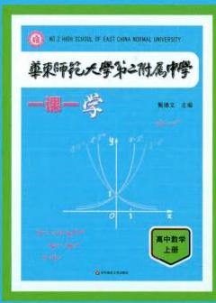

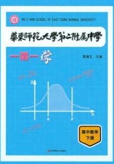

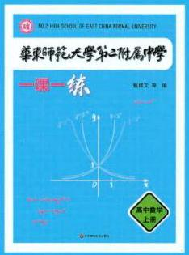

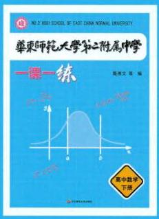

) No.2 high school of east china normal university

# 华东师范大学第二附属中学

甄德文 主编

$y = {3}^{x}$

高中数学上册

C. 华东师范大学出版社

NO.2 HIGH SCHOOL OF EAST CHINA NORMAL UNIVERSITY

# 华丽花大学第二附属中学

## 高中数学 上册

主 编 甄德文

副主编 汪 健

编 者 何一骏 吴辰骋 张成鹏 孙佳琰

18 华东师范大学出版社

- 上海 ·

图书在版编目(CIP)数据

华东师范大学第二附属中学一课一学. 高中数学 上册/ 甄德文主编. 一上海:华东师范大学出版社，2023

ISBN 978 - 7 - 5760 - 4648 - 9

I. ①华… II. ①甄… Ⅲ. ①中学数学课-高中-教学参考资料 IV. ①G634

中国国家版本馆 CIP 数据核字(2024)第 023950 号

HUADONGSHIFANDAXUE DI-ER FUSHU ZHONGXUE YIKEYIXUE 华东师范大学第二附属中学一课一学高中数学上册

主 编 甄德文

责任编辑 应向阳 芮 磊

特约审读 汤 琪 娄 鑫

责任校对 时东明

装帧设计 刘怡霖

封面插图 夏淑桐

出版发行 华东师范大学出版社

社 址 上海市中山北路 3663 号 邮编 200062

网 址 www. ecnupress. com. cn

电 话 021-60821666 行政传真 021-62572105

客服电话 021-62865537 门市(邮购) 电话 021-62869887

地址 上海市中山北路 3663 号华东师范大学校内先锋路口

网 店 http://hdsdcbs.tmall.com

印 刷 者 常熟市文化印刷有限公司

开 本 889 毫米 × 1194 毫米 × 1/16

印 张 25

字 数 585 千字

版 次 2024 年 6 月第 1 版

印 次 2024 年 6 月第 1 次

书 号 ISBN 978-7-5760-4648-9

定 价 95.00 元

出版人王 焰

(如发现本版图书有印订质量问题，请寄回本社客服中心调换或电话021-62865537联系)

## 新版前言

华东师范大学第二附属中学数学教研组(简称华二数学组)编写的《数学・高中(上、下册)》自从 2009 年出版以来，深受广大师生的喜爱，也成为不少高中学子的案头书. 我们的这套校本教学用书在兼顾了全国各版本教材内容的同时，通过“大家谈”“自己学”“自己找”等特色栏目，引导同学们畅游数学知识的海洋，感悟数学思想的精妙，发展自主学习的能力.

时光荏苒，岁月如梭，十五年弹指一挥间. 随着高中数学新版课程标准的出台和学科核心素养的提出，我们深切地感受到对校本教学用书进行修订的必要性，因而催生了如今呈现在大家面前的这套书. 相比于 2009 版，这套书在以下几个方面有了显著的变化.

## 一、单元设置

为匹配新课标的要求，书中删除了“矩阵与行列式初步”“算法初步”等章节，强化了“导数及其应用”“概率初步”“统计初步”等新课标关注的重点内容. 同时，以“函数”“几何与代数”“概率与统计”三条课程主线为脉络，结合学校教学需要与实际教学经验，调整了部分章节的顺序， 以便更好地适应新课标、新课程、新教材. 同时，为了贯彻落实新课标注重学生个性化发展需求的理念，本套书的选材也不局限于高考要求，从而为有志于参加强基计划等国家拔尖创新人才培养项目的同学提供了可选学习材料.

## 二、例题习题

数学是一门问题驱动的学科，历史上有不少著名的问题推动了数学学科的发展. 因此，在数学学习中, 对问题的研究是必不可少的. 本套书精选了一批例题与习题, 其中有相当一部分来自近年的大型考试. 认真研习这些经过命题专家精雕细琢的问题, 对提升数学能力大有裨益. 另外, 过去十余年信息技术的飞速发展, 极大地促进了社会各方面的交流, 也改变了教与学的生态环境. 在编写本套书的过程中，我们充分关注到了这一变化，并搜罗了一些在互联网上广受好评的问题和素材作为有益的补充.

## 三、能力目标

随着人工智能时代的来临，每个人都能真切地感受到创造力在未来世界中的重要性，因为这是人类区别于机器的一个重要标志. 因此, 新课标特别强调了创新精神和实践能力的培养. 在数学学科中, 能力的具体表现有别于传统的刷题模式, 其表现为需要大家在学习数学时, 能够创造性地运用所学知识解决问题. 传统的数学教学中, 使用的问题可能在逻辑推理与数学运算方面有比较高的要求, 而在创新性的问题中, 可能需要较高的数学抽象能力或者直观想象能力, 在实践性的问题中, 数学建模能力与数据分析能力则是不可或缺的. 在本套书中, 许多素材的选择都渗透了上述想法, 同学们在学习的过程中可以慢慢体会.

在本套书中，我们还设计了“想一想”“练一练”“读一读”等三个栏目. 在“想一想”中，我们设计了一些有广度和深度的思考题, 既有对本节内容的深入思考, 又有针对相关知识的拓展与延伸；在“练一练”中，我们精选了数量不多的经典习题，力求通过少而精的练习来巩固相关基本知识和典型解题方法；在“读一读”中，我们自编了部分素材，也改编、引用了其他图书或学术期刊上的内容，期望通过平时的教学渗透数学文化，提高数学素养，更大地激发学生的学习兴趣.

参与本套书编写的老师有:甄德文、汪健、何一骏、吴辰骋、张成鹏、孙佳琰，其中甄德文、汪健负责组稿、统稿与审核. 华二数学组是一个团结合作的大家庭，在编写这套书的过程中，有些老师抽出宝贵的时间帮忙审阅稿件，有些老师提供了经典例题、习题及“读一读”的素材等. 特别是 2009 版的编写老师无私地提供了相关的电子资料，为我们改版提供了极大的便利，在此特别感谢:陈双双、刘初喜、王平、刘招川、杨汉昌、郑跃星、施洪亮、甄德文、唐立华、王海霞、陆继红、乔根凤、蔡玲玲、吴森、任念兵、蔡东山等老师.

同学们, 希望这套教学用书能为你们的高中数学学习提供有力的支持. 在使用过程中如果有任何意见和建议, 欢迎大家不吝指出, 让我们与大家共同进步!

编者

2024.04

## 目 录

第1章 集合与逻辑 / 1

1.1 集合及其表示法 / 1

1.2 集合之间的关系 / 6

1.3 集合的运算 / 10

1.4 充分条件与必要条件 / 17

1.5 反证法 / 25

第 2 章 不等式 / 31

2.1 不等式的基本性质 / 31

2.2 一元二次不等式的解法 / 34

2.3 其他不等式的解法 / 40

2.4 基本不等式及其应用 / 47

2.5 不等式的证明 / 60

第 3 章 函数的概念、性质及应用 / 66

3.1 函数 / 66

3.2 函数的基本性质 / 75

3.3 函数的应用 / 87

3.4 函数图像及其变换 / 93

第 4 章 幂函数、指数函数和对数函数 / 102

4.1 幂与指数 / 102

4.2 对数 / 105

4.3 幂函数 / 112

4.4 指数函数 / 118

4.5 反函数 / 124

4.6 对数函数的图像与性质 / 130

4.7 简单的指数方程 / 136

4.8 简单的对数方程 / 140

第 5 章 三角 / 146

5.1 任意角及其度量 / 146

5.2 任意角的正弦、余弦、正切、余切 / 153

5.3 基本三角公式和诱导公式 / 161

5.4 两角和与差的余弦、正弦和正切公式 / 170

5.5 二倍角与半角的正弦、余弦和正切公式 / 179

5.6 积化和差与和差化积公式 / 185

5.7 正弦定理、余弦定理和解三角形 / 190

第 6 章 三角函数 / 200

6.1 正弦函数和余弦函数的图像与性质 / 200

6.2 函数 $y = A\sin \left( {{\omega x} + \varphi }\right)$ 的图像与性质 / 213

6.3 正切函数的图像与性质 / 221

6.4 反三角函数 / 227

6.5 最简三角方程 / 233

第 7 章 平面向量 / 241

7.1 平面向量的概念 / 241

7.2 向量的线性运算 / 243

7.3 平面向量分解定理 / 249

7.4 向量的数量积 / 253

7.5 向量的坐标表示及其运算 / 257

7.6 向量的应用 / 263

第 8 章 复数 / 269

8.1 复数的概念 / 269

8.2 复数的代数运算 / 274

8.3 复数的几何意义 / 284

8.4 复数的三角形式 / 290

8.5 复数集中的方程 / 296

第9章 数列与数学归纳法 / 303

9.1 数列 / 303

9.2 等差数列 / 311

9.3 等比数列 / 318

9.4 数列的通项与求和 / 327

9.5 数学归纳法 / 338

9.6 数列的极限 / 349

附录 参考答案与提示 / 362

## 第 1 章 集合与逻辑

我们知道, 事物既有个性, 又有共性. 把能够确切指定的一些对象放在一起研究它们的性质, 这就是集合的由来. 集合作为一种数学语言, 可以准确、简洁地表示所要研究的对象, 更好地描述研究对象之间的关系, 且不容易产生歧义.

命题是陈述数学内容的语言, 常用的真命题也称为定理; 充分条件、必要条件则用来表述命题条件和结论之间的逻辑关系.

数学是一门逻辑性很强的学科，表述数学概念和结论、进行推理和论证，都要使用逻辑用语, 常用逻辑用语已成为数学学习、表达和交流必不可少的工具.

在本章中，我们将学习集合语言，研究集合之间的相互关系及基本运算，讨论命题条件和结论的关系，学习并掌握一些常用逻辑用语的使用. 通过 “集合与逻辑” 的学习，我们将学会运用集合的语言和符号逻辑的方式来表达数学和交流数学，对进一步的学习和研究是非常有益的.

### 1.1 集合及其表示法

## 一、集合的概念

在现实生活和数学中，常常要把一些对象放在一起，作为一个整体来研究. 例如:

(1)我校高中一年级全体学生；

(2)中国运动员在第 32 届夏季奥运会上取得金牌的赛事项目；

(3)1~100 之间的所有素数；

(4)不等式 ${2x} - 3 > 0$ 的解的全体;

(5)所有的正三角形;

(6)平面上到两个定点距离相等的点的全体;

(7)函数 $y = x$ 图像上所有的点.

我们把能够确切指定的一些对象组成的整体叫做集合，简称集. 集合中的各个对象叫做这个集合的元素.

对于一个给定的集合，集合中的元素是确定的，即任何一个对象要么是给定集合的元素， 要么不是这个集合的元素, 二者必居其一, 且只居其一. 例如, 王老师不是“我校高中一年级全体学生”组成的集合的元素. 又如, 2 是 “1 ～100 之间的所有素数”组成的集合的元素.

对于一个给定的集合，集合中的元素是各不相同的，即一个给定的集合中的任何两个元素都是不同的对象,集合中的元素不重复出现,且集合中的元素也与顺序无关.

我们把含有有限个元素的集合称为有限集, 把含有无限个元素的集合称为无限集. 从上面 7 个例子可以看出，(1)、(2)、(3)中的对象分别组成的集合是有限集，(4)、(5)、(6)、(7)中的对象分别组成的集合是无限集. 为了研究的需要，我们引进空集，规定空集不含任何元素，记作⌀. 例如，方程 ${x}^{2} + 1 = 0$ 的实数解组成的集合就是空集. 又如，两条平行的直线的公共点组成的集合也是空集.

集合通常用大写的英文字母表示，如 $A, B, C,\cdots$ ，集合的元素通常用小写的英文字母表示,如 $a, b, c,\cdots$ .

如果 $a$ 是集合 $A$ 的元素,就记作 $a \in  A$ ,读作“ $a$ 属于 $A$ ”; 如果 $a$ 不是集合 $A$ 的元素,就记作 $a \notin  A$ ,读作“ $a$ 不属于 $A$ ”. 例如,设不等式 ${2x} - 3 > 0$ 的解的全体组成的集合为 $A$ ,则 $3 \in \; A,0 \notin  A$ .

数的集合简称数集,常用的数集一般用特定的字母表示:

全体自然数组成的集合,即自然数集,记作 $\mathbf{N}$ ; 全体整数组成的集合,即整数集,记作 $\mathbf{Z}$ ; 全体有理数组成的集合，即有理数集，记作 $\mathbf{Q}$ ；全体实数组成的集合，即实数集，记作 $\mathbf{R}$ .

## 二、集合的表示方法

集合的表示方法通常有两种:列举法和描述法.

把集合中的元素不重复地一一列举出来,并且写在大括号内,这种表示集合的方法称为列举法. 例如: 方程 ${x}^{2} - {5x} + 6 = 0$ 的根组成的集合可以表示为 $\{ 2,3\}$ ; 又如,方程组 $\left\{  \begin{array}{l} x + y = 5, \\  x - y =  - 1 \end{array}\right.$ 的解组成的集合可以表示为 $\{ \left( {2,3}\right) \}$ ；再如，1~20 之间的所有素数组成的集合可以表示为 $\{ 2$ ， $3,5,7,{11},{13},{17},{19}\} .$

在大括号内，先写出集合中元素的一般形式，再画一条竖线，并在竖线的右边写上集合中所有元素具有的共同特征,即 $A = \{ x \mid  x$ 满足性质 $p\}$ ,这种表示集合的方法称为描述法. 这里 “集合中所有元素具有的共同特征”是指在该集合中的元素都具有这个特征,而不在该集合中的元素不具有这个特征. 例如,不等式 ${2x} - 3 > 0$ 的解组成的集合可表示为 $\{ x \mid  {2x} - 3 > 0\}$ ; 函数 $y = x$ 图像上的点组成的集合可表示为 $\{ \left( {x, y}\right)  \mid  y = x\}$ ; 方程 ${x}^{2} - {5x} + 6 = 0$ 的根组成的集合也可以表示为 $\left\{  {x \mid  {x}^{2} - {5x} + 6 = 0}\right\}$ ; 方程组 $\left\{  \begin{array}{l} x + y = 5, \\  x - y =  - 1 \end{array}\right.$ 的解组成的集合也可以表示为 $\left\{  {\left( {x, y}\right) \left| {\;\left\{  \begin{array}{l} x + y = 5, \\  x - y =  - 1 \end{array}\right\}  }\right. }\right.$ .

此外, 为了方便, 我们引入区间的概念, 常常用区间来表示满足某些不等式的全体实数所组成的集合.

当 $a, b \in  \mathbf{R}$ 且 $a < b$ 时,规定:

(1)满足不等式 $a \leq  x \leq  b$ 的全体实数 $x$ 所组成的集合称为闭区间，记为 $\left\lbrack  {a, b}\right\rbrack$ (如图 1- 1 所示);

(2)满足不等式 $a < x < b$ 的全体实数 $x$ 所组成的集合称为开区间，记为 $\left( {a, b}\right)$ (如图 1- 2 所示);

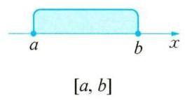

图 1-1

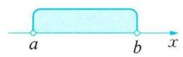

$\left( {a, b}\right)$

图 1-2

(3)满足不等式 $a \leq  x < b$ 或 $a < x \leq  b$ 的全体实数 $x$ 所组成的集合称为半开半闭区间， 分别记为 $\lbrack a, b)$ (如图 1-3 所示) 与 $(a, b\rbrack$ (如图 1-4 所示).

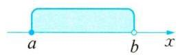

图 1-3

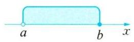

$(a, b\rbrack$

图 1-4

其中实数 $a\text{ 、 }b$ 叫做区间的端点, $b - a$ 叫做区间长度.

(4)实数集 $\mathbf{R}$ 可以表示为 $\left( {-\infty , + \infty }\right)$ ，其中“ $- \infty$ ”读作“负无穷大”，“ $+ \infty$ ”读作“正无穷大”.

此外,满足不等式 $x \geq  a, x > a, x \leq  b, x < b$ 的全体实数 $x$ 所组成的集合可依次用区间表示为 $\lbrack a, + \infty ),\left( {a, + \infty }\right) ,( - \infty , b\rbrack ,\left( {-\infty , b}\right)$ .

例 1 用适当的方法表示下列集合:

(1)30 的所有正约数组成的集合 $A$ ；

(2)被 3 除余 1 的自然数全体组成的集合 $B$ ；

(3)不等式 $- 3 <  - \frac{1}{3}x + 1 \leq  2$ 的解的全体组成的集合 $C$ ；

(4)函数 $y = {2x} + 1$ 与 $y = x - 2$ 图像的交点组成的集合 $D$ ；

(5)二次函数 $y = {x}^{2} + {2x} - 3$ 图像上的所有点组成的集合 $E$ ；

(6)坐标平面上不在第三象限的所有点组成的集合 $F$ .

解 (1) 用列举法表示: $A = \{ 1,2,3,5,6,{10},{15},{30}\}$ ; 用描述法表示: $\left\{  {x\left| {\;\frac{30}{x} \in  \mathbf{N}}\right. , x \in  \mathbf{N}}\right\}  .$

(2)用描述法表示: $B = \{ x \mid  x = {{3n} + 1}, n \in  \mathbf{N}\}$ .

(3)用描述法表示: $C = \{ x \mid   - 3 \leq  x < {12}\}$ ；用区间表示: $\lbrack  - 3,{12})$ .

(4)用列举法表示: $D = \{ \left( {-3, - 5}\right) \}$ ；用描述法表示: $\left\{  {\left( {x, y}\right) \left| {\;\left\{  \begin{array}{l} y = {2x} + 1, \\  y = x - 2 \end{array}\right\}  }\right. }\right.$ .

(5)用描述法表示: $E = \left\{  {\left( {x, y}\right)  \mid  y = {x}^{2} + {2x} - 3, x \in  \mathbf{R}}\right\}$ .

(6) 用描述法表示: $F = \{ \left( {x, y}\right)  \mid  x \geq  0$ 或 $y \geq  0\}$ .

例 2 若集合 $A = \left\{  {x \mid  a{x}^{2} - {2x} - 1 = 0, x \in  \mathbf{R}}\right\}$ 中至多有一个元素,求实数 $a$ 的取值范围.

解 当 $a = 0$ 时,方程 $- {2x} - 1 = 0$ 只有一个根 $- \frac{1}{2}$ ,即 $A = \left\{  {-\frac{1}{2}}\right\}$ ,所以 $a = 0$ 符合题意;

当 $a \neq  0$ 时,关于 $x$ 的方程 $a{x}^{2} - {2x} - 1 = 0$ 是一元二次方程,由于集合 $A$ 中至多有一个元素,则一元二次方程 $a{x}^{2} - {2x} - 1 = 0$ 有两个相等的实数根或没有实数根,所以 $\Delta  = 4 + {4a} \leq$ 0,解得 $a \leq   - 1$ .

所以,实数 $a$ 的取值范围是 $\left\{  {a \mid  a = 0}\right.$ 或 $\left. {a \leq   - 1}\right\}$ .

例 3 设 $A$ 是由一切能表示成两个整数的平方之差的全体整数组成的集合,试证明:

(1)任意奇数都是 $A$ 的元素；

(2)偶数 ${4k} - 2\left( {k \in  \mathbf{Z}}\right)$ 不属于 $A$ .

证明 设集合 $A = \left\{  {x \mid  x = {a}^{2} - {b}^{2}, a, b \in  \mathbf{Z}}\right\}$ .

(1)设任意奇数 $x = {2k} + 1, k \in  \mathbf{Z}$ ，则 $x = {k}^{2} + {2k} + 1 - {k}^{2} = {\left( k + 1\right) }^{2} - {k}^{2}$ .

因为 $k, k + 1 \in  \mathbf{Z}$ ,所以 $x \in  A$ ,即任意奇数都是 $A$ 的元素.

(2)对 $a\text{ 、 }b$ 进行分类讨论.

若 $a = {2m}, b = {2n}, m, n \in  \mathbf{Z}$ ,则 ${a}^{2} - {b}^{2} = 4\left( {{m}^{2} - {n}^{2}}\right)$ 不是 ${4k} - 2\left( {k \in  \mathbf{Z}}\right)$ 型的偶数;

若 $a = {2m} + 1, b = {2n}, m, n \in  \mathbf{Z}$ ,则 ${a}^{2} - {b}^{2} = 4\left( {{m}^{2} - {n}^{2}}\right)  + {4m} + 1$ 是奇数;

若 $a = {2m}, b = {2n} + 1, m, n \in  \mathbf{Z}$ ,则 ${a}^{2} - {b}^{2} = 4\left( {{m}^{2} - {n}^{2}}\right)  - {4n} - 1$ 是奇数;

若 $a = {2m} + 1, b = {2n} + 1, m, n \in  \mathbf{Z}$ ,则 ${a}^{2} - {b}^{2} = 4\left( {{m}^{2} - {n}^{2}}\right)  + 4\left( {m - n}\right)$ 不是 ${4k} - 2(k \in$

Z) 型的偶数.

综上所述，“偶数 ${4k} - 2\left( {k \in  \mathbf{Z}}\right)$ 不属于 $A$ ”成立.

1. 集合中的元素有哪些特征? “身材高大的人”能否组成一个集合？

2. 符号 $\varnothing ,\{ \varnothing \} ,\{ 0\}$ 有什么区别? 集合 $\{ 1,2\}$ 与 $\{ \left( {1,2}\right) \}$ 有什么区别?

3. 试比较用自然语言、列举法、描述法和区间法分别表示集合时, 其各自的特点和适用对象.

## 练一练

1 用符号 “ $\in$ ”或“ $\notin$ ” 填空:

0___ $\varnothing ,0$ ___ $\mathbf{N}, - \sqrt{9}$ ___ $\mathbf{Z},\pi$ ___ $\mathbf{Q},0$ ___ $\{ x \mid  x = {2k}, k \in  \mathbf{Z}\}$ ， 2 $\left\{  {y\left| {\;y =  - {x}^{2} + 1}\right. , x \in  \mathbf{R}}\right\}  ,\left( {4,3}\right)$ ___ $\{ \left( {x, y}\right)  \mid  y = x + 1, x \in  \mathbf{R}\}$ .

2 用适当的方法表示下列集合:

(1)全体偶数组成的集合;

(2)方程组 $\left\{  \begin{array}{l} x + y =  - 2, \\  {x}^{2} + {y}^{2} = 2 \end{array}\right.$ 的解组成的集合;

(3)方程 ${x}^{2} + {2x} - 1 = 0$ 的根组成的集合；

(4)函数 $y = {x}^{2} + {2x} - 3$ 的所有函数值组成的集合；

(5)不等式 ${x}^{2} + {2x} - 3 < 0$ 的所有解组成的集合；

(6)函数 $y =  - x - 1$ 图像上的所有点组成的集合.

3 (1)已知集合 $A = \left\{  {a + 2,{\left( a + 1\right) }^{2},{a}^{2} + {3a} + 3}\right\}$ ，且 $1 \in  A$ ，求实数 $a$ 的值；

(2)已知集合 $A = \left\{  {{a}_{1},{a}_{2},{a}_{3},{a}_{4},{a}_{5}}\right\}$ ，其中 $0 \leq  {a}_{1} < {a}_{2} < {a}_{3} < {a}_{4} < {a}_{5}$ ，若集合 $A$ 具有性质: 对任意 $i, j \in  \mathbf{Z}$ 且 $1 \leq  i \leq  j \leq  5$ ,都有 ${a}_{j} - {a}_{i} \in  A$ ,当 ${a}_{5} = {60}$ 时,求集合 $A$ .

4 已知数集 $A$ 满足条件: 若 $a \in  A$ ,则 $\frac{1}{1 - a} \in  A\left( {a \neq  1\text{ 且 }a \neq  0}\right)$ .

(1)若 $- 2 \in  A$ ，请写出符合条件且元素个数最少的集合 $A$ ；

(2)请再写出两个符合条件的集合 $A$ ；

(3)根据上述研究过程，你能得出什么结论?

5 用 $n\left( A\right)$ 表示非空集合 $A$ 中元素的个数，定义 $A * B = \left| {n\left( A\right)  - n\left( B\right) }\right|$ . 已知集合 $A = \; \left\{  {x \mid  {x}^{2} - 1 = 0}\right\}  , B = \left\{  {x \mid  \left( {a{x}^{2} + {3x}}\right) \left( {{x}^{2} + {ax} + 2}\right)  = 0}\right\}$ . 若 $A * B = 1$ ,求集合 $B$ .

## 读一读

## 集合论简介

17 世纪后半叶, 英国物理学家牛顿和德国数学家莱布尼茨在许多前辈数学家工作的基础上，分别独立地创建了微积分学. 他们建立微积分的出发点是直观的无穷小量，理论基础是不牢固的，并最终导致了第二次数学危机的产生. 19 世纪初，一些数学家开始关注微积分的严格基础, 经过半个多世纪, 初步解决了第二次数学危机. 在此期间, 德国数学家康托尔独立地建立了实数理论，并提出集合论的思想. 1873 年 11 月至 12 月, 康托尔在给德国数学家戴德金的信中，明确地提出了集合论的思想，这个时期可以看成是集合论的诞生期. 1874 年康托尔提出“集合”的概念，他对集合所下的定义是:把若干确定的有区别的(不论是具体的或抽象的)事物合并起来，看作一个整体，就称为一个集合，其中各事物称为该集合的元素.

集合论提出伊始，其关于连续性和无穷的研究结论从根本上背离了传统数学，从而引起了激烈的争论乃至遭到许多数学家严厉的谴责，由于学术观点上受到的沉重打击，康托尔曾一度患精神分裂症. 但最终经历数十年的发展, 到二十世纪初集合论终获得了数学界认可. 数学家们为一切数学成果都可建立在集合论基础上的前景而陶醉. 他们乐观地认为从算术公理系统出发，借助集合论的概念，便可以建造起整个数学的大厦. 在 1900 年第二次国际数学大会上， 法国数学家庞加莱就曾兴高采烈地宣布:“列举中数学文化了，今天，我们可以说绝对的严格已经达到了."

1902 年，英国数学家和哲学家罗素提出了著名的“罗素悖论”，如此一来，集合论是有漏洞的消息迅速传遍了数学界, 使得绝对严密的数学陷入了自相矛盾之中, 这就是数学史上的第三次数学危机. 危机产生后, 众多数学家投入解决危机的工作中去. 1908 年, 德国数学家策梅罗发表了论文《集合论基础研究》，提出公理化集合论，后经德国数学家弗伦克尔改进，形成无矛盾的集合论公理系统，简称 ZF 公理系统. 原本直观的集合概念被建立在严格的公理基础之上，从而避免了悖论的出现, 这就是集合论发展的第二个阶段: 公理化集合论. 与此相对应, 在 1908 年以前由康托尔创立的集合论被称为朴素集合论，公理化集合论是对朴素集合论的严格处理，它保留了朴素集合论中有价值的成果并消除了其可能存在的悖论, 因而较圆满地解决了第三次数学危机.

公理化集合论的建立，标志着德国数学家希尔伯特所表述的一种激情的胜利，他大声疾呼:没有人能把我们从康托尔为我们创造的乐园中赶出去. 从康托尔提出集合论至今, 时间已经过去了一百多年，在这一段时间里，数学又发生了极其巨大的变化，包括对上述经典集合论作出进一步发展的模糊集合论的出现等, 而这一切都是与康托尔的开拓性工作分不开的. 如今回头去看康托尔的贡献时，我们仍然可以引用当时一些著名数学家对他的集合论的评价作为我们的总结. 例如, 希尔伯特称康托尔的集合论是 “数学精神最令人惊羡的花朵, 人类理智活动最漂亮的成果”；罗素把康托尔的工作描述为“可能是这个时代所能夸耀的最伟大的工作”；苏联数学家科尔莫戈洛夫说:“康托尔的不朽功绩，在于他敢向无穷大冒险迈进. ”还有如“它是对无限最深刻的洞察，它是数学天才的最优秀作品，是人类纯智力活动的最高成就之一”，“康托尔的无穷集合论是过去两千五百年中对数学的最令人不安的独创性贡献之一”，等等.

### 1.2 集合之间的关系

## 一、子集

考察下列集合:

$A = \{ 1,2\} , B = \{ 1,2,3,4\} , C = \{ x \mid  x$ 是四边形 $\} , D = \{ x \mid  x$ 是多边形 $\}$ .

显然,集合 $A$ 中的任何一个元素都属于集合 $B$ ,集合 $C$ 中的任何一个元素都属于集合 $D$ .

集合之间的这种关系,我们经常遇到.

一般地,对于两个集合 $A$ 与 $B$ ,如果集合 $A$ 中任何一个元素都属于集合 $B$ ,那么集合 $A$ 叫做集合 $B$ 的子集，记作 $A \subseteq  B$ 或 $B \supseteq  A$ ，读作“ $A$ 包含于 $B$ ”或“ $B$ 包含 $A$ ”.

例如:

$$
\mathbf{N} \subseteq  \mathbf{Z} \subseteq  \mathbf{Q} \subseteq  \mathbf{R}
$$

$\{ x \mid  x = {6k}, k \in  \mathbf{Z}\}  \subseteq  \{ x \mid  x = {2m}, m \in  \mathbf{Z}\} ;$

$\{ x \mid   - 1 < x < 1\}  \supseteq  \{ x \mid  0 < x < 1\} ;$

$\{ \left( {x, y}\right)  \mid  y > 0\}  \supseteq  \{ \left( {x, y}\right)  \mid  x > 0, y > 0\} .$

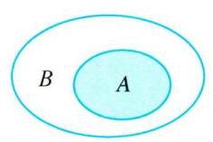

图 1-5

我们规定，空集包含于任何一个集合，即空集是任何集合的子集.

用平面区域来表示集合之间关系的方法叫做集合的图示法,所用的图叫做文氏图 (或维恩图),如图 1-5 所示,该图表示 $A \subseteq  B$ 或 $B \supseteq  A$ .

## 二、相等的集合

研究下面的集合:

$$
A = \{ 1,2\} , E = \left\{  {x \mid  {x}^{2} - {3x} + 2 = 0}\right\}  .
$$

容易发现,集合 $A$ 中的任何一个元素都属于集合 $E$ ,即 $A \subseteq  E$ ; 同时,集合 $E$ 中的任何一个元素都属于集合 $A$ ,即 $E \subseteq  A$ . 这说明集合 $A$ 中的元素与集合 $E$ 的元素完全相同.

对于两个集合 $A$ 与 $B$ ,如果有 $A \subseteq  B$ ,且 $B \subseteq  A$ ,那么叫做集合 $A$ 与集合 $B$ 相等,记作 $A = B$ ,读作“集合 $A$ 等于集合 $B$ ”. 由此可见,如果两个集合所含的元素完全相同,那么这两个集合相等.

例如: $\{ x \mid  x = {2k} - 1, k \in  \mathbf{Z}\}  = \{ x \mid  x = {2k} + 1, k \in  \mathbf{Z}\}$ ,它们都表示全体奇数组成的集合.

例 1 设集合 $A = \left\{  {a,{a}^{2},{ab}}\right\}  , B = \{ 1, a, b\}$ ，若 $A = B$ ，求实数 $a$ 、 $b$ 的值.

解 由集合相等的定义，可知

$$
\left\{  {\begin{array}{l} {a}^{2} = 1, \\  {ab} = b, \end{array}\text{ 或 }\left\{  \begin{array}{l} {a}^{2} = b, \\  {ab} = 1. \end{array}\right. }\right.
$$

由 ${a}^{2} = 1,{ab} = b$ ,解得 $\left\{  \begin{array}{l} a =  - 1, \\  b = 0 \end{array}\right.$ 或 $\left\{  \begin{array}{l} a = 1, \\  b \in  \mathbf{R} \end{array}\right.$ (舍).

由 ${a}^{2} = b,{ab} = 1$ ,得 ${a}^{3} = 1$ ,解得 $a = b = 1$ ,这与集合中元素的互异性矛盾,舍去.

所以, $a =  - 1, b = 0$ .

例 2 设集合 $A = \left\{  {x \mid  {x}^{2} - {ax} + 4 = 0, x \in  \mathbf{R}}\right\}  , B = \left\{  {x \mid  {x}^{2} - {3x} + 2 = 0}\right\}$ ,且 $A \subseteq \; B$ ,求实数 $a$ 的取值范围.

解 因为集合 $B = \left\{  {x \mid  {x}^{2} - {3x} + 2 = 0}\right\}   = \{ 1,2\}$ ，所以集合 $B$ 有 4 个子集: $\varnothing ,\{ 1\}$ ， $\{ 2\} ,\{ 1,2\}$ .

因为 $A \subseteq  B$ ,所以:

当 $A = \varnothing$ 时,方程 ${x}^{2} - {ax} + 4 = 0$ 无实数根,则 $\Delta  = {a}^{2} - {16} < 0$ ,得 $- 4 < a < 4$ ;

当 $A = \{ 1\}$ 时,方程 ${x}^{2} - {ax} + 4 = 0$ 有两个相等的实根 1,由根与系数的关系可知 $a$ 无解;

当 $A = \{ 2\}$ 时,方程 ${x}^{2} - {ax} + 4 = 0$ 有两个相等的实根 2,由根与系数的关系可知 $a = 4$ ;

当 $A = \{ 1,2\}$ 时,方程 ${x}^{2} - {ax} + 4 = 0$ 有两个不相等的实根 1 和 2,由根与系数的关系可知 $a$ 无解.

所以,实数 $a$ 的取值范围是 $- 4 < a \leq  4$ .

注: 若方程 $a{x}^{2} + {bx} + c = 0\left( {a, b, c \in  \mathbf{R}, a \neq  0}\right)$ 的实数根是 ${x}_{1}$ 和 ${x}_{2}$ ,则

$$
{x}_{1} + {x}_{2} =  - \frac{b}{a},{x}_{1}{x}_{2} = \frac{c}{a}.
$$

1. 研究集合 $A = \{ \left( {x, y}\right) \left| \right| x\left| +\right| y \mid   \leq  1\} , B = \{ \left( {x, y}\right) \left| \right| x \mid   \leq  1$ 且 $\left| y\right|  \leq  1\}$ , $C = \left\{  {\left( {x, y}\right)  \mid  {x}^{2} + {y}^{2} \leq  1}\right\}$ 在平面直角坐标系中所对应的图形,并判断 $A\text{ 、 }B$ 、 $C$ 之间的关系.

## 练一练

1 确定下列每组中两个集合的包含关系或相等关系:

(1) $A = \{ m \mid  m$ 是 15 的正约数 $\}$ 与 $B = \{ 1,3,5,{15}\}$ ；

(2) $C = \{ x \mid  x = {4m}, m \in  \mathbf{Z}\}$ 与 $D = \{ x \mid  x = {2n}, n \in  \mathbf{Z}\}$ ;

(3) $E = \{ y \mid  y = {3p} - 1, p \in  \mathbf{Z}\}$ 与 $F = \{ y \mid  y = {3q} + 2, q \in  \mathbf{Z}\}$ .

2 已知集合 $M = \left\{  {m,\frac{n}{m},1}\right\}  , P = \left\{  {{m}^{2}, m + n,0}\right\}$ ,若 $M = P$ ,求 ${m}^{2024} + {n}^{2024}$ .

3 已知集合 $A = \left\{  {x \mid  {x}^{2} + x + a = 0}\right\}  , B = \left\{  {y \mid  {my} + 2 = 0}\right\}$ ，且 $A = B$ ，求实数 $a$ 和 $m$ 的值.

4 已知集合 $A = \left\{  {x \mid  {x}^{2} + {ax} + 1 = 0, x \in  \mathbf{R}}\right\}  , B = \{ 1,2\}$ ，且 $A \subseteq  B$ ，求实数 $a$ 的取值范围.

## 三、真子集

对于前面考察的集合: $A = \{ 1,2\} , B = \{ 1,2,3,4\} , C = \{ x \mid  x$ 是四边形 $\} , D = \{ x \mid  x$ 是多边形 $\}$ ,有关系 $A \subseteq  B, C \subseteq  D$ ,但集合 $B$ 中的元素 3 和 4 不属于集合 $A$ ,集合 $D$ 中的元素五边形、六边形等不属于集合 $C$ ,这是子集关系中的一种特殊关系.

对于两个集合 $A$ 与 $B$ ,如果 $A \subseteq  B$ ,并且 $B$ 中至少有一个元素不属于 $A$ (即 $B$ 不是 $A$ 的子集),那么称集合 $A$ 是集合 $B$ 的真子集,记作 $A \subset  B$ 或 $B \supset  A$ ,读作“ $A$ 真包含于 $B$ ”或“ $B$ 真包含 $A$ ”.

我们规定，空集真包含于任何一个非空集合，即空集是任何非空集合的真子集.

例如:

$\mathbf{N} \subset  \mathbf{Z} \subset  \mathbf{Q} \subset  \mathbf{R}$

$\{ x \mid  x = {6k}, k \in  \mathbf{Z}\}  \subset  \{ x \mid  x = {2m}, m \in  \mathbf{Z}\} ;$

$\{ x \mid   - 1 < x < 1\}  \supset  \{ x \mid  0 < x < 1\} ;$

$\{ \left( {x, y}\right)  \mid  y > 0\}  \supset  \{ \left( {x, y}\right)  \mid  x > 0, y > 0\} .$

例 3 (1)写出集合 $\{ a, b, c\}$ 的所有子集和真子集;

(2)求满足 $\{ 1,2\}  \subset  B \subseteq  \{ 1,2,3,4,5\}$ 的集合 $B$ .

解(1)集合 $\{ a, b, c\}$ 的所有子集为:

$$
\varnothing ,\{ a\} ,\{ b\} ,\{ c\} ,\{ a, b\} ,\{ b, c\} ,\{ a, c\} ,\{ a, b, c\} .
$$

除了 $\{ a, b, c\}$ ,其余七个子集均为集合 $\{ a, b, c\}$ 的真子集.

(2)因为集合 $B$ 至少有 3 个元素，且含 1 和 2，同时 $B$ 是集合 $\{ 1,2,3,4,5\}$ 的子集，所以集合 $B$ 可以是:

$\{ 1,2,3\} ,\{ 1,2,4\} ,\{ 1,2,5\} ,\{ 1,2,3,4\} ,\{ 1,2,3,5\} ,\{ 1,2,4,5\} ,\{ 1,2,3,4,5\} .$

例 4 已知集合 $A = \{ x \mid   - 3 \leq  x \leq  4\}$ .

(1)设集合 $B = \{ x \mid  {2m} - 1 \leq  x \leq  m + 1\}$ ，且 $B \subseteq  A$ ，求实数 $m$ 的取值范围；

(2)设集合 $C = \left\{  {y \mid  y = {x}^{2} - {2x} + a, x \in  \mathbf{R}}\right\}$ ，且 $A \subset  C$ ，求实数 $a$ 的取值范围.

解(1)若 $B = \varnothing$ ，则 ${2m} - 1 > m + 1$ ，解得 $m > 2$ ，此时 $B \subseteq  A$ ；

若 $B \neq  \varnothing$ ，由 $B \subseteq  A$ ，则得

$$
\left\{  \begin{array}{l} {2m} - 1 \leq  m + 1, \\  m + 1 \leq  4, \\  {2m} - 1 \geq   - 3, \end{array}\right.
$$

解得 $- 1 \leq  m \leq  2$ .

所以,实数 $m$ 的取值范围是 $m \geq   - 1$ .

(2)因为 $C = \left\{  {y \mid  y = {\left( x - 1\right) }^{2} + a - 1}\right\}   = \{ y \mid  y \geq  a - 1\}$ ，根据 $A \subset  C$ ，所以

$$
a - 1 \leq   - 3,
$$

解得 $a \leq   - 2$ .

所以，实数 $a$ 的取值范围是 $a \leq   - 2$ .

例 5 已知集合 $S = \{ x \mid  x = {14m} + {36n}, m \in  \mathbf{Z}, n \in  \mathbf{Z}\} , T = \left\{  {x \mid  x = {2k}, k \in  \mathbf{Z}}\right\}$ ，求证: $S = T$ .

证明 任取 $x \in  S$ ,则存在 $m, n \in  \mathbf{Z}$ ,使得 $x = {14m} + {36n} = 2\left( {{7m} + {18n}}\right)$ ,令 ${7m} + {18n} = \; k$ ,由于 $m, n \in  \mathbf{Z}$ ,所以 $k = {7m} + {18n} \in  \mathbf{Z}$ ,则 $x = {2k}, k \in  \mathbf{Z}$ ,即 $x \in  T$ ,因此 $S \subseteq  T$ ;

反之,任取 $x \in  T$ ,则存在 $k \in  \mathbf{Z}$ ,使得 $x = {2k}$ ,由 $x = {2k} = {14} \times  \left( {-{5k}}\right)  + {36} \times  \left( {2k}\right)$ ,可见当 $m =  - {5k}, n = {2k}, k \in  \mathbf{Z}$ 时, $x = {14m} + {36n}, m, n \in  \mathbf{Z}$ ,即 $x \in  S$ ,因此 $T \subseteq  S$ .

所以 $S \subseteq  T, T \subseteq  S$ ,根据相等的集合的定义可知: $S = T$ .

2. 若集合 $A = \{ 0,1\} , B = \{ x \mid  x \subseteq  A\}$ ,则 $A\text{ 、 }B$ 之间有怎样的关系呢?

3. 若一个有限集有 $n$ ( $n$ 是正整数) 个元素,则它的子集有多少个? 真子集有多少个? 想

## 练一练

5 若集合 $A = \left\{  {x \mid  \left( {a - 1}\right) {x}^{2} + {3x} - 2 = 0}\right\}$ 仅有一个真子集,求实数 $a$ 的值.

6 设集合 $A = \left\{  {x \mid  {x}^{2} - {5x} + 6 = 0}\right\}  , B = \{ x \mid  {mx} + 1 = 0\}$ ，且 $B \subset  A$ ，求实数 $m$ 的值组成的集合.

7 (1)设集合 $M = \left\{  {x\left| {\;x = m + \frac{1}{6}}\right. , m \in  \mathbf{Z}}\right\}  , T = \left\{  {x\left| {\;x = \frac{n}{2} - \frac{1}{3}}\right. , n \in  \mathbf{Z}}\right\}  , P = \; \left\{  {x\left| {\;x = \frac{p}{2} + \frac{1}{6}}\right. , p \in  \mathbf{Z}}\right\}$ ,试判断集合 $M\text{ 、 }T\text{ 、 }P$ 的关系;

(2)设集合 $A = \left\{  {y \mid  y = {x}^{2} + 1, x \in  \mathbf{N}}\right\}  , B = \left\{  {y \mid  y = {x}^{2} - {4x} + 5, x \in  \mathbf{N}}\right\}$ ，试判断集合 $A$ 、 $B$ 的关系；

(3)设集合 $U = \left\{  {\left( {x, y}\right)  \mid  {y}^{2} - {x}^{2} = 0, x, y \in  \mathbf{R}}\right\}  , V = \{ \left( {x, y}\right) \left| {y = }\right| x \mid  , x, y \in  \mathbf{R}\}$ ， 试判断集合 $U\text{ 、 }V$ 的关系.

8 设集合 $A = \{ a, a + d, a + {2d}\} , B = \left\{  {a,{aq}, a{q}^{2}}\right\}$ ，且 $A = B$ ，求实数 $q$ 的值.

9 已知集合 $A = \{ x \mid  x = {3a} + {5b}, a, b \in  \mathbf{Z}\} , B = \{ y \mid  y = {7m} + {10n}, m, n \in  \mathbf{Z}\}$ ，试判断集合 $A$ 与 $B$ 的关系并说明理由.

10 已知 $A = \{ x \mid   - 2 \leq  x \leq  2\}$ .

(1)若集合 $B = \{ x \mid  x \leq  a\}$ ，满足 $A \subseteq  B$ ，求实数 $a$ 的取值范围；

(2)若集合 $C = \{ x \mid  {2a} - 5 \leq  x \leq  a + 1\}$ ，满足 $A \subseteq  C$ ，求实数 $a$ 的取值范围；

(3)若把(2)中条件 “ $A \subseteq  C$ ” 改为 “ $C \subseteq  A$ ”，求实数 $a$ 的取值范围.

### 1.3 集合的运算

## 一、交集

考察下面两组集合:

(1)集合 $A = \{ x \mid  x$ 是我校女生 $\} , B = \{ x \mid  x$ 是我校高一学生 $\} , C = \{ x \mid  x$ 是我校高一女生\};

(2)集合 $A = \{ x \mid  x$ 是 10 的正约数 $\} , B = \{ x \mid  x$ 是 15 的正约数 $\} , C = \{ 1,5\}$ .

可以看到,在 (1) 与 (2) 中集合 $C$ 的元素都恰好是集合 $A$ 与集合 $B$ 的所有公共元素.

一般地,由集合 $A$ 和集合 $B$ 的所有公共元素组成的集合叫做 $A$ 与 $B$ 的交集,记作 $A \cap  B$ , 读作“ $A$ 交 $B$ ”，即

$$
A \cap  B = \{ x \mid  x \in  A\text{ 且 }x \in  B\} .
$$

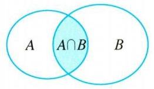

图 1-6

例如: 上述两组集合 (1) 与 (2) 均满足 $A \cap  B = C$ ; 集合 $A = \{ x \mid  x$ 是菱形 $\} , B = \{ x \mid  x$ 是矩形 $\}$ ,则 $A \cap  B = \{ x \mid  x$ 是正方形 $\}$ .

用文氏图可以直观地表示 $A \cap  B$ ,如图 1-6 所示.

由交集的定义, 可以得到以下一些基本性质:

(1) $A \cap  B = B \cap  A$ ； (2) $A \cap  A = A$ ; (3) $A \cap  \varnothing  = \varnothing$ ;

(4) $A \cap  B \subseteq  A$ ， $A \cap  B \subseteq  B$ ；

(5)若 $A \cap  B = A$ ，则 $A \subseteq  B$ ；反之，若 $A \subseteq  B$ ，则 $A \cap  B = A$ .

例 1 求下列集合的交集:

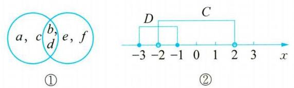

图 1-7

(1) $A = \{ a, b, c, d\} , B = \{ b, d, e, f\}$ ;

(2) $C = \left( {-2,2}\right) , D = \left\lbrack  {-3, - 1}\right\rbrack$ .

解 (1) 如图 1-7 ①所示， $A \cap  B = \{ b, d\}$ .

(2)如图1-7②所示， $C \cap  D = ( - 2, - 1\rbrack$ .

例 2 已知集合 $A = \{ \left( {x, y}\right)  \mid  {{3x} - y = 7}\} , B = \{ \left( {x, y}\right)  \mid  {{2x} + y = 3}\}$ ，求 $A \cap  B$ ，并说明其意义.

解 $A \cap  B = \left\{  {\left( {x, y}\right) \left| {\;\left\{  \begin{array}{l} {3x} - y = 7, \\  {2x} + y = 3 \end{array}\right\}  }\right. }\right.  = \left\{  {\left( {x, y}\right) \left| {\;\left\{  \begin{array}{l} x = 2, \\  y =  - 1 \end{array}\right\}  }\right. }\right.  = \{ \left( {2, - 1}\right) \}$ .

$A \cap  B$ 表示方程组 $\left\{  \begin{array}{l} {3x} - y = 7, \\  {2x} + y = 3 \end{array}\right.$ 的解的集合,也可理解为一次函数 $y = {3x} - 7$ 与 $y =$ ー2x + 3 图像的交点组成的集合.

例 3 已知集合 $P = \left\{  {x \mid  {x}^{2} + {2x} + p = 0}\right\}  , M = \{ x \mid  x < 0\}$ ,若 $P \cap  M = P$ ,求实数 $p$ 的取值范围.

解 因为 $P \cap  M = P$ ,所以 $P \subseteq  M$ ,于是集合 $P = \varnothing$ 或者集合 $P$ 中的元素都小于零.

当 $P = \varnothing$ 时,即方程 ${x}^{2} + {2x} + p = 0$ 无实根,则 $\Delta  = 4 - {4p} < 0$ ,解得 $p > 1$ ;

当 $P$ 中的元素都小于零时,即方程 ${x}^{2} + {2x} + p = 0$ 的实根 ${x}_{1}\text{ 、 }{x}_{2}$ 都是负数,则

$$
\left\{  \begin{array}{l} \Delta  = 4 - {4p} \geq  0, \\  {x}_{1} + {x}_{2} =  - 2 < 0, \\  {x}_{1}{x}_{2} = p > 0, \end{array}\right.
$$

解得 $0 < p \leq  1$ .

所以，实数 $p$ 的取值范围是 $p > 0$ .

1. 已知集合 $A = \{ \left( {x, y}\right) \left| \right| x\left| +\right| y \mid   = a, a > 0\} , B = \{ \left( {x, y}\right) \left| \right| {xy} \mid   + 1 = \; \left| x\right|  + \left| y\right| \}$ ,试问 $A \cap  B$ 中的元素所对应的点能否恰好成为平面上某个正八边形的所有顶点?

## 练一练

1 求下列集合的交集:

(1) $A = \left\{  {x \mid  {\left( x - 1\right) }^{2} < 4, x \in  \mathbf{R}}\right\}  , B = \{  - 1,0,1,2,3\}$ ;

(2) $C = \{ x \mid   - 2 < x \leq  1\} , D = \{ x \mid  0 < x \leq  3\}$ ;

(3) $P = \{ x \mid   - 5 < x < 2\} , M = \{ x \mid   - 3 < x < 3\}$ ;

(4) $M = \{ x \mid  \left( {x + 4}\right) \left( {x + 1}\right)  = 0\} , P = \{ x \mid  \left( {x - 4}\right) \left( {x - 1}\right)  = 0\}$ .

2 已知集合 $M = \left\{  {\left( {x, y}\right)  \mid  y =  - {x}^{2}, x \in  \mathbf{R}}\right\}  , P = \left\{  {\left( {x, y}\right)  \mid  y =  - 2{x}^{2} + 3, x \in  \mathbf{R}}\right\}$ , 求 $M \cap  P$ ,并说明其意义.

3 已知集合 $P = \left\{  {x \mid  {x}^{2} - {4x} + {2a} + 6 = 0, x \in  \mathbf{R}}\right\}  , M = \{ x \mid  x < 0\}$ ，若 $P \cap  M \neq  \varnothing$ ， 求实数 $a$ 的取值范围.

4 已知集合 $M = \{ y \mid  {{2x} + y = {10}, x \in  \mathbf{R}}\} , P = \{ y \mid  {{3x} - y = 5, x \in  \mathbf{R}}\}$ ，求 $M \cap  P$ .

## 二、并集

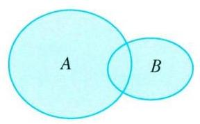

图 1-8

一般地，由所有属于集合 $A$ 或者属于集合 $B$ 的元素组成的集合叫做 $A$ 与 $B$ 的并集，记作 $A \cup  B$ ，读作“ $A$ 并 $B$ ”，即

$$
A \cup  B = \{ x \mid  x \in  A\text{ 或 }x \in  B\} .
$$

用文氏图可以直观地表示 $A \cup  B$ ，如图 1-8 所示.

例如:集合 $A = \{ x \mid  x = {2k}, k \in  \mathbf{Z}\} , B = \{ x \mid  x = {2k} - 1, k \in  \mathbf{Z}\}$ ,则 $A \cup  B = \{ x \mid  x = \; k, k \in  \mathbf{Z}\}$ ; 集合 $A = \{ x \mid  x = {3k}, k \in  \mathbf{Z}\} , B = \{ x \mid  x = {6k}, k \in  \mathbf{Z}\}$ ,则 $A \cup  B = \{ x \mid  x = {3k}$ , $k \in  \mathbf{Z}\}$ ; 集合 $A = \{ x \mid  x$ 是锐角三角形 $\} , B = \{ x \mid  x$ 是钝角三角形 $\}$ ,则 $A \cup  B = \{ x \mid  x$ 是锐角三角形或钝角三角形).

由并集的定义，可以得到以下一些基本性质:

(1) $A \cup  B = B \cup  A$ ； (2) $A \cup  A = A$ ； (3) $A \cup  \varnothing  = A$ ；

(4) $A \subseteq  A \cup  B, B \subseteq  A \cup  B$ ；

(5) 若 $A \cup  B = B$ ,则 $A \subseteq  B$ ; 反之,若 $A \subseteq  B$ ,则 $A \cup  B = B$ .

例 4 求下列集合的并集:

(1) $A = \{ x \mid   - 1 < x \leq  2\} , B = \{ x \mid  x \geq  1$ 或 $x <  - 2\}$ ;

(2) $P = \left\{  {x \mid  {x}^{2} + {2x} = 0, x \in  \mathbf{R}}\right\}  , M = \left\{  {x \mid  {x}^{2} - {2x} = 0, x \in  \mathbf{R}}\right\}$ ;

(3) $M = \left\{  {y \mid  y =  - {x}^{2}, x \in  \mathbf{R}}\right\}  , P = \left\{  {y \mid  y = 2{x}^{2} - 3, x \in  \mathbf{R}}\right\}$ .

解 (1) $A \cup  B = \{ x \mid  x <  - 2$ 或 $x >  - 1\}$ ,也可以写成 $A \cup  B = \left( {-\infty , - 2}\right)  \cup \; \left( {-1, + \infty }\right)$ .

(2)因为 $P = \left\{  {x \mid  {x}^{2} + {2x} = 0, x \in  \mathbf{R}}\right\}   = \{  - 2,0\} , M = \left\{  {x \mid  {x}^{2} - {2x} = 0, x \in  \mathbf{R}}\right\}   = \; \{ 0,2\}$ ,所以 $P \cup  M = \{  - 2,0,2\}$ .

(3)因为 $M = \left\{  {y \mid  y =  - {x}^{2}, x \in  \mathbf{R}}\right\}   = ( - \infty ,0\rbrack , P = \lbrack  - 3, + \infty )$ ，所以 $M \cup  P = \mathbf{R}$ .

例 5 已知关于 $x$ 的方程 $3{x}^{2} + {px} - 7 = 0$ 的解集为 $A$ ,方程 $3{x}^{2} - {7x} + q = 0$ 的解集为 $B$ ,若 $A \cap  B = \left\{  {-\frac{1}{3}}\right\}$ ,求 $A \cup  B$ .

解 因为 $A \cap  B = \left\{  {-\frac{1}{3}}\right\}$ ,所以 $- \frac{1}{3} \in  A$ 且 $- \frac{1}{3} \in  B$ ,代入方程得

$$
3{\left( -\frac{1}{3}\right) }^{2} + p\left( {-\frac{1}{3}}\right)  - 7 = 0\text{ 且 }3{\left( -\frac{1}{3}\right) }^{2} - 7\left( {-\frac{1}{3}}\right)  + q = 0,
$$

解得 $p =  - {20}, q =  - \frac{8}{3}$ .

由 $3{x}^{2} - {20x} - 7 = 0$ 得到 $A = \left\{  {-\frac{1}{3},7}\right\}$ ,由 $3{x}^{2} - {7x} - \frac{8}{3} = 0$ 得到 $B = \left\{  {-\frac{1}{3},\frac{8}{3}}\right\}$ .

所以 $A \cup  B = \left\{  {-\frac{1}{3},\frac{8}{3},7}\right\}$ .

例 6 已知集合 $P = \{ x \mid   - 3 \leq  x \leq  5\} , M = \{ x \mid  m - 5 \leq  x \leq  {2m} - 1\}$ ，若 $P \cup  M = \; P$ ,求实数 $m$ 的取值范围.

解 因为 $P \cup  M = P$ ,所以 $M \subseteq  P$ .

当 $M = \varnothing$ 时,则 $m - 5 > {2m} - 1$ ,解得 $m <  - 4$ ;

当 $M \neq  \varnothing$ 时,则

$$
\left\{  \begin{array}{l} m - 5 \leq  {2m} - 1, \\  {2m} - 1 \leq  5, \\  m - 5 \geq   - 3, \end{array}\right.
$$

解得 $2 \leq  m \leq  3$ .

所以,实数 $m$ 的取值范围是 $m <  - 4$ 或 $2 \leq  m \leq  3$ .

2. 若非空数集 $M$ 满足: 对任意 $x, y \in  M$ ,都有 $x + y \in  M, x - y \in  M$ ,则称 $M$ 为“好集”. 已知 $A$ 、 $B$ 都是好集，则下列结论是否正确？ 想

① $A \cap  B$ 是好集；② $A \cup  B$ 是好集；③ 若 $A \cup  B$ 是好集，则 $A \subseteq  B$ 或 $B \subseteq  A$ ； 想

④ 若 $A \cup  B$ 是好集，则 $A \cap  B$ 是好集. 你还有什么发现?

## 练一练

5 已知集合 $A = \{ 1,2, k\} , B = \{ 2,3,5\}$ ，若 $A \cup  B = \{ 1,2,3,5\}$ ，则 $k =$ ___.

6 已知集合 $A = \{ 1,3,\sqrt{m}\} , B = \{ 1, m\}$ ，若 $A \cup  B = A$ ，则 $m =$ ( ).

(A) 0 或 $\sqrt{3}$ (B) 0 或 3 (C) 1 或 $\sqrt{3}$ (D) 1 或 3

7 求下列集合的并集:

(1) $A = \{ x \mid  x >  - 2\} , B = \{ x \mid  x < 3\}$ ;

(2) $A = \{ x \mid   - 1 < x \leq  3\} , B = \{ x \mid  x \geq  4$ 或 $x < 0\}$ .

(3) $A = \{ y \mid  y = \sqrt{x}\} , B = \{ x \mid  y = \sqrt{x - 1}\}$ .

8 已知 $A = \{ 2, - 1,{x}^{2} - x + 1\} , B = \{ {2y}, - 4, x + 4\} , C = \{  - 1,7\}$ ，且 $A \cap  B = \; C$ ,求 $A \cup  B$ .

9 已知集合 $A = \{ x \mid  x \leq  2\} , B = \{ x \mid  x > a\}$ ，根据下列条件分别求实数 $a$ 的取值范围:

(1) $A \cap  B = \varnothing$ ；(2) $A \cup  B = \mathbf{R}$ ；(3) $1 \in  A \cap  B$ .

10 设集合 $A = \left\{  {x \mid  {x}^{2} - {3x} + 2 = 0}\right\}  , B = \left\{  {x \mid  {x}^{2} + 2\left( {a + 1}\right) x + \left( {{a}^{2} - 5}\right)  = 0}\right\}  ,$ 若 $A \cup  B = A$ ,求实数 $a$ 的取值范围.

## 三、补集

在研究集合与集合之间的关系时, 这些集合往往是某个给定集合的子集, 这个给定的集合叫做全集,常用符号 $U$ 表示. 也就是说,全集含有我们所要研究的各个集合的全部元素. 例如, 在研究实数的问题时,常将实数集 $\mathbf{R}$ 作为全集; 在研究图像上点的问题时,常将集合 $\{ \left( {x, y}\right)  \mid  x, y \in  \mathbf{R}\}$ 作为全集.

若 $A$ 是全集 $U$ 的子集,则由 $U$ 中所有不属于 $A$ 的元素组成的集合叫做集合 $A$ 在全集 $U$ 中的补集,记作 $\bar{A}$ 或 ${\complement }_{U}A$ ,读作“ $A$ 补”,即

$$
\bar{A} = \{ x \mid  x \in  U, x \notin  A\} .
$$

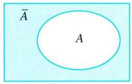

图 1-9

例如:集合 $A = \{ x \mid  x$ 是平行四边形 $\} , U = \{ x \mid  x$ 是至少有一组对边平行的四边形 $\}$ ,则 $\bar{A} = \{ x \mid  x$ 是梯形 $\}$ ; 集合 $U = \mathbf{R}, A = \; \{ x \mid  4 - x > {2x} + 1\}$ ,则 $\bar{A} = \{ x \mid  x \geq  1\}$ .

用文氏图可以直观地表示 $\bar{A}$ ，如图 1-9 所示.

由补集的定义，可以得到以下一些基本性质:

(1) $A \cap  \overline{A} = \varnothing$ ； (2) $A \cup  \overline{A} = U$ ； (3) $\overline{\bar{A}} = A$ .

例 7 已知有两组集合:

(1)全集 $U = \{ x \mid  0 \leq  x \leq  9, x \in  \mathbf{Z}\}$ ,集合 $M = \{ 4,5,6,8\} , P = \{ 3,5,7,8\}$ ;

(2)全集 $U = \mathbf{R}$ ，集合 $M = \{ x \mid   - 1 < x < 2\} , P = \{ x \mid  1 < x \leq  3\}$ .

请按要求填写表 1-1 和表 1-2.

表 1-1

<table><tr><td>组号</td><td>$M \cap  P$</td><td>$M \cup  P$</td><td>$\bar{M}$</td><td>$\bar{P}$</td></tr><tr><td>(1)</td><td></td><td></td><td></td><td></td></tr><tr><td>(2)</td><td></td><td></td><td></td><td></td></tr></table>

表 1-2

<table><tr><td>组号</td><td>$M \cap  P$</td><td>$M \cup  P$</td><td>$\bar{M} \cap  \bar{P}$</td><td>$\bar{M} \cup  \bar{P}$</td></tr><tr><td>(1)</td><td></td><td></td><td></td><td></td></tr><tr><td>(2)</td><td></td><td></td><td></td><td></td></tr></table>

解 填表如表 1-3 和表 1-4 所示.

<table id="cross-table-1"><tr><td>组号</td><td>$M \cap  P$</td><td>$M \cup  P$</td><td>$\bar{M}$</td><td>$\bar{P}$</td></tr><tr><td>(1)</td><td>\{5, 8\}</td><td>$\{ 3,4,5,6,7,8\}$</td><td>$\{ 0,1,2,3,7,9\}$</td><td>$\{ 0,1,2,4,6,9\}$</td></tr><tr><td>(2)</td><td>$\{ x \mid  1 < x < 2\}$</td><td>$\{ x \mid   - 1 < x \leq  3\}$</td><td>$\{ x \mid  x \leq   - 1$ 或 $x \geq  2\}$</td><td>$\{ x \mid  x \leq  1$ 或 $x > 3\}$</td></tr><tr></tr><tr><td>(1)</td><td>$\{ 0,1,2,3,4,6,7,9\}$</td><td>$\{ 0,1,2,9\}$</td><td>$\{ 0,1,2,9\}$</td><td>$\{ 0,1,2,3,4,6,7,9\}$</td></tr><tr><td>(2)</td><td>$\{ x \mid  x \leq  1$ 或 $x \geq  2\}$</td><td>$\{ x \mid  x \leq   - 1$ 或 $x > 3\}$</td><td>$\{ x \mid  x \leq   - 1$ 或 $x > 3\}$</td><td>$\{ x \mid  x \leq  1$ 或 $x \geq  2\}$</td></tr></table>

一般地,对任意集合 $M\text{ 、 }P$ ,都有

$$
\overline{M \cap  P} = \bar{M} \cup  \bar{P};\overline{M \cup  P} = \bar{M} \cap  \bar{P}.
$$

例 8 设全集 $U = \mathbf{R}$ ,集合 $A = \{ x \mid  x \leq  a - 1\} , B = \{ x \mid  x > a + 2\} , C = \; \{ x \mid  x < 0$ 或 $x \geq  4\}$ ,若 $\overline{A \cup  B} \subseteq  C$ ,求实数 $a$ 的取值范围.

解 因为 $a - 1 < a + 2$ ,所以 $A \cup  B = \{ x \mid  x \leq  a - 1$ 或 $x > a + 2\}$ ,于是 $\overline{A \cup  B} = \; \{ x \mid  a - 1 < x \leq  a + 2\} .$

由 $\overline{A \cup  B} \subseteq  C$ ,得 $a + 2 < 0$ 或 $a - 1 \geq  4$ ,解得 $a <  - 2$ 或 $a \geq  5$ .

3. 请用图示法验证: $\overline{M \cap  P} = \bar{M} \cup  \bar{P},\overline{M \cup  P} = \bar{M} \cap  \bar{P}$ .

4. 思考性质 “ $A \cap  \bar{A} = \varnothing , A \cup  \bar{A} = U$ ” 的意义及作用.

想

## 练一练

11 设全集 $U = \mathbf{R}$ ，下列集合运算的结果为 $\mathbf{R}$ 的是( ).

(A) $\mathbf{Z} \cup  \overline{\mathbf{N}}$ (B) $\mathbf{N} \cap  \overline{\mathbf{N}}$ (C) $\overline{\overline{\varnothing }}$ (D) $\overline{\{ 0\} }$

12 已知集合 $P = \{ x \in  \mathbf{R} \mid  1 \leq  x \leq  3\} , M = \left\{  {x \in  \mathbf{R} \mid  {x}^{2} \geq  4}\right\}$ ，则 $P \cup  \bar{M} =$ ___.

13 分别用集合符号表示下列图中的阴影部分:

(1)

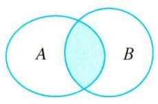

(2)

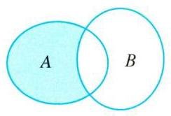

(4)

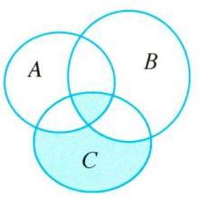

(3)

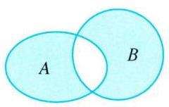

14 设全集 $I = \{ x \mid  x$ 为三角形 $\} , A = \{ x \mid  x$ 为锐角三角形 $\} , B = \{ x \mid  x$ 为钝角三角形 $\}$ , $C = \{ x \mid  x$ 为直角三角形 $\} , D = \{ x \mid  x$ 为斜三角形 $\}$ ,求 $\overline{A \cup  B} \cap  \overline{C \cup  D}$ .

15 已知全集 $U = \{ x \mid  x$ 是质数且 $x \leq  {20}\} , A\text{ 、 }B$ 是 $U$ 的子集,且满足 $A \cap  \bar{B} = \{ 3,5\}$ , $\bar{A} \cap  B = \{ 7,{19}\} ,\bar{A} \cap  \bar{B} = \{ 2,{17}\}$ ,求集合 $A$ 和 $B$ .

16 设全集 $U = \{ \left( {x, y}\right)  \mid  x, y \in  \mathbf{R}\}$ ,集合 $A = \left\{  {\left( {x, y}\right) \left| {\;\frac{y - 3}{x - 2} = 1}\right. , x \in  \mathbf{R}}\right\}$ .

(1)若集合 $B = \{ \left( {x, y}\right)  \mid  y = x + 1, x, y \in  \mathbf{R}\}$ ，求 $\overline{A} \cap  B$ ；

(2)若集合 $B = \{ \left( {x, y}\right)  \mid  y \neq  x + 1, x, y \in  \mathbf{R}\}$ ，求 $\overline{A \cup  B}$ .

## 读一读

## 容斥原理及其应用

在计数时，为了使重复部分不被重复计算，人们研究出一种新的计数方法，这种方法的基本思想是:先不考虑重复的情况，把包含于某内容中的所有对象的数目计算出来，然后再把计数时重复计算的数目减去, 使得计算的结果既无遗漏又无重复, 这种计数的方法称为容斥原理. 对于有限集合 $P$ ,我们用 $n\left( P\right)$ 表示 $P$ 中的元素个数.

容斥原理(1)

如果被计数的事物有 $A\text{ 、 }B$ 两类,那么, $A$ 类或 $B$ 类元素个数 $= A$ 类元素个数 $+ B$ 类元素个数一既是 $A$ 类又是 $B$ 类的元素个数,即

$$
n\left( {A \cup  B}\right)  = n\left( A\right)  + n\left( B\right)  - n\left( {A \cap  B}\right) .
$$

容斥原理(2)

如果被计数的事物有 $A\text{ 、 }B\text{ 、 }C$ 三类,那么, $A$ 类或 $B$ 类或 $C$ 类元素个数 $= A$ 类元素个数 $+ B$ 类元素个数 $+ C$ 类元素个数一既是 $A$ 类又是 $B$ 类的元素个数一既是 $A$ 类又是 $C$ 类的元素个数一既是 $B$ 类又是 $C$ 类的元素个数十既是 $A$ 类又是 $B$ 类而且是 $C$ 类的元素个数, 即

$n\left( {A \cup  B \cup  C}\right)  = n\left( A\right)  + n\left( B\right)  + n\left( C\right)  - n\left( {A \cap  B}\right)  - n\left( {B \cap  C}\right)  - n\left( {C \cap  A}\right)  + n\left( {A \cap  B \cap  C}\right)$ .

例:对某学校的 100 名学生进行调查，了解他们喜欢看球赛、看电影和听音乐的情况，发现他们每人至少喜欢其中一种. 通过调查可知, 有 58 人喜欢看球赛, 有 38 人喜欢看电影, 有 52 人喜欢听音乐，既喜欢看球赛又喜欢看电影的有 18 人，既喜欢听音乐又喜欢看电影的有 16 人，三种都喜欢的有 12 人，问:有多少人只喜欢听音乐?

解: 设 $A = \{ x \mid  x$ 为喜欢看球赛的人 $\} , B = \{ x \mid  x$ 为喜欢看电影的人 $\} , C = \{ x \mid  x$ 为喜欢听音乐的人\},则 $A \cap  B = \{ x \mid  x$ 为既喜欢看球赛又喜欢看电影的人 $\} , B \cap  C = \{ x \mid  x$ 为既喜欢听音乐又喜欢看电影的人 $\} , A \cap  B \cap  C = \{ x \mid  x$ 为三种都喜欢的人 $\} , A \cup  B \cup  C = \{ x \mid  x$ 为看球赛、看电影和听音乐中至少喜欢一种的人\}. 由已知可得

$$
n\left( A\right)  = {58}, n\left( B\right)  = {38}, n\left( C\right)  = {52}, n\left( {A \cap  B}\right)  = {18},
$$

$$
n\left( {B \cap  C}\right)  = {16}, n\left( {A \cap  B \cap  C}\right)  = {12}, n\left( {A \cup  B \cup  C}\right)  = {100}.
$$

因为 $n\left( {A \cup  B \cup  C}\right)  = n\left( A\right)  + n\left( B\right)  + n\left( C\right)  - n\left( {A \cap  B}\right)  - n\left( {B \cap  C}\right)$

$$
- n\left( {C \cap  A}\right)  + n\left( {A \cap  B \cap  C}\right) ,
$$

所以 $n\left( {C \cap  A}\right)  = n\left( A\right)  + n\left( B\right)  + n\left( C\right)  - n\left( {A \cup  B \cup  C}\right)  - n\left( {A \cap  B}\right)$

$$
- n\left( {B \cap  C}\right)  + n\left( {A \cap  B \cap  C}\right)
$$

$$
= {148} - \left( {{100} + {18} + {16} - {12}}\right)  = {26}\text{ , }
$$

于是,只喜欢听音乐的人共有 $n\left( C\right)  - n\left( {B \cap  C}\right)  - n\left( {C \cap  A}\right)  + n\left( {A \cap  B \cap  C}\right)  = {52} - {16} - \; {26} + {12} = {22}$ (人).

容斥原理还可以推广到更一般的情况, 有兴趣的同学可查阅相关资料去进一步了解.

### 1.4 充分条件与必要条件

## 一、命题

在初中，我们已经知道，可以判断真假的语句叫做命题. 命题通常用陈述句表述. 正确的命题叫做真命题，错误的命题叫做假命题.

一般地，在数学中常见的命题由条件和结论两部分组成. 条件是已知事项；结论是由已知事项推出的事项. 命题常写成“如果……，那么……”的形式. 具有这种形式的命题中，用“如果” 开始的部分是条件，用 “那么”开始的部分是结论.

有些命题, 没有写成 “如果……，那么 ······”的形式，条件和结论不明显. 对于这样的命题， 经过分析可以找出条件和结论, 也可以将它们改写成 “如果……，那么……”的形式.

命题的条件部分，有时也可用 “已知····”“或者“若……”等形式表述；命题的结论部分，有时也可用“则……”等形式表述.

例 1 判断下列语句是否为命题？如果是命题，那么它们是真命题还是假命题？为什么？

(1)你是高一学生吗?

(2)上课请不要睡觉；

(3)个位数是 0 的自然数能被 5 整除；

(4)互为余角的两个角不相等;

(5)如果两个三角形的三个内角分别对应相等，那么这两个三角形相似；

(6)形如 ${F}_{n} = {2}^{{2}^{n}} + 1\left( {n \in  \mathbf{N}}\right)$ 的数都是质数.

解(1)、(2)不是命题，(3)、(4)、(5)、(6)是命题，其中(4)、(6)是假命题.

(1)“你是高一学生吗？” 是问句，不是表示判断的陈述句，所以它不是命题.

(2)“上课请不要睡觉”不是判断句，所以它也不是命题.

(3)因为个位数是 0 的自然数总可以表示为 ${10k}\left( {k \in  \mathbf{N}}\right)$ 的形式，而 ${10k} = 5 \cdot  {2k}$ ，所以 ${10k}$ 能被 5 整除, 即 “个位数是 0 的自然数能被 5 整除”是一个真命题.

(4)取一个角为 ${45}^{ \circ  }$ ，另一个角也为 ${45}^{ \circ  }$ ，它们互为余角，但是它们是相等的，所以 “互为余角的两个角不相等”是一个假命题.

(5) 这个命题是三角形相似的一个判定定理, 在初中数学中已经给出证明, 所以这是一个真命题.

(6)这个问题是法国数学家费尔马于 1640 年前后提出的，他在验算形如 ${F}_{n} = {2}^{{2}^{n}} + 1$ 的数， 发现当 $n = 0,1,2,3,4$ 时,该数的值分别为3,5,17,257,65537,且都是质数,于是便猜想: 对任意 $n \in  \mathbf{N}$ ，都有 ${F}_{n} = {2}^{{2}^{n}} + 1$ 为质数. 大约过了 100 年，即 1732 年瑞士数学家欧拉指出 ${F}_{5} = \; {2}^{{2}^{5}} + 1 = {641} \times  {6700417}$ 不是质数,从而否定了费尔马的猜想. 所以 “形如 ${F}_{n} = {2}^{{2}^{n}} + 1\left( {n \in  \mathbf{N}}\right)$ 的数都是质数”是一个假命题.

由(4)、(6)可以看到，要确定一个命题是假命题，只要举出一个满足命题的条件，但不满足其结论的例子即可, 这在数学中称为 “举反例”.

要确定一个命题是真命题，就必须给出证明，证明若满足命题的条件就一定能推出命题的结论.

一般地，如果事件 $\alpha$ 成立可以推出事件 $\beta$ 也成立，那么就说由 $\alpha$ 可以推出 $\beta$ ，并用记号 $\alpha  \Rightarrow  \beta$ 表示，读作“ $\alpha$ 推出 $\beta$ ”. 换言之， $\alpha  \Rightarrow  \beta$ 表示以 $\alpha$ 为条件， $\beta$ 为结论的命题是真命题.

如果事件 $\alpha$ 成立，而事件 $\beta$ 不能成立，那么就说事件 $\alpha$ 不能推出事件 $\beta$ 成立，可记作 $\alpha  \nRightarrow  \beta$ . 换言之， $\alpha  \nRightarrow  \beta$ 表示以 $\alpha$ 为条件， $\beta$ 为结论的命题是一个假命题.

如果 $\alpha  \Rightarrow  \beta$ ,并且 $\beta  \Rightarrow  \alpha$ ,那么记作 $\alpha  \Leftrightarrow  \beta$ ,叫做 $\alpha$ 与 $\beta$ 等价.

例如:

$\alpha  : \angle A$ 与 $\angle B$ 互为余角; $\beta  : \angle A$ 与 $\angle B$ 不相等. $\alpha  \Rightarrow  \beta ,\beta  \neq  \alpha$ .

$\alpha  : \angle A$ 与 $\angle B$ 互为余角; $\beta  : \angle A$ 与 $\angle B$ 不相等. $\alpha  \nRightarrow  \beta ,\beta  \neq  \alpha$ .

$\alpha$ : 两个三角形的三个内角分别对应相等; $\beta$ : 这两个三角形相似. $\alpha  \Leftrightarrow  \beta$ .

$\alpha  : x > y;\beta  : \frac{1}{x} < \frac{1}{y}.\alpha  \nRightarrow  \beta ,\beta  \neq  \alpha .$

推出关系满足传递性: 如果 $\alpha  \Rightarrow  \beta ,\beta  \Rightarrow  \gamma$ ,那么 $\alpha  \Rightarrow  \gamma$ .

我们从推出关系来看下面的证明过程:

$\alpha$ : 自然数 $n$ 的个位数是 $5 \Rightarrow  {\alpha }_{1} : n = {10k} + 5, k \in  \mathbf{N} \Rightarrow  {\alpha }_{2} : n = 5\left( {{2k} + 1}\right) ,{2k} + 1 \in  \mathbf{N} \Rightarrow  \beta  : n$ 能被 5 整除. 即

$$
\alpha  \Rightarrow  {\alpha }_{1} \Rightarrow  {\alpha }_{2} \Rightarrow  \beta \text{ . }
$$

上述推导过程表明,要证明 “如果 $\alpha$ ,那么 $\beta$ ” 正确,可以先设法找到一系列适当而正确的命题 $\alpha  \Rightarrow  {\alpha }_{1},{\alpha }_{1} \Rightarrow  {\alpha }_{2},\cdots ,{\alpha }_{n} \Rightarrow  \beta$ ; 再用推出关系的传递性就可得到 $\alpha  \Rightarrow  \beta$ . 这是证明一个命题为真命题的基本方法.

1. 推出关系“ $\Rightarrow$ ”是一种关系符号，这种关系具有传递性，你能再举出一些具有传递性的关系符号吗?

## 练一练

1 判断下列命题的真假:

(1)素数是奇数；

(2)所有能被 2 整除的整数都是偶数；

(3)任意一个集合至少有两个不相等的子集；

(4)空集是任何集合的真子集；

(5)任意两个有理数之间存在无穷多个有理数；

(6)全等三角形对应边上的高相等.

2 用“ $\Rightarrow$ ”“ $\Leftarrow$ ”“ $\Leftrightarrow$ ”等符号表示下列陈述句 $\alpha$ 与 $\beta$ 之间的推出关系:

(1) $\alpha  :  \bigtriangleup  {ABC}$ 是等边三角形； $\beta  :  \bigtriangleup  {ABC}$ 是中心对称图形.

(2) $\alpha  : a > b, c > d;\beta  : a + c > b + d$ .

(3) $\alpha$ :在反比例函数 $y = \frac{k}{x}$ 中， $k < 0$ ； $\beta$ :在反比例函数 $y = \frac{k}{x}$ 中，当 $x > 0$ 时， $y$ 随 $x$ 的增大而减小.

(4)对于集合 $A\text{ 、 }B\text{ 、 }C,\alpha  : A \subseteq  C;\beta  : A \cup  B = B \cap  C$ .

## 二、充分条件、必要条件

在日常生活中, 做一件事情往往需要具备一定的条件, 有的条件能够保证完成这件事, 而有的条件虽然不能保证完成这件事,但却是完成它所必不可少的.

例如, 用 20 元钱买一本 19.80 元的书, 那么就价格而言, “20 元钱”就是 “买一本 19.80 元的书”的足够的条件，即“充分条件”.

又如，用水将米煮成饭，那么“水”就是“米煮成饭”必不可少的条件，即“必要条件”。

在数学中，若要得出一个结论，同样需要具备一定的条件.

例如，从“某个整数是 6 的倍数”可以推出“该整数是 3 的倍数”，即“某个整数是 6 的倍数” 是“该整数是 3 的倍数”的充分条件.

又如,从“两个三角形面积相等”不能推出“这两个三角形全等”,但“两个三角形面积相等” 是“这两个三角形全等”必不可少的条件，即“两个三角形面积相等”是“这两个三角形全等”的必要条件.

一般地,用 $\alpha \text{ 、 }\beta$ 分别表示两个事件,如果事件 $\alpha$ 成立,可以推出事件 $\beta$ 也成立,即 $\alpha  \Rightarrow  \beta$ ,那么称 $\alpha$ 是 $\beta$ 的充分条件, $\beta$ 是 $\alpha$ 的必要条件.

例如:

(1)“某个整数是 6 的倍数”是“该整数是 3 的倍数”的充分条件; “某个整数是 3 的倍数”是 “该整数是 6 的倍数”的必要条件.

(2)“两个三角形面积相等”是“这两个三角形全等”的必要条件；不巧个三角形全等”是“这两个三角形面积相等”的充分条件.

(3)“ $0 < x < 1$ ” 是 “ $0 < {x}^{2} < 1$ ” 的充分条件； “ $0 < {x}^{2} < 1$ ” 是 “ $0 < x < 1$ ” 的必要条件.

关于 “ $\alpha$ 是 $\beta$ 的充分条件” 的理解是容易的，即为了使 $\beta$ 成立，具备条件 $\alpha$ 就足够了，亦即 “有它即可”; 而对于 “ $\beta$ 是 $\alpha$ 的必要条件” 可以这样理解:若没有条件 $\beta$ ，则条件 $\alpha$ 不能成立，即 “非它不行”.

以命题“对顶角相等”为例. 由于两个角是对顶角就足以保证这两个角相等，因此“两个角是对顶角”是“这两个角相等”的充分条件; 而如果两个角不相等，那么它们必定不可能是对顶角，所以说，“两个角相等”是“这两个角是对顶角”的必要条件.

在判断两个命题的条件关系时，通常既要指明充分性，又要指明必要性，例如:

(4) $\alpha$ :四边形对角线相等； $\beta$ :这个四边形是矩形. 因为 $\alpha  \nRightarrow  \beta$ ，所以 “四边形对角线相等”，不是 “这个四边形是矩形” 的充分条件；而因为 $\beta  \Rightarrow  \alpha$ ，所以 “四边形对角线相等” 是 “这个四边形是矩形”的必要条件. 此时称“四边形对角线相等”是 “这个四边形是矩形” 的必要非充分条件.

## 三、充分必要条件

如果既有 $\alpha  \Rightarrow  \beta$ ,又有 $\beta  \Rightarrow  \alpha$ ,即 $\alpha  \Leftrightarrow  \beta$ ,那么 $\alpha$ 既是 $\beta$ 的充分条件,又是 $\beta$ 的必要条件,这时我们称 $\alpha$ 是 $\beta$ 的充分必要条件,简称充要条件.

例如，已知 $a$ 、 $b$ 为实数，则 “ $\left| a\right|  = \left| b\right|$ ” 是 “ ${a}^{2} = {b}^{2}$ ” 的充要条件.

“三角形的三个内角相等”是“三角形是等边三角形”的充要条件.

当然,对于 $\alpha \text{ 、 }\beta$ 两个事件而言, $\alpha$ 与 $\beta$ 之间不一定有充分条件或必要条件的关系. 例如,当 $a, b \in  \mathbf{R}$ 时, $a + b > 0$ 既不是 ${ab} > 0$ 的充分条件,也不是必要条件.

例 2 判断下列各组中 $p$ 是 $q$ 的什么条件? 并说明理由.

(1) $p : a$ 与 $b$ 都是奇数； $\;q : a + b$ 是偶数.

(2) $p :  \bigtriangleup  {ABC}$ 是直角三角形； $q :  \bigtriangleup  {ABC}$ 有两个内角分别为 ${30}^{ \circ  }$ 、 ${60}^{ \circ  }$ .

(3) $p : {a}^{2} > {b}^{2}$ ； $q : a > b.$

(4) $p : 0 < m < \frac{1}{3}$ ； $q$ : 方程 $m{x}^{2} - {2x} + 3 = 0$ 有两个同号且不相等的实数根.

解 (1) 因为 $p \Rightarrow  q, q \nRightarrow  p$ ,所以 $p$ 是 $q$ 的充分非必要条件.

(2)因为 $p \nRightarrow  q, q \Rightarrow  p$ ，所以 $p$ 是 $q$ 的必要非充分条件.

(3)因为 $p \nRightarrow  q, q \nRightarrow  p$ ，所以 $p$ 是 $q$ 的既非充分也非必要条件.

(4)因为方程 $m{x}^{2} - {2x} + 3 = 0$ 有两个同号且不相等的实数根等价于

$$
\left\{  {\begin{array}{l} m \neq  0, \\  \Delta  = {2}^{2} - 4 \cdot  m \cdot  3 > 0, \\  {x}_{1}{x}_{2} = \frac{3}{m} > 0 \end{array} \Leftrightarrow  0 < m < \frac{1}{3},}\right.
$$

即 $p \Leftrightarrow  q$ ,所以 $p$ 是 $q$ 的充要条件.

例 3 已知四边形 ${ABCD}$ 是凸四边形, ${AC}\text{ 、 }{BD}$ 为对角线,那么 “ ${AC} \bot  {BD}$ ” 是 “四边形 ${ABCD}$ 为正方形”的什么条件? 为什么?

解 因为正方形的对角线互相垂直，所以 “ ${AC} \bot  {BD}$ ” 是 “四边形 ${ABCD}$ 为正方形” 的必要条件,但 “ ${AC} \bot  {BD}$ ” 不是 “四边形 ${ABCD}$ 为正方形” 的充分条件,这是因为 ${AC} \bot  {BD}$ 时,四边形不一定是正方形. 例如, 菱形的对角线也是互相垂直的.

因此,“ ${AC} \bot  {BD}$ ” 是 “四边形 ${ABCD}$ 为正方形” 的必要非充分条件.

例 4 (1)写出 $x < 0$ 的一个必要非充分条件；

(2)写出函数 $y = \left( {{m}^{2} - 4}\right) {x}^{2{n}^{2} - {3n}}$ 为反比例函数的一个充分非必要条件.

解 本题答案是不唯一的.

(1)因为 $x < 0 \Rightarrow  x < 1$ ,但 $x < 1 \nRightarrow  x < 0$ ,所以 $x < 0$ 的一个必要非充分条件是 $x < 1$ .

(2)因为函数 $y = \left( {{m}^{2} - 4}\right) {x}^{2{n}^{2} - {3n}}$ 为反比例函数的充要条件是

$$
\left\{  \begin{array}{l} {m}^{2} - 4 \neq  0, \\  2{n}^{2} - {3n} =  - 1, \end{array}\right.
$$

解得 $\left\{  \begin{array}{l} m \neq   - 2\text{ 且 }m \neq  2, \\  n = 1\text{ 或 }n = \frac{1}{2}, \end{array}\right.$ 所以函数 $y = \left( {{m}^{2} - 4}\right) {x}^{2{n}^{2} - {3n}}$ 为反比例函数的一个充分非必要条件可以是: $m = 3, n = 1$ ,或 $m = 3, n = \frac{1}{2}$ ,等等.

例 5 已知实系数一元二次方程 $a{x}^{2} + {bx} + c = 0\left( {a \neq  0}\right)$ ,求证: “方程 $a{x}^{2} + {bx} + c = 0$ 有两个相等的实数根”的充要条件是 “ ${b}^{2} - {4ac} = 0$ ”.

证明 充分性: 将方程 $a{x}^{2} + {bx} + c = 0\left( {a \neq  0}\right)$ 变形为

$$
a{\left( x + \frac{b}{2a}\right) }^{2} = \frac{{b}^{2} - {4ac}}{4a}.
$$

因为 ${b}^{2} - {4ac} = 0$ ,得 ${x}_{1} = {x}_{2} =  - \frac{b}{2a}$ ,所以 “ ${b}^{2} - {4ac} = 0$ ” 是 “方程 $a{x}^{2} + {bx} + c = 0(a \neq$ 0) 有两个相等的实数根”的充分条件.

必要性: 如果方程 $a{x}^{2} + {bx} + c = 0\left( {a \neq  0}\right)$ 有两个相等的实数根 ${x}_{1} = {x}_{2}$ ,那么由方程根与系数的关系得

$$
\left\{  \begin{array}{l} {x}_{1} + {x}_{2} = 2{x}_{1} =  - \frac{b}{a}, \\  {x}_{1} \cdot  {x}_{2} = {x}_{1}^{2} = \frac{c}{a}, \end{array}\right.
$$

于是 ${\left( -\frac{b}{2a}\right) }^{2} = \frac{c}{a}$ ,即 ${b}^{2} - {4ac} = 0$ ,所以 “ ${b}^{2} - {4ac} = 0$ ” 是 “方程 $a{x}^{2} + {bx} + c = 0\left( {a \neq  0}\right)$ 有两个相等的实数根”的必要条件.

综上所述,“方程 $a{x}^{2} + {bx} + c = 0\left( {a \neq  0}\right)$ 有两个相等的实数根” 的充要条件是 " ${b}^{2} - {4ac} = 0$ ".

2. 已知集合 $A$ 与 $B$ ,则 $A \subseteq  B$ 的充要条件有哪些?

## 练一练

3 如果 $M\text{ 、 }P$ 为非空集合,那么 $M \cup  P = M$ 是 $P \subset  M$ 的 ( ).

(A) 充要条件 (B) 充分非必要条件

(C) 必要非充分条件 (D) 既非充分也非必要条件

4 设 ${x}_{1}\text{ 、 }{x}_{2}$ 是一元二次方程 $a{x}^{2} + {bx} + c = 0$ 的两个实根,则 ${x}_{1} > 2,{x}_{2} > 2$ 成立的一个必要非充分条件是( ).

(A) $\left\{  \begin{array}{l} {x}_{1} + {x}_{2} > 6, \\  {x}_{1} \cdot  {x}_{2} > 8 \end{array}\right.$ (B) $\left\{  \begin{array}{l} {x}_{1} + {x}_{2} < 4, \\  {x}_{1} \cdot  {x}_{2} < 4 \end{array}\right.$

(C) $\left\{  \begin{array}{l} {x}_{1} + {x}_{2} > 4, \\  \left( {{x}_{1} - 2}\right)  \cdot  \left( {{x}_{2} - 2}\right)  > 0 \end{array}\right.$ (D) $\left\{  \begin{array}{l} {x}_{1} + {x}_{2} > 4, \\  {x}_{1} \cdot  {x}_{2} > 4 \end{array}\right.$

5 若 $a\text{ 、 }b\text{ 、 }c$ 都是实数，试从 (A) ${ab} = 0$ ，(B) $a + b = 0$ ，(C) ${a}^{2} + {b}^{2} = 0$ ，(D) ${ab} > 0$ ， (E) $a + b > 0$ ,(F) ${a}^{2} + {b}^{2} > 0$ 中分别选出适合下列条件的代号填入空格中.

(1)使 $a$ 、 $b$ 都是 0 的充分条件是___；

(2)使 $a$ 、 $b$ 都不是 0 的充分条件是___；

(3)使 $a$ 、 $b$ 中至少有一个是 0 的充要条件是___；

(4)使 $a$ 、 $b$ 中至少有一个不是 0 的充要条件是___.

6 判断下列各组中 $p$ 是 $q$ 的什么条件? 并说明理由.

(1) $p$ :四边形的四条边相等； $q$ :四边形是正方形.

(2) $p : x \neq  3;q : \left| x\right|  \neq  3$ .

(3) $p : x - 1 = 0;q : {x}^{2} - 1 = 0$ .

(4) $p$ :两个三角形至少有一组对应边相等； $q :$ 两个三角形全等.

(5) $p :$ 一个自然数的个位数字是 $5;q :$ 一个自然数能被 5 整除.

(6) $p$ : 整数 $a\text{ 、 }b$ 满足 ${a}^{2} + {b}^{2} < 5;q$ : 整数 $a\text{ 、 }b$ 满足 $a + b \leq  2$ .

7 已知集合 $A = \left\{  {x \mid  {x}^{2} + x - 6 = 0}\right\}  , B = \{ x \mid  {ax} + 1 = 0\}$ ，写出 $B \subset  A$ 的一个充分而非必要条件, 并说明理由.

8 已知关于 $x$ 的方程 $\left( {1 - a}\right) {x}^{2} + \left( {a + 2}\right) x - 4 = 0, a \in  \mathbf{R}$ ,求:

(1)方程有两个正根的充要条件；

(2)方程至少有一个正根的充要条件.

9 设 $\bigtriangleup {ABC}$ 的三边长为 $a\text{ 、 }b\text{ 、 }c$ ,求证:二次方程 ${x}^{2} + {2ax} + {b}^{2} = 0,{x}^{2} + {2cx} - {b}^{2} = 0$ 有一个公共根的充要条件是 $\angle A = {90}^{ \circ  }$ .

10 已知 $p$ 是 $r$ 的充分非必要条件, $q$ 是 $r$ 的充分条件, $s$ 是 $r$ 的必要条件, $q$ 是 $s$ 的必要条件,现有下列命题:① $r$ 是 $q$ 的充要条件; ② $p$ 是 $q$ 的充分非必要条件; ③ $r$ 是 $q$ 的必要非充分条件; ④非 $p$ 是非 $s$ 的必要非充分条件; ⑤ $r$ 是 $s$ 的充分非必要条件. 上述命题中哪些是真命题?

## 四、子集与推出关系

我们知道,由 $x < 0$ 可以推出 $x < 1$ ,即 $x < 0$ 是 $x < 1$ 的充分条件. 如果把 $x < 0$ 和 $x <$ 1 分别看成是构成集合 $A$ 和 $B$ 的元素所具有的性质,那么集合 $A = \{ x \mid  x < 0\}$ ,集合 $B = \{ x \mid \; x < 1\}$ . 对于任意 $x \in  A$ ,即有 $x < 0$ ,而由于 $x < 0$ 是 $x < 1$ 的充分条件,所以可推得 $x < 1$ , 即 $x \in  B$ ,因此 $A \subseteq  B$ ; 反之亦然. 由此可见,集合间的子集关系可与相应集合元素性质的推出关系建立联系.

设集合 $A = \{ x \mid  x$ 具有性质 $\alpha \} , B = \{ x \mid  x$ 具有性质 $\beta \}$ ,且 $A$ 与 $B$ 都是非空集合,下面证明: $A \subseteq  B$ 是 $\alpha  \Rightarrow  \beta$ 的充要条件.

(1)充分性:设 $x$ 具有性质 $\alpha$ ,则 $x \in  A$ ,由 $A \subseteq  B$ ,得 $x \in  B$ ,则 $x$ 具有性质 $\beta$ ,所以 $\alpha  \Rightarrow  \beta$ .

(2)必要性:设任意 $x \in  A$ ，则 $x$ 具有性质 $\alpha$ ，由 $\alpha  \Rightarrow  \beta$ ，得 $x$ 具有性质 $\beta$ ，则 $x \in  B$ ，所以 $A \subseteq  B$ .

综上所述， $A \subseteq  B$ 是 $\alpha  \Rightarrow  \beta$ 的充要条件，即 $A \subseteq  B$ 与 $\alpha  \Rightarrow  \beta$ 等价.

鉴于上述证明,我们在研究某些命题的推出关系时,可以应用集合间的包含关系来处理问题.

例 6 试用子集与推出关系来说明 $\alpha$ 是 $\beta$ 的什么条件:

(1) $\alpha  : x = 1;\beta  : {x}^{2} - {3x} + 2 = 0$ .

(2) $\alpha  : x < 1;\beta  : \frac{1}{x} > 1$ .

解 (1) 设集合 $A = \{ x \mid  x = 1\} , B = \left\{  {x \mid  {x}^{2} - {3x} + 2 = 0}\right\}$ ,即 $A = \{ 1\} , B = \{ 1,2\}$ ,因为 $A \subset  B$ ,所以 $\alpha  \Rightarrow  \beta$ ,而 $\beta  \nRightarrow  \alpha$ ,即 $\alpha$ 是 $\beta$ 的充分非必要条件.

(2)设集合 $A = \{ x \mid  x < 1\} , B = \left\{  {x\left| {\;\frac{1}{x} > 1}\right. }\right\}$ ，由于 $B = \{ x \mid  0 < x < 1\}$ ，可得 $B \subset  A$ ，所以 $\beta  \Rightarrow  \alpha$ ,而 $\alpha  \nRightarrow  \beta$ ,即 $\alpha$ 是 $\beta$ 的必要非充分条件.

例 7 试用子集与推出关系来说明 $\alpha$ 是 $\beta$ 的什么条件:

(1) $\alpha  : x = 1$ 且 $y = 2;\beta  : x + y = 3$ .

(2) $\alpha  : x \neq  3$ 或 $y \neq  4;\beta  : x + y \neq  7$ .

解(1)设集合 $A = \{ \left( {1,2}\right) \} , B = \{ \left( {x, y}\right)  \mid  x + y = 3\}$ ，由于 $A \subset  B$ ，因此 $\alpha  \Rightarrow  \beta$ ，而 $\beta  \neq  \alpha$ ,即 $\alpha$ 是 $\beta$ 的充分非必要条件.

(2)设全集 $U = \{ \left( {x, y}\right)  \mid  x \in  \mathbf{R}, y \in  \mathbf{R}\}$ ,集合 $A = \{ \left( {x, y}\right)  \mid  x \neq  3$ 或 $y \neq  4\} , B = \; \{ \left( {x, y}\right)  \mid  x + y \neq  7\}$ ,则 $\bar{A} = \{ \left( {x, y}\right)  \mid  x = 3$ 且 $y = 4\} ,\bar{B} = \{ \left( {x, y}\right)  \mid  x + y = 7\}$ ,可得 $\bar{A} \subset \; \bar{B}$ ,即得 $B \subset  A$ ,因此 $\beta  \Rightarrow  \alpha$ ,而 $\alpha  \nRightarrow  \beta$ ,即 $\alpha$ 是 $\beta$ 的必要非充分条件.

3. 利用集合的包含关系研究命题的推出关系，体现了哪些数学思想方法?

## 练一练

11 “ $x > 3$ ” 是 ${x}^{2} > 4$ “的( ).

(A) 必要非充分条件 (B) 充分非必要条件

(C) 充分必要条件 (D) 既非充分也非必要条件

12 设集合 $M = \{ x \mid  0 < x \leq  3\} , P = \{ x \mid  0 < x \leq  2\}$ ,那么 “ $a \in  M$ ” 是 “ $a \in  P$ ” 的 ( ).

(A) 充分非必要条件

(B) 必要非充分条件

(C) 充分必要条件

(D) 既非充分也非必要条件

13 试用子集与推出关系说明各组条件中 $\alpha$ 是 $\beta$ 的什么条件:

(1) $\alpha$ :正整数 n 被 3 整除； $\beta$ : 正整数 $n$ 被 6 整除.

(2) $\alpha$ :四边形对角线长相等; $\beta$ : 四边形为梯形.

(3) $\alpha  : x + y > 3$ ; $\beta  : x > 1, y > 2$ .

(4) $\alpha  : {xy} < 0$ ； $\beta  : \left| {x - y}\right|  = \left| x\right|  + \left| y\right| .$

14 已知 $\alpha$ : 方程 $a{x}^{2} + {2x} + 1 = 0\left( {a \neq  0}\right)$ 有一个正根和一个负根,试写出满足下列要求的 $\beta$ :

(1) $\beta$ 是 $\alpha$ 的充分非必要条件；

(2) $\beta$ 是 $\alpha$ 的必要非充分条件；

(3) $\beta$ 是 $\alpha$ 的充要条件.

15 已知集合 $A = \left\{  {y \mid  y = {x}^{2} - {2x} + 3, x \in  \mathbf{R}}\right\}  , B = \{ x \mid  x > a\}$ ，试证明: “ $a > 2$ ” 是 “ $B \subset  A$ ” 的一个充分非必要条件.

## 读一读

## 悖 论

悖论 (paradox) 来自希腊语 “para + dokein”，意思是 “多想一想”. 这个词的意义比较丰富， 它包括一切与人的直觉和日常经验相矛盾的结论. 悖论是自相矛盾的命题，即如果承认它是真的, 经过一系列正确的推理, 却又得出它是假的; 如果承认它是假的, 经过一系列正确的推理, 却又得出它是真的.

古今中外有不少著名的悖论，它们撼动了逻辑和数学的基础，激发了人们深入思考的欲望, 吸引了古往今来许多思想家和逻辑爱好者的注意. 解决悖论难题需要创造性的思考, 悖论的解决又往往可以给人们带来全新的观念.

悖论有三种主要形式:

(1)一种是论断看起来好像错了，但实际上却是对的(佯谬).

(2)一种是论断看起来好像是对的，但实际上却错了(似是而非的理论).

(3)还有一种是一系列推理看起来好像无懈可击，可是却导致逻辑上自相矛盾了.

事实上，悖论古已有之. 一般认为，最早的悖论是古希腊的“说谎者悖论”，见于《新约全书・提多书》，属于语义学悖论.

另一类悖论涉及数学中的集合论，被称为“数学悖论”或“集合论悖论”. 在康托尔创立集合论不久，他自己就发现了问题，这就是 1899 年的“康托尔悖论”，亦称“最大基数悖论”. 与此同时，还发现了其他的集合论悖论，其中最著名的当属“罗素悖论”.

1902 年，英国数学家罗素提出了这样一个理论:把所有集合分为 2 类, 第一类中的集合以其自身为元素,第二类中的集合不以自身为元素. 假设第一类集合所组成的集合为 $M$ ,第二类集合所组成的集合为 $N$ ,于是有 $M = \{ A \mid  A \in  A\} , N = \{ A \mid  A \notin  A\}$ ,那么问题是 $N \in  M$ , 还是 $N \in  N$ ? 若 $N \in  M$ ,即 $N$ 是第一类中的集合,则 $N \notin  N$ ,所以 $N$ 又是第二类中的集合, 即 $N \in  N$ ; 若 $N \in  N$ ,即 $N$ 是第二类中的集合,但 $N \in  N$ ,所以 $N$ 又是第一类中的集合,即 $N \in  M$ . 无论出现哪一种情况都将导致矛盾的结论.

1918 年，罗素给出了上述悖论的通俗形式，即“理发师悖论”. 一天，塞维尔村理发师挂出一块招牌:“村里所有不自己理发的人都由我给他们理发，我也只给这些人理发.”于是有人问他: “您的头发由谁理呢?”理发师顿时哑口无言. 因为，如果他给自己理发，那么他就属于自己给自已理发的那类人. 但是，招牌上说明他不给这类人理发，因此他不能自己理. 如果由另外一个人给他理发，他就是不给自己理发的人，而招牌上明明说他要给所有不自己理发的人理发，因此， 他应该自己理. 由此可见, 不管怎样推理, 理发师所说的话都是自相矛盾的.

### 1.5 反证法

## 一、简单的逻辑联结词

在数学中常常要使用逻辑联结词“或”“且”“非”，它们与日常生活中这些词语所表达的含义和用法是不尽相同的，下面我们就分别介绍在数学中使用联结词 “或”“且”“非”联结命题时的含义与用法.

为了叙述简便，今后常用小写字母 $p, q, r, s,\cdots$ 表示命题.

一般地，用联结词“且”把命题 $p$ 和命题 $q$ 联结起来，得到一个新命题，记作 $p$ 、 $q$ ，读作“ $p$ 或 $q$ ”； 且 $q$ ”；用联结词“或”把命题 $p$ 和命题 $q$ 联结起来，得到一个新命题，记作 $p \vee  q$ ，读作“ $p$ 或 $q$ ”； 对一个命题 $p$ 全盘否定，就得到一个新命题，记作 $\neg p$ ，读作“非 $p$ ”或“ $p$ 的否定”.

命题 $p \land  q \vee  q$ 与 $\neg p$ 的真假如何确定呢?

一般地，我们规定:

(1)当 $p\text{ 、 }q$ 都是真命题时， $p \land  q$ 为真命题；当 $p\text{ 、 }q$ 两个命题中有假命题时， $p \land  q$ 为假命题.

(2)当 $p\text{ 、 }q$ 都是假命题时, $p \vee  q$ 为假命题; 当 $p\text{ 、 }q$ 两个命题中有真命题时, $p \vee  q$ 为真命题.

(3)当 $p$ 是真命题时， $\neg p$ 是假命题；当 $p$ 是假命题时， $\neg p$ 是真命题.

例 1 分别指出由下列各组命题构成“ $p$ 或 $q$ ”“ $p$ 且 $q$ ”和“非 $p$ ”形式的命题的真假:

(1) $p : 3 > 3;q : 3 = 3$ .

(2) $p : \varnothing  \subset  \{ 0\} ;q : 0 \in  \varnothing$ .

(3) $p : A \subseteq  A;q : A \cap  A = A$ .

(4) $p$ :函数 $y = {x}^{2} + {3x} + 4$ 的图像与 $x$ 轴有公共点； $q$ :方程 ${x}^{2} + {3x} - 4 = 0$ 没有实数根.

解(1)因为 $p$ 假 $q$ 真,所以 “ $p$ 或 $q$ ” 为真,“ $p$ 且 $q$ ” 为假,“非 $p$ ” 为真.

(2)因为p真 $q$ 假，所以“p或 $q$ ”为真，“p且q”为假，“非p”为假.

(3)因为p真 $q$ 真，所以“p或 $q$ ”为真，“p且q”为真，“非p”为假.

(4)因为p假 $q$ 假，所以“p或q”为假，“p且q”为假，“非p”为真.

## 二、全称量词与存在量词

短语“所有的”“任意一个”“一切”“每一个”“任给”在逻辑中通常叫做全称量词，用符号 “ $\forall$ ”表示; 含有全称量词的命题叫做全称命题.

短语“存在一个”“至少有一个”“有些”“有一个”“对某个”“有的”在逻辑中通常叫做存在量词, 用符号 “∃”表示；含有存在量词的命题叫做特称命题.

一般地, 对于含有一个全称量词或存在量词的命题的否定, 有下面的结论:

(1)全称命题 $p : \forall x \in  M, p\left( x\right)$ .

它的否定 $\neg p : \exists {x}_{0} \in  M,\neg p\left( {x}_{0}\right)$ .

全称命题的否定是特称命题.

(2)特称命题 $p : \exists {x}_{0} \in  M, p\left( {x}_{0}\right)$ .

它的否定 $\neg p : \forall x \in  M,\neg p\left( x\right)$ .

特称命题的否定是全称命题.

表 1-5 是一些常用的否定形式:

表 1-5

<table><tr><td>陈述句 $\beta$</td><td>$\beta$ 的否定形式</td></tr><tr><td>$x > 5$ 或 $x < 1$</td><td>$x \leq  5$ 且 $x \geq  1$</td></tr><tr><td>至少有 2 个</td><td>最多有 1 个</td></tr><tr><td>所有的 $a \in  A$ 满足性质 $\alpha$</td><td>至少存在一个 $a \in  A$ 不满足性质 $\alpha$</td></tr><tr><td>所有的 $a \in  A$ 不满足性质 $\alpha$</td><td>至少存在一个 $a \in  A$ 满足性质 $\alpha$</td></tr></table>

例 2 写出下列命题的否定,并判断其真假.

(1)任意两个等边三角形都相似;

(2) $\forall x \in  \mathbf{R},{x}^{2} - x + \frac{1}{4} \geq  0$ ；

(3) $\exists x \in  \mathbf{R},{x}^{2} - x + 1 = 0$ ；

(4)存在三角形是锐角三角形.

解 (1) 该命题的否定:存在两个等边三角形，它们不相似.

因为任意两个等边三角形的三边成比例，所以任意两个等边三角形都相似，因此这是一个假命题.

(2)该命题的否定: $\exists x \in  \mathbf{R}$ ，使 ${x}^{2} - x + \frac{1}{4} < 0$ .

由于 $\forall x \in  \mathbf{R},{x}^{2} - x + \frac{1}{4} = {\left( x - \frac{1}{2}\right) }^{2} \geq  0$ 恒成立，因此这是一个假命题.

(3)该命题的否定: $\forall x \in  \mathbf{R},{x}^{2} - x + 1 \neq  0$ .

因为 $\forall x \in  \mathbf{R},{x}^{2} - x + 1 = {\left( x - \frac{1}{2}\right) }^{2} + \frac{3}{4} > 0$ ,所以这是一个真命题.

(4)该命题的否定:所有三角形都不是锐角三角形.

显然这是一个假命题.

## 三、反证法

反证法是数学中常用的证明方法之一, 属于间接论证, 它是通过断定与命题相矛盾的判断 (即结论的否定) 为假来确立原结论的真实性的论证方法.

一般地，反证法的证明步骤是:

(1)假设命题的结论不成立，即假设结论的否定成立.

在这一步骤中，必须注意正确的反设，这是运用反证法的基础、前提，正确地作出反设，是使用反证法的一大关键; 否则，如果错误地“否定结论”，即使推理、论证再正确也都会前功尽弃.

(2)由假设出发经过推理论证得出矛盾.

把命题结论的否定作为推理的已知条件, 进行正确的逻辑推理, 得到与已知条件、已知公理、定理、法则或者已经证明为正确的命题等相矛盾的结果.

(3)由矛盾得出假设不成立，从而证明原命题正确.

根据逻辑学的排中律，既然结论的反面不成立，那么原命题的结论就是正确的.

例 3 已知方程 $a{x}^{2} + {bx} + c = 0$ ，且 $a$ 、 $b$ 、 $c$ 都是奇数，求证:方程没有整数根.

证明 假设方程 $a{x}^{2} + {bx} + c = 0$ 有整数根 ${x}_{0}$ . 若 ${x}_{0}$ 是奇数，则 $a{x}_{0}^{2}$ 、 $b{x}_{0}$ 都是奇数，又已知 $c$ 是奇数，得 $a{x}_{0}^{2} + b{x}_{0} + c$ 是奇数，与 $a{x}_{0}^{2} + b{x}_{0} + c = 0$ 矛盾；

若 ${x}_{0}$ 是偶数,则 $a{x}_{0}^{2}\text{ 、 }b{x}_{0}$ 都是偶数,又已知 $c$ 是奇数,得 $a{x}_{0}^{2} + b{x}_{0} + c$ 是奇数,与 $a{x}_{0}^{2} + \; b{x}_{0} + c = 0$ 矛盾.

所以假设不成立,原命题正确,即方程 $a{x}^{2} + {bx} + c = 0$ 没有整数根.

例 4 证明: $\sqrt{2}$ 是无理数.

证明 假设 $\sqrt{2}$ 是有理数,则可设 $\sqrt{2} = \frac{m}{n}$ ,其中 $m$ 与 $n$ 是互素的正整数,于是 $m = \sqrt{2}n$ .

两边平方,得 ${m}^{2} = 2{n}^{2}$ ,即 ${m}^{2}$ 是偶数,可知 $m$ 也是偶数.

设 $m = {2k}, k$ 是正整数,将其代入 ${m}^{2} = 2{n}^{2}$ ,得 $2{n}^{2} = 4{k}^{2}$ ,即 ${n}^{2} = 2{k}^{2}$ 是偶数,可知 $n$ 也是偶数.

于是 $m\text{ 、 }n$ 有公因数 2,这与 $m\text{ 、 }n$ 互素的假设矛盾.

所以假设不成立,原命题正确,即 $\sqrt{2}$ 是无理数.

在数学证明中, 反证法有着悠久的历史. 早在古希腊时期, 著名数学家欧几里得就在其不朽名著《几何原本》中运用反证法证明了“质数有无穷多个”的结论.

欧几里得认为: 假设质数是有限的,只有 ${P}_{1},{P}_{2},\cdots ,{P}_{n}$ 这 $n$ 个,那么,其余所有正整数都是这 $n$ 个质数的乘积,都为合数,即其他的所有正整数都能被 ${P}_{1}$ 或 ${P}_{2}$ 或 $\cdots \cdots$ 或 ${P}_{n}$ 整除.

但 ${P}_{1} \cdot  {P}_{2} \cdot  {P}_{3} \cdot  \cdots  \cdot  {P}_{n} + 1$ 无法被 ${P}_{1}$ 或 ${P}_{2}$ 或 $\cdots \cdots$ 或 ${P}_{n}$ 整除,与上述推理相矛盾.

故原假设不成立，从而证明出质数有无穷多个.

逻辑联结词“且”“或”“非”与集合的“交”“并”“补”之间有关系吗？

## 练一练

1 对下列命题的否定中，错误的是 ( ).

(A) $p$ : 负数的平方是正数; $\neg p$ : 负数的平方不是正数

(B) $p$ : 至少有一个整数,它既不是合数,也不是素数; $\neg p$ : 每一个整数,它是合数或素数

(C) $p : \forall x \in  \mathbf{N},{x}^{3} > {x}^{2};\neg p : \exists x \in  \mathbf{N},{x}^{3} \leq  {x}^{2}$ .

(D) $p : 2$ 既是偶数又是素数; $\neg p : 2$ 不是偶数或不是素数

2 下列语句中，正确说法的个数是( ).

① 全称命题 “ $\forall n \in  \mathbf{Z},{2n} + 1$ 是奇数”是真命题

② 特称命题 “ $\exists x \in  \mathbf{R},{x}^{2}$ 是无理数” 是真命题

③ 命题 “ $\forall n \in  \mathbf{Z},{2n} + 1$ 是奇数” 的否定是 “ $\exists n \in  \mathbf{Z},{2n} + 1$ 不是奇数”

④ 命题 “ $\exists x \in  \mathbf{R},{x}^{2}$ 是无理数” 的否定是 “ $\forall x \in  \mathbf{R},{x}^{2}$ 是有理数”

(A) 1 (B) 2 (C) 3 (D) 4

3 写出下列命题的非,并判断其真假.

(1)任意实数 $x$ ，都是方程 ${3x} - 5 = 0$ 的根；

(2) $\forall x \in  \mathbf{R},{x}^{2} > 0$ ；

(3) $\exists x \in  \mathbf{R}, x$ 是方程 ${x}^{2} - {3x} + 2 = 0$ 的根；

(4) $m$ :对所有正实数 $p$ ， $\sqrt{p}$ 为正数且 $\sqrt{p} < p$ ；

(5) $n$ :存在实数 $x$ ，使得 $\left| {x + 1}\right|  \leq  1$ 或 ${x}^{2} > 4$ .

4 设集合 $A = \{ 1,2,4,6,8,{10},{12}\}$ ，试写出下列命题的否定，并判断其真假.

(1) $p : \forall n \in  A, n < {12}$ ；(2) $q : \exists n \in  \{$ 奇数 $\}$ ，使 $n \in  A$ .

5 设 $x, y \in  \mathbf{R}$ ,证明: 若 $x + y > 2$ ,则 $x > 1$ 或 $y > 1$ .

6 在 $\bigtriangleup {ABC}$ 中, $\angle A$ 、 $\angle B$ 、 $\angle C$ 的对边分别为 $a$ 、 $b$ 、 $c$ ，若 $\frac{1}{a} + \frac{1}{c} = \frac{2}{b}$ ，求证: $\angle B < {90}^{ \circ  }$ .

7 求证: $\sqrt{3}$ 为无理数.

## 读一读

## 国际数学家大会和国际数学大奖

国际数学家大会(ICM)由国际数学联盟(IMU)发起和主办，已有百余年的历史. 首届 ICM 于 1897 年在瑞士苏黎世举行，1900 年巴黎大会之后，确定每四年举行一次，除两次世界大战期间外, 其余未曾中断过, 截至 2022 年共举行了 29 届.

ICM 是数学界规模最大、水平最高的大会，被誉为数学界的奥林匹克盛会. 会议期间有多个学术报告会, 分为大会 1 小时报告和分会 45 分钟报告两种, 代表了最近 4 年数学领域中的重大成果与研究进展，因而受到高度的重视. 能被大会邀请作这两个报告，是一种很高的荣誉，说明被邀请人的研究在国际上有很大的影响，同时也反映了数学家所在国家的数学整体实力. 历届ICM上，华人数学家有陈省身、丘成桐、肖荫堂、项武忠、田刚、彭实戈、杨丽笙、鄂维南等曾被邀请做 1 小时报告；还有华罗庚、吴文俊、陈景润、冯康、张恭庆、马志明等几十位中国数学家曾应邀做 45 分钟报告.

2002 年第 24 届 ICM 在北京国际会议中心隆重举行，共有 4000 余位中外数学家参加，是历届 ICM 中参加人数最多的一次, 大会主席是中国数学家吴文俊院士. 举办这次数学家大会, 表明中国数学研究的实力已上了一个新台阶, 体现了中国在国际数学界和科学界的地位, 它是中国数学和世界数学接轨的重要标志, 是中国数学发展的新起点, 同时掀开了国际数学发展的崭新一页.

ICM 最引人注目的是在开幕式上颁发的菲尔茨奖(Fields Medal)，它以终生致力于数学研究的菲尔兹教授的名字命名，被人们称为“数学中的诺贝尔奖”. 菲尔兹奖自 1936 年设立以来， 每四年颁奖一次，每次颁给二至四名有卓越贡献的年轻数学家，获奖者必须在该年元旦前未满四十岁，每人将得到 1500 美元的奖金和金质奖章一枚. 截至目前，共有 17 个国家的 52 名数学家得奖. 华人数学家丘成桐和陶哲轩也获此殊荣.

ICM 从 1983 年开始颁发奖励信息科学方面的奈望林纳奖(Nevanlinna Prize)；从 1998 年开始颁发高斯奖(Gauss Prize)；从 2010 年开始颁发陈省身奖(Chern Medal).

菲尔兹奖:

获奖者将获得一枚金质奖章和 1500 美元的奖金，然而，得主赢得的学术声誉，绝对不逊色于诺贝尔奖. 菲尔兹奖奖章上刻有希腊数学家阿基米德的头像, 并用拉丁文镌刻“超越人类极限，做宇宙主人”的格言，背面用拉丁文写着:“全世界的数学家们:为知识作出新的贡献而自豪.”

高斯奖:

在马德里召开的第 25 届国际数学家大会上首次颁发了高斯奖. 该奖项是为纪念“数学王子”高斯而设立的，主要用于奖励在应用数学方面取得成果的学者. 获奖者可获得一枚绘有高斯肖像的奖章和一笔奖金.

陈省身奖:

陈省身奖于 2010 年在印度召开的国际数学家大会上设立，以纪念二十世纪微分几何大师、华裔数学家陈省身. 该奖是国际数学界最高级别的终身成就奖, 每位获奖者可获得 25 万美金的奖金和一枚印有陈省身肖像的奖章.

奈望林纳奖:

奈望林纳奖于 1983 年设立，以纪念国际数学联盟主席罗尔夫·奈望林纳. 该奖与菲尔茨奖一样，在国际数学家大会上颁发，用于奖励在计算机科学的数学方面有主要贡献的学者，每次有一位获奖者, 获奖者可获得一枚奖章和一笔奖金.

除上述国际数学大奖外，还有每年颁发一次的代表数学终身成就的沃尔夫数学奖和奖金高达 80 万美元的阿贝尔奖等.

在中国，数学方面的奖项主要有华罗庚数学奖、陈省身数学奖和钟家庆数学奖等. 华罗庚数学奖设立于 1992 年，奖励在数学领域做出杰出学术成就的中国数学家，自 2022 年起，每年评选一届，每届不超过 1 人，奖金为 20 万元人民币；陈省身数学奖设立于 1986 年，奖励在数学领域做出突出成果的中国中青年数学家，自 2022 年起，每年评选一届，每届不超过 2 人，每人奖金为 10 万元人民币；钟家庆数学奖设立于 1988 年，表彰与奖励最优秀的数学专业的研究生，每年评选一届，每届不超过 4 人，每人奖金为 1.5 万元人民币.

## 第 2 章 不 等 式

在日常生活、生产实际和科学研究中, 经常要进行大小、多少、高低、轻重、长短和远近等的比较, 反映在数量关系上就是相等关系和不等关系.

在数学中，我们用等式表示相等关系，用不等式表示不等关系，这是两种最基本的数量关系.

在本章中，我们通过与等式类比，学习不等式的基本性质和证明不等式的基本方法，研究几种不同类型的不等式的代数解法, 并应用不等式知识解决一些实际问题.

### 2.1 不等式的基本性质

我们知道,两个实数 $a$ 与 $b$ 之间是可以比较大小的,依据是:

$$
a > b \Leftrightarrow  a - b > 0;
$$

$$
a = b \Leftrightarrow  a - b = 0;
$$

$$
a < b \Leftrightarrow  a - b < 0.
$$

由此出发, 我们可以得到不等式的基本性质:

设 $a\text{ 、 }b\text{ 、 }c$ 均为实数.

(1) $a > b \Leftrightarrow  b < a$ ；(对称性)

(2) $a > b, b > c \Rightarrow  a > c$ ；(传递性)

(3) $a > b \Leftrightarrow  a + c > b + c$ ；(加法性质)

(4) $a > b, c > d \Rightarrow  a + c > b + d$ (同向可加性)；

(5) $a > b, c > 0 \Rightarrow  {ac} > {bc}$ ；

$a > b, c < 0 \Rightarrow  {ac} < {bc}$ ；(乘法性质)

(6) $a > b > 0, c > d > 0 \Rightarrow  {ac} > {bd}$ ；

(7) $a > b > 0\left( {n \in  \mathbf{N}, n \geq  2}\right)  \Rightarrow  {a}^{n} > {b}^{n}$ ;

(8) $a > b > 0\left( {n \in  \mathbf{N}, n \geq  2}\right)  \Rightarrow  \sqrt[n]{a} > \sqrt[n]{b}$ ;

(9) $a > b,{ab} > 0 \Rightarrow  \frac{1}{a} < \frac{1}{b}$ .

下面证明其中的性质 (4)、性质 (6) 和性质 (8).

证明性质 (4): 由性质 (3) 可得 $a > b \Rightarrow  a + c > b + c$ .

同理, $c > d \Rightarrow  b + c > b + d$ .

于是, 由性质 (2) 可得

$$
a + c > b + d\text{ . }
$$

证明性质 (6): (证法一) 由性质 (5) 可得 $a > b > 0, c > 0 \Rightarrow  {ac} > {bc} > 0$ .

同理, $c > d > 0, b > 0 \Rightarrow  {bc} > {bd} > 0$ .

于是,由性质 (2) 可得 ${ac} > {bd} > 0$ .

(证法二) ${ac} - {bd} = {ac} - {bc} + {bc} - {bd} = c\left( {a - b}\right)  + b\left( {c - d}\right)$ .

由于 $a > b \Leftrightarrow  a - b > 0$ ,又 $c > 0$ ,得 $c\left( {a - b}\right)  > 0$ .

同理, $c > d, b > 0 \Rightarrow  b\left( {c - d}\right)  > 0$ .

于是 $c\left( {a - b}\right)  + b\left( {c - d}\right)  > 0$ ,所以 ${ac} - {bd} > 0$ ,即 ${ac} > {bd}$ .

证明性质 (8): (反证法)

假设 $\sqrt[n]{a} \leq  \sqrt[n]{b}$ ,则 $\sqrt[n]{a} = \sqrt[n]{b}$ 或 $\sqrt[n]{a} < \sqrt[n]{b}$ .

若 $\sqrt[n]{a} = \sqrt[n]{b}$ ，则 ${\left( \sqrt[n]{a}\right) }^{n} = {\left( \sqrt[n]{b}\right) }^{n} \Rightarrow  a = b$ ，与条件 $a > b$ 矛盾；

若 $\sqrt[n]{a} < \sqrt[n]{b}$ ,则由性质 (7) 可知 $0 < \sqrt[n]{a} < \sqrt[n]{b} \Rightarrow  {\left( \sqrt[n]{a}\right) }^{n} < {\left( \sqrt[n]{b}\right) }^{n} \Rightarrow  a < b$ ,与条件 $a > b$ 矛盾.

所以假设不成立,原结论正确.

请同学们自己证明其他几条基本性质.

例 1 已知 $a > b > 0, c < d < 0$ ,求证:

(1) $a - c > b - d > 0$ ； $\left( 2\right) \frac{a}{d} < \frac{b}{c} < 0$ .

证明 (1) 由 $c < d < 0$ 和性质 (5),得

$$
- c >  - d > 0\text{ . }
$$

又 $a > b > 0$ ，由性质 (4)，得

$$
a - c > b - d > 0.
$$

(2)由 $c < d < 0$ 和性质 (9)，得

$$
0 > \frac{1}{c} > \frac{1}{d}
$$

根据性质 (5), 得

$$
- \frac{1}{d} >  - \frac{1}{c} > 0
$$

又 $a > b > 0$ ，由性质 (6)，得

$$
a \cdot  \left( {-\frac{1}{d}}\right)  > b \cdot  \left( {-\frac{1}{c}}\right)  > 0,
$$

即 $- \frac{a}{d} >  - \frac{b}{c} > 0$ ,由性质 (5),得

$$
\frac{a}{d} < \frac{b}{c} < 0
$$

例 2 比较 ${a}^{3} + {a}^{2}b$ 与 ${b}^{3} + {b}^{2}a$ 的值的大小.

解 两式相减,得 $\left( {{a}^{3} + {a}^{2}b}\right)  - \left( {{b}^{3} + {b}^{2}a}\right)  = {a}^{3} + {a}^{2}b - {b}^{3} - {b}^{2}a = \left( {a - b}\right) \left( {{a}^{2} + {ab} + {b}^{2}}\right)  + \; {ab}\left( {a - b}\right)  = \left( {a - b}\right) {\left( a + b\right) }^{2}.$

当 $a > b$ 且 $a \neq   - b$ 时， $\left( {a - b}\right) {\left( a + b\right) }^{2} > 0$ ，所以 ${a}^{3} + {a}^{2}b > {b}^{3} + {b}^{2}a$ ；

当 $a = b$ 或 $a =  - b$ 时， $\left( {a - b}\right) {\left( a + b\right) }^{2} = 0$ ，所以 ${a}^{3} + {a}^{2}b = {b}^{3} + {b}^{2}a$ ；

当 $a < b$ 且 $a \neq   - b$ 时， $\left( {a - b}\right) {\left( a + b\right) }^{2} < 0$ ，所以 ${a}^{3} + {a}^{2}b < {b}^{3} + {b}^{2}a$ .

例 3 解关于 $x$ 的不等式: ${ax} - {a}^{2} + {3a} > x + 2$ .

解 移项整理,得 $\left( {a - 1}\right) x > \left( {a - 1}\right) \left( {a - 2}\right)$ .

当 $a - 1 = 0$ ,即 $a = 1$ 时, $\left( {a - 1}\right) x = \left( {a - 1}\right) \left( {a - 2}\right)  = 0$ ,不论 $x$ 取何实数,不等式都不成立, 即此时该不等式无解.

当 $a - 1 > 0$ ,即 $a > 1$ 时,由性质 (5),得 $x > \frac{\left( {a - 1}\right) \left( {a - 2}\right) }{a - 1}$ ,即 $x > a - 2$ .

当 $a - 1 < 0$ ,即 $a < 1$ 时,由性质 (5),得 $x < \frac{\left( {a - 1}\right) \left( {a - 2}\right) }{a - 1}$ ,即 $x < a - 2$ .

例 4 已知 $1 \leq  a - b \leq  2,2 \leq  a + b \leq  4$ ,求 ${4a} - {2b}$ 的取值范围.

解 ${4a} - {2b} = 3\left( {a - b}\right)  + \left( {a + b}\right)$ .

由 $1 \leq  a - b \leq  2$ 和性质 (5),得 $3 \leq  3\left( {a - b}\right)  \leq  6$ .

又 $2 \leq  a + b \leq  4$ ，根据性质 (4)，得

$$
3 + 2 \leq  3\left( {a - b}\right)  + \left( {a + b}\right)  \leq  6 + 4,
$$

即 $5 \leq  {4a} - {2b} \leq  {10}$ .

不等式的基本性质是我们认识和研究不等式的重要依据. 在学习不等式的基本性质时, 要弄清楚性质的条件和结论之间的逻辑关系; 在解决不等式的相关问题时, 要做到每一步都依据基本性质进行推理.

1. 等式的性质和不等式的性质有什么区别与联系?

2. 如果用 $b$ 千克白糖制出 $a$ 千克糖溶液,那么糖的质量分数为 $\frac{b}{a}$ ,若在上述溶液中再添加 $m$ 千克白糖,此时糖的质量分数增加到 $\frac{b + m}{a + m}$ ,将这个事实抽象为数学问题, 并给出证明.

## 练一练

1 判断下列命题的真假,并说明理由.

(1)若 $a > b, c > d$ ，则 $a - c > b - d$ ；

(2)若 $a > b$ ，则 $a{c}^{2} > b{c}^{2}$ ；

(3)若 $a < b < 0$ ，则 ${a}^{2} > {ab} > {b}^{2}$ ；

(4)若 $a > b$ ，则 ${a}^{3} > {b}^{3}$ ；

(5)若 $a < b < 0$ ，则 $\frac{b}{a} > \frac{a}{b}$ .

2 $a > b > 0$ 是 $\frac{1}{a} < \frac{1}{b}$ 的___条件； $a > b$ 与 $\frac{1}{a} < \frac{1}{b}$ 同时成立的条件是___.

3 已知 $- 2 < a < 3,3 < b < 6$ ，则 ${2a} - \frac{b}{2}$ 的取值范围是___； ___.

4 (1)已知 $a > b > c$ ，试比较 ${a}^{2}b + {b}^{2}c + {c}^{2}a$ 与 $a{b}^{2} + b{c}^{2} + c{a}^{2}$ 的大小；

(2)设 $x, y \in  \mathbf{R}$ ，试比较 ${x}^{2} + {xy} + {y}^{2}$ 与 $3\left( {x + y - 1}\right)$ 的大小；

(3)已知 $x > y > z$ ,试比较 $\frac{1}{x - y} + \frac{1}{y - z}$ 与 $\frac{2}{x - z}$ 的大小.

5 (1)已知 $1 \leq  {4a} - {2b} \leq  2,3 \leq  a + b \leq  4$ ，求 ${4a} + {2b}$ 的取值范围；

(2)设实数 $x\text{ 、 }y$ 满足 $3 \leq  x{y}^{2} \leq  8,4 \leq  \frac{{x}^{2}}{y} \leq  9$ ，求 $\frac{{x}^{3}}{{y}^{4}}$ 的取值范围.

### 2.2 一元二次不等式的解法

假设某种型号的汽车在常规水泥地面道路上的刹车距离 $d$ (米) 与刹车前的车速 $v$ (千米/ 时)之间的关系如下:

$$
d = {0.2085v} + {0.0064}{v}^{2}.
$$

在某次交通事故中，测得该型号的事故车辆在这种水泥地面道路的刹车距离大于 20 米， 那么在该汽车刹车前的车速是否超过了该道路上机动车的限速 30 千米/时呢?

为此，我们需要求解不等式

$$
\text{ 0.2085v + 0.0064 }{v}^{2} > {20}\text{ , }
$$

以此来判断速度 $v$ 是否大于 30 千米/时. 这就是解一元二次不等式的问题.

我们把只含有一个未知数, 并且未知数的最高次数是 2 的整式不等式叫做一元二次不等式, 它的一般形式是

$$
a{x}^{2} + {bx} + c > 0\left( { < 0, \geq  0\text{ 或 } \leq  0}\right) ,
$$

其中 $a\text{ 、 }b\text{ 、 }c$ 为实数,且 $a \neq  0$ .

我们不妨先研究一个简单的一元二次不等式

$$
{x}^{2} + {6x} + 5 > 0
$$

的解的情况.

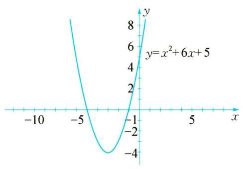

图 2-1

先考察该不等式与二次函数 $y = {x}^{2} + {6x} + 5$ 和一元二次方程 ${x}^{2} + {6x} + 5 = 0$ 的关系.

容易知道,方程 ${x}^{2} + {6x} + 5 = 0$ 有两个实根

$$
{x}_{1} =  - 1,{x}_{2} =  - 5\text{ . }
$$

于是二次函数 $y = {x}^{2} + {6x} + 5$ 的图像与 $x$ 轴的交点坐标为 $\left( {-1,0}\right)$ 与 $\left( {-5,0}\right)$ .

画出二次函数 $y = {x}^{2} + {6x} + 5$ 的图像,如图 2-1 所示.

不等式 ${x}^{2} + {6x} + 5 > 0$ 的解集可以看作是二次函数 $y = {x}^{2} + {6x} + 5$ 取正值时的 $x$ 的取值范围,即该二次函数的图像在 $x$ 轴上方时 $x$ 的取值范围.

观察图 2-1 所示的函数图像可知:

当 $x <  - 5$ 或 $x >  - 1$ 时,函数图像位于 $x$ 轴上方,此时函数值取正值,即 ${x}^{2} + {6x} + 5 > 0$ ;

当 $- 5 < x <  - 1$ 时,函数图像位于 $x$ 轴下方,此时函数值取负值,即 ${x}^{2} + {6x} + 5 < 0$ .

所以,不等式 ${x}^{2} + {6x} + 5 > 0$ 的解集是 $\{ x \mid  x <  - 5$ 或 $x >  - 1\}$ ; 不等式 ${x}^{2} + {6x} + 5 <$ 0 的解集是 $\{ x \mid   - 5 < x <  - 1\}$ .

一般地，先把一元二次不等式化为以下两种形式之一:

$$
a{x}^{2} + {bx} + c > 0\left( {a > 0}\right) \text{ 或 }a{x}^{2} + {bx} + c < 0\left( {a > 0}\right) ,
$$

当相应的一元二次方程 $a{x}^{2} + {bx} + c = 0$ 的判别式 $\Delta  = {b}^{2} - {4ac} > 0$ 时,可求出方程 $a{x}^{2} + {bx} + \; c = 0$ 的两个实根 ${x}_{1}\text{ 、 }{x}_{2}$ (不妨设 $\left. {{x}_{1} < {x}_{2}}\right)$ ,于是

不等式 $a{x}^{2} + {bx} + c > 0\left( {a > 0}\right)$ 的解集为 $\left\{  {x \mid  x < {x}_{1}\text{ 或 }x > {x}_{2}}\right\}$ ;

不等式 $a{x}^{2} + {bx} + c < 0\left( {a > 0}\right)$ 的解集为 $\left\{  {x \mid  {x}_{1} < x < {x}_{2}}\right\}$ .

同样地,我们也可以讨论当 $\Delta  = 0,\Delta  < 0$ 时,一元二次不等式

$$
a{x}^{2} + {bx} + c > 0\left( {a > 0}\right) \text{ 或 }a{x}^{2} + {bx} + c < 0\left( {a > 0}\right)
$$

的解的情况.

我们在第 1 章引入了区间的概念，以后可以用区间表示不等式的解集. 例如，集合 $\{ x \mid \; x < {x}_{1}$ 或 $x > {x}_{2}\}$ 可以表示为 $\left( {-\infty ,{x}_{1}}\right)  \cup  \left( {{x}_{2}, + \infty }\right)$ ,集合 $\left\{  {x \mid  {x}_{1} < x < {x}_{2}}\right\}$ 可以表示为 $\left( {{x}_{1},{x}_{2}}\right)$ .

例 1 求下列不等式的解集:

(1) $- 3{x}^{2} + x + 2 < 0$ ； (2) $- {x}^{2} + {4x} - 2 > 0$ ；

(3) $2{x}^{2} + x + 1 < 0$ ； (4) ${6x} >  - 1 - 9{x}^{2}$ .

解(1)不等式可化为

$$
3{x}^{2} - x - 2 > 0\text{ . }
$$

因为方程 $3{x}^{2} - x - 2 = 0$ 的判别式 $\Delta  = {25} > 0$ ,它的两个根是

$$
{x}_{1} =  - \frac{2}{3},{x}_{2} = 1,
$$

所以原不等式的解集为 $\left( {-\infty , - \frac{2}{3}}\right)  \cup  \left( {1, + \infty }\right)$ .

(2)不等式可化为

$$
{x}^{2} - {4x} + 2 < 0.
$$

因为方程 ${x}^{2} - {4x} + 2 = 0$ 的判别式 $\Delta  = 8 > 0$ ,它的两个根是

$$
{x}_{1} = 2 - \sqrt{2},{x}_{2} = 2 + \sqrt{2},
$$

所以原不等式的解集为 $\left( {2 - \sqrt{2},2 + \sqrt{2}}\right)$ .

(3)因为方程 $2{x}^{2} + x + 1 = 0$ 的判别式 $\Delta  =  - 7 < 0$ ，即该方程无实根，又二次函数 $y = \; 2{x}^{2} + x + 1$ 的图像是开口向上的抛物线，且在 $x$ 轴上方，所以原不等式 $2{x}^{2} + x + 1 < 0$ 的解集为 $\varnothing$ .

(4)不等式可化为

$$
9{x}^{2} + {6x} + 1 > 0\text{ . }
$$

因为方程 $9{x}^{2} + {6x} + 1 = 0$ 的判别式 $\Delta  = 0$ ,它有两个相等的实根

$$
{x}_{1} = {x}_{2} =  - \frac{1}{3},
$$

又二次函数 $y = 9{x}^{2} + {6x} + 1$ 的图像是开口向上的抛物线,且该图像与 $x$ 轴仅有一个公共点 $\left( {-\frac{1}{3},0}\right)$ ,所以原不等式的解集为 $\left( {-\infty , - \frac{1}{3}}\right)  \cup  \left( {-\frac{1}{3}, + \infty }\right)$ .

例 2 解关于 $x$ 的不等式: ${x}^{2} - \left( {{3a} + 1}\right) x + 2{a}^{2} + {2a} \leq  0$ .

解 因为 ${x}^{2} - \left( {{3a} + 1}\right) x + 2{a}^{2} + {2a} = \left( {x - {2a}}\right) \left\lbrack  {x - \left( {a + 1}\right) }\right\rbrack$ ,所以一元二次方程 ${x}^{2} - \; \left( {{3a} + 1}\right) x + 2{a}^{2} + {2a} = 0$ 有实根

$$
{x}_{1} = {2a},{x}_{2} = a + 1.
$$

当 ${x}_{1} > {x}_{2}$ ,即 $a > 1$ 时,原不等式的解集为 $\left\lbrack  {a + 1,{2a}}\right\rbrack$ ;

当 ${x}_{1} = {x}_{2}$ ,即 $a = 1$ 时,原不等式的解集为 $\{ 2\}$ ;

当 ${x}_{1} < {x}_{2}$ ,即 $a < 1$ 时,原不等式的解集为 $\left\lbrack  {{2a}, a + 1}\right\rbrack$ .

对于本节开头提到的车辆是否超速的问题，只要求出相应的一元二次不等式

$$
{0.2085v} + {0.0064}{v}^{2} > {20}
$$

的解集即可.

利用前述解一元二次不等式的方法, 易得

$$
v < \frac{-{0.2085} - \sqrt{{0.2085}^{2} - 4 \times  {0.0064} \times  \left( {-{20}}\right) }}{2 \times  {0.0064}} \approx   - {74.5}
$$

$$
\text{ 或 }v > \frac{-{0.2085} + \sqrt{{0.2085}^{2} - 4 \times  {0.0064} \times  \left( {-{20}}\right) }}{2 \times  {0.0064}} \approx  {41.9}\text{ . }
$$

根据实际意义，可以判断该汽车在刹车前的车速大于 41.9 千米/时，应判定其在交通事故时超速行驶.

1. 请填写表 $2 - 1$ :

表 2-1

<table><tr><td>$\Delta  = {b}^{2} - {4ac}$</td><td>$\Delta  > 0$</td><td>$\Delta  = 0$</td><td>$\Delta  < 0$</td></tr><tr><td>$y = a{x}^{2} + {bx} + c \; \left( {a > 0}\right)$ 的图像</td><td>[失效外部图片：bo_d7niasc91nqc7384gf9g_43.jpg]</td><td>[失效外部图片：bo_d7niasc91nqc7384gf9g_43.jpg]</td><td>[失效外部图片：bo_d7niasc91nqc7384gf9g_43.jpg]</td></tr><tr><td>$a{x}^{2} + {bx} + c = 0 \; \left( {a > 0}\right)$ 的根</td><td></td><td></td><td>没有实根</td></tr><tr><td>$a{x}^{2} + {bx} + c > 0 \; \left( {a > 0}\right)$ 的解集</td><td></td><td>$\left\{  {x\left| {\;x \neq   - \frac{b}{2a}}\right. }\right\}$</td><td></td></tr><tr><td>$a{x}^{2} + {bx} + c < 0 \; \left( {a > 0}\right)$ 的解集</td><td></td><td></td><td></td></tr><tr><td>$a{x}^{2} + {bx} + c \geq  0 \; \left( {a > 0}\right)$ 的解集</td><td></td><td></td><td></td></tr><tr><td>$a{x}^{2} + {bx} + c \leq  0$ ( $a > 0$ ) 的解集</td><td>$\left\lbrack  {{x}_{1},{x}_{2}}\right\rbrack$</td><td></td><td></td></tr></table>

## 练一练

1 求下列不等式的解集:

(1) $- 2{x}^{2} - {4x} + 6 < 0$ ； (2) $3{x}^{2} - {5x} + 2 \geq  0$ ；

(3) $2{x}^{2} - {14x} + 3 < 6$ ； (4) $- 2{x}^{2} - 7 \geq  1 - {12x}$ ；

(5) $- {x}^{2} + {4x} - 5 < 0$ ； (6) $4 - {12x} \leq   - 9{x}^{2}$ .

2 (1)写出一个一元二次不等式，使它的解集为 $\left( {2 - \sqrt{3},3 - \sqrt{2}}\right)$ ；

(2)若关于 $x$ 的不等式 $a{x}^{2} + \left( {{ab} + 1}\right) x + b > 0$ 的解集为 $\{ x \mid  1 < x < 2\}$ ，求实数 $a$ 、 $b$ 的值.

3 解不等式组:

$$
\left\{  \begin{array}{l} 3{x}^{2} - {7x} - {10} \leq  0, \\  2{x}^{2} - {5x} + 2 > 0 \end{array}\right.
$$

4 我们知道, 汽车在行驶中如果遇到紧急情况, 即使司机马上刹车, 但由于惯性的作用, 刹车后的汽车仍会继续往前滑行一段距离才会停下, 这段距离叫做刹车距离. 车速越快, 刹车距离越长, 事故发生的可能性越大. 实验表明, 某种型号的汽车在水泥路面上行驶时, 其刹车距离 $s\left( \mathrm{\;m}\right)$ 和汽车的速度 $x\left( {\mathrm{\;{km}}/\mathrm{h}}\right)$ 有如下的关系:

$$
s = \frac{1}{20}x + \frac{1}{180}{x}^{2}.
$$

在一次交通事故中，测得该型号事故车辆的刹车距离大于39.5m，那么这辆汽车刹车前的速度至少是多少? (精确到 ${0.01}\mathrm{\;{km}}/\mathrm{h}$ )

5 解关于 $x$ 的不等式: ${x}^{2} - \left( {{a}^{2} + {2a} + 3}\right) x + 3{a}^{2} + {6a} \geq  0$ .

例 3 解关于 $x$ 的不等式: $a{x}^{2} - \left( {a + 1}\right) x + 1 < 0$ .

解 因为 $a{x}^{2} - \left( {a + 1}\right) x + 1 = \left( {{ax} - 1}\right) \left( {x - 1}\right)$ ,所以当 $a \neq  0$ 时,方程有实根

$$
{x}_{1} = 1,{x}_{2} = \frac{1}{a}.
$$

当 $a > 0$ 时, $\frac{1}{a} > 0$ ,不等式化为 $\left( {x - \frac{1}{a}}\right) \left( {x - 1}\right)  < 0$ .

① 若 $\frac{1}{a} > 1$ ，即 $0 < a < 1$ 时，原不等式的解集为 $\left( {1,\frac{1}{a}}\right)$ ；

② 若 $0 < \frac{1}{a} < 1$ ，即 $a > 1$ 时，原不等式的解集为 $\left( {\frac{1}{a},1}\right)$ ；

③ 若 $\frac{1}{a} = 1$ ，即 $a = 1$ 时，原不等式的解集为 $\varnothing$ .

当 $a < 0$ 时， $\frac{1}{a} < 0$ ，不等式化为 $\left( {x - \frac{1}{a}}\right) \left( {x - 1}\right)  > 0$ .

因为 $\frac{1}{a} < 1$ ，所以原不等式的解集为 $\left( {-\infty ,\frac{1}{a}}\right)  \cup  \left( {1, + \infty }\right)$ .

当 $a = 0$ 时,不等式化为 $- x + 1 < 0$ ,所以原不等式的解集为 $\left( {1, + \infty }\right)$ .

综上所述:

当 $a > 1$ 时,原不等式解集为 $\left( {\frac{1}{a},1}\right)$ ;

当 $a = 1$ 时，原不等式解集为 $\varnothing$ ；

当 $0 < a < 1$ 时，原不等式的解集为 $\left( {1,\frac{1}{a}}\right)$ ；

当 $a = 0$ 时,原不等式的解集为 $\left( {1, + \infty }\right)$ ;

当 $a < 0$ 时,原不等式的解集为 $\left( {-\infty ,\frac{1}{a}}\right)  \cup  \left( {1, + \infty }\right)$ .

例 4 (1)不等式 $\frac{2{x}^{2} + {2kx} + k}{4{x}^{2} + {6x} + 3} < 1$ 的解集为 (一∞,+∞)，求实数 $k$ 的取值范围；

(2)若不等式 $\left( {{a}^{2} - 1}\right) {x}^{2} - \left( {a - 1}\right) x - 1 \geq  0$ 的解集为 $\varnothing$ ，求实数 $a$ 的取值范围.

解 (1) 因为 $4{x}^{2} + {6x} + 3 = 4{\left( x + \frac{3}{4}\right) }^{2} + \frac{3}{4} > 0$ ，所以原不等式化为

$$
2{x}^{2} + {2kx} + k < 4{x}^{2} + {6x} + 3,
$$

即 $2{x}^{2} + \left( {6 - {2k}}\right) x + 3 - k > 0$ .

由已知,不等式 $2{x}^{2} + \left( {6 - {2k}}\right) x + 3 - k > 0$ 的解集为 $\left( {-\infty , + \infty }\right)$ ,又函数 $y = 2{x}^{2} + (6 - \; {2k})x + 3 - k$ 的图像是开口向上的抛物线,所以该抛物线在 $x$ 轴上方,于是方程 $2{x}^{2} + (6 - \; {2k})x + 3 - k = 0$ 的判别式 $\Delta  = {\left( 6 - 2k\right) }^{2} - 8\left( {3 - k}\right)  < 0$ ,解得 $k \in  \left( {1,3}\right)$ .

所以，实数 $k$ 的取值范围是 $\left( {1,3}\right)$ .

(2)① 当 ${a}^{2} - 1 \neq  0$ 时，函数 $y = \left( {{a}^{2} - 1}\right) {x}^{2} - \left( {a - 1}\right) x - 1$ 的图像是抛物线. 若不等式 $\left( {{a}^{2} - 1}\right) {x}^{2} - \left( {a - 1}\right) x - 1 \geq  0$ 的解集为 $\varnothing$ ,则该抛物线开口向下,且在 $x$ 轴下方,于是方程 $\left( {{a}^{2} - 1}\right) {x}^{2} - \left( {a - 1}\right) x - 1 = 0$ 的判别式 $\Delta  = {\left( a - 1\right) }^{2} + 4\left( {{a}^{2} - 1}\right)  < 0$ 且 ${a}^{2} - 1 < 0$ ,解得 $a \in \; \left( {-\frac{3}{5},1}\right)$ .

② 当 ${a}^{2} - 1 = 0$ 时，函数 $y =  - \left( {a - 1}\right) x - 1$ 的图像是直线，且该直线在 $x$ 轴下方，则 -(a- $1) = 0$ ,解得 $a = 1$ .

综上可得,实数 $a$ 的取值范围是 $\left( {-\frac{3}{5},1}\right\rbrack$ .

2. 设 ${a}_{1}\text{ 、 }{b}_{1}\text{ 、 }{c}_{1}\text{ 、 }{a}_{2}\text{ 、 }{b}_{2}\text{ 、 }{c}_{2}$ 均为非零实数,不等式 ${a}_{1}{x}^{2} + {b}_{1}x + {c}_{1} > 0$ 与 ${a}_{2}{x}^{2} + \; {b}_{2}x + {c}_{2} > 0$ 的解集分别是集合 $M\text{ 、 }N$ ,则 “ $\frac{{a}_{1}}{{a}_{2}} = \frac{{b}_{1}}{{b}_{2}} = \frac{{c}_{1}}{{c}_{2}}$ ” 是 “ $M = N$ ” 的什么条件?

3. 不等式 $a{x}^{2} + {bx} + c > 0$ 的解集为 $\mathbf{R}$ (即对一切实数 $x$ 都成立) 的充要条件是 ___；

不等式 $a{x}^{2} + {bx} + c \geq  0$ 的解集为 $\mathbf{R}$ 的充要条件是___；

不等式 $a{x}^{2} + {bx} + c < 0$ 的解集为 $\mathbf{R}$ 的充要条件是___；

不等式 $a{x}^{2} + {bx} + c \leq  0$ 的解集为 $\mathbf{R}$ 的充要条件是___；

不等式 $a{x}^{2} + {bx} + c > 0$ 的解集为 $\varnothing$ (即对一切实数 $x$ 都不成立) 的充要条件是 ___；

不等式 $a{x}^{2} + {bx} + c \geq  0$ 的解集为 $\varnothing$ 的充要条件是___；

不等式 $a{x}^{2} + {bx} + c < 0$ 的解集为 $\varnothing$ 的充要条件是___；

不等式 $a{x}^{2} + {bx} + c \leq  0$ 的解集为 $\varnothing$ 的充要条件是___.

## 练一练

6 解关于 $x$ 的不等式: $m{x}^{2} - \left( {m - 2}\right) x - 2 > 0$ .

7 已知不等式组 $\left\{  \begin{array}{l} {x}^{2} - x - 2 > 0, \\  2{x}^{2} + \left( {5 + {2k}}\right) x + {5k} < 0 \end{array}\right.$ 的整数解只有 -2,求实数 $k$ 的取值范围.

8 已知关于 $x$ 的不等式 $a{x}^{2} + \left( {a - 1}\right) x + a - 1 < 0$ 的解集是 $\mathbf{R}$ ，求实数 $a$ 的取值范围.

9 已知关于 $x$ 的不等式 $\left( {a - 2}\right) {x}^{2} + 2\left( {a - 2}\right) x - 4 > 0$ 的解集是 $\varnothing$ ,求实数 $a$ 的取值范围.

### 2.3 其他不等式的解法

## 一、高次不等式

像 ${x}^{3} + 3{x}^{2} > {4x} + {12}$ 这样,只含有一个未知数,并且未知数的最高次数大于 2 的整式不等式称为高次不等式.

让我们先来看下面的例子.

对于高次不等式

$$
\left( {x - 1}\right) \left( {x + 1}\right) \left( {x - 2}\right) \left( {x - 3}\right)  < 0,
$$

它对应的方程 $\left( {x - 1}\right) \left( {x + 1}\right) \left( {x - 2}\right) \left( {x - 3}\right)  = 0$ 有四个实数根:

$$
- 1,1,2,3\text{ . }
$$

这些实根把实数集分成 5 个区间,即 $\left( {-\infty , - 1}\right) \text{ 、 }\left( {-1,1}\right) \text{ 、 }\left( {1,2}\right) \text{ 、 }\left( {2,3}\right)$ 和 $\left( {3, + \infty }\right)$ . 当 $x$ 依次取这 5 个区间的值时,因式 $x + 1\text{ 、 }x - 1\text{ 、 }x - 2\text{ 、 }x - 3$ 及它们的乘积的符号如表 2- 2 所示,其中乘积为负时 $x$ 的取值集合就是该不等式的解集.

表 2-2

<table><tr><td colspan="2">范围</td><td>$x \in  \left( {-\infty , - 1}\right)$</td><td>$x \in  \left( {-1,1}\right)$</td><td>$x \in  \left( {1,2}\right)$</td><td>$x \in  \left( {2,3}\right)$</td><td>$x \in  \left( {3, + \infty }\right)$</td></tr><tr><td rowspan="4">因式</td><td>$x + 1$</td><td>-</td><td>+</td><td>+</td><td>+</td><td>+</td></tr><tr><td>$x - 1$</td><td>-</td><td>-</td><td>+</td><td>+</td><td>+</td></tr><tr><td>$x - 2$</td><td>-</td><td>-</td><td>-</td><td>+</td><td>+</td></tr><tr><td>$x - 3$</td><td>-</td><td>-</td><td>-</td><td>-</td><td>+</td></tr><tr><td colspan="2">以上 4 个因式的积</td><td>+</td><td>-</td><td>+</td><td>-</td><td>+</td></tr></table>

我们发现,可以把表 2-2 中 $\left( {x + 1}\right) \left( {x - 1}\right) \left( {x - 2}\right) \left( {x - 3}\right)$ 的积的符号的变化规律借助于数轴简洁地表示出来,如图 2-2 所示.

(1)在数轴上标出这 4 个实根: -1、1、2、3 所对应的点，它们把数轴分成 5 个部分，代表 $x$ 的 5 个不同的取值区间;

(2)从数轴的右上方开始画一条曲线，该曲线从右往左依次穿过这些实根所对应的点；

(3)曲线在数轴上方表示在此区间内 $\left( {x + 1}\right) \left( {x - 1}\right) \left( {x - 2}\right) \left( {x - 3}\right)$ 的积的符号为正,曲线在数轴下方表示在此区间内该积的符号为负.

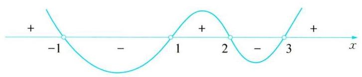

图 2-2

(4)由图 2-2 可知，原不等式的解集为 $\left( {-1,1}\right)  \cup  \left( {2,3}\right)$ .

我们把这种解高次不等式的方法叫做“数轴标根法”.

例 1 解不等式: ${x}^{3} + 3{x}^{2} > {4x} + {12}$ .

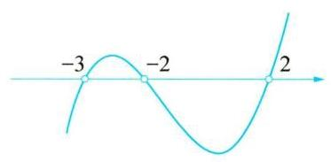

图 2-3

解 原不等式可化为 ${x}^{3} + 3{x}^{2} - {4x} - {12} > 0$ ,即

$$
\left( {x + 3}\right) \left( {x + 2}\right) \left( {x - 2}\right)  > 0.
$$

根据数轴标根法,画出数轴如图 2-3 所示.

由图知,原不等式的解集为 $\left( {-3, - 2}\right)  \cup  \left( {2, + \infty }\right)$ .

例 2 解不等式: $\left( {x + 3}\right) \left( {x + 2}\right) {\left( x + 1\right) }^{3}{\left( x - 1\right) }^{4}\left( {{x}^{2} - x + 2}\right)  > 0$ .

解 因为 ${x}^{2} - x + 2 > 0$ 恒成立,所以,原不等式等价于

即

$$
\left( {x + 3}\right) \left( {x + 2}\right) {\left( x + 1\right) }^{3}{\left( x - 1\right) }^{4} > 0,
$$

$$
\left\{  \begin{array}{l} \left( {x + 3}\right) \left( {x + 2}\right) \left( {x + 1}\right)  > 0, \\  x \neq  1. \end{array}\right.
$$

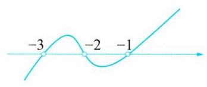

图 2-4

根据数轴标根法, 画出数轴如图 2-4 所示.

由图知,原不等式的解集为 $\left( {-3, - 2}\right)  \cup  \left( {-1,1}\right)  \cup  \left( {1, + \infty }\right)$ .

1. 用“数轴标根法”解高次不等式时，需要考虑哪些因素?

## 练一练

1 解不等式: $\left( {x + 1}\right) \left( {x - 5}\right) \left( {x + 6}\right)  \geq  0$ .

2 解不等式: ${\left( x - 4\right) }^{3}\left( {{x}^{3} + 1}\right) \left( {{x}^{2} - 1}\right)  \geq  0$ .

3 解不等式: $\left( {x + 5}\right) \left( {x + 2}\right) \left( {x - 1}\right) \left( {x - 4}\right)  \leq   - {80}$ .

4 解关于 $x$ 的不等式: ${\left( x - a\right) }^{3}\left( {{x}^{3} - 1}\right) \left( {{x}^{2} - 1}\right)  < 0$ .

## 二、分式不等式

像 $\frac{16}{x - 1} < x - 1$ 这样,只含有一个未知数,并且分母含未知数的不等式,称为分式不等式.

解分式不等式时, 可以先把不等式化为标准形式, 即

$$
\frac{f\left( x\right) }{g\left( x\right) } > 0\left( {\text{ 或 } \geq  0}\right) \text{ 或 }\frac{f\left( x\right) }{g\left( x\right) } < 0\left( {\text{ 或 } \leq  0}\right) ,
$$

再等价转化为整式不等式去求解:

(1) $\frac{f\left( x\right) }{g\left( x\right) } > 0$ (或 $< 0) \Leftrightarrow  f\left( x\right)  \cdot  g\left( x\right)  > 0$ (或 $< 0$ );

(2) $\frac{f\left( x\right) }{g\left( x\right) } \geq  0$ (或 $\leq  0$ ) $\Leftrightarrow  \left\{  \begin{array}{l} f\left( x\right)  \cdot  g\left( x\right)  \geq  0, \\  g\left( x\right)  \neq  0 \end{array}\right.$ (或 $\left\{  \begin{array}{l} f\left( x\right)  \cdot  g\left( x\right)  \leq  0, \\  g\left( x\right)  \neq  0 \end{array}\right.$ .

例 3 解不等式: $\frac{16}{x - 1} < x - 1$ .

解 方法一: 原不等式可化为 $\frac{\left( {x - 5}\right) \left( {x + 3}\right) }{x - 1} > 0$ ,即

$$
\left\{  {\begin{array}{l} \left( {x - 5}\right) \left( {x + 3}\right)  > 0, \\  x - 1 > 0 \end{array}\text{ 或 }\left\{  \begin{array}{l} \left( {x - 5}\right) \left( {x + 3}\right)  < 0, \\  x - 1 < 0, \end{array}\right. }\right.
$$

解得 $- 3 < x < 1$ 或 $x > 5$ .

所以,原不等式的解集是 $\left( {-3,1}\right)  \cup  \left( {5, + \infty }\right)$ .

方法二:原不等式可化为 $\frac{\left( {x - 5}\right) \left( {x + 3}\right) }{x - 1} > 0$ ,即

$$
\left( {x - 5}\right) \left( {x + 3}\right) \left( {x - 1}\right)  > 0.
$$

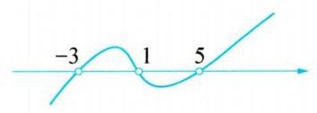

图 2-5

根据数轴标根法,画出数轴如图 2-5 所示,可得不等式的解集是 $\left( {-3,1}\right)  \cup  \left( {5, + \infty }\right)$ .

例 4 解关于 $x$ 的不等式: $\frac{a}{x - 2} > 1 - a$ .

解 原不等式可化为 $\frac{\left( {a - 1}\right) x + \left( {2 - a}\right) }{x - 2} > 0$ ,即

$$
\left\lbrack  {\left( {a - 1}\right) x + \left( {2 - a}\right) }\right\rbrack  \left( {x - 2}\right)  > 0.
$$

(1)当 $a > 1$ 时,不等式等价于 $\left( {x - \frac{a - 2}{a - 1}}\right) \left( {x - 2}\right)  > 0$ .

因为 $\frac{a - 2}{a - 1} = 1 - \frac{1}{a - 1} < 1 < 2$ ,所以原不等式的解集为 $\left( {-\infty ,\frac{a - 2}{a - 1}}\right)  \cup  \left( {2, + \infty }\right)$ .

(2)当 $a = 1$ ，不等式等价于 $x - 2 > 0$ ，所以原不等式解集为 $\left( {2, + \infty }\right)$ .

(3)当 $a < 1$ 时，不等式等价于 $\left( {x - \frac{a - 2}{a - 1}}\right) \left( {x - 2}\right)  < 0$ .

因为 $\frac{a - 2}{a - 1} < 2 \Leftrightarrow  a < 0$ 或 $a > 1$ ，所以当 $a < 0$ 时，原不等式的解集为 $\left( {\frac{a - 2}{a - 1},2}\right)$ ；当 $a =$ 0 时,不等式不成立,解集为 $\varnothing$ ; 当 $0 < a < 1$ 时,原不等式解集为 $\left( {2,\frac{a - 2}{a - 1}}\right)$ .

综上所述: 当 $a < 0$ 时,原不等式的解集为 $\left( {\frac{a - 2}{a - 1},2}\right)$ ;

当 $a = 0$ 时,原不等式的解集为 $\varnothing$ ;

当 $0 < a < 1$ 时,原不等式的解集为 $\left( {2,\frac{a - 2}{a - 1}}\right)$ ;

当 $a = 1$ 时,原不等式的解集为 $\left( {2, + \infty }\right)$ ;

当 $a > 1$ 时,原不等式的解集为 $\left( {-\infty ,\frac{a - 2}{a - 1}}\right)  \cup  \left( {2, + \infty }\right)$ .

## 练一练

5 当实数 $m$ 为何值时,关于 $x$ 的方程 $m\left( {x - 1}\right)  = 3\left( {x + 2}\right)$ 的解是正数? 是负数?

6 解下列不等式:

(1) $x > \frac{1}{x}$ ； (2) $\frac{{3x} - 1}{2 - x} \geq  1$ ； (3) $\frac{5 - x}{{x}^{2} - {2x} - 3} <  - 1$ ； (4) $\frac{{x}^{2} - {9x} + {11}}{{x}^{2} - {2x} + 1} \geq  7$ .

7 解关于 $x$ 的不等式: $\frac{{ax} - 1}{{x}^{2} - x - 2} > 0$ .

8 解关于 $x$ 的不等式: $\frac{2{x}^{2} - \left( {a + 1}\right) x + 1}{x\left( {x - 1}\right) } > 1$ .

## 三、含绝对值的不等式

我们知道,

$$
\left| x\right|  = \left\{  \begin{array}{ll} x, & x > 0, \\  0, & x = 0, \\   - x, & x < 0. \end{array}\right.
$$

它表示实数 $x$ 在数轴上所对应的点到原点的距离. 因此,求不等式 $\left| x\right|  < a\left( {a > 0}\right)$ 的解集就是求在数轴上到原点距离小于 $a$ 的点所对应的实数 $x$ 的集合; 求不等式 $\left| x\right|  > a\left( {a > 0}\right)$ 的解集就是求在数轴上到原点距离大于 $a$ 的点所对应的实数 $x$ 的集合.

一般地,不等式 $\left| x\right|  < a\left( {a > 0}\right)$ 的解集是 $\left( {-a, a}\right)$ ; 不等式 $\left| x\right|  > a\left( {a > 0}\right)$ 的解集是 $\left( {-\infty , - a}\right)  \cup  \left( {a, + \infty }\right)$ ,如图 2-6 所示.

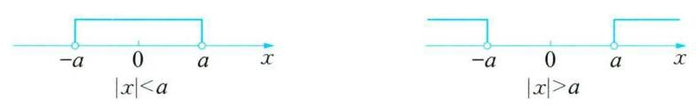

图 2-6

例 5 解不等式: $\left| {x - 1}\right|  > {3x} + 1$ .

解 当 $x \geq  1$ 时,原不等式等价于

$$
x - 1 > {3x} + 1,
$$

解得 $x <  - 1$ ,此时不等式无解;

当 $x < 1$ 时,原不等式等价于

$$
- x + 1 > {3x} + 1\text{ , }
$$

解得 $x < 0$ .

综上可知,原不等式的解集为 $\left( {-\infty ,0}\right)$ .

例 6 解不等式: $\left| {{x}^{2} - {5x} + 5}\right|  < 1$ .

解 方法一:因为不等式 $\left| x\right|  < a\left( {a > 0}\right)$ 的解集是 $\left( {-a, a}\right)$ ，因此，原不等式可化为

$$
\left\{  \begin{array}{l} {x}^{2} - {5x} + 5 < 1, \\  {x}^{2} - {5x} + 5 >  - 1. \end{array}\right.
$$

①

②

解不等式①，得 $x \in  \left( {1,4}\right)$ ；

解不等式②，得 $x \in  \left( {-\infty ,2}\right)  \cup  \left( {3, + \infty }\right)$ .

所以，原不等式的解集是不等式①和不等式②的解集的交集，即

$\left( {1,2}\right)  \cup  \left( {3,4}\right)$ .

方法二:由不等式的基本性质可知，将原不等式两边平方，不等号的方向不变，所以，原不等式可化为

$$
{\left( {x}^{2} - 5x + 5\right) }^{2} < 1,
$$

即

$$
{\left( {x}^{2} - 5x + 5\right) }^{2} - 1 < 0,
$$

化简整理, 得

$$
\left( {x - 2}\right) \left( {x - 3}\right) \left( {x - 4}\right) \left( {x - 1}\right)  < 0.
$$

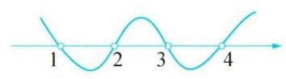

图 2-7

根据数轴标根法,画出数轴如图 2-7 所示.

所以,原不等式的解集是 $\left( {1,2}\right)  \cup  \left( {3,4}\right)$ .

例 7 解不等式: $\left| {x + 2}\right|  + \left| {x - 1}\right|  < 4$ .

解 方法一: 当 $x <  - 2$ 时,原不等式化为 $- x - 2 - x + 1 < 4$ ,解得 $- \frac{5}{2} < x <  - 2$ ;

当 $- 2 \leq  x < 1$ 时,原不等式化为 $x + 2 - x + 1 < 4$ ,解得 $- 2 \leq  x < 1$ ;

当 $x \geq  1$ 时,原不等式变为 $x + 2 + x - 1 < 4$ ,解得 $1 \leq  x < \frac{3}{2}$ .

综上可知,不等式的解集为 $\left\{  {x\left| {\; - \frac{5}{2} < x < \frac{3}{2}}\right. }\right\}$ .

方法二:不等式 $\left| {x + 2}\right|  + \left| {x - 1}\right|  < 4$ 的几何意义是表示数轴上与 -2 对应的点 $A$ 及 1 对应的点 $B$ 距离之和小于 4 的点的集合. 如图 2-8 所示,要找到与 $A\text{ 、 }B$ 距离之和为 4 的点,只需由点 $B$ 向右移动 $\frac{1}{2}$ 个单位,这时距离之和增加 1 个单位,即移到 $\frac{3}{2}$ 对应的点 ${B}_{1}$ ; 或由点 $A$ 向左移动 $\frac{1}{2}$ 个单位,即移到 $- \frac{5}{2}$ 对应的点 ${A}_{1}$ . 由图可以看出,数轴上位于点 ${B}_{1}$ 与点 ${A}_{1}$ 之间的点到 $A\text{ 、 }B$ 两点的距离之和均小于 4 .

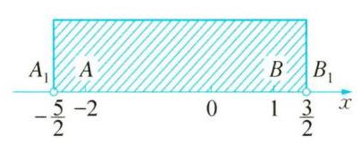

图 2-8

所以，原不等式的解集为 $\left\{  {x\left| {\; - \frac{5}{2} < x < \frac{3}{2}}\right. }\right\}$ .

2. 用函数的观点，如何解例 7 中的不等式?

3. 如何解下列类型的不等式: $\left| {f\left( x\right) }\right|  < g\left( x\right)$ 或 $\left| {f\left( x\right) }\right|  > g\left( x\right)$ 或 $\left| {f\left( x\right) }\right|  < \; \left| {g\left( x\right) }\right|$ ,其中 $f\left( x\right)$ 与 $g\left( x\right)$ 都是关于 $x$ 的代数式.

## 练一练

9 解下列不等式:

(1) $\left| {x - 5}\right|  < {2x} + 1$ ； (2) $\left| {{2x} - 1}\right|  > \left| {x + 3}\right|$ ；

(3) $2 < \left| {{x}^{2} - {2x} - 1}\right|  < 7$ ； (4) $\left| {x - 3}\right|  + \left| {x + 2}\right|  > 8$ ；

(5) $\left| {{x}^{2} - {2x} - 3}\right|  - \left| {{2x} + 3}\right|  < 6$ ； (6) $\left| \frac{{2x} + 1}{{3x} - 4}\right|  > x - 1$ .

10(1)若不等式 $\left| {x + 1}\right|  + \left| {x - 3}\right|  + \left| {x - 6}\right|  > a$ 对任意实数 $x$ 恒成立，求实数 $a$ 的取值范围;

(2)若对于任意 $x \in  \mathbf{R}$ ，不等式 $\left| {x + 1}\right|  - \left| {x - 2}\right|  \leq  m$ 恒成立，求实数 $m$ 的取值范围.

11 关于实数 $x$ 的不等式 $\left| {x - \frac{{\left( a + 1\right) }^{2}}{2}}\right|  \leq  \frac{{\left( a - 1\right) }^{2}}{2}$ 与 ${x}^{2} - 3\left( {a + 1}\right) x + 2\left( {{3a} + 1}\right)  \leq \; 0\left( {a \in  \mathbf{R}}\right)$ 的解集依次为 $A\text{ 、 }B$ ,求使 $A \subseteq  B$ 成立的 $a$ 的取值范围.

12 某段城铁线路上依次有 $A\text{ 、 }B\text{ 、 }C$ 三站, ${AB} = 5\mathrm{\;{km}},{BC} = 3\mathrm{\;{km}}$ ,在列车运行时刻表上, 规定列车 8 时整从 $A$ 站发车，8 时 07 分到达 $B$ 站并停车 1 分钟，8 时 12 分到达 $C$ 站，在实际运行中，假设列车从 $A$ 站正点发车，在 $B$ 站停留 1 分钟，并在行驶时以同一速度 $v\mathrm{{km}}/\mathrm{h}$ 匀速行驶,列车从 $A$ 站到达某站的时间与时刻表上相应时间之差的绝对值称为列车在该站的运行误差.

(1)分别写出列车在 $B\text{ 、 }C$ 两站的运行误差;

(2)若要求列车在 $B\text{ 、 }C$ 两站的运行误差之和不超过 2 分钟，求 $v$ 的取值范围.

## 四、无理不等式

像 $\sqrt{x} > x - 3$ 这样,只含有一个未知数,并且根号中含未知数的不等式,称为无理不等式.

解无理不等式的方法就是把无理不等式化为有理不等式. 例如,

$$
\sqrt{f\left( x\right) } > \sqrt{g\left( x\right) } \Leftrightarrow  \left\{  \begin{array}{l} f\left( x\right)  \geq  0, \\  g\left( x\right)  \geq  0, \\  f\left( x\right)  > g\left( x\right) ; \end{array}\right.
$$

$\sqrt{f\left( x\right) } > g\left( x\right)  \Leftrightarrow  \left\{  {\begin{array}{l} f\left( x\right)  \geq  0, \\  g\left( x\right)  \geq  0, \\  f\left( x\right)  > {\left\lbrack  g\left( x\right) \right\rbrack  }^{2} \end{array}\text{ 或 }\left\{  \begin{array}{l} f\left( x\right)  \geq  0, \\  g\left( x\right)  < 0; \end{array}\right. }\right.$

$\sqrt{f\left( x\right) } < g\left( x\right)  \Leftrightarrow  \left\{  \begin{array}{l} f\left( x\right)  \geq  0, \\  g\left( x\right)  > 0, \\  f\left( x\right)  < {\left\lbrack  g\left( x\right) \right\rbrack  }^{2}. \end{array}\right.$

例 8 解不等式: $\sqrt{x} > x - 3$ .

解 原不等式可化为

$$
\left\{  {\begin{array}{l} x \geq  0, \\  x - 3 < 0 \end{array}\text{ 或 }\left\{  \begin{array}{l} x \geq  0, \\  x - 3 \geq  0, \\  x > {\left( x - 3\right) }^{2}. \end{array}\right. }\right.
$$

由 $\left\{  \begin{array}{l} x \geq  0, \\  x - 3 < 0, \end{array}\right.$ 解得 $0 \leq  x < 3$ ;

由 $\left\{  {\begin{array}{l} x \geq  0, \\  x - 3 \geq  0, \\  x > {\left( x - 3\right) }^{2} \end{array} \Leftrightarrow  \left\{  \begin{array}{l} x \geq  0, \\  x \geq  3, \\  {x}^{2} - {7x} + 9 < 0, \end{array}\right. }\right.$ 解得 $3 \leq  x < \frac{7 + \sqrt{13}}{2}$ .

所以,原不等式的解集为 $\left\lbrack  {0,\frac{7 + \sqrt{13}}{2}}\right)$ .

例 9 解不等式: $\sqrt{{x}^{2} - {2x} - 3} < x + 2$ .

解 原不等式可化为

即

$$
\left\{  \begin{array}{l} {x}^{2} - {2x} - 3 \geq  0, \\  x + 2 > 0, \\  {x}^{2} - {2x} - 3 < {\left( x + 2\right) }^{2}, \end{array}\right.
$$

$$
\left\{  \begin{array}{l} x \geq  3\text{ 或 }x \leq   - 1, \\  x >  - 2, \\  {6x} + 7 > 0, \end{array}\right.
$$

解得 $- \frac{7}{6} < x \leq   - 1$ 或 $x \geq  3$ .

所以,原不等式的解集为 $\left( {-\frac{7}{6}, - 1\rbrack \cup \lbrack 3, + \infty }\right)$ .

## 练一练

13 解下列不等式:

(1) $\sqrt{{2x} + 1} > x - 1$ ; (2) $\sqrt{{2x} + 1} > \sqrt{x + 1} - 1$ ; (3) $\sqrt{9 - x} < x - 1$ .

14 解下列不等式:

(1) $\sqrt{{3x} - 4} - \sqrt{x - 3} > 0$ ；(2) $\sqrt{-{x}^{2} + {3x} - 2} > 4 - {3x}$ ；(3) $\sqrt{2{x}^{2} - {6x} + 4} < x + 2$ .

15 不等式 $3 - x \geq  \sqrt{x - 1}$ 的解集为 $A$ ; 不等式 ${x}^{2} - \left( {a + 1}\right) x + a \leq  0$ 的解集为 $B$ .

(1)若 $A \subset  B$ ，求实数 $a$ 的取值范围；

(2)若 $A \supseteq  B$ ，求实数 $a$ 的取值范围；

(3)若 $A \cap  B$ 为仅含一个元素的集合，求实数 $a$ 的取值范围.

### 2.4 基本不等式及其应用

在不等式的应用中，有一些很基本且十分重要的不等式，如平均值不等式和三角不等式等，我们将其统称为基本不等式.

## 一、平均值不等式

在客观世界中，有些不等关系是永远成立的. 如图 2-9 所示，在周长相等时，圆的面积比正方形的面积大，正方形的面积又比非正方形的任意矩形的面积大.

图 2-9

在实数集中,任意一个数的平方都是非负的,即: 若 $a \in \; \mathbf{R}$ ,则 ${a}^{2} \geq  0$ . 由此,可以得到几个基本且重要的恒成立不等式.

平均值不等式 1 : 对任意实数 $a$ 和 $b$ ,都有 ${a}^{2} + {b}^{2} \geq  {2ab}$ ,当且仅当 $a = b$ 时等号成立.

证明 因为 ${a}^{2} + {b}^{2} - {2ab} = {\left( a - b\right) }^{2} \geq  0$ ,所以

$$
{a}^{2} + {b}^{2} \geq  {2ab}.
$$

当 $a - b \neq  0$ 时， ${\left( a - b\right) }^{2} > 0$ ；当 $a - b = 0$ 时， ${\left( a - b\right) }^{2} = 0$ .

所以,当且仅当 $a = b$ 时, ${a}^{2} + {b}^{2} \geq  {2ab}$ 中的等号成立.

图 2-10 所示是 2002 年在北京召开的第 24 届国际数学家大会的会标的核心图案, 该图案是根据中国古代数学家赵爽的弦图设计的, 颜色的明暗使它看上去像一个风车.

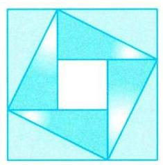

图 2-10

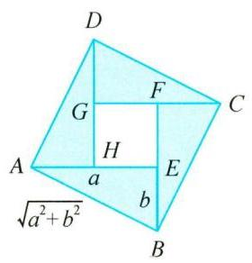

图 2-11

将图 2-10 中的“风车”抽象成图 2-11 所示的正方形 ${ABCD}$ ,其中有 4 个全等的直角三角形. 设直角三角形的两直角边长分别为 $a$ 和 $b$ ,则正方形的边长为 $\sqrt{{a}^{2} + {b}^{2}}$ . 这样,4 个直角三角形的面积之和为 ${2ab}$ ，正方形的面积为 ${a}^{2} + {b}^{2}$ . 因为 4 个直角三角形的面积之和不大于正方形的面积,所以我们就得到一个恒成立的不等式: ${a}^{2} + {b}^{2} \geq  {2ab}$ ,当且仅当直角三角形是等腰直角三角形,即 $a = b$ 时,正方形 EFGH 缩为一个点,这时有 ${a}^{2} + {b}^{2} = {2ab}$ . 这就是平均值不等式 1 的一种几何解释.

平均值不等式 1 还有一些常见的变式, 例如,

(1)如果 $a, b \in  \mathbf{R}$ ，那么 ${a}^{2} + {b}^{2} \geq   - {2ab}$ ，当且仅当 $a =  - b$ 时等号成立；

(2)如果 $a, b \in  \mathbf{R}$ ，那么 ${a}^{2} + {b}^{2} \geq  2\left| {ab}\right|$ ，当且仅当 $\left| a\right|  = \left| b\right|$ 时等号成立.

平均值不等式 2 : 对任意正数 $a$ 和 $b$ ,都有 $\frac{a + b}{2} \geq  \sqrt{ab}$ ,当且仅当 $a = b$ 时等号成立.

证明 因为 $a, b > 0$ ,所以由平均值不等式 1,得

$$
a + b = {\left( \sqrt{a}\right) }^{2} + {\left( \sqrt{b}\right) }^{2} \geq  2\sqrt{a} \cdot  \sqrt{b},
$$

当且仅当 $\sqrt{a} = \sqrt{b}$ 时等号成立，即

$$
\frac{a + b}{2} \geq  \sqrt{ab}\text{ ，当且仅当 }a = b\text{ 时等号成立. }
$$

我们把 $\frac{a + b}{2}$ 和 $\sqrt{ab}$ 分别叫做正数 $a\text{ 、 }b$ 的算术平均数和几何平均数. 于是有: 两个正数的算术平均数不小于它们的几何平均数.

平均值不等式 2 也有一种几何解释:

如图 2-12 所示,在直角三角形 ${ABC}$ 中,设 ${BD} = a,{CD} = b$ ,则斜边上的中线 ${AE} = \frac{a + b}{2}$ ，斜边上的高 ${AD} = \sqrt{ab}$ . 因为斜边上的中线长不小于斜边上的高,所以 $\frac{a + b}{2} \geq  \sqrt{ab}$ ,当且仅当直角三角形是等腰直角三角形,即 $a = b$ 时,有 $\frac{a + b}{2} = \sqrt{ab}$ .

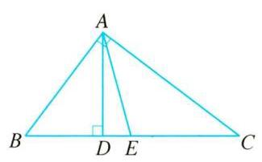

图 2-12

例 1 ( 1 )已知 $a, b, c \in  \mathbf{R}$ ，求证: ${a}^{2} + {b}^{2} + {c}^{2} \geq  {ab} + {ac} + {bc}$ ；

(2)已知 $x, y > 0$ ,求证: $\left( {x + y}\right) \left( {{x}^{2} + {y}^{2}}\right) \left( {{x}^{3} + {y}^{3}}\right)  \geq  8{x}^{3}{y}^{3}$ .

证明 (1) 由平均值不等式 1 ，得

${a}^{2} + {b}^{2} \geq  {2ab}$ ,当且仅当 $a = b$ 时等号成立; ${a}^{2} + {c}^{2} \geq  {2ac}$ ,当且仅当 $a = c$ 时等号成立; ${c}^{2} + {b}^{2} \geq  {2cb}$ ,当且仅当 $b = c$ 时等号成立.

由不等式的基本性质 (4), 将上述三个不等式同向相加, 得

即

$$
2\left( {{a}^{2} + {b}^{2} + {c}^{2}}\right)  \geq  2\left( {{ab} + {bc} + {ca}}\right) ,
$$

$$
{a}^{2} + {b}^{2} + {c}^{2} \geq  {ab} + {bc} + {ca},
$$

当且仅当 $a = b = c$ 时等号成立.

(2)由 $x, y > 0$ 和平均值不等式 2，得

$$
x + y \geq  2\sqrt{xy} > 0\text{ ,当且仅当 }x = y\text{ 时等号成立; }
$$

$$
{x}^{2} + {y}^{2} \geq  2\sqrt{{x}^{2}{y}^{2}} > 0\text{ ,当且仅当 }{x}^{2} = {y}^{2}\text{ 时等号成立; }
$$

$$
{x}^{3} + {y}^{3} \geq  2\sqrt{{x}^{3}{y}^{3}} > 0\text{ ,当且仅当 }{x}^{3} = {y}^{3}\text{ 时等号成立. }
$$

由不等式的基本性质 (6), 将上述三个不等式同向相乘, 得

$$
\left( {x + y}\right) \left( {{x}^{2} + {y}^{2}}\right) \left( {{x}^{3} + {y}^{3}}\right)  \geq  2\sqrt{xy} \cdot  2\sqrt{{x}^{2}{y}^{2}} \cdot  2\sqrt{{x}^{3}{y}^{3}},
$$

即

$$
\left( {x + y}\right) \left( {{x}^{2} + {y}^{2}}\right) \left( {{x}^{3} + {y}^{3}}\right)  \geq  8{x}^{3}{y}^{3},
$$

当且仅当 $x = y$ 时等号成立.

例 2 (1)已知 ${xy} > 0$ ,求证: $\frac{y}{x} + \frac{x}{y} \geq  2$ ;

(2)已知 ${xy} < 0$ ,求证: $\frac{y}{x} + \frac{x}{y} \leq   - 2$ ;

(3)试比较 $\left| {\frac{y}{x} + \frac{x}{y}}\right|$ 与 2 的大小.

证明 (1) 因为 ${xy} > 0$ ,所以 $\frac{x}{y} > 0,\frac{y}{x} > 0$ ,由平均值不等式 2 可得

$$
\frac{x}{y} + \frac{y}{x} \geq  2\sqrt{\frac{x}{y} \cdot  \frac{y}{x}} = 2,
$$

当且仅当 $\frac{x}{y} = \frac{y}{x}$ ,即 $x = y \neq  0$ 时等号成立.

(2)因为 ${xy} < 0$ ，所以 $\frac{x}{y} < 0$ ， $\frac{y}{x} < 0$ ，于是 $- \frac{x}{y} > 0$ ， $- \frac{y}{x} > 0$ ，由平均值不等式 2 可得

$$
\left( {-\frac{x}{y}}\right)  + \left( {-\frac{y}{x}}\right)  \geq  2\sqrt{\left( {-\frac{x}{y}}\right)  \cdot  \left( {-\frac{y}{x}}\right) } = 2,
$$

当且仅当 $- \frac{x}{y} =  - \frac{y}{x}$ ,即 $x =  - y \neq  0$ 时等号成立.

由不等式的基本性质 (5),得 $\frac{y}{x} + \frac{x}{y} \leq   - 2$ .

(3) 因为 $\left| {\frac{y}{x} + \frac{x}{y}}\right|  = \left\{  \begin{array}{l} \frac{y}{x} + \frac{x}{y},{xy} > 0, \\   - \left( {\frac{y}{x} + \frac{x}{y}}\right) ,{xy} < 0, \end{array}\right.$ 所以由 (1)(2) 可知

$$
\left| {\frac{y}{x} + \frac{x}{y}}\right|  \geq  2
$$

当且仅当 $\frac{x}{y} = \frac{y}{x}$ ,即 $\left| x\right|  = \left| y\right|  \neq  0$ 时等号成立.

1. 已知正数 $a$ 与 $b$ ，定义它们的几何平均数为 $\sqrt{ab}$ ，算术平均数为 $\frac{a + b}{2}$ ，平方平均数为 $\sqrt{\frac{{a}^{2} + {b}^{2}}{2}}$ ，调和平均数为 $\frac{2}{\frac{1}{a} + \frac{1}{b}}$ ，请把这四个平均数按从小到大的顺序用不等号连接起来, 并给出证明或几何解释.

## 练一练

1 用“>”“=》“《>”“<”填空:

(1)若 $x > 0$ ，则 $x + \frac{1}{x}$ ___2；

( 2 )若 $x < 0$ ，则 $x + \frac{1}{x}$ ___-2；

(3)若 $x \neq  0$ ，则 $\left| {x + \frac{1}{x}}\right|$ ___2 ；

(4)若 $a > 0$ ，则 ${a}^{2} + 3 + \frac{4}{{a}^{2} + 3}$ ___4.

2 已知 $a, b, c \in  \mathbf{R}$ ,求证: ${a}^{2}{b}^{2} + {b}^{2}{c}^{2} + {c}^{2}{a}^{2} \geq  {abc}\left( {a + b + c}\right)$ .

3 已知 $a, b, c > 0$ ,求证: $\left( {a + b}\right) \left( {b + c}\right) \left( {c + a}\right)  \geq  {8abc}$ .

4 已知 $a, b, c > 0$ ,求证: $\frac{{a}^{2}}{b} + \frac{{b}^{2}}{c} + \frac{{c}^{2}}{a} \geq  a + b + c$ .

5 已知 $a, b, c \in  \mathbf{R}$ ,求证:

(1) ${\left( a + b + c\right) }^{2} \leq  3\left( {{a}^{2} + {b}^{2} + {c}^{2}}\right)$ ；

(2) $3\left( {{ab} + {bc} + {ca}}\right)  \leq  {\left( a + b + c\right) }^{2}$ .

## 二、平均值不等式的应用

在数学中，经常用平均值不等式求最大值和最小值.

例 3 已知 $a, b > 0$ .

(1)若 ${ab} = P\left( {P > 0, P\text{ 为定值，求证:当且仅当 }a = b\text{ 时， }a + b\text{ 有最小值 }2\sqrt{P}}\right)$ ；

(2)若 $a + b = S\left( {S > 0, S\text{ 为定值，求证:当且仅当 }a = b\text{ 时， }{ab}\text{ 有最大值 }\frac{{S}^{2}}{4}}\right)$ .

证明 由 $a, b > 0$ 和平均值不等式 2,得

$$
\frac{a + b}{2} \geq  \sqrt{ab}.
$$

(1)当 ${ab}$ 为定值 $P$ 时, $\frac{a + b}{2} \geq  \sqrt{ab} = \sqrt{P}$ 恒成立,即 $a + b \geq  2\sqrt{P}$ 恒成立,所以 $a + b$ 有最小值 $2\sqrt{P}$ ,当且仅当 $a = b$ 时等号成立.

(2)当 $a + b$ 为定值 $S$ 时, $\frac{S}{2} = \frac{a + b}{2} \geq  \sqrt{ab}$ 恒成立，即 ${\left( \frac{S}{2}\right) }^{2} \geq  {ab}$ 恒成立，所以 ${ab}$ 有最大值 $\frac{{S}^{2}}{4}$ ，当且仅当 $a = b$ 时等号成立.

例 3 的结论将在一些求最大值和最小值的应用问题中发挥重要作用.

例 4 (1)若建一个面积为 ${100}{\mathrm{\;m}}^{2}$ 的矩形菜园，问:这个矩形菜园的长、宽各为多少米时， 它的周长最短?

(2)若建一个周长为 ${36}\mathrm{\;m}$ 的矩形菜园，问:这个矩形菜园的长、宽各为多少米时，它的面积最大？

解(1)设矩形菜园的长为 $x\mathrm{\;m}$ ，宽为 $y\mathrm{\;m}$ ，则 ${xy} = {100}$ ，矩形菜园的周长为 $2\left( {x + y}\right) \mathrm{m}$ .

由平均值不等式 $2 : \frac{x + y}{2} \geq  \sqrt{xy}$ ,可得 $x + y \geq  2\sqrt{100}$ ,所以 $2\left( {x + y}\right)  \geq  {40}$ ,当且仅当 $x = \; y$ 时等号成立,此时 $x = y = {10}$ .

因此,这个矩形菜园的长、宽都为 ${10}\mathrm{\;m}$ 时,它的周长最短,是 ${40}\mathrm{\;m}$ .

(2)设矩形菜园的宽为 $x\mathrm{\;m}$ ，则长为 $\left( {{18} - x}\right) \mathrm{m}$ ，其中 $0 < x < {18}$ . 于是矩形菜园的面积

$$
S = x\left( {{18} - x}\right)
$$

$$
\leq  {\left( \frac{x + {18} - x}{2}\right) }^{2}
$$

$$
= {81}\text{ , }
$$

当且仅当 $x = {18} - x$ ,即 $x = 9$ 时,它的面积最大.

所以，矩形菜园长为 $9\mathrm{\;m}$ ，宽为 $9\mathrm{\;m}$ 时，它的面积最大，为 ${81}{\mathrm{\;m}}^{2}$ .

例 5 (1)若 $x > 0$ ，求 ${4x} + \frac{9}{x + 1}$ 的最小值；

(2)若 $x, y > 0$ ，且 $\frac{1}{x} + \frac{9}{y} = 1$ ，求 $x + y$ 的最小值；

(3)若 $a > 0, b > 0$ ，且 ${a}^{2} + \frac{{b}^{2}}{2} = 1$ ，求 $a\sqrt{1 + {b}^{2}}$ 的最大值.

解 (1) 因为 $x > 0$ ,于是

$$
{4x} + \frac{9}{x + 1} = 4\left( {x + 1}\right)  + \frac{9}{x + 1} - 4 \geq  2\sqrt{4\left( {x + 1}\right)  \cdot  \frac{9}{x + 1}} - 4 = 8,
$$

当且仅当 $4\left( {x + 1}\right)  = \frac{9}{x + 1}$ ,即 $x = \frac{1}{2}$ 时,等号成立.

所以,当 $x = \frac{1}{2}$ 时, ${4x} + \frac{9}{x + 1}$ 的最小值是 8 .

(2)方法一:因为 $x, y > 0$ ，且 $\frac{1}{x} + \frac{9}{y} = 1$ ，于是 $y = \frac{9x}{x - 1}\left( {x > 1}\right)$ ，所以

$$
x + y = x + \frac{9\left( {x - 1}\right)  + 9}{x - 1}
$$

$$
= 9 + x + \frac{9}{x - 1}
$$

$$
= {10} + \left( {x - 1}\right)  + \frac{9}{x - 1}
$$

$$
\geq  {10} + 2\sqrt{\left( {x - 1}\right)  \cdot  \frac{9}{x - 1}} = {16},
$$

当且仅当 $x - 1 = \frac{9}{x - 1}$ ,即 $x = 4, y = {12}$ 时,等号成立.

所以,当 $x = 4, y = {12}$ 时, $x + y$ 的最小值是 16 .

方法二: 因为 $x, y > 0$ ,且 $\frac{1}{x} + \frac{9}{y} = 1$ ,所以

$$
x + y = \left( {x + y}\right)  \cdot  \left( {\frac{1}{x} + \frac{9}{y}}\right)  = {10} + \frac{y}{x} + \frac{9x}{y} \geq  {10} + 2\sqrt{\frac{y}{x} \cdot  \frac{9x}{y}} = {16},
$$

当且仅当 $\frac{y}{x} = \frac{9x}{y}$ 且 $\frac{1}{x} + \frac{9}{y} = 1$ ,即 $x = 4, y = {12}$ 时,等号成立.

所以,当 $x = 4, y = {12}$ 时, $x + y$ 的最小值是 16 .

(3)因为 $a > 0, b > 0,{a}^{2} + \frac{{b}^{2}}{2} = 1$ ，所以

$a\sqrt{1 + {b}^{2}} = \sqrt{2} \cdot  a\sqrt{\frac{1 + {b}^{2}}{2}} \leq  \sqrt{2} \cdot  \frac{{a}^{2} + {\left( \sqrt{\frac{1 + {b}^{2}}{2}}\right) }^{2}}{2} = \sqrt{2} \cdot  \frac{{a}^{2} + \frac{{b}^{2}}{2} + \frac{1}{2}}{2} = \frac{3\sqrt{2}}{4},$

当且仅当 $a = \sqrt{\frac{1 + {b}^{2}}{2}}$ 且 ${a}^{2} + \frac{{b}^{2}}{2} = 1$ ,即 $a = \frac{\sqrt{3}}{2}, b = \frac{\sqrt{2}}{2}$ 时,等号成立.

所以,当 $a = \frac{\sqrt{3}}{2}, b = \frac{\sqrt{2}}{2}$ 时, $a\sqrt{1 + {b}^{2}}$ 的最大值是 $\frac{3\sqrt{2}}{4}$ .

2. 用平均值不等式求最大值和最小值时要考虑哪些因素?

3. 船速一定的汽船，在静水中和在有流速的河中往返航行同样的距离，所需的时间是否一样？有人认为二者所需的时间是一样的，他们的理由是:当河水有流速时， 汽船逆流上行虽然速度要减慢，但回来时顺流下行的速度是加快的，二者互相补偿, 航行时间就与在静水中往返一次所需的时间一样. 你认为这个说法正确吗?

## 练一练

6 填空:

当 $x =$ ___时， ${4x} + \frac{9}{x - 5}\left( {x > 5}\right)$ 的最小值是___；

当 $x =$ ___时， $- x + \frac{4}{3 - x}\left( {x > 3}\right)$ 的最大值是___.

7 设 $a, b, c > 0$ ,且 $a + b + c = 1$ ,若 $M = \left( {\frac{1}{a} - 1}\right) \left( {\frac{1}{b} - 1}\right) \left( {\frac{1}{c} - 1}\right)$ ,则必有 ( ).

(A) $0 \leq  M < \frac{1}{8}$ (B) $\frac{1}{8} \leq  M < 1$ (C) $1 \leq  M < 8$ (D) $M \geq  8$

8 (1)若 $a, b > 0$ ，且 ${ab} = a + b + 3$ ，求 ${ab}$ 的取值范围；

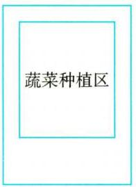

(第 9 题)

(2)若 $x, y > 0$ ，且 $x + {2y} = 1$ ，求 $\frac{1}{x} + \frac{1}{y}$ 的最小值.

9 某农户计划建造一个面积为 ${800}{\mathrm{\;m}}^{2}$ 的矩形温室,在温室内安排蔬菜种植区,并沿左、右两侧与后侧各保留 $1\mathrm{\;m}$ 宽的通道,沿前侧保留 $3\mathrm{\;m}$ 宽的空地(如图所示)，当矩形温室的长和宽分别为多少时，蔬菜种植区的占地面积最大? 并求出该最大值.

10 如图所示，为处理含有杂质的污水，要制造一个底宽为 2 米的无盖长方体沉淀箱，污水从 $A$ 孔流入，经沉淀后从 $B$ 孔流出. 设箱体的长度为 $a$ 米,高度为 $b$ 米. 已知流出的水中杂质的含量与 $a$ 、 $b$ 的乘积 ${ab}$ 成反比,现有制箱材料 60 平方米. 问当 $a\text{ 、 }b$ 各为多少时,经沉淀后流出的水中杂质的含量最低. ( $A\text{ 、 }B$ 孔的面积忽略不计)

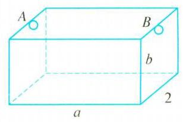

(第 10 题)

## 三、平均值不等式的推广

平均值不等式 1 和平均值不等式 2 可以推广到三个变量的情形.

平均值不等式 3 : 如果 $a, b, c > 0$ ,那么 ${a}^{3} + {b}^{3} + {c}^{3} \geq  {3abc}$ ,当且仅当 $a = b = c$ 时等号成立.

证明方法一:因为 ${a}^{3} + {b}^{3} + {c}^{3} - {3abc}$

$$
= {\left( a + b\right) }^{3} + {c}^{3} - 3{a}^{2}b - {3a}{b}^{2} - {3abc}
$$

$$
= \left( {a + b + c}\right) \left\lbrack  {{\left( a + b\right) }^{2} - \left( {a + b}\right) c + {c}^{2}}\right\rbrack   - {3ab}\left( {a + b + c}\right)
$$

$$
= \left( {a + b + c}\right) \left( {{a}^{2} + {b}^{2} + {c}^{2} - {ab} - {ac} - {bc}}\right) ,
$$

又 $a, b, c > 0$ ,且 ${a}^{2} + {b}^{2} + {c}^{2} \geq  {ab} + {ac} + {bc}$ (例 1 已证),所以 ${a}^{3} + {b}^{3} + {c}^{3} - {3abc} \geq  0$ ,即

$$
{a}^{3} + {b}^{3} + {c}^{3} \geq  {3abc},
$$

当且仅当 $a = b = c$ 时等号成立.

方法二: ${a}^{3} + {b}^{3} = \left( {a + b}\right) \left( {{a}^{2} - {ab} + {b}^{2}}\right)$ .

由 ${a}^{2} + {b}^{2} \geq  {2ab}$ ,得 ${a}^{2} + {b}^{2} - {ab} \geq  {ab}$ .

因为 $a, b > 0$ ,所以 $\left( {a + b}\right) \left( {{a}^{2} - {ab} + {b}^{2}}\right)  \geq  {ab}\left( {a + b}\right)$ ,即 ${a}^{3} + {b}^{3} \geq  {ab}\left( {a + b}\right)$ .

同理 ${a}^{3} + {c}^{3} \geq  {ac}\left( {a + c}\right) ,{b}^{3} + {c}^{3} \geq  {bc}\left( {b + c}\right)$ .

将上述三个不等式同向相加，得

$$
2\left( {{a}^{3} + {b}^{3} + {c}^{3}}\right)  \geq  {a}^{2}b + a{b}^{2} + {a}^{2}c + a{c}^{2} + {b}^{2}c + b{c}^{2}
$$

$$
= \left( {{a}^{2}b + b{c}^{2}}\right)  + \left( {a{b}^{2} + a{c}^{2}}\right)  + \left( {{a}^{2}c + {b}^{2}c}\right)
$$

$$
\geq  {2abc} + {2abc} + {2abc} = {6abc},
$$

即 ${a}^{3} + {b}^{3} + {c}^{3} \geq  {3abc}$ ,当且仅当 $a = b = c$ 时等号成立.

方法三: 因为 $a, b, c > 0$ ,所以

$$
{a}^{3} + {b}^{3} + {c}^{3} + {abc} \geq  2\sqrt{{a}^{3}{b}^{3}} + 2\sqrt{{c}^{3} \times  {abc}}
$$

$$
= 2\left( {\sqrt{{a}^{3}{b}^{3}} + \sqrt{{ab}{c}^{4}}}\right)
$$

$$
\geq  4\sqrt{\sqrt{{a}^{3}{b}^{3}} \times  \sqrt{{ab}{c}^{4}}}
$$

$$
= 4\sqrt{\sqrt{{a}^{4}{b}^{4}{c}^{4}}}
$$

$$
= {4abc},
$$

即 ${a}^{3} + {b}^{3} + {c}^{3} \geq  {3abc}$ ,当且仅当 $a = b = c$ 时等号成立.

平均值不等式 4: 如果 $a, b, c > 0$ ,那么 $\frac{a + b + c}{3} \geq  \sqrt[3]{abc}$ ,当且仅当 $a = b = c$ 时等号成立.

证明 由 $a, b, c > 0$ 和平均值不等式 3,得

$$
a + b + c = {\left( \sqrt[3]{a}\right) }^{3} + {\left( \sqrt[3]{b}\right) }^{3} + {\left( \sqrt[3]{c}\right) }^{3} \geq  3\sqrt[3]{a} \cdot  \sqrt[3]{b} \cdot  \sqrt[3]{c} = 3\sqrt[3]{abc},
$$

于是 $\frac{a + b + c}{3} \geq  \sqrt[3]{abc}$ ,当且仅当 $\sqrt[3]{a} = \sqrt[3]{b} = \sqrt[3]{c}$ ,即 $a = b = c$ 时等号成立.

所以，对 $a, b, c > 0$ ，有 $\frac{a + b + c}{3} \geq  \sqrt[3]{abc}$ ，当且仅当 $a = b = c$ 时等号成立.

例 6 已知 $a, b, c > 0$ ,求证: $\left( {a + b + c}\right) \left( {\frac{1}{a} + \frac{1}{b} + \frac{1}{c}}\right)  \geq  9$ .

证明 由 $a, b, c > 0$ 和平均值不等式 4,得

$$
\frac{a + b + c}{3} \geq  \sqrt[3]{abc} > 0,
$$

$$
\frac{1}{a} + \frac{1}{b} + \frac{1}{c} \geq  3 \cdot  \frac{1}{\sqrt[3]{abc}} > 0,
$$

所以, $\left( {a + b + c}\right) \left( {\frac{1}{a} + \frac{1}{b} + \frac{1}{c}}\right)  \geq  3\sqrt[3]{abc} \cdot  3\frac{1}{\sqrt[3]{abc}} \geq  9$ ,当且仅当 $a = b = c$ 时等号成立.

例 7 已知 $a > b > 0$ ,求证: $a + \frac{1}{\left( {a - b}\right) b} \geq  3$ .

证明 由 $a > b > 0$ 和平均值不等式 4,得

$$
a + \frac{1}{\left( {a - b}\right) b} = \left( {a - b}\right)  + b + \frac{1}{\left( {a - b}\right) b}
$$

$$
\geq  3\sqrt[3]{\left( {a - b}\right)  \cdot  b \cdot  \frac{1}{\left( {a - b}\right) b}} = 3\text{ . }
$$

所以, $a + \frac{1}{\left( {a - b}\right) b} \geq  3$ ,当且仅当 $a = 2, b = 1$ 时等号成立.

例 8 有一块边长为 1 米的正方形硬纸板, 在它的四个角各剪去一个小正方形后, 再折成一个无盖的盒子, 如图 2-13 所示. 如果要使制成的盒子的容积最大, 那么剪去的小正方形的边长应为多少米?

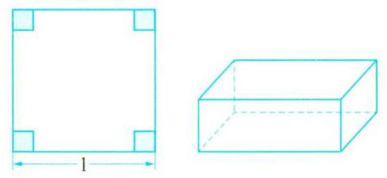

图 2-13

解 设剪去的小正方形的边长为 $x$ 米,则制成的盒子的容积

$$
V = x{\left( 1 - 2x\right) }^{2}\left( {0 < x < \frac{1}{2}}\right) .
$$

于是, $V = \frac{1}{4} \cdot  {4x}\left( {1 - {2x}}\right) \left( {1 - {2x}}\right) , x > 0,1 - {2x} > 0$ .

根据平均值不等式 4,得 ${abc} \leq  {\left( \frac{a + b + c}{3}\right) }^{3}$ ,当且仅当 $a = b = c$ 时等号成立.

所以

$$
V = \frac{1}{4} \cdot  {4x}\left( {1 - {2x}}\right) \left( {1 - {2x}}\right)  \leq  \frac{1}{4} \cdot  {\left( \frac{{4x} + \left( {1 - {2x}}\right)  + \left( {1 - {2x}}\right) }{3}\right) }^{3} = \frac{2}{27},
$$

当且仅当 ${4x} = 1 - {2x}$ ，即 $x = \frac{1}{6}$ 时，制成的盒子的容积最大，此时剪去的小正方形的边长为 $\frac{1}{6}$ 米,盒子容积的最大值为 $\frac{2}{27}{\mathrm{\;m}}^{3}$ .

## 练一练

11 已知 $a, b, c > 0$ ,求证: $\left( {\frac{a}{b} + \frac{b}{c} + \frac{c}{a}}\right) \left( {\frac{b}{a} + \frac{c}{b} + \frac{a}{c}}\right)  \geq  9$ .

12 (1)求 ${x}^{2} + \frac{2}{x}\left( {x > 0}\right)$ 的最小值；

(2)求 ${6x} + \frac{2}{3{x}^{2}}\left( {x > 0}\right)$ 的最小值；

(3)求 ${x}^{2}\left( {2 - {3x}}\right) \left( {0 < x < \frac{2}{3}}\right)$ 的最大值；

(4)设 $a > b > 0$ ，求 ${2a} + \frac{1}{b\left( {a - b}\right) }$ 的最小值.

13 一艘渔船在航行过程中每小时的燃料费与它的速度 (千米/时) 的立方成正比例关系, 其他与速度无关的费用为每小时 96 元, 已知当速度为每小时 10 千米时, 每小时的燃料费是 6 元, 要使行驶 1 千米所需的费用总和最小, 这艘渔船的速度应为每小时多少千米?

## 四、三角不等式

下面这个定理中的不等式被称为三角不等式, 它在向量与复数等章节中会再次出现, 并起着重要的作用，且有明显的几何意义.

定理:如果 $a$ 、 $b$ 是实数，那么 $\left| \right| a\left| -\right| b\left| \right|  \leq  \left| {a + b}\right|  \leq  \left| a\right|  + \left| b\right|$ ，当且仅当 ${ab} \geq  0$ 时，不等式右边的等号成立; 当且仅当 ${ab} \leq  0$ 时,不等式左边的等号成立.

证明 方法一:先证 $\left| {a + b}\right|  \leq  \left| a\right|  + \left| b\right|$ .

欲证

$$
\left| {a + b}\right|  \leq  \left| a\right|  + \left| b\right| ,
$$

只需证明

$$
{\left( a + b\right) }^{2} \leq  {\left( \left| a\right|  + \left| b\right| \right) }^{2},
$$

即证

$$
{a}^{2} + {2ab} + {b}^{2} \leq  {\left| a\right| }^{2} + 2\left| {ab}\right|  + {\left| b\right| }^{2},
$$

亦即证

$$
{2ab} \leq  2\left| {ab}\right| \text{ . }
$$

因为不等式 ${2ab} \leq  2\left| {ab}\right|$ 恒成立,且以上每一步都可逆,所以不等式 $\left| {a + b}\right|  \leq  \left| a\right|  + \; \left| b\right|$ 成立.

再证 $\left| \right| a\left| -\right| b\left| \right|  \leq  \left| {a + b}\right|$ .

由上面已证不等式 $\left| {a + b}\right|  \leq  \left| a\right|  + \left| b\right|$ ,得

$$
\left| a\right|  = \left| {\left( {a + b}\right)  - b}\right|  \leq  \left| {a + b}\right|  + \left| {-b}\right| ,
$$

整理得

$$
\left| a\right|  - \left| b\right|  \leq  \left| {a + b}\right| ,
$$

当且仅当 $\left( {a + b}\right)  \cdot  \left( {-b}\right)  \geq  0$ ,即 $- {ab} \geq  {b}^{2}$ ,亦即 ${ab} \leq  0$ 时取等号.

同理可证,

$$
\left| b\right|  - \left| a\right|  \leq  \left| {a + b}\right| .
$$

所以

$$
\left| \right| a\left| -\right| b\left| \right|  \leq  \left| {a + b}\right| \text{ . }
$$

综上可知,不等式 $\left| \right| a\left| -\right| b\left| \right|  \leq  \left| {a + b}\right|  \leq  \left| a\right|  + \left| b\right|$ 成立.

方法二:根据实数绝对值的性质, 得

$$
- \left| a\right|  \leq  a \leq  \left| a\right| ,
$$

$$
- \left| b\right|  \leq  b \leq  \left| b\right| ,
$$

将上面两个不等式同向相加,得 $- \left( {\left| a\right|  + \left| b\right| }\right)  \leq  a + b \leq  \left| a\right|  + \left| b\right|$ ,即

$$
\left| {a + b}\right|  \leq  \left| a\right|  + \left| b\right| .
$$

不等式 $\left| \right| a\left| -\right| b\left| \right|  \leq  \left| {a + b}\right|$ 的证明同方法一.

由于定理 1 与三角形两边之和大于第三边有关联, 故也称此不等式为绝对值三角不等式.

推论 1: 如果 $a\text{ 、 }b$ 是实数,那么 $\left| \right| a\left| -\right| b\left| \right|  \leq  \left| {a - b}\right|  \leq  \left| a\right|  + \left| b\right|$ .

当 ${ab} \leq  0$ 时不等式右边取等号,当 ${ab} \geq  0$ 时不等式左边取等号,请同学们自主完成证明.

推论 2: 如果 ${a}_{1},{a}_{2},\cdots ,{a}_{n}$ 都是实数,那么 $\left| {{a}_{1} + {a}_{2} + \cdots  + {a}_{n}}\right|  \leq  \left| {a}_{1}\right|  + \left| {a}_{2}\right|  + \cdots  + \; \left| {a}_{n}\right|$ ，当且仅当 ${a}_{1} \geq  0,{a}_{2} \geq  0,\cdots ,{a}_{n} \geq  0$ 或 ${a}_{1} \leq  0,{a}_{2} \leq  0,\cdots ,{a}_{n} \leq  0$ 时等号成立.

例 9 已知 $a\text{ 、 }b\text{ 、 }c$ 是实数,求证: $\left| {a - c}\right|  \leq  \left| {a - b}\right|  + \left| {b - c}\right|$ .

证明 因为 $\left( {a - b}\right)  + \left( {b - c}\right)  = a - c$ ,由三角不等式,有

$$
\left| {\left( {a - b}\right)  + \left( {b - c}\right) }\right|  \leq  \left| {a - b}\right|  + \left| {b - c}\right| ,
$$

所以 $\left| {a - c}\right|  \leq  \left| {a - b}\right|  + \left| {b - c}\right|$ ,当且仅当 $\left( {a - b}\right) \left( {b - c}\right)  \geq  0$ 时等号成立.

其几何解释如下:

在数轴上,设 $a\text{ 、 }b\text{ 、 }c$ 所对应的点分别为 $A\text{ 、 }B\text{ 、 }C$ ,则

(1)当点 $B$ 在点 $A\text{ 、 }C$ 之间时, $\left| {a - c}\right|  = \left| {a - b}\right|  + \left| {b - c}\right|$ ;

(2)当点 $B$ 不在点 $A\text{ 、 }C$ 之间时:

① 若点 $B$ 在 $A$ 或 $C$ 上时，有 $\left| {a - c}\right|  = \left| {a - b}\right|  + \left| {b - c}\right|$ ；

② 若点 $B$ 既不在 $A$ 也不在 $C$ 上时,有 $\left| {a - c}\right|  < \left| {a - b}\right|  + \left| {b - c}\right|$ .

例 10 已知 $\left| {x - a}\right|  < \frac{c}{4},\left| {y - b}\right|  < \frac{c}{6}$ ,求证: $\left| {\left( {{2x} + {3y}}\right)  - \left( {{2a} + {3b}}\right) }\right|  < c$ .

证明 $\left| {\left( {{2x} + {3y}}\right)  - \left( {{2a} + {3b}}\right) }\right|  = \left| {\left( {{2x} - {2a}}\right)  + \left( {{3y} - {3b}}\right) }\right|$

$$
\leq  \left| {{2x} - {2a}}\right|  + \left| {{3y} - {3b}}\right|  = 2\left| {x - a}\right|  + 3\left| {y - b}\right| .
$$

①

因为 $\left| {x - a}\right|  < \frac{c}{4},\left| {y - b}\right|  < \frac{c}{6}$ ,所以

$$
2\left| {x - a}\right|  + 3\left| {y - b}\right|  < \frac{c}{2} + \frac{c}{2} = c.
$$

②

由①②得 $\left| {\left( {{2x} + {3y}}\right)  - \left( {{2a} + {3b}}\right) }\right|  < c$ .

例 11 已知 $f\left( x\right)  = \sqrt{1 + {x}^{2}}, a, b \in  \mathbf{R}$ ，且 $a \neq  b$ ，求证: $\left| {f\left( a\right)  - f\left( b\right) }\right|  < \left| {a - b}\right|$ .

证明 $\left| {f\left( a\right)  - f\left( b\right) }\right|  = \left| {\sqrt{1 + {a}^{2}} - \sqrt{1 + {b}^{2}}}\right|  = \frac{\left| {a}^{2} - {b}^{2}\right| }{\sqrt{1 + {a}^{2}} + \sqrt{1 + {b}^{2}}}$ .

因为 $\sqrt{1 + {a}^{2}} > \sqrt{{a}^{2}} = \left| a\right|$ ,同理 $\sqrt{1 + {b}^{2}} > \left| b\right|$ ,所以 $\frac{1}{\sqrt{1 + {a}^{2}} + \sqrt{1 + {b}^{2}}} < \frac{1}{\left| a\right|  + \left| b\right| }$ , 进而得

$$
\frac{\left| {a}^{2} - {b}^{2}\right| }{\sqrt{1 + {a}^{2}} + \sqrt{1 + {b}^{2}}} < \frac{\left| {a + b}\right|  \cdot  \left| {a - b}\right| }{\left| a\right|  + \left| b\right| } \leq  \frac{\left| a\right|  + \left| b\right| }{\left| a\right|  + \left| b\right| } \cdot  \left| {a - b}\right|  = \left| {a - b}\right| .
$$

所以, $\left| {f\left( a\right)  - f\left( b\right) }\right|  < \left| {a - b}\right|$ .

例 12 ( 1 )若关于 $x$ 的不等式 $\left| {x - 3}\right|  - \left| {x + 1}\right|  \leq  a$ 对任意实数 $x$ 恒成立，求实数 $a$ 的取值范围;

(2)若关于 $x$ 的不等式 $\left| {x - 3}\right|  - \left| {x + 1}\right|  \leq  a$ 的解集不是空集,求实数 $a$ 的取值范围;

(3)若关于 $x$ 的不等式 $\left| {x - 3}\right|  - \left| {x + 1}\right|  \leq  a$ 的解集是 $\mathbf{R}$ 的非空真子集,求实数 $a$ 的取值范围.

解 令 $y = \left| {x - 3}\right|  - \left| {x + 1}\right|$ . 因为 $\left| \right| x - 3\left| -\right| x + 1\left| \right|  \leq  \left| {\left( {x - 3}\right)  - \left( {x + 1}\right) }\right|  = 4$ , 所以 $- 4 \leq  \left| {x - 3}\right|  - \left| {x + 1}\right|  \leq  4$ ,可得

$$
{y}_{\max } = 4\text{ ,此时 }x \leq   - 1;{y}_{\min } =  - 4\text{ ,此时 }x \geq  3\text{ . }
$$

(1)不等式 $\left| {x - 3}\right|  - \left| {x + 1}\right|  \leq  a$ 的解集为 $\mathbf{R}$ ,得 $a \geq  {y}_{\max } = 4$ ,即 $a \geq  4$ .

(2)不等式 $\left| {x - 3}\right|  - \left| {x + 1}\right|  \leq  a$ 有解,得 $a \geq  {y}_{\min } =  - 4$ ,即 $a \geq   - 4$ .

(3)不等式 $\left| {x - 3}\right|  - \left| {x + 1}\right|  \leq  a$ 有解且不恒成立，得 ${y}_{\min } \leq  a < {y}_{\max }$ ，即 $- 4 \leq  a < 4$ .

4. 请借助函数 $y = \left| {x - 3}\right|  - \left| {x + 1}\right|$ 的图像求解例 12.

5. 设 $n$ 是正整数, $x$ 是实数,则当 $x$ 取何值时, $\left| {x - 1}\right|  + \left| {x - 2}\right|  + \cdots  +  \mid  x - n$ 取最小值?

## 练一练

14 当 $a, b \in  \mathbf{R}$ 时，不等式 $\frac{\left| a + b\right| }{\left| a\right|  + \left| b\right| } \leq  1$ 成立的充要条件是( ).

(A) ${ab} \neq  0$ (B) ${a}^{2} + {b}^{2} \neq  0$ (C) ${ab} < 0$ (D) ${ab} > 0$

15 若不等式 $\left| {x + 3}\right|  - \left| {x - 1}\right|  \leq  {a}^{2} - {3a}$ 对任意实数 $x$ 恒成立，则实数 $a$ 的范围是 ( ).

(A) $\left( {-\infty , - 1\rbrack \cup \lbrack 4, + \infty }\right)$ (B) $\left( {-\infty , - 2\rbrack \cup \lbrack 5, + \infty }\right)$

(C) $\left\lbrack  {1,2}\right\rbrack$ (D) $\left( {-\infty , - 1\rbrack \cup \lbrack 2, + \infty }\right)$

16 若关于 $x$ 的不等式 $\left| {x - 4}\right|  + \left| {x + 3}\right|  < a$ 的解集不是空集,则实数 $a$ 的取值范围是 ___.

17 (1)已知 $\left| x\right|  < \frac{a}{4},\left| y\right|  < \frac{a}{6}$ ,求证: $\left| {{2x} - {3y}}\right|  < a$ ;

(2)已知实数 $x\text{ 、 }y$ 满足 $\left| {x + y}\right|  \leq  \frac{1}{6},\left| {x - y}\right|  \leq  \frac{1}{4}$ ,求证: $\left| {x + {5y}}\right|  \leq  1$ .

18 设 $a \in  \mathbf{R}$ ,函数 $f\left( x\right)  = a{x}^{2} + x - a\left( {-1 \leq  x \leq  1}\right)$ . 若 $\left| a\right|  \leq  1$ ,求 $\left| {f\left( x\right) }\right|$ 的最大值.

## 读一读

## 柯西及柯西不等式

柯西是法国数学家、物理学家、天文学家. 他出生于巴黎, 少年时代便显露出过人的数学才华，受到法国大数学家拉格朗日和拉普拉斯的赏识和指导.

柯西是十九世纪最著名的数学家之一，其论著多达 800 余篇(或部)，后人编辑出版柯西全集历时近百年，全集总计达 28 卷，在数学史上他是仅次于欧拉的多产数学家. 有很多数学的定理和公式都以他的名字来命名，同学们将在高等数学的学习中深有体会.

人无完人，作为一位学者，他思路敏捷，工作勤奋，功绩卓著；但作为久负盛名的科学泰斗， 他有时却忽视了青年学者的培养和创造. 例如，由于柯西“失落”了英年早逝的年轻数学家阿贝尔与伽罗华的开创性的论文手稿，致使群论问世约晚了半个世纪.

1857 年 5 月 23 日，柯西在巴黎病逝. 他临终时的一句名言——“人总是要死的，但是，他们的业绩永存”长久地叩击着一代又一代学子的心扉.

在中学数学里, 柯西不等式是一个伟大的公式, 相信每个同学都在解题中或多或少地用过它. 这个不等式是由柯西在研究数学分析中的 “流数” 问题时得到的. 从历史的角度讲, 该不等式应当称为柯西-布尼亚科夫斯基-施瓦茨不等式, 因为, 正是后两位数学家彼此独立地在积分学中推而广之, 才将这一不等式应用到近乎完善的地步.

下面介绍柯西不等式的不同表现形式.

二维形式:

$\left( {{a}^{2} + {b}^{2}}\right) \left( {{c}^{2} + {d}^{2}}\right)  \geq  {\left( ac + bd\right) }^{2}\left( {a, b, c, d \in  \mathbf{R}}\right)$ ,当且仅当 ${ad} = {bc}$ 时等号成立. 一般形式:

$$
{\left( {a}_{1}{b}_{1} + {a}_{2}{b}_{2} + \cdots  + {a}_{n}{b}_{n}\right) }^{2}
$$

$$
\leq  \left( {{a}_{1}^{2} + {a}_{2}^{2} + \cdots  + {a}_{n}^{2}}\right) \left( {{b}_{1}^{2} + {b}_{2}^{2} + \cdots  + {b}_{n}^{2}}\right) \left( {{a}_{i},{b}_{i} \in  \mathbf{R}, i = 1,2,\cdots , n}\right) ,
$$

当且仅当 ${a}_{1} = {a}_{2} = \cdots  = {a}_{n} = 0$ 或 ${b}_{i} = k{a}_{i}$ 时等号成立 $\left( {k\text{ 为常数, }i = 1,2,\cdots , n}\right)$ .

证明: 构造二次函数

$$
f\left( x\right)  = {\left( {a}_{1}x + {b}_{1}\right) }^{2} + {\left( {a}_{2}x + {b}_{2}\right) }^{2} + \cdots  + {\left( {a}_{n}x + {b}_{n}\right) }^{2}
$$

$$
= \left( {{a}_{1}^{2} + {a}_{2}^{2} + \cdots  + {a}_{n}^{2}}\right) {x}^{2} + 2\left( {{a}_{1}{b}_{1} + {a}_{2}{b}_{2} + \cdots  + {a}_{n}{b}_{n}}\right) x + \left( {{b}_{1}^{2} + {b}_{2}^{2} + \cdots  + {b}_{n}^{2}}\right) ,
$$

则 $f\left( x\right)  \geq  0$ 恒成立.

若 ${a}_{1}^{2} + {a}_{2}^{2} + \cdots  + {a}_{n}^{2} > 0$ ,则

$$
\Delta  = 4{\left( {a}_{1}{b}_{1} + {a}_{2}{b}_{2} + \cdots  + {a}_{n}{b}_{n}\right) }^{2} - 4\left( {{a}_{1}^{2} + {a}_{2}^{2} + \cdots  + {a}_{n}^{2}}\right) \left( {{b}_{1}^{2} + {b}_{2}^{2} + \cdots  + {b}_{n}^{2}}\right)  \leq  0\text{ ,即 }
$$

$$
{\left( {a}_{1}{b}_{1} + {a}_{2}{b}_{2} + \cdots  + {a}_{n}{b}_{n}\right) }^{2} \leq  \left( {{a}_{1}^{2} + {a}_{2}^{2} + \cdots  + {a}_{n}^{2}}\right) \left( {{b}_{1}^{2} + {b}_{2}^{2} + \cdots  + {b}_{n}^{2}}\right) ,
$$

当且仅当 ${a}_{i}x + {b}_{i} = 0\left( {i = 1,2,\cdots , n}\right)$ ,即 ${b}_{i} = k{a}_{i}\left( {k\text{ 为常数, }i = 1,2,\cdots , n}\right)$ 时等号成立.

若 ${a}_{1}^{2} + {a}_{2}^{2} + \cdots  + {a}_{n}^{2} = 0$ ,则 ${a}_{1} = {a}_{2} = \cdots  = {a}_{n} = 0$ ,不等式两边都等于 0,显然不等式成立.

综上所述, 柯西不等式得以证明.

在今后的学习中, 柯西不等式还会以其他形式出现. 总之, 柯西不等式在不等式证明和求最值的有关问题中有着十分广泛的应用, 它是研究不等式的一个重要工具.

### 2.5 不等式的证明

下面介绍一些常用的不等式的证明方法.

## 一、比较法

比较法是证明不等式的常用方法,即对于任意两个实数 $a\text{ 、 }b$ ,要证明 $a > b$ ,只需证明 $a - \; b > 0$ 即可; 同样,要证明 $a < b$ ,只需证明 $a - b < 0$ 即可.

用比较法证明不等式的一般步骤是:先作出要求证的不等式两边的差，再通过对这个差式的变形 (分解因式或配方等), 确定其值是正还是负, 从而证明不等式成立.

例 1 求证: 对任意 $x, y \in  \mathbf{R}$ ,都有 ${x}^{2} + {y}^{2} + {xy} \geq  3\left( {x + y - 1}\right)$ .

证明 方法一: 因为 ${x}^{2} + {y}^{2} + {xy} - 3\left( {x + y - 1}\right)$

$$
= {x}^{2} + {y}^{2} + {xy} - {3x} - {3y} + 3
$$

$$
= {\left( x - y\right) }^{2} + 3\left( {x - 1}\right) \left( {y - 1}\right)
$$

$$
= {\left( x - 1\right) }^{2} + \left( {x - 1}\right) \left( {y - 1}\right)  + {\left( y - 1\right) }^{2}
$$

$$
= {\left\lbrack  \left( x - 1\right)  + \frac{1}{2}\left( y - 1\right) \right\rbrack  }^{2} + \frac{3}{4}{\left( y - 1\right) }^{2} \geq  0,
$$

所以,对任意 $x, y \in  \mathbf{R}$ ,都有 ${x}^{2} + {y}^{2} + {xy} \geq  3\left( {x + y - 1}\right)$ .

方法二:因为 ${x}^{2} + {y}^{2} + {xy} - 3\left( {x + y - 1}\right)$

$$
= {x}^{2} + \left( {y - 3}\right) x + \left( {{y}^{2} - {3y} + 3}\right)
$$

$$
= {\left( x + \frac{y - 3}{2}\right) }^{2} + \left( {{y}^{2} - {3y} + 3}\right)  - \frac{1}{4}{\left( y - 3\right) }^{2}
$$

$$
= {\left( x + \frac{y - 3}{2}\right) }^{2} + \frac{3}{4}{y}^{2} - \frac{3}{2}y + \frac{3}{4}
$$

$$
= {\left( x + \frac{y - 3}{2}\right) }^{2} + \frac{3}{4}{\left( y - 1\right) }^{2} \geq  0,
$$

所以,对任意 $x, y \in  \mathbf{R}$ ,都有 ${x}^{2} + {y}^{2} + {xy} \geq  3\left( {x + y - 1}\right)$ .

例 2 若 $a, b > 0, n > 1, n$ 为正整数,求证: ${a}^{n} + {b}^{n} \geq  {a}^{n - 1}b + a{b}^{n - 1}$ .

证明 因为 $\left( {{a}^{n} + {b}^{n}}\right)  - \left( {{a}^{n - 1}b + a{b}^{n - 1}}\right)$

$$
= {a}^{n - 1}\left( {a - b}\right)  - {b}^{n - 1}\left( {a - b}\right)
$$

$$
= \left( {a - b}\right) \left( {{a}^{n - 1} - {b}^{n - 1}}\right) \text{ . }
$$

若 $a > b > 0$ ,则 $a - b > 0,{a}^{n - 1} > {b}^{n - 1}$ ,所以 $\left( {a - b}\right) \left( {{a}^{n - 1} - {b}^{n - 1}}\right)  > 0$ ;

若 $0 < a < b$ ,则 $a - b < 0,{a}^{n - 1} < {b}^{n - 1}$ ,所以 $\left( {a - b}\right) \left( {{a}^{n - 1} - {b}^{n - 1}}\right)  > 0$ ;

若 $a = b$ ,则 $\left( {a - b}\right) \left( {{a}^{n - 1} - {b}^{n - 1}}\right)  = 0$ .

综上可知,当 $a, b > 0, n > 1, n$ 为正整数时,不等式 ${a}^{n} + {b}^{n} \geq  {a}^{n - 1}b + a{b}^{n - 1}$ 成立.

## 二、分析法

证明不等式时, 有时可以从要求证的不等式出发, 分析使这个不等式成立的充分条件, 把证明不等式转化为判定这些充分条件是否具备的问题. 如果能够确定这些充分条件都已具备, 那么就可以断定原不等式成立, 这种方法通常叫做分析法.

例 3 设 $x > 0, y > 0$ ,求证: ${\left( {x}^{2} + {y}^{2}\right) }^{\frac{1}{2}} > {\left( {x}^{3} + {y}^{3}\right) }^{\frac{1}{3}}$ .

证明 因为 $x > 0, y > 0$ ,所以

欲证

$$
{\left( {x}^{2} + {y}^{2}\right) }^{\frac{1}{2}} > {\left( {x}^{3} + {y}^{3}\right) }^{\frac{1}{3}},
$$

只需证明

$$
{\left( {x}^{2} + {y}^{2}\right) }^{3} > {\left( {x}^{3} + {y}^{3}\right) }^{2},
$$

两边展开得

$$
{x}^{6} + 3{x}^{4}{y}^{2} + 3{x}^{2}{y}^{4} + {y}^{6} > {x}^{6} + 2{x}^{3}{y}^{3} + {y}^{6},
$$

即证

$$
3{x}^{4}{y}^{2} + 3{x}^{2}{y}^{4} > 2{x}^{3}{y}^{3},
$$

又 ${x}^{2}{y}^{2} > 0$ ,即证

$$
3{x}^{2} + 3{y}^{2} > {2xy}.
$$

由 $x > 0, y > 0$ 和平均值不等式 1,可知不等式

$$
3{x}^{2} + 3{y}^{2} = 3\left( {{x}^{2} + {y}^{2}}\right)  \geq  {6xy} > {2xy}
$$

恒成立，且以上每一步均可逆.

所以，原不等式 ${\left( {x}^{2} + {y}^{2}\right) }^{\frac{1}{2}} > {\left( {x}^{3} + {y}^{3}\right) }^{\frac{1}{3}}$ 成立.

## 三、综合法

综合法是“由因导果”, 即从已知条件出发, 利用各种已知的命题和运算性质作为依据, 逐步推导出要求证的不等式.

例 4 设 $a, b, x, y \in  \mathbf{R}$ ,且 ${a}^{2} + {b}^{2} = 1,{x}^{2} + {y}^{2} = 1$ ,试证: $\left| {{ax} + {by}}\right|  \leq  1$ .

证明 由已知条件,得

$$
{\left( ax + by\right) }^{2} = {a}^{2}{x}^{2} + {2abxy} + {b}^{2}{y}^{2}
$$

$$
\leq  {a}^{2}{x}^{2} + \left( {{b}^{2}{y}^{2} + {b}^{2}{x}^{2}}\right)  + {a}^{2}{y}^{2}
$$

$$
= \left( {{a}^{2} + {b}^{2}}\right) \left( {{x}^{2} + {y}^{2}}\right)
$$

$$
= 1\text{ . }
$$

所以, $\left| {{ax} + {by}}\right|  \leq  1$ 成立.

例 5 已知 $\bigtriangleup {ABC}$ 的三边长为 $a\text{ 、 }b\text{ 、 }c$ ,且 $s = \frac{a + b + c}{2}$ ,求证:

$$
\left( {s - a}\right) \left( {s - b}\right) \left( {s - c}\right)  \leq  \frac{abc}{8}.
$$

证明 由已知和三角形两边之和大于第三边, 得

$$
s - a = \frac{b + c - a}{2} > 0.
$$

同理,得 $s - b > 0, s - c > 0$ .

由基本不等式 2 , 得

$$
\left( {s - a}\right) \left( {s - b}\right)  \leq  {\left( \frac{s - a + s - b}{2}\right) }^{2} = \frac{1}{4}{\left( 2s - a - b\right) }^{2} = \frac{{c}^{2}}{4}.
$$

同理, 得

$$
\left( {s - b}\right) \left( {s - c}\right)  \leq  \frac{{a}^{2}}{4},\left( {s - c}\right) \left( {s - a}\right)  \leq  \frac{{b}^{2}}{4}.
$$

由不等式的基本性质 (6), 将上面三个不等式同向相乘, 得

$$
{\left( s - a\right) }^{2}{\left( s - b\right) }^{2}{\left( s - c\right) }^{2} \leq  {\left( \frac{abc}{8}\right) }^{2}.
$$

根据不等式的基本性质 (8), 得

$$
\left( {s - a}\right) \left( {s - b}\right) \left( {s - c}\right)  \leq  \frac{abc}{8}.
$$

所以,原不等式 $\left( {s - a}\right) \left( {s - b}\right) \left( {s - c}\right)  \leq  \frac{abc}{8}$ 成立.

## 四、反证法

证明某个命题时, 先假设它的结论的否定成立, 然后从这个假设出发, 根据已有的条件和已知的真命题，经过推理，得出与已知事实(条件、公理、定义、定理、法则、公式等)相矛盾的结果. 这样, 就证明了结论的否定不成立, 从而间接地肯定了原命题的结论成立. 这种证明的方法, 叫做反证法.

例 6 已知 $a, b, c \in  \left( {0,1}\right)$ ,求证: $\left( {1 - a}\right) b,\left( {1 - b}\right) c,\left( {1 - c}\right) a$ 不可能同时大于 $\frac{1}{4}$ .

证明 假设结论不成立, 即

$$
\left( {1 - a}\right) b > \frac{1}{4},\left( {1 - b}\right) c > \frac{1}{4},\left( {1 - c}\right) a > \frac{1}{4}.
$$

由不等式的基本性质 (6), 将上面三个不等式同向相乘,得

$$
\left( {1 - a}\right) b \cdot  \left( {1 - b}\right) c \cdot  \left( {1 - c}\right) a > \frac{1}{64}.
$$

①

又因为 $a, b, c \in  \left( {0,1}\right)$ ,所以

$$
0 < \left( {1 - a}\right) a \leq  {\left\lbrack  \frac{\left( {1 - a}\right)  + a}{2}\right\rbrack  }^{2} = \frac{1}{4},
$$

同理, 得

$$
0 < \left( {1 - b}\right) b \leq  \frac{1}{4},0 < \left( {1 - c}\right) c \leq  \frac{1}{4}.
$$

由不等式的基本性质 (6), 将上面三个不等式同向相乘, 得

$$
\left( {1 - a}\right) b \cdot  \left( {1 - b}\right) c \cdot  \left( {1 - c}\right) a \leq  \frac{1}{64},
$$

这与①矛盾，即假设不成立.

所以，原命题成立.

## 练一练

1 求证: 对任意 $x \in  \mathbf{R}$ ,都有 ${x}^{8} + {x}^{2} + 1 \geq  {x}^{5} + x$ .

2 已知 $a, b, m > 0$ ,且 $a < b$ ,求证: $\frac{a + m}{b + m} > \frac{a}{b}$ .

3 已知 $\left| a\right|  < 1,\left| b\right|  < 1$ ,求证: $\left| \frac{a + b}{1 + {ab}}\right|  < 1$ .

4 已知 ${a}^{3} + {b}^{3} = 2$ ,求证: $a + b \leq  2$ .

5 已知 $a > 0, b > 0, c > 0$ ,求证: $\frac{1}{2a} + \frac{1}{2b} + \frac{1}{2c} \geq  \frac{1}{b + c} + \frac{1}{c + a} + \frac{1}{a + b}$ .

6 求证: 对任意实数 $a\text{ 、 }b,\left| {a + b}\right| \text{ 、 }\left| {a - b}\right| \text{ 、 }\left| {1 - a}\right|$ 中至少有一个不小于 $\frac{1}{2}$ .

## 读一读

## 人民数学家华罗庚

华罗庚，被誉为“中国数学之神”“中国现代数学之父”“人民数学家”. 他于 1910 年 11 月 12 日出生于江苏金坛. 1985 年 6 月 12 日，他在东京大学做学术报告时因患急性心肌梗死逝世.

华罗庚主要从事解析数论、矩阵几何学、典型群、自守函数论、多复变函数论、偏微分方程、 高维数值积分等领域的研究，他是中国解析数论、矩阵几何学、典型群、自守函数论等多方面研究的创始人和开拓者.

华罗庚早年的研究领域是解析数论，他在解析数论方面的成就尤其广为人知，国际颇具盛名的“中国解析数论学派”就是华罗庚开创的学派，该学派对于质数分布问题与哥德巴赫猜想做出了许多重大贡献. 华罗庚还在多复变函数论，矩阵几何学，典型群方面开创了国际上有名的“典型群中国学派”.

华罗庚在 20 世纪 40 年代，解决了高斯完整三角和的估计这一历史难题，得到了最佳误差阶估计；对 G. H. 哈代与 J. E. 李特尔伍德关于华林问题及 E. 赖特关于塔里问题的结果做出重大的改进，三角和研究成果被国际数学界称为 “华氏定理”，在代数方面，他证明了历史长久遗留的一维射影几何的基本定理；给出了“体的正规子体一定包含在它的中心之中”这个结果的一个简单而直接的证明，被称为嘉当-布饶尔-华定理. 华罗庚与王元教授合作在近代数论方法应用研究方面获重要成果，被国际数学界称为“华一王方法”. 华罗庚倡导应用数学与计算机的研制，曾出版《统筹方法平话》《优选学》等多部著作并亲自在中国推广应用. 他在发展数学教育和科学普及方面也做出了重要贡献.

华罗庚一生留下了十部巨著，其中有八部著作被翻译成外文出版，有些已列入 20 世纪数学的经典著作之列. 此外，他还发表学术论文 150 余篇，出版了图书《华罗庚科普著作选集》.

华罗庚为中国数学的发展做出了无与伦比的贡献，被列为 “芝加哥科学技术博物馆中当今世界 88 位数学伟人之一”.

许多学者对华罗庚如是评价.

哈贝斯坦:“华罗庚是他这个时代的国际领袖数学家之一.”

劳埃尔·熊飞儿德:“他的研究范围之广，堪称世界上名列前茅的数学家之一. 受到他直接影响的人也许比受历史上任何数学家直接影响的人都多”.

克拉达:“华罗庚形成中国数学.”

莱麦尔:“华罗庚有抓住别人最好的工作的不可思议的能力，并能准确地指出这些结果需要并可以改进的方法. 他有自己的技巧，他广泛阅读并掌握了 20 世纪数论的所有制高点，他的主要兴趣是改进整个领域，他试图推广他所遇到的每一个结果. ”

外尔:“华玩矩阵就像玩整数一样.”

贝特曼:“华罗庚是中国的爱因斯坦，足以成为全世界所有著名科学院的院士.”

丘成桐:“……先生起江南，读书清华. 浮四海，从哈代，访俄师，游美国. 创新求变，会意相得. 堆垒素数，复变多元. 雅篇艳什，迭互秀出. 匹夫挽狂澜于既倒，成一家之言，卓尔出群，斯何人也，其先生乎……”

王元:“从数学领域来说，大致分为两个:一个是分析，一个是代数. 绝大多数的数学家一般只在其中一个领域里做出贡献，但华罗庚却在两方面都有很大的贡献. 另外一方面，数学又分成纯粹数学和应用数学, 华罗庚也是同时在这两方面都有很大贡献. ”

吴耀祖:“华先生天赋丰厚，多才好学，学通中外，史汇古今，见识渊博，论著充栋. 他的生平工作和贡献，比比显示于他经历步过的广泛数学领域中，皆于可深入的即深入探隽，可浅出的即浅明清澈，能推广的即面面推广，能抽象的即悠然抽象……”

## 第 3 章 函数的概念、性质及应用

在现实世界中, 许多现象都表现出变量之间的依赖关系. 在数学中, 我们常用函数来描述这种关系, 并通过研究函数的性质了解它们的变化规律. 函数是现代数学重要的内容之一, 不仅在生产、生活中有着广泛的实际应用，其思想方法还渗透到数学、物理、化学及其他学科的各个领域.

在初中，我们已经学习了正比例函数、反比例函数、一次函数和二次函数等具体的函数模型. 这些函数的共同特点是有两个变量, 当其中一个变量在某个范围内变化时, 另一个变量就按照某种规则随之变化. 在高中, 函数与方程、不等式、三角、数列、微积分等联系非常密切, 是进一步学习数学的重要基础.

在本章中，我们将用集合和对应的观点进一步学习函数的概念，用严格的数学方法研究函数的性质和图像特征, 并用函数的思想方法解决实际问题.

### 3.1 函 数

## 一、函数的概念

在初中，我们已经学习了正比例函数、反比例函数、一次函数、二次函数等基本初等函数， 也学习了函数的描述性定义:在一个变化过程中有两个变量 $x$ 与 $y$ ，如果对于 $x$ 的每一个确定的值, $y$ 都有唯一确定的值与之对应,那么就称 $y$ 是 $x$ 的函数,其中 $x$ 是自变量, $y$ 是因变量.

现在，我们学习了集合语言，下面将函数的描述性定义用集合和对应的语言表述如下:

定义: 设 $D$ 是一个非空的实数集,如果按照某种确定的对应关系 $f$ ,使得对于集合 $D$ 中的任意给定的 $x$ ,都有唯一确定的实数 $y$ 与之对应,那么就称这个对应关系 $f$ 为集合 $D$ 上的一个函数，记作

$$
y = f\left( x\right) , x \in  D.
$$

简单地，就称 $y$ 是 $x$ 的函数. 其中 $x$ 叫做自变量，其取值范围(即实数集 $D$ )称为该函数的定义域.

当自变量 $x$ 取值 ${x}_{0}$ 时,由对应关系 $f$ 所确定的对应于 ${x}_{0}$ 的值 ${y}_{0}$ ,称为函数在 ${x}_{0}$ 处的函数值,记作 ${y}_{0} = f\left( {x}_{0}\right)$ . 所有函数值组成的集合 $\{ y \mid  y = f\left( x\right) , x \in  D\}$ 叫做这个函数的值域.

由函数的定义可知: 当函数在定义域和对应关系确定时, 这个函数就被完全确定了, 从而值域也随之确定. 因此, 定义域和对应关系称为函数的两个要素.

如果两个函数的定义域相同且对应关系完全一致，我们就称这两个函数是相同的.

一般地,如果函数的定义域没有给出,那么使表达式 $f\left( x\right)$ 有意义的所有 $x$ 的取值集合就是其定义域；在实际问题中，函数的定义域还受到问题实际意义的制约，例如表示时间、距离的自变量都是非负的.

例 1 求下列函数的定义域:

(1) $y = \frac{\sqrt{1 - \sqrt{2 - x}}}{{2x} - 3}$ ;

(2) $y = {\left( x - 1\right) }^{0} + \frac{1}{\left| x\right|  - 2}$ ;

(3) $y = \frac{3x}{{2x} - \sqrt{3 - {4x}}}$ .

解(1)由不等式组

$$
\left\{  \begin{array}{l} 1 - \sqrt{2 - x} \geq  0, \\  2 - x \geq  0, \\  {2x} - 3 \neq  0, \end{array}\right.
$$

函

解得 $1 \leq  x \leq  2$ 且 $x \neq  \frac{3}{2}$ .

数

所以，函数的定义域 $D = \left\lbrack  {1,\frac{3}{2}}\right)  \cup  \left( {\frac{3}{2},2}\right\rbrack$ .

(2)由不等式组

$$
\left\{  \begin{array}{l} x - 1 \neq  0, \\  \left| x\right|  - 2 \neq  0, \end{array}\right.
$$

解得 $x \neq  1, x \neq   - 2$ 且 $x \neq  2$ .

所以，函数的定义域 $D = \left( {-\infty , - 2}\right)  \cup  \left( {-2,1}\right)  \cup  \left( {1,2}\right)  \cup  \left( {2, + \infty }\right)$ .

(3)由不等式组

$$
\left\{  \begin{array}{l} {2x} - \sqrt{3 - {4x}} \neq  0, \\  3 - {4x} \geq  0, \end{array}\right.
$$

解得 $x \leq  \frac{3}{4}$ 且 $x \neq  \frac{1}{2}$ .

所以,函数的定义域 $D = \left( {-\infty ,\frac{1}{2}}\right)  \cup  \left( {\frac{1}{2},\frac{3}{4}}\right\rbrack$ .

例 2 判断下列各组中两个函数是否相同, 并说明理由.

(1) $y = \sqrt{\frac{x + 3}{x - 3}}$ 与 $y = \frac{\sqrt{x + 3}}{\sqrt{x - 3}}$ ;

(2) $y = \sqrt{{x}^{2}} - 1$ 与 $y = \sqrt[3]{{x}^{3}} - 1$ ；

(3) $y = \frac{{x}^{2}}{\left| x\right| }$ 与 $y = \left\{  \begin{array}{ll} t, & t > 0, \\   - t, & t < 0; \end{array}\right.$

(4) $f\left( x\right)  = 1, x \in  \{ 1,2,3,4\}$ 与 $g\left( x\right)  = {\left( {x}^{2} - 5x + 5\right) }^{2}, x \in  \{ 1,2,3,4\}$ .

解(1)函数 $y = \sqrt{\frac{x + 3}{x - 3}}$ 的定义域为 $( - \infty , - 3\rbrack  \cup  \left( {3, + \infty }\right)$ ,而函数 $y = \frac{\sqrt{x + 3}}{\sqrt{x - 3}}$ 的定义域为 $\left( {3, + \infty }\right)$ ,因为这两个函数的定义域不同,所以这两个函数不是相同的函数.

(2)函数 $y = \sqrt{{x}^{2}} - 1 = \left| x\right|  - 1$ ，而函数 $y = \sqrt[3]{{x}^{3}} - 1 = x - 1$ ，因为这两个函数的对应关系不同，所以这两个函数不是相同的函数.

(3)函数 $y = \frac{{x}^{2}}{\left| x\right| } = \left\{  \begin{array}{ll} x, & x > 0, \\   - x, & x < 0 \end{array}\right.$ 与 $y = \left\{  \begin{array}{ll} t, & t > 0, \\   - t, & t < 0 \end{array}\right.$ 的定义域和对应关系均相同,所以这两个函数是相同的函数.

(4)由于 $f\left( x\right)$ 与 $g\left( x\right)$ 的定义域相同，都是 $D = \{ 1,2,3,4\}$ ，且对于定义域内的每个 $x$ ， 分别由 $f\left( x\right)$ 与 $g\left( x\right)$ 的解析式计算得出的函数值相等，说明它们的对应关系也相同，因此这两个函数是相同的函数.

从例 2 可知, 函数的自变量用什么字母表示, 不影响函数的对应关系, 而同一个对应关系可能有不同的表达形式.

根据已经学过的一些基本初等函数的性质, 可以求得比较复杂的函数的值域.

例 3 求函数 $y = \frac{1}{3{x}^{2} + {2x} + 1}$ 的值域.

解 该函数的定义域为 $\mathbf{R}$ .

令 $t = 3{x}^{2} + {2x} + 1$ ,则

$$
t = 3{x}^{2} + {2x} + 1 = 3{\left( x + \frac{1}{3}\right) }^{2} + \frac{2}{3} \geq  \frac{2}{3}.
$$

由不等式的基本性质,得 $0 < \frac{1}{t} \leq  \frac{3}{2}$ .

因此,函数 $y = \frac{1}{3{x}^{2} + {2x} + 1}$ 的值域为 $(0,\frac{3}{2}\rbrack$ .

1. 请举出几组相同的函数，使它们的对应关系一致，但表达形式不同.

2. 如果两个函数的定义域和值域分别都相等，那么这两个函数是相同的吗？请举例说明.

1 求下列函数的定义域:

(1) $y = \sqrt{\frac{2 + x}{1 - x}} + \sqrt{{x}^{2} - x - 2}$ ;

(2) $y = \sqrt{{x}^{2} - {5x} + 6} + \frac{{\left( x - 1\right) }^{0}}{\sqrt{x + \left| x\right| }}$ ；

(3) $y = \frac{x}{{2x} - \sqrt{3 - x}}$ .

2 下列四组函数中，同组的两个函数是相同的是 ( ).

(A) $f\left( x\right)  = x, g\left( x\right)  = \sqrt{{x}^{2}}$

(B) $f\left( x\right)  = 1, g\left( x\right)  = {x}^{0}$

(C) $f\left( x\right)  = {\left( \frac{1}{x - 1}\right) }^{-1}, g\left( x\right)  = \frac{{x}^{2} - 1}{x + 1}$

(D) $f\left( x\right)  = x, g\left( x\right)  = \sqrt[3]{{x}^{3}}$

3 已知函数 $f\left( x\right)  = \frac{1}{\sqrt{a{x}^{2} + {ax} + 1}}$ ，求分别满足下列条件的实数 $a$ 的取值范围.

(1) $f\left( x\right)$ 的定义域为 $\left( {-2,1}\right)$ ；(2) $f\left( x\right)$ 的定义域是 $\mathbf{R}$ ；(3) $f\left( x\right)$ 的值域是 $\left( {0, + \infty }\right)$ .

4 求下列函数的值域:

(1) $y = \sqrt{3{x}^{2} + {2x} + 1}, x \in  \left\lbrack  {-1,1}\right\rbrack$ ; (2) $y = \frac{{5x} + 4}{x - 1}$ ; (3) $y = \left| {x + 3}\right|  - \left| {x + 1}\right|$ .

## 实 1 读一读

## 映射

如果将函数定义中的两个非空数集(即定义域和值域)扩展到任意元素的非空集合，我们可以得到映射的概念.

设 $A\text{ 、 }B$ 是两个非空集合,如果按照某个对应关系 $f$ ,对于集合 $A$ 中的任何一个元素 $a$ ,在集合 $B$ 中都有唯一的元素 $b$ 和它对应,那么这样的对应叫做集合 $A$ 到集合 $B$ 的映射,记作 $f$ : $A \rightarrow  B$ ，其中 $b$ 称为像， $a$ 称为原像.

由映射的定义可知，函数是特殊的映射. 按照映射的定义，下面的对应都是映射.

(1)集合 $A = \{$ 中国，美国，俄罗斯 $\} , B = \{$ 北京，华盛顿，上海，莫斯科 $\}$ ，集合 $A$ 中元素 $x$ 按照对应关系 “该国的首都” 来对应集合 $B$ 中的元素.

(2)集合 $A = \{$ 北京，上海，台北，首尔，莫斯科 $\}$ ，集合 $B = \{$ 中国，俄罗斯，美国，韩国 $\}$ ，集合 $A$ 中元素 $x$ 按照对应关系“该城市属于的国家”来对应集合 $B$ 中的元素.

(3)集合 $A = \{  - 1,1,2, - 2, - 3\} , B = \{ 1,4,9\}$ ，集合 $A$ 中元素 $x$ 按照对应关系 “取平方”与集合 $B$ 中的元素对应.

(4)集合 $A = \{ P \mid  P$ 为直角坐标系中的点 $\} , B = \{ \left( {x, y}\right)  \mid  x \in  \mathbf{R}, y \in  \mathbf{R}\}$ ，按照建立直角坐标系的方法,使集合 $A$ 中的点 $P$ 与集合 $B$ 中的有序实数对 $\left( {x, y}\right)$ 对应.

## 二、函数的表示方法

在初中，我们已经初步了解函数的几种表示法:列表法，解析法和图像法.

所谓列表法，就是通过列出自变量的值与对应函数值的相应表格来表达函数关系的方法， 列表法通常用在函数定义域为有限集的情况.

例如，表 3-1 列出了“男子 110 米栏”项目 1900 年至 2012 年部分世界纪录创立的时间和成绩.

表 3-1

<table><tr><td>年份</td><td>1900</td><td>1908</td><td>1920</td><td>1936</td><td>1959</td><td>1993</td><td>2006</td><td>2012</td></tr><tr><td>成绩</td><td>15″4</td><td>15″0</td><td>14"8</td><td>14″2</td><td>13″2</td><td>13″09</td><td>12″88</td><td>12″80</td></tr></table>

若用表 3-1 来表示 “ 110 米栏” 项目世界纪录的成绩是创立时间的函数，则函数的定义域是

$$
D = \{ {1900},{1908},{1920},{1936},{1959},{1993},{2006},{2012}\} ,
$$

是一个有限集. 任取定义域 $D$ 中的一个自变量 $x$ 的值 (年份),就可以根据表 3-1 中的对应关系，查到该年度所创立的“110 米栏”项目世界纪录的成绩，即得到唯一的函数值(成绩)与之对应.

用一个数学表达式表示两个变量之间的对应关系, 这种表示函数的方法称为解析法. 例如,在例 1 和例 2 中每个函数都是用解析法来表示的. 特别地,在用解析法表示函数时,有一些函数在定义域的不同子集上可以有不同的表达式,例如,在例 2(3) 中的函数 $y = \frac{{x}^{2}}{\left| x\right| }$ 也可以用

$$
y = \left\{  \begin{array}{ll} x, & x > 0, \\   - x, & x < 0 \end{array}\right.
$$

来表示，这样表示函数的方法叫做分段表示法.

例 4 某地乘坐出租车的计费规则如下.

① 起步费:起步里程是 3 公里，普通出租车起步价是 14 元，纯电动出租车起步价是 16 元；

② 公里数:当乘坐出租车行驶里程超过 3 公里之后，每公里收费 2.7 元；

③ 低速等待费:当出租车处于低速等待的时候，每 4 分钟收取的费用就是超起租里程 1.5 公里的运价;

④ 超运距加价:载客运距超过 15 公里，不包含 15 公里，此部分根据前 15 公里里程单价加价 50% 来计算；

⑤ 夜间行驶费:当天晚上 11 点到第二天早上 5 点之间乘坐出租车，起租价以及超起租里程的价格均上浮 30%;

⑥ 重大节假日附加费:春节长假或者国庆长假等假期期间，每单需要收取 10 元附加费.

若不考虑低速等待费和重大节日附加费,请建立日间乘出租车车费 $y$ (元) 与行驶里程 $x$ (公里)之间的函数解析式 $y = f\left( x\right)$ .

解 由题意，乘坐不同类型的出租车，当行驶里程分别为 0 ~ 3 公里，3 ~ 15 公里或大于 15 公里时，车费计算规则不同，因此要分类并各自用分段表示法来表示该函数的对应关系.

(1)若乘坐普通出租车:

当 $0 < x \leq  3$ 时, $y = {14}$ ;

当 $3 < x \leq  {15}$ 时, $y = {14} + \left( {x - 3}\right)  \times  {2.7} = {2.7x} + {5.9}$ ;

当 $x > {15}$ 时,前 15 公里车费用为 46.4 元,则

$$
y = {46.4} + \left( {x - {15}}\right)  \times  \frac{46.4}{15} \times  \left( {1 + {50}\% }\right)  = {4.64x} - {23.2}.
$$

因此， $\mathrm{F}$ 间乘普通出租车车费 $y$ (元) 与行驶里程 $x$ (公里) 之间的函数解析式为

$$
y = \left\{  \begin{array}{ll} {14}, & 0 < x \leq  3, \\  {2.7x} + {5.9}, & 3 < x \leq  {15}, \\  {4.64x} - {23.2}, & x > {15}. \end{array}\right.
$$

(2)若乘坐纯电动出租车:

当 $0 < x \leq  3$ 时, $y = {16}$ ;

当 $3 < x \leq  {15}$ 时, $y = {16} + \left( {x - 3}\right)  \times  {2.7} = {2.7x} + {7.9}$ ;

当 $x > {15}$ 时,前 15 公里车费用为 48.4 元,则

$$
y = {48.4} + \left( {x - {15}}\right)  \times  \frac{48.4}{15} \times  \left( {1 + {50}\% }\right)  = {4.84x} - {24.2}.
$$

因此,日间乘纯电动出租车车费 $y$ (元) 与行驶里程 $x$ (公里) 之间的函数解析式为

$$
y = \left\{  \begin{array}{ll} {16}, & 0 < x \leq  3, \\  {2.7x} + {7.9}, & 3 < x \leq  {15}, \\  {4.84x} - {24.2}, & x > {15}. \end{array}\right.
$$

我们知道,对于函数 $y = f\left( x\right) , x \in  D$ ,其定义域 $D$ 中每一个 $x$ 的值都有唯一的一个 $y$ 值与之对应,把这两个对应的数构成的有序实数对 $\left( {x, y}\right)$ 作为点 $P$ 的坐标,记作 $P\left( {x, y}\right)$ ,这样的点的全体所组成的集合为

$$
G = \{ \left( {x, y}\right)  \mid  y = f\left( x\right) , x \in  D\} .
$$

在平面直角坐标系中,集合 $G$ 中的所有点所形成的轨迹叫做函数 $y = f\left( x\right) , x \in  D$ 的图像.

可以看出,如果对定义域 $D$ 中的实数 ${x}_{0}$ ,有 $f\left( {x}_{0}\right)  = {y}_{0}$ ,那么点 $P\left( {{x}_{0},{y}_{0}}\right)$ 一定在该函数的图像上; 反之,如果点 $P\left( {{x}_{0},{y}_{0}}\right)$ 在该函数的图像上,那么必有 ${x}_{0} \in  D$ ,且 ${y}_{0} = f\left( {x}_{0}\right)$ .

利用函数的图像来表示函数的方法称为图像法. 上文中表 3-1 所描述的函数也可以用图像法表示，如图 3-1 所示. 此函数图像上所有点的横坐标的集合就是该函数的定义域，而纵坐标的集合就是该函数的值域.

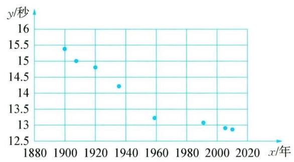

图 3-1

例 5 下列选项中, 哪些是函数的图像, 哪些不是?

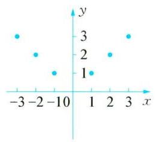

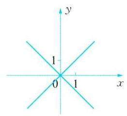

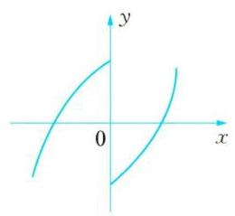

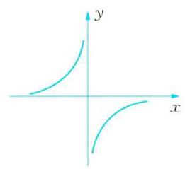

(A) (B) (C) (D)

解 根据函数的定义,任取定义域中的一个自变量 $x$ 的值 ${x}_{0}$ ,由对应关系,都有唯一的函数值 ${y}_{0}$ 与之对应,所以判断平面直角坐标系中的一个图形是否为函数的图像,只需要判断该图形所表示的对应关系是否符合函数的定义，即过点 $\left( {{x}_{0},0}\right)$ 作一条垂直于 $x$ 轴的直线，该直线是否与函数的图像有且只有一个交点.

在选项(B)中，过点 $\left( {1,0}\right)$ 作垂直于 $x$ 轴的直线，该直线与图像有 2 个交点；在选项(C)中， 过点 $\left( {0,0}\right)$ 作垂直于 $x$ 轴的直线，该直线与图像也有 2 个交点. 所以选项 (B) (C) 不是函数的图像,显然选项 (A) (D) 是函数的图像.

## 三、函数的运算

函数也可以像实数一样进行运算.

一般地,已知两个函数 $y = f\left( x\right) , x \in  {D}_{1}$ 与 $y = g\left( x\right) , x \in  {D}_{2}$ ,设 $D = {D}_{1} \cap  {D}_{2}$ ,并且 $D$ 不是空集,那么当 $x \in  D$ 时, $y = f\left( x\right)$ 与 $y = g\left( x\right)$ 都有意义,把函数 $y = f\left( x\right)  + g\left( x\right) , x \in \; D$ 叫做函数 $y = f\left( x\right)$ 与 $y = g\left( x\right)$ 的和. 类似地,可以定义函数 $y = f\left( x\right)$ 与 $y = g\left( x\right)$ 的积.

例 6 已知 $f\left( x\right)$ 是一次函数，且 ${3f}\left( {x + 1}\right)  - {2f}\left( {x - 1}\right)  = {2x} + {17}$ ,求 $f\left( x\right)$ 的解析式.

解 由已知 $f\left( x\right)$ 是一次函数,设 $f\left( x\right)  = {kx} + b\left( {k \neq  0}\right)$ .

因为 ${3f}\left( {x + 1}\right)  - {2f}\left( {x - 1}\right)  = {2x} + {17}$ ,所以

$$
3\left\lbrack  {k\left( {x + 1}\right)  + b}\right\rbrack   - 2\left\lbrack  {k\left( {x - 1}\right)  + b}\right\rbrack   = {2x} + {17},
$$

整理得

$$
{kx} + \left( {{5k} + b}\right)  = {2x} + {17}.
$$

根据多项式恒等的性质, 有

$$
\left\{  \begin{array}{l} k = 2, \\  {5k} + b = {17}, \end{array}\right.
$$

解得 $\left\{  \begin{array}{l} k = 2, \\  b = 7. \end{array}\right.$

所以, $f\left( x\right)$ 的解析式为 $f\left( x\right)  = {2x} + 7$ .

例 7 已知函数 $y = f\left( x\right)$ 的定义域为 $\left( {-2,2}\right)$ ,求函数 $g\left( x\right)  = f\left( {x + 1}\right)  + f\left( {x - 1}\right)$ 的定义域.

解 因为是同一个对应关系 $f$ ,所以函数 $f\left( {x + 1}\right) \text{ 、 }f\left( {x - 1}\right)$ 中 $x - 1\text{ 、 }x + 1$ 的取值范围与函数 $f\left( x\right)$ 的定义域相同，而几个函数的和函数的定义域就是参与运算的这些函数的定义域的交集.

因此

$$
\left\{  \begin{array}{l}  - 2 < x + 1 < 2, \\   - 2 < x - 1 < 2, \end{array}\right.
$$

解得 $- 1 < x < 1$ .

所以,函数 $y = g\left( x\right)$ 的定义域为 $\left( {-1,1}\right)$ .

例 8 利用函数 $f\left( x\right)  = x, g\left( x\right)  = \frac{2}{x}$ 的图像,作出函数 $p\left( x\right)  = x + \frac{2}{x}$ 的图像.

解 由已知可得 $p\left( x\right)  = x + \frac{2}{x}$ 的定义域为 $\left( {-\infty ,0}\right)  \cup  \left( {0, + \infty }\right)$ .

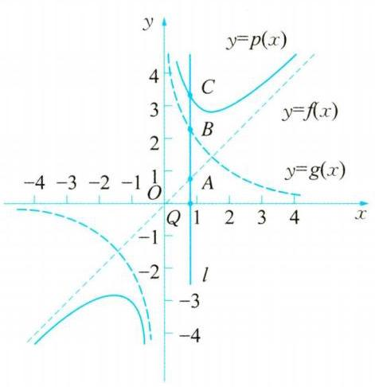

图 3-2

如图 3-2 所示,过 $x$ 轴上不同于原点 $O$ 的任意点 $Q(d$ , $0)$ ,作垂直于 $x$ 轴的直线 $l$ ,交 $y = f\left( x\right)$ 的图像于点 $A(d$ , $d)$ ,交 $y = g\left( x\right)$ 的图像于点 $B\left( {d,\frac{2}{d}}\right)$ ,在 $l$ 上取点 $C$ ,使得点 $C$ 的坐标为 $\left( {d, d + \frac{2}{d}}\right)$ ,则点 $C$ 是 $y = p\left( x\right)$ 的图像上的点.

随着点 $Q$ 的位置不同，可以得到 $p\left( x\right)$ 图像上不同的点 $C$ . 取一定数量的点 $Q$ ,就能得到相应的点 $C$ ,然后用描点法作出 $y = p\left( x\right)$ 的大致图像.

需要注意的是，绘制在纸上或在计算机上作出的函数图像，终究只是大致图像，它们无法精确地表示函数的对应关系，但大致图像已能够帮助我们直观地了解函数，从而更好地发现和研究有关函数的相关性质. 尤其, “数形结合”是研究函数的重要方法之一.

3. 请思考高中阶段与初中阶段的函数定义有什么区别与联系，为什么高中阶段学习的函数定义更准确、更严谨?

4. 设 $D$ 是含有数 1 的有限实数集, $f\left( x\right)$ 是定义在 $D$ 上的函数. 若 $f\left( x\right)$ 的图像绕原点逆时针旋转 ${30}^{ \circ  }$ 后与原图像重合,则 $f\left( 1\right)$ 的可能取值只能是 ( ).

(A) $\sqrt{3}$

(B) $\frac{\sqrt{3}}{2}$ (C) $\frac{\sqrt{3}}{3}$ (D) 0

## 练一练

5 以下四个图形中，能作为函数图像的是___. (写出所有满足条件的图形序号)

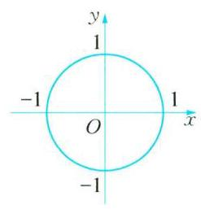

(1)

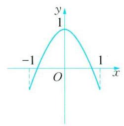

(2)

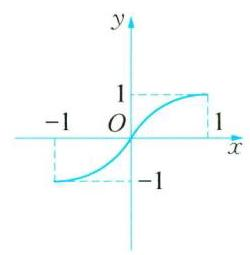

(3)

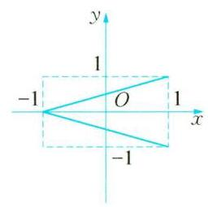

(4)

6 已知函数 $f\left( x\right)  = {3x} - 1, g\left( x\right)  = 2 - x$ ,且 $f\left\lbrack  {h\left( x\right) }\right\rbrack   - {2h}\left\lbrack  {g\left( x\right) }\right\rbrack   = x + 2$ ,求一次函数 $h\left( x\right)$ 的解析式.

7 (1)已知 $f\left( x\right)$ 的定义域为 $\left\lbrack  {0,1}\right\rbrack$ ，求 $f\left( {{2x} - 1}\right)$ 的定义域；

(2)已知 $f\left( {{2x} + 1}\right)$ 的定义域为 $\left\lbrack  {0,1}\right\rbrack$ ，求 $f\left( {{2x} - 1}\right)$ 的定义域.

8 利用函数 $f\left( x\right)  = x, g\left( x\right)  = \frac{1}{x}$ 的图像，作出函数 $y = x - \frac{1}{x}$ 的图像.

9 某车辆装配车间每 2 小时装配完成一辆车. 按照计划, 该车间今天生产 8 小时. 试用解析法和图像法分别表示从开始生产的时刻起所经过的时间 $x$ (时)与装配完成的车辆数 $y$ (辆) 之间的函数 $y = f\left( x\right)$ .

10 若函数 $f\left( x\right)  = \sqrt{a{x}^{2} + {bx} + c}$ 的图像关于任意直线对称后的图像依然为某函数的图像,请写出实数 $a\text{ 、 }b\text{ 、 }c$ 应满足的条件.

## 读一读

## 函数概念的发展历程

17 世纪，科学家们致力于运动的研究，如计算天体的位置，远距离航海中对经纬度的测量， 炮弹的速度对于高度和射程的影响等. 诸如此类的问题都需要探究两个变量之间的关系，并根据这种关系对事物的变化规律做出判断，如根据炮弹的速度推测它能达到的高度和射程. 这正是函数产生和发展的背景.

17 世纪早期，意大利科学家伽利略、法国数学家笛卡儿等在他们的著作中已经注意到了一个变量对另一个变量的依赖关系, 但是并没有提炼出函数的概念. 17 世纪后期, 英国数学家牛顿和德国数学家莱布尼茨在分别创立微积分时, 考虑的主要对象还是曲线, 而牛顿则一直用 “流量”一词来表示变量之间的关系.

“function”一词作为一个数学概念最初由莱布尼茨于 1692 年使用. 在中国，清代数学家李善兰在 1859 年和英国传教士伟烈亚力合译的《代微积拾级》中首次将“function”译作“函数”. 这个名词一直沿用至今.

莱布尼茨用 “函数”表示随曲线的变化而改变的几何量，如坐标、切线等. 1718 年，他的学生、瑞士数学家约翰·伯努利首次给出了函数的明确定义，他将函数描述为“由变量和常量以某种方式组成的量”, 强调函数要用公式表示. 后来, 数学家认为这不是判断的标准. 只要一些变量变化, 另一些变量随之变化就可以了. 所以, 1755 年, 瑞士数学家欧拉将函数的定义修改为 “如果某些变量, 以一种方式依赖于另一些变量, 即当后面的变量变化时, 前面的变量也随之变化，那么将前面的变量称为后面变量的函数”. 欧拉还引入了函数符号 $f\left( x\right)$ 并沿用至今.

当时，很多数学家对于不用公式表示函数很不习惯，甚至持怀疑态度，函数的概念仍然是比较模糊的.

随着对微积分研究的深入，18 世纪末 19 世纪初，人们对函数的认识向前推进了. 德国数学家狄利克雷于 1837 年提出“如果对于 $x$ 的每一个值， $y$ 总有一个完全确定的值与之对应，那么 $y$ 是 $x$ 的函数”. 这个定义较清楚地说明了函数的内涵. 只要有一个法则,使得取值范围中的每一个 $x$ 的值,有一个确定的 $y$ 的值和它对应就行了,不用管这个法则是公式、图像、表格还是其他形式. 19 世纪 70 年代以后, 随着集合概念的出现, 函数概念又进而用更加严谨的集合和对应语言表述, 这就是本节学习的函数概念.

### 3.2 函数的基本性质

函数是描述事物运动变化规律的数学模型. 如果了解了函数，那么也就基本把握了相应事物的变化规律. 因此研究与学习函数的性质是非常重要的.

## 一、函数的奇偶性

观察函数 $f\left( x\right)  = {x}^{2}, f\left( x\right)  =  - \frac{1}{x}$ 的图像,如图 3-3 和图 3-4 所示,不难发现,函数 $f\left( x\right)  = {x}^{2}$ 的图像关于 $y$ 轴对称,函数 $f\left( x\right)  =  - \frac{1}{x}$ 的图像关于原点对称,那么,如何用数量关系来刻画函数图像的这种对称性呢? 下面，我们来探究 “函数的图像关于 $y$ 轴成轴对称” 这一条件的等价表述形式.

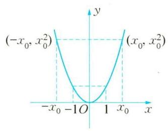

图 3-3

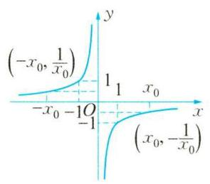

图 3-4

若函数 $y = f\left( x\right) , x \in  D$ 的图像关于 $y$ 轴成轴对称,在该函数的图像上任取一点 $P\left( {x}_{1}\right.$ , $\left. {f\left( {x}_{1}\right) }\right)$ ,则点 $P$ 关于 $y$ 轴的对称点 ${P}^{\prime }\left( {-{x}_{1}, f\left( {x}_{1}\right) }\right)$ 也在该函数的图像上,由函数的定义可知 $f\left( {-{x}_{1}}\right)  = f\left( {x}_{1}\right)$ ,即对于任意 $x \in  D$ ,均有 $f\left( {-x}\right)  = f\left( x\right)$ .

反之,若对于任意 $x \in  D$ ,均有 $f\left( {-x}\right)  = f\left( x\right)$ ,那么对于函数 $y = f\left( x\right) , x \in  D$ 的图像上任一点 $Q\left( {{x}_{2}, f\left( {x}_{2}\right) }\right)$ ,它关于 $y$ 轴的对称点为 ${Q}^{\prime }\left( {-{x}_{2}, f\left( {x}_{2}\right) }\right)$ ,由于 $f\left( {-{x}_{2}}\right)  = f\left( {x}_{2}\right)$ , 即点 ${Q}^{\prime }$ 的坐标为 $\left( {-{x}_{2}, f\left( {-{x}_{2}}\right) }\right)$ ,由函数的定义可知点 ${Q}^{\prime }$ 也必在此函数的图像上,因此,该函数的图像关于 $y$ 轴成轴对称.

综上,就得到下述关于偶函数的定义:

若对于函数 $y = f\left( x\right)$ 的定义域 $D$ 内的任意实数 $x$ ,都有 $f\left( {-x}\right)  = f\left( x\right)$ ,则称函数 $y = \; f\left( x\right)$ 为偶函数.

由上述定义可以知道,“函数 $f\left( x\right)$ 的定义域 $D$ 关于原点对称”是“函数 $f\left( x\right)$ 为偶函数”的必要非充分条件.

根据上述推导及定义可知: 如果函数 $y = f\left( x\right)$ 是偶函数,那么 $y = f\left( x\right)$ 的图像关于 $y$ 轴成轴对称; 反过来,如果函数 $y = f\left( x\right)$ 的图像关于 $y$ 轴成轴对称,那么 $y = f\left( x\right)$ 必是偶函数.

类似于偶函数，我们也可以定义奇函数:

若对于函数 $y = f\left( x\right)$ 的定义域 $D$ 内的任意实数 $x$ ,都有 $f\left( {-x}\right)  =  - f\left( x\right)$ ,则称 $y = f\left( x\right)$ 为奇函数.

由上述定义可以知道,“ $f\left( x\right)$ 的定义域 $D$ 关于原点对称”是“函数 $f\left( x\right)$ 为奇函数”的必要非充分条件.

与偶函数类似: 如果函数 $y = f\left( x\right)$ 是奇函数,那么 $y = f\left( x\right)$ 的图像关于原点成中心对称; 反过来,如果函数 $y = f\left( x\right)$ 的图像关于原点成中心对称,那么 $y = f\left( x\right)$ 必是奇函数.

例 1 判断下列函数的奇偶性.

(1) $f\left( x\right)  = \frac{x\left( {x + 1}\right) }{x + 1}$ ；

(2) $f\left( x\right)  = x + 2$ ；

(3) $f\left( x\right)  = \frac{\sqrt{4 - {x}^{2}}}{\left| {x + 3}\right|  - 3}$ ；

(4) $f\left( x\right)  = \left\{  \begin{array}{ll} x\left( {2 - x}\right) , & x \geq  0, \\   - x\left( {2 + x}\right) , & x < 0. \end{array}\right.$

解 (1) 函数 $f\left( x\right)$ 的定义域为 $D = \left( {-\infty , - 1}\right)  \cup  \left( {-1, + \infty }\right)$ ,因为定义域不关于原点对称,所以函数 $f\left( x\right)$ 既不是奇函数也不是偶函数 (也称非奇非偶函数).

(2)函数 $f\left( x\right)$ 的定义域为 $D = \mathbf{R}$ ，虽然定义域关于原点对称，但是

$$
f\left( {-1}\right)  \neq  f\left( 1\right) , f\left( {-1}\right)  \neq   - f\left( 1\right) ,
$$

所以函数 $f\left( x\right)$ 是非奇非偶函数.

(3)函数 $f\left( x\right)$ 的定义域为 $D = \left\lbrack  {-2,0)\cup (0,2}\right\rbrack$ ，该定义域关于原点对称. 函数解析式可化简为

$$
f\left( x\right)  = \frac{\sqrt{4 - {x}^{2}}}{x}.
$$

因为对任意 $x \in  D$ ，都有 $f\left( {-x}\right)  =  - f\left( x\right)$ ，所以函数 $f\left( x\right)$ 是奇函数.

(4)函数 $f\left( x\right)$ 的定义域为 $D = \mathbf{R}$ ，该定义域关于原点对称. 函数解析式可化简为

$$
f\left( x\right)  = 2\left| x\right|  - {x}^{2}.
$$

因为对任意 $x \in  D$ ，都有 $f\left( {-x}\right)  = f\left( x\right)$ ，所以函数 $f\left( x\right)$ 是偶函数.

例 2 是否存在正数 $a$ ,使函数 $f\left( x\right)  = {x}^{2} + \left| {x - a + 1}\right|$ 是偶函数?

解 一方面,由 $f\left( 1\right)  = 1 + \left| {2 - a}\right|  = f\left( {-1}\right)  = 1 + \left| a\right|$ ,可得 $a = 1$ .

因此, $f\left( x\right)$ 是偶函数的一个必要条件为 $a = 1$ .

另一方面,当 $a = 1$ 时, $f\left( x\right)  = {x}^{2} + \left| x\right|$ ,其定义域为 $\mathbf{R}$ ,该定义域关于原点对称. 因为

$$
f\left( {-x}\right)  = {\left( -x\right) }^{2} + \left| {-x}\right|  = {x}^{2} + \left| x\right|  = f\left( x\right) ,
$$

所以,当 $a = 1$ 时,函数 $f\left( x\right)$ 是偶函数.

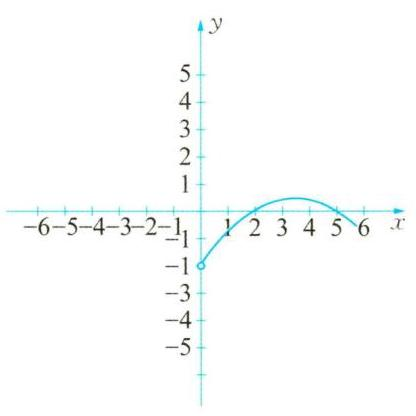

图 3-5

例 3 已知定义在 $\mathbf{R}$ 上的奇函数在 $y$ 轴右侧的图像如图 3-5 所示,求不等式 ${xf}\left( x\right)  \geq  0$ 的解集.

解 显然 $x = 0$ 满足不等式. 观察函数图像知: 当 $x \in  \lbrack 2,$ 5]时, $f\left( x\right)  \geq  0$ . 由图像的对称性知: 当 $x \in  \left\lbrack  {-5, - 2}\right\rbrack$ 时, $f\left( x\right)  \leq  0$ . 所以，不等式 ${xf}\left( x\right)  \geq  0$ 的解集为 $\left\lbrack  {-5, - 2}\right\rbrack   \cup  \{ 0\}  \cup \; \left\lbrack  {2,5}\right\rbrack$ .

例 4 已知 $f\left( x\right)$ 是定义在 $\mathbf{R}$ 上的奇函数,当 $x > 0$ 时, $f\left( x\right)  = {x}^{3} + 2{x}^{2} - 1$ ,求 $f\left( x\right)$ 的解析式.

解 当 $x = 0$ 时,由奇函数的定义,有 $f\left( 0\right)  =  - f\left( 0\right)$ ,得 $f\left( 0\right)  = 0$ .

当 $x < 0$ 时, $- x > 0$ ,可得

$$
f\left( {-x}\right)  = {\left( -x\right) }^{3} + 2{\left( -x\right) }^{2} - 1 =  - {x}^{3} + 2{x}^{2} - 1.
$$

因为 $f\left( {-x}\right)  =  - f\left( x\right)$ ,所以 $f\left( x\right)  = {x}^{3} - 2{x}^{2} + 1$ .

所以, $f\left( x\right)  = \left\{  \begin{array}{ll} {x}^{3} - 2{x}^{2} + 1, & x < 0, \\  0, & x = 0, \\  {x}^{3} + 2{x}^{2} - 1, & x > 0. \end{array}\right.$

研究函数的奇偶性,值得注意的是:

(1)函数的奇偶性是函数的整体性质:若函数定义域内存在一个实数 $x$ 不满足奇函数或偶函数的定义，则该函数就不是奇函数或不是偶函数；

(2)函数是偶函数(或奇函数)的必要条件是:函数的定义域关于原点对称；

(3)函数按奇偶性可分为四类:奇函数，偶函数，既是奇函数又是偶函数，既不是奇函数又不是偶函数(简称非奇非偶函数)；

(4)函数 $y = f\left( x\right)$ 为偶函数 $\Leftrightarrow$ 函数 $y = f\left( x\right)$ 的图像关于 $y$ 轴成轴对称; 函数 $y = f\left( x\right)$ 为奇函数 $\Leftrightarrow$ 函数 $y = f\left( x\right)$ 的图像关于原点成中心对称.

1. 判断函数的奇偶性有哪些步骤? 如何判断一个函数既不是奇函数也不是偶函数? 如果一个函数既是奇函数又是偶函数, 那么这个函数是唯一的吗? 请举例说明.

2. 如果 $y = f\left( x\right)$ 是奇函数,那么 $f\left( 0\right)  = 0$ 一定成立吗?

3. 设 $y = f\left( x\right)$ 是定义在 $\mathbf{R}$ 上的函数,则 “ $y = f\left( x\right)$ 是奇函数” 是 “ $y = f\left( {f\left( x\right) }\right)$ 为奇函数” 的充分非必要条件. 你认为这个结论正确吗? 请说明理由.

4. 如果对任意 $x \in  \mathbf{R}$ 均有 $f\left( {{2x} - 1}\right)  =  - f\left( {1 - {2x}}\right)$ ,那么能得到函数 $y = f\left( x\right)$ , $x \in  \mathbf{R}$ 是奇函数的结论吗?

5. 人们常说:万物皆有关联. 你认为定义域关于原点对称的函数与奇函数、偶函数有关联吗?

## 练一练

1 (1)求证:函数 $f\left( x\right)  = \frac{x\sqrt{1 - {x}^{2}}}{\left| {x + 2}\right|  - 2}$ 是偶函数；

(2)求证:函数 $g\left( x\right)  = \frac{\sqrt{1 + {x}^{2}} + x - 1}{\sqrt{1 + {x}^{2}} + x + 1}$ 是奇函数.

2 判断下列函数的奇偶性,并说明理由:

(1) $f\left( x\right)  = \frac{{x}^{3} - {x}^{2}}{x - 1}$ ;

(2) $f\left( x\right)  = \frac{x}{{x}^{2} - 1}$ ；___

(3) $f\left( x\right)  = \left\{  \begin{array}{ll} {x}^{2} + x, & x < 0, \\   - {x}^{2} + x, & x \geq  0; \end{array}\right.$

(4) $f\left( x\right)  = a \cdot  \frac{{x}^{2} + 1}{x}$ ;

(5) $f\left( x\right)  = \frac{{x}^{2} + a}{x}$ ；

(6) $y = {ax} + b, x \in  \left\lbrack  {c,3}\right\rbrack  \left( {c < 3}\right)$ .

3 已知函数 $f\left( x\right)  = {x}^{2023} + a{x}^{3} - \frac{b}{x} - 8$ ,且 $f\left( {-2}\right)  = {10}$ ,求 $f\left( 2\right)$ 的值.

4 (1)已知偶函数 $f\left( x\right)$ 的定义域为 $\left\lbrack  {-1,1}\right\rbrack$ ，当 $- 1 \leq  x \leq  0$ 时， $f\left( x\right)  = 2{x}^{4} - {3x}$ ，求 $f\left( x\right)$ 的解析式;

(2)已知奇函数 $f\left( x\right)$ 的定义域为 $\mathbf{R}$ ，当 $x > 0$ 时， $f\left( x\right)  = {x}^{2} + x - 2$ ，求 $f\left( x\right)$ 的解析式；

5 已知偶函数 $f\left( x\right)$ 与奇函数 $g\left( x\right)$ 的定义域都是 $\{ x \mid  x \in  \mathbf{R}, x \neq   \pm  2\}$ ，且满足关系式 $f\left( x\right)  + g\left( x\right)  = \frac{1}{x + 2}$ ,求 $f\left( x\right)$ 和 $g\left( x\right)$ 的解析式.

## 读一读

## “奇函数、偶函数”考源

1727 年，瑞士数学家欧拉在提交给圣彼得堡科学院的一篇论文中，首次提出了奇、偶函数的概念.

若用 $- x$ 代替 $x$ ,函数保持不变,则称这样的函数为偶函数. 欧拉列举了三类偶函数: $f\left( x\right)  = {x}^{2n}\left( {n\text{ 为正整数 }}\right) , f\left( x\right)  = {x}^{\frac{m}{n}}\left( {m\text{ 为偶数, }n\text{ 为奇数, }n > 1}\right)$ ,上述两类函数经过加、减、 乘、除、乘方运算所得到的函数及其任意次幂,如 $f\left( x\right)  = {\left( a{x}^{2} + b{x}^{\frac{2}{3}}\right) }^{n}(a, b$ 为常数, $n$ 是正整数).

若用 $- x$ 代替 $x$ ,函数变号,则称这样的函数为奇函数. 欧拉也列举了三类奇函数: $f\left( x\right)  = \; {x}^{{2n} - 1}\left( {n\text{ 为正整数 }}\right) , f\left( x\right)  = {x}^{\frac{m}{n}}\left( {m, n\text{ 均为奇数, }n > 1}\right)$ ,上面两类函数经过加、减、乘、除、乘方运算所得到的函数及其奇数次幂,如 $f\left( x\right)  = {\left( a{x}^{3} + b{x}^{\frac{5}{7}}\right) }^{n}$ ( $a, b$ 为常数, $n$ 为奇数).

欧拉最早命名“奇函数”和“偶函数”,其依据是函数 $y = {x}^{k}$ (常数 $k$ 是整数) 的指数 $k$ 的奇偶性. 最初的奇偶函数概念只是针对代数函数而言, 尽管欧拉后来有所扩充, 但仍未涉及三角函数、反三角函数等. 但今天, 奇偶函数概念已不再局限于代数函数, 三角函数、反三角函数这样的超越函数与 “奇” “偶”之间并没有直接的关联，名称与内涵实际上已经发生了分离.

## 二、函数的单调性

观察函数 $f\left( x\right)  = {x}^{2}$ 的图像: 当 $x \in  ( - \infty ,0\rbrack$ 时,随着自变量 $x$ 的增大,函数值 $y$ 逐渐减小，图像从左至右呈下降的趋势；当 $x \in  \lbrack 0, + \infty )$ 时，随着 $x$ 的增大，函数值 $y$ 逐渐增大，图像从左至右呈上升的趋势. 函数的这类性质,叫做函数的单调性.

一般地,对于定义在 $D$ 上的函数 $y = f\left( x\right)$ ,设区间 $I$ 是 $D$ 的一个子集.

如果对于任意 ${x}_{1},{x}_{2} \in  I$ ,当 ${x}_{1} < {x}_{2}$ 时,都有 $f\left( {x}_{1}\right)  \leq  f\left( {x}_{2}\right)$ ,那么称 $f\left( x\right)$ 在区间 $I$ 上是增函数;

特别地,如果总有 $f\left( {x}_{1}\right)  < f\left( {x}_{2}\right)$ ,称 $f\left( x\right)$ 在区间 $I$ 上是严格增函数.

如果对于任意 ${x}_{1},{x}_{2} \in  I$ ,当 ${x}_{1} < {x}_{2}$ 时,都有 $f\left( {x}_{1}\right)  \geq  f\left( {x}_{2}\right)$ ,那么称 $f\left( x\right)$ 在区间 $I$ 上是减函数;

类似地,如果总有 $f\left( {x}_{1}\right)  > f\left( {x}_{2}\right)$ ,称 $f\left( x\right)$ 在区间 $I$ 上是严格减函数.

“严格增”“严格减”“增”和“减”，统称为函数的单调性. 若函数 $y = f\left( x\right)$ 在某个区间 $I$ 上是 (严格)增函数或 (严格) 减函数,则称函数 $y = f\left( x\right)$ 在区间 $I$ 上是单调函数,并称区间 $I$ 是函数 $y = f\left( x\right)$ 的一个单调区间.

例 5 求证: $f\left( x\right)  = \frac{1}{{x}^{2} - 1}$ 在区间 $\left( {-1,0}\right)$ 上是严格增函数.

证明 任取 ${x}_{1},{x}_{2} \in  \left( {-1,0}\right)$ ,且 ${x}_{1} < {x}_{2}$ ,则

$$
f\left( {x}_{1}\right)  - f\left( {x}_{2}\right)  = \frac{1}{{x}_{1}^{2} - 1} - \frac{1}{{x}_{2}^{2} - 1} = \frac{\left( {{x}_{2} + {x}_{1}}\right) \left( {{x}_{2} - {x}_{1}}\right) }{\left( {{x}_{1}^{2} - 1}\right) \left( {{x}_{2}^{2} - 1}\right) }.
$$

由 ${x}_{1},{x}_{2} \in  \left( {-1,0}\right)$ ,且 ${x}_{1} < {x}_{2}$ ,可知

$$
{x}_{2} + {x}_{1} < 0,{x}_{2} - {x}_{1} > 0,{x}_{1}^{2} - 1 < 0,{x}_{2}^{2} - 1 < 0,
$$

所以

即

$$
f\left( {x}_{1}\right)  - f\left( {x}_{2}\right)  < 0,
$$

$$
f\left( {x}_{1}\right)  < f\left( {x}_{2}\right) .
$$

所以, $f\left( x\right)  = \frac{1}{{x}^{2} - 1}$ 在区间 $\left( {-1,0}\right)$ 上是严格增函数.

例 6 已知函数 $f\left( x\right)  = x + \frac{a}{x}$ 在区间 $\left\lbrack  {1,2}\right\rbrack$ 上是严格增函数,求实数 $a$ 的取值范围.

解 任取 ${x}_{1},{x}_{2} \in  \left\lbrack  {1,2}\right\rbrack$ ,且 ${x}_{1} \neq  {x}_{2}$ ,根据题意

$$
\frac{f\left( {x}_{1}\right)  - f\left( {x}_{2}\right) }{{x}_{1} - {x}_{2}} = \frac{{x}_{1} + \frac{a}{{x}_{1}} - {x}_{2} - \frac{a}{{x}_{2}}}{{x}_{1} - {x}_{2}} = 1 - \frac{a}{{x}_{1}{x}_{2}} > 0
$$

恒成立,即 $a < {x}_{1}{x}_{2}$ 恒成立.

又 ${x}_{1},{x}_{2} \in  \left\lbrack  {1,2}\right\rbrack$ ,且 ${x}_{1} \neq  {x}_{2}$ ,可知 ${x}_{1}{x}_{2} \in  \left( {1,4}\right)$ ,所以 $a \leq  1$ ,即实数 $a$ 的取值范围是 $( - \infty ,1\rbrack$ .

例 7 已知 $y = g\left( x\right)$ 是定义在区间 $\left\lbrack  {-2,2}\right\rbrack$ 上的偶函数,当 $x \geq  0$ 时, $y = g\left( x\right)$ 为严格减函数. 若 $g\left( {1 - m}\right)  < g\left( m\right)$ 成立,求实数 $m$ 的取值范围.

解 函数 $g\left( x\right)$ 的图像关于 $y$ 轴对称,由 $g\left( {1 - m}\right)  < g\left( m\right)$ ,根据单调性可知

$$
\left\{  \begin{array}{l} \left| {1 - m}\right|  > \left| m\right| , \\   - 2 \leq  1 - m \leq  2, \\   - 2 \leq  m \leq  2, \end{array}\right.
$$

解不等式组得 $- 1 \leq  m < \frac{1}{2}$ .

所以，实数 $m$ 的取值范围是 $\left\lbrack  {-1,\frac{1}{2}}\right)$ .

例 8 已知函数 $f\left( x\right)$ 满足:对任意 $a, b \in  \mathbf{R}$ ，都有 $f\left( {a + b}\right)  = f\left( a\right)  + f\left( b\right)$ ，且 $x > 0$ 时 $f\left( x\right)  > 0$ .

(1)判断函数 $f\left( x\right)$ 的奇偶性,并说明理由;

(2)证明: $f\left( x\right)$ 在 $\mathbf{R}$ 上是严格增函数；

(3)解不等式: $f\left( {{t}^{2} + 3}\right)  + f\left( {4t}\right)  < 0$ .

解 (1) 令 $a = b = 0$ ,有 $f\left( 0\right)  = f\left( 0\right)  + f\left( 0\right)$ ,可得 $f\left( 0\right)  = 0$ .

对任意 $x \in  \mathbf{R}$ ,令 $a = x, b =  - x$ ,有 $f\left( 0\right)  = f\left( x\right)  + f\left( {-x}\right)$ ,即 $f\left( {-x}\right)  =  - f\left( x\right)$ ,于是 $f\left( x\right)$ 是奇函数.

而 $f\left( 1\right)  > 0, f\left( {-1}\right)  =  - f\left( 1\right)  < 0$ ,得 $f\left( {-1}\right)  \neq  f\left( 1\right)$ ,于是 $f\left( x\right)$ 不是偶函数.

所以, $f\left( x\right)$ 是奇函数.

(2)对任意 ${x}_{1},{x}_{2} \in  \mathbf{R}$ ，且 ${x}_{1} < {x}_{2}$ ，由 $f\left( {x}_{2}\right)  = f\left( {{x}_{2} - {x}_{1} + {x}_{1}}\right)  = f\left( {{x}_{2} - {x}_{1}}\right)  + f\left( {x}_{1}\right)$ ， 得

$$
f\left( {x}_{2}\right)  - f\left( {x}_{1}\right)  = f\left( {{x}_{2} - {x}_{1}}\right) .
$$

由 ${x}_{2} - {x}_{1} > 0$ 可知 $f\left( {{x}_{2} - {x}_{1}}\right)  > 0$ ,于是 $f\left( {x}_{2}\right)  - f\left( {x}_{1}\right)  > 0$ ,即 $f\left( {x}_{1}\right)  < f\left( {x}_{2}\right)$ ,所以 $f\left( x\right)$ 在 $\mathbf{R}$ 上是严格增函数.

(3)因为 $f\left( x\right)$ 为奇函数，所以 $f\left( {{t}^{2} + 3}\right)  + f\left( {4t}\right)  < 0$ 等价于 $f\left( {{t}^{2} + 3}\right)  < f\left( {-{4t}}\right)$ . 又由 $f\left( x\right)$ 的单调性知 ${t}^{2} + 3 <  - {4t}$ ,解得 $- 3 < t <  - 1$ .

研究函数的单调性, 值得注意的是:

(1)函数的单调性一般是针对函数的某个区间而言的，是函数的局部性质，而定义中的 ${x}_{1}\text{ 、 }{x}_{2}$ 在这一区间上必须具有任意性;

(2)若函数在区间 $I$ 上严格增，则当函数图像上的点的横坐标 $x$ 越来越大时，其纵坐标 $y$ 随之越来越大; 若函数在区间 $I$ 上严格减，则当函数图像上的点的横坐标 $x$ 越来越大时，其纵坐标 $y$ 随之越来越小;

(3)设 ${x}_{1}$ 、 ${x}_{2}$ 是函数 $y = f\left( x\right)$ 的定义域内任意两个自变量，且 ${x}_{1} \neq  {x}_{2}$ ，则函数 $y = f\left( x\right)$ 是严格增函数 $\Leftrightarrow  \frac{f\left( {x}_{1}\right)  - f\left( {x}_{2}\right) }{{x}_{1} - {x}_{2}} > 0$ ,函数 $y = f\left( x\right)$ 是严格减函数 $\Leftrightarrow  \frac{f\left( {x}_{1}\right)  - f\left( {x}_{2}\right) }{{x}_{1} - {x}_{2}} < 0$ .

6. 结合例 7 和例 8 体会函数的奇偶性和单调性之间的关系, 并解决下面的问题: 已知定义在 $\mathbf{R}$ 上的奇函数 $f\left( x\right)$ 在 $\left( {0, + \infty }\right)$ 上是严格增函数,请讨论该函数在 $\mathbf{R}$ 上的单调性.

7. 如果函数 $y = f\left( x\right)$ 分别在区间 $\left\lbrack  {a, b}\right\rbrack$ 和 $\left\lbrack  {c, d}\right\rbrack  \left( {b < c}\right)$ 上都是严格增函数,那么它在区间 $\left\lbrack  {a, b}\right\rbrack   \cup  \left\lbrack  {c, d}\right\rbrack$ 上也是严格增函数吗?

8. 设 $y = f\left( x\right)$ 是定义在 $\mathbf{R}$ 上的函数,试判断下列结论是否正确,并说明理由.

(1)若 $y = f\left( x\right)$ 是严格减函数，则 $y = \frac{1}{f\left( x\right) }$ 是严格增函数；

(2)存在 $y = f\left( x\right)$ 使得 $y = {f}^{2}\left( x\right)$ 是严格减函数；

(3) 存在 $y = f\left( x\right)$ 使得 $y = f\left( {f\left( x\right) }\right)$ 是严格减函数.

9. 函数 $f\left( x\right)  = {ax} + \frac{b}{x}\left( {a > 0, b > 0}\right)$ 也称 “对勾函数”或 “双勾函数” 等,试讨论它的奇偶性和单调性.

## 练一练

6 设 $f\left( x\right)$ 是定义在 $\mathbf{R}$ 上的函数，则以下命题中真命题的序号为___. (写出所有满足要求的命题序号)

① 若存在 ${x}_{1},{x}_{2} \in  \mathbf{R}$ ，当 ${x}_{1} < {x}_{2}$ 时，有 $f\left( {x}_{1}\right)  < f\left( {x}_{2}\right)$ 成立，则函数 $f\left( x\right)$ 在 $\mathbf{R}$ 上严格增;

② 若存在 ${x}_{1},{x}_{2} \in  \mathbf{R}$ ，当 ${x}_{1} < {x}_{2}$ 时，有 $f\left( {x}_{1}\right)  \leq  f\left( {x}_{2}\right)$ 成立，则函数 $f\left( x\right)$ 在 $\mathbf{R}$ 上不可能严格减;

③ 若存在 ${x}_{2} > 0$ ，对于任意 ${x}_{1} \in  \mathbf{R}$ ，都有 $f\left( {x}_{1}\right)  < f\left( {{x}_{1} + {x}_{2}}\right)$ 成立，则函数 $f\left( x\right)$ 在 $\mathbf{R}$ 上严格增;

④ 对于任意 ${x}_{1},{x}_{2} \in  \mathbf{R}$ ,当 ${x}_{1} < {x}_{2}$ 时,都有 $f\left( {x}_{1}\right)  \geq  f\left( {x}_{2}\right)$ 成立,则函数 $f\left( x\right)$ 在 $\mathbf{R}$ 上严格减.

7 (1)求证:函数 $f\left( x\right)  = \frac{1}{x + 1} + \frac{1}{x + 2}$ 在区间 $\left( {-2, - 1}\right)$ 上是严格减函数；

(2)求证:函数 $f\left( x\right)  = \frac{x}{{x}^{2} - 1}$ 在区间 $\left( {-1,1}\right)$ 上是严格减函数.

8 已知函数 $f\left( x\right)  = {x}^{2} + \frac{a}{x}\left( {x \neq  0\text{ ,常数 }a \in  \mathbf{R}}\right)$ .

(1)讨论函数 $f\left( x\right)$ 的奇偶性,并说明理由;

(2)若函数 $f\left( x\right)$ 在区间 $\lbrack 2, + \infty )$ 上为严格增函数，求实数 $a$ 的取值范围.

9 已知奇函数 $f\left( x\right)$ 在定义域 $\left( {-1,1}\right)$ 内是严格减函数，且 $f\left( {1 + a}\right)  + f\left( {1 - {a}^{2}}\right)  < 0$ ，求实数 $a$ 的取值范围.

10 已知定义在区间 $\left( {0, + \infty }\right)$ 上的函数 $f\left( x\right)$ 满足 $f\left( \frac{{x}_{1}}{{x}_{2}}\right)  = f\left( {x}_{1}\right)  - f\left( {x}_{2}\right)$ ,且当 $x > 1$ 时, $f\left( x\right)  < 0$ .

(1)求 $f\left( 1\right)$ 的值；

(2)判断 $f\left( x\right)$ 的单调性;

(3)若 $f\left( 3\right)  =  - 1$ ，解不等式 $f\left( \left| x\right| \right)  <  - 2$ .

11 已知函数 $y = x + \frac{a}{x}$ 有如下性质:如果常数 $a > 0$ ，那么该函数在区间 $(0,\sqrt{a}\rbrack$ 上是严格减函数，在区间 $\lbrack \sqrt{a}, + \infty )$ 上是严格增函数.

(1)如果函数 $y = x + \frac{{b}^{2}}{x}\left( {x > 0}\right)$ 的值域为 $\lbrack 6, + \infty )$ ，求 $b$ 的值；

(2)研究函数 $y = {x}^{2} + \frac{c}{{x}^{2}}$ (常数 $c > 0$ )在定义域上的单调性，并说明理由；

(3)对函数 $y = x + \frac{a}{x}$ 和 $y = {x}^{2} + \frac{a}{{x}^{2}}$ (常数 $a > 0$ )作出推广，使它们都是你所推广的函数的特例. 研究推广后的函数的单调性 (只需写出结论, 不必证明).

## 三、函数的最值

设函数 $y = f\left( x\right)$ 在 ${x}_{0}$ 处的函数值是 $f\left( {x}_{0}\right)$ . 如果对于任意 $x \in  D$ ,都有 $f\left( x\right)  \geq  f\left( {x}_{0}\right)$ , 那么称 $f\left( {x}_{0}\right)$ 为函数 $y = f\left( x\right)$ 的最小值,记作 ${y}_{\min } = f\left( {x}_{0}\right)$ . 如果对于任意 $x \in  D$ ,都有 $f\left( x\right)  \leq  f\left( {x}_{0}\right)$ ,那么称 $f\left( {x}_{0}\right)$ 为函数 $y = f\left( x\right)$ 的最大值,记作 ${y}_{\max } = f\left( {x}_{0}\right)$ . 最大值和最小值, 统称为最值.

我们在初中已经学习过二次函数, 下面通过几个例子来探究定义域限定在某个区间上或解析式中含字母参数的二次函数的最值问题.

例 9 求函数 $f\left( x\right)  =  - {x}^{2} + {2x} + 8$ 在区间 $( - 2,2\rbrack$ 上的最值与值域.

解 因为 $f\left( x\right)  =  - {x}^{2} + {2x} + 8 =  - {\left( x - 1\right) }^{2} + 9$ ,且 $f\left( x\right)$ 在区间 $( - 2,1\rbrack$ 上严格增,在区间 $\left\lbrack  {1,2}\right\rbrack$ 上严格减，所以 ${y}_{\max } = f\left( 1\right)  = 9$ ，无最小值，函数的值域为 $(0,9\rbrack$ .

例 10 求函数 $f\left( x\right)  = {x}^{2} - {ax} + 3$ 在区间 $\left\lbrack  {-1,1}\right\rbrack$ 上的最值.

解 因为 $f\left( x\right)  = {\left( x - \frac{a}{2}\right) }^{2} + 3 - \frac{{a}^{2}}{4}$ ,且 $f\left( x\right)$ 在区间 $( - \infty ,\frac{a}{2}\rbrack$ 上严格减,在区间 $\left\lbrack  {\frac{a}{2}, + \infty }\right)$ 上严格增,可知:

① 当 $\frac{a}{2} \leq   - 1$ ，即 $a \leq   - 2$ 时， $y = f\left( x\right)$ 在区间 $\left\lbrack  {-1,1}\right\rbrack$ 上严格增，所以

$$
f{\left( x\right) }_{\min } = f\left( {-1}\right)  = 4 + a, f{\left( x\right) }_{\max } = f\left( 1\right)  = 4 - a.
$$

② 当 $- 1 < \frac{a}{2} < 0$ ,即 $- 2 < a < 0$ 时, $y = f\left( x\right)$ 在区间 $\left\lbrack  {-1,\frac{a}{2}}\right\rbrack$ 上严格减,在区间 $\left\lbrack  {\frac{a}{2},1}\right\rbrack$ 上严格增, 所以

$$
f{\left( x\right) }_{\min } = f\left( \frac{a}{2}\right)  = 3 - \frac{{a}^{2}}{4}, f{\left( x\right) }_{\max } = f\left( 1\right)  = 4 - a.
$$

③ 当 $0 \leq  \frac{a}{2} < 1$ ,即 $0 \leq  a < 2$ 时, $y = f\left( x\right)$ 在区间 $\left\lbrack  {-1,\frac{a}{2}}\right\rbrack$ 上严格减,在区间 $\left\lbrack  {\frac{a}{2},1}\right\rbrack$ 上严格增, 所以

$$
f{\left( x\right) }_{\min } = f\left( \frac{a}{2}\right)  = 3 - \frac{{a}^{2}}{4}, f{\left( x\right) }_{\max } = f\left( {-1}\right)  = 4 + a.
$$

④ 当 $\frac{a}{2} \geq  1$ ，即 $a \geq  2$ 时， $y = f\left( x\right)$ 在区间 $\left\lbrack  {-1,1}\right\rbrack$ 上严格减，所以

$$
f{\left( x\right) }_{\min } = f\left( 1\right)  = 4 - a, f{\left( x\right) }_{\max } = f\left( {-1}\right)  = 4 + a.
$$

例 11 已知二次函数 $f\left( x\right)  = a{x}^{2} - {2ax} + 2 + b$ 在 $\left\lbrack  {2,3}\right\rbrack$ 上的最大值为 5，最小值为 2，求实数 $a$ 、 $b$ 的值.

解 由题意知 $a \neq  0$ . 因为 $f\left( x\right)  = a{\left( x - 1\right) }^{2} + 2 + b - a$ ,可知:

① 若 $a > 0$ ，则 $y = f\left( x\right)$ 在区间 $\left\lbrack  {2,3}\right\rbrack$ 上为严格增函数，所以 $\left\{  \begin{array}{l} f\left( 2\right)  = 2, \\  f\left( 3\right)  = 5, \end{array}\right.$ 解得 $\left\{  \begin{array}{l} a = 1, \\  b = 0; \end{array}\right.$

② 若 $a < 0$ ，则 $y = f\left( x\right)$ 在区间 $\left\lbrack  {2,3}\right\rbrack$ 上为严格减函数，所以 $\left\{  \begin{array}{l} f\left( 2\right)  = 5, \\  f\left( 3\right)  = 2, \end{array}\right.$ 解得 $\left\{  \begin{array}{l} a =  - 1, \\  b = 3. \end{array}\right.$

从以上例子中我们注意到:研究二次函数的问题，图形必不可少. 我们可以根据图像去观察二次函数在给定区间上的单调性, 主要是讨论二次函数的对称轴 (单调性的转换点) 是否在区间内. 在下面的例 12 中, 还可以利用同样的思路研究另一类我们熟悉的函数的最值问题.

例 12 求函数 $f\left( x\right)  = {2x} + \frac{8}{x}$ 在下列区间上的值域:

(1) $\left( {0,1\rbrack ;\;\left( 2\right) \lbrack 3, + \infty }\right) ;\;\left( 3\right) \left\lbrack  {1,3}\right\rbrack  ;\;\left( 4\right) \left\lbrack  {-3, - 1\rbrack \cup (2,4}\right\rbrack$ .

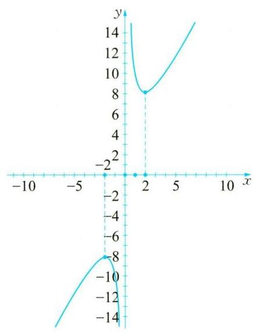

图 3-6

解 观察函数 $y = f\left( x\right)$ 的图像 (如图 3-6),可知

(1)函数 $f\left( x\right)$ 在 $(0,1\rbrack$ 上为严格减函数，因此其值域为 $\lbrack {10}, + \infty )$ .

(2)函数 $f\left( x\right)$ 在 $\lbrack 3, + \infty )$ 上为严格增函数，因此其值域为 $\left\lbrack  {\frac{26}{3}, + \infty }\right)$ .

(3)函数 $f\left( x\right)$ 在 $\left\lbrack  {1,2}\right\rbrack$ 上为严格减函数，在 $\left\lbrack  {2,3}\right\rbrack$ 上为严格增函数，所以

$$
f{\left( x\right) }_{\min } = f\left( 2\right)  = 8\text{ 且 }f\left( 1\right)  > f\left( 3\right) ,
$$

因此其值域为 $\left\lbrack  {8,{10}}\right\rbrack$ .

(4)类似地，可求得函数 $f\left( x\right)$ 的值域为 $\left\lbrack  {-{10}, - 8}\right\rbrack   \cup \; (8,{10}\rbrack$ .

此外,我们还可以利用函数的单调性、基本不等式、换元、求导数等知识研究各种函数的最值和值域.

例 13 求下列函数的值域:

(1) $y = x - \frac{1}{x}, x \in  \left\lbrack  {\frac{1}{2},3}\right\rbrack$ ； (2) $y = {2x} + \sqrt{1 - x}$ ；

(3) $y = \frac{{x}^{2}}{x - 1}, x > 1$ ；___ (4) $y = \frac{{x}^{2} + {2x} + 3}{{x}^{2} + 1}$ .

解 (1) 因为函数 $y = x - \frac{1}{x}, x \in  \left\lbrack  {\frac{1}{2},3}\right\rbrack$ 是严格增函数,且

$$
f{\left( x\right) }_{\min } = f\left( \frac{1}{2}\right)  =  - \frac{3}{2}, f{\left( x\right) }_{\max } = f\left( 3\right)  = \frac{8}{3},
$$

所以,该函数的值域为 $\left\lbrack  {-\frac{3}{2},\frac{8}{3}}\right\rbrack$ .

(2)令 $t = \sqrt{1 - x} \geq  0$ ，则 $y =  - 2{t}^{2} + t + 2 =  - 2{\left( t - \frac{1}{4}\right) }^{2} + \frac{17}{8}, t \geq  0$ ，由二次函数的性质和图像,可得该函数的值域为 $\left( {-\infty ,\frac{17}{8}}\right\rbrack$ .

(3)令 $t = x - 1 > 0$ ，则 $y = t + \frac{1}{t} + 2 \geq  4$ ，故该函数的值域为 $\lbrack 4, + \infty )$ .

(4)因为 $y = \frac{{x}^{2} + {2x} + 3}{{x}^{2} + 1}$ ，所以 $y\left( {{x}^{2} + 1}\right)  = {x}^{2} + {2x} + 3$ ，即 $\left( {y - 1}\right) {x}^{2} - {2x} + \left( {y - 3}\right)  =$ 0,把它看成一个关于 $x$ 的方程,由 $x \in  \mathbf{R}$ 可知该方程有实数解.

若 $y = 1$ ,则方程有解 $x =  - 1$ ;

若 $y \neq  1$ ,则由 $\Delta  = 4 - 4\left( {y - 1}\right) \left( {y - 3}\right)  \geq  0$ ,解得 $2 - \sqrt{2} \leq  y \leq  2 + \sqrt{2}$ ,且 $y \neq  1$ .

综上,该函数的值域为 $\left\lbrack  {2 - \sqrt{2},2 + \sqrt{2}}\right\rbrack$ .

例 14 已知 $a = \sqrt{{x}^{2} + x + 1}, b = p\sqrt{x}, c = x + 1$ ,是否存在满足下列条件的正数 $p$ ,使得对于任意的正数 $x, a\text{ 、 }b\text{ 、 }c$ 都可以成为某个三角形三边的长? 若存在符合要求的正数 $p$ , 则求出 $p$ 的取值范围; 若不存在,请说明理由.

解 因为 $c = \sqrt{{x}^{2} + {2x} + 1} > \sqrt{{x}^{2} + x + 1} = a$ ,所以 $a\text{ 、 }b\text{ 、 }c$ 若能成为某个三角形三边的长,只需不等式组 $\left\{  \begin{array}{l} \sqrt{{x}^{2} + x + 1} + p\sqrt{x} > x + 1, \\  \sqrt{{x}^{2} + x + 1} + x + 1 > p\sqrt{x} \end{array}\right.$ 对任意正数 $x$ 恒成立,即

$$
\left\{  \begin{array}{l} p > \sqrt{x} + \frac{1}{\sqrt{x}} - \sqrt{x + \frac{1}{x} + 1}, \\  p < \sqrt{x} + \frac{1}{\sqrt{x}} + \sqrt{x + \frac{1}{x} + 1} \end{array}\right.
$$

对任意正数 $x$ 恒成立.

令 $f\left( x\right)  = \sqrt{x} + \frac{1}{\sqrt{x}} - \sqrt{x + \frac{1}{x} + 1}, g\left( x\right)  = \sqrt{x} + \frac{1}{\sqrt{x}} + \sqrt{x + \frac{1}{x} + 1}, x > 0$ ,则 $g{\left( x\right) }_{\min } > p > f{\left( x\right) }_{\max }$ 即可.

令 $t = \sqrt{x} + \frac{1}{\sqrt{x}}$ ,则 $f\left( x\right)  = {y}_{1}\left( t\right)  = t - \sqrt{{t}^{2} - 1}, g\left( x\right)  = {y}_{2}\left( t\right)  = t + \sqrt{{t}^{2} - 1}, t \geq  2$ . 因为 $y = {y}_{2}\left( t\right)$ 在定义域上严格增,所以 $g{\left( x\right) }_{\min } = {y}_{2}\left( 2\right)  = 2 + \sqrt{3}$ . 又因为 $f\left( x\right)  \cdot  g\left( x\right)  = {y}_{1}\left( t\right)  \cdot \; {y}_{2}\left( t\right)  = 1$ ,所以 $f{\left( x\right) }_{\max } = \frac{1}{g{\left( x\right) }_{\min }} = \frac{1}{2 + \sqrt{3}} = 2 - \sqrt{3}$ .

所以 $p \in  \left( {2 - \sqrt{3},2 + \sqrt{3}}\right)$ .

研究函数的最值或值域,值得注意的是:

(1)函数的最大值和最小值一定是函数的值，因此要注意指出自变量为何值时取到函数的最大值或最小值;

(2)求出函数的最值后，并不一定能得到函数的值域；反之，求出函数的值域后，一定可以判断函数有无最值;

(3)求函数的最值和值域的方法灵活多变，例如函数的单调性法，基本不等式法，判别式法, 换元法, 等等;

(4)求函数的最值和值域还应抓住特殊函数模型，最典型的两类函数就是二次函数与形如 $y = \frac{a{x}^{2} + {bx} + c}{p{x}^{2} + {qx} + r}$ 的“双曲函数”.

10. 请总结二次函数在给定闭区间上求值域和最值的解题方法与解题步骤.

11. 在例 13(4)中，我们把这种求函数值域的方法称为“判别式法”. 试讨论“判别式法”求函数值域的原理及适用范围.

12. 在例 14 中，我们把恒成立问题转化为函数的最值问题，这又被称为“分离变量法”，试讨论“分离变量法”的原理.

## 练一练

12 求下列函数的值域:

(1) $y = x + 4\sqrt{1 - x}$ ； (2) $y = \frac{\sqrt{1 - x}}{x - 2}$ ； (3) $y = \frac{x + 1}{{x}^{2} + 8}$ .

13 设 $\alpha$ 、 $\beta$ 是方程 $4{x}^{2} - {4mx} + m + 2 = 0$ 的两个实根，问:当实数 $m$ 取何值时 ${\alpha }^{2} + {\beta }^{2}$ 最小? 请求出这个最小值.

14 求函数 $f\left( x\right)  = x + \frac{m}{x + 3}, x \in  \lbrack 0, + \infty )$ 的最小值.

15 (1)已知函数 $f\left( x\right)  = \frac{4{x}^{2} - {12x} - 3}{{2x} + 1}, x \in  \left\lbrack  {0,1}\right\rbrack$ ，求函数 $f\left( x\right)$ 的值域；

(2)当 $a \geq  1$ 时，判断函数 $g\left( x\right)  = {x}^{3} - 3{a}^{2}x - {2a}, x \in  \left\lbrack  {0,1}\right\rbrack$ 的单调性；

(3)当 $a \geq  1$ 时,上述(1)(2)中的函数 $f\left( x\right)$ 与 $g\left( x\right)$ ，若对任意 ${x}_{1} \in  \left\lbrack  {0,1}\right\rbrack$ ，总存在 ${x}_{2} \in \; \left\lbrack  {0,1}\right\rbrack$ ,使得 $g\left( {x}_{2}\right)  = f\left( {x}_{1}\right)$ 成立,求 $a$ 的取值范围.

16 设 $a$ 为实数，记函数 $f\left( x\right)  = a\sqrt{1 - {x}^{2}} + \sqrt{1 + x} + \sqrt{1 - x}$ 的最大值为 $g\left( a\right)$ .

(1)设 $t = \sqrt{1 + x} + \sqrt{1 - x}$ ，求 $t$ 的取值范围，并把 $f\left( x\right)$ 表示为 $t$ 的函数 $m\left( t\right)$ ；

(2)求 $g\left( a\right)$ 的表达式.

### 3.3 函数的应用

## 一、函数关系的建立

当我们用函数知识解决实际问题时, 首先要明确问题中的有关变量, 建立变量之间的函数关系, 这个过程就是建立函数模型.

在 3.1 节中, 我们已经知道表示两个变量之间的函数关系有三种常用方法. 用列表法表示函数关系，不必通过计算就可以知道自变量取某个值时，相应的函数值是多少；用解析法表示函数关系,便于用解析式研究函数的性质; 用图像法表示函数关系,可以从整体上直观而形象地表示函数的变化情况. 本节我们将主要通过解析式来建立函数关系.

例 1 目前我国个人月所得税起征点是 5000 元，请根据下面的个人所得税税率表 (如表 3-2),将个人所得税 $y$ (元)表示成个人月收入 $x$ (元)的函数.

表 3-2

<table><tr><td>个人月应纳税所得额/元</td><td>税率</td><td>速算扣除数/元</td></tr><tr><td>不超过 3000 元的部分</td><td>3%</td><td>0</td></tr><tr><td>超过 3000 元至 12000 元的部分</td><td>10%</td><td>210</td></tr><tr><td>超过 12000 元至 25000 元的部分</td><td>20%</td><td>1410</td></tr><tr><td>超过 25000 元至 35000 元的部分</td><td>25%</td><td>2660</td></tr><tr><td>超过 35000 元至 55000 元的部分</td><td>30%</td><td>4410</td></tr><tr><td>超过 55000 元至 80000 元的部分</td><td>35%</td><td>7160</td></tr><tr><td>超过 80000 元的部分</td><td>45%</td><td>15160</td></tr></table>

解 若某人某月应纳税所得额为 4000 元，其中 3000 元按税率 3%缴纳所得税，1000 元按税率 10%缴纳所得税，所以此人该月的个人所得税为

$$
y = {3000} \times  3\%  + {1000} \times  {10}\%  = {190}\text{ (元). }
$$

也可以利用速算扣除数来计算所得税, 即

$$
{4000} \times  {10}\%  - {210} = {190}\text{ (元). }
$$

因此，将个人所得税 $y$ (元)表示成个人月收入 $x$ (元)的函数关系式为

$$
y = \left\{  \begin{array}{l} 0,0 \leq  x \leq  {5000}, \\  0,{03}\left( {x - {5000}}\right) ,{5000} < x \leq  {8000}, \\  0,1\left( {x - {5000}}\right)  - {210},{8000} < x \leq  {17000}, \\  0,2\left( {x - {5000}}\right)  - {1410},{17000} < x \leq  {30000}, \\  {0.25}\left( {x - {5000}}\right)  - {2660},{30000} < x \leq  {40000}, \\  {0.3}\left( {x - {5000}}\right)  - {4410},{40000} < x \leq  {60000}, \\  {0.35}\left( {x - {5000}}\right)  - {1160},{60000} < x \leq  {85000}, \\  {0.3}\left( {x - {5000}}\right)  - {10000}, x > 0 \end{array}\right.
$$

生活中, 有很多需要用分段函数描述的实际问题, 包括: 出租车的计费, 个人所得税纳税额, 邮局投寄信件的邮资, 等等.

例 2 某电商在双十一期间推出一项促销活动, “每满 100 减 30”, 即当消费额满 100 元时当场抵扣 30 元，例如消费额为 180 元抵扣 30 元，实际支付费用为 150 元；消费额为 200 元时抵扣 60 元，实际支付费用为 140 元；依次类推.

(1)试给出实际支付费用 $y$ (元)与消费额 $x$ (元)之间的函数关系.

(2)消费金额不同时，实际支付的费用能否相同？

解 (1) 用 $\left\lbrack  x\right\rbrack$ 表示不超过 $x$ 的最大整数,如 $\left\lbrack  {3.1}\right\rbrack   = 3,\left\lbrack  4\right\rbrack   = 4,\left\lbrack  {-{0.5}}\right\rbrack   =  - 1$ ,则

$$
y = x - \left\lbrack  \frac{x}{100}\right\rbrack   \times  {30}, x \in  \lbrack 0, + \infty ).
$$

(2)消费金额不同，实际支付的费用可能相同，如消费额 170 元时，实际支付费用为 140 元, 而消费额 200 元时, 实际支付的费用也为 140 元.

在本例中 $\left\lbrack  x\right\rbrack$ 表示不超过 $x$ 的最大整数,我们把 $y = \left\lbrack  x\right\rbrack$ 称为取整函数 (又称为高斯函数), 这是一个重要的函数. 另外, 在真实情景中, 实际支付的费用最多只能精确到 0.01 元, 这里为了方便起见,做了简化处理,认为 $x$ 和 $y$ 都能取到一切非负实数,这并没有失去一般性.

例 3 某小区花园要建造一个直径为 16 米的圆形喷水池 (如图 3-7), 计划在池的周边靠近水面的位置安装一圈喷水头，要求喷出的水柱在离池中心 3 米的地方达到最高高度 4 米，还要在池中心的上方设计一个装饰物，使各方向喷来的水柱在此处汇合，问这个装饰物的高度应如何设计.

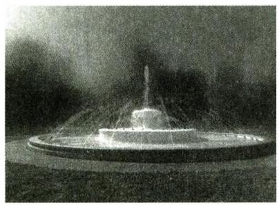

图 3-7

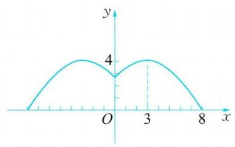

图 3-8

解过水池的中心任取一个截面，如图 3-8 所示. 根据物理学原理，喷出的水珠轨迹应为一条抛物线. 此抛物线上任何一个点距池中心的水平距离与其所处的高度之间是对应的. 为了建立水平距离 $x$ (单位: $\mathrm{m}$ ) 与距水面的高度 $y$ (单位: $\mathrm{m}$ ) 之间的函数关系,建立如图 3-8 所示的平面直角坐标系.

该图中右半部分的曲线所对应的函数关系为

$$
y =  - a{\left( x - b\right) }^{2} + c,0 \leq  x \leq  8,
$$

其中点 $\left( {b, c}\right)$ 是此抛物线的顶点.

由题意，可得 $b = 3, c = 4$ . 又由 $f\left( 8\right)  = 0$ ，解得 $a = {0.16}$ .

于是该部分曲线所对应的函数关系为 $y =  - {0.16}{\left( x - 3\right) }^{2} + 4,0 \leq  x \leq  8$ .

所以,装饰物距水面的高度应为

$$
h = f\left( 0\right)  =  - {0.16} \times  {\left( 0 - 3\right) }^{2} + 4 = {2.56}\text{ (米). }
$$

1. 借助函数解析式建立函数模型一般有哪些步骤,需要注意什么问题?

2. 请作出函数 $y = \left\lbrack  x\right\rbrack$ 和 $y = x - \left\lbrack  x\right\rbrack$ 的图像,并研究它们的性质.

## 练一练

1 如图所示，在一张边长为 ${20}\mathrm{\;{cm}}$ 的正方形铁皮的 4 个角上，各剪去一个边长为 $x\mathrm{\;{cm}}$ 的小正方形,折成一个容积是 $y{\mathrm{\;{cm}}}^{3}$ 的无盖长方体铁盒. 试写出用 $x$ 表示 $y$ 的函数关系式，并指出它的定义域.

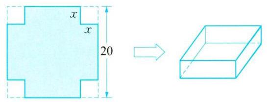

(第 1 题)

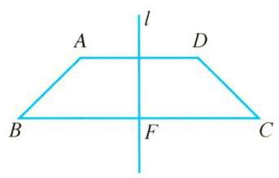

(第 2 题)

2 如图所示，已知底角为 ${45}^{ \circ  }$ 的等腰梯形 ${ABCD}$ ，底边 ${BC} = {7\mathrm{\;{cm}}}$ ，腰 ${AB} = {CD} = {2\sqrt{2}\mathrm{\;{cm}}}$ . 一条垂直于底边 ${BC}$ 的直线 $l$ 将梯形分成两部分，设 $l$ 与 ${BC}$ 交于点 $F$ ，记直线 $l$ 左边部分的面积为 $y{\mathrm{\;{cm}}}^{2}$ ，令 ${BF} = x\mathrm{\;{cm}}$ ，试写出用 $x$ 表示 $y$ 的函数关系式.

3 邮局规定:当邮件的质量不超过 100 克时，每 20 克收邮费 0.8 元，且不足 20 克时按 20 克计算; 超过 100 克时, 将超过部分的邮费按每 100 克 2 元计算，且不足 100 克按 100 克计算， 并规定每个邮件的质量不得超过 2000 克.

(1)分别计算 50 克和 500 克的邮件的邮费；

(2)写出邮费关于邮件质量的函数解析式；

(3)画出该函数的图像.

4 已知某气垫船的最大船速是 48 海里/时，船每小时使用的燃料费用和船速的平方成正比。当船速为 30 海里/时时，船每小时的燃料费用为 600 元，而其余费用(不论船速为多少)都是每小时 864 元. 该船从甲地行驶到乙地，甲乙两地相距 100 海里.

(1)试把船每小时使用的燃料费用 $P$ (元)表示成船速 $v$ (海里/时)的函数;

(2)试把船从甲地到乙地所需的总费用 $y$ (元)表示成船速 $v$ (海里/时)的函数；

(3)当船速为多少时，船从甲地到乙地所需的总费用最少？

5 某物流公司在上海及杭州分别有库存的某机器 12 台和 6 台，现决定销售给 $A$ 市 10 台、 $B$ 市 8 台. 已知上海调运一台机器到 $A$ 市、 $B$ 市的运费分别为 400 元和 800 元; 杭州调运一台机器到 $A$ 市、 $B$ 市的运费分别为 300 元和 500 元. 设从上海调运 $x$ 台机器往 $A$ 市，求总运费 $y$ (元) 关于 $x$ 的函数关系.

## 二、用函数的观点求解方程与不等式

我们知道:一元一次方程总可以化简为 ${ax} + b = 0\left( {a \neq  0}\right)$ 的形式,一元二次方程总可以化简为 $a{x}^{2} + {bx} + c = 0\left( {a \neq  0}\right)$ 的形式. 一般地,在求解一元方程时,经过化简,总可以将原方程化为在一定范围 $D$ 内求解形如 $f\left( x\right)  = 0$ 的方程,这里 $y = f\left( x\right) \left( {x \in  D}\right)$ 就是一个函数.

在学习了函数及其性质之后,我们可以用函数的观点来考察方程 $f\left( x\right)  = 0$ 的解.

对于函数 $y = f\left( x\right) \left( {x \in  D}\right)$ ,若存在实数 $c \in  D$ ,使得

$$
f\left( c\right)  = 0,
$$

则称 $c$ 为函数 $y = f\left( x\right)$ 的零点.

函数 $y = f\left( x\right)$ 的零点就是方程 $f\left( x\right)  = 0$ 在 $D$ 上的解,也就是函数 $y = f\left( x\right)$ 的图像与 $x$ 轴交点的横坐标. 这就将方程 $f\left( x\right)  = 0$ 的解与函数 $y = f\left( x\right)$ 的零点联系了起来.

判断函数零点的存在性,主要依据下面的定理:

零点存在性定理: 如果函数 $f\left( x\right)$ 在区间 $\left\lbrack  {a, b}\right\rbrack$ 上的图像是一条连续不断的曲线,并且 $f\left( a\right)  \cdot  f\left( b\right)  < 0$ ,那么函数 $f\left( x\right)$ 在区间 $\left( {a, b}\right)$ 上至少存在一个零点,即存在 $c \in  \left( {a, b}\right)$ ,使得 $f\left( c\right)  = 0.$

限于知识水平, 高中阶段我们暂时无法对函数图像的连续性给出精确的数学定义, 不过无论是我们已经学过的一次函数、二次函数、反比例函数, 还是我们今后将要学习的幂函数、指数函数、对数函数和三角函数以及由它们运算、复合而成的所有初等函数, 在包含于定义域的任一区间内，函数图像都是连续的曲线.

容易知道这个定理的条件只是函数在区间上存在零点的一个充分条件.

例 4 判断方程 ${x}^{3} - {5x} + 3 = 0$ 的解的个数.

解 方程 ${x}^{3} - {5x} + 3 = 0$ 的解的个数就是函数 $f\left( x\right)  = {x}^{3} - {5x} + 3$ 的零点的个数. 因为

$$
f\left( {-2}\right) f\left( {-3}\right)  < 0, f\left( 0\right) f\left( 1\right)  < 0, f\left( 1\right) f\left( 2\right)  < 0,
$$

于是, $f\left( x\right)$ 在区间 $\left( {-3, - 2}\right) \text{ 、 }\left( {0,1}\right) \text{ 、 }\left( {1,2}\right)$ 上各有 1 个零点. 又三次方程最多有 3 个实数解,所以函数 $f\left( x\right)$ 共有 3 个零点.

解方程是代数的重要研究内容,而很多方程无法求出准确的解,因此求方程的近似解成为了重要的研究课题. 求方程 $f\left( x\right)  = 0$ 的近似解,就是求函数 $f\left( x\right)$ 零点的近似值.

例 5 求函数 $f\left( x\right)  = {x}^{3} - {5x} + 3, x \in  \left\lbrack  {0,1}\right\rbrack$ 的零点的近似值(精确到 0.1 ).

解 第一步: 因为 $f\left( 0\right) f\left( 1\right)  =  - 3 < 0$ ,所以 $f\left( x\right)$ 在 $\left( {0,1}\right)$ 上存在零点.

第二步:取 $\left( {0,1}\right)$ 的中点 ${x}_{1}$ ，则 ${x}_{1} = \frac{0 + 1}{2} = {0.5}, f\left( {0.5}\right)  = {0.625} > 0$ . 因为

$$
f\left( {0.5}\right) f\left( 1\right)  < 0,
$$

所以 $f\left( x\right)$ 在 $\left( {{0.5},1}\right)$ 上存在零点.

第三步: 取 $\left( {{0.5},1}\right)$ 的中点 ${x}_{2}$ ,则 ${x}_{2} = \frac{{0.5} + 1}{2} = {0.75}, f\left( {0.75}\right)  =  - {0.328125} < 0$ . 因为

$$
f\left( {0.5}\right) f\left( {0.75}\right)  < 0,
$$

所以 $f\left( x\right)$ 在 $\left( {{0.5},{0.75}}\right)$ 上存在零点.

第四步: 取 $\left( {{0.5},{0.75}}\right)$ 的中点 ${x}_{3}$ ,则 ${x}_{3} = \frac{{0.5} + {0.75}}{2} = {0.625}, f\left( {0.625}\right)  \approx  {0.11914} > 0$ . 因为

$$
f\left( {0.625}\right) f\left( {0.75}\right)  < 0,
$$

所以 $f\left( x\right)$ 在 $\left( {{0.625},{0.75}}\right)$ 上存在零点.

第五步: 取 $\left( {{0.625},{0.75}}\right)$ 的中点 ${x}_{4}$ ,则 ${x}_{4} = \frac{{0.625} + {0.75}}{2} = {0.6875}, f\left( {0.6875}\right)  \approx$ -0.112548828<0. 因为

$$
f\left( {0.625}\right) f\left( {0.6875}\right)  < 0,
$$

所以 $f\left( x\right)$ 在 $\left( {{0.625},{0.6875}}\right)$ 上存在零点.

第六步:取(0.625，0.6875)的中点 ${x}_{5}$ ，则 ${x}_{5} = \frac{{0.625} + {0.6875}}{2} = {0.65625}, f\left( {0.65625}\right)  >$ 0. 因为

$$
f\left( {0.65625}\right) f\left( {0.6875}\right)  < 0,
$$

所以 $f\left( x\right)$ 在 $\left( {{0.65625},{0.6875}}\right)$ 上存在零点.

如果在这一过程中出现某个中点 $c$ ,满足 $f\left( c\right)  = 0$ ,那么 $c$ 即为零点; 否则继续操作下去, 操作到区间两端点 (保留一位小数) 的近似值相等, 此时这个近似值即为零点的近似值. 由于 ${0.65625} \approx  {0.7},{0.6875} \approx  {0.7}$ ,因此 0.7 就是函数 $y = f\left( x\right)$ 零点的近似值.

从上面的解题过程中可以看出,通过每次把 $y = f\left( x\right)$ 的零点所在的区间收缩一半的方法, 使区间的两个端点逐步逼近函数的零点, 以求得零点的近似值, 这种方法叫做二分法.

例 6 用函数的观点解不等式: $x + \frac{1}{x} > \frac{5}{2}$ .

解 记函数 $f\left( x\right)  = x + \frac{1}{x}$ .

先解相应的方程 $x + \frac{1}{x} = \frac{5}{2}$ ,得其解为 ${x}_{1} = \frac{1}{2}$ 和 ${x}_{2} = 2$ .

令 $g\left( x\right)  = f\left( x\right)  - \frac{5}{2}$ ,则函数 $y = g\left( x\right)$ 的零点为 ${x}_{1} = \frac{1}{2}$ 和 ${x}_{2} = 2$ .

此外,由于 $y = g\left( x\right)$ 的单调性与 $y = f\left( x\right)$ 的单调性一致,因此函数 $y = g\left( x\right)$ 在区间 $(0$ , 1]上是严格减函数，在区间 $\lbrack 1, + \infty )$ 上是严格增函数.

当 $x < 0$ 时， $x + \frac{1}{x} < 0$ ；当 $x = 0$ 时， $x + \frac{1}{x}$ 无意义. 它们都不是不等式 $x + \frac{1}{x} > \frac{5}{2}$ 的解.

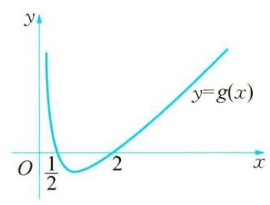

图 3-9

当 $x > 0$ 时,如图 3-9 所示,由函数 $y = g\left( x\right)$ 的零点及单调性可知,当且仅当 $x \in  \left( {0,\frac{1}{2}}\right)  \cup  \left( {2, + \infty }\right)$ 时, $g\left( x\right)  > 0$ .

因此，不等式 $x + \frac{1}{x} > \frac{5}{2}$ 的解集为 $\left( {0,\frac{1}{2}}\right)  \cup  \left( {2, + \infty }\right)$ .

例 7 已知关于 $x$ 的方程 $x\left( {x - 3}\right)  = x - a$ 在区间 $\left( {0,3}\right)$ 上只有一个实数解,求实数 $a$ 的取值范围.

解 方法一:原问题等价于关于 $x$ 的一元二次方程

$$
{x}^{2} - {4x} + a = 0
$$

在 $x \in  \left( {0,3}\right)$ 上只有一个解. 记 $f\left( x\right)  = {x}^{2} - {4x} + a$ ,则有以下几种情况:

① 由 $\Delta  = 0$ ，得 $a = 4$ ，经检验 $x = 2 \in  \left( {0,3}\right)$ ，满足条件；

② 由 $f\left( 0\right)  \cdot  f\left( 3\right)  = a\left( {a - 3}\right)  < 0$ ，得 $a \in  \left( {0,3}\right)$ ；

③ 当 $f\left( 3\right)  = 0$ 时， $a = 3$ ，此时区间 $\left( {0,3}\right)$ 上的解为 $x = 1$ ，满足条件；

④ 当 $f\left( 0\right)  = 0$ 时， $a = 0$ ，此时区间 $\left( {0,3}\right)$ 上的解不存在，舍去.

图 3-10

综上， $a \in  (0,3\rbrack  \cup  \{ 4\}$ .

方法二: 原方程化为 $a =  - {x}^{2} + {4x}$ .

条件即转化为两个函数 $y = a$ 与 $y =  - {x}^{2} + {4x}$ 的图像在 $x \in  \left( {0,3}\right)$ 上只有一个交点.

作出这两个函数的图像,如图 3-10,结合图像可知, $a \in  (0,3\rbrack  \cup$ \{4\}.

3. 你还能用其他方法求解例 4 吗?

4. 设 $y = f\left( x\right)$ 是定义在 $\mathbf{R}$ 上的函数,则 “ $f\left( x\right)  = x$ 有实根” 是 “ $f\left( {f\left( x\right) }\right)  = x$ 有实数根”的充分非必要条件. 你认为这个结论正确吗？为什么？

5. 在用二分法求函数零点的近似值时, 计算量比较大且每一步的执行要求是明确的、相同的, 一般可借助计算机的强大算力完成. 请结合信息课所学习的知识, 思考例 5 的程序算法如何实现.

## 练一练

6 根据例 5,继续求函数 $f\left( x\right)  = {x}^{3} - {5x} + 3$ 的另外两个零点的近似值 (精确到 0,1 ).

7 判断 $f\left( x\right)  = {x}^{3} - {x}^{2} - {4x} + 3$ 在 $\left( {-3,3}\right)$ 上的零点的个数.

8 已知函数 $f\left( x\right)$ 满足 $f\left( {x + 1}\right)  = {x}^{2} - 4$ ，函数 $F\left( x\right)  = f\left( x\right)  - {2m}$ 在区间 $\left\lbrack  {-2,3}\right\rbrack$ 上存在唯一零点,求实数 $m$ 的取值范围.

9 (1)对实数 $a$ 和 $b$ ，定义运算 “ $*$ ” : $a * b = \left\{  \begin{array}{l} a, a - b \leq  1, \\  b, a - b > 1, \end{array}\right.$ 设函数 $f\left( x\right)  = \left( {{x}^{2} + }\right.$ 1) $* \left( {x + 2}\right)$ ,若函数 $y = f\left( x\right)  - c$ 的图像与 $x$ 轴恰有两个公共点,求实数 $c$ 的取值范围;

(2)已知 $x \in  \mathbf{R}$ ，若函数 $f\left( x\right)  = \frac{\left\lbrack  x\right\rbrack  }{x} - a\left( {x \neq  0}\right)$ 有且仅有三个零点，求实数 $a$ 的取值范围.

10 (1)方程 ${x}^{3} + {2x} = {99}$ 是否有整数解？说明理由;

(2)解不等式: ${x}^{6} - \left( {{2x} + 3}\right)  > {\left( 2x + 3\right) }^{3} - {x}^{2}$ .

### 3.4 函数图像及其变换

我们对函数图像的认识是一个螺旋上升的过程:

第一阶段，在初中，我们通过描点法了解一次函数、二次函数、反比例函数等特殊的初等函数的图像; 第二阶段, 在研究了几种常见初等函数的性质和图像之后, 通过图像变换研究更多的初等函数的图像; 第三阶段, 在掌握了导数并通过解析方法研究函数的性质 (奇偶性、单调性、最值、凹凸性、渐近线)后, 可以研究更多复杂的初等函数的图像.

其中，函数图像的变换就是一种重要的研究函数图像的初等方法，常见的图像变换有平移变换、翻折变换、对称变换和伸缩变换, 这里我们先介绍前三种.

## 一、函数图像的平移和翻折

作函数的图像,一般可用列表描点法: 先确定函数的定义域,化简函数解析式,讨论函数的性质 (奇偶性、单调性等); 然后列表 (尤其注意特殊点、零点、最大值、最小值、图像与坐标轴的交点); 再描点, 用光滑的曲线顺次连接各点. 但这样作图过程比较繁琐, 因此, 在对图像精准度要求不高的情况下，我们可以利用熟悉的函数图像通过平移变换和翻折变换来作出所求函数的大致图像.

(1)水平平移:函数 $y = f\left( {x \pm  a}\right) \left( {a > 0}\right)$ 的图像，可由 $y = f\left( x\right)$ 的图像向左 (+) 或向右 (一)平移 $a$ 个单位得到；

(2)竖直平移:函数 $y = f\left( x\right)  \pm  b\left( {b > 0}\right)$ 的图像，可由 $y = f\left( x\right)$ 的图像向上 (+) 或向下 (一)平移 $b$ 个单位得到；

(3)向上翻折:函数 $y = \left| {f\left( x\right) }\right|$ 的图像，可将 $y = f\left( x\right)$ 的图像在 $x$ 轴下方的部分以 $x$ 轴为对称轴翻折到 $x$ 轴上方，其余部分不变；

(4)向左翻折:函数 $y = f\left( \left| x\right| \right)$ 的图像，可作出 $y = f\left( x\right) , x \geq  0$ 的图像，再利用偶函数的图像关于 $y$ 轴对称,作出当 $x < 0$ 时的图像.

所谓点动成线，每一种函数图像的变换都是图像上的每个点做同一种变换得到的，下面我们依然从点的角度来证明函数图像的变换公式.

我们以向左平移为例,在原函数 $y = f\left( x\right)$ 的图像上任取一点 $P\left( {{x}_{0}, f\left( {x}_{0}\right) }\right)$ ,将 $P$ 向左平移 $a$ 个单位 $\left( {a > 0}\right)$ 得到点 ${P}^{\prime }\left( {{x}_{0} - a, f\left( {x}_{0}\right) }\right)$ ,显然点 ${P}^{\prime }$ 落在函数 $y = f\left( {x + a}\right)$ 上,又由 ${x}_{0}$ 的任意性可知，新的函数解析式即为 $y = f\left( {x + a}\right)$ .

例 1 ( 1 )由函数 $y = \frac{1}{x}$ 的图像如何平移可以得到函数 $y = \frac{x + 4}{x + 3}$ 的图像?

( 2 )由函数 $y = f\left( {-x}\right)$ 的图像如何平移可以得到函数 $y = f\left( {1 - x}\right)$ 的图像？

解 (1) 因为 $y = \frac{x + 4}{x + 3} = 1 + \frac{1}{x + 3}$ ,所以把 $y = \frac{1}{x}$ 的图像向左平移 3 个单位,再向上平移 1 个单位,即可以得到函数 $y = \frac{x + 4}{x + 3}$ 的图像.

(2)因为 $y = f\left( {1 - x}\right)  = f\left\lbrack  {-\left( {x - 1}\right) }\right\rbrack$ ，所以由 $y = f\left( {-x}\right)$ 的图像向右平移 1 个单位可以得到 $y = f\left( {1 - x}\right)$ 的图像.

例 2 作出函数 $y = \frac{1}{\left| x\right|  - 1}$ 的大致图像.

解 因为函数 $y = \frac{1}{\left| x\right|  - 1}$ 是偶函数,其图像关于 $y$ 轴对称,所以只需先作出 $y$ 轴右侧的图像. 当 $x \geq  0$ 时 $y = \frac{1}{x - 1}$ ,其图像可以由 $y = \frac{1}{x}$ 的图像向右平移 1 个单位得到. 因此函数 $y = \frac{1}{\left| x\right|  - 1}$ 的大致图像如图 3-11 所示.

图 3-11

例 3 写出函数 $y = \frac{{2x} + 1}{x - 1}$ 图像的对称中心.

解 因为 $y = \frac{{2x} + 1}{x - 1} = 2 + \frac{3}{x - 1}$ ,该函数的图像可以由 $y = \frac{3}{x}$ 的图像向右平移 1 个单位再向上平移 2 个单位得到,所以 $y = \frac{{2x} + 1}{x - 1}$ 图像的对称中心为 $\left( {1,2}\right)$ .

例 4 画出下列函数的图像,并写出它们的单调区间:

(1) $f\left( x\right)  = {x}^{2} - 2\left| x\right|  - 3$ ；(2) $f\left( x\right)  = \left| {{x}^{2} - {2x} - 3}\right|$ .

解(1)当 $x \geq  0$ 时,先作出函数 $y = {x}^{2} - {2x} - 3$ 的图像,当 $x \leq  0$ 时,只需把函数 $y = \; {x}^{2} - {2x} - 3$ 在 $y$ 轴右侧的图像沿 $y$ 轴翻折到左侧,即可得到 $f\left( x\right)  = {x}^{2} - 2\left| x\right|  - 3$ 的图像,如图 3-12 所示. 观察图像可知，其严格增区间为 $\left\lbrack  {-1,0}\right\rbrack$ 与 $\lbrack 1, + \infty )$ ，严格减区间为 $( - \infty , - 1\rbrack$ 与 $\left\lbrack  {0,1}\right\rbrack$ .

图 3-12

图 3-13

(2)先作出函数 $y = {x}^{2} - {2x} - 3$ 的图像，再把函数 $y = {x}^{2} - {2x} - 3$ 在 $x$ 轴下方的图像沿 $x$ 轴翻折到上方,就得到 $f\left( x\right)  = \left| {{x}^{2} - {2x} - 3}\right|$ 的图像,如图 3-13 所示. 观察图像可知,其严格增区间为 $\left\lbrack  {-1,1}\right\rbrack$ 与 $\lbrack 3, + \infty )$ ,严格减区间为 $( - \infty , - 1\rbrack$ 与 $\left\lbrack  {1,3}\right\rbrack$ .

如何由函数 $y = f\left( x\right)$ 的图像得到 $y = \left| {f\left( \left| x\right| \right) }\right|$ 的图像?

## 练一练

1 如何由函数 $y = f\left( {3 - x}\right)$ 的图像通过平移得到函数 $y = f\left( {8 - x}\right)  - 3$ 的图像?

2 作出下列函数的大致图像:

(1) $y = \frac{-{3x} + 7}{x - 2};\left( 2\right) y = \frac{-3\left| x\right|  + 7}{\left| x\right|  - 2};\left( 3\right) y = \left| \frac{-{3x} + 7}{x - 2}\right|$ .

3 设函数 $f\left( x\right)  = {x}^{2} - {4x} + 3$ ，作出下列函数的大致图像:

(1) $y = \left| {f\left( x\right) }\right| ;\left( 2\right) y = f\left( \left| x\right| \right) ;\left( 3\right) y = \left| {f\left( \left| x\right| \right) }\right|$ .

4 (1)已知函数 $f\left( x\right)  = \left\{  \begin{array}{ll} 2 - 2\left| {x - 1}\right| , & x \leq  2, \\  \frac{1}{2}f\left( {x - 2}\right) , & x > 2, \end{array}\right.$ 则函数 $y = f\left( x\right)  - \frac{1}{x}$ 有多少个零点?

(2)已知函数 $f\left( x\right)  = \left| {{x}^{2} + {3x}}\right| , x \in  \mathbf{R}$ . 若方程 $f\left( x\right)  - a\left| {x - 1}\right|  = 0$ 恰有 4 个互异的实数根,求实数 $a$ 的取值范围.

## 二、函数图像的对称

关于函数图像的对称性，一般有两种情况:一是函数图像自身关于某条直线(对称轴)或者某个点(对称中心)对称；二是两个函数图像关于某个点或某条直线对称. 无论是轴对称还是中心对称，均要求函数的定义域关于对称轴(或对称中心)对称.

我们知道，偶函数的图像关于 $y$ 轴 (即直线 $x = 0$ ) 对称，奇函数关于原点 (即点 $\left( {0,0}\right)$ ) 对称，反之也成立. 因此借助于平移变换，我们可以证明下面的结论.

(1) $f\left( {a + x}\right)  = f\left( {a - x}\right)  \Leftrightarrow  y = f\left( x\right)$ 的图像关于直线 $x = a$ 对称.

说明:不妨设 $a > 0$ ，由 $y = f\left( x\right)$ 的图像关于直线 $x = a$ 对称，将其图像向左平移 $a$ 个单位， 得到的函数 $y = f\left( {x + a}\right)$ 的图像关于 $y$ 轴对称，所以函数 $y = f\left( {x + a}\right)$ 是偶函数，即

$$
f\left( {a + x}\right)  = f\left( {a - x}\right) .
$$

反之,若函数 $y = f\left( x\right)$ 满足关系式 $f\left( {a + x}\right)  = f\left( {a - x}\right)$ ,则表明函数 $y = f\left( {x + a}\right)$ 是偶函数,其图像关于 $y$ 轴对称,将其图像向右平移 $a$ 个单位,就得到函数 $y = f\left( x\right)$ 的图像,显然该图像关于直线 $x = a$ 对称.

类似地, 我们还能得到以下几个结论 (证明略).

(2) $y = f\left( {x + a}\right)$ 是偶函数 $\Leftrightarrow  y = f\left( x\right)$ 关于直线 $x = a$ 对称.

(3) $f\left( {a + x}\right)  + f\left( {a - x}\right)  = {2b} \Leftrightarrow  y = f\left( x\right)$ 的图像关于点 $\left( {a, b}\right)$ 对称.

(4) $y = f\left( {x + a}\right)  - b$ 是奇函数 $\Leftrightarrow  y = f\left( x\right)$ 关于点 $\left( {a, b}\right)$ 对称.

下面是一些结论,请大家自行证明:

结论 ${1f}\left( x\right)  = f\left( {{2a} - x}\right)  \Leftrightarrow  y = f\left( x\right)$ 关于直线 $x = a$ 对称;

结论 ${2f}\left( {-x}\right)  = f\left( {{2a} + x}\right)  \Leftrightarrow  y = f\left( x\right)$ 关于直线 $x = a$ 对称;

结论 ${3f}\left( {a - x}\right)  = f\left( {b + x}\right)  \Leftrightarrow  y = f\left( x\right)$ 关于 $x = \frac{a + b}{2}$ 轴对称.

结论 ${4f}\left( x\right)  + f\left( {{2a} - x}\right)  = {2b} \Leftrightarrow  y = f\left( x\right)$ 关于点 $\left( {a, b}\right)$ 对称;

结论 ${5f}\left( {-x}\right)  + f\left( {{2a} + x}\right)  = {2b} \Leftrightarrow  y = f\left( x\right)$ 关于点 $\left( {a, b}\right)$ 对称;

结论 ${6f}\left( {a + x}\right)  + f\left( {b - x}\right)  = c \Leftrightarrow  y = f\left( x\right)$ 关于点 $\left( {\frac{a + b}{2},\frac{c}{2}}\right)$ 对称.

关于两个函数图像的对称性, 我们有:

① $y = f\left( x\right)$ 与 $y =  - f\left( x\right)$ 关于 $x$ 轴对称.

即 $y = f\left( x\right)$ 与 $y = g\left( x\right)$ 若满足 $f\left( x\right)  =  - g\left( x\right)$ ,则它们的图像关于直线 $y = 0$ 对称.

② $y = f\left( x\right)$ 与 $y = f\left( {-x}\right)$ 关于 $y$ 轴对称.

即 $y = f\left( x\right)$ 与 $y = g\left( x\right)$ 若满足 $f\left( x\right)  = g\left( {-x}\right)$ ,即它们的图像关于直线 $x = 0$ 对称.

③ $y = f\left( x\right)$ 与 $y = f\left( {{2a} - x}\right)$ 关于直线 $x = a$ 对称.

即 $y = f\left( x\right)$ 与 $y = g\left( x\right)$ 若满足 $f\left( x\right)  = g\left( {{2a} - x}\right)$ ,即它们的图像关于直线 $x = a$ 对称.

④ $y = f\left( x\right)$ 与 $y = {2a} - f\left( x\right)$ 关于直线 $y = a$ 对称.

即 $y = f\left( x\right)$ 与 $y = g\left( x\right)$ 若满足 $f\left( x\right)  + g\left( x\right)  = {2a}$ ,即它们的图像关于直线 $y = a$ 对称.

⑤ $y = f\left( x\right)$ 与 $y = {2b} - f\left( {{2a} - x}\right)$ 关于点 $\left( {a, b}\right)$ 对称.

即 $y = f\left( x\right)$ 与 $y = g\left( x\right)$ 若满足 $f\left( x\right)  + g\left( {{2a} - x}\right)  = {2b}$ ,即它们的图像关于点 $\left( {a, b}\right)$ 对称.

函数图像对称性的突出的作用莫过于 “知一半而得全部”，主要体现在以下几点:

(1)在作图时，可先作出函数某一侧的图像，再利用对称性得到另一侧的图像；

(2)某些特殊点关于对称轴(对称中心)对称，可求得相应的函数值；

(3)在图像具有轴对称关系的函数中，关于对称轴对称的两个单调区间的单调性相反; 在图像具有中心对称关系的函数中, 关于对称中心对称的两个单调区间的单调性相同.

例 5 设函数 $y = f\left( x\right)$ 的图像关于直线 $x = 1$ 对称,当 $x \leq  1$ 时, $f\left( x\right)  = {\left( x + 1\right) }^{2} - 1$ , 求 $f\left( x\right)$ 的解析式.

解 设点 $P\left( {x, y}\right)$ 是函数 $y = f\left( x\right) \left( {x > 1}\right)$ 图像上任意一点,则其对称点 ${P}^{\prime }\left( {2 - x, y}\right)$ 在 $y = f\left( x\right) \left( {x \leq  1}\right)$ 的图像上,即

$$
y = f\left( {2 - x}\right)  = {\left( 3 - x\right) }^{2} - 1.
$$

所以, $f\left( x\right)  = \left\{  \begin{array}{ll} {\left( x + 1\right) }^{2} - 1, & x \leq  1, \\  {\left( x - 3\right) }^{2} - 1, & x > 1. \end{array}\right.$

例 6 设 $y = f\left( x\right)$ 是定义在 $\mathbf{R}$ 上的函数,如果存在点 $A$ ,对函数 $y = f\left( x\right)$ 的图像上的任意点 $P, P$ 关于 $A$ 的对称点 $Q$ 也在函数 $y = f\left( x\right)$ 的图像上,那么称函数 $y = f\left( x\right)$ 的图像关于点 $A$ 对称, $A$ 称为函数 $y = f\left( x\right)$ 图像的一个对称中心.

(1)求证:点 $A\left( {2,0}\right)$ 是函数 $y = {\left( x - 2\right) }^{3}$ 图像的对称中心；

(2)设 $y = f\left( x\right)$ 是定义在 $\mathbf{R}$ 上的函数，求证: $A\left( {a, b}\right)$ 是函数 $y = f\left( x\right)$ 图像的一个对称中心的充要条件是函数 $y = f\left( {x + a}\right)  - b$ 是奇函数;

(3)试问函数 $f\left( x\right)  = {x}^{3} - 2{x}^{2} + 3$ 的图像是否关于某点对称？为什么？

解(1)设 $P\left( {{x}_{0},{y}_{0}}\right)$ 为函数图像上任意一点，则有 ${y}_{0} = {\left( {x}_{0} - 2\right) }^{3}$ ，而 $P\left( {{x}_{0},{y}_{0}}\right)$ 关于 $A\left( {2,0}\right)$ 的对称点为 $Q\left( {4 - {x}_{0}, - {y}_{0}}\right)$ ,则

$$
{\left( 4 - {x}_{0} - 2\right) }^{3} = {\left( 2 - {x}_{0}\right) }^{3} =  - {\left( {x}_{0} - 2\right) }^{3} =  - {y}_{0},
$$

所以 $Q\left( {4 - {x}_{0}, - {y}_{0}}\right)$ 也在函数图像上,即点 $A\left( {2,0}\right)$ 是函数 $y = {\left( x - 2\right) }^{3}$ 图像的对称中心.

( 2 )一方面，令 $g\left( x\right)  = f\left( {x + a}\right)  - b$ ，若 $g\left( x\right)$ 为奇函数，则 $g\left( {-x}\right)  =  - g\left( x\right)$ ，即

$$
f\left( {-x + a}\right)  - b =  - f\left( {x + a}\right)  + b,
$$

亦即

$$
f\left( {-x + a}\right)  + f\left( {x + a}\right)  = {2b}\text{ 对任意 }x \in  \mathbf{R}\text{ 都成立, }
$$

得 $A\left( {a, b}\right)$ 是函数 $y = f\left( x\right)$ 图像的一个对称中心.

另一方面,若 $A\left( {a, b}\right)$ 是函数 $y = f\left( x\right)$ 图像的一个对称中心,设 $P\left( {{x}_{0},{y}_{0}}\right)$ 为函数图像上任意一点,则有 $\left( {{2a} - {x}_{0},{2b} - {y}_{0}}\right)$ 也是函数图像上的一个点,得

$$
\left\{  \begin{array}{l} {2b} - {y}_{0} = f\left( {{2a} - {x}_{0}}\right) , \\  {y}_{0} = f\left( {x}_{0}\right) , \end{array}\right.
$$

进而得 ${2b} = f\left( {{2a} - {x}_{0}}\right)  + f\left( {x}_{0}\right)$ ，由 ${x}_{0}$ 的任意性可知

$$
f\left( {-x + a}\right)  + f\left( {x + a}\right)  = {2b}\text{ 对任意 }x \in  \mathbf{R}\text{ 都成立, }
$$

于是 $f\left( {-x + a}\right)  - b =  - f\left( {x + a}\right)  + b =  - \left( {f\left( {x + a}\right)  - b}\right)$ ,所以函数 $y = f\left( {x + a}\right)  - b$ 是奇函数.

(3)由(2)可知

$$
f\left( {x + a}\right)  - b = {\left( x + a\right) }^{3} - 2{\left( x + a\right) }^{2} + 3 - b
$$

$$
= {x}^{3} + \left( {{3a} - 2}\right) {x}^{2} + \left( {3{a}^{2} - {4a}}\right) x + {a}^{3} - 2{a}^{2} + 3 - b\text{ . }
$$

易知当 $a = \frac{2}{3}, b = \frac{65}{27}$ 时， $f\left( {x + a}\right)  - b$ 为奇函数，因此原函数 $f\left( x\right)$ 的图像关于点 $\left( {\frac{2}{3},\frac{65}{27}}\right)$ 对称.

例 7 函数 $y = f\left( {x - 1}\right)$ 的图像与函数 $y = f\left( {2 - x}\right)$ 的图像关于哪一条直线对称?

解 方法一:在函数 $y = f\left( {x - 1}\right)$ 的图像上任取一点 $P\left( {{x}_{0} + 1, f\left( {x}_{0}\right) }\right)$ ，则在函数 $y = \; f\left( {2 - x}\right)$ 的图像上有对应点 $Q\left( {2 - {x}_{0}, f\left( {x}_{0}\right) }\right)$ .

因为 $P\text{ 、 }Q$ 纵坐标相等,横坐标关于直线 $x = \frac{3}{2}$ 对称,因此 $P\text{ 、 }Q$ 两点关于直线 $x = \frac{3}{2}$ 对称.

由 ${x}_{0}$ 的任意性可知,两个函数的图像关于直线 $x = \frac{3}{2}$ 对称.

方法二: 函数 $y = f\left( {x - 1}\right)$ 的图像是由 $y = f\left( x\right)$ 的图像向右平移 1 个单位得到的; 函数 $y = \; f\left( {2 - x}\right)$ 的图像是由 $y = f\left( {-x}\right)$ 的图像向右平移 2 个单位得到的.

因为 $y = f\left( x\right)$ 与 $y = f\left( {-x}\right)$ 的图像关于 $y$ 轴对称,所以函数 $y = f\left( {x - 1}\right)$ 与函数 $y = \; f\left( {2 - x}\right)$ 的图像关于直线 $x = \frac{1 + 2}{2} = \frac{3}{2}$ 对称.

例 8 记函数 $y = f\left( x\right)  = {x}^{3} - x$ 的图像为曲线 $C$ ,将曲线 $C$ 沿 $x$ 轴、 $y$ 轴的正向分别平行移动 $t\text{ 、 }s$ 单位长度后得曲线 ${C}_{1}$ .

(1)写出曲线 ${C}_{1}$ 对应的函数 $y = g\left( x\right)$ ；

(2)求证:曲线 $C$ 与 ${C}_{1}$ 关于点 $A\left( {\frac{t}{2},\frac{s}{2}}\right)$ 对称.

解 (1) 曲线 ${C}_{1}$ 对应的函数是: $y = g\left( x\right)  = f\left( {x - t}\right)  + s = {\left( x - t\right) }^{3} - \left( {x - t}\right)  + s$ .

(2)因为

$$
f\left( x\right)  + g\left( {t - x}\right)  = \left( {{x}^{3} - x}\right)  + {\left( t - x - t\right) }^{3} - \left( {t - x - t}\right)  + s = s,
$$

所以曲线 $C$ 与曲线 ${C}_{1}$ 关于点 $A\left( {\frac{t}{2},\frac{s}{2}}\right)$ 对称.

## 练一练

5 已知函数 $f\left( x\right)  = \frac{{ax} + {a}^{2} + 1}{x + a + 1}$ 的图像关于点 $\left( {-3,2}\right)$ 对称,则实数 $a$ 的值为 ___.

6 若函数 $f\left( x\right)  = {x}^{2} + \left( {a + 2}\right) x + 3, x \in  \left\lbrack  {a, b}\right\rbrack$ 的图像关于直线 $x = 1$ 对称,则实数 $b =$ ___.

7 已知函数 $y = f\left( x\right)$ 对一切实数 $x$ 都满足 $f\left( {\frac{1}{4} + x}\right)  = f\left( {\frac{3}{4} - x}\right)$ ,且 $f\left( x\right)  = 0$ 有 3 个实根，则这 3 个实根之和为___.

8 已知函数 $y = f\left( x\right) \left( {x \in  \mathbf{R}}\right)$ 满足 $f\left( {-x}\right)  = 2 - f\left( x\right)$ ,若函数 $y = \frac{x + 1}{x}$ 与 $y = f\left( x\right)$ 图像的交点为 $\left( {{x}_{1},{y}_{1}}\right) ,\left( {{x}_{2},{y}_{2}}\right) ,\cdots ,\left( {{x}_{m},{y}_{m}}\right)$ ，则 $\mathop{\sum }\limits_{{i = 1}}^{m}\left( {{x}_{i} + {y}_{i}}\right)  =$ (   ).

(A) 0 (B) $m$ (C) ${2m}$ (D) ${4m}$

9 已知函数 $y = f\left( x\right)$ 的定义域为 $\mathbf{R}$ ，有以下 3 个命题:

① 在同一平面直角坐标系中，函数 $y = f\left( {x - 1}\right)$ 与函数 $y = f\left( {1 - x}\right)$ 的图像关于直线 $x =$ 1 对称;

② 函数 $f\left( x\right)$ 的图像关于点 $\left( {-\frac{3}{4},0}\right)$ 中心对称，且满足关系式 $f\left( {x + \frac{3}{2}}\right)  =  - f\left( x\right)$ ，则函数 $f\left( x\right)$ 的图像关于直线 $x = \frac{3}{2}$ 对称;

③ 函数 $f\left( x\right)$ 满足关系式 $f\left( {x + 2}\right)  =  - f\left( {-x + 4}\right)$ ，则函数 $y = f\left( {x + 3}\right)$ 是奇函数. 其中，正确的命题个数为( ).

(A) 0 (B) 1 (C) 2 (D) 3

10 设函数 $f\left( x\right)  = x + \frac{1}{x}, x \in  \left( {-\infty ,0}\right)  \cup  \left( {0, + \infty }\right)$ 的图像为 ${C}_{1},{C}_{1}$ 关于点 $A\left( {2,1}\right)$ 的对称的图像为 ${C}_{2},{C}_{2}$ 对应的函数为 $g\left( x\right)$ .

(1)求函数 $y = g\left( x\right)$ 的解析式，并确定其定义域；

(2)若直线 $y = b$ 与曲线 ${C}_{2}$ 只有一个交点，求 $b$ 的值，并求出交点的坐标.

11 已知函数 $f\left( x\right)  = m\left( {x + \frac{1}{x}}\right)$ 的图像与 $g\left( x\right)  = \frac{1}{4}\left( {x + \frac{1}{x}}\right)  + 2$ 的图像关于点 $A\left( {0,1}\right)$ 对称.

(1)求 $m$ 的值；

(2)若 $h\left( x\right)  = f\left( x\right)  + \frac{a}{4x}$ 在区间 $(0,2\rbrack$ 上为严格减函数，求实数 $a$ 的取值范围.

## 读一读

## 周期函数

对于函数 $y = f\left( x\right) , x \in  D$ ,如果存在一个不等于零的常数 $T$ ,使得当 $x$ 取定义域 $D$ 内的每一个值时,都有 $f\left( {x + T}\right)  = f\left( x\right)$ 成立,那么就把函数 $y = f\left( x\right)$ 叫做周期函数,常数 $T(T \neq$ 0) 叫做这个函数的一个周期.

显然,周期函数 $y = f\left( x\right)$ 的定义域 $D$ 必须满足条件: 对一切 $x \in  D$ ,有 $x \pm  T \in  D$ .

一般地,如果函数 $f\left( x\right)$ 是周期为 $T$ 的周期函数,则 $f\left( {x + T}\right)  = f\left( x\right)$ ,于是

$$
f\left( {x + {2T}}\right)  = f\left( {\left( {x + T}\right)  + T}\right)  = f\left( {x + T}\right)  = f\left( x\right) ,
$$

即 ${2T}$ 也是 $f\left( x\right)$ 的一个周期,从而 ${kT}\left( {k \in  \mathbf{Z}, k \neq  0}\right)$ 都是 $f\left( x\right)$ 的周期. 如果函数 $f\left( x\right)$ 的所有周期中存在一个最小的正数, 就把这个最小的正数叫做最小正周期. 然而周期函数并非都有最小正周期,如常值函数 $f\left( x\right)  = C$ 是周期函数,任何一个非零常数都是它的周期,显然它没有最小正周期。

函数周期性的主要作用，可简言之“窥一斑而知全豹”，即只要掌握周期函数在一个周期上的图像与性质, 就能得到函数在定义域上的性质.

下面给出一些常见的判断函数 $y = f\left( x\right)$ 的周期性的结论,大家可以自行证明.

(1) $f\left( {x + a}\right)  = f\left( {x + b}\right)  \Rightarrow  y = f\left( x\right)$ 为周期函数，其周期 $T = \left| {b - a}\right| \left( {a \neq  b}\right)$ ；

(2) $f\left( {x + a}\right)  =  - f\left( x\right)  \Rightarrow  y = f\left( x\right)$ 为周期函数，其周期 $T = {2a}$ ；

(3) $f\left( {x + a}\right)  = \frac{1}{f\left( x\right) } \Rightarrow  y = f\left( x\right)$ 为周期函数，其周期 $T = {2a}$ ；

(4) $f\left( {x + a}\right)  =  - \frac{1}{f\left( x\right) } \Rightarrow  y = f\left( x\right)$ 为周期函数,其周期 $T = {2a}$ ;

(5) $f\left( {x + a}\right)  = \frac{1 - f\left( x\right) }{1 + f\left( x\right) } \Rightarrow  y = f\left( x\right)$ 为周期函数,其周期 $T = {2a}$ ;

(6) $f\left( {x + a}\right)  =  - \frac{1 + f\left( x\right) }{1 - f\left( x\right) } \Rightarrow  y = f\left( x\right)$ 为周期函数,其周期 $T = {2a}$ ;

(7) $f\left( x\right)  + f\left( {x + a}\right)  = k$ ( $k$ 为常数) $\Rightarrow  y = f\left( x\right)$ 为周期函数，其周期 $T = {2a}$ ；

(8) $f\left( x\right)  \cdot  f\left( {x + a}\right)  = k\left( {k\text{ 为非零常数 }}\right)  \Rightarrow  y = f\left( x\right)$ 为周期函数，其周期 $T = {2a}$ ；

(9) $f\left( x\right)  = f\left( {x - a}\right)  + f\left( {x + a}\right)  \Rightarrow  y = f\left( x\right)$ 为周期函数，其周期 $T = {6a}$ .

其中, $a\text{ 、 }b$ 都不等于零,且等式都有意义.

值得注意的是, 函数的周期性与函数图像的对称性有着密切联系. 通俗地讲, 就是双对称出周期,即如果一个函数 $y = f\left( x\right)$ 存在两个对称关系,那么 $y = f\left( x\right)$ 是一个周期函数.

(1)若函数 $y = f\left( x\right)$ 的图像关于直线 $x = a, x = b\left( {b > a}\right)$ 成轴对称，则函数 $y = f\left( x\right)$ 是周期函数,其周期 $T = 2\left( {b - a}\right)$ .

证明: 因为函数 $y = f\left( x\right)$ 满足 $f\left( {a + x}\right)  = f\left( {a - x}\right)$ 且 $f\left( {b + x}\right)  = f\left( {b - x}\right)$ ,可得

$$
f\left( x\right)  = f\left( {{2a} - x}\right)  = f\left\lbrack  {b + \left( {{2a} - x - b}\right) }\right\rbrack   = f\left\lbrack  {b - \left( {{2a} - x - b}\right) }\right\rbrack   = f\left\lbrack  {x + 2\left( {b - a}\right) }\right\rbrack  ,
$$

所以函数 $y = f\left( x\right)$ 是周期函数,其周期为 $2\left( {b - a}\right)$ ,因此 “若函数在定义域内关于垂直于 $x$ 轴两条直线对称, 则函数一定是周期函数”.

类似地, 我们还可以得到下面这些有用的结论 (证明略).

(2)若函数 $y = f\left( x\right)$ 的图像关于点 $\left( {a,0}\right)$ 、 $\left( {b,0}\right) \left( {b > a}\right)$ 成中心对称，则函数 $y = f\left( x\right)$ 是周期函数,其周期 $T = 2\left( {b - a}\right)$ ;

(3)若函数 $y = f\left( x\right)$ 的图像关于直线 $x = a$ 成轴对称，且关于点 $\left( {b,0}\right)$ ( $b > a$ ) 成中心对称,则函数 $y = f\left( x\right)$ 是周期函数,其周期 $T = 4\left( {b - a}\right)$ ;

(4)若偶函数 $y = f\left( x\right)$ 的图像关于直线 $x = a\left( {a \neq  0}\right)$ 成轴对称，则 $y = f\left( x\right)$ 为周期函数且 $2\left| a\right|$ 是它的一个周期;

(5)若奇函数 $y = f\left( x\right)$ 的图像关于直线 $x = a\left( {a \neq  0}\right)$ 成轴对称,则 $y = f\left( x\right)$ 为周期函数且 $4\left| a\right|$ 是它的一个周期.

下面的问题供大家思考和练习:

若定义在 $\mathbf{R}$ 上的函数 $f\left( x\right)$ 满足等式

$$
f\left( x\right)  = f\left( {{398} - x}\right)  = f\left( {{2158} - x}\right)  = f\left( {{3214} - x}\right) ,
$$

则 $f\left( 0\right) , f\left( 1\right) , f\left( 2\right) ,\cdots , f\left( {999}\right)$ 中最多有(   )个不同的值.

(A) 165 (B) 177 (C) 183 (D) 199

答案为 B.

## 第 4 章 幂函数、指数函数和对数函数

我们已经知道，函数是描述客观世界变化规律的重要数学模型. 面对这些纷繁复杂的变化现象, 我们可以根据它们的不同特征进行分类研究. 例如, 正方体的体积与边长之间的关系、理想状态下气体的压强与体积的关系等, 可以用幂函数模型来研究; 在自然条件下, 细胞的分裂、 人口的增长、生物体内 ${}^{14}\mathrm{C}$ 的衰减等变化规律，可以用指数函数模型来研究；地震震级的变化规律、声音分贝的变化规律等, 可以用对数函数模型来研究.

幂函数、指数函数和对数函数是三类重要且常用的基本初等函数, 是进一步学习数学的基础. 在本章中，我们将学习幂函数、指数函数和对数函数的概念与基本性质，并运用它们来解决一些简单的实际问题. 诸如“直线上升”“指数爆炸”等术语早已融入我们的日常生活语言，通过本章的学习，我们将会对它们有更深刻的理解.

### 4.1 幂与指数

在初中我们已经学习了整数指数幂的定义和运算性质.

如果 $a$ 是一个实数, $n$ 是一个正整数,那么称 ${a}^{n} = \underset{n\text{ 个 }}{\underbrace{a \times  a \times  \cdots  \times  a}}$ 为 $a$ 的 $n$ 次幂.

当 $a \neq  0$ 时,定义 ${a}^{0} = 1,{a}^{-n} = \frac{1}{{a}^{n}}$ .

因此,对任意给定的非零实数 $a\text{ 、 }b$ 及整数 $s\text{ 、 }t$ ,都有

(1) ${a}^{s}{a}^{t} = {a}^{s + t}$ ；

(2) ${\left( {a}^{s}\right) }^{t} = {a}^{st}$ ；

(3) ${\left( ab\right) }^{t} = {a}^{t}{b}^{t}$ .

为了定义有理数指数幂, 先拓展初中二次根式的概念.

一般地,如果 $n$ 为大于 1 的整数,且 ${x}^{n} = a$ ,那么 $x$ 叫做 $a$ 的 $n$ 次方根.

当 $n$ 是奇数时,由于正数的 $n$ 次方根是一个正数,负数的 $n$ 次方根是一个负数,这时, $a$ 的 $n$ 次方根是唯一存在的,且可用 $\sqrt[n]{a}$ 表示.

当 $n$ 是偶数时,正数的 $n$ 次方根有两个,它们互为相反数. 这时,正数 $a$ 的正的 $n$ 次方根用 $\sqrt[n]{a}$ 表示，而负的 $n$ 次方根用 $- \sqrt[n]{a}$ 表示，它们可以合并简写成 $\pm  \sqrt[n]{a}\left( {a > 0}\right)$ . 显然，负数没有偶数次方根.

0 的任何次方根都是 0,记作 $\sqrt[n]{0} = 0$ .

式子 $\sqrt[n]{a}$ 叫做根式，这里 $n$ 叫做根指数， $a$ 叫做被开方数.

设 $n$ 为大于 1 的正整数，且 $m$ 为整数时，对所有使得 $\sqrt[n]{{a}^{m}}$ 有意义的实数 $a$ ，定义

$$
{a}^{\frac{m}{n}} = \sqrt[n]{{a}^{m}}.
$$

特别地,当 $a > 0$ 时, ${a}^{\frac{m}{n}} = \sqrt[n]{{a}^{m}} = {\left( \sqrt[n]{a}\right) }^{m}$ . 此时,设 ${n}_{1}\text{ 、 }{n}_{2}$ 是大于 1 的正整数, ${m}_{1}\text{ 、 }{m}_{2}$ 是整数, 则

$$
{a}^{\frac{{n}_{1}}{{n}_{1}}} \cdot  {a}^{\frac{{n}_{2}}{{n}_{2}}} = {a}^{\frac{{n}_{1}{n}_{2}}{{n}_{1}{n}_{2}}} \cdot  {a}^{\frac{{n}_{2}{n}_{1}}{{n}_{1}{n}_{2}}} = {\left( \sqrt[{{n}_{1}{n}_{2}}]{\sqrt[n]{a}}\right) }^{{m}_{1}{n}_{2}} \cdot  {\left( \sqrt[{{n}_{1}{n}_{2}}]{\sqrt[n]{a}}\right) }^{{m}_{2}{n}_{1}} = {\left( \sqrt[{{n}_{1}{n}_{2}}]{\sqrt[n]{a}}\right) }^{{m}_{1}{n}_{2} + {m}_{2}{n}_{1}} = {a}^{\frac{{m}_{1}{n}_{2} + {m}_{2}{n}_{1}}{{n}_{1}{n}_{2}}}.
$$

可见,当 $a > 0, b > 0$ 时整数指数幂的运算性质 (1) 对有理数指数幂的运算仍成立. 类似地,我们可以证明当 $a > 0, b > 0$ 时整数指数幂的运算性质 (2) (3) 对有理指数幂的运算也成立.

我们还可以证明以下的幂的基本不等式:

当实数 $a > 1$ ,有理数 $s > 0$ 时,不等式 ${a}^{s} > 1$ 成立.

例 1 化简: $\frac{5{x}^{-\frac{2}{3}}{y}^{\frac{1}{2}}}{\left( {\frac{1}{2}{x}^{-1}{y}^{\frac{1}{2}}}\right) \left( {\frac{5}{8}{x}^{\frac{1}{3}}{y}^{\frac{1}{6}}}\right) } \times  \sqrt[3]{\frac{{x}^{2}}{\sqrt{y}}}$ .

解 $\frac{5{x}^{-\frac{2}{3}}{y}^{\frac{1}{2}}}{\left( {\frac{1}{2}{x}^{-1}{y}^{\frac{1}{2}}}\right) \left( {\frac{5}{8}{x}^{\frac{1}{3}}{y}^{\frac{1}{6}}}\right) } \times  \sqrt[3]{\frac{{x}^{2}}{\sqrt{y}}} = \frac{{16}{x}^{-\frac{2}{3}}{y}^{\frac{1}{2}}}{{x}^{-\frac{2}{3}}{y}^{\frac{2}{3}}} \times  \frac{{x}^{\frac{2}{3}}}{{y}^{\frac{1}{6}}} = \frac{{16}{x}^{\frac{2}{3}}}{{y}^{\frac{1}{3}}} = {16}\sqrt[3]{\frac{{x}^{2}}{y}} = \frac{{16}\sqrt[3]{{x}^{2}{y}^{2}}}{y}$ .

例 2 求值: ${\left( \frac{1}{8}\right) }^{-\frac{1}{3}} \times  {\left( -\frac{7}{6}\right) }^{0} + {8}^{0.25} \times  \sqrt[4]{2} + {\left( \sqrt[3]{2} \times  \sqrt{3}\right) }^{6}$ .

解 ${\left( \frac{1}{8}\right) }^{-\frac{1}{3}} \times  {\left( -\frac{7}{6}\right) }^{0} + {8}^{0.25} \times  \sqrt[4]{2} + {\left( \sqrt[3]{2} \times  \sqrt{3}\right) }^{6} = {8}^{\frac{1}{3}} + {2}^{\frac{3}{4} + \frac{1}{4}} + \left( {{2}^{2} \times  {3}^{3}}\right)  = {112}$ .

下面我们考虑正数的无理指数幂. 我们知道,当 $t$ 是有理数时, ${a}^{t}\left( {a > 0, a \neq  1}\right)$ 有完全确定的意义; 那么当 $t$ 是无理数时,如何解释 ${a}^{t}$ 的意义呢?

我们先来看一个例子: ${2}^{\sqrt{2}}$ .

取 $\sqrt{2}$ 的不足近似值,按照有效数字由少到多排成一列: $1,{1.4},{1.41},{1.414},{1.4142},\cdots$ , 相应地可以得到一系列幂: ${2}^{1},{2}^{1.4},{2}^{1.41},{2}^{1.414},{2}^{1.4142},\cdots$ ,经观察发现这列数逐渐地趋近一个常数，这个常数就记为 ${2}^{\sqrt{2}}$ .

取 $\sqrt{2}$ 的过剩近似值，按照有效数字由少到多排成一列:2，1，5，1，42，1，415，1，4143，...， 同样也可以得到一系列幂: ${2}^{2},{2}^{1.5},{2}^{1.42},{2}^{1.415},{2}^{1.4143},\cdots$ ,经观察发现这列数逐渐地趋近一个常数，这个常数同样也是 ${2}^{\sqrt{2}}$ .

按照这样的极限思想,对任意一个正数 $a$ 与任意一个无理数 $s$ ，都可以确定唯一的实数，记作 ${a}^{s}$ . 可以证明,有理数指数幂的三条运算性质与幂的基本不等式对所有的实数 ${a}^{s}$ 都成立. 我们把这个实数 ${a}^{s}$ 定义为 $a$ 的 $s$ 次幂.

因此，当指数幂从正整数推广到实数后，我们有以下的运算性质和定理:

$$
{a}^{m} \cdot  {a}^{n} = {a}^{m + n}\left( {a > 0, m, n \in  \mathbf{R}}\right) ;
$$

$$
{\left( {a}^{m}\right) }^{n} = {a}^{mn}\left( {a > 0, m, n \in  \mathbf{R}}\right) ;
$$

$$
{\left( a \cdot  b\right) }^{m} = {a}^{m} \cdot  {b}^{m}\left( {a, b > 0, m \in  \mathbf{R}}\right) .
$$

定理(幂的基本不等式):

$$
\text{ 当 }a > 1, s > 0\text{ 时, }{a}^{s} > 1\text{ . }
$$

例 3 化简: ${\left( {x}^{\frac{3}{2}}\right) }^{\sqrt{3}} \cdot  \sqrt{x}$ ,其中 $x > 0$ .

解 由 $x > 0$ ,则 ${\left( {x}^{\frac{\sqrt{3}}{2}}\right) }^{\sqrt{3}} \cdot  \sqrt{x} = {x}^{\frac{3}{2}} \cdot  {x}^{\frac{1}{2}} = {x}^{2}$ .

例 4 若 $a > 0, b > 0$ ,化简: ${\left( {a}^{2 - \sqrt{3}}b\right) }^{2 + \sqrt{3}} \cdot  {b}^{2 - \sqrt{3}}$ .

解 由 $a > 0, b > 0$ ,则 ${\left( {a}^{2 - \sqrt{3}}b\right) }^{2 + \sqrt{3}} \cdot  {b}^{2 - \sqrt{3}} = {a}^{\left( {2 - \sqrt{3}}\right) \left( {2 + \sqrt{3}}\right) }{b}^{2 + \sqrt{3}} \cdot  {b}^{2 - \sqrt{3}} = a{b}^{4}$ .

1. 如果 $0 < a < 1, s > 0$ ,那么 ${a}^{s}$ 的取值范围是什么?

2. 设 $a > b > 0$ ,试判断 ${a}^{a}{b}^{b}$ 与 ${\left( ab\right) }^{\frac{a + b}{2}}$ 的大小关系.

## 练一练

1 当 $x < 0$ 时， $\left| x\right|  + \sqrt[6]{{x}^{6}} + 2\sqrt[3]{{x}^{3}} + 3\sqrt[4]{{x}^{4}} =$ ___.

2 若 ${8}^{x} = 2,{4y} = \sqrt[3]{64}$ ，则 ${3x} - {2y} =$ ___.

3 已知 ${a}^{\frac{1}{2}} - {a}^{-\frac{1}{2}} = 2$ ，则 ${a}^{2} + {a}^{-2} =$ ___.

4 若 $\sqrt{{x}^{2} + {2x} + 1} + \sqrt{{y}^{2} + {6y} + 9} = 0$ ，则 ${\left( {x}^{2023}\right) }^{y} =$ ___.

5 将 ${\left( \sqrt{{x}^{\frac{1}{3}} \cdot  \sqrt[3]{{x}^{-2}}}\right) }^{-\frac{8}{5}}$ 化成分数指数幂为( ).

(A) ${x}^{\frac{4}{15}}$ (B) ${x}^{-\frac{4}{15}}$ (C) ${x}^{-\frac{1}{3}}$ (D) ${x}^{\frac{2}{5}}$

6 计算或化简下列各式:

(1) ${\left( 2\frac{3}{5}\right) }^{0} + {2}^{-2} \times  {\left( 2\frac{1}{4}\right) }^{-\frac{1}{2}} - {\left( {0.01}\right) }^{0.5}$ ;

(2) ${\left( 2\frac{7}{9}\right) }^{0.5} + 0.{1}^{-2} + {\left( 2\frac{10}{27}\right) }^{-\frac{2}{3}} - 3{\pi }^{0} + \frac{37}{48}$ ；

(3) $\sqrt{\frac{\text{ 25 }}{4}} - \sqrt[3]{3\frac{3}{8}} + \sqrt[4]{0.0625} + {\left\lbrack  {\left( {0.064}^{\frac{1}{3}}\right) }^{-{2.5}}\right\rbrack  }^{\frac{2}{5}} - {\pi }^{0}$ ；

(4) $\frac{\left( {{a}^{\frac{2}{3}}{b}^{\frac{1}{2}}}\right) \left( {-3{a}^{\frac{1}{2}}{b}^{\frac{1}{3}}}\right) }{\frac{1}{3}{a}^{\frac{1}{6}}{b}^{\frac{5}{6}}}\left( {a > 0, b > 0}\right)$ .

### 4.2 对 数

## 一、对数的定义

先看下面的问题: 假设某人在 2020 年时年薪为 10 万元，如果他的年薪年平均增长率为 5%，要经过多少年，此人的年薪可达到 20 万元？

设经过 $x$ 年后此人的年薪可达到 20 万元，则

$$
{10}{\left( 1 + 5\% \right) }^{x} = {20},
$$

即

$$
\text{ 1. }{05}^{x} = 2\text{ . }
$$

这是已知底数和幂的值, 求指数的问题.

已知 ${a}^{b} = N$ ,由 $a\text{ 、 }b$ 求 $N$ 或由 $b\text{ 、 }N$ 求 $a$ 都属于指数幂的运算,只需运用指数幂的运算性质就能解决; 但是由 $a\text{ 、 }N$ 求 $b$ 则是一个新问题,用现有的知识解决不了,因此需要引入新的数学概念.

一般地,如果 $a\left( {a > 0, a \neq  1}\right)$ 的 $b$ 次幂等于 $N$ ,即 ${a}^{b} = N$ ,那么实数 $b$ 叫做以 $a$ 为底 $N$ 的对数,记作 ${\log }_{a}N = b$ ,其中 $a$ 叫做对数的底数, $N$ 叫做真数.

根据指数幂的运算性质,我们知道,当 $a > 0, a \neq  1$ 时,无论 $b$ 取什么实数,都有 ${a}^{b} > 0$ ,这就是说,真数 $N$ 恒大于零,即负数和零没有对数.

因为当 $a > 0, a \neq  1$ 时,有 ${a}^{0} = 1,{a}^{1} = a$ ,所以,根据对数的定义,我们可以得到

$$
{\log }_{a}1 = 0,{\log }_{a}a = 1.
$$

由对数的定义, 我们还可以得到一个简单且重要的恒等式:

$$
{a}^{{\log }_{a}N} = N\left( {a > 0, a \neq  1}\right) .
$$

这个等式又被称为对数恒等式. 由此恒等式可以推得

$$
{\log }_{a}x = {\log }_{a}y \Leftrightarrow  x = y > 0\left( {a > 0, a \neq  1}\right) .
$$

在一些特殊情况下，可以得出对数的具体数值，而在一般的情况下，估算对数的精确值非常困难，这时就需要查阅有关的对数表或利用计算器来得到对数的近似值.

对数的底数 $a\left( {a > 0, a \neq  1}\right)$ 原则上可以在允许的范围内任意选取. 数学中我们常用两个特殊的数作为对数的底数.

在日常生活中使用的数字是十进制表示的,我们把以 10 为底的对数叫做常用对数, ${\log }_{10}N$ 通常记为 $\lg N$ . 在中学阶段，我们较多采用常用对数来研究对数及其性质与应用.

以无理数 $\mathrm{e} = {2.71828}\cdots$ 为底的对数叫做自然对数, ${\log }_{e}N$ 通常记为 $\ln N$ . 虽然自然对数在日常生活中不常使用, 但它在高等数学和其他科学领域却应用十分广泛.

例 1 将下列指数式转化为对数式, 对数式转化为指数式.

(1) ${\left( \frac{1}{5}\right) }^{4} = \frac{1}{625}$ ； (2) ${81}^{-\frac{3}{4}} = x$ ；

(3) ${\left( \frac{2}{3}\right) }^{x} = {12}$ (4) ${\log }_{4}\sqrt{8} = \frac{3}{4}$ ；

(5) $\lg {0.01} =  - 2$ ； (6) $\ln {10} \approx  {2.303}$ .

解 $\left( 1\right) {\log }_{\frac{1}{5}}\frac{1}{625} = 4$ .

(2) ${\log }_{81}x =  - \frac{3}{4}$ .

(3) ${\log }_{\frac{2}{3}}{12} = x$ .

(4) ${4}^{\frac{3}{4}} = \sqrt{8}$ .

(5) ${10}^{-2} = {0.01}$ .

(6) ${\mathrm{e}}^{2.303} \approx  {10}$ .

例 2 已知 $a > 0, a \neq  1, b > 0, b \neq  1, N > 0$ ,求证: ${a}^{{\log }_{a}b \cdot  {\log }_{b}N} = N$ .

证明 由指数幂的运算性质和对数恒等式, 可得

$$
{a}^{{\log }_{a}b \cdot  {\log }_{b}N} = {\left( {a}^{{\log }_{a}b}\right) }^{{\log }_{b}N} = {b}^{{\log }_{b}N} = N.
$$

## 练一练

1 计算:

(1) ${\log }_{\sqrt[3]{{5}^{4}}}{625}$ ； (2) ${\log }_{\left( 2 + \sqrt{3}\right) }\left( {2 - \sqrt{3}}\right)$ ;

(3) $\ln \frac{1}{\mathrm{e}} + \lg \sqrt{10}$ ； (4) ${9}^{{\log }_{3}\sqrt{2} + {\log }_{\frac{1}{9}}\frac{8}{9}}$ .

2 求下列各式中 $x$ 的值:

(1) ${\log }_{2}x = 5$ ；

(2) ${\log }_{\sqrt{5}}\frac{1}{125} = x$ ;

(3) ${\log }_{x}4 = \frac{1}{2}$ .

3 利用计算器计算下列两组对数的值(结果精确到 0.01)，你有什么发现？

(1) $\lg {6.34},\lg {634},\lg {0.634},\lg {0.00634}$ ;

(2) $\lg {72},\lg {7.2},\lg {0.72},\lg {0.0072}$ .

## 二、对数的运算性质

我们已经学习了指数幂的运算性质, 例如

$$
{a}^{m + n} = {a}^{m} \cdot  {a}^{n}\left( {a > 0, a \neq  1, m, n \in  \mathbf{R}}\right) .
$$

通俗地说,上式中的幂运算可以把加法 $\left( {m + n}\right)$ 转化为乘法 $\left( {{a}^{m} \cdot  {a}^{n}}\right)$ ,而对数可以实现其逆向运算, 即把乘法转化为加法.

在本节中,我们总假设 $a > 0, a \neq  1$ .

设 $M > 0, N > 0$ ,令 ${\log }_{a}M = {b}_{1},{\log }_{a}N = {b}_{2}$ ,则 ${a}^{{b}_{1}} = M,{a}^{{b}_{2}} = N$ ,因此

$$
M \cdot  N = {a}^{{b}_{1}} \cdot  {a}^{{b}_{2}} = {a}^{{b}_{1} + {b}_{2}},
$$

所以 ${b}_{1} + {b}_{2} = {\log }_{a}\left( {M \cdot  N}\right)$ ,即

$$
{\log }_{a}\left( {M \cdot  N}\right)  = {\log }_{a}M + {\log }_{a}N.
$$

由此可得对数运算的基本性质.

对数性质 1: 当 $M > 0, N > 0$ 时,

$$
{\log }_{a}\left( {M \cdot  N}\right)  = {\log }_{a}M + {\log }_{a}N.
$$

类似地,我们可以得到对数的其他几个运算性质:

对数性质 2: 当 $M > 0, N > 0$ 时,

$$
{\log }_{a}\frac{M}{N} = {\log }_{a}M - {\log }_{a}N.
$$

对数性质 3 : 当 $M > 0$ 时,对任何给定的实数 $n$ ,

$$
{\log }_{a}{M}^{n} = n{\log }_{a}M.
$$

对数的这三条运算性质, 本质上是把乘除运算转化为加减运算, 把乘方开方运算转化为乘除运算, 这为多位数的乘除及开方运算提供了一条简便的途径. 法国数学家、天文学家拉普拉斯就曾说过:“对数的发明让天文学家的寿命都延长了，因为少做了很多苦工.”

令 ${\log }_{a}b = x,{\log }_{c}b = y,{\log }_{c}a = z\left( {b > 0, c > 0, c \neq  1}\right)$ ,根据对数的定义可得

$$
{a}^{x} = b,{c}^{y} = b,{c}^{z} = a,
$$

所以

$$
{c}^{y} = b = {a}^{x} = {\left( {c}^{z}\right) }^{x} = {c}^{zx},
$$

即 $y = {zx}$ ,于是

$$
x = \frac{y}{z},
$$

即

$$
{\log }_{a}b = \frac{{\log }_{c}b}{{\log }_{c}a}.
$$

这就是对数的换底公式,

对数性质 4 (对数换底公式): 当 $c > 0, c \neq  1, b > 0$ 时,

$$
{\log }_{a}b = \frac{{\log }_{c}b}{{\log }_{c}a}.
$$

对数换底公式可以把不同底的对数方便地进行互相转换.

对数的运算性质和换底公式的证明, 都体现了指数与对数互化的思想. 而且, 有了换底公式，我们还能得到其他一些对数的运算性质:

$$
{\log }_{{a}^{n}}{M}^{m} = \frac{m}{n}{\log }_{a}M\left( {M > 0, n \in  \mathbf{R}, n \neq  0, m \in  \mathbf{R}}\right) ;
$$

$$
{\log }_{a}b = \frac{1}{{\log }_{b}a}\left( {b > 0, b \neq  1}\right) .
$$

例 3 计算:

(1) ${2}^{{\log }_{2}\frac{4}{5} + 1}$ ；

(2) $2 \cdot  {\lg }^{2}\sqrt{2} + \lg \sqrt{2} \cdot  \lg 5 + \sqrt{{\lg }^{2}\sqrt{2} - \lg 2 + 1}$ ；

(3) $\lg 5\left( {\lg 8 + \lg {1000}}\right)  + {\left( \lg {2}^{\sqrt{3}}\right) }^{2} + \lg \frac{1}{6} + \lg {0.06}$ ；

(4) ${\log }_{6}^{2}3 + \frac{{\log }_{6}{18}}{{\log }_{2}6}$ .

解 (1) 原式 $= {2}^{{\log }_{2}\frac{4}{5}} \times  2 = \frac{4}{5} \times  2 = \frac{8}{5}$ .

( 2 )原式 $= \lg \sqrt{2} \cdot  \left( {2\lg \sqrt{2} + \lg 5}\right)  + \sqrt{{\left( \lg \sqrt{2} - 1\right) }^{2}}$

$$
= \lg \sqrt{2} \cdot  \left( {\lg 2 + \lg 5}\right)  + 1 - \lg \sqrt{2}
$$

$$
= \lg \sqrt{2} + 1 - \lg \sqrt{2} = 1\text{ . }
$$

(3) 原式 $= \lg 5 \cdot  \left( {3\lg 2 + 3}\right)  + 3{\lg }^{2}2 - \lg 6 + \lg 6 - 2$

$$
= 3\lg 5\lg 2 + 3\lg 5 + 3{\lg }^{2}2 - 2
$$

$= 3\lg 2 \cdot  \left( {\lg 5 + \lg 2}\right)  + 3\lg 5 - 2$

$$
= 3\lg 2 + 3\lg 5 - 2
$$

$$
= 3\left( {\lg 2 + \lg 5}\right)  - 2 = 1\text{ . }
$$

(4) 原式 $= {\log }_{6}^{2}3 + \left( {{\log }_{6}3 + {\log }_{6}6}\right)  \cdot  {\log }_{6}2$

$$
= {\log }_{6}^{2}3 + {\log }_{6}3 \cdot  {\log }_{6}2 + {\log }_{6}2
$$

$$
= {\log }_{6}3\left( {{\log }_{6}3 + {\log }_{6}2}\right)  + {\log }_{6}2
$$

$$
= {\log }_{6}3 + {\log }_{6}2 = 1\text{ . }
$$

例 4 科学家以里氏震级来度量地震的强度,若设 $I$ 为地震时所散发出来的相对能量,则里氏震级 $r$ 可定义为 $r = \frac{2}{3}\lg I + 2$ . 试计算 6.9 级和 7.8 级地震的相对能量的比值. (精确到个位)

解 设 6.9 级和 7.8 级地震的相对能量分别为 ${I}_{1}$ 和 ${I}_{2}$ ，由题意得

$$
\left\{  \begin{array}{l} \frac{2}{3}\lg {I}_{1} + 2 = {6.9}, \\  \frac{2}{3}\lg {I}_{2} + 2 = {7.8}. \end{array}\right.
$$

①

②

由②-①，得

$$
\frac{2}{3}\left( {\lg {I}_{2} - \lg {I}_{1}}\right)  = {0.9},
$$

即 $\lg \frac{{I}_{2}}{{I}_{1}} = {1.35}$ ,所以 $\frac{{I}_{2}}{{I}_{1}} = {10}^{1.35} \approx  {22}$ .

答: 7.8 级地震的相对能量约是 6.9 级的 22 倍.

例 5 (1)求值: ${7}^{\lg {30}}$ . ${\left( \frac{1}{3}\right) }^{\lg {0.7}}$ ；

(2)化简: ${a}^{{\log }_{m}b} \cdot  {b}^{{\log }_{m}^{\frac{1}{a}}a}$ .

解(1)设 $x = {7}^{\lg {30}} \cdot  {\left( \frac{1}{3}\right) }^{\lg {0.7}}$ ，两边取常用对数得

$$
\lg x = \lg {7}^{\lg {30}} + \lg {\left( \frac{1}{3}\right) }^{\lg {0.7}}
$$

$$
= \left( {\lg 3 + \lg {10}}\right) \lg 7 + \left( {\lg 7 - \lg {10}}\right) \left( {-\lg 3}\right)
$$

$$
= \lg 3 \cdot  \lg 7 + \lg 7 - \lg 7 \cdot  \lg 3 + \lg 3
$$

$$
= \lg {21}\text{ , }
$$

所以 $x = {21}$ ,即

$$
{7}^{\lg {30}} \cdot  {\left( \frac{1}{3}\right) }^{\lg {0.7}} = {21}.
$$

(2) 设 $x = {a}^{{\log }_{m}b} \cdot  {b}^{{\log }_{{m}^{\frac{1}{a}}}}$ ,两边取以 $m$ 为底的对数,得

$$
{\log }_{m}x = {\log }_{m}b \cdot  {\log }_{m}a + {\log }_{m}\frac{1}{a} \cdot  {\log }_{m}b
$$

$$
= {\log }_{m}b \cdot  {\log }_{m}a - {\log }_{m}a \cdot  {\log }_{m}b
$$

$$
= 0\text{ , }
$$

所以 $x = 1$ ,即

$$
{a}^{{\log }_{m}b} \cdot  {b}^{{\log }_{m}\frac{1}{a}} = 1.
$$

注意: (2) 中的 $a\text{ 、 }b\text{ 、 }m$ 都要使对数有意义.

例 6 求解下列各题:

(1)已知 $\lg 2 = a,{10}^{b} = 3$ ,试用 $a\text{ 、 }b$ 表示 ${\log }_{24}{15}$ ;

(2)已知 ${\log }_{3}5 = a,{\log }_{5}7 = b$ ,试用 $a\text{ 、 }b$ 表示 ${\log }_{75}{63}$ ;

(3)已知 ${2}^{6a} = {3}^{3b} = {6}^{2c}$ ，试建立 $a\text{ 、 }b\text{ 、 }c$ 之间的关系式.

解(1)利用换底公式，得

$$
{\log }_{24}{15} = \frac{\lg {15}}{\lg {24}} = \frac{\lg 3 + \lg {10} - \lg 2}{\lg 3 + 3\lg 2} = \frac{b + 1 - a}{b + {3a}}.
$$

(2)由题意得 ${\log }_{5}3 = \frac{1}{a},{\log }_{5}7 = b$ ，则

$$
{\log }_{75}{63} = \frac{{\log }_{5}{63}}{{\log }_{5}{75}} = \frac{{\log }_{5}7 + 2{\log }_{5}3}{2{\log }_{5}5 + {\log }_{5}3} = \frac{b + \frac{2}{a}}{2 + \frac{1}{a}} = \frac{{ab} + 2}{{2a} + 1}.
$$

(3)对等式两边分别取常用对数，并记 ${6a}\lg 2 = {3b}\lg 3 = {2c}\lg 6 = k$ .

当 $k = 0$ 时, $a = b = c = 0$ ;

当 $k \neq  0$ 时, $\lg 2 = \frac{k}{6a},\lg 3 = \frac{k}{3b},\lg 6 = \frac{k}{2c}$ .

由 $\lg 2 + \lg 3 = \lg 6$ ,得 $\frac{k}{6a} + \frac{k}{3b} = \frac{k}{2c}$ ,整理得 $\frac{1}{a} + \frac{2}{b} = \frac{3}{c}$ .

所以, $a\text{ 、 }b\text{ 、 }c$ 满足关系式 $\frac{1}{a} + \frac{2}{b} = \frac{3}{c}$ 或 $a = b = c = 0$ .

1. 想一想，对数的运算性质和换底公式如何证明？有哪些不同的证明方法？

2. 在对数的运算性质中,我们知道 ${\log }_{a}\left( {M \cdot  N}\right)  = {\log }_{a}M + {\log }_{a}N$ ,请问:是否存在正实数 $x\text{ 、 }y$ 使等式 ${\log }_{a}\left( {x + y}\right)  = {\log }_{a}x + {\log }_{a}y$ 成立? 如果存在,请指出这些数的分布特点. 请再对其他的几个对数运算性质进行类似分析, 得出你的结论.

3. 已知 $\lg {10}^{n} = n\left( {n \in  \mathbf{R}}\right)$ ,利用这个结论设计一个求大数位数的方法. 宋代科学家沈括在《梦溪笔谈》中曾经提到围棋的变化种数为 ${3}^{361}$ 种，这个数字是几位数?

## 练一练

4 (1)lo ${}_{x}$ 27 $= \frac{3}{4}$ ，求 $x$ 的值；

(2)若 ${\log }_{2}\left( {{\log }_{5}x}\right)  = 0$ ，求 $x$ 的值；

(3)若 $2\lg \frac{x - y}{2} = \lg x + \lg y$ ，求 $\frac{x}{y}$ 的值；

(4)已知方程 ${\lg }^{2}x + \left( {\lg 2 + \lg 3}\right)  \cdot  \lg x + \lg 2 \cdot  \lg 3 = 0$ 的两个根为 ${x}_{1}\text{ 、 }{x}_{2}$ ，求 ${x}_{1} \cdot  {x}_{2}$ 的值.

5 在有声世界，声强级是表示声强度相对大小的指标，其值 $y$ (单位:分贝( $\mathrm{{dB}}$ )定义为

$$
y = {10}\lg \frac{I}{{I}_{0}}
$$

其中, $I$ 为声场中某点的声强度 (单位: $\mathrm{W}/{\mathrm{m}}^{2}$ ), ${I}_{0}$ 为基准值: ${I}_{0} = {10}^{-{12}}\mathrm{\;W}/{\mathrm{m}}^{2}$ .

(1)如果 $I = {10}\mathrm{W}/{\mathrm{m}}^{2}$ ，求相应的声强级；

(2)声强级为 ${60}\mathrm{\;{dB}}$ 时的声强度 ${I}_{60}$ 是声强级为 ${50}\mathrm{\;{dB}}$ 时的声强度 ${I}_{50}$ 的多少倍？

6 (1)已知 ${3}^{a} = {12}^{b} = 8$ ，求 $\frac{a - b}{ab}$ ；

(2)设 $a$ 、 $b$ 、 $c$ 都是正数，且 ${3}^{a} = {4}^{b} = {6}^{c}$ ，求 $\frac{-{2ab} + {2bc} + {ac}}{abc}$ 的值；

(3)已知 $a, b, c > 0$ ，且 $a, b, c \neq  1$ ，求 ${a}^{{\log }_{b}c} + {b}^{{\log }_{c}a} + {c}^{{\log }_{a}b} - {a}^{{\log }_{c}b} - {b}^{{\log }_{a}c} - {c}^{{\log }_{b}a}$ 的值.

7 (1)已知 ${\log }_{3}7 = a,{\log }_{3}4 = b$ ，用 $a$ 、 $b$ 表示 ${\log }_{12}{21}$ ；

(2)已知 ${\log }_{2}3 = a,{\log }_{3}5 = b$ ，用 $a$ 、 $b$ 表示 ${\log }_{15}{20}$ .

8 (1)求值: ${7}^{\lg {20}} \cdot  {\left( \frac{1}{2}\right) }^{\lg {0.7}}$ ；

(2)实数 ${3}^{123456}$ 是一个很大的数，已知一张 $\mathrm{A}$ 4 纸上有 400 个格子，每个格子中只放一个数字, 那么要把这个庞大的数字打印下来, 需要多少张 A4 纸?

9 设 $f\left( x\right)  = a \cdot  {x}^{2023} + b \cdot  \sqrt[{2021}]{x} + {2022}\left( {a\text{ 、 }b\text{ 为常数 }}\right)$ ,若 $f\left( {{\log }_{2022}{\log }_{2021}{2023}}\right)  = {2024}$ , 求 $f\left( {{\log }_{2022}{\log }_{2023}{2021}}\right)$ 的值.

## 读一读

## 对数的发明

苏格兰数学家纳皮尔在天文学研究中, 为了寻求球面三角计算的简便方法, 利用与质点运动有关的几何方法构造出对数, 其核心思想表现为算术数列与几何数列 (即等差数列与等比数列)之间的对应.

现在我们已经无法知道纳皮尔开始时是如何想到这一发明的, 一种普遍的猜测是: 由于他精通三角学，对积化和差公式 $\cos A\cos B = \frac{1}{2}\left\lbrack  {\cos \left( {A + B}\right)  + \cos \left( {A - B}\right) }\right\rbrack$ 非常熟悉. 两个三角函数的乘积用其他三角函数的和、差表示出来, 而加减运算比乘除运算简单得多, 积化和差公式提供了原始的运算优化方法, 或许就是这种三角恒等式激发了纳皮尔的灵感.

1614 年，纳皮尔在《论述对数的奇迹》中阐述了对数原理，后人将其称为纳皮尔对数，记为 Nap. $\log x$ ,它与我们现在熟知的自然对数的关系为: Nap. $\log x = \ln \left( \frac{{10}^{7}}{x}\right) /\ln \left( {1 - {10}^{-7}}\right)$ . 当 $x \rightarrow$ 0 时 $\ln \left( {1 - x}\right)  \approx  x$ ,则 $\ln \left( {1 - {10}^{-7}}\right)  \approx  {10}^{-7}$ , Nap. $\log x \approx  {10}^{7}\ln \left( \frac{{10}^{7}}{x}\right)$ .

英国数学家布里格斯感到纳皮尔对数使用起来不方便，于是与纳皮尔商定，使 1 的对数为 0,10 的对数为 1 , 这样就得到了我们现在熟知的常用对数, 它在十进制的数值计算上具有极大的优越性. 1624 年, 布里格斯出版了《对数算术》, 公布了以 10 为底、包含 1 ~ 20000 及 90000 ～ 100000 的 14 位常用对数表.

17 世纪的国际贸易空前发展，这就涉及大量的资金结算，典型的问题就是计算复利. 比如本金 $P$ 、年利率 $r$ 、一年结算 $n$ 次 (可以分别按 1 年、半年、1 月、1 周、1 日结算一次等),则 1 年后的本利和(按照复利计算) 为 $S = P{\left( 1 + \frac{r}{n}\right) }^{n}$ . 为了简便起见,取 $P = 1, r = 1$ ,则需要计算 ${\left( 1 + \frac{1}{n}\right) }^{n}$ 的值. 随着 $n$ 的增加, ${\left( 1 + \frac{1}{n}\right) }^{n}$ 的值也在增加,但是对结果的影响却越来越小,记 $\mathop{\lim }\limits_{{n \rightarrow  \infty }}{\left( 1 + \frac{1}{n}\right) }^{n} = \mathrm{e}$ . 现在已经无法知道,第一次使用 $\mathrm{e}$ 来表示 $\mathop{\lim }\limits_{{n \rightarrow  \infty }}{\left( 1 + \frac{1}{n}\right) }^{n}$ 的确切时间,最迟在 1618 年英国数学家爱德华·赖特在对纳皮尔的《论述对数的奇迹》翻译版中就已经出现了.

自然对数的发现与求圆锥曲线面积的问题相关. 虽然在古希腊时期, 阿基米德等人就已经会计算抛物线弓形的面积, 但直到 17 世纪费马时代, 才有了圆锥曲线求面积问题的一般公式, 只有双曲线 $y = \frac{1}{x}$ 除外. 考虑 $y = \frac{1}{x}$ 与直线 $x = a\text{ 、 }x = b\left( {a < b}\right) \text{ 、 }x$ 轴所围成的图形的面积, 乔治·圣·文森特发现该图形的面积与水平距离 $b - a$ 的对数成比例,这是人们第一次运用对数函数. 后来人们才发现这个对数的底数正是上面提到的 e.

现行高中数学教材是以指数的逆运算来定义对数的一一准确地说, 是以求乘方 (底数的指数次方等于幂) 的指数 (相对于求底数) 来定义对数 (相对于开方) 的. 事实上，纳皮尔讨论对数概念时尚无分数、无理数指数幂的概念,直到 1637 年笛卡儿才开始用符号 ${a}^{n}$ 表示正整数指数幂,直到 18 世纪初牛顿才将幂 ${a}^{x}$ 中的指数 $x$ 推广到任意实数. 后来,欧拉发现了指数与对数的互逆关系, 并用指数的逆运算来定义对数, 由于从逻辑上说指数概念更容易为人们所理解, 因而欧拉关于对数的这种见解很快被人们所接受并流传至今.

### 4.3 幂 函 数

## 一、幂函数的定义与图像

在初中阶段，我们已经学习过了 $y = x$ ， $y = {x}^{2}$ ， $y = \frac{1}{x}$ 等函数的图像与性质，这三个函数共同的特征都是将幂的指数 $a$ 固定,底数为变量 $x$ ,研究幂 ${x}^{a}$ 随着 $x$ 变化而变化的规律，于是我们把形如

$y = {x}^{a}$ (常数 $a \in  \mathbf{R}$ ) 的函数统称为幂函数. 幂函数 $y = {x}^{a}$ 的定义域与幂指数 $a$ 的取值有关.

值得注意的是，幂函数的系数是 1，比如 $y = {2x}$ 就不是幂函数；幂函数只有一项，比如 $y = \; {x}^{3} + x$ 就不是幂函数；幂函数中的指数 $a$ 一般取有理数，无理数的情况我们暂不做研究，而当有理数 $a = \frac{p}{q}$ 时,一般要求 $p\text{ 、 }q$ 是互质的整数,比如 $y = {x}^{\frac{6}{10}}$ 应规范地表述为 $y = {x}^{\frac{6}{5}}$ .

例 1 分别研究下列幂函数的定义域、值域、奇偶性、单调性, 作出它们的大致图像.

(1) $y = {x}^{\frac{1}{2}}$ ; (2) $y = {x}^{\frac{2}{3}}$ ; (3) $y = {x}^{\frac{1}{3}}$ .

解 (1) 因为 $y = {x}^{\frac{1}{2}} = \sqrt{x}$ ,所以其定义域为 $\lbrack 0, + \infty )$ ,值域为 $\lbrack 0, + \infty )$ .

由于该函数的定义域关于原点不对称,因此 $y = {x}^{\frac{1}{2}}$ 既不是奇函数也不是偶函数.

任取 ${x}_{1},{x}_{2} \in  \lbrack 0, + \infty )$ 且 ${x}_{1} < {x}_{2}$ ,由不等式的基本性质得

即

$$
0 \leq  \sqrt{{x}_{1}} < \sqrt{{x}_{2}},
$$

$$
f\left( {x}_{1}\right)  < f\left( {x}_{2}\right) ,
$$

所以函数 $y = {x}^{\frac{1}{2}}$ 在区间 $\lbrack 0, + \infty )$ 上是严格增函数.

用描点法 (列表略) 可得函数 $y = {x}^{\frac{1}{2}}$ 的大致图像如图 4-1 ①所示.

(2)因为 $y = {x}^{\frac{2}{3}} = \sqrt[3]{{x}^{2}}$ ，所以其定义域为 $\mathbf{R}$ ，值域为 $\lbrack 0, + \infty )$ .

对任意 $x \in  \mathbf{R}$ ,有

$$
f\left( {-x}\right)  = \sqrt[3]{{\left( -x\right) }^{2}} = \sqrt[3]{{x}^{2}} = f\left( x\right) ,
$$

于是 $y = {x}^{\frac{2}{3}}$ 是偶函数.

利用单调性定义可知, $y = {x}^{\frac{2}{3}}$ 分别在区间 $( - \infty ,0\rbrack$ 上是严格减函数,在区间 $\lbrack 0, + \infty )$ 上是严格增函数.

用描点法可得函数 $y = {x}^{\frac{2}{3}}$ 的大致图像如图 4-1② 所示.

(3)因为 $y = {x}^{\frac{1}{3}} = \sqrt[3]{x}$ ，所以其定义域为 $\mathbf{R}$ ，值域为 $\mathbf{R}$ .

对任意 $x \in  \mathbf{R}$ ,有

$$
f\left( {-x}\right)  = \sqrt[3]{-x} =  - \sqrt[3]{x} =  - f\left( x\right) ,
$$

于是 $y = {x}^{\frac{1}{3}}$ 是奇函数.

利用单调性定义可知, $y = {x}^{\frac{1}{3}}$ 在 $\left( {-\infty , + \infty }\right)$ 上是严格增函数.

用描点法可得函数 $y = {x}^{\frac{1}{3}}$ 的大致图像如图 4-1③所示.

图 4-1

例 2 求证: 函数 $f\left( x\right)  = {x}^{m}\left( {m \in  \mathbf{Q}, m < 0}\right)$ 在 $\left( {0, + \infty }\right)$ 上为严格减函数.

引理 函数 $f\left( x\right)  = {x}^{n}\left( {n \in  \mathbf{Q}, n > 0}\right)$ 在 $\left( {0, + \infty }\right)$ 上为严格增函数.

引理证明 当 $n \in  \mathbf{Q}$ 且 $n > 0$ 时,

记 $n = \frac{p}{q}, p\text{ 、 }q$ 为互质的正整数. 由不等式的基本性质,得

$$
a > b > 0 \Rightarrow  {a}^{p} > {b}^{p} > 0 \Rightarrow  \sqrt[q]{{a}^{p}} > \sqrt[q]{{b}^{p}} > 0,
$$

所以当 $n \in  \mathbf{Q}$ 且 $n > 0$ 时, $y = {x}^{n}$ 在 $\left( {0, + \infty }\right)$ 上为严格增函数.

证明 任取 ${x}_{1} > {x}_{2} > 0$ ,而 $- m > 0$ ,由引理知 ${x}_{1}^{-m} > {x}_{2}^{-m} > 0 \Rightarrow  {x}_{2}^{m} > {x}_{1}^{m} > 0$ ,即 $f\left( {x}_{1}\right)  < f\left( {x}_{2}\right)$ ,所以 $f\left( x\right)  = {x}^{m}\left( {m \in  \mathbf{Q}, m < 0}\right)$ 在 $\left( {0, + \infty }\right)$ 上为严格减函数.

## 练一练

1 画出下列幂函数的大致图像:

(1) $y = {x}^{\frac{1}{4}}$ ； (2) $y = {x}^{\frac{3}{5}}$ ； (3) $y = {x}^{\frac{4}{3}}$ ；

(4) $y = {x}^{-\frac{1}{3}}$ ； (5) $y = {x}^{-\frac{2}{5}}$ ； (6) $y = {x}^{-\frac{3}{2}}$ .

2 已知函数 $f\left( x\right)  = \left( {{m}^{2} - m - 1}\right) {x}^{{m}^{2} + {7m} + {11}}$ ，问当实数 $m$ 取什么值时，函数 $f\left( x\right)$ 分别为以下函数?

(1)正比例函数；

(2)反比例函数；

(3)幂函数.

3 设函数 $f\left( x\right)  = a\left| x\right|  + \frac{b}{x}\left( {a, b\text{ 为常数 }}\right)$ 满足:① $f\left( {-2}\right)  = 0$ ，② $f\left( x\right)$ 有 2 个严格增区间,请写出一个同时满足上述两个条件的有序实数对 $\left( {a, b}\right)$ .

## 二、幂函数的性质

一般地，幂函数 $y = {x}^{k}\left( {k \in  \mathbf{R}}\right)$ 具有如下性质:

(1)定义域随 $k$ 的不同取值而有所变化，但在区间 $\left( {0, + \infty }\right)$ 上都有定义；

(2)当 $k > 0$ 时，在区间 $\left( {0, + \infty }\right)$ 上是严格增函数；

(3)当 $k < 0$ 时,在区间 $\left( {0, + \infty }\right)$ 上是严格减函数；

(4)图像都过点 $\left( {1,1}\right)$ .

图 4-2

幂函数 $y = {x}^{k}$ ,当 $k > 1, k = 1,0 < k < 1, k = 0, k < 0$ 时, 分别在第一象限的大致图像如图 4-2 所示.

当幂函数 $y = {x}^{k}\left( {k \in  \mathbf{R}}\right)$ 的幂指数 $k$ 取有理数 $\frac{p}{q}$ ,其中 $p\text{ 、 }q$ 是互质的整数,且 $q \neq  0$ 时,有

① 若 $p$ 、 $q$ 均为奇数，则 $y = {x}^{\frac{p}{q}}$ 是奇函数；

② 若 $p$ 为奇数、 $q$ 为偶数，则 $y = {x}^{\frac{p}{q}}$ 是非奇非偶函数；

③ 若 $p$ 为偶数、 $q$ 为奇数，则 $y = {x}^{\frac{p}{q}}$ 是偶函数.

例 3 已知 $f\left( x\right)  = \left( {{m}^{3} + 3{m}^{2} - {4m} - {11}}\right) {x}^{m}\left( {x \neq  0}\right)$ 是幂函数，其图像经过第一、第三象限，求 $f\left( x\right)$ 的解析式.

解 因为 $f\left( x\right)$ 是幂函数,所以

$$
{m}^{3} + 3{m}^{2} - {4m} - {11} = 1,
$$

解得 $m =  - 3$ 或 $m =  - 2$ 或 $m = 2$ .

由于 $f\left( x\right)$ 的图像经过第一、三象限，故 $m$ 为奇数，即 $m =  - 3$ .

所以 $f\left( x\right)  = {x}^{-3}$ .

例 4 解不等式: ${\left( 2a + 1\right) }^{-\frac{2}{3}} < {\left( a - 3\right) }^{-\frac{2}{3}}$ .

解 由已知得

$$
\frac{1}{\sqrt[3]{{\left( 2a + 1\right) }^{2}}} < \frac{1}{\sqrt[3]{{\left( a - 3\right) }^{2}}},
$$

由幂函数 $y = {x}^{-\frac{1}{3}}$ 的单调性得 ${\left( 2a + 1\right) }^{2} > {\left( a - 3\right) }^{2} > 0$ ,即 $3{a}^{2} + {10a} - 8 > 0$ 且 $a \neq  3$ ,解得

$$
a <  - 4\text{ 或 }a > \frac{2}{3}\text{ 且 }a \neq  3.
$$

所以, $a \in  \left( {-\infty , - 4}\right)  \cup  \left( {\frac{2}{3},3}\right)  \cup  \left( {3, + \infty }\right)$ .

例 5 已知幂函数 $f\left( x\right)  = {x}^{{m}^{2} - {2m} - 3}\left( {m \in  \mathbf{Z}}\right)$ 为偶函数，且在区间 $\left( {0, + \infty }\right)$ 上是严格减函数,求 $f\left( x\right)$ 的解析式,并讨论函数 $g\left( x\right)  = a\sqrt{f\left( x\right) } - \frac{b}{{xf}\left( x\right) }$ 的奇偶性.

解 因为幂函数 $f\left( x\right)  = {x}^{{m}^{2} - {2m} - 3}\left( {m \in  \mathbf{Z}}\right)$ 在区间 $\left( {0, + \infty }\right)$ 上是严格减函数,所以

$$
{m}^{2} - {2m} - 3 < 0,
$$

解得 $- 1 < m < 3$ ,而 $m \in  \mathbf{Z}$ ,得 $m = 0,1$ 或 2 .

当 $m = 0$ 或 2 时, ${m}^{2} - {2m} - 3 =  - 3$ 是奇数,不合题意,舍去;

当 $m = 1$ 时， ${m}^{2} - {2m} - 3 =  - 4$ 是偶数，得 $f\left( x\right)  = {x}^{-4}$ .

所以 $g\left( x\right)  = \frac{a}{{x}^{2}} - b{x}^{3}$ .

当 $a = 0, b \neq  0$ 时, $g\left( x\right)  =  - b{x}^{3}\left( {x \neq  0}\right)$ 是奇函数;

当 $a \neq  0, b = 0$ 时, $g\left( x\right)  = \frac{a}{{x}^{2}}\left( {x \neq  0}\right)$ 是偶函数;

当 $a = b = 0$ 时, $g\left( x\right)  = 0\left( {x \neq  0}\right)$ 既是奇函数又是偶函数;

当 ${ab} \neq  0$ 时， $g\left( x\right)  = \frac{a}{{x}^{2}} - b{x}^{3}\left( {x \neq  0}\right)$ 既不是奇函数也不是偶函数.

1. 例 4 还有其他解法吗? 请试一试.

2. 若定义在 $\mathbf{R}$ 上的函数 $f\left( x\right)$ 对任意 $x, y \in  \mathbf{R}$ 均有 $f\left( {xy}\right)  = f\left( x\right) f\left( y\right)$ ,且当 $x > 1$ 时, $f\left( x\right)  > 1$ .

(1)请举出 2 个符合条件的函数 $f\left( x\right)$ ；

(2)你能判断函数 $y = f\left( x\right)$ 在区间 $\left( {0, + \infty }\right)$ 上的单调性并给出证明吗?

3. 若定义在 $\mathbf{R}$ 上的函数 $f\left( x\right)$ 的图像是一条连续不断的曲线,对任意 $x \in  \mathbf{R}$ 都有 ${\left\lbrack  f\left( x\right) \right\rbrack  }^{3} + {x}^{6} = {\left\lbrack  f\left( x\right) \right\rbrack  }^{2} + {x}^{6}f\left( x\right)$ ,且 $f\left( x\right)$ 的最大值为 1,最小值为 0 . 试给出满足条件的一个函数 $y = f\left( x\right)$ 的解析式.

## 练一练

4 下列四个命题中,正确的是( ).

① $y = {x}^{-4}$ 是偶函数，且在 $\left( {0, + \infty }\right)$ 上是严格减函数；

② $y = {x}^{\frac{3}{2}}$ 是奇函数，且在 $\left( {0, + \infty }\right)$ 上是严格增函数；

③ $y = {x}^{-\frac{1}{2}}$ 是偶函数，且在 $\left( {0, + \infty }\right)$ 上是严格减函数；

④ $y = {x}^{-\frac{4}{5}}$ 是偶函数，且在 $\left( {0, + \infty }\right)$ 上是严格减函数.

(A) ①和② (B) ②和③ (C) ③和④ (D) ①和④

5 若幂函数 $y = {x}^{{m}^{2} - {2m} - 3}\left( {m \in  \mathbf{Z}}\right)$ 的图像与坐标轴没有交点，且图像关于 $y$ 轴对称，求 $m$ 的值.

6 已知函数 $f\left( x\right)  = {x}^{{a}^{2} + a - 2}$ 和函数 $f\left( x\right)  = a{x}^{2} + {2a}\left( {a + 1}\right) x - 1$ 在区间 $\left( {0, - a}\right)$ 上都是严格减函数,求实数 $a$ 的取值范围.

7 解不等式: ${\left( a + 1\right) }^{-\frac{1}{3}} < {\left( 3 - 2a\right) }^{-\frac{1}{3}}$ .

8 已知函数 $f\left( x\right)  = {x}^{-{k}^{2} + k + 2}\left( {k \in  \mathbf{Z}}\right)$ ，且 $f\left( 2\right)  < f\left( 3\right)$ .

(1)求实数 $k$ 的值；

(2)试判断是否存在正数 $p$ ，使函数 $g\left( x\right)  = 1 - p \cdot  f\left( x\right)  + \left( {{2p} - 1}\right) x$ 在区间 $\left\lbrack  {-1,2}\right\rbrack$ 上的值域为 $\left\lbrack  {-4,\frac{17}{8}}\right\rbrack$ ? 若存在,求出 $p$ 的值; 若不存在,请说明理由.

9 已知函数 $f\left( x\right)  = {x}^{3} + x, x \in  \mathbf{R}$ .

(1)指出函数 $f\left( x\right)$ 在定义域 $\mathbf{R}$ 上的奇偶性与单调性(只写结论，无需证明);

(2)已知 $a, b, c \in  \mathbf{R}$ ，且 $a + b > 0, b + c > 0, c + a > 0$ ，求证:

$$
f\left( a\right)  + f\left( b\right)  + f\left( c\right)  > 0;
$$

(3)是否存在自然数 $n$ ，使 $f\left( n\right)  = {1000}$ ？若存在，求出 $n$ 的值；若不存在，请说明理由.

## 读一读

## 函数的凹凸性

所谓函数的凹凸性，通俗地说就是函数图像在某个区间内向上或向下“凸起”的特性.

从几何角度看,若在区间 $\left( {a, b}\right)$ 上函数 $f\left( x\right)$ 的图像上的任意一条弦的中点,均位于图像上与该中点横坐标相同的对应点 (具有相同横坐标的点) 的下方 (或上方), 则称该函数是上凸 (或下凸)的. 如图 4-3 ① 为上凸的，图 4-3 ② 为下凸的，点 $M$ 为弦的中点，点 $G$ 为 $f\left( x\right)$ 图像上与点 $M$ 横坐标相同的点.

图 4-3

从代数角度看,若对任意 ${x}_{1},{x}_{2} \in  \left( {a, b}\right)$ ,均有 $f\left( \frac{{x}_{1} + {x}_{2}}{2}\right)  \geq  \frac{f\left( {x}_{1}\right)  + f\left( {x}_{2}\right) }{2}$ ,当且仅当 ${x}_{1} = {x}_{2}$ 时等号成立,则称函数 $f\left( x\right)$ 在区间 $\left( {a, b}\right)$ 上是上凸的. 若对任意 ${x}_{1},{x}_{2} \in  \left( {a, b}\right)$ ,均有 $f\left( \frac{{x}_{1} + {x}_{2}}{2}\right)  \leq  \frac{f\left( {x}_{1}\right)  + f\left( {x}_{2}\right) }{2}$ ,当且仅当 ${x}_{1} = {x}_{2}$ 时等号成立,则称函数 $f\left( x\right)$ 在区间 $\left( {a, b}\right)$ 上是下凸的.

以后我们可以证明下面的定理.

定理: 设 $f\left( x\right)$ 是 $\left( {a, b}\right)$ 上的下凸(或上凸)函数且其图像是一条连续不断的曲线,则对任意 ${x}_{i} \in  \left( {a, b}\right) ,{\lambda }_{i} \geq  0\left( {i = 1,2,\cdots , n}\right)$ 且 ${\lambda }_{1} + {\lambda }_{2} + \cdots  + {\lambda }_{n} = 1$ ,总有 $f\left( {{\lambda }_{1}{x}_{1} + {\lambda }_{2}{x}_{2} + \cdots  + }\right. \; \left. {\lambda }_{n}{x}_{n}\right)  \leq  {\lambda }_{1}f\left( {x}_{1}\right)  + {\lambda }_{2}f\left( {x}_{2}\right)  + \cdots  + {\lambda }_{n}f\left( {x}_{n}\right)$ (或 $f\left( {{\lambda }_{1}{x}_{1} + {\lambda }_{2}{x}_{2} + \cdots  + {\lambda }_{n}{x}_{n}}\right)  \geq  {\lambda }_{1}f\left( {x}_{1}\right)  + \; \left. {{\lambda }_{2}f\left( {x}_{2}\right)  + \cdots  + {\lambda }_{n}f\left( {x}_{n}\right) }\right)$ .

### 4.4 指数函数

某种细胞分裂时,由 1 个分裂成 2 个,2 个分裂成 4 个,……1 个这样的细胞分裂 $x$ 次后,得到的细胞个数 $y$ 与 $x$ 的函数解析式是 $y = {2}^{x}$ .

在这个函数里，幂的底数为常数，而幂的指数为变量.

一般地，函数 $y = {a}^{x}\left( {a > 0, a \neq  1}\right)$ 叫做指数函数，其中 $x$ 是自变量，函数的定义域是 $\mathbf{R}$ .

借助于计算器,通过列表、描点、连线等步骤,我们可以作出函数 $y = {2}^{x}$ 与 $y = {3}^{x}$ 的大致图像,如图 4-4 ①所示. 易知函数 $y = {2}^{x}$ 与 $y = {\left( \frac{1}{2}\right) }^{x}$ 的图像关于 $y$ 轴对称,应用对称性可以作出函数 $y = {\left( \frac{1}{2}\right) }^{x}$ 的图像，如图 4-4② 所示.

图 4-4

一般地，指数函数 $y = {a}^{x}$ 在底数 $a > 1$ 及 $0 < a < 1$ 这两种情况下的图像如图 4-5 所示.

图 4-5

从图像可以看出,指数函数 $y = {a}^{x}\left( {a > 0, a \neq  1}\right)$ 的函数值恒大于零,图像都在 $x$ 轴上方, 且 $x$ 轴是图像的一条渐近线; 其图像恒过定点 $\left( {0,1}\right)$ ; 当 $a > 1$ 时,函数在 $\mathbf{R}$ 上为严格增函数, 当 $0 < a < 1$ 时，函数在 $\mathbf{R}$ 上为严格减函数.

指数函数的图像与性质的总结见表 4-1.

表 4-1

<table><tr><td colspan="2" rowspan="2">函数</td><td colspan="2">$y = {a}^{x}$</td></tr><tr><td>$a > 1$</td><td>$0 < a < 1$</td></tr><tr><td colspan="2">图像</td><td>[失效外部图片：bo_d7niasc91nqc7384gf9g_125.jpg]</td><td>[失效外部图片：bo_d7niasc91nqc7384gf9g_125.jpg]</td></tr><tr><td rowspan="6">性质</td><td>定义域</td><td colspan="2">$\left( {-\infty , + \infty }\right)$</td></tr><tr><td>值域</td><td colspan="2">$\left( {0, + \infty }\right)$</td></tr><tr><td>定点</td><td colspan="2">过定点 $\left( {0,1}\right)$ ,即 $x = 0$ 时, $y = 1;x$ 轴是它的一条渐近线.</td></tr><tr><td>函数值的变化规律</td><td>当 $x > 0$ 时, $y > 1$ ; 当 $x < 0$ 时, $0 < y < 1$ .</td><td>当 $x > 0$ 时, $0 < y < 1$ ; 当 $x < 0$ 时, $y > 1$ .</td></tr><tr><td>单调性</td><td>在 $\mathbf{R}$ 上是严格增函数</td><td>在 $\mathbf{R}$ 上是严格减函数</td></tr><tr><td>对称性</td><td colspan="2">$y = {a}^{x}$ 和 $y = {a}^{-x}$ 的图像关于 $y$ 轴对称</td></tr></table>

下面仅证明 $y = {a}^{x}\left( {a > 0, a \neq  1}\right)$ 的单调性.

当 $a > 1$ 时,任取 ${x}_{1} > {x}_{2}$ ,有 $f\left( {x}_{1}\right)  = {a}^{{x}_{1}} > 0, f\left( {x}_{2}\right)  = {a}^{{x}_{2}} > 0,\frac{f\left( {x}_{1}\right) }{f\left( {x}_{2}\right) } = \frac{{a}^{{x}_{1}}}{{a}^{{x}_{2}}} = {a}^{{x}_{1} - {x}_{2}}$ .

因为 ${x}_{1} - {x}_{2} > 0$ ,由幂的基本不等式可得 ${a}^{{x}_{1} - {x}_{2}} > 1$ ,则 ${a}^{{x}_{1}} > {a}^{{x}_{2}}$ ,即 $f\left( {x}_{1}\right)  > f\left( {x}_{2}\right)$ ,所以当 $a > 1$ 时, $y = {a}^{x}$ 在 $\mathbf{R}$ 上为严格增函数.

同理,当 $0 < a < 1$ 时, $y = {a}^{x}$ 在 $\mathbf{R}$ 上为严格减函数.

例 1 已知函数 $y = {a}^{x}\left( {a > 0, a \neq  1}\right)$ 在区间 $\left\lbrack  {1,2}\right\rbrack$ 上的最大值比最小值大 $\frac{a}{3}$ ,求实数 $a$ 的值.

解 当 $a > 1$ 时,函数 $y = {a}^{x}$ 在区间 $\left\lbrack  {1,2}\right\rbrack$ 上为严格增函数,所以 $f{\left( x\right) }_{\max } = f\left( 2\right)  = {a}^{2}$ , $f{\left( x\right) }_{\min } = f\left( 1\right)  = a$ ,由题意知 ${a}^{2} - a = \frac{a}{3}$ ,解得 $a = \frac{4}{3}$ .

当 $0 < a < 1$ 时,函数 $y = {a}^{x}$ 在 $\left\lbrack  {1,2}\right\rbrack$ 上为严格减函数,所以 $f{\left( x\right) }_{\min } = f\left( 2\right)  = {a}^{2}$ , $f{\left( x\right) }_{\max } = f\left( 1\right)  = a$ ,由题意知 $a - {a}^{2} = \frac{a}{3}$ ,解得 $a = \frac{2}{3}$ .

综上, $a = \frac{4}{3}$ 或 $\frac{2}{3}$ .

例 2 (1)设 $f\left( x\right)  = \frac{1 - {2}^{x}}{1 + {2}^{x}}$ ，试判断函数 $y = f\left( x\right)$ 在 $\mathbf{R}$ 上的单调性，并用函数单调性的定义证明;

(2)若对于任意 $t \in  \mathbf{R}$ ，不等式 $f\left( {{t}^{2} - {2t}}\right)  + f\left( {{t}^{2} - k}\right)  < 0$ 恒成立，求实数 $k$ 的取值范围.

解(1)任取 ${x}_{1},{x}_{2} \in  \mathbf{R}$ ，且 ${x}_{1} < {x}_{2}$ ，则 ${2}^{{x}_{1}} < {2}^{{x}_{2}},1 + {2}^{{x}_{1}} > 0,1 + {2}^{{x}_{2}} > 0$ ，于是

$$
f\left( {x}_{1}\right)  - f\left( {x}_{2}\right)  = \frac{1 - {2}^{{x}_{1}}}{1 + {2}^{{x}_{1}}} - \frac{1 - {2}^{{x}_{2}}}{1 + {2}^{{x}_{2}}} = \frac{2\left( {{2}^{{x}_{2}} - {2}^{{x}_{1}}}\right) }{\left( {1 + {2}^{{x}_{1}}}\right) \left( {1 + {2}^{{x}_{2}}}\right) } > 0,
$$

即 $f\left( {x}_{1}\right)  > f\left( {x}_{2}\right)$ ,所以函数 $f\left( x\right)  = \frac{1 - {2}^{x}}{1 + {2}^{x}}$ 在 $\mathbf{R}$ 上是严格减函数.

(2)任取 $x \in  \mathbf{R}$ ，则 $f\left( {-x}\right)  = \frac{1 - {2}^{-x}}{1 + {2}^{-x}} = \frac{{2}^{x} - 1}{{2}^{x} + 1} =  - f\left( x\right)$ ，得 $f\left( x\right)  = \frac{1 - {2}^{x}}{1 + {2}^{x}}$ 为奇函数，从而原不等式可化为 $f\left( {{t}^{2} - {2t}}\right)  <  - f\left( {{t}^{2} - k}\right)  = f\left( {k - {t}^{2}}\right)$ .

由 (1) 知,函数 $f\left( x\right)$ 在 $\mathbf{R}$ 上严格减,则 ${t}^{2} - {2t} > k - {t}^{2}$ ,即 $2{t}^{2} - {2t} - k > 0$ 对于任意 $t \in \; \mathbf{R}$ 恒成立,由 $\Delta  = 4 + {8k} < 0$ ,得 $k <  - \frac{1}{2}$ ,所以实数 $k$ 的取值范围是 $\left( {-\infty , - \frac{1}{2}}\right)$ .

例 3 利用指数函数的性质,比较 $\frac{{2}^{2021} + 1}{{2}^{2022} + 1}$ 和 $\frac{{2}^{2022} + 1}{{2}^{2023} + 1}$ 的大小.

解 构造函数 $f\left( x\right)  = \frac{{2}^{x - 1} + 1}{{2}^{x} + 1}, x \in  \mathbf{R}$ ,则

$$
f\left( x\right)  = \frac{{2}^{x} + 2}{2\left( {{2}^{x} + 1}\right) } = \frac{{2}^{x} + 1 + 1}{2\left( {{2}^{x} + 1}\right) } = \frac{1}{2}\left( {1 + \frac{1}{{2}^{x} + 1}}\right) .
$$

易知函数 $f\left( x\right)$ 在 $\left( {-\infty , + \infty }\right)$ 上是严格减函数,所以 $f\left( {2022}\right)  > f\left( {2023}\right)$ ,即

$$
\frac{{2}^{2021} + 1}{{2}^{2022} + 1} > \frac{{2}^{2022} + 1}{{2}^{2023} + 1}.
$$

例 4 已知函数 $f\left( x\right)  = \frac{a \cdot  {2}^{x} - 1}{{2}^{x} + 1}$ ( $a$ 为实数).

(1)根据 $a$ 的不同取值，讨论函数 $y = f\left( x\right)$ 的奇偶性，并说明理由;

(2)若对任意的 $x \geq  1$ ，都有 $1 \leq  f\left( x\right)  \leq  3$ ，求实数 $a$ 的取值范围.

解 (1) 函数 $y = f\left( x\right)$ 的定义域为 $\mathbf{R}$ ，且 $f\left( {-x}\right)  = \frac{a \cdot  {2}^{-x} - 1}{{2}^{-x} + 1} = \frac{a - {2}^{x}}{1 + {2}^{x}}$ .

① 若 $y = f\left( x\right)$ 是偶函数，则对任意的 $x$ 都有 $f\left( x\right)  = f\left( {-x}\right)$ ，即

$$
\frac{a \cdot  {2}^{x} - 1}{{2}^{x} + 1} = \frac{a - {2}^{x}}{1 + {2}^{x}},
$$

得 ${2}^{x}\left( {a + 1}\right)  = a + 1$ ,解得 $a =  - 1$ ,经检验,此时 $y = f\left( x\right)$ 为偶函数.

② 若 $y = f\left( x\right)$ 是奇函数，则对任意的 $x$ 都有 $f\left( x\right)  =  - f\left( {-x}\right)$ ，即

$$
\frac{a \cdot  {2}^{x} - 1}{{2}^{x} + 1} =  - \frac{a - {2}^{x}}{1 + {2}^{x}},
$$

得 ${2}^{x}\left( {a - 1}\right)  = 1 - a$ ,解得 $a = 1$ ,经检验,此时 $y = f\left( x\right)$ 为奇函数.

因此,当 $a =  - 1$ 时, $f\left( x\right)$ 为偶函数; 当 $a = 1$ 时, $f\left( x\right)$ 为奇函数; 当 $a \neq   - 1$ 且 $a \neq  1$ 时, $f\left( x\right)$ 既不是偶函数也不是奇函数.

(2)由 $f\left( x\right)  \geq  1$ ，可得 ${2}^{x} + 1 \leq  a \cdot  {2}^{x} - 1$ ，即 $\frac{2}{{2}^{x}} \leq  a - 1$ . 因为当 $x \geq  1$ 时， ${y}_{1} = \frac{2}{{2}^{x}}$ 严格减，其最大值为 1，所以 $a - 1 \geq  1$ ，得 $a \geq  2$ .

同理,由 $f\left( x\right)  \leq  3$ ,可得 $a \cdot  {2}^{x} - 1 \leq  3 \cdot  {2}^{x} + 3$ ,即 $a - 3 \leq  \frac{4}{{2}^{x}}$ . 因为当 $x \geq  1$ 时, ${y}_{1} = \frac{4}{{2}^{x}}$ 严格减，且当 $x$ 无限增大时，函数值无限趋近于 0，所以 $a - 3 \leq  0$ ，即 $a \leq  3$ .

综上所述， $2 \leq  a \leq  3$ .

例 5 某银行一年定期储蓄的年利率为 2.25%，如果存款到期不取继续留存于银行，银行自动将本金及 80% 的利息(利息须缴纳 20%利息税，由银行代缴)自动转存一年定期储蓄.

(1)某人以一年定期储蓄存入银行 10 万元，5 年后，这笔钱款缴纳利息税后的本利和为多少? (精确到 1 元)

(2)设本金为 $a$ 元，年利率为 $r$ ，缴纳利息税 20% 后的本利和为 $y$ ，写出 $y$ 随存入年数 $x$ 变化的函数关系式.

解(1)1 年后的本利和为

$$
{y}_{1} = {10} + {10} \times  {2.25}\%  \times  {80}\%
$$

$$
= {10}\left( {1 + {2.25}\%  \times  {80}\% }\right) \text{ ; }
$$

2 年后的本利和为

$$
{y}_{2} = {y}_{1} + {y}_{1} \cdot  {2.25}\%  \times  {80}\%
$$

$$
= {y}_{1}\left( {1 + {2.25}\%  \times  {80}\% }\right)
$$

$$
= {10}{\left( 1 + {2.25}\%  \times  {80}\% \right) }^{2}\text{ ; }
$$

......

5 年后的本利和为

$$
{y}_{5} = {10}{\left( 1 + {2.25}\%  \times  {80}\% \right) }^{5}.
$$

由计算器计算, 得

$$
y \approx  {10.9330}
$$

所以，5 年后的本利和为 10.9330 万元，即 109330 元.

(2)根据上述过程，得 $y$ 随 $x$ 变化的函数关系式为

$$
y = a{\left( 1 + r \cdot  {80}\% \right) }^{x}.
$$

例 6 已知函数 $f\left( x\right)  = {2}^{x} + {2}^{-x}$ .

(1)设 $a \in  \mathbf{R}$ ，求关于 $x$ 的函数 $y = {2}^{2x} + {2}^{-{2x}} - {2a}f\left( x\right)$ 在 $x \in  \lbrack 0, + \infty )$ 上的值域 $g\left( a\right)$ 的表达式;

(2)若关于 $x$ 的不等式 ${mf}\left( x\right)  \leq  {2}^{-x} + m - 1$ 在 $x \in  \left( {0, + \infty }\right)$ 上恒成立，求实数 $m$ 的取值范围.

解 (1) 由已知得 $y = {2}^{2x} + {2}^{-{2x}} - {2a}\left( {{2}^{x} + {2}^{-x}}\right)  = {\left( {2}^{x} + {2}^{-x}\right) }^{2} - {2a}\left( {{2}^{x} + {2}^{-x}}\right)  - 2$ .

令 ${2}^{x} + {2}^{-x} = t$ ,因为 $x \geq  0$ ,所以 ${2}^{x} \geq  1$ ,得 $t \geq  2$ .

原函数可化为 $y = {t}^{2} - {2at} - 2, t \in  \lbrack 2, + \infty )$ .

由 $y = {t}^{2} - {2at} - 2 = {\left( t - a\right) }^{2} - {a}^{2} - 2$ ,知其图像的对称轴为直线 $t = a$ .

当 $a \leq  2$ 时，函数 $y = {t}^{2} - {2at} - 2$ 在 $t \in  \lbrack 2, + \infty )$ 上是严格增函数，所以其值域为 $\lbrack 2 - \; {4a}, + \infty )$ ;

当 $a > 2$ 时,函数 $y = {t}^{2} - {2at} - 2$ 在 $t \in  \left\lbrack  {2, a}\right\rbrack$ 上是严格减函数,在 $t \in  \lbrack a, + \infty )$ 上是严格增函数,所以其值域为 $\left\lbrack  {-{a}^{2} - 2, + \infty }\right)$ .

综上所述, $g\left( a\right)  = \left\{  \begin{array}{ll} \lbrack 2 - {4a}, + \infty ), & a \leq  2, \\  \lbrack  - {a}^{2} - 2, + \infty ), & a > 2. \end{array}\right.$

(2)由 ${mf}\left( x\right)  \leq  {2}^{-x} + m - 1$ ，得

$$
m\left\lbrack  {f\left( x\right)  - 1}\right\rbrack   \leq  {2}^{-x} - 1.
$$

当 $x > 0$ 时, ${2}^{x} > 1$ ,于是

$$
f\left( x\right)  = {2}^{x} + {2}^{-x} > 2,
$$

得

$$
f\left( x\right)  - 1 > 1 > 0.
$$

所以问题可转化为

$$
m \leq  \frac{{2}^{-x} - 1}{f\left( x\right)  - 1} = \frac{{2}^{-x} - 1}{{2}^{x} + {2}^{-x} - 1} = \frac{1 - {2}^{x}}{{2}^{2x} + 1 - {2}^{x}}\text{ 在 }x \in  \left( {0, + \infty }\right) \text{ 上恒成立. }
$$

令 $t = 1 - {2}^{x}$ ,则 $t < 0$ ,有

$$
\frac{1 - {2}^{x}}{{2}^{2x} + 1 - {2}^{x}} = \frac{t}{{\left( 1 - t\right) }^{2} + t} = \frac{t}{{t}^{2} - t + 1} = \frac{1}{t + \frac{1}{t} - 1}.
$$

由 $t < 0$ ,得 $t + \frac{1}{t} \leq   - 2$ (当且仅当 $t =  - 1$ 时取等号),则 $t + \frac{1}{t} - 1 \leq   - 3$ ,于是 $- \frac{1}{3} \leq \; \frac{1}{t + \frac{1}{t} - 1} < 0$

所以, $m \leq   - \frac{1}{3}$ ,即 $m$ 的取值范围为 $\left( {-\infty , - \frac{1}{3}}\right\rbrack$ .

1. 为什么要规定指数函数 $y = {a}^{x}$ 的底数大于零且不等于 1 ?

2. 结合指数函数的性质,联系生活实际,你能否简单地解释一下什么叫 “指数爆炸”?

3. 若定义在 $\mathbf{R}$ 上的函数 $f\left( x\right)$ 对任意 $x, y \in  \mathbf{R}$ 都有 $f\left( {x + y}\right)  = f\left( x\right) f\left( y\right)$ . 请判断下列结论中哪些是正确的? 哪些是错误的?

① $y = f\left( x\right)$ 一定是非奇非偶函数；

② $y = f\left( x\right)$ 可能既是奇函数又是偶函数；

③ 若当 $x < 0$ 时, $f\left( x\right)  > 1$ ,则当 $x > 0$ 时, $0 < f\left( x\right)  < 1$ ;

④ 若当 $x < 0$ 时, $f\left( x\right)  > 1$ ,则 $y = f\left( x\right)$ 在 $\mathbf{R}$ 上严格减.

## 练一练

1 利用指数函数的性质，比较下列各组中两个数的大小:

(1) ${3}^{\sqrt{2}}$ 和 ${3}^{1.414}$ ； (2) ${0.7}^{-\frac{2}{3}}$ 和 ${0.7}^{-\frac{3}{4}}$ .

2 已知 $0 < b < 1$ ,函数 $f\left( x\right)  = b \cdot  {a}^{x} + m$ 的图像不经过第一象限,求实数 $a$ 与 $m$ 的取值范围. 若该函数图像不经过第二象限，则实数 $a$ 与 $m$ 的取值范围如何？

3 求下列函数的严格增区间:

(1) $y = {\left( \frac{1}{3}\right) }^{{x}^{2} - {2x}}$ ； (2) $y = {2}^{x} + {2}^{-x}$ .

4 (1)求函数 $y = \sqrt{1 - {\left( \frac{1}{3}\right) }^{{2x} - 1}}$ 的定义域；

(2)求函数 $y = \frac{{2}^{x} - {2}^{-x}}{{2}^{x} + {2}^{-x}}$ 的值域；

(3)若关于 $x$ 的方程 ${2}^{x} = \frac{a + 1}{2 - a}$ 有负数解，求实数 $a$ 的取值范围；

(4)已知函数 $f\left( x\right)  = {4}^{-x} - {\left( \frac{1}{2}\right) }^{x} + a - 1$ 有两个不同的零点,求实数 $a$ 的取值范围.

5 设函数 $f\left( x\right)  = {2}^{x} - 1$ .

(1)分别作出函数 $y = f\left( \left| x\right| \right) , y = \left| {f\left( x\right) }\right| , y = \left| {f\left( \left| x\right| \right) }\right|$ 的大致图像;

(2)讨论方程 $\left| {{2}^{\left| x\right| } - 1}\right|  = a$ 的根的个数.

6 牛奶保鲜时间因储藏时的温度不同而不同:若牛奶放在 0°C 的冰箱中，保鲜时间是 192 小时,而在 ${22}^{ \circ  }\mathrm{C}$ 的厨房中是 42 小时. 假定保鲜时间 $y$ 与储藏温度 $x$ 的函数关系是 $y = a \cdot  {b}^{x}$ ( $a\text{ 、 }b$ 是常数).

(1)写出保鲜时间 $y$ 关于储藏温度 $x$ 的函数解析式；

(2)利用(1)中的结论，指出温度在 ${30}^{ \circ  }\mathrm{C}$ 和 ${16}^{ \circ  }\mathrm{C}$ 时的保鲜时间(精确到 1 小时)；

(3)运用上面的数据，作出函数的大致图像.

7 已知定义域为 $\mathbf{R}$ 的函数 $f\left( x\right)  = \frac{-{2}^{x} + b}{{2}^{x + 1} + a}$ 是奇函数.

(1)求 $a$ 、 $b$ 的值；

(2)若对任意的 $t \in  \mathbf{R}$ ，不等式 $f\left( {{t}^{2} - {2t}}\right)  + f\left( {2{t}^{2} - k}\right)  < 0$ 恒成立，求实数 $k$ 的取值范围.

8 已知函数 $f\left( x\right)  = {9}^{x} - {2a} \cdot  {3}^{x} + 3$ .

(1)若 $a = 1, x \in  \left\lbrack  {0,1}\right\rbrack$ ，求 $f\left( x\right)$ 的值域；

(2)当 $x \in  \left\lbrack  {-1,1}\right\rbrack$ 时，求 $f\left( x\right)$ 的最小值 $h\left( a\right)$ ；

(3)在(2)的条件下，是否存在实数 $m$ 、 $n$ 同时满足下列条件:① $n > m > 3$ ；② 当 $h\left( a\right)$ 的定义域为 $\left\lbrack  {m, n}\right\rbrack$ 时,其值域为 $\left\lbrack  {{m}^{2},{n}^{2}}\right\rbrack$ ? 若存在,求出 $m\text{ 、 }n$ 的值; 若不存在,请说明理由.

### 4.5 反函数

在进行两种温度度量制摄氏度 $\left( {{}^{ \circ  }\mathrm{C}}\right)$ 和华氏度 $\left( {{}^{ \circ  }\mathrm{F}}\right)$ 相互转化时会发现,有时选用相同的数据(如表 4-2 所示)，但所建立的函数关系和作出的图像却不同，如图 4-6 所示.

表 4-2

<table><tr><td>℃</td><td>0</td><td>20</td><td>35</td><td>100</td><td>115</td></tr><tr><td>℉</td><td>32</td><td>68</td><td>95</td><td>212</td><td>239</td></tr></table>

图 4-6

这是因为我们选取的自变量不同,在图 4-6① 中的函数关系式为 $y = {1.8x} + {32}$ ,自变量 $x$ 表示温度的摄氏度; 在图 4-6② 中的函数关系式为 $y = \frac{x - {32}}{1.8}$ ,自变量 $x$ 表示温度的华氏度. 两者恰好相反,我们称这两个函数互为反函数.

一般地,对于函数 $y = f\left( x\right)$ ,定义域为 $D$ ,值域为 $A$ . 如果对 $A$ 中的任意给定的一个值 $y$ , 在 $D$ 中总有唯一确定的 $x$ 值与它对应,满足 $x = \varphi \left( y\right)$ ,这样 $x$ 就看成是关于 $y$ 的函数 $x = \; \varphi \left( y\right) \left( {x \in  D, y \in  A}\right)$ ,通常将 $x = \varphi \left( y\right)$ 记作 $x = {f}^{-1}\left( y\right)$ .

习惯上,自变量常用 $x$ 表示,而函数用 $y$ 表示,所以把上式改写为

$$
y = {f}^{-1}\left( x\right) \left( {x \in  A, y \in  D}\right) ,
$$

这个函数叫做函数 $y = f\left( x\right)$ 的反函数.

从反函数的概念可知: 如果函数 $y = f\left( x\right)$ 有反函数 $y = {f}^{-1}\left( x\right)$ ,那么函数 $y = {f}^{-1}\left( x\right)$ 的反函数就是 $y = f\left( x\right)$ . 这就是说,函数 $y = f\left( x\right)$ 与 $y = {f}^{-1}\left( x\right)$ 互为反函数,两者的关系见表 4-3.

表 4-3

<table><tr><td>函数</td><td>$y = f\left( x\right)$</td><td>$y = {f}^{-1}\left( x\right)$</td></tr><tr><td>定义域</td><td>$D$</td><td>A</td></tr><tr><td>值域</td><td>A</td><td>$D$</td></tr></table>

关于反函数，有以下几个常用结论:

结论 1 : 若点 $\left( {a, b}\right)$ 在 $y = f\left( x\right)$ 的图像上，则点 $\left( {b, a}\right)$ 在 $y = {f}^{-1}\left( x\right)$ 的图像上；

结论 2: 函数 $y = f\left( x\right)$ 与 $y = {f}^{-1}\left( x\right)$ 的图像关于直线 $y = x$ 成轴对称:

结论 3: 在定义域上的严格增函数或严格减函数均存在反函数.

这三个结论请读者自行证明.

例 1 (1) 判断函数 $y = x + \frac{1}{x}$ 是否存在反函数,并说明理由;

(2)写出函数 $y = {x}^{2} - {2ax} - 3, x \in  \left\lbrack  {1,2}\right\rbrack$ 存在反函数的充要条件.

解 (1) 因为函数 $y = x + \frac{1}{x}$ 的 $x$ 与 $y$ 并不是一一对应的,例如当 $y = \frac{5}{2}$ 时, $x = 2$ 或 $\frac{1}{2}$ , 所以该函数不存在反函数.

(2)函数 $y = {x}^{2} - {2ax} - 3 = {\left( x - a\right) }^{2} - {a}^{2} - 3, x \in  \left\lbrack  {1,2}\right\rbrack$ . 当 $a \leq  1$ 时，该函数是严格增函数; 当 $a \geq  2$ 时,该函数是严格减函数. 所以该函数存在反函数的充要条件是 $a \leq  1$ 或 $a \geq  2$ .

例 2 求下列函数的反函数:

(1) $y = {x}^{2} - {2x} - 1\left( {x \leq  1}\right)$ ；

(2) $f\left( x\right)  = \left\{  \begin{array}{ll} {x}^{2} - 1, & 0 \leq  x \leq  1, \\  {x}^{\frac{2}{3}}, &  - 1 \leq  x < 0; \end{array}\right.$

(3) $y = \frac{{3x} - 1}{{2x} + 1}\left( {x \neq   - \frac{1}{2}}\right)$ .

解 (1) 因为 $y = {\left( x - 1\right) }^{2} - 2\left( {x \leq  1}\right)$ ,所以 $y \geq   - 2$ ,且

$$
{\left( x - 1\right) }^{2} = y + 2,
$$

解得 $x - 1 =  - \sqrt{y + 2}$ ,即 $x = 1 - \sqrt{y + 2}$ .

互换 $x$ 与 $y$ ,可得该函数的反函数为 $y = 1 - \sqrt{x + 2}\left( {x \geq   - 2}\right)$ .

( 2 )由 $f\left( x\right)  = \left\{  \begin{array}{ll} {x}^{2} - 1, & 0 \leq  x \leq  1, \\  {x}^{\frac{2}{3}}, &  - 1 \leq  x < 0, \end{array}\right.$ 解得 $x = \left\{  \begin{array}{ll} \sqrt{1 + y}, &  - 1 \leq  y \leq  0, \\   - {y}^{\frac{3}{2}}, & 0 < y \leq  1, \end{array}\right.$ 互换 $x$ 与 $y$ , 即得该函数的反函数为 $y = \left\{  \begin{array}{ll} \sqrt{1 + x}, &  - 1 \leq  x \leq  0 \\   - {x}^{\frac{3}{2}}, & 0 < x \leq  1. \end{array}\right.$

(3)由 $y = \frac{{3x} - 1}{{2x} + 1}\left( {x \neq   - \frac{1}{2}}\right)$ ，解得 $x =  - \frac{y + 1}{{2y} - 3}$ ，且 $y \neq  \frac{3}{2}$ ，互换 $x$ 与 $y$ ，即得该函数的反函数为 $y =  - \frac{x + 1}{{2x} - 3}\left( {x \neq  \frac{3}{2}}\right)$ .

注意:反函数的定义域应是原来函数的值域.

例 3 (1)若函数 $f\left( x\right)  = \frac{x}{x + 2}$ 的反函数是 $y = {f}^{-1}\left( x\right)$ ，求 ${f}^{-1}\left( \frac{1}{2}\right)$ 的值；

(2)已知函数 $y = f\left( x\right)$ (定义域为 $D$ ，值域为 $A$ )有反函数 $y = {f}^{-1}\left( x\right)$ ，那么 “方程 $f\left( x\right)  =$ 0 有解 $x = a$ ,且 $f\left( x\right)  > x\left( {x \in  D}\right)$ ” 的充要条件是 $y = {f}^{-1}\left( x\right)$ 满足什么条件?

解(1)由反函数的定义，令 $\frac{x}{x + 2} = \frac{1}{2}$ ，解得 $x = 2$ ，即 ${f}^{-1}\left( \frac{1}{2}\right)  = 2$ .

(2)因为 $f\left( a\right)  = 0$ 等价于 ${f}^{-1}\left( 0\right)  = a, f\left( x\right)  > x\left( {x \in  D}\right)$ 等价于 ${f}^{-1}\left( x\right)  < x\left( {x \in  A}\right)$ ， 所以 $y = {f}^{-1}\left( x\right)$ 满足的条件是: ${f}^{-1}\left( 0\right)  = a$ 且 ${f}^{-1}\left( x\right)  < x\left( {x \in  A}\right)$ .

例 4 (1)若点 $\left( {2,\frac{1}{4}}\right)$ 既在 $y = {2}^{{ax} + b}$ 的图像上，又在它的反函数的图像上，求实数 $a$ 、 $b$ 的值;

(2)已知 $f\left( x\right)  = \frac{a - x}{x - a - 1}$ 的反函数 $y = {f}^{-1}\left( x\right)$ 的图像的对称中心是 $\left( {-1,3}\right)$ ，求实数 $a$ 的值.

解 (1) 因为点 $A\left( {2,\frac{1}{4}}\right)$ 在函数 $y = {2}^{{ax} + b}$ 的反函数的图像上,而函数 $y = f\left( x\right)$ 与 $y = \; {f}^{-1}\left( x\right)$ 的图像关于直线 $y = x$ 成轴对称，所以点 $\left( {\frac{1}{4},2}\right)$ 也在函数 $y = {2}^{{ax} + b}$ 的图像上，于是

$$
\left\{  \begin{array}{l} {2}^{{2a} + b} = \frac{1}{4}, \\  {2}^{\frac{1}{4}a + b} = 2, \end{array}\right.
$$

解方程组得

$$
\left\{  \begin{array}{l} a =  - \frac{12}{7}, \\  b = \frac{10}{7}. \end{array}\right.
$$

( 2 )由函数 $y = f\left( x\right)$ 与 $y = {f}^{-1}\left( x\right)$ 的图像关于直线 $y = x$ 成轴对称，可知 $y = f\left( x\right)$ 的图像的对称中心为 $\left( {3, - 1}\right)$ . 因为函数 $f\left( x\right)  = \frac{a - x}{x - a - 1} =  - 1 + \frac{-1}{x - \left( {a + 1}\right) }$ 的图像可由函数 $y =  - \frac{1}{x}$ 的图像平移而得,所以 $y = f\left( x\right)$ 的图像的对称中心为 $\left( {a + 1, - 1}\right)$ ,则 $a + 1 = 3$ ,解得 $a = 2$ .

例 5 ( 1 )已知 $f\left( x\right)  = \frac{{2x} + 3}{x - 1}$ ，函数 $y = g\left( x\right)$ 的图像与 $y = {f}^{-1}\left( {x + 1}\right)$ 的图像关于直线 $y = x$ 对称,求 $g\left( {11}\right)$ 的值;

(2)若定义在 $\mathbf{R}$ 上的函数 $y = f\left( {x + 1}\right)$ 的反函数是 $y = {f}^{-1}\left( {x - 1}\right)$ ,且 $f\left( 0\right)  = 1$ ,求 $f\left( {2023}\right)$ 的值.

解 (1) 因为函数 $y = g\left( x\right)$ 的图像与 $y = {f}^{-1}\left( {x + 1}\right)$ 的图像关于直线 $y = x$ 对称，所以 $y = g\left( x\right)$ 与 $y = {f}^{-1}\left( {x + 1}\right)$ 互为反函数,又函数 $y = {f}^{-1}\left( {x + 1}\right)$ 的反函数是 $y = f\left( x\right)  - 1$ ,于是 $g\left( {11}\right)  = f\left( {11}\right)  - 1 = \frac{3}{2}$ .

(2)因为函数 $y = {f}^{-1}\left( {x - 1}\right)$ 的反函数是 $y = f\left( x\right)  + 1$ ，所以 $f\left( {x + 1}\right)  = f\left( x\right)  + 1$ . 而 $f\left( 0\right)  = 1$ ,于是有 $f\left( {2023}\right)  = f\left( {2022}\right)  + 1 = f\left( {2021}\right)  + 2 = \cdots  = f\left( 0\right)  + {2023} = {2024}$ .

例 6 求 $f\left( x\right)  = \frac{{\mathrm{e}}^{x} - {\mathrm{e}}^{-x}}{2}$ 的反函数 ${f}^{-1}\left( x\right)$ .

(1)判断 ${f}^{-1}\left( x\right)$ 的奇偶性；

(2)求 ${f}^{-1}\left( x\right)$ 的单调区间.

解 由 $y = \frac{{\mathrm{e}}^{x} - {\mathrm{e}}^{-x}}{2}$ ,得 ${\mathrm{e}}^{x} = y + \sqrt{{y}^{2} + 1}$ (负舍),即 $x = \ln \left( {y + \sqrt{{y}^{2} + 1}}\right)$ ,且原函数值域为 $\mathbf{R}$ ,所以 ${f}^{-1}\left( x\right)  = \ln \left( {x + \sqrt{{x}^{2} + 1}}\right) , x \in  \mathbf{R}$ .

通过 $f\left( x\right)  = \frac{{\mathrm{e}}^{x} - {\mathrm{e}}^{-x}}{2}$ 的性质可以研究 ${f}^{-1}\left( x\right)  = \ln \left( {x + \sqrt{{x}^{2} + 1}}\right) , x \in  \mathbf{R}$ 的性质.

(1)易证 $y = f\left( x\right)$ 是奇函数，所以 $y = {f}^{-1}\left( x\right)$ 是奇函数.

(2)易证 $y = f\left( x\right)$ 在 $\mathbf{R}$ 上是严格增函数，所以 $y = {f}^{-1}\left( x\right)$ 在 $\mathbf{R}$ 上也是严格增函数.

1. 一个函数存在反函数的条件是什么? 求一个函数的反函数一般要分几个步骤?

2. 本节中结论 2 与结论 3 的逆命题正确吗? 为什么?

3. 由例 5 可知,函数 $y = f\left( {x + a}\right) \left( {a \neq  0}\right)$ 与 $y = {f}^{-1}\left( {x + a}\right)$ 一般不是互为反函数的,但也有特例,你能给出这样的函数 $y = f\left( x\right)$ 使 $y = f\left( {x + a}\right) \left( {a \neq  0}\right)$ 与 $y = \; {f}^{-1}\left( {x + a}\right)$ 恰好互为反函数吗? 若函数 $y = f\left( x\right) \left( {x > 0}\right)$ 对任何 $a > 0$ 都能使 $y = f\left( {ax}\right)$ 与 $y = {f}^{-1}\left( {ax}\right)$ 互为反函数,你能给出这样的函数 $y = f\left( x\right)$ 吗?

## 练一练

1 (1)要使函数 $y = {x}^{2} + {4x}\left( {x \geq  a}\right)$ 有反函数，则实数 $a$ 的取值范围是___；

(2)要使函数 $y = x + \frac{a}{x}\left( {x \geq  2}\right)$ 有反函数，则实数 $a$ 的取值范围是___.

2 求下列函数的反函数:

(1) $f\left( x\right)  = \frac{1}{2}\sqrt{4 - {x}^{2}}\left( {-2 \leq  x \leq  0}\right)$ ；

(2) $f\left( x\right)  = \left\{  \begin{array}{ll} {x}^{\frac{2}{3}}, & x < 0, \\   - {x}^{2}, & x > 0. \end{array}\right.$

3 已知函数 $f\left( x\right)  = \frac{x - 1}{{2x} - 1}\left( {x \in  \mathbf{R}, x \neq  \frac{1}{2}}\right)$ .

(1)求证:函数 $y = f\left( x\right)$ 的图像关于直线 $y = x$ 对称；

(2)若函数 $y = g\left( x\right)$ 与 $y = {f}^{-1}\left( {x + 1}\right)$ 的图像关于直线 $y = x$ 对称，求 $g\left( 3\right)$ 的值；

(3)请再举出一些函数的例子，使它们的图像都关于直线 $y = x$ 对称.

4 (1)已知函数 $y = \left\{  \begin{array}{ll} {x}^{2}, & 0 \leq  x \leq  1, \\  {\left( \frac{1}{2}\right) }^{x}, &  - 1 \leq  x < 0, \end{array}\right.$ 求 ${f}^{-1}\left( \frac{5}{4}\right)$ ;

(2)设函数 $y = f\left( x\right)$ 的反函数存在且 $y = f\left( {{2x} - 1}\right)$ 的图像经过点 $\left( {3,2}\right)$ ，求函数 $y = \; {f}^{-1}\left( {{4x} + 1}\right)$ 的图像经过的定点坐标.

5 设函数 $y = f\left( x\right)$ (定义域为 $D$ ,值域为 $A$ ) 的反函数是 $y = {f}^{-1}\left( x\right)$ .

(1)若函数 $y = f\left( x\right)$ 在 $D$ 上是严格增函数，证明:函数 $y = {f}^{-1}\left( x\right)$ 在 $A$ 上也是严格增函数;

(2)若函数 $y = f\left( x\right)$ 是 $D$ 上的奇函数，证明:函数 $y = {f}^{-1}\left( x\right)$ 是 $A$ 上的奇函数.

6 已知函数 $f\left( x\right)  = \sqrt{{mx} + n}\left( {m < 0}\right)$ ，其反函数为 ${f}^{-1}\left( x\right)$ .

(1)若点 $\left( {2,1}\right)$ 既在函数 $f\left( x\right)$ 的图像上，又在 ${f}^{-1}\left( x\right)$ 的图像上，求实数 $m$ 、 $n$ 的值；

(2)当 $n = 2$ 时，如果点 $\left( {a, b}\right) \left( {a \neq  b}\right)$ 是函数 $f\left( x\right)$ 与其反函数 ${f}^{-1}\left( x\right)$ 图像的公共点，求实数 $m$ 的取值范围.

## 读一读

## 逆映射的概念

如果 $f : A \rightarrow  B$ 是从集合 $A$ 到集合 $B$ 上的一一映射,并且对于 $B$ 中的每一个元素 $b$ ,使 $b$ 在 $A$ 中的原像 $a$ 和它对应,这样所得的映射叫做 $f : A \rightarrow  B$ 的逆映射,记作 ${f}^{-1} : B \rightarrow  A$ .

应该明确, ${f}^{-1} : B \rightarrow  A$ 是从 $B$ 到 $A$ 上的一一映射,并且 ${f}^{-1}\left\lbrack  {f\left( a\right) }\right\rbrack   = a$ (其中 $a \in  A$ , $f\left( a\right)  \in  B$ ),即如果 $b \in  B$ ,且 $b$ 是在 $f : A \rightarrow  B$ 的作用下 $a\left( {a \in  A}\right)$ 的像,那么 $a\left( {a \in  A}\right)$ 一定是 $b$ 在 ${f}^{-1} : B \rightarrow  A$ 的作用下 $b\left( {b \in  B}\right)$ 的像.

例 (1) 设 $A = \mathbf{R}$ (实数集), $B = {\mathbf{R}}^{ + }$ (正实数集),法则 $f : y = {x}^{2} - 2$ ,其中 $x \in  A, y \in  B$ (即 $A$ 中的元素的平方减 2) $A\text{ 、 }B\text{ 、 }f$ 不能构成从 $A$ 到 $B$ 的映射,这是因为 $1 \in  A$ ,但 ${1}^{2} - 2 =  - 1 \notin \; B$ ,即在法则 $f$ 的作用下, $A$ 中的元素 1 在 $B$ 中不存在元素与之对应.

(2)设 $A = \mathbf{R}, B = \mathbf{R}$ ，法则 $f : y = {x}^{2} - 2$ ，其中 $x \in  A, y \in  B, A$ 、 $B$ 、 $f$ 构成从 $A$ 到 $B$ 的映射,但不是从 $A$ 到 $B$ 的满射,这是因为任何实数 $x,{x}^{2} - 2$ 仍为确定的实数,即 $B$ 中存在唯一的元素 ${x}^{2} - 2$ 与 $A$ 中的元素相对应. 但是对于 $B$ 中的元素 -3,在 $A$ 中找不到任何元素使得 -3 与之对应,即 $B$ 中有些元素在 $A$ 中没有原像,故此映射不是满射.

(3)若 $A = \mathbf{R}, B = \lbrack  - 2, + \infty )$ ，法则 $f : y = {x}^{2} - 2$ ，其中 $x \in  A, y \in  B, A\text{ 、 }B$ 、 $f$ 构成从 $A$ 到 $B$ 上的满射. 但是对于 $A$ 中的元素 3 和 -3,在法则 $f$ 的作用下,其像都是 7,因此这个映射 $f : A \rightarrow  B$ 不是从 $A$ 到 $B$ 的单射,即“满而不单”.

(4)若 $A = \lbrack 0, + \infty )$ (非负实数集)， $B = \mathbf{R}$ ，法则 $f : y = {x}^{2} - 2$ ，其中 $x \in  A, y \in  B$ ，则 $A$ 、 $B$ 、 $f$ 构成从 $A$ 到 $B$ 的映射. 且在法则 $f$ 的作用下， $A$ 中不同的元素 ${x}_{1}$ 、 ${x}_{2}$ ，其像 ${x}_{1}^{2} - 2$ 、 ${x}_{2}^{2} -$ 2 也是不同的，故此映射是从 $A$ 到 $B$ 的单射，但 $- 3 \in  B$ ， -3 在 $A$ 中却没有原像，所以不是满射, 即此映射 “单而不满”.

图 4-7

(5) 若 $A = \lbrack 0, + \infty ), B = \lbrack  - 2, + \infty )$ ,法则 $f : y = {x}^{2} - 2$ ,其中 $x \in  A, y \in  B$ ,则映射 $f : A \rightarrow  B$ 既是从 $A$ 到 $B$ 的满射,又是从 $A$ 到 $B$ 的单射,从而构成了从 $A$ 到 $B$ 上的一一映射.

综上所述，可以得到如图 4-7 所示的关系:

$\{$ 单射 $\}  \subset  \{$ 映射 $\} ,\{$ 满射 $\}  \subset  \{$ 映射 $\} ,\{$ 单射 $\}  \cap  \{$ 满射 $\}  =$ \{一一映射\}.

按照逆映射的定义可知,任何 $x \in  A$ ,在法则 $f$ 的作用下, $x$ 的像 $f\left( x\right)  \in  B$ ,而 $f\left( x\right)  \in  B$ ,在法则 ${f}^{-1}$ 的作用下, $f\left( x\right)$ 的象恰为 $x \in \; A$ ,即 ${f}^{-1}\left\lbrack  {f\left( x\right) }\right\rbrack   = x$ .

可见构成互为逆映射的两个法则，恰好构成“互为逆运算”. 并且具有“还原性”，即 ${f}^{-1}\left\lbrack  {f\left( x\right) }\right\rbrack   = x.$

### 4.6 对数函数的图像与性质

我们已经学过幂函数及指数函数, 本节我们利用对数来引入对数函数.

一般地，函数 $y = {\log }_{a}x\left( {a > 0, a \neq  1}\right)$ 叫做对数函数，其中 $x$ 是自变量，其定义域为 0 ， $+ \infty )$ ,值域为 $\mathbf{R}$ .

由指数函数 $y = {a}^{x}\left( {a > 0, a \neq  1}\right)$ 解得 $x = {\log }_{a}y\left( {y > 0}\right)$ ,互换 $x$ 与 $y$ ,得到 $y = {\log }_{a}x(x > \; 0)$ . 因此,对数函数 $y = {\log }_{a}x\left( {a > 0, a \neq  1}\right)$ 是指数函数 $y = {a}^{x}\left( {a > 0, a \neq  1}\right)$ 的反函数,它们的图像关于直线 $y = x$ 成轴对称. 所以,我们可以从指数函数的图像与性质得到相应对数函数的图像与性质, 见表 4-4 所示.

表 4-4

<table><tr><td colspan="2" rowspan="2">函数</td><td colspan="2">$y = {\log }_{a}x$</td></tr><tr><td>$a > 1$</td><td>$0 < a < 1$</td></tr><tr><td colspan="2">图像</td><td>[失效外部图片：bo_d7niasc91nqc7384gf9g_136.jpg]</td><td>[失效外部图片：bo_d7niasc91nqc7384gf9g_136.jpg]</td></tr><tr><td rowspan="6">性质</td><td>定义域</td><td colspan="2">$\left( {0, + \infty }\right)$</td></tr><tr><td>值域</td><td colspan="2">$\left( {-\infty , + \infty }\right)$</td></tr><tr><td>定点</td><td colspan="2">过定点 $\left( {1,0}\right)$ ,即 $x = 1$ 时, $y = 0;y$ 轴是它的一条渐近线.</td></tr><tr><td>函数值的变化规律</td><td>当 $x > 1$ 时, $y > 0$ ; 当 $0 < x < 1$ 时, $y < 0$ .</td><td>当 $x > 1$ 时, $y < 0$ ; 当 $0 < x < 1$ 时, $y > 0$ .</td></tr><tr><td>单调性</td><td>在 $\left( {0, + \infty }\right)$ 上是严格增函数</td><td>在 $\left( {0, + \infty }\right)$ 上是严格减函数</td></tr><tr><td>对称性</td><td colspan="2">$y = {\log }_{a}x$ 和 $y = {\log }_{{a}^{-1}}x$ 的图像关于 $x$ 轴对称</td></tr></table>

例 1 求下列函数的定义域:

(1) $y = \frac{1}{{\log }_{2}\left( {-{x}^{2} + {4x} - 3}\right) }$ ; (2) $y = \sqrt{{\log }_{\frac{1}{2}}\left( {{x}^{2} - 1}\right) }$ .

解 (1) 由已知, 得

$$
\left\{  \begin{array}{l}  - {x}^{2} + {4x} - 3 > 0, \\  {\log }_{2}\left( {-{x}^{2} + {4x} - 3}\right)  \neq  0, \end{array}\right.
$$

即

$$
\left\{  \begin{array}{l}  - {x}^{2} + {4x} - 3 > 0, \\   - {x}^{2} + {4x} - 3 \neq  1, \end{array}\right.
$$

亦即

$$
\left\{  \begin{array}{l} \left( {x - 1}\right) \left( {x - 3}\right)  < 0, \\  {\left( x - 2\right) }^{2} \neq  0, \end{array}\right.
$$

解得

$$
\left\{  \begin{array}{l} 1 < x < 3 \\  x \neq  2 \end{array}\right.
$$

所以,函数 $y = \frac{1}{{\log }_{2}\left( {-{x}^{2} + {4x} - 3}\right) }$ 的定义域是 $\left( {1,2}\right)  \cup  \left( {2,3}\right)$ .

(2)由 ${\log }_{\frac{1}{2}}\left( {{x}^{2} - 1}\right)  \geq  0$ ，得

$$
\left\{  \begin{array}{l} {x}^{2} - 1 > 0, \\  {x}^{2} - 1 \leq  1, \end{array}\right.
$$

解得

$$
\left\{  \begin{array}{l} x <  - 1\text{ 或 }x > 1, \\   - \sqrt{2} \leq  x \leq  \sqrt{2}. \end{array}\right.
$$

所以，函数 $y = \sqrt{{\log }_{\frac{1}{2}}\left( {{x}^{2} - 1}\right) }$ 的定义域是 $\left\lbrack  {-\sqrt{2}, - 1}\right)  \cup  (1,\sqrt{2}\rbrack$ .

例 2 利用对数函数的单调性, 比较下列各组中两个数的大小:

(1) ${\log }_{0.2}a$ 与 ${\log }_{0.3}a$ ,其中 $a > 0, a \neq  1$ ;

(2) ${\log }_{2}{0.3}$ 与 ${\log }_{0.3}2$ .

解 (1) 将已知的两数化为同底的对数: ${\log }_{0.2}a = \frac{1}{{\log }_{a}{0.2}},{\log }_{0.3}a = \frac{1}{{\log }_{a}{0.3}}$ .

当 $a > 1$ 时, ${\log }_{a}{0.2} < {\log }_{a}{0.3} < 0$ ,所以 $\frac{1}{{\log }_{a}{0.2}} > \frac{1}{{\log }_{a}{0.3}}$ ,即 ${\log }_{0.2}a > {\log }_{0.3}a$ ;

当 $0 < a < 1$ 时, ${\log }_{a}{0.2} > {\log }_{a}{0.3} > 0$ ,所以 $\frac{1}{{\log }_{a}{0.2}} < \frac{1}{{\log }_{a}{0.3}}$ ,即 ${\log }_{0.2}a < {\log }_{0.3}a$ .

(2)将已知的两数作差，得

$$
{\log }_{2}{0.3} - {\log }_{0.3}2 = {\log }_{2}{0.3} - \frac{1}{{\log }_{2}{0.3}}.
$$

由 ${\log }_{2}{0.3} < {\log }_{2}{0.5} =  - 1$ ,又函数 $f\left( x\right)  = x - \frac{1}{x}$ 在 $x \in  \left( {-\infty ,0}\right)$ 上严格增,所以 $f\left( {{\log }_{2}{0.3}}\right)  < f\left( {-1}\right)$ ,即 ${\log }_{2}{0.3} - \frac{1}{{\log }_{2}{0.3}} < 0$ ,因此 ${\log }_{2}{0.3} < {\log }_{0.3}2$ .

例 3 ( 1 )求函数 $y = {\log }_{\frac{2}{5}}\left( {6 - x - {x}^{2}}\right)$ 的值域；

(2)若 $y = \lg \left\lbrack  {a{x}^{2} + \left( {a + 1}\right) x + 1 + a}\right\rbrack$ 的值域为 $\mathbf{R}$ ，求实数 $a$ 的取值范围.

解 (1) 令 $u = 6 - x - {x}^{2} =  - {\left( x + \frac{1}{2}\right) }^{2} + \frac{25}{4}$ ,则 $u \in  \left( {0,\frac{25}{4}}\right\rbrack$ ,于是 $y = {\log }_{\frac{2}{5}}u \in  \lbrack  - 2$ , $+ \infty )$ ,所以函数 $y = {\log }_{\frac{2}{5}}\left( {6 - x - {x}^{2}}\right)$ 的值域为 $\lbrack  - 2, + \infty )$ .

(2)令 $u = a{x}^{2} + \left( {a + 1}\right) x + 1 + a$ ，由题意知 $u$ 能取到所有正数.

若 $a = 0$ ,则 $u = x + 1$ ,符合题意;

若 $a > 0$ ,则 $\Delta  = {\left( a + 1\right) }^{2} - {4a}\left( {1 + a}\right)  \geq  0$ ,解得 $0 < a \leq  \frac{1}{3}$ ;

若 $a < 0$ ，不符题意.

综上， $0 \leq  a \leq  \frac{1}{3}$ .

例 4 求下列函数的单调增区间:

(1) $y = \lg \left( {{2x} - {x}^{2}}\right)$ ； (2) $y = {\log }_{a}\frac{1 + x}{1 - x}$ .

解(1)令 $u = {2x} - {x}^{2} =  - {\left( x - 1\right) }^{2} + 1 > 0$ ,则 $x \in  \left( {0,2}\right)$ ,于是 $u$ 在 $x \in  (0,1\rbrack$ 上严格增. 又因为 $y = \lg u$ 在 $u \in  \left( {0, + \infty }\right)$ 上是严格增函数,所以函数 $y = \lg \left( {{2x} - {x}^{2}}\right)$ 的单调增区间为 $(0,1\rbrack$ .

(2)令 $u = \frac{1 + x}{1 - x} = \frac{-2}{x - 1} - 1 > 0$ ，则 $x \in  \left( {-1,1}\right)$ ，于是 $u$ 在 $x \in  \left( {-1,1}\right)$ 上严格增，所以当 $a > 1$ 时，函数 $y = {\log }_{a}\frac{1 + x}{1 - x}$ 的严格增区间为 $\left( {-1,1}\right)$ ；当 $0 < a < 1$ 时，函数 $y = {\log }_{a}\frac{1 + x}{1 - x}$ 无单调增区间.

例 5 设函数 $f\left( x\right)  = \left\{  \begin{array}{ll} {3}^{-x} - 1, &  - 2 \leq  x \leq  0 \\  g\left( x\right) , & 0 < x \leq  m \end{array}\right.$ 是偶函数.

(1)求实数 $m$ 的值及 $g\left( x\right)$ ；

(2)设函数 $y = g\left( x\right)$ 在区间 $\left\lbrack  {0, m}\right\rbrack$ 上的反函数为 $y = {g}^{-1}\left( x\right)$ ，当 ${g}^{-1}\left( 2\right)  > {\log }_{a}\frac{2}{5}{(a > 0}$ 且 $a \neq  1$ ) 时,求实数 $a$ 的取值范围.

解(1)因为函数 $f\left( x\right)$ 为偶函数，所以定义域关于原点对称且 $f\left( {-x}\right)  = f\left( x\right)$ ,则 $m = 2$ . 当 $0 < x \leq  2$ 时, $f\left( x\right)  = g\left( x\right)$ ,则 $- 2 \leq   - x < 0, f\left( {-x}\right)  = {3}^{x} - 1 = f\left( x\right)$ ,故 $g\left( x\right)  = \; {3}^{x} - 1$ .

(2)因为函数 $y = g\left( x\right)$ 在区间 $\left\lbrack  {0,2}\right\rbrack$ 上的反函数为 $y = {g}^{-1}\left( x\right)$ ，所以 ${3}^{{g}^{-1}\left( 2\right) } - 1 = 2$ ，得 ${g}^{-1}\left( 2\right)  = 1$ . 由已知,不等式可化为 ${\log }_{a}\frac{2}{5} < 1$ ,得 $\left\{  \begin{array}{l} {\log }_{a}\frac{2}{5} < 1, \\  0 < a < 1 \end{array}\right.$ 或 $\left\{  \begin{array}{l} {\log }_{a}\frac{2}{5} < 1, \\  a > 1, \end{array}\right.$ 解得 $0 < a < \frac{2}{5}$ 或 $a > 1$ ,所以实数 $a$ 的取值范围为 $\left( {0,\frac{2}{5}}\right)  \cup  \left( {1, + \infty }\right)$ .

例 6 设 $D$ 是函数 $y = f\left( x\right)$ 定义域上的一个子集,若存在 ${x}_{0} \in  D$ ,使得 $f\left( {x}_{0}\right)  =  - {x}_{0}$ 成立,则称 ${x}_{0}$ 是 $f\left( x\right)$ 的一个“准不动点”,也称 $f\left( x\right)$ 在区间 $D$ 上存在准不动点. 已知 $f\left( x\right)  = \; {\log }_{\frac{1}{2}}\left( {{4}^{x} + a \cdot  {2}^{x} - 1}\right) , x \in  \left\lbrack  {0,1}\right\rbrack$ .

(1)若 $a = 1$ ，求函数 $y = f\left( x\right)$ 的准不动点；

(2)若函数 $y = f\left( x\right)$ 在区间 $\left\lbrack  {0,1}\right\rbrack$ 上存在准不动点，求实数 $a$ 的取值范围.

解(1)当 $a = 1$ 时，函数 $f\left( x\right)  = {\log }_{\frac{1}{2}}\left( {{4}^{x} + {2}^{x} - 1}\right)$ . 由题意可知， $f\left( x\right)$ 的准不动点为方程 ${\log }_{\frac{1}{2}}\left( {{4}^{x} + {2}^{x} - 1}\right)  =  - x$ 的解,即 ${4}^{x} + {2}^{x} - 1 = {2}^{x}$ ,解得 $x = 0$ ,经检验成立,所以函数 $y = f\left( x\right)$ 的准不动点为 $x = 0$ .

(2)若 $f\left( x\right)  = {\log }_{\frac{1}{2}}\left( {{4}^{x} + a \cdot  {2}^{x} - 1}\right) , x \in  \left\lbrack  {0,1}\right\rbrack$ 存在准不动点,则方程 ${\log }_{\frac{1}{2}}\left( {{4}^{x} + a \cdot  {2}^{x} - }\right. \; 1) =  - x \Leftrightarrow  {4}^{x} + a \cdot  {2}^{x} - 1 = {2}^{x} \Leftrightarrow  a = \frac{{2}^{x} + 1 - {4}^{x}}{{2}^{x}}$ 在 $x \in  \left\lbrack  {0,1}\right\rbrack$ 上有解,易得 $a \in  \left\lbrack  {-\frac{1}{2},1}\right\rbrack$ . 又因为 $\left\lbrack  {0,1}\right\rbrack$ 是函数 $f\left( x\right)$ 定义域的子集,即对任意的 $x \in  \left\lbrack  {0,1}\right\rbrack$ 满足 ${4}^{x} + a \cdot  {2}^{x} - 1 > 0$ 恒成立,亦即 $a > \frac{1 - {4}^{x}}{{2}^{x}}$ 在区间 $\left\lbrack  {0,1}\right\rbrack$ 上恒成立,得 $a > {\left( \frac{1 - {4}^{x}}{{2}^{x}}\right) }_{\max } = 0$ . 综上所述, $a \in  (0,1\rbrack$ .

例 7 已知 $a \in  \mathbf{R}$ ，函数 $f\left( x\right)  = {\log }_{2}\left( {\frac{1}{x} + a}\right)$ .

(1)当 $a = 5$ 时，解不等式 $f\left( x\right)  > 0$ ；

(2)若关于 $x$ 的方程 $f\left( x\right)  - {\log }_{2}\left\lbrack  {\left( {a - 4}\right) x + {2a} - 5}\right\rbrack   = 0$ 的解集中恰好有一个元素,求实数 $a$ 的取值范围;

(3)设 $a > 0$ ，若对任意 $t \in  \left\lbrack  {\frac{1}{2},1}\right\rbrack$ ，函数 $y = f\left( x\right)$ 在区间 $\left\lbrack  {t, t + 1}\right\rbrack$ 上的最大值与最小值的差不超过 1,求实数 $a$ 的取值范围.

解 (1) 由 ${\log }_{2}\left( {\frac{1}{x} + 5}\right)  > 0$ ,得 $\frac{1}{x} + 5 > 1$ ,解得 $x \in  \left( {-\infty , - \frac{1}{4}}\right)  \cup  \left( {0, + \infty }\right)$ .

(2)由已知,得 $\frac{1}{x} + a = \left( {a - 4}\right) x + {2a} - 5 > 0$ ,化简为 $\left( {a - 4}\right) {x}^{2} + \left( {a - 5}\right) x - 1 = 0$ ,即 $\left\lbrack  {\left( {a - 4}\right) x - 1}\right\rbrack  \left( {x + 1}\right)  = 0.$

当 $a = 4$ 时， $x =  - 1$ ，经检验，满足题意；

当 $a = 3$ 时， ${x}_{1} = {x}_{2} =  - 1$ ，经检验，满足题意；

当 $a \neq  3$ 且 $a \neq  4$ 时， ${x}_{1} = \frac{1}{a - 4},{x}_{2} =  - 1$ ，且 ${x}_{1} \neq  {x}_{2}$ .

${x}_{1}$ 是原方程的解当且仅当 $\left\{  \begin{array}{l} \frac{1}{{x}_{1}} + a > 0, \\  \frac{1}{{x}_{2}} + a \leq  0, \end{array}\right.$ 此时 $a$ 不存在;

${x}_{2}$ 是原方程的解当且仅当 $\left\{  \begin{array}{l} \frac{1}{{x}_{2}} + a > 0, \\  \frac{1}{{x}_{1}} + a \leq  0, \end{array}\right.$ 解得 $a \in  (1,2\rbrack$ .

综上, $a$ 的取值范围为 $(1,2\rbrack  \cup  \{ 3,4\}$ .

(3)当 $0 < {x}_{1} < {x}_{2}$ 时, $\frac{1}{{x}_{1}} + a > \frac{1}{{x}_{2}} + a$ ,得 ${\log }_{2}\left( {\frac{1}{{x}_{1}} + a}\right)  > {\log }_{2}\left( {\frac{1}{{x}_{2}} + a}\right)$ ,所以 $f\left( x\right)$ 在

$\left( {0, + \infty }\right)$ 上严格减，可得函数 $f\left( x\right)$ 在区间 $\left\lbrack  {t, t + 1}\right\rbrack$ 上的最大值与最小值分别为 $f\left( t\right) , f(t +$ 1), 于是

$$
f\left( t\right)  - f\left( {t + 1}\right)  = {\log }_{2}\left( {\frac{1}{t} + a}\right)  - {\log }_{2}\left( {\frac{1}{t + 1} + a}\right)  \leq  1,
$$

即 $a{t}^{2} + \left( {a + 1}\right) t - 1 \geq  0$ ,对任意 $t \in  \left\lbrack  {\frac{1}{2},1}\right\rbrack$ 成立.

因为 $a > 0, - \frac{a + 1}{2a} < \frac{1}{2}$ ,所以函数 $y = a{t}^{2} + \left( {a + 1}\right) t - 1$ 在区间 $\left\lbrack  {\frac{1}{2},1}\right\rbrack$ 上严格增,所以当 $t = \frac{1}{2}$ 时 $y$ 有最小值 $\frac{3}{4}a - \frac{1}{2}$ ,由 $\frac{3}{4}a - \frac{1}{2} \geq  0$ ,得 $a \geq  \frac{2}{3}$ .

所以, $a$ 的取值范围为 $\left\lbrack  {\frac{2}{3}, + \infty }\right)$ .

1. 我们知道,指数函数 $y = {a}^{x}$ 与对数函数 $y = {\log }_{a}x$ 的图像关于直线 $y = x$ 成轴对称, 它们可能不相交, 也可能相交, 那么这两个函数的图像在什么条件下相交? 交点个数有多少? 交点是否一定在直线 $y = x$ 上? 请举例说明.

2. 若定义在 $\left( {0, + \infty }\right)$ 上的函数 $f\left( x\right)$ 对任意 $x, y \in  \left( {0, + \infty }\right)$ 都有 $f\left( {xy}\right)  = \; f\left( x\right)  + f\left( y\right)$ ,且当 $x > 1$ 时, $f\left( x\right)  > 0$ . 试判断下列结论是否正确:① $f\left( 1\right)  = 0$ ； ② 当 $0 < x < 1$ 时， $f\left( x\right)  < 0$ ；③ 函数 $y = f\left( x\right)$ 在区间 $\left( {0, + \infty }\right)$ 上是严格增函数; ④ 对任意 $x, y \in  \mathbf{R}$ ,都有 $f\left( \frac{x}{y}\right)  = f\left( x\right)  - f\left( y\right)$ .

## 练一练

1 求下列函数的定义域:

(1) $y = \sqrt{{\log }_{\frac{1}{3}}\left( {{x}^{2} - {2x} - 3}\right) }$ ；

(2) $y = \frac{\sqrt{4 - {x}^{2}}}{\lg \left| {x - 1}\right| }$ .

2 求函数 $y = {\log }_{\frac{1}{2}}\left( {3 + {2x} - {x}^{2}}\right)$ 的单调区间和值域.

3 已知 $f\left( x\right)  = \left\{  \begin{array}{ll} \left( {{3a} - 1}\right) x + {4a}, & x < 1, \\  {\log }_{a}x, & x \geq  1 \end{array}\right.$ 是 $\mathbf{R}$ 上的严格减函数,求实数 $a$ 的取值范围.

4 (1)已知 $y = {\log }_{a}\left( {4 - {ax}}\right)$ 在区间 $\lbrack 0,2)$ 上是关于 $x$ 的严格减函数，求实数 $a$ 的取值. 范围;

(2)函数 $f\left( x\right)  = {\log }_{a}\left| {a{x}^{2} - x}\right| \left( {a > 0, a \neq  1}\right)$ 在区间 $\left\lbrack  {3,4}\right\rbrack$ 上是严格增函数，求实数 $a$ 的取值范围.

5 已知函数 $f\left( x\right)  = {\log }_{a}\frac{1 - {mx}}{x - 1}$ 是奇函数 $\left( {a > 0, a \neq  1}\right)$ .

(1)求实数 $m$ 的值；

(2)根据(1)的结果，判断 $f\left( x\right)$ 在 $\left( {1, + \infty }\right)$ 上的单调性(不必证明);

(3)如果当 $x \in  \left( {r, a - 2}\right)$ 时， $f\left( x\right)$ 的值域恰为 $\left( {1, + \infty }\right)$ ，求 $a$ 和 $r$ 的值.

6 对于函数 $f\left( x\right)  = {\log }_{\frac{1}{2}}\left( {{x}^{2} - {2ax} + 3}\right)$ ，解答下列问题:

(1)若函数的定义域为 $\mathbf{R}$ ，求实数 $a$ 的取值范围；

(2)若函数的值域为 $\mathbf{R}$ ，求实数 $a$ 的取值范围；

(3)若函数在 $\lbrack  - 1, + \infty )$ 上有意义，求实数 $a$ 的取值范围.

7 若 ${x}_{1}$ 满足 ${2x} + {2}^{x} = {2023},{x}_{2}$ 满足 ${2x} + 2{\log }_{2}\left( {x - 1}\right)  = {2023}$ ,求 ${x}_{1} + {x}_{2}$ 的值.

## 读一读

## 标准对数视力表

人们很早就知道“当感觉器官受到的刺激强度加大时感觉强度也会加大”的生理现象，之后经过韦伯和费希纳等人的研究,得知感觉差异 ${\Delta E}$ 和刺激强度增加值 ${\Delta R}$ 相对于原来刺激强度 $R$ 成正比,也就是说 ${\Delta E} = k\frac{\Delta R}{R}$ ,其中 $k$ 为参数. 对 ${\Delta E} = k\frac{\Delta R}{R}$ 积分就有 $E = k\lg R + m$ ,其中 $m$ 为常数. 这就是被广泛认同的韦伯-费希纳心理物理学定律,即感觉与刺激强度的对数成正比. 1956 年,我国眼科学家缪天荣据此认为如果把它应用到视力检测上面,将 $E$ 理解为感觉 (视力)、 $R$ 理解为刺激 (视角) 的话,那就是说视力 $V$ 与视角 $\alpha$ 的对数成比例,即可以将视力 $V$ 定义为 $V = \lg \alpha$ .

我们先来了解两个简单的概念——视标、视角. 在临床上人们把测定视力用的图标叫做视标(如图 4-8 中标有长度比例的正方形“E”), 把视标的某一笔画两边近似看作两点 (如图 4-9 中的 $A\text{ 、 }B$ ),这两点在标准检查距离 $d = 5\mathrm{\;m}$ 后的眼结点 $N$ 处所形成的夹角称为视角 $\alpha$ (单位: 分). 假设视标的每一笔画宽度为 $x$ (视标边长为 ${5x}$ ),如果把这两点和结点近似看作一段圆弧, 那么根据角度和弧度的转换关系及弧长公式有 $x \approx  {0.00029088d\alpha }$ .

图 4-8

图 4-9

为了研制视力表时便于对数计算, 我们需要设计恰当的视角. 考虑到各项及公比都大于 0 的等比数列取对数后成等差数列, 可以取表 4-5 中第 1 列数据作为制作视力表的特殊视角, 这样一来，我们就可以很快计算出视角对数(视力)、视标边长、视标增率以及对应的国际小数视力.

表 4-5

<table><tr><td>视角 (分)</td><td>视角对数</td><td>视标边长 (mm)</td><td>视标增率</td><td>小数视力</td><td>负视角对数</td><td>五分记数法</td><td>小数视力近似</td></tr><tr><td>${10}^{1.0}$</td><td>1</td><td>72.7220</td><td></td><td>0.1000</td><td>-1</td><td>4.0</td><td>0.10</td></tr><tr><td>${10}^{0.9}$</td><td>0.9</td><td>57.7651</td><td>1. 2589</td><td>0.1259</td><td>-0.9</td><td>4.1</td><td>0.12</td></tr><tr><td>${10}^{0.8}$</td><td>0.8</td><td>45.8845</td><td>1. 2589</td><td>0.1585</td><td>-0.8</td><td>4.2</td><td>0.15</td></tr><tr><td>${10}^{0.7}$</td><td>0.7</td><td>36.4473</td><td>1. 2589</td><td>0.1995</td><td>-0.7</td><td>4.3</td><td>0.2</td></tr><tr><td>${10}^{0.6}$</td><td>0.6</td><td>28.9511</td><td>1. 2589</td><td>0.2512</td><td>-0.6</td><td>4.4</td><td>0.25</td></tr><tr><td>${10}^{0.5}$</td><td>0.5</td><td>22.9967</td><td>1. 2589</td><td>0.3162</td><td>-0.5</td><td>4.5</td><td>0.3</td></tr><tr><td>${10}^{0.4}$</td><td>0.4</td><td>18.2669</td><td>1. 2589</td><td>0.3981</td><td>-0.4</td><td>4.6</td><td>0.4</td></tr><tr><td>${10}^{0.3}$</td><td>0.3</td><td>14.5099</td><td>1. 2589</td><td>0.5012</td><td>-0.3</td><td>4.7</td><td>0.5</td></tr><tr><td>${10}^{0.2}$</td><td>0.2</td><td>11.5257</td><td>1. 2589</td><td>0.6310</td><td>-0.2</td><td>4.8</td><td>0.6</td></tr><tr><td>${10}^{0.1}$</td><td>0.1</td><td>9.1552</td><td>1. 2589</td><td>0.7943</td><td>-0.1</td><td>4.9</td><td>0.8</td></tr><tr><td>${10}^{0.0}$</td><td>0</td><td>7.2722</td><td>1. 2589</td><td>1.0000</td><td>0</td><td>5.0</td><td>1.0</td></tr><tr><td>${10}^{-{0.1}}$</td><td>-0.1</td><td>5.7765</td><td>1. 2589</td><td>1.2589</td><td>0.1</td><td>5.1</td><td>1.2</td></tr><tr><td>${10}^{-{0.2}}$</td><td>-0.2</td><td>4.5884</td><td>1. 2589</td><td>1.5849</td><td>0.2</td><td>5.2</td><td>1.5</td></tr><tr><td>${10}^{-{0.3}}$</td><td>-0.3</td><td>3.6447</td><td>1. 2589</td><td>1.9953</td><td>0.3</td><td>5.3</td><td>2.0</td></tr></table>

这样设计以后，我们发现:视角变化虽然没有规律，但视角的对数(视力)很有规律；视标边长虽然没有规律，但视标增率很有规律，根据每隔 10 行视标长度增加 10 倍计算出这个等比数列的公比为 $\sqrt[{10}]{10} \approx  {1.2589}$ ,这不仅给人一种规律性的美感,而且方便视力记录和统计; 满足韦伯-费希纳心理物理学定律; 等等. 但这样处理以后视角大的反而视力也好, 不合习惯. 这个问题只要取视角对数的相反数作为视力就可解决, 但负数不易为公众理解和接受, 考虑到国际标准的正常视力为 1.0 时的对数视力为 0 ，以及人类视力中有 5 个大的视力等级，缪天荣将所得的视角负对数都加上 5,即定义 $V = 5 - \lg \alpha$ ,这样便得到以 4.0 为首项、5.3 为末项且以 0.1 为公差的 5 分记数对数视力, 为了兼顾人们对国际小数视力表的习惯, 他将相应视角对应的小数视力进行了近似处理并加上了对应标注. 因为这样的设计使用了以对数处理为核心的五分记法, 所以该视力表被命名为《标准对数视力表》。

### 4.7 简单的指数方程

在初中，我们学习了方程的概念，即含有未知数的等式叫做方程. 一般地，幂的指数里含有未知数的方程叫做指数方程.

例 1 解下列方程:

(1) ${2}^{3x} = \frac{1}{4}$ ； (2) ${3}^{x} = {10}$ .

解(1)原方程可化为

$$
{2}^{3x} = {2}^{-2},
$$

于是 ${3x} =  - 2$ ,解得 $x =  - \frac{2}{3}$ .

所以,原方程的解是 $x =  - \frac{2}{3}$ .

(2)在原方程两边取同底的对数，则

$$
\lg {3}^{x} = \lg {10},
$$

得 $x\lg 3 = 1$ ,解得 $x = \frac{1}{\lg 3}$ .

所以,原方程的解是 $x = \frac{1}{\lg 3}$ .

例 2 解下列方程:

(1) ${9}^{x} - 4 \cdot  {3}^{x} - {45} = 0$ ；

(2) ${9}^{x} + {4}^{x} = \frac{5}{2} \cdot  {6}^{x}$ .

解(1)原方程可化为

$$
{\left( {3}^{x}\right) }^{2} - 4 \cdot  {3}^{x} - {45} = 0.
$$

设 ${3}^{x} = t\left( {t > 0}\right)$ ,则

$$
{t}^{2} - {4t} - {45} = 0,
$$

解得 ${t}_{1} = 9,{t}_{2} =  - 5$ (舍去),所以 ${3}^{x} = 9$ ,得 $x = 2$ .

所以,原方程的解是 $x = 2$ .

(2)原方程可化为

$$
2 \cdot  {3}^{2x} - 5 \cdot  {3}^{x} \cdot  {2}^{x} + 2 \cdot  {2}^{2x} = 0,
$$

等式两边各项同除以 ${2}^{2x}$ ，得

$$
2 \cdot  {\left( \frac{3}{2}\right) }^{2x} - 5{\left( \frac{3}{2}\right) }^{x} + 2 = 0.
$$

令 ${\left( \frac{3}{2}\right) }^{x} = t\left( {t > 0}\right)$ ,则

$$
2{t}^{2} - {5t} + 2 = 0,
$$

解得 ${t}_{1} = 2,{t}_{2} = \frac{1}{2}$ ,即 ${\left( \frac{3}{2}\right) }^{{x}_{1}} = 2,{\left( \frac{3}{2}\right) }^{{x}_{2}} = \frac{1}{2}$ .

所以,原方程的解是 ${x}_{1} = {\log }_{\frac{3}{2}}2,{x}_{2} =  - {\log }_{\frac{3}{2}}2$ .

例 3 解方程: ${9}^{x} + {9}^{-x} - 4\left( {{3}^{x} + {3}^{-x}}\right)  + 5 = 0$ .

解 原方程可化为 ${\left( {3}^{x} + {3}^{-x}\right) }^{2} - 4\left( {{3}^{x} + {3}^{-x}}\right)  + 3 = 0$ .

设 ${3}^{x} + {3}^{-x} = t\left( {t \geq  2}\right)$ ,则

$$
{t}^{2} - {4t} + 3 = 0,
$$

解得 ${t}_{1} = 1$ (舍去), ${t}_{2} = 3$ ,所以 ${3}^{x} + {3}^{-x} = 3$ ,化简得

$$
{\left( {3}^{x}\right) }^{2} - 3 \cdot  {3}^{x} + 1 = 0,
$$

解得 ${3}^{x} = \frac{3 \pm  \sqrt{5}}{2}$ .

所以,原方程的解是 ${x}_{1} = {\log }_{3}\frac{3 - \sqrt{5}}{2},{x}_{2} = {\log }_{3}\frac{3 + \sqrt{5}}{2}$ .

例 4 (1)解方程 ${7}^{-x} + {7}^{\left| x\right| } = 4$ ；

(2)解方程 ${3}^{x} + {4}^{x} = {5}^{x}$ .

解 (1) 若 $x \geq  0$ ,则 ${7}^{-x} + {7}^{x} = 4$ ,得

$$
{\left( {7}^{x}\right) }^{2} - 4 \cdot  {7}^{x} + 1 = 0,
$$

于是 ${7}^{x} = 2 \pm  \sqrt{3}$ ,而 ${7}^{x} \geq  1$ ,所以 ${7}^{x} = 2 + \sqrt{3}$ ,解得 $x = {\log }_{7}\left( {2 + \sqrt{3}}\right)$ .

若 $x < 0$ ,则 ${7}^{-x} + {7}^{-x} = 4$ ,得

$$
{7}^{-x} = 2,
$$

于是 ${7}^{x} = \frac{1}{2} < 1$ ,解得 $x = {\log }_{7}\frac{1}{2}$ .

所以,原方程的解是 ${x}_{1} = {\log }_{7}\left( {2 + \sqrt{3}}\right) ,{x}_{2} = {\log }_{7}\frac{1}{2}$ .

(2)由题意，得

$$
{\left( \frac{3}{5}\right) }^{x} + {\left( \frac{4}{5}\right) }^{x} = 1
$$

因为 $f\left( x\right)  = {\left( \frac{3}{5}\right) }^{x} + {\left( \frac{4}{5}\right) }^{x}$ 是严格减函数,且 $f\left( 2\right)  = 1$ ,所以方程有唯一解 $x = 2$ .

例 5 要测定古物的年代，常用碳的放射性同位素 ${}^{14}\mathrm{C}$ 的衰减来测定:在动植物的体内都含有微量的 ${}^{14}\mathrm{C}$ ，动植物死亡后，停止了新陈代谢， ${}^{14}\mathrm{C}$ 不再产生，且原有的 ${}^{14}\mathrm{C}$ 含量的衰变经过 5570 年( ${}^{14}\mathrm{C}$ 的半衰期)，它的残余量只有原始量的一半. 若 ${}^{14}\mathrm{C}$ 的原始含量为 $a$ ，则经过 $x$ 年后的残余量 $b$ 与 $a$ 之间满足 $b = a \cdot  {\mathrm{e}}^{-{kx}}$ .

现测得河南安阳殷墟承载甲骨文的甲骨中 ${}^{14}\mathrm{C}$ 的残余量约占原始含量的 76.7%，试推算承载甲骨文的甲骨年代. (精确到 100 年)

解 由 $b = a \cdot  {\mathrm{e}}^{-{kx}}$ ,得 $\frac{b}{a} = {\mathrm{e}}^{-{kx}}$ ,两边取自然对数得

$$
\ln \frac{b}{a} =  - {kx}.
$$

①

又知 ${}^{14}\mathrm{C}$ 的半衰期是 5570 年,即 $x = {5570}$ 时, $\frac{b}{a} = \frac{1}{2}$ ,所以 $\ln \frac{1}{2} =  - {5570k}$ ,即

$$
k =  - \frac{\ln \frac{1}{2}}{5570} = \frac{\ln 2}{5570}.
$$

②

由①②两式，可知 $x =  - \frac{{5570}\ln \frac{b}{a}}{\ln 2}$ .

由题意知 $\frac{b}{a} = {0.767}$ ,所以 $x =  - \frac{{5570} \times  \ln {0.767}}{\ln 2} \approx  {2132}$ .

由此推算承载甲骨文的甲骨距今约 2100 多年.

例 6 实数 $k$ 为何值时,方程 ${4}^{x} - k \cdot  {2}^{x} + k + 3 = 0$ 有两解? 一解? 无解?

解 令 $t = {2}^{x}\left( {t > 0}\right)$ ,则原方程化为 ${t}^{2} - {kt} + k + 3 = 0$ ,即 $\left( {t - 1}\right) k = {t}^{2} + 3$ . 显然 $t \neq  1$ , 所以

$$
k = \frac{{t}^{2} + 3}{t - 1} = t - 1 + \frac{4}{t - 1} + 2.
$$

令 $y = t - 1 + \frac{4}{t - 1} + 2, t > 0$ 且 $t \neq  1$ ; 再令 $y = k$ . 作出这两个函数的大致图像,如图 4-10 所示.

图 4-10

由图可知,

当 $k > 6$ 时,直线 $y = k$ 与函数 $y = t - 1 + \frac{4}{t - 1} + 2$ 的图像有 2 个交点,即原方程有两解;

当 $k = 6$ 或 $k <  - 3$ 时,两图像有一个交点,即原方程有一解;

当 $- 3 \leq  k < 6$ 时,两图像没有交点,即原方程无解.

请整理指数方程的常见题型, 总结解指数方程的方法技巧.

## 练一练

1 (1)若 ${2}^{2x} + 4 = 5 \cdot  {2}^{x}$ ，求 ${x}^{2} + 1$ ；

(2)若 ${3}^{{x}^{2}} = {\left( {3}^{x}\right) }^{2}$ ，求 $x$ .

2 解下列方程:

(1) ${4}^{x} - {2}^{x + 1} - 3 = 0$ ；

(2) ${3}^{x + 1} - {3}^{-x} = 2$ ；

(3) ${4}^{x} = {5}^{x}$ ；

(4) ${5}^{x - 1} \cdot  {10}^{3x} = {8}^{x}$ .

3 解下列方程:

(1) $3 \cdot  {16}^{x} + {36}^{x} = 2 \cdot  {81}^{x}$ ；

(2) ${\left( \sqrt{5 + 2\sqrt{6}}\right) }^{x} + {\left( \sqrt{5 - 2\sqrt{6}}\right) }^{x} = {10}$ ；

(3) ${9}^{\frac{1}{x}} - {6}^{\frac{1}{x}} = {4}^{\frac{1}{x}}$ ；

(4) ${4}^{x + \sqrt{{x}^{2} - 2}} - 5 \cdot  {2}^{x - 1 + \sqrt{{x}^{2} - 2}} = 6$ .

4 解下列方程:

(1) ${\left( 2x - 1\right) }^{{x}^{2}} = {\left( 2x - 1\right) }^{x - 2}$ ;

(2) ${\left( x - 2\right) }^{5 - \left| x\right| } = 1$ ；

(3) ${3}^{x} + {4}^{x} + {5}^{x} = {6}^{x}$ .

5 当实数 $a$ 为何值时,关于 $x$ 的方程 ${4}^{x} - \left( {{2a} + 1}\right)  \cdot  {2}^{x} + {a}^{2} + 2 = 0$ 的一个根比另一个大 1 ?

6 若方程 ${4}^{x} + \left( {m - 3}\right)  \cdot  {2}^{x} + m = 0$ 有两个不相等的实数根,求实数 $m$ 的取值范围.

7 关于 $x$ 的方程 $k \cdot  {9}^{x} - k \cdot  {3}^{x + 1} + 6\left( {k - 5}\right)  = 0$ 在区间 $\left\lbrack  {0,2}\right\rbrack$ 上有解,求实数 $k$ 的取值范围；若该方程在区间 $\left\lbrack  {0,2}\right\rbrack$ 上只有一个解呢？

### 4.8 简单的对数方程

一般地, 对数符号后面含有未知数的方程叫做对数方程.

例 1 解下列方程:

(1) ${\log }_{2}\left( {x - 2}\right)  = {\log }_{2}\left( {{x}^{2} - x - 5}\right)$ ;

(2) ${\log }_{3}{}^{2}x + {\log }_{\frac{1}{3}}{x}^{2} - 3 = 0$ ；

(3) ${\log }_{4}\left( {{2}^{x} + 6}\right)  = x$ .

解(1)原方程等价于

$$
\left\{  \begin{array}{l} x - 2 > 0, \\  {x}^{2} - x - 5 > 0, \\  x - 2 = {x}^{2} - x - 5, \end{array}\right.
$$

解不等式组可得 $x = 3$ ,

所以,原方程的解是 $x = 3$ .

(2)原方程可化为

$$
{\log }_{3}^{2}x - 2{\log }_{3}x - 3 = 0,
$$

因式分解, 得

$$
\left( {{\log }_{3}x - 3}\right)  \cdot  \left( {{\log }_{3}x + 1}\right)  = 0,
$$

于是 ${\log }_{3}x = 3$ 或 ${\log }_{3}x =  - 1$ ,解得 ${x}_{1} = {27},{x}_{2} = \frac{1}{3}$ .

所以,原方程的解是 ${x}_{1} = {27},{x}_{2} = \frac{1}{3}$ .

(3)原方程可化为 ${2}^{x} + 6 = {4}^{x}$ ，即 ${4}^{x} - {2}^{x} - 6 = 0$ ，因式分解得

$$
\left( {{2}^{x} - 3}\right)  \cdot  \left( {{2}^{x} + 2}\right)  = 0,
$$

于是 ${2}^{x} = 3$ ,解得 $x = {\log }_{2}3$ .

所以,原方程的解是 $x = {\log }_{2}3$ .

例 2 解方程: ${\log }_{3}\left( {{3}^{x} - 1}\right)  \cdot  {\log }_{3}\left( {{3}^{x - 1} - \frac{1}{3}}\right)  = 2$

解 原方程可化为 ${\log }_{3}\left( {{3}^{x} - 1}\right)  \cdot  {\log }_{3}\left\lbrack  {\frac{1}{3}\left( {{3}^{x} - 1}\right) }\right\rbrack   = 2$ .

令 ${\log }_{3}\left( {{3}^{x} - 1}\right)  = t, t \in  \mathbf{R}$ 则 ${t}^{2} - t - 2 = 0$ ,解得 ${t}_{1} = 2,{t}_{2} =  - 1$ ,所以

$$
{\log }_{3}\left( {{3}^{x} - 1}\right)  = 2\text{ 或 }{\log }_{3}\left( {{3}^{x} - 1}\right)  =  - 1,
$$

进而得

$$
{3}^{x} = {10}\text{ 或 }{3}^{x} = \frac{4}{3},
$$

解得 ${x}_{1} = {\log }_{3}{10},{x}_{2} = {\log }_{3}\frac{4}{3}$ .

所以,原方程的解为 ${x}_{1} = {\log }_{3}{10},{x}_{2} = {\log }_{3}\frac{4}{3}$ .

例 3 解方程: ${x}^{\lg x} = \frac{{x}^{3}}{100}$ .

解 两边取对数,得

$$
\lg x \cdot  \lg x = \lg {x}^{3} - \lg {100},
$$

即

$$
{\left( \lg x\right) }^{2} - 3\lg x + 2 = 0.
$$

解得 $x = {10}$ 或 $x = {100}$ .

经检验, $x = {10}$ 与 $x = {100}$ 均为原方程的解.

例 4 解下列方程:

(1) ${\log }_{2}\left\lbrack  {{\log }_{3}\left( {{\log }_{4}x}\right) }\right\rbrack   = 0$ ;

(2) $\lg \left( {{5}^{x} + {2x} - 3}\right)  = x\left( {1 - \lg 2}\right)$ ；

(3) $2{x}^{\lg 2} \cdot  {2}^{\lg x} - 7{x}^{\lg 2} - 4 = 0$ .

解 (1) 由已知, 得

$$
{\log }_{3}\left( {{\log }_{4}x}\right)  = 1,
$$

即 ${\log }_{4}x = 3$ ,解得 $x = {4}^{3} = {64}$ .

经检验, $x = {64}$ 是原方程的解.

(2)由已知，得

$$
\lg \left( {{5}^{x} + {2x} - 3}\right)  = \lg {5}^{x},
$$

即 ${5}^{x} + {2x} - 3 = {5}^{x}$ ,解得 $x = \frac{3}{2}$ .

经检验, $x = \frac{3}{2}$ 是原方程的解.

(3)由已知, 得

$$
2{\left( {x}^{\lg 2}\right) }^{2} - 7{x}^{\lg 2} - 4 = 0,
$$

解得 ${x}^{\lg 2} = 4$ 或 ${x}^{\lg 2} =  - \frac{1}{2}$ (舍),所以 $x = {4}^{\frac{1}{\lg 2}} = {4}^{{\log }_{2}{10}} = {2}^{{\log }_{2}{100}} = {100}$ .

经检验, $x = {100}$ 是原方程的解.

例 5 当实数 $a$ 取何值时,方程 $\lg \left( {x - 1}\right)  + \lg \left( {3 - x}\right)  = \lg \left( {1 - {ax}}\right)$ 有一个实数解,两个实数解或没有实数解?

解法一 原方程可化为 $\left( {x - 1}\right)  \cdot  \left( {3 - x}\right)  = 1 - {ax}\left( {1 < x < 3}\right)$ ,即

$$
{x}^{2} - \left( {a + 4}\right) x + 4 = 0\left( {1 < x < 3}\right) .
$$

令 $f\left( x\right)  = {x}^{2} - \left( {a + 4}\right) x + 4$ .

(1)原方程有一个解等价于 $f\left( 1\right) f\left( 3\right)  \leq  0$ 或 $\Delta  = {\left( a + 4\right) }^{2} - {16} = 0$ 且 $1 < \frac{a + 4}{2} < 3$ ，解得 $\frac{1}{3} \leq  a \leq  1$ 或 $a = 0$ ,经检验 $a = 1$ 不符合题意.

所以,当 $\frac{1}{3} \leq  a < 1$ 或 $a = 0$ 时,原方程只有一个解.

(2)原方程有两个解等价于

$$
\left\{  \begin{array}{l} \Delta  > 0, \\  f\left( 1\right)  > 0, \\  f\left( 3\right)  > 0, \\  1 < \frac{a + 4}{2} < 3, \end{array}\right.
$$

解得 $0 < a < \frac{1}{3}$ .

所以,当 $0 < a < \frac{1}{3}$ 时,原方程有两个解.

(3)由(1)(2)可知，当 $a < 0$ 或 $a \geq  1$ 时，原方程没有实数解.

解法二 原方程可化为

$$
\left( {x - 1}\right)  \cdot  \left( {3 - x}\right)  = 1 - {ax}\left( {1 < x < 3}\right) ,
$$

即

$$
a = x + \frac{4}{x} - 4\left( {1 < x < 3}\right) .
$$

令 ${y}_{1} = x + \frac{4}{x} - 4\left( {1 < x < 3}\right) ,{y}_{2} = a$ ,分别作出这两个函数的图像,根据图像交点的个数即可得出同解法一相同的结论.

1. 例 4(3)中有 ${2}^{\lg x} = {x}^{\lg 2}$ ，为什么？你能给出一般性结论吗？

2. 请整理对数方程的常见题型, 并总结解对数方程的方法技巧.

## 练一练

1 已知 ${\log }_{a}\frac{x - y}{2} = \frac{{\log }_{a}x + {\log }_{a}y}{2}\left( {a > 0, a \neq  1}\right)$ ,求 $\frac{x}{y}$ 的值.

2 解下列方程:

(1) ${\log }_{x}\left( {{x}^{2} - x}\right)  - {\log }_{x}2 = 0$ ;

(2) $\lg \left| {{2x} - 3}\right|  - \lg \left| {{3x} - 2}\right|  = 0$ ；

(3) ${\lg }^{2}\left| x\right|  + \lg {x}^{2} - 3 = 0$ ；

(4) ${\log }_{2}\left( {x - 1}\right)  - {\log }_{4}\left( {x + 5}\right)  = 0$ ;

(5) ${\log }_{4}\left( {2 - x}\right)  = {\log }_{2}\left( {x - 1}\right)  - 1$ ;

(6) ${\log }_{4}\left( {{13} - {3x}}\right)  \cdot  {\log }_{\left( x - 1\right) }2 = 1$ .

3 解下列方程:

(1) ${\log }_{{a}^{2}}x + {\log }_{{x}^{2}}a = 1\left( {a > 0, a \neq  1}\right)$ ；

(2) ${\log }_{2}\left( {{2}^{-x} - 1}\right)  \cdot  {\log }_{\frac{1}{2}}\left( {{2}^{-x + 1} - 2}\right)  =  - 2$ ;

(3) ${\log }_{2}\left( {{4}^{x} + 4}\right)  = x + {\log }_{2}\left( {{2}^{x + 1} - 3}\right)$ .

4 解下列方程:

(1) ${\left( \sqrt{x}\right) }^{{\log }_{5}x - 1} = 5$ ;

(2) ${10}^{{\lg }^{2}x} + {x}^{\lg x} = {20}$ .

5 (1)若关于 $x$ 的方程 $\lg \left( {2x}\right)  \cdot  \lg \left( {3x}\right)  =  - {a}^{2}$ 有两个相异的实数根，求实数 $a$ 的取值范围；

(2)若关于 $x$ 的方程 $\lg \left( {ax}\right)  \cdot  \lg \left( {a{x}^{2}}\right)  = 4$ 有两个小于 1 的正根 $\alpha$ 、 $\beta$ ，且满足 $\mid  \lg \alpha  - \; \lg \beta  \mid   \leq  2\sqrt{3}$ ,求实数 $a$ 的取值范围;

(3)已知关于 $x$ 的方程 $\lg \left( {kx}\right)  = 2\lg \left( {x + 1}\right)$ 有且只有一个实数解，求实数 $k$ 的取值范围.

6 解关于 $x$ 的方程: $2\lg x - \lg \left( {x - 1}\right)  = \lg a$ .

7 已知 $a > 0, a \neq  1$ ，试求使方程 $2{\log }_{a}\left( {x - {ak}}\right)  = {\log }_{a}\left( {{x}^{2} - {a}^{2}}\right)$ 有解的 $k$ 的取值范围.

## 读一读

## 人民科学家吴文俊

吴文俊，祖籍浙江嘉兴，出生于上海，他是我国最具国际影响的数学家之一，在数学的核心领域拓扑学做出了重大贡献，开创了数学机械化研究的新领域，对数学与计算机科学研究影响深远.

吴文俊 4 岁进入小学学习，直到初中，他对数学也不感兴趣. 在高中阶段，受当时任课老师的影响，他开始逐渐喜欢数学和物理，特别对于几何、力学等问题更是偏爱. 1936 年，吴文俊中学毕业，因为家境困难，他报考了能提供奖学金的上海交通大学数学系. 由此，他进入了这所以工科著称的学校数学系学习. 某种程度上来说，读数学并非吴文俊的本意，但没想到，这是命运造就的一个美妙的“错误”. 在大学三年级时, 他开始接触到现代数学, 特别是学习英文著作《代数几何》后，他深深地迷上了数学，并在集合论、实变函数论方面都打下坚实的基础，从此开始了对组合拓扑学的研究.

1940 年，吴文俊从上海交通大学毕业. 那时正值抗日战争时期，为了补贴家用，在朋友的帮助下，吴文俊先后进入租界的育英中学、上海培真中学教书，在给学生讲课的同时，他还要担任教务员，负责处理一些繁杂琐碎的工作. 由于生活条件极其艰苦，在长达五年半的时间里，吴文俊很难再接触到和现代数学相关的书籍或期刊，平日里要忙于工作，所以他只能在闲暇时间看看初等几何的内容, 停止了对现代数学的研究.

1946 年，从美国返回中国的陈省身在上海筹建中央研究院数学研究所. 8 月, 吴文俊正式进入数学研究所，在陈省身指导下开始从事拓扑学研究. 1947 年吴文俊赴法留学，师从数学大师埃里斯曼与嘉当，1949 年毕业于法国斯特拉斯堡大学，获得法国国家博士学位，随后在法国国家科学中心任研究员. 新中国成立后，吴文俊于 1951 年回国，先后任北京大学数学系教授， 中国科学院数学研究所研究员.

吴文俊的研究工作涉及代数拓扑学、微分拓扑学、代数几何学、对策论、中国数学史、数学机械化等多个数学领域，并在其中做出了独特的贡献，其主要成就表现在拓扑学和数学机械化的两个领域.

吴文俊为拓扑学做了奠基性的工作. 他的示性类和示嵌类研究被国际数学界称为 “吴公式”“吴示性类”“吴示嵌类”，至今仍被国际同行广泛引用. 由于他在拓扑学方面的出色工作，吴文俊与华罗庚、钱学森一起获得了 1956 年国家第一届自然科学奖一等奖, 并于 1957 年被增选为中国科学院学部委员(院士). 1958 年吴文俊被邀请到国际数学家大会作分组报告(未成行).

吴文俊于 1976 年在中国古算研究的基础上，开拓了机械化数学的崭新领域. 1986 年吴文俊被邀请到国际数学家大会作分组报告，1990 年获第三世界科学院数学奖，1993 年获陈嘉庚数理科学奖, 1994 年获首届香港求是杰出科学家奖, 1997 年获得国际自动推理最高奖 —— 厄布朗自动推理杰出成就奖. 2000 年，吴文俊由于对拓扑学与数学机械化的贡献，获得首届最高国家科学技术奖. 2006 年吴文俊由于“对数学机械化新兴交叉学科的贡献”与美国数学家大卫・曼福德共同获得了有“东方诺贝尔奖”之称的邵逸夫数学奖. 评奖委员会认为:“通过引入深邃的数学思想，吴开辟了一种全新的方法，该方法被证明在解决一大类问题上都是极为有效的. ” “吴的方法使该领域发生了一次彻底的革命性变化, 并导致了该领域研究方法的变革.” 他的工作“揭示了数学的广度, 为未来的数学家们树立了新的榜样”.

## 第 5 章 三 角

初中阶段，我们已经学习了锐角的正弦、余弦、正切、余切的定义，并能计算一些特殊角的三角值. 但在实际应用中, 这还远远不够. 一方面, 角的范围可以拓展到任意角, 比如自行车车轮转动时辐条旋转的角度:车轮旋转一周辐条转过 ${360}^{ \circ  }$ ，旋转两周辐条转过 ${720}^{ \circ  }$ ……如果规定辐条按逆时针方向旋转得正角，按顺时针方向旋转得负角，那么辐条的旋转可以得到任意角； 另一方面，由于测量、航海及天文等方面的实际应用，需要任意一个角的三角值，这样就必须引入任意角的正弦、余弦、正切、余切等概念，建立三角学的基本理论.

本章中，我们将把角的概念推广到任意角的情形，并在此基础上，学习任意角的正弦、余弦、正切、余切, 诱导公式, 常用三角公式, 解三角形等. 这些数学知识将为学习三角函数、解析几何、立体几何等后续章节奠定基础.

### 5.1 任意角及其度量

## 一、任意角

在小学和初中，我们把有公共端点的两条射线组成的图形叫做角，这个公共端点叫做角的顶点，这两条射线叫做角的边. 同时我们还知道，角可以看成是一条射线绕着它的端点从一个位置旋转到另一个位置所形成的图形，如图 5-1 所示，一条射线的端点是 $O$ ，它从起始位置 ${OA}$ 按逆时针方向旋转到终止位置 ${OB}$ ，形成一个角 $\alpha$ ，射线 ${OA}$ 、 ${OB}$ 分别是角 $\alpha$ 的始边和终边,点 $O$ 叫做角 $\alpha$ 的顶点.

图 5-1

图 5-2

在实际生活中还会遇到角的度量超过一个周角的情况. 例如, 父母让孩子独自乘坐摩天轮,当摩天轮一圈又一圈地转动起来后,意味着,角的大小可以不限于 ${0}^{ \circ  } \sim  {360}^{ \circ  }$ 的范围; 如果父母分别站在摩天轮的两侧, 如图 5-2 所示, 那么父亲看到摩天轮的转动方向与母亲看到的转动方向是相反的, 假设父亲看到的是顺时针转动, 则母亲看到的就是逆时针转动, 这说明角还与旋转方向有关. 为了描述这种现实状况，我们把角的概念加以推广.

我们规定，一条射线绕着它的端点按逆时针方向旋转形成的角叫做正角，其度量值是正的；按顺时针方向旋转形成的角叫做负角，其度量值是负的. 特别地, 当一条射线没有旋转时, 我们也认为形成了一个角, 这个角称为零角, 零角的始边与终边重合.

图 5-3

这样, 我们就把角的概念推广到了任意角, 包括正角、负角和零角, 如图 5-3 所示.

为了需要, 我们通常在平面直角坐标系中研究角, 使角的顶点与坐标原点重合, 角的始边与 $x$ 轴的正半轴重合, 这时角的终边在第几象限, 就把这个角叫做第几象限的角. 如果角的终边在坐标轴上,就说这个角不是任何象限的角. 图 5-4①中的 ${45}^{ \circ  }$ 、 $- {315}^{ \circ  }\text{ 、 }{405}^{ \circ  }$ 都是第一象限的角; 图 5-4②中的 ${124}^{ \circ  }$ 是第二象限的角, ${210}^{ \circ  }$ 是第三象限的角, $- {45}^{ \circ  }$ 是第四象限的角.

图 5-4

从角的形成过程可以看出,与某一个角 $\alpha$ 的始边相同且终边重合的角有无数个,它们的大小与角 $\alpha$ 都相差 ${360}^{ \circ  }$ 的整数倍. 在图 5-4①中，如果 ${45}^{ \circ  }$ 角的终边是 ${OA}$ ，那么 $- {315}^{ \circ  },{405}^{ \circ  },\cdots$ 角的终边都是 ${OA}$ ,它们与 ${45}^{ \circ  }$ 角的终边相同且与 ${45}^{ \circ  }$ 分别相差 $- {360}^{ \circ  }$ 和 ${360}^{ \circ  }$ .

一般地，在本章中，如无特别说明，角的始边默认相同. 设 $\alpha$ 表示任意角，所有与角 $\alpha$ 终边相同的角，包括角 $\alpha$ 本身构成一个集合，这个集合可记为

$$
S = \left\{  {\beta  \mid  \beta  = \alpha  + k \cdot  {360}^{ \circ  }, k \in  \mathbf{Z}}\right\}  .
$$

集合 $S$ 的每一个元素都与角 $\alpha$ 的终边相同,当 $k = 0$ 时,对应元素就是角 $\alpha$ 本身.

例 1 已知 $\alpha$ 是小于 ${180}^{ \circ  }$ 的正角,如果角 ${7\alpha }$ 的终边与角 $\alpha$ 的终边重合,试求角 $\alpha$ 的值.

解 因为角 ${7\alpha }$ 的终边与角 $\alpha$ 的终边重合,所以 ${7\alpha } = k \cdot  {360}^{ \circ  } + \alpha \left( {k \in  \mathbf{Z}}\right)$ ,即 $\alpha  = k \cdot  {60}^{ \circ  }$ , 又 $0 < \alpha  < {180}^{ \circ  }$ ,则 $0 < k < 3$ ,而 $k \in  \mathbf{Z}$ ,于是得 $\alpha  = {60}^{ \circ  }$ 或 ${120}^{ \circ  }$ .

例 2 若角 $\alpha$ 与角 $x + {45}^{ \circ  }$ 具有同一条终边,角 $\beta$ 与角 $x - {45}^{ \circ  }$ 具有同一条终边,求 $\alpha$ 与 $\beta$ 之间的关系.

解 由题意得 $\alpha  = m \cdot  {360}^{ \circ  } + x + {45}^{ \circ  }, m \in  \mathbf{Z},\beta  = n \cdot  {360}^{ \circ  } + x - {45}^{ \circ  }, n \in  \mathbf{Z}$ ,则 $\alpha  - \beta  = \; \left( {m - n}\right)  \cdot  {360}^{ \circ  } + {90}^{ \circ  }$ ,由于 $m - n \in  \mathbf{Z}$ ,可设 $m - n = k$ ,得 $\alpha  - \beta  = k \cdot  {360}^{ \circ  } + {90}^{ \circ  }\left( {k \in  \mathbf{Z}}\right)$ .

例 3 下列结论是否正确？

(1)第二象限的角大于第一象限的角；

(2)第一象限的角都是正角；

(3)锐角都是第一象限的角；

(4)相等的角终边相同，终边相同的角不一定相等.

解(1)错误. 反例:95°是第二象限的角，365°是第一象限的角，但 ${95}{}^{ \circ  } < {365}{}^{ \circ  }$ .

(2)错误. 反例:-275°是第一象限的角，但它不是正角.

(3)正确. 锐角 $\alpha$ 的范围是 ${0}^{ \circ  } \sim  {90}^{ \circ  }$ ，这些角的终边都在第一象限.

(4)正确. 若 $\alpha  = \beta$ ，则 $\alpha$ 与 $\beta$ 的终边相同； ${5}^{ \circ  }$ 与 ${365}^{ \circ  }$ 的终边相同，但 ${5}^{ \circ  } \neq  {365}^{ \circ  }$ .

例 4 分别写出下列顶点在原点,始边重合于 $x$ 轴的正半轴,终边落在阴影内 (包括边界)的角 $\alpha$ 的集合.

(1)

(2)

(3)

解(1)图中以 ${OB}$ 为终边的角可表示为 $k \cdot  {360}^{ \circ  } + {180}^{ \circ  }\left( {k \in  \mathbf{Z}}\right) ,{OB}$ 经过阴影区域并按逆时针方向旋转 ${30}^{ \circ  }$ 后便与 ${OA}$ 重合,以 ${OA}$ 为终边的角为 $k \cdot  {360}^{ \circ  } + {210}^{ \circ  }\left( {k \in  \mathbf{Z}}\right)$ ,所以终边落在阴影区域内的角 $\alpha$ 的集合为 $\left\{  {\alpha  \mid  k \cdot  {360}^{ \circ  } + {180}^{ \circ  } \leq  \alpha  \leq  k \cdot  {360}^{ \circ  } + {210}^{ \circ  }, k \in  \mathbf{Z}}\right\}$ .

(2)图中以 ${OA}$ 为终边的角可表示为 $k \cdot  {360}^{ \circ  } - {30}^{ \circ  }\left( {k \in  \mathbf{Z}}\right) ,{OA}$ 经过阴影区域并按逆时针方向旋转 ${150}^{ \circ  }$ 得 ${OB}$ ，以 ${OB}$ 为终边的角为 $k \cdot  {360}^{ \circ  } + {120}^{ \circ  }\left( {k \in  \mathbf{Z}}\right)$ ，所以终边落在阴影区域内的角 $\alpha$ 的集合为 $\left\{  {\alpha  \mid  k \cdot  {360}^{ \circ  } - {30}^{ \circ  } \leq  \alpha  \leq  k \cdot  {360}^{ \circ  } + {120}^{ \circ  }, k \in  \mathbf{Z}}\right\}$ .

(3)从图中可知，当 ${150}^{ \circ  } \leq  \beta  \leq  {180}^{ \circ  }$ 时，角 $\beta$ 的终边落在 $x$ 轴上方的阴影部分内(含边界)， 而图中 $x$ 轴下方的阴影部分看成是由 $x$ 轴上方的阴影部分旋转 ${180}^{ \circ  }$ 而得到的，所以终边落在阴影区域内的角 $\alpha$ 的集合为 $\left\{  {\alpha  \mid  k \cdot  {180}^{ \circ  } + {150}^{ \circ  } \leq  \alpha  \leq  k \cdot  {180}^{ \circ  } + {180}^{ \circ  }, k \in  \mathbf{Z}}\right\}$ .

1. 本节把角的概念在原有基础上进行了推广, 这个推广主要体现在哪些方面? 把角的概念推广以后，建立了象限角和终边相同的角这两个概念，它们之间有什么联系?

2. 在直角坐标系中: (1) 若角 $\alpha$ 与 $\beta$ 的终边互为反向延长线,则 $\alpha$ 与 $\beta$ 之间是什么关系?(2)若角 $\alpha$ 与 $\beta$ 的终边分别关于 $x$ 轴、 $y$ 轴、直线 $y = x$ 对称,则 $\alpha$ 与 $\beta$ 之间是什么关系?

## 练一练

1 经过 40 分钟，钟表的分针所转过的角度是___.

2 若 $\alpha$ 是第四象限角，则 ${90}^{ \circ  } - \alpha$ 是第___象限角.

3 判断下列各角分别是第几象限的角,并写出与这些角终边相同的角的集合:

(1)一200°； (2) ${2000}^{ \circ  }$ ； (3) $- {1350}^{ \circ  }$ .

4 写出终边落在下列阴影部分(包括边界)的角的集合:

(1)

(2)

5 圆心为坐标原点的圆周上有一点 $P$ (初始位置在 $x$ 轴正半轴上) 依逆时针方向做匀速圆周运动,已知点 $P$ 每分钟转过 $\theta \left( {{90}^{ \circ  } \leq  \theta  \leq  {180}^{ \circ  }}\right) ,3$ 分钟到达第二象限,21 分钟回到原来的位置. 试问:角 $\theta$ 是多少度?

## 二、弧度制

我们知道,角可以用度为单位进行度量. 1 度的角等于周角的 $\frac{1}{360}$ . 这种用度作为单位来度量角的单位制叫做角度制. 为了使用方便, 数学上还采用另一种度量角的单位制——弧度制.

弧度制是根据圆心角、弧长和半径之间的某种关系引入的.

图 5-5

角是由射线绕它的端点旋转而形成的, 在旋转的过程中, 射线上的任意一点(端点除外)必然形成一条圆弧，不同的点所形成的圆弧的长度是不同的,如 $\overset{\text{ ⏜ }}{AB}\text{ 、 }\overset{\text{ ⏜ }}{{A}^{\prime }{B}^{\prime }}$ ……但都对应同一个圆心角 $\alpha$ ,如图 5-5 所示.

容易发现,在这些同心圆中,同一个圆心角 $\alpha$ 所对的弧与它所在圆的半径的比值是一个常数, 即

$$
\frac{\overset{\text{ ⏜ }}{AB}}{r} = \frac{\overset{\text{ ⏜ }}{{A}^{\prime }{B}^{\prime }}}{{r}^{\prime }} = \cdots  = \text{ 定值. }
$$

事实上,设 $\alpha  = {n}^{ \circ  },\overset{\text{ ⏜ }}{AB}$ 的弧长为 $l$ ,半径 ${OA} = r$ ,则 $l = n \cdot  \frac{2\pi r}{360}$ ,即

$$
\frac{l}{r} = n \cdot  \frac{2\pi }{360}.
$$

图 5-6

这个等式的右端不含半径,表示弧长与半径的比值与半径无关,而只与角 $\alpha$ 的大小有关. 当角 $\alpha$ 为定值时,这个比值也是定值.

我们把长度等于半径的弧所对的圆心角叫做 1 弧度的角 (如图 5-6), 弧度用符号 rad 表示, 读作弧度.

在半径为 $r$ 的圆中,弧长为 $l$ 的弧所对的圆心角为 $\alpha$ rad,则

$$
\left| \alpha \right|  = \frac{l}{r}.
$$

这个公式有广泛的应用.

用角度制和弧度制来度量零角, 单位不同, 但量数相同 (都是 0 ); 用角度制和弧度制度量任一非零角，单位不同，量数也不同. 因为周角的弧度数是 ${2\pi }\mathrm{{rad}},$ 而在角度制下的度数是 ${360}^{ \circ  }$ ， 所以

$$
{360}^{ \circ  } = {2\pi }\mathrm{{rad}}
$$

$$
{180}^{ \circ  } = \pi \mathrm{{rad}}.
$$

从以上关系式出发，可以得到

$$
{1}^{ \circ  } = \frac{\pi }{180}\mathrm{{rad}} \approx  {0.01745}\mathrm{{rad}},
$$

$$
1\mathrm{{rad}} = {\left( \frac{180}{\pi }\right) }^{ \circ  } \approx  {57.30}^{ \circ  } \approx  {57}^{ \circ  }{18}^{\prime }.
$$

由此容易得到弧度制与角度制的换算公式. 设一个角的弧度数为 $\alpha \mathrm{{rad}}$ ,角度数为 ${n}^{ \circ  }$ ,则

$$
\alpha \operatorname{rad} = {\left( \frac{180\alpha }{\pi }\right) }^{ \circ  },
$$

$$
{n}^{ \circ  } = n \cdot  \frac{\pi }{180}\text{ rad. }
$$

下面是一些特殊角的角度数与弧度数的对应关系，请同学们填写表 5-1:

表 5-1

<table><tr><td>角度</td><td>${0}^{ \circ  }$</td><td>${30}^{ \circ  }$</td><td>${45}^{ \circ  }$</td><td>${60}^{ \circ  }$</td><td></td><td></td><td>135°</td><td></td><td>180°</td><td>270°</td><td>360°</td></tr><tr><td>弧度</td><td></td><td></td><td></td><td></td><td>$\frac{\pi }{2}$</td><td>$\frac{2\pi }{3}$</td><td></td><td>$\frac{5\pi }{6}$</td><td>$\pi$</td><td></td><td>${2\pi }$</td></tr></table>

角的概念推广后,在弧度制下,角的集合与实数集 $\mathbf{R}$ 之间建立起一一对应的关系: 每一个角都有唯一的一个实数(即这个角的弧度数)与它对应；反过来，每一个实数也都有唯一的一个角(即弧度数等于这个实数的角)与它对应.

今后我们在用弧度制表示角的时候, “弧度” 两字或 rad 可以省略, 只写这个角所对应的弧度数. 例如, $\alpha  = 2$ 表示角 $\alpha$ 是 2 弧度的角, $\sin \frac{\pi }{3}$ 表示 $\frac{\pi }{3}$ 弧度的角的正弦.

要注意的是角度和弧度不可混用, 在使用计算器计算三角值时, 也要区分是角度制还是弧度制.

例 5 如图 5-7 所示,设扇形的圆心角为 $\alpha \left( {0 < \alpha  < {2\pi }}\right)$ ,半径为 $r$ ,弧长为 $l$ ,面积为 $S$ . 求证: $l = {r\alpha }, S = \frac{1}{2}\alpha {r}^{2} = \frac{1}{2}{lr}$ .

图 5-7

解 因为半径为 $r$ 、圆心角为 ${n}^{ \circ  }$ 的扇形的弧长公式和面积公式分别为

$$
l = \frac{n\pi r}{180}\text{ 和 }S = \frac{{n\pi }{r}^{2}}{360},
$$

①

将 ${n}^{ \circ  }$ 转化成弧度,得 $\alpha  = \frac{n\pi }{180}$ ,代入①可得

$$
l = {r\alpha }, S = \frac{1}{2}\alpha {r}^{2} = \frac{1}{2}{lr}.
$$

在弧度制下, 扇形的弧长公式和面积公式变得更简洁明了, 这两组公式在解题时可直接使用.

例 6 如果 $\alpha$ 是第二象限的角，那么 $\frac{\alpha }{2}$ 、 $\frac{\alpha }{3}$ 分别是第几象限的角？

解 (1) $\alpha$ 是第二象限角，故 ${2k\pi } + \frac{\pi }{2} < \alpha  < {2k\pi } + \pi \left( {k \in  \mathbf{Z}}\right)$ ，得

$$
{k\pi } + \frac{\pi }{4} < \frac{\alpha }{2} < {k\pi } + \frac{\pi }{2}\left( {k \in  \mathbf{Z}}\right) .
$$

当 $k$ 是偶数时,记 $k = {2n}\left( {n \in  \mathbf{Z}}\right)$ ,则 ${2n\pi } + \frac{\pi }{4} < \frac{\alpha }{2} < {2n\pi } + \frac{\pi }{2}\left( {n \in  \mathbf{Z}}\right)$ ,故此时 $\frac{\alpha }{2}$ 是第一象限的角;

当 $k$ 是奇数时,记 $k = {2n} + 1\left( {n \in  \mathbf{Z}}\right)$ ,则 $\left( {{2n} + 1}\right) \pi  + \frac{\pi }{4} < \frac{\alpha }{2} < \left( {{2n} + 1}\right) \pi  + \frac{\pi }{2}\left( {n \in  \mathbf{Z}}\right)$ , 得 ${2n\pi } + \frac{5\pi }{4} < \frac{\alpha }{2} < {2n\pi } + \frac{3\pi }{2}\left( {n \in  \mathbf{Z}}\right)$ ,故此时 $\frac{\alpha }{2}$ 是第三象限的角.

因此,当 $\alpha$ 是第二象限的角时, $\frac{\alpha }{2}$ 是第一象限或第三象限的角.

(2) 又 $\frac{2k\pi }{3} + \frac{\pi }{6} < \frac{\alpha }{3} < \frac{2k\pi }{3} + \frac{\pi }{3}\left( {k \in  \mathbf{Z}}\right)$ .

当 $k = {3n}\left( {n \in  \mathbf{Z}}\right)$ 时,有 ${2n\pi } + \frac{\pi }{6} < \frac{\alpha }{3} < {2n\pi } + \frac{\pi }{3}\left( {n \in  \mathbf{Z}}\right)$ ,故此时 $\frac{\alpha }{3}$ 是第一象限的角; 当 $k = {3n} + 1\left( {n \in  \mathbf{Z}}\right)$ 时,有 ${2n\pi } + \frac{5\pi }{6} < \frac{\alpha }{3} < {2n\pi } + \pi \left( {n \in  \mathbf{Z}}\right)$ ,故此时 $\frac{\alpha }{3}$ 是第二象限的角; 当 $k = {3n} + 2\left( {n \in  \mathbf{Z}}\right)$ 时,有 ${2n\pi } + \frac{3\pi }{2} < \frac{\alpha }{3} < {2n\pi } + \frac{5\pi }{3}\left( {n \in  \mathbf{Z}}\right)$ ,故此时 $\frac{\alpha }{3}$ 是第四象限的角. 因此,当 $\alpha$ 是第二象限的角时, $\frac{\alpha }{3}$ 是第一象限或第二象限或第四象限的角.

例 7 已知一个扇形的周长是定值 $c\left( {c > 0}\right)$ ，当圆心角为多少弧度时，该扇形有最大面积?

解 设扇形弧长为 $l$ ,半径为 $x$ ,面积为 $S$ ,圆心角为 $\alpha$ ,则

$$
\left\{  \begin{array}{l} l + {2x} = c, \\  S = \frac{1}{2}{lx}. \end{array}\right.
$$

由 $S = \frac{1}{2}{lx} = \frac{1}{4}l \cdot  {2x} \leq  \frac{1}{4} \cdot  {\left( \frac{l + {2x}}{2}\right) }^{2} = \frac{1}{4}{\left( \frac{c}{2}\right) }^{2} = \frac{{c}^{2}}{16}$ ,当且仅当 $l = {2x} = \frac{c}{2}$ 时等号成立. 所以,当圆心角 $\alpha  = \frac{l}{x} = 2$ 弧度时,扇形面积 $S$ 有最大值 $\frac{{c}^{2}}{16}$ .

3. 弧度制是以什么原理为基础而建立的? 建立弧度制以后, 为角的学习与研究带来了哪些方便?

4. 当角 $\alpha$ 分别是第一、二、三、四象限角时,角 $\frac{\alpha }{2}$ 所属象限有什么规律? 角 $\frac{\alpha }{3}$ 所属象限又有什么规律?

5. 请写出终边在坐标轴上的角的集合.

## 练一练

6 100°转换成弧度为___； $\frac{3\pi }{5}$ 转换成角度为___.

7 已知 $\alpha$ 是第三象限角，试讨论 $\pi  - \alpha$ 、 ${2\alpha }$ 、 $\frac{\alpha }{3}$ 的终边位置.

8 已知一个扇形的周长为 20,当扇形的圆心角 $\alpha$ 等于多少弧度时,这个扇形的面积 $S$ 最大? 最大面积是多少?

9 已知集合 $A = \left\{  {\alpha \left| {\;{k\pi } + \frac{\pi }{6} < \alpha  < {k\pi } + \frac{\pi }{2}}\right. , k \in  \mathbf{Z}}\right\}  , B = \left\{  {\alpha \left| {\;{2k\pi } + \frac{\pi }{3} < \alpha  < {2k\pi } + }\right. }\right. \; \left. {\frac{4\pi }{3}, k \in  \mathbf{Z}}\right\}$ ,求 $A \cup  B$ 和 $A \cap  B$ .

10 如图所示，已知扇环 ${ABCD}$ 的两条弧长分别是 ${l}_{1}$ 、 ${l}_{2}$ ，两条直边的长为 $d$ ，求扇环的面积.

(第 10 题)

## 读一读

## 三角学与天文学

三角学的起源、发展与天文学密不可分, 它是天文观察结果推算的一种方法. 在 1450 年以前的三角学主要是球面三角, 这不但是航海、历法推算以及天文观测等人类实践活动的需要, 而且也是宇宙的奥秘对人类的巨大吸引力的“产物”，这种“量天的学问”确实太诱人了. 后来， 由于间接测量、测绘工作的需要而出现了平面三角.

在欧洲，最早将三角学从天文学中独立出来的数学家是德国人雷格蒙塔努斯. 他于 1464 年完成的 5 卷本著作《论各种三角形》是欧洲第一部独立于天文学的三角学著作，这部著作首次对三角学作出了完整、独立的阐述. 前 2 卷论述平面三角学，后 3 卷讨论球面三角学. 前 2 卷中，他采用印度人的正弦，即弧的半弦，明确使用了正弦函数，讨论了一般三角形的正弦定理， 提出了求三角形边长的代数解法；后 3 卷中，给出了球面三角的正弦定理和关于边的余弦定理. 他的工作为三角学在平面与球面几何中的应用奠定了牢固的基础, 对 16 世纪的数学发展产生了极大影响, 也对哥白尼等一批天文学家的研究有很大影响.

由于雷格蒙塔努斯仅仅采用正弦函数和余弦函数，而且函数值也限定在正数范围内，因而不能推出所有的三角公式, 导致计算困难. 后来, 哥白尼的学生雷提库斯将传统的弧与弦的关系改进为角的三角函数关系，把三角函数定义为直角三角形的边长之比，从而使平面三角学从球面三角学中独立出来. 他还采用了六个函数(正弦、余弦、正切、余切、正割、余割), 制定了更为精确的正弦、正切、正割表. 这些工作都极大地推动了三角学的发展. 实际上，由于天文学研究的需要，制定更加精确的三角函数表一直是数学家奋斗的目标，这不但推动了三角学的发展, 而且在某种程度上还导致了对数的发明.

法国数学家韦达所做的平面三角与球面三角系统化工作，使得三角学得到进一步发展. 他总结了前人的三角学研究成果，将解平面直角三角形和斜三角形的公式汇集在一起，还补充了自己发现的新公式, 如正切公式、和差化积公式等. 他将解斜三角形的问题转化为解直角三角形的问题. 对球面直角三角形, 他给出了计算的方法和一套完整的公式及其记忆法则, 并将这套公式表示成代数形式，这是非常重要的工作.

16 世纪，三角学正式从天文学中分离出来，成为数学的一个独立分支. 后来，在微积分、物理学的研究和应用(如对振动、声音传播等的研究)中, 三角学又找到了新的用武之地.

### 5.2 任意角的正弦、余弦、正切、余切

## 一、任意角的正弦、余弦、正切、余切、正割、余割

我们将锐角 $\alpha$ 置于平面直角坐标系中,使角 $\alpha$ 的顶点与坐标原点 $O$ 重合,始边与 $x$ 轴的正半轴重合,那么它的终边必在第一象限. 如图 5-8①所示,在角 $\alpha$ 的终边上任取异于原点的一点 $P\left( {x, y}\right)$ ,它与原点的距离 $r = \left| {OP}\right|  = \sqrt{{x}^{2} + {y}^{2}} > 0$ . 过点 $P$ 作 $x$ 轴的垂线,设垂足为 $M$ , 则线段 ${OM}$ 的长度 $\left| {OM}\right|$ 为 $x$ ,而线段 ${MP}$ 的长度 $\left| {MP}\right|$ 为 $y$ . 根据锐角的正弦、余弦、正切及余切的定义, 有

$$
\sin \alpha  = \frac{\left| MP\right| }{\left| OP\right| } = \frac{y}{r},\cos \alpha  = \frac{\left| OM\right| }{\left| OP\right| } = \frac{x}{r},
$$

$$
\tan \alpha  = \frac{\left| MP\right| }{\left| OM\right| } = \frac{y}{x},\cot \alpha  = \frac{\left| OM\right| }{\left| MP\right| } = \frac{x}{y}.
$$

图 5-8

这说明锐角 $\alpha$ 的正弦、余弦、正切及余切可以用角 $\alpha$ 终边上的点的坐标来定义. 这样,就可以对任意给定的角 $\alpha$ ,定义其相应的三角值.

如图 5-8② 所示，在任意角 $\alpha$ 的终边上取点 $A$ ，使 ${OA} = 1$ ，设点 $A$ 的坐标为 $\left( {l, m}\right)$ ，再任取一点 $P\left( {x, y}\right)$ ,设 ${OP} = r\left( {r \neq  0}\right)$ ,由相似三角形对应边成比例,得

$$
\frac{\left| x\right| }{r} = \left| l\right| ,\frac{\left| y\right| }{r} = \left| m\right| ,\frac{\left| y\right| }{\left| x\right| } = \frac{\left| m\right| }{\left| l\right| }.
$$

因为点 $A$ 与点 $P$ 在同一象限内,所以它们的横、纵坐标符号分别相同,得

$$
\frac{x}{r} = l,\frac{y}{r} = m,\frac{y}{x} = \frac{m}{l}.
$$

不论点 $P$ 在终边上的位置如何,以上比值都是定值,它们只依赖于角 $\alpha$ 的大小,与点 $P$ 在角 $\alpha$ 终边上的位置无关,即当点 $P$ 在角 $\alpha$ 的终边上变化时,这三个比值始终等于定值. 因此我们定义:

$\frac{x}{r}$ 叫做角 $\alpha$ 的余弦,记作 $\cos \alpha$ ,即 $\cos \alpha  = \frac{x}{r}$ ; $\frac{y}{r}$ 叫做角 $\alpha$ 的正弦,记作 $\sin \alpha$ ,即 $\sin \alpha  = \frac{y}{r}$ ; $\frac{y}{x}$ 叫做角 $\alpha$ 的正切,记作 $\tan \alpha$ ,即 $\tan \alpha  = \frac{y}{x}$ .

依照上述定义，对于每一个确定的角 $\alpha$ ，都分别有唯一确定的余弦值、正弦值与之对应；当 $\alpha  \neq  {k\pi } + \frac{\pi }{2}\left( {k \in  \mathbf{Z}}\right)$ 时，有唯一的正切值与之对应. 类似地,我们可以定义:

角 $\alpha$ 的正割: $\sec \alpha  = \frac{1}{\cos \alpha } = \frac{r}{x}$ ;

角 $\alpha$ 的余割: $\csc \alpha  = \frac{1}{\sin \alpha } = \frac{r}{y}$ ;

角 $\alpha$ 的余切: $\cot \alpha  = \frac{1}{\tan \alpha } = \frac{x}{y}$ .

由上述定义可知,当角 $\alpha$ 的终边在 $y$ 轴上,即 $\alpha  = {k\pi } + \frac{\pi }{2}\left( {k \in  \mathbf{Z}}\right)$ 时, $\tan \alpha$ 与 $\sec \alpha$ 没有意义; 当角 $\alpha$ 的终边在 $x$ 轴上,即 $\alpha  = {k\pi }\left( {k \in  \mathbf{Z}}\right)$ 时, $\cot \alpha$ 与 $\csc \alpha$ 没有意义.

例 1 已知角 $\alpha$ 的终边经过点 $P\left( {2, - 3}\right)$ ,求角 $\alpha$ 的正弦、余弦、正切、余切、正割、余割值.

解 因为 $x = 2, y =  - 3$ ,所以 $r = \sqrt{{2}^{2} + {\left( -3\right) }^{2}} = \sqrt{13}$ .

可得 $\sin \alpha  = \frac{y}{r} = \frac{-3}{\sqrt{13}} =  - \frac{3\sqrt{13}}{13},\cos \alpha  = \frac{x}{r} = \frac{2}{\sqrt{13}} = \frac{2\sqrt{13}}{13}$ ,

$\tan \alpha  = \frac{y}{x} =  - \frac{3}{2},\cot \alpha  = \frac{x}{y} =  - \frac{2}{3},\sec \alpha  = \frac{r}{x} = \frac{\sqrt{13}}{2},\csc \alpha  = \frac{r}{y} =  - \frac{\sqrt{13}}{3}.$

例 2 已知角 $\alpha$ 的终边经过点 $P\left( {x, - \sqrt{2}}\right) \left( {x \neq  0}\right)$ ，且 $\cos \alpha  = \frac{\sqrt{3}}{6}x$ ，求 $\sin \alpha$ 、 $\tan \alpha$ .

解 由点 $P\left( {x, - \sqrt{2}}\right) \left( {x \neq  0}\right)$ ,得点 $P$ 到原点距离 $r = \sqrt{{x}^{2} + 2}$ .

又 $\cos \alpha  = \frac{\sqrt{3}}{6}x$ ,得 $\cos \alpha  = \frac{x}{\sqrt{{x}^{2} + 2}} = \frac{\sqrt{3}}{6}x$ ,且 $x \neq  0$ ,解得 $x =  \pm  \sqrt{10}$ ,进而得 $r = 2\sqrt{3}$ .

当 $x = \sqrt{10}$ 时,点 $P$ 的坐标为 $\left( {\sqrt{10}, - \sqrt{2}}\right)$ ,所以 $\sin \alpha  =  - \frac{\sqrt{6}}{6},\tan \alpha  =  - \frac{\sqrt{5}}{5}$ ;

当 $x =  - \sqrt{10}$ 时,点 $P$ 的坐标为 $\left( {-\sqrt{10}, - \sqrt{2}}\right)$ ,所以 $\sin \alpha  =  - \frac{\sqrt{6}}{6},\tan \alpha  = \frac{\sqrt{5}}{5}$ .

由于角 $\alpha$ 的正弦、余弦、正切及余切可以由其终边上一点 $P$ 的坐标得出，因此不难根据点 $P$ 坐标的符号来判断角 $\alpha$ 的正弦、余弦、正切及余切的符号，如表 5-2 所示. 上表的结果可用图 5-9 直观表示.

表 5-2

<table><tr><td rowspan="2">角 $\alpha$ 终边所属的象限</td><td colspan="2">点 $P$ 的坐标</td><td rowspan="2">$\sin \alpha$</td><td rowspan="2">$\cos \alpha$</td><td rowspan="2">$\tan \alpha$</td><td rowspan="2">$\cot \alpha$</td></tr><tr><td>$x$</td><td>$y$</td></tr><tr><td>第一象限</td><td>+</td><td>+</td><td>+</td><td>+</td><td>+</td><td>+</td></tr><tr><td>第二象限</td><td>-</td><td>+</td><td>+</td><td>-</td><td>-</td><td>-</td></tr><tr><td>第三象限</td><td>-</td><td>-</td><td>-</td><td>-</td><td>+</td><td>+</td></tr><tr><td>第四象限</td><td>+</td><td>-</td><td>-</td><td>+</td><td>-</td><td>-</td></tr></table>

图 5-9

例 3 角 $\alpha$ 的终边上的点 $P$ 与 $A\left( {a, b}\right)$ 关于 $x$ 轴对称 $\left( {a \neq  0, b \neq  0}\right)$ ,角 $\beta$ 的终边上的点 $Q$ 与点 $A$ 关于直线 $y = x$ 对称,求 $\sin \alpha \sec \beta  + \tan \alpha \cot \beta  + \sec \alpha \csc \beta$ 的值.

解 由题意知 $P\left( {a, - b}\right) , Q\left( {b, a}\right)$ ,则 $\left| {OP}\right|  = \left| {OA}\right|  = \left| {OQ}\right|  = \sqrt{{a}^{2} + {b}^{2}}$ ,设其为 $r$ , 得

$$
\sin \alpha  =  - \frac{b}{r},\sec \beta  = \frac{r}{b},\tan \alpha  =  - \frac{b}{a},\cot \beta  = \frac{b}{a},\sec \alpha  = \frac{r}{a},\csc \beta  = \frac{r}{a},
$$

所以,原式 $=  - \frac{b}{r} \cdot  \frac{r}{b} + \left( {-\frac{b}{a}}\right)  \cdot  \frac{b}{a} + \frac{r}{a} \cdot  \frac{r}{a} =  - 1 - \frac{{b}^{2}}{{a}^{2}} + \frac{{a}^{2} + {b}^{2}}{{a}^{2}} = 0$ .

例 4 确定下列三角值的符号:

(1) $\sin \left( {-{70}^{ \circ  }}\right)$ ； (2) $\cos \left( {-{700}^{ \circ  }}\right)$ ； (3) $\tan \left( {{830}^{ \circ  }{25}^{\prime }}\right)$ ； (4) $\cot \frac{16\pi }{7}$ .

解 (1) $- {70}^{ \circ  }$ 是第四象限角,因为第四象限角的正弦为负值,所以 $\sin \left( {-{70}^{ \circ  }}\right)  < 0$ .

(2) $- {700}^{ \circ  } = \left( {-{360}^{ \circ  } \times  2}\right)  + {20}^{ \circ  }$ ，它是第一象限角，因为第一象限角的余弦为正值，所以 $\cos \left( {-{700}^{ \circ  }}\right)  > 0$ .

(3) ${830}^{ \circ  }{25}^{\prime } = {360}^{ \circ  } \times  2 + {110}^{ \circ  }{25}^{\prime }$ ，它是第二象限角，因为第二象限角的正切为负值，所以 $\tan \left( {{830}^{ \circ  }{25}^{\prime }}\right)  < 0$ .

(4) $\frac{16\pi }{7} = {2\pi } + \frac{2\pi }{7}$ ，它是第一象限角，因为第一象限角的余切为正值，所以 $\cot \frac{16\pi }{7} > 0$ .

例 5 已知角 $\alpha$ 的终边在直线 $y = {kx}$ 上,若 $\sin \alpha  =  - \frac{2}{\sqrt{5}}$ ,且 $\cos \alpha  < 0$ ,求实数 $k$ 的值.

解 设角 $\alpha$ 的终边上任一点坐标为 $\left( {m,{km}}\right) \left( {m \neq  0}\right)$ ,由 $r = \sqrt{1 + {k}^{2}}\left| m\right|$ ,

得 $\sin \alpha  = \frac{km}{\sqrt{1 + {k}^{2}}\left| m\right| },\cos \alpha  = \frac{m}{\sqrt{1 + {k}^{2}}\left| m\right| }$ .

因为 $\sin \alpha  < 0,\cos \alpha  < 0$ ,所以 $\alpha$ 是第三象限的角,即 $m < 0, k > 0$ ,则 $\sin \alpha  =  - \frac{k}{\sqrt{1 + {k}^{2}}} = \; - \frac{2}{\sqrt{5}}$ ,解得 $k = 2$ .

1. 任意角的正弦、余弦、正切、余切的概念是由锐角的正弦、余弦、正切、余切的概念推广而来的，这两个概念有什么区别？有什么联系？

2. 从任意角的正弦、余弦、正切、余切的定义出发，你能发现它们之间有哪些关系?

## 练一练

1 已知角 $\alpha$ 的终边上有一点 $P\left( {-\sqrt{3}, y}\right) \left( {y \neq  0}\right)$ ，且 $\sin \alpha  = \frac{\sqrt{2}}{4}y$ ，求 $\cos \alpha$ 和 $\tan \alpha$ .

2 确定下列各式的符号:

(1) $\sin {295}^{ \circ  } \cdot  \cos \left( {-\frac{8\pi }{3}}\right)  \cdot  \csc {470}^{ \circ  }$ ;

(2) $\frac{\tan \left( {-3}\right)  \cdot  \cot 5}{\sec 8}$ ；

(3) $\frac{\sin \left( {\cos \theta }\right) }{\tan \frac{\theta }{2} \cdot  \sin \left( {2\theta }\right) }$ ( $\theta$ 是第二象限角);

(4) $\frac{\sin \left( {\cos \theta }\right) }{\cos \left( {\sin \theta }\right) }$ ( $\theta$ 是第二象限角).

3 已知 $\theta$ 是第三象限角，若 $\cos \frac{\theta }{2} < 0$ ，则 $\frac{\theta }{2}$ 的终边在第___象限.

4 代数式 $\frac{\sin \alpha }{\left| \sin \alpha \right| } + \frac{\left| \cos \alpha \right| }{\cos \alpha } + \frac{\tan \alpha }{\left| \tan \alpha \right| } + \frac{\left| \cot \alpha \right| }{\cot \alpha }$ 的取值集合是___.

5 已知角 $\alpha$ 的终边上有一点 $P\left( {-3\cos \theta ,4\cos \theta }\right)$ ，其中 $\theta  \in  \left( {{2k\pi } + \frac{\pi }{2},{2k\pi } + \pi }\right)$ ， $k \in \; \mathbf{Z}$ ,求角 $\alpha$ 的正弦、余弦、正切、余切值.

## 二、三角函数线

一般地，我们把半径为 1 的圆叫做单位圆. 如图 5-10 所示，设单位圆的圆心与坐标原点重合,则单位圆与 $x$ 轴的交点分别为 $A\left( {1,0}\right) \text{ 、 }{A}^{\prime }\left( {-1,0}\right)$ ,与 $y$ 轴的交点分别为 $B\left( {0,1}\right)$ 、 ${B}^{\prime }\left( {0, - 1}\right)$ .

图 5-10

设角 $\alpha$ 的顶点在原点 $O$ ，始边与 $x$ 轴的正半轴重合，终边与单位圆交于点 $P$ ，如图 5-10 ①所示，过点 $P$ 作 $x$ 轴的垂线，垂足为 $M$ .

在初中阶段，我们已经学习过有向线段. 我们知道，坐标轴是规定了方向的直线，一条在坐标轴上或与坐标轴平行的线段也可以规定两种相反的方向.

当有向线段 ${OM}$ 与 $x$ 轴正方向同向时, ${OM}$ 的方向为正向,且 ${OM}$ 为正值; 当线段 ${OM}$ 与 $x$ 轴正方向反向时, ${OM}$ 的方向为负向,且 ${OM}$ 为负值,设 $x$ 为点 $P$ 的横坐标,这样就有

$$
\cos \alpha  = {OM} = x.
$$

同理,当有向线段 ${MP}$ 与 $y$ 轴正方向同向时, ${MP}$ 的方向为正向,且 ${MP}$ 为正值; 当线段 ${MP}$ 与 $y$ 轴正方向反向时, ${OM}$ 的方向为负向,且 ${MP}$ 为负值,设 $y$ 为点 $P$ 的纵坐标,这样就有

$$
\sin \alpha  = {MP} = y.
$$

因此,单位圆上点 $P$ 的坐标总可以表示成 $\left( {\cos \alpha ,\sin \alpha }\right)$ .

如何用有向线段来表示角 $\alpha$ 的正切呢?

过点 $A\left( {1,0}\right)$ 作单位圆的切线,这条切线平行于 $y$ 轴,设它与角 $\alpha$ 的终边 (当角 $\alpha$ 在第一、 四象限时)或其反向延长线(当角 $\alpha$ 在第二、三象限时)相交于点 $T$ ，如图 5-10② 所示. 根据三角的定义与相似三角形的知识,借助有向线段 ${OA}\text{ 、 }{AT}$ ,我们有

$$
\tan \alpha  = {AT} = \frac{AT}{OA} = \frac{MP}{OM} = \frac{y}{x}.
$$

我们把这三条与单位圆有关的有向线段 ${MP}\text{ 、 }{OM}\text{ 、 }{AT}$ 分别叫做角 $\alpha$ 的正弦线、余弦线、 正切线,统称为三角函数线.

当角 $\alpha$ 的终边与 $x$ 轴重合时,正弦线、正切线分别变成一个点,此时角 $\alpha$ 的正弦值和正切值都为 0 ; 当角 $\alpha$ 的终边与 $y$ 轴重合时,余弦线变成一个点,正切线不存在,此时角 $\alpha$ 的余弦值为 0,正切值不存在.

图 5-11

例 6 如图 5-11 所示,已知角 $\theta$ 为锐角,试证明:

(1) $1 < \sin \theta  + \cos \theta  \leq  \sqrt{2}$ ；

(2) $\sin \theta  < \theta  < \tan \theta$ .

解 (1) 在角 $\theta$ 的终边上取一点 $P\left( {x, y}\right)$ ,使 $\sqrt{{x}^{2} + {y}^{2}} = 1$ ,即 $r =$

1,则 $\sin \theta  = y,\cos \theta  = x$ .

过点 $P$ 作 ${PM} \bot  x$ 轴,垂足为 $M$ .

在 Rt $\bigtriangleup {OMP}$ 中, $\sin \theta  = {MP},\cos \theta  = {OM}$ ,显然有 ${MP} + {OM} > {OP}$ ,即 $\sin \theta  + \cos \theta  > 1$ .

又 $\sin \theta  + \cos \theta  = x + y = \sqrt{{x}^{2} + {y}^{2} + {2xy}} \leq  \sqrt{2\left( {{x}^{2} + {y}^{2}}\right) } = \sqrt{2}$ ,当且仅当 $x = y$ 时取 “=”号.

故 $1 < \sin \theta  + \cos \theta  \leq  \sqrt{2}$ .

(2)在 $\mathrm{{Rt}}\bigtriangleup {OMP}$ 中， $\sin \theta  = {MP}$ ；在 $\mathrm{{Rt}}\bigtriangleup {OAT}$ 中， $\tan \theta  = {AT}$ .

因为 ${S}_{\bigtriangleup {OAP}} = \frac{1}{2}{OA} \cdot  {MP},{S}_{\mathrm{{\text{ 扇 }\text{ 形 }}}{OAP}} = \frac{1}{2}{OA} \cdot  \overset{\text{ ⏜ }}{PA},{S}_{\bigtriangleup {OAT}} = \frac{1}{2}{OA} \cdot  {AT}$ ,又 ${S}_{\bigtriangleup {OAP}} < \; {S}_{\text{ 扇形 }{OAP}} < {S}_{\bigtriangleup {OAT}}$ ,所以 $\frac{1}{2}{OA} \cdot  {MP} < \frac{1}{2}{OA} \cdot  \overset{\text{ ⏜ }}{PA} < \frac{1}{2}{OA} \cdot  {AT}$ ,得 ${MP} < \overset{\text{ ⏜ }}{PA} < {AT}$ ,即 $\sin \theta  < \theta  < \; \tan \theta$ .

3. 在平面直角坐标系中，以原点为圆心，1 为半径作单位圆，再作出任意角 $\alpha$ 的正弦线、余弦线、正切线,当角 $\alpha$ 的终边绕原点转动时,请研究角 $\alpha$ 的正弦、余弦、正切值的变化规律.

## 练一练

6 已知 $\sin \alpha  > \sin \beta$ ，那么下列命题成立的是( ).

(A) 若 $\alpha$ 、 $\beta$ 为第一象限角，则 $\cos \alpha  > \cos \beta$

(B) 若 $\alpha$ 、 $\beta$ 为第二象限角，则 $\tan \alpha  > \tan \beta$

(C) 若 $\alpha \text{ 、 }\beta$ 为第三象限角,则 $\cos \alpha  > \cos \beta$

(D) 若 $\alpha \text{ 、 }\beta$ 为第四象限角,则 $\tan \alpha  > \tan \beta$

7 设 ${MP}$ 和 ${OM}$ 分别是角 $\frac{21\pi }{8}$ 的正弦线和余弦线，则下列不等式中正确的是( ).

(A) ${MP} < {OM} < 0$ (B) ${OM} > 0 > {MP}$

(C) ${OM} < {MP} < 0$ (D) ${MP} > 0 > {OM}$

8 根据下列条件确定角 $\alpha$ 是第几象限角:

(1) $\sin \alpha \tan \alpha  < 0$ ；

(2) $\frac{\left| \sin \alpha \right| }{\sin \alpha } + \frac{\left| \cos \alpha \right| }{\cos \alpha } + \frac{\left| \tan \alpha \right| }{\tan \alpha } =  - 1$ ；

(3) $- 1 < \sin \alpha  + \cos \alpha  < 0,\sin \alpha  - \cos \alpha  > 0$ .

9 利用单位圆解下列各题:

(1)已知集合 $A = \{ \alpha  \mid  2\sin \alpha  - 1 \leq  0\} , B = \{ \alpha  \mid  2\cos \alpha  + \sqrt{3} \geq  0\}$ ，求 $A \cap  B$ ；

(2)已知 $\frac{\sqrt{3}}{3} < \tan \theta  \leq  \sqrt{3},\cos \theta  \geq  \frac{\sqrt{2}}{2}$ ，求角 $\theta$ 的取值范围.

10 已知角 $\alpha$ 为锐角，求证:

(1) $1 < \sin \alpha  + \cos \alpha  < \frac{\pi }{2}$ ; (2) ${\sin }^{3}\alpha  + {\cos }^{3}\alpha  < 1$ .

## 读一读

## 三角函数从“线段长”到“比值”的演变

直到欧拉之前,研究三角函数 (角 $\alpha$ 的正弦、余弦、正切、余切、正割、余割也统称为角 $\alpha$ 的三角函数)大都是在一个确定半径的圆内进行的. 如古希腊的托勒密定半径为 60 ; 印度人阿耶波多定半径为 3438 ; 德国数学家雷格蒙塔努斯为了精密地计算三角函数值曾定半径为 600000 ; 后来为制订更精密的正弦表又定半径为 ${10}^{7}$ . 因此,当时的三角函数实际上是定圆内的一些线段的长.

图 5-12

过去一般称 ${AB}$ 为 $\overset{\text{ ⏜ }}{AD}$ 的正弦,把正弦与圆牢牢地连接在一起 (如图 5-12①),意大利数学家雷提库斯改变了前人的做法，把它称为 $\angle {AOB}$ 的正弦，从而使正弦值直接与角关联起来， 而使圆成为从属.

欧拉在《无穷小分析引论》一书中首次令圆的半径为 1 , 即置角于单位圆之中, 从而定义三角函数为相应的线段与圆半径之比.

图 5-12② 称为三角圆 (半径 $= 1$ )，是用图形的方式表达各函数. 其中我们可以看到， $\sin \theta$ 为线段 ${MP}$ ,也就是圆中一条弦(对应圆心角 ${2\theta }$ )的一半,所以称为“正弦”. 而 $\cos \theta$ 是线段 ${OM}$ , 由 ${OM} = {NP}$ ，可以将 $\cos \theta$ 视为 $\angle {NOP}$ (即 ${90}^{ \circ  } - \theta$ )的正弦值，也就是 $\theta$ 的余角的正弦值，故称之为“余弦”. 其余类推.

事实上,在历史上曾出现过的三角函数种类超过十种,除了图 5-12② 中列举的,其他的还有如半正矢 (hav $\theta$ )、古德曼函数和反古德曼函数等.

三角函数传入中国时，正、余矢函数还未废弃，徐光启将八种三角函数称为“八线”. 后来因为矢类函数废弃不用，故八线之名渐被“三角”取代，统一的名称到了民国以后才确立.

### 5.3 基本三角公式和诱导公式

## 一、基本三角公式

在初中我们已经知道,对于同一个锐角 $\alpha$ ,存在关系式:

$$
{\sin }^{2}\alpha  + {\cos }^{2}\alpha  = 1
$$

$$
\frac{\sin \alpha }{\cos \alpha } = \tan \alpha
$$

当角 $\alpha$ 推广到任意角后,我们知道,角 $\alpha$ 的正弦、余弦、正切、余切、正割、余割都是用其终边上一点的坐标来定义的,从中可以发现他们之间存在着一定的关系.

(1)倒数关系: $\sin \alpha  \cdot  \csc \alpha  = 1,\cos \alpha  \cdot  \sec \alpha  = 1,\tan \alpha  \cdot  \cot \alpha  = 1$ .

(2)商数关系: $\tan \alpha  = \frac{\sin \alpha }{\cos \alpha },\cot \alpha  = \frac{\cos \alpha }{\sin \alpha }$ .

(3)平方关系: ${\sin }^{2}\alpha  + {\cos }^{2}\alpha  = 1,1 + {\tan }^{2}\alpha  = {\sec }^{2}\alpha ,1 + {\cot }^{2}\alpha  = {\csc }^{2}\alpha$ .

上述关系式中,角 $\alpha$ 应使等式两边都要有意义.

根据以上关系，如果知道角 $\alpha$ 的一个三角值，就可以求出其他值.

例 1 ( 1 )已知 $\cos \alpha  =  - \frac{3}{5}$ ，且 $\alpha$ 为第二象限的角，求 $\sin \alpha$ 、 $\tan \alpha$ 的值.

( 2 )已知 $\cos \alpha  = m$ ，求 $\sin \alpha$ 、 $\tan \alpha$ 的值.

解 (1) 因为 $\cos \alpha  =  - \frac{3}{5},{\sin }^{2}\alpha  + {\cos }^{2}\alpha  = 1$ ，所以 ${\sin }^{2}\alpha  = 1 - {\cos }^{2}\alpha  = \frac{16}{25}$ .

又由 $\alpha$ 为第二象限的角,则 $\sin \alpha  > 0$ ,得 $\sin \alpha  = \frac{4}{5}$ ,进而得 $\tan \alpha  = \frac{\sin \alpha }{\cos \alpha } =  - \frac{4}{3}$ .

(2)本小题是(1)的拓展，应当指出的是公式 ${\sin }^{2}\alpha  + {\cos }^{2}\alpha  = 1$ 对 $\alpha  \in  \mathbf{R}$ 均成立，公式 $\tan \alpha  = \; \frac{\sin \alpha }{\cos \alpha }$ 仅在 $\alpha  \neq  {k\pi } + \frac{\pi }{2}, k \in  \mathbf{Z}$ 时成立,由于 $m$ 的值未确定,角 $\alpha$ 也未确定,应对 $\alpha$ 分象限角或轴线角进行讨论.

当角 $\alpha$ 的终边在第一、二象限时, $\sin \alpha  > 0$ ,则 $\sin \alpha  = \sqrt{1 - {m}^{2}},\tan \alpha  = \frac{\sqrt{1 - {m}^{2}}}{m}$ ;

当角 $\alpha$ 的终边在第三、四象限时, $\sin \alpha  < 0$ ,则 $\sin \alpha  =  - \sqrt{1 - {m}^{2}},\tan \alpha  =  - \frac{\sqrt{1 - {m}^{2}}}{m}$ ;

当角 $\alpha$ 的终边在 $x$ 轴上时, $\sin \alpha  = \tan \alpha  = 0$ ;

当角 $\alpha$ 的终边在 $y$ 轴上时, $\sin \alpha  =  \pm  1,\tan \alpha$ 不存在.

例 2 已知 $\tan \alpha  = \frac{4}{3}$ ,求值: $\left( 1\right) \frac{\sin \alpha  - 4\cos \alpha }{5\sin \alpha  + 2\cos \alpha };\left( 2\right) {\sin }^{2}\alpha  + 2\sin \alpha \cos \alpha$ .

解(1)方法一(代入消元法):因为 $\tan \alpha  = \frac{4}{3}$ ，所以 $\sin \alpha  = \frac{4}{3}\cos \alpha$ ，可得

$$
\frac{\sin \alpha  - 4\cos \alpha }{5\sin \alpha  + 2\cos \alpha } = \frac{\frac{4}{3}\cos \alpha  - 4\cos \alpha }{5 \cdot  \frac{4}{3}\cos \alpha  + 2\cos \alpha } = \frac{\frac{4}{3} - 4}{\frac{20}{3} + 2} =  - \frac{4}{13}.
$$

方法二 (化弦为切): $\frac{\sin \alpha  - 4\cos \alpha }{5\sin \alpha  + 2\cos \alpha } = \frac{\tan \alpha  - 4}{5\tan \alpha  + 2} =  - \frac{4}{13}$ .

(2)方法一(化弦为切):因为 ${\cos }^{2}\alpha  = \frac{1}{1 + {\tan }^{2}\alpha } = \frac{9}{25}$ ，所以 ${\sin }^{2}\alpha  + 2\sin \alpha \cos \alpha  = 1 - {\cos }^{2}\alpha  + \; \frac{8}{3}{\cos }^{2}\alpha  = \frac{8}{5}$

方法二(“ 1 ”的妙用): ${\sin }^{2}\alpha  + 2\sin \alpha \cos \alpha  = \frac{{\sin }^{2}\alpha  + 2\sin \alpha \cos \alpha }{1} = \frac{{\sin }^{2}\alpha  + 2\sin \alpha \cos \alpha }{{\sin }^{2}\alpha  + {\cos }^{2}\alpha }$

$$
= \frac{{\tan }^{2}\alpha  + 2\tan \alpha }{{\tan }^{2}\alpha  + 1} = \frac{8}{5}.
$$

例 3 已知 $\theta  \in  \left( {0,\pi }\right)$ ,且 $\sin \theta$ 和 $\cos \theta$ 是方程 $5{x}^{2} - x - \frac{12}{5} = 0$ 的两个根,求 ${\sin }^{3}\theta  + \; {\cos }^{3}\theta \text{ 、 }\tan \theta  + \cot \theta$ 及 $\tan \theta  - \cot \theta$ 的值.

解 因为 $\sin \theta$ 和 $\cos \theta$ 是方程 $5{x}^{2} - x - \frac{12}{5} = 0$ 的两个根,

所以由韦达定理得 $\sin \theta  + \cos \theta  = \frac{1}{5},\sin \theta \cos \theta  =  - \frac{12}{25}$ .

由 ${\sin }^{3}\theta  + {\cos }^{3}\theta  = \left( {\sin \theta  + \cos \theta }\right) \left( {{\sin }^{2}\theta  - \sin \theta \cos \theta  + {\cos }^{2}\theta }\right)  = \left( {\sin \theta  + \cos \theta }\right) \left( {1 - \sin \theta \cos \theta }\right)$ ,

得 ${\sin }^{3}\theta  + {\cos }^{3}\theta  = \frac{1}{5}\left\lbrack  {1 - \left( {-\frac{12}{25}}\right) }\right\rbrack   = \frac{37}{125}$ .

又可得 $\tan \theta  + \cot \theta  = \frac{{\sin }^{2}\theta  + {\cos }^{2}\theta }{\sin \theta \cos \theta } = \frac{1}{\sin \theta \cos \theta } =  - \frac{25}{12}$ .

由 $\sin \theta \cos \theta  =  - \frac{12}{25} < 0,0 < \theta  < \pi$ ,得 $\sin \theta  > 0,\cos \theta  < 0$ .

于是 $\sin \theta  - \cos \theta  = \sqrt{{\left( \sin \theta  + \cos \theta \right) }^{2} - 4\sin \theta \cos \theta } = \sqrt{\frac{1}{25} + \frac{48}{25}} = \frac{7}{5}$ ,

进而得 $\tan \theta  - \cot \theta  = \frac{{\sin }^{2}\theta  - {\cos }^{2}\theta }{\sin \theta \cos \theta } = \frac{\left( {\sin \theta  + \cos \theta }\right) \left( {\sin \theta  - \cos \theta }\right) }{\sin \theta \cos \theta }$

$$
= \frac{1}{5} \times  \frac{7}{5} \div  \left( {-\frac{12}{25}}\right)  =  - \frac{7}{12}.
$$

例 4 化简: $\left( {\sqrt{\frac{1 + \sin \alpha }{1 - \sin \alpha }} - \sqrt{\frac{1 - \sin \alpha }{1 + \sin \alpha }}}\right)  \cdot  \left( {\sqrt{\frac{\sec \alpha  + 1}{\sec \alpha  - 1}} - \sqrt{\frac{\sec \alpha  - 1}{\sec \alpha  + 1}}}\right)$ .

解 原式 $= \left\lbrack  {\sqrt{\frac{{\left( 1 + \sin \alpha \right) }^{2}}{{\cos }^{2}\alpha }} - \sqrt{\frac{{\left( 1 - \sin \alpha \right) }^{2}}{{\cos }^{2}\alpha }}}\right\rbrack   \cdot  \left\lbrack  {\sqrt{\frac{{\left( \sec \alpha  + 1\right) }^{2}}{{\tan }^{2}\alpha }} - \sqrt{\frac{{\left( \sec \alpha  - 1\right) }^{2}}{{\tan }^{2}\alpha }}}\right\rbrack$

$$
= \left( {\frac{1 + \sin \alpha }{\left| \cos \alpha \right| } - \frac{1 - \sin \alpha }{\left| \cos \alpha \right| }}\right)  \cdot  \left( {\frac{\left| \sec \alpha  + 1\right| }{\left| \tan \alpha \right| } - \frac{\left| \sec \alpha  - 1\right| }{\left| \tan \alpha \right| }}\right)
$$

$= \frac{2\sin \alpha }{\left| \cos \alpha \right| }\left( {\frac{1 + \cos \alpha }{\left| \sin \alpha \right| } - \frac{1 - \cos \alpha }{\left| \sin \alpha \right| }}\right) \; = \frac{2\sin \alpha }{\left| \cos \alpha \right| } \cdot  \frac{2\cos \alpha }{\left| \sin \alpha \right| } = \left\{  \begin{array}{l} 4,\text{ 角 }\alpha \text{ 的终边在第一、三象限时, } \\   - 4,\text{ 角 }\alpha \text{ 的终边在第二、四象限时. } \end{array}\right.$

例 5 证明下列恒等式:

(1) $\frac{{\sin }^{2}\alpha }{1 + \cot \alpha } + \frac{{\cos }^{2}\alpha }{1 + \tan \alpha } = 1 - \sin \alpha \cos \alpha$ ;

(2) $\frac{1 - 2{\cos }^{2}\alpha }{\sin \alpha \cos \alpha } = \tan \alpha  - \cot \alpha$ ；

(3) $\frac{\cos x}{1 - \sin x} = \frac{1 + \sin x}{\cos x}$ .

证明 (1) 因为左边 $= \frac{{\sin }^{2}\alpha }{1 + \frac{\cos \alpha }{\sin \alpha }} + \frac{{\cos }^{2}\alpha }{1 + \frac{\sin \alpha }{\cos \alpha }} = \frac{{\sin }^{3}\alpha  + {\cos }^{3}\alpha }{\sin \alpha  + \cos \alpha }$

$= {\sin }^{2}\alpha  - \sin \alpha \cos \alpha  + {\cos }^{2}\alpha  = 1 - \sin \alpha \cos \alpha  =$ 右边,所以原式得证.

(2)因为左边 $= \frac{{\sin }^{2}\alpha  + {\cos }^{2}\alpha  - 2{\cos }^{2}\alpha }{\sin \alpha \cos \alpha } = \frac{{\sin }^{2}\alpha  - {\cos }^{2}\alpha }{\sin \alpha \cos \alpha }$

$= \frac{{\sin }^{2}\alpha }{\sin \alpha \cos \alpha } - \frac{{\cos }^{2}\alpha }{\sin \alpha \cos \alpha } = \tan \alpha  - \cot \alpha  =$ 右边,所以原式得证.

(3)因为左边 - 右边 $= \frac{{\cos }^{2}x - \left( {1 + \sin x}\right) \left( {1 - \sin x}\right) }{\left( {1 - \sin x}\right) \cos x} = \frac{{\cos }^{2}x - 1 + {\sin }^{2}x}{\left( {1 - \sin x}\right) \cos x} = 0$ ，所以左边 $=$ 右边,即原式得证.

例 6 (1)已知 $\sin \alpha  = a\sin \beta ,\tan \alpha  = b\tan \beta ,\alpha \text{ 、 }\beta$ 均为锐角， $a > 1, b > 1$ ，求证: $\cos \alpha  = \; \sqrt{\frac{{a}^{2} - 1}{{b}^{2} - 1}}$ .

(2)已知 $\frac{\sin \alpha }{\sin \beta } = p$ ， $\frac{\cos \alpha }{\cos \beta } = q$ ，且 $p \neq   \pm  1$ ， $q \neq  0$ ，求 $\tan \alpha \tan \beta$ 的值.

解 (1) 证明: 根据已知,得 $\sin \beta  = \frac{1}{a}\sin \alpha ,\frac{\sin \beta }{\cos \beta } = \frac{1}{b}\frac{\sin \alpha }{\cos \alpha }$ ,于是可得 $\cos \beta  = \frac{b}{a}\cos \alpha$ ,由 ${\sin }^{2}\beta  + {\cos }^{2}\beta  = 1$ ,得 $\frac{1}{{a}^{2}}{\sin }^{2}\alpha  + \frac{{b}^{2}}{{a}^{2}}{\cos }^{2}\alpha  = 1$ ,则 ${\sin }^{2}\alpha  + {b}^{2}{\cos }^{2}\alpha  = {a}^{2}$ ,即 $1 - {\cos }^{2}\alpha  + {b}^{2}{\cos }^{2}\alpha  = {a}^{2}$ , 于是 ${\cos }^{2}\alpha  = \frac{{a}^{2} - 1}{{b}^{2} - 1}$ ,又 $\alpha$ 为锐角,得 $\cos \alpha  = \sqrt{\frac{{a}^{2} - 1}{{b}^{2} - 1}}$ .

(2)由 $\frac{\sin \alpha }{\sin \beta } = p$ ，得 $\sin \alpha  = p\sin \beta$ .

由 $\frac{\cos \alpha }{\cos \beta } = q$ ,得 $\cos \alpha  = q\cos \beta$ .

于是可得 $\tan \alpha  = \frac{p}{q}\tan \beta \left( {q \neq  0}\right)$ ,两边同乘 $\tan \beta$ ,得

$$
\tan \alpha \tan \beta  = \frac{p}{q}{\tan }^{2}\beta .
$$

又 ${\sin }^{2}\alpha  + {\cos }^{2}\alpha  = {p}^{2}{\sin }^{2}\beta  + {q}^{2}{\cos }^{2}\beta  = 1 = {\sin }^{2}\beta  + {\cos }^{2}\beta$ ,即 $\left( {{p}^{2} - 1}\right) {\sin }^{2}\beta  = \left( {1 - {q}^{2}}\right) {\cos }^{2}\beta$ , 得

$$
{\tan }^{2}\beta  = \frac{1 - {q}^{2}}{{p}^{2} - 1}\left( {p \neq   \pm  1}\right) .
$$

所以 $\tan \alpha \tan \beta  = \frac{p}{q} \cdot  {\tan }^{2}\beta  = \frac{p\left( {1 - {q}^{2}}\right) }{q\left( {{p}^{2} - 1}\right) }$ .

1. 基本三角公式可以通过图 5-13 所示的“正六边形”辅助记忆, 你能给出这个图形的合理解释吗?

图 5-13

## 练一练

1 已知 $\alpha$ 为第二象限的角，且 $\tan \alpha  =  - \frac{1}{4}$ ，则 $\sin \alpha  =$ ___.

2 设方程 $2{x}^{2} - \left( {\sqrt{3} + 1}\right) x + m = 0$ 的两根为 $\sin \alpha$ 与 $\cos \alpha$ ，则 $\frac{\sin \alpha }{1 - \cot \alpha } + \frac{\cos \alpha }{1 - \tan \alpha }$ 的值为___.

3 若 $2\sin \alpha  + \cos \alpha  = 0$ ，则 $\frac{4\sin \alpha  - 3\cos \alpha }{2\sin \alpha  + 5\cos \alpha } =$ ___， ${\sin }^{2}\alpha  - 4\sin \alpha \cos \alpha  + 2 =$ ___.

4 已知 $\alpha$ 为三角形的一个内角， $\lg \left( {\sin \alpha  + \cos \alpha }\right)  = \frac{1}{2}\lg 5 - \lg 3$ ，求值:

(1) $\sin \alpha  - \cos \alpha$ ; (2) $\tan \alpha$ .

5 化简:

(1) $\left( {1 + \cot \alpha  - \csc \alpha }\right) \left( {1 + \tan \alpha  + \sec \alpha }\right)$ ;

(2) $\frac{1 - {\sin }^{4}\alpha  - {\cos }^{4}\alpha }{1 - {\sin }^{6}\alpha  - {\cos }^{6}\alpha }$ ；

(3) ${\cot }^{2}\alpha  \cdot  \frac{\sec \alpha  - 1}{\sin \alpha  + 1} + {\sec }^{2}\alpha  \cdot  \frac{\sin \alpha  - 1}{\sec \alpha  + 1}$ ;

(4) $\sqrt{\frac{1 + \sin \alpha }{1 - \sin \alpha }} - \sqrt{\frac{1 - \sin \alpha }{1 + \sin \alpha }}$ ；

(5) $\frac{{\cos }^{2}\alpha  - {\sin }^{2}\beta }{{\sin }^{2}\alpha {\sin }^{2}\beta } - {\cot }^{2}\alpha {\cot }^{2}\beta$ .

6 证明:

(1) ${\csc }^{6}\alpha  - {\cot }^{6}\alpha  = 1 + 3{\csc }^{2}\alpha {\cot }^{2}\alpha$ ;

(2) $\frac{\tan \alpha  \cdot  \sin \alpha }{\tan \alpha  - \sin \alpha } = \frac{\tan \alpha  + \sin \alpha }{\tan \alpha  \cdot  \sin \alpha }$ ;

(3) $\frac{1 + \sec \alpha  + \tan \alpha }{1 + \sec \alpha  - \tan \alpha } = \frac{1 + \sin \alpha }{\cos \alpha }$ ;

(4) $\frac{\cos \alpha }{1 + \sin \alpha } - \frac{\sin \alpha }{1 + \cos \alpha } = \frac{2\left( {\cos \alpha  - \sin \alpha }\right) }{1 + \sin \alpha  + \cos \alpha }$ .

## 二、诱导公式

${2k\pi } \pm  \alpha \left( {k \in  \mathbf{Z}}\right) , - \alpha ,\pi  \pm  \alpha ,\frac{\pi }{2} \pm  \alpha$ 这些角都与角 $\alpha$ 有特殊的关系. 已知角 $\alpha$ 的正弦、余弦、正切及余切值，能否快速给出上述这些角的正弦、余弦、正切及余切值？这就是下面六组诱导公式要解决的问题.

(1)角 $\alpha$ 与 ${2k\pi } + \alpha \left( {k \in  \mathbf{Z}}\right)$ 的正弦、余弦、正切、余切

在平面直角坐标系中,角 $\alpha$ 与 ${2k\pi } + \alpha \left( {k \in  \mathbf{Z}}\right)$ 的终边相同,根据正弦、余弦、正切、余切的定义,有以下等式:

$$
\sin \left( {{2k\pi } + \alpha }\right)  = \sin \alpha ,\cos \left( {{2k\pi } + \alpha }\right)  = \cos \alpha ,
$$

$$
\tan \left( {{2k\pi } + \alpha }\right)  = \tan \alpha ,\cot \left( {{2k\pi } + \alpha }\right)  = \cot \alpha .
$$

由这组诱导公式,求任意角的正弦、余弦、正切及余切值可以转化为求 $\lbrack 0,{2\pi })$ 范围内的相应角的三角值.

图 5-14

(2)角 $\alpha$ 与 $- \alpha$ 的正弦、余弦、正切、余切

如图 5-14 所示,设单位圆与角 $\alpha$ 和 $- \alpha$ 的终边的交点分别为点 $P$ 和点 ${P}^{\prime }$ . 容易看出,点 $P$ 和 ${P}^{\prime }$ 关于 $x$ 轴对称. 已知点 $P$ 的坐标是 $(\cos \alpha$ , $\sin \alpha )$ ,则 ${P}^{\prime }$ 的坐标是 $\left( {\cos \alpha , - \sin \alpha }\right)$ ,于是得

$$
\sin \left( {-\alpha }\right)  =  - \sin \alpha ,\cos \left( {-\alpha }\right)  = \cos \alpha ,
$$

$$
\tan \left( {-\alpha }\right)  =  - \tan \alpha ,\cot \left( {-\alpha }\right)  =  - \cot \alpha .
$$

由这组诱导公式,求负角的正弦、余弦、正切及余切值可以转化为求相应正角的三角值.

(3)角 $\alpha$ 与 $\pi  + \alpha$ 的正弦、余弦、正切、余切

如图 5-15 所示,设角 $\alpha$ 与 $\pi  + \alpha$ 的终边与单位圆分别交于点 $P$ 和 ${P}^{\prime }$ . 由点 $P$ 与 ${P}^{\prime }$ 关于原点对称, 则它们的对应坐标互为相反数, 所以

$$
\sin \left( {\pi  + \alpha }\right)  =  - \sin \alpha ,\cos \left( {\pi  + \alpha }\right)  =  - \cos \alpha ,
$$

$$
\tan \left( {\pi  + \alpha }\right)  = \tan \alpha ,\cot \left( {\pi  + \alpha }\right)  = \cot \alpha .
$$

图 5-15

由这组诱导公式,求 $\lbrack 0,{2\pi })$ 范围内的角的正弦、余弦、正切及余切值可以转化为求 $\lbrack 0,\pi )$ 范围内的相应角的三角值.

图 5-16

(4)角 $\alpha$ 与 $\pi  - \alpha$ 的正弦、余弦、正切、余切

如图 5-16 所示,设角 $\alpha$ 与 $\pi  - \alpha$ 和单位圆分别相交于点 $P$ 和 ${P}^{\prime }$ . 由点 $P$ 与 ${P}^{\prime }$ 关于 $y$ 轴对称,于是

$$
\sin \left( {\pi  - \alpha }\right)  = \sin \alpha ,\cos \left( {\pi  - \alpha }\right)  =  - \cos \alpha ,
$$

$$
\tan \left( {\pi  - \alpha }\right)  =  - \tan \alpha ,\cot \left( {\pi  - \alpha }\right)  =  - \cot \alpha .
$$

由这组诱导公式,求 $\lbrack 0,\pi )$ 范围内的角的正弦、余弦、正切及余切值可以转化为求 $\left\lbrack  {0,\frac{\pi }{2}}\right\rbrack$ 范围内的相应角的三角值.

因为任意角都可化为 ${k\pi } \pm  \alpha$ 的形式,并使 $0 \leq  \alpha  \leq  \frac{\pi }{2}$ ,所以利用前四组公式,我们可以把任意角的正弦、余弦、正切、余切的求值问题转化为 $\left\lbrack  {0,\frac{\pi }{2}}\right\rbrack$ 范围内的相应角的三角求值问题.

图 5-17

(5)角 $\alpha$ 与 $\frac{\pi }{2} - \alpha$ 的正弦、余弦、正切、余切

如图 5-17 所示,角 $\alpha$ 的终边与角 $\frac{\pi }{2} - \alpha$ 的终边关于直线 $y = x$ 对称, 角 $\alpha$ 的终边与单位圆交于点 $P\left( {\cos \alpha ,\sin \alpha }\right)$ ,而角 $\frac{\pi }{2} - \alpha$ 的终边与单位圆交于点 ${P}^{\prime }\left( {\cos \left( {\frac{\pi }{2} - \alpha }\right) ,\sin \left( {\frac{\pi }{2} - \alpha }\right) }\right)$ . 由于点 $P$ 与 ${P}^{\prime }$ 关于直线 $y = x$ 对称,即点 $P$ 的横坐标与点 ${P}^{\prime }$ 的纵坐标相等,而点 $P$ 的纵坐标与点 ${P}^{\prime }$ 的横坐标相等, 因此有如下诱导公式:

$$
\sin \left( {\frac{\pi }{2} - \alpha }\right)  = \cos \alpha ,\cos \left( {\frac{\pi }{2} - \alpha }\right)  = \sin \alpha ,
$$

$$
\tan \left( {\frac{\pi }{2} - \alpha }\right)  = \cot \alpha ,\cot \left( {\frac{\pi }{2} - \alpha }\right)  = \tan \alpha .
$$

(6)角 $\alpha$ 与 $\frac{\pi }{2} + \alpha$ 的正弦、余弦、正切、余切

在(5)中将 $\alpha$ 用 $- \alpha$ 代换，可得另一组公式:

$$
\sin \left( {\frac{\pi }{2} + \alpha }\right)  = \cos \alpha ,\cos \left( {\frac{\pi }{2} + \alpha }\right)  =  - \sin \alpha ,
$$

$$
\tan \left( {\frac{\pi }{2} + \alpha }\right)  =  - \cot \alpha ,\cot \left( {\frac{\pi }{2} + \alpha }\right)  =  - \tan \alpha .
$$

上述两组诱导公式说明正弦和余弦可以互相转化, 正切和余切也可以互相转化.

例 7 化简:

(1) $\frac{\cos \left( {{90}^{ \circ  } + \alpha }\right)  \cdot  \csc \left( {{270}^{ \circ  } + \alpha }\right)  \cdot  \tan \left( {{180}^{ \circ  } - \alpha }\right) }{\sec \left( {{360}^{ \circ  } - \alpha }\right)  \cdot  \sin \left( {{180}^{ \circ  } + \alpha }\right)  \cdot  \cot \left( {{90}^{ \circ  } - \alpha }\right) }$ ;

(2) $\frac{\sin \left( {\frac{\pi }{2} + \alpha }\right) \cos \left( {{3\pi } - \alpha }\right) \tan \left( {\pi  + \alpha }\right) }{\cos \left( {\frac{\pi }{2} - \alpha }\right) \cos \left( {-\alpha  - \pi }\right) }$ .

解 (1) 原式 $= \frac{\left( {-\sin \alpha }\right)  \cdot  \left( {-\sec \alpha }\right)  \cdot  \left( {-\tan \alpha }\right) }{\sec \alpha  \cdot  \left( {-\sin \alpha }\right)  \cdot  \tan \alpha } = 1$ .

(2)原式 $= \frac{\cos \alpha \cos \left( {\pi  - \alpha }\right) \tan \alpha }{\sin \alpha \cos \left( {\pi  + \alpha }\right) } = \frac{\cos \alpha \left( {-\cos \alpha }\right) \tan \alpha }{\sin \alpha \left( {-\cos \alpha }\right) } = \frac{\cos \alpha }{\sin \alpha } \cdot  \frac{\sin \alpha }{\cos \alpha } = 1$ .

例 8 已知 $\sin \left( {\frac{7\pi }{2} - \alpha }\right)  = \frac{1}{3}$ ,且 ${2k\pi } + \pi  < \alpha  < {2k\pi } + \frac{3\pi }{2}\left( {k \in  \mathbf{Z}}\right)$ ,求 $\frac{1}{\sin \left( {\alpha  - {7\pi }}\right) }$ 的值.

解 由 $\sin \left( {\frac{7\pi }{2} - \alpha }\right)  = \sin \left( {{2\pi } + \frac{3\pi }{2} - \alpha }\right)  = \sin \left( {\frac{3\pi }{2} - \alpha }\right)  =  - \cos \alpha  = \frac{1}{3}$ ,得 $\cos \alpha  =  - \frac{1}{3}$ .

又 ${2k\pi } + \pi  < \alpha  < {2k\pi } + \frac{3\pi }{2}\left( {k \in  \mathbf{Z}}\right)$ ,可得 $\sin \alpha  =  - \frac{2\sqrt{2}}{3}$ .

所以, $\frac{1}{\sin \left( {\alpha  - {7\pi }}\right) } = \frac{1}{-\sin \left( {{7\pi } - \alpha }\right) } = \frac{1}{-\sin \left( {\pi  - \alpha }\right) } = \frac{1}{-\sin \alpha } = \frac{3\sqrt{2}}{4}$ .

例 9 ( 1 )已知 $\sin \left( {\frac{\pi }{3} - \alpha }\right)  = \frac{1}{2}$ ,求 $\cos \left( {\frac{\pi }{6} + \alpha }\right)$ 的值；

( 2 )已知 $\cos \left( {{75}^{ \circ  } + x}\right)  = \frac{1}{3}$ ，且 $- {180}^{ \circ  } < x <  - {90}^{ \circ  }$ ，求 $\cos \left( {{15}^{ \circ  } - x}\right)$ 的值.

解 (1) 因为 $\left( {\frac{\pi }{3} - \alpha }\right)  + \left( {\frac{\pi }{6} + \alpha }\right)  = \frac{\pi }{2}$ ,所以 $\cos \left( {\frac{\pi }{6} + \alpha }\right)  = \cos \left\lbrack  {\frac{\pi }{2} - \left( {\frac{\pi }{3} - \alpha }\right) }\right\rbrack   = \; \sin \left( {\frac{\pi }{3} - \alpha }\right)  = \frac{1}{2}.$

(2)因为 $\left( {{75}^{ \circ  } + x}\right)  + \left( {{15}^{ \circ  } - x}\right)  = {90}^{ \circ  }$ ,所以 $\cos \left( {{15}^{ \circ  } - x}\right)  = \cos \left\lbrack  {{90}^{ \circ  } - \left( {{75}^{ \circ  } + x}\right) }\right\rbrack   = \; \sin \left( {{75}^{ \circ  } + x}\right)$ .

由 $- {180}^{ \circ  } < x <  - {90}^{ \circ  }$ ,则 $- {105}^{ \circ  } < {75}^{ \circ  } + x <  - {15}^{ \circ  }$ .

又 $\cos \left( {{75}^{ \circ  } + x}\right)  = \frac{1}{3} > 0$ ,得 $- {90}^{ \circ  } < {75}^{ \circ  } + x <  - {15}^{ \circ  }$ .

所以, $\sin \left( {{75}^{ \circ  } + x}\right)  =  - \sqrt{1 - {\cos }^{2}\left( {{75}^{ \circ  } + x}\right) } =  - \frac{2\sqrt{2}}{3}$ ,即 $\cos \left( {{15}^{ \circ  } - x}\right)  =  - \frac{2\sqrt{2}}{3}$ .

例 10 已知 $\sin \left( {\alpha  - \pi }\right)  = 2\cos \left( {\alpha  - {2\pi }}\right)$ ，求 $\frac{{\sin }^{3}\left( {\pi  - \alpha }\right)  + 5{\cos }^{3}\left( {{4\pi } - \alpha }\right) }{3{\cos }^{3}\left( {{5\pi } + \alpha }\right)  - {\sin }^{3}\left( {-\alpha }\right) }$ 的值.

解 由 $\sin \left( {\alpha  - \pi }\right)  = 2\cos \left( {\alpha  - {2\pi }}\right)$ ,得 $- \sin \alpha  = 2\cos \alpha$ ,即 $\tan \alpha  =  - 2$ .

所以, $\frac{{\sin }^{3}\left( {\pi  - \alpha }\right)  + 5{\cos }^{3}\left( {{4\pi } - \alpha }\right) }{3{\cos }^{3}\left( {{5\pi } + \alpha }\right)  - {\sin }^{3}\left( {-\alpha }\right) } = \frac{{\sin }^{3}\alpha  + 5{\cos }^{3}\alpha }{-3{\cos }^{3}\alpha  + {\sin }^{3}\alpha } = \frac{{\tan }^{3}\alpha  + 5}{-3 + {\tan }^{3}\alpha }$

$= \frac{{\left( -2\right) }^{3} + 5}{-3 + {\left( -2\right) }^{3}} = \frac{3}{11}.$

例 11 已知 $\sin \theta \text{ 、 }\cos \theta$ 是关于 $x$ 的方程 ${x}^{2} - {ax} + a = 0\left( {a \in  \mathbf{R}}\right)$ 的两个根.

(1)求 ${\cos }^{3}\left( {\frac{\pi }{2} - \theta }\right)  + {\sin }^{3}\left( {\frac{\pi }{2} + \theta }\right)$ 的值；

(2)求 $\tan \left( {\pi  - \theta }\right)  - \frac{1}{\tan \theta }$ 的值.

解 由题意得,原方程的判别式 $\Delta  \geq  0$ ,即 ${\left( -a\right) }^{2} - {4a} \geq  0$ ,得 $a \geq  4$ 或 $a \leq  0$ .

由 $\left\{  \begin{array}{l} \sin \theta  + \cos \theta  = a, \\  \sin \theta \cos \theta  = a, \end{array}\right.$ 又 ${\left( \sin \theta  + \cos \theta \right) }^{2} = 1 + 2\sin \theta \cos \theta$ ,得 ${a}^{2} - {2a} - 1 = 0$ ,解得 $a = 1 - \; \sqrt{2}$ 或 $a = 1 + \sqrt{2}$ (舍去)，所以 $\sin \theta  + \cos \theta  = \sin \theta \cos \theta  = 1 - \sqrt{2}$ .

(1) ${\cos }^{3}\left( {\frac{\pi }{2} - \theta }\right)  + {\sin }^{3}\left( {\frac{\pi }{2} + \theta }\right)  = {\sin }^{3}\theta  + {\cos }^{3}\theta  = \left( {\sin \theta  + \cos \theta }\right) \left( {{\sin }^{2}\theta  - \sin \theta \cos \theta  + {\cos }^{2}\theta }\right)$

$$
= \left( {1 - \sqrt{2}}\right) \left\lbrack  {1 - \left( {1 - \sqrt{2}}\right) }\right\rbrack   = \sqrt{2} - 2.
$$

(2) $\tan \left( {\pi  - \theta }\right)  - \frac{1}{\tan \theta } =  - \tan \theta  - \frac{1}{\tan \theta } =  - \left( {\tan \theta  + \frac{1}{\tan \theta }}\right)  =  - \left( {\frac{\sin \theta }{\cos \theta } + \frac{\cos \theta }{\sin \theta }}\right)$

$$
=  - \frac{1}{\sin \theta \cos \theta } =  - \frac{1}{1 - \sqrt{2}} = \sqrt{2} + 1.
$$

例 12 在 $\bigtriangleup {ABC}$ 中,若 $\sin \left( {{2\pi } - A}\right)  =  - \sqrt{2}\sin \left( {\pi  - B}\right) ,\sqrt{3}\cos A =  - \sqrt{2}\cos \left( {\pi  - B}\right)$ ,求 $\bigtriangleup {ABC}$ 的三个内角的大小.

解 由条件得 $- \sin A =  - \sqrt{2}\sin B$ ,即 $\sin A = \sqrt{2}\sin B,\sqrt{3}\cos A = \sqrt{2}\cos B$ ,

两式平方相加得 ${\sin }^{2}A + 3{\cos }^{2}A = 2$ ,化简得 $2{\cos }^{2}A = 1$ ,解得 $\cos A =  \pm  \frac{\sqrt{2}}{2}$ .

若 $\cos A =  - \frac{\sqrt{2}}{2}$ ,则 $\cos B =  - \frac{\sqrt{3}}{2}$ ,得 $A$ 和 $B$ 均为钝角,舍去.

若 $\cos A = \frac{\sqrt{2}}{2}$ ,则 $\cos B = \frac{\sqrt{3}}{2}$ ,得 $A = \frac{\pi }{4}, B = \frac{\pi }{6}$ ,进而得 $C = \pi  - A - B = \frac{7\pi }{12}$ .

所以, $A = \frac{\pi }{4}, B = \frac{\pi }{6}, C = \frac{7\pi }{12}$ .

2. 诱导公式有一个记忆口诀:奇变偶不变，符号看象限. 请你给出合理的解释.

## 练一练

7 若 $0 < \alpha  < \pi$ ，且 $\sin \left( {\frac{\pi }{2} + \alpha }\right)  = \frac{1}{4}$ ，则 $\cos \left( {\frac{3\pi }{2} + \alpha }\right)  =$ ___.

8 若 $\sin \left( {\frac{\pi }{6} - \alpha }\right)  = \frac{\sqrt{3}}{3}$ ，则 $\sin \left( {\frac{5\pi }{6} + \alpha }\right)  =$ ___.

9 设 $f\left( x\right)  = a\sin \left( {{\pi x} + \alpha }\right)  + b\cos \left( {{\pi x} + \beta }\right)$ ，其中 $a$ 、 $b$ 、 $\alpha$ 、 $\beta$ 都是非零实数，且满足 $f\left( {2024}\right)  =  - 1$ ，则 $f\left( {2025}\right)  =$ ___.

10 已知角 $\alpha$ 终边上有一点 $P\left( {-4,3}\right)$ ，求 $\frac{\cos \left( {\frac{\pi }{2} + \alpha }\right) \sin \left( {-\pi  - \alpha }\right) }{\cos \left( {\frac{11\pi }{2} - \alpha }\right) \sin \left( {\frac{9\pi }{2} + \alpha }\right) }$ 的值.

11 在 $\bigtriangleup {ABC}$ 中,判断下列三角式的值是否为定值,为什么?

(1) $\sin \left( {A + B}\right)  - \sin C$ ；(2) $\cos \frac{A + B}{2} - \sin \frac{C}{2}$ ；(3) $\tan \frac{A + }{2}$ (3) $\tan \frac{A + B}{2}\tan \frac{C}{2}$ .

12 化简:

(1) $\sin \left( {-\alpha  - {5\pi }}\right) \cos \left( {\alpha  - \frac{\pi }{2}}\right)  - \tan \left( {\alpha  - \frac{3\pi }{2}}\right) \tan \left( {{2\pi } - \alpha }\right)$ ;

(2) $\frac{-\sin \left( {{180}^{ \circ  } + \alpha }\right)  + \sin \left( {-\alpha }\right)  - \tan \left( {{360}^{ \circ  } + \alpha }\right) }{\tan \left( {\alpha  + {180}^{ \circ  }}\right)  + \cos \left( {-\alpha }\right)  + \cos \left( {{180}^{ \circ  } - \alpha }\right) }$ ;

(3) $\frac{\sin \left( {{n\pi } + \alpha }\right) \cos \left( {{n\pi } - \alpha }\right) }{\cos \left\lbrack  {\left( {n + 1}\right) \pi  - \alpha }\right\rbrack  }\left( {n \in  \mathbf{Z}}\right)$ .

## 读一读

## 亚历山大时期的三角测量

公元前 332 年, 亚历山大征服了埃及. 为了庆祝这个胜利, 他在当时被称为圣河的尼罗河入海处, 建立了一座以他的名字命名的城市一一亚历山大城, 以示纪念. 那时的亚历山大城是世界文化中心，有世界第一的图书馆、博物馆和大学，可惜后来却毁于战火. 数学家欧几里得和物理学家阿基米德都曾是活跃于亚历山大城的杰出科学家.

利用三角知识进行天文测量和地理测量的例子, 在亚历山大时期举不胜举. 在这里, 我们介绍两则那个时期的三角测量的例子.

当时在亚历山大城任教的欧几里得已经完成了不朽的巨著《几何原本》，藏于亚历山大城的世界第一的图书馆中. 图书馆的埃拉托塞尼管理员有机会接触到这些文化结晶，由此引发测量地球周长的念头. 他发现某一时刻在现在的阿斯旺附近的一口深井底部可以看到太阳, 也就是说太阳这时恰好在人的头顶上 (如图 5-18①). 同时在 500 英里 (1 英里 ≈ 1.6 千米) 外的亚历山大城的太阳光线倾斜了大约 ${7.5}^{ \circ  }$ ,约是周角约 $\frac{1}{50}$ ,这样就可以计算出地球的周长大约是 25000 英里, 这个结果与现代人测量的赤道长相差不多.

北极

7.5 亚历山大赤道

7.5

太阳光线辛尼

南极

①

图 5-18

另外一个例子是希帕克斯测量地球和月球间的距离. 要知道那时没有先进的测量仪器，他假设一个人站在赤道上的 $A$ 处看到月亮恰好在他头顶上方的 $C$ 处(如图 5-18 ②，另一个人站在赤道上的 $B$ 处，看到月亮刚刚升起，这时 ${BC}$ 和圆 $O$ 相切，构成了直角三角形 ${OBC}$ ， $\overset{\text{ ⏜ }}{AB}$ 所对 $\theta$ 恰为 $A\text{ 、 }B$ 两地的经度差. 希帕克斯测得 $\theta  = {\left( {89}\frac{1}{16}\right) }^{ \circ  }$ ,他利用自己编制的世界第一张正弦函数值表计算得

$$
\sin \left( {{90}^{ \circ  } - \theta }\right)  = \frac{OB}{OC}.
$$

由此得

$$
{OC} = \frac{OB}{\cos \theta },
$$

计算结果与实际距离误差也不是太大.

### 5.4 两角和与差的余弦、正弦和正切公式

## 一、两角和与差的余弦、正弦

在三角计算和化简中,常常用角 $\alpha \text{ 、 }\beta$ 的正弦、余弦、正切来表示角 $\left( {\alpha  + \beta }\right)$ 或角 $\left( {\alpha  - \beta }\right)$ 的正弦、余弦、正切.

设 $\alpha$ 和 $\beta$ 是两个任意角，把它们的顶点都置于平面直角坐标系的原点，始边都与 $x$ 轴的正半轴重合,它们的终边 ${OA}\text{ 、 }{OB}$ 分别与单位圆相交于 $A\text{ 、 }B$ 两点 (如图 5-19①),则点 $A\text{ 、 }B$ 的坐标分别为 $\left( {\cos \alpha ,\sin \alpha }\right) \text{ 、 }\left( {\cos \beta ,\sin \beta }\right)$ .

图 5-19

若把角 $\alpha$ 和 $\beta$ 的终边 ${OA}\text{ 、 }{OB}$ 都绕原点 $O$ 旋转 $- \beta$ 角,分别转到 $O{A}^{\prime }$ 和 $O{B}^{\prime }$ 的位置(如图 5-19②). 由于 $O{A}^{\prime }$ 转过了 $- \beta$ 角,所以 $\angle {B}^{\prime }O{A}^{\prime } = \alpha  - \beta$ ,点 ${A}^{\prime }$ 的坐标是 $(\cos \left( {\alpha  - \beta }\right) ,\sin (\alpha  - \; \beta ))$ ,点 ${B}^{\prime }$ 的坐标是 $\left( {1,0}\right)$ .

根据两点间的距离公式，在图 5-19①中，有

$$
{\left| AB\right| }^{2} = {\left( \cos \alpha  - \cos \beta \right) }^{2} + {\left( \sin \alpha  - \sin \beta \right) }^{2} = 2 - 2\left( {\cos \alpha \cos \beta  + \sin \alpha \sin \beta }\right) .
$$

在图 5-19②中，有

$$
{\left| {A}^{\prime }{B}^{\prime }\right| }^{2} = {\left\lbrack  \cos \left( \alpha  - \beta \right)  - 1\right\rbrack  }^{2} + {\sin }^{2}\left( {\alpha  - \beta }\right)  = 2 - 2\cos \left( {\alpha  - \beta }\right) .
$$

因为 $\bigtriangleup {AOB}$ 绕原点 $O$ 旋转 $- \beta$ 角得 $\bigtriangleup {A}^{\prime }O{B}^{\prime }$ ,所以

$$
\left| {AB}\right|  = \left| {{A}^{\prime }{B}^{\prime }}\right| ,
$$

从而得到

$$
2 - 2\left( {\cos \alpha \cos \beta  + \sin \alpha \sin \beta }\right)  = 2 - 2\cos \left( {\alpha  - \beta }\right) ,
$$

所以

$$
\cos \left( {\alpha  - \beta }\right)  = \cos \alpha \cos \beta  + \sin \alpha \sin \beta .
$$

此等式对任意角 $\alpha$ 和 $\beta$ 都成立，这个公式叫做两角差的余弦公式.

在两角差的余弦公式中，用 $- \beta$ 代替 $\beta$ ，可得两角和的余弦公式，如下:

$$
\cos \left( {\alpha  + \beta }\right)  = \cos \alpha \cos \beta  - \sin \alpha \sin \beta .
$$

有了两角和与差的余弦公式, 就可以推得两角和与差的正弦公式.

$$
\sin \left( {\alpha  + \beta }\right)  = \cos \left\lbrack  {\frac{\pi }{2} - \left( {\alpha  + \beta }\right) }\right\rbrack   = \cos \left\lbrack  {\left( {\frac{\pi }{2} - \alpha }\right)  - \beta }\right\rbrack   = \cos \left( {\frac{\pi }{2} - \alpha }\right) \cos \beta  + \sin \left( {\frac{\pi }{2} - \alpha }\right) \sin \beta  =
$$

$\sin \alpha \cos \beta  + \cos \alpha \sin \beta$ ,即

$$
\sin \left( {\alpha  + \beta }\right)  = \sin \alpha \cos \beta  + \cos \alpha \sin \beta .
$$

它对任意角 $\alpha$ 和 $\beta$ 都成立，这个恒等式叫做两角和的正弦公式.

在两角和的正弦公式中，用 $- \beta$ 代替 $\beta$ ，可得两角差的正弦公式，如下:

$$
\sin \left( {\alpha  - \beta }\right)  = \sin \alpha \cos \beta  - \cos \alpha \sin \beta .
$$

例 1 已知 $\alpha$ 是第一象限的角， $\sin \alpha  = \frac{4}{5},\beta$ 是第四象限的角， $\cos \beta  = \frac{3}{5}$ ，求 $\cos \left( {\alpha  + \beta }\right)$ 的值.

解 因为 $\alpha$ 是第一象限的角， $\sin \alpha  = \frac{4}{5}$ ，所以 $\cos \alpha  = \sqrt{1 - {\left( \frac{4}{5}\right) }^{2}} = \frac{3}{5}$ .

又因为 $\beta$ 是第四象限的角， $\cos \beta  = \frac{3}{5}$ ，所以 $\sin \beta  =  - \sqrt{1 - {\left( \frac{3}{5}\right) }^{2}} =  - \frac{4}{5}$ .

所以, $\cos \left( {\alpha  + \beta }\right)  = \cos \alpha \cos \beta  - \sin \alpha \sin \beta  = \frac{3}{5} \times  \frac{3}{5} - \frac{4}{5}\left( {-\frac{4}{5}}\right)  = 1$ .

例 2 在 $\bigtriangleup {ABC}$ 中, $\sin A = \frac{3}{5},\cos B = \frac{5}{13}$ ,求 $\cos C$ 的值.

解 在 $\bigtriangleup {ABC}$ 中,因为 $\sin A = \frac{3}{5},\cos B = \frac{5}{13}$ ,所以 $\cos A =  \pm  \frac{4}{5},\sin B = \frac{12}{13}$ .

当 $\cos A =  - \frac{4}{5}$ 时, $A + B > \pi$ ,不合题意;

当 $\cos A = \frac{4}{5}$ 时, $\cos C = \cos \left\lbrack  {\pi  - \left( {A + B}\right) }\right\rbrack   =  - \cos \left( {A + B}\right)  =  - \cos A\cos B + \sin A\sin B = \; - \frac{4}{5} \times  \frac{5}{13} + \frac{3}{5} \times  \frac{12}{13} = \frac{16}{65}.$

例 3 已知 $\cos \alpha  = \frac{1}{7},\cos \left( {\alpha  + \beta }\right)  =  - \frac{11}{14},{0}^{ \circ  } < \alpha  < {90}^{ \circ  },{0}^{ \circ  } < \beta  < {90}^{ \circ  }$ ,求 $\sin \beta$ 的值.

解 因为 $\beta  = \left( {\alpha  + \beta }\right)  - \alpha$ ,所以 $\sin \beta  = \sin \left\lbrack  {\left( {\alpha  + \beta }\right)  - \alpha }\right\rbrack   = \sin \left( {\alpha  + \beta }\right) \cos \alpha  - \cos (\alpha  + \; \beta )\sin \alpha$ .

由 $\cos \alpha  = \frac{1}{7},{0}^{ \circ  } < \alpha  < {90}^{ \circ  }$ ,得 $\sin \alpha  = \frac{4\sqrt{3}}{7}$ .

又 $\cos \left( {\alpha  + \beta }\right)  =  - \frac{11}{14} < 0$ ,且 ${0}^{ \circ  } < \alpha  + \beta  < {180}^{ \circ  }$ ,得 $\alpha  + \beta$ 是第二象限的角,

$$
\sin \left( {\alpha  + \beta }\right)  = \sqrt{1 - {\cos }^{2}\left( {\alpha  + \beta }\right) } = \frac{5\sqrt{3}}{14}.
$$

于是 $\sin \beta  = \frac{5\sqrt{3}}{14} \cdot  \frac{1}{7} - \left( {-\frac{11}{14}}\right)  \cdot  \frac{4\sqrt{3}}{7} = \frac{5\sqrt{3} + {44}\sqrt{3}}{98} = \frac{{49}\sqrt{3}}{98} = \frac{\sqrt{3}}{2}$ .

例 4 已知 $\sin \alpha  = \frac{\sqrt{5}}{5},\sin \beta  = \frac{\sqrt{10}}{10}$ ,且 $\alpha \text{ 、 }\beta$ 均为锐角,求 $\alpha  + \beta$ 的值.

解 因为 $\alpha \text{ 、 }\beta$ 为锐角, $\sin \alpha  = \frac{\sqrt{5}}{5},\sin \beta  = \frac{\sqrt{10}}{10}$ ,所以 $\cos \alpha  = \sqrt{1 - {\sin }^{2}\alpha } = \frac{2\sqrt{5}}{5},\cos \beta  = \; \sqrt{1 - {\sin }^{2}\beta } = \frac{3\sqrt{10}}{10}$ ,所以 $\sin \left( {\alpha  + \beta }\right)  = \sin \alpha \cos \beta  + \cos \alpha \sin \beta  = \frac{\sqrt{2}}{2}$ .

又 $\sin \alpha  = \frac{\sqrt{5}}{5} < \frac{1}{2},\sin \beta  = \frac{\sqrt{10}}{10} < \frac{1}{2}$ ,可得 $0 < \alpha  < \frac{\pi }{6}$ 且 $0 < \beta  < \frac{\pi }{6}$ ,

从而得 $0 < \alpha  + \beta  < \frac{\pi }{3}$ ,于是 $\alpha  + \beta  = \frac{\pi }{4}$ .

本题可先求 $\cos \left( {\alpha  + \beta }\right)$ 的值,再求 $\alpha  + \beta$ ,请比较两种方法的优劣.

例 5 已知 $\cos \left( {\alpha  - \frac{\beta }{2}}\right)  =  - \frac{3}{5},\sin \left( {\frac{\alpha }{2} - \beta }\right)  = \frac{12}{13}$ ,且 $\frac{\pi }{2} < \alpha  < \pi ,0 < \beta  < \frac{\pi }{2}$ ,求 $\cos \frac{\alpha  + \beta }{2}$ 的值.

解 因为 $\frac{\pi }{4} < \alpha  - \frac{\beta }{2} < \pi$ ,所以 $\sin \left( {\alpha  - \frac{\beta }{2}}\right)  = \frac{4}{5}$ .

又因为 $- \frac{\pi }{4} < \frac{\alpha }{2} - \beta  < \frac{\pi }{2}$ ,所以 $\cos \left( {\frac{\alpha }{2} - \beta }\right)  = \frac{5}{13}$ .

所以, $\cos \frac{\alpha  + \beta }{2} = \cos \left\lbrack  {\left( {\alpha  - \frac{\beta }{2}}\right)  - \left( {\frac{\alpha }{2} - \beta }\right) }\right\rbrack \; = \cos \left( {\alpha  - \frac{\beta }{2}}\right) \cos \left( {\frac{\alpha }{2} - \beta }\right)  + \sin \left( {\alpha  - \frac{\beta }{2}}\right) \sin \left( {\frac{\alpha }{2} - \beta }\right) \; =  - \frac{3}{5} \times  \frac{5}{13} + \frac{4}{5} \times  \frac{12}{13} = \frac{33}{65}.$

1. 请查一查资料，对于两角和与差的正弦公式、余弦公式，还有其他推导方法吗？

## 练一练

1 下列命题中,是假命题的是( ).

(A) 存在这样的 $\alpha$ 和 $\beta$ ,使得 $\cos \left( {\alpha  + \beta }\right)  = \cos \alpha \cos \beta  + \sin \alpha \sin \beta$

(B) 不存在无穷多个 $\alpha$ 和 $\beta$ ,使得 $\cos \left( {\alpha  + \beta }\right)  = \cos \alpha \cos \beta  + \sin \alpha \sin \beta$

(C) 对于任意的 $\alpha$ 和 $\beta$ ,都有 $\cos \left( {\alpha  + \beta }\right)  = \cos \alpha \cos \beta  - \sin \alpha \sin \beta$

(D) 不存在这样的 $\alpha$ 和 $\beta$ ,使得 $\cos \left( {\alpha  + \beta }\right)  \neq  \cos \alpha \cos \beta  - \sin \alpha \sin \beta$

2 已知点 $A$ 的坐标为 $\left( {4\sqrt{3},1}\right)$ ，将 ${OA}$ 绕坐标原点 $O$ 逆时针旋转 $\frac{\pi }{3}$ 至 ${OB}$ ，则点 $B$ 的纵坐标为( ).

(A) $\frac{3\sqrt{3}}{2}$ (B) $\frac{5\sqrt{3}}{2}$ (C) $\frac{11}{2}$ (D) $\frac{13}{2}$

3 已知 $\cos \alpha  = \frac{5}{13},\cos \left( {\alpha  + \beta }\right)  =  - \frac{4}{5}$ ，且 $\alpha$ 、 $\beta$ 均为锐角，则 $\cos \beta  =$ ___.

4 在 $\bigtriangleup {ABC}$ 中， $\cos A = \frac{5}{13}$ ， $\sin B = \frac{3}{5}$ ，则 $\sin C$ 的值为___.

5 已知 $\cos \alpha \cos \beta  = \frac{1}{5}$ ,则 $\sin \alpha \sin \beta$ 的取值范围为___.

6 已知锐角 $\alpha \text{ 、 }\beta \text{ 、 }\gamma$ 满足 $\sin \alpha  + \sin \gamma  = \sin \beta ,\cos \alpha  - \cos \gamma  = \cos \beta$ ，求 $\alpha  - \beta$ 的值.

7 已知 $\cos \left( {{2\alpha } - \beta }\right)  =  - \frac{11}{14},\sin \left( {\alpha  - {2\beta }}\right)  = \frac{4\sqrt{3}}{7},0 < \beta  < \frac{\pi }{4} < \alpha  < \frac{\pi }{2}$ ，求 $\alpha  + \beta$ 的值.

## 二、两角和与差的正切

应用两角和与差的正余弦公式还可以推得两角和与差的正切公式.

由 $\tan \left( {\alpha  + \beta }\right)  = \frac{\sin \left( {\alpha  + \beta }\right) }{\cos \left( {\alpha  + \beta }\right) } = \frac{\sin \alpha \cos \beta  + \cos \alpha \sin \beta }{\cos \alpha \cos \beta  - \sin \alpha \sin \beta }$ ,把最后一个分式的分子、分母分别除以 $\cos \alpha \cos \beta \left( {\cos \alpha  \neq  0,\cos \beta  \neq  0}\right)$ ,并化简得

$$
\tan \left( {\alpha  + \beta }\right)  = \frac{\tan \alpha  + \tan \beta }{1 - \tan \alpha \tan \beta }.
$$

同理可得

$$
\tan \left( {\alpha  - \beta }\right)  = \frac{\tan \alpha  - \tan \beta }{1 + \tan \alpha \tan \beta }.
$$

上述公式中的 $\alpha ,\beta ,\alpha  + \beta ,\alpha  - \beta$ 都要使正切有意义,即 $\alpha ,\beta ,\alpha  + \beta ,\alpha  - \beta  \neq  {k\pi } + \frac{\pi }{2}$ , $k \in  \mathbf{Z}.$

例 6 已知 $\sin \left( {{3\pi } + \theta }\right)  =  - \frac{3}{5},\tan \varphi  = \frac{1}{2}$ ,且 $\theta  \in  \left( {\frac{\pi }{2},\pi }\right)$ ,求 $\tan \left( {\theta  - \varphi }\right)$ 的值.

解 由 $\sin \left( {{3\pi } + \theta }\right)  =  - \frac{3}{5}$ ,得 $\sin \theta  = \frac{3}{5}$ .

又 $\theta  \in  \left( {\frac{\pi }{2},\pi }\right)$ ,则 $\cos \theta  =  - \sqrt{1 - {\sin }^{2}\theta } =  - \sqrt{1 - {\left( \frac{3}{5}\right) }^{2}} =  - \frac{4}{5}$ .

所以, $\tan \theta  = \frac{\sin \theta }{\cos \theta } =  - \frac{3}{4}$ ,又因为 $\tan \varphi  = \frac{1}{2}$ ,所以 $\tan \left( {\theta  - \varphi }\right)  = \frac{\tan \theta  - \tan \varphi }{1 + \tan \theta \tan \varphi } = \; \frac{-\frac{3}{4} - \frac{1}{2}}{1 + \left( {-\frac{3}{4}}\right)  \cdot  \frac{1}{2}} =  - 2.$

例 7 已知 $\tan \left( {\alpha  - \beta }\right)  = \frac{1}{2},\tan \beta  =  - \frac{1}{7}$ ,且 $\alpha ,\beta  \in  \left( {0,\pi }\right)$ ,求 ${2\alpha } - \beta$ 的大小.

解 因为 $\tan 2\left( {\alpha  - \beta }\right)  = \frac{2\tan \left( {\alpha  - \beta }\right) }{1 - {\tan }^{2}\left( {\alpha  - \beta }\right) } = \frac{4}{3}$ ,

所以 $\tan \left( {{2\alpha } - \beta }\right)  = \tan \left\lbrack  {2\left( {\alpha  - \beta }\right)  + \beta }\right\rbrack   = \frac{\tan 2\left( {\alpha  - \beta }\right)  + \tan \beta }{1 - \tan 2\left( {\alpha  - \beta }\right) \tan \beta } = \frac{\frac{4}{3} - \frac{1}{7}}{1 + \frac{4}{3} \times  \frac{1}{7}} = 1$ .

由 $\tan \alpha  = \tan \left\lbrack  {\left( {\alpha  - \beta }\right)  + \beta }\right\rbrack   = \frac{1}{3},\tan \beta  =  - \frac{1}{7},\alpha ,\beta  \in  \left( {0,\pi }\right)$ ,得 $0 < \alpha  < \frac{\pi }{4},\frac{\pi }{2} < \beta  < \; \pi$ ,进而得 $- \pi  < {2\alpha } - \beta  < 0$ ,所以 ${2\alpha } - \beta  =  - \frac{3\pi }{4}$ .

例 8 已知 $3\sin \beta  = \sin \left( {{2\alpha } + \beta }\right) ,\alpha  \neq  {k\pi } + \frac{\pi }{2},\alpha  + \beta  \neq  {k\pi } + \frac{\pi }{2}\left( {k \in  \mathbf{Z}}\right)$ ,求证: $\tan (\alpha  + \; \beta ) = 2\tan \alpha$ .

证明 由 $3\sin \beta  = \sin \left( {{2\alpha } + \beta }\right)$ ,得 $3\sin \left\lbrack  {\left( {\alpha  + \beta }\right)  - \alpha }\right\rbrack   = \sin \left\lbrack  {\left( {\alpha  + \beta }\right)  + \alpha }\right\rbrack$ ,

展开得 $3\sin \left( {\alpha  + \beta }\right) \cos \alpha  - 3\cos \left( {\alpha  + \beta }\right) \sin \alpha  = \sin \left( {\alpha  + \beta }\right) \cos \alpha  + \cos \left( {\alpha  + \beta }\right) \sin \alpha$ ,

整理得 $\sin \left( {\alpha  + \beta }\right) \cos \alpha  = 2\cos \left( {\alpha  + \beta }\right) \sin \alpha$ .

因为 $\alpha  \neq  {k\pi } + \frac{\pi }{2},\alpha  + \beta  \neq  {k\pi } + \frac{\pi }{2}\left( {k \in  \mathbf{Z}}\right)$ ,所以 $\cos \alpha  \neq  0,\cos \left( {\alpha  + \beta }\right)  \neq  0$ ,可得 $\frac{\sin \left( {\alpha  + \beta }\right) }{\cos \left( {\alpha  + \beta }\right) } = \frac{2\sin \alpha }{\cos \alpha }$ ,即 $\tan \left( {\alpha  + \beta }\right)  = 2\tan \alpha$ .

例 9 在 $\bigtriangleup {ABC}$ 中,求证: $\tan \frac{A}{2}\tan \frac{B}{2} + \tan \frac{B}{2}\tan \frac{C}{2} + \tan \frac{C}{2}\tan \frac{A}{2} = 1$ .

证明 因为 $A\text{ 、 }B\text{ 、 }C$ 是 $\bigtriangleup {ABC}$ 的三个内角,所以 $A + B + C = \pi$ ,从而有 $\frac{A + C}{2} = \frac{\pi }{2} - \frac{B}{2}$ .

原式左边 $= \tan \frac{B}{2}\left( {\tan \frac{A}{2} + \tan \frac{C}{2}}\right)  + \tan \frac{A}{2}\tan \frac{C}{2}$

$$
= \tan \frac{B}{2}\tan \left( {\frac{A}{2} + \frac{C}{2}}\right) \left( {1 - \tan \frac{A}{2}\tan \frac{C}{2}}\right)  + \tan \frac{A}{2}\tan \frac{C}{2}
$$

$$
= \tan \frac{B}{2}\tan \left( {\frac{\pi }{2} - \frac{B}{2}}\right) \left( {1 - \tan \frac{A}{2}\tan \frac{C}{2}}\right)  + \tan \frac{A}{2}\tan \frac{C}{2}
$$

$$
= 1 - \tan \frac{A}{2}\tan \frac{C}{2} + \tan \frac{A}{2}\tan \frac{C}{2} = 1 = \text{ 右边. }
$$

所以, $\tan \frac{A}{2}\tan \frac{B}{2} + \tan \frac{B}{2}\tan \frac{C}{2} + \tan \frac{C}{2}\tan \frac{A}{2} = 1$ .

2. 定义函数 $\operatorname{sh}\left( x\right)  = \frac{{\mathrm{e}}^{x} - {\mathrm{e}}^{-x}}{2},\operatorname{ch}\left( x\right)  = \frac{{\mathrm{e}}^{x} + {\mathrm{e}}^{-x}}{2},\operatorname{th}\left( x\right)  = \frac{\operatorname{sh}\left( x\right) }{\operatorname{ch}\left( x\right) } = \frac{{\mathrm{e}}^{x} - {\mathrm{e}}^{-x}}{{\mathrm{e}}^{x} + {\mathrm{e}}^{-x}}$ ,其中 $x \in  \mathbf{R}$ . 由于函数 $y = \operatorname{sh}\left( x\right)$ 满足 $\operatorname{sh}\left( {x + y}\right)  = \operatorname{sh}x\operatorname{ch}y + \operatorname{ch}x\operatorname{sh}y,\operatorname{sh}\left( {x - y}\right)  = \; \operatorname{sh}x\operatorname{ch}y - \operatorname{ch}x\operatorname{sh}y$ ,因此 $y = \operatorname{sh}\left( x\right)$ 被称为双曲正弦函数; 类似地, $y = \operatorname{ch}\left( x\right)$ 与 $y = \mathrm{{th}}\left( x\right)$ 被称为双曲余弦函数和双曲正切函数. 试类比常用三角公式,给出 $y = \; \mathrm{{sh}}\left( x\right) , y = \mathrm{{ch}}\left( x\right) , y = \mathrm{{th}}\left( x\right)$ 所满足的关系式并研究这 3 个函数的性质.

3. 已知 $\tan \alpha  \cdot  \tan \beta  = \tan \left( {\alpha  + \beta }\right)$ ，有下面两个结论:① 存在角 $\alpha$ 与角 $\beta$ ，使角 $\alpha$ 的终边在第一象限，角 $\beta$ 的终边在第三象限；② 存在角 $\alpha$ 与角 $\beta$ ，使角 $\alpha$ 的终边在第二象限，角 $\beta$ 的终边在第四象限. 你认为这两个结论正确吗？为什么？

练一练

8 若 $\tan \left( {\theta  + \frac{\pi }{6}}\right)  = 3$ ，则 $\tan \theta  =$ ___.

9 已知 $\tan \alpha  = \frac{1}{7},\tan \beta  = \frac{1}{3},\alpha ,\beta  \in  \left( {0,\frac{\pi }{2}}\right)$ ，求 $\alpha  + {2\beta }$ 的大小.

10 若 $\alpha  + \beta  = \frac{\pi }{4}$ ，且 $\alpha$ ， $\beta  \in  \left( {0,\frac{\pi }{2}}\right)$ ，则 $\left( {1 + \tan \alpha }\right) \left( {1 + \tan \beta }\right)$ 的值为___.

(第 11 题)

11 如图所示，在等腰直角 $\bigtriangleup  {ABC}$ 中， $\angle C = {90}^{ \circ  }$ ，点 $D$ 、 $E$ 分别是 ${BC}$ 的三等分点,求 $\tan \alpha \text{ 、 }\tan \beta \text{ 、 }\tan \gamma$ 的值.

12 已知方程 ${x}^{2} + {3ax} + {3a} + 1 = 0\left( {a > 2}\right)$ 的两根分别是 $\tan \alpha$ 、 $\tan \beta$ ，且 $\alpha$ ， $\beta  \in  \left( {-\frac{\pi }{2},\frac{\pi }{2}}\right)$ ，求 $\alpha  + \beta$ 的大小.

13 已知 $\bigtriangleup {ABC}$ 不是直角三角形，求证: $\tan A + \tan B + \tan C = \; \tan A\tan B\tan C$ .

## 三、辅助角公式

把下列各式化为 $A\sin \left( {\alpha  + \varphi }\right) \left( {A > 0}\right)$ 的形式:

(1) $\sin \alpha  + \sqrt{3}\cos \alpha$ ；(2) $a\sin \alpha  + b\cos \alpha$ ( $a$ 、 $b$ 都不为(0).

解 $\left( 1\right) \sin \alpha  + \sqrt{3}\cos \alpha  = 2\left( {\frac{1}{2}\sin \alpha  + \frac{\sqrt{3}}{2}\cos \alpha }\right)  = 2\left( {\sin \alpha \cos \frac{\pi }{3} + \cos \alpha \sin \frac{\pi }{3}}\right)$

$= 2\sin \left( {\alpha  + \frac{\pi }{3}}\right)$ .

(2) $a\sin \alpha  + b\cos \alpha  = \sqrt{{a}^{2} + {b}^{2}}\left( {\frac{a}{\sqrt{{a}^{2} + {b}^{2}}}\sin \alpha  + \frac{b}{\sqrt{{a}^{2} + {b}^{2}}}\cos \alpha }\right)$ .

因为 ${\left( \frac{a}{\sqrt{{a}^{2} + {b}^{2}}}\right) }^{2} + {\left( \frac{b}{\sqrt{{a}^{2} + {b}^{2}}}\right) }^{2} = 1$ ，所以存在角 $\beta$ ，使得 $\cos \beta  = \frac{a}{\sqrt{{a}^{2} + {b}^{2}}}$ ， $\sin \beta  = \frac{b}{\sqrt{{a}^{2} + {b}^{2}}}$ .

此时, $a\sin \alpha  + b\cos \alpha  = \sqrt{{a}^{2} + {b}^{2}}\left( {\sin \alpha \cos \beta  + \cos \alpha \sin \beta }\right)  = \sqrt{{a}^{2} + {b}^{2}}\sin \left( {\alpha  + \beta }\right)$ .

我们把 $a\sin \alpha  + b\cos \alpha  = \sqrt{{a}^{2} + {b}^{2}}\sin \left( {\alpha  + \beta }\right)$ 称为辅助角公式,其中 $\beta$ (通常取 $0 \leq  \beta  < {2\pi }$ ) 称为辅助角,由 $\cos \beta  = \frac{a}{\sqrt{{a}^{2} + {b}^{2}}},\sin \beta  = \frac{b}{\sqrt{{a}^{2} + {b}^{2}}}$ 确定.

例 10 化简:

(1) $\cos \left( {\frac{\pi }{3} + x}\right)  + \cos x$ ;

(2) $\sin \left( {\frac{\pi }{3} - {2x}}\right)  + \cos \left( {\frac{\pi }{3} + {2x}}\right)$ .

解(1) $\cos \left( {\frac{\pi }{3} + x}\right)  + \cos x$

$$
= \cos \frac{\pi }{3}\cos x - \sin \frac{\pi }{3}\sin x + \cos x
$$

$$
= \frac{3}{2}\cos x - \frac{\sqrt{3}}{2}\sin x
$$

$$
= \sqrt{3}\left( {\frac{\sqrt{3}}{2}\cos x - \frac{1}{2}\sin x}\right)
$$

$$
= \sqrt{3}\left( {\sin \frac{2\pi }{3}\cos x + \cos \frac{2\pi }{3}\sin x}\right)
$$

$$
= \sqrt{3}\sin \left( {x + \frac{2\pi }{3}}\right) \text{ . }
$$

(2) $\sin \left( {\frac{\pi }{3} - {2x}}\right)  + \cos \left( {\frac{\pi }{3} + {2x}}\right)$

$$
= \sin \frac{\pi }{3}\cos {2x} - \cos \frac{\pi }{3}\sin {2x} + \cos \frac{\pi }{3}\cos {2x} - \sin \frac{\pi }{3}\sin {2x}
$$

$$
= \frac{1 + \sqrt{3}}{2}\left( {\cos {2x} - \sin {2x}}\right)
$$

$$
= \frac{1 + \sqrt{3}}{2} \times  \sqrt{2}\left( {\frac{\sqrt{2}}{2}\cos {2x} - \frac{\sqrt{2}}{2}\sin {2x}}\right)
$$

$$
= \frac{\sqrt{2} + \sqrt{6}}{2}\left( {\sin \frac{3\pi }{4}\cos {2x} + \cos \frac{3\pi }{4}\sin {2x}}\right)
$$

$$
= \frac{\sqrt{2} + \sqrt{6}}{2}\sin \left( {{2x} + \frac{3\pi }{4}}\right) .
$$

例 11 已知 $5\sqrt{3}\sin x + 5\cos x = 6,\sqrt{2}\sin y + \sqrt{6}\cos y = 1$ ,且 $x \in  \left( {0,\frac{\pi }{3}}\right) , y \in  \left( {\frac{\pi }{6},\frac{\pi }{2}}\right)$ , 求 $\cos \left( {x + y}\right)$ 的值.

解 由 $5\sqrt{3}\sin x + 5\cos x = 6$ ,得 ${10}\left( {\frac{\sqrt{3}}{2}\sin x + \frac{1}{2}\cos x}\right)  = 6$ ,则 $\sin \left( {x + \frac{\pi }{6}}\right)  = \frac{3}{5}$ .

由 $\sqrt{2}\sin y + \sqrt{6}\cos y = 1$ ,得 $2\sqrt{2}\left( {\frac{1}{2}\sin y + \frac{\sqrt{3}}{2}\cos y}\right)  = 1$ ,则 $\sin \left( {y + \frac{\pi }{3}}\right)  = \frac{\sqrt{2}}{4}$ .

因为 $x \in  \left( {0,\frac{\pi }{3}}\right) , y \in  \left( {\frac{\pi }{6},\frac{\pi }{2}}\right)$ ,所以 $x + \frac{\pi }{6} \in  \left( {\frac{\pi }{6},\frac{\pi }{2}}\right) , y + \frac{\pi }{3} \in  \left( {\frac{\pi }{2},\frac{5\pi }{6}}\right)$ ,

于是 $\cos \left( {x + \frac{\pi }{6}}\right)  = \frac{4}{5},\cos \left( {y + \frac{\pi }{3}}\right)  =  - \frac{\sqrt{14}}{4}$ .

所以, $\cos \left( {x + y}\right)  = \sin \left\lbrack  {\frac{\pi }{2} + \left( {x + y}\right) }\right\rbrack   = \sin \left\lbrack  {\left( {x + \frac{\pi }{6}}\right)  + \left( {y + \frac{\pi }{3}}\right) }\right\rbrack \; = \sin \left( {x + \frac{\pi }{6}}\right) \cos \left( {y + \frac{\pi }{3}}\right)  + \cos \left( {x + \frac{\pi }{6}}\right) \sin \left( {y + \frac{\pi }{3}}\right) \; = \frac{3}{5}\left( {-\frac{\sqrt{14}}{4}}\right)  + \frac{4}{5} \cdot  \frac{\sqrt{2}}{4} = \frac{4\sqrt{2} - 3\sqrt{14}}{20}.$

4. 辅助角公式中的辅助角 $\beta$ 如何确定,是唯一的吗? 有同学说,辅助角 $\beta$ 的终边一定过点 $\left( {a, b}\right)$ ,你认为呢?

5. 本节例题与练习中多次运用了解题技巧:“角的变换”，例如 ${2\alpha } = \left( {\alpha  + \beta }\right)  + (\alpha  - \; \beta ),\alpha  = \left( {\alpha  + \frac{\pi }{4}}\right)  - \frac{\pi }{4}$ ,等等,请总结运用这一技巧解题的思路与规律.

## 练一练

14 把下列各式化成 $A\sin \left( {\alpha  + \varphi }\right) \left( {A > 0,\left| \varphi \right|  < \pi }\right)$ 的形式:

(1) $\sin \alpha  - \sqrt{3}\cos \alpha$ ； (2) $- \sin \alpha  - \cos \alpha$ ；

(3) $2\cos \alpha  + 2\sqrt{3}\sin \alpha$ ； (4) $\sin \left( {\frac{\pi }{12} + \alpha }\right)  + \sin \left( {\frac{5\pi }{12} + \alpha }\right)$ .

${15}\sqrt{3}\sin \left( {\frac{\pi }{6} - \alpha }\right)  + 3\sin \left( {\frac{\pi }{3} + \alpha }\right)$ 的最大值为___.

16 已知 $m = \frac{\sqrt{5}\sin \alpha  + 1}{\cos \alpha  + 2}$ ,求 $m$ 的取值范围.

## 读一读

## 和角公式与旋转变换

图 5-20

作为和角公式的应用，我们可证明点的旋转公式 (如图 5-20):

如果点 $P\left( {x, y}\right)$ 与原点的距离 $r\left( {r > 0}\right)$ 保持不变绕原点旋转 $\theta$

角到 ${P}^{\prime }\left( {{x}^{\prime },{y}^{\prime }}\right)$ ,记 $\left\{  \begin{array}{l} x = r\cos \alpha , \\  y = r\sin \alpha , \end{array}\right.$ 则

$$
{x}^{\prime } = r\cos \left( {\alpha  + \theta }\right)  = r\left( {\cos \alpha \cos \theta  - \sin \alpha \sin \theta }\right)  = x\cos \theta  - y\sin \theta ,
$$

$$
{y}^{\prime } = r\sin \left( {\alpha  + \theta }\right)  = r\left( {\sin \alpha \cos \theta  + \cos \alpha \sin \theta }\right)  = x\sin \theta  + y\cos \theta ,
$$

所以

$$
\left\{  \begin{array}{l} {x}^{\prime } = x\cos \theta  - y\sin \theta , \\  {y}^{\prime } = x\sin \theta  + y\cos \theta . \end{array}\right.
$$

图 5-21

证明 $\frac{\pi }{2} + \alpha$ 的诱导公式时,我们可以应用上述公式,如图 5-21 所示.

设 $P\left( {\cos \alpha ,\sin \alpha }\right)$ ,则 $R\left( {-\sin \alpha ,\cos \alpha }\right)$ ,可得

$$
\cos \left( {\alpha  + \frac{\pi }{2}}\right)  =  - \sin \alpha ,\sin \left( {\alpha  + \frac{\pi }{2}}\right)  = \cos \alpha .
$$

这样,如果我们知道平面上任意一点 $P$ 的坐标 $\left( {a, b}\right)$ ,点 $P$ 绕原点 $O$ 转 $\frac{\pi }{2}$ 角后到达点 $R$ ,设点 $R$ 的坐标为 $\left( {x, y}\right)$ ,则由上述关系我们可证

$$
x =  - b, y = a.
$$

综上可知,和角公式与点的旋转公式存在着深刻的联系.

### 5.5 二倍角与半角的正弦、余弦和正切公式

## 一、二倍角的正弦、余弦和正切

从两角和的正弦、余弦、正切公式可以导出二倍角与半角的正弦、余弦、正切公式.

当 $\alpha  = \beta$ 时,两角和的正弦、余弦和正切公式就成为二倍角的正弦、余弦和正切公式:

$$
\sin {2\alpha } = 2\sin \alpha \cos \alpha ,
$$

$$
\cos {2\alpha } = {\cos }^{2}\alpha  - {\sin }^{2}\alpha ,
$$

$$
\tan {2\alpha } = \frac{2\tan \alpha }{1 - {\tan }^{2}\alpha }.
$$

因为 ${\sin }^{2}\alpha  + {\cos }^{2}\alpha  = 1$ ,所以二倍角的余弦公式还可以表示为

$$
\cos {2\alpha } = 2{\cos }^{2}\alpha  - 1 = 1 - 2{\sin }^{2}\alpha .
$$

二倍角公式是两角和公式的特例,简称为倍角公式.

例 1 已知 $\alpha$ 为钝角， $\beta$ 为锐角,且 $\sin \alpha  = \frac{4}{5},\sin \beta  = \frac{12}{13}$ ，求 $\cos 2\left( {\alpha  - \beta }\right)$ 的值.

解 因为 $\alpha$ 为钝角, $\beta$ 为锐角,且 $\sin \alpha  = \frac{4}{5},\sin \beta  = \frac{12}{13}$ ,所以 $\cos \alpha  =  - \frac{3}{5},\cos \beta  = \frac{5}{13}$ .

方法一:因为 $\cos {2\alpha } = 1 - 2{\sin }^{2}\alpha  =  - \frac{7}{25},\sin {2\alpha } = 2\sin \alpha \cos \alpha  =  - \frac{24}{25},\cos {2\beta } = 1 - 2{\sin }^{2}\beta  = \; - \frac{119}{169},\sin {2\beta } = 2\sin \beta \cos \beta  = \frac{120}{169}$ ,所以

$$
\cos 2\left( {\alpha  - \beta }\right)  = \cos \left( {{2\alpha } - {2\beta }}\right)  = \cos {2\alpha }\cos {2\beta } + \sin {2\alpha }\sin {2\beta }
$$

$$
= \left( {-\frac{7}{25}}\right)  \times  \left( {-\frac{119}{169}}\right)  + \left( {-\frac{24}{25}}\right)  \times  \frac{120}{169}
$$

$$
=  - \frac{2047}{4225}
$$

方法二: 因为 $\cos \left( {\alpha  - \beta }\right)  = \cos \alpha \cos \beta  + \sin \alpha \sin \beta  =  - \frac{3}{5} \times  \frac{5}{13} + \frac{4}{5} \times  \frac{12}{13} = \frac{33}{65}$ ,所以

$$
\cos 2\left( {\alpha  - \beta }\right)  = 2{\cos }^{2}\left( {\alpha  - \beta }\right)  - 1 = 2{\left( \frac{33}{65}\right) }^{2} - 1 =  - \frac{2047}{4225}.
$$

例 2 已知 $\sin \alpha  + \cos \alpha  =  - \frac{3}{5},\alpha  \in  \left( {0,\pi }\right)$ ,求 $\sin {2\alpha }$ 和 $\cos {2\alpha }$ 的值.

解 因为 $\sin \alpha  + \cos \alpha  = \sqrt{2}\sin \left( {\alpha  + \frac{\pi }{4}}\right)  < 0$ ,所以 ${2k\pi } + \pi  < \alpha  + \frac{\pi }{4} < {2k\pi } + {2\pi }, k \in  \mathbf{Z}$ .

又因为 $\alpha  \in  \left( {0,\pi }\right)$ ,所以 $\alpha  \in  \left( {\frac{3\pi }{4},\pi }\right)$ ,于是 ${2\alpha } \in  \left( {\frac{3\pi }{2},{2\pi }}\right)$ .

由已知可得 ${\left( \sin \alpha  + \cos \alpha \right) }^{2} = 1 + 2\sin \alpha \cos \alpha  = \frac{9}{25}$ ,即 $\sin {2\alpha } =  - \frac{16}{25}$ ,进而得 $\cos {2\alpha } = \; \sqrt{1 - {\sin }^{2}{2\alpha }} = \sqrt{1 - {\left( \frac{16}{25}\right) }^{2}} = \frac{3\sqrt{41}}{25}.$

例 3 求值: (1) $8\cos {20}^{ \circ  }\cos {40}^{ \circ  }\cos {80}^{ \circ  }$ ;

(2) $\cos \frac{\pi }{15}\cos \frac{2\pi }{15}\cos \frac{3\pi }{15}\cos \frac{4\pi }{15}\cos \frac{5\pi }{15}\cos \frac{6\pi }{15}\cos \frac{7\pi }{15}$ .

解 (1) 原式 $= \frac{2 \times  2 \times  2\sin {20}^{ \circ  }\cos {20}^{ \circ  }\cos {40}^{ \circ  }\cos {80}^{ \circ  }}{\sin {20}^{ \circ  }} = \frac{2 \times  2\sin {40}^{ \circ  }\cos {40}^{ \circ  }\cos {80}^{ \circ  }}{\sin {20}^{ \circ  }}$

$= \frac{2\sin {80}^{ \circ  }\cos {80}^{ \circ  }}{\sin {20}^{ \circ  }} = \frac{\sin {160}^{ \circ  }}{\sin {20}^{ \circ  }} = 1.$

(2)原式 $= \frac{\sin \frac{2\pi }{15}}{2\sin \frac{\pi }{15}} \cdot  \frac{\sin \frac{4\pi }{15}}{2\sin \frac{2\pi }{15}} \cdot  \frac{\sin \frac{6\pi }{15}}{2\sin \frac{3\pi }{15}} \cdot  \frac{\sin \frac{8\pi }{15}}{2\sin \frac{4\pi }{15}} \cdot  \frac{1}{2} \cdot  \frac{\sin \frac{12\pi }{15}}{2\sin \frac{6\pi }{15}} \cdot  \frac{\sin \frac{14\pi }{15}}{2\sin \frac{7\pi }{15}}$ .

因为 $\sin \frac{14\pi }{15} = \sin \frac{\pi }{15},\sin \frac{12\pi }{15} = \sin \frac{3\pi }{15},\sin \frac{8\pi }{15} = \sin \frac{7\pi }{15}$ ,所以原式 $= \frac{1}{{2}^{7}} = \frac{1}{128}$ .

例 4 求证: $\tan \left( {\frac{\pi }{4} + \alpha }\right)  - \tan \left( {\frac{\pi }{4} - \alpha }\right)  = 2\tan {2\alpha }$ .

证明 方法一: 因为 $\tan \left( {\frac{\pi }{4} + \alpha }\right)  = \frac{\tan \frac{\pi }{4} + \tan \alpha }{1 - \tan \frac{\pi }{4} \cdot  \tan \alpha } = \frac{1 + \tan \alpha }{1 - \tan \alpha },\tan \left( {\frac{\pi }{4} - \alpha }\right)  = \frac{1 - \tan \alpha }{1 + \tan \alpha }$ ,

所以

$$
\tan \left( {\frac{\pi }{4} + \alpha }\right)  - \tan \left( {\frac{\pi }{4} - \alpha }\right)  = \frac{1 + \tan \alpha }{1 - \tan \alpha } - \frac{1 - \tan \alpha }{1 + \tan \alpha }
$$

$$
= \frac{4\tan \alpha }{1 - {\tan }^{2}\alpha }
$$

$$
= 2\tan {2\alpha }\text{ . }
$$

方法二:由两角差的正切公式，得

$$
\tan \left( {\frac{\pi }{4} + \alpha }\right)  - \tan \left( {\frac{\pi }{4} - \alpha }\right)
$$

$$
= \tan \left\lbrack  {\left( {\frac{\pi }{4} + \alpha }\right)  - \left( {\frac{\pi }{4} - \alpha }\right) }\right\rbrack   \cdot  \left\lbrack  {1 + \tan \left( {\frac{\pi }{4} + \alpha }\right) \tan \left( {\frac{\pi }{4} - \alpha }\right) }\right\rbrack
$$

$$
= \tan {2\alpha }\left\lbrack  {1 + \tan \left( {\frac{\pi }{4} + \alpha }\right) \cot \left( {\frac{\pi }{4} + \alpha }\right) }\right\rbrack
$$

$$
= 2\tan {2\alpha }\text{ . }
$$

1. 如何用 $\cos \theta$ 表示 $\cos {3\theta }$ ，用 $\sin \theta$ 表示 $\sin {3\theta }$ ，用 $\tan \theta$ 表示 $\tan {3\theta }$ ？

## 练一练

1 若 $\frac{3\pi }{2} < \alpha  < {2\pi }$ ，化简 $\sqrt{\frac{1}{2} + \frac{1}{2}\sqrt{\frac{1}{2} + \frac{1}{2}\cos {2\alpha }}} =$ ___.

2 若 $\cos {2\theta } = \frac{\sqrt{2}}{3}$ ，则 ${\sin }^{4}\theta  + {\cos }^{4}\theta  =$ ___.

3 若 $\alpha  \in  \left( {-\frac{\pi }{2},0}\right) ,\cos \alpha  = \frac{4}{5}$ ，则 $\tan {2\alpha } =$ ___.

4 已知 $\tan \frac{\alpha }{2} =  - 2 - \sqrt{3}$ ，若角 $\alpha$ 的终边经过点 $P\left( {-\sqrt{3}, y}\right)$ ，则 $y$ 的值为___.

5 已知 $\sin \frac{\theta }{2} = \frac{3}{5},\cos \frac{\theta }{2} =  - \frac{4}{5}$ ,试判断角 $\theta$ 是哪个象限的角?

6 求值: (1) $\cos {12}^{ \circ  }\cos {24}^{ \circ  }\cos {48}^{ \circ  }\cos {96}^{ \circ  };\left( 2\right) \sin {10}^{ \circ  }\sin {30}^{ \circ  }\sin {50}^{ \circ  }\sin {70}^{ \circ  }$ .

## 二、半角的正弦、余弦和正切

在二倍角的余弦公式 $\cos {2\alpha } = 2{\cos }^{2}\alpha  - 1$ 或 $\cos {2\alpha } = 1 - 2{\sin }^{2}\alpha$ 中,如果将角 ${2\alpha }$ 看作角 $\beta$ , 那么倍角公式就可化为 $\cos \beta  = 2{\cos }^{2}\frac{\beta }{2} - 1$ 或 $\cos \beta  = 1 - 2{\sin }^{2}\frac{\beta }{2}$ .

由此可以得到

$$
\cos \frac{\beta }{2} =  \pm  \sqrt{\frac{1 + \cos \beta }{2}}
$$

$$
\sin \frac{\beta }{2} =  \pm  \sqrt{\frac{1 - \cos \beta }{2}}
$$

还可以推得

$$
\tan \frac{\beta }{2} =  \pm  \sqrt{\frac{1 - \cos \beta }{1 + \cos \beta }}.
$$

这三个恒等式分别叫做半角的余弦、正弦和正切公式.

上面三个公式中根号前的“ $\pm$ ”号,由角 $\frac{\beta }{2}$ 的终边所在的象限确定.

由于 $\tan \frac{\beta }{2} = \frac{\sin \frac{\beta }{2}}{\cos \frac{\beta }{2}} = \frac{\sin \frac{\beta }{2} \cdot  2\cos \frac{\beta }{2}}{\cos \frac{\beta }{2} \cdot  2\cos \frac{\beta }{2}} = \frac{\sin \beta }{1 + \cos \beta }$ ,即 $\tan \frac{\beta }{2} = \frac{\sin \beta }{1 + \cos \beta }$ 成立,因此半角的正

切公式也可以表示为

$$
\tan \frac{\beta }{2} = \frac{\sin \beta }{1 + \cos \beta },
$$

还可以表示为

$$
\tan \frac{\beta }{2} = \frac{1 - \cos \beta }{\sin \beta }.
$$

例 5 已知 $\cos \alpha  = \frac{3}{5}$ ,且 $\alpha$ 的终边在第一象限,求 $\sin \frac{\alpha }{2},\cos \frac{\alpha }{2},\tan \frac{\alpha }{2}$ 的值.

解 由 $\alpha  \in  \left( {{2k\pi },{2k\pi } + \frac{\pi }{2}}\right) , k \in  \mathbf{Z}$ ,得 $\frac{\alpha }{2} \in  \left( {{k\pi },{k\pi } + \frac{\pi }{4}}\right) , k \in  \mathbf{Z}$ ,即 $\frac{\alpha }{2}$ 的终边在第一象限或第三象限.

当 $\frac{\alpha }{2}$ 的终边在第一象限时, $\sin \frac{\alpha }{2} = \sqrt{\frac{1 - \cos \alpha }{2}} = \frac{\sqrt{5}}{5}$ ,

$$
\cos \frac{\alpha }{2} = \sqrt{\frac{1 + \cos \alpha }{2}} = \frac{2\sqrt{5}}{5},\tan \frac{\alpha }{2} = \frac{\sin \frac{\alpha }{2}}{\cos \frac{\alpha }{2}} = \frac{1}{2}.
$$

当 $\frac{\alpha }{2}$ 的终边在第三象限时, $\sin \frac{\alpha }{2} =  - \sqrt{\frac{1 - \cos \alpha }{2}} =  - \frac{\sqrt{5}}{5}$ ,

$$
\cos \frac{\alpha }{2} =  - \sqrt{\frac{1 + \cos \alpha }{2}} =  - \frac{2\sqrt{5}}{5},\tan \frac{\alpha }{2} = \frac{\sin \frac{\alpha }{2}}{\cos \frac{\alpha }{2}} = \frac{1}{2}.
$$

例 6 化简: $\left( {\cot \frac{\alpha }{2} - \tan \frac{\alpha }{2}}\right) \left( {1 + \tan \alpha \tan \frac{\alpha }{2}}\right)$ .

解 原式 $= \left( {\frac{1 + \cos \alpha }{\sin \alpha } - \frac{1 - \cos \alpha }{\sin \alpha }}\right) \left( {1 + \frac{\sin \alpha }{\cos \alpha } \cdot  \frac{1 - \cos \alpha }{\sin \alpha }}\right)  = \frac{2\cos \alpha }{\sin \alpha } \cdot  \frac{1}{\cos \alpha } \; = \frac{2}{\sin \alpha } = 2\csc \alpha .$

例 7 若 $2\sin \theta  = 1 + \cos \theta$ ,求 $\cot \frac{\theta }{2}$ 的值.

当 $\theta  \neq  {2k\pi } + \pi \left( {k \in  \mathbf{Z}}\right)$ 时, $\cot \frac{\theta }{2} = \frac{1}{\tan \frac{\theta }{2}} = \frac{1 + \cos \theta }{\sin \theta } = 2$ ;

当 $\theta  = {2k\pi } + \pi \left( {k \in  \mathbf{Z}}\right)$ 时, $2\sin \theta  = 1 + \cos \theta  = 0$ ,此时 $\cot \frac{\theta }{2} = 0$ .

所以, $\cot \frac{\theta }{2} = \left\{  \begin{array}{ll} 2, & \theta  \neq  {2k\pi } + \pi \left( {k \in  \mathbf{Z}}\right) , \\  0, & \theta  = {2k\pi } + \pi \left( {k \in  \mathbf{Z}}\right) . \end{array}\right.$

## 三、万能置换公式

因为 $\sin \alpha  = 2\sin \frac{\alpha }{2}\cos \frac{\alpha }{2} = \frac{2\sin \frac{\alpha }{2}\cos \frac{\alpha }{2}}{{\sin }^{2}\alpha  + {\cos }^{2}\alpha }$ ,所以

$$
\sin \alpha  = \frac{2\tan \frac{\alpha }{2}}{1 + {\tan }^{2}\frac{\alpha }{2}}.
$$

同理, 可以得到

$$
\cos \alpha  = \frac{1 - {\tan }^{2}\frac{\alpha }{2}}{1 + {\tan }^{2}\frac{\alpha }{2}}
$$

$$
\tan \alpha  = \frac{2\tan \frac{\alpha }{2}}{1 - {\tan }^{2}\frac{\alpha }{2}}.
$$

可以看到,角 $\alpha \left( {\alpha  \neq  {2k\pi } + \pi , k \in  \mathbf{Z}}\right)$ 的正弦、余弦、正切都可以用 $\tan \frac{\alpha }{2}$ 表示,这组公式叫做万能置换公式.

例 8 已知 $\cot \alpha  =  - \frac{1}{5}$ ,求 $2 - {13}\cos {2\alpha } + \csc {2\alpha }$ 的值.

解 因为 $\cot \alpha  =  - \frac{1}{5}$ ,所以 $\tan \alpha  =  - 5$ .

原式 $= 2 - {13} \times  \frac{1 - {\tan }^{2}\alpha }{1 + {\tan }^{2}\alpha } + \frac{1 + {\tan }^{2}\alpha }{2\tan \alpha } = 2 - {13} \times  \frac{1 - {25}}{1 + {25}} + \frac{1 + {25}}{2 \times  \left( {-5}\right) } = \frac{57}{5}$ .

例 9 (1)已知 ${\tan }^{2}\alpha  - 2{\tan }^{2}\beta  = 1$ ，求证: $\cos {2\beta } = {2\cos {2\alpha }} + 1$ ；

(2)已知 $a\sin x + b\cos x = 0, A\sin {2x} + B\cos {2x} = C, a$ 、 $b$ 不同时为零,求证: ${2abA} + \; \left( {{b}^{2} - {a}^{2}}\right) B + \left( {{a}^{2} + {b}^{2}}\right) C = 0.$

证明 (1) 因为 $2\cos {2\alpha } + 1$

$$
= 2 \cdot  \frac{1 - {\tan }^{2}\alpha }{1 + {\tan }^{2}\alpha } + 1 = \frac{3 - {\tan }^{2}\alpha }{1 + {\tan }^{2}\alpha } = \frac{3 - \left( {2{\tan }^{2}\beta  + 1}\right) }{1 + 2{\tan }^{2}\beta  + 1} = \frac{2 - 2{\tan }^{2}\beta }{2 + 2{\tan }^{2}\beta }
$$

$$
= \frac{1 - {\tan }^{2}\beta }{1 + {\tan }^{2}\beta } = \cos {2\beta },
$$

所以 $\cos {2\beta } = 2\cos {2\alpha } + 1$ .

(2)若 $a = 0$ ，则 $b \neq  0$ ，此时 $\cos x = 0$ ， $B\left( {2{\cos }^{2}x - 1}\right)  = C$ ，得 $B + C = 0$ ，所以 ${2abA} + \left( {{b}^{2} - }\right. \; \left. {a}^{2}\right) B + \left( {{a}^{2} + {b}^{2}}\right) C = 0;$

若 $b = 0$ ,则 $a \neq  0$ ,此时 $\sin x = 0, B\left( {1 - 2{\sin }^{2}x}\right)  = C$ ,得 $B = C$ ,所以 ${2abA} + \left( {{b}^{2} - {a}^{2}}\right) B + \; \left( {{a}^{2} + {b}^{2}}\right) C = 0;$

若 ${ab} \neq  0$ ,即 $a\text{ 、 }b$ 均不为零,则 $\tan x =  - \frac{b}{a}$ ,由 $A\sin {2x} + B\cos {2x} = C$ 可得 $A \cdot  \frac{2\tan x}{1 + {\tan }^{2}x} + \; B \cdot  \frac{1 - {\tan }^{2}x}{1 + {\tan }^{2}x} = C$ ,于是 $A \cdot  \frac{-\frac{2b}{a}}{1 + \frac{{b}^{2}}{{a}^{2}}} + B \cdot  \frac{1 - \frac{{b}^{2}}{{a}^{2}}}{1 + \frac{{b}^{2}}{{a}^{2}}} = C$ ,所以 ${2abA} + \left( {{b}^{2} - {a}^{2}}\right) B + \left( {{a}^{2} + {b}^{2}}\right) C = 0$ .

证毕.

例 10 若 $m = \frac{\sin x + 1}{\cos x + 2}$ ,求 $m$ 的取值范围.

解 运用万能置换公式, 有

$$
m = \frac{\frac{2\tan \frac{x}{2}}{1 + {\tan }^{2}\frac{x}{2}} + 1}{\frac{1 - {\tan }^{2}\frac{x}{2}}{1 + {\tan }^{2}\frac{x}{2}} + 2} = \frac{2\tan \frac{x}{2} + 1 + {\tan }^{2}\frac{x}{2}}{3 + {\tan }^{2}\frac{x}{2}},
$$

整理得 $\left( {1 - m}\right) {\tan }^{2}\frac{x}{2} + 2\tan \frac{x}{2} + \left( {1 - {3m}}\right)  = 0$ .

因为 $\tan \frac{x}{2}$ 为任意实数,所以当 $m \neq  1$ 时,有 $\Delta  = {2}^{2} - 4\left( {1 - m}\right) \left( {1 - {3m}}\right)  \geq  0$ ,即 $m({3m} -$ 4) $\leq  0$ ,解得 $0 \leq  m \leq  \frac{4}{3}\left( {m \neq  1}\right)$ .

当 $m = 1$ 时,有 $2\tan \frac{x}{2} + \left( {1 - 3 \times  1}\right)  = 0$ ,即 $\tan \frac{x}{2} = 1$ ,这时 $\sin x = 1,\cos x = 0$ ,所以 $m$ 可以取 1 .

综上, $m$ 的取值范围是 $0 \leq  m \leq  \frac{4}{3}$ .

2. 在应用半角公式和万能置换公式解题时，经常出现漏解或多解的情况，为什么? $\downarrow$ 想怎样避免这种情况的发生?

## 练一练

7 在 $\bigtriangleup {ABC}$ 中，已知 $\cos A =  - \frac{3}{5}$ ，则 $\sin \frac{A}{2} =$ ___.

8 已知 $\sin \frac{\alpha }{2} + \cos \frac{\alpha }{2} =  - \frac{3}{\sqrt{5}}$ ，且 ${450}^{ \circ  } < \alpha  < {540}^{ \circ  }$ ，则 $\cot \frac{\alpha }{4} =$ ___.

9 若 $\frac{\cot \theta  - 1}{2\cot \theta  + 1} = 1$ ，则 $\frac{\cos {2\theta }}{1 + \sin {2\theta }} =$ ___.

10 已知 ${225}^{ \circ  } < \theta  < {270}^{ \circ  }$ ,且 $\sin {2\theta } = \frac{24}{25}$ ,求 $\sin \frac{\theta }{2}$ 和 $\tan \theta$ 的值.

11 已知 $\frac{1 - \cos \theta }{1 + \cos \theta } = 4 + 2\sqrt{3}$ ，且 ${\left( \frac{1}{4}\right) }^{\sin \theta } > 1$ ，求 $\tan \frac{\theta }{2}$ 的值.

### 5.6 积化和差与和差化积公式

为了化简三角表达式，经常需要将它们的乘积形式与和差形式相互转化.

## 一、积化和差公式

由两角和与差的正弦公式，可得

$$
\sin \left( {\alpha  + \beta }\right)  + \sin \left( {\alpha  - \beta }\right)  = \sin \alpha \cos \beta  + \cos \alpha \sin \beta  + \sin \alpha \cos \beta  - \cos \alpha \sin \beta
$$

$$
= 2\sin \alpha \cos \beta ,
$$

即

$$
\sin \left( {\alpha  + \beta }\right)  + \sin \left( {\alpha  - \beta }\right)  = 2\sin \alpha \cos \beta .
$$

同理

$$
\sin \left( {\alpha  + \beta }\right)  - \sin \left( {\alpha  - \beta }\right)  = 2\cos \alpha \sin \beta .
$$

由此可得下列两个恒等式:

$$
\sin \alpha \cos \beta  = \frac{1}{2}\left\lbrack  {\sin \left( {\alpha  + \beta }\right)  + \sin \left( {\alpha  - \beta }\right) }\right\rbrack  ,
$$

$$
\cos \alpha \sin \beta  = \frac{1}{2}\left\lbrack  {\sin \left( {\alpha  + \beta }\right)  - \sin \left( {\alpha  - \beta }\right) }\right\rbrack  .
$$

类似地，可得

$$
\cos \alpha \cos \beta  = \frac{1}{2}\left\lbrack  {\cos \left( {\alpha  + \beta }\right)  + \cos \left( {\alpha  - \beta }\right) }\right\rbrack  ,
$$

$$
\sin \alpha \sin \beta  =  - \frac{1}{2}\left\lbrack  {\cos \left( {\alpha  + \beta }\right)  - \cos \left( {\alpha  - \beta }\right) }\right\rbrack  .
$$

这四个恒等式都是将三角的乘积形式转化成三角的和差形式, 它们统称为积化和差公式.

## 二、和差化积公式

由两角和与差的正弦公式,可得

$$
\sin \left( {A + B}\right)  + \sin \left( {A - B}\right)  = 2\sin A\cos B,
$$

$$
\sin \left( {A + B}\right)  - \sin \left( {A - B}\right)  = 2\cos A\sin B.
$$

令 $\alpha  = A + B,\beta  = A - B$ ,则有

$$
A = \frac{\alpha  + \beta }{2}, B = \frac{\alpha  - \beta }{2}.
$$

代入上面两式, 得

$$
\sin \alpha  + \sin \beta  = 2\sin \frac{\alpha  + \beta }{2}\cos \frac{\alpha  - \beta }{2},
$$

$$
\sin \alpha  - \sin \beta  = 2\cos \frac{\alpha  + \beta }{2}\sin \frac{\alpha  - \beta }{2}.
$$

类似地，可得

$$
\cos \alpha  + \cos \beta  = 2\cos \frac{\alpha  + \beta }{2}\cos \frac{\alpha  - \beta }{2},
$$

$$
\cos \alpha  - \cos \beta  =  - 2\sin \frac{\alpha  + \beta }{2}\sin \frac{\alpha  - \beta }{2}.
$$

这四个恒等式都是将三角的和差形式转化成三角的乘积形式，它们统称为和差化积公式. 积化和差公式与和差化积公式相互等价, 常用来化简比较复杂的三角表达式.

例 1 不用计算器,求值: $\frac{2\sin {20}^{ \circ  } + \cos {10}^{ \circ  } + \tan {20}^{ \circ  } \cdot  \sin {10}^{ \circ  }}{\csc {40}^{ \circ  } + \cot {80}^{ \circ  }}$ .

解 原式的分子 $= 2\sin {20}^{ \circ  } + \frac{\cos {10}^{ \circ  }\cos {20}^{ \circ  } + \sin {20}^{ \circ  }\sin {10}^{ \circ  }}{\cos {20}^{ \circ  }}$

$$
= 2\sin {20}^{ \circ  } + \frac{\cos {10}^{ \circ  }}{\cos {20}^{ \circ  }} = \frac{\sin {40}^{ \circ  } + \cos {10}^{ \circ  }}{\cos {20}^{ \circ  }}
$$

$$
= \frac{\sin {40}^{ \circ  } + \sin {80}^{ \circ  }}{\cos {20}^{ \circ  }} = \frac{2\sin {60}^{ \circ  }\cos {20}^{ \circ  }}{\cos {20}^{ \circ  }} = \sqrt{3},
$$

原式的分母 $= \frac{1}{\sin {40}^{ \circ  }} + \frac{\cos {80}^{ \circ  }}{\sin {80}^{ \circ  }} = \frac{2\cos {40}^{ \circ  } + \cos {80}^{ \circ  }}{\sin {80}^{ \circ  }}$

$$
= \frac{\cos {40}^{ \circ  } + \left( {\cos {40}^{ \circ  } + \cos {80}^{ \circ  }}\right) }{\sin {80}^{ \circ  }} = \frac{\cos {40}^{ \circ  } + 2\cos {60}^{ \circ  }\cos {20}^{ \circ  }}{\sin {80}^{ \circ  }}
$$

$$
= \frac{\cos {40}^{ \circ  } + \cos {20}^{ \circ  }}{\sin {80}^{ \circ  }} = \frac{2\cos {30}^{ \circ  }\cos {10}^{ \circ  }}{\cos {10}^{ \circ  }} = \sqrt{3},
$$

所以，原式 $= 1$ .

例 2 已知 $\sin x + \sin y = \sqrt{2},\cos x + \cos y = \frac{2\sqrt{3}}{3}$ ,求 $\sin \left( {x + y}\right)$ 及 $\tan x + \tan y$ 的值.

解 两已知式平方后相加得 $2 + 2\cos \left( {x - y}\right)  = 2 + \frac{4}{3}$ ,解得 $\cos \left( {x - y}\right)  = \frac{2}{3}$ . 由 $\sin x + \sin y = \sqrt{2}$ ,和差化积得

$$
2\sin \frac{x + y}{2}\cos \frac{x - y}{2} = \sqrt{2},
$$

①

由 $\cos x + \cos y = \frac{2\sqrt{3}}{3}$ ,和差化积得

$$
2\cos \frac{x + y}{2}\cos \frac{x - y}{2} = \frac{2\sqrt{3}}{3},
$$

②

① $\div$ ②得 $\tan \frac{x + y}{2} = \frac{\sqrt{6}}{2}$ .

所以, $\sin \left( {x + y}\right)  = \frac{2\tan \frac{x + y}{2}}{1 + {\tan }^{2}\frac{x + y}{2}} = \frac{2\sqrt{6}}{5},\cos \left( {x + y}\right)  = \frac{1 - {\tan }^{2}\frac{x + y}{2}}{1 + {\tan }^{2}\frac{x + y}{2}} =  - \frac{1}{5}$ ,

进而得 $\tan x + \tan y = \frac{\sin x}{\cos x} + \frac{\sin y}{\cos y} = \frac{\sin \left( {x + y}\right) }{\cos x \cdot  \cos y} = \frac{2\sin \left( {x + y}\right) }{\cos \left( {x + y}\right)  + \cos \left( {x - y}\right) } = \; \frac{2 \times  \frac{2\sqrt{6}}{5}}{-\frac{1}{5} + \frac{2}{3}} = \frac{{12}\sqrt{6}}{7}.$

例 3 证明下列恒等式:

(1) $\sin {3\theta }{\sin }^{3}\theta  + \cos {3\theta }{\cos }^{3}\theta  = {\cos }^{3}{2\theta }$ ；

(2) ${\cos }^{2}\alpha  - {\cos }^{2}\beta  =  - \sin \left( {\alpha  + \beta }\right) \sin \left( {\alpha  - \beta }\right)$ .

证明 ( 1 )左边 $= {\sin }^{2}\theta \left( {\sin {3\theta }\sin \theta }\right)  + {\cos }^{2}\theta \left( {\cos {3\theta }\cos \theta }\right)$

$$
= \frac{1}{2}{\sin }^{2}\theta \left( {\cos {2\theta } - \cos {4\theta }}\right)  + \frac{1}{2}{\cos }^{2}\theta \left( {\cos {4\theta } + \cos {2\theta }}\right)
$$

$$
= \frac{1}{2}\cos {2\theta }\left( {{\sin }^{2}\theta  + {\cos }^{2}\theta }\right)  + \frac{1}{2}\cos {4\theta }\left( {{\cos }^{2}\theta  - {\sin }^{2}\theta }\right)
$$

$$
= \frac{1}{2}\cos {2\theta } + \frac{1}{2}\cos {4\theta }\cos {2\theta } = \frac{1}{2}\cos {2\theta }\left( {1 + \cos {4\theta }}\right)
$$

$$
= \frac{1}{2}\cos {2\theta } \cdot  2{\cos }^{2}{2\theta } = {\cos }^{3}{2\theta } = \text{ 右边, }
$$

所以原等式成立.

(2)方法一:因为 ${\cos }^{2}\alpha  - {\cos }^{2}\beta  = \left( {\cos \alpha  + \cos \beta }\right) \left( {\cos \alpha  - \cos \beta }\right)$

$$
= 2\cos \frac{\alpha  + \beta }{2}\cos \frac{\alpha  - \beta }{2}\left( {-2\sin \frac{\alpha  + \beta }{2}\sin \frac{\alpha  - \beta }{2}}\right)
$$

$$
=  - \left( {2\sin \frac{\alpha  + \beta }{2}\cos \frac{\alpha  + \beta }{2}}\right) \left( {2\sin \frac{\alpha  - \beta }{2}\cos \frac{\alpha  - \beta }{2}}\right)
$$

$$
=  - \sin \left( {\alpha  + \beta }\right) \sin \left( {\alpha  - \beta }\right) ,
$$

所以原等式成立.

方法二: 由 $\cos {2\alpha } = 2{\cos }^{2}\alpha  - 1$ ,得 ${\cos }^{2}\alpha  = \frac{\cos {2\alpha } + 1}{2}$ ,代入原式左边得

$$
{\cos }^{2}\alpha  - {\cos }^{2}\beta  = \frac{\cos {2\alpha } + 1}{2} - \frac{\cos {2\beta } + 1}{2} = \frac{\cos {2\alpha } - \cos {2\beta }}{2}
$$

$$
=  - \sin \left( {\alpha  + \beta }\right) \sin \left( {\alpha  - \beta }\right) ,
$$

所以原等式成立.

例 4 求证: 在 $\bigtriangleup {ABC}$ 中, $\cos A + \cos B + \cos C = 1 + 4\sin \frac{A}{2}\sin \frac{B}{2}\sin \frac{C}{2}$ .

证明 左式 $= \cos A + \cos B - \cos \left( {A + B}\right)  = 2\cos \frac{A + B}{2}\cos \frac{A - B}{2} - \left( {2{\cos }^{2}\frac{A + B}{2} - 1}\right)$

$$
= 2\cos \frac{A + B}{2}\left( {\cos \frac{A - B}{2} - \cos \frac{A + B}{2}}\right)  + 1
$$

$$
= 2\cos \frac{\pi  - C}{2}\left\lbrack  {\left( {-2}\right) \sin \frac{A}{2}\sin \left( {-\frac{B}{2}}\right) }\right\rbrack   + 1
$$

$$
= 4\sin \frac{C}{2}\sin \frac{A}{2}\sin \frac{B}{2} + 1 = \text{ 右式. }
$$

例 5 已知 $\bigtriangleup {ABC}$ 的三个内角 $A\text{ 、 }B\text{ 、 }C$ 满足: $A + C = {2B},\frac{1}{\cos A} + \frac{1}{\cos C} =  - \frac{\sqrt{2}}{\cos B}$ ,求 $\cos \frac{A - C}{2}$ 的值.

解 由题设条件,知 $B = {60}^{ \circ  }, A + C = {120}^{ \circ  }$ .

由 $\frac{-\sqrt{2}}{\cos {60}^{ \circ  }} =  - 2\sqrt{2}$ ,得 $\frac{1}{\cos A} + \frac{1}{\cos C} =  - 2\sqrt{2}$ .

上式可化为 $\cos A + \cos C =  - 2\sqrt{2}\cos A\cos C$ ,即

$$
2\cos \frac{A + C}{2}\cos \frac{A - C}{2} =  - \sqrt{2}\left\lbrack  {\cos \left( {A + C}\right)  + \cos \left( {A - C}\right) }\right\rbrack  .
$$

将 $\cos \frac{A + C}{2} = \cos {60}^{ \circ  } = \frac{1}{2},\cos \left( {A + C}\right)  =  - \frac{1}{2}$ 代入上式,得 $\cos \frac{A - C}{2} = \frac{\sqrt{2}}{2} - \sqrt{2}\cos (A - \; C)$ ,再将 $\cos \left( {A - C}\right)  = 2{\cos }^{2}\frac{A - C}{2} - 1$ 代入并整理,得 $4\sqrt{2}{\cos }^{2}\frac{A - C}{2} + 2\cos \frac{A - C}{2} - 3\sqrt{2} =$ 0 , 即

$$
\left( {2\cos \frac{A - C}{2} - \sqrt{2}}\right) \left( {2\sqrt{2}\cos \frac{A - C}{2} + 3}\right)  = 0.
$$

因为 $2\sqrt{2}\cos \frac{A - C}{2} + 3 \neq  0$ ,所以 $2\cos \frac{A - C}{2} - \sqrt{2} = 0$ ,即 $\cos \frac{A - C}{2} = \frac{\sqrt{2}}{2}$ .

1. 请整理汇总本章中的所有三角公式, 并独立推导这些公式.

## 练一练

1 已知 $\sin \left( {\alpha  + \beta }\right) \sin \left( {\alpha  - \beta }\right)  = m$ ，则 ${\cos }^{2}\alpha  - {\cos }^{2}\beta  =$ ( ).

(A) $- m$ (B) $m$

(C) $- {4m}$ (D) ${4m}$

2 若 $x - y = \frac{2\pi }{3}$ ，则 $\cos \left( {{2x} - y}\right) \sin x$ 的最大值为___.

3 若 $\alpha  - \beta  = \frac{2\pi }{3},\cos \alpha  + \cos \beta  = \frac{1}{3}$ ，则 $\cos \left( {\alpha  + \beta }\right)  =$ ___.

4 化简: $\frac{1}{2}\left\lbrack  {\sin {2\theta } + \sin \left( {{2\theta } + \frac{\pi }{6}}\right) }\right\rbrack   - \cos \frac{5\pi }{12}\cos \left( {{2\theta } + \frac{\pi }{12}}\right)  =$ ___.

5 在 $\bigtriangleup  {ABC}$ 中，求证:

(1) $\sin A + \sin B + \sin C = 4\cos \frac{A}{2}\cos \frac{B}{2}\cos \frac{C}{2}$ ;

(2) $\sin {2A} + \sin {2B} + \sin {2C} = 4\sin A\sin B\sin C$ .

6 对于集合 $\left\{  {{a}_{1},{a}_{2},\cdots ,{a}_{n}}\right\}$ 和常数 ${a}_{0}$ ，定义:

$$
p = \frac{{\cos }^{2}\left( {{a}_{1} - {a}_{0}}\right)  + {\cos }^{2}\left( {{a}_{2} - {a}_{0}}\right)  + \cdots  + {\cos }^{2}\left( {{a}_{n} - {a}_{0}}\right) }{n}
$$

为集合 $\left\{  {{a}_{1},{a}_{2},\cdots ,{a}_{n}}\right\}$ 相对 ${a}_{0}$ 的 “余弦方差”,求证: 集合 $\left\{  {\pi ,\frac{\pi }{3},\frac{2\pi }{3}}\right\}$ 相对任何常数 ${a}_{0}$ 的 “余弦方差”是一个与 ${a}_{0}$ 无关的定值.

## 读一读

## 无字证明

1. $\cos \left( {x - y}\right)  = \cos x\cos y + \sin x\sin y$

2. $\sin \left( {x - y}\right)  = \sin x\cos y - \cos x\sin y$

3. $\cos \left( {\alpha  + \beta }\right)  = \cos \alpha \cos \beta  - \sin \alpha \sin \beta$ 和 $\sin \left( {\alpha  + \beta }\right)  = \sin \alpha \cos \beta  + \cos \alpha \sin \beta$

4. $\tan \left( {\alpha  + \beta }\right)  = \frac{\tan \alpha  + \tan \beta }{1 - \tan \alpha \tan \beta }$ 和 $\tan \left( {\alpha  - \beta }\right)  = \frac{\tan \alpha  - \tan \beta }{1 + \tan \alpha \tan \beta }$

tan $\alpha$ tan $\beta$

$\tan \alpha  - \tan \beta \; \tan \beta$

$\alpha$

tan $\beta$

$\cos \alpha$

$1 + \tan \alpha \tan \beta \; \alpha$

$\cos \alpha$

1

$\alpha \; \beta$

$\tan \alpha$

### 5.7 正弦定理、余弦定理和解三角形

## 一、正弦定理和余弦定理

在三角形的三个角和三条边这六个元素中, 经常遇到已知三个元素求另外三个元素的问题. 在初中已解决了直角三角形的问题，但在解决实际问题时，所遇到的三角形往往不是直角三角形. 我们将不是直角三角形的三角形统称为斜三角形.

我们先来研究斜三角形中的边与角之间的关系.

如图 5-22 所示,以 $\bigtriangleup {ABC}$ 的顶点 $A$ 为坐标原点, ${AB}$ 边所在直线为 $x$ 轴,建立平面直角

图 5-22

坐标系. 设 $a\text{ 、 }b\text{ 、 }c$ 分别为 $\angle A\text{ 、 }\angle B\text{ 、 }\angle C$ 所对的边长, ${CD}$ 为 ${AB}$ 边上的高,则点 $B\text{ 、 }C$ 的坐标分别为 $\left( {c,0}\right) \text{ 、 }\left( {b\cos A, b\sin A}\right) ,{CD} = \; b\sin A$ .

$$
{S}_{\bigtriangleup {ABC}} = \frac{1}{2}{AB} \cdot  {CD} = \frac{1}{2}{cb}\sin A,
$$

即

$$
{S}_{\bigtriangleup {ABC}} = \frac{1}{2}{bc}\sin A.
$$

同理得

$$
{S}_{\bigtriangleup {ABC}} = \frac{1}{2}{ac}\sin B,{S}_{\bigtriangleup {ABC}} = \frac{1}{2}{ab}\sin C.
$$

这就是说,三角形的面积等于任意两边与它们夹角正弦值的积的一半.

将等式 $\frac{1}{2}{bc}\sin A = \frac{1}{2}{ac}\sin B = \frac{1}{2}{ab}\sin C$ 中的每个式子都除以 $\frac{1}{2}{abc}$ ，得

即

$$
\frac{\sin A}{a} = \frac{\sin B}{b} = \frac{\sin C}{c},
$$

$$
\frac{a}{\sin A} = \frac{b}{\sin B} = \frac{c}{\sin C}.
$$

上式表明: 在三角形中, 各边与它所对角的正弦的比相等. 此结论叫做正弦定理.

如图 5-23 所示，由于三角形内角和等于 ${180}^{ \circ  }$ ，因此 $\angle A$ 、 $\angle B$ 、 $\angle C$ 中一定存在两个锐角，不妨设 $\angle A$ 为锐角. 作 $\bigtriangleup {ABC}$ 的外接圆，过点 $B$ 作直径 ${BD}$ ,连接 ${CD}$ ,可知 $\bigtriangleup {BCD}$ 为直角三角形,且 $\angle D = \angle A,{BD} = {2R}$ , ${BC} = a$ ,于是 $a = {BC} = {BD}\sin D = {BD}\sin A = {2R}\sin A$ ,即

$$
\frac{a}{\sin A} = {2R}
$$

图 5-23

由正弦定理, 得

$$
\frac{a}{\sin A} = \frac{b}{\sin B} = \frac{c}{\sin C} = {2R}.
$$

此结论叫做扩充的正弦定理.

同样, 在图 5-22 中, 由两点间距离公式, 得

$$
a = \left| {BC}\right|  = \sqrt{{\left( b\cos A - c\right) }^{2} + {\left( b\sin A - 0\right) }^{2}},
$$

两边平方并化简得

$$
{a}^{2} = {b}^{2} - {2bc}\cos A + {c}^{2},
$$

$$
{a}^{2} = {b}^{2} + {c}^{2} - {2bc}\cos A.
$$

$$
{b}^{2} = {a}^{2} + {c}^{2} - {2ac}\cos B,
$$

$$
{c}^{2} = {a}^{2} + {b}^{2} - {2ab}\cos C.
$$

即

同理可得

也就是说,三角形一边的平方等于其他两边的平方和减去这两边与它们夹角的余弦值乘积的两倍. 此结论叫做余弦定理.

余弦定理也可以写成下面的形式:

$$
\cos A = \frac{{b}^{2} + {c}^{2} - {a}^{2}}{2bc}
$$

$$
\cos B = \frac{{a}^{2} + {c}^{2} - {b}^{2}}{2ac},
$$

$$
\cos C = \frac{{a}^{2} + {b}^{2} - {c}^{2}}{2ab}.
$$

容易验证上述关系在直角三角形中也成立.

正弦定理、余弦定理揭示了三角形的六个元素之间的关系. 利用三角形的几个元素，我们可以求三角形的其他元素，这个过程叫做解三角形.

例 1 在 $\bigtriangleup {ABC}$ 中,

(1)已知 $b = 2, A = \frac{\pi }{4}, B = \frac{\pi }{3}$ ,求 $C, a, c$ ;

(2)已知 $a = 8, b = 7, B = {60}^{ \circ  }$ ，求 $c$ .

解 (1) 由正弦定理 $\frac{a}{\sin A} = \frac{b}{\sin B}$ ,得 $a = \frac{b\sin A}{\sin B} = \frac{2\sqrt{6}}{3}$ .

又 $C = \pi  - A - B = \frac{5\pi }{12}$ ,得 $\sin C = \sin \left( {A + B}\right)  = \sin A\cos B + \cos A\sin B = \frac{\sqrt{2} + \sqrt{6}}{4}$ .

由 $\frac{b}{\sin B} = \frac{c}{\sin C}$ ,得 $c = \frac{b\sin C}{\sin B} = \frac{3\sqrt{2} + \sqrt{6}}{3}$ .

(2)由正弦定理 $\frac{a}{\sin A} = \frac{b}{\sin B} = \frac{c}{\sin C}$ ，得

$$
\frac{8}{\sin A} = \frac{7}{\sin {60}^{ \circ  }} = \frac{c}{\sin \left( {A + {60}^{ \circ  }}\right) },
$$

解得 $\sin A = \frac{4\sqrt{3}}{7}$ ,所以 $\cos A =  \pm  \frac{1}{7}$ .

于是, $c = \frac{7\sin \left( {A + {60}^{ \circ  }}\right) }{\sin {60}^{ \circ  }} = \frac{7\left( {\frac{1}{2}\sin A + \frac{\sqrt{3}}{2}\cos A}\right) }{\frac{\sqrt{3}}{2}} = 3$ 或 5 .

例 2 在 $\bigtriangleup {ABC}$ 中, ${S}_{\bigtriangleup {ABC}} = {10}, a = {10}$ ,外接圆直径 ${2R} = {26}$ ,求 $\bigtriangleup {ABC}$ 的周长.

解 由扩充的正弦定理,得 $\frac{a}{\sin A} = {2R}$ ,所以 $\sin A = \frac{a}{2R} = \frac{10}{26} = \frac{5}{13}$ ,于是 $\cos A =  \pm  \frac{12}{13}$ . 又 ${S}_{\bigtriangleup {ABC}} = \frac{1}{2}{bc}\sin A = {10}$ ，得 ${bc} = \frac{20}{\sin A} = {52}$ .

由余弦定理, 得

$$
{b}^{2} + {c}^{2} = {a}^{2} + {2bc}\cos A = \left\{  \begin{array}{l} {10}^{2} + 2 \cdot  {52} \cdot  \frac{12}{13} = {196},\text{ 当 }\cos A = \frac{12}{13}\text{ 时, } \\  {10}^{2} + 2 \cdot  {52} \cdot  \left( {-\frac{12}{13}}\right)  = 4,\text{ 当 }\cos A =  - \frac{12}{13}\text{ 时. } \end{array}\right.
$$

但 ${b}^{2} + {c}^{2} \geq  {2bc} = {104}$ ,故 ${b}^{2} + {c}^{2} = 4$ 舍去,所以 ${\left( b + c\right) }^{2} = {b}^{2} + {c}^{2} + {2bc} = {196} + {104} = {300}$ , 得 $b + c = {10}\sqrt{3}$ .

因此 $\bigtriangleup {ABC}$ 周长为 $a + b + c = {10} + {10}\sqrt{3} = {10}\left( {\sqrt{3} + 1}\right)$ .

例 3 在 $\bigtriangleup {ABC}$ 中, $\angle A\text{ 、 }\angle B\text{ 、 }\angle C$ 所对的边长分别为 $a\text{ 、 }b\text{ 、 }c$ ,设 $a\text{ 、 }b\text{ 、 }c$ 满足条件 ${b}^{2} + {c}^{2} - {bc} = {a}^{2}$ 和 $\frac{c}{b} = \frac{1}{2} + \sqrt{3}$ ,求 $\angle A$ 和 $\tan B$ 的值.

解 因为 ${a}^{2} = {b}^{2} + {c}^{2} - {2bc}\cos A = {b}^{2} + {c}^{2} - {bc}$ ,所以 $\cos A = \frac{1}{2}$ ,即 $\angle A = {60}^{ \circ  }$ .

又 ${\left( \frac{a}{b}\right) }^{2} = 1 + {\left( \frac{c}{b}\right) }^{2} - \frac{c}{b} = {\left( \frac{c}{b} - \frac{1}{2}\right) }^{2} + \frac{3}{4} = 3 + \frac{3}{4} = \frac{15}{4}$ ,得 $\frac{a}{b} = \frac{\sqrt{15}}{2} = \frac{\sin A}{\sin B} > 1$ ,从而 $\sin B = \frac{2\sin A}{\sqrt{15}} = \frac{2\sin {60}^{ \circ  }}{\sqrt{15}} = \frac{1}{\sqrt{5}}$ ,且 $a > b$ ,于是 $A > B,\cos B = \frac{2}{\sqrt{5}}$ ,所以 $\tan B = \frac{\sin B}{\cos B} = \frac{1}{2}$ .

例 4 在 $\bigtriangleup {ABC}$ 中,内角 $A\text{ 、 }B\text{ 、 }C$ 的对边分别为 $a\text{ 、 }b\text{ 、 }c$ ,已知 $\frac{\cos A - 2\cos C}{\cos B} = \frac{{2c} - a}{b}$ .

(1)求 $\frac{\sin C}{\sin A}$ 的值；

(2)若 $\cos B = \frac{1}{4}, b = 2$ ，求 $\bigtriangleup  {ABC}$ 的面积 $S$ .

解 (1) 由正弦定理,设 $\frac{a}{\sin A} = \frac{b}{\sin B} = \frac{c}{\sin C} = k$ ,则 $\frac{{2c} - a}{b} = \frac{{2k}\sin C - k\sin A}{k\sin B} = \; \frac{2\sin C - \sin A}{\sin B}$ ,所以 $\frac{\cos A - 2\cos C}{\cos B} = \frac{2\sin C - \sin A}{\sin B}$ ,得 $\left( {\cos A - 2\cos C}\right) \sin B = (2\sin C - \; \sin A)\cos B$ ,化简得 $\sin \left( {A + B}\right)  = 2\sin \left( {B + C}\right)$ ,又 $A + B + C = \pi$ ,则 $\sin C = 2\sin A$ ,因此 $\frac{\sin C}{\sin A} = 2$ .

(2)由 $\frac{\sin C}{\sin A} = 2$ ，得 $c = {2a}$ .

由余弦定理 ${b}^{2} = {a}^{2} + {c}^{2} - {2ac}\cos B$ 及 $\cos B = \frac{1}{4}, b = 2$ ,得 $4 = {a}^{2} + 4{a}^{2} - 4{a}^{2} \times  \frac{1}{4}$ ,解得 $a = 1$ ,从而 $c = 2$ .

又 $\cos B = \frac{1}{4}$ ,且 $0 < B < \pi$ ,得 $\sin B = \frac{\sqrt{15}}{4}$ .

因此, $S = \frac{1}{2}{ac}\sin B = \frac{1}{2} \times  1 \times  2 \times  \frac{\sqrt{15}}{4} = \frac{\sqrt{15}}{4}$ .

1. 在三角形的三个角和三条边这六个元素中, 经常遇到已知三个元素求另外三个元素的问题. 那么什么情况下更适合用正弦定理，什么情况下更适合用余弦定理呢?

## 练一练

1 在 $\bigtriangleup  {ABC}$ 中，若 $\angle A = {60}^{ \circ  }$ ， $\angle C = {75}^{ \circ  }$ ， $b = {10}$ ，则 $a =$ ___.

2 在 $\bigtriangleup  {ABC}$ 中，若 $\angle B = {60}^{ \circ  }$ ， ${AC} = 3$ ， ${AB} = \sqrt{6}$ ，则 $\angle A =$ ___.

3 在等腰 $\bigtriangleup  {ABC}$ 中，若 ${AB} = {AC} = {13},{BC} = {10}$ ，则此三角形外接圆的半径为___.

4 在 $\bigtriangleup {ABC}$ 中,已知 ${ac} = 2,{S}_{\bigtriangleup {ABC}} = \frac{1}{2},\sin A = \cos C$ ,求 $\angle A$ 的大小.

5 在 $\bigtriangleup {ABC}$ 中,已知 $\tan C = \sqrt{3}, c = \sqrt{7}$ ,又 ${S}_{\bigtriangleup {ABC}} = \frac{3\sqrt{3}}{2}$ ,求 $a + b$ 的值.

6 在 $\bigtriangleup {ABC}$ 中,已知 ${S}_{\bigtriangleup {ABC}} = {a}^{2} - {\left( b - c\right) }^{2}$ ,求 $\tan A$ 的值.

## 读一读

## 海伦和秦九韶

古希腊的数学发展到亚历山大里亚时期，数学的应用性得到了很大的发展，其突出的表现就是三角术的发展. 三角术是由于人们想建立定量的天文学，以便用来预报天体的运行路线和位置以帮助报时、计算日历、航海和研究地理而产生的.

在解三角形的问题中,一个比较困难的问题是如何由三角形的三边 $a\text{ 、 }b\text{ 、 }c$ 直接求出三角形的面积. 据说这个问题最早是由古希腊数学家阿基米德解决的, 他得到了公式

$$
S = \sqrt{p\left( {p - a}\right) \left( {p - b}\right) \left( {p - c}\right) }\text{ ,其中 }p = \frac{1}{2}\left( {a + b + c}\right) \text{ . }
$$

但现在人们常常以古希腊的数学家海伦命名这个公式，称此公式为海伦公式，因为这个公式最早出现在海伦的著作《测地术》中，并在海伦的著作《测量仪器》和《度量术》中给出了证明. 海伦公式的特点是形式漂亮, 便于记忆.

海伦不仅是古希腊的数学家，他还是一位优秀的测绘工程师，生活的年代大约是一世纪. 他的代表作是《度量术》，讨论平面图形的面积、立体图形的体积以及把图形分成比例部分. 《测量仪器》是他的另一部代表作，其中描述的仪器，功能相当于现代的经纬仪. 在此书中他还讨论了许多测量问题，如怎样挖隧道:从山的两侧开始，找准方向，使隧道准确会合；确定两点间高度的差；测量可望不可即的两点之间的距离；还有各种高度和距离的测量问题.

我国南宋著名数学家秦九韶也发现了与它等价的从三角形三边求面积的公式, 他把这种方法称为“三斜求积”. 在他的著作《数书九章》卷五“田城类”里有一个题目:“问有沙田一段，有三斜. 其小斜一十三里, 中斜一十四里, 大斜一十五里. 里法三百步. 欲知为田几何. ”这道题实际上就是已知三角形的三边长，求三角形的面积.《数书九章》中的求法是:“以小斜幂并大斜幂减中斜幂，余半之，自乘于上. 以小斜幂乘大斜幂减上，余四约之，为实. 一为从隅，开平方得积. ”如果把以上这段文字写成公式, 就是

$$
S = \sqrt{\frac{1}{4}\left\{  {{c}^{2}{a}^{2} - {\left( \frac{{c}^{2} + {a}^{2} - {b}^{2}}{2}\right) }^{2}}\right\}  }.
$$

秦九韶独立推出了“三斜求积”公式，它虽然与海伦公式形式上不一样，但两者是完全等价的，实质是一样的，它填补了我国传统数学的一个空白，从中可以看出我国古代已具有很高的数学水平.

秦九韶是我国古代数学家的杰出代表之一，他的《数书九章》概括了宋元时期中国传统数学的主要成就，尤其是系统总结和发展了高次方程的数值解法与一次同余问题的解法，提出了相当完备的“正负开方术”和“大衍求一术”, 对数学发展产生了广泛的影响. 秦九韶是一位既重视理论又重视实践，既善于继承又勇于创新的数学家，他被国外科学史家称为是“他那个民族， 那个时代，并且确实也是所有时代最伟大的数学家之一”.

## 二、解三角形

例 5 在 $\bigtriangleup {ABC}$ 中,若 $a\cos A + b\cos B = c\cos C$ ,试判断 $\bigtriangleup {ABC}$ 的形状.

解 解法一: (边化角) 由正弦定理,题设条件可化为

$$
\sin A\cos A + \sin B\cos B = \sin C\cos C\text{ ,即 }\sin {2A} + \sin {2B} = \sin {2C}\text{ . }
$$

左边和差化积、右边运用诱导公式得 $2\sin \left( {A + B}\right) \cos \left( {A - B}\right)  =  - \sin 2\left( {A + B}\right)$ ,即

$$
2\sin \left( {A + B}\right) \cos \left( {A - B}\right)  =  - 2\sin \left( {A + B}\right) \cos \left( {A + B}\right) \text{ , }
$$

由 $\sin \left( {A + B}\right)  \neq  0$ ,得 $\cos \left( {A - B}\right)  =  - \cos \left( {A + B}\right)$ ,移项,和差化积得 $2\cos A\cos B = 0$ ,则 $\cos A = 0$ 或 $\cos B = 0$ ,即 $A = \frac{\pi }{2}$ 或 $B = \frac{\pi }{2}$ ,所以 $\bigtriangleup {ABC}$ 是直角三角形.

解法二: (角化边) 由余弦定理, 题设条件可化为:

$$
a \cdot  \frac{{b}^{2} + {c}^{2} - {a}^{2}}{2bc} + b \cdot  \frac{{a}^{2} + {c}^{2} - {b}^{2}}{2ac} = c \cdot  \frac{{a}^{2} + {b}^{2} - {c}^{2}}{2ab},
$$

去分母得

$$
{a}^{2}\left( {{b}^{2} + {c}^{2} - {a}^{2}}\right)  + {b}^{2}\left( {{a}^{2} + {c}^{2} - {b}^{2}}\right)  = {c}^{2}\left( {{a}^{2} + {b}^{2} - {c}^{2}}\right) ,
$$

去括号得

$$
{a}^{2}{b}^{2} + {a}^{2}{c}^{2} - {a}^{4} + {a}^{2}{b}^{2} + {b}^{2}{c}^{2} - {b}^{4} = {a}^{2}{c}^{2} + {b}^{2}{c}^{2} - {c}^{4},
$$

化简得 $2{a}^{2}{b}^{2} - {a}^{4} - {b}^{4} =  - {c}^{4}$ ,整理得 ${\left( {a}^{2} - {b}^{2}\right) }^{2} = {c}^{4}$ ,解得 ${a}^{2} - {b}^{2} = {c}^{2}$ 或 ${a}^{2} - {b}^{2} =  - {c}^{2}$ ,即

$$
{a}^{2} = {b}^{2} + {c}^{2}\text{ 或 }{a}^{2} + {c}^{2} = {b}^{2}.
$$

所以, $\bigtriangleup {ABC}$ 是以 $\angle A$ 为直角或以 $\angle B$ 为直角的直角三角形.

例 6 在 $\bigtriangleup {ABC}$ 中,求证: ${a}^{2}\sin {2B} + {b}^{2}\sin {2A} = {2ab}\sin C$ .

证明 方法一:利用正弦定理和余弦定理，得

$$
{a}^{2}\sin {2B} + {b}^{2}\sin {2A} = 2{a}^{2}\sin B\cos B + 2{b}^{2}\sin A\cos A
$$

$$
= 2{a}^{2} \cdot  \frac{b}{2R} \cdot  \frac{{c}^{2} + {a}^{2} - {b}^{2}}{2ca} + 2{b}^{2} \cdot  \frac{a}{2R} \cdot  \frac{{b}^{2} + {c}^{2} - {a}^{2}}{2bc}
$$

$$
= \frac{ab}{2cR}\left( {{c}^{2} + {a}^{2} - {b}^{2} + {b}^{2} + {c}^{2} - {a}^{2}}\right)  = {2ab} \cdot  \frac{c}{2R} = {2ab}\sin C,
$$

所以原等式成立.

方法二: 利用正弦定理,得

$$
{a}^{2}\sin {2B} + {b}^{2}\sin {2A} = 8{R}^{2}{\sin }^{2}A\sin B\cos B + 8{R}^{2}{\sin }^{2}B\sin A\cos A
$$

$$
= 8{R}^{2}\sin A\sin B\left( {\sin A\cos B + \cos A\sin B}\right)  = 8{R}^{2}\sin A\sin B\sin \left( {A + B}\right)
$$

$$
= 8{R}^{2}\sin A\sin B\sin C = {2ab}\sin C,
$$

所以原等式成立.

例 7 如图 5-24 所示,某观测站 $C$ 在 $A$ 城的南偏西 ${20}^{ \circ  }$ 的方向, 由 $A$ 城出发的一条公路,走向是南偏东 ${40}^{ \circ  }$ ,在 $C$ 处测得公路上 $B$ 处有一车距 $C$ 为 31 千米正沿公路向 $A$ 城驶去,车行了 20 千米后到达 $D$ 处, 此时 ${CD}$ 间的距离为 21 千米,问该车还要行多少千米才能到达 $A$ 城?

图 5-24

解 设 $\angle {ACD} = \alpha ,\angle {CDB} = \beta$ ,在 $\bigtriangleup {BCD}$ 中,由余弦定理得 $\cos \beta  = \frac{B{D}^{2} + C{D}^{2} - C{B}^{2}}{{2BD} \cdot  {CD}} = \frac{{20}^{2} + {21}^{2} - {31}^{2}}{2 \times  {20} \times  {21}} =  - \frac{1}{7}$ ,则 $\sin \beta  = \frac{4\sqrt{3}}{7}$ .

而 $\sin \alpha  = \sin \left( {\beta  - {60}^{ \circ  }}\right)  = \sin \beta \cos {60}^{ \circ  } - \cos \beta \sin {60}^{ \circ  } = \frac{4\sqrt{3}}{7} \times  \frac{1}{2} + \frac{1}{7} \times  \frac{\sqrt{3}}{2} = \frac{5\sqrt{3}}{14}$ .

在 $\bigtriangleup {ACD}$ 中,由正弦定理得 $\frac{21}{\sin {60}^{ \circ  }} = \frac{AD}{\sin \alpha }$ ,所以 ${AD} = \frac{{21}\sin \alpha }{\sin {60}^{ \circ  }} = \frac{{21} \times  \frac{5\sqrt{3}}{14}}{\frac{\sqrt{3}}{2}} = {15}$ (千米).

图 5-25

所以，该车还要行 15 千米才能到达 $A$ 城.

例 8 如图 5-25 所示，在海岸 $A$ 处发现北偏东 ${45}^{ \circ  }$ 方向，距 $A$ 处 $\left( {\sqrt{3} - 1}\right)$ 海里的 $B$ 处有一艘走私船. 在 $A$ 处北偏西 ${75}^{ \circ  }$ 方向，距 $A$ 处 2 海里的 $C$ 处是我方的缉私船,该船奉命以 ${10}\sqrt{3}$ 海里/小时的速度追截走私船，此时走私船正以 10 海里/小时的速度，以北偏东 ${30}^{ \circ  }$ 方向逃窜. 问:缉私船沿什么方向行驶才能最快截获走私船？请求出所需的时间. (精确到分钟)

解 设缉私船应沿 ${CD}$ 方向行驶 $t$ 小时,才能最快截获 (在 $D$ 点) 走私船,则 ${CD} = {10}\sqrt{3}t$ 海里, ${BD} = {10t}$ 海里.

在 $\bigtriangleup {ABC}$ 中,由余弦定理,有 $B{C}^{2} = A{B}^{2} + A{C}^{2} - {2AB} \cdot  {AC}\cos \angle {BAC} = {\left( \sqrt{3} - 1\right) }^{2} + {2}^{2}$ 一 $2\left( {\sqrt{3} - 1}\right)  \cdot  2 \cdot  \cos {120}^{ \circ  } = 6$ ,得 ${BC} = \sqrt{6}$ 海里.

又 $\frac{BC}{\sin \angle {BAC}} = \frac{AC}{\sin \angle {ABC}}$ ,得 $\sin \angle {ABC} = \frac{{AC} \cdot  \sin \angle {BAC}}{BC} = \frac{2 \cdot  \sin {120}^{ \circ  }}{\sqrt{6}} = \frac{\sqrt{2}}{2}$ ,即 $\angle {ABC} = {45}^{ \circ  }$ ,于是 $B$ 点在 $C$ 点的正东方向上,进而得 $\angle {CBD} = {90}^{ \circ  } + {30}^{ \circ  } = {120}^{ \circ  }$ .

在 $\bigtriangleup {BCD}$ 中,由正弦定理,得 $\frac{BD}{\sin \angle {BCD}} = \frac{CD}{\sin \angle {CBD}}$ ,则 $\sin \angle {BCD} = \frac{{BD} \cdot  \sin \angle {CBD}}{CD} = \; \frac{{10t} \cdot  \sin {120}^{ \circ  }}{{10}\sqrt{3}t} = \frac{1}{2}$ ,即 $\angle {BCD} = {30}^{ \circ  }$ ,于是缉私船沿北偏东 ${60}^{ \circ  }$ 的方向行驶.

又在 $\bigtriangleup  {BCD}$ 中， $\angle {CBD} = {120}^{ \circ  }$ ， $\angle {BCD} = {30}^{ \circ  }$ ，得 $\angle D = {30}^{ \circ  }$ ，进而得 ${BD} = {BC}$ ，即 ${10t} = \sqrt{6}$ ， 解得 $t = \frac{\sqrt{6}}{10}$ 小时 $\approx  {15}$ 分钟.

所以，缉私船应沿北偏东 ${60}^{ \circ  }$ 的方向行驶才能最快截获走私船，大约需要 15 分钟.

2. 利用正弦定理或余弦定理解三角形时，何时有唯一解？何时有两个解？何时无解?

3. 你知道三角形的面积公式还有哪些形式?

4. 在现实生活中, 如何利用三角知识测量建筑物的高度呢? 请设计一个方案, 并检验之.

## 练一练

7 某人想要制作一个三角形，要求它的三条高的长度分别为 $\frac{1}{13}\text{ 、 }\frac{1}{11}\text{ 、 }\frac{1}{5}$ ，则此人( ).

(A) 不能作出这样的三角形 (B) 能作出一个锐角三角形

(C) 能作出一个直角三角形 (D) 能作出一个钝角三角形

8 在 $\bigtriangleup  {ABC}$ 中，判别下列命题的真假:

(1) $a > b$ 的充要条件是 $\sin A > \sin B$ ；

(2) $a > b$ 的充要条件是 $\cos A < \cos B$ ；

(3) $a > b$ 的充要条件是 $\tan A > \tan B$ ；

(4) $a > b$ 的充要条件是 $\cot A < \cot B$ ；

(5) $a > b$ 的充要条件是 $\cos {2A} < \cos {2B}$ .

9 在 $\bigtriangleup  {ABC}$ 中，求证:

(1) $a\left( {\sin B - \sin C}\right)  + b\left( {\sin C - \sin A}\right)  + c\left( {\sin A - \sin B}\right)  = 0$ ；

(2) ${\sin }^{2}A + {\sin }^{2}B + {\cos }^{2}C + 2\sin A\sin B\cos \left( {A + B}\right)  = 1$ ；

(3) $\left( {{a}^{2} - {b}^{2} - {c}^{2}}\right) \tan A + \left( {{a}^{2} - {b}^{2} + {c}^{2}}\right) \tan B = 0$ ；

(4) $\frac{a - c\cos B}{b - c\cos A} = \frac{\sin B}{\sin A}$ .

10 在 $\bigtriangleup  {ABC}$ 中，分别根据下列条件，判断 $\bigtriangleup  {ABC}$ 的形状.

(1) $\sin A : \sin B : \sin C = 2 : 3 : 4$ ；(2) $A = {60}^{ \circ  }, a = 1, b + c = 2$ ；

(3) $a\cos A = b\cos B$ ；(4) $b = a\sin C, c = a\sin \left( {{90}^{ \circ  } - B}\right) \left( {B < {90}^{ \circ  }}\right)$ ；

(5) ${a}^{4} + {b}^{4} = {c}^{4}$ ; (6) $\frac{{a}^{2}}{{b}^{2}} = \frac{\tan A}{\tan B}$ .

11 在一座 20 米高的观测台上测得地面一木塔顶的仰角为 ${60}^{ \circ  }$ ,塔底俯角为 ${45}^{ \circ  }$ ,求这座塔的高.

12 渔船甲在海中某岛南偏西 50°方向，与岛相距 12 海里，看到渔船乙刚从岛出发向北偏西 10°的方向航行，速度为 10 海里/时. 问:渔船甲需用多大速度朝什么方向航行，经过 2 小时能追上渔船乙？(精确到 ${0.1}^{ \circ  }$ )

(第 13 题)

13 如图所示， $A - B - C$ 为海岸线，其中 ${AB}$ 为线段， $\overset{\text{ ⏜ }}{BC}$ 为四分之一圆弧,且 ${BD} = {39.2}\mathrm{\;{km}},\angle {BDC} = {22}^{ \circ  },\angle {CBD} = {68}^{ \circ  }$ , $\angle {BDA} = {58}^{ \circ  }$ .

(1)求 $\overset{\text{ ⏜ }}{BC}$ 的长度;

(2)若 ${AB} = {40}\mathrm{\;{km}}$ ，求点 $D$ 到海岸线 $A - B - C$ 的最短距离. (精确到 ${0.001}\mathrm{\;{km}}$ )

14 如图所示，某公司要在 $A$ 、 $B$ 两地连线上的定点 $C$ 处建造广告牌 ${CD}$ ，其中 $D$ 为顶端， ${AC}$ 长 35 米， ${CB}$ 长 80 米. 设点 $A$ 、 $B$ 在同一水平面上，从 $A$ 和 $B$ 看 $D$ 的仰角分别为 $\alpha$ 和 $\beta$ .

(第 14 题)

(1)设计中 ${CD}$ 是铅垂方向. 若要求 $\alpha  \geq  {2\beta }$ ，问 ${CD}$ 的长至多为多少?(结果精确到 0.01 米)

(2)施工完成后， ${CD}$ 与铅垂方向有偏差，现在实测得 $\alpha  = {38.12}^{ \circ  },\beta  = {18.45}^{ \circ  }$ ，求 ${CD}$ 的长. (结果精确到 0.01 米)

## 读一读

## 三角学简史

三角学简称三角, 包括平面三角和球面三角. 传统的三角学以研究平面三角形和球面三角形的边角关系为基础，以达到测量上的应用目的，我国中学数学课程只包含平面三角.

在相当长的一个时期里, 三角学隶属于天文学, 而在它的形成过程中利用了当时已经积累得相当丰富的算术、几何(包括球面几何)和天文知识. 鉴于此种原因，作为独立的数学分支的三角学诞生之前, 对它的贡献者主要是一些天文学家.

而 13 世纪，中亚地区的数学家、天文学家、哲学家纳速拉丁在他的著作《关于完全四边形》 中，最早对三角学作为一门独立的学科进行阐述，同时比较系统地对球面三角，包括部分平面三角作出论述. 这部著作为三角学脱离天文学奠定了基础.

15 世纪，德国数学家雷基奥蒙坦在他的著作《论各种三角形》(1464 年著)中，独立于天文学之外，比较系统地介绍了以往所有的三角学知识，这部著作标志着三角学正式成为一门独立的学科.

数学家、天文学家雷提库斯是把三角函数定义为直角三角形的边与边之比的第一人. 另外，他还编制了两个著名的、至今尚有用的三角函数表:一个是间隔为 ${10}^{\prime \prime }$ ，十位的六种三角函数表; 另一个是间隔为 ${10}^{\prime \prime }$ ,十五位的正弦函数表.

德国的皮蒂斯楚斯在他的著作《三角学，解三角形的简明处理》(1595 年著)中首次将拉丁文“trigonon”(三角形)和“metron”(测量)组合成 trigonometry，即“三角学”. 这部著作是第一部以“三角学”为标题的著作.

14~16 世纪，三角学曾一度成为欧洲数学的主要内容，研究的主要方面包括三角函数值表的编制，平面三角形和球面三角形的解法，三角恒等式的建立和推导等. 而 17~18 世纪，由于三角函数概念的引入，从而三角函数成了三角学的主要研究对象，其中包括三角函数的性质和图像、三角函数式的恒等变换和解三角形等.

1748 年，瑞士数学家欧拉在他的《无穷分析引论》中对三角函数和三角函数线作出明确区分，使全部的三角公式能从三角函数的定义中逻辑地得到，从而使三角函数与几何脱钩.

1807 年，法国数学家傅里叶在研究热传导问题时，提出把函数看作三角函数的无穷级数之和,三角函数就成为调和分析的基石, 于是三角学成为分析学的一部分.

三角学的现代发展已经结束. 随着现代数学的综合性趋势加强，其中的一些内容已分属于数学的其他分支, 如三角函数可归于分析学, 三角测量可归于几何学, 三角函数式的恒等变形可归于代数学，从这个意义上说，作为独立的数学分支的三角学已渐渐消失.

## 第 6 章 三 角 函 数

现实世界中的许多运动、变化都有着循环往复、周而复始的现象，这种变化规律称为周期性. 例如: 地球自转引起的昼夜交替变化和公转引起的四季交替变化, 做简谐运动的物体的位移变化, 交变电流变化, 等等. 那么, 如何用数学的方法来刻画这种周期性变化规律呢?

我们已经学习了幂函数、指数函数、对数函数等, 知道函数是刻画客观世界变化规律的数学模型. 本章将要学习的三角函数就是刻画周期性变化规律的一种函数模型. 三角函数与高中其他数学知识密切相关, 大量的实际问题的解决都要用到三角函数.

在本章中，我们将结合正弦函数、余弦函数和正切函数的图像研究三角函数的性质，并学习反三角函数和最简三角方程, 从而加深对函数的概念的理解, 提高研究函数性质的能力.

### 6.1 正弦函数和余弦函数的图像与性质

我们知道, 实数集与角的集合之间可以建立一一对应关系, 而一个确定的角又对应着唯一确定的正弦值或余弦) 值. 这样,任意给定一个实数 $x$ ,都有唯一确定的值 $\sin x$ (或 $\cos x$ ) 与之对应. 由这个对应法则所确定的函数 $y = \sin x$ (或 $y = \cos x$ ) 叫做正弦函数(或余弦函数),其定义域是 $\mathbf{R}$ .

## 一、正弦函数和余弦函数的图像

下面，我们用单位圆中的正弦线，利用描点法作 $y = \sin x$ 的大致图像，并研究它的性质.

在平面直角坐标系的 $x$ 轴上任取一点 ${O}_{1}$ ,以 ${O}_{1}$ 为圆心作单位圆 (如图 6-1 所示),从这个圆与 $x$ 轴的交点 $A$ 起,把圆 ${O}_{1}$ 分为 12 等份 (等份越多,作出的图像越精确). 过圆上各分点分别作 $x$ 轴的垂线，可以得到弧度为 $0,\frac{\pi }{6},\frac{\pi }{3},\frac{\pi }{2},\frac{2\pi }{3},\cdots ,{2\pi }$ 的角的正弦线(例如 ${O}_{1}B$ 对应于角 $\frac{\pi }{2}$ 的正弦线). 相应地，再把 $x$ 轴上从 0 到 ${2\pi }$ 这一段( ${2\pi } \approx  {6.28}$ )分成 12 等份，每个分点分别对应于 $x = 0,\frac{\pi }{6},\frac{\pi }{3},\frac{\pi }{2},\frac{2\pi }{3},\cdots ,{2\pi }$ . 分别过这些分点作这些弧度数对应的正弦线，再用光滑的曲线把这些正弦线的终点连接起来,就得到正弦函数 $y = \sin x, x \in  \left\lbrack  {0,{2\pi }}\right\rbrack$ 的大致图像.

图 6-1

因为 $\sin \left( {x + k \cdot  {2\pi }}\right)  = \sin x, k \in  \mathbf{Z}$ ,所以正弦函数 $y = \sin x$ 在 $x \in  \left\lbrack  {-{2\pi },0}\right\rbrack  , x \in \; \left\lbrack  {{2\pi },{4\pi }}\right\rbrack  , x \in  \left\lbrack  {{4\pi },{6\pi }}\right\rbrack  ,\cdots$ 时的图像与 $y = \sin x, x \in  \left\lbrack  {0,{2\pi }}\right\rbrack$ 的图像形状完全一样. 只需将后者图像沿 $x$ 轴平移 $\pm  {2\pi }, \pm  {4\pi },\cdots$ ,就可以得到函数 $y = \sin x, x \in  \mathbf{R}$ 的图像 (如图 6-2 所示).

图 6-2

正弦函数 $y = \sin x, x \in  \mathbf{R}$ 的图像叫做正弦曲线.

由图 6-1 可见, $\left( {0,0}\right) ,\left( {\frac{\pi }{2},1}\right) ,\left( {\pi ,0}\right) ,\left( {\frac{3\pi }{2}, - 1}\right)$ 和 $\left( {{2\pi },0}\right)$ 是函数 $y = \sin x, x \in \; \left\lbrack  {0,{2\pi }}\right\rbrack$ 图像的五个关键点，我们作出这五个点，并用光滑曲线将它们连接起来，就能得到 $y = \sin x, x \in  \left\lbrack  {0,{2\pi }}\right\rbrack$ 的大致图像. 在描点作图时要注意到,被这五个点分隔的区间上函数图像的变化情况，在 $x = 0,\pi ,{2\pi }$ 附近函数值增加或减少快一些，曲线 “陡”一些，在 $x = \frac{\pi }{2},\frac{3\pi }{2}$ 附近, 函数值变化慢一些, 曲线变得“平缓”. 这种作图方法叫做“五点 (作图) 法”. 在精确度要求不高的情况下,常用 “五点法” 作 $y = \sin x, x \in  \left\lbrack  {0,{2\pi }}\right\rbrack$ 上的近似曲线.

由等式 $\cos x = \sin \left( {\frac{\pi }{2} + x}\right)$ ,可知余弦函数 $y = \cos x$ 的图像与正弦函数 $y = \sin \left( {\frac{\pi }{2} + x}\right)$ 的图像相同.

于是把正弦曲线向左平移 $\frac{\pi }{2}$ 个单位就可以得到余弦函数的图像 (如图 6-3 所示). 余弦函数 $y = \cos x, x \in  \mathbf{R}$ 的图像叫做余弦曲线.

图 6-3

由图 6-3 可见,对比正弦曲线,可知余弦曲线在区间 $\left\lbrack  {0,{2\pi }}\right\rbrack$ 上的五个关键点的坐标是 $(0$ , $1),\left( {\frac{\pi }{2},0}\right) ,\left( {\pi , - 1}\right) ,\left( {\frac{3\pi }{2},0}\right) ,\left( {{2\pi },1}\right)$ .

例 1 用 “五点法” 作出下列函数的大致图像:

(1) $y = 1 + \sin x, x \in  \left\lbrack  {0,{2\pi }}\right\rbrack$ ；

(2) $y =  - \cos x, x \in  \left\lbrack  {0,{2\pi }}\right\rbrack$ .

解(1)按五个关键点列表 (见表 6-1):

表 6-1

<table><tr><td>$x$</td><td>0</td><td>$\frac{\pi }{2}$</td><td>$\pi$</td><td>$\frac{3\pi }{2}$</td><td>${2\pi }$</td></tr><tr><td>$\sin x$</td><td>0</td><td>1</td><td>0</td><td>-1</td><td>0</td></tr><tr><td>$1 + \sin x$</td><td>1</td><td>2</td><td>1</td><td>0</td><td>1</td></tr></table>

描点并将五个点用光滑的曲线连接起来 (如图 6-4):

图 6-4

(2)按五个关键点列表(见表 6-2):

表 6-2

<table><tr><td>$x$</td><td>0</td><td>$\frac{\pi }{2}$</td><td>$\pi$</td><td>$\frac{3\pi }{2}$</td><td>${2\pi }$</td></tr><tr><td>$\cos x$</td><td>1</td><td>0</td><td>-1</td><td>0</td><td>1</td></tr><tr><td>$- \cos x$</td><td>-1</td><td>0</td><td>1</td><td>0</td><td>-1</td></tr></table>

描点并将五个点用光滑的曲线连接起来(如图 6-5):

图 6-5

1. 能否利用单位圆直接作余弦函数的图像?

## 练一练

1 作出下列函数在给定区间上的大致图像:

(1) $y = \cos x\left( {x \in  \left\lbrack  {-\frac{\pi }{2},\frac{3\pi }{2}}\right\rbrack  }\right)$ ； (2) $y = \sin x\left( {x \in  \left\lbrack  {-\pi ,\pi }\right\rbrack  }\right)$

(3) $y = 2 - \sin x\left( {x \in  \left\lbrack  {0,{2\pi }}\right\rbrack  }\right)$ ； (4) $y = \frac{1}{2} + \cos x\left( {x \in  \left\lbrack  {-\pi ,\pi }\right\rbrack  }\right)$ .

2 函数 $y = \sin x$ 与 $y = \lg x$ 的图像交点个数为( )个.

(A) 1 (B) 2 (C) 3 (D) 无数

3 若 $\alpha$ 、 $\beta$ 均为第一象限角，则 “ $\alpha  < \beta$ ” 是 “ $\sin \alpha  < \sin \beta$ ” 的( )条件.

(A) 充分非必要 (B) 必要非充分

(C) 充要 (D) 既非充分又非必要

4 利用正弦曲线和余弦曲线求满足下列条件的 $x$ 的集合.

(1) $\sin x \geq  \frac{1}{2}$ ； (2) $\cos x \geq  \frac{1}{2}\left( {0 < x < \frac{5\pi }{2}}\right)$ .

## 二、正弦函数的性质

由正弦函数的作图过程以及正弦函数的定义，容易得出正弦函数 $y = \sin x$ 有以下重要性质:

(1)定义域:正弦函数 $y = \sin x$ 的定义域是实数集 $\mathbf{R}$ .

(2)值域与最值:从作图过程可见，正弦函数 $y = \sin x$ 图像上的点都可通过作正弦线而得， 正弦线的长度小于或等于单位圆半径的长度; 从正弦曲线可以看出，正弦曲线分布在两条平行线 $y = 1$ 和 $y =  - 1$ 之间. 这些都表明 $\left| {\sin x}\right|  \leq  1$ ,也就是说,正弦函数 $y = \sin x$ 的值域是 $\left\lbrack  {-1,1}\right\rbrack$ .

当且仅当 $x = {2k\pi } + \frac{\pi }{2}\left( {k \in  \mathbf{Z}}\right)$ 时，正弦函数 $y = \sin x$ 取得最大值 1；当且仅当 $x = {2k\pi } - \; \frac{\pi }{2}\left( {k \in  \mathbf{Z}}\right)$ 时，正弦函数 $y = \sin x$ 取得最小值 -1 .

(3)周期性:对任意实数 $x$ ，有 $\sin \left( {x + {2k\pi }}\right)  = \sin x\left( {k \in  \mathbf{Z}}\right)$ ，这说明当 $x$ 的值增加或减少 ${2\pi }$ 的整数倍时, $\sin x$ 的值会重复出现. 在单位圆中,当角的终边绕原点转动回到原处时,正弦线的数量(长度和符号)不发生变化，以及正弦曲线连续不断无限延伸的形状都是这一性质的几何表示. 数学上，这种“周而复始”的变化规律称为周期性.

一般地，对于函数 $f\left( x\right)$ ，如果存在一个常数 $T\left( {T \neq  0}\right)$ ，使得当 $x$ 取定义域内的任意值时， 都有 $f\left( {x + T}\right)  = f\left( x\right)$ 成立，那么函数 $f\left( x\right)$ 就叫做周期函数，非零常数 $T$ 就叫做函数 $f\left( x\right)$ 的一个周期. 对于一个周期函数 $f\left( x\right)$ 来说,如果在所有的周期中存在一个最小正数,那么这个最小正数就叫做函数 $f\left( x\right)$ 的最小正周期.

显然,周期函数 $y = f\left( x\right)$ 的定义域 $D$ 必须满足条件: 对一切的 $x \in  D, x \pm  T \in  D$ .

根据这个定义,正弦函数 $y = \sin x$ 是一个周期函数, ${2k\pi }\left( {k \in  \mathbf{Z}\text{ ,且 }k \neq  0}\right)$ 都是它的周期. 可以证明,正弦函数 $y = \sin x$ 有最小正周期 ${2\pi }$ . 今后如果不加特殊说明,三角函数的周期一般指最小正周期.

(4)奇偶性:对任意 $x \in  \mathbf{R}$ ，等式 $\sin \left( {-x}\right)  =  - \sin x$ 都成立，所以正弦函数 $y = \sin x$ 是奇函数,从而正弦曲线关于坐标原点成中心对称.

(5)单调性:由于正弦函数是以 ${2\pi }$ 为最小正周期的周期函数，因此只需选一个合适的、长度为 ${2\pi }$ 的区间，例如 $\left\lbrack  {-\frac{\pi }{2},\frac{3\pi }{2}}\right\rbrack$ . 从正弦线或正弦曲线都可以看出，当 $x$ 由 $- \frac{\pi }{2}$ 增大到 $\frac{\pi }{2}$ 时， $\sin x$ 由 -1 增大到 1,当 $x$ 由 $\frac{\pi }{2}$ 增大到 $\frac{3\pi }{2}$ 时， $\sin x$ 由 1 减小到 -1 (见表 6-3).

表 6-3

<table><tr><td>$x$</td><td>$- \frac{\pi }{2}$</td><td>↗</td><td>0</td><td>↗</td><td>$\frac{\pi }{2}$</td><td>↗</td><td>$\pi$</td><td>↗</td><td>$\frac{3\pi }{2}$</td></tr><tr><td>$\sin x$</td><td>-1</td><td>↗</td><td>0</td><td>↗</td><td>1</td><td>↘</td><td>0</td><td>↘</td><td>-1</td></tr></table>

这说明正弦函数 $y = \sin x$ 在 $\left\lbrack  {-\frac{\pi }{2},\frac{\pi }{2}}\right\rbrack$ 上为严格增函数，在 $\left\lbrack  {\frac{\pi }{2},\frac{3\pi }{2}}\right\rbrack$ 上为严格减函数.

由正弦函数的周期性可知，正弦函数 $y = \sin x$ 在 $\left\lbrack  {{2k\pi } - \frac{\pi }{2},{2k\pi } + \frac{\pi }{2}}\right\rbrack  \left( {k \in  \mathbf{Z}}\right)$ 上为严格增函数; 在 $\left\lbrack  {{2k\pi } + \frac{\pi }{2},{2k\pi } + \frac{3\pi }{2}}\right\rbrack  \left( {k \in  \mathbf{Z}}\right)$ 上为严格减函数.

例 2 (1)求函数 $y = 2\sin \left( {\frac{1}{2}x + \frac{\pi }{3}}\right)$ 的最小正周期；

(2)若函数 $y =  - 3\sin \left( {{kx} + \frac{\pi }{6}}\right)$ (其中 $k \neq  0$ )的最小正周期为 2，求实数 $k$ 的值.

解 (1) 因为对于函数定义域 $\mathbf{R}$ 内的任意 $x$ ,有

$$
f\left( x\right)  = 2\sin \left( {\frac{1}{2}x + \frac{\pi }{3} + {2\pi }}\right)
$$

$$
= 2\sin \left\lbrack  {\frac{1}{2}\left( {x + {4\pi }}\right)  + \frac{\pi }{3}}\right\rbrack
$$

$$
= f\left( {x + {4\pi }}\right) ,
$$

所以 ${4\pi }$ 是函数 $y = 2\sin \left( {\frac{1}{2}x + \frac{\pi }{3}}\right)$ 的一个正周期.

令 $t = \frac{1}{2}x + \frac{\pi }{3}$ ,原来的函数可改写为 $y = 2\sin t$ ,其以 $t$ 为自变量的最小正周期为 ${2\pi }$ ,返回到变量 $x$ ,因为 $x = {2t} - \frac{2\pi }{3}$ ,故原来的函数的最小正周期为 ${4\pi }$ .

一般地,函数 $y = A\sin \left( {{\omega x} + \varphi }\right) , x \in  \mathbf{R}$ (其中 $A\text{ 、 }\omega \text{ 、 }\varphi$ 为常数,且 $A \neq  0,\omega  > 0$ ) 的最小正周期为 $T = \frac{2\pi }{\omega }$ .

(2)当 $k > 0$ 时，函数 $y =  - 3\sin \left( {{kx} + \frac{\pi }{6}}\right)$ 的最小正周期为 $T = \frac{2\pi }{k} = 2$ ，解得 $k = \pi$ ；当 $k <$ 0 时, $- k > 0$ ,函数 $y =  - 3\sin \left( {{kx} + \frac{\pi }{6}}\right)  = 3\sin \left( {-{kx} - \frac{\pi }{6}}\right)$ ,其最小正周期为 $T = \frac{2\pi }{-k} = 2$ ,解得 $k =  - \pi .$

所以, $k$ 的值为 $\pm  \pi$ .

例 3 求下列函数的定义域:

(1) $y = \sqrt{\sin x - \cos x}$ ；

(2) $y = \sqrt{\sin {2x}} + \lg \left( {{25} - {x}^{2}}\right)$ .

解(1)由题意知 $\sin x - \cos x \geq  0$ ,则 $\sqrt{2}\sin \left( {x - \frac{\pi }{4}}\right)  \geq  0$ ,得 ${2k\pi } \leq  x - \frac{\pi }{4} \leq  {2k\pi } + \pi$ , 解得 ${2k\pi } + \frac{\pi }{4} \leq  x \leq  {2k\pi } + \frac{5\pi }{4}, k \in  \mathbf{Z}$ .

所以,函数的定义域为 $\left\{  {x\left| {\;{2k\pi } + \frac{\pi }{4} \leq  x \leq  {2k\pi } + \frac{5\pi }{4}}\right. , k \in  \mathbf{Z}}\right\}$ .

(2)由题意得 $\left\{  \begin{array}{l} \sin {2x} \geq  0, \\  {25} - {x}^{2} > 0, \end{array}\right.$ 解得 $\left\{  \begin{array}{l} {k\pi } \leq  x \leq  {k\pi } + \frac{\pi }{2}\left( {k \in  \mathbf{Z}}\right) , \\   - 5 < x < 5. \end{array}\right.$

结合数轴,如图 6-6 所示.

图 6-6

所以,函数的定义域为 $\left( {-5, - \frac{3\pi }{2}}\right\rbrack   \cup  \left\lbrack  {-\pi , - \frac{\pi }{2}}\right\rbrack   \cup  \left\lbrack  {0,\frac{\pi }{2}}\right\rbrack   \cup  \left\lbrack  {\pi ,\frac{3\pi }{2}}\right\rbrack$ .

例 4 求下列函数的值域:

(1) $y = \frac{\sin x + 2}{\sin x - 1}$ ；

(2) $y = {\cos }^{2}x - \sin x + 1\left( {x \in  \left\lbrack  {\frac{\pi }{3},\frac{3\pi }{4}}\right\rbrack  }\right)$ .

解 (1) $y = \frac{\sin x + 2}{\sin x - 1} = 1 + \frac{3}{\sin x - 1}$ . 因为 $\sin x - 1 \in  \lbrack  - 2,0)$ ,

得 $\frac{3}{\sin x - 1} \in  \left( {-\infty , - \frac{3}{2}}\right\rbrack$ ,所以函数 $y = \frac{\sin x + 2}{\sin x - 1}$ 的值域为 $( - \infty , - \frac{1}{2}\rbrack$ .

(2) $y =  - {\sin }^{2}x - \sin x + 2 =  - {\left( \sin x + \frac{1}{2}\right) }^{2} + \frac{9}{4}$ . 因为 $x \in  \left\lbrack  {\frac{\pi }{3},\frac{3\pi }{4}}\right\rbrack$ ,得 $\sin x \in  \left\lbrack  {\frac{\sqrt{2}}{2},1}\right\rbrack$ , 进而得 $\frac{\sqrt{2} + 1}{2} \leq  \sin x + \frac{1}{2} \leq  \frac{3}{2}$ ，所以 $0 \leq  y \leq  \frac{3 - \sqrt{2}}{2}$ ，即函数的值域为 $\left\lbrack  {0,\frac{3 - \sqrt{2}}{2}}\right\rbrack$ .

例 5 判断下列函数的奇偶性:

(1) $y = \sin \left( {\frac{5\pi }{2} - {2x}}\right)$ ；

(2) $f\left( x\right)  = \frac{\sqrt{1 + {\sin }^{2}x} + \sin x - 1}{\sqrt{1 + {\sin }^{2}x} + \sin x + 1}.$

解 $\left( 1\right) y = \sin \left( {\frac{5\pi }{2} - {2x}}\right)  = \sin \left( {{2\pi } + \frac{\pi }{2} - {2x}}\right)  = \cos {2x}$ .

因为定义域为 $\mathbf{R}$ 且 $f\left( {-x}\right)  = \cos \left( {-{2x}}\right)  = \cos {2x} = f\left( x\right)$ ，又 $f\left( {-\frac{\pi }{3}}\right)  \neq   - f\left( \frac{\pi }{3}\right)$ ，所以 $y = \; \sin \left( {\frac{5\pi }{2} - {2x}}\right)$ 为偶函数.

(2)因为定义域为 $\mathbf{R}$ ，且 $f\left( {-x}\right)  = \frac{\sqrt{1 + {\sin }^{2}x} - \sin x - 1}{\sqrt{1 + {\sin }^{2}x} - \sin x + 1}$ ，又

当 $x \neq  {k\pi }, k \in  \mathbf{Z}$ 时

$$
\frac{f\left( x\right) }{f\left( {-x}\right) } = \frac{\sqrt{1 + {\sin }^{2}x} + \sin x - 1}{\sqrt{1 + {\sin }^{2}x} + \sin x + 1} \cdot  \frac{\sqrt{1 + {\sin }^{2}x} - \sin x + 1}{\sqrt{1 + {\sin }^{2}x} - \sin x - 1}
$$

$$
= \frac{1 + {\sin }^{2}x - {\left( \sin x - 1\right) }^{2}}{1 + {\sin }^{2}x - {\left( \sin x + 1\right) }^{2}} = \frac{1 + {\sin }^{2}x - {\sin }^{2}x + 2\sin x - 1}{1 + {\sin }^{2}x - {\sin }^{2}x - 2\sin x - 1}
$$

$$
= \frac{2\sin x}{-2\sin x} =  - 1;
$$

当 $x = {k\pi }, k \in  \mathbf{Z}$ 时, $f\left( x\right)  = 0$ ,于是 $f\left( {-x}\right)  =  - f\left( x\right)$ ,而 $f\left( {-\frac{\pi }{2}}\right)  \neq  f\left( \frac{\pi }{2}\right)$ .

所以,函数 $f\left( x\right)  = \frac{\sqrt{1 + {\sin }^{2}x} + \sin x - 1}{\sqrt{1 + {\sin }^{2}x} + \sin x + 1}$ 为奇函数.

例 6 求函数 $y = 3\sin \left( {\frac{\pi }{3} - {2x}}\right)$ 的单调区间.

解 $y = 3\sin \left( {\frac{\pi }{3} - {2x}}\right)  =  - 3\sin \left( {{2x} - \frac{\pi }{3}}\right)$ .

当 ${2k\pi } - \frac{\pi }{2} \leq  {2x} - \frac{\pi }{3} \leq  {2k\pi } + \frac{\pi }{2}\left( {k \in  \mathbf{Z}}\right)$ 时，函数 $y = \sin \left( {{2x} - \frac{\pi }{3}}\right)$ 单调递增，所以 $y = \; - 3\sin \left( {{2x} - \frac{\pi }{3}}\right)$ 单调递减;

当 ${2k\pi } + \frac{\pi }{2} \leq  {2x} - \frac{\pi }{3} \leq  {2k\pi } + \frac{3\pi }{2}\left( {k \in  \mathbf{Z}}\right)$ 时，函数 $y = \sin \left( {{2x} - \frac{\pi }{3}}\right)$ 单调递减，所以 $y = \; - 3\sin \left( {{2x} - \frac{\pi }{3}}\right)$ 单调递增.

所以,函数 $y = 3\sin \left( {\frac{\pi }{3} - {2x}}\right)$ 的单调递减区间为 $\left\lbrack  {{k\pi } - \frac{\pi }{12},{k\pi } + \frac{5\pi }{12}}\right\rbrack  \left( {k \in  \mathbf{Z}}\right)$ ,单调递增区间为 $\left\lbrack  {{k\pi } + \frac{5\pi }{12},{k\pi } + \frac{11}{12}\pi }\right\rbrack  \left( {k \in  \mathbf{Z}}\right)$ .

例 7 研究函数 $f\left( x\right)  = \sin x + \cos x$ 的性质.

解 $f\left( x\right)  = \sin x + \cos x = \sqrt{2}\sin \left( {x + \frac{\pi }{4}}\right)$ .

(1)定义域: $\mathbf{R}$ .

(2)值域: $\left\lbrack  {-\sqrt{2},\sqrt{2}}\right\rbrack$ .

最大值为 $\sqrt{2}$ ,此时 $x = {2k\pi } + \frac{\pi }{4}, k \in  \mathbf{Z}$ ; 最小值为 $- \sqrt{2}$ ,此时 $x = {2k\pi } - \frac{3\pi }{4}, k \in  \mathbf{Z}$ .

(3)奇偶性:

因为 $f\left( {-\frac{\pi }{4}}\right)  = \sin \left( {-\frac{\pi }{4}}\right)  + \cos \left( {-\frac{\pi }{4}}\right)  = 0, f\left( \frac{\pi }{4}\right)  = \sin \frac{\pi }{4} + \cos \frac{\pi }{4} = \sqrt{2}$ ,得 $f\left( {-\frac{\pi }{4}}\right)  \neq \; f\left( \frac{\pi }{4}\right) , f\left( {-\frac{\pi }{4}}\right)  \neq   - f\left( \frac{\pi }{4}\right)$ ,所以 $f\left( x\right)  = \sin x + \cos x$ 既不是奇函数,也不是偶函数.

说明:对于 $f\left( x\right)  = \sin x + \cos x$ ，虽然有无穷多个实数 $x$ ，满足 $f\left( {-x}\right)  = f\left( x\right)$ ，但是 $f\left( x\right)$ 并不是偶函数,同理 $f\left( x\right)$ 也不是奇函数. 函数的奇偶性是函数的整体性质.

(4)周期性:最小正周期是 ${2\pi }$ .

(5) 单调性:

由 ${2k\pi } - \frac{\pi }{2} \leq  x + \frac{\pi }{4} \leq  {2k\pi } + \frac{\pi }{2}, k \in  \mathbf{Z}$ ,得

$$
{2k\pi } - \frac{3\pi }{4} \leq  x \leq  {2k\pi } + \frac{\pi }{4}, k \in  \mathbf{Z}.
$$

所以,函数 $f\left( x\right)  = \sin x + \cos x$ 的单调增区间是 $\left\lbrack  {{2k\pi } - \frac{3\pi }{4},{2k\pi } + \frac{\pi }{4}}\right\rbrack  \left( {k \in  \mathbf{Z}}\right)$ .

同理,函数 $f\left( x\right)  = \sin x + \cos x$ 的单调减区间是 $\left\lbrack  {{2k\pi } + \frac{\pi }{4},{2k\pi } + \frac{5\pi }{4}}\right\rbrack  \left( {k \in  \mathbf{Z}}\right)$ .

(6)图像:用五点法作图，列表如下(见表 6-4). 描点连线得 $f\left( x\right)  = \sin x + \cos x, x \in  \left\lbrack  {-\frac{\pi }{4},\frac{7\pi }{4}}\right\rbrack$ 的图像 (如图 6-7):

表 6-4

<table><tr><td>$x$</td><td>$- \frac{\pi }{4}$</td><td>$\frac{\pi }{4}$</td><td>$\frac{3\pi }{4}$</td><td>$\frac{5\pi }{4}$</td><td>$\frac{7\pi }{4}$</td></tr><tr><td>$\sin x + \cos x$</td><td>0</td><td>$\sqrt{2}$</td><td>0</td><td>$- \sqrt{2}$</td><td>0</td></tr></table>

图 6-7

2. 对于函数 $y = \sin x$ ,当 $x = \frac{7\pi }{6}$ 时, $\sin \left( {x + \frac{2\pi }{3}}\right)  = \sin x$ 能否成立? 如果成立,那么 $\sqrt{3} \; \frac{2\pi }{3}$ 是不是 $y = \sin x$ 的周期? 为什么?

3. 如何证明正弦函数 $y = \sin x$ 的最小正周期是 ${2\pi }$ ?

4. 能否说函数 $y = \sin x$ 当 $x$ 是第一象限的角时为严格增函数? 为什么?

## 练一练

5 函数 $y = \sqrt{3 + {\log }_{\frac{1}{2}}x} + \sqrt{\sin x}$ 的定义域为___.

6 函数 $y = 3\sin \left( {{2x} + \frac{\pi }{6}}\right)$ 的最小正周期为___；函数 $y = 3\left| {\sin \left( {{2x} + \frac{\pi }{6}}\right) }\right|$ 的最小正周期为___.

7 求下列函数的最大值和最小值,并求出取得最大值和最小值时所有 $x$ 的值.

(1) $y = 5 - 2\sin \left( {{3x} + \frac{\pi }{3}}\right)$ ；

(2) $y = {\sin }^{2}x - \sin x$ ；

(3) $y = {\sin }^{2}x + 2\sqrt{3}\sin x\cos x + 3{\cos }^{2}x$ .

8 判断下列函数的奇偶性:

(1) $y = \sin x - \sqrt{3}\cos x$ ； (2) $y = \lg \left( {\sin x + \sqrt{1 + {\sin }^{2}x}}\right)$ .

9 求下列函数的单调增区间:

(1) $y = \sin \left( {{3x} - \frac{\pi }{4}}\right)$ ； (2) $y = 2\sin \left( {-{2x} + \frac{\pi }{6}}\right) , x \in  \left( {-\pi ,0}\right)$ .

10 设半圆 $O$ 的直径为 2,点 $A$ 为直径延长线上的一点,且 ${OA} = 2$ . 对半圆上任意给定的一点 $B$ ,以 ${AB}$ 为一边作等边三角形 ${ABC}$ ,使 $\bigtriangleup {ABC}$ 和 $\bigtriangleup {ABO}$ 在 ${AB}$ 的两侧 (如图所示). 求四边形 ${OACB}$ 面积的最大值，并求使四边形 ${OACB}$ 面积取得最大值时的 $\angle {AOB}$ 的大小.

(第 10 题)

## 三、余弦函数的性质

利用余弦函数 $y = \cos x$ 与正弦函数 $y = \sin x$ 的关系 $\cos x = \sin \left( {\frac{\pi }{2} + x}\right)$ ,由正弦函数的性质可以推出余弦函数 $y = \cos x$ 的性质:

(1)定义域:余弦函数 $y = \cos x$ 的定义域是实数集 $\mathbf{R}$ .

(2)值域与最值:余弦函数 $y = \cos x$ 的值域是 $\left\lbrack  {-1,1}\right\rbrack$ ，即 $- 1 \leq  \cos x \leq  1$ .

当且仅当 $x = {2k\pi }\left( {k \in  \mathbf{Z}}\right)$ 时,余弦函数 $y = \cos x$ 取得最大值 1; 当且仅当 $x = {2k\pi } + \pi (k \in \; \mathbf{Z}$ ) 时,余弦函数 $y = \cos x$ 取得最小值 -1 .

(3)周期性:余弦函数 $y = \cos x$ 是周期函数，它的最小正周期是 ${2\pi }$ .

(4)奇偶性:由等式 $\cos \left( {-x}\right)  = \cos x$ 可知，余弦函数 $y = \cos x$ 是偶函数，它的图像关于 $y$ 轴对称.

(5)单调性:从余弦线或余弦曲线都可以看出,当 $x$ 由 0 增大到 $\pi$ 时,余弦函数的值由 1 减小到 -1 ; 当 $x$ 由 $\pi$ 增大到 ${2\pi }$ 时,余弦函数的值由 -1 增大到 1 .

结合余弦函数的周期性可知,余弦函数在 $\left\lbrack  {{2k\pi },{2k\pi } + \pi }\right\rbrack  \left( {k \in  \mathbf{Z}}\right)$ 上为严格减函数; 在 $\left\lbrack  {{2k\pi } + \pi ,{2k\pi } + {2\pi }}\right\rbrack  \left( {k \in  \mathbf{Z}}\right)$ 上为严格增函数.

例 7 求下列函数的值域:

(1) $y = \frac{3\cos x - 1}{\sin x + 2}$ ;

(2) $y = \sin x + \cos x + 2\sin x\cos x + 2, x \in  \left\lbrack  {0,\frac{\pi }{2}}\right\rbrack$ .

解 (1) 原函数变形为 $y\sin x + {2y} = 3\cos x - 1$ ,即 $y\sin x - 3\cos x =  - 1 - {2y}$ ,即 $\sqrt{{y}^{2} + 9}\sin \left( {x - \varphi }\right)  =  - 1 - {2y},\sin \left( {x - \varphi }\right)  =  - \frac{1 + {2y}}{\sqrt{{y}^{2} + 9}}.$

因为 $\left| {\sin \left( {x - \varphi }\right) }\right|  \leq  1$ ,所以 $\left| \frac{1 + {2y}}{\sqrt{{y}^{2} + 9}}\right|  \leq  1$ ,即 ${\left| 1 + 2y\right| }^{2} \leq  {y}^{2} + 9$ ,

解得 $- \frac{2 + 2\sqrt{7}}{3} \leq  y \leq  \frac{-2 + 2\sqrt{7}}{3}$ .

所以,函数 $y = \frac{3\cos x - 1}{\sin x + 2}$ 的值域为 $\left\lbrack  {-\frac{2 + 2\sqrt{7}}{3},\frac{-2 + 2\sqrt{7}}{3}}\right\rbrack$ .

(2)设 $t = \sin x + \cos x$ ，则 $2\sin x\cos x = {t}^{2} - 1$ ，所以 $y = {t}^{2} + t + 1$ .

因为 $x \in  \left\lbrack  {0,\frac{\pi }{2}}\right\rbrack$ ,所以 $t = \sqrt{2}\sin \left( {x + \frac{\pi }{4}}\right)  \in  \left\lbrack  {1,\sqrt{2}}\right\rbrack$ .

由 $y = {t}^{2} + t + 1 = {\left( t + \frac{1}{2}\right) }^{2} + \frac{3}{4}, t \in  \left\lbrack  {1,\sqrt{2}}\right\rbrack$ ,得 $y \in  \left\lbrack  {3,3 + \sqrt{2}}\right\rbrack$ .

所以,函数 $y = \sin x + \cos x + 2\sin x\cos x + 2$ 的值域为 $\left\lbrack  {3,3 + \sqrt{2}}\right\rbrack$ .

例 8 求下列函数的最小正周期:

(1) $y = {\sin }^{4}x - {\cos }^{4}x$

(2) $y = \frac{1}{2}{\cos }^{2}x + \sin x\cos x + \frac{3}{2}{\sin }^{2}x$ .

解 (1) 因为 $y = \left( {{\sin }^{2}x - {\cos }^{2}x}\right) \left( {{\sin }^{2}x + {\cos }^{2}x}\right)  =  - \cos {2x}$ ,

所以最小正周期 $T = \frac{2\pi }{2} = \pi$ .

(2)因为 $y = \frac{1}{2} \cdot  \frac{1 + \cos {2x}}{2} + \frac{1}{2}\sin {2x} + \frac{3}{2} \cdot  \frac{1 - \cos {2x}}{2} = 1 + \frac{1}{2}\sin {2x} - \frac{1}{2}\cos {2x} = 1 + \; \frac{\sqrt{2}}{2}\sin \left( {{2x} - \frac{\pi }{4}}\right)$ ,所以最小正周期 $T = \frac{2\pi }{2} = \pi$ .

一般地,函数 $y = A\cos \left( {{\omega x} + \varphi }\right) , x \in  \mathbf{R}$ (其中 $A\text{ 、 }\omega \text{ 、 }\varphi$ 为常数,且 $A \neq  0,\omega  > 0$ ) 的周期为 $T = \frac{2\pi }{\omega }$ .

根据这个结论,我们可以由这类函数的解析式直接写出函数的周期.

例 9 判断函数 $f\left( x\right)  = \frac{1 - \cos x + \sin x}{1 + \cos x + \sin x}$ 的奇偶性.

解 因为 $1 + \cos x + \sin x \neq  0$ ,即 $\sqrt{2}\sin \left( {x + \frac{\pi }{4}}\right)  \neq   - 1$ ,解得 $x \neq  {2k\pi } - \frac{\pi }{2},{2k\pi } - \pi , k \in \; \mathbf{Z}$ ,所以 $f\left( x\right)$ 的定义域为 $\left\{  {x\left| {\;x \neq  {2k\pi } - \frac{\pi }{2}}\right. \text{ ,且 }x \neq  {2k\pi } - \pi , k \in  \mathbf{Z}}\right\}$ 不关于原点对称,所以 $f\left( x\right)  = \frac{1 + \sin x - \cos x}{1 + \sin x + \cos x}$ 为非奇非偶函数.

或因为 $f\left( \frac{\pi }{2}\right)  = 1, f\left( {-\frac{\pi }{2}}\right)$ 无意义,所以 $f\left( x\right)  = \frac{1 + \sin x - \cos x}{1 + \sin x + \cos x}$ 为非奇非偶函数.

例 10 求函数 $y = {\left( \frac{1}{2}\right) }^{\lg \cos x}$ 的单调区间.

解 函数 $y = {\left( \frac{1}{2}\right) }^{\lg \cos x}$ 的定义域 (由 $\cos x > 0$ 确定) 为 $\left( {{2k\pi } - \frac{\pi }{2},{2k\pi } + \frac{\pi }{2}}\right) \left( {k \in  \mathbf{Z}}\right)$ .

函数 $y = {\left( \frac{1}{2}\right) }^{\lg \cos x}$ 的单调增区间、单调减区间分别为函数 $y = \lg \cos x$ 的单调减区间、单调增区间(同增异减).

函数 $y = \lg \cos x$ 的单调减区间为 $\left( {{2k\pi },{2k\pi } + \frac{\pi }{2}}\right) \left( {k \in  \mathbf{Z}}\right)$ ,单调增区间为 $\left( {{2k\pi } - \frac{\pi }{2},{2k\pi }}\right) \left( {k \in  \mathbf{Z}}\right) .$

所以,函数 $y = {\left( \frac{1}{2}\right) }^{\lg \cos x}$ 的单调增区间、单调减区间分别为 $\left( {{2k\pi },{2k\pi } + \frac{\pi }{2}}\right) \left( {k \in  \mathbf{Z}}\right)$ , $\left( {{2k\pi } - \frac{\pi }{2},{2k\pi }}\right) \left( {k \in  \mathbf{Z}}\right)$ .

例 11 ( 1 )当 $a$ 为何值时，函数 $f\left( x\right)  = {\log }_{\frac{1}{2}}\left( {3{\cos }^{2}x + {2a}\sin x + 1}\right)$ 的定义域为实数集 $\mathbf{R}$ ?

(2)已知 $3{\sin }^{2}\alpha  + 2{\sin }^{2}\beta  = 2\sin \alpha$ ，求 ${\sin }^{2}\alpha  + {\sin }^{2}\beta$ 的取值范围.

解(1)由题意知 $3{\cos }^{2}x + {2a}\sin x + 1 > 0$ 恒成立，即 $3{\sin }^{2}x - {2a}\sin x - 4 < 0$ 恒成立. 设 $\sin x = t$ ,则 $3{t}^{2} - {2at} - 4 < 0, t \in  \left\lbrack  {-1,1}\right\rbrack$ 恒成立.

设 $f\left( t\right)  = 3{t}^{2} - {2at} - 4$ ,对称轴 $t = \frac{a}{3}$ ,抛物线开口向上,则必须 $f{\left( t\right) }_{\max } < 0$ ,得

$\left\{  {\begin{array}{l} \frac{a}{3} < 0, \\  f\left( 1\right)  = 3 - {2a} - 4 < 0, \end{array}\text{ 或 }\left\{  \begin{array}{l} \frac{a}{3} = 0, \\  f\left( 1\right)  = f\left( {-1}\right)  =  - 1 < 0,\text{ 或 }\left\{  \begin{array}{l} \frac{a}{3} > 0, \\  f\left( {-1}\right)  = 3 + {2a} - 4 < 0. \end{array}\right.  \end{array}\right. }\right.$

解得 $- \frac{1}{2} < a < \frac{1}{2}$ .

(2)由已知得 ${\sin }^{2}\beta  = \frac{2\sin \alpha  - 3{\sin }^{2}\alpha }{2}$ ,代入得 ${\sin }^{2}\alpha  + {\sin }^{2}\beta  =  - \frac{1}{2}{\sin }^{2}\alpha  + \sin \alpha  =  - \frac{1}{2}(\sin \alpha  - \; 1{)}^{2} + \frac{1}{2}$ .

由 $0 \leq  {\sin }^{2}\beta  \leq  1$ ,得 $0 \leq  \frac{2\sin \alpha  - 3{\sin }^{2}\alpha }{2} \leq  1$ ,解得 $0 \leq  \sin \alpha  \leq  \frac{2}{3}$ ,于是 $0 \leq   - \frac{1}{2}(\sin \alpha  - \; 1{)}^{2} + \frac{1}{2} \leq  \frac{4}{9}$ ,所以 ${\sin }^{2}\alpha  + {\sin }^{2}\beta  \in  \left\lbrack  {0,\frac{4}{9}}\right\rbrack$ .

5. 周期函数都存在最小正周期吗?

6. 如何证明函数 $f\left( x\right)  = A\sin \left( {{\omega x} + \varphi }\right)$ (其中 $A$ ， $\omega$ ， $\varphi$ 为常数，且 $A \neq  0$ ， $\omega  > 0$ ) 的最小正周期是 $\frac{2\pi }{\omega }$ ?

## 练一练

11 判断下列函数的奇偶性, 并求其最小正周期:

(1) $f\left( x\right)  = 1 - 2{\sin }^{2}\left( {x - \frac{\pi }{4}}\right)$ ;

(2) $f\left( x\right)  = {\sin }^{6}x + {\cos }^{6}x$ ；

(3) $f\left( x\right)  = 2\sin x + \cos {2x}$ .

12 求下列函数的最值:

(1) $y = \frac{\sin x\cos x}{\sin x + \cos x}, x \in  \left\lbrack  {0,\frac{\pi }{2}}\right\rbrack$ ;

(2) $y = \lg \left( {\sin x}\right)$ ；

(3) $y = \left| {\sin x}\right|  + \left| {\cos x}\right|$ .

13 求下列函数的单调区间:

(1) $y = {0.5}^{\sin x}$ ； (2) $y = 2\cos \left( {\frac{\pi }{3} - \frac{x}{2}}\right)$ .

14 研究函数 $y = {\log }_{0.5}\cos x$ 的性质.

15 已知函数 $f\left( x\right)  = 2{\cos }^{2}x + \sin x$ ，

(1)若 $f\left( x\right)$ 的定义域为 $\mathbf{R}$ ，求 $f\left( x\right)$ 的值域；

(2)函数 $f\left( x\right)$ 在 $\left\lbrack  {0,\frac{\pi }{2}}\right\rbrack$ 上是不是单调函数？为什么？

16 设 $y = f\left( x\right)$ 为 $\mathbf{R}$ 上的奇函数,且对于 $x \in  \mathbf{R}$ 都有 $f\left( {x + 2}\right)  =  - f\left( x\right)$ .

(1)证明:函数 $f\left( x\right)$ 为周期函数；

(2)若当 $- 1 \leq  x \leq  1$ 时， $f\left( x\right)  = \sin x$ ，写出 $1 \leq  x \leq  5$ 时 $f\left( x\right)$ 的解析式；

(3)对于(2)中的 $f\left( x\right)$ ，若 $A = \{ x\left| \right| f\left( x\right)  \mid   > a\}$ 不是空集，求实数 $a$ 的取值范围.

## 读一读

## 利用单位圆中的三角函数线研究正弦函数、余弦函数的性质

单位圆中的三角函数线直观地表现了三角函数中的自变量与函数值之间的关系, 是研究三角函数性质的有力工具. 用三角函数线研究三角函数的性质体现了数形结合的思想方法, 有利于我们从整体上把握有关性质.

图 6-8

如图 6-8 所示,在直角坐标系 ${uOv}$ 中,角 $x$ 的顶点与原点重合,始边与 ${Ou}$ 轴的正半轴重合,终边与单位圆交于点 $P\left( {u, v}\right)$ . 过 $P$ 作 ${Ou}$ 轴的垂线,交 ${Ou}$ 轴于 $M$ ,分别得正弦线 ${MP}$ 、余弦线 ${OM}$ .

当角 $x$ 的终边绕原点从 ${Ou}$ 轴的正半轴开始，按照逆时针方向旋转时,正弦线 ${MP}$ 按照

$$
0\xrightarrow[]{\text{ 增大 }}1\xrightarrow[]{\text{ 减小 }}0\xrightarrow[]{\text{ 减小 }}1\xrightarrow[]{\text{ 增大 }}0\cdots
$$

的规律周而复始地变化着;同时,余弦线 ${OM}$ 按照

$$
1\xrightarrow[]{\text{ 减小 }}0\xrightarrow[]{\text{ 减小 }}1\xrightarrow[]{\text{ 增大 }}0\xrightarrow[]{\text{ 增大 }}1\cdots
$$

的规律周而复始地变化着.

由正弦线、余弦线的上述变化规律，可得正弦函数、余弦函数的许多性质. 例如:

(1)周期性:自变量每增加 ${2\pi }$ (角 $x$ 旋转一周)，正弦函数值(MP)、余弦函数值(OM)重复出现；

(2)奇偶性:角 $x$ 与角一 $x$ 对应的正弦线关于 ${Ou}$ 轴对称，余弦线重合，因此正弦函数为奇函数，余弦函数为偶函数；

(3)单调性 (如表 6-5, 表 6-6):

表 6-5

<table><tr><td>角 $x$</td><td>$- \frac{\pi }{2} + {2k\pi } \rightarrow  {2k\pi } \rightarrow  \frac{\pi }{2} + {2k\pi }$</td><td>$\frac{\pi }{2} + {2k\pi } \rightarrow  \pi  + {2k\pi } \rightarrow  \frac{3\pi }{2} + {2k\pi }$</td></tr><tr><td>正弦线 ${MP}$</td><td>$- 1 \rightarrow  0 \rightarrow  1$</td><td>$1 \rightarrow  0 \rightarrow   - 1$</td></tr><tr><td>$\sin x$</td><td>增函数</td><td>减函数</td></tr></table>

表 6-6

<table><tr><td>角 $x$</td><td>${2k\pi } \rightarrow  \frac{\pi }{2} + {2k\pi } \rightarrow  \pi  + {2k\pi }$</td><td>$\pi  + {2k\pi } \rightarrow  \frac{3\pi }{2} + {2k\pi } \rightarrow  {2\pi } + {2k\pi }$</td></tr><tr><td>余弦线 ${OM}$</td><td>$1 \rightarrow  0 \rightarrow   - 1$</td><td>$- 1 \rightarrow  0 \rightarrow  1$</td></tr><tr><td>$\cos x$</td><td>减函数</td><td>增函数</td></tr></table>

(4)最大值、最小值(如表 6-7):

表 6-7

<table><tr><td>角 $x$</td><td>$- \frac{\pi }{2} + {2k\pi }$</td><td>$\frac{\pi }{2} + {2k\pi }$</td><td>角 $x$</td><td>$\pi  + {2k\pi }$</td><td>${2k\pi }$</td></tr><tr><td>正弦线 ${MP}$</td><td>-1</td><td>1</td><td>余弦线 ${OM}$</td><td>-1</td><td>1</td></tr><tr><td>$\sin x$</td><td>最小值</td><td>最大值</td><td>$\cos x$</td><td>最小值</td><td>最大值</td></tr></table>

### 6.2 函数 $y = A\sin \left( {{\omega x} + \varphi }\right)$ 的图像与性质

在物理和工程技术的许多问题中,往往都会遇到形如 $y = A\sin \left( {{\omega x} + \varphi }\right)$ 的函数 (其中 $A$ 、 $\omega \text{ 、 }\varphi$ 为常数). 例如,物体作简谐振动时位移 $s$ 与时间 $t$ 的关系,交流电的电压 $U$ 与时间 $t$ 的关系等,都可以用这类函数表示.

物体作简谐振动的过程中，物体离开平衡位置的位移 $y$ 与时间 $x$ 的关系为 $y = A\sin ({\omega x} + \; \varphi )\left( {A > 0,\omega  > 0}\right)$ . 上式中, $A$ 是物体离开平衡位置的最大距离,称为简谐运动的振幅; 物体往复运动一次所需要的时间 $T = \frac{2\pi }{\omega }$ 称为简谐运动的周期; 这个简谐运动的物体在单位时间内往复运动的次数由公式 $f = \frac{1}{T} = \frac{\omega }{2\pi }$ 给出，称为简谐运动的频率，而 $\omega  = {2\pi f}$ 相应地称为圆频率； ${\omega x} + \varphi$ 称为该简谐运动的相位，当 $x = 0$ 时的相位 $\varphi$ 称为初始相位，简称初相.

从解析式来看,函数 $y = \sin x$ 就是函数 $y = A\sin \left( {{\omega x} + \varphi }\right)$ 在 $A = 1,\omega  = 1,\varphi  = 0$ 时的情况. 下面,我们就来探索 $A\text{ 、 }\omega \text{ 、 }\varphi$ 对函数 $y = A\sin \left( {{\omega x} + \varphi }\right) \left( {A > 0,\omega  > 0}\right)$ 的图像的影响.

## 一、 $\varphi$ 对 $y = A\sin \left( {{\omega x} + \varphi }\right)$ 的图像的影响

这里,我们不妨来观察 $y = \sin \left( {x + \frac{\pi }{3}}\right)$ 和 $y = \sin x$ 的图像之间的关系.

如图 6-9 所示，分别在两条曲线上各恰当地选取一个纵坐标相同的点，沿两条曲线同时移动这两点,并保持它们的纵坐标相等,观察它们横坐标的关系. 可以发现,对于同一个 $y$ 值, $y = \sin (x + \; \left. \frac{\pi }{3}\right)$ 的图像上的点的横坐标总是等于 $y = \sin x$ 的图像上对应点的横坐标减去 $\frac{\pi }{3}$ . 这说明, $y = \sin \left( {x + \frac{\pi }{3}}\right)$ 的图像,可以看作是把正弦曲线 $y = \sin x$ 上所有的点向左平行移动 $\frac{\pi }{3}$ 个单位长度而得到.

图 6-9

因此, $y = \sin \left( {x + \varphi }\right)$ (其中 $\varphi  \neq  0$ ) 的图像,可以看作是把正弦曲线上所有的点向左 (当 $\varphi  > 0$ 时)或向右(当 $\varphi  < 0$ 时)平行移动 $\left| \varphi \right|$ 个单位长度而得到.

## 二、 $\omega$ 对 $y = A\sin \left( {{\omega x} + \varphi }\right)$ 的图像的影响

这里,我们不妨来观察 $y = \sin \left( {{2x} + \frac{\pi }{3}}\right)$ 的图像和 $y = \sin \left( {x + \frac{\pi }{3}}\right)$ 的图像之间的关系.

如图 6-10 所示, 分别在两条曲线上各恰当地选取一个纵坐标相同的点, 沿两条曲线同时移动这两点, 并保持它们的纵坐标相等, 观察它们横坐标的关系. 可以发现,对于同一个 $y$ 值, $y = \sin \left( {{2x} + \frac{\pi }{3}}\right)$ 的图像上的点的横坐标总是等于 $y = \sin \left( {x + \frac{\pi }{3}}\right)$ 的图像上对应点的横坐标的 $\frac{1}{2}$ . 这说明, $y = \sin \left( {{2x} + \frac{\pi }{3}}\right)$ 的图像,可以看作是把 $y = \sin \left( {x + \frac{\pi }{3}}\right)$ 的图像上所有点的横坐标缩短到原来的 $\frac{1}{2}$ (纵坐标不变)而得到的.

图 6-10

因此,函数 $y = \sin \left( {{\omega x} + \varphi }\right)$ 的图像,可以看作是把 $y = \sin \left( {x + \varphi }\right)$ 的图像上所有点的横坐标缩短 (当 $\omega  > 1$ 时) 到原来的 $\frac{1}{\omega }$ 或伸长 (当 $0 < \omega  < 1$ 时) 到原来的 $\frac{1}{\omega }$ 倍 (纵坐标不变) 而得到的.

图 6-11

## 三、 $\mathbf{A}$ 对 $y = \mathbf{A}\sin \left( {{\omega x} + \varphi }\right)$ 的图像的影响

这里,我们不妨来观察 $y = 3\sin \left( {{2x} + \frac{\pi }{3}}\right)$ 的图像和 $y = \sin \left( {{2x} + \frac{\pi }{3}}\right)$ 的图像之间的关系.

如图 6-11 所示，分别在两条曲线上各取一个横坐标相同的点, 沿两条曲线同时移动这两点, 并使它们的横坐标保持相同, 观察它们纵坐标的关系. 可以发现, 对于同一个 $x$ 值,函数 $y = 3\sin \left( {{2x} + \frac{\pi }{3}}\right)$ 的图像上的点的纵坐标等于函数 $y = \sin \left( {{2x} + \frac{\pi }{3}}\right)$ 的图像上点的纵坐标的 3 倍. 这说明, $y = 3\sin \left( {{2x} + \frac{\pi }{3}}\right)$ 的图像可以看作是把 $y = \sin \left( {{2x} + \frac{\pi }{3}}\right)$ 的图像上所有点的纵坐标伸长到原来的 3 倍(横坐标不变)而得到的.

因此,函数 $y = A\sin \left( {{\omega x} + \varphi }\right)$ 的图像,可以看作是把 $y = \sin \left( {{\omega x} + \varphi }\right)$ 上所有点的纵坐标伸长 (当 $A > 1$ 时) 到原来的 $A$ 倍或缩短 (当 $0 < A < 1$ 时) 到原来的 $A$ 倍 (横坐标不变) 而得到. 从而,函数 $y = A\sin \left( {{\omega x} + \varphi }\right)$ 的值域是 $\left\lbrack  {-A, A}\right\rbrack$ ,最大值是 $A$ ,最小值是 $- A$ .

例 1 作出函数 $y = 3\sin \left( {{2x} + \frac{\pi }{4}}\right)$ 的图像,并指出其振幅、频率和初始相位.

图 6-12

解 从图 6-12 中可看出,函数 $y = 3\sin \left( {{2x} + \frac{\pi }{4}}\right)$ 的图像可这样得到:

(1)将函数 $y = \sin x$ 的图像向左平移 $\frac{\pi }{4}$ 个单位，得到函数 $y = \sin \left( {x + \frac{\pi }{4}}\right)$ 的图像；

(2)将函数 $y = \sin \left( {x + \frac{\pi }{4}}\right)$ 的图像上所有点的横坐标缩短到原来的 $\frac{1}{2}$ (纵坐标不变)，得到函数 $y = \sin \left( {{2x} + \frac{\pi }{4}}\right)$ 的图像;

(3)将函数 $y = \sin \left( {{2x} + \frac{\pi }{4}}\right)$ 的图像上所有点的纵坐标伸长到原来的 3 倍(横坐标不变)，得到函数 $y = 3\sin \left( {{2x} + \frac{\pi }{4}}\right)$ 的图像.

这个函数的最小正周期 $T = \frac{2\pi }{2} = \pi$ ，振幅为 3，频率为 $f = \frac{\omega }{2\pi } = \frac{1}{\pi }$ ，初始相位为 $\frac{\pi }{4}$ . 实际上， 我们常先用 “五点法” 作出此函数一个周期 (如在区间 $\left\lbrack  {-\frac{\pi }{8},\frac{\pi }{8}}\right\rbrack$ 上) 的大致图像，再把所得图像向左、右不断地平移，就可以得到 $y = 3\sin \left( {{2x} + \frac{\pi }{4}}\right)$ 的大致图像.

现在我们知道了 $A\text{ 、 }\omega \text{ 、 }\varphi$ 的变化对函数 $y = A\sin \left( {{\omega x} + \varphi }\right) \left( {A > 0,\omega  > 0}\right)$ 的图像的影响. 一般地，函数 $y = A\sin \left( {{\omega x} + \varphi }\right)$ (其中 $A > 0,\omega  > 0$ )的图像，可以用下面的方法得到:先画出函数 $y = \sin x$ 的图像; 再把正弦曲线向左(右)平移 $\left| \varphi \right|$ 个单位长度,得到函数 $y = \sin (x + \; \varphi )$ 的图像; 然后使曲线上各点的横坐标变为原来的 $\frac{1}{\omega }$ 倍,得到函数 $y = \sin \left( {{\omega x} + \varphi }\right)$ 的图像; 最后把曲线上各点的纵坐标变为原来的 $A$ 倍,这时的曲线就是函数 $y = A\sin \left( {{\omega x} + \varphi }\right)$ 的图像.

例 2 已知函数 $f\left( x\right)  = {\sin }^{2}x + \sqrt{3}\sin x\cos x + 2{\cos }^{2}x, x \in  \mathbf{R}$ .

(1)求函数 $f\left( x\right)$ 的最小正周期和单调增区间；

(2)函数 $f\left( x\right)$ 的图像可由函数 $y = \sin x\left( {x \in  \mathbf{R}}\right)$ 的图像经过怎样的变换得到？

解 (1) 因为 $f\left( x\right)  = \frac{1 - \cos {2x}}{2} + \frac{\sqrt{3}}{2}\sin {2x} + \left( {1 + \cos {2x}}\right)  = \frac{\sqrt{3}}{2}\sin {2x} + \frac{1}{2}\cos {2x} + \frac{3}{2}$

$$
= \sin \left( {{2x} + \frac{\pi }{6}}\right)  + \frac{3}{2},
$$

所以 $f\left( x\right)$ 的最小正周期 $T = \frac{2\pi }{2} = \pi$ .

由 ${2k\pi } - \frac{\pi }{2} \leq  {2x} + \frac{\pi }{6} \leq  {2k\pi } + \frac{\pi }{2}, k \in  \mathbf{Z}$ ,得 ${k\pi } - \frac{\pi }{3} \leq  x \leq  {k\pi } + \frac{\pi }{6}, k \in  \mathbf{Z}$ ,所以 $f\left( x\right)$ 的单调增区间为 $\left\lbrack  {{k\pi } - \frac{\pi }{3},{k\pi } + \frac{\pi }{6}}\right\rbrack  , k \in  \mathbf{Z}$ .

(2)先把 $y = \sin x$ 图像向左平移 $\frac{\pi }{6}$ 个单位，得到 $y = \sin \left( {x + \frac{\pi }{6}}\right)$ 的图像；再把所得图像上所有点的横坐标缩短到原来的 $\frac{1}{2}$ (纵坐标不变)，得到 $y = \sin \left( {{2x} + \frac{\pi }{6}}\right)$ 的图像；最后把所得图像上所有点向上平移 $\frac{3}{2}$ 个单位,就得到 $y = \sin \left( {{2x} + \frac{\pi }{6}}\right)  + \frac{3}{2}$ 的图像.

图 6-13

例 3 已知函数 $y = A\sin \left( {{\omega x} + \varphi }\right) \left( {A > 0,\left| \varphi \right|  < \pi }\right)$ 的部分图像如图 6-13 所示，试确定该函数的解析式.

解 由图像可知 $A = 3,\frac{T}{4} = \frac{\pi }{3} - \frac{\pi }{12} = \frac{\pi }{4}$ ,得 $T = \pi$ ,于是 $\frac{2\pi }{\omega } = \pi$ ,所以 $\omega  = 2$ .

又图像经过点 $\left( {\frac{\pi }{12},3}\right)$ ,则 $3\sin \left( {2 \cdot  \frac{\pi }{12} + \varphi }\right)  = 3$ ,即 $\sin \left( {\frac{\pi }{6} + \varphi }\right)  = 1$ ,得 $\frac{\pi }{6} + \varphi  = {2k\pi } + \frac{\pi }{2}$ ,即 $\varphi  = {2k\pi } + \frac{\pi }{3}, k \in  \mathbf{Z}$ . 又 $\left| \varphi \right|  < \pi$ ,则 $\varphi  = \frac{\pi }{3}$ .

所以该函数的解析式为 $y = 3\sin \left( {{2x} + \frac{\pi }{3}}\right)$ .

图 6-14

例 4 若函数 $y = A\sin \left( {{\omega x} + \varphi }\right) \left( {A > 0,\omega  > 0,\left| \varphi \right|  < \frac{\pi }{2}}\right)$ 的部分图像如图 6-14 所示, 求它的解析式、初相、周期与振幅.

解 由图像可知 $\frac{T}{2} = \frac{5}{6}\pi  - \frac{\pi }{3} = \frac{\pi }{2}$ ,得 $T = \pi$ ,于是 $\frac{2\pi }{\omega } = \pi$ ,所以 $\omega  = 2$ .

又图像过点 $\left( {\frac{\pi }{3},0}\right)$ ,得 $2 \cdot  \frac{\pi }{3} + \varphi  = {k\pi }, k \in  \mathbf{Z}$ . 由 $\left| \varphi \right|  < \frac{\pi }{2}$ ,则 $\varphi  = \frac{\pi }{3}.$

又点 $\left( {0,\frac{3}{2}}\right)$ 在图像上,得 $\frac{3}{2} = A \cdot  \sin \left( {2 \cdot  0 + \frac{\pi }{3}}\right)$ ,解得 $A = \sqrt{3}$ .

所以它的解析式为 $y = \sqrt{3}\sin \left( {{2x} + \frac{\pi }{3}}\right)$ ,初相 $\varphi  = \frac{\pi }{3}$ ,周期 $T = \pi$ ,振幅 $A = \sqrt{3}$ .

例 5 已知函数 $f\left( x\right)  = A\sin {\omega x} + B\cos {\omega x}$ (其中 $A\text{ 、 }B\text{ 、 }\omega$ 是实常数,且 $\omega  > 0$ ) 的最小正周期为 2,并当 $x = \frac{1}{3}$ 时, $f\left( x\right)$ 取得最大值 2 .

(1)求函数 $f\left( x\right)$ 的表达式;

(2)在闭区间 $\left\lbrack  {\frac{21}{4},\frac{23}{4}}\right\rbrack$ 上是否存在 $f\left( x\right)$ 的对称轴? 如果存在，求出其对称轴的方程；如果不存在，请说明理由.

解(1) $f\left( x\right)  = A\sin {\omega x} + B\cos {\omega x} = \sqrt{{A}^{2} + {B}^{2}}\sin \left( {{\omega x} + \varphi }\right)$ .

由最小正周期 $T = \frac{2\pi }{\omega } = 2$ ,知 $\omega  = \pi$ .

又 $f\left( x\right)$ 的最大值为 2,即 $\sqrt{{A}^{2} + {B}^{2}} = 2$ ,则 $f\left( x\right)  = 2\sin \left( {{\pi x} + \varphi }\right)$ .

由 $x = \frac{1}{3}$ 时, $f{\left( x\right) }_{\max } = 2$ ,得 $\sin \left( {\frac{\pi }{3} + \varphi }\right)  = 1$ ,解得 $\varphi  = {2k\pi } + \frac{\pi }{6}, k \in  \mathbf{Z}$ ,所以 $f\left( x\right)  = \; 2\sin \left( {{\pi x} + \frac{\pi }{6}}\right) .$

(2)令 ${\pi x} + \frac{\pi }{6} = {k\pi } + \frac{\pi }{2}\left( {k \in  \mathbf{Z}}\right)$ ，得对称轴的方程为 $x = k + \frac{1}{3}$ .

若对称轴满足 $\frac{21}{4} \leq  k + \frac{1}{3} \leq  \frac{23}{4}\left( {k \in  \mathbf{Z}}\right)$ ,则 $\frac{59}{12} \leq  k \leq  \frac{65}{12}$ 且 $k \in  \mathbf{Z}$ ,

得 $k = 5$ ,所以在 $\left\lbrack  {\frac{21}{4},\frac{23}{4}}\right\rbrack$ 上 $f\left( x\right)$ 有且只有一条对称轴,对称轴的方程为 $x = \frac{16}{3}$ .

例 6 已知函数 $f\left( x\right)  = A\sin \left( {{\omega x} + \varphi }\right) \left( {A > 0,\omega  > 0\text{ 且 }0 \leq  \varphi  \leq  \pi }\right)$ 是 $\mathbf{R}$ 上的偶函数, 其图像过点 $M\left( {0,2}\right)$ ,又 $f\left( x\right)$ 的图像关于点 $N\left( {\frac{3\pi }{4},0}\right)$ 对称,且在区间 $\left\lbrack  {0,\frac{\pi }{2}}\right\rbrack$ 上是单调函数, 求 $f\left( x\right)$ 的解析式.

解 根据 $f\left( x\right)$ 是 $\mathbf{R}$ 上的偶函数,图像过点 $M\left( {0,2}\right)$ ,可得 $f\left( {-x}\right)  = f\left( x\right)$ 且 $A = 2$ ,则有 $2\sin \left( {-{\omega x} + \varphi }\right)  = 2\sin \left( {{\omega x} + \varphi }\right)$ ,得 $\sin {\omega x}\cos \varphi  = 0$ ,于是 $\cos \varphi  = 0$ ,即 $\varphi  = {k\pi } + \frac{\pi }{2}\left( {k \in  \mathbf{Z}}\right)$ ,而 $0 \leq  \varphi  \leq  \pi$ ,所以 $\varphi  = \frac{\pi }{2}$ .

再由 $f\left( x\right)  = 2\cos {\omega x}$ 的图像关于点 $N\left( {\frac{3\pi }{4},0}\right)$ 对称,可得 $f\left( {\frac{3\pi }{4} - x}\right)  + f\left( {\frac{3\pi }{4} + x}\right)  = 0$ , 则 $2\cos \omega \left( {\frac{3\pi }{4} - x}\right)  + 2\cos \omega \left( {\frac{3\pi }{4} + x}\right)  = 0$ ,得 $\cos \frac{3\omega }{4}\pi \cos {\omega x} = 0$ , 于是 $\cos \frac{3\omega }{4}\pi  = 0$ ,即 $\frac{3\omega }{4}\pi  = {k\pi } + \frac{\pi }{2}\left( {k \in  \mathbf{Z}}\right)$ ,解得 $\omega  = \frac{4}{3}\left( {k + \frac{1}{2}}\right) \left( {k \in  \mathbf{Z}}\right)$ . 因为 $f\left( x\right)$ 在区间 $\left\lbrack  {0,\frac{\pi }{2}}\right\rbrack$ 上是单调函数,所以 $0 \leq  \omega  \times  0 < \omega  \times  \frac{\pi }{2} \leq  \pi$ ,得 $0 < \omega  \leq  2$ . 由 $0 < \frac{4}{3}\left( {k + \frac{1}{2}}\right)  \leq  2$ ,得 $k = 0,1$ ,进而得 $\omega  = \frac{2}{3},2$ . 所以 $f\left( x\right)  = 2\cos \frac{2}{3}x$ 或 $f\left( x\right)  = 2\cos {2x}$ .

1. 在将函数 $y = \sin x$ 的图像变换为函数 $y = A\sin \left( {{\omega x} + \varphi }\right) \left( {A > 0,\omega  > 0}\right)$ 的图像的过程中,将第一步 “把函数 $y = \sin x$ 的图像向左 (右) 平移 $\left| \varphi \right|$ 个单位长度” 改为 “把函数 $y = \sin x$ 的图像上所有点的横坐标变为原来的 $\frac{1}{\omega }$ 倍”,即“沿 $x$ 轴平移” 改为“沿 $x$ 轴伸缩”,以后的各步变换应该做怎样的调整,才能从函数 $y = \sin x$ 的图像得到函数 $y = A\sin \left( {{\omega x} + \varphi }\right) \left( {A > 0,\omega  > 0}\right)$ 的图像?

2. 请写出函数 $y = A\sin \left( {{\omega x} + \varphi }\right)  + B\left( {A > 0,\omega  > 0}\right)$ 的定义域、值域、最小正周期、 单调区间、对称轴、对称中心; 若其是奇函数或偶函数, 应满足什么条件?

3. 我们知道, 在月亮和太阳的引力作用下, 海水水面发生的周期性涨落现象叫做潮汐，已知某港口有一天记录的潮汐高度(cm)与相应时间(h)的关系如下表 (表 6- 8)所示.

表 $6 - 8$

<table><tr><td>时间/h</td><td>$1\frac{13}{20}$</td><td>$8\frac{19}{30}$</td><td>${13}\frac{53}{60}$</td><td>20 $\frac{7}{10}$</td></tr><tr><td>潮汐高度/cm</td><td>478</td><td>112</td><td>461</td><td>116</td></tr></table>

根据以上数据，请你写出潮汐高度(cm)关于时间(h)的函数的近似表达式.

4. 在现实生活中，我们经常看到各种弯管，其中一类弯管由两节圆管焊接而成(如图 6-15 所示)，且两节圆管是完全相同的斜截圆柱,若将其中一个斜截圆柱的侧面沿 $A{A}_{1}$ 剪开摊平,你能判断由截口展开而成的曲线 ${A}_{1}{BCD}{A}_{1}$ 是哪一类函数的图像吗? 请根据给定弯管的相关数据: $a = 5, b = {13},\angle C{A}_{1}E = \; {45}^{ \circ  }$ ,求出该函数解析式.

图 6-15

## 练一练

1 要得到函数 $y = \sqrt{2}\cos x$ 的图像,只需将函数 $y = \sqrt{2}\sin \left( {{2x} + \frac{\pi }{4}}\right)$ 的图像上所有点的 ( ).

(A) 横坐标缩短到原来的 $\frac{1}{2}$ (纵坐标不变),再向左平移 $\frac{\pi }{8}$ 个单位长度

(B) 横坐标缩短到原来的 $\frac{1}{2}$ (纵坐标不变),再向右平移 $\frac{\pi }{4}$ 个单位长度

(C) 横坐标伸长到原来的 2 倍(纵坐标不变),再向左平移 $\frac{\pi }{4}$ 个单位长度

(D) 横坐标伸长到原来的 2 倍(纵坐标不变),再向右平移 $\frac{\pi }{8}$ 个单位长度

2 函数 $y = A\sin \left( {{\omega x} + \varphi }\right) \left( {\omega  > 0,\left| \varphi \right|  < \frac{\pi }{2}, x \in  \mathbf{R}}\right)$ 的部分图像如图所示,则该函数的表达式为( ).

(第 2 题)

(A) $y =  - 4\sin \left( {\frac{\pi }{8}x + \frac{\pi }{4}}\right)$

(B) $y = 4\sin \left( {\frac{\pi }{8}x - \frac{\pi }{4}}\right)$

(C) $y =  - 4\sin \left( {\frac{\pi }{8}x - \frac{\pi }{4}}\right)$

(D) $y = 4\sin \left( {\frac{\pi }{8}x + \frac{\pi }{4}}\right)$

3 设函数 $f\left( x\right)  = \sin \left( {{\omega x} + \varphi }\right) ,\left( {\omega  > 0,\left| \varphi \right|  \leq  \frac{\pi }{2}}\right)$ ,给出下列四个论断:

① 它的图像关于直线 $x = \frac{\pi }{12}$ 成轴对称; ② 它的图像关于点 $\left( {\frac{\pi }{3},0}\right)$ 成中心对称；

③ 它的最小周期是 $\pi$ ；

④ 它在区间 $\left\lbrack  {-\frac{\pi }{6},0}\right\rbrack$ 上是增函数.

以其中两个论断为条件，余下的两论断为结论，写出你认为正确的一个命题:___.

4 试说明函数 $y = \cos x$ 的图像经怎样的变换可得到函数 $y = 2\cos \left( {{3x} + \frac{\pi }{2}}\right)$ 的图像?

5 已知函数 $y = A\sin \left( {{\omega x} + \varphi }\right)$ 在一个周期内的图像的最高点的坐标为 $\left( {\frac{5\pi }{24},2}\right)$ ，最低点的坐标为 $\left( {\frac{11\pi }{24}, - 2}\right)$ .

(1)求此函数的解析式；

6 利用五点法作出下列函数在长度为一个周期的闭区间上的图像:

(1) $y = 3\sin \left( {{2x} - \frac{\pi }{4}}\right)$ ； (2) $y = 2\sin \left( {\frac{1}{2}x + \frac{\pi }{6}}\right)  + 1$ .

7 已知某交流电电流 $I\left( \mathrm{\;A}\right)$ 与时间 $t\left( \mathrm{\;s}\right)$ 的变化关系可用函数 $I = A\sin \left( {{\omega t} + \varphi }\right)$ 来表示.

(第 7 题)

(1)若函数 $I = A\sin \left( {{\omega t} + \varphi }\right) \left( {\omega  > 0,\left| \varphi \right|  < \frac{\pi }{2}}\right)$ 在一个周期内的图像如图所示,请根据图中数据求函数 $I = A\sin ({\omega t} + \; \varphi )$ 的解析式;

(2)如果 $t$ 在任意一段 $\frac{1}{100}\mathrm{\;s}$ 的时间内,电流 $I = A\sin ({\omega t} + \; \varphi )$ 都能取得最大值和最小值,那么 $\omega$ 的最小正整数值是多少?

## 读一读

## 振幅、周期、频率、相位

人体是一个包含各种周期运动的生物体，医学上把周期为 24 小时的生理运动称为中周期运动，如血压、血糖浓度的变化；周期小于 24 小时的叫短周期运动，如心跳、脉搏每分钟 50~70 次，呼吸每分钟 16~24 次；周期大于 24 小时叫长周期运动，如人的情绪、体力、智力等.

声音中也包含着正弦函数，声音是由于物体的振动产生的能引起听觉的波. 每一个音都是由纯音合成的，纯音的数学模型是函数 $y = A\sin {\omega t}$ . 音调、响度、音长和音色等音的四要素都与正弦函数及其参数有关. 响度与振幅有关，即与声波的能量有关，振幅越大，响度越大；音长也与振幅有关, 声音消失过程是由于声波在传播过程中受阻尼振动, 系统的机械能随时间逐渐减小，振动的振幅也逐渐减小；音调与声波的振动频率是一一对应的，频率低的声音低沉，频率高的声音尖利.

平时我们听到的每一个音都不只是一个音在响，而是许多个音的复合，称为复合音. 复合音的产生是因为发声体在全段振动，产生频率为 $f$ 的基音的同时，其各部分，如二分之一、三分之一、四分之一也在振动，产生的频率恰好是全段振动的频率的倍数，如 ${2f}$ 、 ${3f}$ 、 ${4f}$ 等. 这些音叫谐音,因为其振幅较小,我们一般不易听出来. 所以我们听到的声音的函数是 $y = \sin x + \; \frac{1}{2}\sin {2x} + \frac{1}{3}\sin {3x} + \frac{1}{4}\sin {4x} + \cdots$ ,如图 6-16 所示.

图 6-16

音色一般由基音和谐音的混合作用决定. 不同乐器、不同人发出的音调可以相同，但音色不同，人们因此分辨出不同的声音.

周期函数产生了美妙的音乐！

### 6.3 正切函数的图像与性质

由正切的定义,对于任意一个实数 $x$ ,只要 $x \neq  {k\pi } + \frac{\pi }{2}\left( {k \in  \mathbf{Z}}\right)$ ,都有唯一确定的正切值 $\tan x$ 与之对应. 按照这个对应关系所建立的函数叫做正切函数,表示为 $y = \tan x$ ,其中 $x \in  \mathbf{R}$ , $x \neq  {k\pi } + \frac{\pi }{2}, k \in  \mathbf{Z}.$

图 6-17

我们利用单位圆上的正切线可作正切函数 $y = \tan x, x \in \; \left( {-\frac{\pi }{2},\frac{\pi }{2}}\right)$ 的图像 (如图 6-17).

由等式 $\tan \left( {x + \pi }\right)  = \tan x, x \in  \mathbf{R}, x \neq  {k\pi } + \frac{\pi }{2}, k \in  \mathbf{Z}$ , 可知正切函数是周期函数,并且 $\pi$ 是它的一个周期,又可以证明 $\pi$ 是它的最小正周期. 根据正切函数的周期性,正切函数 $y = \tan x$ 当 $x \in  \left( {\frac{\pi }{2},\frac{3\pi }{2}}\right) , x \in  \left( {\frac{3\pi }{2},\frac{5\pi }{2}}\right) ,\cdots$ 时的图像与 $y = \tan x$ , $y = \tan x, x \in  \mathbf{R}, x \neq  {k\pi } + \frac{\pi }{2}, k \in  \mathbf{Z}$ 的图像. $x \in  \left( {-\frac{\pi }{2},\frac{\pi }{2}}\right)$ 的图像形状一样,我们可以把后者图像向左、向右平移周期的整数倍,从而得到

正切函数 $y = \tan x, x \in  \mathbf{R}, x \neq  {k\pi } + \frac{\pi }{2}, k \in  \mathbf{Z}$ 的图像叫做正切曲线 (如图 6-18), 可以看出, 正切曲线是由无穷多支曲线所组成,它们被直线 $x =  \pm  \frac{\pi }{2}, \pm  \frac{3\pi }{2}, \pm  \frac{5\pi }{2},\cdots$ (即直线 $x = {k\pi } + \frac{\pi }{2}, k \in  \mathbf{Z}$ ) 隔开.

图 6-18

正切函数 $y = \tan x$ 有以下主要性质:

(1)定义域: $\left\{  {x\left| {\;x \in  \mathbf{R}, x \neq  {k\pi } + \frac{\pi }{2}}\right. , k \in  \mathbf{Z}}\right\}$ .

(2)值域:从图 6-18 或正切线可以看出， $\tan x$ 可以取任意实数值，没有最大值，也没有最小值，即函数 $y = \tan x$ 的值域是实数集 $\mathbf{R}$ .

(3)周期性:π是正切函数的周期，且是它的最小正周期.

(4)奇偶性: 由等式 $\tan \left( {-x}\right)  =  - \tan x\left( {x \in  \mathbf{R}, x \neq  {k\pi } + \frac{\pi }{2}, k \in  \mathbf{Z}}\right)$ ,可知正切函数是奇函数,它的图像关于坐标原点成中心对称.

(5) 单调性: 正切函数 $y = \tan x$ 在区间 $\left( {{k\pi } - \frac{\pi }{2},{k\pi } + \frac{\pi }{2}}\right) , k \in  \mathbf{Z}$ 上是严格增函数.

正弦函数、余弦函数、正切函数都叫做三角函数.

例 1 研究函数 $y = \left| {\tan x}\right|$ 的性质.

解 函数 $y = \left| {\tan x}\right|$ 定义域是 $\left\{  {x\left| {\;x \in  \mathbf{R}}\right. , x \neq  {k\pi } + \frac{\pi }{2}, k \in  \mathbf{Z}}\right\}$ ,它的图像是保持正切函数 $y = \tan x$ 的图像在 $x$ 轴上方部分不变,将 $x$ 轴下方部分沿 $x$ 轴对称翻折到 $x$ 轴上方而得到的.

所以函数 $y = \left| {\tan x}\right|$ 是周期为 $\pi$ 的偶函数; 单调增区间是 $\lbrack {k\pi },{k\pi } + \frac{\pi }{2})\left( {k \in  \mathbf{Z}}\right)$ ,单调减区间是 $\left( {{k\pi } - \frac{\pi }{2},{k\pi }\rbrack \left( {k \in  \mathbf{Z}}\right) \text{ ; 值域是 }\lbrack 0, + \infty }\right)$ .

例 2 求下列函数的定义域:

(1) $y = \sqrt{2 + {\log }_{\frac{1}{2}}x} + \sqrt{\tan x}$ ;

(2) $y = \frac{\lg \left( {1 + 2\sin x}\right) }{\tan x}$ .

解 (1) 由题意知 $\left\{  \begin{array}{l} 2 + {\log }_{\frac{1}{2}}x \geq  0, \\  x > 0, \\  \tan x \geq  0, \\  x \neq  {k\pi } + \frac{\pi }{2}\left( {k \in  \mathbf{Z}}\right) , \end{array}\right.$ 解得 $\left\{  \begin{array}{l} 0 < x \leq  4, \\  {k\pi } \leq  x < {k\pi } + \frac{\pi }{2}\left( {k \in  \mathbf{Z}}\right) , \end{array}\right.$

结合数轴,可得函数的定义域为 $\left( {0,\frac{\pi }{2}}\right)  \cup  \left\lbrack  {\pi ,4}\right\rbrack$ .

(2)由题意知 $\left\{  \begin{array}{l} 1 + 2\sin x > 0, \\  x \neq  {k\pi } + \frac{\pi }{2}\left( {k \in  \mathbf{Z}}\right) , \\  \tan x \neq  0, \end{array}\right.$ 解得 $\left\{  \begin{array}{l} {2k\pi } - \frac{\pi }{6} < x < {2k\pi } + \frac{7\pi }{6}\left( {k \in  \mathbf{Z}}\right) , \\  x \neq  {k\pi } + \frac{\pi }{2}, \\  x \neq  {k\pi }, \end{array}\right.$ 所以，所求函数的定义域为 $\left\{  {x\left| {\;{2k\pi } - \frac{\pi }{6} < x < {2k\pi } + \frac{7\pi }{6}}\right. }\right.$ 且 $\left. {x \neq  {k\pi }, x \neq  {2k\pi } + \frac{\pi }{2}, k \in  \mathbf{Z}}\right\}  .$

例 3 求下列函数的值域:

(1) $y = \frac{{\sec }^{2}x - \tan x}{{\sec }^{2}x + \tan x}$ ;

(2) $y = {\sec }^{2}x + \tan x + 1, x \in  \left\lbrack  {-\frac{\pi }{4},\frac{\pi }{4}}\right\rbrack$ .

解 (1) 因为 ${\sec }^{2}x = 1 + {\tan }^{2}x$ ,所以 $y = \frac{1 + {\tan }^{2}x - \tan x}{1 + {\tan }^{2}x + \tan x}$ 化为 $\left( {y - 1}\right) {\tan }^{2}x + (y +$ 1) $\tan x + y - 1 = 0$ .

当 $y - 1 \neq  0$ 时, $\Delta  \geq  0$ ,得 ${\left( y + 1\right) }^{2} - 4{\left( y - 1\right) }^{2} \geq  0$ ,整理得 $3{y}^{2} - {10y} + 3 \leq  0$ ,解得 $\frac{1}{3} \leq \; y \leq  3$ ,又 $y \neq  1$ ,所以 $y \in  \left\lbrack  {\frac{1}{3},1}\right)  \cup  (1,3\rbrack$ .

当 $y - 1 = 0$ 时, $\tan x = 0$ ,即当 $x = {k\pi }\left( {k \in  \mathbf{Z}}\right)$ 时, $y = 1$ .

综上可知，函数的值域为 $\left\lbrack  {\frac{1}{3},3}\right\rbrack$ .

(2)由 $x \in  \left\lbrack  {-\frac{\pi }{4},\frac{\pi }{4}}\right\rbrack$ ，得 $\tan x \in  \left\lbrack  {-1,1}\right\rbrack$ ，所以

$$
y = {\tan }^{2}x + 1 + \tan x + 1 = {\left( \tan x + \frac{1}{2}\right) }^{2} + \frac{7}{4}.
$$

当 $\tan x = 1$ 时， ${y}_{\max } = 4$ ；当 $\tan x =  - \frac{1}{2}$ 时， ${y}_{\min } = \frac{7}{4}$ .

所以，函数的值域为 $\left\lbrack  {\frac{7}{4},4}\right\rbrack$ .

例 4 求函数 $y = \frac{2\tan \frac{x}{2}}{1 - {\tan }^{2}\frac{x}{2}}$ 的最小正周期.

解 因为 $y = \frac{2\tan \frac{x}{2}}{1 - {\tan }^{2}\frac{x}{2}} = \tan x\left( {x \in  \mathbf{R}\text{ 且 }x \neq  {2k\pi } + \pi \text{ 且 }x \neq  {2k\pi } \pm  \frac{\pi }{2}, k \in  \mathbf{Z}}\right)$ ,又函数 $y = \tan x\left( {x \neq  {k\pi } + \frac{\pi }{2}, k \in  \mathbf{Z}}\right)$ 的周期为 $\pi$ ,所以函数 $y = \frac{2\tan \frac{x}{2}}{1 - {\tan }^{2}\frac{x}{2}}$ 的周期是 ${2\pi }$ .

例 5 判断函数 $f\left( x\right)  = \frac{1}{\tan x - \cot x}$ 的奇偶性.

解 因为 $\tan x - \cot x \neq  0$ ,所以定义域为 $\left\{  {x \mid  x \in  \mathbf{R}, x \neq  \frac{k\pi }{2}\text{ 且 }x \neq  {k\pi } \pm  \frac{\pi }{4}\left( {k \in  \mathbf{Z}}\right) }\right\}$ , 该定义域关于原点对称,且 $f\left( {-x}\right)  = \frac{1}{\tan \left( {-x}\right)  - \cot \left( {-x}\right) } =  - \frac{1}{\tan x - \cot x} =  - f\left( x\right)$ ,又 $f\left( {-\frac{\pi }{3}}\right)  \neq  f\left( \frac{\pi }{3}\right)$ ,所以 $f\left( x\right)$ 为奇函数.

例 6 求函数 $y = 3\tan \left( {{2x} + \frac{\pi }{3}}\right)$ 的对称中心.

解 因为 $y = \tan x$ 的对称中心为 $\left( {\frac{k\pi }{2},0}\right) \left( {k \in  \mathbf{Z}}\right)$ ,所以 $y = 3\tan \left( {{2x} + \frac{\pi }{3}}\right)$ 的对称中心满足 ${2x} + \frac{\pi }{3} = \frac{k\pi }{2}\left( {k \in  \mathbf{Z}}\right)$ ,得 $x = \frac{k\pi }{4} - \frac{\pi }{6}\left( {k \in  \mathbf{Z}}\right)$ ,于是对称中心为 $\left( {\frac{k\pi }{4} - \frac{\pi }{6},0}\right) \left( {k \in  \mathbf{Z}}\right)$ .

例 7 求下列函数的单调区间:

(1) $y = \tan \left( {\frac{x}{2} + \frac{\pi }{3}}\right)$ ；

(2) $y = \cot \left( {\frac{\pi }{4} - {2x}}\right)$ .

解 (1) 由 ${k\pi } - \frac{\pi }{2} < \frac{x}{2} + \frac{\pi }{3} < {k\pi } + \frac{\pi }{2}$ ,得 ${2k\pi } - \frac{5\pi }{3} < x < {2k\pi } + \frac{\pi }{3}, k \in  \mathbf{Z}$ ,于是函数 $y = \tan \left( {\frac{x}{2} + \frac{\pi }{3}}\right)$ 的单调增区间为 $\left( {{2k\pi } - \frac{5\pi }{3},{2k\pi } + \frac{\pi }{3}}\right) \left( {k \in  \mathbf{Z}}\right)$ .

(2)由已知得 $y = \cot \left( {\frac{\pi }{4} - {2x}}\right)  = \tan \left( {{2x} + \frac{\pi }{4}}\right)$ .

由 ${k\pi } - \frac{\pi }{2} < {2k} + \frac{\pi }{4} < {k\pi } + \frac{\pi }{2}\left( {k \in  \mathbf{Z}}\right)$ ，得 $\frac{k\pi }{2} - \frac{3\pi }{8} < x < \frac{k\pi }{2} + \frac{\pi }{8}\left( {k \in  \mathbf{Z}}\right)$ ，于是函数的单调增区间为 $\left( {\frac{k\pi }{2} - \frac{3\pi }{8},\frac{k\pi }{2} + \frac{\pi }{8}}\right) \left( {k \in  \mathbf{Z}}\right)$ .

图 6-19

例 8 如图 6-19 是长为 100 码, 宽为 80 码的足球比赛场地的部分示意图, ${PH}$ 是足球场地边线所在的直线,球门 ${AB}$ 位于底线中央，且 ${AB} = 8$ 码. 从理论研究及实践经验表明: 当足球运动员带球沿着边线奔跑时,若运动员(运动员看作点 $P$ )所对 ${AB}$ 的张角越大时， 则踢球进球的可能性就越大.

(1)若 ${PH} = {20}$ 码,求 $\tan \angle {APB}$ 的值;

(2)当某运动员 $P$ 沿着边线带球行进时，何时(距离 ${AB}$ 所在直线的距离) 开始射门进球的可能性会最大?

解 (1) 由 ${AB} = 8,{AH} = {40} - 4 = {36},{PH} = {20}$ ，得 $\tan \angle {APH} = \frac{36}{20} = \frac{9}{5},\tan \angle {BPH} =$

$\frac{{36} + 8}{20} = \frac{11}{5}$ ,进而得 $\tan \angle {APB} = \tan \left( {\angle {BPH} - \angle {APH}}\right)  = \frac{\frac{11}{5} - \frac{9}{5}}{1 + \frac{11}{5} \times  \frac{9}{5}} = \frac{5}{62}$ ,即 $\tan \angle {APB}$ 的值为 $\frac{5}{62}$ .

(2)设 ${PH} = x, x \in  \left( {0,{100}}\right)$ ，则 $\tan \angle {APH} = \frac{36}{x},\tan \angle {BPH} = \frac{44}{x}$ ，得

$$
\tan \angle {APB} = \tan \left( {\angle {BPH} - \angle {APH}}\right)
$$

$$
\begin{aligned}  & \frac{44}{x} - \frac{36}{x} \\   = & \frac{44}{1 + \frac{44}{x} \cdot  \frac{36}{x}} \end{aligned}
$$

$$
= \frac{8x}{{x}^{2} + {44} \times  {36}}
$$

$$
= \frac{8}{x + \frac{{44} \times  {36}}{x}}
$$

$$
\leq  \frac{8}{2\sqrt{x \cdot  \frac{{44} \times  {36}}{x}}}
$$

$$
= \frac{4}{{12}\sqrt{11}} = \frac{\sqrt{11}}{33},
$$

当且仅当 $x = {12}\sqrt{11}$ 时取等号.

所以，当运动员 $P$ 沿着边线带球行进时，离 ${AB}$ 所在直线的距离为 ${12}\sqrt{11}$ 码时射门进球的可能性会最大.

1. 如何证明正切函数 $y = \tan x$ 的最小正周期是 $\pi$ ?

2. 如何证明正切函数 $y = \tan x$ 在区间 $\left( {-\frac{\pi }{2},\frac{\pi }{2}}\right)$ 是严格增函数?

3. 仿照正切函数 $y = \tan x, x \in  \mathbf{R}, x \neq  {k\pi } + \frac{\pi }{2}, k \in  \mathbf{Z}$ 图像的作法,作出余切函数 $y = \cot x, x \in  \mathbf{R}, x \neq  {k\pi }, k \in  \mathbf{Z}$ 的图像,并通过图像讨论该函数的性质.

## 练一练

1 函数 $y = \tan \left( {{2x} - \frac{\pi }{4}}\right)$ 的对称中心为___.

2 研究函数 $y = 3\tan \left( {\frac{x}{2} - \frac{\pi }{3}}\right)$ 的性质.

3 若 $x \in  \left\lbrack  {-\frac{\pi }{3},\frac{\pi }{4}}\right\rbrack$ ,求函数 $y = {\sec }^{2}x + 2\tan x + 1$ 的最小值及相应的 $x$ 的值.

4 已知函数 $y = \tan x - a{\tan }^{2}x$ ,当 $0 \leq  x \leq  \frac{\pi }{3}$ 且 $0 \leq  a < \frac{1}{4}$ 时, ${y}_{\max } = \sqrt{2}$ ,求 $a$ 的值.

5 设函数 $f\left( x\right)  = a\sin \left( {{kx} + \frac{\pi }{3}}\right)$ 和 $g\left( x\right)  = b\tan \left( {{kx} - \frac{\pi }{3}}\right) \left( {k > 0}\right)$ 的最小正周期之和为 $\frac{3\pi }{2}$ ,且 $f\left( \frac{\pi }{2}\right)  = g\left( \frac{\pi }{2}\right) , f\left( \frac{\pi }{4}\right)  =  - \sqrt{3}g\left( \frac{\pi }{4}\right)  + 1$ ,求这两个函数的解析式.

6 已知 $\tan x = 3\tan y\left( {0 < y < x < \frac{\pi }{2}}\right)$ ，求 $u = x - y$ 的最大值.

7 某单位将举办庆典活动,要在广场上竖立一形状为等腰梯形的彩门 ${BADC}$ (如图),设计要求彩门的面积为 $S$ (单位: ${\mathrm{m}}^{2}$ ),高为 $h$ (单位: $\mathrm{m})\left( {S\text{ 、 }h\text{ 为常数 }}\right)$ ,彩门的下底 ${BC}$ 固定在广场地面上,上底和两腰由不锈钢支架构成,设腰和下底的夹角为 $\alpha$ ,不锈钢支架的长度和记为 $l$ .

(第 7 题)

(1)请将 $l$ 表示成关于 $\alpha$ 的函数 $l = f\left( \alpha \right)$ ；

(2)问当 $\alpha$ 为何值时 $l$ 最小？并求出最小值.

## 读一读

## 圆周运动与简谐运动

一个质量为 $m$ 的质点绕点 $O$ 按逆时针方向做匀速圆周运动。设圆的半径为 $r$ ,而质点运动的角速度为 $\omega$ . 以圆心 $O$ 为坐标原点,圆心 $O$ 与质点的初始位置 $B$ 的连线为 $x$ 轴,建立如图 6-20 所示的平面直角坐标系. 经过一段时间 $t$ ,该质点沿圆周从点 $B$ 运动到点 $P\left( {x, y}\right)$ . 由于 ${OP}$ 为角 ${\omega t}$ 的终边,由正弦和余弦的定义,有 $\left\{  \begin{array}{l} x = r\cos {\omega t}, \\  y = r\sin {\omega t}, \end{array}\right.$ 这说明匀速圆周运动在水平方向和竖直方向的投影分别按余弦规律和正弦规律随时间 $t$ 而变化.

图 6-20

从物理学知识知道,质点做匀速圆周运动所需要的向心力的大小是 ${mr}{\omega }^{2}$ ,方向指向圆心. 向心力的竖直分力为 ${F}_{y} =  - {mr}{\omega }^{2}\sin {\omega t} =  - m{\omega }^{2}y$ . 记常数 $k = m{\omega }^{2}$ ,就有 ${F}_{y} =  - {ky}$ ,从而质点所受合力的竖直分力与竖直位移成正比且方向相反，这正与简谐运动中质点 (如图 6-21 中连接在弹簧上的小球) 的受力情况相仿. 由此类比，我们知道匀速圆周运动在竖直方向上的投影就是一个简谐运动， 它的位移随时间的变化关系为 $y = A\sin {\omega t}$ . 更一般地，如果不要求 $t =$ 0 时 $y = 0$ ,就有 $y = A\sin \left( {{\omega t} + \varphi }\right)$ .

图 6-21

### 6.4 反三角函数

我们已经知道, 任意给定一个角, 就可以求出它的三角函数值; 反过来, 已知一个三角函数值, 也可以求出与它对应的角.

对于函数 $y = f\left( x\right) , x \in  D$ ,如果对它的值域中的任意一个值 $y$ ,在定义域 $D$ 中都有唯一确定的值 $x$ 与它对应,使 $y = f\left( x\right)$ ,那么就可以定义函数 $y = f\left( x\right)$ 的反函数.

对于正弦函数 $y = \sin x, x \in  \mathbf{R}$ ,当 $y = \frac{1}{2}$ 时, $x = \frac{\pi }{6},\frac{5\pi }{6},\frac{13\pi }{6},\frac{17\pi }{6}$ 等,即有无穷多个 $x$ 值与它对应(如图 6-22). 因此，定义在 $\mathbf{R}$ 上的正弦函数没有反函数.

图 6-22

如果取实数集 $\mathbf{R}$ 的一个子集 $\left\lbrack  {-\frac{\pi }{2},\frac{\pi }{2}}\right\rbrack$ ,由于 $y = \sin x, x \in  \left\lbrack  {-\frac{\pi }{2},\frac{\pi }{2}}\right\rbrack$ 是严格增函数,那么对于任意的 $x, x \in  \left\lbrack  {-\frac{\pi }{2},\frac{\pi }{2}}\right\rbrack  , y = \sin x$ 在 $\left\lbrack  {-1,1}\right\rbrack$ 上都有唯一的值与 $x$ 对应,并且对不同的 $x, y = \sin x$ 有不同的值与 $x$ 对应,如图 6-23 所示. 这时函数 $y = \sin x$ 在 $\left\lbrack  {-\frac{\pi }{2},\frac{\pi }{2}}\right\rbrack$ 上就有反函数.

图 6-23

图 6-24

函数 $y = \sin x, x \in  \left\lbrack  {-\frac{\pi }{2},\frac{\pi }{2}}\right\rbrack$ 的反函数叫做反正弦函数,记作 $y = \arcsin x, x \in  \left\lbrack  {-1,1}\right\rbrack$ . 它的值域为 $\left\lbrack  {-\frac{\pi }{2},\frac{\pi }{2}}\right\rbrack$ ,它的图像和 $y = \sin x, x \in  \left\lbrack  {-\frac{\pi }{2},\frac{\pi }{2}}\right\rbrack$ 的图像关于直线 $y = x$ 成轴对称,如图 6-24 所示.

从图 6-24 可以看出:

(1)反正弦函数 $y = \arcsin x$ 在区间 $\left\lbrack  {-1,1}\right\rbrack$ 上是严格增函数;

(2)反正弦函数 $y = \arcsin x, x \in  \left\lbrack  {-1,1}\right\rbrack$ 的图像关于原点对称，说明它是奇函数，即 $\arcsin \left( {-x}\right)  =  - \arcsin x, x \in  \left\lbrack  {-1,1}\right\rbrack$ .

(3)对于闭区间 $\left\lbrack  {-1,1}\right\rbrack$ 上的任意 $x$ 的值,在闭区间 $\left\lbrack  {-\frac{\pi }{2},\frac{\pi }{2}}\right\rbrack$ 上都有唯一确定的角 $\arcsin x$ ,使它的正弦等于 $x$ ,即 $\sin \left( {\arcsin x}\right)  = x, x \in  \left\lbrack  {-1,1}\right\rbrack$ .

例 1 求下列反正弦函数的值:

(1) $\arcsin \frac{1}{2}$ ; (2) $\arcsin \frac{\sqrt{3}}{2}$ ； (3)arcsin0;

(4) arcsin 1 ;

(5) $\arcsin \left( {-\frac{\sqrt{2}}{2}}\right)$ ; (6) $\arcsin \left( {-1}\right)$ .

解 (1) 因为 $\sin \frac{\pi }{6} = \frac{1}{2}$ ,且 $\frac{\pi }{6} \in  \left\lbrack  {-\frac{\pi }{2},\frac{\pi }{2}}\right\rbrack$ ,所以

$$
\arcsin \frac{1}{2} = \frac{\pi }{6}.
$$

同理可得:

(2) $\arcsin \frac{\sqrt{3}}{2} = \frac{\pi }{3}$ ； (3) $\arcsin 0 = 0$ ； (4) $\arcsin 1 = \frac{\pi }{2}$ ；

(5) $\arcsin \left( {-\frac{\sqrt{2}}{2}}\right)  =  - \frac{\pi }{4}$ ; (6) $\arcsin \left( {-1}\right)  =  - \frac{\pi }{2}$ .

说明:对 $\arcsin x$ 的意义可这样来理解:

① $\arcsin x$ 表示一个角；

② $\arcsin x$ 在区间 $\left\lbrack  {-\frac{\pi }{2},\frac{\pi }{2}}\right\rbrack$ 内；

③ $\arcsin x$ 的正弦值是 $x$ ，即 $\sin \left( {\arcsin x}\right)  = x$ ， $x \in  \left\lbrack  {-1,1}\right\rbrack$ .

例 2 化简下列各式:

(1) $\sin \left( {\arcsin \frac{3}{\pi }}\right)$ ; (2) $\sin \left( {\arcsin \frac{\pi }{3}}\right)$ ；

(3) $\arcsin \left( {\sin 1}\right)$ ; (4) $\arcsin \left( {\sin 5}\right)$ .

解 (1) 因为 $\frac{3}{\pi } \in  \left\lbrack  {-1,1}\right\rbrack$ ,所以 $\sin \left( {\arcsin \frac{3}{\pi }}\right)  = \frac{3}{\pi }$ .

( 2 )因为 $\frac{\pi }{3} \notin  \left\lbrack  {-1,1}\right\rbrack$ ，所以 $\sin \left( {\arcsin \frac{\pi }{3}}\right)$ 没有意义.

(3)因为 $1 \in  \left\lbrack  {-\frac{\pi }{2},\frac{\pi }{2}}\right\rbrack$ ，所以 $\arcsin \left( {\sin 1}\right)  = 1$ .

(4) $\arcsin \left( {\sin 5}\right)  = \arcsin \left\lbrack  {-\sin \left( {{2\pi } - 5}\right) }\right\rbrack   =  - \arcsin \left\lbrack  {\sin \left( {{2\pi } - 5}\right) }\right\rbrack$ .

因为 ${2\pi } - 5 \in  \left\lbrack  {-\frac{\pi }{2},\frac{\pi }{2}}\right\rbrack$ ,所以上式 $=  - \left( {{2\pi } - 5}\right)  = 5 - {2\pi }$ .

一般地, $\arcsin \left( {\sin x}\right)  = x, x \in  \left\lbrack  {-\frac{\pi }{2},\frac{\pi }{2}}\right\rbrack$ ,注意与 $\sin \left( {\arcsin x}\right)  = x, x \in  \left\lbrack  {-1,1}\right\rbrack$ 是有区别的.

例 3 用反正弦函数值的形式表示下列各式中的 $\alpha$ :

(1) $\sin \alpha  = \frac{1}{3},\alpha  \in  \left( {\frac{\pi }{2},\pi }\right)$ ；

(2) $\sin \alpha  =  - \frac{1}{4},\alpha  \in  \left( {\pi ,\frac{3\pi }{2}}\right)$ .

解 (1) 因为 $\sin \left( {\pi  - \alpha }\right)  = \sin \alpha  = \frac{1}{3}$ ,且 $\pi  - \alpha  \in  \left( {0,\frac{\pi }{2}}\right)$ ,所以 $\pi  - \alpha  = \arcsin \frac{1}{3}$ ,得 $\alpha  = \pi  - \arcsin \frac{1}{3}.$

( 2 )因为 $\sin \left( {\pi  - \alpha }\right)  = \sin \alpha  =  - \frac{1}{4}$ ，且 $\pi  - \alpha  \in  \left( {-\frac{\pi }{2},0}\right)$ ，所以 $\pi  - \alpha  = \arcsin \left( {-\frac{1}{4}}\right)$ ，得 $\alpha  = \; \pi  + \arcsin \frac{1}{4}.$

图 6-25

类似地,余弦函数和正切函数在定义域上也没有反函数,但同样可以在某个单调区间上定义它们的反函数.

我们把函数 $y = \cos x, x \in  \left\lbrack  {0,\pi }\right\rbrack$ 的反函数叫做反余弦函数,记作 $y = \arccos x, x \in  \left\lbrack  {-1,1}\right\rbrack$ . 它的图像如图 6-25 所示.

根据反余弦函数的定义，可知 $\cos \left( {\arccos x}\right)  = x, x \in  \left\lbrack  {-1,1}\right\rbrack$ .

把函数 $y = \tan x, x \in  \left( {-\frac{\pi }{2},\frac{\pi }{2}}\right)$ 的反函数叫做反正切函数,记作 $y = \arctan x, x \in  \mathbf{R}$ . 它的图像如图 6-26 所示.

图 6-26

根据反正切函数的定义,可知 $\tan \left( {\arctan x}\right)  = x, x \in  \mathbf{R}$ .

利用反三角函数的定义和三角函数的性质可以证明:

$$
\arccos \left( {-x}\right)  = \pi  - \arccos x, x \in  \left\lbrack  {-1,1}\right\rbrack  ;
$$

$$
\arctan \left( {-x}\right)  =  - \arctan x, x \in  \mathbf{R}.
$$

反正弦函数、反余弦函数和反正切函数都叫做反三角函数.

例 4 求下列函数的反函数:

(1) $y = \sin x, x \in  \left( {\pi ,\frac{3\pi }{2}}\right)$ ;

(2) $y = 2\arctan \left( {x - 1}\right) , x \in  \mathbf{R}$ .

解 (1) 因为 $y =  - \sin \left( {x - \pi }\right) ,0 < x - \pi  < \frac{\pi }{2}$ ,所以 $x = \pi  + \arcsin \left( {-y}\right)  = \pi  - \arcsin y$ , 于是它的反函数是 $y = \pi  - \arcsin x, x \in  \left( {-1,0}\right)$ .

(2)因为 $y = 2\arctan \left( {x - 1}\right)$ ，所以 $x = 1 + \tan \frac{y}{2}$ ，于是它的反函数是 $y = 1 + \tan \frac{x}{2}, x \in \; \left( {-\pi ,\pi }\right)$ .

例 5 求值:

(1) $\tan \left\lbrack  {\arcsin \left( {-\frac{3}{5}}\right) }\right\rbrack$ ;

(2) $\sin \left( {{2\arctan }\frac{1}{4}}\right)$ ；

(3) $\sin \left\lbrack  {\arccos \frac{4}{5} - \arccos \left( {-\frac{12}{13}}\right) }\right\rbrack$ ;

(4) $\sin \left\lbrack  {\frac{\pi }{3} + \frac{1}{2}\arctan \left( {-2\sqrt{2}}\right) }\right\rbrack$ .

解(1)设 $\alpha  = \arcsin \left( {-\frac{3}{5}}\right)$ ，则 $\sin \alpha  =  - \frac{3}{5}$ ，且 $\alpha  \in  \left( {-\frac{\pi }{2},0}\right)$ ，所以 $\cos \alpha  = \frac{4}{5}$ ，于是得原式 $= \tan \alpha  =  - \frac{3}{4}$ .

( 2 )设 $\alpha  = \arctan \frac{1}{4}$ ，则 $\tan \alpha  = \frac{1}{4}$ ，且 $\alpha  \in  \left( {0,\frac{\pi }{2}}\right)$ ，所以

$$
\sin \alpha  = \frac{1}{\sqrt{17}},\cos \alpha  = \frac{4}{\sqrt{17}},
$$

于是得原式 $= \sin {2\alpha } = 2\sin \alpha \cos \alpha  = 2 \cdot  \frac{1}{\sqrt{17}} \cdot  \frac{4}{\sqrt{17}} = \frac{8}{17}$ .

(3)设 $\alpha  = \arccos \frac{4}{5},\beta  = \arccos \left( {-\frac{12}{13}}\right)$ ，则 $\cos \alpha  = \frac{4}{5},\cos \beta  =  - \frac{12}{13}$ ，且 $\alpha  \in  \left( {0,\frac{\pi }{2}}\right) ,\beta  \in \; \left( {\frac{\pi }{2},\pi }\right)$ ,所以 $\sin \alpha  = \frac{3}{5},\sin \beta  = \frac{5}{13}$ ,于是得原式 $= \sin \left( {\alpha  - \beta }\right)  = \frac{3}{5} \cdot  \left( {-\frac{12}{13}}\right)  - \frac{4}{5} \cdot  \frac{5}{13} =  - \frac{56}{65}$ .

(4)设 $\alpha  = \arctan \left( {-2\sqrt{2}}\right)$ ，则 $\tan \alpha  =  - 2\sqrt{2}$ ，且 $\alpha  \in  \left( {-\frac{\pi }{2},0}\right)$ ，所以 $\cos \alpha  = \frac{1}{3},\frac{\alpha }{2} \in \; \left( {-\frac{\pi }{4},0}\right)$ ,于是得原式 $= \sin \left( {\frac{\pi }{3} + \frac{1}{2}\alpha }\right)  = \frac{\sqrt{3}}{2}\cos \left( {\frac{1}{2}\alpha }\right)  + \frac{1}{2}\sin \left( {\frac{1}{2}\alpha }\right)$

$= \frac{\sqrt{3}}{2} \cdot  \sqrt{\frac{1 + \cos \alpha }{2}} - \frac{1}{2} \cdot  \sqrt{\frac{1 - \cos \alpha }{2}} \; = \frac{3\sqrt{2} - \sqrt{3}}{6}$ .

例 6 用一个反正弦函数的形式表示 $\arcsin \frac{12}{13} + \arccos \frac{4}{5}$ .

解 由于 $0 < \arcsin \frac{12}{13} < \frac{\pi }{2},0 < \arccos \frac{4}{5} < \frac{\pi }{2}$ ,则 $0 < \arcsin \frac{12}{13} + \arccos \frac{4}{5} < \pi$ ,而 $\sin \left( {\arcsin \frac{12}{13}}\right)  = \frac{12}{13},\cos \left( {\arcsin \frac{12}{13}}\right)  = \frac{5}{13},\cos \left( {\arccos \frac{4}{5}}\right)  = \frac{4}{5},\sin \left( {\arccos \frac{4}{5}}\right)  = \frac{3}{5}$ ,则

$\cos \left( {\arcsin \frac{12}{13} + \arccos \frac{4}{5}}\right)  = \cos \left( {\arcsin \frac{12}{13}}\right) \cos \left( {\arccos \frac{4}{5}}\right)  - \sin \left( {\arcsin \frac{12}{13}}\right) \sin \left( {\arccos \frac{4}{5}}\right)  =  - \frac{16}{65}$ .

于是 $\frac{\pi }{2} < \arcsin \frac{12}{13} + \arccos \frac{4}{5} < \pi$ ,而 $\sin \left( {\arcsin \frac{12}{13} + \arccos \frac{4}{5}}\right)  = \frac{63}{65}$ .

所以, $\arcsin \frac{12}{13} + \arccos \frac{4}{5} = \pi  - \arcsin \frac{63}{65}$ .

例 7 对任意的 $x \in  \left\lbrack  {-1,1}\right\rbrack$ ,求证: $\arcsin x + \arccos x = \frac{\pi }{2}$ .

证明 由于 $- \frac{\pi }{2} \leq  \arcsin x \leq  \frac{\pi }{2}$ ,则 $\sin \left( {\arcsin x}\right)  = x$ ,而 $\sin \left( {\frac{\pi }{2} - \arccos x}\right)  = \; \cos \left( {\arccos x}\right)  = x$ ,且 $0 \leq  \arccos x \leq  \pi$ ,则 $- \frac{\pi }{2} \leq  \frac{\pi }{2} - \arccos x \leq  \frac{\pi }{2}$ ,所以 $\frac{\pi }{2} - \arccos x = \; \arcsin x$ ,即 $\arcsin x + \arccos x = \frac{\pi }{2}$ .

例 8 (1)求函数 $y = \lg \left( {1 - 4{x}^{2}}\right)  + \arcsin \frac{{3x} - 1}{2}$ 的定义域；

(2)求 $y = \arcsin \left( {1 - x}\right)  + \arccos {2x}$ 的值域；

(3)判断函数 $y = \sin \left( {{2\arccos }x}\right)$ 的奇偶性；

(4)求函数 $y = \arccos \left( {{x}^{2} - {2x}}\right)$ 的单调区间.

解 (1) 由 $\left\{  \begin{array}{l} 1 - 4{x}^{2} > 0, \\  \left| \frac{{3x} - 1}{2}\right|  \leq  1, \end{array}\right.$ 得 $\left\{  \begin{array}{l} {x}^{2} < \frac{1}{4}, \\   - 1 \leq  \frac{{3x} - 1}{2} \leq  1, \end{array}\right.$ 解得 $\left\{  \begin{array}{l}  - \frac{1}{2} < x < \frac{1}{2}, \\   - \frac{1}{3} \leq  x \leq  1, \end{array}\right.$ 即 $- \frac{1}{3} \leq  x < \frac{1}{2}$ . 所以,函数 $y = \lg \left( {1 - 4{x}^{2}}\right)  + \arcsin \frac{{3x} - 1}{2}$ 的定义域是 $\left\{  {x\left| {\; - \frac{1}{3} \leq  x < \frac{1}{2}}\right. }\right\}$ .

(2)因为 $\left\{  \begin{array}{l} \left| {1 - x}\right|  \leq  1, \\  \left| {2x}\right|  \leq  1, \end{array}\right.$ 得 $\left\{  \begin{array}{l}  - 1 \leq  1 - x \leq  1, \\   - 1 \leq  {2x} \leq  1, \end{array}\right.$ 解得 $\left\{  \begin{array}{l} 0 \leq  x \leq  2, \\   - \frac{1}{2} \leq  x \leq  \frac{1}{2}, \end{array}\right.$

即 $0 \leq  x \leq  \frac{1}{2}$ ,于是函数的定义域是 $\left\{  {x\left| {\;0 \leq  x \leq  \frac{1}{2}}\right. }\right\}$ .

又 $y = \arcsin \left( {1 - x}\right)  + \arccos {2x}$ 在 $x \in  \left\lbrack  {0,\frac{1}{2}}\right\rbrack$ 上是严格减函数且当 $x = 0$ 时, $y = \pi$ ; 当 $x = \frac{1}{2}$ 时, $y = \frac{\pi }{6}$ .

所以,函数 $y = \arcsin \left( {1 - x}\right)  + \arccos {2x}$ 的值域是 $\left\lbrack  {\frac{\pi }{6},\pi }\right\rbrack$ .

(3)函数 $y = f\left( x\right)$ 的定义域为 $\left\lbrack  {-1,1}\right\rbrack$ ，关于原点对称，且 $f\left( {-x}\right)  = \sin \left\lbrack  {{2\arccos \left( {-x}\right) }\rbrack  = }\right\rbrack \; \sin \left\lbrack  {2\left( {\pi  - \arccos x}\right) }\right\rbrack   = \sin \left( {{2\pi } - 2\arccos x}\right)  =  - \sin \left\lbrack  {2\arccos x}\right\rbrack   =  - f\left( x\right)$ ,又 $f\left( {-\frac{1}{2}}\right)  \neq  f\left( \frac{1}{2}\right)$ , 所以 $f\left( x\right)$ 是奇函数.

(4)由 $- 1 \leq  {x}^{2} - {2x} \leq  1$ ，解得 $1 - \sqrt{2} \leq  x \leq  1 + \sqrt{2}$ ，即函数的定义域为 $\left\lbrack  {1 - \sqrt{2},1 + \sqrt{2}}\right\rbrack$ .

设 $u = {x}^{2} - {2x}$ ,原函数由 $y = \arccos u$ 和 $u = {x}^{2} - {2x}$ 复合而成.

而 $y = \arccos u$ 为单调减函数,要求函数 $y = \arccos \left( {{x}^{2} - {2x}}\right)$ 的单调增区间,就应求出 $u = \; {x}^{2} - {2x}$ 的单调减区间.

$u = {x}^{2} - {2x} = {\left( x - 1\right) }^{2} - 1$ ,易知 $u = {x}^{2} - {2x}$ 在 $\left\lbrack  {1 - \sqrt{2},1}\right\rbrack$ 上是单调减函数,在 $\lbrack 1,1 + \; \sqrt{2}\rbrack$ 上是单调增函数,所以 $y = \arccos \left( {{x}^{2} - {2x}}\right)$ 在 $\left\lbrack  {1 - \sqrt{2},1}\right\rbrack$ 上是单调增函数,即 $y = \; \arccos \left( {{x}^{2} - {2x}}\right)$ 的单调增区间为 $\left\lbrack  {1 - \sqrt{2},1}\right\rbrack$ .

同理，该函数的单调减区间为 $\left\lbrack  {1,1 + \sqrt{2}}\right\rbrack$ .

例 9 研究函数 $f\left( x\right)  = \arcsin \left( {\sin x}\right)$ 的性质.

解 函数 $f\left( x\right)  = \arcsin \left( {\sin x}\right)$ 的定义域是 $\mathbf{R}$ .

对任意 $x \in  \mathbf{R}, f\left( {x + {2\pi }}\right)  = \arcsin \left\lbrack  {\sin \left( {x + {2\pi }}\right) }\right\rbrack   = \arcsin \left( {\sin x}\right)  = f\left( x\right)$ ，所以 $f\left( x\right)  = \; \arcsin \left( {\sin x}\right)$ 是周期为 ${2\pi }$ 的周期函数.

对任意 $x \in  \mathbf{R}, f\left( {-x}\right)  = \arcsin \left\lbrack  {\sin \left( {-x}\right) }\right\rbrack   = \arcsin \left( {-\sin x}\right)  =  - \arcsin \left( {\sin x}\right)  =  - f\left( x\right)$ , 所以 $f\left( x\right)  = \arcsin \left( {\sin x}\right)$ 是奇函数.

当 $x \in  \left\lbrack  {-\frac{\pi }{2},\frac{\pi }{2}}\right\rbrack$ 时, $\arcsin x = x$ ; 当 $x \in  \left\lbrack  {\frac{\pi }{2},\frac{3\pi }{2}}\right\rbrack$ 时, $\arcsin x = \pi  - x$ . 于是 $f\left( x\right)  = \; \arcsin \left( {\sin x}\right)$ 在 $\left\lbrack  {-\frac{\pi }{2},\frac{\pi }{2}}\right\rbrack$ 上是严格增函数,在 $\left\lbrack  {\frac{\pi }{2},\frac{3\pi }{2}}\right\rbrack$ 上是严格减函数,又 $y = f\left( x\right)$ 是以 ${2\pi }$ 为周期的周期函数,所以 $y = f\left( x\right)$ 在 $\left\lbrack  {{2k\pi } - \frac{\pi }{2},{2k\pi } + \frac{\pi }{2}}\right\rbrack  \left( {k \in  \mathbf{Z}}\right)$ 上严格增,在 $\lbrack {2k\pi } + \frac{\pi }{2}$ , $\left. {{2k\pi } + \frac{3\pi }{2}}\right\rbrack  \left( {k \in  \mathbf{Z}}\right)$ 上严格减.

当 $x = {2k\pi } + \frac{\pi }{2}\left( {k \in  \mathbf{Z}}\right)$ 时， $f\left( x\right)  = \arcsin \left( {\sin x}\right)$ 取最大值 $\frac{\pi }{2}$ ；

当 $x = {2k\pi } - \frac{\pi }{2}\left( {k \in  \mathbf{Z}}\right)$ 时， $f\left( x\right)  = \arcsin \left( {\sin x}\right)$ 取最小值 $- \frac{\pi }{2}$ .

函数 $f\left( x\right)  = \arcsin \left( {\sin x}\right)$ 的大致图像如图 6-27 所示:

图 6-27

请研究函数 $y = \arcsin \left( {\cos x}\right)$ 的图像与性质.

## 练一练

1 用反三角函数值的形式表示下列各式中的 $x$ :

(1) $\sin x =  - \frac{4}{5}, x \in  \left\lbrack  {\pi ,{2\pi }}\right\rbrack$ ;

(2) $\cos x =  - \frac{4}{5}, x \in  \left\lbrack  {\pi ,{2\pi }}\right\rbrack$ ；

(3) $\tan x =  - \frac{4}{5}, x \in  \left\lbrack  {\pi ,{2\pi }}\right\rbrack$ .

2 计算:

(1) $\cos \left( {2\arctan \frac{3}{4}}\right)$ ；

(2) $\arctan 1 + \arctan 2 + \arctan 3$ ；

(3) $\arcsin \left( {\sin 4}\right)  + \arccos \left( {\cos 3}\right)  + \arctan \left( {\tan 2}\right)$ .

3 计算:

(1)tan(arcsin $x)\left( {x \in  \left( {-1,1}\right) }\right)$ ;

(2) $\arctan x + \arctan \frac{1}{x}$ .

4 求下列函数的反函数:

(1) $y = \lg \left( {\sin x}\right) \left( {x \in  \left( {0,\frac{\pi }{2}}\right\rbrack  }\right)$ ；

(2) $y = \frac{\pi }{3} - \arccos \left( {{2x} - 1}\right)$ ；

(3) $y = \lg \left( {\arctan x}\right) \left( {x \in  \left( {0, + \infty }\right) }\right)$ .

5 求下列函数的定义域、值域和单调区间:

(1) $y = \arctan x + \arcsin x$ ；

(2) $y = \sin x + \arcsin x$ ；

(3) $y = \arcsin \left( {{x}^{2} - x + 1}\right)$ .

6 (1)求满足 $\arccos {2x} < \arccos \left( {1 - x}\right)$ 的 $x$ 的取值范围；

(2)当 $x \in  \left\lbrack  {-1,1}\right\rbrack$ 时,比较 $\arcsin x$ 与 $\arccos x$ 的大小.

7 分别研究函数 $f\left( x\right)  = \arccos \left( {\cos x}\right)$ 和 $g\left( x\right)  = \arctan \left( {\tan x}\right)$ 的性质.

### 6.5 最简三角方程

我们把含有未知数的三角函数的方程叫做三角方程. 例如 $\sin x =  - 1,\cos {2x} = \sin x$ 等都是三角方程. 把满足三角方程的所有 $x$ 的集合叫做三角方程的解集. 由于三角函数具有周期性,因此三角方程的解集一般含有无穷多个元素. 例如,三角方程 $\sin x =  - 1$ ,它的解集是 $\left\{  {x\left| {\;x = {2k\pi } - \frac{\pi }{2}}\right. , k \in  \mathbf{Z}}\right\}  .$

在三角方程中,形如 $\sin x = a,\cos x = a,\tan x = a$ 的方程叫做最简三角方程. 对于最简三角方程, 只要先求出它在长度为一个周期的区间上的解, 就很容易求出它的所有解. 下面我们来讨论这三个方程解的情况.

## 一、方程 $\sin x = a$ 解的情况

结合函数 $y = \sin x$ 在长度为一个周期的区间 $\left\lbrack  {-\frac{\pi }{2},\frac{3\pi }{2}}\right)$ 上的图像与性质,得

当 $\left| a\right|  > 1$ 时,方程 $\sin x = a$ 无解.

当 $a = 1$ 时,方程 $\sin x = 1$ 在 $\left\lbrack  {-\frac{\pi }{2},\frac{3\pi }{2}}\right)$ 上有唯一解 $x = \frac{\pi }{2}$ ,所以方程 $\sin x = 1$ 的解是 $x = \; {2k\pi } + \frac{\pi }{2}, k \in  \mathbf{Z}.$

当 $a =  - 1$ 时,方程 $\sin x =  - 1$ 在 $\left\lbrack  {-\frac{\pi }{2},\frac{3\pi }{2}}\right)$ 上有唯一解 $x =  - \frac{\pi }{2}$ ,所以方程 $\sin x =  - 1$ 的解是 $x = {2k\pi } - \frac{\pi }{2}, k \in  \mathbf{Z}$ .

当 $\left| a\right|  < 1$ 时,方程 $\sin x = a$ 在 $\left\lbrack  {-\frac{\pi }{2},\frac{\pi }{2}}\right)$ 上有唯一解 $x = \arcsin a$ ,在 $\left\lbrack  {\frac{\pi }{2},\frac{3\pi }{2}}\right)$ 上有唯一解 $x = \pi  - \arcsin a$ ,即方程 $\sin x = a$ 在 $\left\lbrack  {-\frac{\pi }{2},\frac{3\pi }{2}}\right)$ 上有两个解 $x = \arcsin a, x = \pi  - \arcsin a$ ,所以方程 $\sin x = a\left( {\left| a\right|  < 1}\right)$ 的解是 $x = {2k\pi } + \arcsin a$ 或 $x = {2k\pi } + \pi  - \arcsin a, k \in  \mathbf{Z}$ ,即 $x = \; {k\pi } + {\left( -1\right) }^{k}\arcsin a, k \in  \mathbf{Z}.$

所以,方程 $\sin x = a\left( {\left| a\right|  \leq  1}\right)$ 的解是 $x = {k\pi } + {\left( -1\right) }^{k}\arcsin a, k \in  \mathbf{Z}$ .

## 二、方程 $\cos x = a$ 解的情况

结合函数 $y = \cos x$ 在长度为一个周期的区间 $( - \pi ,\pi \rbrack$ 上的图像与性质,得

当 $\left| a\right|  > 1$ 时,方程 $\cos x = a$ 无解.

当 $a = 1$ 时,方程 $\cos x = 1$ 在 $( - \pi ,\pi \rbrack$ 上有唯一解 $x = 0$ ,所以方程 $\cos x = 1$ 的解是 $x = {2k\pi }$ , $k \in  \mathbf{Z}.$

当 $a =  - 1$ 时,方程 $\cos x =  - 1$ 在 $( - \pi ,\pi \rbrack$ 上有唯一解 $x = \pi$ ,所以方程 $\cos x =  - 1$ 的解是 $x = {2k\pi } + \pi , k \in  \mathbf{Z}$ .

当 $\left| a\right|  < 1$ 时,方程 $\cos x = a$ 在 $(0,\pi \rbrack$ 上有唯一解 $x = \arccos a$ ,在 $( - \pi ,0\rbrack$ 上有唯一解 $x =  - \arccos a$ ,即方程 $\cos x = a$ 在 $( - \pi ,\pi \rbrack$ 上有两个解 ${x}_{1} = \arccos a,{x}_{2} =  - \arccos a$ ,所以方程 $\cos x = a\left( {\left| a\right|  < 1}\right)$ 的解是 ${2k\pi } \pm  \arccos a, k \in  \mathbf{Z}$ .

所以,方程 $\cos x = a\left( {\left| a\right|  \leq  1}\right)$ 的解是 $x = {2k\pi } \pm  \arccos a, k \in  \mathbf{Z}$ .

## 三、方程 $\tan x = a$ 解的情况

结合函数 $y = \tan x$ 在长度为一个周期的区间 $\left( {-\frac{\pi }{2},\frac{\pi }{2}}\right)$ 上的图像与性质,可知方程 $\tan x = \; a$ 在 $\left( {-\frac{\pi }{2},\frac{\pi }{2}}\right)$ 上有唯一解 $x = \arctan a$ ,所以方程 $\tan x = a$ 的解是 $x = {k\pi } + \arctan a, k \in  \mathbf{Z}$ .

例 1 求下列三角方程的解集:

(1) $2\sin {2x} + 1 = 0$ ；

(2) $3\cos {3x} + 1 = 0$ ；

(3) $3\sin x - 2\cos x = 0$ .

解 (1) 由 $2\sin {2x} + 1 = 0$ ,得 $\sin {2x} =  - \frac{1}{2}$ ,解得 ${2x} = {k\pi } - {\left( -1\right) }^{k}\frac{\pi }{6}, k \in  \mathbf{Z}$ .

所以,方程 $2\sin {2x} + 1 = 0$ 的解集是 $\left\{  {x\left| {\;x = \frac{k\pi }{2} - {\left( -1\right) }^{k}\frac{\pi }{12}}\right. , k \in  \mathbf{Z}}\right\}$ .

(2)由 $3\cos {3x} + 1 = 0$ ，得 $\cos {3x} =  - \frac{1}{3}$ ，解得 ${3x} = {2k\pi } \pm  \arccos \left( {-\frac{1}{3}}\right) , k \in  \mathbf{Z}$ . 所以,方程 $3\cos {3x} + 1 = 0$ 的解集是 $\left\{  {x\left| {\;x = \frac{2k\pi }{3} \pm  \frac{1}{3}\arccos \left( {-\frac{1}{3}}\right) }\right. , k \in  \mathbf{Z}}\right\}$ .

(3)由 $3\sin x - 2\cos x = 0$ ，得 $\tan x = \frac{2}{3}$ .

所以,原方程的解集为 $\left\{  {x\left| {\;x = {k\pi } + \arctan \frac{2}{3}}\right. , k \in  \mathbf{Z}}\right\}$ .

例 2 求下列三角方程的解集:

(1) $\sin {5x} = \sin {3x}$ ；

(2) $\tan {9x} + \tan {2x} = 0$ ；

(3) $\sin {5x} - \cos x = 0$ .

解 (1) 由 $\sin {5x} = \sin {3x}$ ,得 ${5x} = {2k\pi } + {3x}$ 或 ${5x} = {2k\pi } + \pi  - {3x}\left( {k \in  \mathbf{Z}}\right)$ ,解得 $x = {k\pi }$ 或 $x = \frac{{2k} + 1}{8}\pi \left( {k \in  \mathbf{Z}}\right)$ ,所以 $\left\{  {x\left| {\;x = {k\pi }\text{ 或 }x = \frac{{2k} + 1}{8}\pi }\right. , k \in  \mathbf{Z}}\right\}$ 为原方程的解集.

( 2 )原方程化为 $\tan {9x} = \tan \left( {-{2x}}\right)$ ，得 ${9x} = {k\pi } - {2x}\left( {k \in  \mathbf{Z}}\right)$ ，解得 $x = \frac{k\pi }{11}\left( {k \in  \mathbf{Z}}\right)$ ，所以原方程的解集是 $\left\{  {x\left| {\;x = \frac{k\pi }{11}}\right. , k \in  \mathbf{Z}}\right\}$ .

(3)由 $\sin {5x} = \sin \left( {\frac{\pi }{2} - x}\right)$ ，得 ${5x} = {2k\pi } + \frac{\pi }{2} - x$ 或 ${5x} = {2k\pi } + \pi  - \left( {\frac{\pi }{2} - x}\right) \left( {k \in  \mathbf{Z}}\right)$ ， 解得 $x = \frac{1}{3}{k\pi } + \frac{\pi }{12}$ 或 $x = \frac{1}{2}{k\pi } + \frac{\pi }{8}\left( {k \in  \mathbf{Z}}\right)$ ,所以方程 $\sin {5x} - \cos x = 0$ 的解集是 $\left\{  {x\left| {\;x = \frac{1}{3}{k\pi } + \frac{\pi }{12}}\right. \text{ 或 }x = \frac{1}{2}{k\pi } + \frac{\pi }{8}, k \in  \mathbf{Z}}\right\}  .$

例 3 求下列三角方程的解集:

(1) ${\sin }^{2}x - 7\sin x\cos x + 6{\cos }^{2}x = 0$ ;

(2) $2\sqrt{3}{\cos }^{2}x = \sin x$ ；

解(1)原方程两边同除以 ${\cos }^{2}x\left( { \neq  0}\right)$ ，得 ${\tan }^{2}x - 7\tan x + 6 = 0$ ，解得 $\tan x = 1$ 或 $\tan x = 6$ .

由 $\tan x = 1$ ,得 $x = {k\pi } + \frac{\pi }{4}\left( {k \in  \mathbf{Z}}\right)$ ;

由 $\tan x = 6$ ,得 $x = {k\pi } + \arctan 6\left( {k \in  \mathbf{Z}}\right)$ .

所以，所求方程的解集为 $\left\{  {x\left| {\;x = {k\pi } + \frac{\pi }{4}\text{ 或 }x = {k\pi } + \arctan 6}\right. , k \in  \mathbf{Z}}\right\}$ .

(2)由 ${\cos }^{2}x = 1 - {\sin }^{2}x$ ，得原方程就是 $2\sqrt{3}{\sin }^{2}x + \sin x - 2\sqrt{3} = 0$ ，即(2sin $x - \sqrt{3}\text{ ) }(\sqrt{3}\sin x + \; 2) = 0$ ,得 $\sin x = \frac{\sqrt{3}}{2}$ 或 $\sin x =  - \frac{2}{\sqrt{3}}$ .

由 $\left| {-\frac{2}{\sqrt{3}}}\right|  > 1$ ,后者应舍去.

由 $\sin x = \frac{\sqrt{3}}{2}$ ,得原方程的解集为 $\left\{  {x\left| {\;x = {k\pi } + {\left( -1\right) }^{k} \cdot  \frac{\pi }{3}}\right. , k \in  \mathbf{Z}}\right\}$ .

例 4 求下列三角方程的解集:

(1) $\sin x + \cos x = 1$ ；

(2) $\sin {2x} - {12}\left( {\sin x - \cos x}\right)  + {12} = 0$ ；

(3) ${16}\left( {{\sin }^{6}x + {\cos }^{6}x}\right)  = {10} + 3\sqrt{3}, x \in  \left\lbrack  {0,\frac{\pi }{2}}\right\rbrack$ .

解 (1) 由 $\sin x + \cos x = \sqrt{2}\sin \left( {x + \frac{\pi }{4}}\right)  = 1$ ,得 $\sin \left( {x + \frac{\pi }{4}}\right)  = \frac{\sqrt{2}}{2}$ ,解得 $x + \frac{\pi }{4} = {k\pi } + \; {\left( -1\right) }^{k}\frac{\pi }{4}, k \in  \mathbf{Z}$ .

所以,方程 $\sin x + \cos x = 1$ 的解集是 $\left\{  {x\left| {\;x = {2k\pi }}\right. }\right.$ 或 $\left. {x = {2k\pi } + \frac{\pi }{2}, k \in  \mathbf{Z}}\right\}$ .

(2)令 $\sin x - \cos x = t$ ，则 $\sin {2x} = 2\sin x\cos x = 1 - {t}^{2}$ ，原方程可化为 $1 - {t}^{2} - {12t} + {12} =$ 0,解得 $t =  - {13}$ 或 $t = 1$ .

由 $\left| {\sin x - \cos x}\right|  = \left| t\right|  \leq  \sqrt{2}$ ,则 $t =  - {13}$ 应舍去.

由 $\sin x - \cos x = 1$ ,得 $\sin \left( {x - \frac{\pi }{4}}\right)  = \frac{\sqrt{2}}{2}$ .

所以,原方程的解集为 $\left\{  {x\left| {\;x = {k\pi } + {\left( -1\right) }^{k}\frac{\pi }{4} + \frac{\pi }{4}}\right. , k \in  \mathbf{Z}}\right\}$ .

(3)原方程 $\Leftrightarrow  {16}\left( {{\sin }^{2}x + {\cos }^{2}x}\right) \left( {{\sin }^{4}x - {\sin }^{2}x{\cos }^{2}x + {\cos }^{4}x}\right)  = {10} + 3\sqrt{3}$

$$
\Leftrightarrow  {16}\left\lbrack  {{\left( {\sin }^{2}x + {\cos }^{2}x\right) }^{2} - 3{\sin }^{2}x{\cos }^{2}x}\right\rbrack   = {10} + 3\sqrt{3}
$$

$$
\Leftrightarrow  {16}\left( {1 - \frac{3}{4}{\sin }^{2}{2x}}\right)  = {10} + 3\sqrt{3} \Leftrightarrow  {16}\left( {1 - \frac{3}{4} \cdot  \frac{1 - \cos {4x}}{2}}\right)  = {10} + 3\sqrt{3}
$$

$$
\Leftrightarrow  \cos {4x} = \frac{\sqrt{3}}{2}\text{ . }
$$

由 $x \in  \left\lbrack  {0,\frac{\pi }{2}}\right\rbrack$ ,得 ${4x} \in  \left\lbrack  {0,{2\pi }}\right\rbrack$ ,于是 ${4x} = \frac{\pi }{6}$ 或 $\frac{11\pi }{6}$ ,进而得 $x = \frac{\pi }{24}$ 或 $\frac{11\pi }{24}$ ,即原方程的解集为 $\left\{  {\frac{\pi }{24},\frac{11\pi }{24}}\right\}$ .

例 5 (1)方程 ${\sin }^{2}x + 2\sin x\cos x - 2{\cos }^{2}x - m = 0$ 有解,求实数 $m$ 的取值范围;

(2)在 $\left\lbrack  {0,\frac{\pi }{4}}\right\rbrack$ 上，若方程 $\cos x + a\sin x = a$ 有解，求实数 $a$ 的取值范围.

解 (1) 原方程化为: $m = {\sin }^{2}x + 2\sin x\cos x - 2{\cos }^{2}x = \frac{1 - \cos {2x}}{2} + \sin {2x} - (1 + \; \cos {2x}) = \frac{\sqrt{13}}{2}\sin \left( {{2x} + \varphi }\right)  - \frac{1}{2}$ ,其中 $\varphi  = \arctan \left( {-\frac{3}{2}}\right)$ .

因为原方程有解,所以 $\left| {m + \frac{1}{2}}\right|  \leq  \frac{\sqrt{13}}{2}$ ,得 $\frac{-1 - \sqrt{13}}{2} \leq  m \leq  \frac{-1 + \sqrt{13}}{2}$ .

(2)原方程化为: $a = \frac{\cos x}{1 - \sin x} = \frac{\sin \left( {\frac{\pi }{2} - x}\right) }{1 - \cos \left( {\frac{\pi }{2} - x}\right) } = \cot \left( {\frac{\pi }{4} - \frac{x}{2}}\right)  = \tan \left( {\frac{x}{2} + \frac{\pi }{4}}\right)$ .

由 $x \in  \left\lbrack  {0,\frac{\pi }{4}}\right\rbrack$ ,得 $\frac{x}{2} + \frac{\pi }{4} \in  \left\lbrack  {\frac{\pi }{4},\frac{3\pi }{8}}\right\rbrack$ ,于是 $a \in  \left\lbrack  {1,\sqrt{2} + 1}\right\rbrack$ .

例 6 (1)已知方程 $\cos {2x} + \sqrt{3}\sin {2x} = a + 1$ 在 $\left\lbrack  {0,\frac{\pi }{2}}\right\rbrack$ 上有两个不同的实数解,求实数 $a$ 的取值范围,并求出该方程的解;

(2)已知函数 $f\left( x\right)  = {x}^{2} - x$ ，实数 $a$ 为何值时，集合 ${M}_{x} = \left\{  {x \mid  f\left( {\sin x}\right)  = a - 1, x \in  \lbrack 0}\right.$ , ${2\pi })\}$ 为一元集、二元集、三元集、四元集?

解(1)由条件 $\cos {2x} + \sqrt{3}\sin {2x} = a + 1$ ,化简得

$$
\cos \left( {{2x} - \frac{\pi }{3}}\right)  = \frac{a + 1}{2}\left( {-\frac{\pi }{3} \leq  {2x} - \frac{\pi }{3} \leq  \frac{2\pi }{3}}\right) .
$$

根据余弦函数的图像,当 $\frac{1}{2} \leq  \frac{a + 1}{2} < 1$ ,即 $0 \leq  a < 1$ 时,方程有两个不同的实数解,此时该方程的解为 $x = \frac{\pi }{6} \pm  \frac{1}{2}\arccos \frac{a + 1}{2}$ .

(2)由 $f\left( {\sin x}\right)  = a - 1$ ,得 ${\left( \sin x - \frac{1}{2}\right) }^{2} = a - \frac{3}{4}$ ,令 $t = \sin x$ ,则 $- 1 \leq  t \leq  1$ .

在同一坐标系内作出 $y = {\left( \sin x - \frac{1}{2}\right) }^{2} = {\left( t - \frac{1}{2}\right) }^{2}, - 1 \leq  t \leq  1$ 与 $y = a - \frac{3}{4}$ 的图像,如图 6-28 所示,结合正弦函数为奇函数,且 $x \in  \lbrack 0$ , ${2\pi })$ ,可得:

图 6-28

① 当 $a - \frac{3}{4} = \frac{9}{4}$ ，即 $a = 3$ 时， $\sin x =  - 1$ ，方程有一解；

② 当 $\frac{1}{4} < a - \frac{3}{4} < \frac{9}{4}$ 或 $a - \frac{3}{4} = 0$ ,即 $1 < a < 3$ 或 $a = \frac{3}{4}$ 时, $- 1 < \sin x < 0$ 或 $\sin x = \; \frac{1}{2}$ ,方程分别有二解;

③ 当 $a - \frac{3}{4} = \frac{1}{4}$ ,即 $a = 1$ 时, $\sin x = 0$ 或 $\sin x = 1$ ,方程共有三解;

④ 当 $0 < a - \frac{3}{4} < \frac{1}{4}$ ,即 $\frac{3}{4} < a < 1$ 时, $0 < \sin x < \frac{1}{2}$ 或 $\frac{1}{2} < \sin x < 1$ ,方程有四解.

综上所述,当 $a = 3$ 时,集合 ${M}_{x}$ 为一元集; 当 $a = \frac{3}{4}$ 或 $1 < a < 3$ 时,集合 ${M}_{x}$ 为二元集; 当 $a = 1$ 时,集合 ${M}_{x}$ 为三元集; 当 $\frac{3}{4} < a < 1$ 时,集合 ${M}_{x}$ 为四元集.

三角方程的解集的表示是否唯一, 能否举例说明?

## 练一练

1 方程 $\lg \left( {\sqrt{3}\sin x}\right)  = \lg \left( {-\cos x}\right)$ 的解集为( ).

(A) $\left\{  {x\left| {\;x = {k\pi } - \frac{\pi }{6}}\right. , k \in  \mathbf{Z}}\right\}$ (B) $\left\{  {x\left| {\;x = {2k\pi } + \frac{5\pi }{6}}\right. , k \in  \mathbf{Z}}\right\}$

(C) $\left\{  {x\left| {\;x = {k\pi } - \frac{\pi }{3}}\right. , k \in  \mathbf{Z}}\right\}$ (D) $\left\{  {x\left| {\;x = {2k\pi } + \frac{2\pi }{3}}\right. , k \in  \mathbf{Z}}\right.$ )

2 解下列三角方程:

(1) $3\tan {2x} + 1 = 0$ ；

(2) $\cos {3x} = \cos {2x}$ ；

(3) $2{\sin }^{2}x - 5\sin x + 2 = 0$ ；

(4) $6{\sin }^{2}x = 8\sin x \cdot  \cos x - 1$ ；

(5) $\tan \left( {x + \frac{\pi }{4}}\right)  + \tan \left( {x - \frac{\pi }{4}}\right)  = 2\cot x$ ;

(6) $8\cot x + 3\sin x = 0$ ；

(7) $\cot x = \frac{3\cos x}{1 + \sin x}$ ;

(8) $\sin x - \cos x + \sin {2x} = 1$ ;

(9) $\sin \left( {\pi \cos x}\right)  = \cos \left( {\pi \sin x}\right)$ .

3 设常数 $a \in  \mathbf{R}$ ,函数 $f\left( x\right)  = a\sin {2x} + 2{\cos }^{2}x$ .

(1)若函数 $y = f\left( x\right)$ 为偶函数，求实数 $a$ 的值；

(2)若 $f\left( \frac{\pi }{4}\right)  = \sqrt{3} + 1$ ，求方程 $f\left( x\right)  = 1 - \sqrt{2}$ 在区间 $\left\lbrack  {-\pi ,\pi }\right\rbrack$ 上的解.

4 已知函数 $f\left( x\right)  = \frac{1}{2}\cos {2x} + \sin x + a - \frac{1}{2}$ ，若 $f\left( t\right)  = 0$ 有实数解，求 $a$ 的取值范围.

5 方程 $2\sin x - 2\sqrt{3}\cos x = a$ 在 $\left\lbrack  {0,{2\pi }}\right\rbrack$ 上有两个不同的根.

(1)求 $a$ 的取值范围，并求两根之和；

(2)当 $a$ 在上述范围内取值时,求方程在 $\left\lbrack  {0,{8\pi }}\right\rbrack$ 内所有根的和.

## 读一读

## 熊庆来与陈建功

熊庆来，字迪之，云南弥勒人. 1911 年进入云南省高等学堂学习，1913 年赴比利时学习采矿，1915~1920 年先后就读于法国格伦诺布尔大学和蒙彼利埃大学获得理学硕士学位. 1931 年再次赴法国学习，专攻函数论，获博士学位. 1949 年出席在巴黎召开的联合国教科文组织会议，遂留在法国从事数学研究. 1957 年熊庆来由巴黎回国，在中国科学院数学研究所工作. 熊庆来主要从事函数论方面的研究，他定义了一个“无穷级函数”，国际上称为熊氏无穷级. 熊庆来不仅是中国近代数学的先驱，同时他也是著名的教育家，为培养中国的科学人才做出了卓越的贡献. 1921 年, 熊庆来回国任教;1926 年到清华大学任教, 后任清华大学数学系主任并创办了中国第一个研究生院:清华大学数学系研究部；1930 年，熊庆来从《科学》杂志上发现了华罗庚的名字，了解到华罗庚的自学经历和数学方面的才华后，毅然打破常规，让只有初中文化程度的华罗庚进入清华大学工作，华罗庚后来成为了闻名世界的数学家. 其他，如数学家许宝騄、段学复、庄圻泰，物理学家严济慈、赵忠尧、钱三强、赵九章，化学家柳大纲等均是熊庆来的学生. 在 20 世纪 60 年代，他已 70 多岁，还抱病指导两个后来也成为著名数学家的年轻人，他们是杨乐和张广厚. 熊庆来不愧为中国数学界的一代宗师.

陈建功, 字业成, 浙江绍兴人. 1913 年, 陈建功东渡日本留学, 先后在日本东京高等工业学校学习染色工艺和东京物理学校学习数学、物理, 1919 年学成归国, 任教于浙江甲种工业学校, 教学之余，全力钻研数学. 1920 年，陈建功再度赴日求学，考入东北帝国大学数学系，开始了近代数学的研究. 次年, 陈建功的第一篇论文 “Some Theorems on Infinite Products” 发表了, 这是中国学者在国外最早发表的数学论文之一. 1926 年，陈建功第三次东渡，考入东北帝国大学研究生院攻读博士学位，专攻三角级数论. 1929 年，他通过答辩取得日本理学博士学位，这是第一

个外国学者在日本获此殊荣. 当时,陈建功用日文撰写了专著《三角级数论》,数十年后仍被列为日本基础数学之参考文献. 1929 年，陈建功回到祖国，任浙江大学数学系主任. 1931 年，在浙大，陈建功请来同样留学日本的数学博士苏步青，两人合作 20 多年，形成“浙大学派”，又称“陈苏学派”，在 20 世纪 40 年代，其与当时美国的芝加哥学派和意大利罗马学派齐名，三足鼎立于国际数学界，是我国大学发展史上弥足珍贵的辉煌. 英国著名学者李约瑟考察浙大数学系时， 称浙大为“东方的剑桥”。陈建功不仅是中国函数论研究的开拓者之一，还是著名的教育家，他曾先后在浙江大学、复旦大学、杭州大学等校任教，为中国培养了大量的数学人才和数学家，如卢庆骏、程民德、徐瑞云、越民义、谷超豪、胡和生、龚升、夏道行等都受陈建功的影响，而且，他的两个儿子也都是数学家. 陈建功也是中国数学界的一代宗师.

## 第 7 章 平 面 向 量

在物理中，向量又称矢量，其历史悠久且应用广泛，早在公元前 350 年左右，古希腊著名学者亚里士多德就知道了力可以表示成向量，两个力的合力可用著名的平行四边形法则得到. 在数学中，向量是指具有大小和方向的量，它可以形象地用带箭头的有向线段来表示，而最先使用这种表示方法的是英国的牛顿.

在本章中，我们将学习向量的概念、线性运算、坐标运算和几何意义，研究向量的几何形式和代数特征, 理解向量在建立代数与几何的联系中所发挥的纽带作用, 为学习解析几何、立体几何以及其他数学知识架设好桥梁.

### 7.1 平面向量的概念

在现实生活中，有些量在有了测定单位之后只需用一个实数就可以表示，例如温度、时间、 面积, 这些只需用一个实数就可以表示的量叫作标量. 还有些量不能只用一个实数表示，例如位移、力、速度等，它们都是既有大小又有方向的量.

图 7-1

我们把既有大小又有方向的量叫作向量. 如图 7-1 所示, 数学中常用平面内带有箭头的有向线段来表示向量，以线段的长来表示向量的大小，以箭头所指的方向来表示向量的方向. 例如，图 7-1 中的有向线段 ${PQ}$ 表示大小为 $\sqrt{5}$ 个单位，方向从始点 $P$ 到终点 $Q$ 的向量，并记作 $\overrightarrow{PQ}$ ，读作向量 ${PQ}$ ；向量 $\overrightarrow{GH}$ 表示大小为 2 个单位，方向由 $G$ 到 $H$ 的向量. 向量也可以用一个小写的英文字母上面加箭头来表示，如 $\overrightarrow{a}$ ， 读作向量 $a$ .

向量 $\overrightarrow{PQ}$ (或 $\overrightarrow{a}$ )的大小叫作 $\overrightarrow{PQ}$ (或 $\overrightarrow{a}$ )的模，记作 $\left| \overrightarrow{PQ}\right|$ (或 $\left| \overrightarrow{a}\right|$ ).

我们规定模为 0 的向量的叫做零向量，模为 1 的向量叫做单位向量. 零向量记作 0 , 它的方向是任意的.

如果两个向量的模相等且方向相同,那么这两个向量叫作相等的向量,例如,图 7-1 中的 $\overrightarrow{CD}$ 与 $\overrightarrow{GH}$ 就是相等的向量,记作 $\overrightarrow{CD} = \overrightarrow{GH}$ . 根据向量相等的定义,一个向量平行移动后得到的向量与原来的向量相等. 我们规定:零向量都是相等的.

如果两个向量的模相等且方向相反，那么我们把其中一个向量叫做另一个向量的负向量. 我们规定:0 的负向量仍是零向量. 例如，图 7-1 中的 $\overrightarrow{MN}$ 与 $\overrightarrow{PQ}$ 就是互为负向量，记作 $\overrightarrow{MN} =  - \overrightarrow{PQ}$ (或 $\overrightarrow{PQ} =  - \overrightarrow{MN}$ ). 显然有 $\overrightarrow{AB} =  - \overrightarrow{BA}, - \left( {-\overrightarrow{a}}\right)  = \overrightarrow{a}$ .

如果两个向量方向相同或方向相反, 那么这两个向量叫做平行的向量 (或共线向量). 例如,图 7-1 中的 $\overrightarrow{AB}\text{ 、 }\overrightarrow{CD}$ 与 $\overrightarrow{GH}$ 都是平行的向量,记作 $\overrightarrow{AB}//\overrightarrow{CD}//\overrightarrow{GH}$ . 我们规定: $\overrightarrow{0}$ 与任一向量平行.

根据两个向量平行的概念可知, 两个非零向量平行的充要条件是这两个向量所在的直线平行或重合.

图 7-2

例 1 如图 7-2 所示,已知 $O$ 为正六边形 ${ABCDEF}$ 的中心.

(1)写出图中与 $\overrightarrow{EF}$ 相等的向量；

(2)写出图中与 $\overrightarrow{OC}$ 平行的向量；

(3)写出图中 $\overrightarrow{OA}$ 的负向量.

解 (1) 与 $\overrightarrow{EF}$ 相等的向量有: $\overrightarrow{CB}\text{ 、 }\overrightarrow{DO}\text{ 、 }\overrightarrow{OA}$ .

(2)与 $\overrightarrow{OC}$ 平行的向量有: $\overrightarrow{AB}$ 、 $\overrightarrow{BA}$ 、 $\overrightarrow{CO}$ 、 $\overrightarrow{OF}$ 、 $\overrightarrow{FO}$ 、 $\overrightarrow{CF}$ 、 $\overrightarrow{FC}$ 、 $\overrightarrow{DE}\text{ 、 }\overrightarrow{ED}$ .

(3) $\overrightarrow{OA}$ 的负向量有: $\overrightarrow{AO}\text{ 、 }\overrightarrow{OD}$ 、 $\overrightarrow{BC}\text{ 、 }\overrightarrow{FE}$ .

例 2 判断下列命题是否正确,并说明理由.

(1)单位向量都相等;

(2)若 $\overrightarrow{a}//\overrightarrow{b},\overrightarrow{b}//\overrightarrow{c}$ ，则 $\overrightarrow{a}//\overrightarrow{c}$ ；

(3)任一向量与它的负向量必不相等；

(4)若向量 $\overrightarrow{AB}$ 与 $\overrightarrow{AC}$ 是共线向量，则 $A$ 、 $B$ 、 $C$ 三点在同一条直线上.

解(1)不正确. 单位向量的模均相等且为 1，但方向并不一定相同.

(2)不正确. 零向量与任意向量平行，当 $\overrightarrow{b} = \overrightarrow{0}$ 时， $\overrightarrow{a}$ 与 $\overrightarrow{c}$ 不一定平行.

(3)不正确. 零向量的负向量仍是零向量，但零向量与零向量是相等的.

(4)正确. 向量 $\overrightarrow{AB}$ 与 $\overrightarrow{AC}$ 是共线向量，它们所在直线平行或重合，又 $\overrightarrow{AB}$ 与 $\overrightarrow{AC}$ 的始点相同,所以它们所在直线重合,即 $A\text{ 、 }B\text{ 、 }C$ 三点在同一条直线上.

1. 举例说明在实际生活中有哪些量是标量, 哪些量是向量?

2. 符号 $\overrightarrow{0},\left| \overrightarrow{0}\right| ,0$ 分别表示什么意义?

## 练一练

1 判断下列命题是否正确，并说明理由.

(1)零向量是没有方向的；

(2)两个平行的单位向量是相等向量；

(3)两个相等的向量始点、方向、模必须都相同；

(4)相等向量一定是共线向量，

(5)若 $\overrightarrow{a}$ 与 $\overrightarrow{b}$ 不是共线向量，则 $\overrightarrow{a}$ 与 $\overrightarrow{b}$ 都是非零向量；

(6)向量 $\overrightarrow{AB}$ 与 $\overrightarrow{CD}$ 是共线向量，则点 $A$ 、 $B$ 、 $C$ 、 $D$ 在同一条直线上;

(7)共线向量，若起点不同，则终点一定不同.

2 已知 $p : \overrightarrow{a}$ 与 $\overrightarrow{b}$ 方向相反， $q : \overrightarrow{a}$ 与 $\overrightarrow{b}$ 互为负向量， $r : \left| \overrightarrow{a}\right|  = \left| \overrightarrow{b}\right|$ ，则( ).

(A) $p$ 是 $q$ 的必要条件, $q$ 是 $r$ 的必要条件

(B) $p$ 是 $q$ 的充分条件, $q$ 是 $r$ 的充分条件

(C) $p$ 是 $q$ 的必要条件, $q$ 是 $r$ 的充分条件

(D) $p$ 是 $q$ 的充分条件, $q$ 是 $r$ 的必要条件

3 把平面上所有单位向量的始点平移到同一点,则这些向量的终点所构成的图形是___ ___.

4 已知 $A\text{ 、 }B\text{ 、 }C\text{ 、 }D$ 是平面上不共线的四点，且 $\overrightarrow{AD} = \overrightarrow{BC}$ ，则四边形 ${ABCD}$ 的形状是 ___.

(第 5 题)

5 如图， ${EF}$ 是 $\bigtriangleup  {ABC}$ 的中位线， ${AD}$ 是 ${BC}$ 边上的中线，在以 $A\text{ 、 }B\text{ 、 }C\text{ 、 }D\text{ 、 }E\text{ 、 }F$ 为端点的有向线段所表示的向量中:

(1)与向量 $\overrightarrow{CD}$ 共线的向量有___个，分别是___；

(2)与向量 $\overrightarrow{DF}$ 的模相等的向量有___个，分别是___；

(3)与向量 $\overrightarrow{DE}$ 相等的向量有___个，分别是___.

### 7.2 向量的线性运算

## 一、向量的加减法

如图 7-3 所示，在力学中，以力 $\overrightarrow{{f}_{1}}\left( \overrightarrow{OA}\right)$ 与 $\overrightarrow{{f}_{2}}\left( \overrightarrow{OB}\right)$ 为相邻两边作平行四边形,其对角线 $\overrightarrow{OC}$ 就表示 ${\overrightarrow{f}}_{1}$ 、 ${\overrightarrow{f}}_{2}$ 的合力 ${\overrightarrow{f}}_{3}$ .

图 7-3

图 7-4

一般地，如图 7-4 所示，对于两个互不平行的向量 $\overrightarrow{a}$ 、 $\overrightarrow{b}$ ，若以点 $A$ 为起点，作 $\overrightarrow{AB} = \overrightarrow{a}$ ， $\overrightarrow{AD} = \overrightarrow{b}$ ,则以 $\overrightarrow{AB}\text{ 、 }\overrightarrow{AD}$ 为邻边的平行四边形 ${ABCD}$ 的对角线所表示的向量 $\overrightarrow{AC} = \overrightarrow{c}$ 叫作向量 $\overrightarrow{a}$ 与 $\overrightarrow{b}$ 的和，记作 $\overrightarrow{a} + \overrightarrow{b} = \overrightarrow{c}$ . 求两个向量和的运算叫做向量的加法. 我们把这种作向量和的方法叫做向量加法的平行四边形法则.

在图 7-4 中,因为 $\overrightarrow{AD} = \overrightarrow{BC}$ ,所以 $\overrightarrow{AC} = \overrightarrow{AB} + \overrightarrow{AD} = \overrightarrow{AB} + \overrightarrow{BC}$ .

图 7-5

因此，如图 7-5 所示，当第二个向量 $\overrightarrow{b}$ 的始点与第一个向量 $\overrightarrow{a}$ 的终点重合时,这两个向量的和向量即为由第一个向量的始点指向第二个向量终点的向量. 我们把这种作向量和的方法叫做向量加法的三角形法则.

特别地, 求两个平行向量的和, 也可以应用三角形法则, 如图 7-6 所示:

$$
\overrightarrow{AB} = \overrightarrow{a},\overrightarrow{BC} = \overrightarrow{b},\overrightarrow{AC} = \overrightarrow{a} + \overrightarrow{b}.
$$

图 7-6

显然,对于任意 $\overrightarrow{a}$ ,有 $\overrightarrow{a} + \left( {-\overrightarrow{a}}\right)  = \overrightarrow{0}$ .

我们规定,对于任意向量 $\overrightarrow{a}$ ,有 $\overrightarrow{a} + \overrightarrow{0} = \overrightarrow{0} + \overrightarrow{a} = \overrightarrow{a}$ .

向量的加法具有与实数加法类似的运算性质:

交换律: $\overrightarrow{a} + \overrightarrow{b} = \overrightarrow{b} + \overrightarrow{a}$ ;

结合律: $\overrightarrow{a} + \overrightarrow{b} + \overrightarrow{c} = \left( {\overrightarrow{a} + \overrightarrow{b}}\right)  + \overrightarrow{c} = \overrightarrow{a} + \left( {\overrightarrow{b} + \overrightarrow{c}}\right)$ .

与实数的减法相类似,我们把向量的减法定义为加法的逆运算.

若向量 $\overrightarrow{a}$ 与 $\overrightarrow{b}$ 的和为向量 $\overrightarrow{c}$ ，则向量 $\overrightarrow{b}$ 叫做向量 $\overrightarrow{c}$ 与 $\overrightarrow{a}$ 的差，记作 $\overrightarrow{b} = \overrightarrow{c} - \overrightarrow{a}$ . 求向量差的运算叫做向量的减法.

由向量加法的三角形法则以及向量减法的定义,我们可以得到向量减法的三角形法则: 在平面内取一点 $O$ ,作 $\overrightarrow{OA} = \overrightarrow{a},\overrightarrow{OB} = \overrightarrow{b}$ ,由 $\overrightarrow{OB} + \overrightarrow{BA} = \overrightarrow{OA}$ ,得 $\overrightarrow{BA} = \overrightarrow{OA} - \overrightarrow{OB} = \overrightarrow{a} - \overrightarrow{b}$ ,即 $\overrightarrow{a} - \overrightarrow{b}$ 表示从向量 $\overrightarrow{b}$ 的终点指向向量 $\overrightarrow{a}$ 的终点的向量,如图 7-7 所示.

图 7-7

图 7-8

如图 7-8 所示,我们也可以先作出向量 $\overrightarrow{b}$ 的负向量 $\overrightarrow{O{B}^{\prime }} =  - \overrightarrow{b}$ ,根据向量加法的平行四边形法则得 $\overrightarrow{OC} = \overrightarrow{a} + \left( {-\overrightarrow{b}}\right)$ . 易知向量 $\overrightarrow{OC} = \overrightarrow{BA}$ ，因此， $\overrightarrow{a} + \left( {-\overrightarrow{b}}\right)  = \overrightarrow{a} - \overrightarrow{b}$ .

图 7-9

例 1 如图 7-9 所示,一艘船从点 $A$ 出发以 ${20}\sqrt{3}\mathrm{\;{km}}/\mathrm{h}$ 的速度向垂直于对岸的方向行驶,同时河水的流速为 ${20}\mathrm{\;{km}}/\mathrm{h}$ ,求船的实际航行速度与方向 (用与水流方向的夹角表示).

解 设 $\overrightarrow{AD}$ 表示船向垂直于对岸行驶的速度, $\overrightarrow{AB}$ 表示水流的速度,以 ${AD}\text{ 、 }{AB}$ 为邻边作矩形 ${ABCD}$ ,则 $\overrightarrow{AC}$ 就是船实际航行的速度.

在 Rt $\bigtriangleup {ABC}$ 中, $\left| \overrightarrow{AB}\right|  = {20},\left| \overrightarrow{BC}\right|  = {20}\sqrt{3}$ ,得 $\left| \overrightarrow{AC}\right|  = \sqrt{{\left| \overrightarrow{AB}\right| }^{2} + {\left| \overrightarrow{BC}\right| }^{2}} = \; \sqrt{{20}^{2} + {\left( {20}\sqrt{3}\right) }^{2}} = {40}$ ,于是 $\tan \angle {CAB} = \frac{\left| \overrightarrow{BC}\right| }{\left| \overrightarrow{AB}\right| } = \sqrt{3}$ ,即 $\angle {CAB} = {60}^{ \circ  }$ .

所以，船的实际航行速度为 ${40}\mathrm{\;{km}}/\mathrm{h}$ ，方向与水流方向的夹角为 ${60}^{ \circ  }$ .

例 2 已知 $O\text{ 、 }A\text{ 、 }B\text{ 、 }C\text{ 、 }D$ 是平面上任意五点,化简:

(1) $\overrightarrow{AB} - \overrightarrow{AC} + \overrightarrow{BD} - \overrightarrow{CD}$ ；

(2) $\overrightarrow{OA} + \overrightarrow{OC} + \overrightarrow{BO} + \overrightarrow{CO}$ .

解 根据向量加法与减法的三角形法则可得

(1) $\overrightarrow{AB} - \overrightarrow{AC} + \overrightarrow{BD} - \overrightarrow{CD} = \overrightarrow{CB} + \overrightarrow{BD} - \overrightarrow{CD} = \overrightarrow{CD} - \overrightarrow{CD} = \overrightarrow{0}$ ；

(2) $\overrightarrow{OA} + \overrightarrow{OC} + \overrightarrow{BO} + \overrightarrow{CO} = \left( {\overrightarrow{OA} + \overrightarrow{BO}}\right)  + \left( {\overrightarrow{OC} + \overrightarrow{CO}}\right)  = \left( {\overrightarrow{OA} - \overrightarrow{OB}}\right)  + \overrightarrow{0} = \overrightarrow{BA}$ .

例 3 试用向量方法证明: 对角线互相平分的四边形是平行四边形.

证明 如图 7-10 所示,已知四边形 ${ABCD}$ 的对角线 ${AC}$ 与 ${BD}$ 交于点 $O$ ,且 $O$ 是 ${AC}$ 与 ${BD}$ 的中点,由向量加法的三角形法则, 得

$$
\overrightarrow{AB} = \overrightarrow{AO} + \overrightarrow{OB},\overrightarrow{DC} = \overrightarrow{DO} + \overrightarrow{OC}.
$$

图 7-10

又由已知, 得

$$
\overrightarrow{AO} = \overrightarrow{OC},\overrightarrow{OB} = \overrightarrow{DO}.
$$

所以 $\overrightarrow{AB} = \overrightarrow{DC}$ ,即 ${AB}$ 与 ${CD}$ 平行且相等,于是四边形 ${ABCD}$ 为平行四边形.

1. 如何证明向量的加法运算满足交换律和结合律?

2. 不等式 $\left| \right| \overrightarrow{a}\left| -\right| \overrightarrow{b}\left| \right|  \leq  \left| {\overrightarrow{a} \pm  \overrightarrow{b}}\right|  \leq  \left| \overrightarrow{a}\right|  + \left| \overrightarrow{b}\right|$ 恒成立吗? 请给出理由.

## 练一练

1 在平行四边形 ${ABCD}$ 中， $\overrightarrow{BC} + \overrightarrow{DC} + \overrightarrow{BA}$ 等于( ).

(A) $\overrightarrow{BC}$ (B) $\overrightarrow{DA}$ (C) $\overrightarrow{AB}$ (D) $\overrightarrow{AC}$

2 在 $\bigtriangleup {ABC}$ 中， $D$ 、 $E$ 、 $F$ 分别是 ${AB}$ 、 ${BC}$ 、 ${CA}$ 的中点，则 $\overrightarrow{AF} - \overrightarrow{DB} =$ (   ).

(A) $\overrightarrow{FD}$ (B) $\overrightarrow{FE}$ (C) $\overrightarrow{FC}$ (D) $\overrightarrow{BE}$

3 已知向量 $\left| \overrightarrow{a}\right|  = 2,\left| \overrightarrow{b}\right|  = 8$ ，则 $\left| {\overrightarrow{a} + \overrightarrow{b}}\right|$ 的最大值是___， $\left| {\overrightarrow{a} - \overrightarrow{b}}\right|$ 的最小值是___. ___.

4 已知正方形 ${ABCD}$ 的边长等于 $1,\overrightarrow{AB} = \overrightarrow{a},\overrightarrow{BC} = \overrightarrow{b},\overrightarrow{AC} = \overrightarrow{c}$ ，则 $\overrightarrow{a} + \overrightarrow{b} + \overrightarrow{c}$ 的模等于 ___； $\overrightarrow{a} - \overrightarrow{b} + \overrightarrow{c}$ 的模等于___.

5 如图所示是四个相互不平行的向量 $\overrightarrow{a}\text{ 、 }\overrightarrow{b}\text{ 、 }\overrightarrow{c}\text{ 、 }\overrightarrow{d}$ ，分别作出向量

$$
\overrightarrow{a} - \overrightarrow{b},\left( {\overrightarrow{a} - \overrightarrow{b}}\right)  - \left( {\overrightarrow{c} - \overrightarrow{d}}\right) ,\overrightarrow{a} + \overrightarrow{b} + \overrightarrow{c} + \overrightarrow{d}.
$$

(第 5 题)

6 在正六边形 ${ABCDEF}$ 中,已知 $\overrightarrow{AB} = \overrightarrow{a},\overrightarrow{AF} = \overrightarrow{b}$ ,试用 $\overrightarrow{a}\text{ 、 }\overrightarrow{b}$ 表示向量 $\overrightarrow{BC}\text{ 、 }\overrightarrow{CD}\text{ 、 }\overrightarrow{AD}$ 、 $\overrightarrow{BE}$ .

7 已知平面内有三个非零向量 $\overrightarrow{OA}$ 、 $\overrightarrow{OB}$ 、 $\overrightarrow{OC}$ ，它们的模都相等，并且 $\angle {AOB} = \; \angle {BOC} = \angle {COA} = {120}^{ \circ  }$ ，求证: $\overrightarrow{OA} + \overrightarrow{OB} + \overrightarrow{OC} = \overrightarrow{0}$ .

## 二、实数与向量的乘积

如图 7-11 所示,已知非零向量 $\overrightarrow{a}$ ,可以作出 $\overrightarrow{a} + \overrightarrow{a} + \overrightarrow{a}$ 和 $\left( {-\overrightarrow{a}}\right)  + \left( {-\overrightarrow{a}}\right)  + \left( {-\overrightarrow{a}}\right)$ .

图 7-11

其中 $\overrightarrow{OC} = \overrightarrow{OA} + \overrightarrow{AB} + \overrightarrow{BC} = \overrightarrow{a} + \overrightarrow{a} + \overrightarrow{a}$ ,可记作 $\overrightarrow{OC} = 3\overrightarrow{a};\overrightarrow{PN} = \overrightarrow{PQ} + \overrightarrow{QM} + \overrightarrow{MN} = \left( {-\overrightarrow{a}}\right)  + \; \left( {-\overrightarrow{a}}\right)  + \left( {-\overrightarrow{a}}\right)$ ,记作 $\overrightarrow{PN} =  - 3\overrightarrow{a}.3\overrightarrow{a}$ 是与 $\overrightarrow{a}$ 方向相同的向量,它的模是 $\overrightarrow{a}$ 的模的 3 倍. $- 3\overrightarrow{a}$ 是与 $\overrightarrow{a}$ 方向相反的向量,它的模也是 $\overrightarrow{a}$ 的模的 3 倍.

一般地,实数 $\lambda$ 与向量 $\overrightarrow{a}$ 的乘积 (简称数乘) 是一个向量,记作 $\lambda \overrightarrow{a}.\lambda \overrightarrow{a}$ 的模与方向规定如下:

(1) $\left| {\lambda \overrightarrow{a}}\right|  = \left| \lambda \right| \left| \overrightarrow{a}\right|$ ；

(2)当 $\lambda  > 0$ 时， $\lambda \overrightarrow{a}$ 与 $\overrightarrow{a}$ 方向相同；

当 $\lambda  < 0$ 时， $\lambda \overrightarrow{a}$ 与 $\overrightarrow{a}$ 方向相反；

当 $\lambda  = 0$ 或 $\overrightarrow{a} = \overrightarrow{0}$ 时，规定: $\lambda \overrightarrow{a} = \overrightarrow{0}$ .

特别地,当 $\lambda  = 1$ 时, $1\overrightarrow{a} = \overrightarrow{a}$ ; 当 $\lambda  =  - 1$ 时, $\left( {-1}\right) \overrightarrow{a} =  - \overrightarrow{a}$ .

对于任意的非零向量 $\overrightarrow{a}$ ,与它同方向的单位向量叫做向量 $\overrightarrow{a}$ 的单位向量,记做 ${\overrightarrow{a}}_{0}$ . 于是 $\overrightarrow{a} = \; \left| \overrightarrow{a}\right|  \cdot  {\overrightarrow{a}}_{0}$ ,即 ${\overrightarrow{a}}_{0} = \frac{1}{\left| \overrightarrow{a}\right| }\overrightarrow{a}$ .

根据实数与向量的乘积的定义，可知 $\lambda \overrightarrow{a}$ 与 $\overrightarrow{a}$ 是相互平行的向量. 反之，如果两个非零向量 $\overrightarrow{a}$ 与 $\overrightarrow{b}$ 相互平行，那么一定存在唯一的非零实数 $\lambda$ ，使 $\overrightarrow{b} = \lambda \overrightarrow{a}$ ，其中

$$
\lambda  = \left\{  \begin{array}{l} \frac{\left| \overrightarrow{b}\right| }{\left| \overrightarrow{a}\right| },\overrightarrow{a}\text{ 与 }\overrightarrow{b}\text{ 方向相同, } \\   - \frac{\left| \overrightarrow{b}\right| }{\left| \overrightarrow{a}\right| },\overrightarrow{a}\text{ 与 }\overrightarrow{b}\text{ 方向相反. } \end{array}\right.
$$

因此我们得到向量共线定理:

两个非零向量 $\overrightarrow{a}$ 与 $\overrightarrow{b}$ 共线 (或平行) 的充要条件是:存在非零实数 $\lambda$ ，使 $\overrightarrow{b} = \lambda \overrightarrow{a}$ .

可以用作图的方法来验证实数与向量的乘积满足以下运算定律:

设 $m, n \in  \mathbf{R}$ ,则

(1)第一分配律: $\left( {m + n}\right) \overrightarrow{a} = m\overrightarrow{a} + n\overrightarrow{a}$ ；

(2)第二分配律: $m\left( {\overrightarrow{a} + \overrightarrow{b}}\right)  = m\overrightarrow{a} + m\overrightarrow{b}$ ；

(3)结合律: $m\left( {n\overrightarrow{a}}\right)  = \left( {mn}\right) \overrightarrow{a}$ .

向量的加法、减法以及实数与向量的乘法, 统称为向量的线性运算. 从一个或几个向量出发, 通过线性运算得到的新向量称为原来那些向量的线性组合.

例 4 已知 $\bigtriangleup {ABC}$ 中, $D$ 是边 ${BC}$ 上的中点, $G$ 是 $\bigtriangleup {ABC}$ 的重心,试用 $\overrightarrow{AB}\text{ 、 }\overrightarrow{AC}$ 分别表示 $\overrightarrow{AD}$ 与 $\overrightarrow{AG}$ .

图 7-12

解 如图 7-12 所示,根据向量加减法的三角形法则,有 $\overrightarrow{AD} = \; \overrightarrow{AB} + \overrightarrow{BD}$ ,而 $\overrightarrow{BD} = \frac{1}{2}\overrightarrow{BC} = \frac{1}{2}\left( {\overrightarrow{AC} - \overrightarrow{AB}}\right)$ ,所以

$$
\overrightarrow{AD} = \overrightarrow{AB} + \frac{1}{2}\left( {\overrightarrow{AC} - \overrightarrow{AB}}\right)  = \frac{1}{2}\left( {\overrightarrow{AB} + \overrightarrow{AC}}\right) .
$$

又因为重心 $G$ 是中线 ${AD}$ 的三等分点,则 ${AG} = {2GD}$ ,所以由向量共线定理知

$$
\overrightarrow{AG} = \frac{2}{3}\overrightarrow{AD}.
$$

于是

$$
\overrightarrow{AG} = \frac{2}{3} \times  \frac{1}{2}\left( {\overrightarrow{AB} + \overrightarrow{AC}}\right)  = \frac{1}{3}\left( {\overrightarrow{AB} + \overrightarrow{AC}}\right) .
$$

例 5 如图 7-13 所示,在平行四边形 ${ABCD}$ 中,点 $M$ 是 ${AB}$ 的中点,点 $N$ 在 ${BD}$ 上,且

图 7-13

${BN} = \frac{1}{3}{BD}$ ，求证: $M$ 、 $N$ 、 $C$ 三点共线.

证明 根据向量加法的三角形法则，得

$$
\overrightarrow{MC} = \overrightarrow{MB} + \overrightarrow{BC} = \frac{1}{2}\overrightarrow{AB} + \overrightarrow{AD}.
$$

又 $\overrightarrow{MN} = \overrightarrow{MB} + \overrightarrow{BN}$

$$
= \frac{1}{2}\overrightarrow{AB} + \frac{1}{3}\overrightarrow{BD} = \frac{1}{2}\overrightarrow{AB} + \frac{1}{3}\left( {\overrightarrow{AD} - \overrightarrow{AB}}\right)
$$

$$
= \frac{1}{6}\overrightarrow{AB} + \frac{1}{3}\overrightarrow{AD}
$$

$$
= \frac{1}{3}\left( {\frac{1}{2}\overrightarrow{AB} + \overrightarrow{AD}}\right) ,
$$

于是得 $\overrightarrow{MN} = \frac{1}{3}\overrightarrow{MC}$ ,由向量共线定理知 $\overrightarrow{MN}\text{ 、 }\overrightarrow{MC}$ 是共线向量,又因为它们的始点相同,所以 $M\text{ 、 }N\text{ 、 }C$ 三点共线.

3. 分别根据下列条件，判断当实数 $\lambda$ 与 $\mu$ 满足什么条件时，能使 $\lambda \overrightarrow{a} + \mu \overrightarrow{b} = \overrightarrow{0}$ 成立？

(1)向量 $\overrightarrow{a}$ 、 $\overrightarrow{b}$ 是两个平行的非零向量；

(2)向量 $\overrightarrow{a}$ 、 $\overrightarrow{b}$ 是两个不平行的非零向量.

4. 任意两个向量平行的充要条件是什么?

5. 如何证明实数与向量的乘积所满足的运算律?

## 练一练

8 已知四边形 ${ABCD}$ 中, $\overrightarrow{AB} = \overrightarrow{a} + 2\overrightarrow{b},\overrightarrow{BC} =  - 4\overrightarrow{a} - \overrightarrow{b},\overrightarrow{CD} =  - 5\overrightarrow{a} - 3\overrightarrow{b}$ ,其中向量 $\overrightarrow{a}$ 、 $\overrightarrow{b}$ 不共线，则四边形 ${ABCD}$ 的形状是( ).

(A) 梯形 (B) 矩形

(C) 菱形 (D) 正方形

9 已知点 $O$ 是一定点, $A\text{ 、 }B\text{ 、 }C$ 是平面上不共线的三个点,动点 $P$ 满足 $\overrightarrow{OP} = \overrightarrow{OA} + \; \lambda \left( {\frac{1}{\left| \overrightarrow{AB}\right| }\overrightarrow{AB} + \frac{1}{\left| \overrightarrow{AC}\right| }\overrightarrow{AC}}\right) ,\lambda  \in  \lbrack 0, + \infty )$ ,则点 $P$ 的轨迹一定通过 $\bigtriangleup {ABC}$ 的 ( ).

(A) 外心 (B) 内心

(C) 重心 (D) 垂心

10 如图，在平行四边形 ${ABCD}$ 中， $E$ 、 $F$ 分别是 ${BC}$ 、 ${DC}$ 的中点， $G$ 为 ${DE}$ 与 ${BF}$ 交点. 若 $\overrightarrow{AB} = \overrightarrow{a}$ ， $\overrightarrow{AD} = \overrightarrow{b}$ ，试用 $\overrightarrow{a}$ 、 $\overrightarrow{b}$ 表示 $\overrightarrow{DE}$ 、 $\overrightarrow{BF}\text{ 、 }\overrightarrow{CG}$ .

(第 10 题)

11 设向量 ${\overrightarrow{e}}_{1}\text{ 、 }{\overrightarrow{e}}_{2}$ 不共线.

(1)若 $\overrightarrow{AB} = \overrightarrow{{e}_{1}} + \overrightarrow{{e}_{2}},\overrightarrow{BC} = 2\overrightarrow{{e}_{1}} + 8\overrightarrow{{e}_{2}},\overrightarrow{CD} = 3\overrightarrow{{e}_{1}} - 3\overrightarrow{{e}_{2}}$ ，求证: $A$ 、 $B$ 、 $D$ 三点共线；

(2)试求实数 $k$ 的值，使 $k\overrightarrow{{e}_{1}} + \overrightarrow{{e}_{2}}$ 和 $2\overrightarrow{{e}_{1}} + k\overrightarrow{{e}_{2}}$ 共线.

12 已知四边形 ${ABCD}$ 的边 ${AD}\text{ 、 }{BC}$ 的中点分别为 $E\text{ 、 }F$ ,求证: $\overrightarrow{EF} = \frac{1}{2}\left( {\overrightarrow{AB} + \overrightarrow{DC}}\right)$ .

13 已知 $G$ 是 $\bigtriangleup {ABC}$ 内的一点, $P$ 是平面上任意一点,求证:

(1) $G$ 为 $\bigtriangleup {ABC}$ 的重心 $\Leftrightarrow  \overrightarrow{AG} + \overrightarrow{BG} + \overrightarrow{CG} = \overrightarrow{0}$ ；

(2) $G$ 为 $\bigtriangleup {ABC}$ 的重心 $\Leftrightarrow  \overrightarrow{PG} = \frac{1}{3}\left( {\overrightarrow{PA} + \overrightarrow{PB} + \overrightarrow{PC}}\right)$ .

14 已知 $O$ 为 $\bigtriangleup {ABC}$ 的外心,点 $P$ 满足 $\overrightarrow{OA} + \overrightarrow{OB} + \overrightarrow{OC} = \overrightarrow{OP}$ ,求证: 点 $P$ 是 $\bigtriangleup {ABC}$ 的垂心.

### 7.3 平面向量分解定理

一般地，如果给定平面上两个不平行的向量，那么该平面上任意一个向量都可以唯一地表示为这两个向量的线性组合. 这就是平面向量分解定理:

如果 ${\overrightarrow{e}}_{1}\text{ 、 }{\overrightarrow{e}}_{2}$ 是同一平面内的两个不共线的非零向量,那么对于这一平面内的任一向量 $\overrightarrow{a}$ , 有且只有一对实数 ${\lambda }_{1}\text{ 、 }{\lambda }_{2}$ ,使

$$
\overrightarrow{a} = {\lambda }_{1}\overrightarrow{{e}_{1}} + {\lambda }_{2}\overrightarrow{{e}_{2}}.
$$

我们把不共线的非零向量 $\overrightarrow{{e}_{1}}\text{ 、 }\overrightarrow{{e}_{2}}$ 叫做表示这一平面内所有向量的一组基底，简称基.

下面给出这个定理的一个直观证明:

如图 7-14 所示,设 $\overrightarrow{{e}_{1}}\text{ 、 }\overrightarrow{{e}_{2}}$ 是平面内两个不共线的向量,向量 $\overrightarrow{a}$ 是该平面内的任意一个非零向量.

图 7-14

图 7-15

如图 7-15 所示,在平面内任取一点 $O$ ,作 $\overrightarrow{OA} = \overrightarrow{{e}_{1}},\overrightarrow{OB} = \overrightarrow{{e}_{2}},\overrightarrow{OC} = \overrightarrow{a}$ ,过点 $C$ 作平行于直线 ${OB}$ 的直线,与直线 ${OA}$ 交于点 $M$ ; 过点 $C$ 作平行于直线 ${OA}$ 的直线,与直线 ${OB}$ 交于点 $N$ . 由向量共线的充要条件可知,存在实数 ${\lambda }_{1}\text{ 、 }{\lambda }_{2}$ ,使得 $\overrightarrow{OM} = {\lambda }_{1}\overrightarrow{{e}_{1}},\overrightarrow{ON} = {\lambda }_{2}\overrightarrow{{e}_{2}}$ ,根据向量加法的平行四边形法则, 得

$$
\overrightarrow{OC} = \overrightarrow{OM} + \overrightarrow{ON} = {\lambda }_{1}\overrightarrow{{e}_{1}} + {\lambda }_{2}\overrightarrow{{e}_{2}}.
$$

①

特别地,当 $\overrightarrow{a} = \overrightarrow{0}$ ,向量 $\overrightarrow{a}$ 也可以唯一地表示为 $\overrightarrow{a} = 0{\overrightarrow{e}}_{1} + 0{\overrightarrow{e}}_{2}$ .

所以,平面内的任一向量 $\overrightarrow{a}$ 都可以表示为这两个不共线向量 ${\overrightarrow{e}}_{1}\text{ 、 }{\overrightarrow{e}}_{2}$ 的线性组合.

假设存在另外一对实数 ${\lambda }_{1}^{\prime }\text{ 、 }{\lambda }_{2}^{\prime }$ 满足

$$
\overrightarrow{a} = {\lambda }_{1}^{\prime }\overrightarrow{{e}_{1}} + {\lambda }_{2}^{\prime }\overrightarrow{{e}_{2}}
$$

②

则有

$$
\left( {{\lambda }_{1}^{\prime } - {\lambda }_{1}}\right) \overrightarrow{{e}_{1}} + \left( {{\lambda }_{2}^{\prime } - {\lambda }_{2}}\right) \overrightarrow{{e}_{2}} = \overrightarrow{0}.
$$

由于 $\overrightarrow{{e}_{1}}\text{ 、 }\overrightarrow{{e}_{2}}$ 不平行,所以 ${\lambda }_{1}^{\prime } - {\lambda }_{1} = 0,{\lambda }_{2}^{\prime } - {\lambda }_{2} = 0$ ,即 ${\lambda }_{1}^{\prime } = {\lambda }_{1},{\lambda }_{2}^{\prime } = {\lambda }_{2}$ .

这就说明了 $\overrightarrow{a}$ 关于 ${\overrightarrow{e}}_{1}\text{ 、 }{\overrightarrow{e}}_{2}$ 的表达式的唯一性.

由平面向量分解定理可知, 在同一平面内任一向量都可以唯一表示为两个指定的不共线向量的线性组合. 因此这个定理也叫共面向量定理, 它是向量共线定理的推广.

在实际问题中, 可以根据平面向量分解定理, 将问题中的有关向量用适当的基底表示出来, 这样就使问题转化为两个基向量之间的关系, 这种化归思想是解决许多问题的有效方法.

例 1 如图 7-16 所示,已知 $\overrightarrow{OA}\text{ 、 }\overrightarrow{OB}\text{ 、 }\overrightarrow{OP}$ 是同一平面上的三个向量,且 $\overrightarrow{OA}\text{ 、 }\overrightarrow{OB}$ 不平行,求证: $A\text{ 、 }B\text{ 、 }P$ 三点共线的充要条件是: 存在实数 $t$ ,使得 $\overrightarrow{OP} = t\overrightarrow{OA} + \left( {1 - t}\right) \overrightarrow{OB}$ .

图 7-16

证明 充分性: 由 $\overrightarrow{OP} = t\overrightarrow{OA} + \left( {1 - t}\right) \overrightarrow{OB}$ ,得

$$
\overrightarrow{OP} - \overrightarrow{OB} = t\left( {\overrightarrow{OA} - \overrightarrow{OB}}\right) ,
$$

即 $\overrightarrow{BP} = t\overrightarrow{BA}$ ,根据向量共线定理可知, $\overrightarrow{BP}\text{ 、 }\overrightarrow{BA}$ 共线,即 $A\text{ 、 }B\text{ 、 }P$ 三点共线.

必要性: 若 $A\text{ 、 }B\text{ 、 }P$ 三点共线,则向量 $\overrightarrow{BP}\text{ 、 }\overrightarrow{BA}$ 共线.

如果 $\overrightarrow{BP}\text{ 、 }\overrightarrow{BA}$ 都是非零向量,那么由向量共线定理可知,存在非零实数 $t$ ,使得 $\overrightarrow{BP} = \; t\overrightarrow{BA}$ . 根据向量减法的三角形法则,有

$$
\overrightarrow{OP} - \overrightarrow{OB} = t\left( {\overrightarrow{OA} - \overrightarrow{OB}}\right) ,
$$

化简整理,得 $\overrightarrow{OP} = t\overrightarrow{OA} + \left( {1 - t}\right) \overrightarrow{OB}$ .

如果 $\overrightarrow{BP}\text{ 、 }\overrightarrow{BA}$ 有零向量,那么说明点 $P$ 与点 $A$ 或 $B$ 重合,不妨设点 $P$ 与点 $A$ 重合,则存在 $t = 1$ ,满足

$$
\overrightarrow{OP} = 1 \cdot  \overrightarrow{OA} + \left( {1 - 1}\right) \overrightarrow{OB} = \overrightarrow{OA}.
$$

图 7-17

综上可知, $A\text{ 、 }B\text{ 、 }P$ 三点共线的充要条件是存在实数 $t$ ,使得 $\overrightarrow{OP} = t\overrightarrow{OA} + \left( {1 - t}\right) \overrightarrow{OB}.$

例 2 如图 7-17 所示,在 $\bigtriangleup {OAB}$ 中, $\overrightarrow{OC} = \frac{1}{4}\overrightarrow{OA},\overrightarrow{OD} = \frac{1}{2}\overrightarrow{OB}$ , ${AD}$ 与 ${BC}$ 交于点 $M$ ,设 $\overrightarrow{OA} = \overrightarrow{a},\overrightarrow{OB} = \overrightarrow{b}$ .

(1)用 $\overrightarrow{a}$ 、 $\overrightarrow{b}$ 表示 $\overrightarrow{OM}$ ；

(2)在线段 ${AC}$ 上取一点 $E$ ，在线段 ${BD}$ 上取一点 $F$ ，使 ${EF}$ 过 $M$ 点，设 $\overrightarrow{OE} = p\overrightarrow{OA},\overrightarrow{OF} = \; q\overrightarrow{OB}$ ，求证: $\frac{1}{7p} + \frac{3}{7q} = 1$ .

解(1)已知 $A$ 、 $M$ 、 $D$ 三点共线，根据例 1 中的结论，存在实数 $\lambda$ ，使得

$$
\overrightarrow{OM} = \lambda \overrightarrow{OA} + \left( {1 - \lambda }\right) \overrightarrow{OD}.
$$

因为 $\overrightarrow{OD} = \frac{1}{2}\overrightarrow{OB}$ ,所以

$$
\overrightarrow{OM} = \lambda \overrightarrow{OA} + \frac{1}{2}\left( {1 - \lambda }\right) \overrightarrow{OB} = \lambda \overrightarrow{a} + \frac{1}{2}\left( {1 - \lambda }\right) \overrightarrow{b}.
$$

①

同理,因为 $C\text{ 、 }M\text{ 、 }B$ 三点共线,所以存在实数 $\mu$ ,使得

$$
\overrightarrow{OM} = \mu \overrightarrow{OC} + \left( {1 - \mu }\right) \overrightarrow{OB} = \frac{1}{4}\mu \overrightarrow{a} + \left( {1 - \mu }\right) \overrightarrow{b}.
$$

②

于是,由①和②得 $\;\lambda \overrightarrow{a} + \frac{1}{2}\left( {1 - \lambda }\right) \overrightarrow{b} = \frac{1}{4}\mu \overrightarrow{a} + \left( {1 - \mu }\right) \overrightarrow{b}$ .

因为 $\overrightarrow{a}\text{ 、 }\overrightarrow{b}$ 是不共线的向量,它们可以作为 $\bigtriangleup {OAB}$ 所在平面上的一组基底,所以根据平面向量分解定理中的唯一性可得

$$
\left\{  \begin{array}{l} \lambda  = \frac{1}{4}\mu , \\  \frac{1}{2}\left( {1 - \lambda }\right)  = 1 - \mu , \end{array}\right.
$$

解得

$$
\lambda  = \frac{1}{7},\mu  = \frac{4}{7}.
$$

于是

$$
\overrightarrow{OM} = \frac{1}{7}\overrightarrow{a} + \frac{3}{7}\overrightarrow{b}.
$$

(2)因为 $E$ 、 $M$ 、 $F$ 三点共线，根据例 1 中的结论，存在实数 $t$ ，使得

$$
\overrightarrow{OM} = t\overrightarrow{OE} + \left( {1 - t}\right) \overrightarrow{OF}.
$$

又因为 $\overrightarrow{OE} = p\overrightarrow{OA},\overrightarrow{OF} = q\overrightarrow{OB}$ ,所以

$$
\overrightarrow{OM} = {tp}\overrightarrow{OA} + \left( {1 - t}\right) q\overrightarrow{OB} = {tp}\overrightarrow{a} + \left( {1 - t}\right) q\overrightarrow{b}.
$$

由 (1) 知 $\overrightarrow{OM} = \frac{1}{7}\overrightarrow{a} + \frac{3}{7}\overrightarrow{b}$ ,所以

$$
\overrightarrow{OM} = \frac{1}{7}\overrightarrow{a} + \frac{3}{7}\overrightarrow{b} = {tp}\overrightarrow{a} + \left( {1 - t}\right) q\overrightarrow{b}.
$$

因为 $\overrightarrow{a}\text{ 、 }\overrightarrow{b}$ 不共线,所以

$$
\left\{  {\begin{array}{l} {tp} = \frac{1}{7}, \\  \left( {1 - t}\right) q = \frac{3}{7}, \end{array}\text{ 得 }\left\{  \begin{array}{l} t = \frac{1}{7p}, \\  1 - t = \frac{3}{7q}, \end{array}\right. }\right.
$$

两式相加消去 $t$ 得

$$
\frac{1}{7p} + \frac{3}{7q} = 1
$$

已知平面内一组基向量 $\overrightarrow{OA}$ 、 $\overrightarrow{OB}$ 及任一向量 $\overrightarrow{OP}$ ，且 $\overrightarrow{OP} = \lambda \overrightarrow{OA} + \mu \overrightarrow{OB}(\lambda$ ， $\mu  \in  \mathbf{R})$ . 试研究 “ $\lambda  + \mu  = k$ ( $k$ 是常数且 $k \neq  1$ )” 与 “点 $P$ 在平行于 ${AB}$ 的直线上” 之间的关系.

## 练一练

(第 1 题)

1 如图,两块斜边长相等的直角三角板拼在一起,若 $\overrightarrow{AD} = \; x\overrightarrow{AB} + y\overrightarrow{AC}$ ,则 $x =$ ___， $y =$ ___.

2 过 $\bigtriangleup {ABC}$ 的重心任作一直线分别交 ${AB}$ 、 ${AC}$ 于点 $D$ 、 $E$ . 若 $\overrightarrow{AD} = x\overrightarrow{AB},\overrightarrow{AE} = y\overrightarrow{AC},{xy} \neq  0$ ,则 $\frac{1}{x} + \frac{1}{y} =$ ___.

3 已知 $\left| \overrightarrow{OA}\right|  = 1,\left| \overrightarrow{OB}\right|  = \sqrt{3},\overrightarrow{OA} \bot  \overrightarrow{OB}$ ，点 $C$ 在 $\angle {AOB}$ 内， $\angle {AOC} = {30}^{ \circ  }$ ，设 $\overrightarrow{OC} = m\overrightarrow{OA} + n\overrightarrow{OB}\left( {m, n \in  \mathbf{R}}\right)$ ，则 $\frac{m}{n}$ 等于( ).

(A) 3 (B) $\sqrt{3}$ (C) $\frac{\sqrt{3}}{3}$ (D) $\frac{1}{3}$

(第 4 题)

4 如图，已知 $\left| \overrightarrow{OA}\right|  = 2$ ， $\left| \overrightarrow{OB}\right|  = 1$ ， $\left| \overrightarrow{OC}\right|  = 4$ ，且 $\angle {AOB} = {120}^{ \circ  }$ ， $\angle {AOC} = {30}^{ \circ  }$ ,试用 $\overrightarrow{OA}\text{ 、 }\overrightarrow{OB}$ 表示 $\overrightarrow{OC}$ .

5 设 $\overrightarrow{{e}_{1}}\text{ 、 }\overrightarrow{{e}_{2}}$ 是两个不共线向量，已知 $\overrightarrow{AB} = 2\overrightarrow{{e}_{1}} + k\overrightarrow{{e}_{2}},\overrightarrow{CB} = \overrightarrow{{e}_{1}} + \; 3{\overrightarrow{e}}_{2},\overrightarrow{CD} = 2{\overrightarrow{e}}_{1} - {\overrightarrow{e}}_{2}$ ,若 $A\text{ 、 }B\text{ 、 }D$ 三点共线,求实数 $k$ 的值.

6 在 $\bigtriangleup {ABC}$ 中,已知点 $M$ 是 ${BC}$ 的中点,点 $N$ 在边 ${AC}$ 上,且 ${AN} = {2NC},{AM}$ 与 ${BN}$ 相交于点 $P$ ,求 ${AP} : {PM}$ 的值.

7 如图，在四边形 ${ABCD}$ 中， $\overrightarrow{AD} = \overrightarrow{a}$ ， $\overrightarrow{BC} = \overrightarrow{b}$ ， $\overrightarrow{BP} = \frac{1}{3}\overrightarrow{BD}$ ， $\overrightarrow{CQ} = \frac{1}{3}\overrightarrow{CA}$ ，试以 $\overrightarrow{a}$ 、 $\overrightarrow{b}$ 为基底表示 $\overrightarrow{PQ}$ .

(第 7 题)

### 7.4 向量的数量积

## 一、向量数量积的概念

如图 7-18 所示,已知两个非零向量 $\overrightarrow{a}$ 与 $\overrightarrow{b}$ ,如果以 $O$ 为起点,作 $\overrightarrow{OA} = \overrightarrow{a},\overrightarrow{OB} = \overrightarrow{b}$ ,那么射线 ${OA}\text{ 、 }{OB}$ 的夹角 $\alpha$ 叫做向量 $\overrightarrow{a}$ 与向量 $\overrightarrow{b}$ 的夹角,也可以记作 $\langle \overrightarrow{a},\overrightarrow{b}\rangle ,\alpha$ 的取值范围为 $0 \leq  \alpha  \leq  \pi$ .

图 7-18

当 $\alpha  = 0$ 时, $\overrightarrow{a}$ 与 $\overrightarrow{b}$ 方向相同; 当 $\alpha  = \pi$ 时, $\overrightarrow{a}$ 与 $\overrightarrow{b}$ 方向相反. 当 $\alpha  = 0$ 或 $\alpha  = \pi$ 时, $\overrightarrow{a}$ 与 $\overrightarrow{b}$ 相互平行,记作 $\overrightarrow{a}//\overrightarrow{b}$ ; 当 $\alpha  = \frac{\pi }{2}$ 时, $\overrightarrow{a}$ 与 $\overrightarrow{b}$ 相互垂直,记作 $\overrightarrow{a} \bot  \overrightarrow{b}$ . 由于零向量的方向是不确定的,所以零向量与任一向量的夹角也是不确定的. 为了以后讨论问题方便, 规定零向量既与任一向量平行,也与任一向量垂直.

图 7-19

在物理中,如果一物体在力 $\overrightarrow{f}$ 的作用下产生位移 $\overrightarrow{s}$ , 角 $\alpha$ 是力 $\overrightarrow{f}$ 与位移 $\overrightarrow{s}$ 的夹角 (如图 7-19),那么力 $\overrightarrow{f}$ 所做的功为

$$
W = \left| \overrightarrow{f}\right| \left| \overrightarrow{s}\right| \cos \alpha .
$$

我们看到, $W$ (功) 的大小等于 $\overrightarrow{f}$ (力) 和 $\overrightarrow{s}$ (位移) 的模与它们的夹角 $\alpha$ 的余弦的乘积.

一般地，如果两个非零向量 $\overrightarrow{a}$ 与 $\overrightarrow{b}$ 的夹角为 $\theta \left( {0 \leq  \theta  \leq  \pi }\right)$ ，那么我们把数量 $\left| \overrightarrow{a}\right| \left| \overrightarrow{b}\right| \cos \theta$ 叫做 $\overrightarrow{a}$ 与 $\overrightarrow{b}$ 的数量积 (简称内积或点积),记作 $\overrightarrow{a} \cdot  \overrightarrow{b}$ ,即

$$
\overrightarrow{a} \cdot  \overrightarrow{b} = \left| \overrightarrow{a}\right| \left| \overrightarrow{b}\right| \cos \theta ,
$$

其中记法 “ $\overrightarrow{a} \cdot  \overrightarrow{b}$ ” 中间的“ $\cdot$ ” 不可以省略,也不可以用 “ $\times$ ” 代替.

特别地, $\overrightarrow{a} \cdot  \overrightarrow{a}$ 记作 ${\overrightarrow{a}}^{2}$ .

我们规定:零向量与任何向量的数量积为实数零.

如图 7-20 所示,我们把非零向量 $\overrightarrow{a}$ 与 $\overrightarrow{b}$ 平移到共同的起点 $O$ ,使得 $\overrightarrow{OB} = \overrightarrow{b},\overrightarrow{OA} = \overrightarrow{a}$ ,作出点 $B$ 在直线 ${OA}$ 的投影 ${B}_{1}$ (即 $B{B}_{1} \bot  {OA}$ ,且 ${B}_{1}$ 为垂足).

在数量积的定义 $\overrightarrow{a} \cdot  \overrightarrow{b} = \left| \overrightarrow{a}\right| \left| \overrightarrow{b}\right| \cos \theta$ 中,我们把 $\left| \overrightarrow{b}\right| \cos \theta$ 叫做 $\overrightarrow{b}$ 在 $\overrightarrow{a}$ 方向上的数量投影,而向量 $\overrightarrow{O{B}_{1}}$ 叫做向量 $\overrightarrow{b}$ 在 $\overrightarrow{a}$ 方向上的投影向量,简称投影.

一般地,若向量 $\overrightarrow{b}\left( {\overrightarrow{b} = \overrightarrow{AB}}\right)$ 的始点 $A$ 与终点 $B$ 在 $\overrightarrow{a}$ 所在直线上的投影分别是 ${A}_{1}\text{ 、 }{B}_{1}$ ,则 $\overrightarrow{{A}_{1}{B}_{1}}$ 叫做 $\overrightarrow{b}$ 在 $\overrightarrow{a}$ 方向上的投影向量.

图 7-20

如图 7-20①,当 $0 \leq  \theta  < \frac{\pi }{2}$ 时, $\left| \overrightarrow{b}\right| \cos \theta  = \left| \overrightarrow{O{B}_{1}}\right|$ ;

如图 7-20②,当 $\frac{\pi }{2} < \theta  \leq  \pi$ 时, $\left| \overrightarrow{b}\right| \cos \theta  =  - \left| \overrightarrow{O{B}_{1}}\right|$ ;

如图 7-20③，当 $\theta  = \frac{\pi }{2}$ 时， $\left| \overrightarrow{b}\right| \cos \theta  = 0$ .

综上, $\overrightarrow{O{B}_{1}} = \left| \overrightarrow{b}\right| \cos \theta  \cdot  \frac{1}{\left| \overrightarrow{a}\right| } \cdot  \overrightarrow{a} = \frac{\overrightarrow{a} \cdot  \overrightarrow{b}}{{\left| \overrightarrow{a}\right| }^{2}} \cdot  \overrightarrow{a}$ ,其中 $\overrightarrow{b} = \overrightarrow{0}$ 时也成立.

当然, $\left| \overrightarrow{a}\right| \cos \theta$ 即为 $\overrightarrow{a}$ 在 $\overrightarrow{b}$ 方向上的数量投影.

于是,我们得到数量积 $\overrightarrow{a} \cdot  \overrightarrow{b}$ 的几何意义: 两个向量 $\overrightarrow{a}\text{ 、 }\overrightarrow{b}$ 的数量积等于其中一个向量 $\overrightarrow{a}$ 的模 $\left| \overrightarrow{a}\right|$ 与另一个向量 $\overrightarrow{b}$ 在 $\overrightarrow{a}$ 的方向上的数量投影 $\left| \overrightarrow{b}\right| \cos \theta$ 的乘积.

## 二、数量积的运算律和性质

根据数量积的定义，数量积的运算满足下列运算规律:

(1)交换律: $\overrightarrow{a} \cdot  \overrightarrow{b} = \overrightarrow{b} \cdot  \overrightarrow{a}$ ；

(2)结合律: $\left( {\lambda \overrightarrow{a}}\right)  \cdot  \overrightarrow{b} = \overrightarrow{a} \cdot  \left( {\lambda \overrightarrow{b}}\right)  = \lambda \left( {\overrightarrow{a} \cdot  \overrightarrow{b}}\right)$ ; (λ为实数)

(3)分配律: $\overrightarrow{a} \cdot  \left( {\overrightarrow{b} + \overrightarrow{c}}\right)  = \overrightarrow{a} \cdot  \overrightarrow{b} + \overrightarrow{a} \cdot  \overrightarrow{c}$ .

其中前两条运算律由数量积的定义可直接证明,下面证明运算律(3).

证明 当向量 $\overrightarrow{a}$ 、 $\overrightarrow{b}$ 、 $\overrightarrow{c}$ 中有零向量时，性质 (3) 显然成立.

图 7-21

设 $\overrightarrow{a}\text{ 、 }\overrightarrow{b}\text{ 、 }\overrightarrow{c}$ 都为非零向量,如图 7-21,以 $O$ 为起点,作 $\overrightarrow{OA} = \overrightarrow{a},\overrightarrow{OB} = \; \overrightarrow{b},\overrightarrow{BC} = \overrightarrow{c}$ ,向量 $\overrightarrow{b}\text{ 、 }\overrightarrow{c}$ 的终点 $B\text{ 、 }C$ 在 ${OA}$ 或其延长线上的投影分别为点 ${B}^{\prime }\text{ 、 }{C}^{\prime }$ ,记 $\overrightarrow{b}\text{ 、 }\overrightarrow{c}$ 与 $\overrightarrow{a}$ 的夹角分别为 ${\theta }_{1}\text{ 、 }{\theta }_{2},\overrightarrow{b} + \overrightarrow{c}$ 与 $\overrightarrow{a}$ 的夹角为 $\theta$ .

由于点 $O\text{ 、 }A\text{ 、 }{B}^{\prime }$ 和点 ${C}^{\prime }$ 在同一直线上,又 $\overrightarrow{O{C}^{\prime }} = \overrightarrow{O{B}^{\prime }} + \overrightarrow{{B}^{\prime }{C}^{\prime }}$ ,因此 $\overrightarrow{b} + \overrightarrow{c}$ 在 $\overrightarrow{a}$ 方向上的数量投影等于 $\overrightarrow{b}\text{ 、 }\overrightarrow{c}$ 在 $\overrightarrow{a}$ 方向上的数量投影之和,即

$$
\left| {\overrightarrow{b} + \overrightarrow{c}}\right| \cos \theta  = \left| \overrightarrow{b}\right| \cos {\theta }_{1} + \left| \overrightarrow{c}\right| \cos {\theta }_{2}.
$$

两边乘 $\left| \overrightarrow{a}\right|$ ,得

即

$$
\left| \overrightarrow{a}\right| \left| {\overrightarrow{b} + \overrightarrow{c}}\right| \cos \theta  = \left| \overrightarrow{a}\right| \left| \overrightarrow{b}\right| \cos {\theta }_{1} + \left| \overrightarrow{a}\right| \left| \overrightarrow{c}\right| \cos {\theta }_{2},
$$

$$
\overrightarrow{a} \cdot  \left( {\overrightarrow{b} + \overrightarrow{c}}\right)  = \overrightarrow{a} \cdot  \overrightarrow{b} + \overrightarrow{a} \cdot  \overrightarrow{c}.
$$

根据数量积的定义，数量积的运算满足下列性质:

(1) $\overrightarrow{a} \cdot  \overrightarrow{a} = {\left| \overrightarrow{a}\right| }^{2}$ ;

(2) $\overrightarrow{a}//\overrightarrow{b} \Leftrightarrow  \left| {\overrightarrow{a} \cdot  \overrightarrow{b}}\right|  = \left| \overrightarrow{a}\right| \left| \overrightarrow{b}\right|$ ；

(3) $\overrightarrow{a}\bot \overrightarrow{b} \Leftrightarrow  \overrightarrow{a} \cdot  \overrightarrow{b} = 0$ ；(其中 $\overrightarrow{a}$ 、 $\overrightarrow{b}$ 是非零向量)

(4) $\left| {\overrightarrow{a} \cdot  \overrightarrow{b}}\right|  \leq  \left| \overrightarrow{a}\right| \left| \overrightarrow{b}\right|$ .

根据向量数量积的运算律和性质, 还容易得到下面的公式:

$$
{\left( \overrightarrow{a} + \overrightarrow{b}\right) }^{2} = {\overrightarrow{a}}^{2} + 2\overrightarrow{a} \cdot  \overrightarrow{b} + {\overrightarrow{b}}^{2}\text{ 和 }\left( {\overrightarrow{a} + \overrightarrow{b}}\right)  \cdot  \left( {\overrightarrow{a} - \overrightarrow{b}}\right)  = {\overrightarrow{a}}^{2} - {\overrightarrow{b}}^{2}.
$$

例 1 已知 $\left| \overrightarrow{a}\right|  = 6,\left| \overrightarrow{b}\right|  = 4,\overrightarrow{a}$ 与 $\overrightarrow{b}$ 的夹角为 $\frac{2\pi }{3}$ ,求 $\left( {\overrightarrow{a} + 2\overrightarrow{b}}\right)  \cdot  \left( {\overrightarrow{a} - 3\overrightarrow{b}}\right)$ 和 $\left| {\overrightarrow{a} + 2\overrightarrow{b}}\right|$ .

解 $\left( {\overrightarrow{a} + 2\overrightarrow{b}}\right)  \cdot  \left( {\overrightarrow{a} - 3\overrightarrow{b}}\right)  = {\overrightarrow{a}}^{2} - \overrightarrow{a} \cdot  \left( {3\overrightarrow{b}}\right)  + \left( {2\overrightarrow{b}}\right)  \cdot  \overrightarrow{a} - \left( {2\overrightarrow{b}}\right)  \cdot  \left( {3\overrightarrow{b}}\right)$

$$
= {\overrightarrow{a}}^{2} - \overrightarrow{a} \cdot  \overrightarrow{b} - 6{\overrightarrow{b}}^{2}
$$

$$
= {\left| \overrightarrow{a}\right| }^{2} - \left| \overrightarrow{a}\right| \left| \overrightarrow{b}\right| \cos \frac{2\pi }{3} - 6{\left| \overrightarrow{b}\right| }^{2}
$$

$$
= {36} - 6 \times  4 \times  \left( {-\frac{1}{2}}\right)  - 6 \times  {16}
$$

$$
=  - {48}\text{ . }
$$

$$
\left| {\overrightarrow{a} + 2\overrightarrow{b}}\right|  = \sqrt{{\left( \overrightarrow{a} + 2\overrightarrow{b}\right) }^{2}} = \sqrt{{\overrightarrow{a}}^{2} + 4\overrightarrow{a} \cdot  \overrightarrow{b} + 4{\overrightarrow{b}}^{2}}
$$

$$
= \sqrt{{\left| \overrightarrow{a}\right| }^{2} + 4\left| \overrightarrow{a}\right| \left| \overrightarrow{b}\right| \cos \frac{2\pi }{3} + 4{\left| \overrightarrow{b}\right| }^{2}}
$$

$$
= \sqrt{{36} + 4 \times  6 \times  4 \times  \left( {-\frac{1}{2}}\right)  + 4 \times  {16}}
$$

$$
= 2\sqrt{13}\text{ . }
$$

例 2 在等边 $\bigtriangleup {ABC}$ 中, $D$ 是 ${BC}$ 上的点, ${AB} = 3,{BD} = 1$ ,求:

(1) $\overrightarrow{AB} \cdot  \overrightarrow{BC} + \overrightarrow{BC} \cdot  \overrightarrow{CA} + \overrightarrow{CA} \cdot  \overrightarrow{AB}$ ；

(2) $\overrightarrow{AB} \cdot  \overrightarrow{AD}$ .

图 7-22

解(1)如图 7-22，因为 $\overrightarrow{AB}$ 与 $\overrightarrow{BC}$ 的夹角为 ${120}^{ \circ  }$ ，所以

$$
\overrightarrow{AB} \cdot  \overrightarrow{BC} = \left| \overrightarrow{AB}\right| \left| \overrightarrow{BC}\right| \cos {120}^{ \circ  } = 3 \times  3 \times  \left( {-\frac{1}{2}}\right)  =  - \frac{9}{2}.
$$

同理 $\overrightarrow{BC} \cdot  \overrightarrow{CA} = \overrightarrow{CA} \cdot  \overrightarrow{AB} =  - \frac{9}{2}$ . 所以 $\overrightarrow{AB} \cdot  \overrightarrow{BC} + \overrightarrow{BC} \cdot  \overrightarrow{CA} + \overrightarrow{CA}$ . $\overrightarrow{AB} =  - \frac{27}{2}.$

(2) $\overrightarrow{AB} \cdot  \overrightarrow{AD} = \overrightarrow{AB} \cdot  \left( {\overrightarrow{AB} + \overrightarrow{BD}}\right)  = \overrightarrow{AB} \cdot  \overrightarrow{AB} + \overrightarrow{AB} \cdot  \overrightarrow{BD}$ .

$$
= \overrightarrow{A{B}^{2}} + \overrightarrow{AB} \cdot  \overrightarrow{BD} = 9 + \left( {-\frac{3}{2}}\right)  = \frac{15}{2}.
$$

例 3 已知 $\left| \overrightarrow{a}\right|  = 3,\left| \overrightarrow{b}\right|  = 4,\overrightarrow{a} + k\overrightarrow{b}$ 与 $\overrightarrow{a} - k\overrightarrow{b}$ 垂直，求实数 $k$ 的值.

解 因为 $\overrightarrow{a} + k\overrightarrow{b}$ 与 $\overrightarrow{a} - k\overrightarrow{b}$ 互相垂直，所以

$$
\left( {\overrightarrow{a} + k\overrightarrow{b}}\right)  \cdot  \left( {\overrightarrow{a} - k\overrightarrow{b}}\right)  = 0,
$$

化简得 ${\overrightarrow{a}}^{2} - {k}^{2}{\overrightarrow{b}}^{2} = 0$ ,即

$$
{\left| \overrightarrow{a}\right| }^{2} - {k}^{2}{\left| \overrightarrow{b}\right| }^{2} = 0.
$$

由已知 $\left| \overrightarrow{a}\right|  = 3,\left| \overrightarrow{b}\right|  = 4$ ,可得 $9 - {16}{k}^{2} = 0$ ,解得 $k =  \pm  \frac{3}{4}$ .

所以,当 $k =  \pm  \frac{3}{4}$ 时,向量 $\overrightarrow{a} + k\overrightarrow{b}$ 与 $\overrightarrow{a} - k\overrightarrow{b}$ 垂直.

例 4 已知 $\left| \overrightarrow{a}\right|  = 2,\left| \overrightarrow{b}\right|  = 1,\overrightarrow{a}$ 与 $\overrightarrow{b}$ 的夹角为 $\frac{\pi }{3}$ ,求向量 $2\overrightarrow{a} + 3\overrightarrow{b}$ 与 $3\overrightarrow{a} - \overrightarrow{b}$ 的夹角的大小.

解 因为 $\left| \overrightarrow{a}\right|  = 2,\left| \overrightarrow{b}\right|  = 1,\overrightarrow{a}$ 与 $\overrightarrow{b}$ 的夹角为 $\frac{\pi }{3}$ ,所以

$$
{\left| \overrightarrow{a}\right| }^{2} = 4,{\left| \overrightarrow{b}\right| }^{2} = 1,\overrightarrow{a} \cdot  \overrightarrow{b} = \left| \overrightarrow{a}\right| \left| \overrightarrow{b}\right| \cos \frac{\pi }{3} = 1.
$$

由 ${\left( 2\overrightarrow{a} + 3\overrightarrow{b}\right) }^{2} = 4{\left| \overrightarrow{a}\right| }^{2} + {12}\overrightarrow{a} \cdot  \overrightarrow{b} + 9{\left| \overrightarrow{b}\right| }^{2} = {37}$ ,得

$$
\left| {2\overrightarrow{a} + 3\overrightarrow{b}}\right|  = \sqrt{{\left( 2\overrightarrow{a} + 3\overrightarrow{b}\right) }^{2}} = \sqrt{37}.
$$

同理, ${\left( 3\overrightarrow{a} - \overrightarrow{b}\right) }^{2} = 9{\left| \overrightarrow{a}\right| }^{2} - 6\overrightarrow{a} \cdot  \overrightarrow{b} + {\left| \overrightarrow{b}\right| }^{2} = {31}$ ,得 $\left| {3\overrightarrow{a} - \overrightarrow{b}}\right|  = \sqrt{31}$ .

$\left( {2\overrightarrow{a} + 3\overrightarrow{b}}\right)  \cdot  \left( {3\overrightarrow{a} - \overrightarrow{b}}\right)  = 6{\left| \overrightarrow{a}\right| }^{2} + 7\overrightarrow{a} \cdot  \overrightarrow{b} - 3{\left| \overrightarrow{b}\right| }^{2} = {28}.$

设向量 $2\overrightarrow{a} + 3\overrightarrow{b}$ 与 $3\overrightarrow{a} - \overrightarrow{b}$ 的夹角为 $\alpha$ ，于是

即

$$
\cos \alpha  = \frac{\left( {2\overrightarrow{a} + 3\overrightarrow{b}}\right)  \cdot  \left( {3\overrightarrow{a} - \overrightarrow{b}}\right) }{\left| {2\overrightarrow{a} + 3\overrightarrow{b}}\right| \left| {3\overrightarrow{a} - \overrightarrow{b}}\right| } = \frac{28}{\sqrt{{37} \times  {31}}},
$$

$$
\alpha  = \arccos \frac{28}{\sqrt{{37} \times  {31}}} = \arccos \frac{{28}\sqrt{1147}}{1147}.
$$

所以,向量 $2\overrightarrow{a} + 3\overrightarrow{b}$ 与 $3\overrightarrow{a} - \overrightarrow{b}$ 的夹角的大小为 $\arccos \frac{{28}\sqrt{1147}}{1147}$ .

1. 如何证明向量的数量积运算满足的运算律和性质?

2. 向量的数量积与实数的乘法虽有联系，但也有区别. 例如，在实数乘法中，有下列结论: ①若 ${ab} = 0$ ，则 $a = 0$ 或 $b = 0$ ；②若 $a \neq  0,{ab} = {ac}$ ，则 $b = c$ .

在向量的数量积运算中，下列类似的结论是否成立？

① 若 $\overrightarrow{a} \cdot  \overrightarrow{b} = 0$ ，则 $\overrightarrow{a} = \overrightarrow{0}$ 或 $\overrightarrow{b} = \overrightarrow{0}$ ；② 若 $\overrightarrow{a} \neq  \overrightarrow{0},\overrightarrow{a} \cdot  \overrightarrow{b} = \overrightarrow{a} \cdot  \overrightarrow{c}$ ，则 $\overrightarrow{b} = \overrightarrow{c}$ .

## 练一练

1 设 $\overrightarrow{a}\text{ 、 }\overrightarrow{b}\text{ 、 }\overrightarrow{c}$ 是任意不共线的非零向量,则:

① $\left( {\overrightarrow{a} \cdot  \overrightarrow{b}}\right)  \cdot  \overrightarrow{c} - \left( {\overrightarrow{c} \cdot  \overrightarrow{a}}\right)  \cdot  \overrightarrow{b} = \overrightarrow{0}$ ；

② $\left| \overrightarrow{a}\right|  - \left| \overrightarrow{b}\right|  < \left| {\overrightarrow{a} - \overrightarrow{b}}\right|$ ；

③ $\left( {\overrightarrow{b} \cdot  \overrightarrow{c}}\right) \overrightarrow{a} - \left( {\overrightarrow{c} \cdot  \overrightarrow{a}}\right) \overrightarrow{b}$ 不与 $\overrightarrow{c}$ 垂直;

④ $\left( {3\overrightarrow{a} + 2\overrightarrow{b}}\right)  \cdot  \left( {3\overrightarrow{a} - 2\overrightarrow{b}}\right)  = 9{\left| \overrightarrow{a}\right| }^{2} - 4{\left| \overrightarrow{b}\right| }^{2}$ .

其中，是真命题的有( ).

(A) 1 个 (B) 2 个 (C) 3 个 (D) 0 个

2 若 $O$ 为 $\bigtriangleup {ABC}$ 所在平面内一点,且满足 $\left( {\overrightarrow{OB} - \overrightarrow{OC}}\right)  \cdot  \left( {\overrightarrow{OB} + \overrightarrow{OC} - 2\overrightarrow{OA}}\right)  = 0$ ,则 $\bigtriangleup {ABC}$ 的形状一定为( ).

(A) 正三角形 (B) 直角三角形 (C) 等腰三角形 (D) 钝角三角形

3 已知 $\operatorname{Rt}\bigtriangleup {ABC}$ 的斜边 ${BC} = 5$ ,则 $\overrightarrow{AB} \cdot  \overrightarrow{BC} + \overrightarrow{BC} \cdot  \overrightarrow{CA} + \overrightarrow{CA} \cdot  \overrightarrow{AB}$ 的值等于 ___.

4 已知 $\left| \overrightarrow{a}\right|  = 2,\left| \overrightarrow{b}\right|  = 3,\left| {\overrightarrow{a} - \overrightarrow{b}}\right|  = \sqrt{7}$ ,则 $\left| {\overrightarrow{a} + \overrightarrow{b}}\right|  =$ ___.

5 已知 $\left| \overrightarrow{a}\right|  = \left| \overrightarrow{b}\right|  = 2,\overrightarrow{a}$ 与 $\overrightarrow{b}$ 的夹角为 $\frac{\pi }{3}$ ，则 $\overrightarrow{a} + \overrightarrow{b}$ 在 $\overrightarrow{a}$ 上的数量投影为___.

6 设 $\overrightarrow{a}$ 、 $\overrightarrow{b}$ 是夹角为 ${60}^{ \circ  }$ 的单位向量，则 $2\overrightarrow{a} + \overrightarrow{b}$ 和 $3\overrightarrow{a} - 2\overrightarrow{b}$ 的夹角大小为___.

7 已知向量 $\overrightarrow{a}$ 与 $\overrightarrow{b}$ 的夹角为 $\frac{2\pi }{3},\left| \overrightarrow{a}\right|  = 2,\left| \overrightarrow{b}\right|  = 3$ ，记 $\overrightarrow{m} = 3\overrightarrow{a} - 2\overrightarrow{b},\overrightarrow{n} = {2\overrightarrow{a}} + {k\overrightarrow{b}}.$

(1)若 $\overrightarrow{m}$ ___，求实数 $k$ 的值；

(2)是否存在实数 $k$ ，使得 $\overrightarrow{m}//\overrightarrow{n}$ ? 请说明理由.

8 已知 $\left| \overrightarrow{a}\right|  = \sqrt{2},\left| \overrightarrow{b}\right|  = 3,\overrightarrow{a}$ 和 $\overrightarrow{b}$ 夹角为 ${45}^{ \circ  }$ ，且向量 $\overrightarrow{a} + \lambda \overrightarrow{b}$ 与 $\lambda \overrightarrow{a} + \overrightarrow{b}$ 夹角为锐角，求实数 $\lambda$ 的取值范围.

9 已知 $\overrightarrow{a}$ 、 $\overrightarrow{b}$ 都是非零向量，且 $\overrightarrow{a} + 3\overrightarrow{b}$ 与 $7\overrightarrow{a} - 5\overrightarrow{b}$ 垂直， $\overrightarrow{a} - 4\overrightarrow{b}$ 与 $7\overrightarrow{a} - 2\overrightarrow{b}$ 垂直，求 $\overrightarrow{a}$ 与 $\overrightarrow{b}$ 的夹角 $\theta$ 的大小.

### 7.5 向量的坐标表示及其运算

## 一、向量的坐标表示与运算

在平面直角坐标系中,每一个点都可用一对有序实数对 $\left( {x, y}\right)$ 来表示. 由平面向量分解定理可知,给定一组基底,则平面上的任意一个向量都可以表示为这一组基底的线性组合,因此这个平面上的任意一个向量都有唯一确定的有序实数对与之一一对应.

在平面直角坐标系中，方向分别与 $x$ 轴、 $y$ 轴正方向相同的两个单位向量叫做基本单位向量,分别记为 $\overrightarrow{i}$ 和 $\overrightarrow{j}$ . 若以 $\overrightarrow{i}$ 和 $\overrightarrow{j}$ 作为这一平面上所有向量的一组基底,则对于平面上任一向量 $\overrightarrow{a}$ ,都存在唯一确定的有序实数对 $\left( {x, y}\right)$ ,使得

$$
\overrightarrow{a} = x\overrightarrow{i} + y\overrightarrow{j}.
$$

我们称有序实数对 $\left( {x, y}\right)$ 是向量 $\overrightarrow{a}$ 的坐标,记作 $\overrightarrow{a} = \left( {x, y}\right)$ ,其中 $x$ 是向量 $\overrightarrow{a}$ 在 $\overrightarrow{i}$ 方向上的数量投影, 即

$$
\frac{\overrightarrow{a} \cdot  \overrightarrow{i}}{\left| \overrightarrow{i}\right| } = \left( {x\overrightarrow{i} + y\overrightarrow{j}}\right)  \cdot  \overrightarrow{i} = x{\overrightarrow{i}}^{2} + y\overrightarrow{j} \cdot  \overrightarrow{i} = x \times  1 + y \times  0 = x.
$$

同理, $y$ 是向量 $\overrightarrow{a}$ 在 $\overrightarrow{j}$ 方向上的数量投影.

这种向量的分解方法叫做向量的正交分解.

图 7-23

另一方面，如图 7-23 所示，可以把向量的起点置于坐标原点 $O$ ，作 $\overrightarrow{OA} = \overrightarrow{a}$ ，我们将 $\overrightarrow{OA}$ 叫做位置向量. 由向量 $\overrightarrow{OA}$ 在 $\overrightarrow{i}$ 和 $\overrightarrow{j}$ 方向上的数量投影可知,点 $A$ 的坐标 $\left( {x, y}\right)$ 就是 $\overrightarrow{OA}$ 的坐标. 这样,平面上任一向量 $\overrightarrow{a}$ 的坐标都等于与它相等的位置向量的坐标.

显然 $\overrightarrow{i} = \left( {1,0}\right) ,\overrightarrow{j} = \left( {0,1}\right) ,\overrightarrow{0} = \left( {0,0}\right)$ .

有了向量的坐标表示后, 平面向量的运算可转化为其坐标的相应运算.

设 $\lambda$ 是一个实数, $\overrightarrow{a} = \left( {{x}_{1},{y}_{1}}\right) ,\overrightarrow{b} = \left( {{x}_{2},{y}_{2}}\right)$ ,则

$$
\overrightarrow{a} + \overrightarrow{b} = \left( {{x}_{1}\overrightarrow{i} + {y}_{1}\overrightarrow{j}}\right)  + \left( {{x}_{2}\overrightarrow{i} + {y}_{2}\overrightarrow{j}}\right)  = \left( {{x}_{1} + {x}_{2}}\right) \overrightarrow{i} + \left( {{y}_{1} + {y}_{2}}\right) \overrightarrow{j},
$$

即

$$
\overrightarrow{a} + \overrightarrow{b} = \left( {{x}_{1} + {x}_{2},{y}_{1} + {y}_{2}}\right) .
$$

同理

$$
\overrightarrow{a} - \overrightarrow{b} = \left( {{x}_{1} - {x}_{2},{y}_{1} - {y}_{2}}\right) ,
$$

$$
\lambda \overrightarrow{a} = \lambda \left( {{x}_{1}\overrightarrow{i} + {y}_{1}\overrightarrow{j}}\right)  = \left( {\lambda {x}_{1}}\right) \overrightarrow{i} + \left( {\lambda {y}_{1}}\right) \overrightarrow{j} = \left( {\lambda {x}_{1},\lambda {y}_{1}}\right) .
$$

即两个向量的和与差的坐标分别等于这两个向量相应坐标的和与差; 实数与向量的积的坐标等于用这个实数分别乘原来向量的相应坐标.

$$
\overrightarrow{a} \cdot  \overrightarrow{b} = \left( {{x}_{1}\overrightarrow{i} + {y}_{1}\overrightarrow{j}}\right)  \cdot  \left( {{x}_{2}\overrightarrow{i} + {y}_{2}\overrightarrow{j}}\right)  = \left( {{x}_{1}{x}_{2}}\right) {\overrightarrow{i}}^{2} + \left( {{x}_{1}{y}_{2} + {x}_{2}{y}_{1}}\right) \overrightarrow{i} \cdot  \overrightarrow{j} + \left( {{y}_{1}{y}_{2}}\right) {\overrightarrow{j}}^{2}.
$$

因为 $\overrightarrow{i}$ 与 $\overrightarrow{j}$ 为互相垂直的单位向量,所以 ${\overrightarrow{i}}^{2} = 1,\overrightarrow{i} \cdot  \overrightarrow{j} = 0,{\overrightarrow{j}}^{2} = 1$ ,于是有

$$
\overrightarrow{a} \cdot  \overrightarrow{b} = {x}_{1}{x}_{2} + {y}_{1}{y}_{2}.
$$

即两个向量的数量积等于它们对应坐标的乘积之和.

设点 $A\left( {{x}_{1},{y}_{1}}\right) \text{ 、 }B\left( {{x}_{2},{y}_{2}}\right)$ ,则

$$
\overrightarrow{AB} = \overrightarrow{OB} - \overrightarrow{OA} = \left( {{x}_{2} - {x}_{1},{y}_{2} - {y}_{1}}\right) ,
$$

$$
\left| \overrightarrow{AB}\right|  = \sqrt{{\left( {x}_{2} - {x}_{1}\right) }^{2} + {\left( {y}_{2} - {y}_{1}\right) }^{2}}.
$$

这样, 在平面直角坐标系内, 只要知道向量的起点和终点的坐标, 就可以方便地写出该向量的坐标.

例 1 已知 $\overrightarrow{a} = \left( {2,1}\right) ,\overrightarrow{b} = \left( {-3,4}\right)$ ,求 $\overrightarrow{a} + \overrightarrow{b},\overrightarrow{a} - \overrightarrow{b},3\overrightarrow{a} + 4\overrightarrow{b}$ 的坐标及它们的模.

解 $\overrightarrow{a} + \overrightarrow{b} = \left( {2,1}\right)  + \left( {-3,4}\right)  = \left( {-1,5}\right) ,\left| {\overrightarrow{a} + \overrightarrow{b}}\right|  = \sqrt{{\left( -1\right) }^{2} + {5}^{2}} = \sqrt{26}$ .

$\overrightarrow{a} - \overrightarrow{b} = \left( {2,1}\right)  - \left( {-3,4}\right)  = \left( {5, - 3}\right) ,\left| {\overrightarrow{a} - \overrightarrow{b}}\right|  = \sqrt{{5}^{2} + {\left( -3\right) }^{2}} = \sqrt{34}.$

$3\overrightarrow{a} + 4\overrightarrow{b} = 3\left( {2,1}\right)  + 4\left( {-3,4}\right)  = \left( {-6,{19}}\right) ,\left| {3\overrightarrow{a} + 4\overrightarrow{b}}\right|  = \sqrt{{\left( -6\right) }^{2} + {19}^{2}} = \sqrt{397}.$

例 2 已知 $\overrightarrow{a} = \left( {1,2}\right) ,\overrightarrow{b} = \left( {-3,2}\right)$ ,求:

(1)当 $k$ 为何值时， $k\overrightarrow{a} + \overrightarrow{b}$ 与 $\overrightarrow{a} - 3\overrightarrow{b}$ 垂直；

(2)当 $k$ 为何值时， $k\overrightarrow{a} + \overrightarrow{b}$ 与 $\overrightarrow{a} - 3\overrightarrow{b}$ 平行.

解 由已知得

$$
k\overrightarrow{a} + \overrightarrow{b} = k\left( {1,2}\right)  + \left( {-3,2}\right)  = \left( {k - 3,{2k} + 2}\right) ,
$$

$$
\overrightarrow{a} - 3\overrightarrow{b} = \left( {1,2}\right)  - 3\left( {-3,2}\right)  = \left( {{10}, - 4}\right) .
$$

( 1 )因为 $k\overrightarrow{a} + \overrightarrow{b}$ 与 $\overrightarrow{a} - 3\overrightarrow{b}$ 垂直，所以

$$
\left( {k\overrightarrow{a} + \overrightarrow{b}}\right)  \cdot  \left( {\overrightarrow{a} - 3\overrightarrow{b}}\right)  = 0,
$$

即 $\left( {k - 3,{2k} + 2}\right)  \cdot  \left( {{10}, - 4}\right)  = {10}\left( {k - 3}\right)  - 4\left( {{2k} + 2}\right)  = 0$ ,解得 $k = {19}$ .

(2)因为 $k\overrightarrow{a} + \overrightarrow{b}$ 与 $\overrightarrow{a} - 3\overrightarrow{b}$ 平行，所以存在实数 $\lambda$ ，使得

$$
k\overrightarrow{a} + \overrightarrow{b} = \lambda \left( {\overrightarrow{a} - 3\overrightarrow{b}}\right) ,
$$

即 $k - 3 = {10\lambda }$ ,且 ${2k} + 2 =  - {4\lambda }$ ,解得 $k =  - \frac{1}{3}$ .

一般地,给定向量 $\overrightarrow{a} = \left( {{x}_{1},{y}_{1}}\right)$ 与 $\overrightarrow{b} = \left( {{x}_{2},{y}_{2}}\right)$ ,则

(1) $\overrightarrow{a}\bot \overrightarrow{b}$ 的充要条件是 ${x}_{1}{x}_{2} + {y}_{1}{y}_{2} = 0$ ；

(2) $\overrightarrow{a}//\overrightarrow{b}$ 的充要条件是 ${x}_{1}{y}_{2} = {x}_{2}{y}_{1}$ .

例 3 已知 $\bigtriangleup  {ABC}$ 的顶点分别为 $A\left( {2,1}\right)$ ， $B\left( {3,2}\right)$ ， $C\left( {-3, - 1}\right)$ .

(1)求点 $M$ 的坐标，使得四边形 ${ABCM}$ 是平行四边形；

(2)若 ${AD}$ 是 ${BC}$ 边上的高，求点 $D$ 的坐标.

解 (1) 因为四边形 ${ABCM}$ 是平行四边形,所以

$$
\overrightarrow{AB} = \overrightarrow{MC}\text{ . }
$$

设点 $M$ 的坐标为 $\left( {{x}_{M},{y}_{M}}\right)$ ,则

$$
\left( {1,1}\right)  = \left( {-3 - {x}_{M}, - 1 - {y}_{M}}\right) .
$$

得 $- 3 - {x}_{M} = 1, - 1 - {y}_{M} = 1$ ,解得 ${x}_{M} =  - 4,{y}_{M} =  - 2$ .

因此,点 $M$ 的坐标为 $\left( {-4, - 2}\right)$ .

图 7-24

(2)如图 7-24 所示，因为 ${AD}$ 是 ${BC}$ 边上的高，所以 ${AD}\bot {BC}$ 且 $B\text{ 、 }D\text{ 、 }C$ 三点共线，即 $\overrightarrow{AD} \cdot  \overrightarrow{BC} = 0$ 且 $\overrightarrow{BD}//\overrightarrow{BC}$ .

设点 $D$ 的坐标为 $\left( {x, y}\right)$ ,则

$\overrightarrow{AD} = \left( {x - 2, y - 1}\right) ,\overrightarrow{BC} = \left( {-6, - 3}\right) ,\overrightarrow{BD} = \left( {x - 3, y - 2}\right) .$

由 $\overrightarrow{AD} \cdot  \overrightarrow{BC} = 0$ ,得 $\left( {x - 2, y - 1}\right)  \cdot  \left( {-6, - 3}\right)  =  - 6\left( {x - 2}\right)  - \; 3\left( {y - 1}\right)  = 0$ ,即

$$
{2x} + y = 5.
$$

①

由 $\overrightarrow{BD}//\overrightarrow{BC}$ ,得 $- 3\left( {x - 3}\right)  =  - 6\left( {y - 2}\right)$ ,即

$$
x - {2y} =  - 1.
$$

②

联立方程组①和②，解得 $x = \frac{9}{5}, y = \frac{7}{5}$ .

因此,点 $D$ 的坐标为 $\left( {\frac{9}{5},\frac{7}{5}}\right)$ .

例 4 已知 $2\overrightarrow{a} - 3\overrightarrow{b} = \left( {{20}, - 8}\right) , - \overrightarrow{a} + 2\overrightarrow{b} = \left( {-{11},5}\right)$ .

(1)求 $\overrightarrow{a}$ 的单位向量；

(2)求 $\overrightarrow{b}$ 与 $2\overrightarrow{a} + 3\overrightarrow{b}$ 的夹角 $\theta$ 的大小.

解 (1) 由 $- \overrightarrow{a} + 2\overrightarrow{b} = \left( {-{11},5}\right)$ ,得

$$
2\left( {-\overrightarrow{a} + 2\overrightarrow{b}}\right)  =  - 2\overrightarrow{a} + 4\overrightarrow{b} = \left( {-{22},{10}}\right) ,
$$

①

又

$$
2\overrightarrow{a} - 3\overrightarrow{b} = \left( {{20}, - 8}\right) .
$$

②

①和②两式相加，得 $\left( {-2\overrightarrow{a} + 4\overrightarrow{b}}\right)  + \left( {2\overrightarrow{a} - 3\overrightarrow{b}}\right)  = \left( {-{22},{10}}\right)  + \left( {{20}, - 8}\right)$ ，即 $\overrightarrow{b} = \left( {-2,2}\right)$ . 把 $\overrightarrow{b} = \left( {-2,2}\right)$ 代入 $- \overrightarrow{a} + 2\overrightarrow{b} = \left( {-{11},5}\right)$ ,得 $\overrightarrow{a} = \left( {7, - 1}\right)$ .

所以, $\overrightarrow{a}$ 的单位向量是 ${\overrightarrow{a}}_{0} = \frac{1}{\left| \overrightarrow{a}\right| }\overrightarrow{a} = \frac{1}{\sqrt{50}}\left( {7, - 1}\right)  = \left( {\frac{7\sqrt{2}}{10}, - \frac{\sqrt{2}}{10}}\right)$ .

(2)由(1)可得 $2\overrightarrow{a} + 3\overrightarrow{b} = 2\left( {7, - 1}\right)  + 3\left( {-2,2}\right)  = \left( {8,4}\right)$ ，于是

$$
\overrightarrow{b} \cdot  \left( {2\overrightarrow{a} + 3\overrightarrow{b}}\right)  = \left( {-2,2}\right)  \cdot  \left( {8,4}\right)  =  - 8.
$$

又 $\left| \overrightarrow{b}\right|  = 2\sqrt{2},\left| {2\overrightarrow{a} + 3\overrightarrow{b}}\right|  = 4\sqrt{5}$ ,所以

$$
\cos \theta  = \frac{\overrightarrow{b} \cdot  \left( {2\overrightarrow{a} + 3\overrightarrow{b}}\right) }{\left| \overrightarrow{b}\right|  \cdot  \left| {2\overrightarrow{a} + 3\overrightarrow{b}}\right| } = \frac{-8}{2\sqrt{2} \times  4\sqrt{5}} =  - \frac{\sqrt{10}}{10}.
$$

所以, $\overrightarrow{b}$ 与 $2\overrightarrow{a} + 3\overrightarrow{b}$ 的夹角 $\theta$ 的大小为 $\arccos \left( {-\frac{\sqrt{10}}{10}}\right)$ .

1. 上一节中, 向量的数量积运算所满足的性质用向量的坐标形式如何表示?

## 练一练

1 已知向量 $\overrightarrow{a} = \left( {2, - 1}\right) ,\overrightarrow{b} = \left( {-1, m}\right) ,\overrightarrow{c} = \left( {-1,2}\right)$ ，若 $\left( {\overrightarrow{a} + \overrightarrow{b}}\right) //\overrightarrow{c}$ ，则 $m =$ ___.

2 已知点 $A\left( {1, - 2}\right)$ ，向量 $\overrightarrow{AB}$ 与 $\overrightarrow{a} = \left( {2,3}\right)$ 方向相同， $\left| \overrightarrow{AB}\right|  = 2\sqrt{13}$ ，则点 $B$ 的坐标为 ___.

3 已知向量 $\overrightarrow{OA} = \left( {k,{12}}\right) ,\overrightarrow{OB} = \left( {4,5}\right) ,\overrightarrow{OC} = \left( {-k,{10}}\right)$ ，且 $A$ 、 $B$ 、 $C$ 三点共线，则 $k =$ ___.

4 设向量 $\overrightarrow{a}$ 与 $\overrightarrow{b}$ 的夹角为 $\theta$ ，且 $\overrightarrow{a} = \left( {3,3}\right) ,2\overrightarrow{b} - \overrightarrow{a} = \left( {-1,1}\right)$ ，则 $\theta  =$ ___.

5 向量 $\overrightarrow{a} = \left( {1,2}\right)$ 在向量 $\overrightarrow{b} = \left( {2, - 2}\right)$ 方向上的投影是___.

6 在 $\bigtriangleup  {ABC}$ 中，设 $\overrightarrow{AB} = \left( {2,3}\right) ,\overrightarrow{AC} = \left( {1, k}\right)$ ，且 $\bigtriangleup  {ABC}$ 是直角三角形，求实数 $k$ 的值.

7 已知向量 $\overrightarrow{a} = \left( {k, - 2}\right) ,\overrightarrow{b} = \left( {-3,5}\right)$ ，且 $\overrightarrow{a}$ 与 $\overrightarrow{b}$ 夹角为钝角，求实数 $k$ 的取值范围.

## 二、定比分点公式

设点 $P$ 是直线 ${P}_{1}{P}_{2}$ 上一点,且实数 $\lambda \left( {\lambda  \neq   - 1}\right)$ 使 $\overrightarrow{{P}_{1}P} = \lambda \overrightarrow{P{P}_{2}}$ ,则 $\lambda$ 叫做点 $P$ 分有向线段 $\overrightarrow{{P}_{1}{P}_{2}}$ 所成的比.

设点 ${P}_{1}\left( {{x}_{1},{y}_{1}}\right) \text{ 、 }{P}_{2}\left( {{x}_{2},{y}_{2}}\right)$ 和 $P\left( {x, y}\right)$ ,由 $\overrightarrow{{P}_{1}P} = \lambda \overrightarrow{P{P}_{2}}$ ,得

$$
\left( {x - {x}_{1}, y - {y}_{1}}\right)  = \lambda \left( {{x}_{2} - x,{y}_{2} - y}\right) ,
$$

即 $\left\{  \begin{array}{l} x - {x}_{1} = \lambda \left( {{x}_{2} - x}\right) , \\  y - {y}_{1} = \lambda \left( {{y}_{2} - y}\right) , \end{array}\right.$ 化简整理得到

$$
\left\{  {\begin{array}{l} x = \frac{{x}_{1} + \lambda {x}_{2}}{1 + \lambda }, \\  y = \frac{{y}_{1} + \lambda {y}_{2}}{1 + \lambda }. \end{array}\left( {\lambda  \neq   - 1}\right) }\right.
$$

我们把这个公式叫做点 $P$ 分有向线段 $\overrightarrow{{P}_{1}{P}_{2}}$ 的定比分点的坐标公式.

特别地,当 $\lambda  = 1$ 时,点 $P$ 为线段 ${P}_{1}{P}_{2}$ 的中点,其坐标为

$$
\left\{  \begin{array}{l} x = \frac{{x}_{1} + {x}_{2}}{2}, \\  y = \frac{{y}_{1} + {y}_{2}}{2}. \end{array}\right.
$$

这个公式叫做线段 ${P}_{1}{P}_{2}$ 的中点的坐标公式.

例 5 已知平面上 $A\text{ 、 }B\text{ 、 }C$ 三点的坐标分别是 $\left( {{x}_{1},{y}_{1}}\right) \text{ 、 }\left( {{x}_{2},{y}_{2}}\right) \text{ 、 }\left( {{x}_{3},{y}_{3}}\right)$ ,点 $G$ 是 $\bigtriangleup {ABC}$ 的重心,求点 $G$ 的坐标.

图 7-25

解 如图 7-25 所示,由于点 $G$ 是 $\bigtriangleup {ABC}$ 的重心,因此 ${GC}$ 与 ${AB}$ 的交点 $D$ 是 ${AB}$ 的中点,于是点 $D$ 的坐标为 $\left( {\frac{{x}_{1} + {x}_{2}}{2},\frac{{y}_{1} + {y}_{2}}{2}}\right)$ .

设点 $G$ 的坐标为 $\left( {x, y}\right)$ ,且 $\overrightarrow{CG} = 2\overrightarrow{GD}$ ,由定比分点公式得

$$
\left\{  \begin{array}{l} x = \frac{{x}_{3} + 2 \times  \frac{{x}_{1} + {x}_{2}}{2}}{1 + 2}, \\  y = \frac{{y}_{3} + 2 \times  \frac{{y}_{1} + {y}_{2}}{2}}{1 + 2}, \end{array}\right.
$$

整理得

$$
\left\{  \begin{array}{l} x = \frac{{x}_{1} + {x}_{2} + {x}_{3}}{3}, \\  y = \frac{{y}_{1} + {y}_{2} + {y}_{3}}{3}. \end{array}\right.
$$

这就是 $\bigtriangleup {ABC}$ 的重心 $G$ 的坐标.

图 7-26

例 6 在 $\bigtriangleup {ABC}$ 中,已知 $A\left( {5, - 1}\right) \text{ 、 }B\left( {-1,7}\right) \text{ 、 }C(1$ , 2),求 $\angle A$ 的角平分线 ${AE}$ 的长度.

解 如图 7-26 所示,设 $\angle A$ 的平分线和 ${BC}$ 交于点 $E$ .

由已知得 $\overrightarrow{AC} = \left( {-4,3}\right) ,\overrightarrow{AB} = \left( {-6,8}\right) ,\overrightarrow{BC} = \left( {2, - 5}\right)$ , 所以 $\frac{1}{\left| \overrightarrow{AC}\right| } \cdot  \overrightarrow{AC} = \left( {-\frac{4}{5},\frac{3}{5}}\right) ,\frac{1}{\left| \overrightarrow{AB}\right| } \cdot  \overrightarrow{AB} = \left( {-\frac{3}{5},\frac{4}{5}}\right)$ .

因为 $\frac{1}{\left| \overrightarrow{AC}\right| } \cdot  \overrightarrow{AC} + \frac{1}{\left| \overrightarrow{AB}\right| } \cdot  \overrightarrow{AB}$ 与 $\overrightarrow{AE}$ 共线,所以设 $\overrightarrow{AE} = \; \lambda \left( {\frac{1}{\left| \overrightarrow{AC}\right| } \cdot  \overrightarrow{AC} + \frac{1}{\left| \overrightarrow{AB}\right| } \cdot  \overrightarrow{AB}}\right)  = \lambda \left( {-\frac{7}{5},\frac{7}{5}}\right)$ ,则

$$
\overrightarrow{BE} = \overrightarrow{AE} - \overrightarrow{AB} = \left( {-\frac{7}{5}\lambda  + 6,\frac{7}{5}\lambda  - 8}\right) .
$$

又 $\overrightarrow{BE}//\overrightarrow{BC}$ ,所以 $- 5\left( {-\frac{7}{5}\lambda  + 6}\right)  = 2\left( {\frac{7}{5}\lambda  - 8}\right)$ ,解得 $\lambda  = \frac{10}{3}$ .

所以, $\overrightarrow{AE} = \left( {-\frac{14}{3},\frac{14}{3}}\right) ,\left| \overrightarrow{AE}\right|  = \frac{{14}\sqrt{2}}{3}$ .

2. 在定比分点公式中,研究点 $P$ 的位置分布与 $\lambda$ 的取值范围之间的关系.

3. 已知 $\bigtriangleup {ABC}$ 的三个顶点的坐标为 $A\left( {{x}_{1},{y}_{1}}\right) \text{ 、 }B\left( {{x}_{2},{y}_{2}}\right) \text{ 、 }C\left( {{x}_{3},{y}_{3}}\right)$ ,且 $\left| {AB}\right|  = c,\left| {AC}\right|  = b,\left| {BC}\right|  = a$ ,试求 $\bigtriangleup {ABC}$ 的内心 $I$ 的坐标.

## 练一练

8 点 $A$ 分 $\overrightarrow{BC}$ 所成的比为 2，下列结论中正确的是( ).

(A) 点 $A$ 分 $\overrightarrow{CB}$ 的比为 2 (B) 点 $B$ 分 $\overrightarrow{AC}$ 的比为 $\frac{2}{3}$

(C) 点 $C$ 分 $\overrightarrow{AB}$ 的比为 $- \frac{1}{3}$ (D) 点 $C$ 分 $\overrightarrow{BA}$ 的比为 3

9 已知点 ${P}_{1}\left( {-1, - 6}\right) ,{P}_{2}\left( {3,0}\right)$ ,则点 $P\left( {-\frac{7}{3}, y}\right)$ 分 $\overrightarrow{{P}_{1}{P}_{2}}$ 所成的比 $\lambda  =$ ___， $y =$

10 已知点 $A\left( {\sqrt{3},1}\right) \text{ 、 }B\left( {0,0}\right) \text{ 、 }C\left( {\sqrt{3},0}\right)$ ,设 $\angle {BAC}$ 的平分线 ${AE}$ 与 ${BC}$ 相交于点 $E$ ,且有 $\overrightarrow{BC} = \lambda \overrightarrow{CE}$ ，其中 $\lambda$ 等于___.

11 已知点 $A\left( {0,1}\right)$ 和 $B\left( {-3,4}\right)$ ，若点 $C$ 在 $\angle {AOB}$ 的平分线上且 $\left| \overrightarrow{OC}\right|  = 2$ ，则 $\overrightarrow{OC} =$ ___.

12 已知 $\bigtriangleup  {ABC}$ 的三个顶点的坐标为 $A\left( {1,0}\right)$ 、 $B\left( {5,8}\right)$ 、 $C\left( {7, - 4}\right)$ ，在边 ${AB}$ 上有一点 $P$ ，其横坐标为 4，在 ${AC}$ 上求一点 $Q$ ，使线段 ${PQ}$ 把 $\bigtriangleup  {ABC}$ 分成面积相等的两部分.

### 7.6 向量的应用

向量作为工具，融数形于一体，具有代数形式和几何形式双重身份，是中学数学知识的一个交汇点, 在数学、物理以及实际生活中都有着广泛的应用.

图 7-27

例 1 证明: 三角形的中位线平行于第三边, 且等于第三边的一半.

证明如图 7-27 所示,在 $\bigtriangleup {ABC}$ 中,设 $M\text{ 、 }N$ 分别是 ${AB}\text{ 、 }{AC}$ 的中点.

因为 $\overrightarrow{MN} = \overrightarrow{MA} + \overrightarrow{AN} \; = \frac{1}{2}\overrightarrow{BA} + \frac{1}{2}\overrightarrow{AC} \; = \frac{1}{2}\left( {\overrightarrow{BA} + \overrightarrow{AC}}\right) \; = \frac{1}{2}\overrightarrow{BC},$ 所以 ${MN}//{BC}$ ,且 ${MN} = \frac{1}{2}{BC}$ .

图 7-28

例 2 如图 7-28 所示,在 $\bigtriangleup {ABC}$ 中,已知 ${AH} \bot  {BC},{BH} \bot  {AC}$ , 求证: ${CH} \bot  {AB}$ .

证明 设 $\overrightarrow{HA} = \overrightarrow{a},\overrightarrow{HB} = \overrightarrow{b},\overrightarrow{HC} = \overrightarrow{c}$ ,则

$$
\overrightarrow{AB} = \overrightarrow{b} - \overrightarrow{a},\overrightarrow{BC} = \overrightarrow{c} - \overrightarrow{b},\overrightarrow{AC} = \overrightarrow{c} - \overrightarrow{a}.
$$

因为 ${AH} \bot  {BC}$ ,所以 $\left( {-\overrightarrow{a}}\right)  \cdot  \left( {\overrightarrow{c} - \overrightarrow{b}}\right)  = 0$ ,即

$$
\overrightarrow{a} \cdot  \overrightarrow{b} = \overrightarrow{a} \cdot  \overrightarrow{c}.
$$

①

因为 ${BH} \bot  {AC}$ ,所以 $\left( {-\overrightarrow{b}}\right)  \cdot  \left( {\overrightarrow{c} - \overrightarrow{a}}\right)  = 0$ ,即

$$
\overrightarrow{a} \cdot  \overrightarrow{b} = \overrightarrow{b} \cdot  \overrightarrow{c}.
$$

②

由①-②, 得

$$
\overrightarrow{a} \cdot  \overrightarrow{c} - \overrightarrow{b} \cdot  \overrightarrow{c} = 0,
$$

即

$$
\left( {\overrightarrow{b} - \overrightarrow{a}}\right)  \cdot  \overrightarrow{c} = 0,
$$

所以 $\overrightarrow{AB} \cdot  \overrightarrow{HC} = 0$ ,即 ${CH} \bot  {AB}$ .

这就用向量方法证明了三角形的三条边上的高线相交于同一点.

1. 用向量方法证明三角形的三条边的中线、三条边的垂直平分线、三个内角的角平分线分别相交于一点, 并探究与三角形的重心、垂心、外心、内心相关的向量性质.

2. 已知点 $P$ 为 $\bigtriangleup  {ABC}$ 内的任意一点，记 ${S}_{1}$ 、 ${S}_{2}$ 、 ${S}_{3}$ 分别为 $\bigtriangleup  {PBC}$ 、 $\bigtriangleup  {PAC}$ 、 $\bigtriangleup {PAB}$ 的面积,则必有 ${S}_{1} \cdot  \overrightarrow{PA} + {S}_{2} \cdot  \overrightarrow{PB} + {S}_{3} \cdot  \overrightarrow{PC} = \overrightarrow{0}$ ,请你给出证明,并研究当点 $P$ 在 $\bigtriangleup  {ABC}$ 外时,该结论如何变化.

## 练一练

1 已知点 $O$ 是三角形 ${ABC}$ 所在平面内的一点,满足 $\overrightarrow{OA} \cdot  \overrightarrow{OB} = \overrightarrow{OB} \cdot  \overrightarrow{OC} = \overrightarrow{OC} \cdot  \overrightarrow{OA}$ ,则点 $O$ 是 $\bigtriangleup  {ABC}$ 的( ).

(A) 外心 (B) 垂心 (C) 重心 (D) 内心

2 设 $a\text{ 、 }b\text{ 、 }c$ 是三角形 ${ABC}$ 的三条边长,若 $a\overrightarrow{OA} + b\overrightarrow{OB} + c\overrightarrow{OC} = \overrightarrow{0}$ ,则点 $O$ 是 $\bigtriangleup  {ABC}$ 的 ( ).

(A) 外心 (B) 垂心 (C) 重心 (D) 内心

3 在 $\bigtriangleup {ABC}$ 中, $O$ 为中线 ${AM}$ 上的一个动点,若 ${AM} = 2$ ,则 $\overrightarrow{OA} \cdot  \left( {\overrightarrow{OB} + \overrightarrow{OC}}\right)$ 的最小值是 ___.

4 已知 $\bigtriangleup {ABC}$ 的外接圆的圆心为点 $O$ ,两条边上的高的交点为 $H,\overrightarrow{OH} = m(\overrightarrow{OA} + \overrightarrow{OB} + \; \overrightarrow{OC})$ ，则实数 $m =$ ___.

5 证明: 平行四边形对角线长的平方和等于其四条边长的平方和.

6 已知 $O$ 为 $\bigtriangleup {ABC}$ 所在平面内一点,且满足

$$
{\left| OA\right| }^{2} + {\left| BC\right| }^{2} = {\left| OB\right| }^{2} + {\left| CA\right| }^{2} = {\left| OC\right| }^{2} + {\left| AB\right| }^{2}.
$$

求证: ${AB} \bot  {OC},{BC} \bot  {OA},{CA} \bot  {OB}$ .

例 3 用向量方法证明: $\cos \left( {\alpha  - \beta }\right)  = \cos \alpha \cos \beta  + \sin \alpha \sin \beta$ .

图 7-29

证明 如图 7-29 所示,在平面直角坐标系中, $A\text{ 、 }B$ 是单位圆 $O$ 上任意两点,设以 ${Ox}$ 为始边,以 ${OA}\text{ 、 }{OB}$ 为终边的角分别为 $\beta \text{ 、 }\alpha$ ,则 $A\text{ 、 }B$ 两点的坐标分别为

$$
A\left( {\cos \beta ,\sin \beta }\right) , B\left( {\cos \alpha ,\sin \alpha }\right) \text{ . }
$$

于是,向量 $\overrightarrow{OA} = \left( {\cos \beta ,\sin \beta }\right) ,\overrightarrow{OB} = \left( {\cos \alpha ,\sin \alpha }\right)$ , 设它们的夹角为 $\theta$ ,则 $\theta  = {2k\pi } + \alpha  - \beta , k \in  \mathbf{Z}$ .

因为 $\overrightarrow{OA} \cdot  \overrightarrow{OB} = \left| \overrightarrow{OA}\right| \left| \overrightarrow{OB}\right| \cos \theta  = \cos \left( {\alpha  - \beta }\right)$ ,又根据向量数量积的坐标运算得

$$
\overrightarrow{OA} \cdot  \overrightarrow{OB} = \cos \alpha \cos \beta  + \sin \alpha \sin \beta ,
$$

所以 $\cos \left( {\alpha  - \beta }\right)  = \cos \alpha \cos \beta  + \sin \alpha \sin \beta$ .

例 4 已知 ${x}_{1},{x}_{2},{y}_{1},{y}_{2} \in  \mathbf{R}$ ,求证: ${\left( {x}_{1}{x}_{2} + {y}_{1}{y}_{2}\right) }^{2} \leq  \left( {{x}_{1}^{2} + {y}_{1}^{2}}\right)  \cdot  \left( {{x}_{2}^{2} + {y}_{2}^{2}}\right)$ ,当且仅当 ${x}_{1}{y}_{2} = {x}_{2}{y}_{1}$ 时,等号成立.

证明 设 $\overrightarrow{a} = \left( {{x}_{1},{y}_{1}}\right) ,\overrightarrow{b} = \left( {{x}_{2},{y}_{2}}\right) ,\theta$ 为 $\overrightarrow{a}$ 与 $\overrightarrow{b}$ 的夹角,则 $\theta  \in  \left\lbrack  {0,\pi }\right\rbrack$ .

因为 $\overrightarrow{a} \cdot  \overrightarrow{b} = \left| \overrightarrow{a}\right| \left| \overrightarrow{b}\right| \cos \theta$ ,所以

$$
\left| {\overrightarrow{a} \cdot  \overrightarrow{b}}\right|  = \left| \overrightarrow{a}\right| \left| \overrightarrow{b}\right| \left| {\cos \theta }\right|  \leq  \left| \overrightarrow{a}\right| \left| \overrightarrow{b}\right| ,
$$

即

$$
\left| {\overrightarrow{a} \cdot  \overrightarrow{b}}\right|  \leq  \left| \overrightarrow{a}\right| \left| \overrightarrow{b}\right| ,
$$

当且仅当 $\overrightarrow{a}//\overrightarrow{b}$ 时等号成立.

又 $\overrightarrow{a} \cdot  \overrightarrow{b} = {x}_{1}{x}_{2} + {y}_{1}{y}_{2},\left| \overrightarrow{a}\right| \left| \overrightarrow{b}\right|  = \sqrt{{x}_{1}^{2} + {y}_{1}^{2}} \cdot  \sqrt{{x}_{2}^{2} + {y}_{2}^{2}}$ ,所以

$$
\left| {{x}_{1}{x}_{2} + {y}_{1}{y}_{2}}\right|  \leq  \sqrt{{x}_{1}^{2} + {y}_{1}^{2}} \cdot  \sqrt{{x}_{2}^{2} + {y}_{2}^{2}},
$$

两边平方得

$$
{\left( {x}_{1}{x}_{2} + {y}_{1}{y}_{2}\right) }^{2} \leq  \left( {{x}_{1}^{2} + {y}_{1}^{2}}\right)  \cdot  \left( {{x}_{2}^{2} + {y}_{2}^{2}}\right) ,
$$

等号成立的充要条件是 ${x}_{1}{y}_{2} = {x}_{2}{y}_{1}$ .

图 7-30

例 5 一个物体用两根绳子悬挂起来,如图 7-30 所示,已知物体所受重力大小为 50 牛，两根绳子与铅垂线的夹角分别为 ${30}^{ \circ  }$ 与 ${45}^{ \circ  }$ ， 求这两根绳子所承受的力. (精确到 0.1 牛)

解 ${\overrightarrow{f}}_{1}$ 与 ${\overrightarrow{f}}_{2}$ 的合力 ${\overrightarrow{f}}_{1} + {\overrightarrow{f}}_{2}$ 是竖直向上、模为 50 (牛) 的向量.

图 7-31

以 ${\overrightarrow{f}}_{1} + {\overrightarrow{f}}_{2}$ 为 $y$ 轴的正半轴, ${\overrightarrow{f}}_{1}$ 与 ${\overrightarrow{f}}_{2}$ 的公共作用点为原点,建立平面直角坐标系，如图 7-31 所示.

设 $\left| \overrightarrow{{f}_{1}}\right|  = a,\left| \overrightarrow{{f}_{2}}\right|  = b$ ,则

$$
{\overrightarrow{f}}_{1} = a\left( {\cos {45}^{ \circ  },\sin {45}^{ \circ  }}\right)  = \left( {\frac{\sqrt{2}}{2}a,\frac{\sqrt{2}}{2}a}\right) ,
$$

$$
{\overrightarrow{f}}_{2} = b\left( {\cos {120}^{ \circ  },\sin {120}^{ \circ  }}\right)  = \left( {-\frac{1}{2}b,\frac{\sqrt{3}}{2}b}\right) .
$$

又 $\overrightarrow{{f}_{1}} + \overrightarrow{{f}_{2}} = \left( {0,{50}}\right)$ ,所以

$$
\left\{  \begin{array}{l} \frac{\sqrt{2}}{2}a - \frac{1}{2}b = 0, \\  \frac{\sqrt{2}}{2}a + \frac{\sqrt{3}}{2}b = {50}, \end{array}\right.
$$

解得

$$
\left\{  \begin{array}{l} a = \frac{{50}\sqrt{2}}{\sqrt{3} + 1} = {25}\left( {\sqrt{6} - \sqrt{2}}\right) , \\  b = \frac{100}{\sqrt{3} + 1} = {50}\left( {\sqrt{3} - 1}\right) . \end{array}\right.
$$

因为 ${25}\left( {\sqrt{6} - \sqrt{2}}\right)  \approx  {25.9},{50}\left( {\sqrt{3} - 1}\right)  \approx  {36.6}$ ,所以,这两根绳子所承受的力分别为 25.9 牛和 36.6 牛.

3. 宇航员为了适应不同的重力的环境，可以选择这样训练:一个可滑动的连杆与人的腰部连接，人在一个固定的斜面行走，连杆与斜面始终保持平行, 此时人对斜面的作用力相当于人在行星上的重力 (如图 7-32 所示).

图 7-32

想

想

已知月球上的重力加速度是地球上的重力加速度 $\overrightarrow{g}$ 的 $\frac{1}{6}$ , 火星上的重力加速度是 ${3.72}\mathrm{\;m}/{\mathrm{s}}^{2}$ ,要模拟在月球和火星上重力对宇航人员的作用，试分别求出角 $\theta$ 的大小.

## 练一练

7 平面上有两个向量 $\overrightarrow{{e}_{1}} = \left( {1,0}\right) ,\overrightarrow{{e}_{2}} = \left( {0,1}\right)$ . 今有动点 $P$ ，从 ${P}_{0}\left( {-1,2}\right)$ 开始沿着与向量 ${\overrightarrow{e}}_{1} + {\overrightarrow{e}}_{2}$ 相同的方向做匀速直线运动,速度为 $\left| {{\overrightarrow{e}}_{1} + {\overrightarrow{e}}_{2}}\right|$ ; 另一动点 $Q$ ,从 ${Q}_{0}\left( {-3, - 2}\right)$ 开始沿着与向量 $3{\overrightarrow{e}}_{1} + 2{\overrightarrow{e}}_{2}$ 相同的方向做匀速直线运动,速度为 $\left| {3{\overrightarrow{e}}_{1} + 2{\overrightarrow{e}}_{2}}\right|$ . 设 $P\text{ 、 }Q$ 在时刻 $t = 0$ 秒时分别在 ${P}_{0}\text{ 、 }{Q}_{0}$ 处,则当 $\overrightarrow{PQ} \bot  \overrightarrow{{P}_{0}{Q}_{0}}$ 时, $t =$ ___秒.

8 已知 $\overrightarrow{{F}_{1}} = \overrightarrow{i} + 2\overrightarrow{j},\overrightarrow{{F}_{2}} = 3\overrightarrow{i} + 4\overrightarrow{j},\overrightarrow{{F}_{3}} =  - 2\overrightarrow{i} + 3\overrightarrow{j}$ ，其中 $\overrightarrow{i}$ 、 $\overrightarrow{j}$ 分别是 $x$ 轴、 $y$ 轴正方向上的单位向量，若 ${\overrightarrow{F}}_{1}$ 、 ${\overrightarrow{F}}_{2}$ 、 ${\overrightarrow{F}}_{3}$ 共同作用于一物体，使物体从点 $A\left( {1, - 2}\right)$ 移到点 $B\left( {3,1}\right)$ ，求合力所做的功.

9 在 $\bigtriangleup  {ABC}$ 中， $\angle A$ 、 $\angle B$ 、 $\angle C$ 所对的边分别 $a$ 、 $b$ 、 $c$ ，求证: ${a}^{2} = {b}^{2} + {c}^{2} - {2bc}\cos A$ .

10 在 $\bigtriangleup {ABC}$ 中,若 $\overrightarrow{CA} = \overrightarrow{a},\overrightarrow{CB} = \overrightarrow{b}$ ,求证: $\bigtriangleup {ABC}$ 的面积 ${S}_{\bigtriangleup } = \frac{1}{2}\sqrt{{\left( \left| \overrightarrow{a}\right| \left| \overrightarrow{b}\right| \right) }^{2} - {\left( \overrightarrow{a} \cdot  \overrightarrow{b}\right) }^{2}}$ .

11 已知 $a\text{ 、 }b\text{ 、 }c\text{ 、 }d$ 均为实数,且 ${a}^{2} + {b}^{2} = {c}^{2} + {d}^{2} = 1$ ,证明: $\left| {{ac} + {bd}}\right|  \leq  1$ .

12 已知 $a\text{ 、 }b\text{ 、 }c\text{ 、 }d$ 均为实数,证明: $\sqrt{{a}^{2} + {b}^{2}} + \sqrt{{c}^{2} + {d}^{2}} \geq  \sqrt{{\left( a + c\right) }^{2} + {\left( b + d\right) }^{2}}$ .

## 读一读

## 向量发展史

向量又称为矢量，最初被应用于物理学. 大约公元前 350 年前，古希腊著名学者亚里士多德就知道了力可以表示成向量，两个力的组合作用可用著名的平行四边形法则来得到. “向量” 一词来自力学、解析几何中的有向线段，最先使用有向线段表示向量的是英国科学家牛顿.

初等数学中讨论的向量是一种带几何性质的量, 除零向量外, 总可以画出箭头表示方向. 但是在高等数学中还有更广义的向量. 例如，把所有实系数多项式的全体看成一个多项式空间, 这里的多项式都可看成一个向量. 在这种情况下, 要找出起点和终点甚至画出箭头表示方向是办不到的. 这种空间中的向量比几何中的向量要多得多, 可以是任意数学对象或物理对象. 这样, 就可以将线性代数方法应用到广阔的自然科学领域中去了. 因此, 向量空间的概念, 已成为数学中最基本的概念和线性代数的中心内容, 它的理论和方法在自然科学的各领域中得到了广泛的应用. 而向量及其线性运算也为 “向量空间” 这一抽象概念提供了一个具体的模型.

从数学发展史来看，历史上很长一段时间，空间的向量结构并未被数学家们所认识，直到 19 世纪末 20 世纪初，人们才把空间的性质与向量运算联系起来，使向量成为具有一套优良运算通性的数学体系.

向量能够进入数学并得到发展，首先应从复数的几何表示谈起. 18 世纪末期，挪威测量学家威塞尔首次利用坐标平面上的点来表示复数 $a + b\mathrm{i}$ ，并利用具有几何意义的复数运算来定义向量的运算. 把坐标平面上的点用向量表示出来, 并把向量的几何表示用于研究几何问题与三角问题. 人们逐步接受了复数，也学会了利用复数来表示和研究平面中的向量，向量就这样进入了数学.

但复数的利用是受限制的, 因为它仅能用于表示平面, 若有不在同一平面上的力作用于同一物体，则需要寻找所谓三维“复数”以及相应的运算体系. 19 世纪中期，英国数学家哈密尔顿发明了四元数(包括数量部分和向量部分)，以代表空间的向量. 他的工作为向量代数和向量分析的建立奠定了基础. 随后, 电磁理论的发现者, 英国的数学物理学家麦克斯韦把四元数的数量部分和向量部分分开处理, 从而创造了大量的向量分析.

三维向量分析的开创，以及同四元数的正式分裂，是英国的吉布斯和海维塞德于 19 世纪 80 年代各自独立完成的. 他们提出，一个向量不过是四元数的向量部分，但不独立于任何四元数. 他们引进了两种类型的乘法, 即数量积和向量积, 并把向量代数推广到变向量的向量微积分. 从此,向量的方法被引进到分析和解析几何中来,并逐步完善,成为了一套优良的数学工具.

## 第 8 章 复 数

数的概念是从实践中产生和发展起来的. 我们已经初步了解了数集的简单扩充过程: $\mathrm{N} \subset \; \mathbf{Z} \subset  \mathbf{Q} \subset  \mathbf{R}$ . 数集的每一次扩充,对数学学科本身来说,解决了在原有数集中某种运算不能实施的问题:分数解决了在整数集中不能整除的问题，负数解决了在正有理数集中不够减的问题， 无理数解决了开方开不尽的问题. 但是,数集扩充到实数集 $\mathbf{R}$ 以后,像 ${x}^{2} =  - 1$ 这样的方程还是无解的,因为没有一个实数的平方等于 -1 . 因此根据解方程的需要,人们引入了一个新数 $\mathrm{i}$ , 叫做虚数单位,并由此产生了复数.

虽然虚数是因为数学家解决解方程问题的需要而产生的,但随着对其深入研究, 发现复数不仅在数学领域联系着代数和几何两大分支, 而且在其他科学领域中也发挥着越来越重要的作用，如力学、电磁学、空气动力学等领域. 现在，复数已经成为科技工作者必须掌握并广泛应用的基本数学工具.

在本章中, 我们将学习复数的相关概念及四则运算, 研究复数与向量、复数与三角等知识的联系，并最终解决实系数一元二次方程在判别式小于零时的求根问题.

### 8.1 复数的概念

## 一、复数的定义

为了解决负数的开方问题，数学家引入了一个新数 i，叫做虚数单位，规定:

$$
{\mathrm{i}}^{2} =  - 1,
$$

即 $\mathrm{i}$ 是 -1 的一个平方根. 一般地,我们规定虚数单位 $\mathrm{i}$ 可以和任意实数 $b$ 相乘,记为 $b\mathrm{i}$ ,并且 $0\mathrm{i} = 0$ ,同时,也规定这样的运算遵循乘法交换律和结合律,如:

$$
{\left( b\mathrm{i}\right) }^{2} = \left( {b\mathrm{i}}\right)  \cdot  \left( {b\mathrm{i}}\right)  = {b}^{2}{\mathrm{i}}^{2} =  - {b}^{2},
$$

当 $b \neq  0$ 时, $- {b}^{2}$ 是一个负数,因此 $b\mathrm{i}$ 是 $- {b}^{2}$ 的一个平方根,同理, $- b\mathrm{i}$ 也是 $- {b}^{2}$ 的一个平方根. 所以,引进虚数单位 $\mathrm{i}$ 后,我们就得到了所有负数的平方根.

一个实数 $a$ 可以和形如 $b\mathrm{i}\left( {b \in  \mathbf{R}}\right)$ 的数相加,记作 $a + b\mathrm{i}$ . 我们把形如 $a + b\mathrm{i}(a, b \in  \mathbf{R}$ ) 的数叫复数. 全体复数所组成的集合叫做复数集,一般用字母 $\mathbf{C}$ 表示. 定义了复数运算后的复数集叫做复数系(域).

为了方便,复数也常用单个字母 $z$ 表示,即 $z = a + b\mathrm{i}\left( {a, b \in  \mathbf{R}}\right)$ . 把复数表示成 $a + b\mathrm{i}(a$ , $b \in  \mathbf{R})$ 的形式,叫做复数的代数形式. 规定: $0 + b\mathrm{i} = b\mathrm{i}\left( {b \in  \mathbf{R}}\right)$ . 其中, $a$ 叫做复数 $z$ 的实部,记

作 $\operatorname{Re}z;b$ 叫做复数 $z$ 的虚部,记作 $\operatorname{Im}z$ . 当 $b = 0$ 时,复数 $z = a + b\mathrm{i} = a$ 是实数; 当 $b \neq  0$ ,复数 $z = a + b\mathrm{i}$ 叫做虚数; 当 $a = 0$ 且 $b \neq  0$ 时, $z = a + b\mathrm{i} = b\mathrm{i}$ 叫做纯虚数; 当且仅当 $a = b = 0, z$ 是实数 0 . 即

$$
\text{ 复数 }\left( {z = a + b\mathrm{i}, a, b \in  \mathbf{R}}\right) \left\{  \begin{array}{l} \text{ 实数 }\left( {b = 0}\right) , \\  \text{ 虚数 }\left\{  \begin{array}{ll} \text{ 纯虚数 } & \left( {a = 0, b \neq  0}\right) , \\  \text{ 非纯虚数的虚数 } & \left( {a \neq  0, b \neq  0}\right) . \end{array}\right.  \end{array}\right.
$$

实数集 $\mathbf{R}$ 是复数集 $\mathbf{C}$ 的真子集,即 $\mathbf{R} \subset  \mathbf{C}$ .

如果两个复数 ${z}_{1} = a + b\mathrm{i}\left( {a, b \in  \mathbf{R}}\right)$ 和 ${z}_{2} = c + d\mathrm{i}\left( {c, d \in  \mathbf{R}}\right)$ 的实部和虚部分别相等,即 $a = c$ 且 $b = d$ ,那么我们就说这两个复数相等,记作 $a + b\mathrm{i} = c + d\mathrm{i}$ .

如果两个复数都是实数，那么这两个复数具有大小关系；如果两个复数不都是实数，那么这两个复数只有相等和不相等的关系，而不能比较大小. 例如:bi ≠-2，但是 $5\mathrm{i}$ 与-2之间没有大小关系.

例 1 已知复数 $- 3 + \frac{1}{2}\mathrm{i}, - \frac{1}{3}\mathrm{i},0,\mathrm{i}, - \sqrt{3} - \sqrt{5}\mathrm{i},\pi$ ,指出这些复数是实数还是虚数? 其中，有没有纯虚数? 它们的实部和虚部分别是什么?

解 答案列表如下(表 8-1):

表 8-1

<table><tr><td>复数 $z$</td><td>是否实数</td><td>是否虚数</td><td>是否纯虚数</td><td>$\operatorname{Re}z$</td><td>$\operatorname{Im}z$</td></tr><tr><td>$- 3 + \frac{1}{2}\mathrm{i}$</td><td>否</td><td>是</td><td>否</td><td>-3</td><td>$\frac{1}{2}$</td></tr><tr><td>$- \frac{1}{3}\mathrm{i}$</td><td>否</td><td>是</td><td>是</td><td>0</td><td>$- \frac{1}{3}$</td></tr><tr><td>0</td><td>是</td><td>否</td><td>否</td><td>0</td><td>0</td></tr><tr><td>i</td><td>否</td><td>是</td><td>是</td><td>0</td><td>1</td></tr><tr><td>$- \sqrt{3} - \sqrt{5}\mathrm{i}$</td><td>否</td><td>是</td><td>否</td><td>$- \sqrt{3}$</td><td>$- \sqrt{5}$</td></tr><tr><td>$\pi$</td><td>是</td><td>否</td><td>否</td><td>$\pi$</td><td>0</td></tr></table>

例 2 已知 $m \in  \mathbf{R}$ ，复数 $z = \frac{m\left( {m + 2}\right) }{m - 1} + \left( {{m}^{2} + {2m} - 3}\right) \mathrm{i}$ ，当 $m$ 为何值时，

(1) $z$ 是实数？(2) $z$ 是虚数？(3) $z$ 是纯虚数？(4) $z = \frac{1}{2} - {4i}$ ？

解 (1) 当 $\left\{  \begin{array}{l} {m}^{2} + {2m} - 3 = 0, \\  m - 1 \neq  0, \end{array}\right.$ 即 $m =  - 3$ 时, $z$ 是实数.

(2)当 ${m}^{2} + {2m} - 3 \neq  0$ 且 $m - 1 \neq  0$ ，即 $m \neq  1$ 且 $m \neq   - 3$ 时， $z$ 是虚数.

(3)当 $\left\{  \begin{array}{l} \frac{m\left( {m + 2}\right) }{m - 1} = 0, \\  {m}^{2} + {2m} - 3 \neq  0, \end{array}\right.$ 即 $m = 0$ 或 $m =  - 2$ 时, $z$ 是纯虚数.

(4)当 $\left\{  \begin{array}{l} \frac{m\left( {m + 2}\right) }{m - 1} = \frac{1}{2}, \\  {m}^{2} + {2m} - 3 =  - 4, \end{array}\right.$ 解得 $m =  - 1$ ,即 $m =  - 1$ 时, $z = \frac{1}{2} - 4\mathrm{i}$ .

例 3 设 $x, y, a \in  \mathbf{R},{z}_{1} = \left( {{x}^{2} - {ax}}\right)  + 5\mathrm{i},{z}_{2} = \left( {x - 4}\right)  - \left( {a{y}^{2} + {4y} - 1}\right) \mathrm{i}$ ,若对所有 $x\text{ 、 }y$ ,都有 ${z}_{1} \neq  {z}_{2}$ ,求 $a$ 的取值范围.

解 因为对所有 $x\text{ 、 }y$ ,都有 ${z}_{1} \neq  {z}_{2}$ ,所以对任意的实数 $x\text{ 、 }y$ ,有

$$
{x}^{2} - {ax} \neq  x - 4\text{ 或 }5 \neq   - \left( {a{y}^{2} + {4y} - 1}\right) .
$$

从反面考虑,若 ${z}_{1} = {z}_{2}$ ,则 $\left\{  \begin{array}{l} {x}^{2} - {ax} = x - 4, \\  5 =  - \left( {a{y}^{2} + {4y} - 1}\right) , \end{array}\right.$ 即

$$
\left\{  \begin{array}{l} {x}^{2} - \left( {a + 1}\right) x + 4 = 0, \\  a{y}^{2} + {4y} + 4 = 0. \end{array}\right.
$$

(*)

若关于 $x$ 的方程有解,则 ${\Delta }_{1} = {\left( a + 1\right) }^{2} - {16} \geq  0$ ,得 $a \in  \left( {-\infty , - 5\rbrack \cup \lbrack 3, + \infty }\right)$ .

若关于 $y$ 的方程有解,则 $a = 0$ 或 $\left\{  \begin{array}{l} a \neq  0, \\  {\Delta }_{2} = {16} - {16a} \geq  0, \end{array}\right.$ 得 $a \in  ( - \infty ,1\rbrack$ .

可见,当 $a \in  ( - \infty , - 5\rbrack$ 时,方程组 $\left( *\right)$ 必有解.

所以,当 $a \in  \left( {-5, + \infty }\right)$ 时,对任意 $x\text{ 、 }y$ ,都有 ${z}_{1} \neq  {z}_{2}$ .

1. 我们已学过哪些数集? 请用适当的方式把它们之间的关系表示出来.

2. 复数为什么不能比较大小? 假设能够比较大小会产生什么矛盾?

## 练一练

1 若复数 $z = 2{m}^{2} - {3m} - 2 + \left( {{m}^{2} - {3m} + 2}\right) \mathrm{i}$ 是纯虚数，求实数 $m$ 的值.

2 已知 $a, b \in  \mathbf{R}$ ，则 “ $a = b$ ” 是 “复数 $\left( {a - b}\right)  + \left( {a + b}\right) \mathrm{i}$ 是纯虚数” 的什么条件?

3 已知复数 $z = x + y\mathrm{i}$ ，其中实数 $x$ 、 $y$ 满足等式 ${2}^{x + y} + \mathrm{i}{\log }_{2}x - 8 = \left( {1 - {\log }_{2}y}\right) \mathrm{i}$ ，求复数 $z$ .

4 已知 $a, b \in  \mathbf{R}$ ,则不等式 $- 2 + a - \left( {b - a}\right) \mathrm{i} >  - 5 - b + \left( {a + {2b} - 6}\right) \mathrm{i}$ 成立的条件是什么?

5 实数 $m$ 取何值时,复数 $z = \frac{{m}^{2} + m - 2}{m + 3} + \left( {{m}^{2} + {5m} + 6}\right) \mathrm{i}$ 是(1)实数？(2)虚数？(3)纯虚数?

## 二、复数的共轭与模

如果两个复数 ${z}_{1} = a + b\mathrm{i}\left( {a, b \in  \mathbf{R}}\right)$ 和 ${z}_{2} = c + d\mathrm{i}\left( {c, d \in  \mathbf{R}}\right)$ 的实部相等且虚部互为相反数,那么这两个复数互为共轭复数,也称这两个复数互为共轭. 例如, $3 + 5\mathrm{i}$ 与 $3 - 5\mathrm{i}$ 就是互为共轭复数. 复数 $z$ 的共轭复数用 $\bar{z}$ 来表示,也就是当 $z = a + b\mathrm{i}\left( {a, b \in  \mathbf{R}}\right)$ 时, $\bar{z} = a - b\mathrm{i}$ . 而 $- z =  - \left( {a + b\mathrm{i}}\right)  =  - a - b\mathrm{i}$ 与 $\bar{z} = a - b\mathrm{i}$ 的意义不同.

对于复数 $z = a + b\mathrm{i}\left( {a, b \in  \mathbf{R}}\right)$ ,我们把 $\sqrt{{a}^{2} + {b}^{2}}$ 称为该复数的模 (或绝对值),记作 $\left| z\right|$ ,即 $\left| z\right|  = \left| {a + b\mathrm{i}}\right|  = \sqrt{{a}^{2} + {b}^{2}}$ . 复数的模是一个非负实数,当且仅当 $z = 0$ 时, $\left| z\right|  = 0$ . 特别地,若 $b =$ 0,则 $z \in  \mathbf{R}$ ,且 $\left| z\right|  = \left| a\right|$ ,这就是实数 $a$ 的绝对值. 由 $\bar{z} = a - b\mathrm{i}$ 可知 $\left| \bar{z}\right|  = \left| {a - b\mathrm{i}}\right|  = \; \sqrt{{a}^{2} + {\left( -b\right) }^{2}} = \sqrt{{a}^{2} + {b}^{2}}$ ,即 $\left| z\right|  = \left| \bar{z}\right|$ .

例 4 已知复数 ${z}_{1} = {m}^{2} - {2m} - 3 + \left( {{m}^{2} - {4m} + 3}\right) \mathrm{i}\left( {m \in  \mathbf{R}}\right) ,{z}_{2} = 5 - {3\mathrm{i}}$ ，间 $m$ 为何值时， ${z}_{1} = \overline{{z}_{2}}$ .

解 由 ${z}_{2} = 5 - 3\mathrm{i}$ ,得 ${\bar{z}}_{2} = 5 + 3\mathrm{i}$ .

又 ${z}_{1} = {\bar{z}}_{2}$ ,得 ${m}^{2} - {2m} - 3 + \left( {{m}^{2} - {4m} + 3}\right) \mathrm{i} = 5 + 3\mathrm{i}$ .

由 $m \in  \mathbf{R}$ ,根据复数相等的定义,得 $\left\{  \begin{array}{l} {m}^{2} - {2m} - 3 = 5, \\  {m}^{2} - {4m} + 3 = 3, \end{array}\right.$ 解得 $m = 4$ ,即 $m = 4$ 时, ${z}_{1} = \overline{{z}_{2}}$ .

例 5 已知复数 ${z}_{1} = 1 + \cos \theta  + \mathrm{i}\sin \theta ,{z}_{2} = 1 - \sin \theta  + \mathrm{i}\cos \theta$ ，且 ${\left| {z}_{1}\right| }^{2} + {\left| {z}_{2}\right| }^{2} \geq  2$ ，求 $\theta$ 的取值范围.

解 因为 ${\left| {z}_{1}\right| }^{2} + {\left| {z}_{2}\right| }^{2} = {\left( 1 + \cos \theta \right) }^{2} + {\sin }^{2}\theta  + {\left( 1 - \sin \theta \right) }^{2} + {\cos }^{2}\theta  \geq  2$ ,所以 $4 + \; 2\cos \theta  - 2\sin \theta  \geq  2$ ,即 $\sin \theta  - \cos \theta  \leq  1$ ,得 $\sin \left( {\theta  - \frac{\pi }{4}}\right)  \leq  \frac{\sqrt{2}}{2}$ ,解得 ${2k\pi } - \frac{5}{4}\pi  \leq  \theta  - \frac{\pi }{4} \leq  {2k\pi } + \; \frac{\pi }{4}, k \in  \mathbf{Z}$ ,整理得 ${2k\pi } - \pi  \leq  \theta  \leq  {2k\pi } + \frac{\pi }{2}, k \in  \mathbf{Z}$ .

所以， $\theta  \in  \left\langle  {\theta \left| {{2k\pi } - \pi  \leq  \theta  \leq  {2k\pi } + \frac{\pi }{2}, k \in  \mathbf{Z}}\right| }\right\rangle$ .

3. 比较“实数相等”与“复数相等”,“实数的绝对值”与“复数的模”,“实数的相反数”与“共轭复数”等概念，体会实数集扩充到复数集的过程中相关概念是如何演绎变化的.

## 练一练

6 已知下列三个命题:

① 若 ${z}_{1},{z}_{2} \in  \mathbf{C}$ ，且 $\left| {z}_{1}\right|  = \left| {z}_{2}\right|$ ，则 ${z}_{1} =  \pm  {z}_{2}$ ；

② 若 $a, b \in  \mathbf{R}$ ，且 $a > b$ ，则 $a\mathrm{i} > b\mathrm{i}$ ；

③ 若 $z = \bar{z}$ ,则 $z \in  \mathbf{R}$ . 其中,正确的命题个数是( ).

(A) 0 (B) 1 (C) 2 (D) 3

7 填写下表:

<table><tr><td>复数 $z$</td><td>$- 3 + \frac{1}{2}\mathrm{i}$</td><td>$- \frac{1}{3}\mathrm{i}$</td><td>0</td><td>i</td><td>$- \sqrt{3} - \sqrt{5}\mathrm{i}$</td><td>$\pi$</td></tr><tr><td>$\left| z\right|$</td><td></td><td></td><td></td><td></td><td></td><td></td></tr><tr><td>$\overset{ - }{z}$</td><td></td><td></td><td></td><td></td><td></td><td></td></tr></table>

8 设 $z \in  \mathbf{C}$ ,求证: $\left| z\right|  = \left| \bar{z}\right|$ .

9 已知复数 ${z}_{1} = \cos \theta  + \mathrm{i},{z}_{2} = \sin \theta  + \mathrm{i}$ ,求 $\left| {\bar{z}}_{1}\right|  \cdot  \left| {z}_{2}\right|$ 的最大值和最小值.

10 已知复数 ${z}_{1} = m + \left( {4 - {m}^{2}}\right) \mathrm{i},\left( {m \in  \mathbf{R}}\right) ,{z}_{2} = 2\cos \theta  - \left( {\lambda  + 3\sin \theta }\right) \mathrm{i}\left( {\theta ,\lambda  \in  \mathbf{R}}\right)$ ,若 ${z}_{1} = \; {\bar{z}}_{2}$ ,求证: $- \frac{9}{16} \leq  \lambda  \leq  7$ .

## 读一读

## 虚数的产生与发展

1484 年,舒开在《算术三篇》一书中,求得二次方程 $4 + {x}^{2} = {3x}$ 的根是 $x = \frac{3}{2} \pm  \sqrt{2\frac{1}{4} - 4}$ , 他声明这是不可能的.

1545 年,卡丹在《大术》一书中给出了三次方程 ${x}^{3} + {px} = q$ 求根的著名公式: $x = \; \sqrt[3]{\frac{q}{2} + \sqrt{{\left( \frac{q}{2}\right) }^{2} + {\left( \frac{p}{3}\right) }^{3}}} - \sqrt[3]{-\frac{q}{2} + \sqrt{{\left( \frac{q}{2}\right) }^{2} + {\left( \frac{p}{3}\right) }^{3}}}$ ,但根据这个公式解方程时,却产生了一个当时意料不到的困难. 例如,在用上面的公式解方程 ${x}^{3} = {15x} + 4$ 时,得到方程的一个根为 $x = \; \sqrt[3]{2 + \sqrt{-{121}}} + \sqrt[3]{2 - \sqrt{-{121}}}$ ,而这个方程显然有三个根: $4, - 4 \pm  \sqrt{15}$ . 这一切令人十分困惑, 以致卡丹说:一定有一种新型的数 (虚数) 存在.

最初，人们对虚数的概念和性质的了解不甚清楚，认为只不过是一种纯形式的表示而已， 莫名其妙；再者，用这类新数的运算法则计算又会得到一些矛盾，因而长期以来，人们把这类新数看作是不能接受的“虚数”. 直到十七世纪和十八世纪，随着微积分的发明与发展，以及这个时期对“虚数”有了几何的解释，“虚数”才被揭去缥缈的面纱，渐露端倪. 1637 年，笛卡尔正式开始使用“实数”“虚数”这两个名词；同一时期，德国数学家莱布尼茨、瑞士数学家欧拉和法国数学家棣莫弗等研究了虚数与对数函数、三角函数之间的关系, 除了解方程外, 还把它用于微积分等方面进行应用研究，得到很多有价值的结果. 1777 年，欧拉系统地建立了复数理论，创立了复变函数论的一些基本定理，并开始把它们用到水力学和地图制图学上；欧拉首先用符号“i”作为虚数的单位,并定义 ${\mathrm{i}}^{2} =  - 1.{1797}$ 年,维赛尔在平面内引进数轴,以实轴与虚轴所确定的平面向量表示虚数, 不同的向量对应不同的点, 他还用几何术语定义了虚数与向量的运算, 揭示了虚数及其运算所具有的几何意义. 十八世纪末十九世纪初，著名数学家高斯在证明代数基本定理 “任何一元 $n$ 次方程在复数集内有且仅有 $n$ 个根” 时,就应用并论述了卡丹所设想的新数, 并首次引进了“复数”这个名词，把复数与平面上的点一一对应起来，创立了复平面，依赖于平面上的点或有向线段 (向量) 建立了复数的几何基础. 这样历经 300 年的努力，数系从实数系到复数系的扩张才基本完成, 虚数才被人们广泛承认和使用.

虚数在数学中起着重要的作用,除了上述的代数基本定理外,还有 “实系数的一元 $n$ 次方程虚根成对出现”定理等, 特别是以复数为变量的 “复变函数论”, 是数学中一个重要的分支. 十九世纪，复变函数论经过法国数学家柯西、德国数学家黎曼和维尔斯特拉斯的不懈努力，已经形成了非常系统的理论，并且深刻地渗入到代数学、解析数论、微分方程，概率统计、计算数学和拓扑学等数学分支. 同时，它在电学、热力学、弹性理论和天体力学等方面都得到了实际应用。

### 8.2 复数的代数运算

我们知道, 实数之间能进行加、减、乘、除等运算. 同样, 在复数之间也可以定义加、减、乘、 除等运算.

## 一、复数的加减法

复数的加法按以下规则定义: 设复数 ${z}_{1} = a + b\mathrm{i},{z}_{2} = c + d\mathrm{i}\left( {a, b, c, d \in  \mathbf{R}}\right)$ 是任意两个复数, 则它们的和是:

$$
\left( {a + b\mathrm{i}}\right)  + \left( {c + d\mathrm{i}}\right)  = \left( {a + c}\right)  + \left( {b + d}\right) \mathrm{i}.
$$

两个复数的和仍然是一个复数, 它的实部是原来两个复数实部的和, 它的虚部是原来两个复数虚部的和.

容易验证,复数的加法满足交换律和结合律,即对任意复数 ${z}_{1}\text{ 、 }{z}_{2}\text{ 、 }{z}_{3}$ ,有

$$
{z}_{1} + {z}_{2} = {z}_{2} + {z}_{1},\left( {{z}_{1} + {z}_{2}}\right)  + {z}_{3} = {z}_{1} + \left( {{z}_{2} + {z}_{3}}\right) .
$$

复数的减法是加法的逆运算,即复数 $a + b\mathrm{i}$ 减去复数 $c + d\mathrm{i}$ 的差是指满足

$$
\left( {x + y\mathrm{i}}\right)  + \left( {c + d\mathrm{i}}\right)  = a + b\mathrm{i}
$$

的复数 $x + y\mathrm{i}\left( {x, y \in  \mathbf{R}}\right)$ ,记作 $\left( {a + b\mathrm{i}}\right)  - \left( {c + d\mathrm{i}}\right)$ .

根据复数的加法和复数相等的定义,得 $x + c = a, y + d = b$ ,所以 $x = a - c, y = b - d$ , 因此 $\left( {a + b\mathrm{i}}\right)  - \left( {c + d\mathrm{i}}\right)  = \left( {a - c}\right)  + \left( {b - d}\right) \mathrm{i}$ .

两个复数的差仍然是一个复数, 它的实部是原来两个复数实部的差, 它的虚部是原来两个复数虚部的差.

例 1 计算:

(1) $\left( {2 + {3i}}\right)  + \left( {4 - {5i}}\right)$ ；

(2) $\left( {4 + {2i}}\right)  - \left( {-5 + {2i}}\right)$ ；

(3) $\left( {3 + {2i}}\right)  - \left( {2 - {3i}}\right)  + \left( {-2 + {3i}}\right)$ .

解(1) $\left( {2 + {3i}}\right)  + \left( {4 - {5i}}\right)  = \left( {2 + 4}\right)  + \left( {3 - 5}\right) \mathrm{i} = 6 - {2\mathrm{i}}$ .

(2) $\left( {4 + {2i}}\right)  - \left( {-5 + {2i}}\right)  = \left( {4 + 5}\right)  + \left( {2 - 2}\right) i = 9$ .

(3) $\left( {3 + 2\mathrm{i}}\right)  - \left( {2 - 3\mathrm{i}}\right)  + \left( {-2 + 3\mathrm{i}}\right)  = \left( {3 - 2 - 2}\right)  + \left( {2 + 3 + 3}\right) \mathrm{i} =  - 1 + 8\mathrm{i}$ .

例 2 求证: 复数 $z$ 是纯虚数的充要条件是 $z =  - \bar{z}$ 且 $z \neq  0$ .

证明 充分性: 设 $z = a + b\mathrm{i}\left( {a, b \in  \mathbf{R}}\right)$ ,则 $\bar{z} = a - b\mathrm{i}$ .

因为 $z + \bar{z} = \left( {a + b\mathrm{i}}\right)  + \left( {a - b\mathrm{i}}\right)  = {2a} = 0$ ,所以 $a = 0$ .

又 $z \neq  0$ ,则 $b \neq  0$ ,所以 $z = b\mathrm{i}\left( {b \in  \mathbf{R}, b \neq  0}\right)$ 是纯虚数.

必要性: 若 $z$ 为纯虚数,则可设 $z = b\mathrm{i}\left( {b \in  \mathbf{R}\text{ 且 }b \neq  0}\right)$ .

因为 $\bar{z} =  - b\mathrm{i}$ ,所以 $z + \bar{z} = b\mathrm{i} + \left( {-b\mathrm{i}}\right)  = 0$ ,且 $z \neq  0$ .

综上,复数 $z$ 是纯虚数的充要条件是 $z =  - \bar{z}$ 且 $z \neq  0$ .

1. 如何证明复数的加法满足交换律和结合律?

## 练一练

1 已知下列四个命题:

① 若两个虚数 ${z}_{1}\text{ 、 }{z}_{2}$ 的和是实数，则 ${z}_{1}\text{ 、 }{z}_{2}$ 是共轭虚数；

② 若 ${z}_{1}\text{ 、 }{z}_{2}$ 是共轭复数，则 ${z}_{1}\text{ 、 }{z}_{2}$ 的差是纯虚数；

③ 若复数 $z - \bar{z} = 0$ ，则 $z$ 是实数；

④ 若复数 $z + \bar{z} = 0$ ，则 $z$ 是纯虚数.

其中，正确的命题的个数是( ).

(A) 0 (B) 1 (C) 2 (D) 3

2 若复数 $z = \left( {2{m}^{2} - {3m}\mathrm{i}}\right)  - \left( {{3m} - {2\mathrm{i}}}\right)  + \left( {-2 + {m}^{2}\mathrm{i}}\right)$ 是实数，求实数 $m$ 的值.

3 设复数 $z$ 满足等式 $\bar{z} + \left| z\right|  = 2 - \mathrm{i}$ ，求 $z$ .

4 已知两个复数 ${z}_{1}$ 和 ${z}_{2}$ ，它们之和是 $\left( {\sqrt{2} + 1}\right)  + \left( {1 - \sqrt{2}}\right) \mathrm{i}$ ，它们之差是 $\left( {\sqrt{2} - 1}\right)  + (1 + \; \sqrt{2}$ ) $\mathrm{i}$ ,求 ${z}_{1}$ 与 ${z}_{2}$ .

5 已知集合 $P = \{ \omega  \mid  \omega  = z + \bar{z}, z \in  \mathbf{C}\} , Q = \left\{  {\omega  \mid  \omega  = z - \bar{z}, z \in  \mathbf{C}}\right\}$ ,求 $P \cap  Q$ .

## 二、复数的乘除法

复数的乘法定义为: $\left( {a + b\mathrm{i}}\right) \left( {c + d\mathrm{i}}\right)  = \left( {{ac} - {bd}}\right)  + \left( {{bc} + {ad}}\right) \mathrm{i}$ .

两个复数的乘积还是一个复数. 复数的乘法运算与多项式的乘法运算类似, 只是在运算过程中要把 ${\mathrm{i}}^{2}$ 换成 -1,并且把实部与虚部分别合并,即

$$
\left( {a + b\mathrm{i}}\right) \left( {c + d\mathrm{i}}\right)  = {ac} + {ad}\mathrm{i} + {bc}\mathrm{i} + {bd}{\mathrm{i}}^{2} = \left( {{ac} - {bd}}\right)  + \left( {{bc} + {ad}}\right) \mathrm{i}.
$$

与实数的除法运算类似,复数的除法是乘法运算的逆运算,即当 $c + d\mathrm{i} \neq  0$ 时, $a + b\mathrm{i}$ 除以 $c + d\mathrm{i}$ 的商是指满足 $\left( {x + y\mathrm{i}}\right) \left( {c + d\mathrm{i}}\right)  = a + b\mathrm{i}$ 的复数 $x + y\mathrm{i}\left( {x, y \in  \mathbf{R}}\right)$ ,记作 $\frac{a + b\mathrm{i}}{c + d\mathrm{i}}$ .

根据复数的乘法和复数相等的定义,得

解得

$$
\left\{  \begin{array}{l} {cx} - {dy} = a, \\  {dx} + {cy} = b, \end{array}\right.
$$

$$
\left\{  \begin{array}{l} x = \frac{{ac} + {bd}}{{c}^{2} + {d}^{2}}, \\  y = \frac{{bc} - {ad}}{{c}^{2} + {d}^{2}}, \end{array}\right.
$$

所以, $\frac{a + b\mathrm{i}}{c + d\mathrm{i}} = \frac{{ac} + {bd}}{{c}^{2} + {d}^{2}} + \frac{{bc} - {ad}}{{c}^{2} + {d}^{2}}\mathrm{i}$ .

在求两个复数的商 $\frac{a + b\mathrm{i}}{c + d\mathrm{i}}$ 时,也可以类比实数的运算性质,将分子、分母同时乘分母的共轭复数 $c - d\mathrm{i}$ ，将分母化为实数，即

$$
\frac{a + b\mathrm{i}}{c + d\mathrm{i}} = \frac{\left( {a + b\mathrm{i}}\right) \left( {c - d\mathrm{i}}\right) }{\left( {c + d\mathrm{i}}\right) \left( {c - d\mathrm{i}}\right) } = \frac{\left( {{ac} + {bd}}\right)  + \left( {{bc} - {ad}}\right) \mathrm{i}}{{c}^{2} + {d}^{2}} = \frac{{ac} + {bd}}{{c}^{2} + {d}^{2}} + \frac{{bc} - {ad}}{{c}^{2} + {d}^{2}}\mathrm{i}
$$

容易验证，复数的乘法满足交换律、结合律以及分配律，即对任意复数 ${z}_{1}$ 、 ${z}_{2}$ 、 ${z}_{3}$ ，有

$$
{z}_{1} \cdot  {z}_{2} = {z}_{2} \cdot  {z}_{1},
$$

$$
\left( {{z}_{1} \cdot  {z}_{2}}\right)  \cdot  {z}_{3} = {z}_{1} \cdot  \left( {{z}_{2} \cdot  {z}_{3}}\right) ,
$$

$$
{z}_{1} \cdot  \left( {{z}_{2} + {z}_{3}}\right)  = {z}_{1} \cdot  {z}_{2} + {z}_{1} \cdot  {z}_{3}.
$$

例 3 计算: (1) $\frac{1 - \mathrm{i}}{1 + \mathrm{i}}$ ;

(2) $\frac{\left( {1 - 4\mathrm{i}}\right) \left( {1 + \mathrm{i}}\right)  + 2 + 4\mathrm{i}}{3 + 4\mathrm{i}}$ .

解 (1) $\frac{1 - \mathrm{i}}{1 + \mathrm{i}} = \frac{\left( {1 - \mathrm{i}}\right) \left( {1 - \mathrm{i}}\right) }{\left( {1 + \mathrm{i}}\right) \left( {1 - \mathrm{i}}\right) } = \frac{1 - 2\mathrm{i} + {\mathrm{i}}^{2}}{1 - {\mathrm{i}}^{2}} = \frac{-2\mathrm{i}}{2} =  - \mathrm{i}$ .

(2) $\frac{\left( {1 - {4i}}\right) \left( {1 + i}\right)  + 2 + {4i}}{3 + {4i}} = \frac{7 + i}{3 + {4i}} = \frac{\left( {7 + i}\right) \left( {3 - {4i}}\right) }{\left( {3 + {4i}}\right) \left( {3 - {4i}}\right) } = \frac{{25} - {25i}}{25} = 1 - i$ .

例 4 设 $z$ 是虚数， $\omega  = z + \frac{1}{z}$ 是实数，且 $- 1 < \omega  < 2$ .

(1)求 $\left| z\right|$ 的值及 $z$ 的实部的取值范围；

(2)设 $u = \frac{1 - z}{1 + z}$ ，求证: $u$ 为纯虚数；

(3)求 $\omega  - {u}^{2}$ 的最小值.

解 (1) 设 $z = a + b\mathrm{i}\left( {a, b \in  \mathbf{R}, b \neq  0}\right)$ ,则

$$
\omega  = a + b\mathrm{i} + \frac{1}{a + b\mathrm{i}} = \left( {a + \frac{a}{{a}^{2} + {b}^{2}}}\right)  + \left( {b - \frac{b}{{a}^{2} + {b}^{2}}}\right) \mathrm{i}.
$$

因为 $\omega$ 是实数,所以 $b - \frac{b}{{a}^{2} + {b}^{2}} = 0$ ,又 $b \neq  0$ ,则 ${a}^{2} + {b}^{2} = 1$ ,即 $\left| z\right|  = 1$ .

于是 $\omega  = {2a}$ ,由 $- 1 < {2a} < 2$ ,得 $- \frac{1}{2} < a < 1$ .

所以, $z$ 的实部的取值范围是 $\left( {-\frac{1}{2},1}\right)$ .

(2) $u = \frac{1 - z}{1 + z} = \frac{1 - a - {b\mathrm{i}}}{1 + a + {b\mathrm{i}}} = \frac{1 - {a}^{2} - {b}^{2} - {2b}\mathrm{i}}{{\left( 1 + a\right) }^{2} + {b}^{2}} =  - \frac{b}{a + 1}\mathrm{i}.$

因为 $a \in  \left( {-\frac{1}{2},1}\right) , b \neq  0$ ,所以 $u$ 为纯虚数.

(3) $\omega  - {u}^{2} = {2a} + \frac{{b}^{2}}{{\left( a + 1\right) }^{2}} = {2a} + \frac{1 - {a}^{2}}{{\left( a + 1\right) }^{2}} = {2a} - 1 + \frac{2}{a + 1} = 2\left\lbrack  {\left( {a + 1}\right)  + \frac{1}{a + 1}}\right\rbrack   - 3$ .

因为 $a \in  \left( {-\frac{1}{2},1}\right)$ ,所以 $a + 1 > 0$ ,得

$$
\omega  - {u}^{2} \geq  2 \cdot  2\sqrt{\left( {a + 1}\right)  \cdot  \frac{1}{1 + a}} - 3 = 4 - 3 = 1.
$$

当 $a + 1 = \frac{1}{a + 1}$ ,即 $a = 0$ 时, $\omega  - {u}^{2}$ 取得最小值 1 .

2. 如何证明复数的乘法满足交换律、结合律和分配律?

## 练一练

6 已知复数 ${z}_{1} = 3 + 4\mathrm{i},{z}_{2} = t + \mathrm{i}$ ，且 ${z}_{1} \cdot  {\bar{z}}_{2}$ 是实数，求实数 $t$ 的值.

7 若 $a$ 为实数，且 $\frac{2 + a\mathrm{i}}{1 + \sqrt{2}\mathrm{i}} =  - \sqrt{2}\mathrm{i}$ ，求 $a$ 的值.

8 若复数 $z$ 满足 $\left( {1 + 2\mathrm{i}}\right) \bar{z} = 4 + 3\mathrm{i}$ ，求 $z$ .

9 已知 $z\text{ 、 }w$ 为复数， $\left( {1 + {3\mathrm{i}}}\right) z$ 为纯虚数， $w = \frac{z}{2 + \mathrm{i}}$ ，且 $\left| w\right|  = 5\sqrt{2}$ ，求 $w$ .

10 已知 $z = \frac{a - \mathrm{i}}{1 - \mathrm{i}}\left( {a > 0}\right)$ ，且复数 $\omega  = z\left( {z + \mathrm{i}}\right)$ 的虚部减去它的实部所得的差等于 $\frac{3}{2}$ ，求复数 $\omega$ 的模.

11 求同时满足下列两个条件的复数 $z$ :

① $1 < z + \frac{10}{z} \leq  6$ ；② $z$ 的实部、虚部都是整数.

12 设 $z \in  \mathbf{C}$ ,求满足 $z + \frac{1}{z} \in  \mathbf{R}$ 且 $\left| {z - 2}\right|  = 2$ 的复数 $z$ .

## 三、复数的乘方及开方

复数的乘方运算是指几个相同的复数相乘. 因为复数的乘法满足交换律与结合律,所以实数集中正整数指数幂的运算法则在复数集中仍然成立，即对任意复数 $z$ 、 ${z}_{1}$ 、 ${z}_{2}$ 及正整数 $m$ 、 $n$ ,有

$$
{z}^{m} \cdot  {z}^{n} = {z}^{m + n},{\left( {z}^{m}\right) }^{n} = {z}^{mn},{\left( {z}_{1} \cdot  {z}_{2}\right) }^{n} = {z}_{1}^{n} \cdot  {z}_{2}^{n}.
$$

我们规定 ${z}^{0} = 1,{z}^{-n} = \frac{1}{{z}^{n}}\left( {z \neq  0}\right)$ ,则复数乘方的运算律对整数 $m\text{ 、 }n$ 也都成立. 在复数的乘法或乘方运算时, 常常要用到虚数单位 i 的乘方:

$$
{\mathrm{i}}^{4n} = {\left( {\mathrm{i}}^{4}\right) }^{n} = 1,{\mathrm{i}}^{{4n} + 1} = {\mathrm{i}}^{4n} \cdot  \mathrm{i} = {\left( {\mathrm{i}}^{4}\right) }^{n} \cdot  \mathrm{i} = \mathrm{i},
$$

$$
{\mathrm{i}}^{{4n} + 2} = {\left( {\mathrm{i}}^{4}\right) }^{n} \cdot  {\mathrm{i}}^{2} = {\mathrm{i}}^{2} =  - 1,{\mathrm{i}}^{{4n} + 3} = {\left( {\mathrm{i}}^{4}\right) }^{n} \cdot  {\mathrm{i}}^{3} = {\mathrm{i}}^{3} =  - \mathrm{i}\text{ ,其中 }n \in  \mathbf{Z}.
$$

例 5 计算:

(1) ${\left\lbrack  \left( 1 + 2\mathrm{i}\right)  \cdot  {\mathrm{i}}^{100} + {\left( \frac{1 - \mathrm{i}}{1 + \mathrm{i}}\right) }^{5}\right\rbrack  }^{2} - {\left( \frac{1 + \mathrm{i}}{\sqrt{2}}\right) }^{20}$ ;

解(1)原式 $= {\left\lbrack  \left( 1 + 2\mathrm{i}\right)  \cdot  1 + {\left( -\mathrm{i}\right) }^{5}\right\rbrack  }^{2} - {\mathrm{i}}^{10} = {\left( 1 + \mathrm{i}\right) }^{2} - {\mathrm{i}}^{10} = 1 + 2\mathrm{i}$ .

(2)原式 $= \left( {1 + 2\mathrm{i} - 3 - 4\mathrm{i}}\right)  + \left( {5 + 6\mathrm{i} - 7 - 8\mathrm{i}}\right)  + \cdots  + \left( {{997} + {998}\mathrm{i} - {999} - {1000}\mathrm{i}}\right)$

$$
= {250}\left( {-2 - 2\mathrm{i}}\right)  =  - {500} - {500}\mathrm{i}.
$$

复数的开方是乘方的逆运算. 如果复数 ${z}_{1} = a + b\mathrm{i},{z}_{2} = c + d\mathrm{i}\left( {a, b, c, d \in  \mathbf{R}}\right)$ 满足:

$$
{z}_{1}^{n} = {z}_{2}\text{ ,即 }{\left( a + b\mathrm{i}\right) }^{n} = c + d\mathrm{i}\left( {n \in  \mathbf{Z}, n \geq  2}\right) ,
$$

那么称 ${z}_{1}$ 是 ${z}_{2}$ 的一个 $n$ 次方根. 特别地,当 $n = 2$ 时,称 ${z}_{1}$ 是 ${z}_{2}$ 的一个平方根,易知 $- {z}_{1}$ 也是 ${z}_{2}$ 的一个平方根. 例如,根据 ${\mathrm{i}}^{2} =  - 1$ ,则 $\mathrm{i}$ 是 -1 的一个平方根, $- \mathrm{i}$ 也是 -1 的一个平方根. 当 $n = 3$ 时,称 ${z}_{1}$ 是 ${z}_{2}$ 的一个立方根.

例 6 求下列复数的平方根:

(1) $- 4;\left( 2\right) 7 + {24}\mathrm{i}$ .

解 (1) 因为 ${\left( \pm 2\mathrm{i}\right) }^{2} =  - 4$ ,所以-4的平方根为 $2\mathrm{i}$ 或 $- 2\mathrm{i}$ .

(2)设 $7 + {24}\mathrm{i}$ 的平方根为 $a + b\mathrm{i}\left( {a, b \in  \mathbf{R}}\right)$ ，所以 ${\left( a + b\mathrm{i}\right) }^{2} = {a}^{2} - {b}^{2} + {2ab}\mathrm{i} = 7 + {{24}\mathrm{i}}$ ，得

$$
\left\{  \begin{array}{l} {a}^{2} - {b}^{2} = 7, \\  {2ab} = {24}, \end{array}\right.
$$

解得

$$
\left\{  {\begin{array}{l} a = 4, \\  b = 3 \end{array}\text{ 或 }\left\{  \begin{array}{l} a =  - 4, \\  b =  - 3, \end{array}\right. }\right.
$$

所以，7+24i 的平方根为 $\pm  \left( {4 + {3i}}\right)$ .

例 7 设 1 的立方虚根是 $\omega$ .

(1)求 $\omega$ ；(2)求证: ${\omega }^{2} = \overline{\omega }$ ；(3)求证: ${1 + \omega  + {\omega }^{2} = 0}$ .

(1)解 设 $\omega  = x + y\mathrm{i}\left( {x, y \in  \mathbf{R}, y \neq  0}\right)$ ,则 ${\omega }^{3} = 1$ ,得 $\left( {\omega  - 1}\right) \left( {{\omega }^{2} + \omega  + 1}\right)  = 0$ .

因为 $\omega$ 是虚数,则 ${\omega }^{2} + \omega  + 1 = 0$ ,代入得 ${\left( x + y\mathrm{i}\right) }^{2} + \left( {x + y\mathrm{i}}\right)  + 1 = 0$ ,整理得 ${x}^{2} - {y}^{2} + \; x + 1 + y\left( {1 + {2x}}\right) \mathrm{i} = 0$ ,所以

$$
\left\{  \begin{array}{l} {x}^{2} - {y}^{2} + x + 1 = 0, \\  y\left( {1 + {2x}}\right)  = 0, \end{array}\right.
$$

解得 $\left\{  \begin{array}{l} x =  - \frac{1}{2}, \\  y =  \pm  \frac{\sqrt{3}}{2}, \end{array}\right.$ 所以 $\omega  =  - \frac{1}{2} \pm  \frac{\sqrt{3}}{2}\mathrm{i}$ .

( 2 )证明 当 $\omega  =  - \frac{1}{2} + \frac{\sqrt{3}}{2}\mathrm{i}$ 时， ${\omega }^{2} = {\left( -\frac{1}{2} + \frac{\sqrt{3}}{2}\mathrm{i}\right) }^{2} = \frac{1}{4} - \frac{\sqrt{3}}{2}\mathrm{i} - \frac{3}{4} =  - \frac{1}{2} - \frac{\sqrt{3}}{2}\mathrm{i} = \overline{\omega }$ ；

当 $\omega  =  - \frac{1}{2} - \frac{\sqrt{3}}{2}\mathrm{i}$ 时，同理可得 ${\omega }^{2} = \overline{\omega }$ .

(3)证明 当 $\omega  =  - \frac{1}{2} + \frac{\sqrt{3}}{2}\mathrm{i}$ 时， $1 + \omega  + {\omega }^{2} = 1 + \left( {-\frac{1}{2} + \frac{\sqrt{3}}{2}\mathrm{i}}\right)  + {\left( -\frac{1}{2} + \frac{\sqrt{3}}{2}\mathrm{i}\right) }^{2}$

$$
= 1 + \left( {-\frac{1}{2} + \frac{\sqrt{3}}{2}\mathrm{i}}\right)  + \left( {\frac{1}{4} - \frac{\sqrt{3}}{2}\mathrm{i} - \frac{3}{4}}\right)
$$

$$
= 0
$$

当 $\omega  =  - \frac{1}{2} - \frac{\sqrt{3}}{2}\mathrm{i}$ 时,同理可得 $1 + \omega  + {\omega }^{2} = 0$ .

例 8 是否存在这样的正整数 $n$ ,使复数 $z = {\left( \frac{3}{\frac{3}{2} + \frac{\sqrt{3}}{2}\mathrm{i}}\right) }^{n}$ 是纯虚数? 若存在,求出正整数 $n$ 的值; 若不存在,请说明理由.

解 因为 $z = {\left( \frac{3 - \sqrt{3}\mathrm{i}}{2}\right) }^{n} = {\left\lbrack  \sqrt{3}\mathrm{i}\left( -\frac{1}{2} - \frac{\sqrt{3}}{2}\mathrm{i}\right) \right\rbrack  }^{n}$ .

记 $\omega  =  - \frac{1}{2} - \frac{\sqrt{3}}{2}\mathrm{i}$ ,则 ${\omega }^{2} =  - \frac{1}{2} + \frac{\sqrt{3}}{2}\mathrm{i},{\omega }^{3} = 1$ ,得

$$
{\omega }^{{3n} + 1} =  - \frac{1}{2} - \frac{\sqrt{3}}{2}\mathrm{i},{\omega }^{{3n} + 2} =  - \frac{1}{2} + \frac{\sqrt{3}}{2}\mathrm{i},{\omega }^{3n} = 1.\;\left( {n \in  \mathbf{N}}\right)
$$

所以,当 $n = {3k}$ ( $k$ 是正整数) 时,

$$
z = {\left\lbrack  \sqrt{3}\mathrm{i}\left( -\frac{1}{2} - \frac{\sqrt{3}}{2}\mathrm{i}\right) \right\rbrack  }^{3k} = {\left( \sqrt{3}\mathrm{i}\right) }^{3k} = {\left( \sqrt{3}\right) }^{3k}{\left( \mathrm{i}\right) }^{3k} = {\left( \sqrt{3}\right) }^{3k}{\left( -\mathrm{i}\right) }^{k},
$$

其中,当 $k$ 是奇数时, $z$ 是纯虚数.

综上,对形如 ${6k} - 3\left( {k \in  \mathbf{N}, k \geq  1}\right)$ 的正整数 $n$ ,复数 $z$ 都是纯虚数.

3. 虚数单位 i 既不是 0 , 也不大于 0 , 也不小于 0 . 你能给出合理的解释吗?

4. -1 的立方虚根是什么? 如何求实数 $a$ 的立方虚根?

## 练一练

13 计算: $\frac{{\left( 1 + \sqrt{3}\mathrm{i}\right) }^{6} - {\left( 1 - \sqrt{3}\mathrm{i}\right) }^{15}}{2\mathrm{i}{\left( 1 - \mathrm{i}\right) }^{12}{\left( \frac{1}{2} + \frac{1}{2}\mathrm{i}\right) }^{2}} =$

14 集合 $\left\{  {x\left| {\;x = {\left( \frac{1 - \mathrm{i}}{1 + \mathrm{i}}\right) }^{n} + {\left( \frac{1 + \mathrm{i}}{1 - \mathrm{i}}\right) }^{n}(n\text{ 是正整数) }}\right. }\right\}$ 中元素的个数是( ).

(A) 4 (B) 3 (C) 2 (D) 无数

15 求复数 $8 - {6i}$ 的平方根及 -8 的立方虚根.

16 已知 $\omega$ 是 1 的立方根,求 $\omega  + 2{\omega }^{2} + 3{\omega }^{3} + \cdots  + {30}{\omega }^{30}$ 的值.

17 已知 ${xy} \neq  0$ 且 ${x}^{2} + {xy} + {y}^{2} = 0$ ,求 ${\left( \frac{x}{x + y}\right) }^{2022} + {\left( \frac{y}{x + y}\right) }^{2022}$ 的值.

18 求所有整数 $k$ ,使 $\frac{{\left( 1 + \mathrm{i}\right) }^{2k}}{1 - \mathrm{i}} + \frac{{\left( 1 - \mathrm{i}\right) }^{2k}}{1 + \mathrm{i}} = {2}^{k}$ 成立.

## 四、复数的模与共轭复数

求几个复数积的模或两个复数商的模, 可以先求得其积或商的实部和虚部, 再用模的计算公式进行计算. 然而, 有时求多个复数积或两个复数商的实部和虚部却相当麻烦. 实际上, 求几个复数积的模或两个复数商的模, 可以先分别计算这几个复数的模, 然后把各个复数的模相乘或相除.

一般地，对任意复数 $z$ 、 ${z}_{1}$ 、 ${z}_{2}$ ，复数的模的运算有以下性质:

$$
\left| {{z}_{1} \cdot  {z}_{2}}\right|  = \left| {z}_{1}\right|  \cdot  \left| {z}_{2}\right| ,
$$

$$
\left| \frac{{z}_{1}}{{z}_{2}}\right|  = \frac{\left| {z}_{1}\right| }{\left| {z}_{2}\right| }\left( {{z}_{2} \neq  0}\right) ,
$$

$$
\left| {z}^{n}\right|  = {\left| z\right| }^{n}\left( {n \in  \mathbf{N}, n \geq  1}\right) ,
$$

$$
\left| \right| {z}_{1}\left| -\right| {z}_{2}\left| \right|  \leq  \left| {{z}_{1} \pm  {z}_{2}}\right|  \leq  \left| {z}_{1}\right|  + \left| {z}_{2}\right| .
$$

下面我们来证明第一条性质.

设复数 ${z}_{1} = a + b\mathrm{i},{z}_{2} = c + d\mathrm{i}\left( {a, b, c, d \in  \mathbf{R}}\right)$ ,则

$$
\left| {{z}_{1} \cdot  {z}_{2}}\right|  = \left| {\left( {a + b\mathrm{i}}\right) \left( {c + d\mathrm{i}}\right) }\right|
$$

$$
= \left| {\left( {{ac} - {bd}}\right)  + \left( {{bc} + {ad}}\right) \mathrm{i}}\right|
$$

$$
= \sqrt{{\left( ac - bd\right) }^{2} + {\left( bc + ad\right) }^{2}}
$$

$$
= \sqrt{{a}^{2}{c}^{2} - {2acbd} + {b}^{2}{d}^{2} + {b}^{2}{c}^{2} + {2bcad} + {a}^{2}{d}^{2}}
$$

$$
= \sqrt{{a}^{2}{c}^{2} + {b}^{2}{d}^{2} + {b}^{2}{c}^{2} + {a}^{2}{d}^{2}}
$$

$$
= \sqrt{\left( {{a}^{2} + {b}^{2}}\right) \left( {{c}^{2} + {d}^{2}}\right) }
$$

$$
= \sqrt{{a}^{2} + {b}^{2}}\sqrt{{c}^{2} + {d}^{2}}
$$

$$
= \left| {z}_{1}\right|  \cdot  \left| {z}_{2}\right| \text{ . }
$$

其余性质也可以用类似方法来证明.

对于复数 $z = a + b\mathrm{i}\left( {a, b \in  \mathbf{R}}\right)$ ,则 $\bar{z} = a - b\mathrm{i}$ . 因为 $z \cdot  \bar{z} = \left( {a + b\mathrm{i}}\right) \left( {a - b\mathrm{i}}\right)  = {a}^{2} - {\left( b\mathrm{i}\right) }^{2} = \; {a}^{2} + {b}^{2}$ ,又 $\left| z\right|  = \sqrt{{a}^{2} + {b}^{2}}$ ,所以 $z \cdot  \bar{z} = {\left| z\right| }^{2}$ .

关于共轭复数，还有以下一些常用的运算性质:对任意复数 $z$ 、 ${z}_{1}$ 、 ${z}_{2}$ ，有

$$
\overline{{z}_{1} + {z}_{2}} = \overline{{z}_{1}} + \overline{{z}_{2}},\overline{{z}_{1} - {z}_{2}} = \overline{{z}_{1}} - \overline{{z}_{2}},
$$

$$
\overline{{z}_{1} \cdot  {z}_{2}} = \overline{{z}_{1}} \cdot  \overline{{z}_{2}},\overline{{z}^{\prime \prime }} = {\left( \bar{z}\right) }^{\prime \prime },
$$

$$
\overline{\left( \begin{array}{l} {z}_{1} \\  {z}_{2} \end{array}\right) } = \overline{\frac{{z}_{1}}{{z}_{2}}}\left( {{z}_{2} \neq  0}\right) .
$$

例 9 求复数 $z = \frac{{\left( 4 - 3\mathrm{i}\right) }^{5}}{{\left( \frac{\sqrt{3}}{2} - \frac{1}{2}\mathrm{i}\right) }^{2}{\left( \sqrt{2} - \sqrt{3}\mathrm{i}\right) }^{4}}$ 的模.

解 $\left| z\right|  = \frac{{\left| 4 - 3\mathrm{i}\right| }^{5}}{{\left| \frac{\sqrt{3}}{2} - \frac{1}{2}\mathrm{i}\right| }^{2}{\left| \sqrt{2} - \sqrt{3}\mathrm{i}\right| }^{4}} = \frac{{5}^{5}}{{\left( \sqrt{5}\right) }^{4}} = {5}^{3} = {125}$ .

例 10 设复数 $z$ 满足 $\left| z\right|  = 2$ ,求 $\left| {z - \mathrm{i}}\right|$ 的最大值,并求出相应的复数 $z$ 的值.

解 设 $z = x + y\mathrm{i}\left( {x, y \in  \mathbf{R}}\right)$ ,由 $\left| z\right|  = 2$ ,得 ${x}^{2} + {y}^{2} = 4$ ,则

$$
\left| {z - \mathrm{i}}\right|  = \left| {x + \left( {y - 1}\right) \mathrm{i}}\right|  = \sqrt{{x}^{2} + {\left( y - 1\right) }^{2}} = \sqrt{\left( {4 - {y}^{2}}\right)  + {\left( y - 1\right) }^{2}} = \sqrt{5 - {2y}}.
$$

注意到 ${y}^{2} = 4 - {x}^{2} \leq  4$ ,从而 $- 2 \leq  y \leq  2$ .

可知当 $y =  - 2$ 时, $5 - {2y}$ 取最大值 9,从而 $\sqrt{5 - {2y}}$ 取最大值 3,此时 $x = 0$ ,即 $z =  - 2\mathrm{i}$ .

所以,当 $z =  - 2\mathrm{i}$ 时, $\left| {z - \mathrm{i}}\right|$ 取最大值 3 .

例 11 设复数 $z$ 满足 $\left| z\right|  = 1$ ,求 $\left| {{z}^{2} - z + 2}\right|$ 最大值与最小值,并求出相应的复数 $z$ 的值.

解 设 $z = x + y\mathrm{i}\left( {x, y \in  \mathbf{R}}\right)$ ,由 $\left| z\right|  = 1$ ,得 $z\bar{z} = {x}^{2} + {y}^{2} = 1$ ,则

$$
\left| {{z}^{2} - z + 2}\right|  = \left| {{z}^{2} - z + {2z}\bar{z}}\right|  = \left| z\right| \left| {z - 1 + 2\bar{z}}\right|
$$

$$
= \left| {x + y\mathrm{i} - 1 + 2\left( {x - y\mathrm{i}}\right) }\right|  = \left| {{3x} - 1 - y\mathrm{i}}\right|
$$

$$
= \sqrt{{\left( 3x - 1\right) }^{2} + {y}^{2}} = \sqrt{{\left( 3x - 1\right) }^{2} + 1 - {x}^{2}}
$$

$$
= \sqrt{8{\left( x - \frac{3}{8}\right) }^{2} + \frac{7}{8}}.
$$

因为 $- 1 \leq  x \leq  1$ ,所以

当 $x = \frac{3}{8}$ ,即 $z = \frac{3}{8} \pm  \frac{\sqrt{55}}{8}\mathrm{i}$ 时, ${\left| {z}^{2} - z + 2\right| }_{\min } = \frac{\sqrt{14}}{4}$ ;

当 $x =  - 1$ ,即 $z =  - 1$ 时, ${\left| {z}^{2} - z + 2\right| }_{\max } = 4$ .

例 12 已知虚数 $z$ 使得 ${z}_{1} = \frac{z}{1 + {z}^{2}}$ 和 ${z}_{2} = \frac{{z}^{2}}{1 + z}$ 都是实数,求 $z$ .

解法一 设 $z = x + y\mathrm{i}\left( {x, y \in  \mathbf{R}, y \neq  0}\right)$ ,则

$$
{z}_{1} = \frac{x + y\mathrm{i}}{1 + {\left( x + y\mathrm{i}\right) }^{2}} = \frac{x + y\mathrm{i}}{{x}^{2} - {y}^{2} + 1 + {2xy}\mathrm{i}} = \frac{x\left( {{x}^{2} + {y}^{2} + 1}\right)  + y\left( {1 - {x}^{2} - {y}^{2}}\right) \mathrm{i}}{{\left( {x}^{2} - {y}^{2} + 1\right) }^{2} + 4{x}^{2}{y}^{2}}.
$$

因为 ${z}_{1} \in  \mathbf{R}$ ,所以 $y\left( {1 - {x}^{2} - {y}^{2}}\right)  = 0$ ,又 $y \neq  0$ ,即

$$
{x}^{2} + {y}^{2} = 1
$$

①

同理,因为 ${z}_{2} \in  \mathbf{R}$ ,可得

$$
{x}^{2} + {2x} + {y}^{2} = 0.
$$

②

联合①②，解得 $\left\{  \begin{array}{l} x =  - \frac{1}{2}, \\  y = \frac{\sqrt{3}}{2}, \end{array}\right.$ 或 $\left\{  \begin{array}{l} x =  - \frac{1}{2}, \\  y =  - \frac{\sqrt{3}}{2}. \end{array}\right.$

因此, $z =  - \frac{1}{2} \pm  \frac{\sqrt{3}}{2}\mathrm{i}$ .

解法二 因为 ${z}_{1} = \frac{z}{1 + {z}^{2}} \in  \mathbf{R}$ ,所以 $\frac{z}{1 + {z}^{2}} = \overline{\left( \frac{z}{1 + {z}^{2}}\right) }$ ,得 $\frac{z}{1 + {z}^{2}} = \frac{\bar{z}}{1 + {\bar{z}}^{2}}$ ,

整理得 $z\left( {1 + {\bar{z}}^{2}}\right)  = \bar{z}\left( {1 + {z}^{2}}\right) , z + {\left| z\right| }^{2}\bar{z} = \bar{z} + {\left| z\right| }^{2}z,\left( {z - \bar{z}}\right) \left( {1 - {\left| z\right| }^{2}}\right)  = 0$ .

已知 $z$ 是虚数，因此 $\left| z\right|  = 1$ .

同理,由 ${z}_{2} = \frac{{z}^{2}}{1 + z} \in  \mathbf{R}$ ,可得 $z + \bar{z} + {\left| z\right| }^{2} = 0$ ,又 $\left| z\right|  = 1$ ,所以 $z + \bar{z} =  - 1$ .

再设 $z = x + y\mathrm{i}\left( {x, y \in  \mathbf{R}, y \neq  0}\right)$ ,由 $\left| z\right|  = 1$ 及 $z + \bar{z} =  - 1$ ,可得

$$
\left\{  \begin{array}{l} {x}^{2} + {y}^{2} = 1 \\  {2x} =  - 1 \end{array}\right.
$$

下同解法一.

例 13 设复数 ${z}_{1}\text{ 、 }{z}_{2}$ 满足 ${z}_{1} \cdot  {z}_{2} + 2\mathrm{i}{z}_{1} - 2\mathrm{i}{z}_{2} + 1 = 0$ .

(1)若 ${\bar{z}}_{2} - {z}_{1} = 2\mathrm{i}$ ，求 ${z}_{1}$ 和 ${z}_{2}$ ；

(2)若 $\left| {z}_{1}\right|  = \sqrt{3}$ ，求证: $\left| {{z}_{2} - {4i}}\right|$ 为常数.

解(1)由 ${\bar{z}}_{2} = {z}_{1} + {2\mathrm{i}}$ ，得 ${z}_{2} = {\bar{z}}_{1} - {2\mathrm{i}}$ ，代入已知式得 ${z}_{1}\left( {{\bar{z}}_{1} - {2\mathrm{i}}}\right)  + {2\mathrm{i}}{z}_{1} - {2\mathrm{i}}\left( {{\bar{z}}_{1} - {2\mathrm{i}}}\right)  + \; 1 = 0$ ,整理得 ${\left| {z}_{1}\right| }^{2} - 2\mathrm{i}{\bar{z}}_{1} - 3 = 0$ .

令 ${z}_{1} = a + b\mathrm{i}\left( {a, b \in  \mathbf{R}}\right)$ ,则 ${a}^{2} + {b}^{2} - {2b} - 3 - {2a}\mathrm{i} = 0$ ,于是

$\left\{  \begin{array}{l} {a}^{2} + {b}^{2} - {2b} - 3 = 0, \\  {2a} = 0, \end{array}\right.$ 解得 $\left\{  \begin{array}{l} a = 0, \\  b = 3 \end{array}\right.$ 或 $\left\{  \begin{array}{l} a = 0, \\  b =  - 1, \end{array}\right.$

所以, ${z}_{1} = 3\mathrm{i},{z}_{2} =  - 5\mathrm{i}$ 或 ${z}_{1} =  - \mathrm{i},{z}_{2} =  - \mathrm{i}$ .

(2)解法一 由已知得 ${z}_{2} = \frac{-2\mathrm{i}{z}_{1} - 1}{{z}_{1} - 2\mathrm{i}}$ ,又 $\left| {z}_{1}\right|  = \sqrt{3}$ ，即 ${z}_{1}{\bar{z}}_{1} = 3$ ，所以

$$
\left| {{z}_{2} - 4\mathrm{i}}\right|  = \left| {\frac{-2\mathrm{i}{z}_{1} - 1}{{z}_{1} - 2\mathrm{i}} - 4\mathrm{i}}\right|  = \left| \frac{-6\mathrm{i}{z}_{1} - 9}{{z}_{1} - 2\mathrm{i}}\right|
$$

$$
= \left| \frac{-6\mathrm{i}{z}_{1} - 3{z}_{1}{\bar{z}}_{1}}{{z}_{1} - 2\mathrm{i}}\right|  = \left| \frac{-3{z}_{1}\left( {{\bar{z}}_{1} + 2\mathrm{i}}\right) }{{z}_{1} - 2\mathrm{i}}\right|
$$

$$
= \frac{3\left| {z}_{1}\right| \left| \overline{{z}_{1} - 2\mathrm{i}}\right| }{\left| {z}_{1} - 2\mathrm{i}\right| }
$$

$$
= 3\sqrt{3}\text{ . }
$$

解法二 由已知得 ${z}_{1} = \frac{2\mathrm{i}{z}_{2} - 1}{{z}_{2} + 2\mathrm{i}}$ ,又因为 $\left| {z}_{1}\right|  = \sqrt{3}$ ,所以 $\left| \frac{2\mathrm{i}{z}_{2} - 1}{{z}_{2} + 2\mathrm{i}}\right|  = \sqrt{3},{\left| 2\mathrm{i}{z}_{2} - 1\right| }^{2} = \; 3{\left| {z}_{2} + 2\mathrm{i}\right| }^{2}$ ,得 $\left( {2\mathrm{i}{z}_{2} - 1}\right) \left( {-2\mathrm{i}{\bar{z}}_{2} - 1}\right)  = 3\left( {{z}_{2} + 2\mathrm{i}}\right) \left( {{\bar{z}}_{2} - 2\mathrm{i}}\right)$ ,

整理得 ${z}_{2} \cdot  \overline{{z}_{2}} + 4\mathrm{i}{z}_{2} - 4\mathrm{i}\overline{{z}_{2}} - {11} = 0$ .

于是 $\left( {{z}_{2} - 4\mathrm{i}}\right) \left( {\overline{{z}_{2}} + 4\mathrm{i}}\right)  = {27}$ ,即 $\left| {{z}_{2} - 4\mathrm{i}}\right|  = 3\sqrt{3}$ 为一常数.

5. 已知 ${z}_{1},{z}_{2} \in  \mathbf{C}$ ,那么 ${z}_{1}\overline{{z}_{2}} + \overline{{z}_{1}}{z}_{2}$ 与 ${z}_{1}\overline{{z}_{1}} + {z}_{2}\overline{{z}_{2}}$ 能比较大小吗? 请说明理由.

6. 如何证明共轭复数的运算性质?

7. 复数 $z = a + b\mathrm{i}\left( {a, b \in  \mathbf{R}}\right)$ 是实数 (或纯虚数) 的充要条件有哪些?

## 练一练

19 设 $z \in  \mathbf{C}$ ,由复数 $z,\bar{z}, z\bar{z},\left| z\right| ,\left| \bar{z}\right| ,{\left| z\right| }^{2},{\left| \bar{z}\right| }^{2},{z}^{2}$ 所构成的集合中,元素最多有 ( ).

(A) 4 个 (B) 5 个 (C) 6 个 (D) 7 个

20 设复数 $z$ 满足 $\left| {z - \overline{3 + \mathrm{i}}}\right|  = 5$ ，则当 $z$ 为实数时， $z =$ ___；当 $z$ 为纯虚数时， $z =$ ___.

21 已知复数 $z = \frac{{\left( 1 + \mathrm{i}\right) }^{3}{\left( a - \mathrm{i}\right) }^{2}}{\sqrt{2}{\left( a - 3\mathrm{i}\right) }^{2}}\left( {a \in  \mathbf{R}}\right)$ ，且 $\left| z\right|  = \frac{2}{3}$ ，求实数 $a$ 的值.

22 (1)已知 ${z}_{1},{z}_{2} \in  \mathbf{C}$ ， $\left| {z}_{1}\right|  = 1$ ，求 $\left| \frac{{z}_{1} - {z}_{2}}{1 - \overline{{z}_{1}} \cdot  {z}_{2}}\right|$ 的值；

(2)若复数 ${z}_{1}\text{ 、 }{z}_{2}\text{ 、 }{z}_{3}$ 的模均为 $r$ ,求 $\left| \frac{\frac{1}{{z}_{1}} + \frac{1}{{z}_{2}} + \frac{1}{{z}_{3}}}{{z}_{1} + {z}_{2} + {z}_{3}}\right|$ 的值.

23 若复数 $z$ 满足 $2\left| {z - 3 - 3\mathrm{i}}\right|  = \left| z\right|$ ,求 $\left| z\right|$ 的最大值与最小值.

24 已知 ${z}_{1}\text{ 、 }{z}_{2}$ 为非零复数,且满足 $\left| {{z}_{1} + {z}_{2}}\right|  = \left| {{z}_{1} - {z}_{2}}\right|$ ,求证: ${\left( \frac{{z}_{1}}{{z}_{2}}\right) }^{2}$ 一定为负数.

25 设复数 ${z}_{1}$ 和 ${z}_{2}$ 满足关系式 ${z}_{1}\overline{{z}_{2}} + \bar{A}{z}_{1} + A\overline{{z}_{2}} = 0$ ,其中 $A$ 为不等于 0 的复数.

求证: (1) $\left| {{z}_{1} + A}\right|  \cdot  \left| {{z}_{2} + A}\right|  = {\left| A\right| }^{2};\left( 2\right) \frac{{z}_{1} + A}{{z}_{2} + A} = \left| \frac{{z}_{1} + A}{{z}_{2} + A}\right|$ .

### 8.3 复数的几何意义

## 一、复数的坐标表示与向量表示

由复数相等的定义可知,复数 $z = a + b\mathrm{i}\left( {a, b \in  \mathbf{R}}\right)$ 与有序实数对 $\left( {a, b}\right)$ 是一一对应关系. 而有序实数对 $\left( {a, b}\right)$ 与平面直角坐标系内的点 $Z\left( {a, b}\right)$ 也是一一对应的,因此,可以用平面直角坐标系内的点 $Z\left( {a, b}\right)$ 来表示复数 $z = a + b\mathrm{i}$ ，也可以用复数 $z = a + b\mathrm{i}$ 来描述平面直角坐标系内的点 $Z\left( {a, b}\right)$ .

如图 8-1 所示,点 $Z$ 的横坐标是 $a$ ,纵坐标是 $b$ ,它表示复数 $z = a + \; b\mathrm{i}$ . 建立了直角坐标系用来表示复数的平面叫做复平面,在这里 $x$ 轴叫做实轴, $y$ 轴叫做虚轴. 表示实数的点都在实轴上,表示纯虚数的点都在虚轴上,原点表示实数 0 .

图 8-1

例如，在复平面上，实轴上的点 $\left( {2,0}\right)$ 表示实数 2，虚轴上的点 $(0$ ， -1)表示纯虚数-i，点(-2，3)表示的复数是 -2+3i 等. 反之，复数1对应复平面上的点 $\left( {1,0}\right)$ ,复数 $- 5 - 3\mathrm{i}$ 对应复平面上的点 $\left( {-5, - 3}\right)$ .

按照这种表示方法，每一个复数都有复平面上唯一确定的一个点和它对应; 反过来，复平面上的每一个点也有唯一的一个复数和它对应. 所以复数集 $\mathbf{C}$ 和复平面内所有的点组成的集合之间构成一一对应关系, 即

例 1 已知 $a \in  \mathbf{R}$ ,请判断复数 $z = {a}^{2} - {2a} + 4 - \left( {{a}^{2} - {2a} + 2}\right) \mathrm{i}$ 在复平面上所对应的点 $Z$ 在第几象限?

解 因为 ${a}^{2} - {2a} + 4 = {\left( a - 1\right) }^{2} + 3 > 0, - \left( {{a}^{2} - {2a} + 2}\right)  =  - {\left( a - 1\right) }^{2} - 1 < 0$ ,即 $\operatorname{Re}z > 0,\operatorname{Im}z < 0$ ,所以复数 $z$ 在复平面上所对应的点 $Z$ 在第四象限.

图 8-2

如图 8-2 所示,设复数 $z = a + b\mathrm{i}\left( {a, b \in  \mathbf{R}}\right)$ 在复平面上所对应的点为 $Z\left( {a, b}\right)$ ,连接 ${OZ}$ ,则向量 $\overrightarrow{OZ}$ 是由点 $Z$ 唯一确定的; 反过来,设向量 $\overrightarrow{OZ} = \; \left( {a, b}\right)$ ,则点 $Z\left( {a, b}\right)$ 是由向量 $\overrightarrow{OZ}$ 唯一确定的. 即

复平面内的点 $Z\left( {a, b}\right)$ ≤一平面向量 $\overrightarrow{OZ}$ .

因为复平面上的点 $Z\left( {a, b}\right)$ 对应唯一的复数 $z = a + b\mathrm{i}$ ，所以复数集 $\mathbf{C}$ 中的元素和复平面上以原点为起点的向量也是一一对应的(实数 0 与零向量对应), 即

复数 $z = a + b\mathrm{i}\left( {a, b \in  \mathbf{R}}\right)$ 一一对应 $P$ 平面向量 $\overrightarrow{OZ}$ .

为方便起见,我们常把复数 $z = a + b\mathrm{i}$ 看作点 $Z\left( {a, b}\right)$ 或看作向量 $\overrightarrow{OZ}$ ,并规定,相等的向量表示同一个复数.

## 练一练

1 若 $\theta  \in  \left( {\frac{3}{4}\pi ,\frac{5}{4}\pi }\right)$ ,则复数 $\left( {\cos \theta  + \sin \theta }\right)  + \left( {\sin \theta  - \cos \theta }\right) \mathrm{i}$ 在复平面上所对应的点在 ( ).

(A) 第一象限 (B) 第二象限 (C) 第三象限 (D) 第四象限

2 复数 $z = \frac{m - 2\mathrm{i}}{1 + 2\mathrm{i}}\left( {m \in  \mathbf{R},\mathrm{i}}\right.$ 为虚数单位) 在复平面上对应的点不可能位于 ( ).

(A) 第一象限 (B) 第二象限 (C) 第三象限 (D) 第四象限

3 已知向量 $\overrightarrow{AB}$ 对应的复数为 $1 + \mathrm{i}$ ，若点 $A$ 的坐标为 $\left( {1,3}\right)$ ，求点 $B$ 的坐标.

## 二、复数的模与共轭复数的几何意义

复数 $z = a + b\mathrm{i}\left( {a, b \in  \mathbf{R}}\right)$ 的模是 $\left| z\right|  = \sqrt{{a}^{2} + {b}^{2}}$ ,其几何意义是复数 $z = a + b\mathrm{i}$ 在复平面上所对应的点 $Z\left( {a, b}\right)$ 到坐标原点的距离 (如图 8-2)，复数模的概念是实数绝对值概念的延伸.

图 8-3

由复数模的定义，可知 $z = a + b\mathrm{i}$ 的模与表示 $z = a + b\mathrm{i}$ 的向量 $\overrightarrow{OZ}$ 的模是一致的, 所以复数的模也可以说成是其对应向量的模.

根据共轭复数的定义，可以知道互相共轭的两个复数 $z = a + b\mathrm{i}$ ( $a, b \in$ R) 与 $\bar{z} = a - b\mathrm{i}$ 所对应的点 $Z\left( {a, b}\right)$ 与 ${Z}^{\prime }\left( {a, - b}\right)$ 关于 $x$ 轴对称 (如图 8-3). 反之,如果复平面上两个点关于 $x$ 轴对称,那么这两个点对应的复数互为共轭. 由复数模的定义，可以知道互为共轭的两个复数的模相等，即 $\left| z\right|  = \left| \bar{z}\right| .$

例 2 已知复数 $z = \frac{\sqrt{3}}{2} - \frac{1}{2}\mathrm{i},\omega  = \frac{\sqrt{2}}{2} + \frac{\sqrt{2}}{2}\mathrm{i}$ . 复数 $\overline{z\omega }\text{ 、 }{z}^{2}{\omega }^{3}$ 在复数平面上所对应的点分别是 $P\text{ 、 }Q$ ,求证: $\bigtriangleup {OPQ}$ 是等腰直角三角形 (其中 $O$ 为坐标原点).

证明 因为 ${z\omega } = \left( {\frac{\sqrt{3}}{2} - \frac{1}{2}\mathrm{i}}\right) \left( {\frac{\sqrt{2}}{2} + \frac{\sqrt{2}}{2}\mathrm{i}}\right)  = \frac{\sqrt{6} + \sqrt{2}}{4} + \frac{\sqrt{6} - \sqrt{2}}{4}\mathrm{i}$ ,所以 $\overline{z\omega } = \frac{\sqrt{6} + \sqrt{2}}{4} - \; \frac{\sqrt{6} - \sqrt{2}}{4}\mathrm{i}$ ,又 ${z}^{2}{\omega }^{3} = {\left( \frac{\sqrt{3}}{2} - \frac{1}{2}\mathrm{i}\right) }^{2}{\left( \frac{\sqrt{2}}{2} + \frac{\sqrt{2}}{2}\mathrm{i}\right) }^{3} = \left( {\frac{1}{2} - \frac{\sqrt{3}}{2}\mathrm{i}}\right)  \cdot  \frac{\sqrt{2}}{2}\left( {-1 + \mathrm{i}}\right)  = \frac{\sqrt{6} - \sqrt{2}}{4} + \frac{\sqrt{6} + \sqrt{2}}{4}\mathrm{i}$ , 所以点 $P\text{ 、 }Q$ 的坐标是 $P\left( {\frac{\sqrt{6} + \sqrt{2}}{4}, - \frac{\sqrt{6} - \sqrt{2}}{4}}\right) , Q\left( {\frac{\sqrt{6} - \sqrt{2}}{4},\frac{\sqrt{6} + \sqrt{2}}{4}}\right)$ ,进而得

$$
\overrightarrow{OP} = \left( {\frac{\sqrt{6} + \sqrt{2}}{4}, - \frac{\sqrt{6} - \sqrt{2}}{4}}\right) ,\overrightarrow{OQ} = \left( {\frac{\sqrt{6} - \sqrt{2}}{4},\frac{\sqrt{6} + \sqrt{2}}{4}}\right) .
$$

因为 $\left| \overrightarrow{OP}\right|  = \sqrt{{\left( \frac{\sqrt{6} + \sqrt{2}}{4}\right) }^{2} + {\left( -\frac{\sqrt{6} - \sqrt{2}}{4}\right) }^{2}} = 1$ ,同理 $\left| \overrightarrow{OQ}\right|  = 1$ ,且

$$
\overrightarrow{OP} \cdot  \overrightarrow{OQ} = \left( {\frac{\sqrt{6} + \sqrt{2}}{4}, - \frac{\sqrt{6} - \sqrt{2}}{4}}\right)  \cdot  \left( {\frac{\sqrt{6} - \sqrt{2}}{4},\frac{\sqrt{6} + \sqrt{2}}{4}}\right)
$$

$$
= \frac{\sqrt{6} + \sqrt{2}}{4} \cdot  \frac{\sqrt{6} - \sqrt{2}}{4} + \left( {-\frac{\sqrt{6} - \sqrt{2}}{4}}\right)  \cdot  \frac{\sqrt{6} + \sqrt{2}}{4} = 0,
$$

即 $\overrightarrow{OP} \bot  \overrightarrow{OQ}$ ,所以 $\bigtriangleup {OPQ}$ 为等腰直角三角形.

## 练一练

4 已知 $z$ 是复数， $z + {2\mathrm{i}}$ 、 $\frac{z}{2 - \mathrm{i}}$ 均为实数( $\mathrm{i}$ 为虚数单位)，且复数 ${\left( z + a\mathrm{i}\right) }^{2}$ 在复平面上对应的点在第一象限，求实数 $a$ 的取值范围.

5 若复数 $z = a + \mathrm{i}\left( {a \in  \mathbf{R}}\right)$ 与它的共轭复数 $\bar{z}$ 所对应的向量互相垂直，求 $a$ 的值.

6 已知复数 $z = \frac{{\left( 1 + \mathrm{i}\right) }^{3}\left( {a + b\mathrm{i}}\right) }{1 - \mathrm{i}}$ 且 $\left| z\right|  = 4, z$ 对应的点在第一象限，若复数 $0\text{ 、 }z\text{ 、 }\bar{z}$ 对应的点是正三角形的三个顶点,求实数 $a\text{ 、 }b$ 的值.

7 已知复数 $z$ 满足 $\left| z\right|  = \sqrt{2},{z}^{2}$ 的虚部为 2 .

(1)求 $z$ ; (2) 设 $z$ 、 ${z}^{2}$ 、 $z - {z}^{2}$ 在复平面上的对应点分别为 $A$ 、 $B$ 、 $C$ ，求 $\bigtriangleup  {ABC}$ 的面积.

## 三、复数加减法的几何意义

设复数 ${z}_{1} = a + b\mathrm{i}$ 与 ${z}_{2} = c + d\mathrm{i}\left( {a, b, c, d \in  \mathbf{R}}\right)$ 在复平面上所对应的向量分别是 $\overrightarrow{O{Z}_{1}} = \; \left( {a, b}\right)$ 与 $\overrightarrow{O{Z}_{2}} = \left( {c, d}\right)$ . 根据复数加法的定义,可知 ${z}_{1} + {z}_{2} = \left( {a + c}\right)  + \left( {b + d}\right) \mathrm{i}$ 对应的向量是 $\left( {a + c, b + d}\right)$ ,而 $\overrightarrow{O{Z}_{1}} + \overrightarrow{O{Z}_{2}} = \left( {a, b}\right)  + \left( {c, d}\right)  = \left( {a + c, b + d}\right)$ ,从而两个复数的和 ${z}_{1} + {z}_{2}$ 对应两个向量的和 $\overrightarrow{O{Z}_{1}} + \overrightarrow{O{Z}_{2}}$ . 因此,两个复数和的几何意义可以在复平面上用平行四边形法则解释(如图 8-4).

图 8-4

同样地,两个复数差的几何意义也可以在复平面上用平行四边形法则解释,即两个复数的差 ${z}_{1} - {z}_{2}$ 对应两个向量的差 $\overrightarrow{O{Z}_{1}} - \overrightarrow{O{Z}_{2}}$ .

对于复数 ${z}_{1}\text{ 、 }{z}_{2}$ ,有

$$
\left| {{z}_{1} - {z}_{2}}\right|  = \left| {\left( {a - c}\right)  + \left( {b - d}\right) \mathrm{i}}\right|  = \sqrt{{\left( a - c\right) }^{2} + {\left( b - d\right) }^{2}}.
$$

复数 ${z}_{1}\text{ 、 }{z}_{2}$ 所对应的向量 $\overrightarrow{O{Z}_{1}}\text{ 、 }\overrightarrow{O{Z}_{2}}$ 满足

$$
\left| {\overrightarrow{O{Z}_{1}} - \overrightarrow{O{Z}_{2}}}\right|  = \left| \overrightarrow{{Z}_{2}{Z}_{1}}\right|  = \left| \left( {a - c, b - d}\right) \right|  = \sqrt{{\left( a - c\right) }^{2} + {\left( b - d\right) }^{2}}.
$$

可见, $\left| {{z}_{1} - {z}_{2}}\right|$ 表示两点 ${Z}_{1}$ 与 ${Z}_{2}$ 之间的距离,即 $\left| {{z}_{1} - {z}_{2}}\right|$ 也等于向量 $\left| \overrightarrow{{Z}_{2}{Z}_{1}}\right|$ 的模.

例如, $\left| {2 + 4\mathrm{i}}\right|$ 既可以表示 $2 + 4\mathrm{i}$ 对应的点 $\left( {2,4}\right)$ 到原点的距离,也可以看作实数 2 对应的点 $B\left( {2,0}\right)$ 到纯虚数 $- 4\mathrm{i}$ 对应的点 $C\left( {0, - 4}\right)$ 之间的距离 $\left| {BC}\right|$ .

根据复数模的定义，复数 $z$ 满足 $\left| z\right|  = 4$ ，就是复数 $z$ 在复平面上所对应的点 $Z$ 到坐标原点的距离等于 4,所以满足 $\left| z\right|  = 4$ 的点 $Z$ 所组成的集合是以复平面上的原点 $O$ 为圆心、 4 为半径的圆. 同理,满足 $2 \leq  \left| z\right|  \leq  4$ 的复数 $z$ 对应的点 $Z$ 所组成的集合是以复平面上的原点 $O$ 为圆心、 分别以 2、4 为半径的圆所围成的圆环(包括边界).

以复数 ${z}_{0}$ 对应的点 ${Z}_{0}$ 为圆心,半径为 $r\left( {r > 0}\right)$ 的圆的方程可用复数形式表示为

$$
\left| {z - {z}_{0}}\right|  = r.
$$

同学们在学习解析几何后，可再回顾上面这一段关于复数模的几何意义的内容以及本节中相关例题和练习.

例 3 设复数 $z = x + y\mathrm{i}\left( {x, y \in  \mathbf{R}}\right)$ 在复平面上所对应的点是 $Z$ ,画出满足下列条件的点 $Z$ 构成的集合所表示的图形.

(3) $\left| z\right|  \leq  2,\operatorname{Re}z + \operatorname{Im}z = 2$ .

解(1)因为 $\operatorname{Re}z > 0$ ，所以点 $Z$ 位于虚轴( $y$ 轴)的右侧，即点 $Z$ 构成的集合表示的图形为虚轴右侧的所有点构成的半平面,如图 8-5 (不含 $y$ 轴).

图 8-5

图 8-6

(2)因为 $\left| {\operatorname{Re}z}\right|  \leq  4,0 < \left| {\operatorname{Im}z}\right|  < 2$ ，所以点 $Z$ 构成的集合表示的图形为由直线 $x =  \pm  4$ ， $y =  \pm  2$ 围成的矩形,如图 8-6 所示,包括边界 ${AD}\text{ 、 }{BC}$ ,但不包括边界 ${AB}\text{ 、 }{CD}$ 以及实轴在矩形内的部分.

图 8-7

(3)因为 $\left| z\right|  \leq  2$ ，所以点 $Z$ 在以原点为圆心，2 为半径的圆上以及该圆内部. 又因为 $\operatorname{Re}z + \operatorname{Im}z = 2$ ,即 $x + y = 2$ ,它表示一条过点 $A\left( {0,2}\right) \text{ 、 }B\left( {2,0}\right)$ 的直线,所以点 $Z$ 构成的集合表示的图形为过点 $A\left( {0,2}\right) \text{ 、 }B\left( {2,0}\right)$ 的直线被圆 $\left| z\right|  \leq  2$ 所截得的线段 (包括端点 $A$ 、 $B)$ ,如图 8-7.

例 4 已知复数 ${z}_{1} = 1 + 2\mathrm{i},{z}_{2} =  - 2 + \mathrm{i},{z}_{3} =  - 1 - 2\mathrm{i}$ ,它们在复平面上的对应点是一个正方形的三个顶点, 求这个正方形的第四个顶点对应的复数.

图 8-8

解 如图 8-8,设复数 ${z}_{1}\text{ 、 }{z}_{2}\text{ 、 }{z}_{3}$ 所对应的点分别为 $A\text{ 、 }B\text{ 、 }C$ , 正方形的第四个顶点 $D$ 对应的复数为 $x + y\mathrm{i}\left( {x, y \in  \mathbf{R}}\right)$ ,则

$$
\overrightarrow{AD} = \overrightarrow{OD} - \overrightarrow{OA} = \left( {x, y}\right)  - \left( {1,2}\right)  = \left( {x - 1, y - 2}\right) ,
$$

$$
\overrightarrow{BC} = \overrightarrow{OC} - \overrightarrow{OB} = \left( {-1, - 2}\right)  - \left( {-2,1}\right)  = \left( {1, - 3}\right) .
$$

由 $\overrightarrow{AD} = \overrightarrow{BC}$ ,则 $\left\{  \begin{array}{l} x - 1 = 1, \\  y - 2 =  - 3, \end{array}\right.$ 解得 $\left\{  \begin{array}{l} x = 2, \\  y =  - 1. \end{array}\right.$

所以，点 $D$ 对应的复数为 $2 - \mathrm{i}$ .

例 5 已知复数 ${z}_{1}\text{ 、 }{z}_{2}$ 满足 $\left| {z}_{1}\right|  = \left| {z}_{2}\right|  = 1$ ，且 $\left| {{z}_{1} - {z}_{2}}\right|  = \sqrt{2}$ ，求证: $\left| {{z}_{1} + {z}_{2}}\right|  = \sqrt{2}$ .

证明 设复数 ${z}_{1}\text{ 、 }{z}_{2}$ 在复平面上对应的向量为 $\overrightarrow{O{Z}_{1}}\text{ 、 }\overrightarrow{O{Z}_{2}}$ ，且 $\left| \overrightarrow{O{Z}_{1}}\right|  = \left| \overrightarrow{O{Z}_{2}}\right|  = 1$ ，则

$$
{z}_{1} - {z}_{2}\text{ 对应向量 }\overrightarrow{O{Z}_{1}} - \overrightarrow{O{Z}_{2}}\text{ ,且 }\left| {\overrightarrow{O{Z}_{1}} - \overrightarrow{O{Z}_{2}}}\right|  = \sqrt{2}\text{ , }
$$

$$
{z}_{1} + {z}_{2}\text{ 对应向量 }\overrightarrow{O{Z}_{1}} + \overrightarrow{O{Z}_{2}}\text{ ,且 }\left| {\overrightarrow{O{Z}_{1}} + \overrightarrow{O{Z}_{2}}}\right|  = \left| {{z}_{1} + {z}_{2}}\right| \text{ . }
$$

在“第 7 章向量”中有恒等式 $2\left( {{\overrightarrow{a}}^{2} + {\overrightarrow{b}}^{2}}\right)  = {\left( \overrightarrow{a} - \overrightarrow{b}\right) }^{2} + {\left( \overrightarrow{a} + \overrightarrow{b}\right) }^{2}$ ,则 $2\left( {\overrightarrow{O{Z}_{1}} + \overrightarrow{O{Z}_{2}}}\right)  = \left( {\overrightarrow{O{Z}_{1}} - }\right. \; {\left. \overrightarrow{O{Z}_{2}}\right) }^{2} + {\left( \overrightarrow{O{Z}_{1}} + \overrightarrow{O{Z}_{2}}\right) }^{2}$ ,得 $2\left( {{\left| \overrightarrow{O{Z}_{1}}\right| }^{2} + {\left| \overrightarrow{O{Z}_{2}}\right| }^{2}}\right)  = {\left| \overrightarrow{O{Z}_{1}} - \overrightarrow{O{Z}_{2}}\right| }^{2} + {\left| \overrightarrow{O{Z}_{1}} + \overrightarrow{O{Z}_{2}}\right| }^{2}$ ,即

$$
2\left( {{\left| {z}_{1}\right| }^{2} + {\left| {z}_{2}\right| }^{2}}\right)  = {\left| {z}_{1} - {z}_{2}\right| }^{2} + {\left| {z}_{1} + {z}_{2}\right| }^{2},
$$

解得 $\left| {{z}_{1} + {z}_{2}}\right|  = \sqrt{2}$ ,证毕.

例 6 若复数 $z$ 满足 $\left| {z + 1 - \mathrm{i}}\right|  = 1$ ，求 $\left| z\right|$ 的最大值和最小值.

解 设 $z = x + y\mathrm{i}\left( {x, y \in  \mathbf{R}}\right)$ ,因为 $\left| {z + 1 - \mathrm{i}}\right|  = 1$ ,于是得

$$
{\left( x + 1\right) }^{2} + {\left( y - 1\right) }^{2} = 1,
$$

即

$$
{x}^{2} + {y}^{2} + {2x} - {2y} + 1 = 0,
$$

所以 $\left| z\right|  = \sqrt{{x}^{2} + {y}^{2}} = \sqrt{-{2x} + {2y} - 1}$ .

由 ${\left( x + 1\right) }^{2} + {\left( y - 1\right) }^{2} = 1$ ,可设 $x =  - 1 + \sin \theta , y = 1 + \cos \theta$ ,于是

$$
\left| z\right|  = \sqrt{-2\left( {-1 + \sin \theta }\right)  + 2\left( {1 + \cos \theta }\right)  - 1}
$$

$$
= \sqrt{-2\sin \theta  + 2\cos \theta  + 3}
$$

$$
= \sqrt{-2\sqrt{2}\sin \left( {\theta  - \frac{\pi }{4}}\right)  + 3}.
$$

所以, $\left| z\right|$ 的最大值是 $\sqrt{2\sqrt{2} + 3}$ ,即 $\sqrt{2} + 1;\left| z\right|$ 的最小值是 $\sqrt{-2\sqrt{2} + 3}$ ,即 $\sqrt{2} - 1$ .

另解 本例也可以直接利用复数的几何意义求解.

图 8-9

因为 $\left| {z + 1 - \mathrm{i}}\right|  = \left| {z - \left( {-1 + \mathrm{i}}\right) }\right|  = 1$ ,所以 $z$ 对应的点的轨迹是以复数 $- 1 + \mathrm{i}$ 对应的点 $C$ 为圆心,1 为半径的圆.

而 $\left| z\right|$ 表示该圆上的点到原点 $O$ 的距离.

如图 8-9,画出方程 $\left| {z + 1 - \mathrm{i}}\right|  = 1$ 表示的轨迹 (圆).

由平面几何知识可知, 使圆上的点到原点距离取最大 (最小) 值的点在直线 ${OC}$ 与圆的交点处,所以 $\left| z\right|$ 的最大值为 $\left| {OC}\right|  + r = \sqrt{2} + 1$ , 最小值为 $\left| {OC}\right|  - r = \sqrt{2} - 1$ .

例 7 已知 $\left| {z}_{1}\right|  = \left| {z}_{2}\right|  = 1,{z}_{1} + {z}_{2} = \frac{1}{2} + \frac{\sqrt{3}}{2}\mathrm{i}$ ,求复数 ${z}_{1}\text{ 、 }{z}_{2}$ .

图 8-10

解 如图 8-10,因为 $\left| {z}_{1}\right|  = \left| {z}_{2}\right|  = 1,\left| {{z}_{1} + {z}_{2}}\right|  = \left| {\frac{1}{2} + \frac{\sqrt{3}}{2}\mathrm{i}}\right|  = 1$ , 所以复数 ${z}_{1}\text{ 、 }{z}_{2}\text{ 、 }{z}_{1} + {z}_{2}$ 对应的位置向量的终点都在以原点为圆心的单位圆上.

又 ${z}_{1} + {z}_{2} = \frac{1}{2} + \frac{\sqrt{3}}{2}\mathrm{i}$ ，所以 ${z}_{1} + {z}_{2}$ 对应于向量 $\overrightarrow{OC} = \left( {\frac{1}{2},\frac{\sqrt{3}}{2}}\right)$ ，其中 $\angle {COA} = {60}^{ \circ  }$ .

设 $\overrightarrow{OA}$ 对应于复数 ${z}_{1},\overrightarrow{OB}$ 对应于复数 ${z}_{2}$ ,则四边形 ${AOBC}$ 是菱形,且 $\bigtriangleup {AOC}$ 和 $\bigtriangleup {BOC}$ 都是等边三角形 (如图 8-10),于是 ${z}_{1} = 1,{z}_{2} =  - \frac{1}{2} + \frac{\sqrt{3}}{2}\mathrm{i}$ ,或 ${z}_{1} =  - \frac{1}{2} + \frac{\sqrt{3}}{2}\mathrm{i},{z}_{2} = 1$ .

1. 请比较 $\left| {{z}_{1} \pm  {z}_{2}}\right| \text{ 、 }\left| {z}_{1}\right|  + \left| {z}_{2}\right| \text{ 、 }\left| \right| {z}_{1}\left| -\right| {z}_{2}\left| \right|$ 之间的大小关系,并用复数的几何意义加以解释.

2. 请证明等式 ${\left| {z}_{1} + {z}_{2}\right| }^{2} + {\left| {z}_{1} - {z}_{2}\right| }^{2} = 2{\left| {z}_{1}\right| }^{2} + 2{\left| {z}_{2}\right| }^{2}$ 对任意复数 ${z}_{1},{z}_{2}$ 都成立, 并用复数的几何意义加以解释.

## 练一练

8 如图，与复平面上的阴影部分(含边界)对应的复数集合是( ).

第 8 题

(A) $\left\{  {z\left| \right| z \mid   = 1,\operatorname{Re}z \geq  \frac{1}{2}, z \in  \mathbf{C}}\right\}$

(B) $\left\{  {z\left| \right| z \mid   \leq  1,\operatorname{Re}z \geq  \frac{1}{2}, z \in  \mathbf{C}}\right\}$

(C) $\left\{  {z\left| \right| z \mid   = 1,\operatorname{Im}z \geq  \frac{1}{2}, z \in  \mathbf{C}}\right\}$

(D) $\left\{  {z\left| \right| z \mid   \leq  1,\operatorname{Im}z \geq  \frac{1}{2}, z \in  \mathbf{C}}\right\}$

9 在复平面上，正方形 ${ABCD}$ 的两个顶点 $A$ 、 $B$ 对应的复数分别为 $1 + {2i}$ 、 $3 - {5i}$ ，求另外两个顶点 $C\text{ 、 }D$ 对应的复数.

10 若复数 ${z}_{1}\text{ 、 }{z}_{2}$ 满足 $\left| {z}_{1}\right|  = \left| {z}_{2}\right|  = \left| {{z}_{1} + {z}_{2}}\right|  = 1$ ,求 $\left| {{z}_{1} - {z}_{2}}\right|$ .

11 在复平面上,若复数 $z$ 满足 $\left| {z + 1}\right|  = \left| {z - \mathrm{i}}\right|$ ,则 $z$ 所对应的点的集合构成什么图形?

12(1)若 $z \in  \mathbf{C}$ 且 $\left| {z + \mathrm{i}}\right|  + \left| {z - \mathrm{i}}\right|  = 2$ ，求 $\left| {z + \mathrm{i} + 1}\right|$ 的最大值；

(2)若 $z \in  \mathbf{C}$ 且 $\left| {z + 2 - {2i}}\right|  = 1$ ，求 $\left| {z - 2 - {2i}}\right|$ 的最小值；

(3)若 $z \in  \mathbf{C}$ 且 $\left| {z + 3 + {4i}}\right|  \leq  2$ ，求 $\left| z\right|$ 的最大值.

13 已知 $\left| z\right|  = 1$ ，且 ${z}^{5} + z = 1$ ，求复数 $z$ .

### 8.4 复数的三角形式

## 一、复数的三角形式

如图 8-11,设非零复数 $z = a + b\mathrm{i}\left( {a, b \in  \mathbf{R}}\right)$ 在复平面上所对应的点是 $Z\left( {a, b}\right)$ ,所对应的向量是 $\overrightarrow{OZ}$ ,则以实轴的正半轴为始边,向量 $\overrightarrow{OZ}$ 所在的射线为终边的角 $\theta$ 叫做复数 $z$ 的辐角,记作 $\operatorname{Arg}z$ . 非零复数 $z$ 的辐角有无穷多个值,这些值中的任意两个相差 ${2\pi }$ 的整数倍. 我们把适合 $\theta  \in  \lbrack 0,{2\pi })$ 的辐角 $\theta$ 的值,叫做复数 $z$ 的辐角主值,记作 $\arg z$ . 易知复数 $z$ 的辐角与辐角主值满足关系 $\operatorname{Arg}z = {2k\pi } + \arg z\left( {k \in  \mathbf{Z}}\right)$ .

图 8-11

这样,非零复数与它的模和辐角主值构成的有序数对 $\left( {r,\theta }\right)$ 是一一对应的. 两个非零复数当且仅当它们的模与辐角主值分别相等时才相等.

若复数 $z = 0$ ,则所对应的向量 $\overrightarrow{OZ}$ 是零向量. 零向量的方向是任意的,所以复数 0 的辐角也是任意的，辐角主值可以取 $\lbrack 0,{2\pi })$ 内的任意一个值.

设 $\left| \overrightarrow{OZ}\right|  = r\left( {r > 0}\right)$ ,则 $\cos \theta  = \frac{a}{r},\sin \theta  = \frac{b}{r}$ ,即 $a = r\cos \theta , b = r\sin \theta$ ,所以

$$
z = a + b\mathrm{i} = r\cos \theta  + \mathrm{i}r\sin \theta  = r\left( {\cos \theta  + \mathrm{i}\sin \theta }\right) .
$$

这里 $r = \sqrt{{a}^{2} + {b}^{2}}$ 就是复数 $a + b\mathrm{i}$ 的模, $\theta$ 是 $a + b\mathrm{i}$ 的一个辐角. 特别地,复数 0 也可以写作 $0 = 0\left( {\cos \theta  + \mathrm{i}\sin \theta }\right)$ . 由此可见,任意复数 $a + b\mathrm{i}$ 都可以表示成 $r\left( {\cos \theta  + \mathrm{i}\sin \theta }\right) \left( {r \geq  0}\right)$ 的形式.

我们把 $r\left( {\cos \theta  + \mathrm{i}\sin \theta }\right)$ 叫做复数 $a + b\mathrm{i}$ 的三角形式,其中 $r$ 是复数 $a + b\mathrm{i}$ 的模, $\theta$ 是 $a + b\mathrm{i}$ 的一个辐角.

例 1 求下列复数的辐角主值，并将其表示成三角形式:

(1) -3；(2) 2ì; (3) -1 — √3i; (4) 3 -i.

解(1)因为 $\left| {-3}\right|  = 3,\arg \left( {-3}\right)  = \pi$ ，所以 $- 3 = 3\left( {\cos \pi  + \mathrm{i}\sin \pi }\right)$ .

(2)因为 $\left| {2\mathrm{i}}\right|  = 2,\arg \left( {2\mathrm{i}}\right)  = \frac{\pi }{2}$ ，所以 $2\mathrm{i} = 2\left( {\cos \frac{\pi }{2} + \mathrm{i}\sin \frac{\pi }{2}}\right)$ .

(3)因为 $\left| {-1 - \sqrt{3}\mathrm{i}}\right|  = 2,\cos \theta  =  - \frac{1}{2},\sin \theta  =  - \frac{\sqrt{3}}{2}$ ,得 $\arg \left( {-1 - \sqrt{3}\mathrm{i}}\right)  = \frac{4\pi }{3}$ ,

所以 $- 1 - \sqrt{3}\mathrm{i} = 2\left( {-\frac{1}{2} - \frac{\sqrt{3}}{2}\mathrm{i}}\right)  = 2\left( {\cos \frac{4\pi }{3} + \mathrm{i}\sin \frac{4\pi }{3}}\right)$ .

(4)因为 $\left| {3 - \mathrm{i}}\right|  = \sqrt{10},\cos \theta  = \frac{3}{\sqrt{10}},\sin \theta  =  - \frac{1}{\sqrt{10}}$ ,得 $\arg \left( {3 - \mathrm{i}}\right)  = {2\pi } - \arctan \frac{1}{3}$ ,

所以 $3 - \mathrm{i} = \sqrt{10}\left( {\frac{3}{\sqrt{10}} - \frac{1}{\sqrt{10}}\mathrm{i}}\right)  = \sqrt{10}\left\lbrack  {\cos \left( {{2\pi } - \arctan \frac{1}{3}}\right)  + \mathrm{i}\sin \left( {{2\pi } - \arctan \frac{1}{3}}\right) }\right\rbrack$ .

例 2 将下列复数表示成三角形式:

(1) $2\left( {\cos \frac{\pi }{5} - i\sin \frac{\pi }{5}}\right)$ ； (2) $- 2\left( {\cos \frac{\pi }{5} + i\sin \frac{\pi }{5}}\right)$ ；

(3) $\tan \theta  + \mathrm{i},\theta  \in  \left( {0,\frac{\pi }{2}}\right)  \cup  \left( {\frac{\pi }{2},\pi }\right)$ ； (4) $1 + \cos \alpha  + \operatorname{isin}\alpha ,\alpha  \in  \lbrack 0,{2\pi })$ .

解 (1) $2\left( {\cos \frac{\pi }{5} - i\sin \frac{\pi }{5}}\right)  = 2\left\lbrack  {\cos \left( {-\frac{\pi }{5}}\right)  + i\sin \left( {-\frac{\pi }{5}}\right) }\right\rbrack$ .

(2) $- 2\left( {\cos \frac{\pi }{5} + i\sin \frac{\pi }{5}}\right)  = 2\left( {\cos \frac{6\pi }{5} + i\sin \frac{6\pi }{5}}\right)$ .

(3)因为 $\tan \theta  + \mathrm{i} = \frac{\sin \theta }{\cos \theta } + \mathrm{i} = \frac{1}{\cos \theta }\left( {\sin \theta  + \mathrm{i}\cos \theta }\right)$ ，所以

当 $\theta  \in  \left( {0,\frac{\pi }{2}}\right)$ 时, $\cos \theta  > 0,\tan \theta  + \mathrm{i} = \frac{1}{\cos \theta }\left\lbrack  {\cos \left( {\frac{\pi }{2} - \theta }\right)  + \mathrm{i}\sin \left( {\frac{\pi }{2} - \theta }\right) }\right\rbrack$ ;

当 $\theta  \in  \left( {\frac{\pi }{2},\pi }\right)$ 时, $\cos \theta  < 0,\tan \theta  + \mathrm{i} =  - \frac{1}{\cos \theta }\left\lbrack  {\cos \left( {\frac{3\pi }{2} - \theta }\right)  + \mathrm{i}\sin \left( {\frac{3\pi }{2} - \theta }\right) }\right\rbrack$ .

(4)因为 $1 + \cos \alpha  + \operatorname{isin}\alpha  = 2{\cos }^{2}\frac{\alpha }{2} + \mathrm{i} \cdot  2\sin \frac{\alpha }{2} \cdot  \cos \frac{\alpha }{2} = 2\cos \frac{\alpha }{2}\left( {\cos \frac{\alpha }{2} + \mathrm{i}\sin \frac{\alpha }{2}}\right)$ ，所以当 $0 \leq  \alpha  < \pi$ 时， $0 \leq  \frac{\alpha }{2} < \frac{\pi }{2}$ ， $\cos \frac{\alpha }{2} > 0$ ， $1 + \cos \alpha  + \mathrm{i}\sin \alpha  = 2\cos \frac{\alpha }{2} \cdot  \left( {\cos \frac{\alpha }{2} + \mathrm{i}\sin \frac{\alpha }{2}}\right)$ ；

当 $\pi  \leq  \alpha  < {2\pi }$ 时, $\frac{\pi }{2} \leq  \frac{\alpha }{2} < \pi ,\cos \frac{\alpha }{2} < 0,1 + \cos \alpha  + \mathrm{i}\sin \alpha  =  - 2\cos \frac{\alpha }{2}\left( {-\cos \frac{\alpha }{2} - }\right. \; \left. {\mathrm{i}\sin \frac{\alpha }{2}}\right)  =  - 2\cos \frac{\alpha }{2}\left\lbrack  {\cos \left( {\pi  + \frac{\alpha }{2}}\right)  + \mathrm{i}\sin \left( {\pi  + \frac{\alpha }{2}}\right) }\right\rbrack  .$

## 练一练

1 把下列复数表示成三角形式:

(1) ${\left( \frac{4}{-\sqrt{6} + \sqrt{2}\mathrm{i}}\right) }^{3}$ ； (2) $- {3\sqrt{3}} - {3\mathrm{i}}$ ；

(3) $\sin {40}^{ \circ  } - \operatorname{icos}{40}^{ \circ  }$ ; (4) $\sqrt{3}\sin \alpha  + \cos \alpha  - 2\mathrm{i}\cos \left( {\alpha  + \frac{\pi }{6}}\right)$ .

## 二、三角形式下的复数运算

下面我们利用复数的三角形式来研究复数的乘法、除法、乘方及开方运算.

设复数 ${z}_{1} = {r}_{1}\left( {\cos \alpha  + \mathrm{i}\sin \alpha }\right) \left( {{r}_{1} \geq  0}\right) ,{z}_{2} = {r}_{2}\left( {\cos \beta  + \mathrm{i}\sin \beta }\right) \left( {{r}_{2} \geq  0}\right)$ ,按复数的代数形式的乘法法则, 有

$$
{z}_{1} \cdot  {z}_{2} = {r}_{1}\left( {\cos \alpha  + \mathrm{i}\sin \alpha }\right)  \cdot  {r}_{2}\left( {\cos \beta  + \mathrm{i}\sin \beta }\right)
$$

$$
= {r}_{1}{r}_{2}\left\lbrack  {\left( {\cos \alpha \cos \beta  - \sin \alpha \sin \beta }\right)  + \mathrm{i}\left( {\cos \alpha \sin \beta  + \sin \alpha \cos \beta }\right) }\right\rbrack
$$

$$
= {r}_{1}{r}_{2}\left\lbrack  {\cos \left( {\alpha  + \beta }\right)  + \mathrm{i}\sin \left( {\alpha  + \beta }\right) }\right\rbrack  ,
$$

则 ${r}_{1}\left( {\cos \alpha  + \mathrm{i}\sin \alpha }\right)  \cdot  {r}_{2}\left( {\cos \beta  + \mathrm{i}\sin \beta }\right)  = {r}_{1}{r}_{2}\left\lbrack  {\cos \left( {\alpha  + \beta }\right)  + \mathrm{i}\sin \left( {\alpha  + \beta }\right) }\right\rbrack$ .

即两个复数相乘，积的模等于两个复数模的积，积的辐角等于两个复数辐角的和.

除法是乘法的逆运算,即当 ${z}_{2} \neq  0$ 时,商 $\frac{{z}_{1}}{{z}_{2}}$ 是指满足 ${z}_{2} \cdot  z = {z}_{1}$ 的复数 $z$ . 因为 ${r}_{2}(\cos \beta  + \; \left. {\operatorname{isin}\beta }\right)  \cdot  \frac{{r}_{1}}{{r}_{2}}\left\lbrack  {\cos \left( {\alpha  - \beta }\right)  + \operatorname{isin}\left( {\alpha  - \beta }\right) }\right\rbrack   = {r}_{1}\left( {\cos \alpha  + \operatorname{isin}\alpha }\right)$ ,所以

$$
\frac{{z}_{1}}{{z}_{2}} = \frac{{r}_{1}\left( {\cos \alpha  + \mathrm{i}\sin \alpha }\right) }{{r}_{2}\left( {\cos \beta  + \mathrm{i}\sin \beta }\right) } = \frac{{r}_{1}}{{r}_{2}}\left\lbrack  {\cos \left( {\alpha  - \beta }\right)  + \mathrm{i}\sin \left( {\alpha  - \beta }\right) }\right\rbrack  .
$$

即两个复数相除, 商的模等于被除数的模除以除数的模所得的商, 商的辐角等于被除数的辐角减去除数的辐角所得的差.

复数三角形式的乘法法则可以推广到 $n$ 个复数:

$$
{r}_{1}\left( {\cos {\theta }_{1} + \mathrm{i}\sin {\theta }_{1}}\right)  \cdot  {r}_{2}\left( {\cos {\theta }_{2} + \mathrm{i}\sin {\theta }_{2}}\right)  \cdot  \cdots  \cdot  {r}_{n}\left( {\cos {\theta }_{n} + \mathrm{i}\sin {\theta }_{n}}\right)
$$

$$
= {r}_{1}{r}_{2}\cdots {r}_{n}\left\lbrack  {\cos \left( {{\theta }_{1} + {\theta }_{2} + \cdots  + {\theta }_{n}}\right)  + \mathrm{i}\sin \left( {{\theta }_{1} + {\theta }_{2} + \cdots  + {\theta }_{n}}\right) }\right\rbrack  .
$$

在上式中取 ${r}_{1} = {r}_{2} = \cdots  = {r}_{n} = r,{\theta }_{1} = {\theta }_{2} = \cdots  = {\theta }_{n} = \theta$ ,即得

$$
{\left\lbrack  r\left( \cos \theta  + \mathrm{i}\sin \theta \right) \right\rbrack  }^{n} = {r}^{n}\left( {\cos {n\theta } + \mathrm{i}\sin {n\theta }}\right) .\;\left( {n \in  \mathbf{N}}\right)
$$

即复数的 $n\left( {n \in  \mathbf{N}}\right)$ 次幂的模等于这个复数的模的 $n$ 次幂,它的辐角等于这个复数辐角的 $n$ 倍,这个结论叫做棣莫弗定理.

设复数 ${z}_{0} = r\left( {\cos \theta  + \mathrm{i}\sin \theta }\right) \left( {r > 0, n \geq  2, n \in  \mathbf{N}}\right)$ 的 $n$ 次方根为 $z = \rho \left( {\cos \varphi  + \mathrm{i}\sin \varphi }\right) (\rho  \geq \; 0)$ ,则 ${z}^{n} = {z}_{0}$ ,即 ${\left\lbrack  \rho \left( \cos \varphi  + \mathrm{i}\sin \varphi \right) \right\rbrack  }^{n} = {\rho }^{n}\left( {\cos {n\varphi } + \mathrm{i}\sin {n\varphi }}\right)  = r\left( {\cos \theta  + \mathrm{i}\sin \theta }\right)$ ,所以

$$
\left\{  \begin{array}{l} {\rho }^{n} = r, \\  {n\varphi } = \theta  + {2k\pi }, k \in  \mathbf{Z}, \end{array}\right.
$$

解得

$$
\rho  = \sqrt[n]{r},\varphi  = \frac{\theta  + {2k\pi }}{n}, k \in  \mathbf{Z}.
$$

因此 $r\left( {\cos \theta  + \mathrm{i}\sin \theta }\right)$ 的 $n$ 次方根为 $\sqrt[n]{r}\left( {\cos \frac{\theta  + {2k\pi }}{n} + \mathrm{i}\sin \frac{\theta  + {2k\pi }}{n}}\right)$ . 显然复数 0 的 $n$ 次方根仍然是 0 .

当 $k$ 取 $0,1,2,\cdots , n - 1$ 各值时,可以得到 $\sqrt[n]{r}\left( {\cos \frac{\theta  + {2k\pi }}{n} + \mathrm{i}\sin \frac{\theta  + {2k\pi }}{n}}\right)$ 的 $n$ 个不同的值(因为它们中任意两个的商都不为 1 ). 当 $k$ 取其他的整数值时,由三角函数的周期性,可知得到的值就是前面已取得的 $n$ 个值之一. 所以,非零复数 $r\left( {\cos \theta  + \mathrm{i}\sin \theta }\right)$ 的 $n$ 次方根是 $n$ 个复数, 它们是 $\sqrt[n]{r}\left( {\cos \frac{\theta  + {2k\pi }}{n} + \mathrm{i}\sin \frac{\theta  + {2k\pi }}{n}}\right) \left( {k = 0,1,2,\cdots , n - 1}\right)$ .

例 3 计算: (1) $2\left( {\cos \frac{\pi }{9} + \mathrm{i}\sin \frac{\pi }{9}}\right)  \cdot  3\left( {\cos \frac{\pi }{18} + \mathrm{i}\sin \frac{\pi }{18}}\right)$ ;

(2) $\frac{4\left( {\cos \frac{4\pi }{3} + i\sin \frac{4\pi }{3}}\right) }{2\left( {\cos \frac{5\pi }{6} + i\sin \frac{5\pi }{6}}\right) }$ .

解(1) $2\left( {\cos \frac{\pi }{9} + i\sin \frac{\pi }{9}}\right)  \cdot  3\left( {\cos \frac{\pi }{18} + \sin \frac{\pi }{18}}\right)$

$$
= 6\left\lbrack  {\cos \left( {\frac{\pi }{9} + \frac{\pi }{18}}\right)  + \mathrm{i}\sin \left( {\frac{\pi }{9} + \frac{\pi }{18}}\right) }\right\rbrack   = 6\left( {\cos \frac{\pi }{6} + \mathrm{i}\sin \frac{\pi }{6}}\right)  = 3\sqrt{3} + 3\mathrm{i}.
$$

(2) $\frac{4\left( {\cos \frac{4\pi }{3} + \mathrm{i}\sin \frac{4\pi }{3}}\right) }{2\left( {\cos \frac{5\pi }{6} + \mathrm{i}\sin \frac{5\pi }{6}}\right) }$

$$
= 2\left\lbrack  {\cos \left( {\frac{4\pi }{3} - \frac{5\pi }{6}}\right)  + i\sin \left( {\frac{4\pi }{3} - \frac{5\pi }{6}}\right) }\right\rbrack
$$

$$
= 2\left( {\cos \frac{\pi }{2} + \mathrm{i}\sin \frac{\pi }{2}}\right)
$$

$$
= 2\mathrm{i}\text{ . }
$$

例 4 已知 $k \in  \mathbf{R}$ ,复数 $z = \cos \theta  + \mathrm{i}\sin \theta ,\theta  \in  \lbrack 0,\pi )$ .

(1)当 $k$ 和 $\theta$ 分别为何值时,复数 ${z}^{3} + k{\bar{z}}^{3}$ 是纯虚数;

(2)当 $\theta$ 变化时,求出 $\left| {{z}^{3} + k{\bar{z}}^{3}}\right|$ 的最大值和最小值.

解 (1) 因为 ${z}^{3} + k{\bar{z}}^{3} = {\left( \cos \theta  + \mathrm{i}\sin \theta \right) }^{3} + k{\left( \cos \theta  - \mathrm{i}\sin \theta \right) }^{3}$

$$
= \left( {\cos {3\theta } + \mathrm{i}\sin {3\theta }}\right)  + k\left( {\cos {3\theta } - \mathrm{i}\sin {3\theta }}\right)
$$

$= \left( {1 + k}\right) \cos {3\theta } + \left( {1 - k}\right) \operatorname{isin}{3\theta },$

当复数 ${z}^{3} + k{\bar{z}}^{3}$ 是纯虚数时,有 $\left( {1 + k}\right) \cos {3\theta } = 0,\left( {1 - k}\right) \sin {3\theta } \neq  0$ ,

所以当 $k =  - 1,\theta  \neq  0,\theta  \neq  \frac{\pi }{3},\theta  \neq  \frac{2\pi }{3}$ 或 $k \neq  1,\theta  = \frac{\pi }{6},\frac{\pi }{2},\frac{5\pi }{6}$ 时, ${z}^{3} + k{\bar{z}}^{3}$ 是纯虚数.

(2)因为 $\left| {{z}^{3} + k{\bar{z}}^{3}}\right|  = \left| {\left( {1 + k}\right) \cos {3\theta } + \left( {1 - k}\right) \operatorname{isin}{3\theta }}\right|$

$$
= \sqrt{{\left( 1 + k\right) }^{2}{\cos }^{2}{3\theta } + {\left( 1 - k\right) }^{2}{\sin }^{2}{3\theta }}
$$

$$
= \sqrt{1 + {k}^{2} + {2k}\cos {6\theta }}.
$$

所以当 $k \geq  0$ 时，最大值为 $1 + k$ ，最小值为 $\left| {1 - k}\right|$ ；

当 $k < 0$ 时，最大值为 $1 - k$ ，最小值为 $\left| {1 + k}\right|$ .

例 5 已知复数 $z = 1 - \mathrm{i},\left| {z}_{2}\right|  = \sqrt{2},\arg {z}_{2} = \frac{7\pi }{12}$ ，且 ${z}_{1} - \bar{z} \cdot  {z}_{2} = 0$ ，求复数 ${z}_{1}$ 的四次方根.

解 由已知得 ${z}_{2} = \sqrt{2}\left( {\cos \frac{7\pi }{12} + \mathrm{i}\sin \frac{7\pi }{12}}\right)$ ,则 ${z}_{1} = \bar{z}{z}_{2} = \left( {1 + \mathrm{i}}\right) {z}_{2} = \sqrt{2}\left( {\cos \frac{\pi }{4} + \mathrm{i}\sin \frac{\pi }{4}}\right)$ . $\sqrt{2}\left( {\cos \frac{7\pi }{12} + i\sin \frac{7\pi }{12}}\right)  = 2\left( {\cos \frac{5\pi }{6} + i\sin \frac{5\pi }{6}}\right)$ ,所以 ${z}_{1}$ 的四次方根为

$$
\sqrt[4]{2}\left\lbrack  \left( {\cos \frac{\frac{5\pi }{6} + {2k\pi }}{4} + \mathrm{i}\sin \frac{\frac{5\pi }{6} + {2k\pi }}{4}}\right) \right\rbrack  , k = 0,1,2,3.
$$

即复数 ${z}_{1}$ 的四次方根分别是:

$$
\sqrt[4]{2}\left( {\cos \frac{5\pi }{24} + i\sin \frac{5\pi }{24}}\right)
$$

$$
\sqrt[4]{2}\left( {\cos \frac{17\pi }{24} + i\sin \frac{17\pi }{24}}\right) ,
$$

$$
\sqrt[4]{2}\left( {\cos \frac{29\pi }{24} + i\sin \frac{29\pi }{24}}\right) ,
$$

$$
\sqrt[4]{2}\left( {\cos \frac{41\pi }{24} + i\sin \frac{41\pi }{24}}\right) .
$$

## 练一练

2 计算: $\frac{{\left( \sqrt{3} - \mathrm{i}\right) }^{3}\left\lbrack  {\cos \left( {-\frac{\pi }{3}}\right)  + \mathrm{i}\sin \frac{\pi }{3}}\right\rbrack  }{{\left( \cos \frac{\pi }{12} - \mathrm{i}\sin \frac{\pi }{12}\right) }^{2}}$ .

3 设 $\omega  = z + a\mathrm{i}$ ，其中 $a$ 实数， $\mathrm{i}$ 是虚数单位， $z = \frac{\left( {1 - 4\mathrm{i}}\right) \left( {1 + \mathrm{i}}\right)  + 2 + 4\mathrm{i}}{3 + 4\mathrm{i}}$ ，且 $\left| \omega \right|  \leq  \sqrt{2}$ ，求 $\omega$ 的辐角主值 $\theta$ 的取值范围.

4 若复数 $z = {\left( 1 - \sqrt{3}\mathrm{i}\right) }^{5}$ ，则求 $z$ 的模和辐角主值.

5 若 $\omega  = \frac{1 + \mathrm{i}}{2 - 2\mathrm{i}}$ 是复数 $z$ 的五次方根，求 $z$ 的其余的五次方根.

6 (1)设 $z$ 为复数，且 $z$ 的辐角主值为 $\frac{\pi }{6}, z - 2$ 的辐角主值为 $\frac{2\pi }{3}$ ，求复数 $z$ ；

(2)设复数 $z$ 满足 $\left| \frac{z - 1}{z}\right|  = \frac{1}{2},\arg \frac{z - 1}{z} = \frac{\pi }{3}$ ，求 $z$ .

## 三、复数乘除法的几何意义

下面应用复数的三角形式来研究复数乘法、除法的几何意义.

设复数 ${z}_{1} = {r}_{1}\left( {\cos \alpha  + \mathrm{i}\sin \alpha }\right) \left( {{r}_{1} \geq  0}\right)$ 对应的向量为 $\overrightarrow{O{Z}_{1}},{z}_{2} = {r}_{2}\left( {\cos \beta  + \mathrm{i}\sin \beta }\right) \left( {{r}_{2} \geq  0}\right)$ , 由 ${z}_{1} \cdot  {z}_{2} = {r}_{1}\left( {\cos \alpha  + \mathrm{i}\sin \alpha }\right)  \cdot  {r}_{2}\left( {\cos \beta  + \mathrm{i}\sin \beta }\right)  = {r}_{1}{r}_{2}\left\lbrack  {\cos \left( {\alpha  + \beta }\right)  + \mathrm{i}\sin \left( {\alpha  + \beta }\right) }\right\rbrack$ 可知,把向量 $\overrightarrow{O{Z}_{1}}$ 绕点 $O$ 逆时针旋转角 $\beta$ (当 $\beta  < 0$ 时，实际上是顺时针旋转角 $- \beta$ )，再把 $\overrightarrow{O{Z}_{1}}$ 的模换成 ${r}_{2} \cdot  \left| \overrightarrow{O{Z}_{1}}\right|$ ,即得积 ${z}_{1} \cdot  {z}_{2}$ 对应的向量 $\overrightarrow{OZ}$ .

由复数三角形式的除法法则 $\frac{{z}_{1}}{{z}_{2}} = \frac{{r}_{1}\left( {\cos \alpha  + \mathrm{i}\sin \alpha }\right) }{{r}_{2}\left( {\cos \beta  + \mathrm{i}\sin \beta }\right) } = \frac{{r}_{1}}{{r}_{2}}\left\lbrack  {\cos (\alpha  - }\right. \; \beta ) + \operatorname{isin}\left( {\alpha  - \beta }\right) \rbrack \left( {{r}_{2} \neq  0}\right)$ 知,把向量 $\overrightarrow{O{Z}_{1}}$ 绕点 $O$ 顺时针旋转角 $\beta$ (当 $\beta  <$ 0 时,实际上是逆时针旋转角 $- \beta$ ),再把 $\overrightarrow{O{Z}_{1}}$ 的模换成 $\frac{1}{{r}_{2}}\left| \overrightarrow{O{Z}_{1}}\right|$ ,即得商 $\frac{{z}_{1}}{{z}_{2}}$ 对应的向量，如图 8-12 所示.

图 8-12

例 6 已知向量 $\overrightarrow{OZ}$ 所表示的复数 $z$ 满足 $\left( {z - 2}\right) \mathrm{i} = 1 + \mathrm{i}$ ，将 $\overrightarrow{OZ}$ 绕原点 $O$ 按顺时针方向旋转 $\frac{\pi }{4}$ 得 $\overrightarrow{O{Z}^{\prime }}$ ，设 $\overrightarrow{O{Z}^{\prime }}$ 所表示的复数为 ${z}^{\prime }$ ，求复数 ${z}^{\prime } + \sqrt{2}\mathrm{i}$ 的辐角主值.

解 由 $\left( {z - 2}\right) \mathrm{i} = 1 + \mathrm{i}$ ,得 $z = \frac{1 + \mathrm{i}}{\mathrm{i}} + 2 = 3 - \mathrm{i}$ ,进而得

$$
{z}^{\prime } = z\left\lbrack  {\cos \left( {-\frac{\pi }{4}}\right)  + \mathrm{i}\sin \left( {-\frac{\pi }{4}}\right) }\right\rbrack   = \left( {3 - \mathrm{i}}\right) \left( {\frac{\sqrt{2}}{2} - \frac{\sqrt{2}}{2}\mathrm{i}}\right)  = \sqrt{2} - 2\sqrt{2}\mathrm{i}.
$$

于是 ${z}^{\prime } + \sqrt{2}\mathrm{i} = \sqrt{2} - \sqrt{2}\mathrm{i} = 2\left( {\frac{\sqrt{2}}{2} - \frac{\sqrt{2}}{2}\mathrm{i}}\right)  = 2\left( {\cos \frac{7}{4}\pi  + \mathrm{i}\sin \frac{7}{4}\pi }\right)$ ,得 $\arg \left( {{z}^{\prime } + \sqrt{2}\mathrm{i}}\right)  = \frac{7}{4}\pi$ .

例 7 在复平面上,一个正方形的四个顶点按照逆时针方向依次为 ${Z}_{1}\text{ 、 }{Z}_{2}\text{ 、 }{Z}_{3}\text{ 、 }O$ (其中 $O$ 是坐标原点),已知 ${Z}_{2}$ 对应复数 ${z}_{2} = 1 + \sqrt{3}\mathrm{i}$ ,求 ${Z}_{1}$ 和 ${Z}_{3}$ 对应的复数.

解法一 设 ${Z}_{1}\text{ 、 }{Z}_{3}$ 对应的复数分别为 ${z}_{1}\text{ 、 }{z}_{3}$ ,由复数乘除法的几何意义有:

$$
{z}_{1} = \frac{1}{\sqrt{2}}{z}_{2}\left\lbrack  {\cos \left( {-\frac{\pi }{4}}\right)  + \mathrm{i}\sin \left( {-\frac{\pi }{4}}\right) }\right\rbrack   = \frac{1}{\sqrt{2}}\left( {1 + \sqrt{3}\mathrm{i}}\right) \left( {\frac{\sqrt{2}}{2} - \frac{\sqrt{2}}{2}\mathrm{i}}\right)  = \frac{\sqrt{3} + 1}{2} + \frac{\sqrt{3} - 1}{2}\mathrm{i},
$$

${z}_{3} = \frac{1}{\sqrt{2}}{z}_{2}\left( {\cos \frac{\pi }{4} + i\sin \frac{\pi }{4}}\right)  = \frac{1}{\sqrt{2}}\left( {1 + \sqrt{3}i}\right) \left( {\frac{\sqrt{2}}{2} + \frac{\sqrt{2}}{2}i}\right)  = \frac{1 - \sqrt{3}}{2} + \frac{1 + \sqrt{3}}{2}i.$

解法二 设 ${Z}_{1}\text{ 、 }{Z}_{3}$ 对应的复数分别是 ${z}_{1}\text{ 、 }{z}_{3}$ ,根据复数加法和乘法的几何意义,依题意得 $\left\{  \begin{array}{l} {z}_{1} + {z}_{3} = {z}_{2}, \\  {z}_{3} - {z}_{1} = \mathrm{i}{z}_{2}. \end{array}\right.$ 所以 ${z}_{1} = \frac{1}{2}{z}_{2}\left( {1 - \mathrm{i}}\right)  = \frac{1 + \sqrt{3}}{2} + \frac{\sqrt{3} - 1}{2}\mathrm{i},{z}_{3} = {z}_{2} - {z}_{1} = \frac{1 - \sqrt{3}}{2} + \frac{1 + \sqrt{3}}{2}\mathrm{i}$ .

1. 请解释复数开方的几何意义.

2. 若两个非零向量相互垂直，则它们对应的复数应满足什么关系？

## 练一练

7 把复数 ${z}_{1}$ 与 ${z}_{2}$ 对应的向量 $\overrightarrow{OA}\text{ 、 }\overrightarrow{OB}$ 分别按逆时针方向旋转 $\frac{\pi }{4}$ 和 $\frac{5\pi }{3}$ 后，都与向量 $\overrightarrow{OM}$ 重合. 已知 ${z}_{2} =  - 1 - \sqrt{3}\mathrm{i}$ ,求复数 ${z}_{1}$ 的代数式和它的辐角主值.

8 在复平面上，已知等边三角形的两个顶点所表示的复数分别为 2 与 $\frac{1}{2} + \frac{\sqrt{3}}{2}\mathrm{i}$ ，求第三个顶点所表示的复数.

9 已知复数 ${z}_{1}\text{ 、 }{z}_{2}\text{ 、 }{z}_{1} + {z}_{2}$ 在复平面上分别对应点 $A\text{ 、 }B\text{ 、 }C$ ,点 $O$ 为复平面的原点.

(1)若 ${z}_{1} = \frac{\sqrt{3}}{2} + \frac{1}{2}\mathrm{i}$ ，向量 $\overrightarrow{OA}$ 逆时针旋转 ${90}^{ \circ  }$ ，模变为原来的 2 倍后与向量 $\overrightarrow{OC}$ 重合， 求 ${z}_{2}$ ;

(2)若 ${z}_{1} - {z}_{2} = 2\mathrm{i}\left( {{z}_{1} + {z}_{2}}\right)$ ，试判断四边形 ${OACB}$ 的形状.

10 设复数 $2 - \mathrm{i}$ 和 $3 - \mathrm{i}$ 的辐角主值分别为 $\alpha$ 、 $\beta$ ，求 $\alpha  + \beta$ .

11 设复数 $z = \cos \theta  + \mathrm{i}\sin \theta \left( {0 < \theta  < \pi }\right) ,\omega  = \frac{1 - {\left( \bar{z}\right) }^{4}}{1 + {z}^{4}}$ ,且 $\left| \omega \right|  = \frac{\sqrt{3}}{3},\arg \omega  < \frac{\pi }{2}$ ,求 $\theta$ .

12 设点 $O$ 为复平面的原点, ${Z}_{1}$ 和 ${Z}_{2}$ 为复平面内的两动点,并且满足: $\text{ ① }{Z}_{1}$ 和 ${Z}_{2}$ 所对应的复数的辐角分别为定值 $\theta$ 和 $- \theta \left( {0 < \theta  < \frac{\pi }{2}}\right)$ ; ② $\bigtriangleup  O{Z}_{1}{Z}_{2}$ 的面积为定值 $S$ . 求 $\bigtriangleup  O{Z}_{1}{Z}_{2}$ 的重心 $Z$ 所对应的复数的模的最小值.

### 8.5 复数集中的方程

虚数是因解方程的需要而引入的, 下面我们就来研究复数集中的方程问题.

首先讨论实系数一元二次方程在复数集 $\mathrm{C}$ 中的解的问题.

设一元二次方程 $a{x}^{2} + {bx} + c = 0\left( {a, b, c \in  \mathbf{R}, a \neq  0}\right)$ . 因为 $a \neq  0$ ,所以原方程可变形为

$$
{x}^{2} + \frac{b}{a}x + \frac{c}{a} = 0,
$$

配方得 ${\left( x + \frac{b}{2a}\right) }^{2} = {\left( \frac{b}{2a}\right) }^{2} - \frac{c}{a}$ ,即 ${\left( x + \frac{b}{2a}\right) }^{2} =  - \frac{{4ac} - {b}^{2}}{4{a}^{2}}$ .

当 $\Delta  = {b}^{2} - {4ac} > 0$ 时,方程有两个不相等的实数根 $x =  - \frac{b}{2a} \pm  \frac{\sqrt{{b}^{2} - {4ac}}}{2a}$ ;

当 $\Delta  = {b}^{2} - {4ac} = 0$ 时,方程有两个相等的实数根 $x =  - \frac{b}{2a}$ ;

当 $\Delta  = {b}^{2} - {4ac} < 0$ 时,因为 $- \frac{{4ac} - {b}^{2}}{4{a}^{2}}$ 的平方根为 $\pm  \frac{\sqrt{{4ac} - {b}^{2}}}{2a}\mathrm{i}$ ,此方程有两个不相等的虚数根 $x =  - \frac{b}{2a} \pm  \frac{\sqrt{{4ac} - {b}^{2}}}{2a}\mathrm{i}$ .

这样实系数一元二次方程在复数集中一定有解,当 $\Delta  = {b}^{2} - {4ac} < 0$ 时,实系数一元二次方程 $a{x}^{2} + {bx} + c = 0\left( {a, b, c \in  \mathbf{R}, a \neq  0}\right)$ 在复数集中有一对互为共轭的虚数根 $x =  - \frac{b}{2a} \pm \; \frac{\sqrt{{4ac} - {b}^{2}}}{2a}\mathrm{i}.$

容易验证, 上述两个共轭虚数根同样满足一元二次方程中根与系数的关系, 即

$$
{x}_{1} + {x}_{2} =  - \frac{b}{a},{x}_{1} \cdot  {x}_{2} = \frac{c}{a}.
$$

在复数集中,因为实系数的二次三项式 $a{x}^{2} + {bx} + c$ 所对应的方程 $a{x}^{2} + {bx} + c = 0$ 总有两个解 ${x}_{1}\text{ 、 }{x}_{2}$ ,所以 $a{x}^{2} + {bx} + c$ 在复数集中总可以分解成两个一次因式的乘积,即 $a{x}^{2} + \; {bx} + c = a\left( {x - {x}_{1}}\right) \left( {x - {x}_{2}}\right) .$

对于复系数一元 $n$ 次方程,还有下面两个重要的定理:

(1)共轭虚根定理:如果虚数 $z$ 是实系数一元 $n$ 次方程

$$
{a}_{n}{x}^{n} + {a}_{n - 1}{x}^{n - 1} + \cdots  + {a}_{1}x + {a}_{0} = 0\left( {{a}_{n},{a}_{n - 1},\cdots ,{a}_{1},{a}_{0} \in  \mathbf{R},{a}_{n} \neq  0}\right)
$$

的根,那么 $\bar{z}$ 也是这个方程的根.

证明: 若虚数 $z$ 是 ${a}_{n}{x}^{n} + {a}_{n - 1}{x}^{n - 1} + \cdots  + {a}_{1}x + {a}_{0} = 0\left( {{a}_{n},{a}_{n - 1},\cdots ,{a}_{1},{a}_{0} \in  \mathbf{R},{a}_{n} \neq  }\right.$ 0) 的一个根,则有 ${a}_{n}{z}^{n} + {a}_{n - 1}{z}^{n - 1} + \cdots  + {a}_{1}z + {a}_{0} = 0$ ,对等号两边同时取共轭可得 $\overline{{a}_{n}{z}^{n} + {a}_{n - 1}{z}^{n - 1} + \cdots  + {a}_{1}z + {a}_{0}} = 0$ ,因为 ${a}_{n},{a}_{n - 1},\cdots ,{a}_{1},{a}_{0} \in  \mathbf{R}$ ,由共轭运算的性质可知 ${a}_{n}{\left( \bar{z}\right) }^{n} + {a}_{n - 1}{\left( \bar{z}\right) }^{n - 1} + \cdots  + {a}_{1}\left( \bar{z}\right)  + {a}_{0} = 0$ ,所以 $\bar{z}$ 也是这个方程的根.

---

(2)代数基本定理:复系数一元 $n$ 次方程 ${a}_{n}{x}^{n} + {a}_{n - 1}{x}^{n - 1} + \cdots  + {a}_{1}x + {a}_{0} = 0\left( {a}_{n}\right.$ , $\left. {{a}_{n - 1},\cdots ,{a}_{1},{a}_{0} \in  \mathbf{R},{a}_{n} \neq  0}\right)$ 在复数集中一定有 $n$ 个根: ${x}_{1},{x}_{2},\cdots ,{x}_{n - 1},{x}_{n}$ ,并且有

$$
{a}_{n}{x}^{n} + {a}_{n - 1}{x}^{n - 1} + \cdots  + {a}_{1}x + {a}_{0} = {a}_{n}\left( {x - {x}_{1}}\right) \left( {x - {x}_{2}}\right) \cdots \left( {x - {x}_{n - 1}}\right) \left( {x - {x}_{n}}\right) .
$$

---

例 1 在复数集中分解因式:

(1) $2{x}^{2} + {2x} + 3$ ；(2) ${x}^{4} - 1$ .

解(1)因为 $\Delta  = 4 - {24} =  - {20} < 0$ ，方程 ${x}^{2} + {2x} + 3 = 0$ 的根为 $- 1 \pm  \sqrt{5}\mathrm{i}$ ，所以 $2{x}^{2} + \; {2x} + 3 = 2\left( {x + 1 - \sqrt{5}\mathrm{i}}\right) \left( {x + 1 + \sqrt{5}\mathrm{i}}\right) .$

(2) ${x}^{4} - 1 = \left( {x - 1}\right) \left( {x + 1}\right) \left( {{x}^{2} + 1}\right)  = \left( {x - 1}\right) \left( {x + 1}\right) \left( {x - \mathrm{i}}\right) \left( {x + \mathrm{i}}\right)$ .

例 2 已知关于 $x$ 的方程 ${x}^{2} - {px} + 1 = 0\left( {p \in  \mathbf{R}}\right)$ 的两个根为 ${x}_{1}\text{ 、 }{x}_{2}$ ,若 $\left| {{x}_{1} - {x}_{2}}\right|  = 1$ , 求实数 $p$ 的值.

解 由已知得 $\Delta  = {p}^{2} - 4$ .

(1)当 $\Delta  \geq  0$ ，即 $p \geq  2$ 或 $p \leq   - 2$ 时， ${x}_{1},{x}_{2} \in  \mathbf{R}$ ，则

$$
\left| {{x}_{1} - {x}_{2}}\right|  = 1 \Leftrightarrow  {\left| {x}_{1} - {x}_{2}\right| }^{2} = 1 \Leftrightarrow  {\left( {x}_{1} - {x}_{2}\right) }^{2} = 1
$$

$$
\Leftrightarrow  {\left( {x}_{1} + {x}_{2}\right) }^{2} - 4{x}_{1}{x}_{2} = 1\text{ . }
$$

由根与系数的关系,可知 ${p}^{2} - 4 = 1$ ,得 $p =  \pm  \sqrt{5}$ .

(2)当 $\Delta  < 0$ ，即 $- 2 < p < 2$ 时， ${x}_{1}$ 与 ${x}_{2}$ 是共轭虚数， ${x}_{1} - {x}_{2}$ 是纯虚数，则

$$
\left| {{x}_{1} - {x}_{2}}\right|  = 1 \Leftrightarrow  {\left| {x}_{1} - {x}_{2}\right| }^{2} = 1 \Leftrightarrow   - {\left( {x}_{1} - {x}_{2}\right) }^{2} = 1
$$

$$
\Leftrightarrow  {\left( {x}_{1} + {x}_{2}\right) }^{2} - 4{x}_{1}{x}_{2} =  - 1\text{ . }
$$

由根与系数的关系,可知 ${p}^{2} - 4 =  - 1$ ,得 $p =  \pm  \sqrt{3}$ .

综上所述: $p =  \pm  \sqrt{3}$ 或 $p =  \pm  \sqrt{5}$ .

例 3 已知 $\alpha \text{ 、 }\beta$ 是关于 $x$ 的方程 ${x}^{2} + {2x} + m = 0\left( {m \in  \mathbf{R}}\right)$ 的两个根,求 $\left| \alpha \right|  + \left| \beta \right|$ 的值.

解 由已知得 $\Delta  = 4 - {4m}$ .

(1)当 $\Delta  \geq  0$ ，即 $m \leq  1$ 时，方程有两个实根: $\alpha  =  - 1 + \sqrt{1 - m}$ ， $\beta  =  - 1 - \sqrt{1 - m}$ .

当 $0 \leq  m \leq  1$ 时， $\left| \alpha \right|  + \left| \beta \right|  = 1 - \sqrt{1 - m} + 1 + \sqrt{1 - m} = 2$ ；

当 $m < 0$ 时, $\left| \alpha \right|  + \left| \beta \right|  = 2\sqrt{1 - m}$ .

(2)当 $\Delta  < 0$ ，即 $m > 1$ 时，方程有两个共轭虚根: $\alpha  =  - 1 + \sqrt{m - 1}$ i， $\beta  =  - 1 - \sqrt{m - 1}$ i.

$$
\left| \alpha \right|  + \left| \beta \right|  = \sqrt{1 + m - 1} + \sqrt{1 + m - 1} = 2\sqrt{m}.
$$

综上所述: $\left| \alpha \right|  + \left| \beta \right|  = \left\{  \begin{array}{ll} 2\sqrt{1 - m}, & m < 0, \\  2, & 0 \leq  m \leq  1, \\  2\sqrt{m}, & m > 1. \end{array}\right.$

例 4 已知 $\alpha \text{ 、 }\beta$ 是实系数一元二次方程 $a{x}^{2} + {bx} + c = 0$ 的两个虚根,且 $\frac{{\alpha }^{2}}{\beta } \in  \mathbf{R}$ ,求 $\frac{\alpha }{\beta }$ .

解 因为 $\alpha \text{ 、 }\beta$ 是实系数一元二次方程 $a{x}^{2} + {bx} + c = 0$ 的两个虚根,所以 $\alpha  = \overline{\beta }$ .

由 $\frac{{\alpha }^{2}}{\beta } \in  \mathbf{R}$ ,得 $\frac{{\alpha }^{2}}{\beta } = \overline{\left( \frac{{\alpha }^{2}}{\beta }\right) }$ ,即 $\frac{{\alpha }^{2}}{\beta } = \frac{{\overline{\alpha }}^{2}}{\overline{\beta }}$ . 又 $\alpha  = \overline{\beta }$ ,得 $\frac{{\alpha }^{2}}{\beta } = \frac{{\beta }^{2}}{\alpha }$ ,即 ${\left( \frac{\alpha }{\beta }\right) }^{3} = 1$ ,所以 $\left( {\frac{\alpha }{\beta } - 1}\right) \left\lbrack  {{\left( \frac{\alpha }{\beta }\right) }^{2} + \frac{\alpha }{\beta } + 1}\right\rbrack   = 0.$

因为 $\frac{\alpha }{\beta } \notin  \mathbf{R}$ ,所以 ${\left( \frac{\alpha }{\beta }\right) }^{2} + \frac{\alpha }{\beta } + 1 = 0$ ,解得 $\frac{\alpha }{\beta } =  - \frac{1}{2} \pm  \frac{\sqrt{3}}{2}\mathrm{i}$ .

例 5 已知方程 $2{x}^{3} - {13}{x}^{2} + {46x} - {65} = 0$ 有一个根是 $2 - 3\mathrm{i}$ ,求该方程的其他根.

解 因为 $2 - 3\mathrm{i}$ 是方程的根,所以 $2 + 3\mathrm{i}$ 是方程的根. 设第三个根为 ${x}_{3}$ ,则

$$
2{x}^{3} - {13}{x}^{2} + {46x} - {65} = 2\left( {x - 2 - 3\mathrm{i}}\right) \left( {x - 2 + 3\mathrm{i}}\right) \left( {x - {x}_{3}}\right)
$$

$$
= 2\left( {{x}^{2} - {4x} + {13}}\right) \left( {x - {x}_{3}}\right) ,
$$

可得

$$
x - {x}_{3} = \frac{2{x}^{3} - {13}{x}^{2} + {46x} - {65}}{2\left( {{x}^{2} - {4x} + {13}}\right) } = x - \frac{5}{2},
$$

所以,方程的另两个根分别为 $2 + 3\mathrm{i}$ 与 $\frac{5}{2}$ .

1. 能否利用根与系数的关系解决例 5 的问题?

2. 你能推导出实系数一元三次方程的求极公式吗? 请试一试.

## 练一练

1 方程 $4{x}^{2} + {mx} + 1 = 0\left( {m \in  \mathbf{R}}\right)$ ，以下结论正确的是( ).

(A) 方程的两根互为共轭复数

(B) 若方程的两根互为共轭复数,则 $m = 0$

(C) 若 $x$ 为方程的一个虚根,则 $\bar{x}$ 也为方程的根

(D) 若 $m < 0$ ,则方程的两根一定为正数

2 已知关于 $x$ 的方程 ${x}^{2} + {5x} + m = 0$ 有两个根是 ${x}_{1}\text{ 、 }{x}_{2}$ ，且满足 $\left| {{x}_{1} - {x}_{2}}\right|  = 3$ ，求实数 $m$ 的值.

3 设关于 $x$ 的方程 $2{x}^{2} + {3ax} + {a}^{2} - a = 0$ 至少有一个模为 1 的根,试确定实数 $a$ 的值.

4 已知复数 $w$ 满足 $w - 4 = \left( {3 - {2w}}\right) \mathrm{i}$ ( $\mathrm{i}$ 为虚数单位)， $z = \frac{5}{w} + \left| {w - 2}\right|$ ，求一个以 $z$ 为根的实系数一元二次方程.

5 设虚数 ${z}_{1}\text{ 、 }{z}_{2}$ 满足 ${z}_{1}^{2} = {z}_{2}$ .

(1)若 ${z}_{1}\text{ 、 }{z}_{2}$ 是一个实系数一元二次方程的两个根，求 ${z}_{1}\text{ 、 }{z}_{2}$ ；

(2)若 ${z}_{1} = 1 + m\mathrm{i}$ ( $\mathrm{i}$ 为虚数单位)， $\left| {z}_{1}\right|  \leq  \sqrt{2}$ ，复数 $\omega  = {z}_{2} + 3$ ，求 $\left| \omega \right|$ 的取值范围.

6 已知方程 ${x}^{5} - 3{x}^{4} + 5{x}^{3} - 5{x}^{2} + {4x} - 2 = 0$ 有两个根是 1、i，求该方程的其他根.

下面通过几个例子来讨论复数集中其他一些类型的方程的解法.

例 6 已知 $z \in  \mathbf{C}$ ,解方程: $z\bar{z} - 3\mathrm{i}\bar{z} = 1 + 3\mathrm{i}$ .

解 设 $z = x + y\mathrm{i}\left( {x, y \in  \mathbf{R}}\right)$ . 将 $z = x + y\mathrm{i}$ 代入原方程,整理得 ${x}^{2} + {y}^{2} - {3y} - {3x}\mathrm{i} = \; 1 + 3\mathrm{i}$ .

根据复数相等的定义,得

$$
\left\{  \begin{array}{l}  - {3x} = 3, \\  {x}^{2} + {y}^{2} - {3y} = 1. \end{array}\right.
$$

①

②

由 ① 得 $x =  - 1$ . 将 $x =  - 1$ 代入②式解得 $y = 0, y = 3$ .

所以 ${z}_{1} =  - 1,{z}_{2} =  - 1 + 3\mathrm{i}$ .

例 7 解关于 $x$ 的方程: ${x}^{2} - {3x} + 3 - \mathrm{i} = 0$ .

解 ${x}^{2} - {3x} + \frac{9}{4} = \mathrm{i} - 3 + \frac{9}{4} \Rightarrow  {\left( x - \frac{3}{2}\right) }^{2} = \frac{1}{4}\left( {-3 + 4\mathrm{i}}\right)$ .

设 $- 3 + 4\mathrm{i}$ 的平方根为 $a + b\mathrm{i}$ ,则 $\left\{  \begin{array}{l} {ab} = 2, \\  {a}^{2} - {b}^{2} =  - 3, \end{array}\right.$ 解得 $\left\{  \begin{array}{l} a = 1, \\  b = 2 \end{array}\right.$ 或 $\left\{  \begin{array}{l} a =  - 1, \\  b =  - 2, \end{array}\right.$

得 $x - \frac{3}{2} = \frac{1}{2}\left( {1 + 2\mathrm{i}}\right)$ 或 $x - \frac{3}{2} =  - \frac{1}{2}\left( {1 + 2\mathrm{i}}\right)$ ,即 ${x}_{1} = 2 + \mathrm{i},{x}_{2} = 1 - \mathrm{i}$ .

例 8 当实数 $a$ 为何值时,方程 $a\left( {1 + \mathrm{i}}\right) {x}^{2} + \left( {1 + {a}^{2}\mathrm{i}}\right) x + \left( {{a}^{2} + \mathrm{i}}\right)  = 0$ 有实根.

解 设实根为 ${x}_{0}$ ,代入方程得 $\left( {a{x}_{0}^{2} + {x}_{0} + {a}^{2}}\right)  + \left( {a{x}_{0}^{2} + {a}^{2}{x}_{0} + 1}\right) \mathrm{i} = 0$ ,所以

$$
\left\{  \begin{array}{l} a{x}_{0}^{2} + {x}_{0} + {a}^{2} = 0, \\  a{x}_{0}^{2} + {a}^{2}{x}_{0} + 1 = 0. \end{array}\right.
$$

两式相减，得 $\left( {{a}^{2} - 1}\right) {x}_{0} = \left( {{a}^{2} - 1}\right)$ ，即 $\left( {{a}^{2} - 1}\right) \left( {{x}_{0} - 1}\right)  = 0$ .

① 当 $a = 1$ 时，则 ${x}^{2} + x + 1 = 0$ 无实根；

② 当 $a =  - 1$ 时,则 ${x}^{2} - x - 1 = 0$ 有实根 $\frac{1 \pm  \sqrt{5}}{2}$ ;

③ 当 ${x}_{0} = 1$ 时,则 ${a}^{2} + a + 1 = 0$ ,该方程无实根.

所以,当 $a =  - 1$ 时,原方程有实根.

3. 关于复系数一元二次方程:

① 是否可以用判别式判断其根的情况？

② 还适用实系数一元二次方程的求根公式吗？

③ 根与系数的关系还成立吗？

## 练一练

7 以下关于一元二次方程 $a{x}^{2} + {bx} + c = 0\left( {a \neq  0}\right)$ 的正确结论是( ).

(A) 当 $a, b, c \in  \mathbf{R}$ ,且 $\Delta  = {b}^{2} - {4ac} \geq  0$ 时,方程在复数范围内才有解

(B) 当 $a, b, c \in  \mathbf{R}$ ,方程在复数范围内总有解

(C) 当 $a, b, c \in  \mathbf{C}$ ,方程的两根不适合韦达定理

(D) 当 $b = 0$ 时,方程的两根互为共轭复数

8 在复数范围内解方程: ${\left| z\right| }^{2} + \left( {z + \bar{z}}\right) \mathrm{i} = \frac{3 - \mathrm{i}}{2 + \mathrm{i}}$ ( $\mathrm{i}$ 为虚数单位).

9 解关于 $x$ 的方程 ${x}^{2} - {5x} + 6 + \left( {x - 2}\right) \mathrm{i} = 0$ .

10 已知关于 $x$ 的二次方程是 ${x}^{2} - \left( {\tan \theta  + \mathrm{i}}\right) x - \left( {\mathrm{i} + 2}\right)  = 0$ .

(1)如果此方程有一个实根，求锐角 $\theta$ 和这个实根；

(2)试证无论 $\theta$ 取任何实数，此方程不可能有纯虚数根.

11 已知关于 $x$ 的方程 ${x}^{2} + {zx} + 4 + 3\mathrm{i} = 0$ 有实数根，求复数 $z$ 的模的最小值.

12 设 $a \geq  0$ ，在复数集 $\mathbf{C}$ 中解方程: ${z}^{2} + 2\left| z\right|  = a$ .

## 读一读

## 复数之美

曼特勃洛脱(数学家、经济学家，分形理论的创始人)出生于波兰，1936 年移居法国，后在法国、瑞士、美国等多所大学任教. 1958 年，他成为 IBM 研究员，开始了 35 年的职业生涯. 曼特勃洛脱是最早使用计算机图形来创建和显示分形几何图像的人之一，这导致他在 1980 年发现了曼特勃洛脱集合. 曼特勃洛脱展示了如何通过简单的规则创建视觉复杂性, 他说, 通常被认为是“粗糙”“混乱”或“杂乱”的东西，如云或海岸线，实际上都有“秩序度”. 曼特勃洛脱以数学和几何为中心的研究生涯做出了包括对统计物理学、气象学、水文学、地貌学、解剖学、分类学、神经学、语言学、信息技术、计算机图形学、经济学、地质学、医学、物理宇宙学、工程学、混沌理论、 经济物理学、冶金学和社会科学等领域的多方面贡献. 为此, 他获得了超过 15 个荣誉博士学位，并赢得了无数奖项. 他的自传《分形主义者:科学特立独行的回忆录》于 2012 年在他去世后出版.

下面是一个简单的迭代产生的曼特勃洛脱集:

对于任意复数 $c$ ,如果由

$$
\left\{  \begin{array}{l} {z}_{1} = c, \\  {z}_{n} = {z}_{n - 1}^{2} + c\left( {n \in  \mathbf{N}\text{ 且 }n > 1}\right) . \end{array}\right.
$$

迭代产生的复数数列 $\left\{  {z}_{n}\right\}$ ,使数列 $\left\{  \left| {z}_{n}\right| \right\}$ 的极限存在,那么在复平面上 $c$ 所对应的点用黑色表示, 所有黑色表示的点的集合叫做曼特勃洛脱分形集. 图 8-13 所示就是一个典型的曼特勃洛脱集对应的分形图形.

图 8-13

例如取 $c =  - {1.5} - \mathrm{i}$ ,通过迭代得

$$
{z}_{1} = c =  - {1.5} - \mathrm{i},
$$

$$
\left| {z}_{1}\right|  \approx  {1.80}
$$

$$
{z}_{2} = {\left( -{1.5} - \mathrm{i}\right) }^{2} + \left( {-{1.5} - \mathrm{i}}\right)  =  - {0.25} + 2\mathrm{i},
$$

$$
\left| {z}_{2}\right|  \approx  {2.02}
$$

$$
{z}_{3} = {\left( -{0.25} + 2\mathrm{i}\right) }^{2} + \left( {-{1.5} - \mathrm{i}}\right)  =  - {5.4375} - 2\mathrm{i},
$$

$$
\left| {z}_{3}\right|  \approx  {5.79}\text{ . }
$$

如此计算下去,可以发现 $\left| {z}_{n}\right|$ 趋向无穷大. 因此对应于 $c =  - {1.5} - \mathrm{i}$ 的点不是曼特勃洛脱集的元素.

如果取 $c =  - {0.55} + {0.62}\mathrm{i}$ ,可以发现由它算得 $\left| {z}_{n}\right|$ 有极限,因此对应于 $c =  - {0.55} + {0.62}\mathrm{i}$ 的点是曼特勃洛脱集中的元素.

曼特勃洛脱集具有自相似结构，也就是说曼特勃洛脱集中每一个小的局部图形与整体图形相似，如图 8-14 所示.

图 8-14

## 第 9 章 数列与数学归纳法

按一定次序排列起来的一列数叫做数列. 人类对数和数列的研究有着悠久的历史. 早在约公元前 1650 年，古埃及的“莱因德纸草书”上就已经记载着等差数列问题; 在我国，约成书于公元前 2 世纪的《周髀算经》中也同样记载有数列问题；而《庄子·天下篇》中的名言 “一尺之棰，日取其半，万世不竭”，其实就是一个无穷递缩等比数列问题，并蕴含着极限的思想.

在本章中，我们将着重研究数列的性质，学习两类最常见的数列:等差数列和等比数列，并应用数列思想解决实际问题.

### 9.1 数列

## 一、数列的概念与性质

数学研究的基本对象是数, 按一定顺序排列起来的一列数叫做数列. 例如

三角形数:

$$
1,3,6,{10},{15},{21},{28},\cdots \text{ ; }
$$

斐波那契数:

$$
1,1,2,3,5,8,{13},\cdots ;
$$

①

$\sqrt{2}$ 的不足近似值:

$$
1,{1.4},{1.41},{1.414},{1.4142},{1.41421},\cdots \text{ ; }
$$

无穷递缩等比数列:

$$
1,\frac{1}{2},\frac{1}{4},\frac{1}{8},\frac{1}{16},\frac{1}{32},\cdots ;
$$

②

摆动数列:

$$
- 1,1, - 1,1, - 1,1,\cdots ;
$$

常数列:

数列中的每一个数叫做这个数列的项，数列的各项按先后顺序依次称为这个数列的第 1 项 (或首项),第 2 项,……第 $n$ 项,……数列的一般形式可以写成 ${a}_{1},{a}_{2},{a}_{3},\cdots ,{a}_{n},\cdots$ ,简记为 $\left\{  {a}_{n}\right\}$ ,其中 ${a}_{n}$ 是数列的第 $n$ 项 (在本章中,如无特殊说明, $n$ 都是正整数). 项数有限的数列叫做有穷数列; 项数无限的数列叫做无穷数列. 从第 2 项起,每一项都不小于它的前一项的数列叫做增数列; 从第 2 项起,每一项都不大于它的前一项的数列叫做减数列; 从第 2 项起,每一项都大于它的前一项的数列叫做严格增数列; 从第 2 项起,每一项都小于它的前一项的数列叫做严格减数列. 增数列和减数列统称为单调数列. 各项均相等的数列叫做常数列.

在数列 $\left\{  {a}_{n}\right\}$ 中,当数列的项的序号 $n$ 确定时,相应的项 ${a}_{n}$ 也就唯一确定了. 于是数列的项 ${a}_{n}$ 与项的序号 $n$ 之间存在着对应关系,这种对应关系可描述如下:

从函数的观点看,数列 $\left\{  {a}_{n}\right\}$ 可以看成以正整数集 ${\mathbf{N}}^{ * }$ (或它的有限子集 $\{ 1,2,3,\cdots , n\}$ , $n$ 是正整数)为定义域的函数 ${a}_{n} = f\left( n\right)$ 当自变量按从小到大的顺序依次取值时， $f\left( n\right)$ 所对应的函数值.

既然可以把数列看作特殊的函数,那么数列的表示方法也和函数的表示方法类似,常见的有解析法、列表法和图像法. 当数列 $\left\{  {a}_{n}\right\}$ 的第 $n$ 项 ${a}_{n}$ 与项的序号 $n$ 之间的关系: ${a}_{n} = f\left( n\right)$ 可以用一个公式来表示时, 这个公式就叫做数列的通项公式, 这就是解析法. 例如,

图 9-1

数列 $1,\frac{1}{2},\frac{1}{4},\frac{1}{8},\frac{1}{16},\frac{1}{32},\cdots$ 的通项公式可以是 ${a}_{n} = \; {\left( \frac{1}{2}\right) }^{n - 1}\left( {n \in  \mathbf{N}, n \geq  1}\right) ;$

数列 $\pi ,\pi ,\pi ,\pi ,\pi ,\pi$ 的通项公式可以为 ${a}_{n} = \pi (1 \leq  n \leq  6$ , $n \in  \mathbf{N}, n \geq  1)$ .

若将数列中项的序号 $n$ 与对应的项 ${a}_{n}$ 用有序数对 $\left( {n,{a}_{n}}\right)$ 表示出来,则在平面直角坐标系中所得的数列的图像是一列离散的点. 例如,数列 ${a}_{n} = \frac{1}{n}$ 的图像如图 9-1 所示.

例 1 已知数列 $\left\{  {a}_{n}\right\}$ 的通项公式,写出这些数列的前 5 项.

(1) ${a}_{n} = \frac{n}{{2}^{n - 1}}$ ; (2) ${a}_{n} = 1 + {\left( -1\right) }^{n} \cdot  \frac{1}{n}$ .

解 我们取 $n = 1,2,3,4,5$ 代入相应的通项公式，分别算出这两个数列的前 5 项的值， 再列表如下(见表 9-1):

表 9-1

<table><tr><td>$n$</td><td>1</td><td>2</td><td>3</td><td>4</td><td>5</td></tr><tr><td>${a}_{n} = \frac{n}{{2}^{n - 1}}$</td><td>1</td><td>1</td><td>$\frac{3}{4}$</td><td>$\frac{1}{2}$</td><td>$\frac{5}{16}$</td></tr><tr><td>${a}_{n} = 1 + {\left( -1\right) }^{n} \cdot  \frac{1}{n}$</td><td>0</td><td>$\frac{3}{2}$</td><td>$\frac{2}{3}$</td><td>$\frac{5}{4}$</td><td>$\frac{4}{5}$</td></tr></table>

例 2 写出下面数列的一个通项公式, 使它的前 5 项分别是下列各数.

(1) $\frac{{2}^{2} - 1}{3},\frac{{4}^{2} - 2}{5},\frac{{6}^{2} - 3}{7},\frac{{8}^{2} - 4}{9},\frac{{10}^{2} - 5}{11}$ ; (2) $\frac{1}{2}, - \frac{1}{6},\frac{1}{12}, - \frac{1}{20},\frac{1}{30};$

(3) $- \frac{1}{2},\frac{2}{5}, - \frac{2}{5},\frac{8}{17}, - \frac{8}{13};$ (4)1,0,1,0,1.

解 (1) 由前 5 项的规律: $\frac{{\left( 2 \times  1\right) }^{2} - 1}{2 \times  1 + 1},\frac{{\left( 2 \times  2\right) }^{2} - 2}{2 \times  2 + 1},\frac{{\left( 2 \times  3\right) }^{2} - 3}{2 \times  3 + 1},\frac{{\left( 2 \times  4\right) }^{2} - 4}{2 \times  4 + 1}$ , $\frac{{\left( 2 \times  5\right) }^{2} - 5}{2 \times  5 + 1}$ ,可得该数列的一个通项公式是 ${a}_{n} = \frac{{\left( 2n\right) }^{2} - n}{{2n} + 1}$ .

(2)由前 5 项的规律: $\frac{1}{1 \times  2}, - \frac{1}{2 \times  3},\frac{1}{3 \times  4}, - \frac{1}{4 \times  5},\frac{1}{5 \times  6}$ ,且项的符号按 ${\left( -1\right) }^{n + 1}$ 的规律变化,可得该数列的一个通项公式是 ${a}_{n} = {\left( -1\right) }^{n + 1}\frac{1}{n\left( {n + 1}\right) }$ .

(3)由前 5 项的规律: $- \frac{{2}^{0}}{{1}^{2} + 1},\frac{{2}^{1}}{{2}^{2} + 1}, - \frac{2}{5} =  - \frac{4}{10} =  - \frac{{2}^{2}}{{3}^{2} + 1},\frac{{2}^{3}}{{4}^{2} + 1}, - \frac{8}{13} =  - \frac{16}{26} = \; - \frac{{2}^{4}}{{5}^{2} + 1}$ ,可得该数列的一个通项公式是 ${a}_{n} = {\left( -1\right) }^{n} \cdot  \frac{{2}^{n - 1}}{{n}^{2} + 1}$ .

(4)由前 5 项的规律: $\frac{1 + 1}{2}$ ， $\frac{1 - 1}{2}$ ， $\frac{1 + 1}{2}$ ， $\frac{1 - 1}{2}$ ， $\frac{1 + 1}{2}$ ，可得该数列的一个通项公式是 ${a}_{n} = \frac{1 - {\left( -1\right) }^{n}}{2}.$

根据该数列的项的周期性规律,其通项公式也可以是 ${a}_{n} = \left| {\sin \frac{n\pi }{2}}\right|$ .

可见数列的通项公式不是唯一的.

例 3 根据数列 $\left\{  {a}_{n}\right\}$ 的通项公式,判断该数列是否为单调数列? 并说明理由.

(1) ${a}_{n} = \frac{n}{n + 1};\left( 2\right) {a}_{n} = \frac{2}{{2n} - 9}$ .

解 (1) 因为 ${a}_{n + 1} - {a}_{n} = \frac{n + 1}{n + 2} - \frac{n}{n + 1} = \frac{{\left( n + 1\right) }^{2} - n\left( {n + 2}\right) }{\left( {n + 2}\right) \left( {n + 1}\right) }$

$$
= \frac{1}{\left( {n + 2}\right) \left( {n + 1}\right) } > 0,
$$

列

所以 ${a}_{n + 1} > {a}_{n}$ ,即该数列为严格增数列.

图 9-2

(2)取 $n = 1,2,3,4,5,\cdots$ 代入该数列的通项公式，分别算出其前若干项的值，再描点 $\left( {n,{a}_{n}}\right)$ 作出该数列的部分图像，如图 9-2 所示. 由图像可知，该数列不是单调数列，但该数列在\{1,2, $3,4\}$ 上严格减，在 $\{ 5,6,\cdots \}$ 上也严格减.

例 4 已设数列 $\left\{  {a}_{n}\right\}$ 的通项公式为 ${a}_{n} = {n}^{2} + {kn}(n \in  \mathbf{N}, n \geq$ 1),若数列 $\left\{  {a}_{n}\right\}$ 是严格增数列,求实数 $k$ 的取值范围.

图 9-3

解法 因为数列 $\left\{  {a}_{n}\right\}$ 是严格增数列,所以 ${a}_{n + 1} - {a}_{n} > 0$ 恒成立,即 ${\left( n + 1\right) }^{2} + k\left( {n + 1}\right)  - \left( {{n}^{2} + {kn}}\right)  > 0$ 恒成立,亦即 ${2n} + 1 + k >$ 0,于是 $k >  - \left( {{2n} + 1}\right) \left( {n \in  \mathbf{N}, n \geq  1}\right)$ 恒成立.

当 $n \in  \mathbf{N}, n \geq  1$ 时, $- \left( {{2n} + 1}\right)$ 的最大值为 -3 (当 $n = 1$ 时),所以 $k >  - 3$ ,即 $k$ 的取值范围为 $\left( {-3, + \infty }\right)$ .

解法二 结合二次函数 $y = {x}^{2} + {kx}$ 的图像,要使 $\left\{  {a}_{n}\right\}$ 是严格增数列,只要二次函数图像的对称轴 $x =  - \frac{k}{2}$ 满足 $- \frac{k}{2} < \frac{1 + 2}{2}$ 即可 (如图 9-3 所示),解得 $k >  - 3$ ,所以 $k$ 的取值范围为 $\left( {-3, + \infty }\right)$ .

1. 如何判断数列 $\left\{  {a}_{n}\right\}$ 的单调性? 数列与函数有哪些区别与联系?

## 练一练

1 写出下面数列的一个通项公式:

(1)1，一7，13，-19，25，-31，…；

(2)3，5，9，17，33， $\cdots$ ；

(3) $\frac{2}{3},\frac{4}{15},\frac{6}{35},\frac{8}{63},\frac{10}{99},\cdots$ ;

(4) $- 1,\frac{8}{5}, - \frac{15}{7},\frac{24}{9}, - \frac{35}{11},\cdots$ ;

(5) $1,3,3,5,5,7,7,9,9,\cdots$ ;

(6) $1,0, - \frac{1}{3},0,\frac{1}{5},0, - \frac{1}{7},0,\cdots$ .

2 根据数列 $\left\{  {a}_{n}\right\}$ 的通项公式,分别判断这些数列是否为单调数列? 并说明理由.

均数字归纳法 (1) ${a}_{n} = \frac{n}{{n}^{2} + 1}$ ；___

(2) ${a}_{n} = n - \frac{1}{n}$ .

3 已知函数 $f\left( x\right)  = {2}^{x} - {2}^{-x}$ ,数列 $\left\{  {a}_{n}\right\}$ 满足 $f\left( {{\log }_{2}{a}_{n}}\right)  =  - {2n}$ .

(1)求数列 $\left\{  {a}_{n}\right\}$ 的通项公式；(2)证明:数列 $\left\{  {a}_{n}\right\}$ 是严格减数列.

4 通项公式为 ${a}_{n} = \lambda {n}^{2} + n$ 的数列 $\left\{  {a}_{n}\right\}$ 满足 ${a}_{1} < {a}_{2} < {a}_{3} < {a}_{4} < {a}_{5}$ ，且 ${a}_{n} > {a}_{n + 1}$ 对 $n \geq$ 8 恒成立，求实数 $\lambda$ 的取值范围.

## 二、递推公式

数列作为一种特殊函数，其最大特点是自变量具有离散性，即 $n$ 只能依次取正整数 1,2,3 等, 因此表示数列还有一种新的方式, 即用递推公式确定数列.

如果已知数列 $\left\{  {a}_{n}\right\}$ 的第 1 项 (或前几项),且任一项 ${a}_{n}\left( {n \in  \mathbf{N}, n \geq  2}\right)$ 与它的前一项 ${a}_{n - 1}$ (或前几项) 间的关系可以用一个公式来表示，那么这个公式就叫做这个数列的递推公式.

例如，数列①可用递推公式表示为

$$
\left\{  \begin{array}{l} {a}_{1} = 1,{a}_{2} = 1, \\  {a}_{n + 2} = {a}_{n + 1} + {a}_{n}\left( {n \in  \mathbf{N}, n \geq  1}\right) ; \end{array}\right.
$$

数列②可用递推公式表示为

$$
\left\{  \begin{array}{l} {a}_{1} = 1, \\  {a}_{n + 1} = \frac{1}{2}{a}_{n}\left( {n \in  \mathbf{N}, n \geq  1}\right) . \end{array}\right.
$$

在现实生活中,我们经常会求一些数的和.

一般地,在数列中用 ${S}_{n}$ 表示数列 $\left\{  {a}_{n}\right\}$ 的前 $n$ 项之和,即

$$
{S}_{n} = {a}_{1} + {a}_{2} + {a}_{3} + \cdots  + {a}_{n},
$$

当 $n \geq  2$ 时，

$$
{S}_{n - 1} = {a}_{1} + {a}_{2} + {a}_{3} + \cdots  + {a}_{n - 1},
$$

显然有

$$
{a}_{n} = \left\{  \begin{array}{ll} {S}_{1}, & n = 1, \\  {S}_{n} - {S}_{n - 1}, & n \geq  2. \end{array}\right.
$$

这个看似简单的公式在解决数列问题时十分重要且非常有用.

例 5 根据下列递推公式分别写出相应数列的前 5 项,并给出这些数列的一个通项公式.

(2) $\left\{  \begin{array}{l} {a}_{1} = 1, \\  {a}_{n + 1} = \frac{2{a}_{n}}{{a}_{n} + 2}\left( {n \in  \mathbf{N}, n \geq  1}\right) . \end{array}\right.$

解 (1) 因为 ${a}_{1} = 0,{a}_{2} = {a}_{1} + 1 = 1,{a}_{3} = {a}_{2} + 3 = 4,{a}_{4} = {a}_{3} + 5 = 9,{a}_{5} = {a}_{4} + 7 = {16}$ , 所以数列 $\left\{  {a}_{n}\right\}$ 的前五项是0,1,4,9,16,该数列的一个通项公式是 ${a}_{n} = {\left( n - 1\right) }^{2}$ .

(2)因为 ${a}_{1} = 1,{a}_{2} = \frac{2{a}_{1}}{{a}_{1} + 2} = \frac{2}{3},{a}_{3} = \frac{2{a}_{2}}{{a}_{2} + 2} = \frac{2}{4},{a}_{4} = \frac{2{a}_{3}}{{a}_{3} + 2} = \frac{2}{5},{a}_{5} = \frac{2{a}_{4}}{{a}_{4} + 2} = \frac{2}{6}$ ,所以数列 $\left\{  {a}_{n}\right\}$ 的前五项是 1, $\frac{2}{3},\frac{1}{2},\frac{2}{5},\frac{1}{3}$ ,该数列的一个通项公式是 ${a}_{n} = \frac{2}{n + 1}$ .

例 6 根据给定数列 $\left\{  {a}_{n}\right\}$ 的前 $n$ 项和 ${S}_{n}$ ,分别求出这些数列的通项公式:

(1) ${S}_{n} = {2}^{n} + 1$ ; (2) ${S}_{n} = {n}^{2} + {4n}$ ; (3) ${a}_{1} = 1,{S}_{n} = {n}^{2}{a}_{n}\left( {n \in  \mathbf{N}, n \geq  1}\right)$ .

解(1)当 $n = 1$ 时， ${a}_{1} = {S}_{1} = 3$ ；

当 $n \geq  2$ 时， ${a}_{n} = {S}_{n} - {S}_{n - 1} = {2}^{n} + 1 - \left( {{2}^{n - 1} + 1}\right)  = {2}^{n} - {2}^{n - 1} = {2}^{n - 1}$ .

所以, ${a}_{n} = \left\{  \begin{array}{ll} 3, & n = 1, \\  {2}^{n - 1}, & n \in  \mathbf{N}, n \geq  2. \end{array}\right.$

(2)当 $n = 1$ 时， ${a}_{1} = {S}_{1} = 5$ ；①

当 $n \geq  2$ 时， ${a}_{n} = {S}_{n} - {S}_{n - 1} = \left( {{n}^{2} + {4n}}\right)  - \left\lbrack  {{\left( n - 1\right) }^{2} + 4\left( {n - 1}\right) }\right\rbrack   = {2n} + 3$ .②

在②式中，当 $n = 1$ 时， ${2n} + 3 = 5$ .

因此由①与②可知:数列 $\left\{  {a}_{n}\right\}$ 的通项公式是 ${a}_{n} = {2n} + 3\left( {n \in  \mathbf{N}, n \geq  1}\right)$ .

(3)当 $n \geq  2$ 时， ${a}_{n} = {S}_{n} - {S}_{n - 1} = {n}^{2}{a}_{n} - {\left( n - 1\right) }^{2}{a}_{n - 1}$ ,化为 $\left( {{n}^{2} - 1}\right) {a}_{n} = {\left( n - 1\right) }^{2}{a}_{n - 1}$ ,即

$$
\frac{{a}_{n}}{{a}_{n - 1}} = \frac{n - 1}{n + 1}\left( {n \geq  2}\right) .
$$

于是得

$$
{a}_{n} = \frac{{a}_{n}}{{a}_{n - 1}} \cdot  \frac{{a}_{n - 1}}{{a}_{n - 2}} \cdot  \frac{{a}_{n - 2}}{{a}_{n - 3}} \cdot  \cdots  \cdot  \frac{{a}_{3}}{{a}_{2}} \cdot  \frac{{a}_{2}}{{a}_{1}} \cdot  {a}_{1}
$$

$$
= \frac{n - 1}{n + 1} \cdot  \frac{n - 2}{n} \cdot  \frac{n - 3}{n - 1} \cdot  \cdots  \cdot  \frac{2}{4} \cdot  \frac{1}{3} \cdot  1
$$

$$
= \frac{2}{n\left( {n + 1}\right) }\text{ . }
$$

当 $n = 1$ 时,上式的值也是 1 .

所以,数列 $\left\{  {a}_{n}\right\}$ 的通项公式是 ${a}_{n} = \frac{2}{n\left( {n + 1}\right) }$ .

例 7 已知数列 $\left\{  {\lg {b}_{n}}\right\}$ 的前 $n$ 项和是 ${S}_{n} = n\left( {n + 1}\right) \lg 3 - \frac{1}{2}n\left( {n - 1}\right)$ .

(1)求数列 $\left\{  {b}_{n}\right\}$ 的通项公式；

(2)设 ${a}_{n} = \left( {n + 1}\right) {b}_{n}\left( {n \in  \mathbf{N}, n \geq  1}\right)$ ，试问数列 $\left\{  {a}_{n}\right\}$ 有没有最大项？若有，求出最大项和最大项的项数; 若没有, 请说明理由.

解 (1) 当 $n = 1$ 时, $\lg {b}_{1} = {S}_{1} = 2\lg 3$ ,得 ${b}_{1} = 9$ .

当 $n \geq  2$ 时, $\lg {b}_{n} = {S}_{n} - {S}_{n - 1} = {2n}\lg 3 - \left( {n - 1}\right)  = \lg \frac{{9}^{n}}{{10}^{n - 1}} = \lg \left\lbrack  {9 \times  {\left( \frac{9}{10}\right) }^{n - 1}}\right\rbrack$ ,得

$$
{b}_{n} = 9 \times  {\left( \frac{9}{10}\right) }^{n - 1}\left( {n \geq  2}\right) .
$$

因为 $n = 1$ 时, $9 \times  {\left( \frac{9}{10}\right) }^{1 - 1} = 9 = {b}_{1}$ ,所以 ${b}_{n} = 9 \times  {\left( \frac{9}{10}\right) }^{n - 1}\left( {n \in  \mathbf{N}, n \geq  1}\right)$ .

(2)由 ${a}_{n} = 9\left( {n + 1}\right) {\left( \frac{9}{10}\right) }^{n - 1}$ ，得 ${a}_{n + 1} - {a}_{n} = 9\left( {n + 2}\right) {\left( \frac{9}{10}\right) }^{n} - 9\left( {n + 1}\right) {\left( \frac{9}{10}\right) }^{n - 1} = 9{\left( \frac{9}{10}\right) }^{n - 1}$ . $\left( \frac{8 - n}{10}\right)$ ,所以

当 $n < 8$ 时, ${a}_{n + 1} - {a}_{n} > 0$ ,即 ${a}_{n + 1} > {a}_{n}$ ;

当 $n = 8$ 时, ${a}_{n + 1} = {a}_{n}$ ;

当 $n > 8$ 时, ${a}_{n + 1} - {a}_{n} < 0$ ,即 ${a}_{n + 1} < {a}_{n}$ .

由此得 ${a}_{1} < {a}_{2} < {a}_{3} < \cdots  < {a}_{8} = {a}_{9} > {a}_{10} > {a}_{11} > \cdots$ ,所以数列 $\left\{  {a}_{n}\right\}$ 有最大项,最大项是 ${a}_{8} = {a}_{9} = {81} \times  {\left( \frac{9}{10}\right) }^{7}$ ,此时项数为 8 或 9 .

2. 根据数列 $\left\{  {a}_{n}\right\}$ 的前 $n$ 项和 ${S}_{n}$ 求数列的通项公式时,需要注意什么?

3. 如何求数列中项的最大值或最小值？

## 练一练

5 已知数列 $\left\{  {a}_{n}\right\}$ 的前 $n$ 项和 ${S}_{n}$ 分别满足下列关系式，求相应数列 $\left\{  {a}_{n}\right\}$ 的通项公式.

(1) ${S}_{n} = 2{n}^{2} + {3n} + 1$ ; (2) ${S}_{n} = 2 \cdot  {3}^{n} - 1$ .

6 已知数列 $\left\{  {a}_{n}\right\}$ 的通项公式为 ${a}_{n} = {n}^{2} - {21n} + {20}$ .

(1)当 $n$ 为何值时， ${a}_{n}$ 有最小值？并求出该最小值；

(2)数列 $\left\{  {a}_{n}\right\}$ 有没有最大项? 若有，求出该最大项，若没有，请说明理由.

7 已知数列 $\left\{  {a}_{n}\right\}$ 的通项公式为 ${a}_{n} = \left( {n + 1}\right) {\left( \frac{10}{11}\right) }^{n}\left( {n \in  \mathbf{N}, n \geq  1}\right)$ ,试问该数列 $\left\{  {a}_{n}\right\}$ 有没有最大项? 若有,求出最大项和最大项的项数; 若没有,请说明理由.

8 已知数列 $\left\{  {a}_{n}\right\}$ 的通项公式是 ${a}_{n} = \frac{n - 4\sqrt{6}}{n - 7\sqrt{2}}$ ,问:数列 $\left\{  {a}_{n}\right\}$ 的第几项取最大值? 第几项取最小值?

9 数列 $\left\{  {a}_{n}\right\}$ 满足: ${a}_{1} = 1$ ,且 $n \geq  2$ 时, ${a}_{n} = \left\{  \begin{array}{ll} {a}_{\frac{n}{2}} + 1, & \text{ 当 }n\text{ 为偶数时, } \\  \frac{1}{{a}_{n - 1}}, & \text{ 当 }n\text{ 为奇数时. } \end{array}\right.$ 若 ${a}_{n} = \frac{30}{19}$ ,求正整数 $n$ 的值.

## 读一读

## 斐波那契数列

意大利数学家莱昂纳多(又名斐波那契)在他的著作《算盘书》中提出这样一个有趣的问题:“假设一对小兔子一个月后长成大兔子，大兔子下一个月生出一对小兔子，而且不发生死亡. 那么由一对小兔子开始, 一年后可以繁殖多少对兔子?"

可以这样思考: 第一个月后即第二个月时, 1 对小兔子长成 1 对大兔子; 第三个月时, 1 对兔子变成了 2 对兔子, 其中一对是它本身, 另一对是它生下的幼兔; 第四个月时 2 对兔子变成了 3 对，其中一对是最初的一对，另一对是它刚生下来的幼兔，第三对是幼兔长成的大兔子；第五个月时，3 对兔子变成了 5 对；第六个月时，5 对兔子变成了 8 对……兔子的对数可以用图 9-4 或表 9-2 来表示，从三个数开始，每个数是前两个数的和，按此方法推算，第六个月是 8 对兔子, 第七个月是 13 对兔子……由此, 斐波那契得到了一个数列.

图 9-4

每月的兔子的对数可列表如下(见表 9-2):

表 9-2

<table><tr><td>时间</td><td>1 个月后</td><td>2 个月后</td><td>3 个月后</td><td>4 个月后</td><td>5 个月后</td><td>6 个月后</td></tr><tr><td>兔子对数</td><td>1</td><td>2</td><td>3</td><td>5</td><td>8</td><td>13</td></tr><tr><td>时间</td><td>7 个月后</td><td>8 个月后</td><td>9 个月后</td><td>10 个月后</td><td>11 个月后</td><td>12 个月后</td></tr><tr><td>兔子对数</td><td>21</td><td>34</td><td>55</td><td>89</td><td>144</td><td>233</td></tr></table>

一般地，我们把数列 $1,1,2,3,5,8,{13},{21},{34},{55},{89},{144},{233},\cdots$ 叫做斐波那契数列. 这个数列的任意一项都叫做 “斐波那契数”. 用递推公式可以将这个数列表示为: ${F}_{1} = {F}_{2} = \; 1,{F}_{n} = {F}_{n - 1} + {F}_{n - 2}\left( {n \geq  3}\right)$ .

把斐波那契数列的邻项之比作为一个新数列的项，我们得到: $\frac{1}{1},\frac{1}{2},\frac{2}{3},\frac{3}{5},\frac{5}{8},\frac{8}{13},\cdots$ , 可以证明这个数列的极限是 $r = \frac{\sqrt{5} - 1}{2} \approx  {0.618}$ ,这是非常有名的黄金分割率,大自然中许多现象总是力求接近黄金比 $r$ ，这个黄金比在科学中甚至在艺术中都经常出现.

进一步,可以证明斐波那契数列的通项公式为: ${F}_{n} = \frac{1}{\sqrt{5}}\left\lbrack  {{\left( \frac{1 + \sqrt{5}}{2}\right) }^{n} - {\left( \frac{1 - \sqrt{5}}{2}\right) }^{n}}\right\rbrack  (n \in  \mathbf{N}$ , $n \geq  1$ ). 有趣的是,虽然斐波那契数列中的所有项都是正整数,可是它的通项公式却是由一些无理数的幂表示出来的.

斐波那契数列有着广泛的应用，除了上面提到的，它还被应用在人口年龄结构的预测、优选、数论、数值积分等领域. 它涉及面之广，引起了科学家的密切注意和极大兴趣，美国在 1963 年创办了《斐波那契季刊》这一数学杂志，登载斐波那契数列在应用上的新发现及相关理论.

同学们可借助网络及图书资料查阅更多关于斐波那契数列的相关知识及实际应用，还可以与同学一起研究斐波那契数列的性质并撰写小论文.

### 9.2 等差数列

## 一、等差数列及其通项公式

现实生活中, 我们常常会遇到一些有特殊规律的数列. 例如下面的数列

$$
2,4,6,8,{10},\cdots ;
$$

$$
- 1, - 4, - 7, - {10}, - {13},\cdots ;
$$

$$
\text{ 22.2,23.8,25.4,27.0,28.6, }\cdots \text{ . }
$$

它们有一个共同的特点: 从第 2 项起, 每一项与它前一项的差都等于同一个常数.

一般地，如果一个数列从第 2 项起，每一项与它前一项的差等于同一个常数，那么这个数列叫做等差数列,这个常数就叫做等差数列的公差,公差通常用小写字母 $d$ 表示.

若三个数 $a, A, b$ 成等差数列,则 $A$ 叫做 $a$ 与 $b$ 的等差中项.

由等差数列的定义可知: $a, A, b$ 成等差数列的充要条件是

$$
A = \frac{a + b}{2}.
$$

设等差数列 $\left\{  {a}_{n}\right\}$ 的首项是 ${a}_{1}$ ,公差是 $d$ ,根据等差数列的定义有 ${a}_{n} - {a}_{n - 1} = d\left( {n \geq  2}\right)$ ,则

$$
{a}_{2} - {a}_{1} = d,
$$

$$
{a}_{3} - {a}_{2} = d,
$$

$$
{a}_{4} - {a}_{3} = d,
$$

...

$$
{a}_{n} - {a}_{n - 1} = d\left( {n \geq  2}\right) ,
$$

将以上 $n - 1$ 个等式两边分别相加,得

$$
{a}_{n} - {a}_{1} = \left( {n - 1}\right) d,
$$

即 ${a}_{n} = {a}_{1} + \left( {n - 1}\right) d$ .

当 $n = 1$ 时,上面的等式也成立. 这说明: 当 $n \in  \mathbf{N}, n \geq  1$ 时,等式 ${a}_{n} = {a}_{1} + \left( {n - 1}\right) d$ 都成立. 因此该等式就是等差数列 $\left\{  {a}_{n}\right\}$ 的通项公式,上述求等差数列通项公式的方法称为累加法.

另外, ${a}_{n} - {a}_{n - 1} = d\left( {n \geq  2}\right)$ 或 ${a}_{n} = {a}_{n - 1} + d\left( {n \geq  2}\right)$ ,并给定 ${a}_{1}$ ,是以 ${a}_{1}$ 为首项, $d$ 为公差的等差数列 $\left\{  {a}_{n}\right\}$ 的递推公式.

例 1 已知等差数列 $\left\{  {a}_{n}\right\}$ 的公差是正数,且 ${a}_{3}{a}_{7} =  - {12},{a}_{4} + {a}_{6} =  - 4$ ,求数列 $\left\{  {a}_{n}\right\}$ 的通项公式.

解 设等差数列 $\left\{  {a}_{n}\right\}$ 的公差为 $d$ ,则 $d > 0$ .

由已知可得 $\left\{  \begin{array}{l} \left( {{a}_{1} + {2d}}\right) \left( {{a}_{1} + {6d}}\right)  =  - {12}, \\  {a}_{1} + {3d} + {a}_{1} + {5d} =  - 4, \end{array}\right.$ 解得 ${a}_{1} =  - {10}, d = 2$ ,所以 ${a}_{n} = {a}_{1} + (n -$ 1) $d =  - {10} + 2\left( {n - 1}\right)  = {2n} - {12}$ .

例 2 设数列 $\left\{  {a}_{n}\right\}$ 是等差数列,数列 $\left\{  {b}_{n}\right\}$ 满足 ${b}_{n} = {\left( \frac{1}{2}\right) }^{{a}_{n}}$ ,已知 ${b}_{1} + {b}_{2} + {b}_{3} = \frac{21}{8},{b}_{1}{b}_{2}{b}_{3} = \; \frac{1}{8}$ ,求数列 $\left\{  {a}_{n}\right\}$ 的通项公式.

解 设等差数列 $\left\{  {a}_{n}\right\}$ 的公差为 $d$ ,由 ${a}_{n} = {a}_{1} + \left( {n - 1}\right) d,{b}_{n} = {\left( \frac{1}{2}\right) }^{{a}_{1} + \left( {n - 1}\right) d}$ ,得

$$
{b}_{1}{b}_{3} = {\left( \frac{1}{2}\right) }^{{a}_{1}} \cdot  {\left( \frac{1}{2}\right) }^{{a}_{1} + {2d}} = {\left( \frac{1}{2}\right) }^{2\left( {{a}_{1} + d}\right) } = {b}_{2}^{2}.
$$

又 ${b}_{1}{b}_{2}{b}_{3} = \frac{1}{8}$ ,得 ${b}_{2}^{3} = \frac{1}{8}$ ,解得 ${b}_{2} = \frac{1}{2}$ .

代入已知条件，得 ${b}_{1}{b}_{3} = \frac{1}{4},{b}_{1} + {b}_{3} = \frac{17}{8}$ ，解得 ${b}_{1} = 2,{b}_{3} = \frac{1}{8}$ 或 ${b}_{1} = \frac{1}{8},{b}_{3} = 2$ ，进而得 ${a}_{1} =  - 1,{a}_{3} = 3$ 或 ${a}_{1} = 3,{a}_{3} =  - 1$ ,于是 ${a}_{1} =  - 1, d = 2$ 或 ${a}_{1} = 3, d =  - 2$ . 所以

当 ${a}_{1} =  - 1, d = 2$ 时, ${a}_{n} = {2n} - 3$ ; 当 ${a}_{1} = 3, d =  - 2$ 时, ${a}_{n} = 5 - {2n}$ .

例 3 已知数列 $\left\{  {a}_{n}\right\}$ 的通项公式为 ${a}_{n} = {pn} + q$ ,其中 $p\text{ 、 }q$ 是常数,试判断数列 $\left\{  {a}_{n}\right\}$ 是否为等差数列? 并证明你的结论.

解 对任意正整数 $n$ ,当 $n \geq  2$ 时, ${a}_{n} - {a}_{n - 1} = \left( {{pn} + q}\right)  - \left\lbrack  {p\left( {n - 1}\right)  + q}\right\rbrack   = p$ ,且 $p$ 是一个与 $n$ 无关的常数.

由等差数列的定义可知,数列 $\left\{  {a}_{n}\right\}$ 是以 ${a}_{1} = p + q$ 为首项, $p$ 为公差的等差数列.

1. 已知数列 $\left\{  {a}_{n}\right\}$ 为等差数列, $m\text{ 、 }n\text{ 、 }p\text{ 、 }q$ 为正整数,若 $m + n = p + q$ ,则 ${a}_{m} + {a}_{n} = \; {a}_{p} + {a}_{q}$ 成立吗? 反之成立吗?

2. 若数列 $\left\{  {a}_{n}\right\}$ 是等差数列,则数列 $\left\{  {{a}_{n + 1} + {a}_{n}}\right\}$ 是等差数列吗? 反之成立吗?

## 练一练

法数列与数学 1 若 $a, b, c \in  \mathbf{R}$ ,则 “ ${2b} = a + c$ ” 是 “ $a\text{ 、 }b\text{ 、 }c$ 成等差数列” 的 ( ).

(A) 充分不必要条件 (B) 必要不充分条件

(C) 充要条件 (D) 既不充分也不必要条件

2 在等差数列 $\left\{  {a}_{n}\right\}$ 中， ${a}_{12} = {23}$ ， ${a}_{42} = {143}$ ， ${a}_{n} = {263}$ ，则 $n =$ ___.

3 已知数列 $\left\{  {a}_{n}\right\}$ 是等差数列，且满足 ${a}_{m} = n$ ， ${a}_{n} = m$ ( $m \neq  n$ )，求 ${a}_{m + n}$ 的值.

4 已知方程 $\left( {{x}^{2} - {2x} + m}\right) \left( {{x}^{2} - {2x} + n}\right)  = 0$ 的四个根组成一个首项为 $\frac{1}{4}$ 的等差数列，求 $\left| {m - n}\right|$ 的值.

## 二、等差数列的前 $n$ 项和

德国数学家高斯享有“数学王子”之誉，传闻他在十岁时曾迅速地算出老师所提出的计算问题: $1 + 2 + 3 + \cdots  + {100} =$ ?

高斯用的是下面的方法:

$$
\left( {1 + {100}}\right)  + \left( {2 + {99}}\right)  + \left( {3 + {98}}\right)  + \cdots  + \left( {{50} + {51}}\right)  = {101} \times  {50} = {5050}.
$$

高斯的算法实际上解决了求等差数列 $1,2,3,\cdots , n,\cdots$ 的前 100 项和的问题.

受高斯算法的启示，下面我们研究以 ${a}_{1}$ 为首项， $d$ 为公差的等差数列 $\left\{  {a}_{n}\right\}$ 的前 $n$ 项和.

我们用两种方式计算等差数列 $\left\{  {a}_{n}\right\}$ 的前 $n$ 项和 ${S}_{n}$ :

$$
{S}_{n} = {a}_{1} + {a}_{2} + {a}_{3} + \cdots  + {a}_{n},
$$

①

$$
{S}_{n} = {a}_{n} + {a}_{n - 1} + {a}_{n - 2} + \cdots  + {a}_{1}.
$$

②

由 ① + ②，得

$$
2{S}_{n} = \left( {{a}_{1} + {a}_{n}}\right)  + \left( {{a}_{2} + {a}_{n - 1}}\right)  + \left( {{a}_{3} + {a}_{n - 2}}\right)  + \cdots  + \left( {{a}_{n} + {a}_{1}}\right) .
$$

③

根据等差数列 $\left\{  {a}_{n}\right\}$ 的通项公式，有

$$
{a}_{1} + {a}_{n} = {a}_{2} + {a}_{n - 1} = {a}_{3} + {a}_{n - 2} = \cdots  = {a}_{n} + {a}_{1} = 2{a}_{1} + \left( {n - 1}\right) d,
$$

所以③式化为

$$
2{S}_{n} = \underset{n\text{ 个 }}{\underbrace{\left( {{a}_{1} + {a}_{n}}\right)  + \left( {{a}_{1} + {a}_{n}}\right)  + \left( {{a}_{1} + {a}_{n}}\right)  + \cdots  + \left( {{a}_{1} + {a}_{n}}\right) }} = n\left( {{a}_{1} + {a}_{n}}\right) .
$$

由此得,等差数列 $\left\{  {a}_{n}\right\}$ 的前 $n$ 项和公式为 ${S}_{n} = \frac{n\left( {{a}_{1} + {a}_{n}}\right) }{2}$ .

因为 ${a}_{n} = {a}_{1} + \left( {n - 1}\right) d$ ,所以上面的公式又可以写成 ${S}_{n} = n{a}_{1} + \frac{n\left( {n - 1}\right) d}{2}$ .

上述推导等差数列 $\left\{  {a}_{n}\right\}$ 的前 $n$ 项和公式的方法,一般称为 “倒序相加法”.

我们可以用求和符号 $\sum$ 表示数列 $\left\{  {a}_{n}\right\}$ 的前 $n$ 项和,记为

$$
\mathop{\sum }\limits_{{i = 1}}^{n}{a}_{i} = {a}_{1} + {a}_{2} + {a}_{3} + \cdots  + {a}_{n},
$$

其中 $\sum$ 下方的 $i = 1$ 表示整数 $i$ 从 1 开始取值,而上方的 $n$ 表示整数 $i$ 取值到 $n$ 结束. 这样, $\mathop{\sum }\limits_{{i = 1}}^{n}{a}_{i}$ 就表示将数列 $\left\{  {a}_{n}\right\}$ 从第一项 ${a}_{1}$ 开始,进行连续 $n$ 项相加.

例如: $\mathop{\sum }\limits_{{i = 1}}^{n}i = 1 + 2 + 3 + \cdots  + n = \frac{n\left( {n + 1}\right) }{2}$ .

此外,根据乘法分配律可得

$$
\mathop{\sum }\limits_{{i = 1}}^{n}\left( {c{a}_{i}}\right)  = c\mathop{\sum }\limits_{{i = 1}}^{n}{a}_{i}\left( {c\text{ 为常数 }}\right) .
$$

例 4 等差数列 $\left\{  {a}_{n}\right\}$ 的前 10 项和为 30,前 20 项和为 100,求它的前 30 项和.

解 由题意得方程组 $\left\{  \begin{array}{l} {10}{a}_{1} + \frac{{10} \times  9}{2}d = {30}, \\  {20}{a}_{1} + \frac{{20} \times  {19}}{2}d = {100}, \end{array}\right.$ 解得 $d = \frac{2}{5},{a}_{1} = \frac{6}{5}$ ,所以该数列的前 30 项和 ${S}_{30} = {30}{a}_{1} + \frac{{30} \times  {29}}{2}d = {210}$ .

例 5 设等差数列 $\left\{  {a}_{n}\right\}$ 的前 $n$ 项和为 ${S}_{n}$ ,已知 ${a}_{3} = {12},{S}_{12} > 0,{S}_{13} < 0$ .

(1)求公差 $d$ 的取值范围;

(2)指出 ${S}_{1},{S}_{2},\cdots ,{S}_{12}$ 中哪一个的值最大,并说明理由.

解(1)依题意，有

$$
\left\{  \begin{array}{l} {S}_{12} = {12}{a}_{1} + \frac{{12} \times  {11}}{2}d > 0, \\  {S}_{13} = {13}{a}_{1} + \frac{{13} \times  {12}}{2}d < 0, \end{array}\right.
$$

化简为

$$
\left\{  \begin{array}{l} 2{a}_{1} + {11d} > 0, \\  {a}_{1} + {6d} < 0. \end{array}\right.
$$

由 ${a}_{3} = {a}_{1} + {2d} = {12}$ ,得 ${a}_{1} = {12} - {2d}$ ,代入得 $\left\{  \begin{array}{l} {24} + {7d} > 0, \\  {12} + {4d} < 0, \end{array}\right.$ 解得 $- \frac{24}{7} < d <  - 3$ .

(2)解法一 由 $d < 0$ 可知 $\left\{  {a}_{n}\right\}$ 是严格减数列，则当 ${a}_{n} \geq  0$ 且 ${a}_{n + 1} < 0$ 时， ${S}_{n}$ 最大.

因为

$$
{S}_{12} = 6\left( {{a}_{6} + {a}_{7}}\right)  > 0,{S}_{13} = {13}{a}_{7} < 0,
$$

数列与数学相等法

得

$$
{a}_{7} < 0,{a}_{6} >  - {a}_{7} > 0,
$$

所以在 ${S}_{1},{S}_{2},\cdots ,{S}_{12}$ 中 ${S}_{6}$ 的值最大.

## 解法二

因为

$$
{S}_{n} = n{a}_{1} + \frac{n\left( {n - 1}\right) }{2}d = \frac{d}{2}{n}^{2} + \left( {{a}_{1} - \frac{d}{2}}\right) n,
$$

又 ${a}_{1} = {12} - {2d}$ ,因此 ${S}_{n} = \frac{d}{2}{n}^{2} + \left( {{12} - \frac{5}{2}d}\right) n$ .

研究函数

$$
f\left( x\right)  = \frac{d}{2}{x}^{2} + \left( {{12} - \frac{5}{2}d}\right) x,
$$

由 $\frac{d}{2} < 0$ 知,当 $x =  - \frac{12}{d} + \frac{5}{2}$ 时 $f\left( x\right)$ 最大.

在等差数列 $\left\{  {a}_{n}\right\}$ 中， $- \frac{24}{7} < d <  - 3$ ，得 $6 <  - \frac{12}{d} + \frac{5}{2} < \frac{13}{2}$ ，根据二次函数 $f\left( x\right)  = \frac{d}{2}{x}^{2} + \; \left( {{12} - \frac{5}{2}d}\right) x$ 的图像可知，在 ${S}_{1},{S}_{2},\cdots ,{S}_{12}$ 中 ${S}_{6}$ 的值最大.

例 6 用分期付款方式购买家用电器一件, 价格为 1150 元. 购买当天先付 150 元, 以后每月这一天都交付 50 元,并加付欠款的利息,月利率为 1%. 若交付 150 元以后的第一个月开始算分期付款的第一个月, 则分期付款的第十个月该交付多少钱? 全部贷款付清后, 买这件家电实际花了多少钱?

解 购买时付了 150 元，欠款 1000 元. 每月付 50 元，分 20 次付完.

设每月付款数顺次组成数列 $\left\{  {a}_{n}\right\}$ ,则

$$
{a}_{1} = {50} + {1000} \times  {0.01} = {60};
$$

$$
{a}_{2} = {50} + \left( {{1000} - {50}}\right)  \times  {0.01} = {60} - {0.5};
$$

$$
{a}_{3} = {50} + \left( {{1000} - {50} \times  2}\right)  \times  {0.01} = {60} - {0.5} \times  2;
$$

......

依此类推,得 ${a}_{10} = {60} - {0.5} \times  9 = {55.5},{a}_{n} = {60} - {0.5}\left( {n - 1}\right) \left( {1 \leq  n \leq  {20}}\right)$ .

由此可知付款数 ${a}_{n}$ 构成一个等差数列,首项 ${a}_{1} = {60}$ ,公差 $d =  - {0.5}$ ,于是全部贷款付清后, 付款总数为:

$$
{S}_{20} + {150} = \frac{{20}\left( {{a}_{1} + {a}_{20}}\right) }{2} + {150} = \left( {2{a}_{1} + {19d}}\right)  \times  {10} + {150} = {1255}\text{ (元). }
$$

所以，第十个月该交付 55.5 元；全部贷款付清后，买这件家电实际花了 1255 元.

例 7 已知数列 $\left\{  {a}_{n}\right\}$ 与 $\left\{  {b}_{n}\right\}$ 满足关系: ${b}_{n} = \frac{{a}_{1} + 2{a}_{2} + 3{a}_{3} + \cdots  + n{a}_{n}}{1 + 2 + 3 + \cdots  + n}, n \in  \mathbf{N}, n \geq  1$ , 若数列 $\left\{  {b}_{n}\right\}$ 是等差数列,求证:数列 $\left\{  {a}_{n}\right\}$ 也是等差数列.

证明: 由已知得

$$
\frac{1}{2}n\left( {n + 1}\right) {b}_{n} = {a}_{1} + 2{a}_{2} + 3{a}_{3} + \cdots  + n{a}_{n}\left( {n \in  \mathbf{N}, n \geq  1}\right) ,
$$

$$
\frac{1}{2}\left( {n - 1}\right) n{b}_{n - 1} = {a}_{1} + 2{a}_{2} + 3{a}_{3} + \cdots  + \left( {n - 1}\right) {a}_{n - 1}\left( {n \in  \mathbf{N}, n \geq  2}\right) ,
$$

以上两式相减, 得

$$
{a}_{n} = \frac{1}{2}\left( {n + 1}\right) {b}_{n} - \frac{1}{2}\left( {n - 1}\right) {b}_{n - 1}\left( {n \geq  2}\right) .
$$

①

又 $\left\{  {b}_{n}\right\}$ 成等差数列,设其公差为 $d$ ,则①式化为 ${a}_{n} = {b}_{1} + \frac{3}{2}\left( {n - 1}\right) d\left( {n \geq  2}\right)$ .

在已知条件中,令 $n = 1$ ,得 ${b}_{1} = \frac{{a}_{1}}{1} = {a}_{1}$ ,所以对任意 $n \in  \mathbf{N}, n \geq  1$ ,都有 ${a}_{n} = {b}_{1} + \; \frac{3}{2}\left( {n - 1}\right) d.$

因为当 $n \geq  2$ 时, ${a}_{n} - {a}_{n - 1} = \left\lbrack  {{b}_{1} + \frac{3}{2}\left( {n - 1}\right) d}\right\rbrack   - \left\lbrack  {{b}_{1} + \frac{3}{2}\left( {n - 2}\right) d}\right\rbrack   = \frac{3}{2}d$ 为常数,所以数列 $\left\{  {a}_{n}\right\}$ 也成等差数列.

3. 等差数列的前 $n$ 项和在什么情况下取到最大值? 在什么情况下取到最小值?

4. 已知数列 $\left\{  {a}_{n}\right\}$ 的前 $n$ 项和是 ${S}_{n} = a{n}^{2} + {bn} + c$ ,其中 $a\text{ 、 }b\text{ 、 }c$ 是常数,那么数列 $\left\{  {a}_{n}\right\}$ 是等差数列吗?

5. 我们知道等差数列 $\left\{  {a}_{n}\right\}$ 的前 $n$ 项和公式是 ${S}_{n} = \frac{n\left( {{a}_{1} + {a}_{n}}\right) }{2}$ ,反过来,若数列 $\left\{  {a}_{n}\right\}$ 对于所有的正整数 $n$ ,其前 $n$ 项和 ${S}_{n}$ 都满足 ${S}_{n} = \frac{n\left( {{a}_{1} + {a}_{n}}\right) }{2}$ ,则数列 $\left\{  {a}_{n}\right\}$ 是等差数列吗?

6. 已知等差数列 $\left\{  {a}_{n}\right\}$ 的前 $n$ 项和为 ${S}_{n}$ ,则 ${S}_{n},{S}_{2n} - {S}_{n},{S}_{3n} - {S}_{2n}$ 是否也构成等差数列?

## 练一练

5 假设某市 2022 年新建住房面积为 400 万平方米, 其中有 250 万平方米是中低价房. 预计在此后的若干年内,该市每年新建住房的面积平均比上一年增长 8%. 另外,每年新建住房中, 中低价房的面积均比上一年增加 50 万平方米. 那么, 到哪一年底, 该市历年所建中低价房的累计面积(以 2022 年为累计的第一年)将首次不少于 4750 万平方米？

6 设 ${S}_{n}$ 是等差数列 $\left\{  {a}_{n}\right\}$ 前 $n$ 项的和,已知 $\frac{1}{3}{S}_{3}$ 与 $\frac{1}{4}{S}_{4}$ 的等差中项为 1,且 $\left( {\frac{1}{3}{S}_{3}}\right)  \times \; \left( {\frac{1}{4}{S}_{4}}\right)  = {\left( \frac{1}{5}{S}_{5}\right) }^{2}$ ,求数列 $\left\{  {a}_{n}\right\}$ 的通项公式.

7 已知数列 $\left\{  {a}_{n}\right\}$ 的前 $n$ 项和 ${S}_{n} = {12n} - {n}^{2}$ ，求数列 $\left\{  \left| {a}_{n}\right| \right\}$ 的前 $n$ 项和 ${T}_{n}$ .

8 (1)已知等差数列 $\left\{  {a}_{n}\right\}$ 是有穷数列，其前 3 项之和为 6，末 3 项之和为 60，且 ${S}_{n} = {231}$ ， 求 $n$ ;

(2)若等差数列 $\left\{  {a}_{n}\right\}$ 与 $\left\{  {b}_{n}\right\}$ 的前 $n$ 项和分别为 ${A}_{n}$ 与 ${B}_{n}$ ，且满足 $\frac{{A}_{n}}{{B}_{n}} = \frac{{7n} + 1}{{4n} + {27}}$ ，求 $\frac{{a}_{11}}{{b}_{11}}$ 的值;

(3)设等差数列 $\left\{  {a}_{n}\right\}$ 的前 $n$ 项和为 ${S}_{n}$ ，已知 ${S}_{n} = 8$ ， ${S}_{2n} = {14}$ ，求 ${S}_{3n}$ .

9 在等差数列 $\left\{  {a}_{n}\right\}$ 中，满足 $3{a}_{4} = 7{a}_{7}$ ，且 ${a}_{1} > 0$ ，设 ${S}_{n}$ 是数列 $\left\{  {a}_{n}\right\}$ 的前 $n$ 项和，当 ${S}_{n}$ 取得最大值时,求 $n$ 的值.

10 已知数列 $\left\{  {a}_{n}\right\}$ 的前 $n$ 项和为 ${S}_{n}$ ,且满足 ${a}_{n} + 2{S}_{n}{S}_{n - 1} = 0\left( {n \geq  2}\right) ,{a}_{1} = \frac{1}{2}$ .

(1)求证:数列 $\left\{  \frac{1}{{S}_{n}}\right\}$ 是等差数列；(2)求 ${a}_{n}$ .

9. 读一读

## 高阶等差数列

定义 1: 规定 $\left\{  {\Delta {a}_{n}}\right\}$ 为数列 $\left\{  {a}_{n}\right\}$ 的一阶差分数列,其中 $\Delta {a}_{n} = {a}_{n + 1} - {a}_{n}\left( {n \in  \mathbf{N}, n \geq  1}\right)$ . 对正整数 $k$ ,规定 $\left\{  {{\Delta }^{k}{a}_{n}}\right\}$ 为 $\left\{  {a}_{n}\right\}$ 的 $k$ 阶差分数列,其中 ${\Delta }^{k}{a}_{n} = {\Delta }^{k - 1}{a}_{n + 1} - {\Delta }^{k - 1}{a}_{n} = \Delta \left( {{\Delta }^{k - 1}{a}_{n}}\right)$ .

定义 2: 如果 ${\Delta }^{k}\left\{  {a}_{n}\right\}$ 的各项不全为 0,而 ${\Delta }^{k + 1}\left\{  {a}_{n}\right\}$ 的各项全为 0,就称 $\left\{  {a}_{n}\right\}$ 是 $k$ 阶等差数列.

例如,正整数平方的数列 $\left\{  {a}_{n}\right\}   : 1,4,9,{16},{25},{36},\cdots$ 是二阶等差数列;

正整数立方的数列 $\left\{  {b}_{n}\right\}   : 1,8,{27},{64},{125},{216},\cdots$ 是三阶等差数列.

定理: 数列 $\left\{  {a}_{n}\right\}$ 的通项公式是关于 $n$ 的 $m$ 次多项式的充要条件是这个数列 $\left\{  {a}_{n}\right\}$ 是 $m$ 阶等差数列.

根据上面的定理, 求高阶等差数列的通项公式, 可以用待定系数法进行求解.

例如,求三阶等差数列 $1,2,8,{22},{47},{86},\cdots$ 的通项公式可以这样解:

设 ${a}_{n} = A{n}^{3} + B{n}^{2} + {Cn} + D$ ,根据已知条件,得

$$
\left\{  \begin{array}{l} A + B + C + D = 1, \\  {8A} + {4B} + {2C} + D = 2, \\  {27A} + {9B} + {3C} + D = 8, \\  {64A} + {16B} + {4C} + D = {22}, \end{array}\right.
$$

解方程组得 $A = \frac{1}{2}, B =  - \frac{1}{2}, C =  - 1, D = 2$ ,所以 ${a}_{n} = \frac{1}{2}{n}^{3} - \frac{1}{2}{n}^{2} - n + 2$ .

### 9.3 等比数列

## 一、等比数列及其通项公式

观察下面的数列

$$
1,\frac{1}{2},\frac{1}{4},\frac{1}{8},\frac{1}{16},\cdots
$$

$$
1, - 1,1, - 1,1,\cdots ;
$$

$$
\frac{1}{9},\frac{1}{3},1,3,9,\cdots
$$

它们有一个共同的特点:从第 2 项起, 每一项与它前一项的比都等于同一个常数.

一般地，如果一个数列从第 2 项起，每一项与它前一项的比等于同一个非零常数，那么这个数列叫做等比数列,这个非零常数就叫做等比数列的公比,公比通常用小写字母 $q$ 表示 $\left( {q \neq  0}\right)$ .

若三个数 $a, G, b$ 成等比数列,则 $G$ 叫做 $a$ 与 $b$ 的等比中项. 由等比数列的定义可知: ${G}^{2} = {ab}.$

设等比数列 $\left\{  {a}_{n}\right\}$ 的首项是 ${a}_{1}$ ,公比是 $q$ ,根据等比数列的定义有 $\frac{{a}_{n}}{{a}_{n - 1}} = q\left( {n \geq  2, q \neq  0}\right)$ , 可得

当 $n \geq  2$ 时, ${a}_{n} = \frac{{a}_{n}}{{a}_{n - 1}} \cdot  \frac{{a}_{n - 1}}{{a}_{n - 2}} \cdot  \frac{{a}_{n - 2}}{{a}_{n - 3}} \cdot  \cdots  \cdot  \frac{{a}_{2}}{{a}_{1}} \cdot  {a}_{1} = \underset{\left( {n - 1}\right) \text{ 个 }}{\underbrace{q \cdot  q \cdot  q \cdot  \cdots  \cdot  q}} \cdot  {a}_{1} = {a}_{1} \cdot  {q}^{n - 1}$ .

当 $n = 1$ 时,上面的等式也成立. 这说明: 当 $n \in  \mathbf{N}, n \geq  1$ 时,等式 ${a}_{n} = {a}_{1} \cdot  {q}^{n - 1}$ 都成立. 因此该等式就是等比数列 $\left\{  {a}_{n}\right\}$ 的通项公式,上述求等比数列通项公式的方法称为累积法.

另外, $\frac{{a}_{n}}{{a}_{n - 1}} = q\left( {n \geq  2, q \neq  0}\right)$ 或 ${a}_{n} = {a}_{n - 1} \cdot  q\left( {n \geq  2, q \neq  0}\right)$ ,并给定 ${a}_{1}$ ,是以 ${a}_{1}$ 为首项, $q$ 为公比的等比数列 $\left\{  {a}_{n}\right\}$ 的递推公式.

例 1 已知等比数列 $\left\{  {a}_{n}\right\}$ 中, ${a}_{1} + {a}_{2} + {a}_{3} = 7,{a}_{1}{a}_{2}{a}_{3} = 8$ ,求数列 $\left\{  {a}_{n}\right\}$ 的通项公式.

解 设等比数列 $\left\{  {a}_{n}\right\}$ 的公比为 $q$ ,由题意知

$$
\left\{  \begin{array}{l} {a}_{1} + {a}_{1}q + {a}_{1}{q}^{2} = 7, \\  {a}_{1} \cdot  {a}_{1}q \cdot  {a}_{1}{q}^{2} = 8, \end{array}\right.
$$

解得

数列与数学归纳法

$$
\left\{  {\begin{array}{l} {a}_{1} = 1, \\  q = 2 \end{array}\text{ 或 }\left\{  \begin{array}{l} {a}_{1} = 4, \\  q = \frac{1}{2}. \end{array}\right. }\right.
$$

所以, ${a}_{n} = {2}^{n - 1}$ 或 ${a}_{n} = {2}^{3 - n}$ .

例 2 (1)已知 $a, b, c \in  \mathbf{R}$ ，且 $b$ 是 $a$ 与 $c$ 的等差中项，求证: ${10}^{b}$ 是 ${10}^{a}$ 与 ${10}^{c}$ 的等比中项;

(2)已知 $a, b, c > 0$ ,且 $b$ 是 $a$ 与 $c$ 的等比中项,求证: $\lg b$ 是 $\lg a$ 与 $\lg c$ 的等差中项.

证明(1)因为 $b$ 是 $a$ 与 $c$ 的等差中项，所以 ${2b} = a + c$ ，因此

$$
{10}^{2b} = {10}^{a + c} = {10}^{a} \cdot  {10}^{c},
$$

得

$$
\frac{{10}^{b}}{{10}^{a}} = \frac{{10}^{c}}{{10}^{b}}
$$

所以 ${10}^{b}$ 是 ${10}^{a}$ 与 ${10}^{c}$ 的等比中项.

(2)因为 $b$ 是 $a$ 与 $c$ 的等比中项，所以 ${b}^{2} = {ac}$ ，又 $a, b, c > 0$ ，因此

$$
\lg {b}^{2} = \lg {ac},
$$

得

$$
2\lg b = \lg a + \lg c,
$$

即

$$
\lg b - \lg a = \lg c - \lg b,
$$

所以 $\lg b$ 是 $\lg a$ 与 $\lg c$ 的等差中项.

本例中等差数列与等比数列之间的这种关联值得注意.

例 3 (1)已知数列 $\left\{  {c}_{n}\right\}$ ，其中 ${c}_{n} = {2}^{n} + {3}^{n}$ ，且数列 $\left\{  {{c}_{n + 1} - p{c}_{n}}\right\}$ 为等比数列，求常数 $p$ ；

(2)设 $\left\{  {a}_{n}\right\}$ 与 $\left\{  {b}_{n}\right\}$ 是公比不相等的两个等比数列， ${c}_{n} = {a}_{n} + {b}_{n}$ ，证明:数列 $\left\{  {c}_{n}\right\}$ 不是等比数列.

解(1)因为 $\left\{  {{c}_{n + 1} - p{c}_{n}}\right\}$ 是等比数列,所以 ${\left( {c}_{n + 1} - p{c}_{n}\right) }^{2} = \left( {{c}_{n + 2} - p{c}_{n + 1}}\right) \left( {{c}_{n} - p{c}_{n - 1}}\right)$ .

将 ${c}_{n} = {2}^{n} + {3}^{n}$ 代入上式,得

$$
{\left\lbrack  {2}^{n + 1} + {3}^{n + 1} - p\left( {2}^{n} + {3}^{n}\right) \right\rbrack  }^{2}
$$

$$
= \left\lbrack  {{2}^{n + 2} + {3}^{n + 2} - p\left( {{2}^{n + 1} + {3}^{n + 1}}\right) }\right\rbrack   \cdot  \left\lbrack  {{2}^{n} + {3}^{n} - p\left( {{2}^{n - 1} + {3}^{n - 1}}\right) }\right\rbrack  ,
$$

即 ${\left\lbrack  \left( 2 - p\right) {2}^{n} + \left( 3 - p\right) {3}^{n}\right\rbrack  }^{2} = \left\lbrack  {\left( {2 - p}\right) {2}^{n + 1} + \left( {3 - p}\right) {3}^{n + 1}}\right\rbrack  \left\lbrack  {\left( {2 - p}\right) {2}^{n - 1} + \left( {3 - p}\right) {3}^{n - 1}}\right\rbrack$ , 整理得 $\frac{1}{6}\left( {2 - p}\right) \left( {3 - p}\right)  \cdot  {2}^{n} \cdot  {3}^{n} = 0$ ,解得 $p = 2$ 或 $p = 3$ .

(2) 证明: 设 $\left\{  {a}_{n}\right\}$ 与 $\left\{  {b}_{n}\right\}$ 的公比分别为 $p$ 与 $q, p \neq  q,{c}_{n} = {a}_{n} + {b}_{n}$ .

要证 $\left\{  {c}_{n}\right\}$ 不是等比数列,只需证 ${c}_{2}^{2} \neq  {c}_{1} \cdot  {c}_{3}$ .

事实上,

$$
{c}_{2}^{2} = {\left( {a}_{1}p + {b}_{1}q\right) }^{2} = {a}_{1}^{2}{p}^{2} + {b}_{1}^{2}{q}^{2} + 2{a}_{1}{b}_{1}{pq},
$$

$$
{c}_{1} \cdot  {c}_{3} = \left( {{a}_{1} + {b}_{1}}\right) \left( {{a}_{1}{p}^{2} + {b}_{1}{q}^{2}}\right)  = {a}_{1}^{2}{p}^{2} + {b}_{1}^{2}{q}^{2} + {a}_{1}{b}_{1}\left( {{p}^{2} + {q}^{2}}\right) ,
$$

由于 $p \neq  q$ ,则 ${p}^{2} + {q}^{2} > {2pq}$ ,且 ${a}_{1}\text{ 、 }{b}_{1}$ 不为零,因此 ${c}_{2}^{2} \neq  {c}_{1} \cdot  {c}_{3}$ ,所以 $\left\{  {c}_{n}\right\}$ 不是等比数列.

例 4 已知等差数列 $\left\{  {a}_{n}\right\}$ 中 ${a}_{1} = 1$ ，公差 $d \neq  0$ ，若 ${a}_{1},{a}_{2},{a}_{5}$ 成等比数列，且 ${a}_{1},{a}_{2},{a}_{{k}_{1}}$ ， ${a}_{{k}_{2}},\cdots ,{a}_{{k}_{n}},\cdots$ 成等比数列.

(1)求数列 $\left\{  {k}_{n}\right\}$ 的通项公式；

(2)若对任意正整数 $n$ ，恒有 $\frac{{a}_{n}}{2{k}_{n} - 1} \leq  \frac{{a}_{m}}{2{k}_{m} - 1}\left( {m \in  \mathbf{N}, m \geq  1}\right)$ ，求 $m$ 的值.

解 (1) 由题意可得 ${a}_{2}^{2} = {a}_{1}{a}_{5}$ ,即 ${\left( {a}_{1} + d\right) }^{2} = {a}_{1} \times  \left( {{a}_{1} + {4d}}\right)$ . 又 ${a}_{1} = 1$ ,得 $d\left( {d - 2}\right)  = 0$ , 由 $d \neq  0$ ,解得 $d = 2$ ,所以数列 $\left\{  {a}_{n}\right\}$ 的通项公式为 ${a}_{n} = 1 + \left( {n - 1}\right)  \times  2 = {2n} - 1$ .

因为数列 ${a}_{1},{a}_{2},{a}_{{k}_{1}},{a}_{{k}_{2}},\cdots ,{a}_{{k}_{n}},\cdots$ 是以 1 为首项,3 为公比的等比数列,因此 ${a}_{{k}_{n}} = \; {3}^{n + 1} = 2{k}_{n} - 1$ ,所以 ${k}_{n} = \frac{{3}^{n + 1} + 1}{2}$ ,即数列 $\left\{  {k}_{n}\right\}$ 的通项公式为 ${k}_{n} = \frac{{3}^{n + 1} + 1}{2}$ .

(2)由(1)可知 $\frac{{a}_{n}}{2{k}_{n} - 1} = \frac{{2n} - 1}{{3}^{n + 1}}$ .

令 ${b}_{n} = \frac{{2n} - 1}{{3}^{n + 1}}$ ,则 ${b}_{n} > 0$ ,且 $\frac{{b}_{n + 1}}{{b}_{n}} = \frac{\frac{{2n} + 1}{{3}^{n + 2}}}{\frac{{2n} - 1}{{3}^{n + 1}}} = \frac{{2n} + 1}{3\left( {{2n} - 1}\right) }$ .

当 $n = 1$ 时, $\frac{{b}_{2}}{{b}_{1}} = 1$ ; 当 $n > 1$ 时, $\frac{{b}_{n + 1}}{{b}_{n}} < 1$ .

由此得,数列 $\left\{  {b}_{n}\right\}$ 的最大项是 ${b}_{1}$ 与 ${b}_{2}$ .

所以,对任意正整数 $n$ ,恒有 $\frac{{a}_{n}}{2{k}_{n} - 1} \leq  \frac{{a}_{m}}{2{k}_{m} - 1}\left( {m \in  \mathbf{N}, m \geq  1}\right)$ 时, $m = 1$ 或 2 .

1. 已知数列 $\left\{  {a}_{n}\right\}$ 是等比数列， $m\text{ 、 }n\text{ 、 }p\text{ 、 }q$ 为正整数，若 $m + n = p + q$ ，则 ${a}_{m} \cdot  {a}_{n} = \; {a}_{p} \cdot  {a}_{q}$ 成立吗? 反之成立吗?

2. 如果数列 $\left\{  {a}_{n}\right\}$ 是等比数列,那么数列 $\left\{  {{a}_{n + 1} + {a}_{n}}\right\}$ 是等比数列吗? 反之成立吗?

3. 已知数列 $\left\{  {a}_{n}\right\}$ 和 $\left\{  {b}_{n}\right\}$ ,且 ${b}_{n} = {a}_{n} \cdot  {a}_{n + 1}$ ,其中 $n = 1,2,3,\cdots$ . 当数列 $\left\{  {b}_{n}\right\}$ 是等比数列时,甲同学说: $\left\{  {a}_{n}\right\}$ 一定是等比数列; 乙同学说: $\left\{  {a}_{n}\right\}$ 一定不是等比数列. 你认为他们的说法是否正确？为什么？

## 练一练

1 已知 $a, b, c \in  \mathbf{R}$ ，则 “ $b = \sqrt{ac}$ ” 是 “ $a, b, c$ 成等比数列” 的( ).

(A) 充分不必要条件 (B) 必要不充分条件

(C) 充要条件 (D) 既不充分也不必要条件

2 已知数列 $\left\{  {a}_{n}\right\}$ 为等比数列,且 ${a}_{3} + {a}_{6} = {36},{a}_{4} + {a}_{7} = {18},{a}_{n} = \frac{1}{2}$ ,求 $n$ 的值.

3 试求一个正数, 使它的整数部分是小数部分和这个正数自身的等比中项.

4 已知等比数列 $\left\{  {a}_{n}\right\}$ 的前 $n$ 项之积 ${A}_{n} = \mathop{\prod }\limits_{{i = 1}}^{n}{a}_{i} = {a}_{1} \cdot  {a}_{2} \cdot  \cdots  \cdot  {a}_{n}$ ,且 ${a}_{1} = {1025}$ .

(1)若公比 $q = \frac{1}{2}$ ，求数列 $\left\{  {A}_{n}\right\}$ 的最大项；

(2)若公比 $q =  - \frac{1}{2}$ ，求数列 $\left\{  {A}_{n}\right\}$ 的最大项.

5 设数列 $\left\{  {a}_{n}\right\}$ 的首项 ${a}_{1} = a \neq  \frac{1}{4}$ ,且 ${a}_{n + 1} = \left\{  \begin{array}{ll} \frac{1}{2}{a}_{n}, & n\text{ 为偶数, } \\  {a}_{n} + \frac{1}{4}, & n\text{ 为奇数,记 }{b}_{n} = {a}_{{2n} - 1} - \frac{1}{4}, n =  \end{array}\right. \; 1,2,3,\cdots$ . 求证: 数列 $\left\{  {b}_{n}\right\}$ 是等比数列.

## 二、等比数列的前 $n$ 项和

对于公比为 $q$ 的等比数列 $\left\{  {a}_{n}\right\}$ ,根据等比数列的定义可知:

$$
\frac{{a}_{n}}{{a}_{n - 1}} = \frac{{a}_{n - 1}}{{a}_{n - 2}} = \frac{{a}_{n - 2}}{{a}_{n - 3}} = \cdots  = \frac{{a}_{2}}{{a}_{1}} = q\left( {n \geq  2, q \neq  0}\right) ,
$$

由比例的性质,当 $q \neq   \pm  1$ 时,得

$$
\frac{{a}_{n} + {a}_{n - 1} + {a}_{n - 2} + \cdots  + {a}_{2}}{{a}_{n - 1} + {a}_{n - 2} + {a}_{n - 3} + \cdots  + {a}_{1}} = q.
$$

设等比数列 $\left\{  {a}_{n}\right\}$ 的前 $n$ 项和为 ${S}_{n}$ ,则由上式得 $\frac{{S}_{n} - {a}_{1}}{{S}_{n} - {a}_{n}} = q$ ,解得

$$
{S}_{n} = \frac{{a}_{1} - {a}_{n}q}{1 - q}\left( {q \neq   \pm  1, n \geq  2}\right) ,
$$

当 $n = 1$ 时,上式也成立.

又 ${a}_{n} = {a}_{1}{q}^{n - 1}$ ,所以

$$
{S}_{n} = \frac{{a}_{1}\left( {1 - {q}^{n}}\right) }{1 - q}\left( {q \neq   \pm  1, n \in  \mathbf{N}, n \geq  1}\right) .
$$

当 $q =  - 1$ 时,经检验得等比数列 $\left\{  {a}_{n}\right\}$ 的前 $n$ 项和 ${S}_{n}$ 也满足上式.

当 $q = 1$ 时,显然 ${S}_{n} = n{a}_{1}$ .

综上所述,以 ${a}_{1}$ 为首项, $q$ 为公比的等比数列 $\left\{  {a}_{n}\right\}$ 的前 $n$ 项和公式为

$$
{S}_{n} = \left\{  \begin{array}{ll} \frac{{a}_{1} - {a}_{n}q}{1 - q} = \frac{{a}_{1}\left( {1 - {q}^{n}}\right) }{1 - q}, & q \neq  1, \\  n{a}_{1}, & q = 1. \end{array}\right.
$$

下面再用另一种方法推导等比数列 $\left\{  {a}_{n}\right\}$ 的前 $n$ 项和公式.

$$
{S}_{n} = {a}_{1} + {a}_{1}q + {a}_{1}{q}^{2} + \cdots  + {a}_{1}{q}^{n - 1},
$$

①

将①式两边同乘公比 $q$ ，得

$$
q{S}_{n} = {a}_{1}q + {a}_{1}{q}^{2} + {a}_{1}{q}^{3} + \cdots  + {a}_{1}{q}^{n - 1} + {a}_{1}{q}^{n}.
$$

②

由 ① - ②，得

$$
\left( {1 - q}\right) {S}_{n} = {a}_{1} - {a}_{1}{q}^{n} = {a}_{1}\left( {1 - {q}^{n}}\right) .
$$

所以,当 $q \neq  1$ 时,等比数列 $\left\{  {a}_{n}\right\}$ 的前 $n$ 项和公式为 ${S}_{n} = \frac{{a}_{1}\left( {1 - {q}^{n}}\right) }{1 - q}$ .

推导等比数列 $\left\{  {a}_{n}\right\}$ 的前 $n$ 项和公式的这一方法,一般称为错项相减法.

例 5 设数列 $\left\{  {a}_{n}\right\}$ 为等比数列,其前 $n$ 项和为 ${S}_{n}$ .

(1)已知 $q =  - \sqrt{2},{S}_{8} = {15}\left( {1 - \sqrt{2}}\right)$ ，求 ${a}_{1}$ ；

(2)已知 ${a}_{1}{a}_{3} = {36},{a}_{2} + {a}_{4} = {60},{S}_{n} > {400}$ ,求 $n$ 的范围.

解(1)因为 ${S}_{8} = \frac{{a}_{1}\left( {1 - {q}^{8}}\right) }{1 - q} = \frac{{a}_{1}\left\lbrack  {1 - {\left( -\sqrt{2}\right) }^{8}}\right\rbrack  }{1 + \sqrt{2}} = \frac{-{15}{a}_{1}}{1 + \sqrt{2}} = {15}\left( {1 - \sqrt{2}}\right)$ ,所以 ${a}_{1} =  - (1 + \; \sqrt{2})\left( {1 - \sqrt{2}}\right)  = 1$ .

(2)由已知得

$$
\left\{  \begin{array}{l} {a}_{1} \cdot  {a}_{1}{q}^{2} = {36}, \\  {a}_{1}q + {a}_{1}{q}^{3} = {60}, \end{array}\right.
$$

解得 ${a}_{1} = 2, q = 3$ ,或 ${a}_{1} =  - 2, q =  - 3$ .

当 ${a}_{1} = 2, q = 3$ 时, ${S}_{n} = \frac{{a}_{1}\left( {1 - {q}^{n}}\right) }{1 - q} = \frac{2\left( {1 - {3}^{n}}\right) }{1 - 3} = {3}^{n} - 1 > {400}$ ,化简为 ${3}^{n} > {401}$ ,解得 $n \geq \; 6, n \in  \mathbf{N}$ ;

当 ${a}_{1} =  - 2, q =  - 3$ 时, ${S}_{n} = \frac{{a}_{1}\left( {1 - {q}^{n}}\right) }{1 - q} = \frac{-2\left\lbrack  {1 - {\left( -3\right) }^{n}}\right\rbrack  }{1 + 3} = \frac{{\left( -3\right) }^{n} - 1}{2} > {400}$ ,化简为 ${\left( -3\right) }^{n} > {801}$ ,解得 $n \geq  8$ ,且 $n$ 是偶数.

例 6 设正项等比数列 $\left\{  {a}_{n}\right\}$ 的首项 ${a}_{1} = \frac{1}{2}$ ,前 $n$ 项和为 ${S}_{n}$ ,且 ${2}^{10}{S}_{30} - \left( {{2}^{10} + 1}\right) {S}_{20} + \; {S}_{10} = 0.$

(1)求数列 $\left\{  {a}_{n}\right\}$ 的通项公式；

(2)求数列 $\left\{  {n{S}_{n}}\right\}$ 的前 $n$ 项和 ${T}_{n}$ .

解 (1) 由 ${2}^{10}{S}_{30} - \left( {{2}^{10} + 1}\right) {S}_{20} + {S}_{10} = 0$ ,得 ${2}^{10}\left( {{S}_{30} - {S}_{20}}\right)  = {S}_{20} - {S}_{10}$ ,即

$$
{2}^{10}\left( {{a}_{21} + {a}_{22} + \cdots  + {a}_{30}}\right)  = {a}_{11} + {a}_{12} + \cdots  + {a}_{20},
$$

于是

$$
{2}^{10} \cdot  {q}^{10}\left( {{a}_{11} + {a}_{12} + \cdots  + {a}_{20}}\right)  = {a}_{11} + {a}_{12} + \cdots  + {a}_{20}.
$$

因为 ${a}_{n} > 0$ ,可得 ${2}^{10}{q}^{10} = 1$ ,解得 $q = \frac{1}{2}$ ,所以

$$
{a}_{n} = {a}_{1}{q}^{n - 1} = \frac{1}{{2}^{n}}, n = 1,2,3,\cdots .
$$

(2)因为数列 $\left\{  {a}_{n}\right\}$ 是首项 ${a}_{1} = \frac{1}{2}$ ，公比 $q = \frac{1}{2}$ 的等比数列，所以

$$
{S}_{n} = \frac{\frac{1}{2}\left( {1 - \frac{1}{{2}^{n}}}\right) }{1 - \frac{1}{2}} = 1 - \frac{1}{{2}^{n}}, n{S}_{n} = n - \frac{n}{{2}^{n}}.
$$

数列 $\left\{  {n{S}_{n}}\right\}$ 的前 $n$ 项和

$$
{T}_{n} = \left( {1 + 2 + \cdots  + n}\right)  - \left( {\frac{1}{2} + \frac{2}{{2}^{2}} + \cdots  + \frac{n}{{2}^{n}}}\right) ,
$$

$$
\frac{{T}_{n}}{2} = \frac{1}{2}\left( {1 + 2 + \cdots  + n}\right)  - \left( {\frac{1}{{2}^{2}} + \frac{2}{{2}^{3}} + \cdots  + \frac{n - 1}{{2}^{n}} + \frac{n}{{2}^{n + 1}}}\right) .
$$

以上两式相减, 得

$$
\frac{{T}_{n}}{2} = \frac{1}{2}\left( {1 + 2 + \cdots  + n}\right)  - \left( {\frac{1}{2} + \frac{1}{{2}^{2}} + \cdots  + \frac{1}{{2}^{n}}}\right)  + \frac{n}{{2}^{n + 1}}
$$

$$
= \frac{n\left( {n + 1}\right) }{4} - \frac{\frac{1}{2}\left( {1 - \frac{1}{{2}^{n}}}\right) }{1 - \frac{1}{2}} + \frac{n}{{2}^{n + 1}},
$$

所以 ${T}_{n} = \frac{n\left( {n + 1}\right) }{2} + \frac{1}{{2}^{n - 1}} + \frac{n}{{2}^{n}} - 2$ .

例 7 已知数列 $\left\{  {a}_{n}\right\}$ 的前 $n$ 项和为 ${S}_{n}$ ,且 ${S}_{n} = n - 5{a}_{n} - {85}, n \in  \mathbf{N}, n \geq  1$ .

(1)证明: $\left\{  {{a}_{n} - 1}\right\}$ 是等比数列;

(2)求数列 $\left\{  {S}_{n}\right\}$ 的通项公式，并求当 $n$ 为何值时， ${S}_{n}$ 取得最小值？并说明理由.

解 (1) 当 $n = 1$ 时， ${a}_{1} = {S}_{1} = 1 - {5{a}_{1}} - {85}$ ，解得 ${a}_{1} =  - {14}$ ，则 ${a}_{1} - 1 =  - {15}$ .

当 $n \geq  2$ 时， ${S}_{n - 1} = \left( {n - 1}\right)  - 5{a}_{n - 1} - {85}$ ，得 ${a}_{n} = {S}_{n} - {S}_{n - 1} = 1 - 5{a}_{n} + 5{a}_{n - 1}$ ，则 $6{a}_{n} = 5{a}_{n - 1} +$ 1,即 ${a}_{n} - 1 = \frac{5}{6}\left( {{a}_{n - 1} - 1}\right)$ ,所以 $\left\{  {{a}_{n} - 1}\right\}$ 是首项为 -15,公比为 $\frac{5}{6}$ 的等比数列.

(2)因为 ${a}_{n} - 1 =  - {15} \cdot  {\left( \frac{5}{6}\right) }^{n - 1}$ ，得 ${a}_{n} = 1 - {15}{\left( \frac{5}{6}\right) }^{n - 1}$ ，所以 ${S}_{n} = n - 5\left\lbrack  {1 - {15}}\right.$ 。 $\left. {\left( \frac{5}{6}\right) }^{n - 1}\right\rbrack   - {85} = n + {75} \cdot  {\left( \frac{5}{6}\right) }^{n - 1} - {90}.$

当 $n \geq  2$ 时,设 ${S}_{n} - {S}_{n - 1} = {a}_{n} = 1 - {15} \cdot  {\left( \frac{5}{6}\right) }^{n - 1} > 0$ ,即 ${15} \cdot  {\left( \frac{5}{6}\right) }^{n - 1} < 1$ ,解得 $n > \; {\log }_{\frac{5}{6}}\frac{1}{15} + 1 \approx  {15.85}$ .

当 $2 \leq  n \leq  {15}$ 时, ${S}_{n} < {S}_{n - 1}$ ; 当 $n \geq  {16}$ 时, ${S}_{n} > {S}_{n - 1}$ .

所以 ${S}_{n} = n + {75}{\left( \frac{5}{6}\right) }^{n - 1} - {90}$ ,当 $n = {15}$ 时, ${S}_{n}$ 取得最小值.

例 8 如果有穷数列 ${a}_{1},{a}_{2},{a}_{3},\cdots ,{a}_{n}$ ( $n$ 为正整数) 满足条件 ${a}_{1} = {a}_{n},{a}_{2} = {a}_{n - 1},\cdots$ , ${a}_{n} = {a}_{1}$ ,即 ${a}_{i} = {a}_{n - i + 1}\left( {i = 1,2,\cdots , n}\right)$ ,我们称其为 “对称数列”.

(1)设 $\left\{  {b}_{n}\right\}$ 是项数为 7 的“对称数列”，其中 ${b}_{1},{b}_{2},{b}_{3},{b}_{4}$ 是等差数列，且 ${b}_{1} = 2,{b}_{4} = {11}$ ， 请依次写出 $\left\{  {b}_{n}\right\}$ 的每一项;

(2)对于确定的正整数 $m > 1$ ，写出所有项数不超过 ${2m}$ 的“对称数列”，使得 1,2, ${2}^{2},\cdots ,{2}^{m - 1}$ 依次是该数列中连续的项; 当 $m > {1500}$ 时,求其中一个“对称数列” 前 2008 项的和 ${S}_{2008}$ .

解(1)设 $\left\{  {b}_{n}\right\}$ 的公差为 $d$ ，则 ${b}_{4} = {b}_{1} + {3d} = 2 + {3d} = {11}$ ，解得 $d = 3$ ，所以数列 $\left\{  {b}_{n}\right\}$ 为 2， 5,8,11,8,5,2.

(2)所有可能的“对称数列”是:

① $1,2,{2}^{2},\cdots ,{2}^{m - 2},{2}^{m - 1},{2}^{m - 2},\cdots ,{2}^{2},2,1$ ；

② $1,2,{2}^{2},\cdots ,{2}^{m - 2},{2}^{m - 1},{2}^{m - 1},{2}^{m - 2},\cdots ,{2}^{2},2,1$ ；

③ ${2}^{m - 1},{2}^{m - 2},\cdots ,{2}^{2},2,1,2,{2}^{2},\cdots ,{2}^{m - 2},{2}^{m - 1}$ ;

④ ${2}^{m - 1},{2}^{m - 2},\cdots ,{2}^{2},2,1,1,2,{2}^{2},\cdots ,{2}^{m - 2},{2}^{m - 1}$ .

对于①,当 $m \geq  {2008}$ 时, ${S}_{2008} = 1 + 2 + {2}^{2} + \cdots  + {2}^{2007} = {2}^{2008} - 1$ ;

当 ${1500} < m \leq  {2007}$ 时, ${S}_{2008} = 1 + 2 + \cdots  + {2}^{m - 2} + {2}^{m - 1} + {2}^{m - 2} + \cdots  + {2}^{{2m} - {2009}}$

$= {2}^{m} - 1 + {2}^{m - 1} - {2}^{{2m} - {2009}} = {2}^{m} + {2}^{m - 1} - {2}^{{2m} - {2009}} - 1.$

对于②，当 $m \geq  {2008}$ 时， ${S}_{2008} = {2}^{2008} - 1$ ；

当 ${1500} < m \leq  {2007}$ 时， ${S}_{2008} = {2}^{m + 1} - {2}^{{2m} - {2008}} - 1$ .

对于③，当 $m \geq  {2008}$ 时， ${S}_{2008} = {2}^{m} - {2}^{m - {2008}}$ ；

深鉴远当 ${1500} < m \leq  {2007}$ 时， ${S}_{2008} = {2}^{m} + {2}^{{2009} - m} - 3$ .

对于④,当 $m \geq  {2008}$ 时, ${S}_{2008} = {2}^{m} - {2}^{m - {2008}}$ .

当 ${1500} < m \leq  {2007}$ 时, ${S}_{2008} = {2}^{m} + {2}^{{2008} - m} - 2$ .

例 9 已知 2023 年 1 月 Q 型车的销量为 $a$ 辆，通过分析预测，若以 2023 年 1 月为第 1 月,其后两年内 $\mathrm{Q}$ 型车每月的销量都将以 $1\%$ 的比率增长,而 $\mathrm{R}$ 型车前 $n$ 个月的销售总量 ${T}_{n}$ 大致满足关系式: ${T}_{n} = {228a}\left( {{1.01}^{2n} - 1}\right)$ .

(1)求 $\mathrm{Q}$ 型车前 $n$ 个月的销售总量 ${S}_{n}$ 的表达式;

(2)比较两款车前 $n$ 个月的销售总量 ${S}_{n}$ 与 ${T}_{n}$ 的大小关系；

(3)试问到 2024 年底是否会出现两种车型中一种车型的月销售量小于另一种车型月销售量的 20% ? 并说明理由.

解 (1) 设 $\mathrm{Q}$ 型车每月的销售量为 ${a}_{n}$ ,则数列 $\left\{  {a}_{n}\right\}$ 是首项 ${a}_{1} = a$ ,公比 $q = 1 + 1\%  = {1.01}$ 的等比数列,所以前 $n$ 个月的销售总量

$$
{S}_{n} = \frac{a\left( {{1.01}^{n} - 1}\right) }{{1.01} - 1} = {100a}\left( {{1.01}^{n} - 1}\right) \left( {n \in  \mathbf{N}\text{ ,且 }1 \leq  n \leq  {24}}\right) .
$$

(2) 因为 ${S}_{n} - {T}_{n} = {100a}\left( {{1.01}^{n} - 1}\right)  - {228a}\left( {{1.01}^{2n} - 1}\right)$

$$
= {100a}\left( {{1.01}^{n} - 1}\right)  - {228a}\left( {{1.01}^{n} - 1}\right) \left( {{1.01}^{n} + 1}\right)
$$

$$
=  - {228a}\left( {{1.01}^{n} - 1}\right)  \cdot  \left( {{1.01}^{n} + \frac{32}{57}}\right) ,
$$

又 ${1.01}^{n} - 1 > 0,{1.01}^{n} + \frac{32}{57} > 0$ ,所以 ${S}_{n} < {T}_{n}$ .

(3)记Q、R两款车第 $n$ 个月的月销售量分别为 ${a}_{n}$ 和 ${b}_{n}$ ，则 ${a}_{n} = a \times  {1.01}^{n - 1}$ .

当 $n \geq  2$ 时， ${b}_{n} = {T}_{n} - {T}_{n - 1} = {228a}\left( {{1.01}^{2n} - 1}\right)  - {228a}\left( {{1.01}^{{2n} - 2} - 1}\right)$

$$
= {228a} \times  \left( {{1.01}^{2} - 1}\right)  \times  {1.01}^{{2n} - 2} = {4.5828a} \times  {1.01}^{{2n} - 2},
$$

${b}_{1} = {4.5828a}$ (或 ${228} \times  {0.0201a}$ )，显然 ${20}\%  \times  {b}_{1} < {a}_{1}$ .

当 $n \geq  2$ 时,若 ${a}_{n} < {20}\%  \times  {b}_{n}$ ,则 $a \times  {1.01}^{n - 1} < \frac{1}{5} \times  {4.5828a} \times  {1.01}^{{2n} - 2}$ ,化简为 ${1.01}^{n - 1} > \; \frac{5}{4.5828}\left( { \approx  {1.091036048}}\right)$ ,解得 $n \geq  {10}$ ,即从第 10 个月开始,亦即到 2024 年底会出现 $\mathrm{Q}$ 型车的月销售量小于 $\mathrm{R}$ 型车月销售量的 ${20}\%$ . $\left( {{b}_{n} < {20}\%  \times  {a}_{n}}\right.$ 不可能)

例 10 某企业在年初借款 $A$ 元,从该年末开始,每年末偿还相同的金额,恰在第 $n$ 年末还清，年利率为 $r$ ，试问每次应偿还的金额是多少？

解法一 设每次应偿还 $a$ 元，则第 $n$ 年末还清借款时，还款的本利总和为

$$
a{\left( 1 + r\right) }^{n - 1} + a{\left( 1 + r\right) }^{n - 2} + \cdots  + a\left( {1 + r}\right)  + a = \frac{a\left\lbrack  {{\left( 1 + r\right) }^{n} - 1}\right\rbrack  }{r}.
$$

另一方面年初借款A 元，到第 $n$ 年末，借款的本利和是 A(1 + r)

$$
\frac{a\left\lbrack  {{\left( 1 + r\right) }^{n} - 1}\right\rbrack  }{r} = A{\left( 1 + r\right) }^{n},
$$

解得

$$
a = \frac{{Ar}{\left( 1 + r\right) }^{n}}{{\left( 1 + r\right) }^{n} - 1}.
$$

所以，每次应偿还的金额是 $\frac{{Ar}{\left( 1 + r\right) }^{n}}{{\left( 1 + r\right) }^{n} - 1}$ 元.

解法二 设每次应偿还 $a$ 元,第 $k$ 年末偿还 $a$ 元之后的欠款为 ${A}_{k}$ 元,则

$$
{A}_{0} = A,{A}_{k + 1} = \left( {1 + r}\right) {A}_{k} - a,
$$

得 ${A}_{k + 1} - \frac{a}{r} = \left( {1 + r}\right) \left( {{A}_{k} - \frac{a}{r}}\right)$ ,进而得

$$
{A}_{n} - \frac{a}{r} = \left( {{A}_{0} - \frac{a}{r}}\right) {\left( 1 + r\right) }^{n} = \left( {A - \frac{a}{r}}\right) {\left( 1 + r\right) }^{n}.
$$

依题意得 ${A}_{n} = 0$ ,则

$$
- \frac{a}{r} = \left( {A - \frac{a}{r}}\right) {\left( 1 + r\right) }^{n},
$$

解得

$$
a = \frac{{Ar}{\left( 1 + r\right) }^{n}}{{\left( 1 + r\right) }^{n} - 1}.
$$

所以,每次应偿还的金额是 $\frac{{Ar}{\left( 1 + r\right) }^{n}}{{\left( 1 + r\right) }^{n} - 1}$ 元.

本例解法二中数列的递推公式是一种重要的数列递推模型, 其有很多应用和变化, 值得研究.

4. 已知数列 $\left\{  {a}_{n}\right\}$ 的前 $n$ 项和 ${S}_{n} = a \cdot  {b}^{n} + c$ ,其中 $a, b, c$ 是非零常数,那么数列 $\left\{  {a}_{n}\right\}$ 是等比数列吗?

5. 传说古印度国王为奖赏国际象棋的发明者, 问他想要什么. 发明者说: 请在棋盘的第 1 个格子里放上 1 粒小麦, 在第 2 个格子里放上 2 粒小麦, 在第 3 个格子里放上 4 粒小麦, 依此类推, 每一个格子里放的麦粒数都是前一个格子里放的麦粒数的 2 倍, 直到放完 64 个格子为止. 请你帮国王计算一下: 需要给这位发明者多少麦粒?

## 练一练

6 设等比数列 $\left\{  {a}_{n}\right\}$ 的公比 $q < 1$ ，其前 $n$ 项和为 ${S}_{n}$ . 已知 ${a}_{3} = 2,{S}_{4} = 5{S}_{2}$ ，求数列 $\left\{  {a}_{n}\right\}$ 的通项公式.

7 已知等比数列 $\left\{  {a}_{n}\right\}$ 的公比大于零且不等于 1,且数列的第 17 项的平方等于第 24 项,求使 ${a}_{1} + {a}_{2} + {a}_{3} + \cdots  + {a}_{n} > \frac{1}{{a}_{1}} + \frac{1}{{a}_{2}} + \cdots  + \frac{1}{{a}_{n}}$ 成立的正整数 $n$ 的取值范围.

8 已知数列 $\left\{  {a}_{n}\right\}$ 的首项 ${a}_{1} = \frac{2}{3},{a}_{n + 1} = \frac{2{a}_{n}}{{a}_{n} + 1}, n = 1,2,3,\cdots$ .

(1)证明:数列 $\left\{  {\frac{1}{{a}_{n}} - 1}\right\}$ 是等比数列；

(2)求数列 $\left\{  \frac{n}{{a}_{n}}\right\}$ 的前 $n$ 项和 ${S}_{n}$ .

9 从社会效益和经济效益出发，某地投入资金进行生态环境建设，并以此发展旅游产业. 根据规划，本年度投入资金 800 万元，以后每年投入资金比上年减少 $\frac{1}{5}$ . 本年度当地旅游产业收入估计为 400 万元，由于该项建设对旅游的促进作用，预计今后的旅游业收入每年会比上年增加 $\frac{1}{4}$ .

(1)设 $n$ 年内(本年度为第一年)总投入为 ${a}_{n}$ 万元，旅游业总收入为 ${b}_{n}$ 万元. 写出 ${a}_{n}$ 、 ${b}_{n}$ 的表达式;

(2)至少经过几年旅游业的总收入才能超过总投入？

10 已知数列 $\left\{  {a}_{n}\right\}$ 和 $\left\{  {b}_{n}\right\}$ 满足: ${a}_{1} = 1,{a}_{2} = 2,{a}_{n} > 0,{b}_{n} = \sqrt{{a}_{n}{a}_{n + 1}}\left( {n\text{ 为正整数 }}\right)$ ,且 $\left\{  {b}_{n}\right\}$ 是以 $q$ 为公比的等比数列.

(1)证明: ${a}_{n + 2} = {a}_{n}{q}^{2}$ ；

(2)若 ${c}_{n} = {a}_{{2n} - 1} + 2{a}_{2n}$ ，证明:数列 $\left\{  {c}_{n}\right\}$ 是等比数列；

(3) 求和: $\frac{1}{{a}_{1}} + \frac{1}{{a}_{2}} + \frac{1}{{a}_{3}} + \frac{1}{{a}_{4}} + \cdots  + \frac{1}{{a}_{{2n} - 1}} + \frac{1}{{a}_{2n}}$ .

### 9.4 数列的通项与求和

数列是一种特殊的函数,其通项公式及前 $n$ 项和公式都可以看作项数 $n$ 的函数. 数列问题，一般可归结为对数列通项的研究. 本节在公式法(利用等差、等比数列的相关公式)基础上再学习几种常见的求数列通项公式与数列前 $n$ 项和公式的方法.

## 一、数列的通项

类型 1 对于递推公式形如 ${a}_{n + 1} = {a}_{n} + f\left( n\right)$ 的数列,可采用累加法 (逐差叠加法) 求数列的通项公式.

例 1 已知数列 $\left\{  {a}_{n}\right\}$ 满足 ${a}_{1} = \frac{1}{2},{a}_{n + 1} = {a}_{n} + \frac{1}{{n}^{2} + n}$ ,求 ${a}_{n}$ .

解 由条件得

$$
{a}_{n + 1} - {a}_{n} = \frac{1}{{n}^{2} + n} = \frac{1}{n\left( {n + 1}\right) } = \frac{1}{n} - \frac{1}{n + 1},
$$

上式中 $n$ 分别取 $1,2,3,\cdots$ 得到 $\left( {n - 1}\right)$ 个等式,累加之,即

$$
{a}_{n} = \left( {{a}_{n} - {a}_{n - 1}}\right)  + \left( {{a}_{n - 1} - {a}_{n - 2}}\right)  + \cdots  + \left( {{a}_{4} - {a}_{3}}\right)  + \left( {{a}_{3} - {a}_{2}}\right)  + \left( {{a}_{2} - {a}_{1}}\right)  + {a}_{1}
$$

$$
= \left( {\frac{1}{n - 1} - \frac{1}{n}}\right)  + \left( {\frac{1}{n - 2} - \frac{1}{n - 1}}\right)  + \cdots  + \left( {\frac{1}{3} - \frac{1}{4}}\right)  + \left( {\frac{1}{2} - \frac{1}{3}}\right)  + \left( {1 - \frac{1}{2}}\right)  + \frac{1}{2}
$$

$$
= 1 - \frac{1}{n} + \frac{1}{2} = \frac{3}{2} - \frac{1}{n}\left( {n \geq  2}\right) .
$$

又 ${a}_{1} = \frac{1}{2}$ ,即上式对 $n = 1$ 时也成立.

所以, ${a}_{n} = \frac{3}{2} - \frac{1}{n}, n \in  \mathbf{N}, n \geq  1$ .

类型 2 对于递推公式形如 ${a}_{n + 1} = f\left( n\right) {a}_{n}$ 的数列,可采用累乘法 (逐商叠乘法) 求数列的通项公式.

例 2 已知数列 $\left\{  {a}_{n}\right\}$ 满足 ${a}_{1} = \frac{2}{3},{a}_{n + 1} = \frac{n}{n + 1}{a}_{n}$ ,求 ${a}_{n}$ .

解 由条件知

$$
\frac{{a}_{n + 1}}{{a}_{n}} = \frac{n}{n + 1}
$$

上式中 $n$ 分别取 $1,2,3,\cdots$ ,得到 $\left( {n - 1}\right)$ 个等式,累乘之,即

$$
{a}_{n} = \frac{{a}_{n}}{{a}_{n - 1}} \cdot  \frac{{a}_{n - 1}}{{a}_{n - 2}} \cdot  \cdots  \cdot  \frac{{a}_{4}}{{a}_{3}} \cdot  \frac{{a}_{3}}{{a}_{2}} \cdot  \frac{{a}_{2}}{{a}_{1}} \cdot  {a}_{1}
$$

$$
= \frac{n - 1}{n} \times  \frac{n - 2}{n - 1} \times  \cdots  \times  \frac{3}{4} \times  \frac{2}{3} \times  \frac{1}{2} \times  \frac{2}{3} = \frac{2}{3n}\left( {n \geq  2}\right) .
$$

又 ${a}_{1} = \frac{2}{3}$ ,即上式对 $n = 1$ 时也成立.

所以, ${a}_{n} = \frac{2}{3n}, n \in  \mathbf{N}, n \geq  1$ .

类型 3 对于递推公式形如 ${a}_{n + 1} = p{a}_{n} + f\left( n\right)$ (其中 $p$ 是常数)的数列,可采用构造辅助数列的方法求数列的通项公式.

例 3 已知数列 $\left\{  {a}_{n}\right\}$ 中， ${a}_{1} = 1$ ， ${a}_{n + 1} = 2{a}_{n} + 3$ ，求 ${a}_{n}$ .

制列号与数学

解 设 ${a}_{n + 1} - t = 2\left( {{a}_{n} - t}\right)$ ,则 ${a}_{n + 1} = 2{a}_{n} - t$ ,与已知条件 ${a}_{n + 1} = 2{a}_{n} + 3$ 比较,可得 $t =  - 3$ ,所以 ${a}_{n + 1} + 3 = 2\left( {{a}_{n} + 3}\right)$ .

令 ${b}_{n} = {a}_{n} + 3$ ,则 ${b}_{1} = {a}_{1} + 3 = 4$ ,且 $\frac{{b}_{n + 1}}{{b}_{n}} = \frac{{a}_{n + 1} + 3}{{a}_{n} + 3} = 2$ ,得 $\left\{  {b}_{n}\right\}$ 是以 ${b}_{1} = 4$ 为首项,2 为公比的等比数列,进而得 ${b}_{n} = 4 \times  {2}^{n - 1} = {2}^{n + 1}$ ,所以 ${a}_{n} = {b}_{n} - 3 = {2}^{n + 1} - 3$ .

例 4 已知数列 $\left\{  {a}_{n}\right\}$ 中， ${a}_{1} = \frac{5}{6},{a}_{n + 1} = \frac{1}{3}{a}_{n} + {\left( \frac{1}{2}\right) }^{n + 1}$ ，求 ${a}_{n}$ .

解 在 ${a}_{n + 1} = \frac{1}{3}{a}_{n} + {\left( \frac{1}{2}\right) }^{n + 1}$ 的两边同时除以 ${\left( \frac{1}{2}\right) }^{n + 1}$ ,得

$$
{2}^{n + 1} \cdot  {a}_{n + 1} = \frac{2}{3}\left( {{2}^{n} \cdot  {a}_{n}}\right)  + 1.
$$

令 ${b}_{n} = {2}^{n} \cdot  {a}_{n}$ ,则 ${b}_{n + 1} = \frac{2}{3}{b}_{n} + 1$ ,应用例 3 的方法得 ${b}_{n} = 3 - 2{\left( \frac{2}{3}\right) }^{n}$ ,所以 ${a}_{n} = \frac{{b}_{n}}{{2}^{n}} = 3{\left( \frac{1}{2}\right) }^{n} - \; 2{\left( \frac{1}{3}\right) }^{n}$ .

例 5 设数列 $\left\{  {a}_{n}\right\}$ 满足 ${a}_{1} = 4,{a}_{n} = 3{a}_{n - 1} + {2n} - 1\left( {n \geq  2}\right)$ ,求 ${a}_{n}$ .

解 设 ${b}_{n} = {a}_{n} + {An} + B$ ,则 ${a}_{n} = {b}_{n} - {An} - B$ .

将 ${a}_{n}$ 与 ${a}_{n - 1}$ 代入递推公式,得

$$
{b}_{n} - {An} - B = 3\left\lbrack  {{b}_{n - 1} - A\left( {n - 1}\right)  - B}\right\rbrack   + {2n} - 1
$$

$$
= 3{b}_{n - 1} - \left( {{3A} - 2}\right) n - \left( {{3B} - {3A} + 1}\right) \text{ . }
$$

比较等式两边的系数可知,当 $\left\{  \begin{array}{l} A = {3A} - 2, \\  B = {3B} - {3A} + 1, \end{array}\right.$ 即 $\left\{  \begin{array}{l} A = 1, \\  B = 1 \end{array}\right.$ 时,数列 $\left\{  {b}_{n}\right\}$ 是等比数列, 于是 ${b}_{n} = {a}_{n} + n + 1$ ,则 ${b}_{n} = 3{b}_{n - 1}\left( {n \geq  2}\right)$ ,且 ${b}_{1} = 6$ ,得 ${b}_{n} = 6 \times  {3}^{n - 1} = 2 \times  {3}^{n}$ ,所以 ${a}_{n} = \; {b}_{n} - n - 1 = 2 \times  {3}^{n} - n - 1.$

例 6 已知数列 $\left\{  {a}_{n}\right\}$ 中, ${a}_{1} = 1,{a}_{2} = 2,{a}_{n + 2} = \frac{2}{3}{a}_{n + 1} + \frac{1}{3}{a}_{n}$ ,求 ${a}_{n}$ .

解 设 ${a}_{n + 2} - s{a}_{n + 1} = t\left( {{a}_{n + 1} - s{a}_{n}}\right)$ ,则 ${a}_{n + 2} = \left( {s + t}\right) {a}_{n + 1} - {st}{a}_{n}$ ,与已知条件 ${a}_{n + 2} = \frac{2}{3}{a}_{n + 1} + \; \frac{1}{3}{a}_{n}$ 比较系数,可得

$$
\left\{  {\begin{array}{l} s + t = \frac{2}{3}, \\  {st} =  - \frac{1}{3}, \end{array}\text{ 解得 }\left\{  {\begin{array}{l} s = 1, \\  t =  - \frac{1}{3} \end{array}\text{ 或 }\left\{  \begin{array}{l} s =  - \frac{1}{3}, \\  t = 1. \end{array}\right. }\right. }\right.
$$

这里不妨选用 $\left\{  \begin{array}{l} s = 1, \\  t =  - \frac{1}{3}, \end{array}\right.$ 则 ${a}_{n + 2} - {a}_{n + 1} =  - \frac{1}{3}\left( {{a}_{n + 1} - {a}_{n}}\right)$ ,得 $\left\{  {{a}_{n + 1} - {a}_{n}}\right\}$ 是以 ${a}_{2} - {a}_{1} = 1$ 为首项， $- \frac{1}{3}$ 为公比的等比数列，所以 ${a}_{n + 1} - {a}_{n} = {\left( -\frac{1}{3}\right) }^{n - 1}$ ，再应用累加法，可求得 ${a}_{n} = \frac{7}{4} - \; \frac{3}{4}{\left( -\frac{1}{3}\right) }^{n - 1}$

想一想,如果选 $\left\{  \begin{array}{l} s =  - \frac{1}{3}, \\  t = 1, \end{array}\right.$ 得到的通项公式是否一致?

类型 4 对于已知 ${S}_{n}$ 与 ${a}_{n}$ 关系式 (或 ${S}_{n} = f\left( {a}_{n}\right)$ ) 的数列,可利用公式 ${a}_{n} = \; \left\{  \begin{array}{ll} {S}_{1}, & n = 1, \\  {S}_{n} - {S}_{n - 1}, & n \geq  2 \end{array}\right.$ 求数列的通项公式.

例 7 已知 ${S}_{n}$ 是数列 $\left\{  {a}_{n}\right\}$ 的前 $n$ 项和, ${a}_{1} = 1,{S}_{n} = 2{a}_{n + 1} - 1$ ,求数列 $\left\{  {a}_{n}\right\}$ 的通项公式.

解 由 ${S}_{n} = 2{a}_{n + 1} - 1$ ,可得 ${S}_{n - 1} = 2{a}_{n} - 1\left( {n \geq  2}\right)$ . 当 $n \geq  2$ 时, ${a}_{n} = {S}_{n} - {S}_{n - 1} = 2{a}_{n + 1} - \; 2{a}_{n}$ ,于是 ${a}_{n + 1} = \frac{3}{2}{a}_{n}\left( {n \geq  2}\right)$ .

而 ${a}_{1} = 1,{S}_{n} = 2{a}_{n + 1} - 1$ ,得 ${a}_{2} = 1$ ,由 ${a}_{2} \neq  \frac{3}{2}{a}_{1}$ ,即数列 $\left\{  {a}_{n}\right\}$ 从第 2 项起是等比数列,可得 ${a}_{n} = 1 \times  {\left( \frac{3}{2}\right) }^{n - 2}\left( {n \geq  2}\right)$ .

所以, ${a}_{n} = \left\{  \begin{array}{ll} 1, & n = 1, \\  {\left( \frac{3}{2}\right) }^{n - 2}, & n \geq  2. \end{array}\right.$

说明:求数列通项的方法多样且灵活，不必拘泥于模式，应在解题中研究学习求通项公式的方法.

例 8 设正项数列 $\left\{  {a}_{n}\right\}$ 满足 ${a}_{1} = 1,{a}_{n} = 2{a}_{n - 1}^{2}\left( {n \geq  2}\right)$ ,求数列 $\left\{  {a}_{n}\right\}$ 的通项公式.

解 两边取对数,得

$$
{\log }_{2}{a}_{n} = 1 + 2{\log }_{2}{a}_{n - 1},
$$

$$
{\log }_{2}{a}_{n} + 1 = 2\left( {{\log }_{2}{a}_{n - 1} + 1}\right) .
$$

设 ${b}_{n} = {\log }_{2}{a}_{n} + 1$ ,则 ${b}_{n} = 2{b}_{n - 1},{b}_{1} = {\log }_{2}1 + 1 = 1$ ,得 $\left\{  {b}_{n}\right\}$ 是以 2 为公比的等比数列,进而得 ${b}_{n} = 1 \times  {2}^{n - 1} = {2}^{n - 1}$ ,于是 ${\log }_{2}{a}_{n} + 1 = {2}^{n - 1},{\log }_{2}{a}_{n} = {2}^{n - 1} - 1$ ,所以 ${a}_{n} = {2}^{{2}^{n - 1} - 1}$ .

## 练一练

1 在数列 $\left\{  {a}_{n}\right\}$ 中，已知 ${a}_{1} = 2,{a}_{n + 1} = \frac{{2}^{n + 1}{a}_{n}}{{a}_{n} + {2}^{n + 1}}$ ，求 $\left\{  {a}_{n}\right\}$ 的通项公式.

2 已知数列 $\left\{  {a}_{n}\right\}$ 满足 ${a}_{1} = 1,{a}_{n} = 3{a}_{n - 1} + 1\left( {n \geq  2}\right)$ ，求 $\left\{  {a}_{n}\right\}$ 的通项公式.

3 在数列 $\left\{  {a}_{n}\right\}$ 中,已知 ${a}_{1} = 1,{a}_{n} = 2{a}_{n - 1} + {3}^{n}\left( {n \geq  2}\right)$ ,求 $\left\{  {a}_{n}\right\}$ 的通项公式.

4 在正项数列 $\left\{  {a}_{n}\right\}$ 中,已知 ${a}_{1} = 1,{a}_{2} = 2,\frac{{a}_{n + 2}}{{a}_{n + 1}} = \sqrt{\frac{{a}_{n + 1}}{{a}_{n}}}$ ,求 $\left\{  {a}_{n}\right\}$ 的通项公式.

5 已知数列 $\left\{  {a}_{n}\right\}$ 的前 $n$ 项和为 ${S}_{n}$ ，且 ${a}_{1} = 2,4{S}_{n + 1} = 1 + 3{S}_{n}$ ，求 $\left\{  {a}_{n}\right\}$ 的通项公式.

6 已知点的序列 ${A}_{n}\left( {{x}_{n},0}\right) , n \in  \mathbf{N}, n \geq  1$ ,其中, ${x}_{1} = 0,{x}_{2} = a\left( {a > 0}\right) ,{A}_{3}$ 是线段 ${A}_{1}{A}_{2}$ 的中点, ${A}_{4}$ 是线段 ${A}_{2}{A}_{3}$ 的中点 $\cdots \cdots {A}_{n}$ 是线段 ${A}_{n - 2}{A}_{n - 1}$ 的中点 $\cdots \cdots$

(1)写出 ${x}_{n}$ 与 ${x}_{n - 1}$ 、 ${x}_{n - 2}$ 之间的关系式(n ≥ 3);

(2)设 ${a}_{n} = {x}_{n + 1} - {x}_{n}$ ，猜想数列 $\left\{  {a}_{n}\right\}$ 的通项公式，并加以证明.

## 读一读

## 特征根法

1. 一阶线性递推数列 $\left\{  {a}_{n}\right\}$ :

$$
{a}_{1} = a,{a}_{n + 1} = p{a}_{n} + q\left( {n \in  \mathbf{N}, n \geq  1}\right) \text{ ,其中 }p \neq  0, p \neq  1, q \neq  0\text{ . }
$$

方程 $x = {px} + q$ 称为数列 $\left\{  {a}_{n}\right\}$ 的特征方程,设特征方程的根为 ${x}_{0}$ ,则

(1)当 ${x}_{0} = {a}_{1}$ 时，数列 $\left\{  {a}_{n}\right\}$ 为常数列;

(2)当 ${x}_{0} \neq  {a}_{1}$ 时，数列 $\left\{  {{a}_{n} - {x}_{0}}\right\}$ 是以 $p$ 为公比的等比数列.

2. 二阶线性递推数列 $\left\{  {a}_{n}\right\}$ :

$$
{a}_{1} = a,{a}_{2} = b,{a}_{n + 2} = p{a}_{n + 1} + q{a}_{n}\left( {n \in  \mathbf{N}, n \geq  1}\right) \text{ ,其中 }q \neq  0\text{ . }
$$

方程 ${x}^{2} - {px} - q = 0$ 称为数列 $\left\{  {a}_{n}\right\}$ 的特征方程,设 ${x}_{1}\text{ 、 }{x}_{2}$ 是特征方程的两个根,则

(1)当 ${x}_{1} = {x}_{2}$ 时，数列 $\left\{  {a}_{n}\right\}$ 的通项公式为 ${a}_{n} = \left( {A + B \cdot  n}\right) {x}_{1}^{n}$ ；

(2)当 ${x}_{1},{x}_{2} \in  \mathbf{R}$ 且 ${x}_{1} \neq  {x}_{2}$ 时，数列 $\left\{  {a}_{n}\right\}$ 的通项公式为 ${a}_{n} = A \cdot  {x}_{1}^{n} + B \cdot  {x}_{2}^{n}$ ；

(3)当 ${x}_{1},{x}_{2} \notin  \mathbf{R}$ 时，则方程有一对共轭虚根，设 ${x}_{1} = r\left( {\cos \theta  + \mathrm{i}\sin \theta }\right) ,{x}_{2} = r(\cos \theta  - \; \left. {\operatorname{isin}\theta }\right) \left( {r > 0}\right)$ ,则 ${a}_{n} = A \cdot  {r}^{n}\cos {n\theta } + B \cdot  {r}^{n}\sin {n\theta }$ .

其中 $A\text{ 、 }B$ 由初始值 ${a}_{1} = a,{a}_{2} = b$ 确定.

例 1 已知数列 $\left\{  {a}_{n}\right\}$ 满足 ${a}_{1} = 2,{a}_{2} = 3,{a}_{n + 1} = 6{a}_{n - 1} - {a}_{n}$ ,求数列 $\left\{  {a}_{n}\right\}$ 的通项公式.

解: 数列 $\left\{  {a}_{n}\right\}$ 对应的特征方程为 ${x}^{2} =  - x + 6$ ,即 ${x}^{2} + x - 6 = 0$ ,解得 ${x}_{1} = 2,{x}_{2} =  - 3$ .

设 ${a}_{n} = e \cdot  {x}_{1}^{n - 1} + f \cdot  {x}_{2}^{n - 1}$ ,而 ${a}_{1} = 2,{a}_{2} = 3$ ,即 $\left\{  \begin{array}{l} e + f = 2, \\  {2e} - {3f} = 3, \end{array}\right.$ 解得 $\left\{  \begin{array}{l} e = \frac{9}{5}, \\  f = \frac{1}{5}, \end{array}\right.$ 即 ${a}_{n} = \frac{9}{5} \cdot  {2}^{n - 1} + \; \frac{1}{5} \cdot  {\left( -3\right) }^{n - 1}$ .

例 2 已知数列 $\left\{  {a}_{n}\right\}  \text{ 、 }\left\{  {b}_{n}\right\}  \left( {n \in  \mathbf{N}, n \geq  1}\right)$ 满足 ${a}_{n + 1} = 2{b}_{n} - {a}_{n},{b}_{n + 1} = 2{a}_{n} - {b}_{n}$ . 若 ${a}_{1} = \; {2007},{a}_{n} > 0$ ,求 ${b}_{1}$ 的值.

数列的通项

解: 将 ${b}_{n} = \frac{1}{2}\left( {{a}_{n} + {a}_{n + 1}}\right) ,{b}_{n + 1} = \frac{1}{2}\left( {{a}_{n + 1} + {a}_{n + 2}}\right)$ 代入到 ${b}_{n + 1} = 2{a}_{n} - {b}_{n}$ 中,得 ${a}_{n + 2} + 2{a}_{n + 1} - \; 3{a}_{n} = 0$ ,其特征方程为 ${\lambda }^{2} + {2\lambda } - 3 = 0$ ,解得 ${\lambda }_{1} =  - 3,{\lambda }_{2} = 1$ ,则 ${a}_{n} = p \cdot  {1}^{n} + q \cdot  {\left( -3\right) }^{n}$ .

又因为

$$
{a}_{1} = p - {3q} = {2007},{a}_{2} = p + {9q} = 2{b}_{1} - {2007},
$$

得到 ${a}_{n} = \frac{{b}_{1} + {2007}}{2} + \frac{{b}_{1} - {2007}}{6}{\left( -3\right) }^{n}$ .

对于任意 $n \in  \mathbf{N}, n \geq  1$ ,有 ${a}_{n} > 0$ 恒成立,则 ${b}_{1} = {2007}$ .

试一试: 用特征根法求斐波那契数列 $\left\{  {F}_{n}\right\}   : {F}_{1} = 1,{F}_{2} = 1,{F}_{n + 2} = {F}_{n + 1} + {F}_{n}$ 的通项公式.

3. 递推公式形如 ${a}_{1} = a,{a}_{n + 1} = \frac{A{a}_{n} + B}{C{a}_{n} + D}$ (其中 ${AD} \neq  {BC}, C \neq  0,{a}_{1} \neq   - \frac{D}{C}$ ) 的一类数列, 也可以用特征根法求数列的通项公式.

记方程为 $x = \frac{{Ax} + B}{{Cx} + D}$ ,称这个方程为数列 $\left\{  {a}_{n}\right\}$ 的特征方程,则

(1)当特征方程有两个相同的特征根 $\lambda$ 时,有两种情况:

(i) 若 ${a}_{1} = \lambda$ ，则数列 $\left\{  {a}_{n}\right\}$ 为常数列；

(ii) 若 ${a}_{1} \neq  \lambda$ ，则数列 $\left\{  \frac{1}{{a}_{n} - \lambda }\right\}$ 为等差数列.

(2)当特征方程有两个相异的特征根 ${\lambda }_{1}$ 、 ${\lambda }_{2}$ 时，数列 $\left\{  \frac{{a}_{n} - {\lambda }_{1}}{{a}_{n} - {\lambda }_{2}}\right\}$ 为等比数列.

例 3 已知数列 $\left\{  {a}_{n}\right\}$ 满足 ${a}_{n + 1} = \frac{{a}_{n} + 4}{2{a}_{n} + 3}$ ，且 ${a}_{1} = 3$ ，求数列 $\left\{  {a}_{n}\right\}$ 的通项公式.

解: 数列 $\left\{  {a}_{n}\right\}$ 的特征方程为 $x = \frac{x + 4}{{2x} + 3}$ ,化为 $2{x}^{2} + {2x} - 4 = 0$ ,其根为 ${\lambda }_{1} = 1,{\lambda }_{2} =  - 2$ .

由特征方程有两个相异的根1、-2，则数列 $\left\{  \frac{{a}_{n} - 1}{{a}_{n} + 2}\right\}$ 是等比数列.

令 ${c}_{n} = \frac{{a}_{n} - 1}{{a}_{n} + 2}$ ,则 ${c}_{n + 1} = \frac{\frac{{a}_{n} + 4}{2{a}_{n} + 3} - 1}{\frac{{a}_{n} + 4}{2{a}_{n} + 3} + 2} =  - \frac{1}{5} \cdot  \frac{{a}_{n} - 1}{{a}_{n} + 2} =  - \frac{1}{5}{c}_{n}$ ,且 ${c}_{1} = \frac{2}{5}$ ,得 ${c}_{n} = \frac{2}{5}{\left( -\frac{1}{5}\right) }^{n - 1}$ , 所以 ${a}_{n} = \frac{{\left( -5\right) }^{n} - 4}{2 + {\left( -5\right) }^{n}}$ .

例 4 已知数列 $\left\{  {a}_{n}\right\}$ 满足:对于 $n \in  \mathbf{N}, n \geq  1$ 都有 ${a}_{n + 1} = \frac{{13}{a}_{n} - {25}}{{a}_{n} + 3}$ .

(1)若 ${a}_{1} = 5$ ，求 ${a}_{n}$ ；

(2)若 ${a}_{1} = 3$ ，求 ${a}_{n}$ ；

(3)当 ${a}_{1}$ 取哪些值时,无穷数列 $\left\{  {a}_{n}\right\}$ 不存在?

解: 数列 $\left\{  {a}_{n}\right\}$ 的特征方程 $x = \frac{{13x} - {25}}{x + 3}$ ,化简得 ${x}^{2} - {10x} + {25} = 0$ ,则该特征方程有两个相同的特征根 $\lambda  = 5$ .

(1)因为 ${a}_{1} = 5$ ,即 ${a}_{1} = \lambda$ ，所以对于 $n \in  \mathbf{N}, n \geq  1$ 都有 ${a}_{n} = \lambda  = 5$ .

(2)因为 ${a}_{1} = 3$ ,即 ${a}_{1} \neq  \lambda$ ，所以 ${b}_{n} = \frac{1}{{a}_{n} - \lambda } = \frac{1}{3 - 5} + \left( {n - 1}\right)  \cdot  \frac{1}{8} =  - \frac{1}{2} + \frac{n - 1}{8}$ . 令 ${b}_{n} = 0$ ,得 $n = 5$ ,于是数列 $\left\{  {a}_{n}\right\}$ 从第 5 项开始都不存在.

当 $n \leq  4, n \in  \mathbf{N}, n \geq  1$ 时, ${a}_{n} = \frac{1}{{b}_{n}} + \lambda  = \frac{{5n} - {17}}{n - 5}$ .

(3)显然当 ${a}_{1} =  - 3$ 时，数列从第 2 项开始便不存在.

由本题的第( 1 )题的解答过程知:当 ${a}_{1} = 5$ 时，数列 $\left\{  {a}_{n}\right\}$ 是存在的；

当 ${a}_{1} \neq  \lambda  = 5$ 时,则 ${b}_{n} = \frac{1}{{a}_{1} - 5} + \frac{n - 1}{8}$ ,令 ${b}_{n} = 0$ ,得 ${a}_{1} = \frac{{5n} - {13}}{n - 1}, n \in  \mathbf{N}$ 且 $n \geq  2$ . 所以当 ${a}_{1} = \frac{{5n} - {13}}{n - 1}$ (其中 $n \in  \mathbf{N}$ 且 $n \geq  2$ ) 时,数列 $\left\{  {a}_{n}\right\}$ 从第 $n$ 项开始便不存在. 综上,当 ${a}_{1}$ 取 -3 或 $\frac{{5n} - {13}}{n - 1}, n \in  \mathbf{N}$ ,且 $n \geq  2$ 时,无穷数列 $\left\{  {a}_{n}\right\}$ 都不存在.

## 二、数列求和

数列求和的主要方法有公式法、分组求和法、错位相减法、倒序相加法和裂项相消法等.

类型 1 利用常用求和公式求和

利用下列常用公式求和是数列求和的最基本、最重要的方法.

等差数列的求和公式: ${S}_{n} = \frac{n\left( {{a}_{1} + {a}_{n}}\right) }{2} = n{a}_{1} + \frac{n\left( {n - 1}\right) }{2}d$ ;

等比数列的求和公式: ${S}_{n} = \left\{  \begin{array}{ll} n{a}_{1}, & q = 1, \\  \frac{{a}_{1}\left( {1 - {q}^{n}}\right) }{1 - q} = \frac{{a}_{1} - {a}_{n}q}{1 - q}, & q \neq  1; \end{array}\right.$

${S}_{n} = \mathop{\sum }\limits_{{k = 1}}^{n}k = \frac{1}{2}n\left( {n + 1}\right) ,{S}_{n} = \mathop{\sum }\limits_{{k = 1}}^{n}{k}^{2} = \frac{1}{6}n\left( {n + 1}\right) \left( {{2n} + 1}\right) ,{S}_{n} = \mathop{\sum }\limits_{{k = 1}}^{n}{k}^{3} = {\left\lbrack  \frac{1}{2}n\left( n + 1\right) \right\rbrack  }^{2}.$

例 9 已知数列 $\left\{  {a}_{n}\right\}$ 的前 $n$ 项和 ${S}_{n} = {32n} - {n}^{2}$ ,求数列 $\left\{  \left| {a}_{n}\right| \right\}$ 的前 $n$ 项和 ${T}_{n}$ .

解 由 ${S}_{n} = {32n} - {n}^{2}$ ,可得 ${a}_{n} = {33} - {2n}$ . 由 ${a}_{n} > 0$ ,得 $n \leq  {16}$ .

当 $n \leq  {16}$ 时， ${T}_{n} = {S}_{n} = {32n} - {n}^{2}$ ；

当 $n \geq  {17}$ 时,

$$
{T}_{n} = \left| {a}_{1}\right|  + \left| {a}_{2}\right|  + \cdots  + \left| {a}_{n}\right|
$$

$$
= \left( {{a}_{1} + {a}_{2} + \cdots  + {a}_{16}}\right)  - \left( {{a}_{17} + {a}_{18} + \cdots  + {a}_{n}}\right)
$$

$$
= {S}_{16} - \left( {{S}_{n} - {S}_{16}}\right)
$$

$$
= 2{S}_{16} - {S}_{n}
$$

$$
= {n}^{2} - {32n} + {512}\text{ . }
$$

所以, ${T}_{n} = \left\{  \begin{array}{ll} {32n} - {n}^{2}, & n = 1,2,\cdots ,{16}, \\  {n}^{2} - {32n} + {512}, & n \geq  {17},\text{ 且 }n \in  \mathbf{N}. \end{array}\right.$

例 10 已知数列 $\left\{  {a}_{n}\right\}$ 的通项公式 ${a}_{n} = \left\{  \begin{array}{ll} {6n} - 5, & n\text{ 为奇数,求数列 }\left\{  {a}_{n}\right\}  \text{ 的前 }n\text{ 项和 }{S}_{n}. \\  {2}^{n}, & n\text{ 为偶数, } \end{array}\right.$

解 当 $n$ 为奇数时,奇数项有 $\frac{n + 1}{2}$ 项,偶数项有 $\frac{n - 1}{2}$ 项,所以

$$
{S}_{n} = \frac{\frac{n + 1}{2}\left( {1 + {6n} - 5}\right) }{2} + \frac{4\left( {1 - {4}^{\frac{n - 1}{2}}}\right) }{1 - 4} = \frac{\left( {n + 1}\right) \left( {{3n} - 2}\right) }{2} + \frac{4\left( {{2}^{n - 1} - 1}\right) }{3};
$$

当 $n$ 为偶数时,奇数项和偶数项分别有 $\frac{n}{2}$ 项,所以

$$
{S}_{n} = \frac{\frac{n}{2}\left( {1 + {6n} - {11}}\right) }{2} + \frac{4\left( {1 - {4}^{\frac{n}{2}}}\right) }{1 - 4} = \frac{n\left( {{3n} - 5}\right) }{2} + \frac{4\left( {{2}^{n} - 1}\right) }{3}.
$$

综上,该数列的前 $n$ 项和为

$$
{S}_{n} = \left\{  \begin{array}{ll} \frac{\left( {n + 1}\right) \left( {{3n} - 2}\right) }{2} + \frac{4\left( {{2}^{n - 1} - 1}\right) }{3}, & n\text{ 为奇数, } \\  \frac{n\left( {{3n} - 5}\right) }{2} + \frac{4\left( {{2}^{n} - 1}\right) }{3}, & n\text{ 为偶数. } \end{array}\right.
$$

类型 2 倒序相加法是推导等差数列前 $n$ 项和公式时所用的方法.

例 11 求正整数 $m$ 与 $n\left( {m < n}\right)$ 之间的分母为 3 的所有最简分数的和 $S$ .

解 正整数 $m$ 与 $n\left( {m < n}\right)$ 之间的分母为 3 的所有最简分数构成一个数列,共 $2\left( {n - m}\right)$ 项, 为

$$
m + \frac{1}{3}, m + \frac{2}{3}, m + \frac{4}{3}, m + \frac{5}{3},\cdots , n - \frac{4}{3}, n - \frac{2}{3}, n - \frac{1}{3}.
$$

因为

$$
S = \left( {m + \frac{1}{3}}\right)  + \left( {m + \frac{2}{3}}\right)  + \left( {m + \frac{4}{3}}\right)  + \cdots  + \left( {n - \frac{4}{3}}\right)  + \left( {n - \frac{2}{3}}\right)  + \left( {n - \frac{1}{3}}\right) ,
$$

①

倒序得

$$
S = \left( {n - \frac{1}{3}}\right)  + \left( {n - \frac{2}{3}}\right)  + \left( {n - \frac{4}{3}}\right)  + \cdots \left( {m + \frac{4}{3}}\right)  + \left( {m + \frac{2}{3}}\right)  + \left( {m + \frac{1}{3}}\right) ,
$$

②

①+②，得 ${2S} = \left( {m + n}\right)  \cdot  2\left( {n - m}\right)  = 2\left( {{n}^{2} - {m}^{2}}\right)$ ，因此

$$
S = {n}^{2} - {m}^{2}.
$$

类型 3 错位相减法是推导等比数列前 $n$ 项和公式时所用的方法,主要应用于求形如 $\left\{  {{a}_{n} \cdot  {b}_{n}}\right\}$ 的数列的前 $n$ 项和,其中 $\left\{  {a}_{n}\right\}$ 和 $\left\{  {b}_{n}\right\}$ 分别是等差数列和等比数列.

例 12 已知首项都是 1 的两个数列 $\left\{  {a}_{n}\right\}$ 与 $\left\{  {b}_{n}\right\}  \left( {{b}_{n} \neq  0, n \in  \mathbf{N}, n \geq  1}\right)$ 满足 ${a}_{n}{b}_{n + 1} - \; {a}_{n + 1}{b}_{n} + 2{b}_{n + 1}{b}_{n} = 0.$

(1) 令 ${c}_{n} = \frac{{a}_{n}}{{b}_{n}}$ ，求数列 $\left\{  {c}_{n}\right\}$ 的通项公式；

(2)若 ${b}_{n} = {3}^{n - 1}$ ，求数列 $\left\{  {a}_{n}\right\}$ 的前 $n$ 项和 ${S}_{n}$ .

解 (1) 由 ${b}_{n} \neq  0$ ，则等式 ${a}_{n}{b}_{n + 1} - {a}_{n + 1}{b}_{n} + 2{b}_{n + 1}{b}_{n} = 0$ 化为

$$
\frac{{a}_{n}{b}_{n + 1}}{{b}_{n + 1}{b}_{n}} - \frac{{a}_{n + 1}{b}_{n}}{{b}_{n + 1}{b}_{n}} + 2 = 0,
$$

即

$$
\frac{{a}_{n + 1}}{{b}_{n + 1}} - \frac{{a}_{n}}{{b}_{n}} = 2.
$$

因为 ${c}_{n} = \frac{{a}_{n}}{{b}_{n}}$ ,所以 ${c}_{n + 1} - {c}_{n} = 2$ ,因此数列 $\left\{  {c}_{n}\right\}$ 是以 2 为公差的等差数列,所以 ${c}_{n} = {2n} - 1$ .

(2)由(1)可知 ${a}_{n} = {b}_{n}{c}_{n} = \left( {{2n} - 1}\right)  \cdot  {3}^{n - 1}$ ，则

$$
{S}_{n} = 1 \cdot  {3}^{0} + 3 \cdot  {3}^{1} + 5 \cdot  {3}^{2} + 7 \cdot  {3}^{3} + \cdots  + \left( {{2n} - 1}\right)  \cdot  {3}^{n - 1}.
$$

①

将上式两边同时乘 3 ，得

$$
3{S}_{n} = 1 \cdot  {3}^{1} + 3 \cdot  {3}^{2} + 5 \cdot  {3}^{3} + \cdots  + \left( {{2n} - 3}\right)  \cdot  {3}^{n - 1} + \left( {{2n} - 1}\right)  \cdot  {3}^{n}.
$$

②

①-②，得

$$
- 2{S}_{n} = 1 + 2 \cdot  {3}^{1} + 2 \cdot  {3}^{2} + 2 \cdot  {3}^{3} + \cdots  + 2 \cdot  {3}^{n - 1} - \left( {{2n} - 1}\right)  \cdot  {3}^{n},
$$

③

$$
- 2{S}_{n} = \left( {2 \cdot  {3}^{0} + 2 \cdot  {3}^{1} + 2 \cdot  {3}^{2} + 2 \cdot  {3}^{3} + \cdots  + 2 \cdot  {3}^{n - 1}}\right)  - \left( {{2n} - 1}\right)  \cdot  {3}^{n} - 1.
$$

④

由等比数列的求和公式,得

$$
- 2{S}_{n} = {3}^{n} - 1 - \left( {{2n} - 1}\right)  \cdot  {3}^{n} - 1,
$$

$$
2{S}_{n} =  - {3}^{n} + 1 + \left( {{2n} - 1}\right)  \cdot  {3}^{n} + 1 = \left( {{2n} - 2}\right)  \cdot  {3}^{n} + 2.
$$

⑤

所以，数列 $\left\{  {a}_{n}\right\}$ 的前 $n$ 项和 ${S}_{n} = \left( {n - 1}\right)  \cdot  {3}^{n} + 1$ .

此题的解答步骤较多,有三处容易出错: (1) 等式③右边前 $n$ 项的符号都是 “ + ”，但最后一项是 “-”; (2) 当等式③右边的前 $n$ 项不组成等比数列时，须微调第一项，凑成等比数列(即等式④)，这增加了难度；(3)等式⑤中最后一步变形(即合并)时容易计算出错.

这里给出一个小技巧——检验:算出 ${S}_{n}$ 的表达式后，一定要检验一下 ${S}_{1}$ 、 ${S}_{2}$ 是否正确， 发现算错了, 需要检查 (重点是检查容易出错的三处) 或重算.

类型 4 裂项相消法是分解与组合思想在数列求和中的具体应用. 裂项法的实质是将数列中的每项(通项)分解，然后重新组合，使之能消去一些项，最终达到求和的目的. 常见的裂项， 如下:

(1) $\frac{1}{n\left( {n + 1}\right) } = \frac{1}{n} - \frac{1}{n + 1}$ ；

(2) $\frac{1}{n\left( {n + k}\right) } = \frac{1}{k}\left( {\frac{1}{n} - \frac{1}{n + k}}\right)$ ；___

(3) $\frac{1}{\left( {{2n} - 1}\right) \left( {{2n} + 1}\right) } = \frac{1}{2}\left( {\frac{1}{{2n} - 1} - \frac{1}{{2n} + 1}}\right)$ ；

(4) $\frac{1}{n\left( {n + 1}\right) \left( {n + 2}\right) } = \frac{1}{2}\left\lbrack  {\frac{1}{n\left( {n + 1}\right) } - \frac{1}{\left( {n + 1}\right) \left( {n + 2}\right) }}\right\rbrack$ ;

(5) $\frac{1}{\sqrt{n} + \sqrt{n + k}} = \frac{1}{k}\left( {\sqrt{n + k} - \sqrt{n}}\right)$ ;

(6) ${a}_{n} = f\left( {n + 1}\right)  - f\left( n\right)$ .

例 13 若 $\left\{  {a}_{n}\right\}$ 是各项均不为 0 的等差数列,求证: $\frac{1}{{a}_{1}{a}_{2}} + \frac{1}{{a}_{2}{a}_{3}} + \cdots  + \frac{1}{{a}_{n}{a}_{n + 1}} = \frac{n}{{a}_{1}{a}_{n + 1}}$ .

证明 设等差数列 $\left\{  {a}_{n}\right\}$ 的公差为 $d$ .

若 $d = 0$ ,要证结论显然成立; 若 $d \neq  0$ ,得

$$
\frac{1}{{a}_{n}{a}_{n + 1}} = \frac{1}{d}\left( {\frac{1}{{a}_{n}} - \frac{1}{{a}_{n + 1}}}\right) ,
$$

所以

$$
\frac{1}{{a}_{1}{a}_{2}} + \frac{1}{{a}_{2}{a}_{3}} + \cdots  + \frac{1}{{a}_{n}{a}_{n + 1}}
$$

$$
= \frac{1}{d}\left\lbrack  {\left( {\frac{1}{{a}_{1}} - \frac{1}{{a}_{2}}}\right)  + \left( {\frac{1}{{a}_{2}} - \frac{1}{{a}_{3}}}\right)  + \cdots  + \left( {\frac{1}{{a}_{n}} - \frac{1}{{a}_{n + 1}}}\right) }\right\rbrack
$$

$$
= \frac{1}{d}\left( {\frac{1}{{a}_{1}} - \frac{1}{{a}_{n + 1}}}\right)  = \frac{1}{d} \cdot  \frac{nd}{{a}_{1}{a}_{n + 1}} = \frac{n}{{a}_{1}{a}_{n + 1}}.
$$

例 14 已知正项数列 $\left\{  {a}_{n}\right\}$ 的前 $n$ 项和 ${S}_{n}$ 满足: ${S}_{n}^{2} - \left( {{n}^{2} + n - 1}\right) {S}_{n} - \left( {{n}^{2} + n}\right)  = 0$ .

(1)求数列 $\left\{  {a}_{n}\right\}$ 的通项公式；

(2)令 ${b}_{n} = \frac{n + 1}{{\left( n + 2\right) }^{2}{a}_{n}^{2}}$ ，数列 $\left\{  {b}_{n}\right\}$ 的前 $n$ 项和为 ${T}_{n}$ ，证明:对于任意的 $n \in  \mathbf{N}, n \geq  1$ ，都有 ${T}_{n} < \frac{5}{64}$

(1) 解 由 ${S}_{n}^{2} - \left( {{n}^{2} + n - 1}\right) {S}_{n} - \left( {{n}^{2} + n}\right)  = 0$ ,得 $\left\lbrack  {{S}_{n} - \left( {{n}^{2} + n}\right) }\right\rbrack  \left( {{S}_{n} + 1}\right)  = 0$ .

归数 分类 学 数 学由于 $\left\{  {a}_{n}\right\}$ 是正项数列,所以 ${S}_{n} > 0,{S}_{n} = {n}^{2} + n$ .

于是 ${a}_{1} = {S}_{1} = 2$ ,当 $n \geq  2$ 时, ${a}_{n} = {S}_{n} - {S}_{n - 1} = {n}^{2} + n - {\left( n - 1\right) }^{2} - \left( {n - 1}\right)  = {2n}$ .

综上,数列 $\left\{  {a}_{n}\right\}$ 的通项公式为 ${a}_{n} = {2n}$ .

(2)证明 由于 ${a}_{n} = {2n},{b}_{n} = \frac{n + 1}{{\left( n + 2\right) }^{2}{a}_{n}^{2}}$ ，得

$$
{b}_{n} = \frac{n + 1}{4{n}^{2}{\left( n + 2\right) }^{2}} = \frac{1}{16}\left\lbrack  {\frac{1}{{n}^{2}} - \frac{1}{{\left( n + 2\right) }^{2}}}\right\rbrack  .
$$

所以, ${T}_{n} = \frac{1}{16}\left\lbrack  {1 - \frac{1}{{3}^{2}} + \frac{1}{{2}^{2}} - \frac{1}{{4}^{2}} + \frac{1}{{3}^{2}} - \frac{1}{{5}^{2}} + \cdots  + \frac{1}{{\left( n - 1\right) }^{2}} - \frac{1}{{\left( n + 1\right) }^{2}} + \frac{1}{{n}^{2}} - \frac{1}{{\left( n + 2\right) }^{2}}}\right\rbrack$

$$
= \frac{1}{16}\left\lbrack  {1 + \frac{1}{{2}^{2}} - \frac{1}{{\left( n + 1\right) }^{2}} - \frac{1}{{\left( n + 2\right) }^{2}}}\right\rbrack   < \frac{1}{16}\left( {1 + \frac{1}{{2}^{2}}}\right)  = \frac{5}{64}.
$$

类型 5 分组求和法是指把数列按某种规则分组,再利用等差、等比数列的相关公式求解.

例 15 求数列 $\left\{  {1 + \frac{1}{2} + \frac{1}{4} + \cdots  + \frac{1}{{2}^{n - 1}}}\right\}$ 的前 $n$ 项和 ${S}_{n}$ .

解 设 ${a}_{n} = 1 + \frac{1}{2} + \frac{1}{4} + \cdots  + \frac{1}{{2}^{n - 1}}$ ,得 ${a}_{n} = 2 - \frac{1}{{2}^{n - 1}}$ .

所以

$$
{S}_{n} = {2n} - \left( {1 + \frac{1}{2} + \frac{1}{4} + \cdots  + \frac{1}{{2}^{n - 1}}}\right)  = {2n} - {a}_{n} = {2n} - 2 + \frac{1}{{2}^{n - 1}}.
$$

例 16 设正项数列 $\left\{  {a}_{n}\right\}$ 的前 $n$ 项和 ${S}_{n}$ 满足 ${S}_{n} = {\left( \frac{{a}_{n} + 1}{2}\right) }^{2}$ ,又 ${b}_{n} = {\left( -1\right) }^{n}{S}_{n}$ ,求数列 $\left\{  {b}_{n}\right\}$ 的前 $n$ 项和 ${T}_{n}$ .

解 在 ${S}_{n} = {\left( \frac{{a}_{n} + 1}{2}\right) }^{2}$ 中,令 $n = 1$ ,得 ${a}_{1} = 1$ .

因为

$$
4{S}_{n} = {\left( {a}_{n} + 1\right) }^{2},
$$

$$
4{S}_{n + 1} = {\left( {a}_{n + 1} + 1\right) }^{2},
$$

两式相减, 得

$$
4{a}_{n + 1} = {a}_{n + 1}^{2} - {a}_{n}^{2} + 2{a}_{n + 1} - 2{a}_{n},
$$

$$
\left( {{a}_{n + 1} + {a}_{n}}\right) \left( {{a}_{n + 1} - {a}_{n} - 2}\right)  = 0,
$$

$$
{a}_{n + 1} - {a}_{n} = 2,
$$

即 $\left\{  {a}_{n}\right\}$ 是首项为 1,公差为 2 的等差数列,得 ${a}_{n} = {2n} - 1$ ,

所以

$$
{S}_{n} = {\left( \frac{{a}_{n} + 1}{2}\right) }^{2} = {n}^{2},{b}_{n} = {\left( -1\right) }^{n} \cdot  {n}^{2}.
$$

当 $n$ 为偶数时,

$$
{T}_{n} = \left( {-{1}^{2} + {2}^{2}}\right)  + \left( {-{3}^{2} + {4}^{2}}\right)  + \cdots  + \left\lbrack  {-{\left( n - 1\right) }^{2} + {n}^{2}}\right\rbrack
$$

$$
= 3 + 7 + {11} + \cdots  + \left( {{2n} - 1}\right)  = \frac{n\left( {n + 1}\right) }{2};
$$

当 $n$ 为奇数时,

$$
{T}_{n} = {T}_{n - 1} + {b}_{n} = \frac{n\left( {n - 1}\right) }{2} - {n}^{2} =  - \frac{n\left( {n + 1}\right) }{2}.
$$

综上, ${T}_{n} = {\left( -1\right) }^{n} \cdot  \frac{n\left( {n + 1}\right) }{2}$ .

## 练一练

7 在公差为 $d$ 的等差数列 $\left\{  {a}_{n}\right\}$ 中,已知 ${a}_{1} = {10}$ ,且 ${a}_{1},2{a}_{2} + 2,5{a}_{3}$ 成等比数列.

(1) 求 $d$ 与 ${a}_{n}$ ;

(2)若 $d < 0$ ，求 $\left| {a}_{1}\right|  + \left| {a}_{2}\right|  + \left| {a}_{3}\right|  + \cdots  + \left| {a}_{n}\right|$ .

8 已知数列 $\left\{  {a}_{n}\right\}$ 的通项公式 ${a}_{n} = \left\{  \begin{array}{ll} {3n} - 2, & n\text{ 为偶数,求数列 }\left\{  {a}_{n}\right\}  \text{ 的前 }n\text{ 项和 }{S}_{n}\text{ . } \\  {3}^{n}, & n\text{ 为奇数, } \end{array}\right.$

9 设 $f\left( x\right)  = \frac{{4}^{x}}{{4}^{x} + 2}$ ,求 $f\left( \frac{1}{2022}\right)  + f\left( \frac{2}{2022}\right)  + f\left( \frac{3}{2022}\right)  + \cdots  + f\left( \frac{2020}{2022}\right)  + f\left( \frac{2021}{2022}\right)$ .

10 已知数列 $\frac{1}{2},\frac{3}{{2}^{2}},\frac{5}{{2}^{3}},\cdots ,\frac{{2n} - 1}{{2}^{n}},\cdots$ ,求这个数列的前 $n$ 和 ${S}_{n}$ .

11 设 ${S}_{n}$ 为数列 $\left\{  {a}_{n}\right\}$ 的前 $n$ 项和. 已知 ${a}_{n} > 0,{a}_{n}^{2} + 2{a}_{n} = 4{S}_{n} + 3$ .

(1)求数列 $\left\{  {a}_{n}\right\}$ 的通项公式；

(2)设 ${b}_{n} = \frac{1}{{a}_{n}{a}_{n + 1}}$ ，求数列 $\left\{  {b}_{n}\right\}$ 的前 $n$ 项和.

12 已知数列 $\left\{  {a}_{n}\right\}$ 和 $\left\{  {b}_{n}\right\}$ 的通项公式分别为 ${a}_{n} = {3n} + 6,{b}_{n} = {2n} + 7$ ( $n$ 为正整数)，将集合 $\left\{  {x \mid  x = {a}_{n}, n\text{ 为正整数 }}\right\}   \cup  \left\{  {x \mid  x = {b}_{n}, n}\right.$ 为正整数 $\}$ 中的元素从小到大依次排列,构成数列 ${c}_{1},{c}_{2},{c}_{3},\cdots ,{c}_{n},\cdots .$

(1)求 ${c}_{1},{c}_{2},{c}_{3},{c}_{4}$ 的值;

(2)求证:在数列 $\left\{  {c}_{n}\right\}$ 中，但不在数列 $\left\{  {b}_{n}\right\}$ 中的项恰为 ${a}_{2},{a}_{4},\cdots ,{a}_{2n},\cdots$ ；

(3)求数列 $\left\{  {c}_{n}\right\}$ 的通项公式及前 ${4n}$ 项的和 ${S}_{4n}$ .

### 9.5 数学归纳法

## 一、数学归纳法

从特殊到一般的推理方法, 叫做归纳法. 根据全部事例推出结论的推理方法, 叫做完全归纳法; 而根据部分事例推出更一般结论的推理方法, 叫做不完全归纳法. 用归纳法可以帮助我们从一些具体事例中发现一般规律, 但是仅根据有限的特殊事例归纳得出的结论不一定都是正确的.

例如,可以验证数列 $\left\{  {{n}^{2} + n + {41}}\right\}$ 的前 39 项都是质数,如果由此得出结论: 数列 $\left\{  {{n}^{2} + n + {41}}\right\}$ 的各项都是质数,那么结论显然是错误的. 事实上,该数列的第 40 项不是质数, 第 41 项也不是质数. 因此, 在归纳得到结论后, 必须对所得数学命题进行论证, 才能判断命题正确与否.

与正整数 $n$ 有关的数学命题是数学研究中常见的一类问题,对于这类问题,我们可以通过举反例来说明命题是错误的, 但不可能用穷举法来验证其正确性, 而往往采用数学归纳法进行证明,它的证明步骤如下:

(i) 证明当 $n$ 取第一个值 ${n}_{0}\left( {{n}_{0} \in  \mathbf{N},{n}_{0} \geq  1}\right.$ ,例如 ${n}_{0} = 1$ 或 $\left. {{n}_{0} = 2}\right)$ 时,命题成立;

(ii) 假设当 $n = k\left( {k \in  \mathbf{N}, k \geq  {n}_{0}}\right)$ 时命题成立,证明当 $n = k + 1$ 时命题也成立.

根据( i )( ii )这两个步骤，我们可以断定这个命题对于从 ${n}_{0}$ 开始的所有正整数 $n$ 都成立.

用数学归纳法证明命题的这两个步骤,是缺一不可的. 如果只完成第(i)步而缺少第(ii)步, 不能说明命题对于从 ${n}_{0}$ 开始的所有正整数 $n$ 都成立.

例如,法国数学家费马发现当 $n$ 取 $0\text{ 、 }1\text{ 、 }2\text{ 、 }3\text{ 、 }4$ 时,数 ${2}^{{2}^{n}} + 1$ 都是质数,因此他猜想: 对于任意自然数，数 ${2}^{{2}^{n}} + 1$ 都是质数. 但这是一个不幸的猜想，瑞士数学家欧拉发现当 $n = 5$ 时， ${2}^{{2}^{5}} + \; 1 = {641} \times  {6700417}$ 不是质数.

同样,如果只有第(ii)步而缺少第(i)步,也可能得出不正确的结论.

例如,若用数学归纳法证明命题:数 ${5}^{n}, n \in  \mathbf{N}, n \geq  1$ 都是偶数，在缺少第(i)步的情况下， 我们假设当 $n = k, k \in  \mathbf{N}, k \geq  1$ 时， ${5}^{k}$ 是偶数，那么当 $n = k + 1$ 时，因为 ${5}^{k}$ 是偶数，所以 ${5}^{k + 1} = \; {5}^{k} \cdot  5$ 也是偶数. 事实上，当 $n = 1$ 时，命题就不成立. 这说明缺少第(i)步这个基础，第(ii)步的归纳假设就没有根据，第(ii)步就成了空中楼阁，证明也就没有意义了.

例 1 用数学归纳法证明: ${1}^{2} + {2}^{2} + {3}^{2} + \cdots  + {n}^{2} = \frac{n\left( {n + 1}\right) \left( {{2n} + 1}\right) }{6}$ .

证明 (i) 当 $n = 1$ 时,左式 $= {1}^{2} = 1$ ,右式 $= \frac{1 \times  \left( {1 + 1}\right)  \times  \left( {2 + 1}\right) }{6} = 1$ ,等式成立.

(ii) 假设当 $n = k\left( {k \in  \mathbf{N}, k \geq  1}\right)$ 时，等式成立，即

$$
{1}^{2} + {2}^{2} + {3}^{2} + \cdots  + {k}^{2} = \frac{k\left( {k + 1}\right) \left( {{2k} + 1}\right) }{6},
$$

则当 $n = k + 1$ 时,

$$
{1}^{2} + {2}^{2} + {3}^{2} + \cdots  + {k}^{2} + {\left( k + 1\right) }^{2} = \frac{k\left( {k + 1}\right) \left( {{2k} + 1}\right) }{6} + {\left( k + 1\right) }^{2}
$$

$$
= \left( {k + 1}\right) \left\lbrack  {\frac{k\left( {{2k} + 1}\right) }{6} + \left( {k + 1}\right) }\right\rbrack
$$

$$
= \left( {k + 1}\right) \frac{\left( {k + 2}\right) \left( {{2k} + 3}\right) }{6} = \frac{\left( {k + 1}\right) \left\lbrack  {\left( {k + 1}\right)  + 1}\right\rbrack  \left\lbrack  {2\left( {k + 1}\right)  + 1}\right\rbrack  }{6},
$$

所以等式对 $n = k + 1$ 也成立.

根据 (i) (ii) 可以断定, ${1}^{2} + {2}^{2} + {3}^{2} + \cdots  + {n}^{2} = \frac{n\left( {n + 1}\right) \left( {{2n} + 1}\right) }{6}$ 对任何正整数 $n$ 都成立.

例 2 用数学归纳法证明: $\left( {n + 1}\right) \left( {n + 2}\right) \left( {n + 3}\right) \cdots \left( {n + n}\right)  = {2}^{n} \cdot  1 \cdot  3 \cdot  \cdots  \cdot  \left( {{2n} - 1}\right) (n \in$ N, $n \geq  1$ ).

证明 (i) 当 $n = 1$ 时,左式 $= 1 + 1 = 2$ ,右式 $= {2}^{1} \cdot  1 = 2$ ,等式成立.

(ii) 假设当 $n = k\left( {k \in  \mathbf{N}, k \geq  1}\right)$ 时,等式成立,即

$$
\left( {k + 1}\right) \left( {k + 2}\right) \left( {k + 3}\right) \cdots \left( {k + k}\right)  = {2}^{k} \cdot  1 \cdot  3 \cdot  5 \cdot  \cdots  \cdot  \left( {{2k} - 1}\right) ,
$$

则当 $n = k + 1$ 时,

$$
\left( {k + 2}\right) \left( {k + 3}\right) \left( {k + 4}\right) \cdots \left( {k + k}\right) \left( {k + 1 + k}\right) \left( {k + 1 + k + 1}\right)
$$

$$
= \left( {{2k} + 2}\right) \left( {k + 2}\right) \left( {k + 3}\right) \cdots \left( {k + k}\right) \left( {{2k} + 1}\right)
$$

$$
= 2\left( {k + 1}\right) \left( {k + 2}\right) \left( {k + 3}\right) \cdots \left( {k + k}\right) \left( {{2k} + 1}\right)
$$

$$
= 2 \cdot  {2}^{k} \cdot  1 \cdot  3 \cdot  5 \cdot  \cdots  \cdot  \left( {{2k} - 1}\right) \left( {{2k} + 1}\right)
$$

$$
= {2}^{k + 1} \cdot  1 \cdot  3 \cdot  5 \cdot  \cdots  \cdot  \left( {{2k} - 1}\right) \left\lbrack  {2\left( {k + 1}\right)  - 1}\right\rbrack  ,
$$

所以等式对 $n = k + 1$ 也成立.

根据(i) (ii) 可以断定 $\left( {n + 1}\right) \left( {n + 2}\right) \left( {n + 3}\right) \cdots \left( {n + n}\right)  = {2}^{n} \cdot  1 \cdot  3 \cdot  \cdots  \cdot  \left( {{2n} - 1}\right)$ 对任何正整数 $n$ 都成立.

例 3 用数学归纳法证明: $\sin \theta  + \sin {2\theta } + \cdots  + \sin {n\theta } = \frac{\sin \frac{n\theta }{2}\sin \frac{\left( {n + 1}\right) \theta }{2}}{\sin \frac{\theta }{2}}(n \in  \mathbf{N}$ , $n \geq  1)$ .

证明 (i) 当 $n = 1$ 时,左式 $= \sin \theta$ ,右式 $= \frac{\sin \frac{\theta }{2}\sin \theta }{\sin \frac{\theta }{2}} = \sin \theta$ ,等式成立.

(ii) 假设当 $n = k\left( {k \in  \mathbf{N}, k \geq  1}\right)$ 时,等式成立,即

$$
\sin \theta  + \sin {2\theta } + \cdots  + \sin {k\theta } = \frac{\sin \frac{k\theta }{2}\sin \frac{\left( {k + 1}\right) \theta }{2}}{\sin \frac{\theta }{2}},
$$

则当 $n = k + 1$ 时,

$$
\sin \theta  + \sin {2\theta } + \cdots  + \sin \left( {k + 1}\right) \theta
$$

$$
= \frac{\sin \frac{k\theta }{2}\sin \frac{\left( {k + 1}\right) \theta }{2}}{\sin \frac{\theta }{2}} + \sin \left( {k + 1}\right) \theta
$$

$$
= \frac{1}{\sin \frac{\theta }{2}}\left\lbrack  {\sin \frac{k\theta }{2}\sin \frac{\left( {k + 1}\right) \theta }{2} + \sin \frac{\theta }{2}\sin \left( {k + 1}\right) \theta }\right\rbrack
$$

$$
= \frac{1}{2\sin \frac{\theta }{2}}\left\lbrack  {\cos \frac{\theta }{2} - \cos \frac{\left( {{2k} + 1}\right) \theta }{2} + \cos \frac{\left( {{2k} + 1}\right) \theta }{2} - \cos \frac{\left( {{2k} + 3}\right) \theta }{2}}\right\rbrack
$$

$$
= \frac{1}{2\sin \frac{\theta }{2}}\left\lbrack  {\cos \frac{\theta }{2} - \cos \frac{\left( {{2k} + 3}\right) \theta }{2}}\right\rbrack   = \frac{-2\sin \frac{\left( {k + 2}\right) \theta }{2}\sin \left\lbrack  {-\frac{\left( {k + 1}\right) \theta }{2}}\right\rbrack  }{2\sin \frac{\theta }{2}}
$$

$$
= \frac{\sin \frac{\left( {k + 1}\right) \theta }{2}\sin \frac{\left\lbrack  {\left( {k + 1}\right)  + 1}\right\rbrack  \theta }{2}}{\sin \frac{\theta }{2}},
$$

所以等式对 $n = k + 1$ 也成立.

根据 (i) (ii) 可以断定 $\sin \theta  + \sin {2\theta } + \cdots  + \sin {n\theta } = \frac{\sin \frac{n\theta }{2}\sin \frac{\left( {n + 1}\right) \theta }{2}}{\sin \frac{\theta }{2}}$ 对任何正整数 $n$ 都成立.

以下关于数学归纳法应用的几个问题, 供学有余力的同学参考.

例 4 用数学归纳法证明: ${3}^{{2n} + 2} - {8n} - 9\left( {n \in  \mathbf{N}, n \geq  1}\right)$ 能被 64 整除.

证明 (i) 当 $n = 1$ 时, ${3}^{4} - 8 \times  1 - 9 = {64}$ ,能被 64 整除,命题成立.

(ii) 假设当 $n = k\left( {k \in  \mathbf{N}, k \geq  1}\right)$ 时,命题成立,即

$$
{3}^{{2k} + 2} - {8k} - 9\text{ 能被 64 整除, }
$$

则当 $n = k + 1$ 时,

$$
{3}^{2\left( {k + 1}\right)  + 2} - 8\left( {k + 1}\right)  - 9 = 9\left( {{3}^{{2k} + 2} - {8k} - 9}\right)  + {64k} + {64},
$$

因为 ${3}^{{2k} + 2} - {8k} - 9$ 能被 64 整除,所以 ${3}^{2\left( {k + 1}\right)  + 2} - 8\left( {k + 1}\right)  - 9$ 能被 64 整除,命题也成立.

由 (i) 和 (ii) 可知，对任何正整数 $n$ ，命题均成立，即 ${3}^{{2n} + 2} - {8n} - 9$ ( $n \in  \mathbf{N}, n \geq  1$ )能被 64 整除.

例 5 用数学归纳法证明: $1 + \frac{1}{2} + \frac{1}{3} + \cdots  + \frac{1}{{2}^{n} - 1} > \frac{n}{2}\left( {n \in  \mathbf{N}, n \geq  1}\right)$ .

证明 (i) 当 $n = 1$ 时,左边 $= 1$ ,右边 $= \frac{1}{2}$ ,不等式成立.

(ii) 假设当 $n = k\left( {k \in  \mathbf{N}, k \geq  1}\right)$ 时,不等式成立,即

$$
1 + \frac{1}{2} + \frac{1}{3} + \cdots  + \frac{1}{{2}^{k} - 1} > \frac{k}{2},
$$

则当 $n = k + 1$ 时,

$$
\left( {1 + \frac{1}{2} + \frac{1}{3} + \cdots  + \frac{1}{{2}^{k} - 1}}\right)  + \left( {\frac{1}{{2}^{k}} + \frac{1}{{2}^{k} + 1} + \cdots \frac{1}{{2}^{k + 1} - 1}}\right)
$$

$$
> \frac{k}{2} + \left( {\frac{1}{{2}^{k}} + \frac{1}{{2}^{k} + 1} + \cdots \frac{1}{{2}^{k + 1} - 1}}\right)
$$

$$
> \frac{k}{2} + \frac{{2}^{k}}{{2}^{k + 1} - 1} > \frac{k}{2} + \frac{{2}^{k}}{{2}^{k + 1}} = \frac{k}{2} + \frac{1}{2} = \frac{k + 1}{2}\text{ , }
$$

此时不等式也成立.

根据 (i) (ii) 可知, $1 + \frac{1}{2} + \frac{1}{3} + \cdots  + \frac{1}{{2}^{n} - 1} > \frac{n}{2}$ 对任何 $n \in  \mathbf{N}, n \geq  1$ 都成立.

例 6 平面内有 $n$ 条直线,其中任意两条不平行,任意三条不共点,证明这些直线:

(1)共有 $f\left( n\right)  = \frac{1}{2}n\left( {n - 1}\right)$ 个交点;

(2)互相分割成 $g\left( n\right)  = {n}^{2}$ 条线段;

(3)把平面分割成 $h\left( n\right)  = \frac{1}{2}n\left( {n + 1}\right)  + 1$ 个部分.

证明 (i) 当 $n = 1$ 时 $f\left( 1\right)  = 0, g\left( 1\right)  = 1, h\left( 1\right)  = 2$ 与图形性质相同,命题成立.

(ii) 假设当 $n = k\left( {k \in  \mathbf{N}, k \geq  1}\right)$ 时,命题成立.

则当 $n = k + 1$ 时,考察 $n = k$ 及增加一条直线 $l$ ,这一条直线与原来的 $k$ 条直线的关系是它们都相交,各有一个交点,所以 $f\left( {k + 1}\right)  = f\left( k\right)  + k$ .

又因为增加的一条直线 $l$ 被原来的 $k$ 条直线分割成 $k + 1$ 段 (即增加的 $k$ 个点把 $l$ 分成 $k +$ 1段)，而 $l$ 又把原来的 $k$ 条直线每条多分出一段(即增加的 $k$ 个交点把各交点所在的线段一分为二),则增加了 $k + 1 + k$ 条线段,所以 $g\left( {k + 1}\right)  = g\left( k\right)  + k + 1 + k = g\left( k\right)  + {2k} + 1$ .

又因为 $l$ 被分成 $k + 1$ 段,每段把该段所在的部分平面分成两部分,总共多出 $k + 1$ 个部分平面,所以 $h\left( {k + 1}\right)  = h\left( k\right)  + k + 1$ .

将假设代入得 $f\left( {k + 1}\right)  = \frac{1}{2}\left( {k + 1}\right) k, g\left( {k + 1}\right)  = {\left( k + 1\right) }^{2}, h\left( {k + 1}\right)  = \frac{1}{2}\left( {k + 1}\right) \left( {k + 2}\right)  + 1$ , 于是 $n = k + 1$ 时命题也成立.

根据(i) (ii) 可以断定,对任何 $n \in  \mathbf{N}, n \geq  1$ ,命题都成立.

1. 下面对于命题 “任何 $n$ 个女孩都有相同颜色的眼睛”的证明是否正确？请说明理由.

证明: (i) 当 $n = 1$ 时,命题显然成立.

(ii) 假设当 $n = k\left( {k \in  \mathbf{N}, k \geq  1}\right)$ 时,命题成立,即任何 $k$ 个女孩都有相同颜色的眼睛. 则当 $n = k + 1$ 时,不妨设这 $k + 1$ 个女孩分别为 ${a}_{1},{a}_{2},{a}_{3},\cdots ,{a}_{k},{a}_{k + 1}$ ,去掉 ${a}_{1}$ ,则剩下的 ${a}_{2},{a}_{3},\cdots ,{a}_{k},{a}_{k + 1}$ 有 $k$ 个,由归纳假设,她们眼睛的颜色相同,若去掉 ${a}_{2}$ ,则剩下的 ${a}_{1},{a}_{3},\cdots ,{a}_{k},{a}_{k + 1}$ 有 $k$ 个,由归纳假设,她们眼睛的颜色也相同,由等量代换原理可知, ${a}_{1},{a}_{2},{a}_{3},\cdots ,{a}_{k},{a}_{k + 1}$ 这 $k + 1$ 个女孩眼睛的颜色都相同.

根据(i) (ii) 可以断定,对任何 $n \in  \mathbf{N}, n \geq  1$ ,命题“任何 $n$ 个女孩都有相同颜色的眼睛”都成立.

2. 利用数学归纳法证明不等式 $\sqrt{{n}^{2} + n} < n + 1$ 时,由 “假设当 $n = k\left( {k \in  \mathbf{N}, k \geq  1}\right)$ 时命题成立” 到 “当 $n = k + 1$ 时” 的步骤: $\sqrt{{\left( k + 1\right) }^{2} + \left( {k + 1}\right) } = \sqrt{{k}^{2} + {3k} + 2} < \; \sqrt{{k}^{2} + {4k} + 4} = k + 2$ 正确吗?

## 练一练

1 已知某个命题与正整数 $n$ 有关，如果当 $n = k\left( {k \in  \mathbf{N}, k \geq  1}\right)$ 时该命题成立，那么可以推得 $n = k + 1$ 时该命题也成立. 现已知 $n = 5$ 时该命题不成立，则( ).

(A) $n = 4$ 时该命题成立 (B) $n = 6$ 时该命题不成

(C) $n = 4$ 时该命题不成立 (D) $n = 6$ 时该命题成立

2 设 $f\left( n\right)  = \frac{1}{n + 1} + \frac{1}{n + 2} + \frac{1}{n + 3} + \cdots  + \frac{1}{3n}\left( {n \in  \mathbf{N}, n \geq  1}\right)$ ,那么 $f\left( {n + 1}\right)  - f\left( n\right)$ 等于( ).

(A) $\frac{1}{{3n} + 1}$ (B) $\frac{1}{{3n} + 2}$

(C) $\frac{1}{{3n} + 1} + \frac{1}{{3n} + 2} + \frac{1}{{3n} + 3}$ (D) $\frac{1}{{3n} + 1} + \frac{1}{{3n} + 2} - \frac{2}{{3n} + 3}$

3 用数学归纳法证明:

(1) $- 1 + 3 - 5 + \cdots  + {\left( -1\right) }^{n}\left( {{2n} - 1}\right)  = {\left( -1\right) }^{n}n\left( {n \in  \mathbf{N}, n \geq  1}\right)$ ;

(2) ${1}^{3} + {2}^{3} + {3}^{3} + \cdots  + {n}^{3} = {\left( 1 + 2 + 3 + \cdots  + n\right) }^{2}\left( {n \in  \mathbf{N}, n \geq  1}\right)$ ；

(3) $1 - \frac{1}{2} + \frac{1}{3} - \frac{1}{4} + \cdots  + \frac{1}{{2n} - 1} - \frac{1}{2n} = \frac{1}{n + 1} + \frac{1}{n + 2} + \cdots  + \frac{1}{2n}\left( {n \in  \mathbf{N}, n \geq  1}\right)$ ；

(4) $\tan \alpha  \cdot  \tan {2\alpha } + \tan {2\alpha } \cdot  \tan {3\alpha } + \cdots  + \tan \left( {n - 1}\right) \alpha  \cdot  \tan {n\alpha } = \frac{\tan {n\alpha }}{\tan \alpha } - n\left( {n \in  \mathbf{N}, n \geq  2}\right)$ .

4 已知数列 $\left\{  {a}_{n}\right\}$ 是由非负整数组成的数列,满足 ${a}_{1} = 0,{a}_{2} = 3,{a}_{n + 1}{a}_{n} = \left( {{a}_{n - 1} + }\right.$ 2) $\left( {{a}_{n - 2} + 2}\right) , n = 3,4,5,\cdots$ .

(1)证明: ${a}_{n} = {a}_{n - 2} + 2, n = 3,4,5,\cdots$ ;

(2)求数列 $\left\{  {a}_{n}\right\}$ 的通项公式及其前 $n$ 项和 ${S}_{n}$ .

5 数列 $\left\{  {a}_{n}\right\}$ 是等差数列,数列 $\left\{  {b}_{n}\right\}$ 满足 ${b}_{n} = {a}_{n}{a}_{n + 1}{a}_{n + 2}\left( {n \in  \mathbf{N}, n \geq  1}\right)$ ，数列 $\left\{  {b}_{n}\right\}$ 的前 $n$ 项和为 ${S}_{n}$ .

(1)若数列 $\left\{  {a}_{n}\right\}$ 的公差 $d$ 等于首项 ${a}_{1}$ ，试用数学归纳法证明:对于任意 $n \in  \mathbf{N}$ ， $n \geq  1$ ，都有 ${S}_{n} = \frac{{b}_{n}{a}_{n + 3}}{4d};$

(2)若数列 $\left\{  {a}_{n}\right\}$ 满足: $3{a}_{5} = 8{a}_{12} > 0$ ，试问 $n$ 为何值时， ${S}_{n}$ 取得最大值？

6 用数学归纳法证明:

(1)当 $n$ 为正奇数时， ${n}^{4} + 7\left( {2{n}^{2} + 7}\right)$ 能被 64 整除；

(2) $\frac{1}{n + 1} + \frac{1}{n + 2} + \frac{1}{n + 3} + \cdots  + \frac{1}{2n} > \frac{13}{24}\left( {n \geq  2, n \in  \mathbf{N}}\right)$ ；

(3)设 $x \in  \mathbf{R},\left| {\sin {nx}}\right|  \leq  n\left| {\sin x}\right| \left( {n \in  \mathbf{N}, n \geq  1}\right)$ .

7 平面内有 $n$ 个圆,其中每两个圆都相交于两点,且每三个圆都不相交于同一点,求证: 这 $n$ 个圆把平面分成 ${n}^{2} - n + 2$ 个部分.

## 读一读

## 数学归纳法的其他形式

前面学习的数学归纳法, 称之为第一数学归纳法, 是数学归纳法的基本形式, 其实数学归纳法还有许多“变式”，下面介绍数学归纳法的其他形式.

设 $P\left( n\right)$ 是一个与正整数 $n$ 有关的命题.

第二数学归纳法: 如果 (i) 当 $n = 1$ 时, $P\left( n\right)$ 成立; (ii) 假设当 $n \leq  k\left( {k \geq  1, k \in  \mathbf{N}}\right)$ 时 $P\left( n\right)$ 成立,由此推得 $n = k + 1$ 时, $P\left( {k + 1}\right)$ 也成立. 那么,对一切正整数 $n$ 都有 $P\left( n\right)$ 成立.

跳跃数学归纳法: 如果 (i) 当 $n = 1,2,3,\cdots , l$ 时, $P\left( 1\right) , P\left( 2\right) , P\left( 3\right) ,\cdots , P\left( l\right)$ 成立; (ii) 假设当 $n = k\left( {k \geq  1, k \in  \mathbf{N}}\right)$ 时 $P\left( k\right)$ 成立，由此推得 $n = k + l$ 时， $P\left( {k + l}\right)$ 也成立. 那么， 对一切正整数 $n$ 都有 $P\left( n\right)$ 成立.

反向数学归纳法: 如果 (i) $P\left( n\right)$ 对无穷多个正整数 $n$ 成立; (ii) 假设当 $n = k + 1$ ( $k \in  \mathbf{N}$ , $k \geq  1$ ) 时,命题 $P\left( {k + 1}\right)$ 成立,由此推得 $n = k$ 时,命题 $P\left( k\right)$ 也成立. 那么,对一切正整数 $n$ 都有 $P\left( n\right)$ 成立.

## 二、归纳一猜想一论证

在数学研究中, 为了寻求一般规律, 往往先考虑一些特例进行归纳、猜想, 然后再去证明这些猜想正确与否. 一些与正整数有关的命题也可以通过这样的途径研究并得到结论.

例 7 已知正项数列 $\left\{  {a}_{n}\right\}$ 的前 $n$ 项和 ${S}_{n}$ 满足: ${S}_{n} = \frac{1}{2}\left( {{a}_{n} + \frac{1}{{a}_{n}}}\right) \left( {n \in  \mathbf{N}, n \geq  1}\right)$ .

(1)求 ${a}_{1}$ 、 ${a}_{2}$ 、 ${a}_{3}$ ；

(2)猜想 $\left\{  {a}_{n}\right\}$ 的通项公式，并证明你的结论.

解 (1) 由已知得 ${S}_{n} = \frac{1}{2}\left( {{a}_{n} + \frac{1}{{a}_{n}}}\right) \left( {n \in  \mathbf{N}, n \geq  1}\right)$ .

令 $n = 1$ ,得 ${S}_{1} = {a}_{1} = \frac{1}{2}\left( {{a}_{1} + \frac{1}{{a}_{1}}}\right)$ ,由 ${a}_{1} > 0$ ,解得 ${a}_{1} = 1$ .

令 $n = 2$ ,得 ${a}_{1} + {a}_{2} = \frac{1}{2}\left( {{a}_{2} + \frac{1}{{a}_{2}}}\right)$ ,化简得 ${a}_{2}^{2} + 2{a}_{2} - 1 = 0$ ,由 ${a}_{2} > 0$ ,解得 ${a}_{2} = \sqrt{2} - 1$ .

令 $n = 3$ ,得 ${a}_{1} + {a}_{2} + {a}_{3} = \frac{1}{2}\left( {{a}_{3} + \frac{1}{{a}_{3}}}\right)$ ,化简得 ${a}_{3}^{2} + 2\sqrt{2}{a}_{3} - 1 = 0$ ,由 ${a}_{3} > 0$ ,解得 ${a}_{3} = \; \sqrt{3} - \sqrt{2}$ .

(2)根据 ${a}_{n}$ 与 $n$ 的关系，猜想: ${a}_{n} = \sqrt{n} - \sqrt{n - 1}\left( {n \in  \mathbf{N}, n \geq  1}\right)$ .

用数学归纳法证明:

(i) 当 $n = 1$ 时,由 (1) 知 ${a}_{n} = \sqrt{n} - \sqrt{n - 1}$ 成立.

(ii) 假设当 $n = k$ 时， ${a}_{n} = \sqrt{n} - \sqrt{n - 1}$ 成立，即 ${a}_{k} = \sqrt{k} - \sqrt{k - 1}$ .

由 ${S}_{k} + {a}_{k + 1} = {S}_{k + 1}$ ,得 $\frac{1}{2}\left( {{a}_{k} + \frac{1}{{a}_{k}}}\right)  + {a}_{k + 1} = \frac{1}{2}\left( {{a}_{k + 1} + \frac{1}{{a}_{k + 1}}}\right)$ ,即

$$
\frac{1}{2}\left( {\sqrt{k} - \sqrt{k - 1} + \frac{1}{\sqrt{k} - \sqrt{k - 1}}}\right)  + {a}_{k + 1} = \frac{1}{2}\left( {{a}_{k + 1} + \frac{1}{{a}_{k + 1}}}\right) ,
$$

亦即 $2\sqrt{k} + {a}_{k + 1} = \frac{1}{{a}_{k + 1}},{a}_{k + 1}^{2} + 2\sqrt{k} \cdot  {a}_{k + 1} - 1 = 0$ ,且 ${a}_{k + 1} > 0$ ,解得

$$
{a}_{k + 1} = \sqrt{k + 1} - \sqrt{k},
$$

即当 $n = k + 1$ 时， ${a}_{n} = \sqrt{n} - \sqrt{n - 1}$ 也成立.

根据(i)和(ii)可知,对任意正整数 $n$ 都有 ${a}_{n} = \sqrt{n} - \sqrt{n - 1}$ 成立.

例 8 是否存在常数 $a\text{ 、 }b\text{ 、 }c$ 使等式 $1 \cdot  {2}^{2} + 2 \cdot  {3}^{2} + 3 \cdot  {4}^{2} + \cdots  + n{\left( n + 1\right) }^{2} = \; \frac{n\left( {n + 1}\right) }{12}\left( {a{n}^{2} + {bn} + c}\right)$ 对一切正整数 $n$ 都成立? 请证明你的结论.

解 假设存在常数 $a\text{ 、 }b\text{ 、 }c$ 使等式成立,令 $n = 1, n = 2, n = 3$ ,得到下列方程组

$$
\left\{  \begin{array}{l} 4 = \frac{1}{6}\left( {a + b + c}\right) , \\  {22} = \frac{1}{2}\left( {{4a} + {2b} + c}\right) , \\  {70} = {9a} + {3b} + c, \end{array}\right.
$$

解得 $a = 3, b = {11}, c = {10}$ .

下面用数学归纳法证明: 当 $n \in  \mathbf{N}, n \geq  1$ 时,等式成立,即

$$
1 \cdot  {2}^{2} + 2 \cdot  {3}^{2} + 3 \cdot  {4}^{2} + \cdots  + n{\left( n + 1\right) }^{2} = \frac{n\left( {n + 1}\right) }{12}\left( {3{n}^{2} + {11n} + {10}}\right) .
$$

①

过程如下:

(i) 当 $n = 1,2,3$ 时,①式显然成立.

(ii) 假设当 $n = k\left( {k \in  \mathbf{N}, k \geq  3}\right)$ 时,①式成立，即

$$
1 \cdot  {2}^{2} + 2 \cdot  {3}^{2} + \cdots  + k{\left( k + 1\right) }^{2} = \frac{k\left( {k + 1}\right) }{12}\left( {3{k}^{2} + {11k} + {10}}\right) ,
$$

则当 $n = k + 1$ 时,

$$
1 \cdot  {2}^{2} + 2 \cdot  {3}^{2} + \cdots  + k{\left( k + 1\right) }^{2} + \left( {k + 1}\right) {\left( k + 2\right) }^{2}
$$

$$
= \frac{k\left( {k + 1}\right) }{12}\left( {3{k}^{2} + {11k} + {10}}\right)  + \left( {k + 1}\right) {\left( k + 2\right) }^{2}
$$

$$
= \frac{k + 1}{12}\left\lbrack  {k\left( {3{k}^{2} + {11k} + {10}}\right)  + {12}{\left( k + 2\right) }^{2}}\right\rbrack
$$

$$
= \frac{k + 1}{12}\left( {k + 2}\right) \left( {3{k}^{2} + {5k} + {12k} + {24}}\right)
$$

$$
= \frac{\left( {k + 1}\right) \left( {k + 2}\right) }{12}\left\lbrack  {3{\left( k + 1\right) }^{2} + {11}\left( {k + 1}\right)  + {10}}\right\rbrack  ,
$$

此时①式也成立.

根据(i) (ii) 可以断定，①式对任何 $n \in  \mathbf{N}, n \geq  1$ 都成立.

下面再举几例有关归纳一猜想一论证的问题，供学有余力的同学参考.

例 9 是否存在正整数 $m$ ,使得 $f\left( n\right)  = \left( {{2n} + 7}\right)  \cdot  {3}^{n} + 9$ 对一切正整数 $n$ 都能被 $m$ 整除? 若存在,求出 $m$ 的最大值,并证明你的结论; 若不存在,请说明理由.

解 由 $f\left( n\right)  = \left( {{2n} + 7}\right)  \cdot  {3}^{n} + 9\left( {n \in  \mathbf{N}, n \geq  1}\right)$ ,得

$$
f\left( 1\right)  = \left( {2 + 7}\right)  \cdot  {3}^{1} + 9 = {36},
$$

$$
f\left( 2\right)  = \left( {4 + 7}\right)  \cdot  {3}^{2} + 9 = {108} = {36} \times  3,
$$

$$
f\left( 3\right)  = \left( {6 + 7}\right)  \cdot  {3}^{3} + 9 = {360} = {36} \times  {10},
$$

$$
f\left( 4\right)  = \left( {8 + 7}\right)  \cdot  {3}^{4} + 9 = {1224} = {36} \times  {34}.
$$

由此猜想满足条件的正整数 $m = {36}$ .

下面用数学归纳法证明: $f\left( n\right)  = \left( {{2n} + 7}\right)  \cdot  {3}^{n} + 9$ 对任意 $n \in  \mathbf{N}, n \geq  1$ 都能被 36 整除.

过程如下:

(i) 当 $n = 1$ 时,已证明 $f\left( 1\right)  = {36}$ 能被 36 整除.

(ii) 假设当 $n = k\left( {k \in  \mathbf{N}, k \geq  1}\right)$ 时,命题成立,即 $f\left( k\right)  = \left( {{2k} + 7}\right)  \cdot  {3}^{k} + 9$ 能被 36 整除, 则当 $n = k + 1$ 时， $f\left( {k + 1}\right)  = \left\lbrack  {2\left( {k + 1}\right)  + 7}\right\rbrack   \cdot  {3}^{k + 1} + 9 = 3\left\lbrack  {\left( {{2k} + 7}\right)  \cdot  {3}^{k} + 9}\right\rbrack   + {18}\left( {{3}^{k - 1} - 1}\right)$ .

数列与数学

由于 ${3}^{k - 1} - 1$ 当 $k \in  \mathbf{N}, k \geq  1$ 时为偶数,故 ${18}\left( {{3}^{k - 1} - 1}\right)$ 能被 36 整除,再由归纳假设, $f\left( k\right)$ 能被 36 整除,故 $f\left( {k + 1}\right)$ 也能被 36 整除. 所以当 $n = k + 1$ 时,命题也成立.

根据(i) (ii) 可以断定, $f\left( n\right)  = \left( {{2n} + 7}\right)  \cdot  {3}^{n} + 9$ 对任何 $n \in  \mathbf{N}, n \geq  1$ 都能被 36 整除.

对大于 36 的正整数 $m$ ，由于 $f\left( 1\right)  = {36}$ ，则 $f\left( 1\right)$ 不能被 $m$ 整除，因此这里符合条件的自然数 $m$ 的最大值是 36 .

例 10 在 1 与 2 之间插入 $n$ 个正数 ${a}_{1},{a}_{2},{a}_{3},\cdots ,{a}_{n}$ ,使这 $n + 2$ 个数成等比数列; 在 1 与 2 之间插入 $n$ 个正数 ${b}_{1},{b}_{2},{b}_{3},\cdots ,{b}_{n}$ ,使这 $n + 2$ 个数成等差数列. 记 ${A}_{n} = {a}_{1}{a}_{2}{a}_{3}\cdots {a}_{n}$ , ${B}_{n} = {b}_{1} + {b}_{2} + \cdots  + {b}_{n}$ ,求:

(1)求数列 $\left\{  {A}_{n}\right\}$ 和 $\left\{  {B}_{n}\right\}$ 的通项公式；

(2)比较 ${A}_{n}$ 与 ${B}_{n}$ 的大小，并证明你的结论.

解 (1) 因为 $1,{a}_{1},{a}_{2},{a}_{3},\cdots ,{a}_{n},2$ 成等比数列,所以

$$
{a}_{1}{a}_{n} = {a}_{2}{a}_{n - 1} = {a}_{3}{a}_{n - 2} = \cdots  = {a}_{k}{a}_{n - k + 1} = \cdots  = 1 \times  2 = 2,
$$

得 ${A}_{n}^{2} = \left( {{a}_{1}{a}_{n}}\right) \left( {{a}_{2}{a}_{n - 1}}\right) \left( {{a}_{3}{a}_{n - 2}}\right) \cdots \left( {{a}_{n - 1}{a}_{2}}\right) \left( {{a}_{n}{a}_{1}}\right)  = {\left( 1 \times  2\right) }^{n} = {2}^{n}$ ,解得 ${A}_{n} = {2}^{\frac{n}{2}}$ .

因为 $1,{b}_{1},{b}_{2},{b}_{3},\cdots ,{b}_{n},2$ 成等差数列,所以 ${b}_{1} + {b}_{n} = 1 + 2 = 3$ ,得

$$
{B}_{n} = \frac{\left( {{b}_{1} + {b}_{n}}\right) n}{2} = \frac{3}{2}n.
$$

因此,数列 $\left\{  {A}_{n}\right\}$ 的通项公式是 ${A}_{n} = {2}^{\frac{n}{2}}$ ,数列 $\left\{  {B}_{n}\right\}$ 的通项公式是 ${B}_{n} = \frac{3}{2}n$ .

(2)因为 ${A}_{n} = {2}^{\frac{n}{2}},{B}_{n} = \frac{3}{2}n$ ，所以 ${A}_{n}^{2} = {2}^{n},{B}_{n}^{2} = \frac{9}{4}{n}^{2}$ .

要比较 ${A}_{n}$ 与 ${B}_{n}$ 的大小,只需比较 ${A}_{n}^{2}$ 与 ${B}_{n}^{2}$ 的大小.

当 $n = 1$ 时， ${2}^{n} = 2$ ， $\frac{9}{4}{n}^{2} = \frac{9}{4}$ ，所以 ${2}^{n} < \frac{9}{4}{n}^{2}$ ；

当 $n = 2$ 时， ${2}^{n} = 4$ ， $\frac{9}{4}{n}^{2} = 9$ ，所以 ${2}^{n} < \frac{9}{4}{n}^{2}$ ；

......

经验证,当 $1 \leq  n \leq  6$ 时,均有 ${2}^{n} < \frac{9}{4}{n}^{2}$ 成立,即 ${A}_{n} < {B}_{n}$ .

当 $n = 7$ 时, ${2}^{n} = {128}$ , $\frac{9}{4}{n}^{2} = \frac{9}{4} \times  {49} = {110}\frac{1}{4}$ ,所以 ${2}^{n} > \frac{9}{4}{n}^{2}$ .

经验证,当 $n = 8, n = 9$ 时,均有 ${2}^{n} > \frac{9}{4}{n}^{2}$ 成立.

猜想: 当 $n \geq  7$ 时,有 ${2}^{n} > \frac{9}{4}{n}^{2}$ 成立.

下面用数学归纳法证明:

(i) 当 $n = 7$ 时,已证 ${2}^{n} > \frac{9}{4}{n}^{2}$ .

(ii) 假设当 $n = k\left( {k \in  \mathbf{N}, k \geq  7}\right)$ 时,不等式成立,即 ${2}^{k} > \frac{9}{4}{k}^{2}$ .

则当 $n = k + 1$ 时,

$$
{2}^{k + 1} = 2 \cdot  {2}^{k} > 2 \cdot  \frac{9}{4}{k}^{2} = \frac{9}{4}\left\lbrack  {{\left( k + 1\right) }^{2} + {k}^{2} - {2k} - 1}\right\rbrack
$$

$$
= \frac{9}{4}\left\lbrack  {{\left( k + 1\right) }^{2} + k\left( {k - 2}\right)  - 1}\right\rbrack  .
$$

因为 $k \geq  7$ ,所以 $k\left( {k - 2}\right)  \geq  {35}, k\left( {k - 2}\right)  - 1 > 0$ ,即 $\frac{9}{4}\left\lbrack  {{\left( k + 1\right) }^{2} + k\left( {k - 2}\right)  - 1}\right\rbrack   > \frac{9}{4}(k + \; 1{)}^{2}$ ,得 ${2}^{k + 1} > \frac{9}{4}{\left( k + 1\right) }^{2}$ ,此时不等式也成立.

根据 (i) (ii) 可以断定,当 $n \geq  7$ 时, ${2}^{n} > \frac{9}{4}{n}^{2}$ 都成立,即 ${A}_{n}^{2} > {B}_{n}^{2}$ ,所以 ${A}_{n} > {B}_{n}$ .

综上所述: 当 $1 \leq  n \leq  6, n \in  \mathbf{N}$ 时, ${A}_{n} < {B}_{n}$ ; 当 $n \geq  7, n \in  \mathbf{N}$ 时, ${A}_{n} > {B}_{n}$ .

3. 数学推理包括合情推理和演绎推理, 数学证明包括直接证明和间接证明. 你还了解哪些数学推理与证明方法?

## 练一练

8 数列 $\left\{  {a}_{n}\right\}$ 满足 ${a}_{1} = 2,{a}_{n + 1} = {a}_{n}^{2} - n{a}_{n} + 1\left( {n \in  \mathbf{N}, n \geq  1}\right)$ .

(1) 求 ${a}_{2}$ 、 ${a}_{3}$ 、 ${a}_{4}$ ；

(2)猜测 $\left\{  {a}_{n}\right\}$ 的通项公式，并证明你的结论.

9 对于数列 $\left\{  {a}_{n}\right\}$ ,若 ${a}_{1} = a + \frac{1}{a}\left( {a > 0\text{ 且 }a \neq  1}\right) ,{a}_{n + 1} = {a}_{1} - \frac{1}{{a}_{n}}$ .

(1)求 ${a}_{2}$ 、 ${a}_{3}$ 、 ${a}_{4}$ ；

(2)猜测 $\left\{  {a}_{n}\right\}$ 的通项公式，并证明你的结论.

10 在数列 $\left\{  {a}_{n}\right\}$ 中, ${a}_{1} = 1,{S}_{n}$ 是 $\left\{  {a}_{n}\right\}$ 的前 $n$ 项和,若当 $n \geq  2$ 时, ${a}_{n},{S}_{n},{S}_{n} - \frac{1}{2}$ 成等比数列.

(1)计算 ${a}_{2}$ 、 ${a}_{3}$ 、 ${a}_{4}$ ；

(2)猜想 $\left\{  {a}_{n}\right\}$ 的通项公式，并证明所得的结论.

11 已知数列 $\left\{  {a}_{n}\right\}$ 的通项公式是 ${a}_{n} = {n}^{2} + n$ ,试问是否存在常数 $p\text{ 、 }q\text{ 、 }r$ 使等式

$$
\frac{1}{1 + {a}_{1}} + \frac{1}{2 + {a}_{2}} + \cdots  + \frac{1}{n + {a}_{n}} = \frac{p{n}^{2} + {qn} + r}{4\left( {n + 1}\right) \left( {n + 2}\right) }
$$

对一切正整数 $n$ 都成立.

12 比较 ${n}^{n + 1}$ 与 ${\left( n + 1\right) }^{n}$ 的大小，并证明你的结论.

13 在数列 $\left\{  {F}_{n}\right\}$ 中, ${F}_{1} = {F}_{2} = 1,{F}_{n} = {F}_{n - 1} + {F}_{n - 2}\left( {n \geq  3}\right)$ . 求证:(1)数列的第 ${4k}$ ( $k \in  \mathbf{N}$ , $k \geq  1$ ) 项能被 3 整除; (2) ${F}_{n - 1}{F}_{n + 1} - {F}_{n}^{2} = {\left( -1\right) }^{n}\left( {n \in  \mathbf{N}, n \geq  2}\right)$ .

### 9.6 数列的极限

极限思想的萌芽可以追溯到古希腊时期和我国战国时期，古希腊时期的穷竭法蕴含了极限思想，战国时代哲学家庄周著的《庄子·天下篇》引用过一句话“一尺之棰，日取其半，万世不竭”，也蕴含了极限思想. 极限概念真正意义上的首次出现是在沃利斯的《无穷算数》中，而牛顿在其《自然哲学的数学原理》一书中也明确使用了极限这个词并做出了阐述. 直至 18 世纪下半叶，达朗贝尔等人认识到，把微积分建立在极限概念的基础之上，微积分才是完善的，柯西最先给出了极限的描述性定义，之后，魏尔斯特拉斯给出了极限的严格定义.

## 一、数列的极限

观察下面两个无穷数列:

$$
1,\frac{1}{2},\frac{1}{3},\cdots ,\frac{1}{n},\cdots ;
$$

①

$$
- 1,\frac{1}{2}, - \frac{1}{3},\cdots ,\frac{{\left( -1\right) }^{n}}{n},\cdots .
$$

②

可以发现,随着项数 $n$ 的无限增大,这两个数列的项都无限趋近于常数 0 .

同样地, 观察下面两个无穷数列:

$$
1,1,1,\cdots ,1,\cdots \text{ ; }
$$

③

$$
\frac{1}{2},\frac{2}{3},\frac{3}{4},\cdots ,\frac{n}{n + 1},\cdots
$$

④

可以发现,随着项数 $n$ 的无限增大,这两个数列的项无限趋近于常数 1 .

更一般地,对于数列 $\left\{  {q}^{n}\right\}  \left( {n \in  \mathbf{N}, n \geq  1}\right)$ ,我们发现,只要 $q$ 满足 $\left| q\right|  < 1$ ,那么当项数 $n$ 无限增大时,数列的项 ${q}^{n}$ 都无限趋近于常数 0 .

像这样,在项数 $n$ 无限增大的变化过程中,如果无穷数列 $\left\{  {a}_{n}\right\}$ 中的项 ${a}_{n}$ 无限趋近于某个常数 $A$ ,那么 $A$ 叫做数列 $\left\{  {a}_{n}\right\}$ 的极限,或叫做数列 $\left\{  {a}_{n}\right\}$ 收敛于 $A$ ,记作 $\mathop{\lim }\limits_{{n \rightarrow  \infty }}{a}_{n} = A$ ,读作 “ $n$ 趋向无穷大时， ${a}_{n}$ 的极限等于 $A$ ”.

我们再看几个数列极限为 1 的例子，体会一下“无限趋近”一词的涵义.

(1)如图 9-5 所示， ${a}_{n} = 1 + \frac{1}{n}$ :2， $\frac{3}{2},\frac{4}{3},\frac{5}{4},\cdots$ .

图 9-5

(2)如图 9-6 所示， ${a}_{n} = 1 - \frac{1}{n}$ :0， $\frac{1}{2}$ ， $\frac{2}{3}$ ， $\frac{3}{4}$ ， $\cdots$ .

图 9-6

(3)如图 9-7 所示， ${a}_{n} = 1 + {\left( -1\right) }^{n}\frac{1}{n} : 0,\frac{3}{2},\frac{2}{3},\frac{5}{4},\frac{4}{5},\cdots$ .

图 9-7

(4)如图 9-8 所示， ${a}_{n} = 1 + \frac{1}{n}\left\lbrack  {1 + {\left( -1\right) }^{n}}\right\rbrack   : 1,2,1,\frac{3}{2},1,\frac{4}{3},\cdots$ .

图 9-8

从数列极限的描述性定义中可以知道:有穷数列没有极限；数列的极限与数列的前有限项的值无关; 若数列有极限,则极限值是唯一存在的; “ ${a}_{n}$ 无限趋近于 $A$ ” 与 “ $\left| {{a}_{n} - A}\right|$ 无限趋近于 0 ”的意义相同，即 $\left| {{a}_{n} - A}\right|$ 的值可以小于任意给定的一个正数(数列极限的严格定义可参考本节中“读一读”的内容).

下面给出几个常用数列的极限(在本书中不加以证明):

$$
\mathop{\lim }\limits_{{n \rightarrow  \infty }}C = C\left( {C\text{ 为常数 }}\right) ,
$$

$$
\mathop{\lim }\limits_{{n \rightarrow  \infty }}\frac{1}{n} = 0,
$$

$$
\mathop{\lim }\limits_{{n \rightarrow  \infty }}{q}^{n} = 0\left( {\left| q\right|  < 1}\right) .
$$

另外,数列 $\left\{  {\left( 1 + \frac{1}{n}\right) }^{n}\right\}$ 也存在极限,可以证明 $\mathop{\lim }\limits_{{n \rightarrow  \infty }}{\left( 1 + \frac{1}{n}\right) }^{n} = \mathrm{e}$ (在本书中不作要求).

仅有数列极限的定义及上面几个常用数列的极限, 还不能解决比较复杂的数列极限问题. 为此, 下面再给出数列极限的四则运算法则(在本书中不加以证明):

如果 $\mathop{\lim }\limits_{{n \rightarrow  \infty }}{a}_{n} = A,\mathop{\lim }\limits_{{n \rightarrow  \infty }}{b}_{n} = B$ ,那么

(1) $\mathop{\lim }\limits_{{n \rightarrow  \infty }}\left( {{a}_{n} \pm  {b}_{n}}\right)  = \mathop{\lim }\limits_{{n \rightarrow  \infty }}{a}_{n} \pm  \mathop{\lim }\limits_{{n \rightarrow  \infty }}{b}_{n} = A \pm  B$ ;

(2) $\mathop{\lim }\limits_{{n \rightarrow  \infty }}\left( {{a}_{n} \cdot  {b}_{n}}\right)  = \mathop{\lim }\limits_{{n \rightarrow  \infty }}{a}_{n} \cdot  \mathop{\lim }\limits_{{n \rightarrow  \infty }}{b}_{n} = A \cdot  B$ ;

(3) $\mathop{\lim }\limits_{{n \rightarrow  \infty }}\frac{{a}_{n}}{{b}_{n}} = \frac{\mathop{\lim }\limits_{{n \rightarrow  \infty }}{a}_{n}}{\mathop{\lim }\limits_{{n \rightarrow  \infty }}{b}_{n}} = \frac{A}{B}\left( {{b}_{n} \neq  0, B \neq  0}\right)$ .

特别地,如果 $C$ 是常数,那么由 (2) 可得 $\mathop{\lim }\limits_{{n \rightarrow  \infty }}\left( {C \cdot  {b}_{n}}\right)  = \mathop{\lim }\limits_{{n \rightarrow  \infty }}C \cdot  \mathop{\lim }\limits_{{n \rightarrow  \infty }}{b}_{n} = C \cdot  B$ .

两个数列的极限的四则运算法则还可以推广到有限个数列的情况,例如: 如果 $\mathop{\lim }\limits_{{n \rightarrow  \infty }}{a}_{n} = A$ , $\mathop{\lim }\limits_{{n \rightarrow  \infty }}{b}_{n} = B,\mathop{\lim }\limits_{{n \rightarrow  \infty }}{c}_{n} = C$ ,那么 $\mathop{\lim }\limits_{{n \rightarrow  \infty }}\left( {{a}_{n} + {b}_{n} - {c}_{n}}\right)  = A + B - C,\mathop{\lim }\limits_{{n \rightarrow  \infty }}\left( \frac{{a}_{n} \cdot  {b}_{n}}{{c}_{n}}\right)  = \frac{A \cdot  B}{C}\left( {{C}_{n} \neq  0}\right.$ , $C \neq  0)$ 等.

例 1 判断下列说法是否正确,并说明理由.

(1)数列 $\left\{  \frac{1}{{3}^{n}}\right\}  \left( {1 \leq  n \leq  {10000}}\right)$ 的极限是 0 ;

(2)数列 $\left\{  \frac{1 + {\left( -1\right) }^{n}}{2}\right\}$ 的极限是 0 和 1 ;

(3)若数列 $\left\{  {a}_{n}\right\}$ 的通项公式是 ${a}_{n} = \left\{  \begin{array}{ll} \frac{1}{{n}^{2}}, & 1 \leq  n \leq  {1000}, \\  \frac{{n}^{2}}{{n}^{2} - {2n}}, & n \geq  {1001}, \end{array}\right.$ 则当 $n \leq  {1000}$ 时，数列 $\left\{  {a}_{n}\right\}$ 的极限是 0,当 $n \geq  {1001}$ 时,数列 $\left\{  {a}_{n}\right\}$ 的极限是 1 ;

(4)数列 $\left\{  {{\left( -1\right) }^{n + 1} \cdot  \frac{1}{{2}^{n - 1}}}\right\}$ 的极限是 0 ;

(5)数列 $\left\{  {\sin \frac{1}{n}}\right\}$ 的极限不存在.

解(1)不正确. 理由:有穷数列无极限.

(2)不正确. 理由:一个数列的极限若存在，则它的极限是唯一的.

(3)不正确. 理由:数列的极限是当项数 $n$ 无限增大时，数列的项所无限趋近的一个常数， 与数列的前有限项的值无关.

(4)正确. 理由:随着 $n$ 无限增大，数列 $\left\{  {{\left( -1\right) }^{n + 1} \cdot  \frac{1}{{2}^{n - 1}}}\right\}$ 中的项无限趋近于 0，它的极限是 0 .

(5)不正确. 理由:随着 $n$ 无限增大，数列 $\left\{  \frac{1}{n}\right\}$ 中的项无限趋近于 0，数列 $\left\{  {\sin \frac{1}{n}}\right\}$ 中的项无限趋近于 0 .

对于(4)和(5)，我们可以借助计算器来观察数列中的项的值的变化趋势.

例 2 计算:

(1) $\mathop{\lim }\limits_{{n \rightarrow  \infty }}\frac{n - 2}{n + 1}$

(2) $\mathop{\lim }\limits_{{n \rightarrow  \infty }}\frac{{2}^{n} - {3}^{n}}{{2}^{n} + {3}^{n + 1}}$ .

解 根据数列极限的运算法则和几个常用数列的极限, 可得:

(1) $\mathop{\lim }\limits_{{n \rightarrow  \infty }}\frac{n - 2}{n + 1} = \mathop{\lim }\limits_{{n \rightarrow  \infty }}\frac{1 - \frac{2}{n}}{1 + \frac{1}{n}} = \frac{\mathop{\lim }\limits_{{n \rightarrow  \infty }}1 - \frac{1}{n}\mathop{\lim }\limits_{{n \rightarrow  \infty }}\frac{1}{n}}{\mathop{\lim }\limits_{{n \rightarrow  \infty }}1 + \mathop{\lim }\limits_{{n \rightarrow  \infty }}\frac{1}{n}} = \frac{1 - 0}{1 + 0} = 1$ .

(2) $\mathop{\lim }\limits_{{n \rightarrow  \infty }}\frac{{2}^{n} - {3}^{n}}{{2}^{n} + {3}^{n + 1}} = \mathop{\lim }\limits_{{n \rightarrow  \infty }}\frac{{\left( \frac{2}{3}\right) }^{n} - 1}{{\left( \frac{2}{3}\right) }^{n} + 3} = \frac{\mathop{\lim }\limits_{{n \rightarrow  \infty }}{\left( \frac{2}{3}\right) }^{n} - \mathop{\lim }\limits_{{n \rightarrow  \infty }}1}{\mathop{\lim }\limits_{{n \rightarrow  \infty }}{\left( \frac{2}{3}\right) }^{n} + \mathop{\lim }\limits_{{n \rightarrow  \infty }}3} = \frac{0 - 1}{0 + 3} =  - \frac{1}{3}$ .

再看几例更复杂的数列极限的计算问题.

例 3 计算:

(1) $\mathop{\lim }\limits_{{n \rightarrow  \infty }}\frac{-3{n}^{3} + 2{n}^{2} - n}{4{n}^{3} - 3{n}^{2} + {2n} - 1}$ ;

(2) $\mathop{\lim }\limits_{{n \rightarrow  \infty }}\left\lbrack  {\frac{1}{2 \times  5} + \frac{1}{5 \times  8} + \frac{1}{8 \times  {11}} + \cdots  + \frac{1}{\left( {{3n} - 1}\right) \left( {{3n} + 2}\right) }}\right\rbrack$ ;

(3) $\mathop{\lim }\limits_{{n \rightarrow  \infty }}\left\lbrack  {\sqrt{1 + 2 + 3 + \cdots  + n} - \sqrt{1 + 2 + 3 + \cdots  + \left( {n - 1}\right) }}\right\rbrack$ ;

(4) $\mathop{\lim }\limits_{{n \rightarrow  \infty }}\frac{{a}^{n} + {2}^{n - 1}}{{2}^{n} + {a}^{n + 1}}\left( {a \in  \mathbf{R}, a \neq   - 2}\right)$ .

解 $\;\left( 1\right) \mathop{\lim }\limits_{{n \rightarrow  \infty }}\frac{-3{n}^{3} + 2{n}^{2} - n}{4{n}^{3} - 3{n}^{2} + {2n} - 1} = \mathop{\lim }\limits_{{n \rightarrow  \infty }}\frac{-3 + \frac{2}{n} - \frac{1}{{n}^{2}}}{4 - \frac{3}{n} + \frac{2}{{n}^{2}} - \frac{1}{{n}^{3}}}$

$$
= \frac{\mathop{\lim }\limits_{{n \rightarrow  \infty }}\left( {-3}\right)  + 2\mathop{\lim }\limits_{{n \rightarrow  \infty }}\frac{1}{n} - \mathop{\lim }\limits_{{n \rightarrow  \infty }}\frac{1}{{n}^{2}}}{\mathop{\lim }\limits_{{n \rightarrow  \infty }}4 - 3\mathop{\lim }\limits_{{n \rightarrow  \infty }}\frac{1}{n} + 2\mathop{\lim }\limits_{{n \rightarrow  \infty }}\frac{1}{{n}^{2}} - \mathop{\lim }\limits_{{n \rightarrow  \infty }}\frac{1}{{n}^{3}}} =  - \frac{3}{4}.
$$

(2)先化简，再计算.

原式 $= \mathop{\lim }\limits_{{n \rightarrow  \infty }}\frac{1}{3}\left( {\frac{1}{2} - \frac{1}{5} + \frac{1}{5} - \frac{1}{8} + \frac{1}{8} - \frac{1}{11} + \cdots  + \frac{1}{{3n} - 1} - \frac{1}{{3n} + 2}}\right)$

$$
= \frac{1}{3}\mathop{\lim }\limits_{{n \rightarrow  \infty }}\left( {\frac{1}{2} - \frac{1}{{3n} + 2}}\right)  = \mathop{\lim }\limits_{{n \rightarrow  \infty }}\frac{n}{{6n} + 4} = \frac{1}{6}.
$$

(3)先分子有理化，再计算.

原式 $= \mathop{\lim }\limits_{{n \rightarrow  \infty }}\left( {\sqrt{\frac{n\left( {n + 1}\right) }{2}} - \sqrt{\frac{n\left( {n - 1}\right) }{2}}}\right)  = \mathop{\lim }\limits_{{n \rightarrow  \infty }}\frac{n}{\sqrt{\frac{n\left( {n + 1}\right) }{2}} + \sqrt{\frac{n\left( {n - 1}\right) }{2}}}$

$= \mathop{\lim }\limits_{{n \rightarrow  \infty }}\frac{1}{\sqrt{\frac{1}{2}\left( {1 + \frac{1}{n}}\right) } + \sqrt{\frac{1}{2}\left( {1 - \frac{1}{n}}\right) }} = \frac{\sqrt{2}}{2}.$

(4)当 $\left| a\right|  > 2$ 时， $\left| \frac{2}{a}\right|  < 1$ ，原式 $= \mathop{\lim }\limits_{{n \rightarrow  \infty }}\frac{1 + \frac{1}{2}{\left( \frac{2}{a}\right) }^{n}}{{\left( \frac{2}{a}\right) }^{n} + a} = \frac{1}{a}$ ；

当 $\left| a\right|  < 2$ 时, $\left| \frac{a}{2}\right|  < 1$ ,原式 $= \mathop{\lim }\limits_{{n \rightarrow  \infty }}\frac{{\left( \frac{a}{2}\right) }^{n} + \frac{1}{2}}{1 + a{\left( \frac{a}{2}\right) }^{n}} = \frac{1}{2}$ ;

当 $a = 2$ 时,原式 $= \mathop{\lim }\limits_{{n \rightarrow  \infty }}\frac{{2}^{n} + {2}^{n - 1}}{{2}^{n} + {2}^{n + 1}} = \frac{2 + 1}{2 + 4} = \frac{1}{2}$ .

综上所述, $\mathop{\lim }\limits_{{n \rightarrow  \infty }}\frac{{a}^{n} + {2}^{n - 1}}{{2}^{n} + {a}^{n + 1}} = \left\{  \begin{array}{ll} \frac{1}{a}, & \left| a\right|  > 2, \\  \frac{1}{2}, &  - 2 < a \leq  2. \end{array}\right.$

例 4 已知数列 $\left\{  {a}_{n}\right\}$ 与 $\left\{  {b}_{n}\right\}$ 都是由正数组成的等比数列,公比分别为 $p\text{ 、 }q$ ,其中 $p > q$ , 且 $p \neq  1, q \neq  1$ ,设数列 $\left\{  {c}_{n}\right\}$ 满足 ${c}_{n} = {a}_{n} + {b}_{n},{S}_{n}$ 为数列 $\left\{  {c}_{n}\right\}$ 的前 $n$ 项和,求 $\mathop{\lim }\limits_{{n \rightarrow  \infty }}\frac{{S}_{n}}{{S}_{n - 1}}$ .

解 由已知有 ${S}_{n} = \frac{{a}_{1}\left( {{p}^{n} - 1}\right) }{p - 1} + \frac{{b}_{1}\left( {{q}^{n} - 1}\right) }{q - 1}$ ,所以

$$
\frac{{S}_{n}}{{S}_{n - 1}} = \frac{{a}_{1}\left( {q - 1}\right) \left( {{p}^{n} - 1}\right)  + {b}_{1}\left( {p - 1}\right) \left( {{q}^{n} - 1}\right) }{{a}_{1}\left( {q - 1}\right) \left( {{p}^{n - 1} - 1}\right)  + {b}_{1}\left( {p - 1}\right) \left( {{q}^{n - 1} - 1}\right) }.
$$

又由已知有 $p > q > 0, p \neq  1, q \neq  1$ ,于是

当 $p > 1$ 时, $\mathop{\lim }\limits_{{n \rightarrow  \infty }}\frac{1}{{p}^{n}} = 0$ ,且 $\mathop{\lim }\limits_{{n \rightarrow  \infty }}{\left( \frac{q}{p}\right) }^{n} = 0$ ,所以

$$
\mathop{\lim }\limits_{{n \rightarrow  \infty }}\frac{{S}_{n}}{{S}_{n - 1}} = \mathop{\lim }\limits_{{n \rightarrow  \infty }}\frac{{a}_{1}\left( {q - 1}\right) \left( {1 - \frac{1}{{p}^{n}}}\right)  + {b}_{1}\left( {p - 1}\right) \left\lbrack  {{\left( \frac{q}{p}\right) }^{n} - \frac{1}{{p}^{n}}}\right\rbrack  }{{a}_{1}\left( {q - 1}\right) \left( {\frac{1}{p} - \frac{1}{{p}^{n}}}\right)  + {b}_{1}\left( {p - 1}\right) \left\lbrack  {\frac{1}{p}{\left( \frac{q}{p}\right) }^{n - 1} - \frac{1}{{p}^{n}}}\right\rbrack  }
$$

$$
= \frac{{a}_{1}\left( {q - 1}\right) }{{a}_{1}\left( {q - 1}\right) } = p.
$$

当 $0 < p < 1$ 时, $0 < q < 1$ ,则 $\mathop{\lim }\limits_{{n \rightarrow  \infty }}{p}^{n} = 0,\mathop{\lim }\limits_{{n \rightarrow  \infty }}{q}^{n} = 0$ ,所以

$$
\mathop{\lim }\limits_{{n \rightarrow  \infty }}\frac{{S}_{n}}{{S}_{n - 1}} = \frac{{a}_{1}\left( {q - 1}\right) \left( {-1}\right)  + {b}_{1}\left( {p - 1}\right) \left( {-1}\right) }{{a}_{1}\left( {q - 1}\right) \left( {-1}\right)  + {b}_{1}\left( {p - 1}\right) \left( {-1}\right) } = 1.
$$

综上, $\mathop{\lim }\limits_{{n \rightarrow  \infty }}\frac{{S}_{n}}{{S}_{n - 1}} = \left\{  \begin{array}{ll} p, & p > 1, \\  1, & 0 < p < 1. \end{array}\right.$

例 5 求抛物线弧 $y = {x}^{2}\left( {0 \leq  x \leq  2}\right)$ 与 $x$ 轴及直线 $x = 2$ 所围成的封闭图形的面积.

图 9-9

解 我们把区间 $\left\lbrack  {0,2}\right\rbrack$ 进行 $n$ 等分,分别过分点 ${A}_{i}(i = 1,2,3,\cdots$ , $n - 1)$ 作 $x$ 轴的垂线,交抛物线于 ${B}_{i}$ ,如图 9-9 所示,作 $n - 1$ 个矩形. 先求这 $n - 1$ 个矩形的面积之和 ${S}_{n - 1}$ ,再求 $\mathop{\lim }\limits_{{n \rightarrow  \infty }}{S}_{n - 1}$ ,即是封闭图形的面积.

因为每个矩形的宽为 $\frac{2}{n}$ ,于是 ${A}_{i}$ 的坐标为 $\left( {\frac{2}{n} \cdot  i,0}\right)$ ,则 ${B}_{i}$ 的坐标为 $\left( {\frac{2}{n} \cdot  i,\frac{4 \cdot  {i}^{2}}{{n}^{2}}}\right)$ ,所以矩形的长为 ${A}_{i}{B}_{i} = \frac{4 \cdot  {i}^{2}}{{n}^{2}}$ .

因此

$$
{S}_{n - 1} = \frac{2}{n}\left\lbrack  {\frac{4 \cdot  {1}^{2}}{{n}^{2}} + \frac{4 \cdot  {2}^{2}}{{n}^{2}} + \frac{4 \cdot  {3}^{2}}{{n}^{2}} + \cdots  + \frac{4 \cdot  {\left( n - 1\right) }^{2}}{{n}^{2}}}\right\rbrack
$$

$$
= \frac{8}{{n}^{3}}\left\lbrack  {{1}^{2} + {2}^{2} + {3}^{2} + \cdots  + {\left( n - 1\right) }^{2}}\right\rbrack
$$

$$
= \frac{8}{{n}^{3}} \cdot  \frac{n\left( {n - 1}\right) \left( {{2n} - 1}\right) }{6}.
$$

所以,封闭图形的面积为

$$
\mathop{\lim }\limits_{{n \rightarrow  \infty }}{S}_{n - 1} = \mathop{\lim }\limits_{{n \rightarrow  \infty }}\frac{{8n}\left( {n - 1}\right) \left( {{2n} - 1}\right) }{6{n}^{3}} = \frac{8}{3}.
$$

1. 判断下面计算是否正确, 并说明理由:

$$
\mathop{\lim }\limits_{{n \rightarrow  \infty }}\left( {\frac{1}{{n}^{2}} + \frac{4}{{n}^{2}} + \frac{7}{{n}^{2}} + \cdots  + \frac{{3n} - 2}{{n}^{2}}}\right)  = \mathop{\lim }\limits_{{n \rightarrow  \infty }}\frac{1}{{n}^{2}} + \mathop{\lim }\limits_{{n \rightarrow  \infty }}\frac{4}{{n}^{2}} + \mathop{\lim }\limits_{{n \rightarrow  \infty }}\frac{7}{{n}^{2}} + \cdots  + \mathop{\lim }\limits_{{n \rightarrow  \infty }}\left( \frac{{3n} - 2}{{n}^{2}}\right)
$$

$$
= 0 + 0 + 0 + \cdots  + 0 = 0.
$$

2. 判断下面问题的解答过程是否正确, 并说明理由:

已知数列 $\left\{  {x}_{n}\right\}$ 与 $\left\{  {y}_{n}\right\}$ 满足 $\mathop{\lim }\limits_{{n \rightarrow  \infty }}\left( {2{x}_{n} + {y}_{n}}\right)  = 1$ , $\mathop{\lim }\limits_{{n \rightarrow  \infty }}\left( {{x}_{n} - 2{y}_{n}}\right)  = 1$ ,求 $\mathop{\lim }\limits_{{n \rightarrow  \infty }}\left( {{x}_{n} \cdot  {y}_{n}}\right)$ 的值.

解: 因为

$$
\mathop{\lim }\limits_{{n \rightarrow  \infty }}\left( {2{x}_{n} + {y}_{n}}\right)  = 2\mathop{\lim }\limits_{{n \rightarrow  \infty }}{x}_{n} + \mathop{\lim }\limits_{{n \rightarrow  \infty }}{y}_{n} = 1,
$$

①

$$
\mathop{\lim }\limits_{{n \rightarrow  \infty }}\left( {{x}_{n} - 2{y}_{n}}\right)  = \mathop{\lim }\limits_{{n \rightarrow  \infty }}{x}_{n} - 2\mathop{\lim }\limits_{{n \rightarrow  \infty }}{y}_{n} = 1,
$$

②

① $\times  2$ +② 得 $5\mathop{\lim }\limits_{{n \rightarrow  \infty }}{x}_{n} = 3,\mathop{\lim }\limits_{{n \rightarrow  \infty }}{x}_{n} = \frac{3}{5}$ ，① - ② $\times  2$ 得 $5\mathop{\lim }\limits_{{n \rightarrow  \infty }}{y}_{n} =  - 1,\mathop{\lim }\limits_{{n \rightarrow  \infty }}{y}_{n} =  - \frac{1}{5}$ ， 所以 $\mathop{\lim }\limits_{{n \rightarrow  \infty }}\left( {{x}_{n} \cdot  {y}_{n}}\right)  =  - \frac{3}{25}$ .

3. 利用计算器或计算机,计算单位圆的内接正 $n$ 边形的面积 ${S}_{n}$ ,这里 $n = 6,{12}$ , 24,48,96, $\cdots$ ,体会刘徽、祖冲之等中国古代数学家应用割圆术求圆周率的方法. 当 $n$ 分别等于多少时, ${S}_{n}$ 非常接近祖冲之提出的圆周约率 $\frac{22}{7}$ 和圆周密率 $\frac{355}{113}?$

## 练一练

1 计算:

(1) $\mathop{\lim }\limits_{{n \rightarrow  \infty }}\frac{-3{n}^{3} + 2{n}^{2}}{4{n}^{3} + {2n} - 1}$ ;

(2) $\mathop{\lim }\limits_{{n \rightarrow  \infty }}\frac{{3}^{{2n} + 1} + {\left( -3\right) }^{n}}{{3}^{{2n} + 3} - {4}^{n + 2}}$ ;

(3) $\mathop{\lim }\limits_{{n \rightarrow  \infty }}\left( {1 - \frac{1}{{2}^{2}}}\right) \left( {1 - \frac{1}{{3}^{2}}}\right) \left( {1 - \frac{1}{{4}^{2}}}\right) \cdots \left( {1 - \frac{1}{{n}^{2}}}\right)$ ;

(4) $\mathop{\lim }\limits_{{n \rightarrow  \infty }}{n}^{2}\left\lbrack  {\frac{100}{n} - \left( {\frac{1}{n + 1} + \frac{1}{n + 2} + \cdots  + \frac{1}{n + {100}}}\right) }\right\rbrack$ .

2 (1)已知 $\mathop{\lim }\limits_{{n \rightarrow  \infty }}\frac{{4}^{n}}{{4}^{n + 2} + {\left( m + 2\right) }^{n}} = \frac{1}{16}$ ，求实数 $m$ 的取值范围；

(2)已知 $\mathop{\lim }\limits_{{n \rightarrow  \infty }}\left( {{2n} - \sqrt{4{n}^{2} + {kn} + 3}}\right)  = 1$ ，求实数 $k$ 的值.

3 (1)若数列 $\left\{  {a}_{n}\right\}$ 与 $\left\{  {b}_{n}\right\}$ 满足 $\mathop{\lim }\limits_{{n \rightarrow  \infty }}\left( {{a}_{n} + {b}_{n}}\right)  = 2,\mathop{\lim }\limits_{{n \rightarrow  \infty }}\left( {{a}_{n} - {b}_{n}}\right)  = 1$ ，求 $\mathop{\lim }\limits_{{n \rightarrow  \infty }}\frac{{a}_{n}}{{b}_{n}}$ 的值；

(2)若 $\mathop{\lim }\limits_{{n \rightarrow  \infty }}{2n}{a}_{n} = 1$ ，求 $\mathop{\lim }\limits_{{n \rightarrow  \infty }}\left( {1 - n}\right) {a}_{n}$ 的值.

4 (1)已知数列 $\left\{  {a}_{n}\right\}$ 与 $\left\{  {b}_{n}\right\}$ 均是公差不为 0 的等差数列,且 $\mathop{\lim }\limits_{{n \rightarrow  \infty }}\frac{{a}_{n}}{{b}_{n}} = 3$ ,求 $\mathop{\lim }\limits_{{n \rightarrow  \infty }}\frac{{b}_{1} + {b}_{2} + \cdots  + {b}_{n}}{n{a}_{2n}};$

(2)已知数列 $\left\{  {a}_{n}\right\}$ 是首项为 1，公比为 $q$ 的等比数列，记 ${S}_{n}$ 为其前 $n$ 项和，求 $\mathop{\lim }\limits_{{n \rightarrow  \infty }}\frac{{S}_{n}}{{S}_{n + 1}}$ .

5 已知数列 $\left\{  {a}_{n}\right\}$ 是由正数构成的数列， ${a}_{1} = 3$ ，且满足 $\lg {a}_{n} = \lg {a}_{n - 1} + \lg c$ ，其中 $n$ 是大于 1 的整数, $c$ 是正数,求 $\mathop{\lim }\limits_{{n \rightarrow  \infty }}\frac{{2}^{n - 1} - {a}_{n}}{{2}^{n} + {a}_{n + 1}}$ 的值.

6 已知等比数列 $\left\{  {a}_{n}\right\}$ 的首项为 ${a}_{1}$ ，公比为 $q$ ，且 $\mathop{\lim }\limits_{{n \rightarrow  \infty }}\left( {\frac{{a}_{1}}{1 + q} - {q}^{n}}\right)  = \frac{1}{2}$ ，求首项 ${a}_{1}$ 的取值范围.

## 读一读

## 数列极限的 $\varepsilon  - N$ 定义

前面学习了数列极限的描述性定义, 尽管它很直观且通俗易懂, 但不能精确地描述形成极限的过程, 首先它仅是直观表述, 不符合数学的严密性与简洁性, 其次把它作为定义不利于证明其他命题，证明过程也无法表述. 因此，我们需要更清楚、简洁的数学表达形式. 下面介绍数列极限的严格定义:

设 $\left\{  {a}_{n}\right\}$ 是一个数列, $A$ 是一个确定的常数,若对于任意给定的正数 $\varepsilon$ ,总存在一个正整数 $N$ ,使得当 $n > N$ 时,都有 $\left| {{a}_{n} - A}\right|  < \varepsilon$ ,则称数列 $\left\{  {a}_{n}\right\}$ 的极限是 $A$ 或者说数列 $\left\{  {a}_{n}\right\}$ 收敛于 $A$ , 记作 $\mathop{\lim }\limits_{{n \rightarrow  \infty }}{a}_{n} = A$ .

例如,用 $\varepsilon  - N$ 定义证明: $\mathop{\lim }\limits_{{n \rightarrow  \infty }}\frac{3{n}^{2} + n}{2{n}^{2} - 1} = \frac{3}{2}$ .

过程如下:

对任意 $\varepsilon  > 0$ ,若要 $\left| {\frac{3{n}^{2} + n}{2{n}^{2} - 1} - \frac{3}{2}}\right|  < \varepsilon$ ,由 $\left| {\frac{3{n}^{2} + n}{2{n}^{2} - 1} - \frac{3}{2}}\right|  = \frac{n + \frac{3}{2}}{2{n}^{2} - 1} = \frac{n + \frac{3}{2}}{{n}^{2} + \left( {{n}^{2} - 1}\right) } < \frac{2n}{{n}^{2}} = \; \frac{2}{n}\left( {n > 1}\right)$ ,只要 $\frac{2}{n} < \varepsilon  \Leftrightarrow  n > \frac{2}{\varepsilon }$ 即可.

取 $N = \max \left\{  {\left\lbrack  \frac{2}{\varepsilon }\right\rbrack  ,1}\right\}$ ,则当 $n > N$ 时, $\left| {\frac{3{n}^{2} + n}{2{n}^{2} - 1} - \frac{3}{2}}\right|  < \varepsilon$ ,所以 $\mathop{\lim }\limits_{{n \rightarrow  \infty }}\frac{3{n}^{2} + n}{2{n}^{2} - 1} = \frac{3}{2}$ .

## 二、无穷等比数列各项的和

我们知道 $0.\dot{3} = \frac{1}{3}$ ,下面用极限的知识来解释它的意义.

因为 $0.\dot{3} = 0.3 + 0.{03} + 0.{003} + \cdots  + 0.\underset{n - 1\text{ 个 }}{\underbrace{0\cdots 0}}3 + \cdots$ ,而 $0.3,0.0,0\text{ 、 }0,0\text{ 、 }0.0\text{ 、 }0.\underset{n - 1\text{ 个 }}{\underbrace{0\cdots 0}}3,\cdots$ 是以 0.3 为首项, $\frac{1}{10}$ 为公比的无穷等比数列,它的前 $n$ 项和为

$$
{S}_{n} = {0.3} + {0.03} + {0.003} + \cdots  + {0.0}\underset{n - 1\text{ 个 }}{\underbrace{0\cdots 0}}3
$$

$$
= \frac{{0.3}\left\lbrack  {1 - {\left( \frac{1}{10}\right) }^{n}}\right\rbrack  }{1 - \frac{1}{10}} = \frac{1}{3}\left\lbrack  {1 - {\left( \frac{1}{10}\right) }^{n}}\right\rbrack  .
$$

于是可以把 0.3 看作 ${S}_{n}$ 当 $n \rightarrow  \infty$ 时的极限,即

$$
{0.3} = \mathop{\lim }\limits_{{n \rightarrow  \infty }}{S}_{n} = \mathop{\lim }\limits_{{n \rightarrow  \infty }}\frac{1}{3}\left\lbrack  {1 - {\left( \frac{1}{10}\right) }^{n}}\right\rbrack   = \frac{1}{3}\left\lbrack  {\mathop{\lim }\limits_{{n \rightarrow  \infty }}1 - \mathop{\lim }\limits_{{n \rightarrow  \infty }}{\left( \frac{1}{10}\right) }^{n}}\right\rbrack   = \frac{1}{3},
$$

所以 $0.\dot{3} = \frac{1}{3}$ .

更一般地,我们来讨论公比 $q$ 的绝对值小于 1 的无穷等比数列 $\left\{  {a}_{n}\right\}$ 的前 $n$ 项和的极限.

当 $\left| q\right|  < 1$ 时,无穷等比数列 $\left\{  {a}_{n}\right\}$ 的前 $n$ 项和 ${S}_{n} = \frac{{a}_{1}\left( {1 - {q}^{n}}\right) }{1 - q}$ ,于是

$$
\mathop{\lim }\limits_{{n \rightarrow  \infty }}{S}_{n} = \mathop{\lim }\limits_{{n \rightarrow  \infty }}\frac{{a}_{1}\left( {1 - {q}^{n}}\right) }{1 - q} = \mathop{\lim }\limits_{{n \rightarrow  \infty }}\frac{{a}_{1}}{1 - q} \cdot  \mathop{\lim }\limits_{{n \rightarrow  \infty }}\left( {1 - {q}^{n}}\right)  = \frac{{a}_{1}}{1 - q} \cdot  \left( {\mathop{\lim }\limits_{{n \rightarrow  \infty }}1 - \mathop{\lim }\limits_{{n \rightarrow  \infty }}{q}^{n}}\right) .
$$

因为 $0 < \left| q\right|  < 1$ ,得 $\mathop{\lim }\limits_{{n \rightarrow  \infty }}{q}^{n} = 0$ ,所以 $\mathop{\lim }\limits_{{n \rightarrow  \infty }}{S}_{n} = \frac{{a}_{1}}{1 - q}$ .

我们把公比 $q$ 满足 $0 < \left| q\right|  < 1$ 的无穷等比数列 $\left\{  {a}_{n}\right\}$ 的前 $n$ 项和 ${S}_{n} = \frac{{a}_{1}\left( {1 - {q}^{n}}\right) }{1 - q}$ ,当 $n \rightarrow \; \infty$ 时的极限叫做无穷等比数列各项的和,并用符号 $S$ 表示,即

$$
S = \frac{{a}_{1}}{1 - q}\left( {0 < \left| q\right|  < 1}\right) .
$$

例 6 将下列循环小数化为分数:(1)2. 13 ；(2)1. 1321.

解 (1) ${2.1}\dot{3} = 2 + \frac{13}{100} + \frac{13}{10000} + \cdots  + \frac{13}{{10}^{2n}} + \cdots  = 2 + \frac{\frac{13}{100}}{1 - \frac{1}{100}} = 2 + \frac{13}{99} = 2\frac{13}{99}$ .

(2) ${1.1}\dot{3}2\dot{1} = {1.1} + \frac{321}{{10}^{4}} + \frac{321}{{10}^{7}} + \frac{321}{{10}^{10}} + \cdots  + \frac{321}{{10}^{{3n} + 1}} + \cdots  = {1.1} + \frac{\frac{321}{10000}}{1 - \frac{1}{{10}^{3}}} = 1 + \frac{1320}{9990} = 1\frac{44}{333}$ .

例 7 已知无穷等比数列 $\left\{  {a}_{n}\right\}$ 的各项和存在,记为 $S$ .

(1)若 $S = 4$ ，各项平方和为 64，求公比 $q$ ；

(2)若 $S = \frac{1}{2}$ ，求首项 ${a}_{1}$ 的取值范围；

(3)若 $\left\{  {a}_{n}\right\}$ 中任意一项均等于其后各项和的 2 倍，求公比 q.

解 设无穷等比数列 $\left\{  {a}_{n}\right\}$ 的公比为 $q$ ,且 $0 < \left| q\right|  < 1$ .

(1)由题设知数列 $\left\{  {a}_{n}^{2}\right\}$ 也是无穷等比数列,且公比为 ${q}^{2}$ ,显然 $\left| {q}^{2}\right|  < 1$ ，所以 $\frac{{a}_{1}}{1 - q} = 4$ ，且 $\frac{{a}_{1}^{2}}{1 - {q}^{2}} = {64}$ ,解得 $q =  - \frac{3}{5}$ .

( 2 )由题设，得 $S = \frac{{a}_{1}}{1 - q} = \frac{1}{2}$ ，所以 $q = 1 - 2{a}_{1}$ .

又因为 $0 < \left| q\right|  < 1$ ,所以 $0 < \left| {1 - 2{a}_{1}}\right|  < 1$ ,解得 $0 < {a}_{1} < 1$ 且 ${a}_{1} \neq  \frac{1}{2}$ .

(3)由题设，得 ${a}_{k} = 2\left( {{a}_{k + 1} + {a}_{k + 2} + {a}_{k + 3} + \cdots }\right)  = \frac{2{a}_{k + 1}}{1 - q}$ ，所以 $1 = \frac{2q}{1 - q}$ ，解得 $q = \frac{1}{3}$ .

例 8 如图 9-10 所示，在边长为 $a$ 的正 $\bigtriangleup {A}_{1}{B}_{1}{C}_{1}$ 内作三个相互外切且半径相等的圆, 每个圆都与正三角形的两条边相切, 连接这三个圆的圆心得到一个正 $\bigtriangleup {A}_{2}{B}_{2}{C}_{2}$ ; 在正 $\bigtriangleup {A}_{2}{B}_{2}{C}_{2}$ 内按相同的方式再作三个圆, 连接这三个圆的圆心又得到一个正三角形, 如此继续下去就得到一个正三角形序列. 求所有这些正三角形的面积之和 $S$ .

图 9-10

解 令 ${S}_{n}$ 表示 $\bigtriangleup {A}_{n}{B}_{n}{C}_{n}$ 的面积, ${a}_{n}$ 表示 $\bigtriangleup {A}_{n}{B}_{n}{C}_{n}$ 的边长,则 ${S}_{n} = \frac{\sqrt{3}}{4}{a}_{n}^{2}\left( {n = 1,2,3,\cdots }\right) .$

因为 ${a}_{n} + 2 \cdot  \frac{{a}_{n}}{2}\cot {30}^{ \circ  } = {a}_{n - 1}$ ,所以 ${a}_{n} = \frac{{a}_{n - 1}}{1 + \sqrt{3}}$ ,因此 $\frac{{S}_{n}}{{S}_{n - 1}} = \frac{{a}_{n}^{2}}{{a}_{n - 1}^{2}} = \frac{{\left( \frac{{a}_{n - 1}}{1 + \sqrt{3}}\right) }^{2}}{{a}_{n - 1}^{2}} = \frac{1}{{\left( 1 + \sqrt{3}\right) }^{2}}$ , 又 ${S}_{1} = \frac{\sqrt{3}}{4}{a}^{2}$ ,可知数列 $\left\{  {S}_{n}\right\}$ 是无穷等比数列,其公比 $q$ 满足 $\left| q\right|  = \frac{1}{{\left( 1 + \sqrt{3}\right) }^{2}} < 1$ .

因此

$$
S = {S}_{1} + {S}_{2} + {S}_{3} + \cdots  = \frac{\sqrt{3}}{4}{a}^{2}\left\lbrack  {1 + \frac{1}{{\left( 1 + \sqrt{3}\right) }^{2}} + \frac{1}{{\left( 1 + \sqrt{3}\right) }^{4}} + \cdots }\right\rbrack
$$

$$
= \frac{\sqrt{3}}{4}{a}^{2} \cdot  \frac{1}{1 - \frac{1}{{\left( 1 + \sqrt{3}\right) }^{2}}} = \frac{1}{2}{a}^{2}.
$$

所以,所有这些正三角形的面积之和 $S = \frac{1}{2}{a}^{2}$ .

例 9 如图 9-11 所示，某科考队在大沙漠里进行勘测工作时，先选定一点作为坐标原点,然后采用如下方法进行勘测: 从原点出发,在 $x$ 轴上向正方向前进 $a\left( {a > 0}\right)$ 个单位后,向左转 ${90}^{ \circ  }$ ,前进 ${ar}\left( {0 < r < 1}\right)$ 个单位，再向左转 ${90}^{ \circ  }$ ，又前进 $a{r}^{2}$ 个单位 ······如此继续下去. 若有一小分队出发后与设在原点处的大本营失去联系, 且可以断定此小分队的行动路线与原定方案一致,那么大本营搜救队应去何处寻找该小分队?

图 9-11

解 由条件可知,即求小分队行动路线的极限点,设运动的极限位置为点 $Q\left( {x, y}\right)$ ,则

$$
x = a - a{r}^{2} + a{r}^{4} - \cdots ,
$$

$$
y = {ar} - a{r}^{3} + a{r}^{5} - \cdots .
$$

这是求两个无穷等比数列各项和的问题，所以

$$
x = a - a{r}^{2} + a{r}^{4} - \cdots  = \frac{a}{1 - \left( {-{r}^{2}}\right) } = \frac{a}{1 + {r}^{2}},
$$

$$
y = {ar} - a{r}^{3} + a{r}^{5} - \cdots  = \frac{ar}{1 + {r}^{2}},
$$

即大本营搜救队应在点 $\left( {\frac{a}{1 + {r}^{2}},\frac{ar}{1 + {r}^{2}}}\right)$ 附近去寻找该小分队.

4. 有限个数的和与无限个数的和的意义有什么不同?

5. $\mathop{\lim }\limits_{{n \rightarrow  \infty }}\frac{1 + q + {q}^{2} + \cdots  + {q}^{n}}{1 - q + {q}^{2} - \cdots  + {\left( -1\right) }^{n}{q}^{n}} = \frac{\frac{1}{1 - q}}{\frac{1}{1 + q}} = \frac{1 + q}{1 - q}$ ,这一计算过程正确吗? 为什么?

6. 古希腊学者芝诺曾提出一个著名的“追龟”问题. 大家知道, 乌龟素以动作迟缓著称，阿基里斯则是古希腊传说中的英雄和擅跑的神. 芝诺断言:阿基里斯与龟赛跑,将永远追不上乌龟！理由是:假定阿基里斯在 $A$ 处，乌龟在其前方 $T$ 处. 为了赶上乌龟，阿基里斯先跑到乌龟的出发点 $T$ ，当他到达 $T$ 点时，乌龟已前进到 ${T}_{1}$ 点,当他到达 ${T}_{1}$ 点时,乌龟又已前进到 ${T}_{2}$ 点,如此等等. 当阿基里斯每次到达乌龟前次到达过的地方，乌龟已又向前爬动了一段距离. 因此，阿基里斯是永远追不上乌龟的！

你同意他的结论吗? 为什么?

7. 形如图 9-12 的曲线，其生成方法是:

(i) 将图 9-13① 中的正三角形的每边三等分，并以中间的那一条线段为一底边向形外作等边三角形, 然后去掉底边, 得到图 9-13②;

(ii) 将图 9-13②中的图形的每边三等分，重复上述的作图方法，得到图 9-13③；

(iii)再按上述方法无限多次继续下去，所得到的曲线称为科克雪花曲线.

图 9-12

图 9-13

设图 9-13① 中的正三角形的边长为 1,分别将图 9-13①②③...中的图形依次记作 ${M}_{1},{M}_{2},\cdots ,{M}_{n},\cdots$ .

(1)求 ${M}_{n}$ 的边数 ${N}_{n}$ ; (2)求 ${M}_{n}$ 中每条边的长度 ${T}_{n}$ ; (3)求 ${M}_{n}$ 的周长 ${L}_{n}$ ; (4)求 ${M}_{n}$ 所围成的图形面积 ${A}_{n}$ ; (5) 问:平面上是否存在一种封闭曲线，它的周长无穷大，但它围成的面积却是有限的? 你还能构造出其他这样的曲线吗?

## 练一练

7 已知无穷等比数列 $\left\{  {a}_{n}\right\}$ 的公比为 $q$ ,前 $n$ 项和为 ${S}_{n}$ ,且 $\mathop{\lim }\limits_{{n \rightarrow  \infty }}{S}_{n} = S$ . 下列条件中,使得 $2{S}_{n} < S\left( {n \in  \mathbf{N}, n \geq  1}\right)$ 恒成立的是( ).

(A) ${a}_{1} > 0,{0.6} < q < {0.7}$ (B) ${a}_{1} < 0, - {0.7} < q <  - {0.6}$

(C) ${a}_{1} > 0,{0.7} < q < {0.8}$ (D) ${a}_{1} < 0, - {0.8} < q <  - {0.7}$

8 设数列 $\left\{  {a}_{n}\right\}$ 是公比为 $q$ 的等比数列, ${S}_{n}$ 是它的前 $n$ 项和,且 $\mathop{\lim }\limits_{{n \rightarrow  \infty }}{S}_{n} = 7$ ,则 ${a}_{1}$ 的取值范围是___； ${a}_{2}$ 的取值范围是___.

9 数列 $\left\{  {a}_{n}\right\}$ 的前 $n$ 项和记为 ${S}_{n}$ ，已知 ${a}_{n} = 5{S}_{n} - 3\left( {n \in  \mathbf{N}, n \geq  1}\right)$ ，求 $\mathop{\lim }\limits_{{n \rightarrow  \infty }}\left( {{a}_{1} + {a}_{3} + }\right. \; \left. {{a}_{5} + \cdots  + {a}_{{2n} - 1}}\right)$ .

10 一弹性小球自 ${h}_{0} = 5$ 米高处自由下落,当它与水平地面每碰撞一次后速度减少到碰撞前的 $\frac{7}{9}$ ，不计每次碰撞时间，计算小球从开始下落到停止运动所经过的路程和时间.

11 以正方形 ${ABCD}$ 的四个顶点为圆心,以边长 $a$ 为半径,在正方形内画弧,得四个交点 ${A}_{1}\text{ 、 }{B}_{1}\text{ 、 }{C}_{1}\text{ 、 }{D}_{1}$ ,再在正方形 ${A}_{1}{B}_{1}{C}_{1}{D}_{1}$ 内用同样的方法又得到一个正方形 ${A}_{2}{B}_{2}{C}_{2}{D}_{2}$ ,这样无限地继续画下去,求所有这些正方形的面积之和.

12 若数列 $\left\{  {a}_{n}\right\}$ 的首项 ${a}_{1} = 1$ ,且对任意正整数 $n,{a}_{n}$ 与 ${a}_{n + 1}$ 恰为方程 ${x}^{2} - {b}_{n}x + {c}^{n} = 0$ 的两根,其中 $0 < \left| c\right|  < 1$ ,当 $\mathop{\lim }\limits_{{n \rightarrow  \infty }}\left( {{b}_{1} + {b}_{2} + {b}_{3} + \cdots  + {b}_{n}}\right)  \leq  3$ ,求 $c$ 的取值范围.

+ 读一读

## 数项级数

类比无穷等比数列各项的和, 可以定义任意无穷数列各项的和.

定义 1: 已知数列 $\left\{  {u}_{n}\right\}$ ,则 ${u}_{1} + {u}_{2} + \cdots  + {u}_{n} + \cdots$ 称为级数,记为 $\mathop{\sum }\limits_{{n = 1}}^{\infty }{u}_{n}$ ,即

$$
\mathop{\sum }\limits_{{n = 1}}^{\infty }{u}_{n} = {u}_{1} + {u}_{2} + \cdots  + {u}_{n} + \cdots ,
$$

其中 ${u}_{n}$ 叫做级数的第 $n$ 项也称为通项.

自数列与数学例如,考察波尔察诺级数: $1 - 1 + 1 - 1 + \cdots$ ,即 $1 - 1 + 1 - 1 + \cdots  = \mathop{\sum }\limits_{{n = 1}}^{\infty }{\left( -1\right) }^{n + 1}$ .

设 $x = 1 - 1 + 1 - 1 + \cdots$ ,倘若在无穷多个数相加时沿用有限多个数相加的运算律 (如:交换律、结合律等)可能会导致荒谬的结果:

$$
x = \left( {1 - 1}\right)  + \left( {1 - 1}\right)  + \cdots  = 0;
$$

$$
x = 1 - \left( {1 - 1}\right)  - \left( {1 - 1}\right)  - \cdots  = 1;
$$

$$
x = 1 - \left( {1 - 1 + 1 - 1 + \cdots }\right)  = 1 - x \Rightarrow  x = \frac{1}{2}.
$$

这与我们对有限个数的和的认识是矛盾的, 因此, 定义无穷多个数的和就显得非常重要了.

定义 2 : 级数的前 $n$ 项和 $\mathop{\sum }\limits_{{k = 1}}^{n}{u}_{k} = {u}_{1} + {u}_{2} + \cdots  + {u}_{n}$ 称为级数的 $n$ 项部分和,记作 ${S}_{n}$ .

定义 3 : 若级数 $\mathop{\sum }\limits_{{n = 1}}^{\infty }{u}_{n}$ 的部分和数列 $\left\{  {S}_{n}\right\}$ 收敛于 $S$ ,即 $\mathop{\lim }\limits_{{n \rightarrow  \infty }}{S}_{n} = S$ ,或 $\mathop{\lim }\limits_{{n \rightarrow  \infty }}\mathop{\sum }\limits_{{k = 1}}^{n}{u}_{n} = S$ ,则称级数 $\mathop{\sum }\limits_{{n = 1}}^{\infty }{u}_{n}$ 收敛，极限 $S$ 叫做这个级数的和，记为 $S = \mathop{\sum }\limits_{{n = 1}}^{\infty }{u}_{n} = {u}_{1} + {u}_{2} + \cdots  + {u}_{n} + \cdots$ . 若部分和数列 $\left\{  {S}_{n}\right\}$ 没有极限,则称级数 $\mathop{\sum }\limits_{{n = 1}}^{\infty }{u}_{n}$ 发散,此时级数的和不存在.

例如,对于级数 $\frac{1}{1 \cdot  6} + \frac{1}{6 \cdot  {11}} + \frac{1}{{11} \cdot  {16}} + \cdots  + \frac{1}{\left( {{5n} - 4}\right)  \cdot  \left( {{5n} + 1}\right) } + \cdots$ ,因为

$$
{u}_{n} = \frac{1}{\left( {{5n} - 4}\right)  \cdot  \left( {{5n} + 1}\right) } = \frac{1}{5}\left( {\frac{1}{{5n} - 4} - \frac{1}{{5n} + 1}}\right) ,
$$

所以

$$
{S}_{n} = \frac{1}{1 \cdot  6} + \frac{1}{6 \cdot  {11}} + \cdots  + \frac{1}{\left( {{5n} - 4}\right)  \cdot  \left( {{5n} + 1}\right) }
$$

$$
= \frac{1}{5}\left\lbrack  {\left( {1 - \frac{1}{6}}\right)  + \left( {\frac{1}{6} - \frac{1}{11}}\right)  + \left( {\frac{1}{11} - \frac{1}{16}}\right)  + \cdots  + \left( {\frac{1}{{5n} - 4} - \frac{1}{{5n} + 1}}\right) }\right\rbrack
$$

$$
= \frac{1}{5}\left( {1 - \frac{1}{{5n} + 1}}\right) \text{ . }
$$

于是 $\mathop{\lim }\limits_{{n \rightarrow  \infty }}{S}_{n} = \mathop{\lim }\limits_{{n \rightarrow  \infty }}\frac{1}{5}\left( {1 - \frac{1}{{5n} + 1}}\right)  = \frac{1}{5}$ ,即该级数是收敛的.

无穷级数有很多有趣的性质,例如我们所熟知的无理数 $\pi$ 和 $\mathrm{e}$ ,也是某些级数的和,如

$$
\pi  = 4\left( {1 - \frac{1}{3} + \frac{1}{5} - \frac{1}{7} + \frac{1}{9} - \frac{1}{11} + \cdots }\right) ;
$$

$\mathrm{e} = 1 + \frac{1}{1!} + \frac{1}{2!} + \frac{1}{3!} + \cdots  + \frac{1}{n!} + \cdots$ ,其中 $n! = n \cdot  \left( {n - 1}\right)  \cdot  \left( {n - 2}\right)  \cdot  \cdots  \cdot  3 \cdot  2 \cdot  1.$

## 附录 参考答案与提示

第 1 章 集合与逻辑

### 1.1 集合及其表示法

$1 \notin  ; \in  ; \in  ; \notin  ; \in  ; \notin$

2 (1) $\{ x \mid  x = {2n}, n \in  \mathbf{Z}\}$ (2) $\{ \left( {-1, - 1}\right) \}$ (3) $\{  - 1 + \sqrt{2}, - 1 - \sqrt{2}\}$ (4) $\{ y \mid  y \geq   - 4\}$ 或 $\lbrack  - 4, + \infty )$ (6) $\{ \left( {x, y}\right)  \mid  y =  - x - 1, x \in  \mathbf{R}\}$

3 (1) $a = 0$ (2) $A = \{ 0,{15},{30},{45},{60}\}$

4 (1) $\left\{  {-2,\frac{1}{3},\frac{3}{2}}\right\}$ (2) $\left\{  {3, - \frac{1}{2},\frac{2}{3}}\right\}$ ， $\left\{  {3, - \frac{1}{2},\frac{2}{3}, - 2,\frac{1}{3},\frac{3}{2}}\right\}$ (答案不唯一) (3)根据 $a \in \; A\left( {a \neq  1\text{ 且 }a \neq  0}\right)$ ,得 $\frac{1}{1 - a} \in  A$ ,进而得 $1 - \frac{1}{a} \in  A$ ,可得以下结论: $A$ 中元素个数是 3 的正整数倍, $A$ 中元素之积是 1 或 -1,等等.

5 当 $a = 0$ 时, $B = \{ 0\}$ ; 当 $a =  \pm  2\sqrt{2}$ 时, $B = \left\{  {0, - \frac{a}{2}, - \frac{3}{a}}\right\}$ ; 当 $a =  \pm  3$ 时, $B = \left\{  {0, - \frac{3}{a}, - \frac{2a}{3}}\right\}$ .

### 1.2 集合之间的关系

1 (1) $A = B$ (2) $C \subseteq  D$ (3) $E = F$

3 $\left\{  {\begin{array}{l} a > \frac{1}{4}, \\  m = 0 \end{array}\text{ 或 }\left\{  \begin{array}{l} a = \frac{1}{4}, \\  m = 4 \end{array}\right. }\right.$

$4 - 2 \leq  a < 2 \; {5a} = 1$ 或 $- \frac{1}{8} \; 6\left( {0, - \frac{1}{2}, - \frac{1}{3}}\right)$

7 (1) $M \subset  P = T$ (2) $A = B$ (3) $U \supset  V\;{8q} =  - \frac{1}{2}$

${9A} = B$ (理由略) 10 (1) $a \geq  2$ (2) $1 \leq  a \leq  \frac{3}{2}$ (3) $a > 6$

### 1.3 集合的运算

1 (1) $\{ 0,1,2\} \;\left( 2\right) \{ x \mid  0 < x \leq  1\}$ (3) $\{ x \mid   - 3 < x < 2\}$ (4)∅

2 $M \cap  P = \{ \left( {\sqrt{3}, - 3}\right) ,\left( {-\sqrt{3}, - 3}\right) \} .M \cap  P$ 表示方程组 $\left\{  \begin{array}{l} y =  - {x}^{2}, \\  y =  - 2{x}^{2} + 3 \end{array}\right.$ 的解的集合,也可理解为两个二次函数 $y =  - {x}^{2}$ 与 $y =  - 2{x}^{2} + 3$ 的图像的交点组成的集合.

${3a} <  - 3$ 4 $M \cap  P = \{ y \mid  y \in  \mathbf{R}\}$ 5 3 或 5

7 (1) $\mathbf{R}\;\left( 2\right) \{ x \mid  x \leq  3$ 或 $x \geq  4\}$ (3) $\{ x \mid  x \geq  0\}$

$8\{  - 4, - 1,2,7\}$

$9\;\left( 1\right) a \geq  2$ (2) $a \leq  2$ (3) $a < 1$

${10a} \leq   - 3$

12 $\{ x \in  \mathbf{R} \mid   - 2 < x \leq  3\}$

13 (1) $A \cap  B$ (2) $A \cap  \bar{B}$ (4) $C \cap  \overline{A \cup  B} \cup  \left( {A \cap  B \cap  C}\right)$

${14}\varnothing {15A} = \{ 3,5,{11},{13}\} , B = \{ 7,{11},{13},{19}\}$ .

16 (1) $\{ \left( {2,3}\right) \}$ (2) $\{ \left( {2,3}\right) \}$

### 1.4 充分条件与必要条件

1 (1)假命题 (2)真命题 (5)真命题

2 (1) $\alpha  \Leftrightarrow  \beta$ (2) $\alpha  \Rightarrow  \beta ,\beta  \nRightarrow  \alpha$ (3) $\alpha  \nRightarrow  \beta ,\beta  \nRightarrow  \alpha$ (4) $\alpha  \nRightarrow  \beta ,\beta  \Rightarrow  \alpha$

5 (1)C (3) A

6 (1)必要非充分条件 (2)必要非充分条件 (3)充分非必要条件 (4)必要非充分条件必要条件 (6) 充分非必要条件

${7a} = 0$ 或 $a = \frac{1}{3}$ (答案不唯一)

8 (1) $1 < a \leq  2$ 或 $a \geq  {10}$ (2) $a \leq  2$ 或 $a \geq  {10}$

9 略 10 ①②④ 11 B 12 B

13 (1)必要非充分条件(2)既非充分也非必要条件 (3)必要非充分条件 (4)充分非必要条件

14 (1)a < -1(答案不唯一)(2)a < 1(答案不唯一)(3)a < 0

15 略

### 1.5 反证法

1 A 2 D

3 (1) $\exists x \in  \mathbf{R}$ ，使 ${3x} - 5 \neq  0$ . 真命题 (2) $\exists x \in  \mathbf{R}$ ，使 ${x}^{2} \leq  0$ . 真命题 (3) $\forall x \in  \mathbf{R}$ ， $x$ 不是方程 ${x}^{2} - \; {3x} + 2 = 0$ 的根. 假命题 (4) $\neg m : \exists p > 0$ ,使 $\sqrt{p} \leq  0$ 或 $\sqrt{p} \geq  p$ . 真命题 (5) $\neg n : \forall x \in  \mathbf{R}$ ,都有 $\left| {x + 1}\right|  > 1$ 且 ${x}^{2} \leq  4$ . 假命题

4 (1) $\neg p : \exists n \in  A$ ，使 $n \geq  {12}$ . 真命题 (2) $\neg q : \forall n \in  \{$ 奇数 $\}$ ， $n \notin  A$ . 假命题

5 略 6 略 7 略

## 第 2 章 不等式

### 2.1 不等式的基本性质

(3)真(理由略) (4)真(理由略)

2 充分非必要; ${ab} > 0$

$3 - 7 < {2a} - \frac{b}{2} < \frac{9}{2}; - \frac{2}{3} < \frac{a}{b} < 1$

$4\left( 1\right) {a}^{2}b + {b}^{2}c + {c}^{2}a > a{b}^{2} + b{c}^{2} + c{a}^{2}$ (2) ${x}^{2} + {xy} + {y}^{2} \geq  3\left( {x + y - 1}\right)$ (3) $\frac{1}{x - y} + \frac{1}{y - z} > \frac{2}{x - z}$

$5\;\left( 1\right) \frac{25}{3} \leq  {4a} + {2b} \leq  \frac{34}{3}$ (2) $2 \leq  \frac{{x}^{3}}{{y}^{4}} \leq  {27}$

### 2.2 一元二次不等式的解法

$1\left( 1\right) \left( {-\infty , - 3}\right)  \cup  \left( {1, + \infty }\right)$ (2) $\left( {-\infty ,\frac{2}{3}}\right\rbrack   \cup  \lbrack 1, + \infty )$ (3) $\left( {\frac{7 - \sqrt{55}}{2},\frac{7 + \sqrt{55}}{2}}\right)$

(4) $\left\lbrack  {3 - \sqrt{5},3 + \sqrt{5}}\right\rbrack$ (5) $\mathbf{R}$ (6) $\left\{  \frac{2}{3}\right\}$

2 (1)略(2) $\left\{  \begin{array}{l} a =  - 1, \\  b =  - 2 \end{array}\right.$ 或 $\left\{  \begin{array}{l} a =  - \frac{1}{2}, \\  b =  - 1 \end{array}\right.$

$3\left\lbrack  {-1,\frac{1}{2})\cup (2,\frac{10}{3}}\right\rbrack$ 4 至少为 ${79.94}\mathrm{{km}}/\mathrm{h}$ .

5 当 $a > 1$ 或 $a <  - 3$ 时， $x \in  \left( {-\infty ,3\rbrack \cup \lbrack {a}^{2} + {2a}, + \infty }\right)$ ； 当 $- 3 < a < 1$ 时, $x \in  \left( {-\infty ,{a}^{2} + {2a}}\right\rbrack   \cup  \lbrack 3, + \infty )$ ; 当 $a =  - 3$ 或 $a = 1$ 时, $x \in  \mathbf{R}$ .

6 略(提示: $\left( {{mx} + 2}\right) \left( {x - 1}\right)  > 0$ )

$7 - 3 \leq  k < 2\;$ 8 $a <  - \frac{1}{3}\;9 - 2 \leq  a \leq  2$

### 2.3 其他不等式的解法

$1\left\lbrack  {-6, - 1}\right\rbrack   \cup  \lbrack 5, + \infty )\;2\left( {-\infty ,1\rbrack \cup \lbrack 4, + \infty }\right)$

$3\left\lbrack  {-4,\frac{-1 - \sqrt{41}}{2}}\right\rbrack   \cup  \left\lbrack  {\frac{-1 + \sqrt{41}}{2},3}\right\rbrack$

4 当 $a > 1$ 时， $x \in  \left( {-1,1}\right)  \cup  \left( {1, a}\right)$ ；当 $a = 1$ 时， $x \in  \left( {-1,1}\right)$ ；当 $- 1 < a < 1$ 时， $x \in  \left( {-1, a}\right)$ ；当 $a =  - 1$ 时,解集为 $\varnothing$ ; 当 $a <  - 1$ 时, $x \in  \left( {a, - 1}\right)$ .

${5m} \in  \left( {-\infty , - 6}\right)  \cup  \left( {3, + \infty }\right) ;m \in  \left( {-6,3}\right)$

$6\left( 1\right) \left( {-1,0}\right)  \cup  \left( {1, + \infty }\right) \left( 2\right) \left\lbrack  {\frac{3}{4},2}\right)$

7 当 $a <  - 1$ 时， $x \in  \left( {-\infty , - 1}\right)  \cup  \left( {\frac{1}{a},2}\right)$ ；

当 $a =  - 1$ 时, $x \in  \left( {-\infty , - 1}\right)  \cup  \left( {-1,2}\right)$ ;

当 $- 1 < a < 0$ 时, $x \in  \left( {-\infty ,\frac{1}{a}}\right)  \cup  \left( {-1,2}\right)$ ;

当 $a = 0$ 时, $x \in  \left( {-1,2}\right)$ ;

当 $0 < a < \frac{1}{2}$ 时, $x \in  \left( {-1,2}\right)  \cup  \left( {\frac{1}{a}, + \infty }\right)$ ;

当 $a = \frac{1}{2}$ 时, $x \in  \left( {-1,2}\right)  \cup  \left( {2, + \infty }\right)$ ;

当 $a > \frac{1}{2}$ 时, $x \in  \left( {-1,\frac{1}{a}}\right)  \cup  \left( {2, + \infty }\right)$ .

8 当 $a > 2$ 时， $x \in  \left( {-\infty ,0}\right)  \cup  \left( {\frac{a - \sqrt{{a}^{2} - 4}}{2},1}\right)  \cup  \left( {\frac{a + \sqrt{{a}^{2} - 4}}{2}, + \infty }\right)$ ；

当 $- 2 < a \leq  2$ 时, $x \in  \left( {-\infty ,0}\right)  \cup  \left( {1, + \infty }\right)$ ;

当 $a =  - 2$ 时, $x \in  \left( {-\infty , - 1}\right)  \cup  \left( {-1,0}\right)  \cup  \left( {1, + \infty }\right)$ ;

当 $a <  - 2$ 时, $x \in  \left( {-\infty ,\frac{a - \sqrt{{a}^{2} - 4}}{2}}\right)  \cup  \left( {\frac{a + \sqrt{{a}^{2} - 4}}{2},0}\right)  \cup  \left( {1, + \infty }\right)$ .

$9\left( 1\right) \left( {\frac{4}{3}, + \infty }\right) \;\left( 2\right) \left( {-\infty , - \frac{2}{3}}\right)  \cup  \left( {4, + \infty }\right)$

(4) $\left( {-\infty , - \frac{7}{2}}\right)  \cup  \left( {\frac{9}{2}, + \infty }\right)$ (6) $\left( {-\infty ,\frac{4}{3}}\right)  \cup  \left( {\frac{4}{3},\frac{3 + \sqrt{5}}{2}}\right)$

${10}\left( 1\right) \left( {-\infty ,7}\right) \left( 2\right) \lbrack 3, + \infty ) \; {11}\{  - 1\}  \cup  \left\lbrack  {1,3}\right\rbrack$

12 (1) $\left| {\frac{300}{v} - 7}\right|$ 和 $\left| {\frac{480}{v} - {11}}\right|$ (2) $\left\lbrack  {{39},\frac{195}{4}}\right\rbrack$

13 (1) $\left\lbrack  {-\frac{1}{2},4}\right)$ (2) $\left\lbrack  {-\frac{1}{2}, + \infty }\right)$ (3) $\left( {\frac{1 + \sqrt{33}}{2},9}\right)$

14 (1) $\{ x \mid  x \geq  3\}$ (2) $\left\{  {x\left| {\;\frac{6}{5} < x \leq  2}\right. }\right\}$ (3) $\{ x \mid  0 < x \leq  1$ 或 $2 \leq  x < {10}\}$

15 (1) $\left( {2, + \infty }\right)$ (2) $\left\lbrack  {1,2}\right\rbrack$ (3) $\left( {-\infty ,1}\right\rbrack$

2.4 基本不等式及其应用

1 (1)≥(2)≤(3)≥(4)>

2 略 3 略 4 略 5 略

$6\frac{13}{2};{32};5; - 7$ 7 D

8 (1)[9, $+ \infty$ ) (2) $3 + 2\sqrt{2}$

9 当长 (左侧或右侧)为 ${40}\mathrm{\;m}$ ,宽 (前侧或后侧)为 ${20}\mathrm{\;m}$ 时,占地面积最大,最大值为 ${648}{\mathrm{\;m}}^{2}$ .

10 当 $a$ 为 6 米， $b$ 为 3 米时，经沉淀后流出的水中杂质的含量最低.

(2) $3\sqrt[3]{6}$ (3) $\frac{32}{243}$ (4) $3\sqrt[3]{4}$

13 每小时 20 千米 14 B 15 A

${16a} > 7\;{17}\left( 1\right)$ 略 (2) 略 ${18}\frac{5}{4}$

### 2.5 不等式的证明

1 略 2 略 3 略 4 略 5 略 6 略

## 第 3 章 函数的概念、性质及应用

### 3.1 函数

1 (1) $\left\lbrack  {-2, - 1}\right\rbrack$ (2) $\left( {0,1}\right)  \cup  \left( {1,2}\right\rbrack   \cup  \left\lbrack  {3, + \infty }\right)$ (3) $\left( {-\infty ,\frac{3}{4}}\right)  \cup  \left( {\frac{3}{4},3}\right\rbrack$

2 D

(3) $\lbrack 4, + \infty )$

4 (1)π'·350 5 (2) $\left( {-\infty ,5}\right)  \cup  \left( {5, + \infty }\right)$ (3) $\left\lbrack  {-2,2}\right\rbrack$

$5\;\left( 2\right) \left( 3\right) \;{6h}\left( x\right)  = \frac{x + {19}}{5}$

$7\;\left( 1\right) \;\left\lbrack  {\frac{1}{2},1}\right\rbrack$ (2) $\left\lbrack  {1,2}\right\rbrack$

9 $y = \left\{  \begin{array}{ll} 0, & 0 \leq  x < 2, \\  1, & 2 \leq  x < 4, \\  2, & 4 \leq  x < 6, \\  3, & 6 \leq  x < 8, \\  4, & x = 8. \end{array}\right.$ (或 $y = \left\lbrack  \frac{x}{2}\right\rbrack  , x \in  \left\lbrack  {0,8}\right\rbrack$ ) 图像略.

10 $\left\{  \begin{array}{l} a < 0, \\  \Delta  = {b}^{2} - {4ac} = 0. \end{array}\right.$

### 3.2 函数的基本性质

1 (1) 略 (2)略

2 (1)既不是奇函数也不是偶函数(2)奇函数(3)奇函数(4)当 $a = 0$ 时，既为奇函数又为偶函数； 当 $a \neq  0$ 时,奇函数 (5) 奇函数 (6) 当 $c \neq   - 3$ 时,既不是奇函数也不是偶函数; 当 $c =  - 3$ 时,若 $b = 0$ , $a \neq  0$ ,是奇函数; 若 $b = 0, a = 0$ ,既是奇函数也是偶函数; 若 $b \neq  0, a = 0$ ,是偶函数; 若 $b \neq  0, a \neq  0$ ,既不是奇函数也不是偶函数.

3 -26

(2) $f\left( x\right)  = \left\{  \begin{array}{ll} {x}^{2} + x - 2, & x > 0, \\  0, & x = 0, \\   - {x}^{2} + x + 2, & x < 0 \end{array}\right.$

5 $f\left( x\right)  =  - \frac{2}{{x}^{2} - 4}, g\left( x\right)  = \frac{x}{{x}^{2} - 4}$

6 ② 7 (1) 略 (2)略

8 (1)略 (2) $\left( {-\infty ,{16}\rbrack 9\left( {-1,0}\right) }\right)$

10 (1)0 (2) $f\left( x\right)$ 在 $\left( {0, + \infty }\right)$ 上是严格减函数 (3) (3) $x <  - 9$ 或 $x > 9$

11 (1)士3 (2)在 $\left\lbrack  {-\sqrt[4]{c},0}\right)$ 和 $\left\lbrack  {\sqrt[4]{c}, + \infty }\right)$ 上是严格增函数，在(-3，-4 )和(0， $\sqrt[4]{c}$ )上是严格减函数

(3)可以把函数推广为 $y = {x}^{n} + \frac{a}{{x}^{n}}$ (常数 $a > 0$ )，其中 $n$ 是正整数.

当 $n$ 是奇数时，函数在 $y = {x}^{n} + \frac{a}{{x}^{n}}$ 在 $\left( {0,\sqrt[{2n}]{a}a}\right)$ 上是严格减函数，在 $\left\lbrack  {\sqrt[{2n}]{a}, + \infty }\right)$ 上是严格增函数，在 $( - \infty$ , $- \sqrt[{2n}]{a}\rbrack$ 上是严格增函数,在 $\left\lbrack  {-\sqrt[{2n}]{a},0}\right)$ 上是严格减函数;

当 $n$ 是偶数时,函数 $y = {x}^{n} + \frac{a}{{x}^{n}}$ 在 $\left( {0,\sqrt[{2n}]{a}\rbrack \text{ 上是严格减函数,在 }\left\lbrack  {\sqrt[{2n}]{a}, + \infty }\right) \text{ 上是严格增函数,在 }( - \infty \text{ , }}\right) \; - \sqrt[{2n}]{a}\rbrack$ 上是严格减函数,在 $\left\lbrack  {-\sqrt[{2n}]{a},0}\right)$ 上是严格增函数.

12 (1)(−∞，5 $\;\left( 2\right) \left\lbrack  {-\frac{1}{2},0}\right\rbrack  \;\left( 3\right)$ (3) $\left\lbrack  {-\frac{1}{8},\frac{1}{4}}\right\rbrack$

13 由 $\Delta  = {\left( 4m\right) }^{2} - 4 \cdot  4 \cdot  \left( {m + 2}\right)  \geq  0$ ，得 $m \geq  2$ 或 $m \leq   - 1$ .

又 $\left\{  \begin{array}{l} \alpha  + \beta  = m, \\  {\alpha \beta } = \frac{m + 2}{4}, \end{array}\right.$ 得 ${\alpha }^{2} + {\beta }^{2} = {\left( \alpha  + \beta \right) }^{2} - {2\alpha \beta } = {m}^{2} - \frac{m + 2}{2} = {\left( m - \frac{1}{4}\right) }^{2} - \frac{17}{16}$ .

所以,当 $m =  - 1,{\left( {\alpha }^{2} + {\beta }^{2}\right) }_{\min } = \frac{1}{2}$ .

14 由题意得 $f\left( x\right)  = x + \frac{m}{x + 3} = x + 3 + \frac{m}{x + 3} - 3, x \geq  0$ .

① 当 $m \leq  0$ 时, $f\left( x\right)$ 在 $\lbrack 0, + \infty )$ 上严格递增,得 $f{\left( x\right) }_{\min } = f\left( 0\right)  = \frac{m}{3}$ ;

② 当 $m > 0$ 时,若 $0 < m \leq  9$ ,则 $f\left( x\right)$ 在 $\lbrack 0, + \infty )$ 上严格递增,得 $f{\left( x\right) }_{\min } = f\left( 0\right)  = \frac{m}{3}$ ;

若 $m \geq  9$ ,则 $f\left( x\right)$ 在 $\left\lbrack  {0,\sqrt{m} - 3}\right\rbrack$ 上严格递减,在 $\lbrack \sqrt{m} - 3, + \infty )$ 上严格递增,得 $f{\left( x\right) }_{\min } = f\left( {\sqrt{m} - 3}\right)  = \; 2\sqrt{m} - 3$ .

15 (1) $\left\lbrack  {-4, - 3}\right\rbrack$ (2) 严格减函数 (3) $1 \leq  a \leq  \frac{3}{2}$ (提示: $f\left( x\right)$ 的值域是 $g\left( x\right)$ 的值域的子集)

16 (1)令 $t = \sqrt{1 + x} + \sqrt{1 - x}$ ，要使 $t$ 有意义，必须 $1 + x \geq  0$ 且 $1 - x \geq  0$ ，即 $- 1 \leq  x \leq  1$ ，则

$$
{t}^{2} = 2 + 2\sqrt{1 - {x}^{2}} \in  \left\lbrack  {2,4}\right\rbrack  , t \geq  0,
$$

所以， $t$ 的取值范围是 $\left\lbrack  {\sqrt{2},2}\right\rbrack$ .

由 ① 得 $\sqrt{1 - {x}^{2}} = \frac{1}{2}{t}^{2} - 1$ ，则 $m\left( t\right)  = a\left( {\frac{1}{2}{t}^{2} - 1}\right)  + t = \frac{1}{2}a{t}^{2} + t - a, t \in  \left\lbrack  {\sqrt{2},2}\right\rbrack$ .

(2)由题意知 $g\left( a\right)$ 即为函数 $m\left( t\right)  = \frac{1}{2}a{t}^{2} + t - a, t \in  \left\lbrack  {\sqrt{2},2}\right\rbrack$ 的最大值.

注意到直线 $t =  - \frac{1}{a}$ 是抛物线 $m\left( t\right)  = \frac{1}{2}a{t}^{2} + t - a$ 的对称轴,分以下几种情况讨论:

① 当 $a > 0$ 时，函数 $y = m\left( t\right) , t \in  \left\lbrack  {\sqrt{2},2}\right\rbrack$ 的图像是开口向上的抛物线的一段，由 $t =  - \frac{1}{a} < 0$ 知 $m\left( t\right)$ 在

$\left\lbrack  {\sqrt{2},2}\right\rbrack$ 上单调递增,则 $g\left( a\right)  = m\left( 2\right)  = a + 2$ .

② 当 $a = 0$ 时， $m\left( t\right)  = t$ ， $t \in  \left\lbrack  {\sqrt{2}\text{ ， }2}\right\rbrack$ ，则 $g\left( a\right)  = 2$ .

③ 当 $a < 0$ 时，函数 $y = m\left( t\right) , t \in  \left\lbrack  {\sqrt{2},2}\right\rbrack$ 的图像是开口向下的抛物线的一段，

若 $t =  - \frac{1}{a} \in  \left\lbrack  {0,\sqrt{2}}\right\rbrack$ ,即 $a \leq   - \frac{\sqrt{2}}{2}$ ,则 $g\left( a\right)  = m\left( \sqrt{2}\right)  = \sqrt{2}$ ;

若 $t =  - \frac{1}{a} \in  (\sqrt{2},2\rbrack$ ,即 $- \frac{\sqrt{2}}{2} < a \leq   - \frac{1}{2}$ ,则 $g\left( a\right)  = m\left( {-\frac{1}{a}}\right)  =  - a - \frac{1}{2a}$ ;

若 $t =  - \frac{1}{a} \in  \left( {2, + \infty }\right)$ ,即 $- \frac{1}{2} < a < 0$ ,则 $g\left( a\right)  = m\left( 2\right)  = a + 2$ .

综上, $g\left( a\right)  = \left\{  \begin{array}{ll} a + 2, & a >  - \frac{1}{2}, \\   - a - \frac{1}{2a}, &  - \frac{\sqrt{2}}{2} < a \leq   - \frac{1}{2}, \\  \sqrt{2}, & a \leq   - \frac{\sqrt{2}}{2}. \end{array}\right.$

### 3.3 函数的应用

${1y} = {\left( {20} - 2x\right) }^{2}x$ ,定义域为 $\left( {0,{10}}\right)$

$y = \left\{  \begin{array}{ll} \frac{1}{2}{x}^{2}, & 0 < x \leq  2, \\  2 + 2\left( {x - 2}\right) , & 2 < x \leq  5, \\  {10} - \frac{1}{2}{\left( 7 - x\right) }^{2}, & 5 < x \leq  7. \end{array}\right.$

3 (1)2.4 元与 12 元 (2) $y = \left\{  \begin{array}{ll}  - {0.8} \cdot  \left\lbrack  {-\frac{x}{20}}\right\rbrack  , & 0 < x \leq  {100}, \\   - 2 \cdot  \left\lbrack  \frac{{100} - x}{100}\right\rbrack   + 4, & {100} < x \leq  {2000} \end{array}\right.$ (3) 略

4 (1) $P = \frac{2}{3}{v}^{2},0 < v \leq  {48}$ (2) $y = \left( {P + {864}}\right)$ . $\frac{100}{v} = \frac{200}{3}v + \frac{86400}{v},0 < v \leq  {48}$ (3)36 海里/时

${5y} =  - {200x} + {10600}, x \in  \{ 4,5,6,7,8,9,{10}\}$

$6 - {2.5},{1.8}$

7 在 $\left( {-2, - 1}\right) ,\left( {0,1}\right)$ 和 $\left( {2,3}\right)$ 中各有一个零点,共三个零点.

8 由题意得 $f\left( x\right)  = {\left( x - 1\right) }^{2} - 4 = {x}^{2} - {2x} - 3$ ,则 $F\left( x\right)  = {x}^{2} - {2x} - 3 - {2m} = {\left( x - 1\right) }^{2} - 4 - {2m}$ . 根据条件并借助 $F\left( x\right)$ 的图像,可得 $F\left( 1\right)  =  - 4 - {2m} = 0$ 或 $\left\{  \begin{array}{l} F\left( {-2}\right)  = 5 - {2m} \geq  0, \\  F\left( 3\right)  =  - {2m} < 0, \end{array}\right.$ 解得 $m \in  \left( {0,\frac{5}{2}}\right\rbrack   \cup  \{  - 2\}$ .

9 (1)作出函数 $y = f\left( x\right)$ 与 $y = c$ 的图像，如图所示.

由图像得 $1 < c \leq  2,4 < c \leq  5$ 时,函数 $y = f\left( x\right)$ 与 $y = c$ 的图像有 2 个交点,即函数 $y = f\left( x\right)  - c$ 的图像与 $x$ 轴恰有两个公共点.

(2)问题等价于函数 $y = \frac{\left\lbrack  x\right\rbrack  }{x}$ 的图像与 $y = a$ 的图像有三个不同的交

点. 易得 $y = \frac{\left\lbrack  x\right\rbrack  }{x} = \left\{  \begin{array}{ll} \frac{2}{x}, & 2 \leq  x < 3, \\  \frac{1}{x}, & 1 \leq  x < 2, \\  0, & 0 \leq  x < 1, \\   - \frac{1}{x}, &  - 1 \leq  x < 0, \\   - \frac{1}{x}, &  - 1 \leq  x < 0, \\  \frac{2}{x}, &  - 2 \leq  x <  - 1, \end{array}\right.$

由图知, $a \in  \left( {\frac{3}{4},\frac{4}{5}}\right\rbrack   \cup  \left\lbrack  {\frac{4}{3},\frac{3}{2}}\right)$ .

10 (1)记 $f\left( x\right)  = {x}^{3} + {2x} - {99}$ ，则 $f\left( x\right)$ 是严格增函数，且 $f\left( 4\right)  < 0, f\left( 5\right)  > 0$ ，所以方程 ${x}^{3} + {2x} = {99}$ 没有正整数解. (2) 记 $f\left( x\right)  = {x}^{3} + x$ ,则 $f\left( x\right)$ 是严格增函数. 原不等式即为 $f\left( {x}^{2}\right)  > f\left( {{2x} + 3}\right)$ ,所以 ${x}^{2} > \; {2x} + 3$ ,解得 $x > 3$ 或 $x <  - 1$ .

### 3.4 函数图像及其变换

1 向右平移 5 个单位，向下平移 3 个单位

2 (1)略(2)略(3)略

3 (1)略 (2)略 (3)略

4 (1) 作出 $y = f\left( x\right)$ 与 $y = \frac{1}{x}$ 的图像如图所示，由图知方程 $f\left( x\right)  = \frac{1}{x}$ 有 11 个解，即函数 $y = f\left( x\right)  - \frac{1}{x}$ 有 11 个零点.

(2)显然 $x = 1$ 不是该方程的实数根，可先分离参数 $a$ 得 $a = \left| \frac{{x}^{2} + {3x}}{x - 1}\right|  = \left| {\left( {x - 1}\right)  + \frac{4}{x - 1} + 5}\right|$ . 问题等价于 $y = a$ 与 $y = \left| {\left( {x - 1}\right)  + \frac{4}{x - 1} + 5}\right|$ 的图像有四个不同的交点. 分别作出这两个函数的图像, 如图所示. 由图知, $a \in  \left( {0,1}\right)  \cup  \left( {9, + \infty }\right)$ .

5 2 6 6 7 $\frac{3}{2}$ 8 B 9 D

10 (1)设 $P\left( {u, v}\right)$ 是 $f\left( x\right)  = x + \frac{1}{x}$ 上任意一点，则 $v = u + \frac{1}{u}$ .

设 $P\left( {u, v}\right)$ 关于 $A\left( {2,1}\right)$ 对称的点为 $Q\left( {x, y}\right)$ ,则 $\left\{  \begin{array}{l} u = 4 - x, \\  v = 2 - y, \end{array}\right.$ 代入 $v = u + \frac{1}{u}$ 得 $2 - y = 4 - x + \frac{1}{4 - x}$ ,

整理得 $y = x - 2 + \frac{1}{x - 4}$ ,即 $g\left( x\right)  = x - 2 + \frac{1}{x - 4}, x \in  \left( {-\infty ,4}\right)  \cup  \left( {4, + \infty }\right)$ .

( 2 )联立 $\left\{  \begin{array}{l} y = b, \\  y = x - 2 + \frac{1}{x - 4}, \end{array}\right.$ 得 ${x}^{2} - \left( {b + 6}\right) x + {4b} + 9 = 0$ .

由 $\Delta  = {\left( b + 6\right) }^{2} - 4 \times  \left( {{4b} + 9}\right)  = {b}^{2} - {4b} = 0$ ,解得 $b = 0$ 或 $b = 4$ .

当 $b = 0$ 时,得交点为 $\left( {3,0}\right)$ ; 当 $b = 4$ 时,得交点为 $\left( {5,4}\right)$ .

11(1)由题意，得 $f\left( {-x}\right)  + g\left( x\right)  = 2$ ，可得 $m = \frac{1}{4}$ .

(2)由(1)可知 $h\left( x\right)  = \frac{1}{4}\left( {x + \frac{a + 1}{x}}\right)$ ，其在(0，2)上为严格减函数，结合“对勾函数”的图像，有 $\left\{  \begin{array}{l} a + 1 > 0, \\  \sqrt{a + 1} \geq  2, \end{array}\right.$ 解得 $a \geq  3$ .

## 第 4 章 幂函数、指数函数和对数函数

### 4.1 幂与指数

1 -3x 2 -1 3 34 4 -1 5 A

$6\left( 1\right) \frac{16}{15}\left( 2\right) {100}\left( 3\right) 3\left( 4\right)  - {9a}$

4.2 对数

$1\;\left( 1\right) 3\;\left( 2\right)  - 1\;\left( 3\right)  - \frac{1}{2}\;\left( 4\right) \;\frac{9}{4}$

2 (1)32 (2)-6 (3)16

3 略

$4\;\left( 1\right) {81}\;\left( 2\right) 5\;\left( 3\right) 3 + 2\sqrt{2}\;\left( 4\right) \frac{1}{6}$

$5\;\left( 1\right) {130}\mathrm{\;{dB}}\;\left( 2\right) {10}\;6\;\left( 1\right) \frac{2}{3}\;\left( 2\right) 0\;\left( 3\right) 0$

$7\;\left( 1\right) \frac{a + 1}{b + 1}\;\left( 2\right) \frac{{ab} + 2}{{ab} + a}\;\left( 3\right) {14}\;\left( 2\right) {148}\;{92020}$

### 4.3 幂函数

1 (1)~(6)略

2 (1)——5 和 -2 (2)——4 和 —3 (3)27 和 —1

3 (-1，-4)(提示:答案不唯一，满足 $b = {4a} < 0$ 即可)

$4\mathrm{D}\;{5m} =  - 1,1,3\;{6a} \in  \lbrack  - 1,0)$

${7a} \in  \left( {-\infty , - 1}\right)  \cup  \left( {\frac{2}{3},\frac{3}{2}}\right)$

8 (1) $k = 0$ 或 $k = 1$ (2) $p = 2$

9 (1)奇函数，严格增函数 (2)略(3)不存在

### 4.4 指数函数

$1\;\left( 1\right) \;{3}^{\sqrt{2}} > {3}^{1.414}$ (2) ${0.7}^{-\frac{2}{3}} < {0.7}^{-\frac{3}{4}}$

2 $f\left( x\right)$ 的图像不经过第一象限: $a \in  \left( {0,1}\right) , m \in  ( - \infty , - b\rbrack ;f\left( x\right)$ 的图像不经过第二象限: $a \in  (1$ , $+ \infty ), m \in  ( - \infty , - b\rbrack$ .

3 (1) $\left( {-\infty ,1}\right)$ (2) $\lbrack 0, + \infty )$

1 (1) $\left\lbrack  {\frac{1}{2}, + \infty }\right)$ ___(2)(-1,1)(3)当 $x < 0$ 时， $0 < {2}^{x} < 1$ ，所以 $0 < \frac{a + 1}{2 - a} < 1$ ，解得 $- 1 < a < \frac{1}{2}$ .

(4)方程 $a = {\left( \frac{1}{2}\right) }^{x} - {\left( \frac{1}{4}\right) }^{x} + 1$ 有两个不同的解. 令 $t = {\left( \frac{1}{2}\right) }^{x}, t \in  \left( {0, + \infty }\right)$ ，问题转化为 $a =  - {t}^{2} + t + 1$ 有两个不同的正数解. 由 $g\left( t\right)  =  - {t}^{2} + t + 1 =  - {\left( t - \frac{1}{2}\right) }^{2} + \frac{5}{4}$ ,结合图像知 $a \in  \left( {1,\frac{5}{4}}\right)$ .

5 (1)略(2)略(提示:数形结合)

6 (1) $y = {192} \cdot  {\left( \frac{7}{32}\right) }^{\frac{x}{22}}$ (2)当 $x = {30}$ 时， $y = {192} \cdot  {\left( \frac{7}{32}\right) }^{\frac{30}{22}} \approx  {24}$ (小时)；当 $x = {16}$ 时， $y = {192} \cdot  {\left( \frac{7}{32}\right) }^{\frac{16}{22}} \approx$

64(小时). (3)图像略

$7\left( 1\right) a = 2, b = 1\;\left( 2\right) k <  - \frac{1}{3}$

8. ( 1 ) $\left\lbrack  {2,6}\right\rbrack$ ( 2 ) $h\left( a\right)  = \left\{  \begin{array}{ll} \frac{28}{9} - \frac{2a}{3}, & a < \frac{1}{3}, \\  3 - {a}^{2}, & \frac{1}{3} \leq  a \leq  3, \\  {12} - {6a}, & a > 3 \end{array}\right.$ ( 3 )不存在满足条件的实数 $m\text{ 、 }n$

### 4.5 反函数

1 (1) $a \geq   - 2\;\left( 2\right) a \leq  4$

(2) ${f}^{-1}\left( x\right)  = \left\{  \begin{array}{ll} \sqrt{-x}, & x < 0, \\   - {x}^{\frac{3}{2}}, & x > 0 \end{array}\right.$

3 (1)略(提示:证明这个函数的反函数是其自身即可) (2)_ $\frac{3}{5}$

(3) $y =  - x + b, y = \frac{k}{x}\left( {k \neq  0}\right) , y = \sqrt{1 - {x}^{2}}\left( {0 < x < 1}\right)$ 等,答案不唯一

4 (1)令 $y = \frac{5}{4}$ ，当 $0 \leq  x \leq  1$ 时， ${x}^{2} = \frac{5}{4}$ ，得 $x =  \pm  \frac{\sqrt{5}}{2}$ (舍)；当 $- 1 \leq  x < 0$ 时， ${\left( \frac{1}{2}\right) }^{x} = \frac{5}{4}$ ，得 $x = \; {\log }_{\frac{1}{2}}\frac{5}{4}$ . 所以， ${f}^{-1}\left( \frac{5}{4}\right)  = {\log }_{\frac{1}{2}}\frac{5}{4}$ .

(2)由点 $\left( {5,2}\right)$ 在函数 $f\left( x\right)$ 的图像上，则 $\left( {2,5}\right)$ 在函数 ${f}^{-1}\left( x\right)$ 的图像上，即 ${f}^{-1}\left( 2\right)  = 5$ ，所以 $\left( {\frac{1}{4},5}\right)$ 在函数 $y = {f}^{-1}\left( {{4x} + 1}\right)$ 的图像上,即所求的定点坐标为 $\left( {\frac{1}{4},5}\right)$ .

5 (1)由已知 $y = f\left( x\right)$ 在 $D$ 上严格增，即任取 ${x}_{1} < {x}_{2}$ ,有 ${x}_{1} < {x}_{2} \Leftrightarrow  f\left( {x}_{1}\right)  < f\left( {x}_{2}\right)$ .

对于 ${f}^{-1}\left( x\right)$ ,任取 ${x}_{3},{x}_{4} \in  A,{y}_{3} = {f}^{-1}\left( {x}_{3}\right) ,{y}_{4} = {f}^{-1}\left( {x}_{4}\right)$ ,即 $f\left( {y}_{3}\right)  = {x}_{3}, f\left( {y}_{4}\right)  = {x}_{4}$ ,

当 ${x}_{3} < {x}_{4}$ 时有 ${y}_{3} < {y}_{4}$ ,即 ${x}_{3} < {x}_{4} \Rightarrow  {f}^{-1}\left( {x}_{3}\right)  < {f}^{-1}\left( {x}_{4}\right)$ ,因此 $y = {f}^{-1}\left( x\right)$ 在 $A$ 上也是严格增函数.

(2)由已知 $y = f\left( x\right)$ 是 $D$ 上的奇函数,即任意 $x \in  D$ ,有 $f\left( {-x}\right)  =  - f\left( x\right)$ ,令 $y = f\left( x\right)$ ,得 $y \in  A$ ,且 $x = \; {f}^{-1}\left( y\right)$ ,则 ${f}^{-1}\left( {-y}\right)  = {f}^{-1}\left( {-f\left( x\right) }\right)  = {f}^{-1}\left( {f\left( {-x}\right) }\right)  =  - x =  - {f}^{-1}\left( y\right)$ ,所以 $y = {f}^{-1}\left( x\right)$ 是 $A$ 上的奇函数.

6 (1) $m =  - 3, n = 7$ (2) $- \frac{2\sqrt{6}}{3} < m \leq   - \sqrt{2}$

### 4.6 对数函数的图像与性质

1 (1)由题得 $\left\{  \begin{array}{l} {x}^{2} - {2x} - 3 > 0, \\  {x}^{2} - {2x} - 3 \leq  1, \end{array}\right.$ 解得 $\left\{  \begin{array}{l} x <  - 1\text{ 或 }x > 3, \\  1 - \sqrt{5} \leq  x \leq  1 + \sqrt{5}. \end{array}\right.$

所以,函数 $y = \sqrt{{\log }_{\frac{1}{3}}\left( {{x}^{2} - {2x} - 3}\right) }$ 的定义域 $D = \left\lbrack  {1 - \sqrt{5}, - 1}\right)  \cup  (3,1 + \sqrt{5}\rbrack$ .

(2)由题得 $\left\{  \begin{array}{l} \left| {x - 1}\right|  > 0, \\  \left| {x - 1}\right|  \neq  1, \\  4 - {x}^{2} \geq  0, \end{array}\right.$ 解得 $\left\{  \begin{array}{l} x \neq  1\text{ 且 }x \neq  0\text{ 且 }x \neq  2, \\   - 2 \leq  x \leq  2. \end{array}\right.$

所以,函数 $y = \frac{\sqrt{4 - {x}^{2}}}{\lg \left| {x - 1}\right| }$ 的定义域 $D = \lbrack  - 2,0) \cup  \left( {0,1}\right)  \cup  \left( {1,2}\right)$ .

2 单调减区间为 $\left( {-1,1\rbrack \text{ ,单调增区间为 }\lbrack 1,3}\right)$ ; 值域为 $\lbrack  - 2, + \infty )$ .

$3\;\frac{1}{7} \leq  a < \frac{1}{3}$

4 (1)由 $a > 0, a \neq  1$ ，得函数 $y = 4 - {ax}$ 在 $\lbrack 0,2)$ 上是关于 $x$ 的严格减函数.

又 $y = {\log }_{a}\left( {4 - {ax}}\right)$ 在区间 $\lbrack 0,2)$ 上是关于 $x$ 的严格减函数,得 $\left\{  \begin{array}{l} a > 1, \\  4 - {2a} \geq  0, \end{array}\right.$ 解得 $1 < a \leq  2$ ,所以实数 $a$ 的取值范围为 $1 < a \leq  2$ .

(2)函数 $y = \left| {a{x}^{2} - x}\right|$ 的图像如图所示.

因为函数 $f\left( x\right)  = {\log }_{a}\left| {a{x}^{2} - x}\right| \left( {a > 0, a \neq  1}\right)$ 在区间 $\left\lbrack  {3,4}\right\rbrack$ 上是严格增函数，所以

当 $0 < a < 1$ 时,得 $y = \left| {a{x}^{2} - x}\right|$ 在区间 $\left\lbrack  {3,4}\right\rbrack$ 上严格减,有 $\left\{  \begin{array}{l} \frac{1}{2a} \leq  3, \\  \frac{1}{a} > 4, \end{array}\right.$ 解得 $\frac{1}{6} \leq  a < \frac{1}{4}$ ;

当 $a > 1$ 时,得 $y = \left| {a{x}^{2} - x}\right|$ 在区间 $\left\lbrack  {3,4}\right\rbrack$ 上严格增,因为 $\frac{1}{a} < 3$ ,所以 $a > 1$ .

综上,实数 $a$ 的取值范围为 $\left\lbrack  {\frac{1}{6},\frac{1}{4}}\right)  \cup  \left( {1, + \infty }\right)$ .

$5\;\left( 1\right) m =  - 1$

(2)当 $0 < a < 1$ 时， $f\left( x\right)$ 在 $\left( {1, + \infty }\right)$ 上是严格增函数；

当 $a > 1$ 时， $f\left( x\right)$ 在 $\left( {1, + \infty }\right)$ 上是严格减函数.

(3) $f\left( x\right)$ 的定义域 $D = \left( {-\infty , - 1}\right)  \cup  \left( {1, + \infty }\right)$ .

① 若 $\left( {r, a - 2}\right)  \subset  \left( {1, + \infty }\right)$ ，即 $a - 2 > r \geq  1$ ，亦即 $a > 3$ 时，函数 $f\left( x\right)$ 在 $\left( {r, a - 2}\right)$ 上严格减，值域恰为 $\left( {1, + \infty }\right)$ ,得 $f\left( {a - 2}\right)  = {\log }_{a}\frac{1 + a - 2}{a - 2 - 1} = 1$ ,即 $\frac{a - 1}{a - 3} = a$ ,解得 $a = 2 + \sqrt{3}$ 且 $r = 1$ ;

② 若 $\left( {r, a - 2}\right)  \subset  \left( {-\infty , - 1}\right)$ ，即 $r < a - 2 \leq   - 1$ ，亦即 $a \leq  1$ 时，同理可得 $a = 1$ ，不符合题意，舍去. 综上， $a = 2 + \sqrt{3}$ 且 $r = 1$ .

$6\left( 1\right)  - \sqrt{3} < a < \sqrt{3}$ (2) $a \leq   - \sqrt{3}$ 或 $a \geq  \sqrt{3}$

(3)设 $h\left( x\right)  = {x}^{2} - {2ax} + 3$ . 因为函数 $f\left( x\right)$ 在 $\lbrack  - 1, + \infty )$ 上有意义，所以在区间 $\lbrack  - 1, + \infty )$ 上， $h\left( x\right)  = \; {x}^{2} - {2ax} + 3 > 0$ 恒成立.

对于函数 $h\left( x\right)  = {x}^{2} - {2ax} + 3$ ,其图像的对称轴为 $x = a$ .

当 $a \leq   - 1$ 时,则 $h\left( {-1}\right)  = 4 + {2a} > 0$ ,解得 $a >  - 2$ ,所以 $- 2 < a \leq   - 1$ ;

当 $a >  - 1$ 时,则 $h\left( a\right)  = 3 - {a}^{2} > 0$ ,解得 $- \sqrt{3} < a < \sqrt{3}$ ,所以 $- 1 < a < \sqrt{3}$ .

综上,实数 $a$ 的取值范围为 $\left( {-2,\sqrt{3}}\right)$ .

$7{x}_{1}$ 是方程 ${2}^{x - 1} + 1 = \frac{2025}{2} - x$ 的解; ${x}_{2}$ 是方程 ${\log }_{2}\left( {x - 1}\right)  + 1 = \frac{2025}{2} - x$ 的解. 因为函数 $y = {2}^{x - 1} +$ 1 与函数 $y = {\log }_{2}\left( {x - 1}\right)  + 1$ 互为反函数,它们的图像关于 $y = x$ 对称. 而函数 $y = \frac{2025}{2} - x$ 的图像也关于 $y = x$ 对称,所以由图形的对称性可知 ${x}_{1} + {x}_{2} = \frac{2025}{2}$ .

### 4.7 简单的指数方程

1 (1)1 或 5 (2) ${x}_{1} = 0,{x}_{2} = 2$

2 (1) $x = {\log }_{2}3$ (2) $x = 0$ (4) $x = \frac{1}{4}$

3 (1) $x = \frac{1}{2}\;\left( 2\right) x =  \pm  2$ (3) $x = {\log }_{\frac{1 + \sqrt{5}}{2}}\frac{3}{2}$ (4) $x = \frac{3}{2}$

4. (1) ${x}_{1} = 1,{x}_{2} = 0\;\left( 2\right) {x}_{1} = 1,{x}_{2} = 3,{x}_{3} = 5,{x}_{4} =  - 5\;\left( 3\right) x = 3$

$5\;a = 4\;{60} < m < 1$

${7k} \in  \left\lbrack  {\frac{1}{2},8}\right\rbrack  ;\{ 8\}  \cup  \left\lbrack  {\frac{1}{2},\frac{15}{2}}\right)$

### 4.8 简单的对数方程

$1\;3 + 2\sqrt{2}$

2 (1) $x = 2\;\left( 2\right) \;{x}_{1} = 1,{x}_{2} =  - 1\;\left( 3\right) \;{x}_{1} = {10},{x}_{2} =  - {10},{x}_{3} = \frac{1}{1000},{x}_{4} =  - \frac{1}{1000}\;\left( 4\right) \;x = 4$

(5) $x =  - 1 + 2\sqrt{2}\;\left( 6\right) x = 3$

$3\left( 1\right) x = a\;\left( 2\right) {x}_{1} =  - {\log }_{2}3,{x}_{2} =  - {\log }_{2}\frac{5}{4}$ (3) $x = 2$

4 (1) ${x}_{1} = {{25},}\;{x}_{2} = \frac{1}{5}\;$ (2) ${x}_{1} = {{10},}\;{x}_{2} = \frac{1}{10}$

5 (1) $\left( {-\frac{1}{2}\lg \frac{3}{2},\frac{1}{2}\lg \frac{3}{2}}\right)$ (2) $\left( {{100},{10000}}\right)$ (3) $\left( {-\infty ,0}\right)  \cup  \{ 4\}$

6 当 $0 < a < 4$ 时,方程无实根; 当 $a = 4$ 时, $x = 2$ ; 当 $a > 4$ 时, ${x}_{1} = \frac{a - \sqrt{{a}^{2} - {4a}}}{2},{x}_{2} = \frac{a + \sqrt{{a}^{2} - {4a}}}{2}$ .

$7\left( {-\infty , - 1}\right)  \cup  \left( {0,1}\right)$

## 第5章 三角

### 5.1 任意角及其度量

$1 - {240}^{ \circ  }$ (提示: $\frac{40}{60} \times  \left( {-{360}^{ \circ  }}\right)  =  - {240}^{ \circ  }$ )

2 二 (提示: $k \cdot  {360}^{ \circ  } - {90}^{ \circ  } < \alpha  < k \cdot  {360}^{ \circ  }, k \in  \mathbf{Z} \Rightarrow   - k \cdot  {360}^{ \circ  } + {90}^{ \circ  } < {90}^{ \circ  } - \alpha  <  - k \cdot  {360}^{ \circ  } + {180}^{ \circ  }, k \in  \mathbf{Z}$ )

3 (1)第二象限角， $\left\{  {\alpha \left| {\;\alpha  = k \cdot  {360}^{ \circ  } - {200}^{ \circ  }, k \in  \mathbf{Z}}\right. }\right\}$ (2)第三象限角， $\left\{  {\alpha \left| {\;\alpha  = k \cdot  {360}^{ \circ  } + {2000}^{ \circ  }, k \in  \mathbf{Z}}\right. }\right\}$

(3)不是象限角， $\left\{  {\alpha  \mid  \alpha  = k \cdot  {360}^{ \circ  } - {1350}^{ \circ  }, k \in  \mathbf{Z}}\right\}$

4. (1) $\left\{  {\alpha  \mid  k \cdot  {360}^{ \circ  } + {45}^{ \circ  } \leq  \alpha  \leq  k \cdot  {360}^{ \circ  } + {135}^{ \circ  }, k \in  \mathbf{Z}}\right\}$

(2) $\left\{  {\alpha  \mid  k \cdot  {360}^{ \circ  } - {45}^{ \circ  } \leq  \alpha  \leq  k \cdot  {360}^{ \circ  } + {60}^{ \circ  }, k \in  \mathbf{Z}}\right\}$

$5{\left( \frac{1080}{7}\right) }^{ \circ  }$ 或 ${\left( \frac{1200}{7}\right) }^{ \circ  }$

(提示: 由 $\left\{  \begin{array}{ll} {21\theta } = k \cdot  {360}^{ \circ  }, & k \in  \mathbf{Z}, \\  m \cdot  {360}^{ \circ  } + {90}^{ \circ  } < {3\theta } < m \cdot  {360}^{ \circ  } + {180}^{ \circ  }, & m \in  \mathbf{Z}, \\  {90}^{ \circ  } \leq  \theta  \leq  {180}^{ \circ  } &  \end{array}\right.$

6 $\frac{5\pi }{9};{108}^{ \circ  }$ (提示: ${100} \times  \frac{\pi }{180} = \frac{5\pi }{9};\frac{3\pi }{5} \times  \frac{180}{\pi } = {108}^{ \circ  }$ )

${7\pi } - \alpha$ 的终边在第四象限; ${2\alpha }$ 的终边在第一、二象限或 $y$ 轴正半轴; $\frac{\alpha }{3}$ 的终边在第一、三、四象限(提示: ${2k\pi } + \pi  < \alpha  < {2k\pi } + \frac{3}{2}\pi , k \in  \mathbf{Z} \Rightarrow   - {2k\pi } - \frac{\pi }{2} < \pi  - \alpha  <  - {2k\pi }, k \in  \mathbf{Z};{4k\pi } + {2\pi } < {2\alpha } < {4k\pi } + {3\pi }$ , $\left. {k \in  \mathbf{Z},\frac{2k\pi }{3} + \frac{\pi }{3} < \frac{\alpha }{3} < \frac{2k\pi }{3} + \frac{\pi }{2}, k \in  \mathbf{Z}}\right)$

8 当 $\alpha  = 2$ 时， ${S}_{\max } = {25}$

(提示: ${\alpha R} + {2R} = {20} \Rightarrow  \alpha  = \frac{{20} - {2R}}{R}, S = \frac{1}{2}\alpha {R}^{2} =  - {R}^{2} + {10R} \leq  {25}$ ,当且仅当 $R = 5$ 即 $\alpha  = 2$ 时等号成立)

${9A} \cup  B = \left\{  {\alpha \left| {\;{2k\pi } + \frac{\pi }{6} < \alpha  < {2k\pi } + \frac{3\pi }{2}}\right. , k \in  \mathbf{Z}}\right\}  ;$

$A \cap  B = \left\{  {\alpha \left| {\;{2k\pi } + \frac{\pi }{3} < \alpha  < {2k\pi } + \frac{\pi }{2}}\right. \text{ 或 }{2k\pi } + \frac{7\pi }{6} < \alpha  < {2k\pi } + \frac{4\pi }{3}, k \in  \mathbf{Z}}\right\}$

(提示: $A = \left\{  {\alpha \left| {\;{2k\pi } + \frac{\pi }{6} < \alpha  < {2k\pi } + \frac{\pi }{2}}\right. \text{ 或 }{2k\pi } + \frac{7\pi }{6} < \alpha  < {2k\pi } + \frac{3\pi }{2}, k \in  \mathbf{Z}}\right\}$ ,作图可得答案)

10 因为 ${S}_{\text{ 扇形 }{OBC}} = \frac{1}{2}\alpha  \cdot  O{B}^{2},{S}_{\text{ 扇形 }{OAD}} = \frac{1}{2}\alpha  \cdot  O{A}^{2}$ ,所以 ${S}_{\text{ 环 }} = {S}_{\text{ 扇形 }{OBC}} - {S}_{\text{ 扇形 }{OAD}} = \frac{1}{2}\alpha \left( {O{B}^{2} - O{A}^{2}}\right)  = \; \frac{1}{2}\alpha \left( {{OB} + {OA}}\right) \left( {{OB} - {OA}}\right)  = \frac{1}{2}\left( {\alpha  \cdot  {OB} + \alpha  \cdot  {OA}}\right) \left( {{OB} - {OA}}\right)  = \frac{1}{2}\left( {{l}_{1} + {l}_{2}}\right) d.$

### 5.2 任意角的正弦、余弦、正切、余切

1 当 $y = \sqrt{5}$ 时， $\cos \alpha  =  - \frac{\sqrt{6}}{4},\tan \alpha  =  - \frac{\sqrt{15}}{3}$ ；当 $y =  - \sqrt{5}$ 时， $\cos \alpha  =  - \frac{\sqrt{6}}{4},\tan \alpha  = \frac{\sqrt{15}}{3}$ . (提示: $\frac{y}{\sqrt{3 + {y}^{2}}} = \; \frac{\sqrt{2}}{4}y \Rightarrow  y =  \pm  \sqrt{5}, P\left( {-\sqrt{3}, \pm  \sqrt{5}}\right) )$

2 (1) + (2) + (3) + (4) -

3 二(提示: $\theta$ 是第三象限角 $\Rightarrow  \frac{\theta }{2}$ 是第二、四象限角, $\cos \frac{\theta }{2} < 0 \Rightarrow  \frac{\theta }{2}$ 是第二、三象限角

4 (4,-2,0) (提示: 当 $\alpha$ 的终边在第一象限时,代数式的值为 4 ; 当 $\alpha$ 的终边在第二、四象限时,代数式的值为 -2 ; 当 $\alpha$ 的终边在第三象限时,代数式的值为 0 )

$5\sin \alpha  =  - \frac{4}{5},\cos \alpha  = \frac{3}{5},\tan \alpha  =  - \frac{4}{3},\cot \alpha  =  - \frac{3}{4}$

6 D(提示:可借助三角函数线进行判断)

7 D(提示: ${MP} = \sin \frac{21\pi }{8} = \sin \frac{5\pi }{8} > 0,{OM} = \cos \frac{21\pi }{8} = \cos \frac{5\pi }{8} < 0$ )

8 (1)第二、三象限 (2)第二、三、四象限 (3)第二象限

$9\;\left( 1\right) \;\left\{  {\alpha \left| {\;{2k\pi } - \frac{5}{6}\pi  \leq  \alpha  \leq  {2k\pi } + \frac{\pi }{6}}\right. , k \in  \mathbf{Z}}\right\}$ (提示: $A = \left\{  {\alpha \left| {\;{2k\pi } - \frac{7}{6}\pi  \leq  \alpha  \leq  {2k\pi } + \frac{\pi }{6}}\right. , k \in  \mathbf{Z}}\right\}  , B = \; \left\{  {\alpha \left| {\;{2k\pi } - \frac{5}{6}\pi  \leq  \alpha  \leq  {2k\pi } + \frac{5}{6}\pi }\right. , k \in  \mathbf{Z}}\right) )$

(2) $\left\{  {\theta \left| {\;{2k\pi } + \frac{\pi }{6} < \theta  \leq  {2k\pi } + \frac{\pi }{4}}\right. , k \in  \mathbf{Z}}\right\}$ (提示: $\left\{  \begin{array}{l} {k\pi } + \frac{\pi }{6} < \theta  \leq  {k\pi } + \frac{\pi }{3}, k \in  \mathbf{Z}\text{ , } \\  {2k\pi } - \frac{\pi }{4} \leq  \theta  \leq  {2k\pi } + \frac{\pi }{4}, k \in  \mathbf{Z} \end{array}\right.$

10 ()去考例 6，在图 5-11 中，设单位圆与 $y$ 轴交于点 $B$ ，则根据 ${S}_{\bigtriangleup {OAP}} + {S}_{\bigtriangleup {OBP}} < {S}_{\mathrm{{AB}}{PQAB}}$ 可证.

(2)由(1)知 $0 < \cos \alpha  < 1,0 < \sin \alpha  < 1$ ，则 ${\cos }^{3}\alpha  < {\cos }^{2}\alpha ,{\sin }^{3}\alpha  < {\sin }^{2}\alpha$ ，从而有 ${\cos }^{3}\alpha  + {\sin }^{3}\alpha  < {\cos }^{2}\alpha  + \; {\sin }^{2}\alpha  = O{M}^{2} + M{P}^{2} = O{P}^{2} = 1.$

### 5.3 基本三角公式和诱导公式

$1\overline{\frac{\sqrt{17}}{17}}$ (提示: ${\sec }^{2}\alpha  = \frac{17}{16},{\cos }^{2}\alpha  = \frac{16}{17},{\sin }^{2}\alpha  = \frac{1}{17},\sin \alpha  = \frac{\sqrt{17}}{17}$ )

2 $\frac{\sqrt{3} + 1}{2}$ (提示:原式 $= \frac{\sin \alpha }{1 - \frac{\cos \alpha }{\sin \alpha }} + \frac{\cos \alpha }{1 - \frac{\sin \alpha }{\cos \alpha }} = \frac{{\sin }^{2}\alpha  - {\cos }^{2}\alpha }{\sin \alpha  - \cos \alpha } = \sin \alpha  + \cos \alpha  = \frac{\sqrt{3} + 1}{2}$ )

$3 - \frac{5}{4};\frac{19}{5}$ (提示: $\frac{4\sin \alpha  - 3\cos \alpha }{2\sin \alpha  + 5\cos \alpha } = \frac{4\tan \alpha  - 3}{2\tan \alpha  + 5} =  - \frac{5}{4},{\sin }^{2}\alpha  - 4\sin \alpha \cos \alpha  + 2 = \frac{3{\sin }^{2}\alpha  - 4\sin \alpha \cos \alpha  + 2{\cos }^{2}\alpha }{{\sin }^{2}\alpha  + {\cos }^{2}\alpha } = \; \frac{3{\tan }^{2}\alpha  - 4\tan \alpha  + 2}{{\tan }^{2}\alpha  + 1} = \frac{19}{5})$

4 (1) $\frac{\sqrt{13}}{3}\;\left( 2\right)  - \frac{9 + \sqrt{65}}{4}$

(提示: $\sin \alpha  + \cos \alpha  = \frac{\sqrt{5}}{3} \Rightarrow  \sin \alpha \cos \alpha  =  - \frac{2}{9} \Rightarrow  {\left( \sin \alpha  - \cos \alpha \right) }^{2} = \frac{13}{9}$ . 又 $\alpha  \in  \left( {0,\pi }\right)  \Rightarrow  \sin \alpha  > 0 \Rightarrow  \cos \alpha  < 0 \Rightarrow \; \sin \alpha  - \cos \alpha  > 0 \Rightarrow  \sin \alpha  - \cos \alpha  = \frac{\sqrt{13}}{3} \Rightarrow  \left\{  {\begin{array}{l} \sin \alpha  = \frac{\sqrt{5} + \sqrt{13}}{6} \\  \cos \alpha  = \frac{\sqrt{5} - \sqrt{13}}{6} \end{array} \Rightarrow  \tan \alpha  =  - \frac{9 + \sqrt{65}}{4}}\right.$ )

5 (1)2(提示:原式 $= \left( {1 + \frac{\cos \alpha }{\sin \alpha } - \frac{1}{\sin \alpha }}\right) \left( {1 + \frac{\sin \alpha }{\cos \alpha } + \frac{1}{\cos \alpha }}\right)$

$$
= \frac{\left( {\sin \alpha  + \cos \alpha  - 1}\right) \left( {\cos \alpha  + \sin \alpha  + 1}\right) }{\sin \alpha \cos \alpha } = 2)
$$

2) $\frac{2}{3}$ (提示: 原式 $= \frac{{\left( {\sin }^{2}\alpha  + {\cos }^{2}\alpha \right) }^{2} - {\sin }^{4}\alpha  - {\cos }^{4}\alpha }{{\left( {\sin }^{2}\alpha  + {\cos }^{2}\alpha \right) }^{2} - \left( {{\sin }^{2}\alpha  + {\cos }^{2}\alpha }\right) \left( {{\sin }^{4}\alpha  - {\sin }^{2}\alpha {\cos }^{2}\alpha  + {\cos }^{4}\alpha }\right) }$

$$
= \frac{2{\sin }^{2}\alpha {\cos }^{2}\alpha }{3{\sin }^{2}\alpha {\cos }^{2}\alpha } = \frac{2}{3}\text{ ) }
$$

(3) 0 (提示: 原式 $= \frac{{\cos }^{2}\alpha }{{\sin }^{2}\alpha } \cdot  \frac{1 - \cos \alpha }{\cos \alpha \left( {\sin \alpha  + 1}\right) } + \frac{1}{{\cos }^{2}\alpha } \cdot  \frac{\cos \alpha \left( {\sin \alpha  - 1}\right) }{1 + \cos \alpha }$

$$
= \frac{\left( {1 - \cos \alpha }\right) \left( {1 - \sin \alpha }\right) }{{\sin }^{2}\alpha \cos \alpha } + \frac{\left( {\sin \alpha  - 1}\right) \left( {1 - \cos \alpha }\right) }{{\sin }^{2}\alpha \cos \alpha } = 0)
$$

(4) $\frac{2\sin \alpha }{\left| \cos \alpha \right| }$ (提示:原式 $= \frac{1 + \sin \alpha }{\left| \cos \alpha \right| } - \frac{1 - \sin \alpha }{\left| \cos \alpha \right| } = \frac{2\sin \alpha }{\left| \cos \alpha \right| }$ )

(5)-1(提示:原式 $= \frac{{\cos }^{2}\alpha \left( {{\sin }^{2}\beta  + {\cos }^{2}\beta }\right)  - \left( {{\sin }^{2}\alpha  + {\cos }^{2}\alpha }\right) {\sin }^{2}\beta }{{\sin }^{2}\alpha {\sin }^{2}\beta } - {\cot }^{2}\alpha {\cot }^{2}\beta$

$$
= \frac{{\cos }^{2}\alpha {\cos }^{2}\beta  - {\sin }^{2}\alpha {\sin }^{2}\beta }{{\sin }^{2}\alpha {\sin }^{2}\beta } - {\cot }^{2}\alpha {\cot }^{2}\beta  =  - 1)
$$

6 (1) 左式 $= \left( {{\csc }^{2}\alpha  - {\cot }^{2}\alpha }\right) \left( {{\csc }^{4}\alpha  + {\csc }^{2}\alpha {\cot }^{2}\alpha  + {\cot }^{4}\alpha }\right)$

$$
= {\left( {\csc }^{2}\alpha  - {\cot }^{2}\alpha \right) }^{2} + 3{\csc }^{2}\alpha {\cot }^{2}\alpha  = \text{ 右式. }
$$

(2)右式 $= \frac{{\tan }^{2}\alpha  \cdot  {\sin }^{2}\alpha }{\left( {\tan \alpha  - \sin \alpha }\right)  \cdot  \left( {\tan \alpha  + \sin \alpha }\right) } = \frac{{\tan }^{2}\alpha \left( {1 - {\cos }^{2}\alpha }\right) }{{\tan }^{2}\alpha  - {\sin }^{2}\alpha } = 1$ .

(3)左式 $= \frac{\left( {1 + \sec \alpha  + \tan \alpha }\right) \left( {1 - \sec \alpha  - \tan \alpha }\right) }{\left( {1 + \sec \alpha  - \tan \alpha }\right) \left( {1 - \sec \alpha  - \tan \alpha }\right) } = \frac{1 - {\left( \sec \alpha  + \tan \alpha \right) }^{2}}{{\left( 1 - \tan \alpha \right) }^{2} - {\sec }^{2}\alpha } \; = \frac{-2{\tan }^{2}\alpha  - 2\sec \alpha \tan \alpha }{-2\tan \alpha } = \tan \alpha  + \sec \alpha  =$ 右式.

(4)左式 $= \frac{\cos \alpha  + {\cos }^{2}\alpha  - \sin \alpha  - {\sin }^{2}\alpha }{1 + \sin \alpha  + \cos \alpha  + \sin \alpha \cos \alpha } = \frac{2\left( {\cos \alpha  - \sin \alpha }\right) \left( {1 + \sin \alpha  + \cos \alpha }\right) }{2 + 2\sin \alpha  + 2\cos \alpha  + 2\sin \alpha \cos \alpha } \; = \frac{2\left( {\cos \alpha  - \sin \alpha }\right) \left( {1 + \sin \alpha  + \cos \alpha }\right) }{{\left( 1 + \sin \alpha  + \cos \alpha \right) }^{2}} =$ 右式.

$7\frac{\sqrt{15}}{4}$ (提示: $\sin \left( {\frac{\pi }{2} + \alpha }\right)  = \frac{1}{4} \Rightarrow  \cos \alpha  = \frac{1}{4},\cos \left( {\frac{3\pi }{2} + \alpha }\right)  = \sin \alpha  = \frac{\sqrt{15}}{4}$ )

8 $\frac{\sqrt{3}}{3}$ (提示: $\sin \left( {\frac{5\pi }{6} + \alpha }\right)  = \sin \left( {\pi  - \left( {\frac{\pi }{6} - \alpha }\right) }\right)  = \sin \left( {\frac{\pi }{6} - \alpha }\right)  = \frac{\sqrt{3}}{3}$ )

9 1(提示: $f\left( {2025}\right)  = a\sin \left( {{2025\pi } + \alpha }\right)  + b\cos \left( {{2025\pi } + \beta }\right)$

$$
=  - a\sin \left( {{2024\pi } + \alpha }\right)  - b\cos \left( {{2024\pi } + \beta }\right)  =  - f\left( {2024}\right)  = 1)
$$

10 $- \frac{3}{4}$ (提示: 原式 $= \frac{-\sin \alpha  \cdot  \sin \alpha }{-\sin \alpha  \cdot  \cos \alpha } = \tan \alpha  =  - \frac{3}{4}$ )

11 (1) 原式 $= \sin \left( {\pi  - C}\right)  - \sin C = 0$ ,是定值. (2) 原式 $= \cos \frac{\pi  - C}{2} - \sin \frac{C}{2} = 0$ ,是定值.

(3)原式 $= \tan \frac{\pi  - C}{2} \cdot  \tan \frac{C}{2} = 1$ ，是定值.

12 (1)__ ${\cos }^{2}\alpha$ (提示:原式 $= \sin \alpha  \cdot  \sin \alpha  - \left( {-\cot \alpha }\right)  \cdot  \left( {-\tan \alpha }\right)  =  - {\cos }^{2}\alpha$ )

(2)-1(提示:原式 $= \frac{\sin \alpha  - \sin \alpha  - \tan \alpha }{\tan \alpha  + \cos \alpha  - \cos \alpha } =  - 1$ )

(3) $\left\{  \begin{array}{ll}  - \sin \alpha , & n = {2k}\left( {k \in  \mathbf{Z}}\right) , \\  \sin \alpha , & n = {2k} + 1\left( {k \in  \mathbf{Z}}\right) . \end{array}\right.$ (提示: 当 $n = {2k}\left( {k \in  \mathbf{Z}}\right)$ 时,原式 $= \frac{\sin \alpha  \cdot  \cos \alpha }{-\cos \alpha } =  - \sin \alpha$ ; 当 $n = {2k} + 1\left( {k \in  \mathbf{Z}}\right)$ 时,原式 $= \frac{-\sin \alpha  \cdot  \left( {-\cos \alpha }\right) }{\cos \alpha } = \sin \alpha$ )

### 5.4 两角和与差的余弦、正弦和正切公式

$1\mathrm{\;B}$

2 D(提示:设 ${OA}$ 为角 $\alpha$ 的终边，则 ${OB}$ 是角 $\alpha  + \frac{\pi }{3}$ 的终边，于是 ${y}_{B} = \left| {OB}\right| \sin \left( {\alpha  + \frac{\pi }{3}}\right)$ )

3 $\frac{16}{65}$ (提示: $\cos \beta  = \cos \left( {\alpha  + \beta  - \alpha }\right)  = \cos \left( {\alpha  + \beta }\right) \cos \alpha  + \sin \left( {\alpha  + \beta }\right) \sin \alpha  =  - \frac{4}{5} \times  \frac{5}{13} + \frac{3}{5} \times  \frac{12}{13} = \frac{16}{65}$ )

4 $\frac{63}{65}$ (提示: $\sin A = \frac{12}{13},\cos B =  \pm  \frac{4}{5}$ . 若 $\cos B = \frac{4}{5},\sin C = \frac{12}{13} \times  \frac{4}{5} + \frac{5}{13} \times  \frac{3}{5} = \frac{63}{65}$ ; 若 $\cos B =  - \frac{4}{5},\sin C = \; \frac{12}{13} \times  \left( {-\frac{4}{5}}\right)  + \frac{5}{13} \times  \frac{3}{5} =  - \frac{33}{65}$ . 因为 $C \in  \left( {0,\pi }\right)$ ,所以 $\sin C > 0,\sin C = \frac{63}{65}$ )

$5\left\lbrack  {-\frac{4}{5},\frac{4}{5}}\right\rbrack$ (提示: $\left\{  {\begin{array}{l} \cos \alpha \cos \beta  + \sin \alpha \sin \beta  = \cos \left( {\alpha  - \beta }\right)  \in  \left\lbrack  {-1,1}\right\rbrack  , \\  \cos \alpha \cos \beta  - \sin \alpha \sin \beta  = \cos \left( {\alpha  + \beta }\right)  \in  \left\lbrack  {-1,1}\right\rbrack   \end{array} \Rightarrow  \sin \alpha \sin \beta  \in  \left\lbrack  {-\frac{4}{5},\frac{4}{5}}\right\rbrack  }\right.$ )

6 $- \frac{\pi }{3}$ (提示: ${\left( \sin \alpha  - \sin \beta \right) }^{2} + {\left( \cos \alpha  - \cos \beta \right) }^{2} = {\sin }^{2}\gamma  + {\cos }^{2}\gamma  \Rightarrow  \cos \left( {\alpha  - \beta }\right)  = \frac{1}{2}$ ，因为 $\alpha$ 、 $\beta$ 、 $\gamma$ 为锐角， 所以 $\sin \beta  = \sin \alpha  + \sin \gamma  > \sin \alpha ,\beta  > \alpha$ ,得 $\alpha  - \beta  =  - \frac{\pi }{3}$ )

$7\frac{\pi }{3}$ (提示: $\cos \left( {\alpha  + \beta }\right)  = \cos \left\lbrack  {\left( {{2\alpha } - \beta }\right)  - \left( {\alpha  - {2\beta }}\right) }\right\rbrack   = \cos \left( {{2\alpha } - \beta }\right) \cos \left( {\alpha  - {2\beta }}\right)  + \sin \left( {{2\alpha } - \beta }\right) \sin \left( {\alpha  - {2\beta }}\right)  = \; - \frac{11}{14} \times  \frac{1}{7} + \frac{5\sqrt{3}}{14} \times  \frac{4\sqrt{3}}{7} = \frac{1}{2}$ ,又 $\alpha  + \beta  \in  \left( {\frac{\pi }{4},\frac{3\pi }{4}}\right)$ ,因此 $\alpha  + \beta  = \frac{\pi }{3}$ )

$8\frac{5\sqrt{3} - 6}{3}$ (提示: $\tan \theta  = \tan \left( {\theta  + \frac{\pi }{6} - \frac{\pi }{6}}\right)  = \frac{3 - \frac{\sqrt{3}}{3}}{1 + 3 \times  \frac{\sqrt{3}}{3}} = \frac{5\sqrt{3} - 6}{3}$ )

$9\frac{\pi }{4}$ (提示: $\tan {2\beta } = \frac{3}{4},{2\beta } \in  \left( {0,\frac{\pi }{2}}\right) ,\tan \left( {\alpha  + {2\beta }}\right)  = 1,\alpha  + {2\beta } = \frac{\pi }{4}$ )

10 2(提示: $\tan \left( {\alpha  + \beta }\right)  = \frac{\tan \alpha  + \tan \beta }{1 - \tan \alpha \tan \beta } = 1 \Rightarrow  \tan \alpha  + \tan \beta  = 1 - \tan \alpha \tan \beta  \Rightarrow  \left( {1 + \tan \alpha }\right) \left( {1 + \tan \beta }\right)  = 2$ )

11 $\tan \alpha  = \frac{1}{3},\tan \beta  = \frac{3}{11},\tan \gamma  = \frac{1}{5}$ (提示: 由 $\tan \alpha  = \frac{1}{3},\tan \left( {\alpha  + \beta }\right)  = \frac{2}{3},\tan \left( {\alpha  + \beta  + \gamma }\right)  = 1$ ,可得 $\tan \beta  = \; \tan \left\lbrack  {\left( {\alpha  + \beta }\right)  - \alpha }\right\rbrack   = \frac{3}{11},\tan \gamma  = \tan \left\lbrack  {\left( {\alpha  + \beta  + \gamma }\right)  - \left( {\alpha  + \beta }\right) }\right\rbrack   = \frac{1}{5})$

12 $- \frac{3}{4}\pi$ (提示: 当 $a > 2$ 时, $\Delta  > 0$ 恒成立. 由 $\left\{  \begin{array}{l} \tan \alpha  + \tan \beta  =  - {3a}, \\  \tan \alpha \tan \beta  = {3a} + 1, \end{array}\right.$ 得 $\tan \left( {\alpha  + \beta }\right)  = \frac{\tan \alpha  + \tan \beta }{1 - \tan \alpha \tan \beta } = 1$ . 又 $a >$ 2,有 $\left\{  \begin{array}{l} \tan \alpha  + \tan \beta  < 0, \\  \tan \alpha \tan \beta  > 0, \end{array}\right.$ 得 $\tan \alpha  < 0,\tan \beta  < 0$ ,于是 $\alpha ,\beta  \in  \left( {-\frac{\pi }{2},0}\right) ,\alpha  + \beta  \in  \left( {-\pi ,0}\right)$ ,所以 $\alpha  + \beta  =  - \frac{3}{4}\pi$ )

13 由 $\tan A = \tan \left( {\pi  - B - C}\right)  =  - \tan \left( {B + C}\right)  =  - \frac{\tan B + \tan C}{1 - \tan B\tan C}$ ,整理可得

$\tan A + \tan B + \tan C = \tan A\tan B\tan C.$

${14}\left( 1\right) 2\sin \left( {\alpha  - \frac{\pi }{3}}\right) \;\left( 2\right) \sqrt{2}\sin \left( {\alpha  - \frac{3}{4}\pi }\right)$ (3) $4\sin \left( {\alpha  + \frac{\pi }{6}}\right)$

(4) $\sqrt{3}\sin \left( {\frac{\pi }{4} + \alpha }\right)$ (提示:原式 $= \sin \left( {\frac{\pi }{12} + \alpha }\right)  + \sin \left( {\frac{\pi }{3} + \frac{\pi }{12} + \alpha }\right)  = \sin \left( {\frac{\pi }{12} + \alpha }\right)  + \frac{1}{2}\sin \left( {\frac{\pi }{12} + \alpha }\right)  + \; \frac{\sqrt{3}}{2}\cos \left( {\frac{\pi }{12} + \alpha }\right)  = \frac{3}{2}\sin \left( {\frac{\pi }{12} + \alpha }\right)  + \frac{\sqrt{3}}{2}\cos \left( {\frac{\pi }{12} + \alpha }\right)  = \sqrt{3}\left\lbrack  {\frac{\sqrt{3}}{2}\sin \left( {\frac{\pi }{12} + \alpha }\right)  + \frac{1}{2}\cos \left( {\frac{\pi }{12} + \alpha }\right) }\right\rbrack   = \; \sqrt{3}\left\lbrack  {\cos \frac{\pi }{6}\sin \left( {\frac{\pi }{12} + \alpha }\right)  + \sin \frac{\pi }{6}\cos \left( {\frac{\pi }{12} + \alpha }\right) }\right\rbrack   = \sqrt{3}\sin \left( {\frac{\pi }{6} + \frac{\pi }{12} + \alpha }\right)  = \sqrt{3}\sin \left( {\frac{\pi }{4} + \alpha }\right) )$

${152}\sqrt{3}$ (提示: 原式 $= \sqrt{3}\cos \left( {\frac{\pi }{3} + \alpha }\right)  + 3\sin \left( {\frac{\pi }{3} + \alpha }\right)  = 2\sqrt{3}\left( {\frac{1}{2}\cos \left( {\frac{\pi }{3} + \alpha }\right)  + \frac{\sqrt{3}}{2}\sin \left( {\frac{\pi }{3} + \alpha }\right) }\right)  = \; 2\sqrt{3}\sin \left( {\frac{\pi }{6} + \frac{\pi }{3} + \alpha }\right)  = 2\sqrt{3}\cos \alpha  \in  \left\lbrack  {-2\sqrt{3},2\sqrt{3}}\right\rbrack  )$

16 $\left\lbrack  {-\frac{2}{3},2}\right\rbrack$ (提示: 原方程 $\Leftrightarrow  m\cos \alpha  + {2m} = \sqrt{5}\sin \alpha  + 1 \Leftrightarrow  \sqrt{5 + {m}^{2}}\sin \left( {\alpha  + \varphi }\right)  = {2m} - 1$ ,其中 $\varphi$ 为辅助角. 因为 $\sin \left( {\alpha  + \varphi }\right)  = \frac{{2m} - 1}{\sqrt{5 + {m}^{2}}} \in  \left\lbrack  {-1,1}\right\rbrack$ ,所以 $\left| \frac{{2m} - 1}{\sqrt{5 + {m}^{2}}}\right|  \leq  1$ ,解得 $m \in  \left\lbrack  {-\frac{2}{3},2}\right\rbrack$ )

### 5.5 二倍角与半角的正弦、余弦和正切公式

$1 - \cos \frac{\alpha }{2}$ (提示: 原式 $= \sqrt{\frac{1}{2} + \frac{1}{2}\cos \alpha } =  - \cos \frac{\alpha }{2}$ )

2 $\frac{11}{18}$ (提示:原式 $= 1 - 2{\sin }^{2}\theta {\cos }^{2}\theta  = 1 - \frac{1}{2}{\sin }^{2}{2\theta } = \frac{1}{2} + \frac{1}{2}{\cos }^{2}{2\theta } = \frac{11}{18}$ )

$3 - \frac{24}{7}$ (提示: $\sin \alpha  =  - \frac{3}{5},\tan \alpha  =  - \frac{3}{4},\tan {2\alpha } =  - \frac{24}{7}$ )

4-1(提示: $\tan \alpha  = \frac{\sqrt{3}}{3} = \frac{y}{-\sqrt{3}} \Rightarrow  y =  - 1$ )

5 第四象限 (提示: $\sin \theta  =  - \frac{24}{25},\cos \theta  = \frac{7}{25}$ )

$6\;\left( 1\right) \; - \frac{1}{16}$ (提示: 原式 $= \frac{\sin {24}^{ \circ  }}{2\sin {12}^{ \circ  }} \cdot  \frac{\sin {48}^{ \circ  }}{2\sin {24}^{ \circ  }} \cdot  \frac{\sin {96}^{ \circ  }}{2\sin {48}^{ \circ  }} \cdot  \frac{\sin {192}^{ \circ  }}{2\sin {96}^{ \circ  }} =  - \frac{1}{16}$ )

(2) $\frac{1}{16}$ (提示:原式 $= \cos {80}^{ \circ  } \cdot  \cos {60}^{ \circ  } \cdot  \cos {40}^{ \circ  } \cdot  \cos {20}^{ \circ  } = \frac{\sin {160}^{ \circ  }}{2\sin {80}^{ \circ  }} \cdot  \frac{1}{2} \cdot  \frac{\sin {80}^{ \circ  }}{2\sin {40}^{ \circ  }} \cdot  \frac{\sin {40}^{ \circ  }}{2\sin {20}^{ \circ  }} = \frac{1}{16}$ )

$7\frac{2\sqrt{5}}{5}$ (提示: $\frac{A}{2} \in  \left( {0,\frac{\pi }{2}}\right) ,\sin \frac{A}{2} = \sqrt{\frac{1 - \cos A}{2}} = \frac{2\sqrt{5}}{5}$ )

$8\frac{1 - \sqrt{5}}{2}$ (提示: $1 + 2\sin \frac{\alpha }{2}\cos \frac{\alpha }{2} = \frac{9}{5} \Rightarrow  \sin \alpha  = \frac{4}{5},{225}^{ \circ  } < \frac{\alpha }{2} < {270}^{ \circ  },\cos \alpha  =  - \frac{3}{5},\sin \frac{\alpha }{2} =  - \frac{2\sqrt{5}}{5}$ , $\left. {\cos \frac{\alpha }{2} =  - \frac{\sqrt{5}}{5},\cot \frac{\alpha }{4} = \frac{1 + \cos \frac{\alpha }{2}}{\sin \frac{\alpha }{2}} = \frac{1 - \sqrt{5}}{2}}\right)$

93(提示: $\cot \theta  =  - 2,\tan \theta  =  - \frac{1}{2},\frac{\cos {2\theta }}{1 + \sin {2\theta }} = \frac{\frac{1 - {\tan }^{2}\theta }{1 + {\tan }^{2}\theta }}{1 + \frac{2\tan \theta }{1 + {\tan }^{2}\theta }} = \frac{1 - \tan \theta }{1 + \tan \theta } = 3$ )

10 $\frac{2\sqrt{5}}{5}$ ; $\frac{4}{3}$ (提示: ${450}^{ \circ  } < {2\theta } < {540}^{ \circ  },\cos {2\theta } =  - \frac{7}{25},\tan \theta  = \frac{1 - \cos {2\theta }}{\sin {2\theta }} = \frac{4}{3},\cos \theta  =  - \frac{3}{5}$ ，又 ${112.5}^{ \circ  } < \frac{\theta }{2} < \; \left. {{135}^{ \circ  },\sin \frac{\theta }{2} = \sqrt{\frac{1 - \cos \theta }{2}} = \frac{2\sqrt{5}}{5}}\right)$

${11} - 1 - \sqrt{3}$ (提示: $\frac{2{\sin }^{2}\frac{\theta }{2}}{2{\cos }^{2}\frac{\theta }{2}} = {\tan }^{2}\frac{\theta }{2} = 4 + 2\sqrt{3} = {\left( 1 + \sqrt{3}\right) }^{2}$ ,又 $\sin \theta  < 0 \Rightarrow  {2k\pi } - \pi  < \theta  < {2k\pi }, k \in  \mathbf{Z} \; \Rightarrow  {k\pi } - \frac{\pi }{2} < \frac{\theta }{2} < {k\pi }, k \in  \mathbf{Z} \Rightarrow  \tan \frac{\theta }{2} < 0$ ,因此 $\tan \frac{\theta }{2} =  - 1 - \sqrt{3}$ )

### 5.6 积化和差与和差化积公式

1 A(提示: $\sin \left( {\alpha  + \beta }\right) \sin \left( {\alpha  - \beta }\right)  =  - \frac{1}{2}\left( {\cos {2\alpha } - \cos {2\beta }}\right)  =  - \frac{1}{2}\left( {2{\cos }^{2}\alpha  - 2{\cos }^{2}\beta }\right)  = {\cos }^{2}\beta  - {\cos }^{2}\alpha  = m$ )

2 $\frac{1}{2} - \frac{\sqrt{3}}{4}$ (提示: $\cos \left( {{2x} - y}\right) \sin x = \frac{1}{2}\left\lbrack  {\sin \left( {{3x} - y}\right)  - \sin \left( {x - y}\right) }\right\rbrack   = \frac{1}{2}\left\lbrack  {\sin \left( {{2x} + \frac{2\pi }{3}}\right)  - \sin \frac{2\pi }{3}}\right\rbrack   = \; \frac{1}{2}\sin \left( {{2x} + \frac{2\pi }{3}}\right)  - \frac{\sqrt{3}}{4} \in  \left\lbrack  {-\frac{1}{2} - \frac{\sqrt{3}}{4},\frac{1}{2} - \frac{\sqrt{3}}{4}}\right) \rbrack$

$3 - \frac{7}{9}$ (提示: $2\cos \frac{\alpha  + \beta }{2}\cos \frac{\alpha  - \beta }{2} = \frac{1}{3} \Rightarrow  \cos \frac{\alpha  + \beta }{2} = \frac{1}{3},\cos \left( {\alpha  + \beta }\right)  =  - \frac{7}{9}$ )

4 $\sin {2\theta }$ (提示: 原式 $= \frac{1}{2} \cdot  2\sin \left( {{2\theta } + \frac{\pi }{12}}\right) \cos \frac{\pi }{12} - \cos \frac{5\pi }{12}\cos \left( {{2\theta } + \frac{\pi }{12}}\right)  = \sin \left( {{2\theta } + \frac{\pi }{12}}\right) \cos \frac{\pi }{12} - \; \cos \left( {{2\theta } + \frac{\pi }{12}}\right) \sin \frac{\pi }{12} = \sin \left( {{2\theta } + \frac{\pi }{12} - \frac{\pi }{12}}\right)  = \sin {2\theta }$

5 (1)左式 $= 2\sin \frac{A + B}{2}\cos \frac{A - B}{2} + 2\sin \frac{C}{2}\cos \frac{C}{2} = 2\cos \frac{C}{2}\left( {\cos \frac{A - B}{2} + \cos \frac{A + B}{2}}\right)  = 2\cos \frac{C}{2}$ . $2\cos \frac{A}{2}\cos \frac{B}{2} =$ 右式.

(2)左式 $= 2\sin \left( {A + B}\right) \cos \left( {A - B}\right)  + 2\sin C\cos C = 2\sin C\left\lbrack  {\cos \left( {A - B}\right)  - \cos \left( {A + B}\right) }\right\rbrack   = 2\sin C \cdot  2\sin A\sin B =$ 右式.

${6p} = \frac{{\cos }^{2}\left( {\pi  - {a}_{0}}\right)  + {\cos }^{2}\left( {\frac{\pi }{3} - {a}_{0}}\right)  + {\cos }^{2}\left( {\frac{2\pi }{3} - {a}_{0}}\right) }{3} \; = \frac{\cos 2\left( {\pi  - {a}_{0}}\right)  + 1 + \cos 2\left( {\frac{\pi }{3} - {a}_{0}}\right)  + 1 + \cos 2\left( {\frac{2\pi }{3} - {a}_{0}}\right)  + 1}{6} \; = \frac{1}{2} + \frac{1}{6}\left( {\cos 2{a}_{0} + 2\cos \left( {\pi  - 2{a}_{0}}\right) \cos \frac{\pi }{3}}\right) \; = \frac{1}{2} + \frac{1}{6} \cdot  2\cos \frac{\pi }{2}\cos \left( {2{a}_{0} - \frac{\pi }{2}}\right) \; = \frac{1}{2}$ ,为定值.

### 5.7 正弦定理、余弦定理和解三角形

${15}\sqrt{6}$ (提示: $\angle B = {45}^{ \circ  }, a = \frac{b}{\sin B}\sin A = 5\sqrt{6}$ )

275°(提示: $\sin C = \frac{\sin B}{AC}{AB} = \frac{\sqrt{2}}{2} \Rightarrow  \angle C = {45}^{ \circ  },\angle A = {75}^{ \circ  }$ )

3 $\frac{169}{24}$ (提示: $\cos B = \cos C = \frac{5}{13} \Rightarrow  \sin B = \sin C = \frac{12}{13},{2R} = \frac{AB}{\sin C} = \frac{169}{12} \Rightarrow  R = \frac{169}{24}$ )

4. 120°(提示: ${S}_{\bigtriangleup {ABC}} = \frac{1}{2}{ac}\sin B = \frac{1}{2} \Rightarrow  \sin B = \frac{1}{2},\sin A = \cos C = \sin \left( {{90}^{ \circ  } - C}\right)  \Rightarrow  A = {90}^{ \circ  } - C$ 或 $A = {90}^{ \circ  } + \; C$ ,若 $A = {90}^{ \circ  } - C$ ,则 $B = {90}^{ \circ  }$ ,与 $\sin B = \frac{1}{2}$ 矛盾,舍去. 所以 $A = {90}^{ \circ  } + C$ 为钝角, $\angle B = {30}^{ \circ  },\angle C = {30}^{ \circ  },\angle A = \; \left. {120}^{ \circ  }\right)$

55(提示: $\sin C = \frac{\sqrt{3}}{2},\cos C = \frac{1}{2},{S}_{\bigtriangleup {ABC}} = \frac{1}{2}{ab}\sin C = \frac{3\sqrt{3}}{2} \Rightarrow  {ab} = 6$ ,又 ${c}^{2} = {a}^{2} + {b}^{2} - {2ab}\cos C = {a}^{2} + {b}^{2} - \; {ab} = 7$ ,所以 ${\left( a + b\right) }^{2} = {25}$ ,得 $a + b = 5$ )

6 $\frac{8}{15}$ (提示: $\frac{1}{2}{bc}\sin A = {b}^{2} + {c}^{2} - {2bc}\cos A - \left( {{b}^{2} + {c}^{2} - {2bc}}\right)  \Rightarrow  \frac{1}{2}\sin A = 2\left( {1 - \cos A}\right)$

$$
\Rightarrow  \tan \frac{A}{2} = \frac{1 - \cos A}{\sin A} = \frac{1}{4},\tan A = \frac{8}{15})
$$

7 $\mathrm{D}$ (提示: ${S}_{ \bigtriangleup  } = \frac{1}{2}a{h}_{a} = \frac{1}{2}b{h}_{b} = \frac{1}{2}c{h}_{c}, a : b : c = \frac{1}{{h}_{a}} : \frac{1}{{h}_{b}} : \frac{1}{{h}_{c}} = {13} : {11} : 5,\cos A = \frac{{b}^{2} + {c}^{2} - {a}^{2}}{2bc} = \; \left. {\frac{{11}^{2} + {5}^{2} - {13}^{2}}{2 \times  {11} \times  5} < 0}\right)$

8 (1)真(提示: $a > b \Leftrightarrow  {2R}\sin A > {2R}\sin B \Leftrightarrow  \sin A > \sin B$ )

(2)真(提示: $a > b \Leftrightarrow  \angle A > \angle B \Leftrightarrow  \cos A < \cos B$ )

(3)假(提示:当 $\angle A = {100}^{ \circ  }$ ， $\angle B = {60}^{ \circ  }$ 时， $a > b$ ， $\tan A < \tan B$ )

(4)真(提示: $a > b \Leftrightarrow  \angle A > \angle B \Leftrightarrow  \cot A < \cot B$ )

(5) 真 (提示: $a > b \Leftrightarrow  \sin A > \sin B \Leftrightarrow  1 - 2{\sin }^{2}A < 1 - 2{\sin }^{2}B \Leftrightarrow  \cos {2A} < \cos {2B}$ )

9 (1)左式 $= \frac{1}{2R}\left\lbrack  {a\left( {b - c}\right)  + b\left( {c - a}\right)  + c\left( {a - b}\right) }\right\rbrack   = 0$ .

(2)左式 $= \frac{1 - \cos {2A}}{2} + \frac{1 - \cos {2B}}{2} - \cos C\cos \left( {A + B}\right)  - 2\sin A\sin B\cos C \; = 1 - \cos \left( {A + B}\right) \cos \left( {A - B}\right)  - \cos C\left\lbrack  {\cos \left( {A + B}\right)  + 2\sin A\sin B}\right\rbrack$

$$
= 1 + \cos C\cos \left( {A - B}\right)  - \cos C\cos \left( {A - B}\right)  = 1 = \text{ 右式. }
$$

(3)左式 $=  - {2bc}\cos A\tan A + {2ac}\cos B\tan B = {2c}\left( {-b\sin A + a\sin B}\right)  = 0 =$ 右式.

(4)左式 $= \frac{\sin A - \sin C\cos B}{\sin B - \sin C\cos A} = \frac{\sin \left( {B + C}\right)  - \sin C\cos B}{\sin \left( {A + C}\right)  - \sin C\cos A} = \frac{\sin B\cos C}{\sin A\cos C} = \frac{\sin B}{\sin A} =$ 右式.

10(1)钝角三角形(提示: $a : b : c = 2 : 3 : 4$ ， $\cos C = \frac{{a}^{2} + {b}^{2} - {c}^{2}}{2ab} < 0 \Rightarrow  \angle C > {90}^{ \circ  }$ )

(2)等边三角形(提示: ${a}^{2} = {b}^{2} + {c}^{2} - {2bc}\cos A \Rightarrow  {b}^{2} + {c}^{2} - {bc} = 1$ ，又 $b + c = 2$ ，得 $b = c = 1$ )

(3)等腰三角形或直角三角形(提示: $\sin A\cos A = \sin B\cos B \Rightarrow  {2A} = {2B}$ 或 ${2A} = {{180}^{ \circ  } - {2B} \Rightarrow  A} = B$ 或 $A + \; \left. {B = {90}^{ \circ  }}\right)$

(4)等腰直角三角形 (提示: $\sin C = \sin A\cos B \Rightarrow  \sin \left( {A + B}\right)  = \sin A\cos B \Rightarrow  \cos A\sin B = 0 \Rightarrow  A = {90}^{ \circ  },\sin B = \; \sin A\sin C = \sin C \Rightarrow  B = C = {45}^{ \circ  }$ )

(5)锐角三角形(提示: ${c}^{4} = {a}^{4} + {b}^{4} < {\left( {a}^{2} + {b}^{2}\right) }^{2} \Rightarrow  {c}^{2} < {a}^{2} + {b}^{2} \Rightarrow  \angle C$ 为锐角，又 $c > a, c > b$ ，得 $\angle A$ 与 $\angle B$ 均为锐角)

(6)等腰三角形或直角三角形

${11}\left( {{20} + {20}\sqrt{3}}\right)$ 米(提示: ${20} + {20}\tan {60}^{ \circ  } = {20} + {20}\sqrt{3}$ )

12 速度为 14 海里/时,方向为北偏东 ${11.8}^{ \circ  }$

(提示: 设航行距离为 $d$ 海里,方向为北偏西 $\alpha ,{d}^{2} = {12}^{2} + {20}^{2} - 2 \times  {12} \times  {20} \times  \cos {120}^{ \circ  } = {784} \Rightarrow  d = {28}$ ,速度为 ${28} \div  2 = {14}$ 海里 / 时, $\cos \left( {{50}^{ \circ  } + \alpha }\right)  = \frac{{12}^{2} + {28}^{2} - {20}^{2}}{2 \times  {12} \times  {28}} = \frac{11}{14} \Rightarrow  \alpha  \approx   - {11.8}^{ \circ  }$ )

13 (1) $\overset{\text{ ⏜ }}{BC} = {16.310}\mathrm{\;{km}}$ (提示: ${BC} = {BD} \cdot  \sin {22}^{ \circ  },\overset{\text{ ⏜ }}{BC}$ 所在圆的半径 $r = {BC} \cdot  \sin \frac{\pi }{4},\overset{\text{ ⏜ }}{BC} = \frac{\pi r}{2} = \frac{\sqrt{2}\pi }{4} \times  {39.2} \times \; \left. {\sin {22}^{ \circ  } \approx  {16.310}\mathrm{\;{km}}}\right)$

(2)35.752 km(提示: $\frac{BD}{\sin A} = \frac{AB}{\sin {58}^{ \circ  }}$ ， $\sin A = \frac{39.2}{40} \times  \sin {58}^{ \circ  } = {0.8311}, A = {56.21}^{ \circ  },\angle {ABD} = {180} - {56.21} - \; \left. {{58} = {65.79}^{ \circ  }\text{ ,过 }D\text{ 作 }{DH} \bot  {AB}\text{ 于点 }H,{DH} = {BD} \times  \sin \angle {ABD} = {35.752} < {CD} = {36.346}}\right)$

14 (1) ${CD}$ 的长至多为 28.28 米. (提示: $\alpha  \geq  {2\beta }$ ,且 $0 < {2\beta } \leq  \alpha  < \frac{\pi }{2}$ ，则 $\tan \alpha  \geq  \tan {2\beta }$ ，即 $\frac{\left| {CD}\right| }{35} \geq \; \frac{\left| CD\right| }{1 - \frac{{\left| CD\right| }^{2}}{6400}}$ ,解得 $\left| {CD}\right|  \leq  {20}\sqrt{2}$ ,所以 ${CD}$ 的长至多为 28.28 米)

(2) ${CD}$ 的长为 26.93米. (提示: $\angle {ADC} = {180}^{ \circ  } - {{38}.{12}^{ \circ  }} - {18.45}^{ \circ  } = {123.43}^{ \circ  }$ ，由 $\frac{{35} + {80}}{\sin {123.43}^{ \circ  }} = \frac{\left| {AD}\right| }{\sin {18.45}^{ \circ  }}$ ，得

$\left| {AD}\right|  \approx  {43.61}$ 米,又 ${\left| CD\right| }^{2} = {35}^{2} + {\left| AD\right| }^{2} - 2 \cdot  {35} \cdot  \left| {AD}\right|  \cdot  \cos {38.12}^{ \circ  }$ ,所以 $\left| {CD}\right|  \approx  {26.93}$ 米)

## 第 6 章 三角函数

### 6.1 正弦函数和余弦函数的图像与性质

1 略 2 C 3 D

4 (1) $\left\{  {x\left| {{2k\pi } + \frac{\pi }{6} \leq  x \leq  {2k\pi } + \frac{5\pi }{6}\left( {k \in  \mathbf{Z}}\right) }\right. }\right\}$ (2) $\left( {0,\frac{\pi }{3}}\right\rbrack   \cup  \left\lbrack  {\frac{5\pi }{3},\frac{7\pi }{3}}\right\rbrack$

$5\left( {0,\pi }\right\rbrack   \cup  \left\lbrack  {{2\pi },8}\right\rbrack$

${6\pi };\frac{\pi }{2}$

$7\;\left( 1\right) {y}_{\max } = 7, x = \frac{2k\pi }{3} + \frac{7\pi }{18}, k \in  \mathbf{Z};{y}_{\min } = 3, x = \frac{2k\pi }{3} + \frac{\pi }{18}, k \in  \mathbf{Z}.$

(2) ${y}_{\max } = 2, x = {2k\pi } + \frac{3\pi }{2}, k \in  \mathbf{Z};{y}_{\min } =  - \frac{1}{4}, x = {2k\pi } + \frac{\pi }{6}$ 或 $x = {2k\pi } + \frac{5\pi }{6}, k \in  \mathbf{Z}$ .

(3) ${y}_{\max } = 4, x = {k\pi } + \frac{\pi }{6}, k \in  \mathbf{Z};{y}_{\min } = 0, x = {k\pi } + \frac{2\pi }{3}, k \in  \mathbf{Z}$ .

8 (1)非奇非偶函数 (2)奇函数

$9\;\left( 1\right) \;\left\lbrack  {\frac{2k\pi }{3} - \frac{\pi }{12},\frac{2k\pi }{3} + \frac{\pi }{4}}\right\rbrack  , k \in  \mathbf{Z}$ (2) $\left\lbrack  {-\frac{2\pi }{3}, - \frac{\pi }{6}}\right\rbrack$

10 ${S}_{\max } = 2 + \frac{5}{4}\sqrt{3},\alpha  = \frac{5\pi }{6}$ (提示: ${S}_{\bigtriangleup {ACB}} = {S}_{\bigtriangleup {OAB}} + {S}_{\bigtriangleup {ABC}} = \frac{1}{2}{OA} \cdot  {OB}\sin \alpha  + \frac{\sqrt{3}}{4}A{B}^{2} = \sin \alpha  + \frac{5\sqrt{3}}{4} - \; \sqrt{3}\cos \alpha  = 2\sin \left( {\alpha  - \frac{\pi }{3}}\right)  + \frac{5\sqrt{3}}{4}$ ,当 $\alpha  = \frac{5\pi }{6}$ 时, ${S}_{OACB}$ 有最大值 $2 + \frac{5\sqrt{3}}{4}$ )

11 (1) 奇函数，最小正周期 $T = \pi$ (2)偶函数，最小正周期 $T = \frac{\pi }{2}$ (3)非奇非偶函数，最小正周期 $T = {2\pi }$

12 (1) ${y}_{\min } = 0,{y}_{\max } = \frac{\sqrt{2}}{4}\;$ (2) ${y}_{\min }$ 不存在， ${y}_{\max } = 0$ (3) ${y}_{\min } = 1,{y}_{\max } = \sqrt{2}$

13 (1)严格增区间: $\left\lbrack  {{2k\pi } + \frac{\pi }{2},{2k\pi } + \frac{3\pi }{2}}\right\rbrack  \left( {k \in  \mathbf{Z}}\right)$ ，严格减区间: $\left\lbrack  {{2k\pi } - \frac{\pi }{2},{2k\pi } + \frac{\pi }{2}}\right\rbrack  \left( {k \in  \mathbf{Z}}\right)$ .

(2)严格增区间: $\left\lbrack  {{4k\pi } - \frac{4\pi }{3},{4k\pi } + \frac{2\pi }{3}}\right\rbrack  \left( {k \in  \mathbf{Z}}\right)$ ，严格减区间: $\left\lbrack  {{4k\pi } + \frac{2\pi }{3},{4k\pi } + \frac{8\pi }{3}}\right\rbrack  \left( {k \in  \mathbf{Z}}\right)$ .

14 定义域 $\left\{  {x\left| {\;{2k\pi } - \frac{\pi }{2} < x < {2k\pi } + \frac{\pi }{2}}\right. , k \in  \mathbf{Z}}\right\}$ ，值域 $\lbrack 0, + \infty )$ ，偶函数，最小正周期 $T = {2\pi }$ ，在 $x \in \; \left( {{2k\pi } - \frac{\pi }{2},{2k\pi }}\right\rbrack  \left( {k \in  \mathbf{Z}}\right)$ 上为严格减函数，在 $x \in  \left\lbrack  {{2k\pi },{2k\pi } + \frac{\pi }{2}}\right) \left( {k \in  \mathbf{Z}}\right)$ 上为严格增函数，当 $x = \; {2k\pi }\left( {k \in  \mathbf{Z}}\right)$ 时, ${y}_{\min } = 0$ .

(提示: $\cos x > 0 \Rightarrow  {2k\pi } - \frac{\pi }{2} < x < {2k\pi } + \frac{\pi }{2}\left( {k \in  \mathbf{Z}}\right)$ . $\cos x \in  (0,1\rbrack  \Rightarrow  y \in  \lbrack 0, + \infty )$ . 定义域关于原点对称, $f\left( {-x}\right)  = {\log }_{0.5}\cos \left( {-x}\right)  = f\left( x\right)$ ,偶函数. $f\left( {x + {2\pi }}\right)  = f\left( x\right)$ ,周期函数,最小正周期 $T = {2\pi }$ . 因为 $y = \; {\log }_{0.5}u$ 为严格减函数,所以 $y$ 在 $x \in  \left( {{2k\pi } - \frac{\pi }{2},{2k\pi }}\right\rbrack  \left( {k \in  \mathbf{Z}}\right)$ 上为严格减函数,在 $x \in  \lbrack {2k\pi },{2k\pi } + \; \left. \frac{\pi }{2}\right) \left( {k \in  \mathbf{Z}}\right)$ 上为严格增函数. 当 $x = {2k\pi }\left( {k \in  \mathbf{Z}}\right)$ 时, $\left. {{y}_{\min } = 0}\right)$

15 (1) $\left\lbrack  {-1,\frac{17}{8}}\right\rbrack$ (提示: $f\left( x\right)  = 2 - 2{\sin }^{2}x + \sin x =  - 2{\left( \sin x - \frac{1}{4}\right) }^{2} + \frac{17}{8}, x \in  \mathbf{R} \Rightarrow  y \in  \left\lbrack  {-1,\frac{17}{8}}\right\rbrack$ )

(2)不是(提示: $f\left( 0\right)  = f\left( \frac{\pi }{6}\right)  = 2, f\left( \frac{\pi }{12}\right)  > 2$ )

16 (1)因为 $f\left( {x + 4}\right)  =  - f\left( {x + 2}\right)  = f\left( x\right)$ ，所以 $T = 4$ .

(2)当 $1 \leq  x \leq  3$ 时， $f\left( x\right)  =  - f\left( {x - 2}\right)  =  - \sin \left( {x - 2}\right)  = \sin \left( {2 - x}\right)$ ；

当 $3 < x \leq  5$ 时, $f\left( x\right)  = f\left( {x - 4}\right)  = \sin \left( {x - 4}\right)$ .

所以, $f\left( x\right)  = \left\{  \begin{array}{ll} \sin \left( {2 - x}\right) , & 1 \leq  x \leq  3, \\  \sin \left( {x - 4}\right) , & 3 < x \leq  5. \end{array}\right.$

(3) $\left| {f\left( x\right) }\right|  > a$ 有解 $\Rightarrow  a < {\left| f\left( x\right) \right| }_{\max }$ . 当 $- 1 \leq  x \leq  1$ 时, $\left| {f\left( x\right) }\right|  = \left| {\sin x}\right|  \leq  \sin 1$ ; 当 $1 < x \leq  3$ 时, $\left| {f\left( x\right) }\right|  = \left| {\sin \left( {2 - x}\right) }\right|  \leq  \sin 1$ . 综上,当 $- 1 \leq  x \leq  3$ 时, $\left| {f\left( x\right) }\right|  \leq  \sin 1$ . 因为 $f\left( x\right)$ 的最小正周期 $T = 4$ , 所以对于 $x \in  \mathbf{R},{\left| f\left( x\right) \right| }_{\max } = \sin 1$ ,得 $a < \sin 1$ ,即 $a \in  \left( {-\infty ,\sin 1}\right)$ .

### 6.2 函数 $y = A\sin \left( {{\omega x} + \varphi }\right)$ 的图像与性质

1 C (提示: $y = \sqrt{2}\cos x = \sqrt{2}\sin \left( {x + \frac{\pi }{2}}\right)$ )

2 A(提示: $\left| A\right|  = 4 \Rightarrow  A =  \pm  4,\omega  = \frac{2\pi }{16} = \frac{\pi }{8}$ . 若 $A = 4,4\sin \left( {\frac{\pi }{8} \times  2 + \varphi }\right)  =  - 4 \Rightarrow  \varphi  = {2k\pi } - \frac{3}{4}\pi \left( {k \in  \mathbf{Z}}\right)$ ， 无解. 若 $A =  - 4, - 4\sin \left( {\frac{\pi }{8} \times  2 + \varphi }\right)  =  - 4 \Rightarrow  \varphi  = {2k\pi } + \frac{\pi }{4}\left( {k \in  \mathbf{Z}}\right)  \Rightarrow  \varphi  = \frac{\pi }{4}$ ,所以 $y =  - 4\sin \left( {\frac{\pi }{8}x + \frac{\pi }{4}}\right)$ )

3 (答案不唯一)①③ $\Rightarrow$ ②④

(提示: $\omega  = \frac{2\pi }{\pi } = 2,2 \times  \frac{\pi }{12} + \varphi  = {k\pi } + \frac{\pi }{2}\left( {k \in  \mathbf{Z}}\right)  \Rightarrow  \varphi  = {k\pi } + \frac{\pi }{3}\left( {k \in  \mathbf{Z}}\right)$ ,又 $\left| \varphi \right|  \leq  \frac{\pi }{2}$ ,得 $\varphi  = \frac{\pi }{3}$ ,所以 $f\left( x\right)  = \; \sin \left( {{2x} + \frac{\pi }{3}}\right)$ . 令 ${2x} + \frac{\pi }{3} = {k\pi }\left( {k \in  \mathbf{Z}}\right) , x = \frac{k\pi }{2} - \frac{\pi }{6}\left( {k \in  \mathbf{Z}}\right)$ ,对称中心为 $\left( {\frac{k\pi }{2} - \frac{\pi }{6},0}\right) \left( {k \in  \mathbf{Z}}\right)$ ,其中含有点 $\left( {\frac{\pi }{3},0}\right)$ ,② 正确; 令 ${2k\pi } - \frac{\pi }{2} \leq  {2k} + \frac{\pi }{3} \leq  {2k\pi } + \frac{\pi }{2}\left( {k \in  \mathbf{Z}}\right)  \Rightarrow  x \in  \left\lbrack  {{k\pi } - \frac{5\pi }{12},{k\pi } + \frac{\pi }{12}}\right\rbrack  \left( {k \in  \mathbf{Z}}\right)$ ,单调增区间为 $\left\lbrack  {{k\pi } - \frac{5\pi }{12},{k\pi } + \frac{\pi }{12}}\right\rbrack  \left( {k \in  \mathbf{Z}}\right)$ ,其中含有 $\left\lbrack  {-\frac{\pi }{6},0}\right\rbrack$ ,④ 正确)

4 先向左平移 $\frac{\pi }{2}$ 个单位,再将其横坐标缩短至原来的 $\frac{1}{3}$ ,纵坐标扩大到原来的 2 倍.

5 (1) $y = 2\sin \left( {{4x} - \frac{\pi }{3}}\right)$ (提示: $A = 2, T = \frac{\pi }{2},\omega  = 4,2\sin \left( {{4 \times  \frac{5\pi }{24}} + \varphi }\right)  = 2 \Rightarrow  \frac{5\pi }{6} + \varphi  = {2k\pi } + \frac{\pi }{2}(k \in \; \mathbf{Z}) \Rightarrow  \varphi  = {2k\pi } - \frac{\pi }{3}\left( {k \in  \mathbf{Z}}\right)$ ,取 $\varphi  =  - \frac{\pi }{3}$ ,得 $y = 2\sin \left( {{4x} - \frac{\pi }{3}}\right)$ )

(2) $\left\lbrack  {\frac{k\pi }{2} - \frac{\pi }{24},\frac{k\pi }{2} + \frac{5\pi }{24}}\right\rbrack  \left( {k \in  \mathbf{Z}}\right)$ (提示:令 ${2k\pi } - \frac{\pi }{2} \leq  {4x} - \frac{\pi }{3} \leq  {2k\pi } + \frac{\pi }{2}\left( {k \in  \mathbf{Z}}\right)  \Rightarrow  x \in \; \left\lbrack  {\frac{k\pi }{2} - \frac{\pi }{24},\frac{k\pi }{2} + \frac{5\pi }{24}}\right\rbrack  \left( {k \in  \mathbf{Z}}\right) )$

6 略

$7\left( 1\right) I = {300}\sin \left( {{150\pi t} + \frac{\pi }{6}}\right)$

(2)最小正整数 $\omega  = {629}$ (提示: $T \leq  \frac{1}{100}$ ，即 $\frac{2\pi }{\omega } \leq  \frac{1}{100}$ ， $\omega  > 0$ ，则 $\omega  \geq  {200\pi } > {628}$ ，又 $\omega$ 是正整数，故 ${\omega }_{\min } =$ 629)

### 6.3 正切函数的图像与性质

$1\left( {\frac{k\pi }{4} + \frac{\pi }{8},0}\right) \left( {k \in  \mathbf{Z}}\right)$ (提示: 令 ${2x} - \frac{\pi }{4} = \frac{k\pi }{2}\left( {k \in  \mathbf{Z}}\right)  \Rightarrow  x = \frac{k\pi }{4} + \frac{\pi }{8}\left( {k \in  \mathbf{Z}}\right)$ )

2 定义域为 $\left\{  {x\left| {\;x \neq  {2k\pi } + \frac{5\pi }{3}\left( {k \in  \mathbf{Z}}\right) }\right. }\right\}$ ，值域为 $\mathbf{R}$ ，最小正周期 $T = {2\pi }$ ，对称中心 $\left( {{k\pi } + \frac{2\pi }{3},0}\right) \left( {k \in  \mathbf{Z}}\right)$ ， 单调增区间为 $\left( {{2k\pi } - \frac{\pi }{3},{2k\pi } + \frac{5\pi }{3}}\right) \left( {k \in  \mathbf{Z}}\right)$ .

(提示: ${k\pi } - \frac{\pi }{2} < \frac{x}{2} - \frac{\pi }{3} < {k\pi } + \frac{\pi }{2}\left( {k \in  \mathbf{Z}}\right)  \Rightarrow  {2k\pi } - \frac{\pi }{3} < x < {2k\pi } + \frac{5\pi }{3}\left( {k \in  \mathbf{Z}}\right)$ ,令 $\frac{x}{2} - \frac{\pi }{3} = \frac{k\pi }{2}(k \in \; \mathbf{Z}) \Rightarrow  x = {k\pi } + \frac{2\pi }{3}\left( {k \in  \mathbf{Z}}\right) )$

3 当 $x =  - \frac{\pi }{4}$ 时, ${y}_{\min } = 1$ (提示: $y = {\tan }^{2}x + 2\tan x + 2 = {\left( \tan x + 1\right) }^{2} + 1$ ,对 $x \in  \left\lbrack  {-\frac{\pi }{3},\frac{\pi }{4}}\right\rbrack  ,\tan x \in \; \left\lbrack  {-\sqrt{3},1}\right\rbrack$ ,当 $\tan x =  - 1$ 时, ${y}_{\min } = 1$ )

4 $\frac{\sqrt{3} - \sqrt{2}}{3}$ (提示: $y =  - a{\left( \tan x - \frac{1}{2a}\right) }^{2} + \frac{1}{4a}$ ,对 $0 \leq  x \leq  \frac{\pi }{3},0 \leq  a < \frac{1}{4},\tan x \in  \left\lbrack  {0,\sqrt{3}}\right\rbrack  ,\frac{1}{2a} > 2$ , $\left. {{y}_{\max } = \sqrt{3} - {3a} = \sqrt{2} \Rightarrow  a = \frac{\sqrt{3} - \sqrt{2}}{3}}\right)$

${5f}\left( x\right)  = \sin \left( {{2x} + \frac{\pi }{3}}\right) , g\left( x\right)  = \frac{1}{2}\tan \left( {{2x} - \frac{\pi }{3}}\right)$ (提示: $\frac{2\pi }{k} + \frac{\pi }{k} = \frac{3\pi }{2} \Rightarrow  k = 2$ . 因为 $f\left( \frac{\pi }{2}\right)  = \; a\sin \left( {\pi  + \frac{\pi }{3}}\right)  =  - \frac{\sqrt{3}}{2}a, g\left( \frac{\pi }{2}\right)  = b\tan \left( {\pi  - \frac{\pi }{3}}\right)  =  - \sqrt{3}b$ ,所以 $a = {2b}$ ,又 $f\left( \frac{\pi }{4}\right)  = a\sin \left( {\frac{\pi }{2} + \frac{\pi }{3}}\right)  = \frac{1}{2}a$ , $g\left( \frac{\pi }{4}\right)  = b\tan \left( {\frac{\pi }{2} - \frac{\pi }{3}}\right)  = \frac{\sqrt{3}}{3}b$ ,所以 $\frac{1}{2}a =  - b + 1$ ,可得 $a = 1, b = \frac{1}{2}$ )

6 ${u}_{\max } = \frac{\pi }{6}$ (提示: $\tan u = \tan \left( {x - y}\right)  = \frac{\tan x - \tan y}{1 + \tan x \cdot  \tan y} = \frac{2\tan y}{1 + 3{\tan }^{2}y} = \frac{2}{\cot y + 3\tan y} \leq  \frac{1}{\sqrt{3}}$ ，即 $\tan u \leq \; \frac{\sqrt{3}}{3}$ ,又 $u = x - y \in  \left( {0,\frac{\pi }{2}}\right)$ ,得 $0 < u \leq  \frac{\pi }{6}$ ,于是 ${u}_{\max } = \frac{\pi }{6}$ )

$7\;\left( 1\right) \;l = \frac{S}{h} + h \cdot  \frac{2 - \cos \alpha }{\sin \alpha },\alpha  \in  \left( {0,\frac{\pi }{2}}\right)$ . (提示: $S = \frac{1}{2}h\left( {{2AD} + {2h}\cot \alpha }\right)  \Rightarrow  {AD} = \frac{S}{h} - h\cot \alpha , l = \; \left. {\frac{S}{h} - h\cot \alpha  + \frac{2h}{\sin \alpha } = \frac{S}{h} + h \cdot  \frac{2 - \cos \alpha }{\sin \alpha },\alpha  \in  \left( {0,\frac{\pi }{2}}\right) }\right)$

(2)当 $\alpha  = \frac{\pi }{3}$ 时， ${l}_{\min } = \frac{S}{h} + \sqrt{3}h$ . (提示:令 $u = \frac{2 - \cos \alpha }{\sin \alpha }$ . 设 $\tan \frac{\alpha }{2} = t\left( {0 < t < 1}\right)$ ，将 $\sin \alpha  = \frac{2t}{1 + {t}^{2}},\cos \alpha  = \; \frac{1 - {t}^{2}}{1 + {t}^{2}}$ 代入，得 $u = \frac{2 - \frac{1 - {t}^{2}}{1 + {t}^{2}}}{\frac{2t}{1 + {t}^{2}}} = \frac{1 + 3{t}^{2}}{2t} = \frac{1}{2t} + \frac{3}{2}t = \frac{1}{2}\left( {\frac{1}{t} + {3t}}\right)  \geq  \frac{1}{2} \cdot  2\sqrt{3} = \sqrt{3}$ ，当且仅当 $\frac{1}{t} = {3t}$ ，即 $t = \; \frac{\sqrt{3}}{3}$ 时取等号，此时 $\tan \frac{\alpha }{2} = \frac{\sqrt{3}}{3}$ ，即 $a = \frac{\pi }{3}$ 时， ${u}_{\text{ 最小值 }} = \sqrt{3}$ . ${l}_{\min } = \frac{S}{h} + \sqrt{3}h$ )

### 6.4 反三角函数

1 (1) $x = \pi  + \arcsin \frac{4}{5}$ 或 ${2\pi } - \arcsin \frac{4}{5}$ (2) $x = \pi  + \arccos \frac{4}{5}$ (3) $x = {2\pi } - \arctan \frac{4}{5}$

2 (1) $\frac{7}{25}$ (提示: $\cos {2\alpha } = \frac{1 - {\tan }^{2}\alpha }{1 + {\tan }^{2}\alpha } = \frac{7}{25}$ )

(2) $\pi$ (提示: $\tan \left( {\arctan 1 + \arctan 2}\right)  =  - 3,\tan \left( {\arctan 1 + \arctan 2 + \arctan 3}\right)  = 0$ ， $\arctan 1$ ， $\arctan 2$ ， $\arctan 3 \in  \left( {0,\frac{\pi }{2}}\right)$ ,则 $\arctan 1 + \arctan 2 + \arctan 3 \in  \left( {0,\frac{3\pi }{2}}\right)$ , $\arctan 1 + \arctan 2 + \arctan 3 = \pi$ )

(3)1(提示:原式 $= \pi  - 4 + 3 + 2 - \pi  = 1$ )

3 $\left( 1\right) \frac{x}{\sqrt{1 - {x}^{2}}}$ (提示: $\tan \left( {\arcsin x}\right)  = \frac{\sin \left( {\arcsin x}\right) }{\cos \left( {\arcsin x}\right) } = \frac{x}{\sqrt{1 - {x}^{2}}}$ )

(2) $\arctan x + \arctan \frac{1}{x} = \left\{  \begin{array}{ll} \frac{\pi }{2}, & x > 0, \\   - \frac{\pi }{2}, & x < 0. \end{array}\right.$ (提示: $\tan \left( {\frac{\pi }{2} - \arctan x}\right)  = \frac{1}{\tan \left( {\arctan x}\right) } = \frac{1}{x} = \tan \left( {\arctan \frac{1}{x}}\right)$ ， $\frac{\pi }{2} - \arctan x \in  \left( {0,\pi }\right)$ , $\arctan \frac{1}{x} \in  \left( {-\frac{\pi }{2},\frac{\pi }{2}}\right)$ . 当 $x > 0$ 时, $\frac{\pi }{2} - \arctan x = \arctan \frac{1}{x}$ , $\arctan x + \; \arctan \frac{1}{x} = \frac{\pi }{2}$ ; 当 $x < 0$ 时, $\frac{\pi }{2} - \arctan x = \arctan \frac{1}{x} + \pi ,\arctan x + \arctan \frac{1}{x} =  - \frac{\pi }{2}$ )

4 (1) $y = \arcsin {10}^{x}, x \in  ( - \infty ,0\rbrack$ .(提示: $y \in  ( - \infty ,0\rbrack$ ， $x = \arcsin {10}^{y}$ ，反函数为 $y = \arcsin {10}^{x}$ ， $x \in \; \left( {-\infty ,0\rbrack }\right)$

(2) $y = \frac{\cos \left( {\frac{\pi }{3} - x}\right)  + 1}{2}, x \in  \left\lbrack  {-\frac{2\pi }{3},\frac{\pi }{3}}\right\rbrack$ .(提示: $y \in  \left\lbrack  {-\frac{2\pi }{3},\frac{\pi }{3}}\right\rbrack  , x = \frac{\cos \left( {\frac{\pi }{3} - y}\right)  + 1}{2}$ ，反函数为 $y = \; \left. {\frac{\cos \left( {\frac{\pi }{3} - x}\right)  + 1}{2}, x \in  \left\lbrack  {-\frac{2\pi }{3},\frac{\pi }{3}}\right\rbrack  }\right)$

(3) $y = \tan {10}^{x}$ ， $x \in  \left( {-\infty \text{ ， }\lg \frac{\pi }{2}}\right)$ .(提示: $y \in  \left( {-\infty \text{ ， }\lg \frac{\pi }{2}}\right)$ ， $x = \tan {10}^{y}$ ，反函数为 $y = \tan {10}^{x}$ ， $x \in \; \left( {-\infty ,\lg \frac{\pi }{2}}\right) )$

5 (1)定义域为 $\left\lbrack  {-1,1}\right\rbrack$ ，值域为 $\left\lbrack  {-\frac{3\pi }{4},\frac{3\pi }{4}}\right\rbrack$ ，单调增区间为 $\left\lbrack  {-1,1}\right\rbrack$ ，无减区间.(提示: $y = \arctan x$ 和 $y = \arcsin x$ 均为严格增函数)

( 2 )定义域为 $\left\lbrack  {-1,1}\right\rbrack$ ，值域为 $\left\lbrack  {-\frac{\pi }{2} - \sin 1,\frac{\pi }{2} + \sin 1}\right\rbrack$ ，单调增区间为 $\left\lbrack  {-1,1}\right\rbrack$ ，无减区间.(提示: $x \in \; \left\lbrack  {-1,1}\right\rbrack  , y = \sin x$ 在 $x \in  \left\lbrack  {-1,1}\right\rbrack$ 上为严格增函数).

(3)定义域为 $\left\lbrack  {0,1}\right\rbrack$ ，值域为 $\left\lbrack  {\arcsin \frac{3}{4},\frac{\pi }{2}}\right\rbrack$ ，单调增区间为 $\left\lbrack  {\frac{1}{2},1}\right\rbrack$ ，单调减区间为 $\left\lbrack  {0,\frac{1}{2}}\right\rbrack$ .(提示: $- 1 \leq  {x}^{2} - x + 1 \leq  1 \Rightarrow  x \in  \left\lbrack  {0,1}\right\rbrack  ,{x}^{2} - x + 1 = {\left( x - \frac{1}{2}\right) }^{2} + \frac{3}{4} \in  \left\lbrack  {\frac{3}{4},1}\right)$

6 (1) $\left( {\frac{1}{3},\frac{1}{2}}\right\rbrack$ (提示: $- 1 \leq  1 - x < {2x} \leq  1 \Rightarrow  \frac{1}{3} < x \leq  \frac{1}{2}$ )

(2) $\left\{  \begin{array}{l} \arcsin x < \arccos x, x < \frac{\sqrt{2}}{2}, \\  \arcsin x = \arccos x, x = \frac{\sqrt{2}}{2},\text{ (提示:当 }x < 0\text{ 时, } - \frac{\pi }{2} < \arcsin x < 0 < \frac{\pi }{2} < \arccos x < \pi \text{ ;当 }x \geq  \\  \arcsin x > \arccos x, x > \frac{\sqrt{2}}{2}. \end{array}\right.$

0 时, $\arcsin x,\arccos x \in  \left\lbrack  {0,\frac{\pi }{2}}\right\rbrack  ,\arccos x - \arcsin x \in  \left\lbrack  {-\frac{\pi }{2},\frac{\pi }{2}}\right\rbrack  ,\sin \left( {\arccos x - \arcsin x}\right)  = \sqrt{1 - {x}^{2}}$ . $\sqrt{1 - {x}^{2}} - {x}^{2} = 1 - 2{x}^{2}$ ,其中当 $x \in  \left\lbrack  {0,\frac{\sqrt{2}}{2}}\right)$ 时, $\sin \left( {\arccos x - \arcsin x}\right)  > 0$ , $\arccos x - \arcsin x > 0$ .

综上, $\left\{  \begin{array}{l} \arcsin x < \arccos x, x < \frac{\sqrt{2}}{2}, \\  \arcsin x = \arccos x, x = \frac{\sqrt{2}}{2}, \\  \arcsin x > \arccos x, x > \frac{\sqrt{2}}{2}. \end{array}\right.$

${7f}\left( x\right)  = \arccos \left( {\cos x}\right)  = \left\{  \begin{array}{l} x - {2k\pi }, x \in  \left\lbrack  {{2k\pi },{2k\pi } + \pi }\right\rbrack  \left( {k \in  \mathbf{Z}}\right) , \\   - x + {2k\pi }, x \in  \left\lbrack  {{2k\pi } - \pi ,{2k\pi }}\right\rbrack  \left( {k \in  \mathbf{Z}}\right) . \end{array}\right.$

定义域为 $\mathbf{R}$ ,值域为 $\left\lbrack  {0,\pi }\right\rbrack$ ,当 $x = {2k\pi }\left( {k \in  \mathbf{Z}}\right)$ 时 $f{\left( x\right) }_{\min } = 0$ ,当 $x = {2k\pi } + \pi \left( {k \in  \mathbf{Z}}\right)$ 时 $f{\left( x\right) }_{\max } = 1$ ,最小正周期 $T = {2\pi }$ ,偶函数,对称轴 $x = {k\pi }\left( {k \in  \mathbf{Z}}\right)$ ,对称中心 $\left( {{k\pi } + \frac{\pi }{2},\frac{\pi }{2}}\right) \left( {k \in  \mathbf{Z}}\right)$ ,单调增区间为 $\lbrack {2k\pi }$ , ${2k\pi } + \pi \rbrack \left( {k \in  \mathbf{Z}}\right)$ ,单调减区间为 $\left\lbrack  {{2k\pi } - \pi ,{2k\pi }}\right\rbrack  \left( {k \in  \mathbf{Z}}\right)$ .

$g\left( x\right)  = \arctan \left( {\tan x}\right)  = x - {k\pi }, x \in  \left( {{k\pi } - \frac{\pi }{2},{k\pi } + \frac{\pi }{2}}\right) \left( {k \in  \mathbf{Z}}\right) .$

定义域为 $\{ x \mid  x \neq  {k\pi } + \frac{\pi }{2}\left( {k \in  \mathbf{Z}}\right) \}$ ,值域为 $\left( {-\frac{\pi }{2},\frac{\pi }{2}}\right)$ ,最小正周期 $T = \pi$ ,奇函数,对称中心 $\left( {\frac{k\pi }{2},0}\right) \left( {k \in  \mathbf{Z}}\right)$ ,单调增区间为 $\left( {{k\pi } - \frac{\pi }{2},{k\pi } + \frac{\pi }{2}}\right) \left( {k \in  \mathbf{Z}}\right)$ ,无减区间.

### 6.5 最简三角方程

$1\mathrm{\;B}$ (提示: $\sqrt{3}\sin x =  - \cos x > 0 \Rightarrow  \tan x =  - \frac{\sqrt{3}}{3} \Rightarrow  x = {2k\pi } + \frac{5\pi }{6}, k \in  \mathbf{Z}$ )

2 (1) $\left\{  {x\left| {\;x = \frac{k\pi }{2} - \frac{1}{2}\arctan \frac{1}{3}}\right. , k \in  \mathbf{Z}}\right\}$ (提示: $\tan {2x} =  - \frac{1}{3} \Rightarrow  {2x} = {k\pi } - \arctan \frac{1}{3}, k \in  \mathbf{Z}$ )

(2) $\left\{  {x\left| {\;x = {2k\pi }\text{ 或 }x = \frac{2}{5}{k\pi }}\right. , k \in  \mathbf{Z}}\right\}$ (提示: ${{3x} = {2k\pi } \pm  {2x}}, k \in  \mathbf{Z}$ )

(3) $\left\{  {x\left| {\;x = {k\pi } + {\left( -1\right) }^{k} \cdot  \frac{\pi }{6}}\right. , k \in  \mathbf{Z}}\right\}$ (提示: ${\sin x} = \frac{1}{2}$ 或2(舍去))

(4) $\left\{  {x\left| {\;x = {k\pi } + \frac{\pi }{4}\text{ 或 }x = {k\pi } + \arctan \frac{1}{7}}\right. , k \in  \mathbf{Z}}\right\}$ (提示: $7{\sin }^{2}x - 8\sin x \cdot  \cos x + {\cos }^{2}x = 0 \Rightarrow  7{\tan }^{2}x - \; 8\tan x + 1 = 0 \Rightarrow  \tan x = 1$ 或 $\frac{1}{7})$

(5) $\left\{  {x\left| {\;x = {k\pi } \pm  \frac{\pi }{6}}\right. \text{ 或 }x = {k\pi } + \frac{\pi }{2}, k \in  \mathbf{Z}}\right\}$ (提示: $\frac{\sin \left( {x + \frac{\pi }{4}}\right) }{\cos \left( {x + \frac{\pi }{4}}\right) } + \frac{\sin \left( {x - \frac{\pi }{4}}\right) }{\cos \left( {x - \frac{\pi }{4}}\right) } = \frac{2\cos x}{\sin x} \Rightarrow \; \frac{\sin {2x}}{\cos \left( {x + \frac{\pi }{4}}\right) \cos \left( {x - \frac{\pi }{4}}\right) } = \frac{2\cos x}{\sin x}$ . 若 $\cos x = 0, x = {k\pi } + \frac{\pi }{2}\left( {k \in  \mathbf{Z}}\right)$ ; 若 $\cos x \neq  0$ ,则 ${\sin }^{2}x = \; \cos \left( {x + \frac{\pi }{4}}\right) \cos \left( {x - \frac{\pi }{4}}\right)  \Rightarrow  \frac{1}{2}\left( {1 - \cos {2x}}\right)  = \frac{1}{2}\left( {{\cos }^{2}x - {\sin }^{2}x}\right)  \Rightarrow  \cos {2x} = \frac{1}{2} \Rightarrow  {2x} = {2k\pi } \pm  \frac{\pi }{3}\left( {k \in  \mathbf{Z}}\right)$ ) (6) $\left\{  {x\left| {\;x = {2k\pi } \pm  \left( {\pi  - \arccos \frac{1}{3}}\right) }\right. , k \in  \mathbf{Z}}\right\}$ (提示: $8\frac{\cos x}{\sin x} + 3\sin x = 0 \Rightarrow  8\cos x + 3\left( {1 - {\cos }^{2}x}\right)  = 0 \Rightarrow \; \cos x =  - \frac{1}{3}$ 或 $\cos x = 3$ (舍去))

(7) $\left\{  {x\left| {\;x = {2k\pi } + \frac{\pi }{2}\text{ 或 }x = {2k\pi } + \frac{\pi }{6}}\right. \text{ 或 }x = {2k\pi } + \frac{5\pi }{6}, k \in  \mathbf{Z}}\right\}$ (提示: $\frac{\cos x}{\sin x} = \frac{3\cos x}{1 + \sin x}$ . 若 $\cos x = 0$ ,又 $\left\{  {\begin{array}{l} \sin x \neq  0 \\  1 + \sin x \neq  0 \end{array}, x = {2k\pi } + \frac{\pi }{2}\left( {k \in  \mathbf{Z}}\right) ;\text{ 若 }\cos x \neq  0,\sin x = \frac{1}{2}, x = {2k\pi } + \frac{\pi }{6}\text{ 或 }{2k\pi } + \frac{5\pi }{6}, k \in  \mathbf{Z})}\right.$

(8) $\left\{  {x\left| {\;x = {k\pi } + \frac{\pi }{4}\text{ 或 }x = {2k\pi } + \frac{\pi }{2}}\right. \text{ 或 }x = {2k\pi } + \pi , k \in  \mathbf{Z}}\right\}$ (提示:令 $\sin x - \cos x = t$ ，则 $1 - 2\sin x\cos x = \; {t}^{2} \Rightarrow  \sin {2x} = 1 - {t}^{2}.t + 1 - {t}^{2} = 1 \Rightarrow  t = 0$ 或 1. 若 $t = 0,\tan x = 1, x = {k\pi } + \frac{\pi }{4}\left( {k \in  \mathbf{Z}}\right)$ ；若 $t = 1,\sin \left( {x - \frac{\pi }{4}}\right)  = \; \left. {\frac{\sqrt{2}}{2}, x = {2k\pi } + \frac{\pi }{2}\text{ 或 }{2k\pi } + \pi \left( {k \in  \mathbf{Z}}\right) }\right)$

(9) $\left\{  {x\left| {\;x = {k\pi } + {\left( -1\right) }^{k}\arcsin \frac{\sqrt{2}}{4} - \frac{\pi }{4}}\right. }\right.$ 或 $\left. {x = {k\pi } + {\left( -1\right) }^{k}\arcsin \frac{\sqrt{2}}{4} - \frac{3\pi }{4}\left( {k \in  \mathbf{Z}}\right) }\right\}$ (提示: $\sin \left( {\pi \cos x}\right)  = \; \cos \left( {\pi \sin x}\right)  = \sin \left( {\frac{\pi }{2} - \pi \sin x}\right)  \Rightarrow  \pi \cos x = {2k\pi } + \frac{\pi }{2} - \pi \sin x$ 或 $\pi \cos x = {2k\pi } + \pi  - \left( {\frac{\pi }{2} - \pi \sin x}\right) (k \in \; \mathbf{Z}) \Rightarrow  \sin x + \cos x = {2k} + \frac{1}{2}$ 或 $\cos x - \sin x = {2k} + \frac{1}{2}\left( {k \in  \mathbf{Z}}\right)$ . 因为 $\sin x + \cos x = \sqrt{2}\sin \left( {x + \frac{\pi }{4}}\right)  \in  \lbrack  - \sqrt{2}$ , $\sqrt{2}\rbrack ,\cos x - \sin x = \sqrt{2}\sin \left( {x + \frac{3\pi }{4}}\right)  \in  \left\lbrack  {-\sqrt{2},\sqrt{2}}\right\rbrack$ ,所以 $\sin x + \cos x = \frac{1}{2}$ 或 $\cos x - \sin x = \frac{1}{2}$ ,可得 $\sin \left( {x + \frac{\pi }{4}}\right)  = \frac{\sqrt{2}}{4}$ 或 $\sin \left( {x + \frac{3\pi }{4}}\right)  = \frac{\sqrt{2}}{4}$ ,解得 $x = {k\pi } + {\left( -1\right) }^{k}\arcsin \frac{\sqrt{2}}{4} - \frac{\pi }{4}$ 或 $x = {k\pi } + {\left( -1\right) }^{k}\arcsin \frac{\sqrt{2}}{4} - \; \frac{3\pi }{4}\left( {k \in  \mathbf{Z}}\right) )$

3 (1) $a = 0$ (提示: $f\left( {-x}\right)  = f\left( x\right)  \Rightarrow   - a\sin {2x} + \cos {2x} + 1 = a\sin {2x} + \cos {2x} + 1 \Rightarrow  {2a}\sin {2x} = 0 \Rightarrow  a = 0$ ) (2) $x =  - \frac{11}{24}\pi , - \frac{5}{24}\pi ,\frac{13}{24}\pi ,\frac{19}{24}\pi$ (提示:由 $f\left( \frac{\pi }{4}\right)  = a + 1 = \sqrt{3} + 1 \Rightarrow  a = \sqrt{3}$ ，得 $f\left( x\right)  = 2\sin \left( {{2x} + \frac{\pi }{6}}\right)  + 1 = \; 1 - \sqrt{2} \Rightarrow  \sin \left( {{2x} + \frac{\pi }{6}}\right)  =  - \frac{\sqrt{2}}{2},{2x} + \frac{\pi }{6} \in  \left\lbrack  {-\frac{11\pi }{6},\frac{13\pi }{6}}\right\rbrack   \Rightarrow  {2x} + \frac{\pi }{6} =  - \frac{3\pi }{4}, - \frac{\pi }{4},\frac{5\pi }{4},\frac{7\pi }{4})$

4 由 $f\left( t\right)  = 0$ ,得 $a = {\sin }^{2}t - \sin t = {\left( \sin t - \frac{1}{2}\right) }^{2} - \frac{1}{4}$ ,易得 $a \in  \left\lbrack  {-\frac{1}{4},2}\right\rbrack$ .

5 (1)原方程变形为 $\sin \left( {x - \frac{\pi }{3}}\right)  = \frac{a}{4}$ ，利用图像得 $\frac{a}{4} \in  \left( {-1, - \frac{\sqrt{3}}{2}}\right)  \cup  \left( {-\frac{\sqrt{3}}{2},1}\right)$ ，即 $a \in  ( - 4$ ， $- 2\sqrt{3}) \cup  \left( {-2\sqrt{3},4}\right)$ . 当 $a \in  \left( {-4, - 2\sqrt{3}}\right)$ 时， ${x}_{1} + {x}_{2} = \frac{11\pi }{3}$ ；当 $a \in  \left( {-{2\sqrt{3}},4}\right)$ 时， ${x}_{1} + {x}_{2} = \frac{5\pi }{3}$ .

(2)当 $a \in  \left( {-4, - 2\sqrt{3}}\right)$ 时，所有根之和为 $\frac{116\pi }{3}$ ；当 $a \in  \left( {-{2\sqrt{3}},4}\right)$ 时，所有根之和为 $\frac{92\pi }{3}$ .

## 第7章 平面向量

### 7.1 平面向量的概念

1 略 2 、 3 单位圆

4 平行四边形

5 (1)7 个； $\overrightarrow{DC}$ 、 $\overrightarrow{DB}$ 、 $\overrightarrow{BD}$ 、 $\overrightarrow{FE}$ 、 $\overrightarrow{EF}$ 、 $\overrightarrow{CB}$ 、 $\overrightarrow{BC}$

(2)5 个； $\overrightarrow{FD}$ 、 $\overrightarrow{EB}$ 、 $\overrightarrow{BE}$ 、 $\overrightarrow{EA}$ 、 $\overrightarrow{AE}$

(3)2 个； $\overrightarrow{CF}$ 、 $\overrightarrow{FA}$

### 7.2 向量的线性运算

1 A 2 D 3 ${10};6$ 4 $2\sqrt{2};2\;5$ 略

6 $\overrightarrow{BC} = \overrightarrow{a} + \overrightarrow{b},\overrightarrow{CD} = \overrightarrow{b},\overrightarrow{AD} = \overrightarrow{BC} + \overrightarrow{BC} = \left( {\overrightarrow{a} + \overrightarrow{b}}\right)  + \left( {\overrightarrow{a} + \overrightarrow{b}}\right) ,\overrightarrow{BE} = \overrightarrow{AF} + \overrightarrow{AF} = \overrightarrow{b} + \overrightarrow{b}$ .

7 略 8 A 9 B

10 $\overrightarrow{DE} = \overrightarrow{a} - \frac{1}{2}\overrightarrow{b},\overrightarrow{BF} = \overrightarrow{b} - \frac{1}{2}\overrightarrow{a},\overrightarrow{CG} =  - \frac{1}{3}\left( {\overrightarrow{a} + \overrightarrow{b}}\right)$ .

11 (1) 略 (2) $k =  \pm  \sqrt{2}$

12 略 13 (1)略 (2)略 14 略

### 7.3 平面向量分解定理

$1\;1 + \frac{\sqrt{3}}{2};\frac{\sqrt{3}}{2}\;2\;3\;3\;A$

$4\overrightarrow{OC} = \frac{4\sqrt{3}}{3}\left( {\overrightarrow{OA} + \overrightarrow{OB}}\right) \;{5k} =  - 8$ 6 $4 : 1\;7\overrightarrow{PQ} = \frac{2}{3}\overrightarrow{b} - \frac{1}{3}\overrightarrow{a}$

### 7.4 向量的数量积

$1\mathrm{\;B}2\mathrm{C}3 - {25}4\sqrt{19}5$ 3 $6{60}^{ \circ  }$

$7\;\left( 1\right) k = \frac{4}{3}\;\left( 2\right) k =  - \frac{4}{3}$

${8\lambda } \in  \left( {-\infty ,\frac{-{11} - \sqrt{85}}{6}}\right)  \cup  \left( {\frac{-{11} + \sqrt{85}}{6},1}\right)  \cup  \left( {1, + \infty }\right) \;{9\theta } = \frac{\pi }{3}$

### 7.5 向量的坐标表示及其运算

$1 - 1$ 2 $\left( {5,4}\right) \;3 - \frac{2}{3}$ 4 arccos $\frac{3\sqrt{10}}{10}\;5\left( {-\frac{1}{2},\frac{1}{2}}\right)$

${6k} =  - \frac{2}{3},\frac{11}{3},\frac{3 \pm  \sqrt{13}}{2}\;{7k} >  - \frac{10}{3}$ ,且 $k \neq  \frac{6}{5}$

$8\begin{array}{lllll} C & 9 &  - \frac{1}{4}; - 8 & {10} &  - 3 \end{array}$

${11}\left( {-\frac{\sqrt{10}}{5},\frac{3\sqrt{10}}{5}}\right) \;{12}\left( {5, - \frac{8}{3}}\right)$

### 7.6 向量的应用

1 B 2 D 3-24 1 5 略 6 略 $7\frac{5}{2}$ ___8 1 9 略 10 略 11 略 12 略

## 第 8 章 复数

### 8.1 复数的概念

$1 - \frac{1}{2}$ 2 必要不充分条件 $3\;1 + 2\mathrm{i}$ 或 $2 + \mathrm{i}$ 4 $a = b = 2$

5 (1) $m =  - 2$ (2) $m \neq   - 3$ 且 $m \neq   - 2$ (3) $m = 1$

6 B

7

<table><tr><td>$\left| z\right|$</td><td>$\frac{\sqrt{37}}{2}$</td><td>$\frac{1}{3}$</td><td>0</td><td>1</td><td>$2\sqrt{2}$</td><td>$\pi$</td></tr><tr><td>$z$</td><td>$- 3 - \frac{1}{2}\mathrm{i}$</td><td>$\frac{1}{3}\mathrm{i}$</td><td>0</td><td>$- \mathrm{i}$</td><td>$- \sqrt{3} + \sqrt{5}\mathrm{i}$</td><td>$\pi$</td></tr></table>

8 略 9 最大值为 $\frac{3}{2}$ ，最小值为 $\sqrt{2}$ 10 略

### 8.2 复数的代数运算

1 B 2 1 或 $2\;3\;\frac{3}{4} + \mathrm{i}$

$4{z}_{1} = \sqrt{2} + \mathrm{i},{z}_{2} = 1 - \sqrt{2}\mathrm{i}\;5\;\{ 0\} \;6\;\frac{3}{4}\;7 - \sqrt{2}$

$8\;2 + \mathrm{i}\;9 \pm  \left( {7 - \mathrm{i}}\right) \;{10}\;\frac{3\sqrt{5}}{2}\;{11}\;z = 1 \pm  3\mathrm{i},3 \pm  \mathrm{i}$

${12z} = 4, z = \frac{1}{4} \pm  \frac{\sqrt{15}}{4}\mathrm{i}\;{13}\;{513}\;{14}\mathrm{\;B}$

${153} - \mathrm{i}$ 与 $- 3 + \mathrm{i},1 - \sqrt{3}\mathrm{i}$ 与 $1 + \sqrt{3}\mathrm{i}$

16465或 ${15} - 5\sqrt{3}\mathrm{i}$ 或 ${15} + 5\sqrt{3}\mathrm{i}$

${172}\overline{18}k = {4n}$ 或 ${4n} + 3\left( {n \in  \mathbf{Z}}\right) \;{19}\mathrm{\;B}$

${203} \pm  2\sqrt{6};3\mathrm{i}$ 或 $- 5\mathrm{i}\;{21} \pm  \sqrt{3}$

22 (1)1 (2) $\frac{1}{{r}^{2}}$

${23}{\left| z\right| }_{\max } = 6\sqrt{2},{\left| z\right| }_{\min } = 2\sqrt{2}\;$ 24 略 25 略

8.3 复数的几何意义

1 B 2 A 3 (2,4)

$4\;2 < a < 6\;5 \pm  1\;6\;a =  - \sqrt{3}, b =  - 1$

$7\left( 1\right) 1 + \mathrm{i}$ 或 $- 1 - \mathrm{i}\;($

$8\mathrm{D}9{z}_{D} =  - 6,{z}_{c} =  - 4 - 7\mathrm{i}$ 或 ${z}_{D} = 8 + 4\mathrm{i},{z}_{c} = {10} - 3\mathrm{i}$

${10}\sqrt{3}\;{11}$ 第二、四象限的角平分线

${12}\left( 1\right) \sqrt{5}\;\left( 2\right) 3\left( 3\right) 7\;{13}\frac{1}{2} \pm  \frac{\sqrt{3}}{2}\mathrm{i}$

### 8.4 复数的三角形式

$1\;\left( 1\right) \;2\sqrt{2}\left\lbrack  {\cos \left( {-{90}^{ \circ  }}\right)  + i\sin \left( {-{90}^{ \circ  }}\right) }\right\rbrack  \;\left( 2\right) \;6\left( {\cos \frac{7\pi }{6} + i\sin \frac{7\pi }{6}}\right)$ (3) $\cos {\left( -{50}^{ \circ  }\right) }^{ \circ  } + i\sin \left( {-{50}^{ \circ  }}\right)$

(4) $2\left\lbrack  {\cos \left( {\alpha  - \frac{\pi }{3}}\right)  + i\sin \left( {\alpha  - \frac{\pi }{3}}\right) }\right\rbrack$

${28}\;3\;\left\lbrack  {0,\frac{\pi }{4}}\right\rbrack   \cup  \left\lbrack  {\frac{7}{4}\pi ,{2\pi }}\right)$

$4\;{32};\frac{\pi }{3}$

$5\frac{1}{2}\left( {\cos {18}^{ \circ  } + \operatorname{isin}{18}^{ \circ  }}\right) ,\frac{1}{2}\left( {\cos {162}^{ \circ  } + \operatorname{isin}{162}^{ \circ  }}\right) ,\frac{1}{2}\left( {\cos {234}^{ \circ  } + \operatorname{isin}{234}^{ \circ  }}\right) ,\frac{1}{2}\left( {\cos {306}^{ \circ  } + \operatorname{isin}{306}^{ \circ  }}\right)$

$6\left( 1\right) \frac{3}{2} + \frac{\sqrt{3}}{2}\mathrm{i}\;\left( 2\right) 1 + \frac{\sqrt{3}}{3}\mathrm{i}$

$7 - \sqrt{2} + \sqrt{2}\mathrm{i};\frac{3}{4}\pi$

$8\;2 + \sqrt{3}\mathrm{i}$ 或 $\frac{1}{2} - \frac{\sqrt{3}}{2}\mathrm{i}$

$9\left( 1\right) \frac{-2 - \sqrt{3}}{2} + \frac{2\sqrt{3} - 1}{2}\mathrm{i}\;\left( 2\right)$ 菱形

${10}\frac{15\pi }{4}\;{11\theta } = \frac{\pi }{12}$ 或 $\theta  = \frac{7\pi }{12}\;{12}\frac{2}{3}\sqrt{S\cot \theta }$

### 8.5 复数集中的方程

$1\mathrm{C}$ 24, $\frac{17}{2}\;3\;2 \pm  \sqrt{2}, - 1$

$4{x}^{2} - {6x} + {10} = 0$ (答案不唯一)

5 (1)z^= $- \frac{1}{2} + \frac{\sqrt{3}}{2}\mathrm{i},{z}_{2} =  - \frac{1}{2} - \frac{\sqrt{3}}{2}\mathrm{i}$ 或 ${z}_{1} =  - \frac{1}{2} - \frac{\sqrt{3}}{2}\mathrm{i},{z}_{2} =  - \frac{1}{2} + \frac{\sqrt{3}}{2}\mathrm{i}\;\left( 2\right) \left\lbrack  {\sqrt{13},4}\right)$

$6 - \mathrm{i},1 + \mathrm{i},1 - \mathrm{i}\;7\mathrm{\;B}$

$8\left| {\; - \frac{1}{2} \pm  \frac{\sqrt{3}}{2}\mathrm{i}\;9\;3 - \mathrm{i},2}\right.$

10 (1) $\theta  = \frac{\pi }{4}\;\left( 2\right)$ 略 ${113}\sqrt{2}$

12 当 $a = 0$ 时,方程有 3 个根: $z = 0, \pm  2\mathrm{i}$ ;

当 $0 < a \leq  1$ 时,方程有 6 个根: $z =  \pm  \left( {1 \pm  \sqrt{1 - a}}\right) \mathrm{i}, z =  \pm  \left( {-1 + \sqrt{1 + a}}\right)$ ;

当 $a > 1$ 时,方程有 2 个根: $z =  \pm  \left( {-1 + \sqrt{1 + a}}\right)$ .

## 第9章 数列与数学归纳法

### 9.1 数列

1 $\left( 1\right) {a}_{n} = {\left( -1\right) }^{n + 1}\left( {{6n} - 5}\right)$ (2) ${a}_{n} = {2}^{n} + 1$ (3) ${a}_{n} = \frac{2n}{\left( {{2n} - 1}\right) \left( {{2n} + 1}\right) }$

(4) ${a}_{n} = {\left( -1\right) }^{n}\frac{{\left( n + 1\right) }^{2} - 1}{{2n} + 1}$ (5) ${a}_{n} = n + \frac{1 + {\left( -1\right) }^{n}}{2}$

(6) ${a}_{n} = \frac{1}{n}\sin \frac{n\pi }{2}$ 或 ${a}_{n} = {\left( -1\right) }^{\frac{n\left( {n - 1}\right) }{2}} \cdot  \frac{1 + {\left( -1\right) }^{n - 1}}{2} \cdot  \frac{1}{n}$

2 (1)严格减数列(2)严格增数列(理由略)

3 (1) ${a}_{n} = \sqrt{{n}^{2} + 1} - n\;\left( 2\right)$ 略

$4 - \frac{1}{9} < \lambda  <  - \frac{1}{17}$

5 (1) ${a}_{n} = \left\{  \begin{array}{ll} 6, & n = 1, \\  {4n} + 1, & n \geq  2 \end{array}\right.$ (2) ${a}_{n} = \left\{  \begin{array}{ll} 5, & n = 1, \\  4 \cdot  {3}^{n - 1}, & n \geq  2 \end{array}\right.$

6 (1)当 $n = {10}$ 或 $n = {11}$ 时， ${a}_{n}$ 有最小值，该最小值为 -90 (2)数列 $\left\{  {a}_{n}\right\}$ 没有最大项(理由略)

7 数列 $\left\{  {a}_{n}\right\}$ 有最大项,最大项为 ${a}_{9}$ 或 ${a}_{10}$ ,其值为 $\frac{{10}^{10}}{{11}^{9}}$ ,此时项数为 9 或 10 .

8 数列 $\left\{  {a}_{n}\right\}$ 的第 10 项取最大值,第 9 项取最小值.

$9\;n = {238}$

### 9.2 等差数列

$1\mathrm{C}$ 272 304 $\frac{1}{2}$ 5 2031 年底

6 ${a}_{n} = 1$ 或 ${a}_{n} = \frac{32}{5} - \frac{12}{5}n$

$7{T}_{n} = \left\{  \begin{array}{ll} {12n} - {n}^{2}, & 1 \leq  n \leq  6, n \in  \mathbf{N}, \\  {n}^{2} - {12n} + {72}, & n \geq  7, n \in  \mathbf{N} \end{array}\right.$

8 (1)21 (2) $\frac{4}{3}$ (3)18 9 9

10 (1)略(2) ${a}_{n} = \left\{  \begin{array}{ll} \frac{1}{2}, & n = 1, \\   - \frac{1}{{2n}\left( {n - 1}\right) }, & n \geq  2, n \in  \mathbf{N} \end{array}\right.$

### 9.3 等比数列

1 D 29

3 设该数的整数部分为 $n$ ,小数部分为 $t$ ,则所求正数为 $n + t$ .

由题意知 $t, n, n + t$ 成等比数列,则 $\frac{n}{t} = \frac{n + t}{n}$ ,即 $\frac{n}{t} = 1 + \frac{t}{n}\left( {n > 0, n \in  \mathbf{Z},0 < t < 1}\right)$ .

因为 $1 < 1 + \frac{t}{n} < 2$ ,所以 $1 < \frac{n}{t} < 2$ ,即 $t < n < {2t}$ ,又 $0 < t < 1$ ,所以 $0 < n < 2$ .

由 $n \in  \mathbf{Z}$ ,得 $n = 1$ ,即 $\frac{1}{t} = \frac{1 + t}{1}$ ,又 $0 < t < 1$ ,解得 $t = \frac{\sqrt{5} - 1}{2}$ ,所以 $n + t = \frac{\sqrt{5} + 1}{2}$ .

因此,这个正数是 $\frac{\sqrt{5} + 1}{2}$ .

4 (1)A 貂绒〔2〕 ${A}_{12}$

5 略

6 ${a}_{n} = 2 \times  {\left( -1\right) }^{n - 1},{a}_{n} = \frac{1}{2} \times  {\left( -2\right) }^{n - 1}$

7 当 $0 < q < 1$ 时, $1 \leq  n \leq  {18}, n \in  \mathbf{N}$ ; 当 $q > 1$ 时, $n \geq  {19}, n \in  \mathbf{N}$ .

8 (1)略(2) ${S}_{n} = \frac{{n}^{2} + n + 4}{2} - \frac{n + 2}{{2}^{n}}$

9 (1)总投入: ${a}_{n} = {4000}\left\lbrack  {1 - {\left( \frac{4}{5}\right) }^{n}}\right\rbrack$ ，总收入: ${b}_{n} = {1600}\left\lbrack  {{\left( \frac{5}{4}\right) }^{n} - 1}\right\rbrack$ (2)至少经过 5 年

10 (1)略(2)略(3)当 $q = 1$ 时,原式 $= \frac{3}{2}n$ ；当 $q \neq  1$ 时,原式 $= \frac{3\left( {{q}^{2n} - 1}\right) }{2{q}^{{2n} - 2}\left( {{q}^{2} - 1}\right) }$ .

### 9.4 数列的通项与求和

$1\;{a}_{n} = \frac{{2}^{n}}{{2}^{n} - 1}\;2\;{a}_{n} = \frac{{3}^{n} - 1}{2}$

$3{a}_{n} = {3}^{n + 1} - {2}^{n + 2}\;4{a}_{n} = {2}^{2 - \frac{1}{{2}^{n - 2}}}$

5 ${a}_{n} = \left\{  \begin{array}{ll} 2, & n = 1, \\   - \frac{1}{4} \cdot  {\left( \frac{3}{4}\right) }^{n - 2}, & n \geq  2 \end{array}\right.$

$6\;\left( 1\right) \;{x}_{n} = \frac{{x}_{n - 1} + {x}_{n - 2}}{2}\;\left( {n \geq  3}\right)$ (2) ${a}_{n} = {\left( -\frac{1}{2}\right) }^{n - 1}a$ ，证明略

7 (1)由题意得 $5{a}_{3} \cdot  {a}_{1} = {\left( 2{a}_{2} + 2\right) }^{2}$ ，即 ${d}^{2} - {3d} - 4 = 0$ ，解得 $d =  - 1$ 或 $d = 4$ ，所以 ${a}_{n} =  - n + {11}$ 或 ${a}_{n} = \; {4n} + 6, n$ 为正整数.

(2)设数列 $\left\{  {a}_{n}\right\}$ 的前 $n$ 项和为 ${S}_{n}$ .

因为 $d < 0$ ,由 (1) 得 $d =  - 1,{a}_{n} =  - n + {11}$ ,所以

当 $n \leq  {11}$ 时, $\left| {a}_{1}\right|  + \left| {a}_{2}\right|  + \left| {a}_{3}\right|  + \cdots  + \left| {a}_{n}\right|  = {S}_{n} =  - \frac{1}{2}{n}^{2} + \frac{21}{2}n$ ;

当 $n \geq  {12}$ 时, $\left| {a}_{1}\right|  + \left| {a}_{2}\right|  + \left| {a}_{3}\right|  + \cdots  + \left| {a}_{n}\right|  =  - {S}_{n} + 2{S}_{11} = \frac{1}{2}{n}^{2} - \frac{21}{2}n + {110}$ .

综上所述: $\left| {a}_{1}\right|  + \left| {a}_{2}\right|  + \left| {a}_{3}\right|  + \cdots  + \left| {a}_{n}\right|  = \left\{  \begin{array}{ll}  - \frac{1}{2}{n}^{2} + \frac{21}{2}n, & n \leq  {11}, \\  \frac{1}{2}{n}^{2} - \frac{21}{2}n + {110}, & n \geq  {12}. \end{array}\right.$

8 ${S}_{n} = \left\{  \begin{array}{ll} \frac{3\left( {{3}^{n} - 1}\right) }{8} + \frac{3}{4}{n}^{2} + \frac{1}{2}n, & n\text{ 是偶数, } \\  \frac{3\left( {{3}^{n + 1} - 1}\right) }{8} + \frac{3}{4}{n}^{2} - n + \frac{1}{4}, & n\text{ 是奇数 } \end{array}\right.$

9 先证 $f\left( x\right)  + f\left( {1 - x}\right)  = 1$ ,由此结论用倒序相加法得所求结果为 $\frac{2021}{2}$ .

10 因为 ${S}_{n} = \frac{1}{2} + \frac{3}{{2}^{2}} + \frac{5}{{2}^{3}} + \cdots  + \frac{{2n} - 1}{{2}^{n}}$ ，所以 $\frac{1}{2}{S}_{n} = \frac{1}{{2}^{2}} + \frac{3}{{2}^{3}} + \frac{5}{{2}^{4}} + \cdots  + \frac{{2n} - 1}{{2}^{n + 1}}$ . 两式相减得 $\frac{1}{2}{S}_{n} = \frac{1}{2} + 2\left( {\frac{1}{{2}^{2}} + \frac{1}{{2}^{3}} + \frac{1}{{2}^{4}} + \cdots  + \frac{1}{{2}^{n}}}\right)  - \frac{{2n} - 1}{{2}^{n + 1}}$ ,所以 ${S}_{n} = 1 + 4\left( {\frac{1}{{2}^{2}} + \frac{1}{{2}^{3}} + \frac{1}{{2}^{4}} + \cdots  + \frac{1}{{2}^{n}}}\right)  - \; \frac{{2n} - 1}{{2}^{n}} = 1 + 4\frac{\frac{1}{4}\left\lbrack  {1 - {\left( \frac{1}{2}\right) }^{n - 1}}\right\rbrack  }{1 - \frac{1}{2}} - \frac{{2n} - 1}{{2}^{n}} = 3 - \frac{{2n} + 3}{{2}^{n}}.$

11 (1) 由 ${a}_{n}^{2} + 2{a}_{n} = 4{S}_{n} + 3$ ,可知 ${a}_{n + 1}^{2} + 2{a}_{n + 1} = 4{S}_{n + 1} + 3$ ,得 ${a}_{n + 1}^{2} - {a}_{n}^{2} + 2\left( {{a}_{n + 1} - {a}_{n}}\right)  = 4{a}_{n + 1}$ ,即 $2\left( {{a}_{n + 1} + }\right. \; \left. {a}_{n}\right)  = {a}_{n + 1}^{2} - {a}_{n}^{2} = \left( {{a}_{n + 1} + {a}_{n}}\right) \left( {{a}_{n + 1} - {a}_{n}}\right)$ . 由于 ${a}_{n} > 0$ ,可得 ${a}_{n + 1} - {a}_{n} = 2$ .

又 ${a}_{1}^{2} + 2{a}_{1} = 4{a}_{1} + 3$ ,解得 ${a}_{1} =  - 1$ (舍去), ${a}_{1} = 3$ .

所以 $\left\{  {a}_{n}\right\}$ 是首项为 3,公差为 2 的等差数列,其通项公式为 ${a}_{n} = {2n} + 1$ .

(2)由 ${a}_{n} = {2n} + 1$ ，可知 ${b}_{n} = \frac{1}{{a}_{n}{a}_{n + 1}} = \frac{1}{\left( {{2n} + 1}\right) \left( {{2n} + 3}\right) } = \frac{1}{2}\left( {\frac{1}{{2n} + 1} - \frac{1}{{2n} + 3}}\right)$ .

设数列 $\left\{  {b}_{n}\right\}$ 的前 $n$ 项和为 ${T}_{n}$ ,则 ${T}_{n} = {b}_{1} + {b}_{2} + \cdots  + {b}_{n} = \frac{1}{2}\left\lbrack  {\left( {\frac{1}{3} - \frac{1}{5}}\right)  + \left( {\frac{1}{5} - \frac{1}{7}}\right)  + \cdots  + }\right. \; \left. \left( {\frac{1}{{2n} + 1} - \frac{1}{{2n} + 3}}\right) \right\rbrack   = \frac{1}{2}\left( {\frac{1}{3} - \frac{1}{{2n} + 3}}\right)  = \frac{n}{3\left( {{2n} + 3}\right) }.$

12 (1) ${c}_{1} = 9,{c}_{2} = {11},{c}_{3} = {12},{c}_{4} = {13}$

(2)① 任意正整数 $n$ ，设 ${a}_{{2n} - 1} = 3\left( {{2n} - 1}\right)  + 6 = {6n} + 3 = {b}_{k} = {2k} + 7$ ，则 $k = {{3n} - 2}$ ，即 ${a}_{{2n} - 1} = {b}_{{3n} - 2}$ .

② 假设 ${a}_{2n} = {6n} + 6 = {b}_{k} = {2k} + 7 \Leftrightarrow  k = {3n} - \frac{1}{2}$ 不是正整数(矛盾)，得 ${a}_{2n} \notin  \left\{  {b}_{n}\right\}$ ，所以在数列 $\left\{  {c}_{n}\right\}$ 中，但不在数列 $\left\{  {b}_{n}\right\}$ 中的项恰为 ${a}_{2},{a}_{4},\cdots ,{a}_{2n},\cdots$ .

(3) ${b}_{{3k} - 2} = 2\left( {{3k} - 2}\right)  + 7 = {6k} + 3 = {a}_{{2k} - 1},{b}_{{3k} - 1} = {6k} + 5,{a}_{2k} = {6k} + 6,{b}_{3k} = {6k} + 7$ .

因为 ${6k} + 3 < {6k} + 5 < {6k} + 6 < {6k} + 7$ ,所以当 $k = 1$ 时,依次有 ${b}_{1} = {a}_{1} = {c}_{1},{b}_{2} = {c}_{2},{a}_{2} = {c}_{3},{b}_{3} = {c}_{4},\cdots$ ,

得 ${c}_{n} = \left\{  \begin{array}{ll} {6k} + 3, & n = {4k} - 3, \\  {6k} + 5, & n = {4k} - 2, \\  {6k} + 6, & n = {4k} - 1, \\  {6k} + 7, & n = {4k}, \end{array}\right. k$ 为正整数.

因为 ${c}_{{4k} - 3} + {c}_{{4k} - 2} + {c}_{{4k} - 1} + {c}_{4k} = {24k} + {21}$ ,所以

${S}_{4n} = \left( {{c}_{1} + {c}_{2} + {c}_{3} + {c}_{4}}\right)  + \cdots  + \left( {{c}_{{4n} - 3} + {c}_{{4n} - 2} + {c}_{{4n} - 1} + {c}_{4n}}\right)  = {24} \times  \frac{n\left( {n + 1}\right) }{2} + {21n} = {12}{n}^{2} + {33n}.$

### 9.5 数学归纳法

1 C 2 D 3 略

4 (1) 略 (2) ${a}_{n} = n + {\left( -1\right) }^{n},{S}_{n} = \left\{  \begin{array}{ll} \frac{1}{2}n\left( {n + 1}\right) , & \text{ 当 }n\text{ 为偶数时, } \\  \frac{1}{2}n\left( {n + 1}\right)  - 1, & \text{ 当 }n\text{ 为奇数时 } \end{array}\right.$

$5\left( 1\right)$ 略 $\left( 2\right) {S}_{16}$ 最大

6 略 7 略

8 (1) 略 (2) ${a}_{n} = n + 1$ ,证明略

9 (1) 略 $\left( 2\right) {a}_{n} = \frac{{a}^{{2n} + 2} - 1}{a\left( {{a}^{2n} - 1}\right) }$ ,证明略

10 (1) 略 (2) ${a}_{n} = \left\{  \begin{array}{ll} 1, & n = 1, \\  \frac{-2}{\left( {{2n} - 3}\right) \left( {{2n} - 1}\right) }, & n \geq  2, \end{array}\right.$ 证明略

11 存在 $p = 3, q = 5, r = 0$

12 略 13 (1)略(2)略

### 9.6 数列的极限

$1\;\left( 1\right) \; - \frac{3}{4}\;\left( 2\right) \;\frac{1}{9}\;\left( 3\right) \;\frac{1}{2}\;\left( 4\right) \;{5050}$

$2\left( 1\right)  - 6 < m < 2\;\left( 2\right)  - 4$

$3\;\left( 1\right) \;3\;\left( 2\right) \; - \frac{1}{2}$

4 (1) $\frac{1}{12}$ (2)当 $\left| q\right|  < 1$ 时， $\mathop{\lim }\limits_{{n \rightarrow  \infty }}\frac{{S}_{n}}{{S}_{n + 1}} = 1$ ；当 $\left| q\right|  > 1$ 时， $\mathop{\lim }\limits_{{n \rightarrow  \infty }}\frac{{S}_{n}}{{S}_{n + 1}} = \frac{1}{q}$ ；当 $q = 1$ 时， $\mathop{\lim }\limits_{{n \rightarrow  \infty }}\frac{{S}_{n}}{{S}_{n + 1}} = 1$ ；当 $q =  - 1$ 时, $\mathop{\lim }\limits_{{n \rightarrow  \infty }}\frac{{S}_{n}}{{S}_{n + 1}}$ 不存在.

5 当 $c = 2$ 时,原式 $=  - \frac{1}{4}$ ; 当 $c > 2$ 时,原式 $=  - \frac{1}{c}$ ; 当 $0 < c < 2$ 时,原式 $= \frac{1}{2}$ .

${60} < {a}_{1} < 1$ 且 ${a}_{1} \neq  \frac{1}{2}$ 或 ${a}_{1} = 3$

$7\mathrm{\;B}$ 8 $\left( {0,7}\right)  \cup  \left( {7,{14}}\right) ;\left( {-{14},0}\right)  \cup  \left( {0,\frac{7}{4}}\right\rbrack  \;9\frac{4}{5}$

10 总路程是 20.3 米，总时间是 8 秒

${11}\frac{\left( {\sqrt{3} + 1}\right) {a}^{2}}{2}{12}\left( {-1,0}\right)  \cup  \left( {0,\frac{1}{3}}\right\rbrack$
