## 致力于拔尖创新人才培养 华东师大二附中高中数学学练方案大公开

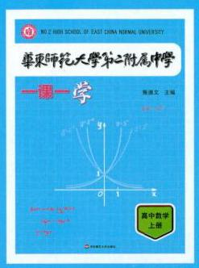

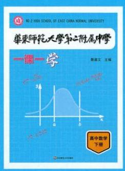

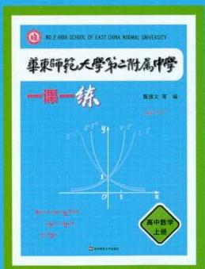

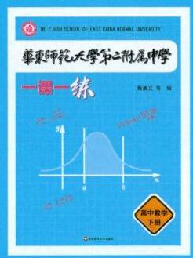

no.2 High school of east china normal university

# 华乘师范大学第二附属中学

## 参考答案与解析

高中数学上册

49 华东师范大学出版社

## 第 1 章 集合与逻辑

### 1.1 集合及其表示方法

$1 \in   \notin   \notin   \notin   \in   \in   \in   \in   \in$

2 (1)(0,2,4,6,8,10,12,14,16,18,20,22,24,26,28,30)(2) $\{ a \mid  a =  - {3m} - 1, m \in  \mathbf{N}\}$ (3) $\{ y \mid  y \geq  1\} \;\left( 4\right) \{ x \mid   - 3 < x < 1\}$ (5) $\{ \left( {-m + 2,{2m} + 1}\right)  \mid  m \in  \mathbf{Z}\}$ (6) $\left\{  {\left( {x, y}\right) \left| {\;{x}^{2} + }\right. }\right. \; \left. {{y}^{2} > 1}\right\}  \;\left( 7\right) \{ \left( {x, y}\right)  \mid   - 2 \leq  x \leq  3, - 1 \leq  y \leq  2$ 且 ${xy} \geq  0\}$

3 -5 提示: $x =  - 2\text{ 、 } - 3$ 时, $2 - {x}^{2} =  - 2\text{ 、 } - 7$ ,则 $2 - {x}^{2} \notin  A, x =  - 1\text{ 、 }0$ 时, $2 - {x}^{2} = 1\text{ 、 }2$ ,则 $2 - {x}^{2} \in \; A$ ,则 $B = \{  - 2, - 3\}$ 。

$4 - \frac{3}{2}$ 提示: 对 $x$ 分类讨论即可。

${5x} \neq  0\text{ 、 }1\text{ 、 }\frac{1 \pm  \sqrt{5}}{2}\text{ 、 }2$ 提示: $x \neq  1,{x}^{2} - x \neq  1$ ,且 ${x}^{2} - x \neq  x$ 。

$6\; - 1\text{ 、 }\frac{1}{2}$ 提示: $2 \in  A,\frac{1}{1 - 2} =  - 1 \in  A,\frac{1}{1 - \left( {-1}\right) } = \frac{1}{2} \in  A$ 。

7 D

8 B 提示: $m = {2a}, n = {2b} + 1$ ,则 $m + n = 2\left( {a + b}\right)  + 1 \in  B$ 。

$9\mathrm{D}$ 提示: 选项 $\mathrm{D}$ 可举反例 ${x}_{1} = 1 + \sqrt{2},{x}_{2} = 3$ 。

10 (1)(4)。(2)(1，7)、 $\{ 2,6\}$ 、 $\{ 3,5\}$ 。 (3) $\{ 4\} \text{ 、 }\{ 1,7\} \text{ 、 }\{ 2,6\} \text{ 、 }\{ 3,5\} \text{ 、 }\{ 1,4,7\}$  、 $\{ 2,4,6\} \text{ 、 }\{ 3,4,5\} \text{ 、 }\{ 1,2,6,7\} \text{ 、 }\{ 1,3,5,7\} \text{ 、 }\{ 2,3,5,6\} \text{ 、 }\{ 1,2,4,6,7\} \text{ 、 }\{ 1,3,4,5,7\}$  、 $\{ 2,3,4,5,6\} \text{ 、 }\{ 1,2,3,5,6,7\} \text{ 、 }\{ 1,2,3,4,5,6,7\} , S$ 共 15 个。

11 (1) 由 $\left\{  \begin{array}{l} a \neq  0, \\  \Delta  < 0, \end{array}\right.$ 得 $a \in  \left( {\frac{9}{8}, + \infty }\right)$ 。(2)由 $a = 0$ 或 $\left\{  \begin{array}{l} a \neq  0, \\  \Delta  = 0, \end{array}\right.$ 得 $a = 0$ 或 $\frac{9}{8}$ 。若 $a = 0$ ，则 $A = \left\{  \frac{2}{3}\right\}$ ； 若 $a = \frac{9}{8}$ ,则 $A = \left\{  \frac{4}{3}\right\}  \text{ 。 }\;\left( 3\right)$ 由 $\left\{  \begin{array}{l} a \neq  0, \\  \Delta  > 0, \\  {x}_{1}{x}_{2} > 0, \\  {x}_{1} + {x}_{2} > 0, \end{array}\right.$ 得 $a \in  \left( {0,\frac{9}{8}}\right)$ 。

12 (1)由 $2 - a < a$ ，得 $a \in  \left( {1, + \infty }\right)$ 。(2)由 $2 - a = a$ ，得 $a = 1$ ，此时 $A = \{ 1\}$ 。(3)1 是区间点,故仅需 $a \in  ( - 1,0\rbrack$ 即可。

13 (1)封闭。设 $x = {m}_{1} + \sqrt{2}{n}_{1}, y = {m}_{2} + \sqrt{2}{n}_{2}\left( {{m}_{1},{m}_{2},{n}_{1},{n}_{2} \in  \mathbf{Z}}\right)$ ，则 $x * y = {xy} = {m}_{1}{m}_{2} + 2{n}_{1}{n}_{2} + \; \sqrt{2}\left( {{n}_{1}{m}_{2} + {n}_{2}{m}_{1}}\right)$ ，其中 ${m}_{1}{m}_{2} + 2{n}_{1}{n}_{2} \in  \mathbf{Z}$ ， ${n}_{1}{m}_{2} + {n}_{2}{m}_{1} \in  \mathbf{Z}$ 。(2)不封闭，反例 $x = y = \sqrt{2}$ 。

### 1.2 集合之间的关系(1)

$1\;\left( 1\right)  \subset  \;\left( 2\right)  \notin  \;\left( 3\right)  \in  \;\left( 4\right)  \in  \;\left( 5\right)  \subset  \;\left( 6\right)  \in$

$\begin{array}{llllllllllllllll} 2 & 1 & 3 & 1 & 4 & 8 & 5 & A = B & 6 & A \subset  B & 7 & C & 8 & A & 9 & D \end{array}$

10 显然 $a \neq  0$ 且 $b \neq  0$ ,故 $a - b = 0$ ,即 $a = b$ ,从而 $A = \left\{  {a,{a}^{2},0}\right\}  , B = \{ 0, a,\left| a\right| \}$ ,则有 ${a}^{2} = \left| a\right|$ , 解得 $a =  - 1$ 或 $a = 1$ (舍),从而 $b = a = 1, A = \{  - 1,1,0\}$ 。

11 $A = \{ 0, - 4\}$ 。由于 $B \subseteq  A$ ,则 $B = \varnothing$ ,或 $B = \{ 0\}$ ,或 $B = \{ 4\}$ ,或 $B = \{ 0,4\}$ ,从而解得 $a \in  ( - \infty$ , -1] $\cup  \{ 1\}$ 。提示: 考虑子集关系时切勿忘记空集情况!

${12B} = \{ 1,2,3,4,5,6,8,9,{10}\}$ ,有 ${2}^{7} = {128}$ 个。

${13B} \subseteq  A$ 显然。下证 $A \subseteq  B$ : 任取 $x = {2k} \in  A$ ,则 $x = {2k} =  - {5k} \cdot  {14} + {2k} \cdot  {36} \in  B$ 。得证!

### 1.2 集合之间的关系(2)

$1 \subset   \supset   =  \subset   \subset   =  \subset   \subset$

${2a} \leq   - 5$ 或 $a > 5\;3\;{14}\;4\;1\text{ 、 }\frac{2}{3}$ 或 $2\;5\; - \frac{1}{2}\;6\;{36}\;7\;D\;8\;B\;9\;A$

10(1)由题意，得 $\left\{  \begin{array}{l} f\left( a\right)  = a, \\  \Delta  = 0, \end{array}\right.$ 解得 $\left\{  \begin{array}{l} a = \frac{1}{3}, \\  b = \frac{1}{9}\text{ 。 } \end{array}\right.$ (2)任取 $t \in  A$ ，则 $f\left( t\right)  = t$ ，故有 $f\left( {f\left( t\right) }\right)  = f\left( t\right)  = t$ ，所以 $t \in  B$ ,所以 $A \subseteq  B$ 。

11 (1)由题意，得 $\left\{  \begin{array}{l} m - 6 \leq   - 1, \\  {2m} - 1 \geq  4, \end{array}\right.$ 解得 $m \in  \left\lbrack  {\frac{5}{2},5}\right\rbrack$ 。(2)若 $B = \varnothing$ ，则 ${2m} + 1 < m + 1$ ，解得 $m < 0$ ； 若 $B \neq  \varnothing$ ,则 $- 1 \leq  m + 1 \leq  {2m} + 1 \leq  4$ ,解得 $0 \leq  m \leq  \frac{3}{2}$ ,故 $m \in  \left( {-\infty ,\frac{3}{2}}\right\rbrack$ 。

${12B} = \{ x \mid   - 1 \leq  x \leq  {2a} + 3\}$ ,由 $C \subseteq  B$ ,得 $\left\{  \begin{array}{l} {2a} + 3 \geq  4, \\  {2a} + 3 \geq  {a}^{2}, \end{array}\right.$ 解得 $a \in  \left\lbrack  {\frac{1}{2},3}\right\rbrack$ 。

13 (1) 总共有 ${2}^{100}$ 个子集，且 $1 - {100}$ 的每个数都恰好属于其中 ${2}^{99}$ 个的子集中，故子集和的总和为 ${2}^{99}$ 。 $\left( {1 + 2 + \cdots  + {100}}\right)  = {5050} \cdot  {2}^{99}$ 。(2)首先有一种感觉: $S$ 的元素个数不会太多。直觉告诉我们不会超过 5 个,简单证明如下: 若不然,至少 6 个,则元素个数不超过 4 个的子集至少有 56 个(这个可以数出来),且它的和 $\leq  {12} + {13} + {14} + {15} = {54}$ ,这与条件矛盾。从而 $S$ 的和 $\leq  {11} + {12} + {13} + {14} + {15} = {65}$ 。下面, 我们论断 62-65 都不可能: 若 $S$ 的和 $\geq  {62}$ ,则 $S$ 只能为 $\{ {15},{14},{13},{11},9\}$ ,这不符合条件; 而 $\{ {15},{14},{13},{11},8\}$ 符合条件,其和为61,故 $S$ 最大和为 61 。

### 1.3 集合的运算(1)

$1 - 3\left\lbrack  \begin{array}{ll} 2 & 0 \end{array}\right\rbrack  \left( {2,2\text{ 或 } - 2\;3\lbrack 2, + \infty }\right) \;4\{ \left( {1,0}\right) ,\left( {-1,0}\right) \} \;5\left\lbrack  {-1,1}\right\rbrack$

$6\left( {-\infty , - 1\rbrack \cup \lbrack 3, + \infty }\right) \;7\;D\;8\;D\;9\;D$

${10B} = \{ 2,3\} , C = \{ 2, - 4\}$ ,由 $A \cap  B \neq  \varnothing , A \cap  C = \varnothing$ ,可知 $3 \in  A$ ,解得 $a =  - 2$ 或 $a = 5$ (舍)。

11 由题意得,要么无根 $\left( {\Delta  < 0}\right)$ ,要么所有根均为非正根 $\left( {\Delta  \geq  0,{x}_{1} + {x}_{2} \leq  0,{x}_{1}{x}_{2} \geq  0}\right)$ ,解得 $m \in  ( - 4$ , $+ \infty )$ 。

12 集合 $A\text{ 、 }B$ 分别为 ${xOy}$ 平面上的点集,集合 $A$ 表示直线 ${l}_{1} : \left( {a + 1}\right) x - y - {2a} + 1 = 0$ 上除去 $\left( {2,3}\right)$ 的点的集合。集合 $B$ 表示直线 ${l}_{2} : \left( {{a}^{2} - 1}\right) x + \left( {a - 1}\right) y = {15}$ 上点的集合。① 由 ${l}_{1}//{l}_{2}$ 可得, $\left\{  \begin{array}{l} \left( {a + 1}\right) \left( {a - 1}\right)  = \left( {-1}\right)  \cdot  \left( {{a}^{2} - 1}\right) , \\  \left( {-1}\right)  \times  \left( {-{15}}\right)  \neq  \left( {a - 1}\right) \left( {-{2a} + 1}\right) , \end{array}\right.$ 解得 $a =  \pm  1$ 。当 $a = 1$ 时, $B = \varnothing$ ,所以 $A \cap  B = \varnothing$ ; 当 $a =  - 1$ 时, 集合 $A = \{ \left( {x, y}\right)  \mid  y = 3\left( {x \neq  2}\right) \}$ ,集合 $B = \left\{  {\left( {x, y}\right)  \mid  y =  - \frac{15}{2}}\right\}$ ,所以 $A \cap  B = \varnothing$ ; ②由题意可知(2,

3) $\notin  A$ ,当 $\left( {2,3}\right)  \in  B$ 时,则 $2\left( {{a}^{2} - 1}\right)  + 3\left( {a - 1}\right)  - {15} = 0$ ,解得 $a =  - 4$ 或 $a = \frac{5}{2}$ ,此时 $A \cap  B = \varnothing$ 。综上所述,当 $a$ 的值为 $- 4, - 1,1,\frac{5}{2}$ 时, $A \cap  B = \varnothing$ 。

13 集合 $A$ 为 4 的倍数全体,集合 $B$ 为 6 的倍数全体,故 $A \cap  B$ 的最小正整数为 12 . 集合 $A$ 中 $m = 4$ , $n =  - 5$ ; 集合 $B$ 中 $m = 1, n = 0$ 。

### 1.3 集合的运算(2)

$1\;\left\{  {7, - \frac{1}{3},\frac{8}{3}}\right\}  \;2\;\left\{  {x \mid  1 \leq  x \leq  5}\right\}  \;\mathbf{R}\;3\;\left\{  {\left( {x, y}\right)  \mid  {xy} = 1\text{ 且 }x > 0\text{ ,或 }{xy} =  - 1}\right\}$

$4( - \infty ,3\rbrack \;5\;\{ 1,2,3,5\} \;{6m} \leq   - 1\;7\;A\;8\;A\;9\;A$

10 (1) $A = \{ 1,2\} ,2 \in  B$ ，代入 $B$ 中方程得 $a =  - 1$ 或 $a =  - 3$ ，经检验，两解均符合题意。(2)由题意得 $B \subseteq  A$ ,则 $B = \varnothing$ 或 $\{ 1\}$ 或 $\{ 2\}$ 或 $\{ 1,2\}$ 。若 $B = \varnothing$ ,则 $\Delta  < 0$ ,解得 $a <  - 3$ ; 若 $B = \{ 1\}$ ,无解; 若 $B = \{ 2\}$ , 解得 $a =  - 3$ ; 若 $B = \{ 1,2\}$ ,无解。综上, $a \leq   - 3$ 。

11 (1) $A = \{ x \mid   - 3 < x < 5\} , B = \{ x \mid  x <  - 1$ 或 $x > 5\}$ ,则 $A \cap  B = \{ x \mid   - 3 < x <  - 1\}$ 。 $\{ x \mid  a - 4 < x < a + 4\} , B = \{ x \mid  x <  - 1$ 或 $x > 5\}$ ,由于 $A \cup  B = \mathbf{R}$ ,则 $\left\{  \begin{array}{l} a - 4 <  - 1, \\  a + 4 > 5, \end{array}\right.$ 解得 $1 < a < 3$ 。

12 $\left( {A \cup  B}\right)  \cap  C = \left( {A \cap  C}\right)  \cup  \left( {B \cap  C}\right) \text{ 。 }A \cap  C$ 与 $B \cap  C$ 分别为方程组 $\left( I\right) \left\{  \begin{array}{l} {ax} + y = 1, \\  {x}^{2} + {y}^{2} = 1, \end{array}\right.$ ( II ) $\left\{  \begin{array}{l} x + {ay} = 1, \\  {x}^{2} + {y}^{2} = 1 \end{array}\right.$ 的解集。由 ( I ) 解得 $\left( {x, y}\right)  = \left( {0,1}\right)$ 或 $\left( {\frac{2a}{1 + {a}^{2}},\frac{1 - {a}^{2}}{1 + {a}^{2}}}\right)$ ; 由 ( II ) 解得 $\left( {x, y}\right)  = \; \left( {1,0}\right)$ 或 $\left( {\frac{1 - {a}^{2}}{1 + {a}^{2}},\frac{2a}{1 + {a}^{2}}}\right)$ 。(1)使(A $\cup$ B) $\cap  C$ 恰有 2 个元素的情况只有两种可能:① $\left\{  \begin{array}{l} \frac{2a}{1 + {a}^{2}} = 0, \\  \frac{1 - {a}^{2}}{1 + {a}^{2}} = 1; \end{array}\right.$ ② $\left\{  \begin{array}{l} \frac{2a}{1 + {a}^{2}} = 1, \\  \frac{1 - {a}^{2}}{1 + {a}^{2}} = 0; \end{array}\right.$ 由①解得 $a = 0$ ; 由②解得 $a = 1$ 。故 $a = 0$ 或 $a = 1$ 时， $\left( {A \cup  B}\right)  \cap  C$ 恰有 2 个元素。

(2)使( $A \cup  B$ ) $\cap  C$ 恰有 3 个元素的情况是: $\frac{2a}{1 + {a}^{2}} = \frac{1 - {a}^{2}}{1 + {a}^{2}}$ ，解得 $a =  - 1 \pm  \sqrt{2}$ ，故当 $a =  - 1 \pm  \sqrt{2}$ 时，(A ∪ $B) \cap  C$ 恰有 3 个元素。

13 因为 ${a}_{n}$ 为正整数 $\left( {n = 1\text{ 、 }2\text{ 、 }3\text{ 、 }4\text{ 、 }5}\right) ,{a}_{1} + {a}_{4} = {10}$ ,所以 $1 \leq  {a}_{1} < {a}_{4} < {10}$ 。因为 $A \cap  B = \left\{  {{a}_{1},{a}_{4}}\right\}$ , 所以 ${a}_{1}\text{ 、 }{a}_{4} \in  B$ ,且是两个正整数的平方,所以 ${a}_{1} = 1,{a}_{4} = 9$ 。由 ${a}_{4} < {a}_{5}$ 知 ${a}_{5} \geq  {10}$ 。因为 $1 + 9 + {81} + \; {a}_{2} + {a}_{3} + {a}_{5} + {a}_{2}^{2} + {a}_{3}^{2} + {a}_{5}^{2} = {234} + 9$ ,所以 ${a}_{2} + {a}_{3} + {a}_{5} + {a}_{2}^{2} + {a}_{3}^{2} + {a}_{5}^{2} = {152}$ (①)。 由式①得 ${a}_{5} < {12}$ , 从而 ${10} \leq  {a}_{5} < {12}$ 。当 ${a}_{5} = {11}$ 时,由式①得 ${a}_{2} + {a}_{3} + {a}_{2}^{2} + {a}_{3}^{2} = {20}$ (②)。 不论 ${a}_{2}^{2} = 9$ 或 ${a}_{3}^{2} = 9$ ,式 ② 均无整数解,故 ${a}_{5} = {10}$ 。于是 ${a}_{2} + {a}_{3} + {a}_{2}^{2} + {a}_{3}^{2} = {42}$ (③)。 若 ${a}_{2}^{2} = 9$ ,则由式 ③ 得 ${a}_{2} = 3,{a}_{3} = 5$ 。若 ${a}_{3}^{2} =$ 9,则由式 ③ 得 ${a}_{2} = 5 > 3 = {a}_{3}$ ,舍去。所以 $A = \{ 1,3,5,9,{10}\}$ ,则 $B = \{ 1,9,{25},{81},{100}\}$ 。

### 1.3 集合的运算(3)

${1222683}\{ \left( {1,1}\right) ,\left( {2,2}\right) \} \;4\;\left( {-\infty ,1}\right)  \cup  \left( {4, + \infty }\right) \;{53766}\{ \left( {2, - 2}\right) \} \;7\;C$ 8 B9C

${10}\left( 1\right) \left( {0,1}\right)  \cup  \lbrack 2, + \infty )\;\left( 2\right) \left( {-\infty ,1}\right)  \cup  \{ 2\} \;\left( 3\right) \{ 2\}  \cup  \left( {3, + \infty }\right)$

11 由已知,得 $A = \{  - 2, - 1\}$ ,由 $\bar{A} \cap  B = \varnothing$ ,得 $B \subseteq  A$ 。因为方程 ${x}^{2} + \left( {m + 1}\right) x + m = 0$ 的判别式 $\Delta  = \; {\left( m + 1\right) }^{2} - {4m} = {\left( m - 1\right) }^{2} \geq  0$ ,所以 $B \neq  \varnothing$ 。所以 $B = \{  - 1\}$ 或 $B = \{  - 2\}$ 或 $B = \{  - 1, - 2\}$ 。①若 $B = \; \{  - 1\}$ ,则 $m = 1$ ; ②若 $B = \{  - 2\}$ ,则应有 $- \left( {m + 1}\right)  = \left( {-2}\right)  + \left( {-2}\right)  =  - 4$ ,且 $m = \left( {-2}\right)  \times  \left( {-2}\right)  = 4$ ,这两式不能同时成立,所以 $B \neq  \{  - 2\}$ ; ③ 若 $B = \{  - 1, - 2\}$ ,则应有 $- \left( {m + 1}\right)  = \left( {-1}\right)  + \left( {-2}\right)  =  - 3$ ,且 $m = \; \left( {-1}\right)  \times  \left( {-2}\right)  = 2$ ,由这两式得 $m = 2$ 。经检验,知 $m = 1$ 与 $m = 2$ 均符合条件,所以 $m = 1$ 或 $m = 2$ 。

12 $A = \{ x \mid  x <  - 1$ 或 $x > 1\} , B = \{ x \mid   - 3 < x <  - 1\} ,\bar{A} = \{ x \mid   - 1 \leq  x \leq  1\} , B \cup  \bar{A} = \{ x \mid   - 3 < \; x \leq  1\} , B \cup  \bar{A} \cap  \mathbf{Z} = \{  - 2, - 1,0,1\} , C \subseteq  \left( {B \cup  \bar{A}}\right)  \cap  \mathbf{Z}$ 且 $C \cap  B \neq  \varnothing$ ,则 $C$ 中至少有元素 -2,又因为 $C$ 中有 2 个元素,则 $C = \{  - 2, - 1\} \text{ 、 }\{  - 2,0\}$ 或 $\{  - 2,1\}$ 。

13 (1)因为 ${x}^{2} - {3x} + 2 > 0$ ，所以 $x < 1$ 或 $x > 2$ ，即 $A = \{ x \mid  x < 1$ 或 $x > 2\}$ ，由于 ${x}^{2} - {2x} + {2a} - \; {a}^{2} = 0$ ,则 $\Delta  = {\left( -2\right) }^{2} - 4\left( {{2a} - {a}^{2}}\right)  = 4{\left( a - 1\right) }^{2} \geq  0$ 。当 $\Delta  = 0$ 时,即 $a = 1$ 时, $B = \left\{  {x \mid  {x}^{2} - {2x} + 1 = 0}\right\}   = \; \{ 1\}$ ,此时 $B \subseteq  A$ 不成立,舍去。当 $\Delta  \neq  0$ ,即 $a \neq  1$ 时,方程 ${x}^{2} - {2x} + {2a} - {a}^{2} = 0$ 的两根为 ${x}_{1} = a,{x}_{2} = \; 2 - a$ 。若使得 $B \nsubseteq  A$ 成立,则需 $a \in  \bar{A}$ 或 $2 - a \in  \bar{A}$ ,即 $1 \leq  a \leq  2$ 或 $1 \leq  2 - a \leq  2$ ,解得 $0 \leq  a \leq  2$ , 则 $B \subseteq  A$ 成立时, $a < 0$ 或 $a > 2$ 。综上所述, $a$ 的取值范围为 $\{ a \mid  a < 0$ 或 $a > 2\}$ 。(2)因为 $A \cap  \bar{B} = \; A$ ,所以 $A \subseteq  \bar{B}$ ,即 $B \subseteq  \bar{A}$ 。由(1)可知 $A = \{ x \mid  x < 1$ 或 $x > 2\}$ ,则 $\bar{A} = \{ x \mid  1 \leq  x \leq  2\}$ 。当 $\Delta  = 0$ , 即 $a = 1$ 时, $B = \left\{  {x \mid  {x}^{2} - {2x} + 1 = 0}\right\}   = \{ 1\}  \subseteq  \bar{A}$ 成立。当 $\Delta  \neq  0$ ,即 $a \neq  1$ 时, $B = \{ a,2 - a\}$ ,若使得 $B \subseteq  \bar{A}$ 成立，则需满足 $\left\{  \begin{array}{l} a \in  \bar{A}\text{ , } \\  2 - a \in  \bar{A}\text{ , } \end{array}\right.$ 即 $\left\{  \begin{array}{l} 1 \leq  a \leq  2, \\  1 \leq  2 - a \leq  2, \end{array}\right.$ 解得 $a = 1$ (舍去)。综上所述， $a \in  \{ 1\}$ 。

### 1.4 充分条件与必要条件(1)

1 充分非必要 2 必要非充分 3 充分非必要 4 必要非充分 ${5x} = 0$ 或其他合理答案

${6x} \neq  1$ 或 $x \neq  2$ 或其他合理答案 $7\mathrm{\;A}\;8\mathrm{\;D}\;9\mathrm{\;B}$

10 充分性: 若 $a > 5$ ,则 $B = \left( {a, + \infty }\right)  \subset  \lbrack 2, + \infty ) = A$ 。非必要性: 若 $a = 4 < 5$ ,则 $B = \left( {4, + \infty }\right)$ ,仍然有 $B \subset  A$ 。因此 “ $a > 5$ ” 是 “ $B \subset  A$ ” 的一个充分非必要条件。

11 必要非充分条件。证明如下: 必要性: 若 ${ax} + b > 0$ 恒成立,那么对于 $x = \frac{1}{2}$ ,有 $\frac{1}{2}a + b > 0$ ,则 $a + \; {2b} > 0$ 。非充分性: $a =  - 3, b = 2$ 也能满足 $a + {2b} > 0$ ,但对于 $x = 1$ 却有 $a + b < 0$ 。

12 (1) $\Delta  \geq  0$ 且 $- \frac{b}{a} > 0$ 且 $\frac{c}{a} > 0$ ，或 ${b}^{2} - {4ac} \geq  0$ 且 $a$ 、 $b$ 异号且 $a$ 、 $c$ 同号。(2) $c = 0$ 且 $- \frac{b}{a} > 0$ 。 (3) $\left\{  \begin{array}{l} a > 0, \\  {4a} + {2b} + c < 0, \\  {4a} - {2b} + c < 0 \end{array}\right.$ 或 $\left\{  \begin{array}{l} a < 0, \\  {4a} + {2b} + c > 0, \\  {4a} - {2b} + c > 0 \end{array}\right.$ (或合并起来写为 $\left\{  \begin{array}{l} \frac{{4a} + {2b} + c}{a} < 0, \\  \frac{{4a} - {2b} + c}{a} < 0 \end{array}\right.$ 。

13 (1)由题意得 $\left\{  \begin{array}{l} a \neq  1, \\  \Delta  = {\left( a + 2\right) }^{2} + {16}\left( {1 - a}\right)  \geq  0, \\   - \frac{a + 2}{1 - a} > 0, \\  \frac{4}{a - 1} > 0, \end{array}\right.$ 即 $\left\{  \begin{array}{l} a \neq  1, \\  \left( {a - {10}}\right) \left( {a - 2}\right)  \geq  0, \\  a <  - 2\text{ 或 }a > 1, \\  a > 1, \end{array}\right.$ 所以 $1 < a \leq  2$ 或 $a \geq  {10}$ 。

( 2 )当 $a = 1$ 时，解得 $x = \frac{4}{3}$ 满足条件。当 $a \neq  1$ 时，由 $\Delta  \geq  0$ ，得 $\left( {a - {10}}\right) \left( {a - 2}\right)  \geq  0$ ，即当 $a \leq  2$ 或 $a \geq$ 10 时方程有解。想有正数解,只需排除两根均非正数的情形,而显然 0 并非根,故只需排除两根均为负数的情况，即 $\left\{  \begin{array}{l} \Delta  \geq  0, \\  {x}_{1} + {x}_{2} < 0, \\  {x}_{1}{x}_{2} > 0, \end{array}\right.$ 解集为空集，这意味着不存在两根均负的情况。故方程至少有一个正根的充要条件为 $a \leq  2$ 或 $a \geq  {10}$ 。

### 1.4 充分条件与必要条件(2)

1 充要 2 必要非充分 3 充分 $4\left( 1\right) x \neq  0\left( 2\right) x > 3\left( 3\right) \left| {x - 1}\right|  > 2$ (其他合理答案均可) 5 $\left\lbrack  {3, + \infty }\right)$ 6 必要非充分 7 D 8 A 9 D

10 由题意，得 $\left\{  \begin{array}{l} \Delta  \geq  0, \\  \left( {{x}_{1} - 1}\right)  + \left( {{x}_{2} - 1}\right)  > 0, \\  \left( {{x}_{1} - 1}\right) \left( {{x}_{2} - 1}\right)  > 0, \end{array}\right.$ 解得 $k <  - 2$ 。

11 因为命题 $\alpha  :  - 2 \leq  x \leq  {10}$ ,所以命题 $\overline{\alpha } : x <  - 2$ 或 $x > {10}$ 。因为命题 $\beta  :  - 1 - m \leq  x \leq   - 1 + m$ ,所以命题 $\overline{\beta } : x <  - 1 - m$ 或 $x >  - 1 + m$ 。又因为命题 $\overline{\alpha }$ 是命题 $\overline{\beta }$ 的必要不充分条件,所以 $\left\{  \begin{array}{l} m > 0, \\   - 1 - m \leq   - 2, \\   - 1 + m > {10} \end{array}\right.$ 或 $\left\{  \begin{array}{l} m > 0, \\   - 1 - m <  - 2,\text{ 所以 }m \geq  {11}\text{ 。 } \\   - 1 + m \geq  {10}, \end{array}\right.$

12 这两个方程的两根分别为 $- a \pm  \sqrt{{a}^{2} - {b}^{2}}\left( {a \geq  b}\right)$ 和 $- c \pm  \sqrt{{c}^{2} + {b}^{2}}$ 。充分性: 若 $\angle A = {90}^{ \circ  }$ ,则 ${a}^{2} = \; {b}^{2} + {c}^{2}$ ,则 $- a - \sqrt{{a}^{2} - {b}^{2}} =  - a - c =  - c - \sqrt{{c}^{2} + {b}^{2}}$ ,即二次方程 ${x}^{2} + {2ax} + {b}^{2} = 0,{x}^{2} + {2cx} - {b}^{2} =$ 0 有一个公共根。必要性:若两方程有公共根，则相加之后该根仍然是 $2{x}^{2} + 2\left( {a + c}\right) x = 0$ 的根。该方程两根为 0 和 $- a - c$ ,显然 0 不是两方程的公共根,因此两方程的公共根必是 $- a - c$ ,则可整理得 ${a}^{2} = {b}^{2} + {c}^{2}$ , 于是 $\angle A = {90}^{ \circ  }$ 。

13 命题 $q$ 的充要条件是 $\left\{  \begin{array}{l} \Delta  = {m}^{2} - {4n} \geq  0, \\  0 <  - \frac{m}{2} < 1, \\  n > 0, \\  1 + m + n > 0\text{ 。 } \end{array}\right.$ 在二维平面上画出其所代表的区域,可以看出是真包含于命题 $p$ 所代表的区域,因此命题 $p$ 是 $q$ 的必要非充分条件。

### 1.4 充分条件与必要条件(3)

${1x} < 2\;x < 0\;2$ 必要非充分 ${3m} \geq  4\;4$ 充分非必要 5 必要非充分 $6\; - \frac{1}{2}$ 或 $\frac{1}{3}$

7 A 8 B 9 D

10 (1)必要非充分(2)充分非必要(3)必要非充分 (4)充分非必要

11 (1)由题意，得 $\beta  \Rightarrow  \alpha$ 。若集合 $\{ x \mid  a + 1 \leq  x \leq  {2a} - 1\}  = \varnothing$ ，则 $a + 1 > {2a} - 1$ ，即 $a < 2$ 。若集合 $\{ x \mid  a + 1 \leq  x \leq  {2a} - 1\}  \neq  \varnothing$ ,则 $\left\{  \begin{array}{l} a + 1 \geq  1, \\  {2a} - 1 \leq  3, \\  a + 1 \leq  {2a} - 1, \end{array}\right.$ 解得 $a = 2$ 。综上可得, $a \leq  2\text{ 。 }\;$ (2) 由题意,得 $\alpha  \Rightarrow  \beta$ , 则 $\left\{  \begin{array}{l} {2m} - 3 \geq   - 5, \\   - {2m} + 1 < 1, \end{array}\right.$ 或 $\left\{  \begin{array}{l} {2m} - 3 >  - 5, \\   - {2m} + 1 \leq  1, \end{array}\right.$ 解得 $m \geq  0$ 。所以,实数 $m$ 的取值范围为 $m \geq  0$ 。

12 证明: 若 $\bigtriangleup {ABC}$ 为等边三角形时,即 $a = b = c$ ,则 $\max \left\{  {\frac{a}{b},\frac{b}{c},\frac{c}{a}}\right\}   = 1 = \min \left\{  {\frac{a}{b},\frac{b}{c},\frac{c}{a}}\right\}$ ,则 $l = 1$ ; 若 $\bigtriangleup {ABC}$ 为等腰三角形,如 $a = 2, b = 2, c = 3$ 时,则 $\max \left\{  {\frac{a}{b},\frac{b}{c},\frac{c}{a}}\right\}   = \frac{3}{2},\min \left\{  {\frac{a}{b},\frac{b}{c},\frac{c}{a}}\right\}   = \frac{2}{3}$ ,此时 $l =$ 1 仍成立，但 $\bigtriangleup  {ABC}$ 不为等边三角形。

13 (1)错(2)对(3)错(4)对(5)对

1.5 反证法(1)

1 (1) $a$ 、 $b$ 、 $c$ 都是正数 (2) $a$ 、 $b$ 、 $c$ 都不是正数 (3) $\exists x \in  \mathbf{R}$ ，有 ${x}^{2} + x + 1 \geq  0$

2 若 $a = 1$ 且 $b = 2$ ，则 ${a}^{2} + {b}^{2} - {2a} - {4b} + 5 = 0$ 。

3 ①②③___ $4\;a \leq  b$

5 存在一个三角形，它有两个或以上的内角是直角

6 存在一个三角形, 只有一个或更少的外角是钝角

7 B 8 C 9 B

10 逆命题:若 $\left| a\right|  > 1$ ，则 $a > \frac{1}{a}$ 。它是假命题。否命题:若 $a \leq  \frac{1}{a}$ ，则 $\left| a\right|  \leq  1$ 。它是假命题。逆否命题: 若 $\left| a\right|  \leq  1$ ,则 $a \leq  \frac{1}{a}$ 。它是假命题。

11 用反证法。假设 $\sqrt{3}$ 是有理数,设 $\sqrt{3} = \frac{m}{n}$ ,其中 $m\text{ 、 }n$ 是互素的正整数。于是 $m = \sqrt{3}n$ ,两边平方得 ${m}^{2} = \; 3{n}^{2}$ ,所以 $m$ 是 3 的倍数。设 $m = {3k}$ ,代入 ${m}^{2} = 3{n}^{2}$ ,得 $9{k}^{2} = 3{n}^{2}$ ,即 $3{k}^{2} = {n}^{2}$ ,因此 $n$ 也是 3 的倍数。这与互素假设矛盾。所以假设不成立， $\sqrt{3}$ 是无理数。

12 用反证法。假设每个方程都没有两个不相等的实根,即每个方程的判别式都 $\leq  0$ ,即 ${2a} - b \leq  0,{2b} - \; c \leq  0,{2c} - a \leq  0$ 。那么 $a \geq  {2c} \geq  {4b} \geq  {8a}$ ,因此 $a \leq  0$ ,这与 $a$ 是正实数的假设相矛盾。所以假设不成立, 因此至少有一个方程有两个不相等的实根。

13 用反证法。假设每一个都小于 1,求出各个 $x$ 的范围,分别是 $x \in  \left( {-\frac{\sqrt{2}}{2},\frac{\sqrt{2}}{2}}\right) , x \in  \left( {1, + \infty }\right) , x \in \; \left( {0,1}\right)$ 。它们交集为空,因此不存在符合假设的 $x$ 。所以假设不成立,至少有一个不小于 1 。

### 1.5 反证法(2)

1 假设 $a$ 、 $b$ 不全为 0

${2x} = a$ 或 $x = b$

${3a}\text{ 、 }b\text{ 、 }c$ 或都是奇数，或至少有两个偶数

4 假设三个内角都大于 60°5 ③①② [6] 只有有限多个质数 除了 ${p}_{1},{p}_{2},\cdots ,{p}_{n}$ 以外 7 D

$8\;\mathrm{D}\;9\;\mathrm{D}$

10 用反证法。假设 $\sqrt{a} + \sqrt{b}$ 是有理数，由于 $\left( {\sqrt{a} + \sqrt{b}}\right) \left( {\sqrt{a} - \sqrt{b}}\right)  = a - b$ 是有理数，可知 $\sqrt{a} - \sqrt{b}$ 也是有理数,这样一来 $\sqrt{a} = \frac{1}{2}\left( {\sqrt{a} + \sqrt{b}}\right)  + \frac{1}{2}\left( {\sqrt{a} - \sqrt{b}}\right)$ 也是有理数,跟题目条件矛盾! 因此假设不成立,所以, $\sqrt{a} + \sqrt{b}$ 是无理数。

${11}{{2k} + 1}$ 与 ${2k} - 1$ 必有一个模 4 余 3，肯定不是两个正整数的平方和。若使用反证法，也是同样的思路，两个正整数的平方和除以 4 不可能余 3 。

12 易得 $f\left( {2k}\right)$ 和 $f\left( 0\right)$ 具有相同的奇偶性, $f\left( {{2k} + 1}\right)$ 和 $f\left( 1\right)$ 具有相同的奇偶性,因此 $f$ (整数)总是奇数, 也就不可能是 0 , 从而无整数根。用反证法也是往同奇偶性上去靠。

13 用反证法。假设 $p + q > 2$ ，注意到 ${p}^{3} + {q}^{3} = \left( {p + q}\right) \left( {{p}^{2} - {pq} + {q}^{2}}\right)$ ，我们只需要证到 ${p}^{2} - {pq} + {q}^{2} >$ 1 便能得出 ${p}^{3} + {q}^{3} > 2$ ，从而导致矛盾。(假如学过基本不等式这是容易做到的，但现在还没学，只能进行一个并不美观的配方来得出)而 ${p}^{2} - {pq} + {q}^{2} = \frac{1}{4}{\left( p + q\right) }^{2} + \frac{3}{4}{\left( p - q\right) }^{2} \geq  \frac{1}{4}{\left( p + q\right) }^{2} > 1$ 。因此假设不成立,所以 $p + q \leq  2$ 。

## 第 2 章 不等式

### 2.1 不等式的基本性质

1 ② 2 ②③ 3 $a < a{b}^{2} < {ab}\;$ ___4充分非必要条件 5 $\frac{a}{b} < \frac{a + m}{b + m}\;$ ___ $\;6 + b < 0 < a\;$ ? C

8 B 9 A

10 (1) $\frac{a}{3} - 3 > \frac{a}{3} - 4$ 。(2)若 $b > 0, a + b > a - b$ ；若 $b = 0, a + b = a - b$ ；若 $b < 0, a + b < a -$ b。(3) $\frac{{a}^{2} - {b}^{2} + 2}{2} > \frac{{a}^{2} - 2{b}^{2} + 1}{3}$

${11q} > s > r > p$

12 设 $m\left( {a + b}\right)  + n\left( {a - b}\right)  = {3a} - b$ ,则 $\left\{  \begin{array}{l} m + n = 3, \\  m - n =  - 1, \end{array}\right.$ 解得 $\left\{  \begin{array}{l} m = 1, \\  n = 2, \end{array}\right.$ 所以 ${3a} - b = \left( {a + b}\right)  + 2\left( {a - b}\right)  \in \; \left\lbrack  {1,7}\right\rbrack$ 。

${13}\left( 1\right) \sqrt{2} - 1 > 2 - \sqrt{3},2 - \sqrt{3} > \sqrt{6} - \sqrt{5}$ 。 证明略。

### 2.2 一元二次不等式的解法(1)

$1\left( {\frac{1}{2},1}\right) 2\left\lbrack  {-2,1}\right\rbrack  3\left\{  \frac{4}{3}\right\}  4\left\{  {x\left| {\;x \neq   - \frac{1}{2}}\right. \;5\left( {-1,2}\right) 6\left( {-\infty ,1}\right) 7\mathrm{\;A}}\right\}$

$8\mathrm{\;A}\;9\mathrm{\;D}{10}\left( 1\right) a > 2\left( 2\right) \left\lbrack  {1,2}\right\rbrack$

11 若 $m = 0, x \in  \mathbf{R}$ ; 若 $m > 0, x \in  \left( {-\frac{3}{m},\frac{1}{m}}\right)$ ; 若 $m < 0, x \in  \left( {\frac{1}{m}, - \frac{3}{m}}\right)$ 。

12 当 $a = 0$ 时,解集为 $\left( {1, + \infty }\right)$ ; 当 $a = 1$ 时,解集为 $\varnothing$ ; 当 $a > 1$ 时,解集为 $\left( {\frac{1}{a},1}\right)$ ; 当 $0 < a < 1$ 时,解集为 $\left( {1,\frac{1}{a}}\right)$ ; 当 $a < 0$ 时,解集为 $\left( {-\infty ,\frac{1}{a}}\right)  \cup  \left( {1, + \infty }\right)$ 。

13 (1)因为命题 $p$ :“存在 ${x}_{0} \in  \left\lbrack  {-1,1}\right\rbrack$ ， ${x}_{0}^{2} - {x}_{0} - m \geq  0$ ”是假命题，所以其否命题:“任取 $x \in  \lbrack  - 1$ ， 1]， ${x}^{2} - x - m < 0$ ”是真命题，所以 $m > {x}^{2} - x$ 在 $x \in  \left\lbrack  {-1,1}\right\rbrack$ 上恒成立。令 $f\left( x\right)  = {x}^{2} - x( - 1 \leq  x \leq$ 1),则 $f\left( x\right)$ 开口向上,对称轴为 $x = \frac{1}{2}$ ,所以 $f\left( x\right)$ 在 $\left\lbrack  {-1,\frac{1}{2}}\right)$ 上单调递减,在 $\left( {\frac{1}{2},1}\right\rbrack$ 上单调递增,又 $f\left( {-1}\right)  = {\left( -1\right) }^{2} - \left( {-1}\right)  = 2, f\left( 1\right)  = {1}^{2} - 1 = 0$ ,所以 $f{\left( x\right) }_{\max } = f\left( {-1}\right)  = 2$ ,所以 $m > 2$ ,即 $m \in  \left( {2, + \infty }\right)$ , 故 $B = \left( {2, + \infty }\right)$ 。(2)因为 $x \in  B$ 是 $x \in  A$ 的必要非充分条件，所以集合 $A$ 是集合 $B$ 的真子集，又 $B = \; \left( {2, + \infty }\right)$ ,因为 $\left( {x - {3a}}\right) \left( {x - a - 2}\right)  < 0$ 对应的方程 $\left( {x - {3a}}\right) \left( {x - a - 2}\right)  = 0$ 的根为 $x = {3a}$ 或 $x = a +$ 2,当 ${3a} > a + 2$ ,即 $a > 1$ 时,由 $\left( {x - {3a}}\right) \left( {x - a - 2}\right)  < 0$ 得 $a + 2 < x < {3a}$ ,则 $A = \left( {a + 2,{3a}}\right)$ ,所以 $a + 2 \geq  2$ ,则 $a \geq  0$ ,故 $a > 1$ ; 当 ${3a} = a + 2$ ,即 $a = 1$ 时,由 $\left( {x - {3a}}\right) \left( {x - a - 2}\right)  < 0$ 得 ${\left( x - 3\right) }^{2} <$ 0,显然 $x \in  \varnothing$ ,即 $A = \varnothing$ ,满足题意; 当 ${3a} < a + 2$ ,即 $a < 1$ 时,由 $\left( {x - {3a}}\right) \left( {x - a - 2}\right)  < 0$ 得 ${3a} < \; x < a + 2$ ,则 $A = \left( {{3a}, a + 2}\right)$ ,所以 ${3a} \geq  2$ ,则 $a \geq  \frac{2}{3}$ ,故 $\frac{2}{3} \leq  a < 1$ 。综上可得, $a \geq  \frac{2}{3}$ ,即 $a \in \; \left\lbrack  {\frac{2}{3}, + \infty }\right)$ 。

### 2.2 一元二次不等式的解法(2)

$1\;\lbrack 0,2)\;2\;a =  - 6, c =  - 1\;3\;1\;4\;\left( {-\infty ,\frac{1}{2}}\right)  \cup  \left( {2, + \infty }\right) \;5\;\left( {-4, + \infty }\right)$

$6\left\lbrack  {-\frac{9}{16},\frac{5}{2}}\right\rbrack  \;7\;A\;8\;A\;9\;A$

10 若 $a \geq  \frac{1}{2}$ ,解集为 $\left( {-\infty ,1 - a}\right)  \cup  \left( {a, + \infty }\right)$ ; 若 $a < \frac{1}{2}$ ,解集为 $\left( {-\infty , a}\right)  \cup  \left( {1 - a, + \infty }\right)$ 。

11 若 $m <  - 2$ ,解集为 $\left( {-\frac{2}{m},1}\right)$ ; 若 $m =  - 2$ ,解集为 $\varnothing$ ; 若 $- 2 < m < 0$ ,解集为 $\left( {1, - \frac{2}{m}}\right)$ ; 若 $m = 0$ , 解集为 $\left( {1, + \infty }\right)$ ; 若 $m > 0$ ,解集为 $\left( {-\infty , - \frac{2}{m}}\right)  \cup  \left( {1, + \infty }\right)$ 。

12 \{0\} ∪ [1,3]

13 (1)若 $k < 0$ ，解集为 $\left( {\frac{{k}^{2} + 4}{k},4}\right)$ ；若 $k = 0$ ，解集为 $\left( {-\infty ,4}\right)$ ；若 $k > 0$ ，解集为 $\left( {-\infty ,4}\right) U \; \left( {\frac{{k}^{2} + 4}{k}, + \infty }\right)$ 。(2)若 $k \geq  0, B$ 为无限集；若 $k < 0, B$ 为有限集；在 $k =  - 2$ 时， $B$ 的元素个数最少， $B = \left( {-4,4}\right)  \cap  \mathbf{Z} = \{ 0, \pm  1, \pm  2, \pm  3\}$ (共 7 个元素)。提示: 若 $k < 0,\frac{{k}^{2} + 4}{k} = k + \frac{4}{k} \leq   - 4$ (在 $k =  - 2$ 时取到等号)。

### 2.3 其他不等式的解法(1)

$1\left( {-\infty ,0}\right)  \cup  \left( {1, + \infty }\right) 2\left\lbrack  {-1,0)\;3\frac{1}{2}4\left( {-\infty , - \frac{1}{b}}\right)  \cup  \left( {\frac{1}{a}, + \infty }\right) \;5\lbrack  - 3,5}\right\rbrack$

$6\left( {-\frac{1}{2}, - \frac{1}{3}}\right)  \cup  \left( {\frac{1}{2},1}\right) \;7\;D\;8\;B\;9\;A$

10 (1) $\left\lbrack  {\frac{3}{4},2}\right)$ .(2)当 $a > 0$ 时，解集为 $\left( {\frac{a - 1}{a},1}\right)$ ；当 $a = 0$ 时，解集为 $\left( {-\infty ,1}\right)$ ；当 $a < 0$ 时，解集为 $\left( {-\infty ,1}\right)  \cup  \left( {\frac{a - 1}{a}, + \infty }\right)$ 。

11 当 $a < 0$ 时,解为 $\left( {-\infty ,0}\right)  \cup  \left( {-a, + \infty }\right)$ ; 当 $a = 0$ 时,解为 $\left( {-\infty ,0}\right)  \cup  \left( {0, + \infty }\right)$ ; 当 $a > 0$ 时,解为 $\left( {-\infty , - a}\right)  \cup  \left( {0, + \infty }\right)$ 。

12 $\left( {1,3}\right) \;{13a} = \frac{5}{2}, b = \frac{3}{2}$

### 2.3 其他不等式的解法(2)

$1\;\left( {-\infty , - 5}\right)  \cup  \left( {-5,3}\right) \;2\;\left( {-3, - 2\rbrack \cup (0, + \infty }\right) \;3\;\left( {-3, - \sqrt{2}}\right)  \cup  \left( {\sqrt{2}, + \infty }\right)$

$4\left( {-2, - \sqrt{2}}\right)  \cup  \left( {\sqrt{2}, + \infty }\right) \;5\;\{  - 1\}  \cup  \left\lbrack  {0,2}\right\rbrack   \cup  \left( {3,5}\right) \;6\;( - 1,2\rbrack  \cup  \left( {7, + \infty }\right) \;7\;D$

$8\;\mathrm{D}\;9\;\mathrm{C}$

10 (1)(−∞，-3)∪(−2，−1)(2) $\left\lbrack  {-\frac{1}{2},1)\cup (1,\frac{4}{3}}\right\rbrack$

11 (1) $\left( {-\infty , - 1}\right)  \cup  \left\lbrack  {1,2}\right\rbrack   \cup  \left( {3, + \infty }\right)$ (2) $\left( {-1,2}\right)  \cup  \left( {3, + \infty }\right)$

12 (1)由( $x + 3$ ) ${\left( x - 1\right) }^{2}{\left( x - 2\right) }^{3} \geq  0$ ，解得 $x \leq   - 3$ 或 $x = 1$ 或 $x \geq  2$ ，所以 $A = \left( {-\infty , - 3\rbrack \cup \{ 1}\right)  \cup \; \lbrack 2, + \infty )$ 。由 $\frac{{2x} + 3}{x - 1} \geq  1$ ,得 $\frac{{2x} + 3}{x - 1} - 1 = \frac{{2x} + 3 - x + 1}{x - 1} = \frac{x + 4}{x - 1} \geq  0$ ,所以 $\left\{  \begin{array}{l} \left( {x + 4}\right) \left( {x - 1}\right)  \geq  0, \\  x - 1 \neq  0, \end{array}\right.$ 解得 $x \leq   - 4$ 或 $x > 1$ ,所以 $B = \left( {-\infty , - 4}\right\rbrack   \cup  \left( {1, + \infty }\right) \text{ 。 }\;\left( 2\right)$ 由 $\left( 1\right)$ 得 $A \cap  B = \left( {-\infty , - 4}\right\rbrack   \cup  \lbrack 2$ , $+ \infty )$ 。

13 (1) $f\left( x\right)  = 2{x}^{2} - {10x}$ 。(2)当 $a <  - 1$ 时，解为 $\left( {-\infty ,0}\right)  \cup  \left( {-\frac{5}{a},5}\right)$ ；当 $a =  - 1$ 时，解为 $\left( {-\infty ,0}\right)$ ; 当 $- 1 < a < 0$ 时，解为 $\left( {-\infty ,0}\right)  \cup  \left( {5, - \frac{5}{a}}\right)$ 。

### 2.3 其他不等式的解法(3)

$1\;\left( {-2,\frac{4}{3}}\right) \;2\;\lbrack 0, + \infty )\;3\;\left( {2,3}\right) \;4\;\left( {-\infty , - 4}\right)  \cup  \left( {-3,2}\right)  \cup  \left( {3, + \infty }\right)$

$5\left( {-\infty ,0}\right)  \cup  \left( {6, + \infty }\right) \;6( - \infty , - 3\rbrack  \cup  \lbrack 3, + \infty )\;7$ D8B9A

10 (1) $\left\lbrack  {-2, - \frac{1}{2}}\right)  \cup  \left( {\frac{7}{2},5}\right\rbrack$ (2) $\left( {\frac{1}{2}, + \infty }\right)$ (3) $\left( {-\infty , - 1}\right)  \cup  \left( {1, + \infty }\right)$

${11A} = \left( {-\infty ,0}\right)  \cup  \left( {1, + \infty }\right)$ ,为满足 $A \cap  B = \varnothing , A \cup  B = \mathbf{R}$ ,必须有 $B = \left\lbrack  {0,1}\right\rbrack$ 。另一方面 $B = \; \left\lbrack  {\frac{a - 1}{2},\frac{a + 1}{2}}\right\rbrack$ ,因此必有 $a = 1$ 。

12 (1)在 $B$ 站的运行误差 $\left| {7 - \frac{300}{v}}\right|$ 分钟，在 $C$ 站的运行误差 $\left| {{11} - \frac{480}{v}}\right|$ 分钟。(2)由 $\left| {{11} - \frac{480}{v}}\right|  + \; \left| {7 - \frac{300}{v}}\right|  \leq  2$ ,解得 ${39} \leq  v \leq  {48.75}$ 。

${13A} = \left\{  {x \mid  {2a} \leq  x \leq  {a}^{2} + 1}\right\}  , B = \left\{  {\begin{array}{l} \varnothing , a < 0, \\  \{ x \mid  1 \leq  x \leq  {2a} + 1\} , a \geq  0, \end{array}\text{ 为满足 }A \subseteq  B}\right.$ ,只需 $1 \leq  {2a} \leq  {a}^{2} + \; 1 \leq  {2a} + 1$ ,解得 $a \in  \left\lbrack  {\frac{1}{2},2}\right\rbrack$ 。

### 2.3 其他不等式的解法(4)

$1\lbrack 3, + \infty )\;2\{  - 1\}  \cup  \lbrack 3, + \infty )\;3(0,1\rbrack  \cup  \lbrack 2,{10})\;4\left\lbrack  {-\frac{1}{3}, + \infty }\right)$

$5\left\lbrack  {-3,1) \cup  \left( {1, + \infty }\right) \;6\sqrt{6}\;7\;\mathrm{C}\;8\mathrm{D}\;9\mathrm{\;D}\;{10}\;\left( {\frac{6}{5},2}\right. }\right\rbrack$

11 当 $0 < a < 1$ 时,解集为 $\left\lbrack  {0,\frac{2a}{1 - {a}^{2}}}\right\rbrack$ ; 当 $a \geq  1$ 时,解集为 $\lbrack 0, + \infty )$ 。

${12}\left\lbrack  {-\frac{1}{2}, + \infty }\right)$

13 当 $0 < a < 2$ 时，解为 $\left( {a - \sqrt{2a} + 1, + \infty }\right)$ ；当 $a = 2$ 时，解为 $\left( {1, + \infty }\right)$ ；当 $a > 2$ 时，解为 $\left\lbrack  {\frac{a}{2}, + \infty }\right)$ 。

### 2.4 基本不等式及其应用(1)

$1 \geq   < 2( - \infty , - 2\rbrack \;\begin{array}{lll} 3 &  - 1 & 4 \end{array}$ 大 $- 6 - 3\;5\;a = b = \frac{\sqrt{2}}{2}\;6( - \infty ,2\sqrt{2}\rbrack \;7\mathrm{\;B}$

8D9D ${10}\;Q \geq  A \geq  G \geq  H$ ，证明略。

11 提示: 直接在三个括号里用三次均值不等式。

12 提示: (1) 左边展开之后直接用三次均值不等式。 项用三次均值不等式。

13 提示: 方法很多,比较简单的一种是给左边每个式子配上各自的分母,然后用均值不等式,即证 $\frac{{a}^{2}}{b} + b + \; \frac{{b}^{2}}{c} + c + \frac{{c}^{2}}{a} + a \geq  {2a} + {2b} + {2c}$ ,然后两边同时减掉一个 $a + b + c$ 即得。

### 2.4 基本不等式及其应用(2)

$1\xrightarrow[8]{1}2\left\lbrack  {\frac{1}{5}, + \infty }\right) \;3$ 小544大 $- \frac{5}{2} - \frac{1}{2}\;5$ 大 $2\;1\;6\;8\;7\mathrm{D}\;8\mathrm{\;B} \; 9\mathrm{\;B}$

10(1)提示: ${xy} = {2x} + {8y} \geq  8\sqrt{xy}$ ，得 ${xy} \geq  {64}$ ，取等当且仅当 $x = {16}, y = 4$ 。( $x - 8$ ) $\left( {y - 2}\right)  = {16}$ ， 先说明 $x - 8 > 0, y - 2 > 0$ ,然后 $x - 8 + y - 2 \geq  2\sqrt{\left( {x - 8}\right) \left( {y - 2}\right) } = 8$ 得 $x + y \geq  {18}$ ,取等当且仅

当 $x = {12}, y = 6$ 。(2)提示: ${x}^{2} + {y}^{2} = {\left( x + y\right) }^{2} - {2xy} = 4 - {2xy}$ ，而 ${xy} \leq  {\left( \frac{x + y}{2}\right) }^{2} = 1$ ，则 ${x}^{2} + {y}^{2} \geq$

2，取等当且仅当 $x = y = 1$ 。

11 (1)最小值 9 ，当且仅当 $x = 1$ 。 (3)最大值 $\sqrt{3}$ ，当且仅当 $x =  \pm  \sqrt{2}$

12 设矩形温室长 $x\mathrm{\;m}$ ,则宽 $\frac{800}{x}\mathrm{\;m}$ ,则菜地面积为 $\left( {\frac{800}{x} - 2}\right) \left( {x - 4}\right)  = {800} + 8 - {2x} - \frac{3200}{x} \leq  {808} - 2 \times  {80} =$

648。因此蔬菜种植面积最大为 ${648}{\mathrm{\;m}}^{2}$ ,当且仅当长 ${40}\mathrm{\;m}$ 宽 ${20}\mathrm{\;m}$ 。

${13a} = b = 2$ 时取得最小值为 $\frac{25}{2}$ 。

### 2.4 基本不等式及其应用(3)

$1\;3 + 2\sqrt{2}\;2$ ①③⑤ $3\;{16}\;4\;2\sqrt{3}\; - 2\sqrt{3}\;5\sqrt{2}\;6\;2\;7\;C\;8\;A\;9\;D$

10(1)最小值 3，当且仅当 $x = 1$ 。(2)最小值 3 $\sqrt[3]{6}$ ，当且仅当 $x = \sqrt[3]{\frac{2}{9}}$ 。(3)最大值 $\frac{32}{243}$ ，当且仅当 $x = \frac{4}{9}\text{ 。 }\;\left( 4\right)$ 最小值 $3\sqrt[3]{4}$ ，当且仅当 $a = {2b} = \sqrt[3]{4}$ 。

11 (1)最小值 $\frac{1}{3}$ ，当且仅当 $a = b = c = \frac{1}{3}$ 。(2)最小值 $2\sqrt{3}$ ，当且仅当 $a + {2b} = a + {2c} = 2\sqrt{3}$ 。 小值 18,当且仅当 $a = \frac{2}{3}, b = 1, c = \frac{4}{3}$ 。

12 (1)提示: ${a}^{3} + 1 + 1 \geq  {3a}$ 。(2)提示:根据前一小问的提示可以写出 $\left\{  \begin{array}{l} {a}^{3} \geq  {12a} - {16}, \\  {b}^{3} \geq  {27b} - {54}, \\  {c}^{3} \geq  {3c} - 2, \end{array}\right.$ 代入等式可得 ${84} \geq  {18}\left( {{2a} + {3b} + c}\right)  - {168}$ ,即 ${2a} + {3b} + c \leq  {14}$ ,取等当且仅当 $a = 2, b = 3, c = 1$ 。

13 (1)√ m + m > √p (或写成(√ m + √n) > p)，证明略。(2)类似讨论可得 $\sqrt{1} + \sqrt{1} + \sqrt{1} \geq  \sqrt{p}$ ， 因此最大为 9 。

### 2.4 基本不等式及其应用(4)

$1\left\lbrack  {1,3}\right\rbrack  \;2\left( {-\infty ,\frac{3}{2}\rbrack \cup \lbrack 2, + \infty }\right) \;3\left( {-\infty ,\frac{3}{2}\rbrack \cup \lbrack 5, + \infty }\right) \;4\left( {-\infty , - 5}\right)$

$5\lbrack 7, + \infty )\;6\left( {1, + \infty }\right) \;\left( {-1, + \infty }\right) \;\left( {-\infty , - 1}\right\rbrack  \;7\;D\;8\;C\;9\;A$

10 (1)2 (2) $\left| {x - {2y} + 1}\right|  = \left| {\left( {x - 1}\right)  - 2\left( {y - 1}\right) }\right|  \leq  5$ ，最大值为5,等号取得到。

11 提示: $\left| {x + {5y}}\right|  = \left| {3\left( {x + y}\right)  - 2\left( {x - y}\right) }\right|  \leq  1$ ,等号取得到。

12 当 $\left| {{x}_{2} - {x}_{1}}\right|  < \frac{1}{2}$ 时,显然成立; 当 $\left| {{x}_{2} - {x}_{1}}\right|  \geq  \frac{1}{2}$ 时,不妨设 ${x}_{2} > {x}_{1}$ ,则 $\left| {f\left( {x}_{2}\right)  - f\left( {x}_{1}\right) }\right|  = \; \left| {f\left( {x}_{2}\right)  - f\left( 1\right)  + f\left( 0\right)  - f\left( {x}_{1}\right) }\right|  \leq  \left| {f\left( {x}_{2}\right)  - f\left( 1\right) }\right|  + \left| {f\left( 0\right)  - f\left( {x}_{1}\right) }\right|  < \left| {{x}_{2} - 1}\right|  + \left| {0 - {x}_{1}}\right|  = 1 - {x}_{2} + \; {x}_{1} \leq  \frac{1}{2}$

13 提示: (1) $\left| {1 + b}\right|  = \frac{1}{2}\left| {f\left( 1\right)  + f\left( {-1}\right) }\right|  \leq  \frac{1}{2}\left( {\left| {f\left( 1\right) }\right|  + \left| {f\left( {-1}\right) }\right| }\right)  \leq  M$ 。 (2) $M \geq  \frac{1}{4}(\left| {f\left( {-1}\right) }\right|  + \; 2\left| {f\left( 0\right) }\right|  + \left| {f\left( 1\right) }\right| ) \geq  \frac{1}{4}\left| {f\left( {-1}\right)  - {2f}\left( 0\right)  + f\left( 1\right) }\right|  = \frac{1}{2}\text{ 。 }\;($ : (3) $f\left( x\right)  = {x}^{2} - \frac{1}{2}$ 。

### 2.5 不等式的证明(1)

1 ①②④___2___ $m < p < q < n\;\frac{a}{3} > \frac{a + m}{b + m} > 1\;$ 4 ①③ $\Rightarrow$ ②④ 5 ①

$\begin{array}{llllllll} 6 & 4 & 7 & C & 8 & C & 9 & C \end{array}$

10 提示: $2{x}^{2} + {y}^{2} + 6 = 2{x}^{2} + 2 + {y}^{2} + 4 \geq  {4x} - {4y}$ 。

11 提示: (1) $\frac{b}{{a}^{2}} + \frac{1}{b} \geq  \frac{2}{a},\frac{a}{{b}^{2}} + \frac{1}{a} \geq  \frac{2}{b}$ 相加即可。(2) $\frac{bc}{a} + \frac{ca}{b} \geq  {2c}$ 其余类似，相加即可。

12 提示: $\sqrt{{a}^{2} + {b}^{2}} \geq  \frac{\sqrt{2}}{2}\left( {a + b}\right)$ 其余类似,相加即可。

13 (1)提示:左边 - 右边 = $\left( {{x}^{a} - {y}^{a}}\right) \left( {{x}^{b} - {y}^{b}}\right)  \geq  0$ 。 (2)提示:即第一问的直接推论。 (3) ${x}^{m + n} + \; {y}^{m + n} \geq  \frac{\left( {{x}^{m} + {y}^{m}}\right) \left( {{x}^{n} + {y}^{n}}\right) }{2}$  。

### 2.5 不等式的证明(2)

1 ②③④ 2 ① 3 ①④ 4 a ≠ 0 或 b ≠ 0 5 b > a > c 6 > 7 B 8 C 9 C

10 提示: 平方作差即可。

11 提示:平方作差即可(几何上即距离不等式)。

12 提示: $\left( {{a}_{1} + {a}_{2}}\right) \left( {{c}_{1} + {c}_{2}}\right)  = {a}_{1}{c}_{1} + {a}_{1}{c}_{2} + {a}_{2}{c}_{1} + {a}_{2}{c}_{2} \geq  {b}_{1}^{2} + {b}_{2}^{2} + 2\sqrt{{a}_{1}{c}_{2}{a}_{2}{c}_{1}} \geq  {b}_{1}^{2} + {b}_{2}^{2} + 2\sqrt{{b}_{1}^{2}{b}_{2}^{2}} \geq \; {\left( {b}_{1} + {b}_{2}\right) }^{2}$ 。

13 反证法。假设全都大于 1,则 $\left( {2 - a}\right) b\left( {2 - b}\right) c\left( {2 - c}\right) a > 1$ ,而 $\left( {2 - a}\right) a \leq  1,\left( {2 - b}\right) b \leq  1,\left( {2 - c}\right) c \leq$ 1,所以 $\left( {2 - a}\right) b\left( {2 - b}\right) c\left( {2 - c}\right) a \leq  1$ ,矛盾。所以, $\left( {2 - a}\right) b\text{ 、 }\left( {2 - b}\right) c\text{ 、 }\left( {2 - c}\right) a$ 不能同时大于 1 。

## 第 3 章 函数的概念、性质与应用

### 3.1 函数的概念

$1\left( {-\infty ,1}\right) \;2$ 0或1 3 ④ $4\;2\;5{x}^{2} + {2022}\;6\left\lbrack  {0,\frac{5}{2}}\right\rbrack  \;7\mathrm{\;B}\;8\mathrm{\;B}\;9\mathrm{C}$ 提示: 由题意，问题的关键在于确定函数定义域的个数。第一步先确定函数值 1 的原象:因为 $y = {x}^{2}$ ，当 $y = 1$ 时， $x = 1$ 或 $x =  - 1$ ，为此有三种情况，即 $\{ 1\} ,\{  - 1\} ,\{ 1, - 1\}$ ；第二步，确定函数值 4 的原象，因为 $y = 4$ 时， $x =$ 2 或 $x =  - 2$ ，为此也有三种情况: $\{ 2\} ,\{  - 2\} ,\{ 2, - 2\}$ 。由分步计数原理，得到其“同族函数”有 $3 \times  3 = 9$ 个。

${10}\left\lbrack  {0,4}\right\rbrack  \;{11}\;f\left( x\right)  = {x}^{2} - {4x} + 6\;{12}\left\lbrack  {0,1}\right\rbrack  \;{13}\;f\left( x\right)  = \frac{-{x}^{2} - {3x} + 4}{{3x} + 3}$

### 3.2 函数的表示方法

$1{x}^{2} + x + 1\left( {x > 0}\right) \;{2y} = \frac{{6x} + 8}{x + 1}\left( {x > 0}\right) \;3\; - 1$ 提示: $f\left( x\right)  = {3x} + 2\;4\;{x}^{3} - {3x} \; 5\frac{4045}{2}$ 提示: $f\left( x\right)  + f\left( \frac{1}{x}\right)  = 1$

6660 提示: $f\left( x\right)  = \left\{  \begin{array}{l} 2\left( {{x}^{2} - {53x} + {196}}\right) , x > {49}\text{ 或 }x < 4, \\  0,4 \leq  x \leq  {49}\text{ 。 } \end{array}\right.$ 所以 $f\left( 1\right)  + f\left( 2\right)  + f\left( 3\right)  + \cdots  + f\left( {50}\right)  = \; f\left( 1\right)  + f\left( 2\right)  + f\left( 3\right)  + f\left( {50}\right)  = {660}$  。

$7\begin{array}{lllll} \mathrm{C} & 8 & \mathrm{D} & 9 & \mathrm{C} \end{array}$

10 当 $x > 0$ 时, $f\left( x\right)  = \operatorname{sgn}x = 1$ ,不等式 $x + 2 > {\left( x - 2\right) }^{\operatorname{sgn}x}$ 变为 $x + 2 > x - 2$ ,解得 $x$ 为全体实数,则不等式的解集为 $x > 0$ ; 当 $x = 0$ 时, $f\left( x\right)  = \operatorname{sgn}x = 0$ ,不等式 $x + 2 > {\left( x - 2\right) }^{\operatorname{sgn}x}$ 变为 $x + 2 > 1$ ,解得 $x >$ -1,所以不等式的解集为 $x = 0$ ; 当 $x < 0$ 时, $f\left( x\right)  = \operatorname{sgn}x =  - 1, x + 2 > {\left( x - 2\right) }^{\operatorname{sgn}x}$ 变为 $x + 2 > (x - \; 2{)}^{-1}$ ,即 $\left( {x + 2}\right) \left( {x - 2}\right)  < 1$ ,化简得 ${x}^{2} < 5$ ,解得 $- \sqrt{5} < x < \sqrt{5}$ 。从而 $- \sqrt{5} < x < 0$ 。所以原不等式的解集为 $\left( {-\sqrt{5}, + \infty }\right)$ 。

${11} - {12} < a \leq  0\;{12f}\left( x\right)  = {x}^{2} + x + 1$

13 当 $x \in  \left\lbrack  {0,\frac{1}{3}}\right)$ 时, $f\left( x\right)  \in  \left\lbrack  {\frac{1}{3},1}\right)$ ; 当 $x \in  \left\lbrack  {\frac{1}{3},1}\right\rbrack$ 时, $f\left( x\right)  \in  \left\lbrack  {0,1}\right\rbrack$ 。我们找一个 ${x}_{0} \in  \left\lbrack  {0,\frac{1}{3}}\right)$ , 以及 ${x}_{1}\text{ 、 }{x}_{2}\text{ 、 }{x}_{3}\text{ 、 }{x}_{4} \in  \left\lbrack  {\frac{1}{3},1}\right\rbrack$ 。易知 $f\left( x\right)$ 在区间 $\left\lbrack  {\frac{1}{3},1}\right\rbrack$ 上的迭代表达式为 ${f}^{\left( n\right) }\left( x\right)  = \; {\left( -\frac{3}{2}\right) }^{n}\left( {x - \frac{3}{5}}\right)  + \frac{3}{5}$ ,于是 $2{x}_{0} + \frac{1}{3} = {x}_{1},{\left( -\frac{3}{2}\right) }^{4}\left( {{x}_{1} - \frac{3}{5}}\right)  + \frac{3}{5} = {x}_{0}$ ,联立解得 ${x}_{0} = \frac{6}{73},{x}_{1} = \frac{109}{219}$ , 从而 ${x}_{2} = f\left( {x}_{1}\right)  = \frac{3\left( {1 - \frac{109}{219}}\right) }{2} = \frac{55}{73},{x}_{3} = f\left( {x}_{2}\right)  = \frac{3\left( {1 - \frac{55}{73}}\right) }{2} = \frac{27}{73},{x}_{4} = f\left( {x}_{3}\right)  = \frac{3\left( {1 - \frac{27}{73}}\right) }{2} = \; \frac{69}{73}$ 。

### 3.3 函数的奇偶性(1)

${1b} = 0\;2$ 偶函数 $3\;0\;4\; - 2\;5\;0$

614 提示: 因为定义在区间 $\left\lbrack  {-{2b},{3b} - 1}\right\rbrack$ 上的函数 $f\left( x\right)  = a{x}^{3} - {x}^{2} - \left( {b + 2}\right)$ 是偶函数,所以 $- {2b} + {3b} - 1 = 0$ ,解得 $b = 1$ 。又 $f\left( x\right)  = a{x}^{3} - {x}^{2} - 3$ 为偶函数,则 $a = 0$ ,所以 $a + b = 1$ 。所以 $f\left( x\right)  = \; - {x}^{2} - 3,\left\lbrack  {-{2b},{3b} - 1}\right\rbrack   = \left\lbrack  {-2,2}\right\rbrack$ 。下面求 $f\left( x\right)  =  - {x}^{2} - 3$ 在闭区间 $\left\lbrack  {-2,2}\right\rbrack$ 上的最大值与最小值,开口向下，对称轴为 $x = 0$ ，所以 $f\left( x\right)  =  - {x}^{2} - 3$ 在 $\left\lbrack  {-2,0}\right\rbrack$ 严格单调增，在 $\left\lbrack  {0,2}\right\rbrack$ 严格单调减，所以 $f{\left( x\right) }_{\max } = \; f\left( 0\right)  =  - 3, f{\left( x\right) }_{\min } = f\left( {-2}\right)  = f\left( 2\right)  =  - 4 - 3 =  - 7$ ,所以极差为 $- 3 - \left( {-7}\right)  = 4$ 。

7 B

8 A 提示: 因为 $f\left( x\right)  = a{x}^{2} + {bx} + c$ 是偶函数,所以 $f\left( {-x}\right)  = f\left( x\right)$ ,得 $b = 0$ 。所以 $g\left( x\right)  = a{x}^{3} + {cx}$ 。 从而 $g\left( {-x}\right)  = a{\left( -x\right) }^{3} + c\left( {-x}\right)  =  - g\left( x\right)$ ,所以 $g\left( x\right)$ 为奇函数。

9 A 提示: 因为 $f\left( {x + 1}\right)$ 是奇函数,所以 $f\left( {-x + 1}\right)  =  - f\left( {x + 1}\right)$ ,则 $f\left( 1\right)  =  - f\left( 1\right)$ ,所以, $f\left( 1\right)  = \; 2 - m = 0$ ,解得 $m = 2$ ,所以, $f\left( \frac{1}{2}\right)  = 2 \times  {\left( \frac{1}{2}\right) }^{2} - 2 =  - \frac{3}{2}$ 。又 $f\left( x\right)$ 是偶函数,所以 $f\left( {-x + 1}\right)  = f(x -$ 1),故 $f\left( {x + 1}\right)  =  - f\left( {x - 1}\right)  = f\left( {x - 3}\right)$ ,则 $f\left( x\right)$ 是以 4 为周期的周期函数,因此, $f\left( \frac{11}{2}\right)  = f\left( \frac{3}{2}\right)  = \; - f\left( \frac{1}{2}\right)  = \frac{3}{2}$  。

10 由定义得 $f\left( x\right)  = \frac{2 \oplus  x}{\left( {x \otimes  2}\right)  - 2} = \frac{\sqrt{4 - {x}^{2}}}{\sqrt{{\left( x - 2\right) }^{2}} - 2} = \frac{\sqrt{4 - {x}^{2}}}{\left| {x - 2}\right|  - 2}$ 。由 $4 - {x}^{2} \geq  0$ 得 $- 2 \leq  x \leq  2$ ,则 $f\left( x\right)  = \frac{\sqrt{4 - {x}^{2}}}{2 - x - 2} =  - \frac{\sqrt{4 - {x}^{2}}}{x}$ ,又 $x \neq  0$ ,则函数的定义域为 $\left\lbrack  {-2,0}\right)  \cup  (0,2\rbrack$ ,定义域关于原点对称,则 $f\left( {-x}\right)  =  - \frac{\sqrt{4 - {\left( -x\right) }^{2}}}{-x} = \frac{\sqrt{4 - {x}^{2}}}{x} =  - f\left( x\right)$ ,即 $f\left( {-x}\right)  =  - f\left( x\right)$ ,则函数 $f\left( x\right)$ 是奇函数。

11(1)由题意，函数 $f\left( x\right)  = 2{x}^{2} + {\left( x - a\right) }^{2} = 3{x}^{2} - {2ax} + {a}^{2}$ ，可得其对称轴方程为 $x = \frac{a}{3}$ ，因为函数 $f\left( {x + 1}\right)$ 为偶函数，所以二次函数 $f\left( x\right)$ 的对称轴为 $x = 1$ ，所以 $\frac{a}{3} = 1$ ，解得 $a = 3$ 。( 2 )由( 1 )知，函数 $f\left( x\right)  = 3{x}^{2} - {2ax} + {a}^{2}$ ,对称轴方程为 $x = \frac{a}{3}$ 。 ① 当 $\frac{a}{3} < 0$ ,即 $a < 0$ 时,函数 $f\left( x\right)$ 在 $\left\lbrack  {0,1}\right\rbrack$ 上为严格增函数,所以函数 $f\left( x\right)$ 的最小值为 $f{\left( x\right) }_{\min } = f\left( 0\right)  = {a}^{2} = 9$ ,解得 $a =  - 3$ ; ②当 $0 \leq  \frac{a}{3} \leq  1$ ,即 $0 \leq  a \leq  3$ 时,函数 $f\left( x\right)$ 在 $\left\lbrack  {0,\frac{a}{3}}\right\rbrack$ 严格减，在 $\left\lbrack  {\frac{a}{3},1}\right\rbrack$ 严格增，所以，函数 $f\left( x\right)$ 的最小值为 $f{\left( x\right) }_{\min } = f\left( \frac{a}{3}\right)  = \frac{2}{3}{a}^{2} = 9$ ，此时方程无解; ③ 当 $\frac{a}{3} > 1$ ,即 $a > 3$ 时,函数 $f\left( x\right)$ 在 $\left\lbrack  {0,1}\right\rbrack$ 上为严格减函数,所以函数 $f\left( x\right)$ 的最小值为 $f{\left( x\right) }_{\min } = \; f\left( 1\right)  = 3 - {2a} + {a}^{2} = 9$ ,解得 $a = 1 + \sqrt{7}$ 或 $a = 1 - \sqrt{7}$ (舍去)。综上所述,满足条件的 $a$ 的值为 -3 或 $1 + \sqrt{7}$ 。

12. (1) 由已知 $f\left( {x + y}\right)  = f\left( x\right)  + f\left( y\right)$ ,令 $y =  - x$ 得 $f\left( 0\right)  = f\left( x\right)  + f\left( {-x}\right)$ ,令 $x = y = 0$ 得 $f\left( 0\right)  = \; {2f}\left( 0\right)$ ,所以 $f\left( 0\right)  = 0$ 。所以 $f\left( x\right)  + f\left( {-x}\right)  = 0$ ,即 $f\left( {-x}\right)  =  - f\left( x\right)$ ,故 $f\left( x\right)$ 是奇函数。(2)因为 $f\left( x\right)$ 为奇函数,所以 $f\left( {-3}\right)  =  - f\left( 3\right)  = a$ ,所以 $f\left( 3\right)  =  - a$ 。又 $f\left( {12}\right)  = f\left( 6\right)  + f\left( 6\right)  = {2f}\left( 3\right)  + {2f}\left( 3\right)  = \; {4f}\left( 3\right)$ ,所以 $f\left( {12}\right)  =  - {4a}$ 。

13 (1)当 $a = 0$ 时， $f\left( x\right)  = {x}^{3} - {2x}, f\left( {-x}\right)  =  - {x}^{3} + {2x}$ ，所以 $f\left( x\right)  =  - f\left( {-x}\right) , y = f\left( x\right)$ 为奇函数。 当 $a \neq  0$ 时, $f\left( 1\right)  = a - 1, f\left( {-1}\right)  = a + 1$ ,因为 $f\left( {-1}\right)  \neq   \pm  f\left( 1\right)$ ,所以 $f\left( x\right)$ 既不是奇函数也不是偶函数。

(2)假设存在对称中心 $\left( {m, n}\right)$ ，则 ${x}^{3} + a{x}^{2} - {2x} + {\left( 2m - x\right) }^{3} + a{\left( 2m - x\right) }^{2} - 2\left( {{2m} - x}\right)  = {2n}$ 恒成立， 得 $\left( {{6m} + {2a}}\right) {x}^{2} - \left( {{12}{m}^{2} + {4ma}}\right) x + 8{m}^{3} + {4a}{m}^{2} - {4m} = {2n}$ 恒成立,所以 $\left\{  \begin{array}{l} {6m} + {2a} = 0, \\  {12}{m}^{2} + {4am} = 0, \\  8{m}^{3} + {4a}{m}^{2} - {4m} = {2n}, \end{array}\right.$ 得 $m = \; - \frac{a}{3}, n = \frac{2{a}^{3}}{27} + \frac{2a}{3}$ ,所以函数 $y = f\left( x\right)$ 有对称中心 $\left( {-\frac{a}{3},\frac{2{a}^{3}}{27} + \frac{2a}{3}}\right)$ 。

### 3.3 函数的奇偶性(2)

1 偶函数 $2\frac{1}{2}3$ f $\left( x\right)  = \left\{  \begin{array}{ll} {2x}\left( {x + 1}\right)  + 1, & x < 0, \\  0, & x = 0, \\  {2x}\left( {-x + 1}\right)  - 1, & x > 0 \end{array}\right.$

4 -5 提示: 由已知 $y = \left| {x - n}\right|  + 2$ 是定义在 $\left\lbrack  {{4m},{m}^{2} - 5}\right\rbrack$ 上的偶函数,故 ${4m} + {m}^{2} - 5 = 0$ ,即 $m = 1$ , 或 $m =  - 5$ ,且函数图像关于 $y$ 轴对称,又 ${4m} < {m}^{2} - 5$ ,故 $m =  - 5$ 。因为 $y = \left| {x - n}\right|  + 2$ 关于直线 $x = \; n$ 对称,故 $n = 0, m + n =  - 5$ 。

5 -26

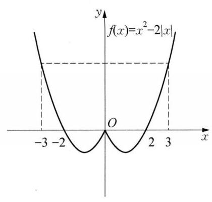

(第 6 题图)

6 $\left( {-2,1}\right)$ 提示:因为 $f\left( {-x}\right)  = {\left( -x\right) }^{2} - 2\left| {-x}\right|  = {x}^{2} - 2\left| x\right|  = \; f\left( x\right)$ ,所以 $f\left( x\right)$ 是偶函数,作出 $f\left( x\right)$ 的图像如图所示: 由 $f({2m} + \; 1) < f\left( {-3}\right)  = f\left( 3\right)$ 得, $- 3 < {2m} + 1 < 3$ ,所以 $- 2 < m < 1$ 。故答案为 $\left( {-2,1}\right)$ 。

7 C 8 B

9 A 提示: 由题可得函数 $f\left( x\right)$ 定义域为 $\{ x \mid  x \neq   \pm  1\}$ ,且 $f\left( {-x}\right)  = \; \frac{-{2x}}{{x}^{2} - 1} =  - f\left( x\right)$ ,故函数为奇函数,故排除 B、D,由 $f\left( 2\right)  = \frac{4}{3} > 0$ , $f\left( \frac{1}{2}\right)  = \frac{1}{-\frac{3}{4}} =  - \frac{4}{3}$ ,故 C 错误,选 A。

10 因为 $f\left( {-x}\right)  =  - f\left( x\right) , g\left( {-x}\right)  = g\left( x\right)$ ,又 $f\left( {-x}\right)  + g\left( {-x}\right)  = 2{x}^{2} + {3x} + 1$ ,即 $- f\left( x\right)  + g\left( x\right)  = \; 2{x}^{2} + {3x} + 1$ ,注意到 $f\left( x\right)  + g\left( x\right)  = 2{x}^{2} - {3x} + 1$ ,因此 $f\left( x\right)  =  - {3x}, g\left( x\right)  = 2{x}^{2} + 1$ 。

11 因为函数 $f\left( x\right)$ 的定义域为 $\mathbf{R}$ ,令 $x = 1, y = 0$ ,所以 $f\left( 1\right)  = f\left( 1\right)  + f\left( 0\right)$ ,即 $f\left( 0\right)  = 0$ 。令 $y =  - x$ , 所以 $f\left( 0\right)  = f\left( x\right)  + f\left( {-x}\right)  = 0$ ,即 $f\left( {-x}\right)  =  - f\left( x\right)$ ,所以函数 $f\left( x\right)$ 为 $\mathbf{R}$ 上的奇函数。

12 当 $x < 0$ 时, $- x > 0$ ,则 $f\left( {-x}\right)  = {\left( -x\right) }^{2} - {2x} = {x}^{2} - {2x} = f\left( x\right)$ ,所以 $f\left( x\right)$ 为定义在 $\mathbf{R}$ 上的偶函数,从而有 $f\left( {-a}\right)  + f\left( a\right)  = {2f}\left( a\right)  \leq  {2f}\left( 1\right)$ ,即 $f\left( a\right)  \leq  f\left( 1\right)$ 。又因为 $f\left( x\right)$ 在 $\lbrack 0, + \infty )$ 上严格增,在 $( - \infty ,0\rbrack$ 上严格减，所以 $\left| a\right|  \leq  1$ ，解得 $- 1 \leq  a \leq  1$ ，即实数 $a$ 的取值范围为 $\left\lbrack  {-1,1}\right\rbrack$ 。

13 (1)证明:充分性:若 ${m}^{2} + {n}^{2} = 0$ ，则 $m = n = 0$ ，所以 $f\left( x\right)  = x\left| x\right|$ 。又有 $f\left( {-x}\right)  =  - x\left| {-x}\right|  = \; - x\left| x\right|  =  - f\left( x\right)$ ,所以 $f\left( x\right)$ 为奇函数。必要性:若 $f\left( x\right)$ 为奇函数,由于 $x \in  \mathbf{R}$ ,则 $f\left( 0\right)  = 0$ ,即 $n = 0$ , 所以 $f\left( x\right)  = x\left| {x + m}\right|$ 。由 $f\left( 1\right)  =  - f\left( {-1}\right)$ ,有 $\left| {m + 1}\right|  = \left| {m - 1}\right|$ ,解得 $m = 0$ 。所以,由 $f\left( x\right)$ 为奇函数,则 $m = n = 0$ ,即 ${m}^{2} + {n}^{2} = 0$ 。所以 “ $f\left( x\right)$ 为奇函数” 的充要条件是 “ ${m}^{2} + {n}^{2} = 0$ ”。( 2 )当 $x = 0$ 时， $m \in  \mathbf{R}, f\left( x\right)  < 0$ 恒成立; 当 $x \in  (0,1\rbrack$ 时,原不等式可变形为 $\left| {x + m}\right|  <  - \frac{n}{x}$ ,即 $- x + \frac{n}{x} < m <  - x - \; \frac{n}{x}$ 。当 $n =  - 4$ 时,只需对 $x \in  (0,1\rbrack$ ,满足 $\left\{  \begin{array}{l} m < {\left( -x - \frac{-4}{x}\right) }_{\min }\left( \text{ ① }\right) , \\  m > {\left( -x + \frac{-4}{x}\right) }_{\max }\left( \text{ ② }\right) \text{ 。 } \end{array}\right.$ 对 $\oplus  \exists {f}_{1}\left( x\right)  =  - x + \frac{4}{x}$ 在 $\left( 0\right)$ , 1] 上严格减，所以 $m < {f}_{1}\left( 1\right)  = 3$ (③)。对 ② 式，设 ${f}_{2}\left( x\right)  =  - x - \frac{4}{x}$ ，根据单调函数的定义可证明 ${f}_{2}\left( x\right)$ 在 $(0,1\rbrack$ 上严格增,所以 ${f}_{2}{\left( x\right) }_{\max } = f\left( 1\right)$ ,则 $m > {f}_{2}\left( 1\right)  =  - 5$ (④)。由 ③④ 知 $- 5 < m < 3$ 。

### 3.4 函数的单调性(1)

$1\left( {-\infty ,2}\right)$ 和 $\left( {2, + \infty }\right) \;2\mathbf{R}$

$3\left( {-\infty , - 1}\right\rbrack$ 提示: 由 ${x}^{2} + {2x} + 4 = {\left( x + 1\right) }^{2} + 3 \neq  0$ 得,函数的定义域是 $\mathbf{R}$ ,设 $u = {x}^{2} + {2x} + 4$ ,则 $u$ 在 $( - \infty , - 1\rbrack$ 上是严格减函数,在 $\left( {-1, + \infty }\right)$ 上是严格增函数,而 $y = \frac{1}{u}$ 在 $\left( {-\infty ,0}\right)$ 和 $\left( {0, + \infty }\right)$ 上是严格减函数，所以，函数 $y = \frac{1}{{x}^{2} + {2x} + 4}$ 的严格增区间是 $( - \infty , - 1\rbrack$ 。

4. $\left( {-3, - 1}\right)  \cup  \left( {3, + \infty }\right)$ 提示: 由已知可得 $\left\{  \begin{array}{l} {a}^{2} - {2a} - 3 > 0, \\  {a}^{2} - a > 0, \\  a + 3 > 0, \end{array}\right.$ 解得 $- 3 < a <  - 1$ 或 $a > 3$ 。所以实数 $a$ 的取值范围为 $\left( {-3, - 1}\right)  \cup  \left( {3, + \infty }\right)$ 。

$5\left( {0,\frac{2}{3}}\right\rbrack$ 提示: 因为函数 $f\left( x\right)  = \left\{  \begin{array}{ll} {x}^{2} - {2ax}, & x \geq  1, \\  {ax} - 1, & x < 1 \end{array}\right.$ 是定义在 $\mathbf{R}$ 上的严格增函数,所以 $\left\{  \begin{array}{l} a \leq  1, \\  a > 0, \\  1 - {2a} \geq  a - 1, \end{array}\right.$ 解得 $0 < a \leq  \frac{2}{3}$ ,所以实数 $a$ 的取值范围为 $\left( {0,\frac{2}{3}}\right\rbrack$ 。

$6\left\lbrack  {1,4}\right\rbrack$ 提示: 因为对任意 ${x}_{1},{x}_{2} \in  \mathbf{R}\left( {{x}_{1} \neq  {x}_{2}}\right)$ ,都有 $\frac{f\left( {x}_{1}\right)  - f\left( {x}_{2}\right) }{{x}_{1} - {x}_{2}} < 0$ 成立,所以 $f\left( x\right)$ 是 $\mathbf{R}$ 上的

严格减函数,则 $\left\{  \begin{array}{l} 4 - 4\left( {a + 1}\right)  + {3a} \geq  2\left( {a - 5}\right)  - 2, \\  a - 5 < 0, \\  a + 1 \geq  2, \end{array}\right.$ 解得 $1 \leq  a \leq  4$ 。

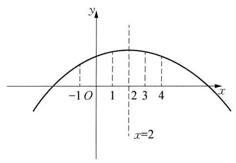

(第 9 题图)

7 B 8 A

9 A 提示: 因为 $f\left( {x + 2}\right)$ 的图像关于 $x = 0$ 对称,所以 $f\left( x\right)$ 的图像关于 $x = 2$ 对称,又 $f\left( x\right)$ 在区间 $\left( {-\infty ,2}\right)$ 上是严格增函数,则其在 $\left( {2, + \infty }\right)$ 上为严格减函数,作出其图像大致形状如图所示。由图像知, $f\left( {-1}\right)  < f\left( 3\right)$ ,故选 A。

10 提示: 定义证明即可。

11 因为 $f\left( x\right)$ 为奇函数，且在 $\lbrack 0,1)$ 上为严格增函数，所以 $f\left( x\right)$ 在 $\left( {-1,0}\right)$ 上也是严格增函数。所以 $f\left( x\right)$ 在 $\left( {-1,1}\right)$ 上为严格增函

数。由 $f\left( x\right)  + f\left( {x - \frac{1}{2}}\right)  < 0$ ,得 $f\left( x\right)  <  - f\left( {x - \frac{1}{2}}\right)  = f\left( {\frac{1}{2} - x}\right)$ ,则 $\left\{  \begin{array}{l}  - 1 < x < 1, \\   - 1 < \frac{1}{2} - x < 1, \\  x < \frac{1}{2} - x, \end{array}\right.$ 解得 $- \frac{1}{2} < \; x < \frac{1}{4}$ 。所以,不等式 $f\left( x\right)  + f\left( {x - \frac{1}{2}}\right)  < 0$ 的解集为 $\left\{  {x\left| {\; - \frac{1}{2} < x < \frac{1}{4}}\right. }\right\}$ 。

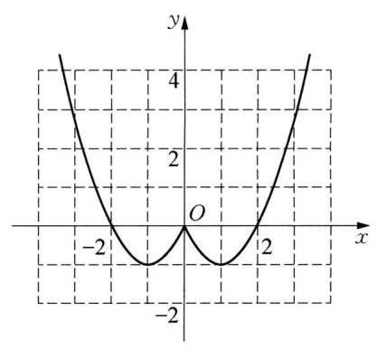

(第 12 题图)

12 (1)由题意设 $x > 0$ ，则 $- x < 0$ ，所以 $f\left( {-x}\right)  = {\left( -x\right) }^{2} - {2x} = {x}^{2} - \; {2x}$ ,因为 $f\left( x\right)$ 为 $\mathbf{R}$ 上的偶函数,所以 $f\left( x\right)  = f\left( {-x}\right)  = {\left( -x\right) }^{2} - {2x} = \; {x}^{2} - {2x}$ ,所以,当 $x > 0$ 时, $f\left( x\right)$ 的解析式 $f\left( x\right)  = {x}^{2} - {2x}$ 。(2)由题意作出函数的图像如图所示:(3)据图可知，单调增区间为(-1，0) 和 $\left( {1, + \infty }\right)$ ; 值域为 $\lbrack  - 1, + \infty )$ 。

13 (1)因为函数 $f\left( x\right)  = \frac{{ax} + b}{1 + {x}^{2}}$ 是定义在 $\left( {-1,1}\right)$ 上的奇函数，所以 $f\left( 0\right)  = 0$ ,即 $\frac{0 + b}{1 + 0} = 0$ ,得 $b = 0$ ,所以 $f\left( x\right)  = \frac{ax}{1 + {x}^{2}}$ 。因为 $f\left( \frac{1}{2}\right)  = \frac{2}{5}$ , 所以 $\frac{\frac{1}{2}a}{1 + {\left( \frac{1}{2}\right) }^{2}} = \frac{2}{5}$ ,解得 $a = 1$ ,所以 $f\left( x\right)  = \frac{x}{1 + {x}^{2}}$ 。证明: 任取 ${x}_{1}\text{ 、 }{x}_{2} \in  \left( {-1,1}\right)$ ,且 ${x}_{1} < {x}_{2}$ ,则 $f\left( {x}_{2}\right)  - f\left( {x}_{1}\right)  = \frac{{x}_{2}}{1 + {x}_{2}^{2}} - \frac{{x}_{1}}{1 + {x}_{1}^{2}} = \frac{{x}_{2}\left( {1 + {x}_{1}^{2}}\right)  - {x}_{1}\left( {1 + {x}_{2}^{2}}\right) }{\left( {1 + {x}_{1}^{2}}\right) \left( {1 + {x}_{2}^{2}}\right) } = \frac{\left( {{x}_{2} - {x}_{1}}\right) \left( {1 - {x}_{1}{x}_{2}}\right) }{\left( {1 + {x}_{1}^{2}}\right) \left( {1 + {x}_{2}^{2}}\right) }$ 。因为 $- 1 < {x}_{1} < \; {x}_{2} < 1$ ,所以 ${x}_{2} - {x}_{1} > 0,1 - {x}_{1}{x}_{2} > 0,\left( {1 + {x}_{1}^{2}}\right) \left( {1 + {x}_{2}^{2}}\right)  > 0$ ,所以 $f\left( {x}_{2}\right)  - f\left( {x}_{1}\right)  > 0$ ,即 $f\left( {x}_{2}\right)  > \; f\left( {x}_{1}\right)$ ,所以 $f\left( x\right)$ 在 $\left( {-1,1}\right)$ 上是严格增函数。(2)因为 $f\left( x\right)$ 在 $\left( {-1,1}\right)$ 上为奇函数，所以 $f\left( {t - 1}\right)  + \; f\left( t\right)  < 0$ 转化为 $f\left( t\right)  < f\left( {1 - t}\right)$ 。因为 $f\left( x\right)$ 在 $\left( {-1,1}\right)$ 上是严格增函数,所以 $\left\{  \begin{array}{l}  - 1 < t < 1, \\   - 1 < t - 1 < 1, \\  t < 1 - t, \end{array}\right.$ 解得 $0 < t < \frac{1}{2}$ ,所以不等式的解集为 $\left( {0,\frac{1}{2}}\right)$ 。

### 3.4 函数的单调性(2)

$1\left( {\frac{1}{3}, + \infty }\right) \;2( - \infty , - 4\rbrack \;3\left( {1 - \sqrt{2},1}\right) ,\left( {1 + \sqrt{2}, + \infty }\right)$

4 $\left\lbrack  {0,2}\right\rbrack$ 提示: 由 $- {x}^{2} + {4x} \geq  0$ ,解得 $0 \leq  x \leq  4$ ,即函数的定义域为 $\left\lbrack  {0,4}\right\rbrack$ ,因为 $y =  - {x}^{2} + {4x}$ 的对称轴为 $x = 2$ ，开口向下，所以， $y =  - {x}^{2} + {4x}$ 在 $\left\lbrack  {0,2}\right\rbrack$ 严格增，则 $y = \sqrt{-{x}^{2} + {4x}}$ 的严格增区间是 $\left\lbrack  {0,2}\right\rbrack$ 。 5 $\left( {-\infty , - \frac{1}{3}}\right)$ (或 $a <  - \frac{1}{3}$ ) 提示:由 $f\left( {a + 1}\right)  + f\left( {2a}\right)  > 0$ ，得 $f\left( {a + 1}\right)  >  - f\left( {2a}\right)  = f\left( {-{2a}}\right)$ ，又 $f\left( x\right)$ 是定义在 $\mathbf{R}$ 上的严格减函数,所以, $a + 1 <  - {2a}$ ,解得 $a <  - \frac{1}{3}$ 。

6 $\left( {3,\frac{3\sqrt{13} + 3}{2}}\right\rbrack$ 提示:由 $f\left( {x\left( {x - 3}\right) }\right)  \leq  f\left( {27}\right)$ ，得 $\left\{  \begin{array}{l} x\left( {x - 3}\right)  \leq  {27}, \\  x > 0, \\  x - 3 > 0, \end{array}\right.$ 解得 $x \in  \left( {3,\frac{3\sqrt{13} + 3}{2}}\right\rbrack$ 。 7 D

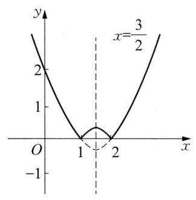

(第 8 题图)

8 B 提示: $y = \left| {{x}^{2} - {3x} + 2}\right|  = \left\{  \begin{array}{ll} {x}^{2} - {3x} + 2, & x \leq  1, \\   - {x}^{2} + {3x} - 2, & 1 < x < 2, \\  {x}^{2} - {3x} + 2, & x \geq  2, \end{array}\right.$ 如图所示, 函数的单调增区间是 $\left\lbrack  {1,\frac{3}{2}}\right\rbrack$ 和 $\lbrack 2, + \infty )$ 。故选 B。

$9\mathrm{C}$ 提示: 先分析函数的单调性,结合函数的解析式,原不等式等价于 $f\left( \frac{{x}^{2}}{2}\right)  \geq  f\left( x\right)$ ,结合函数的单调性可得 $\frac{{x}^{2}}{2} \geq  x$ ,解不等式可得结果。根据题意,当 $x \geq  0$ 时, $f\left( x\right)  = {x}^{2}$ ,所以 $f\left( x\right)$ 在 $\lbrack 0, + \infty )$ 上为严格增函数。因为 $f\left( x\right)$ 是定义在 $\mathbf{R}$ 上的奇函数，所以 $f\left( x\right)$ 在 $\mathbf{R}$ 上为严格增函数，因为 ${x}^{2} \geq  0$ ，所以 $f\left( {x}^{2}\right)  = {x}^{4}, f\left( \frac{{x}^{2}}{2}\right)  = \; \frac{1}{4}{x}^{4}$ ,所以 $\frac{1}{4}f\left( {x}^{2}\right)  = f\left( \frac{{x}^{2}}{2}\right)$ ,所以不等式 $f\left( {x}^{2}\right)  \geq  {4f}\left( x\right)$ 可化为 $f\left( \frac{{x}^{2}}{2}\right)  \geq  f\left( x\right)$ ,所以 $\frac{{x}^{2}}{2} \geq  x$ ,解得 $x \leq  0$ 或 $x \geq  2$ ,所以不等式 $f\left( {x}^{2}\right)  \geq  {4f}\left( x\right)$ 的解集为 $\left( {-\infty ,0\rbrack \cup \lbrack 2, + \infty }\right)$ ,故选 C。

10 (1)证明 $\forall {x}_{1},{x}_{2} \in  \lbrack 2, + \infty )$ ，且 ${x}_{1} < {x}_{2}$ ，则 $f\left( {x}_{1}\right)  - f\left( {x}_{2}\right)  = {x}_{1} + \frac{4}{{x}_{1}} - {x}_{2} - \frac{4}{{x}_{2}} = \; \frac{\left( {{x}_{1} - {x}_{2}}\right) \left( {{x}_{1}{x}_{2} - 4}\right) }{{x}_{1}{x}_{2}}$ ,由 ${x}_{1},{x}_{2} \in  \lbrack 2, + \infty )$ ,则 ${x}_{1}{x}_{2} - 4 > 0,{x}_{1}{x}_{2} > 0$ ,且 ${x}_{1} - {x}_{2} < 0$ ,得 $\frac{\left( {{x}_{1} - {x}_{2}}\right) \left( {{x}_{1}{x}_{2} - 4}\right) }{{x}_{1}{x}_{2}} < 0$ ,即 $f\left( {x}_{1}\right)  < f\left( {x}_{2}\right)$ ,所以, $f\left( x\right)$ 在 $\lbrack 2, + \infty )$ 上严格增。(2)由 ${x}^{2} - \; {\left( x - 1\right) }^{2} + 3 \geq  3$ ,则 ${x}^{2} - {2x} + 4 \in  \lbrack 2, + \infty )$ ,而 $f\left( x\right)$ 在 $\lbrack 2, + \infty )$ 上严格增,要使 $f\left( {{x}^{2} - {2x} + 4}\right)  \leq \; f\left( 7\right)$ ,所以 ${x}^{2} - {2x} + 4 \leq  7$ ,即 ${x}^{2} - {2x} - 3 \leq  0$ ,解得 $- 1 \leq  x \leq  3$ ,所以不等式 $f\left( {{x}^{2} - {2x} + 4}\right)  \leq  f\left( 7\right)$ 的解集为 $\left\lbrack  {-1,3}\right\rbrack$ 。

11 (1) 若 $f\left( x\right)  < {2x}$ 在 $\left( {1, + \infty }\right)$ 上恒成立，则 $a - \frac{1}{x} < {2x}$ ，即 $a < \frac{1}{x} + {2x}$ ，记 $g\left( x\right)  = \frac{1}{x} + {2x}$ ，则 $g\left( x\right)$ 在 $\left( {1, + \infty }\right)$ 上是严格增函数，从而可得 $g\left( x\right)  > g\left( 1\right)  = 3$ ，所以 $a \leq  3$ 。(2)函数 $y = f\left( x\right)$ 的定义域为 $\left( {-\infty ,0}\right)  \cup  \left( {0, + \infty }\right)$ 。(i) 当 $n > m > 0$ 时, $f\left( x\right)$ 在 $\left\lbrack  {m, n}\right\rbrack$ 上是严格增函数,故 $\left\{  \begin{array}{l} f\left( m\right)  = m, \\  f\left( n\right)  = n, \end{array}\right.$ 即 $\left\{  \begin{array}{l} a - \frac{1}{m} = m, \\  a - \frac{1}{n} = n, \end{array}\right.$ 所以方程 $a = t + \frac{1}{t}$ 中 $t > 0$ 有两解,所以 $a > 2$ 。 (ii) 当 $0 > n > m$ 时, $f\left( x\right)$ 在 $\lbrack m, n\rbrack$ 上是严格减函数,故 $\left\{  \begin{array}{l} f\left( m\right)  = n, \\  f\left( n\right)  = m, \end{array}\right.$ 即 $\left\{  \begin{array}{l} a + \frac{1}{m} = n, \\  a + \frac{1}{n} = m, \end{array}\right.$ 且 $m \neq  n$ 可得 ${mn} = 1$ ,此时解得 $a = 0$ 。综上可得,实数 $a$ 的取值范围为 $\{ 0\}  \cup  \left( {2, + \infty }\right)$ 。

12 (1)对任意 ${x}_{1},{x}_{2} \in  \lbrack 1, + \infty )$ ，且 ${x}_{1} < {x}_{2}$ ，有 $f\left( {x}_{1}\right)  - f\left( {x}_{2}\right)  = \left( {\sqrt{3{x}_{1} - 2} - a{x}_{1}}\right)  - \left( {\sqrt{3{x}_{2} - 2} - }\right. \; \left. {a{x}_{2}}\right)  = \frac{3\left( {{x}_{1} - {x}_{2}}\right) }{\sqrt{3{x}_{1} - 2} + \sqrt{3{x}_{2} - 2}} - a\left( {{x}_{1} - {x}_{2}}\right)  = \left( {{x}_{1} - {x}_{2}}\right) \left( {\frac{3}{\sqrt{3{x}_{1} - 2} + \sqrt{3{x}_{2} - 2}} - a}\right)$ 。因为 $f\left( x\right)$ 在区间 $\lbrack 1, + \infty )$ 上严格减，所以 $f\left( {x}_{1}\right)  - f\left( {x}_{2}\right)  > 0$ ,由 ${x}_{1} - {x}_{2} < 0$ ,得 $\frac{3}{\sqrt{3{x}_{1} - 2} + \sqrt{3{x}_{2} - 2}} - a < 0$ ,因为 ${x}_{2} > {x}_{1} \geq  1$ ,所以 $\sqrt{3{x}_{1} - 2} + \sqrt{3{x}_{2} - 2} > 2,\frac{3}{\sqrt{3{x}_{1} - 2} + \sqrt{3{x}_{2} - 2}} < \frac{3}{2}$ ,所以 $a \geq  \frac{3}{2}$ ,即 ${a}_{\min } = \frac{3}{2}$ 。

(2)由(1)知，当 $a = \frac{3}{2}$ 时， $f\left( x\right)$ 在区间 $\lbrack 1, + \infty )$ 上严格减，所以 $f\left( x\right)  \leq  f\left( 1\right)  =  - \frac{1}{2}$ ，即当 $x \geq  1$ 时， $\sqrt{{3x} - 2} \leq  \frac{3}{2}x$ 。令 $g\left( x\right)  = 5{x}^{2} + x - m\sqrt{{3x} - 2} - {m}^{2}, x \in  \lbrack 1, + \infty )$ ,由 $g\left( 1\right)  = 6 - m - {m}^{2} \geq  0$ ,得 $- 3 \leq  m \leq  2$ 。① 当 $- 3 \leq  m \leq  0$ 时， $g\left( x\right)  = 5{x}^{2} + x - m\sqrt{{3x} - 2} - {m}^{2}$ 在 $\lbrack 1, + \infty )$ 内严格增，所以 $g\left( x\right)  = \; 5{x}^{2} + x - m\sqrt{{3x} - 2} - {m}^{2} \geq  g\left( 1\right)  = 6 - m - {m}^{2} \geq  0$ 。②当 $0 < m \leq  2$ 时， $g\left( x\right)  = 5{x}^{2} + x - m\sqrt{{3x} - 2} - \; {m}^{2} \geq  5{x}^{2} + \frac{2 - {3m}}{2}x - {m}^{2}$ 。令 $h\left( x\right)  = 5{x}^{2} + \frac{2 - {3m}}{2}x - {m}^{2}, x \in  \lbrack 1, + \infty )$ ,则对称轴 $x = \frac{{3m} - 2}{20} \leq$ 1,所以 $h\left( x\right)$ 在 $\lbrack 1, + \infty )$ 内严格增,所以 $h\left( x\right)  \geq  h\left( 1\right)  = 6 - m - {m}^{2} \geq  0$ ,故 $g\left( x\right)  \geq  h\left( 1\right)  \geq  0$ 。综上, 实数 $m$ 的取值范围是 $\left\lbrack  {-3,2}\right\rbrack$ 。

13 (1)对于函数 $f\left( x\right)  = \frac{1}{x}$ 的定义域 $\left( {-\infty ,0}\right)  \cup  \left( {0, + \infty }\right)$ 内任意的 ${x}_{1}$ ，取 ${x}_{2} = \frac{1}{{x}_{1}}$ ，则 $f\left( {x}_{1}\right)  \cdot  f\left( {x}_{2}\right)  =$ 1,结合 $f\left( x\right)  = \frac{1}{x}$ 的图像可知对 $\left( {-\infty ,0}\right)  \cup  \left( {0, + \infty }\right)$ 内任意的 ${x}_{1},{x}_{2} = \frac{1}{{x}_{1}}$ 是唯一存在的，所以函数 $f\left( x\right)  = \frac{1}{x}$ 具有性质 $M$ 。(2)因为 $f\left( x\right)  = \frac{1}{3}{x}^{2} - \frac{4}{3}x + \frac{4}{3} = \frac{1}{3}{\left( x - 2\right) }^{2}$ ，且 $m > 2$ ，所以 $f\left( x\right)$ 在 $\lbrack m$ ， $n\rbrack$ 上是严格增函数,又函数 $f\left( x\right)$ 具有性质 $M$ ,所以 $f\left( {x}_{1}\right)  \cdot  f\left( {x}_{2}\right)  = 1$ ,即 $\frac{1}{9}{\left( m - 2\right) }^{2}{\left( n - 2\right) }^{2} = 1$ ,因为 $n > m > 2$ ,所以 $\left( {m - 2}\right) \left( {n - 2}\right)  = 3$ 且 $n - 2 > m - 2 > 0$ ,又 $m, n$ 为正整数,所以 $\left\{  \begin{array}{l} m - 2 = 1, \\  n - 2 = 3, \end{array}\right.$ 解得 $\left\{  \begin{array}{l} m = 3, \\  n = 5, \end{array}\right.$ 所以 ${mn} = {15}$ 。(3)因为 $a < 2$ ，所以 $y = {\left( x - a\right) }^{2}$ 在 $\left\lbrack  {2,4}\right\rbrack$ 上严格增，又因为 $f\left( x\right)$ 具有性质 $M$ ， 从而 $f\left( 2\right)  \cdot  f\left( 4\right)  = 1$ ,即 $\left( {2 - a}\right) \left( {4 - a}\right)  = 1$ ,所以 ${a}^{2} - {6a} + 7 = 0$ ,解得 $a = 3 - \sqrt{2}$ 或 $a = 3 + \sqrt{2}$ (舍去)。因为存在实数 $x \in  \left\lbrack  {2,4}\right\rbrack$ ,使得对任意的 $t \in  \mathbf{R}$ ,不等式 $f\left( x\right)  \geq  s{t}^{2} + {st} + 4$ 都成立,所以 $f{\left( x\right) }_{\max } \geq  s{t}^{2} + {st} +$ 4,因为 $y = {\left( x - a\right) }^{2}$ 在 $\left\lbrack  {2,4}\right\rbrack$ 上严格增,所以 $f\left( 4\right)  = {\left( 1 + \sqrt{2}\right) }^{2} \geq  s{t}^{2} + {st} + 4$ ,即 $s{t}^{2} + {st} + 1 - 2\sqrt{2} \leq  0$ 对任意的 $t \in  \mathbf{R}$ 恒成立。所以 $\left\{  \begin{array}{l} s < 0, \\  \Delta  = {s}^{2} - {4s}\left( {1 - 2\sqrt{2}}\right)  \leq  0, \end{array}\right.$ 或 $s = 0$ ,解得 $4 - 8\sqrt{2} \leq  s < 0$ 或 $s = 0$ 。综上可得实数 $s$ 的取值范围是 $\left\lbrack  {4 - 8\sqrt{2},0}\right\rbrack$ 。

### 3.5 函数的最值与值域 (1)

$1\;\left\lbrack  {{21},{49}}\right\rbrack  \;2\;4\;3\;{12}\text{ 、 }6\;4\;\lbrack 2, + \infty ) \; 5\frac{3}{2}$ 提示: 当 $a = 1$ 时,代入不等式, $x > 0$ 不等式明显不恒成立。当 $a \neq  1$ ,构造函数 ${y}_{1} = \left( {a - 1}\right) x - \; 1,{y}_{2} = {x}^{2} - \frac{3}{2}x - 1$ ,它们都过定点 $P\left( {0, - 1}\right)$ 。考察函数 ${y}_{1} = \left( {a - 1}\right) x - 1$ ,令 ${y}_{1} = 0, x = \frac{1}{a - 1}$ ,得 $M\left( {\frac{1}{a - 1},0}\right)$ ,因为 $x > 0$ ,不等式成立,所以 $a > 1$ ; 考察函数 ${y}_{2} = {x}^{2} - \frac{3}{2}x - 1$ ,因为 $x > 0$ 时均有 $\lbrack (a -$ 1) $x - 1\rbrack \left( {{x}^{2} - \frac{3}{2}x - 1}\right)  \geq  0$ ,显然此函数过点 $M\left( {\frac{1}{a - 1},0}\right)$ ,代入得: ${\left( \frac{1}{a - 1}\right) }^{2} - \frac{3}{2} \times  \frac{1}{a - 1} - 1 = 0$ ,解得 $a = \frac{3}{2}$ ,或 $a =  - 1$ (舍去),故答案为 $\frac{3}{2}$ 。

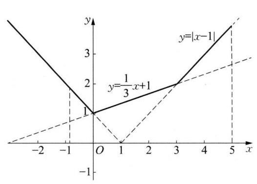

(第 6 题图)

65 提示: 作出函数 $g\left( x\right)$ 的图像如图所示。若 $a, b \in  \lbrack  - 1$ , 5],且当 ${x}_{1},{x}_{2} \in  \left\lbrack  {a, b}\right\rbrack  \left( {{x}_{1} \neq  {x}_{2}}\right)$ 时, $\frac{g\left( {x}_{1}\right)  - g\left( {x}_{2}\right) }{{x}_{1} - {x}_{2}} > 0$ 恒成立,等价于函数 $g\left( x\right)$ 为增函数,由图可知, $x \in  \left\lbrack  {0,5}\right\rbrack$ ,则 ${\left( b - a\right) }_{\max } = 5$ 。

$7\begin{array}{lllll} A & 8 & D & 9 & B \end{array}$

10(1)严格减区间(-∞， $\frac{3}{4}$ )，严格增区间 $\left( {\frac{3}{4}, + \infty }\right)$ (2)42

11(1)函数 $f\left( x\right)  = {2x} + \frac{1}{2x}$ 在区间 $\left( {0,\frac{1}{2}}\right\rbrack$ 上严格减，以下证

明: 设 $0 < {x}_{1} < {x}_{2} \leq  \frac{1}{2}, f\left( {x}_{1}\right)  - f\left( {x}_{2}\right)  = 2\left( {{x}_{1} - {x}_{2}}\right)  + \frac{1}{2}\left( {\frac{1}{{x}_{1}} - \frac{1}{{x}_{2}}}\right)  = 2\left( {{x}_{1} - {x}_{2}}\right)  - \frac{{x}_{1} - {x}_{2}}{2{x}_{1}{x}_{2}} = \left( {{x}_{1} - }\right. \; \left. {x}_{2}\right) \left( {2 - \frac{1}{2{x}_{1}{x}_{2}}}\right)  = \left( {{x}_{1} - {x}_{2}}\right) \left( \frac{4{x}_{1}{x}_{2} - 1}{2{x}_{1}{x}_{2}}\right)$ 。由 $0 < {x}_{1} < {x}_{2} \leq  \frac{1}{2}$ ,得 ${x}_{1} - {x}_{2} < 0,4{x}_{1}{x}_{2} - 1 < 0$ , $2{x}_{1}{x}_{2} > 0$ ,所以 $f\left( {x}_{1}\right)  - f\left( {x}_{2}\right)  > 0$ ,所以 $f\left( x\right)  = {2x} + \frac{1}{2x}$ 在区间 $\left( {0,\frac{1}{2}}\right\rbrack$ 上是严格减函数。(2)由

(1)可知 $f\left( x\right)$ 在 $\left( {0,\frac{1}{2}}\right\rbrack$ 上是严格减函数，所以，当 $x = \frac{1}{2}$ 时， $f\left( x\right)$ 取得最小值，即 $f{\left( x\right) }_{\min } = f\left( \frac{1}{2}\right)  =$

2,从而对任意 $x \in  \left( {0,\frac{1}{2}}\right\rbrack$ 时, $f\left( x\right)  \geq  2 - m$ 都成立,只需 $f{\left( x\right) }_{\min } \geq  2 - m$ 成立,所以 $2 \geq  2 - m$ ,解

得 $m \geq  0$ 。

12 (1)由函数 $f\left( x\right)  =  - {x}^{3} + m{x}^{2} - x$ 是 $\mathbf{R}$ 上的奇函数，则 $f\left( {-x}\right)  =  - f\left( x\right)$ ，解得 $m = 0$ ，即 $f\left( x\right)  = \; - {x}^{3} - x$ ,经检验, $m = 0$ 时,函数 $f\left( x\right)$ 是奇函数,所以 $m = 0$ 。(2)证明略。 (3)不等式 $f\left( {{t}^{2} + }\right. \; {2t} + k) + f\left( {-2{t}^{2} + {2t} - 5}\right)  > 0$ 可化为 $f\left( {{t}^{2} + {2t} + k}\right)  >  - f\left( {-2{t}^{2} + {2t} - 5}\right)$ ，因为 $f\left( x\right)$ 是奇函数，故 $- f\left( {-2{t}^{2} + {2t} - 5}\right)  = f\left( {2{t}^{2} - {2t} + 5}\right)$ ,所以不等式又可化为 $f\left( {{t}^{2} + {2t} + k}\right)  > f\left( {2{t}^{2} - {2t} + 5}\right)$ 。由 (2) 知 $f\left( x\right)$ 在 $\mathbf{R}$ 上严格减，故必有 ${t}^{2} + {2t} + k < 2{t}^{2} - {2t} + 5$ ,即 $k < {t}^{2} - {4t} + 5$ ,由题设条件:对任意的 $t \in \; \left\lbrack  {0,5}\right\rbrack$ ,不等式 $k < {t}^{2} - {4t} + 5$ 恒成立,设 $g\left( t\right)  = {t}^{2} - {4t} + 5 = {\left( t - 2\right) }^{2} + 1$ ,则易知当 $t \in  \left\lbrack  {0,5}\right\rbrack$ 时, $1 \leq  g\left( t\right)  \leq  {10}$ 。所以当 $k < 1$ 时,不等式 $f\left( {{t}^{2} + {2t} + k}\right)  + f\left( {-2{t}^{2} + {2t} - 5}\right)  > 0$ 对任意的 $t \in  \left\lbrack  {0,5}\right\rbrack$ 恒成立。

13 (1)由于函数 $f\left( x\right)  = {x}^{3} + x$ 是 $\mathbf{R}$ 上的严格增函数,则 $\left\{  \begin{array}{l} f\left( a\right)  = {2a}, \\  f\left( b\right)  = {2b}, \end{array}\right.$ 所以 $a\text{ 、 }b$ 是方程 ${x}^{3} + x = {2x}$ 的根,且 $a < b$ ,解得 $a =  - 1, b = 0$ 或 $a = 0, b = 1$ 或 $a =  - 1, b = 1$ 。故函数 $f\left( x\right)  = {x}^{3} + x$ 的所有“ $H$ 区间”为 $\left\lbrack  {-1,0}\right\rbrack  \text{ 、 }\left\lbrack  {0,1}\right\rbrack$ 和 $\left\lbrack  {-1,1}\right\rbrack$ 。(2)当 $0 < m \leq  \frac{3}{2}$ 时， $f\left( x\right)  = 3 - {2x}$ 在 $\left\lbrack  {0, m}\right\rbrack$ 上严格减，所以 $f\left( 0\right)  = 3 = {2m}, f\left( m\right)  = 3 - {2m} = 0$ ,解得 $m = \frac{3}{2}$ ; 当 $m > \frac{3}{2}$ 时, $f{\left( x\right) }_{\min } = f\left( \frac{3}{2}\right)  = 0, f\left( 0\right)  = 3 < {2m}$ , $f\left( m\right)  = {2m} - 3 < {2m}$ ，不可能。综上， $m = \frac{3}{2}$ 。(3)设 $f\left( x\right)  = {x}^{2} - {4x}$ 的“ $H$ 区间”为 $\left\lbrack  {a, b}\right\rbrack$ ，由“ $H$ 区间”定义知: $f\left( a\right)  = {a}^{2} - {4a} \geq  {2a}$ ,所以 $a \geq  6$ 或 $a \leq  0, f\left( b\right)  = {b}^{2} - {4b} \leq  {2b}$ ,所以 $0 \leq  b \leq  6$ ,又 $a < b$ , 所以 $a \leq  0,0 \leq  b \leq  6$ 。当 $0 \leq  b \leq  2$ 时, $f\left( x\right)$ 在区间 $\left\lbrack  {a, b}\right\rbrack$ 上严格减,所以 $\left\{  \begin{array}{l} f\left( a\right)  = {2b}, \\  f\left( b\right)  = {2a}, \end{array}\right.$ 即 $\left\{  {\begin{array}{ll} {a}^{2} - {4a} = {2b}, & \text{ ① } \\  {b}^{2} - {4b} = {2a}, & \text{ ② } \end{array}\text{ 由①一②得 }\left( {a - b}\right) \left( {a + b - 2}\right)  = 0\text{ 。 }\text{ 因为 }a \neq  b,\text{ 所以 }a - b \neq  0,\text{ 又因为 }a \leq  0,0 \leq  }\right. \; b \leq  2$ ,所以 $a + b \leq  2$ ,当且仅当 $a = 0, b = 2$ 时取 “ $=$ ”,此时 ${a}^{2} - {4a} = 0 \neq  4$ ,舍去; 当 $2 < b \leq  6$ 时, $f\left( x\right)$ 在区间 $\left\lbrack  {a,2}\right\rbrack$ 上严格减，在 $\left\lbrack  {2, b}\right\rbrack$ 上严格增，所以 $f{\left( x\right) }_{\min } = f\left( 2\right)  =  - 4 = {2a}, a =  - 2,\left| {-2 - 2}\right|  = 4 \geq  \left| {b - }\right|$ 2|，所以 $f{\left( x\right) }_{\max } = f\left( {-2}\right)  = {12} = {2b}, b = 6$ 。所以函数 $f\left( x\right)  = {x}^{2} - {4x}$ 的“ $H$ 区间”为[-2,6]。

### 3.5 函数的最值与值域(2)

1 [1,4] 提示:因为 $f\left( x\right)$ 的对称轴为 $x = 1$ ,故 $f\left( x\right)$ 在 $\left\lbrack  {-2,1}\right\rbrack$ 上严格减，在 $\lbrack 1, + \infty )$ 上严格增，又 $f\left( 1\right)  =  - 4, f\left( {-2}\right)  = f\left( 4\right)  = 5$ ,故 $a \in  \left\lbrack  {1,4}\right\rbrack$ 。

$2\lbrack  - 1, + \infty )\;3\lbrack  - 1,2)$

$4\sqrt{2} - 1$ 提示: 当 $a \leq  0$ 时,函数 $h\left( x\right)  = {x}^{2} - {2ax}$ 在 $\left\lbrack  {0,1}\right\rbrack$ 上严格增,故 $g\left( a\right)  = h\left( 1\right)  = 1 - {2a}$ ; 当 $a >$ 1 时,函数 $h\left( x\right)  = {x}^{2} - {2ax}$ 在 $\left\lbrack  {0,1}\right\rbrack$ 上严格减,此时 $g\left( a\right)  = {2a} - 1$ ; 当 $\frac{1}{2} < a \leq  1$ 时,此时 $f\left( 0\right)  = 0$ , $f\left( 1\right)  = \left| {1 - {2a}}\right|  = {2a} - 1, f\left( a\right)  = {a}^{2}$ ,而 $f\left( a\right)  - f\left( 1\right)  = {\left( a - 1\right) }^{2} \geq  0$ ,故 $g\left( a\right)  = {a}^{2}$ ; 当 $0 < a \leq  \frac{1}{2}$ 时, $f\left( 0\right)  = 0, f\left( 1\right)  = \left| {1 - {2a}}\right|  = 1 - {2a}, f\left( a\right)  = {a}^{2}, g\left( a\right)  = \max \{ f\left( 1\right) , f\left( a\right) \}$ ,由 $f\left( a\right)  > f\left( 1\right)$ ,解得 $a > \; \sqrt{2} - 1$ ,所以,当 $\sqrt{2} - 1 < a \leq  \frac{1}{2}$ 时, $g\left( a\right)  = {a}^{2}$ ; 当 $0 < a \leq  \sqrt{2} - 1$ 时, $g\left( a\right)  = 1 - {2a}$ 。综上, $g\left( a\right)  = \; \left\{  \begin{array}{ll} 1 - {2a}, & a \leq  \sqrt{2} - 1, \\  {a}^{2}, & \sqrt{2} - 1 < a \leq  1,\text{ 所以,当 }a \leq  \sqrt{2} - 1\text{ 时, }g\left( a\right) \text{ 严格减,当 }a > \sqrt{2} - 1\text{ 时, }g\left( a\right) \text{ 严格增,所以,当 } \\  {2a} - 1, & a > 1, \end{array}\right. \; a = \sqrt{2} - 1$ 时, $g\left( a\right)$ 取得最小值。

$5\left( {-\infty ,\frac{13}{4}}\right\rbrack$ 提示: 由 $f\left( {x + 1}\right)  = {2f}\left( x\right)$ ,得 $f\left( x\right)  = {2f}\left( {x - 1}\right)$ ,因为当 $x \in  (0,1\rbrack$ 时, $f\left( x\right)  = x\left( {x - 1}\right)  \in  \left\lbrack  {-\frac{1}{4},0}\right\rbrack$ ,所以,当 $x \in  (1$ , 2] 时, $x - 1 \in  (0,1\rbrack , f\left( x\right)  = {2f}\left( {x - 1}\right)  = 2\left( {x - 1}\right) \left( {x - 2}\right)  \in \; \left\lbrack  {-\frac{1}{2},0}\right\rbrack$ ; 当 $x \in  (2,3\rbrack$ 时, $x - 1 \in  (1,2\rbrack , f\left( x\right)  = {2f}\left( {x - 1}\right)  = \; 4\left( {x - 2}\right) \left( {x - 3}\right)  \in  \left\lbrack  {-1,0}\right\rbrack$ ; 当 $x \in  (3,4\rbrack$ 时, $x - 1 \in  (2,3\rbrack , f\left( x\right)  = \; {2f}\left( {x - 1}\right)  = 8\left( {x - 3}\right) \left( {x - 4}\right)  \in  \left\lbrack  {-2,0}\right\rbrack  , f\left( x\right)$ 的图像如图所示。当 $x \in  (3,4\rbrack$ 时,由 $8\left( {x - 3}\right) \left( {x - 4}\right)  =  - \frac{3}{2}$ ,解得 $x = \frac{13}{4}$ 或 $x = \frac{15}{4}$ 。若对任意 $x \in  ( - \infty , m\rbrack$ ,都有 $f\left( x\right)  \geq   - \frac{3}{2}$ ,则 $m \leq  \frac{13}{4}$ 。

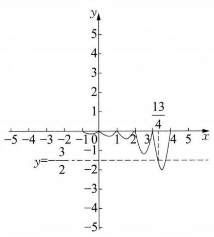

(第 5 题图)

$6\left\lbrack  {-\frac{1}{2},4}\right\rbrack$ 提示: 由题意可知, $y = f\left( {x}^{2}\right)  + {\left\lbrack  f\left( x\right) \right\rbrack  }^{2}$ 要有意义,则需 $\left\{  \begin{array}{l} 0 \leq  {x}^{2} \leq  4, \\  0 \leq  x \leq  4, \end{array}\right.$ 即 $0 \leq  x \leq  2$ ,即函数的定义域为 $\left\lbrack  {0,2}\right\rbrack$ 。又 $y = {x}^{2} - 1 + {\left( x - 1\right) }^{2} = 2{x}^{2} - {2x}$ ,对称轴方程为 $x = \frac{1}{2}$ ,所以当 $x = \frac{1}{2}$ 时, ${y}_{\min } =  - \frac{1}{2}$ ,当 $x = 2$ 时, ${y}_{\max } = 4$ ,所以函数的值域为 $\left\lbrack  {-\frac{1}{2},4}\right\rbrack$ 。

7 A

8 C 提示: 由 $f\left( x\right)  = f\left( {-x - 2}\right)$ 知 $x =  - 1$ 是其对称轴,又 $f\left( {-1}\right)  = 0$ ,则可设 $f\left( x\right)  = a{\left( x + 1\right) }^{2}$ ,由 ②,令 $x = 1$ ,得 $2 \leq  f\left( 1\right)  \leq  2, f\left( 1\right)  = 2$ ,解得 $a = \frac{1}{2}$ ,所以 $f\left( x\right)  = \frac{1}{2}{\left( x + 1\right) }^{2} = \frac{1}{2}{x}^{2} + x + \frac{1}{2}$ 。从而不等式 $\left| {f\left( x\right)  - \frac{{x}^{2}}{2}}\right|  \leq  1$ 为 $\left| {x + \frac{1}{2}}\right|  \leq  1$ ,解得 $- \frac{3}{2} \leq  x \leq  \frac{1}{2}$ ,由题意 $\left\{  \begin{array}{l} m - 1 \geq   - \frac{3}{2}, \\  m \leq  \frac{1}{2}, \end{array}\right.$ 解得 $- \frac{1}{2} \leq  m \leq \; \frac{1}{2}$ 。故选 C。

9 A 提示: 由 $f\left( x\right)  =  - x - {x}^{3} + 1$ ,可得 $f\left( x\right)  - 1 =  - x - {x}^{3}$ ,令 $g\left( x\right)  = f\left( x\right)  - 1 =  - x - {x}^{3}, x \in \; \mathbf{R}$ ,满足 $g\left( {-x}\right)  =  - g\left( x\right)$ ,即 $g\left( x\right)  =  - x - {x}^{3}, x \in  \mathbf{R}$ 为奇函数,且为严格减函数。由 $f\left( {{a}^{2} - \frac{3}{2}k}\right)  + \; f\left( {-{ka} - \frac{1}{2}}\right)  < 2$ ,可得 $f\left( {{a}^{2} - \frac{3}{2}k}\right)  - 1 + f\left( {-{ka} - \frac{1}{2}}\right)  - 1 < 0$ ,即 $g\left( {{a}^{2} - \frac{3}{2}k}\right)  + g\left( {-{ka} - \frac{1}{2}}\right)  < 0$ , 即 $g\left( {{a}^{2} - \frac{3}{2}k}\right)  <  - g\left( {-{ka} - \frac{1}{2}}\right)  = g\left( {{ka} + \frac{1}{2}}\right)$ 。对所有 $k \in  \left( {1, + \infty }\right)$ ,都有 $f\left( {{a}^{2} - \frac{3}{2}k}\right)  + \; f\left( {-{ka} - \frac{1}{2}}\right)  < 2$ 成立,即对所有 $k \in  \left( {1, + \infty }\right)$ ,都有 ${a}^{2} - \frac{3}{2}k > {ka} + \frac{1}{2}$ 成立,即 $\left( {\frac{3}{2} + a}\right) k + \frac{1}{2} - {a}^{2} <$ 0,故需满足 $\left\{  \begin{array}{l} \frac{3}{2} + a = 0, \\  \frac{1}{2} - {a}^{2} < 0, \end{array}\right.$ 或 $\left\{  \begin{array}{l} \frac{3}{2} + a < 0, \\  \left( {\frac{3}{2} + a}\right)  \times  1 + \frac{1}{2} - {a}^{2} \leq  0, \end{array}\right.$ 解得 $a =  - \frac{3}{2}$ 或 $a <  - \frac{3}{2}$ ,故实数 $a$ 的取值范围是 $\left( {-\infty , - \frac{3}{2}}\right\rbrack$ ,故选 A。

10 (1)任取 $1 < {x}_{1} < {x}_{2}$ ，因为 $f\left( {x}_{1}\right)  - f\left( {x}_{2}\right)  = \frac{{x}_{1} + 1}{{x}_{1} - 1} - \frac{{x}_{2} + 1}{{x}_{2} - 1} = \frac{2\left( {{x}_{2} - {x}_{1}}\right) }{\left( {{x}_{1} - 1}\right) \left( {{x}_{2} - 1}\right) }$ ，由 $1 < {x}_{1} < {x}_{2}$ ， 得 ${x}_{1} - 1 > 0,{x}_{2} - 1 > 0,{x}_{2} - {x}_{1} > 0$ ,所以 $f\left( {x}_{1}\right)  - f\left( {x}_{2}\right)  > 0$ ,即 $f\left( {x}_{1}\right)  > f\left( {x}_{2}\right)$ ,所以, $f\left( x\right)$ 在 $(1$ , $+ \infty )$ 上是严格减函数。(2)由(1)得函数 $f\left( x\right)$ 在 $\left( {1, + \infty }\right)$ 上是严格减函数，所以函数 $f\left( x\right)$ 在 $\left\lbrack  {2,6}\right\rbrack$ 上为严格减函数,所以 $f{\left( x\right) }_{\max } = f\left( 2\right)  = 3, f{\left( x\right) }_{\min } = f\left( 6\right)  = \frac{7}{5}$ 。

11 (1)因为 $f\left( {\sqrt{x} + 2}\right)  = x + 2\sqrt{x} + 1 = {\left( \sqrt{x} + 1\right) }^{2} = {\left\lbrack  \left( \sqrt{x} + 2\right)  - 1\right\rbrack  }^{2}$ ，所以 $f\left( x\right)  = {\left( x - 1\right) }^{2} = {x}^{2} - \; {2x} + 1$ ,又因为 $\sqrt{x} + 2 \geq  2$ ,所以 $f\left( x\right)  = {x}^{2} - {2x} + 1\left( {x \geq  2}\right)$ 。(2) $\exists x \in  \lbrack 2, + \infty )$ ，对 $\forall a \in  \lbrack  - 1$ ， 1] 均有 $f\left( x\right)  < m - {2a}m + 2$ 成立，由于 $f\left( x\right)  = {x}^{2} - {2x} + 1$ ( $x \geq  2$ ) 在 $\lbrack 2, + \infty )$ 上是严格增函数，则 $f{\left( x\right) }_{\min } = f\left( 2\right)  = 1$ ,所以,依题意有对 $\forall a \in  \left\lbrack  {-1,1}\right\rbrack$ 均有 $1 < m - {2am} + 2$ 成立,即 $g\left( a\right)  =  - {2ma} + m + \; 1 > 0$ 在 $a \in  \left\lbrack  {-1,1}\right\rbrack$ 时恒成立,所以 $\left\{  \begin{array}{l}  - {2m} + m + 1 > 0, \\  {2m} + m + 1 > 0, \end{array}\right.$ 解得 $- \frac{1}{3} < m < 1$ ,所以实数 $m$ 的取值范围是 $\left( {-\frac{1}{3},1}\right)$ 。

12 (1)令 $g\left( x\right)  = 0$ ，即 $- 2{x}^{2} + {ax} = 0$ ，解得 ${x}_{1} = 0,{x}_{2} = \frac{a}{2}$ ，又 $f\left( x\right)  = x + \frac{2}{x}$ ，当 $x > 0$ 时， $f\left( x\right)  = \; x + \frac{2}{x} \geq  2\sqrt{2}$ ,当且仅当 $x = \frac{2}{x}$ ,即 $x = \sqrt{2}$ 时,等号成立; 当 $x < 0$ 时, $f\left( x\right)  = x + \frac{2}{x} = \; - \left\lbrack  {\left( {-x}\right)  + \left( {-\frac{2}{x}}\right) }\right\rbrack   \leq   - 2\sqrt{2}$ ; 当且仅当 $- x =  - \frac{2}{x}$ ,即 $x =  - \sqrt{2}$ 时,等号成立; 所以 $f\left( x\right)  \in  ( - \infty$ , $- 2\sqrt{2}\rbrack  \cup  \lbrack 2\sqrt{2}, + \infty )$ 。要使函数 $y = g\left( {f\left( x\right) }\right)$ 存在零点,只需 $\frac{a}{2} \leq   - 2\sqrt{2}$ 或 $\frac{a}{2} \geq  2\sqrt{2}$ ,即 $a \leq   - 4\sqrt{2}$ 或 $a \geq  4\sqrt{2}$ 。(2)由(1)知，函数 $f\left( x\right)  = x + \frac{2}{x}$ 在区间 $\left( {1,4}\right)$ 有最小值，无最大值；而二次函数 $g\left( x\right)  = \; - 2{x}^{2} + {ax}$ 在对称轴 $x = \frac{a}{4}$ 处取得最大值; 因此要使 $m\left( x\right)$ 在区间 $\left( {1,4}\right)$ 上有最大值,则必须 $g\left( x\right)  = \; - 2{x}^{2} + {ax}$ 在 $\left( {1,4}\right)$ 上取得最大值,因此 $\left\{  \begin{array}{l} 1 < \frac{a}{4} < 4, \\  g\left( \frac{a}{4}\right)  \geq  f\left( 4\right) , \end{array}\right.$ 即 $\left\{  \begin{array}{l} 4 < a < {16}, \\  \frac{{a}^{2}}{8} \geq  \frac{9}{2}, \end{array}\right.$ 解得 $6 \leq  a < {16}$ ; 当 $6 \leq  a <$ 16 时, $g\left( 1\right)  = a - 2 \geq  4 > 3 = f\left( 1\right)$ ,所以要使 $m\left( x\right)$ 在区间 $\left( {1,4}\right)$ 上存在最小值,必须有 $g\left( 4\right)  < f\left( 4\right)$ ,即 ${4a} - {32} < \frac{9}{2}$ ,解得 $a < \frac{73}{8}$ ; 当 $6 \leq  a < \frac{73}{8}$ 时, $f\left( {\frac{a}{2} - 1}\right)  = \frac{a - 2}{2} + \frac{4}{a - 2}, g\left( {\frac{a}{2} - 1}\right)  = g\left( 1\right)  = a - 2$ ,令 $\frac{a - 2}{2} = t$ ,有 $t \in  \left( {2,\frac{57}{16}}\right)$ ,此时 $g\left( t\right)  - f\left( t\right)  = t - \frac{2}{t} = \frac{{t}^{2} - 2}{t} > 0$ 。又由 $g\left( 4\right)  < f\left( 4\right)$ 得, $\left\lbrack  {g\left( {\frac{a}{2} - 1}\right)  - f\left( {\frac{a}{2} - 1}\right) }\right\rbrack   \cdot  \left\lbrack  {g\left( 4\right)  - f\left( 4\right) }\right\rbrack   < 0$ ,所以,在 $\left( {\frac{a}{2} - 1,4}\right)$ 上存在 ${x}_{0}$ ,使 $g\left( {x}_{0}\right)  = f\left( {x}_{0}\right)$ ,从而, $m\left( x\right)$ 在 $\left( {1,\frac{a}{4}}\right)$ 上严格增,在 $\left( {\frac{a}{4},{x}_{0}}\right)$ 上严格减,在 $\left( {{x}_{0},4}\right)$ 上严格增; 所以, $g\left( x\right)$ 在 $\left( {\frac{a}{4},4}\right)$ 上是严格减函数, $g\left( {\frac{a}{2} - 1}\right)  = g\left( 1\right)  > f\left( {\frac{a}{2} - 1}\right)$ 。所以, $m\left( x\right)$ 在区间 $\left( {1,4}\right)$ 有最大值 $m\left( \frac{a}{4}\right)$ ,最小值 $m\left( {x}_{0}\right)$ ; 即当 $6 \leq \; a < \frac{73}{8}$ 时， $m\left( x\right)$ 在区间 $\left( {1,4}\right)$ 上既有最大值又有最小值。

13 (1)是，理由:由题， $g\left( x\right)  = \frac{\left( {2{x}^{2} + x + 2}\right)  - \left( {2 \times  {1}^{2} + 1 + 2}\right) }{x - 1} = {2x} + 3\left( {x \in  \mathbf{R}, x \neq  1}\right)$ 为严格增函数， 故 $y = 2{x}^{2} + x + 2\left( {x \in  \mathbf{R}}\right)$ 是 $T\left( 1\right)$ 函数。(2)因为 $y = s\left( x\right)$ 是 $T\left( 0\right)$ 函数，且 $s\left( 0\right)  = 0$ ，所以 $g\left( x\right)  = \; \frac{s\left( x\right) }{x}$ 是 $\lbrack 0, + \infty )$ 上的严格增函数。因为 $s\left( {2\lambda }\right)$ 有意义,所以 $\lambda  \geq  0$ ,显然, $\lambda  = 0$ 时不等式不成立,下设 $\lambda  >$

0,此时 $s\left( {2\lambda }\right)  < {\lambda s}\left( 2\right)$ 等价于 $\frac{s\left( {2\lambda }\right) }{2\lambda } < \frac{s\left( 2\right) }{2}$ ,由 $g\left( x\right)$ 的单调性得, ${2\lambda } < 2$ ,即所求不等式的解集为 $\left( {0,1}\right)$ 。

(3)由题意， $W\left( x\right)$ 是 $T\left( 0\right)$ 函数，故 $y = \frac{W\left( x\right)  - 2}{x}$ 是严格增函数，从而当 $x < 0$ 时， $\frac{W\left( x\right)  - 2}{x} < \; \frac{W\left( 2\right)  - 2}{2} = 0$ ,即 $W\left( x\right)  > 2$ ; 而 $W\left( x\right)$ 是 $T\left( 2\right)$ 函数,故 $y = \frac{W\left( x\right)  - 2}{x - 2}$ 是严格增函数,从而当 $x > 2$ 时, $\frac{W\left( x\right)  - 2}{x - 2} > \frac{W\left( 0\right)  - 2}{0 - 2} = 0$ ,即 $W\left( x\right)  > 2$ ; 当 $0 < x < 2$ 时,同理可得, $\frac{W\left( x\right)  - 2}{x} > \frac{W\left( {-1}\right)  - 2}{-1} =  - 1$ 且 $\frac{W\left( x\right)  - 2}{x - 2} < \frac{W\left( 3\right)  - 2}{3 - 2} = 1$ ,故 $W\left( x\right)  > 2 - x$ 且 $W\left( x\right)  > x$ ,故 $W\left( x\right)  > \max \{ x,2 - x\}  = 1 +  \mid  x -$

$1 \mid   \geq  1$ ,因此,当 $m \leq  1$ 时, $W\left( x\right)  \geq  m$ 对一切 $x \in  \mathbf{R}$ 成立。下证,任意 $m > 1$ 均不满足要求,由条件 ②知， $m \leq  2$ 。另一方面，对任意 $M \in  (1,2\rbrack$ ，定义函数 ${W}_{M}\left( x\right)  = \frac{M - 1}{4}{\left| x - 1\right| }^{2} + \frac{7 - {3M}}{4}\left| {x - 1}\right|  + \; \frac{M + 1}{2}$ ,容易验证条件 ② 成立。对条件①,任取 $u \in  \mathbf{R}$ ,有 $\frac{{W}_{M}\left( x\right)  - {W}_{M}\left( u\right) }{x - u} = \frac{M - 1}{4}\left( {x + u - 2}\right)  + \; \frac{7 - {3M}}{4}\frac{\left| {x - 1}\right|  - \left| {u - 1}\right| }{x - u}$ ,注意到 $y = x + u - 2$ 是严格增函数,而对 $h\left( x\right)  = \frac{\left| {x - 1}\right|  - \left| {u - 1}\right| }{x - u}$ ,当 $u < 1$ 时, $h\left( x\right)  = \left\{  {\begin{array}{ll}  - 1, & x < 1, x \neq  u, \\  1 - \frac{2 - {2u}}{x - u}, & x \geq  1; \end{array}\text{ 当 }u \geq  1\text{ 时, }h\left( x\right)  = \left\{  \begin{array}{ll}  - 1 - \frac{{2u} - 2}{x - u}, & x < 1, \\  1, & x \geq  1, \end{array}\right. }\right.$ 均为严格增函数。因为 $\frac{M - 1}{4} > 0,\frac{7 - {3M}}{4} > 0$ ,所以条件①成立。从而 ${W}_{M}\left( x\right)  \in  P$ 。此时, ${W}_{M}\left( 1\right)  = \; \frac{M + 1}{2} < M$ ,故 $m < M$ ,从而 $m = 1$ 为所求最大值。

### 3.6 函数关系的建立

111.1 221 3 ①③ 4 1760 5 26 6 7 7 B 8 A 9 D

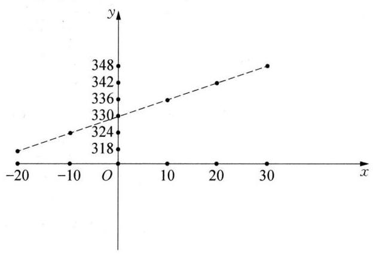

(第 10 题图)

10 (1)由题设可得:当空气的温度变化，声音的传播速度也将随着变化。因此自变量是温度, 因变量是声速。

(2)根据题设中给出的数据表可知:当传播速度为 ${342}\mathrm{\;m}/\mathrm{s}$ 时，空气的温度为 ${20}^{ \circ  }\mathrm{C}$ 。(3)因为 ${324} - \; {318} = {330} - {324} = {336} - {330} = {342} - {336} = {348} - {342} =$ 6,所以空气的温度每升高 ${10}^{ \circ  }\mathrm{C}$ ,声音的传播速度将增大 $6\mathrm{\;m}/\mathrm{s}$ 。(4)数据表对应的散点图如图所示:故 $y$ 与 $x$ 之间的关系为 $y = {kx} + b$ ,所以 $\left\{  \begin{array}{l} {330} = b, \\  {10k} + b = {336}, \end{array}\right.$ 解得 $\left\{  \begin{array}{l} k = {0.6}, \\  b = {330}, \end{array}\right.$ 所以 $y = {0.6x} + {330}$ 。

11 依题意设该单位每月获利为 $S$ 元,则 $S = {100x} - \left( {\frac{1}{2}{x}^{2} - {200x} + {80000}}\right)  =  - \frac{1}{2}{x}^{2} + {300x} - {80000} = \; - \frac{1}{2}{\left( x - {300}\right) }^{2} - {35000}, x \in  \left\lbrack  {{400},{600}}\right\rbrack$ ,所以,函数在 $\left\lbrack  {{400},{600}}\right\rbrack$ 上严格减,所以, $x = {400}$ 时, $S$ 有最大值 -40000 , 所以,该单位不获利,国家每月至少需要补贴 40000 元,才能不亏损。

12 (1)由题意:当 $0 \leq  x \leq  {20}$ 时， $v\left( x\right)  = {60}$ ；当 ${{20} \leq  x \leq  {200}}$ 时，设 $v\left( x\right)  = {ax} + b$ ，显然， $v\left( x\right)  = {ax} + \; b$ 在 $\left\lbrack  {{20},{200}}\right\rbrack$ 是减函数,由已知得 $\left\{  \begin{array}{l} {200a} + b = 0, \\  {20a} + b = {60}, \end{array}\right.$ 解得 $\left\{  \begin{array}{l} a =  - \frac{1}{3}, \\  b = \frac{200}{3}\text{ 。 } \end{array}\right.$ 故函数 $v\left( x\right)$ 的表达式为 $v\left( x\right)  = \; \left\{  \begin{array}{ll} {60}, & 0 \leq  x < {20}, \\  \frac{1}{3}\left( {{200} - x}\right) , & {20} \leq  x \leq  {200}\text{ 。 } \end{array}\right.$ (2)依题意并由(1)可得 $f\left( x\right)  = \left\{  \begin{array}{ll} {60x}, & 0 \leq  x < {20}, \\  \frac{1}{3}x\left( {{200} - x}\right) , & {20} \leq  x \leq  {200}\text{ 。 } \end{array}\right.$ 当 $0 \leq  x \leq  {20}$ 时, $f\left( x\right)$ 为严格增函数,故当 $x = {20}$ 时,其最大值为 ${60} \times  {20} = {1200}$ ; 当 ${20} \leq  x \leq  {200}$ 时, $f\left( x\right)  = \frac{1}{3}x\left( {{200} - x}\right)  \leq  \frac{1}{3}{\left\lbrack  \frac{x + \left( {{200} - x}\right) }{2}\right\rbrack  }^{2} = \frac{10000}{3}$ ,当且仅当 $x = {200} - x$ ,即 $x = {100}$ 时,等号成立。 所以,当 $x = {100}$ 时, $f\left( x\right)$ 在区间 $\left\lbrack  {{20},{200}}\right\rbrack$ 上取得最大值 $\frac{10000}{3}$ 。综上,当 $x = {100}$ 时, $f\left( x\right)$ 在区间 $\left\lbrack  {0,{200}}\right\rbrack$ 上取得最大值 $\frac{10000}{3} \approx  {3333}$ ,即当车流密度为 100 辆/千米时,车流量可以达到最大,最大值约为 3333 辆/小时。

13 (1)当 $0 \leq  x \leq  4$ 时， $y = {2x}$ ；当 ${4 < x} \leq  8$ 时， $y = {2 \times  4} + {4\left( {x - 4}\right) } = {4x} - 8$ ；当 $x > 8$ 时， $y = 2 \times \; 4 + 4 \times  4 + 8\left( {x - 8}\right)  = {8x} - {40}$ 。所以 $y = \left\{  \begin{array}{ll} {2x}, & 0 \leq  x \leq  4, \\  {4x} - 8, & 4 < x \leq  8,\;\left( 2\right) \text{ 当 }y = {16}\text{ 时, }x = 6,\text{ 则 }P(y \leq  \\  {8x} - {40}, & x > 8\text{ 。 } \end{array}\right. \; {16}) = P\left( {x \leq  6}\right)  = {0.6}$ ,所以 ${0.050} \times  2 + b \times  2 + {0.150} \times  2 = {0.6}, b \times  2 + a \times  2 + {0.025} \times  2 = {0.4}$ ,解得 $\left\{  \begin{array}{l} a = {0.075}, \\  b = {0.100}\text{ 。 } \end{array}\right.$

### 3.7 用函数的观点求解方程与不等式

$1\;\left\lbrack  {2,3}\right\rbrack  \;2\;\frac{9}{2}\;3$ 0 或 $- 2\;4\;\left( {-\infty ,\frac{1}{2}}\right) \;5\;\left( {-\infty , - 1\rbrack \cup \lbrack  - \frac{1}{4}, + \infty }\right) \;6\;1\;7\;\mathrm{\;B}$

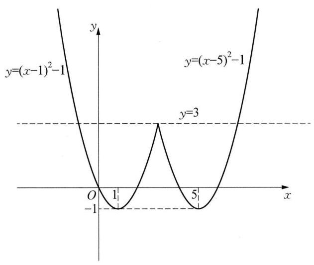

(第 8 题图)

8 D 提示: 作出函数 $y = \left\{  \begin{array}{ll} {\left( x - 1\right) }^{2} - 1, & x \leq  3, \\  {\left( x - 5\right) }^{2} - 1, & x > 3, \end{array}\right.$ 的图像如图所示。由图像可知当 $y = 3$ 时,方程 $y = 3$ 有三个值,故 $k = 3$ ,故选 D。

9 D 提示: 当 $x = 1$ 时,可知等式成立,即 $x = 1$ 为方程的 1 个实数根,当 $x > 1$ 时, ${x}^{2} - 1 = \frac{a\left| {x - 1}\right| }{x}$ 可化为 $a = x\left( {x + 1}\right)$ ; 当 $x < 1$ 且 $x \neq  0$ 时, ${x}^{2} - 1 = \frac{a\left| {x - 1}\right| }{x}$ 可化为: $a =  - x\left( {x + 1}\right) , x \neq  0$ 。令 $f\left( x\right)  = \; \left\{  {\begin{array}{ll}  - x\left( {x + 1}\right) , & x \in  \left( {-\infty ,0}\right)  \cup  \left( {0,1}\right) , \\  x\left( {x + 1}\right) , & x \in  \left( {1, + \infty }\right) , \end{array}\text{ 则只需 }y = }\right. \; f\left( x\right)$ 与 $y = a$ 有两个交点即可, $f\left( x\right)$ 的图像如图所示。 当 $x \in  \left( {-\infty ,0}\right)  \cup  \left( {0,1}\right)$ 时, $f{\left( x\right) }_{\max } = f\left( {-\frac{1}{2}}\right)  = \frac{1}{4}$ ,所以,当 $a \in  \left( {-2,0}\right)  \cup \; \left( {0,\frac{1}{4}}\right)$ 时, $y = f\left( x\right)$ 与 $y = a$ 有两个交点。综上所述,当 $a \in  \left( {-2,0}\right)  \cup  \left( {0,\frac{1}{4}}\right)$ 时, ${x}^{2} - 1 = \frac{a\left| {x - 1}\right| }{x}$ 存在 3 个实数根。

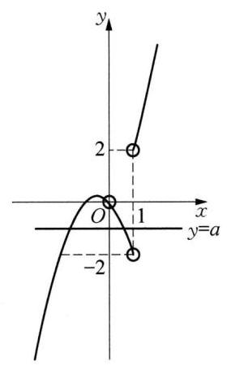

(第 9 题图)

10(1)根据零点存在定理，它是真命题。(2)假命题，如图， $f\left( 1\right) f\left( 4\right)  > 0$ ，但函数在 $\left( {1,4}\right)$ 中有零点。

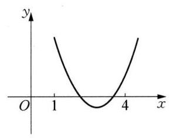

(第 10 题图)

11 因为方程 ${x}^{2} - {mx} + {2m} - 1 = 0$ 有两个实数根，所以 $\Delta  = {\left( -m\right) }^{2} - 4\left( {{2m} - 1}\right)  = \; {m}^{2} - {8m} + 4 \geq  0$ ,解得 $m \geq  4 + 2\sqrt{3}$ 或 $m \leq  4 - 2\sqrt{3}$ 。设方程的两根为 ${x}_{1}\text{ 、 }{x}_{2}$ , 则 ${x}_{1} + {x}_{2} = m,{x}_{1}{x}_{2} = {2m} - 1$ 。所以 ${x}_{1}^{2} + {x}_{2}^{2} = {\left( {x}_{1} + {x}_{2}\right) }^{2} - 2{x}_{1}{x}_{2} = {m}^{2} - 2({2m} - \; 1) = 7$ ,即 ${m}^{2} - {4m} - 5 = 0$ ,解得 $m =  - 1$ 或 $m = 5$ 。又 $4 - 2\sqrt{3} < 5 < 4 + 2\sqrt{3}$ , 不符合题意,舍去,所以 $m =  - 1$ 。

12 (1)当 $a = 2$ 时， $f\left( x\right)  = {2x} - 1 + \frac{1}{{x}^{2}}$ ，设 $1 < {x}_{1} < {x}_{2}$ ，则 $f\left( {x}_{2}\right)  - f\left( {x}_{1}\right)  =$

$2\left( {{x}_{2} - {x}_{1}}\right)  + \frac{1}{{x}_{2}^{2}} - \frac{1}{{x}_{1}^{2}} = 2\left( {{x}_{2} - {x}_{1}}\right)  - \frac{{x}_{2}^{2} - {x}_{1}^{2}}{{x}_{1}^{2}{x}_{2}^{2}} = \frac{\left( {{x}_{2} - {x}_{1}}\right) \left\lbrack  {2{x}_{1}^{2}{x}_{2}^{2} - \left( {{x}_{1} + {x}_{2}}\right) }\right\rbrack  }{{x}_{1}^{2}{x}_{2}^{2}}$ ,其中 $2{x}_{1}^{2}{x}_{2}^{2} - \left( {{x}_{1} + }\right. \; \left. {x}_{2}\right)  = \left( {{x}_{1}^{2}{x}_{2}^{2} - {x}_{1}}\right)  + \left( {{x}_{1}^{2}{x}_{2}^{2} - {x}_{2}}\right)  = {x}_{1}\left( {{x}_{1}{x}_{2}^{2} - 1}\right)  + {x}_{2}\left( {{x}_{2}{x}_{1}^{2} - 1}\right)$ ,因为 $1 < {x}_{1} < {x}_{2}$ ,所以 ${x}_{2} - {x}_{1} >$ 0,且 ${x}_{1}\left( {{x}_{1}{x}_{2}^{2} - 1}\right)  + {x}_{2}\left( {{x}_{2}{x}_{1}^{2} - 1}\right)  > 0$ ,所以 $f\left( {x}_{2}\right)  > f\left( {x}_{1}\right)$ ,所以 $y = f\left( x\right)$ 在区间 $\lbrack 1, + \infty )$ 上严格增。

(2)当 $a = \frac{1}{4}$ 时， $f\left( x\right)  = 0$ 在区间 $\left( {0, + \infty }\right)$ 上至少有两个不同的解，证明如下:因为 $f\left( x\right)  = \frac{1}{4}x - 1 + \frac{1}{{x}^{2}}$ ， $f\left( x\right)$ 在 $\left( {0, + \infty }\right)$ 上函数的图像连续,利用零点存在定理,分别令 ${x}_{1} = 1,{x}_{2} = 2,{x}_{3} = 4, f\left( {x}_{1}\right)  = f\left( 1\right)  = \; \frac{1}{4} - 1 + 1 > 0, f\left( {x}_{2}\right)  = f\left( 2\right)  = \frac{1}{2} - 1 + \frac{1}{4} =  - \frac{1}{4} < 0, f\left( {x}_{1}\right)  \cdot  f\left( {x}_{2}\right)  < 0$ ,故在 $x \in  \left( {1,2}\right) , f\left( x\right)$ 至少存在一个零点,同理可得: $f\left( {x}_{3}\right)  = f\left( 4\right)  = 1 - 1 + \frac{1}{16} > 0, f\left( {x}_{2}\right)  \cdot  f\left( {x}_{3}\right)  < 0$ ,故在 $x \in  \left( {2,4}\right)$ , $f\left( x\right)$ 至少存在一个零点。所以, $f\left( x\right)  = 0$ 在区间 $\left( {0, + \infty }\right)$ 上至少有两个不同的解。

13 (1)因为 $f\left( x\right)$ 是 $\mathbf{R}$ 上的偶函数，所以， $f\left( {-x}\right)  = f\left( x\right)$ ，即 ${x}^{2} + {kx} - 2 = {x}^{2} - {kx} - 2$ 对 $x \in  \mathbf{R}$ 都成立,所以 $k = 0$ 。(2)不妨设 $0 < {x}_{1} < {x}_{2} < 2$ ，因为 $h\left( x\right)  = \left\{  \begin{array}{ll} 1 - {kx}, & 0 < x < 1, \\  2{x}^{2} - {kx} - 1, & 1 \leq  x < 2, \end{array}\right.$ 所以 $f\left( x\right)$ 在 $\left( {0,1}\right)$ 上至多一个零点。若 $1 \leq  {x}_{1} < {x}_{2} < 2$ ,则 ${x}_{1} \cdot  {x}_{2} > 0$ ,而 ${x}_{1} \cdot  {x}_{2} =  - \frac{1}{2} < 0$ ,矛盾. 因此 $0 < {x}_{1} < \; 1 \leq  {x}_{2} < 2$ 。由 $f\left( {x}_{1}\right)  = 0$ ,得 $k = \frac{1}{{x}_{1}}$ ,由 $f\left( {x}_{2}\right)  = 0$ ,得 $2{x}_{2}^{2} - k{x}_{2} - 1 = 0$ ,则 $2{x}_{2}^{2} - \frac{1}{{x}_{1}} \cdot  {x}_{2} - 1 = 0$ ,即 ${x}_{1} + {x}_{2} = 2{x}_{1} \cdot  {x}_{2}^{2}$ ,所以, $\frac{1}{{x}_{1}} + \frac{1}{{x}_{2}} = 2{x}_{2} < 4$ 。

### 3.8 函数图像及其变换(1)

$\begin{array}{llllll} 1 & 1 & 2 & \left( {0,1}\right) & 3 & \left( {2,2}\right)  \end{array}$ 或 $y = x$ 或 $y =  - x + 4$ 4 ①③ $5\frac{1}{3} \leq  a \leq  3$ 提示:由题意可知，对于任意 ${x}_{1} \in  \left( {-1, a}\right)$ ， 总存在 ${x}_{2} \in  \left( {-1, a}\right)$ ,使得 $f\left( {x}_{1}\right)  \leq  g\left( {x}_{2}\right)$ 成立,等价于 $f\left( x\right)$ 在 $\left( {-1, a}\right)$ 上的最大值小于 $g\left( x\right)$ 在 $\left( {-1, a}\right)$ 上的最大值。 $f\left( x\right)  = x\left( {\left| x\right|  - 2}\right)  = \left\{  {\begin{array}{ll}  - {x}^{2} - {2x}, & x \in  \left( {-1,0}\right) , \\  {x}^{2} - {2x}, & x \in  \lbrack 0, + \infty ), \end{array}g\left( x\right)  = }\right. \; \frac{4x}{x + 1} = 4 + \frac{-4}{x + 1}, f\left( x\right)$ 的图像为分段的二次函数形式, $g\left( x\right)$ 的图像为反比例函数 $y = \frac{-4}{x}$ 向左平移 1 个单位,向上平移 4 个单位得到,画出两函数在 $x >  - 1$ 时的图像,如图所示。 $f\left( {-1}\right)  = 1$ ,点 $A$ 是直线 $y = 1$ 与函数 $g\left( x\right) \left( {x >  - 1}\right)$ 的交点, $B$ 是 $f\left( x\right) \text{ 、 }g\left( x\right)$ 在 $y$ 轴右侧的交点。由图可知,为使 $f\left( x\right)$ 在 $\left( {-1, a}\right)$ 上的最大值小于 $g\left( x\right)$ 在 $\left( {-1, a}\right)$ 上的最大值。直线 $x = a$ 必须且只需在点 $A$ 、 $B$ 之间。由 $\frac{4x}{x + 1} = 1\left( {x >  - 1}\right)$ ,解得 $x = \frac{1}{3}$ ,由 $\frac{4x}{x + 1} = x\left( {\left| x\right|  - 2}\right) \left( {x > 0}\right)$ ,解得 $x = 3$ ,所以,实数 $a$ 的取值范围是 $\frac{1}{3} \leq  a \leq  3$ 。

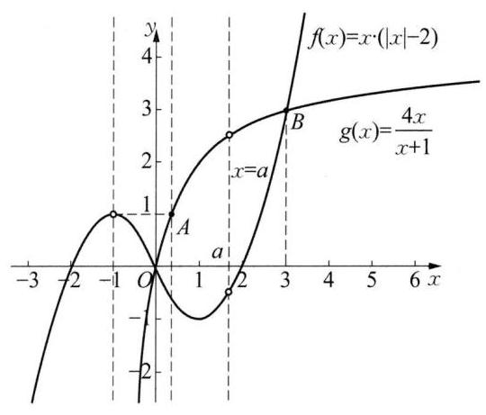

(第 5 题图)

6 6 7 B 8 A

9 D 提示: 由函数 $y = f\left( {x + 1}\right)  - 2$ 是奇函数,其图像向右平移 1 个单位,再向上平移 2 个单位得到 $f\left( x\right)$ 的图像,所以 $f\left( x\right)$ 的图像关于点 $\left( {1,2}\right)$ 对称。由 $g\left( x\right)  = \frac{{2x} - 1}{x - 1} = 2 + \frac{1}{x - 1}$ ,可得 $g\left( x\right)$ 的图像是由奇函数 $y = \frac{1}{x}$ 的图像向右平移 1 个单位,再向上平移 2 个单位得到,所以 $g\left( x\right)$ 的图像关于点 $\left( {1,2}\right)$ 对称,所以 ${P}_{1}$ 、 ${P}_{4}$ 与 ${P}_{2}\text{ 、 }{P}_{3}$ 都关于点 $\left( {1,2}\right)$ 对称,所以 ${x}_{1} + {x}_{4} = {x}_{2} + {x}_{3} = 2,{y}_{1} + {y}_{4} = {y}_{2} + {y}_{3} = 4$ ,所以 $g\left( {{x}_{1} + {x}_{2} + }\right. \; \left. {{x}_{3} + {x}_{4}}\right) g\left( {{y}_{1} + {y}_{2} + {y}_{3} + {y}_{4}}\right)  = g\left( 4\right) g\left( 8\right)  = \frac{7}{3} \times  \frac{15}{7} = 5$ 。故选 D。

10 由题可知 $f\left( x\right)  = \frac{x}{1 + \left| x\right| } = \left\{  \begin{array}{ll} \frac{x}{1 + x}, & x \geq  0, \\  \frac{x}{1 - x}, & x < 0, \end{array}\right.$ 当 $x \geq  0$ 时, $y = \frac{x}{1 + x} = 1 - \frac{1}{1 + x}$ ,其图像可由 $y =  - \frac{1}{x}$ 的图像向左平移 1 个单位,再向上平移 1 个单位而得如图 1。又因为 $\forall x \in  \mathbf{R}, f\left( {-x}\right)  = \frac{-x}{1 + \left| {-x}\right| } = \; - \frac{x}{1 + \left| x\right| } =  - f\left( x\right)$ ,所以 $f\left( x\right)$ 为奇函数,所以 $f\left( x\right)$ 图像关于原点对称。所以 $f\left( x\right)$ 的图像如图 2 。

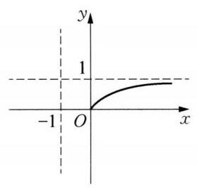

(第 10 题图 1)

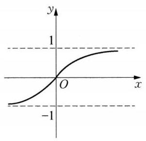

(第 10 题图 2)

11 由 $y = f\left( {x - 1}\right)  + 2$ 的函数图像向下平移 2 个单位得到 $y = f\left( {x - 1}\right)$ 的函数图像,再向左平移 1 个单位,得到 $y = f\left( {x + 1 - 1}\right)  = f\left( x\right)$ 的图像。

12 (1)函数 $f\left( x\right)  = \left| {x - 3}\right|  - \left| {x + 1}\right|  = \left\{  \begin{array}{ll} 4, & x \leq   - 1, \\   - {2x} + 2, &  - 1 < x < 3, \\   - 4, & x \geq  3\text{ 。 } \end{array}\right.$ 当 $x \leq   - 1$ 时,由 $f\left( x\right)  <  - 1$ ,得 -1 不成立,无解; 当 $- 1 < x < 3$ 时,由 $f\left( x\right)  <  - 1$ ,得 $- {2x} + 2 <  - 1$ , 解得 $x > \frac{3}{2}$ ,则有 $\frac{3}{2} < x < 3$ ; 当 $x \geq  3$ 时,由 $f\left( x\right)  <  - 1$ ,得 $- 4 <  - 1$ 恒成立,则有 $x \geq  3$ 。综上可得 $x > \frac{3}{2}$ ,所以 $f\left( x\right)  <  - 1$ 的解集为 $\left( {\frac{3}{2}, + \infty }\right)$ 。(2)在同一个坐标系中作出函数 $y = f\left( x\right)$ 和 $y = \left| x\right|$ 的图像,点 $A\left( {-1,4}\right)$ 在函数 $y = f\left( x\right)$ 的图像上,如图所示。而函数 $y = \left| {x + a}\right|$ 的图像是由函数 $y = \left| x\right|$ 图像向左或向右平移 $\left| a\right|$ 个单位得到的,当函数 $y = \left| x\right|$ 图像向左 $\left( {a > 0}\right)$ 平移 $a$ 个单位时,得到 $y =$

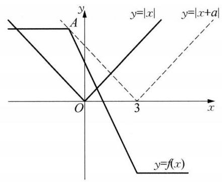

(第 12 题图)

$\left| {x + a}\right|$ 的图像与函数 $y = f\left( x\right)$ 的图像有两个交点,在这两个交点之间, $y = \left| {x + a}\right|$ 的图像不在 $y = \; f\left( x\right)$ 的图像上方,即存在 ${x}_{0}$ 使得 $\left| {{x}_{0} + a}\right|  < f\left( {x}_{0}\right)$ ,不满足题意,当函数 $y = \left| x\right|$ 图像向右 $\left( {a < 0}\right)$ 平移 $- a$ 个单位时,得到 $y = \left| {x + a}\right|$ 的图像,平移到点 $A$ 在 $y = \left| {x + a}\right|$ 的图像上,即 $a =  - 3$ 时,函数 $y = \; f\left( x\right)$ 的图像总是在 $y = \left| {x + a}\right|$ 的图像及其下方,即恒有 $f\left( x\right)  \leq  \left| {x + a}\right|$ 成立,将 $y = \left| x\right|$ 的图像继续向右平移，即 $a <  - 3$ 时，函数 $y = f\left( x\right)$ 的图像总是在 $y = \left| {x + a}\right|$ 的图像的下方，恒有 $f\left( x\right)  < \left| {x + a}\right|$ 成立,综上得 $a \leq   - 3$ ,所以实数 $a$ 的取值范围是 $a \leq   - 3$ 。

(第 13 题图)

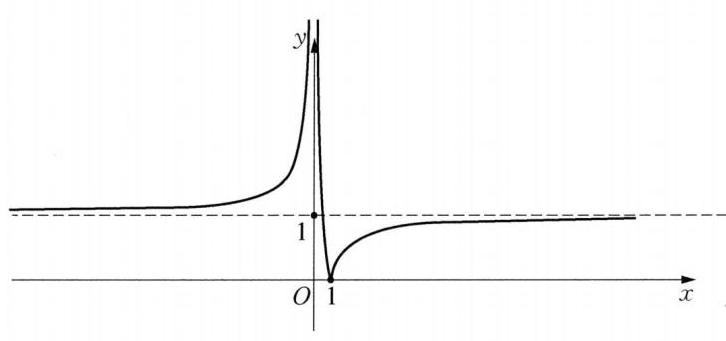

13 (1)将函数 $y = \frac{1}{x}$ 的图像上所有的点向下平移一个单位,然后将 $x$ 轴下方图像沿 $x$ 轴向上翻折 ( $x$ 轴上方图像不变),得到 $f\left( x\right)  = \; \left| {\frac{1}{x} - 1}\right|$ 的图像如图所示。(2)由(1)可知,函数 $f\left( x\right)$ 的值域为 $\lbrack 0, + \infty )$ ,函数 $f\left( x\right)$ 的单调增区间为 $\left( {-\infty ,0}\right)$ 和 $\lbrack 1, + \infty )$ 。

(3)因为 $a < b,{ma} < {mb}$ ，所以 $m > 0$ 。当 $0 < a < b \leq  1$ 时，则 $\left\{  \begin{array}{l} f\left( a\right)  = {mb}, \\  f\left( b\right)  = {ma}, \end{array}\right.$ 即 $a = b$ ，矛盾；当 $0 < a < 1 < b$ 时，因为 $f\left( 1\right)  = 0 \notin  \left\lbrack  {{ma},{mb}}\right\rbrack$ ，矛盾； 当 $1 \leq  a < b$ 时，则 $\left\{  \begin{array}{l} f\left( a\right)  = {ma}, \\  f\left( b\right)  = {mb}, \end{array}\right.$ 即 $\left\{  \begin{array}{l} 1 - \frac{1}{a} = {ma}, \\  1 - \frac{1}{b} = {mb}\text{ 。 } \end{array}\right.$ 所以 $1 - \frac{1}{x} = {mx}$ ，即 $m{x}^{2} - x + 1 = 0$ 在 $\lbrack 1, + \infty )$ 上有两个不等解。记 $g\left( x\right)  = m{x}^{2} - x + 1$ ,则 $\left\{  \begin{array}{l} \frac{1}{2m} > 1, \\  \Delta  > 0, \\  g\left( 1\right)  \geq  0, \end{array}\right.$ 解得 $0 < m < \frac{1}{4}$ 。

### 3.8 函数图像及其变换(2)

1 (－3，＋－1)U(0，1) 提示:依题意，函数 $f\left( x\right)$ 是定义在 $\mathbf{R}$ 上的奇函数,图像关于原点对称, $f\left( x\right)$ 在 $\left( {-\infty ,0}\right)$ 上是严格增函数,在 $\left( {0, + \infty }\right)$ 上是严格增函数,且 $f\left( {-2}\right)  = f\left( 2\right)  = 0$ 。 $f\left( {x + 1}\right)$ 的图像是由 $f\left( x\right)$ 的图像向左平移一个单位所得,由此画出 $f\left( {x + 1}\right)$ 的大致图像如图所示,由图可知,不等式 ${xf}\left( {x + 1}\right)  < 0$ 的解集为 $\left( {-3, - 1}\right)  \cup  \left( {0,1}\right)$ 。故答案为 $\left( {-3, - 1}\right)  \cup  \left( {0,1}\right)$  。

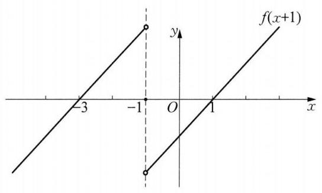

(第 1 题图)

$\begin{array}{llllll} 2 & {3}^{-x - 1} & 3 & \frac{1}{3} & 4 & a < 0,{b}^{2} - {4ac} = 0 \end{array}$

5 $\left\lbrack  {0,\frac{1}{36}}\right\rbrack$ 提示:由题意，当 $x \geq  0$ 时， $f\left( x\right)  = \left\{  \begin{array}{ll}  - {2x}, & 0 \leq  x < a, \\   - {2a}, & a \leq  x \leq  {2a}, \\  {2x} - {6a}, & x > {2a}\text{ 。 } \end{array}\right.$ 当 $f\left( x\right)  = 0$ 时， ${2x} - {6a} = 0,$ 所以 $x = {3a}$ 。对任意的 $x \in  \mathbf{R}$ ,都有 $f\left( {x - \sqrt{a}}\right)  \leq  f\left( x\right)$ ,即 $f\left( x\right)$ 的图像向右平移 $\sqrt{a}$ 个单位,得到 $g\left( x\right)$ 的图像。由题意 $g\left( x\right)$ 的图像不能在 $f\left( x\right)$ 的图像上方,则 $f\left( x\right)$ 向右平移的距离应该大于等于 ${6a}$ ,即 ${6a} \leq  \sqrt{a}, a \leq  \frac{1}{36}$ ,所以 $a \in \; \left\lbrack  {0,\frac{1}{36}}\right\rbrack$

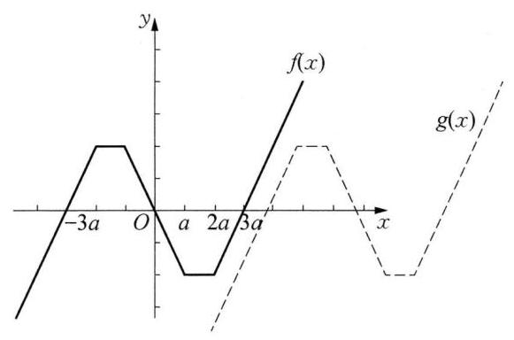

(第 5 题图)

6 ②④ 提示:若 $y = f\left( {x + 2}\right)$ 是偶函数，则 $f\left( {x + 2}\right)  = \; f\left( {-x + 2}\right)$ ,所以 $y = f\left( x\right)$ 的图像关于 $x = 2$ 对称,①错误, ② 正确; $f\left( {x - 2}\right)  = f\left( {2 - x}\right)  = f\left\lbrack  {-\left( {x - 2}\right) }\right\rbrack$ ,令 $x - 2 = t$ ,即 $f\left( t\right)  = f\left( {-t}\right)$ ,所以 $f\left( x\right)$ 是偶函数，图像关于 $y$ 轴对称,③ 错误; $y = f\left( {x - 2}\right)$ 是将 $f\left( x\right)$ 的图像向右平移 2 个单位而得, $y = f\left( {2 - x}\right)  = f\lbrack  - (x -$ 2)] 是将 $f\left( x\right)$ 的图像沿 $y$ 轴对称后再向右平移 2 个单位而得,因此 $y = f\left( {x - 2}\right)$ 与 $y = f\left( {2 - x}\right)$ 的图像关于 $x = 2$ 对称,④正确。故答案为②④。

7 C 8 A

9 B 提示: 因为 $f\left( {x + 1}\right)  = \frac{1}{2}f\left( x\right)$ ,当 $x \in  (0,1\rbrack$ 时, $f\left( x\right)  = x\left( {1 - x}\right)$ ,所以当 $x \in  (k, k + 1\rbrack , k$ 为正整数时, $f\left( x\right)  = \frac{1}{2}f\left( {x - 1}\right)  = {\left( \frac{1}{2}\right) }^{2}f\left( {x - 2}\right)  = \cdots  = {\left( \frac{1}{2}\right) }^{k - 1}f\left( {x - k + 1}\right)  = {\left( \frac{1}{2}\right) }^{k}f\left( {x - k}\right)$ 。因为 $k < \; x \leq  k + 1$ ,所以 $0 < x - k \leq  1$ ,所以 $f\left( {x - k}\right)  = \left( {x - k}\right) \left( {1 - x + k}\right)$ ,所以当 $x \in  (k, k + 1\rbrack , k$ 为正整数时, $f\left( x\right)  = {\left( \frac{1}{2}\right) }^{k}\left( {x - k}\right) \left( {1 - x + k}\right)$ ; 当 $x \in  ( - 2, - 1\rbrack$ 时, $f\left( x\right)  = {2f}\left( {x + 1}\right)  =  - 2 \times  2\left( {x + 1}\right) \lbrack (x + \; 1) + 1\rbrack  =  - 4\left( {x + 1}\right) \left( {x + 2}\right)$ ,又 $f\left( \frac{1}{2}\right)  = \frac{1}{4}$ ,且对任意 $x \in  \lbrack m, + \infty )$ ,都有 $f\left( x\right)  \leq  \frac{1}{18}$ ,所以 $m > \frac{1}{2}$ 。作出函数 $f\left( x\right)$ 在 $\left( {0, + \infty }\right)$ 上的图像,如图所示。要使 $f\left( x\right)  \leq  \frac{1}{18}$ ,则需 $x \geq  {x}_{1}$ ,其中 ${2.5} < {x}_{1} < 3, f\left( {x}_{1}\right)  = \; \frac{1}{18}$ ,所以 $\frac{1}{4}\left( {{x}_{1} - 2}\right) \left( {3 - {x}_{1}}\right)  = \frac{1}{18}$ ,解得 ${x}_{1} = \frac{8}{3}$ ,所以 $m \geq  \frac{8}{3}$ ,故选 B。

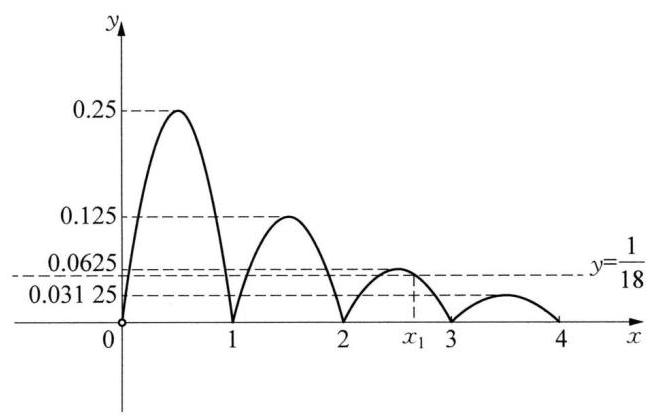

(第 9 题图)

10 (1)因为 $x \in  \{  - 2, - 1,0,1,2\}$ ，所以，图像为一条直线上 5 个孤立的点，如图 1 所示。(2)因为 $y = \frac{{2x} + 1}{x - 1} = 2 + \frac{3}{x - 1}$ ,所以,先作函数 $y = \frac{3}{x}$ 的图像,把它向右平移一个单位得到函数 $y = \frac{3}{x - 1}$ 的图像, 再把它向上平移两个单位便得到函数 $y = \frac{{2x} + 1}{x - 1}$ 的图像,如图 2 所示。(3)先作 $y = {x}^{2} - {2x}$ 的图像，保留 $x$ 轴上方的图像,再把 $x$ 轴下方的图像对称翻到 $x$ 轴上方。然后把它向上平移 1 个单位,即得到 $y = \; \left| {{x}^{2} - {2x}}\right|  + 1$ 的图像,如图 3 所示。

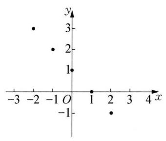

(第 10 题图 1)

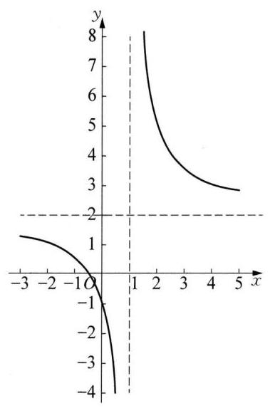

(第 10 题图 2)

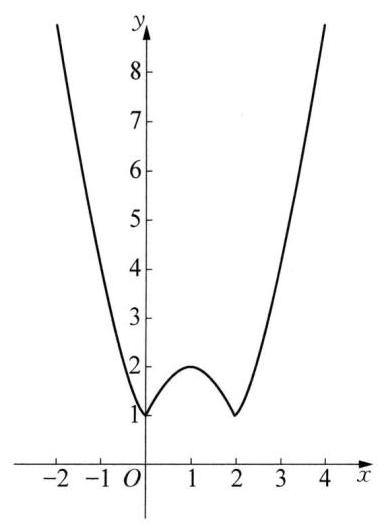

(第 10 题图 3)

11 (1) 当 $m = 0$ 时， $f\left( x\right)  = \left| x\right|  - 3$ ，此时 $f\left( {-x}\right)  = f\left( x\right)$ ，所以 $f\left( x\right)$ 是偶函数，当 $m \neq  0$ 时，因为 $f\left( 1\right)  = \; m - 2, f\left( {-1}\right)  =  - m - 2$ ,所以 $f\left( {-1}\right)  \neq  f\left( 1\right) , f\left( {-1}\right)  \neq   - f\left( 1\right)$ ,所以 $f\left( x\right)$ 既不是奇函数,也不是偶函数。(2)由 $f\left( x\right)  = 0$ ，可得 $x\left| \times \right|  - {3x} + m = 0\left( {x \neq  0}\right)$ 变为 $m =  - x\left| \times \right|  + {3x}\left( {x \neq  0}\right)$ ，令 $g\left( x\right)  = {3x} - \; x\left| x\right|  = \left\{  {\begin{array}{ll}  - {x}^{2} + {3x}, & x > 0, \\  {x}^{2} + {3x}, & x < 0 \end{array} = \left\{  {\begin{array}{ll}  - {\left( x - \frac{3}{2}\right) }^{2} + \frac{9}{4}, & x > 0, \\  {\left( x + \frac{3}{2}\right) }^{2} - \frac{9}{4}, & x < 0\text{ 。 } \end{array}\text{ 作 }y = g\left( x\right) }\right. }\right.$ 的图像及直线 $y = m$ ,由图像可得: 当 $m > \frac{9}{4}$ 或 $m <  - \frac{9}{4}$ 时, $y = f\left( x\right)$ 有 1 个零点; 当 $m = \frac{9}{4}$ 或 $m = 0$ 或 $m =  - \frac{9}{4}$ 时, $y = f\left( x\right)$ 有 2 个零点; 当 $0 < m < \frac{9}{4}$ 或 $- \frac{9}{4} < m < 0$ 时, $y = f\left( x\right)$ 有 3 个零点。

12 (1) 本题等价于函数 $y = f\left( x\right)$ 的图像与 $y = a$ 的图像有 3 个不同的交点,易得:

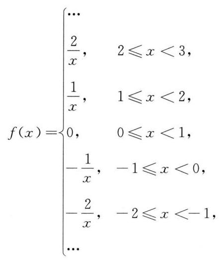

如图 1 所示,可得 $a \in  \left( {\frac{3}{4},\frac{4}{5}}\right\rbrack   \cup  \left\lbrack  {\frac{4}{3},\frac{3}{2}}\right)$ 。

( 2 )如图 2 所示， $k \in  \left\lbrack  {\frac{1}{4},\frac{1}{3}}\right)$ 。

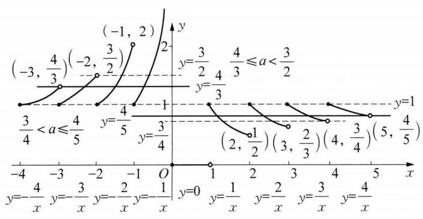

(第 12 题图 1)

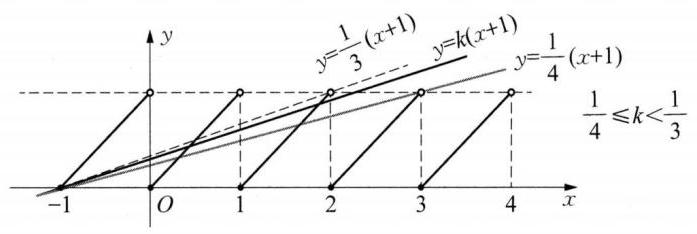

(第 12 题图 2)

13 ( 1 )因为 $y =  - \frac{{3x} + 5}{x + 2} =  - 3 + \frac{1}{x + 2}$ ，所以将函数 $y = \frac{1}{x}$ 的图像向左平移 2 个单位，再向下平移 3 个单位得到函数 $y =  - \frac{{3x} + 5}{x + 2}$ 的图像。( 2 )函数 $y = \frac{1}{x}$ 的减区间为 $\left( {-\infty ,0}\right)$ 和 $\left( {0, + \infty }\right)$ ,因为函数 $y = \frac{1}{x}$ 的图像向左平移 2 个单位,再向下平移 3 个单位得到函数 $y =  - \frac{{3x} + 5}{x + 2}$ 的图像,所以函数 $y =  - \frac{{3x} + 5}{x + 2}$ 的减区间为 $\left( {-\infty , - 2}\right)$ 和 $\left( {-2, + \infty }\right)$ 。因为函数 $y =  - \frac{{3x} + 5}{x + 2}$ 在 $\lbrack a, + \infty )$ 上是严格减函数,所以有 $- 2 < a$ ,因此实数 $a$ 的取值范围为 $\left( {-2, + \infty }\right)$ 。(3)因为函数 $y = \frac{1}{x}$ 图像向右平移一个单位，得函数 $y = g\left( x\right)$ 的图像,所以 $y = g\left( x\right)  = \frac{1}{x - 1}$ 。当 $x < 0$ 且 $x \neq   - 1$ 时,因为函数 $y = h\left( x\right) \left( {x \neq   \pm  1}\right)$ 的图像关于 $y$ 轴对称,

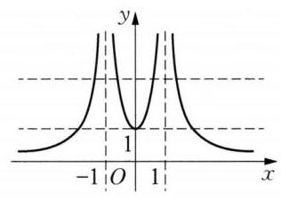

(第 13 题图)

所以有 $h\left( x\right)  = \left\{  \begin{array}{ll} g\left( {-x}\right)  =  - \frac{1}{x + 1}, & x <  - 1, \\   - g\left( {-x}\right)  = \frac{1}{x + 1}, &  - 1 < x < 0, \end{array}\right.$ 于是有 $h\left( x\right)  = \left\{  \begin{array}{ll}  - \frac{1}{x + 1}, & x <  - 1, \\  \frac{1}{x + 1}, &  - 1 < x < 0, \\   - \frac{1}{x - 1}, & 0 \leq  x < 1, \\  \frac{1}{x - 1}, & x > 1, \end{array}\right.$

图所示。令 $h\left( x\right)  = t$ ,所以有 ${t}^{2} + {at} + \left( {{a}^{2} - {2a} - {13}}\right)  = 0$ ,因为关于 $x$ 的方程 ${h}^{2}\left( x\right)  + {ah}\left( x\right)  + \left( {{a}^{2} - {2a} - }\right.$ 13) $= 0$ 解集中有 7 个元素,所以由图可知: 一元二次方程 ${t}^{2} + {at} + \left( {{a}^{2} - {2a} - {13}}\right)  = 0$ 必有一个根为 1, 另一个根大于 1,所以有 ${1}^{2} + a \cdot  1 + \left( {{a}^{2} - {2a} - {13}}\right)  = 0$ ,解得 $a = 4$ ,或 $a =  - 3$ 。当 $a = 4$ 时, ${t}^{2} + {4t} - \; 5 = 0$ ,解得 $t = 1$ ,或 $t =  - 5 < 1$ ,不符合题意; 当 $a =  - 3$ 时, ${t}^{2} - {3t} + 2 = 0$ ,解得 $t = 1$ ,或 $t = 2 > 1$ , 符合题意，所以 $a =  - 3$ 。

## 第 4 章 幂函数、指数函数与对数函数

### 4.1 幂与指数

$\begin{array}{llllllllllllllll} 1 & \frac{31}{4} & 2 &  - 1 & 3 & \left( {-\infty ,\frac{1}{2}}\right) & 4 & {a}^{\frac{7}{8}} & 5 &  - 1 & 6 & {16}{x}^{\frac{2}{3}}{y}^{-\frac{1}{3}} & 7 & B & 8 & D \end{array}$

9 B 提示: 由 ${2}^{x} = {4}^{y - 1}$ ,得 ${2}^{x} = {2}^{{2y} - 2}$ ,即 $x = {2y} - 2$ ①,由 ${27}^{y} = {3}^{x + 1}$ ,得 ${3}^{3y} = {3}^{x + 1}$ ,即 $x + 1 = {3y}$ ②, 联立 ①②，解得 $x =  - 4, y =  - 1$ ，所以 $x - y =  - 3$ ，故选 B。

10 $\left( 1\right) \sqrt{{\left( \frac{11}{5} - \pi \right) }^{2}} + {\left\lbrack  {\left( -{0.0016}\right) }^{\frac{2}{6}}\right\rbrack  }^{\frac{3}{4}} - {\left( \sqrt{2} - 1\right) }^{0} = \pi  - \frac{11}{5} + \frac{1}{5} - 1 = \pi  - 3$ 。 (2)已知 ${a}^{x} = \sqrt{2} - 1$ ， 则 ${a}^{2x} = 3 - 2\sqrt{2}$ ，所以 $\frac{{a}^{x} + {a}^{-x}}{{a}^{x} - {a}^{-x}} = \frac{{a}^{2x} + 1}{{a}^{2x} - 1} = \frac{4 - 2\sqrt{2}}{2 - 2\sqrt{2}} =  - \sqrt{2}$ 。

11 (1) 原式 $= {\left( {2}^{\frac{1}{3}} \times  {3}^{\frac{1}{2}}\right) }^{6} - 4 \times  \frac{7}{4} - {2}^{\frac{1}{4}} \times  {8}^{\frac{1}{4}} - 1 = 4 \times  {27} - 7 - {\left( 2 \times  8\right) }^{\frac{1}{4}} - 1 = {108} - 7 - 2 - 1 = {98}$ 。 (2)原式 $= \frac{{\left\lbrack  {a}^{3}{b}^{2}{\left( a{b}^{2}\right) }^{\frac{1}{3}}\right\rbrack  }^{\frac{1}{2}}}{a{b}^{2} \cdot  {b}^{\frac{1}{3}} \cdot  {a}^{-\frac{1}{3}}} = \frac{{\left\lbrack  {a}^{\frac{10}{3}}{b}^{\frac{8}{3}}\right\rbrack  }^{\frac{1}{2}}}{{a}^{\frac{2}{3}}{b}^{\frac{7}{3}}} = \frac{{a}^{\frac{5}{3}}{b}^{\frac{4}{3}}}{{a}^{\frac{2}{3}}{b}^{\frac{7}{3}}} = \frac{a}{b}$ 。

12 (1) $\frac{{a}^{\frac{3}{2}} - {a}^{-\frac{3}{2}}}{{a}^{\frac{1}{2}} - {a}^{-\frac{1}{2}}} = \frac{\left( {{a}^{\frac{1}{2}} - {a}^{-\frac{1}{2}}}\right) \left( {a + {a}^{-1} + 1}\right) }{{a}^{\frac{1}{2}} - {a}^{-\frac{1}{2}}} = a + {a}^{-1} + 1$ ，因为 ${a}^{\frac{1}{2}} - {a}^{-\frac{1}{2}} = 3$ ，所以 ${\left( {a}^{\frac{1}{2}} - {a}^{-\frac{1}{2}}\right) }^{2} = a + \; {a}^{-1} - 2 = 9$ ,即 $a + {a}^{-1} = {11}$ ,所以 $\frac{{a}^{\frac{3}{2}} - {a}^{-\frac{3}{2}}}{{a}^{\frac{1}{2}} - {a}^{-\frac{1}{2}}} = a + {a}^{-1} + 1 = {11} + 1 = {12}$ 。

13 因为 ${\left( {a}^{\frac{1}{2}} + {b}^{\frac{1}{2}}\right) }^{2} = a + b + 2{\left( ab\right) }^{\frac{1}{2}} = {12} + 2 \times  3 = {18}$ ,所以 ${a}^{\frac{1}{2}} + {b}^{\frac{1}{2}} = 3\sqrt{2}$ 。因为 ${\left( {a}^{\frac{1}{2}} - {b}^{\frac{1}{2}}\right) }^{2} = a + b - \; 2{\left( ab\right) }^{\frac{1}{2}} = {12} - 2 \times  3 = 6$ ,又 $a < b$ ,所以 ${a}^{\frac{1}{2}} - {b}^{\frac{1}{2}} =  - \sqrt{6}$ 。所以, $\frac{{a}^{\frac{1}{2}} + {b}^{\frac{1}{2}}}{{a}^{\frac{1}{2}} - {b}^{\frac{1}{2}}} = \frac{3\sqrt{2}}{-\sqrt{6}} =  - \sqrt{3}$ 。

### 4.2 对数(1)

$\begin{array}{llllllll} 1 & 1 & 2 & 1 & 3 & 3 & 4 & \text{ ② }\text{ ④ }\text{ ⑤ } \end{array}$

5 2 提示: 因为 ${\log }_{2}\left( {{\log }_{a}x}\right)  = 1$ 的解为 $x = 4$ ,所以由 ${\log }_{2}\left( {{\log }_{a}4}\right)  = 1$ ,可得 ${\log }_{a}4 = 2$ ,即 $2{\log }_{a}2 = 2,{\log }_{a}2 =$ 1,解得 $a = 2$ ,故答案为 2 。

${6y} = x\left( {x > 0\text{ 且 }x \neq  1}\right)$ 提示: ${\log }_{{x}^{2}}y + {\log }_{{y}^{2}}x = \frac{1}{2}{\log }_{x}y + \frac{1}{2}{\log }_{y}x = 1$ ,即 ${\log }_{x}y + {\log }_{y}x = 2$ ,即 ${\log }_{x}y + \; \frac{1}{{\log }_{x}y} = 2$ ,解得 ${\log }_{x}y = 1$ ,所以 $y = x\left( {x > 0\text{ 且 }x \neq  1}\right)$ ,故答案为 $y = x(x > 0$ 且 $x \neq  1)$ 。

7 B 提示: 由对数的性质,得 ${5}^{{\log }_{5}\left( {{2x} - 1}\right) } = {2x} - 1 = {25}$ ,所以 $x = {13}$ ,故选 B。

8 C 提示: 设至少需要过滤的次数为 $n$ ,由题意可得 ${\left( 1 - {20}\% \right) }^{n} < 5\%$ ,即 ${0.8}^{n} < {0.05}$ ,所以 $\lg {0.8}^{n} < \; \lg {0.05}$ ,可得 $n > {\lg }_{0.8}{0.05} = \frac{\lg {0.05}}{\lg {0.8}} = \frac{\lg 5 - 2}{3\lg 2 - 1} = \frac{1 - \lg 2 - 2}{3\lg 2 - 1} = \frac{-\lg 2 - 1}{3\lg 2 - 1} \approx  \frac{-{0.3010} - 1}{{0.3010} \times  3 - 1} = {13.4}$ ,所以至少过滤 14 次，故选 C。

9 B 提示: 由 ${0.9}{\mu }_{0} = {\mu }_{0}{\mathrm{e}}^{-{\lambda t}} = {\mu }_{0}{\left( {\mathrm{e}}^{-\lambda }\right) }^{2}$ ,得 ${\mathrm{e}}^{-\lambda } = \sqrt{0.9}$ ,令 ${0.6}{\mu }_{0} = {\mu }_{0}{\left( {\mathrm{e}}^{-\lambda }\right) }^{t}$ ,得 ${0.6} = {\left( \sqrt{0.9}\right) }^{t}$ ,两边取常用对数,得 $\lg {0.6} = \frac{t}{2}\lg {0.9}$ ,所以 $t = \frac{2\left( {\lg 2 + \lg 3 - 1}\right) }{2\lg 3 - 1} \approx  {10}$ ,故选 $\mathrm{B}$ 。

10 (1)原式 $= {\left( \frac{9}{4}\right) }^{\frac{1}{2}} - 1 - {\left( \frac{27}{8}\right) }^{-\frac{2}{3}} + {\left( \frac{3}{2}\right) }^{-2} = {\left( \frac{3}{2}\right) }^{2 \times  \frac{1}{2}} - 1 - {\left( \frac{3}{2}\right) }^{-3 \times  \frac{2}{3}} + {\left( \frac{3}{2}\right) }^{-2} = \frac{3}{2} - 1 - {\left( \frac{3}{2}\right) }^{-2} + \; {\left( \frac{3}{2}\right) }^{-2} = \frac{1}{2}\text{ 。 }\;\left( 2\right)$ 原式 $= {\log }_{3}\frac{{3}^{\frac{3}{4}}}{3} + \lg \left( {{25} \times  4}\right)  + 2 = {\log }_{3}{3}^{-\frac{1}{4}} + \lg {10}^{2} + 2 =  - \frac{1}{4} + 2 + 2 = \frac{15}{4}$ 。

11 (1)原式 $= {3}^{\frac{1}{3}} \cdot  {3}^{\frac{2}{3}} + \pi  - 2 - 1 = 3 + \pi  - 3 = \pi$ 。(2)原式 $= {\log }_{5}{100} - {\log }_{5}4 + \frac{\lg 9}{\lg 2} \cdot  \frac{\lg 8}{\lg 3} - 3 = {\log }_{5}{25} + \; \frac{2\lg 3}{\lg 2} \cdot  \frac{3\lg 2}{\lg 3} - 3 = 2 + 6 - 3 = 5$  。

12 原式 $= \frac{3}{2} + 4 + 4 - \lg {100} + \frac{\lg {27}}{\lg 4} \times  \frac{\lg 2}{\lg 3} = 9$ 。

13 (1)由题可知，要使 $f\left( x\right)  \geq  0$ 恒成立，只需 $\Delta  = 4{a}^{2} - 4\left( {{a}^{2} - {2a} + 2}\right)  = {8a} - 8 \leq  0$ ，所以 $a \leq  1$ 。

(2)函数 $f\left( x\right)$ 的图像对称轴为 $x = a$ 。①当 $a \leq  0$ 时， $f\left( x\right)$ 在 $\left\lbrack  {0,2}\right\rbrack$ 上为严格增函数，所以 $f{\left( x\right) }_{\min } = \; f\left( 0\right)  = {a}^{2} - {2a} + 2$ ；②当 $a \geq  2$ 时， $f\left( x\right)$ 在 $\left\lbrack  {0,2}\right\rbrack$ 上为严格减函数， ${\left. f(x\right) }_{\min } = f\left( 2\right)  = {a}^{2} - {6a} + 6$ ；③当 $0 < \; a < 2$ 时， $f\left( x\right)$ 在 $\left\lbrack  {0, a}\right\rbrack$ 上为严格减函数，在 $(a,2\rbrack$ 上为严格增函数， $f{\left( x\right) }_{\min } = f\left( a\right)  =  - {2a} + 2$ 。综上所述: $g\left( a\right)  = \left\{  \begin{array}{ll} {a}^{2} - {2a} + 2, & a \leq  0, \\   - {2a} + 2, & 0 < a < 2, \\  {a}^{2} - {6a} + 6, & a \geq  2\text{ 。 } \end{array}\right.$ (3) 不等式 $g\left( a\right)  - {\log }_{\frac{1}{2}}m > 0$ 可化为 $g\left( a\right)  > {\log }_{\frac{1}{2}}m$ 恒成立,只需 $g{\left( a\right) }_{\min } > {\log }_{\frac{1}{2}}m$ 即可,当 $a \leq  0$ 时, $g\left( a\right)  = {a}^{2} - {2a} + 2 = {\left( a - 1\right) }^{2} + 1$ 在 $\left( {-\infty ,0}\right)$ 上为严格减函数,当 $0 < \; a < 2$ 时, $g\left( a\right)  =  - {2a} + 2$ 为严格减函数; 当 $a \geq  2$ 时, $g\left( a\right)  = {a}^{2} - {6a} + 6 = {\left( a - 3\right) }^{2} - 3$ ,则 $g\left( a\right)$ 在 $\left( {2,3}\right)$ 上为严格减函数,在 $\left( {3, + \infty }\right)$ 上为严格增函数,所以 $g{\left( a\right) }_{\min } = g\left( 3\right)  =  - 3$ 。由 ${\log }_{\frac{1}{2}}m <  - 3$ ,可得 $m > 8$ 。

### 4.2 对数(2)

$\begin{array}{llll} 1 & 2 & 2 &  - {13} \end{array}$

3 $\frac{1}{2}\left( {1 + a + b}\right)$ 提示:由 ${3}^{b} = 5$ 可得 $b = {\log }_{3}5$ ，所以 ${\log }_{3}\sqrt{30} = {\log }_{3}{30}^{\frac{1}{2}} = \frac{1}{2}{\log }_{3}\left( {2 \times  3 \times  5}\right)  = \frac{1}{2}(1 + \; \left. {{\log }_{3}2 + {\log }_{3}5}\right)  = \frac{1}{2}\left( {1 + a + b}\right)$ ,故答案为 $\frac{1}{2}\left( {1 + a + b}\right)$ 。

4 10 提示: 由题可知,当 $t = 5$ 时, ${y}_{1} = {y}_{2}$ ,则 $a{\mathrm{e}}^{-{5n}} = a - a{\mathrm{e}}^{-{5n}}$ ,得 $2{\mathrm{e}}^{-{5n}} = 1$ ,所以 $n = \frac{1}{5}\ln 2$ ,从而有 ${y}_{1} = \; a{\mathrm{e}}^{-t\frac{1}{5}\ln 2}$ ,当 ${y}_{1} = a{\mathrm{e}}^{-t\frac{1}{5}\ln 2} = \frac{a}{8}$ 时,解得 $t = {15}$ (分),所以,再过 10 分钟桶 $A$ 中只有水 $\frac{a}{8}$ 升,故答案为 10 。

$5\lg 2$ 提示: 因为 $m = {\log }_{2}5$ ,所以 ${2}^{m} - m\lg 2 - 4 = 5 - {\log }_{2}5 \cdot  \lg 2 - 4 = 1 - \frac{\lg 5}{\lg 2} \times  \lg 2 = 1 - \lg 5 = \lg 2$ , 故答案为 $\lg 2$ 。

612 提示:原方程可化为 $2{\left( \lg x\right) }^{2} - 4\lg x + 1 = 0$ ,设 $t = \lg x$ ,则原方程可化为 $2{t}^{2} - {4t} + 1 = 0$ 。设方程 $2{t}^{2} - {4t} + 1 = 0$ 的两根为 ${t}_{1}\text{ 、 }{t}_{2}$ ,则 ${t}_{1} + {t}_{2} = 2,{t}_{1}{t}_{2} = \frac{1}{2}$ 。由已知 $a\text{ 、 }b$ 是原方程的两个根,可令 ${t}_{1} = \lg a$ , ${t}_{2} = \lg b$ ,则 $\lg a + \lg b = 2,\lg a \cdot  \lg b = \frac{1}{2}$ ,所以 $\lg \left( {ab}\right)  \cdot  \left( {{\log }_{a}b + {\log }_{b}a}\right)  = \left( {\lg a + \lg b}\right) \left( {\frac{\lg b}{\lg a} + \frac{\lg a}{\lg b}}\right)  = \; \frac{\left( {\lg a + \lg b}\right) \left\lbrack  {{\left( \lg b\right) }^{2} + {\left( \lg a\right) }^{2}}\right\rbrack  }{\lg a\lg b} = \left( {\lg a + \lg b}\right)  \cdot  \frac{{\left( \lg b + \lg a\right) }^{2} - 2\lg a\lg b}{\lg a\lg b} = 2 \times  \frac{{2}^{2} - 2 \times  \frac{1}{2}}{\frac{1}{2}} = {12}$ ,故答案为 12.

7 B 8 A

9 B 提示: 由题意可设 $\lg {m}^{15} = n + \lg a$ ,因为正整数 $m$ 的 15 次方是 11 位数,所以 $n = {10}$ ,所以 ${15}\lg m = \; {10} + \lg a$ ,因为 $1 \leq  a < {10}$ ,所以 $0 \leq  \lg a < 1$ ,所以 ${10} < {15}\lg m < {11}$ ,则 $\frac{2}{3} < \lg m < \frac{11}{15}$ ,所以, $2\lg 2 = \lg 4 < \; \frac{2}{3} < \lg m < \frac{11}{15} < \lg 2 + \lg 3 = \lg 6$ ,所以 $4 < m < 6$ ,所以正整数 $m$ 为 5,故选 B。

10 (1)原式 $= {\left( \frac{9}{4}\right) }^{2 \times  {0.5}} - 2 \times  {\left( \frac{4}{3}\right) }^{3 \times  \left( {-\frac{2}{3}}\right) } - 2 \times  1 \times  {\left( \frac{3}{4}\right) }^{2} = \frac{9}{4} - 2 \times  \frac{9}{16} - 2 \times  \frac{9}{16} = 0$ 。(2)原 ${\log }_{5}{50} - {\log }_{5}{14} + {\log }_{{2}^{-1}}{\left( \sqrt{2}\right) }^{2} + 3 = {\log }_{5}\left( \frac{{35} \times  {50}}{14}\right)  - 1 + 3 = {\log }_{5}{5}^{3} - 1 + 3 = 5$ 。

11 (1)原式 $= {\log }_{2}\left( {{\log }_{3}{3}^{4}}\right)  + 2 - \lg {10}^{3} + 0 = {\log }_{2}4 + 2 - 3 = {\log }_{2}{2}^{2} + 2 - 3 = 2 + 2 - 3 = 1$ 。(2)原式 ${\left\lbrack  {\left( {0.4}\right) }^{3}\right\rbrack  }^{-\frac{1}{3}} - 1 + {\left( -2\right) }^{3 \times  \left( {-\frac{4}{3}}\right) } + {\left( {2}^{4}\right) }^{-{0.75}} + {\left( {10}^{-2}\right) }^{\frac{1}{2}} = {0.4}^{3 \times  \left( {-\frac{1}{3}}\right) } - 1 + {\left( -2\right) }^{-4} + {2}^{4 \times  \left( {-{0.75}}\right) } + {10}^{-2 \times  \frac{1}{2}} = {0.4}^{-1} - \; 1 + \frac{1}{16} + {2}^{-3} + {10}^{-1} = \frac{5}{2} - 1 + \frac{1}{16} + \frac{1}{8} + \frac{1}{10} = \frac{143}{80}$  。

12 (1)因为 $f\left( x\right)  = \frac{6x}{{x}^{2} + 1}$ ，所以 $f\left( {-x}\right)  = \frac{-{6x}}{{x}^{2} + 1} =  - f\left( x\right)$ ，所以 $f\left( x\right)$ 为奇函数。(2)由 $f\left( {2}^{x}\right)  = {2}^{x}$ ， 得 $\frac{6 \cdot  {2}^{x}}{{2}^{2x} + 1} = {2}^{x}$ 。整理得 ${2}^{2x} = 5$ ，所以 ${2x} = {\log }_{2}5$ ，即 $x = \frac{1}{2}{\log }_{2}5$ 。

13 (1)由题意可得， $v = 3\ln \left( {1 + \frac{M}{25}}\right)$ ,令 $v = 3\ln \left( {1 + \frac{M}{25}}\right)  = {16.7}$ ,则 $M = {25}\left( {{\mathrm{e}}^{\frac{16.7}{3}} - 1}\right)  \approx  {6514.0}\left( \mathrm{t}\right)$ ,故当火箭飞行速度达到第三宇宙速度 $\left( {{16.7}\mathrm{\;{km}}/\mathrm{s}}\right)$ 时,相应的 $M$ 为 6514.0t。(2)由题意可得， $v = \omega$ . $\ln \left( {1 + \frac{M}{25}}\right)  = \omega  \cdot  \ln \frac{M + {25}}{25}$ ,令 $v = \omega  \cdot  \ln \frac{M + {25}}{25} = {16.7}$ ,则 $\ln \left( {M + {25}}\right)  = \frac{16.7}{\omega } + \ln {25} \leq  \ln {2000}$ ,所以 $\omega  \geq \; \frac{16.7}{\ln {2000} - \ln {25}} = \frac{16.7}{\ln {80}} \approx  {3.8}$ ,故 $\omega$ 的最小值为 3.8 。

### 4.3 幂函数的图像与性质(1)

${1f}\left( x\right)  = {x}^{-3}$ (答案不唯一) 2 $f\left( x\right)  = {x}^{3}$ (答案不唯一) 3 [0,1) 4 ④ ③ ② ①

5 3 提示:因为幂函数 $f\left( x\right)  = \left( {a - 1}\right) {x}^{{m}^{2} - {2m} - 3}\left( {a, m \in  \mathbf{N}}\right)$ 为偶函数,且在 $\left( {0, + \infty }\right)$ 上是严格减函数,所以 ${m}^{2} - {2m} - 3 < 0$ ,且 ${m}^{2} - {2m} - 3$ 为偶数, $m \in  \mathbf{N}$ ,且 $a - 1 = 1$ 。解得 $- 1 < m < 3, m = 0\text{ 、 }1\text{ 、 }2$ ,且 $a =$ 2,只有 $m = 1$ 时满足 ${m}^{2} - {2m} - 3 =  - 4$ 为偶数,所以 $m = 1, a + m = 3$ ,故答案为 3 。

$6\left\lbrack  {-\frac{\sqrt{2}}{2},\frac{\sqrt{2}}{2}}\right\rbrack$ 提示: 不等式变形为 ${\left( {x}^{2} - 1\right) }^{1011} + {x}^{2} - 1 + {\left( {x}^{2}\right) }^{1011} + {x}^{2} \leq  0$ ,所以 ${\left( {x}^{2}\right) }^{1011} + {x}^{2} \leq  (1 - \; {\left. {x}^{2}\right) }^{1011} + 1 - {x}^{2}$ 。令 $f\left( x\right)  = {x}^{1011} + x$ ,则有 $f\left( {x}^{2}\right)  \leq  f\left( {1 - {x}^{2}}\right)$ ,显然 $f\left( x\right)$ 在 $\mathbf{R}$ 上严格增,则 ${x}^{2} \leq  1 - {x}^{2}$ , 可得 ${x}^{2} \leq  \frac{1}{2}$ ，解得 $- \frac{\sqrt{2}}{2} \leq  x \leq  \frac{\sqrt{2}}{2}$ ，故不等式的解集为 $\left\lbrack  {-\frac{\sqrt{2}}{2},\frac{\sqrt{2}}{2}}\right\rbrack$ 。

7 A 8 C 9 B

10 因为 $y = {x}^{-2} = \frac{1}{{x}^{2}}$ 的严格增区间为 $\left( {-\infty ,0}\right)$ ,而 $y = {\left( x + 3\right) }^{-2}$ 的图像是由 $y = {x}^{-2}$ 的图像向左平移 3 个单位长度得到的,因此 $y = {\left( x + 3\right) }^{-2}$ 的严格增区间为 $\left( {-\infty , - 3}\right)$ 。

11 因为 $y = {x}^{\frac{2}{3}} = \sqrt[3]{{x}^{2}}$ ,所以不难看出函数的定义域是实数集 R,记 $f\left( x\right)  = {x}^{\frac{2}{3}}$ ,则 $f\left( {-x}\right)  = {\left( -x\right) }^{\frac{2}{3}} = \sqrt[3]{{\left( -x\right) }^{2}} = \sqrt[3]{{x}^{2}} = \; {x}^{\frac{2}{3}} = f\left( x\right)$ ,所以函数 $y = {x}^{\frac{2}{3}}$ 是偶函数,因此,函数的图像关于 $y$ 轴对称。故只需列表描点画出 $\lbrack 0, + \infty )$ 的函数图像,再关于 $y$ 轴作对称变换即可。列表如下:

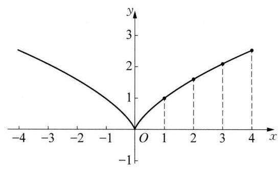

(第11题图)

<table><tr><td>$x$</td><td>0</td><td>1</td><td>2</td><td>3</td><td>4</td></tr><tr><td>${x}^{\frac{2}{3}}$</td><td>0</td><td>1</td><td>$\sqrt[3]{4}$</td><td>$\sqrt[3]{9}$</td><td>$\sqrt[3]{16}$</td></tr></table>

故描点画图如图所示。由图像可以看出,函数 $y = {x}^{\frac{2}{3}}$ 在区间 $( - \infty ,0\rbrack$ 上严格减，在区间 $\lbrack 0, + \infty )$ 上严格增。

12 (1)由题意，函数 $f\left( x\right)  = {x}^{{m}^{2} - {4m}}\left( {m \in  \mathbf{Z}}\right)$ 的图像关于 $y$ 轴对称，且 $f\left( 2\right)  > f\left( 3\right)$ ，所以在区间 $\left( {0, + \infty }\right)$ 上为严格减函数,所以 ${m}^{2} - {4m} < 0$ ，解得 $0 < m < 4$ ，又由 $m \in  \mathbf{Z}$ ，且函数 $f\left( x\right)  = {x}^{{m}^{2} - {4m}}\left( {m \in  \mathbf{Z}}\right)$ 的图像关于 $y$ 轴对称,所以 ${m}^{2} - {4m}$ 为偶数,所以 $m = 2$ ,所以 $f\left( x\right)  = {x}^{-4}$ 。( 2 )因为函数 $f\left( x\right)  = {x}^{-4}$ 图像关于 $y$ 轴对称,且在区间 $\left( {0, + \infty }\right)$ 为严格减函数,所以不等式 $f\left( {a + 2}\right)  < f\left( {1 - {2a}}\right)$ ,等价于 $\left| {1 - {2a}}\right|  < \left| {a + 2}\right|$ 且 $1 - {2a} \neq  0, a + 2 \neq  0$ ,解得 $- \frac{1}{3} < a < \frac{1}{2}$ 或 $\frac{1}{2} < a < 3$ ,所以实数 $a$ 的取值范围是 $\left( {-\frac{1}{3},\frac{1}{2}}\right)  \cup \; \left( {\frac{1}{2},3}\right)$ 。

13 (1)由题意，得 ${m}^{2} - {2m} + 2 = 1$ ，则 $m = 1$ ，又因为 ${5k} - 2{k}^{2} > 0$ ，所以 $0 < k < \frac{5}{2}\left( {k \in  \mathbf{Z}}\right)$ ，即 $k = 1$ 或 $k = 2$ 。又因为 $f\left( x\right)$ 在 $\left( {0, + \infty }\right)$ 上严格增, $f\left( x\right)$ 为偶函数,所以 $k = 2$ ,即 $f\left( x\right)  = {x}^{2}$ 。(2)由 $f({2x} - \; 1) < f\left( {2 - x}\right)$ ,得 $f\left( \left| {{2x} - 1}\right| \right)  < f\left( \left| {2 - x}\right| \right)$ ,所以 $\left| {{2x} - 1}\right|  < \left| {2 - x}\right|$ ,即 ${\left( 2x - 1\right) }^{2} < {\left( 2 - x\right) }^{2}$ , ${x}^{2} < 1$ ,所以 $x \in  \left( {-1,1}\right) \text{ 。 }\;\left( 3\right)$ 由题可知 ${2a} + {3b} = 7$ ,则 $2\left( {a + 1}\right)  + 3\left( {b + 1}\right)  = {12}$ ,即 $\frac{a + 1}{6} + \frac{b + 1}{4} =$ 1,所以 $\frac{3}{a + 1} + \frac{2}{b + 1} = \left\lbrack  {\frac{a + 1}{6} + \frac{b + 1}{4}}\right\rbrack   \cdot  \left( {\frac{3}{a + 1} + \frac{2}{b + 1}}\right)  = 1 + \frac{3}{4} \cdot  \frac{b + 1}{a + 1} + \frac{a + 1}{3\left( {b + 1}\right) } \geq  1 + 2\sqrt{\frac{1}{4}} =$ 2,当且仅当 $\frac{3}{4} \cdot  \frac{b + 1}{a + 1} = \frac{a + 1}{3\left( {b + 1}\right) }$ ,即 ${2a} = {3b} + 1$ ,即 $a = 2, b = 1$ 时等号成立。所以 $\frac{3}{a + 1} + \frac{2}{b + 1}$ 的最小值是 2 。

### 4.3 幂函数的图像与性质(2)

${132f}\left( x\right)  = {x}^{2}\;3{\left( \frac{1}{3}\right) }^{0.5} < {\left( \frac{2}{5}\right) }^{0.5} < {\left( \frac{2}{5}\right) }^{-2}\;{435}\;\left( {3,1}\right)$

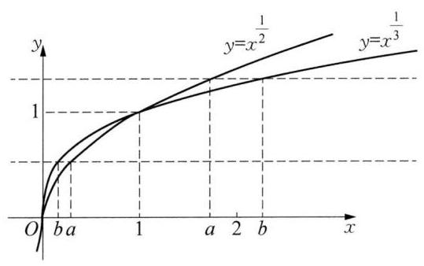

(第 6 题图)

6 ①③⑤ 提示:首先画出 $y = {x}^{\frac{1}{2}}$ 与 $y = {x}^{\frac{1}{3}}$ 的图像(如图所示),设 ${a}^{\frac{1}{2}} = {b}^{\frac{1}{3}} = m$ ,作直线 $y = m$ ,若 $m = 0$ 或 1,则 $a = b$ ; 若 $0 < m < 1$ ,则 $0 < b < a < 1$ ; 如果 $m > 1$ ,则 $1 < a < b$ 。从图像看一目了然, 故可能成立的是①③⑤。

7 D 8 A

9 A 提示: 令 $f\left( x\right)  = \frac{{x}^{3} + x}{2}$ ,则方程 ${\left( \frac{{x}^{3} + x}{2}\right) }^{3} + \; \frac{{x}^{3} + x}{2} = {2x}$ 化为 ${f}^{3}\left( x\right)  + f\left( x\right)  = {2x}$ ,即 $\frac{{f}^{3}\left( x\right)  + f\left( x\right) }{2} = x$ ,

故原方程等价于 $f\left( {f\left( x\right) }\right)  = x$ ,利用幂函数的单调性知,函数 $f\left( x\right)$ 是 $\mathbf{R}$ 上的严格增函数,任取方程的实数根 ${x}_{0}$ ,若 $f\left( {x}_{0}\right)  > {x}_{0}$ ,则必有 ${x}_{0} = f\left( {f\left( {x}_{0}\right) }\right)  > f\left( {x}_{0}\right)  > {x}_{0}$ ,与题意矛盾; 若 $f\left( {x}_{0}\right)  < {x}_{0}$ ,则必有 ${x}_{0} = \; f\left( {f\left( {x}_{0}\right) }\right)  < f\left( {x}_{0}\right)  < {x}_{0}$ ,与题意矛盾,所以 $f\left( {x}_{0}\right)  = {x}_{0}$ ,即 $\frac{{x}_{0}^{3} + {x}_{0}}{2} = {x}_{0}$ ,即 ${x}_{0}^{3} = {x}_{0}$ ,可知原方程的所有根为 $0\text{ 、 }1\text{ 、 } - 1$ ,其平方和为 2,故选 A。

10 (1)因为幂函数 $y = {x}^{\frac{3}{5}}$ 在 $\left( {0, + \infty }\right)$ 上是严格增函数，且 ${1.5} < {1.7}$ ，所以 ${1.5}^{\frac{3}{5}} < {1.7}^{\frac{3}{5}}$ 。(2)因为 $y = \; {x}^{-\frac{2}{3}}$ 在 $\left( {-\infty ,0}\right)$ 上是严格增函数,且 $- {1.2} >  - {1.25}$ ,所以 ${\left( -{1.2}\right) }^{-\frac{2}{3}} > {\left( -{1.25}\right) }^{-\frac{2}{3}}$ 。

11 因为函数 $f\left( x\right)$ 在 $\left( {0, + \infty }\right)$ 上严格减，所以 $m - 3 < 0$ ，解得 $m < 3$ 。又 $m$ 为正整数，所以 $m = 1$ 、 2。又函数 $f\left( x\right)$ 的图像关于 $y$ 轴对称,所以 $m - 3$ 为偶数,所以 $m = 1$ ,由 ${\left( a + 1\right) }^{-1} < {\left( 3 - 2a\right) }^{-1}$ ,得 $a + 1 > 3 - \; {2a} > 0$ 或 $0 > a + 1 > 3 - {2a}$ 或 $a + 1 < 0 < 3 - {2a}$ ,解得 $a <  - 1$ 或 $\frac{2}{3} < a < \frac{3}{2}$ ,所以实数 $a$ 的取值范围是 $\left( {-\infty , - 1}\right)  \cup  \left( {\frac{2}{3},\frac{3}{2}}\right)$ 。

12 (1)因为 $f\left( x\right)  = \left( {{m}^{2} + m - {11}}\right) {x}^{m + 7}$ 是幂函数，所以 ${m}^{2} + m - {11} = 1$ ，即 $\left( {m + 4}\right) \left( {m - 3}\right)  = 0$ ，解得 $m =$ -4 或 $m = 3$ ，又因为 $f\left( x\right)$ 在 $\left( {-\infty ,0}\right)$ 上严格增，所以 $m =  - 4$ 。(2)由(1)知， $m =  - 4$ ，所以 $f\left( x\right)$ 的解析式为 $f\left( x\right)  = {x}^{3}$ ,由幂函数的性质知, $f\left( x\right)  = {x}^{3}$ 在 $\mathbf{R}$ 上严格增,且 $f\left( {2 - a}\right)  > f\left( {a - 1}\right)$ ,所以 $2 - a > a -$ 1,解得 $a < \frac{3}{2}$ ,所以实数 $a$ 的范围为 $\left( {-\infty ,\frac{3}{2}}\right)$ 。

13 (1)因为 $f\left( x\right)  = \left( {4{t}^{2} + {3t}}\right) {x}^{-t}$ 为幂函数，且在区间 $\left( {0, + \infty }\right)$ 上严格减，所以 $\left\{  \begin{array}{l} 4{t}^{2} + {3t} = 1, \\   - t < 0, \end{array}\right.$ 即 $\left\{  \begin{array}{l} \left( {{4t} - 1}\right) \left( {t + 1}\right)  = 0, \\  t > 0, \end{array}\right.$ 解得 $t = \frac{1}{4}$ 或 $t =  - 1$ (舍去)。所以幂函数的解析式为 $f\left( x\right)  = {x}^{-\frac{1}{4}}$ 。因为 ${x}^{-\frac{1}{4}} = \frac{1}{\sqrt[4]{x}}$ ,所以 $x \geq  0$ 且 $x \neq  0$ ,所以,函数 $f\left( x\right)$ 的定义域为 $\left( {0, + \infty }\right)$ 。(2)由(1)知 $f(x$ 在区间 $\left( {0, + \infty }\right)$ 上严格减，所以当 ${x}_{1} \in  \lbrack 1,{16})$ ， $f\left( {x}_{1}\right)  \in  \left( {{16}^{-\frac{1}{4}},{1}^{-\frac{1}{4}}}\right\rbrack$ ，即 $f\left( {x}_{1}\right)  \in  \left( {\frac{1}{2},1}\right\rbrack$ ，令 $A = \; \left( {\frac{1}{2},1}\right\rbrack$ 。 $g\left( x\right)  = {2}^{x} - k$ ,由指数函数性质知, $g\left( x\right)$ 是严格增函数,所以,当 ${x}_{2} \in  \left( {1,5}\right) , g\left( {x}_{2}\right)  \in  \left( {{2}^{1} - k}\right.$ , $\left. {{2}^{5} - k}\right)$ ,即 $g\left( {x}_{2}\right)  \in  \left( {2 - k,{32} - k}\right)$ ,令 $B = \left( {2 - k,{32} - k}\right)$ 。因为对任意的 ${x}_{1} \in  \lbrack 1,{16})$ 时,总存在 ${x}_{2} \in$

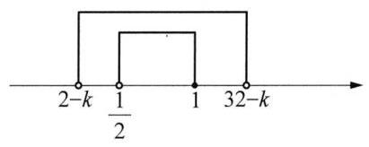

(第 13 题图)

$\left( {1,5}\right)$ 使得 $f\left( {x}_{1}\right)  = g\left( {x}_{2}\right)$ ,则 $A \subseteq  B$ 。结合数轴可知 $\left\{  \begin{array}{l} 2 - k \leq  \frac{1}{2}, \\  {32} - k > 1, \end{array}\right.$ 解得 $\left\{  \begin{array}{l} k \geq  \frac{3}{2}, \\  k < {31}, \end{array}\right.$ 即 $k$ 的取值范围为 $\left\lbrack  {\frac{3}{2},{31}}\right)$ 。

### 4.4 指数函数的图像与性质(1)

$1 < 2\;{2}^{-1} < {2}^{-\frac{1}{2}} < {\left( \frac{1}{2}\right) }^{-\frac{1}{2}}\;3\;\left\lbrack  {\frac{3}{2}, + \infty }\right) \;4\;\left\lbrack  {-1,3}\right\rbrack$

$5\left\lbrack  {\frac{1}{6}, + \infty }\right)$ 提示: 由 $f\left( {-{x}_{0}}\right)  =  - f\left( {x}_{0}\right)$ ,得 ${4}^{-{x}_{0}} - {3a} \cdot  {2}^{-{x}_{0} + 1} =  - \left( {{4}^{{x}_{0}} - {3a} \cdot  {2}^{{x}_{0} + 1}}\right)$ ,即 ${3a} = \; \frac{{4}^{-{x}_{0}} + {4}^{{x}_{0}}}{{2}^{-{x}_{0} + 1}} = \frac{{\left( {2}^{-{x}_{0}} + {2}^{{x}_{0}}\right) }^{2} - 2}{2\left( {{2}^{-{x}_{0}} + {2}^{{x}_{0}}}\right) } = \frac{{2}^{-{x}_{0}} + {2}^{{x}_{0}}}{2} - \frac{1}{{2}^{-{x}_{0}} + {2}^{{x}_{0}}}$ ,设 $t = {2}^{-{x}_{0}} + {2}^{{x}_{0}}$ ,则原命题等价于存在 $t$ ,使得 ${3a} = \frac{t}{2} - \frac{1}{t}, t \geq  2$ 。因为 $y = \frac{t}{2}, y =  - \frac{1}{t}$ 均严格增,所以, ${3a} = \frac{t}{2} - \frac{1}{t}$ 在 $\lbrack 2, + \infty )$ 上严格增,即当 $t =$ 2 时, ${3a} = \frac{t}{2} - \frac{1}{t}$ 取得最小值 $\frac{1}{2}$ ,即 ${3a} \geq  \frac{1}{2}$ ,解得 $a \geq  \frac{1}{6}$ 。

$6\frac{2\sqrt{3} + \sqrt{6}}{2}$ 提示: 设 $A\left( {{\log }_{2}a - 1, a}\right) , B = \left( {{\log }_{2}a, a}\right)$ ,则 $\left| {AB}\right|  = {\log }_{2}a - \left( {{\log }_{2}a - 1}\right)  = 1$ 。设 $C(x$ , $\left. {2}^{x}\right)$ ,由于三角形 ${ABC}$ 是等边三角形,所以点 $C$ 到直线 ${AB}$ 的距离为 $\frac{\sqrt{3}}{2}$ ,所以 $a - {2}^{x} = \frac{\sqrt{3}}{2}$ ,解得 $x = \; {\log }_{2}\left( {a - \frac{\sqrt{3}}{2}}\right)$ ,另根据中点坐标公式有 ${\log }_{2}\left( {a - \frac{\sqrt{3}}{2}}\right)  = \frac{{\log }_{2}a - 1 + {\log }_{2}a}{2} = {\log }_{2}a - \frac{1}{2} = {\log }_{2}\frac{a}{{2}^{\frac{1}{2}}}$ ,所以 $a - \; \frac{\sqrt{3}}{2} = \frac{a}{\sqrt{2}}$ ,解得 $a = \frac{2\sqrt{3} + \sqrt{6}}{2}$ 。

7 D 8 D 9 D

10 (1)因为 $f\left( x\right)  = {a}^{x} + 1\left( {a > 1}\right)$ 在区间 $\left\lbrack  {0,2}\right\rbrack$ 上严格增，所以函数 $f\left( x\right)  = {a}^{x} + 1\left( {a > 1}\right)$ 在区间 $\left\lbrack  {0,2}\right\rbrack$ 上的最大值与最小值之和为 $f\left( 2\right)  + f\left( 0\right)  = 7$ ,所以 ${a}^{2} + 1 + {a}^{0} + 1 = 7$ ,解得 $a =  \pm  2$ ,又因为 $a > 1$ ,所以 $a =$

2。(2)由(1)知， $F\left( x\right)  = f\left( x\right)  - f\left( {-x}\right)  = {2}^{x} - {2}^{-x}$ ，任取 ${x}_{1},{x}_{2} \in  \mathbf{R}$ ，且 ${x}_{1} < {x}_{2}$ ，则 $F\left( {x}_{1}\right)  - F\left( {x}_{2}\right)  = \; \left( {{2}^{{x}_{1}} - {2}^{-{x}_{1}}}\right)  - \left( {{2}^{{x}_{2}} - {2}^{-{x}_{2}}}\right)  = {2}^{{x}_{1}} - {2}^{{x}_{2}} + \frac{1}{{2}^{{x}_{2}}} - \frac{1}{{2}^{{x}_{1}}} = {2}^{{x}_{1}} - {2}^{{x}_{2}} + \frac{{2}^{{x}_{1}} - {2}^{{x}_{2}}}{{2}^{{x}_{2}} \cdot  {2}^{{x}_{1}}} = \left( {{2}^{{x}_{1}} - {2}^{{x}_{2}}}\right) \left( {1 + \frac{1}{{2}^{{x}_{2} + {x}_{1}}}}\right)$ 。因为 ${x}_{1} < {x}_{2}$ ,所以 ${2}^{{x}_{1}} - {2}^{{x}_{2}} < 0,1 + \frac{1}{{2}^{{x}_{2} + {x}_{1}}} > 0$ ,所以 $F\left( {x}_{1}\right)  - F\left( {x}_{2}\right)  < 0$ ,即 $F\left( {x}_{1}\right)  < F\left( {x}_{2}\right)$ ,所以 $F\left( x\right)  = \; f\left( x\right)  - f\left( {-x}\right)$ 是 $\mathbf{R}$ 上的严格增函数。

11 (1)由题意，得 $0 < a < 1$ ，所以由 ${\log }_{a}\left( {{3x} + 2}\right)  < {\log }_{a}\left( {8 - {5x}}\right)$ ，得 $\left\{  \begin{array}{l} {3x} + 2 > 0, \\  8 - {5x} > 0, \\  {3x} + 2 > 8 - {5x}, \end{array}\right.$ 解得 $\frac{3}{4} < x < \; \frac{8}{5}$ 。(2)当 $0 < a < \frac{7}{8}$ 时， $f\left( x\right)  = {\log }_{\left( a + \frac{1}{8}\right) }\left( {{2x} + 1}\right)$ 是区间 $\left\lbrack  {1,3}\right\rbrack$ 上的严格减函数，故当 $x = 3$ 时，函数有最小值，即 $f\left( 3\right)  = {\log }_{\left( a + \frac{1}{8}\right) }\left( {2 \times  3 + 1}\right)  =  - 1$ ，即 $a + \frac{1}{8} = \frac{1}{7}$ ，解得 $a = \frac{1}{56}$ ；当 $\frac{7}{8} < a < 1$ 时， $f\left( x\right)  = \; {\log }_{\left( a + \frac{1}{8}\right) }\left( {{2x} + 1}\right)$ 是区间 $\left\lbrack  {1,3}\right\rbrack$ 上的严格增函数，故当 $x = 1$ 时，函数有最小值，即 $f\left( 1\right)  = {\log }_{\left( a + \frac{1}{8}\right) }(2 \times  1 + \; 1) =  - 1$ ,即 $a + \frac{1}{8} = \frac{1}{3}$ ,解得 $a = \frac{5}{24} < \frac{7}{8}$ ,故舍去,所以 $a = \frac{1}{56}$ 。

12 (1)由 ${2}^{{3x} - 7} \geq  {\left( \frac{1}{2}\right) }^{{2x} - 8} = {2}^{{8 - 2}x}$ ，得 ${3x} - 7 \geq  8 - {2x}$ ，解得 $x \geq  3$ ，所以 $B = \{ x \mid  x \geq  3\}$ 。所以 $A \cup  B = \; \{ x \mid  2 \leq  x < 4\}  \cup  \{ x \mid  x \geq  3\}  = \{ x \mid  x \geq  2\}$ ,又 $\bar{A} = \{ x \mid  x < 2$ 或 $x \geq  4\}$ ,所以, $\bar{A} \cap  B = \{ x \mid  x < 2$ 或 $x \geq  4\}  \cap  \{ x \mid  x \geq  3\}  = \{ x \mid  x \geq  4\}$ 。(2)由题意得 $C = \left\{  {x\left| {\;x >  - \frac{a}{2}}\right. }\right\}$ ，因为 $B \cup  C = C$ ，所以 $B \subseteq \; C$ ,而 $B = \{ x \mid  x \geq  3\}$ ,所以 $- \frac{a}{2} < 3$ ,解得 $a >  - 6$ ,所以实数 $a$ 的取值范围为 $\left( {-6, + \infty }\right)$ 。

13 (1)因为 $f\left( x\right)  \leq  0$ 的解集为 $\left\lbrack  {-1,2}\right\rbrack$ ，所以 ${x}^{2} + {bx} + c = 0$ 的根为 -1、2，所以 $- b = 1$ ， $c =  - 2$ ，即 $b = \; - 1, c =  - 2$ ,所以 $f\left( x\right)  = {x}^{2} - x - 2$ 。(2) ${mf}\left( x\right)  > 2\left( {x - m - 1}\right)$ ，化简有 $m\left( {{x}^{2} - x - 2}\right)  > 2(x - \; m - 1)$ ,整理得 $\left( {{mx} - 2}\right) \left( {x - 1}\right)  > 0$ ,所以当 $m = 0$ 时,不等式的解集为 $\left( {-\infty ,1}\right)$ ,当 $0 < m < 2$ 时,不等式的解集为 $\left( {-\infty ,1}\right)  \cup  \left( {\frac{2}{m}, + \infty }\right)$ ,当 $m = 2$ 时,不等式的解集为 $\left( {-\infty ,1}\right)  \cup  \left( {1, + \infty }\right)$ ,当 $m > 2$ 时,不等式的解集为 $\left( {-\infty ,\frac{2}{m}}\right)  \cup  \left( {1, + \infty }\right)$ 。 二次函数的图像性质,有 $f\left( x\right)  + {3x} - 1 = {x}^{2} + {2x} - 3 \in  \left\lbrack  {-4,0}\right\rbrack$ ,则有 $g\left( x\right)  = {2}^{f\left( x\right)  + {3x} - 1} = {2}^{{x}^{2} + {2x} - 3}$ ,所以, $g\left( x\right)  \in  \left\lbrack  {\frac{1}{16},1}\right\rbrack$ 。因为对于任意的 ${x}_{1}\text{ 、 }{x}_{2} \in  \left\lbrack  {-2,1}\right\rbrack$ 都有 $\left| {g\left( {x}_{1}\right)  - g\left( {x}_{2}\right) }\right|  \leq  M$ ,即求 $\mid  g\left( {x}_{1}\right)  - \; {\left. g\left( {x}_{2}\right) \right| }_{\max } \leq  M$ ,转化为 $\left| {g{\left( x\right) }_{\max } - g{\left( x\right) }_{\min }}\right|  \leq  M$ ,而 $g{\left( x\right) }_{\max } = g\left( 1\right)  = 1, g{\left( x\right) }_{\min } = g\left( {-1}\right)  = \frac{1}{16}$ ,所以, 此时可得 $M \geq  \frac{15}{16}$ ,所以 $M$ 的最小值为 $\frac{15}{16}$ 。

### 4.4 指数函数的图像与性质(2)

$1\;\left( {2,2}\right) \;2\;\left( {-\infty ,0}\right) \;3\;\left( {-\infty ,2\rbrack \;4\;(2}\right) \text{ ③ }\text{ ④ }$

${5a} > \frac{5}{2}$ 提示: 利用特值法,猜想 $f\left( x\right)  = {\left( \frac{1}{2}\right) }^{x}$ ,代入不等式分离参数得:存在 $x \in  \mathbf{R}$ 使 $a > \frac{{x}^{2} + 5}{\sqrt{{x}^{2} + 4}} = \; \sqrt{{x}^{2} + 4} + \frac{1}{\sqrt{{x}^{2} + 4}}$ 成立,令 $t = \sqrt{{x}^{2} + 4} \in  \lbrack 2, + \infty )$ ,则 $y = t + \frac{1}{t}\left( {t \geq  2}\right)$ 在 $\lbrack 2, + \infty )$ 上严格增,所以 ${y}_{\min } = 2 + \frac{1}{2} = \frac{5}{2}$ ,所以 $a > \frac{5}{2}$ 。

6 $\left\lbrack  {\frac{1}{2},1}\right)  \cup  \lbrack 3, + \infty )$ 提示:由解析式知，在 $\left( {-\infty ,1}\right)$ 上 $f\left( x\right)  \in  \left( {-a,3 - a}\right)$ 且严格增；在 $\lbrack 1, + \infty )$ 上, $f\left( x\right)$ 的对称轴为 $x = \frac{3a}{2}$ 且开口向上,所以,当 $- a \geq  0$ ,即 $a \leq  0$ 时 $x = \frac{3a}{2} \leq  0 < 1$ ,则 $f\left( x\right)$ 在 $\lbrack 1, + \infty )$ 上严格增, $f\left( 1\right)  = 2\left( {1 - a}\right) \left( {1 - {2a}}\right)  > 0$ ,此时 $f\left( x\right)$ 无零点; 当 $0 < a < 3$ 时,在 $\left( {-\infty ,1}\right)$ 上 $f\left( x\right)$ 存在一个零点,要使 $f\left( x\right)$ 恰有 2 个零点,则在 $\lbrack 1, + \infty )$ 上也只有一个零点,而 $x = \frac{3a}{2} \in  \left( {0,\frac{9}{2}}\right)$ 且 $f\left( \frac{3a}{2}\right)  = \; - \frac{{a}^{2}}{2} < 0$ ,所以,当 $\frac{3a}{2} \leq  1$ ,即 $0 < a \leq  \frac{2}{3}$ ,只需 $f\left( 1\right)  = 2\left( {1 - a}\right) \left( {1 - {2a}}\right)  \leq  0$ ,可得 $\frac{1}{2} \leq  a \leq  \frac{2}{3}$ ; 当 $\frac{3a}{2} >$

1,即 $a > \frac{2}{3}$ ,只需 $f\left( 1\right)  = 2\left( {1 - a}\right) \left( {1 - {2a}}\right)  < 0$ ,可得 $\frac{2}{3} < a < 1$ ; 所以此时,当 $\frac{1}{2} \leq  a < 1$ 时 $f\left( x\right)$ 恰有 2 个零点; 当 $a \geq  3$ 时, $f\left( x\right)$ 在 $\left( {-\infty ,1}\right)$ 上无零点,要使 $f\left( x\right)$ 恰有 2 个零点,则在 $\lbrack 1, + \infty )$ 上有两个零点即可,而 $x = \frac{3a}{2} \in  \left\lbrack  {\frac{9}{2}, + \infty }\right)$ 且 $f\left( \frac{3a}{2}\right)  =  - \frac{{a}^{2}}{2} < 0, f\left( 1\right)  = 2\left( {1 - a}\right) \left( {1 - {2a}}\right)  > 0$ ,所以, $f\left( x\right)$ 在 $\lbrack 1, + \infty )$ 上恒有两个零点。综上,实数 $a$ 的取值范围为 $\left\lbrack  {\frac{1}{2},1}\right)  \cup  \lbrack 3, + \infty )$ 。

$7\begin{array}{lllll} A & 8 & D & 9 & A \end{array}$

10(1)函数 $y = {2}^{3 - x}$ 的定义域为 $\mathbf{R}$ 。(2)函数 $y = {3}^{{2x} + 1}$ 的定义域为 $\mathbf{R}$ 。(3)函数 $y = {\left( \frac{1}{2}\right) }^{5x}$ 的定义域为 $\mathbf{R}$ 。(4)要使函数 $y = {0.7}^{\frac{1}{x}}$ 有意义，则 $x \neq  0$ ，则函数 $y = {0.7}^{\frac{1}{x}}$ 的定义域为 $\{ x \mid  x \neq  0\}$ 。

11 因为该产品的市场需求每年下降 ${10}\%$ ，所以今年的市场需求是去年的 1-10%，所以 $x$ 年后，年销售量 $y = {10000}{\left( 1 - {10}\% \right) }^{x}$ ( $x$ 为正整数)。

12 令 $y = {\left( \frac{1}{3}\right) }^{U}, U = {x}^{2} + {2x} + 5$ ，则 $y$ 是关于 $U$ 的严格减函数，而 $U$ 是 $\left( {-\infty , - 1}\right)$ 上的严格减函数， $\left( {-1, + \infty }\right)$ 上的严格增函数,所以, $y = {\left( \frac{1}{3}\right) }^{{x}^{2} + {2x} + 5}$ 在 $\left( {-\infty , - 1}\right)$ 上是严格增函数,在 $\left( {-1, + \infty }\right)$ 上是严格减函数,又因为 $U = {x}^{2} + {2x} + 5 = {\left( x + 1\right) }^{2} + 4 \geq  4$ ,所以, $y = {\left( \frac{1}{3}\right) }^{{x}^{2} + {2x} + 5}$ 的值域为 $\left( {0,{\left( \frac{1}{3}\right) }^{4}}\right\rbrack   = \left( {0,\frac{1}{81}}\right\rbrack$ 。

13 (1)由题意，定义在 $\mathbf{R}$ 上的函数 $f\left( x\right)  = \frac{-{2}^{x} + b}{{2}^{x + 1} + a}$ 是奇函数，可得 $f\left( 0\right)  = \frac{-{2}^{0} + b}{2 + a} = 0$ ，解得 $b = 1$ ，即 $f\left( x\right)  = \frac{-{2}^{x} + 1}{{2}^{x + 1} + a}$ ,又由 $f\left( {-1}\right)  =  - f\left( 1\right)$ ,可得 $\frac{-{2}^{-1} + 1}{{2}^{0} + a} =  - \frac{-2 + 1}{{2}^{2} + a}$ ,解得 $a = 2$ ,所以 $f\left( x\right)  = \frac{-{2}^{x} + 1}{{2}^{x + 1} + 2}$ , 又由 $f\left( {-x}\right)  = \frac{-{2}^{-x} + 1}{{2}^{-x + 1} + 2} = \frac{\frac{{2}^{x} - 1}{{2}^{x}}}{\frac{{2}^{x + 1} + 2}{{2}^{x}}} = \frac{{2}^{x} - 1}{{2}^{x + 1} + 2} =  - f\left( x\right)$ ,所以 $a = 2, b = 1$ 。(2)由 $f\left( x\right)  = \frac{-{2}^{x} + 1}{{2}^{x + 1} + 2} = \; \frac{1 - {2}^{x}}{2\left( {{2}^{x} + 1}\right) } = \frac{-\left( {{2}^{x} + 1}\right)  + 2}{2\left( {{2}^{x} + 1}\right) } =  - \frac{1}{2} + \frac{1}{{2}^{x} + 1}$ ,设 ${x}_{1} < {x}_{2}$ ,则 $f\left( {x}_{1}\right)  - f\left( {x}_{2}\right)  = \frac{1}{{2}^{{x}_{1}} + 1} - \frac{1}{{2}^{{x}_{2}} + 1} = \; \frac{{2}^{{x}_{2}} - {2}^{{x}_{1}}}{\left( {{2}^{{x}_{1}} + 1}\right) \left( {{2}^{{x}_{2}} + 1}\right) }$ ,因为函数 $y = {2}^{x}$ 在 $\mathbf{R}$ 上是严格增函数且 ${x}_{1} < {x}_{2}$ ,所以 $f\left( {x}_{1}\right)  - f\left( {x}_{2}\right)  = \; \frac{{2}^{{x}_{2}} - {2}^{{x}_{1}}}{\left( {{2}^{{x}_{1}} + 1}\right) \left( {{2}^{{x}_{2}} + 1}\right) } > 0$ ,即 $f\left( {x}_{1}\right)  > f\left( {x}_{2}\right)$ ,所以 $f\left( x\right)$ 在 $\mathbf{R}$ 上为严格减函数。(3)由函数 $f\left( x\right)$ 在 $\mathbf{R}$ 上为严格减函数,且函数 $f\left( x\right)$ 为奇函数,因为 $f\left( k\right)  + f\left( {{\cos }^{2}\theta  - 2\sin \theta }\right)  \leq  0$ ,即 $f\left( k\right)  \leq   - f\left( {{\cos }^{2}\theta  - 2\sin \theta }\right)  = \; f\left( {-{\cos }^{2}\theta  + 2\sin \theta }\right)$ ,可得 $k \geq   - {\cos }^{2}\theta  + 2\sin \theta  = {\sin }^{2}\theta  + 2\sin \theta  - 1 = {\left( \sin \theta  + 1\right) }^{2} - 2,\theta  \in  \left( {-\frac{\pi }{2},\frac{\pi }{2}}\right)$ 。又由对任意的 $\theta  \in  \left( {-\frac{\pi }{2},\frac{\pi }{2}}\right)$ ,不等式 $f\left( k\right)  + f\left( {{\cos }^{2}\theta  - 2\sin \theta }\right)  \leq  0$ 有解,即 $k \geq  {\left( \sin \theta  + 1\right) }^{2} - 2$ 在 $\theta  \in \; \left( {-\frac{\pi }{2},\frac{\pi }{2}}\right)$ 有解。因为 $\theta  \in  \left( {-\frac{\pi }{2},\frac{\pi }{2}}\right)$ ,则 $\sin \theta  \in  \left( {-1,1}\right)$ ,所以 ${\left( \sin \theta  + 1\right) }^{2} - 2 \in  \left( {-2,2}\right)$ ,所以 $k >  - 2$ , 即实数 $k$ 的取值范围是 $\left( {-2, + \infty }\right)$ 。

### 4.5 反函数

$\begin{array}{ll} 1 & 1 \end{array}$

$2\;1 - \sqrt{x - 1}\left( {x > 1}\right) \;$ 提示: 令 $y = {x}^{2} - {2x} + 2$ ,因 $x \in  \left( {-\infty ,1}\right)$ ,所以 $y = {x}^{2} - {2x} + 2$ 在 $\left( {-\infty ,1}\right)$ 上严格减，且 $y = {x}^{2} - {2x} + 2 > 1 - 2 + 2 = 1$ ; 由 $y = {x}^{2} - {2x} + 2$ 得 ${x}^{2} - {2x} + 2 - y = 0$ ，解得 $x = \; \frac{2 \pm  \sqrt{4 - 4\left( {2 - y}\right) }}{2} = 1 \pm  \sqrt{y - 1}$ ,因为 $x < 1$ ,所以 $x = 1 - \sqrt{y - 1}$ ,因此 ${f}^{-1}\left( x\right)  = 1 - \sqrt{x - 1}, x > 1$ 。

$\begin{array}{llllll} 3 & \frac{1}{3} & 4 &  - 2 & 5 & 0 \end{array}$

6 ①④ 提示:①当 $x = 4$ 时，总有 ${\log }_{a}\left( {x - 3}\right)  + 2 = 2$ ，函数 $f\left( x\right)  = {\log }_{a}\left( {x - 3}\right)  + 2$ 的图像恒过定点(4, 2),故 ① 正确; ② 已知集合 $P = \{ a, b\} , Q = \{ 0,1\}$ ,则映射 $f : P \rightarrow  Q$ 中满足 $f\left( b\right)  = 0$ 的映射共有 2 个,故 ② 错误; ③ 若函数 $f\left( x\right)  = {\log }_{2}\left( {{x}^{2} - {2ax} + 1}\right)$ 的值域为 $\mathbf{R}$ ，则 $\Delta  = 4{a}^{2} - 4 \geq  0$ ，故实数 $a$ 的取值范围是 $\left( {-\infty , - 1\rbrack \cup \lbrack 1, + \infty }\right)$ ,故 ③ 错误; ④ 因为函数 $f\left( x\right)  = {\mathrm{e}}^{x}$ 与 $y = \ln x$ 互为反函数,所以 $f\left( x\right)  = {\mathrm{e}}^{x}$ 的图像关于直线 $y = x$ 对称的函数解析式为 $y = \ln x$ ，故④正确，故答案为①④。

$7\mathrm{\;B}\;8\mathrm{C}\;9\mathrm{C}$

${10y} = f\left( x\right)$ 的反函数一定过点 $\left( {2,1}\right)$ 。理由: 因为点 $\left( {1,2}\right)$ 在 $y = f\left( x\right)$ 的图像上,所以 $2 = f\left( 1\right)$ ,即 ${f}^{-1}\left( 2\right)  = 1$ ,所以反函数 ${f}^{-1}\left( x\right)$ 必过点 $\left( {2,1}\right)$ 。

11 (1)求 $y = \ln x$ 的反函数有 $x = \ln y$ ，即 $y = {\mathrm{e}}^{x}$ 。故 $y = \ln x, y = {\mathrm{e}}^{x}$ 且互为反函数。 $y = \ln x$ 的定义域为 $\left( {0, + \infty }\right)$ ,值域为 $\mathbf{R}$ 。 $y = {\mathrm{e}}^{x}$ 的定义域为 $\mathbf{R}$ ,值域为 $\left( {0, + \infty }\right) \text{ 。 }\;\left( 2\right)$ 求 $y =  - {\log }_{a}x$ 的反函数有 $x = \; - {\log }_{a}y$ ,即 $y = {a}^{-x} = {\left( \frac{1}{a}\right) }^{x}$ 。故 $y =  - {\log }_{a}x, y = {\left( \frac{1}{a}\right) }^{x}$ 互为反函数。 $y =  - {\log }_{a}x$ 的定义域为 $\left( {0, + \infty }\right)$ , 值域为 $\mathbf{R}$ 。 $y = {\left( \frac{1}{a}\right) }^{x}$ 的定义域为 $\mathbf{R}$ ,值域为 $\left( {0, + \infty }\right)$ 。

12 (1)由 $x - 1 > 0$ 得 $x > 1$ ，而 $y \in  \mathbf{R}$ ，由 $y = \ln \left( {x - 1}\right)$ ，解得 $x = {\mathrm{e}}^{y} + 1$ ，所以 ${f}^{-1}\left( x\right)  = {\mathrm{e}}^{x} + 1$ 。

(2)当 $x < 0$ 时， $y = {2}^{x - 3} < {2}^{-3} = \frac{1}{8}$ ，所以 $0 < y < \frac{1}{8}$ 。由 $y = {2}^{x - 3}$ ，解得 $x = {\log }_{2}y + 3$ ，所以 ${f}^{-1}\left( x\right)  = {\log }_{2}x + \; 3\left( {0 < x < \frac{1}{8}}\right)$ 。(3)当 $x < 0$ 时， $y = \frac{1}{x} < 0$ ，由 $y = \frac{1}{x}$ ，解得 $x = \frac{1}{y}$ ；当 $x \geq  0$ 时， $y = {x}^{2} \geq  0$ ，由 $y = \; {x}^{2}$ ,解得 $x = \sqrt{y}$ ,所以 ${f}^{-1}\left( x\right)  = \left\{  \begin{array}{ll} \frac{1}{x}, & x < 0, \\  \sqrt{x}, & x \geq  0\text{ 。 } \end{array}\right.$ (4) 而 $\frac{{2}^{x} - 1}{{2}^{x} + 1} = 1 - \frac{2}{{2}^{x} + 1}$ ,因为 $0 < \frac{2}{{2}^{x} + 1} < 2$ ,所以 $- 1 < 1 - \frac{2}{{2}^{x} + 1} < 1$ ,即 $- 1 < \frac{{2}^{x} - 1}{{2}^{x} + 1} < 1$ 。由 $y = \frac{{2}^{x} - 1}{{2}^{x} + 1}$ ,解得 $x = {\log }_{2}\frac{1 + y}{1 - y}$ ,所以 ${f}^{-1}\left( x\right)  = \; {\log }_{2}\frac{1 + x}{1 - x}\left( {-1 < x < 1}\right)$  。

13 (1)当 $a = 2$ 时， $f\left( x\right)  = {4}^{x} - 2 \cdot  {2}^{x} + 1$ ，所以 $y = {2}^{2x} - 2 \cdot  {2}^{x} + 1 = {\left( {2}^{x} - 1\right) }^{2}$ ，所以 $\sqrt{y} =  \mid  {2}^{x} - 1 \mid$ ，所以 $\sqrt{y} = {2}^{x} - 1$ 或 $\sqrt{y} = 1 - {2}^{x}$ ,此时是两个 $x$ 对着同一个 $y$ ,因此 $f\left( x\right)$ 不是单调函数，因此， $f\left( x\right)$ 没有反函数。(2)令 ${2}^{x} = t$ ，则原函数可化为 $h\left( t\right)  = {t}^{2} - a \cdot  t + 1$ ，因为 $x \in  \left\lbrack  {1,2}\right\rbrack$ ，所以 ${2}^{x} \in  \left\lbrack  {2,4}\right\rbrack$ ，即 $t \in  \lbrack 2,$ 4]。因为二次函数 $h\left( t\right)  = {t}^{2} - a \cdot  t + 1$ 的对称轴为 $t = \frac{a}{2}$ 。① 当 $\frac{a}{2} \leq  2$ ，即 $a \leq  4$ 时， $h\left( t\right)$ 有最小值 $h\left( 2\right)  =$

$5 - {2a}$ ; ② 当 $2 < \frac{a}{2} < 4$ ,即 $4 < a < 8$ 时, $h\left( t\right)$ 有最小值 $h\left( \frac{a}{2}\right)  =  - \frac{{a}^{2}}{4} + 1$ ; ③ 当 $\frac{a}{2} \geq  4$ ,即 $a \geq  8$ 时, $h\left( t\right)$ 有最小值 $h\left( 4\right)  = {17} - {4a}$ 。综上, $f\left( x\right)$ 的最小值 $g\left( a\right)$ 的解析式为 $g\left( a\right)  = \left\{  \begin{array}{ll} 5 - {2a}, & a \leq  4, \\  1 - \frac{{a}^{2}}{4}, & 4 < a < 8, \\  {17} - {4a}, & a \geq  8\text{ 。 } \end{array}\right.$

### 4.6 对数函数图像与性质(1)

$1\;\left\lbrack  {1,\frac{5}{3})\;2\;\lbrack 1,3)\;3\;\left( {\frac{1}{2},1}\right\rbrack  }\right\rbrack$

4 $\left( {\frac{1}{16},\frac{1}{8}}\right\rbrack   \cup  \left( {1, + \infty }\right)$ 提示:令 $g\left( x\right)  = a{x}^{2} - x + 3\left( {a > 0, a \neq  1}\right)$ ，对称轴为 $x = \frac{1}{2a}$ 。当 $a > 1$ 时， $g\left( x\right)$ 在 $\left\lbrack  {2,4}\right\rbrack$ 上严格增,则 $\left\{  \begin{array}{l} g\left( 2\right)  > 0, \\  \frac{1}{2a} \leq  2, \\  a > 1, \end{array}\right.$ 即 $\left\{  \begin{array}{l} {4a} - 2 + 3 > 0, \\  \frac{1}{2a} \leq  2, \\  a > 1, \end{array}\right.$ 解得 $a > 1$ ; 当 $0 < a < 1$ 时, $g\left( x\right)$ 在 $\left\lbrack  {2,4}\right\rbrack$ 上严格减,则 $\left\{  \begin{array}{l} 0 < a < 1, \\  g\left( 4\right)  > 0, \\  \frac{1}{2a} \geq  4, \end{array}\right.$ 即 $\left\{  \begin{array}{l} 0 < a < 1, \\  {16a} - 4 + 3 > 0, \\  \frac{1}{2a} \geq  4, \end{array}\right.$ 解得 $\frac{1}{16} < a \leq  \frac{1}{8}$ 。综上所述, $a > 1$ 或 $\frac{1}{16} < a \leq  \frac{1}{8}$ ,即 $a \in  \left( {\frac{1}{16},\frac{1}{8}}\right\rbrack   \cup  \left( {1, + \infty }\right)$ 。

$5\frac{9}{8}$ 提示: $f\left( x\right)  = \left( {{\log }_{2}4 + {\log }_{2}x}\right)  \cdot  \left( {-\frac{1}{2}{\log }_{2}\frac{x}{2}}\right)  = \left( {2 + {\log }_{2}x}\right)  \cdot  \left\lbrack  {-\frac{1}{2}\left( {{\log }_{2}x - 1}\right) }\right\rbrack$ 。令 $t = {\log }_{2}x$ , 由于 $x \in  \left\lbrack  {\frac{1}{2},4}\right\rbrack$ ,则 $t \in  \left\lbrack  {-1,2}\right\rbrack$ 。设 $g\left( t\right)  = \left( {2 + t}\right)  \cdot  \left\lbrack  {-\frac{1}{2}\left( {t - 1}\right) }\right\rbrack   =  - \frac{1}{2}{t}^{2} - \frac{1}{2}t + 1 =  - \frac{1}{2}{\left( t + \frac{1}{2}\right) }^{2} + \; \frac{9}{8}$ ,当 $t =  - \frac{1}{2}$ 时, $g{\left( t\right) }_{\max } = \frac{9}{8}$ ,所以,当 $x = \frac{\sqrt{2}}{2}$ 时, $f\left( x\right)$ 取得最大值 $\frac{9}{8}$ 。

$6\left\{  {x\left| {\;\frac{1}{2} < x < 2}\right. }\right\}$ 提示:因为 $f\left( x\right)$ 是偶函数,所以 $f\left( {-\frac{1}{2}}\right)  = f\left( \frac{1}{2}\right)  = 0$ 。又 $f\left( x\right)$ 在 $\lbrack 0, + \infty )$ 上是严格增函数,所以 $f\left( x\right)$ 在 $\left( {-\infty ,0}\right)$ 上是严格减函数,所以, $f\left( {{\log }_{4}x}\right)  > 0$ 即 ${\log }_{4}x > \frac{1}{2}$ 或 ${\log }_{4}x <  - \frac{1}{2}$ , 解得 $x > 2$ 或 $0 < x < \frac{1}{2}$ ,故答案为 $\left\{  {x\left| {\;\frac{1}{2} < x < 2}\right. }\right\}$ 。

7 B 8 A 9 A

10 要使得 $f\left( x\right)  = \sqrt{\lg \left( {x - 1}\right) }$ 有意义，则 $\lg \left( {x - 1}\right)  \geq  0$ ，且 $x - 1 > 0$ ，故可得 $x - 1 \geq  1$ ，解得 $x \in  \lbrack 2$ , $+ \infty )$ ,故该函数的定义域为 $\lbrack 2, + \infty )$ 。

11 (1) 因为函数 $f\left( x\right)  = {\log }_{2}\left( {{x}^{2} - {2ax} + a}\right)$ 的定义域是 $\mathbf{R}$ ，所以， ${x}^{2} - {2ax} + a > 0$ 在 $\mathbf{R}$ 上恒成立，从而 $\Delta  = 4{a}^{2} - {4a} < 0$ ,解得 $0 < a < 1$ ,所以,实数 $a$ 的取值范围为 $\left( {0,1}\right)$ 。(2)因为 $0 < a < 1$ ,所以,指数函数 $y = {a}^{x}$ 在 $\mathbf{R}$ 上严格减，所以， $- {m}^{2} + {2m} + 1 < {3m} - 1$ ，解得 $m > 1$ 或 $m <  - 2$ ，所以原不等式的解集为 $\left( {-\infty , - 2}\right)  \cup  \left( {1, + \infty }\right)$ 。

12 由题意，函数 $f\left( x\right)  = \lg \left( {a{x}^{2} + {ax} + 1}\right)$ 的定义域为 $\mathbf{R}$ ，所以不等式 $a{x}^{2} + {ax} + 1 > 0$ 在 $x \in  \mathbf{R}$ 上恒成立,当 $a < 0$ 时,不等式 $a{x}^{2} + {ax} + 1 > 0$ ,由二次函数的性质可得不可能恒成立,不合题意; 当 $a = 0$ 时,不等式 $a{x}^{2} + {ax} + 1 = 1 > 0$ 恒成立,符合题意; 当 $a > 0$ 时,则满足 $\left\{  \begin{array}{l} a > 0, \\  \Delta  = {a}^{2} - {4a} < 0, \end{array}\right.$ 解得 $0 < a < 4$ 。综上所述，函数 $f\left( x\right)  = \lg \left( {a{x}^{2} + {ax} + 1}\right)$ 的定义域为 $\mathbf{R}$ 的充要条件是 $0 \leq  a < 4$ 。

13 (1)当 $a =  - 2$ 时， $f\left( x\right)  = \lg \frac{1 + {2}^{x} - 2 \cdot  {4}^{x}}{3}$ ,令 $\frac{1 + {2}^{x} - 2 \cdot  {4}^{x}}{3} > 0$ ,即 $1 + {2}^{x} - 2 \cdot  {4}^{x} > 0$ ,整理得 $\left( {{2}^{x} - }\right.$ 1) $\left( {2 \cdot  {2}^{x} + 1}\right)  < 0$ ,解得 $- \frac{1}{2} < {2}^{x} < 1$ ,结合 ${2}^{x} > 0$ ,得 ${2}^{x} \in  \left( {0,1}\right)$ ,即 $x < 0$ ,所以, $f\left( x\right)$ 的定义域为 $( - \infty$ ,

0)。 (2)当 $0 < a < 1$ 且 $x \neq  0$ 时， ${2f}\left( x\right)  - f\left( {2x}\right)  = 2\lg \frac{1 + {2}^{x} + a \cdot  {4}^{x}}{3} - \lg \frac{1 + {2}^{2x} + a \cdot  {4}^{2x}}{3} = \; \lg \frac{{\left( 1 + {2}^{x} + a \cdot  {4}^{x}\right) }^{2}}{3\left( {1 + {2}^{2x} + a \cdot  {4}^{2x}}\right) }$ 。设 ${2}^{x} = t$ ,因为 $x \neq  0$ ,所以 $t \neq  1$ ,则 ${\left( 1 + {2}^{x} + a \cdot  {4}^{x}\right) }^{2} - 3\left( {1 + {2}^{2x} + a \cdot  {4}^{2x}}\right)  = \; {t}^{4}\left( {{a}^{2} - {3a}}\right)  + {2a}{t}^{3} + {t}^{2}\left( {{2a} - 2}\right)  + 2\left( {t - 1}\right)$ 。因为 ${t}^{4}\left( {{a}^{2} - {3a}}\right)  + {2a}{t}^{3} + {t}^{2}\left( {{2a} - 2}\right)  + 2\left( {t - 1}\right)  < {t}^{4}\left( {{a}^{2} - }\right. \; \left. {3{a}^{2}}\right)  + {2a}{t}^{3} + {t}^{2}\left( {{2a} - 2}\right)  + 2\left( {t - 1}\right)$ ,而 ${t}^{4}\left( {{a}^{2} - 3{a}^{2}}\right)  + {2a}{t}^{3} + {t}^{2}\left( {{2a} - 2}\right)  + 2\left( {t - 1}\right)  =  - {\left( at - 1\right) }^{2}{t}^{2} - \left( {a{t}^{2} - }\right. \; 1{)}^{2} - {\left( t - 1\right) }^{2} < 0$ ,所以, $0 < \frac{{\left( 1 + {2}^{x} + a \cdot  {4}^{x}\right) }^{2}}{3\left( {1 + {2}^{2x} + a \cdot  {4}^{2x}}\right) } < 1$ ,则 ${2f}\left( x\right)  - f\left( {2x}\right)  < 0$ 。综上所述,当 $0 < a < 1$ 且 $x \neq  0$ 时, $f\left( {2x}\right)  > {2f}\left( x\right)$ 。

### 4.6 对数函数图像与性质(2)

$1\;\lbrack 1,6)\;2\;\lbrack 0,{16})\;3\;\left( {0,1}\right)$

$4\left( {-\frac{5}{2}, - \frac{1}{2}}\right\rbrack$ 提示: 对于 $f\left( x\right)  = \left\{  \begin{array}{ll} {\log }_{2}\left( {x + 1}\right) , & x > 3, \\  \frac{1}{3}\left| {x + 3}\right| , &  - 9 \leq  x \leq  3, \end{array}\right.$ 当 $x >$ 3 时, $f\left( x\right)  > 2$ ,当 $x \in  \left\lbrack  {-9,3}\right\rbrack$ 时, $0 \leq  f\left( x\right)  \leq  2$ ,并且图像关于 $x =  - 3$ 对称,函数图像如图所示。如果 ${x}_{1} > 3$ ,则 $f\left( {x}_{1}\right)  = f\left( {x}_{2}\right)$ 不成立,所以 ${x}_{1} \in \; \left\lbrack  {-9,3}\right\rbrack  ,{x}_{2} \in  \left\lbrack  {-3,3}\right\rbrack$ ,且 ${x}_{1} + {x}_{2} =  - 6$ 。由 $f\left( {x}_{1}\right)  + f\left( {x}_{3}\right)  = 4$ 可知,必有 $4 > f\left( {x}_{3}\right)  = 4 - f\left( {x}_{1}\right)  \geq$ 2,所以 $4 > {\log }_{2}\left( {{x}_{3} + 1}\right)  \geq  2$ ,即 $3 \leq  {x}_{3} < {15}$ 。所以, $\frac{{x}_{3}}{{x}_{1} + {x}_{2}} =  - \frac{1}{6}{x}_{3},\frac{{x}_{3}}{{x}_{1} + {x}_{2}} \in  \left( {-\frac{5}{2}, - \frac{1}{2}}\right\rbrack$ 。

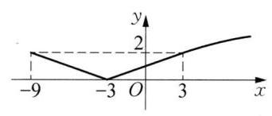

(第 4 题图)

5 2 提示: 由已知得 $f\left( x\right)  = 1 + \frac{{2x} + \ln \left( {\sqrt{{x}^{2} + 1} + x}\right) }{{x}^{2} + 1}$ ,因为 $\ln \left( {\sqrt{{x}^{2} + 1} + x}\right)  + \ln \left\lbrack  {\sqrt{{\left( -x\right) }^{2} + 1} + }\right. \; \left( {-x}\right) \rbrack  = \ln 1 = 0$ ,所以 $\ln \left\lbrack  {\sqrt{{\left( -x\right) }^{2} + 1} + \left( {-x}\right) }\right\rbrack   =  - \ln \left( {\sqrt{{x}^{2} + 1} + x}\right)$ 。易知函数 $y = \ln \left( {\sqrt{{x}^{2} + 1} + x}\right)$ 的定义域为 $\mathbf{R}$ ,因此函数 $y = \ln \left( {\sqrt{{x}^{2} + 1} + x}\right)$ 是奇函数。令 $g\left( x\right)  = \frac{{2x} + \ln \left( {\sqrt{{x}^{2} + 1} + x}\right) }{{x}^{2} + 1}$ ,则 $g\left( {-x}\right)  = \; \frac{-{2x} - \ln \left( {\sqrt{{x}^{2} + 1} + x}\right) }{{x}^{2} + 1} =  - g\left( x\right)$ ,所以 $g\left( x\right)$ 为奇函数,则 $g\left( x\right)$ 的最大值 ${M}_{1}$ 和最小值 ${N}_{1}$ 满足 ${M}_{1} + \; {N}_{1} = 0$ 。因为 $M = {M}_{1} + 1, N = {N}_{1} + 1$ ,所以 $M + N = 2$ 。

6 $\left( {-\frac{\sqrt{3}}{2},1}\right\rbrack$ 提示:因为函数 $y = \lg \left( {\sqrt{{x}^{2} - x + 1} + {ax}}\right)$ 的定义域是 R，所以， $\sqrt{{x}^{2} - x + 1} + {ax} > 0$ 对于任意实数 $x$ 恒成立,即 ${ax} >  - \sqrt{{x}^{2} - x + 1}$ 对于任意实数 $x$ 恒成立。当 $x = 0$ 时,上式化为 $0 >  - 1$ ,此式对任意实数 $a$ 都成立; 当 $x > 0$ 时,则 $a > \frac{-\sqrt{{x}^{2} - x + 1}}{x} =  - \sqrt{\frac{1}{{x}^{2}} - \frac{1}{x} + 1}$ 。由 $x > 0$ ,得 $\frac{1}{x} > 0$ ,则 $\frac{1}{{x}^{2}} - \frac{1}{x} + 1 = {\left( \frac{1}{x} - \frac{1}{2}\right) }^{2} + \frac{3}{4} \geq  \frac{3}{4}$ ,则 $- \sqrt{\frac{1}{{x}^{2}} - \frac{1}{x} + 1} \leq   - \frac{\sqrt{3}}{2}$ ,可得 $a >  - \frac{\sqrt{3}}{2}$ ; 当 $x < 0$ 时,则 $a < \; \frac{\sqrt{{x}^{2} - x + 1}}{-x} = \sqrt{\frac{1}{{x}^{2}} - \frac{1}{x} + 1}$ ,由 $x < 0$ ,得 $\frac{1}{x} < 0$ ,则 $\frac{1}{{x}^{2}} - \frac{1}{x} + 1 = {\left( \frac{1}{x} - \frac{1}{2}\right) }^{2} + \frac{3}{4} > 1$ ,则 $\sqrt{\frac{1}{{x}^{2}} - \frac{1}{x} + 1} > 1$ ,可得 $a \leq  1$ 。综上可得,实数 $a$ 的取值范围是 $\left( {-\frac{\sqrt{3}}{2},1}\right\rbrack$ 。

7 A 8 A 9 C

10 (1)由题意，得 $1 - {x}^{2} > 0$ ，即 $- 1 < x < 1$ ，即 $M = \{ x \mid   - 1 < x < 1\}$ 。(2)由题意，得( $x + a$ + 2) $\left( {-x - a + 1}\right)  > 0$ ,解得 $- a - 2 < x <  - a + 1$ ,即 $N = \{ x \mid   - a - 2 < x <  - a + 1\}$ 。若 $M \subseteq  N$ ,则 $\left\{  {\begin{array}{l}  - a - 2 \leq   - 1, \\   - a + 1 \geq  1, \end{array}\text{ 即 }\left\{  {\begin{array}{l} a \geq   - 1, \\  a \leq  0, \end{array}\text{ 即 }a \in  \left\lbrack  {-1,0}\right\rbrack  \text{ 。 }}\right. }\right.$

11 (1) $f\left( 1\right)  = f\left( {-1}\right)  =  - 1 + {\log }_{\frac{1}{2}}\left( {1 + 1}\right)  =  - 1 - 1 =  - 2$ 。当 $x > 0$ 时, $- x < 0$ ,则 $f\left( x\right)  = f\left( {-x}\right)  = \; - x + {\log }_{\frac{1}{2}}\left( {1 + x}\right)$ ,所以, $f\left( x\right)  = \left\{  \begin{array}{ll}  - x + {\log }_{\frac{1}{2}}\left( {1 + x}\right) , & x > 0, \\  x + {\log }_{\frac{1}{2}}\left( {1 - x}\right) , & x \leq  0, \end{array}\right.$ 函数的严格增区间是 $( - \infty ,0\rbrack$ ,严格减区间是 $\lbrack 0, + \infty )$ 。(2)由(1)得 $f\left( {\lg a}\right)  + 2 < 0$ 等价于 $f\left( \left| {\lg a}\right| \right)  <  - 2 = f\left( 1\right)$ ，所以， $\left| {\lg a}\right|  > 1$ ，即 $\lg a <  - 1$ 或 $\lg a > 1$ ,所以, $0 < a < \frac{1}{10}$ 或 $a > {10}$ ,即实数 $a$ 的取值范围是 $\left( {0,\frac{1}{10}}\right)  \cup  \left( {{10}, + \infty }\right)$ 。

12 (1)当 $t = 2$ 时， $F\left( x\right)  = 2{\log }_{a}\left( {2x}\right)  - {\log }_{a}x = {\log }_{a}\frac{4{x}^{2}}{x} = {\log }_{a}\left( {4x}\right)$ 。若 $0 < a < 1$ ,则 $F{\left( x\right) }_{\min } = F\left( 2\right)  = \; {\log }_{a}8 = 2$ ,解得 $a = 2\sqrt{2}$ ,不成立; 若 $a > 1$ ,则 $F{\left( x\right) }_{\min } = F\left( 1\right)  = {\log }_{a}4 = 2$ ,解得 $a = 2$ 。综合上述,所求 $a =$

2。(2)由 $f\left( x\right)  \geq  g\left( x\right)$ ，得 ${\log }_{a}x \geq  2{\log }_{a}\left( {{2x} + t - 2}\right)$ ，即， $\sqrt{x} \leq  {2x} + t - 2, - t \leq  {2x} - \sqrt{x} - 2$ 。令 $\varphi \left( x\right)  = {2x} - \sqrt{x} - 2,\sqrt{x} = t \in  \left\lbrack  {1,\sqrt{2}}\right\rbrack$ ,则函数 $y = 2{t}^{2} - t - 2$ 在 $\left\lbrack  {1,\sqrt{2}}\right\rbrack$ 上严格增,所以函数 $\varphi \left( x\right)  = {2x} - \; \sqrt{x} - 2$ 在 $\left\lbrack  {1,2}\right\rbrack$ 上是严格增函数,所以 $\varphi \left( x\right)  \geq  \varphi \left( 1\right)  =  - 1$ ,所以 $- t \leq   - 1$ ,即 $t \geq  1$ ,所以实数 $t$ 的取值范围为 $\lbrack 1, + \infty )$ 。

13 (1)因为 $f\left( x\right)  - g\left( x\right)  = {\log }_{a}\left( {{3x} + 2}\right)  - {\log }_{a}\left( {2 - {3x}}\right)$ ，所以，若要式子有意义，则 $\left\{  \begin{array}{l} {3x} + 2 > 0, \\  2 - {3x} > 0, \end{array}\right.$ 解得 $- \frac{2}{3} < x < \frac{2}{3}$ ,所以函数 $f\left( x\right)  - g\left( x\right)$ 的定义域为 $\left( {-\frac{2}{3},\frac{2}{3}}\right)$ 。( 2 )设 $F\left( x\right)  = f\left( x\right)  - g\left( x\right)$ ，其定义域为 $\left( {-\frac{2}{3},\frac{2}{3}}\right)$ ,关于原点对称,则 $F\left( {-x}\right)  = f\left( {-x}\right)  - g\left( {-x}\right)  = {\log }_{a}\left( {-{3x} + 2}\right)  - {\log }_{a}\left( {2 + {3x}}\right)  = \; - \left\lbrack  {{\log }_{a}\left( {{3x} + 2}\right)  - {\log }_{a}\left( {2 - {3x}}\right) }\right\rbrack   =  - F\left( x\right)$ ，所以， $F\left( x\right)$ 是奇函数，即 $f\left( x\right)  - g\left( x\right)$ 是奇函数。(3) $f\left( x\right)  - \; g\left( x\right)  > 0$ ,即 ${\log }_{a}\left( {{3x} + 2}\right)  > {\log }_{a}\left( {2 - {3x}}\right)$ ,且定义域为 $\left( {-\frac{2}{3},\frac{2}{3}}\right)$ 。当 $0 < a < 1$ 时,得 ${3x} + 2 < 2 - {3x}$ , 解得 $x < 0$ ,所以 $- \frac{2}{3} < x < 0$ ; 当 $a > 1$ 时,得 ${3x} + 2 > 2 - {3x}$ ,解得 $x > 0$ ,所以 $0 < x < \frac{2}{3}$ 。综上,当 $0 < a < 1$ 时，不等式的解集为 $\left( {-\frac{2}{3},0}\right)$ ；当 $a > 1$ 时，不等式的解集为 $\left( {0,\frac{2}{3}}\right)$ 。

### 4.7 简单的指数方程

$1\;\{  - 1\} \;2\;\{  - 6\} \;3\;\left\{  \frac{\lg 3 + \lg 5}{\lg 3 - 5\lg 5}\right\}  \;4\;\left( 1\right) \;\left\{  \frac{\lg 3 + \lg 5}{2\lg 3 - \lg 5}\right\}  \;\left( 2\right) \;\{ \left( {2,1}\right) \} \;5\;\{ 2\} \;6\;\{ 0\}$

$7\begin{array}{lllllllllll} C & 8 & C & 9 & D & {10} &  - 2 & {11} & \left\{  {{\log }_{\frac{3}{2}}2,{\log }_{\frac{3}{2}}\frac{1}{2}}\right\}  & {12} & \left\{  {{\log }_{2}\left( {2 + \sqrt{3}}\right) ,{\log }_{2}\left( {2 - \sqrt{3}}\right) }\right\}   \end{array}$

13 当 $a = 3$ 时,另一根为 ${\log }_{3}\frac{3}{2}$ ; 当 $a = \frac{1}{2}$ 时,另一根为 ${\log }_{\frac{1}{2}}\frac{3}{2}$ 。

### 4.8 简单的对数方程

$\begin{array}{llllllllllllllllll} 1 & 2 & 2 & 1 & 3 & \{ 2\} & 4 & \{ \sqrt{5}\} & 5 & \{ 3\} & 6 & \{ 0,3\} & 7 & D & 8 & A & 9 & A \end{array}$

${10}\left( 1\right) x = 3\left( 2\right) x = 2$

11 $x = {\log }_{3}{10}$ 或 $x = {\log }_{3}4 - 1$

12 $a \in  \left( {\frac{\lg 2 - \lg 3}{2},\frac{\lg 3 - \lg 2}{2}}\right) ,{x}_{1}{x}_{2} = \frac{1}{6}$

${13a} \in  \lbrack 0, + \infty ), x = \frac{{4}^{a} + 1}{{2}^{a + 1}}$

## 第 5 章 三角

### 5.1 任意角及其度量(1)

$1 - {810}^{ \circ  }\;2$ 二 $\;3\;{220}^{ \circ  }\;4\;\left\{  {\alpha  \mid  \alpha  = k \cdot  {360}^{ \circ  } + {60}^{ \circ  }, k \in  \mathbf{Z}}\right\}  \;\left\{  {\beta  \mid  \beta  = k \cdot  {360}^{ \circ  } + {225}^{ \circ  }, k \in  \mathbf{Z}}\right\}$

5 三 提示: 由 $k \cdot  {360}^{ \circ  } + {90}^{ \circ  } < \alpha  < k \cdot  {360}^{ \circ  } + {180}^{ \circ  }, k \in  \mathbf{Z}$ ,得 $k \cdot  {120}^{ \circ  } + {30}^{ \circ  } < \alpha  < k \cdot  {120}^{ \circ  } + {60}^{ \circ  }, k \in  \mathbf{Z}$ 。

${65}^{ \circ  }{15}^{ \circ  }$ 提示: 由题意,得 $\left\{  \begin{array}{ll} \alpha  + \beta  = k \cdot  {360}^{ \circ  } - {280}^{ \circ  }, & k \in  \mathbf{Z}, \\  \alpha  - \beta  = m \cdot  {360}^{ \circ  } - {670}^{ \circ  }, & m \in  \mathbf{Z}, \end{array}\right.$ 解得 $\left\{  \begin{array}{l} \alpha  = \left( {k + m}\right)  \cdot  {180}^{ \circ  } - {475}^{ \circ  }, \\  \beta  = \left( {k - m}\right)  \cdot  {180}^{ \circ  } + {195}^{ \circ  }, \end{array}\right. k\text{ 、 } \; m \in  \mathbf{Z}$ ,又因为 $\alpha \text{ 、 }\beta$ 为锐角,所以 $\left\{  \begin{array}{l} \alpha  = {65}^{ \circ  }, \\  \beta  = {15}^{ \circ  }\text{ 。 } \end{array}\right.$

7 C 提示: 由题意,得 $k \cdot  {360}^{ \circ  } + {270}^{ \circ  } < \alpha  < k \cdot  {360}^{ \circ  } + {360}^{ \circ  }, k \in  \mathbf{Z}$ ,所以 $- k \cdot  {360}^{ \circ  } - {180}^{ \circ  } < {180}^{ \circ  } - \alpha  < \; - k \cdot  {360}^{ \circ  } - {90}^{ \circ  }, k \in  \mathbf{Z}$ 。

$8\mathrm{\;A}\;9\mathrm{C}$

10 (1) $\left\{  {\alpha \left| {\;\alpha  = k \cdot  {360}^{ \circ  }}\right. , k \in  \mathbf{Z}}\right\}$ (2) $\left\{  {\alpha \left| {\;\alpha  = k \cdot  {180}^{ \circ  }}\right. , k \in  \mathbf{Z}}\right\}$ (3) $\left\{  {\alpha \left| {\;\alpha  = k \cdot  {360}^{ \circ  } + {270}^{ \circ  }}\right. , k \in  \mathbf{Z}}\right\}$

(4) $\left\{  {\alpha  \mid  \alpha  = k \cdot  {180}^{ \circ  } + {90}^{ \circ  }, k \in  \mathbf{Z}}\right\}$ (5) $\left\{  {\alpha \left| {\;\alpha  = k \cdot  {180}^{ \circ  } + {135}^{ \circ  }}\right. , k \in  \mathbf{Z}}\right\}$ (6) $\left\{  {\alpha \left| {\;\alpha  = k \cdot  {90}^{ \circ  } + {45}^{ \circ  }}\right. }\right.$ , $k \in  \mathbf{Z}\}$

11 第一象限角的集合 $\left\{  {\alpha  \mid  k \cdot  {360}^{ \circ  } < \alpha  < k \cdot  {360}^{ \circ  } + {90}^{ \circ  }, k \in  \mathbf{Z}}\right\}$ ; 第二象限角的集合 $\left\{  {\alpha  \mid  k \cdot  {360}^{ \circ  } + {90}^{ \circ  } < }\right. \; \left. {\alpha  < k \cdot  {360}^{ \circ  } + {180}^{ \circ  }, k \in  \mathbf{Z}}\right\}$ ; 第三象限角的集合 $\left\{  {\alpha  \mid  k \cdot  {360}^{ \circ  } + {180}^{ \circ  } < \alpha  < k \cdot  {360}^{ \circ  } + {270}^{ \circ  }, k \in  \mathbf{Z}}\right\}$ ; 第四象限角的集合 $\left\{  {\alpha  \mid  k \cdot  {360}^{ \circ  } + {270}^{ \circ  } < \alpha  < k \cdot  {360}^{ \circ  } + {360}^{ \circ  }, k \in  \mathbf{Z}}\right.$ 。

12 由题意，得 $\left\{  \begin{array}{l} {0}^{ \circ  } < \theta  \leq  {180}^{ \circ  }, \\  k \cdot  {360}^{ \circ  } + {180}^{ \circ  } < {2\theta } < k \cdot  {360}^{ \circ  } + {270}^{ \circ  }, k \in  \mathbf{Z},\text{ 解得 }\theta  = {96}^{ \circ  }\text{ 或 }{120}^{ \circ  }\text{ 。 } \\  {15\theta } = m \cdot  {360}^{ \circ  }, m \in  \mathbf{Z}, \end{array}\right.$

13 设离家时是 2 点 $x$ 分, ${12}\left( {x - {30}}\right)  = \frac{x}{12} + {10}$ ,解得 $x = \frac{4440}{143}$ ,离家时间总长为 $3 \times  {60} + {60} - x + \frac{x}{12} + \; {10} = \frac{2880}{13} \approx  {222}\left( \mathrm{\;{min}}\right)$  。

### 5.1 任意角及其度量(2)

${160}; - \frac{2\pi }{5}\;2\;{2021} - {644\pi }$

${3\alpha } = \frac{{180} + \pi }{360},\beta  = \frac{{180} - \pi }{360}$ 提示: 由题意,得 $\left\{  \begin{array}{l} \alpha  + \beta  = 1, \\  \alpha  - \beta  = \frac{\pi }{180}, \end{array}\right.$ 解得 $\left\{  \begin{array}{l} \alpha  = \frac{{180} + \pi }{360}, \\  \beta  = \frac{{180} - \pi }{360}\text{ 。 } \end{array}\right.$

4 360

${5000}\mathrm{\;{cm}}$ 提示: 由题意,得 $r = \sqrt{{5}^{2} - {3}^{2}} = 4$ ,则 $l = {\alpha r} = 5 \times  5 \times  4 = {100}\left( \mathrm{\;{cm}}\right)$ 。

$6\left\lbrack  {-\frac{2}{3}\pi , - \frac{\pi }{2}}\right)  \cup  \left\lbrack  {\frac{\pi }{3},\frac{\pi }{2}}\right) \;7$ A8C

$9\;\mathrm{C}$ 提示: 由题意,得 $\sin \frac{1}{2} = \frac{1}{R}$ ,则 $R = \frac{1}{\sin \frac{1}{2}}$ ,所以 $l = 1 \times  R = \frac{1}{\sin \frac{1}{2}}$ 。

${10}\left\{  {x\left| {\;\frac{\pi }{3} + {k\pi } \leq  x \leq  \frac{2}{3}\pi  + {k\pi }}\right. , k \in  \mathbf{Z}}\right\}  \;\left\{  {x\left| {\; - \frac{\pi }{6} + {2k\pi } \leq  x \leq  \frac{\pi }{4} + {2k\pi }}\right. , k \in  \mathbf{Z}}\right\}$

11 设圆心角为 $\alpha$ ,半径为 $R$ ,则 ${2R} + {\alpha R} = {32}$ ,解得 $\alpha  = \frac{{32} - {2R}}{R}$ ,所以 $S = \frac{1}{2}\alpha {R}^{2} = R\left( {{16} - R}\right)  =  - (R - \; 8{)}^{2} + {64} \leq  {64}$ ,当且仅当 $R = 8$ 时等号成立,此时 $\alpha  = 2,{S}_{\max } = {64}{\mathrm{\;{cm}}}^{2}$ 。

${12}\frac{{12} - 8\sqrt{2}}{\pi }{l}^{2}$ 提示:由 “相切两圆的连心线必经过切点” 及 “两圆内切时，圆心距等于半径之差” 可求得答案为 $\frac{{12} - 8\sqrt{2}}{\pi }{l}^{2}$ 。

${13C} = \frac{\pi }{6} \times  3 \times  2 + 3 = \pi  + 3, S = {3}^{2} - \frac{\sqrt{3}}{4} \times  {3}^{2} - \frac{1}{2} \times  \frac{\pi }{6} \times  {3}^{2} \times  2 = 9 - \frac{9}{4}\sqrt{3} - \frac{3}{2}\pi$ 。

### 5.2 任意角的正弦、余弦、正切、余切(1)

$1 - \frac{23}{15}\;2 - 8\;3\;\{  - 1,3\}$

4 ①②③④ 提示:因为角 $\alpha$ 是第三象限角，所以两弦为负，两切为正，两割为负。

5 $\left( {-2,3}\right\rbrack$ 提示: $\left\{  \begin{array}{l} \cos \alpha  = \frac{{3a} - 9}{\sqrt{{\left( 3a - 9\right) }^{2} + {\left( a + 2\right) }^{2}}} \leq  0, \\  \sin \alpha  = \frac{a + 2}{\sqrt{{\left( 3a - 9\right) }^{2} + {\left( a + 2\right) }^{2}}} > 0, \end{array}\right.$ 则 $- 2 < a \leq  3$ 。

6 钝角 提示: 若 $A\text{ 、 }B\text{ 、 }C \in  \left( {0,\frac{\pi }{2}}\right)$ ,则余弦、正切、余切均为正,矛盾。所以有一角为钝角,三角形为钝角三角形。

7 C 提示: 2 为第二象限角,正弦为正,余弦为负,两切为负。

8 A

9 C 提示: 由 $\left| {\cos \alpha  - \cos \beta }\right|  = \left| {\cos \alpha }\right|  + \left| {\cos \beta }\right|$ ,得 $- \cos \alpha \cos \beta  = \left| {\cos \alpha \cos \beta }\right|$ ,又 $\alpha  \in  \left( {\frac{\pi }{2},\pi }\right)$ ,得 $\cos \alpha  < 0$ ,则 $\cos \beta  \geq  0$ ,所以, $\sqrt{{\left( \cos \alpha  - \cos \beta \right) }^{2}} =  - \left( {\cos \alpha  - \cos \beta }\right)  = \cos \beta  - \cos \alpha$ 。

10 (1)因为 ${330}^{ \circ  }$ 、 ${53}^{ \circ  }$ 、 ${235}^{ \circ  }$ 、 ${145}^{ \circ  }$ 分别为第四、第一、第三、第二象限角，所以 $\sin {330}^{ \circ  } < 0$ ， $\tan {53}^{ \circ  } > 0$ ， $\cos {235}^{ \circ  } < 0,\tan {145}^{ \circ  } < 0$ ,从而 $\frac{\sin {330}^{ \circ  } \cdot  \tan {53}^{ \circ  }}{\cos {235}^{ \circ  } \cdot  \tan {145}^{ \circ  }} < 0$ 。 限角,所以 $\sin 3 > 0,\cos 4 < 0,\tan 5 < 0$ ,从而 $\sin 3 \cdot  \cos 4 \cdot  \tan 5 > 0$ 。

11 由题意,得 $P\left( {3,2}\right)$ ,则 $\sin \alpha  = \frac{2}{\sqrt{13}}$ ,而 $Q\left( {3, - 2}\right)$ ,则 $\sin \beta  =  - \frac{2}{\sqrt{13}}$ ,所以 $2\sin \alpha  + 3\sin \beta  =  - \frac{2}{\sqrt{13}} = \; - \frac{2\sqrt{13}}{13}$ 。

12 当 $m = 0$ 时， $\cos \theta  =  - 1,\tan \theta  = 0$ ；当 $m = \sqrt{5}$ 时， $\cos \theta  =  - \frac{\sqrt{6}}{4},\tan \theta  =  - \frac{\sqrt{15}}{3}$ ；当 $m =  - \sqrt{5}$ 时， $\cos \theta  =  - \frac{\sqrt{6}}{4},\tan \theta  = \frac{\sqrt{15}}{3}$ 。提示: $\sin \theta  = \frac{m}{\sqrt{3 + {m}^{2}}} = \frac{\sqrt{2}}{4}m$ ,解得 $m = 0\text{ 、 } \pm  \sqrt{5}$ 。

13 由 $\theta$ 为第四象限角,得 $0 < \cos \theta  < 1, - 1 < \sin \theta  < 0$ ,所以 $\sin \left( {\cos \theta }\right)  > 0,\cos \left( {\sin \theta }\right)  > 0$ ,所以 $\sin \left( {\cos \theta }\right)  \cdot  \cos \left( {\sin \theta }\right)  > 0$ 。

### 5.2 任意角的正弦、余弦、正切、余切(2)

1 三或四

2 $\left\lbrack  {-\frac{\pi }{2} + {2k\pi },{2k\pi }}\right)  \cup  \left( {{2k\pi },{2k\pi } + \frac{\pi }{2}}\right\rbrack  , k \in  \mathbf{Z}$ 提示: $\cos x \in  \left\lbrack  {0,1}\right)$ 。

3 -1

4 0 或 8 提示: 根据 ${\sin }^{2}\theta  + {\cos }^{2}\theta  = 1$ ,有 ${\left( \frac{m - 3}{m + 5}\right) }^{2} + {\left( \frac{4 - {2m}}{m + 5}\right) }^{2} = 1$ ,解得 $m = 0$ 或 8 。 $5 \pm  \frac{4}{3}$

6 一或三 提示: 因为 $\sin \theta \text{ 、 }\cos \theta  \in  \left\lbrack  {-1,1}\right\rbrack$ ,所以两者为第一或第四象限角,由 $\cot \left( {\sin \theta }\right)  \cdot  \tan \left( {\cos \theta }\right)  >$ 0,可得 $\cot \left( {\sin \theta }\right) \text{ 、 }\tan \left( {\cos \theta }\right)$ 同号。若 $\cot \left( {\sin \theta }\right)  > 0$ ,且 $\tan \left( {\cos \theta }\right)  > 0$ ,则 $\sin \theta \text{ 、 }\cos \theta  \in  (0,1\rbrack ,\theta$ 为第一象限角。若 $\cot \left( {\sin \theta }\right)  < 0$ ,且 $\tan \left( {\cos \theta }\right)  < 0$ ,则 $\sin \theta ,\cos \theta  \in  \lbrack  - 1,0),\theta$ 为第三象限角。

7 B 8 B 9 D

10 $\left\{  {\begin{array}{l} \cos \alpha  = \frac{2m}{{m}^{2} + 1}, \\  \tan \alpha  = \frac{{m}^{2} - 1}{2m}, \end{array}\text{ 或 }\left\{  \begin{array}{l} \cos \alpha  =  - \frac{2m}{{m}^{2} + 1}, \\  \tan \alpha  =  - \frac{{m}^{2} - 1}{2m}\text{ 。 } \end{array}\right. }\right.$

11 由 $\Delta  \geq  0$ ，得 $\cos \theta  \geq   - \frac{1}{2}$ ，再由 $\left| {\alpha  - \beta }\right|  \leq  2\sqrt{2}$ ，得 ${\left( \alpha  - \beta \right) }^{2} = {\left( \alpha  + \beta \right) }^{2} - {4\alpha \beta } = {\left\lbrack  -2\left( \cos \theta  + 1\right) \right\rbrack  }^{2} - 4{\cos }^{2}\theta  \leq$ 8,从而 $\cos \theta  \leq  \frac{1}{2}$ ,所以 $- \frac{1}{2} \leq  \cos \theta  \leq  \frac{1}{2}$ ,所以 $\theta$ 的取值范围是 $\left\{  {x\left| {\;\frac{\pi }{3} + {k\pi } \leq  \theta  \leq  \frac{2}{3}\pi  + {k\pi }}\right. , k \in  \mathbf{Z}}\right\}$ 。

12 $a < b\;$ 提示: 作差 $a - b$ ,并利用 $x > \sin x\left( {0 < x < \frac{\pi }{2}}\right)$ 。

13 (1)设单位圆与 $x$ 轴的正半轴、 $\alpha$ 的终边分别交于点 $A$ 、 $B$ ，又设 ${AT} \bot  x$ 轴交 $\alpha$ 的终边于点 $T$ ，得 ${S}_{\bigtriangleup {AOB}} < {S}_{\text{ 扇形 }{AOB}} < {S}_{\bigtriangleup {AOT}}$ ,即 $\frac{1}{2} \cdot  {1}^{2} \cdot  \sin \alpha  < \frac{1}{2}\alpha  \cdot  {1}^{2} < \frac{1}{2} \cdot  1 \cdot  \tan \alpha$ ,即 $\sin \alpha  < \alpha  < \tan \alpha$ 。(2) $p < m \; n$ 。

### 5.3 基本三角公式和诱导公式(1)

1 0 或 $1\;2\; - 1\;3\;\frac{2ab}{{a}^{2} + {b}^{2}}$

42 提示: 由于 $\frac{\cos \alpha }{\sin \alpha  - 1} \cdot  \frac{\cos \alpha }{1 + \sin \alpha } =  - 1$ ,则 $\frac{\cos \alpha }{\sin \alpha  - 1} = 2$ 。

5 $\left\{  {1, - 1,3, - 3}\right\}$ 提示: $y = \frac{1}{\cos \alpha \left| {\sec \alpha }\right| } + \frac{2\tan \alpha }{\left| \tan \alpha \right| }$ 。

$6\left\lbrack  {-4, - \pi }\right\rbrack   \cup  \left\lbrack  {0,\pi }\right\rbrack  \left\{  {x\left| {\;{2k\pi } - \frac{\pi }{2} < x < {2k\pi } + \frac{\pi }{2}}\right. , k \in  \mathbf{Z}}\right\}$ 提示: 由 $\left\{  \begin{array}{l} \sin x \geq  0, \\  {16} - {x}^{2} \geq  0, \end{array}\right.$ 得 $\left\{  {\begin{array}{l} {2k\pi } \leq  x \leq  {2k\pi } + \pi , k \in  \mathbf{Z}, \\   - 4 \leq  x \leq  4, \end{array}\text{ 解得 }x \in  \left\lbrack  {-4, - \pi }\right\rbrack   \cup  \left\lbrack  {0,\pi }\right\rbrack  }\right.$ 。由 $\sin \left( {\cos x}\right)  > 0$ ,得 $0 < \cos x \leq  1$ ,所以 ${2k\pi } - \frac{\pi }{2} < x < {2k\pi } + \frac{\pi }{2}, k \in  \mathbf{Z}$  。

7 B

8 C 提示: 由 $\sin \theta  = {\left( \tan \theta  + \cot \theta \right) }^{-\frac{3}{4}} = {\left( \frac{1}{\sin \theta \cos \theta }\right) }^{-\frac{3}{4}} = {\left( \sin \theta \cos \theta \right) }^{\frac{3}{4}}$ ,得 $\sin \theta  = {\cos }^{3}\theta$ ,即 $\tan \theta  = {\cos }^{2}\theta$ , 所以 ${\log }_{\tan \theta }\cos \theta  = {\log }_{{\cos }^{2}\theta }\cos \theta  = \frac{1}{2}$ 。

9 A 提示:由平方关系及角在第二象限时正、余弦的符号即可求出。

10 将已知等式两边平方后，可得 $\sin \theta \cos \theta  =  - \frac{12}{25}$ ，所以 ${\sin }^{3}\theta  + {\cos }^{3}\theta  = \left( {\sin \theta  + \cos \theta }\right) \left( {{\sin }^{2}\theta  - \sin \theta \cos \theta  + }\right. \; \left. {{\cos }^{2}\theta }\right)  = \frac{1}{5}\left( {1 + \frac{12}{25}}\right)  = \frac{37}{125}$  。

11 先得 ${\cos }^{2}\theta  = \sin \theta$ ,所以 $3{\cos }^{2}\theta  + {\cos }^{4}\theta  - 2\sin \theta  + 1 = 3\sin \theta  + {\sin }^{2}\theta  - 2\sin \theta  + 1 = \sin \theta  + {\sin }^{2}\theta  + 1 = 2$ 。

12 (1)由 $\tan \alpha  = 2$ ，得 $\frac{\sin \alpha }{\cos \alpha } = 2$ ，即 $\sin \alpha  = 2\cos \alpha$ ，所以原式 $= \frac{2\cos \alpha  + \cos \alpha }{2\cos \alpha  - \cos \alpha } = \frac{3\cos \alpha }{\cos \alpha } = 3$ 。(2)原式 $= \; 3{\sin }^{2}\alpha  - \cos \alpha \sin \alpha  + \left( {{\sin }^{2}\alpha  + {\cos }^{2}\alpha }\right)  = 4{\sin }^{2}\alpha  - \cos \alpha \sin \alpha  + {\cos }^{2}\alpha  = \frac{4{\sin }^{2}\alpha  - \cos \alpha \sin \alpha  + {\cos }^{2}\alpha }{{\sin }^{2}\alpha  + {\cos }^{2}\alpha } = \; \frac{4{\tan }^{2}\alpha  - \tan \alpha  + 1}{{\tan }^{2}\alpha  + 1} = 3$ 。

13 (1)由题意，得 $\left\{  \begin{array}{l} \sin \alpha  \in  \left\lbrack  {-1,1}\right\rbrack  , \\  {\sin }^{2}\beta  = \frac{5\sin \alpha  - 3{\sin }^{2}\alpha }{2} \in  \left\lbrack  {0,1}\right\rbrack  ,\text{ 解得 }\sin \alpha  \in  \left\lbrack  {0,\frac{2}{3}}\right\rbrack  \bigcup \{ 1\} ,\text{ 所以 }{\sin }^{2}\alpha  + {\sin }^{2}\beta  =  \end{array}\right. \; {\sin }^{2}\alpha  + \frac{5\sin \alpha  - 3{\sin }^{2}\alpha }{2} = \frac{-{\left( \sin \alpha  - \frac{5}{2}\right) }^{2} + \frac{25}{4}}{2} \in  \left\lbrack  {0,\frac{13}{9}}\right\rbrack   \cup  \{ 2\}$ 。(2)由于 $6 = 6\sin {3\alpha } - {\cos }^{2}{2\beta } \leq  6$ ，则 $\left\{  \begin{array}{l} \sin {3\alpha } = 1, \\  \cos {2\beta } = 0, \end{array}\right.$ 所以 ${3\alpha } = {2k\pi } + \frac{\pi }{2}, k \in  \mathbf{Z}$ ,解得 $\alpha  = \frac{2k\pi }{3} + \frac{\pi }{6}, k \in  \mathbf{Z}$ 。

### 5.3 基本三角公式和诱导公式(2)

$1 - \frac{2}{3}\;2 - \frac{2\sqrt{5}}{5}$

$3 - \frac{2}{5}$ 提示: 由 ${\sec }^{2}\alpha  = {\tan }^{2}\alpha  + 1 = 5$ ,得 ${\cos }^{2}\alpha  = \frac{1}{5}$ ,则原式 $= \sin \alpha  \cdot  \cos \alpha  = \tan \alpha  \cdot  {\cos }^{2}\alpha  =  - \frac{2}{5}$ 。

4 $\frac{11}{16}$ 提示: 原式 $=  - \sin \left( {\frac{\pi }{6} + x}\right)  + {\cos }^{2}\left( {\frac{\pi }{6} + x}\right)  =  - \frac{1}{4} + \left( {1 - \frac{1}{{4}^{2}}}\right)  = \frac{11}{16}$ 。

5 1 提示: 利用诱导公式 $\cos \left( {\pi  - x}\right)  =  - \cos x$ 。

$6\frac{\sqrt{1 - {p}^{2}}}{p}$ 提示: $\cos 3 =  - p$ ,因为 3 是第二象限角,所以 $\sin 3 = \sqrt{1 - {p}^{2}},\tan \left( {-3}\right)  =  - \tan 3 = \; - \frac{\sin 3}{\cos 3} = \frac{\sqrt{1 - {p}^{2}}}{p}$  。

7 D 8 A

9 C 提示: 先得 $f\left( 1\right)  + f\left( 2\right)  + \cdots  + f\left( 6\right)  = 0$ ,所以 $f\left( 1\right)  + f\left( 2\right)  + \cdots  + f\left( {2011}\right)  = f\left( 1\right)  = \frac{\sqrt{3}}{2}$ 。

10 由 $f\left( {100}\right)  = a\sin \alpha  - b\cos \beta  + 1 = 5$ ，得 $a\sin \alpha  - b\cos \beta  = 4$ ，所以 $f\left( {25}\right)  =  - a\sin \alpha  + b\cos \beta  + 1 =  - 4 + \; 1 =  - 3$ 。

11 由题意，得 $- \sin \alpha  - 2\cos \alpha  = 0$ ，则 $\tan \alpha  =  - 2$ 。(1)原式 $= \frac{2\tan \alpha  - 1}{\tan \alpha  + 3} =  - 5$ 。(2)原式 $= \; \frac{{\sin }^{2}\alpha  + \sin \alpha \cos \alpha  - 3{\cos }^{2}\alpha }{{\sin }^{2}\alpha  + {\cos }^{2}\alpha } = \frac{{\tan }^{2}\alpha  + \tan \alpha  - 3}{{\tan }^{2}\alpha  + 1} =  - \frac{1}{5}$  。

12 由题意,得 $f\left( \theta \right)  = \frac{2{\cos }^{3}\theta  + {\sin }^{2}\theta  + \cos \theta  - 3}{2 + 2{\cos }^{2}\theta  + \cos \theta }$ ,所以 $f\left( \frac{\pi }{3}\right)  =  - \frac{1}{2}$ 。

13 由题意，得 $\left\{  \begin{array}{l} \sin \alpha  = \sqrt{2}\sin \beta , \\  \sqrt{3}\cos \alpha  = \sqrt{2}\cos \beta , \end{array}\right.$ 则 ${\sin }^{2}\alpha  + 3{\cos }^{2}\alpha  = 2$ ，解得 ${\sin }^{2}\alpha  = \frac{1}{2}$ ，因为 $0 < \alpha  < \pi$ ，所以 $\sin \alpha  = \frac{\sqrt{2}}{2}$ ， $\sin \beta  = \frac{\sin \alpha }{\sqrt{2}} = \frac{1}{2}$

### 5.3 基本三角公式和诱导公式(3)

$1 - \frac{3}{5}\;2 - \sqrt{3}$

$3 - \frac{4\sqrt{2}}{5}$ 提示: $f\left( {\theta  - \frac{5\pi }{12}}\right)  = \sqrt{2}\cos \left( {\theta  - \frac{\pi }{2}}\right)  = \sqrt{2}\sin \theta  =  - \frac{4\sqrt{2}}{5}$ 。

4 $- \frac{3}{5}$ 提示: $\cos \left( {\alpha  + \frac{\pi }{4}}\right)  = \sin \left\lbrack  {\frac{\pi }{2} - \left( {\frac{\pi }{4} + \alpha }\right) }\right\rbrack   = \sin \left( {\frac{\pi }{4} - \alpha }\right)  =  - \sin \left( {\alpha  - \frac{\pi }{4}}\right)  =  - \frac{3}{5}$ 。 5 $\frac{1}{3}$ 提示: 由 $\sin \left( {\alpha  + \beta }\right)  = 1$ ,得 $\alpha  + \beta  = {2k\pi } + \frac{\pi }{2}, k \in  \mathbf{Z}$ ,则 $\sin \left( {{2\alpha } + \beta }\right)  = \sin \left( {2 \times  \left( {{2k\pi } + \frac{\pi }{2}}\right)  - \beta }\right)  = \; \sin \beta  = \frac{1}{3}$ 。

$6\; - 1$ 提示:由题意，得 $f\left( {n + 2}\right)  = \sin \left( {\frac{\left( {n + 2}\right) \pi }{4} + \alpha }\right)  = \cos \left( {\frac{n\pi }{4} + \alpha }\right)$ ， $f\left( {n + 4}\right)  = \sin \left( {\frac{\left( {n + 4}\right) \pi }{4} + \alpha }\right)  = \; - \sin \left( {\frac{n\pi }{4} + \alpha }\right) , f\left( {n + 6}\right)  = \sin \left( {\frac{\left( {n + 6}\right) \pi }{4} + \alpha }\right)  =  - \cos \left( {\frac{n\pi }{4} + \alpha }\right)$ ,所以,原式 $=  - {\sin }^{2}\left( {\frac{n\pi }{4} + \alpha }\right)  - \; {\cos }^{2}\left( {\frac{n\pi }{4} + \alpha }\right)  =  - 1$ 。

7 C 提示: 由题意,得 $\cos \theta  - 3\cos \theta  =  - \sin \theta$ ,得 $\tan \theta  = 2$ ,原式 $= \frac{\sin \theta \cos \theta  + {\cos }^{2}\theta }{{\sin }^{2}\theta  + {\cos }^{2}\theta } = \frac{\tan \theta  + 1}{{\tan }^{2}\theta  + 1} = \frac{3}{5}$ 。 8 A 提示: $\left\{  \begin{array}{l} \sin \left( {\pi  + \theta }\right)  < 0, \\  \sin \left( {\frac{3\pi }{2} - \theta }\right)  < 0, \end{array}\right.$ 得 $\left\{  \begin{array}{l} \sin \theta  > 0, \\  \cos \theta  > 0, \end{array}\right.$ 所以 $\theta$ 为第一象限角。

9 A 提示: 在题设中令 $x = \frac{\pi }{2} - {x}^{\prime }$ 可得。

10 由 $\sin \left( {\alpha  - \frac{7\pi }{2}}\right)  =  - \frac{1}{5}$ ,得 $\cos \alpha  =  - \frac{1}{5}$ 。而 $\alpha$ 为第三象限角,则 $\sin \alpha  =  - \frac{2\sqrt{6}}{5}$ 。原式 $= \; \frac{\sin \alpha  \cdot  \cos \alpha  \cdot  \cot \alpha }{-\cot \alpha  \cdot  \left( {-\cos \alpha }\right) } = \sin \alpha  =  - \frac{2}{5}\sqrt{6}$  。

11 (1) $f\left( x\right)  = \frac{-\sin x \cdot  \cos x \cdot  \left( {-\cos x}\right) }{\sin x \cdot  \cos x} = \cos x\left( {x \neq  \frac{k\pi }{2}, k \in  \mathbf{Z}}\right)$ 。(2)由 $\tan x = 2$ ，得 $\sec x = \; - \sqrt{5},\cos x =  - \frac{\sqrt{5}}{5}$ ,所以 $f\left( x\right)  =  - \frac{\sqrt{5}}{5}$ 。

12 由 $3{x}^{2} - {10x} - 8 = 0$ ，得 $x = 4$ 或 $x =  - \frac{2}{3}$ 。所以 $\sin \alpha  =  - \frac{2}{3}$ ，而 $\alpha$ 为第三象限角， $\cos \alpha  =  - \frac{\sqrt{5}}{3}$ ，所以， 原式 $= \tan \alpha  = \frac{2\sqrt{5}}{5}$ 。

13 方法一:由题设，得 ${\cos }^{4}\alpha {\cos }^{2}\beta  + {\sin }^{4}\alpha {\sin }^{2}\beta  = {\sin }^{2}\beta {\cos }^{2}\beta$ ，即 ${\left( 1 - {\sin }^{2}\alpha \right) }^{2}{\cos }^{2}\beta  + {\sin }^{4}\alpha \left( {1 - {\cos }^{2}\beta }\right)  = (1 - \; \left. {{\cos }^{2}\beta }\right) {\cos }^{2}\beta$ ,即 $- 2{\sin }^{2}\alpha {\cos }^{2}\beta  + {\sin }^{4}\alpha  =  - {\cos }^{4}\beta$ ,从而有 ${\left( {\sin }^{2}\alpha  - {\cos }^{2}\beta \right) }^{2} = 0$ ,则 $\sin \alpha  = \cos \beta$ ,所以 $\alpha  + \beta  = \; \frac{\pi }{2}$ 。方法二: $\left( {{\sin }^{2}\beta  + {\cos }^{2}\beta }\right) \left( {\frac{{\cos }^{4}\alpha }{{\sin }^{2}\beta } + \frac{{\sin }^{4}\alpha }{{\cos }^{2}\beta }}\right)  \geq  1$ ,当且仅当 $\frac{{\cos }^{4}\alpha }{{\sin }^{4}\beta } = \frac{{\sin }^{4}\alpha }{{\cos }^{4}\beta }$ 时等号成立,可得 ${\tan }^{4}\alpha  = \; {\cot }^{4}\beta$ 。因为 $\alpha \text{ 、 }\beta$ 均为锐角,所以 $\tan \alpha  = \cot \beta$ ,从而有 $\alpha  + \beta  = \frac{\pi }{2}$ 。

### 5.4 两角和与差的余弦、正弦和正切公式

$1\xrightarrow[]{\sqrt{15} - \sqrt{3}}2\xrightarrow[]{63}3\xrightarrow[]{1}0$

4 钝角 提示: 由题意,得 $\cos \left( {A + B}\right)  > 0$ ,则 $A + B \in  \left( {0,\frac{\pi }{2}}\right)$ ,所以 $C \in  \left( {\frac{\pi }{2},\pi }\right)$ 。

$5\frac{63}{65}$ 提示: 由题意,得 $\sin \alpha  =  - \frac{4}{5},\cos \alpha  = \frac{3}{5},\alpha  \in  \left( {-\frac{\pi }{2},0}\right)$ ,又 $\beta  \in  \left( {0,\pi }\right)$ ,得 $\alpha  - \beta  \in  \left( {-\frac{3\pi }{2},0}\right)$ , 由 $\cos \left( {\alpha  - \beta }\right)  = \frac{5}{13}$ ,得 $\alpha  - \beta  \in  \left( {-\frac{\pi }{2},0}\right) ,\sin \left( {\alpha  - \beta }\right)  =  - \frac{12}{13}$ ,所以, $\cos \beta  = \cos \left\lbrack  {\alpha  - \left( {\alpha  - \beta }\right) }\right\rbrack   = \cos \alpha \cos (\alpha  - \; \beta ) + \sin \alpha \sin \left( {\alpha  - \beta }\right)  = \frac{63}{65}$  。

$6\left\lbrack  {-\sqrt{3},\sqrt{3}}\right\rbrack$ 提示: 设 $\cos x + \cos y = t$ ,得 ${\left( \cos x + \cos y\right) }^{2} + {\left( \sin x + \sin y\right) }^{2} = {t}^{2} + 1$ ,则 ${t}^{2} - 1 = \; 2\cos \left( {x - y}\right)$ ,所以 ${t}^{2} - 1 \in  \left\lbrack  {-2,2}\right\rbrack$ ,解得 $t \in  \left\lbrack  {-\sqrt{3},\sqrt{3}}\right\rbrack$ 。

$7\;\mathrm{C}$

8 A 提示: $\cos {5x} = 0$ 。

9 D 提示: 由题意,得 $\alpha \text{ 、 }\beta$ 在第二、第三象限,又为不同象限的角, $\sin \alpha \text{ 、 }\sin \beta$ 异号, $\sin \alpha  \cdot  \sin \beta  < 0$ ,则 $\cos \left( {\alpha  - \beta }\right)  = \cos \alpha \cos \beta  + \sin \alpha \sin \beta  = \left( {-\frac{8}{17}}\right)  \times  \left( {-\frac{12}{13}}\right)  - \frac{15}{17} \times  \frac{5}{13} = \frac{21}{221}$  。

10 由题意,得 $\sin \left( {\alpha  + \beta }\right)  =  - \frac{3}{5},\sin \left( {\alpha  - \beta }\right)  = \frac{12}{13}$ ,则 $\cos {2\alpha } = \cos \left( {\alpha  + \beta }\right) \cos \left( {\alpha  - \beta }\right)  - \sin \left( {\alpha  + \beta }\right) \sin (\alpha  - \; \beta ) = \frac{4}{5} \times  \left( {-\frac{5}{13}}\right)  - \left( {-\frac{3}{5}}\right)  \times  \frac{12}{13} = \frac{16}{65},\cos {2\beta } = \cos \left( {\alpha  + \beta }\right) \cos \left( {\alpha  - \beta }\right)  + \sin \left( {\alpha  + \beta }\right) \sin \left( {\alpha  - \beta }\right)  = \frac{4}{5} \times  \left( {-\frac{5}{13}}\right)  + \; \left( {-\frac{3}{5}}\right)  \times  \frac{12}{13} =  - \frac{56}{65}$

11 因为 $0 < \beta  < \frac{\pi }{4} < \alpha  < \frac{\pi }{2}$ ,所以 ${2\alpha } - \beta  \in  \left( {\frac{\pi }{4},\pi }\right) ,\alpha  - {2\beta } \in  \left( {-\frac{\pi }{4},\frac{\pi }{2}}\right)$ 从而 $\sin \left( {{2\alpha } - \beta }\right)  = \frac{5\sqrt{3}}{14}$ , $\cos \left( {\alpha  - {2\beta }}\right)  = \frac{1}{7}$ ，所以 $\cos \left( {\alpha  + \beta }\right)  = \cos \left\lbrack  {\left( {{2\alpha } - \beta }\right)  - \left( {\alpha  - {2\beta }}\right) }\right\rbrack   = \cos \left( {{2\alpha } - \beta }\right) \cos \left( {\alpha  - {2\beta }}\right)  + \sin ({2\alpha } - \; \beta )\sin \left( {\alpha  - {2\beta }}\right)  = \left( {-\frac{11}{14}}\right)  \times  \frac{1}{7} + \frac{5\sqrt{3}}{14} \times  \frac{4\sqrt{3}}{7} = \frac{1}{2}$ ,其中 $\alpha  + \beta  \in  \left( {\frac{\pi }{4},\frac{3\pi }{4}}\right)$ ,则 $\alpha  + \beta  = \frac{\pi }{3}$ 。

12 联立方程 $\left\{  \begin{array}{l} \sin \alpha  + \sin \beta  =  - \sin \gamma , \\  \cos \alpha  + \cos \beta  =  - \cos \gamma , \end{array}\right.$ 两式平方相加得 $\cos \left( {\alpha  - \beta }\right)  =  - \frac{1}{2}$ 。

13 由题意，得 $8\left\lbrack  {\cos \left( {\alpha  + \beta }\right) \cos \alpha  - \sin \left( {\alpha  + \beta }\right) \sin \alpha }\right\rbrack   =  - 5\left\lbrack  {\cos \left( {\alpha  + \beta }\right) \cos \alpha  + \sin \left( {\alpha  + \beta }\right) \sin \alpha }\right\rbrack$ ，即 ${13}\cos (\alpha  + \; \beta )\cos \alpha  = 3\sin \left( {\alpha  + \beta }\right) \sin \alpha$ ,所以 $\tan \left( {\alpha  + \beta }\right) \tan \alpha  = \frac{13}{3}$ 。

### 5.4 两角和与差的余弦、正弦和正切公式(2)

$1\underline{\frac{\sqrt{2}}{2}}$

$2\;2 - \sqrt{3}\;$ 提示: 原式 $= \frac{\sin \left( {{15}^{ \circ  } - {8}^{ \circ  }}\right)  + \cos {15}^{ \circ  }\sin {8}^{ \circ  }}{\cos \left( {{15}^{ \circ  } - {8}^{ \circ  }}\right)  - \sin {15}^{ \circ  }\sin {8}^{ \circ  }} = \frac{\sin {15}^{ \circ  }\cos {8}^{ \circ  }}{\cos {15}^{ \circ  }\cos {8}^{ \circ  }} = \tan {15}^{ \circ  }$ 。

$3\sqrt{2}\cos \alpha$ 提示:原式 $= \sqrt{2}\sin \left( {\frac{\pi }{4} + \alpha  + \frac{\pi }{4}}\right)  = \sqrt{2}\cos \alpha$ 。

$4\sqrt{\frac{3}{2}}$

$5\;\frac{56}{65}\;$ 提 示: $\cos \left( {\frac{\pi }{2} + \alpha  + \beta }\right)  = \cos \left\lbrack  {\left( {\frac{3\pi }{4} + \alpha }\right)  - \left( {\frac{\pi }{4} - \beta }\right) }\right\rbrack   = \cos \left( {\frac{3\pi }{4} + \alpha }\right) \cos \left( {\frac{\pi }{4} - \beta }\right)  + \; \sin \left( {\frac{3\pi }{4} + \alpha }\right) \sin \left( {\frac{\pi }{4} - \beta }\right)  =  - \frac{12}{13} \times  \frac{3}{5} + \frac{5}{13} \times  \left( {-\frac{4}{5}}\right)  =  - \frac{56}{65},\sin \left( {\alpha  + \beta }\right)  =  - \cos \left( {\frac{\pi }{2} + \alpha  + \beta }\right)  = \frac{56}{65}$  。

6 $\cos \alpha  + \sin \beta  = \frac{1}{3}$ 提示:联立方程 $\left\{  \begin{array}{l} {\sin }^{2}\alpha  - 2\sin \alpha \cos \beta  + {\cos }^{2}\beta  = \frac{1}{4}\text{ (①), } \\  \sin \alpha \cos \beta  - \cos \alpha \sin \beta  = \frac{59}{72}\text{ (②), } \end{array}\right.$ ① $+ 2 \times$ ②,得 ${\sin }^{2}\alpha  - \; 2\cos \alpha \sin \beta  + {\cos }^{2}\beta  = \frac{17}{9}$ ,从而有 ${\cos }^{2}\alpha  + 2\cos \alpha \sin \beta  + {\sin }^{2}\beta  = \frac{1}{9}$ ,所以可取 $\cos \alpha  + \sin \beta  = \frac{1}{3}$ 。

7 B

8 B 提示: $\sin \left( {\alpha  + \beta }\right) \sin \left( {\beta  - \alpha }\right)  = \left( {\sin \alpha \cos \beta  + \cos \alpha \sin \beta }\right)  \cdot  \left( {\sin \beta \cos \alpha  - \cos \beta \sin \alpha }\right)  = {\cos }^{2}\alpha {\sin }^{2}\beta  - \; {\sin }^{2}\alpha {\cos }^{2}\beta  = {\sin }^{2}\beta \left( {1 - {\sin }^{2}\alpha }\right)  - {\sin }^{2}\alpha \left( {1 - {\sin }^{2}\beta }\right)  = {\sin }^{2}\beta  - {\sin }^{2}\alpha$ 。

$9\mathrm{C}$ 提示: 由题意,得 $\left( {\sin A + \cos A}\right) \left( {\sin B + \cos B}\right)  = 2$ ,即 $\sqrt{2}\sin \left( {A + \frac{\pi }{4}}\right)  \cdot  \sqrt{2}\sin \left( {B + \frac{\pi }{4}}\right)  = 2$ ,从而有 $\sin \left( {A + \frac{\pi }{4}}\right)  \cdot  \sin \left( {B + \frac{\pi }{4}}\right)  = 1$ 。因为 $\sin \left( {A + \frac{\pi }{4}}\right) \text{ 、 }\sin \left( {B + \frac{\pi }{4}}\right)  \in  \left( {-\frac{\sqrt{2}}{2},1}\right\rbrack$ ,所以 $\sin \left( {A + \frac{\pi }{4}}\right)  = \; \sin \left( {B + \frac{\pi }{4}}\right)  = 1$ ,即 $A = B = \frac{\pi }{4}$ 。所以, $\bigtriangleup {ABC}$ 是等腰直角三角形。

${10}\left( 1\right)  - \frac{\sqrt{3}}{2}\left( 2\right) \sin \alpha$

11 由题意,得 $2\left\lbrack  {\sin \left( {\alpha  + \beta }\right) \cos \alpha  - \cos \left( {\alpha  + \beta }\right) \sin \alpha }\right\rbrack   = \sin \left( {\alpha  + \beta }\right) \cos \alpha  + \cos \left( {\alpha  + \beta }\right) \sin \alpha$ ,即 $\sin (\alpha  + \; \beta )\cos \alpha  = 3\cos \left( {\alpha  + \beta }\right) \sin \alpha$ ,所以 $\tan \left( {\alpha  + \beta }\right)  = 3\tan \alpha$ ,所以 $\tan \left( {\alpha  + \beta }\right)  : \tan \alpha  = 3$ 。

12 $\sin \left( {\beta  - {5\alpha }}\right)  = \frac{\sqrt{3}}{2},\sin \left( {\beta  - {2\alpha }}\right)  = \frac{\sqrt{6} + \sqrt{2}}{4}$ 提示: $\Delta  = 2 - 2{\cos }^{2}{40}^{ \circ  } = 2{\sin }^{2}{40}^{ \circ  },{x}_{1,2} = \; \frac{\sqrt{2}\cos {40}^{ \circ  } \pm  \sqrt{2}\sin {40}^{ \circ  }}{2} = \sin {85}^{ \circ  }$ 或 $\sin {5}^{ \circ  }$ ,可得 $\alpha  = {5}^{ \circ  },\beta  = {85}^{ \circ  }$ 。

13 由已知化简得 $\sin \alpha \left( {\sin \alpha  - \cos \beta }\right)  =  - \sin \beta \left( {\sin \beta  - \cos \alpha }\right)  \Rightarrow  \sin \alpha  - \cos \beta$ 与 $\cos \alpha  - \sin \beta$ 同号或同为 0 。 若 $\sin \alpha  > \cos \beta$ 且 $\cos \alpha  > \sin \beta$ ,则 $1 = {\sin }^{2}\alpha  + {\cos }^{2}\alpha  > {\cos }^{2}\beta  + {\sin }^{2}\beta  = 1$ ,矛盾。若 $\sin \alpha  < \cos \beta$ 且 $\cos \alpha  < \; \sin \beta$ ,则 $1 = {\sin }^{2}\alpha  + {\cos }^{2}\alpha  < {\cos }^{2}\beta  + {\sin }^{2}\beta  = 1$ ,矛盾。故 $\cos \alpha  = \sin \beta$ 且 $\sin \alpha  = \cos \beta$ ,又 $\alpha \text{ 、 }\beta  \in  \left( {0,\frac{\pi }{2}}\right)$ , 故 $\alpha  + \beta  = \frac{\pi }{2}$ 。

### 5.4 两角和与差的余弦、正弦和正切公式(3)

$1\;\frac{8 + 5\sqrt{3}}{11}\;{27}$

3 2 提示: $\left( {1 + \tan {1}^{ \circ  }}\right) \left( {1 + \tan {44}^{ \circ  }}\right)  = \left( {1 + \tan {1}^{ \circ  }}\right) \left( {1 + \frac{\tan {45}^{ \circ  } - \tan {1}^{ \circ  }}{1 + \tan {45}^{ \circ  }\tan {1}^{ \circ  }}}\right)  = \left( {1 + \tan {1}^{ \circ  }}\right) \left( {1 + \frac{1 - \tan {1}^{ \circ  }}{1 + \tan {1}^{ \circ  }}}\right)  = \; 1 + \tan {1}^{ \circ  } + 1 - \tan {1}^{ \circ  } = 2$ 。

$4\frac{\pi }{4}$ 提示: 由题意,得 $\tan {2\beta } = \frac{3}{4}$ ,可得 ${2\beta } \in  \left( {0,\frac{\pi }{2}}\right) ,\tan \left( {\alpha  + {2\beta }}\right)  = 1$ ,又 $\alpha  + {2\beta } \in  \left( {0,\pi }\right)$ ,则 $\alpha  + {2\beta } = \; \frac{\pi }{4}$ 。

$5\;\frac{3}{22}$ 提示: $\tan \left( {\alpha  + \frac{\pi }{4}}\right)  = \tan \left\lbrack  {\left( {\alpha  + \beta }\right)  - \left( {\beta  - \frac{\pi }{4}}\right) }\right\rbrack$ 。

$6\frac{\sqrt{2}}{2}$ 提示: $\frac{\tan \left( {\alpha  + \beta }\right)  - \tan \beta }{1 + \tan \left( {\alpha  + \beta }\right) \tan \beta } = \tan \left( {\alpha  + \beta  - \beta }\right)  = \tan \alpha  = \frac{\sqrt{2}}{2}$ 。

7 D 8 A

9 B 提示: $\tan \left( {x + y}\right)  = \frac{\tan x + \tan y}{1 - \tan x\tan y}$ 。

$\begin{array}{ll} {10} & 1 \end{array}$

${11}\sqrt{3}$ 提示: 在公式 $\tan \left( {\alpha  + \beta }\right)  = \frac{\tan \alpha  + \tan \beta }{1 - \tan \alpha \tan \beta }$ 中令 $\alpha  = \frac{\pi }{6} - \theta ,\beta  = \frac{\pi }{6} + \theta$ ,求得答案为 $\sqrt{3}$ 。

12 由题意,得 $\Delta  = {\left( 2m - 3\right) }^{2} - {4m}\left( {m - 2}\right)  =  - {4m} + 9 \geq  0$ ,解得 $m \leq  \frac{9}{4}$ ,由 $\left\{  \begin{array}{l} \tan \alpha  + \tan \beta  =  - \frac{{2m} - 3}{m}, \\  \tan \alpha \tan \beta  = \frac{m - 2}{m}, \end{array}\right.$ 得 $\tan \left( {\alpha  + \beta }\right)  = \frac{-\frac{{2m} - 3}{m}}{1 - \frac{m - 2}{m}} =  - m + \frac{3}{2} \geq   - \frac{3}{4}$ ,当且仅当 $m = \frac{9}{4}$ 时等号成立。

13 由 $\frac{{\sin }^{2}\gamma }{{\sin }^{2}\alpha } = 1 - \frac{\tan \left( {\alpha  - \beta }\right) }{\tan \alpha }$ ,得 ${\sin }^{2}\gamma  = {\sin }^{2}\alpha \left\lbrack  {1 - \frac{\tan \left( {\alpha  - \beta }\right) }{\tan \alpha }}\right\rbrack   = {\sin }^{2}\alpha \left\lbrack  {1 - \frac{\sin \left( {\alpha  - \beta }\right) \cos \alpha }{\cos \left( {\alpha  - \beta }\right) \sin \alpha }}\right\rbrack   = \; \frac{\sin \alpha \sin \beta }{\cos \left( {\alpha  - \beta }\right) }$ ,所以, ${\tan }^{2}\gamma  = \frac{{\sin }^{2}\gamma }{1 - {\sin }^{2}\gamma } = \frac{\sin \alpha \sin \beta }{\cos \left( {\alpha  - \beta }\right)  - \sin \alpha \sin \beta } = \frac{\sin \alpha \sin \beta }{\cos \alpha \cos \beta } = \tan \alpha \tan \beta$ 。

### 5.5 二倍角与半角的正弦、余弦和正切公式(1)

1 $\frac{1}{8}$ 提示: 原式 $= \sqrt{2}\sin \frac{\pi }{32} \cdot  \frac{\sin \frac{\pi }{16}}{2\sin \frac{\pi }{32}} \cdot  \frac{\sin \frac{\pi }{8}}{2\sin \frac{\pi }{16}} \cdot  \frac{\sin \frac{\pi }{4}}{2\sin \frac{\pi }{8}} = \frac{\sqrt{2}}{8}\sin \frac{\pi }{4} = \frac{1}{8}$ 。

$2\;\frac{4\sqrt{2}}{9}$

$3 - \frac{\sqrt{17}}{9}$ 提示: 由题意,得 ${\left( \sin \alpha  + \cos \alpha \right) }^{2} = \frac{1}{9}$ ,即 $2\sin \alpha \cos \alpha  =  - \frac{8}{9}$ ,所以 $\alpha  \in  \left( {\frac{\pi }{2},\pi }\right)$ ,从而有 $(\sin \alpha  - \; {\left. \cos \alpha \right) }^{2} = 2 - {\left( \sin \alpha  + \cos \alpha \right) }^{2} = \frac{17}{9}$ ,所以 $\sin \alpha  - \cos \alpha  = \frac{\sqrt{17}}{3}$ ,所以, $\cos {2\alpha } = {\cos }^{2}\alpha  - {\sin }^{2}\alpha  = (\cos \alpha  + \; \sin \alpha )\left( {\cos \alpha  - \sin \alpha }\right)  =  - \frac{\sqrt{17}}{9}$  。

4 $\frac{3}{4}$ 提示: 分子分母同除以 $\cos \alpha$ ,得 $\frac{\tan \alpha  + 1}{\tan \alpha  - 1} = \frac{1}{2}$ ,即 $\tan \alpha  =  - 3$ ,所以 $\tan {2\alpha } = \frac{2\tan \alpha }{1 - {\tan }^{2}\alpha } = \frac{3}{4}$ 。

5 $- \frac{7}{9}$ 提示: $\cos \left( {\frac{2}{3}\pi  + {2\alpha }}\right)  = 2{\cos }^{2}\left( {\frac{\pi }{3} + \alpha }\right)  - 1 = 2{\sin }^{2}\left( {\frac{\pi }{6} - \alpha }\right)  - 1 =  - \frac{7}{9}$ 。

6 2012 提示: $\frac{1}{\cos {2\alpha }} + \tan {2\alpha } = \frac{1 + \sin {2\alpha }}{\cos {2\alpha }} = \frac{{\left( \sin \alpha  + \cos \alpha \right) }^{2}}{{\cos }^{2}\alpha  - {\sin }^{2}\alpha } = \frac{\sin \alpha  + \cos \alpha }{\cos \alpha  - \sin \alpha } = \frac{1 + \tan \alpha }{1 - \tan \alpha } = {2012}$ 。

7 C 提示: 原式 $= \frac{\sin \left( {\frac{\pi }{2} - {2x}}\right) }{\sin \left( {\frac{\pi }{4} - x}\right) } = 2\cos \left( {\frac{\pi }{4} - x}\right)  = 2 \times  \frac{12}{13} = \frac{24}{13}$ 。

8 D 提示:因为 $\theta  \in  \left\lbrack  {\frac{5\pi }{4},\frac{3\pi }{2}}\right\rbrack$ ,所以 $\sqrt{1 - \sin {2\theta }} - \sqrt{1 + \sin {2\theta }} = \left| {\cos \theta  - \sin \theta }\right|  - \left| {\cos \theta  + \sin \theta }\right|  = \; 2\cos \theta$ 。

9 D 提示: 由题意,得 $\left\{  \begin{array}{l} 3{\sin }^{2}\alpha  = \cos {2\beta }, \\  3\sin \alpha \cos \alpha  = \sin {2\beta }, \end{array}\right.$ 两式相除得 $\tan \alpha  = \cot {2\beta }$ ,所以 $\alpha  + {2\beta } = \frac{\pi }{2}$ 。

10 由题意，得 ${\left( \sin \theta  + \cos \theta \right) }^{2} = \frac{2}{9}$ ，则 $\sin {2\theta } =  - \frac{7}{9}$ 。因为 $\frac{\pi }{2} < \theta  < \pi$ ，所以 $\cos {2\theta } = \left( {\cos \theta  + \sin \theta }\right) (\cos \theta  - \; \sin \theta ) = \frac{\sqrt{2}}{3}\left( {\cos \theta  - \sin \theta }\right)  < 0$ ,从而有 $\cos {2\theta } =  - \frac{4\sqrt{2}}{9}$ ,所以,原式 $= \frac{{\sin }^{2}\theta  - {\cos }^{2}\theta }{\sin \theta \cos \theta } =  - \frac{2\cos {2\theta }}{\sin {2\theta }} =  - 2 \times \; \frac{-\frac{4\sqrt{2}}{9}}{-\frac{7}{9}} =  - \frac{8\sqrt{2}}{7}$

11 (1) $\tan \alpha  = \tan \left( {\frac{\pi }{4} + \alpha  - \frac{\pi }{4}}\right)  = \frac{\tan \left( {\frac{\pi }{4} + \alpha }\right)  - \tan \frac{\pi }{4}}{1 + \tan \left( {\frac{\pi }{4} + \alpha }\right)  \cdot  \tan \frac{\pi }{4}} = \frac{\frac{1}{2} - 1}{1 + \frac{1}{2} \times  1} =  - \frac{1}{3}$ 。

(2)原式 $= \frac{2\sin \alpha \cos \alpha  - {\cos }^{2}\alpha }{2{\cos }^{2}\alpha } = \frac{2\tan \alpha  - 1}{2} =  - \frac{5}{6}$ 。

12 (1)由条件得 $\frac{\sin \beta }{\sin \alpha } = \cos \alpha \cos \beta  - \sin \alpha \sin \beta$ ，即 $\sin \beta  = \sin \alpha \cos \alpha \cos \beta  - {\sin }^{2}\alpha \sin \beta$ ，整理得 $\sin \beta (1 + \; \left. {{\sin }^{2}\alpha }\right)  = \frac{1}{2}\sin {2\alpha }\cos \beta$ ,所以 $\tan \beta  = \frac{\sin {2\alpha }}{2\left( {1 + {\sin }^{2}\alpha }\right) } = \frac{\sin {2\alpha }}{3 - \cos {2\alpha }}$ 。 $\frac{\tan \alpha }{2{\tan }^{2}\alpha  + 1} = \frac{1}{2\tan \alpha  + \frac{1}{\tan \alpha }} \leq  \frac{\sqrt{2}}{4}$ ,等号当且仅当 $\tan \alpha  = \frac{\sqrt{2}}{2}$ 时取到,此时的最大值为 $\frac{\sqrt{2}}{4}$ 。

${13f}\left( \theta \right)  = \frac{1 - \cos {2\theta }}{2} + \frac{1 - \cos \left( {{2\theta } + {2\alpha }}\right) }{2} + \frac{1 - \cos \left( {{2\theta } + {2\beta }}\right) }{2} = \frac{3}{2} - \frac{1}{2}(\cos {2\theta } + \cos {2\theta }\cos {2\alpha } - \; \sin {2\theta }\sin {2\alpha } + \cos {2\theta }\cos {2\beta } - \sin {2\theta }\sin {2\beta }) = \frac{3}{2} - \frac{1}{2}\left\lbrack  {\left( {1 + \cos {2\alpha } + \cos {2\beta }}\right) \cos {2\theta } - \left( {\sin {2\alpha } + \sin {2\beta }}\right) \sin {2\theta }}\right\rbrack   = \; \frac{3}{2} - \frac{1}{2}\sqrt{{\left( 1 + \cos 2\alpha  + \cos 2\beta \right) }^{2} + {\left( \sin 2\alpha  + \sin 2\beta \right) }^{2}}\cos \left( {{2\theta } + \varphi }\right)$ ,其中 $\varphi$ 为辅助角,因为 $f\left( \theta \right)$ 的值与 $\theta$ 无关,所以 $\left\{  \begin{array}{l} 1 + \cos {2\alpha } + \cos {2\beta } = 0, \\  \sin {2\alpha } + \sin {2\beta } = 0, \end{array}\right.$ 则 $\left\{  \begin{array}{l} \cos {2\alpha } = \cos {2\beta } =  - \frac{1}{2}, \\  \sin {2\alpha } =  - \sin {2\beta }, \end{array}\right.$ 解得 $\alpha  = \frac{\pi }{3},\beta  = \frac{2\pi }{3}$ 。

### 5.5 二倍角与半角的正弦、余弦和正切公式(2)

$1\;\frac{2\sqrt{5}}{5}\;2\; - \frac{\sqrt{5}}{5}$

3 -3 提示: $\cos \theta  =  - \frac{4}{5},\frac{\theta }{2} \in  \left( {\frac{3\pi }{2},\frac{7\pi }{4}}\right)$ ,原式 $=  - \sqrt{\frac{1 - \cos \theta }{1 + \cos \theta }} =  - 3$ 。

$4 \pm  \frac{3}{5}$ 提示: $\sin \theta  = \frac{24}{25},\cos \theta  =  - \frac{7}{25},\frac{\theta }{2}$ 为第一或第三象限角, $\cos \frac{\theta }{2} =  \pm  \sqrt{\frac{1 + \cos \theta }{2}} =  \pm  \frac{3}{5}$ 。

$5\frac{\sqrt{7} + 2\sqrt{14}}{7}$ 提示: 先由降幂公式求得 $\cos {2x} =  - \frac{1}{2\sqrt{2}}$ ，再由公式 $\tan x = \sqrt{\frac{1 - \cos {2x}}{1 + \cos {2x}}}$ 可求。

6 $\frac{7}{5}$ 提示: 由分子分母同除以 $\cos \theta$ ,得 $\frac{2\tan \theta  + 1}{\tan \theta  - 3} =  - 5$ ,所以 $\tan \theta  = 2$ ,由万能公式可得 $\sin {2\theta } = \frac{4}{5}$ , $\cos {2\theta } =  - \frac{3}{5}$ ,原式 $= \frac{7}{5}$ 。

$7\mathrm{\;B}$ 提示: 若 $\cos x =  - 1$ ,则 $\sin x = 0, x = {2k\pi } + \pi , k \in  \mathbf{Z},\tan \frac{x}{2}$ 不存在。若 $\cos x \neq   - 1,\tan \frac{x}{2} = \; \frac{\sin x}{1 + \cos x} = \frac{1}{2}$

8 B 提示: 原式 $= \frac{1 + \cos \left( {\frac{\pi }{2} - {2\alpha }}\right) }{\sin \left( {\frac{\pi }{2} - {2\alpha }}\right) } = \frac{1}{\tan \left( {\frac{\pi }{4} - \alpha }\right) } = \frac{1 + \tan \alpha }{1 - \tan \alpha } = {2007}$ 。

9 B 提示: 由题意,得 $\tan \alpha  + \tan \beta  =  - {4a} < 0,\tan \alpha \tan \beta  = {3a} + 1 > 0$ ,由此及题设得 $\alpha ,\beta  \in  \left( {-\frac{\pi }{2},0}\right)$ , $\frac{\alpha  + \beta }{2} \in  \left( {-\frac{\pi }{2},0}\right)$ 。由 $\tan \left( {\alpha  + \beta }\right)  = \frac{\tan \alpha  + \tan \beta }{1 - \tan \alpha \tan \beta } = \frac{4}{3} = \frac{2\tan \frac{\alpha  + \beta }{2}}{1 - {\tan }^{2}\frac{\alpha  + \beta }{2}}$ ,得 $\tan \frac{\alpha  + \beta }{2} =  - 2$ 。

10 (1)由题意，得 $\frac{1}{\sin \frac{A}{2}\cos \frac{A}{2}} = \frac{10}{3}$ ，则 $\sin A = \frac{3}{5}$ ， $B$ 为锐角且 $\sin B = \frac{12}{13}$ ，若 $A$ 为钝角，则 $\sin \left( {\pi  - A}\right)  < \; \sin B$ ，从而有 $\pi  - A < B$ ，则 $A + B > \pi$ ，矛盾。所以 $A$ 为锐角， $\cos A = \frac{4}{5}$ ，所以， $\cos \left( {A - B}\right)  = \cos A\cos B + \; \sin A\sin B = \frac{56}{65}\text{ 。 }\;\left( 2\right)$ 而 $\frac{A - B}{2} \in  \left( {-\frac{\pi }{2},\frac{\pi }{2}}\right)$ ,则 $\cos \frac{A - B}{2} = \sqrt{\frac{1 + \cos \left( {A - B}\right) }{2}} = \frac{{11}\sqrt{130}}{130}$ 。

11 由题意，得 $\left( {\frac{\sqrt{2}}{2}\cos {2\alpha } + \frac{\sqrt{2}}{2}\sin {2\alpha }}\right) \left( {\frac{\sqrt{2}}{2}\cos {2\alpha } - \frac{\sqrt{2}}{2}\sin {2\alpha }}\right)  = \frac{1}{4}$ ，所以 $\cos {4\alpha } = \frac{1}{2}$ ，因为 $\alpha  \in  \left( {\frac{\pi }{4},\frac{\pi }{2}}\right)$ ， ${2\alpha } \in  \left( {\frac{\pi }{2},\pi }\right)$ ,所以 $\cos {2\alpha } =  - \sqrt{\frac{1 + \cos {4\alpha }}{2}} =  - \frac{\sqrt{3}}{2},\sin {2\alpha } = \frac{1}{2}$ ,所以,原式 $=  - \cos {2\alpha } + \frac{\sin \alpha }{\cos \alpha } - \frac{\cos \alpha }{\sin \alpha } = \; - \cos {2\alpha } - \frac{2\cos {2\alpha }}{\sin {2\alpha }} = \frac{5\sqrt{3}}{2}$  。

12 由 $a\sin x + b\cos x = 0$ ,得 $\tan x =  - \frac{b}{a}$ ,所以 $\left\{  \begin{array}{l} \sin {2x} =  - \frac{2ab}{{a}^{2} + {b}^{2}}, \\  \cos {2x} = \frac{{a}^{2} - {b}^{2}}{{a}^{2} + {b}^{2}}\text{ 。 } \end{array}\right.$ 则 $A\sin {2x} + B\cos {2x} = \; A \cdot  \left( {-\frac{2ab}{{a}^{2} + {b}^{2}}}\right)  + B \cdot  \frac{{a}^{2} - {b}^{2}}{{a}^{2} + {b}^{2}} = C$ ,所以 $- {2abA} + \left( {{a}^{2} - {b}^{2}}\right) B = \left( {{a}^{2} + {b}^{2}}\right) C$ ,即 $\left( {{a}^{2} + {b}^{2}}\right) C + \left( {{b}^{2} - {a}^{2}}\right) B + \; {2abA} = 0$ 。

13 由 $- \frac{\pi }{4} < \alpha  < \frac{\pi }{4},\frac{\pi }{4} < \beta  < \frac{3\pi }{4}$ ,得 $\frac{3\pi }{4} + \alpha  \in  \left( {\frac{\pi }{2},\pi }\right) ,\frac{\pi }{4} - \beta  \in  \left( {-\frac{\pi }{2},0}\right)$ ,则 $\cos \left( {\frac{3\pi }{4} + \alpha }\right)  =  - \frac{12}{13}$ , $\sin \left( {\frac{\pi }{4} - \beta }\right)  =  - \frac{4}{5}$ ,所以, $\cos \left( {\pi  + \alpha  - \beta }\right)  = \cos \left( {\frac{3\pi }{4} + \alpha  + \frac{\pi }{4} - \beta }\right)  = \cos \left( {\frac{3\pi }{4} + \alpha }\right) \cos \left( {\frac{\pi }{4} - \beta }\right)  - \; \sin \left( {\frac{3\pi }{4} + \alpha }\right) \sin \left( {\frac{\pi }{4} - \beta }\right)  =  - \frac{16}{65}$ ,即 $\cos \left( {\alpha  - \beta }\right)  = \frac{16}{65}$ 。又 $\alpha  - \beta  \in  \left( {-\pi ,0}\right)$ ,得 $\frac{\alpha  - \beta }{2} \in  \left( {-\frac{\pi }{2},0}\right)$ ,则 $\sin \frac{\alpha  - \beta }{2} =  - \sqrt{\frac{1 - \cos \left( {\alpha  - \beta }\right) }{2}} =  - \frac{7\sqrt{130}}{130}$  。

### 5.6 积化和差与和差化积公式

$1\;2\sin {3\theta }\cos \theta$

$2\frac{3}{4}$ 提示: $\sin \alpha \sin \beta  =  - \frac{1}{2}\left\lbrack  {\cos \left( {\alpha  + \beta }\right)  - \cos \left( {\alpha  - \beta }\right) }\right\rbrack   \leq   - \frac{1}{2} \times  \left( {-1 - \frac{1}{2}}\right)  = \frac{3}{4}$ 。

3 $\frac{3}{4}$ 提示: 原式 $= 6\cos \theta \left( {\cos \frac{2\pi }{3} + \cos {2\theta }}\right)  =  - 3\cos \theta  + 6\cos \theta \cos {2\theta } =  - 3\cos \theta  + 3\left( {\cos {3\theta } + \cos \theta }\right)  = \; 3\cos {3\theta } = \frac{3}{4}$

4 $\frac{3}{4}$ 提示: 原式 $= \frac{1 - \cos {2\alpha }}{2} + \frac{1 + \cos \left( {{2\alpha } + {60}^{ \circ  }}\right) }{2} + \frac{1}{2}\left\lbrack  {\sin \left( {{2\alpha } + {30}^{ \circ  }}\right)  + \sin \left( {-{30}^{ \circ  }}\right) }\right\rbrack   = 1 - \sin ({2\alpha } + \; \left. {30}^{ \circ  }\right) \sin {30}^{ \circ  } + \frac{1}{2}\sin \left( {{2\alpha } + {30}^{ \circ  }}\right)  - \frac{1}{4} = \frac{3}{4}$ 。

5 (1，3)提示:不妨设 $C$ 为钝角，原式 $= \frac{1 + \cos {2A}}{2} + \frac{1 + \cos {2B}}{2} + {\cos }^{2}C = 1 + \cos \left( {A + B}\right) \cos \left( {A - B}\right)  + \; {\cos }^{2}C = 1 - \cos C\cos \left( {A - B}\right)  + {\cos }^{2}C = {\left\lbrack  \cos C - \frac{\cos \left( {A - B}\right) }{2}\right\rbrack  }^{2} + 1 - \frac{{\cos }^{2}\left( {A - B}\right) }{4}$ 。因为 $\cos \left( {A - B}\right)  \in \; \left( {0,1}\right) ,\cos C \in  \left( {-1,0}\right)$ ,所以 $1 <$ 原式 $< 1 + \cos \left( {A - B}\right)  + 1 < 3$ 。

$6 - \frac{1}{4}$ 或 1 提示: 由题意,得 $\frac{\sin \left( {{120}^{ \circ  } + x}\right)  + \sin \left( {{120}^{ \circ  } - x}\right) }{\sin \left( {{120}^{ \circ  } + x}\right) \sin \left( {{120}^{ \circ  } - x}\right) } = \frac{2\sin {120}^{ \circ  }\cos x}{-\frac{1}{2}\left( {\cos {240}^{ \circ  } - \cos {2x}}\right) } = \frac{4\sqrt{3}}{3}$ ,则 $3\cos x = 2\cos {2x} + 1 = 4{\cos }^{2}x - 1$ ,解得 $\cos x =  - \frac{1}{4}$ 或 $\cos x = 1$ 。

$7\mathrm{C}$ 提示: $\cos \left( {\alpha  + \beta }\right) \cos \left( {\alpha  - \beta }\right)  = \frac{1}{2}\left( {\cos {2\alpha } + \cos {2\beta }}\right)  = \frac{1}{2}\left( {2{\cos }^{2}\alpha  - 1 + 1 - 2{\sin }^{2}\beta }\right)  = {\cos }^{2}\alpha  - {\sin }^{2}\beta  = \; \frac{1}{3}$ 。

8 C 提示: $\frac{\sin \alpha  + \sin \beta }{\cos \alpha  + \cos \beta } = \frac{2\sin \frac{\alpha  + \beta }{2}\cos \frac{\alpha  - \beta }{2}}{2\cos \frac{\alpha  + \beta }{2}\cos \frac{\alpha  - \beta }{2}} = \tan \frac{\alpha  + \beta }{2},\sin \alpha  + \sin \beta  = 2\sin \frac{\alpha  + \beta }{2}\cos \frac{\alpha  - \beta }{2} = 1$ ,因为 $\left| {\cos \frac{\alpha  - \beta }{2}}\right|  \leq  1$ ,所以 $\left| {\sin \frac{\alpha  + \beta }{2}}\right|  \geq  \frac{1}{2},\left| {\tan \frac{\alpha  + \beta }{2}}\right|  \geq  \frac{\sqrt{3}}{3}$ ,从而有 $\left| \frac{\sin \alpha  + \sin \beta }{\cos \alpha  + \cos \beta }\right|  \geq  \frac{\sqrt{3}}{3}$ ,所以 $\mid  \cos \alpha  + \; \cos \beta  \mid   \leq  \sqrt{3}$ 。从而有 $\cos \alpha  + \cos \beta  \in  \left\lbrack  {-\sqrt{3},\sqrt{3}}\right\rbrack$ 。

9 A 提示: $2\sin \frac{C}{2}\cos \frac{C}{2} = 2\cos \frac{A + B}{2}\cos \frac{A - B}{2}$ ,即 $\sin \frac{C}{2}\sin \frac{A + B}{2} = \sin \frac{C}{2}\cos \frac{A - B}{2}$ ,从而 $\sin \frac{A}{2}\cos \frac{B}{2} + \cos \frac{A}{2}\sin \frac{B}{2} = \cos \frac{A}{2}\cos \frac{B}{2} + \sin \frac{A}{2}\sin \frac{B}{2}$ ,两边同除以 $\cos \frac{A}{2}\cos \frac{B}{2}$ ,得 $\tan \frac{A}{2} + \tan \frac{B}{2} = 1 + \; \tan \frac{A}{2}\tan \frac{B}{2}$ ,解得 $\tan \frac{A}{2} = 1$ 或 $\tan \frac{B}{2} = 1$ ,所以 $A = \frac{\pi }{2}$ 或 $B = \frac{\pi }{2}$ ,所以 $\bigtriangleup {ABC}$ 为直角三角形。

10 由 $\cos \alpha  + \cos \beta  = \cos \alpha \cos \beta$ ,得 $2\cos \frac{\alpha  + \beta }{2}\cos \frac{\alpha  - \beta }{2} = \frac{1}{2}\left\lbrack  {\cos \left( {\alpha  + \beta }\right)  + \cos \left( {\alpha  - \beta }\right) }\right\rbrack   = {\cos }^{2}\frac{\alpha  + \beta }{2} + \; {\cos }^{2}\frac{\alpha  - \beta }{2} - 1$ ,则 $\frac{8}{5}\cos \frac{\alpha  - \beta }{2} = \frac{16}{25} + {\cos }^{2}\frac{\alpha  - \beta }{2} - 1$ ,解得 $\cos \frac{\alpha  - \beta }{2} =  - \frac{1}{5}$ 或 $\cos \frac{\alpha  - \beta }{2} = \frac{9}{5}$ (舍去)。所以 $\cos \frac{\alpha  - \beta }{2} =  - \frac{1}{5}$

11 (1)原式 $= \frac{1}{2}\left\lbrack  {\cos \left( {{2\alpha } + {2\beta }}\right)  + \cos \left( {{2\alpha } - {2\beta }}\right) }\right\rbrack   - \frac{1}{2}\left\lbrack  {\cos \left( {{2\alpha } - {2\beta }}\right)  + 1}\right\rbrack   = \frac{1}{2}\cos \left( {{2\alpha } + {2\beta }}\right)  - \frac{1}{2} = {\cos }^{2}(\alpha  + \; \beta ) - 1 = {\left( \frac{1 - {\tan }^{2}\frac{\alpha  + \beta }{2}}{1 + {\tan }^{2}\frac{\alpha  + \beta }{2}}\right) }^{2} - 1 =  - \frac{8}{9}\text{ 。 }\;\left( 2\right)$ 原式 $= \frac{1}{2}\left( {\cos {2\alpha } + \cos {2\beta } + 2}\right)  - \frac{1}{3}\cos \left( {\alpha  - \beta }\right)  = 1 + \cos (\alpha  + \; \beta )\cos \left( {\alpha  - \beta }\right)  - \frac{1}{3}\cos \left( {\alpha  - \beta }\right)  = 1 + \frac{1 - {\tan }^{2}\frac{\alpha  + \beta }{2}}{1 + {\tan }^{2}\frac{\alpha  + \beta }{2}}\cos \left( {\alpha  - \beta }\right)  - \frac{1}{3}\cos \left( {\alpha  - \beta }\right)  = 1$ 。

12 (1)由题意，得 $\frac{1 - \cos A}{2} + \frac{1 - \cos C}{2} = \cos B$ ，即 $2{\sin }^{2}\frac{B}{2} = \cos \frac{A + C}{2}\cos \frac{A - C}{2}$ ，从而有 $2\cos \frac{A + C}{2} = \; \cos \frac{A - C}{2}$ ,即 $2\left( {\cos \frac{A}{2}\cos \frac{C}{2} - \sin \frac{A}{2}\sin \frac{C}{2}}\right)  = \cos \frac{A}{2}\cos \frac{C}{2} + \sin \frac{A}{2}\sin \frac{C}{2}$ ,所以 $\cos \frac{A}{2}\cos \frac{C}{2} = 3\sin \frac{A}{2}\sin \frac{C}{2}$ 。 所以, $\tan \frac{A}{2}\tan \frac{C}{3} = \frac{1}{3}$ 。(2)左式 $= 2\sin \frac{A + B}{2}\cos \frac{A - B}{2} + 2\sin \frac{C}{2}\cos \frac{C}{2} = 2\cos \frac{C}{2}\left( {\cos \frac{A - B}{2} + }\right. \; \left. {\cos \frac{A + B}{2}}\right)  = 2\cos \frac{C}{2} \cdot  2\cos \frac{A}{2}\cos \frac{B}{2} =$ 右式。

13 由题意,得 $\left\{  \begin{array}{l} 2\sin \frac{x + y}{2}\cos \frac{x - y}{2} = \sqrt{2}, \\  2\cos \frac{x + y}{2}\cos \frac{x - y}{2} = \frac{2\sqrt{3}}{3}, \end{array}\right.$ 两式相除,得 $\tan \frac{x + y}{2} = \frac{\sqrt{6}}{2}$ ,则 $\sin \left( {x + y}\right)  = \frac{2\tan \frac{x + y}{2}}{1 + {\tan }^{2}\frac{x + y}{2}} = \; \frac{2\sqrt{6}}{5},\cos \left( {x + y}\right)  = \frac{1 - {\tan }^{2}\frac{x + y}{2}}{1 + {\tan }^{2}\frac{x + y}{2}} =  - \frac{1}{5}$ 。由已知等式两边平方相加,得 ${\left( \sin x + \sin y\right) }^{2} + {\left( \cos x + \cos y\right) }^{2} = \; \frac{10}{3}$ ,则 $\cos \left( {x - y}\right)  = \frac{2}{3}$ ,所以, $\tan x + \tan y = \frac{\sin x}{\cos x} + \frac{\sin y}{\cos y} = \frac{\sin \left( {x + y}\right) }{\cos x\cos y} = \frac{\sin \left( {x + y}\right) }{\frac{1}{2}\left\lbrack  {\cos \left( {x + y}\right)  + \cos \left( {x - y}\right) }\right\rbrack  } = \; \frac{{12}\sqrt{6}}{7}$ 。

### 5.7 正弦定理、余弦定理和解斜三角形(1)

$1\frac{{15}\sqrt{2} + 5\sqrt{6}}{6}$

2 等腰三角形 提示: $2\cos B\sin A = \sin \left( {A + B}\right)  = \sin A\cos B + \cos A\sin B$ ,则 $\sin \left( {A - B}\right)  = 0$ ,即 $A = B$ , 所以, $\bigtriangleup {ABC}$ 是等腰三角形。

$3\;\frac{{15}\sqrt{3}}{4}$ 提示: 由余弦定理知 $B{C}^{2} = A{B}^{2} + A{C}^{2} - {2AB} \cdot  {AC} \cdot  \cos A$ ,解得 ${AC} = 3$ ,再根据面积公式 $S = \; \frac{1}{2}{AB} \cdot  {AC} \cdot  \sin A$ 即可求出。

${42}\left( {\sqrt{2},\sqrt{3}}\right)$ 提示: 由正弦定理,得 $\frac{1}{\sin A} = \frac{b}{\sin {2A}}$ ,所以 $\frac{b}{\cos A} = 2$ 。由于 $\bigtriangleup {ABC}$ 为锐角三角形,则

$\left\{  \begin{array}{l} 0 < A < \frac{\pi }{2}, \\  0 < B = {2A} < \frac{\pi }{2},\;\text{ 解得 }\frac{\pi }{6} < A < \frac{\pi }{4},\text{ 所以 }\sqrt{2} < b < \sqrt{3}\text{ 。 } \\  0 < C = \pi  - {3A} < \frac{\pi }{2}, \end{array}\right.$

$5\frac{\sqrt{3}}{3}$ 提示: 由正弦定理,得 $\left( {\sqrt{3}\sin B - \sin C}\right) \cos A = \sin A\cos C$ ,即 $\sqrt{3}\sin B\cos A = \sin \left( {A + C}\right)  = \sin$ 所以 $\cos A = \frac{\sqrt{3}}{3}$ 。

$6\;\frac{\sqrt{10}}{2}\;7\;D$

8 B 提示: 由正弦定理,得 $\frac{\sin A}{\cos \frac{A}{2}} = \frac{\sin B}{\cos \frac{B}{2}} = \frac{\sin C}{\cos \frac{C}{2}}$ ,则 $\sin \frac{A}{2} = \sin \frac{B}{2} = \sin \frac{C}{2}$ ,所以 $A = B = C$ 。

$9\;\mathrm{C}$

10 由正弦定理，得 $\sin A = \frac{a\sin B}{b} = \frac{\sqrt{3} \cdot  \sin {45}^{ \circ  }}{\sqrt{2}} = \frac{\sqrt{3}}{2}$ 。因为 $B = {45}^{ \circ  } < {90}^{ \circ  }$ 且 $b < a$ ，所以有两解 $A = {60}^{ \circ  }$ 或 $A = {120}^{ \circ  }$ 。当 $A = {60}^{ \circ  }$ 时, $C = {180}^{ \circ  } - \left( {A + B}\right)  = {75}^{ \circ  }, c = \frac{b\sin C}{\sin B} = \frac{\sqrt{2} \cdot  \sin {75}^{ \circ  }}{\sin {45}^{ \circ  }} = \frac{\sqrt{6} + \sqrt{2}}{2}$ 。当 $A = {120}^{ \circ  }$ 时, $C = {180}^{ \circ  } - \left( {A + B}\right)  = {15}^{ \circ  }, c = \frac{b\sin C}{\sin B} = \frac{\sqrt{2} \cdot  \sin {15}^{ \circ  }}{\sin {45}^{ \circ  }} = \frac{\sqrt{6} - \sqrt{2}}{2}$  。

11 $\tan A =  - 2 - \sqrt{3}, S = \frac{3}{4}\left( {\sqrt{2} + \sqrt{6}}\right)$ 提示:由 $\left\{  \begin{array}{l} \sin A + \cos A = \frac{\sqrt{2}}{2}, \\  {\sin }^{2}A + {\cos }^{2}A = 1, \end{array}\right.$ 得 $\left\{  \begin{array}{l} \sin A = \frac{\sqrt{2} + \sqrt{6}}{4}, \\  \cos A = \frac{\sqrt{2} - \sqrt{6}}{4}\text{ 。 } \end{array}\right.$

12 (1)由题意，得 $2{\cos }^{2}\frac{C}{2} = 2{\cos }^{2}C = 2{\left( 2{\cos }^{2}\frac{C}{2} - 1\right) }^{2}$ ，解得 ${\cos }^{2}\frac{C}{2} = 1$ 或 ${\cos }^{2}\frac{C}{2} = \frac{1}{4}$ 。因为 $C \in  \left( {0,\pi }\right)$ ， 所以 $\cos \frac{C}{2} \in  \left( {0,1}\right)$ ,则 $\cos \frac{C}{2} = \frac{1}{2}$ ,即 $C = \frac{2\pi }{3}$ 。 (2)由正弦定理，得 ${\sin }^{2}C = 2{\sin }^{2}B - 2{\sin }^{2}A$ ，则 $\frac{3}{4} = 1 - \; \cos {2B} - \left( {1 - \cos {2A}}\right)$ ,所以 $\cos {2A} - \cos {2B} = \frac{3}{4}$ 。

13 由对称性不妨设 $A \geq  B \geq  C$ ,由 $b + c > a$ 以及正弦定理可得 $\sin B + \sin C > \sin A$ ,即 $2\sin A < \sin A + \; \sin B + \sin C \leq  1$ ,故 $\sin A < \frac{1}{2}$ ,又 $A \geq  \frac{A + B + C}{3} = {60}^{ \circ  }$ ,所以 $A > {150}^{ \circ  }$ ,即 $B + C < {30}^{ \circ  }$ ,则 $\min \{ A + B$ , $\left. {B + C, C + A}\right\}   < {30}^{ \circ  }$ 。

### 5.7 正弦定理、余弦定理和解斜三角形(2)

$1\;\left( {\sqrt{3},\sqrt{5}}\right) \;2\;\frac{\pi }{6}\;3\;5$

$4\frac{\pi }{3}$ 提示: 由正弦定理,得 $\left( {a + b + c}\right) \left( {a + b - c}\right)  = {3ab}$ ,即 ${c}^{2} = {a}^{2} + {b}^{2} - {ab}$ ,所以 $\cos C = \frac{1}{2}$ 。从而 $C = \; \frac{\pi }{3}$ 。

$5\frac{\sqrt{21}}{3}$ 提示: 由余弦定理,得 $B{C}^{2} = A{B}^{2} + A{C}^{2} - {2AB} \cdot  {AC} \cdot  \cos \frac{\pi }{3} = 7$ ,所以 $R = \frac{BC}{2\sin A} = \frac{\sqrt{21}}{3}$ 。

6 4 提示: 由 $\frac{b}{a} + \frac{a}{b} = 6\cos C$ 及余弦定理可得 ${a}^{2} + {b}^{2} = \frac{3}{2}{c}^{2}$ 。所以 $\frac{\tan C}{\tan A} + \frac{\tan C}{\tan B} = \frac{\sin C}{\cos C} \cdot  \frac{\sin \left( {A + B}\right) }{\sin A\sin B} = \; \frac{{c}^{2}}{{ab} \cdot  \frac{{a}^{2} + {b}^{2} - {c}^{2}}{2ab}} = \frac{{c}^{2}}{\frac{{c}^{2}}{4}} = 4$ 。

7 B 提示: 由三角形两边之和大于第三边得 $a > 2$ ,又由该三角形是钝角三角形得 ${\left( a - 1\right) }^{2} + {a}^{2} < (a + \; 1{)}^{2}$ ,解得 $0 < a < 4$ 。

8 A 提示: 由正弦定理,得 $c = 2\sqrt{3}b$ ,则 ${c}^{2} = 2\sqrt{3}{bc}$ ,即 $\sqrt{3}{bc} = {c}^{2} - \sqrt{3}{bc}$ ,则 ${a}^{2} - {b}^{2} = {c}^{2} - \sqrt{3}{bc}$ ,所以,由余弦定理,得 $\cos A = \frac{\sqrt{3}}{2}$ ,故 $A = {30}^{ \circ  }$ 。

9 C 提示: 由 $\frac{BC}{\sin A} = \frac{AB}{\sin C}$ ,得 $\sin A = \frac{1}{2}a$ ,其中 $A \in  \left( {0,\frac{2}{3}\pi }\right)$ ,有两解,则 $\frac{1}{2}a \in  \left( {\frac{\sqrt{3}}{2},1}\right)$ ,所以 $a \in \; \left( {\sqrt{3},2}\right)$ 。

10 由 ${b}^{2} = {ac},{a}^{2} - {c}^{2} = {ac} - {bc}$ ，得 ${a}^{2} - {c}^{2} = {b}^{2} - {bc}$ ，则由余弦定理，得 $\cos A = \frac{1}{2}$ ，所以 $A = \frac{\pi }{3}$ 。因为 ${b}^{2} = \; {ac}$ ,所以 $b\sin B = c\sin A$ ,即 $\frac{b\sin B}{c} = \sin A = \frac{\sqrt{3}}{2}$ 。

11 (1)由余弦定理，可得 $\frac{{a}^{2} + {c}^{2} - {b}^{2}}{2ac} \cdot  \frac{2ab}{{a}^{2} + {b}^{2} - {c}^{2}} =  - \frac{b}{{2a} + c}$ ,化简得 ${a}^{2} + {c}^{2} - {b}^{2} =  - {ac}$ ,则 $\cos B = \; - \frac{1}{2}$ ，所以 $B = \frac{2}{3}\pi$ 。(2)把 $b = \sqrt{13}, a + c = 4, B = \frac{2}{3}\pi$ 代入 ${b}^{2} = {a}^{2} + {c}^{2} - {2ac}\cos B$ ，得 ${b}^{2} = {\left( a + c\right) }^{2} - \; {2ac} - {2ac}\cos B$ ,即 ${13} = {16} - {ac},{ac} = 3$ ,所以, ${S}_{\bigtriangleup {ABC}} = \frac{1}{2}{ac}\sin B = \frac{3}{4}\sqrt{3}$ 。

12 由 $\left( {a + b + c}\right) \left( {a - b + c}\right)  = {3ac}$ ,得 ${b}^{2} = {a}^{2} + {c}^{2} - {ac}$ ,则由余弦定理,可得 $\cos B = \frac{1}{2}$ ,所以 $B = \frac{\pi }{3}$ 。从

而 $\tan \left( {A + C}\right)  = \frac{\tan A + \tan C}{1 - \tan A\tan C} =  - \sqrt{3}$ ,所以 $\tan A\tan C = 2 + \sqrt{3}$ ,则 $\left\{  \begin{array}{l} \tan A = 1, \\  \tan C = 2 + \sqrt{3}, \end{array}\right.$ 或 $\left\{  \begin{array}{l} \tan A = 2 + \sqrt{3}, \\  \tan C = 1, \end{array}\right.$ 即 $\left\{  \begin{array}{l} A = {45}^{ \circ  }, \\  C = {75}^{ \circ  }, \\  B = {60}^{ \circ  }, \end{array}\right.$ 或 $\left\{  \begin{array}{l} A = {75}^{ \circ  }, \\  C = {45}^{ \circ  }, \\  B = {60}^{ \circ  }, \end{array}\right.$ 所以, $c = \frac{4\sqrt{3}}{\tan A} + \frac{4\sqrt{3}}{\tan B} = 4\sqrt{3} + 4$ 或 $8\sqrt{3} - 8$ 。

13 可设 $\frac{BP}{BC} = \frac{CQ}{CA} = \frac{AR}{AB} = k$ ，所以 ${BP} = {ka}$ 。有 $A{P}^{2} = B{P}^{2} + A{B}^{2} - {2AB} \cdot  {BP}\cos B = {k}^{2}{a}^{2} + {c}^{2} - {2kac}$ . $\frac{{c}^{2} + {a}^{2} - {b}^{2}}{2ca} = k\left( {k - 1}\right) {a}^{2} + k{b}^{2} + \left( {1 - k}\right) {c}^{2}$ 。同理,有 $B{Q}^{2} = k\left( {k - 1}\right) {b}^{2} + k{c}^{2} + \left( {1 - k}\right) {a}^{2}, C{R}^{2} = k(k -$ 1) ${c}^{2} + k{a}^{2} + \left( {1 - k}\right) {b}^{2}$ 。将所得三式平方后相加,得 $A{P}^{4} + B{Q}^{4} + C{R}^{4} = \left( {{k}^{4} - 2{k}^{3} + 3{k}^{2} - {2k} + 1}\right) \left( {{a}^{4} + }\right. \; \left. {{b}^{4} + {c}^{4}}\right)  = \left\lbrack  {{\left( k - \frac{1}{2}\right) }^{4} + \frac{3}{2}{\left( k - \frac{1}{2}\right) }^{2} + \frac{9}{16}}\right\rbrack  \left( {{a}^{4} + {b}^{4} + {c}^{4}}\right)  \geq  \frac{9}{16}\left( {{a}^{4} + {b}^{4} + {c}^{4}}\right)$ 。

### 5.7 正弦定理、余弦定理和解斜三角形(3)

$\begin{array}{llll} 1 & \frac{\pi }{4} & 2 & \frac{7\pi }{12} \end{array}$

$3\frac{\pi }{3}$ 提示: 由题意,得 $\left\{  \begin{array}{l} a + b + c = \sqrt{2} + 1, \\  a + b = \sqrt{2}c, \end{array}\right.$ 则 $\left\{  \begin{array}{l} a + b = \sqrt{2}, \\  c = 1, \end{array}\right.$ 所以, $S = \frac{1}{2}{ab}\sin C = \frac{1}{6}\sin C$ ,即 ${ab} = \frac{1}{3}$ ,所以, $\cos C = \frac{{a}^{2} + {b}^{2} - {c}^{2}}{2ab} = \frac{1}{2}$ ,即 $C = \frac{\pi }{3}$ 。

4 $\frac{2\sqrt{39}}{3}$ 提示: 由 ${S}_{\bigtriangleup {ABC}} = \frac{1}{2}{bc}\sin A$ ，则 $c = 4$ ，所以 ${a}^{2} = {b}^{2} + {c}^{2} - {2bc}\cos A = {13}$ ，即 $a = \sqrt{13}$ ，所以，原式 $= \; \frac{a}{\sin A} = \frac{2\sqrt{39}}{3}$  。

${55}\sqrt{6}$ 提示: 由 $\angle C = {45}^{ \circ  },\frac{BC}{\sin A} = \frac{AB}{\sin C}$ ,得 ${BC} = 5\sqrt{6}$ 。

$6\frac{{17}\sqrt{6}}{2}$ 提示: ${MN} = {68}\sin {75}^{ \circ  } + {68}\cos {75}^{ \circ  } = {34}\sqrt{6}$ ,所以,航行速度为 $\frac{{34}\sqrt{6}}{4} = \frac{{17}\sqrt{6}}{2}$ 海里 / 小时。

7 A

8 C 提示: 设塔高为 $x$ ,则开始人塔距离 $x$ ,后来人塔距离 $\sqrt{3}x$ ,则 ${\left( \sqrt{3}x\right) }^{2} = {x}^{2} + {10}^{2} - {2x} \cdot  {10} \cdot  \cos {120}^{ \circ  }$ , 解得 $x = {10}$ 或 $x =  - 5$ (舍去)。

9 B 提示: 由题意,得 $\angle {NMS} = {45}^{ \circ  },\angle {MNS} = {105}^{ \circ  },\angle {MSN} = {30}^{ \circ  }$ ,则由正弦定理,得 $\frac{MN}{\sin \angle {MSN}} = \; \frac{MS}{\sin \angle {MNS}}$ ,所以 ${MN} = {10}\left( {\sqrt{6} - \sqrt{2}}\right)$ ,所以 $v = {20}\left( {\sqrt{6} - \sqrt{2}}\right)$ 。

10(1)由正弦定理，得 ${a}^{2} - {c}^{2} = \left( {\sqrt{3}a - b}\right) b$ ，即 ${c}^{2} = {a}^{2} + {b}^{2} - \sqrt{3}{ab}$ ，所以 $C = \frac{\pi }{6}$ 。(2)由正弦定理，得 $c = {2R}\sin C = R$ ,则 $S = \frac{1}{2}{ab}\sin C = \frac{1}{4}{ab}$ 。因为 ${c}^{2} = {a}^{2} + {b}^{2} - \sqrt{3}{ab} \geq  {2ab} - \sqrt{3}{ab}$ ,所以 ${ab} \leq  \frac{{c}^{2}}{2 - \sqrt{3}} = (2 + \; \sqrt{3}){R}^{2}$ ,所以 $S \leq  \frac{2 + \sqrt{3}}{4}{R}^{2}$ ,当且仅当 $a = b$ 时, ${S}_{\max } = \frac{2 + \sqrt{3}}{4}{R}^{2}$ 。

11 由已知得 ${A}_{2}{B}_{2} = {10}\sqrt{2},{A}_{1}{A}_{2} = {30}\sqrt{2} \times  \frac{20}{60} = {10}\sqrt{2}$ ，所以 ${A}_{1}{A}_{2} = {A}_{2}{B}_{2}$ ，又 $\angle {A}_{1}{A}_{2}{B}_{2} = {180}^{ \circ  } - {120}^{ \circ  } = \; {60}^{ \circ  }$ ,所以 $\bigtriangleup {A}_{1}{A}_{2}{B}_{2}$ 是等边三角形,所以 ${A}_{1}{B}_{2} = {A}_{1}{A}_{2} = {10}\sqrt{2}$ 。由已知 ${A}_{1}{B}_{1} = {20},\angle {B}_{1}{A}_{1}{B}_{2} = {105}^{ \circ  } - {60}^{ \circ  } = \; {45}^{ \circ  }$ 。在 $\bigtriangleup {A}_{1}{B}_{2}{B}_{1}$ 中,由余弦定理得 ${B}_{1}{B}_{2}^{2} = {A}_{1}{B}_{1}^{2} + {A}_{1}{B}_{2}^{2} - 2{A}_{1}{B}_{1} \cdot  {A}_{1}{B}_{2} \cdot  \cos {45}^{ \circ  } = {20}^{2} + {\left( {10}\sqrt{2}\right) }^{2} - 2 \times \; {20} \times  {10}\sqrt{2} \times  \frac{\sqrt{2}}{2} = {200}$ ,所以 ${B}_{1}{B}_{2} = {10}\sqrt{2}$ 。因此,乙船的速度的大小为 $\frac{{10}\sqrt{2}}{20} \times  {60} = {30}\sqrt{2}$ (海里/时)。答:乙船每小时航行 ${30}\sqrt{2}$ 海里。

12 (1)因为 ${AC} = a\sin \theta ,{AB} = a\cos \theta$ 。所以 ${S}_{1} = \frac{1}{2}{a}^{2}\sin \theta \cos \theta  = \frac{1}{4}{a}^{2}\sin {2\theta }$ 。设正方形边长为 $x$ ,则 $\frac{x}{BQ} = \; \tan \theta ,\frac{RC}{x} = \tan \theta$ ,所以 $\frac{x}{\tan \theta } + x + x\tan \theta  = a$ ,解得 $x = \frac{a\sin \theta \cos \theta }{1 + \sin \theta \cos \theta } = \frac{a\sin {2\theta }}{2 + \sin {2\theta }}$ ,所以 ${S}_{2} = {\left( \frac{a\sin {2\theta }}{2 + \sin {2\theta }}\right) }^{2} = \; \frac{{a}^{2}{\sin }^{2}{2\theta }}{4 + {\sin }^{2}{2\theta } + 4\sin {2\theta }}\text{ 。 }\;\left( 2\right)$ 当 $a$ 固定, $\theta$ 变化时, $\frac{{S}_{1}}{{S}_{2}} = \frac{\frac{1}{4}{a}^{2}\sin {2\theta }}{\frac{{a}^{2}{\sin }^{2}{2\theta }}{{\left( 2 + \sin 2\theta \right) }^{2}}} = \frac{1}{4}\left( {\frac{4}{\sin {2\theta }} + \sin {2\theta } + 4}\right)$ 。令 $\sin {2\theta } = t$ ,则 $\frac{{S}_{1}}{{S}_{2}} = \frac{1}{4}\left( {t + \frac{4}{t} + 4}\right)$ 。因为 $0 < \theta  < \frac{\pi }{2}$ ,所以 $0 < t \leq  1$ 。令 $f\left( t\right)  = t + \frac{4}{t}$ ,任取 ${t}_{1}\text{ 、 }{t}_{2} \in  (0$ , 1],且 ${t}_{1} < {t}_{2}$ ,得 $f\left( {t}_{1}\right)  - f\left( {t}_{2}\right)  = {t}_{1} - {t}_{2} + \frac{4}{{t}_{1}} - \frac{4}{{t}_{2}} = \left( {{t}_{1} - {t}_{2}}\right)  - \frac{4\left( {{t}_{1} - {t}_{2}}\right) }{{t}_{1} \cdot  {t}_{2}} = \left( {{t}_{1} - {t}_{2}}\right)  \cdot  \frac{{t}_{1}{t}_{2} - 4}{{t}_{1}{t}_{2}}$ 。因为 ${t}_{1} - \; {t}_{2} < 0,0 < {t}_{1}{t}_{2} < 1,{t}_{1}{t}_{2} - 4 < 0$ ,所以 $f\left( {t}_{1}\right)  - f\left( {t}_{2}\right)  > 0$ ,所以 $f\left( t\right)  = t + \frac{4}{t}$ 在 $(0,1\rbrack$ 上是单调递减,所以,当 $t = 1$ 时, $\frac{{S}_{1}}{{S}_{2}}$ 取最小值,此时 $\theta  = \frac{\pi }{4}$ 。

13 (1)由 $\sin \theta  = \frac{\sqrt{26}}{26}$ ，得 $\cos \theta  = \frac{5\sqrt{26}}{26}$ ，则由余弦定理，得 $B{C}^{2} = A{B}^{2} + A{C}^{2} - {2AB} \cdot  {AC} \cdot  \cos \theta  = {500}$ ， 即 ${BC} = {10}\sqrt{5}$ ，所以 $v = \frac{BC}{\frac{2}{3}} = {15}\sqrt{5}$ 。(2)设 ${BC}$ 延长线会经过 $A$ 正南方向上的 $D$ 点，则由余弦定理，得 $\cos B = \frac{A{B}^{2} + B{C}^{2} - A{C}^{2}}{{2AB} \cdot  {BC}} = \frac{3\sqrt{10}}{10}$ ,从而 $\sin B = \frac{\sqrt{10}}{10}$ ,所以 $\sin \angle {ADB} = \sin \left( {{45}^{ \circ  } - B}\right)  = \frac{\sqrt{5}}{5}$ ,则由正弦定理, 得 $\frac{AD}{\sin B} = \frac{AB}{\sin \angle {ADB}}$ ,解得 ${AD} = {40}$ ,所以 ${DE} = {AE} - {AD} = {15}$ ,从而 $E$ 到 ${BC}$ 的距离为 ${DE}\sin \angle {ADB} = \; 3\sqrt{5} < 7$ ，所以会进入警戒水域。

## 第 6 章 三角函数

### 6.1 正弦函数的图像与性质(1)

$1\;\left( {0,1}\right) \text{ 、 }\left( {\frac{\pi }{2},2}\right) \text{ 、 }\left( {\pi ,1}\right) \text{ 、 }\left( {\frac{3}{2}\pi ,0}\right) \text{ 、 }\left( {{2\pi },1}\right) \;2\;f\left( x\right)  = \sin x\;3\;\pi \;4\;\left\lbrack  {1,4}\right\rbrack  \;5\;\left\lbrack  {\frac{3}{4},3}\right\rbrack$

6 (1，3)提示: $f\left( x\right)  = \left\{  \begin{array}{ll} 3\sin x, & x \in  \left\lbrack  {0,\pi }\right\rbrack  , \\   - \sin x, & x \in  (\pi ,{2\pi }\rbrack , \end{array}\right.$ 由图像可知 $k \in  \left( {1,3}\right)$ 。

7 A 8 A

9 C 提示: $a + \sin a < b + \sin b, b + \sin b = c + \frac{1}{2}\sin c < c + \sin c$ ,因为 $y = x + \sin x$ 在 $x \in  \left\lbrack  {0,\frac{\pi }{2}}\right\rbrack$ 上为严格增函数,所以 $a < b < c$ 。

10 (1)

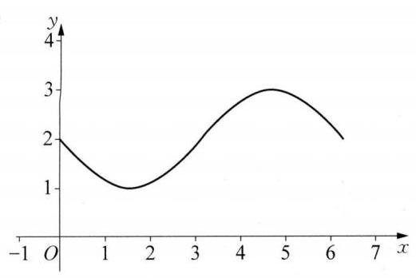

(2)

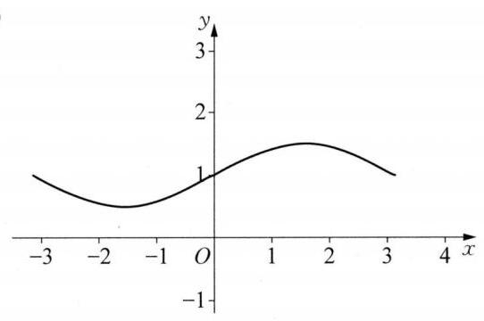

(3)

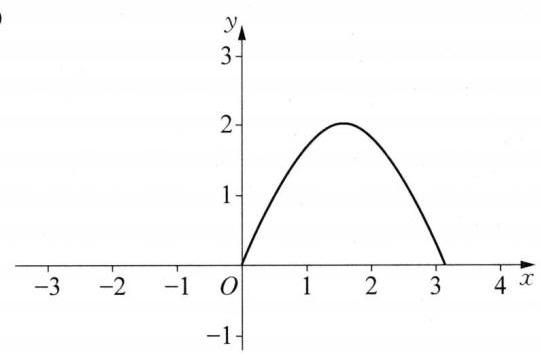

(4)

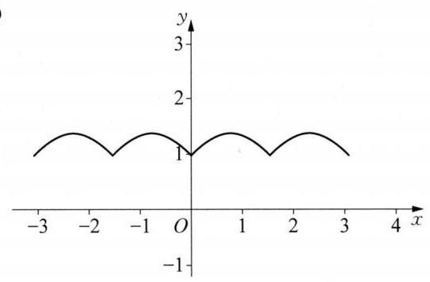

11 当 $x \in  \left\lbrack  {0,\frac{\pi }{2}}\right\rbrack$ 时, $f\left( x\right)  = 2\sin \left( {{2x} + \frac{\pi }{6}}\right)  + a + 1 \in  \left\lbrack  {a, a + 3}\right\rbrack   \subseteq  \left( {-2,2}\right)$ ,所以 $a \in  \left( {-2, - 1}\right)$ 。

12 $f\left( x\right)  = \cos {2x} - \sin {2x} = \sqrt{2}\sin \left( {{2x} + \frac{3}{4}\pi }\right)$ ，当 $x = {k\pi } - \frac{\pi }{8}, k \in  \mathbf{Z}$ 时， $f{\left( x\right) }_{\max } = \sqrt{2}$ ，当 $x = {k\pi } - \frac{5\pi }{8}$ ， $k \in  \mathbf{Z}$ 时， $f{\left( x\right) }_{\min } =  - \sqrt{2}$ 。

13 (1) $f\left( x\right)  = \sin \frac{x}{2} + \sqrt{3}\cos \frac{x}{2} = 2\sin \left( {\frac{x}{2} + \frac{\pi }{3}}\right)$ ，所以， $f\left( x\right)$ 的最小正周期为 ${4\pi }$ ，当 $x = {4k\pi } + \frac{\pi }{3}$ ， $k \in \; \mathbf{Z}$ 时, $f{\left( x\right) }_{\max } = 2$ ,当 $x = {4k\pi } - \frac{5\pi }{3}, k \in  \mathbf{Z}$ 时, $f{\left( x\right) }_{\min } =  - 2$ 。(2)由 $g\left( x\right)  = f\left( {x + \frac{\pi }{3}}\right)$ ，得 $g\left( x\right)  = \; 2\sin \left( {\frac{x}{2} + \frac{\pi }{2}}\right)  = 2\cos \frac{x}{2}$ 。而 $g\left( x\right)$ 的定义域为 $\mathbf{R}$ ,关于原点对称,且 $g\left( {-x}\right)  = g\left( x\right)$ ,所以, $g\left( x\right)$ 为偶函数。

### 6.1 正弦函数的图像与性质(2)

$\begin{array}{llllll} 1 & \frac{3}{4} & 2 & \left\lbrack  {0,1}\right\rbrack  & 3 & \left\lbrack  {0,\frac{1}{2}}\right\rbrack   \end{array}$

4 $\left\lbrack  {\frac{2k\pi }{3} - \frac{\pi }{12},\frac{2k\pi }{3} + \frac{\pi }{4}}\right\rbrack  , k \in  \mathbf{Z}$ 提示: $y = 2\sin \left( {{3x} - \frac{\pi }{4}}\right)$ ,令 ${2k\pi } - \frac{\pi }{2} \leq  {3x} - \frac{\pi }{4} \leq  {2k\pi } + \frac{\pi }{2}, k \in \; \mathbf{Z}$ ,则 $\frac{2k\pi }{3} - \frac{\pi }{12} \leq  x \leq  \frac{2k\pi }{3} + \frac{\pi }{4}, k \in  \mathbf{Z}$ 。

5 $\left\lbrack  {{2k\pi } + \frac{\pi }{2},{2k\pi } + \pi }\right\rbrack  , k \in  \mathbf{Z}$ 提示: 定义域 $x \in  \left\lbrack  {{2k\pi },{2k\pi } + \pi }\right\rbrack  , k \in  \mathbf{Z}, y = \sin x$ 的单调减区间为 $\left\lbrack  {{2k\pi } + \frac{\pi }{2},{2k\pi } + \frac{3\pi }{2}}\right\rbrack  , k \in  \mathbf{Z}$ ,两者取交集可得答案。

64 提示: $\left( {\frac{k}{2},\sqrt{3}}\right) \text{ 、 }\left( {-\frac{k}{2}, - \sqrt{3}}\right)$ 关于原点对称,且为相邻两最值点,所以均在圆上,则 $\frac{{k}^{2}}{4} + 3 = {k}^{2}$ , $k =  \pm  2$ ,则 $T = \frac{2\pi }{\left| \frac{\pi }{k}\right| } = 4$ 。

$7\mathrm{D}$

8 A 提示: 由题意,得 $\omega  = 2$ ,则 $f\left( x\right)  = \sin \left( {{2x} + \frac{\pi }{3}}\right)$ 。令 ${2x} + \frac{\pi }{3} = {k\pi }, k \in  \mathbf{Z}$ ,则 $x = \frac{k\pi }{2} - \frac{\pi }{6}, k \in  \mathbf{Z}$ 。 所以该图像关于点 $\left( {\frac{k\pi }{2} - \frac{\pi }{6},0}\right) , k \in  \mathbf{Z}$ 对称。令 ${2x} + \frac{\pi }{3} = {k\pi } + \frac{\pi }{2}, k \in  \mathbf{Z}$ ,则 $x = \frac{k\pi }{2} + \frac{\pi }{12}, k \in  \mathbf{Z}$ ,所以, 该函数的图像关于直线 $x = \frac{k\pi }{2} + \frac{\pi }{12}\left( {k \in  \mathbf{Z}}\right)$ 对称。

$9\mathrm{\;B}$ 提示: 若 $a > 1$ ,令 $x = \frac{\pi }{4},{\log }_{a}\frac{\pi }{4} < 0 < \sin \frac{\pi }{2}$ ,则 $0 < a < 1$ ,根据函数单调性可知 ${\log }_{a}\frac{\pi }{4} > \sin \frac{\pi }{2} =$ 1,得 $\frac{\pi }{4} < a < 1$ 。

10 (1) $\{ x \mid  {2k\pi } < x < {2k\pi } + \pi , k \in  \mathbf{Z}\}$ (2) $\left\{  {x\left| {\;x \neq  {k\pi } + \frac{\pi }{4}}\right. , k \in  \mathbf{Z}}\right\}$

11 (1)奇函数，增区间 $\left\lbrack  {{k\pi } - \frac{\pi }{4},{k\pi } + \frac{\pi }{4}}\right\rbrack  , k \in  \mathbf{Z}$ ；减区间 $\left\lbrack  {{k\pi } + \frac{\pi }{4},{k\pi } + \frac{3\pi }{4}}\right\rbrack  , k \in  \mathbf{Z}$ 。(2)非奇非偶函数,增区间 $\left\lbrack  {{2k\pi } - \frac{3\pi }{4},{2k\pi } + \frac{\pi }{4}}\right\rbrack  , k \in  \mathbf{Z}$ ; 减区间 $\left\lbrack  {{2k\pi } + \frac{\pi }{4},{2k\pi } + \frac{5\pi }{4}}\right\rbrack  , k \in  \mathbf{Z}$ 。

12 由题意，得 $f\left( x\right)  = \frac{1}{2}\left( {1 - \cos {2\omega x}}\right)  + \frac{\sqrt{3}}{2}\sin {2\omega x} = \frac{1}{2} + \sin \left( {{2\omega x} - \frac{\pi }{6}}\right)$ 。(1)由 $T = \pi$ ，得 $T = \frac{2\pi }{2\omega } = \; \pi$ 解得 $\omega  = 1$ 。(2)由(1)得 $f\left( x\right)  = \frac{1}{2} + \sin \left( {{2x} - \frac{\pi }{6}}\right)$ 。因为 $x \in  \left\lbrack  {0,\frac{2\pi }{3}}\right\rbrack$ ，所以 ${2x} - \frac{\pi }{6} \in \; \left\lbrack  {-\frac{\pi }{6},\frac{7\pi }{6}}\right\rbrack$ ,所以 $f\left( x\right)  \in  \left\lbrack  {0,\frac{3}{2}}\right\rbrack$ 。

${13f}\left( x\right)  = a\left( {1 - \cos {2x}}\right)  - \sqrt{3}a\sin {2x} + a + b =  - {2a}\sin \left( {{2x} + \frac{\pi }{6}}\right)  + {2a} + b$ 。因为 $- \frac{\pi }{2} \leq  x \leq  0$ ,则 $- \frac{5\pi }{6} \leq \; {2x} + \frac{\pi }{6} \leq  \frac{\pi }{6}$ ,从而 $- 1 \leq  \sin \left( {{2x} + \frac{\pi }{6}}\right)  \leq  \frac{1}{2}$ 。若 $a > 0, f\left( x\right)  \in  \left\lbrack  {a + b,{4a} + b}\right\rbrack$ ,从而有 $\left\{  \begin{array}{l} {4a} + b = 1, \\  a + b =  - 5, \end{array}\right.$ 解得 $\left\{  {\begin{array}{l} a = 2 \\  b =  - 7 \end{array}\text{ 。 }}\right.$ 若 $a < 0, f\left( x\right)  \in  \left\lbrack  {{4a} + b, a + b}\right\rbrack$ ,从而有 $\left\{  \begin{array}{l} a + b = 1, \\  {4a} + b =  - 5, \end{array}\right.$ 解得 $\left\{  \begin{array}{l} a =  - 2, \\  b = 3, \end{array}\right.$ 综上, $\left\{  {\begin{array}{l} a = 2, \\  b =  - 7 \end{array}\text{ 或 }\left\{  \begin{array}{l} a =  - 2, \\  b = 3\text{ 。 } \end{array}\right. }\right.$

### 6.2 余弦函数的图像与性质

$1\;\left\{  {\varphi \left| {\;\varphi  = {k\pi } + \frac{\pi }{2}}\right. , k \in  \mathbf{Z}}\right\}  \;2\;\{ x \mid  {2k\pi } \leq  x < {2k\pi } + \pi , k \in  \mathbf{Z}\}$

$3\left\lbrack  {{k\pi } - \frac{3}{8}\pi ,{k\pi } + \frac{1}{8}\pi }\right\rbrack  , k \in  \mathbf{Z}$

4. 5 提示: $y = \frac{1}{4}{\left\lbrack  \cos \left( 2\omega x - \frac{\pi }{3}\right)  + 1\right\rbrack  }^{2} = \frac{1}{4}\left\lbrack  {\frac{1}{2}\cos \left( {{4\omega x} - \frac{2\pi }{3}}\right)  + 2\cos \left( {{2\omega x} - \frac{\pi }{3}}\right)  + \frac{3}{2}}\right\rbrack$ ,则 $T = \frac{2\pi }{2\omega } = \; \frac{\pi }{5}$ ,即 $\omega  = 5$ 。

5 $\left\lbrack  {0,1}\right\rbrack$ 提示: 由题意,得 $\left\{  \begin{array}{l} m \geq  0, \\   - 1 \leq  m \leq  1, \end{array}\right.$ 则 $m \in  \left\lbrack  {0,1}\right\rbrack$ 。

${64\pi }$ 提示: $T = {2\pi }, S = {2T} = {4\pi }$ 。

7 D 8 D

9 A 提示: $y = 2{\cos }^{2}x + k\cos x - k - 1 = 2{\left( \cos x + \frac{k}{4}\right) }^{2} - \frac{{k}^{2}}{8} - k - 1$ ,由 $k <  - 4$ ,得 $- \frac{k}{4} > 1$ ,所以, 当 $\cos x = 1$ 时, ${y}_{\min } = 1$ 。

10 (1)奇函数 (2)非奇非偶函数 (3)偶函数

11 (1) $T = \pi \;$ (2) 最大值为 $\sqrt{2}$ ，最小值为 -1。 提示:由题意，得 $f\left( x\right)  = \sin {2x} - \left( {\cos {2x} + 1}\right)  + 1 = \; \sqrt{2}\sin \left( {{2x} - \frac{\pi }{4}}\right)$ ,由 $x \in  \left\lbrack  {\frac{\pi }{8},\frac{3\pi }{4}}\right\rbrack$ ,得 ${2x} - \frac{\pi }{4} \in  \left\lbrack  {0,\frac{5\pi }{4}}\right\rbrack$ ,所以,当 $x = \frac{3\pi }{8}$ 时, $f{\left( x\right) }_{\max } = \sqrt{2}$ ,当 $x = \frac{3\pi }{4}$ 时, $f{\left( x\right) }_{\min } =  - 1$ 。

12 (1)由题意，得 $y = 2{\left( \cos x - \frac{a}{2}\right) }^{2} - \frac{{a}^{2}}{2} - {2a} - 1$ ,令 $t = \cos x$ ,则 $- 1 \leq  t \leq  1, y = 2{\left( t - \frac{a}{2}\right) }^{2} - \frac{{a}^{2}}{2} - \; {2a} - 1$ 。当 $a <  - 2$ ,即 $\frac{a}{2} <  - 1$ ,则 $f\left( a\right)  = 1$ ; 当 $- 2 \leq  a \leq  2$ ,即 $- 1 \leq  \frac{a}{2} \leq  1$ ,则 $f\left( a\right)  =  - \frac{{a}^{2}}{2} - {2a} - 1$ ; 当 $a > 2$ ,即 $\frac{a}{2} > 1$ ,则 $f\left( a\right)  = 1 - {4a}$ 。所以 $f\left( a\right)  = \left\{  \begin{array}{ll} 1, & a <  - 2, \\   - \frac{{a}^{2} + {4a} + 2}{2}, &  - 2 \leq  a \leq  2, \\  1 - {4a}, & a > 2\text{ 。 } \end{array}\right. \; - \frac{{a}^{2} + {4a} + 2}{2} = \frac{1}{2}$ ,则 $a =  - 1$ 或 $a =  - 3$ (舍去)。令 $1 - {4a} = \frac{1}{2}$ ,则 $a = \frac{1}{8}$ (舍去),所以 $a =  - 1, y = \; 2{\left( \cos x + \frac{1}{2}\right) }^{2} + \frac{1}{2} \leq  2{\left( 1 + \frac{1}{2}\right) }^{2} + \frac{1}{2} = 5$ ,当且仅当 $\cos x = 1$ 时等号成立。

13 取 $x = 0$ 得 $\sin \theta  > 0$ ,对 $x \in  (0,1\rbrack ,{\left( \frac{1 - x}{x}\right) }^{2}\sin \theta  - \frac{1 - x}{x} + \cos \theta  > 0$ 恒成立,设 $t = \frac{1 - x}{x} \in  \lbrack 0$ , $+ \infty )$ ,则 ${t}^{2}\sin \theta  - t + \cos \theta  > 0$ 恒成立,所以 $\left\{  \begin{array}{l} \sin \theta  > 0, \\  \Delta  = 1 - 4\sin \theta \cos \theta  < 0, \end{array}\right.$ 即 $\left\{  \begin{array}{l} \sin \theta  > 0, \\  \sin {2\theta } > \frac{1}{2}, \end{array}\right.$ 解得 $\theta  \in \; \left( {{2k\pi } + \frac{1}{12}\pi ,{2k\pi } + \frac{5}{12}\pi }\right) , k \in  \mathbf{Z}$  。

### 6.3 函数 $y = A\sin \left( {{\omega x} + \varphi }\right)$ 的图像与性质 $\left( 1\right)$

${1x} = \frac{k\pi }{2} - \frac{\pi }{6}, k \in  \mathbf{Z}\;2\left\lbrack  {-\frac{1}{2},\frac{3}{2}}\right\rbrack  \;3\;{k\pi }\left( {k \in  \mathbf{Z}, k \neq  0}\right)$

$4\left\{  {x\left| {\;x = \frac{k\pi }{2} + \frac{\pi }{16}}\right. , k \in  \mathbf{Z}}\right\}$ 提示: $f\left( x\right)  = \cos {2\omega x} + \sin {2\omega x} + 2 = \sqrt{2}\sin \left( {{2\omega x} + \frac{\pi }{4}}\right)  + 2$ ,由 $T = \frac{2\pi }{2\omega } = \; \frac{\pi }{2}$ ,得 $\omega  = 2$ ,所以, $f\left( x\right)  = \sqrt{2}\sin \left( {{4x} + \frac{\pi }{4}}\right)  + 2$ 。令 ${4x} + \frac{\pi }{4} = {2k\pi } + \frac{\pi }{2}, k \in  \mathbf{Z}$ ,则 $x = \frac{k\pi }{2} + \frac{\pi }{16}, k \in  \mathbf{Z}$ 。 5 $\left\lbrack  {{k\pi } - \frac{\pi }{3},{k\pi } + \frac{\pi }{6}}\right\rbrack  , k \in  \mathbf{Z}$ 提示: $f\left( x\right)  = 2\sin \left( {{\omega x} + \frac{\pi }{6}}\right) , T = \frac{2\pi }{\omega } = \pi$ ，即 $\omega  = 2$ ，则 $f\left( x\right)  = \; 2\sin \left( {{2x} + \frac{\pi }{6}}\right)$ 。令 ${2k\pi } - \frac{\pi }{2} \leq  {2x} + \frac{\pi }{6} \leq  {2k\pi } + \frac{\pi }{2}, k \in  \mathbf{Z}$ ,则 $x \in  \left\lbrack  {{k\pi } - \frac{\pi }{3},{k\pi } + \frac{\pi }{6}}\right\rbrack  , k \in  \mathbf{Z}$ 。

${64} + \sqrt{10}4 - \sqrt{5}$ 提示: 设 $x = \sqrt{5}\cos \theta ,\theta  \in  \left\lbrack  {0,\pi }\right\rbrack$ ,则 $y = \sqrt{5}\cos \theta  + 4 + \sqrt{5}\sin \theta  = \sqrt{10}\sin \left( {\theta  + \frac{\pi }{4}}\right)  + \; 4 \in  \left\lbrack  {4 - \sqrt{5},4 + \sqrt{10}}\right\rbrack$ 。当 $\theta  = \pi , x =  - \sqrt{5}$ 时, ${y}_{\min } = 4 - \sqrt{5}$ ; 当 $\theta  = \frac{\pi }{4}, x = \frac{\sqrt{10}}{2}$ 时, ${y}_{\max } = 4 + \sqrt{10}$ 。

7 D

8 D 提示: $x = \frac{\pi }{4}$ 为 $f\left( x\right)$ 的对称轴,则 $f\left( \frac{\pi }{4}\right)$ 为最值, $f\left( \frac{\pi }{4}\right)  =  \pm  3$ 。

$9\mathrm{D}$ 提示: $f\left( x\right)$ 是周期为 ${2\pi }$ 的正弦型函数, $x = \frac{\pi }{4}$ 为对称轴,则对称轴为 $x = {k\pi } + \frac{\pi }{4}, k \in  \mathbf{Z}$ ,对称中心为 $\left( {{k\pi } - \frac{\pi }{4},0}\right) , k \in  \mathbf{Z}$ ,对 $y = f\left( {\frac{3\pi }{4} - x}\right)$ ,令 $\frac{3\pi }{4} - x = {k\pi } + \frac{\pi }{4}, k \in  \mathbf{Z}$ ,则 $x =  - {k\pi } + \frac{\pi }{2}, k \in  \mathbf{Z}$ 为对称轴。令 $\frac{3\pi }{4} - x = {k\pi } - \frac{\pi }{4}, k \in  \mathbf{Z}$ ,则 $x =  - {k\pi } + \pi , k \in  \mathbf{Z}$ ,对称中心为 $\left( {-{k\pi } + \pi ,0}\right) , k \in  \mathbf{Z}$ 。

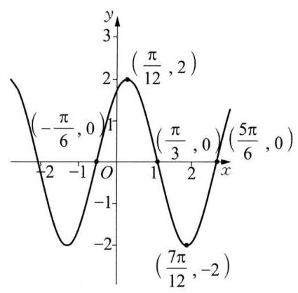

(第 10 题图)

10 (1)A = 2，T = π，φ = $\frac{\pi }{3}$ 。(2)图像如图所示。

11 (1) $f\left( x\right)$ 的对称轴方程为 $x = \frac{k}{2}\pi  + \frac{\pi }{3}, k \in  \mathbf{Z}$ 。 (2) $\left\lbrack  {-\frac{\sqrt{3}}{2},1}\right\rbrack$ 。

提示: $\left( 1\right) f\left( x\right)  = \frac{1}{2}\cos {2x} + \frac{\sqrt{3}}{2}\sin {2x} + \cos \frac{\pi }{2} - \cos {2x} = \; \sin \left( {{2x} - \frac{\pi }{6}}\right)$ 。令 ${2x} - \frac{\pi }{6} = {k\pi } + \frac{\pi }{2}, k \in  \mathbf{Z}$ ,则 $x = \frac{k}{2}\pi  + \frac{\pi }{3}, k \in  \mathbf{Z}$ 。

(2)当 $x \in  \left\lbrack  {-\frac{\pi }{12},\frac{\pi }{2}}\right\rbrack$ 时， ${2x} - \frac{\pi }{6} \in  \left\lbrack  {-\frac{\pi }{3},\frac{5\pi }{6}}\right\rbrack$ ，则 $f\left( x\right)  \in \; \left\lbrack  {-\frac{\sqrt{3}}{2},1}\right\rbrack$ 。

12 (1) $f\left( x\right)  = \frac{1}{2}\left( {1 - \cos {2\omega x}}\right)  + \frac{\sqrt{3}}{2}\sin {2\omega x} = \frac{1}{2} + \sin \left( {{2\omega x} - \frac{\pi }{6}}\right) , T = \frac{2\pi }{2\omega } = \pi$ ，则 $\omega  = 1$ 。(2)由( 1 得 $f\left( x\right)  = \frac{1}{2} + \sin \left( {{2x} - \frac{\pi }{6}}\right)$ ,当 $x \in  \left\lbrack  {0,\frac{2\pi }{3}}\right\rbrack$ 时, ${2x} - \frac{\pi }{6} \in  \left\lbrack  {-\frac{\pi }{6},\frac{7\pi }{6}}\right\rbrack$ ,则 $f\left( x\right)  \in  \left\lbrack  {0,\frac{3}{2}}\right\rbrack$ 。

13 设 $x = r\cos \theta , y = r\sin \theta ,\theta  \in  \lbrack 0,{2\pi })$ ,则 $1 \leq  {x}^{2} + {y}^{2} = {r}^{2} \leq  2$ ,即 $r \in  \left\lbrack  {1,\sqrt{2}}\right\rbrack$ ,则 ${x}^{2} - {xy} + {y}^{2} = \; {r}^{2}\left( {1 - \frac{1}{2}\sin {2\theta }}\right)$ ,因为 $\frac{1}{2} = 1 \times  \left( {1 - \frac{1}{2}}\right)  \leq  {r}^{2}\left( {1 - \frac{1}{2}\sin {2\theta }}\right)  \leq  2 \times  \left( {1 + \frac{1}{2}}\right)  = 3$ ,所以 ${x}^{2} - {xy} + \; {y}^{2} \in  \left\lbrack  {\frac{1}{2},3}\right\rbrack$  。

6.3 函数 $y = A\sin \left( {{\omega x} + \varphi }\right)$ 的图像与性质 $\left( 2\right)$

${122\pi }$

$3\frac{\sqrt{3}}{3}$ 提示: $\sin \frac{\pi }{3} + a\cos \frac{\pi }{3} =  \pm  \sqrt{{a}^{2} + 1}$ ,则 $a = \frac{\sqrt{3}}{3}$ 。

${4y} = 3\sin \left( {\frac{\pi }{6}x + \frac{\pi }{6}}\right)  - 1$ 提示: $A = \frac{2 - \left( {-4}\right) }{2} = 3, C = \frac{2 + \left( {-4}\right) }{2} =  - 1, T = 2 \times  \left( {8 - 2}\right)  = {12},\omega  = \frac{2\pi }{T} = \; \frac{\pi }{6}$ ,则 $3\sin \left( {\frac{\pi }{6} \times  2 + \varphi }\right)  - 1 = 2$ ,解得 $\varphi  = \frac{\pi }{6}$ 。

${5y} = 3\sin \left( {{2x} + \frac{\pi }{3}}\right)$ 提示: $A = \frac{3 - \left( {-3}\right) }{2} = 3, T = 2 \times  \left( {\frac{7\pi }{12} - \frac{\pi }{12}}\right)  = \pi ,\omega  = \frac{2\pi }{T} = 2$ ,则 $3\sin \left( {\frac{\pi }{12} \times  2 + \varphi }\right)  = 3$ ,即 $\varphi  = \frac{\pi }{3}$ 。

$6\frac{{2\pi }\sqrt{{a}^{2} + 1}}{a}$ 提示: $f\left( x\right)  = \sqrt{{a}^{2} + 1}\sin \left( {{ax} + \varphi }\right)$ ,其中 $\sin \varphi  = \frac{1}{\sqrt{{a}^{2} + 1}},\cos \varphi  = \frac{a}{\sqrt{{a}^{2} + 1}}, T = \frac{2\pi }{a}$ ,则 $S = \sqrt{{a}^{2} + 1}T = \frac{{2\pi }\sqrt{{a}^{2} + 1}}{a}$  。

$7\mathrm{\;B}\;8\mathrm{C}$

9 A 提示: $A =  \pm  4, T = 2 \times  \left\lbrack  {6 - \left( {-2}\right) }\right\rbrack   = {16},\omega  = \frac{2\pi }{T} = \frac{\pi }{8}$ ; 当 $A = 4$ 时, $4\sin \left( {\frac{\pi }{8} \times  2 + \varphi }\right)  =  - 4$ ,即 $\varphi  \in \; \varnothing$ ; 当 $A =  - 4$ 时, $- 4\sin \left( {\frac{\pi }{8} \times  2 + \varphi }\right)  =  - 4$ ,即 $\varphi  = \frac{\pi }{4}$ 。

${10}\left( 1\right) f\left( x\right)  = \cos x\;\left( 2\right) \frac{56}{65}$

11 (1) $f\left( x\right)  = 2\sin \left( {{2x} + \frac{\pi }{6}}\right)$

12 (1)由题意，得 $A = 2, T = 2 \times  \left( {\frac{11\pi }{24} - \frac{5\pi }{24}}\right)  = \frac{\pi }{2},\omega  = \frac{2\pi }{T} = 4$ ,则 $2\sin \left( {4 \times  \frac{5\pi }{24} + \varphi }\right)  = 2$ ,解得 $\varphi  =  - \frac{\pi }{3}$ , 所以,此函数的解析式为 $y = 2\sin \left( {{4x} - \frac{\pi }{3}}\right)$ 。 (2)令 ${2k\pi } - \frac{\pi }{2} \leq  {4x} - \frac{\pi }{3} \leq  {2k\pi } + \frac{\pi }{2}, k \in  \mathbf{Z}$ ，则 $\frac{k\pi }{2} - \; \frac{\pi }{24} \leq  x \leq  \frac{k\pi }{2} + \frac{5\pi }{24}, k \in  \mathbf{Z}$ ,所以,此函数的严格增区间为 $\left\lbrack  {\frac{k\pi }{2} - \frac{\pi }{24},\frac{k\pi }{2} + \frac{5\pi }{24}}\right\rbrack  , k \in  \mathbf{Z}$ 。

13 (1) $f\left( x\right)  = \sqrt{{a}^{2} + {b}^{2}}\sin \left( {{\omega x} + \varphi }\right)$ ，其中 $\sin \varphi  = \frac{b}{\sqrt{{a}^{2} + {b}^{2}}},\cos \varphi  = \frac{a}{\sqrt{{a}^{2} + {b}^{2}}}$ ，则 $T = 4 \times  \left( {\frac{7\pi }{6} - \frac{2\pi }{3}}\right)  = \; {2\pi }$ ,从而 $\omega  = \frac{2\pi }{T} = 1$ ,所以, $\left\{  \begin{array}{l} a\sin \frac{2\pi }{3} + b\cos \frac{2\pi }{3} = 0, \\  a\sin \frac{7\pi }{6} + b\cos \frac{7\pi }{6} =  - 1, \end{array}\right.$ 解得 $\left\{  \begin{array}{l} a = \frac{1}{2}, \\  b = \frac{\sqrt{3}}{2}\text{ 。 } \end{array}\right. \;$ (2) $f\left( x\right)  = \frac{1}{2}\sin x + \frac{\sqrt{3}}{2}\cos x = \; \sin \left( {x + \frac{\pi }{3}}\right)$ ,令 $t = f\left( x\right)$ ,则 $3{t}^{2} - t + m = 0$ 。因为 $x$ 在 $\left( {-\frac{\pi }{3},\frac{2\pi }{3}}\right)$ 上有两个不同的解,所以关于 $t$ 的一

元二次方程在 $\left( {0,1}\right)$ 上有两个相等实根,或有两个不等实根,且一根在 $\left( {0,1}\right)$ 上,另一根在 $( - \infty ,0\rbrack  \cup \; \lbrack 1, + \infty )$ 上。令 $g\left( t\right)  = 3{t}^{2} - t + m$ ,则 $\Delta  = 0$ ,即 $1 - {12m} = 0$ ,即 $m = \frac{1}{12}$ 时, ${t}_{1} = {t}_{2} = \frac{1}{6}$ ; 由 $g\left( 0\right)  \cdot  g\left( 1\right)  <$ 0,得 $m \in  \left( {-2,0}\right)$ ; 由 $g\left( 0\right)  = 0$ ,得 $m = 0,{t}_{1} = 0,{t}_{2} = \frac{1}{3}$ ,满足条件; 由 $g\left( 1\right)  = 0$ ,得 $m =  - 2,{t}_{1} = 1,{t}_{2} = \; - \frac{2}{3}$ ,不满足,舍去。综上, $m \in  ( - 2,0\rbrack  \cup  \left\{  \frac{1}{12}\right\}$ 。

### 6.3 函数 $y = A\sin \left( {{\omega x} + \varphi }\right)$ 的图像与性质 $\left( 3\right)$

${1y} = \sin \left( {{2x} + \frac{\pi }{2}}\right)  + 1\left( {y = 2{\cos }^{2}x}\right)$

$2\frac{5\pi }{6}$ 提示: 平移后的函数为 $y = 2\cos \left( {x + \frac{\pi }{6} + m}\right) ,\frac{\pi }{6} + m = {k\pi }, k \in  \mathbf{Z},{m}_{\min } = \frac{5\pi }{6}$ 。

${3y} = \frac{1}{2}\sin \left( {2x}\right)  + 1$ 提示:利用逆推法。

${4f}\left( x\right)  = 2\cos x$ 提示: 利用逆推法, $y = 1 - 2{\sin }^{2}x$ 经过图像变换后为 $y = 2{\sin }^{2}\left( {x + \frac{\pi }{4}}\right)  - 1 = \sin {2x}$ , 所以 $f\left( x\right)  = \frac{\sin {2x}}{\sin x} = 2\cos x$ 。

$5\frac{3}{2}$ 提示: $\frac{4\pi }{3} = {kT}, k \in  \mathbf{Z}$ ,又 $T = \frac{2\pi }{\omega } > 0$ ,则 $\omega  = \frac{3}{2}k > 0,{\omega }_{\min } = \frac{3}{2}$ 。

6 ①③⇒②④,②③⇒①④ 7 A 8 B

9 B 提示: $\frac{\pi }{2} = {kT}, k \in  \mathbf{Z}$ ,又 $T = \frac{2\pi }{\omega } > 0$ ,则 $\omega  = {4k} > 0$ ,故选 B。

10(1)由题意，得 $\cos \left( {\frac{\pi }{4} + \varphi }\right)  = 0$ ，则 $\varphi  = \frac{\pi }{4}\text{ 。 }\;$ (2)由题意，得 $T = \frac{2\pi }{3}$ ， $\omega  = \frac{2\pi }{T} = 3$ ，所以 $f\left( x\right)  = \; \sin \left( {{3x} + \frac{\pi }{4}}\right)$ ,平移后 $y = f\left( {x + m}\right)  = \sin \left( {{3x} + {3m} + \frac{\pi }{4}}\right)$ ,则 ${3m} + \frac{\pi }{4} = {k\pi } + \frac{\pi }{2}$ ,解得 $m = \frac{k\pi }{3} + \frac{\pi }{12}, k \in$

$\mathbf{Z}$ ,所以, ${m}_{\min } = \frac{\pi }{12}$ 。

11 (1)由题意，得 $f\left( x\right)  = \frac{1}{2}\sin {2x}\sin \varphi  + \frac{1}{2}\cos {2x}\cos \varphi  = \frac{1}{2}\cos \left( {{2x} - \varphi }\right)$ ， $f\left( \frac{\pi }{6}\right)  = \frac{1}{2}$ ，则 $\frac{1}{2}\cos \left( {\frac{\pi }{3} - \varphi }\right)  = \; \frac{1}{2}$ ,解得 $\varphi  = \frac{\pi }{3}\text{ 。 }\;\left( 2\right) f\left( x\right)  = \frac{1}{2}\cos \left( {{2x} - \frac{\pi }{3}}\right)$ ,图像变换后函数为 $g\left( x\right)  = \frac{1}{2}\cos \left( {{4x} - \frac{\pi }{3}}\right)$ ,因为 $x \in \; \left\lbrack  {0,\frac{\pi }{4}}\right\rbrack$ ,所以 ${4x} - \frac{\pi }{3} \in  \left\lbrack  {-\frac{\pi }{3},\frac{2\pi }{3}}\right\rbrack$ ,所以 $g\left( x\right)  \in  \left\lbrack  {-\frac{1}{4},\frac{1}{2}}\right\rbrack$ 。

12 (1)由题意，得 $f\left( x\right)  = 2\sin \left( {{\omega x} + \varphi  - \frac{\pi }{6}}\right) , T = \pi$ ，则 $\omega  = 2,\varphi  - \frac{\pi }{6} = {k\pi } + \frac{\pi }{2}, k \in  \mathbf{Z}$ ，又 $0 < \varphi  < \pi$ ， 则 $\varphi  = \frac{2\pi }{3}$ ，所以 $f\left( x\right)  = 2\sin \left( {{2x} + \frac{\pi }{2}}\right)  = 2\cos {2x}$ ，从而有 $f\left( \frac{\pi }{8}\right)  = \sqrt{2}$ 。( 2 )图像变换后 $g\left( x\right)  = \; 2\cos \left( {\frac{1}{2}x - \frac{\pi }{3}}\right)$ ,令 ${2k\pi } \leq  \frac{1}{2}x - \frac{\pi }{3} \leq  {2k\pi } + \pi , k \in  \mathbf{Z}$ ,则 ${4k\pi } + \frac{2\pi }{3} \leq  x \leq  {4k\pi } + \frac{8\pi }{3}, k \in  \mathbf{Z}$ 。所以, $g\left( x\right)$ 的严格减区间为 $\left\lbrack  {{4k\pi } + \frac{2\pi }{3},{4k\pi } + \frac{8\pi }{3}}\right\rbrack  , k \in  \mathbf{Z}$ 。

13 由题意,得 $\varphi  = {k\pi } + \frac{\pi }{2}, k \in  \mathbf{Z}$ ,又 $0 \leq  \varphi  \leq  \frac{\pi }{2}$ ,则 $\varphi  = \frac{\pi }{2}$ ,又因为 $f\left( x\right)$ 的图像关于点 $M\left( {\frac{3\pi }{4},0}\right)$ 对称, 所以 $\omega  \cdot  \frac{3\pi }{4} + \frac{\pi }{2} = {m\pi }$ ,即 $\omega  = \frac{4}{3}m - \frac{2}{3}, m \in  \mathbf{Z}$ 。对 $x \in  \left\lbrack  {0,\frac{\pi }{2}}\right\rbrack  ,\frac{\pi }{2} \leq  {\omega x} + \frac{\pi }{2} \leq  \frac{\omega \pi }{2} + \frac{\pi }{2}$ ,所以 $\left\lbrack  {\frac{\pi }{2},\frac{\omega \pi }{2} + \frac{\pi }{2}}\right\rbrack$ 为 $y = \sin x$ 的单调区间,则 $\frac{\omega \pi }{2} + \frac{\pi }{2} \leq  \frac{3\pi }{2}$ ,即 $\omega  \leq  2$ ,因为 $\omega  > 0$ ,所以 $\omega  = \frac{2}{3}$ 或 $\omega  = 2$ 。

### 6.4 正切函数的图像与性质

1 不对，比如 $\tan \frac{3\pi }{4} < \tan \frac{\pi }{4}$

$2\left\{  {x\left| {\;x \neq  \frac{k\pi }{2} - \frac{\pi }{8}}\right. \text{ 且 }x \neq  \frac{k\pi }{2} + \frac{\pi }{4}, k \in  \mathbf{Z}}\right\}$

$3\frac{\pi }{2}$ 提示: 定义域 $\left\{  {x\left| {\;x \neq  \frac{k\pi }{2}}\right. , k \in  \mathbf{Z}, x \in  \mathbf{R}}\right\}  , y = \frac{{\tan }^{2}x - 1}{\tan x} =  - \frac{2}{\tan {2x}}, T = \frac{\pi }{2}$ 。

4. $\left( {\frac{k\pi }{2} + \frac{\pi }{4},0}\right) , k \in  \mathbf{Z}$ 提示: 令 $x - \frac{\pi }{4} = \frac{k\pi }{2}, k \in  \mathbf{Z}$ ,则 $x = \frac{k\pi }{2} + \frac{\pi }{4}, k \in  \mathbf{Z}$ 。

$5\left( {\frac{k\pi }{2} - \frac{\pi }{4},\frac{k\pi }{2} + \frac{\pi }{4}}\right) , k \in  \mathbf{Z}$ 提示: 令 ${k\pi } - \frac{\pi }{2} < {2x} < {k\pi } + \frac{\pi }{2}, k \in  \mathbf{Z}$ ,则 $x \in  \left( {\frac{k\pi }{2} - \frac{\pi }{4},\frac{k\pi }{2} + \frac{\pi }{4}}\right)$ , $k \in  \mathbf{Z}$ 。

$6\frac{1}{2}$ 提示: 由题意,得 $\tan \left( {\omega \left( {x - \frac{\pi }{6}}\right)  + \frac{\pi }{4}}\right)  = \tan \left( {{\omega x} + \frac{\pi }{6}}\right)$ 对 $x \in  \mathbf{R}$ 恒成立,则 ${\omega x} + \frac{\pi }{6} = \; \omega \left( {x - \frac{\pi }{6}}\right)  + \frac{\pi }{4} + {k\pi }, k \in  \mathbf{Z}$ ,解得 $\omega  = {6k} + \frac{1}{2}, k \in  \mathbf{Z}$ ,因为 $\omega  > 0$ ,所以 ${\omega }_{\min } = \frac{1}{2}$ 。

$7\;\begin{array}{lll} 2 & 8 & D \end{array}$

9 D 提示: 由 ${k\pi } - \frac{\pi }{2} < {2x} \leq  {k\pi } - \frac{\pi }{4}, k \in  \mathbf{Z}$ ,得 $\frac{k\pi }{2} - \frac{\pi }{4} < x \leq  \frac{k\pi }{2} - \frac{\pi }{8}, k \in  \mathbf{Z}$ 。

${10}\left( 1\right) \left( {-1,1}\right) \left( 2\right) \left\lbrack  {-\frac{13}{4},3}\right\rbrack$

11 由 $\frac{\tan x + 1}{\tan x - 1} > 0$ ,得 ${k\pi } + \frac{\pi }{4} < x < {k\pi } + \frac{\pi }{2}$ 或 ${k\pi } - \frac{\pi }{2} < x < {k\pi } - \frac{\pi }{4}, k \in  \mathbf{Z}$ ,所以, $f\left( x\right)$ 的定义域为 $\left\{  {x\left| {\;{k\pi } + \frac{\pi }{4} < x < {k\pi } + \frac{\pi }{2}}\right. \text{ 或 }{k\pi } - \frac{\pi }{2} < x < {k\pi } - \frac{\pi }{4}, k \in  \mathbf{Z}}\right\}$ ,关于原点对称, $f\left( {-x}\right)  = \lg \frac{-\tan x + 1}{-\tan x - 1} = \; \lg \frac{\tan x - 1}{\tan x + 1} =  - f\left( x\right)$ ,则 $f\left( x\right)$ 为奇函数。

12 由题意,得 $T = \frac{5\pi }{6} - \frac{\pi }{6} = \frac{2\pi }{3}$ ,则 $\omega  = \frac{\pi }{T} = \frac{3}{2}$ ,又因为 $\left\{  \begin{array}{l} A\tan \varphi  =  - 3, \\  A\tan \left( {\frac{3}{2} \cdot  \frac{\pi }{6} + \varphi }\right)  = 0, \end{array}\right.$ 所以 $\left\{  \begin{array}{l} A = 3, \\  \varphi  =  - \frac{\pi }{4}, \end{array}\right.$ 则该函数的解析式为 $y = 3\tan \left( {\frac{3}{2}x - \frac{\pi }{4}}\right)$ 。

13 令 $t = \tan x, x \neq  {k\pi } + \frac{\pi }{2}, k \in  \mathbf{Z}$ ,则 $t \in  \mathbf{R}, y = \frac{{t}^{2} - t + 1}{{t}^{2} + t + 1} = 1 - \frac{2t}{{t}^{2} + t + 1} = \left\{  \begin{array}{ll} 1, & t = 0, \\  1 - \frac{2}{t + 1 + \frac{1}{t}}, & t \neq  0, \end{array}\right.$

由 $t + 1 + \frac{1}{t} \in  \left( {-\infty , - 1\rbrack \cup \lbrack 3, + \infty }\right)$ ,得 $\frac{2}{t + 1 + \frac{1}{t}} \in  \lbrack  - 2,0) \cup  \left( {0,\frac{2}{3}}\right\rbrack$ ,则 $y \in  \left\lbrack  {\frac{1}{3},3}\right\rbrack$ 。所以 ${y}_{\max } = 3, x \in  \left\{  {x\left| {\;x = {k\pi } - \frac{\pi }{4}}\right. , k \in  \mathbf{Z}}\right\}  ,{y}_{\min } = \frac{1}{3}, x \in  \left\{  {x\left| {\;x = {k\pi } + \frac{\pi }{4}}\right. , k \in  \mathbf{Z}}\right\}$  。

### 6.5 反三角函数

${1y} =  - \pi  - \arcsin x\;{2y} = 2\tan x, x \in  \left( {\frac{\pi }{2},\frac{3\pi }{2}}\right) \;3\left\lbrack  {0,1}\right\rbrack  \;\left\lbrack  {-\frac{\pi }{4},\frac{\pi }{2}}\right\rbrack$

$4\left( {\frac{1}{2},1}\right) \left\lbrack  {-1,\cos \frac{\sqrt{2}}{2}}\right)$

$5\frac{2\sqrt{2}}{3}$ 提示: 设 $\alpha  = \arccos \frac{1}{3} \in  \left( {0,\frac{\pi }{2}}\right)$ ,则 $\cos \alpha  = \frac{1}{3},\sin \alpha  = \frac{2\sqrt{2}}{3}$ 。

6 $\arccos x - \pi$ 提示: 当 $x < 0$ 时, $f\left( x\right)  =  - f\left( {-x}\right)  =  - \arccos \left( {-x}\right)  =  - \left( {\pi  - \arccos x}\right)  = \arccos x - \pi$ 。

7 D 8 D

9 B 提示: 由 $\arctan y = \frac{\pi }{2} - \arctan x > 0$ ,则 $y > 0$ ,同理 $x > 0$ ,所以, $\tan \left( {\arctan y}\right)  = \; \tan \left( {\frac{\pi }{2} - \arctan x}\right)$ ,则 $y = \frac{1}{x}$ ,即 ${xy} = 1$ ,所以, $N = \{ \left( {x, y}\right)  \mid  {xy} = 1, x > 0, y > 0\}  \subseteq  M$ ,则 $M \cup  N = M$ 。

10 设 $\alpha  = \arccos \frac{3}{5} \in  \left( {0,\frac{\pi }{2}}\right)$ ,则 $\cos \alpha  = \frac{3}{5},\tan \alpha  = \frac{4}{3}$ ,所以 原式 $= \tan \left( {\frac{\pi }{6} - \alpha }\right)  = \; \frac{\tan \frac{\pi }{6} - \tan \alpha }{1 + \tan \frac{\pi }{6}\tan \alpha } = \frac{{25}\sqrt{3} - {48}}{11}$  。

11 由题意,得 ${x}^{2} - x \in  \left\lbrack  {-1,1}\right\rbrack$ ,则 $x \in  \left\lbrack  {\frac{1 - \sqrt{5}}{2},\frac{1 + \sqrt{5}}{2}}\right\rbrack$ ,而 $y = {x}^{2} - x$ 在 $\left( {-\infty ,\frac{1}{2}}\right\rbrack$ 上为严格减函数,所以, $y = \arcsin \left( {{x}^{2} - x}\right)$ 在 $\left\lbrack  {\frac{1 - \sqrt{5}}{2},\frac{1}{2}}\right\rbrack$ 上为严格减函数。因为 ${x}^{2} - x \in  \left\lbrack  {-\frac{1}{4},1}\right\rbrack$ ,所以 $y \in \; \left\lbrack  {-\arcsin \frac{1}{4},\frac{\pi }{2}}\right\rbrack$ 。

12 $\sin \left( {\frac{\pi }{2} - \arccos x}\right)  = \cos \left( {\arccos x}\right)  = x = \sin \left( {\arcsin x}\right)$ ,其中 $\arcsin x \in  \left\lbrack  {-\frac{\pi }{2},\frac{\pi }{2}}\right\rbrack  ,\arccos x \in  \lbrack 0$ , $\pi \rbrack$ ,则 $\frac{\pi }{2} - \arccos x \in  \left\lbrack  {-\frac{\pi }{2},\frac{\pi }{2}}\right\rbrack$ 。因为 $y = \sin x$ 在 $\left\lbrack  {-\frac{\pi }{2},\frac{\pi }{2}}\right\rbrack$ 上为严格增函数,所以 $\frac{\pi }{2} - \arccos x = \; \arcsin x$ ,故 $\arcsin x + \arccos x = \frac{\pi }{2}$ 。

13 设 $\alpha  = \arccos x,\beta  = \arccos y,\gamma  = \arccos z$ ,则 $\cos \alpha  = x,\cos \beta  = y,\cos \gamma  = z$ 且 $\alpha  + \beta  + \gamma  = \pi$ ,因此左式 $= {\cos }^{2}\alpha  + {\cos }^{2}\beta  + {\cos }^{2}\gamma  + 2\cos \alpha \cos \beta \cos \gamma  = {\left( \cos \alpha  + \cos \beta \cos \gamma \right) }^{2} + {\cos }^{2}\beta  + {\cos }^{2}\gamma  - {\cos }^{2}\beta {\cos }^{2}\gamma  = \; {\left\lbrack  -\cos \left( \beta  + \gamma \right)  + \cos \beta \cos \gamma \right\rbrack  }^{2} - \left( {1 - {\cos }^{2}\beta }\right) \left( {1 - {\cos }^{2}\gamma }\right)  + 1 = {\sin }^{2}\beta {\sin }^{2}\gamma  - {\sin }^{2}\beta {\sin }^{2}\gamma  + 1 = 1$  。

### 6.6 最简三角方程(1)

$1\;\left\{  {x\left| {\;x = {k\pi } \pm  \frac{\pi }{3}}\right. , k \in  \mathbf{Z}}\right\}  \;2\;\left\{  {x\left| {\;x = \frac{k\pi }{2} + \frac{1}{2}\arcsin \frac{4}{5}}\right. , k \in  \mathbf{Z}}\right\}  \;3\;\left\{  {0,\frac{2\pi }{3},\pi ,\frac{5\pi }{3}}\right\}$

4 $\frac{7\pi }{3}$ 提示: 由题意,得 $\pi \cos x = {k\pi } + \frac{\pi }{2}, k \in  \mathbf{Z}$ ,则 $\cos x = k + \frac{1}{2}, k \in  \mathbf{Z}$ ,因为 $\cos x \in  \left\lbrack  {-1,1}\right\rbrack$ ,所以 $\cos x =  - \frac{1}{2}$ 或 $\cos x = \frac{1}{2}$ ,又 $x \in  \left\lbrack  {0,\frac{3\pi }{2}}\right\rbrack$ ,则 $x = \frac{\pi }{3}\text{ 、 }\frac{2\pi }{3}$ 或 $\frac{4\pi }{3}$ ,所以,所有解的和为 $\frac{7\pi }{3}$ 。

$5\left\{  {x\left| {\;x = {2k\pi } + \frac{5\pi }{6}}\right. , k \in  \mathbf{Z}}\right\}$ 提示: 由题意,得 $\sqrt{3}\sin x =  - \cos x > 0$ ,则 $\tan x =  - \frac{\sqrt{3}}{3}$ ,所以 $x = {2k\pi } + \; \frac{5\pi }{6}, k \in  \mathbf{Z}$ 。

6 0、1、2 提示: 由题意，得 $2 - 2{\cos }^{2}x + 3\left( {\cos x + 1}\right)  = 5 - {2k}$ ,则 $k = {\cos }^{2}x - \frac{3}{2}\cos x \in  \left\lbrack  {-\frac{9}{16},\frac{5}{2}}\right\rbrack$ , 因为 $k \in  \mathbf{Z}$ ,所以 $k = 0\text{ 、 }1\text{ 、 }2$ 。

7 A 8 D

9 D 提示: 由题意,得 $2\cos \left( {\alpha  + \frac{\pi }{14}}\right) \sin \frac{\pi }{14} = \sin \frac{\pi }{7}$ ,则 $\cos \left( {\alpha  + \frac{\pi }{14}}\right)  = \cos \frac{\pi }{14}$ ,所以 $\alpha  + \frac{\pi }{14} = {2k\pi } \pm  \frac{\pi }{14}$ ,即 $\alpha  = {2k\pi }$ 或 $\alpha  = {2k\pi } - \frac{\pi }{7}, k \in  \mathbf{Z}$  。

10 由题意,得 $0 < \sin \frac{3x}{2} + \sin \frac{x}{2} = \sin \left( {-x}\right)  < 1$ ,即 $0 < 2\sin x\cos \frac{x}{2} =  - \sin x < 1$ ,则 $\left\{  \begin{array}{l}  - 1 < \sin x < 0, \\  \cos \frac{x}{2} =  - \frac{1}{2}, \end{array}\right.$ 所以 $x = {4k\pi } + \frac{4\pi }{3}, k \in  \mathbf{Z}$ 。

11 原方程化为 $2\sin {2x}\cos x + \sin {2x} = 1 + \cos x + 2{\cos }^{2}x - 1$ ,即 $4\sin x{\cos }^{2}x + 2\sin x\cos x - \cos x - \; 2{\cos }^{2}x = 0$ ,化简得 $\cos x\left( {2\sin x - 1}\right) \left( {2\cos x + 1}\right)  = 0$ ,故原方程的解集为 $\left\{  {x\left| {\;x = {k\pi } + \frac{\pi }{2}}\right. , k \in  \mathbf{Z}}\right\}   \cup \; \left\{  {x\left| {\;x = {k\pi } + {\left( -1\right) }^{k}\frac{\pi }{6}}\right. , k \in  \mathbf{Z}}\right\}   \cup  \left\{  {x\left| {\;x = {2k\pi } \pm  \frac{2}{3}\pi }\right. , k \in  \mathbf{Z}}\right\}$  。

12 (1)由题意，得 $2\sin \left( {x + \frac{\pi }{3}}\right)  = m$ ，而 $x \in  \left( {0,{2\pi }}\right)$ ，则 $\frac{\pi }{3} < x + \frac{\pi }{3} < \frac{7\pi }{3}$ ，因为方程在 $\left( {0,{2\pi }}\right)$ 上有两异根,所以令 $\left\{  \begin{array}{l} y = \sin \left( {x + \frac{\pi }{3}}\right) , \\  y = \frac{m}{2}, \end{array}\right.$ 作出两函数图像,函数图像有两交点时, $\frac{\sqrt{3}}{2} < \frac{m}{2} < 1$ 或 $- 1 < \frac{m}{2} < \frac{\sqrt{3}}{2}$ ,所以 $- 2 < m < \sqrt{3}$ 或 $\sqrt{3} < m < 2$ ,即 $m$ 的取值范围为 $\left( {-2,\sqrt{3}}\right)  \cup  \left( {\sqrt{3},2}\right)$ 。(2)若 $m \in  \left( {-2,\sqrt{3}}\right)$ ，则 $\alpha  + \beta  = \frac{7\pi }{3}$ ; 若 $m \in  \left( {\sqrt{3},2}\right)$ ,则 $\alpha  + \beta  = \frac{\pi }{3}$ 。

13 由题意，得 $a = 2{\sin }^{2}x - 2 + \sin x = 2{\left( \sin x + \frac{1}{4}\right) }^{2} - \frac{17}{8}$ ，因为方程有实根，所以 $x \in  \mathbf{R}$ ，则 $a \in \; \left\lbrack  {-\frac{17}{8},1}\right\rbrack$ 。

### 6.6 最简三角方程(2)

$1\;\left\{  {x\left| {\;x = {k\pi } - \frac{\pi }{4} + \arctan \sqrt{2}}\right. , k \in  \mathbf{Z}}\right\}  \;2\;\left\{  {x\left| {\;x = {k\pi } + \arctan \frac{2}{3}}\right. , k \in  \mathbf{Z}}\right\} \; 3\left\{  {x\left| {\;x = {k\pi } + \frac{\pi }{4}\text{ 或 }x = {k\pi } + \arctan 2}\right. , k \in  \mathbf{Z}}\right\}$

$4 - \frac{4}{3}$ 提示: ${\cos }^{2}x = {\left( \frac{1}{5} - \sin x\right) }^{2} = 1 - {\sin }^{2}x$ ,即 $2{\sin }^{2}x - \frac{2}{5}\sin x - \frac{24}{25} = 0$ ,解得 $\sin x = \frac{4}{5}$ 或 $\sin x = \; - \frac{3}{5}$ (舍去)，所以 $\cos x =  - \frac{3}{5},\tan x =  - \frac{4}{3}$ 。

$5\frac{\pi }{4}$ 提示: 由题意,得 $\sin \left( {\arcsin x}\right)  = \sin \left( {-\arccos y}\right)$ ,则 $x =  - \sqrt{1 - {y}^{2}}$ ,即 ${x}^{2} + {y}^{2} = 1$ ,又 $\arcsin x \in \; \left\lbrack  {-\frac{\pi }{2},\frac{\pi }{2}}\right\rbrack$ , $\arccos y \in  \left\lbrack  {0,\pi }\right\rbrack$ ,则 $\arcsin x =  - \arccos y \in  \left\lbrack  {-\pi ,0}\right\rbrack$ ,所以 $\arcsin x \in  \left\lbrack  {-\frac{\pi }{2},0}\right\rbrack$ , $\arccos y \in  \left\lbrack  {0,\frac{\pi }{2}}\right\rbrack  , x \in  \left\lbrack  {-1,0}\right\rbrack  , y \in  \left\lbrack  {0,1}\right\rbrack  , A$ 对应的图形为以原点为圆心的单位圆与 $x$ 轴负半轴、 $y$ 轴正半轴围成的扇形区域, $S = \frac{\pi }{4}$ 。

${60}\text{ 、 } \pm  1$ 提示: 两边取正弦,得 $\sin \left( {\arcsin \frac{3x}{5} + \arcsin \frac{4x}{5}}\right)  = \sin \left( {\arcsin x}\right)$ ,则 $\frac{3x}{5}\sqrt{1 - {\left( \frac{4x}{5}\right) }^{2}} + \; \frac{4x}{5}\sqrt{1 - {\left( \frac{3x}{5}\right) }^{2}} = x$ ,从而有 $x = 0$ 或 $\frac{3}{5}\sqrt{1 - {\left( \frac{4x}{5}\right) }^{2}} + \frac{4}{5}\sqrt{1 - {\left( \frac{3x}{5}\right) }^{2}} = 1$ ,所以 $x =  \pm  1$ ,综上, $x =$ 0、±1。

7 A 8 C

9 B 提示: 对于 $\tan \left( {x + \frac{\pi }{4}}\right)  - \tan \left( {x - \frac{\pi }{4}}\right)  =  - 2$ ,若 $x = {k\pi } + \frac{\pi }{2}, k \in  \mathbf{Z}$ ,等式成立。而 $\frac{\tan x + 1}{1 - \tan x} - \; \frac{\tan x - 1}{1 + \tan x} =  - 2$ 无解,所以 $M = \left\{  {x\left| {\;x = {k\pi } + \frac{\pi }{2}}\right. , k \in  \mathbf{Z}}\right\}  , N = \varnothing , M \supset  N$ 。

10 原方程化为 $\sin x + \cos x + 2\sin x\cos x + 2{\cos }^{2}x = 0$ ,即 $\left( {\sin x + \cos x}\right) \left( {1 + 2\cos x}\right)  = 0$ ,所以 $\sin x + \; \cos x = 0$ 或 $1 + 2\cos x = 0$ ,得 $\tan x =  - 1$ (舍), $\cos x =  - \frac{1}{2}$ ,此时 $\tan x =  \pm  \sqrt{3}$ ,所以 $\tan {2x} = \frac{2\tan x}{1 - {\tan }^{2}x} = \; \pm  \sqrt{3}$ 。

11 由题意，得 $\Delta  = {\sin }^{2}\alpha  + 6\sin \alpha \cos \alpha  + 5{\cos }^{2}\alpha  = 0$ ，则 ${\tan }^{2}\alpha  + 6\tan \alpha  + 5 = 0$ ，解得 $\tan \alpha  =  - 1$ 或 $\tan \alpha  =  - 5$ ， ${x}_{1} = {x}_{2} = \frac{\sin \alpha  + \cos \alpha }{2}$ 。若 $\tan \alpha  =  - 1,\alpha  = {k\pi } - \frac{\pi }{4}, k \in  \mathbf{Z}$ ,则 ${x}_{1} = {x}_{2} = 0$ ; 若 $\tan \alpha  =  - 5,\alpha  = {k\pi } - \; \arctan 5, k \in  \mathbf{Z}$ ; 当 $\alpha  = {2k\pi } - \arctan 5, k \in  \mathbf{Z}$ 时, $\sin \alpha  =  - \frac{5\sqrt{26}}{26},\cos \alpha  = \frac{\sqrt{26}}{26},{x}_{1} = {x}_{2} =  - \frac{\sqrt{26}}{13}$ ,当 $\alpha  = \; {2k\pi } + \pi  - \arctan 5, k \in  \mathbf{Z}$ 时, $\sin \alpha  = \frac{5\sqrt{26}}{26},\cos \alpha  =  - \frac{\sqrt{26}}{26},{x}_{1} = {x}_{2} = \frac{\sqrt{26}}{13}$ 。

12 两式相减得 $\left( {\cos \theta  - \sin \theta }\right) \left( {x - 1}\right)  = 0$ ,则 $\cos \theta  - \sin \theta  = 0$ 或 $x - 1 = 0$ ,由 $\cos \theta  - \sin \theta  = 0$ ,得 $\theta  = {45}^{ \circ  }$ 或 $\theta  = {225}^{ \circ  }, x = 1$ ,但 $\theta  = {45}^{ \circ  }$ 时代入原方程得 ${x}^{2} + \frac{\sqrt{2}}{2}x + \frac{\sqrt{2}}{2} = 0,{b}^{2} - {4ac} < 0$ ,不合题意; 将 $x = 1$ 代入得 $1 + \cos \theta  + \sin \theta  = 0$ ,解得 $\theta  = {180}^{ \circ  }$ 或 $\theta  = {270}^{ \circ  }$ 。综上, $\theta  = {180}^{ \circ  },{225}^{ \circ  }$ 或 ${270}^{ \circ  }$ 。

13 原方程变为 $2{\cos }^{2}x + 2\cos x + {2a} - 4 = 0$ 。 $\Delta  = {36} - {16a}$ 。当 $a = \frac{9}{4}$ 时， $\cos x =  - \frac{1}{2}$ ，所以 $x = {2k\pi } \pm \; \frac{2\pi }{3}, k \in  \mathbf{Z}$ ; 当 $2 < a < \frac{9}{4}$ 时, $\cos x = \frac{-1 \pm  \sqrt{9 - {4a}}}{2}$ ,解得 $x = {2k\pi } \pm  \arccos \frac{-1 \pm  \sqrt{9 - {4a}}}{2}, k \in  \mathbf{Z}$ ; 当 $a = 2$ 时, $\cos x = 0$ 或 $\cos x =  - 1$ ,解得 $x = {k\pi } + \frac{\pi }{2}$ 或 ${2k\pi } + \pi , k \in  \mathbf{Z}$ ; 当 $0 < a < 2$ 时, $x = {2k\pi } \pm \; \arccos \frac{-1 + \sqrt{9 - {4a}}}{2}, k \in  \mathbf{Z}$ ; 当 $a = 0$ 时, $\cos x =  - 2$ (舍) 或 $\cos x = 1$ ,所以 $x = {2k\pi }, k \in  \mathbf{Z}$ ,当 $a < 0$ 或 $a > \frac{9}{4}$ 时,原方程无解。方法二:将原方程化为 ${\cos }^{2}x + \cos x + a - 2 = 0$ ,则 $a = 2 - {\cos }^{2}x - \cos x = \frac{9}{4} - \; {\left( \cos x + \frac{1}{2}\right) }^{2}$ 。令 $\left\{  \begin{array}{l} t = \cos x, \\  a = \frac{9}{4} - {\left( t + \frac{1}{2}\right) }^{2}, \end{array}\right.$ 作出两函数图像,结合函数图像可得方程的解。

## 第 7 章 平面向量

### 7.1 平面向量的概念

112 相同或相反 3 梯形 4 ②③ 5 作用点 $6\sqrt{5}\;7\mathrm{\;A}\;8\mathrm{\;B}\;9\mathrm{\;B}$

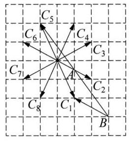

(第 12 题图)

10 (1) $\overrightarrow{BA}$ 、 $\overrightarrow{BE}$ 、 $\overrightarrow{EB}$ 、 $\overrightarrow{DC}$ 、 $\overrightarrow{CD}$ 、 $\overrightarrow{AE}$ 、 $\overrightarrow{EA}$ (2) $\overrightarrow{BE}$ 、 $\overrightarrow{DC}$ (3) $\overrightarrow{BA}$ 、 $\overrightarrow{BE}$ 、 $\overrightarrow{EB}\text{ 、 }\overrightarrow{DC}\text{ 、 }\overrightarrow{CD}\text{ 、 }\overrightarrow{DA}\text{ 、 }\overrightarrow{AD}\text{ 、 }\overrightarrow{CB}\text{ 、 }\overrightarrow{BC}$

11 (1)题图中与 $\overrightarrow{AB}$ 共线的向量有 $\overrightarrow{DC}$ 、 $\overrightarrow{EO}$ 、 $\overrightarrow{OF}$ 、 $\overrightarrow{EF}$ 。(2)题图中与 $\overrightarrow{EF}$ 方向相同的向量有 $\overrightarrow{AB}\text{ 、 }\overrightarrow{DC}\text{ 、 }\overrightarrow{EO}\text{ 、 }\overrightarrow{OF}$ 。(3)题图中与 $\overrightarrow{OB}$ 的模相等的向量为 $\overrightarrow{AO}$ ， 与 $\overrightarrow{OD}$ 的模相等的向量为 $\overrightarrow{OC}$ 。

12 (1)如图所示。(2)由(1)所画的图知，① 当点 $C$ 位于点 ${C}_{1}$ 和 ${C}_{2}$ 时， $\left| \overrightarrow{BC}\right|$ 取得最小值 $\sqrt{{1}^{2} + {2}^{2}} = \sqrt{5}$ ；② 当点 $C$ 位于点 ${C}_{5}$ 和 ${C}_{6}$ 时， $\left| \overrightarrow{BC}\right|$ 取得最大值 $\sqrt{{4}^{2} + {5}^{2}} = \; \sqrt{41}$ 。所以, $\left| \overrightarrow{BC}\right|$ 的最大值为 $\sqrt{41}$ ,最小值为 $\sqrt{5}$ 。

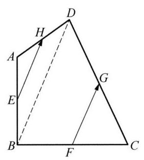

(第 13 题图)

13 连结 ${BD}$ 。由 ${EH}\text{ 、 }{FG}$ 分别是 $\bigtriangleup {ABD}\text{ 、 }\bigtriangleup {BCD}$ 的中位线,得 ${EH}//{BD}$ , ${EH} = \frac{1}{2}{BD}$ ,且 ${FG}//{BD},{FG} = \frac{1}{2}{BD}$ ,所以, ${EH} = {FG},{EH}//{FG}$ 且方向相同, 所以 $\overrightarrow{EH} = \overrightarrow{FG}$ 。

### 7.2 向量的线性运算(1)

$1\overrightarrow{AD}\;2\overrightarrow{AC}\;3$ 平行四边形 4 既非充分又非必要

$5\frac{1}{2}\overrightarrow{a} + \frac{1}{2}\overrightarrow{b}\;6\left\lbrack  {4,{20}}\right\rbrack  \;7$ C8B9C

10 当且仅当 $\overrightarrow{a}\text{ 、 }\overrightarrow{b}$ 同向时取等。几何意义: 三角形两边之和大于第三边。

11 $\overrightarrow{GA} + \overrightarrow{GB} + \overrightarrow{GC} + \overrightarrow{GD} = \overrightarrow{GM} + \overrightarrow{MA} + \overrightarrow{GN} + \overrightarrow{NB} + \overrightarrow{GN} + \overrightarrow{NC} + \overrightarrow{GM} + \overrightarrow{MD} = 2\left( {\overrightarrow{GM} + \overrightarrow{GN}}\right)  = \overrightarrow{0}$ 。

12 (1)北偏东 ${30}^{ \circ  }$ (2) $\frac{9\sqrt{3}}{5}$ 千米

13 必要性:可以直接使用重心是中线上一个三等分点的结论，如果不熟悉这个结论也可以通过倍长 ${AG}$ 证明一遍。则有: $\overrightarrow{GA} + \overrightarrow{GB} + \overrightarrow{GC} = \frac{1}{3}\left( {\overrightarrow{BA} + \overrightarrow{CA}}\right)  + \frac{1}{3}\left( {\overrightarrow{BC} + \overrightarrow{AC}}\right)  + \frac{1}{3}\left( {\overrightarrow{AB} + \overrightarrow{CB}}\right)  = \overrightarrow{0}$ 。充分性: 这里介绍同一法。假设点 $P$ 才是重心,则根据必要性,有 $\overrightarrow{PA} + \overrightarrow{PB} + \overrightarrow{PC} = \overrightarrow{0}$ ,将此式与 $\overrightarrow{GA} + \overrightarrow{GB} + \overrightarrow{GC} = \overrightarrow{0}$ 相减得 $3\overrightarrow{PG} = \overrightarrow{0}$ ，因此点 $P$ 、 $G$ 重合，从而点 $G$ 是重心。

### 7.2 向量的线性运算(2)

$1\;\left( {0, + \infty }\right) \;2\; - 3\;3$ 必要非充分 4│ 15 [0,2] 6 $4\overrightarrow{a}$ 7 C 8 D 9 A

10 由题意，得 $\overrightarrow{AE} =  - \frac{1}{2}\overrightarrow{AB} + \overrightarrow{AC}$ ，故 $\lambda  + \mu  = \frac{1}{2}$ 。

11 由于 $M$ 为 $\bigtriangleup {ABC}$ 的重心,故 $\overrightarrow{MA} + \overrightarrow{MB} + \overrightarrow{MC} = \overrightarrow{0}$ ,所以 $\overrightarrow{NA} + \overrightarrow{NB} + \overrightarrow{NC} = 3\overrightarrow{NM}$ ,又 $N$ 为 $\bigtriangleup {DEF}$ 的重心,故 $\overrightarrow{0} = \overrightarrow{ND} + \overrightarrow{NE} + \overrightarrow{NF}$ ,相加得 $3\overrightarrow{MN} = \overrightarrow{AD} + \overrightarrow{BE} + \overrightarrow{CF}$ 。

12 利用上一节的结论有 $\overrightarrow{GA} + \overrightarrow{GB} + \overrightarrow{GC} + \overrightarrow{GD} = \overrightarrow{0}$ ,在两侧加上 $4\overrightarrow{OG}$ 并除以 4 得 $\overrightarrow{OG} = \frac{1}{4}(\overrightarrow{OA} + \overrightarrow{OB} + \overrightarrow{OC} + \; \overrightarrow{OD}$ )。

${13}\overrightarrow{AD} + \overrightarrow{BE} + \overrightarrow{CF} = \overrightarrow{AB} + \frac{1}{3}\overrightarrow{BC} + \overrightarrow{BC} + \frac{1}{3}\overrightarrow{CA} + \overrightarrow{CA} + \frac{1}{3}\overrightarrow{AB} = \frac{4}{3}\left( {\overrightarrow{AB} + \overrightarrow{BC} + \overrightarrow{CA}}\right)  = \overrightarrow{0}$ 。

### 7.3 平面向量分解定理

$\begin{array}{lllllllllllllllll} 1 & \text{ ②③ } & 2 & 1 & 3 & \frac{4}{3}\overrightarrow{OB} - \frac{1}{3}\overrightarrow{OA} & 4 &  - \frac{1}{2}\overrightarrow{a} + \overrightarrow{b} & \frac{1}{4}\overrightarrow{a} - \overrightarrow{b} & 5 & \frac{1}{2} & 6 & 4 : 1 & 7 & \text{ B } & 8 & \text{ C } \end{array}$

$9\;B\;{10}\overrightarrow{OG} = \frac{1}{3}\left( {\overrightarrow{OA} + \overrightarrow{OB} + \overrightarrow{OC}}\right)$

11 充分性:若点 $P$ 在直线 ${AB}$ 上，则 $\overrightarrow{AP}//\overrightarrow{AB}$ ，可设 $\overrightarrow{PB} = \lambda \overrightarrow{AB}$ ，因此 $\overrightarrow{OP} = \lambda \overrightarrow{OA} + \left( {1 - \lambda }\right) \overrightarrow{OB}$ ，满足系数和为 1 的条件。必要性:若 $\overrightarrow{OP} = \lambda \overrightarrow{OA} + \left( {1 - \lambda }\right) \overrightarrow{OB}$ ，则 $\overrightarrow{AP} = \left( {1 - \lambda }\right) \overrightarrow{AB}$ ，因此点 $P$ 在直线 ${AB}$ 上。

12 因为 ${AM} : {AB} = 1 : 3$ ，所以 $\overrightarrow{AM} = \frac{1}{3}\overrightarrow{AB} = \frac{1}{3}\overrightarrow{a}$ 。因为 ${AN} \cdot  {AC} = 1 : 4$ ，所以 $\overrightarrow{AN} = \frac{1}{4}\overrightarrow{AC} = \frac{1}{4}\overrightarrow{b}$ 。又因为 $M\text{ 、 }P\text{ 、 }C$ 三点共线,所以存在实数 $t$ ,使 $\overrightarrow{MP} = t\overrightarrow{MC}\left( {t \in  \mathbf{R}}\right)$ ,所以 $\overrightarrow{AP} = \overrightarrow{AM} + \overrightarrow{MP} = \overrightarrow{AM} + t\overrightarrow{MC} = \overrightarrow{AM} + \; t\left( {\overrightarrow{AC} - \overrightarrow{AM}}\right)  = \frac{1}{3}\overrightarrow{a} + t\left( {\overrightarrow{b} - \frac{1}{3}\overrightarrow{a}}\right)  = \left( {\frac{1}{3} - \frac{t}{3}}\right) \overrightarrow{a} + t\overrightarrow{b}$ 。同理可设 $\overrightarrow{NP} = s\overrightarrow{NB}\left( {s \in  \mathbf{R}}\right)$ ,所以 $\overrightarrow{AP} = \overrightarrow{AN} + \overrightarrow{NP} = \; \left( {\frac{1}{4} - \frac{s}{4}}\right) \overrightarrow{b} + s\overrightarrow{a}$ 。所以 $\left\{  \begin{array}{l} \frac{1}{3} - \frac{t}{3} = s, \\  t = \frac{1}{4} - \frac{s}{4}, \end{array}\right.$ 解得 $\left\{  \begin{array}{l} s = \frac{3}{11}, \\  t = \frac{2}{11}, \end{array}\right.$ 所以 $\overrightarrow{AP} = \frac{3}{11}\overrightarrow{a} + \frac{2}{11}\overrightarrow{b}$ 。

13 (1)由题意，得 $\overrightarrow{OG} = {\alpha \overrightarrow{OP}} + \left( {1 - \alpha }\right) \overrightarrow{OQ} = {\alpha h}\overrightarrow{OA} + \left( {1 - \alpha }\right) k\overrightarrow{OB},\overrightarrow{OG} = \frac{1}{3}\overrightarrow{OA} + \frac{1}{3}\overrightarrow{OB}$ ,则 $\left\{  \begin{array}{l} {\alpha h} = \frac{1}{3}, \\  \left( {1 - \alpha }\right) k = \frac{1}{3}, \end{array}\right.$ 所以 $\frac{1}{h} + \frac{1}{k} = 3$ 。(2)由(1)得， $\frac{T}{S} = {hk} = \frac{{h}^{2}}{{3h} - 1} = \frac{1}{3}\left( {h - \frac{1}{3} + \frac{\frac{1}{9}}{h - \frac{1}{3}} + \frac{2}{3}}\right)$ 。因为 $0 \leq \; h \leq  1,0 \leq  k \leq  1$ ,所以 $0 \leq  k = \frac{h}{{3h} - 1} \leq  1$ ,从而有 $h \in  \left\lbrack  {\frac{1}{2},1}\right\rbrack$ ,所以 $\frac{T}{S} \in  \left\lbrack  {\frac{4}{9},\frac{1}{2}}\right\rbrack$ 。

### 7.4 向量的数量积(1)

${132}\frac{3}{4}\pi \;3 - {10}\sqrt{2}\;4$ 等边三角形 $5 - {72}\;6\;2\sqrt{7}\;7\;C\;8\;C\;9\;B$

${10}\left( 1\right) k = \frac{9}{5}\;\left( 2\right) k =  - \frac{24}{17}\;{11}\left( 1\right) \overrightarrow{a} \cdot  \overrightarrow{b} = 3\left( 2\right)$ (2) $\left| {\overrightarrow{a} + \overrightarrow{b}}\right|  = \sqrt{19}$

12 可以计算得 $\left| \overrightarrow{x}\right|  = \sqrt{7},\left| \overrightarrow{y}\right|  = \sqrt{7},\overrightarrow{x} \cdot  \overrightarrow{y} =  - \frac{7}{2}$ ,因此 $\langle \overrightarrow{x},\overrightarrow{y}\rangle  = \frac{2\pi }{3}$ 。

13 依题意有 $\left( {\overrightarrow{a} + 3\overrightarrow{b}}\right)  \cdot  \left( {7\overrightarrow{a} - 5\overrightarrow{b}}\right)  = 0,\left( {\overrightarrow{a} - 4\overrightarrow{b}}\right)  \cdot  \left( {7\overrightarrow{a} - 2\overrightarrow{b}}\right)  = 0$ ,整理得 $\left\{  \begin{array}{l} 7{\overrightarrow{a}}^{2} + {16}\overrightarrow{a} \cdot  \overrightarrow{b} - {15}{\overrightarrow{b}}^{2} = 0, \\  7{\overrightarrow{a}}^{2} - {30}\overrightarrow{a} \cdot  \overrightarrow{b} + 8{\overrightarrow{b}}^{2} = 0, \end{array}\right.$ 可得 $\left\{  {\begin{array}{l} {\overrightarrow{a}}^{2} = {\overrightarrow{b}}^{2}, \\  \overrightarrow{a} \cdot  \overrightarrow{b} = \frac{1}{2}{\overrightarrow{b}}^{2}, \end{array}\text{ 则 }\cos \langle \overrightarrow{a},\overrightarrow{b}\rangle  = \frac{\overrightarrow{a} \cdot  \overrightarrow{b}}{\left| \overrightarrow{a}\right|  \cdot  \left| \overrightarrow{b}\right| } = \frac{1}{2},\langle \overrightarrow{a},\overrightarrow{b}\rangle  = \frac{\pi }{3}\text{ 。 }}\right.$

### 7.4 向量的数量积(2)

${17}\;\begin{array}{llllllllllllllll} 2 &  - 6 & 3 & \frac{\pi }{6} & 4 &  - {16} & 5 &  - 2 & 6 & \frac{\pi }{3} & 7 & B & 8 & C & 9 & D \end{array}$

10(1)直角三角形， $A$ 是直角(2)直角三角形， $C$ 是直角

11 提示: 可设平行四边形两邻边对应的向量是 $\overrightarrow{a}\text{ 、 }\overrightarrow{b}$ ,只需展开证明下式即可: ${\left| \overrightarrow{a} + \overrightarrow{b}\right| }^{2} + {\left| \overrightarrow{a} - \overrightarrow{b}\right| }^{2} = \; 2{\left| \overrightarrow{a}\right| }^{2} + 2{\left| \overrightarrow{b}\right| }^{2}$ 。

12 可设 $\overrightarrow{AM} = \overrightarrow{AB} + k\overrightarrow{BC}, k \in  \left\lbrack  {0,1}\right\rbrack$ ,则 $\overrightarrow{AN} = \left( {1 - k}\right) \overrightarrow{AB} + \overrightarrow{BC}$ ,于是 $\overrightarrow{AM} \cdot  \overrightarrow{AN} = \left( {1 - k}\right) {\overrightarrow{AB}}^{2} + \left( {-{k}^{2} + }\right. \; k + 1)\overrightarrow{AB} \cdot  \overrightarrow{BC} + k\overrightarrow{BC}{}^{2} = 4 - {3k} \in  \left\lbrack  {1,4}\right\rbrack$ 。

13 由 $\left| \overrightarrow{OC}\right|  = \left| {x\overrightarrow{OA} + y\overrightarrow{OB}}\right|  = 1$ 可整理得 ${x}^{2} + {y}^{2} - {xy} = 1$ ，使用基本不等式，可得 ${\left( x + y\right) }^{2} = 1 + {3xy} \leq \; 1 + \frac{3}{4}{\left( x + y\right) }^{2}$ ,于是 $x + y \leq  2$ ,取等当且仅当 $x = y = 1$ 。

### 7.5 向量的坐标表示(1)

$1\sqrt{10}2\;4\;3\left( {4,0}\right) \;4\frac{1}{2}\;5\;8\;6\left( {2,\frac{4\sqrt{3}}{3}}\right) \;7$ A 8 B 9 A

10 因为向量 $\overrightarrow{x} = \overrightarrow{a} + \left( {{t}^{2} + 1}\right) \overrightarrow{b},\overrightarrow{y} =  - k\overrightarrow{a} + \frac{1}{t}\overrightarrow{b},\overrightarrow{a} = \left( {1,2}\right) ,\overrightarrow{b} = \left( {-2,1}\right)$ ,所以 $\overrightarrow{x} = \left( {-2{t}^{2} - 1,{t}^{2} + 3}\right)$ , $\overrightarrow{y} = \left( {-k - \frac{2}{t}, - {2k} + \frac{1}{t}}\right)$ 。又因为 $\overrightarrow{x}//\overrightarrow{y}$ ,所以 $\left( {-2{t}^{2} - 1}\right)  \cdot  \left( {-{2k} + \frac{1}{t}}\right)  = \left( {{t}^{2} + 3}\right)  \cdot  \left( {-k - \frac{2}{t}}\right)$ ,所以 $k =  - \frac{1}{t\left( {{t}^{2} + 1}\right) }$ 。因为 $t > 0$ ,所以 $k < 0$ ,因为 $k$ 为正实数,所以不存在。

11 (1) 若 $t =  - \frac{2}{3}$ ,点 $P$ 在 $x$ 轴上。若 $t =  - \frac{1}{3}$ ,点 $P$ 在 $y$ 轴上。若 $t \in  \left( {-\frac{2}{3}, - \frac{1}{3}}\right)$ ,点 $P$ 在第二象限。

(2)不存在，因为 $A\text{ 、 }P\text{ 、 }B$ 三点共线，不可能组成平行四边形。

12 (1) $m = \frac{5}{9}, n = \frac{8}{9}$ 32 考 $=  - \frac{16}{13}$ (3) $\overrightarrow{d} = \left( {3, - 1}\right)$ 或 $\overrightarrow{d} = \left( {5,3}\right)$ 。

13 (1) $\overrightarrow{OC} = \left( {\frac{1}{2}\left( {t + 1}\right) , - \frac{\sqrt{3}}{2}\left( {t + 1}\right) }\right)$ 。因为 $\overrightarrow{BC} = t\overrightarrow{AE}$ ，所以 $\overrightarrow{DC} = t\overrightarrow{AD}$ ， $\overrightarrow{AD} = \frac{1}{1 + t}\overrightarrow{AC}$ ，又 $\overrightarrow{OA} =$

$\left( {\frac{1}{2},\frac{\sqrt{3}}{2}}\right) ,\overrightarrow{AC} = \overrightarrow{OC} - \overrightarrow{OA} = \left( {\frac{1}{2}t, - \frac{\sqrt{3}}{2}\left( {t + 2}\right) }\right)$ ; 所以 $\overrightarrow{AD} = \left( {\frac{t}{2\left( {t + 1}\right) }, - \frac{\sqrt{3}\left( {t + 2}\right) }{2\left( {t + 1}\right) }}\right)$ ,所以 $\overrightarrow{OD} = \overrightarrow{OA} + \; \overrightarrow{AD} = \left( {\frac{{2t} + 1}{2\left( {t + 1}\right) }, - \frac{\sqrt{3}}{2\left( {t + 1}\right) }}\right)$ 。因为 $\overrightarrow{OE} = \left( {1,0}\right)$ ,所以 $\overrightarrow{EC} = \overrightarrow{OC} - \overrightarrow{OE} = \left( {\frac{t - 1}{2}, - \frac{\sqrt{3}\left( {t + 1}\right) }{2}}\right)$ 。(2)由

(1)得 $\overrightarrow{OD} \cdot  \overrightarrow{EC} = \frac{{2t} + 1}{2\left( {t + 1}\right) } \cdot  \frac{t - 1}{2} + \frac{\sqrt{3}}{2\left( {t + 1}\right) } \cdot  \frac{\sqrt{3}\left( {t + 1}\right) }{2} = \frac{{t}^{2} + t + 1}{2\left( {t + 1}\right) }$ 。又因为 $\left| \overrightarrow{OD}\right|  \cdot  \left| \overrightarrow{EC}\right|  = \; \frac{\sqrt{{\left( 2t + 1\right) }^{2} + 3}}{2\left( {t + 1}\right) } \cdot  \frac{\sqrt{{\left( t - 1\right) }^{2} + 3{\left( t + 1\right) }^{2}}}{2} = \frac{{t}^{2} + t + 1}{t + 1}$ ,所以 $\cos \langle \overrightarrow{OD},\overrightarrow{EC}\rangle  = \frac{\overrightarrow{OD} \cdot  \overrightarrow{EC}}{\left| \overrightarrow{OD}\right|  \cdot  \left| \overrightarrow{EC}\right| } = \frac{1}{2}$ ,所以向量 $\overrightarrow{OD}$ 与 $\overrightarrow{EC}$ 的夹角为 ${60}^{ \circ  }$ 。

### 7.5 向量的坐标表示(2)

$1\;\left( {2,4}\right) \;2\;\left( {\frac{3}{34}\sqrt{34},\frac{5}{34}\sqrt{34}}\right) \;3\;\left( {6,4}\right)$ 或 $\left( {-6, - 4}\right) \;4\;5\;5\;\frac{3}{4}\pi \;6\;\frac{3\sqrt{2}}{2}\;7\;$ B

8 D 9 A 10 $\overrightarrow{b} = \left( {2, - \frac{8}{3}}\right) ,\overrightarrow{c} = \left( {2,\frac{3}{2}}\right) ,\langle \overrightarrow{b},\overrightarrow{c}\rangle  = \frac{\pi }{2}$ 。

11 (1) 由 $\overrightarrow{m}//\overrightarrow{n}$ ，得 $a\sin A - b\sin B = 0$ ，则应用正弦定理可得 $a = b$ ，所以， $\bigtriangleup  {ABC}$ 为等腰三角形。

(2)由 $\overrightarrow{m} \bot  \overrightarrow{p}$ ，则 $a\left( {b - 2}\right)  + b\left( {a - 2}\right)  = 0$ ，即 $a + b = {ab}$ 。又因为 $c = 2$ ， $C = \frac{\pi }{3}$ ，所以，由余弦定理，得 $\cos C = \; \frac{{a}^{2} + {b}^{2} - {c}^{2}}{2ab} = \frac{{a}^{2}{b}^{2} - {2ab} - 4}{2ab} = \frac{1}{2}$ ,即 ${\left( ab\right) }^{2} - 3\left( {ab}\right)  - 4 = 0$ ,所以 ${ab} = 4$ 或 ${ab} =  - 1$ (舍)。所以 ${S}_{\bigtriangleup {ABC}} = \; \frac{1}{2}{ab} \cdot  \sin C = \sqrt{3}$ 。

12 (1)直接将两边平方，整理得 $\overrightarrow{a} \cdot  \overrightarrow{b} = \frac{{k}^{2} + 1}{4k}$ 。 (2)应用基本不等式， $k = 1$ 时可以取到最小值 $\frac{1}{2}$ ，此时 $\theta  = \frac{\pi }{3}$  。

13 (1)由题意，得 $\overrightarrow{a} + t\overrightarrow{b} = \left( {{2t} - 3, t + 2}\right)$ ，则 ${\left| \overrightarrow{a} + t\overrightarrow{b}\right| }^{2} = 5{t}^{2} - {8t} + {13} = 5{\left( t - \frac{4}{5}\right) }^{2} + \frac{49}{5}$ ，所以当且仅当 $t = \frac{4}{5}$ 时， $\left| {\overrightarrow{a} + t\overrightarrow{b}}\right|$ 取最小值，且最小值是 $\frac{7}{5}\sqrt{5}$ 。( 2 )因为 $\overrightarrow{a} - t\overrightarrow{b}$ 与 $\overrightarrow{c}$ 共线，所以 $\left( {-3 - {2t}}\right)  \cdot  \left( {-1}\right)  - (2 - \; t) \cdot  3 = 0$ ,即 ${5t} = 3$ ,所以 $t = \frac{3}{5}$ 。

### 7.6 向量的应用(1)

$\begin{array}{llllllllllllllllll} 1 &  - {25} & 2 & 3\sqrt{2} & 3 & \frac{1}{2} & 4 & 2 & 5 & 8 & 6 & \frac{3}{2} & 7 & \text{ C } & 8 & \text{ D } & 9 & \text{ C } \end{array}$

10 直接展开验证即可。几何意义:平行四边形的对角线平方和等于边长的平方和。

11 当 $P\left( {\frac{4}{3},1}\right)$ 时能取到最小值 $\frac{50}{3}$ 。 提示: 以 $B$ 为坐标原点, ${BC}$ 为 $x$ 轴正方向, ${BA}$ 为 $y$ 轴正方向建系,设 $P\left( {x, y}\right)$ 代入公式计算并配方。

12 提示: 证明 $\overrightarrow{HC} = \overrightarrow{CK}$ 。

1312 提示: 为求面积,我们只需分别求出 $\sin B$ 和 ${ac}$ 的值即可。结合已知条件计算数量积,可得 ${a}^{2} + \; {c}^{2} - {b}^{2} = \frac{8}{5}{ac}$ ,再由余弦定理求得 $\cos B$ ,进而求得 $\sin B$ 。由余弦定理及基本不等式可求得 ${ac}$ 的最大值。 则可得 $\bigtriangleup {ABC}$ 面积的最大值为 12 。

### 7.6 向量的应用(2)

$1 - 8\;2\frac{5}{4}\;3$ 矩形 $4\;1 - \sqrt{2}\;5\;3\;6 - 3 + 2\sqrt{2}\;7\;C\;8\;A\;9$

10 由条件可得 $\overrightarrow{AB} \cdot  \overrightarrow{AC} = 0,\overrightarrow{AP} = \frac{1}{2}\overrightarrow{AB} + 8\overrightarrow{AC}$ ,可得 $\overrightarrow{AP}{}^{2} = {17}$ ,所以, $\overrightarrow{PB} \cdot  \overrightarrow{PC} = \left( {\overrightarrow{PA} + \overrightarrow{AB}}\right)  \cdot  (\overrightarrow{PA} + \; \overrightarrow{AC}) = \left( {\frac{1}{2}\overrightarrow{AB} - 8\overrightarrow{AC}}\right)  \cdot  \left( {-\frac{1}{2}\overrightarrow{AB} - 7\overrightarrow{AC}}\right)  =  - \frac{1}{4}\overrightarrow{AB}{}^{2} + {56}\overrightarrow{AC}{}^{2} = {13}$ 。

11 (1) $\overrightarrow{a} \cdot  \overrightarrow{b} = \cos {2x},\left| {\overrightarrow{a} + \overrightarrow{b}}\right|  = 2\cos x$ 。(2) $\lambda  = \frac{1}{2}$ 。提示:第(2)小问不能直接根据二次函数的顶点式得出 $\lambda$ 的值,必须分类讨论。

12 由于 $\overrightarrow{AP} = \overrightarrow{OP} - \overrightarrow{OA} = \lambda \left( {\frac{\overrightarrow{AB}}{\left| \overrightarrow{AB}\right| \cos B} + \frac{\overrightarrow{AC}}{\left| \overrightarrow{AC}\right| \cos C}}\right)$ ,故 $\overrightarrow{BC} \cdot  \overrightarrow{AP} = \lambda \left( {-\left| \overrightarrow{BC}\right|  + \left| \overrightarrow{BC}\right| }\right)  = 0$ 。因此点 $P$ 的轨迹一定经过垂心。

13 (1)连结 ${BO}$ 并延长交 $\bigtriangleup {ABC}$ 外接圆于点 $D$ ，连结 ${AD}\text{ 、 }{CD}\text{ 、 }{AH}\text{ 、 }{CH}$ ，显然 ${AH} \bot  {BC},{CD} \bot  {BC}$ ,所以 ${AH}//{CD}$ 。同理 ${CH}//{DA}$ ,所以 $\overrightarrow{HA} = \overrightarrow{CD}$ , 即 $\overrightarrow{OA} - \overrightarrow{OH} = \overrightarrow{OD} - \overrightarrow{OC} =  - \overrightarrow{OB} - \overrightarrow{OC}$ ,所以 $\overrightarrow{OH} = \overrightarrow{OA} + \overrightarrow{OB} + \overrightarrow{OC}$ 。(2)因为 $G$ 是 $\bigtriangleup {ABC}$ 的重心,所以 $\overrightarrow{OG} = \overrightarrow{AG} - \overrightarrow{AO} = \frac{2}{3}\left\lbrack  {\frac{1}{2}\left( {\overrightarrow{AB} + \overrightarrow{AC}}\right) }\right\rbrack   + \overrightarrow{OA} = \frac{1}{3}(\overrightarrow{AB} + \; \overrightarrow{AC}) + \overrightarrow{OA} = \frac{1}{3}\left( {\overrightarrow{OA} + \overrightarrow{OB} + \overrightarrow{OC}}\right)$ 。从而 $\overrightarrow{OG} = \frac{1}{3}\overrightarrow{OH}$ ，所以， $O$ 、 $G$ 、 $H$ 三点共线。

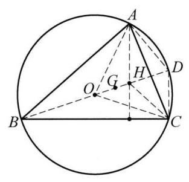

(第 13 题图)

## 第 8 章 复数

### 8.1 复数的概念

1 充要 $2 - 2 - 3$ 3 $4\left( {-\infty , - \sqrt{5}}\right)  \cup  \left( {\sqrt{5}, + \infty }\right)$ 5 3 6 ③④ 7 D 8 C 9 D 10 $\left\{  \begin{array}{l} {z}_{1} = \frac{\sqrt{3}}{2} + \frac{1}{2}\mathrm{i}, \\  {z}_{2} =  - \frac{\sqrt{3}}{2} + \frac{1}{2}\mathrm{i} \end{array}\right.$ 或 $\left\{  \begin{array}{l} {z}_{1} =  - \frac{\sqrt{3}}{2} + \frac{1}{2}\mathrm{i}, \\  {z}_{2} = \frac{\sqrt{3}}{2} + \frac{1}{2}\mathrm{i} \end{array}\right.$ 11 最小值为 $4\sqrt{2};x = \frac{3}{2}, y = \frac{3}{4}$ 。

12 由 ${z}_{1} = {z}_{2}$ ,得 $\left\{  \begin{array}{l} m = 2\cos \theta , \\  4 - {m}^{2} = \lambda  + 3\sin \theta , \end{array}\right.$ 则 $\lambda  = 4 - 4{\cos }^{2}\theta  - 3\sin \theta  = 4{\left( \sin \theta  - \frac{3}{8}\right) }^{2} - \frac{9}{16} \in  \left\lbrack  {-\frac{9}{16},7}\right\rbrack$ 。

${13}\left( 1\right) {\left( 2 + \sqrt{-1}\right) }^{3} = 2 + \sqrt{-{121}}\;\left( 2\right)$ 如果将 $\sqrt[3]{2 + \sqrt{-{121}}} + \sqrt[3]{2 - \sqrt{-{121}}}$ 理解为 $2 + \sqrt{-1} + 2 - \; \sqrt{-1} = 4$ ,则能发现卡丹公式仍然成立,这启示了人们重新审视 $\sqrt{-1}$ 这个本来并没有意义的东西。当然, 这一理解并不准确,因为一个非零复数总有 $n$ 个 $n$ 次方根,因此不能定义复数的 $n$ 次根式。

### 8.2 复数的代数运算(1)

$1\sqrt{5}\;2\mathrm{i}\;3\;{64}\mathrm{i}\;4 - 3 + \mathrm{i}\;\sqrt{5}\;5\;8\;6\;3\;7\mathrm{D}\;8\;\mathrm{B}\;9\mathrm{\;B}$

10 提示: 直接计算 $\omega  =  - \frac{1}{2} + \frac{\sqrt{3}}{2}\mathrm{i},{\omega }^{2} =  - \frac{1}{2} - \frac{\sqrt{3}}{2}\mathrm{i}$ ,可知三个命题都成立。

11 由 $\left| {{z}_{1} + {z}_{2}}\right|  = \left| {{z}_{1} - {z}_{2}}\right|$ ,得 $\left| {\frac{{z}_{1}}{{z}_{2}} + 1}\right|  = \left| {\frac{{z}_{1}}{{z}_{2}} - 1}\right|$ ,可设 $\frac{{z}_{1}}{{z}_{2}} = x + y\mathrm{i}\left( {x, y \in  \mathbf{R}}\right)$ ,则 ${\left( x + 1\right) }^{2} + {y}^{2} = \; {\left( x - 1\right) }^{2} + {y}^{2}$ ,得 $x = 0$ 。又 $\frac{{z}_{1}}{{z}_{2}} \neq  0$ ,故 $y \neq  0$ ,从而 ${\left( \frac{{z}_{1}}{{z}_{2}}\right) }^{2} =  - {y}^{2} < 0$ 。

12 设 $z = x + y\mathrm{i}\left( {x, y \in  \mathbf{R}}\right)$ ,依题意有 $x + \sqrt{{x}^{2} + {y}^{2}} + y\mathrm{i} = 2 + \mathrm{i}$ ,故 $\left\{  \begin{array}{l} x + \sqrt{{x}^{2} + {y}^{2}} = 2, \\  y = 1, \end{array}\right.$ 解得 $x = \frac{3}{4}$ , $y = 1$ ,因此 $z = \frac{3}{4} + \mathrm{i}$ 。

13 设 $z = x + y\mathrm{i}\left( {x, y \in  \mathbf{R}}\right)$ ,依题意有 ${x}^{2} - {y}^{2} + {2x} + 3 + \left( {{2xy} + {2y}}\right) \mathrm{i} = {x}^{2} + {y}^{2}$ ,故 ${2x} + 3 = 2{y}^{2}$ 且 $2\left( {x + 1}\right) y = 0$ 。分类讨论: ① 若 $y = 0$ ，得 $x =  - \frac{3}{2}$ ，故 $z =  - \frac{3}{2}$ ；② 若 $y \neq  0$ ，则 $x =  - 1$ ，得 $y =  \pm  \frac{\sqrt{2}}{2}$ ，故 $z =  - 1 \pm  \frac{\sqrt{2}}{2}\mathrm{i}$ 。综上, $z =  - 1 \pm  \frac{\sqrt{2}}{2}\mathrm{i}$ 或 $z =  - \frac{3}{2}$ 。

### 8.2 复数的代数运算(2)

$1 - 2\mathrm{i}\;2 - 5 + 2\mathrm{i}\;3 - 5\;4\frac{25}{8}\;5 - 1$ 或 $- \frac{1}{2} \pm  \frac{\sqrt{3}}{2}\mathrm{i}\;6\left( {a + b + c\mathrm{i}}\right) \left( {a + b - c\mathrm{i}}\right) \;7\mathrm{D}$

8 A 9 B

10(1)设 $z = a + b\mathrm{i}\left( {a, b \in  \mathbf{R}}\right)$ ，则 ${a}^{2} + {b}^{2} + {{2a}\mathrm{i}} = 5 + {2\mathrm{i}}$ ，得 $\left\{  \begin{array}{l} {a}^{2} + {b}^{2} = 5, \\  {2a} = 2, \end{array}\right.$ 解得 $\left\{  \begin{array}{l} a = 1, \\  b = 2 \end{array}\right.$ 或 $\left\{  \begin{array}{l} a = 1, \\  b =  - 2\text{ 。 } \end{array}\right.$ 所以 $z = 1 + 2\mathrm{i}$ 或 $z = 1 - 2\mathrm{i}$ 。(2)当 $z = 1 + 2\mathrm{i}$ 时， $\left| w\right|  = \left| {-2 + \mathrm{i} + m}\right|  = \sqrt{{\left( m - 2\right) }^{2} + 1} \geq  1$ ，当 $z = 1 -$ 2i 时， $\left| w\right|  = \left| {2 + \mathrm{i} + m}\right|  = \sqrt{{\left( m + 2\right) }^{2} + 1} \geq  1$ ，综上可得 $\left| w\right|  \geq  1$ 。

11 设 $z = x + y\mathrm{i}\left( {x, y \in  \mathbf{R}}\right)$ ,则 ${x}^{2} + {y}^{2} = 1$ ,故 $\left| {z - a}\right|  = \sqrt{{\left( x - a\right) }^{2} + {y}^{2}} = \sqrt{1 - {2ax} + {a}^{2}},\left| {1 - {az}}\right|  = \; \sqrt{{\left( 1 - ax\right) }^{2} + {a}^{2}{y}^{2}} = \sqrt{1 - {2ax} + {a}^{2}}$ ,于是 $\left| u\right|  = \frac{\left| z - a\right| }{\left| 1 - az\right| } = 1$ 。

${12}\left| \frac{\left| {z}_{1} + {z}_{2} + {z}_{3}\right| }{\frac{1}{{z}_{1}} + \frac{1}{{z}_{2}} + \frac{1}{{z}_{3}}}\right|  = \frac{\left| {z}_{1} + {z}_{2} + {z}_{3}\right| }{\left| \frac{{\bar{z}}_{1}}{{z}_{1} \cdot  {\bar{z}}_{1}} + \frac{{\bar{z}}_{2}}{{z}_{2} \cdot  {\bar{z}}_{2}} + \frac{{\bar{z}}_{3}}{{z}_{3} \cdot  {\bar{z}}_{3}}\right| } = \frac{\left| {z}_{1} + {z}_{2} + {z}_{3}\right| }{\frac{1}{2}\left| {{\bar{z}}_{1} + {\bar{z}}_{2} + {\bar{z}}_{3}}\right| } = 2$  。

13 (1)设 $z = x + y\mathrm{i}\left( {x, y \in  \mathbf{R}}\right)$ ，则 $\left\{  \begin{array}{l} {x}^{2} - {y}^{2} = 8, \\  {2xy} = 6, \end{array}\right.$ 解得 $\left\{  \begin{array}{l} x = 3, \\  y = 1, \end{array}\right.$ 或 $\left\{  \begin{array}{l} x =  - 3, \\  y =  - 1, \end{array}\right.$ 则 $z = 3 + \mathrm{i}$ 或 $z =  - 3 - \mathrm{i}$ 。 (2)当 $z = 3 + \mathrm{i}$ 时， ${z}^{3} - {16z} - \frac{100}{z} = {\left( 3 + \mathrm{i}\right) }^{3} - {16}\left( {3 + \mathrm{i}}\right)  - \frac{100}{3 + \mathrm{i}} = {18} + {26}\mathrm{i} - {48} - {16}\mathrm{i} - \frac{{100}\left( {3 - \mathrm{i}}\right) }{10} =  - {60} +$ 20i。当 $z =  - 3 - \mathrm{i}$ 时， ${z}^{3} - {16z} - \frac{100}{z} = {60} - {20}\mathrm{i}$ 。

### 8.2 复数的代数运算(3)

$1\mathrm{i}\;2 - \frac{1}{2} + \frac{3}{2}\mathrm{i}\;3\sqrt{2}\;4\;4\;5\;2$

6 -1 提示: 注意到 ${a}^{3} = 1$ ，所以 ${a}^{-{16}} + {a}^{16} = {a}^{2} + a =  - 1$ 。

(2) $\left\{  \begin{array}{l} a =  - 1, \\  b = 2 \end{array}\right.$

11 (1) $b = 0$ 且 $a \neq   - 1$ (2) $b = 0$ 或 ${a}^{2} + {b}^{2} = 1\left( {a \neq  0}\right)$

12 (1)由题意，得 ${z}_{1} + {z}_{2} = 1 + \left( {{a}^{2} + {2a} - {15}}\right) \mathrm{i}$ ，因为 ${z}_{1} + {z}_{2} \in  \mathbf{R}$ ，所以 ${a}^{2} + {2a} - {15} = 0$ ，解得 $a = 3$ 或 $a =$ -5。而 $a > 0$ ，所以 $a = 3$ 。(2) $\left| z\right|  \in  \left\lbrack  {1,3}\right\rbrack$ 。 提示:设 $z = x + y\mathrm{i}$ ，由 $\left| {z - {z}_{2}}\right|  = 2$ ，可得 ${x}^{2} + \; {\left( y - 1\right) }^{2} = 4$ ,因此 $\left| z\right|  = \sqrt{{x}^{2} + {y}^{2}} = \sqrt{4 - {\left( y - 1\right) }^{2} + {y}^{2}} = \sqrt{{2y} + 3}$ 。另一方面由于 $0 \leq  {\left( y - 1\right) }^{2} \leq  4$ , 故 $y \in  \left\lbrack  {-1,3}\right\rbrack$ ,所以 $\left| z\right|  \in  \left\lbrack  {1,3}\right\rbrack$ 。

13 $\frac{1}{16};\frac{3}{16}$ 提示: 令 $\sqrt{x} = u,\sqrt{y} = v$ ,则原方程组变为 $\left\{  \begin{array}{l} u\left( {1 + \frac{1}{{u}^{2} + {v}^{2}}}\right)  = \frac{5}{4}, \\  v\left( {1 - \frac{1}{{u}^{2} + {v}^{2}}}\right)  =  - \frac{3\sqrt{3}}{4}, \end{array}\right.$ 即 $u\left( {1 + \frac{1}{{u}^{2} + {v}^{2}}}\right)  + \; v\left( {1 - \frac{1}{{u}^{2} + {v}^{2}}}\right) \mathrm{i} = \frac{5 - 3\sqrt{3}\mathrm{i}}{4}$ ,从而有 $u + v\mathrm{i} + \frac{u - v\mathrm{i}}{{u}^{2} + {v}^{2}} = \frac{5 - 3\sqrt{3}\mathrm{i}}{4}$ 。令 $z = u + \mathrm{i}v, z + \frac{1}{z} = \frac{5 - 3\sqrt{3}\mathrm{i}}{4}$ ,解得 $z = \; 1 - \sqrt{3}\mathrm{i}$ (舍) 或 $z = \frac{1 + \sqrt{3}\mathrm{i}}{4}$ ,所以 $x = \frac{1}{16}, y = \frac{3}{16}$ 。

### 8.3 复数的几何意义 (1)

$1 - 1 + 3\mathrm{i}\;2\;5\;3 - \frac{3}{2} - \frac{1}{2}\mathrm{i}\;4\;{16}\;5\;5\mathrm{i}\;6\;\frac{1}{2} \pm  \frac{\sqrt{3}}{2}\mathrm{i}\;7\;\mathrm{\;A}\;8\;\mathrm{\;B}\;9\;\mathrm{C}$

10(1)如图 1 所示。(2)如图 2 所示。

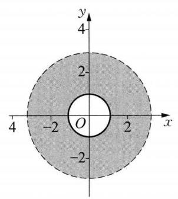

(第 10 题图 1)

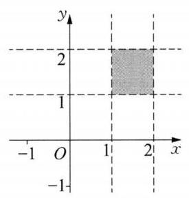

(第 10 题图 2)

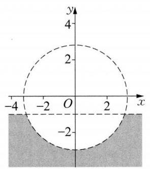

(第 10 题图 3)

11(1) $m = 1$ 或 $m =  - 2$ (2) $m =  - 2$ (3) $m \in  \left( {1, + \infty }\right)$

${12}\left| {\; - \frac{6\sqrt{13}}{13} + \frac{9\sqrt{13}}{13}\mathrm{i}}\right.$ 或 $\frac{6\sqrt{13}}{13} - \frac{9\sqrt{13}}{13}\mathrm{i}$

13 假如存在 $t \in  \mathbf{R}$ ,使 $f\left( t\right)  \in  A$ ,则 $\left| {f\left( t\right)  + 2\mathrm{i}}\right|  = 8\sqrt{3}$ ,而 ${\left| f\left( t\right)  + 2\mathrm{i}\right| }^{2} = {t}^{2} + {\left( 4{n}^{2} + tn + {16}\right) }^{2} = (1 + \; \left. {n}^{2}\right) {t}^{2} + {2n}\left( {{16} + 4{n}^{2}}\right) t + {\left( 4{n}^{2} + {16}\right) }^{2}$ ,所以当 $t =  - \frac{n\left( {{16} + 4{n}^{2}}\right) }{1 + {n}^{2}}$ 时, ${\left| f\left( t\right)  + 2\mathrm{i}\right| }_{\min }^{2} = \frac{{\left( 4{n}^{2} + {16}\right) }^{2}}{1 + {n}^{2}}$ ,其中 $\frac{{\left( 4{n}^{2} + {16}\right) }^{2}}{1 + {n}^{2}} = {16}\left\lbrack  {\left( {{n}^{2} + 1}\right)  + \frac{9}{{n}^{2} + 1} + 6}\right\rbrack   \geq  {16}\left\lbrack  {2\sqrt{\left( {{n}^{2} + 1}\right) \frac{9}{{n}^{2} + 1}} + 6}\right\rbrack   = {16} \times  {12} = {\left( 8\sqrt{3}\right) }^{2}$ ,当且仅当 ${n}^{2} + 1 = \frac{9}{{n}^{2} + 1}$ 时取等号,即 $n =  \pm  \sqrt{2}$ 时取等号,因为 $\pm  \sqrt{2} \notin  \mathbf{Z}$ ,所以不存在实数 $t$ 。

### 8.3 复数的几何意义(2)

$1\;\left( {0,1}\right)  \cup  \left( {1,5}\right) \;2\sqrt{2} + 1\;3\;1\;4\left\lbrack  {-\frac{\sqrt{3}}{3},\frac{\sqrt{3}}{3}}\right\rbrack  \;5\;7$

$6\;3\sqrt{2}$ 提示:在复平面上画出 $z$ 的轨迹。

7 D 8 B

9 A 提示: 在复平面上画出 $z$ 的轨迹。

${10}\sqrt{58}$ 提示: $2{\left| {z}_{1}\right| }^{2} + 2{\left| {z}_{2}\right| }^{2} = {\left| {z}_{1} + {z}_{2}\right| }^{2} + {\left| {z}_{1} - {z}_{2}\right| }^{2}$ 。

${11}\left\lbrack  {\frac{2}{3},\frac{\sqrt{2}}{2}}\right\rbrack$ 提示: $\left| z\right|  \geq  1,0 \leq  \operatorname{Re}z \leq  1,0 \leq  \operatorname{Im}z \leq  1$ 。

12 (1) $\left\lbrack  {0,\sqrt{2} - 1}\right\rbrack$ 提示:设 $z = x + y\mathrm{i}\left( {x, y \in  \mathbf{R}}\right)$ ，则 $\left\{  \begin{array}{l} {x}^{2} + {y}^{2} + {2a} + {2y} = 0, \\   - {2x} + {2a} = 0, \end{array}\right.$ 将 $x = a$ 代入第一式得 ${\left( a + 1\right) }^{2} + {\left( y + 1\right) }^{2} = 2$ 。再注意题设 $a \geq  0$ 即可得到答案。(2) $\left\lbrack  {\sqrt{10} - \sqrt{2},2\sqrt{2}}\right\rbrack$ 提示:结合几何意义, $z$ 在圆弧 ${\left( x + 1\right) }^{2} + {\left( y + 1\right) }^{2} = 2\left( {x \geq  0}\right)$ 上。

13 (1)由题意，得 ${z}_{1}{z}_{2}$ 的虚部为 0，而 ${z}_{1}{z}_{2} = \left( {2\sin \theta  + 2\sqrt{3}\cos \theta }\right)  + \mathrm{i}\left( {-\sqrt{3} + 4\sin \theta \cos \theta }\right)$ ，则 $- \sqrt{3} + \; 4\sin \theta \cos \theta  = 0$ ,即 $\sin {2\theta } = \frac{\sqrt{3}}{2}$ ,可解得 $\theta  = \frac{\pi }{3}$ ,因此 $\cos {2\theta } =  - \frac{1}{2}$ 。(2)因为 ${\overrightarrow{a}}^{2} + {\overrightarrow{b}}^{2} = {\left( 2\sin \theta \right) }^{2} + ( - \sqrt{3} \; {)}^{2} + 1 + {\left( 2\cos \theta \right) }^{2} = 8,\overrightarrow{a} \cdot  \overrightarrow{b} = \left( {2\sin \theta , - \sqrt{3}}\right)  \cdot  \left( {1,2\cos \theta }\right)  = 2\sin \theta  - 2\sqrt{3}\cos \theta$ ,所以 $\left( {\lambda \overrightarrow{a} - \overrightarrow{b}}\right)  \cdot  \left( {\overrightarrow{a} - \lambda \overrightarrow{b}}\right)  = \; \lambda \left( {{\overrightarrow{a}}^{2} + {\overrightarrow{b}}^{2}}\right)  - \left( {1 + {\lambda }^{2}}\right) \overrightarrow{a} \cdot  \overrightarrow{b} = {8\lambda } - \left( {1 + {\lambda }^{2}}\right) \left( {2\sin \theta  - 2\sqrt{3}\cos \theta }\right)  = 0$ ,整理得 $\sin \left( {\theta  - \frac{\pi }{3}}\right)  = \frac{2\lambda }{1 + {\lambda }^{2}}$ 。而 $\theta  \in \; \left\lbrack  {\frac{\pi }{3},\frac{\pi }{2}}\right\rbrack$ ,则 $\left( {\theta  - \frac{\pi }{3}}\right)  \in  \left\lbrack  {0,\frac{\pi }{6}}\right\rbrack$ ,所以 $\sin \left( {\theta  - \frac{\pi }{3}}\right)  \in  \left\lbrack  {0,\frac{1}{2}}\right\rbrack$ 。从而有 $0 \leq  \frac{2\lambda }{1 + {\lambda }^{2}} \leq  \frac{1}{2}$ ,解得 $\lambda  \geq  2 + \sqrt{3}$ 或 $0 \leq  \lambda  \leq  2 - \sqrt{3}$ 。

### 8.4 复数的三角形式(1)

$1\;\lbrack 0,{2\pi })\;2\; - 6\mathrm{i}\;1 - \sqrt{3}\mathrm{i}\;3\;\pi \left( {\cos \left( {\frac{\pi }{2} - 1}\right)  + \mathrm{i}\sin \left( {\frac{\pi }{2} - 1}\right) }\right) \;\sqrt{2}\left( {\cos \frac{7\pi }{6} + \mathrm{i}\sin \frac{7\pi }{6}}\right)$

$4\left\lbrack  {-\frac{\sqrt{2}}{2} - \frac{\sqrt{2}}{2}\mathrm{i}\;5 - \frac{1 + 2\sqrt{3}}{2}\;6\frac{1}{\cos \alpha }\left\lbrack  {\cos \left( {\frac{\pi }{2} - \alpha }\right)  + \mathrm{i}\sin \left( {\frac{\pi }{2} - \alpha }\right) }\right\rbrack  \;7\;\text{ B }\;8\;\text{ A }\;9\;\text{ A }}\right\rbrack$

${10}\left( 1\right) \sqrt{2}\left\lbrack  {\cos \left( {{2\theta } - \frac{\pi }{12}}\right)  + \mathrm{i}\sin \left( {{2\theta } - \frac{\pi }{12}}\right) }\right\rbrack  \left( 2\right) \cos \theta  + \mathrm{i}\sin \theta$

${11}\left( 1\right) \left| z\right|  = 2\cos \frac{\alpha }{2}\;\left( 2\right) z = 2\cos \frac{\alpha }{2}\left( {\cos \frac{\alpha }{2} + \mathrm{i}\sin \frac{\alpha }{2}}\right)$

12 提示: $\left( {1 + \mathrm{i}}\right) \left( {2 + \mathrm{i}}\right) \left( {3 + \mathrm{i}}\right)  = {10}\mathrm{i}$ ,根据复数乘法的几何意义 (辐角相加) 得证。

13 提示: 由 ${\left( \cos \theta  + \mathrm{i}\sin \theta \right) }^{3} = \cos {3\theta } + \mathrm{i}\sin {3\theta }$ 展开,比较实部虚部即得证。

### 8.4 复数的三角形式(2)

${1320}{}^{ \circ  }2\;{16}\mathrm{i}\;3\cos {3\theta } - \mathrm{i}\sin {3\theta }\;4\; - 1 + \sqrt{3}\mathrm{i}\;5 - 1 + \sqrt{3}\mathrm{i}\;6 - \frac{\sqrt{3} - 1}{2} + \frac{\sqrt{3} + 1}{2}\mathrm{i}\;7\mathrm{\;B}$

$8\;\mathrm{D}\;9\;\mathrm{C}$

$){x}_{1,2} =  \pm  1,{x}_{3,4} =  \pm  \mathrm{i}\;$ (2) ${x}_{1} = \frac{\sqrt{3}}{2} - \frac{1}{2}\mathrm{i},{x}_{2} = \mathrm{i},{x}_{3} =  - \frac{\sqrt{3}}{2} - \frac{1}{2}\mathrm{i}\;$ (3) ${x}_{1} = \; \sqrt[6]{2}\left( {-\frac{\sqrt{6} - \sqrt{2}}{4} + \frac{\sqrt{6} + \sqrt{2}}{4}\mathrm{i}}\right) ,{x}_{2} = \sqrt[6]{2}\left( {\frac{\sqrt{6} + \sqrt{2}}{4} - \frac{\sqrt{6} - \sqrt{2}}{4}\mathrm{i}}\right) ,{x}_{3} = \frac{1}{\sqrt[3]{2}}\left( {-1 - \mathrm{i}}\right)$

11 (1) $\arg {z}_{1} = \frac{7\pi }{4},\left| {z}_{1}\right|  = 2\sqrt{2}$ 。(2)设 $z = \cos \alpha  + \operatorname{isin}\alpha$ ，则 ${\left| z - {z}_{1}\right| }^{2} = {\left( \cos \alpha  - 2\right) }^{2} + {\left( \sin \alpha  + 2\right) }^{2} = \; 9 + 4\sqrt{2}\sin \left( {\alpha  - \frac{\pi }{4}}\right)$ ,当 $\sin \left( {\alpha  - \frac{\pi }{4}}\right)  = 1$ 时, ${\left| z - {z}_{1}\right| }^{2}$ 取得最大值 $9 + 4\sqrt{2}$ ,所以 $\left| {z - {z}_{1}}\right|$ 的最大值为 1 + $2\sqrt{2}$ 。

12. (1) ${z}_{0} =  - 1 + \sqrt{3}\mathrm{i}\;$ (2) $\frac{11}{12}\pi$

13 模长 $2\sin \frac{\theta }{2}$ ,当 $0 < \theta  < \pi$ 时,辐角主值 $\frac{\pi }{2} + \frac{3\theta }{2}$ ; 当 $\pi  \leq  \theta  \leq  {2\pi }$ 时,辐角主值 $- \frac{3}{2}\pi  + \frac{3}{2}\theta$ 。提示: 先计算 $z - 1$ 的幅角为 $\frac{\pi }{2} + \frac{\theta }{2}$ 。

### 8.5 复数集内的方程(1)

$\begin{array}{lllllllllllllllllll} 1 & \sqrt{2} & 2 & \left( {0,4}\right) & 3 &  - 4 & 4 & 2 & 4 & 5 & {27} & 6 & 8\text{ 或 }{10} & 7 & D & 8 & D & 9 & B \end{array}$

${10}{\left( \alpha \omega \right) }^{3} = {\alpha }^{3}{\omega }^{3} = {\alpha }^{3} \cdot  1 = z,{\left( \alpha \overline{\omega }\right) }^{3} = {\alpha }^{3}{\overline{\omega }}^{3} = {\alpha }^{3} \cdot  1 = z$  。

11 (1) $\omega  = 2 - \mathrm{i}, z = 3 + \mathrm{i}\;$ (2) ${x}^{2} - {6x} + {10} = 0$

12 需要分类讨论。① 当 $m \leq  1$ 时， $\alpha$ 、 $\beta$ 是两实根 $- 1 \pm  \sqrt{1 - m}$ 。若 $m \leq  0$ ， $\left| \alpha \right|  + \left| \beta \right|  = 2\sqrt{1 - m}$ ；若 $0 < m \leq  1,\left| \alpha \right|  + \left| \beta \right|  = 2$ 。② 当 $m > 1$ 时,是一对共轭虚根 $- 1 \pm  \sqrt{m - 1}\mathrm{i},\left| \alpha \right|  + \left| \beta \right|  = 2\sqrt{m}$ 。

13 提示: 对于一个实系数多项式 $f\left( x\right)$ ,有 $f\left( \bar{z}\right)  = \overline{f\left( z\right) } = \overline{0} = 0$ 。

### 8.5 复数集内的方程(2)

${1k} \neq   \pm  2\sqrt{2}\;2 - 2\mathrm{i}\;3\lbrack 4, + \infty )\;4\frac{9\sqrt{5}}{5} + \frac{3\sqrt{5}}{5}\mathrm{i}$ 或 $- \frac{9\sqrt{5}}{5} - \frac{3\sqrt{5}}{5}\mathrm{i}\;5\sqrt{2}$

$6 - \mathrm{i}\text{ 、 }1 + \mathrm{i}\text{ 、 }1 - \mathrm{i}\;7\mathrm{\;B}\;8\;\mathrm{C}\;9\mathrm{\;B}$

10 直接因式分解即可, ${x}_{1} = 2,{x}_{2} = 3 - \mathrm{i}$ 。

${11}\sqrt{10}$ 提示: $\left| z\right|  = \left| {{x}_{0} + \frac{1}{{x}_{0}} - \frac{\sqrt{15}}{{x}_{0}}\mathrm{i}}\right|  = \sqrt{{x}_{0}^{2} + 2 + \frac{16}{{x}_{0}^{2}}} \geq  \sqrt{10}$ 。

12 $a = 2 \pm  \sqrt{2}$ 或 $a =  - 1$ 提示:对方程是实根还是共轭虚根进行讨论，得到 $a = 2 \pm  \sqrt{2}$ 或 $a =  - 1$ 。

13 $\left\lbrack  {8,{10}}\right\rbrack$ 提示: 方程的两根为 $z = 3 \pm  u$ ,其中 $\left| u\right|  = 1$ ,故 $m = 9 - {u}^{2}$ ,故 $\left| m\right|  \in  \left\lbrack  {8,{10}}\right\rbrack$ 。

## 第 9 章 数列与数学归纳法

### 9.1 数列(1)

1 ②③ 2 ③ 3 ${a}_{n} = \left\{  \begin{array}{l} n\left( {n + 1}\right) , n\text{ 为偶数, }n \geq  0 \\   - \frac{n}{n + 1}, n\text{ 为奇数, }n \geq  1 \end{array}\right.$

4 $\left( {-6, + \infty }\right)$ 提示: 由 ${a}_{n + 1} > {a}_{n}$ ,得 $2{\left( n + 1\right) }^{2} + \lambda \left( {n + 1}\right)  > 2{n}^{2} + {\lambda n}$ ,即 $\lambda  >  - {4n} - 2$ 对 $n$ 为正整数恒成立，所以 $\lambda  >  - 6$ 。

$5{a}_{n} = \left\{  {\begin{array}{ll} 2, & n = 1, \\  {2n} - 1, & n \geq  2 \end{array}\text{ 提示: }{a}_{n} = \left\{  \begin{array}{ll} {S}_{1}, & n = 1, \\  {S}_{n} - {S}_{n - 1}, & n \geq  2\text{ 。 } \end{array}\right. }\right.$

$6{b}_{k} = {2}^{{2k} - 1} - {4k} + 3$ 提示: ${b}_{k} = {a}_{{2k} - 1} = {2}^{{2k} - 1} - 2\left( {{2k} - 1}\right)  + 1 = {2}^{{2k} - 1} - {4k} + 3$ 。

7 B

8 A 提示: ${a}_{n} - {a}_{n - 1} = \frac{an}{{bn} + c} - \frac{a\left( {n - 1}\right) }{b\left( {n - 1}\right)  + c} = \frac{ac}{\left( {{bn} + c}\right) \left\lbrack  {b\left( {n - 1}\right)  + c}\right\rbrack  } > 0$ 。

$9\mathrm{C}$ 提示: ${a}_{n} - {a}_{n - 1} = \frac{n - \sqrt{98}}{n - \sqrt{99}} - \frac{n - 1 - \sqrt{98}}{n - 1 - \sqrt{99}} = \frac{\sqrt{98} - \sqrt{99}}{\left( {n - \sqrt{99}}\right) \left( {n - 1 - \sqrt{99}}\right) }$ ,可得 ${a}_{1} > {a}_{2} > \cdots  > {a}_{9} < \; {a}_{10} > {a}_{11} > \cdots$ ,当 $1 \leq  n \leq  9$ 时, ${a}_{n} < 1$ ,当 $n \geq  {10}$ 时, ${a}_{n} > 1$ ,则 ${\left( {a}_{n}\right) }_{\min } = {a}_{9},{\left( {a}_{n}\right) }_{\max } = {a}_{10}$ 。

1) $\left( 1\right) {a}_{n} = {12n} + {13};{b}_{n} = {n}^{2}$ 。(2)令 ${a}_{n} = {b}_{n}$ ,得 ${12n} + {13} = {n}^{2}$ ,可解得 ${n}_{1} = {13},{n}_{2} =  - 1$ (舍去),所以, 这两数列存在序号与项都相同的项,它是第 13 项。

11 (1) ${a}_{1} = \frac{1}{3};{a}_{2} = \frac{1}{9};{a}_{3} = \frac{1}{27}$ 。 (2) ${a}_{1} + 3{a}_{2} + {3}^{2}{a}_{3} + \cdots  + {3}^{n - 1}{a}_{n} = \frac{n}{3}$ (①)，当 $n \geq  2$ 时， ${a}_{1} + 3{a}_{2} + \; {3}^{2}{a}_{3} + \cdots  + {3}^{n - 2}{a}_{n - 1} = \frac{n - 1}{3}\text{ 。 }\;$ ② ①-②得 $\;{3}^{n - 1}{a}_{n} = \frac{1}{3},{a}_{n} = \frac{1}{{3}^{n}}$ 。在①中，令 $n = 1$ ，得 ${a}_{1} = \frac{1}{3}$ 。所以 ${a}_{n} = \; \frac{1}{{3}^{n}}$ 。

12 因为 ${a}_{n + 1} - {a}_{n} = \left( {n + 3}\right)  \cdot  {\left( \frac{9}{10}\right) }^{n + 1} - \left( {n + 2}\right)  \cdot  {\left( \frac{9}{10}\right) }^{n} = {\left( \frac{9}{10}\right) }^{n}\left\lbrack  {\frac{9\left( {n + 3}\right) }{10} - \left( {n + 2}\right) }\right\rbrack   = {\left( \frac{9}{10}\right) }^{n}\frac{7 - n}{10}$ 。 所以,当 $n > 7$ 时, ${a}_{n + 1} < {a}_{n}$ ; 当 $n = 7$ 时, ${a}_{n + 1} = {a}_{n}$ ; 当 $n < 7$ 时, ${a}_{n + 1} > {a}_{n}$ 。因此当 $n = 7$ 或 8 时, ${a}_{n}$ 取最大值 $\frac{{9}^{8}}{{10}^{7}}$ 。

13 因为 ${a}_{n + 1} - {a}_{n} = \frac{{\left( n + 1\right) }^{2}}{{\left( n + 1\right) }^{2} + 1} - \frac{{n}^{2}}{{n}^{2} + 1} = \frac{{2n} + 1}{\left\lbrack  {{\left( n + 1\right) }^{2} + 1}\right\rbrack  \left\lbrack  {{n}^{2} + 1}\right\rbrack  } > 0$ ,所以 ${a}_{n + 1} > {a}_{n}$ ,因此该数列是递增数列。又 $\left| {a}_{n}\right|  = \left| \frac{{n}^{2}}{{n}^{2} + 1}\right|  < 1$ ,所以 $\left\{  {a}_{n}\right\}$ 是有界的。

### 9.1 数列(2)

$\begin{array}{lllll} 1 & {2024} & 2 & 0 & 1 \end{array}$

3 45 提示: 记交点个数形成的数列为 $\left\{  {a}_{n}\right\}$ ,由题意及几何性质可知,从 $n$ 条直线增加到 $n + 1$ 条直线时, 交点数最多增加 $n$ 个,即 ${a}_{n} - {a}_{n - 1} = n$ ,由叠加法可求得 ${a}_{9} = {45}$ 。

4 4、5 或 32

$5 - \sqrt{3}$ 提示: ${a}_{2} =  - \sqrt{3};{a}_{3} = \sqrt{3};{a}_{4} = 0$ ,这是一个以 3 为周期的周期数列,于是 ${a}_{20} = {a}_{2} =  - \sqrt{3}$ 。

65 提示: 根据 ${a}_{n + 1} = f\left( {a}_{n}\right)$ 及 ${a}_{1} = 3$ 可求得数列为: $3,6,5,1,3,6,\cdots$ ,这是以 4 为周期的周期数列, 所以 ${a}_{2011} = {a}_{3} = 5$ 。

7 D 8 B 9 D

10 ${a}_{n + 1} = {a}_{1}{a}_{n} + \frac{1 - {a}_{1}^{2}}{2}{a}_{n - 1},\alpha  = {2k\pi },{2k\pi } + \frac{\pi }{2}, k \in  \mathbf{Z}$ 提示: ${a}_{n + 1} = \left( {{\sin }^{n}\alpha  + {\cos }^{n}\alpha }\right) \left( {\sin \alpha  + \cos \alpha }\right)  - \; \sin \alpha \cos \alpha \left( {{\sin }^{n - 1}\alpha  + {\cos }^{n - 1}\alpha }\right)  = \left( {{\sin }^{n}\alpha  + {\cos }^{n}\alpha }\right) \left( {\sin \alpha  + \cos \alpha }\right)  - \frac{{\left( \sin \alpha  + \cos \alpha \right) }^{2} - 1}{2}\left( {{\sin }^{n - 1}\alpha  + {\cos }^{n - 1}\alpha }\right)  = \; {a}_{1}{a}_{n} + \frac{1 - {a}_{1}^{2}}{2}{a}_{n - 1}$ 。

11 ${a}_{n + 1} - 1 = {a}_{n}\left( {{a}_{n} - 1}\right)  = {a}_{n}\left\lbrack  {{a}_{n - 1}\left( {{a}_{n - 1} - 1}\right) }\right\rbrack   = \cdots  = {a}_{n}{a}_{n - 1}{a}_{n - 2}\cdots {a}_{1}\left( {{a}_{1} - 1}\right)$ ,即 ${a}_{n} = {a}_{n - 1}{a}_{n - 2}\cdots {a}_{1}\left( {{a}_{1} - }\right. \; 1) + 1$ 。当 $n \geq  2$ 时, ${a}_{n} - {a}_{n - 1} = \left( {{a}_{n - 1}^{2} - {a}_{n - 1} + 1}\right)  - {a}_{n - 1} = {\left( {a}_{n - 1} - 1\right) }^{2} \geq  0$ ,所以 ${a}_{n} \geq  {a}_{n - 1}$ 。因此 ${a}_{n} \geq \; {a}_{n - 1} \geq  \cdots  \geq  {a}_{1} = 2$ ,故 ${a}_{n} = {a}_{n - 1}{a}_{n - 2}\cdots {a}_{1}\left( {{a}_{1} - 1}\right)  + 1 \geq  {2}^{n - 1} + 1$ 。

12 (1)由题意得 ${a}_{n + 1} - {a}_{n} = \sqrt{\frac{3 + {a}_{n}}{2}} - \sqrt{\frac{3 + {a}_{n - 1}}{2}} = \frac{{a}_{n} - {a}_{n - 1}}{2\left( {\sqrt{\frac{3 + {a}_{n}}{2}} + \sqrt{\frac{3 + {a}_{n - 1}}{2}}}\right) }\left( {n \geq  2}\right)$ ，由于 $\sqrt{\frac{3 + {a}_{n}}{2}} + \; \sqrt{\frac{3 + {a}_{n - 1}}{2}} > 0$ ,所以 ${a}_{n + 1} - {a}_{n},{a}_{n} - {a}_{n - 1},\cdots ,{a}_{2} - {a}_{1}$ 具有相同的符号。因此,要使 ${a}_{n + 1} > {a}_{n}$ 对任何正整数 $n$ 都成立,只需 ${a}_{2} - {a}_{1} > 0$ 即可。由 $\sqrt{\frac{3 + {a}_{1}}{2}} - {a}_{1} > 0$ ,解得 $0 < {a}_{1} < \frac{3}{2}$ 。(2)由(1)知,当 ${a}_{1} > \; \frac{3}{2}$ 时, ${a}_{n + 1} < {a}_{n}$ 对任何正整数 $n$ 都成立。所以,当 ${a}_{1} = 4$ 时, ${a}_{n + 1} - {a}_{n} < 0$ 。所以 ${S}_{n} = \mathop{\sum }\limits_{{i = 1}}^{n}{b}_{i} = \mathop{\sum }\limits_{{i = 1}}^{n} \mid  {a}_{i + 1} - \; {a}_{i} \mid   = \mathop{\sum }\limits_{{i = 1}}^{n}\left( {{a}_{i} - {a}_{i + 1}}\right)  = {a}_{1} - {a}_{n + 1} = 4 - {a}_{n + 1}$ 。又 ${a}_{n + 2} < {a}_{n + 1}$ ,即 $\sqrt{\frac{3 + {a}_{n + 1}}{2}} < {a}_{n + 1}$ ,求得 ${a}_{n + 1} > \frac{3}{2}$ ,因此 ${S}_{n} < \; 4 - \frac{3}{2} = \frac{5}{2}$

13 (1) ${a}_{1} = a,{a}_{n + 1} = 1 + \frac{1}{{a}_{n}},{a}_{2} = \frac{a + 1}{a},{a}_{3} = 1 + \frac{1}{{a}_{2}} = \frac{{2a} + 1}{a + 1},{a}_{4} = 1 + \frac{1}{{a}_{3}} = \frac{{3a} + 2}{{2a} + 1}$ ,故当 $a =  - \frac{2}{3}$ 时， ${a}_{4} = 0$ 。(2)要使 $\frac{3}{2} < {a}_{n} < 2$ ，即 $\frac{3}{2} < 1 + \frac{1}{{a}_{n - 1}} < 2$ ，所以 $1 < {a}_{n - 1} < 2$ 。要使 $\frac{3}{2} < {a}_{n} < 2$ ，当且仅当它的前一项 ${a}_{n - 1}$ 满足 $1 < {a}_{n - 1} < 2$ ; 因 $\left( {\frac{3}{2},2}\right)  \subset  \left( {1,2}\right)$ ,只需当 ${a}_{4} \in  \left( {\frac{3}{2},2}\right)$ ,都有 ${a}_{n} \in  \left( {\frac{3}{2},2}\right) \left( {n \geq  5}\right)$ 。 由 ${a}_{4} = \frac{{3a} + 2}{{2a} + 1}$ ,得 $\frac{3}{2} < \frac{{3a} + 2}{{2a} + 1} < 2$ ,解不等式组 $\left\{  \begin{array}{l} \frac{3}{2} < \frac{{3a} + 2}{{2a} + 1}, \\  \frac{{3a} + 2}{{2a} + 1} < 2, \end{array}\right.$ 得 $\left\{  \begin{array}{l} a >  - \frac{1}{2}, \\  a > 0\text{ 或 }a <  - \frac{1}{2}, \end{array}\right.$ 故 $a > 0$ 。

### 9.2 等差数列(1)

$1 - \sqrt{3}\;2\;8\;3\;\left( {\frac{8}{3},3}\right) \;4\; - \frac{5}{3}$

5 10 或 $\frac{5}{2}\left( {n - 1}\right)$ 提示:由 ${\left( {a}_{5} + {2d}\right) }^{2} = {a}_{5} \cdot  \left( {{a}_{5} + {5d}}\right)$ ，得 $d = 0$ 或 ${a}_{5} = {4d}$ 。若 $d = 0$ ，则 ${a}_{n} = {a}_{5} = {10}$ ； 若 ${a}_{5} = {4d}$ ,又 ${a}_{5} = {10}$ ,则 $d = \frac{5}{2},{a}_{n} = \frac{5}{2}\left( {n - 1}\right)$ 。

6 0 提示: 由 ${a}_{n} = {a}_{1} + \left( {n - 1}\right) d = m,{a}_{m} = {a}_{1} + \left( {m - 1}\right) d = n$ ,得 $d =  - 1,{a}_{m + n} = {a}_{m} + \left( {m + n - m}\right) d =$ 0 。

7 D

8 A 提示: ${a}_{1} + {a}_{8} = {a}_{4} + {a}_{5}$ ,又 $d \neq  0$ ,则 $\left| {{a}_{8} - {a}_{1}}\right|  > \left| {{a}_{5} - {a}_{4}}\right|$ ,所以 ${a}_{1}{a}_{8} < {a}_{4}{a}_{5}$ 。

9 A 提示: 由三个角成等差数列,得有一内角为 $\frac{\pi }{3}$ 。设该角所对边为 $b$ ,另两边为 $a$ 和 $c$ ,且 $a \leq  b \leq  c$ 。 由三条边成等差数列,得 ${2b} = a + c$ ,由余弦定理 ${b}^{2} = {a}^{2} + {c}^{2} - {2ac}\cos B = {a}^{2} + {c}^{2} - {ac} = 4{b}^{2} - {3ac}$ ,得 ${ac} = \; {b}^{2}$ ,解得 $a = b = c$ 。

10 -2、0、2或一、 $\sqrt{7} - 2$ 、 $- \sqrt{7}$ 、 $- \sqrt{7} + 2$ 或 $\sqrt{7} - 2$ 、 $\sqrt{7}$ 、 $\sqrt{7} + 2$ 提示:设中间的数为 $x$ ，则 ${3x} = (x -$ 2) $x\left( {x + 2}\right)$ ,解得 $x = 0$ 或 $x =  \pm  \sqrt{7}$ 。

11 由题意得 ${2B} = A + C$ ,则 $B = \frac{\pi }{3}, A + C = \frac{2\pi }{3}$ 。又因为 $2\lg \sin B = \lg \sin A + \lg \sin C$ ,所以 ${\sin }^{2}B = \; \sin A\sin C$ 。从而有 $\frac{3}{4} =  - \frac{1}{2}\left\lbrack  {\cos \left( {A + C}\right)  - \cos \left( {A - C}\right) }\right\rbrack   =  - \frac{1}{2}\left\lbrack  {-\frac{1}{2} - \cos \left( {A - C}\right) }\right\rbrack$ ,即 $\cos \left( {A - C}\right)  =$ 1,解得 $A - C = 0$ ,则 $A = B = C = \frac{\pi }{3}$ ,所以 $\bigtriangleup {ABC}$ 为等边三角形。

12 设等差数列为 ${x}_{1}\text{ 、 }{x}_{2}\text{ 、 }{x}_{3}\text{ 、 }{x}_{4}$ ,公差为 $d$ ,则 ${x}_{1} + {x}_{4} = {x}_{2} + {x}_{3} = 2$ ,因为 ${x}_{1} = \frac{1}{4}$ ,所以 ${x}_{4} = \frac{7}{4}, d = \frac{1}{2}$ , ${x}_{2} = \frac{3}{4},{x}_{3} = \frac{5}{4}$ ,则 $m = {x}_{1}{x}_{4} = \frac{7}{16}, n = {x}_{2}{x}_{3} = \frac{15}{16}$ ,所以 $\left| {m - n}\right|  = \frac{1}{2}$ 。

13 (1)由题意，得 $2{a}_{k + 1} = {a}_{k} + {a}_{k + 2}$ ，所以方程变为 ${a}_{k}{x}^{2} + \left( {{a}_{k} + {a}_{k + 2}}\right) x + {a}_{k + 2} = 0$ ，解得 $x =  - 1$ 或 $x = \; - \frac{{a}_{k + 2}}{{a}_{k}}$ ,所以公共根为 $x =  - 1$ 。( 2 )由 ${x}_{k} =  - \frac{{a}_{k + 2}}{{a}_{k}}$ ,则 $\frac{1}{1 + {x}_{k}} = \frac{1}{1 - \frac{{a}_{k + 2}}{{a}_{k}}} =  - \frac{{a}_{k}}{2d}$ ,所以 $\frac{1}{1 + {x}_{k + 1}} - \; \frac{1}{1 + {x}_{k}} =  - \frac{{a}_{k + 1} - {a}_{k}}{2d} =  - \frac{1}{2}$ 为常数,所以,数列 $\left\{  \frac{1}{1 + {x}_{n}}\right\}$ 为等差数列。

### 9.2 等差数列(2)

$1\;2{n}^{2} + n\left( {n \geq  1}\right) \;2\;{2n}$

3 18 提示: 由题意得末 6 项和为 ${S}_{n} - {S}_{n - 6} = {180}$ ,则 ${a}_{1} + {a}_{n} = \frac{{36} + {180}}{6} = {36}$ ,所以 $n = \frac{2{S}_{n}}{{a}_{1} + {a}_{n}} = {18}$ 。

4120 提示: 由题意得 ${S}_{m}$ 、 ${S}_{2m} - {S}_{m}$ 、 ${S}_{3m} - {S}_{2m}$ 成等差数列,则 $2\left( {{S}_{2m} - {S}_{m}}\right)  = {S}_{m} + {S}_{3m} - {S}_{2m}$ ,所以 ${S}_{3m} = {120}$ 。 $5\frac{4}{3}$ 提示: $\frac{{a}_{11}}{{b}_{11}} = \frac{{S}_{21}}{{T}_{21}} = \frac{4}{3}$ 。

69 提示: 由题意,得 $3\left( {{a}_{1} + {3d}}\right)  = 7\left( {{a}_{1} + {6d}}\right)$ ,则 $d =  - \frac{4}{33}{a}_{1}$ ,所以 ${S}_{n} = n{a}_{1} + \frac{n\left( {n - 1}\right) }{2}d = \frac{{a}_{1}}{33}\left( {-2{n}^{2} + }\right. \; {35n})$ ,所以当 $n = 9$ 时, ${S}_{n}$ 取最大值。

$7\;\mathrm{C}\;8\;\mathrm{C}$

9 C 提示: 由于 ${S}_{15} = {15}{a}_{8} > 0$ ,则 ${a}_{8} > 0$ ,而 ${S}_{16} = \frac{{16}\left( {{a}_{1} + {a}_{16}}\right) }{2} = 8\left( {{a}_{8} + {a}_{9}}\right)  < 0$ ,则 ${a}_{8} + {a}_{9} < 0$ ,则 ${a}_{9} <  - {a}_{8} < 0$ ,所以 $d < 0$ ,从而数列 $\left\{  {a}_{n}\right\}$ 严格减,即 ${a}_{1} > {a}_{2} > \cdots  > {a}_{8} > 0 > {a}_{9} > \cdots$ ,所以,数列 $\left\{  {S}_{n}\right\}$ 中 $0 < {S}_{1} < {S}_{2} < \cdots  < {S}_{7} < {S}_{8} > {S}_{9} > \cdots  > {S}_{15} > 0 > {S}_{16} > \cdots$ 。对 $\frac{{S}_{n}}{{a}_{n}}\left( {1 \leq  n \leq  {15}}\right)$ ,当 $1 \leq  n \leq  8$ , $\frac{{S}_{n}}{{a}_{n}} > 0$ 且严格增,当 $9 \leq  n \leq  {15},\frac{{S}_{n}}{{a}_{n}} < 0$ 且严格增,所以 ${\left( \frac{{S}_{n}}{{a}_{n}}\right) }_{\max } = \frac{{S}_{8}}{{a}_{8}}$ 。

10 设项数为 $n = {2k} + 1\left( {k \in  \mathbf{N}}\right)$ ,所有奇数项之和 $= \frac{\left( {k + 1}\right) \left( {{a}_{1} + {a}_{{2k} + 1}}\right) }{2} = \left( {k + 1}\right) {a}_{k + 1} = {44}$ ,所有偶数项之和 $= \frac{k\left( {{a}_{2} + {a}_{2k}}\right) }{2} = k{a}_{k + 1} = {33}$ ,则 ${a}_{k + 1} = {11}, k = 3,{2k} + 1 = 7$ ,中间项为 ${a}_{4} = {11}$ 。

11 (1)由 ${a}_{3} = {a}_{1} + {2d} = {12}$ ，得 ${a}_{1} = {12} - {2d}$ ，则 $\left\{  \begin{array}{l} {S}_{12} = {12}{a}_{1} + \frac{{12} \times  {11}}{2}d > 0, \\  {S}_{13} = {13}{a}_{1} + \frac{{13} \times  {12}}{2}d < 0, \end{array}\right.$ 解得 $- \frac{24}{7} < d <  - 3$ 。

(2)由于 ${S}_{13} = {13}{a}_{7} < 0$ ,得 ${a}_{7} < 0$ ,由 ${S}_{12} = \frac{{12}\left( {{a}_{1} + {a}_{12}}\right) }{2} > 0$ ,得 ${a}_{6} + {a}_{7} > 0$ ,则 ${a}_{6} >  - {a}_{7} > 0$ ,所以,数列 $\left\{  {a}_{n}\right\}$ 严格减,且 ${a}_{1} > {a}_{2} > \cdots  > {a}_{6} > 0 > {a}_{7} > \cdots$ ,所以,对于 $1 \leq  n \leq  {12},{\left( {S}_{n}\right) }_{\max } = {S}_{6}$ 。

12 设 ${S}_{n} = A{n}^{2} + {Bn}$ 。(1)由于 $A{m}^{2} + {Bm} = A{n}^{2} + {Bn}$ ，得 $A\left( {m + n}\right)  + B = 0$ ，所以 ${S}_{m + n} = 0$ 。

(2)由 $\left\{  \begin{array}{l} {S}_{m} = A{m}^{2} + {Bm} = n, \\  {S}_{n} = A{n}^{2} + {Bn} = m, \end{array}\right.$ 得 $A\left( {m + n}\right)  + B =  - 1$ ,所以 ${S}_{m + n} =  - \left( {m + n}\right)  =  - m - n$ 。

13 由于 ${S}_{n} = \frac{n\left( {{a}_{1} + {a}_{n}}\right) }{2}$ ,同理 ${S}_{n + 1} = \frac{\left( {n + 1}\right) \left( {{a}_{1} + {a}_{n + 1}}\right) }{2}$ ,相减得 ${a}_{n + 1} = \frac{1}{2}\left\lbrack  {\left( {n + 1}\right) {a}_{n + 1} - n{a}_{n} + {a}_{1}}\right\rbrack$ ,得 $\left( {n - 1}\right) {a}_{n + 1} - n{a}_{n} + {a}_{1} = 0$ ,同理 $n{a}_{n + 2} - \left( {n + 1}\right) {a}_{n + 1} + {a}_{1} = 0$ ,相减得 $n{a}_{n + 2} - {2n}{a}_{n + 1} + n{a}_{n} = 0$ ,即 ${a}_{n + 2} + \; {a}_{n} = 2{a}_{n + 1}$ ,则数列 $\left\{  {a}_{n}\right\}$ 为等差数列。

### 9.3 等比数列(1)

$\begin{array}{llllllll} 1 &  \pm  {25} & 2 & 2 \cdot  {3}^{n - 1} & 3 & \frac{1}{3} & 4 &  - 4 \end{array}$

$5\sqrt[3]{3}$ 提示: 由题意,得 $1 \leq  {a}_{2} \leq  q \leq  {a}_{2} + 1 \leq  {q}^{2} \leq  {a}_{2} + 2 \leq  {q}^{3}$ ,则 ${q}^{3} - 1 \geq  2$ ,即 $q \geq  \sqrt[3]{3}$ ,当 $q = \sqrt[3]{3}$ 时， ${a}_{2} = 1$ ，不等式成立。

6 ①④⑤ 提示: 当 ${a}_{n} =  - 6$ 时， $\left\{  {{a}_{n} - {a}_{n + 1}}\right\}$ 、 $\left\{  {{a}_{n} + 6}\right\}$ 均不是等比数列; 当 ${a}_{n} = {\left( -1\right) }^{n - 1}{a}_{1}$ 时， $\left\{  {{a}_{n} + {a}_{n + 1}}\right\}$ 不是等比数列; ①④⑤可利用等比数列定义得证。

8 A 提示: ${a}_{2} + {a}_{8} - \left( {{a}_{3} + {a}_{7}}\right)  = {a}_{2}\left( {1 - q}\right) \left( {1 - {q}^{5}}\right)  > 0$ 。

9 D 提示: 由题意,得 $\frac{{A}_{n + 1}}{{A}_{n}} = \frac{{a}_{n + 1}{a}_{n + 2}}{{a}_{n}{a}_{n + 1}} = \frac{{a}_{n + 2}}{{a}_{n}}$ 为常数,则数列 $\left\{  {a}_{n}\right\}$ 的奇数项与偶数项分别成等比数列,且公比相同。

10 (1)423 或 315 (2)363 或 183 或 345 或 201 提示:(1)由题意，得 ${c}^{2} = {ab}, d = \frac{a + c}{2}, e = \frac{c + b}{2}$ ，解得(c， 得 $\left( {c, d, e}\right)  = \left( {{27},{135},{15}}\right) \text{ 、 }\left( {-{27},{108}, - {12}}\right)$ 。(2)由题意，得 ${c}^{2} = {ab},{d}^{2} = {ac},{e}^{2} = {cb}$ ，解得(c， $d, e) = \left( {{27}, \pm  {81}, \pm  9}\right)$ 。

11 由于数列 $\left\{  {a}_{n}\right\}$ 为等比数列,则由等比数列的性质,有 ${a}_{3} \cdot  {a}_{4} = {a}_{1} \cdot  {a}_{6} = \frac{32}{9}$ ,与 ${a}_{1} + {a}_{6} = {11}$ 联立可得 $\left( {a}_{1}\right.$ , $\left. {a}_{6}\right)  = \left( {\frac{1}{3},\frac{32}{3}}\right)$ 或 $\left( {{a}_{1},{a}_{6}}\right)  = \left( {\frac{32}{3},\frac{1}{3}}\right)$ 。当 $\left( {{a}_{1},{a}_{6}}\right)  = \left( {\frac{1}{3},\frac{32}{3}}\right)$ 时, $q = 2,{a}_{2} = \frac{2}{3},{a}_{3} = \frac{4}{3},{a}_{4} = \frac{8}{3}$ ,此时 $\frac{2}{3}{a}_{2}\text{ 、 }{a}_{3}{}^{2}\text{ 、 }{a}_{4} + \frac{4}{9}$ 成等差数列,则 ${a}_{n} = \frac{{2}^{n - 1}}{3}$ 。当 $\left( {{a}_{1},{a}_{6}}\right)  = \left( {\frac{32}{3},\frac{1}{3}}\right)$ 时, $q = \frac{1}{2},{a}_{2} = \frac{16}{3},{a}_{3} = \frac{8}{3},{a}_{4} = \; \frac{4}{3}$ ,此时 $\frac{2}{3}{a}_{2}\text{ 、 }{a}_{3}{}^{2}\text{ 、 }{a}_{4} + \frac{4}{9}$ 不成等差数列,舍去。所以, ${a}_{n} = \frac{{2}^{n - 1}}{3}$ 。

12 由题意,得 $\frac{b}{a} = {b}^{1 - \frac{y}{x}},\frac{c}{b} = {b}^{\frac{y}{x} - 1}$ ,因为 $\frac{1}{x}\text{ 、 }\frac{1}{y}\text{ 、 }\frac{1}{z}$ 成等差数列,则 $\frac{1}{y} - \frac{1}{x} = \frac{1}{z} - \frac{1}{y}$ ,则 $1 - \frac{y}{x} = \frac{y}{z} - 1$ , 所以 $\frac{b}{a} = \frac{c}{b}$ ,所以 $a\text{ 、 }b\text{ 、 }c$ 成等比数列。

13 设数列 $\left\{  {a}_{n}\right\}  \text{ 、 }\left\{  {b}_{n}\right\}$ 的公比分别为 ${q}_{1}\text{ 、 }{q}_{2}\left( {{q}_{1} \neq  0,{q}_{2} \neq  0}\right)$ 。(1)由题意，得 $\frac{{a}_{n + 1}{b}_{n + 1}}{{a}_{n}{b}_{n}} = {q}_{1}{q}_{2}$ 为非零常数。所以,数列 $\left\{  {{a}_{n}{b}_{n}}\right\}$ 是等比数列。(2)当数列 $\left\{  {a}_{n}\right\}$ 、 $\left\{  {b}_{n}\right\}$ 的公比不同时, $\left\{  {{a}_{n} + {b}_{n}}\right\}$ 不是等比数列,例 ${a}_{n} = 1,{b}_{n} = {\left( -1\right) }^{n}$ 。当数列 $\left\{  {a}_{n}\right\}  \text{ 、 }\left\{  {b}_{n}\right\}$ 的公比相同时, $\frac{{a}_{n + 1}}{{a}_{n}} = \frac{{b}_{n + 1}}{{b}_{n}} = \frac{{a}_{n + 1} + {b}_{n + 1}}{{a}_{n} + {b}_{n}}$ 为非零常数,又 ${a}_{1} + {b}_{1} \neq$ 0,则数列 $\left\{  {{a}_{n} + {b}_{n}}\right\}$ 是等比数列。

### 9.3 等比数列(2)

$\begin{array}{lllll} 1 &  - 2 & {2}^{n - 1} - \frac{1}{2} & 2 & 6 \end{array}$

3 $\frac{11}{2}$ 提示: 由题意,得 $\frac{{a}_{4} + {a}_{5} + {a}_{6}}{{a}_{1} + {a}_{2} + {a}_{3}} = {q}^{3} =  - \frac{1}{2}$ ,则 ${S}_{15} = \left( {{a}_{1} + {a}_{2} + {a}_{3}}\right)  + \left( {{a}_{4} + {a}_{5} + {a}_{6}}\right)  + \cdots  + \left( {{a}_{13} + }\right. \; \left. {{a}_{14} + {a}_{15}}\right)  = \frac{8\left\lbrack  {1 - {\left( -\frac{1}{2}\right) }^{5}}\right\rbrack  }{1 - \left( {-\frac{1}{2}}\right) } = \frac{11}{2}$  。

$4\frac{{T}_{8}}{{T}_{4}}\;\frac{{T}_{12}}{{T}_{8}}$

5 $\frac{{4}^{n} - 1}{3}$ 提示:由 ${S}_{n} = {2}^{n} - 1$ ，得 ${a}_{n} = {2}^{n - 1}$ ，即 $\left\{  \begin{array}{l} q = 2, \\  {a}_{1} = 1, \end{array}\right.$ 则数列 $\left\{  {a}_{n}^{2}\right\}$ 为等比数列，首项为1，公比为4，所以,数列 $\left\{  {a}_{n}^{2}\right\}$ 的前 $n$ 项和为 $\frac{1 - {4}^{n}}{1 - 4} = \frac{{4}^{n} - 1}{3}$ 。

6 100 提示: 由题意,得 $\left\{  \begin{array}{l} 2{a}_{n + 1} = {a}_{n} + {a}_{n + 2}, \\  {a}_{n + 1}^{2} = {a}_{n}{a}_{n + 2}, \end{array}\right.$ 解得 ${a}_{n} = {a}_{n + 2} = {a}_{n + 1}$ ,所以数列 $\left\{  {a}_{n}\right\}$ 为非零常数列,则 ${a}_{n + 1} = \; \frac{{a}_{n}^{2}}{2{a}_{n} - 5} = {a}_{n}$ 解得 ${a}_{n} = 5$ ,从而 ${S}_{20} = {100}$ 。

7 A 提示: ${S}_{8}{a}_{9} - {S}_{9}{a}_{8} = {S}_{8}q{a}_{8} - \left( {{a}_{1} + q{S}_{8}}\right) {a}_{8} =  - {a}_{1}{a}_{8} =  - {a}_{1}^{2}{q}^{7} > 0$ 。

8 D 提示: 由题意,得 ${a}_{19}^{2} = {a}_{26}$ ,即 ${\left( {a}_{1}{q}^{18}\right) }^{2} = {a}_{1}{q}^{25}$ ,则 ${a}_{1}{q}^{11} = 1$ 。因为 $q > 1$ ,所以 ${a}_{1} = \frac{1}{{q}^{11}} > 0$ ,从而有 $\frac{{a}_{1}\left( {1 - {q}^{n}}\right) }{1 - q} > \frac{1}{{a}_{n}} \cdot  \frac{1 - {q}^{n}}{1 - q}$ ,所以 ${a}_{1} > \frac{1}{{a}_{1}{q}^{n - 1}}$ ,即 ${a}_{1}^{2}{q}^{n - 1} > 1$ ,即 ${q}^{n - {23}} > 1$ ,所以 $n \geq  {24}$ 。

9 D 提示: 由 ${a}_{n} = \left\{  \begin{array}{ll} {S}_{1}, & n = 1, \\  {S}_{n} - {S}_{n - 1}, & n \geq  2, \end{array}\right.$ 得 ${a}_{n} = \left\{  {\begin{array}{ll} 2, & n = 1, \\  \left( {3 - n}\right) {\left( \frac{1}{2}\right) }^{n - 1}, & n \geq  2 \end{array} = \left( {3 - n}\right) {\left( \frac{1}{2}\right) }^{n - 1}, n}\right.$ 为正整数,可取 ${x}_{n} = 3 - n,{y}_{n} = {\left( \frac{1}{2}\right) }^{n - 1}$ 。

10 设 $f\left( x\right)  = {kx} + 1\left( {k \neq  0}\right)$ ，因为 $f\left( 1\right)$ 、 $f\left( 4\right)$ 、 $f\left( {13}\right)$ 成等比数列，所以 ${f}^{2}\left( 4\right)  = f\left( 1\right)  \cdot  f\left( {13}\right)$ ，即 ${\left( 4k + 1\right) }^{2} = \left( {k + 1}\right) \left( {{13k} + 1}\right)$ ,解得 $k = 2$ ,所以, $f\left( x\right)  = {2x} + 1$ 。所以 $f\left( 2\right)  + f\left( 4\right)  + \cdots  + f\left( {2n}\right)  = n + \; \frac{n\left( {n + 1}\right) }{2} \times  4 = 2{n}^{2} + {3n}$ 。

11 (1) 由 ${S}_{n} = 1 - {a}_{n},{S}_{n + 1} = 1 - {a}_{n + 1}$ ,相减可得 ${a}_{n + 1} = {a}_{n} - {a}_{n + 1}$ ,则 ${a}_{n + 1} = \frac{1}{2}{a}_{n}$ ,令 $n = 1$ ,则 ${a}_{1} = \frac{1}{2}$ ,则 ${a}_{n} = {\left( \frac{1}{2}\right) }^{n}$ 。(2)由(1)得 ${S}_{n} = 1 - {\left( \frac{1}{2}\right) }^{n}$ ，则 ${a}_{n}{S}_{n} = {\left( \frac{1}{2}\right) }^{n} - {\left( \frac{1}{4}\right) }^{n}$ ，所以 ${T}_{n} = 1 - {\left( \frac{1}{2}\right) }^{n} - \frac{1 - {\left( \frac{1}{4}\right) }^{n}}{3} = \; \frac{1}{3}{\left( \frac{1}{4}\right) }^{n} - {\left( \frac{1}{2}\right) }^{n} + \frac{2}{3}$  。

12 (1)由题意，得 ${a}_{n + 1} = \frac{n + 2}{n}{S}_{n} = {S}_{n + 1} - {S}_{n}$ ，则 $\frac{{S}_{n + 1}}{n + 1} = 2\frac{{S}_{n}}{n}$ ，又 $\frac{{S}_{1}}{1} = {a}_{1} = 1$ ，则数列 $\left\{  \frac{{S}_{n}}{n}\right\}$ 是等比数列。

(2)由 ${S}_{n + 1} - 3{S}_{n} + 2{S}_{n - 1} = 0, n \geq  2$ ,得 ${S}_{n + 1} - {S}_{n} - 2\left( {{S}_{n} - {S}_{n - 1}}\right)  = 0$ ，即 ${a}_{n + 1} - 2{a}_{n} = 0\left( {n \geq  2}\right)$ ，又 ${a}_{1} = \; 1,{a}_{2} = 1$ ,则从第 2 项起, $\frac{{a}_{n + 1}}{{a}_{n}} = 2$ ,但 $\frac{{a}_{2}}{{a}_{1}} = 1 \neq  2$ ,所以,数列 $\left\{  {a}_{n}\right\}$ 不是等比数列。

13 (1)由题意，得 $\frac{{a}_{n + 1}{a}_{n + 2}}{{a}_{n}{a}_{n + 1}} = q$ ，即 $\frac{{a}_{n + 2}}{{a}_{n}} = q$ ，又 ${a}_{1} = 1,{a}_{2} = r\left( {r > 0, r \neq  1}\right)$ ，则 ${a}_{{2n} - 1} = {q}^{n - 1},{a}_{2n} = r{q}^{n - 1}$ ， $n \in  {\mathbf{N}}^{ * }$ ,又因为 ${b}_{n} = {a}_{{2n} - 1} - {a}_{2n}$ ,所以 ${b}_{n} = \left( {1 - r}\right) {q}^{n - 1}$ ,所以 ${S}_{n} = \left( {1 - r}\right) \frac{1 - {q}^{n}}{1 - q}$ 。(2)由 ${S}_{n} > {b}_{n}$ ,得(1- $r)\frac{1 - {q}^{n}}{1 - q} > \left( {1 - r}\right) {q}^{n - 1}$ ,即 $\left( {1 - r}\right) \frac{1 - {q}^{n - 1}}{1 - q} > 0$ ,所以 $1 - r > 0$ ,即 $r < 1$ 。又 $r > 0$ ,则 $r \in  \left( {0,1}\right)$ 。

### 9.4 数列的通项与求和(1)

$\begin{array}{lll} 1 & \frac{3}{2}{n}^{2} - \frac{3}{2}n + 2 & 2\frac{4}{n\left( {n + 1}\right) } \end{array}$

$3\;3 - 3 \cdot  {\left( \frac{2}{3}\right) }^{n}$ 提示: ${a}_{n + 1} - 3 = \frac{2}{3}\left( {{a}_{n} - 3}\right)$ 。

$4\frac{1}{{3n} - 2}$ 提示: $\frac{1}{{a}_{n + 1}} = \frac{1}{{a}_{n}} + 3$ 。

5 $\left\{  \begin{array}{ll} 1, & n = 1, \\  \frac{{n}^{2}}{{\left( n - 1\right) }^{2}}, & n \geq  2 \end{array}\right.$ 提示:由题意，得 ${a}_{1}{a}_{2}{a}_{3}\cdots {a}_{n} = {n}^{2},{a}_{1}{a}_{2}{a}_{3}\cdots {a}_{n + 1} = {\left( n + 1\right) }^{2}$ ，相除可得 ${a}_{n + 1} = \; \frac{{\left( n + 1\right) }^{2}}{{n}^{2}}, n \geq  2$ ,则 ${a}_{n} = \frac{{n}^{2}}{{\left( n - 1\right) }^{2}}, n \geq  3$ ,令 $n = 2,{a}_{1}{a}_{2} = 4$ ,则 ${a}_{2} = 4$ 。

$6\left\{  {\begin{array}{ll} 6, & n = 1, \\  2 + \frac{2}{n}, & n \geq  2 \end{array}\text{ 提示: 由题意,得 }{a}_{1} + 2{a}_{2} + 3{a}_{3} + \cdots  + n{a}_{n} = \left( {n + 1}\right) \left( {n + 2}\right) ,{a}_{1} + 2{a}_{2} + 3{a}_{3} + \cdots  + }\right. \; \left( {n - 1}\right) {a}_{n - 1} = n\left( {n + 1}\right) , n \geq  2$ ,相减可得 $n{a}_{n} = 2\left( {n + 1}\right)$ ,所以, ${a}_{n} = 2 + \frac{2}{n}, n \geq  2$ ,令 $n = 1,{a}_{1} = 6$ 。

7 D 提示: 由 ${a}_{n} = n\left( {{a}_{n + 1} - {a}_{n}}\right)$ ,得 ${a}_{n + 1} = \frac{n + 1}{n}{a}_{n}$ ,则 $\frac{{a}_{n + 1}}{{a}_{n}} = \frac{n + 1}{n}$ ,所以 ${a}_{n} = \frac{{a}_{n}}{{a}_{n - 1}} \cdot  \frac{{a}_{n - 1}}{{a}_{n - 2}} \cdot  \cdots  \cdot  \frac{{a}_{2}}{{a}_{1}} \cdot  {a}_{1} = \; \frac{n}{n - 1} \cdot  \frac{n - 1}{n - 2} \cdot  \cdots  \cdot  \frac{2}{1} \cdot  1 = n$ 。

8 A 提示: 由题意,得 ${x}_{3} = 2,{x}_{4} = 0,{x}_{5} =  - 2$ ,此数列只有 5 项。通过验算知 ${x}_{n + 2} = 2{x}_{n + 1} - {x}_{n}$ 成立, 选 A。

9 A 提示: 由题意,得 ${x}_{1} = a,{x}_{2} = b,{x}_{3} = b - a,{x}_{4} =  - a,{x}_{5} =  - b,{x}_{6} =  - b + a$ ,且 $\left\{  {x}_{n}\right\}$ 是周期为 6 的数列,且每相邻六项的和为零。所以 ${x}_{100} = {x}_{{16} \times  {64}} = {x}_{4} =  - a,{S}_{100} = {S}_{{16} \times  {64}} = {S}_{4} = {2b} - a$ 。故选 A。

10 (1) ${a}_{n} = {3}^{n + 1} - 7 \cdot  {2}^{n - 1}$ (2) ${a}_{n} = {2}^{\frac{1}{{2}^{n - 1}}}$ (3) ${a}_{n} = 2{n}^{2} - n$ 提示: (1)由题意，得 $\frac{{a}_{n + 1}}{{3}^{n + 1}} = \frac{2}{3} \cdot  \frac{{a}_{n}}{{3}^{n}} + 1$ ，即 $\frac{{a}_{n + 1}}{{3}^{n + 1}} - 3 = \frac{2}{3}\left( {\frac{{a}_{n}}{{3}^{n}} - 3}\right)$ ,则 $\frac{{a}_{n}}{{3}^{n}} - 3 = \left( {\frac{{a}_{1}}{3} - 3}\right)  \cdot  {\left( \frac{2}{3}\right) }^{n - 1} = \left( {-\frac{7}{3}}\right)  \cdot  {\left( \frac{2}{3}\right) }^{n - 1}$ 所以, ${a}_{n} = {3}^{n + 1} - 7 \cdot  {2}^{n - 1}$ 。 对 ${a}_{n} = \sqrt{{a}_{n - 1}}$ 两边取对数,得 $\lg {a}_{n} = \frac{1}{2}\lg {a}_{n - 1}$ ,所以, $\left\{  {\lg {a}_{n}}\right\}$ 是以 $\lg 2$ 为首项, $\frac{1}{2}$ 为公比的等比数列,所以 $\lg \; {a}_{n} = \left( {\lg 2}\right)  \cdot  {\left( \frac{1}{2}\right) }^{n - 1}$ ,即 ${a}_{n} = {2}^{{2}^{\frac{1}{n - 1}}}$ 。(3)由题意，得 $\frac{{a}_{n + 1}}{\left( {n + 1}\right) n} = \frac{{a}_{n}}{n\left( {n - 1}\right) } - \frac{1}{n\left( {n - 1}\right) }$ ,则 $\frac{{a}_{n + 1}}{\left( {n + 1}\right) n} - \frac{1}{n} = \; \frac{{a}_{n}}{n\left( {n - 1}\right) } - \frac{1}{n - 1}, n \geq  2$ 。所以,数列 $\left\{  {\frac{{a}_{n}}{n\left( {n - 1}\right) } - \frac{1}{n - 1}}\right\}  \left( {n \geq  2}\right)$ 为常数列,从而 $\frac{{a}_{n}}{n\left( {n - 1}\right) } - \frac{1}{n - 1} = \; \frac{{a}_{2}}{2 \times  1} - 1 = 2$ ,即 ${a}_{n} = n + {2n}\left( {n - 1}\right) \left( {n \geq  2}\right)$ ,即 ${a}_{n} = 2{n}^{2} - n\left( {n \geq  2}\right)$ 。对于 ${a}_{1}$ ,令 $n = 1,{a}_{1} = 1$ 。所以, ${a}_{n} = 2{n}^{2} - n$ 。

11 由 ${a}_{n} + {a}_{n + 1} = \frac{4}{{3}^{n + 1}}$ 得, $3 \cdot  {3}^{n}{a}_{n} + {3}^{n + 1}{a}_{n + 1} = 4$ ,令 ${b}_{n} = {3}^{n}{a}_{n}$ ,则 ${b}_{n + 1} =  - 3{b}_{n} + 4$ ,所以 ${b}_{n + 1} - 1 =  - 3\left( {{b}_{n} - }\right.$ 1),又 ${b}_{1} - 1 = 3{a}_{1} - 1 = 0$ ,因此 ${b}_{n} = 1$ ,得 ${a}_{n} = \frac{1}{{3}^{n}}$ 。

12 (1)由题意，得 ${3t}{S}_{n} - \left( {{2t} + 3}\right) {S}_{n - 1} = {3t}\left( {n \geq  2}\right)$ ， ${3t}{S}_{n + 1} - \left( {{2t} + 3}\right) {S}_{n} = {3t}$ ，相减可得 ${3t}{a}_{n + 1} - \left( {{2t} + }\right.$ 3) ${a}_{n} = 0\left( {n \geq  2}\right)$ 。令 $n = 2,{3t}{S}_{2} - \left( {{2t} + 3}\right) {S}_{1} = {3t}$ ,又 ${a}_{1} = 1$ ,得 ${a}_{2} = \frac{{2t} + 3}{3t}$ ,则 $\frac{{a}_{n + 1}}{{a}_{n}} = \frac{{2t} + 3}{3t}$ 对正整数

$n$ 恒成立,所以,数列 $\left\{  {a}_{n}\right\}$ 是等比数列。(2)由(1)得 $f\left( t\right)  = \frac{{2t} + 3}{3t}$ ,则 ${b}_{n} = \frac{\frac{2}{{b}_{n - 1}} + 3}{\frac{3}{{b}_{n - 1}}} = {b}_{n - 1} + \frac{2}{3}$ ,又 ${b}_{1} = 1$ , 所以 ${b}_{n} = \frac{2}{3}n + \frac{1}{3}$ 。

13 (1)因为 $k + \frac{4}{4k} \geq  2$ ，等号成立当且仅当 $k = 1$ ，所以 ${a}_{4} = {\left( k + \frac{4}{4k}\right) }_{\min } = 2$ 。又函数 $f\left( x\right)  = x + \frac{n}{4x}(1 \leq \; n \leq  4$ ) 在 $x \in  \left\lbrack  {1,\frac{\sqrt{n}}{2}}\right\rbrack$ 上单调递减,在 $\left\lbrack  {\frac{\sqrt{n}}{2}, + \infty }\right)$ 上单调递增,所以, $f\left( k\right)$ 的最小值均在 $k = 1$ 时取到, 从而 ${a}_{1} = 1 + \frac{1}{4} = \frac{5}{4},{a}_{2} = \frac{3}{2},{a}_{3} = \frac{7}{4},{a}_{4} = 2$ 。 即 ${4m}\left( {m - 1}\right)  + 1 \leq  n \leq  {4m}\left( {m + 1}\right)$ 时,有 ${a}_{n} = \min \left\{  {\left. {k + \frac{n}{4k}}\right| \;k\text{ 为正整数 }}\right\}   = f{\left( k\right) }_{\min } = f\left( m\right)  = m + \frac{n}{4m}(n = \; {\left( 2m - 1\right) }^{2},\cdots ,{4m}\left( {m + 1}\right) )$ 。由于 ${a}_{{\left( 2m - 1\right) }^{2}} = m + \frac{{\left( 2m - 1\right) }^{2}}{4m} = {2m} - 1 + \frac{1}{4m} > {2m} - 1,{a}_{4{m}^{2}} = {2m},{a}_{{4m}\left( {m + 1}\right) } = \; {2m} + 1$ ,结合数列 $\left\{  {a}_{n}\right\}$ 的单调性可得: 当 ${\left( 2m - 1\right) }^{2} \leq  n < 4{m}^{2}$ 时, $\left\lbrack  {a}_{n}\right\rbrack   = {2m} - 1$ ; 当 $4{m}^{2} \leq  n < {\left( 2m + 1\right) }^{2}$ 时， $\left\lbrack  {a}_{n}\right\rbrack   = {2m}$ ，所以 $\mathop{\sum }\limits_{{n = {\left( 2m - 1\right) }^{2}}}^{{{\left( 2m + 1\right) }^{2} - 1}}\Delta {a}_{n} = \left( {\frac{1}{4m} + \frac{2}{4m} + \cdots  + \frac{{4m} - 1}{4m}}\right)  \times  2 = {4m} - 1$ 。因 ${43}^{2} < {2014} < {45}^{2}$ ，所以 $\left( {{45}^{2} - 1}\right)  - {2014} = {10},{2014} + {10} = {2024} = 4 \times  {22} \times  {23}$ ,所以 ${S}_{2024} = {990}$ 。

### 9.4 数列的通项与求和(2)

$\begin{array}{llll} 1 & \frac{50}{81} \cdot  {10}^{n} - \frac{50}{81} - \frac{5}{9}n & 2 & \frac{n}{n + 2} \end{array}$

$3{\left( -1\right) }^{n + 1}\frac{{n}^{2} + n}{2}$ 提示: ${\left( 2k - 1\right) }^{2} - {\left( 2k\right) }^{2} =  - \left( {{2k} - 1 + {2k}}\right)$ ,当 $n = {2k}$ ( $k$ 为正整数) 时, $S =  - (1 + \; 2 + \cdots  + {2k}) =  - \frac{{2k}\left( {{2k} + 1}\right) }{2} =  - \frac{n\left( {n + 1}\right) }{2}$ ; 当 $n = {2k} - 1$ ( $k$ 为正整数)时, $S =  - \left( {1 + 2 + \cdots  + {2k}}\right)  + {\left( 2k\right) }^{2} = \; - \frac{{2k}\left( {{2k} + 1}\right) }{2} + {\left( 2k\right) }^{2} = \frac{{2k}\left( {{2k} - 1}\right) }{2} = \frac{n\left( {n + 1}\right) }{2}$ ,则 $S = {\left( -1\right) }^{n + 1}\frac{{n}^{2} + n}{2}$ 。

48204 提示: 当 ${2}^{k} \leq  m < {2}^{k + 1}\left( {k \in  \mathbf{N}}\right)$ 时, $F\left( m\right)  = k$ ,原式 $= 0 \times  1 + 1 \times  2 + 2 \times  4 + \cdots  + 9 \times  {2}^{9} + {10}$ , 原式 $\times  2 = 0 \times  2 + 1 \times  4 + 2 \times  8 + \cdots  + 9 \times  {2}^{10} + {10} \times  2$ ,相减得,原式 $=  - 2 - 4 + \cdots  - {2}^{9} + 9 \times  {2}^{10} + {10} =$ 8204。

$5\frac{k}{4} - \frac{1}{12}$ 提示: 由于 $f\left( x\right)  + f\left( {1 - x}\right)  = \frac{1}{2 + {4}^{x}} + \frac{1}{2 + {4}^{1 - x}} = \frac{1}{2}$ ,则 $2{S}_{k} = \frac{1}{2} \times  \left( {k - 1}\right)  + {2f}\left( 1\right)  = \frac{k}{2} - \; \frac{1}{6}$ ,所以 ${S}_{k} = \frac{k}{4} - \frac{1}{12}$ 。

643 提示: 由 ${a}_{k} = \frac{1}{\left( {k + 1}\right) \sqrt{k} + k\sqrt{k + 1}} = \frac{1}{\sqrt{k\left( {k + 1}\right) }\left( {\sqrt{k + 1} + \sqrt{k}}\right) } = \frac{\sqrt{k + 1} - \sqrt{k}}{\sqrt{k\left( {k + 1}\right) }} = \frac{1}{\sqrt{k}} - \frac{1}{\sqrt{k + 1}}$ , 得 ${S}_{n} = \mathop{\sum }\limits_{{k = 1}}^{n}\left( {\frac{1}{\sqrt{k}} - \frac{1}{\sqrt{k + 1}}}\right)  = 1 - \frac{1}{\sqrt{n + 1}}$ 。因为 ${44} < \sqrt{2010} < {45}$ ,所以 $n + 1 = {2}^{2},{3}^{2},{4}^{2},\cdots ,{44}^{2}$ 。因此 ${S}_{1},{S}_{2},\cdots ,{S}_{2009}$ 中只有 43 个有理数项。

7 C

8 A 提示: 因为 ${a}_{n} = {n}^{2}\left( {{\cos }^{2}\frac{n\pi }{3} - {\sin }^{2}\frac{n\pi }{3}}\right)  = {n}^{2} \cdot  \cos \frac{2n\pi }{3}$ ,所以 ${a}_{{3n} - 2} + {a}_{{3n} - 1} + {a}_{3n} = {\left( 3n - 2\right) }^{2}$ . $\cos \frac{2\left( {{3n} - 2}\right) \pi }{3} + {\left( 3n - 1\right) }^{2} \cdot  \cos \frac{2\left( {{3n} - 1}\right) \pi }{3} + {\left( 3n\right) }^{2} \cdot  \cos \frac{2 \times  {3n\pi }}{3} =  - \frac{{\left( 3n - 2\right) }^{2}}{2} - \frac{{\left( 3n - 1\right) }^{2}}{2} + 9{n}^{2} = \; \frac{{18n} - 5}{2}\text{ 。 }{S}_{30} = \mathop{\sum }\limits_{{k = 1}}^{{10}}\left( {{9k} - \frac{5}{2}}\right)  = \frac{9 \times  {10} \times  {11}}{2} - {25} = {470}$ 。故选 A。

9A 提示: $\frac{4}{1 \times  2 \times  3} + \frac{5}{2 \times  3 \times  4} + \cdots  + \frac{n + 3}{n\left( {n + 1}\right) \left( {n + 2}\right) } = \left( {\frac{1}{1 \times  2 \times  3} + \frac{3}{1 \times  2 \times  3}}\right)  + \; \left( {\frac{1}{2 \times  3 \times  4} + \frac{4}{2 \times  3 \times  4}}\right)  + \cdots  + \left( {\frac{1}{n\left( {n + 1}\right) \left( {n + 2}\right) } + \frac{n + 2}{n\left( {n + 1}\right) \left( {n + 2}\right) }}\right)  = \left( {\frac{1}{1 \times  2 \times  3} + \frac{1}{1 \times  2}}\right)  + \; \left( {\frac{1}{2 \times  3 \times  4} + \frac{1}{2 \times  3}}\right)  + \cdots  + \left( {\frac{1}{n\left( {n + 1}\right) \left( {n + 2}\right) } + \frac{1}{n\left( {n + 1}\right) }}\right)  = \mathop{\sum }\limits_{{k = 1}}^{n}\frac{1}{k\left( {k + 1}\right) \left( {k + 2}\right) } + \mathop{\sum }\limits_{{k = 1}}^{n}\frac{1}{k\left( {k + 1}\right) } = \; \frac{1}{2}\mathop{\sum }\limits_{{k = 1}}^{n}\left\lbrack  {\frac{1}{k\left( {k + 1}\right) } - \frac{1}{\left( {k + 1}\right) \left( {k + 2}\right) }}\right\rbrack   + \mathop{\sum }\limits_{{k = 1}}^{n}\left( {\frac{1}{k} - \frac{1}{k + 1}}\right)  = \frac{1}{2}\left\lbrack  {\frac{1}{2} - \frac{1}{\left( {n + 1}\right) \left( {n + 2}\right) }}\right\rbrack   + 1 - \frac{1}{n + 1} = \frac{5}{4} - \; \frac{{2n} + 5}{2\left( {n + 1}\right) \left( {n + 2}\right) } = \frac{n\left( {{5n} + {11}}\right) }{4\left( {n + 1}\right) \left( {n + 2}\right) }$ 。故选 A。

10 ${S}_{n} = \left\{  {\begin{array}{ll} \frac{\left( {{3n} - 5}\right) n}{2} + \frac{4}{3}\left( {{2}^{n} - 1}\right) , & n = {2k}, \\  \frac{\left( {{3n} - 2}\right) \left( {n + 1}\right) }{2} + \frac{4}{3}\left( {{2}^{n - 1} - 1}\right) , & n = {2k} - 1 \end{array} = \left\{  \begin{array}{ll} \frac{9{n}^{2} - {15n} + {2}^{n + 3} - 8}{6}, & n = {2k}, \\  \frac{9{n}^{2} + {3n} + {2}^{n + 2} - {14}}{6}, & n = {2k} - 1 \end{array}\right. }\right. \; n = {2k}\left( {k\text{ 为正整数 }}\right)$ 时, ${S}_{n} = \left( {{a}_{1} + {a}_{3} + \cdots  + {a}_{{2k} - 1}}\right)  + \left( {{a}_{2} + {a}_{4} + \cdots  + {a}_{2k}}\right)  = \frac{k\left( {1 + {12k} - {11}}\right) }{2} + \frac{4 - {4}^{k + 1}}{1 - 4} = \; \frac{\left( {{3n} - 5}\right) n}{2} + \frac{4}{3}\left( {{2}^{n} - 1}\right)$ 。当 $n = {2k} - 1\left( {k\text{ 为正整数 }}\right)$ 时, ${S}_{n} = {S}_{2k} - {a}_{2k} = \frac{k\left( {1 + {12k} - {11}}\right) }{2} + \frac{4 - {4}^{k + 1}}{1 - 4} - {2}^{2k} = \; \frac{\left( {{3n} - 2}\right) \left( {n + 1}\right) }{2} + \frac{4}{3}\left( {{2}^{n - 1} - 1}\right)$  。

11 (1) ${a}_{n} = {3}^{n - 1} \cdot  {3}^{n - 2} \cdot  \cdots  \cdot  {3}^{1} \cdot  {a}_{1} = {3}^{\frac{{n}^{2} - n}{2}}$ 。(2) ${S}_{n} = {\log }_{3}\left( {3}^{\frac{{n}^{2} - n}{2}}\right)  = \frac{{n}^{2} - {5n}}{2}$ ， ${b}_{1} = {S}_{1} =  - 2$ ，所以，当 $n \geq  2$ 时， ${b}_{n} = {S}_{n} - {S}_{n - 1} = \frac{{n}^{2} - {5n}}{2} - \frac{{\left( n - 1\right) }^{2} - 5\left( {n - 1}\right) }{2} = n - 3$ ，则 ${b}_{n} = n - 3$ 。(3)显然 ${b}_{1} < 0,{b}_{2} <$ 0,当 $n \geq  3$ 时, ${b}_{n} \geq  0$ ,则 ${S}_{1} =  - {b}_{1} = 2,{S}_{2} =  - {b}_{1} - {b}_{2} = 3$ 。当 $n \geq  3$ 时, ${S}_{n} =  - {b}_{1} - {b}_{2} + {b}_{3} + {b}_{4} + \cdots  + \; {b}_{n} = \frac{1}{2}{n}^{2} - \frac{5}{2}n + 6$  。

12 (1)由 ${S}_{1} = {a}_{1} =  - \frac{1}{4}{\left( {a}_{1} - 1\right) }^{2}$ ，得 ${a}_{1} =  - 1$ 。当 $n \geq  2$ 时， ${a}_{n} = {S}_{n} - {S}_{n - 1} =  - \frac{1}{4}{\left( {a}_{n} - 1\right) }^{2} + \; \frac{1}{4}{\left( {a}_{n - 1} - 1\right) }^{2}$ ,则 ${\left( {a}_{n} + 1\right) }^{2} - {\left( {a}_{n - 1} - 1\right) }^{2} = 0$ ,即 $\left( {{a}_{n} + {a}_{n - 1}}\right) \left( {{a}_{n} - {a}_{n - 1} + 2}\right)  = 0$ 。因为 ${a}_{n} < 0$ ,所以 ${a}_{n} = \; {a}_{n - 1} - 2$ ,可得 ${a}_{n} = 1 - {2n}$ 。( 2 )由 ${b}_{n} = \frac{1}{n\left( {2 + {2n}}\right) } = \frac{1}{2}\left( {\frac{1}{n} - \frac{1}{n + 1}}\right)$ ,得 ${T}_{n} = \frac{1}{2}\left( {1 - \frac{1}{n + 1}}\right)  > \frac{m}{32}$ ,即 $m < {16} - \frac{16}{n + 1}$ 。当 $n = 1$ 时， ${\left( {16} - \frac{16}{n + 1}\right) }_{\min } = 8$ ，则 ${m}_{\max } = 7$ 。

13 (1) ${a}_{m1} = 1 + 2 + 4 + \cdots  + 2\left( {m - 1}\right)  = {m}^{2} - m + 1$ ，因为 ${a}_{{45},1} = {1981},{a}_{{46},1} = {2071}$ ，且 ${2005} = {1981} + \; 2 \times  {12}$ ,所以 $m = {45}, n = {13}$ 。(2)由题意，得 $f\left( x\right)  = \frac{\sqrt[3]{x}}{{2}^{n}},{b}_{n} = {a}_{n1} + {a}_{n2} + \cdots  + {a}_{nn} = n\left( {{n}^{2} - n + 1}\right)  + \; \frac{n\left( {n - 1}\right) }{2} \times  2 = {n}^{3}$ ,则 $f\left( {b}_{n}\right)  = \frac{n}{{2}^{n}}$ ,所以 ${S}_{n} = \frac{1}{{2}^{1}} + \frac{2}{{2}^{2}} + \cdots  + \frac{n}{{2}^{n}},\frac{1}{2}{S}_{n} = \frac{1}{{2}^{2}} + \frac{2}{{2}^{3}} + \cdots  + \frac{n - 1}{{2}^{n}} + \frac{n}{{2}^{n + 1}}$ ,两式相减，得 $\frac{1}{2}{S}_{n} = \frac{1}{2} + \frac{1}{{2}^{2}} + \frac{1}{{2}^{3}} + \cdots  + \frac{1}{{2}^{n}} - \frac{n}{{2}^{n + 1}} = \frac{\frac{1}{2}\left\lbrack  {1 - {\left( \frac{1}{2}\right) }^{n}}\right\rbrack  }{1 - \frac{1}{2}} - \frac{n}{{2}^{n + 1}} = 1 - \frac{1}{{2}^{n}} - \frac{n}{{2}^{n + 1}} = 1 - \frac{n + 2}{{2}^{n + 1}}$ ，所以， ${S}_{n} = 2 - \frac{n + 2}{{2}^{n}}$  。

### 9.5 数学归纳法(1)

${110}\;2\;\frac{1}{{2}^{2}} + \frac{1}{{3}^{2}} + \cdots  + \frac{1}{{\left( k + 2\right) }^{2}} > \frac{1}{2} - \frac{1}{k + 3}\;3\;\frac{1}{{3n} + 2} + \frac{1}{{3n} + 1} + \frac{1}{3n} - \frac{1}{n + 1}$

$4\;{2k}$ 提示:如果增加一个满足条件的任一个圆，则这个圆必与前 $k$ 个圆交于 ${2k}$ 个点。这 ${2k}$ 个点把这个圆分成 ${2k}$ 段弧,每段弧把它所在的原平面分成两部分。因此,这时平面被分割的总数在原来的基础上又增加了 ${2k}$ 个部分，故 $f\left( {k + 1}\right)  = f\left( k\right)  + {2k}$ 。

5 错误, 未使用归纳假设

689 提示: 设走到第 $n$ 级台阶有 ${a}_{n}$ 种走法, $\left\{  \begin{array}{l} {a}_{1} = 1,{a}_{2} = 2, \\  {a}_{n + 2} = {a}_{n + 1} + {a}_{n}, \end{array}\right.$ 解得 ${a}_{10} = {89}$ 。

7 A 8 B 9 C

10 (1)当 $n = 1$ 时， ${a}_{2} = \sqrt{2 + \sqrt{2}} > \sqrt{2} = {a}_{1}$ ，结论成立。 ${a}_{k}$ ,当 $n = k + 1$ 时， ${a}_{k + 2} - {a}_{k + 1} = \sqrt{2 + {a}_{k + 1}} - \sqrt{2 + {a}_{k}} > 0$ ,结论成立，由(1)、(2)知，数列 $\left\{  {a}_{n}\right\}$ 是严格增数列。

11 (1) 当 $n = 1$ 时, ${1}^{2} - {2}^{2} =  - 3 =  - 1 \times  \left( {2 \times  1 + 1}\right)$ ,等式成立。(2)假设当 $n = k\left( {k \geq  1}\right)$ 时等式成立， 当 $n = k + 1$ 时, ${1}^{2} - {2}^{2} + {3}^{2} - {4}^{2} + \cdots  + {\left( 2k + 1\right) }^{2} - {\left( 2k + 2\right) }^{2} =  - k\left( {{2k} + 1}\right)  + {\left( 2k + 1\right) }^{2} - {\left( 2k + 2\right) }^{2} = \; - \left( {k + 1}\right) \left( {{2k} + 3}\right)$ ,等式成立,由 (1)、(2)知, ${1}^{2} - {2}^{2} + {3}^{2} - {4}^{2} + \cdots  + {\left( 2n - 1\right) }^{2} - {\left( 2n\right) }^{2} =  - n\left( {{2n} + 1}\right)$ 成立。

12 (1)当 $n = 1$ 时， ${3}^{6} + {5}^{3} = {854} = {14} \times  {61}$ ，结论成立。(2)假设当 $n = k\left( {k \geq  1}\right)$ 时结论成立，即 ${3}^{{4k} + 2} + \; {5}^{{2k} + 1}$ 能被 14 整除,当 $n = k + 1$ 时, ${3}^{4\left( {k + 1}\right)  + 2} + {5}^{2\left( {k + 1}\right)  + 1} = {3}^{4}\left( {{3}^{{4k} + 2} + {5}^{{2k} + 1}}\right)  + {5}^{{2k} + 3} - {81} \times  {5}^{{2k} + 1} = {3}^{4}\left( {{3}^{{4k} + 2} + {5}^{{2k} + 1}}\right)  - \; {56} \times  {5}^{{2k} + 1}$ ,其中, ${3}^{{4k} + 2} + {5}^{{2k} + 1}$ 和 ${56} \times  {5}^{{2k} + 1}$ 均能被 14 整除,结论成立,由 (1)、(2) 知, ${3}^{{4n} + 2} + {5}^{{2n} + 1}$ 能被 14 整除。

13 先加强命题: $1 < {a}_{n} < \frac{1}{1 - a}$ 。(1)当 $n = 1$ 时， ${a}_{1} = 1 + a > 1$ ，又 $1 - {a}^{2} < 1$ ， $1 + a < \frac{1}{1 - a}$ ，所以 $1 < \; {a}_{1} < \frac{1}{1 - a}$ ,即当 $n = 1$ 时不等式成立。(2)假设当 $n = k\left( {k \geq  2}\right)$ 时不等式成立，即 $1 < {a}_{k} < \frac{1}{1 - a}$ 成立。

则当 $n = k + 1$ 时， ${a}_{k + 1} = \frac{1}{{a}_{k}} + a > 1 - a + a = 1$ ，又 ${a}_{k} > 1,\frac{1}{{a}_{k}} < 1,{a}_{k + 1} = \frac{1}{{a}_{k}} + a < 1 + a$ ，结合 $1 - {a}^{2} <$

$1,1 + a < \frac{1}{1 - a}$ ,得 ${a}_{k + 1} < 1 + a < \frac{1}{1 - a}$ ,即 $1 < {a}_{k + 1} < \frac{1}{1 - a}$ 。所以当 $n = k + 1$ 时,不等式也成立。由

(1)、(2)可得对任意的正整数 $n$ ，不等式 $1 < {a}_{n} < \frac{1}{1 - a}$ 成立，从而 ${a}_{n} > 1$ 。

### 9.5 数学归纳法(2)

$1\;{\left( 2n - 1\right) }^{2}\;2\;\frac{n}{n + 1}\;3\;\frac{x}{\sqrt{1 - n{x}^{2}}}$

$4\frac{2n}{n + 1}$ 提示: 数列 $\left\{  {S}_{n}\right\}$ 依次为 $1,\frac{4}{3},\frac{3}{2},\frac{8}{5},\frac{5}{3},\cdots$ ,即为 $\frac{2}{2},\frac{4}{3},\frac{6}{4},\frac{8}{5},\frac{10}{6},\cdots$ 。可归纳为 ${S}_{n} = \frac{2n}{n + 1}$

$5\;1 + \frac{1}{{2}^{2}} + \frac{1}{{3}^{2}} + \cdots  + \frac{1}{{n}^{2}} < \frac{{2n} - 1}{n}\;\begin{array}{llllllll} 6 & 5 & 7 & D & 8 & B & 9 & A \end{array}$

10 (1)由 ${S}_{1} = {a}_{1} = \frac{1}{2}\left( {{a}_{1} + \frac{1}{{a}_{1}}}\right)$ 且 ${a}_{1} > 0$ ，可求出 ${a}_{1} = 1$ 。由 ${S}_{2} = {a}_{1} + {a}_{2} = \frac{1}{2}\left( {{a}_{2} + \frac{1}{{a}_{2}}}\right)$ ，得 $2{a}_{2}\left( {1 + {a}_{2}}\right)  = \; {a}_{2}^{2} + 1$ ,即 ${a}_{2}^{2} + 2{a}_{2} - 1 = 0,{a}_{2} > 0$ ,求得 ${a}_{2} = \sqrt{2} - 1$ ; 同样可求得 ${a}_{3} = \sqrt{3} - \sqrt{2}$ 。猜想 $\left\{  {a}_{n}\right\}$ 的通项公式为 ${a}_{n} = \sqrt{n} - \sqrt{n - 1}\left( {n\text{ 为正整数 }}\right)$ 。(2)证明:(i) 当 $n = 1$ 时， ${a}_{1} = 1 = \sqrt{1} - \sqrt{0}$ ，命题成立。(ii)假设 $n = \; k$ ( $k$ 为正整数) 时,命题成立,即 ${a}_{k} = \sqrt{k} - \sqrt{k - 1}$ 成立。因为 ${S}_{k + 1} = {S}_{k} + {a}_{k + 1}$ ,即 $\frac{1}{2}\left( {{a}_{k + 1} + \frac{1}{{a}_{k + 1}}}\right)  = \; \frac{1}{2}\left( {{a}_{k} + \frac{1}{{a}_{k}}}\right)  + {a}_{k + 1} = \frac{1}{2}\left( {\sqrt{k} - \sqrt{k - 1} + \frac{1}{\sqrt{k} - \sqrt{k - 1}}}\right)  + {a}_{k + 1} = \sqrt{k} + {a}_{k + 1}$ ,整理得 ${a}_{k + 1}^{2} + 2\sqrt{k}{a}_{k + 1} - 1 = 0$ , ${a}_{k + 1} > 0$ ,求得 ${a}_{k + 1} = \sqrt{k + 1} - \sqrt{k}$ 。所以当 $n = k + 1$ 时,命题成立。由 (1)、(2) 可知,命题对任何正整数 $n$ 都成立。因此,数列 $\left\{  {a}_{n}\right\}$ 的通项公式为 ${a}_{n} = \sqrt{n} - \sqrt{n - 1}$ ( $n$ 为正整数)。

11 令 $n = 1,2,3$ 可得 $\left\{  \begin{array}{l} a + b + c = 0, \\  {16a} + {4b} + c = 3, \\  {81a} + {9b} + c = {18}, \end{array}\right.$ 解得 $\left( {a, b, c}\right)  = \left( {\frac{1}{4}, - \frac{1}{4},0}\right)$ ,猜想 $a = \frac{1}{4}, b =  - \frac{1}{4}, c = 0$ , 下面用数学归纳法证明。(1)当 $n = 1$ 时， $1 \times  \left( {{1}^{2} - {1}^{2}}\right)  = \frac{1}{4} - \frac{1}{4} + 0$ ，等式成立。(2)假设当 $n = k(k \geq$ 1) 时等式成立,当 $n = k + 1$ 时, $1 \cdot  \left\lbrack  {{\left( k + 1\right) }^{2} - {1}^{2}}\right\rbrack   + 2 \cdot  \left\lbrack  {{\left( k + 1\right) }^{2} - {2}^{2}}\right\rbrack   + \cdots  + \left( {k + 1}\right)  \cdot  \left\lbrack  {{\left( k + 1\right) }^{2} - }\right. \; \left. {\left( k + 1\right) }^{2}\right\rbrack   = \frac{1}{4}{k}^{4} - \frac{1}{4}{k}^{2} + 1 \cdot  \left\lbrack  {{\left( k + 1\right) }^{2} - {k}^{2}}\right\rbrack   + 2 \cdot  \left\lbrack  {{\left( k + 1\right) }^{2} - {k}^{2}}\right\rbrack   + \cdots  + k \cdot  \left\lbrack  {{\left( k + 1\right) }^{2} - {k}^{2}}\right\rbrack   = \frac{1}{4}{k}^{4} - \; \frac{1}{4}{k}^{2} + \left\lbrack  {{\left( k + 1\right) }^{2} - {k}^{2}}\right\rbrack   \cdot  \left( {1 + 2 + \cdots  + k}\right)  = \frac{1}{4}{k}^{2}\left( {k + 1}\right) \left( {k - 1}\right)  + \left( {{2k} + 1}\right)  \cdot  \frac{k\left( {k + 1}\right) }{2} = \frac{1}{4}k{\left( k + 1\right) }^{2}(k + \; 2) = \frac{1}{4}{\left( k + 1\right) }^{4} - \frac{1}{4}{\left( k + 1\right) }^{2}$ ,等式成立。由 (1)、(2)知， $1 \cdot  \left( {{n}^{2} - {1}^{2}}\right)  + 2 \cdot  \left( {{n}^{2} - {2}^{2}}\right)  + \cdots  + n \cdot  \left( {{n}^{2} - {n}^{2}}\right)  = \; \frac{1}{4}{n}^{4} - \frac{1}{4}{n}^{2}$ 成立。

12 (1)由题意，得 ${A}_{n}^{2} = {\left( {a}_{1} \cdot  {a}_{{2n} - 1}\right) }^{{2n} - 1} = {9}^{{2n} - 1}$ ，则 ${A}_{n} = {3}^{{2n} - 1}$ 。又 $2{B}_{n} = \left( {{b}_{1} + {b}_{{2n} - 1}}\right)  \times  \left( {{2n} - 1}\right)  = {10}({2n} -$ 1),所以 ${B}_{n} = {10n} - 5$ 。(2)由题意，得 $f\left( n\right)  = 9 \times  {3}^{{2n} - 1} + 4 \cdot  \left( {{10n} - 5}\right)  + {17} = {3}^{{2n} + 1} + {40n} - 3$ ,则 $f\left( 1\right)  =$ 64, $f\left( 2\right)  = {3}^{5} + {80} - 3 = {320},\cdots$ ,猜想:最大的自然数为 64。下面用数学归纳法证明:(i)当 $n = 1$ 时,由上知猜想成立; (ii) 假设当 $n = k$ 时, $f\left( k\right)  = {3}^{{2k} + 1} + {40k} - 3$ 能被 64 整除,当 $n = k + 1$ 时, $f\left( {k + 1}\right)  = {3}^{2\left( {k + 1}\right)  + 1} + \; {40}\left( {k + 1}\right)  - 3 = 9 \cdot  \left( {{3}^{{2k} + 1} + {40k} - 3}\right)  - {64}\left( {{5k} - 1}\right)$ ,由 $f\left( k\right)$ 能被 64 整除, ${5k} - 1$ 为整数,所以 ${64}\left( {{5k} - 1}\right)$ 能被 64 整除,故 $f\left( {k + 1}\right)$ 也能被 64 整除。综上, $f\left( n\right)$ 均能被 64 整除,即满足条件的最大自然数 $p = {64}$ 。

13 (1)由 ${b}_{1} = 1,{b}_{1} + {b}_{10} = {29}$ ，得 ${b}_{10} = {28}$ ，则 $d = 3,{b}_{n} = {3n} - 2$ 。(2)由 ${a}_{n} = {\log }_{a}\left( {1 + \frac{1}{{b}_{n}}}\right)  = \; {\log }_{a}\left( {1 + \frac{1}{{3n} - 2}}\right)$ 知 ${S}_{n} = {\log }_{a}\left( {1 + 1}\right)  + {\log }_{a}\left( {1 + \frac{1}{4}}\right)  + \cdots  + {\log }_{a}\left( {1 + \frac{1}{{3n} - 2}}\right)  = {\log }_{a}\left\lbrack  {\left( {1 + 1}\right) \left( {1 + \frac{1}{4}}\right) \cdots }\right. \; \left. \left( {1 + \frac{1}{{3n} - 2}}\right) \right\rbrack$ 。比较 ${S}_{n}$ 与 $\frac{1}{3}{\log }_{a}{b}_{n + 1}$ 的大小,只要比较 $\left( {1 + 1}\right) \left( {1 + \frac{1}{4}}\right) \cdots \left( {1 + \frac{1}{{3n} - 2}}\right)$ 与 $\sqrt[3]{{3n} + 1}$ 的大小。取 $n = 1, n = 2, n = 3$ 后猜测得 $\left( {1 + 1}\right) \left( {1 + \frac{1}{4}}\right) \cdots \left( {1 + \frac{1}{{3n} - 2}}\right)  > \sqrt[3]{{3n} + 1}$ 。下面用数学归纳法证明。

(i) 当 $n = 1$ 时,不等式显然成立。(ii) 假设当 $n = k$ 时,不等式成立。即 $\left( {1 + 1}\right) \left( {1 + \frac{1}{4}}\right) \cdots \left( {1 + \frac{1}{{3k} - 2}}\right)  > \; \sqrt[3]{{3k} + 1}$ 。当 $n = k + 1$ 时， $\left( {1 + 1}\right) \left( {1 + \frac{1}{4}}\right) \cdots \left( {1 + \frac{1}{{3k} - 2}}\right) \left\lbrack  {1 + \frac{1}{3\left( {k + 1}\right)  - 2}}\right\rbrack   > \sqrt[3]{{3k} + 1} \cdot  \frac{{3k} + 2}{{3k} + 1}$ 。因为 ${\left( \sqrt[3]{{3k} + 1} \cdot  \frac{{3k} + 2}{{3k} + 1}\right) }^{3} - {\left( \sqrt[3]{3\left( {k + 1}\right)  + 1}\right) }^{3} = \frac{{9k} + 4}{{\left( 3k + 1\right) }^{2}} > 0$ ,即 $\sqrt[3]{{3k} + 1} \cdot  \frac{{3k} + 2}{{3k} + 1} > \sqrt[3]{3\left( {k + 1}\right)  + 1}$ ,所以 $\left( {1 + 1}\right) \left( {1 + \frac{1}{4}}\right) \cdots \left( {1 + \frac{1}{{3k} - 2}}\right) \left\lbrack  {1 + \frac{1}{3\left( {k + 1}\right)  - 2}}\right\rbrack   > \sqrt[3]{{3k} + 1} \cdot  \frac{{3k} + 2}{{3k} + 1} > \sqrt[3]{3\left( {k + 1}\right)  + 1}$ ,即当 $n = k +$ 1 时不等式成立。由(1)、(2)知对任意正整数 $n$ 不等式都成立。因此,当 $a > 1$ 时, ${S}_{n} > \frac{1}{3}{\log }_{a}{b}_{n + 1}$ ; 当 $0 < \; a < 1$ 时, ${S}_{n} < \frac{1}{3}{\log }_{a}{b}_{n + 1}$ 。

### 9.6 数列的极限(1)

$\begin{array}{llllll} 1 & \frac{3}{5} & 2 & 0 & 3 & \frac{1}{3} \end{array}$

42 提示: $\mathop{\lim }\limits_{{n \rightarrow  \infty }}{a}_{n} = \mathop{\lim }\limits_{{n \rightarrow  \infty }}\left( {\frac{3}{7}\left( {2{a}_{n} + {b}_{n}}\right)  + \frac{1}{7}\left( {{a}_{n} - 3{b}_{n}}\right) }\right)  = 2,\mathop{\lim }\limits_{{n \rightarrow  \infty }}{b}_{n} = \mathop{\lim }\limits_{{n \rightarrow  \infty }}\left( {\frac{1}{7}\left( {2{a}_{n} + {b}_{n}}\right)  - \frac{2}{7}\left( {{a}_{n} - 3{b}_{n}}\right) }\right)  =$ 1,所以, $\mathop{\lim }\limits_{{n \rightarrow  \infty }}{a}_{n}{b}_{n} = 2$ 。

5.5 提示: 原式 $= \mathop{\lim }\limits_{{n \rightarrow  \infty }}\frac{{\left( \frac{a}{3}\right) }^{n} + p + c{\left( \frac{1}{3}\right) }^{n}}{{\left( \frac{a}{3}\right) }^{n} - 1} =  - p =  - 5$ ,即 $p = 5$ 。

$6\left( {0,\frac{1}{2}}\right)  \cup  \left( {\frac{1}{2},1}\right)  \cup  \{ 3\}$ 提示: 显然 $\mathop{\lim }\limits_{{n \rightarrow  \infty }}{q}^{n}$ 存在,所以 $0 < \left| q\right|  < 1$ 或 $q = 1$ 。当 $0 < \left| q\right|  < 1$ 时, $\frac{{a}_{1}}{1 + q} = \frac{1}{2}$ ,即 ${a}_{1} = \frac{1}{2}\left( {1 + q}\right)  \in  \left( {0,\frac{1}{2}}\right)  \cup  \left( {\frac{1}{2},1}\right)$ ; 当 $q = 1$ 时, $\frac{{a}_{1}}{2} - 1 = \frac{1}{2}$ ,即 ${a}_{1} = 3$ 。

7 A

8 B 提示: 由题意,得 $\left| \frac{b}{a + b}\right|  < 1$ ,则 $a\left( {a + {2b}}\right)  > 0$ 且 $a + b \neq  0$ ,又 $a > 0$ ,则 $b >  - \frac{a}{2}$ 。

9 C

10 由题意，得 $\mathop{\lim }\limits_{{n \rightarrow  \infty }}\frac{{an} + b + \frac{c}{n}}{2 - \frac{3}{n}} =  - 2$ ，则 $a = 0,\frac{b}{2} =  - 2$ ，即 $b =  - 4$ 。所以， $a + b =  - 4$ 。

11 由题意,得 ${a}_{n} = c{a}_{n - 1},{a}_{1} = 3$ ,则 ${a}_{n} = 3 \cdot  {c}^{n - 1}$ ,所以 $\mathop{\lim }\limits_{{n \rightarrow  \infty }}\frac{{2}^{n - 1} - {a}_{n}}{{2}^{n} + {a}_{n + 1}} = \mathop{\lim }\limits_{{n \rightarrow  \infty }}\frac{{2}^{n - 1} - 3 \cdot  {c}^{n - 1}}{{2}^{n} + 3 \cdot  {c}^{n}}$ 。当 $0 < c < 2$ 时,原式 $= \mathop{\lim }\limits_{{n \rightarrow  \infty }}\frac{\frac{1}{2} - \frac{3}{2}{\left( \frac{c}{2}\right) }^{n - 1}}{1 + 3{\left( \frac{c}{2}\right) }^{n}} = \frac{1}{2}$ ; 当 $c = 2$ 时,原式 $= \mathop{\lim }\limits_{{n \rightarrow  \infty }}\frac{\frac{1}{2} - \frac{3}{2}}{1 + 3} =  - \frac{1}{4}$ ; 当 $c > 2$ 时,原式 $= \; \mathop{\lim }\limits_{{n \rightarrow  \infty }}\frac{\frac{1}{c}{\left( \frac{2}{c}\right) }^{n - 1} - \frac{3}{c}}{{\left( \frac{2}{c}\right) }^{n} + 3} =  - \frac{1}{c}$  。

12 设数列 $\left\{  {a}_{n}\right\}$ 、 $\left\{  {b}_{n}\right\}$ 的公差分别为 ${d}_{1}$ 、 ${d}_{2}$ ，则 $\mathop{\lim }\limits_{{n \rightarrow  \infty }}\frac{{a}_{n}}{{b}_{n}} = \mathop{\lim }\limits_{{n \rightarrow  \infty }}\frac{{a}_{1} + \left( {n - 1}\right) {d}_{1}}{{b}_{1} + \left( {n - 1}\right) {d}_{2}} = \frac{{d}_{1}}{{d}_{2}} = \frac{1}{2}$ ，即 ${d}_{2} = 2{d}_{1}$ 。又因为 $2{b}_{2} = {a}_{2} + {a}_{5}$ ,所以 $2\left( {2 + {d}_{2}}\right)  = 6 + 5{d}_{1}$ ,解得 $\left( {{d}_{1},{d}_{2}}\right)  = \left( {-2, - 4}\right)$ ,则 ${a}_{n} = 5 - {2n},{b}_{n} = 6 - {4n}$ ,所以 $\frac{1}{{a}_{n}{b}_{n}} = \frac{1}{4}\left( {\frac{1}{{2n} - 5} - \frac{1}{{2n} - 3}}\right)$ ,所以 $\mathop{\lim }\limits_{{n \rightarrow  \infty }}\left( {\frac{1}{{a}_{1}{b}_{1}} + \frac{1}{{a}_{2}{b}_{2}} + \cdots  + \frac{1}{{a}_{n}{b}_{n}}}\right)  = \mathop{\lim }\limits_{{n \rightarrow  \infty }}\frac{1}{4}\left( {\frac{1}{-3} - \frac{1}{-1} + \frac{1}{-1} - \frac{1}{1} + \cdots  + \frac{1}{{2n} - 5} - }\right. \; \left. \frac{1}{{2n} - 3}\right)  = \mathop{\lim }\limits_{{n \rightarrow  \infty }}\frac{1}{4}\left( {\frac{1}{-3} - \frac{1}{{2n} - 3}}\right)  =  - \frac{1}{12}$  。

13 原式 $= \mathop{\lim }\limits_{{n \rightarrow  \infty }}\left\lbrack  {\left( {\frac{{n}^{4}}{{n}^{2} + 1} - {n}^{2}}\right)  + \left( {\frac{{n}^{4}}{{n}^{2} + 2} - {n}^{2}}\right)  + \cdots  + \left( {\frac{{n}^{4}}{{n}^{2} + m} - {n}^{2}}\right) }\right\rbrack   = \mathop{\lim }\limits_{{n \rightarrow  \infty }}\left\lbrack  {\left( \frac{-{n}^{2}}{{n}^{2} + 1}\right)  + \left( \frac{-2{n}^{2}}{{n}^{2} + 2}\right)  + \cdots }\right. \; \left. {+\left( \frac{-m{n}^{2}}{{n}^{2} + m}\right) }\right\rbrack   = \mathop{\lim }\limits_{{n \rightarrow  \infty }}\left( \frac{-{n}^{2}}{{n}^{2} + 1}\right)  + \mathop{\lim }\limits_{{n \rightarrow  \infty }}\left( \frac{-2{n}^{2}}{{n}^{2} + 2}\right)  + \cdots  + \mathop{\lim }\limits_{{n \rightarrow  \infty }}\left( \frac{-m{n}^{2}}{{n}^{2} + m}\right)  =  - 1 - 2 - \cdots  - m =  - \frac{m\left( {m + 1}\right) }{2}$  。

### 9.6 数列的极限(2)

$\begin{array}{lllll} 1 & 2 & 2 & \frac{1}{1 - a} & 3 \end{array}\;\left\{  \begin{array}{ll} 1, & 0 < q \leq  1, \\  \frac{1}{q}, & q > 1 \end{array}\right.$

4 -1 提示: 左式 $= \mathop{\lim }\limits_{{n \rightarrow  \infty }}\frac{{a}_{1} - {a}_{{2n} - 1}{q}^{2}}{1 - {q}^{2}} = \mathop{\lim }\limits_{{n \rightarrow  \infty }}\frac{{a}_{1}\left\lbrack  {1 - {\left( \frac{1}{2}\right) }^{2n}}\right\rbrack  }{1 - \frac{1}{4}} = \frac{4}{3}{a}_{1} = \frac{8}{3}$ ,即 ${a}_{1} = 2$ ,则 ${a}_{2} =  - 1$ 。 5 $\frac{1}{4}$ 提示: 由 ${5}^{n + 1}{a}_{n + 1} =  - 5\left( {{5}^{n}{a}_{n}}\right)  + 6$ ,得 ${5}^{n + 1}{a}_{n + 1} - 1 =  - 5\left( {{5}^{n}{a}_{n} - 1}\right)$ ,则 ${5}^{n}{a}_{n} - 1 = {\left( -5\right) }^{n - 1}\left( {5{a}_{1} - 1}\right)  =$ 0,解得 ${a}_{n} = {\left( \frac{1}{5}\right) }^{n}$ ,所以 $\mathop{\lim }\limits_{{n \rightarrow  \infty }}\left( {{a}_{1} + {a}_{2} + {a}_{3} + \cdots  + {a}_{n}}\right)  = \frac{\frac{1}{5}}{1 - \frac{1}{5}} = \frac{1}{4}$ 。

$6\frac{19}{24}$ 提示: 原式 $= \mathop{\lim }\limits_{{n \rightarrow  \infty }}\left( {{2}^{-1} + {3}^{-2} + {2}^{-3} + {3}^{-4} + \cdots }\right)  = \frac{{2}^{-1}}{1 - {2}^{-2}} + \frac{{3}^{-2}}{1 - {3}^{-2}} = \frac{2}{3} + \frac{1}{8} = \frac{19}{24}$ 。

$7\mathrm{\;B}$

8 B 提示: 当 $q = 1$ 时, $\mathop{\lim }\limits_{{n \rightarrow  \infty }}\frac{{S}_{n}}{{S}_{2n}} = \mathop{\lim }\limits_{{n \rightarrow  \infty }}\frac{n{a}_{1}}{{2n}{a}_{1}} = \frac{1}{2}$ ,当 $q \neq   \pm  1$ 时, $\mathop{\lim }\limits_{{n \rightarrow  \infty }}\frac{{S}_{n}}{{S}_{2n}} = \mathop{\lim }\limits_{{n \rightarrow  \infty }}\frac{\frac{{a}_{1}\left( {1 - {q}^{n}}\right) }{1 - q}}{\frac{{a}_{1}\left( {1 - {q}^{2n}}\right) }{1 - q}} = \mathop{\lim }\limits_{{n \rightarrow  \infty }}\frac{1 - {q}^{n}}{1 - {q}^{2n}}$ , 若 $0 < \left| q\right|  < 1$ ,原式 $= 1$ ,若 $\left| q\right|  > 1$ ,原式 $= \mathop{\lim }\limits_{{n \rightarrow  \infty }}\frac{{\left( \frac{1}{q}\right) }^{2n} - {\left( \frac{1}{q}\right) }^{n}}{{\left( \frac{1}{q}\right) }^{2n} - 1} = 0$ 。

9 B 提示: ① 当 $k \in  \mathbf{Z}$ 时, $\left| {\sin k}\right|  < 1$ ,则 $\mathop{\lim }\limits_{{n \rightarrow  \infty }}{\sin }^{n}k = 0$ ,正确; ② $\frac{1}{n + 1} + \frac{1}{n + 2} + \cdots  + \frac{1}{n + n} > \frac{1}{n + n} \times \; n = \frac{1}{2}$ ,和的极限值不可能为 0,错误; ③ 令 ${k}_{1} = {k}_{2} = 2,{l}_{1} = {l}_{2} = 1$ ,则原式 $= 1$ ,错误; ④ 正确。

10 由题意，得 ${a}_{4} + {a}_{8} = \frac{17}{8},{a}_{5}{a}_{7} = {a}_{4}{a}_{8} = \frac{1}{4}$ ，又 $0 < q < 1$ ，解得 $\left( {{a}_{4},{a}_{8}}\right)  = \left( {2,\frac{1}{8}}\right)$ ，从而 $q = \frac{1}{2},{a}_{1} =$ 16,则 $\mathop{\lim }\limits_{{n \rightarrow  \infty }}{S}_{n} = \frac{{a}_{1}}{1 - q} = {32}$ 。

11 由题意,得 ${a}_{1} = a,{a}_{n + 1} = \frac{\sqrt{3} - 1}{\sqrt{2}}{a}_{n} = \frac{\sqrt{6} - \sqrt{2}}{2}{a}_{n}$ ,可得 ${S}_{1} = {a}^{2},{S}_{n + 1} = \left( {2 - \sqrt{3}}\right) {S}_{n}$ ,则 $\mathop{\lim }\limits_{{n \rightarrow  \infty }}\left( {{S}_{1} + }\right. \; \left. {{S}_{2} + \cdots  + {S}_{n}}\right)  = \frac{{a}^{2}}{1 - \left( {2 - \sqrt{3}}\right) } = \frac{\sqrt{3} + 1}{2}{a}^{2}$  。

12 (1)由 $2{a}_{n + 2} = {a}_{n + 1} + {a}_{n}$ 得 $2\left( {{a}_{n + 2} - {a}_{n + 1}}\right)  =  - \left( {{a}_{n + 1} - {a}_{n}}\right)$ ，即 ${b}_{n + 1} =  - \frac{1}{2}{b}_{n}$ ，已知 ${b}_{1} = {a}_{2} - {a}_{1} = b - a \neq$ 0,所以,数列 $\left\{  {b}_{n}\right\}$ 是首项为 $b - a$ ,公比为 $- \frac{1}{2}$ 的等比数列。(2)由(1)得 ${b}_{n} = \left( {b - a}\right)  \cdot  {\left( -\frac{1}{2}\right) }^{n - 1}$ ,则 ${a}_{n} = \; {a}_{1} + \left( {{a}_{2} - {a}_{1}}\right)  + \left( {{a}_{3} - {a}_{2}}\right)  + \cdots  + \left( {{a}_{n} - {a}_{n - 1}}\right)  = {a}_{1} + {b}_{1} + {b}_{2} + \cdots  + {b}_{n - 1} = a + \frac{\left( {b - a}\right) \left\lbrack  {1 - {\left( -\frac{1}{2}\right) }^{n - 1}}\right\rbrack  }{1 + \frac{1}{2}} = \; \frac{{2b} + a}{3} - \frac{2}{3}\left( {b - a}\right) {\left( -\frac{1}{2}\right) }^{n - 1}\left( {n \geq  2}\right)$ 。要使 $\mathop{\lim }\limits_{{n \rightarrow   + \infty }}\left( {{a}_{1} + {a}_{2} + \cdots  + {a}_{n}}\right)  = 4$ ,必须 $\frac{{2b} + a}{3} = 0$ ,则 ${a}_{n} =  - \frac{2}{3}(b - \; a){\left( -\frac{1}{2}\right) }^{n - 1}$ ,此时,数列 $\left\{  {a}_{n}\right\}$ 是首项为 $- \frac{2}{3}\left( {b - a}\right)$ ,公比为 $- \frac{1}{2}$ 的无穷递缩等比数列,所以 $\mathop{\lim }\limits_{{n \rightarrow   + \infty }}\left( {{a}_{1} + }\right. \; \left. {{a}_{2} + \cdots  + {a}_{n}}\right)  =  - \frac{2\left( {b - a}\right) }{3} \cdot  \frac{1}{1 - \left( {-\frac{1}{2}}\right) }$ ,结合 $\frac{{2b} + a}{3} = 0$ ,得 $a = 6, b =  - 3$ 。

13 由根与系数关系得, ${a}_{n}{a}_{n + 1} = {\left( \frac{1}{3}\right) }^{n}$ ,有 ${a}_{n + 1}{a}_{n + 2} = {\left( \frac{1}{3}\right) }^{n + 1}$ ,两式相除得 $\frac{{a}_{n + 2}}{{a}_{n}} = \frac{1}{3}$ ,所以 ${a}_{1},{a}_{3},\cdots$ , ${a}_{{2n} - 1},\cdots$ 和 ${a}_{2},{a}_{4},\cdots ,{a}_{2n},\cdots$ 都是以 $\frac{1}{3}$ 为公比的等比数列。又 ${a}_{1} = 2,{a}_{2} = \frac{1}{6}$ ,因此 ${a}_{{2n} - 1} = 2 \times  {\left( \frac{1}{3}\right) }^{n - 1}$ , ${a}_{2n} = \frac{1}{6} \times  {\left( \frac{1}{3}\right) }^{n - 1}$ ,故 ${a}_{n} = \left\{  \begin{array}{ll} 2 \times  {\left( \frac{1}{3}\right) }^{\frac{n - 1}{2}}, & n\text{ 为奇数, } \\  \frac{1}{6} \times  {\left( \frac{1}{3}\right) }^{\frac{n - 2}{2}}, & n\text{ 为偶数。 } \end{array}\right.$ 因为 ${c}_{n} = {a}_{n} + {a}_{n + 1}$ ,所以 ${c}_{{2n} - 1} = {a}_{{2n} - 1} + {a}_{2n} = 2 \times \; {\left( \frac{1}{3}\right) }^{n - 1} + \frac{1}{6} \times  {\left( \frac{1}{3}\right) }^{n - 1} = \frac{13}{6} \times  {\left( \frac{1}{3}\right) }^{n - 1},{c}_{2n} = {a}_{2n} + {a}_{{2n} + 1} = \frac{1}{6} \times  {\left( \frac{1}{3}\right) }^{n - 1} + 2 \times  {\left( \frac{1}{3}\right) }^{n} = \frac{5}{6} \times  {\left( \frac{1}{3}\right) }^{n - 1}$ 。所以, ${c}_{1} + {c}_{2} + {c}_{3} + {c}_{4} + \cdots  + {c}_{{2n} - 1} + {c}_{2n} + \cdots  = \left( {{c}_{1} + {c}_{3} + \cdots  + {c}_{{2n} - 1} + \cdots }\right)  + \left( {{c}_{2} + {c}_{4} + \cdots  + {c}_{2n} + \cdots }\right)  = \frac{\frac{13}{6}}{1 - \frac{1}{3}} + \; \frac{\frac{5}{6}}{1 - \frac{1}{3}} = \frac{9}{2}$  。

## 第 1 章 单元练习

$1\left( {-\infty , - 4}\right)  \cup  \left( {-4,1}\right)  \cup  \left( {1, + \infty }\right) \;2\;2$

3 “如果两个三角形的面积不相等, 那么这两个三角形不全等”

$4\{ \left( {1,2}\right) \} \;\begin{array}{llllllllllllllllllll} 5 & {30} & 6 & {16} & 7 & {54} & 8 & {30} & 9 &  - 1 & {10} & {67} & {11} & {13} & {12} & A & {13} & A & {14} & A \end{array}$

15 (1)由题意，得 $A = \{ 1,2\}$ ，由 $A \cup  B = A$ ，得 $B \subseteq  A$ 。当 $B = \{ 1\}$ 时， $b = 2$ ；当 $B = \{ 1,2\}$ 时， $b = 3$ 。 综上, $b = 2$ 或 $b = 3$ 。(2)由 $A \cap  C = C$ ，得 $C \subseteq  A$ 。当 $C = \varnothing$ 时， $\Delta  = {c}^{2} - {8 < 0}$ ，即 $- 2\sqrt{2} < c < 2\sqrt{2}$ ； 当 $C = \{ 1,2\}$ 时, $c = 3$ 。综上, $c \in  \left( {-2\sqrt{2},2\sqrt{2}}\right)  \cup  \{ 3\}$ 。

16 由题意，得 $2 \in  B$ ，则 $q = 6$ ，所以 $B = \{ 2,3\}$ ，从而 $3 \in  A$ ，所以 $p =  - 7$ ，则 $p + q =  - 1$ 。

17 反证法。假设两方程有公共根 ${x}_{0}$ ,则 $\left\{  \begin{array}{l} {x}_{0}^{2} - {ab}{x}_{0} + a + b = 0, \\  {x}_{0}^{2} - \left( {a + b}\right) {x}_{0} + {ab} = 0, \end{array}\right.$ 上式减下式得 $\left( {a + b - {ab}}\right) \left( {{x}_{0} + 1}\right)  =$ 0 。由于 $a > 2, b > 2$ ,所以 $a - 1 > 1, b - 1 > 1$ ,所以 $\left( {a - 1}\right) \left( {b - 1}\right)  > 1,{ab} - a - b > 0$ ,所以 ${x}_{0} + \; 1 = 0$ ,即 ${x}_{0} =  - 1$ ,从而 $1 + {ab} + a + b = 0$ ,即 $\left( {a + 1}\right) \left( {b + 1}\right)  = 0$ ,所以 $a + 1 = 0$ 或 $b + 1 = 0$ ,即 $a =  - 1$ 或 $b =  - 1$ ,与 $a > 2, b > 2$ 矛盾。

18 (1)集合 $B$ 不是好集，因为 $- 1 \in  B$ ，但 $- 1 - 1 \notin  B$ ；Q是好集。(2)由 $A$ 是好集，则 $0 \in  A$ ，若 $x$ ， $y \in  A$ ,则 $0 - y \in  A$ ,即 $- y \in  A$ ,所以 $x - \left( {-y}\right)  \in  A$ ,即 $x + y \in  A$ 。(3)命题 $p$ 和 $q$ 均为真命题。 命题 $p$ : 若 $x$ 和 $y$ 中有 0 和 1 时,显然 ${xy} \in  A$ ; 当 $x$ 和 $y$ 均不为 0 或 1 时,则 $x - 1,\frac{1}{x - 1},\frac{1}{x} \in  A$ ,所以 $\frac{1}{x - 1} - \frac{1}{x} \in  A$ ,即 $\frac{1}{x\left( {x - 1}\right) } \in  A$ ,所以 $x\left( {x - 1}\right)  \in  A$ 。由 $\left( 2\right) x\left( {x - 1}\right)  + x \in  A$ ,即 ${x}^{2} \in  A$ 。同理 ${y}^{2} \in  A,{\left( x + y\right) }^{2} \in  A$ 。所以 ${2xy} = {\left( x + y\right) }^{2} - {x}^{2} - {y}^{2} \in  A$ ,因此 $\frac{1}{2xy} \in  A$ 。由 (2) 知 $\frac{1}{xy} = \frac{1}{2xy} + \; \frac{1}{2xy} \in  A$ ,所以 ${xy} \in  A$ 。命题 $q : x, y \in  A$ ,当 $x \neq  0$ 时, $\frac{1}{x} \in  A$ ,所以 $\frac{y}{x} = y \times  \frac{1}{x} \in  A$ 。

## 第 2 章 单元练习

1 < 提示:因为 $x > y > 0, m > 0$ ，所以 $x + m > 0, y + m > 0$ ，从而 $y\left( {x + m}\right)  - x\left( {y + m}\right)  = (y - \; x)m < 0$ ,则 $y\left( {x + m}\right)  < x\left( {y + m}\right)$ ,所以 $\frac{y}{x} < \frac{y + m}{x + m}$ ,故答案为 $<$

2 $\left( {-\infty ,1}\right)  \cup  \left( {8, + \infty }\right)$ 提示:由于 ${k}^{2} - {9k} > {\left( x + \frac{9}{x} - 2\right) }_{\max } =  - 8$ ，所以 $k \in  \left( {-\infty ,1}\right)  \cup  \left( {8, + \infty }\right)$ 。

$3\;{11} + 4\sqrt{7}$ 提示: 由 ${ab} - 3 = a + {4b} \geq  4\sqrt{ab}$ ,得 ${\left( \sqrt{ab}\right) }^{2} - 4\sqrt{ab} - 3 \geq  0$ ,解得 $\sqrt{ab} \geq  2 + \sqrt{7}$ ,当且仅当 $a = {4b}$ 时取等号,所以 ${ab} \geq  {11} + 4\sqrt{7}$ 。

48 提示: 因为 $x$ 的最大值为 3,故 $x - 3 \leq  0$ ,原不等式等价于 $\left| {{x}^{2} - {4x} + k}\right|  - x + 3 \leq  5$ ,即 $- x - \; 2 \leq  {x}^{2} - {4x} + k \leq  x + 2$ ,则 ${x}^{2} - {5x} + k - 2 \leq  0$ 且 ${x}^{2} - {3x} + k + 2 \geq  0$ 解的最大值为 3,设 ${x}^{2} - {5x} + \; k - 2 = 0$ 的根分别为 ${x}_{1}$ 和 ${x}_{2},{x}_{1} < {x}_{2},{x}^{2} - {3x} + k + 2 = 0$ 的根分别为 ${x}_{3}$ 和 ${x}_{4},{x}_{3} < {x}_{4}$ ,则 ${x}_{2} = 3$ , 或 ${x}_{4} = 3$ 。若 ${x}_{2} = 3$ ,则 $9 - {15} + k - 2 = 0, k = 8$ ; 若 ${x}_{4} = 3$ ,则 $9 - 9 + k + 2 = 0, k =  - 2$ ; 当 $k =  - 2$ 时，原不等式无解，检验得: $k = 8$ 符合题意，故答案为 8 。

$5\left( {-\infty , - 3\rbrack \cup \{  - 1\} \cup (1,2\rbrack \text{ 提示:原不等式等价于: }\left\{  \begin{array}{l} \left( {x + 3}\right) {\left( x - 2\right) }^{999}{\left( x + 1\right) }^{2}{\left( x - 1\right) }^{2015}{\left( x - 4\right) }^{2016} \leq  0, \\  x - 1 \neq  0, \\  x - 4 \neq  0, \end{array}\right. }\right)$ 结合高次不等式奇穿偶不穿的性质求解不等式组可得原不等式的解集为:( $- \infty , - 3\rbrack  \cup  \{  - 1\}  \cup  (1,2\rbrack$ 。

$6\left( {\frac{6}{5},2}\right\rbrack$ 提示: 根据题意,不等式 $4 - {3x} < \sqrt{\left( {x - 1}\right) \left( {2 - x}\right) }$ ,必有 $\left( {x - 1}\right) \left( {2 - x}\right)  \geq  0$ ,可解得 $1 \leq \; x \leq  2$ 。当 $4 - {3x} < 0$ ,即 $x > \frac{4}{3}$ 时,不等式成立,此时有 $\frac{4}{3} < x \leq  2$ ; 当 $4 - {3x} \geq  0$ ,即 $x \leq  \frac{4}{3}$ 时,不等式等价于 ${\left( 4 - 3x\right) }^{2} < \left( {x - 1}\right) \left( {2 - x}\right)$ ,可解得 $\frac{6}{5} < x < \frac{3}{2}$ ,又由 $x \leq  \frac{4}{3}$ ,此时有 $\frac{6}{5} < x \leq  \frac{4}{3}$ ,综合可得 $\frac{6}{5} < x \leq  2$ ,即不等式的解集为 $\left( {\frac{6}{5},2}\right\rbrack$ 。

$7\;2\sqrt{6}$ 提示:不等式 $- {x}^{2} + {6ax} - 3{a}^{2} \geq  0\left( {a > 0}\right)$ 的解集为 $\left\lbrack  {{x}_{1},{x}_{2}}\right\rbrack$ ，所以 ${x}_{1}\text{ 、 }{x}_{2}$ 是方程 ${x}^{2} - {6ax} + \; 3{a}^{2} = 0$ 的实数根,所以 $\left\{  \begin{array}{l} {x}_{1} + {x}_{2} = {6a}, \\  {x}_{1}{x}_{2} = 3{a}^{2}\text{ 。 } \end{array}\right.$ 于是有 ${x}_{1} + {x}_{2} + \frac{3a}{{x}_{1}{x}_{2}} = {6a} + \frac{1}{a} \geq  2\sqrt{{6a} \cdot  \frac{1}{a}} = 2\sqrt{6}$ ,当且仅当 ${6a} = \; \frac{1}{a}$ ,即 $a = \frac{\sqrt{6}}{6}$ 时取等号,所以 ${x}_{1} + {x}_{2} + \frac{3a}{{x}_{1}{x}_{2}}$ 的最小值为 $2\sqrt{6}$ 。

${83}\sqrt{2}$ 提示: 因为 $a > b > 0$ ,所以 $a + b > 0, a - b > 0, a + \frac{4}{a + b} + \frac{1}{a - b} = \frac{a + b}{2} + \frac{4}{a + b} + \frac{a - b}{2} + \; \frac{1}{a - b} \geq  2\sqrt{2} + 2 \cdot  \frac{\sqrt{2}}{2} = 3\sqrt{2}$ ,等号成立当且仅当 $\left\{  \begin{array}{l} a + b = 2\sqrt{2}, \\  a - b = \sqrt{2}, \end{array}\right.$ 即 $a = \frac{3\sqrt{2}}{2}, b = \frac{\sqrt{2}}{2}$ 时取得。 $9\left\{  \frac{3}{2}\right\}$ 提示:(1) 当 $a = 1$ 时,不等式左边为 $- {x}^{2} + x + 1 = \; - {\left( x - \frac{1}{2}\right) }^{2} + \frac{5}{4} \leq  \frac{5}{4}$ ,不满足题意。(2)当 $a \neq  1$ 时，构造函数 ${y}_{1} = \; \left( {a - 1}\right) x - 1,{y}_{2} = {x}^{2} - {ax} - 1$ ,它们都过定点 $P\left( {0, - 1}\right)$ (如图)。考查函数 ${y}_{1} = \left( {a - 1}\right) x - 1$ : 令 $y = 0$ ,得 $M\left( {\frac{1}{a - 1},0}\right)$ ,所以 $a > 1$ ; 考查函数 ${y}_{2} = \; {x}^{2} - {ax} - 1$ ,因为 $x > 0$ 时均有 $\left\lbrack  {\left( {a - 1}\right) x - 1}\right\rbrack  \left( {{x}^{2} - {ax} - 1}\right)  \geq  0$ ,所以 ${y}_{2} = \; {x}^{2} - {ax} - 1$ 过点 $M\left( {\frac{1}{a - 1},0}\right)$ ,代入得 ${\left( \frac{1}{a - 1}\right) }^{2} - \frac{a}{a - 1} - 1 = 0$ ,解之得 $a = \frac{3}{2}$ ,或 $a = 0$ (舍去),故答案为 $\left\{  \frac{3}{2}\right\}$ 。

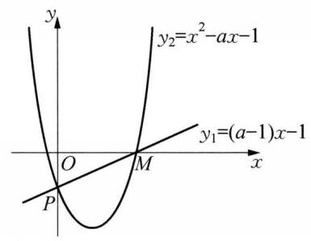

(第 9 题图)

10(－∞，5)提示:记 $f\left( x\right)  = \left| {{x}^{2} - 1}\right|  + \left| {x - a}\right| , x \in  \left\lbrack  {-2,2}\right\rbrack$ ，易得 $f{\left( x\right) }_{\max } = \max \{ f\left( {-2}\right) , f\left( 2\right) \}  = \; \max \{ 3 + \left| {2 - a}\right| ,3 + \left| {2 + a}\right| \}$ 。因为当 $a \geq  0$ 时, $3 + \left| {2 + a}\right|  \geq  3 + \left| {2 - a}\right|$ ,当 $a < 0$ 时, $3 + \left| {2 + a}\right|  < \; 3 + \left| {2 - a}\right|$ ,所以 $f{\left( x\right) }_{\max } = \left\{  \begin{array}{ll} 3 + \left| {2 + a}\right|  = a + 5, & a \geq  0, \\  3 + \left| {2 - a}\right|  =  - a + 5, & a < 0, \end{array}\right.$ 所以当 $a = 0$ 时, ${\left\lbrack  f{\left( x\right) }_{\max }\right\rbrack  }_{\min } = 5$ ,因为任意实数 $a$ ,都存在 $x \in  \left\lbrack  {-2,2}\right\rbrack$ 满足 $\left| {{x}^{2} - 1}\right|  + \left| {x - a}\right|  > m$ ,所以 ${\left\lbrack  f{\left( x\right) }_{\max }\right\rbrack  }_{\min } = 5 > m$ ,所以 $m$ 的取值范围是 $\left( {-\infty ,5}\right)$ 。

11 C 提示: 对于 ①,由重要不等式 ${a}^{2} + {b}^{2} \geq  {2ab}$ 可知 ① 正确；对于 ②, $\frac{{a}^{2} + {b}^{2}}{2} = \frac{2\left( {{a}^{2} + {b}^{2}}\right) }{4} = \; \frac{\left( {{a}^{2} + {b}^{2}}\right)  + \left( {{a}^{2} + {b}^{2}}\right) }{4} \geq  \frac{{a}^{2} + {b}^{2} + {2ab}}{4} = \frac{{\left( a + b\right) }^{2}}{4} = {\left( \frac{a + b}{2}\right) }^{2}$ ,故②正确；对于③，当 $a = b =  - 1$ 时，不等式的左边为 $\frac{a + b}{2} =  - 1$ ,右边为 $\frac{ab}{a + b} =  - \frac{1}{2}$ ,可知③不正确；对于④，令 $a = 1, b =  - 1$ 可知④不正确。故恒成立的个数为 2 个。

12 B 提示:原不等式可变形为 $\left| {{2x} + m}\right|  \leq  4 - {x}^{2}$ ,作出函数 $f\left( x\right)  = \left| {{2x} + m}\right|$ 与 $g\left( x\right)  = 4 - {x}^{2}$ 的图像,如图所示。由题意,在 $x \geq  0$ 时,至少有一点满足 $f\left( x\right)  \leq  g\left( x\right)$ ,当 $y =  - {2x} - m$ 与 $g\left( x\right)  = 4 - {x}^{2}$ 相切时, $- {2x} - m = 4 - {x}^{2}$ ,即 ${x}^{2} - {2x} - 4 - m =$ 0,由 $\Delta  = 4 + 4\left( {4 + m}\right)  = 0$ ,得 $m =  - 5$ 。当 $y = {2x} + m$ 过点 $M(0$ , 4) 时, $m = 4$ ,所以 $- 5 \leq  m \leq  4$ ,故选 B。

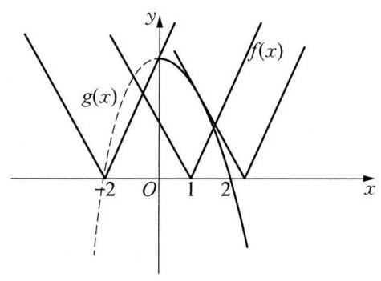

(第 12 题图)

13 A 提示: 设 ${x}^{2} + \left( {2{a}^{2} + 2}\right) x - {a}^{2} + {4a} - 7 = 0$ 的根分别为 ${x}_{1}$ 、 ${x}_{2}$ 且 ${x}_{1} < {x}_{2},{x}^{2} + \left( {{a}^{2} + {4a} - 5}\right) x - {a}^{2} + {4a} - 7 = 0$ 的根分别为 ${x}_{3}\text{ 、 }{x}_{4}$ 且 ${x}_{3} < {x}_{4}$ ,则 ${x}_{1}{x}_{2} = {x}_{3}{x}_{4} =  - {a}^{2} + {4a} - 7 =  - {\left( a - 2\right) }^{2} - \; 3 < 0,{x}_{1} + {x}_{2} - \left( {{x}_{3} + {x}_{4}}\right)  =  - 2{a}^{2} - 2 + {a}^{2} + {4a} - 5 =  - {a}^{2} + {4a} - 7 =  - {\left( a - 2\right) }^{2} - 3 < 0$ ,所以 ${x}_{1} < \; {x}_{3} < {x}_{2} < {x}_{4}$ ,故不等式的解集为 $\left( {{x}_{1},{x}_{3}}\right)  \cup  \left( {{x}_{2},{x}_{4}}\right)$ ,由题意得 $\left( {{x}_{3} - {x}_{1}}\right)  + \left( {{x}_{4} - {x}_{2}}\right)  \geq  {12}$ ,即 ${a}^{2} - \; {4a} + 7 \geq  {12}$ ,解得 $a \geq  5$ 或 $a \leq   - 1$ ,故 $a$ 的取值范围是 $\{ a \mid  a \geq  5$ 或 $a \leq   - 1\}$ ,故选 A。

14 C 提示: 由 $4{a}^{2} + {2tab} + {b}^{2} = 4$ ,可得 $4 = {\left( 2a + b\right) }^{2} + \left( {t - 2}\right)  \cdot  {2ab}$ ,当 $t = 2$ 时, ${2a} + b = 2$ ; 当 $t > 2$ 时, $4 = {\left( 2a + b\right) }^{2} + \left( {t - 2}\right)  \cdot  {2ab} \leq  {\left( 2a + b\right) }^{2} + \left( {t - 2}\right)  \cdot  {\left( \frac{{2a} + b}{2}\right) }^{2} = \frac{t + 2}{4} \cdot  {\left( 2a + b\right) }^{2}$ ,即 ${2a} + b \geq  \sqrt{\frac{16}{t + 2}}$ , 当且仅当 ${2a} = b$ 时取等号,此时 ${2a} + b$ 不存在最大值,不符合题意; 当 $t < 2$ 时, $4 = {\left( 2a + b\right) }^{2} + \left( {t - 2}\right)$ . ${2ab} \geq  {\left( 2a + b\right) }^{2} + \left( {t - 2}\right)  \cdot  {\left( \frac{{2a} + b}{2}\right) }^{2} = \frac{t + 2}{4} \cdot  {\left( 2a + b\right) }^{2}$ ,当且仅当 ${2a} = b$ 时取等号,当 $t \leq   - 2$ 时, $4 \geq \; \frac{t + 2}{4} \cdot  {\left( 2a + b\right) }^{2}$ 恒成立,此时 ${2a} + b$ 不存在最大值,不符合题意; 当 $- 2 < t < 2$ 时, ${2a} + b \leq  \sqrt{\frac{16}{t + 2}}$ ,此时 ${2a} + b$ 存在最大值。综上所述,实数 $t$ 的取值范围是 $( - 2,2\rbrack$ 。

15 (1)由 $\sqrt{x - 1} + {2x} \leq  5$ ，得 $\left\{  \begin{array}{l} x - 1 \leq  {\left( 5 - 2x\right) }^{2}, \\  x - 1 \geq  0, \\  5 - {2x} \geq  0, \end{array}\right.$ 即 $\left\{  \begin{array}{l} x \geq  \frac{13}{4}\text{ 或 }x \leq  2, \\  1 \leq  x \leq  \frac{5}{2}, \end{array}\right.$ 解得 $1 \leq  x \leq  2$ ,所以,不等式 $\sqrt{x - 1} + {2x} \leq  5$ 的解集为 $\left\lbrack  {1,2}\right\rbrack$ 。(2)由 $\frac{{ax} - 1}{x - 2} > \frac{a}{2}\left( {a \in  \mathbf{R}}\right)$ 得: $\frac{{ax} - 1}{x - 2} - \frac{a}{2} = \frac{{ax} + {2a} - 2}{2\left( {x - 2}\right) } > 0$ 。

当 $a = 0$ 时,解得 $x < 2$ ; 当 $a \neq  0$ 时, $\frac{{ax} + {2a} - 2}{2\left( {x - 2}\right) } > 0$ 等价于 $\frac{a\left\lbrack  {x - \left( {\frac{2}{a} - 2}\right) }\right\rbrack  }{x - 2} > 0$ 。当 $a > 0$ 时,若 $\frac{2}{a} - \; 2 = 2$ ,即 $a = \frac{1}{2}$ 时,解得 $x \neq  2$ ; 若 $\frac{2}{a} - 2 > 2$ ,即 $0 < a < \frac{1}{2}$ 时,解得 $x > \frac{2}{a} - 2$ 或 $x < 2$ ; 若 $\frac{2}{a} - 2 <$

2,即 $a > \frac{1}{2}$ 时,解得 $x < \frac{2}{a} - 2$ 或 $x > 2$ ; 当 $a < 0$ 时,解得 $\frac{2}{a} - 2 < x < 2$ 。综上所述,当 $a < 0$ 时,不等式 $\frac{{ax} - 1}{x - 2} > \frac{a}{2}$ 的解集为 $\left\{  {x\left| {\;\frac{2}{a} - 2 < x < 2}\right. }\right\}$ 。当 $a = 0$ 时,不等式 $\frac{{ax} - 1}{x - 2} > \frac{a}{2}$ 的解集为 $\{ x \mid  x < 2\}$ ; 当 $0 < a < \frac{1}{2}$ 时,不等式 $\frac{{ax} - 1}{x - 2} > \frac{a}{2}$ 的解集为 $\left\{  {x\left| {\;x > \frac{2}{a} - 2\text{ 或 }x < 2}\right. }\right\}$ ; 当 $a = \frac{1}{2}$ 时,不等式 $\frac{{ax} - 1}{x - 2} > \; \frac{a}{2}$ 的解集为 $\{ x \mid  x \neq  2\}$ ; 当 $a > \frac{1}{2}$ 时,不等式 $\frac{{ax} - 1}{x - 2} > \frac{a}{2}$ 的解集为 $\left\{  {x\left| {\;x < \frac{2}{a} - 2\text{ 或 }x > 2}\right. }\right\}$ 。

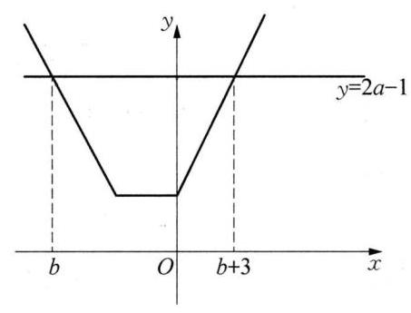

(第 16 题图)

16 (1)对 $\forall x \in  \mathbf{R}, f\left( x\right)  = \left| x\right|  + \left| {x + a}\right|  \geq  \left| {x - \left( {x + a}\right) }\right|  = \left| a\right|$ ， 当且仅当 $x\left( {x + a}\right)  \leq  0$ 时取等号,故原条件等价 $\left| a\right|  \geq  {2a} - 1$ ,即 $a \geq \; {2a} - 1$ 或 $a \leq   - \left( {{2a} - 1}\right)$ ,所以 $a \leq  1$ ,故实数 $a$ 的取值范围是 $( - \infty ,1\rbrack$ 。

(2)由 ${2a} - 1 \geq  \left| x\right|  + \left| {x + a}\right|  \geq  0$ ，可知 ${2a} - 1 \geq  0$ ，所以 $a \geq  \frac{1}{2}$ ， 故 $- a < 0$ ,故 $f\left( x\right)  = \left\{  \begin{array}{ll}  - {2x} - a, & x <  - a, \\  a, &  - a \leq  x \leq  0, \\  {2x} + a, & x > 0 \end{array}\right.$ 的图像如图所示,由图可知 $\left\{  \begin{array}{l}  - {2b} - a = {2a} - 1, \\  2\left( {b + 3}\right)  + a = {2a} - 1, \end{array}\right.$ 解得 $\left\{  \begin{array}{l} a = 2, \\  b =  - \frac{5}{2}\text{ 。 } \end{array}\right.$

17 (1)欲使剩下木板的面积最大，即要锯掉的三角形废料 MAN 的面积 $S = \frac{1}{2}{mn}$ 最小。由 $1 = \frac{2}{m} + \frac{1}{n} \geq \; 2\sqrt{\frac{2}{m} \cdot  \frac{1}{n}}$ 得, ${mn} \geq  8$ ,当且仅当 $\frac{2}{m} = \frac{1}{n}$ ,即 $m = 4, n = 2$ 时,“=”成立,故当 $m = 4, n = 2$ 时,剩下木板 ${MBCDN}$ 的面积最大。(2)欲使剩下木板的外边框长度最大，即要 $m + n$ 最小。 $m + n = (m + \; n)\left( {\frac{2}{m} + \frac{1}{n}}\right)  = \frac{2n}{m} + \frac{m}{n} + 3 \geq  2\sqrt{\frac{2n}{m} \cdot  \frac{m}{n}} + 3 = 2\sqrt{2} + 3$ ,当且仅当 $\frac{2n}{m} = \frac{m}{n}$ ,即 $m = 2 + \sqrt{2}, n = \sqrt{2} + 1$ 时, “ $=$ ”成立,故此时剩下木板的外边框长度的最大值为 $\left( {6 + {12}}\right)  \times  2 - \left( {2\sqrt{2} + 3}\right)  = \left( {{33} - 2\sqrt{2}}\right)$ 分米,此时 $m = \; 2 + \sqrt{2}, n = \sqrt{2} + 1$ 。

18 (1)由 $\frac{{a}_{1}^{m + 1}}{{b}_{1}^{m}} + \frac{{a}_{2}^{m + 1}}{{b}_{2}^{m}} + \cdots  + \frac{{a}_{n}^{m + 1}}{{b}_{n}^{m}} \geq  \frac{{\left( {a}_{1} + {a}_{2} + \cdots  + {a}_{n}\right) }^{m + 1}}{{\left( {b}_{1} + {b}_{2} + \cdots {b}_{n}\right) }^{m}}$ ①,知 $\frac{1}{x} + \frac{2}{y} = \frac{{1}^{2}}{x} + \frac{{2}^{2}}{2y} \geq  \frac{{\left( 1 + 2\right) }^{2}}{x + {2y}} = 9$ ,当且仅当 $x = y = \frac{1}{3}$ 时,等号成立,所以 $\frac{1}{x} + \frac{2}{y}$ 的最小值为 9 。( 2 ) $\frac{1}{{a}^{2}} + \frac{1}{{b}^{2}} + \frac{8}{{c}^{2}} = \frac{{1}^{3}}{{a}^{2}} + \frac{{1}^{3}}{{b}^{2}} + \frac{{2}^{3}}{{c}^{2}} \geq  \frac{{\left( 1 + 1 + 2\right) }^{3}}{{\left( a + b + c\right) }^{2}}$ , 当且仅当 $a = \frac{1}{4}, b = \frac{1}{4}, c = \frac{1}{2}\left( {\lambda  = 4}\right)$ 时,“ $=$ ”成立,所以 ${\left( \frac{1}{{a}^{2}} + \frac{1}{{b}^{2}} + \frac{8}{{c}^{2}}\right) }_{\min } = {64}$ 。(3)先证: $\frac{1}{1 - x} + \; \frac{1}{1 - y} \geq  \frac{{\left( 1 + 1\right) }^{2}}{2 - x - y}$ 。令 ${b}_{1} = 1 - x,{a}_{1} = 1,{b}_{2} = 1 - y,{a}_{2} = 1$ 。其中, $m = 1$ ,代入①中,得: $\frac{1}{1 - x} + \frac{1}{1 - y} \geq \; \frac{{\left( 1 + 1\right) }^{2}}{2 - x - y} = \frac{4}{1 + z}$ ②,同理, $\frac{1}{1 - y} + \frac{1}{1 - z} \geq  \frac{4}{1 + x}$ ③, $\frac{1}{1 - x} + \frac{1}{1 - z} \geq  \frac{4}{1 + y}$ ④,②+③+④得: $\frac{1}{1 - x} + \frac{1}{1 - y} + \frac{1}{1 - z} \geq  \frac{2}{1 + x} + \frac{2}{1 + y} + \frac{2}{1 + z}$ 。 “=”在 $x = y = z = \frac{1}{3}$ 时取得 (此时 $\lambda  = 3$ )。故题目得证。

## 第 3 章 单元练习

$1\left\lbrack  {-1,0}\right)  \cup  \left( {0, + \infty }\right) \;2{2x}^{2} - {4x} + 3$ 3 $\frac{1}{4}$ 提示:由题意可知，函数 $f\left( x\right)$ 满足 $f\left( x\right)  = f\left( \left| x\right| \right)$ ，故函数 $f\left( x\right)$ 是偶函数，又 $f\left( {x - 1}\right)  = f(x +$ 1),即周期为 2,故 $f\left( \frac{3}{2}\right)  = f\left( {-\frac{1}{2}}\right)  = f\left( \frac{1}{2}\right)  = {\left( \frac{1}{2}\right) }^{2} = \frac{1}{4}$ 。

$\begin{array}{ll} 4 & 2 \end{array}$

$5\sqrt{10}$ 提示: 因为 $f\left( x\right)  = \sqrt{{x}^{2} - {2x} + 2} + \sqrt{{x}^{2} - {4x} + 8} = \sqrt{{\left( x - 1\right) }^{2} + 1} + \sqrt{{\left( x - 2\right) }^{2} + 4} = \; \sqrt{{\left( x - 1\right) }^{2} + {\left( 0 - 1\right) }^{2}} + \sqrt{{\left( x - 2\right) }^{2} + {\left( 0 - 2\right) }^{2}}$ ,几何意义为点 $P\left( {x,0}\right)$ 到点 $A\left( {1,1}\right) \text{ 、 }B\left( {2,2}\right)$ 两点的距离之和,设 $A\left( {1,1}\right)$ 关于 $x$ 轴的对称点 $C\left( {1, - 1}\right)$ ,则 $f\left( x\right)  = \left| {PA}\right|  + \left| {PB}\right|  = \left| {PC}\right|  + \left| {PB}\right|  \geq  \left| {BC}\right|  = \; \sqrt{{\left( 2 - 1\right) }^{2} + {\left( 2 + 1\right) }^{2}} = \sqrt{10}$ ,当且仅当 $B\text{ 、 }P\text{ 、 }C$ 三点共线时 $f\left( x\right)$ 的值最小为 $\left| {BC}\right|  = \sqrt{10}$ ,故答案为 $\sqrt{10}$ 。

${62x} - \sqrt{x + 2}, x \in  \lbrack  - 2,0) \cup  \left( {0, + \infty }\right) \;7\;\left( {-1, + \infty }\right)$

8-4 提示: 由 $f\left( {x + 1}\right)$ 为奇函数,则 $f\left( {x + 1}\right)  =  - f\left( {-x + 1}\right)$ 。令 $x = 0$ ,则 $f\left( 1\right)  =  - f\left( 1\right)$ ,解得 $f\left( 1\right)  = k + b = 0$ 。令 $x =  - 1$ ,则 $f\left( 0\right)  =  - f\left( 2\right)  =  - {2k} - b$ ,又因为 $f\left( {x + 2}\right)$ 为偶函数,则 $f\left( {x + 2}\right)  = \; f\left( {-x + 2}\right)$ ,令 $x = 1$ ,则 $f\left( 3\right)  = f\left( 1\right)  = k + b = 0$ ,因为 $f\left( 0\right)  + f\left( 3\right)  = 8$ ,即 $f\left( 3\right)  + \left( {-{2k} - b}\right)  = 8$ ,联立解得 $k =  - 8, b = 8$ 。所以,当 $x \in  \left\lbrack  {1,2}\right\rbrack$ 时, $f\left( x\right)  =  - {8x} + 8$ 。又因为 $f\left( {x + 2}\right)  = f\left( {-x + 2}\right)  = f( - (x - \; 1) + 1) =  - f\left( {\left( {x - 1}\right)  + 1}\right)  =  - f\left( x\right)$ ,即 $f\left( {x + 2}\right)  =  - f\left( x\right)$ ,则 $f\left( {x + 4}\right)  =  - f\left( {x + 2}\right)  = f\left( x\right)$ ,所以函数 $f\left( x\right)$ 是以 4 为周期的函数，故 $f\left( \frac{2021}{2}\right)  = f\left( \frac{5}{2}\right)  = f\left( \frac{3}{2}\right)  =  - 4$ 。

99 提示: 因为 $f\left( x\right)$ 为偶函数,则 $f\left( x\right)  = \; - f\left( {x - \pi }\right)$ ,所以 $T = {2\pi }$ 。而 $f\left( \frac{\pi }{2}\right)  = \; - f\left( {\pi  - \frac{\pi }{2}}\right)  =  - f\left( \frac{\pi }{2}\right)$ ,则 $f\left( \frac{\pi }{2}\right)  = 0$ ,所以 $f\left( {-\frac{\pi }{2}}\right)  = 0$ 。而 $f\left( 0\right)  = 0$ ,所以 $f\left( \pi \right)  =  - f\left( 0\right)  = \; 0, f\left( \frac{3\pi }{2}\right)  =  - f\left( {\frac{3\pi }{2} - \pi }\right)  = 0$ 。令 $x \in  \left( {\frac{\pi }{2},\pi }\right) ,$ 则 $\pi  - x \in  \left( {0,\frac{\pi }{2}}\right)$ ,所以,当 $x \in  \left( {\frac{\pi }{2},\pi }\right)$ 时, $f\left( x\right)  =  - f\left( {\pi  - x}\right)  =  - \sqrt{\pi  - x}$ ,如图所示,故答案为 9 。

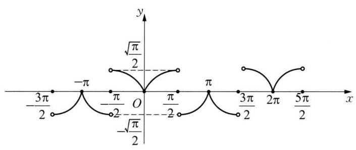

(第 9 题图)

107 提示: 由 $f\left( {-1}\right)  =  - 5 + n + 4 - n + 1 = 0$ ,可得-1 是函数 $f\left( x\right)$ 的一个零点。令 $f\left( x\right)  = (x +$ 1) $\left( {5{x}^{2} + {ax} + 1}\right)  = 5{x}^{3} + \left( {5 + a}\right) {x}^{2} + \left( {a + 1}\right) x + 1 = 5{x}^{3} + \left( {n + 4}\right) {x}^{2} + {nx} + 1$ (n 为正整数)。所以 $5 + \; a = n + 4$ ,即 $a + 1 = n$ 。所以,方程 $5{x}^{2} + \left( {n - 1}\right) x + 1 = 0$ 有两个根,且均为有理数。从而 $\Delta  = {\left( n - 1\right) }^{2} - \; {20} \geq  0$ ,可得 $n \geq  2\sqrt{5} + 1$ ,且 $\Delta  = {\left( n - 1\right) }^{2} - {20}$ 为完全平方数。设 ${\left( n - 1\right) }^{2} - {20} = {k}^{2}, k$ 为正整数。所以 $\left( {n - 1 + k}\right) \left( {n - 1 - k}\right)  = {20} = 4 \times  5 = 2 \times  {10} = 1 \times  {20}$ ,经过验证只有: $n - 1 + k = {10}, n - 1 - k = 2$ ,即 $n = 7, k = 4$ 时满足题意。所以,方程 $5{x}^{2} + \left( {n - 1}\right) x + 1 = 0$ 即 $5{x}^{2} + {6x} + 1 = 0$ ,解得 ${x}_{1} =  - 1,{x}_{2} =  - \frac{1}{5}$ , 均为有理数,因此 $n = 7$ 。

11 C 12 D

13 D 提示: 由 $g\left( {x + 1}\right)$ 为偶函数,则 $g\left( x\right)$ 关于 $x = 1$ 对称,即 $g\left( x\right)  = g\left( {2 - x}\right)$ ,即 $\left( {x - 1}\right) f\left( x\right)  = (1 - \; x)f\left( {2 - x}\right)$ ,即 $f\left( x\right)  + f\left( {2 - x}\right)  = 0$ ,所以, $f\left( x\right)$ 关于 $\left( {1,0}\right)$ 对称,又 $f\left( x\right)$ 是定义域为 $\mathbf{R}$ 的偶函数,则 $f\left( x\right)  =  - f\left( {2 - x}\right)  =  - f\left( {x - 2}\right)$ ,从而 $f\left( {x - 4}\right)  = f\left\lbrack  {\left( {x - 2}\right)  - 2}\right\rbrack   =  - f\left( {x - 2}\right)  =  - \left\lbrack  {-f\left( x\right) }\right\rbrack   = f\left( x\right)$ , 即 $f\left( {x - 4}\right)  = f\left( x\right)$ ,所以 $f\left( x\right)$ 周期为 4,所以 $f\left( {5.5}\right)  = f\left( {1.5}\right)  = f\left( {-{2.5}}\right)  = f\left( {2.5}\right)  = 2$ ,所以 $g\left( {-{0.5}}\right)  = \; g\left( {2.5}\right)  = {1.5f}\left( {2.5}\right)  = 3$ ,故选 D。

14 D 提示: 易知函数 $f\left( x\right)  = {\mathrm{e}}^{x - 1} + x - 2$ 严格增且有唯一的零点为 $m = 1$ ,所以 $\left| {1 - n}\right|  \leq  1$ ,解得 $0 \leq  n \leq$ 2,问题转化为:使方程 ${x}^{2} - {ax} - a + 3 = 0$ 在区间 $\left\lbrack  {0,2}\right\rbrack$ 上有解,即 $a = \frac{{x}^{2} + 3}{x + 1} = \frac{{\left( x + 1\right) }^{2} - 2\left( {x + 1}\right)  + 4}{x + 1} = \; x + 1 + \frac{4}{x + 1} - 2$ 在区间 $\left\lbrack  {0,2}\right\rbrack$ 上有解,而根据 “对勾函数” 可知函数 $y = x + 1 + \frac{4}{x + 1} - 2$ 在区间 $\left\lbrack  {0,2}\right\rbrack$ 的值域为 $\left\lbrack  {2,3}\right\rbrack$ ,所以 $2 \leq  a \leq  3$ ,故选 D。

15 (1)因为 $f\left( x\right)  = \frac{{x}^{2}}{1 + {x}^{2}} = 1 - \frac{1}{{x}^{2} + 1}$ ,所以 $f\left( 2\right)  = 1 - \frac{1}{{2}^{2} + 1} = \frac{4}{5}, f\left( \frac{1}{2}\right)  = 1 - \frac{1}{\frac{1}{4} + 1} = \frac{1}{5}, f\left( 3\right)  = \; 1 - \frac{1}{{3}^{2} + 1} = \frac{9}{10}, f\left( \frac{1}{3}\right)  = 1 - \frac{1}{\frac{1}{9} + 1} = \frac{1}{10}$ ,故 $f\left( 2\right)  + f\left( \frac{1}{2}\right)  = \frac{4}{5} + \frac{1}{5} = 1, f\left( 3\right)  + f\left( \frac{1}{3}\right)  = 1$ 。(2)由(1) 所得结果发现 $f\left( x\right)  + f\left( \frac{1}{x}\right)  = 1$ 。证明如下: $f\left( x\right)  + f\left( \frac{1}{x}\right)  = \frac{{x}^{2}}{1 + {x}^{2}} + \frac{\frac{1}{{x}^{2}}}{1 + \frac{1}{{x}^{2}}} = \frac{{x}^{2}}{1 + {x}^{2}} + \frac{1}{{x}^{2} + 1} = 1$ 。

16 (1)令 $x = y = 1$ ，则 $f\left( 1\right)  = 0$ 。(2)令 $x = {36}, y = 6$ ，由 $f\left( 6\right)  = 1$ 得 $f\left( {36}\right)  = 2$ ，而 $f\left( {x + 5}\right)  - f\left( \frac{1}{x}\right)  < \; 2 = f\left( {36}\right) , f\left( {x + 5}\right)  - f\left( \frac{1}{x}\right)  = f\left\lbrack  {\left( {x + 5}\right) x}\right\rbrack$ ,且 $f\left( x\right)$ 是定义在 $\left( {0, + \infty }\right)$ 上的增函数,则 $\left( {x + 5}\right) x <$ 36，所以 $- 9 < x < 4$ ，又因为 $x > 0, x + 5 > 0$ ，所以 $0 < x < 4$ 。

17 (1)因为函数 $f\left( x\right)  = \frac{\left( {x + 1}\right) \left( {x + b}\right) }{{x}^{2}}$ 为偶函数，所以 $f\left( {-x}\right)  = f\left( x\right)$ ，即 $\frac{\left( {x + 1}\right) \left( {x + b}\right) }{{x}^{2}} = \; \frac{\left( {-x + 1}\right) \left( {-x + b}\right) }{{x}^{2}}$ ，所以 $2\left( {b + 1}\right) x = 0$ ，因为 $x$ 为非零实数，所以 $b + 1 = 0$ ，即 $b =  - 1$ 。( 2 )令 $f\left( a\right)$ 0,即 $\frac{{a}^{2} - 1}{{a}^{2}} = 0, a =  \pm  1$ ,取 $a =  - 1$ ; 令 $f\left( a\right)  = \frac{3}{4}$ ,即 $\frac{{a}^{2} - 1}{{a}^{2}} = \frac{3}{4}, a =  \pm  2$ ,取 $a =  - 2$ ,故 $a =  - 1$ 或 $a =  - 1$ 。

(3)因为 $f\left( x\right)  = \frac{{x}^{2} - 1}{{x}^{2}}$ 是偶函数，所以，函数 $f\left( x\right)$ 在 $\left( {-\infty ,0}\right)$ 上是减函数，在 $\left( {0, + \infty }\right)$ 上是增函数。而 $x \neq  0$ ,则由题意可知 $\frac{1}{m} < \frac{1}{n} < 0$ 或 $0 < \frac{1}{m} < \frac{1}{n}$ 。若 $\frac{1}{m} < \frac{1}{n} < 0$ ,则有 $\left\{  \begin{array}{l} f\left( \frac{1}{m}\right)  = 2 - {3n}, \\  f\left( \frac{1}{n}\right)  = 2 - {3m}, \end{array}\right.$ 即

$\left\{  \begin{array}{l} 1 - {m}^{2} = 2 - {3n}, \\  1 - {n}^{2} = 2 - {3m}, \end{array}\right.$ 整理得 ${n}^{4} + 2{n}^{2} - {27n} + {10} = 0$ ,此时方程组无负解; 若 $0 < \frac{1}{m} < \frac{1}{n}$ ,则有 $\left\{  \begin{array}{l} f\left( \frac{1}{n}\right)  = 2 - {3n}, \\  f\left( \frac{1}{m}\right)  = 2 - {3m}, \end{array}\right.$ 即 $\left\{  \begin{array}{l} 1 - {m}^{2} = 2 - {3m}, \\  1 - {n}^{2} = 2 - {3n}, \end{array}\right.$ 所以, $m\text{ 、 }n$ 为方程 ${x}^{2} - {3x} + 1 = 0$ 的两个根。又因为 $0 < \frac{1}{m} < \frac{1}{n}$ , 所以 $m > n > 0$ ,所以 $m = \frac{3 + \sqrt{5}}{2}, n = \frac{3 - \sqrt{5}}{2}$ 。

18 (1)证明:令 $x = y = 0$ ，得 $f\left( 0\right)  = 0$ 。设任意 $x \in  \left( {-1,1}\right)$ ，则 $- x \in  \left( {-1,1}\right)$ ，所以 $f\left( x\right)  + f\left( {-x}\right)  =$

$f\left( 0\right)  = 0$ ,即 $f\left( {-x}\right)  =  - f\left( x\right)$ ,所以,函数 $f\left( x\right)$ 是奇函数。(2)证明: 设 $- 1 < {x}_{1} < {x}_{2} < 1$ ,则 $f\left( {x}_{1}\right)  -$

$f\left( {x}_{2}\right)  = f\left( {x}_{1}\right)  + f\left( {-{x}_{2}}\right)  = f\left( \frac{{x}_{1} - {x}_{2}}{1 - {x}_{1}{x}_{2}}\right)$ 。由 $- 1 < {x}_{1} < {x}_{2} < 1$ 知 ${x}_{1} - {x}_{2} < 0$ ,且 $\left| {x}_{1}\right|  < 1,\left| {x}_{2}\right|  <$

1,则 $\left| {{x}_{1}{x}_{2}}\right|  < 1$ ,即 $1 - {x}_{1}{x}_{2} > 0$ ,从而 $\frac{{x}_{1} - {x}_{2}}{1 - {x}_{2}{x}_{2}} < 0$ ,又 $\frac{{x}_{1} - {x}_{2}}{1 - {x}_{1}{x}_{2}} - \left( {-1}\right)  = \frac{\left( {1 + {x}_{1}}\right) \left( {1 - {x}_{2}}\right) }{1 - {x}_{1}{x}_{2}} > 0$ ,所以

$\frac{{x}_{1} - {x}_{2}}{1 - {x}_{1}{x}_{2}} \in  \left( {-1,0}\right)$ ,从而 $f\left( \frac{{x}_{1} - {x}_{2}}{1 - {x}_{1}{x}_{2}}\right)  > 0$ ,即 $f\left( {x}_{1}\right)  - f\left( {x}_{2}\right)  > 0, f\left( {x}_{1}\right)  > f\left( {x}_{2}\right)$ ,所以 $f\left( x\right)$ 在 $( - 1$ ,

1) 上是减函数。(3)由(2)知函数 $f\left( x\right)$ 在 $\left( {-1,1}\right)$ 上是减函数，则当 $x \in  \left\lbrack  {-\frac{1}{2},\frac{1}{2}}\right\rbrack$ 时，函数 $f\left( x\right)$ 的最大值为 $f\left( {-\frac{1}{2}}\right)  =  - f\left( \frac{1}{2}\right)  = 1$ ,若 $f\left( x\right)  \leq  {t}^{2} - {2at} + 1$ 对所有 $x \in  \left\lbrack  {-\frac{1}{2},\frac{1}{2}}\right\rbrack  , a \in  \left\lbrack  {-1,1}\right\rbrack$ 恒成立，即 ${t}^{2} - {2at} \geq  0$ 对任意的 $a \in  \left\lbrack  {-1,1}\right\rbrack$ 恒成立,设 $g\left( a\right)  = {t}^{2} - {2at} =  - {2ta} + {t}^{2}$ ,则 $g\left( a\right)  \geq  0$ 对所有 $a \in  \lbrack  - 1$ , 1] 恒成立,所以 $\left\{  \begin{array}{l} g\left( 1\right)  \geq  0, \\  g\left( {-1}\right)  \geq  0, \end{array}\right.$ 即 $\left\{  \begin{array}{l} {t}^{2} - {2t} \geq  0, \\  {t}^{2} + {2t} \geq  0, \end{array}\right.$ 即 $\left\{  \begin{array}{l} t \geq  2\text{ 或 }t \leq  0, \\  t \geq  0\text{ 或 }t \leq   - 2, \end{array}\right.$ 解得 $t \geq  2$ 或 $t = 0$ 或 $t \leq   - 2$ 。综上,实数 $t$ 的取值范围是 $\left( {-\infty , - 2\rbrack \cup \{ 0\} \cup \lbrack 2, + \infty }\right)$ 。

## 第 4 章 单元练习

$\begin{array}{llll} 1 & {15} & 2 &  - \frac{1}{7} \end{array}$

$3( - \infty ,1\rbrack$ 提示: 由题意,当 $x \geq  \frac{1}{2}$ 时,函数 $f\left( x\right)  = x - \frac{1}{2} - {2x} - 1 =  - x - \frac{3}{2}$ ,此时函数为严格减函数，所以最大值为 $f\left( \frac{1}{2}\right)  =  - 2$ ，此时函数的取值为 $( - \infty , - 2\rbrack$ 。当 $- \frac{1}{2} \leq  x \leq  \frac{1}{2}$ 时，函数 $f\left( x\right)  =  - x + \; \frac{1}{2} - {2x} - 1 =  - {3x} - \frac{1}{2}$ ,此时函数为严格减函数,所以最大值为 $f\left( {-\frac{1}{2}}\right)  = 1$ ,最小值 $f\left( \frac{1}{2}\right)  =  - 2$ ,所以函数的取值为 $\left( {-2,1\rbrack \text{ ; 当 }x \leq   - \frac{1}{2}\text{ 时,函数 }f\left( x\right)  =  - x + \frac{1}{2} + {2x} + 1 = x + \frac{3}{2}\text{ ,此时函数为严格增函数,所 }}\right)$ 以最大值为 $f\left( {-\frac{1}{2}}\right)  = 1$ ,此时函数的取值为 $( - \infty ,1\rbrack$ 。综上可知,函数 $f\left( x\right)$ 的取值范围是 $( - \infty ,1\rbrack$ 。

4 $\{  - 1,0,1\}$ 提示: 解: 令 $y = \frac{{2}^{x + 1}}{1 + {2}^{x}} - \frac{1}{3}$ ,所以 $y = \frac{{2}^{x + 1}}{1 + {2}^{x}} - \frac{1}{3} = \frac{{2}^{x + 1} + 2 - 2}{1 + {2}^{x}} - \frac{1}{3} = \frac{2\left( {{2}^{x} + 1}\right)  - 2}{1 + {2}^{x}} - \; \frac{1}{3} = \frac{5}{3} - \frac{2}{1 + {2}^{x}}$ ,因为 $x \in  \mathbf{R}$ ,所以 $1 + {2}^{x} > 1$ ,所以 $- \frac{2}{1 + {2}^{x}} \in  \left( {-2,0}\right)$ ,所以 $\frac{5}{3} - \frac{2}{1 + {2}^{x}} \in  \left( {-\frac{1}{3},\frac{5}{3}}\right)$ , 所以 $\left\lbrack  {\frac{5}{3} - \frac{2}{1 + {2}^{x}}}\right\rbrack   \in  \{  - 1,0,1\}$ ,所以函数 $f\left( x\right)  = \left\lbrack  {\frac{{2}^{x + 1}}{1 + {2}^{x}} - \frac{1}{3}}\right\rbrack$ 的值域为 $\{  - 1,0,1\}$ 。

$5\;\left( {\frac{1}{2},4}\right) \;6\;\frac{1}{3}\;7\;{18}\;8\;\left( {0,1}\right)$

9 5 提示: 由条件可知 $\frac{{2}^{p}}{{2}^{p} + {ap}} = \frac{6}{5}$ ,则 $\frac{1}{1 + \frac{ap}{{2}^{p}}} = \frac{6}{5}$ ,得 $\frac{ap}{{2}^{p}} =  - \frac{1}{6}$ ①。由 $\frac{{2}^{q}}{{2}^{q} + {aq}} =  - \frac{1}{5}$ ,得 $\frac{1}{1 + \frac{aq}{{2}^{q}}} = \; - \frac{1}{5}$ ,则 $\frac{aq}{{2}^{q}} =  - 6$ ②,① $\times$ ②得 $\frac{{a}^{2}{pq}}{{2}^{p + q}} = 1$ ,又因为 ${2}^{p + q} = {25pq}$ ,所以 $\frac{{a}^{2}}{25} = 1$ ,又 $a > 0$ ,得 $a = 5$ 。

10(0，1)提示:由 $\ln x = 0$ ，得 $x = 1$ ，由 $\left| {x - 2}\right|  = 0$ ，得 $x = 2$ 。所以,函 数 $y = {\mathrm{e}}^{\left| \ln x\right| } - \left| {x - 2}\right|$ 转化为 $y = {\mathrm{e}}^{\left| \ln x\right| } - \left| {x - 2}\right|  = \; \left\{  \begin{array}{ll} {\mathrm{e}}^{\ln x} - x + 2 = 2, & x \geq  2, \\  {\mathrm{e}}^{\ln x} + x - 2 = {2x} - 2, & 1 \leq  x < 2, \\  {\mathrm{e}}^{-\ln x} + x - 2 = \frac{1}{x} + x - 2, & 0 < x < 1\text{ 。 } \end{array}\right.$ 在同一坐标系中作出函数 $y = \; {\mathrm{e}}^{\left| \ln x\right| } - \left| {x - 2}\right|$ 与 $y = {ax}$ 的图像如图所示。由图可得,实数 $a$ 的取值范围是 $\left( {0,1}\right)$ 。

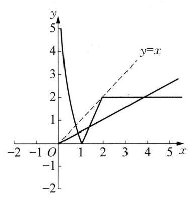

(第 10 题图)

${11}\mathrm{\;B}{12}\mathrm{C}{13}\mathrm{\;B}{14}\mathrm{C}$

15 因为 $y = 4 \cdot  {3}^{x} - 2 \cdot  {9}^{x} = 4 \cdot  {3}^{x} - 2 \cdot  {\left( {3}^{x}\right) }^{2}$ ,令 $t = {3}^{x}$ ,则 $y = {4t} - 2{t}^{2} =  - 2{\left( t - 1\right) }^{2} + 2$ 。因为 $- 1 \leq \; x \leq  1$ ,所以 $\frac{1}{3} \leq  {3}^{x} \leq  3$ ,即 $t \in  \left\lbrack  {\frac{1}{3},3}\right\rbrack$ ,又因为对称轴 $t = 1 \in  \left\lbrack  {\frac{1}{3},3}\right\rbrack$ ,所以当 $t = 1$ ,即 $x = 0$ 时, ${y}_{\max } = 2$ 。

16 (1)由已知 $f\left( x\right)  = {\log }_{a}x\left( {a > 0\text{ 且 }a \neq  1}\right)$ 满足 $f\left( \frac{1}{2}\right)  + f\left( 4\right)  = 1$ ,则 ${\log }_{a}\frac{1}{2} + {\log }_{a}4 = 1$ ,即 $- {\log }_{a}2 + \; 2{\log }_{a}2 = 1$ ,得 ${\log }_{a}2 = 1$ ,所以 $a = 2$ ,得 $f\left( x\right)  = {\log }_{2}x$ ,则 $f\left( 1\right)  + f\left( 2\right)  + f\left( 4\right)  + \cdots  + f\left( {2}^{10}\right)  = {\log }_{2}1 + {\log }_{2}2 + \; {\log }_{2}4 + {\log }_{2}8 + \cdots  + {\log }_{2}{2}^{10} = {\log }_{2}{2}^{\left( 1 + 2 + 3 + \cdots  + {10}\right) } = 1 + 2 + 3 + \cdots  + {10} = {55}$ 。(2)由 $\left\{  \begin{array}{l} 2 - x > 0, \\  1 + x > 0, \end{array}\right.$ 得 $- 1 < \; x < 2$ ,定义域为 $\left( {-1,2}\right) \text{ 。 }g\left( x\right)  = f\left( {2 - x}\right)  + f\left( {1 + x}\right)  = {\log }_{2}\left( {2 - x}\right)  + {\log }_{2}\left( {1 + x}\right)  = {\log }_{2}\left( {-{x}^{2} + x + }\right.$ 2)。设 $\mu  =  - {x}^{2} + x + 2 =  - {\left( x - \frac{1}{2}\right) }^{2} + \frac{9}{4}$ ,则 $g\left( x\right)  = {\log }_{2}\mu$ 严格增, $\mu$ 在 $\left( {-1,\frac{1}{2}}\right\rbrack$ 上严格增,在 $\left( {\frac{1}{2},2}\right)$ 上严格减，故 $g\left( x\right)$ 的单调增区间为 $\left( {-1,\frac{1}{2}}\right\rbrack$ ，单调减区间为 $\left( {\frac{1}{2},2}\right)$ 。

17 (1)当 $a = 1$ 时， $f\left( x\right)  = \frac{a \cdot  {2}^{x} + 1}{{2}^{x} - 1} = \frac{{2}^{x} + 1}{{2}^{x} - 1}, f\left( {2x}\right)  = \frac{{2}^{2x} + 1}{{2}^{2x} - 1} = \frac{{\left( {2}^{x}\right) }^{2} + 1}{{\left( {2}^{x}\right) }^{2} - 1}$ ,所以方程 $\lg f\left( {2x}\right)  - \; \lg f\left( x\right)  = 1 - \lg {18}$ 化为 $\lg \frac{f\left( {2x}\right) }{f\left( x\right) } = \lg \frac{10}{18}$ 且 $f\left( {2x}\right)  > 0, f\left( x\right)  > 0$ ,即 $\frac{f\left( {2x}\right) }{f\left( x\right) } = \frac{5}{9}$ 且 $\frac{{\left( {2}^{x}\right) }^{2}}{{\left( {2}^{x}\right) }^{2} - 1} > 0$ , $\frac{{2}^{x} + 1}{{2}^{x} - 1} > 0$ ,所以 $\frac{\frac{{\left( {2}^{x}\right) }^{2} + 1}{{\left( {2}^{x}\right) }^{2} - 1}}{\frac{{2}^{x} + 1}{{2}^{x} - 1}} = \frac{5}{9}$ ,即 $\frac{{\left( {2}^{x}\right) }^{2} + 1}{{\left( {2}^{x} + 1\right) }^{2}} = \frac{5}{9}$ 。令 ${2}^{x} = t$ ,则原方程化为 $\frac{{t}^{2} + 1}{{\left( t + 1\right) }^{2}} = \frac{5}{9}$ ,整理得 $2{t}^{2} - {5t} + \; 2 = 0$ ,解得 $t = 2$ 或 $t = \frac{1}{2}$ ,即 ${2}^{x} = 2$ 或 ${2}^{x} = \frac{1}{2}$ ,解得 $x = 1$ 或 $x =  - 1$ 。当 $x =  - 1$ 时, $\frac{{\left( {2}^{x}\right) }^{2} + 1}{{\left( {2}^{x}\right) }^{2} - 1} < 0,\frac{{2}^{x} + 1}{{2}^{x} - 1} <$

0,故舍去,故原方程的解为 $x = 1$ 。(2)由 $\left| {f\left( {2x}\right)  - f\left( x\right) }\right|  \geq  1$ ,得 $\left| {\frac{a \cdot  {\left( {2}^{x}\right) }^{2} + 1}{{\left( {2}^{x}\right) }^{2} - 1} - \frac{a \cdot  {2}^{x} + 1}{{2}^{x} - 1}}\right|  \geq  1$ ,即 $\left| \frac{-a \cdot  {2}^{x} - {2}^{x}}{{\left( {2}^{x}\right) }^{2} - 1}\right|  \geq  1$ ,令 ${2}^{x} = t$ ,当 $x \in  (0,1\rbrack$ 时, $t \in  (1,2\rbrack$ ,所以 ${t}^{2} - 1 > 0$ ,所以当 $x \in  (0,1\rbrack$ 时, $\left| {f\left( {2x}\right)  - f\left( x\right) }\right|  \geq  1$ 恒成立,等价于当 $t \in  (1,2\rbrack$ 时, $\left| \frac{\left( {a + 1}\right)  \cdot  t}{{t}^{2} - 1}\right|  \geq  1$ 恒成立,即 $\left| {a + 1}\right|  \geq  \left| \frac{{t}^{2} - 1}{t}\right|$ 在 $t \in  (1,2\rbrack$ 时恒成立。令 $g\left( t\right)  = \frac{{t}^{2} - 1}{t} = t - \frac{1}{t}$ ,设 $1 < {t}_{1} < {t}_{2} < 2$ ,则 ${t}_{1} - {t}_{2} < 0,{t}_{1}{t}_{2} - 1 > 0,{t}_{1}{t}_{2} >$ 0,从而有 $g\left( {t}_{1}\right)  - g\left( {t}_{2}\right)  = \left( {{t}_{1} - \frac{1}{{t}_{1}}}\right)  - \left( {{t}_{2} - \frac{1}{{t}_{2}}}\right)  = \frac{\left( {{t}_{1} - {t}_{2}}\right) \left( {{t}_{1}{t}_{2} + 1}\right) }{{t}_{1}{t}_{2}} < 0$ ,所以 $g\left( {t}_{1}\right)  < g\left( {t}_{2}\right)$ ,所以 $g\left( t\right)$ 在 $(1,2\rbrack$ 上严格增,所以 $g\left( 2\right)  = 2 - \frac{1}{2} = \frac{3}{2}, g\left( 1\right)  = 1 - 1 = 0$ ,则 $0 < g\left( t\right)  \leq  \frac{3}{2}$ ,所以 $0 < \left| {g\left( t\right) }\right|  \leq  \frac{3}{2}$ , 所以 $\left| {a + 1}\right|  \geq  \frac{3}{2}$ ,解得 $a \leq   - \frac{5}{2}$ 或 $a \geq  \frac{1}{2}$ 。所以,实数 $a$ 的取值范围是 $a \leq   - \frac{5}{2}$ 或 $a \geq  \frac{1}{2}$ 。

18 (1)已知 $f\left( x\right)  = {2x} + \frac{1}{x} + 2$ ，任取 ${x}_{1}\text{ 、 }{x}_{2} \in  \left\lbrack  {\frac{\sqrt{2}}{2}, + \infty }\right)$ ，且 ${\Delta x} = {x}_{2} - {x}_{1} > 0$ ，则 ${\Delta y} = f\left( {x}_{2}\right)  - \; f\left( {x}_{1}\right)  = 2{x}_{2} + \frac{1}{{x}_{2}} - \left( {2{x}_{1} + \frac{1}{{x}_{1}}}\right)  = 2\left( {{x}_{2} - {x}_{1}}\right)  + \frac{{x}_{1} - {x}_{2}}{{x}_{1}{x}_{2}} = {\Delta x}\left( \frac{2{x}_{1}{x}_{2} - 1}{{x}_{1}{x}_{2}}\right)$ 。由 ${x}_{2} > {x}_{1} \geq  \frac{\sqrt{2}}{2}$ ,得 ${x}_{1}{x}_{2} \geq \; {x}_{1}^{2} \geq  \frac{1}{2}$ ,即 $2{x}_{1}{x}_{2} - 1 > 0$ ,从而 ${\Delta y} > 0$ ,所以 $f\left( x\right)$ 在 $\left\lbrack  {\frac{\sqrt{2}}{2}, + \infty }\right)$ 上严格增。(2)由 $f\left( x\right)  = x + b$ ,得 ${x}^{2} + \left( {2 - b}\right) x + 1 = 0$ ,所以 $\left| {{x}_{1} - {x}_{2}}\right|  = \sqrt{{\left( {x}_{1} + {x}_{2}\right) }^{2} - 4{x}_{1}{x}_{2}} = \sqrt{{\left( b - 2\right) }^{2} - 4}$ 。又因为 $4 \leq  b \leq  2 + \sqrt{13}$ , 所以 $0 \leq  \left| {{x}_{1} - {x}_{2}}\right|  \leq  3$ ,故只需当 $m \in  \left\lbrack  {\frac{1}{2},2}\right\rbrack$ ,使得 $2{m}^{2} - t \cdot  m + 4 \geq  3$ 恒成立,即 $2{m}^{2} - t \cdot  m + 1 \geq$ 0 在 $m \in  \left\lbrack  {\frac{1}{2},2}\right\rbrack$ 恒成立,也即 $\frac{2{m}^{2} + 1}{m} \geq  t$ 在 $m \in  \left\lbrack  {\frac{1}{2},2}\right\rbrack$ 恒成立。令 $g\left( m\right)  = \frac{2{m}^{2} + 1}{m}, m \in  \left\lbrack  {\frac{1}{2},2}\right\rbrack$ , 而 $g\left( m\right)  = \frac{2{m}^{2} + 1}{m}$ 在 $\left\lbrack  {\frac{\sqrt{2}}{2},2}\right\rbrack$ 上严格增,在 $\left\lbrack  {\frac{1}{2},\frac{\sqrt{2}}{2}}\right\rbrack$ 上严格减,所以, ${\left\lbrack  g\left( m\right) \right\rbrack  }_{\min } = g\left( \frac{\sqrt{2}}{2}\right)  = 2\sqrt{2}$ ,所以 $t \leq  2\sqrt{2}$ ,故 $t$ 的取值范围是 $( - \infty ,2\sqrt{2}\rbrack$ 。

## 第 5 章 单元练习

1. ${223}^{ \circ  }$ 提示: 因为 ${2023}^{ \circ  } = 5 \times  {360}^{ \circ  } + {223}^{ \circ  }$ ,所以与 ${2023}^{ \circ  }$ 终边相同的最小正角是 ${223}^{ \circ  }$ 。

$2 - \frac{1}{2}$ 提示: 令 $x = \frac{\pi }{3}$ ,则 $\tan x = \sqrt{3},\cos {2x} =  - \frac{1}{2}$ 。

$3\;{2k\pi } - \frac{\pi }{2} < \alpha  < {2k\pi } + \frac{\pi }{2}, k \in  \mathbf{Z}$ 提示: 因为 $\sqrt{\frac{1 + \sin \alpha }{1 - \sin \alpha }} = \sqrt{\frac{{\left( 1 + \sin \alpha \right) }^{2}}{\left( {1 - \sin \alpha }\right) \left( {1 + \sin \alpha }\right) }} = \frac{1 + \sin \alpha }{\left| \cos \alpha \right| }$ ,而 $\sqrt{\frac{1 + \sin \alpha }{1 - \sin \alpha }} = \frac{1 + \sin \alpha }{\cos \alpha }$ ,所以 $\frac{1 + \sin \alpha }{\cos \alpha } = \frac{1 + \sin \alpha }{\left| \cos \alpha \right| }$ ,所以 $\cos \alpha  > 0$ ,所以 ${2k\pi } - \frac{\pi }{2} < \alpha  < {2k\pi } + \frac{\pi }{2}, k \in  \mathbf{Z}$ 。

$4\;2\sqrt{2}$ 提示: 由 $\sin \left( {\pi  - \alpha }\right)  = \frac{\sqrt{6}}{3}$ 得 $\sin \alpha  = \frac{\sqrt{6}}{3}$ ,由 $\alpha  \in  \left( {\frac{\pi }{2},\pi }\right)$ 可得 $\cos \alpha  =  - \sqrt{1 - {\sin }^{2}\alpha } =  - \frac{\sqrt{3}}{3}$ ,故 $\tan \alpha  = \frac{\sin \alpha }{\cos \alpha } =  - \sqrt{2}$ ,由二倍角公式得 $\tan {2\alpha } = \frac{2\tan \alpha }{1 - {\tan }^{2}\alpha } = \frac{-2\sqrt{2}}{1 - 2} = 2\sqrt{2}$ 。 $5\frac{\sqrt{2}}{10}$ 提示: 由题意,得 $\sin \left( {\alpha  - \beta }\right) \cos \left( {\alpha  + \frac{\pi }{4}}\right)  - \cos \left( {\alpha  - \beta }\right) \sin \left( {\alpha  + \frac{\pi }{4}}\right)  = \sin \left\lbrack  {\left( {\alpha  - \beta }\right)  - \left( {\alpha  + \frac{\pi }{4}}\right) }\right\rbrack   = \frac{3}{5}$ , 则 $\sin \left( {\beta  + \frac{\pi }{4}}\right)  =  - \frac{3}{5}$ 。由于 $\beta$ 是第二象限角,所以 $\beta  \in  \left( {\frac{\pi }{2} + {2k\pi },\pi  + {2k\pi }}\right)$ ,从而 $\beta  + \frac{\pi }{4} \in \; \left( {\frac{3\pi }{4} + {2k\pi },\frac{5\pi }{4} + {2k\pi }}\right) , k \in  \mathbf{Z}$ ,故 $\cos \left( {\beta  + \frac{\pi }{4}}\right)  < 0$ ,进而 $\cos \left( {\beta  + \frac{\pi }{4}}\right)  =  - \sqrt{1 - {\sin }^{2}\left( {\beta  + \frac{\pi }{4}}\right) } =  - \frac{4}{5}$ ,故 $\sin \beta  = \sin \left\lbrack  {\left( {\beta  + \frac{\pi }{4}}\right)  - \frac{\pi }{4}}\right\rbrack   = \sin \left( {\beta  + \frac{\pi }{4}}\right) \cos \frac{\pi }{4} - \cos \left( {\beta  + \frac{\pi }{4}}\right) \sin \frac{\pi }{4} = \frac{\sqrt{2}}{10}$  。

$6 - \frac{1}{4}$ 提示: 因为 $5\sin \left( {\alpha  + \beta }\right)  + 3\sin \alpha  = 0$ ,所以 $5\sin \left\lbrack  {\left( {\alpha  + \frac{\beta }{2}}\right)  + \frac{\beta }{2}}\right\rbrack   + 3\sin \left\lbrack  {\left( {\alpha  + \frac{\beta }{2}}\right)  - \frac{\beta }{2}}\right\rbrack   = 0$ ,所以 $8\sin \left( {\alpha  + \frac{\beta }{2}}\right) \cos \frac{\beta }{2} + 2\cos \left( {\alpha  + \frac{\beta }{2}}\right) \sin \frac{\beta }{2} = 0$ ,则 $8\frac{\sin \left( {\alpha  + \frac{\beta }{2}}\right) }{\cos \left( {\alpha  + \frac{\beta }{2}}\right) } \cdot  \frac{\cos \frac{\beta }{2}}{\sin \frac{\beta }{2}} + 2\frac{\cos \left( {\alpha  + \frac{\beta }{2}}\right) \sin \frac{\beta }{2}}{\cos \left( {\alpha  + \frac{\beta }{2}}\right) \sin \frac{\beta }{2}} = 0$ ,所以 $\tan \left( {\alpha  + \frac{\beta }{2}}\right) \cot \frac{\beta }{2} =  - \frac{1}{4}$

7 -2 或 $\frac{1}{2}$ 提示: 由题意,得 $\left\{  \begin{array}{l} \tan \alpha  + \tan \beta  = \frac{8}{7}, \\  \tan \alpha \tan \beta  = \frac{1}{7}, \end{array}\right.$ 则 $\tan \left( {\alpha  + \beta }\right)  = \frac{\tan \alpha  + \tan \beta }{1 - \tan \alpha \tan \beta } = \frac{4}{3} = \frac{2\tan \frac{\alpha  + \beta }{2}}{1 - {\tan }^{2}\frac{\alpha  + \beta }{2}}$ , 解得 $\tan \frac{\alpha  + \beta }{2} =  - 2$ 或 $\tan \frac{\alpha  + \beta }{2} = \frac{1}{2}$ 。

8 $\left( {2,2\sqrt{2}}\right)$ 提示:由正弦定理，得 $\frac{x}{\sin A} = \frac{2}{\sin {45}^{ \circ  }}$ ，则 $\sin A = \frac{x}{2\sqrt{2}}$ ，因为 ${0}^{ \circ  } < A < {135}^{ \circ  }$ ，且 $A$ 有两解，所以 $\frac{x}{2\sqrt{2}} \in  \left( {\frac{\sqrt{2}}{2},1}\right)$ ,解得 $x \in  \left( {2,2\sqrt{2}}\right)$ 。

$9\frac{3\sqrt{11}}{11}$ 提示: 由余弦定理知 ${a}^{2} = {b}^{2} + {c}^{2} - {2bc}\cos A$ ,所以 ${a}^{2} + 2{b}^{2} + 3{c}^{2} = {b}^{2} + {c}^{2} - {2bc}\cos A + 2{b}^{2} + \; 3{c}^{2} = 3{b}^{2} + 4{c}^{2} - {2bc}\cos A$ ,因为 $3{b}^{2} + 4{c}^{2} \geq  2\sqrt{3{b}^{2} \times  4{c}^{2}} = 4\sqrt{3}{bc}$ ,当且仅当 $\sqrt{3}b = {2c}$ 时,等号成立,所以 $3{b}^{2} + 4{c}^{2} - {2bc}\cos A \geq  {2bc}\left( {2\sqrt{3} - \cos A}\right)$ ,即 ${12} \geq  {2bc}\left( {2\sqrt{3} - \cos A}\right)$ ,故 ${bc} \leq  \frac{6}{2\sqrt{3} - \cos A}$ 。设 $\bigtriangleup {ABC}$ 的面积为 $S$ ,所以 $S = \frac{1}{2}{bc}\sin A \leq  \frac{3\sin A}{2\sqrt{3} - \cos A}$ 。令 $t = \frac{2\sqrt{3} - \cos A}{\sin A}$ ,可得 $2\sqrt{3} = t\sin A + \cos A = \; \sqrt{{t}^{2} + 1}\sin \left( {A + \varphi }\right)  \leq  \sqrt{{t}^{2} + 1}$ ,当且仅当 $A + \varphi  = \frac{\pi }{2}$ 时,上式等号成立,即有 $2\sqrt{3} \leq  \sqrt{{t}^{2} + 1}$ ,解得 $t \geq  \sqrt{11}$ 或 $t \leq   - \sqrt{11}$ (舍去),则 $\frac{\sin A}{2\sqrt{3} - \cos A} \leq  \frac{\sqrt{11}}{11}$ ,所以 $S \leq  \frac{3\sqrt{11}}{11}$ ,故 $\bigtriangleup {ABC}$ 面积最大值为 $\frac{3\sqrt{11}}{11}$ 。

100 提示: 由 $C = \pi  - A - B$ 知, $\cos A + \cos B - \cos \left( {A + B}\right)  = 1$ ,所以 $2\cos \frac{A + B}{2}\cos \frac{A - B}{2} - \; \left( {2{\cos }^{2}\frac{A + B}{2} - 1}\right)  = 1$ ,所以 $2\cos \frac{A + B}{2}\left( {\cos \frac{A - B}{2} - \cos \frac{A + B}{2}}\right)  = 0$ ,所以 $\cos \frac{A + B}{2} \cdot  \sin \frac{A}{2} \cdot  \sin \left( {-\frac{B}{2}}\right)  =$

0,即 $\cos \frac{A + B}{2} \cdot  \sin \frac{A}{2} \cdot  \sin \frac{B}{2} = 0$ ,所以 $\sin \frac{A}{2} = 0$ 或 $\sin \frac{B}{2} = 0$ 或 $\cos \frac{A + B}{2} = 0$ 。若 $\sin \frac{A}{2} = 0$ ,则 $1 - \cos A = \; 1 - \left( {1 - 2{\sin }^{2}\frac{A}{2}}\right)  = 2{\sin }^{2}\frac{A}{2} = 0$ ; 若 $\sin \frac{B}{2} = 0$ ,则 $1 - \cos B = 1 - \left( {1 - 2{\sin }^{2}\frac{B}{2}}\right)  = 2{\sin }^{2}\frac{B}{2} = 0$ ; 若 $\cos \frac{A + B}{2} =$ 0,则 $\frac{A + B}{2} = {k\pi } + \frac{\pi }{2}, k \in  \mathbf{Z}$ ,所以 $C =  - {2k\pi }$ ,有 $1 - \cos C = 0$ 。综上 $\left( {1 - \cos A}\right) \left( {1 - \cos B}\right) \left( {1 - \cos C}\right)  = 0$ 。

11 B 提示: 如图所示,由题意知“弓”所在的弧 $\overset{\text{ ⏜ }}{ACB}$ 的长 $l = \frac{\pi }{4} + \frac{\pi }{4} + \frac{\pi }{8} = \; \frac{5\pi }{8}$ ,其所对圆心角 $\alpha  = \frac{\frac{5\pi }{8}}{\frac{5}{4}} = \frac{\pi }{2}$ ,则两手之间的距离 $\left| {AB}\right|  = 2\left| {AD}\right|  = 2 \times  \frac{5}{4} \times \; \sin \frac{\pi }{4} \approx  {1.768}\left( \mathrm{\;m}\right)$  。

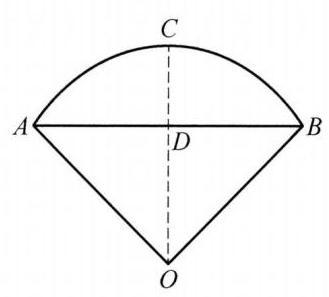

(第 11 题图)

${12}\mathrm{C}$ 提示: 由正弦定理得 ${a}^{2} + {b}^{2} < {c}^{2}$ ,再由余弦定理得 $\cos C = \; \frac{{a}^{2} + {b}^{2} - {c}^{2}}{2ab} < 0$ ,则 $C$ 为钝角, $\bigtriangleup {ABC}$ 为钝角三角形。

${13}\mathrm{D}$ 提示: 由 $\sin \left( {\frac{\pi }{4} + \alpha }\right) \cos \left( {\frac{\pi }{4} - \alpha }\right)  = \frac{1}{3}$ ,得 ${\left( \frac{\sqrt{2}}{2}\cos \alpha  + \frac{\sqrt{2}}{2}\sin \alpha \right) }^{2} = \frac{1}{3}$ ,即 ${\left( \sin \alpha  + \cos \alpha \right) }^{2} = \frac{2}{3},1 + \; 2\sin \alpha \cos \alpha  = \frac{2}{3}$ ,所以 $\sin {2\alpha } =  - \frac{1}{3}$ ,从而 ${\sin }^{4}\alpha  + {\cos }^{4}\alpha  = {\left( \frac{1 - \cos {2\alpha }}{2}\right) }^{2} + {\left( \frac{1 + \cos {2\alpha }}{2}\right) }^{2} = \frac{1 + {\cos }^{2}{2\alpha }}{2} = \; \frac{2 - {\sin }^{2}{2\alpha }}{2} = \frac{17}{18}$

14 A 提示: 因为 $\sin \alpha \sin \beta  =  - \frac{1}{2}\left\lbrack  {\cos \left( {\alpha  + \beta }\right)  - \cos \left( {\alpha  - \beta }\right) }\right\rbrack$ ,又 $\alpha  - \beta  = \frac{\pi }{6}$ ,所以 $\sin \alpha \sin \beta  = \; - \frac{1}{2}\left\lbrack  {\cos \left( {\alpha  + \beta }\right)  - \frac{\sqrt{3}}{2}}\right\rbrack   =  - \frac{1}{2}\left\lbrack  {\cos \left( {{2\beta } + \frac{\pi }{6}}\right)  - \frac{\sqrt{3}}{2}}\right\rbrack$ 。又因为 $\alpha \text{ 、 }\beta$ 为锐角,且 $\alpha  - \beta  = \frac{\pi }{6}$ ,所以 $0 < \frac{\pi }{6} + \; \beta  < \frac{\pi }{2}$ ,即 $0 < \beta  < \frac{\pi }{3}$ ,从而 $\frac{\pi }{6} < {2\beta } + \frac{\pi }{6} < \frac{5\pi }{6}$ ,所以 $- \frac{\sqrt{3}}{2} < \cos \left( {{2\beta } + \frac{\pi }{6}}\right)  < \frac{\sqrt{3}}{2}$ ,从而 $0 < \; - \frac{1}{2}\left\lbrack  {\cos \left( {{2\beta } + \frac{\pi }{6}}\right)  - \frac{\sqrt{3}}{2}}\right\rbrack   < \frac{\sqrt{3}}{2}$ ，所以 $\sin \alpha \sin \beta$ 的取值范围为 $\left( {0,\frac{\sqrt{3}}{2}}\right)$ 。

15 (1)由三角函数的定义知， $\cos \alpha  =  - \frac{3}{5},\sin \alpha  = \frac{4}{5},\tan \alpha  =  - \frac{4}{3}$ ，所以原式 $= \frac{-\tan \alpha }{-\cos \alpha } + \cos \alpha  = \frac{\frac{4}{3}}{\frac{3}{5}} - \frac{3}{5} = \; \frac{73}{45}\text{ 。 }\;\left( 2\right)$ 由 $\left( 1\right)$ 知, $\tan \alpha  =  - \frac{4}{3}$ ,所以 $\tan {2\alpha } = \frac{2\tan \alpha }{1 - {\tan }^{2}\alpha } = \frac{-2 \times  \frac{4}{3}}{1 - \frac{16}{9}} = \frac{24}{7}$ ,所以 $\tan \left( {{2\alpha } + \frac{\pi }{4}}\right)  = \; \frac{\tan {2\alpha } + \tan \frac{\pi }{4}}{1 - \tan {2\alpha }\tan \frac{\pi }{4}} = \frac{\frac{24}{7} + 1}{1 - \frac{24}{7} \times  1} =  - \frac{31}{17}$  。

16 (1)因为 $b\sin C + \sqrt{3}c\cos B + c = 0$ ，由正弦定理可得 $\sin B\sin C + \sqrt{3}\sin C\cos B + \sin C = 0$ ，由于 $\sin C \; \neq  0$ ,则 $\sin B + \sqrt{3}\cos B + 1 = 0$ ,即 $\sin B + \sqrt{3}\cos B =  - 1$ ,即 $2\sin \left( {B + \frac{\pi }{3}}\right)  =  - 1$ ,所以 $\sin \left( {B + \frac{\pi }{3}}\right)  = \; - \frac{1}{2}$ ,又 $0 < B < \pi$ ,则 $\frac{\pi }{3} < B + \frac{\pi }{3} < \frac{4\pi }{3}$ ,所以 $B + \frac{\pi }{3} = \frac{7\pi }{6}$ ,解得 $B = \frac{5\pi }{6}$ 。(2)由正弦定理知 $\frac{a}{\sin A} = \; \frac{b}{\sin B} = \frac{c}{\sin C} = 4$ ,所以 $\sqrt{3}c + {2a} = 4\left( {\sqrt{3}\sin C + 2\sin A}\right)  = 4\left\lbrack  {\sqrt{3}\sin \left( {\frac{\pi }{6} - A}\right)  + 2\sin A}\right\rbrack   = \; 4\left\lbrack  {\sqrt{3}\left( {\frac{1}{2}\cos A - \frac{\sqrt{3}}{2}\sin A}\right)  + 2\sin A}\right\rbrack   = 4\left( {\frac{\sqrt{3}}{2}\cos A + \frac{1}{2}\sin A}\right)  = 4\sin \left( {A + \frac{\pi }{3}}\right)$ 。因为 $0 < A < \frac{\pi }{6}$ ,所以 $\frac{\pi }{3} < A + \frac{\pi }{3} < \frac{\pi }{2}$ ,从而 $\frac{\sqrt{3}}{2} < \sin \left( {A + \frac{\pi }{3}}\right)  < 1$ ,所以 $2\sqrt{3} < 4\sin \left( {A + \frac{\pi }{3}}\right)  < 4$ ,所以, $\sqrt{3}c + {2a}$ 的取值范围为 $\left( {2\sqrt{3},4}\right)$ 。

17 (1)如图，由题意得 ${OA} = {20}$ 海里， ${AB} = {30t}$ 海里，设相遇时小艇航行的距离为 $S$ 海里，则 $S = {OB} = \; \sqrt{{900}{t}^{2} + {400} - 2 \cdot  {30t} \cdot  {20}\cos \left( {{90}^{ \circ  } - {30}^{ \circ  }}\right) } = \sqrt{{900}{t}^{2} - {600t} + {400}} = \sqrt{{900}{\left( t - \frac{1}{3}\right) }^{2} + {300}}$ ,故当 $t = \frac{1}{3}$ 时, ${S}_{\min } = {10}\sqrt{3}, v = \frac{{10}\sqrt{3}}{\frac{1}{3}} = {30}\sqrt{3}$ ,即小艇以 ${30}\sqrt{3}$ 海里/小时的速度航行,相遇时小艇的航行距离最小。

(2)设小艇与轮船在 $B$ 处相遇，则 ${v}^{2}{t}^{2} = {400} + {900}{t}^{2} - 2 \cdot  {20} \cdot  {30t} \cdot  \cos \left( {{90}^{ \circ  } - {30}^{ \circ  }}\right)$ ，故 ${v}^{2} = {900} - \frac{600}{t} + \frac{400}{{t}^{2}}$ ， 因为 $0 < v \leq  {30}$ ,所以 ${900} - \frac{600}{t} + \frac{400}{{t}^{2}} \leq  {900}$ ,即 $\frac{2}{{t}^{2}} - \frac{3}{t} \leq  0$ ,解得 $t \geq  \frac{2}{3}$ ,又 $t = \frac{2}{3}$ 时, $v = {30}$ ,故 $v = {30}$ 时, $t$ 取得最小值,且最小值等于 $\frac{2}{3}$ 。此时,在 $\bigtriangleup {OAB}$ 中,有 ${OA} = {OB} = {AB} = {20}$ ,故可设计航行方案如下: 航行方向为北偏东 ${30}^{ \circ  }$ ,航行速度为 30 海里/小时。 18 对 $\cos \alpha  + \cos \beta  - \cos \left( {\alpha  + \beta }\right)  = \frac{3}{2}$ 进行变形整理得, $2\cos \frac{\alpha  + \beta }{2}\cos \frac{\alpha  - \beta }{2} - \left\lbrack  {2{\cos }^{2}\frac{\alpha  + \beta }{2} - 1}\right\rbrack   - \frac{3}{2} = 0$ , 即 $4{\cos }^{2}\frac{\alpha  + \beta }{2} - 4\cos \frac{\alpha  - \beta }{2}\cos \frac{\alpha  + \beta }{2} + 1 = 0$ ,上式可看作 $\cos \frac{\alpha  + \beta }{2}$ 的一元二次方程,此方程有实根, $\Delta  = \; {16}{\cos }^{2}\frac{\alpha  - \beta }{2} - {16} \geq  0$ ,得 ${\cos }^{2}\frac{\alpha  - \beta }{2} \geq  1$ ,但 ${\cos }^{2}\frac{\alpha  - \beta }{2} \leq  1$ ,所以 ${\cos }^{2}\frac{\alpha  - \beta }{2} = 1$ ,而 $0 < \alpha  < \pi ,0 < \beta  < \; \pi$ ,所以 $- \frac{\pi }{2} < \frac{\alpha  - \beta }{2} < \frac{\pi }{2}$ ,故 $\alpha  - \beta  = 0$ ,即 $\alpha  = \beta$ ,将 $\alpha  = \beta$ 代入 $\cos \alpha  + \cos \beta  - \cos \left( {\alpha  + \beta }\right)  = \frac{3}{2}$ ,解得 $\cos \alpha  = \; \frac{1}{2}$ ,故 $\alpha  = \beta  = \frac{\pi }{3}$ 。

(第 17 题图)

## 第 6 章 单元练习

$1\left( {\frac{{2k\pi } + \pi }{12},0}\right) , k \in  \mathbf{Z}\;2$ 奇函数 $3\left\lbrack  {-6,\frac{1}{4}}\right\rbrack  \;4\left\lbrack  {{2k\pi } + \frac{\pi }{2},{2k\pi } + \pi }\right\rbrack  \left( {k \in  \mathbf{Z}}\right)$

${5f}\left( x\right)  = \sin \left( {{4x} + \frac{\pi }{3}}\right)$

6 2 提示: $y = \left| {\tan {2x}}\right|$ 的最小正周期为 $\frac{\pi }{2}, y = \left| {\sin x}\right| \text{ 、 }y = \sin \left( {{2x} + \frac{2\pi }{3}}\right)$ 的最小正周期为 $\pi$ 。

$7 - 1$ 提示: 由于 $f\left( x\right)$ 是以 4 为周期的奇函数,所以 $f\left( 5\right)  = f\left( 1\right)  =  - f\left( {-1}\right)  =  - 1$ ,所以 $\sin \left\lbrack  {{\pi f}\left( 5\right)  + \frac{\pi }{2}}\right\rbrack   = \sin \left( {-\pi  + \frac{\pi }{2}}\right)  =  - 1$  。

8 ①②④ 提示: $y = \cos \left( {x + \frac{3\pi }{2}}\right)  = \sin x$ 是奇函数，①正确；由于 $y = a\sin x + b\cos x$ 是偶函数，则 $a\sin \left( {-x}\right)  + b\cos \left( {-x}\right)  = a\sin x + b\cos x$ 恒成立， $a = 0$ ，②正确；令 $x - \frac{\pi }{3} = {2k\pi } + \frac{\pi }{2}$ ，即 $x = {2k\pi } + \frac{5\pi }{6}$ ， $k \in  \mathbf{Z}$ 时， $y$ 取最大值，③错误；由 $\sqrt{x} \in  \lbrack 0, + \infty )$ ，得 $y = \sin \sqrt{x} \in  \left\lbrack  {-1,1}\right\rbrack$ ，④正确。

$9\frac{\sqrt{3}}{2}\pi$ 提示: 由于 $\frac{T}{4} = \frac{\pi }{3} - \frac{\pi }{12} = \frac{\pi }{4}$ ,则 $T = \pi$ ,所以 $\omega  = 2$ ,从而 $O\left( {-\frac{\pi }{6},0}\right) , M\left( {\frac{\pi }{12}, A}\right) , N\left( {\frac{7\pi }{12}, - A}\right)$ , 由 ${OM} \bot  {ON}$ ,得 $O{M}^{2} + O{N}^{2} = M{N}^{2}$ ,即 ${\left( \frac{\pi }{4}\right) }^{2} + {A}^{2} + {\left( \frac{3\pi }{4}\right) }^{2} + {A}^{2} = {\left( \frac{\pi }{2}\right) }^{2} + {\left( 2A\right) }^{2}$ ,解得 $A = \frac{\sqrt{3}\pi }{4}$ ,则 ${A\omega } = \; \frac{\sqrt{3}\pi }{2}$ 。

10 $f\left( x\right)  = 2\cos \left( {\frac{1}{2}x + \pi }\right)  + 4$ 提示:设 $f\left( x\right)  = A\cos \left( {{\omega x} + \varphi }\right)  + d\left( {A > 0,\omega  > 0}\right)$ ，由 $T = {4\pi }$ ，得 $\omega  = \; \frac{1}{2}$ ,因为 $f\left( x\right)$ 是偶函数，所以 $\varphi  = {k\pi }, k \in  \mathbf{Z}$ 。令 ${2m\pi } - \pi  \leq  \frac{1}{2}x + \varphi  \leq  {2m\pi }, m \in  \mathbf{Z}$ ，则 ${4m\pi } - {2\pi } - {2k\pi } \leq \; x \leq  {4m\pi } - {2k\pi }, m \in  \mathbf{Z}$ ，因为 $f\left( x\right)$ 在区间 $\left( {-{4\pi },{2\pi }}\right)$ 上为增函数，所以 $\left( {-{4\pi }, - {2\pi }}\right)  \subseteq  {\lbrack {4m\pi } - {2\pi } - {2k\pi }}$ ， ${4m\pi } - {2k\pi }\rbrack , m \in  \mathbf{Z}$ ,可取 $k = 1$ ,又 $\left\{  \begin{array}{l} d - A > 0, \\  {2A} \geq  4, \end{array}\right.$ 可取 $A = 2, d = 4$ ,则 $f\left( x\right)  = 2\cos \left( {\frac{1}{2}x + \pi }\right)  + 4$ 。

${11}\begin{array}{lll} \mathrm{C} & {12} & \mathrm{\;D} \end{array}$

${13}\mathrm{C}$ 提示: 令 $\left\{  \begin{array}{l} y = \sin x, \\  y = \lg \left( {x + 1}\right) , \end{array}\right.$ 作出两函数的图像,结合函数的图像可得方程实数解的个数。

14 B 提示: 由 $T = \pi$ ,得 $\omega  = 2$ ,图像平移后函数为 $f\left( x\right)  = \sin \left( {2\left( {x + \frac{\pi }{6}}\right)  + \varphi }\right)  = \sin \left( {{2x} + \frac{\pi }{3} + \varphi }\right)$ 为奇函数,则 $\frac{\pi }{3} + \varphi  = {k\pi }, k \in  \mathbf{Z}$ ,即 $\varphi  = {k\pi } - \frac{\pi }{3}, k \in  \mathbf{Z}$ ,则 $f\left( x\right)  = \sin \left( {{2x} + {k\pi } - \frac{\pi }{3}}\right) , k \in  \mathbf{Z}$ 。令 ${2x} + {k\pi } - \; \frac{\pi }{3} = {m\pi } + \frac{\pi }{2}, k, m \in  \mathbf{Z}$ ,则 $x = \frac{\left( {m - k}\right) \pi }{2} + \frac{5\pi }{12}, k, m \in  \mathbf{Z}$ ,所以对称轴为 $x = \frac{\left( {m - k}\right) \pi }{2} + \frac{5\pi }{12}, k, m \in$

$\mathbf{Z}$ 。令 ${2x} + {k\pi } - \frac{\pi }{3} = {m\pi }, k, m \in  \mathbf{Z}$ ,则 $x = \frac{\left( {m - k}\right) \pi }{2} + \frac{\pi }{6}, k, m \in  \mathbf{Z}$ ,所以对称中心为 $\left( {\frac{\left( {m - k}\right) \pi }{2} + \frac{\pi }{6},0}\right) , k, m \in  \mathbf{Z}$  。

15 由题意,得 $\left\{  \begin{array}{l} x \neq  \frac{\pi }{2} + {k\pi }, k \in  \mathbf{Z}, \\  \tan x + 1 > 0, \\  2\sin x + 1 \geq  0, \\  \sqrt{2\sin x + 1} \neq  0, \end{array}\right.$ 即 $\left\{  \begin{array}{l} \tan x >  - 1, \\  \sin x >  - \frac{1}{2}, \end{array}\right.$ 解得 $\left\{  \begin{array}{l} x\left| {\; - \frac{\pi }{6} + {2k\pi } < x < \frac{\pi }{2} + {2k\pi }\text{ 或 }\frac{3}{4}\pi  + }\right.  \end{array}\right. \; \left. {{2k\pi } < x < \frac{7}{6}\pi  + {2k\pi }, k \in  \mathbf{Z}}\right\}$ 。

16 由题意得 $y = \frac{1}{2} + \frac{{a}^{2} - 1}{2\left( {{2a}\cos x + {a}^{2} + 1}\right) }$ ,分子 ${a}^{2} - 1 < 0$ ,分母 ${2a}\cos x + {a}^{2} + 1 = {\left( \cos x + a\right) }^{2} + \; {\sin }^{2}x > 0$ 。当 $\cos x =  - 1$ ,即 $x = {2k\pi } + \pi , k \in  \mathbf{Z}$ 时, ${y}_{\min } = \frac{a}{a - 1}$ ; 当 $\cos x = 1, x = {2k\pi }, k \in  \mathbf{Z}$ 时, ${y}_{\max } = \; \frac{a}{a + 1}$ 。

17 (1)由题意得 $T = {12}$ ,则 $\omega  = \frac{2\pi }{T} = \frac{\pi }{6}$ , $\left\{  \begin{array}{l} {1.5} = A\cos 0 + b, \\  1 = A\cos \left( {\frac{\pi }{6} \times  3}\right)  + b, \end{array}\right.$ 解得 $\left\{  \begin{array}{l} A = \frac{1}{2}, \\  b = 1, \end{array}\right.$ 所以 $y = \frac{1}{2}\cos \frac{\pi }{6}t + 1$ 。 (2)由 $y = \frac{1}{2}\cos \frac{\pi }{6}t + 1 > 1$ ，得 $\cos \frac{\pi }{6}t > 0$ ，所以 ${2k\pi } - \frac{\pi }{2} < \frac{\pi }{6}t < {2k\pi } + \frac{\pi }{2}, k \in  \mathbf{Z}$ ，即 ${12k} - 3 < t < \; {12k} + 3, k \in  \mathbf{Z}$ ,又 $8 \leq  t \leq  {20}$ ,因此 $9 < t < {15}$ ,共 6 个小时,为 $9 : {00} - {15} : {00}$ 。

18 (1)由题意，得 $f\left( x\right)  = 2\sqrt{3}\sin \left( {{\omega x} + \frac{\pi }{3}}\right)$ ，则 $f\left( {x + \theta }\right)  = 2\sqrt{3}\sin \left( {{\omega x} + {\omega \theta } + \frac{\pi }{3}}\right)$ ，因为 $T = \pi$ ，所以 $\omega  = \; \frac{2\pi }{T} = 2$ ,因为 $y = f\left( {x + \theta }\right)$ 是偶函数,所以 ${\omega \theta } + \frac{\pi }{3} = {k\pi } + \frac{\pi }{2}, k \in  \mathbf{Z}$ ,即 $\theta  = \frac{k\pi }{2} + \frac{\pi }{12}, k \in  \mathbf{Z}$ ,因为 $0 < \theta  < \; \frac{\pi }{2}$ ,所以 $k = 0,\theta  = \frac{\pi }{12}\text{ 。 }\;\left( 2\right) g\left( x\right)  = 2\sqrt{3}\sin \left( {{3\omega x} + \frac{\pi }{3}}\right)$ ,令 ${2k\pi } - \frac{\pi }{2} \leq  {3\omega x} + \frac{\pi }{3} \leq  {2k\pi } + \frac{\pi }{2}, k \in  \mathbf{Z}$ , 得 $\frac{2k\pi }{3\omega } - \frac{5\pi }{18\omega } \leq  x \leq  \frac{2k\pi }{3\omega } + \frac{\pi }{18\omega }, k \in  \mathbf{Z}$ ,则单调增区间 $\left( {-\frac{\pi }{2},\frac{\pi }{3}}\right)  \subseteq  \left\lbrack  {\frac{2k\pi }{3\omega } - \frac{5\pi }{18\omega },\frac{2k\pi }{3\omega } + \frac{\pi }{18\omega }}\right\rbrack  , k \in  \mathbf{Z}$ , 从而 $- \frac{5\pi }{18\omega } \leq   - \frac{\pi }{2} < \frac{\pi }{3} \leq  \frac{\pi }{18\omega }$ ,解得 $\omega  \leq  \frac{1}{6}$ ,因此 ${\omega }_{\max } = \frac{1}{6}$ 。当 $\omega  = \frac{1}{6}$ 时, $g\left( x\right)  = 2\sqrt{3}\sin \left( {\frac{x}{2} + \frac{\pi }{3}}\right)$ ,对 $x \in  \left\lbrack  {0,\pi }\right\rbrack  ,\frac{x}{2} + \frac{\pi }{3} \in  \left\lbrack  {\frac{\pi }{3},\frac{5\pi }{6}}\right\rbrack  , g\left( x\right)  \in  \left\lbrack  {\sqrt{3},2\sqrt{3}}\right\rbrack$  。

## 第 7 章 单元练习

1②③ $21 - 3$ 364④ $4\frac{1}{4}$ 351 $6\frac{2}{5}$ 7 $\frac{3}{2}$

$8\frac{4\sqrt{2}}{3}$ 提示: $m$ 其实就是点 $P$ 到直线 ${AB}$ 的距离。

93 提示: 尝试分解成 $\left( {\overrightarrow{PO} + \overrightarrow{OM}}\right)  \cdot  \left( {\overrightarrow{MO} + \overrightarrow{OQ}}\right)$ 来进行计算。

$\begin{array}{ll} {10} & \frac{2}{3} \end{array}$

11 A 12 B 13 C 14 B 15 $\frac{\sqrt{5}}{5}$ 16 (1) $\sqrt{3}$ (2) $\frac{\pi }{3}$

${17}\frac{4}{3}$ 提示: 用 $x\text{ 、 }y\text{ 、 }z$ 中的一个去表示另两个,将所求式子转化为二次函数即可。

18 (1) $h\left( x\right)  = 2\left( {\frac{\sqrt{3}}{2}\cos x - \frac{1}{2}\sin x}\right)  - \left( {\frac{\sqrt{3}}{2}\cos x - \frac{1}{2}\sin x}\right)  = \frac{\sqrt{3}}{2}\cos x - \frac{1}{2}\sin x$ ，所以 $h\left( x\right)$ 的“相伴向量” 为 $\overrightarrow{OM} = \left( {-\frac{1}{2},\frac{\sqrt{3}}{2}}\right)$ 。(2)由题知 $f\left( x\right)  = 0 \cdot  \sin x + 2 \cdot  \cos x = 2\cos x$ ，则 $g\left( x\right)  = 2\cos x +$

$2\sqrt{3}\left| {\sin x}\right|  - 1 = \left\{  \begin{array}{ll} 4\sin \left( {x + \frac{\pi }{6}}\right)  - 1, & 0 \leq  x \leq  \pi , \\  4\cos \left( {x + \frac{\pi }{3}}\right)  - 1, & \pi  < x \leq  {2\pi }, \end{array}\right.$ 可求得 $g\left( x\right)$ 在 $\left( {0,\frac{\pi }{3}}\right)$ 单调增, $\left( {\frac{\pi }{3},\pi }\right)$ 单调减, $\left( {\pi ,\frac{5\pi }{3}}\right)$ 单调增, $\left( {\frac{5}{3}\pi ,{2\pi }}\right)$ 单调减，且 $g\left( 0\right)  = 1, g\left( \frac{\pi }{3}\right)  = 3, g\left( \pi \right)  =  - 3, g\left( {\frac{5}{3}\pi }\right)  = 3, g\left( {2\pi }\right)  = 1$ 。因为 $g\left( x\right)$ 的图像与 $y = k$ 有且仅有四个不同的交点,如图所示,所以 $1 \leq  k < 3$ ,所以,实数 $k$ 的取值范围为 $\lbrack 1,3)\text{ 。 }\;\left( 3\right) f\left( x\right)  = \; a\sin x + b\cos x = \sqrt{{a}^{2} + {b}^{2}}\sin \left( {x + \varphi }\right)$ ,其中 $\cos \varphi  = \frac{a}{\sqrt{{a}^{2} + {b}^{2}}},\sin \varphi  = \; \frac{b}{\sqrt{{a}^{2} + {b}^{2}}},\tan \varphi  = \frac{b}{a}$ 。因为 $x \in  \mathbf{R}$ ,所以当 $x + \varphi  = \frac{\pi }{2} + {2k\pi }, k \in  \mathbf{Z}$ ,即 ${x}_{0} = \frac{\pi }{2} - \varphi  + {2k\pi }$ 时, $f\left( x\right)$ 取得最大值。此时 $\tan 2{x}_{0} = \tan \left( {\pi  - {2\varphi }}\right)  =  - \tan {2\varphi } =  - \frac{2\tan \varphi }{1 - {\tan }^{2}\varphi }$ ,令 $\tan \varphi  = \frac{b}{a} = m$ ,则由 ${a}^{2} - {4ab} + 3{b}^{2} < 0$ 知: $3{m}^{2} - {4m} + 1 < 0$ ,解之得 $\frac{1}{3} < m < 1$ 。而 $\tan 2{x}_{0} =  - \frac{2m}{1 - {m}^{2}} = \frac{2}{m - \frac{1}{m}}$ ,因为 $y = m - \frac{1}{m}$ 在 $m \in \; \left( {\frac{1}{3},1}\right)$ 上单调增,所以 $\tan 2{x}_{0} =  - \frac{2m}{1 - {m}^{2}} = \frac{2}{m - \frac{1}{m}}$ 在 $m \in  \left( {\frac{1}{3},1}\right)$ 上单调减,从而 $\tan 2{x}_{0} \in \; \left( {-\infty , - \frac{3}{4}}\right)$ 。

(第 18 题图)

## 第 8 章 单元练习

${122}\;1 - \sqrt{3}\mathrm{i}\;3 - 6\;4 + 5\mathrm{i}\;5\;{10}\;6 - \frac{1}{2} + 2\mathrm{i}\;7\;2 - 2\mathrm{i}\;8 - 1 \; 9 \pm  \frac{\sqrt{3}}{3}$ 提示:三角形式。

${10}\{ n \mid  n = {4k} + 1, k \in  \mathbf{Z}$ 且 $0 \leq  k \leq  {505}\}$ 提示:棣莫弗公式。

11 B 12 C 13 B 14 D

15 (1)-1+3 ì ；@= 1+1 · 非

16 (1)设 $z = x + y\mathrm{i}\left( {x, y \in  \mathbf{R}}\right)$ ，又 $z + {2\mathrm{i}} = x + \left( {y + 2}\right) \mathrm{i}$ ，且为实数，则 $y + 2 = 0$ ，解得 $y =  - 2$ 。所以 $\frac{z}{2 - \mathrm{i}} = \frac{x - 2\mathrm{i}}{2 - \mathrm{i}} = \frac{\left( {x - 2\mathrm{i}}\right) \left( {2 + \mathrm{i}}\right) }{\left( {2 - \mathrm{i}}\right) \left( {2 + \mathrm{i}}\right) } = \frac{\left( {{2x} + 2}\right)  + \left( {x - 4}\right) \mathrm{i}}{5}$ ，因为 $\frac{z}{2 - \mathrm{i}}$ 为实数，所以 $\frac{x - 4}{5} = 0$ ，解得 $x = 4$ 。 所以 $z = 4 - 2\mathrm{i}$ 。(2)因为复数 ${\left( z + a\mathrm{i}\right) }^{2} = {\left\lbrack  4 + \left( a - 2\right) \mathrm{i}\right\rbrack  }^{2} = {16} - {\left( a - 2\right) }^{2} + 8\left( {a - 2}\right) \mathrm{i} = \left( {{12} + {4a} - {a}^{2}}\right)  + \; \left( {{8a} - {16}}\right) \mathrm{i}$ ,所以 $\left\{  \begin{array}{l} {12} + {4a} - {a}^{2} > 0, \\  {8a} - {16} > 0, \end{array}\right.$ 解得 $2 < a < 6$ ,即实数 $a$ 的取值范围是 $\left( {2,6}\right)$ 。

17 (1)当 $\Delta  \geq  0$ ,即 $m \leq  1$ 时， $\left| {\alpha  - \beta }\right|  = \sqrt{4 - {4m}}$ ，则 $m =  - 1$ ；当 $\Delta  < 0$ ，即 $m > 1$ 时， $\left| {\alpha  - \beta }\right|  = \; 2\sqrt{m - 1}$ ,则 $m = 3$ ; 综上 $m =  - 1$ 或 3。(2)当 $\Delta  \geq  0$ ,即 $m \leq  1$ 时，两根为 $- 1 \pm  \sqrt{1 - m}$ ，所以， $\left| \alpha \right|  +$

$\left| \beta \right|  = \left\{  \begin{array}{ll} 2, & 0 \leq  m \leq  1, \\  2\sqrt{1 - m}, & m < 0; \end{array}\right.$ 当 $\Delta  < 0$ ,即 $m > 1$ 时, $\left| \alpha \right|  + \left| \beta \right|  = 2\left| \alpha \right|  = 2\sqrt{1 + m - 1} = 2\sqrt{m}$ 。综上, $\left| \alpha \right|  + \left| \beta \right|  = \left\{  \begin{array}{ll} 2\sqrt{m}, & m > 1, \\  2, & 0 \leq  m \leq  1, \\  2\sqrt{1 - m}, & m < 0\text{ 。 } \end{array}\right.$

18 (1)设 ${z}_{1} = a + b\mathrm{i},{z}_{2} = c + d\mathrm{i}\left( {a, b, c, d \in  \mathbf{R}}\right)$ ，则 ${z}_{1}{z}_{2} + 2\mathrm{i} \cdot  {z}_{1} - 2\mathrm{i} \cdot  {z}_{2} + 1 = \left( {a + b\mathrm{i}}\right) \left( {c + d\mathrm{i}}\right)  + \; 2\mathrm{i}\left( {a + b\mathrm{i}}\right)  - 2\mathrm{i}\left( {c + d\mathrm{i}}\right)  + 1 = \left( {{ac} - {bd} - {2b} + {2d} + 1}\right)  + \left( {{bc} + {ad} + {2a} - {2c}}\right) \mathrm{i} = 0$ ,所以 $\left\{  \begin{array}{l} {ac} - {bd} - {2b} + {2d} + 1 = 0, \\  {bc} + {ad} + {2a} - {2c} = 0\text{ 。 } \end{array}\right.$ 又因为 ${\bar{z}}_{2} - {z}_{1} = 2\mathrm{i}$ ,所以 $\left( {c - d\mathrm{i}}\right)  - \left( {a + b\mathrm{i}}\right)  = 2\mathrm{i}$ ,从而 $\left\{  \begin{array}{l} c - a = 0, \\   - d - b = 2, \end{array}\right.$ 解得 $\left\{  {\begin{array}{l} a = 0, \\  c = 0, \\  b = 3, \\  d =  - 5, \end{array}\text{ 或 }\left\{  {\begin{array}{l} a = 0, \\  c = 0, \\  b =  - 1, \\  d =  - 1, \end{array}\text{ 所以 }{z}_{1} = 3\mathrm{i},{z}_{2} =  - 5\mathrm{i}\text{ 或者 }{z}_{1} =  - \mathrm{i},{z}_{2} =  - \mathrm{i}\text{ 。 }\;\text{ (2) 由题意，得 }\Delta  = 8 - {4p} < 0,}\right. }\right.$

${z}_{1} + {z}_{2} = 2\sqrt{2},{z}_{1}{z}_{2} = p$ ,所以 $a = c = \sqrt{2}, b =  - d$ ,则由 (1) 知 $b = 3$ 或 $b = 1$ ,从而 $d =  - 3$ 或 $d =  - 1$ ,所以 ${z}_{1} = \sqrt{2} + 3\mathrm{i},{z}_{2} = \sqrt{2} - 3\mathrm{i}$ 或 ${z}_{1} = \sqrt{2} - \mathrm{i},{z}_{2} = \sqrt{2} + \mathrm{i}$ ,所以 $p = 2 + 9 = {11}$ 或 $p = 3$ 。(3)由题意，得 ${a}^{2} + {b}^{2} = 3$ ,由 (1) 得 $\left( {{z}_{1} - 2\mathrm{i}}\right) \left( {{z}_{2} - 4\mathrm{i}}\right)  + 6\mathrm{i}{z}_{1} + 9 = 0$ ,则 ${z}_{2} - 4\mathrm{i} = \frac{-3\mathrm{i}\left( {2{z}_{1} - 3\mathrm{i}}\right) }{{z}_{1} - 2\mathrm{i}}$ ,从而 $\left| {{z}_{2} - 4\mathrm{i}}\right|  = \; \left| \frac{-3\mathrm{i}\left( {2{z}_{1} - 3\mathrm{i}}\right) }{{z}_{1} - 2\mathrm{i}}\right|  = 3\sqrt{3}$ ,因此存在, $k = 3\sqrt{3}$ 。

## 第 9 章 单元练习

1 33 提示: 设等差数列 $\left\{  {a}_{n}\right\}$ 的公差为 $d$ ,因为 ${a}_{2} + {a}_{4} + {a}_{7} + {a}_{11} = {44} = 4{a}_{1} + {20d}$ ,所以 ${a}_{1} + {5d} = {11}$ ,则 ${a}_{3} + {a}_{5} + {a}_{10} = 3{a}_{1} + {15d} = 3\left( {{a}_{1} + {5d}}\right)  = {33}$  。

2 $- \frac{1}{3}$ 提示: 依题意, ${a}_{2} = \frac{1 + {a}_{1}}{1 - {a}_{1}} = \frac{1 + \frac{1}{2}}{1 - \frac{1}{2}} = 3,{a}_{3} = \frac{1 + {a}_{2}}{1 - {a}_{2}} = \frac{1 + 3}{1 - 3} =  - 2,{a}_{4} = \frac{1 + {a}_{3}}{1 - {a}_{3}} = \frac{1 - 2}{1 + 2} =  - \frac{1}{3}$ , ${a}_{5} = \frac{1 + {a}_{4}}{1 - {a}_{4}} = \frac{1 - \frac{1}{3}}{1 + \frac{1}{3}} = \frac{1}{2}$ ,所以,数列 $\left\{  {a}_{n}\right\}$ 是以 4 为周期的周期数列,又因为 ${2024} = {506} \times  4$ ,所以 ${a}_{2024} = \; {a}_{4} =  - \frac{1}{3}$

$3\frac{{2n} - 1}{4} \cdot  {3}^{n + 1} + \frac{3}{4}$ 提示: 由于 ${a}_{n} = n \cdot  {3}^{n}$ ,则此数列的前 $n$ 项和 ${S}_{n} = 3 + 2 \times  {3}^{2} + 3 \times  {3}^{3} + \cdots  + n \cdot  {3}^{n}$ , 所以 $3{S}_{n} = {3}^{2} + 2 \times  {3}^{3} + \cdots  + \left( {n - 1}\right)  \cdot  {3}^{n} + n \cdot  {3}^{n + 1}$ ,两式相减,得 $- 2{S}_{n} = 3 + {3}^{2} + {3}^{3} + \cdots  + {3}^{n} - n \cdot  {3}^{n + 1} = \; \frac{3\left( {1 - {3}^{n}}\right) }{1 - 3} - n \cdot  {3}^{n + 1} = \left( {\frac{1}{2} - n}\right) {3}^{n + 1} - \frac{3}{2}$ ,所以 ${S}_{n} = \frac{{2n} - 1}{4} \cdot  {3}^{n + 1} + \frac{3}{4}$ 。

4 27 提示: 由 ${\log }_{3}{a}_{n + 1} = 2 + \frac{1}{3}{\log }_{3}{a}_{n}$ ,令 ${b}_{n} = {\log }_{3}{a}_{n}$ ,则 ${b}_{n + 1} = \frac{1}{3}{b}_{n} + 2,{b}_{1} = 1$ ,从而有 ${b}_{n + 1} - 3 = \frac{1}{3}\left( {{b}_{n} - }\right.$

3),所以 ${b}_{n} - 3 = \left( {{b}_{1} - 3}\right) {\left( \frac{1}{3}\right) }^{n - 1} =  - 2 \times  {\left( \frac{1}{3}\right) }^{n - 1}$ ,即 ${b}_{n} =  - \frac{2}{{3}^{n - 1}} + 3$ ,所以 ${a}_{n} = {3}^{-\frac{2}{{3}^{n - 1}} + 3}$ ,又 $\mathop{\lim }\limits_{{n \rightarrow  \infty }}\left( {-\frac{2}{{3}^{n - 1}} + 3}\right)  =$ 3,故 $\mathop{\lim }\limits_{{n \rightarrow  \infty }}{a}_{n} = {3}^{3} = {27}$ 。

$5\frac{9}{17}$ 提示: 因为数列 $\left\{  {a}_{n}\right\}  \text{ 、 }\left\{  {b}_{n}\right\}$ 为等差数列,且其前 $n$ 项和满足 $\frac{{S}_{n}}{{T}_{n}} = \frac{2n}{{3n} + 1}$ ,所以可设 ${S}_{n} = {kn} \times  {2n}$ , ${T}_{n} = {kn}\left( {{3n} + 1}\right) \left( {k \neq  0}\right)$ ,则当 $n \geq  2$ 时, ${a}_{n} = {S}_{n} - {S}_{n - 1} = {4kn} - {2k}$ ,当 $n \geq  2$ 时, ${b}_{n} = {T}_{n} - {T}_{n - 1} = {6kn} - \; {2k}$ ,所以 $\frac{{a}_{5}}{{b}_{6}} = \frac{{20k} - {2k}}{{36k} - {2k}} = \frac{9}{17}$ 。

$6\frac{1}{3}$ 提示: 设等比数列 $\left\{  {a}_{n}\right\}$ 的公比为 $q$ ,由题意, $\sqrt[8]{{a}_{1}{a}_{2}\cdots {a}_{8}} = 9$ ,即 ${\left( {a}_{1}^{8}{q}^{1 + 2 + \cdots  + 7}\right) }^{\frac{1}{8}} = 9$ ,则 ${\left( {a}_{1}^{8}{q}^{\frac{\left( {1 + 7}\right)  \times  7}{2}}\right) }^{\frac{1}{8}} =$ 9,得 ${a}_{1}{q}^{\frac{7}{2}} = 9$ ,又因为 ${a}_{1} = {3}^{-5}$ ,所以 ${q}^{\frac{7}{2}} = \frac{9}{{3}^{-5}} = {3}^{7}$ ,则 $q = 9$ ,所以 ${a}_{3} = {a}_{1}{q}^{2} = {3}^{-5} \times  {3}^{4} = \frac{1}{3}$ 。

$7\frac{n - 1}{2}$ 提示: 由函数 $f\left( x\right)  = \frac{{4}^{x}}{{4}^{x} + 2}, f\left( {1 - x}\right)  = \frac{{4}^{1 - x}}{{4}^{1 - x} + 2}$ ,可得 $f\left( x\right)  + f\left( {1 - x}\right)  = 1$ ,而 ${S}_{n} = f\left( \frac{1}{n}\right)  + \; f\left( \frac{2}{n}\right)  + \cdots  + f\left( \frac{n - 1}{n}\right)$ ,又 ${S}_{n} = f\left( \frac{n - 1}{n}\right)  + f\left( \frac{n - 2}{n}\right)  + \cdots  + f\left( \frac{1}{n}\right)$ ,所以, $2{S}_{n} = \left\lbrack  {f\left( \frac{1}{n}\right)  + f\left( \frac{n - 1}{n}\right) }\right\rbrack   + \; \left\lbrack  {f\left( \frac{2}{n}\right)  + f\left( \frac{n - 2}{n}\right) }\right\rbrack   + \cdots  + \left\lbrack  {f\left( \frac{n - 1}{n}\right)  + f\left( \frac{1}{n}\right) }\right\rbrack   = n - 1$ ,即有 ${S}_{n} = \frac{n - 1}{2}$ 。

$8\sqrt{506} - {22}$ 提示: 因为 ${a}_{n} = \frac{1}{\left( {\sqrt{n - 1} + \sqrt{n}}\right) \left( {\sqrt{n - 1} + \sqrt{n + 1}}\right) \left( {\sqrt{n} + \sqrt{n + 1}}\right) } = \; \frac{\sqrt{n + 1} - \sqrt{n - 1}}{2\left( {\sqrt{n - 1} + \sqrt{n}}\right) \left( {\sqrt{n} + \sqrt{n + 1}}\right) } = \frac{1}{2}\left( {\frac{1}{\sqrt{n - 1} + \sqrt{n}} - \frac{1}{\sqrt{n} + \sqrt{n + 1}}}\right)$ ,所以, ${S}_{2024} = \frac{1}{2}\left( {1 - \frac{1}{1 + \sqrt{2}}}\right)  + \; \frac{1}{2}\left( {\frac{1}{1 + \sqrt{2}} - \frac{1}{\sqrt{2} + \sqrt{3}}}\right)  + \cdots  + \frac{1}{2}\left( {\frac{1}{\sqrt{2023} + \sqrt{2024}} - \frac{1}{\sqrt{2024} + \sqrt{2025}}}\right)  = \frac{1}{2}\left( {1 - \frac{1}{1 + \sqrt{2}} + \frac{1}{1 + \sqrt{2}} - \frac{1}{\sqrt{2} + \sqrt{3}} + \cdots }\right. \; + \frac{1}{\sqrt{2023} + \sqrt{2024}} - \frac{1}{\sqrt{2024} + \sqrt{2025}}) = \frac{1}{2}\left( {1 - \frac{1}{\sqrt{2024} + \sqrt{2025}}}\right)  = \frac{1}{2}\left\lbrack  {1 - \left( {\sqrt{2025} - \sqrt{2024}}\right) }\right\rbrack   = \; \frac{1 + \sqrt{2024} - \sqrt{2025}}{2} = \frac{2\sqrt{506} - {44}}{2} = \sqrt{506} - {22}$  。

9 63 提示: 由题意知 ${b}_{n} + {c}_{n} = 1$ ,则 ${a}_{1} + {a}_{2} + \cdots  + {a}_{n} + {a}_{1}\left( {{a}_{1} + {a}_{2}}\right) \cdots \left( {{a}_{1} + {a}_{2} + \cdots  + {a}_{n}}\right)  = 1$ 。当 $n =$ 1 时, ${a}_{1} + {a}_{1} = 1$ ,解得 ${a}_{1} = \frac{1}{2}$ 。当 $n = 2$ 时, ${a}_{1} + {a}_{2} + {a}_{1}\left( {{a}_{1} + {a}_{2}}\right)  = 1$ ,解得 ${a}_{2} = \frac{1}{6},\cdots \cdots$ ,猜想: ${a}_{n} = \; \frac{1}{n\left( {n + 1}\right) }$ 。下面用数学归纳法证明: 当 $n = 1$ 时, ${a}_{1} = \frac{1}{2}$ ,假设 $n = k$ 时成立,即 ${a}_{k} = \frac{1}{k\left( {k + 1}\right) }$ ,则 ${b}_{k} = {a}_{1} + \; {a}_{2} + \cdots  + {a}_{k} = \left( {1 - \frac{1}{2}}\right)  + \left( {\frac{1}{2} - \frac{1}{3}}\right)  + \left( {\frac{1}{k} - \frac{1}{k + 1}}\right)  = \frac{k}{k + 1},{c}_{k} = {a}_{1}\left( {{a}_{1} + {a}_{2}}\right) \cdots \left( {{a}_{1} + {a}_{2} + \cdots  + {a}_{k}}\right)  = \frac{1}{2} \times \; \frac{2}{3} \times  \cdots  \times  \frac{k}{k + 1} = \frac{1}{k + 1}$ ,则当 $n = k + 1$ 时, ${b}_{k + 1} = {a}_{1} + {a}_{2} + \cdots  + {a}_{k} + {a}_{k + 1} = {b}_{k} + {a}_{k + 1} = \frac{k}{k + 1} + {a}_{k + 1},{c}_{k + 1} = \; {a}_{1}\left( {{a}_{1} + {a}_{2}}\right) \cdots \left( {{a}_{1} + {a}_{2} + \cdots  + {a}_{k}}\right) \left( {{a}_{1} + {a}_{2} + \cdots  + {a}_{k + 1}}\right)  = {c}_{k} \times  \left( {{a}_{1} + {a}_{2} + \cdots  + {a}_{k + 1}}\right)  = \left( \frac{1}{k + 1}\right) \left( {\frac{k}{k + 1} + {a}_{k + 1}}\right) ,$ 又 ${b}_{k + 1} + {c}_{k + 1} = 1$ ,则 $\frac{k}{k + 1} + {a}_{k + 1} + \left( \frac{1}{k + 1}\right) \left( {\frac{k}{k + 1} + {a}_{k + 1}}\right)  = 1$ ,解得 ${a}_{k + 1} = \frac{1}{\left( {k + 2}\right) \left( {k + 1}\right) }$ 。所以 $n = k +$

1 也成立,所以 ${a}_{n} = \frac{1}{n\left( {n + 1}\right) }$ 。从而有 $n < \sqrt{\frac{1}{{a}_{n}}} = \sqrt{n\left( {n + 1}\right) } < n + 1$ ,所以 $\frac{n\left( {n + 1}\right) }{2} < {S}_{n} < \; \frac{\left( {n + 1}\right) \left( {n + 2}\right) }{2}$ ,从而有 ${2024} < {S}_{63} < {2080}$ ,所以,数列 $\left\{  \sqrt{\frac{1}{{a}_{n}}}\right\}$ 的前 $n$ 项和 ${S}_{n}$ 中大于 2024 的最小项为第 63 项。

${10}\frac{3}{2}$ 提示: 因为函数 $f\left( x\right)  = {x}^{2} - {S}_{n}\cos x + 2{a}_{n} - n$ 在定义域 $\mathbf{R}$ 内有唯一的零点,且 $f\left( {-x}\right)  = {\left( -x\right) }^{2} - \; {S}_{n}\cos \left( {-x}\right)  + 2{a}_{n} - n = {x}^{2} - {S}_{n}\cos x + 2{a}_{n} - n = f\left( x\right)$ ,所以 $f\left( x\right)$ 为偶函数,可得唯一零点为 $f\left( 0\right)  = 0$ , 所以 ${S}_{n} = 2{a}_{n} - n$ 。当 $n = 1$ 时, ${a}_{1} = {S}_{1} = 2{a}_{1} - 1$ ,可得 ${a}_{1} = 1$ ; 当 $n \geq  2$ 时, ${a}_{n} = {S}_{n} - {S}_{n - 1} = 2{a}_{n} - n - \; \left( {2{a}_{n - 1} - n + 1}\right)$ ,化简得 ${a}_{n} = 2{a}_{n - 1} + 1$ ,即有 ${a}_{n} + 1 = 2\left( {{a}_{n - 1} + 1}\right)$ ,则数列 $\left\{  {{a}_{n} + 1}\right\}$ 为首项为 2,公比为 2 的等比数列,所以 ${a}_{n} + 1 = {2}^{n}$ ,即 ${a}_{n} = {2}^{n} - 1$ ,则不等式 $\frac{\lambda }{n} \geq  \frac{n + 1}{{a}_{n} + 1}$ 即为 $\lambda  \geq  \frac{n\left( {n + 1}\right) }{{2}^{n}}$ 。设 $g\left( n\right)  = \; \frac{n\left( {n + 1}\right) }{{2}^{n}}$ ,则 $g\left( {n + 1}\right)  - g\left( n\right)  = \frac{\left( {n + 1}\right) \left( {n + 2}\right) }{{2}^{n + 1}} - \frac{n\left( {n + 1}\right) }{{2}^{n}} = \frac{\left( {n + 1}\right) \left( {2 - n}\right) }{{2}^{n + 1}}$ 。当 $n = 1\text{ 、 }2$ 时, $g\left( 1\right)  < \; g\left( 2\right)  = g\left( 3\right)$ ; 当 $n \geq  3$ 时, $g\left( {n + 1}\right)  < g\left( n\right)$ ,即 $g\left( n\right)$ 严格减,所以 $g{\left( n\right) }_{\max } = g\left( 2\right)  = \frac{3}{2}$ 。由恒成立条件可知 $\lambda  \geq  \frac{3}{2}$ ，即实数 $\lambda$ 的最小值是 $\frac{3}{2}$ 。

11 B 提示: 由题意知,当 $n = k$ 时,有 $\left( {k + 1}\right) \left( {k + 2}\right) \cdots \left( {k + k}\right)  = {2}^{k} \cdot  1 \cdot  3 \cdot  \cdots  \cdot  \left( {{2k} - 1}\right)$ ; 当 $n = k + 1$ 时,等式的左边为 $\left( {k + 2}\right) \left( {k + 3}\right) \cdots \left( {2k}\right) \left( {{2k} + 1}\right) \left( {{2k} + 2}\right)$ ,所以左边要增乘的代数式为 $\frac{\left( {{2k} + 1}\right) \left( {{2k} + 2}\right) }{k + 1} = \; 2\left( {{2k} + 1}\right)$ 。

12 C 提示: 因为 ${\left( {a}_{4} - 1\right) }^{3} + 3\left( {{a}_{4} - 1}\right)  = 2,{\left( {a}_{2} + 1\right) }^{3} + 3\left( {{a}_{2} + 1}\right)  = 2$ ,所以 ${a}_{2} + 1\text{ 、 }{a}_{4} - 1$ 是方程 ${x}^{3} + \; {3x} = 2$ 的两根,易知函数 $f\left( x\right)  = {x}^{3} + {3x}$ 是 $\mathbf{R}$ 上严格增的奇函数,所以方程 ${x}^{3} + {3x} = 2$ 有且仅有一个根, 故 ${a}_{2} + 1 = {a}_{4} - 1$ ,即 ${a}_{4} - {a}_{2} = 2$ ,所以,等差数列 $\left\{  {a}_{n}\right\}$ 的公差 $d = 1$ 。又 ${a}_{1} = 1$ ,所以 ${a}_{n} = n$ ,从而 ${b}_{n} = n(n +$ 2) ${\left( \frac{1}{2}\right) }^{n}$ ,所以 ${b}_{n} - {b}_{n - 1} = n\left( {n + 2}\right) {\left( \frac{1}{2}\right) }^{n} - \left( {n - 1}\right) \left( {n + 1}\right) {\left( \frac{1}{2}\right) }^{n - 1} = {\left( \frac{1}{2}\right) }^{n}\left\lbrack  {n\left( {n + 2}\right)  - 2\left( {n - 1}\right)  \cdot  \left( {n + 1}\right) }\right\rbrack   = \; {\left( \frac{1}{2}\right) }^{n}\left( {-{n}^{2} + {2n} + 2}\right)$ 。易知当 $n = 2$ 时， $- {n}^{2} + {2n} + 2 > 0$ ，所以 ${b}_{2} > {b}_{1}$ ；当 $n > 2$ 时， $- {n}^{2} + {2n} + 2 <$

0,所以 ${b}_{2} > {b}_{3} > {b}_{4} > \cdots  > {b}_{n}$ 。而 ${b}_{1} = \frac{3}{2},{b}_{2} = 2,{b}_{3} = \frac{15}{8},{b}_{4} = \frac{3}{2},{b}_{5} = \frac{35}{32}$ ,且当 $n \rightarrow   + \infty$ 时, ${b}_{n} \rightarrow$

0,所以 ${b}_{n} \in  (0,2\rbrack$ ,从而有 $(0,2\rbrack  \subseteq  \left\lbrack  {a, b}\right\rbrack$ 。若 $b - a$ 最小,则 $a = 0, b = 2$ ,所以 ${\left( b - a\right) }_{\min } = 2$ 。故选 C。

13 A 提示: 由题意,等差数列 $\left\{  {a}_{n}\right\}$ 满足 $\left| {a}_{1}\right|  + \left| {a}_{2}\right|  + \cdots  + \left| {a}_{n}\right|  = \left| {{a}_{1} + 1}\right|  + \left| {{a}_{2} + 1}\right|  + \cdots  + \left| {{a}_{n} + 1}\right|  = \; \left| {{a}_{1} - 1}\right|  + \left| {{a}_{2} - 1}\right|  + \cdots  + \left| {{a}_{n} - 1}\right|  = {98}$ ,可得等差数列不是常数列,且数列 $\left\{  {a}_{n}\right\}$ 中的项一定满足 $\left\{  {\begin{array}{l} {a}_{n} > 0, \\  {a}_{n - 1} < 0, \end{array}\text{ 或 }\left\{  \begin{array}{l} {a}_{n} < 0, \\  {a}_{n - 1} > 0,\text{ 且项数为偶数。设 }n = {2k}, k\text{ 为正整数,等差数列的公差为 }d,\text{ 不妨设 } \end{array}\right. }\right. \; \left\{  {\begin{array}{l} {a}_{k + 1} > 0, \\  {a}_{k} < 0, \end{array}\text{ 则 }{a}_{1} < 0, d > 0}\right.$ ,且 ${a}_{k} + 1 \leq  0$ ,即 ${a}_{k} \leq   - 1$ 。 由 ${a}_{k + 1} - 1 \geq  0$ ,则 $- 1 + {kd} \geq  {a}_{1} + {kd} \geq  1$ , 即 ${kd} \geq  2$ ,即有 $d \geq  2$ ,则 $\left| {a}_{1}\right|  + \left| {a}_{2}\right|  + \cdots  + \left| {a}_{n}\right|  =  - {a}_{1} - {a}_{2} - \cdots  - {a}_{k} + {a}_{k + 1} + \cdots  + {a}_{2k} = \; - \left\lbrack  {k{a}_{1} + \frac{k\left( {k - 1}\right) d}{2}}\right\rbrack   + k\left( {{a}_{1} + {kd}}\right)  + \frac{k\left( {k - 1}\right) }{2}d = {k}^{2}d = {98}$ ，可得 ${98} \geq  2{k}^{2}$ ，解得 $k \leq  7$ ，即有 $k$ 的最大值为 7, $n$ 的最大值为 14。故选 A。

${14}\mathrm{\;B}$ 提示: 当 $n$ 为奇数时, ${a}_{n} = \frac{{3}^{-n} + {2}^{-n} - \left( {{2}^{-n} - {3}^{-n}}\right) }{2} = {3}^{-n}$ ; 当 $n$ 为偶数时, ${a}_{n} = \; \frac{{3}^{-n} + {2}^{-n} + \left( {{2}^{-n} - {3}^{-n}}\right) }{2} = {2}^{-n}$ 。所以 $\mathop{\lim }\limits_{{n \rightarrow  \infty }}\left( {{a}_{1} + {a}_{2} + \cdots  + {a}_{n}}\right)  = \mathop{\lim }\limits_{{n \rightarrow  \infty }}\left\lbrack  {\left( {{3}^{-1} + {3}^{-3} + {3}^{-5} + \cdots }\right)  + \left( {{2}^{-2} + {2}^{-4} + }\right. }\right. \; \left. \left. {{2}^{-6} + \cdots }\right) \right\rbrack   = \frac{{3}^{-1}}{1 - {3}^{-2}} + \frac{{2}^{-2}}{1 - {2}^{-2}} = \frac{3}{8} + \frac{1}{3} = \frac{17}{24}$ ,故选 B。

15 (1)证明:因为 ${a}_{n + 2} = 2{a}_{n + 1} - {a}_{n} + 2$ ，所以 $\left( {{a}_{n + 2} - {a}_{n + 1}}\right)  - \left( {{a}_{n + 1} - {a}_{n}}\right)  = 2,{a}_{2} - {a}_{1} = 4$ ，所以数列 $\left\{  {{a}_{n + 1} - }\right. \; \left. {a}_{n}\right\}$ 是等差数列,首项为 4,公差为 2 。(2)由(1)可得 ${a}_{n + 1} - {a}_{n} = 4 + 2\left( {n - 1}\right)  = {2n} + 2$ ,所以 ${a}_{n} = \left( {{a}_{n} - }\right. \; \left. {a}_{n - 1}\right)  + \left( {{a}_{n - 1} - {a}_{n - 2}}\right)  + \cdots  + \left( {{a}_{2} - {a}_{1}}\right)  + {a}_{1} = {2n} + 2\left( {n - 1}\right)  + \cdots  + 2 \times  2 + 2 = 2 \times  \frac{n\left( {n + 1}\right) }{2} = {n}^{2} + n$ ,从而有 $\frac{1}{{a}_{n}} = \frac{1}{n\left( {n + 1}\right) } = \frac{1}{n} - \frac{1}{n + 1}$ ,所以 $\frac{1}{{a}_{1}} + \frac{1}{{a}_{2}} + \cdots  + \frac{1}{{a}_{2024}} = \left( {1 - \frac{1}{2}}\right)  + \left( {\frac{1}{2} - \frac{1}{3}}\right)  + \cdots  + \left( {\frac{1}{2024} - \frac{1}{2025}}\right)  = \; 1 - \frac{1}{2025} = \frac{2024}{2025}$

16 (1)证明:由 ${a}_{n + 1} =  - {a}_{n} - 2{b}_{n}$ ，可得 ${b}_{n} =  - \frac{{a}_{n + 1} + {a}_{n}}{2}$ ，则 ${b}_{n + 1} =  - \frac{{a}_{n + 2} + {a}_{n + 1}}{2}$ ，代入 ${b}_{n + 1} = 6{a}_{n} + 6{b}_{n}$ ， 可得 $- \frac{{a}_{n + 2} + {a}_{n + 1}}{2} = 6{a}_{n} + 6 \times  \left( {-\frac{{a}_{n + 1} + {a}_{n}}{2}}\right)$ ,化为 ${a}_{n + 2} - 2{a}_{n + 1} = 3\left( {{a}_{n + 1} - 2{a}_{n}}\right) ,{a}_{2} =  - 2 - 2 \times  4 =  - {10}$ , ${a}_{2} - 2{a}_{1} =  - {14}$ ,所以,数列 $\left\{  {{a}_{n + 1} - 2{a}_{n}}\right\}$ 为等比数列,首项为 -14,公比为 3 。(2)由(1)可得 ${a}_{n + 1} - \; 2{a}_{n} =  - {14} \times  {3}^{n - 1}$ ,化为 ${a}_{n + 1} + {14} \times  {3}^{n} = 2\left( {{a}_{n} + {14} \times  {3}^{n - 1}}\right)$ ,所以,数列 $\left\{  {{a}_{n} + {14} \times  {3}^{n - 1}}\right\}$ 是等比数列,首项为 16，公比为2，则 ${a}_{n} + {14} \times  {3}^{n - 1} = {16} \times  {2}^{n - 1}$ ，可得: ${a}_{n} = {2}^{n + 3} - {14} \times  {3}^{n - 1}$ ，所以 ${b}_{n} = \; - \frac{{2}^{n + 4} - {14} \times  {3}^{n} + {2}^{n + 3} - {14} \times  {3}^{n - 1}}{2} = {28} \times  {3}^{n - 1} - 3 \times  {2}^{n + 2}$  。

17 (1)因为 $f\left( 1\right)  = \frac{1}{3}$ ，所以 $a = \frac{1}{3}$ ，即 $f\left( x\right)  = {\left( \frac{1}{3}\right) }^{x}$ ，即数列 $\left\{  {a}_{n}\right\}$ 前 $n$ 项和为 ${\left( \frac{1}{3}\right) }^{n} - c$ ，所以 ${a}_{1} = \frac{1}{3} - \; c,{a}_{2} = \left\lbrack  {f\left( 2\right)  - c}\right\rbrack   - \left\lbrack  {f\left( 1\right)  - c}\right\rbrack   =  - \frac{2}{9},{a}_{3} = \left\lbrack  {f\left( 3\right)  - c}\right\rbrack   - \left\lbrack  {f\left( 2\right)  - c}\right\rbrack   =  - \frac{2}{27}$ 。因为数列 $\left\{  {a}_{n}\right\}$ 是等比数列,所以有 ${a}_{2}^{2} = {a}_{1}{a}_{3}$ ,即 ${\left( -\frac{2}{9}\right) }^{2} = \left( {\frac{1}{3} - c}\right) \left( {-\frac{2}{27}}\right)$ ,解得 $c = 1$ 。(2)因为 ${S}_{n} - {S}_{n - 1} = \left( {\sqrt{{S}_{n}} + }\right. \; \left. \sqrt{{S}_{n - 1}}\right) \left( {\sqrt{{S}_{n}} - \sqrt{{S}_{n - 1}}}\right)  = \sqrt{{S}_{n}} + \sqrt{{S}_{n - 1}}\left( {n \geq  2}\right)$ ,且 $\sqrt{{S}_{n}} + \sqrt{{S}_{n - 1}} > 0$ ,所以 $\sqrt{{S}_{n}} - \sqrt{{S}_{n - 1}} = 1$ ,从而数列 $\left\{  \sqrt{{S}_{n}}\right\}$ 构成一个首项为 1,公差为 1 的等差数列,所以 $\sqrt{{S}_{n}} = 1 + \left( {n - 1}\right)  \times  1 = n$ ,即 ${S}_{n} = {n}^{2}$ ,所以 ${b}_{n} = {S}_{n} - \; {S}_{n - 1} = {2n} - 1\left( {n \geq  2}\right) ,{b}_{1} = 1$ ,所以 ${b}_{n} = {2n} - 1$ 。 (3) ${T}_{n} = \frac{1}{1 \times  3} + \frac{1}{3 \times  5} + \cdots  + \frac{1}{\left( {{2n} - 1}\right) \left( {{2n} + 1}\right) } = \; \frac{1}{2}\left( {1 - \frac{1}{3} + \frac{1}{3} - \frac{1}{5} + \cdots  + \frac{1}{{2n} - 1} - \frac{1}{{2n} + 1}}\right)  = \frac{1}{2}\left( {1 - \frac{1}{{2n} + 1}}\right)  \in  \left\lbrack  {\frac{1}{3},\frac{1}{2}}\right)$ 。因为对于任意的正整数 $n$ 都有 ${T}_{n} \geq  m$ ,所以 $m \leq  \frac{1}{3}$ 。

18 (1)因为 ${a}_{1} = 1, q = 2$ ，所以 ${S}_{n} = {2}^{n} - 1$ 。假设数列 $\left\{  {a}_{n}\right\}$ 是 $D$ 匯入相对复正的对数，则当 $n > 2$ 时，则 ${S}_{n + 2} + \; {S}_{n - 2} = 2\left( {{S}_{n} + {S}_{2}}\right)$ 成立,但 $n = 3$ 时, ${S}_{5} + {S}_{1} = {32},2\left( {{S}_{3} + {S}_{2}}\right)  = {20}$ ,则 ${S}_{5} + {S}_{1} \neq  2\left( {{S}_{3} + {S}_{2}}\right)$ ,所以假设不成立,从而数列 $\left\{  {a}_{n}\right\}$ 不是为 $D\left( 2\right)$ 为数列。(2)设数列 $\left\{  {a}_{n}\right\}$ 的公差为 $d$ ，则 ${a}_{n} = 1 + \left( {n - 1}\right) d$ ， 因为数列 $\left\{  {a}_{n}\right\}$ 是“ $D\left( 3\right)$ 数列”,则 $\forall n > 3,{S}_{n + 3} + {S}_{n - 3} = 2\left( {{S}_{n} + {S}_{3}}\right)$ ,即 ${a}_{n + 1} + {a}_{n + 2} + {a}_{n + 3} - \left( {{a}_{n - 2} + {a}_{n - 1} + }\right. \; \left. {a}_{n}\right)  = 2{S}_{3}$ ,所以 ${9d} = 2\left( {3 + \frac{3 \times  2}{2}d}\right)$ ,即 $d = 2$ 。 数列”,所以 $\left\{  \begin{array}{l} \forall n > 2,{S}_{n + 2} + {S}_{n - 2} = 2\left( {{S}_{n} + {S}_{2}}\right) \left( \text{ ① }\right) , \\  \forall n > 3,{S}_{n + 3} + {S}_{n - 3} = 2\left( {{S}_{n} + {S}_{3}}\right) \left( \text{ ② }\right) ,\text{ ② } - \text{ ①得: }\forall n > 3,{a}_{n + 3} - {a}_{n - 2} = 2{a}_{3}\text{ 。 } \end{array}\right. \; \left\{  \begin{array}{l} \forall n > 2,{S}_{n + 3} + {S}_{n - 1} = 2\left( {{S}_{n + 1} + {S}_{2}}\right) \left( \text{ ③ }\right) , \\  \forall n > 3,{S}_{n + 4} + {S}_{n - 2} = 2\left( {{S}_{n + 1} + {S}_{3}}\right) \left( \text{ ④ }\right) ,\text{ ④ } - \text{ ③得: }\forall n > 3,{a}_{n + 4} - {a}_{n - 1} = 2{a}_{3}\text{ 。又③一①得: }\forall n >  \end{array}\right.$ 2, ${a}_{n + 3} + {a}_{n - 1} = 2{a}_{n + 1}$ ,④ 一②得: $\forall n > 3,{a}_{n + 4} + {a}_{n - 2} = 2{a}_{n + 1}$ ,所以 ${a}_{n - 1}\text{ 、 }{a}_{n + 1}\text{ 、 }{a}_{n + 3}$ 成等差数列,设公差为 ${d}_{1},{a}_{n - 2}\text{ 、 }{a}_{n + 1}\text{ 、 }{a}_{n + 4}$ 成等差数列,设公差为 ${d}_{2}$ ,因此 ${a}_{n + 3} = {a}_{n + 1} + {d}_{1},{a}_{n + 4} = {a}_{n + 1} + {d}_{2}$ ,所以 ${a}_{n + 4} - {a}_{n + 3} = \; {d}_{2} - {d}_{1} = {a}_{n - 1} - {a}_{n - 2}$ 对 $n > 3$ 恒成立,即数列 $\left\{  {a}_{n}\right\}  \left( {n \geq  2}\right)$ 成等差数列,设公差为 $d$ ,在 (1) (2) 中分别取 $n = \; 3, n = 4$ 得: $\left\{  \begin{array}{l} 2{a}_{2} - {4d} =  - 2, \\  4{a}_{2} - {7d} =  - 2, \end{array}\right.$ 解得 ${a}_{2} = 3, d = 2$ ,所以 ${a}_{n} = {2n} - 1$ 。

## 高一上期中考试 1(1.1～3.5)

$\begin{array}{llllllllllllllllll} 1 &  - 1 & 2 & 0 & 3 & \{ 0\} & 4 & \lbrack 0,\frac{4}{5}\rbrack & 5 & \left( {-2, - \frac{1}{4}}\right) & 6 & 1 & 7 & \left( {-\infty ,3}\right) & 8 & 2 & 9 & \frac{3}{2} \end{array}$

${1019}\;{11}\mathrm{C}\;{12}\mathrm{D}\;{13}\mathrm{\;A}\;{14}\mathrm{\;A}\;{15}\left( 1\right) A = \left\lbrack  {\frac{1}{4},4}\right)$

16 (1)当 $a = 1$ 时， $f\left( x\right)  = {x}^{2} + \left( {x - 1}\right) \left| {x + 1}\right|$ ，故有 $f\left( x\right)  = \left\{  \begin{array}{ll} 2{x}^{2} - 1, & x \geq   - 1, \\  1, & x <  - 1, \end{array}\right.$ 当 $x \geq   - 1$ 时，由 $f\left( x\right)  < 1$ ,解得 $- 1 < x < 1$ ; 当 $x <  - 1$ 时, $f\left( x\right)  < 1$ 无解。所以,不等式 $f\left( x\right)  < 1$ 的解集为 $\left( {-1,1}\right)$ 。

(2)由题意，得 $g\left( x\right)  = {x}^{2} + \left( {x - 1}\right) \left| {x + a}\right|  - x\left| \times \right|$ ，则 $g\left( 1\right)  = 0, g\left( {-1}\right)  = 2 - 2\left| {a - 1}\right|$ 。若存在实数 $a$ ,使得 $g\left( x\right)$ 在 $\mathbf{R}$ 上是奇函数或是偶函数,则必有 $g\left( {-1}\right)  = 0$ ,所以 $2 - 2\left| {a - 1}\right|  = 0$ ,解得 $a = 0$ 或 $a =$

2。①若 $a = 0$ ,则 $g\left( x\right)  = {x}^{2} + \left( {x - 1}\right) \left| x\right|  - x\left| x\right|  = {x}^{2} - \left| x\right|$ ,所以 $g\left( {-x}\right)  = g\left( x\right)$ 对 $x \in  \mathbf{R}$ 恒成立,即 $g\left( x\right)$ 为偶函数。②若 $a = 2$ ,则 $g\left( x\right)  = {x}^{2} + \left( {x - 1}\right) \left| {x + 2}\right|  - x\left| x\right|$ ,所以 $g\left( 2\right)  = 4, g\left( {-2}\right)  =$

8,则 $g\left( {-2}\right)  \neq  g\left( 2\right)$ 且 $g\left( {-2}\right)  \neq   - g\left( 2\right)$ ,所以 $g\left( x\right)$ 为非奇非偶函数。所以,当 $a = 0$ 时, $g\left( x\right)$ 为偶函数;

当 $a \neq  0$ 时, $g\left( x\right)$ 为非奇非偶函数。

17 (1)由 $f\left( x\right)  < 3$ 得 $\left| {{mx} + 1}\right|  < 3$ ，故 $- 4 < {mx} < 2$ 。①若 $m = 0$ ， $f\left( x\right)  < 3$ 的解集为 $\mathbf{R}$ ，不可能； ②若 $m > 0$ ，由 $- 4 < {mx} < 2$ ，得 $- \frac{4}{m} < x < \frac{2}{m}$ ，故 $\left\{  \begin{array}{l}  - \frac{4}{m} =  - 2, \\  \frac{2}{m} = 1, \end{array}\right.$ 解得 $m = 2$ ；③若 $m < 0$ ，由 $- 4 < {mx} <$ 2,得 $\frac{2}{m} < x <  - \frac{4}{m}$ ,故 $\left\{  \begin{array}{l} \frac{2}{m} =  - 2, \\   - \frac{4}{m} = 1, \end{array}\right. m$ 不存在。综上,得 $m = 2$ 。(2) $\left| {f\left( x\right)  - {2f}\left( \frac{x}{2}\right) }\right|  = \left| \right| {2x} + 1\left| {-2}\right| x + \; 1 \mid   \mid   \leq  1$ ,即 $k \geq  1$ 。 (3)由 $g\left( x\right)$ 的值域为 $\lbrack 0, + \infty )$ ，得 $\Delta  = 0$ ，即 $b = \frac{{a}^{2}}{4}$ 。由 $g\left( x\right)  < c$ 的解集区间长度为 6， 由韦达定理得 $c = 9\left( {-9\text{ 舍 }}\right)$ 。

18 (1)对于任意大于等于 2 的整数 $x, x = \frac{2}{1} \cdot  \frac{3}{2} \cdot  \frac{4}{3} \cdot  \cdots  \cdot  \frac{x}{x - 1}$ ，其中每个 $\frac{i}{i - 1}\left( {2 \leq  i \leq  x}\right)$ 均为 $A$ 中的元素,得证。 (2)举出一组满足要求的 $\left( {x, y}\right)$ 即可,比如 $\left( {x, y}\right)  = \left( {7,7}\right)$ 满足。由 ${\left( \frac{2}{1}\right) }^{3} > 7$ ， ${\left( \frac{2}{1}\right) }^{2}\left( \frac{3}{2}\right)  < 7$ 可知, $f\left( 7\right)  \geq  4$ ,又因为 $f\left( {49}\right)  \leq  7$ ,因此 $f\left( {49}\right)  < f\left( 7\right)  + f\left( 7\right)$ ,故存在正整数对 $\left( {x, y}\right)$ , 满足 $x, y \geq  2$ ,且 $f\left( {xy}\right)  < f\left( x\right)  + f\left( y\right)$ 。(3)反证法:假设原命题不成立，即只存在有限多对 $\left( {x, y}\right)$ 满足 $f\left( {xy}\right)  < f\left( x\right)  + f\left( y\right)$ 。由定义知对一切 $\left( {x, y}\right) , x, y \geq  2$ 均有 $f\left( {xy}\right)  \leq  f\left( x\right)  + f\left( y\right)$ 。于是,存在 $M \in  \mathbf{Z}$ ,满足对任意 $\left( {x, y}\right)$ ,若 $x > M$ 或 $y > M$ ,则 $f\left( {xy}\right)  = f\left( x\right)  + f\left( y\right)$ 。取 $n = M + 1 > M$ ,则对任意的 $x\text{ 、 }y$ ,且 $x, y \geq  2$ 均有 $f\left( n\right)  + f\left( {xy}\right)  = f\left( {nxy}\right)  = f\left( {nx}\right)  + f\left( y\right)  = f\left( n\right)  + f\left( x\right)  + f\left( y\right)$ ,故 $f\left( {xy}\right)  = f\left( x\right)  + f\left( y\right)$ 对任意的 $x\text{ 、 }y$ ，且 $x, y \geq  2$ 均成立，与 $f\left( {49}\right)  < f\left( 7\right)  + f\left( 7\right)$ 矛盾。

## 高一上期中考试 2(1.1〜3.5)

1 0 2 充分非必要 $3\left\lbrack  {-\frac{1}{2},1}\right\rbrack$ 4 $\left\{  {0, - \frac{9}{8}}\right\}$ 5 存在 $x \in  \mathbf{R}$ ，使得 ${x}^{2} + x + 1 \leq  0$ 成立

$6\left( {0, + \infty }\right) \;7\lbrack 0,4)\;8\left( {-\infty ,0}\right)  \cup  (1,3\rbrack \;9$ ①③ $\;{10}\frac{1}{\sqrt{2}}\;{11}$ B12C13C

14 D

15 (1)解: 由不等式 $\left\{  \begin{array}{l} \left| {{2x} - 1}\right|  \geq  7\text{ ①， } \\  \frac{x + 3}{x - 1} \geq  2\text{ ②，可知①的解集为 }\left( {-\infty , - 3\rbrack \cup \lbrack 4, + \infty }\right) \text{ ，由②可知解集为 } \end{array}\right. \; (1,5\rbrack$ ,所以不等式组的解集为 $\left\lbrack  {4,5}\right\rbrack  \text{ 。 }\;$ (2) 不等式变为 $\left( {x - a}\right) \left( {x - 1 + a}\right)  < 0$ ,设 ${x}_{1} = a,{x}_{2} = 1 - \; a$ ,当 ${x}_{1} < {x}_{2}$ ,即 $a < \frac{1}{2}$ 时, $M = \left( {a,1 - a}\right)$ ; 当 ${x}_{1} = {x}_{2}$ ,即 $a = \frac{1}{2}$ 时, $M = \varnothing$ ; 当 ${x}_{1} > {x}_{2}$ ,即 $a > \; \frac{1}{2}$ 时， $M = \left( {1 - a, a}\right)$ 。所以，当 $a < \frac{1}{2}$ 时， $M = \left( {a,1 - a}\right)$ ；当 $a = \frac{1}{2}$ 时， $M = \varnothing$ ；当 $a > \frac{1}{2}$ 时， $M = \; \left( {1 - a, a}\right)$ 。

16 (1)因为 ${xy} = {2x} + y$ ，所以 ${xy} = {2x} + y \geq  2\sqrt{{2x}y}$ ，此时 $x = 2, y = 4,{\left( xy\right) }_{\min } = 8$ 。(2) $x + {ay} = \; \left( {x + {ay}}\right)  \cdot  1 = \left( {x + {ay}}\right) \left( {\frac{2}{y} + \frac{1}{x}}\right)  = \left( {{2a} + 1}\right)  + \frac{ay}{x} + \frac{2x}{y} \geq  {2a} + 1 + 2\sqrt{2a} = 9$ ,即 $a + \sqrt{2a} - 4 = 0$ ,可知 $\sqrt{{a}_{1}} = \sqrt{2}$ 或 $\sqrt{{a}_{2}} =  - 2\sqrt{2}$ 且 $a > 0$ ，所以 $a = 2$ 。

17 (1)设 ${AN} = x\left( {x > 3}\right)$ 米，因为 ${ABCD}$ 是矩形，所以 $\frac{\left| DN\right| }{\left| AN\right| } = \frac{\left| DC\right| }{\left| AM\right| }$ ， $\left| {AM}\right|  = \frac{4x}{x - 3}$ ，所以 ${S}_{\text{ 矩形AMPN }} = \left| {AN}\right|  \cdot  \left| {AM}\right|  = \frac{4{x}^{2}}{x - 3}\left( {x > 3}\right)$ ,又因为 ${S}_{\text{ 矩形AMPN }} > {54}$ ,解得 $\left( {{2x} - 9}\right) \left( {x - 9}\right)  > 0$ ,得 $x \in \; \left( {3,\frac{9}{2}}\right)  \cup  \left( {9, + \infty }\right)$ 。(2)设扩建部分面积为 ${S}^{\prime } = x\left( {4 + \frac{12}{x - 3}}\right)  - 3 \times  4 = {4x} + \frac{12}{x - 3} - {12} = 4(x -$ 3) $+ \frac{36}{x - 3} + {12} \geq  2\sqrt{4\left( {x - 3}\right)  \cdot  \frac{36}{x - 3}} + {12} = {36}$ ,当且仅当 $x = 6$ 时等号成立,即 ${AN}$ 的长度是 6 米时, 用料最省。 (3)令 $y = \frac{4{x}^{2}}{x - 3}\left( {x > 3}\right)$ ,令 $t = x - 3\left( {t > 0}\right)$ ,则 $x = t + 3$ ,所以 $y = \frac{4{\left( t + 3\right) }^{2}}{t} = \; 4\left( {t + \frac{9}{t} + 6}\right)  \geq  {48}$ ,当且仅当 $t = \frac{9}{t}, t = 3$ 时等号成立,即 ${AN} = 6$ 米时,面积最小值为 48 平方米。

18 (1)因为 $g\left( x\right)  = a{x}^{2} - {2ax} + 1 + b$ ，因为 $a > 0$ ，对称轴 $x = 1$ ，所以 $g\left( x\right)$ 在区间 $\left\lbrack  {2,3}\right\rbrack$ 上是严格增函数,而 $f\left( x\right)$ 在区间 $\left\lbrack  {2,3}\right\rbrack$ 上的最大值为 4,最小值为 1,所以 $g\left( 2\right)  = 1, g\left( 3\right)  = 4$ ,解得 $a = 1, b = 0$ 。

(2)由(1)可知 $g\left( x\right)  = {x}^{2} - {2x} + 1$ ，因为 $f\left( x\right)  = g\left( \left| x\right| \right)$ ，所以 $f\left( x\right)  = {x}^{2} - 2\left| x\right|  + 1$ 。令 $F\left( x\right)  = \; f\left( x\right)  + g\left( x\right)  = {x}^{2} - {2x} + 1 + {x}^{2} - 2\left| x\right|  + 1 = \left\{  {\begin{array}{ll} 2{x}^{2} - {4x} + 2, & x \geq  0, \\  2{x}^{2} + 2, & x < 0, \end{array}\text{ 根据二次函数的图像和性质可 }}\right.$ 得 $F{\left( x\right) }_{\min } = f\left( 1\right)  = 0$ ,因为 $f\left( x\right)  + g\left( x\right)  \geq  {t}^{2} - {2t} - 3$ 对任意 $x \in  \mathbf{R}$ 都成立,则 ${t}^{2} - {2t} - 3 \leq  0$ ,解得 $- 1 \leq \; t \leq  3$ 。(3)结论:函数 $f\left( x\right)$ 为 $\left\lbrack  {0,3}\right\rbrack$ 上的有界变差函数。对任意划分 $T : 0 = {x}_{0} < {x}_{1} < {x}_{2}\cdots  < \; {x}_{i} < \cdots  < {x}_{n} = 3$ ,因为 $f\left( x\right)$ 为 $\left\lbrack  {0,1}\right\rbrack$ 上的严格减函数,且 $f\left( x\right)$ 为 $\left\lbrack  {1,3}\right\rbrack$ 上的严格增函数,若 $\left\{  {x}_{n}\right\}$ 中有一项为 1,无妨设 ${x}_{i} = 1$ ,则 $\left| {m\left( {x}_{0}\right)  - m\left( {x}_{1}\right) }\right|  + \left| {m\left( {x}_{1}\right)  - m\left( {x}_{2}\right) }\right|  + \cdots  + \left| {m\left( {x}_{n - 1}\right)  - m\left( {x}_{n}\right) }\right|  = \left\lbrack  {f\left( {x}_{0}\right)  - }\right. \; \left. {f\left( {x}_{i}\right) }\right\rbrack   + \left\lbrack  {f\left( {x}_{n}\right)  - f\left( {x}_{i}\right) }\right\rbrack   = f\left( {x}_{n}\right)  + f\left( {x}_{0}\right)  = 5$ 。若 $\left\{  {x}_{n}\right\}$ 中没有项为 1,无妨设 ${x}_{i} < 1 < {x}_{i + 1}$ ,则 $\left| {m\left( {x}_{0}\right)  - m\left( {x}_{1}\right) }\right|  + \left| {m\left( {x}_{1}\right)  - m\left( {x}_{2}\right) }\right|  + \cdots  + \left| {m\left( {x}_{n - 1}\right)  - m\left( {x}_{n}\right) }\right|  = \left\lbrack  {f\left( {x}_{0}\right)  - f\left( {x}_{i}\right) }\right\rbrack   + \left\lbrack  {f\left( {x}_{n}\right)  - }\right. \; \left. {f\left( {x}_{i + 1}\right) }\right\rbrack   = f\left( {x}_{n}\right)  + f\left( {x}_{0}\right)  - \left\lbrack  {f\left( {x}_{i}\right)  + f\left( {x}_{i + 1}\right) }\right\rbrack   < 5$ 。所以,存在常数 $M$ ,使得 $\left| {m\left( {x}_{0}\right)  - m\left( {x}_{1}\right) }\right|  + \; \left| {m\left( {x}_{1}\right)  - m\left( {x}_{2}\right) }\right|  + \cdots  + \left| {m\left( {x}_{n - 1}\right)  - m\left( {x}_{n}\right) }\right|  \leq  M$ 都成立,即 ${M}_{\min } = 5$ 。

## 高一上期末考试 1(1.1 〜5.3)

$1\;\left\{  {x \mid  x \geq  2}\right\}  \;{2y} = {f}^{-1}\left( x\right)  = \frac{{5}^{x} - 1}{2}, x \in  \mathbf{R}$

$3\left\{  {2, - 1,\frac{1}{2}}\right\}$ 提示:因为 $A = \left\{  {2,{\log }_{2}m}\right\}  , B = \{ m, n\} \left( {m, n \in  \mathbf{R}}\right) , A \cap  B = \{  - 1\}$ ,所以 ${\log }_{2}m =$ -1,解得 $m = \frac{1}{2}$ ; 因此 $n =  - 1$ 。所以 $A \cup  B = \left\{  {2, - 1,\frac{1}{2}}\right\}$ 。

${4a} >  - 1$ 提示: 由 $- 1 \in  P$ ,得 $\frac{a}{-1} \geq  1$ ,即 $a \leq   - 1$ ,由 $- 1 \notin  P$ ; 所以 $a$ 的取值范围是 $a >  - 1$ 。

$5\;\{ a \mid  a < 8\} \;{6b} < a < c\;7\;\frac{\sqrt{3}}{2}$

8. $\left( {-\frac{3}{5},\frac{3}{5}}\right)$ 提示:由于 $f\left( x\right)  = 1 - \frac{2}{{4}^{x} + 1}$ 为 $\mathbf{R}$ 上的增函数，而 ${4}^{x} > 0,0 < \frac{2}{{4}^{x} + 1} < 2, - 1 < 1 - \; \frac{2}{{4}^{x} + 1} < 1$ ,即 $f\left( x\right)  \in  \left( {-1,1}\right)$ 。对 $f\left( t\right) , t \in  \left( {-1,1}\right)$ ,由于 $f\left( t\right)$ 为严格增函数,故 $f\left( t\right)  \in  (f\left( {-1}\right)$ , $f\left( 1\right) )$ ,即函数 $f\left( {f\left( x\right) }\right)$ 的值域为 $\left( {f\left( {-1}\right) , f\left( 1\right) }\right)$ ,也即 $\left( {-\frac{3}{5},\frac{3}{5}}\right)$ 。

$9\left( {-\infty , - 4\rbrack \cup \lbrack 6, + \infty }\right)$ 提示: 因为 $f\left( x\right)  = {\left( \frac{1}{5}\right) }^{x} - 1, x \in  \left\lbrack  {-1,0}\right\rbrack$ ,所以 $f\left( 0\right)  \leq  f\left( x\right)  \leq  f\left( {-1}\right)$ , 即 $0 \leq  f\left( x\right)  \leq  4$ ,即函数 $f\left( x\right)$ 的值域为 $B = \left\lbrack  {0,4}\right\rbrack$ 。若对于任意的 ${x}_{1} \in  \left\lbrack  {-1,0}\right\rbrack$ ,总存在 ${x}_{0} \in  \left\lbrack  {\frac{\sqrt{2}}{2},2}\right\rbrack$ , 使得 $g\left( {x}_{0}\right)  = f\left( {x}_{1}\right)$ 成立,则函数 $f\left( x\right)$ 在 $\left\lbrack  {-1,0}\right\rbrack$ 上值域是 $g\left( x\right)$ 在 $\left\lbrack  {\frac{\sqrt{2}}{2},2}\right\rbrack$ 上值域 $A$ 的子集,即 $B \subseteq \; A$ 。①若 $a = 0, g\left( x\right)  = 0$ ，此时 $A = \{ 0\}$ ，不满足条件。② 当 $a \neq  0$ 时， $g\left( x\right)  = {a}^{2}{\log }_{2}x + {3a}$ 在 $\left\lbrack  {\frac{\sqrt{2}}{2},2}\right\rbrack$ 是严格增函数, $g\left( x\right)  \in  \left\lbrack  {-\frac{1}{2}{a}^{2} + {3a},{a}^{2} + {3a}}\right\rbrack$ ,即 $A = \left\lbrack  {-\frac{1}{2}{a}^{2} + {3a},{a}^{2} + {3a}}\right\rbrack$ ,则 $\left\lbrack  {0,4}\right\rbrack   \subseteq \; \left\lbrack  {-\frac{1}{2}{a}^{2} + {3a},{a}^{2} + {3a}}\right\rbrack$ ,所以 $\left\{  \begin{array}{l}  - \frac{1}{2}{a}^{2} + {3a} \leq  0, \\  {a}^{2} + {3a} \geq  4, \end{array}\right.$ 所以 $a \geq  6$ 或 $a \leq   - 4$ ,综上,实数 $a$ 的取值范围是 $a \geq  6$ 或 $a \leq   - 4$ 。

10 $\left\lbrack  {-5, - 3}\right\rbrack$ 提示: 设 $y = f\left( x\right)$ 与 $y = g\left( x\right)$ 交点横坐标为 ${x}_{0}$ ,则 $h\left( x\right)  = \left\{  \begin{array}{ll} f\left( x\right) , & x \leq  {x}_{0}, \\  g\left( x\right) , & x > {x}_{0}, \end{array}\right.$ 当 $x$ 为正整数时,总有 $h\left( 5\right)  \leq  h\left( x\right)$ ,所以若 $h\left( 5\right)  = f\left( 5\right)$ ,必有 $h\left( 6\right)  = g\left( 6\right)$ ,只需 $g\left( 6\right)  \geq  f\left( 5\right) , t + 6 \geq  1$ ,即 $t \geq$ -5; 若 $h\left( 5\right)  = g\left( 5\right)$ ,必有 $h\left( 4\right)  = f\left( 4\right)$ ,只需 $f\left( 4\right)  \geq  g\left( 5\right) ,2 \geq  t + 5, t \leq   - 3$ 。综上, $- 5 \leq  t \leq   - 3$ 。

${11}\mathrm{D}\;{12}\mathrm{\;B}$

${13}\mathrm{D}$ 提示: 由题意 $y = {10}\lg \frac{I}{{I}_{0}}$ 可得 ${90} = {10}\lg \frac{{I}_{90}}{{I}_{0}},{60} = {10}\lg \frac{{I}_{60}}{{I}_{0}}$ ,则 ${30} = {90} - {60} = {10}\lg \frac{{I}_{90}}{{I}_{0}} - {10}\lg \frac{{I}_{60}}{{I}_{0}} = \; {10}\left( {\lg \frac{{I}_{90}}{{I}_{0}} - \lg \frac{{I}_{60}}{{I}_{0}}}\right)$ ,从而 $3 = \lg \frac{{I}_{90}}{{I}_{0}} - \lg \frac{{I}_{60}}{{I}_{0}} = \lg \left( {\frac{{I}_{90}}{{I}_{0}} \cdot  \frac{{I}_{0}}{{I}_{60}}}\right)  = \lg \frac{{I}_{90}}{{I}_{60}}$ ,所以 $\frac{{I}_{90}}{{I}_{60}} = {10}^{3} = {1000}$ ,故选 D。

${14}\mathrm{D}$ 提示:假设 $0 < a < b < c$ ,作出

(第 14 题图)

$f\left( x\right)  = \left\{  \begin{array}{ll} \left| {\ln x}\right| , & 0 < x \leq  \mathrm{e}, \\   - \frac{1}{\mathrm{e}}x + 2, & x > \mathrm{e} \end{array}\right.$ 的图像如图所示。

由 $f\left( a\right)  = f\left( b\right)$ ,所以 $- \ln a = \ln b$ ,则 ${ab} = 1$ 。令 $- \frac{1}{\mathrm{e}}x + 2 =$

0,所以 $x = 2\mathrm{e}$ ,由 $f\left( a\right)  = f\left( b\right)  = f\left( c\right)$ ,所以 $\mathrm{e} < c < 2\mathrm{e}$ ,所以 ${abc} = c$ ,故 ${abc} \in  \left( {\mathrm{e},2\mathrm{e}}\right)$ ,故选 D。

15 (1)依题意得 $\left\{  \begin{array}{l} 0 < \frac{1 - a}{1 + a} < 1, \\   - 1 < \frac{{3a} - 1}{1 + a} < 0, \\  {\left( \frac{1 - a}{1 + a}\right) }^{2} + {\left( \frac{{3a} - 1}{1 + a}\right) }^{2} = 1, \end{array}\right.$ 解得 $a = \frac{1}{9}$ 或 $a = 1$ (舍去)。故实数 $a = \frac{1}{9}$ 。

(2) $\tan \left( {\frac{\pi }{2} + \theta }\right)  + \cot \left( {\pi  - \theta }\right)  =  - 2\cot \theta  =  - 2 \times  \frac{{3a} - 1}{1 - a} =  - \frac{3}{2}$ 。

16 (1)若选 ${M}_{3}\left( v\right)  = {300}{\log }_{a}v + b$ ，则当 $v = 0$ 时，该函数无意义，不合题意。若选 ${M}_{2}\left( v\right)  = {1000}{\left( \frac{2}{3}\right) }^{v} + \; a$ ,显然该函数是严格减函数,这与 ${M}_{2}\left( {40}\right)  < {M}_{2}\left( {60}\right)$ 矛盾,不合题意。故选择 ${M}_{1}\left( v\right)  = \frac{1}{40}{v}^{3} + b{v}^{2} + {cv}$ 。

由表中数据,得 $\left\{  \begin{array}{l} \frac{1}{40} \times  {10}^{3} + b \times  {10}^{2} + c \times  {10} = {1325}, \\  \frac{1}{40} \times  {40}^{3} + b \times  {40}^{2} + c \times  {40} = {4400},\text{ 解得 }\left\{  \begin{array}{l} b =  - 2, \\  c = {150}, \end{array}\right. \text{ 所以当 }0 \leq  v \leq  {80}\text{ 时, }{M}_{1}\left( v\right)  = \\  \frac{1}{40} \times  {60}^{3} + b \times  {60}^{2} + c \times  {60} = {7200}, \end{array}\right. \; \frac{1}{40}{v}^{3} - 2{v}^{2} + {150v}$ 。(2)该汽车在高速路段所用时间为 $\frac{50}{v}\left( {{80} \leq  v \leq  {120}}\right) \mathrm{h}$ ，所耗电量 $g\left( v\right)  = \frac{50}{v}$ . $N\left( v\right)  = \frac{50}{v} \cdot  \left( {2{v}^{2} - {10v} + {200}}\right)  = {100}\left( {v + \frac{100}{v}}\right)  - {500}\left( {{80} \leq  v \leq  {120}}\right)$ ,易知 $g\left( v\right)$ 在 $\left\lbrack  {{80},{120}}\right\rbrack$ 上严格增函数,所以 $g{\left( v\right) }_{\min } = g\left( {80}\right)  = {100}\left( {{80} + \frac{100}{80}}\right)  - {500} = {7625}$ 。故当该汽车在高速路上的行驶速度为 ${80}\mathrm{\;{km}}/\mathrm{h}$ 时, 总耗电量最少, 最少为 7625 Wh。

17 (1)因为 $f\left( x\right)$ 为奇函数，且 $x \in  \mathbf{R}$ ，所以 $f\left( 0\right)  = 0$ ， $a - \frac{1}{{a}^{2}} = 0$ ，解得 $a = 1$ ，所以 $f\left( x\right)  = \frac{{2}^{x} - 1}{{2}^{x} + 1}$ ，从而 $f\left( x\right)  \in  \left( {-1,1}\right)$ 。令 $y = \frac{{2}^{x} - 1}{{2}^{x} + 1}$ ,则 ${2}^{x} = \frac{1 + y}{1 - y}, x = {\log }_{2}\frac{1 + y}{1 - y}$ ,即 ${f}^{-1}\left( x\right)  = {\log }_{2}\frac{1 + x}{1 - x}, x \in  \left( {-1,1}\right)$ 。

(2)由 $x \in  \left\lbrack  {\frac{1}{2},\frac{2}{3}}\right\rbrack$ ，得 $k > 0$ ，由 ${f}^{-1}\left( x\right)  \leq  g\left( x\right)$ 得 ${\log }_{2}\frac{1 + x}{1 - x} \leq  {\log }_{\sqrt{2}}\frac{1 + x}{k}$ ，所以 $\frac{1 + x}{1 - x} \leq  {\left( \frac{1 + x}{k}\right) }^{2}$ ，即当 $x \in  \left\lbrack  {\frac{1}{2},\frac{2}{3}}\right\rbrack$ 时, ${k}^{2} \leq  1 - {x}^{2}$ 恒成立。令 $h\left( x\right)  = 1 - {x}^{2}$ ,其在 $\left\lbrack  {\frac{1}{2},\frac{2}{3}}\right\rbrack$ 上严格减,则 $h{\left( x\right) }_{\min } = h\left( \frac{2}{3}\right)  = \; 1 - {\left( \frac{2}{3}\right) }^{2} = \frac{5}{9}$ 。所以 ${k}^{2} \leq  h{\left( x\right) }_{\text{ min }}$ ,又 $k > 0$ ,所以 $k$ 的取值范围是 $0 < k \leq  \frac{\sqrt{5}}{3}$ 。

18 (1)因为 $f\left( x\right)$ 满足性质 $P\left( 2\right)$ ，所以对于任意的 $x > 0$ ， $f\left( {2x}\right)  = f\left( x\right)  + 2$ 恒成立。又因为 $f\left( 1\right)  = 0$ ， 所以, $f\left( 2\right)  = f\left( 1\right)  + 2 = 2$ ,由 $f\left( 1\right)  = f\left( \frac{1}{2}\right)  + 2$ 可得 $f\left( \frac{1}{2}\right)  = f\left( 1\right)  - 2 =  - 2$ ,所以, $f\left( 2\right)  + f\left( \frac{1}{2}\right)  = 0$ 。

(2)若正数 $T$ 满足 ${\log }_{1.2}\left( {Tx}\right)  = {\log }_{1.2}x + T$ ，等价于 ${\log }_{1.2}T = T$ (或者 $\left. {{1.2}^{T} = T}\right)$ ，记 $g\left( x\right)  = x - {\log }_{1.2}x$ ， (或者设 $g\left( x\right)  = {1.2}^{x} - x, x \in  \left( {0, + \infty }\right)$ ),显然 $g\left( 1\right)  > 0, g\left( 2\right)  = 2 - {\log }_{1.2}2 = {\log }_{1.2}{1.44} - {\log }_{1.2}2 < 0$ , 因为 ${1.2}^{4} > 2$ ,所以 ${1.2}^{16} > {16},{16} > {\log }_{1.2}{16}$ ,即 $g\left( {16}\right)  > 0$ 。因为 $g\left( x\right)$ 的图像连续不断,所以存在 ${T}_{1} \in \; \left( {1,2}\right) ,{T}_{2} \in  \left( {2,{16}}\right)$ ,使得 $g\left( {T}_{1}\right)  = g\left( {T}_{2}\right)  = 0$ ,因此,至少存在两个不等的正数 ${T}_{1}\text{ 、 }{T}_{2}$ ,使得函数同时满足性质 $P\left( {T}_{1}\right)$ 和 $P\left( {T}_{2}\right)$ 。(3)①若 $f\left( 1\right)  = 0$ ，则 1 即为零点；②若 $f\left( 1\right)  = M < 0$ ，则 $f\left( T\right)  = f\left( 1\right)  + T$ ， $f\left( {T}^{2}\right)  = f\left( T\right)  + T = f\left( 1\right)  + {2T},\cdots$ ,可得 $f\left( {T}^{k}\right)  = f\left( {T}^{k - 1}\right)  + T = f\left( 1\right)  + {kT}$ ,其中 $k$ 为正整数。取 $k = \; \left\lbrack  \frac{-M}{T}\right\rbrack   + 1 >  - \frac{M}{T}$ 即可使得 $f\left( {T}^{k}\right)  = M + {kT} > 0$ 。所以,存在零点。③若 $f\left( 1\right)  = M > 0$ ,则由 $f\left( 1\right)  = \; f\left( \frac{1}{T}\right)  + T$ ,可得 $f\left( \frac{1}{T}\right)  = f\left( 1\right)  - T$ ,由 $f\left( \frac{1}{T}\right)  = f\left( \frac{1}{{T}^{2}}\right)  + T$ ,可得 $f\left( \frac{1}{{T}^{2}}\right)  = f\left( \frac{1}{T}\right)  - T = f\left( 1\right)  - {2T},\cdots$ , 由 $f\left( \frac{1}{{T}^{k - 1}}\right)  = f\left( \frac{1}{{T}^{k}}\right)  + T$ ,可得 $f\left( \frac{1}{{T}^{k}}\right)  = f\left( \frac{1}{{T}^{k - 1}}\right)  - T = f\left( 1\right)  - {kT}$ ,其中 $k$ 为正整数。取 $k = \left\lbrack  \frac{M}{T}\right\rbrack   + 1 > \; \frac{M}{T}$ 即可使得 $f\left( \frac{1}{{T}^{k}}\right)  = M - {kT} < 0$ 。所以，存在零点。综上所述，存在零点。

## 高一上期末考试 2(1.1 ～ 5.3)

$1\;\left( {-1, + \infty }\right) \;2\sqrt{3}\;3\;1\;4\;0\;5\;\left( {0,\frac{1}{5}}\right) \;6\;\frac{20}{9}\;7\; - {12}$

$8\left\lbrack  {\frac{3 - 2\sqrt{3}}{6},\frac{3 + 2\sqrt{3}}{6}}\right\rbrack  \;9\;\left\{  \frac{7}{4}\right\}   \cup  \left( {2, + \infty }\right) \;{10}\;6\;{11}$ B12D13D14D

15 (1)由 $\sin \alpha  = 2\cos \alpha$ ，得 $\tan \alpha  = 2$ ，所以 $\tan \left( {\alpha  + \frac{\pi }{4}}\right)  = \frac{\tan \alpha  + \tan \frac{\pi }{4}}{1 - \tan \alpha \tan \frac{\pi }{4}} = \frac{2 + 1}{1 - 1 \times  2} =  - 3$ 。 (2) $\frac{1 + 2{\sin }^{2}\alpha }{\sin \alpha \cos \alpha } = \frac{{\sin }^{2}\alpha  + {\cos }^{2}\alpha  + 2{\sin }^{2}\alpha }{\sin \alpha \cos \alpha } = \frac{3{\sin }^{2}\alpha  + {\cos }^{2}\alpha }{\sin \alpha \cos \alpha } = \frac{3{\tan }^{2}\alpha  + 1}{\tan \alpha } = \frac{3 \times  {2}^{2} + 1}{2} = \frac{13}{2}$ 。

16 (1)由题意知,当 $m = 0$ 时， $x = 2$ (万件)，则 $2 = 4 - k$ ，解得 $k = 2$ ，从而 $x = 4 - \frac{2}{m + 1}$ 。所以每件产品的销售价格为 ${1.5} \times  \frac{8 + {16x}}{x}$ (元),所以,下一年的利润 $y = {1.5x} \times  \frac{8 + {16x}}{x} - 8 - {16x} - m = {36} - \frac{16}{m + 1} - \; m\left( {m \geq  0}\right)$ 。(2)因为当 $m \geq  0$ 时， $m + 1 > 0$ ，所以 $\frac{16}{m + 1} + \left( {m + 1}\right)  \geq  2\sqrt{16} = 8$ ，当且仅当 $m = 3$ 时等号成立。所以 $y \leq   - 8 + {37} = {29}$ ,当且仅当 $\frac{16}{m + 1} = m + 1$ ,即 $m = 3$ 万元时, ${y}_{\max } = {29}$ (万元)。故该厂家下一年的促销费用投入 3 万元时, 厂家的利润最大为 29 万元。

17 (1)当 $a = 2$ 时， $f\left( x\right)  = {\log }_{2}\left( {{2x} - 3}\right)  + 1 < 3$ ，故 $0 < {2x} - 3 < 4$ ，解得 $\frac{3}{2} < x < \frac{7}{2}$ ，所以不等式 $f\left( x\right)  < 3$ 的解集为 $\left( {\frac{3}{2},\frac{7}{2}}\right)$ 。(2)当 $a = {10}$ 时， $g\left( x\right)  = f\left( x\right)  - 1 = \lg \left( {{2x} - 3}\right)$ ，则 $m = g\left( 3\right)  = \lg 3, n = \; g\left( 4\right)  = \lg 5$ ,所以 ${\log }_{6}{45} = \frac{\lg {45}}{\lg 6} = \frac{\lg 9 + \lg 5}{\lg 3 + \lg 2} = \frac{{2m} + n}{m - n + 1}$ 。 ( 3 )在( 2 )的条件下，不等式 ${2g}\left( {x + 1}\right)  > \; \lg \left( {k{x}^{2}}\right)$ 化为 $\lg {\left( 2x - 1\right) }^{2} > \lg \left( {k{x}^{2}}\right)$ ,即 $k < \frac{{\left( 2x - 1\right) }^{2}}{{x}^{2}}$ 在区间 $\left\lbrack  {3,5}\right\rbrack$ 上有解。令 $h\left( x\right)  = \frac{{\left( 2x - 1\right) }^{2}}{{x}^{2}}, x \in \; \left\lbrack  {3,5}\right\rbrack$ ,则 $k < h{\left( x\right) }_{\max }$ ,又因为 $h\left( x\right)  = \frac{{\left( 2x - 1\right) }^{2}}{{x}^{2}} = {\left( \frac{1}{x} - 2\right) }^{2},\frac{1}{x} \in  \left\lbrack  {\frac{1}{5},\frac{1}{3}}\right\rbrack$ ,所以 $k < h{\left( x\right) }_{\max } = h\left( 5\right)  = \; \frac{81}{25}$ ,又 $k$ 是正整数,故 $k$ 的最大值为 3 。

18 (1)因为 $f\left( \frac{1}{x}\right)  = \frac{1}{x} + x = x + \frac{1}{x} = f\left( x\right)$ ，所以函数 $f\left( x\right)$ 具有性质 $M$ 。任取 ${x}_{1}$ 、 ${x}_{2}$ 且 ${x}_{1} < {x}_{2}$ ，则 $f\left( {x}_{1}\right)  - f\left( {x}_{2}\right)  = \left( {{x}_{1} + \frac{1}{{x}_{1}}}\right)  - \left( {{x}_{2} + \frac{1}{{x}_{2}}}\right)  = \left( {{x}_{1} - {x}_{2}}\right)  + \left( {\frac{1}{{x}_{1}} - \frac{1}{{x}_{2}}}\right)  = \left( {{x}_{1} - {x}_{2}}\right)  \cdot  \frac{{x}_{1}{x}_{2} - 1}{{x}_{1}{x}_{2}}$ ,若 ${x}_{1},{x}_{2} \in \; \left( {0,1}\right)$ ,则 $0 < {x}_{1}{x}_{2} < 1,{x}_{1}{x}_{2} > 0,{x}_{1} - {x}_{2} < 0$ ,所以 $f\left( {x}_{1}\right)  - f\left( {x}_{2}\right)  > 0$ ,从而 $f\left( {x}_{1}\right)  > f\left( {x}_{2}\right)$ ,所以 $f\left( x\right)$ 在 $\left( {0,1}\right)$ 上是严格减函数。(2)因为 $g\left( \frac{1}{x}\right)  = \left| {\ln \frac{1}{x}}\right|  = \left| {-\ln x}\right|  = \left| {\ln x}\right|  = g\left( x\right)$ ，所以 $g\left( x\right)$ 具有性质 $M$ ,由 $\left| {\ln x}\right|  = t$ 可得 $x = {\mathrm{e}}^{-t}$ 或 $x = {\mathrm{e}}^{t}$ ,由 $t > 0$ ,则 ${\mathrm{e}}^{-t} < {\mathrm{e}}^{t}$ ,所以 ${x}_{B} = {\mathrm{e}}^{-t},{x}_{C} = {\mathrm{e}}^{t}$ ,从而 $\left| {AB}\right|  = \; \sqrt{{\left( 1 - {x}_{B}\right) }^{2} + {t}^{2}} = \sqrt{{\left( 1 - {\mathrm{e}}^{-t}\right) }^{2} + {t}^{2}},\left| {AC}\right|  = \sqrt{{\left( 1 - {x}_{C}\right) }^{2} + {t}^{2}} = \sqrt{{\left( 1 - {\mathrm{e}}^{t}\right) }^{2} + {t}^{2}}$ ,所以 ${\left| AB\right| }^{2} - {\left| AC\right| }^{2} = \; {\left( 1 - {\mathrm{e}}^{-t}\right) }^{2} - {\left( 1 - {\mathrm{e}}^{t}\right) }^{2} = \left\lbrack  {2 - \left( {{\mathrm{e}}^{-t} + {\mathrm{e}}^{t}}\right) }\right\rbrack  \left( {{\mathrm{e}}^{t} - {\mathrm{e}}^{-t}}\right)$ ,由 (1) 知， $f\left( x\right)  = x + \frac{1}{x}, x \in  \left( {0, + \infty }\right)$ 在 $x = 1$ 处取得最小值 2,而 $0 < {\mathrm{e}}^{-t} = \frac{1}{{\mathrm{e}}^{t}} < 1 < {\mathrm{e}}^{t}$ ,故 $2 - \left( {{\mathrm{e}}^{-t} + {\mathrm{e}}^{t}}\right)  < 0,{\mathrm{e}}^{t} - {\mathrm{e}}^{-t} > 0$ ,所以 $\left| {AB}\right|  < \left| {AC}\right|$ 。

(3)因为 $h\left( 1\right)  = 0, m\text{ 、 }n\text{ 、 }k$ 均为正数，所以 $0 < m < n < 1$ 或 $1 < m < n$ 。当 $0 < m < n < 1, x \in  \lbrack m$ , $n\rbrack$ 时, $h\left( x\right)  = \left| {x - \frac{1}{x}}\right|  = \frac{1}{x} - x$ 是严格减函数,即 $h\left( x\right)$ 在 $\left\lbrack  {m, n}\right\rbrack$ 上的值域为 $\left\lbrack  {h\left( n\right) , h\left( m\right) }\right\rbrack$ ,则 $h\left( n\right)  =$

${km}, h\left( m\right)  = {kn}$ ,从而 $\frac{h\left( n\right) }{h\left( m\right) } = \frac{m}{n}$ ,即 $\frac{\frac{1}{n} - n}{\frac{1}{m} - m} = \frac{m}{n}$ ,所以 $1 - {n}^{2} = 1 - {m}^{2}$ ,故不存在; 当 $1 < m < n, x \in  \lbrack m$ , $n\rbrack$ 时, $h\left( x\right)  = \left| {x - \frac{1}{x}}\right|  = x - \frac{1}{x}$ 是严格增函数,则 $h\left( m\right)  = {km}, h\left( n\right)  = {kn}$ ,即 $m - \frac{1}{m} = {km}, n - \frac{1}{n} = {kn}$ , 从而 $\left( {1 - k}\right) {m}^{2} = 1,\left( {1 - k}\right) {n}^{2} = 1$ ,所以 ${m}^{2} = {n}^{2} = \frac{1}{1 - k}$ ,不存在。综合上述,不存在正数 $m\text{ 、 }n\text{ 、 }k$ 满足条件。

## 高一下期中考试 1(5.1～7.6)

11 1 提示: 因为 $\overrightarrow{a} = \left( {2, - 6}\right) ,\overrightarrow{b} = \left( {3, m}\right)$ ,则 $\overrightarrow{a} + \overrightarrow{b} = \left( {5, - 6 + m}\right) ,\overrightarrow{a} - \overrightarrow{b} = \left( {-1, - 6 - m}\right)$ ,则 $\mid  \overrightarrow{a} + \; \overrightarrow{b}\left|  = \right| \sqrt{{5}^{2} + {\left( -6 + m\right) }^{2}} = \sqrt{{m}^{2} - {12m} + {61}},\left| {\overrightarrow{a} - \overrightarrow{b}}\right|  = \sqrt{{\left( -1\right) }^{2} + {\left( -6 - m\right) }^{2}} = \sqrt{{m}^{2} + {12m} + {37}}$ 。因为 $\left| {\overrightarrow{a} + \overrightarrow{b}}\right|  = \left| {\overrightarrow{a} - \overrightarrow{b}}\right|$ ,即 $\sqrt{{m}^{2} - {12m} + {61}} = \sqrt{{m}^{2} + {12m} + {37}}$ ,化简可得 $- {12m} + {61} = {12m} + {37}$ ,解得 $m = 1$ 。

$2\frac{\sqrt{10}}{2}$ 提示:由向量 $\overrightarrow{a} = \left( {1,2}\right)$ ， $\overrightarrow{b} = \left( {m,3}\right)$ ，则 $\overrightarrow{a} - \overrightarrow{b} = \left( {1 - m, - 1}\right)$ ，因为 $\overrightarrow{a}\bot \left( {\overrightarrow{a} - \overrightarrow{b}}\right)$ ，所以 $\overrightarrow{a} \cdot  (\overrightarrow{a} - \; \overrightarrow{b}) = \left( {1,2}\right)  \cdot  \left( {1 - m, - 1}\right)  = 1 - m - 2 = 0$ ,解得 $m =  - 1$ ,从而 $\overrightarrow{b} = \left( {-1,3}\right)$ ,所以 $\left| \overrightarrow{a}\right|  \cdot  \cos \langle \overrightarrow{a},\overrightarrow{b}\rangle  = \frac{\overrightarrow{a} \cdot  \overrightarrow{b}}{\left| \overrightarrow{b}\right| } = \; \frac{-1 + 6}{\sqrt{10}} = \frac{\sqrt{10}}{2}$ ,即 $\overrightarrow{a}$ 在 $\overrightarrow{b}$ 方向上的数量投影为 $\frac{\sqrt{10}}{2}$ 。

$3 - \frac{4}{3}$

(第 4 题图)

$4\sin \alpha  < \alpha  < \tan \alpha$ 提示: 在直角坐标系中结合单位圆作出锐角 $\alpha$ 的正弦线和正切线,由图 1 可知 $\sin \alpha  = {MP},\alpha  = \overset{\text{ ⏜ }}{AP},\tan \alpha  = {AT}$ ,因为 ${S}_{\bigtriangleup {AOP}} = \frac{1}{2} \times \; {MP} \times  1 = \frac{1}{2}\sin \alpha ,{S}_{\text{ 扇形 }{AOP}} = \frac{1}{2} \times  \overset{\text{ ⏜ }}{AP} \times  1 = \frac{1}{2}\alpha ,{S}_{\bigtriangleup {AOT}} = \frac{1}{2} \times  {AT} \times  1 = \frac{1}{2}\tan \alpha$ , ${S}_{\bigtriangleup {AOP}} < {S}_{\text{ 扇形 }{AOP}} < {S}_{\bigtriangleup {AOT}}$ ,所以 ${MP} < \overset{\text{ ⏜ }}{AP} < {AT}$ ,即 $\sin \alpha  < \alpha  < \tan \alpha$ 。

5 $\left\{  {\theta \left| {\; - \frac{\pi }{6} + {2k\pi } \leq  \theta  \leq  \frac{3\pi }{4} + {2k\pi }}\right. , k \in  \mathbf{Z}}\right\}$ 提示:由题意，得与 ${OA}$ 终边相同的角可表示为 ${2k\pi } + \frac{3\pi }{4}, k \in  \mathbf{Z}$ ,与 ${OB}$ 终边相同的角可表示为 ${2k\pi } - \frac{\pi }{6}, k \in$

$\mathbf{Z}$ ,故角 $\theta$ 的集合是 $\left\{  {\theta \left| {\; - \frac{\pi }{6} + {2k\pi } \leq  \theta  \leq  \frac{3\pi }{4} + {2k\pi }}\right. , k \in  \mathbf{Z}}\right\}$ 。

${6\pi }$ 提示: 函数 $f\left( x\right)  = \sin x\cos \left( {x - \frac{\pi }{3}}\right)  = \sin x\cos x\cos \frac{\pi }{3} + \sin x\sin x\sin \frac{\pi }{3} = \frac{1}{4}\sin {2x} - \frac{\sqrt{3}}{4}\cos {2x} + \; \frac{\sqrt{3}}{4} = \frac{1}{2}\sin \left( {{2x} - \frac{\pi }{3}}\right)  + \frac{\sqrt{3}}{4}$ ,其最小正周期为 $\frac{2\pi }{2} = \pi$ 。故函数 $f\left( x\right)  = \sin x\cos \left( {x - \frac{\pi }{3}}\right)$ 的最小正周期是 $\pi$ 。

$7 - 2\sqrt{2}$ 提示: 因为 $- \frac{\pi }{2} < \alpha  < 0$ ,所以 $\sin \alpha  =  - \sqrt{1 - \frac{1}{9}} =  - \frac{2\sqrt{2}}{3}$ ,所以原式 $= \frac{\left( {-\cos \alpha }\right) \sin \alpha \left( {-\tan \alpha }\right) }{\left( {-\cos \alpha }\right) \left( {-\sin \alpha }\right) } = \; \frac{\sin \alpha }{\cos \alpha } =  - 2\sqrt{2}$ 。

$8\;2\sqrt{2}$ 提示: 因为 $m = 2\sin {18}^{ \circ  }$ ,所以由 ${m}^{2} + n = 4$ ,得 $n = 4 - {m}^{2} = 4 - 4{\sin }^{2}{18}^{ \circ  } = 4{\cos }^{2}{18}^{ \circ  }$ ,则 $\frac{m + \sqrt{n}}{\sin {63}^{ \circ  }} = \; \frac{2\sin {18}^{ \circ  } + 2\cos {18}^{ \circ  }}{\sin {63}^{ \circ  }} = \frac{2\sqrt{2}\sin \left( {{45}^{ \circ  } + {18}^{ \circ  }}\right) }{\sin {63}^{ \circ  }} = \frac{2\sqrt{2}\sin {63}^{ \circ  }}{\sin {63}^{ \circ  }} = 2\sqrt{2}$ 。

9 16 提示: 由题意, $A\text{ 、 }B\text{ 、 }C$ 三点共线,则存在实数 $\lambda$ 使得 $\overrightarrow{AC} = \lambda \overrightarrow{CB}$ ,从而有 $\overrightarrow{OC} = \frac{1}{1 + \lambda }\overrightarrow{OA} + \; \frac{\lambda }{1 + \lambda }\overrightarrow{OB}$ 。而 $\overrightarrow{OC} = {4m}\overrightarrow{OA} + n\overrightarrow{OB}\left( {m, n > 0}\right)$ ,所以 ${4m} = \frac{1}{1 + \lambda }, n = \frac{\lambda }{1 + \lambda }$ ,则 ${4m} + n = \frac{1}{1 + \lambda } + \frac{\lambda }{1 + \lambda } =$ 1. 所以 $\frac{1}{m} + \frac{4}{n} = \left( {{4m} + n}\right) \left( {\frac{1}{m} + \frac{4}{n}}\right)  = 8 + \frac{n}{m} + \frac{16m}{n} \geq  8 + 2\sqrt{\frac{n}{m} \cdot  \frac{16m}{n}} = {16}$ ,当且仅当 $n = {4m}$ 时取等号。因此 $\frac{1}{m} + \frac{4}{n}$ 的最小值为 16 。

10 ①③ 提示:对于①，设 $D$ 为 ${BC}$ 的中点，由于 $\overrightarrow{OA} =  - \left( {\overrightarrow{OB} + \overrightarrow{OC}}\right)  =  - 2\overrightarrow{OD}$ ，所以 $O$ 为 ${BC}$ 边上中线的三等分点 (靠近点 $D$ ),所以点 $O$ 为 $\bigtriangleup {ABC}$ 的重心; 对于②,向量 $\frac{\overrightarrow{AC}}{\left| \overrightarrow{AC}\right| }\text{ 、 }\frac{\overrightarrow{AB}}{\left| \overrightarrow{AB}\right| }$ 分别表示 $\overrightarrow{AC}$ 和 $\overrightarrow{AB}$ 方向上的单位向量，设为 $\overrightarrow{A{C}^{\prime }}$ 和 $\overrightarrow{A{B}^{\prime }}$ ，则它们的差是向量 $\overrightarrow{{B}^{\prime }{C}^{\prime }}$ ，则当 $\overrightarrow{OA}$ . $\left( {\frac{\overrightarrow{AC}}{\left| \overrightarrow{AC}\right| } - \frac{\overrightarrow{AB}}{\left| \overrightarrow{AB}\right| }}\right)  = 0$ ，即 $\overrightarrow{OA} \bot  \overrightarrow{{B}^{\prime }{C}^{\prime }}$ 时,点 $O$ 在 $\angle {BAC}$ 的平分线上,同理由 $\overrightarrow{OB} \cdot  \left( {\frac{\overrightarrow{BC}}{\left| \overrightarrow{BC}\right| } - \frac{\overrightarrow{BA}}{\left| \overrightarrow{BA}\right| }}\right)  = 0$ ,知点 $O$ 在 $\angle {ABC}$ 的平分线上,故点 $O$ 为 $\bigtriangleup {ABC}$ 的内心; 对于③, $\overrightarrow{OA} + \overrightarrow{OB}$ 是以 $\overrightarrow{OA}\text{ 、 }\overrightarrow{OB}$ 为邻边的平行四边形的一条对角线,而 $\left| \overrightarrow{AB}\right|$ 是该平行四边形的另一条对角线, $\overrightarrow{AB} \cdot  \left( {\overrightarrow{OA} + \overrightarrow{OB}}\right)  = 0$ 表示这个平行四边形是菱形,即 $\left| \overrightarrow{OA}\right|  = \left| \overrightarrow{OB}\right|$ ,同理有 $\left| \overrightarrow{OB}\right|  = \left| \overrightarrow{OC}\right|$ ,于是点 $O$ 为 $\bigtriangleup {ABC}$ 的外心。故答案为①③。

${11}\mathrm{C}$ 提示: 因为 $- 1 \leq  \cos x \leq  1$ ,且函数 $y = \tan x$ 在 $\left\lbrack  {-1,1}\right\rbrack$ 上为严格增函数,所以 $\tan \left( {-1}\right)  \leq  \tan x \leq \; \tan 1$ ,即 $- \tan 1 \leq  \tan x \leq  \tan 1$ 。所以 $- \tan 1 \leq  \tan \left( {\cos x}\right)  \leq  \tan 1$ 。

12 A 提示: 由题意知, $T = \left| {AB}\right|  = 2$ ,所以 $\frac{\pi }{\omega } = 2$ ,解得 $\omega  = \frac{\pi }{2}$ ,所以 $f\left( x\right)  = \tan \left( {\frac{\pi }{2}x + \frac{\pi }{12}}\right)$ ,所以 $f\left( \frac{1}{2}\right)  = \tan \left( {\frac{\pi }{4} + \frac{\pi }{12}}\right)  = \tan \frac{\pi }{3} = \sqrt{3}$ 。

13 B 提示: 因为该阻尼器模型在摆动过程中连续三次位移为 ${s}_{0}\left( {-2 < {s}_{0} < 2}\right)$ 的时间分别为 ${t}_{1}\text{ 、 }{t}_{2}\text{ 、 }{t}_{3}$ ,且 ${t}_{3} - {t}_{1} = 2$ ,所以 $s = 2\sin \left( {{\omega t} + \varphi }\right)$ 的最小正周期 $T = \frac{2\pi }{\left| \omega \right| } = 2$ ,因为 $\omega  > 0$ ,所以 $\omega  = \pi$ 。

14 A 提示: 如图 1。因为任意 $x \in  \mathbf{R}$ 都有 $\left| {\overrightarrow{a} - x\overrightarrow{b}}\right|  \geq  \left| {\overrightarrow{a} - \overrightarrow{b}}\right|$ ,所以由图知 $\overrightarrow{b} \bot  \left( {\overrightarrow{a} - \overrightarrow{b}}\right)$ ,同理 $\overrightarrow{c} \bot  (\overrightarrow{a} - \; \overrightarrow{c})$ 。记 $\overrightarrow{a} = \overrightarrow{OA},\overrightarrow{b} = \overrightarrow{OB},\overrightarrow{c} = \overrightarrow{OC}$ ,则 $B\text{ 、 }C$ 都在以 ${OA}$ 为直径的圆上,如图 2,则 $\overrightarrow{b} \cdot  \left( {\overrightarrow{c} - \overrightarrow{a}}\right)  = \overrightarrow{OB} \cdot  \overrightarrow{AC}$ ,先将 $B$ 视为定点,设 $\angle {BOA} = x,{0}^{ \circ  } < x < {90}^{ \circ  }$ ,连接 ${AB}$ ,则 ${AB} \bot  {OB},{OB} = 2\cos x$ ,如图 2,过圆心 $D$ 作 ${OB}$ 的平行线交圆 $D$ 于点 $E$ ，交 ${BA}$ 于点 $M$ ，垂足为 $M$ 。又知当 $B$ 、 $C$ 在 ${OA}$ 的同侧时， $\overrightarrow{OB} \cdot  \overrightarrow{AC}$ 是大，设 $C$ 在 ${DE}$ 上的射影点为 $N$ ,当 $B$ 确定时, $M$ 为定点,则当点 $N$ 落在 $E$ 处时, ${MN}$ 长度最大,可知 $\overrightarrow{OB} \cdot  \overrightarrow{AC} = \; \left| \overrightarrow{OB}\right|  \cdot  \left| \overrightarrow{MN}\right|$ ,最大值为 $\left| \overrightarrow{OB}\right|  \cdot  \left| \overrightarrow{ME}\right|$ ,又 $\left| \overrightarrow{DM}\right|  = \cos x$ ,所以 $\left| \overrightarrow{ME}\right|  = 1 - \cos x$ ,所以 $\overrightarrow{OB} \cdot  \overrightarrow{AC}$ 的最大值为 $\left| \overrightarrow{OB}\right|  \cdot  \left| \overrightarrow{ME}\right|  = 2\cos x\left( {1 - \cos x}\right)  =  - 2{\left( \cos x - \frac{1}{2}\right) }^{2} + \frac{1}{2}$ ,所以当 $\cos x = \frac{1}{2}$ ,即 $x = {60}^{ \circ  }$ 时, $\overrightarrow{OB} \cdot  \overrightarrow{AC}$ 的最大值为 $\frac{1}{2}$ ,即 $\overrightarrow{b} \cdot  \left( {\overrightarrow{c} - \overrightarrow{a}}\right)$ 的最大值是 $\frac{1}{2}$ ,故选 A。

(第 14 题图 1)

(第 14 题图 2)

15 在 $\bigtriangleup {ABC}$ 中, ${BD} = {400},\angle {ABD} = {120}^{ \circ  },\angle {ADB} = {20}^{ \circ  }$ ,则 $\angle {DAB} = {40}^{ \circ  }$ 。由正弦定理,得 $\frac{BD}{\sin \angle {DAB}} = \frac{AD}{\sin \angle {ABD}}$ ,即 $\frac{400}{\sin {40}^{ \circ  }} = \; \frac{AD}{\sin {120}^{ \circ  }}$ ,得 ${AD} \approx  {538.9}$ 。在 $\bigtriangleup {ADC}$ 中, ${DC} = {800},\angle {ADC} = {160}^{ \circ  }$ ,所以, $A{C}^{2} = A{D}^{2} + D{C}^{2} - {2AD} \cdot  {DC}\cos \angle {ADC} = {538.9}^{2} + {800}^{2} - 2 \times$ 538.9 $\times  {800} \times  \cos {160}^{ \circ  } = {1740653.8}$ ,得 ${AC} \approx  {1319}$ (米),则索道 ${AC}$ 长约为 1319 米。

(第 15 题图)

16 (1)列表: 描点连线画出函数 $f\left( x\right)$ 在一个周期上的图像如图所示。

<table><tr><td>$x$</td><td>$- \frac{\pi }{12}$</td><td>$\frac{\pi }{6}$</td><td>$\frac{5\pi }{12}$</td><td>$\frac{2\pi }{3}$</td><td>$\frac{11\pi }{12}$</td></tr><tr><td>${2x} + \frac{\pi }{6}$</td><td>0</td><td>$\frac{\pi }{2}$</td><td>$\pi$</td><td>$\frac{3\pi }{2}$</td><td>${2\pi }$</td></tr><tr><td>$f\left( x\right)$</td><td>0</td><td>1</td><td>0</td><td>-1</td><td>0</td></tr></table>

(第 16 题图)

( 2 )由 $x \in  \left\lbrack  {0,\frac{\pi }{2}}\right\rbrack$ ，可得: ${2x} + \frac{\pi }{6} \in \; \left\lbrack  {\frac{\pi }{6},\frac{7\pi }{6}}\right\rbrack$ ,则 $\sin \left( {{2x} + \frac{\pi }{6}}\right)  \in  \left\lbrack  {-\frac{1}{2},1}\right\rbrack$ , 因为方程 $f\left( x\right)  = a$ 在 $x \in  \left\lbrack  {0,\frac{\pi }{2}}\right\rbrack$ 上有解, 所以实数 $a$ 的取值范围为 $\left\lbrack  {-\frac{1}{2},1}\right\rbrack$ 。

(3)将函数 $f\left( x\right)$ 图像上所有点的横坐标伸长为原来的 2 倍,纵坐标不变,得到函数 $y = \; \sin \left( {x + \frac{\pi }{6}}\right)$ 的图像,再将函数的图像向右平移 $\frac{\pi }{3}$ 个单位后得到函数 $g\left( x\right)  = \sin \left( {x - \frac{\pi }{3} + \frac{\pi }{6}}\right)  = \; \sin \left( {x - \frac{\pi }{6}}\right)$ 的图像。令 ${2k\pi } - \frac{\pi }{2} \leq  x - \frac{\pi }{6} \leq  {2k\pi } + \frac{\pi }{2}, k \in  \mathbf{Z}$ ,解得: ${2k\pi } - \frac{\pi }{3} \leq  x \leq  {2k\pi } + \frac{2\pi }{3}, k \in$

$\mathbf{Z}$ ,所以 $g\left( x\right)$ 的严格增区间为 $\left\lbrack  {{2k\pi } - \frac{\pi }{3},{2k\pi } + \frac{2\pi }{3}}\right\rbrack  , k \in  \mathbf{Z}$ 。

17 (1)由题意，得 $f\left( \theta \right)  = \overrightarrow{m} \cdot  \overrightarrow{n} = 2\sin \theta \cos \theta  - \left( {2 + m}\right) \left( {\sin \theta  + \cos \theta }\right)$ ，令 $t = \sin \theta  + \cos \theta  = \sqrt{2}\sin \left( {\theta  + \frac{\pi }{4}}\right)$ ， $t \in  \left\lbrack  {-\sqrt{2},\sqrt{2}}\right\rbrack$ ,则 $2\sin \theta \cos \theta  = {t}^{2} - 1$ 。当 $m = 1$ 时, $g\left( m\right)  = {\left( {t}^{2} - 3t - 1\right) }_{\min }$ ,因为 $y = {t}^{2} - {3t} - 1$ 对称轴为 $x = \frac{3}{2} > \sqrt{2}$ ,在 $\left\lbrack  {-\sqrt{2},\sqrt{2}}\right\rbrack$ 上严格减,所以,当 $t = \sqrt{2}$ 时, ${\left( {t}^{2} - 3t - 1\right) }_{\min } = 1 - 3\sqrt{2}$ ,所以 $g\left( m\right)  = 1 -$

$3\sqrt{2}$ 。(2)因为使不等式 $h\left( {f\left( \theta \right) }\right)  > h\left( {\frac{4}{\sin \theta  + \cos \theta } - 3 - {2m}}\right)$ 对所有 $\theta  \in  \left\lbrack  {0,\frac{\pi }{2}}\right\rbrack$ 恒成立，函数 $h\left( x\right)$ 为定义在 $\mathbf{R}$ 上的严格增函数,所以 $2\sin \theta \cos \theta  - \left( {2 + m}\right) \left( {\sin \theta  + \cos \theta }\right)  - \frac{4}{\sin \theta  + \cos \theta } >  - 3 - {2m}$ 。令 $t = \; \sin \theta  + \cos \theta$ ,则 $2\sin \theta \cos \theta  = {t}^{2} - 1$ ,由于 $\theta  \in  \left\lbrack  {0,\frac{\pi }{2}}\right\rbrack$ ,则 $t = \sqrt{2}\sin \left( {\theta  + \frac{\pi }{4}}\right)  \in  \left\lbrack  {1,\sqrt{2}}\right\rbrack$ ,所以,原问题等价于 ${t}^{2} - 1 - \left( {m + 2}\right) t - \frac{4}{t} + 3 + {2m} > 0$ 对 $t \in  \left\lbrack  {1,\sqrt{2}}\right\rbrack$ 恒成立,即 $\left( {2 - t}\right) m > {2t} - {t}^{2} + \frac{4}{t} - 2$ 对 $t \in  \lbrack 1$ , $\sqrt{2}\rbrack$ 恒成立。而 $2 - t > 0$ ,则 $m > \frac{t\left( {2 - t}\right)  + \frac{2}{t}\left( {2 - t}\right) }{2 - t} = t + \frac{2}{t}$ ,设 $\varphi \left( t\right)  = t + \frac{2}{t}$ ,任取 ${t}_{1},{t}_{2} \in  \left\lbrack  {1,\sqrt{2}}\right\rbrack$ , 且 ${t}_{1} < {t}_{2}$ ,则 $\varphi \left( {t}_{1}\right)  - \varphi \left( {t}_{2}\right)  = {t}_{1} + \frac{2}{{t}_{1}} - {t}_{2} - \frac{2}{{t}_{2}} = \left( {{t}_{1} - {t}_{2}}\right)  + \frac{2\left( {{t}_{2} - {t}_{1}}\right) }{{t}_{1} \cdot  {t}_{2}} = \frac{\left( {{t}_{1} - {t}_{2}}\right) \left( {{t}_{1}{t}_{2} - 2}\right) }{{t}_{1}{t}_{2}}$ ,因为 $1 \leq \; {t}_{1} < {t}_{2} \leq  \sqrt{2}$ ,所以 ${t}_{1} - {t}_{2} < 0,{t}_{1}{t}_{2} > 0,{t}_{1}{t}_{2} - 2 < 0$ ,从而 $\varphi \left( {t}_{1}\right)  - \varphi \left( {t}_{2}\right)  > 0$ ,即 $\varphi \left( {t}_{1}\right)  > \varphi \left( {t}_{2}\right)$ ,所以 $\varphi \left( t\right)  = t + \frac{2}{t}$ 在 $\left\lbrack  {1,\sqrt{2}}\right\rbrack$ 上为严格减函数,所以 $\varphi {\left( t\right) }_{\max } = \varphi \left( 1\right)  = 3$ ,所以 $m > 3$ 时,不等式 $h\left( {f\left( \theta \right) }\right)  - \; h\left( {\frac{4}{\sin \theta  + \cos \theta } - \left( {3 + {2m}}\right)  > 0}\right.$ 对所有 $\theta  \in  \left\lbrack  {0,\frac{\pi }{2}}\right\rbrack$ 恒成立。

18 (1) $\overrightarrow{a} \cdot  \overrightarrow{b} = \left( {\cos \frac{3x}{2},\sin \frac{3x}{2}}\right)  \cdot  \left( {\cos \frac{x}{2}, - \sin \frac{x}{2}}\right)  = \cos \frac{3x}{2}\cos \frac{x}{2} - \sin \frac{3x}{2}\sin \frac{x}{2} = \cos \left( {\frac{3x}{2} + \frac{x}{2}}\right)  = \cos {2x}$ ， 当 $m = 0$ 时, $f\left( x\right)  = \overrightarrow{a} \cdot  \overrightarrow{b} + 1 = \cos {2x} + 1$ ,则 $f\left( \frac{\pi }{6}\right)  = \cos \left( {2 \times  \frac{\pi }{6}}\right)  + 1 = \frac{1}{2} + 1 = \frac{3}{2}$ 。(2)因为 $x \in \; \left\lbrack  {-\frac{\pi }{3},\frac{\pi }{4}}\right\rbrack$ ,所以 $\left| {\overrightarrow{a} + \overrightarrow{b}}\right|  = \sqrt{2 + 2\cos {2x}} = \sqrt{4{\cos }^{2}x} = 2\cos x$ ,则 $f\left( x\right)  = \overrightarrow{a} \cdot  \overrightarrow{b} - m\left| {\overrightarrow{a} + \overrightarrow{b}}\right|  + 1 = \cos {2x} - \; {2m}\cos x + 1 = 2{\cos }^{2}x - {2m}\cos x$ 。令 $t = \cos x$ ，则 $\frac{1}{2} \leq  t \leq  1$ ，则 $y = 2{t}^{2} - {2m}t$ ，对称轴 $t = \frac{m}{2}$ 。① 当 $\frac{m}{2} < \; \frac{1}{2}$ ,即 $m < 1$ 时,当 $t = \frac{1}{2}$ 时,函数取得最小值,此时最小值 $y = \frac{1}{2} - m =  - 1$ ,得 $m = \frac{3}{2}$ (舍)。② 当 $\frac{1}{2} \leq \; \frac{m}{2} \leq  1$ ,即 $1 \leq  m \leq  2$ 时,当 $t = \frac{m}{2}$ 时,函数取得最小值,此时最小值 $y =  - \frac{{m}^{2}}{2} =  - 1$ ,得 $m = \sqrt{2}$ 。 ③ 当 $\frac{m}{2} >$ 1,即 $m > 2$ 时,当 $t = 1$ 时,函数取得最小值,此时最小值 $y = 2 - {2m} =  - 1$ ,得 $m = \frac{3}{2}$ (舍)。综上,若 $f\left( x\right)$ 的最小值为 -1,则实数 $m = \sqrt{2}$ 。(3)令 $g\left( x\right)  = 2{\cos }^{2}x - {2m}\cos x + \frac{24}{49}{m}^{2} = 0$ ，得 $\cos x = \frac{3m}{7}$ 或 $\cos x = \; \frac{4m}{7}$ ,所以方程 $\cos x = \frac{3m}{7}$ 或 $\cos x = \frac{4m}{7}$ 在 $x \in  \left\lbrack  {-\frac{\pi }{3},\frac{\pi }{4}}\right\rbrack$ 上有四个不同的实根,则 $\left\{  \begin{array}{l} \frac{\sqrt{2}}{2} \leq  \frac{3m}{7} < 1, \\  \frac{\sqrt{2}}{2} \leq  \frac{4m}{7} < 1, \end{array}\right.$ 即 $\left\{  \begin{array}{l} \frac{7\sqrt{2}}{6} \leq  m < \frac{7}{3}, \\  \frac{7\sqrt{2}}{8} \leq  m < \frac{7}{4},\text{ 则 }\frac{7\sqrt{2}}{6} \leq  m < \frac{7}{4},\text{ 即实数 }m\text{ 的取值范围是 }\frac{7\sqrt{2}}{6} \leq  m < \frac{7}{4}\text{ 。 } \\  m \neq  0, \end{array}\right.$

## 高一下期中考试 2(5.1~7.6)

$1\;\left( {\frac{3}{5},\frac{4}{5}}\right) \;2$ 0 或 $4\;3\;\frac{\pi }{2}\;4\; - \frac{3}{4}\;5\;\frac{\sqrt{10}}{10}\;6\;\left\{  {\frac{\pi }{6},\frac{5\pi }{6}}\right\}  \;7\;\frac{\pi }{6}\;8\;{2\pi }$

$9\left\lbrack  {{k\pi },{k\pi } + \frac{\pi }{2}}\right\rbrack  \left( {k \in  \mathbf{Z}}\right)$

10 $\frac{8}{15}$ 提示: 由 $\left| {x\overrightarrow{a} + y\overrightarrow{b}}\right|  = 1,{xy} > 0$ ,可知: ${x}^{2}{\left( \overrightarrow{a}\right) }^{2} + {y}^{2}{\left( \overrightarrow{b}\right) }^{2} + {2xy}\overrightarrow{a} \cdot  \overrightarrow{b} = 1$ ,经整理可得: $\cos \theta  = \; \frac{1 - \frac{64}{15}{x}^{2} - \frac{16}{15}{y}^{2}}{{2xy}\left| \overrightarrow{a}\right| \left| \overrightarrow{b}\right| } = \frac{1 - \frac{64}{15}{x}^{2} - \frac{16}{15}{y}^{2}}{2 \times  \frac{32}{15}{xy}} \geq  \frac{{\left( x + y\right) }^{2} - \frac{64}{15}{x}^{2} - \frac{16}{15}{y}^{2}}{2 \times  \frac{32}{15}{xy}}$ 对 ${xy} > 0$ 恒成立。由基本不等式，可得 $\cos \theta  \geq  \frac{1}{4}$ ,从而可知 $\overrightarrow{a} \cdot  \overrightarrow{b}$ 的最小值为 $\frac{8}{15}$ 。

${11}\mathrm{D}\;{12}\mathrm{\;B}\;{13}\mathrm{C}\;{14}\mathrm{\;A}$

15 (1)由题意可知，令 $- \frac{\pi }{2} + {2k\pi } \leq  {2x} + \frac{2\pi }{3} \leq  \frac{\pi }{2} + {2k\pi }, k \in  \mathbf{Z}$ ，解得 $- \frac{7\pi }{12} + {k\pi } \leq  x \leq   - \frac{\pi }{12} + {k\pi }, k \in \; \mathbf{Z}$ ,即 $f\left( x\right)$ 的严格增区间为 $\left\lbrack  {{k\pi } - \frac{7\pi }{12},{k\pi } - \frac{\pi }{12}}\right\rbrack  , k \in  \mathbf{Z}$ 。 $\left\lbrack  {\frac{2\pi }{3},{2\pi }}\right)$ ,由图可知,函数不单调,值域为 $\left\lbrack  {-2,\sqrt{3}}\right\rbrack$ 。

(第 16 题图)

16 (1)由于 $f\left( x\right)  \leq  f\left( \frac{\pi }{4}\right)$ 对任意的实数 $x$ 都成立，则 $f\left( \frac{\pi }{4}\right)$ 为函数的最大值,则 $\frac{\pi }{4}\omega  - \frac{\pi }{6} = {2k\pi }, k \in  \mathbf{Z}$ ,解得 $\frac{\pi }{4}\omega  = \frac{\pi }{6} + {2k\pi }, k \in$

$\mathbf{Z}$ ,即 $\omega  = \frac{2}{3} + {8k}, k \in  \mathbf{Z}$ ,而 $\omega  > 0$ ,所以,当 $k = 0$ 时, $\omega$ 取得最小值, 最小值为 $\omega  = \frac{2}{3}\text{ 。 }\;\left( 2\right)$ 在 $\left( 1\right)$ 中 $\omega$ 值的条件下 $\omega  = \frac{2}{3}$ ,则 $f\left( x\right)  = \; 2\cos \left( {\frac{2}{3}x - \frac{\pi }{6}}\right) , g\left( x\right)  = f\left( {kx}\right)  + 1 = 2\cos \left( {\frac{2}{3}{kx} - \frac{\pi }{6}}\right)  + 1\left( {k > 0}\right) ,$ 因为 $g\left( x\right)$ 的最小正周期为 $\pi$ ,所以 $\frac{2\pi }{\frac{2}{3}k} = \pi$ ,即 $k = 3$ ,则 $g\left( x\right)  = 2\cos \left( {{2x} - \frac{\pi }{6}}\right)  + 1$ ,作函数 $y = \; g\left( x\right) \left( {0 \leq  x \leq  \frac{\pi }{3}}\right)$ 和 $y = m$ 的图像如图所示。

由 $0 \leq  x \leq  \frac{\pi }{3}$ ,则 $- \frac{\pi }{6} \leq  {2x} - \frac{\pi }{6} \leq  \frac{\pi }{2}$ ,所以 $0 \leq  \cos \left( {{2x} - \frac{\pi }{6}}\right)  \leq  1$ ,则 $1 \leq  g\left( x\right)  \leq  3$ ,且 $g\left( 0\right)  = \; 2\cos \left( {-\frac{\pi }{6}}\right)  + 1 = \sqrt{3} + 1$ ,由图可知: 要使 $g\left( x\right)  = m$ 恰有两个不同的解,则 $m \in  \lbrack 1 + \sqrt{3},3)$ 。

17 (1)设 $C\left( {{x}_{C},{y}_{C}}\right)$ ，由中点坐标公式得 $\frac{{x}_{C} + \left( {-1}\right) }{2} = 0$ ， $\frac{{y}_{C} + 0}{2} = 1$ ，于是 $C\left( {1,2}\right)$ 、 $N\left( {3,0}\right)$ 、 $D(5$ ， -2)。 (2)由 $E\left( {0,1}\right)$ 是线段 ${MC}$ 的中点，得 $A = 2, C\left( {m,2}\right)$ ， $D\left( {{5m}, - 2}\right)$ ，于是 $\overrightarrow{MC} \cdot  \overrightarrow{MD} = {12}{m}^{2} - 4$ ， 由条件 $\overrightarrow{MC} \cdot  \overrightarrow{MD} = \frac{3{\pi }^{2}}{4} - 4$ 可求得 $m = \frac{\pi }{4}$ ,由 $T = \frac{2\pi }{\omega } = {8m} = {2\pi }$ ,得 $\omega  = 1$ ,解三角方程进而求得 $\varphi  = \frac{\pi }{4}$ , 因此函数 $f\left( x\right)$ 的解析式为 $f\left( x\right)  = 2\sin \left( {x + \frac{\pi }{4}}\right)$ 。

18. ( 1 )当 $a =  - 4$ 时， $f\left( x\right)  = \cos {2x} - 4\sin x = 1 - 2{\sin }^{2}x - 4\sin x$ 。令 $t = \sin x \in  \left\lbrack  {-1,1}\right\rbrack$ ，则 $y = 1 - \; 2{t}^{2} - {4t}$ ,开口向下且对称轴为 $t =  - 1,{y}_{\max } = 1 - 2 \times  {\left( -1\right) }^{2} - 4 \times  \left( {-1}\right)  = 3$ ,即 $\sin x =  - 1$ 时， $f{\left( x\right) }_{\max } =$ 3,此时 $x =  - \frac{\pi }{2} + {2k\pi }\left( {k \in  \mathbf{Z}}\right) \text{ 。 }\;\left( 2\right) f\left( x\right)  = \cos {2x} + a\sin x = 1 - 2{\sin }^{2}x + a\sin x$ 。令 $t = \sin x \in  \lbrack  - 1$ , 1],则 $y = 1 - 2{t}^{2} + {at}$ ,所以 $1 - 2{t}^{2} + {at} = 0,\Delta  = {a}^{2} + 8 > 0$ ,所以 $1 - 2{t}^{2} + {at} = 0$ 有两个不同的实数根 ${t}_{1}\text{ 、 }{t}_{2}$ ,又由韦达定理得 ${t}_{1}{t}_{2} =  - \frac{1}{2} < 0$ ,所以两根异号。①当一根绝对值大于 1,则另一根绝对值大于 0 且小于 1,方程有偶数个根,不符合题意; ② 当两根绝对值均在 $\left( {0,1}\right)$ 之间, ${t}_{1} = \sin x,{t}_{2} = \sin x$ 在区间 $\left( {0,{n\pi }}\right)$ 上均有偶数根,不合题意; ③ 当 ${t}_{1} = 1,{t}_{2} =  - \frac{1}{2}, a = 1$ 时,若 $x \in  \left\lbrack  {0,{2\pi }}\right\rbrack  ,\sin x = 1$ ,即 $x = \frac{\pi }{2}$ ,由 $\sin x = \; - \frac{1}{2}$ ,即 $x = \frac{7\pi }{6}$ 或 $x = \frac{11\pi }{6}$ ,所以方程 $f\left( x\right)  = 0$ 在 $\left\lbrack  {0,{2\pi }}\right\rbrack$ 上有三个根,因为 ${2021} = 3 \times  {673} + 2$ ,所以方程在 $\left\lbrack  {0,{1346\pi }}\right\rbrack$ 上有 2019 个根,又因为方程在 $\left\lbrack  {{1346\pi },{1347\pi }}\right\rbrack$ 上只有 1 个根,又因为方程在 $\lbrack {1347\pi }$ , ${1348\pi }\rbrack$ 上只有 2 个根,所以方程在 $\left( {0,{1347\pi }}\right)$ 有 2020 个根,在 $\left( {0,{1348\pi }}\right)$ 上有 2022 个根,不合题意; ④当 ${t}_{1} =  - 1,{t}_{2} = \frac{1}{2}, a =  - 1$ 时,若 $x \in  \left\lbrack  {0,{2\pi }}\right\rbrack  ,\sin x =  - 1$ ,即 $x = \frac{3\pi }{2}$ ,由 $\sin x = \frac{1}{2}$ ,即 $x = \frac{\pi }{6}$ 或 $x = \frac{5\pi }{6}$ , 所以方程 $f\left( x\right)  = 0$ 在 $\left\lbrack  {0,{2\pi }}\right\rbrack$ 上有三个根,因为 ${2021} = 3 \times  {673} + 2$ ,所以方程在 $\left\lbrack  {0,{1346\pi }}\right\rbrack$ 上有 2019 个根, 又因为方程在 $\left\lbrack  {{1346\pi },{1347\pi }}\right\rbrack$ 上只有 2 个根,又因为方程在 $\left\lbrack  {{1347\pi },{1348\pi }}\right\rbrack$ 上只有 1 个根,所以方程在 $(0$ , ${1347\pi })$ 有 2021 个根,满足题意。综上所述, $n = {1347}, a =  - 1$ 。

## 高一下期末考试 1(5.1～9.6)

$1\;4\;2\;\frac{\pi }{10}\;3\;\left( {\frac{3}{5},\frac{4}{5}}\right) \;4\;\frac{\pi }{\omega }\;5\;\lbrack {k\pi } + \frac{\pi }{8},{k\pi } + \frac{5\pi }{8}\rbrack , k \in  \mathbf{Z}\;6\;\frac{1}{4}\;7\;A = 4\left( {{5}^{k} + {3}^{k - 1}}\right) \; 8\frac{3\sqrt{3}}{8}\;9$ ① ${10}{3}^{2023} - 3$ 11 C 12 A 13 B 14 D

15 (1)由正弦定理可知 $b\sin A = a\sin B$ ，所以 $\tan B = 2\sqrt{2}$ ，从而 $\cos B = \frac{1}{3}$ 。(2)延长 ${AB}$ 至点 $E$ ， 使 ${AB} = {BE}$ ,连接 ${CE}$ ,可知 ${CE} = {2BD} = 2\sqrt{3}$ 。在 $\bigtriangleup {BCE}$ 中,由余弦定理 $C{E}^{2} = B{C}^{2} + B{E}^{2} - {2BC}$ . ${BE} \cdot  \cos \angle {CBE}$ ,而 $\cos \angle {CBE} =  - \cos B =  - \frac{1}{3}$ ,所以 ${12} = {a}^{2} + {3}^{2} + 2 \cdot  3 \cdot  a \cdot  \frac{1}{3}$ ,即 ${a}^{2} + {2a} - 3 = 0$ ,解得 $a = 1$ 。

16 (1)由题意，得 ${z}_{1}$ 、 ${z}_{2}$ 为共轭虚根，则 $4\cos \theta  = 2$ ，即 $\cos \theta  = \frac{1}{2}$ ，所以 ${z}^{2} + {mz} + n = 0$ 的两根为 $2 + \frac{3}{2}\sqrt{3}\mathrm{i}$ 、 $2 - \frac{3}{2}\sqrt{3}\mathrm{i}$ ,根据韦达定理可知 $m =  - \left( {{z}_{1} + {z}_{2}}\right)  =  - 4, n = {z}_{1}{z}_{2} = 4 + \frac{27}{4} = \frac{43}{4}$ 。(2)因为 $\left| {z - {z}_{1}}\right|  + \left| {z - }\right| \; {z}_{2}\left|  \geq  \right| {z}_{1} - {z}_{2} \mid   = 3\sqrt{3}$ ,所以在复平面上 $z$ 位于线段 ${z}_{1}{z}_{2}$ 上,所以 $z = 2 + y\mathrm{i}, - \frac{3}{2}\sqrt{3} \leq  y \leq  \frac{3}{2}\sqrt{3}$ ,从而 $\left| z\right|  \in  \left\lbrack  {2,\frac{\sqrt{43}}{2}}\right\rbrack$

17 (1) $\overrightarrow{BE} \cdot  \overrightarrow{BC} = \left( {\overrightarrow{AE} - \overrightarrow{AB}}\right)  \cdot  \left( {\overrightarrow{AC} - \overrightarrow{AB}}\right)  = \left( {\frac{1}{3}\overrightarrow{AC} - \overrightarrow{AB}}\right)  \cdot  \left( {\overrightarrow{AC} - \overrightarrow{AB}}\right)  = \frac{1}{3}\overrightarrow{AC} + \overrightarrow{AB}{}^{2} - \frac{4}{3}\overrightarrow{AB} \cdot  \overrightarrow{AC} = \; 3 + 4 - 8\cos A = 3$ ,所以 $\cos A = \frac{1}{2}$ ,即 $A = \frac{\pi }{3}$ 。在 $\bigtriangleup {ADE}$ 中,由余弦定理, $D{E}^{2} = A{D}^{2} + A{E}^{2} - {2AD}$ . ${AE}\cos A = 1 + 1 - 1 = 1$ ,所以 ${DE} = 1$ 。(2)设 $\overrightarrow{AM} = x\overrightarrow{AB} + \left( {1 - x}\right) \overrightarrow{AC} = {2x}\overrightarrow{AD} + 3\left( {1 - x}\right) \overrightarrow{AE}, x \in \; \left\lbrack  {0,1}\right\rbrack$ ,则 $\overrightarrow{DM} \cdot  \overrightarrow{EM} = \left\lbrack  {\left( {{2x} - 1}\right) \overrightarrow{AD} + 3\left( {1 - x}\right) \overrightarrow{AE}}\right\rbrack   \cdot  \left\lbrack  {{2x}\overrightarrow{AD} + \left( {2 - {3x}}\right) \overrightarrow{AE}}\right\rbrack   = \left( {4{x}^{2} - {2x}}\right)  + \left( {9{x}^{2} - {15x} + }\right.$ 6) $+ \left( {-6{x}^{2} + \frac{13}{2}x - 1}\right)  = 7{x}^{2} - \frac{21}{2}x + 5 = 7{\left( x - \frac{3}{4}\right) }^{2} + \frac{17}{16}$ ,所以,当 $x = \frac{3}{4}$ 时, $\overrightarrow{DM} \cdot  \overrightarrow{EM}$ 取最小值 $\frac{17}{16}$ , 当 $x = 0$ 时, $\overrightarrow{DM} \cdot  \overrightarrow{EM}$ 取最大值 5 。

18 (1)由 ${a}_{3} + 3{a}_{4} = {S}_{5} = 5{a}_{3}$ ，得 $3{a}_{4} = 4{a}_{3}$ ，则 ${a}_{1} = d$ 。又因为 ${a}_{1}{a}_{5} = {S}_{4}$ ，所以 $5{d}^{2} = {10d}$ ，即 $d = 2,{a}_{n} = \; {2n}$ 。(2)由题意，得 $\frac{{b}_{n}}{{2}^{n}} + 1 = \frac{3{b}_{n - 1} + {2}^{n - 1}}{{2}^{n}} + 1 = \frac{3{b}_{n - 1}}{{2}^{n}} + \frac{3}{2} = \frac{3}{2}\left( {\frac{{b}_{n - 1}}{{2}^{n - 1}} + 1}\right) \left( {n \geq  2}\right) ,{b}_{1} = {a}_{1} - 1 = 1,\frac{{b}_{1}}{2} + \; 1 = \frac{3}{2}$ ,所以,数列 $\left\{  {\frac{{b}_{n}}{{2}^{n}} + 1}\right\}$ 为首项是 $\frac{3}{2}$ ,公比为 $\frac{3}{2}$ 的等比数列。从而有 $\frac{{b}_{n}}{{2}^{n}} + 1 = {\left( \frac{3}{2}\right) }^{n}$ ,所以 ${b}_{n} = {3}^{n} - {2}^{n}$ 。

(3)当 $n \geq  3$ 时， ${\left( \frac{2}{3}\right) }^{n} < \frac{1}{3}$ ，所以 $\frac{1}{{b}_{n}} = \frac{1}{{3}^{n} - {2}^{n}} < \frac{1}{2 \cdot  {3}^{n - 1}}$ ，所以 $\frac{1}{{b}_{1}} + \frac{1}{{b}_{2}} + \cdots  + \frac{1}{{b}_{n}} < 1 + \frac{1}{5} + \frac{1}{2 \cdot  {3}^{2}} + \; \frac{1}{2 \cdot  {3}^{3}} + \cdots  + \frac{1}{2 \cdot  {3}^{n - 1}} < \frac{6}{5} + \frac{1}{18} \cdot  \frac{1}{1 - \frac{1}{3}} = \frac{77}{60}$  。

## 高一下期末考试 2(5.1 ~ 9.6)

$\begin{array}{llllllllllll} 1 & 2 & 2 & 1 + \frac{1}{2} + \frac{1}{3} < 2 & 3 & \sqrt{11} & 4 & {6n} - 1 & 5 & \frac{1}{{3n} - 2} & 6 & \frac{3}{2} \end{array}$

$7\left\{  {{88},{14}}\right\}$ 提示: 由 ${a}_{3} = {22}$ 可知 ${a}_{2} = {44}$ 或 ${a}_{2} = 7$ 。而当 ${a}_{2} = {44}$ 时,可知 ${a}_{1} = {88}$ ; 而当 ${a}_{2} = 7$ 时,可知 ${a}_{1} = {14}$ 或 ${a}_{1} = 2$ (舍去),所以 $m$ 可能的取值有 $\{ {88},{14}\}$ 。

$8\frac{\sqrt{2}}{2}$ 提示: 由图可知: $A = 1, T = 2 \times  \left( {5 - 1}\right)  = 8,\omega  = \frac{2\pi }{8} = \frac{\pi }{4}$ ,所以函数 $f\left( x\right)  = \sin \left( {\frac{\pi }{4}x + \varphi }\right)$ ,又图像过 $\left( {1,0}\right)$ ,由“五点法”可得: $\frac{\pi }{4} + \varphi  = 0$ ,解得 $\varphi  =  - \frac{\pi }{4}$ ,所以 $f\left( x\right)  = \sin \left( {\frac{\pi }{4}x - \frac{\pi }{4}}\right)$ 。因为 $f\left( 1\right)  + \; f\left( 2\right)  + \cdots  + f\left( 8\right)  = 0$ ,故 $f\left( 1\right)  + f\left( 2\right)  + \cdots  + f\left( {2023}\right)  = {253}\left\lbrack  {f\left( 1\right)  + f\left( 2\right)  + \cdots  + f\left( 8\right) }\right\rbrack   - f\left( 8\right)  =  - f\left( 8\right)  = \; \frac{\sqrt{2}}{2}$ 。

$9\;2\sqrt{3}$ 提示: 由三角形的面积公式可得, $\frac{1}{2}{bc}\sin A = \frac{1}{2} \cdot  a \cdot  \frac{\sqrt{2}a}{4}$ ,即 ${a}^{2} = 2\sqrt{2}{bc}\sin A$ ,由余弦定理可得, ${a}^{2} = {b}^{2} + {c}^{2} - {2bc}\cos A$ ,可得 ${b}^{2} + {c}^{2} - {2bc}\cos A = 2\sqrt{2}{bc}\sin A$ ,所以有 $\frac{b}{c} + \frac{c}{b} = 2\sqrt{2}\sin A + 2\cos A = \; 2\sqrt{3}\left( {\frac{\sqrt{6}}{3}\sin A + \frac{\sqrt{3}}{3}\cos A}\right)  = 2\sqrt{3}\sin \left( {A + \varphi }\right)$ ,其中 $\tan \varphi  = \frac{\sqrt{2}}{2}$ ,当 $\sin \left( {A + \varphi }\right)  = 1$ 时, $\frac{b}{c} + \frac{c}{b}$ 取得最大值 $2\sqrt{3}$ 。

10 $\left\lbrack  {\frac{9}{4},\frac{16}{7}}\right\rbrack$ 提示:由题意，当 $n = 1$ 时， ${a}_{1} = {A}_{1} = {2}^{2} = 4$ ，由 $n{A}_{n} = {a}_{1} + 2{a}_{2} + \cdots  + {2}^{n - 1}{a}_{n}$ ，可得 $\left( {n - 1}\right) \; {A}_{n - 1} = {a}_{1} + 2{a}_{2} + \cdots  + {2}^{n - 2}{a}_{n - 1}\left( {n \geq  2}\right)$ ,两式相减可得 $n{A}_{n} - \left( {n - 1}\right) {A}_{n - 1} = {2}^{n - 1}{a}_{n}$ ,整理得 ${a}_{n} = \; \frac{n{A}_{n} - \left( {n - 1}\right) {A}_{n - 1}}{{2}^{n - 1}} = \frac{n \cdot  {2}^{n + 1} - \left( {n - 1}\right)  \cdot  {2}^{n}}{{2}^{n - 1}} = {4n} - 2\left( {n - 1}\right)  = {2n} + 2$ ,由于 ${a}_{1} = 2 \times  1 + 2 = 4$ ,则数列 $\left\{  {a}_{n}\right\}$ 的通项公式为 ${a}_{n} = {2n} + 2$ ,则 ${a}_{n} - {kn} = \left( {2 - k}\right) n + 2$ ,由于 ${S}_{n} \leq  {S}_{7}$ 对任意的正整数 $n$ 恒成立,则 $k > 2$ 且 ${a}_{7} - {7k} \geq  0,{a}_{8} - {8k} \leq  0$ ,由 $\left\{  \begin{array}{l} {a}_{7} - {7k} = {16} - {7k} \geq  0, \\  {a}_{8} - {8k} = {18} - {8k} \leq  0, \end{array}\right.$ 解得 $\frac{9}{4} \leq  k \leq  \frac{16}{7}$ 。

11 A 12 B

${13}\mathrm{D}$ 提示: $f\left( x\right)  = \overrightarrow{m} \cdot  \overrightarrow{n} = 2{\cos }^{2}x + \sqrt{3}\sin {2x} = \cos {2x} + \sqrt{3}\sin {2x} + 1 = 2\sin \left( {{2x} + \frac{\pi }{6}}\right)  + 1$ 。当 $x = \frac{\pi }{12}$ 时, $\sin \left( {{2x} + \frac{\pi }{6}}\right)  = \sin \frac{\pi }{3} \neq   \pm  1$ ,所以 $f\left( x\right)$ 不关于直线 $x = \frac{\pi }{12}$ 对称,选项 $\mathrm{A}$ 错误; 当 $x = \frac{5\pi }{12}$ 时, $2\sin \left( {{2x} + \frac{\pi }{6}}\right)  + 1 = 1$ ,所以 $f\left( x\right)$ 关于点 $\left( {\frac{5\pi }{12},1}\right)$ 对称,不关于点 $\left( {\frac{5\pi }{12},0}\right)$ 对称,选项 B 错误; $f\left( x\right)$ 的周期 $T = \frac{2\pi }{2} = \pi  \neq  {2\pi }$ ,选项 C 错误; 当 $x \in  \left( {-\frac{\pi }{3},0}\right)$ 时, ${2x} + \frac{\pi }{6} \in  \left( {-\frac{\pi }{2},\frac{\pi }{6}}\right)$ ,所以, $f\left( x\right)$ 在 $\left( {-\frac{\pi }{3},0}\right)$ 上是严格增函数, 选项 D 正确, 故选 D。

14 D 提示: 因为 $y = \frac{{a}^{2} + a\sin x + 2}{{a}^{2} + a\cos x + 2}$ ,所以有 $a\left( {\sin x - y\cos x}\right)  = \left( {{a}^{2} + 2}\right) \left( {y - 1}\right)$ ,即 $a\sqrt{1 + {y}^{2}}\sin (x - \; \varphi ) = \left( {{a}^{2} + 2}\right) \left( {y - 1}\right) ,\varphi$ 为辅助角。因为 $\left| {\sin \left( {x - \varphi }\right) }\right|  \leq  1\left( {x \in  \mathbf{R}}\right)$ ,所以 $\left( {{a}^{2} + 2}\right) \left( {y - 1}\right)  \leq  a\sqrt{1 + {y}^{2}}$ , 化简得: $\left( {{a}^{4} + 3{a}^{2} + 4}\right) {y}^{2} - 2{\left( {a}^{2} + 2\right) }^{2}y + \left( {{a}^{4} + 3{a}^{2} + 4}\right)  \leq  0$ ,由于 ${a}^{4} + 3{a}^{2} + 4 > 0$ 恒成立,则判别式 $\Delta  = \; 4{\left( {a}^{2} + 2\right) }^{4} - 4{\left( {a}^{4} + 3{a}^{2} + 4\right) }^{2} = 4{a}^{2}\left( {2{a}^{4} + 7{a}^{2} + 8}\right)$ 大于等于 0 恒成立，即有不等式的解集为 $\lbrack m\left( a\right)$ , $M\left( a\right) \rbrack$ ,由韦达定理可得 $\forall a \in  \mathbf{R}, M\left( a\right)  \cdot  m\left( a\right)  = 1$ 。

15 (1)设等差数列 $\left\{  {a}_{n}\right\}$ 的公差为 $d$ ，由题意得 $3{a}_{1} + {3d} =  - {15}$ ，由 ${a}_{1} =  - 7$ ，得 $d = 2$ 。所以，数列 $\left\{  {a}_{n}\right\}$ 的通项公式为 ${a}_{n} = {2n} - 9$ 。(2)由(1)得 ${S}_{n} = {n}^{2} - {8n} = {\left( n - 4\right) }^{2} - {16}$ ，所以当 $n = 4$ 时， ${S}_{n}$ 取得最小值，最小值为 -16 。

16 (1)在 $\bigtriangleup  {ABC}$ 中，内角 $A$ 、 $B$ 、 $C$ 所对的边分别为 $a$ 、 $b$ 、 $c$ ，且 $\sqrt{3}\sin B - 2{\cos }^{2}\frac{A + C}{2} = 0$ ，所以 $\sqrt{3}\sin B + \cos B = 1$ ,故 $2\sin \left( {B + \frac{\pi }{6}}\right)  = 1$ ,由于 $0 < B < \pi$ ,解得 $B = \frac{2\pi }{3}$ 。(2)由于 ${\sin }^{2}B = 4\sin A\sin C$ , 所以 ${b}^{2} = {4ac}$ ,而 $\bigtriangleup {ABC}$ 的面积为 $4\sqrt{3}$ ,故 $\frac{1}{2}{ac}\sin B = 4\sqrt{3}$ ,解得 ${ac} = {16}$ ,所以 ${b}^{2} = {4ac} = {64}$ ,解得 $b = 8$ 。 利用余弦定理 ${b}^{2} = {a}^{2} + {c}^{2} - {2ac}\cos B$ ,整理得 ${64} + {16} = {a}^{2} + {c}^{2} + {2ac} = {\left( c + a\right) }^{2}$ ,解得 $a + c = 4\sqrt{5}$ 。故 $\bigtriangleup {ABC}$ 的周长为 $a + c + b = 4\sqrt{5} + 8$ 。

17 (1) $f\left( x\right)  = 2\left\lbrack  {1 - \cos \left( {\frac{\pi }{2} + x}\right) }\right\rbrack  \sin x + {\cos }^{2}x - {\sin }^{2}x - 1 = \left( {2 + 2\sin x}\right) \sin x + 1 - 2{\sin }^{2}x - 1 = 2\sin x$ 。 所以 $T = {2\pi }$ 。(2) $f\left( {\omega x}\right)  = 2\sin {\omega x}$ 。由 ${2k\pi } - \frac{\pi }{2} \leq  {\omega x} \leq  {2k\pi } + \frac{\pi }{2}$ ，得 $\frac{2k\pi }{\omega } - \frac{\pi }{2\omega } \leq  x \leq  \frac{2k\pi }{\omega } + \frac{\pi }{2\omega }, k \in \; \mathbf{Z}$ ,所以, $f\left( {\omega x}\right)$ 的严格增区间为 $\left\lbrack  {\frac{2k\pi }{\omega } - \frac{\pi }{2\omega },\frac{2k\pi }{\omega } + \frac{\pi }{2\omega }}\right\rbrack  , k \in  \mathbf{Z}$ ,而 $f\left( {\omega x}\right)$ 在 $\left\lbrack  {-\frac{\pi }{2},\frac{2\pi }{3}}\right\rbrack$ 上是严格增函数,所以,当 $k = 0$ 时,有 $\left\lbrack  {-\frac{\pi }{2},\frac{2\pi }{3}}\right\rbrack   \subseteq  \left\lbrack  {-\frac{\pi }{2\omega },\frac{\pi }{2\omega }}\right\rbrack$ 。从而 $\left\{  \begin{array}{l} \omega  > 0, \\   - \frac{\pi }{2\omega } \leq   - \frac{\pi }{2}, \\  \frac{\pi }{2\omega } \geq  \frac{2\pi }{3}, \end{array}\right.$ 解得 $0 < \omega  \leq  \frac{3}{4}$ ,所以,实数 $\omega$ 的取值范围是 $\left( {0,\frac{3}{4}}\right\rbrack$ 。(3) $g\left( x\right)  = \sin {2x} + a\sin x - a\cos x - \frac{1}{2}a - 1$ 。令 $\sin x - \cos x = t$ ，则 $\sin {2x} = \; 1 - {t}^{2}$ ,所以 $y = 1 - {t}^{2} + {at} - \frac{1}{2}a - 1 =  - {t}^{2} + {at} - \frac{1}{2}a =  - {\left( t - \frac{a}{2}\right) }^{2} + \frac{{a}^{2}}{4} - \frac{1}{2}a$ 。而 $t = \sin x - \cos x = \; \sqrt{2}\sin \left( {x - \frac{\pi }{4}}\right)$ ,由 $- \frac{\pi }{4} \leq  x \leq  \frac{\pi }{2}$ ,得 $- \frac{\pi }{2} \leq  x - \frac{\pi }{4} \leq  \frac{\pi }{4}$ ,所以 $- \sqrt{2} \leq  t \leq  1$ 。 ① 当 $\frac{a}{2} <  - \sqrt{2}$ ,即 $a < \; - 2\sqrt{2}$ 时,在 $t =  - \sqrt{2}$ 处 ${y}_{\max } =  - \left( {\sqrt{2} + \frac{1}{2}}\right) a - 2$ ,由 $- \left( {\sqrt{2} + \frac{1}{2}}\right) a - 2 = 2$ ,解得 $a =  - \frac{8}{2\sqrt{2} + 1} = \; - \frac{8}{7}\left( {2\sqrt{2} - 1}\right)  >  - 2\sqrt{2}$ (舍去); ② 当 $- \sqrt{2} \leq  \frac{a}{2} \leq  1$ ,即 $- 2\sqrt{2} \leq  a \leq  2$ 时, ${y}_{\max } = \frac{{a}^{2}}{4} - \frac{1}{2}a$ ,由 $\frac{{a}^{2}}{4} - \frac{1}{2}a =$ 2,得 ${a}^{2} - {2a} - 8 = 0$ ,解得 $a =  - 2$ 或 $a = 4$ (舍去); ③当 $\frac{a}{2} > 1$ ,即 $a > 2$ 时,在 $t = 1$ 处 ${y}_{\max } = \frac{a}{2} - 1$ ,由 $\frac{a}{2} - 1 = 2$ ,得 $a = 6$ 。综上, $a =  - 2$ 或 $a = 6$ 为所求。

18 (1)当 $n = 1$ 时， ${S}_{n} = 3$ 不是完全平方数，当 $n \geq  2$ 时， ${S}_{n} = 3 + \frac{2 \times  \left( {1 - {2}^{n - 1}}\right) }{1 - 2} = 1 + {2}^{n}$ ，当 $n = 3$ 时， ${S}_{n} = \; 9 = {3}^{2}$ 是完全平方数，所以，数列 $\left\{  {a}_{n}\right\}$ 为部分平方数列。(2)当 $n \geq  2$ 时， ${b}_{n} = {T}_{n} - {T}_{n - 1} = {{2n} - {2t} - 1}$ 。 当 $n = 1$ 时, ${b}_{1} = {\left( 1 - t\right) }^{2} \geq  0$ ,不满足上式,所以, $\left| {b}_{n}\right|  = \left\{  \begin{array}{ll} {\left( t - 1\right) }^{2}, & n = 1, \\  \left| {{2n} - {2t} - 1}\right| , & n \geq  2\text{ 。 } \end{array}\right.$ ① 当 $t = 1$ 时, ${2n} - \; {2t} - 1 = {2n} - 3 > 0$ ,所以,数列 $\left\{  \left| {b}_{n}\right| \right\}$ 与原数列 $\left\{  {b}_{n}\right\}$ 相同,是 “完全平方数列”; ② 当 $t \neq  1$ 时,不是 “完全平方数列”。(3)设等差数列的首项为 ${a}_{1}$ ，公差为 $d$ ，则 ${S}_{n} = n{a}_{1} + \frac{n\left( {n - 1}\right) }{2}d = {\left( \frac{\sqrt{2d}}{2}\right) }^{2} \; {\left\lbrack  n + \left( \frac{{a}_{1}}{d} - \frac{1}{2}\right) \right\rbrack  }^{2} - \left( {\frac{{a}_{1}}{2d} - \frac{{a}_{1}}{2} + \frac{d}{8}}\right)$ ，所以 $\frac{\sqrt{2d}}{2} \in  \mathbf{Z}$ ， $\frac{{a}_{1}}{d} - \frac{1}{2} \in  \mathbf{Z}$ ， $\frac{{{a}_{1}}^{2}}{2d} - \frac{{a}_{1}}{2} + \frac{d}{8} = 0$ 。令 $\frac{\sqrt{2d}}{2} = k \in$

$\mathbf{Z}$ ,则 $d = 2{k}^{2}$ ; 令 $\frac{{a}_{1}}{d} - \frac{1}{2} = m \in  \mathbf{Z}$ ,则 ${a}_{1} = {k}^{2}\left( {{2m} + 1}\right)$ ,代入 $\frac{{{a}_{1}}^{2}}{2d} - \frac{{a}_{1}}{2} + \frac{d}{8} = 0$ ,可得 ${mk} = 0$ 。① 当 $k =$ 0 时,则 $d = 0,{a}_{1} = 0$ ,所以 ${a}_{n} = 0$ ; ②当 $k \neq  0$ 时,则 ${a}_{1} = {k}^{2}, d = 2{k}^{2}$ ,所以 ${a}_{n} = {k}^{2}\left( {{2n} - 1}\right)$ ,而 ${a}_{n} = 0$ 符合上式,所以,所有为 “完全平方数列” 的等差数列为 ${a}_{n} = {k}^{2}\left( {{2n} - 1}\right)$ 。
