## 致力于拔尖创新人才培养 华东师大二附中高中数学学练方案大公开

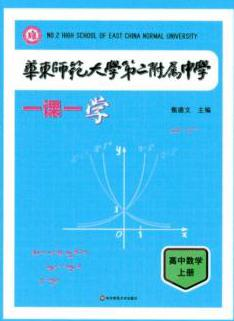

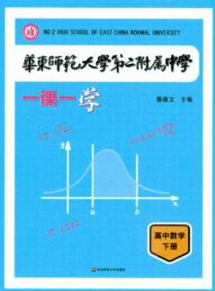

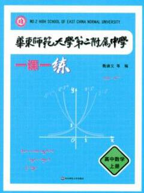

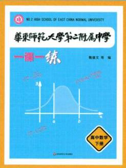

NO.2 HIGH SCHOOL OF EAST CHINA NORMAL UNIVERSITY

# 华乘师范大学第二附属中学

## 参考答案与解析

高中数学下册

华东师范大学出版社

## 第 10 章 空间直线与平面

### 10.1 平面及其基本性质(1)

$1\;M \in  l\;2\;l \cap  \alpha  = A$

3-4 提示: 令 $A\text{ 、 }B\text{ 、 }C\text{ 、 }D$ 为不共面的四点,则这 4 点中任意三个点都不在同一条直线上,因此从四点中任取三个点都可以确定一个平面,能确定一个平面的三点有: 点 $A\text{ 、 }B\text{ 、 }C$ ,点 $A\text{ 、 }B\text{ 、 }D$ ,点 $A\text{ 、 }C\text{ 、 }D$ ,点 $B\text{ 、 }C\text{ 、 }D$ ,所以不共面的四点可以确定平面的个数是 4 。

4 提示: 三个点分别与直线确定了 3 个平面, 另外三个点可以确定一个平面。

5 12 提示: 正方体的六个面和六个对角面。

6 0 提示:在几何体中，平面是无限延展的，故①③⑤错误；通常我们画一个平行四边形来表示一个平面，但并不是说平面就是平行四边形, 故②错误; 平面是没有厚度的, 故④错误。

7 D 提示: 若直线在平面内, 应将直线画在平面内, A 错误; 平面与平面相交时, 两个平面相交于直线, 而不是点, B 错误; 直线与平面相交, 看不到的部分应当画虚线, C 错误; 两直线异面满足作图规范。

8 B 提示: 按照平面内点、线、面的位置关系, $A$ 点在直线 $a$ 上,而直线 $a$ 在平面 $\alpha$ 内,点 $B$ 在 $\alpha$ 内,表示为 $A \in  a, a \subset  \alpha$ , $B \in  \alpha$ 。

9 A 提示:若三个平面互相平行，则可将空间分为 4 个部分；若三个平面有两个平行，第三个平面与其他两个平面相交，则可将空间分为 6 个部分; 若三个平面交于一条直线,则可将空间分为 6 个部分; 若三个平面两两相交且三条交线平行,则可将空间分为 7 部分; 若三个平面两两相交且三条交线交于一点,则可将空间分为 8 部分,故 $n$ 的取值为4,6,7,8,所以 $n$ 不可能是 5 。

10 证明: 如图,设 $a \cap  l = A, b \cap  l = B, c \cap  l = C$ 。因为 $a//b$ ,所以过 $a\text{ 、 }b$ 可以确定一个平面 $\alpha$ 。因为 $A \in  a, B \in  b, a\text{ 、 }b \subset  \alpha$ ,所以 $A \in  \alpha , B \in  \alpha$ ,所以 ${AB} \subset  \alpha$ ,即 $l \subset  \alpha$ 。又因为 $b//c$ , 所以过 $b\text{ 、 }c$ 可以确定一个平面 $\beta$ ,同理可证 $l \subset  \beta$ 。因为 $\alpha \text{ 、 }\beta$ 都过相交直线 $b\text{ 、 }l$ ,所以 $\alpha$ 与 $\beta$ 重合, 所以 $a\text{ 、 }b\text{ 、 }c\text{ 、 }l$ 共面。

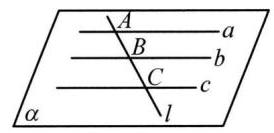

(第 10 题图)

11 因为 $A \in  l, l \subset  \alpha$ ,所以 $A \in  \alpha , D \in  \alpha ,{AD} \subset  \alpha$ ,同理, ${BD} \subset  \alpha ,{CD} \subset  \alpha$ ,所以直线 ${AD}\text{ 、 }{BD}$ 、 ${CD}$ 共面于 $\alpha$ 。

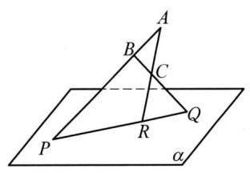

(第 13 题图)

12 因为 ${AC}//{BD}$ ,所以 ${AC}$ 与 ${BD}$ 确定一个平面,记作平面 $\beta$ ,则 $\alpha  \cap  \beta  = {CD}$ ,因为 $l \cap  \alpha  = O$ , 所以 $O \in  \alpha$ ,又因为 $O \in  {AB} \subset  \beta$ ,所以 $O \in$ 直线 ${CD}$ ,所以 $O\text{ 、 }C\text{ 、 }D$ 三点共线。

13 因为 $Q \in  {BC} \subset$ 面 ${ABC}, Q \in  \alpha$ ,所以 $Q$ 落在面 ${ABC}$ 与面 $\alpha$ 的交线上,因为 $P \in  {AB} \subset$ 面 ${ABC}, R \in  {AC} \subset$ 面 ${ABC}$ ,所以 ${PR} \subset$ 面 ${ABC}$ ,因为 $P \in  \alpha , R \in  \alpha$ ,所以 ${PR} \subset  \alpha$ ,所以面 ${ABC} \; \cap  \alpha  = {PR}$ ,故 $Q \in  {PR}$ ,又 $Q \in  {BC}$ ,所以 ${PR} \cap  {BC} = Q$ ,由此作出 $Q$ 点的位置,如图所示。

### 10.1 平面及其基本性质(2)

1 不共线的三点确定一个平面 提示: 类比三脚架知, 支撑点形成一个平面才会保持稳定, 因此加上一个支撑脚后, 两个轮子加支撑脚与地面接触点形成了不共线的三点，确定了一个平面。

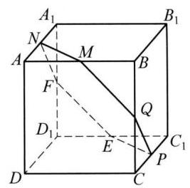

(第 6 题图)

2 既不充分也不必要 36 4 ③ 5 ④

6 六 提示: 如图所示,分别取 ${BC}\text{ 、 }{C}_{1}{D}_{1}\text{ 、 }{A}_{1}{D}_{1}$ 的中点 $Q\text{ 、 }E\text{ 、 }F$ ,连接 ${MN}\text{ 、 }{MQ}\text{ 、 }{QP}\text{ 、 }{PE}$ 、 ${EF}\text{ 、 }{FN}$ ,则 ${MN}//{A}_{1}B,{EP}//C{D}_{1}$ 。因为 ${A}_{1}B//C{D}_{1}$ ,所以 ${MN}//{EP}$ 。同理可得 ${MQ}//{EF}$ , ${PQ}//{FN}$ 。由基本事实及其三个推论得 $M\text{ 、 }N\text{ 、 }P\text{ 、 }Q\text{ 、 }E\text{ 、 }F$ 六点共面,所以平面 ${MNP}$ 截正方体 ${ABCD} - {A}_{1}{B}_{1}{C}_{1}{D}_{1}$ 所得的截面是六边形。

7 D 提示:三点共线则不能确定一个平面, A 错误; 点在直线上则不能确定一个平面, B 错误; 若两条直线为异面直线，则不能确定一个平面，C 错误；梯形的两条腰所在的直线在梯形所在的面上，可以确定一个平面，D 正确。

8 C

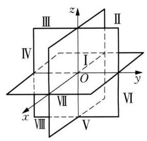

(第 11 题图)

9 B 提示: A 可以是正方形, C 和 D 都可以在正方体里找到。

10 略

11 最多 8 块，最少 4 块。 提示:原题相当于空间中 3 个平面最多可以把空间分成多少部分? 最少可以把空间分成多少部分? 当 3 个平面两两平行时,最少可以把空间分成 4 部分; 当 3 个平面两两相交呈如图位置时,最多可以把空间分成 8 部分,所以空间中 3 个平面最多可以把空间分成 8 部分，最少可以把空间分成 4 部分，即一个西瓜切 3 刀，最多可以切成 8 块，最少可以切成 4 块。

12 略

13 连接 ${EF}$ 并延长交 ${DC}$ 的延长线于 $N$ ,连接 ${D}_{1}N$ 交 $C{C}_{1}$ 于 $Q$ ,连接 ${QF}$ ,延长 ${FE}$ 交 ${DA}$ 的延长线于 $M$ ,连接 ${D}_{1}M$ 交 $A{A}_{1}$ 于 $P$ ,连接 ${EP}$ ,顺次连接 ${D}_{1}\text{ 、 }Q\text{ 、 }F\text{ 、 }E\text{ 、 }P$ ,则五边形 ${D}_{1}{QFEP}$ 即为平面 ${D}_{1}{EF}$ 截正方体 ${ABCD} - {A}_{1}{B}_{1}{C}_{1}{D}_{1}$ 的截面多边形。如图,由题意,正方体 ${ABCD} - \; {A}_{1}{B}_{1}{C}_{1}{D}_{1}$ 的棱长为 2,则 ${AE} = 1,\angle {AEM} = \angle {BEF} = {45}^{ \circ  }$ ,则 $\bigtriangleup {AME}$ 为等腰直角三角形,则 ${AM} = 1$ ,根据 $\bigtriangleup {AMP} \backsim  \bigtriangleup {A}_{1}{D}_{1}P$ 得, $\frac{AP}{{A}_{1}P} = \frac{AM}{{A}_{1}{D}_{1}} = \frac{1}{2}$ ,则 ${A}_{1}P = \frac{4}{3},{AP} = \frac{2}{3}$ ,则 ${D}_{1}P = \; \sqrt{{2}^{2} + {\left( \frac{4}{3}\right) }^{2}} = \frac{2\sqrt{13}}{3},{EP} = \sqrt{{1}^{2} + {\left( \frac{2}{3}\right) }^{2}} = \frac{\sqrt{13}}{3}$ ,同理可得 ${D}_{1}Q = \frac{2\sqrt{13}}{3},{FQ} = \; \frac{\sqrt{13}}{3}$ ,而 ${EF} = \sqrt{2}$ ,则五边形 ${D}_{1}{QFEP}$ 的周长为 $2 \times  \left( {\frac{2\sqrt{13}}{3} + \frac{\sqrt{13}}{3}}\right)  + \sqrt{2} = 2\sqrt{13} + \sqrt{2}$ 。

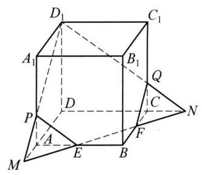

(第 13 题图)

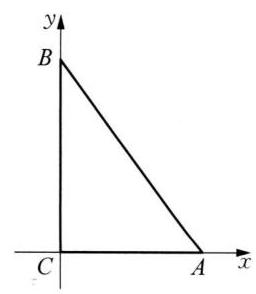

(第 11 题图)

### 10.1 平面及其基本性质 (3)

$1\mathrm{{cm}}{0.5}\mathrm{\;{cm}}$ 提示: 根据“斜二测”画法的原理可知在 $x$ 轴上的线段或平行于 $x$ 轴的线段,在直观图中长度保持不变; 在 $y$ 轴上的线段或平行于 $y$ 轴的线段,在直观图中长度缩短为原来的 $\frac{1}{2}$ 。

2 10 提示: 由斜二测画法的原理可得, $\bigtriangleup {ABC}$ 的顶点 $C$ 在原点,点 $A\text{ 、 }B$ 分别在 $x\text{ 、 }y$ 轴上,如图,且有 ${BC} = 2{B}^{\prime }{C}^{\prime } = 8,{AC} = {A}^{\prime }{C}^{\prime } = 6$ ,显然 ${BC} \bot  {AC}$ ,因此 ${AB} = \sqrt{A{C}^{2} + B{C}^{2}} = \; \sqrt{{6}^{2} + {8}^{2}} = {10}$ 。

3(4，2)提示:在坐标系 ${x}^{\prime }{O}^{\prime }{y}^{\prime }$ 中，过点 $\left( {4,0}\right)$ 和 ${y}^{\prime }$ 轴平行的直线与过点 $\left( {0,2}\right)$ 和 ${x}^{\prime }$ 轴平行的直线的交点即是点 ${M}^{\prime }$ ，所以 ${M}^{\prime }$ 为 $\left( {4,2}\right)$ 。

$4\;8 + 4\sqrt{2}$ 提示:由已知斜二测直观图及根据斜二测画法规则画出原平面图形，如图所示。

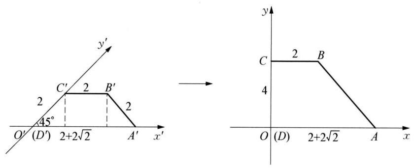

(第 4 题图)

这个平面图形的面积为 $\frac{4 \times  \left( {2 + 2 + 2\sqrt{2}}\right) }{2} = 8 + 4\sqrt{2}$ 。

$5\frac{\sqrt{2}}{2}$ 提示: 因为 $\bigtriangleup {ABC}$ 是腰长为 2 的等腰直角三角形,所以 ${S}_{\bigtriangleup {ABC}} = \frac{1}{2} \times  2 \times  2 = 2$ ,又因为直观图面积与原图形面积比为 $\frac{\sqrt{2}}{4}$ ,故 $\bigtriangleup {ABC}$ 的斜二测平面直观图的面积为 ${S}_{\bigtriangleup {A}^{\prime }{B}^{\prime }{C}^{\prime }} = \frac{\sqrt{2}}{4}{S}_{\bigtriangleup {ABC}} = \frac{\sqrt{2}}{4} \times  2 = \frac{\sqrt{2}}{2}$ 。

${65}\left( {\sqrt{6} - 1}\right)$ 提示: 由题意,在平面直角坐标系中,三角形 ${ABC}$ 是边长为 20 的正三角形,所以 ${AB} = {BC} = {20},{BC}$ 边上的高 $h = \; {10}\sqrt{3}$ ，按“斜二测”画法如图所示。所以 ${B}^{\prime }{D}^{\prime } = {C}^{\prime }{D}^{\prime } = \frac{1}{2}{BC} = {10},{A}^{\prime }{D}^{\prime } = \frac{1}{2}h = \frac{1}{2} \times  {10}\sqrt{3} = 5\sqrt{3}$ ，在三角形 ${A}^{\prime }{C}^{\prime }{D}^{\prime }$ 中， $\angle {A}^{\prime }{D}^{\prime }{C}^{\prime } = \; {45}^{ \circ  }$ ，由余弦定理得， ${A}^{\prime }{C}^{\prime } = \sqrt{{A}^{\prime }{D}^{\prime 2} + {C}^{\prime }{D}^{\prime 2} - 2{A}^{\prime }{D}^{\prime } \cdot  {C}^{\prime }{D}^{\prime }\cos \angle {A}^{\prime }{D}^{\prime }{C}^{\prime }} = \sqrt{{\left( 5\sqrt{3}\right) }^{2} + {10}^{2} - 2 \times  5\sqrt{3} \times  {10} \times  \cos {45}^{ \circ  }} = 5\left( {\sqrt{6} - 1}\right)$ 。

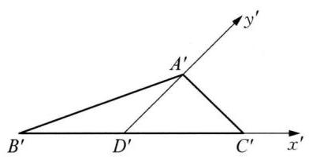

(第 6 题图)

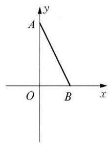

(第 7 题图)

7 B 提示: 由题意可得: ${A}^{\prime }{O}^{\prime } = \sqrt{{\left( {B}^{\prime }{O}^{\prime }\right) }^{2} + {\left( {B}^{\prime }{A}^{\prime }\right) }^{2}} = \sqrt{{1}^{2} + {1}^{2}} = \sqrt{2}$ ,由直观图可得原图,如图所示,可知: $\angle {AOB} = \; {90}^{ \circ  },{BO} = {B}^{\prime }{O}^{\prime } = 1,{AO} = 2{A}^{\prime }{O}^{\prime } = 2\sqrt{2}$ ,可得 ${AB} = \sqrt{B{O}^{2} + A{O}^{2}} = \sqrt{{1}^{2} + {\left( 2\sqrt{2}\right) }^{2}} = 3$ ,原三角形 ${ABO}$ 的周长是 4 + $2\sqrt{2}$ 。

8 B 提示: 由图像知, ${BC} = {B}^{\prime }{C}^{\prime } = 2,{AD} = 2{A}^{\prime }{D}^{\prime } = 4,{AD} \bot  {BC}, D$ 为 ${BC}$ 的中点,所以 ${AC} = \sqrt{{1}^{2} + {4}^{2}} = \sqrt{17}$ , A错误; $\bigtriangleup {ABC}$ 的面积 $S = \frac{1}{2} \times  {BC} \times  {AD} = 4,\mathrm{B}$ 正确; 因为 $\angle {A}^{\prime }{D}^{\prime }{C}^{\prime } = {45}^{ \circ  },{A}^{\prime }{D}^{\prime } = 2$ ,所以 $\bigtriangleup {A}^{\prime }{B}^{\prime }{C}^{\prime }$ 的 ${B}^{\prime }{C}^{\prime }$ 上的高 ${A}^{\prime }E = \; {A}^{\prime }{D}^{\prime }\sin {45}^{ \circ  } = \sqrt{2},\bigtriangleup {A}^{\prime }{B}^{\prime }{C}^{\prime }$ 的面积 $S = \frac{1}{2} \times  2 \times  \sqrt{2} = \sqrt{2}$ , C 错误; $\tan \angle {ABC} = \frac{AD}{BD} = 4$ ,所以 $\angle {ABC} \neq  \frac{\pi }{3}$ , D 错误。

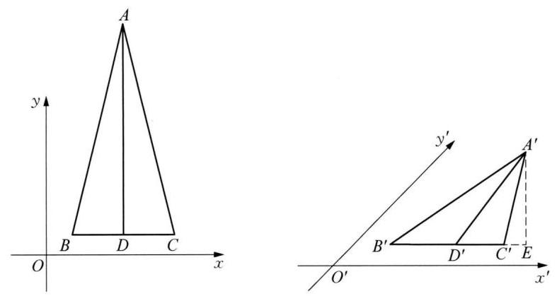

(第 8 题图)

9 D 提示: 根据题意,将 $\bigtriangleup {A}^{\prime }{B}^{\prime }{C}^{\prime }$ 还原成原图,如图。对于 $\mathrm{A},\bigtriangleup {ABC}$ 中,有 ${OC} = {OA} = \; {OB} = 2,{AC} \bot  {OB}$ ,所以 ${BC} = {AB} = 2\sqrt{2},{AC} = 4$ ,故 $\bigtriangleup {ABC}$ 是等腰直角三角形, A 错误; 对于 $\mathrm{B},\bigtriangleup {ABC}$ 的面积是 $\bigtriangleup {A}^{\prime }{B}^{\prime }{C}^{\prime }$ 的 $2\sqrt{2}$ 倍, B错误; 对于 $\mathrm{C}$ ,因为 ${OB} = 2, B$ 的坐标为 $\left( {0,2}\right)$ , C 错误; 对于 $\mathrm{D},\bigtriangleup {ABC}$ 的周长为 ${BC} + {AB} + {AC} = 4 + 4\sqrt{2},\mathrm{D}$ 正确。

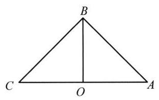

(第 9 题图)

10 画出直角坐标系 ${xOy}$ ,在 $x$ 轴的正方向上取 ${OA} = {O}^{\prime }{A}^{\prime }$ ,即 ${CA} = {C}^{\prime }{A}^{\prime }$ 。如图 1,过 ${B}^{\prime }$ 作 ${B}^{\prime }{D}^{\prime }//{y}^{\prime }$ 轴,交 ${x}^{\prime }$ 轴于点 ${D}^{\prime }$ ,在 ${OA}$ 上取 ${OD} = {O}^{\prime }{D}^{\prime }$ ,过 $D$ 作 ${DB}//y$ 轴,且使 ${DB} = 2{D}^{\prime }{B}^{\prime }$ 。

连接 ${AB}\text{ 、 }{BC}$ ,得 $\bigtriangleup {ABC}$ ,则 $\bigtriangleup {ABC}$ 即为 $\bigtriangleup {A}^{\prime }{B}^{\prime }{C}^{\prime }$ 对应的平面图形,如图 2 所示。

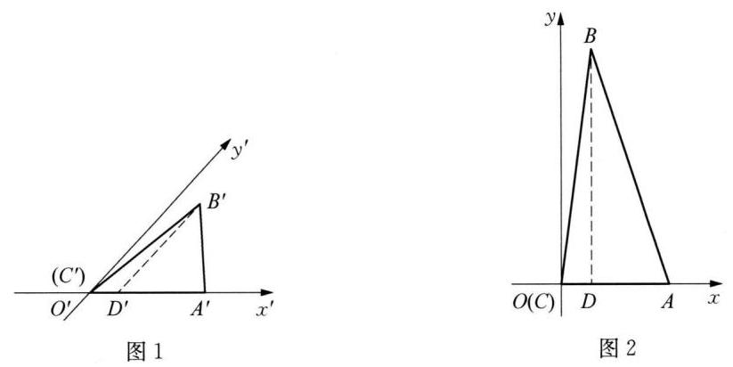

(第 10 题图)

11 (1)由题及余弦定理知， ${a}^{2} + {b}^{2} = {2\sqrt{3}}{ab}\sin C - {c}^{2} = {2\sqrt{3}}{ab}\sin C - \left( {{a}^{2} + {b}^{2} - {2ab}\cos C}\right)$ ，即 ${a}^{2} + {b}^{2} = {ab}\left( {\sqrt{3}\sin C + \cos C}\right)  = \; {{2ab}\sin \left( {C + \frac{\pi }{6}}\right) } \leq  {2ab}$ ，又因为 ${a}^{2} + {b}^{2} \geq  {2ab}$ ，所以 ${a}^{2} + {b}^{2} = {2ab}$ ，即 $a = b$ ， $C = \frac{\pi }{3}$ 。因此， $\bigtriangleup  {ABC}$ 为等边三角形。(2)画法: ①如图 1,在等边 $\bigtriangleup  {ABC}$ 中,取 ${BC}$ 所在直线为 $x$ 轴, ${BC}$ 的垂直平分线为 $y$ 轴,两轴相交于点 $O$ ；在图 2 中,画相应的 ${x}^{\prime }$ 轴与 ${y}^{\prime }$ 轴,两轴相交于点 ${O}^{\prime }$ ,使 $\angle {x}^{\prime }{O}^{\prime }{y}^{\prime } = {45}^{ \circ  }$ ; ② 在图 2 中,以 ${O}^{\prime }$ 为中点,在 ${x}^{\prime }$ 轴上取 ${B}^{\prime }{C}^{\prime } = {BC}$ ,在 ${y}^{\prime }$ 轴上取 ${O}^{\prime }{A}^{\prime } = \frac{1}{2}{OA}$ ; ③连接 ${A}^{\prime }{B}^{\prime }\text{ 、 }{A}^{\prime }{C}^{\prime }$ ，擦去辅助线 ${x}^{\prime }$ 轴和 ${y}^{\prime }$ 轴，得等边 $\bigtriangleup  {ABC}$ 的直观图 ${A}^{\prime }{B}^{\prime }{C}^{\prime }$ (图 3)。因为 $\bigtriangleup  {ABC}$ 是边长为 2 的正三角形，所以 ${AB} = {BC} = 2,{BC}$ 边上的高为 $h = \sqrt{3}$ 。又 $\angle {A}^{\prime }{O}^{\prime }{C}^{\prime } = {45}^{ \circ  },{B}^{\prime }{C}^{\prime } = {BC} = 2,{A}^{\prime }{O}^{\prime } = \frac{1}{2}{AO} = \frac{\sqrt{3}}{2}$ ，所以 ${B}^{\prime }{C}^{\prime }$ 边上的高 ${h}^{\prime } = {A}^{\prime }{O}^{\prime }\sin \angle {A}^{\prime }{O}^{\prime }{C}^{\prime } = \frac{\sqrt{3}}{2} \times  \frac{\sqrt{2}}{2} = \frac{\sqrt{6}}{4}$ ,故 ${S}_{\bigtriangleup {A}^{\prime }{B}^{\prime }{C}^{\prime }} = \frac{1}{2}{B}^{\prime }{C}^{\prime } \cdot  {h}^{\prime } = \frac{1}{2} \times  2 \times  \frac{\sqrt{6}}{4} = \frac{\sqrt{6}}{4}$ ,故直观图 $\bigtriangleup {A}^{\prime }{B}^{\prime }{C}^{\prime }$ 面积为 $\frac{\sqrt{6}}{4}$ 。

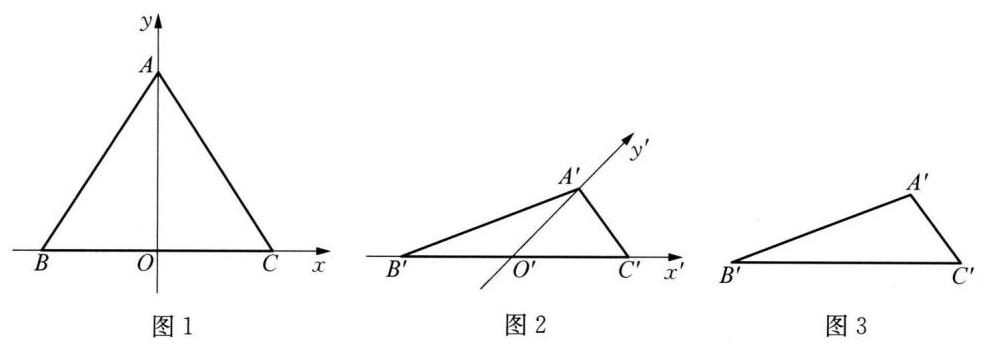

(第 11 题图)

12 在直观图中,在 ${x}^{\prime }$ 轴上取点 ${D}^{\prime }$ ,使得 ${D}^{\prime }{C}^{\prime }//{y}^{\prime }$ 轴,如图 1 。

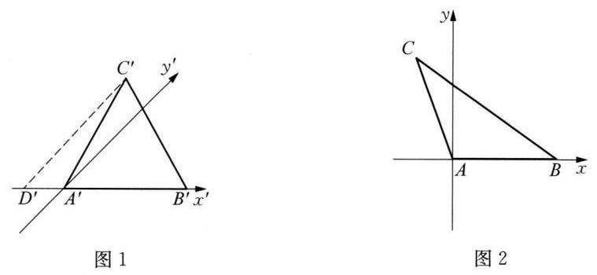

(第 12 题图)

则 ${A}^{\prime }{C}^{\prime } = 2,\angle {C}^{\prime }{D}^{\prime }{A}^{\prime } = {45}^{ \circ  },\angle {D}^{\prime }{A}^{\prime }{C}^{\prime } = {120}^{ \circ  },\angle {D}^{\prime }{C}^{\prime }{A}^{\prime } = {15}^{ \circ  }$ ,由正弦定理可得 $\frac{{C}^{\prime }{D}^{\prime }}{\sin \angle {D}^{\prime }{A}^{\prime }{C}^{\prime }} = \frac{{A}^{\prime }{C}^{\prime }}{\sin \angle {C}^{\prime }{D}^{\prime }{A}^{\prime }} = \; \frac{{A}^{\prime }{D}^{\prime }}{\sin \angle {D}^{\prime }{C}^{\prime }{A}^{\prime }}$ ,又 $\sin {15}^{ \circ  } = \sin \left( {{60}^{ \circ  } - {45}^{ \circ  }}\right)  = \sin {60}^{ \circ  }\cos {45}^{ \circ  } - \cos {60}^{ \circ  }\sin {45}^{ \circ  } = \frac{\sqrt{6} - \sqrt{2}}{4}$ ,可得 ${D}^{\prime }{C}^{\prime } = \frac{2}{\frac{\sqrt{2}}{2}} \times  \frac{\sqrt{3}}{2} = \sqrt{6},{D}^{\prime }{A}^{\prime } = \frac{2}{\sqrt{2}} \times \; \frac{\sqrt{6} - \sqrt{2}}{4} = \sqrt{3} - 1$ ,故将直观图还原为平面图如图 2。其中, $C\left( {1 - \sqrt{3},2\sqrt{6}}\right) , A\left( {0,0}\right) , B\left( {2,0}\right)$ ,得 $\overrightarrow{CA} = \left( {\sqrt{3} - 1, - 2\sqrt{6}}\right)$ , $\overrightarrow{CB} = \left( {\sqrt{3} + 1, - 2\sqrt{6}}\right)$ ,所以 $\overrightarrow{CA} \cdot  \overrightarrow{CB} = \left( {\sqrt{3} - 1, - 2\sqrt{6}}\right)  \cdot  \left( {\sqrt{3} + 1, - 2\sqrt{6}}\right)  = {26}$ 。

13(1)① 平面直角坐标系中作边长为 3 cm 的等边三角形 ${A}_{1}{B}_{1}{C}_{1}^{\prime }$ ，原点 $O$ 为 ${A}_{1}{B}_{1}$ 中点，如图 1; ② 在线段 $O{C}_{1}^{\prime }$ 上找到中点 $Q$ ,过 $O$ 作与 $x$ 轴成 ${45}^{ \circ  }$ 的 ${y}^{\prime }$ 轴,并在 ${y}^{\prime }$ 轴找点 ${C}_{1}$ ,使 $O{C}_{1} = {OQ}$ ,此时直观图底面 ${A}_{1}{B}_{1}{C}_{1}$ 确定; ③过 ${A}_{1}\text{ 、 }{B}_{1}\text{ 、 }{C}_{1}$ 向上作与 $x$ 轴垂直的射线，并在各射线上找一点 $A$ 、 $B$ 、 $C$ ，使 ${A}_{1}A = {B}_{1}B = {C}_{1}C = {3\mathrm{\;{cm}}}$ ，连接 ${AB}$ 、 ${BC}$ 、 ${CA}$ ，即得正三棱柱的直观图(如图 2)。(2)①过MN 作直线分别交射线 ${C}_{1}{A}_{1}$ 、 ${C}_{1}C$ 于点 $E$ 、 $D$ ，连接 ${EP}$ 、 ${DP}$ ，分别交 ${A}_{1}{B}_{1}$ 、 ${BC}$ 于点 $G$ 、 $F$ ；②连接 ${MG}$ 、 ${NF}$ ，则截面 ${FNMGP}$ (如图 3) 即为所求。

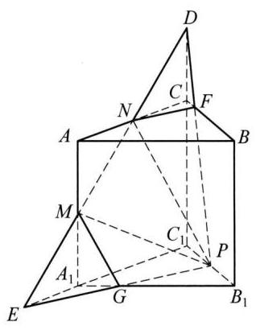

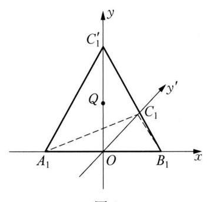

C

$A$

${C}_{1}$

'y'

${A}_{1}$ 0 ${B}_{1}$

图 1 图 2 图 3

(第 13 题图)

### 10.2 空间直线与直线之间的位置关系( 1 )

1 相等或互补

2 ①②③ 提示:对于①，利用线面垂直的性质可知①正确；对于②，由于 $a$ 、 $b$ 共面，利用面面平行的性质即可判断 $a//b$ ，故 ②正确；对于③，应用平行公理可知③正确；对于④，当 $a$ 和 $b$ 在正方体的两个平行面内，且与正方体的同一条棱垂直时， $a$ 、 $b$ 可能平行、异面两种情况，故④错误。

3 平行四边

4 ②④ 提示:①错，可以是空间四边形，其中三个角是直角；②正确。③错，可以是空间四边形，每个角是 ${60}^{ \circ  }$ ；④正确，对角线互相平分则一定是平面图形，可证是平行四边形。

5 2a 6 ④⑥

7 D 提示: 两个等角的一组对应边平行, 另一组边可以具有各种位置关系, 并不能确定是哪一种关系。

8 C 提示:三角形两边之和大于第三边。

9 B 提示:②④正确。

10 略

11 (1)因为正方体 ${ABCD} - {A}_{1}{B}_{1}{C}_{1}{D}_{1}$ 中， $F$ 、 $G$ 分别是棱 $B{B}_{1}$ 、 $D{D}_{1}$ 的中点，所以 ${D}_{1}G = {BF}$ ，且 ${D}_{1}G//{BF}$ ，所以四边形 ${D}_{1}{GBF}$ 是平行四边形，所以 ${GB}//{D}_{1}F$ 。(2)因为正方体 ${ABCD} - {A}_{1}{B}_{1}{C}_{1}{D}_{1}$ 中， $E$ 、 $G$ 分别是棱 $C{C}_{1}$ 、 $D{D}_{1}$ 的中点，所以 ${D}_{1}G = {CE},{D}_{1}G//{CE}$ ，所以四边形 ${D}_{1}{GCE}$ 是平行四边形，所以 ${GC}//E{D}_{1}$ ，由 (1) 知 ${GB}//{D}_{1}F$ ，由图形可知 $\angle {BGC}$ ， $\angle F{D}_{1}E$ 均为锐角，所以 $\angle {BGC} = \angle F{D}_{1}E$ 。

12 (1) $A{A}_{1}$ 与 $B{B}_{1}$ 交于 $O$ ，且 $\frac{AO}{{A}_{1}O} = \frac{BO}{{B}_{1}O} = \frac{2}{3}$ ，即 $\bigtriangleup  {AOB} \backsim   \bigtriangleup  {A}_{1}O{B}_{1}$ ， $\frac{AB}{{A}_{1}{B}_{1}} = \frac{2}{3}$ 。同理， $\frac{AC}{{A}_{1}{C}_{1}} = \frac{BC}{{B}_{1}{C}_{1}} = \frac{2}{3}$ ，则 $\because  \bigtriangleup  {A}_{1}{B}_{1}{C}_{1}$ ,所以 $\angle {CAB} = \angle {C}_{1}{A}_{1}{B}_{1}$ 。(2)由(1)知相似比为 $2 : 3$ ，所以面积比为 $\frac{4}{9}$ 。

13 A 提示: 由于 ${ABCD}$ 是空间四边形,故 ${AB},{BC}$ 确定平面 ${ABC},{CD}\text{ 、 }{DA}$ 确定平面 ${ACD}$ ,因为 $E \in  {AB}, F \in  {BC}, G \in \; {CD}, H \in  {DA}$ ,所以 ${EF} \subset$ 面 ${ABC},{GH} \subset$ 面 ${ACD},{EF} \cap  {GH} = M, M \in$ 面 ${ABC}, M \in  {ACD}$ ,面 ${ABC} \cap$ 面 ${ACD} = {AC}$ , 所以 $M \in  {AC}$ 。

### 10.2 空间直线与直线之间的位置关系(2)

1 (1)平行；(2)异面；(3)相交；(4)异面 提示:(1)在长方体 ${ABCD} - {A}_{1}{B}_{1}{C}_{1}{D}_{1}$ 中， ${A}_{1}{D}_{1}//{BC}$ ， ${A}_{1}{D}_{1} = {BC}$ ，四边形 ${A}_{1}{BC}{D}_{1}$ 为平行四边形,所以 ${A}_{1}B//{D}_{1}C$ 。(2)直线 ${A}_{1}B$ 与直线 ${B}_{1}C$ 不同在任何一个平面内,是异面；(3)直线 ${D}_{1}D$ 与直线 ${D}_{1}C$ 相交于点 ${D}_{1}$ ; (4) 直线 ${AB}$ 与直线 ${B}_{1}C$ 不同在任何一个平面内,是异面。

2 4 提示: 由图可知,与直线 ${AB}$ 垂直且异面的直线有 $C{C}_{1}\text{ 、 }D{D}_{1}\text{ 、 }{A}_{1}{D}_{1}\text{ 、 }{B}_{1}{C}_{1}$ ,共 4 条。

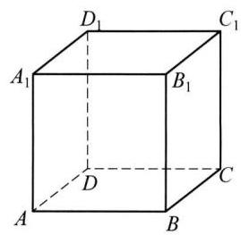

(第 2 题图)

3 6 提示: 与对角线 $A{C}_{1}$ 异面的棱有: ${BC}\text{ 、 }{CD}\text{ 、 }B{B}_{1}\text{ 、 }D{D}_{1}\text{ 、 }{A}_{1}{B}_{1}\text{ 、 }{A}_{1}{D}_{1}$ ,共 6 条。

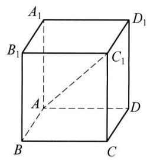

(第 3 题图)

424 提示: 根据题意,如图,在正方体 ${ABCD} - {A}_{1}{B}_{1}{C}_{1}{D}_{1}$ 中,与棱 ${AB}$ 异面的有 $C{C}_{1}\text{ 、 }D{D}_{1}\text{ 、 }{B}_{1}{C}_{1}\text{ 、 }{A}_{1}{D}_{1}$ ,共 4 对,正方体 ${ABCD} - {A}_{1}{B}_{1}{C}_{1}{D}_{1}$ 有 12 条棱,排除两棱的重复计算,异面直线共有 $\frac{{12} \times  4}{2} = {24}$ 对。

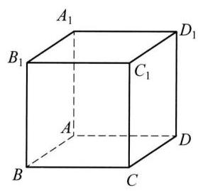

(第 4 题图)

5174 提示: 从正方体的 8 个顶点中任意取出 4 个顶点,共面的情况有 $6 + 6 = {12}$ 种,从正方体的 8 个顶点取出不在同一平面上的 4 个顶点,方法种数有 ${\mathrm{C}}_{8}^{4} - {12} = {58}$ ,而空间不在同一平面上的 4 个点,可以组成 3 对异面直线,所以在正方体的 8 个顶点中,任意两点可连成直线,其中异面直线有 ${58} \times  3 = {174}$ 对。

6 ${s}_{1}//{s}_{2}$ ，并且 ${t}_{1}$ 与 ${t}_{2}$ 相交，或 ${t}_{1}//{t}_{2}$ ，并且 ${s}_{1}$ 与 ${s}_{2}$ 相交 提示:两个平面相交，当两直线在一个平面内的射影是两条平行线, 在另一个平面内的射影是两条相交直线时, 这两直线是异面直线。

7 D

8 C 提示:若 “ $a$ 与 $b$ 异面”，反证:直线 $b$ 与 $l$ 不相交，由于 $b, l \subset  \beta$ ，则 $b//l$ ，因为 $a//l$ ，则 $a//b$ ，这与 $a$ 与 $b$ 异面相矛盾，故直线 $b$ 与 $l$ 相交，故 ${}^{a}a$ 与 $b$ 异面”是“直线 $b$ 与 $l$ 相交”的充分条件；若“直线 $b$ 与 $l$ 相交”，反证:若 $a$ 与 $b$ 不异面，则 $a$ 与 $b$ 平行或相交， ① 若 $a$ 与 $b$ 平行,因为 $a//l$ ,则 $b//l$ ,这与直线 $b$ 与 $l$ 相交相矛盾; ② 若 $a$ 与 $b$ 相交,设 $a \cap  b = A$ ,即 $A \in  a, A \in  b$ ,因为 $a \subset  \alpha$ , $b \subset  \beta$ ,则 $A \in  \alpha , A \in  \beta$ ,即点 $A$ 为 $\alpha \text{ 、 }\beta$ 的公共点,且 $\alpha  \cap  \beta  = l$ ,所以 $A \in  l$ ,即 $A$ 为直线 $a\text{ 、 }l$ 的公共点,这与 $a//l$ 相矛盾。 $9\mathrm{\;B}$ 提示: 设 $P$ 与 $a$ 所确定的平面为 $\alpha$ ,若 $\alpha$ 与 $b$ 交于点 $Q$ ,当 ${PQ}$ 不平行于 $a$ 时, ${PQ}$ 与异面直线 $a\text{ 、 }b$ 都相交,当 ${PQ}//a$ 或 $b//\alpha$ 时,过点 $P$ 与异面直线 $a\text{ 、 }b$ 都相交的直线不存在; 假设有过点 $P$ 的两条直线 $m\text{ 、 }n$ 都与异面直线 $a\text{ 、 }b$ 相交,相交直线 $m\text{ 、 }n$ 共面 $\beta$ ,则直线 $a\text{ 、 }b$ 上分别有两点在面 $\beta$ 上,所以直线 $a\text{ 、 }b$ 在面 $\beta$ 内,与 $a\text{ 、 }b$ 异面矛盾。

10 提示: 假设直线 ${AB}$ 与直线 $l$ 不是异面直线,设它们所在的平面为 $\beta$ 。由 $B \in  \beta , l \subset  \beta$ ,而 $B \in  \alpha , l \subset  \alpha$ ,且 $B \notin  l$ ,则 $\alpha$ 与 $\beta$ 重合。又 ${AB} \subset  \beta$ ,则 ${AB} \subset  \alpha$ ,得 $A \in  \alpha$ ,与 $A \notin  \alpha$ 矛盾。所以假设不成立,即直线 ${AB}$ 与直线 $l$ 是异面直线。

11 证明: 用反证法:若 $b$ 与 $c$ 不是异面直线,则 $b//c$ 或 $b$ 与 $c$ 相交。若 $b//c$ ,因为 $a//c$ ,所以 $a//b$ ,这与 $a \cap  b = A$ 矛盾; 若 $b\text{ 、 }c$ 相交于点 $B$ ,则 $B \in  \beta$ ,又 $a \cap  b = A$ ,所以 $A \in  \beta$ ,所以 ${AB} \subset  \beta$ ,即 $b \subset  \beta$ ,所以 $a$ 与 $b$ 重合,这与 $b \cap  a = A$ 矛盾,所以 $b$ 、 $c$ 是异面直线。

12 (1)因为点 $A\text{ 、 }N\text{ 、 }C\text{ 、 }P\text{ 、 }M$ 共面，所以 ${CM}$ 与 ${PN}$ 不是异面直线，而是相交直线。(2)记 $\angle {PAC} = \theta$ ,则 $P{N}^{2} = A{P}^{2} + A{N}^{2} - {2AP} \cdot  {AN} \cdot  \cos \theta  = A{P}^{2} + \frac{1}{4}A{C}^{2} - {AP} \cdot  {AC} \cdot  \cos \theta$ ,又 $C{M}^{2} = A{C}^{2} + A{M}^{2} - {2AC} \cdot  {AM} \cdot  \cos \theta  = A{C}^{2} + \frac{1}{4}A{P}^{2} - {AP} \cdot  {AC} \cdot  \cos \theta$ ,由 ${AP} < {AC}$ ,则 $C{M}^{2} > \; P{N}^{2}$ ,即 ${CM} > {PN}$ 。(3)如图所示，过 $P$ 、 $A$ 、 $C$ 三点的正方体的截面与 ${C}_{1}{D}_{1}$ 相交于点 $Q$ ，可得 ${AC}//{PQ}$ ,且 ${PQ} < {AC},{D}_{1}P = {D}_{1}Q$ ,所以 ${A}_{1}P = {C}_{1}Q,{AP} = \sqrt{A{A}_{1}^{2} + {A}_{1}{P}^{2}} = {CQ} = \; \sqrt{C{C}_{1}^{2} + {C}_{1}{Q}^{2}}$ ,因此过 $P\text{ 、 }A\text{ 、 }C$ 三点的正方体的截面一定是等腰梯形。

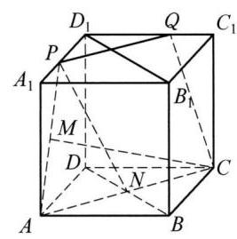

(第 12 题图)

13 (1) 证明: 因为 $A \in$ 平面 ${ABD}, C \notin$ 平面 ${ABD},{BD} \subset$ 平面 ${ABD}, A \notin$ 直线 ${BD}$ ,所以直线 ${AC}$ 与 ${BD}$ 是异面直线。同理, ${AB}$ 与 ${CD},{AD}$ 与 ${BC}$ 也是异面直线，所以四面体中任何一对不共顶点的棱所在的直线一定是异面直线。(2)证明:假设直线 ${AC}\text{ 、 }{BD}$ 共面于平面 $\alpha$ ,即 ${AC} \subset  \alpha ,{BD} \subset  \alpha$ ,则 $A \in  \alpha , C \in  \alpha , B \in  \alpha , D \in  \alpha , A\text{ 、 }B\text{ 、 }C\text{ 、 }D$ 四点共面与已知四点不共面矛盾，所以假设错误，即直线 ${AC}$ 、 ${BD}$ 一定是异面直线。同理， ${AB}$ 与 ${CD},{AD}$ 与 ${BC}$ 也是异面直线，所以四面体中任何一对不共顶点的棱所在的直线一定是异面直线。

### 10.2 空间直线与直线之间的位置关系(3)

$1\left( {0,\frac{\pi }{2}}\right\rbrack$

2 相交或异面 提示: 假设 $b//c$ ,因为 $a//b$ ,由平行线的传递性可知 $a//c$ ,与条件相矛盾,所以直线 $b\text{ 、 }c$ 的位置关系可以是相交或异面。如图 1,直线 $b\text{ 、 }c$ 相交; 如图 2,直线 $b\text{ 、 }c$ 异面。

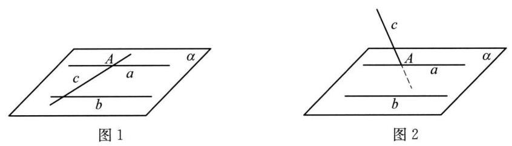

38

4 $\frac{\pi }{4}$ 提示: 如图所示,连接 $A{D}_{1}\text{ 、 }{AE}\text{ 、 }{DE}$ ,设正方体 ${ABCD} - {A}_{1}{B}_{1}{C}_{1}{D}_{1}$ 的棱长为 2,因为 ${AB}//{C}_{1}{D}_{1}$ 且 ${AB} = {C}_{1}{D}_{1}$ ,所以四边形 ${AB}{C}_{1}{D}_{1}$ 为平行四边形,故 $A{D}_{1}//B{C}_{1}$ ,所以,异面直线 $B{C}_{1}$ 和 ${D}_{1}E$ 所成角为 $\angle A{D}_{1}E$ 或其补角,因为 ${AE} = \sqrt{A{B}^{2} + B{E}^{2}} = \sqrt{{2}^{2} + {1}^{2}} = \sqrt{5}$ ,同理可得 $A{D}_{1} = \; 2\sqrt{2},{DE} = \sqrt{5}$ ,由勾股定理可得 ${D}_{1}E = \sqrt{D{D}_{1}^{2} + D{E}^{2}} = \sqrt{{2}^{2} + 5} = 3$ ,由余弦定理可得 $\cos \angle A{D}_{1}E = \frac{A{D}_{1}^{2} + {D}_{1}{E}^{2} - A{E}^{2}}{{2A}{D}_{1} \cdot  {D}_{1}E} = \frac{\sqrt{2}}{2}$ ,所以 $\angle A{D}_{1}E = {45}^{ \circ  }$ ,故异面直线 $B{C}_{1}$ 和 ${D}_{1}E$ 所成角的大小为 ${45}^{ \circ  }$ 。

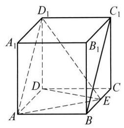

(第 4 题图)

$5\frac{2}{3}$ 提示: 分别取 ${A}_{1}{B}_{1}\text{ 、 }B{B}_{1}\text{ 、 }A{A}_{1}$ 的中点 $D\text{ 、 }E\text{ 、 }F$ ,连接 ${DE}\text{ 、 }{DF}\text{ 、 }{EF}\text{ 、 }{A}_{1}E$ ,因为 $D\text{ 、 }E\text{ 、 }F$ 分别为 ${A}_{1}{B}_{1}\text{ 、 }B{B}_{1}$ 、 $A{A}_{1}$ 的中点，所以 ${DE}//{A}_{1}B,{DF}//{A{B}_{1}}$ 且 ${DE} = \frac{1}{2}{A}_{1}B,{DF} = \frac{1}{2}{A{B}_{1}}$ ，所以异面直线 $A{B}_{1}$ 与 ${A}_{1}B$ 所成角即为 $\angle {EDF}$ 或其补角。因为 $\alpha  \bot  \beta ,\alpha  \cap  \beta  = l, A{A}_{1} \bot  l, A{A}_{1} \subset  \alpha$ ,所以 $A{A}_{1} \bot  \beta$ ,同理可知 $B{B}_{1} \bot  \alpha$ ; 因为 ${A}_{1}E,{A}_{1}B \subset  \beta$ ,所以 $A{A}_{1} \bot \; {A}_{1}E, A{A}_{1} \bot  {A}_{1}B$ ,所以 ${A}_{1}B = \sqrt{{4}^{2} - {2}^{2}} = 2\sqrt{3}$ ,所以 ${A}_{1}{B}_{1} = \sqrt{{\left( 2\sqrt{3}\right) }^{2} - {2}^{2}} = 2\sqrt{2}$ ,所以 ${DF} = \frac{1}{2}A{B}_{1} = \frac{1}{2}\sqrt{{2}^{2} + {\left( 2\sqrt{2}\right) }^{2}} = \sqrt{3},{DE} = \frac{1}{2}{A}_{1}B = \sqrt{3}$ ,又 ${A}_{1}E = \sqrt{{\left( 2\sqrt{2}\right) }^{2} + {1}^{2}} = 3$ ,所以 ${EF} = \sqrt{{3}^{2} + {1}^{2}} = \sqrt{10}$ ,所以 $\cos \angle {EDF} = \frac{D{E}^{2} + D{F}^{2} - E{F}^{2}}{{2DE} \cdot  {DF}} = \frac{3 + 3 - {10}}{2 \times  \sqrt{3} \times  \sqrt{3}} =  - \frac{2}{3}$ ,所以异面直线 $A{B}_{1}$ 与 ${A}_{1}B$ 所成角的余弦值为 $\frac{2}{3}$ 。

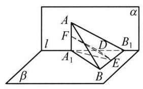

(第 5 题图)

6 4 提示: 该平面展开图合起来后的正方体，如图所示。由图形得 ${BM}$ 与 ${ED}$ 是异面直线，故① 正确; 连接 ${BE},{CN}$ 与 ${BE}$ 平行,故②正确; 连接 ${EM}$ ,则 $\bigtriangleup {BEM}$ 为等边三角形,所以 ${BE}$ 与 ${BM}$ 所成角为 ${60}^{ \circ  }$ ,因为 ${CN}//{BE}$ ,所以 ${CN}$ 与 ${BM}$ 成 ${60}^{ \circ  }$ 角,故 ③ 正确; 对于 ④,连接 ${DM},{BC} \bot$ 平面 ${CDNM}$ , ${DM} \subset$ 平面 ${CDNM}$ ,所以 ${BC} \bot  {DM}$ ,又 ${DM} \bot  {CN},{CN} \cap  {BC} = C,{CN},{BC} \subset$ 面 ${BCN}$ ,所以 ${DM} \bot$ 平面 ${BCN},{BN} \subset$ 平面 ${BCN}$ ,所以 ${DM} \bot  {BN}$ ,故④正确。所以正确结论的个数是 4 个。

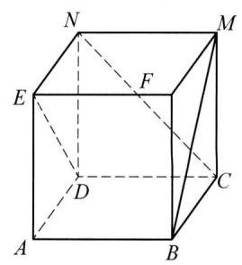

(第 6 题图)

7 A 提示: 对于 ①,满足 $a \subset  \alpha , b \subset  \beta$ 的直线 $a\text{ 、 }b$ 可能是异面直线,可能是平行直线,也可能是相交直线, 所以①错误。对于②, 根据直线和平面的位置关系可知, 平面内的直线和平面外的直线, 可能是异面直线, 可能是平行直线, 也可能是相交直线, 所以②错误。对于③, 在空间中, 没有公共点的两条直线是平行直线或异面直线,所以③错误。对于④,在空间中,两条不平行的直线可能是异面直线,所以④错误。

8 D 9 D

10(1)如图，因为直线 ${A}_{1}B \subset$ 平面 ${AB}{B}_{1}{A}_{1}$ ，点 $E \in$ 平面 ${AB}{B}_{1}{A}_{1}$ ，点 $E \notin  {A}_{1}B$ ，点 ${C}_{1} \notin$ 平面 ${AB}{B}_{1}{A}_{1}$ ，所以直线 ${A}_{1}B$ 和 $E{C}_{1}$ 是异面直线。(2)取 $A{A}_{1}$ 的中点 $F$ 、 ${AB}$ 的中点 $G$ ，连接 ${FG}$ 、 ${CG}\text{ 、 }{FC}$ ,如图所示。因为正方体 ${ABCD} - {A}_{1}{B}_{1}{C}_{1}{D}_{1}$ ,所以 ${FG}//{A}_{1}B,{CG}//E{C}_{1}$ ,所以异面直线 ${A}_{1}B$ 与 $E{C}_{1}$ 所成角为 $\angle {FGC}$ (或其补角),因为正方体 ${ABCD} - {A}_{1}{B}_{1}{C}_{1}{D}_{1}$ 的棱长为 2,所以有 ${FG} = \; \sqrt{2},{GC} = \sqrt{5},{FC} = 3$ ,由余弦定理得 $\cos \angle {FGC} = \frac{F{G}^{2} + G{C}^{2} - F{C}^{2}}{{2FG} \cdot  {GC}} = \frac{2 + 5 - 9}{2\sqrt{2} \cdot  \sqrt{5}} =  - \frac{\sqrt{10}}{10}$ ,所以异面直线 ${A}_{1}B$ 与 $E{C}_{1}$ 所成角的大小为 $\arccos \frac{\sqrt{10}}{10}$ 。

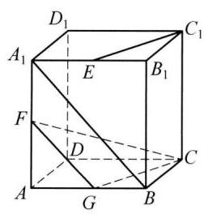

(第 10 题图)

11 (1)如图 1，若 $G$ 为 ${DC}$ 上靠近 $D$ 的三等分点，则 $\frac{DG}{GC} = \frac{BF}{FC} = \frac{1}{2}$ ，故 ${FG}//{BD}$ ，所以 $F$ 、 $G$ 、 $B$ 、 $D$ 四点共面，显然 $F$ 、 $B$ 、 $D$ 不共线,故面 ${FDB}$ 与面 ${FGDB}$ 为同一个平面,而 $E \notin$ 面 ${FDB}, F \in$ 面 ${FDB}$ ,即 ${EF} \cap$ 面 ${FDB} = F,{BD} \subset$ 面 ${FDB}, F \notin \; {BD}$ ,所以直线 ${EF}$ 与 ${BD}$ 是异面直线。(2)如图 2，若 $H$ 、 $I$ 分别为 ${AC}$ 、 ${BD}$ 靠近 $A$ 、 $B$ 的三等分点，则 $\frac{BI}{ID} = \frac{AH}{HC} = \frac{BF}{FC} = \; \frac{AE}{ED} = \frac{1}{2}$ ，所以 ${EI}//{AB}//{FH}$ ， ${FI}//{DC}//{HE}$ ，故四边形 ${IFHE}$ 为平行四边形，且 ${AB}$ 、 ${CD}$ 所成角为 $\angle {IFH}$ 或其补角， 又 ${HE} = \frac{1}{3}{CD} = 1,{FH} = \frac{2}{3}{AB} = 2$ ,则 $\cos \angle {IFH} = \cos \left( {\pi  - \angle {EHF}}\right)  =  - \cos \angle {EHF} =  - \frac{H{E}^{2} + F{H}^{2} - E{F}^{2}}{{2HE} \cdot  {FH}} = \frac{1}{2}$ , 由 $\angle {IFH} \in  \left( {{0}^{\prime },{180}^{ \circ  }}\right)$ ,故 $\angle {IFH} = {60}^{ \circ  }$ ,则 ${AB}\text{ 、 }{CD}$ 所成角为 ${60}^{ \circ  }$ 。

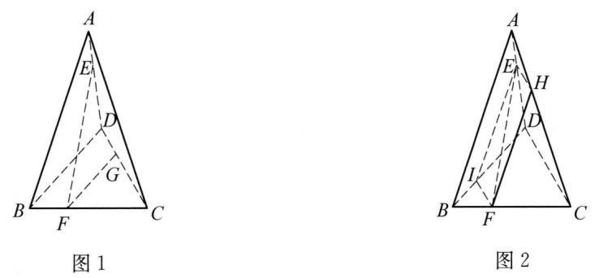

(第 11 题图)

12 (1) 取 ${AD}$ 中点 $G$ ，连接 ${FG}$ 和 ${EG}$ ，则 ${FG} = {EG} = 4$ ， $\angle {FGE}$ 是 ${AB}$ 与 ${CD}$ 所成角(或其补角)， $\cos \angle {FGE} = \; \frac{{4}^{2} + {4}^{2} - {\left( 4\sqrt{3}\right) }^{2}}{2 \times  4 \times  4} =  - \frac{1}{2}$ ,所以 ${AB}$ 与 ${CD}$ 所成角为 ${60}^{ \circ  }$ 。 13 由题意知, $\overrightarrow{FE} = \overrightarrow{FA} + \overrightarrow{A{A}^{\prime }} + \overrightarrow{{A}^{\prime }E}$ ,所以 $\overrightarrow{{FE}{}^{2}} = {\left( \overrightarrow{FA} + \overrightarrow{A{A}^{\prime }} + \overrightarrow{{A}^{\prime }E}\right) }^{2}$ ,展开得 $\overrightarrow{{FE}{}^{2}} = \overrightarrow{{FA}{}^{2}} + \overrightarrow{A{A}^{\prime }}{}^{2} + \overrightarrow{{A}^{\prime }E{}^{2}} + 2\overrightarrow{FA} \cdot  \overrightarrow{A{A}^{\prime }} + \; 2\overrightarrow{FA} \cdot  \overrightarrow{{A}^{\prime }E} + 2\overrightarrow{A{A}^{\prime }} \cdot  \overrightarrow{{A}^{\prime }E}$ ,因为异面直线 $a$ 、 $b$ 所成角为 ${60}^{ \circ  }$ ，代入得 ${23} = 9 + \overrightarrow{A{A}^{\prime }}{}^{2} + 4 + 0 \pm  2 \times  2 \times  3\cos {60}^{ \circ  } + 0$ ，所以 $\left| \overrightarrow{A{A}^{\prime }}\right|  =$ 4 或 $\left| \overrightarrow{A{A}^{\prime }}\right|  = 2$ 。

### 10.3 直线与平面的位置关系( 1 )

1 无数 ${2b} \subset  \alpha$ 或 $b//\alpha$ 3 $3;{B}_{1}{D}_{1}\text{ 、 }C{D}_{1}$ 、 $C{B}_{1}$ ___ ${4b} \subset  \alpha$ 5 若①②，则③(或若①③，则②)

$6\frac{2\sqrt{39}}{3}$ 提示:在三角形 ${ABC}$ 中，由余弦定理可知 ${BC} = \sqrt{39}$ ，因为 ${BC}//\alpha$ ， ${AB} \cap  \alpha  = M$ ， ${AC} \cap  \alpha  = N$ ，根据线面平行的性质定理可得， ${MN}//{BC}$ ，又 $G$ 是三角形 ${ABC}$ 的重心，所以 ${MN} = \frac{2}{3}{BC} = \frac{2\sqrt{39}}{3}$ 。

7 C

8 C 提示: 对于 A 项,如图 1, AB $//{CD},{CD} \subset$ 平面 ${ABCD}$ ,但是 ${AB} \subset$ 平面 ${ABCD}$ ,故 A 错误。对于 B 项,如图 1, ${A}_{1}{B}_{1}//$ 平面 ${ABCD},{B}_{1}{C}_{1}//$ 平面 ${ABCD}$ ,但是 ${A}_{1}{B}_{1} \cap  {B}_{1}{C}_{1} = {B}_{1}$ ,故 B 错误。对于 $\mathrm{C}$ 项,如图 2,因为 $b//\alpha$ ,根据线面平行的性质定理可知，过直线 $b$ ， $\exists \gamma ,\alpha  \cap  \gamma  = c$ ，且 $a \cap  c = A$ ，有 $b//c$ 。因为 $c \subset  \alpha , c \text{ ⊄ } \beta$ ，所以 $c//\beta$ 。因为 $c \subset  \alpha , a \subset  \alpha , a//\beta$ ， $c//\beta , a \cap  c = A$ ,所以 $\alpha //\beta$ ,故 $\mathrm{C}$ 项正确。对于 $\mathrm{D}$ 项,如图 $1,{A}_{1}{B}_{1}//$ 平面 ${ABCD},{A}_{1}{B}_{1}//$ 平面 ${DC}{C}_{1}{D}_{1}$ ,但是平面 ${ABCD} \cap$ 平面 ${DC}{C}_{1}{D}_{1} = {CD}$ ,故 D 项错误。

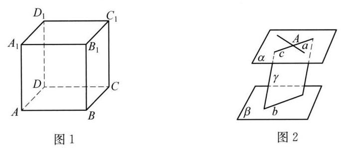

(第 8 题图)

9 A 提示: 对于①: 易知平面 ${MNP}$ 平行于正方体右侧面,根据面面平行的性质即可得出 ${AB}//$ 平面 ${MNP}$ 。对于②: 如图 1, 连接 ${BD}$ ,设 ${BD} \cap  {MP} = Q$ ,连接 ${NQ}$ 。若 ${AB}//$ 平面 ${MNP}$ ,则根据线面平行的性质可得, ${AB}//{NQ}$ ,所以 $\frac{BQ}{QD} = \frac{AN}{ND}$ ,这与 $\frac{3}{1} = \; \frac{1}{1}$ 矛盾,故该选项错误。对于 ③: 如图 2,由中位线定理可得 ${MP}//{CD}$ ,而 ${CD}//{AB}$ ,所以 ${AB}//{MP},{AB} \text{ ⊄ }$ 平面 ${MNP},{MP}$ C 平面 ${MNP}$ ,所以 ${AB}//$ 平面 ${MNP}$ 。对于 ④: 如图 3,连接 ${GE}\text{ 、 }{EN}\text{ 、 }{EM}$ ,因为 $M\text{ 、 }N$ 为所在棱的中点,则 ${MN}//{EF}$ ,故平面 ${MNP}$ 即为平面 ${MNEF}$ ,由正方体可得 ${AB}//{EG}$ ,而平面 ${ABGE} \cap$ 平面 ${MNEF} = {EM}$ ,若 ${AB}//$ 平面 ${MNP}$ ,由 ${AB} \subset$ 平面 ${ABGE}$ 可得 ${AB}//{EM}$ ,故 ${EG}//{EM}$ ,矛盾,故该选项错误。

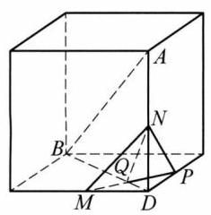

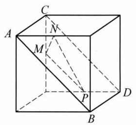

$A$

$E$

$P$

$B \; M \; G$

图 1 图 2 图 3

(第 9 题图)

10(1)证明:设 ${AC}$ 交 ${BD}$ 于点 $O$ ，连接 ${PO}$ 。因为四边形 ${ABCD}$ 为正方形，所以 $O$ 为 ${BD}$ 的中点，又因为 $P$ 为 $D{D}_{1}$ 的中点,所以 $B{D}_{1}//{PO}$ 。又因为 $B{D}_{1} \text{ ⊄ }$ 平面 ${PAC},{PO} \subset$ 平面 ${PAC}$ ,所以 $B{D}_{1}//$ 平面 ${PAC}$ 。(2)设直线 $A{C}_{1}$ 与直线 ${PB}$ 所成的角为 $\theta$ ，则 $\cos \theta  = \frac{\sqrt{2}}{3}$ ，所以直线 $A{C}_{1}$ 与直线 ${PB}$ 所成的角为 $\arccos \frac{\sqrt{2}}{3}$ 。

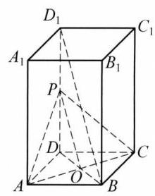

(第 10 题图)

11 略

12 证明: (1) 因为 ${BC}//{AD},{AD} \subset$ 平面 ${PAD},{BC} \text{ ⊄ }$ 平面 ${PAD}$ ,所以 ${BC}//$ 平面 ${PAD}$ ,又因为平面 ${PBC} \cap$ 平面 ${PAD} = l$ ，所以 ${BC}//l$ 。((2)如图，取 ${PD}$ 的中点 $E$ ，连接 ${AE}$ 、 ${NE}$ ，因为 $M\text{ 、 }N$ 分别是 ${AB}\text{ 、 }{PC}$ 的中点,则 ${NE}//{CD}$ ,且 ${NE} = \frac{1}{2}{CD}$ ,又 ${AM}//{CD}$ ,且 ${AM} = \frac{1}{2}{CD}$ , 所以 ${NE}//{AM}$ ,且 ${NE} = {AM}$ ,所以四边形 ${AMNE}$ 是平行四边形,所以 ${MN}//{AE}$ ,又因为 ${AE} \subset$ 平面 ${PAD},{MN} \text{ ⊄ }$ 平面 ${PAD}$ ,所以 ${MN}//$ 平面 ${PAD}$ 。

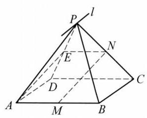

(第 13 题图)

13 (1)证明:由题意，在长方形 ${ABCD}$ 中， $\bigtriangleup  {DAE}$ 和 $\bigtriangleup  {CBE}$ 为等腰直角三角形，所以 $\angle {DEA} = \angle {CEB} = {45}^{ \circ  }$ ,所以 $\angle {AEB} = {90}^{ \circ  }$ ,即 ${BE} \bot  {AE}$ ,因为平面 ${D}^{\prime }{AE} \bot$ 平面 ${ABCE}$ ,平面 ${D}^{\prime }{AE} \cap$ 平面 ${ABCE} = {AE},{BE} \subset$ 平面 ${ABCE}$ ,所以 ${BE} \bot$ 平面 ${D}^{\prime }{AE}$ ,因为 $A{D}^{\prime } \subset$ 平面 ${D}^{\prime }{AE}$ , 所以 $A{D}^{\prime } \bot  {BE}$ 。(2)解:如图所示，连接 ${AC}$ 交 ${BE}$ 于 $Q$ ，假设在 ${D}^{\prime }E$ 上存在点 $P$ ，使得 ${D}^{\prime }B//$ 平面 ${PAC}$ ,连接 ${PQ}$ ,因为 ${D}^{\prime }B \subset$ 平面 ${D}^{\prime }{BE}$ ,平面 ${D}^{\prime }{BE} \cap$ 平面 ${PAC} = {PQ}$ ,所以 ${D}^{\prime }B// \; {PQ}$ ,所以在 $\bigtriangleup {EB}{D}^{\prime }$ 中, $\frac{EP}{P{D}^{\prime }} = \frac{EQ}{QB}$ ,因为在梯形 ${ABCE}$ 中, $\frac{EQ}{QB} = \frac{EC}{AB} = \frac{1}{2}$ ,所以 $\frac{EP}{P{D}^{\prime }} = \frac{EQ}{QB} = \; \frac{1}{2}$ ,即 ${EP} = \frac{1}{3}E{D}^{\prime }$ ,所以在棱 ${D}^{\prime }E$ 上存在一点 $P$ ,且 ${EP} = \frac{1}{3}E{D}^{\prime }$ ,使得 ${D}^{\prime }B//$ 平面 ${PAC}$ 。

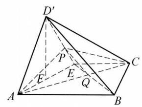

(第 13 题图)

### 10.3 直线与平面的位置关系(2)

1 必要非充分 提示:垂直于无数条不代表存在相交两条，可以是无数条平行直线，所以充分性不成立；反之是线面垂直的定理, 成立。

2 相等 提示: 由空间等角定理和所成角的范围可知角相等。

3 垂 提示: 由 ${PA} \bot  {PB},{PA} \bot  {PC}$ ,且 ${PB} \cap  {PC} = P$ ,可知 ${PA} \bot  {PBC}$ ,所以 ${PA} \bot  {BC}$ ; 且 ${PH} \bot  {BC},{PH} \cap  {PA} = P$ , 所以 ${BC} \bot  {AH}$ 。同理, ${AC} \bot  {BH}, H$ 是垂心。

4 8; 锐角

5 ②④ 提示:由于当一条直线垂直于两个平行平面中的一个时，此直线也垂直于另一个平面，结合所给的选项，故由②④可推出 $m \bot  \beta$ 。即 ②④ 是 $m \bot  \beta$ 的充分条件，所以满足条件 ②④ 时，有 $m \bot  \beta$ 。

6 $\frac{\sqrt{6}a}{2},\frac{\sqrt{2}a}{2},\frac{\sqrt{3}a}{3}$ 提示: $A$ 到直线 ${B}_{1}C$ 的距离是等边三角形 $A{B}_{1}C$ 的高 $d = \frac{\sqrt{3}}{2} \times  \sqrt{2}a = \frac{\sqrt{6}}{2}a$ ； $A{A}_{1}$ 到平面 $B{B}_{1}{D}_{1}D$ 的距离为 $A$ 到 ${BD}$ 的距离,即 $\frac{\sqrt{2}}{2}a;A$ 到平面 ${A}_{1}{BD}$ 的距离为 $A$ 到等边三角形 ${A}_{1}{BD}$ 的中心的距离,即 $\frac{\sqrt{3}a}{3}$ 。

7 D 提示: 直线上的两点可以在平面的两侧, 此时线面相交。

8 C 提示:①②错，③④对。

9 C 提示: 如果 $P$ 到平面的距离大于 1,则不存在; 距离为 1,有且仅有一条; 距离小于 1,有无数条,因此不可能是 2 条。

10 取 ${PD}$ 的中点 $E$ ,连接 ${AE}\text{ 、 }{EN}$ 。因为 $E\text{ 、 }N$ 分别是 ${PD}\text{ 、 }{PC}$ 的中点,所以 ${EN} \text{ ⫫ } \frac{1}{2}{DC}$ ,所以 ${EN} \text{ ⫫ } {AM}$ ,所以四边形 ${AMNE}$ 是平行四边形,所以 ${AE}//{MN}$ ,又因为 ${PA} \bot$ 平面 ${ABCD},\bigtriangleup {PAD}$ 是等腰三角形,所以 ${AE} \bot  {PD}$ 。因为四边形 ${ABCD}$ 为矩形,即 ${DC} \bot  {AE}$ ,又因为 ${DC} \cap  {PD} = D$ ,所以 ${AE} \bot$ 平面 ${PDC}$ ,所以 ${MN} \bot$ 平面 ${PDC}$ 。

11 证明: 由题意可知 $\angle {BEC} = \angle {CED} = \frac{\pi }{4}$ ,所以 $\angle {BED} = \frac{\pi }{2},{DE} \bot  {BE}$ ,因为 ${A}_{1}B \bot  {DE},{A}_{1}B \cap  {BE} = B$ ,而 ${A}_{1}B$ , ${BE} \subset$ 平面 ${A}_{1}{BE}$ ,所以 ${DE} \bot$ 平面 ${A}_{1}{BE}$ 。

12 (1)作 ${AE} \bot  {BD}$ 于点 $E$ ，连接 ${QE}$ ，因为 ${BD} = \sqrt{{a}^{2} + {b}^{2}},{AE} \cdot  {BD} = {ab}$ ，所以 ${AE} = \frac{ab}{\sqrt{{a}^{2} + {b}^{2}}},{QE} = \sqrt{{c}^{2} + \frac{{a}^{2}{b}^{2}}{{a}^{2} + {b}^{2}}}$ ， 即为所求。

(2)设 $\bigtriangleup {AQE}$ 中 ${QE}$ 上的高为 $h$ ，则 $h \cdot  {QE} = {QA} \cdot  {AE}, h = \frac{c \cdot  \frac{ab}{\sqrt{{a}^{2} + {b}^{2}}}}{\sqrt{{c}^{2} + \frac{{a}^{2}{b}^{2}}{{a}^{2} + {b}^{2}}}} = \frac{{ab}c}{\sqrt{{a}^{2}{c}^{2} + {b}^{2}{c}^{2} + {a}^{2}{b}^{2}}}$ 。因为 ${PQ} = {QA}$ ，所以 $P$ 到平面 ${BQD}$ 的距离即为 $h = \frac{abc}{\sqrt{{a}^{2}{c}^{2} + {b}^{2}{c}^{2} + {a}^{2}{b}^{2}}}$ 。 ${13}\frac{a + b + c}{3},\frac{\left| a - b - c\right| }{3},\frac{\left| b - a - c\right| }{3}$ 或 $\frac{\left| c - a - b\right| }{3}$

### 10.3 直线与平面的位置关系(3)

$1\;\left( {0,\frac{\pi }{2}}\right)$

$2\frac{\pi }{6}$ 提示: 连接 ${B}_{1}C$ 交 $B{C}_{1}$ 于点 $E$ ,连接 ${AE}$ ,可证 ${B}_{1}C \bot  {AB}{C}_{1}{D}_{1},\angle {B}_{1}{AE}$ 是直线 $A{B}_{1}$ 与平面 ${AB}{C}_{1}{D}_{1}$ 所成角,可求得 $\frac{\pi }{6}$ 。

3 内；外；垂

4 $\frac{1}{10}$ 或 $\frac{1}{2}$ 提示: 设长度为 ${10}\mathrm{\;{cm}}$ 的线段为 ${AB}$ ,当 $A\text{ 、 }B$ 在平面同侧时,设 $A\text{ 、 }B$ 在平面内的射影分别为 $D\text{ 、 }C$ ,延长 ${BA}$ 与平面交于 $E$ ,则 $\angle {BEC}$ 是 ${AB}$ 与平面所成的角,作 ${AF} \bot  {BC}$ 于 $F$ ,则 $\angle {BEC} = \angle {BAF}$ ,如图 1 所示,则有 ${AD} = 2\mathrm{\;{cm}},{BC} = \; 3\mathrm{\;{cm}},\sin \angle {BEC} = \sin \angle {BAF} = \frac{BF}{AB} = \frac{1}{10}$ 。当 $A\text{ 、 }B$ 在平面异侧时, $A\text{ 、 }B$ 在平面内的射影分别为 $G\text{ 、 }H$ ,连接 ${BA}$ 与平面交于 $I$ ,则 $\angle {BIH}$ 是 ${AB}$ 与平面所成的角,如图 2 所示。设 ${AG} = 2\mathrm{\;{cm}},{BH} = 3\mathrm{\;{cm}}$ ,显然 ${AG}//{BH}$ ,所以 $\frac{AI}{BI} = \frac{2}{3} \Rightarrow  {BI} = \frac{3}{5} \times \; {10} = 6\mathrm{\;{cm}}$ ,所以 $\sin \angle {BIH} = \frac{BH}{BI} = \frac{3}{6} = \frac{1}{2}$ 。

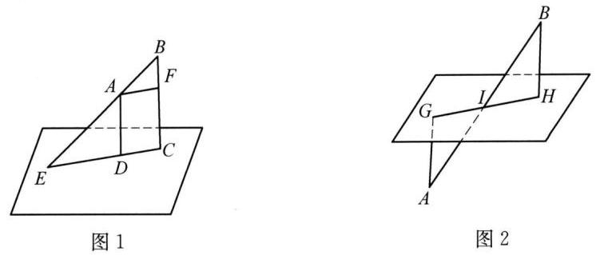

(第 4 题图)

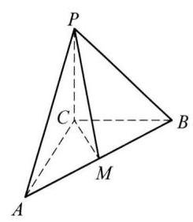

(第 5 题图)

5 $\frac{\pi }{4}$ 提示: 由 ${PC} \bot  {AC},{PC} \bot  {BC},{AC} \cap  {BC} = C,{AC},{BC} \subset$ 面 ${ACB}$ ,所以 ${PC} \bot$ 平面 ${ACB}$ , 则 $\angle {PMC}$ 为 ${PM}$ 与平面 ${ABC}$ 所成的角,因为 $\bigtriangleup {ABC}$ 为等腰直角三角形, $M$ 是 ${AB}$ 的中点,所以 ${AB} = \; \sqrt{{\left( 5\sqrt{2}\right) }^{2} + {\left( 5\sqrt{2}\right) }^{2}} = {10},{CM} = \frac{1}{2}{AB} = 5$ ,又 ${PC} = 5$ ,所以 $\angle {PMC} = {45}^{ \circ  }$ 。

6 ①④ 提示:如图 1，连接 ${A}_{1}D$ 、 ${BD}$ ，因为 ${A}_{1}D$ 与 ${B}_{1}C$ 平行，所以 $\angle B{A}_{1}D$ 是异面直线 ${A}_{1}B$ 与 ${B}_{1}C$ 所成的角，因为 $\bigtriangleup B{A}_{1}D$ 为等边三角形，所以直线 ${A}_{1}B$ 与 ${B}_{1}C$ 所成的角为 ${60}^{ \circ  }$ ，故①正确；如图 2,连接 $C{D}_{1}$ 交 ${C}_{1}D$ 于点 $O$ ,取 ${A}_{1}{D}_{1}$ 的中点为 $F$ ,连接 $F{C}_{1}\text{ 、 }{FD}\text{ 、 }{FO}$ ,因为 $O$ 为 $C{D}_{1}$ 的中点,所以 ${FO}//C{A}_{1}$ ,则 $\angle {FO}{C}_{1}$ 或其补角为直线 $C{A}_{1}$ 与 ${C}_{1}D$ 所成的角,易知 ${FD} = F{C}_{1}$ ,所以 $\angle {FO}{C}_{1} = {90}^{ \circ  }$ , 即直线 $C{A}_{1}$ 与 ${C}_{1}D$ 所成的角为 ${90}^{ \circ  }$ ,故②错误; 如图 3,连接 ${B}_{1}{D}_{1}\text{ 、 }{BD}\text{ 、 }{A}_{1}{C}_{1}$ ,直线 ${B}_{1}{D}_{1}$ 交 ${A}_{1}{C}_{1}$ 于点 $E$ ,连接 ${BE}$ ,设正方体 ${ABCD} - {A}_{1}{B}_{1}{C}_{1}{D}_{1}$ 的棱长为 2,易知 ${C}_{1}E \bot  {B}_{1}{D}_{1},{C}_{1}E \bot  B{B}_{1}$ ,由线面垂直的判定可知, ${C}_{1}E \bot$ 平面 ${B}_{1}{D}_{1}{DB}$ ,则 $\angle {EB}{C}_{1}$ 为直线 $B{C}_{1}$ 与平面 $B{B}_{1}{D}_{1}D$ 所成的角, $B{C}_{1} = 2\sqrt{2}, E{C}_{1} = \sqrt{2}$ ,则 $\sin \angle {EB}{C}_{1} = \frac{E{C}_{1}}{B{C}_{1}} = \frac{1}{2}$ ,即 $\angle {EB}{C}_{1} = {30}^{ \circ  }$ ,故 ③ 错误; $C{C}_{1} \bot$ 平面 ${ABCD}$ ,易知 $\angle {CB}{C}_{1}$ 为直线 $B{C}_{1}$ 与平面 ${ABCD}$ 所成的角,由 $\tan \angle {CB}{C}_{1} = \frac{C{C}_{1}}{BC} = 1$ ,则 $\angle {CB}{C}_{1} = {45}^{ \circ  }$ ,故④正确。

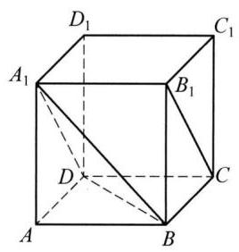

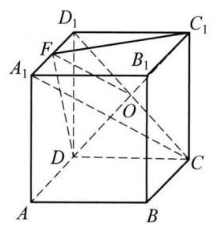

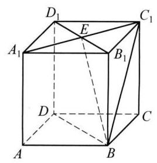

图 1 图 2 图 3

(第 6 题图)

7 A

8 D 提示: 如图所示,对于 $\mathrm{A}$ 项,因为 ${A}_{1}B//{D}_{1}C$ ,所以异面直线 ${A}_{1}B$ 与 ${B}_{1}C$ 所成的角为 $\angle {D}_{1}C{B}_{1}$ 或其补角。又因为 $\bigtriangleup {B}_{1}C{D}_{1}$ 为等边三角形,所以 $\angle {D}_{1}C{B}_{1} = {60}^{ \circ  }$ ,故 $\mathrm{A}$ 项正确; 对于 $\mathrm{B}$ 项、 C 项,因为四边形 ${ABCD}$ 为正方形,则 ${AC} \bot  {BD}$ 。又因为 $B{B}_{1} \bot$ 平面 ${ABCD}$ ,所以 $B{B}_{1} \bot  {AC}$ 。又因为 ${BD} \subset$ 平面 $B{B}_{1}{D}_{1}D, B{B}_{1} \subset$ 平面 $B{B}_{1}{D}_{1}D,{BD} \cap  B{B}_{1} = B$ ,所以 ${AC} \bot$ 平面 $B{B}_{1}{D}_{1}D$ 。又 ${B}_{1}D$ C 平面 $B{B}_{1}{D}_{1}D$ ,所以 ${AC} \bot  D{B}_{1}$ 。同理, $A{D}_{1} \bot  D{B}_{1}, D{B}_{1} \bot  {A}_{1}B$ ,又 ${AC} \subset$ 平面 ${AC}{D}_{1}, A{D}_{1} \subset$ 平面 ${AC}{D}_{1},{AC} \cap  A{D}_{1} = A$ ,所以 $D{B}_{1} \bot$ 平面 ${AC}{D}_{1}$ ,故 B 项、C 项正确; 对于 D 项,因为 ${DC} \bot$ 面 ${BC}{C}_{1}{B}_{1}$ ,所以 ${DC} \bot  C{B}_{1}$ ,即: 在 $\bigtriangleup {DC}{B}_{1}$ 中, $\angle {DC}{B}_{1} = {90}^{ \circ  }$ ,由三角形内角和可知, $\angle C{B}_{1}D < {90}^{ \circ  }$ ,故 D 项错误。

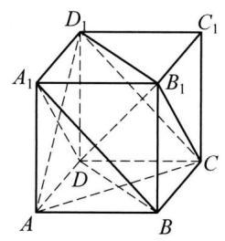

(第 8 题图)

9 C 提示: 直线与平面所成角 ${30}^{ \circ  }$ ,等于平面内的直线与 $a$ 所成角的最小值。

10 如图所示: 过 $C$ 作 ${CH}\bot \alpha$ 于 $H$ ，连接 ${AH}$ 、 ${BH}$ 、 ${DH}$ ，则 $\angle {CDH}$ 为 ${CD}$ 与平面 $\alpha$ 所成角，由题意可得 $\angle {CAH} = {30}^{ \circ  }$ ， $\angle {CBH} = {45}^{ \circ  }$ ， $\angle {ACB} = {90}^{ \circ  }$ ，设 ${CH} = m$ ，则有 ${CA} = {2m}$ ， ${CB} = \sqrt{2}m$ ， 所以 ${AB} = \sqrt{C{A}^{2} + C{B}^{2}} = \sqrt{6}m$ ,又因为 ${CD}$ 是斜边 ${AB}$ 上的高,由 $\frac{1}{2}{CD} \cdot  {AB} = \frac{1}{2}{CB} \cdot  {CA}$ , 可得 ${CD} = \frac{{CA} \cdot  {CB}}{AB} = \frac{2\sqrt{3}m}{3}$ ,在 Rt $\bigtriangleup {CDH}$ 中, $\sin \angle {CDH} = \frac{CH}{CD} = \frac{m}{\frac{2\sqrt{3}m}{3}} = \frac{\sqrt{3}}{2}$ 。

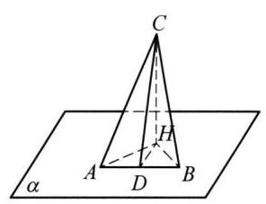

(第 10 题图)

11 (1) 在长方体 ${ABCD} - {A}_{1}{B}_{1}{C}_{1}{D}_{1}$ 中,因为 ${D}_{1}{C}_{1} \bot  {C}_{1}C,{D}_{1}{C}_{1} \bot  {B}_{1}{C}_{1}, C{C}_{1} \cap  {B}_{1}{C}_{1} = \; {C}_{1}, C{C}_{1},{B}_{1}{C}_{1} \subset$ 平面 ${BC}{C}_{1}{B}_{1}$ ,所以 ${D}_{1}{C}_{1} \bot$ 平面 ${BC}{C}_{1}{B}_{1}$ ,因为 ${B}_{1}C \subset$ 平面 ${BC}{C}_{1}{B}_{1}$ ,所以 ${B}_{1}C \bot  {D}_{1}{C}_{1}$ ,又 ${AD} = A{A}_{1} = 1$ ,可得 ${B}_{1}C \bot  B{C}_{1}, B{C}_{1} \cap  {C}_{1}{D}_{1} = {C}_{1}$ ,而 $B{C}_{1},{C}_{1}{D}_{1} \subset$ 平面 ${AB}{C}_{1}{D}_{1}$ ,所以 ${B}_{1}C \bot$ 平面 ${AB}{C}_{1}{D}_{1}$ 。因为 $B{D}_{1} \subset$ 平面 ${AB}{C}_{1}{D}_{1}$ ,所以 ${B}_{1}C \bot  B{D}_{1}$ 。(2)如图,记 ${B}_{1}C$ 交 $B{C}_{1}$ 于点 $O$ ,连接 ${AO}$ ,由 (1) 得 ${B}_{1}C \bot$ 平面 ${AB}{C}_{1}{D}_{1}$ ,所以 ${AO}$ 为斜线 $A{B}_{1}$ 在平面 ${AB}{C}_{1}{D}_{1}$ 上的射影, $\angle {B}_{1}{AO}$ 为 $A{B}_{1}$ 与平面 ${AB}{C}_{1}{D}_{1}$ 所成的角。在长方体 ${ABCD} - {A}_{1}{B}_{1}{C}_{1}{D}_{1}$ 中, ${AB} = 2,{AD} = A{A}_{1} = 1$ ,在 Rt $\bigtriangleup {B}_{1}{AO}$ 中, $A{B}_{1} = \sqrt{5},{B}_{1}O = \frac{1}{2}{B}_{1}C = \frac{\sqrt{2}}{2},\sin \angle {B}_{1}{AO} = \; \frac{{B}_{1}O}{A{B}_{1}} = \frac{\sqrt{10}}{10}$ 。所以直线 $A{B}_{1}$ 与平面 ${AB}{C}_{1}{D}_{1}$ 所成角的正弦值为 $\frac{\sqrt{10}}{10}$ 。

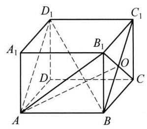

(第 11 题图)

12 (1) 因为四边形 ${ABCD}$ 是菱形,所以 ${BD} \bot  {AC}$ ,因为 ${AE} \bot$ 平面 ${ABCD},{BD} \subset$ 平面 ${ABCD}$ ,所以 ${BD} \bot  {AE}$ 。因为 ${AC} \cap \; {AE} = A,{AC} \subset$ 平面 ${ACFE},{AE} \subset$ 平面 ${ACFE}$ ,所以 ${BD} \bot$ 平面 ${ACFE}$ 。 (2) 因为 ${FC} \bot$ 平面 ${ABCD}$ ,所以直线 ${FO}$ 与平面 ${ABCD}$ 所成的角为 $\angle {FOC}$ ,即 $\cos \angle {FOC} = \frac{\sqrt{10}}{10}$ 。在等边 $\bigtriangleup {ABC}$ 中, ${CO} = \frac{1}{2}{AC} = 1$ ,所以 $\mathrm{{Rt}}\bigtriangleup {FOC}$ 中, ${FO} = \sqrt{10}$ , ${FC} = 3$ 。过 $E$ 作 ${EN}//{AC}$ 交 ${FC}$ 于点 $N,\operatorname{Rt}\bigtriangleup {FNE}$ 中, ${EF} = \sqrt{{2}^{2} + {1}^{2}} = \sqrt{5},\operatorname{Rt}\bigtriangleup {FCB}$ 中, ${FB} = \sqrt{{3}^{2} + {2}^{2}} = \sqrt{13}$ , $\mathrm{{Rt}}\bigtriangleup {EAB}$ 中, ${EB} = \sqrt{{2}^{2} + {2}^{2}} = \sqrt{8}$ ,所以 $E{F}^{2} + E{B}^{2} = F{B}^{2} \Rightarrow  {EF} \bot  {BE}$ 。 (3) 取 ${BE}$ 边的中点 $M$ ,连接 ${MO}$ ,易得 ${MO}// \; {DE}$ 且 ${MO} = \frac{1}{2}{DE} = \sqrt{2},\angle {FOM}$ 为所求的角或其补角,而在 $\mathrm{{Rt}}\bigtriangleup {FEM}$ 中, ${FM} = \sqrt{E{F}^{2} + E{M}^{2}} = \sqrt{7},\bigtriangleup {FOM}$ 中, $\cos \angle {FOM} = \frac{F{O}^{2} + M{O}^{2} - F{M}^{2}}{{2FO} \cdot  {MO}} = \frac{\sqrt{5}}{4}$ ,所以异面直线 ${OF}$ 与 ${DE}$ 所成角的余弦值为 $\frac{\sqrt{5}}{4}$ 。

13 A 提示:如图所示,在侧面正方形 ${A}_{1}{B}_{1}{BA}$ 和 ${A}_{1}{D}_{1}{DA}$ 旁分别再延伸一个正方形 ${B}_{1}{E}_{1}{EB}$ 和 ${D}_{1}{F}_{1}{FD}$ ,则平面 ${E}_{1}{EC}{C}_{1}$ 和 ${C}_{1}{CF}{F}_{1}$ 在同一个平面内,所以过点 $P$ ,有且只有一条直线 $l$ ，即 $E{F}_{1}$ 与 $a$ 、 $b$ 相交，故①为真命题。取 ${A}_{1}A$ 的中点 $N$ ，连 ${PN}$ ，由于 $a\text{ 、 }b$ 为异面直线， $a\text{ 、 }b$ 的夹角等于 ${A}_{1}{B}_{1}$ 与 $b$ 的夹角。由于 ${A}_{1}{C}_{1} \subset$ 平面 ${A}_{1}{C}_{1},{NP} \text{ ⊄ }$ 平面 ${A}_{1}{C}_{1},{NP}//{A}_{1}{C}_{1}$ ,所以 ${NP}//$ 平面 ${A}_{1}{C}_{1}$ ,所以 ${NP}$ 与 ${A}_{1}{B}_{1}$ 和 $b$ 的夹角都为 ${45}^{ \circ  }$ 。又因为 ${C}_{1}C \bot$ 平面 ${A}_{1}{C}_{1}$ ,所以 ${C}_{1}C$ 与 ${A}_{1}{B}_{1}$ 和 $b$ 的夹角都为 ${90}^{ \circ  }$ ,而 ${45}^{ \circ  } < {75}^{ \circ  } < \; {90}^{ \circ  }$ ,所以过点 $P$ ,在平面 ${A}_{1}C$ 内存在一条直线,使得与 ${A}_{1}{B}_{1}$ 与 $b$ 的夹角都为 ${75}^{ \circ  }$ ,同理可得,过点 $P$ ,在平面 ${A}_{1}C$ 内存在一条直线,使得与 $a$ 与 ${AD}$ 的夹角都为 ${75}^{ \circ  }$ ,故②为真命题。

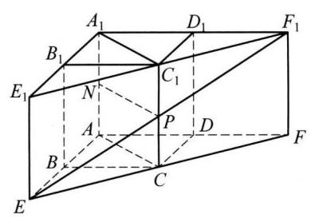

(第 13 题图)

### 10.3 直线与平面的位置关系(4)

1 平面上的射影 2 垂直

33 提示: 因为平面 $\alpha //$ 平面 $\beta$ ,直线 $a \subset  \alpha$ ,直线 $b \subset  \beta$ ,所以分别在两个平面的任意两条直线可以共面,也可以异面,故

③ 正确; 所以直线 $a$ 与直线 $b$ 无公共点,所以 $a$ 与 $b$ 不相交,故 ④ 错误; 当直线 $a$ 与直线 $b$ 共面时,根据面面平行的性质,可得 $a// \; b$ ,故 ① 正确; 当直线 $a$ 与直线 $b$ 异面时, $a$ 与 $b$ 所成的角大小可以是 ${90}^{ \circ  }$ ,则 $a \bot  b$ 正确,故②正确。

4 ①②③ 提示:由 ${PA}\text{ 、 }{PB}\text{ 、 }{PC}$ 两两垂直， ${PB}\text{ 、 }{PC}$ 是平面 ${PBC}$ 内两相交直线，可得 ${PA} \bot$ 平面 ${PBC}$ ， ${BC} \subset$ 平面 ${PBC}$ ， ${PA} \bot  {BC}$ 。同理， ${PB} \bot$ 平面 ${PAC}$ ， ${PC} \bot$ 平面 ${PAB}$ ，所以 ${PB} \bot  {AC}$ ， ${PC} \bot  {AB}$ ，故①②③ 正确。若 ${AB} \bot  {BC}$ ，则由 ${PA} \bot \; {BC}$ ,又 ${PA} \cap  {AB} = A,{PA},{AB} \subset$ 平面 ${PAB}$ ,得 ${BC} \bot$ 平面 ${PAB}$ ,又 ${PC} \bot$ 平面 ${PAB}$ ,这与过一点有且只有一条直线与已知平面垂直矛盾，故④错误。

5 $\frac{13}{5}$ 提示: 过 $A$ 作 ${AE} \bot  {BD}$ 于 $E$ ,连接 ${PE}$ ,直线 ${PA} \bot$ 平面 ${ABCD}$ ,所以 ${AP} \bot  {BD}$ ,又 ${AE} \bot  {BD},{AP} \cap  {AE} = A,{AP},{AE} \subset$ 面 ${PAE}$ ,则 ${BD} \bot$ 面 ${PAE}$ ,所以 ${PE} \bot  {BD},{PE}$ 为所求的距离,在 $\bigtriangleup {ABD}$ 中, ${AE} = \frac{{AB} \cdot  {AD}}{BD} = \frac{12}{5}$ ,在 $\bigtriangleup {APE}$ 中, ${PE} = \sqrt{A{E}^{2} + A{P}^{2}} = \; \sqrt{{\left( \frac{12}{5}\right) }^{2} + {1}^{2}} = \frac{13}{5}$  。

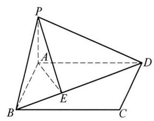

(第 5 题图)

6 ①②③ 提示:对于①，因为 ${PA} \bot$ 平面 ${ABC}$ ， ${BC} \subset$ 平面 ${ABC}$ ，所以 ${PA} \bot  {BC}$ ，又因为 ${AB} \bot  {BC},{PA} \cap  {AB} = A,{PA} \subset$ 平面 ${PAB},{AB} \subset$ 平面 ${PAB}$ ,所以 ${BC} \bot$ 平面 ${PAB}$ ,故 ① 正确; 对于 ②③,由 ①,因为 ${BC} \bot$ 平面 ${PAB},{AD} \subset$ 平面 ${PAB}$ ,所以 ${BC} \bot  {AD}$ ,又因为 ${PA} = {AB}, D$ 为 ${PB}$ 的中点,所以 ${AD} \bot \; {PB}$ ,又因为 ${BC} \cap  {PB} = B,{BC} \subset$ 平面 ${PBC},{PB} \subset$ 平面 ${PBC}$ ,所以 ${AD} \bot$ 平面 ${PBC}$ ,又因为 ${PC} \subset$ 平面 ${PBC}$ ,所以 ${AD} \bot \; {PC}$ ,故 ②③正确；对于 ④，假设 ${PB} \bot$ 平面 ${ADC}$ ，则因为 ${CD} \subset$ 平面 ${ADC}$ ，所以 ${PB} \bot  {CD}$ ，又因为 $D$ 为 ${PB}$ 的中点，所以 ${PC} = \; {BC}$ ,因为 ${PA} \bot$ 平面 ${ABC},{AC} \subset$ 平面 ${ABC}$ ,所以 ${PA} \bot  {AC}$ ,所以 $\operatorname{Rt}\bigtriangleup {PAC}$ 中, ${PC} > {AC}$ ,又因为 ${AB} \bot  {BC}$ ,所以 $\operatorname{Rt}\bigtriangleup {ABC}$ 中, ${AC} > {BC}$ ,所以 ${PC} > {AC} > {BC},{PC} \neq  {BC}$ ,所以假设不成立,故④错误。

7 C 提示: 因为 $\angle {ABC} = {120}^{ \circ  },{PA} = {AB} = {BC} = 4$ ,所以由余弦定理可得: ${AC} = \sqrt{{16} + {16} + 2 \times  4 \times  4 \times  \frac{1}{2}} = 4\sqrt{3}$ ,因为 ${PA} \bot$ 平面 ${ABC},{AC}$ 在平面 ${ABC}$ 内,所以 ${PA} \bot  {AC},{PC} = \sqrt{{16} + {48}} = 8$ 。

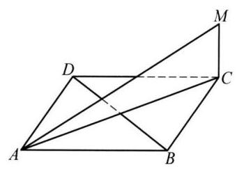

(第 8 题图)

8 C 提示: 连接 ${AC}$ ,因为四边形 ${ABCD}$ 是菱形,所以 ${AC} \bot  {BD}$ ,又 ${MC} \bot$ 菱形 ${ABCD}$ 所在的平面, ${BD} \subset$ 面 ${ABCD}$ ,所以 ${MC} \bot  {BD}$ ,又 ${MC} \cap  {AC} = C,{MC},{AC} \subset$ 面 ${MAC}$ ,所以 ${BD} \bot$ 面 ${MAC},{MA} \subset$ 面 ${MAC}$ ,所以 ${MA} \bot  {BD}$ 。

9 C 提示: 三个点在同侧, 有 2 个; 一个点在一侧, 另外两个点在两侧, 共 3 个; 共计 5 个。 10 证明: 充分性,因为 ${PO} \bot  \alpha , a \subset  \alpha$ ,所以 ${PO} \bot  a$ ,又因为 $a \bot  {OA},{PO} \cap  {OA} = O,{PO}$ , ${OA} \subset$ 平面 ${PAO}$ ,所以 $a \bot$ 平面 ${PAO}$ ,又因为 ${PA} \subset$ 平面 ${PAO}$ ,所以 $a \bot  {PA}$ 。必要性,因为 ${PO} \bot  \alpha , a \subset  \alpha$ ,所以 ${PO} \bot  a$ ,又因为 $a \bot  {PA},{PO} \cap  {PA} = P,{PO}\text{ 、 }{PA} \subset$ 平面 ${PAO}$ , 所以 $a \bot$ 平面 ${PAO}$ ,又因为 ${OA} \subset$ 平面 ${PAO}$ ,所以 $a \bot  {OA}$ 。综上,对平面 $\alpha$ 上任一直线 $a, a \bot  {OA}$ 是 $a \bot  {PA}$ 的充要条件。 11 因为四边形 ${ABCD}$ 为正方形,所以 ${AC} \bot  {BO}$ 。又因为 $B{B}_{1} \bot$ 平面 ${ABCD},{AC} \subset$ 平面 ${ABCD}$ ,所以 ${AC} \bot  B{B}_{1}$ ,又因为 ${BO} \cap  B{B}_{1} = B,{BO}, B{B}_{1} \subset$ 平面 $B{B}_{1}O$ ,所以 ${AC} \bot$ 平面 $B{B}_{1}O$ ,又 ${EF}$ 是 $\bigtriangleup {ABC}$ 的中位线,所以 ${EF}//{AC}$ ,所以 ${EF} \bot$ 平面 $B{B}_{1}O$ 。

12 (1)如图1所示，作 ${BC} \bot  {CD}$ ，因为 ${AB} \bot$ 平面 ${BCD}$ ，利用三垂线定理，可得 ${AC} \bot  {CD}$ ，利用测角仪测量角 $\angle {BDC} = \alpha$ ，用皮尺测量 ${CD} = m$ ,在直角 $\bigtriangleup {BCD}$ 中,可得 ${BC} = {CD}\tan \angle {BDC} = m\tan \alpha$ 米,在直角 $\bigtriangleup {ABC}$ 中,利用勾股定理可得 ${AC} = \; \sqrt{A{B}^{2} + B{C}^{2}} = \sqrt{{h}^{2} + {m}^{2}{\tan }^{2}\alpha }$ 米,即电塔塔顶 $A$ 与道路之间的距离为 $\sqrt{{h}^{2} + {m}^{2}{\tan }^{2}\alpha }$ 米。(2)如图 2 所示，利用测角仪测量 $\angle {BDP} = \alpha ,\angle {BPD} = \beta ,\angle {APB} = \gamma$ ,用皮尺测量 ${PD}$ 的长度为 $n$ 米,在 $\bigtriangleup {BDP}$ 中,可得 $\angle {PBD} = \pi  - \left( {\alpha  + \beta }\right)$ ,由正弦定理知 $\frac{PD}{\sin \angle {PBD}} = \frac{BP}{\sin \angle {BDP}}$ ,求得 ${BP} = \frac{{PD} \cdot  \sin \angle {BDP}}{\sin \angle {PBD}} = \frac{n \cdot  \sin \alpha }{\sin \left\lbrack  {\pi  - \left( {\alpha  + \beta }\right) }\right\rbrack  } = \frac{n \cdot  \sin \alpha }{\sin \left( {\alpha  + \beta }\right) }$ 米,在直角 $\bigtriangleup {ABP}$ 中,可得 ${AP} = \frac{BP}{\cos {\angle {APB}}} = \frac{n \cdot  \sin \alpha }{\sin \left( {\alpha  + \beta }\right) \cos \gamma }$ ，即电塔塔顶 $A$ 与道路上任意一点 $P$ 之间的距离为 $\frac{n \cdot  \sin \alpha }{\sin \left( {\alpha  + \beta }\right) \cos \gamma }$ 米。(3)如图 3 所示,用测角仪测量 $\angle {ACB} = \alpha ,\angle {BCD} = \beta ,\angle {ADC} = {\theta }_{1},\angle {ADB} = {\theta }_{2}$ ,用皮尺测量 ${CD} = m$ 米,在 $\bigtriangleup {BCD}$ 中,利用正弦定理,求得 ${BC} = \frac{m\sin \left( {{\theta }_{1} + {\theta }_{2}}\right) }{\sin \left\lbrack  {\pi  - \left( {{\theta }_{1} + {\theta }_{2} + \beta }\right) }\right\rbrack  } = \frac{m\sin \left( {{\theta }_{1} + {\theta }_{2}}\right) }{\sin \left( {{\theta }_{1} + {\theta }_{2} + \beta }\right) }$ 米,在 $\bigtriangleup {ACD}$ 中,利用正弦定理,求得 ${AC} = \frac{m\sin {\theta }_{1}}{\sin \left\lbrack  {\pi  - \left( {{\theta }_{1} + \alpha  + \beta }\right) }\right\rbrack  } = \; \frac{m\sin {\theta }_{1}}{\sin \left( {{\theta }_{1} + \alpha  + \beta }\right) }$ 米,在 $\bigtriangleup {ABC}$ 中,利用余弦定理,可得 $A{B}^{2} = A{C}^{2} + B{C}^{2} - {2AC} \cdot  {BC}\cos \alpha$ ,即可求得 ${AB}$ 的长。

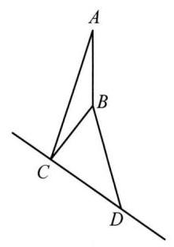

图 1

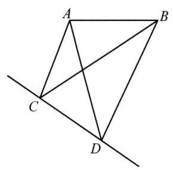

图 3

图 2

(第 12 题图)

13 存在。因为 ${PA} \bot$ 平面 ${ABCD},{QD} \subset$ 平面 ${ABCD}$ ,所以 ${PA} \bot  {QD}$ 。若边 ${BC}$ 上存在一点 $Q$ ,使得 ${QD} \bot  {AQ}$ ,又 ${PA} \cap \; {AQ} = A$ ,则有 ${QD} \bot$ 平面 ${PAQ}$ ,又 ${PQ} \subset$ 平面 ${PAQ}$ ,从而 ${QD} \bot  {PQ}$ 。在矩形 ${ABCD}$ 中,当 ${AD} = a < 2$ 时,直线 ${BC}$ 与以 ${AD}$ 为直径的圆相离，故不存在点 $Q$ ，使 ${AQ} \bot  {DQ}$ 。所以当 $a \geq  2$ 时，才存在点 $Q$ ，使得 ${PQ} \bot  {QD}$ 。

### 10.4 平面与平面的位置关系( 1 )

1 0 个或 1 个 2 平行 3 相交、平行或异面 4 相似 5 ①④

617 提示: 因为直线 ${AB}$ 与 ${CD}$ 交于点 $S$ ,所以设直线 ${AB}$ 与 ${CD}$ 确定一个平面 $\gamma , A, B, C, D \in  \gamma$ ,又因为 $A, C \in  \alpha , B$ , $D \in  \beta$ ，所以 $\alpha  \cap  \gamma  = {AC}$ ， $\beta  \cap  \gamma  = {BD}$ ，又因为平面 $\alpha //\beta$ ，所以由平面与平面平行的性质定理知， ${AC}//{BD}$ ，所以 $\bigtriangleup  {SAC} \backsim \; \bigtriangleup {SBD}$ ，所以 $\frac{AS}{BS} = \frac{CS}{DS} = \frac{CS}{{CS} + {CD}}$ ，即 $\frac{3}{9} = \frac{CS}{{CS} + {34}}$ ，解得 ${CS} = {17}$ 。

7 D 8 A 9 B

10 证明: 因为平面 ${AEFG} \cap$ 平面 ${AB}{B}_{1}{A}_{1} = {AE}$ ,平面 ${AEFG} \cap$ 平面 ${DC}{C}_{1}{D}_{1} = {GF}$ ,且平面 ${AB}{B}_{1}{A}_{1}//$ 平面 ${DC}{C}_{1}{D}_{1}$ ,由面面平行的性质定理可知: ${GF}//{AE}$ ，同理可证: ${EF}//{AG}$ ，故四边形角 ${AEFG}$ 为平行四边形。

11 证明: 因为四边形 ${ACFE}$ 为矩形,所以 ${AE}//{CF}$ ,又 ${AE} \subset$ 平面 ${AEB},{CF} \subset$ 平面 ${CFD}$ ,所以 ${AE}//$ 平面 ${CFD}$ ,因为 ${AB}// \; {CD}$ ,又 ${AB} \subset$ 平面 ${AEB},{CD} \subset$ 平面 ${CFD}$ ,所以 ${AB}//$ 平面 ${CFD}$ ,又 ${AE} \cap  {AB} = A$ ,所以平面 ${AEB}//$ 平面 ${CFD}$ ,因为平面 ${ADF}$ 与棱 ${BE}$ 交于点 $G$ ，且 ${BE} \subset$ 平面 ${AEB}$ ，因为平面 ${ADF} \cap$ 平面 ${AEB} = {AG}$ ，平面 ${ADF} \cap$ 平面 ${CFD} = {DF}$ ，平面 ${AEB}//$ 平面 ${CFD}$ ,故 ${AG}//{DF}$ ,得证。

12 (1) 略 (2) ${S}_{\bigtriangleup {CFD}} = \frac{1}{2} \times  2 \times  4 \times  \sin {60}^{ \circ  } = 2\sqrt{3},{S}_{\bigtriangleup {BEM}} : {S}_{\bigtriangleup {CDF}} = 1 : 4$ ，所以 ${S}_{\bigtriangleup {BEM}} = \frac{\sqrt{3}}{2}$ 。

13 B 提示: 对于 A 选项,取线段 $B{B}_{1}$ 的中点 $G$ ,连接 ${A}_{1}G\text{ 、 }{EG}$ ,如图所示,在正方体 ${ABCD} - {A}_{1}{B}_{1}{C}_{1}{D}_{1}$ 中, $A{A}_{1}//B{B}_{1}$ 且

$A{A}_{1} = B{B}_{1}$ ,因为 $F\text{ 、 }G$ 分别为 $A{A}_{1}\text{ 、 }B{B}_{1}$ 的中点,所以, ${A}_{1}F//{BG}$ 且 ${A}_{1}F = {BG}$ ,所以,四边形 ${A}_{1}{FBG}$ 为平行四边形,所以, ${BF}//{A}_{1}G$ ,同理可得 ${D}_{1}E//{A}_{1}G$ ,故 ${D}_{1}E//{BF}$ ,因为 ${D}_{1}E \text{ ⊄ }$ 平面 ${BDF},{BF} \subset$ 平面 ${BDF}$ ,所以, ${D}_{1}E//$ 平面 ${BDF}$ ,同理可证 ${B}_{1}E//$ 平面 ${BDF}$ ,因为 ${B}_{1}E \; \cap  {D}_{1}E = E$ ,而 ${B}_{1}E,{D}_{1}E \subset$ 平面 ${B}_{1}{D}_{1}E$ ,所以,平面 ${B}_{1}{D}_{1}E//$ 平面 ${BDF}$ ,因为 ${B}_{1}M \subset$ 平面 ${B}_{1}{D}_{1}E$ ,所以, ${B}_{1}M//$ 平面 ${BDF},\mathrm{\;A}$ 对。对于 $\mathrm{B}$ 选项,取线段 $D{D}_{1}$ 的中点 $H$ ,连接 ${A}_{1}H$ 、 ${GH}$ ，在正方体 ${ABCD} - {A}_{1}{B}_{1}{C}_{1}{D}_{1}$ 中， $A{A}_{1}//D{D}_{1}$ 且 $A{A}_{1} = D{D}_{1}$ ，因为 $F$ 、 $H$ 分别为 $A{A}_{1}$ 、 $D{D}_{1}$ 的中点,则 ${A}_{1}F//{DH}$ 且 ${A}_{1}F = {DH}$ ,所以,四边形 ${A}_{1}{FDH}$ 为平行四边形,所以, ${A}_{1}H// \; {DF}$ ,因为 ${A}_{1}H \text{ ⊄ }$ 平面 ${BDF},{DF} \subset$ 平面 ${BDF}$ ,所以, ${A}_{1}H//$ 平面 ${BDF}$ ,同理可证 ${A}_{1}G//$ 平面 ${BDF}$ ，因为 ${A}_{1}H \cap  {A}_{1}G = {A}_{1}$ ， ${A}_{1}G$ 、 ${A}_{1}H \subset$ 平面 ${A}_{1}{GH}$ ，所以，平面 ${A}_{1}{GH}//$ 平面 ${BDF}$ ，对于任意过点 ${A}_{1}$ 且在平面 ${A}_{1}{GH}$ 内的直线 $l$ ，则 $l//$ 平面 ${BDF}$ ，但 ${A}_{1}M \text{ ⊄ }$ 平面 ${A}_{1}{GH}$ ，所以， ${A}_{1}M$ 与平面 ${BDF}$ 不平行， $\mathrm{B}$ 错。对于C选项，连接 ${CG}$ 、 ${FG}$ ， 在正方体 ${ABCD} - {A}_{1}{B}_{1}{C}_{1}{D}_{1}$ 中, $A{A}_{1}//B{B}_{1}$ 且 $A{A}_{1} = B{B}_{1}$ ,因为 $F\text{ 、 }G$ 分别为 $A{A}_{1}\text{ 、 }B{B}_{1}$ 的中点,则 ${AF}//{BG}$ 且 ${AF} = {BG}$ , 所以,四边形 ${ABGF}$ 为平行四边形,所以, ${FG}//{AB}$ 且 ${FG} = {AB}$ ,因为 ${AB}//{CD}$ 且 ${AB} = {CD}$ ,所以, ${FG}//{CD}$ 且 ${FG} = {CD}$ , 所以,四边形 CDFG 为平行四边形,故 ${DF}//{CG}$ ,同理可证 ${B}_{1}E//{CG}$ ,则 ${B}_{1}E//{DF}$ ,故当点 $M$ 与点 $E$ 重合时, ${B}_{1}M//{DF}$ , $\mathrm{C}$ 对。对于 $\mathrm{D}$ 选项,假设存在点 $M$ ,使得直线 ${A}_{1}M$ 与直线 ${BF}$ 共面,则 ${A}_{1}\text{ 、 }B\text{ 、 }F\text{ 、 }M$ 四点共面,即 $M \in$ 平面 ${A}_{1}{BF}$ ,事实上, 点 $M \notin$ 平面 ${A}_{1}{BF}$ ,假设不成立,故对任意的点 $M$ ,直线 ${A}_{1}M$ 与直线 ${BF}$ 异面, $\mathrm{D}$ 对。

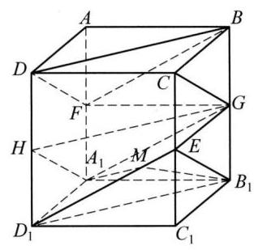

(第 13 题图)

### 10.4 平面与平面的位置关系(2)

$\begin{array}{llll} 1 & \frac{\pi }{3} & 2 & \arccos \frac{1}{3} \end{array}$

3 10 提示:如图,过点 $B$ 作 ${BE}//{AC}$ ,且 ${BE} = {AC} = 6$ ,连接 ${CE}\text{ 、 }{DE}$ ,则 $\angle {DBE} = {60}^{ \circ  }$ ,又 ${BD} = \; {BE} = 6$ ，所以 $\bigtriangleup  {BDE}$ 为等边三角形，所以 ${DE} = 6$ ，则四边形 ${ABEC}$ 为矩形，即 ${CE} = {AB}$ ，由 ${AC}\bot {AB}$ ， 则 ${EB} \bot  {AB}$ ,又 ${BD} \bot  {AB}$ ,且 ${BD} \cap  {EB} = B$ ,所以 ${AB} \bot$ 平面 ${BDE}$ ,所以 ${CE} \bot$ 平面 ${BDE}$ ,又 ${DE} \subset$ 平面 ${BDE}$ ,所以 ${CE} \bot  {DE}$ ,则由勾股定理得 ${CD} = \sqrt{C{E}^{2} + D{E}^{2}} = \sqrt{{8}^{2} + {6}^{2}} = {10}$ 。

(第 13 题图)

$4\;\frac{\sqrt{3}}{2}a\;5\;\frac{3\sqrt{7}}{7}\;6\;{20}\;7\;D\;8\;A\;9\;A$

10(1)证明:因为 ${D}_{1}D \bot$ 平面 ${ABCD},{AC} \subset$ 平面 ${ABCD}$ ，所以 ${D}_{1}D \bot  {AC}$ ，在正方形 ${ABCD}$ 中, ${AC} \bot  {BD}$ ,又 $D{D}_{1} \cap  {BD} = D, D{D}_{1},{BD} \subset$ 平面 $B{B}_{1}{D}_{1}D$ ,所以 ${AC} \bot$ 平面 $B{B}_{1}{D}_{1}D$ ,因为 ${AC} \subset$ 平面 $A{B}_{1}C$ ,所以平面 $B{B}_{1}{D}_{1}D \bot$ 平面 $A{B}_{1}C$ 。(2)如图,取 ${B}_{1}C$ 的中点 $E$ ,连接 ${AE}\text{ 、 }E{C}_{1}$ 。易知 ${AC} = A{B}_{1} = {B}_{1}C$ ,因为 $E$ 是 ${B}_{1}C$ 的中点,所以 ${AE} \bot  {B}_{1}C$ ,又因为在正方形 $B{B}_{1}{C}_{1}C$ 中,所以 $E{C}_{1} \bot  {B}_{1}C$ ,所以 $\angle {AE}{C}_{1}$ 为二面角 $A - {B}_{1}C - {C}_{1}$ 的平面角。设正方体的棱长为 2,所以 ${AC} = A{B}_{1} = {B}_{1}C = 2\sqrt{2},{C}_{1}E = \sqrt{2},{AE} = \sqrt{6}, A{C}_{1} = 2\sqrt{3}$ 。由余弦定理有 $\cos \angle {AE}{C}_{1} = \frac{A{E}^{2} + E{C}_{1}^{2} - A{C}_{1}^{2}}{{2AE} \times  E{C}_{1}} = \frac{6 + 2 - {12}}{2 \times  \sqrt{6} \times  \sqrt{2}} =  - \frac{\sqrt{3}}{3}$  。

(第 10 题图)

(第 11 题图)

11 (1) 因为 $\angle {SAB} = \angle {SAC} = {90}^{ \circ  }$ ,所以 ${SA} \bot  {AB},{SA} \bot  {AC}$ ,又 ${AB} \cap  {AC} = A,{AB},{AC} \subset$ 平面 ${ABC}$ ,所以 ${SA} \bot$ 平面 ${ABC}$ ,又 ${BC} \subset$ 平面 ${ABC}$ ,所以 ${SA} \bot  {BC}$ ,又 ${AB} \bot  {BC},{SA} \cap  {AB} = A$ , ${SA},{AB} \subset$ 平面 ${SAB}$ ,所以 ${BC} \bot$ 平面 ${SAB}$ ,又 ${BC} \subset$ 平面 ${SBC}$ ,所以平面 ${SBC} \bot$ 平面 ${SAB}$ 。

(2)取 ${SB}$ 的中点 $D$ ，连接 ${AD}$ ，则 ${AD} \bot  {SB}$ ，垂足为点 $D$ ，由(1)知平面 ${SBC} \bot$ 平面 $S{AB}$ ，平面 ${SBC} \; \cap$ 平面 ${SAB} = {SB},{AD} \subset$ 平面 ${SAB}$ ,所以 ${AD} \bot$ 平面 ${SBC}\text{ 。 }{SC} \subset$ 平面 ${SBC},{AD} \bot  {SC}$ ,作 ${AE} \bot \; {SC}$ ,垂足为点 $E$ ,连接 ${DE},{AE} \cap  {AD} = A,{AE},{AD} \subset$ 平面 ${ADE}$ ,所以 ${SC} \bot$ 平面 ${ADE},{DE} \subset$ 平面 ${ADE}$ ,则 ${DE} \bot  {SC}$ ,则 $\angle {AED}$ 为二面角 $A - {SC} - B$ 的平面角。设 ${SA} = {AB} = 2$ ,则 ${SB} = {BC} = \; 2\sqrt{2},{AD} = \sqrt{2},{AC} = 2\sqrt{3},{SC} = 4$ 。由题意得 ${AE} = \sqrt{3},\operatorname{Rt} \bigtriangleup  {ADE}$ 中， $\sin \angle {AED} = \frac{AD}{AE} = \frac{\sqrt{2}}{\sqrt{3}} = \; \frac{\sqrt{6}}{3}$ ,所以二面角 $A - {SC} - B$ 的平面角的正弦值为 $\frac{\sqrt{6}}{3}$ 。

12 (1) 证明:由已知可得 ${AE} = {BE} = \sqrt{2}$ 。 ${AB} = 2$ ，在 $\bigtriangleup  {ABE}$ 中，满足 ${A{E}^{2} + B{E}^{2}} = {A{B}^{2}}$ ，所以 ${AE} \bot  {BE}$ ,因为 ${AD} \bot  {BE}$ 。且 ${AD} \cap  {AE} = A,{AD},{AE} \subset$ 平面 ${ADE}$ ,所以 ${BE} \bot$ 平面 ${ADE}$ , 又因为 ${BE} \subset$ 平面 ${ABCE}$ ,故平面 ${ADE} \bot$ 平面 ${ABCE}$ 。(2)连接 ${AC}$ ,取 ${AE}$ 的中点 $O$ ,连接 ${DO}$ ,所以 ${DO} \bot  {AE}$ ,过 $O$ 作 ${OQ} \bot  {AC}$ 交 ${AC}$ 于点 $Q$ ,连接 ${DQ}$ ,因为平面 ${ADE} \bot$ 平面 ${ABCE}$ , 平面 ${ADE} \cap$ 平面 ${ABCE} = {AE},{AE} \subset$ 平面 ${ABCE}$ ,故 ${DO} \bot$ 平面 ${ABCE}$ ,又 ${AC} \subset$ 平面 ${ABCE}$ ,

(第 12 题图)

所以 ${DO} \bot  {AC}$ ,又 ${DO} \cap  {OQ} = O,{DO},{OQ} \subset$ 平面 ${OQD}$ ,故 ${AC} \bot$ 平面 ${OQD}$ ,又因为 ${DQ} \subset$ 平面 ${OQD}$ ,故 ${AC} \bot  {DQ}$ ,故 $\angle {DQO}$ 就是二面角 $E - {AC} - D$ 的平面角,由上知 ${AE} = \sqrt{2},{EC} = 1$ ,而 ${AC} = \sqrt{{1}^{2} + {2}^{2}} = \sqrt{5}$ ,又因为 $\cos \angle {EAC} = \; \frac{E{A}^{2} + A{C}^{2} - E{C}^{2}}{2 \times  {EA} \times  {AC}} = \frac{3\sqrt{10}}{10}\text{ 。 }{AO} = {DO} = \frac{\sqrt{2}}{2}$ ,所以 ${OQ} = {AO} \times  \sin \angle {EAC} = \frac{\sqrt{2}}{2} \times  \frac{\sqrt{10}}{10} = \frac{\sqrt{5}}{10}$ ,故 ${DQ} = \sqrt{D{O}^{2} + O{Q}^{2}} = \; \sqrt{\frac{11}{20}}$ ,故可得 $\cos \angle {DQO} = \frac{\sqrt{11}}{11}$ 。

13 D 提示: 在平面 $\beta$ 上过点 $A$ 作 ${AE}$ 平行且等于 ${BD}$ ,连接 ${DE}\text{ 、 }{CE}$ ,则 ${DE}$ 平行且等于 ${AB}$ 。易得 $\angle {CAE} = {60}^{ \circ  },{DE} \bot$ 平面 ${CAE}$ ,所以, $C{D}^{2} = C{E}^{2} + D{E}^{2} = \left( {A{C}^{2} + A{E}^{2} - {2AC} \cdot  {AE}\cos \angle {CAE}}\right)  + D{E}^{2} = 4$ ,则 ${CD} = 2$ 。

### 10.4 平面与平面的位置关系(3)

$1\overset{1}{ = }a$ 提示: 过点作 ${EO} \bot  {BC}$ ,垂足为 $O$ ,则 ${EO} \bot$ 平面 ${ABCD}$ ,所以 ${EO}$ 就是点 $E$ 到平面 ${ABCD}$ 的距离,在直角 $\bigtriangleup {EBO}$ 中, 根据二面角的平面角定义可知, $\angle {EBO} = {30}^{ \circ  },{BE} = a$ ，所以 ${EO} = \frac{1}{2}a$ 。即 ${EF}$ 到平面 ${ABCD}$ 的距离为 $\frac{1}{2}a$ 。

$2\;\begin{array}{lllllll} 3 & 3 & \sqrt{7}a & 4 & \frac{\pi }{3} & 5 & \frac{\sqrt{3}}{4} \end{array}$

$6\sqrt{26}$ 提示:将二面角 $\alpha  - l - \beta$ 平摊开来,即为如下图形,当 $A\text{ 、 }M\text{ 、 }C$ 在一条直线上时, ${AM} + {CM}$ 有最小值,最小值为对角线 ${AC}$ ,因为 ${AE} = 2 + 3 = 5,{CE} = {BD} = 1$ ,所以 ${AC} = \sqrt{A{E}^{2} + C{E}^{2}} = \sqrt{26}$ 。

7 C 提示:如图所示,连接 ${A}_{1}B,{A}_{1}{D}_{1}//{BC}$ ,故 ${A}_{1}\text{ 、 }{D}_{1}\text{ 、 }B\text{ 、 }C$ 四点共面,故平面 ${A}_{1}C{D}_{1}$ 和平面 ${ABCD}$ 的交线为 ${BC}$ , ${BC} \bot$ 平面 ${AB}{B}_{1}{A}_{1},{A}_{1}B \subset$ 平面 ${AB}{B}_{1}{A}_{1}$ ,故 ${BC} \bot  {A}_{1}B$ ,又 ${AB} \bot  {BC},{AB} \subset$ 平面 ${ABCD},{A}_{1}B \subset$ 平面 ${A}_{1}{BC}{D}_{1}$ ,故二面角 ${D}_{1} - l - A$ 的大小为 $\angle {AB}{A}_{1} = {60}^{ \circ  }, a = \sqrt{3}$ 。

(第 6 题图)

(第 7 题图)

(第 6 题图)

8 B 提示:在越野车行驶方向上任取不同于 $D$ 的点 $E$ ，作 ${EO}$ 垂直于过 ${AD}$ 的水平面，垂足为 $O$ ，再作 ${OF}\bot {AD}$ 于 $F$ ，连接 ${EF}\text{ 、 }{OD}$ ,如图,于是 ${EO}\bot {AD}$ ,而 ${{EO} \cap  {OF}} = O,{EO},{OF} \subset$ 平面 ${EOF}$ ,则 ${AD} \bot$ 平面 ${EOF}$ ,又 ${EF} \subset$ 平面 ${EOF}$ ,因此 ${EF} \bot  {AD},\angle {EFO}$ 是斜面 ${ABCD}$ 与过 ${AD}$ 的水平面所成二面角的平面角， $\tan \angle {EFO} = 1$ ，即 $\angle {EFO} = {45}^{ \circ  }$ ，因为越野车的最大爬坡度数是 ${30}^{ \circ  }$ ,即直线 ${DE}$ 与过 ${AD}$ 的水平面所成角 $\angle {EDO}$ 的最大值为 ${30}^{ \circ  }$ ,令 ${DE} = s$ ,在 $\operatorname{Rt}\bigtriangleup {DOE}$ 中, ${EO}$ 的最大值为 $\frac{1}{2}s$ ，在 $\operatorname{Rt} \bigtriangleup  {EOF}$ 中， ${EF}$ 的最大值为 $\frac{\sqrt{2}}{2}s$ ，在 $\operatorname{Rt} \bigtriangleup  {DEF}$ 中， $\sin \angle {EDA} = \frac{EF}{DE} \leq  \frac{\sqrt{2}}{2}$ ，而正弦函数 $y = \sin x$ 在 $\left( {0,\frac{\pi }{2}}\right)$ 上单调递增,因此 $\angle {EDA}$ 的最大值为 ${45}^{ \circ  }$ ,所以行驶方向 ${DE}$ 与直线 ${AD}$ 的最大夹角的度数为 ${45}^{ \circ  },\mathrm{B}$ 正确。

9 D

10 如图所示,设 ${AC}$ 为坡脚线, ${SA}$ 为公路线, ${SB} \bot$ 水平面,作 ${BC} \bot  {AC}$ ,连接 ${SC}$ ,因为 ${SB} \bot$ 平面 ${ABC}$ ,则 ${SB} \bot  {AC}$ ,又 ${BC} \cap  {SB} = B$ ,所以 ${AC} \bot$ 平面 ${SBC}$ ,则 ${AC} \bot  {SC}$ ,所以 $\angle {SCB}$ 是平面 ${SAC}$ 与平面 ${ABC}$ 所成的角,由题意得: $\angle {SCB} = {30}^{ \circ  },\angle {SAC} = {15}^{ \circ  },{SA} = {1000}$ 米,则 ${SC} = {SA}$ . $\sin \angle {SAC} = {1000} \times  \frac{\sqrt{6} - \sqrt{2}}{4} = {250}\left( {\sqrt{6} - \sqrt{2}}\right)$ 米, ${SB} = {SC} \cdot  \sin \angle {SCB} = {125}\left( {\sqrt{6} - \sqrt{2}}\right)$ 米,故每公里路基升高 ${125}\left( {\sqrt{6} - \sqrt{2}}\right)$ 米。

(第 10 题图)

11 以 ${DB}\text{ 、 }{DC}$ 为邻边作平行四边形 ${BDCE}$ ,连接 ${AE}\text{ 、 }{AB}$ ,如图所示。因为四边形 ${BDCE}$ 为平行四边形,则 ${CE}//{BD}$ 且 ${CE} = {BD} = 1,{BE} = {CD} = \sqrt{3},{BE}//{CD}$ ,因为 ${BD} \bot  l$ ,则 ${CE} \bot  l$ ,又因为 ${AC} \bot  l$ ,所以,二面角 $\alpha  - l - \beta$ 的平面角为 $\angle {ACE} = {60}^{ \circ  }$ ,因为 ${AC} = {CE} = 1$ ,故 $\bigtriangleup {ACE}$ 为等边三角形,所以 ${AE} = 1$ ,因为 ${AC} \bot  {CD},{CE} \bot  {CD}$ ,则 ${BE} \bot  {AC},{BE} \bot  {CE}$ ,因为 ${AC} \cap  {CE} = C,{AC}$ 、 ${CE} \subset$ 平面 ${ACE}$ ,所以 ${BE} \bot$ 平面 ${ACE}$ ,因为 ${AE} \subset$ 平面 ${ACE}$ ,所以 ${BE} \bot  {AE}$ ,所以 ${AB} = \; \sqrt{A{E}^{2} + B{E}^{2}} = 2$ 。

(第 11 题图)

12 (1)证明:如图1，取 ${PN}$ 的中点 $E$ ，连接 ${CE}$ 和 ${ME}$ 。因为 $C$ 为 ${PA}$ 的中点，所以 ${CE}//{AN}$ 且 ${CE} = \frac{1}{2}{AN}$ ，因为 ${BM}// \; {AN}$ 且 ${BM} = \frac{1}{2}{AN}$ ,所以 ${BM}//{CE}$ 且 ${BM} = {CE}$ ,所以四边形 ${BMEC}$ 为平行四边形,则 ${BC}//{EM}$ ,因为 ${EM} \subset$ 面 ${PMN},{BC}$ ⊄ 面PMN,所以 BC // 面 PMN 。( 2 )如图 2,作 ${FE}//{AN},{EG} \bot  {NM}$ ，因为 ${{MN} \bot  {FE}},{{MN} \bot  {EG}},{{EF} \cap  {EG} = E}$ ， ${EF},{EG} \subset$ 平面 ${FEG}$ ,所以 ${MN} \bot$ 平面 ${FEG},{FG} \subset$ 平面 ${FEG}$ ,所以 ${MN} \bot  {FG}$ 。所以 $\angle {FGE}$ 为二面角 $F - {MN} - P$ 的平面角,设 ${PE} = a$ ,在 $\bigtriangleup {ANP}$ 中, $\frac{EF}{NA} = \frac{PE}{PN}$ ,所以 ${EF} = {2a}$ ,所以 ${NE} = 1 - a$ ,作 ${PO} \bot  {NM}$ 于点 $O$ ,在 $\bigtriangleup {NOP}$ 中,由 $\frac{NE}{NP} = \frac{EG}{PO}$ 得 ${EG} = \frac{\sqrt{3}\left( {1 - a}\right) }{2}$ ,由已知 $\cos \angle {FGE} = \frac{\sqrt{201}}{67}$ 得 $\tan \angle {FGE} = \frac{8}{\sqrt{3}}$ ,在直角三角形 ${FEG}$ 中, $\tan \angle {FGE} = \frac{EF}{EG} = \frac{2a}{\frac{\sqrt{3}\left( {1 - a}\right) }{2}} = \; \frac{8}{\sqrt{3}}$ ,所以 $a = \frac{2}{3}$ ,在直角三角形 ${ANP}$ 中, ${AP} = \sqrt{1 + 4} = \sqrt{5}$ ,由 $\frac{PF}{PA} = \frac{PE}{PN} = \frac{2}{3}$ ,得 ${PF} = \frac{2\sqrt{5}}{3}$ 。

图 1 图 2

(第 12 题图)

13 ( 1 )如图 1，作 ${CM} \bot  {EF}$ ，垂足为 $M$ ，连接 ${C}_{1}M$ ，作 ${CH} \bot  M{C}_{1}$ 于 $H$ ， $C{C}_{1} \bot$ 平面 ${ABCD}$ ， ${EF} \subset$ 平面 ${ABCD}$ ，故 ${C{C}_{1}} \bot \; {EF},{CM} \bot  {EF},{CM} \cap  C{C}_{1} = C,{CM}, C{C}_{1} \subset$ 平面 ${MC}{C}_{1}$ ,故 ${EF} \bot$ 平面 ${MC}{C}_{1}, M{C}_{1} \subset$ 平面 ${MC}{C}_{1}$ ,故 ${C}_{1}M \bot  {EF},\angle {C}_{1}{MC}$ 是二面角 ${C}_{1} - {EF} - C$ 的平面角, ${CH} \subset$ 平面 ${MC}{C}_{1}$ ,故 ${EF} \bot  {CH},{CH} \bot  M{C}_{1},{EF} \cap  M{C}_{1} = M,{EF}, M{C}_{1} \subset$ 平面 ${EF}{C}_{1}$ , 故 ${CH} \bot$ 平面 ${EF}{C}_{1},\angle C{C}_{1}M$ 是直线 $C{C}_{1}$ 与平面 ${C}_{1}{EF}$ 所成的角, $\bigtriangleup {C}_{1}{CM}$ 是直角三角形,由已知 $\angle C{C}_{1}M = \frac{\pi }{6}$ ,所以 $\angle {C}_{1}{MC} = \frac{\pi }{3}\text{ 。 }\;$ (2) 在 $\bigtriangleup {CEF}$ 中, ${CM} = \sqrt{3},{EF} = {2CM} = 2\sqrt{3}$ 。 (3)如图2，连接 ${AC}$ 交 ${BD}$ 于点 $O$ ，连接 ${A}_{1}O$ 、 ${C}_{1}O$ ， 在 $\bigtriangleup D{C}_{1}B$ 中, ${C}_{1}O \bot  {DB}$ ,在 $\bigtriangleup {A}_{1}{DB}$ 中, ${A}_{1}O \bot  {DB}$ ,故 $\angle {A}_{1}O{C}_{1}$ 即为二面角 ${C}_{1} - {BD} - {A}_{1}$ 的一个平面角,在 $\bigtriangleup {A}_{1}O{C}_{1}$ 中, ${A}_{1}O = {C}_{1}O = \frac{3\sqrt{6}}{2},{A}_{1}{C}_{1} = 3\sqrt{2},\cos \angle {A}_{1}O{C}_{1} = \frac{{A}_{1}{O}^{2} + {C}_{1}{O}^{2} - {A}_{1}{C}_{1}^{2}}{2{A}_{1}O \cdot  {C}_{1}O} = \frac{1}{3}$ ,即二面角 ${C}_{1} - {BD} - {A}_{1}$ 平面角的余弦值为 $\frac{1}{3}$ 。

### 10.5 异面直线间的距离

1 无数

(第 2 题图)

$2\mathrm{{AD}};\mathrm{{AB}}$ 提示: 如图所示,在长方体 $\mathrm{{ABCD}} - {\mathrm{A}}_{1}{\mathrm{\;B}}_{1}{\mathrm{C}}_{1}{\mathrm{D}}_{1}$ 中, $\mathrm{{AD}} \bot  \mathrm{{AB}},\mathrm{{AD}} \bot  \mathrm{D}{\mathrm{D}}_{1}$ ,故 $\mathrm{{AB}}$ 和 $D{D}_{1}$ 的公垂线段是 ${AD}$ 。因为 ${AB} \bot$ 平面 $B{B}_{1}{C}_{1}C, B{C}_{1} \subset$ 平面 $B{B}_{1}{C}_{1}C$ ,所以 ${AB} \bot  B{C}_{1}$ ,又因为 ${AB} \bot  A{A}_{1}$ ,则 $A{A}_{1}$ 和 $B{C}_{1}$ 的公垂线段是 ${AB}$ 。

3 5 提示: 因为在长方体 ${ABCD} - {A}_{1}{B}_{1}{C}_{1}{D}_{1}$ 中, ${BC} \bot$ 面 ${AB}{B}_{1}{A}_{1}$ ,又 ${A}_{1}B \subset$ 面 ${AB}{B}_{1}{A}_{1}$ ,所以 ${BC} \bot  {A}_{1}B$ ; 同理, ${BC} \bot  C{C}_{1}$ ,故 ${BC}$ 是异面直线 ${A}_{1}B$ 和 $C{C}_{1}$ 的公垂线段,且 ${BC} = {AD} = 5$ ,所以异面直线 ${A}_{1}B$ 和 $C{C}_{1}$ 的距离为 5 。

4 $\frac{\sqrt{2}}{2}$ 提示: 由于空间四边形 ${ABCD}$ 的各边与两条对角线的长都为 1,故该几何体为正四面体。如图,当 $P\text{ 、 }Q$ 分别为 ${AB}\text{ 、 }{CD}$ 的中点时,连接 ${AQ}\text{ 、 }{BQ}$ ,则 ${AQ} = {BQ}$ ,所以 ${PQ} \bot  {AB}$ 。同理, ${PQ} \bot \; {CD}$ ,即当 $P\text{ 、 }Q$ 分别为 ${AB}\text{ 、 }{CD}$ 的中点时, ${PQ}$ 为异面直线 ${AB}\text{ 、 }{CD}$ 的公垂线,此时点 $P\text{ 、 }Q$ 的距离最短; 故 ${AQ} = \frac{\sqrt{3}}{2},{AP} = \frac{1}{2}$ ,所以 ${PQ} = \sqrt{A{Q}^{2} - A{P}^{2}} = \sqrt{\frac{3}{4} - \frac{1}{4}} = \frac{\sqrt{2}}{2}$ 。

(第 4 题图)

5 $\frac{1}{2}$ 提示: 由 ${CD}\bot {AD},{CD}\bot {DE}$ 知 $\angle {ADE}$ 是二面角 $A - {CD} - E$ 的平面角，因此 $\angle {ADE} = \frac{2\pi }{3}$ ， 且因为 ${AD} \cap  {DE} = D,{AD},{DE} \subset$ 平面 ${ADE}$ ,所以 ${CD} \bot$ 平面 ${ADE}$ ,过 $D$ 作 ${DH} \bot  {AE}$ 于 $H$ ,则 ${CD} \bot  {DH}$ ,所以 ${DH}$ 是异面直线 ${AE}$ 和 ${CD}$ 的公垂线, ${DH}$ 的长即为异面直线 ${AE}$ 和 ${CD}$ 之间的距离。 $\bigtriangleup {ADE}$ 中, ${AD} = {DE} =$ 1, $\angle {ADE} = \frac{2\pi }{3}$ ，则 $\angle {EAD} = \angle {AED} = \frac{\pi }{6}$ ， ${DH} = \frac{1}{2}{AD} = \frac{1}{2}$ ，所以异面直线 ${AE}$ 和 ${CD}$ 之间的距离为 $\frac{1}{2}$ 。

(第 6 题图)

${63}\sqrt{14}$ 提示: 将四面体 ${SABC}$ 补成长方体 ${SDBG} - {EAFC}$ ,连接 ${DE}$ 交 ${AS}$ 于点 $M$ ,连接 ${FG}$ 交 ${BC}$ 于点 $N$ ,连接 ${MN}$ ,则 $M\text{ 、 }N$ 分别为 ${DE}\text{ 、 }{BC}$ 的中点,由已知可得

$\left\{  \begin{array}{l} S{A}^{2} = S{D}^{2} + S{E}^{2} = {169}, \\  S{B}^{2} = S{D}^{2} + S{G}^{2} = {196},\text{ 可得 }{SG} = 3\sqrt{14},\text{ 因为 }{BD}//{CE}\text{ 且 }{BD} = {CE},\text{ 故四边形 } \\  S{C}^{2} = S{E}^{2} + S{G}^{2} = {225}, \end{array}\right.$

${BDEC}$ 为平行四边形,则 ${BC}//{DE}$ 且 ${BC} = {DE}$ ,又因为 $M\text{ 、 }N$ 分别为 ${DE}\text{ 、 }{BC}$ 的中点,所以, ${DM}//{BN}$ 且 ${DM} = {BN}$ ,故四边形 ${BDMN}$ 为平行四边形,故 ${MN}//{BD}$ 且 ${MN} = {BD} = \; {SG} = 3\sqrt{14}$ ,因为 ${BD} \bot$ 平面 ${SDAE},{AS} \subset$ 平面 ${SDAE}$ ,所以 ${BD} \bot  {AS}$ ,即 ${MN} \bot  {AS}$ ,同理可得 ${MN} \bot  {BC}$ ,故异面直线 ${AS}$ 与 ${BC}$ 的距离为 ${MN} = 3\sqrt{14}$ 。

7 B 提示: 如图 1, $a\text{ 、 }b$ 是异面直线,过 $a$ 上一点 $P$ 作直线 $d//b$ ,则 $a\text{ 、 }d$ 相交,设 $a\text{ 、 }d$ 确定的平面为 $\alpha$ ,当直线 $c$ 与平面 $\alpha$ 垂直时,则直线 $c$ 与 $a\text{ 、 }d$ 都垂直,从而 $c$ 也与 $b$ 垂直,因此有与异面直线 $a\text{ 、 }b$ 都垂直的直线; 过 $a$ 与直线 $b$ 平行的平面 $\alpha$ 是唯一的,如图 2,设 $d$ 是 $b$ 在平面 $\alpha$ 内的射影, $b\text{ 、 }d$ 在平面 $\beta$ 内 (即 $\beta  \bot  \alpha$ ), $d \cap  a = P, c$ 是过 $P$ 点的直线,因此 $c \in  \beta$ ,从而 $c$ 与 $b$ 相交,直线 $c$ 是与 $a\text{ 、 }b$ 既垂直又相交的直线; 如图 3,若与 $a\text{ 、 }b$ 既垂直又相交的直线有两条,为 $c\text{ 、 }e\text{ 、 }c\text{ 、 }e$ 不可能平行 (否则 $a$ 、 $b$ 共面),若 $c\text{ 、 }e$ 不相交,过 $c$ 与 $b$ 的交点 $Q$ 作直线 $f//e, f\text{ 、 }c$ 相交,由 $f\text{ 、 }c$ 确定的平面为 $\gamma$ (图中未画出) (若 $c\text{ 、 }e$ 相交,则平面 $\gamma$ 就是由 $c\text{ 、 }e$ 确定的平面),可得 $a\text{ 、 }b$ 与平面 $\gamma$ 都垂直,从而 $a//b$ ,这是不可能的,因此与 $a\text{ 、 }b$ 既垂直又相交的直线只有一条。

$c$

$\alpha /$

$a$

图 1 图 2 图 3

(第 7 题图)

8 C 提示: ① 错误; $a\text{ 、 }b$ 是异面直线, ${PQ}$ 是它们的公垂线段,如图 $1, a \subset  \alpha , b//\alpha$ ,则 ${PQ} \bot  \alpha , Q$ 点到平面 $\alpha$ 上点的距离的最小值是 ${QP}$ ,因此 $Q$ 点到直线 $a$ 的上点的距离都不小于 ${PQ}$ ,而 $b$ 上异于 $Q$ 的点 $M$ 到直线 $a$ 上点的连线都不可能与 $a\text{ 、 }b$ 同时垂直，也即不可能与平面 $\alpha$ 垂直，这些线段是平面 $\alpha$ 的斜线段，而 $M$ 到平面 $\alpha$ 的垂线段长等于 ${QP}$ ,因此 ${PQ}$ 是所有这些距离中的最小值，② 正确；如图 2， $a$ 、 $b$ 是异面直线，过 $a$ 上一点 $P$ 作直线 $m//b$ ，则 $a$ 、 $m$ 相交，设 $a$ 、 $m$ 确定的平面为 $\alpha$ ，则 $b//\alpha$ ， 若过 $\alpha$ 还有一个平面 $\beta$ 与 $b$ 平行,直线 $b\text{ 、 }m$ 确定的平面为 $\gamma$ ,则 $\gamma$ 与 $\beta$ 相交,交线设为 $n$ ,则由线面平行的性质定理得 $b//n$ ,从而 $m//n$ ,但 $m\text{ 、 }n$ 是相交直线,矛盾,所以过 $a$ 不可能还有一个平面与 $b$ 平行,即只有一个,③正确。

(第 8 题图)

9 A

${10AD} \bot  {DC},{AD} \bot  {BC},{DC} \cap  {BC} = C,{DC},{BC} \subset$ 平面 ${BCD}$ ,所以 ${AD} \bot$ 平面 ${BCD}$ ,又 ${BD} \subset$ 平面 ${BCD}$ ,则 ${AD} \bot  {BD}$ , ${BD} = \sqrt{A{B}^{2} - A{D}^{2}} = \sqrt{7}$ ,同理,由 ${AD} \bot  {BC},{AB} \bot  {BC},{AB} \cap  {AD} = A,{AB},{AD} \subset$ 平面 ${ABD}$ ,得 ${BC} \bot$ 平面 ${ABD},{BD}$ 二平面 ${ABD}$ ,所以 ${BC} \bot  {BD}$ ,所以 ${BD}$ 是异面直线 ${AD}$ 和 ${BC}$ 的公垂线段,所以异面直线 ${AD}$ 和 ${BC}$ 的距离为 $\sqrt{7}$ 。

11 如图， ${AB} = {AD} = 2, F$ 为 ${BD}$ 的中点，所以 ${AF}\bot {BD},{BC} = {CD} = 3, F$ 为 ${BD}$ 的中点，则 ${CF}\bot {BD}$ ，又 ${BC} = {CE}$ ，因此 ${DE}//{CF}$ ，有 ${BD}\bot {DE}$ ，所以 ${DF}$ 是异面直线 ${AF}$ 和 ${DE}$ 的距离，故它们的距离等于 1 。

(第 11 题图)

(第 12 题图)

12 取 ${BE}$ 的中点 $O$ ,连接 ${A}_{1}O\text{ 、 }{CO}\text{ 、 }{CE}$ 。因为 ${BC} = 2,{AD} = 3,{DE} = 1$ ,所以 ${AE} = {BC} = 2$ ,又因为 ${AD}//{BC}$ ,所以 ${AE}// \; {BC}$ ,所以四边形 ${ABCE}$ 是平行四边形,因为 ${CD} = \sqrt{3},{DE} = 1,{AD} \bot  {CD}$ ,所以 ${CE} = \sqrt{D{E}^{2} + C{D}^{2}} = 2 = {BC}$ ,且 $\angle {DEC} = \; {60}^{ \circ  }$ ,所以平行四边形 ${ABCE}$ 为边长为 2 的菱形,且 $\angle {BAE} = \angle {BCE} = \angle {DEC} = {60}^{ \circ  }$ ,所以 $\bigtriangleup {ABE}$ 和 $\bigtriangleup {BEC}$ 都是正三角形, 所以 ${A}_{1}O \bot  {BE},{CO} \bot  {BE}$ ,又因为 ${A}_{1}O \cap  {CO} = O,{A}_{1}O\text{ 、 }{CO} \subset$ 平面 ${A}_{1}{OC}$ ,所以 ${BE} \bot$ 平面 ${A}_{1}{OC}$ ,过 $O$ 作 ${OH} \bot  {A}_{1}C$ 于点 $H$ ,因为 ${OH} \subset$ 平面 ${A}_{1}{OC}$ ,所以 ${BE} \bot  {OH}$ ,则 ${OH}$ 为异面直线 ${A}_{1}C$ 与 ${BE}$ 的公垂线段,因为平面 ${A}_{1}{BE} \bot$ 平面 ${BCDE}$ ,平面 ${A}_{1}{BE}\bigcap$ 平面 ${BCDE} = {BE},{A}_{1}O \bot  {BE},{A}_{1}O \subset$ 平面 ${A}_{1}{BE}$ ,所以 ${A}_{1}O \bot$ 平面 ${BCDE},{OC} \subset$ 平面 ${BCDE}$ ,则 ${A}_{1}O \bot  {CO}$ , 又因为 ${A}_{1}O = {OC} = \sqrt{3}$ ,所以 $\bigtriangleup {A}_{1}{OC}$ 为等腰直角三角形,所以 ${OH} = \sqrt{3} \cdot  \sin {45}^{ \circ  } = \frac{\sqrt{6}}{2}$ ,即异面直线 ${A}_{1}C$ 与 ${BE}$ 的距离为 $\frac{\sqrt{6}}{2}$ 。 13 异面直线 ${A}_{1}D$ 与 ${B}_{1}{D}_{1}$ 分别在平行平面 ${A}_{1}{BD}$ 和平面 $C{B}_{1}{D}_{1}$ 内,因此求出平行平面 ${A}_{1}{BD}$ 和平面 $C{B}_{1}{D}_{1}$ 的距离即可得。如图,正方体 ${ABCD} - {A}_{1}{B}_{1}{C}_{1}{D}_{1}$ 中, ${A}_{1}{D}_{1}//{BC},{A}_{1}{D}_{1} = {BC}$ , 四边形 ${A}_{1}{D}_{1}{CB}$ 是平行四边形,所以 ${A}_{1}B//C{D}_{1}$ ,同理, ${AC}//{A}_{1}{C}_{1}, F\text{ 、 }E$ 分别是上、下底面对角线的交点, ${A}_{1}E\text{ 、 }{CF}$ 分别与 $A{C}_{1}$ 交于点 $M\text{ 、 }N$ ,连接相应的线段, ${A}_{1}B \text{ ⊄ }$ 平面 $C{B}_{1}{D}_{1}, C{D}_{1} \subset$ 平面 $C{B}_{1}{D}_{1}$ ,所以 ${A}_{1}B//$ 平面 $C{B}_{1}{D}_{1}$ ,同理, ${BD}//$ 平面 $C{B}_{1}{D}_{1}$ ,又 ${A}_{1}B \cap  {BD} = B,{A}_{1}B,{BD} \subset$ 平面 ${A}_{1}{BD}$ ,所以平面 ${A}_{1}{BD}//$ 平面 $C{B}_{1}{D}_{1}$ ,由于 ${A}_{1}F$ 与 ${CE}$ 平行且相等,因此四边形 ${A}_{1}{FCE}$ 是平行四边形,所以 ${A}_{1}E//{CF}$ ,而 $E\text{ 、 }F$ 分别是 ${AC}\text{ 、 }{A}_{1}{C}_{1}$ 的中点,因此 ${AM} = {MN} = N{C}_{1}$ ,正方体棱长为 4,则对角线 $A{C}_{1} = 4\sqrt{3},{MN} = \frac{1}{3}A{C}_{1} = \frac{4\sqrt{3}}{3}, C{C}_{1} \bot$ 平面 ${ABCD},{AC}$ 是 $A{C}_{1}$ 在平面 ${ABCD}$ 内的射影, ${BD} \bot  {AC},{BD} \subset$ 平面 ${ABCD}$ ,所以 $A{C}_{1} \bot  {BD}$ ,同理, $A{C}_{1} \bot  {A}_{1}B,{A}_{1}B \cap  {BD} = B,{A}_{1}B,{BD} \subset$ 平面 ${A}_{1}{BD}$ ,所以 $A{C}_{1} \bot$ 平面 ${A}_{1}{BD}$ ,所以 $A{C}_{1} \bot$ 平面 $C{B}_{1}{D}_{1}$ ,所以平面 ${A}_{1}{BD}$ 与平面 $C{B}_{1}{D}_{1}$ 的距离为 $\frac{4\sqrt{3}}{3}$ ,而 ${A}_{1}D \subset$ 平面 ${A}_{1}{BD}$ , ${B}_{1}{D}_{1} \subset$ 平面 $C{B}_{1}{D}_{1}$ ,且 ${A}_{1}D$ 与 ${B}_{1}{D}_{1}$ 是异面直线,所以异面直线 ${A}_{1}D$ 与 ${B}_{1}{D}_{1}$ 的距离等于平面 ${A}_{1}{BD}$ 与平面 $C{B}_{1}{D}_{1}$ 的距离, 为 $\frac{4\sqrt{3}}{3}$ 。

(第 13 题图)

## 第 11 章 简单几何体

### 11.1 柱体(1)

1 Q C M C N C P C R 提示:棱柱是凸多面体; 长方体是底面为矩形的直四棱柱; 正四棱柱是底面为正方形的直四棱柱, 亦是长方体; 正方体是侧棱长和底面边长相等的正四棱柱。综上所述, $Q \subset  M \subset  N \subset  P \subset  R$ 。

$2\sqrt{3}a;\sqrt{2}{a}^{2}$

3 ③ 提示:若底面是正方形，有相对的两个侧面是矩形，另外两个侧面是不为矩形的平行四边形，则棱柱为斜棱柱，故①不是;若底面是正方形,有相对的两个侧面垂直于底面,另外两个侧面不垂直于底面,则棱柱为斜棱柱,故②不是;若底面是菱形, 且有一个顶点处的三条棱两两垂直, 则底面为正方形, 侧棱与底面垂直, 此时棱柱为正四棱柱, 反之也成立, 故③是; 若每个侧面都是全等矩形的四棱柱, 其底面可能不是正方形, 故④不是。

4 4

5 2;1 提示:如图,在长方体 ${ABCD} - {A}_{1}{B}_{1}{C}_{1}{D}_{1}$ 中,对角线为 $B{D}_{1}$ ,设 $\left| {AB}\right|  = a,\left| {AD}\right|  = \; b,\left| {A{A}_{1}}\right|  = c$ ,则 ${\left| {D}_{1}B\right| }^{2} = {a}^{2} + {b}^{2} + {c}^{2},{\left| {D}_{1}C\right| }^{2} + {\left| {D}_{1}{B}_{1}\right| }^{2} + {\left| {D}_{1}A\right| }^{2} = 2\left( {{a}^{2} + {b}^{2} + {c}^{2}}\right)$ , 则 $B{D}_{1}$ 与棱 ${AB}\text{ 、 }{BC}\text{ 、 }{B}_{1}B$ 所成的角分别为 $\angle {D}_{1}{BA}\text{ 、 }\angle {D}_{1}{BC}\text{ 、 }\angle {D}_{1}B{B}_{1}$ ,即 $\alpha \text{ 、 }\beta \text{ 、 }\gamma$ 分别为 $\angle {D}_{1}{BA}\text{ 、 }\angle {D}_{1}{BC}\text{ 、 }\angle {D}_{1}B{B}_{1}$ ,所以 ${\sin }^{2}\alpha  + {\sin }^{2}\beta  + {\sin }^{2}\gamma  = \frac{{\left| {D}_{1}A\right| }^{2}}{{\left| {D}_{1}B\right| }^{2}} + \frac{{\left| {D}_{1}C\right| }^{2}}{{\left| {D}_{1}B\right| }^{2}} + \frac{{\left| {D}_{1}{B}_{1}\right| }^{2}}{{\left| {D}_{1}B\right| }^{2}} = \; \frac{{\left| {D}_{1}A\right| }^{2} + {\left| {D}_{1}C\right| }^{2} + {\left| {D}_{1}{B}_{1}\right| }^{2}}{{\left| {D}_{1}B\right| }^{2}} = 2$ 。在长方体中， $B{D}_{1}$ 与面 $B{A}_{1}$ 、面 $B{C}_{1}$ 、面 ${BD}$ 所成角分别为 $\angle {D}_{1}B{A}_{1}$ 、 $\angle {D}_{1}B{C}_{1}$ 、 $\angle {D}_{1}{BD}$ ,即 $\theta \text{ 、 }\varphi \text{ 、 }\psi$ 分别为 $\angle {D}_{1}B{A}_{1}\text{ 、 }\angle {D}_{1}B{C}_{1}\text{ 、 }\angle {D}_{1}{BD}$ ,所以 ${\sin }^{2}\theta  + {\sin }^{2}\varphi  + {\sin }^{2}\psi  = \frac{{\left| {D}_{1}{A}_{1}\right| }^{2}}{{\left| {D}_{1}B\right| }^{2}} + \frac{{\left| {D}_{1}{C}_{1}\right| }^{2}}{{\left| {D}_{1}B\right| }^{2}} + \frac{{\left| {D}_{1}D\right| }^{2}}{{\left| {D}_{1}B\right| }^{2}} = \; \frac{{\left| {D}_{1}{A}_{1}\right| }^{2} + {\left| {D}_{1}{C}_{1}\right| }^{2} + {\left| {D}_{1}D\right| }^{2}}{{\left| {D}_{1}B\right| }^{2}} = 1$  。

(第 5 题图)

6 2 提示:至多有两个平行的侧面是矩形，若存在第三个矩形，则必有两个相交侧面是矩形，此时侧棱垂直于底面，则棱柱为直棱柱。

7 D 提示: 由长方体的底面是矩形且侧棱与底面垂直可知,长方体是底面是矩形的直棱柱。

8 B 提示: 在平面 ${B}_{1}{C}_{1}{CB}$ 上,设 $E$ 关于 ${B}_{1}C$ 的对称点为 $M$ ,根据正方形的性质可知 ${CM} = 1, E$ 关于 ${B}_{1}{C}_{1}$ 的对称点为 $N$ , ${C}_{1}E = {C}_{1}N = {CE} = 1$ 。如图,连接 ${MN}$ ,当 ${MN}$ 与 ${B}_{1}{C}_{1}$ 的交点为 $P$ ,与 ${B}_{1}C$ 的交点为 $Q$ 时, ${MN}$ 是 $\bigtriangleup {PEQ}$ 周长的最小值, ${CM} = 1,{CN} = 3,{MN} = \sqrt{{1}^{2} + {3}^{2}} = \sqrt{10}$ ,所以 $\bigtriangleup {PEQ}$ 周长的最小值为 $\sqrt{10}$ 。

9 B 提示:如图,在正三棱柱 ${ABC} - {A}_{1}{B}_{1}{C}_{1}$ 中,延长 ${AF}$ 与 $C{C}_{1}$ 的延长线交于 $M$ ,连接 ${EM}$ 交 ${B}_{1}{C}_{1}$ 于 $P$ ,连接 ${FP}$ ,则四边形 ${AEPF}$ 为所求截面。过 $E$ 作 ${EN}$ 平行于 ${BC}$ 交 $C{C}_{1}$ 于 $N$ ,则 $N$ 为线段 $C{C}_{1}$ 的中点,由 $\bigtriangleup {MF}{C}_{1} \backsim  \bigtriangleup {MAC}$ 可得 $M{C}_{1} = 2$ ,由 $\bigtriangleup {MP}{C}_{1} \backsim  \bigtriangleup {MEN}$ 可得 $\frac{P{C}_{1}}{2} = \frac{2}{3} \Rightarrow  P{C}_{1} = \frac{4}{3}$ ,则 ${B}_{1}P = \frac{2}{3}$ ,在 $\operatorname{Rt}\bigtriangleup A{A}_{1}F$ 中, $A{A}_{1} = 2,{A}_{1}F = 1$ ,则 ${AF} = \sqrt{{2}^{2} + {1}^{2}} = \; \sqrt{5}$ ,在 $\operatorname{Rt}\bigtriangleup {ABE}$ 中, ${AB} = 2,{BE} = 1$ ,则 ${AE} = \sqrt{{2}^{2} + {1}^{2}} = \sqrt{5}$ ,在 $\operatorname{Rt}\bigtriangleup {B}_{1}{EP}$ 中, ${B}_{1}E = 1,{B}_{1}P = \frac{2}{3}$ ,则 ${PE} = \; \sqrt{{1}^{2} + {\left( \frac{2}{3}\right) }^{2}} = \frac{\sqrt{13}}{3}$ ,在 $\bigtriangleup {C}_{1}{FP}$ 中, ${C}_{1}F = 1,{C}_{1}P = \frac{4}{3},\angle F{C}_{1}P = {60}^{ \circ  }$ ,由余弦定理得 $P{F}^{2} = {1}^{2} + {\left( \frac{4}{3}\right) }^{2} - 2 \times  1 \times  \frac{4}{3} \times \; \cos {60}^{ \circ  } = \frac{13}{9}$ ,则 ${PF} = \frac{\sqrt{13}}{3}$ ,所以截面周长为: $\sqrt{5} + \sqrt{5} + \frac{\sqrt{13}}{3} + \frac{\sqrt{13}}{3} = 2\sqrt{5} + \frac{2\sqrt{13}}{3}$ 。

(第 8 题图)

(第 9 题图)

(第 10 题图)

10 (1)证明:因为点 $D$ 、 ${D}_{1}$ 分别是棱 ${AC}$ 、 ${A}_{1}{C}_{1}$ 的中点，所以 $D{D}_{1}//C{C}_{1}$ ，因为 $C{C}_{1}//B{B}_{1}$ ，所以 $D{D}_{1}//B{B}_{1}$ ，所以 $D{D}_{1}$ . ${B}_{1}\text{ 、 }{D}_{1}$ 四点共面。(2)作 ${C}_{1}F \bot  {B}_{1}{D}_{1}$ ，垂足为 $F$ 。因为 $B{B}_{1} \bot$ 平面 ${A}_{1}{B}_{1}{C}_{1},{C}_{1}F \subset$ 平面 ${A}_{1}{B}_{1}{C}_{1}$ ，所以直线 $B{B}_{1} \bot$ 直线 ${C}_{1}F$ 。因为 ${C}_{1}F \bot$ 直线 ${B}_{1}{D}_{1}$ 且 $B{B}_{1}$ 与 ${B}_{1}{D}_{1}$ 相交于 ${B}_{1}$ ,所以直线 ${C}_{1}F \bot$ 平面 ${DB}{B}_{1}{D}_{1}$ ,所以 $\angle {C}_{1}{BF}$ 即为直线 $B{C}_{1}$ 与平面 ${DB}{B}_{1}{D}_{1}$ 所成的角。在直角 $\bigtriangleup {C}_{1}{BF}$ 中, $B{C}_{1} = 2\sqrt{2},{C}_{1}F = \frac{2\sqrt{5}}{5},\sin \angle {C}_{1}{BF} = \frac{\sqrt{10}}{10}$ ,直线 $B{C}_{1}$ 与平面 ${DB}{B}_{1}{D}_{1}$ 所成的角为 $\arcsin \frac{\sqrt{10}}{10}$ 。

11 (1) 在正三棱柱 ${ABC} - {A}_{1}{B}_{1}{C}_{1}$ 中,各棱长均为 4,而 $M$ 是正 $\bigtriangleup {ABC}$ 边 ${BC}$ 的中点,则 ${AM} \bot  {BC}$ ,而 $B{B}_{1} \bot$ 平面 ${ABC}$ , ${AM} \subset$ 平面 ${ABC}$ ,于是得 ${AM} \bot  B{B}_{1}$ ,又 $B{B}_{1} \cap  {BC} = B, B{B}_{1},{BC} \subset$ 平面 ${BC}{C}_{1}{B}_{1}$ ,所以 ${AM} \bot$ 平面 ${BC}{C}_{1}{B}_{1}$ 。(2) 方形 ${BC}{C}_{1}{B}_{1}$ 中, $M\text{ 、 }N$ 分别是 ${BC}\text{ 、 }C{C}_{1}$ 的中点,则 $\tan \angle {CBN} = \frac{CN}{BC} = \frac{1}{2} = \frac{BM}{B{B}_{1}} = \tan \angle B{B}_{1}M$ ,有 $\angle {CBN} = \angle B{B}_{1}M$ , 即 $\angle {CBN} + \angle {BM}{B}_{1} = \angle B{B}_{1}M + \angle {BM}{B}_{1} = {90}^{ \circ  }$ ,则 ${BN} \bot  {B}_{1}M$ ,由 (1) 知, ${AM} \bot$ 平面 ${BC}{C}_{1}{B}_{1},{BN} \subset$ 平面 ${BC}{C}_{1}{B}_{1}$ , 则有 ${BN} \bot  {AM}$ ,而 ${AM} \cap  {B}_{1}M = M,{AM},{B}_{1}M \subset$ 平面 $A{B}_{1}M$ ,因此, ${BN} \bot$ 平面 $A{B}_{1}M$ ,而 $A{B}_{1} \subset$ 平面 $A{B}_{1}M$ ,所以 $A{B}_{1} \bot \; {BN}$ 。

12 (1) $S = 3 \times  4 = {12}$ 。(2)如图，延长 ${PO}$ 交圆于 $C$ ,连接 ${BC}$ ,因为四边形 ${APBC}$ 的对角线互相平分,所以四边形 ${APBC}$ 为平行四边形,则 ${AP}//{BC}$ ,异面直线 ${A}_{1}B$ 与 ${AP}$ 所成角即 ${A}_{1}B$ 与 ${BC}$ 所成角。在 $\bigtriangleup {A}_{1}{CB}$ 中, ${A}_{1}C = \sqrt{13},{CB} = 2\sqrt{3},{A}_{1}B = 5$ ; $\cos \angle {A}_{1}{BC} = \frac{{A}_{1}{B}^{2} + C{B}^{2} - {A}_{1}{C}^{2}}{2{A}_{1}B \cdot  {CB}} = \; \frac{2\sqrt{3}}{5}$ ，所以 $\angle {A}_{1}{BC} = \arccos \frac{2\sqrt{3}}{5}$ 。即异面直线 ${A}_{1}B$ 与 ${AP}$ 所成角为 $\arccos \frac{2\sqrt{3}}{5}$ 。(3)将圆柱的侧面沿母线 $A{A}_{1}$ 剪开，并展开在一个平面上，求得绳长的最小值为圆柱侧面展开后 ${AB}{B}_{1}{A}_{1}$ 所成矩形的对角线，即 $\sqrt{9 + 4{\pi }^{2}}$ 。

(第 12 题图)

13 数学模型 I :能铺满平面的正多边形有哪些? 在周长 $l$ 一定的情况下，哪种面积最大? 数学模型 I 的求解:由于正 $n$ 边形的每一个内角都等于 $\left( \frac{n - 2}{n}\right)  \cdot  {180}^{ \circ  }$ ,要将平面铺满,则有: $k \cdot  \left( \frac{n - 2}{n}\right)  \cdot  {180}^{ \circ  } = {360}^{ \circ  }$ ,解得 $k = 2 + \frac{4}{n - 2}, k \in  {\mathbf{N}}_{ + }$ ,故 $n = 3$ , 4，6 时，符合要求。当周长 $l$ 一定时，正三角形的面积为 ${S}_{3} = \frac{\sqrt{3}}{36}{l}^{2}$ ；正四边形的面积为 ${S}_{4} = \frac{1}{16}{l}^{2}$ ；正六边形的面积为 ${S}_{6} = \; \frac{\sqrt{3}}{24}{l}^{2}$ 。此时有: ${S}_{3} < {S}_{4} < {S}_{6}$ ,所以正六边形是最佳的设计。数学模型 II : 蜂房口的正六边形及蜂房的容积一定的情况下,问题是底面菱形的各角分别多大时,蜂房的表面积最小? 数学模型 II 求解:假定六棱柱的边长是 1,先求 ${AC}$ 的长度, $\bigtriangleup {ABC}$ 是腰长为 1,夹角为 ${120}^{ \circ  }$ 的等腰三角形。以 ${AC}$ 为对称轴作一个三角形 $\bigtriangleup A{B}^{\prime }C$ (如图 1)。三角形 ${AB}{B}^{\prime }$ 是等边三角形。因此, $\frac{1}{2}{AC} = \sqrt{1 - {\left( \frac{1}{2}\right) }^{2}} = \frac{\sqrt{3}}{2}$ ，即得 ${AC} = \sqrt{3}$ 。把图 2 的表面分成六份，把其中之一摊平下来。从一个宽为 1 的长方形切去一角，切割处成边 ${AP}$ 。以 ${AP}$ 为腰， $\frac{\sqrt{3}}{2}$ 为高作等腰三角形。问题:怎样切才能使所作出的图形的面积最小？假定被切去的三角形的高是 $x$ 。从矩形中所切去的面积等于 $\frac{1}{2}x$ 。现在看所添上的三角形 ${AB}{P}^{\prime }$ 的面积。 ${AP}$ 的长度是 $\sqrt{1 + {x}^{2}}$ ,因此 $P{P}^{\prime }$ 的长度等于 $2\sqrt{1 + {x}^{2} - \frac{3}{4}} = \sqrt{1 + 4{x}^{2}}$ ,因而三角形 ${AP}{P}^{\prime }$ 的面积等于 $\frac{\sqrt{3}}{4}\sqrt{1 + 4{x}^{2}}$ 。问题再变而为求 $- \frac{1}{2}x + \frac{\sqrt{3}}{4}\sqrt{1 + 4{x}^{2}}$ 的最小值的问题。令 $y =  - \frac{1}{2}x + \frac{\sqrt{3}}{4}\sqrt{1 + 4{x}^{2}}$ ,故 $y + \frac{1}{2}x = \frac{\sqrt{3}}{4}\sqrt{1 + 4{x}^{2}}$ ,两边平方,整理得 ${x}^{2} - {2yx} + \frac{3}{8} - 2{y}^{2} = 0$ 。 因为 $x$ 是实数,故二次方程判别式 $\Delta  = 4\left( {{y}^{2} - \frac{3}{8} + 2{y}^{2}}\right)  = 4\left( {3{y}^{2} - \frac{3}{8}}\right)  \geq  0$ , 而 $y$ 必大于 0,因此 $y$ 的最小值为 $\frac{\sqrt{8}}{8}$ ,即 $x = \frac{\sqrt{8}}{8}$ 。当 $x = \frac{\sqrt{8}}{8}$ 时取最小值,即在一棱上过 $x = \frac{\sqrt{8}}{8}$ 处以及与该棱相邻的二棱的端点切下来拼上去的图形的表面积最小。设 $\angle {PA}{P}^{\prime } = \alpha$ ,由余弦定理,并将 $x = \frac{\sqrt{8}}{8}$ 代入可得 $\cos \alpha  = \; \frac{2\left( {{x}^{2} + 1}\right)  - \left( {4{x}^{2} + 1}\right) }{2\left( {{x}^{2} + 1}\right) } = \frac{1 - 2{x}^{2}}{2\left( {{x}^{2} + 1}\right) } = \frac{\frac{3}{8}}{1 + \frac{1}{8}} = \frac{1}{3}$ 。因此得出 $\alpha  = {70}^{ \circ  }{32}^{\prime }$ 。

(第 13 题图)

### 11.1 柱体(2)

1 1 个 提示:命题①符合平行六面体的定义，故命题①是正确的；底面是矩形的平行六面体的侧棱可能与底面不垂直，故命题②是错误的；直四棱柱的底面不一定是平行四边形，故命题③是错误的；故有 1 个真命题。

2 $\frac{3\sqrt{3}}{2}{a}^{2}h$ 提示: $V = 6 \times  \frac{\sqrt{3}}{4} \times  {a}^{2} \times  h = \frac{3\sqrt{3}}{2}{a}^{2}h$ 。

3 13 提示: 由题意可得如下示意图:

(第 3 题图)

即 ${QP}$ 为一个长方体的体对角线，且长方体的长、宽、高分别为12、3、4，所以 ${QP} = \sqrt{{12}^{2} + {3}^{2} + {4}^{2}} = {13}$ 。

${270}\sqrt{3}{\mathrm{\;{cm}}}^{3}$ 或 $\frac{225}{2}\sqrt{3}{\mathrm{\;{cm}}}^{3}$ 提示: 如图,因为正六棱柱最长的一条对角线长为 ${13}\mathrm{\;{cm}}$ ,一个侧面的面积为 ${30}{\mathrm{\;{cm}}}^{2}$ ,设底面边长为 $a\mathrm{\;{cm}}$ ,高为 $h\mathrm{\;{cm}}$ ,则 $\left\{  \begin{array}{l} {ah} = {30}, \\  4{a}^{2} + {h}^{2} = {13}^{2}, \end{array}\right.$ 解得 $\left\{  \begin{array}{l} a = 6, \\  h = 5 \end{array}\right.$ 或 $\left\{  \begin{array}{l} a = \frac{5}{2}, \\  h = {12} \end{array}\right.$ (负值舍去),则这个棱柱的体积 $V = {Sh} = 6 \times  \frac{\sqrt{3}}{4}{a}^{2}h = 6 \times  \frac{\sqrt{3}}{4} \times \; {6}^{2} \times  5 = {270}\sqrt{3}{\mathrm{\;{cm}}}^{3}$ 或 $V = {Sh} = 6 \times  \frac{\sqrt{3}}{4}{a}^{2}h = 6 \times  \frac{\sqrt{3}}{4} \times  {\left( \frac{5}{2}\right) }^{2} \times  {12} = \frac{225}{2}\sqrt{3}{\mathrm{\;{cm}}}^{3}$ ,故棱柱的体积为 ${270}\sqrt{3}{\mathrm{\;{cm}}}^{3}$ 或 $\frac{225}{2}\sqrt{3}{\mathrm{\;{cm}}}^{3}$ 。 ${56}\frac{1}{64}$ 提示: 因为三棱柱的上下底面全等,所以如图所示: 底面边长 $a = {BC} = {AB} + {CD}$ ,又因为 ${AB} = {CD}$ ,而 ${AB} + {BC} + \; {CD} = 1$ ,解得底面边长 $a = \frac{1}{2}$ ,每个小长方形的面积 $= \frac{1}{3}\left( {\frac{\sqrt{3}}{4} - \frac{\sqrt{3}}{8}}\right)  = \frac{\sqrt{3}}{24}$ ,三棱柱的高 $h = \frac{\frac{\sqrt{3}}{24}}{\frac{1}{2}} = \frac{\sqrt{3}}{12}$ ,所以三棱柱的体积 $V = \frac{\sqrt{3}}{16} \times  \frac{\sqrt{3}}{12} = \frac{1}{64}$  。

(第 4 题图)

(第 5 题图)

(第 6 题图 1)

(第 6 题图 2)

$6\frac{3\pi }{2}$ 提示: 若 $O$ 是 ${A}_{1}{C}_{1}$ 的中点,由正方体的性质易知: ${D}_{1}$ 在面 ${AC}{C}_{1}{A}_{1}$ 上的投影为 $O$ ,所以要使面 ${AC}{C}_{1}{A}_{1}$ 上一动点 $P$ 使 ${D}_{1}P \bot  {CP}$ ,只需 ${D}_{1}P$ 在面 ${AC}{C}_{1}{A}_{1}$ 上的射影 ${PO} \bot  {CP}$ 即可,所以 $P$ 轨迹是以 ${OC}$ 为直径的圆,而 ${OC} = \sqrt{6}$ ,所以满足条件的所有点 $P$ 围成的平面区域的面积为 $S = \pi  \cdot  {\left( \frac{OC}{2}\right) }^{2} = \frac{3\pi }{2}$ 。

7 B 提示: 如图,两个斜三棱柱组成一个四棱柱,以斜三棱柱的一个侧面为四棱柱的底面,面积为 $S = {10}$ ,高 $h = {PH} = 3$ ,四棱柱的体积 $V = {10} \times  3 = {30}$ ,则此斜三棱柱的体积为 $\frac{1}{2}V = {15}$ 。

8 A 提示: 设两个圆柱的底面半径和高分别为 ${r}_{1}\text{ 、 }{r}_{2}$ 和 ${h}_{1}\text{ 、 }{h}_{2}$ ,由 $\frac{{S}_{1}}{{S}_{2}} = \frac{9}{4}$ ,得 $\frac{\pi {r}_{1}^{2}}{\pi {r}_{2}^{2}} = \frac{9}{4}$ ,则 $\frac{\pi {r}_{1}^{2}}{\pi {r}_{2}^{2}} = \frac{9}{4}$ ,则 $\frac{{r}_{1}}{{r}_{2}} \; = \frac{3}{2}$ ,由圆柱的侧面积相等,得 ${2\pi }{r}_{1}{h}_{1} = {2\pi }{r}_{2}{h}_{2}$ ,即 ${r}_{1}{h}_{1} = {r}_{2}{h}_{2}$ ,所以 $\frac{{V}_{1}}{{V}_{2}} = \frac{\pi {r}_{1}^{2}{h}_{1}}{\pi {r}_{2}^{2}{h}_{2}} = \frac{{r}_{1}}{{r}_{2}} = \frac{3}{2}$ 。

(第 7 题图)

9 A 提示: 如图,底面正三角形面积 ${S}_{\bigtriangleup {ABC}} = \frac{\sqrt{3}}{4} \times  {2}^{2} = \sqrt{3}$ ,所以 $V = {S}_{\bigtriangleup {ABC}} \cdot  A{A}_{1} = 2\sqrt{2}$ ,得 $A{A}_{1} = \frac{2\sqrt{6}}{3}$ 。过点 ${B}_{2}$ 作 ${B}_{2}H \bot$ 平面 ${ACB}$ ,连接 ${AH}\text{ 、 }{CH}$ ,由旋转以及三角形中心性质可知, ${AH} = {OC} = \frac{2\sqrt{3}}{3}$ ,由题意知, ${B}_{2}H = A{A}_{1} = \frac{2\sqrt{6}}{3}$ ,在 Rt $\bigtriangleup {AH}{B}_{2}$ 中, $A{B}_{2} = \sqrt{A{H}^{2} + {B}_{2}{H}^{2}} =$

2。同理, $A{B}_{2} = {B}_{2}C = {A}_{2}C = {A}_{2}B = {C}_{2}B = {C}_{2}A = 2$ ,所以此多面体为正八面体。对于 $\mathrm{A}$ ,取 ${A}_{2}{B}_{2}$ 的中点 $Q$ ,连接 ${C}_{2}Q$ 、 ${CQ}$ ,由等边三角形性质易得 ${C}_{2}Q \bot  {A}_{2}{B}_{2},{CQ} \bot  {A}_{2}{B}_{2}$ ,又因为 ${C}_{2}Q \subset$ 平面 ${CQ}{C}_{2},{CQ} \subset$ 平面 ${CQ}{C}_{2},{CQ} \cap  {C}_{2}Q = Q$ ,所以 ${A}_{2}{B}_{2} \bot$ 平面 ${CQ}{C}_{2}$ ,又因为 $C{C}_{2} \subset$ 平面 ${CQ}{C}_{2}$ ,所以 ${A}_{2}{B}_{2} \bot  C{C}_{2}$ ,故 $\mathrm{A}$ 正确; 对于 $\mathrm{B}$ ,由已证知, $A{B}_{2} = 2$ ,故 B 错误; 对于 C，由旋转性质易得 ${AB}//{{A}_{2}{B}_{2}}$ ，又 ${AB} = A{B}_{2} = {A}_{2}B = {A}_{2}{B}_{2}$ ，所以四边形 ${AB}{A}_{2}{B}_{2}$ 为菱形，由已知易证 ${A}_{2}{B}_{2}\bot$ 平面 $A{B}_{2}H$ ,得 ${A}_{2}{B}_{2} \bot  A{B}_{2}$ ,所以四边形 ${AB}{A}_{2}{B}_{2}$ 是正方形,故 $\mathrm{C}$ 错误; 对于 $\mathrm{D}$ ,多面体 ${ABC}{A}_{2}{B}_{2}{C}_{2}$ 为正八面体,体积公式 $V = \; \frac{\sqrt{2}}{3}{a}^{3} = \frac{\sqrt{2}}{3} \times  {2}^{3} = \frac{8\sqrt{2}}{3}$ ,正三棱柱 ${ABC} - {A}_{1}{B}_{1}{C}_{1}$ 体积为 $2\sqrt{2}$ ,两体积不同,故 $\mathrm{D}$ 错误。

10 如图，不妨设 $A{A}_{1} = l\sin \alpha ,{AB} = l\sin \beta ,{AD} = l\sin \gamma$ ，所以 $V = {l}^{3}\sin \alpha \sin \beta \sin \gamma$ 。

(第 9 题图)

(第 10 题图)

(第 11 题图)

11 因为 $\bigtriangleup {ABC}$ 为正三角形,且 $A{A}_{1} = B{A}_{1} = C{A}_{1}$ ,所以三棱锥 ${A}_{1} - {ABC}$ 为正三棱锥,如图,设 $O$ 为点 ${A}_{1}$ 在底面 ${ABC}$ 上的投影, $D$ 为 ${BC}$ 边上的中点,则 $O$ 为 $\bigtriangleup {ABC}$ 的中心, ${AO} = \frac{2}{3}{AD} = \frac{\sqrt{3}}{3}a$ ,在 $\bigtriangleup {AB}{A}_{1}$ 中, $\angle {BA}{A}_{1} = {60}^{ \circ  }, A{A}_{1} = {A}_{1}B$ ,则 $\bigtriangleup {AB}{A}_{1}$ 为正三角形,所以 $A{A}_{1} = a$ ,在 Rt $\bigtriangleup {AO}{A}_{1}$ 中, $O{A}_{1} = \sqrt{{a}^{2} - \frac{3}{9}{a}^{2}} = \frac{\sqrt{6}}{3}a$ ,即三棱柱 ${ABC} - {A}_{1}{B}_{1}{C}_{1}$ 的高为 $\frac{\sqrt{6}}{3}a$ , ${S}_{\bigtriangleup {ABC}} = \frac{1}{2}{a}^{2} \cdot  \sin {60}^{ \circ  } = \frac{\sqrt{3}}{4}{a}^{2}$ ,所以三棱柱 ${ABC} - {A}_{1}{B}_{1}{C}_{1}$ 的体积 $V = \frac{\sqrt{3}}{4}{a}^{2} \times  \frac{\sqrt{6}}{3}a = \frac{\sqrt{2}}{4}{a}^{3}$ 。

12 (1)设正四棱柱的底面边长为 $a$ ,圆柱底面半径为 $r$ ,则 ${a}^{2}{h}_{1} = \pi {r}^{2}{h}_{2},{S}_{1} = 2{a}^{2} + {4a}{h}_{1},{S}_{2} = {2\pi }{r}^{2} + {2\pi r}{h}_{2}$ ,因为 ${h}_{1} = {h}_{2} = \; 1,{S}_{1} = {16}$ ,所以 $2{a}^{2} + {4a} = {16}$ ,解得 $a = 2$ ,所以 $\pi {r}^{2} \cdot  1 = 4 \times  1$ ,即 $r = \frac{2}{\sqrt{\pi }}$ 。所以 ${S}_{2} = {2\pi } \times  \frac{4}{\pi } + {2\pi } \times  \frac{2}{\sqrt{\pi }} \cdot  1 = 8 + 4\sqrt{\pi }$ 。

(2)证明:因为 ${h}_{1} = {h}_{2}$ ，所以 ${a}^{2} = \pi {r}^{2},{S}_{1} - {S}_{2} = 2{a}^{2} + {4a}{h}_{1} - \left( {{2\pi }{r}^{2} + {2\pi r}{h}_{2}}\right)  = {4a}{h}_{1} - {2\pi r}{h}_{1} = 2{h}_{1}r\left( {\sqrt{4\pi } - \pi }\right)  > 0$ 。所以 ${S}_{1} > {S}_{2}$ 。(3)因为 $\frac{{h}_{2}}{{h}_{1}} = \lambda$ ，得 ${h}_{2} = \lambda {h}_{1}$ ，则 ${a}^{2} = {\lambda \pi }{r}^{2}, a = \sqrt{\lambda \pi }r$ ，又因为 ${S}_{1} = {S}_{2}$ ，所以 $\left( {\lambda  - 1}\right) {\pi r} = {\pi \lambda }{h}_{1} - 2\sqrt{\pi \lambda }{h}_{1}$ ， $r = \frac{\left( {\sqrt{\pi \lambda } - 2}\right) \sqrt{\pi \lambda }{h}_{1}}{\left( {\lambda  - 1}\right) \pi }$ ,因为 $r > 0$ ,所以 $\frac{\sqrt{\pi \lambda } - 2}{\lambda  - 1} > 0$ ,得 $\left\{  \begin{array}{l} \lambda  > 1, \\  \sqrt{\pi \lambda } > 2 \end{array}\right.$ 或者 $\left\{  \begin{array}{l} \lambda  < 1, \\  \sqrt{\pi \lambda } < 2, \end{array}\right.$ 解得 $\lambda  \in  \left( {0,1}\right)  \cup  \left( {\frac{4}{\pi }, + \infty }\right)$ 。

13 (1)如图 1，过点 $F$ 作 ${FQ} \bot  {BC}$ ，交 ${BC}$ 于 $Q$ ，过点 $C$ 作 ${CM} \bot  {PB}$ ，交 ${FQ}$ 延长线于点 $M$ ，过点 $M$ 作 ${MN}//{PB}$ ,交 ${BC}$ 于 $N$ ,则 $\angle {CFQ} = \alpha$ ,所以题图 2 中圆柱的母线与液面所在平面所成的角为 $\angle {DFC} = \angle {FCQ} = \frac{\pi }{2} - \alpha$ 。(2)如图 1，过 $C$ 作 ${CF}//{BP}$ ，交 ${AD}$ 所在的直线于 $F$ ， 在直角 $\bigtriangleup {CDF}$ 中, $\angle {FCD} = \alpha ,{CD} = {20}\mathrm{\;{cm}},{DF} = {20}\tan \alpha \mathrm{{cm}}$ ,且点 $F$ 在线段 ${AD}$ 上, ${AF} = \; \left( {{30} - {20}\tan \alpha }\right) \mathrm{{cm}}$ ,此时容器内能容纳的溶液量为: $\pi  \times  {10}^{2} \times  {30} - \frac{1}{2}\pi  \times  {10}^{2} \times  {20}\tan \alpha  = \; {100\pi }\left( {{30} - {10}\tan \alpha }\right) {\mathrm{{cm}}}^{3}$ ,而容器内原有溶液量为 $\pi  \times  {10}^{2} \times  {20} = {100\pi } \times  {20}{\mathrm{\;{cm}}}^{3}$ ,令 ${100\pi }({30} - \; {10}\tan \alpha ) \geq  {100\pi } \times  {20}$ ,解得 $\tan \alpha  \leq  1$ ,所以 $\alpha  \leq  {45}^{ \circ  }$ ,即 $\alpha$ 的最大角为 ${45}^{ \circ  }$ 时,溶液不会溢出。(3) 将该圆柱容器放大为底面边长为 ${20}\mathrm{\;{cm}}$ 、高为 ${30}\mathrm{\;{cm}}$ 的正四棱柱,如图 2,当 $\alpha  = {60}^{ \circ  }$ 时,过 $C$ 作 ${CF}//{BP}$ ,交 ${AB}$ 于 $F$ ,在直角 $\bigtriangleup {CBF}$ 中, ${BC} = {30}\mathrm{\;{cm}},\angle {BCF} = {30}^{ \circ  },{BF} = {10}\sqrt{3}\mathrm{\;{cm}}$ ,所以点 $F$ 在线段 ${AB}$ 上，故溶液纵截面为直角 $\bigtriangleup {CBF}$ ，因为 ${S}_{\bigtriangleup {ABF}} = \frac{1}{2} \times  {BC} \times  {BF} = {150}\sqrt{3}{\mathrm{\;{cm}}}^{2}$ ，容器内溶液量为 ${150}\sqrt{3} \times  {20} = {3000}\sqrt{3}{\mathrm{\;{cm}}}^{3}$ ,倒出的溶液量为 $\left( {{8000} - {3000}\sqrt{3}}\right)  < {3000}$ ,所以圆柱容器也不能实现要求。

图 1

图 2

(第 13 题图)

### 11.1 柱体(3)

${1V} = \frac{{a}^{2}\pi }{4h}\;$ 提示: 圆柱的侧面积是 $S = {2\pi rh} = {a\pi }$ ,所以 $r = \frac{a}{2h}$ ,所以体积 $V = {Sh} = \pi {r}^{2} \cdot  h = \frac{{a}^{2}\pi }{4h}$ 。

${212}{a}^{2}$ 提示: 由题意可知正方体的表面积为 $6{a}^{2}$ ; 小正方体的棱长为 $\frac{1}{3}a$ ,小正方体的表面积为 $6 \times  {\left( \frac{1}{3}a\right) }^{2} = \frac{2}{3}{a}^{2},{27}$ 个全等的小正方体的表面积为 ${18}{a}^{2}$ ,表面积增加了 ${12}{a}^{2}$ 。

$3\sqrt{13}\pi$ 提示:因为圆柱形铁管的高为 ${3\pi }$ ，底面半径为 1，铁丝在铁管上缠绕 1 圈，且铁丝的两个端点落在圆柱的同一母线的两端, 则我们可以得到将圆柱侧面展开后的平面图形, 如图所示。其中矩形的宽为圆柱的周长 ${2\pi }$ ,长为圆柱的高 ${3\pi }$ ,则对角线的长即为铁丝的长度的最小值。此时铁丝的长度最小值为 $\sqrt{{\left( 2\pi \right) }^{2} + {\left( 3\pi \right) }^{2}} = \sqrt{13}\pi$  。

(第 3 题图)

(1)5 cm (2) $\sqrt{6}\mathrm{\;{cm}}$ 提示:设长方体的长、宽、高分别为 $a\mathrm{\;{cm}}$ ， $b\mathrm{\;{cm}}$ ， $c\mathrm{\;{cm}}$ 。(1)由题意得 $4(a + b + \; c) = {24}$ ,即 $a + b + c = 6$ (①), ${2ab} + {2bc} + {2ac} = {11}$ (②),由 ① 的平方减去②可得 ${a}^{2} + {b}^{2} + {c}^{2} = {25}$ ,则这个长方体的一条对角线长为 $5\mathrm{\;{cm}}$ 。(2)由 ${ab} = \sqrt{2},{bc} = \sqrt{3},{ca} = \sqrt{6}$ 可得 ${abc} = \sqrt{6}$ 。解得 $a = \sqrt{2}$ ， $b = 1, c = \sqrt{3}$ ,故长方体的对角线长为 $\sqrt{1 + 2 + 3} = \sqrt{6}\mathrm{\;{cm}}$ 。

${52}\sqrt{{Q}^{2} + {2P}{h}^{2}}$ 提示:设长方体的底面长为 $a$ ，宽为 $b$ ，则底面对角线长为 $\sqrt{{a}^{2} + {b}^{2}}$ ，由已知得 ${S}_{\text{ 底 }} = {ab} = P$ ， ${S}_{\text{ 对角面 }} = \; \sqrt{{a}^{2} + {b}^{2}} \cdot  h = Q$ ,所以 ${2ab} \cdot  {h}^{2} = {2P}{h}^{2},\left( {{a}^{2} + {b}^{2}}\right)  \cdot  {h}^{2} = {Q}^{2}$ ,所以 ${\left( a + b\right) }^{2} \cdot  {h}^{2} = {Q}^{2} + {2P}{h}^{2}$ ,所以 ${S}_{\text{ 侧 }} = 2\left( {a + b}\right)  \cdot  h = \; 2\sqrt{{Q}^{2} + {2P}{h}^{2}}$ 。

6. $\left( {\frac{\sqrt{15}}{3}, + \infty }\right)$ 提示:①如图 1，拼成一个三棱柱时，全面积有三种情况。将上下底面对接，重合面的面积为 $\frac{1}{2} \times  {3a} \times  4 \; {4a} = 6{a}^{2}$ 。3a 边合在一起时,重合面的面积为 ${3a} \cdot  \frac{2}{a} = 6$ 。 ${4a}$ 边合在一起时,重合面的面积为 ${4a} \cdot  \frac{2}{a} = 8$ 。②如图 2，拼成一个四棱柱,有四种情况,其中重合面的面积有三种情况,分别为 $6\text{ 、 }8\text{ 、 }{10}$ 。因为全面积最小的是一个三棱柱,则重合面的面积最大的是一个三棱柱,所以 $6{a}^{2} > {10}$ ,解得 $a > \frac{\sqrt{15}}{3}$ ,所以 $a$ 的取值范围为 $\left( {\frac{\sqrt{15}}{3}, + \infty }\right)$ 。

图 1

图 2

(第 6 题图)

7 C

8 C 提示: 由于三棱柱 ${ABC} - {A}_{1}{B}_{1}{C}_{1}$ 的所有棱长均等于 6,所以点 ${A}_{1}$ 在底面内的投影点 $O$ 必定在底部正三角形 ${ABC}$ 的 $\angle {BAC}$ 的角平分线上,所以 ${A}_{1}O \bot$ 平面 ${ABC}$ ,延长 ${AO}$ 交 ${BC}$ 于点 $D, D$ 为 ${BC}$ 的中点,所以 ${AD} \bot  {BC},{A}_{1}O \bot  {BC}$ ,因为 ${AD} \cap  {A}_{1}O = O$ ,所以 ${BC} \bot$ 平面 ${A}_{1}{AO}$ ,又因为 ${A}_{1}A \subset$ 平面 ${A}_{1}{AO}$ ,所以 ${BC} \bot  A{A}_{1}$ ,又因为 $A{A}_{1}//B{B}_{1}$ ,所以 ${BC} \bot  B{B}_{1}$ ,所以矩形 ${B}_{1}{BC}{C}_{1}$ 的面积为 $6 \times  6 = {36}$ 。因为 $\angle {A}_{1}{AB} = \angle {A}_{1}{AC} = {60}^{ \circ  }$ ,所以四边形 ${A}_{1}{AB}{B}_{1}\text{ 、 }{A}_{1}{AC}{C}_{1}$ 的面积为 $\frac{1}{2} \times  6 \times  6 \times  \sin {60}^{ \circ  } \times  2 = {18}\sqrt{3}$ ,所以该三棱柱的侧面积等于 ${18}\sqrt{3} \times  2 + {36} = {36} + {36}\sqrt{3}$ 。

(第 8 题图)

$9\mathrm{C}$ 提示: 如图所示,易知圆柱 $O{O}_{1}$ 的母线与 $A{C}_{1}$ 平行,由正方体的对称性可知 $A{C}_{1}$ 与其每条棱间的夹角都相等,① 正确; 设 $M, N, P, Q, S, R$ 分别为对应棱的中点,易知 $M, N, P$ , $Q, S, R$ 共面,易证 ${PQ} \bot  {AC}, C{C}_{1} \bot  {PQ}$ ,则 ${PQ} \bot$ 平面 ${AC}{C}_{1}, A{C}_{1} \subset$ 平面 ${AC}{C}_{1}$ ,故 ${PQ} \bot \; A{C}_{1}$ ,同理可得 ${RQ} \bot  A{C}_{1}$ ,故 $A{C}_{1} \bot$ 平面 ${MNPQSR}$ ,又圆柱 $O{O}_{1}$ 的底面与 $A{C}_{1}$ 垂直,故平面 MNPQSR 与圆柱 $O{O}_{1}$ 的底面平行,根据正方体的特点可知,平面 MNPQSR 与正方体所有的面的夹角相同，故正方体 ${ABCD} - {A}_{1}{B}_{1}{C}_{1}{D}_{1}$ 所有的面与圆柱 $O{O}_{1}$ 的底面所成的角都相等，② 正确; 此时截面 ${MNPQSR}$ 的面积为 ${S}_{1} = \frac{1}{2} \times  \frac{\sqrt{2}}{2} \times  \frac{\sqrt{2}}{2} \times  \frac{\sqrt{3}}{2} \times  6 = \frac{3\sqrt{3}}{4} > \frac{\sqrt{3}}{2}$ ,③错误; 设圆柱底面半径为 $r$ ,则圆柱的底面必与过 $A$ 点的三个面相切,且切点分别在线段 ${AC}\text{ 、 }A{B}_{1}\text{ 、 }A{D}_{1}$ 上,设在 ${AC}$ 上的切点为 $E,{EF}$ 为圆柱的一条高,根据对称性知: $A{O}_{1} = {C}_{1}{O}_{2} = \sqrt{2}r$ ,则圆柱的高为 $h = \sqrt{3} - 2\sqrt{2}r, S = {2\pi r} \cdot \; \left( {\sqrt{3} - 2\sqrt{2}r}\right)  = \frac{\pi }{\sqrt{2}} \cdot  2\sqrt{2}r \cdot  \left( {\sqrt{3} - 2\sqrt{2}r}\right)  \leq  \frac{\pi }{\sqrt{2}}{\left( \frac{\sqrt{3} - 2\sqrt{2}r + 2\sqrt{2}r}{2}\right) }^{2} = \frac{3\sqrt{2}\pi }{8}$ ,当 $2\sqrt{2}r = \sqrt{3} - 2\sqrt{2}r$ ,即 $r = \frac{\sqrt{6}}{8}$ 时等号成立, ④正确。

(第 9 题图)

10 易知: ${AB} \bot  {AC}$ ，因为 ${AB} = 4,{AC} = {2\sqrt{2}}$ ，所以 ${BC} = \sqrt{A{B}^{2} + A{C}^{2}} = {2\sqrt{6}}$ ，即 $r = \sqrt{6}$ ，因为 $A{A}_{1} = 3$ ，所以圆柱的侧面积 $S = {2\pi rl} = {2\pi } \times  \sqrt{6} \times  3 = 6\sqrt{6}\pi$ ,圆柱的表面积 ${S}_{\text{ 表 }} = {2\pi rl} + {2\pi }{r}^{2} = 6\sqrt{6}\pi  + {12\pi }$ 。

11 如图，取 ${BC}$ 中点 $M$ ，连接 ${AM}$ 、 ${DM}$ 。如图所示，因为 $\bigtriangleup  {ABC}$ 为正三角形， $\bigtriangleup  {DBC}$ 为等腰三角形且以 ${BC}$ 为底,故 ${AM} \bot  {BC},{DM} \bot  {BC}$ (三线合一),所以 ${BC} \bot$ 平面 ${ADM}$ 。又 ${BC} \subset$ 平面 ${ABC}$ ,所以平面 ${ADM} \bot$ 平面 ${ABC}$ ,故 ${AD}$ 在平面 ${ABC}$ 的射影在射线 ${AM}$ 上, $\angle {DAM}$ 为侧棱 ${AD}$ 与底面 ${ABC}$ 所成角,即 $\angle {DAM} = {60}^{ \circ  }$ 。在 $\bigtriangleup {DAM}$ 中, ${AM} = \sqrt{3},{DM} = \; \sqrt{\frac{13}{3}}$ ,由余弦定理知 ${AD} = \frac{4}{3}\sqrt{3}$ 。故三棱锥 $D - {ABC}$ 为正三棱锥,高 $h = {AD}\sin {60}^{ \circ  } = 2$ , 底面 $\bigtriangleup {ABC}$ 的面积 $S = \sqrt{3}$ ,三棱柱的高也为 2,故三棱柱 ${ABC} - {DEF}$ 的体积 $V = {Sh} = \; 2\sqrt{3}$ 。由于 ${BC} \bot  {AD}$ ,所以四边形 ${BCFE}$ 是矩形。则表面积 ${S}_{\text{ 表 }} = 2{S}_{\bigtriangleup {ABC}} + 2{S}_{ABED} + \; {S}_{BCFE} = 2\sqrt{3} + 2 \times  \frac{\sqrt{39}}{3} \times  2 + \frac{4\sqrt{3}}{3} \times  2 = \frac{{14}\sqrt{3}}{3} + \frac{4\sqrt{39}}{3}$  。

(第 11 题图)

12 (1)证明:取 ${DC}$ 的中点 $E$ ，连接 ${BE}$ ，因为 ${AB}//{ED},{AB} = {ED} = {3k}$ ，所以四边形 ${ABED}$ 是平行四边形,所以 ${BE}//{AD}$ ,且 ${BE} = {AD} = {4k}$ ,所以 $B{E}^{2} + E{C}^{2} = {\left( 4k\right) }^{2} + {\left( 3k\right) }^{2} = {\left( 5k\right) }^{2} = \; B{C}^{2}$ ,所以 $\angle {BEC} = {90}^{ \circ  }$ ,所以 ${BE} \bot  {CD}$ ,又因为 ${BE}//{AD}$ ,所以 ${CD} \bot  {AD}$ 。因为侧棱 $A{A}_{1} \bot$ 底面 ${ABCD}$ ,所以 $A{A}_{1} \bot  {CD}$ ,因为 $A{A}_{1} \cap  {AD} = A$ ,所以 ${CD} \bot$ 平面 ${AD}{D}_{1}{A}_{1}$ 。(2)由题意， 可用左右平面 ${AD}{D}_{1}{A}_{1}\text{ 、 }{BC}{C}_{1}{B}_{1}$ ,上或下面 ${ABCD}$ (或 ${A}_{1}{B}_{1}{C}_{1}{D}_{1}$ ) 拼接得到新四棱柱,共有 3 种不同方案。通过比较即可得出 $f\left( k\right)  = \left\{  \begin{array}{l} {72}{k}^{2} + {26k},0 < k < \frac{5}{18}, \\  {36}{k}^{2} + {36k}, k \geq  \frac{5}{18}\text{ 。 } \end{array}\right.$

(第 12 题图)

13 (1)作 ${FH} \bot  B{B}^{\prime }$ 于 $H$ ，连接 ${EF}$ 、 ${EH}$ ，如图 1 所示。则 ${FH} \bot$ 平面 ${A}^{\prime }{B}^{\prime }{BA}$ ， $\angle {FEH}$ 即为 ${EF}$ 与面 ${A}^{\prime }{B}^{\prime }{BA}$ 所成的角，因为 ${FH} = {EH} = 1$ ,所以 $\bigtriangleup {EHF}$ 为等腰直角三角形,所以 $\angle {FEH} = {45}^{ \circ  }$ 。(2)连接 ${C}^{\prime }N\text{ 、 }{C}^{\prime }E\text{ 、 }{C}^{\prime }M$ ,则四棱锥 ${C}^{\prime } - {MENF}$ 可以分割成两个小的三棱锥,即 $N - {C}^{\prime }{EF}$ 和 $M - {C}^{\prime }{EF}$ ,如图 2 所示。

(第 13 题图)

因为 ${B}^{\prime }M//{C}^{\prime }F,{D}^{\prime }N//{C}^{\prime }F$ ,所以点 $M$ 到平面 ${C}^{\prime }{EF}$ 的距离为定值,同理,点 $N$ 到平面 ${C}^{\prime }{EF}$ 的距离也为定值,且点 $M\text{ 、 }N$ 到平面 ${C}^{\prime }{EF}$ 的距离相等,故 $h\left( x\right)  = {V}_{{C}^{\prime } - {MENF}} = 2{V}_{M - {C}^{\prime }{EF}} = 2{V}_{E - {C}^{\prime }{MF}} = 2 \times  \frac{1}{3} \times  \frac{1}{2} \times  \frac{1}{2} \times  1 \times  1 = \frac{1}{6}$ ,即 $h\left( x\right)  = \frac{1}{6}$ ,因为 $h\left( x\right)  = \; \frac{1}{6}$ 为常数函数,所以不具有单调性。(3)由题意可知， $A{C}^{\prime } = \sqrt{3},{PA} + {P{C}^{\prime }} = 2$ ，所以 $P$ 在以 $A$ 、 ${C}^{\prime }$ 为焦点，长轴为 2 的椭圆上。 $c = \frac{\sqrt{3}}{2}, a = 1$ ,所以 $b = \sqrt{{a}^{2} - {c}^{2}} = \sqrt{1 - \frac{3}{4}} = \frac{1}{2}$ 。同时 $P$ 为正方体棱上的一点,所以 $P$ 为正方体的棱与椭圆的交点,由正方体性质可知符合要求的点 $P$ 在 ${B}^{\prime }{C}^{\prime }\text{ 、 }{C}^{\prime }{D}^{\prime }\text{ 、 }C{C}^{\prime }\text{ 、 }A{A}^{\prime }\text{ 、 }{AB}\text{ 、 }{AD}$ 上各有一点,所以共有 6 个点。

### 11.2 锥体(1)

1 $Q \subset  M \subset  R \subset  N$ 提示:棱长相等的三棱锥是正四面体。

2 ⑤ 提示:底面是正多边形，且顶点在底面的射影是底面正多边形中心的棱锥是正棱锥，故①错误。若侧棱相等，但底面不是正多边形,则棱锥不是正棱锥,如图 1 所示,三棱锥 $S - {ABC}$ 侧棱相等,但底面 $\bigtriangleup {ABC}$ 不一定为等边三角形,故②错误。上图中棱锥侧棱和底面所成角相等,但该棱锥不一定为正三棱锥,故③错误。如图 2,三棱锥 $S - {ABC}$ 顶点为圆锥顶点, $\bigtriangleup {ABC}$ 三个顶点在圆锥底面圆周上,且 $\bigtriangleup {ABC}$ 不为等边三角形,连接 ${OA}\text{ 、 }{OB}\text{ 、 }{OC}$ ,易知 $\angle {OAS} = \angle {OBS} = \angle {OCS}$ ,过 $A\text{ 、 }B\text{ 、 }C$ 在圆 $O$ 平面内分别作 ${OA}\text{ 、 }{OB}\text{ 、 }{OC}$ 的垂线,三条线交于 $E\text{ 、 }F\text{ 、 }G$ 三点,连接 ${SE}\text{ 、 }{SF}\text{ 、 }{SG}$ ,从而得到三棱锥 $S - {EFG}$ 。由 ${EG} \; {OA},{EG} \bot  {OS},{OA} \cap  {OS} = O$ 可得 ${EG} \bot$ 平面 ${SAO}$ ,则 $\angle {OAS}$ 为二面角 $S - {EG} - F$ 的平面角,同理, $\angle {OBS}$ 是二面角 $S - \; {EF} - G$ 的平面角, $\angle {OCS}$ 是二面角 $S - {FG} - E$ 的平面角,从而得到三棱锥 $S - {EFG}$ 的各个侧面与底面 ${EFG}$ 所成二面角相等, 因为 $\bigtriangleup {ABC}$ 不是等边三角形,故易知 $\bigtriangleup {EFG}$ 也不是等边三角形,故三棱锥 $S - {EFG}$ 不是正三棱锥,从而可知④错误。

(第 2 题图)

${3a} > h > H > d$ 提示:先判断棱长与斜高的关系,根据直角三角形斜边大于直角边得 $a > h$ 。斜高与高之间的关系同理可得 $h > H$ 。如图,在过相对棱之间的距离 ${EF}$ 且垂直于棱 ${BC}$ 的面 ${ADF}$ 上,可以利用 ${S}_{\bigtriangleup {ADF}} = \frac{1}{2}{ad} = \frac{1}{2}{hH}$ 得出 $H > d$ 。 综上可知 $a > h > H > d$ 。

${60}^{ \circ  }$ 提示: 如图,正三棱锥 $P - {ABC}$ ,设 $O$ 为底面正三角形 ${ABC}$ 的中心,则 ${PO} \bot$ 平面 ${ABC},{PO} = \sqrt{3},{PC} = \sqrt{7}$ ,所以 ${OC} = \sqrt{P{C}^{2} - P{O}^{2}} = 2$ ,过 $O$ 作 ${OM} \bot  {BC}$ 于 $M$ ,连 ${PM}$ ,则有 ${BC} \bot$ 平面 ${POM},{PM} \bot  {BC}$ ,所以 $\angle {PMO}$ 即为侧面与底面所成的二面角。在直角 $\bigtriangleup {CMO}$ 中, ${OM} = {OC}\sin {30}^{ \circ  } = 1$ ,所以在直角 $\bigtriangleup {PMO}$ 中, ${PM} = \sqrt{P{O}^{2} + O{M}^{2}} = 2$ ,所以 $\cos \angle {PMO} = \frac{OM}{PM} = \frac{1}{2}$ ,所以 $\angle {PMO} = {60}^{ \circ  }$ 。

(第 3 题图)

(第 4 题图)

(第 5 题图)

$5\sqrt{3}$ 提示: 如图, ${PC} \bot$ 平面 ${ABCD}$ ,则 ${PA}$ 是最长的棱,连接 ${AC}$ ,因为 ${PC} \bot$ 平面 ${ABCD},{AC} \subset$ 平面 ${ABCD}$ ,所以 ${PC} \bot \; {AC}$ ,因为四边形 ${ABCD}$ 为正方形,且边长为 1,所以 ${AC} = \sqrt{2}$ ,所以 ${PA} = \sqrt{P{C}^{2} + A{C}^{2}} = \sqrt{1 + 2} = \sqrt{3}$ 。

6 (2，3)提示:因为底面 ${ABCD}$ 为矩形，所以 ${BC} \bot  {CD}$ ，又平面 ${SCD} \bot$ 平面 ${ABCD}$ ，平面 ${SCD} \cap$ 平面 ${ABCD} = {CD},{BC} \subset$ 平面 ${ABCD}$ ,所以 ${BC} \bot$ 平面 ${SCD}$ ,又 ${SC} \subset$ 平面 ${SCD}$ , 所以 ${BC} \bot  {SC}$ ,同理可得 ${AD} \bot  {SD}$ ,又 ${AD} = {BC},{SA} = {SB}$ ,所以 $\bigtriangleup {SAD} \cong  \bigtriangleup {SBC}$ ,所以 ${SC} = {SD}$ 。将侧面 ${SAD}\text{ 、 }{SAB}\text{ 、 }{SBC}$ 展开后,展开图如图所示。则 $s$ 的最小值的取值范围即为 ${CD}$ 的取值范围。令 $\angle {DAP} = \theta \left( {0 < \theta  < \frac{\pi }{2}}\right)$ ,因为 ${SD} + {SC} > {CD} = {AB}$ ,即 ${2SD} > {SA}$ ,所以 $\sin \theta  = \frac{SD}{SA} > \frac{1}{2}$ ,所以 $\frac{\pi }{6} < \theta  < \frac{\pi }{2}$ 。在 $\bigtriangleup {ADS}$ 中, ${AD} = {SA}\cos \theta  = 2\cos \theta$ 。 在 $\bigtriangleup {ADP}$ 中, $\frac{AP}{\sin \left( {\pi  - \frac{\pi }{3} - \theta }\right) } = \frac{AD}{\sin \frac{\pi }{3}},\frac{DP}{\sin \theta } = \frac{AD}{\sin \frac{\pi }{3}}$ ,所以 ${DP} = \frac{2\cos \theta \sin \theta }{\sin \frac{\pi }{3}}$ ,所以 ${SP} = 2 - {AP} = 2 - \frac{2\cos \theta \sin \left( {\frac{2\pi }{3} - \theta }\right) }{\sin \frac{\pi }{3}}$ , 所以 ${PQ} = {SP} = 2 - \frac{2\cos \theta \sin \left( {\frac{2\pi }{3} - \theta }\right) }{\sin \frac{\pi }{3}}$ ,所以 ${CD} = {2DP} + {PQ} = \frac{8\cos \theta \sin \theta }{\sqrt{3}} - \frac{4\cos \theta \left( {\sin \frac{2\pi }{3}\cos \theta  - \cos \frac{2\pi }{3}\sin \theta }\right) }{\sqrt{3}} + 2 = \; \frac{4\sin {2\theta } - 2\sqrt{3}{\cos }^{2}\theta  - 2\sin \theta \cos \theta }{\sqrt{3}} + 2 = \frac{3\sin {2\theta } - \sqrt{3}\cos {2\theta } - \sqrt{3}}{\sqrt{3}} + 2 = \sqrt{3}\sin {2\theta } - \cos {2\theta } + 1 = 2\sin \left( {{2\theta } - \frac{\pi }{6}}\right)  + 1$ ,因为 $\frac{\pi }{6} < \; \theta  < \frac{\pi }{2}$ ，所以 $\frac{\pi }{6} < {2\theta } - \frac{\pi }{6} < \frac{5\pi }{6}$ ，所以 $\frac{1}{2} < \sin \left( {{2\theta } - \frac{\pi }{6}}\right)  \leq  1$ ，所以 $2 < {CD} \leq  3$ ，即 $s$ 的最小值的取值范围为( 2 ，3 )。

(第 6 题图)

7 D 提示: 底面是正三角形, 且每个侧面都是等腰三角形的三棱锥中, 有可能是底面边长和一条侧棱相等, 所以该棱锥可能是斜三棱锥,故选 D。

8 C 提示: 正三棱锥 $P - {ABC}$ 的侧棱两两垂直,过 $P$ 作底面的垂线 ${PO}$ ,在面 ${ABC}$ 上,作 ${BC}$ 的垂线 ${AD},{AO}$ 为 ${PA}$ 在底面的射影,则 $\angle {PAO}$ 就是 ${PA}$ 与底面 ${ABC}$ 所成角,设侧棱长是 1,在等腰直角三角形 ${PBC}$ 中, ${BC} = \sqrt{2},{PD} = \frac{\sqrt{2}}{2},{AD} = \frac{\sqrt{6}}{2},{PA}$ 与底面 ${ABC}$ 所成角的余弦值为 $\frac{PA}{AD} = \frac{1}{\frac{\sqrt{6}}{2}} = \frac{\sqrt{6}}{3}$ 。则侧棱与底面所成的角 $\theta$ 应属于 $\left( {\frac{\pi }{6},\frac{\pi }{4}}\right)$ 。

(第 8 题图)

$9\mathrm{\;B}$ 提示: 如图所示,设 ${AB} = 3,{AC} = 4$ ，四面体 ${A}^{\prime } - {ABC}$ 可以由 $\bigtriangleup  {ABC}$ 和在同一平面的 $\bigtriangleup {A}^{\prime }{BC}$ 沿着 ${BC}$ 为轴旋转构成。第一排,三个图讨论最短: 当 $\angle {ABC} < {90}^{ \circ  }$ ,且向 ${90}^{ \circ  }$ 趋近时, ${BC}$ 逐渐变短, $A{A}^{\prime } < {BC}$ ,可以构成 $x = A{A}^{\prime } = {BC}$ 的四面体; 当 $\angle {ABC} \geq  {90}^{ \circ  }$ 时构成的四面体 $A{A}^{\prime } > {BC}$ ,不满足题意; 所以满足题意的四面体第三对棱长应大于 $\sqrt{{4}^{2} - {3}^{2}} = \sqrt{7}$ 。第二排,三个图讨论最长: 当 $\angle {BAC} < {90}^{ \circ  }$ ,且向 ${90}^{ \circ  }$ 趋近时, ${BC}$ 逐渐增大, $A{A}^{\prime } > {BC}$ ,可以构成 $x = A{A}^{\prime } = {BC}$ 的四面体; 当 $\angle {ABC} \geq  {90}^{ \circ  }$ 时构成的四面体 $A{A}^{\prime } < {BC}$ ,不满足题意; 所以满足题意的四面体第三对棱长应小于 $\sqrt{{4}^{2} + {3}^{2}} = 5$ 。综上, $x \in  \left( {\sqrt{7},5}\right)$ 。

(第 9 题图)

10 如图,过 $S$ 作 ${SO} \bot$ 底面 ${AC},{SG} \bot  {BC}, G\text{ 、 }O$ 为垂足,连接 ${OG}$ ,过 $A$ 作 ${AE} \bot \; {SB}$ ，垂足为 $E$ ，连接 ${CE}$ 。因为 $\bigtriangleup  {SAB} \cong   \bigtriangleup  {SBC}$ ，所以 ${CE} \bot  {SB}$ (由对称性)，所以 $\angle {AEC} = {120}^{ \circ  }$ 。连接 ${EO}$ 。因为 ${AO} = {OC},{AE} = {EC}$ ,所以 $\angle {AEO} = {60}^{ \circ  }$ 。在 $\mathrm{{Rt}}\bigtriangleup {BOG}$ 中, ${BG} = \frac{1}{2}a,\angle {OBG} = {45}^{ \circ  }$ ,所以 ${BO} = \frac{BG}{\cos {45}^{ \circ  }} = \frac{\sqrt{2}}{2}a$ 。连接 ${AO}$ 。在 $\mathrm{{Rt}}\bigtriangleup {AOE}$ 中, ${OE} = \frac{OA}{\tan {60}^{ \circ  }} = \frac{\sqrt{6}}{6}a,{AE} = \frac{AO}{\sin {60}^{ \circ  }} = \frac{\sqrt{6}}{3}a$ 。在 $\mathrm{{Rt}}\bigtriangleup {AEB}$ 中, ${BE} = \; \sqrt{A{B}^{2} - A{E}^{2}} = \sqrt{{a}^{2} - {\left( \frac{\sqrt{6}}{3}a\right) }^{2}} = \frac{\sqrt{3}}{3}a$ 。因为 $\bigtriangleup {SBG} \backsim  \bigtriangleup {CBE}$ ,所以 $\frac{BG}{BE} = \frac{SG}{EC},\frac{\frac{1}{2}a}{\frac{\sqrt{3}a}{3}a} = \frac{SG}{\frac{\sqrt{6}a}{3}a}$ ,所以 ${SG} = \frac{\sqrt{2}}{2}a$ 。在 $\mathrm{{Rt}}\bigtriangleup {SOG}$ 中, ${SO} = \sqrt{S{G}^{2} - O{G}^{2}} = \sqrt{{\left( \frac{\sqrt{2}}{2}a\right) }^{2} - {\left( \frac{1}{2}a\right) }^{2}} = \frac{1}{2}a$ 。 在 $\mathrm{{Rt}}\bigtriangleup {SBG}$ 中, ${SB} = \sqrt{S{G}^{2} + B{G}^{2}} = \; \sqrt{{\left( \frac{\sqrt{2}}{2}a\right) }^{2} + {\left( \frac{1}{2}a\right) }^{2}} = \frac{\sqrt{3}}{2}a$ 。综上,棱锥的斜高为 $\frac{\sqrt{2}}{2}a$ ,高为 $\frac{1}{2}a$ ,侧棱长为 $\frac{\sqrt{3}}{2}a$ 。

(第 10 题图)

11 (1) 由 ${BA} = {BC} = 2,{AC} = {2\sqrt{2}}$ ，有 $B{A}^{2} + B{C}^{2} = A{C}^{2}$ ，从而有 $\angle {ABC} = \frac{\pi }{2}$ ，所以 ${BO}\bot \; {AC}$ ,且 ${BO} = \sqrt{2}$ 。又 $\bigtriangleup {PAC}$ 是边长等于 $2\sqrt{2}$ 的等边三角形,所以 ${PO} \bot  {AC},{PO} = \sqrt{6}$ 。又 ${PB} = \; 2\sqrt{2}$ ,从而有 $P{B}^{2} = P{O}^{2} + B{O}^{2}$ ,所以 $\angle {POB} = \frac{\pi }{2}$ ,所以 ${PO} \bot  {BO}$ 。又 ${AC} \cap  {BO} = O$ ,所以 ${PO} \bot$ 平面 ${ABC}$ 。(2)如图，过点 $M$ 作 ${MN} \bot  {BO}$ 于点 $N$ ，连 ${PN}$ 。由(1)知 ${PO} \bot$ 平面 ${ABC}$ ， 得 ${MN} \bot  {PO}$ ,又 ${MN} \bot  {BO}$ ,所以 ${MN} \bot$ 平面 ${PBO},\angle {MPN}$ 是直线 ${PM}$ 与平面 ${PBO}$ 所成的角。 由 (1) 证得 ${BO} \bot  {AC}$ ,从而 $N$ 为线段 ${BO}$ 的中点,所以 ${MN} = \frac{1}{2}{OC} = \frac{1}{4}{AC} = \frac{\sqrt{2}}{2},{PM} = \; \sqrt{P{C}^{2} - M{C}^{2}} = \sqrt{{\left( 2\sqrt{2}\right) }^{2} - 1} = \sqrt{7}$ ,所以 $\sin \angle {MPN} = \frac{MN}{PM} = \frac{\frac{\sqrt{2}}{2}}{\sqrt{7}} = \frac{\sqrt{14}}{14},\angle {MPN} = \; \arcsin \frac{\sqrt{14}}{14}$ 。所以直线 ${PM}$ 与平面 ${PBO}$ 所成的角的大小等于 $\arcsin \frac{\sqrt{14}}{14}$ 。

(第 11 题图)

12 解法一: 如图 1,将圆台 ${O}_{1}O$ 补成圆锥 ${PO}$ ,设圆台 ${O}_{1}O$ 的上、下底面半径分别为 $r\text{ 、 }R$ , 高和母线长分别为 $h\text{ 、 }l$ ,则 ${l}^{2} = {h}^{2} + {\left( R - r\right) }^{2}$ 。因为等腰梯形 ${ABCD}$ 为过两条母线的截面,设 ${PC} = x,\angle {APB} = \theta$ ,则 $\frac{r}{R} = \frac{x}{x + l}$ ,得 $x = \frac{rl}{R - r}$ ,则 ${S}_{\text{ 梯形 }{ABCD}} = {S}_{\bigtriangleup {PAB}} - {S}_{\bigtriangleup {PCD}} = \; \frac{1}{2}\left\lbrack  {{\left( x + l\right) }^{2} - {x}^{2}}\right\rbrack  \sin \theta  = \frac{R + r}{2\left( {R - r}\right) }{l}^{2}\sin \theta$ 。(1) 若 $h = \frac{\sqrt{3}}{3}$ ,则 $l = \frac{2\sqrt{3}}{3},{0}^{ \circ  } < \theta  \leq  {120}^{ \circ  }$ ,当 $\theta  = {90}^{ \circ  }$ 时,切割面的面积最大,最大面积 $S = 2$ 。(2)若 $h = \sqrt{3}$ ，则 $l = 2$ ， ${0}^{ \circ  } < \theta  \leq  {60}^{ \circ  }$ ， 当 $\theta  = {60}^{ \circ  }$ 时,切割面的面积最大,最大面积 $S = 3\sqrt{3}$ 。

图 1

解法二: 如图 2,设圆台上底面圆心为 ${O}_{1}$ ,下底面圆心为 $O$ ,过两条母线的截面为四边形 ${AB}{B}_{1}{A}_{1}$ ,可得四边形 ${AB}{B}_{1}{A}_{1}$ 为等腰梯形。设 $\angle {A}_{1}{O}_{1}{B}_{1} = \angle {AOB} = \theta$ ,圆台的高 ${O}_{1}O = \; h$ ,取 ${A}_{1}{B}_{1}\text{ 、 }{AB}$ 的中点分别为 ${C}_{1}\text{ 、 }D$ ,连接 ${O}_{1}{C}_{1}\text{ 、 }{C}_{1}D\text{ 、 }{OD}$ ,则四边形 ${O}_{1}{C}_{1}{DO}$ 为直角梯形,过 ${C}_{1}$ 作 ${C}_{1}C//{O}_{1}O$ 交 ${OD}$ 于点 $C$ 。因为 ${O}_{1}{B}_{1} = 1,{OB} = 2$ ,所以 ${O}_{1}{C}_{1} = \cos \frac{\theta }{2}$ , ${A}_{1}{B}_{1} = 2{B}_{1}{C}_{1} = 2\sin \frac{\theta }{2},{OD} = 2\cos \frac{\theta }{2},{AB} = {2BD} = 4\sin \frac{\theta }{2}$ ,所以 ${CD} = {OD} - {O}_{1}{C}_{1} =$

图 2

(第 12 题图) $\cos \frac{\theta }{2}$ ,所以 $D{C}_{1} = \sqrt{{\cos }^{2}\frac{\theta }{2} + {h}^{2}}$ 。则 $S = {S}_{\text{ 梯形 }{AB}{B}_{1}{A}_{1}} = \frac{1}{2}\left( {{AB} + {A}_{1}{B}_{1}}\right)  \cdot  D{C}_{1} = 3\sin \frac{\theta }{2}\sqrt{{\cos }^{2}\frac{\theta }{2} + {h}^{2}}$ 。令 $\sin \frac{\theta }{2} = t$ ,因为 $\theta  \in  (0,\pi \rbrack$ ,所以 $t \in  (0,1\rbrack$ ,则 $S = {3t}\sqrt{1 - {t}^{2} + {h}^{2}}, t \in  (0,1\rbrack$ 。(1)当 $h = \frac{\sqrt{3}}{3}$ 时， $S = 3\sqrt{{t}^{2}\left( {\frac{4}{3} - {t}^{2}}\right) } \leq \; 3\sqrt{{\left( \frac{{t}^{2} + \frac{4}{3} - {t}^{2}}{2}\right) }^{2}} = 2$ ,当且仅当 ${t}^{2} = \frac{4}{3} - {t}^{2}$ ,即 $t = \frac{\sqrt{6}}{3}$ 时, ${S}_{\max } = 2$ 。(2)当 $h = \sqrt{3}$ 时, $S = 3\sqrt{{t}^{2}\left( {4 - {t}^{2}}\right) } = \; 3\sqrt{-{t}^{4} + 4{t}^{2}}$ 。令 ${t}^{2} = x$ ,则 $x \in  (0,1\rbrack , - {t}^{4} + 4{t}^{2} =  - {x}^{2} + {4x} =  - {\left( x - 2\right) }^{2} + 4$ ,当 $x = 1$ 时,取最大值 3 。此时 ${S}_{\max } = \; 3\sqrt{3}$ 。

13 (1)在直角三角形 ${OA}{O}_{1}$ 中， ${O}_{1}A = \frac{800}{\cos \theta }, O{O}_{1} = {800}\tan \theta ,{O}_{1}P = {1300} - {1600}\tan \theta$ ,由 $O{O}_{1} = {800}\tan \theta  > 0,{O}_{1}P = \; {1300} - {1600}\tan \theta  > 0$ ,所以 $0 < \tan \theta  < \frac{13}{16}$ ,所以 $\theta$ 的范围是 $0 < \theta  < \alpha$ ,其中 $\tan \alpha  = \frac{13}{16},\alpha  \in  \left( {0,\frac{\pi }{2}}\right)$ 。从而有 $y = {12}{O}_{1}A + \; {6AB} + {O}_{1}P = \frac{{12} \times  {800}}{\cos \theta } + 6 \times  {800} + {1300} - {1600}\tan \theta  = \frac{{1600}\left( {6 - \sin \theta }\right) }{\cos \theta } + {6100}$ ,所以 $y = \frac{{1600}\left( {6 - \sin \theta }\right) }{\cos \theta } + {6100},\theta  \in  (0$ , $\alpha )\left( {\tan \alpha  = \frac{13}{16},\alpha  \in  \left( {0,\frac{\pi }{2}}\right) }\right)$ 。(2)令 $g\left( \theta \right)  = \frac{6 - \sin \theta }{\cos \theta }$ 。解法一: 令 $A\left( {0,6}\right) , B\left( {-\cos \theta ,\sin \theta }\right) , g\left( \theta \right)  = {k}_{AB},\theta  \in  (0$ ， $\alpha )\left( {\tan \alpha  = \frac{13}{16},\alpha  \in  \left( {0,\frac{\pi }{2}}\right) }\right)$ 。则 $B$ 位于第二象限的单位圆上,当 $B$ 在单位圆过 $A\left( {0,6}\right)$ 的切线上时,斜率最小,此时 $B\left( {-\frac{\sqrt{35}}{6},\frac{1}{6}}\right)$ 。即当角 $\theta$ 满足 $\sin \theta  = \frac{1}{6}\left( {\tan \theta  = \frac{\sqrt{35}}{35}}\right)$ 时，金属条总长 $y$ 最小。解法二: ${g}^{\prime }\left( \theta \right)  = \frac{6\sin \theta  - 1}{{\cos }^{2}\theta }$ ,令 ${y}^{\prime } = 0$ , 则 $\sin \theta  = \frac{1}{6}$ ,则 $\theta  = {\theta }_{0}\left( {\tan {\theta }_{0} = \frac{1}{\sqrt{35}}}\right)$ 。当 $\theta  \in  \left( {0,{\theta }_{0}}\right)$ 时, ${y}^{\prime } < 0$ ; 当 $\theta  \in  \left( {{\theta }_{0},\alpha }\right)$ 时, ${y}^{\prime } > 0$ 。函数 $g\left( \theta \right)$ 的单调性与 $\theta$ 的关系列表如下。

<table><tr><td>$\theta$</td><td>$\left( {0,{\theta }_{0}}\right)$</td><td>${\theta }_{0}$</td><td>$\left( {{\theta }_{0},\alpha }\right)$</td></tr><tr><td>${g}^{\prime }\left( \theta \right)$</td><td>-</td><td>0</td><td>+</td></tr><tr><td>$g\left( \theta \right)$</td><td>↘</td><td>极小值</td><td>↗</td></tr></table>

所以当 $\theta  = {\theta }_{0}$ ,其中 $\tan {\theta }_{0} = \frac{\sqrt{35}}{35}$ 时, $g\left( \theta \right)$ 取得最小值,即 $y$ 最小。故当角 $\theta$ 满足 $\sin \theta  = \frac{1}{6}\left( {\tan \theta  = \frac{\sqrt{35}}{35}}\right)$ 时,金属条总长 $y$ 最小。

### 11.2 锥体(2)

11 提示: $V = \frac{1}{3} \times  \frac{1}{2} \times  1 \times  2 \times  3 = 1$ 。

2 7 提示: 设三棱台 ${ABC} - {A}_{1}{B}_{1}{C}_{1}$ 的高为 $h$ ,则 ${V}_{B - {A}_{1}{B}_{1}{C}_{1}} = \frac{1}{3}{S}_{\bigtriangleup {A}_{1}{B}_{1}{C}_{1}}h = 1$ ,可得 ${S}_{\bigtriangleup {A}_{1}{B}_{1}{C}_{1}} = \frac{3}{h},{V}_{{C}_{1} - {ABC}} = \frac{1}{3}{S}_{\bigtriangleup {ABC}}h =$ 4,可得 ${S}_{\bigtriangleup {ABC}} = \frac{12}{h}$ ,所以 ${V}_{{ABC} - {A}_{1}{B}_{1}{C}_{1}} = \frac{1}{3}\left( {{S}_{\bigtriangleup {ABC}} + {S}_{\bigtriangleup {A}_{1}{B}_{1}{C}_{1}} + \sqrt{{S}_{\bigtriangleup {ABC}}{S}_{\bigtriangleup {A}_{1}{B}_{1}{C}_{1}}}}\right) h = 7$ 。

3 3 提示: 由题设可得 ${CD} = \sqrt{3}$ ,而三棱锥的高为 ${AB} = 3\sqrt{2}$ ,三棱锥 $A - {BCD}$ 的体积 ${V}_{A - {BCD}} = \frac{1}{3} \cdot  {S}_{\bigtriangleup {DBC}} \cdot  {AB} = \frac{1}{3} \times  \frac{1}{2} \times \; \sqrt{6} \times  \sqrt{3} \times  3\sqrt{2} = 3$ 。

4 $\frac{1}{6}h$ 提示: 连接 ${AF}\text{ 、 }{PF},\left\{  {\begin{array}{l} {BC} \bot  {PA}, \\  {BC} \bot  {EF} \end{array} \Rightarrow  {BC} \bot  }\right.$ 面 ${APF} \Rightarrow  V = \frac{1}{3}{BC} \cdot  {S}_{\bigtriangleup {APF}} = \frac{1}{3}{BC} \times  \frac{1}{2}{AP} \cdot  {EF} = \frac{1}{6}h$ 。

5、6 提示:如图,连接 ${BC}\text{ 、 }{CD}\text{ 、 }{BD}$ ,则四面体 $A - {BCD}$ 为直角四面体,作平面 $\alpha$ 的法线 ${AH}$ ，再作 $B{B}_{1} \bot$ 平面 $\alpha$ 于 ${B}_{1}, C{C}_{1} \bot$ 平面 $\alpha$ 于 ${C}_{1}$ ， $D{D}_{1} \bot$ 平面 $\alpha$ 于 ${D}_{1}$ ， 连接 $A{B}_{1}$ 、 $A{C}_{1}$ 、 $A{D}_{1}$ ，设 ${AH} = h$ ， ${DA} = a,{DB} = b,{DC} = c$ ，由等体积可得， $\frac{1}{{h}^{2}} = \frac{1}{{a}^{2}} + \frac{1}{{b}^{2}} + \frac{1}{{c}^{2}}$ ,所以 $\frac{{h}^{2}}{{a}^{2}} + \frac{{h}^{2}}{{b}^{2}} + \frac{{h}^{2}}{{c}^{2}} = 1$ ,令 $\angle {BA}{B}_{1} = \theta ,\angle {CA}{C}_{1} = \beta$ , $\angle {DA}{D}_{1} = \gamma$ ,则 ${\sin }^{2}\theta  + {\sin }^{2}\beta  + {\sin }^{2}\gamma  = 1$ ,设 $D{D}_{1} = m$ ,因为 $B{B}_{1} = 1, C{C}_{1} = \sqrt{2}$ , 所以 ${\left( \frac{1}{3}\right) }^{2} + {\left( \frac{\sqrt{2}}{3}\right) }^{2} + {\left( \frac{m}{3}\right) }^{2} = 1$ ,所以 $m = \sqrt{6}$ ,即点 $D$ 到平面 $\alpha$ 的距离为 $\sqrt{6}$ 。

(第 5 题图)

$6\;8\sqrt{6}$ 提示: 设 $\angle {SAB} = \alpha$ 。据余弦定理得 $\cos \alpha  = \frac{S{A}^{2} + A{B}^{2} - S{B}^{2}}{{2SA} \cdot  {AB}} \leq   - \frac{1}{5}$ 。故 $\sin \alpha  = \sqrt{1 - {\cos }^{2}\alpha } \leq  \frac{2\sqrt{6}}{5},{S}_{\bigtriangleup {SAB}} =$

(第 7 题图)

$\frac{1}{2}{SA} \cdot  {AB}\sin \alpha  \leq  4\sqrt{6}$ 。注意到，棱锥的高不超过其侧棱长，故 ${V}_{\text{ 三棱锥 }}{C\;{CA}} = \frac{1}{3}{S}_{\bigtriangleup {SAB}} \cdot  {BC} \leq  8\sqrt{6}$ 。事实上,取 ${SB} = 7,{BC} = 6$ ,且 ${CB} \bot$ 面 ${SAB}$ 时可满足已知条件,此时 ${V}_{\text{ 三棱锥 }C - {SAB}} = 8\sqrt{6}$ 。

7 C 提示: 如图,设圆锥的高为 $h$ ,依题意可知 $R = {3r},{V}_{\text{ 大 }} = \frac{1}{3}\pi {R}^{2}h = {3\pi }{r}^{2}h,{V}_{\text{ 小 }} = \frac{1}{3}\pi {r}^{2}$ . $\frac{1}{3}h = \frac{1}{9}\pi {r}^{2}h$ ,所以 $\frac{{V}_{\text{ 大 }} - {V}_{\text{ 小 }}}{{V}_{\text{ 大 }}} = \frac{26}{27}$ ,则所需时间为 $1 \times  \frac{26}{27} = \frac{26}{27}$ 小时。

8 D 提示: 显然两个正四棱锥的高均为 $\frac{1}{2}$ 。放入正方体后,面 ${ABCD}$ 所在的截面为正方形 ${PQMN}$ ,如图,设 ${BQ} = a,{CQ} = b$ ,显然有 $a + b = 1, B{C}^{2} = {a}^{2} + {b}^{2}$ ,即 ${S}_{ABCD} = {a}^{2} + {b}^{2}$ ,这样的 $(a$ , b) 只要满足 $a + b = 1, a \geq  0, b \geq  0$ ,有无数对,即 ${S}_{ABCD}$ 有无数个值,取值范围是 $\left\lbrack  {\frac{1}{2},1}\right\rbrack$ ,该几何体的体积取值范围是 $\left\lbrack  {\frac{1}{6},\frac{1}{3}}\right\rbrack$ 。

(第 8 题图)

9 A 提示: 四面体 ${EFPQ}$ 的体积 $V = \frac{1}{3}{S}_{\bigtriangleup {PEF}}h$ ,因为 $\bigtriangleup {PEF}$ 面积 ${S}_{\bigtriangleup {PEF}} = \frac{1}{2} \times  {EF} \times  A{A}_{1} = 9$ 不变,而点 $Q$ 到平面 ${PEF}$ (即平面 $A{A}_{1}{C}_{1}C$ ) 的距离 $h$ 随点 $Q$ 的位置不同而变化,所以选 A。

10 (1)因为在直三棱柱 ${ABC} - {A}_{1}{B}_{1}{C}_{1}$ 中， ${AB}\bot {BC},{AB} = {BC} = 2, A{A}_{1} = {2\sqrt{3}}, M$ 是侧棱 ${C}_{1}C$ 上一点, ${MC} = h = \sqrt{3}$ ,所以多面体 ${ABM} - {A}_{1}{B}_{1}{C}_{1}$ 的体积为 $V = {V}_{{ABC} - {A}_{1}{B}_{1}{C}_{1}} - {V}_{M - {ABC}} = \frac{1}{2} \times  {AB} \times  {BC} \times  A{A}_{1} - \; \frac{1}{3} \times  \frac{1}{2} \times  {AB} \times  {BC} \times  {MC} = \frac{1}{2} \times  2 \times  2 \times  2\sqrt{3} - \frac{1}{3} \times  \frac{1}{2} \times  2 \times  2 \times  \sqrt{3} = \frac{{10}\sqrt{3}}{3}$ 。(2)过 ${C}_{1}$ 作 ${B}^{\prime }{C}_{1}//{BM}$ 交 $B{B}_{1}$ 于 ${B}^{\prime }$ ,连接 ${A}_{1}{B}^{\prime }$ 。由题意得,在 $\bigtriangleup {A}_{1}{B}^{\prime }{C}_{1}{}^{\prime }$ 中, $\angle {B}^{\prime }{C}_{1}{A}_{1} = {60}^{ \circ  }$ ,已知 ${C}_{1}{B}^{\prime } = \sqrt{4 + {h}^{2}} = {A}_{1}{B}^{\prime }$ , ${A}_{1}{C}_{1} = 2\sqrt{2}$ ,由余弦定理得 $h = 2$ 。

(第 10 题图)

11 (1) 如图 1,过点 $A$ 在平面 ${ABCD}$ 内作 ${AM} \bot  {CD}$ 于 $M$ ,连接 ${PM}$ ,又 ${PA} \bot$ 平面 ${ABCD}$ ,则 $\angle {PMA}$ 是二面角 $P - {CD} - A$ 的平面角。在 $\mathrm{{Rt}}\bigtriangleup {ADM}$ 中, ${AD} = {3a},\angle {ADC} = \arcsin \frac{\sqrt{5}}{5}$ ,则 ${AM} = \frac{3}{5}\sqrt{5}a$ 。又在 $\operatorname{Rt}\bigtriangleup {APM}$ 中， ${PA} = a$ ，则 ${\tan \angle {PMA}} = \frac{\sqrt{5}}{3}$ ，则 ${\angle {PMA}} = {\arctan \frac{\sqrt{5}}{3}}$ ，即二面角 $P - {CD} - {AG}$ 的大小为 ${\arctan \frac{\sqrt{5}}{3}}$ 。(2)如图 2，在平面 ${PAB}$ 内,过点 $A$ 作 ${AH} \bot  {PB}$ 于 $H$ ,由 ${PA} \bot$ 平面 ${ABCD}$ ,可得 ${CB} \bot  {PA}$ ,又 ${BC} \bot  {AB},{AB} \cap  {PA} = A$ ,则 ${CB} \bot$ 平面 ${PAB}$ , 又 ${CB} \subset$ 平面 ${PCB}$ ,则平面 ${PCB} \bot$ 平面 ${PAB}$ ,又 ${AH} \bot  {PB}$ ,则 ${AH} \bot$ 平面 ${PCB}$ ,则 ${AH}$ 的长为点 $A$ 到平面 ${PBC}$ 的距离。又 $\operatorname{Rt}\bigtriangleup {APB}$ 中, ${PA} \bot  {AB},{AH} \bot  {PB},{AB} = {PA} = a$ ,则 ${AH} = \frac{\sqrt{2}}{2}a$ ,故点 $A$ 到平面 ${PBC}$ 的距离为 $\frac{\sqrt{2}}{2}a$ 。

图 1 图 2

(第 11 题图)

12 (1)证明:如图，取 ${SC}$ 的中点 $G$ ，连接 ${DG}$ 、 ${EG}$ 。因为 $E$ 是 ${SB}$ 的中点，所以 ${EG}$ 是 $\bigtriangleup  {SBC}$ 的中位线,所以 ${EG}//{BC},{EG} = \frac{1}{2}{BC}$ ,又 ${DF}//{BC},{DF} = \frac{1}{2}{BC}$ ,所以 ${EG}//{DF},{EG} = {DF}$ ,所以四边形 ${EGDF}$ 是平行四边形,所以 ${EF}//{DG}$ ,又 ${EF} \text{ ⊄ }$ 平面 ${SCD},{DG} \subset$ 平面 ${SCD}$ ,所以 ${EF}//$ 平面 ${SCD}$ 。(2)如图，连接 ${AC}$ 、 ${BD}$ 交于点 $O$ ，连接 ${EO}$ ，所以 ${BO} = {OD}$ ，所以 ${EO}//{SD}$ ， ${EO} = \; \frac{1}{2}{SD} = 2$ ，又 ${SD}\bot$ 平面 ${ABCD}$ ，所以 ${EO}\bot$ 平面 ${ABCD}$ ，在菱形 ${ABCD}$ 中， ${\angle {BAD}} = {60}^{ \circ  },{AB} =$ 2,所以 ${S}_{\bigtriangleup {CDF}} = \frac{1}{2}{DF} \cdot  {CD}\sin {120}^{ \circ  } = \frac{1}{2} \times  1 \times  2 \times  \frac{\sqrt{3}}{2} = \frac{\sqrt{3}}{2}$ ，所以 ${V}_{C - {DEF}} = {V}_{E - {CDF}} = \frac{1}{3}{EO}$ . ${S}_{\bigtriangleup {CDF}} = \frac{1}{3} \times  2 \times  \frac{\sqrt{3}}{2} = \frac{\sqrt{3}}{3}$ 。

(第 12 题图)

13 (1)如图1所示，取 ${A}_{1}{A}_{4}$ 的三等分点 ${P}_{2}$ 、 ${P}_{3}$ ， ${A}_{1}{A}_{3}$ 的中点 $M$ ， ${A}_{2}{A}_{4}$ 的中点 $N$ ，过三点 ${A}_{2}$ 、 ${P}_{2}$ 、 $M$ 作平面 ${\alpha }_{2}$ ，过三点 ${A}_{3}$ 、 ${P}_{3}\text{ 、 }N$ 作平面 ${\alpha }_{3}$ ,因为 ${A}_{2}{P}_{2}//N{P}_{3},{A}_{3}{P}_{3}//M{P}_{2}$ ,所以平面 ${\alpha }_{2}//$ 平面 ${\alpha }_{3}$ ,再过点 ${A}_{1}\text{ 、 }{A}_{4}$ 分别作平面 ${\alpha }_{1}\text{ 、 }{\alpha }_{4}$ 与平面 ${\alpha }_{2}$ 平行,那么四个平面 ${\alpha }_{1}\text{ 、 }{\alpha }_{2}\text{ 、 }{\alpha }_{3}\text{ 、 }{\alpha }_{4}$ 依次相互平行,由线段 ${A}_{1}{A}_{4}$ 被平行平面 ${\alpha }_{1}\text{ 、 }{\alpha }_{2}\text{ 、 }{\alpha }_{3}\text{ 、 }{\alpha }_{4}$ 截得的线段相等知,其中每相邻两个平面间的距离相等,故 ${\alpha }_{1}\text{ 、 }{\alpha }_{2}\text{ 、 }{\alpha }_{3}\text{ 、 }{\alpha }_{4}$ 为所求平面。(2)如图 2，现将此正四面体 ${A}_{1}{A}_{2}{A}_{3}{A}_{4}$ 置于一个正方体 ${ABCD} - {A}_{1}{B}_{1}{C}_{1}{D}_{1}$ 中(或者说,在正四面体的四个面外侧各镶嵌一个直角三棱锥,得到一个正方体), ${E}_{1}\text{ 、 }{F}_{1}$ 分别是 ${A}_{1}{B}_{1}\text{ 、 }{C}_{1}{D}_{1}$ 的中点, $E{E}_{1}{D}_{1}D$ 和 $B{B}_{1}{F}_{1}F$ 是两个平行平面,若其距离为 1,则四面体 ${A}_{1}{A}_{2}{A}_{3}{A}_{4}$ 即为满足条件的正四面体。如图 3 是正方体的上底面,现设正方体的棱长为 $a$ ,若 ${A}_{1}M = {MN} = 1$ ,则有 ${A}_{1}{E}_{1} = \frac{a}{2},{D}_{1}{E}_{1} = \sqrt{{A}_{1}{D}_{1}^{2} + {A}_{1}{E}_{1}^{2}} = \frac{\sqrt{5}}{2}a$ ,据 ${A}_{1}{D}_{1} \times  {A}_{1}{E}_{1} = \; {A}_{1}M \times  {D}_{1}{E}_{1}$ ,得 $a = \sqrt{5}$ ,于是正四面体的棱长 $d = \sqrt{2}a = \sqrt{10}$ ,所以 $V = \frac{5\sqrt{5}}{3}$ 。

图 1 图 2 图 3

(第 13 题图)

### 11.2 锥体(3)

1 $\sqrt{3}$ 提示: $S = 4 \times  \frac{\sqrt{3}}{4} \times  {1}^{2} = \sqrt{3}$ 。

${2\pi }\;{3\pi }$ 提示: 依题意,设圆锥底面半径为 $r$ ,母线长为 $l = 2$ ,则底面周长为 ${2\pi r} = \frac{1}{2} \times  \left( {{2\pi } \times  2}\right)$ ,则 $r = 1$ ,所以圆锥的表面积为 $S = {S}_{\text{ 底 }} + {S}_{\text{ 侧 }} = \pi {r}^{2} + {\pi rl} = \pi  + {2\pi } = {3\pi }$ 。

$3\frac{\pi }{3}$ 提示: 设圆锥的底面半径为 $r$ ,母线长为 $l$ ,则 $\pi {r}^{2} = {4\pi }$ ,解得 $r = 2,{\pi rl} = {2\pi l} = {8\pi }$ ,解得 $l = 4$ ,设该圆锥的母线与底面所成角为 $\theta$ ，所以 $\cos \theta  = \frac{2}{4} = \frac{1}{2}$ ， $0 < \theta  < \frac{\pi }{2}$ ，所以 $\theta  = \frac{\pi }{3}$ 。

$4\frac{\sqrt{3}{l}^{2} - \sqrt{3}{h}^{2}}{3}$ 提示:由题意得底边边长为 $2\sqrt{3{l}^{2} - 3{h}^{2}}$ ，所以底面面积为 ${S}_{\text{ 底 }} = \frac{\sqrt{3}}{4}{\left( 2\sqrt{3{l}^{2} - 3{h}^{2}}\right) }^{2} = 3\sqrt{3}{l}^{2} - 3\sqrt{3}{h}^{2}$ ，则截面面积为 $S = \frac{1}{{3}^{2}}{S}_{\text{ 底 }} = \frac{\sqrt{3}{l}^{2} - \sqrt{3}{h}^{2}}{3}$ 。

$5\frac{\pi }{3}$

6 ①②④ 提示:如图1，将该正四棱锥补成正方体，可知 ${AG}$ 位于其体对角线上，则 ${AG} \bot$ 平面 ${PBD}$ ，故 ① 正确。设 ${PB}$ 中点为 $H$ ，则 ${FG}//{AH}$ ， 且 $\angle {HAB} = \frac{\pi }{4}$ ,故 ② 正确。因为 ${TA} + {TG} = 2$ ,所以 $T$ 在空间中的轨迹为椭圆绕其长轴旋转而成的椭球,又平面 ${PBD}$ 与其长轴垂直,所以截面为圆,故 3 错误。设平面 ${EFG}$ 与 ${PB}\text{ 、 }{PD}$ 交于点 $M\text{ 、 }N$ ,连接 ${PE}\text{ 、 }{EC}$ 、 ${PF}\text{ 、 }{FC}\text{ 、 }{EM}\text{ 、 }{MG}\text{ 、 }{GN}\text{ 、 }{NF}$ ,如图 2。因为 ${PA} = {BC},{AE} = {BE}$ , $\angle {PAE} = \angle {CBE}$ ,所以 $\bigtriangleup {PAE} \cong  \bigtriangleup {CBE}$ ,所以 ${PE} = {CE}$ ,而 ${PG} = {GC}$ , 故 ${EG} \bot  {PC}$ ,同理, ${FG} \bot  {PC}$ ,而 ${FG} \cap  {EG} = G$ ,所以 ${PC} \bot$ 平面 ${EFG}$ ,而 ${EM} \subset$ 平面 ${EFG}$ ,则 ${PC} \bot  {EM}$ ,因为 ${PA} \bot$ 平面 ${ABCD},{BC} \subset$ 平面 ${ABCD}$ ,所以 ${PA} \bot  {BC}$ ,因为 ${BC} \bot  {AB},{PA} \cap  {AB} = \; A$ ,所以 ${BC} \bot$ 平面 ${PAB}$ ,因为 ${EM} \bot$ 平面 ${PBC}$ ,而 ${PB} \subset$ 平面 ${PBC}$ ,则 ${EM} \bot  {PB}$ ,所以 ${BM} = {EM} = \frac{\sqrt{2}}{2}{BE} = \frac{\sqrt{2}}{2}$ ,同理, ${FN} = \; {DN} = \frac{\sqrt{2}}{2}$ ,又 ${PG} = \sqrt{3},{PM} = 2\sqrt{2} - \frac{\sqrt{2}}{2} = \frac{3\sqrt{2}}{2}$ ,则 ${GM} = {GN} = \frac{\sqrt{6}}{2}$ ,而 ${EF} = \frac{1}{2}{BD} = \sqrt{2}$ ,所以交线长为 ${EF} + {EM} + {MG} + \; {GN} + {FN} = 2\sqrt{2} + \sqrt{6}$ ,故④正确。

(第 6 题图)

7 A 提示: 如图,过点 $A$ 作 ${AO} \bot  {BC}$ 于点 $O$ ,过点 $D$ 作 ${DG} \bot  {BC}$ 于点 $G$ ,取 ${AO}$ 的中点 $F$ ,连接 ${GE}\text{ 、 }{OE}\text{ 、 }{EF}$ ,则 ${DF}//{BC}$ ,且 ${DF} = \frac{1}{2}{BO}$ ,所以 $\angle {EDF}$ (或其补角) 就是异面直线 ${DE}$ 与 ${BC}$ 所成的角,设圆锥的底面半径为 2,则 ${DF} = 1,{OE} = 2,{AO} = 2\sqrt{3}$ ,所以 ${DG} = {OF} = \sqrt{3}$ ,在 $\operatorname{Rt}\bigtriangleup {GOE}$ 中, ${GO} = 1,{OE} = 2$ ,所以 ${GE} = \sqrt{G{O}^{2} + O{E}^{2}} = \sqrt{5}$ ,在 $\operatorname{Rt}\bigtriangleup {GDE}$ 中, ${GE} = \sqrt{5},{DG} = \; \sqrt{3}$ ,所以 ${DE} = \sqrt{G{D}^{2} + G{E}^{2}} = 2\sqrt{2}$ ,在 $\operatorname{Rt}\bigtriangleup {FOE}$ 中, ${FO} = \sqrt{3},{OE} = 2,{FE} = \sqrt{F{O}^{2} + O{E}^{2}} = \; \sqrt{7}$ ,所以在 $\bigtriangleup {DFE}$ 中,满足 $D{F}^{2} + F{E}^{2} = D{E}^{2}$ ,所以 $\angle {DFE} = {90}^{ \circ  }$ ,所以 $\cos \angle {EDF} = \frac{DF}{DE} = \; \frac{1}{2\sqrt{2}} = \frac{\sqrt{2}}{4}$

(第 7 题图)

8 C 提示: 如图,取 ${BC}\text{ 、 }{CD}$ 的中点 $M\text{ 、 }N$ ,连接 ${AM}\text{ 、 }{AN}$ ,则点 $F\text{ 、 }H$ 在 ${AM}\text{ 、 }{AN}$ 上,则 $\frac{AF}{AM} \; = \frac{AH}{AN} = \frac{2}{3}$ ,即 $\frac{FH}{MN} = \frac{2}{3}$ ,且 $\frac{MN}{BD} = \frac{1}{2}$ ,所以 ${FH} = \frac{1}{3}{BD}$ ,所以四面体 ${EFGH}$ 的表面积与四面体 ${ABCD}$ 的表面积的比值是 $\frac{1}{9}$ 。

(第 8 题图)

9 A 提示: 因几何体平面展开图由一个等边三角形和三个等腰直角三角形组合而成, 于是得原几何体是正三棱锥 $D - {ABC}$ ,其中 ${DA}\text{ 、 }{DB}\text{ 、 }{DC}$ 两两垂直,且 ${DA} = {DB} = {DC}$ ,取 ${BD}$ 中点 $F$ ,连接 ${EF}\text{ 、 }{AF}$ ,如图,因 $E$ 为 ${BC}$ 的中点,则有 ${EF}//{CD}$ ,因此, $\angle {AEF}$ 是异面直线 ${AE}$ 与 ${CD}$ 所成角或其补角,令 ${DB} = 2$ ,则 ${EF} = \frac{1}{2}{DC} = 1,\operatorname{Rt}\bigtriangleup {ADF}$ 中, ${AF} = \sqrt{A{D}^{2} + D{F}^{2}} = \sqrt{5}$ ,正 $\bigtriangleup {ABC}$ 中, ${AE} = \; \frac{\sqrt{3}}{2}{AB} = \sqrt{6}$ ,于是有 $A{F}^{2} + E{F}^{2} = 6 = A{E}^{2}$ ,即 $\angle {AFE} = {90}^{ \circ  },\cos \angle {AEF} = \frac{EF}{AE} = \frac{\sqrt{6}}{6}$ ,所以异面直线 ${AE}$ 与 ${CD}$ 所成角的余弦值为 $\frac{\sqrt{6}}{6}$ 。

(第 9 题图)

10 (1)底面半径 $r = 2$ ，则圆柱表面积 $S = {2\pi }{r}^{2} + {2\pi rh} = {2\pi } \cdot  4 + {2\pi } \cdot  2 \cdot  3 = {20\pi }$ ， ${AB}$ 为圆 $O$ 的直径,则 $\angle {APB} = {90}^{ \circ  },\operatorname{Rt}\bigtriangleup {APB}$ 中, $\angle {AOP} = {120}^{ \circ  }$ ,所以 $\angle {ABP} = {60}^{ \circ  },{S}_{\bigtriangleup {APB}} = \frac{1}{2}{AP} \cdot  {BP} = 2\sqrt{3}$ ,则

${V}_{{A}_{1} - {APB}} = \frac{1}{3}{S}_{\bigtriangleup {APB}} \cdot  A{A}_{1} = 2\sqrt{3}$ 。(2)以 $O$ 为坐标原点， ${AB}$ 垂直平分线为 $x$ 轴， ${AB}$ 为 $y$ 轴， $O{O}_{1}$ 为 $z$ 轴建立空间直角坐标系,则 $\overrightarrow{O{A}_{1}} = \left( {0, - 2,3}\right) ,\overrightarrow{OP} = \left( {\sqrt{3},1,0}\right)$ ,设平面 ${A}_{1}{PO}$ 的一个法向量为 $\overrightarrow{n} = \left( {a, b, c}\right)$ ,则有 $\left\{  \begin{array}{l} \overrightarrow{n} \cdot  \overrightarrow{O{A}_{1}} = 0, \\  \overrightarrow{n} \cdot  \overrightarrow{OP} = 0 \end{array}\right.  \Rightarrow \; \left\{  \begin{array}{l}  - {2b} + {3c} = 0, \\  \sqrt{3}a + b = 0\text{ 。 } \end{array}\right.$ 取 $b = 3$ ,所以 $\overrightarrow{n} = \left( {-\sqrt{3},3,2}\right)$ 。则有 $\overrightarrow{A{A}_{1}} \cdot  \overrightarrow{n} = \left| \overrightarrow{A{A}_{1}}\right| \left| \overrightarrow{n}\right| \cos \theta$ 。其中点 $A$ 到平面 ${A}_{1}{PO}$ 的距离为 $h = \; \frac{\left| \overrightarrow{A{A}_{1}} \cdot  \overrightarrow{n}\right| }{\left| \overrightarrow{n}\right| } = \frac{\left| \left( 0,0,3\right)  \cdot  \left( -\sqrt{3},3,2\right) \right| }{\sqrt{3 + 9 + 4}} = \frac{3}{2}$  。

11(1)依题意，该截角四面体是 4 个边长为 1 的正三角形和 4 个边长为 1 的正六边形围成，截角四面体中，正三角形的面积 ${S}_{1} = \frac{1}{2} \times  1 \times  1 \times  \frac{\sqrt{3}}{2} = \frac{\sqrt{3}}{4}$ ,边长为 1 的正六边形的面积 ${S}_{2} = 6 \times  \frac{1}{2} \times  1 \times  1 \times  \frac{\sqrt{3}}{2} = \frac{3\sqrt{3}}{2}$ ,所以该截角四面体的表面积为 $S = \; 4 \times  \frac{\sqrt{3}}{4} + 4 \times  \frac{3\sqrt{3}}{2} = 7\sqrt{3}$ 。(2)该截角四面体是棱长为 3 的正四面体去掉 4 个角上棱长为 1 的正四面体而得，棱长为 1 的正四面体的高 $h = \sqrt{1 - {\left( \frac{2}{3} \times  \frac{\sqrt{3}}{2}\right) }^{2}} = \frac{\sqrt{6}}{3}$ ,棱长为 3 的正四面体的高为 ${3h} = \sqrt{6}$ ,则棱长为 1 的正四面体的体积 ${V}_{1} = \frac{1}{3} \times  \frac{\sqrt{3}}{4} \times \; {1}^{2} \times  \frac{\sqrt{6}}{3} = \frac{\sqrt{2}}{12}$ ,棱长为 3 的正四面体的体积 ${V}_{2} = \frac{1}{3} \times  \frac{\sqrt{3}}{4} \times  {3}^{2} \times  \sqrt{6} = \frac{9\sqrt{2}}{4}$ ,所以该截角四面体的体积为: $V = {V}_{2} - 4{V}_{1} = \frac{9\sqrt{2}}{4} - \; 4 \times  \frac{\sqrt{2}}{12} = \frac{{23}\sqrt{2}}{12}$  。

12 (1) 依题意，正子体任一棱都是正方体相邻两个面中心的连线，所以正子体所有棱的长均相等。因为 ${AB} = \sqrt{2}$ ，所以 ${S}_{\bigtriangleup {ABE}} = \frac{\sqrt{3}}{4} \times  {\left( \sqrt{2}\right) }^{2} = \frac{\sqrt{3}}{2}$ ,故该八面体的表面积为 $\frac{\sqrt{3}}{2} \times  8 = 4\sqrt{3}$ 。 截正方体所得截面为 ${A}^{\prime }{B}^{\prime }{C}^{\prime }{D}^{\prime }$ ,且 ${A}^{\prime }{B}^{\prime }{C}^{\prime }{D}^{\prime }$ 的中心为 $O$ ,过点 $O$ 作 ${OG} \bot  {A}^{\prime }{B}^{\prime }$ ,垂足为 $G$ 。设 $A{A}^{\prime } = x\left( {0 \leq  x \leq  1}\right)$ ,则 ${AG} = \; 1 - x, A{E}^{2} = D{E}^{2} = A{O}^{2} + O{E}^{2} = {\left( 1 - x\right) }^{2} + 1 + 1 = {x}^{2} - {2x} + 3, A{D}^{2} = {\left( 2 - x\right) }^{2} + {x}^{2} = 2\left( {{x}^{2} - {2x}}\right)  + 4$ 。设 ${AD}$ 的中点为 $H$ ,如图 2,则 $A{H}^{2} = {\left( \frac{AD}{2}\right) }^{2} = \frac{1}{2}\left( {{x}^{2} - {2x}}\right)  + 1, E{H}^{2} = A{E}^{2} - A{H}^{2} = \frac{1}{2}\left( {{x}^{2} - {2x}}\right)  + 2$ ,所以 ${\left( {S}_{\bigtriangleup {ADE}}\right) }^{2} = \frac{1}{4}A{D}^{2}$ . $E{H}^{2} = \frac{1}{4}\left\lbrack  {2\left( {{x}^{2} - {2x}}\right)  + 4}\right\rbrack  \left\lbrack  {\frac{1}{2}\left( {{x}^{2} - {2x}}\right)  + 2}\right\rbrack   = \frac{1}{4}{\left( {x}^{2} - 2x\right) }^{2} + \frac{3}{2}\left( {{x}^{2} - {2x}}\right)  + 2$ 。因为 $0 \leq  x \leq  1$ ,所以 $- 1 \leq  {x}^{2} - {2x} \leq$ 0,则 $\frac{3}{4} \leq  \frac{1}{4}{\left( {x}^{2} - 2x\right) }^{2} + \frac{3}{2}\left( {{x}^{2} - {2x}}\right)  + 2 \leq  2$ ,故 $\frac{\sqrt{3}}{2} \leq  {S}_{\bigtriangleup {ADE}} \leq  \sqrt{2}$ ,所以 $4\sqrt{3} \leq  S \leq  8\sqrt{2}$ ,所以此正子体的表面积 $S$ 的取值范围为 $\left\lbrack  {4\sqrt{3},8\sqrt{2}}\right\rbrack$ 。

(第 12 题图)

13 (1)如图 1，沿侧棱 ${PA}$ 将三棱锥的侧面展开如图，则 $A{A}^{\prime }$ 即为质点移动路程的最小值，由题意可得: $\angle {APB} = \angle {BPC} = \; \angle {{CP}{A}^{\prime }} = \frac{\pi }{18}$ ，所以 $\angle {{AP}{A}^{\prime }} = \frac{\pi }{6}$ ， ${PA} = {P{A}^{\prime }} = 1$ ，由余弦定理得 ${A}^{\prime }{A}^{2} = {P{A}^{2}} + {A}^{\prime }{P}^{2} - {2PA} \times  {A}^{\prime }P\cos \angle {{AP}{A}^{\prime }} = 2 - 2 \times \; \frac{\sqrt{3}}{2} = 2 - \sqrt{3},{A}^{\prime }A = \frac{\sqrt{6} - \sqrt{2}}{2}$ ，所以质点移动路程的最小值为 $\frac{\sqrt{6} - \sqrt{2}}{2}$ 。( 2 )设三棱锥的高为 $h$ ， $\bigtriangleup  {ABC}$ 内切圆的半径为 $r$ ， 外接圆半径为 $R$ ,圆锥的母线为 $l$ ,则 $\frac{1}{2} \times  \left( {1 + 1 + 1}\right)  \times  r = \frac{\sqrt{3}}{4} \times  {1}^{2}$ ,解得 $r = \frac{\sqrt{3}}{6}, R = \frac{1}{2\sin {60}^{ \circ  }} = \frac{\sqrt{3}}{3}$ ,所以 $h = \sqrt{1 - {R}^{2}} = \; \sqrt{1 - {\left( \frac{\sqrt{3}}{3}\right) }^{2}} = \frac{\sqrt{6}}{3}, l = \sqrt{{r}^{2} + {h}^{2}} = \sqrt{{\left( \frac{\sqrt{3}}{6}\right) }^{2} + {\left( \frac{\sqrt{6}}{3}\right) }^{2}} = \frac{\sqrt{3}}{2}$ ,所以圆锥的侧面积为 ${\pi rl} = \pi  \times  \frac{\sqrt{3}}{6} \times  \frac{\sqrt{3}}{2} = \frac{\pi }{4}$ ,圆锥的体积为 $\frac{1}{3}\pi {r}^{2}h = \frac{1}{3}\pi  \times  {\left( \frac{\sqrt{3}}{6}\right) }^{2} \times  \frac{\sqrt{6}}{3} = \frac{\sqrt{6}}{108}\pi$ 。(3)如图 2，设 $O$ 为点 $P$ 在底面的投影，设点 $O$ 到 ${AB}$ 的距离为 $x$ ， ${OM} \bot  {AB}$ 于点 $M$ ,则 $\angle {PMO} = \theta \left( {{0}^{ \circ  } < \theta  < {90}^{ \circ  }}\right)$ ,连接 ${OA}$ ,则 $\angle {OAM} = {30}^{ \circ  }$ ,所以 ${OA} = {2x},{AB} = 2\sqrt{3}x$ ,因为 $\bigtriangleup {ABC}$ 是等边三角形, 所以 ${CM} = {3x},{S}_{\bigtriangleup {ABC}} = \frac{1}{2} \times  2\sqrt{3}x \cdot  {3x} = 3\sqrt{3}{x}^{2}$ ,因为 $\frac{OM}{MP} = \cos \theta$ ,所以 ${MP} = \frac{OM}{\cos \theta } = \frac{x}{\cos \theta }$ ,侧面积为 $3 \times  \frac{1}{2} \times  2\sqrt{3}x$ . $\frac{x}{\cos \theta } = \frac{3\sqrt{3}{x}^{2}}{\cos \theta }$ ,所以三棱锥的表面积 $S = 3\sqrt{3}{x}^{2} + \frac{3\sqrt{3}{x}^{2}}{\cos \theta } = 3\sqrt{3}{x}^{2}\left( {1 + \frac{1}{\cos \theta }}\right)$ 。因为 $\frac{PO}{OM} = \tan \theta$ ,所以 ${PO} = {OM}\tan \theta  = \; x \cdot  \tan \theta$ ,所以棱锥的体积 $V = \frac{1}{3} \cdot  3\sqrt{3}{x}^{2} \cdot  x \cdot  \tan \theta  = \sqrt{3}{x}^{3}\tan \theta$ ,所以 ${x}^{3} = \frac{V}{\sqrt{3}\tan \theta }$ ,所以 ${S}^{3} = {81}\sqrt{3}{x}^{6}{\left( 1 + \frac{1}{\cos \theta }\right) }^{3} = \; {81}\sqrt{3}{\left( \frac{V}{\sqrt{3}\tan \theta }\right) }^{2} \cdot  {\left( 1 + \frac{1}{\cos \theta }\right) }^{3} = {27}\sqrt{3}{V}^{2}\frac{1}{{\tan }^{2}\theta } \cdot  {\left( 1 + \frac{1}{\cos \theta }\right) }^{3}$ ,令 $\frac{1}{\cos \theta } = t$ ,则 ${\tan }^{2}\theta  = \frac{{\sin }^{2}\theta }{{\cos }^{2}\theta } = \frac{1 - {\cos }^{2}\theta }{{\cos }^{2}\theta } = {t}^{2} - 1$ ,又 ${0}^{ \circ  } < \theta  < \; {90}^{ \circ  }$ ,所以 $t > 1$ ,所以 ${S}^{3} = {27}\sqrt{3}{V}^{2}\frac{{\left( 1 + t\right) }^{3}}{{t}^{2} - 1} = {27}\sqrt{3}{V}^{2}\frac{{\left( 1 + t\right) }^{2}}{t - 1} = {27}\sqrt{3}{V}^{2}\frac{{\left( t - 1\right) }^{2} + 4\left( {t - 1}\right)  + 4}{t - 1} = {27}\sqrt{3}{V}^{2}\left( {t - 1 + \frac{4}{t - 1} + 4}\right)  \geq \; {27}\sqrt{3}{V}^{2}\left( {2\sqrt{t - 1 \cdot  \frac{4}{t - 1}} + 4}\right)  = {27}\sqrt{3}{V}^{2}\left( {2 \times  2 + 4}\right)  = {216}\sqrt{3}{V}^{2}$ ,当且仅当 $t - 1 = \frac{4}{t - 1}$ 即 $t = 3,\cos \theta  = \frac{1}{3}$ 时等号成立, ${S}^{3}$ 取得最小值, $S$ 取得最小值,此时 $\theta  = \arccos \frac{1}{3}$ ,所以体积一定时,该三棱锥侧面与底面所成的二面角为 $\arccos \frac{1}{3}$ 时其表面积最小。

图 1 图 2

### 11.3 多面体与旋转体

1 ③ 提示:①圆柱是将矩形以一边为轴旋转一周所得的几何体，故①错误。②平行于母线的平面截圆锥，截面不是等腰三角形，是抛物线，故②错误。③过圆锥顶点的截面是等腰三角形，故③正确。④以直角三角形一直角边为旋转轴，旋转所得的旋转体是圆锥，故④错误。

${236\pi }$ 提示:将一个正方形绕着它的一边所在的直线旋转一周，所得圆柱的体积为 ${27\pi }$ ，设正方体的边长为 $a$ ，则 $V = \pi {a}^{2}$ . $a = {27\pi }$ ,解得 $a = 3$ 。所以该圆柱的全面积为 $S = {2\pi } \times  3 \times  3 + 2 \times  \pi  \times  {3}^{2} = {36\pi }$ 。

3 12; 30 提示: 由题意, $\left( {V - 2}\right)  \cdot  {360}^{ \circ  } = {3600}^{ \circ  }$ ,得 $V - 2 = {10}$ ,即 $V = {12}$ ; 设过每个顶点的棱数为 $n$ ,则 $E = \frac{nV}{2} = \frac{12n}{2} = \; {6n}, F = \frac{Vn}{3} = \frac{12n}{3} = {4n}$ ,代入 $V + F = E + 2$ ,得 ${12} + {4n} - {6n} = 2$ ,解得 $n = 5$ 。故 $E = {6n} = 6 \times  5 = {30}$ 。

4 $\frac{5\sqrt{2}}{12}$ 提示: 由题意知 ${AB}//{CD},{AB} \subset$ 平面 ${ABFE},{CD} \text{ ⊄ }$ 平面 ${ABFE}$ ,所以 ${CD}//$ 平面 ${ABFE}$ ,又平面 ${ABFE} \cap$ 平面 ${CDEF} = {EF},{CD} \subset$ 平面 ${CDEF}$ ,所以 ${CD}//{EF}$ ,而 ${CD} \subset$ 平面 ${ABCD},{EF} \text{ ⊄ }$ 平面 ${ABCD}$ ,故 ${EF}//$ 平面 ${ABCD}$ ,设 ${CD}$ 中点为 $G$ ,连接 ${FG}$ ,故 ${DG}//{EF}$ ,由于 ${CD} = {AB} = {2EF} = 2$ ,所以 ${DG} = {EF} = 1$ ,则四边形 ${EFGD}$ 为平行四边形,则 ${ED}//{FG}$ , 因为 ${BF} \bot  {ED}$ ,所以 ${BF} \bot  {FG}$ ,由已知可得 ${BG} = \sqrt{B{C}^{2} + C{G}^{2}} = \sqrt{1 + 1} = \sqrt{2}$ ,而 $\bigtriangleup {BCF}$ 是正三角形,则 ${FC} = {BF} = {BC} =$ 1,所以 ${GF} = \sqrt{B{G}^{2} - B{F}^{2}} = 1$ ,又 ${GC} = 1$ ,则 $\bigtriangleup {FGC}$ 为等边三角形,作 ${FM} \bot  {CG}$ ,垂足为 $M$ ,则 ${CM} = \frac{1}{2}$ ,作 ${EH} \bot  {CD}$ , 垂足为 $H$ ,则 ${MH} = {EF} = 1$ ,所以 ${DH} = \frac{1}{2}$ ,则分别过点 $M\text{ 、 }H$ 作 ${BC}$ 的平行线,交 ${AB}$ 于 $N\text{ 、 }L$ ,连接 ${FN}\text{ 、 }{EL}$ ,则 ${HM} \bot \; {MN}$ ,又 ${HM} \bot  {FM},{FM} \cap  {MN} = M$ ,而 ${FM},{MN} \in$ 平面 ${MNF}$ ,所以 ${HM} \bot$ 平面 ${MNF}$ 。同理, ${HM} \bot$ 平面 ${EHL}$ 。由于 $\bigtriangleup {BCF}$ 是正三角形, ${EF}//$ 平面 ${ABCD}$ ,故五面体 ${ABCDEF}$ 可分割为直棱柱 ${FMN} - {EHL}$ 和两个相同的四棱锥 $F - {MCBN}$ 、 $E - {DHLA}$ ，由于 $\bigtriangleup  {BCF}$ 是正三角形， ${EF}//$ 平面 ${ABCD}$ ，则 ${EF}$ 处于过 ${AD}$ 、 ${BC}$ 的中点连线且和底面 ${ABCD}$ 垂直的平面内，即五面体的两侧面 ${EFCD}\text{ 、 }{EFBA}$ 是全等的梯形,故 $\bigtriangleup {FMC} \cong  \bigtriangleup {FNB}$ ,所以 ${FM} = {FN}$ ,由于 ${FN} = {FM} = \frac{\sqrt{3}}{2},{MN} = 1$ ,所以 ${S}_{\bigtriangleup {FMN}} = \frac{1}{2} \times  1 \times  \sqrt{{\left( \frac{\sqrt{3}}{2}\right) }^{2} - {\left( \frac{1}{2}\right) }^{2}} = \frac{\sqrt{2}}{4}$ ,由于棱柱 ${FMN} - {EHL}$ 为直棱柱,可知平面 ${FMN} \bot$ 平面 ${BCMN}$ ,则四棱锥 $F - {MCBN}$ 的高即为 $\bigtriangleup {FMN}$ 的底边 ${MN}$ 上的高,为 $\sqrt{{\left( \frac{\sqrt{3}}{2}\right) }^{2} - {\left( \frac{1}{2}\right) }^{2}} = \frac{\sqrt{2}}{2}$ ,所以该五面体的体积为 ${V}_{\text{ FMN-EHL }} + 2{V}_{\text{ F-MCBN }} = \frac{\sqrt{2}}{4} \times  1 + 2 \times  \frac{1}{3} \times  1 \times  \frac{1}{2} \times  \frac{\sqrt{2}}{2} = \frac{5\sqrt{2}}{12}$  。

(第 4 题图)

$5\;{16\pi }$ 提示:构造一个底面半径为 2，高为 3 的圆柱，挖去一个以圆柱下底面圆心为顶点的圆锥，当截面与底面距离为 $h$ 时， 截面面积为 ${4\pi } - \pi {\left( \frac{2}{3}h\right) }^{2} = {4\pi } - \frac{4{h}^{2}\pi }{9}$ 。同理,当 $y = h$ 时,橄榄状的几何体的截面面积为 $\pi {x}^{2} = {4\pi } - \frac{4{h}^{2}\pi }{9}$ ,由祖暅原理可得该橄榄状的几何体的一半,与构造的几何体体积相等,故 $V = 2 \times  {4\pi } \times  3 \times  \frac{2}{3} = {16\pi }$ 。

$6\frac{\sqrt{6}}{2}$ 提示: 如图所示,将四面体补成长、宽、高分别为 $\sqrt{3}\text{ 、 }\sqrt{2}\text{ 、 }1$ 的长方体,由于 ${EF} \bot$ 平面 $\alpha$ ,故截面为平行四边形 ${MNKL}$ ,由平面几何的平行线段成比例可得 ${KL} + {NK} = \sqrt{5}$ ,设异面直线 ${BC}$ 与 ${AD}$ 所成角为 $\theta$ ,则 $\sin \theta  = \sin \angle {HFB} = \sin \angle {LKN}$ ,解得 $\sin \theta  = \frac{2\sqrt{6}}{5}$ ,所以平行四边形 ${MNKL}$ 的面积 $S = {NK} \cdot  {KL} \cdot  \sin \angle {NKL} \leq  \frac{2\sqrt{6}}{5}{\left( \frac{{NK} + {KL}}{2}\right) }^{2} = \frac{\sqrt{6}}{2}$ ,当且仅当 ${KL} = {NK}$ 时取 “ $=$ ”号。

(第 6 题图)

7 D 提示: 不妨举反例,在正六面体(正方体)中, $V = 8, F = 6, E = {12}, n = 4, m = 3$ ,则 ${mF} = {18},{2E} = {24},{mF} \neq  {2E}$ , 所以 D 错误。

8 B 提示:当截面 ${ABCD}$ 为轴截面时，截面为三角形(空心部分)，如①所示；当截面 ${ABCD}$ 不为轴截面时，截出双曲线(的一支)，如③所示。

$9\mathrm{C}$

10 (1)几何体为圆柱与圆锥的组合体,圆锥和圆柱的底面半径为 $r = {BC} = 1$ ，圆锥的高 ${h}_{1} = \sqrt{3}$ ，圆柱的高 ${h}_{2} = \sqrt{3}$ ，所以 $V = \; \pi  \times  {1}^{2} \times  \sqrt{3} + \frac{1}{3}\pi  \times  {1}^{2} \times  \sqrt{3} = \frac{4\sqrt{3}}{3}\pi$ 。(2)圆锥的母线长为 $l = 2$ ，圆柱的侧面积为 ${2\pi } \times  1 \times  \sqrt{3} = 2\sqrt{3}\pi$ ，圆锥的侧面积为 ${2\pi } \times  1 = {2\pi }$ ,所以 $\Omega$ 的表面积 $S = {2\pi } + 2\sqrt{3}\pi  + \pi  = {3\pi } + 2\sqrt{3}\pi$ 。

11 (1)作 $A{E}^{\prime }//{CE}$ 交 ${CD}$ 于 ${E}^{\prime }$ ，连接 ${D}_{1}{E}^{\prime }$ ，因为 $E$ 是棱 ${AB}$ 的中点。所以 ${E}^{\prime }$ 为 ${CD}$ 的中点，则 $\angle {D}_{1}A{E}^{\prime }$ 为异面直线 $A{D}_{1}$ 与 ${EC}$ 所成的角,因为 ${AD} = A{A}_{1} = D{E}^{\prime } = 1$ ,所以 $A{E}^{\prime } = {D}_{1}{E}^{\prime } = A{D}_{1} = \sqrt{2}$ ,于是 $\bigtriangleup A{D}_{1}{E}^{\prime }$ 为正三角形,即 $\angle {D}_{1}A{E}^{\prime } = {60}^{ \circ  }$ , 异面直线 $A{D}_{1}$ 与 ${EC}$ 所成角为 ${60}^{ \circ  }$ 。(2) $E$ 是棱 ${AB}$ 上的中点，则 $\bigtriangleup  {ADE}$ 、 $\bigtriangleup  {CBE}$ 均为等腰直角三角形，故 $\angle {DEC} = {90}^{ \circ  }$ ， 所以 $\bigtriangleup {DEC}$ 为直角三角形,由 $D{D}_{1} \bot$ 平面 ${ABCD}, D{D}_{1} \subset$ 面 $D{D}_{1}E$ ,所以平面 $D{D}_{1}E \bot$ 平面 ${ABCD}$ ,又 ${DE} \bot  {CE}$ ,平面 $D{D}_{1}E \cap$ 平面 ${ABCD} = {DE},{CE} \subset$ 平面 ${ABCD}$ ,所以 ${CE} \bot$ 平面 $D{D}_{1}E,{D}_{1}E \subset$ 平面 $D{D}_{1}E$ ,所以 ${CE} \bot  {D}_{1}E$ ,所以 $\bigtriangleup {D}_{1}{EC}$ 为直角三角形,因为 $D{D}_{1} \bot$ 平面 ${ABCD}$ ,且 ${DE},{DC} \subset$ 平面 ${ABCD}$ ,所以 $D{D}_{1} \bot  {DE}, D{D}_{1} \bot  {DC}$ ,所以 $\bigtriangleup D{D}_{1}E\text{ 、 }\bigtriangleup D{D}_{1}C$ 均为直角三角形，故四面体 ${D}_{1}{CDE}$ 四个面均为直角三角形，为鳖臑。

12 (1)由于四面体的对棱分别相等,结合长方体的面对角线性质,可以将其置于长方体中,使其顶点与长方体顶点重合,如图 1 。设此四面体所在长方体的棱长分别为 $a\text{ 、 }b\text{ 、 }c$ ,则 $\left\{  \begin{array}{l} {a}^{2} + {b}^{2} = 5, \\  {a}^{2} + {c}^{2} = {13}, \\  {b}^{2} + {c}^{2} = {10}, \end{array}\right.$ 得 $\left\{  \begin{array}{l} {a}^{2} = 4, \\  {b}^{2} = 1,\text{ 所以四面体的体积 }V = {abc} - \frac{1}{3} \cdot  \frac{1}{2}{abc} \times  4 = \frac{1}{3}{abc} = 2\text{ 。 } \\  {c}^{2} = 9\text{ 。 } \end{array}\right.$

图 1

中,因为 ${AB} = {CD},{AC} = {BD},{AD} = {BC}$ ,如图 2,将四面体放置长方体中,使其顶点与长方体顶点重合,所以四面体 ${ABCD}$ 的四个面为全等三角形,即只需证明一个面为锐角三角形即可。设长方体的长、宽、高分别为 $a\text{ 、 }b\text{ 、 }c$ ,则 $A{B}^{2} = {a}^{2} + {b}^{2}, B{C}^{2} = {b}^{2} + {c}^{2}, A{C}^{2} = {a}^{2} + {c}^{2}$ ,所以 $A{B}^{2} + B{C}^{2} > \; A{C}^{2}, A{B}^{2} + A{C}^{2} > B{C}^{2}, A{C}^{2} + B{C}^{2} > A{B}^{2}$ ,所以 $\bigtriangleup {ABC}$ 为锐角三角形,则这个四面体的四个面都是锐角三角形。(3)因为长度为 $m$ 的线段不相邻，所以 2 条长为 $m$ 的线段不在同一个三角形中，如图 3，不妨设 ${AD} = {BC} = m,{AB} = {BD} = {CD} = {AC} = 2$ ，取 ${BC}$ 的中点 $E$ ，连接 ${AE}$ 、 ${DE}$ ， 则 ${AE} \bot  {BC},{DE} \bot  {BC}$ ,而 ${AE} \cap  {DE} = E$ ,所以 ${BC} \bot$ 平面 ${AED}$ ,则三棱锥的体积 $V = \frac{1}{3}{S}_{\bigtriangleup {AED}}$ . ${BC}$ 。在 $\bigtriangleup {AED}$ 中, ${AE} = {DE} = \sqrt{4 - \frac{{m}^{2}}{4}},{AD} = m$ ,所以 ${S}_{\bigtriangleup {AED}} = \frac{1}{2}m \cdot  \sqrt{4 - \frac{{m}^{2}}{4} - \frac{{m}^{2}}{4}} = \; \frac{1}{2}m \cdot  \sqrt{4 - \frac{{m}^{2}}{2}}$ ,所以 $V = \frac{1}{3}{S}_{\bigtriangleup {AED}} \cdot  {BC} = \frac{1}{6}m \cdot  \sqrt{4 - \frac{{m}^{2}}{2}} \cdot  m = \frac{{m}^{2}}{6}\sqrt{4 - \frac{{m}^{2}}{2}} = \; \frac{1}{6}\sqrt{\frac{1}{4}{m}^{2} \cdot  {m}^{2} \cdot  \left( {{16} - 2{m}^{2}}\right) } \leq  \frac{1}{12}\sqrt{{\left\lbrack  \frac{{m}^{2} + {m}^{2} + \left( {{16} - 2{m}^{2}}\right) }{3}\right\rbrack  }^{3}} = \frac{{16}\sqrt{3}}{27}$ ,当且仅当 ${m}^{2} = {16} - \; 2{m}^{2}$ ,即 $m = \frac{4\sqrt{3}}{3}$ 时等号成立。即 $m = \frac{4\sqrt{3}}{3}$ 时,三棱锥体积有最大值为 $\frac{{16}\sqrt{3}}{27}$ 。

图 2

图 3

(第 12 题图)

13 (1)四棱锥有 5 个顶点，4 个三角形面，1 个凸四边形面，故其总曲率为 ${2\pi } \times  5 - {4 \times  \pi } - {2\pi } = {4\pi }$ 。 (2)设多面体有 $M$ 个面,给组成多面体的多边形编号,分别为 $1,2,\cdots , M$ 号。设第 $i$ 号 $\left( {1 \leq  i \leq  M}\right)$ 多边形有 ${L}_{i}$ 条边。则多面体共有 $L = \; \frac{{L}_{1} + {L}_{2} + \cdots  + {L}_{M}}{2}$ 条棱。由题意,多面体共有 $D = 2 - M + L = 2 - M + \frac{{L}_{1} + {L}_{2} + \cdots  + {L}_{M}}{2}$ 个顶点。 $i$ 号多边形的内角之和为 $\pi {L}_{i} - {2\pi }$ ,故所有多边形的内角之和为 $\pi \left( {{L}_{1} + {L}_{2} + \cdots  + {L}_{M}}\right)  - {2\pi M}$ ,故多面体的总曲率为 ${2\pi D} - \left\lbrack  {\pi \left( {{L}_{1} + {L}_{2} + \cdots  + }\right. }\right. \; \left. {{L}_{M}) - {2\pi M}}\right\rbrack   = {2\pi }\left( {2 - M + \frac{{L}_{1} + {L}_{2} + \cdots  + {L}_{M}}{2}}\right)  - \left\lbrack  {\pi \left( {{L}_{1} + {L}_{2} + \cdots  + {L}_{M}}\right)  - {2\pi M}}\right\rbrack   = {4\pi }$ ,所以满足题目要求的多面体的总曲率为 ${4\pi }$ 。

11.4 球(1)

1 一或无数 提示: 当两点与球心不共线时,可作一个大圆; 当两点与球心共线时,可作无数个大圆。

${24\pi }{\mathrm{{cm}}}^{2}$ 提示: 截面是圆,半径为 $\sqrt{{10}^{2} - {6}^{2}} = 8\mathrm{\;{cm}}$ ,所以面积为 ${64\pi }{\mathrm{{cm}}}^{2}$ 。

3 7 或 17 提示: 如图 1,2,设球的大圆为圆 $O, C\text{ 、 }D$ 为两截面圆的圆心, ${AB}$ 为经过 $C\text{ 、 }O\text{ 、 }D$ 的直径。由于两截面圆的周长分别为 ${24\pi }$ 和 ${10\pi }$ ,故两圆的半径分别为 12 和 5 。在 Rt $\bigtriangleup {OCE}$ 中, ${OC} = \sqrt{{13}^{2} - {5}^{2}} = {12}$ 。在 Rt $\bigtriangleup {ODF}$ 中, ${OD} = \; \sqrt{{13}^{2} - {12}^{2}} = 5$ 。当两截面在球心同侧时， ${CD} = {OC} - {OD} = {12} - 5 = 7$ 。当两截面在球心两侧时， ${CD} = {OC} + {OD} = {12} + \; 5 = {17}$ 。所以两截面的距离为 7 或 17。

(第 3 题图)

4 $\frac{3}{4}$ 提示: 设球的半径为 $R$ ,截面圆的半径为 $r$ ,则球的截面圆的半径为 $r = \sqrt{{R}^{2} - {\left( \frac{R}{2}\right) }^{2}} = \frac{\sqrt{3}}{2}R$ ,可得截面圆的面积为 ${S}_{1} = \pi {r}^{2} = \pi  \times  {\left( \frac{\sqrt{3}}{2}R\right) }^{2} = \frac{3}{4}\pi {R}^{2}$ ,球的大圆面积为 $S = \pi {R}^{2}$ ,所以截面面积与球的一个大圆面积之比为 $\frac{{S}_{1}}{S} = \frac{3}{4}$ 。

$5\frac{\sqrt{3}}{3}$ 提示: 设该四棱锥底面为四边形 ${ABCD}$ ,四边形 ${ABCD}$ 所在小圆半径为 $r$ ,设四边形 ${ABCD}$ 对角线夹角为 $\alpha$ ,则 ${S}_{ABCD} = \frac{1}{2} \cdot  {AC} \cdot  {BD} \cdot  \sin \alpha  \leq  \frac{1}{2} \cdot  {AC} \cdot  {BD} \leq  \frac{1}{2} \cdot  {2r} \cdot  {2r} = 2{r}^{2}$ (当且仅当四边形 ${ABCD}$ 为正方形时等号成立),即当四棱锥的顶点 $O$ 到底面 ${ABCD}$ 所在小圆距离一定时,底面 ${ABCD}$ 面积最大值为 $2{r}^{2}$ ,又设四棱锥的高为 $h$ ,则 ${r}^{2} + {h}^{2} = 1,{V}_{O - {ABCD}} = \; \frac{1}{3} \cdot  2{r}^{2} \cdot  h = \frac{\sqrt{2}}{3}\sqrt{{r}^{2} \cdot  {r}^{2} \cdot  2{h}^{2}} \leq  \frac{\sqrt{2}}{3}\sqrt{{\left( \frac{{r}^{2} + {r}^{2} + 2{h}^{2}}{3}\right) }^{3}} = \frac{4\sqrt{3}}{27}$ ,当且仅当 ${r}^{2} = 2{h}^{2}$ 即 $h = \frac{\sqrt{3}}{3}$ 时等号成立。

$6\frac{\sqrt{13}}{2}$ 或 $\frac{\sqrt{97}}{4}$ 提示: 当公共圆面在四棱锥内部时,如图 1 所示。设相交圆的圆心为 $M$ ,点 $E$ 为相交圆上的一点,也是两球的公共点,设球 ${O}_{1}$ 的半径为 $r$ ,因为相交圆的面积为 $\pi$ ,所以相交圆的半径为 1,即 ${ME} = 1$ ,底面正方形边长为 $\sqrt{6}$ ,所以 ${CH} = \; \sqrt{3},{OE} = \sqrt{2},{OH} = 3$ ,由勾股定理有 $O{M}^{2} + M{E}^{2} = O{E}^{2} \Rightarrow  {OM} = 1$ ,所以 ${MH} = 2$ ,设 $M{O}_{1} = h$ ,则 ${h}^{2} + 1 = {r}^{2}$ (①),(2- $h{)}^{2} + 3 = {r}^{2}\;\left( \text{ ② }\right)$ ，联立 ①② 解得 $r = \frac{\sqrt{13}}{2}$ 。当公共圆面在四棱锥外部时，如图 2 所示，同上可求 ${OM} = 1$ ， ${MH} = {OH} + \; {OM} = 3 + 1 = 4, M{O}_{1} = h$ ,则 ${h}^{2} + 1 = {r}^{2}\;\left( \text{ ③ }\right) ,{\left( 4 - h\right) }^{2} + 3 = {r}^{2}\;\left( \text{ ④ }\right)$ ,联立 ③④ 解得 $r = \frac{\sqrt{97}}{4}$ 。

(第 6 题图)

(第 8 题图)

7 C 提示:圆柱的轴截面一定是矩形面,圆柱平行于底面的截面是圆面。

8 C 提示: 由题意作出图形如图所示。 ${SO} \bot$ 平面 ${ABC},{SA}$ 与 ${SO}$ 所在的平面与平面 ${SBC}$ 垂直，球与平面 ${SBC}$ 的切点在 ${SD}$ 上，球与侧棱 ${SA}$ 没有公共点。所以正确的截面图形为选项 C。

9 C 提示: ①③④正确，②错误。因为球的半径为 4，两条弦 ${AB}\text{ 、 }{CD}$ 的长度分别为 $2\sqrt{7}$ 、 $4\sqrt{3}$ ,球心到弦 ${AB}$ 的距离为 $\sqrt{{4}^{2} - {\left( \sqrt{7}\right) }^{2}} = 3$ ,球心到弦 ${CD}$ 的距离为 $\sqrt{{4}^{2} - {\left( 2\sqrt{3}\right) }^{2}} = 2$ 。 当 $M\text{ 、 }O\text{ 、 }N$ 三点共线,且 $M\text{ 、 }N$ 分别在球心 $O$ 两侧时, ${MN}$ 最大,且最大值为 5 ; 在球心的同侧时, ${MN}$ 的最小值为 $3 - 2 = 1$ 。因为 $3 > 2$ ,所以 ${AB}\text{ 、 }{CD}$ 可交于 ${AB}$ 的中点 $M$ ,不可交于 ${CD}$ 的中点 $N$ 。

10 如图,设过 ${PA}\text{ 、 }{PB}$ 的平面截球得 $\odot  {O}_{1}$ ,因为 ${PA} \bot  {PB}$ ,所以 ${AB}$ 是 $\odot  {O}_{1}$ 的直径,连 $P{O}_{1}$ 并延长交 $\odot  {O}_{1}$ 于 $D$ ,则四边形 ${PADB}$ 是矩形, $P{D}^{2} = P{A}^{2} + P{B}^{2}$ 。设 $O$ 为球心,则 $O{O}_{1} \bot$ 平面 $\odot  {O}_{1}$ ,因为 ${PC} \bot   \odot  {O}_{1}$ 平面,所以 $O{O}_{1}//{PC}$ ,因此过 ${PC}\text{ 、 }{PD}$ 的平面经过球心 $O$ ,截球得大圆,又 ${PC} \bot  {PD}$ 。所以 ${CD}$ 是球的直径。故 $P{A}^{2} + P{B}^{2} + P{C}^{2} = P{D}^{2} + P{C}^{2} = \; C{D}^{2} = 4{R}^{2}$ 为定值。

(第 10 题图)

11 如图,设圆柱的底面半径为 $r$ ,高为 $h$ ,则 $h = R\sin \theta , r = R\cos \theta$ ,设圆柱的表面积为 $S$ ,则 $S = {2\pi }{r}^{2} + {2\pi rh} = {2\pi }{R}^{2}{\cos }^{2}\theta  + {2\pi }{R}^{2}\sin \theta \cos \theta  = \pi {R}^{2}\left( {\sin {2\theta } + \cos {2\theta } + 1}\right)  = \; \pi {R}^{2}\left\lbrack  {\sqrt{2}\sin \left( {{2\theta } + \frac{\pi }{4}}\right)  + 1}\right\rbrack$ ,所以当 ${2\theta } + \frac{\pi }{4} = \frac{\pi }{2}$ ,即 $\theta  = \frac{\pi }{8}$ 时, $S$ 有最大值 $\left( {1 + \sqrt{2}}\right) \pi {R}^{2}$ 。

(第 11 题图)

12 (1) 依次连接五个球的球心 $A, B, C, D, E$ ,得到四棱锥 $E - {ABCD}$ ,如图 1,易得四棱锥各棱长均为 ${2R}$ ,且四边形 ${ABCD}$ 是正方形,则四棱锥 $E - {ABCD}$ 是正四棱锥; 连接 ${AC}\text{ 、 }{BD}$ 交于 $O$ ,连接 ${EO}$ ,则 ${EO} \bot$ 平面 ${ABCD}$ ,易得 ${OB} = \frac{1}{2}{BD} = \sqrt{2}R$ ,则 ${OE} = \sqrt{4 - 2}R = \sqrt{2}R$ ,则球心 $E$ 到平面 $\alpha$ 的距离为 $\left( {\sqrt{2} + 1}\right) R$ 。(2)以四个球的球心为顶点作四面体 ${ABCD}$ ，不妨令 ${AB} = 6,{CD} = 4,{AC} = {AD} = \; {BC} = {BD} = 5$ ，如图 2，设 ${AB}$ 、 ${CD}$ 的中点分别为 $F$ 、 $E$ ，设小球的球心为 $O$ ，半径为 $r$ 。因为 ${BC} = {BD},{AC} = {AD}$ ，所以 ${BE}\bot$ 于于于于于于于于于于 ${CD},{AE} \bot  {CD}$ 。所以面 ${ABE}$ 是线段 ${CD}$ 的中垂面。又因为 ${OC} = {OD} = 2 + r$ ,所以 $O$ 在平面 ${ABE}$ 上。同理, $O$ 也在线段 ${AB}$ 的中垂面 ${CDF}$ 上,从而 $O$ 必在线段 ${EF}$ 上, ${OA} = {OB} = 3 + r$ 。 ${OE} = \sqrt{O{C}^{2} - C{E}^{2}} = \sqrt{{\left( 2 + r\right) }^{2} - {2}^{2}} = \sqrt{{r}^{2} + {4r}}$ , ${OF} = \sqrt{O{A}^{2} - A{F}^{2}} = \sqrt{{\left( 3 + r\right) }^{2} - {3}^{2}} = \sqrt{{r}^{2} + {6r}},{EF} = \sqrt{B{E}^{2} - B{F}^{2}} = \sqrt{B{C}^{2} - C{E}^{2} - B{F}^{2}} = \sqrt{{5}^{2} - {2}^{2} - {3}^{2}} = \; 2\sqrt{3}$ 。由 ${EF} = {OE} + {OF}$ ,得 $\sqrt{{r}^{2} + {4r}} + \sqrt{{r}^{2} + {6r}} = 2\sqrt{3}$ 。解此方程,可得 $r = \frac{6}{11}\text{ 。 }\;\left( 3\right)$ 由题意可知:连接四个球的球心,得到一个棱长为 ${2R}$ 的正四面体,设正四面体为 ${PABC}$ ,如图 3,设四面体 ${PABC}$ 的外接球球心为 $O$ ,半径为 $r$ ,设 ${PO}$ 的延长线与底面 ${ABC}$ 的交点为 $D$ ,则 ${PD}$ 为正四面体 ${PABC}$ 的高, ${PD} \bot$ 底面 ${ABC}$ ,且 ${PO} = r$ ,棱长为 ${2R}$ ,所以 ${AD} = \frac{2\sqrt{3}}{3}R$ ,所以 ${PD} = \sqrt{A{P}^{2} - A{D}^{2}} = \sqrt{{2}^{2} - {\left( \frac{2\sqrt{3}}{3}\right) }^{2}}R = \frac{2\sqrt{6}}{3}R$ 。在 Rt $\bigtriangleup {AOD}$ 中, ${OD} = {PD} - {OP} = \frac{2\sqrt{6}}{3}R - r,{OA} = r$ ,所以 $O{A}^{2} = \; A{D}^{2} + O{D}^{2}$ ,即 ${r}^{2} = {\left( \frac{2\sqrt{3}}{3}R\right) }^{2} + {\left( \frac{2\sqrt{6}}{3}R - r\right) }^{2}$ ,解得 $r = \frac{\sqrt{6}}{2}R$ 。若 4 个球都内切于一个大球,则大球的球心也在 $O$ 处且半径为 ${R}_{\text{ 大 }} = r + R = \left( {\frac{\sqrt{6}}{2} + 1}\right) R$ ,若4个球都外切于一个小球,则小球的球心也在 $O$ 处且半径为 ${R}_{\text{ 小 }} = r - R = \; \left( {\frac{\sqrt{6}}{2} - 1}\right) R$ 。

图 1 图 2 图 3

(第 12 题图)

13 构造正方体的外接球,显然以四面体 ${ABCD}$ 内部一点为中心,将四面体 ${ABCD}$ 向外扩张到球面内接四面体 ${A}^{ * }{B}^{ * }{C}^{ * }{D}^{ * }$ , 四面体 ${ABCD}$ 一定包含在四面体 ${A}^{ * }{B}^{ * }{C}^{ * }{D}^{ * }$ 内部,因此四面体 ${ABCD}$ 的体积和内切球的半径都不超过外接球的内接四面体 ${A}^{ * }{B}^{ * }{C}^{ * }{D}^{ * }$ 的体积和内切球半径。球的内接四面体 ${A}^{ * }{B}^{ * }{C}^{ * }{D}^{ * }$ 中,要使体积最大,必然为正四面体,证明如下:假若不然,则至少有一个面不是正三角形,比如假设 $\bigtriangleup {A}^{ * }{B}^{ * }{C}^{ * }$ 不是正三角形,于是 $\bigtriangleup {A}^{ * }{B}^{ * }{C}^{ * }$ 至少有两条边不相等,设 ${A}^{ * }{B}^{ * } \neq \; {A}^{ * }{C}^{ * }$ 。在平面 ${A}^{ * }{B}^{ * }{C}^{ * }$ 所在平面的截球面所得截面圆 ${O}_{1}$ 中,作 ${B}^{ * }{C}^{ * }$ 的中垂线交圆于离 ${B}^{ * }{C}^{ * }$ 更远的一点 ${A}^{* * }$ ,如图 1 所示。 $\bigtriangleup {A}^{* * }{B}^{ * }{C}^{ * }$ 的面积更大,于是四面体 ${A}^{* * }{B}^{ * }{C}^{ * }{D}^{ * }$ 的体积更大,矛盾。同样可证,球的内接四面体的内切球的半径最大时也必然为内接正四面体,证明如下: 假设不是正四面体,必然有某三条过同一点的棱不全相等,比如过 ${D}^{ * }$ 的三条侧棱不全相等。过 ${D}^{ * }$ 作内切球的投影线,投影线形成圆锥面 $Q$ ,在三角形 $\bigtriangleup {A}^{ * }{B}^{ * }{C}^{ * }$ 内的投影为 $\bigtriangleup {A}^{ * }{B}^{ * }{C}^{ * }$ 的内切椭圆 (或圆),内切球心的投影为 ${O}_{1}$ ,和过 ${D}^{ * }$ 和球心 $O$ 的平面与圆锥面和底面截面三角形 ${D}^{ * }{EF}$ ,如图 2 所示,球的大圆是此三角形的内切圆。可以证明面积一定的情况下,三角形的内切圆最大时三角形为正三角形 (否则,假若不然,不如 ${D}^{ * }E \neq  {D}^{ * }F$ ,保持 ${EF}$ 不变,保持 ${D}^{ * }$ 与 ${EF}$ 的距离不变,作 ${EF}$ 的垂直平分线,与过 ${D}^{ * }$ 且与 ${EF}$ 平行的直线交于点 ${D}^{* * }$ ,如图 3 所示,易知 ${D}^{* * }E + \; {D}^{* * }F$ 更大,从而其内切圆更大 (三角形的面积等于内切圆半径与周长的乘积的二分之一),这样我们得到仍然在球的内部,且内切球的半径更大的四面体 ${A}^{ * }{B}^{ * }{C}^{ * }{D}^{* * }$ ,矛盾。当四面体的顶点正好是正方体的构成正四面体的四个顶点 (如图 4 正方体 ${AWDX} - {UCVB}$ 中的正四面体 ${ABCD}$ ，也同时为外接球的内接正四面体，其体积最大，内切球的半径也同时达到最大。(1)由于正方体的棱长为 1,正方体的体积减去三个直角三棱锥剩余的体积即为正四面体 ${BACD}$ 的体积,为 $1 - \frac{1}{6} \times  4 = \frac{1}{3}$ 。(2)正方体的体对角线为 $\sqrt{3}$ ，如图 4，取正方体 ${AWDX} - {UCVB}$ 的上下底面的中心 $M$ 、 $N$ ，连接 ${MV}$ 、 ${AN}$ ，连接 ${UD}$ ，与 ${AN}$ 、 ${MV}$ 分别交于 ${O}_{1}\text{ 、 }{O}_{2}$ ,易知 ${UD} \bot$ 平面 ${ABC}$ ,且被 ${O}_{1}\text{ 、 }{O}_{2}$ 三等分。 ${OU} = \frac{\sqrt{3}}{2},{O}_{1}U = \frac{\sqrt{3}}{3}$ ,正方体的中心到面 ${ABC}$ 的距离即为四面体 ${ABCD}$ 的内切球半径,此时内切球的半径为 $\frac{\sqrt{3}}{2} - \frac{\sqrt{3}}{3} = \frac{\sqrt{3}}{6}$ 。

${D}^{ * }$

${D}^{* * }$

6

${A}^{ * } \; {B}^{ * }$

图 2

(第 13 题图)

${F}^{\prime }$

${D}^{* * } \; {D}^{ * }$

$E \; F$

图 3

图 4

图 1

11.4 球(2)

$1\frac{\sqrt{3}}{4}{\pi R}$ 提示: 地球的半径为 $R$ ,北纬 ${30}^{ \circ  }$ 纬圆半径为 $\frac{\sqrt{3}}{2}R$ ,由于两点的经度差是 ${90}^{ \circ  }$ ,所以这两点间的纬线的长为: $\frac{\sqrt{3}}{2}R \times \; \frac{\pi }{2} = \frac{\sqrt{3}}{4}{\pi R}$

2 1.2 提示: 由题意知,上海与大连在同一经线上,所以它们在地球的同一个大圆上,设地球球心为 $O$ ,上海、大连分别为点 $A\text{ 、 }B$ ,则 $\angle {AOB} = {39}^{ \circ  } - {31}^{ \circ  } = {8}^{ \circ  }$ ,地球半径约为6371千米,则 $\overset{\text{ ⏜ }}{AB} = {6371} \times  \pi  \times  \frac{{8}^{ \circ  }}{{180}^{ \circ  }} \approx  {889.56}$ (千米), ${889.56} \div  {720} \approx$ 1.2(时)，故从上海到大连的最短飞行时间约为1.2小时。

3 arccos $\frac{3}{4}$ 提示: 由已知得面 ${OAB} \bot$ 面 ${OAC}$ ,如图，在平面 ${OAB}$ 内过点 $E$ 作 ${EM} \bot  {OA}$ ,垂足为 $M$ ,连接 ${MF}$ 。易知, ${MF} \bot  {OA}$ 。则 ${ME} \bot  {MF},\angle {MOE} = \angle {MOF} = \frac{\pi }{6}$ ,从而, ${ME} = {MF} = \; \frac{1}{2},{EF} = \frac{\sqrt{2}}{2}$ 。因此,在 $\bigtriangleup {OEF}$ 中利用余弦定理得 $\angle {EOF} = \arccos \frac{3}{4}$ ,故点 $E\text{ 、 }F$ 在该球面上的球面距离为 $\arccos \frac{3}{4}$ 。

(第 3 题图)

$4\;2\sqrt{3}$ 提示: 设球面上的 3 个点分别为 $A\text{ 、 }B\text{ 、 }C$ ,球心为 $O$ ,小圆圆心为 ${O}_{1}$ ,球的半径为 $R$ ,连接 $A{O}_{1}$ 交 ${BC}$ 于 $E$ ,根据任意两点的球面距离都等于大圆周长的 $\frac{1}{6}$ ,可得 $\angle {AOB} = \angle {BOC} = \angle {COA} = {60}^{ \circ  },{OA} = {OB} = {OC}$ ,所以 $\bigtriangleup {AOB}\text{ 、 }\bigtriangleup {BOC}$ 、 $\bigtriangleup {AOC}$ 为等边三角形, ${OA} = {OB} = {OC} = {AB} = {AC} = {BC} = R$ ,因为小圆的周长为 ${4\pi }$ ,所以小圆半径为 $A{O}_{1} = 2$ ,则 ${AE} =$ 3, ${BE} = \sqrt{3},{BC} = R = 2\sqrt{3}$ 。

5 ①③ 提示:纬度差为 0 时，两根经线上靠近两极的球面距离明显小于靠近赤道的球面距离。

$6\frac{7}{3}{\pi R}$ 提示:由题意可知，球面上两点之间最短的路径是大圆(圆心为球心)的劣弧的弧长，内接正三棱锥, 它的底面三个顶点恰好同在一个大圆上, 一个动点从三棱锥的一个顶点出发沿球面运动,经过其余三点后返回,则经过的最短路程为: 一个半圆和一个 $\frac{2}{3}$ 圆,即: ${R\pi } + \frac{2}{3} \times  {2R\pi } = \; \frac{7\pi R}{3}$ 。

(第 6 题图)

7 D 提示: 设球心为 $O$ ,纬度为 $\alpha$ 的纬线圈的圆心为 ${O}^{\prime }$ ,则 $\angle {O}^{\prime }{AO} = \alpha$ ,所以 ${O}^{\prime }A = \; {OA}\cos \angle {O}^{\prime }{AO} = R\cos \alpha$ ,设 $A\text{ 、 }B$ 两地间的经度差的弧度数为 $\theta$ ,则 ${\theta R}\cos \alpha  = {\pi R}\cos \alpha$ ,所以 $\theta  = \; \pi$ ,即 $A\text{ 、 }B$ 两地是 $\odot  {O}^{\prime }$ 的一条直径的两端点,所以 $\angle {AOB} = \pi  - {2\alpha }$ ,所以 $A\text{ 、 }B$ 两地之间的球面距离为 $R\left( {\pi  - {2\alpha }}\right)$ 。

8 C 提示:如图,由题意,设正方形 ${ABCD}$ 的中心为 $G$ ,因为正方形 ${ABCD}$ 所在的圆是小圆, 对角线长为 $\sqrt{2}$ ,即小圆半径为 $r = \frac{\sqrt{2}}{2}$ ,正方形 ${ABCD}$ 的顶点在半径 $R = 1$ 的同一球面上,所以球心到小圆圆心的距离 ${OG} = \sqrt{{R}^{2} - {r}^{2}} = \frac{\sqrt{2}}{2}$ ，因为四棱锥 $S - {ABCD}$ 的高为 $\frac{\sqrt{2}}{4}$ ，所以点 $S$ 与 ${ABCD}$ 所在平面的距离等于 $\frac{\sqrt{2}}{4}$ ,设平面 $\alpha //$ 平面 ${ABCD}$ ,且它们的距离等于 $\frac{\sqrt{2}}{4}$ ,平面 $\alpha$ 截球得小圆的圆心为 $H$ ,则 ${OH} = \frac{\sqrt{2}}{2} - \frac{\sqrt{2}}{4} = \frac{\sqrt{2}}{4}$ ,所以 $\operatorname{Rt}\bigtriangleup {SOH}$ 中, $S{H}^{2} = O{S}^{2} - O{H}^{2} = {R}^{2} - \; {\left( \frac{\sqrt{2}}{4}\right) }^{2} = \frac{7}{8}$ ,可得 ${SG} = \sqrt{S{H}^{2} + G{H}^{2}} = \sqrt{\frac{7}{8} + {\left( \frac{\sqrt{2}}{4}\right) }^{2}} = 1$ ,即底面 ${ABCD}$ 的中心 $G$ 与顶点 $S$ 之间的距离为 1 。

(第 8 题图)

9 A 提示: 由已知, ${AB} = {2R},{BC} = R$ ，故 $\tan \angle {BAC} = \frac{1}{2},\cos \angle {BAC} = \frac{2\sqrt{5}}{5}$ ，连接 ${OM},$ 则 $\bigtriangleup  {OAM}$ 为等腰三角形， ${AM} = \; {2AO}\cos \angle {BAC} = \frac{4\sqrt{5}}{5}R$ ,同理, ${AN} = \frac{4\sqrt{5}}{5}R$ ,且 ${MN}//{CD}$ ,而 ${AC} = \sqrt{5}R,{CD} = R$ ,故 ${MN} : {CD} = {AM} : {AC},{MN} = \frac{4}{5}R$ , 连接 ${OM}\text{ 、 }{ON}$ ,有 ${OM} = {ON} = R$ ,于是 $\cos \angle {MON} = \frac{O{M}^{2} + O{N}^{2} - M{N}^{2}}{{2OM} \cdot  {ON}} = \frac{17}{25}$ ,所以 $M\text{ 、 }N$ 两点间的球面距离是 $R\arccos \frac{17}{25}$ 。

10 由已知得 $\angle {POA} = {45}^{ \circ  },\angle {AOB} = \frac{\pi }{3}$ ，在 $\bigtriangleup  {AOB}$ 中， ${OA} = {OB} = R$ 且 $\angle {AOB} = \frac{\pi }{3}$ ，所以 ${AB} = R$ ,由 ${AP} = {BP} = \frac{\sqrt{2}}{2}R$ 且 ${AB} = R$ 得 $\angle {BPA} = {90}^{ \circ  }$ ,所以 $A\text{ 、 }B$ 两地的经度差为 ${90}^{ \circ  }$ 。因为 $A$ 在东经 ${20}^{ \circ  }$ ,所以 $B$ 位于东经 ${110}^{ \circ  }$ 或西经 ${70}^{ \circ  }$ 。

(第 10 题图)

11 提示: 画出球 $O$ ,设北纬 ${30}^{ \circ  }$ 线所在的圆圆心为 $Q$ ,北纬 ${60}^{ \circ  }$ 线所在的圆圆心为 ${O}^{\prime }$ 。(1)易得 $\angle {AOC} = {30}^{ \circ  } + {15}^{ \circ  } = {45}^{ \circ  }$ 。故 $A\text{ 、 }C$ 两地的球面距离为 ${AO} \times  \frac{{45}^{ \circ  }}{{180}^{ \circ  }}\pi  = \frac{\pi }{4}R$ 。(2)因为 $\angle {AQB} = \; {100}^{ \circ  } - {10}^{ \circ  } = {90}^{ \circ  },\angle {OAQ} = {30}^{ \circ  }$ ，故 ${AQ} = R\cos {30}^{ \circ  } = \frac{\sqrt{3}}{2}R,{AB} = \sqrt{2}{AQ} = \frac{\sqrt{6}}{2}R$ 。故 $\cos \angle {AOB} = \; \frac{{R}^{2} + {R}^{2} - {\left( \frac{\sqrt{6}}{2}R\right) }^{2}}{2{R}^{2}} = \frac{1}{4}$ 。即 $\angle {AOB} = \arccos \frac{1}{4}$ 。故 $A\text{ 、 }B$ 两地的球面距离为 $R\arccos \frac{1}{4}$ 。

(3)由三余弦定理得， $\cos \angle {AOD} = \cos \angle {{AO}{O}^{\prime }} \cdot  \cos \angle {O}^{\prime }{OD} = \frac{1}{2} \times  \frac{\sqrt{3}}{2} = \frac{\sqrt{3}}{4}$ 。故 $A\text{ 、 }D$ 两地的球面距离为 $R\arccos \frac{\sqrt{3}}{4}$ 。

12 提示: 设球心为 $O$ ,北纬 ${60}^{ \circ  }$ 圈所对应的圆心为 ${O}^{\prime }$ 。(1)那么 $O{O}^{\prime } = r\sin {60}^{ \circ  } = \frac{\sqrt{3}}{2}r$ 。 ${O}^{\prime }A = {O}^{\prime }C = \frac{1}{2}r$ 。又因为 $\angle A{O}^{\prime }C = {60}^{ \circ  }$ 。所以 ${AC} = \frac{1}{2}r$ 。那么由余弦定理得 $\cos \angle {AOC} = \frac{O{A}^{2} + O{C}^{2} - A{C}^{2}}{{2OA} \times  {OC}} = \frac{7}{8}$ ,所以 $\angle {AOC} = \arccos \frac{7}{8}$ ,则 $A$ 、 $C$ 两点间的球面距离为 $r\arccos \frac{7}{8}$ 。(2) $P$ 、 $B$ 两点间的球面距离等于 $A$ 、 $B$ 两点间的球面距离，所以 ${PB} = {AB}$ 。可知 $\angle {POB} = \angle {AOB} = {60}^{ \circ  }$ ,又 $P$ 点在赤道上,所以 $P$ 点的经度为东经 ${90}^{ \circ  }$ 或西经 ${30}^{ \circ  }$ 。(3)显然 $P$ 点的两种可能对应的 $\mathrm{A}\text{ 、 }P$ 间的球面距离相等。不妨设 $P$ 所在的经度为东经 ${90}^{ \circ  }$ 。由条件可知 ${O}^{\prime }A \text{ ⫫ } \frac{1}{2}{OB}$ ,延长 ${BA}$ 与 $O{O}^{\prime }$ 交于 $D$ 点,那么 $\frac{DA}{DB} = \; \frac{D{O}^{\prime }}{DO} = \frac{1}{2}$ 。而 ${O}^{\prime }C \text{ ⫫ } \frac{1}{2}{OP}$ ,所以 $D\text{ 、 }P\text{ 、 }C$ 共线且 $\frac{DC}{DP} = \frac{D{O}^{\prime }}{DO} = \frac{1}{2}$ 。可知 ${AC}//{BP}$ ,所以 $A\text{ 、 }B\text{ 、 }C\text{ 、 }P$ 共面。又 ${AB} = {CP}$ , 所以四边形 ${ABPC}$ 为等腰梯形,所以 ${AP} = \frac{\sqrt{6}}{2}r,\angle {AOP} = \arccos \frac{1}{4}$ ,所以 $A\text{ 、 }P$ 两点之间的球面距离为 $r\arccos \frac{1}{4}$ 。

(第 13 题图)

13 解法一: 利用余弦定理求大圆上的圆心角。解法二: $\overrightarrow{OA} = \left( {R\sin {\theta }_{1}\cos {\varphi }_{1}, R\sin {\theta }_{1}\sin {\varphi }_{1}}\right.$ , $\left. {R\cos {\theta }_{1}}\right) ,\overrightarrow{OB} = \left( {R\sin {\theta }_{2}\cos {\varphi }_{2}, R\sin {\theta }_{2}\sin {\varphi }_{2}, R\cos {\theta }_{2}}\right) ,\cos \angle {AOB} = \frac{\overrightarrow{OA} \cdot  \overrightarrow{OB}}{\left| \overrightarrow{OA}\right| \left| \overrightarrow{OB}\right| } = \; \frac{{R}^{2}\sin {\theta }_{1}\sin {\theta }_{2}\cos \left( {{\varphi }_{1} - {\varphi }_{2}}\right)  + {R}^{2}\cos {\theta }_{1}\cos {\theta }_{2}}{{R}^{2}}$ 。由 ${\theta }_{i} = \frac{\pi }{2} - {\beta }_{i}\left( {i = 1,2}\right) ,\left| {{\varphi }_{1} - {\varphi }_{2}}\right|  = \alpha$ 得球面距离 $d = R\arccos \left( {\cos {\beta }_{1}\cos {\beta }_{2}\cos \alpha  + \sin {\beta }_{1}\sin {\beta }_{2}}\right)$ 。

11.4 球(3)

$1\overset{\frac{\sqrt{3}}{2}\pi }{\overbrace{ \leq  }}$

2 2 提示:设大、小球的半径分别为 ${r}_{1}$ 、 ${r}_{2}$ ，因为两个球的表面积之差为 ${48\pi }$ ，它们的大圆周长之和为 ${12\pi }$ ，所以 ${4\pi }\left( {{r}_{1}^{2} - {r}_{2}^{2}}\right)  = \; {48\pi }$ 且 ${2\pi }\left( {{r}_{1} + {r}_{2}}\right)  = {12\pi }$ ,整理得 ${r}_{1}^{2} - {r}_{2}^{2} = {12}$ 且 ${r}_{1} + {r}_{2} = 6$ ,两式相除得 ${r}_{1} - {r}_{2} = \frac{{r}_{1}^{2} - {r}_{2}^{2}}{{r}_{1} + {r}_{2}} = 2$ ,这两球的半径之差为 2 。

3 3 提示: 设球的半径为 $R$ ,由题意得 $\frac{4}{3}\pi {R}^{3} = {4\pi }{R}^{2}$ ,解得 $R = 3$ 。

$4\frac{8\sqrt{3}}{9}{R}^{3}$ 提示: 已知球的半径为 $R$ ,设正方体的棱长为 $a$ ,因为 ${\left( 2R\right) }^{2} = {a}^{2} + {a}^{2} + {a}^{2}$ ,所以 $a = \frac{2\sqrt{3}}{3}R$ ,所以 $V = {a}^{3} = \; \frac{8\sqrt{3}}{9}{R}^{3}$ 。

${510}\sqrt{3}$ 提示: 由正弦定理得 $\frac{AB}{\sin C} = {2R}$ ,所以 $R = {10}$ 。球心到平面的距离 $d = \sqrt{{20}^{2} - {10}^{2}} = {10}\sqrt{3}$ 。

$6\frac{100\pi }{3}$ 提示: 鳖臑 ${C}_{1} - {ABC}$ 经翻折后, $A$ 点翻折到 $E$ 点, $A\text{ 、 }E$ 关于 $B$ 对称,所拼成的几何体为三棱锥 ${C}_{1} - {AE}{B}_{1}$ ,如图 1, 由 $B{B}_{1} = {BC} = 2\sqrt{3},{AB} = 2,{AC} = 4$ ,可得 $A{B}_{1} = \sqrt{B{B}_{1}^{2} + A{B}^{2}} = 4,{B}_{1}E = {AC} = 4$ ,即 $\bigtriangleup {B}_{1}{AE}$ 为正三角形,所以外接圆圆心为三角形中心 ${O}_{1}$ ,设三棱锥外接球球心为 $O$ ,连接 ${O}_{1}O$ ,则 ${O}_{1}O \bot$ 平面 $A{B}_{1}E$ ,连接 $O{C}_{1}\text{ 、 }O{B}_{1}$ ,在 $\bigtriangleup O{B}_{1}{C}_{1}$ 中作 ${OM} \bot  {B}_{1}{C}_{1}$ ,垂足为 $M$ ,如图 2,因为 $O{C}_{1} = O{B}_{1} = R,{OM} \bot  {B}_{1}{C}_{1}$ ,所以 $M$ 是 ${B}_{1}{C}_{1}$ 的中点,由矩形 ${MO}{O}_{1}{B}_{1}$ 可知 $O{O}_{1} = \; \frac{1}{2}{B}_{1}{C}_{1} = \frac{1}{2}{BC} = \sqrt{3}$ ,因为 ${O}_{1}$ 为三角形 $A{B}_{1}E$ 的中心,所以 ${B}_{1}{O}_{1} = \frac{2}{3}{B}_{1}B = \frac{2}{3} \times  2\sqrt{3} = \frac{4\sqrt{3}}{3}$ 。在 Rt $\bigtriangleup {B}_{1}O{O}_{1}$ 中, $R = \; \sqrt{O{O}_{1}^{2} + {B}_{1}{O}_{1}^{2}} = \sqrt{3 + \frac{16}{3}} = \frac{5\sqrt{3}}{3}$ ,所以 $S = {4\pi }{R}^{2} = \frac{100\pi }{3}$ 。

(第 6 题图)

7B 提示: 设球、正四面体和正方体的体积都为 $V$ ,若球的半径为 $R$ ,则 $V = \frac{4}{3}\pi {R}^{3}$ ,可得其表面积为 ${S}_{1} = {4\pi }{R}^{2} = \; \sqrt[3]{{36\pi }{V}^{2}}$ 。若正四面体的棱长为 $m$ ,则 $V = \frac{1}{3} \cdot  \frac{\sqrt{3}}{4}{m}^{2} \cdot  \frac{\sqrt{6}}{3}m = \frac{\sqrt{2}}{12}{m}^{3}$ ,可得 $m = \sqrt[3]{6\sqrt{2}V}$ ,所以其表面积为 ${S}_{2} = 4 \times  \frac{\sqrt{3}}{4}{m}^{2} = \; \sqrt{3}{m}^{2} = \sqrt[3]{{216}\sqrt{3}{V}^{2}}$ 。若正方体的棱长为 $a$ ,可得 $V = {a}^{3}$ ,所以正方体的表面积为 ${S}_{3} = 6{a}^{2} = 6\sqrt[3]{{V}^{2}}$ ,可得 ${S}_{1} < {S}_{3} < {S}_{2}$ ,即 ${S}_{\text{ 球 }} < {S}_{\text{ 正方体 }} < {S}_{\text{ 正四面体 }}$ 。

(第 8 题图)

8 A 提示: 设球的半径为 $R\mathrm{\;{cm}}$ ，则正方体的上底面与球相交所得截面圆的半径为 $4\mathrm{\;{cm}}$ ，球心到截面圆的距离为 $\left( {R - 2}\right) \mathrm{{cm}}$ ,所以 ${4}^{2} + {\left( R - 2\right) }^{2} = {R}^{2}$ ,解得 $R = 5$ ,所以球的体积为 $V = \frac{4}{3}\pi {R}^{3} = \; \frac{4}{3}\pi  \times  {5}^{3} = \frac{500\pi }{3}\left( {\mathrm{\;{cm}}}^{3}\right)$  。

9 A 提示: 设正方体的边长为 2,则其内切球半径为 1,外接球的半径为 $\frac{\sqrt{{2}^{2} + {2}^{2} + {2}^{2}}}{2} = \sqrt{3}$ ,所以内切球和外接球的表面积之比为 $1 : 3$ ，符合题意中的小球和大球的比例。依题意， ${CD}$ 、 ${AB}$ 最长为 $\sqrt{{\left( \sqrt{3}\right) }^{2} - {1}^{2}} = \sqrt{2},{AC}$ 最长为小球的直径 2 。由于三角形的面积 $S = \frac{1}{2} \cdot  {ab} \cdot  \sin C$ ,若 $a\text{ 、 }b$ 为定值,则 $C = \frac{\pi }{2}$ 时面积取得最大值。画出图像如图所示,其中 $A\text{ 、 }C$ 分别是所在正方形的中心, $O$ 是正方体内切球与外接球的球心。 ${CD}//{A{D}_{1}},{CD} = A{D}_{1}, C{B}_{1}//{AB}, C{B}_{1} = {AB}$ 。由 ${V}_{A - {BCD}} = \; \frac{1}{3}{V}_{{AB}{D}_{1} - C{B}_{1}D} = \frac{1}{3} \cdot  {S}_{\bigtriangleup {AB}{D}_{1}} \cdot  {AC}$ ,故此时四面体 $A - {BCD}$ 的体积最大。由于 ${CE}//{AB},{CE} = {AB}$ , 所以四边形 ${ABCE}$ 为平行四边形,所以 ${BC}//{AE}$ ,连接 ${AD}$ ,所以 $\angle {DAE}$ 是异面直线 ${BC}$ 和 ${AD}$ 所成的角。所以 $\angle {DAE} = \theta$ 。由于 ${AD} = {AE}$ ,设 $G$ 是 ${DE}$ 的中点,则 ${AG} \bot  {DE}$ ,所以 $\frac{\theta }{2} = \angle {GAE}$ , 所以 $\sin \frac{\theta }{2} = \frac{GE}{AE} = \frac{1}{\sqrt{{2}^{2} + {1}^{2} + {1}^{2}}} = \frac{1}{\sqrt{6}} = \frac{\sqrt{6}}{6}$ 。

(第 9 题图)

10 因为 ${AB} = {BC} = {CA} = 2$ ，所以 $\bigtriangleup  {ABC}$ 的外接圆直径 ${2r} = \frac{AB}{\sin \frac{\pi }{3}} = \frac{4\sqrt{3}}{3}$ ，所以 $r = \frac{2\sqrt{3}}{3}$ ，设球半径为 $R$ ，则 ${R}^{2} - \; {\left( \frac{1}{2}R\right) }^{2} = {\left( \frac{2\sqrt{3}}{3}\right) }^{2}$ ,所以 ${R}^{2} = \frac{16}{9}$ ,所以球的表面积为 $S = {4\pi }{R}^{2} = \frac{64\pi }{9}$ 。

11 如图 1,已知圆柱、圆锥底面圆半径、高和球体半径相等,根据祖暅原理,半球的体积等于圆柱的体积减去圆锥的体积,球柱的体积等于等高圆柱的体积减去等高圆锥的体积。下面证明如图 1 中阴影截面面积相等。 证明: 设半球中阴影截面圆的半径为 $r$ ,球体半径为 $R$ ,则 ${r}^{2} = {R}^{2} - {h}^{2}$ ,截面圆面积 ${S}_{1} = \pi {r}^{2} = \pi \left( {{R}^{2} - {h}^{2}}\right)$ ; 圆柱中截面小圆半径 ${DE} = h$ ,大圆半径为 $R$ ，则截面圆环的面积 ${S}_{2} = {S}_{\text{ 大圆 }} - {S}_{\text{ 小圆 }} = \pi \left( {{R}^{2} - {h}^{2}}\right)$ ，所以 ${S}_{1} = {S}_{2}$ ， 又高度相等，所以球柱的体积等于等高圆柱的体积减去等高圆锥的体积。 如图 2,设球体和水接触的上部分为 ${V}_{\text{ 大半球 }}$ ,没和水接触的下部分为 ${V}_{\text{ 小半球 }}$ ,小半球相当于图 1 半球的截面上半部分,其体积等于图 1 中截面之上的圆柱体积减去相应圆台体积。已知球体半径为 $r$ , $\bigtriangleup {ABC}$ 为等边三角形, ${OB} = {2OD} = {2r},{OE} = {EF} = \frac{1}{2}r$ ,根据祖暅原理, ${V}_{\text{ 小半球 }} = {V}_{\text{ 圆柱 }} - {V}_{\text{ 圆台 }} = \; \pi {r}^{2} \cdot  \frac{r}{2} - \frac{1}{3}\pi \left\lbrack  {{r}^{2} + {\left( \frac{r}{2}\right) }^{2} + \sqrt{{r}^{2} \cdot  {\left( \frac{r}{2}\right) }^{2}}}\right\rbrack   \cdot  \frac{r}{2} = \frac{1}{2}\pi {r}^{3} - \frac{7}{24}\pi {r}^{3} = \frac{5}{24}\pi {r}^{3},{V}_{\text{ 大半球 }} = {V}_{\text{ 球 }} - \; {V}_{\text{ 水半球 }} = \frac{4}{3}\pi {r}^{3} - \frac{5}{24}\pi {r}^{3} = \frac{9}{8}\pi {r}^{3}$ ,设图 2 中轴截面为梯形 ${AFGC}$ 的圆台体积是 ${V}_{\text{ 圆台 }}^{\prime },{V}_{\text{ 水 }} = {V}_{\text{ 圆台 }}^{\prime } - \; {V}_{\text{ 大半球 }} = \frac{1}{3}\pi \left\lbrack  {{\left( \sqrt{3}r\right) }^{2} + {\left( \frac{\sqrt{3}r}{2}\right) }^{2} + \sqrt{{\left( \sqrt{3}r\right) }^{2} \cdot  {\left( \frac{\sqrt{3}r}{2}\right) }^{2}}}\right\rbrack   \cdot  \frac{3r}{2} - \frac{9}{8}\pi {r}^{3} = \frac{21}{8}\pi {r}^{3} - \frac{9}{8}\pi {r}^{3} = \frac{3}{2}\pi {r}^{3},$

图 1

图 2

(第11题图) 设将球取出时容器中水的深度为 $h$ ,底面圆的半径为 ${r}_{1}$ ,则 $h = \sqrt{3}{r}_{1},{r}_{1} = \frac{\sqrt{3}}{3}h$ 。 $\frac{1}{3}\pi {r}_{1}^{2}h = \frac{3}{2}\pi {r}^{3}$ ,即 $\frac{1}{9}\pi {h}^{3} = \frac{3}{2}\pi {r}^{3}, h = \; \sqrt[3]{\frac{27}{2}}r = \frac{3\sqrt[3]{4}r}{2}$  。

12 (1)如图，球心 ${O}_{1}$ 和 ${O}_{2}$ 在体对角线 ${AC}$ 上，过 ${O}_{1}$ 、 ${O}_{2}$ 分别作 ${AD}$ 、 ${BC}$ 的垂线交于 $E$ 、 $F$ 。 则 ${AB} = 1,{AC} = \sqrt{3}, A{O}_{1} = \sqrt{3}r, C{O}_{2} = \sqrt{3}R$ 。所以 $r + R + \sqrt{3}\left( {r + R}\right)  = \sqrt{3}$ ，所以 $R + r = \; \frac{\sqrt{3}}{\sqrt{3} + 1} = \frac{3 - \sqrt{3}}{2}$ 。(2)设两球体积之和为 $V$ ，则 $V = \frac{4}{3}\pi \left( {{R}^{3} + {r}^{3}}\right)  = \frac{4}{3}\pi \left( {r + R}\right) \left( {{R}^{2} - {Rr} + }\right. \; \left. {r}^{2}\right)  = \frac{4}{3}\pi \frac{3 - \sqrt{3}}{2}\left\lbrack  {{\left( R + r\right) }^{2} - {3rR}}\right\rbrack   = \frac{4}{3}\pi \frac{3 - \sqrt{3}}{2}\left\lbrack  {{\left( \frac{3 - \sqrt{3}}{2}\right) }^{2} - {3R}\left( {\frac{3 - \sqrt{3}}{2} - R}\right) }\right\rbrack   = \frac{4}{3}\pi$ . $\frac{3 - \sqrt{3}}{2}\left\lbrack  {3{R}^{2} - \frac{3\left( {3 - \sqrt{3}}\right) }{2}R + {\left( \frac{3 - \sqrt{3}}{2}\right) }^{2}}\right\rbrack$ 。当 $R = \frac{3 - \sqrt{3}}{4}$ 时, $V$ 有最小值。所以当 $R = r = \; \frac{3 - \sqrt{3}}{4}$ 时，体积之和有最小值。

(第 12 题图)

13 (1) 由题意知勒洛四面体表面上任意两点间距离为 $a$ ，即为所求。(2)勒洛四面体能容纳的最大球,与勒洛四面体的弧面相切,如图 1,其中点 $E$ 为该球与勒洛四面体的一个切点, $O$ 为该球的球心,易知该球的球心 $O$ 为正四面体 ${ABCD}$ 的中心,半径为 ${OE}$ ,连接 ${BE}$ ,易知 ${BOE}$ 三点共线,设正四面体 ${ABCD}$ 的外接球半径为 $r$ ,则由题意得 ${\left( \frac{\sqrt{6}}{3}a - r\right) }^{2} + {\left( \frac{\sqrt{3}}{3}a\right) }^{2} = {r}^{2}$ ,解得 $r = \frac{\sqrt{6}}{4}a$ ,所以 ${BE} = a,{OB} = \frac{\sqrt{6}}{4}a$ ，易知 ${OE} = a - \frac{\sqrt{6}}{4}a = \left( {1 - \frac{\sqrt{6}}{4}}\right) a$ 。(3)勒洛四面体最大的截面即经过四面体 ${ABCD}$ 表面的截面,如图 2,则勒洛四面体截面面积最大值为三个半径为 $a$ ,圆心角为 ${60}^{ \circ  }$ 的扇形的面积减去两个边长为 $a$ 的正三角形的面积,即 $3 \times  \frac{1}{6}\pi {a}^{2} - 2 \times  \frac{\sqrt{3}}{4}{a}^{2} = \frac{1}{2}\left( {\pi  - \sqrt{3}}\right) {a}^{2}$ 。

图 1

图 2

(第 13 题图)

(4)勒洛四面体的体积介于正四面体 ${ABCD}$ 的体积和正四面体 ${ABCD}$ 的外接球体积之间，正四面体底面面积为 $\frac{\sqrt{3}}{4}{a}^{2}$ ，底面所在圆的半径为 $\frac{2}{3} \times  \frac{\sqrt{3}}{2}a = \frac{\sqrt{3}}{3}a$ ，故正四面体的高为 $\sqrt{{a}^{2} - {\left( \frac{\sqrt{3}}{3}a\right) }^{2}} = \; \frac{\sqrt{6}}{3}a$ ,所以正四面体 ${ABCD}$ 的体积 ${V}_{1} = \frac{1}{3} \times  \frac{\sqrt{3}}{4}{a}^{2} \times  \frac{\sqrt{6}}{3}a = \frac{\sqrt{2}}{12}{a}^{3}$ ,设正四面体 ${ABCD}$ 的外接球半径为 $r$ ,则由题意得 ${\left( \frac{\sqrt{6}}{3}a - r\right) }^{2} + {\left( \frac{\sqrt{3}}{3}a\right) }^{2} = {r}^{2}$ ,解得 $r = \frac{\sqrt{6}}{4}a$ ,所以外接球体积 ${V}_{2} = \frac{\sqrt{6}\pi }{8}{a}^{3}$ 。所以勒洛四面体的体积 $V \in \; \left( {\frac{\sqrt{2}}{12}{a}^{3},\frac{\sqrt{6}\pi }{8}{a}^{3}}\right)$  。

## 第 12 章 空间向量及其应用

### 12.1 空间向量(1)

1 ①④⑤ 提示:①中，两个向量共起点，与两向量终点共有 3 个点，则 3 点共面，可知两向量共面，①正确；②中，两个相等向量需大小相等，方向相同，②错误；③两个向量相等，是指两个向量的大小和方向都相等，对起点、终点是否相同没有要求，③错误；④中，空间向量加法满足交换律、结合律，④正确；⑤中，由向量加法的三角形法则可知⑤正确。

$2\frac{1}{2}\left( {\overrightarrow{a} + \overrightarrow{b} + \overrightarrow{c}}\right)$

3 $\frac{1}{4}$ 提示: $\overrightarrow{MC} \cdot  \overrightarrow{MD} = \overrightarrow{CM} \cdot  \overrightarrow{DM} = \frac{1}{2}\left( {\overrightarrow{CA} + \overrightarrow{CB}}\right)  \cdot  \frac{1}{2}\left( {\overrightarrow{DA} + \overrightarrow{DB}}\right)  = \frac{1}{4}\left( {\frac{1}{2} + 0 + 0 + \frac{1}{2}}\right)  = \frac{1}{4}$ 。

$4\sqrt{{17} + 6\sqrt{3}}$ 提示: ${\left| \overrightarrow{a} + \overrightarrow{b} + \overrightarrow{c}\right| }^{2} = {\left| \overrightarrow{a}\right| }^{2} + {\left| \overrightarrow{b}\right| }^{2} + {\left| \overrightarrow{c}\right| }^{2} + 2\overrightarrow{a} \cdot  \overrightarrow{b} + 2\overrightarrow{b} \cdot  \overrightarrow{c} + 2\overrightarrow{a} \cdot  \overrightarrow{c} = {17} + 6\sqrt{3}$ 。

5 ①② 提示:①因为 $\overrightarrow{PC} = \frac{1}{3}\overrightarrow{PA} + \frac{2}{3}\overrightarrow{PB}$ ，所以 $\overrightarrow{PC}$ 、 $\overrightarrow{PA}$ 、 $\overrightarrow{PB}$ 为共面向量，所以点 $P$ 与 $A$ ， $B$ ， $C$ 共面，故 ① 正确；② $\overrightarrow{OP} = \; \frac{1}{3}\overrightarrow{OA} + \frac{1}{3}\overrightarrow{OB} + \frac{1}{3}\overrightarrow{OC} \Rightarrow  \overrightarrow{AP} = \overrightarrow{PB} + \overrightarrow{PC}$ ,所以 $\overrightarrow{AP},\overrightarrow{PB},\overrightarrow{PC}$ 为共面向量,所以点 $P$ 与 $A, B, C$ 共面,故②正确；对于③④显然不满足,故③④错。

6 重; $\frac{3}{2};\sqrt{6}$ 提示: (1) 设交点为 $G$ ,易证 $\overrightarrow{DG} = \frac{1}{3}\left( {\overrightarrow{D{A}_{1}} + \overrightarrow{DB} + \overrightarrow{D{C}_{1}}}\right)$ 。(2)如图所示， $\overrightarrow{A{C}_{1}} = \overrightarrow{AB} + \overrightarrow{AD} + \overrightarrow{A{A}_{1}} = \frac{1}{2}\left( {2\overrightarrow{AB} + 2\overrightarrow{AD} + 2\overrightarrow{A{A}_{1}}}\right)  = \frac{1}{2}\left\lbrack  {\left( {\overrightarrow{AB} + \overrightarrow{AD}}\right)  + \left( {\overrightarrow{AB} + \overrightarrow{A{A}_{1}}}\right)  + }\right. \; \left. \left( {\overrightarrow{AD} + \overrightarrow{A{A}_{1}}}\right) \right\rbrack   = \frac{1}{2}\left( {\overrightarrow{AC} + \overrightarrow{A{B}_{1}} + \overrightarrow{A{D}_{1}}}\right)$  。 以 ${\overrightarrow{A{C}_{1}}}^{2} = {\left( \overrightarrow{AB} + \overrightarrow{AD} + \overrightarrow{A{A}_{1}}\right) }^{2} = {\overrightarrow{AB}}^{2} + {\overrightarrow{AD}}^{2} + {\overrightarrow{A{A}_{1}}}^{2} + 2\overrightarrow{AB} \cdot  \overrightarrow{AD} + 2\overrightarrow{AB} \cdot  \overrightarrow{A{A}_{1}} + 2\overrightarrow{AD}$ . $\overrightarrow{A{A}_{1}} = 1 + 1 + 1 + 2\left( {\cos {60}^{ \circ  } + \cos {60}^{ \circ  } + \cos {60}^{ \circ  }}\right)  = 6$ ，所以 $\left| \overrightarrow{A{C}_{1}}\right|  = \sqrt{6}$ ，即 $A{C}_{1}$ 的长为 $\sqrt{6}$ 。

(第 6 题图)

7 BD 提示:三个向量可以两两垂直。

8 C 提示: 由余弦定理得 $\cos B > 0,\cos C > 0,\cos D > 0$ 。

$9\mathrm{D}$ 提示: 如图所示,分别取 ${BC}\text{ 、 }{AD}$ 的中点 $E\text{ 、 }F$ ,则 $\left| {\overrightarrow{PB} + \overrightarrow{PC}}\right|  = \left| {2\overrightarrow{PE}}\right|  = 2\sqrt{2}$ ,所以 $\left| \overrightarrow{PE}\right|  = \sqrt{2}$ ,故点 $P$ 的轨迹是以 $E$ 为球心,以 $\sqrt{2}$ 为半径的球面, $\overrightarrow{AP} \cdot  \overrightarrow{PD} =  - \left( {\overrightarrow{PF} + \overrightarrow{FA}}\right)$ . $\left( {\overrightarrow{PF} + \overrightarrow{FD}}\right)  =  - \left( {\overrightarrow{PF} + \overrightarrow{FA}}\right)  \cdot  \left( {\overrightarrow{PF} - \overrightarrow{FA}}\right)  = {\left| \overrightarrow{FA}\right| }^{2} - {\left| \overrightarrow{PF}\right| }^{2} = 4 - {\left| \overrightarrow{PF}\right| }^{2}$ ,又 ${ED} = \; \sqrt{D{C}^{2} - C{E}^{2}} = \sqrt{{16} - 4} = \sqrt{12} = 2\sqrt{3},{EF} = \sqrt{D{E}^{2} - D{F}^{2}} = \sqrt{{12} - 4} = \sqrt{8} = 2\sqrt{2}$ ,所以 ${\left| \overrightarrow{PF}\right| }_{\min } = {EF} - \sqrt{2} = \sqrt{2},{\left| \overrightarrow{PF}\right| }_{\max } = {EF} + \sqrt{2} = 3\sqrt{2}$ ，所以 $\overrightarrow{AP} \cdot  \overrightarrow{PD}$ 的取值范围为 $\left\lbrack  {-{14},2}\right\rbrack$ 。 10 证明: (1) 因为 $\overrightarrow{AC} = \overrightarrow{AD} + m\overrightarrow{AB}, m \neq  0$ ,所以 $A\text{ 、 }B\text{ 、 }C\text{ 、 }D$ 四点共面。因为 $\overrightarrow{EG} = \overrightarrow{EH} + \; m\overrightarrow{EF}, m \neq  0$ ,所以 $E\text{ 、 }F\text{ 、 }G\text{ 、 }H$ 四点共面。(2) $\overrightarrow{EG} = \overrightarrow{EH} + m\overrightarrow{EF} = \overrightarrow{OH} - \overrightarrow{OE} + m(\overrightarrow{OF} - \; \overrightarrow{OE}) = k\left( {\overrightarrow{OD} - \overrightarrow{OA}}\right)  + {km}\left( {\overrightarrow{OB} - \overrightarrow{OA}}\right)  = k\overrightarrow{AD} + {km}\overrightarrow{AB} = k\left( {\overrightarrow{AD} + m\overrightarrow{AB}}\right)  = k\overrightarrow{AC}$ ,所以 $\overrightarrow{AC}//\overrightarrow{EG}$ 。 (3) $\overrightarrow{OG} = \overrightarrow{OE} + \overrightarrow{EG} = k\overrightarrow{OA} + k\overrightarrow{AC} = k\left( {\overrightarrow{OA} + \overrightarrow{AC}}\right)  = k\overrightarrow{OC}$ 。

(第 9 题图)

(第 11 题图)

11 在空间四边形 ${OABC}$ 中,令 $\overrightarrow{OA} = \overrightarrow{a},\overrightarrow{OB} = \overrightarrow{b},\overrightarrow{OC} = \overrightarrow{c}$ ,则 $\left| \overrightarrow{a}\right|  = \left| \overrightarrow{b}\right|  = \left| \overrightarrow{c}\right|$ ,令 $\angle {AOB} = \; \angle {BOC} = \angle {AOC} = \theta , G$ 是 ${MN}$ 的中点,如图,则 $\overrightarrow{OG} = \frac{1}{2}\left( {\overrightarrow{OM} + \overrightarrow{ON}}\right)  = \frac{1}{2}\left\lbrack  {\frac{1}{2}\overrightarrow{OA} + \frac{1}{2}(\overrightarrow{OB} + }\right. \; \left. \overrightarrow{OC}\right\rbrack   = \frac{1}{4}\left( {\overrightarrow{a} + \overrightarrow{b} + \overrightarrow{c}}\right) ,\overrightarrow{BC} = \overrightarrow{OC} - \overrightarrow{OB} = \overrightarrow{c} - \overrightarrow{b}$ ,于是得 $\overrightarrow{OG} \cdot  \overrightarrow{BC} = \frac{1}{4}\left( {\overrightarrow{a} + \overrightarrow{b} + \overrightarrow{c}}\right)  \cdot  \left( {\overrightarrow{c} - \overrightarrow{b}}\right)  = \; \frac{1}{4}\left( {\overrightarrow{a} \cdot  \overrightarrow{c} - \overrightarrow{a} \cdot  \overrightarrow{b} + \overrightarrow{b} \cdot  \overrightarrow{c} - {\overrightarrow{b}}^{2} + {\overrightarrow{c}}^{2} - \overrightarrow{b} \cdot  \overrightarrow{c}}\right)  = \frac{1}{4}\left( {{\left| \overrightarrow{a}\right| }^{2}\cos \theta  - {\left| \overrightarrow{a}\right| }^{2}\cos \theta  - {\left| \overrightarrow{a}\right| }^{2} + {\left| \overrightarrow{a}\right| }^{2}}\right)  = 0$ ,因此, $\overrightarrow{OG} \bot  \overrightarrow{BC}$ ,所以 ${OG} \bot  {BC}$ 。

12 证明: 设 $\overrightarrow{{A}_{1}{B}_{1}} = \mathbf{a},\overrightarrow{{A}_{1}{D}_{1}} = \mathbf{b},\overrightarrow{{A}_{1}A} = \mathbf{c}$ ,则 $\mathbf{a} \cdot  \mathbf{b} = 0,\mathbf{a} \cdot  \mathbf{c} = 0,\mathbf{b} \cdot  \mathbf{c} = 0$ 。而 $\overrightarrow{{A}_{1}O} = \overrightarrow{{A}_{1}A} + \; \overrightarrow{AO} = \overrightarrow{{A}_{1}A} + \frac{1}{2}\left( {\overrightarrow{AB} + \overrightarrow{AD}}\right)  = \mathbf{c} + \frac{1}{2}\left( {\mathbf{a} + \mathbf{b}}\right) ,\overrightarrow{BD} = \overrightarrow{AD} - \overrightarrow{AB} = \mathbf{b} - \mathbf{a},\overrightarrow{OG} = \overrightarrow{OC} + \overrightarrow{CG} = \frac{1}{2}\left( {\overrightarrow{AB} + \overrightarrow{AD}}\right)  + \frac{1}{2}\overrightarrow{C{C}_{1}} = \frac{1}{2}(\mathbf{a} + \; \mathbf{b}) - \frac{1}{2}\mathbf{c}$ 。所以 $\overrightarrow{{A}_{1}O} \cdot  \overrightarrow{BD} = \left( {\mathbf{c} + \frac{1}{2}\mathbf{a} + \frac{1}{2}\mathbf{b}}\right)  \cdot  \left( {\mathbf{b} - \mathbf{a}}\right)  = \mathbf{c} \cdot  \left( {\mathbf{b} - \mathbf{a}}\right)  + \frac{1}{2}\left( {\mathbf{a} + \mathbf{b}}\right)  \cdot  \left( {\mathbf{b} - \mathbf{a}}\right)  = \mathbf{c} \cdot  \mathbf{b} - \mathbf{c} \cdot  \mathbf{a} + \frac{1}{2}\left( {{\mathbf{b}}^{2} - {\mathbf{a}}^{2}}\right)  = \; \frac{1}{2}\left( {{\left| \mathbf{b}\right| }^{2} - {\left| \mathbf{a}\right| }^{2}}\right)  = 0$ 。所以 $\overrightarrow{{A}_{1}O} \bot  \overrightarrow{BD}$ ,所以 ${A}_{1}O \bot  {BD}$ 。同理可证 $\overrightarrow{{A}_{1}O} \bot  \overrightarrow{OG}$ ,所以 ${A}_{1}O \bot  {OG}$ ,又 ${OG} \cap  {BD} = O$ 且 ${A}_{1}O \; \text{ ⊄ }$ 平面 ${BDG}$ ,所以 ${A}_{1}O \bot$ 平面 ${GBD}$ 。

13 (1)取一三棱锥 $O - {ABC},\overrightarrow{OA} = \overrightarrow{a},\overrightarrow{OB} = \overrightarrow{b},\overrightarrow{OC} = \overrightarrow{c}$ ，且 $\angle {AOB} = \angle {AOC} = \angle {BOC} = {60}^{ \circ  },{OA} = {OB} = 1,{OC} = 2$ ， 所以 ${AB} = 1,{AC} = {BC} = \sqrt{O{B}^{2} + O{C}^{2} - {2OB} \cdot  {OC} \cdot  \cos \frac{\pi }{3}} = \sqrt{1 + 4 - 2} = \sqrt{3}$ ，令 $\overrightarrow{AD} = \overrightarrow{x},\overrightarrow{AE} = \overrightarrow{y}$ ，因为 $\overrightarrow{x} \cdot  \left( {\overrightarrow{x} + \overrightarrow{a}}\right)  = \; \overrightarrow{x} \cdot  \overrightarrow{b},\overrightarrow{y} \cdot  \left( {\overrightarrow{y} + \overrightarrow{a}}\right)  = \overrightarrow{y} \cdot  \overrightarrow{c}$ ,根据数量积的运算律可知: $\overrightarrow{x} \cdot  \left( {\overrightarrow{b} - \overrightarrow{a} - \overrightarrow{x}}\right)  = 0,\overrightarrow{y} \cdot  \left( {\overrightarrow{c} - \overrightarrow{a} - \overrightarrow{y}}\right)  = 0$ ,又 $\overrightarrow{b} - \overrightarrow{a} = \overrightarrow{OB} - \overrightarrow{OA} = \overrightarrow{AB}$ , $\overrightarrow{c} - \overrightarrow{a} = \overrightarrow{OC} - \overrightarrow{OA} = \overrightarrow{AC}$ ,所以 $\overrightarrow{AD} \cdot  \left( {\overrightarrow{AB} - \overrightarrow{AD}}\right)  = 0,\overrightarrow{AE} \cdot  \left( {\overrightarrow{AC} - \overrightarrow{AE}}\right)  = 0$ ,所以 $\overrightarrow{AD} \cdot  \overrightarrow{DB} = \overrightarrow{AE} \cdot  \overrightarrow{EC} = 0$ ,得 ${AD} \bot  {DB},{AE} \bot \; {EC}$ ,分别取 ${AB}\text{ 、 }{AC}$ 中点 $M\text{ 、 }N$ ,所以 ${DM} = \frac{1}{2}{AB} = \frac{1}{2},{EN} = \frac{1}{2}{AC} = \frac{\sqrt{3}}{2},{MN} = \frac{1}{2}{BC} = \frac{\sqrt{3}}{2}$ ,所以 $\left| {\overrightarrow{x} - \overrightarrow{y}}\right|  = \; \left| {\overrightarrow{AD} - \overrightarrow{AE}}\right|  = \left| \overrightarrow{DE}\right|  = \left| {\overrightarrow{DM} + \overrightarrow{MN} + \overrightarrow{NE}}\right|$ ,所以当 $D\text{ 、 }M\text{ 、 }N\text{ 、 }E$ 四点共线且按此顺序排列时, $\left| \overrightarrow{DE}\right|$ 的最大值为 $\frac{1}{2} + \; \frac{\sqrt{3}}{2} + \frac{\sqrt{3}}{2} = \frac{1}{2} + \sqrt{3}$ 。(2)如图所示，设正方体 ${ABCD} - {A}_{1}{B}_{1}{C}_{1}{D}_{1}$ 的外接球的球心为 $O$ ， 设球 $O$ 的半径为 $R$ ,则 ${2R} = 2\sqrt{3}$ ,可得 $R = \sqrt{3}$ ,所以, ${OE} = {OF} = \sqrt{3},\overrightarrow{PE} \cdot  \overrightarrow{PF} = (\overrightarrow{PO} + \; \overrightarrow{OE}) \cdot  \left( {\overrightarrow{PO} + \overrightarrow{OF}}\right)  = \left( {\overrightarrow{PO} + \overrightarrow{OE}}\right)  \cdot  \left( {\overrightarrow{PO} - \overrightarrow{OE}}\right)  = {\left| \overrightarrow{PO}\right| }^{2} - {\left| \overrightarrow{OE}\right| }^{2} = P{O}^{2} - 3$ ,当点 ${OP}$ 与正方体 ${ABCD} - {A}_{1}{B}_{1}{C}_{1}{D}_{1}$ 的侧面或底面垂直时, ${OP}$ 的长取最小值,即 $O{P}_{\min } = 1$ ,当点 $P$ 与正方体 ${ABCD} - {A}_{1}{B}_{1}{C}_{1}{D}_{1}$ 的顶点重合时, ${OP}$ 的长取最大值,即 $O{P}_{\max } = \sqrt{3}$ ,所以, $1 \leq  {OP} \leq \; \sqrt{3}$ ,所以, $\overrightarrow{PE} \cdot  \overrightarrow{PF} = P{O}^{2} - 3 \in  \left\lbrack  {-2,0}\right\rbrack$ 。

(第 13 题图)

12.1 空间向量(2)

1 充要 提示: 不妨设 $\alpha  \neq  0$ ,则 $\overrightarrow{a} =  - \frac{\beta }{\alpha }\overrightarrow{b} - \frac{\gamma }{\alpha }\overrightarrow{c}$ 。

2 4;-6提示: $\frac{2}{y} = \frac{x}{-{12}} = \frac{-3}{9}$ 。

3-2 提示: $\overrightarrow{d} = \left( {2 + m}\right) \overrightarrow{a} + \left( {3 - {4m}}\right) \overrightarrow{b} + \left( {-1 + {2m}}\right) \overrightarrow{c} = x\overrightarrow{b} + y\overrightarrow{c}\left( {x, y \in  \mathbf{R}}\right)$

4 充要 提示: $\overrightarrow{AB} = \overrightarrow{AC} + \overrightarrow{CB},\overrightarrow{CD} = \overrightarrow{CB} + \overrightarrow{BD},\overrightarrow{AB} \cdot  \overrightarrow{CD} = \left( {\overrightarrow{AC} + \overrightarrow{CB}}\right)  \cdot  \left( {\overrightarrow{CB} + \overrightarrow{BD}}\right)  = {\left| \overrightarrow{CB}\right| }^{2} + \overrightarrow{AC} \cdot  \overrightarrow{BD} + \overrightarrow{AC} \cdot  \overrightarrow{CB} + \; \overrightarrow{CB} \cdot  \overrightarrow{BD} = {\left| \overrightarrow{CB}\right| }^{2} + \overrightarrow{AC} \cdot  \overrightarrow{BD} + \overrightarrow{AC} \cdot  \left( {\overrightarrow{CA} + \overrightarrow{AB}}\right)  + \left( {\overrightarrow{CD} + \overrightarrow{DB}}\right)  \cdot  \overrightarrow{BD} = {\left| \overrightarrow{CB}\right| }^{2} - {\left| \overrightarrow{CA}\right| }^{2} - {\left| \overrightarrow{BD}\right| }^{2} + {\left| \overrightarrow{AD}\right| }^{2} - \overrightarrow{AB} \cdot  \overrightarrow{CD}$ 。

5 2 或 $\sqrt{2}$ 提示: 取基向量 $\overrightarrow{BA},\overrightarrow{AC},\overrightarrow{CD}$ ,则 $\overrightarrow{BA}\bot \overrightarrow{AC},\overrightarrow{AC}\bot \overrightarrow{CD}$ ,而 $\langle \overrightarrow{BA},\overrightarrow{CD}\rangle  = \frac{\pi }{3}$ 或 $\frac{2\pi }{3}$ 。所以 ${\left| \overrightarrow{BD}\right| }^{2} = \; {\left( \overrightarrow{BA} + \overrightarrow{AC} + \overrightarrow{CD}\right) }^{2} = 3 + 2\cos \langle \overrightarrow{BA},\overrightarrow{CD}\rangle  = 4$ 或2。

6 ②④ 提示:由题意得: $\overrightarrow{BP} = \lambda \overrightarrow{BC} + \mu \overrightarrow{B{B}_{1}},\lambda  \in  \left\lbrack  {0,1}\right\rbrack  ,\mu  \in  \left\lbrack  {0,1}\right\rbrack$ ,所以 $P$ 为正方形 ${BC}{C}_{1}{B}_{1}$ 内一点。① 当 $\lambda  = 1$ 时, $\overrightarrow{BP} = \overrightarrow{BC} + \mu \overrightarrow{B{B}_{1}}$ ,即 $\overrightarrow{CP} = \mu \overrightarrow{B{B}_{1}},\mu  \in  \left\lbrack  {0,1}\right\rbrack$ ,所以 $P$ 在线段 $C{C}_{1}$ 上,所以 $\bigtriangleup A{B}_{1}P$ 周长为 $A{B}_{1} + {AP} + {B}_{1}P$ ,如图 1 所示, 当点 $P$ 在 ${P}_{1}\text{ 、 }{P}_{2}$ 处时, ${B}_{1}{P}_{1} + A{P}_{1} \neq  {B}_{1}{P}_{2} + A{P}_{2}$ ,故①错误。②如图 2,当 $\mu  = 1$ 时,即 $\overrightarrow{BP} = \lambda \overrightarrow{BC} + \overrightarrow{B{B}_{1}}$ ,即 $\overrightarrow{{B}_{1}P} = \lambda \overrightarrow{BC}$ , $\lambda  \in  \left\lbrack  {0,1}\right\rbrack$ ,所以 $P$ 在 ${B}_{1}{C}_{1}$ 上, ${V}_{P - {A}_{1}{BC}} = \frac{1}{3}{S}_{\bigtriangleup {A}_{1}{BC}} \cdot  h$ ,因为 ${B}_{1}{C}_{1}//{BC},{B}_{1}{C}_{1} \text{ ⊄ }$ 平面 ${A}_{1}{BC},{BC} \subset$ 平面 ${A}_{1}{BC}$ ,所以点 $P$ 到平面 ${A}_{1}{BC}$ 距离不变,即 $h$ 不变,故②正确。③当 $\lambda  = \frac{1}{2}$ 时,即 $\overrightarrow{BP} = \frac{1}{2}\overrightarrow{BC} + \mu \overrightarrow{B{B}_{1}}$ ,如图 $3, M$ 为 ${B}_{1}{C}_{1}$ 中点, $N$ 为 ${BC}$ 的中点, $P$ 是 ${MN}$ 上一动点,易知当 $\mu  = 0$ 时,点 $P$ 与点 $N$ 重合时,由于 $\bigtriangleup {ABC}$ 为等边三角形, $N$ 为 ${BC}$ 中点,所以 ${AN} \bot  {BC}$ ,又 $A{A}_{1} \bot  {BC}, A{A}_{1} \cap  {AN} = A$ ,所以 ${BN} \bot$ 平面 ${ANM}{A}_{1}$ ,因为 ${A}_{1}P \subset$ 平面 ${ANM}{A}_{1}$ ,则 ${BP} \bot  {A}_{1}P$ ,当 $\mu  = 1$ 时,点 $P$ 与点 $M$ 重合时,可证明 ${A}_{1}M \bot$ 平面 ${BC}{C}_{1}{B}_{1}$ ,而 ${BM} \subset$ 平面 ${BC}{C}_{1}{B}_{1}$ ,则 ${A}_{1}M \bot  {BM}$ ,即 ${A}_{1}P \bot  {BP}$ ,故③错误。④当 $\mu  = \frac{1}{2}$ 时, 即 $\overrightarrow{BP} = \lambda \overrightarrow{BC} + \frac{1}{2}\overrightarrow{B{B}_{1}}$ ,如图 4 所示, $D$ 为 $B{B}_{1}$ 的中点, $E$ 为 $C{C}_{1}$ 的中点,则 $P$ 为 ${DE}$ 上一动点,易知 ${A}_{1}B \bot  A{B}_{1}$ ,若 ${A}_{1}B \bot$ 平面 $A{B}_{1}P$ ,只需 ${A}_{1}B \bot  {B}_{1}P$ 即可,取 ${B}_{1}{C}_{1}$ 的中点 $F$ ,连接 ${A}_{1}F,{BF}$ ,又因为 ${A}_{1}F \bot$ 平面 ${BC}{C}_{1}{B}_{1}$ ,所以 ${A}_{1}F \bot  {B}_{1}P$ ,若 ${A}_{1}B \bot  {B}_{1}P$ ,只需 ${B}_{1}P \bot$ 平面 ${A}_{1}{FB}$ ,即 ${B}_{1}P \bot  {BF}$ 即可,如图 5,易知当且仅当点 $P$ 与点 $E$ 重合时, ${B}_{1}P \bot  {BF}$ ,故只有一个点 $P$ 符合要求,使得 ${A}_{1}B \bot$ 平面 $A{B}_{1}P$ ,故④正确。

图 1 图 2 图 3

(第 6 题图)

7 A 提示: $\overrightarrow{AB} \cdot  \left( {\overrightarrow{AD} - \overrightarrow{AC}}\right)  + \overrightarrow{AC} \cdot  \left( {\overrightarrow{AB} - \overrightarrow{AD}}\right)  + \overrightarrow{AD} \cdot  \left( {\overrightarrow{AC} - \overrightarrow{AB}}\right)  = 0$ 。

8 A 提示: $\overrightarrow{AD} = 3\overrightarrow{AB}$ 。

9 A 提示: $\overrightarrow{a} \cdot  \left( {\overrightarrow{b} + \overrightarrow{c}}\right)  = \overrightarrow{a} \cdot  \overrightarrow{b} + \overrightarrow{a} \cdot  \overrightarrow{c}$ 。

10 (1)因为四边形 ${ABCD}$ 是平行四边形，所以 $\overrightarrow{AC} = \overrightarrow{AB} + \overrightarrow{AD}$ ，因为 $\overrightarrow{EG} = \overrightarrow{OG} - \overrightarrow{OE} = k \cdot  \overrightarrow{OC} - k \cdot  \overrightarrow{OA} = k\left( {\overrightarrow{OC} - \overrightarrow{OA}}\right)  = \; k\overrightarrow{AC} = k\left( {\overrightarrow{AB} + \overrightarrow{AD}}\right)  = k\left( {\overrightarrow{OB} - \overrightarrow{OA} + \overrightarrow{OD} - \overrightarrow{OA}}\right)  = \overrightarrow{OF} - \overrightarrow{OE} + \overrightarrow{OH} - \overrightarrow{OE} = \overrightarrow{EF} + \overrightarrow{EH}$ ,所以 $E\text{ 、 }F\text{ 、 }G\text{ 、 }H$ 四点共面。(2)因为 $\overrightarrow{EF} = \overrightarrow{OF} - \overrightarrow{OE} = k\left( {\overrightarrow{OB} - \overrightarrow{OA}}\right)  = k \cdot  \overrightarrow{AB}$ ,所以 ${EF}//{AB}$ ,又因为 ${EF} \text{ ⊄ }$ 平面 ${ABCD},{AB} \subset$ 平面 ${ABCD}$ ,所以 ${EF}//$ 平面 ${ABCD}$ ,又因为 $\overrightarrow{EG} = k \cdot  \overrightarrow{AC}$ ,所以 ${EG}//{AC},{EG} \text{ ⊄ }$ 平面 ${ABCD},{AC} \subset$ 平面 ${ABCD},{EG}//$ 平面 ${ABCD}$ ,又 ${EF} \cap  {EG} = E$ , 而 ${EF},{EG} \subset$ 平面 ${EFGH}$ ,所以,平面 ${EFGH}//$ 平面 ${ABCD}$ 。

11 (1)假设向量 $\overrightarrow{OA}$ 、 $\overrightarrow{OB}$ 、 $\overrightarrow{OC}$ 共面，则存在实数 $m$ 、 $n$ ，使 $\overrightarrow{OA} = m\overrightarrow{OB} + n\overrightarrow{OC}$ ，即 $\overrightarrow{{e}_{1}} + 2\overrightarrow{{e}_{2}} - \overrightarrow{{e}_{3}} = m\left( {-3\overrightarrow{{e}_{1}} + \overrightarrow{{e}_{2}} + 2\overrightarrow{{e}_{3}}}\right)  + n\left( {\overrightarrow{{e}_{1}} + }\right. \; \overrightarrow{{e}_{2}} - \overrightarrow{{e}_{3}}$ ，所以 $\left\{  \begin{array}{l} 1 =  - {3m} + n, \\  2 = m + n, \\   - 1 = {2m} - n, \end{array}\right.$ 方程组无解，所以向量 $\overrightarrow{OA}$ 、 $\overrightarrow{OB}$ 、 $\overrightarrow{OC}$ 不共面，因此 $\{ \overrightarrow{OA},\overrightarrow{OB},\overrightarrow{OC}\}$ 可以构成空间的一组基。令 $\overrightarrow{OA} = \overrightarrow{a},\overrightarrow{OB} = \overrightarrow{b},\overrightarrow{OC} = \overrightarrow{c},$ 由 $\left\{  \begin{array}{l} {\overrightarrow{e}}_{1} + 2{\overrightarrow{e}}_{2} - {\overrightarrow{e}}_{3} = \overrightarrow{a}, \\   - 3{\overrightarrow{e}}_{1} + {\overrightarrow{e}}_{2} + 2{\overrightarrow{e}}_{3} = \overrightarrow{b}, \\  {\overrightarrow{e}}_{1} + {\overrightarrow{e}}_{2} - {\overrightarrow{e}}_{3} = \overrightarrow{c}, \end{array}\right.$ 得 $\left\{  \begin{array}{l} {\overrightarrow{e}}_{1} = 3\overrightarrow{a} - \overrightarrow{b} - 5\overrightarrow{c}, \\  {\overrightarrow{e}}_{2} = \overrightarrow{a} - \overrightarrow{c}, \\  {\overrightarrow{e}}_{3} = 4\overrightarrow{a} - \overrightarrow{b} - 7\overrightarrow{c}, \end{array}\right.$ 所以 $\overrightarrow{OP} = 2{\overrightarrow{e}}_{1} - {\overrightarrow{e}}_{2} + 3{\overrightarrow{e}}_{3} = 2\left( {3\overrightarrow{a} - \overrightarrow{b} - 5\overrightarrow{c}}\right)  - (\overrightarrow{a} - \; \overrightarrow{c}) + 3\left( {4\overrightarrow{a} - \overrightarrow{b} - 7\overrightarrow{c}}\right)  = {17}\overrightarrow{a} - 5\overrightarrow{b} - {30}\overrightarrow{c} = {17}\overrightarrow{OA} - 5\overrightarrow{OB} - {30}\overrightarrow{OC}$ 。(2)假设 $P\text{ 、 }A\text{ 、 }B\text{ 、 }C$ 四点共面，则存在实数 $x\text{ 、 }y\text{ 、 }z$ ,使 $\overrightarrow{OP} = x\overrightarrow{OA} + y\overrightarrow{OB} + z\overrightarrow{OC}$ ,且 $x + y + z = 1$ 。由 (1) 知 $\overrightarrow{OP} = {17}\overrightarrow{OA} - 5\overrightarrow{OB} - {30}\overrightarrow{OC}$ ,但 ${17} - 5 - {30} =  - {18} \neq  1$ ,故 $P\text{ 、 }A\text{ 、 }B$ 、 $C$ 四点不共面。

12 证明: 若 $P$ 在平面 ${ABC}$ 内,则存在实数 $m\text{ 、 }n$ ,使得 $\overrightarrow{PA} = m\overrightarrow{AB} + n\overrightarrow{AC}$ ,对于空间中的任意一点 $O$ ,则 $\overrightarrow{OA} - \overrightarrow{OP} = m(\overrightarrow{OB} - \; \overrightarrow{OA}) + n\left( {\overrightarrow{OC} - \overrightarrow{OA}}\right)$ ,可得 $\overrightarrow{OP} = \left( {m + n + 1}\right) \overrightarrow{OA} - m\overrightarrow{OB} - n\overrightarrow{OC}$ ,因为 $\overrightarrow{OP} = x\overrightarrow{OA} + y\overrightarrow{OB} + z\overrightarrow{OC}$ ,则 $x + y + z = \left( {m + n + 1}\right)  - \; m - n = 1$ ,所以, $P$ 在平面 ${ABC}$ 内 $\Rightarrow$ 存在满足 $x + y + z = 1$ 的实数 $x\text{ 、 }y\text{ 、 }z$ ,使得 $\overrightarrow{OP} = x\overrightarrow{OA} + y\overrightarrow{OB} + z\overrightarrow{OC}$ ; 若存在满足 $x + y + z = 1$ 的实数 $x\text{ 、 }y\text{ 、 }z$ ,使得 $\overrightarrow{OP} = x\overrightarrow{OA} + y\overrightarrow{OB} + z\overrightarrow{OC}$ ,则 $\overrightarrow{OP} = x\overrightarrow{OA} + y\overrightarrow{OB} + \left( {1 - x - y}\right) \overrightarrow{OC}$ ,即 $\overrightarrow{OP} - \overrightarrow{OC} = x(\overrightarrow{OA} - \; \overrightarrow{OC}) + y\left( {\overrightarrow{OB} - \overrightarrow{OC}}\right)$ ,所以, $\overrightarrow{CP} = x\overrightarrow{CA} + y\overrightarrow{CB}$ ,即 $\overrightarrow{CP}\text{ 、 }\overrightarrow{CA}\text{ 、 }\overrightarrow{CB}$ 共面,故 $P$ 在平面 ${ABC}$ 内,即 $P$ 在平面 ${ABC}$ 内 $\Leftarrow$ 存在满足 $x + \; y + z = 1$ 的实数 $x\text{ 、 }y\text{ 、 }z$ ,使得 $\overrightarrow{OP} = x\overrightarrow{OA} + y\overrightarrow{OB} + z\overrightarrow{OC}$ 。因此, $P$ 在平面 ${ABC}$ 内的充要条件是: 存在满足 $x + y + z = 1$ 的实数 $x\text{ 、 }y\text{ 、 }z$ ,使得 $\overrightarrow{OP} = x\overrightarrow{OA} + y\overrightarrow{OB} + z\overrightarrow{OC}$ 。

13 (1) 因为 $\overrightarrow{CD} = \overrightarrow{BA} = \overrightarrow{TA} - \overrightarrow{TB}$ ,而 $\overrightarrow{TD} = \overrightarrow{TC} + \overrightarrow{CD}$ ,所以 $\overrightarrow{TD} = \overrightarrow{TC} + \overrightarrow{TA} - \overrightarrow{TB} = \overrightarrow{a} - \overrightarrow{b} + \overrightarrow{c}$ ,所以 $\overrightarrow{TD} = \overrightarrow{a} - \overrightarrow{b} + \overrightarrow{c}$ 。

(2)不妨设 ${AB}$ 是四面体最长的棱,则在 $\bigtriangleup {ABT}\text{ 、 }\bigtriangleup {ABC}$ 中, ${AT} + {TB} > {AB},{AC} + {CB} > {AB}$ ,所以 ${AT} + {TB} + {AC} + {CB} > \; {2AB}$ ,即 $\left( {{AT} + {AC}}\right)  + \left( {{TB} + {BC}}\right)  > {2AB}$ ,故 ${AT} + {AC},{TB} + {BC}$ 至少有一个大于 ${AB}$ ,不妨设 ${AT} + {AC} > {AB}$ ,所以 ${AT}$ 、 ${AC}\text{ 、 }{AB}$ 构成三角形。(3)设 $\overrightarrow{TA} = \overrightarrow{a},\overrightarrow{TB} = \overrightarrow{b},\overrightarrow{TC} = \overrightarrow{c}$ ，由(1)知 $\overrightarrow{TD} = \overrightarrow{a} - \overrightarrow{b} + \overrightarrow{c}$ 。又 $\frac{AP}{AD} = \frac{TQ}{TA} = \frac{CR}{CT} = x$ ，有 $\overrightarrow{TQ} = x\overrightarrow{a}$ ， $\overrightarrow{TR} = \left( {1 - x}\right) \overrightarrow{c},\overrightarrow{AP} = x\overrightarrow{AD} = x\left( {\overrightarrow{TC} - \overrightarrow{TB}}\right)  = x\left( {\overrightarrow{c} - \overrightarrow{b}}\right)$ ,所以 $\overrightarrow{TP} = \overrightarrow{AP} - \overrightarrow{AT} = x\left( {\overrightarrow{c} - \overrightarrow{b}}\right)  + \overrightarrow{a} = \overrightarrow{a} + x\overrightarrow{c} - x\overrightarrow{b},\overrightarrow{QP} = \overrightarrow{TP} - \; \overrightarrow{TQ} = \overrightarrow{a} + x\overrightarrow{c} - x\overrightarrow{b} - x\overrightarrow{a} = \left( {1 - x}\right) \overrightarrow{a} + x\overrightarrow{c} - x\overrightarrow{b},\overrightarrow{QR} = \overrightarrow{TR} - \overrightarrow{TQ} = \left( {1 - x}\right) \overrightarrow{c} - x\overrightarrow{a} =  - x\overrightarrow{a} + \left( {1 - x}\right) \overrightarrow{c}$ ,设 $\overrightarrow{TM} = \lambda \overrightarrow{TB} = \; \lambda \overrightarrow{b}$ ,又 $\overrightarrow{TN} = \frac{1}{2}\overrightarrow{TC} + \frac{1}{2}\overrightarrow{TD} = \frac{1}{2}\overrightarrow{a} - \frac{1}{2}\overrightarrow{b} + \overrightarrow{c}$ ,所以 $\overrightarrow{NM} = \overrightarrow{TM} - \overrightarrow{TN} = \lambda \overrightarrow{b} - \frac{1}{2}\overrightarrow{a} + \frac{1}{2}\overrightarrow{b} - \overrightarrow{c} =  - \frac{1}{2}\overrightarrow{a} + \left( {\lambda  + \frac{1}{2}}\right) \overrightarrow{b} - \overrightarrow{c}$ 。 因为 $\overrightarrow{NM}//$ 平面 ${PQR}$ ,所以存在实数 $y\text{ 、 }z$ 使得 $\overrightarrow{NM} = y\overrightarrow{QP} + z\overrightarrow{QR}, - \frac{1}{2}\overrightarrow{a} + \left( {\lambda  + \frac{1}{2}}\right) \overrightarrow{b} - \overrightarrow{c} = y\left( {1 - x}\right) \overrightarrow{a} - {yx}\overrightarrow{b} + {yx}\overrightarrow{c} - \; \begin{array}{l} z - x\overrightarrow{a} + z\left( {1 - x}\right) \overrightarrow{c} = \left( {y - {xy} - {zx}}\right) \overrightarrow{a} - {yx}\overrightarrow{b} + \left( {{yx} + z - {xz}}\right) \overrightarrow{c},\text{ 所以 }\left\{  \begin{array}{l} y - {xy} - {zx} =  - \frac{1}{2}, \\   - {yx} = \lambda  + \frac{1}{2}, \\  {yx} + z - {xz} =  - 1, \end{array}\right. \\   \end{array} \; {2\lambda } + 1 = 0$ 在 $x \in  \mathbf{R}$ 有解。当 $\lambda  =  - \frac{1}{4}$ 时, $- {2x} + \frac{1}{2} = 0$ ,即 $x = \frac{1}{4}$ ; 当 $\lambda  \neq   - \frac{1}{4}$ 时, $\Delta  = {\left( 4\lambda  + 3\right) }^{2} - 4\left( {{4\lambda } + 1}\right) ({2\lambda } + \; 1) \geq  0$ ,解得 $- \frac{\sqrt{5}}{4} \leq  \lambda  \leq  \frac{\sqrt{5}}{4}$ 。综上,有 $- \frac{\sqrt{5}}{4} \leq  \lambda  \leq  \frac{\sqrt{5}}{4}$ 。所以对所有满足条件的平面 $\alpha$ ,点 $M$ 都落在某一条长为 $\frac{\sqrt{5}}{2}{TB}$ 的线段上。

### 12.2 空间向量的坐标表示(1)

$1\;\left( {3,2, - 1}\right) ,\left( {-2,4,2}\right)$

2 $\frac{3}{4}\pi$ 提示: $\cos \theta  = \frac{-1}{\sqrt{2}}$ 。

3 0 提示:因 $A, B, C$ 三点共线，则存在唯一实数 $k$ 使 $\overrightarrow{AB} = k\overrightarrow{AC}$ ，显然， $k \neq  0$ 且 $k \neq  1$ ，否则点 $A$ 、 $B$ 重合或点 $B$ 、 $C$ 重合， 则 $\overrightarrow{OB} - \overrightarrow{OA} = k\left( {\overrightarrow{OC} - \overrightarrow{OA}}\right)$ ,整理得 $\left( {k - 1}\right) \overrightarrow{OA} + \overrightarrow{OB} - k\overrightarrow{OC} = \overrightarrow{0}$ ,令 $\lambda  = k - 1, m = 1, n =  - k$ ,显然实数 $\lambda \text{ 、 }m\text{ 、 }n$ 不为 0, 因此,存在三个不为 0 的实数 $\lambda \text{ 、 }m\text{ 、 }n$ ,使 $\lambda \overrightarrow{OA} + m\overrightarrow{OB} + n\overrightarrow{OC} = \overrightarrow{0}$ ,此时 $\lambda  + m + n = k - 1 + 1 + \left( {-k}\right)  = 0$ ,所以 $\lambda  + m + \; n$ 的值为 0 。

4 ②③④ 提示:对于①，因为在空间直角坐标系中，点 $\left( {x, y, z}\right)$ 关于 $x$ 轴的对称点的坐标为 $\left( {x, - y, - z}\right)$ ，所以点 $\left( {-2,}\right) \; 1,4)$ 关于 $x$ 轴的对称点的坐标 $\left( {-2, - 1, - 4}\right)$ 。故①错误；对于②，由点到直线的距离公式得:到 $\left( {1,0,0}\right)$ 的距离小于 1 的点的集合是 $\left\{  {\left( {x, y, z}\right)  \mid  {\left( x - 1\right) }^{2} + {y}^{2} + {z}^{2} < 1}\right\}$ ,故②正确；对于③，由中点坐标公式得:点 $\left( {1,2,3}\right)$ 与点 $\left( {3,2,1}\right)$ 的中点坐标是 $\left( {2,2,2}\right)$ ,故③正确；对于④，因为在空间直角坐标系中，点 $\left( {x, y, z}\right)$ 关于平面 ${yOz}$ 的对称点的坐标为: $\left( {-x, y, z}\right)$ ，所以点 $\left( {1,2,0}\right)$ 关于平面 ${yOz}$ 的对称点的坐标为 $\left( {-1,2,0}\right)$ 。故④正确。 5 $\frac{1}{27}$ 提示: 点 $\left( {0,0,0}\right) \text{ 、 }\left( {a,0, a}\right) \text{ 、 }\left( {0, a, a}\right) \text{ 、 }\left( {a, a,0}\right)$ 恰为棱长为 $a$ 的正方体的四个点,该四点构成了一个棱长为 $\sqrt{2}a$ 的正四面体 (如图所示)。设该正四面体 ${OABC}$ 的内切球和外接球半径分别为 $r\text{ 、 }R$ ,体积分别为 ${V}_{1}\text{ 、 }{V}_{2}$ ,则该正四面体的外接球也是正方体的外接球,则 ${2R} = \sqrt{3}a$ ,即 $R = \frac{\sqrt{3}}{2}a$ 。由图可得该四面体的体积为: $V = {V}_{\text{ 正方体 }} - 4{V}_{O - {BCD}} = {a}^{3} - \; 4 \times  \frac{1}{3} \times  \frac{1}{2}{a}^{2} \times  a = \frac{1}{3}{a}^{3}$ ,又 $V = \frac{4}{3}{S}_{\bigtriangleup {ABC}} \cdot  r = \frac{4}{3} \times  \frac{1}{2} \times  {\left( \sqrt{2}a\right) }^{2} \times  \sin {60}^{ \circ  } \cdot  r = \frac{2\sqrt{3}}{3}{a}^{2}r$ , 所以 $\frac{2\sqrt{3}}{3}{a}^{2}r = \frac{1}{3}{a}^{3}$ ,解得 $r = \frac{\sqrt{3}}{6}a$ ,则 $r : R = 1 : 3,{V}_{1} : {V}_{2} = {r}^{3} : {R}^{3} = 1 : {27}$ 。

(第 5 题图)

${62}\sqrt{3}$ 提示: 设正方体的棱长为 $a$ ,则两顶点间的距离可能的情况分别为 $a,\sqrt{2}a,\sqrt{3}a$ ,在空间直角坐标系 $O - {xyz}$ 中,正方体的一个顶点在 ${xOy}$ 平面上,还有一个顶点在平面 $z = 6$ 上,则需满足 $a \geq  6$ 或 $\sqrt{2}a \geq  6$ 或 $\sqrt{3}a \geq  6$ ,解得 $a \geq  2\sqrt{3}$ ,所以在所有符合条件的正方体中,棱长的最小值为 $2\sqrt{3}$ 。

7 C 提示: ①如果向量 $\overrightarrow{a}\text{ 、 }\overrightarrow{b}$ 与任何向量不能构成空间向量的一组基底,那么 $\overrightarrow{a}\text{ 、 }\overrightarrow{b}$ 的关系是共线; 所以不正确。反例: 如果有一个向量 $\overrightarrow{a}\text{ 、 }\overrightarrow{b}$ 为零向量,共线但不能构成空间向量的一组基底,所以不正确。 $\text{ ② }O\text{ 、 }A\text{ 、 }B\text{ 、 }C$ 为空间四点,且向量 $\overrightarrow{OA}$ 、 $\overrightarrow{OB}\text{ 、 }\overrightarrow{OC}$ 不构成空间的一个基底,那么点 $O\text{ 、 }A\text{ 、 }B\text{ 、 }C$ 一定共面; 这是正确的。③已知向量 $\overrightarrow{a}\text{ 、 }\overrightarrow{b}\text{ 、 }\overrightarrow{c}$ 是空间的一个基底,则向量 $\overrightarrow{a} + \overrightarrow{b}\text{ 、 }\overrightarrow{a} - \overrightarrow{b}\text{ 、 }\overrightarrow{c}$ 也是空间的一个基底; 因为三个向量非零不共线,正确。

8 C 提示:三棱锥各顶点在 ${xOy}$ 平面上的正投影坐标为 ${A}_{1}\left( {2,0,0}\right) ,{B}_{1}\left( {2,2,0}\right) ,{C}_{1}\left( {0,2,0}\right) ,{D}_{1}\left( {1,1,0}\right)$ ,在平面 ${xOy}$ 上正投影的图形为直角三角形,其面积为 ${S}_{1} = \frac{1}{2} \times  2 \times  2 = 2$ ; 三棱锥各顶点在 ${yOz}$ 平面上的正投影坐标为 ${A}_{2}\left( {0,0,0}\right)$ , ${B}_{2}\left( {0,2,\sqrt{2}}\right) ,{C}_{2}\left( {0,2,0}\right) ,{D}_{2}\left( {0,1,\sqrt{2}}\right)$ ,在平面 ${yOz}$ 上正投影的图形为直角梯形,其面积为 ${S}_{2} = \frac{1}{2} \times  \sqrt{2} \times  \left( {2 + 1}\right)  = \; \frac{3\sqrt{2}}{2}$ ; 三棱锥各顶点在 ${xOz}$ 平面上的正投影坐标为 ${A}_{3}\left( {2,0,0}\right) ,{B}_{3}\left( {2,0,\sqrt{2}}\right) ,{C}_{3}\left( {0,0,0}\right) ,{D}_{3}\left( {1,0,\sqrt{2}}\right)$ ,在平面 ${xOz}$ 上正投影的图形为直角梯形,其面积为 ${S}_{3} = \frac{1}{2} \times  \sqrt{2} \times  \left( {2 + 1}\right)  = \frac{3\sqrt{2}}{2}$ ; 所以得 ${S}_{1} < {S}_{2} = {S}_{3}$ ,故选 C。

9 A 提示: 由图像可知, $\overrightarrow{A{P}_{i}} = \overrightarrow{AB} + \overrightarrow{B{P}_{i}}$ ,则 $\overrightarrow{AB} \cdot  \overrightarrow{A{P}_{i}} = \overrightarrow{AB} \cdot  \left( {\overrightarrow{AB} + \overrightarrow{B{P}_{i}}}\right)  = \overrightarrow{AB}{}^{2} + \overrightarrow{AB} \cdot  \overrightarrow{B{P}_{i}}$ ,因为棱长为 $1,{AB} \bot  {B{P}_{i}}$ , 所以 $\overrightarrow{AB} \cdot  \overrightarrow{B{P}_{i}} = 0,\overrightarrow{AB} \cdot  \overrightarrow{A{P}_{i}} = \overrightarrow{AB}{}^{2} + \overrightarrow{AB} \cdot  \overrightarrow{B{P}_{i}} = 1 + 0 = 1$ ,即 $\overrightarrow{AB} \cdot  \overrightarrow{A{P}_{i}}\left( {i = 1,2,\cdots ,8}\right)$ 的不同值的个数为 1 。

10 (1) $\overrightarrow{a} = \left( {1,1,1}\right) ,\overrightarrow{b} = \left( {-1,2, - 2}\right) ,\overrightarrow{a} \cdot  \overrightarrow{b} =  - 1 + 2 - 2 =  - 1,\left| \overrightarrow{a}\right|  = \sqrt{3},\left| \overrightarrow{b}\right|  = 3,\cos \langle \overrightarrow{a},\overrightarrow{b}\rangle  = \frac{\overrightarrow{a} \cdot  \overrightarrow{b}}{\left| \overrightarrow{a}\right| \left| \overrightarrow{b}\right| } = \; \frac{-1}{\sqrt{3} \times  3} =  - \frac{\sqrt{3}}{9}$ ，所以向量 $\overrightarrow{a}$ 与 $\overrightarrow{b}$ 的夹角的大小为 $\pi  - \arccos \frac{\sqrt{3}}{9}$ 。(2)由(1)可得向量 $\overrightarrow{a}$ 与 $\overrightarrow{b}$ 所在直线的夹角的大小为 $\arccos \frac{\sqrt{3}}{9}$ 。

11 设点 $A$ 在平面 ${BCD}$ 的投影为 $O$ ,取 ${CD}$ 的中点 $E$ ,过 $O$ 作 ${OF}//{CD}$ ,交 ${BC}$ 于 $F$ ,以 $O$ 为原点, ${OF}\text{ 、 }{OE}\text{ 、 }{OA}$ 所在的直线分别为 $x\text{ 、 }y\text{ 、 }z$ 轴建立空间直角坐标系,如图所示,因为正三棱锥 $A - {BCD}$ 的棱长为 $a$ ,所以 ${BE} = \frac{\sqrt{3}}{2}a,{BO} = \frac{\sqrt{3}}{3}a,{OE} = \frac{\sqrt{3}}{6}a$ ,所以 ${OA} = \sqrt{A{B}^{2} - B{O}^{2}} = \; \sqrt{{a}^{2} - \frac{3}{9}{a}^{2}} = \frac{\sqrt{6}}{3}a$ ,所以 $C\left( {\frac{a}{2},\frac{\sqrt{3}}{6}a,0}\right) , D\left( {-\frac{a}{2},\frac{\sqrt{3}}{6}a,0}\right) , B\left( {0, - \frac{\sqrt{3}}{3}a,0}\right) , A(0,0$ , $\left( {\frac{\sqrt{6}}{3}a}\right)$ ,所以 $\overrightarrow{AB} = \left( {0, - \frac{\sqrt{3}}{3}a, - \frac{\sqrt{6}}{3}a}\right) ,\overrightarrow{AC} = \left( {\frac{a}{2},\frac{\sqrt{3}}{6}a, - \frac{\sqrt{6}}{3}a}\right) ,\overrightarrow{AD} = \left( {-\frac{a}{2},\frac{\sqrt{3}}{6}a}\right.$ , $\left. {-\frac{\sqrt{6}}{3}a}\right) ,\overrightarrow{CD} = \left( {-a,0,0}\right) ,\overrightarrow{CB} = \left( {-\frac{a}{2}, - \frac{\sqrt{3}}{2}a,0}\right) ,\overrightarrow{DB} = \left( {\frac{a}{2}, - \frac{\sqrt{3}}{2}a,0}\right)$ ,所以棱 ${AB}$ 所在直线的一个方向向量为 $\overrightarrow{AB} = \left( {0, - \frac{\sqrt{3}}{3}a, - \frac{\sqrt{6}}{3}a}\right)$ ,棱 ${AC}$ 所在直线的一个方向向量为 $\overrightarrow{AC} = \left( {\frac{a}{2},\frac{\sqrt{3}}{6}a, - \frac{\sqrt{6}}{3}a}\right)$ ,棱 ${AD}$ 所在直线的一个方向向量为 $\overrightarrow{AD} = \left( {-\frac{a}{2},\frac{\sqrt{3}}{6}a, - \frac{\sqrt{6}}{3}a}\right)$ ,棱 ${CD}$ 所在直线的一个方向向量为 $\overrightarrow{CD} = \left( {-a,0,0}\right)$ ,棱 ${CB}$ 所在直线的一个方向向量为 $\overrightarrow{CB} = \; \left( {-\frac{a}{2}, - \frac{\sqrt{3}}{2}a,0}\right)$ ,棱 ${DB}$ 所在直线的一个方向向量为 $\overrightarrow{DB} = \left( {\frac{a}{2}, - \frac{\sqrt{3}}{2}a,0}\right)$ 。由于 $\overrightarrow{AC} \cdot  \overrightarrow{BD} = 0,\overrightarrow{AB} \cdot  \overrightarrow{CD} = 0,\overrightarrow{BC}$ . $\overrightarrow{AD} = 0$ ，所以对棱相互垂直，即 ${AC} \bot  {BD},{AB} \bot  {CD},{BC} \bot  {AD}$ 。

(第 11 题图)

12 如图，已知底面边长为 $a > 0$ ，侧棱长为 $b > 0$ 。根据题意，有 $\overrightarrow{{B}_{1}A} \cdot  \overrightarrow{B{C}_{1}} = 0$ 。因 $\overrightarrow{{B}_{1}A} = \overrightarrow{{B}_{1}{A}_{1}} + \; \overrightarrow{{B}_{1}B},\overrightarrow{B{C}_{1}} = \overrightarrow{B{B}_{1}} + \overrightarrow{{B}_{1}{C}_{1}}$ ，则 $\overrightarrow{{B}_{1}A} \cdot  \overrightarrow{B{C}_{1}} = \overrightarrow{{B}_{1}{A}_{1}} \cdot  \overrightarrow{B{B}_{1}} + \overrightarrow{{B}_{1}B} \cdot  \overrightarrow{B{B}_{1}} + \overrightarrow{{B}_{1}{A}_{1}} \cdot  \overrightarrow{{B}_{1}{C}_{1}} + \overrightarrow{{B}_{1}B} \cdot  \overrightarrow{{B}_{1}{C}_{1}} = \; - {b}^{2} + {a}^{2}\cos {60}^{ \circ  } =  - {b}^{2} + \frac{{a}^{2}}{2} = 0$ 。从而, ${B}_{1}A \bot  B{C}_{1} \Leftrightarrow  a = \sqrt{2}b$ 。

(第 12 题图)

13 (1)由题意知 $A\left( {1,0,1}\right) , B\left( {1,1,0}\right) , C\left( {0,1,0}\right) , D\left( {1,1,1}\right)$ 。由 $\overrightarrow{PB} = 2\overrightarrow{AP}$ 得 $\overrightarrow{OB} - \overrightarrow{OP} = \; 2\left( {\overrightarrow{OP} - \overrightarrow{OA}}\right) ,\overrightarrow{OP} = \frac{1}{3}\left( {2\overrightarrow{OA} + \overrightarrow{OB}}\right)  = \left( {1,\frac{1}{3},\frac{2}{3}}\right)$ ,故 $P\left( {1,\frac{1}{3},\frac{2}{3}}\right)$ ,所以 $M\left( {-1,\frac{1}{3}, - \frac{2}{3}}\right)$ ,所以 $M\left( {-1,\frac{1}{3}, - \frac{2}{3}}\right)$ ,所以 $\left| \overrightarrow{PM}\right|  = \sqrt{{\left( 1 + 1\right) }^{2} + {\left( \frac{1}{3} - \frac{1}{3}\right) }^{2} + {\left( \frac{2}{3} + \frac{2}{3}\right) }^{2}} = \frac{2\sqrt{13}}{3}$ 。 点 $Q$ 在面对角线 ${DC}$ 上运动,故设点 $Q\left( {a,1, a}\right) , a \in  \left\lbrack  {0,1}\right\rbrack$ ,则 $\left| \overrightarrow{PQ}\right|  = \sqrt{{\left( a - 1\right) }^{2} + {\left( 1 - \frac{1}{2}\right) }^{2} + {\left( a - \frac{1}{2}\right) }^{2}} = \; \sqrt{2{a}^{2} - {3a} + \frac{3}{2}} = \sqrt{2{\left( a - \frac{3}{4}\right) }^{2} + \frac{3}{8}}, a \in  \left\lbrack  {0,1}\right\rbrack$ ,所以当 $a = \frac{3}{4}$ 时, $\left| \overrightarrow{PQ}\right|$ 取得最小值 $\frac{\sqrt{6}}{4}$ ,此时点 $Q\left( {\frac{3}{4},1,\frac{3}{4}}\right)$ 。

### 12.2 空间向量的坐标表示(2)

1-6；1 $\frac{1}{3}$ 提示: $\frac{-m}{2} = \frac{1}{n} = \frac{3}{1}$ 。

2 $\left( {\frac{2}{3},\frac{2}{3},\frac{2}{3}}\right)$ 提示:空间向量 $\overrightarrow{a} = \left( {1,0,1}\right)$ ， $\overrightarrow{b} = \left( {1,1,1}\right)$ ，则向量 $\overrightarrow{a}$ 在向量 $\overrightarrow{b}$ 上的投影向量是消 $1) = \left( {\frac{2}{3},\frac{2}{3},\frac{2}{3}}\right)$ ,所以向量 $\overrightarrow{a}$ 在向量 $\overrightarrow{b}$ 上的投影向量的坐标是 $\left( {\frac{2}{3},\frac{2}{3},\frac{2}{3}}\right)$ 。

3 $\frac{3}{4}\pi$ 提示: $\cos \left( {\pi  - B}\right)  = \frac{\overrightarrow{AB} \cdot  \overrightarrow{BC}}{\left| \overrightarrow{AB}\right| \left| \overrightarrow{BC}\right| } = \frac{10}{2\sqrt{5} \times  \sqrt{10}} = \frac{\sqrt{2}}{2}$ 。

4. $\left( {\frac{4\sqrt{21}}{21},\frac{2\sqrt{21}}{21},\frac{\sqrt{21}}{21}}\right)$ 或 $\left( {-\frac{4\sqrt{21}}{21}, - \frac{2\sqrt{21}}{21}, - \frac{\sqrt{21}}{21}}\right)$ 提示: 设 $\overrightarrow{c} = \left( {x, y, z}\right)$ ,由条件得 $\left\{  \begin{array}{l} x - {3y} + {2z} = 0, \\  {2x} - {8z} = 0, \\  {x}^{2} + {y}^{2} + {z}^{2} = 1\text{ 。 } \end{array}\right.$ 5 $\frac{2\sqrt{21}}{21}$ 提示:由题意可设 $\overrightarrow{OA} = \left( {1,0,0}\right) ,\overrightarrow{OB} = \left( {0,1,0}\right) ,\overrightarrow{OC} = \left( {0,0,1}\right)$ ，由 $x + {2y} + {4z} = 1$ ，得 $x = 1 - {2y} - {4z},\overrightarrow{OP} = \; x\overrightarrow{OA} + y\overrightarrow{OB} + z\overrightarrow{OC} = \left( {x, y, z}\right) ,\overrightarrow{OP} - \overrightarrow{OA} - \overrightarrow{OB} = \left( {x - 1, y - 1, z}\right)$ ,所以 $\left| {\overrightarrow{OP} - \overrightarrow{OA} - \overrightarrow{OB}}\right|  = \sqrt{{\left( x - 1\right) }^{2} + {\left( y - 1\right) }^{2} + {z}^{2}} = \; \sqrt{{\left( 2y + 4z\right) }^{2} + {\left( y - 1\right) }^{2} + {z}^{2}} = \sqrt{5{y}^{2} + {17}{z}^{2} + {16yz} - {2y} + 1} = \sqrt{{\left( \sqrt{17}z + \frac{8}{\sqrt{17}}y\right) }^{2} + {\left( \frac{\sqrt{21}}{\sqrt{17}}y - \frac{\sqrt{17}}{\sqrt{21}}\right) }^{2} + \frac{4}{21}} \geq \; \sqrt{\frac{4}{21}} = \frac{2\sqrt{21}}{21}$ (当且仅当 $y = \frac{17}{21}, z =  - \frac{8}{21}$ 时等号成立),所以 $\left| {\overrightarrow{OP} - \overrightarrow{OA} - \overrightarrow{OB}}\right|$ 的最小值为 $\frac{2\sqrt{21}}{21}$ 。

6. $\sqrt{3}$ ；②③ 提示:函数 $f\left( x\right)$ 的最小正周期为 $T = \frac{2\pi }{\frac{\pi }{2}} = 4$ ，在图 2 中，以点 $O$ 为坐标原点， $\overrightarrow{OC}$ 、 $\overrightarrow{{A}^{\prime }A}$ 的方向分别为 ${y}^{\prime }$ 、 ${z}^{\prime }$ 轴的正方向建立如图所示的空间直角坐标系 $O - {x}^{\prime }{y}^{\prime }{z}^{\prime }$ ,设点 ${A}^{\prime }\left( {0, t,0}\right)$ ,则点 $A(0, t$ , λ)、 $B\left( {\lambda , t + 2,0}\right) ,\left| {AB}\right|  = \sqrt{{\left( 0 - \lambda \right) }^{2} + {\left( t + 2 - t\right) }^{2} + {\left( \lambda  - 0\right) }^{2}} = \sqrt{2{\lambda }^{2} + 4} = \; \sqrt{10}$ ,因为 $\lambda  > 0$ ,解得 $\lambda  = \sqrt{3}$ ,所以, $f\left( x\right)  = \sqrt{3}\sin \left( {\frac{\pi x}{2} + \varphi }\right)$ ,则 $f\left( 0\right)  = \sqrt{3}\sin \varphi  = \frac{\sqrt{3}}{2}$ , 可得 $\sin \varphi  = \frac{1}{2}$ ,又因为函数 $f\left( x\right)$ 在 $x = 0$ 附近单调递减,且 $0 < \varphi  < \pi$ ,所以, $\varphi  = \frac{5\pi }{6}$ , ① 错; 因为 $f\left( t\right)  = \sqrt{3}\sin \left( {\frac{\pi t}{2} + \frac{5\pi }{6}}\right)  = \sqrt{3}$ ,可得 $\sin \left( {\frac{\pi t}{2} + \frac{5\pi }{6}}\right)  = 1$ ,又因为点 $A$ 是函数 $f\left( x\right)$ 的图像在 $y$ 轴左侧距离 $y$ 轴最近的最高点,则 $\frac{\pi t}{2} + \frac{5\pi }{6} = \frac{\pi }{2}$ ,可得 $t =  - \frac{2}{3}$ ,因为点 $C$ 是函数 $f\left( x\right)$ 在 $y$ 轴右侧的第一个对称中心,所以 $\frac{\pi {x}_{C}}{2} + \frac{5\pi }{6} = \pi$ ,可得 ${x}_{C} = \frac{1}{3}$ ,翻折后,则有 $A\left( {0, - \frac{2}{3},\sqrt{3}}\right) \text{ 、 }B\left( {\sqrt{3},\frac{4}{3},0}\right) \text{ 、 }C\left( {0,\frac{1}{3},0}\right)$ 、 ${A}^{\prime }\left( {0, - \frac{2}{3},0}\right)$ ,所以, $\overrightarrow{AB} = \left( {\sqrt{3},2, - \sqrt{3}}\right) ,\overrightarrow{AC} = \left( {0,1, - \sqrt{3}}\right)$ ,所以,在题图 2 中, $\overrightarrow{AB} \cdot  \overrightarrow{AC} = 0 + 2 \times  1 + {\left( -\sqrt{3}\right) }^{2} = 5$ , ② 对；在题图 2 中，线段 ${AB}$ 的中点为 $M\left( {\frac{\sqrt{3}}{2},\frac{1}{3},\frac{\sqrt{3}}{2}}\right)$ ，因为 $\overrightarrow{CM} = \left( {\frac{\sqrt{3}}{2},0,\frac{\sqrt{3}}{2}}\right)$ ，则 $\overrightarrow{AB} \cdot  \overrightarrow{CM} = \frac{\sqrt{3}}{2} \times  \sqrt{3} + 0 + \frac{\sqrt{3}}{2} \times  \left( {-\sqrt{3}}\right)  =$ 0,即 ${CM} \bot  {AB}$ ,③ 对; 在题图 2 中,设点 $Q\left( {x, y,0}\right) ,\left| {AQ}\right|  = \sqrt{{x}^{2} + {\left( y + \frac{2}{3}\right) }^{2} + {\left( 0 - \sqrt{3}\right) }^{2}} \leq  2$ ,可得 ${x}^{2} + {\left( y + \frac{2}{3}\right) }^{2} \leq$ 1, $\overrightarrow{{A}^{\prime }C} = \left( {0,1,0}\right) ,\overrightarrow{{A}^{\prime }B} = \left( {\sqrt{3},2,0}\right) ,\cos \angle B{A}^{\prime }C = \frac{\overrightarrow{{A}^{\prime }C} \cdot  \overrightarrow{{A}^{\prime }B}}{\left| \overrightarrow{{A}^{\prime }C}\right| \left| \overrightarrow{{A}^{\prime }B}\right| } = \frac{2}{1 \times  \sqrt{7}} = \frac{2\sqrt{7}}{7} > \frac{\sqrt{2}}{2}$ ,易知 $\angle B{A}^{\prime }C$ 为锐角,则 $0 < \; \angle B{A}^{\prime }C < \frac{\pi }{4}$ ,所以,区域 $T$ 是坐标平面 ${x}^{\prime }O{y}^{\prime }$ 内以点 ${A}^{\prime }$ 为圆心,半径为 $\left| {{A}^{\prime }C}\right|  = 1$ ,且圆心角为 $\angle B{A}^{\prime }C$ 的扇形及其内部,故区域 $T$ 的面积 ${S}_{T} < \frac{1}{2} \times  \frac{\pi }{4} \times  {1}^{2} = \frac{\pi }{8}$ ,④错。

(第 6 题图)

$7\mathrm{C}$ 提示: 因为 $\overrightarrow{a} = \left( {-1, x + 1, x}\right) ,\overrightarrow{b} = \left( {2 - x,0,3}\right)$ ,令 $\overrightarrow{a}$ 与 $\overrightarrow{b}$ 共线,则 $\overrightarrow{a} = \lambda \overrightarrow{b}$ ,即 $\left( {-1, x + 1, x}\right)  = \lambda \left( {2 - x,0,3}\right)$ , 即 $\left\{  \begin{array}{l}  - 1 = \lambda \left( {2 - x}\right) , \\  x + 1 = 0, \\  x = {3\lambda }, \end{array}\right.$ 解得 $\left\{  \begin{array}{l} x =  - 1, \\  \lambda  =  - \frac{1}{3}, \end{array}\right.$ 此时 $\overrightarrow{a} = \left( {-1,0, - 1}\right) ,\overrightarrow{b} = \left( {3,0,3}\right)$ ,即 $\overrightarrow{b} =  - 3\overrightarrow{a},\overrightarrow{a}$ 与 $\overrightarrow{b}$ 反向,又 $\overrightarrow{a}$ 与 $\overrightarrow{b}$ 的夹角为钝角,所以 $\overrightarrow{a} \cdot  \overrightarrow{b} < 0$ 且 $\overrightarrow{a}$ 与 $\overrightarrow{b}$ 不反向共线,即 $- \left( {2 - x}\right)  + {3x} < 0$ 且 $x \neq   - 1$ ,解得 $x < \frac{1}{2}$ 且 $x \neq   - 1$ 。

8 B 提示: 设 $\overrightarrow{p}$ 在基底 $\{ \overrightarrow{a} + \overrightarrow{b},\overrightarrow{a} - \overrightarrow{b},\overrightarrow{c}\}$ 下的坐标为 $\left( {x, y, z}\right)$ ,则 $\overrightarrow{p} = x\left( {\overrightarrow{a} + \overrightarrow{b}}\right)  + y\left( {\overrightarrow{a} - \overrightarrow{b}}\right)  + z\overrightarrow{c} = \left( {x + y}\right) \overrightarrow{a} + (x - \; y)\overrightarrow{b} + z\overrightarrow{c} = \overrightarrow{a} + 2\overrightarrow{b} + 3\overrightarrow{c}$ ,所以 $\left\{  \begin{array}{l} x + y = 1, \\  x - y = 2, \\  z = 3, \end{array}\right.$ 解得 $\left\{  \begin{array}{l} x = \frac{3}{2}, \\  y =  - \frac{1}{2}, \\  z = 3, \end{array}\right.$ 故 $\overrightarrow{p}$ 在基底 $\{ \overrightarrow{a} + \overrightarrow{b},\overrightarrow{a} - \overrightarrow{b},\overrightarrow{c}\}$ 下的坐标为 $\left( {\frac{3}{2}, - \frac{1}{2},3}\right)$ 。

9 C 提示: 因点 $Q$ 在直线 ${OP}$ 上运动,则 $\overrightarrow{OQ}//\overrightarrow{OP}$ ,有 $\overrightarrow{OQ} = t\overrightarrow{OP} = \left( {t, t,{2t}}\right)$ ,于是有 $Q\left( {t, t,{2t}}\right)$ ,因此, $\overrightarrow{QA} = (1 - t,2 - \; t,3 - {2t}),\overrightarrow{QB} = \left( {2 - t,1 - t,2 - {2t}}\right)$ ,于是得 $\overrightarrow{QA} \cdot  \overrightarrow{QB} = \left( {1 - t}\right) \left( {2 - t}\right)  + \left( {2 - t}\right) \left( {1 - t}\right)  + \left( {3 - {2t}}\right) \left( {2 - {2t}}\right)  = 6{t}^{2} - {16t} + \; {10} = 6{\left( t - \frac{4}{3}\right) }^{2} - \frac{2}{3}$ ,则当 $t = \frac{4}{3}$ 时, ${\left( \overrightarrow{QA} \cdot  \overrightarrow{QB}\right) }_{\min } =  - \frac{2}{3}$ ,此时,点 $Q\left( {\frac{4}{3},\frac{4}{3},\frac{8}{3}}\right)$ ,所以当 $\overrightarrow{QA} \cdot  \overrightarrow{QB}$ 取得最小值时,点 $Q$ 的坐标为 $\left( {\frac{4}{3},\frac{4}{3},\frac{8}{3}}\right)$ 。

10. ( 1 ) $\overrightarrow{a} + \overrightarrow{c} = \left( {x + 2,4,3}\right)$ ，因为 $\left| {\overrightarrow{a} + \overrightarrow{c}}\right|  = 5\sqrt{2}$ ，所以， $\sqrt{{\left( x + 2\right) }^{2} + {4}^{2} + {3}^{2}} = 5\sqrt{2}$ ，即， ${x}^{2} + {4x} - {21} = 0$ ，解得 $x = 3$ 或 $x =  - 7$ ；(2)因为向量 $\overrightarrow{c}$ 与向量 $\overrightarrow{a}$ 、 $\overrightarrow{b}$ 共面，所以设 $\overrightarrow{c} = \lambda \overrightarrow{a} + \mu \overrightarrow{b}\left( {\lambda ,\mu  \in  \mathbf{R}}\right)$ 。因为 $\left( {x,3,5}\right)  = \lambda \left( {2,1, - 2}\right)  + \mu ( - 2,3$ ,

1) $\left\{  {\begin{array}{l} x = {2\lambda } - {2\mu }, \\  3 = \lambda  + {3\mu }, \\  5 =  - {2\lambda } + \mu , \end{array}\text{ 所以 }\left\{  \begin{array}{l} x =  - \frac{46}{7}, \\  \lambda  =  - \frac{12}{7},\text{ 所以实数 }x\text{ 的值为 } - \frac{46}{7}\text{ 。 } \\  \mu  = \frac{11}{7}, \end{array}\right. }\right.$

11 (1) $\overrightarrow{AB} = \left( {-1,2,0}\right) ,\overrightarrow{AC} = \left( {1,1,3}\right)$ ,取 $y$ 轴正方向的方向向量 $\overrightarrow{n} = \left( {0,1,0}\right) ,\cos \langle \overrightarrow{n},\overrightarrow{AB}\rangle  = \frac{\overrightarrow{n} \cdot  \overrightarrow{AB}}{\left| \overrightarrow{n}\right| \left| \overrightarrow{AB}\right| } = \frac{2}{\sqrt{5}} = \; \frac{2\sqrt{5}}{5}$ 。(2)因为点 $P\left( {-3, m, n}\right)$ 在直线 ${AC}$ 上，所以 $\overrightarrow{AP}$ 与 $\overrightarrow{AC}$ 共线，则存在 $\mu  \in  \mathbf{R}$ 使得 $\overrightarrow{AP} = \mu \overrightarrow{AC}$ ，即(-3-1， $m - 2, n - \; 0) = \mu \left( {1,1,3}\right)$ ,所以 $\left\{  \begin{array}{l}  - 4 = \mu , \\  m - 2 = \mu ,\text{ 解得 }m =  - 2, n =  - {12}, m + n =  - {14}\text{ 。 } \\  n = {3\mu }, \end{array}\right. \;$ (3) $\overrightarrow{AB} + \lambda \overrightarrow{AC} = \left( {-1,2,0}\right)  + \lambda \left( {1,1,3}\right)  = \; \left( {\lambda  - 1,\lambda  + 2,{3\lambda }}\right)$ ,因为 $\alpha  \bot  \beta$ ,所以 $\overrightarrow{AB}$ 与 $\overrightarrow{AB} + \lambda \overrightarrow{AC}$ 垂直,所以 $- 1 \times  \left( {\lambda  - 1}\right)  + 2 \times  \left( {\lambda  + 2}\right)  + 0 \times  {3\lambda } = 0$ ,所以 $\lambda  =  - 5$ ,所以 $\lambda  =  - 5$ 时, $\overrightarrow{AB}$ 与 $\overrightarrow{AB} + \lambda \overrightarrow{AC}$ 垂直。

12 (1)由 $\overrightarrow{a} = \left\lbrack  {1,2,3}\right\rbrack  ,\overrightarrow{b} = \left\lbrack  {-1,1,2}\right\rbrack$ ，知 $\overrightarrow{a} = \overrightarrow{i} + 2\overrightarrow{j} + 3\overrightarrow{k},\overrightarrow{b} =  - \overrightarrow{i} + \overrightarrow{j} + 2\overrightarrow{k}$ ，所以 $\overrightarrow{a} + \overrightarrow{b} = \left( {\overrightarrow{i} + 2\overrightarrow{j} + 3\overrightarrow{k}}\right)  + ( - \overrightarrow{i} + \overrightarrow{j} + \; 2\overrightarrow{k}) = 3\overrightarrow{j} + 5\overrightarrow{k}$ ,所以 $\overrightarrow{a} + \overrightarrow{b} = \left\lbrack  {0,3,5}\right\rbrack$ 。(2)设 $\overrightarrow{i}\text{ 、 }\overrightarrow{j}\text{ 、 }\overrightarrow{k}$ 分别为与 $\overrightarrow{AB}\text{ 、 }\overrightarrow{AD}\text{ 、 }\overrightarrow{A{A}_{1}}$ 同方向的单位向量，则 $\overrightarrow{AB} = 2\overrightarrow{i}\text{ ， }\overrightarrow{AD} = \; 2\overrightarrow{j},\overrightarrow{A{A}_{1}} = 3\overrightarrow{k}$ ，由题 $\overrightarrow{A{C}_{1}} = \overrightarrow{AB} + \overrightarrow{AD} + \overrightarrow{A{A}_{1}} = 2\overrightarrow{i} + 2\overrightarrow{j} + 3\overrightarrow{k}$ ，因为 $\overrightarrow{AM} = \left\lbrack  {2, t,0}\right\rbrack$ ，所以 $\overrightarrow{AM} = 2\overrightarrow{i} + t\overrightarrow{j}$ ，由 $\overrightarrow{AM}\bot \overrightarrow{A{C}_{1}}$ 知 $\overrightarrow{AM}$ . $\overrightarrow{A{C}_{1}} = \left( {2\overrightarrow{i} + 2\overrightarrow{j} + 3\overrightarrow{k}}\right)  \cdot  \left( {2\overrightarrow{i} + t\overrightarrow{j}}\right)  = 0 \Rightarrow  4{\overrightarrow{i}}^{2} + {2t}{\overrightarrow{j}}^{2} + \left( {4 + {2t}}\right) \overrightarrow{i} \cdot  \overrightarrow{j} + 6\overrightarrow{k} \cdot  \overrightarrow{i} + {3t}\overrightarrow{k} \cdot  \overrightarrow{j} = 0 \Rightarrow  4 + {2t} + \left( {4 + {2t}}\right)  \cdot  \frac{1}{2} + 3 + \frac{3t}{2} = \; 0 \Rightarrow  t =  - 2$ ,则 $\left| \overrightarrow{AM}\right|  = \left| {2\overrightarrow{i} - 2\overrightarrow{j}}\right|  = \sqrt{{\left( 2\overrightarrow{i} - 2\overrightarrow{j}\right) }^{2}} = \sqrt{4{\overrightarrow{i}}^{2} + 4{\overrightarrow{j}}^{2} - 8\overrightarrow{i} \cdot  \overrightarrow{j}} = \sqrt{4 + 4 - 4} = 2$ 。

13 (1)由题意，可构建以 $D$ 为原点，射线 ${DA}\text{ 、 }{DC}\text{ 、 }{D{D}_{1}}$ 为 $x\text{ 、 }y\text{ 、 }z$ 轴正方向的空间直角坐标系,设 $A{A}_{1} = a$ ,所以 $B\left( {4,4,0}\right) , N\left( {2,2, a}\right) , A\left( {4,0,0}\right) , M\left( {2,4,\frac{a}{2}}\right)$ ,则 $\overrightarrow{BN} = ( - 2, - 2$ , $a),\overrightarrow{AM} = \left( {-2,4,\frac{a}{2}}\right)$ ,由 $\overrightarrow{BN} \bot  \overrightarrow{AM}$ 得 $a = 2\sqrt{2}$ ,所以 $A{A}_{1} = 2\sqrt{2}$ 。(2) $\overrightarrow{AM} = ( - 2,4$ , $\sqrt{2}),\overrightarrow{BN} = \left( {-2, - 2,2\sqrt{2}}\right) ,\overrightarrow{CD} = \left( {0, - 4,0}\right) ,{\lambda }_{1}\overrightarrow{AM} + {\lambda }_{2}\overrightarrow{BN} + {\lambda }_{3}\overrightarrow{CD} = \left( {0,0,0}\right)  \Rightarrow  {\lambda }_{1} = \; {\lambda }_{2} = {\lambda }_{3} = 0$ 。所以 $\overrightarrow{AM}\text{ 、 }\overrightarrow{BN}\text{ 、 }\overrightarrow{CD}$ 线性无关。

(第 13 题图)

### 12.3 空间向量在立体几何中的应用 (1)

1 -3 或 1 提示: $x = 4, y =  - 3$ 或 $x =  - 4, y = 1$ 。

2. ( 2, $- \frac{3}{2},1$ )(答案不唯一)提示: $\overrightarrow{AB} = \left( {-2, - 2,1}\right)$ ，设 $\overrightarrow{n} = \left( {x, y, z}\right)$ ，由条件得 $\left\{  \begin{array}{l}  - {2x} - {2y} + z = 0, \\   - x + {2z} = 0, \end{array}\right.$ 令 $z = 1$ 。 $3\left( {2,\frac{9}{5},1}\right)$ 或 $\left( {{10},9,5}\right)$ (答案不唯一) 4 $\frac{\sqrt{115}}{2}$

$5\frac{3}{5}$ 提示: 由题意,可构建以 $A$ 为原点,射线 ${AB}\text{ 、 }{AD}\text{ 、 }{AP}$ 为 $x\text{ 、 }y\text{ 、 }z$ 轴正方向的空间直角坐标系,所以 $C\left( {4,4,0}\right) , D\left( {0,4,0}\right) , E\left( {4,0,2}\right) , P\left( {0,0,4}\right) , F\left( {{4\lambda },0,0}\right)$ ,则 $\overrightarrow{PE} = (4$ , $0, - 2),\overrightarrow{PC} = \left( {4,4, - 4}\right) ,\overrightarrow{EF} = \left( {4\left( {\lambda  - 1}\right) ,0, - 2}\right) ,\overrightarrow{DE} = \left( {4, - 4,2}\right)$ ,若 $\overrightarrow{m} = \left( {x, y, z}\right)$ 是面 ${DEF}$ 一个法向量,则 $\left\{  {\begin{array}{l} \overrightarrow{m}\bot \overrightarrow{EF}, \\  \overrightarrow{m}\bot \overrightarrow{DE} \end{array} \Rightarrow  \left\{  {\begin{array}{l} \overrightarrow{m} \cdot  \overrightarrow{EF} = 0, \\  \overrightarrow{m} \cdot  \overrightarrow{DE} = 0 \end{array} \Rightarrow  \left\{  \begin{array}{l} 4\left( {\lambda  - 1}\right) x - {2z} = 0, \\  {4x} - {4y} + {2z} = 0, \end{array}\right. }\right. }\right.$ 可得 $\overrightarrow{m} = \; \left( {\frac{1}{\lambda  - 1},\frac{\lambda }{\lambda  - 1},2}\right)$ ,若 $\overrightarrow{n} = \left( {a, b, c}\right)$ 是面 ${PCE}$ 一个法向量,则 $\left\{  {\begin{array}{l} \overrightarrow{n} \bot  \overrightarrow{PE}, \\  \overrightarrow{n} \bot  \overrightarrow{PC} \end{array} \Rightarrow  \left\{  \begin{array}{l} \overrightarrow{n} \cdot  \overrightarrow{PE} = 0, \\  \overrightarrow{n} \cdot  \overrightarrow{PC} = 0 \end{array}\right. }\right.  \Rightarrow \; \left\{  \begin{array}{l} {4a} - {2c} = 0, \\  {4a} + {4b} - {4c} = 0, \end{array}\right.$ 可得 $\overrightarrow{n} = \left( {1,1,2}\right)$ ,由面 ${DEF} \bot$ 面 ${PCE}$ ,所以有 $\frac{1}{\lambda  - 1} + \frac{\lambda }{\lambda  - 1} + 4 = 0$ ,解得 $\lambda  = \frac{3}{5}$ 。

(第 5 题图)

6 $\frac{3}{8}$ 提示:如图 1,以 ${D}_{1}$ 为坐标原点建立空间直角坐标系,则 ${C}_{1}\left( {1,0,0}\right)$ , $N\left( {1,\frac{1}{2},1}\right) , B\left( {1,1,1}\right) , M\left( {0,0,\frac{1}{2}}\right)$ 。设 $P\left( {0, a, b}\right) \left( {a, b \in  \left\lbrack  {0,1}\right\rbrack  }\right)$ ,可得 $\overrightarrow{{C}_{1}N} = \; \left( {0,\frac{1}{2},1}\right) ,\overrightarrow{{C}_{1}P} = \left( {-1, a, b}\right) ,\overrightarrow{MB} = \left( {1,1,\frac{1}{2}}\right)$ ,设平面 ${C}_{1}{PN}$ 的法向量为 $\overrightarrow{n} = (x, y$ , $z)$ ,则有 $\left\{  \begin{array}{l} \overrightarrow{n} \cdot  \overrightarrow{{C}_{1}N} = \frac{1}{2}y + z = 0, \\  \overrightarrow{n} \cdot  \overrightarrow{{C}_{1}P} =  - x + {ay} + {bz} = 0, \end{array}\right.$ 令 $y = 2$ ,则 $z =  - 1, x = {2a} - b$ ,即 $\overrightarrow{n} = ({2a} - b$ , $2, - 1)$ ,设直线 ${BM}$ 与面 ${C}_{1}{PN}$ 的交点为 $E\left( {{x}_{0},{y}_{0},{z}_{0}}\right)$ ,则 $\overrightarrow{ME} = \left( {{x}_{0},{y}_{0},{z}_{0} - \frac{1}{2}}\right)$ ,因为点 $E$ 在直线 ${BM}$ 上，可设 $\overrightarrow{ME} = \lambda \overrightarrow{MB}$ ，则 $\left\{  \begin{array}{l} {x}_{0} = \lambda \text{ ， } \\  {y}_{0} = \lambda \text{ ， } \\  {z}_{0} - \frac{1}{2} = \frac{1}{2}\lambda \text{ ， } \end{array}\right.$ 即 $\left\{  \begin{array}{l} {x}_{0} = \lambda \text{ ， } \\  {y}_{0} = \lambda \text{ ， } \\  {z}_{0} = \frac{1}{2} + \frac{1}{2}\lambda \text{ ， } \end{array}\right.$ 故 $E\left( {\lambda ,\lambda ,\frac{1}{2} + \frac{1}{2}\lambda }\right)$ ，则 $\overrightarrow{{C}_{1}E} = \; \left( {\lambda  - 1,\lambda ,\frac{1}{2} + \frac{1}{2}\lambda }\right)$ ,又因为点 $E$ 在面 ${C}_{1}{PN}$ 上,则 $\overrightarrow{n} \cdot  \overrightarrow{{C}_{1}E} = \left( {{2a} - b}\right) \left( {\lambda  - 1}\right)  + {2\lambda } - \left( {\frac{1}{2} + \frac{1}{2}\lambda }\right)  = 0$ ,解得 $\lambda  = \; \frac{{4a} - {2b} + 1}{{4a} - {2b} + 3}$ ,故 $E\left( {\frac{{4a} - {2b} + 1}{{4a} - {2b} + 3},\frac{{4a} - {2b} + 1}{{4a} - {2b} + 3},\frac{{4a} - {2b} + 2}{{4a} - {2b} + 3}}\right)$ ,则 $\overrightarrow{{C}_{1}E} = \left( {-\frac{2}{{4a} - {2b} + 3},\frac{{4a} - {2b} + 1}{{4a} - {2b} + 3},\frac{{4a} - {2b} + 2}{{4a} - {2b} + 3}}\right)$ ,设 $\overrightarrow{{C}_{1}E} = m\overrightarrow{{C}_{1}N} + n\overrightarrow{{C}_{1}P} = \left( {-n,\frac{1}{2}m + {an}, m + {bn}}\right)$ ,则 $\left\{  \begin{array}{l}  - \frac{2}{{4a} - {2b} + 3} =  - n, \\  \frac{{4a} - {2b} + 1}{{4a} - {2b} + 3} = \frac{1}{2}m + {an}, \\  \frac{{4a} - {2b} + 2}{{4a} - {2b} + 3} = m + {bn}, \end{array}\right.$ 解得 $\left\{  \begin{array}{l} n = \frac{2}{{4a} - {2b} + 3}, \\  m = \frac{{4a} - {4b} + 2}{{4a} - {2b} + 3}, \end{array}\right.$ 若点 $E$ 位于 $\bigtriangleup  {C}_{1}{PN}$ 内(包括边界),则 $\left\{  \begin{array}{l} n = \frac{2}{{4a} - {2b} + 3} \in  \left\lbrack  {0,1}\right\rbrack  , \\  m = \frac{{4a} - {4b} + 2}{{4a} - {2b} + 3} \in  \left\lbrack  {0,1}\right\rbrack  ,\text{ 整理得 }\left\{  \begin{array}{l} {4a} - {2b} + 1 \geq  0, \\  {2a} - {2b} + 1 \geq  0, \\  \frac{1}{2} \leq  b \leq  1, \\  0 \leq  a \leq  1, \end{array}\right.  \end{array}\right.$ 如图 2,在 ${yOz}$ 面中,即 $\left\{  \begin{array}{l} {4y} - {2z} + 1 \geq  0, \\  {2y} - {2z} + 1 \geq  0, \\  \frac{1}{2} \leq  z \leq  1, \\  0 \leq  y \leq  1, \end{array}\right.$ 作出相应的区域,可得 $M\left( {0,\frac{1}{2}}\right) , G\left( {1,\frac{1}{2}}\right) , H\left( {1,1}\right) , I\left( {\frac{1}{2},1}\right)$ ,故点 $P$ (第 6 题图 2) 构成的图形面积为 $S = \frac{1}{2} \times  \left( {1 + \frac{1}{2}}\right) \left( {1 - \frac{1}{2}}\right)  = \frac{3}{8}$ 。

(第 6 题图 1)

7 D 8 A

9 C 提示:因为四边形 ${CDEF}$ 是正方形,所以 ${ED} \bot  {CD}$ ,又平面 ${ABCD} \bot$ 平面 ${CDEF}$ ,平面 ${ABCD} \cap$ 平面 ${CDEF} = {CD}$ , ${ED} \subset$ 平面 ${CDEF}$ ,所以 ${ED} \bot$ 平面 ${ABCD}$ ,又 ${AD} \subset$ 平面 ${ABCD}$ ,所以 ${ED} \bot  {AD}$ ,因为四边形 ${ABCD}$ 是正方形,所以 ${AD} \bot \; \overset{\text{ ⏜ }}{CD}$ ,则 ${ED}\text{ 、 }{AD}\text{ 、 }{CD}$ 两两垂直,所以以 $D$ 为原点,建立空间直角坐标系,如图,则 $E\left( {0,0,1}\right) , B\left( {1,1,0}\right)$ 。对于①,因为 $M \in  {\Omega }_{1}, N \in  {\Omega }_{2}$ ,所以不妨设 $M\left( {a, b,0}\right) , N\left( {0, m, n}\right)$ ,其中 $0 \leq  a, b, m, n \leq  1$ ,则 $\overrightarrow{MN} = \left( {-a, m - b, n}\right)$ ,故 $\left| \overrightarrow{MN}\right|  = \; \sqrt{{a}^{2} + {\left( m - b\right) }^{2} + {n}^{2}}$ ,因为 $0 \leq  a, b, m, n \leq  1$ ,所以 $- 1 \leq   - b \leq  0$ ,则 $- 1 \leq  m - b \leq  1$ ,所以 ${a}^{2} \leq \; 1,{\left( m - b\right) }^{2} \leq  1,{n}^{2} \leq  1$ ,即 $\left| \overrightarrow{MN}\right|  = \sqrt{{a}^{2} + {\left( m - b\right) }^{2} + {n}^{2}} \leq  \sqrt{3}$ ,所以 ${MN} \leq  \sqrt{3}$ ,故①错误; 对于②，结合①中结论， $\overrightarrow{EM} = \left( {a, b, - 1}\right) ,\overrightarrow{BN} = \left( {-1, m - 1, n}\right)$ ，假设 ${EM} \bot  {BN}$ ，则 $\overrightarrow{EM} \bot  \overrightarrow{BN}$ ， 即 $- a + b\left( {m - 1}\right)  - n = 0$ ,即 $b\left( {m - 1}\right)  = a + n$ ,显然令 $a = b = n = 0, m = 1, b\left( {m - 1}\right)  = a + \; n$ 可以成立，所以假设成立，故②正确；对于③，结合②中结论，假设 ${EM}$ 与 ${BN}$ 所成的角为 ${60}^{ \circ  }$ ，则 $\cos {60}^{ \circ  } = \frac{\left| \overrightarrow{EM} \cdot  \overrightarrow{BN}\right| }{\left| \overrightarrow{EM}\right| \left| \overrightarrow{BN}\right| }$ ,即 $\frac{\left| -a + b\left( m - 1\right)  - n\right| }{\sqrt{{a}^{2} + {b}^{2} + 1} \times  \sqrt{1 + {\left( m - 1\right) }^{2} + {n}^{2}}} = \frac{1}{2}$ ,令 $a = 1, b = m = n =$ 0,则 $\left| {-a + b\left( {m - 1}\right)  - n}\right|  = 1,\sqrt{{a}^{2} + {b}^{2} + 1} = \sqrt{2},\sqrt{1 + {\left( m - 1\right) }^{2} + {n}^{2}} = \sqrt{2}$ ,所以上述等式成立,故假设成立,故③正确;综上:②③正确,①错误,所以正确结论的个数是 2 。

(第 9 题图)

10 ( 1 ) $\overrightarrow{{v}_{1}} \cdot  \overrightarrow{{n}_{1}} = 0$ ，所以直线在平面内或与平面平行。( 2 ) $\overrightarrow{{v}_{2}} \cdot  \overrightarrow{{n}_{2}} \neq  0$ ，直线与平面相交，又 $\sin \theta  = \frac{\left| \overrightarrow{{v}_{2}} \cdot  \overrightarrow{{n}_{2}}\right| }{\left| \overrightarrow{{v}_{2}}\right| \left| \overrightarrow{{n}_{2}}\right| } = 1$ ，则夹角为 $\frac{\pi }{2}$ 。

11 (1) 设正方体的边长为 $a$ ,以 ${D}^{\prime }$ 为原点,分别以 $\overrightarrow{{D}^{\prime }{A}^{\prime }}\text{ 、 }\overrightarrow{{D}^{\prime }{C}^{\prime }}\text{ 、 }\overrightarrow{{D}^{\prime }D}$ 为 $x\text{ 、 }y\text{ 、 }z$ 轴正方向建立空间直角坐标系,则 $A(a,0$ , $a), B\left( {a, a, a}\right) ,{A}^{\prime }\left( {a,0,0}\right) ,{B}^{\prime }\left( {a, a,0}\right) ,{C}^{\prime }\left( {0, a,0}\right) , E\left( {\frac{a}{2},\frac{a}{2},0}\right) , F\left( {a,\frac{a}{2},\frac{a}{2}}\right)$ ,即 $\overrightarrow{EF} = \left( {\frac{a}{2},0,\frac{a}{2}}\right) ,\overrightarrow{{C}^{\prime }B} = \; \left( {a,0, a}\right)$ ,由于 $\overrightarrow{EF}//\overrightarrow{{C}^{\prime }B}$ ,且直线 ${EF} \text{ ⊄ }$ 面 ${BC}{C}^{\prime }{B}^{\prime }$ ,所以直线 ${EF}$ 平行于平面 ${BC}{C}^{\prime }{B}^{\prime }$ 。(2 $y,0),\overrightarrow{PQ} = \left( {x - 6, y, - 4}\right) ,\overrightarrow{A{C}^{\prime }} = \left( {-8,8, - 8}\right) ,\overrightarrow{PQ}//\overrightarrow{A{C}^{\prime }} \Rightarrow  Q\left( {2,4,0}\right)$ 。故存在点 $Q$ 。

12 (1) 因为 ${PA} \bot$ 平面 ${ABCD},{CD} \subset$ 平面 ${ABCD}$ ,所以 ${PA} \bot  {CD}$ ,又因为 ${AD} \bot  {CD},{PA} \cap \; {AD} = A$ ,所以 ${CD} \bot$ 平面 ${PAD}$ 。(2)过 $A$ 作 ${AD}$ 的垂线交 ${BC}$ 于点 $M$ 。因为 ${PA} \bot$ 平面 ${ABCD}$ ,而 ${AD},{AM} \subset$ 平面 ${ABCD}$ ,所以 ${PA} \bot  {AM},{PA} \bot  {AD}$ ,以 $A$ 为坐标原点,如图建立空间直角坐标系 $A - {xyz}$ 。则 $A\left( {0,0,0}\right) , B\left( {2, - 1,0}\right) , C\left( {2,2,0}\right) , D\left( {0,2,0}\right) , P\left( {0,0,2}\right)$ ,因为 $E$ 为 ${PD}$ 的中点,所以 $E\left( {0,1,1}\right)$ ,所以 $\overrightarrow{AE} = \left( {0,1,1}\right) ,\overrightarrow{PC} = \left( {2,2, - 2}\right) ,\overrightarrow{AP} = (0,0$ , 2), $\frac{PF}{PC} = \frac{1}{3}$ ,所以 $\overrightarrow{PF} = \frac{1}{3}\overrightarrow{PC} = \left( {\frac{2}{3},\frac{2}{3}, - \frac{2}{3}}\right) ,\overrightarrow{AF} = \overrightarrow{AP} + \overrightarrow{PF} = \left( {\frac{2}{3},\frac{2}{3},\frac{4}{3}}\right)$ 。设平面 ${AEF}$ 的法向量为 $\overrightarrow{n} = \left( {x, y, z}\right)$ ,则 $\left\{  \begin{array}{l} \overrightarrow{n} \cdot  \overrightarrow{AE} = 0, \\  \overrightarrow{n} \cdot  \overrightarrow{AF} = 0, \end{array}\right.$ 即 $\left\{  \begin{array}{l} y + z = 0, \\  \frac{2}{3}x + \frac{2}{3}y + \frac{4}{3}z = 0, \end{array}\right.$ 令 $z = 1$ ,则 $y =  - 1, x =  - 1$ ,故 $\overrightarrow{n} = \left( {-1, - 1,1}\right)$ ,因为点 $G$ 在 ${PB}$ 上,且 $\frac{PG}{PB} = \frac{3}{4}$ ,故 $\overrightarrow{PB} = \left( {2, - 1, - 2}\right)$ ,所以 $\overrightarrow{PG} = \frac{3}{4}\overrightarrow{PB} = \; \left( {\frac{3}{2}, - \frac{3}{4}, - \frac{3}{2}}\right) ,\overrightarrow{AG} = \overrightarrow{AP} + \overrightarrow{PG} = \left( {\frac{3}{2}, - \frac{3}{4},\frac{1}{2}}\right)$ 。平面 ${AEF}$ 的法向量 $\overrightarrow{n} = \left( {-1, - 1,1}\right)$ ,所以 $\overrightarrow{AG} \cdot  \overrightarrow{n} =  - \frac{1}{4} \neq$ 0,所以直线 ${AG}$ 不在平面 ${AEF}$ 内。

(第 12 题图)

13 (1)证明:若 $\alpha  = \frac{\pi }{2}$ ，则平面 ${DCGH}$ 、平面 $C{B}^{\prime }{F}^{\prime }G$ 为同一个平面，连接 ${BH}$ 、 $B{F}^{\prime }$ ，如图 1，则 $M$ 是 ${BH}$ 中点， ${M}^{\prime }$ 是 $B{F}^{\prime }$ 中点,故 $M{M}^{\prime }$ 是 ${BH}{F}^{\prime }$ 的中位线,所以 $M{M}^{\prime }//G{F}^{\prime }, M{M}^{\prime } = \frac{1}{2}H{F}^{\prime } = G{F}^{\prime }$ 。因为 $M{M}^{\prime }//G{F}^{\prime }, M{M}^{\prime } = G{F}^{\prime }$ ,所以平面四边形 $M{M}^{\prime }{F}^{\prime }G$ 是平行四边形,所以 ${MG}//{M}^{\prime }{F}^{\prime }$ 。又 ${MG} \text{ ⊄ }$ 平面 ${M}^{\prime }{B}^{\prime }{F}^{\prime },{M}^{\prime }{F}^{\prime } \subset$ 平面 ${M}^{\prime }{B}^{\prime }{F}^{\prime }$ ,所以 ${MG}//$ 平面 ${M}^{\prime }{B}^{\prime }{F}^{\prime }$ ,同理, ${MC}//$ 平面 ${B}^{\prime }{M}^{\prime }{F}^{\prime }$ ,且 ${MG} \subset$ 平面 ${MCG},{MC} \subset$ 平面 ${MCG},{MG} \cap  {MC} = M$ ,所以,平面 ${MCG}//$ 平面 ${M}^{\prime }{B}^{\prime }{F}^{\prime }$ 。 (2)假设存在 $\alpha$ ，使得直线 ${M}^{\prime }{F}^{\prime } \bot$ 平面 ${MBC}$ 。以 $C$ 为原点，分别以 $\overrightarrow{CB}$ 、 $\overrightarrow{DC}$ 、 $\overrightarrow{CG}$ 为 $x$ 、 $y$ 、 $z$ 轴正方向建立空间直角坐标系，如图 2,则 $C\left( {0,0,0}\right) , B\left( {2,0,0}\right) , M\left( {1, - 1,1}\right)$ ,故 $\overrightarrow{CB} = \left( {2,0,0}\right) ,\overrightarrow{CM} = \left( {1, - 1,1}\right)$ 。设 $\overrightarrow{m} = \left( {x, y, z}\right)$ 是平面 ${MBC}$ 的法向量,则 $\left\{  \begin{array}{l} \overrightarrow{m} \cdot  \overrightarrow{CB} = 0, \\  \overrightarrow{m} \cdot  \overrightarrow{CM} = 0, \end{array}\right.$ 所以 $\left\{  \begin{array}{l} {2x} = 0, \\   - y + z = 0, \end{array}\right.$ 取 $y = 1$ ,得 $\overrightarrow{m} = \left( {0,1,1}\right)$ 是平面 ${MBC}$ 的一个法向量,取 ${CG}$ 中点 $P,{BF}$ 中点 $Q$ ,

连接 ${PQ}\text{ 、 }P{M}^{\prime }$ ,则 ${PM} \bot  {CG},{PQ} \bot  {CG}, P{M}^{\prime } \bot  {CG}$ 。于是 $\angle {MP}{M}^{\prime }$ 是二面角 $M - {CG} - {M}^{\prime }$ 的平面角, $\angle {MPQ}$ 是二面角 $M - \; {CG} - Q$ 的平面角, $\angle {QP}{M}^{\prime }$ 是二面角 $Q - {CG} - {M}^{\prime }$ 的平面角,于是 $\angle {MP}{M}^{\prime } = \alpha ,\angle {MPQ} = \frac{\pi }{4}$ ,所以 $\angle {M}^{\prime }{PQ} = \alpha  - \frac{\pi }{4}$ ,且

${CG} \bot$ 平面 ${M}^{\prime }{PM},{M}^{\prime }P = \sqrt{2}$ ,故 ${M}^{\prime }\left( {\sqrt{2}\cos \left( {\alpha  - \frac{\pi }{4}}\right) ,\sqrt{2}\sin \left( {\alpha  - \frac{\pi }{4}}\right) ,1}\right)$ ,同理, ${F}^{\prime }\left( {2\cos \alpha ,2\sin \alpha ,2}\right)$ ,所以 $\overrightarrow{{M}^{\prime }{F}^{\prime }} = \; \left( {2\cos \alpha  - \sqrt{2}\cos \left( {\alpha  - \frac{\pi }{4}}\right) ,2\sin \alpha  - \sqrt{2}\sin \left( {\alpha  - \frac{\pi }{4}}\right) ,1}\right)$ ,因为 $2\cos \alpha  - \sqrt{2}\cos \left( {\alpha  - \frac{\pi }{4}}\right)  = 2\cos \alpha  - \sqrt{2}\cos \alpha \cos \frac{\pi }{4} - \; \sqrt{2}\sin \alpha \sin \frac{\pi }{4} = \cos \alpha  - \sin \alpha ,2\sin \alpha  - \sqrt{2}\sin \left( {\alpha  - \frac{\pi }{4}}\right)  = 2\sin \alpha  - \sqrt{2}\sin \alpha \cos \frac{\pi }{4} + \sqrt{2}\cos \alpha \sin \frac{\pi }{4} = \cos \alpha  + \sin \alpha$ ,所以 $\overrightarrow{{M}^{\prime }{F}^{\prime }} = (\cos \alpha  - \; \sin \alpha ,\cos \alpha  + \sin \alpha ,1)$ 。若直线 ${M}^{\prime }{F}^{\prime } \bot$ 平面 ${MBC},\overrightarrow{m}$ 是平面 ${MBC}$ 的一个法向量,则 $\overrightarrow{{M}^{\prime }{F}^{\prime }}//\overrightarrow{m}$ 。即存在 $\lambda  \in  \mathbf{R}$ ,使得 $\overrightarrow{{M}^{\prime }{F}^{\prime }} = \; \lambda \overrightarrow{m}$ ,则 $\left\{  \begin{array}{l} \cos \alpha  - \sin \alpha  = 0, \\  \cos \alpha  + \sin \alpha  = \lambda , \\  1 = \lambda , \end{array}\right.$ 此方程组无解,所以,不存在 $\alpha$ ,使得直线 ${M}^{\prime }{F}^{\prime } \bot$ 平面 ${MBC}$ 。

(第 13 题图)

### 12.3 空间向量在立体几何中的应用 (2)

1 $\frac{\pi }{6}$ 提示: 因为 $\overrightarrow{a} = \left( {1,0,1}\right) ,\overrightarrow{b} = \left( {x,1,2}\right) ,\overrightarrow{a} \cdot  \overrightarrow{b} = 3$ ,所以 $x + 2 = 3$ ,解得 $x = 1;\cos \langle \overrightarrow{a},\overrightarrow{b}\rangle  = \frac{\overrightarrow{a} \cdot  \overrightarrow{b}}{\left| \overrightarrow{a}\right| \left| \overrightarrow{b}\right| } = \frac{3}{\sqrt{2} \times  \sqrt{6}} = \; \frac{\sqrt{3}}{2}$ ，因为 $\langle \overrightarrow{a},\overrightarrow{b}\rangle  \in  \left\lbrack  {0,\pi }\right\rbrack$ ，所以 $\langle \overrightarrow{a},\overrightarrow{b}\rangle  = \frac{\pi }{6}$ 。

$2\frac{\pi }{6}$ 提示: 已知直线 $l$ 的方向向量为 $\overrightarrow{d} = \left( {0,1,1}\right)$ ,平面 $\alpha$ 的法向量为 $\overrightarrow{n} = \left( {-1,0,1}\right)$ ,设直线 $l$ 与平面 $\alpha$ 所成角为 $\theta$ , 则 $\theta  \in  \left\lbrack  {0,\frac{\pi }{2}}\right\rbrack$ ,所以 $\sin \theta  = \frac{\left| \overrightarrow{n} \cdot  \overrightarrow{d}\right| }{\left| \overrightarrow{n}\right| \left| \overrightarrow{d}\right| } = \frac{1}{\sqrt{2} \times  \sqrt{2}} = \frac{1}{2}$ ,所以 $\theta  = \frac{\pi }{6}$ ,所以直线 $l$ 与平面 $\alpha$ 所成角为 $\frac{\pi }{6}$ 。

3 arccos $\frac{7}{25}$ 提示:建立如图所示的空间直角坐标系:在长方体 ${ABCD} - {A}_{1}{B}_{1}{C}_{1}{D}_{1}$ 中,因为 ${AB} = \; {BC} = 3, C{C}_{1} = 4$ ,所以 $A\left( {3,0,0}\right) ,{B}_{1}\left( {3,3,4}\right) , C\left( {0,3,0}\right) ,{D}_{1}\left( {0,0,4}\right)$ ,所以 $\overrightarrow{A{B}_{1}} = \left( {0,3,4}\right)$ , $\overrightarrow{C{D}_{1}} = \left( {0, - 3,4}\right)$ ，所以 $\cos \left\langle  {\overrightarrow{A{B}_{1}},\overrightarrow{C{D}_{1}}}\right\rangle   = \frac{\overrightarrow{A{B}_{1}} \cdot  \overrightarrow{C{D}_{1}}}{\left| \overrightarrow{A{B}_{1}}\right| \left| \overrightarrow{C{D}_{1}}\right| } = \frac{0 - 9 + {16}}{\sqrt{0 + 9 + {16}} \times  \sqrt{0 + 9 + {16}}} = \frac{7}{25}$ ， 所以异面直线 $A{B}_{1}$ 与 $C{D}_{1}$ 所成角的大小是 $\arccos \frac{7}{25}$ 。

(第 3 题图)

4 $\frac{1}{2}$ 提示: 依据题意建立如图所示的空间直角坐标系,则 $A\left( {0,0,0}\right) , B\left( {1,0,0}\right) , P(0,0$ , 1), $C\left( {1,1,0}\right)$ ,所以 $\overrightarrow{AC} = \left( {1,1,0}\right) ,\overrightarrow{AP} = \left( {0,0,1}\right) ,\overrightarrow{BC} = \left( {0,1,0}\right) ,\overrightarrow{PB} = \left( {1,0, - 1}\right)$ 。设平面 ${APC}$ 的法向量为 $\overrightarrow{{n}_{1}} = \; \left( {{x}_{1},{y}_{1},{z}_{1}}\right) ,\left\{  \begin{array}{l} \overrightarrow{{n}_{1}} \cdot  \overrightarrow{AC} = 0, \\  \overrightarrow{{n}_{1}} \cdot  \overrightarrow{AP} = 0, \end{array}\right.$ 所以 $\left\{  \begin{array}{l} {z}_{1} = 0, \\  {x}_{1} + {y}_{1} = 0\text{ 。 } \end{array}\right.$ 不妨设 ${y}_{1} = 1$ ,则 ${x}_{1} =  - 1,\overrightarrow{{n}_{1}} = \left( {-1,1,0}\right)$ ,设平面 ${PBC}$ 的法向量为 $\overrightarrow{{n}_{2}} = \left( {{x}_{2},{y}_{2},{z}_{2}}\right) ,\left\{  {\begin{array}{l} \overrightarrow{{n}_{2}} \cdot  \overrightarrow{BC} = 0, \\  \overrightarrow{{n}_{2}} \cdot  \overrightarrow{PB} = 0, \end{array}\text{ 所以 }\left\{  {\begin{array}{l} {y}_{2} = 0, \\  {x}_{2} - {z}_{2} = 0, \end{array}\text{ 不妨设 }{x}_{2} = 1,\text{ 则 }{z}_{2} = 1,{y}_{2} = 0,\overrightarrow{{n}_{2}} = \left( {1,0,1}\right) \text{ ,设 }A - {PC} - B\text{ 为 }\alpha ,}\right. }\right.$ 则 $\cos \alpha  = \left| {\cos \left\langle  {{\overrightarrow{n}}_{1},{\overrightarrow{n}}_{2}}\right\rangle  }\right|  = \frac{\left| {\overrightarrow{n}}_{1} \cdot  {\overrightarrow{n}}_{2}\right| }{\left| {\overrightarrow{n}}_{1}\right| \left| {\overrightarrow{n}}_{2}\right| } = \frac{1}{\sqrt{2} \cdot  \sqrt{2}} = \frac{1}{2}$ 。

$5\sqrt{2}$ 提示: 如图,以 $D$ 为原点建立空间直角坐标系,则 $A\left( {3,0,0}\right) , B\left( {3,3,0}\right) ,{D}^{\prime }\left( {0,0,3}\right)$ ,设 $M\left( {x,3, y}\right) (x, y \in  \lbrack 0$ , 3])，则 $\overrightarrow{AM} = \left( {x - 3,3, y}\right) ,\overrightarrow{B{D}^{\prime }} = \left( {-3, - 3,3}\right)$ ，因为 ${AM} \bot  B{D}^{\prime }$ ，所以 $\overrightarrow{AM} \cdot  \overrightarrow{B{D}^{\prime }} = \left( {x - 3,3, y}\right)  \cdot  \left( {-3, - 3,3}\right)  = \; - 3\left( {x - 3}\right)  - 9 + {3y} = 0$ ,所以 $y = x$ ,则 $M\left( {x,3, x}\right)$ ,因为 ${AB} \bot$ 平面 ${BC}{C}^{\prime }{B}^{\prime }$ ,所以 $\angle {AMB}$ 即为 ${AM}$ 与平面 ${BC}{C}^{\prime }{B}^{\prime }$ 所成角,即 $\theta  = \angle {AMB}$ ,则 $\tan \theta  = \frac{AB}{BM} = \frac{3}{\sqrt{{\left( x - 3\right) }^{2} + {x}^{2}}} = \frac{3}{\sqrt{2{x}^{2} - {6x} + 9}}$ ,所以当 $x = \frac{3}{2}$ 时, $\tan \theta$ 取得最大值 $\sqrt{2}$ 。

(第 4 题图)

(第 5 题图)

(第 6 题图)

6 $\arccos \frac{\sqrt{7}}{3}$ 提示: 以 $C$ 为坐标原点可建立如图所示的空间直角坐标系,设 $\left| {AC}\right|  = \left| {BC}\right|  = a > 0$ ,则 $A\left( {a,0,0}\right) , B(0$ , $a,0), D\left( {0,0,1}\right) , G\left( {\frac{a}{3},\frac{a}{3},\frac{1}{3}}\right) ,{A}_{1}\left( {a,0,2}\right) , E\left( {\frac{a}{2},\frac{a}{2},1}\right)$ ,所以 $\overrightarrow{EG} = \left( {-\frac{a}{6}, - \frac{a}{6}, - \frac{2}{3}}\right) ,\overrightarrow{AD} = \left( {-a,0,1}\right)$ , 因为 ${EG} \bot$ 平面 ${ABD}$ ,所以 ${EG} \bot  {AD}$ ,所以 $\overrightarrow{EG} \cdot  \overrightarrow{AD} = \frac{{a}^{2}}{6} - \frac{2}{3} = 0$ ,解得 $a = 2$ 。 因为 ${BE}$ 在平面 ${ABD}$ 上的射影为 ${BG}$ , 所以 ${A}_{1}B$ 与平面 ${ABD}$ 所成角为 $\angle {A}_{1}{BG}$ 。因为 $\overrightarrow{B{A}_{1}} = \left( {2, - 2,2}\right) ,\overrightarrow{BG} = \left( {\frac{2}{3}, - \frac{4}{3},\frac{1}{3}}\right)$ ,所以 $\cos \angle {A}_{1}{BG} = \; \frac{\left| \overrightarrow{B{A}_{1}} \cdot  \overrightarrow{BG}\right| }{\left| \overrightarrow{B{A}_{1}}\right| \left| \overrightarrow{BG}\right| } = \frac{\left| \frac{4}{3} + \frac{8}{3} + \frac{2}{3}\right| }{2\sqrt{3} \times  \frac{\sqrt{21}}{3}} = \frac{\sqrt{7}}{3}$ ,所以 ${A}_{1}B$ 与平面 ${ABD}$ 所成角大小为 $\arccos \frac{\sqrt{7}}{3}$ 。

$7\mathrm{C}$ 提示: 直线的方向向量所成角的范围是 $\left\lbrack  {0,\pi }\right\rbrack$ ,故 $A = \left\lbrack  {0,\pi }\right\rbrack$ ; 异面直线所成角的范围是 $\left( {0,\frac{\pi }{2}}\right\rbrack$ ,故 $B = \left( {0,\frac{\pi }{2}}\right\rbrack$ ,故 “ $\alpha  \in  A$ ” 是 “ $\alpha  \in  B$ ” 的必要不充分条件。

8 C 提示:因为点 $A\text{ 、 }B\text{ 、 }C$ 分别在空间直角坐标系 $O - {xyz}$ 的三条坐标轴上, $\overrightarrow{OC} = \left( {0,0,2}\right)$ , 平面 ${ABC}$ 的法向量为 $\overrightarrow{n} = \left( {2,1,2}\right)$ ，二面角 $C - {AB} - O$ 的大小为 $\theta$ ，所以 $\cos \theta  = \frac{\overrightarrow{OC} \cdot  \overrightarrow{n}}{\left| \overrightarrow{OC}\right| \left| \overrightarrow{n}\right| } = \; \frac{4}{2 \times  3} = \frac{2}{3}$  。

(第 8 题图)

9 C 提示: 由题意知, $a\text{ 、 }b\text{ 、 }{AC}$ 三条直线两两相互垂直,画出图形如图,不妨设图中所示正方体边长为 1,故 $\left| {AC}\right|  = 1,\left| {AB}\right|  = \sqrt{2}$ ,斜边 ${AB}$ 以直线 ${AC}$ 为旋转轴,则 $A$ 点保持不变, $B$ 点的运动轨迹是以 $C$ 为圆心,1为半径的圆,以 $C$ 为坐标原点,以 ${CD}$ 为 $x$ 轴, ${CB}$ 为 $y$ 轴, ${CA}$ 为 $z$ 轴,建立空间直角坐标系,则 $D\left( {1,0,0}\right) , A\left( {0,0,1}\right)$ ,直线 $a$ 的方向单位向量 $\overrightarrow{a} = \left( {0,1,0}\right) ,\left| \overrightarrow{a}\right|  = 1$ , 直线 $b$ 的方向单位向量 $\overrightarrow{b} = \left( {1,0,0}\right) ,\left| \overrightarrow{b}\right|  = 1$ ,设 $B$ 点在运动过程中的坐标为 ${B}^{\prime }(\cos \theta$ , $\sin \theta ,0)$ ,其中 $\theta$ 为 $\overrightarrow{{B}^{\prime }C}$ 与 $\overrightarrow{CD}$ 的夹角, $\theta  \in  \lbrack 0,{2\pi })$ ,所以 $A{B}^{\prime }$ 在运动过程中的向量 $\overrightarrow{A{B}^{\prime }} = \; \left( {\cos \theta ,\sin \theta , - 1}\right) ,\left| \overrightarrow{A{B}^{\prime }}\right|  = \sqrt{2}$ ,设 $A{B}^{\prime }$ 与 $a$ 所成夹角为 $\alpha  \in  \left\lbrack  {0,\frac{\pi }{2}}\right\rbrack$ ,则 $\cos \alpha  = \left| \frac{\sin \theta }{1 \times  \sqrt{2}}\right|  = \; \frac{\sqrt{2}}{2}\left| {\sin \theta }\right|  \in  \left\lbrack  {0,\frac{\sqrt{2}}{2}}\right\rbrack$ ,所以 $\alpha  \in  \left\lbrack  {\frac{\pi }{4},\frac{\pi }{2}}\right\rbrack$ ,所以③正确,④错误。设 $A{B}^{\prime }$ 与 $b$ 所成夹角为 $\beta  \in  \left\lbrack  {0,\frac{\pi }{2}}\right\rbrack  ,\cos \beta  = \left| \frac{\cos \theta }{1 \times  \sqrt{2}}\right|  = \frac{\sqrt{2}}{2}\left| {\cos \theta }\right|$ ,当 $A{B}^{\prime }$ 与 $a$ 夹角为 ${60}^{ \circ  }$ 时,即 $\alpha  = \frac{\pi }{3}$ , $\left| {\sin \theta }\right|  = \sqrt{2}\cos \alpha  = \sqrt{2}\cos \frac{\pi }{3} = \frac{\sqrt{2}}{2}$ ,因为 ${\cos }^{2}\theta  + {\sin }^{2}\theta  = 1$ ,所以 $\left| {\cos \theta }\right|  = \frac{\sqrt{2}}{2}$ ,于是 $\cos \beta  = \frac{\sqrt{2}}{2}\left| {\cos \theta }\right|  = \frac{1}{2}$ ,因为 $\beta  \in \; \left\lbrack  {0,\frac{\pi }{2}}\right\rbrack$ ,所以 $\beta  = \frac{\pi }{3}$ ,此时 $A{B}^{\prime }$ 与 $b$ 的夹角为 ${60}^{ \circ  }$ ,所以②正确,①错误。

(第 9 题图)

10 (1)因为 ${S}_{\bigtriangleup {ABC}} = \frac{1}{2} \times  1 \times  1 = \frac{1}{2},{V}_{{A}_{1}{B}_{1}{C}_{1} - {ABC}} = {S}_{\bigtriangleup {ABC}} \cdot  {A}_{1}A$ ，所以， ${V}_{{A}_{1}{B}_{1}{C}_{1} - {ABC}} = {S}_{\bigtriangleup {ABC}} \cdot  {A}_{1}A = \; \frac{1}{2} \times  4 = 2$ 。(2)解法一:因为 ${BC}//{B}_{1}{C}_{1}$ ，所以 $\angle {MBC}$ 是异面直线 ${BM}$ 与 ${B}_{1}{C}_{1}$ 所成的角或其补角。在 $\bigtriangleup {MBC}$ 中, ${BM} = {CM} = \sqrt{5},{BC} = \sqrt{2}$ ,由余弦定理得, $\cos \angle {MBC} = \frac{\sqrt{10}}{10}$ ,所以 $\angle {MBC} = \; \arccos \frac{\sqrt{10}}{10}$ 。所以异面直线 ${BM}$ 与 ${B}_{1}{C}_{1}$ 所成的角为 $\arccos \frac{\sqrt{10}}{10}$ 。解法二: 如图所示建系,则 $B(1,0$ , $0),{B}_{1}\left( {1,0,4}\right) , M\left( {0,0,2}\right) ,{C}_{1}\left( {0,1,4}\right) ,\overrightarrow{BM} = \left( {-1,0,2}\right) ,\overrightarrow{{B}_{1}{C}_{1}} = \left( {-1,1,0}\right) ,\cos \theta  = \; \frac{\left| \overrightarrow{BM} \cdot  \overrightarrow{{B}_{1}{C}_{1}}\right| }{\left| \overrightarrow{BM}\right| \left| \overrightarrow{{B}_{1}{C}_{1}}\right| } = \frac{\sqrt{10}}{10}$ ，所以异面直线 ${BM}$ 与 ${B}_{1}{C}_{1}$ 所成的角为 $\arccos \frac{\sqrt{10}}{10}$ 。

(第 10 题图)

11(1)因为 ${PA} \bot$ 底面 ${ABCD}$ ，且底面 ${ABCD}$ 为矩形，所以 ${AB}\text{ 、 }{AD}\text{ 、 }{AP}$ 两两垂直，以 $A$ 为原点， ${AB}\text{ 、 }{AD}\text{ 、 }{AP}$ 分别为 $x\text{ 、 }y\text{ 、 }z$ 轴建立空间直角坐标系，又因为 ${AD} = 1,{PA} = {AB} = \sqrt{2}$ ，所以 $A\left( {0,0,0}\right) , B\left( {\sqrt{2},0,0}\right) , C\left( {\sqrt{2},1,0}\right) , D\left( {0,1,0}\right) , P\left( {0,0,\sqrt{2}}\right)$ ,因为 $E$ 为棱 ${PB}$ 的中点,所以 $E\left( {\frac{\sqrt{2}}{2},0,\frac{\sqrt{2}}{2}}\right) \text{ 。 }\overrightarrow{AE} = \left( {\frac{\sqrt{2}}{2},0,\frac{\sqrt{2}}{2}}\right) ,\overrightarrow{BC} = \left( {0,1,0}\right) ,\overrightarrow{BP} = \left( {-\sqrt{2},0,\sqrt{2}}\right) ,\overrightarrow{AB} = \left( {\sqrt{2},0,0}\right)$ , 所以, $\overrightarrow{AE} \cdot  \overrightarrow{BC} = 0,\overrightarrow{AE} \cdot  \overrightarrow{BP} =  - 1 + 1 = 0$ ,所以, ${AE} \bot  {BC},{AE} \bot  {PB}$ ,又因为 ${BC} \cap  {PB} = B$ , 因此, ${AE} \bot$ 平面 ${PBC}\text{ 。 }\;\left( 2\right)$ 由 $\left( 1\right)$ 得 $\overrightarrow{EC} = \left( {\frac{\sqrt{2}}{2},1, - \frac{\sqrt{2}}{2}}\right) ,\overrightarrow{BC} = \left( {0,1,0}\right) ,\overrightarrow{DC} = \left( {\sqrt{2},0}\right.$ , 0),设平面 ${BEC}$ 的法向量为 ${\overrightarrow{n}}_{1} = \left( {{x}_{1},{y}_{1},{z}_{1}}\right)$ ,由 $\left\{  \begin{array}{l} {\overrightarrow{n}}_{1} \cdot  \overrightarrow{EC} = \frac{\sqrt{2}}{2}{x}_{1} + {y}_{1} - \frac{\sqrt{2}}{2}{z}_{1} = 0, \\  {\overrightarrow{n}}_{1} \cdot  \overrightarrow{BC} = {y}_{1} = 0, \end{array}\right.$ 令 ${x}_{1} = 1$ ,则 ${\overrightarrow{n}}_{1} = \left( {1,0,1}\right)$ ,设平面 ${DEC}$ 的法向量为 $\overrightarrow{{n}_{2}} = \left( {{x}_{2},{y}_{2},{z}_{2}}\right)$ ,由 $\left\{  \begin{array}{l} \overrightarrow{{n}_{2}} \cdot  \overrightarrow{EC} = \frac{\sqrt{2}}{2}{x}_{2} + {y}_{2} - \frac{\sqrt{2}}{2}{z}_{2} = 0, \\  \overrightarrow{{n}_{2}} \cdot  \overrightarrow{DC} = \sqrt{2}{x}_{2} = 0, \end{array}\right.$ 令 ${z}_{2} = \sqrt{2}$ ,则 $\overrightarrow{{n}_{2}} = \left( {0,1,\sqrt{2}}\right)$ ,所以 $\cos \langle \overrightarrow{{n}_{1}}$ , $\left. \overrightarrow{{n}_{2}}\right\rangle   = \frac{\overrightarrow{{n}_{1}} \cdot  \overrightarrow{{n}_{2}}}{\left| \overrightarrow{{n}_{1}}\right| \left| \overrightarrow{{n}_{2}}\right| } = \frac{\sqrt{2}}{\sqrt{1 + 1} \times  \sqrt{1 + 2}} = \frac{\sqrt{3}}{3}$ ，由图可知二面角 $B - {EC} - D$ 为钝角，所以二面角 $B - {EC} - D$ 的余弦值为 $- \frac{\sqrt{3}}{3}$ 。

(第 11 题图)

12 (1)证明:因为 ${CD} \bot  {DE}$ ， ${A}_{1}D \bot  {DE}$ ， ${CD} \cap  {A}_{1}D = D$ ，所以 ${DE} \bot$ 平面 ${A}_{1}{CD}$ ，又因为 ${A}_{1}C \subset$ 平面 ${A}_{1}{CD}$ ，所以 ${A}_{1}C \bot \; \overset{\text{ ⏜ }}{DE}$ ,又 ${A}_{1}C \bot  {CD},{CD} \cap  {DE} = D$ ,所以 ${A}_{1}C \bot$ 平面 ${BCDE}$ 。 (2)如图建系,则 $C\left( {0,0,0}\right) , D\left( {-2,0,0}\right) ,{A}_{1}(0,0$ , $2\sqrt{3}), B\left( {0,3,0}\right) , E\left( {-2,2,0}\right)$ ,所以 $\overrightarrow{{A}_{1}B} = \left( {0,3, - 2\sqrt{3}}\right) ,\overrightarrow{{A}_{1}E} = \left( {-2,2, - 2\sqrt{3}}\right)$ 。设平面 ${A}_{1}{BE}$ 的法向量为 $\overrightarrow{n} = (x$ , $y, z)$ ,则 $\left\{  \begin{array}{l} \overrightarrow{{A}_{1}B} \cdot  \overrightarrow{n} = 0, \\  \overrightarrow{{A}_{1}E} \cdot  \overrightarrow{n} = 0, \end{array}\right.$ 所以 $\left\{  \begin{array}{l} {3y} - 2\sqrt{3}z = 0, \\   - {2x} + {2y} - 2\sqrt{3}z = 0, \end{array}\right.$ 所以 $\left\{  \begin{array}{l} z = \frac{\sqrt{3}}{2}y, \\  x =  - \frac{y}{2}, \end{array}\right.$ 所以 $\overrightarrow{n} = \left( {-1}\right.$ , $2,\sqrt{3})$ 。又因为 $M\left( {-1,0,\sqrt{3}}\right)$ ,所以 $\overrightarrow{CM} = \left( {-1,0,\sqrt{3}}\right)$ ,所以 $\cos \theta  = \frac{\overrightarrow{CM} \cdot  \overrightarrow{n}}{\left| \overrightarrow{CM}\right| \left| \overrightarrow{n}\right| } = \; \frac{1 + 3}{\sqrt{1 + 4 + 3} \cdot  \sqrt{1 + 3}} = \frac{4}{2 \cdot  2\sqrt{2}} = \frac{\sqrt{2}}{2}$ ,所以 ${CM}$ 与平面 ${A}_{1}{BE}$ 所成角的大小为 ${45}^{ \circ  }$ 。

(第 12 题图)

(3)若线段 ${BC}$ 上存在点 $P$ ，设 $P$ 点坐标为 $\left( {0, a,0}\right)$ ，则 $a \in  \left\lbrack  {0,3}\right\rbrack$ 。所以 $\overrightarrow{{A}_{1}P} = (0$ ， $a, - 2\sqrt{3}),\overrightarrow{DP} = \left( {2, a,0}\right)$ ,设平面 ${A}_{1}{DP}$ 的法向量为 ${\overrightarrow{n}}_{1} = \left( {{x}_{1},{y}_{1},{z}_{1}}\right)$ ,则 $\left\{  \begin{array}{l} a{y}_{1} - 2\sqrt{3}{z}_{1} = 0, \\  2{x}_{1} + a{y}_{1} = 0\text{ 。 } \end{array}\right.$ 所以 $\left\{  \begin{array}{l} {z}_{1} = \frac{\sqrt{3}}{6}a{y}_{1}, \\  {x}_{1} =  - \frac{1}{2}a{y}_{1}, \end{array}\right.$ 所以 $\overrightarrow{{n}_{1}} = \left( {-{3a},6,\sqrt{3}a}\right)$ ,假设平面 ${A}_{1}{DP}$ 与

平面 ${A}_{1}{BE}$ 垂直,则 $\overrightarrow{{n}_{1}} \cdot  \overrightarrow{n} = 0$ ,所以 ${3a} + {12} + {3a} = 0,{6a} =  - {12}, a =  - 2$ ,因为 $0 \leq  a \leq  3$ ,所以线段 ${BC}$ 上不存在点 $P$ ,使平面 ${A}_{1}{DP}$ 与平面 ${A}_{1}{BE}$ 垂直。

13 (1)由题意可知， $O{P}_{2}$ 、 $O{Q}_{2}$ 、 $O{P}_{1}$ 两两垂直，且 $O{P}_{2} = O{Q}_{2} = O{P}_{1} = 1$ 。以点 $O$ 为坐标原点,分别以 $\overrightarrow{O{P}_{3}}\text{ 、 }\overrightarrow{O{P}_{2}}\text{ 、 }\overrightarrow{O{P}_{1}}$ 的方向为 $x\text{ 、 }y\text{ 、 }z$ 轴的正方向,如图,建立空间直角坐标系。则由题意可得, $O\left( {0,0,0}\right) ,{P}_{2}\left( {0,1,0}\right) ,{P}_{1}\left( {0,0,1}\right) ,{B}_{2}\left( {-1,1,0}\right) ,{A}_{1}\left( {0,1,1}\right)$ , ${A}_{2}\left( {1,1,0}\right) ,{Q}_{1}\left( {0,0, - 1}\right)$ 。又 ${E}_{1}\text{ 、 }{E}_{2}$ 分别是 ${P}_{1}{A}_{2}\text{ 、 }{P}_{1}{B}_{2}$ 的中点,所以 ${E}_{1}\left( {\frac{1}{2},\frac{1}{2},\frac{1}{2}}\right) ,{E}_{2}\left( {-\frac{1}{2},\frac{1}{2},\frac{1}{2}}\right)$ 。所以 $\overrightarrow{{P}_{1}{A}_{2}} = \left( {1,1, - 1}\right) ,\overrightarrow{{Q}_{1}{B}_{2}} = \left( {-1,1,1}\right)$ , 则 $\cos \left\langle  {\overrightarrow{{P}_{1}{A}_{2}},\overrightarrow{{Q}_{1}{B}_{2}}}\right\rangle   = \frac{\overrightarrow{{P}_{1}{A}_{2}} \cdot  \overrightarrow{{Q}_{1}{B}_{2}}}{\left| \overrightarrow{{P}_{1}{A}_{2}}\right| \left| \overrightarrow{{Q}_{1}{B}_{2}}\right| } = \frac{-1}{\sqrt{3} \times  \sqrt{3}} =  - \frac{1}{3}$ ,所以异面直线 ${P}_{1}{A}_{2}$ 与 ${Q}_{1}{B}_{2}$ 所成角的余弦值为 $\frac{1}{3}$ 。( 2 )由( 1 )可得， $\overrightarrow{{P}_{1}{A}_{1}} = \left( {0,1,0}\right) ,\overrightarrow{{P}_{1}{E}_{1}} = \; \left( {\frac{1}{2},\frac{1}{2}, - \frac{1}{2}}\right) ,\overrightarrow{{P}_{2}{A}_{1}} = \left( {0,0,1}\right) ,\overrightarrow{{P}_{2}{E}_{2}} = \left( {-\frac{1}{2}, - \frac{1}{2},\frac{1}{2}}\right)$ 。设 ${\overrightarrow{n}}_{1} = \left( {{x}_{1},{y}_{1},{z}_{1}}\right)$ 是平面 ${P}_{1}{A}_{1}{E}_{1}$ 的一个法向量, 则 $\left\{  \begin{array}{l} \overrightarrow{{n}_{1}} \cdot  \overrightarrow{{P}_{1}{A}_{1}} = 0, \\  \overrightarrow{{n}_{1}} \cdot  \overrightarrow{{P}_{1}{E}_{1}} = 0, \end{array}\right.$ 即 $\left\{  \begin{array}{l} {y}_{1} = 0, \\  \frac{1}{2}{x}_{1} + \frac{1}{2}{y}_{1} - \frac{1}{2}{z}_{1} = 0, \end{array}\right.$ 令 ${x}_{1} = 1$ ,可得 $\overrightarrow{{n}_{1}} = \left( {1,0,1}\right)$ 是平面 ${P}_{1}{A}_{1}{E}_{1}$ 的一个法向量。设 $\overrightarrow{{n}_{2}} = \; \left( {{x}_{2},{y}_{2},{z}_{2}}\right)$ 是平面 ${A}_{1}{E}_{2}{P}_{2}$ 的一个法向量,因为 $\overrightarrow{{P}_{2}{A}_{1}} = \left( {0,0,1}\right) ,\overrightarrow{{P}_{2}{E}_{2}} = \left( {-\frac{1}{2}, - \frac{1}{2},\frac{1}{2}}\right)$ ,则 $\left\{  \begin{array}{l} \overrightarrow{{n}_{2}} \cdot  \overrightarrow{{P}_{2}{A}_{1}} = 0, \\  \overrightarrow{{n}_{2}} \cdot  \overrightarrow{{P}_{2}{E}_{2}} = 0, \end{array}\right.$ 即 $\left\{  \begin{array}{l} {z}_{2} = 0, \\   - \frac{1}{2}{x}_{2} - \frac{1}{2}{y}_{2} + \frac{1}{2}{z}_{2} = 0,\text{ 取 }{x}_{2} = 1,\text{ 可得 }{\overrightarrow{n}}_{2} = \left( {1, - 1,0}\right) \text{ 是平面 }{A}_{1}{E}_{2}{P}_{2}\text{ 的一个法向量。 则 }\cos \left\langle  {{\overrightarrow{n}}_{1},{\overrightarrow{n}}_{2}}\right\rangle   = \\   \end{array}\right. \; \frac{\overrightarrow{{n}_{1}} \cdot  \overrightarrow{{n}_{2}}}{\left| \overrightarrow{{n}_{1}}\right| \left| \overrightarrow{{n}_{2}}\right| } = \frac{1}{\sqrt{2} \times  \sqrt{2}} = \frac{1}{2}$ ,所以平面 ${P}_{1}{A}_{1}{E}_{1}$ 与平面 ${A}_{1}{E}_{2}{P}_{2}$ 的夹角正弦值为 $\sqrt{1 - {\left( \frac{1}{2}\right) }^{2}} = \frac{\sqrt{3}}{2}$ 。(3)由(1) $\overrightarrow{{P}_{1}{P}_{2}} = \left( {0,1, - 1}\right) ,\overrightarrow{{E}_{1}{E}_{2}} = \left( {-1,0,0}\right) ,\overrightarrow{{P}_{1}{E}_{1}} = \left( {\frac{1}{2},\frac{1}{2}, - \frac{1}{2}}\right) ,\overrightarrow{{P}_{2}{E}_{2}} = \left( {-\frac{1}{2}, - \frac{1}{2},\frac{1}{2}}\right) ,\overrightarrow{{A}_{1}{P}_{1}} = \left( {0, - 1,0}\right)$ , $\overrightarrow{{P}_{1}{E}_{2}} = \left( {-\frac{1}{2},\frac{1}{2}, - \frac{1}{2}}\right)$ 。所以 $\overrightarrow{{P}_{2}{E}_{2}} =  - \overrightarrow{{P}_{1}{E}_{1}}$ ,所以 ${P}_{2}{E}_{2}//{P}_{1}{E}_{1}$ 且 ${P}_{2}{E}_{2} = {P}_{1}{E}_{1}$ ,所以四边形 ${P}_{1}{E}_{1}{P}_{2}{E}_{2}$ 为平行四边形。又 $\overrightarrow{{P}_{1}{P}_{2}} \cdot  \overrightarrow{{E}_{1}{E}_{2}} = \left( {0,1, - 1}\right)  \cdot  \left( {-1,0,0}\right)  = 0$ ,所以 $\overrightarrow{{P}_{1}{P}_{2}} \bot  \overrightarrow{{E}_{1}{E}_{2}}$ ,即 ${P}_{1}{P}_{2} \bot  {E}_{1}{E}_{2}$ ,所以四边形 ${P}_{1}{E}_{1}{P}_{2}{E}_{2}$ 为菱形。又

(第 13 题图)

$\left| \overrightarrow{{P}_{1}{P}_{2}}\right|  = \sqrt{2},\left| \overrightarrow{{E}_{1}{E}_{2}}\right|  = 1$ ,所以 ${S}_{{P}_{1}{E}_{1}{P}_{2}{E}_{2}} = \frac{1}{2} \times  \left| \overrightarrow{{P}_{1}{P}_{2}}\right|  \times  \left| \overrightarrow{{E}_{1}{E}_{2}}\right|  = \frac{\sqrt{2}}{2}$ 。设 $\overrightarrow{{n}_{3}} = \left( {{x}_{3},{y}_{3},{z}_{3}}\right)$ 是平面 ${P}_{1}{E}_{1}{P}_{2}{E}_{2}$ 的一个法向量。又法向量,则 $\left\{  {\begin{array}{l} \overrightarrow{{n}_{3}} \cdot  \overrightarrow{{P}_{1}{P}_{2}} = 0, \\  \overrightarrow{{n}_{3}} \cdot  \overrightarrow{{P}_{1}{E}_{1}} = 0, \end{array}\text{ 即 }\left\{  \begin{array}{l} {y}_{3} - {z}_{3} = 0, \\  \frac{1}{2}{x}_{3} + \frac{1}{2}{y}_{3} - \frac{1}{2}{z}_{3} = 0, \end{array}\right. }\right.$ 取 ${y}_{3} = 1$ ,则 $\overrightarrow{{n}_{3}} = \left( {0,1,1}\right)$ 是平面 ${P}_{1}{E}_{1}{P}_{2}{E}_{2}$ 的一个法向量。又 $\overrightarrow{{A}_{1}{P}_{1}} = \left( {0, - 1,0}\right)$ ,所以点 ${A}_{1}$ 到平面 ${P}_{1}{E}_{1}{P}_{2}{E}_{2}$ 的距离 $d = \left| \frac{\overrightarrow{{A}_{1}{P}_{1}} \cdot  \overrightarrow{{n}_{3}}}{\left| \overrightarrow{{n}_{3}}\right| }\right|  = \left| \frac{-1}{\sqrt{2}}\right|  = \frac{\sqrt{2}}{2}$ 。所以四棱锥 ${A}_{1} - {P}_{1}{E}_{1}{P}_{2}{E}_{2}$ 的体积 ${V}_{1} = \frac{1}{3} \times  {S}_{{P}_{1}{E}_{1}{P}_{2}{E}_{2}} \times  d = \frac{1}{3} \times  \frac{\sqrt{2}}{2} \times  \frac{\sqrt{2}}{2} = \frac{1}{6}$ ,四棱锥 ${P}_{2} - {A}_{3}{B}_{3}{C}_{3}{D}_{3}$ 的体积 ${V}_{2} = \frac{1}{3} \times  {S}_{{A}_{3}{B}_{3}{C}_{3}{D}_{3}} \times  \frac{1}{2}{A}_{2}{D}_{2} = \frac{1}{3} \times \; 4 \times  1 = \frac{4}{3}$ ,因为 $\overrightarrow{{A}_{1}{P}_{1}} = \left( {0, - 1,0}\right) ,\overrightarrow{{P}_{1}{E}_{2}} = \left( {-\frac{1}{2},\frac{1}{2}, - \frac{1}{2}}\right) ,\overrightarrow{{P}_{1}{E}_{1}} = \left( {\frac{1}{2},\frac{1}{2}, - \frac{1}{2}}\right)$ 。所以 $\overrightarrow{{A}_{1}{P}_{1}}$ 在 $\overrightarrow{{P}_{1}{E}_{2}}$ 方向上的投影为 $\frac{\overrightarrow{{A}_{1}{P}_{1}} \cdot  \overrightarrow{{P}_{1}{E}_{2}}}{\left| \overrightarrow{{P}_{1}{E}_{2}}\right| } = \frac{-\frac{1}{2}}{\sqrt{\frac{3}{4}}} =  - \frac{\sqrt{3}}{3}$ ,所以点 ${A}_{1}$ 到直线 ${P}_{1}{E}_{2}$ 的距离 ${h}_{1} = \sqrt{{\left| \overrightarrow{{A}_{1}{P}_{1}}\right| }^{2} - {\left| \frac{\overrightarrow{{A}_{1}{P}_{1}} \cdot  \overrightarrow{{P}_{1}{E}_{2}}}{\left| \overrightarrow{{P}_{1}{E}_{2}}\right| }\right| }^{2}} = \frac{\sqrt{6}}{3}$ 。同理可得点 ${A}_{1}$ 到直线 ${P}_{1}{E}_{1}$ 的距离 ${h}_{2} = \frac{\sqrt{6}}{3}$ 。所以四棱锥 ${A}_{1} - {P}_{1}{E}_{1}{P}_{2}{E}_{2}$ 的侧面 ${S}_{1} = \frac{1}{2} \times  \left| \overrightarrow{{P}_{1}{E}_{2}}\right|  \times  {h}_{1} \times  4 = \frac{1}{2} \times  \frac{\sqrt{3}}{2} \times  \frac{\sqrt{6}}{3} \times \; 4 = \sqrt{2}$ 。所以埃舍尔体的表面积为 ${12}{S}_{1} = {12}\sqrt{2}$ ,体积为 $2\left( {4{V}_{1} + {V}_{2}}\right)  = 4$ 。

### 12.3 空间向量在立体几何中的应用 (3)

$1\frac{\sqrt{2}}{2}$ 提示: 依题意,平行平面 $\alpha ,\beta$ 间的距离即为点 $O$ 到平面 $\beta$ 的距离,而 $\overrightarrow{OA} = \left( {2,1,1}\right)$ ,所以平行平面 $\alpha \text{ 、 }\beta$ 间的距离 $d = \frac{\left| \overrightarrow{n} \cdot  \overrightarrow{OA}\right| }{\left| \overrightarrow{n}\right| } = \frac{\left| -1 \times  2 + 0 \times  1 + 1 \times  1\right| }{\sqrt{{\left( -1\right) }^{2} + {0}^{2} + {1}^{2}}} = \frac{1}{\sqrt{2}} = \frac{\sqrt{2}}{2}$  。

$2\frac{2\sqrt{2}}{3}$ 提示: 由 $A\left( {0,0,2}\right) , B\left( {1,0,2}\right) , C\left( {0,2,0}\right)$ 得 $\overrightarrow{AB} = \left( {1,0,0}\right) ,\overrightarrow{BC} = \left( {-1,2, - 2}\right)$ 。所以点 $A$ 到直线 ${BC}$ 的距离为 $d = \left| \overrightarrow{AB}\right| \sqrt{1 - {\cos }^{2}\langle \overrightarrow{AB},\overrightarrow{BC}\rangle } = 1 \times  \sqrt{1 - {\left( \frac{-1}{1 \times  \sqrt{1 + 4 + 4}}\right) }^{2}} = \frac{2\sqrt{2}}{3}$ 。 3 $\frac{\sqrt{6}}{2}$ 提示: 连接 ${AG}$ ,因为 $M\text{ 、 }G$ 分别是 ${BC}\text{ 、 }{CD}$ 的中点,所以 $\frac{1}{2}\overrightarrow{BC} = \overrightarrow{BM},\frac{1}{2}\overrightarrow{BD} = \overrightarrow{MG}$ 。所以 $\overrightarrow{AB} + \frac{1}{2}\overrightarrow{BC} + \frac{1}{2}\overrightarrow{BD} = \; \overrightarrow{AB} + \overrightarrow{BM} + \overrightarrow{MG} = \overrightarrow{AG}$ 。在 $\bigtriangleup {DAC}$ 中， ${AD} = {CD} = 2,{AC} = {CG} = {DG} = 1$ 。由余弦定理得: $\cos D = \frac{A{D}^{2} + C{D}^{2} - A{C}^{2}}{2 \cdot  {AD} \cdot  {CD}} = \; \frac{{2}^{2} + {2}^{2} - {1}^{2}}{2 \cdot  2 \cdot  2} = \frac{7}{8}$ 。在 $\bigtriangleup {DAG}$ 中, ${AG} = \sqrt{A{D}^{2} + D{G}^{2} - 2 \cdot  {AD} \cdot  {DG} \cdot  \cos D} = \sqrt{{2}^{2} + {1}^{2} - 2 \cdot  2 \cdot  1 \cdot  \frac{7}{8}} = \frac{\sqrt{6}}{2}$ 。所以 $\left| {\overrightarrow{AB} + \frac{1}{2}\overrightarrow{BC} + \frac{1}{2}\overrightarrow{BD}}\right|  = \left| \overrightarrow{AG}\right|  = \frac{\sqrt{6}}{2}$  。

(第 4 题图)

4 $\frac{\sqrt{6}}{2}$ 提示: 如图,建立空间直角坐标系,根据题意可得: 两动点坐标分别为 $P\left( {1, t,0}\right) , Q\left( {0,1, t}\right)$ , $0 \leq  t \leq  1$ ,由空间两点间距离公式可得 $\left| {PQ}\right|  = \sqrt{{\left( 1 - 0\right) }^{2} + {\left( t - 1\right) }^{2} + {\left( 0 - t\right) }^{2}} = \sqrt{2{t}^{2} - {2t} + 2} = \; \sqrt{2{\left( t - \frac{1}{2}\right) }^{2} + \frac{3}{2}}$ ,因为 $0 \leq  t \leq  1$ ,所以当 $t = \frac{1}{2}$ 时, $\left| {PQ}\right|$ 取最小值 $\frac{\sqrt{6}}{2}$ 。

$5\frac{\sqrt{2}}{4}$ 提示: 以 $D$ 为原点, $\overrightarrow{DA}\text{ 、 }\overrightarrow{DC}\text{ 、 }\overrightarrow{D{D}_{1}}$ 的方向为 $x\text{ 、 }y\text{ 、 }z$ 轴建立空间直角坐标系,易知 ${D}_{1}(0$ , $0,1), M\left( {1,\frac{1}{2},0}\right) , E\left( {\frac{1}{2},\frac{1}{2},0}\right) , N\left( {0,1,\frac{1}{2}}\right) ,\overrightarrow{{D}_{1}M} = \left( {1,\frac{1}{2}, - 1}\right) ,\overrightarrow{EN} =$

$\left( {-\frac{1}{2},\frac{1}{2},\frac{1}{2}}\right)$ ,设 $\overrightarrow{n} = \left( {x, y, z}\right)$ 同时垂直于 $\overrightarrow{{D}_{1}M}\text{ 、 }\overrightarrow{EN}$ ,由 $\left\{  \begin{array}{l} \overrightarrow{n} \cdot  \overrightarrow{{D}_{1}M} = x + \frac{1}{2}y - z = 0, \\  \overrightarrow{n} \cdot  \overrightarrow{EN} =  - \frac{1}{2}x + \frac{1}{2}y + \frac{1}{2}z = 0, \end{array}\right.$ 令 $x = 1$ ,得 $\overrightarrow{n} = \left( {1,0,1}\right)$ ,又 $\overrightarrow{MN} = \left( {-1,\frac{1}{2},\frac{1}{2}}\right)$ ,则异面直线 ${D}_{1}M\text{ 、 }{EN}$ 间的距离为 $\frac{\left| \overrightarrow{MN} \cdot  \overrightarrow{n}\right| }{\left| \overrightarrow{n}\right| } = \frac{\left| -1 + \frac{1}{2}\right| }{\sqrt{2}} = \frac{\sqrt{2}}{4}$  。

(第 5 题图)

$6\frac{4\sqrt{5}}{5}$ 提示: 在正方体 ${ABCD} - {A}_{1}{B}_{1}{C}_{1}{D}_{1}$ 中,建立如图所示的空间直角坐标系,则 $C\left( {0,4,0}\right)$ , ${D}_{1}\left( {0,0,4}\right) , E\left( {2,4,0}\right) ,{C}_{1}\left( {0,4,4}\right) ,\overrightarrow{CE} = \left( {2,0,0}\right) ,\overrightarrow{C{C}_{1}} = \left( {0,0,4}\right) ,\overrightarrow{E{D}_{1}} = \left( {-2, - 4,4}\right)$ , 因点 $P$ 在线段 ${D}_{1}E$ 上,则 $\lambda  \in  \left\lbrack  {0,1}\right\rbrack  ,\overrightarrow{EP} = \lambda \overrightarrow{E{D}_{1}} = \left( {-{2\lambda }, - {4\lambda },{4\lambda }}\right) ,\overrightarrow{CP} = \overrightarrow{CE} + \overrightarrow{EP} = (2 - \; {2\lambda }, - {4\lambda },{4\lambda })$ ,向量 $\overrightarrow{CP}$ 在向量 $\overrightarrow{C{C}_{1}}$ 上投影长为 $d = \frac{\left| \overrightarrow{CP} \cdot  \overrightarrow{C{C}_{1}}\right| }{\left| \overrightarrow{C{C}_{1}}\right| } = {4\lambda }$ ,而 $\left| \overrightarrow{CP}\right|  = \; \sqrt{{\left( 2 - 2\lambda \right) }^{2} + {\left( -4\lambda \right) }^{2} + {\left( 4\lambda \right) }^{2}}$ ,则点 $P$ 到直线 $C{C}_{1}$ 的距离 $h = \sqrt{{\left| \overrightarrow{CP}\right| }^{2} - {d}^{2}} = 2\sqrt{5{\lambda }^{2} - {2\lambda } + 1} = \; 2\sqrt{5{\left( \lambda  - \frac{1}{5}\right) }^{2} + \frac{4}{5}} \geq  \frac{4\sqrt{5}}{5}$ ,当且仅当 $\lambda  = \frac{1}{5}$ 时取 “ $=$ ”,所以点 $P$ 到直线 $C{C}_{1}$ 的距离的最小值为 $\frac{4\sqrt{5}}{5}$

(第 6 题图)

7 D 提示: 在正方体 ${ABCD} - {A}_{1}{B}_{1}{C}_{1}{D}_{1}$ 上建立如图所示的空间直角坐标系,并设该正方体的棱长为 1,连接 ${B}_{1}D$ ,并在 ${B}_{1}D$ 上任取一点 $P$ ,因为 $\overrightarrow{D{B}_{1}} = \left( {1,1,1}\right)$ ,所以设 $P\left( {a, a, a}\right)$ ,其中 $0 \leq  a \leq  1$ 。作 ${PE} \bot$ 平面 ${A}_{1}D$ ,垂足为 $E$ ,再作 ${EF} \bot  {A}_{1}{D}_{1}$ ,垂足为 $F$ ,则 ${PF}$ 是点 $P$ 到直线 ${A}_{1}{D}_{1}$ 的距离,所以 ${PF} = \sqrt{{a}^{2} + {\left( 1 - a\right) }^{2}}$ ; 同理,点 $P$ 到直线 ${AB}\text{ 、 }C{C}_{1}$ 的距离也是 $\sqrt{{a}^{2} + {\left( 1 - a\right) }^{2}}$ 。所以 ${B}_{1}D$ 上任一点与正方体 ${ABCD} - {A}_{1}{B}_{1}{C}_{1}{D}_{1}$ 的三条棱 ${AB}\text{ 、 }C{C}_{1}$ 、 ${A}_{1}{D}_{1}$ 所在直线的距离都相等,所以与正方体 ${ABCD} - {A}_{1}{B}_{1}{C}_{1}{D}_{1}$ 的三条棱 ${AB}\text{ 、 }C{C}_{1}\text{ 、 }{A}_{1}{D}_{1}$ 所在直线的距离相等的点有无数个。

(第 7 题图)

8 A 提示: 以点 $D$ 为坐标原点, ${DA}\text{ 、 }{DC}\text{ 、 }D{D}_{1}$ 所在直线分别为 $x\text{ 、 }y\text{ 、 }z$ 轴建立如图所示的空间直角坐标系,则 $A\left( {1,0,0}\right) , M\left( {\frac{1}{2},1,0}\right) , N\left( {0,1,\frac{1}{2}}\right) ,{A}_{1}\left( {1,0,1}\right)$ ,设点 $P\left( {x,1, z}\right)$ ,其中 $x$ , $z \in  \left\lbrack  {0,1}\right\rbrack$ ,设平面 ${AMN}$ 的法向量为 $\overrightarrow{n} = \left( {{x}_{1},{y}_{1},{z}_{1}}\right) ,\overrightarrow{MA} = \left( {\frac{1}{2}, - 1,0}\right) ,\overrightarrow{MN} = ( - \frac{1}{2},0$ , $\left. \frac{1}{2}\right)$ ,则 $\left\{  \begin{array}{l} \overrightarrow{n} \cdot  \overrightarrow{MA} = \frac{1}{2}{x}_{1} - {y}_{1} = 0, \\  \overrightarrow{n} \cdot  \overrightarrow{MN} =  - \frac{1}{2}{x}_{1} + \frac{1}{2}{z}_{1} = 0, \end{array}\right.$ 取 ${x}_{1} = 2$ ,可得 $\overrightarrow{n} = \left( {2,1,2}\right) ,\overrightarrow{P{A}_{1}} = (1 - x, - 1$ , $1 - z)$ ,因为 $P{A}_{1}//$ 平面 ${AMN}$ ,则 $\overrightarrow{P{A}_{1}} \cdot  \overrightarrow{n} = 2\left( {1 - x}\right)  - 1 + 2\left( {1 - z}\right)  = 0$ ,即 $x + z - \frac{3}{2} = 0$ ,所以 $\left| \overrightarrow{P{A}_{1}}\right|  = \sqrt{{\left( 1 - x\right) }^{2} + 1 + {\left( 1 - z\right) }^{2}} = \sqrt{{\left( 1 - x\right) }^{2} + 1 + {\left( x - \frac{1}{2}\right) }^{2}} = \sqrt{2{x}^{2} - {3x} + \frac{9}{4}} = \sqrt{2{\left( x - \frac{3}{4}\right) }^{2} + \frac{9}{8}}$ ,因为 $x \in  \left\lbrack  {0,1}\right\rbrack$ ,则当 $x = \frac{3}{4}$ 时, $\left| \overrightarrow{P{A}_{1}}\right|$ 取最小值 $\frac{3\sqrt{2}}{4}$ ,即 $P{A}_{1}$ 的最小值为 $\frac{3\sqrt{2}}{4}$ 。

(第 8 题图)

9 D 提示:因为四面体 ${ABCD}$ 所有棱长均为 $\sqrt{2}$ ，所以四面体 ${ABCD}$ 为正四面体；对于 ①，如图 1，作 ${OD} \bot$ 平面 ${ABC}$ ，垂足为 $O$ ,因为四面体 ${ABCD}$ 为正四面体,所以 $O$ 为 $\bigtriangleup {ABC}$ 的中心,所以 $O \in  {AN}$ 且 ${AO} = \frac{2}{3}{AN}$ ; 取 ${AO}$ 中点 $G$ ,连接 ${MG}$ ,则 ${MG}//{DO},{MG} = \frac{1}{2}{DO}$ 且 ${MG} \bot$ 平面 ${ABC}$ ; 因为 ${AN} = \sqrt{2 - \frac{1}{2}} = \frac{\sqrt{6}}{2}$ ,所以 ${AO} = {GN} = \frac{2}{3}{AN} = \frac{\sqrt{6}}{3}$ ,所以 ${MG} = \; \frac{1}{2}{DO} = \frac{1}{2} \times  \sqrt{2 - \frac{2}{3}} = \frac{\sqrt{3}}{3}$ ；因为 ${MG}\bot$ 平面 ${ABC},{GN} \subset$ 平面 ${ABC}$ ,所以 ${MG}\bot {GN}$ ,所以 ${MN} = \sqrt{\frac{1}{3} + \frac{2}{3}} = 1$ ,①正确。对于 ②，如图 2，在 ${AB}$ 上取点 $T$ ，使得 ${AT} = \frac{2}{3}{AB}$ ，则 ${OT}//{BC}$ ，所以 ${AN}\bot {OT}$ ，则以 $O$ 为坐标原点， $\overrightarrow{OT}\text{ 、 }\overrightarrow{ON}\text{ 、 }\overrightarrow{OD}$ 正方向为 $x\text{ 、 }y\text{ 、 }z$ 轴,可建立如图所示的空间直角坐标系,则 $A\left( {0, - \frac{\sqrt{6}}{3},0}\right) , B\left( {\frac{\sqrt{2}}{2},\frac{\sqrt{6}}{6},0}\right) , N\left( {0,\frac{\sqrt{6}}{6},0}\right)$ , $D\left( {0,0,\frac{2\sqrt{3}}{3}}\right) , C\left( {-\frac{\sqrt{2}}{2},\frac{\sqrt{6}}{6},0}\right) , M\left( {0, - \frac{\sqrt{6}}{6},\frac{\sqrt{3}}{3}}\right)$ ,所以 $\overrightarrow{CN} = \left( {\frac{\sqrt{2}}{2},0,0}\right) ,\overrightarrow{MN} = \left( {0,\frac{\sqrt{6}}{3}, - \frac{\sqrt{3}}{3}}\right)$ ,设 $F\left( {x, y, z}\right)$ , $\overrightarrow{AF} = \lambda \overrightarrow{AB}\left( {0 < \lambda  < 1}\right)$ ,因为 $\overrightarrow{AF} = \left( {x, y + \frac{\sqrt{6}}{3}, z}\right) ,\overrightarrow{AB} = \left( {\frac{\sqrt{2}}{2},\frac{\sqrt{6}}{2},0}\right)$ ,所以 $x = \frac{\sqrt{2}}{2}\lambda , y = \frac{\sqrt{6}}{2}\lambda  - \frac{\sqrt{6}}{3}, z = 0$ ,所以 $F\left( {\frac{\sqrt{2}}{2}\lambda ,\frac{\sqrt{6}}{2}\lambda  - \frac{\sqrt{6}}{3},0}\right)$ ,所以 $\overrightarrow{NF} = \left( {\frac{\sqrt{2}}{2}\lambda ,\frac{\sqrt{6}}{2}\lambda  - \frac{\sqrt{6}}{2},0}\right)$ ,设平面 ${MNF}$ 的法向量 $\overrightarrow{n} = \left( {a, b, c}\right)$ ,则 $\left\{  {\begin{array}{l} \overrightarrow{MN} \cdot  \overrightarrow{n} = \frac{\sqrt{6}}{3}b - \frac{\sqrt{3}}{3}c = 0, \\  \overrightarrow{NF} \cdot  \overrightarrow{n} = \frac{\sqrt{2}}{2}{\lambda a} + \left( {\frac{\sqrt{6}}{2}\lambda  - \frac{\sqrt{6}}{2}}\right) b = 0, \end{array}\text{ 令 }b = 1}\right.$ ,解得 $c = \sqrt{2}, a = \frac{\sqrt{3} - \sqrt{3}\lambda }{\lambda }$ ,所以 $\overrightarrow{n} = \left( {\frac{\sqrt{3} - \sqrt{3}\lambda }{\lambda },1,\sqrt{2}}\right)$ ,所以点 $C$ 到平面 ${MFN}$ 的距离 $d = \frac{\left| \overrightarrow{CN} \cdot  \overrightarrow{n}\right| }{\left| \overrightarrow{n}\right| } = \frac{\frac{\sqrt{6}}{2} \cdot  \frac{1 - \lambda }{\lambda }}{\sqrt{3{\left( \frac{1 - \lambda }{\lambda }\right) }^{2} + 3}}$ ,令 $\frac{1 - \lambda }{\lambda } = t$ ,则 $t = \frac{1}{\lambda } - 1 > 0$ ,所以 $d = \frac{\frac{\sqrt{6}}{2}t}{\sqrt{3\left( {{t}^{2} + 1}\right) }} = \frac{\frac{\sqrt{2}}{2}}{\sqrt{1 + \frac{1}{{t}^{2}}}}$ ,因为 $1 + \frac{1}{{t}^{2}} > 1$ ,所以 $0 < d < \frac{\sqrt{2}}{2}$ ,即点 $C$ 到平面 ${MFN}$ 的距离的取值范围为 $\left( {0,\frac{\sqrt{2}}{2}}\right)$ ,②正确。对于③,将等边三角形 ${ABC}$ 与

${ABD}$ 沿 ${AB}$ 展开，可得展开图如图 3 所示，则 ${MF} + {NF} \geq  {MN}$ (当且仅当 $F$ 为 ${AB}$ 中点时取等号)，因为四边形 ${ACBD}$ 为菱形， $M\text{ 、 }N$ 分别为 ${AD}\text{ 、 }{BC}$ 中点，所以 ${MN} = \sqrt{2}$ ，所以 ${MF} + {NF} \geq  \sqrt{2}$ ，则在四面体 ${ABCD}$ 中， $\bigtriangleup  {FMN}$ 周长的最小值为 $\sqrt{2} + 1$ ，③ 正确。对于 ④，如图 4，设 $Q$ 为 ${AB}$ 中点，若点 $F$ 在线段 ${BQ}$ 上，设 ${BF} = \frac{\sqrt{2}}{2} - x$ ，则 ${AF} = \frac{\sqrt{2}}{2} + x$ ，其中 $0 \leq  x < \frac{\sqrt{2}}{2}$ ，在 $\bigtriangleup  {BFN}$ 中, $N{F}^{2} = B{F}^{2} + B{N}^{2} - {2BF} \cdot  {BN}\cos \frac{\pi }{3} = {\left( \frac{\sqrt{2}}{2} - x\right) }^{2} + \frac{1}{2} - \frac{\sqrt{2}}{2}\left( {\frac{\sqrt{2}}{2} - x}\right)  = {x}^{2} - \frac{\sqrt{2}}{2}x + \frac{1}{2}$ ; 在 $\bigtriangleup {AMF}$ 中,同理可得: $M{F}^{2} = {x}^{2} + \frac{\sqrt{2}}{2}x + \frac{1}{2}$ ,所以 $\cos \angle {MFN} = \frac{M{F}^{2} + N{F}^{2} - M{N}^{2}}{{2MF} \cdot  {NF}} = \frac{2{x}^{2}}{2\sqrt{\left( {{x}^{2} - \frac{\sqrt{2}}{2}x + \frac{1}{2}}\right) \left( {{x}^{2} + \frac{\sqrt{2}}{2}x + \frac{1}{2}}\right) }} = \; \frac{{x}^{2}}{\sqrt{{\left( {x}^{2} + \frac{1}{2}\right) }^{2} - \frac{1}{2}{x}^{2}}} = \frac{{x}^{2}}{\sqrt{{x}^{4} + \frac{1}{2}{x}^{2} + \frac{1}{4}}}$ ; 当 $x = 0$ 时, $\cos \angle {MFN} = 0$ ; 当 $0 < x < \frac{\sqrt{2}}{2}$ 时, $\frac{1}{{x}^{2}} > 2,\cos \angle {MFN} = \; \frac{1}{\sqrt{\frac{1}{4} \cdot  \frac{1}{{x}^{4}} + \frac{1}{2} \cdot  \frac{1}{{x}^{2}} + 1}}$ ,所以 $\frac{1}{4} \cdot  \frac{1}{{x}^{4}} + \frac{1}{2} \cdot  \frac{1}{{x}^{2}} + 1 > 3$ ,所以 $0 < \cos \angle {MFN} < \frac{\sqrt{3}}{3}$ ; 所以 $\cos \angle {MFN}$ 的取值范围为 $\left\lbrack  {0,\frac{\sqrt{3}}{3}}\right)$ ; 同理可得:当 $F$ 在线段 ${AQ}$ 上时， $\cos \angle {MFN}$ 的取值范围为 $\left\lbrack  {0,\frac{\sqrt{3}}{3}}\right)$ 。综上所述， $\angle {MFN}$ 的余弦值的取值范围为 $\left\lbrack  {0,\frac{\sqrt{3}}{3}}\right)$ ，④ 正确。

$C$

$A \; B$

$M$

$D$

图 3

图 4

图 1

$z$

$M$

$A \; C$

x1

$B$

图 2

(第 9 题图)

10 (1)因为 $\overrightarrow{QM} = \left( {-2, - 3,2}\right) ,\overrightarrow{QP} = \left( {-4, - 2, - 2}\right)$ ，所以 $\overrightarrow{QM}$ 在 $\overrightarrow{QP}$ 上的射影的模为 $\frac{\left| \overrightarrow{QM} \cdot  \overrightarrow{QP}\right| }{\left| \overrightarrow{QP}\right| } = \frac{\left| 8 + 6 - 4\right| }{\sqrt{{16} + 4 + 4}} = \; \frac{5\sqrt{6}}{6}$ ，所以 $M$ 到直线 ${PQ}$ 的距离为 $\sqrt{{\left| \overrightarrow{QM}\right| }^{2} - {\left( \frac{5\sqrt{6}}{6}\right) }^{2}} = \sqrt{{17} - \frac{25}{6}} = \frac{\sqrt{462}}{6}$ 。(2)设平面 $A{B}_{1}P$ 的法向量 $\overrightarrow{n} = {x, y} \; z)$ ,则 $\overrightarrow{n} \bot  \overrightarrow{A{B}_{1}},\overrightarrow{n} \bot  \overrightarrow{AP}$ ,因为 $\overrightarrow{A{B}_{1}} = \left( {-4,0,4}\right) ,\overrightarrow{AP} = \left( {-4,4,0}\right)$ ,所以 $\left\{  \begin{array}{l} \overrightarrow{n} \cdot  \overrightarrow{A{B}_{1}} =  - {4x} + {4z} = 0, \\  \overrightarrow{n} \cdot  \overrightarrow{AP} =  - {4x} + {4y} = 0, \end{array}\right.$ 令 $x = 1$ ,解得 $y = \; 1, z = 1$ ,所以 $\overrightarrow{n} = \left( {1,1,1}\right)$ ,又 $\overrightarrow{MA} = \left( {2, - 3, - 4}\right)$ ,所以 $M$ 到平面 $A{B}_{1}P$ 的距离 $d = \frac{\left| \overrightarrow{MA} \cdot  \overrightarrow{n}\right| }{\left| \overrightarrow{n}\right| } = \frac{\left| 2 - 3 - 4\right| }{\sqrt{3}} = \frac{5\sqrt{3}}{3}$ 。

11 (1) 以 $D$ 为原点， ${DA}$ 为 $x$ 轴， ${DC}$ 为 $y$ 轴， ${DP}$ 为 $z$ 轴，建立空间直角坐标系，则 $P\left( {0,0,2}\right)$ ， $A\left( {2,0,0}\right)$ ， $C\left( {0,2,0}\right)$ ，设平面 ${PAC}$ 的法向量 $\overrightarrow{n} = \left( {x, y, z}\right) ,\left\{  \begin{array}{l} \overrightarrow{n} \cdot  \overrightarrow{PA} = {2x} - {2z} = 0, \\  \overrightarrow{n} \cdot  \overrightarrow{PC} = {2y} - {2z} = 0, \end{array}\right.$ 令 $x = 1$ ,得 $\overrightarrow{n} = \left( {1,1,1}\right) ,\overrightarrow{DA} = \left( {2,0,0}\right)$ ,点 $D$ 到平面 ${PAC}$ 的距离 $d = \frac{\left| \overrightarrow{DA} \cdot  \overrightarrow{n}\right| }{\left| \overrightarrow{n}\right| } = \frac{2}{\sqrt{3}} = \frac{2\sqrt{3}}{3}$ 。(2)假设在 ${PB}$ 上存在 $E$ 点，使 ${PC} \bot$ 平面 ${ADE}$ ，则 $\overrightarrow{PE} = \lambda \overrightarrow{PB}$ ，因为 $\overrightarrow{PB} = {(2,2}$ ， $- 2)$ ，所以 $\overrightarrow{PE} = \left( {{2\lambda },{2\lambda }, - {2\lambda }}\right)$ ，所以 $E\left( {{2\lambda },{2\lambda },{2 - {2\lambda }}}\right)$ ，所以 $\overrightarrow{AE} = \left( {{2\lambda } - {2\lambda },{2 - {2\lambda }}}\right)$ ，若 ${PC}\bot$ 平面 ${ADE}$ ，则 ${PC}\bot \; {AE}$ ,即 $\overrightarrow{PC} \cdot  \overrightarrow{AE} = {8\lambda } - 4 = 0$ ,故 $\lambda  = \frac{1}{2}$ ,此时 $E$ 为 ${PB}$ 的中点, $\frac{PE}{EB} = 1$ 。

12 (1) 因为平面 ${PAD} \bot$ 平面 ${ABCD}$ ,且四边形 ${ABCD}$ 为正方形,所以 ${AB}\text{ 、 }{AP}\text{ 、 }{AD}$ 两两垂直。以 $A$ 为坐标原点,建立如图所示的空间直角坐标系 $A - {xyz}$ ,则 $A\left( {0,0,0}\right) , B(2,0$ , $0), C\left( {2,2,0}\right) , D\left( {0,2,0}\right) , P\left( {0,0,2}\right) , E\left( {0,0,1}\right) , F\left( {0,1,1}\right) , G\left( {1,2,0}\right)$ 。法一: $\overrightarrow{EF} = \left( {0,1,0}\right) ,\overrightarrow{EG} = \left( {1,2, - 1}\right)$ 。设平面 ${EFG}$ 的法向量为 $\overrightarrow{n} = \left( {x, y, z}\right)$ ,则 $\left\{  \begin{array}{l} \overrightarrow{n} \cdot  \overrightarrow{EF} = 0, \\  \overrightarrow{n} \cdot  \overrightarrow{EG} = 0, \end{array}\right.$ 即 $\left\{  \begin{array}{l} y = 0, \\  x + {2y} - z = 0, \end{array}\right.$ 令 $z = 1$ ,则 $\overrightarrow{n} = \left( {1,0,1}\right)$ 为平面 ${EFG}$ 的一个法向量,因为 $\overrightarrow{PB} = \left( {2,0, - 2}\right)$ ,所以 $\overrightarrow{PB} \cdot  \overrightarrow{n} = 0$ ,所以 $\overrightarrow{n} \bot  \overrightarrow{PB}$ ,因为 ${PB} \text{ ⊄ }$ 平面 ${EFG}$ ,所以 ${PB}//$ 平面 ${EFG}$ 。法二: $\overrightarrow{PB} = \left( {2,0, - 2}\right) ,\overrightarrow{FE} = \left( {0, - 1,0}\right) ,\overrightarrow{FG} = \left( {1,1, - 1}\right)$ 。设 $\overrightarrow{PB} = s\overrightarrow{FE} + \; t\overrightarrow{FG}$ ,即 $\left( {2,0, - 2}\right)  = s\left( {0, - 1,0}\right)  + t\left( {1,1, - 1}\right)$ ,所以 $\left\{  \begin{array}{l} t = 2, \\  t - s = 0, \\   - t =  - 2, \end{array}\right.$ 解得 $s = t = 2$ 。所以 $\overrightarrow{PB} = 2\overrightarrow{FE} + 2\overrightarrow{FG}$ ,又 $\overrightarrow{FE}$ 与 $\overrightarrow{FG}$ 不共线，所以 $\overrightarrow{PB}$ 、 $\overrightarrow{FE}$ 与 $\overrightarrow{FG}$ 共面。因为 ${PB} \text{ ⊄ }$ 平面 ${EFG}$ ，所以 ${PB}//$ 平面 ${EFG}$ 。 $\cos \langle \overrightarrow{EG},\overrightarrow{BD}\rangle  = \frac{\overrightarrow{EG} \cdot  \overrightarrow{BD}}{\left| \overrightarrow{EG}\right| \left| \overrightarrow{BD}\right| } = \frac{2}{\sqrt{6} \times  2\sqrt{2}} = \frac{\sqrt{3}}{6}$ ，所以，异面直线 ${EG}$ 与 ${BD}$ 所成角的余弦值为 $\frac{\sqrt{3}}{6}$ 。(3)假设在线段 ${CD}$ 上存在一点 $Q$ 满足题设条件。令 ${CQ} = m\left( {0 \leq  m \leq  2}\right)$ ,则 ${DQ} = 2 - m$ 。所以点 $Q$ 的坐标为 $\left( {2 - m,2,0}\right)$ ,所以 $\overrightarrow{EQ} = (2 - m,2$ , $- 1)$ 。而 $\overrightarrow{EF} = \left( {0,1,0}\right)$ ,设平面 ${EFQ}$ 的法向量为 $\overrightarrow{n} = \left( {x, y, z}\right)$ ,则 $\left\{  \begin{array}{l} \overrightarrow{n} \cdot  \overrightarrow{EF} = 0, \\  \overrightarrow{n} \cdot  \overrightarrow{EQ} = 0, \end{array}\right.$ 所以 $\left\{  \begin{array}{l} y = 0, \\  \left( {2 - m}\right) x + {2y} - z = 0\text{ 。 } \end{array}\right.$ 令 $x = 1$ ,则 $\overrightarrow{n} = \left( {1,0,2 - m}\right)$ 是平面 ${EFQ}$ 的一个法向量。又 $\overrightarrow{AE} = \left( {0,0,1}\right)$ ,所以点 $A$ 到平面 ${EFQ}$ 的距离 $d = \frac{\left| \overrightarrow{AE} \cdot  \overrightarrow{n}\right| }{\left| \overrightarrow{n}\right| } = \; \frac{\left| 2 - m\right| }{\sqrt{1 + {\left( 2 - m\right) }^{2}}} = \frac{4}{5}$ ,即 ${\left( 2 - m\right) }^{2} = \frac{16}{9}$ ,所以 $m = \frac{2}{3}$ 或 $\frac{10}{3},\frac{10}{3} > 2$ ,不合题意,舍去。故存在点 $Q$ ,且当 ${CQ} = \frac{2}{3}$ 时,点 $A$ 到平面 ${EFQ}$ 的距离为 $\frac{4}{5}$ 。

(第 12 题图)

13 (1)将点 $A\left( {2,0,0}\right)$ 、 $B\left( {0,3,0}\right)$ 、 $C\left( {0,0,4}\right)$ 代入后得 $\left\{  \begin{array}{l} {2a} + d = 0, \\  {3b} + d = 0, \\  {4c} + d = 0, \end{array}\right.$ ，不妨令 $d =  - 1$ ，则 $a = \frac{1}{2}, b = \frac{1}{3}, c = \frac{1}{4}$ ，故平面的一般式方程为 $\frac{x}{2} + \frac{y}{3} + \frac{z}{4} - 1 = 0$ ,即 ${6x} + {4y} + {3z} - {12} = 0$ 。(2)记平面 $\alpha$ 的方程为 ${ax} + {by} + {cz} + d = 0$ ，在平面 $\alpha$ 上任取一条直线,该直线上任取两个不同的点 $M\left( {{x}_{1},{y}_{1},{z}_{1}}\right)$ 和 $N\left( {{x}_{2},{y}_{2},{z}_{2}}\right)$ ,则 $M \in  \alpha , N \in  \alpha$ ,故有 $\left\{  \begin{array}{l} a{x}_{1} + b{y}_{1} + c{z}_{1} + d = 0, \\  a{x}_{2} + b{y}_{2} + c{z}_{2} + d = 0; \end{array}\right.$ 因为 $\overrightarrow{MN} = \left( {{x}_{2} - {x}_{1},{y}_{2} - {y}_{1},{z}_{2} - {z}_{1}}\right) ,\overrightarrow{n} = \left( {a, b, c}\right)$ ,所以 $\overrightarrow{n} \cdot  \overrightarrow{MN} = a\left( {{x}_{2} - {x}_{1}}\right)  + b\left( {{y}_{2} - }\right. \; \left. {y}_{1}\right)  + c\left( {{z}_{2} - {z}_{1}}\right)  = \left( {a{x}_{2} + b{y}_{2} + c{z}_{2}}\right)  - \left( {a{x}_{1} + b{y}_{1} + c{z}_{1}}\right)  =  - d + d = 0$ ,故 $\overrightarrow{n} \bot  \overrightarrow{MN}$ ,所以 $\overrightarrow{n}$ 垂直于平面 $\alpha$ 上的任意一条直线,所以 $\overrightarrow{n}$ 是平面 $\alpha$ 的一个法向量。(3)由(2)知: $\overrightarrow{n} = \left( {a, b, c}\right)$ 为平面 ${ax} + {by} + {cz} + d = 0\left( {a\text{ 、 }b\text{ 、 }c\text{ 不全为 0 }}\right)$ 的一个法向量,任取平面 $\alpha$ 上一点 $Q\left( {{x}_{1},{y}_{1},{z}_{1}}\right)$ ,则 $a{x}_{1} + b{y}_{1} + c{z}_{1} + d = 0$ ,点 $P$ 到平面 $\alpha$ 的距离 $d$ 是向量 $\overrightarrow{PQ}$ 在 $\overrightarrow{n}$ 的方向上的投影的模,于是 ${d}_{1} = \frac{\left| \overrightarrow{n} \cdot  \overrightarrow{PQ}\right| }{\left| \overrightarrow{n}\right| } = \frac{\left| a\left( {x}_{1} - {x}_{0}\right)  + b\left( {y}_{1} - {y}_{0}\right)  + c\left( {z}_{1} - {z}_{0}\right) \right| }{\sqrt{{a}^{2} + {b}^{2} + {c}^{2}}} = \frac{\left| a{x}_{0} + b{y}_{0} + c{z}_{0} + d\right| }{\sqrt{{a}^{2} + {b}^{2} + {c}^{2}}}$ ,所以点 $P$ 到平面 $\alpha$ 的距离为 $\frac{\left| a{x}_{0} + b{y}_{0} + c{z}_{0} + d\right| }{\sqrt{{a}^{2} + {b}^{2} + {c}^{2}}}$ 。

## 第 13 章 坐标平面上的直线

### 13.1 直线的倾斜角和斜率(1)

$1\frac{3}{4}\pi$ 提示: ${k}_{l} = \frac{1 - 0}{-1 - 0} =  - 1$ ,因此倾斜角为 $\frac{3}{4}\pi$ 。

$2\frac{13}{2}$ 提示: 由斜率公式可得 $\frac{8 - m}{m - 5} = 1$ ,解得 $m = \frac{13}{2}$ 。

(第 3 题图)

3 3 ${0}^{ \circ  }$ ; $\frac{\sqrt{3}}{3}$ 提示:如图所示。因为,直线 $l$ 的倾斜角为 ${150}^{ \circ  }$ ,所以,绕 $\left( {-1,0}\right)$ 点逆时针旋转 ${60}^{ \circ  }$ 后, 所得直线 ${l}^{\prime }$ 的倾斜角 $\alpha  = \left( {{150}^{ \circ  } + {60}^{ \circ  }}\right)  - {180}^{ \circ  } = {30}^{ \circ  }$ ,斜率 $k = \tan {30}^{ \circ  } = \frac{\sqrt{3}}{3}$ 。

1 0 提示: 若两直线的倾斜角为 ${90}^{ \circ  }$ ,则它们的斜率不存在,① 错; 直线倾斜角的取值范围是 $\left\lbrack  {0}^{ \circ  }\right.$ , ${180}^{ \circ  }$ )，② 错；所有垂直于 $y$ 轴的直线倾斜角均为 ${0}^{ \circ  }$ ，③ 错；不同的直线可以有相同的倾斜角，④错。

5 $\left( {-2,1}\right)$ 提示: 因为 $k = \frac{a - 1}{a + 2}$ 且直线的倾斜角为钝角,所以 $\frac{a - 1}{a + 2} < 0$ ,解得 $- 2 < a < 1$ 。

6 $\left( {\frac{1}{4},1}\right)$ 提示: 根据已知的条件,可知点 $P\left( {x, y}\right)$ 是点 $A\text{ 、 }B\text{ 、 }C$ 围成的 $\bigtriangleup {ABC}$ 内一动点,那么所求 $\frac{y - 2}{x - 1}$ 的几何意义是过动点 $P\left( {x, y}\right)$ 与定点 $M\left( {1,2}\right)$ 的直线的斜率; 由已知,得 ${k}_{AM} = \frac{1}{4},{k}_{BM} = 1,{k}_{CM} = \frac{2}{3}$ 。利用图像,可得 $\frac{y - 2}{x - 1}$ 的取值范围是 $\left( {\frac{1}{4},1}\right)$ 。

(第 7 题图)

7 D 提示: 由倾斜角的取值范围知,只有当 ${0}^{ \circ  } \leq  \alpha  + {45}^{ \circ  } < {180}^{ \circ  }\left( {{0}^{ \circ  } \leq  \alpha  < {180}^{ \circ  }}\right)$ ,即 ${0}^{ \circ  } \leq  \alpha  < {135}^{ \circ  }$ 时, ${l}_{1}$ 的倾斜角才是 $\alpha  + {45}^{ \circ  }$ 。而当 ${135}^{ \circ  } \leq  \alpha  < {180}^{ \circ  }$ 时, ${l}_{1}$ 的倾斜角为 $\alpha  - {135}^{ \circ  }$ (如图)。

8 D 提示: 由题图知直线 ${l}_{1}$ 的倾斜角为钝角,所以 ${k}_{1} < 0$ 。又直线 ${l}_{2}\text{ 、 }{l}_{3}$ 的倾斜角均为锐角,且直线 ${l}_{2}$ 的倾斜角较大,所以 $0 < {k}_{3} < {k}_{2}$ ,所以 ${k}_{1} < {k}_{3} < {k}_{2}$ 。

9 B 提示: 当倾斜角都为 $\frac{\pi }{2}$ 时,斜率都不存在,所以 $\mathrm{A}$ 项不正确; 钝角的正切是负值,锐角的正切是正值，不是角越大斜率越大，所以 C、D 都不正确；因为直线的斜率确定，则倾斜角就确定了，直线的斜率相等，倾斜角一定相等， 所以 B 正确。

(第 10 题图)

10 (1)要使 $l$ 与线段 ${AB}$ 有公共点，则 $k \leq   - 1$ 或 $k \geq  1$ ，即直线 $l$ 的斜率 $k$ 的取值范围是 $( - \infty , - 1\rbrack$ U[1, $+ \infty )$ 。(2)由题意可知直线 $l$ 的倾斜角介于直线 ${PB}$ 与 ${PA}$ 的倾斜角之间，又 ${PB}$ 的倾斜角是 $\frac{\pi }{4},{PA}$ 的倾斜角是 $\frac{3}{4}\pi$ 。所以 $\alpha$ 的取值范围是 $\left\lbrack  {\frac{1}{4}\pi ,\frac{3}{4}\pi }\right\rbrack$ 。

11 证明: 因为 $A\text{ 、 }B\text{ 、 }C$ 是三个不同的点,所以 ${x}_{1}\text{ 、 }{x}_{2}\text{ 、 }{x}_{3}$ 互不相等。又因为 $A\text{ 、 }B\text{ 、 }C$ 三点共线,所以 ${k}_{AB} = {k}_{AC}$ ,即 $\frac{{y}_{1} - {y}_{2}}{{x}_{1} - {x}_{2}} = \frac{{y}_{1} - {y}_{3}}{{x}_{1} - {x}_{3}}$ ,所以, $\frac{{x}_{1}^{3} - {x}_{2}^{3}}{{x}_{1} - {x}_{2}} = \frac{{x}_{1}^{3} - {x}_{3}^{3}}{{x}_{1} - {x}_{3}}$ ,整理得 ${x}_{1}^{2} + {x}_{1}{x}_{2} + {x}_{2}^{2} = {x}_{1}^{2} + {x}_{1}{x}_{3} + \; {x}_{3}^{2}$ ,即 $\left( {{x}_{2} - {x}_{3}}\right) \left( {{x}_{1} + {x}_{2} + {x}_{3}}\right)  = 0$ 。又因为 ${x}_{2} \neq  {x}_{3}$ ,所以 ${x}_{1} + {x}_{2} + {x}_{3} = 0$ 。

12 (1)由题意与斜率公式可知，直线 ${PM}$ 与 ${PN}$ 的斜率分别为 ${k}_{PM} = \frac{-3 - 1}{2 - 1} =  - 4,{k}_{PN} = \; \frac{-2 - 1}{-3 - 1} = \frac{3}{4}$ 。(2)如图所示，直线 $l$ 相当于绕着点 $P$ 在直线 ${PM}$ 与 ${PN}$ 间旋转， ${l}^{\prime }$ 是过 $P$ 点且与 $x$ 轴垂直的直线,当 $l$ 由 ${PN}$ 位置旋转到 ${l}^{\prime }$ 位置时,倾斜角增大到 ${90}^{ \circ  }$ ,又 ${k}_{PN} = \frac{3}{4}$ ,所以 $k \geq  \frac{3}{4}$ ; 又当 $l$ 从 ${l}^{\prime }$ 位置旋转到 ${PM}$ 位置时,倾斜角大于 ${90}^{ \circ  }$ ,又 ${k}_{PM} =  - 4$ ,所以 $k \leq   - 4$ 。 综上所述， $k \in  \left( {-\infty , - 4}\right\rbrack   \cup  \left\lbrack  {\frac{3}{4}, + \infty }\right)$ 。

(第 12 题图)

13 (1) ${3x} + {8y} + {3\lambda x} + {\lambda y} + {21} = 0$ 即为 $\left( {{3x} + {8y} + {21}}\right)  + \lambda \left( {{3x} + y}\right)  = 0$ ，由 ${3x} + y = 0$ 且 ${3x} + {8y} + {21} = 0$ ，解得 $x = \; 1, y =  - 3$ ,可得 $M\left( {1, - 3}\right)$ ,而直线 $l$ 的斜率为 $\tan \alpha  = \frac{\sin \alpha }{\cos \alpha } = 2$ ,所以直线 $l$ 的方程为 $y + 3 = 2\left( {x - 1}\right)$ ,即有 $y = {2x} - 5$ , 即有 ${a}_{n} + 1 = 2{S}_{n} - 5$ ,即 ${a}_{n} + 6 = 2{S}_{n}$ 。当 $n = 1$ 时,可得 ${a}_{1} + 6 = 2{S}_{1} = 2{a}_{1}$ ,即 ${a}_{1} = 6$ ; 当 $n \geq  2$ 时, ${a}_{n - 1} + 6 = 2{S}_{n - 1}$ , 又 ${a}_{n} + 6 = 2{S}_{n}$ ,相减可得 $2{a}_{n} = {a}_{n} - {a}_{n - 1}$ ,即 ${a}_{n} =  - {a}_{n - 1}$ ,可得数列 $\left\{  {a}_{n}\right\}$ 的通项公式 ${a}_{n} = 6 \cdot  {\left( -1\right) }^{n - 1}$ 。(2) ${b}_{n} - \frac{9}{{a}_{n}} = \; \frac{1}{2}$ ,即 ${b}_{n} = \frac{1}{2} + \frac{3}{2} \cdot  {\left( -1\right) }^{n - 1}$ ,当 $n$ 为偶数时, ${T}_{n} = \frac{1}{2}n$ ; 当 $n$ 为奇数时, ${T}_{n} = \frac{1}{2}n + \frac{3}{2}$ 。当 $n$ 为偶数时,不等式 $\frac{{12}\left( {k - 5}\right) }{{12} + n - 2{T}_{n}} \leq  {2n} - 7$ 成立,即为 $\frac{{12}\left( {k - 5}\right) }{{12} + n - n} \leq  {2n} - 7$ ,即 $k \leq  {2n} - 2$ ,可得 $k \leq  2$ ; 当 $n$ 为奇数时,不等式 $\frac{{12}\left( {k - 5}\right) }{{12} + n - 2{T}_{n}} \leq  {2n} -$ 7 成立,即为 $\frac{{12}\left( {k - 5}\right) }{{12} + n - \left( {n + 3}\right) } \leq  {2n} - 7$ ,即 ${4k} \leq  {6n} - 1$ ,可得 $k \leq  \frac{5}{4}$ 。综上可得 $k \leq  \frac{5}{4}$ ,即 $k$ 的最大值为 $\frac{5}{4}$ 。

### 13.1 直线的倾斜角和斜率(2)

1 9 提示: 由直线 $l$ 的一个方向向量是 $\overrightarrow{v} = \left( {1,2}\right)$ ,可知直线的斜率为 $k = 2$ ,因此 $\frac{t - 3}{5 - 2} = 2$ ,解得 $t = 9$ 。

2 (1，-1)(答案不唯一)提示:设直线 $l$ 的一个方向向量 $\overrightarrow{d} = \left( {x, y}\right)$ ，因为直线 $l$ 的倾斜角为 $\frac{3\pi }{4}$ ，则直线的斜率为无 $\tan \frac{3\pi }{4} =  - 1$ ,故 $\frac{y}{x} =  - 1$ 。令 $x = 1$ ,则 $y =  - 1$ ,故方向向量 $\overrightarrow{d}$ 可以是 $\left( {1, - 1}\right)$ 。

${3m} =  - 1$ 或 $m = 2$ 提示: 由题可得, $\frac{1}{1 - m} =  - \frac{m}{2}$ ,解得 $m =  - 1$ 或 $m = 2$ 。

4 $\left( {\frac{1}{3}, - \frac{1}{3}}\right)$ 提示: 设 $A$ 点的坐标为 $\left( {{x}_{0},{y}_{0}}\right) ,{AC}$ 所在直线的方向向量为 $\left( {1,2}\right)$ ,则 ${AC}$ 所在直线的斜率 $k = \frac{1 - {y}_{0}}{1 - {x}_{0}} = \; \frac{2}{1}$ ,即 $1 \times  \left( {1 - {y}_{0}}\right)  - 2\left( {1 - {x}_{0}}\right)  = 0$ ,整理得 ${y}_{0} = 2{x}_{0} - 1$ 。所以 $A\left( {{x}_{0},2{x}_{0} - 1}\right)$ ,则线段 ${AC}$ 的中点坐标为 $\left( {\frac{1 + {x}_{0}}{2},{x}_{0}}\right)$ 。 因为 ${AC}$ 边上的中线所在的直线方程为 $x + y - 1 = 0$ ,则线段 ${AC}$ 的中点 $\left( {\frac{1 + {x}_{0}}{2},{x}_{0}}\right)$ 在直线 $x + y - 1 = 0$ 上,即 $\frac{1 + {x}_{0}}{2} + \; {x}_{0} - 1 = 0$ ,解得 ${x}_{0} = \frac{1}{3}$ ,所以 $A$ 点的坐标为 $\left( {\frac{1}{3}, - \frac{1}{3}}\right)$ 。

5 (1， $k$ )；( $k$ ，则(∞)，545 C)，125 C弼曲线，如图1-3-14)。 $y)$ ,则 $\left( {x, y}\right)  \cdot  \left( {1, k}\right)  = x + {ky} = 0$ ,不妨取 $x = k, y =  - 1$ ,则它的一个法向量是 $\left( {k, - 1}\right)$ 。

63 提示: 因为直线 ${l}_{1} : {ax} - {2y} - 3 = 0$ 的一个法向量恰为直线 ${l}_{2} : {4x} + {6y} - 3 = 0$ 的一个方向向量，所以 ${l}_{1} \bot  {l}_{2}$ 。直线 ${l}_{1}$ 的一个法向量为 $\left( {a, - 2}\right)$ ,直线 ${l}_{2}$ 的一个法向量为 $\left( {4,6}\right)$ ,所以 $a \times  4 + \left( {-2}\right)  \times  6 = 0$ ,解得 $a = 3$ 。

7 D 提示: 因为 $A\left( {-1,4}\right) , B\left( {3,2}\right)$ ,所以 $\overrightarrow{AB} = \left( {4, - 2}\right)$ 。当 $\overrightarrow{n} = \left( {1, - 2}\right)$ ,则 $\overrightarrow{AB} \cdot  \overrightarrow{n} = 4 + 4 = 8 \neq  0$ ,不满足; 当 $\overrightarrow{n} = \; \left( {4, - 2}\right)$ ,则 $\overrightarrow{AB} \cdot  \overrightarrow{n} = {16} + 4 = {20} \neq  0$ ,不满足; 当 $\overrightarrow{n} = \left( {4,2}\right)$ ,则 $\overrightarrow{AB} \cdot  \overrightarrow{n} = {16} - 4 = {12} \neq  0$ ,不满足; 当 $\overrightarrow{n} = \left( {1,2}\right)$ ,则 $\overrightarrow{AB}$ . $\overrightarrow{n} = 4 - 4 = 0$ ,满足。

8 B 提示: $u = 0$ 时,斜率不存在,故 A 错误; 由方向向量与斜率的关系,可知 B 正确; 若 $k = 0$ 时,方向向量为零向量,故 C 错误; ${uv} + {vu} \neq  0$ ,故 $\mathrm{D}$ 错误。

$9\mathrm{D}$ 提示: 因为直线 $l$ 的一个方向向量为 $\overrightarrow{u} = \left( {-\frac{\sqrt{3}}{6},\frac{1}{2}}\right)$ ,则直线 $l$ 的斜率 $k = \frac{\frac{1}{2}}{-\frac{\sqrt{3}}{6}} =  - \sqrt{3}$ ,得直线 $l$ 的倾斜角为 ${120}^{ \circ  }$ , 故 $\mathrm{A}$ 不正确; 直线 $l$ 的方程为 $y + 2 =  - \sqrt{3}\left( {x - 1}\right)$ ,当 $y = 0$ 时, $x = 1 - \frac{2\sqrt{3}}{3}$ ,即直线 $l$ 与 $x$ 轴交于点 $\left( {1 - \frac{2\sqrt{3}}{3},0}\right)$ ,故 $\mathrm{B}$ 不正确; 直线 $y = \sqrt{3}x + 2$ 的一个法向量为 $\left( {\sqrt{3}, - 1}\right)$ ,则 $\sqrt{3} \times  \frac{1}{2} - \left( {-\frac{\sqrt{3}}{6}}\right)  \times  \left( {-1}\right)  = \frac{\sqrt{3}}{3} \neq  0$ ,即直线 $l$ 与直线 $y = \sqrt{3}x + 2$ 不垂直,故 $\mathrm{C}$ 不正确; 直线 $y =  - \sqrt{3}x + 2$ 的斜率为 $- \sqrt{3}$ ,由 $\mathrm{A}$ 知直线 $l$ 的斜率为 $- \sqrt{3}$ ,则直线 $l$ 与直线 $y =  - \sqrt{3}x + 2$ 平行, 故 $\mathrm{D}$ 正确。

10 (1) 因为直线 $m$ 的一个方向向量为 $\overrightarrow{v} = \left( {3,\sqrt{3}}\right)$ ，所以直线 $m$ 的斜率为 $\frac{\sqrt{3}}{3}$ ，则直线 $m$ 的倾斜角为 ${30}^{ \circ  }$ ，则直线 $l$ 的倾斜角为 ${60}^{ \circ  }$ ,即直线 $l$ 的斜率为 $\tan {60}^{ \circ  } = \sqrt{3}$ 。因为直线 $l$ 过点 $P\left( {3, - 4}\right)$ ,所以直线 $l$ 的点斜式方程为 $y - \left( {-4}\right)  = \sqrt{3}\left( {x - 3}\right)$ 。

(2)由(1)知直线 $l$ 的斜率为 $\sqrt{3}$ 。因为直线 $l$ 与 $y$ 轴的交点为 $\left( {0, - 3}\right)$ ，所以直线 $l$ 的点斜式方程为 $y - \left( {-3}\right)  = \sqrt{3}\left( {x - 0}\right)$ 。 11 (1) 由 $A\left( {1,2}\right) , B\left( {4, - 1}\right)$ 知， ${AB}$ 边所在直线的一个方向向量是 $\overrightarrow{AB} = \left( {3, - 3}\right)$ 。故 ${AB}$ 边所在直线的一个法向量为 $\left( {3,3}\right)$ 。(答案不唯一) ( 2 )设线段 ${AB}$ 的中点为 $M$ ，则点 $M\left( {\frac{5}{2},\frac{1}{2}}\right)$ 。设 ${AB}$ 边的中垂线的一个方向向量为 $\overrightarrow{d}$ ，则 $\overrightarrow{d}\bot \; \overrightarrow{AB}$ 。因为 $\overrightarrow{AB} = \left( {3, - 3}\right)$ ,因此取 $\overrightarrow{d} = \left( {1,1}\right)$ ,则中垂线斜率为 $k = 1$ ,则可得中垂线的方程为 $y - \frac{1}{2} = 1 \times  \left( {x - \frac{5}{2}}\right)$ 。整理得 ${AB}$ 边的中垂线的一般式方程是 $x - y - 2 = 0$ 。

12 (1) 把 $A\left( {1,0}\right)$ 代入直线 $l$ 的方程得 ${a}^{2} - {2a} + 1 = 0$ ，解得 $a = 1$ ，此时直线 $l$ 的方程为 ${3x} - y - 3 = 0$ ，故直线 $l$ 的一个方向向量为 $\left( {1,3}\right)$ 。(2)设直线 $l$ 的斜率为 $k$ ，因为 $a \neq  0$ ，所以直线 $l$ 的斜率 $k = \frac{{a}^{2} - {2a} + 4}{a} = a + \frac{4}{a} - 2$ ，所以当 $a > 0$ 时, $k = a + \frac{4}{a} - 2 \geq  2\sqrt{a \cdot  \frac{4}{a}} - 2 = 2$ ,当且仅当 $a = 2$ 时,等号成立; 当 $a < 0$ 时, $k =  - \left\lbrack  {\left( {-a}\right)  + \left( {-\frac{4}{a}}\right) }\right\rbrack   - 2 \leq \; - 2\sqrt{\left( {-a}\right)  \cdot  \left( {-\frac{4}{a}}\right) } - 2 =  - 6$ ,当且仅当 $a =  - 2$ 时,等号成立。综上,直线的斜率的取值范围为 $\left( {-\infty , - 6\rbrack \cup \lbrack 2, + \infty }\right)$ 。

${13}\left( 1\right) f\left( 0\right)  = \frac{{a}_{0}}{{a}_{0} + {a}_{1} + \cdots  + {a}_{5}} = 0, f\left( 1\right)  = \frac{{a}_{0} + {a}_{1} + \cdots  + {a}_{5}}{{a}_{0} + {a}_{1} + \cdots  + {a}_{5}} = 1$  。 (2) ${k}_{n} = \frac{{y}_{n} - {y}_{n - 1}}{{x}_{n} - {x}_{n - 1}} = \; \begin{matrix} \frac{1}{T}\left\lbrack  \frac{\left( {{a}_{0} + {a}_{1} + \cdots  + {a}_{n}}\right)  - \left( {{a}_{0} + {a}_{1} + \cdots  + {a}_{n - 1}}\right) }{\frac{n}{5} - \frac{n - 1}{5}}\right\rbrack   = \frac{5}{T}{a}_{n}\left( {n = 1,2,\cdots ,5}\right) \text{ ,因为 }{a}_{1} < {a}_{2} < {a}_{3} < {a}_{4} < {a}_{5}\text{ ,所以 }{k}_{1} < {k}_{2} < \\  \frac{n}{5} - \frac{n - 1}{5} \end{matrix}$ ,因为 ${a}_{1} < {a}_{2} < {a}_{3} < {a}_{4} < {a}_{5}$ ,所以 ${k}_{1} < {k}_{2} < \; {k}_{3} < {k}_{4} < {k}_{5}$ 。 (3) 由于 $f\left( x\right)$ 的图像是连接各点 ${P}_{n}\left( {{x}_{n},{y}_{n}}\right) \left( {n = 0,1,2,\cdots ,5}\right)$ 的折线,要证明 $f\left( x\right)  < x, x \in  \left( {0,1}\right)$ , 只需要证明 $f\left( {x}_{n}\right)  < {x}_{n},\left( {n = 1,2,3,4}\right)$ 事实上,当 $x \in  \left( {{x}_{n - 1},{x}_{n}}\right)$ 时, $f\left( x\right)  = \frac{f\left( {x}_{n}\right)  - f\left( {x}_{n - 1}\right) }{{x}_{n} - {x}_{n - 1}}\left( {x - {x}_{n - 1}}\right)  + f\left( {x}_{n - 1}\right)  = \; \frac{{x}_{n} - x}{{x}_{n} - {x}_{n - 1}}f\left( {x}_{n - 1}\right)  + \frac{x - {x}_{n - 1}}{{x}_{n} - {x}_{n - 1}}f\left( {x}_{n}\right)  < \frac{{x}_{n} - x}{{x}_{n} - {x}_{n - 1}}{x}_{n - 1} + \frac{x - {x}_{n - 1}}{{x}_{n} - {x}_{n - 1}}{x}_{n} = x$ 。下面证明 $f\left( {x}_{n}\right)  < {x}_{n}\left( {n = 1,2,3,4}\right)$ ,对任何 $n\left( {n = 1,2,3,4}\right) ,5\left( {{a}_{1} + \cdots  + {a}_{n}}\right)  = \left\lbrack  {n + \left( {5 - n}\right) }\right\rbrack  \left( {{a}_{1} + \cdots  + {a}_{n}}\right)  = n\left( {{a}_{1} + \cdots  + {a}_{n}}\right)  + \left( {5 - n}\right) \left( {{a}_{1} + \cdots  + {a}_{n}}\right)  \leq  n\left( {{a}_{1} + \cdots  + }\right. \; \left. {a}_{n}\right)  + \left( {5 - n}\right) n{a}_{n} = n\left\lbrack  {\left( {{a}_{1} + \cdots  + {a}_{n}}\right)  + \left( {5 - n}\right) {a}_{n}}\right\rbrack   < n\left( {{a}_{1} + \cdots  + {a}_{n} + {a}_{n + 1} + \cdots  + {a}_{5}}\right)  = {nT}$ ,所以 $f\left( {x}_{n}\right)  = \frac{{a}_{1} + \cdots  + {a}_{n}}{T} < \; \frac{n}{5} = {x}_{n}$ 。综上, $f\left( {x}_{n}\right)  < {x}_{n}\left( {n = 1,2,3,4}\right)$ 。(4)设 ${S}_{1}$ 为 $\left\lbrack  {0,1}\right\rbrack$ 上折线 $f\left( x\right)$ 与 $x$ 轴及直线 $x = 1$ 所围成图形的面积, 则 ${S}_{1} = \frac{1}{2}\left( {{y}_{0} + {y}_{1}}\right) \left( {{x}_{1} - {x}_{0}}\right)  + \frac{1}{2}\left( {{y}_{1} + {y}_{2}}\right) \left( {{x}_{2} - {x}_{1}}\right)  + \frac{1}{2}\left( {{y}_{2} + {y}_{3}}\right) \left( {{x}_{3} - {x}_{2}}\right)  + \frac{1}{2}\left( {{y}_{3} + {y}_{4}}\right) \left( {{x}_{4} - {x}_{3}}\right)  + \frac{1}{2}\left( {{y}_{4} + {y}_{5}}\right) \left( {{x}_{5} - }\right. \; \left. {x}_{4}\right)  = \frac{1}{10}\left( {2{y}_{1} + 2{y}_{2} + 2{y}_{3} + 2{y}_{4} + {y}_{5}}\right)  = \frac{1}{5T}\left\lbrack  {{a}_{1} + \left( {{a}_{1} + {a}_{2}}\right)  + \left( {{a}_{1} + {a}_{2} + {a}_{3}}\right)  + \left( {{a}_{1} + {a}_{2} + {a}_{3} + {a}_{4}}\right) }\right\rbrack   + \frac{1}{10} = \frac{1}{10} + \frac{1}{5T}\left( {4{a}_{1} + }\right. \; \left. {3{a}_{2} + 2{a}_{3} + {a}_{4}}\right)$ 。直线 $y = x$ 与 $y = f\left( x\right)$ 的图像所围成图形的面积为 $S = \frac{1}{2} - {S}_{1} = \frac{-2{a}_{1} - {a}_{2} + {a}_{4} + 2{a}_{5}}{5\left( {{a}_{1} + {a}_{2} + {a}_{3} + {a}_{4} + {a}_{5}}\right) }$ 。

### 13.2 直线的方程(1)

$1\frac{y - 5}{4 - 5} = \frac{x - 3}{-1 - 3}$

2 1 提示: 显然 $a \neq  0$ ,把直线 $l : {ax} + y - 2 = 0$ 化为截距式: $\frac{x}{\frac{2}{a}} + \frac{y}{2} = 1$ ,直线在 $x$ 轴和 $y$ 轴上的截距相等,则 $2 = \frac{2}{a}$ , 解得 $a = 1$ 。

$3 : {2x} + y + 1 = 0$ 提示: 把 $A\left( {2,1}\right)$ 坐标代入两条直线 ${a}_{1}x + {b}_{1}y + 1 = 0$ 和 ${a}_{2}x + {b}_{2}y + 1 = 0$ ,得 $2{a}_{1} + {b}_{1} + 1 = 0,2{a}_{2} + \; {b}_{2} + 1 = 0$ ,所以 $2\left( {{a}_{1} - {a}_{2}}\right)  = {b}_{2} - {b}_{1}$ ,过点 ${P}_{1}\left( {{a}_{1},{b}_{1}}\right) \text{ 、 }{P}_{2}\left( {{a}_{2},{b}_{2}}\right)$ 的直线的方程是 $\left( {{a}_{2} - {a}_{1}}\right) \left( {y - {b}_{1}}\right)  = \left( {{b}_{2} - {b}_{1}}\right) \left( {x - {a}_{1}}\right)$ , 所以 $y - {b}_{1} =  - 2\left( {x - {a}_{1}}\right)$ ,则 ${2x} + y - \left( {2{a}_{1} + {b}_{1}}\right)  = 0$ ,因为 $2{a}_{1} + {b}_{1} + 1 = 0$ ,所以 $2{a}_{1} + {b}_{1} =  - 1$ ,所以所求直线方程为 ${2x} + \; y + 1 = 0$ 。

1. ${2x} - y = 0$ 或 $x + y - 3 = 0$ 提示: 若截距都为 0,则直线过 $\left( {0,0}\right)$ ,则直线方程为 $y = {2x}$ ; 若截距都不为零,则设直线方程为 $\frac{x}{a} + \frac{y}{a} = 1$ ,则 $\frac{1}{a} + \frac{2}{a} = 1$ ,解得 $a = 3$ ,所以直线方程为 $x + y - 3 = 0$ ; 故满足题意的直线方程为 $y = {2x}$ 或 $x + y - \; 3 = 0$ 。故答案为 $y = {2x}$ 或 $x + y - 3 = 0$ 。

5. 3 提示: 直线 ${AB}$ 的方程为 $\frac{x}{3} + \frac{y}{4} = 1$ ,则 $x = 3 - \frac{3}{4}y$ ,所以 ${xy} = {3y} - \frac{3}{4}{y}^{2} = \frac{3}{4}\left( {-{y}^{2} + {4y}}\right)  = \frac{3}{4}\left\lbrack  {-{\left( y - 2\right) }^{2} + }\right. \; 4\rbrack  \leq  3$ ,当 $y = 2$ 时取等号,即当 $P$ 点坐标为 $\left( {\frac{3}{2},2}\right)$ 时, ${xy}$ 取得最大值 3 。

612 提示: 设直线 $l$ 的方程为 $\frac{x}{a} + \frac{y}{b} = 1\left( {a > 0, b > 0}\right)$ ,把点 $P\left( {3,2}\right)$ 代入可得 $\frac{3}{a} + \frac{2}{b} = 1$ 。所以 $1 \geq  2\sqrt{\frac{3}{a} \times  \frac{2}{b}}$ , 化为 ${ab} \geq  {24}$ ,当且仅当 ${2a} = {3b} = {12}$ 时取等号。所以 ${S}_{\bigtriangleup {AOB}} = \frac{1}{2}{ab} \geq  {12}$ 。

7 C 提示: 当经过 $\left( {{x}_{1},{y}_{1}}\right) \text{ 、 }\left( {{x}_{2},{y}_{2}}\right)$ 的直线不与 $x$ 轴或 $y$ 轴平行时,所有直线均可以用 $\frac{x - {x}_{2}}{{x}_{1} - {x}_{2}} = \frac{y - {y}_{2}}{{y}_{1} - {y}_{2}}$ 表示,由于直线可能与 $x$ 轴或 $y$ 轴平行,所以 $\mathrm{A}\text{ 、 }\mathrm{\;B}\text{ 、 }\mathrm{D}$ 中方程不能表示所有经过两点 $\left( {{x}_{1},{y}_{1}}\right) \text{ 、 }\left( {{x}_{2},{y}_{2}}\right)$ 的直线,只有选项 $\mathrm{C}$ 满足包括与 $x$ 轴或 $y$ 轴平行的直线。

8 D 提示: 由 $\frac{x}{A} + \frac{y}{B} = C$ 可知,当 $x = 0$ 时, $y = {BC}$ ; 当 $y = 0$ 时, $x = {AC}$ 。由图可知 $\left\{  \begin{array}{l} {BC} > 0, \\  {AC} < 0, \end{array}\right.$ 所以当 $C < 0$ 时, $A > \; 0, B < 0$ ; 当 $C > 0$ 时, $A < 0, B > 0$ 。

9 C

10 (1)因为 $A\left( {1,1}\right)$ ， $B\left( {2,0}\right)$ ，所以由直线的两点式方程可得 ${AB}$ 边所在直线的方程为 $\frac{y - 0}{1 - 0} = \frac{x - 2}{1 - 2}$ ，即 $x + y - 2 = 0$ 。

(2)设 ${BC}$ 的中点为 $D$ ，由 $B\left( {2,0}\right)$ 、 $C\left( {4,4}\right)$ 得 ${BC}$ 的中点 $D$ 的坐标为 $\left( {\frac{2 + 4}{2},\frac{0 + 4}{2}}\right)$ ，即 $D\left( {3,2}\right)$ ，则 ${BC}$ 边上的中线 ${AD}$ 所在直线的方程为 $\frac{y - 2}{1 - 2} = \frac{x - 3}{1 - 3}$ ,即 $x - {2y} + 1 = 0$ 。

11 由直线经过点 $A\left( {1,0}\right) , B\left( {m,1}\right)$ ，因此该直线斜率不可能为零，但有可能不存在。① 当直线斜率不存在，即 $m = 1$ 时，直线方程为 $x = 1$ ; ②当直线斜率存在,即 $m \neq  1$ 时,利用两点式,可得直线方程为 $\frac{y - 0}{1 - 0} = \frac{x - 1}{m - 1}$ ,即 $x - \left( {m - 1}\right) y - 1 = 0$ 。 综上可得,当 $m = 1$ 时,直线方程为 $x = 1$ ; 当 $m \neq  1$ 时,直线方程为 $x - \left( {m - 1}\right) y - 1 = 0$ 。

12 (1)直线 $l$ 的方程为 $\left( {a + 1}\right) x + y + 2 - a = 0\left( {a \in  \mathbf{R}}\right)$ ，当 $a =  - 1$ 时，直线 $l$ 的方程为 $y + 3 = 0$ ，不符合题意；当 $a \neq   - 1$ 时,直线 $l$ 在 $x$ 轴上的截距为 $\frac{a - 2}{a + 1}$ ,在 $y$ 轴上的截距为 $a - 2$ ,由于直线 $l$ 在两坐标轴上截距相等,故 $\frac{a - 2}{a + 1} = a - 2$ ,解得 $a = 0$ 或 2,所以直线 $l$ 的方程为 $x + y + 2 = 0$ 或 ${3x} + y = 0$ 。( 2 ) $y =  - \left( {a + 1}\right) x + a - 2$ ，直线 $l$ 不经过第三象限，所以 $\left\{  \begin{array}{l} a + 1 \geq  0, \\  a - 2 \geq  0, \end{array}\right.$ 解得 $a \geq  2$ ,故实数 $a$ 的取值范围是 $\lbrack 2, + \infty )$ 。

13 (1)由题意，设 $A\left( {{x}_{1},{x}_{1}}\right)$ ， $B\left( {{x}_{2},0}\right)$ ，且 ${x}_{1},{x}_{2} \geq  0$ 。当 ${AB}$ 的中点为 $P$ 时，有 $\left\{  \begin{array}{l} {x}_{1} + {x}_{2} = 2 \times  3, \\  {x}_{1} + 0 = 2 \times  1, \end{array}\right.$ 解得 ${x}_{1} = 2,{x}_{2} = 4$ , 所以 $A\left( {2,2}\right) , B\left( {4,0}\right)$ 。所以直线 ${AB}$ 的方程为 $\frac{y - 2}{0 - 2} = \frac{x - 2}{4 - 2}$ 。(2)当过点 $P\left( {3,1}\right)$ 的直线斜率不存在时, $A\left( {3,3}\right) , B(3$ , 0),此时 ${S}_{\bigtriangleup {OAB}} = \frac{1}{2}{OB} \cdot  h = \frac{1}{2} \times  3 \times  3 = \frac{9}{2}$ 。当过点 $P\left( {3,1}\right)$ 的直线斜率存在时,设直线 ${AB}$ 的方程为 $y - 1 = k\left( {x - 3}\right) \; \left( {k \neq  1, k \neq  0}\right)$ 。直线 ${AB}$ 与 $x - y = 0\left( {x \geq  0}\right)$ 相交,可得 $A\left( {\frac{{3k} - 1}{k - 1},\frac{{3k} - 1}{k - 1}}\right)$ ,直线 ${AB}$ 与 $x$ 轴正半轴相交于 $B$ ,可得 $B\left( {\frac{{3k} - 1}{k},0}\right)$ 。由 $\left\{  \begin{array}{l} \frac{{3k} - 1}{k - 1} > 0, \\  \frac{{3k} - 1}{k} > 0, \end{array}\right.$ 可得 $k > 1$ 或 $k < 0$ ,那么 ${S}_{\bigtriangleup {OAB}} = \frac{1}{2}{OB} \cdot  h = \frac{1}{2}{x}_{B}{y}_{A} = \frac{1}{2} \cdot  \frac{{3k} - 1}{k} \cdot  \frac{{3k} - 1}{k - 1}$ 。令 $t = {{3k} - }$

1,则 $k = \frac{1}{3}\left( {t + 1}\right) \left( {t > 2\text{ ,或 }t <  - 1}\right)$ ,则 ${S}_{\bigtriangleup {OAB}} = \frac{9}{2} \times  \frac{{t}^{2}}{{t}^{2} - t - 2} = \frac{9}{2} \times  \frac{1}{1 - \frac{1}{t} - \frac{2}{{t}^{2}}}$ ,由 $t > 2$ ,或 $t <  - 1$ ,可得 $0 < \frac{1}{t} < \; \frac{1}{2}$ 或 $- 1 < \frac{1}{t} < 0,1 - \frac{1}{t} - \frac{2}{{t}^{2}} > 0$ ,当 $\frac{1}{t} =  - \frac{1}{4}$ ,即 $t =  - 4, k =  - 1$ 时, $1 - \frac{1}{t} - \frac{2}{{t}^{2}} = \frac{9}{8}$ ,即 $0 < 1 - \frac{1}{t} - \frac{2}{{t}^{2}} \leq  \frac{9}{8}$ , 则 ${\left( {S}_{\bigtriangleup {OAB}}\right) }_{\min } = 4$ ,此时 $A\left( {2,2}\right) \text{ 、 }B\left( {4,0}\right)$ 符合题意。综上, ${\left( {S}_{\bigtriangleup {OAB}}\right) }_{\min } = 4$ 。

### 13.2 直线的方程(2)

1. $y - 2 =  - \frac{5}{3}\left( {x + 3}\right)$ 提示: 因为直线的斜率为 $k = \frac{2 + 3}{-3} =  - \frac{5}{3}$ ,所以直线的方程为 $y - 2 =  - \frac{5}{3}\left( {x + 3}\right)$ 。

2. $y = \sqrt{3}\left( {x - 4}\right)$ 提示:由题意，知直线 ${BC}$ 的倾斜角为 ${60}^{ \circ  }$ ，故直线 ${BC}$ 的斜率为 $\sqrt{3}$ ，由点斜式得所求直线的方程为 $y = \; \sqrt{3}\left( {x - 4}\right)$ 。

${3y} = \sqrt{3}x$ 提示: 直线 $y = \frac{1}{\sqrt{3}}x$ ,即直线 $y = \frac{\sqrt{3}}{3}x$ ,其倾斜角为 $\frac{\pi }{6}$ ,所以直线 $l$ 的倾斜角为 $\frac{\pi }{3}$ ,即 ${k}_{l} = \sqrt{3}$ ,又直线 $l$ 经过原点 $O$ ,所以直线 $l$ 的方程为 $y = \sqrt{3}x$ 。

4 11 提示: 因为 $\tan {45}^{ \circ  } = 1$ ,所以直线的方程为 $y - {12} = x - 1$ ,即 $y = x + {11}$ ,所以直线在 $y$ 轴上的截距为 11 。

5 $y = \frac{3}{2}x - \frac{3}{5}$ 提示:由题意知，直线 $l$ 的斜率为 $\frac{3}{2}$ ，故设直线 $l$ 的方程为 $y = \frac{3}{2}x + b$ ，令 $y = 0$ ，得 $a =  - \frac{2}{3}b$ ，所以 $- \frac{2}{3}b - b = 1$ ,得 $b =  - \frac{3}{5}$ ,所以直线 $l$ 的斜截式方程为 $y = \frac{3}{2}x - \frac{3}{5}$ 。

6 $y = \frac{1}{6}x + 1$ 或 $y = \frac{1}{6}x - 1$ 提示:设直线 $l$ 的方程为 $y = \frac{1}{6}x + b$ ，令 $x = 0$ ，得 $y = b$ ，令 $y = 0$ ，得 $x =  - {6b}$ ，所以 $\frac{1}{2}\left| b\right|  \cdot  \left| {-{6b}}\right|  = 3$ ,即 $6{\left| b\right| }^{2} = 6$ ,所以 $b =  \pm  1$ 。故所求直线方程为 $y = \frac{1}{6}x + 1$ 或 $y = \frac{1}{6}x - 1$ 。

7 C 提示: $y = k\left( {x - 2}\right)$ 为直线的点斜式方程,表示斜率存在的直线,又直线过点 $\left( {2,0}\right)$ ,故选 C。

8 D

9 A 提示:因为 ${l}_{1} \bot  {l}_{2}$ ,所以 $- \frac{m}{4} \times  \frac{2}{5} =  - 1$ ,所以 $m = {10}$ ,所以直线 ${l}_{1}$ 的方程为 $y =  - \frac{5}{2}x + \frac{1}{2}$ 。又点 $H\left( {1, p}\right)$ 在 ${l}_{1}$ 上,所以 $p =  - 2$ ,即 $H\left( {1, - 2}\right)$ 。又点 $H$ 在 ${l}_{2}$ 上,所以 $- 2 = \frac{2}{5} \times  1 + \frac{n}{5}$ ,所以 $n =  - {12}$ ,所以所求直线的斜率为 $\frac{m + p}{m + n} =$ -4,其方程为 $y + 2 =  - 4\left( {x - 1}\right)$ ,即 $y =  - {4x} + 2$ 。

10 (1)因为 $y = {ax} + \frac{3 - a}{5} = a\left( {x - \frac{1}{5}}\right)  + \frac{3}{5}$ ，所以直线 $l$ 过定点 $\left( {\frac{1}{5},\frac{3}{5}}\right)$ 。因为点 $\left( {\frac{1}{5},\frac{3}{5}}\right)$ 位于第一象限，所以直线 $l$ 必经过第一象限。(2)设 $A\left( {\frac{1}{5},\frac{3}{5}}\right)$ ，则直线 ${OA}$ 的斜率 ${k}_{OA} = 3$ 。若直线 $l$ 不经过第二象限，则直线 $l$ 的斜率 ${k}_{l} \geq  3$ ，即 $a \geq  3$ ,所以实数 $a$ 的取值范围为 $\lbrack 3, + \infty )$ 。

11 (1) 设 ${AB}$ 边的垂直平分线为 $l$ 。由题意知 ${k}_{AB} = \frac{5 - 3}{2 - 1} = 2$ ,所以 ${k}_{l} =  - \frac{1}{2}$ 。又线段 ${AB}$ 的中点为 $\left( {\frac{3}{2},4}\right)$ ,所以 $l$ 的方程为 $y - 4 =  - \frac{1}{2}\left( {x - \frac{3}{2}}\right)$ ,即 $y =  - \frac{1}{2}x + \frac{19}{4}$ 。(2)设 $B$ 关于直线 $y = x + 3$ 的对称点为 $M\left( {a, b}\right) ,{BM}$ 垂直于直线 $y = \; x + 3$ ,有 ${k}_{BM} \times  1 =  - 1$ ,则 $\left\{  \begin{array}{l} \frac{b - 3}{a - 1} =  - 1, \\  \frac{3 + b}{2} = \frac{1 + a}{2} + 3, \end{array}\right.$ 解得 $\left\{  \begin{array}{l} a = 0, \\  b = 4, \end{array}\right.$ 所以 $M\left( {0,4}\right)$ 。由题意知点 $A\text{ 、 }M$ 都在直线 ${AC}$ 上,所以直线 ${AC}$ 的斜率为 $\frac{5 - 4}{2 - 0} = \frac{1}{2}$ ,所以直线 ${AC}$ 的方程为 $y - 4 = \frac{1}{2}\left( {x - 0}\right)$ ,即 $y = \frac{1}{2}x + 4$ 。

12 (1) 因为点 $Q$ 在直线 $y = {4x}$ 上,所以 $n = {4m}$ 。①当 $\angle {QRO} = {90}^{ \circ  }$ 时,直线 ${QR}$ 的方程为 $x = 6$ ，所以点 $Q$ 的坐标为 (6, 24); ② 当 $\angle {RQO} = {90}^{ \circ  }$ 时,由 ${k}_{l} \cdot  {k}_{QR} =  - 1$ ,得 ${k}_{QR} =  - \frac{1}{4}$ 。由 ${k}_{QR} = {k}_{QP} = \frac{4 - n}{6 - m} = \frac{4 - {4m}}{6 - m} =  - \frac{1}{4}$ ,解得 $m = \frac{22}{17}$ ,所以点 $Q$ 的坐标为 $\left( {\frac{22}{17},\frac{88}{17}}\right)$ 。综上,点 $Q$ 的坐标为 $\left( {6,{24}}\right)$ 或 $\left( {\frac{22}{17},\frac{88}{17}}\right) \text{ 。 }\;\left( 2\right)$ 由题意知 $n > 4$ ,所以 $m > 1$ ,所以 ${k}_{QR} = {k}_{QP} = \; \frac{{4m} - 4}{m - 6}$ ,所以直线 ${QR}$ 的方程为 $y - 4 = \frac{{4m} - 4}{m - 6}\left( {x - 6}\right)$ ,令 $y = 0$ ,得 ${x}_{R} = \frac{5m}{m - 1}$ ,所以 ${S}_{\bigtriangleup {QQR}} = \frac{1}{2}{x}_{R} \cdot  {y}_{Q} = \frac{1}{2} \cdot  \frac{5m}{m - 1}$ . ${4m} = \frac{{10}{m}^{2}}{m - 1}$ 。因为 $\frac{{m}^{2}}{m - 1} = \frac{{m}^{2} - 1}{m - 1} + \frac{1}{m - 1} = m + 1 + \frac{1}{m - 1} = m - 1 + \frac{1}{m - 1} + 2 \geq  2\sqrt{\left( {m - 1}\right)  \cdot  \frac{1}{\left( m - 1\right) }} + 2 = 4$ (当且仅当 $m = 2$ 时取等号),所以当 ${S}_{\bigtriangleup {QQR}}$ 取得最小值 40 时， $m = 2$ ， $n = 8$ ，所以点 $Q$ 的坐标为( 2,8 )。

13 依题意,直线 ${MN}$ 过点 $P\left( {\frac{1}{2},\frac{1}{4}}\right)$ 且斜率存在,则 ${MN}$ 的方程为 $y - \frac{1}{4} = k\left( {x - \frac{1}{2}}\right) ,{AB} \bot  {OB},\left| {AB}\right|  = \left| {OB}\right|  = 1$ , 所以直线 ${OA}$ 的方程为 $y = x$ ,直线 ${AB}$ 的方程为 $x = 1$ ,由 $\left\{  \begin{array}{l} y - \frac{1}{4} = k\left( {x - \frac{1}{2}}\right) , \\  y = x \end{array}\right.$ 知: $M\left( {\frac{{2k} - 1}{4\left( {k - 1}\right) },\frac{{2k} - 1}{4\left( {k - 1}\right) }}\right)$ 且 $\frac{{2k} - 1}{4\left( {k - 1}\right) } \geq$ 0,可得 $k > 1$ (舍去) 或 $k \leq  \frac{1}{2}$ ,由 $\left\{  \begin{array}{l} y - \frac{1}{4} = k\left( {x - \frac{1}{2}}\right) , \\  x = 1 \end{array}\right.$ 知 $N\left( {1,\frac{{2k} + 1}{4}}\right)$ 且 $\frac{{2k} + 1}{4} \geq  0$ ,可得 $k \geq   - \frac{1}{2}$ ,所以 $- \frac{1}{2} \leq  k \leq \; \frac{1}{2}$ ,故 $M\left( {\frac{{2k} - 1}{4\left( {k - 1}\right) },\frac{{2k} - 1}{4\left( {k - 1}\right) }}\right) , N\left( {1,\frac{{2k} + 1}{4}}\right)$ ,则 ${S}_{\bigtriangleup {AMN}} = \frac{1}{2}\left| {AN}\right| h = \frac{1}{2}\left( {1 - \frac{{2k} + 1}{4}}\right) \left\lbrack  {1 - \frac{{2k} - 1}{4\left( {k - 1}\right) }}\right\rbrack   = \frac{1}{32}\left\lbrack  {4(1 - }\right. \; k) + \frac{1}{1 - k} + 4\rbrack$ ,所以 ${S}_{\bigtriangleup {AMN}} = \frac{1}{32}\left\lbrack  {4\left( {1 - k}\right)  + \frac{1}{1 - k} + 4}\right\rbrack$ ,且 $- \frac{1}{2} \leq  k \leq  \frac{1}{2}$ 。设 $t = 1 - k \in  \left\lbrack  {\frac{1}{2},\frac{3}{2}}\right\rbrack  , f\left( t\right)  = {4t} + \frac{1}{t}$ , 当 $\frac{1}{2} \leq  {t}_{1} < {t}_{2} \leq  \frac{3}{2}$ 时, $f\left( {t}_{1}\right)  - f\left( {t}_{2}\right)  = \left( {4{t}_{1} + \frac{1}{{t}_{1}}}\right)  - \left( {4{t}_{2} + \frac{1}{{t}_{2}}}\right)  = \frac{\left( {{t}_{1} - {t}_{2}}\right) \left( {4{t}_{1}{t}_{2} - 1}\right) }{{t}_{1}{t}_{2}}$ ,因为 $\frac{1}{2} \leq  {t}_{1} < {t}_{2} \leq  \frac{3}{2}$ ,所以 ${t}_{1}{t}_{2} > 0,{t}_{1} - {t}_{2} < 0,4{t}_{1}{t}_{2} > 1$ ,则 $f\left( {t}_{1}\right)  - f\left( {t}_{2}\right)  < 0$ ,即 $f\left( {t}_{1}\right)  < f\left( {t}_{2}\right)$ ,所以 $f\left( t\right)$ 在 $\left\lbrack  {\frac{1}{2},\frac{3}{2}}\right\rbrack$ 是增函数,所以当 $t = \frac{3}{2}$ 时, $f\left( t\right)  = \frac{20}{3}$ ,即 $k =  - \frac{1}{2}$ 时, ${S}_{\max } = \frac{1}{32}\left( {\frac{20}{3} + 4}\right)  = \frac{1}{3}$ 。

### 13.2 直线的方程(3)

1(3，1)提示: ${kx} - y + 1 - {3k} = 0$ 可化为 $y - 1 = k\left( {x - 3}\right)$ ，所以直线恒过定点(3,1)。

2 1 或 2 提示: 当直线 ${ax} + y - 2 - a = 0$ 过原点时,可得 $a =  - 2$ 。当直线 ${ax} + y - 2 - a = 0$ 不过原点时,由题意知, 当 $a = 0$ 时,直线 $l$ 与 $x$ 轴无交点,当 $a \neq  0$ 时,直线 $l$ 在 $x$ 轴上的截距为 $\frac{2 + a}{a}$ ,在 $y$ 轴上的截距为 $2 + a$ ,由题意得 $\frac{2 + a}{a} = 2 + \; a$ ,解得 $a = 1$ ,或 $a =  - 2$ 。综上知, $a =  - 2$ 或 $a = 1$ 。所以直线 $l$ 的斜率为 -1 或 2 。

3 1 提示: 由题意知 $a \neq  0$ ,当 $x = 0$ 时, $y = 2$ ; 当 $y = 0$ 时, $x = \frac{2}{a}$ ,因为 $2 = \frac{2}{a}$ ,所以 $a = 1$ 。

${4x} - y - 6 = 0$ 提示:设直线的斜截式方程为 $y = {kx} + b\left( {k \neq  0}\right)$ ,则由题意得 $k = \tan {45}^{ \circ  } = 1, b =  - 6$ ,所以 $y = x - 6$ , 即 $x - y - 6 = 0$ 。

${5x} + {2y} - 5 = 0$ 提示: 因为直线与向量 $\overrightarrow{n} = \left( {1,2}\right)$ 垂直,又过点 $A\left( {-1,3}\right)$ ,所以直线的方程是 $1 \times  \left( {x + 1}\right)  + 2 \times  (y -$ 3) $= 0$ ,即 $x + {2y} - 5 = 0$ 。

$6\frac{1}{2}$ 提示: 直线方程可化为 $\frac{x}{2} + y = 1$ ,故直线与 $x$ 轴的交点为 $A\left( {2,0}\right)$ ,与 $y$ 轴的交点为 $B\left( {0,1}\right)$ 。由动点 $P\left( {a, b}\right)$ 在线段 ${AB}$ 上可知 $0 \leq  b \leq  1$ ,因为 $a + {2b} = 2$ ,所以 $a = 2 - {2b}$ ,故 ${ab} = \left( {2 - {2b}}\right) b =  - 2{b}^{2} + {2b} =  - 2{\left( b - \frac{1}{2}\right) }^{2} + \frac{1}{2}$ 。因为 $0 \leq \; b \leq  1$ ,所以当 $b = \frac{1}{2}$ 时, ${ab}$ 取得最大值 $\frac{1}{2}$ 。

7 A 提示: 由点在直线上得 $A{x}_{0} + B{y}_{0} + C = 0$ ,得 $C =  - A{x}_{0} - B{y}_{0}$ ,代入直线方程 ${Ax} + {By} + C = 0$ ,得 $A\left( {x - {x}_{0}}\right)  + \; B\left( {y - {y}_{0}}\right)  = 0$ ,故选 A。

8 D 提示:因为直线 ${mx} + {ny} + 3 = 0$ 在 $y$ 轴上的截距为 -3,所以 $0 - {3n} + 3 = 0$ ,解得 $n = 1$ 。因为直线 $\sqrt{3}x - y = 3\sqrt{3}$ 的斜率为 $\sqrt{3}$ ，所以直线 ${mx} + {ny} + 3 = 0$ 的斜率为 $- \frac{m}{n} =  - \sqrt{3}$ ，解得 $m = \sqrt{3}$ 。所以 $m = \sqrt{3}, n = 1$ 。故选 D。

9 B 提示: 由 $\frac{x + 1}{5} = \frac{y + 1}{-3}$ ,可得 ${3x} + {5y} + 8 = 0$ ,即直线的斜率为 $- \frac{3}{5}$ ,由题意可知所求直线的斜率为 $k =  - \frac{3}{5}$ ,故所求的直线方程为 $y =  - \frac{3}{5}\left( {x + 1}\right)$ ,即 ${3x} + {5y} + 3 = 0$ 。故选 B。

10 由直线的点法向式方程可得 ${l}_{AC} : {4x} - {5y} + {13} = 0,{l}_{BC} : {2x} + y - 5 = 0$ 。

11 (1) 由点斜式，得 $y + 2 = \frac{\sqrt{3}}{3}\left( {x - 8}\right)$ ，化简，得 $\sqrt{3}x - {3y} - 8\sqrt{3} - 6 = 0$ 。(2)直线方程为 $x =  - 2$ ，即 $x + 2 = 0$ 。

(3)由斜截式，得 $y =  - {4x} + 7$ ，化成一般式为 ${4x} + y - 7 = 0$ 。(4)由两点式，得 $\frac{y - 8}{-2 - 8} = \frac{x - \left( {-1}\right) }{4 - \left( {-1}\right) }$ ，化成一般式为 ${2x} + \; y - 6 = 0$ 。

12 (1) 证明: 直线 $l$ 的方程可化为 $y = k\left( {x + 2}\right)  + 1$ ,故无论 $k$ 取何值,直线 $l$ 总过定点 $\left( {-2,1}\right)$ 。(2)直线 $l$ 的方程可化为 $y = {kx} + {2k} + 1$ ,则直线 $l$ 在 $y$ 轴上的截距为 ${2k} + 1$ ,要使直线 $l$ 不经过第四象限,则 $\left\{  \begin{array}{l} k \geq  0, \\  1 + {2k} \geq  0, \end{array}\right.$ 故 $k$ 的取值范围是 $k \geq  0$ 。

(3)依题意，直线 $l$ 在 $x$ 轴上的截距为 $- \frac{1 + {2k}}{k}$ ，在 $y$ 轴上的截距为 $1 + {2k}$ ，且 $k > 0$ ，所以 $A\left( {-\frac{1 + {2k}}{k},0}\right)$ ， $B\left( {0,1 + {2k}}\right)$ ， 故 $S = \frac{1}{2}\left| {OA}\right| \left| {OB}\right|  = \frac{1}{2} \times  \frac{1 + {2k}}{k} \times  \left( {1 + {2k}}\right)  = \frac{1}{2}\left( {{4k} + \frac{1}{k} + 4}\right)  \geq  \frac{1}{2} \times  \left( {4 + 4}\right)  = 4$ ,当且仅当 ${4k} = \frac{1}{k}$ ,即 $k = \frac{1}{2}$ 时，等号成立，故 $S$ 的最小值为 4，此时直线 $l$ 的方程为 $x - {2y} + 4 = 0$ 。

13 (1)直线 $\left( {{2m} + 1}\right) x + \left( {m - 1}\right) y - {5m} - 1 = 0$ 可化为 $m\left( {{2x} + y - 5}\right)  + \left( {x - y - 1}\right)  = 0$ ,令 $\left\{  \begin{array}{l} {2x} + y - 5 = 0, \\  x - y - 1 = 0, \end{array}\right.$ 解得 $\left\{  \begin{array}{l} x = 2, \\  y = 1, \end{array}\right.$ 所以不论 $m$ 为何实数，直线 $l$ 过定点 $P\left( {2,1}\right)$ 。(2)由题意知，直线的斜率 $k$ 存在，且 $k \neq  0$ ，设直线方程为 $y - 1 = k\left( {x - 2}\right)$ ， 则直线与 $x$ 轴的交点为 $A\left( {2 - \frac{1}{k},0}\right)$ ,与 $y$ 轴的交点为 $B\left( {0,1 - {2k}}\right)$ ; 所以 $\bigtriangleup {AOB}$ 的面积为 $S = \frac{1}{2} \cdot  \left| {OA}\right|  \cdot  \left| {OB}\right|  = \frac{1}{2} \times \; \left| {2 - \frac{1}{k}}\right|  \times  \left| {1 - {2k}}\right|  = \frac{{\left( 2k - 1\right) }^{2}}{2\left| k\right| }$ 。令 $S = 3$ ,得 ${\left( 2k - 1\right) }^{2} = 6\left| k\right| , k > 0$ 时,方程化为 $4{k}^{2} - {10k} + 1 = 0$ ,解得 $k = \frac{{10} \pm  \sqrt{84}}{8}$ , 有两个正根,即有两条直线; $k < 0$ 时,方程化为 $4{k}^{2} + {2k} + 1 = 0,\Delta  =  - {12} < 0$ ,方程无实数根,即无直线。综上知, $S = 3$ 时有两条直线。令 $S = 5$ ,得 ${\left( 2k - 1\right) }^{2} = {10}\left| k\right| , k > 0$ 时,方程化为 $4{k}^{2} - {14k} + 1 = 0$ ,解得 $k = \frac{{14} \pm  \sqrt{180}}{8}$ ,有两个正根,即有两条直线; $k < 0$ 时,方程化为 $4{k}^{2} + {6k} + 1 = 0$ ,解得 $k = \frac{-6 \pm  \sqrt{20}}{8}$ ,有两个负根,即有两条直线。综上知, $S = 5$ 时有四条直线。(3)由题意得， ${\left( 2k - 1\right) }^{2} = {2S}\left| k\right| , k > 0$ 时，方程化为 $4{k}^{2} - \left( {{2S} + 4}\right) k + 1 = 0$ ，解得 $k = \frac{\left( {S + 2}\right)  \pm  \sqrt{{S}^{2} + {4S}}}{4}$ ， 有两个正根,即有两条直线; $k < 0$ 时,方程化为 $4{k}^{2} - \left( {4 - {2S}}\right) k + 1 = 0,\Delta  = {4S}\left( {S - 4}\right) \text{ 。 }0 < S < 4$ 时, $\Delta  < 0$ ,方程无实数根, 此时无直线; $S = 4$ 时, $\Delta  = 0$ ,方程有一负根 $k =  - \frac{1}{2}$ ,此时有一条直线; $S > 4$ 时, $\Delta  > 0$ ,解得 $k = \frac{\left( {2 - S}\right)  \pm  \sqrt{{S}^{2} - {4S}}}{4}$ ,方程有两负根,即有两条直线。由直线方程为 $m\left( {{2x} + y - 5}\right)  + \left( {x - y - 1}\right)  = 0$ ,不能表示斜率为 -2 的直线,所以当直线的斜率为 -2 时,直线方程为 ${2x} + y - 5 = 0$ ,与两坐标轴的交点为 $A\left( {\frac{5}{2},0}\right)$ 和 $B\left( {0,5}\right)$ ; 此时直线与坐标轴围成的三角形面积为 $S = \; \frac{1}{2} \times  5 \times  \frac{5}{2} = \frac{25}{4}$ 。综上知, $0 < S < 4$ 时有两条直线; $S = 4$ 时有三条直线; $4 < S < \frac{25}{4}$ 时有四条直线; $S = \frac{25}{4}$ 时有三条直线; $S > \frac{25}{4}$ 时有四条直线; 即 $0 < S < 4$ 时,集合 $\{ l \mid$ 直线经过 $P$ 且与坐标轴围成的三角形面积为 $S\}$ 中的元素有 2 个; $S = 4$ 或 $S = \frac{25}{4}$ 时,集合 $\{ l \mid$ 直线经过 $P$ 且与坐标轴围成的三角形面积为 $S\}$ 中的元素有 3 个; $4 < S < \frac{25}{4}$ 或 $S > \frac{25}{4}$ 时,集合 $\{ l \mid$ 直线经过 $P$ 且与坐标轴围成的三角形面积为 $S$ ) 中的元素有 4 个。

### 13.3 两条直线的位置关系(1)

1 $\left( {3, - 1}\right)$ 提示: 将直线 $\left( {k + 2}\right) x + \left( {1 - k}\right) y - 5 - {4k} = 0$ 变形为 $\left( {{2x} + y - 5}\right)  + k\left( {x - y - 4}\right)  = 0$ ,由 $\left\{  \begin{array}{l} {2x} + y - 5 = 0, \\  x - y - 4 = 0, \end{array}\right.$ 得 $\left\{  \begin{array}{l} x = 3, \\  y =  - 1\text{ 。 } \end{array}\right.$ 所以定点 $P$ 的坐标是 $\left( {3, - 1}\right)$ ;

2 ${3x} + {4y} - {11} = 0$ 提示:设直线 $l$ 的斜率为 $k$ ,因为直线 $l$ 与直线 ${3x} + {4y} + 1 = 0$ 平行,所以 $k =  - \frac{3}{4}$ ,又因为直线 $l$ 经过点 $\left( {1,2}\right)$ ,所以所求直线的方程为 $y - 2 =  - \frac{3}{4}\left( {x - 1}\right)$ ,即 ${3x} + {4y} - {11} = 0$ 。

$3\;{k\pi } \pm  \frac{\pi }{4}, k \in  \mathbf{Z}$ 提示: 由 ${A}_{1}{B}_{2} - {A}_{2}{B}_{1} = 0$ ,得 $1 - 2{\sin }^{2}\alpha  = 0$ ,所以 $\sin \alpha  =  \pm  \frac{\sqrt{2}}{2}$ 。又 ${A}_{1}{C}_{2} - {A}_{2}{C}_{1} \neq  0$ ,所以 $1 - 2\sin \alpha \; \neq  0$ ,即 $\sin \alpha  \neq  \frac{1}{2}$ 。所以 $\alpha  = {k\pi } \pm  \frac{\pi }{4}, k \in  \mathbf{Z}$ ; 故当 $\alpha  = {k\pi } \pm  \frac{\pi }{4}, k \in  \mathbf{Z}$ 时, ${l}_{1}//{l}_{2}$ 。

4 -9 提示: 由 $\left\{  \begin{array}{l} y = {2x}, \\  x + y = 3, \end{array}\right.$ 得 $\left\{  \begin{array}{l} x = 1, \\  y = 2\text{ 。 } \end{array}\right.$ 所以点 $\left( {1,2}\right)$ 满足方程 ${mx} + {2y} + 5 = 0$ ,即 $m \times  1 + 2 \times  2 + 5 = 0$ ,所以 $m =$ -9 。

5 $\frac{1}{4}$ 提示: 因为两条直线互相平行,所以 $\frac{1}{{b}^{2}} =  - \frac{{b}^{2} - 1}{a}$ ,所以 $a =  - {b}^{4} + {b}^{2} =  - {\left( {b}^{2} - \frac{1}{2}\right) }^{2} + \frac{1}{4} \leq  \frac{1}{4}$ ,当且仅当 ${b}^{2} = \; \frac{1}{2}$ 时取等号,故实数 $a$ 的最大值为 $\frac{1}{4}$ 。

${625};5;5$ 提示: 由两直线互相平行可得 $\left\{  \begin{array}{l} a\left( {b - 3}\right)  = {2b}, \\  {5a} \neq   - {12}\text{ 或 }{5b} \neq   - 6\left( {b - 3}\right) , \end{array}\right.$ 即 $\left\{  \begin{array}{l} {2b} + {3a} = {ab}, \\  a \neq   - \frac{12}{5}\text{ 或 }b \neq  \frac{18}{11} \end{array}\right.$ ,即 $\frac{2}{a} + \frac{3}{b} = 1$ 。又 $a\text{ 、 }b$ 为正数,所以 ${2a} + {3b} = \left( {{2a} + {3b}}\right)  \cdot  \left( {\frac{2}{a} + \frac{3}{b}}\right)  = {13} + \frac{6a}{b} + \frac{6b}{a} \geq  {13} + 2\sqrt{\frac{6a}{b} \cdot  \frac{6b}{a}} = {25}$ ,当且仅当 $a = b = 5$ 时取等号,故 ${2a} + {3b}$ 的最小值为 25 。

7 A 提示: 当 ${l}_{1}//{l}_{2}$ 时, $\left\{  \begin{array}{l} {a}^{2} - \left( {a + 2}\right)  = 0, \\  {2a} - 1 \neq  0, \end{array}\right.$ 解得 $a =  - 1$ 或 $a = 2$ 。 $a =  - 1$ 时,可得直线 ${l}_{1} :  - x + y + 1 = 0$ ,直线 ${l}_{2} : \; x - y + 2 = 0$ ,于是有 ${l}_{1}//{l}_{2}$ 。

8 D 提示: 联立 $\left\{  \begin{array}{l} {kx} - y + {2k} + 1 = 0, \\  {2x} + y - 2 = 0, \end{array}\right.$ 解得 $\left\{  {\begin{array}{l} x = \frac{1 - {2k}}{2 + k}, \\  y = \frac{2 + {6k}}{2 + k} \end{array}\left( {k \neq   - 2}\right) }\right.$ 。因为直线 ${kx} - y + {2k} + 1 = 0$ 与直线 ${2x} + y - 2 =$ 0 的交点在第一象限,所以 $\left\{  \begin{array}{l} \frac{1 - {2k}}{2 + k} > 0, \\  \frac{2 + {6k}}{2 + k} > 0, \end{array}\right.$ 解得 $- \frac{1}{3} < k < \frac{1}{2}$ ,则实数 $k$ 的取值范围是 $\left( {-\frac{1}{3},\frac{1}{2}}\right)$ 。

9 D 提示: 由 ${2a} + b = 1$ ,得 $b = 1 - {2a}$ ,代入直线方程 ${ax} + {3y} + b = 0$ 中,得 ${ax} + {3y} + 1 - {2a} = 0$ ,即 $a\left( {x - 2}\right)  + {3y} + \; 1 = 0$ ,令 $\left\{  \begin{array}{l} x - 2 = 0, \\  {3y} + 1 = 0, \end{array}\right.$ 解得 $\left\{  \begin{array}{l} x = 2, \\  y =  - \frac{1}{3}, \end{array}\right.$ 所以该直线必过定点 $\left( {2, - \frac{1}{3}}\right)$ 。

10 (1)反例:两直线有可能重合。所以(1)是假命题。(2)反例:可能出现两直线斜率不存在的情况。所以(2)是假命题。 (3)由斜率的定义与数形结合可知(3)是真命题。(4)注意特殊情况，两直线有可能重合。所以 (4)是假命题。(5)因为方程 $k = \frac{y + 2}{x + 1}$ 不含点 $\left( {-1,2}\right)$ ,所以两方程不表示同一直线；则(5)是假命题。

11 (1) 若 ${l}_{1}$ 与 ${l}_{2}$ 相交,则 ${A}_{1}{B}_{2} - {A}_{2}{B}_{1} \neq  0$ ,即 $9\left( {a - 2}\right)  - a \times  \left( {-1}\right)  \neq  0$ ,所以 $a \neq  \frac{9}{5}$ 。故当 $a \neq  \frac{9}{5}$ 时,直线 ${l}_{1}$ 与 ${l}_{2}$ 相交。(2)若 ${l}_{1}//{l}_{2}$ ，则有 $\left\{  \begin{array}{l} {A}_{1}{B}_{2} - {A}_{2}{B}_{1} = 0, \\  {B}_{1}{C}_{2} - {B}_{2}{C}_{1} \neq  0, \end{array}\right.$ 即 $\left\{  \begin{array}{l} 9\left( {a - 2}\right)  - a \times  \left( {-1}\right)  = 0, \\   - 1 - \left( {{a}^{2} - 4}\right)  \neq  0, \end{array}\right.$ 所以 $\left\{  \begin{array}{l} a = \frac{9}{5}, \\  a \neq   \pm  \sqrt{3}\text{ 。 } \end{array}\right.$ 所以当 $a = \frac{9}{5}$ 时, ${l}_{1}$ 与 ${l}_{2}$ 平行。 (3)若 ${l}_{1}$ 与 ${l}_{2}$ 重合，则有 $\left\{  \begin{array}{l} {A}_{1}{B}_{2} - {A}_{2}{B}_{1} = 0, \\  {B}_{1}{C}_{2} - {B}_{2}{C}_{1} = 0, \end{array}\right.$ 由(2)知 $\left\{  \begin{array}{l} a = \frac{9}{5}, \\  a =  \pm  \sqrt{3}, \end{array}\right.$ 不成立，所以直线 ${l}_{1}$ 与 ${l}_{2}$ 不重合。

12 分情况讨论,两直线平行,或者一直线过 $\left( {2,3}\right)$ ,解得 $a =  - 1, a = 1, a =  - 4$ 或 $a = \frac{5}{2}$ 。

13 (1)显然 ${l}_{1}\text{ 、 }{l}_{2}$ 相交，由 $\left\{  \begin{array}{l} {2x} - y + 1 = 0, \\  {3x} + y - 6 = 0 \end{array}\right.$ 得交点 $\left( {1,3}\right)$ ，由点 $\left( {1,3}\right)$ 代入 ${l}_{3}$ 得 $k = 1$ ，所以当 ${l}_{1}\text{ 、 }{l}_{2}\text{ 、 }{l}_{3}$ 相交时， $k = 1$ 。

(2) ${l}_{3}$ 过定点 $\left( {-1,1}\right)$ ，因为 ${l}_{1}\text{ 、 }{l}_{2}\text{ 、 }{l}_{3}$ 不能围成三角形，所以 $\left( {1,3}\right)  \in  {l}_{3}$ ，或 ${l}_{1}$ 与 ${l}_{3}$ 平行，或 ${l}_{2}$ 与 ${l}_{3}$ 平行，所以 $k = 1$ ，或 $k = 2$ ,或 $k =  - 3$ 。(3)显然 ${l}_{1}$ 与 ${l}_{2}$ 不垂直，所以 $\left( {1,3}\right)  \notin  {l}_{3}$ ，且 ${l}_{1} \bot  {l}_{3}$ 或 ${l}_{2} \bot  {l}_{3}$ ，所以 $k$ 的值为 $k =  - \frac{1}{2}$ 或 $\frac{1}{3}$ 。

### 13.3 两条直线的位置关系(2)

${1x} + {2y} + 1 = 0$ 提示: 因为直线 $l$ 与直线 ${2x} - y - 5 = 0$ 垂直,所以设直线 $l$ 的方程为 $x + {2y} + c = 0$ ,因为直线 $l$ 经过点 $\left( {1, - 1}\right)$ ,所以 $1 - 2 + c = 0$ ,即 $c = 1$ 。直线 $l$ 的方程为 $x + {2y} + 1 = 0$ 。

2 (0，-6)或(0，7)提示:由题意可设点 $P$ 的坐标为 $\left( {0, y}\right)$ ；因为 $\angle {APB} = {90}^{ \circ  }$ ，所以 ${AP}\bot {BP}$ ，且直线 ${AP}$ 与直线 ${BP}$ 的斜率都存在。又 ${k}_{AP} = \frac{y + 5}{2},{k}_{BP} = \frac{y - 6}{-6},{k}_{AP} \cdot  {k}_{BP} =  - 1$ ，即 $\frac{y + 5}{2} \cdot  \left( {-\frac{y - 6}{6}}\right)  =  - 1$ ，解得 $y =  - 6$ 或 $y = 7$ 。所以点 $P$ 的坐标为 $\left( {0, - 6}\right)$ 或 $\left( {0,7}\right)$ 。

$3\frac{\pi }{4}$ 提示: 直线 ${5x} - y + 2 = 0$ 的方向向量为 $\overrightarrow{m} = \left( {1,5}\right)$ ,直线 ${3x} + {2y} - 7 = 0$ 的方向向量为 $\overrightarrow{n} = \left( {1, - \frac{3}{2}}\right)$ ,所以直线 ${5x} - y + 2 = 0$ 和直线 ${3x} + {2y} - 7 = 0$ 的夹角的余弦值为 $\left| {\cos \langle \overrightarrow{m},\overrightarrow{n}\rangle }\right|  = \frac{\left| \overrightarrow{m} \cdot  \overrightarrow{n}\right| }{\left| \overrightarrow{m}\right| \left| \overrightarrow{n}\right| } = \frac{\left| 1 \times  1 + 5 \times  \left( -\frac{3}{2}\right) \right| }{\sqrt{{1}^{2} + {5}^{2}} \times  \sqrt{{1}^{2} + {\left( -\frac{3}{2}\right) }^{2}}} = \; \frac{\sqrt{2}}{2}$ ,因为两直线的夹角 $\theta  \in  \left\lbrack  {0,\frac{\pi }{2}}\right\rbrack$ ,所以直线 ${5x} - y + 2 = 0$ 和直线 ${3x} + {2y} - 7 = 0$ 的夹角为 $\frac{\pi }{4}$ 。

4. ${4x} - {3y} + 9 = 0$ 提示: 方法 1: 由方程组 $\left\{  \begin{array}{l} {2x} + {3y} + 1 = 0, \\  x - {3y} + 4 = 0, \end{array}\right.$ 解得 $\left\{  \begin{array}{l} x =  - \frac{5}{3}, \\  y = \frac{7}{9}, \end{array}\right.$ 即交点为 $\left( {-\frac{5}{3},\frac{7}{9}}\right)$ 。因为所求直线与直线 ${3x} + {4y} - 7 = 0$ 垂直，所以所求直线的斜率为 $k = \frac{4}{3}$ 。由点斜式得所求直线方程为 $y - \frac{7}{9} = \frac{4}{3}\left( {x + \frac{5}{3}}\right)$ ，即 ${4x} - {3y} + \; 9 = 0$ 。方法 2: 由垂直关系可设所求直线方程为 ${4x} - {3y} + m = 0$ 。由方程组 $\left\{  \begin{array}{l} {2x} + {3y} + 1 = 0, \\  x - {3y} + 4 = 0, \end{array}\right.$ 可解得交点为 $\left( {-\frac{5}{3},\frac{7}{9}}\right)$ ,

代入 ${4x} - {3y} + m = 0$ 得 $m = 9$ ，故所求直线方程为 ${4x} - {3y} + 9 = 0$ 。方法 3: 由题意可设所求直线的方程为 $\left( {{2x} + {3y} + 1}\right)  + \; \lambda \left( {x - {3y} + 4}\right)  = 0$ ,即 $\left( {2 + \lambda }\right) x + \left( {3 - {3\lambda }}\right) y + 1 + {4\lambda } = 0$ (①)。又因为所求直线与直线 ${3x} + {4y} - 7 = 0$ 垂直,所以 $3\left( {2 + \lambda }\right)  + \; 4\left( {3 - {3\lambda }}\right)  = 0$ ,解得 $\lambda  = 2$ ,代入 ① 式得所求直线方程为 ${4x} - {3y} + 9 = 0$ 。

5 3 或-3 提示:因为直线 ${l}_{1} : \left( {k - 3}\right) x + \left( {k + 4}\right) y + 1 = 0$ ，直线 ${l}_{2} : \left( {k + 1}\right) x + 2\left( {k - 3}\right) y + 3 = 0$ 互相垂直，所以 $\left( {k - 3}\right)  \times \; \left( {k + 1}\right)  + \left( {k + 4}\right)  \times  2\left( {k - 3}\right)  = 0$ ,即 ${k}^{2} - 9 = 0$ ,解得 $k = 3$ 或 $k =  - 3$ 。

$6\left( {0,\frac{1}{2}}\right)$ 提示: 因为 ${l}_{1} \bot  {l}_{2}$ ,所以 $m\left( {m + 2}\right)  + 1 \times  \left( {-n}\right)  = 0$ ,得 $n = {m}^{2} + {2m}$ ,因为 $m > 0$ ,所以 $\frac{m}{n} = \frac{m}{{m}^{2} + {2m}} = \frac{1}{m + 2}$ , 则 $0 < \frac{1}{m + 2} < \frac{1}{2}$ ,故 $\frac{m}{n}$ 的取值范围为 $\left( {0,\frac{1}{2}}\right)$ 。

7 D 提示:因为 ${a}^{2} - {3a} + 2 = 0$ ,所以 $a = 1$ 或 $a = 2$ 。当 $a = 1$ 时, ${l}_{1} : x + {2y} - 1 = 0,{l}_{2} : {4x} - {2y} - 3 = 0,{k}_{1} =  - \frac{1}{2}$ , ${k}_{2} = 2$ ,所以 ${k}_{1} \cdot  {k}_{2} =  - 1$ ,则两直线垂直; 当 $a = 2$ 时, ${l}_{1} : {2x} + y - 2 = 0,{l}_{2} : {2x} + y - 2 = 0$ ,则两直线重合。

8 C 提示:两直线垂直，则它们的倾斜角的绝对值相差 ${90}^{ \circ  }$ 。

$9\;\mathrm{C}$ 提示: 由正弦定理得 $\frac{a}{\sin A} = \frac{b}{\sin B}$ ,得 $b\sin A - a\sin B = 0$ ,所以两直线垂直。

10 (1)直线 ${l}_{1}$ 的斜率 ${k}_{1} = \frac{2 - \left( {-2}\right) }{1 - \left( {-1}\right) } = 2$ ，直线 ${l}_{2}$ 的斜率 ${k}_{2} = \frac{1 - \left( {-1}\right) }{2 - \left( {-2}\right) } = \frac{1}{2},{k}_{1}{k}_{2} = 1$ ，故 ${l}_{1}$ 与 ${l}_{2}$ 不垂直。(2)直线 ${l}_{1}$ 的斜率 ${k}_{1} =  - {10}$ ,直线 ${l}_{2}$ 的斜率 ${k}_{2} = \frac{3 - 2}{{20} - {10}} = \frac{1}{10},{k}_{1}{k}_{2} =  - 1$ ,故 ${l}_{1} \bot  {l}_{2}$ 。(3) ${l}_{1}$ 的倾斜角为 ${90}^{ \circ  }$ ,则 ${l}_{1} \bot  x$ 轴。直线 ${l}_{2}$ 的斜率 ${k}_{2} = \frac{{40} - {40}}{{10} - \left( {-{10}}\right) } = 0$ ,则 ${l}_{2}//x$ 轴。故 ${l}_{1} \bot  {l}_{2}$ 。

11 若 $\angle A$ 为直角,则 ${AC} \bot  {AB}$ ,所以 ${k}_{AC} \cdot  {k}_{AB} =  - 1$ ,即 $\frac{m + 1}{2 - 5} \times  \frac{1 + 1}{1 - 5} =  - 1$ ,解得 $m =  - 7$ ; 若 $\angle B$ 为直角,则 ${AB} \bot  {BC}$ , 所以 ${k}_{AB} \cdot  {k}_{BC} =  - 1$ ,即 $\frac{1 + 1}{1 - 5} \times  \frac{m - 1}{2 - 1} =  - 1$ ,解得 $m = 3$ ; 若 $\angle C$ 为直角,则 ${AC} \bot  {BC}$ ,所以 ${k}_{AC} \cdot  {k}_{BC} =  - 1$ ,即 $\frac{m + 1}{2 - 5} \times \; \frac{m - 1}{2 - 1} =  - 1$ ,解得 $m =  \pm  2$ 。综上, $m$ 的值为 $- 7, - 2,2$ 或 3 。

12 (1) 解法 1: 设所求直线方程的斜率为 $k$ ,则 $k \cdot  \left( {-2}\right)  =  - 1$ ,所以 $k = \frac{1}{2}$ ,又直线经过点 $\left( {3,0}\right)$ ,所以直线方程为 $y = \; \frac{1}{2}\left( {x - 3}\right)$ ,即 $x - {2y} - 3 = 0$ 。解法 2: 由题可设所求直线方程为 $x - {2y} + m = 0$ ,将 $A\left( {3,0}\right)$ 代入得 $3 - 2 \times  0 + m = 0$ ,用以 $m =  - 3$ 。所以直线方程为 $x - {2y} - 3 = 0$ 。(2)由题可得 $\left\{  \begin{array}{l} x - y - 1 = 0, \\  {2x} + y - 2 = 0, \end{array}\right.$ 得 $\left\{  \begin{array}{l} x = 1, \\  y = 0, \end{array}\right.$ 所以直线经过 $\left( {1,0}\right)$ 点,且与直线 $x + {2y} - 3 = 0$ 平行,设直线方程为 $x + {2y} + n = 0$ ,将点 $\left( {1,0}\right)$ 代入得 $1 + 2 \times  0 + n = 0$ ,所以 $n =  - 1$ ,所以所求直线方程为 $x + {2y} - 1 = 0$ 。

13 (1)以 ${AB}$ 所在的直线为 $x$ 轴,以 ${AB}$ 的垂直平分线为 $y$ 轴,建立如图所示的平面直角坐标系。因为 $A\text{ 、 }B$ 相距 12 米,塔 ${AC}$ 高 3 米,塔 ${BD}$ 高 9 米,所以 $A\left( {-6,0}\right) , B\left( {6,0}\right) , C( - 6$ , 3), $D\left( {6,9}\right)$ 。因为两鸟飞行的速度相同,且同时从塔顶出发,同时抵达喷泉所在点 $M$ ,所以 ${CM} = {DM}$ ,所以点 $M$ 在线段 ${CD}$ 的垂直平分线上。因为 ${k}_{CD} = \frac{1}{2},{CD}$ 的中点为 $\left( {0,6}\right)$ ,所以线段 ${CD}$ 的垂直平分线的方程为 $y =  - {2x} + 6$ 。令 $y = 0$ ,则 $x = 3$ ,所以 ${AM} = 9$ ,所以 ${BM} =$ 3。在 Rt $\bigtriangleup {MAC}$ 中, $\tan \angle {AMC} = \frac{\left| AC\right| }{\left| AM\right| } = \frac{3}{9} = \frac{1}{3}$ ,所以 $\angle {AMC} = \arctan \frac{1}{3}$ ,在 Rt $\bigtriangleup {DBM}$ 中, $\tan \angle {BMD} = \frac{\left| DB\right| }{\left| BM\right| } = \frac{9}{3} = 3$ ,所以 $\angle {BMD} = \arctan 3$ 。 $\frac{3}{-6 - x}$ ,记 $\angle {CPB} = \alpha ,\angle {DPB} = \beta$ ,则 $\angle {CPD} = \alpha  - \beta$ ; 当 $\angle {CPD}$ 不为直角时, $\tan \angle {CPD} = \tan \left( {\alpha  - \beta }\right)  = \frac{\tan \alpha  - \tan \beta }{1 + \tan \alpha \tan \beta } = \; \frac{\frac{3}{-6 - x} - \frac{9}{6 - x}}{1 + \frac{3}{-6 - x} \times  \frac{9}{6 - x}} = \frac{{72} + {6x}}{{x}^{2} - 9} = \frac{6\left( {{12} + x}\right) }{{x}^{2} - 9}, x \neq   \pm  3$ 。设 $t = {12} + x\left( {6 < t < {18}, t \neq  9, t \neq  {15}}\right)$ ,则 $x = t - {12}$ 代入上式中整理可得 $\tan \angle {CPD} = \frac{6t}{{t}^{2} - {24t} + {135}} = \frac{6}{t + \frac{135}{t} - {24}}, t + \frac{135}{t} - {24} \geq  2\sqrt{t \cdot  \frac{135}{t}} - {24} = 6\sqrt{15} - {24}$ ，当且仅当 $t = \frac{135}{t}$ ， 即 $t = 3\sqrt{15}$ 时取等号。此时 $x = 3\sqrt{15} - {12}$ ,当 $t + \frac{135}{t} - {24} > 0$ 时, $\angle {CPD}$ 为锐角; 当 $t + \frac{135}{t} - {24} < 0$ 时, $\angle {CPD}$ 为钝角; 当 $6\sqrt{15} - {24} \leq  t + \frac{135}{t} - {24} < 0$ 时, $\frac{1}{t + \frac{135}{t} - {24}} \leq  \frac{1}{6\sqrt{15} - {24}} \Rightarrow  \frac{6}{t + \frac{135}{t} - {24}} \leq  \frac{1}{\sqrt{15} - 4} =  - 4 - \sqrt{15}$ 。所以 $\angle {CPD}$ 的最大值为 $\pi  - \arctan \left( {4 + \sqrt{15}}\right)$ ,此时饮水点 $P$ 到塔底 $A$ 的距离为 $\left| {3\sqrt{15} - {12} - \left( {-6}\right) }\right|  = 3\sqrt{15} - 6$ 。

(第 13 题图)

### 13.3 两条直线的位置关系(3)

${1x} + y - 1 = 0$ 提示: 令 $y = 0$ ,得 $x =  - 1$ ,令 $x = 0$ ,得 $y = 1$ ,所以直线 $x - y + 1 = 0$ 关于 $y$ 轴对称的直线过点 $\left( {0,1}\right)$ 和 $\left( {1,0}\right)$ ,故所求直线方程为 $x + y - 1 = 0$ 。

2 $a = 4, b = 2$ 提示: 因为点 $A\text{ 、 }B$ 关于直线 ${4x} + {3y} - {11} = 0$ 对称,所以 $A\text{ 、 }B$ 两点所在直线的斜率 ${k}_{AB} = \frac{3}{4}$ ,即 $\frac{b + 2 - \left( {-b}\right) }{a + 2 - \left( {b - a}\right) } = \frac{3}{4}$ ,即 ${6a} - {11b} - 2 = 0$ 。易知线段 ${AB}$ 的中点 $\left( {\frac{b + 2}{2},1}\right)$ 在直线 ${4x} + {3y} - {11} = 0$ 上,所以 $4 \times  \frac{b + 2}{2} + \; 3 \times  1 - {11} = 0$ ,所以 $b = 2$ ,所以 $a = 4$ 。

3 ( 2,-1 )提示:设对称点的坐标为 $\left( {x, y}\right)$ ，则 $\frac{y - 3}{x + 2} =  - 1$ ，即 $x + y - 1 = 0$ (①)。因为 $\frac{y + 3}{2} = \frac{x - 2}{2} + 1$ ，所以 $y + 3 = \; x$ ( 2 )。联立 ①②，解得 $\left\{  \begin{array}{l} x = 2, \\  y =  - 1\text{ 。 } \end{array}\right.$

1(0，2)提示:易知直线 ${l}_{1} : y = k\left( {x - 4}\right)$ 经过定点 $\left( {4,0}\right)$ ，因此直线 ${l}_{2}$ 所过定点即点 $\left( {4,0}\right)$ 关于点 $\left( {2,1}\right)$ 的对称点，故直线 ${l}_{2}$ 所过的定点为 $\left( {0,2}\right)$ 。

$5\sqrt{2}$ 提示: 易知直线 ${l}_{1}$ 与 ${l}_{2}$ 平行,所以 ${l}_{1}$ 与 ${l}_{2}$ 之间的距离 $d = \frac{\left| -4\right| }{\sqrt{{\left( m + 1\right) }^{2} + {\left\lbrack  -\left( m - 3\right) \right\rbrack  }^{2}}} = \frac{4}{\sqrt{2{m}^{2} - {4m} + {10}}} = \; \frac{4}{\sqrt{2{\left( m - 1\right) }^{2} + 8}}$ ,因此当 $m = 1$ 时, $d$ 取得最大值, ${d}_{\max } = \frac{4}{2\sqrt{2}} = \sqrt{2}$ 。

$6\sqrt{5}$ 提示: 由 $\left\{  \begin{array}{l} y = {2x}, \\  x + y = 3 \end{array}\right.$ 解得 $\left\{  \begin{array}{l} x = 1, \\  y = 2, \end{array}\right.$ 把点 $\left( {1,2}\right)$ 代入 ${mx} + {ny} + 5 = 0$ ,可得 $m + {2n} + 5 = 0$ ,于是 $m =  - 5 - {2n}$ ,因此点 $\left( {m, n}\right)$ 到原点的距离 $d = \sqrt{{m}^{2} + {n}^{2}} = \sqrt{{\left( -5 - 2n\right) }^{2} + {n}^{2}} = \sqrt{5{\left( n + 2\right) }^{2} + 5} \geq  \sqrt{5}$ ,当且仅当 $n =  - 2, m =  - 1$ 时取等号,故点 $\left( {m, n}\right)$ 到原点的距离 $d$ 的最小值等于 $\sqrt{5}$ 。

$7\mathrm{\;B}$ 提示: 由反射定律可知点 $A\left( {-\frac{1}{2},0}\right)$ 关于 $y$ 轴的对称点 $M\left( {\frac{1}{2},0}\right)$ 在反射光线所在的直线上,且点 $B\left( {0,1}\right)$ 也在反射光线所在的直线上,因此可得直线的两点式方程为 $\frac{y - 0}{1 - 0} = \frac{x - \frac{1}{2}}{0 - \frac{1}{2}}$ ,即 ${2x} + y - 1 = 0$ 。

8 B 提示: 设 $A\left( {2, - 1}\right)$ 关于 $y = x$ 的对称点为 ${A}^{\prime }$ ,则 ${A}^{\prime }\left( {-1,2}\right)$ ,又因为点 ${A}^{\prime }\left( {-1,2}\right)$ 与 $B\left( {3,1}\right)$ 都在反射光线所在的直线上,所以反射光线所在直线的斜率 $k = \frac{2 - 1}{-1 - 3} =  - \frac{1}{4}$ 。对于 $\mathrm{A}$ ,方向向量 $\left( {1, - 4}\right)$ 对应的直线斜率为 $\frac{-4}{1} =  - 4$ ,故 $\mathrm{A}$ 错

误; 对于 $\mathrm{B}$ ,方向向量 $\left( {4, - 1}\right)$ 对应的直线斜率为 $\frac{-1}{4} =  - \frac{1}{4}$ ,故 $\mathrm{B}$ 正确; 对于 $\mathrm{C}$ ,方向向量 $\left( {1, - 2}\right)$ 对应的直线斜率为 $\frac{-2}{1} =  - 2$ ,故 C 错误; 对于 $\mathrm{D}$ ,方向向量 $\left( {2, - 1}\right)$ 对应的直线斜率为 $\frac{-1}{2} =  - \frac{1}{2}$ ,故 $\mathrm{D}$ 错误。

(第 9 题图)

9 B 提示: 依题意作图。设点 $M\left( {3,4}\right)$ 关于 $y$ 轴的对称点为 $P\left( {-3,4}\right)$ ,关于 $x$ 轴的对称点为 $Q\left( {3, - 4}\right)$ ,则 $\left| {MB}\right|  = \left| {PB}\right| ,\left| {MA}\right|  = \left| {AQ}\right|$ ,当 $A$ 与 $B$ 重合于坐标原点 $O$ 时,

$\left| {MA}\right|  + \left| {AB}\right|  + \left| {BM}\right|  = \left| {PO}\right|  + \left| {OQ}\right|  = \left| {PQ}\right|  = \sqrt{{\left\lbrack  3 - \left( -3\right) \right\rbrack  }^{2} + {\left( -4 - 4\right) }^{2}} = {10}$ ; 当

$A$ 与 $B$ 不重合时,如图, $\left| {MA}\right|  + \left| {AB}\right|  + \left| {BM}\right|  = \left| {PB}\right|  + \left| {AB}\right|  + \left| {AQ}\right|  > \left| {PQ}\right|  = {10}$ ;

所以当 $A$ 与 $B$ 重合于坐标原点 $O$ 时, $\left| {MA}\right|  + \left| {AB}\right|  + \left| {BM}\right|$ 取得最小值 10 。

10 如图，作点 $A\left( {2,5}\right)$ 关于 $y$ 轴的对称点 ${A}^{\prime }$ ，易得其坐标为 $\left( {-2,5}\right)$ ，在 $y$ 轴上任取一点 $P$ ， 由对称的知识易知 $\left| {P{A}^{\prime }}\right|  = \left| {PA}\right|$ 。求 $\left| {PA}\right|  + \left| {PB}\right|$ 的最小值，即求 $\left| {P{A}^{\prime }}\right|  + \left| {PB}\right|$ 的最小值。由平面几何知识知,当 ${A}^{\prime }\text{ 、 }P\text{ 、 }B$ 三点共线时, $\left| {P{A}^{\prime }}\right|  + \left| {PB}\right|$ 最小,由直线的两点式方程可得 ${A}^{\prime }B$ 所在直线的方程为 $\frac{y + 7}{5 + 7} = \frac{x - 4}{-2 - 4}$ ,即 ${2x} + y - 1 = 0$ 。令 $x = 0$ ,得 $y = 1$ ,故点 $P$ 的坐标为 $\left( {0,1}\right)$ 。此时, ${\left( \left| PA\right|  + \left| PB\right| \right) }_{\min } = \left| {{A}^{\prime }B}\right|  = \sqrt{{\left( 4 + 2\right) }^{2} + {\left( -7 - 5\right) }^{2}} = 6\sqrt{5}$ 。

(第 10 题图)

11 作点 $M$ 关于直线 $l$ 的对称点 ${M}_{1}$ ,再作点 $M$ 关于 $y$ 轴的对称点 ${M}_{2}$ ,连接 ${M}_{1}{M}_{2}$ ,则 ${M}_{1}{M}_{2}$ 与直线 $l$ 的交点即为点 $P$ ，与 $y$ 轴的交点即为点 $Q$ ，此时得到的 $\bigtriangleup  {MPQ}$ 的周长最小。由点 $M\left( {3,5}\right)$ 及直线 $l$ : $x - {2y} + 2 = 0$ ,可求得点 ${M}_{1}\left( {5,1}\right)$ ,又点 $M$ 关于 $y$ 轴的对称点 ${M}_{2}\left( {-3,5}\right)$ ,所以直线 ${M}_{1}{M}_{2}$ 的方程为 $x + {2y} - 7 = 0$ 。令 $x = 0$ ,得 $y = \frac{7}{2}$ ,所以点 $Q\left( {0,\frac{7}{2}}\right)$ ,解方程组 $\left\{  \begin{array}{l} x + {2y} - 7 = 0, \\  x - {2y} + 2 = 0 \end{array}\right.$ 可得点 $P\left( {\frac{5}{2},\frac{9}{4}}\right)$ 。

12 设点 $A$ 关于 $\angle B$ 的平分线的对称点为 ${A}^{\prime }\left( {{x}_{0},{y}_{0}}\right)$ ,则 $\left\{  \begin{array}{l} \frac{{x}_{0} + 3}{2} - 4 \times  \frac{{y}_{0} - 1}{2} + {10} = 0, \\  \frac{{y}_{0} + 1}{{x}_{0} - 3} \times  \frac{1}{4} =  - 1, \end{array}\right.$ 解得 $\left\{  \begin{array}{l} {x}_{0} = 1, \\  {y}_{0} = 7, \end{array}\right.$ 所得 $\left\{  \begin{array}{l} {x}_{0} = 1, \\  {y}_{0} = 7, \end{array}\right.$ 所以 ${A}^{\prime }\left( {1,7}\right)$ ,易知 ${A}^{\prime }$ 在直线 ${BC}$ 上。设 $B$ 的坐标为 $\left( {{4a} - {10}, a}\right)$ ,所以 ${AB}$ 边的中点 $\left( {\frac{{4a} - 7}{2},\frac{a - 1}{2}}\right)$ 在直线 ${6x} + {10y} - {59} = 0$ 上,所以 $6 \times  \frac{{4a} - 7}{2} + {10} \times  \frac{a - 1}{2} - {59} = 0$ ,所以 $a = 5$ ,即 $B\left( {{10},5}\right)$ 。由直线的两点式方程可得 ${BC}$ 边所在直线的方程为 ${2x} + {9y} - \; {65} = 0$ 。

13 由题可知, ${l}_{1}$ 和 ${l}_{2}$ 的斜率分别为 ${k}_{1} = \frac{-1 + \sqrt{5}}{2},{k}_{2} = 2 - \sqrt{5}$ ,设 $A\left( {2,1}\right)$ 关于 ${l}_{1}$ 对称点 $B\left( {x, y}\right)$ ,则 ${AB} \bot  {l}_{1}$ ,所以 ${AB}$ 的中点坐标为 $\left( {\frac{x + 2}{2},\frac{y + 1}{2}}\right)$ ，且在 ${l}_{1}$ 上，则 $\left\{  {\begin{array}{l} \frac{y - 1}{x - 2} \times  \frac{-1 + \sqrt{5}}{2} =  - 1, \\  \frac{y + 1}{2} = \frac{-1 + \sqrt{5}}{2} \times  \frac{x + 2}{2} + 3 \end{array} \Rightarrow  \left\{  {\begin{array}{l} x =  - \frac{2\sqrt{5}}{5}, \\  y = 3 + \frac{6\sqrt{5}}{5} \end{array} \Rightarrow  B\left( {-\frac{2\sqrt{5}}{5},3 + \frac{6\sqrt{5}}{5}}\right) ,}\right. }\right.$ 理得 $A\left( {2,1}\right)$ 关于 ${l}_{2}$ 对称点 $C\left( {1 + \frac{\sqrt{5}}{5}, - \frac{3\sqrt{5}}{5}}\right)$ ,由于从点 $A\left( {2,1}\right)$ 出发的一束光线依次经过直线 ${l}_{1}$ 和 ${l}_{2}$ 反射后回到点 $A$ , 则 $B\text{ 、 }C\text{ 、 }P\text{ 、 }Q$ 四点同在一条直线上,则 $\frac{y + \frac{3\sqrt{5}}{5}}{3 + \frac{6\sqrt{5}}{5} + \frac{3\sqrt{5}}{5}} = \frac{x - 1 - \frac{\sqrt{5}}{5}}{-\frac{2\sqrt{5}}{5} - 1 - \frac{\sqrt{5}}{5}}$ ,即 ${3x} + y - 3 = 0$ ,所以,直线 ${PQ}$ 方程为 ${3x} + \; y - 3 = 0$  。

### 13.4 点到直线的距离 (1)

11 提示: 联立 $\left\{  \begin{array}{l} x - \sqrt{3}y + 1 = 0, \\  \sqrt{3}x + y - \sqrt{3} = 0, \end{array}\right.$ 得 $\left\{  \begin{array}{l} x = \frac{1}{2}, \\  y = \frac{\sqrt{3}}{2}, \end{array}\right.$ 即两直线 $x - \sqrt{3}y + 1 = 0$ 和 $\sqrt{3}x + y - \sqrt{3} = 0$ 的交点为 $\left( {\frac{1}{2},\frac{\sqrt{3}}{2}}\right)$ ,当直线无斜率时,方程为 $x = \frac{1}{2}$ ,到原点的距离等于 $\frac{1}{2}$ ,不合题意; 当直线斜率存在时,设方程为 $y - \frac{\sqrt{3}}{2} = k\left( {x - \frac{1}{2}}\right)$ ,即 ${2kx} - \; {2y} + \sqrt{3} - k = 0$ ,由题意和点到直线的距离公式可得 $\frac{\left| \sqrt{3} - k\right| }{\sqrt{4{k}^{2} + 4}} = 1$ ,解得 $k =  - \frac{\sqrt{3}}{3}$ ,故满足题意的直线共有 1 条。

2 $\frac{3}{68}\sqrt{34}$ 提示: 由题意,将 ${l}_{2}$ 的方程化为 ${3x} + {5y} + \frac{5}{2} = 0$ ,所以 $d = \frac{\left| 1 - \frac{5}{2}\right| }{\sqrt{{3}^{2} + {5}^{2}}} = \frac{\frac{3}{2}}{\sqrt{34}} = \frac{3}{68}\sqrt{34}$ 。

${35x} - {12y} + {32} = 0$ 或 ${5x} - {12y} - {20} = 0$ 提示: 设所求直线的方程为 ${5x} - {12y} + C = 0$ ,由两平行直线间的距离公式,得 $2 = \frac{\left| C - 6\right| }{\sqrt{{5}^{2} + {\left( -{12}\right) }^{2}}}$ ,解得 $C = {32}$ 或 $C =  - {20}$ ,故所求直线的方程为 ${5x} - {12y} + {32} = 0$ 或 ${5x} - {12y} - {20} = 0$ 。

$4\sqrt{2}$ 提示: 直线 ${l}_{1} : x + {ay} = 1,{l}_{2} : {ax} + y = 1$ ,当 ${l}_{1}//{l}_{2}$ 时, ${a}^{2} - 1 = 0$ ,解得 $a =  \pm  1$ 。当 $a = 1$ 时, ${l}_{1}$ 与 ${l}_{2}$ 重合,不满足题意; 当 $a =  - 1$ 时, ${l}_{1}//{l}_{2}$ ,则 ${l}_{1} : x - y - 1 = 0,{l}_{2} : x - y + 1 = 0$ ,则 ${l}_{1}$ 与 ${l}_{2}$ 的距离为 $d = \frac{\left| -1 - 1\right| }{\sqrt{{1}^{2} + {\left( -1\right) }^{2}}} = \sqrt{2}$ 。 5 $\frac{9}{13}$ 提示: ${\left( m - 1\right) }^{2} + {n}^{2}$ 表示点 $P\left( {m, n}\right)$ 到点 $A\left( {1,0}\right)$ 距离的平方，该距离的最小值为点 $A\left( {1,0}\right)$ 到直线 $l$ 的距离，即 $\frac{\left| 3 - 6\right| }{\sqrt{13}} = \frac{3}{\sqrt{13}}$ ,则 ${\left( m - 1\right) }^{2} + {n}^{2}$ 的最小值为 $\frac{9}{13}$ 。

6 $\frac{\sqrt{2}}{2};\frac{1}{2}$ 提示: 已知 $a\text{ 、 }b$ 是方程 ${x}^{2} + x + c = 0$ 的两个实根,则 $c \leq  \frac{1}{4}$ 且 $a + b =  - 1,{ab} = c$ ,依题意得 $\left| {a - b}\right|  = \; \sqrt{{\left( a + b\right) }^{2} - {4ab}} = \sqrt{1 - {4c}}$ 。当 $0 \leq  c \leq  \frac{1}{8}$ 时, $\frac{\sqrt{2}}{2} \leq  \left| {a - b}\right|  = \sqrt{1 - {4c}} \leq  1$ ,因为两条直线间的距离等于 $\frac{\left| a - b\right| }{\sqrt{2}}$ ,所以,两条直线间的距离的最大值为 $\frac{1}{\sqrt{2}} = \frac{\sqrt{2}}{2}$ ,最小值为 $\frac{\sqrt{2}}{2} \times  \frac{1}{\sqrt{2}} = \frac{1}{2}$ 。

7 D 提示: 由点到直线的距离公式得 $\frac{\left| 3 + \sqrt{3}a - 4\right| }{2} = 1$ ,解得 $a = \sqrt{3}$ 或 $a =  - \frac{\sqrt{3}}{3}$ 。

8 A 提示:把直线 $l$ 的方程化为 $\left( {x + y - 2}\right)  + \lambda \left( {{3x} + {2y} - 5}\right)  = 0$ ,由方程组 $\left\{  \begin{array}{l} x + y - 2 = 0, \\  {3x} + {2y} - 5 = 0, \end{array}\right.$ 解得 $\left\{  \begin{array}{l} x = 1, \\  y = 1, \end{array}\right.$ 得直线 $l$ 恒过定点 $A\left( {1,1}\right)$ ,其中直线 $l$ 不包括直线 ${3x} + {2y} - 5 = 0$ 。又 $\left| {PA}\right|  = \sqrt{{\left( -2 - 1\right) }^{2} + {\left( -1 - 1\right) }^{2}} = \sqrt{13}$ ,且 ${PA}$ 与直线 ${3x} + \; {2y} - 5 = 0$ 垂直,即点 $P$ 到直线 ${3x} + {2y} - 5 = 0$ 的距离为 $\sqrt{13}$ ,所以点 $P$ 到直线 $l$ 的距离 $d$ 满足 $0 \leq  d < \sqrt{13}$ 。

9 B 提示: 设点 $A\left( {0, - 1}\right)$ ,直线 $l : y = k\left( {x + 1}\right)$ ,由 $l$ 恒过定点 $B\left( {-1,0}\right)$ ,当 ${AB} \bot  l$ 时,点 $A\left( {0, - 1}\right)$ 到直线 $y = k(x +$ 1)的距离最大，最大值为 $\sqrt{2}$ 。

10(1)经过两已知直线交点的直线系方程为 $\left( {{2x} + y - 5}\right)  + \lambda \left( {x - {2y}}\right)  = 0$ ，即 $\left( {2 + \lambda }\right) x + \; \left( {1 - {2\lambda }}\right) y - 5 = 0$ ,所以 $\frac{\left| {10} + 5\lambda  - 5\right| }{\sqrt{{\left( 2 + \lambda \right) }^{2} + {\left( 1 - 2\lambda \right) }^{2}}} = 3$ 。解得 $\lambda  = 2$ 或 $\lambda  = \frac{1}{2}$ 。所以 $l$ 的方程为 $x = 2$ 或 ${4x} - {3y} - 5 = 0$ 。(2)由 $\left\{  \begin{array}{l} {2x} + y - 5 = 0, \\  x - {2y} = 0, \end{array}\right.$ 解得交点 $P\left( {2,1}\right)$ ，如图，过 $P$ 作任一直线 $l$ ,设 $d$ 为点 $A$ 到 $l$ 的距离,则 $d \leq  \left| {PA}\right|$ (当 $l \bot  {PA}$ 时等号成立)。所以 ${d}_{\max } =$

(第 10 题图)

$\left| {PA}\right|  = \sqrt{10}$ 。

11 联立 $\left\{  \begin{array}{l} {2x} - {3y} + 1 = 0, \\  x + y - 2 = 0, \end{array}\right.$ 解得 $\left\{  \begin{array}{l} x = 1, \\  y = 1, \end{array}\right.$ 可知交点 $P\left( {1,1}\right)$ 。(1) 设与直线 ${3x} - y - 1 = 0$ 平行的直线方程为 ${3x} - y + {c}_{1} = \; 0\left( {{c}_{1} \neq   - 1}\right)$ ,把交点 $P\left( {1,1}\right)$ 代入可得 $3 - 1 + {c}_{1} = 0$ ,所以 ${c}_{1} =  - 2$ ,所以所求的直线方程为 ${3x} - y - 2 = 0$ 。( 2 )设与1 线 ${3x} - y - 1 = 0$ 垂直的直线方程为 ${l}_{1} : x + {3y} + {c}_{2} = 0$ ,因为 $P\left( {1,1}\right)$ 到 ${l}_{1}$ 的距离为 $\frac{\left| 1 + 3 + {c}_{2}\right| }{\sqrt{10}} = \frac{2\sqrt{10}}{5}$ ,解得 ${c}_{2} = 0$ 或 -8,所以直线 ${l}_{1}$ 的方程为 $x + {3y} = 0$ 或 $x + {3y} - 8 = 0$ 。

12 (1) 直线 ${BC}$ 的斜率 ${k}_{BC} = \frac{6 - 4}{0 - \left( {-3}\right) } = \frac{2}{3}$ ,则 ${BC}$ 边上高所在直线的斜率 $k =  - \frac{3}{2}$ ,所以 ${BC}$ 边上的高所在的直线方程为 $y - 2 =  - \frac{3}{2}\left( {x + 1}\right)$ ,即 ${3x} + {2y} - 1 = 0$ 。 ( 2 ) ${BC}$ 的方程为 $y = \frac{2}{3}x + 6$ ,即 ${2x} - {3y} + {18} = 0$ ，则点 $A$ 到直线 ${BC}$ 的距离 $d = \frac{\left| -2 - 6 + {18}\right| }{\sqrt{{3}^{2} + {2}^{2}}} = \frac{{10}\sqrt{13}}{13},\left| {BC}\right|  = \sqrt{{\left( 0 + 3\right) }^{2} + {\left( 6 - 4\right) }^{2}} = \sqrt{13}$ ,所以 ${S}_{\bigtriangleup {ABC}} = \frac{1}{2}\left| {BC}\right|  \cdot  d = \frac{1}{2} \times  \sqrt{13} \times \; \frac{{10}\sqrt{13}}{13} = 5$ 。

13 (1)分以下三种情况讨论:①若 ${l}_{1}//{l}_{2}$ ，则 ${k}_{1} = {k}_{2}$ ，所以 ${2a} = 2$ ，解得 $a = 1$ ；②若 ${l}_{1}//{l}_{3}$ ，则 ${k}_{1} = {k}_{3}$ ，则 ${2a} =  - 1$ ，解得 $a =  - \frac{1}{2}$ ; ③若三条直线交于一点,由 $\left\{  \begin{array}{l} {4x} - {2y} - 1 = 0, \\  x + y - 1 = 0, \end{array}\right.$ 得 $\left\{  \begin{array}{l} x = \frac{1}{2}, \\  y = \frac{1}{2}, \end{array}\right.$ 则 ${l}_{2}$ 与 ${l}_{3}$ 交点坐标为 $\left( {\frac{1}{2},\frac{1}{2}}\right)$ ,代入 ${l}_{1}$ 中得 $a =  - \frac{5}{2}$ 。 故实数 $a$ 的取值范围为 $\left\{  {1, - \frac{1}{2}, - \frac{5}{2}}\right\}$ 。(2)假设存在点 $P\left( {{x}_{0},{y}_{0}}\right)$ 符合题意，则 ${x}_{0} > 0,{y}_{0} > 0$ ，由于 ${l}_{1}//{l}_{2}$ ，所以 $a = 1$ 。由题意得 $\left\{  \begin{array}{l} {d}_{1} = \frac{1}{2}{d}_{2}, \\  {d}_{1} = \frac{\sqrt{10}}{5}{d}_{3}, \end{array}\right.$ 即 $\left\{  \begin{array}{l} \frac{\left| 2{x}_{0} - {y}_{0} + 3\right| }{\sqrt{5}} = \frac{1}{2} \cdot  \frac{\left| 4{x}_{0} - 2{y}_{0} - 1\right| }{2\sqrt{5}}, \\  \frac{\left| 2{x}_{0} - {y}_{0} + 3\right| }{\sqrt{5}} = \frac{\sqrt{10}}{5} \cdot  \frac{\left| {x}_{0} + {y}_{0} - 1\right| }{\sqrt{2}}, \end{array}\right.$ 所以 $\left\{  \begin{array}{l} 8{x}_{0} - 4{y}_{0} + {12} =  \pm  \left( {4{x}_{0} - 2{y}_{0} - 1}\right) , \\  2{x}_{0} - {y}_{0} + 3 =  \pm  \left( {{x}_{0} + {y}_{0} - 1}\right) , \end{array}\right.$ 所以 $\left\{  \begin{array}{l} 8{x}_{0} - 4{y}_{0} + {12} =  \pm  \left( {4{x}_{0} - 2{y}_{0}}\right) , \\  2{x}_{0} - {y}_{0} + 3 =  \pm  \left( {{x}_{0} + {y}_{0} - 1}\right) , \end{array}\right. \; \left\{  {\begin{array}{l} 4{x}_{0} - 2{y}_{0} + {13} = 0\text{ 或 }{12}{x}_{0} - 6{y}_{0} + {11} = 0, \\  {x}_{0} - 2{y}_{0} + 4 = 0\text{ 或 }3{x}_{0} + 2 = 0, \end{array}\text{ 又 }{x}_{0} > 0}\right.$ ,所以 $\left\{  \begin{array}{l} {x}_{0} = \frac{1}{9}, \\  {y}_{0} = \frac{37}{18}, \end{array}\right.$ 故存在点 $P$ ,其坐标为 $\left( {\frac{1}{9},\frac{37}{18}}\right)$ 。

### 13.4 点到直线的距离(2)

1 0 或 4 提示: 因为点 $\left( {0, b}\right)$ 到直线 $x + y - 2 = 0$ 的距离为 $\sqrt{2}$ ,所以 $\frac{\left| b - 2\right| }{\sqrt{2}} = \sqrt{2}$ ,解得 $b = 0$ 或 $b = 4$ 。

2. ${2x} - y - 3 = 0$ 或 $x = 2$ 提示:当直线 $l$ 的斜率不存在时,直线 $x = 2$ 显然满足题意;当直线 $l$ 的斜率存在时,设直线 $l$ 的斜率为 $k$ ,则直线 $l$ 为 $y - 1 = k\left( {x - 2}\right)$ ,即 ${kx} - y + 1 - {2k} = 0$ ,由 $A$ 到直线 $l$ 的距离等于 $B$ 到直线 $l$ 的距离,得 $\frac{\left| -k\right| }{\sqrt{{k}^{2} + 1}} = \; \frac{\left| k - 4\right| }{\sqrt{{k}^{2} + 1}}$ ,化简得 $- k = k - 4$ 或 $k = k - 4$ (无解),解得 $k = 2$ ,所以直线 $l$ 的方程为 ${2x} - y - 3 = 0$ 。综上,直线 $l$ 的方程为 ${2x} - y - 3 = 0$ 或 $x = 2$ 。

${3x} + {3y} + 7 = 0$ 提示: 点 $O\left( {-1,0}\right)$ 到直线 $x + {3y} - 5 = 0$ 的距离 $d = \frac{\left| -1 - 5\right| }{\sqrt{1 + 9}} = \frac{3\sqrt{10}}{5}$ ,设与边 ${AB}$ 平行的边 ${CD}$ 所在直线的方程是 $x + {3y} + m = 0\left( {m \neq   - 5}\right)$ ,则点 $O\left( {-1,0}\right)$ 到直线 $x + {3y} + m = 0$ 的距离 $d = \frac{\left| -1 + m\right| }{\sqrt{1 + 9}} = \frac{3\sqrt{10}}{5}$ ,解得 $m =  - 5$ (舍去) 或 $m = 7$ ,所以 ${CD}$ 边所在直线的方程是 $x + {3y} + 7 = 0$ 。

48 提示: ${x}^{2} + {y}^{2}$ 可以看作点 $\left( {x, y}\right)$ 到点 $\left( {0,0}\right)$ 的距离的平方,所以 ${x}^{2} + {y}^{2}$ 的最小值是原点到直线 $x + y - 4 = 0$ 的距离的平方,即 ${\left( \frac{\left| 0 + 0 - 4\right| }{\sqrt{{1}^{2} + {1}^{2}}}\right) }^{2} = 8$ 。

58 提示: 由于 ${\left( x + 1\right) }^{2} + {\left( y - 2\right) }^{2}$ 表示点 $\left( {-1,2}\right)$ 与直线 $x + y + 3 = 0$ 上的点的距离的平方,可知 ${\left( x + 1\right) }^{2} + {\left( y - 2\right) }^{2}$ 的最小值为点 $\left( {-1,2}\right)$ 到直线 $x + y + 3 = 0$ 距离的平方,所以最小值为 ${\left( \frac{\left| -1 + 2 + 3\right| }{\sqrt{{1}^{2} + {1}^{2}}}\right) }^{2} = 8$ 。

$6\frac{3\sqrt{30}}{5}$ 提示: 令 $z = \sqrt{{\left( x - 1\right) }^{2} + {y}^{2}}$ ,则 $z$ 表示点 $\left( {x, y}\right)$ 到点 $\left( {1,0}\right)$ 的距离,由题意可知,当点 $\left( {x, y}\right)$ 在直线 ${2x} + y + \; 5 = 0$ 上运动时, $z$ 的最小值为点 $\left( {1,0}\right)$ 到直线 ${2x} + y + 5 = 0$ 的距离,即 ${z}_{\min } = \frac{\left| 2 + 5\right| }{\sqrt{5}} = \frac{7\sqrt{5}}{5}$ ,所以 $\sqrt{{x}^{2} + {y}^{2} - {2x} + 2}$ 的最小值是 $\sqrt{\frac{49}{5} + 1} = \sqrt{\frac{54}{5}} = \frac{3\sqrt{30}}{5}$ 。

7 B 提示: 直线 $l : {kx} - y + 2 - k = 0$ ,即 $k\left( {x - 1}\right)  - y + 2 = 0$ ,过定点 $M\left( {1,2}\right)$ 。方法一: 点 $P\left( {x, y}\right)$ 在直线 ${2x} + y - \; 1 = 0$ 上,所以 $y = 1 - {2x}$ ,所以 $\left| {MP}\right|  = \sqrt{{\left( x - 1\right) }^{2} + {\left( 1 - 2x - 2\right) }^{2}} = \sqrt{5{x}^{2} + {2x} + 2} = \sqrt{5{\left( x + \frac{1}{5}\right) }^{2} + \frac{9}{5}}$ ,故当 $x = \; - \frac{1}{5}$ 时， $\left| {MP}\right|$ 取得最小值 $\frac{3\sqrt{5}}{5}$ 。方法二: $\left| {MP}\right|$ 的最小值即点 $M\left( {1,2}\right)$ 到直线 ${2x} + y - 1 = 0$ 的距离，即 $\frac{\left| 2 + 2 - 1\right| }{\sqrt{5}} = \frac{3\sqrt{5}}{5}$ 。

8 D 提示: $a$ 、 $b$ 、 $c$ 为直角三角形中的三边长， $c$ 为斜边长，可得 ${a}^{2} + {b}^{2} = {c}^{2}$ ，点 $M\left( {m, n}\right)$ 在直线 $l : {ax} + {by} + {3c} = 0$ 上， 又 ${m}^{2} + {n}^{2} = {\left( \sqrt{{m}^{2} + {n}^{2}}\right) }^{2}$ 表示原点到 $\left( {m, n}\right)$ 的距离的平方,原点到直线 $l$ 的距离即为所求最小值,可得最小值为 $\frac{\left| 0 + 0 + 3c\right| }{\sqrt{{a}^{2} + {b}^{2}}} = \frac{3c}{c} = 3$ 。则 ${m}^{2} + {n}^{2}$ 的最小值为 9 。

9 B 提示: 由题意, $k = 0$ 时,直线 ${l}_{1}$ 与直线 ${l}_{2}$ 相互垂直,当 $k \neq  0$ 时,直线 ${l}_{1} : {kx} - y + 2 = 0$ 与直线 ${l}_{2} : x + {ky} - 2 = 0$ 的斜率乘积为 $k \times  \left( {-\frac{1}{k}}\right)  =  - 1$ ,此时直线 ${l}_{1}$ 与直线 ${l}_{2}$ 也相互垂直。综上,直线 ${l}_{1}$ 与直线 ${l}_{2}$ 相互垂直,可知直线 ${l}_{1}$ 与直线 ${l}_{2}$ 分别经过定点 $M\left( {0,2}\right) \text{ 、 }N\left( {2,0}\right)$ ,所以直线 ${l}_{1}$ 与直线 ${l}_{2}$ 的交点 $P$ 在以 ${MN}$ 为直径的圆上,并且 ${k}_{MN} =  - 1$ ,可得 ${MN}$ 与直线 $x - y - 4 = 0$ 垂直,易得点 $P$ 到直线 $x - y - 4 = 0$ 的距离的最大值为点 $M$ 到直线 $x - y - 4 = 0$ 的距离,又点 $M$ 到直线 $x - \; y - 4 = 0$ 的距离 $d = \frac{\left| 0 - 2 - 4\right| }{\sqrt{2}} = 3\sqrt{2}$ ,所以点 $P$ 到直线 $x - y - 4 = 0$ 的距离的最大值为 $3\sqrt{2}$ 。

10 (1)证明:直线方程为 $\left( {2 - m}\right) x + \left( {{2m} + 1}\right) y + {3m} + 4 = 0$ ，可化为 $\left( {{2x} + y + 4}\right)  + m\left( {-x + {2y} + 3}\right)  = 0$ ，对任意 $m$ 都成立,所以 $\left\{  \begin{array}{l}  - x + {2y} + 3 = 0, \\  {2x} + y + 4 = 0, \end{array}\right.$ 解得 $\left\{  \begin{array}{l} x =  - 1, \\  y =  - 2, \end{array}\right.$ 所以直线恒过定点 $\left( {-1, - 2}\right)$ 。(2) $m = 1$ 时,直线方程为 $x + {3y} + 7 = 0$ ， 点 $Q\left( {3,4}\right)$ 到直线的距离 $d = \frac{\left| 3 + 3 \times  4 + 7\right| }{\sqrt{1 + 9}} = \frac{{11}\sqrt{10}}{5}$ 。(3)若直线与 $x$ 轴、 $y$ 轴的负半轴分别交于 $A$ 、 $B$ 两点,设直线 $l$ 方程为 $y + 2 = k\left( {x + 1}\right) , k < 0$ ,则 $A\left( {\frac{2}{k} - 1,0}\right) , B\left( {0, k - 2}\right)$ 。 ${S}_{\bigtriangleup {AOB}} = \frac{1}{2}\left| {\frac{2}{k} - 1}\right| \left| {k - 2}\right|  = \frac{1}{2}\left( {1 - \frac{2}{k}}\right) \left( {2 - k}\right)  = \; 2 + \left( {\frac{2}{-k} + \frac{-k}{2}}\right)  \geq  2 + 2\sqrt{\frac{2}{-k} \cdot  \frac{-k}{2}} = 4$ ,当且仅当 $k =  - 2$ 时取等号,面积的最小值为 4 。此时直线的方程为 ${2x} + y + 4 = 0$ 。

11 (1) 证明: 由绝对值不等式知, $\rho \left( {A, C}\right)  + \rho \left( {C, B}\right)  = \left| {x - {x}_{1}}\right|  + \left| {{x}_{2} - x}\right|  + \left| {y - {y}_{1}}\right|  + \left| {{y}_{2} - y}\right|  \geq   \mid  \left( {x - {x}_{1}}\right)  + \left( {{x}_{2} - }\right. \; x)\left| +\right| \left( {y - {y}_{1}}\right)  + \left( {{y}_{2} - y}\right) \left|  = \right| {x}_{2} - {x}_{1}\left| +\right| {y}_{2} - {y}_{1} \mid   = \rho \left( {A, B}\right)$ 。当且仅当 $\left( {x - {x}_{1}}\right) \left( {{x}_{2} - x}\right)  \geq  0,\left( {y - {y}_{1}}\right) \left( {{y}_{2} - y}\right)  \geq$ 0 时等号成立。(2)因为点 $A\left( {{x}_{1},{y}_{1}}\right)$ 与点 $B\left( {{x}_{2},{y}_{2}}\right)$ 是在同一条平行于坐标轴的直线上的两个不同的点，可分下列两种情况讨论: ①若 ${x}_{1} = {x}_{2}$ ,则 ${y}_{1} \neq  {y}_{2}$ ,由条件 ①,得 $\left| {x - {x}_{1}}\right|  + \left| {y - {y}_{1}}\right|  + \left| {{x}_{2} - x}\right|  + \left| {{y}_{2} - y}\right|  = \left| {{x}_{2} - {x}_{1}}\right|  + \left| {{y}_{2} - {y}_{1}}\right|$ ,所以 $2\left| {x - {x}_{1}}\right|  + \left| {{y}_{2} - {y}_{1}}\right|  = \left| {{y}_{2} - {y}_{1}}\right|$ ,所以 $\left| {x - {x}_{1}}\right|  = 0$ ,所以 $x = {x}_{1}$ 。由条件 ②,得 $\left| {x - {x}_{1}}\right|  + \left| {y - {y}_{1}}\right|  = \; \left| {{x}_{2} - x}\right|  + \left| {{y}_{2} - y}\right|$ ,所以 $\left| {y - {y}_{1}}\right|  = \left| {y - {y}_{2}}\right|$ ,所以 $y = \frac{{y}_{1} + {y}_{2}}{2}$ ; 因此,所求的点 $C\left( {{x}_{1},\frac{{y}_{1} + {y}_{2}}{2}}\right)$ ; ② 若 ${y}_{1} = {y}_{2}$ ,则 ${x}_{1} \; \neq  {x}_{2}$ ,类似于 (1),可得符合条件的点 $C\left( {\frac{{x}_{1} + {x}_{2}}{2},{y}_{1}}\right)$ 。

12 (1)① 设线段 $l : x - y - 3 = 0\left( {3 \leq  x \leq  5}\right)$ 上点 $Q\left( {x, x - 3}\right)$ ，则 $\left| {AQ}\right|  = \; \sqrt{{\left( x - 2\right) }^{2} + {\left( x - 3 - 2\right) }^{2}} = \sqrt{2{x}^{2} - {14x} + {29}}\left( {3 \leq  x \leq  5}\right)$ ,所以当 $x = \frac{7}{2}$ 时, $d\left( {A, l}\right)  = \; {\left| PQ\right| }_{\min } = \frac{3\sqrt{2}}{2}$ ; ② 设线段 $l : x - y - 3 = 0\left( {3 \leq  x \leq  5}\right)$ 上点 $Q\left( {x, x - 3}\right)$ ,则 $\left| {BQ}\right|  = \; \sqrt{{\left( x - 1\right) }^{2} + {\left( x - 3 - 1\right) }^{2}} = \sqrt{2{x}^{2} - {10x} + {17}}\left( {3 \leq  x \leq  5}\right)$ ,所以当 $x = 3$ 时, $d\left( {B, l}\right)  = \; {\left| PQ\right| }_{\min } = \sqrt{5}$ 。(2)如图 1， $\bigtriangleup  {ABC}$ 是边长为 6 的正三角形，由题意，点集 $D$ 所表示的图形面积为 $S = 3{S}_{AEFC} + 3{S}_{MNQP} + 3{S}_{ADE} + 6{S}_{\bigtriangleup {AMP}}$ 。由 ${PM} = 1,\angle {PAM} = {30}^{ \circ  }$ ,得 ${AM} = \sqrt{3}$ , ${S}_{\bigtriangleup {AMP}} = \frac{\sqrt{3}}{2},{S}_{MNQP} = 6 - 2\sqrt{3}$ ,因为 $\angle {DAE} = {120}^{ \circ  },3{S}_{ADE} = \pi ,{S}_{AEFC} = 6$ ,所以 $S = {18} + 3(6 - \; 2\sqrt{3}) + \pi  + 6 \times  \frac{\sqrt{3}}{2} = {36} - 3\sqrt{3} + \pi \text{ 。 }\;\left( 3\right) C = \{ \left( {x, y}\right)  \mid  x \leq  0, y \leq  0\}  \cup  \{ \left( {x, y}\right)  \mid  y = x$ , $0 < x < 1\}  \cup  \left\{  {\left( {x, y}\right) \left| {\;y = \frac{1}{2}{x}^{2} + \frac{1}{2}}\right. ,1 \leq  x \leq  2}\right\}   \cup  \left\{  {\left( {x, y}\right) \left| {\;y = {2x} - \frac{3}{2}}\right. , x > 2}\right\}$  。 如图 2 所示。

图 1

图 2

(第 12 题图)

13 (1)依题意可知 ${P}_{0}{P}_{1}$ 的斜率为 $k = \frac{\sqrt{3}}{3}$ ，经过 ${P}_{0}\left( {1,0}\right)$ ，所以直线 ${P}_{0}{P}_{1}$ 的方程为 $\frac{\sqrt{3}}{3}x -$

$y - \frac{\sqrt{3}}{3} = 0$ ,由入射角等于反射角可知: ${P}_{0}{P}_{1}//{P}_{2}{P}_{3}$ ,所以直线 ${P}_{2}{P}_{3}$ 的斜率为 $\frac{\sqrt{3}}{3}$ 。由于 $\theta  = \arctan \frac{\sqrt{3}}{3}$ ,所以 $\frac{{P}_{1}B}{{P}_{0}B} = \frac{\sqrt{3}}{3}$ , ${P}_{1}B = \frac{\sqrt{3}}{3}$ ,所以 $C{P}_{1} = 1 - \frac{\sqrt{3}}{3}$ 。由入射角等于反射角可知: $\angle C{P}_{2}{P}_{1} = \angle {P}_{1}{P}_{0}B$ ,所以 $\frac{C{P}_{1}}{C{P}_{2}} = \frac{\sqrt{3}}{3}$ ,即 $C{P}_{2} = \sqrt{3} - 1$ ,所以 $D{P}_{2} = 2 - C{P}_{2} = 3 - \sqrt{3}$ ,所以直线 ${P}_{2}{P}_{3}$ 的方程为 $\frac{\sqrt{3}}{3}x - y + 2 - \sqrt{3} = 0$ ,所以直线 ${P}_{0}{P}_{1}$ 与 ${P}_{2}{P}_{3}$ 的距离为 $\frac{\left| -\frac{\sqrt{3}}{3} - \left( 2 - \sqrt{3}\right) \right| }{\sqrt{\frac{1}{3} + 1}} = \sqrt{3} - 1$ 。(2)设 ${P}_{1}B = x$ ，由题意可知 $\angle {P}_{1}{P}_{0}B = \angle {P}_{1}{P}_{2}C = \angle {P}_{3}{P}_{2}D = \angle A{P}_{4}{P}_{3} = \theta$ ，所以 $C{P}_{1} = 1 - x$ 。所以 $\tan \theta  = \frac{{P}_{1}B}{{P}_{0}B} = x$ ,又 $\tan \theta  = \frac{C{P}_{1}}{C{P}_{2}} = \frac{1 - x}{C{P}_{2}} = x$ ,所以 $C{P}_{2} = \frac{1 - x}{x} = \frac{1}{x} - 1$ 。而 $\tan \theta  = \frac{{P}_{3}D}{{P}_{2}D} = \; \frac{{P}_{3}D}{2 - C{P}_{2}} = x$ ,所以 $D{P}_{3} = {3x} - 1$ ,又 $\tan \theta  = \frac{A{P}_{3}}{A{P}_{4}} = \frac{1 - D{P}_{3}}{A{P}_{4}} = x$ ,所以 $A{P}_{4} = \frac{2}{x} - 3$ ,即 ${x}_{4} = \frac{2}{x} - 3$ 。因为 ${x}_{4} \in  \left( {0,1}\right)$ , 所以 $0 < \frac{2}{x} - 3 < 1$ ,解得 $\frac{1}{2} < x < \frac{2}{3}$ ,所以 $\frac{1}{2} < \tan \theta  < \frac{2}{3}$ ,即 $\theta  \in  \left( {\arctan \frac{1}{2},\arctan \frac{2}{3}}\right) \text{ 。 }\;\left( 3\right)$ 若 $\theta  = \arctan \frac{1}{2}$ ,则 ${P}_{0}{P}_{1}//{AC}//{P}_{2}{P}_{3},{P}_{1}{P}_{2}//{BD}//{P}_{3}{P}_{4}$ 。因为 ${P}_{0}$ 不与 $A\text{ 、 }B$ 重合, $\angle {P}_{1}{P}_{0}B = \angle {P}_{1}{P}_{2}C = \angle {P}_{3}{P}_{2}D = \angle A{P}_{4}{P}_{3} = \theta$ , 设 ${P}_{1}B = a$ ,则 ${P}_{0}B = {2a}$ ,所以 ${P}_{1}C = 1 - a, C{P}_{2} = 2\left( {1 - a}\right) , D{P}_{2} = {2a},{P}_{0}B = \; D{P}_{2}$ ,所以四边形 ${P}_{0}{P}_{1}{P}_{2}{P}_{3}$ 为平行四边形,且 ${P}_{0}$ 与 ${P}_{4}$ 重合。当 $\theta  = \arctan \frac{1}{2}$ ,光线沿平行四边形 $\left( {P}_{4}\right) {P}_{0}{P}_{1}{P}_{2}{P}_{3}$ 从 ${AB} - {BC} - {CD} - {DA} - {AB}$ 的顺序循环出现在矩形的边上,由于 $\angle {P}_{0}{P}_{1}{P}_{2} = \pi  - 2\arctan \theta$ ,所以平行四边形 $\left( {P}_{4}\right) {P}_{0}{P}_{1}{P}_{2}{P}_{3}$ 的面积 $= \; {P}_{0}{P}_{1} \cdot  {P}_{1}{P}_{2} \cdot  \sin \angle {P}_{0}{P}_{1}{P}_{2} \leq  {\left( \frac{{P}_{0}{P}_{1} + {P}_{1}{P}_{2}}{2}\right) }^{2} \cdot  \sin \angle {P}_{0}{P}_{1}{P}_{2}$ ,当且仅当 ${P}_{0}{P}_{1} = \; {P}_{1}{P}_{2}$ ,即四边形 $\left( {P}_{4}\right) {P}_{0}{P}_{1}{P}_{2}{P}_{3}$ 是菱形时,等号成立,此时面积为 $\frac{1}{2} \times  2 \times  1 = 1$ 。所以直线 ${P}_{n}{P}_{n + 1},{P}_{n + 1}{P}_{n + 2},{P}_{n + 2}{P}_{n + 3}$ , ${P}_{n + 3}{P}_{n + 4}\left( {n \in  N}\right)$ 围成的四边形面积的取值范围是 $(0,1\rbrack$ 。

(第 13 题图)

## 第 14 章 圆锥曲线

14.1 圆(1)

12 提示: 将 ${x}^{2} + {y}^{2} - {2x} - 3 = 0$ 整理为圆的标准方程得 ${\left( x - 1\right) }^{2} + {y}^{2} = 4$ ，所以半径为 2 。

2(3，-5)提示:由 ${x}^{2} + {y}^{2} - {6x} + {10y} + {30} = 0$ 可得 ${\left( x - 3\right) }^{2} + {\left( y + 5\right) }^{2} = 4$ ，所以圆心坐标为 $\left( {3, - 5}\right)$ 。

$3{\left( x - 1\right) }^{2} + {\left( y - 1\right) }^{2} = 1$ 提示:方法 1:原点关于直线 $x + y - 1 = 0$ 的对称点为 (1,1)，所以圆 ${x}^{2} + {y}^{2} = 1$ 关于直线 $x + \; y - 1 = 0$ 的对称圆的方程为 ${\left( x - 1\right) }^{2} + {\left( y - 1\right) }^{2} = 1$ 。方法 2: 设 ${P}^{\prime }\left( {{x}^{\prime },{y}^{\prime }}\right)$ 是圆 ${x}^{2} + {y}^{2} = 1$ 上一动点,它关于直线 $x + y - \; 1 = 0$ 的对称点为 $P\left( {x, y}\right)$ ,则 $\left\{  {\begin{array}{l} \frac{x + {x}^{\prime }}{2} + \frac{y + {y}^{\prime }}{2} - 1 = 0, \\  \frac{y - {y}^{\prime }}{x - {x}^{\prime }} \cdot  \left( {-1}\right)  =  - 1 \end{array} \Rightarrow  \left\{  \begin{array}{l} {x}^{\prime } = 1 - y, \\  {y}^{\prime } = 1 - x\text{ 。 } \end{array}\right. }\right.$ 因为 ${P}^{\prime }\left( {{x}^{\prime },{y}^{\prime }}\right)$ 在圆 ${x}^{2} + {y}^{2} = 1$ 上,所以 ${\left( 1 - x\right) }^{2} + {\left( 1 - y\right) }^{2} = 1$ ,圆 ${x}^{2} + {y}^{2} = 1$ 关于直线 $x + y - 1 = 0$ 的对称圆的方程为 ${\left( x - 1\right) }^{2} + {\left( y - 1\right) }^{2} = 1$ 。

4 ${x}^{2} + {y}^{2} - x - {2y} - 4 = 0$ 提示:设点 $P\left( {x, y}\right)$ ，因为 $A\left( {1,2}\right)$ ，所以 $\overrightarrow{OP} = \left( {x, y}\right)$ ， $\overrightarrow{AP} = \left( {x - 1, y - 2}\right)$ 。因为 $\overrightarrow{OP}$ . $\overrightarrow{AP} = 4$ ,所以 $\left( {x, y}\right)  \cdot  \left( {x - 1, y - 2}\right)  = 4$ ,所以 $x\left( {x - 1}\right)  + y\left( {y - 2}\right)  = 4$ ,即 ${x}^{2} + {y}^{2} - x - {2y} - 4 = 0$ 。因此点 $P$ 的轨迹方程是 ${x}^{2} + {y}^{2} - x - {2y} - 4 = 0$ 。

5 ${\left( x - \frac{1}{2}\right) }^{2} + {\left( y - \frac{1}{2}\right) }^{2} = \frac{1}{2}$ 提示:设所求圆的圆心为 $\left( {a, - a + 1}\right)$ ，则圆心与 $\left( {1,1}\right)$ 连线与直线 $x + y - 2 = 0$ 垂直， 所以 $\frac{-a + 1 - 1}{a - 1} = 1$ ,解得 $a = \frac{1}{2}$ ,所以圆心为 $\left( {\frac{1}{2},\frac{1}{2}}\right)$ ,所以半径 $r = \sqrt{{\left( \frac{1}{2} - 1\right) }^{2} + {\left( \frac{1}{2} - 1\right) }^{2}} = \frac{\sqrt{2}}{2}$ ,所以所求圆的方程为 ${\left( x - \frac{1}{2}\right) }^{2} + {\left( y - \frac{1}{2}\right) }^{2} = \frac{1}{2}$ 。

6 ${x}^{2} + {y}^{2} - {7x} + {3y} + 2 = 0$ 提示:由 $\left\{  \begin{array}{l} x + y =  - 1, \\  {2x} - y = 1 \end{array}\right.$ 解得 $\left\{  \begin{array}{l} x = 0, \\  y =  - 1; \end{array}\right.$ 由 $\left\{  \begin{array}{l} x + y =  - 1, \\  {2x} + y = 3 \end{array}\right.$ 解得 $\left\{  \begin{array}{l} x = 4, \\  y =  - 5; \end{array}\right.$ 由 $\left\{  \begin{array}{l} {2x} - y = 1, \\  {2x} + y = 3 \end{array}\right.$ 解得 $\left\{  \begin{array}{l} x = 1, \\  y = 1; \end{array}\right.$ 根据题意,可得所求圆的方程过点 $\left( {0, - 1}\right) \text{ 、 }\left( {4, - 5}\right) \text{ 、 }\left( {1,1}\right)$ ,设所求圆的方程为 ${x}^{2} + {y}^{2} + {Dx} + {Ey} + F = 0$ ,则 $\left\{  {\begin{array}{l} 1 - E + F = 0, \\  {16} + {25} + {4D} - {5E} + F = 0, \\  1 + 1 + D + E + F = 0, \end{array}\text{ 解得 }\left\{  \begin{array}{l} D =  - 7, \\  E = 3, \\  F = 2, \end{array}\right. }\right.$ 即所求圆的方程为 ${x}^{2} + {y}^{2} - {7x} + {3y} + 2 = 0$ 。

7 A 提示: 由 ${x}^{2} + {y}^{2} - {2x} - {8y} + {13} = 0$ 配方得 ${\left( x - 1\right) }^{2} + {\left( y - 4\right) }^{2} = 4$ ,所以圆心为 $\left( {1,4}\right)$ ,因为圆 ${x}^{2} + {y}^{2} - {2x} - {8y} + \; {13} = 0$ 的圆心到直线 ${ax} + y - 1 = 0$ 的距离为 1,所以 $\frac{\left| a + 4 - 1\right| }{\sqrt{{a}^{2} + {1}^{2}}} = 1$ ,解得 $a =  - \frac{4}{3}$ 。

8 D 提示: 根据题意,设圆心的坐标为 $\left( {0, b}\right)$ ,则有 ${\left( 0 - 2\right) }^{2} + {\left( b - 4\right) }^{2} = 4$ ,可解得 $b = 4$ ,则圆的方程为 ${x}^{2} + {\left( y - 4\right) }^{2} = 4$ 。

9 C 提示: 设 $P\left( {x, y}\right) , A\left( {{x}_{1},{y}_{1}}\right) , B\left( {{x}_{2},{y}_{2}}\right) , C\left( {{x}_{3},{y}_{3}}\right)$ ,由 ${\left| PA\right| }^{2} + {\left| PB\right| }^{2} + {\left| PC\right| }^{2} = {\left| OA\right| }^{2} + {\left| OB\right| }^{2} + {\left| OC\right| }^{2}$ 得 ${\left( x - {x}_{1}\right) }^{2} + {\left( y - {y}_{1}\right) }^{2} + {\left( x - {x}_{2}\right) }^{2} + {\left( y - {y}_{2}\right) }^{2} + {\left( x - {x}_{3}\right) }^{2} + {\left( y - {y}_{3}\right) }^{2} = {x}_{1}^{2} + {y}_{1}^{2} + {x}_{2}^{2} + {y}_{2}^{2} + {x}_{3}^{2} + {y}_{3}^{2}$ ,展开整理,得 $3{x}^{2} + 3{y}^{2} - 2\left( {{x}_{1} + {x}_{2} + {x}_{3}}\right) x - 2\left( {{y}_{1} + {y}_{2} + {y}_{3}}\right) y = 0$ 。所以 ${\left\lbrack  x - \frac{1}{3}\left( {x}_{1} + {x}_{2} + {x}_{3}\right) \right\rbrack  }^{2} + {\left\lbrack  y - \frac{1}{3}\left( {y}_{1} + {y}_{2} + {y}_{3}\right) \right\rbrack  }^{2} = \; \frac{1}{9}\left\lbrack  {{\left( {x}_{1} + {x}_{2} + {x}_{3}\right) }^{2} + {\left( {y}_{1} + {y}_{2} + {y}_{3}\right) }^{2}}\right\rbrack$ 。所以圆的圆心坐标为 $\left( {\frac{1}{3}\left( {{x}_{1} + {x}_{2} + {x}_{3}}\right) ,\frac{1}{3}\left( {{y}_{1} + {y}_{2} + {y}_{3}}\right) }\right)$ ,为三角形 ${ABC}$ 的重心。

103.86米 提示:以 $O$ 为原点， ${AB}$ 方向为 $x$ 轴方向建立坐标系，则圆心在 $y$ 轴,设圆心坐标为 $\left( {0, b}\right)$ ，圆的半径为 $r$ ，那么圆的方程为 ${x}^{2} + {\left( y - b\right) }^{2} = {r}^{2}$ ,因为 ${OP} = 4$ 米,则有 ${\left( 4 - b\right) }^{2} = {b}^{2} + {100} = {r}^{2}$ ,得 $b =  - {10.5}, r = {14.5}$ ,故圆的方程为 ${x}^{2} + \; {\left( y + {10.5}\right) }^{2} = {14.5}^{2}$ ,把点 $C$ 的横坐标-2代入上述方程得: ${\left( -2\right) }^{2} + {\left( y + {10.5}\right) }^{2} = {14.5}^{2}$ ,解得: $y \approx  {3.86}$ ,即 ${A}_{2}{B}_{2}$ 的长约为 3.86 米。

11 (1) 曲线 $y = {x}^{2} - {6x} + 1$ 与坐标轴的交点为 $\left( {0,1}\right) \text{ 、 }\left( {3 \pm  2\sqrt{2},0}\right)$ ,由题意可设圆 $C$ 的圆心坐标为 $\left( {3, t}\right)$ , 所以 $\sqrt{{3}^{2} + {\left( t - 1\right) }^{2}} = \sqrt{{\left( \pm 2\sqrt{2}\right) }^{2} + {t}^{2}}$ ,解得 $t = 1$ ,所以圆 $C$ 的半径为 $\sqrt{{3}^{2} + {\left( 1 - 1\right) }^{2}} = 3$ ,所以圆 $C$ 的方程为 ${\left( x - 3\right) }^{2} + \; {\left( y - 1\right) }^{2} = 9$ 。(2)设点 $A\text{ 、 }B$ 的坐标分别为 $A\left( {{x}_{1},{y}_{1}}\right) \text{ 、 }B\left( {{x}_{2},{y}_{2}}\right)$ ，其坐标满足方程组 $\left\{  \begin{array}{l} x - y + a = 0, \\  {\left( x - 3\right) }^{2} + {\left( y - 1\right) }^{2} = 9, \end{array}\right.$ 消去 $y$ 得到方程 $2{x}^{2} + \left( {{2a} - 8}\right) x + {a}^{2} - {2a} + 1 = 0$ ,由已知得,判别式 $\Delta  = {56} - {16a} - 4{a}^{2} > 0$ (①),由根与系数的关系得 ${x}_{1} + {x}_{2} = \; 4 - a,{x}_{1}{x}_{2} = \frac{{a}^{2} - {2a} + 1}{2}\left( \text{ ② }\right)$ ，由 ${OA} \bot  {OB}$ 得 ${x}_{1}{x}_{2} + {y}_{1}{y}_{2} = 0$ 。又因为 ${y}_{1} = {x}_{1} + a,{y}_{2} = {x}_{2} + a$ ，所以 ${x}_{1}{x}_{2} + {y}_{1}{y}_{2} =$ 0 可化为 $2{x}_{1}{x}_{2} + a\left( {{x}_{1} + {x}_{2}}\right)  + {a}^{2} = 0$ (③),将 ② 代入 ③ 解得 $a =  - 1$ ,经检验, $a =  - 1$ 满足 ①,即 $\Delta  > 0$ ,所以 $a =  - 1$ 。

12 (1) 因为 $a = 2$ ,所以 $A\left( {2,0}\right)$ ,又因为 $B\left( {-2,2}\right) , C\left( {-3,3}\right)$ ,所以 ${AB}$ 中点 $D\left( {0,1}\right) ,{BC}$ 中点 $E\left( {-\frac{5}{2},\frac{5}{2}}\right)$ ,所以线段 ${AB}$ 的中垂线 ${l}_{1} : y = {2x} + 1$ ,线段 ${BC}$ 的中垂线 ${l}_{2} : y = x + 5$ ,所以 $\left\{  \begin{array}{l} y = {2x} + 1, \\  y = x + 5, \end{array}\right.$ 得 $\left\{  \begin{array}{l} x = 4, \\  y = 9\text{ 。 } \end{array}\right.$ 即圆心 $\Gamma \left( {4,9}\right)$ ,而 ${B\Gamma } = \; \sqrt{{\left( 4 + 2\right) }^{2} + {\left( 9 - 2\right) }^{2}} = \sqrt{85}$ ,所以 $\odot  \Gamma$ 的标准方程为 ${\left( x - 4\right) }^{2} + {\left( y - 9\right) }^{2} = {85}$ 。(2)因为 $A\left( {a,0}\right) , B\left( {-2,2}\right)$ ，所以 ${AB}$ 中点 $D\left( {\frac{a - 2}{2},1}\right)$ ,所以线段 ${AB}$ 的中垂线 ${l}_{1} : y = \frac{a + 2}{2}x - \frac{{a}^{2} - 8}{4}$ ,由 (1) 知线段 ${BC}$ 的中垂线 ${l}_{2} : y = x + 5$ ,所以 $\left\{  {\begin{array}{l} y = \frac{a + 2}{2}x - \frac{{a}^{2} - 8}{4}, \\  y = x + 5, \end{array}\text{ 即 }\left\{  {\begin{array}{l} x = \frac{{a}^{2} + {12}}{2a}, \\  y = \frac{{a}^{2} + {10a} + {12}}{2a}, \end{array}\text{ 即圆心 }\Gamma \left( {\frac{{a}^{2} + {12}}{2a},\frac{{a}^{2} + {10a} + {12}}{2a}}\right) ,\text{ 所以 }B{\Gamma }^{2} = \frac{{\left( {a}^{2} + {12}\right) }^{2} + {10a}\left( {{a}^{2} + {12}}\right)  + {26}{a}^{2}}{2{a}^{2}},}\right. }\right.$ 所以 $S = {\pi B}{\Gamma }^{2} = \frac{\pi }{2}\left\lbrack  {{\left( a + \frac{12}{a}\right) }^{2} + {10}\left( {a + \frac{12}{a}}\right)  + {26}}\right\rbrack$ ,而 $a + \frac{12}{a} \geq  4\sqrt{3}$ ,当且仅当 $a = 2\sqrt{3}$ 时,等号成立,因为 $a$ 为正整数, $3 < 2\sqrt{3} < 4$ ,且 $3 + \frac{12}{3} = 4 + \frac{12}{4}$ ,所以当 $a = 3$ 或 $a = 4$ 时, $a + \frac{12}{a}$ 有最小值,此时 $S$ 最小。

${13} \odot  M$ 的标准方程为 ${\left( x - 6\right) }^{2} + {\left( y - 7\right) }^{2} = {25}$ ,所以圆心 $M\left( {6,7}\right)$ ,半径为 5 。(1) 由圆心 $N$ 在直线 $x = 6$ 上,可设 $N(6$ , $\left. {y}_{0}\right)$ 。因为 $\odot  N$ 与 $x$ 轴相切,与 $\odot  M$ 外切,所以 $0 < {y}_{0} < 7$ ,于是 $\odot  N$ 的半径为 ${y}_{0}$ ,从而 $7 - {y}_{0} = 5 + {y}_{0}$ ,解得 ${y}_{0} = 1$ 。因此, $\odot  N$ 的标准方程为 ${\left( x - 6\right) }^{2} + {\left( y - 1\right) }^{2} = 1$ 。(2)因为直线 $l//{OA}$ ，所以直线 $l$ 的斜率为 $\frac{4 - 0}{2 - 0} = 2$ 。设直线 $l$ 的方程为 $y = \; {2x} + m$ ,即 ${2x} - y + m = 0$ ,则圆心 $M$ 到直线 $l$ 的距离 $d = \frac{\left| 2 \times  6 - 7 + m\right| }{\sqrt{5}} = \frac{\left| m + 5\right| }{\sqrt{5}}$ 。因为 ${BC} = {OA} = \sqrt{{2}^{2} + {4}^{2}} = \; 2\sqrt{5}$ ,而 $M{C}^{2} = {d}^{2} + {\left( \frac{BC}{2}\right) }^{2}$ ,所以 ${25} = \frac{{\left( m + 5\right) }^{2}}{5} + 5$ ,解得 $m = 5$ 或 $m =  - {15}$ 。故直线 $l$ 的方程为 ${2x} - y + 5 = 0$ 或 ${2x} - \; y - {15} = 0$ 。(3)设 $P\left( {{x}_{1},{y}_{1}}\right) , Q\left( {{x}_{2},{y}_{2}}\right)$ 。因为 $A\left( {2,4}\right) , T\left( {t,0}\right) ,\overrightarrow{TA} + \overrightarrow{TP} = \overrightarrow{TQ}$ ,所以 $\left\{  \begin{array}{l} {x}_{2} = {x}_{1} + 2 - t, \\  {y}_{2} = {y}_{1} + 4 \end{array}\right.$ (①),因为点 $Q$ 在 $\odot  M$ 上,所以 ${\left( {x}_{2} - 6\right) }^{2} + {\left( {y}_{2} - 7\right) }^{2} = {25}$ (②)。将 ① 代入 ②,得 ${\left( {x}_{1} - t - 4\right) }^{2} + {\left( {y}_{1} - 3\right) }^{2} = {25}$ 。于是点 $P\left( {{x}_{1},{y}_{1}}\right)$ 既在 $\odot  M$ 上,又在圆 ${\left\lbrack  x - \left( t + 4\right) \right\rbrack  }^{2} + {\left( y - 3\right) }^{2} = {25}$ 上,从而圆 ${\left( x - 6\right) }^{2} + {\left( y - 7\right) }^{2} = {25}$ 与圆 ${\left\lbrack  x - \left( t + 4\right) \right\rbrack  }^{2} + {\left( y - 3\right) }^{2} =$ 25 有公共点,所以 $5 - 5 \leq  \sqrt{{\left\lbrack  \left( t + 4\right)  - 6\right\rbrack  }^{2} + {\left( 3 - 7\right) }^{2}} \leq  5 + 5$ ,解得 $2 - 2\sqrt{21} \leq  t \leq  2 + 2\sqrt{21}$ 。因此,实数 $t$ 的取值范围是 $\left\lbrack  {2 - 2\sqrt{21},2 + 2\sqrt{21}}\right\rbrack$ 。

14.1 圆(2)

$1\sqrt{2}$ 提示: 由题意,圆 $C : {\left( x - 2\right) }^{2} + {\left( y + 2\right) }^{2} = 1$ 的圆心坐标为 $C\left( {2, - 2}\right)$ ,半径为 $r = 1$ ,圆心到直线 $l : x - y - 5 = 0$ 的距离为 $d = \frac{\left| 2 - \left( -2\right)  - 5\right| }{\sqrt{{1}^{2} + {\left( -1\right) }^{2}}} = \frac{\sqrt{2}}{2}$ ,由圆的弦长公式,可得 $2\sqrt{{r}^{2} - {d}^{2}} = 2\sqrt{{1}^{2} - {\left( \frac{\sqrt{2}}{2}\right) }^{2}} = \sqrt{2}$ 。

2 相切 提示: 把圆 ${x}^{2} + {y}^{2} + {ax} + {by} = 0$ 化为标准方程: ${\left( x + \frac{a}{2}\right) }^{2} + {\left( y + \frac{b}{2}\right) }^{2} = \; \frac{{a}^{2} + {b}^{2}}{4}$ ,所以圆心坐标为 $\left( {-\frac{a}{2}, - \frac{b}{2}}\right)$ ,半径为 $r = \frac{\sqrt{{a}^{2} + {b}^{2}}}{2}$ ,又圆心到直线 ${ax} + {by} = 0$ 的距离为 $d = \frac{\left| -\frac{{a}^{2}}{2} - \frac{{b}^{2}}{2}\right| }{\sqrt{{a}^{2} + {b}^{2}}} = \frac{\sqrt{{a}^{2} + {b}^{2}}}{2} = r$ ,所以直线与圆的位置关系是相切。

(第 3 题图)

3 2 或 -2 提示:因为 $\overrightarrow{OA} \cdot  \overrightarrow{OB} = 0$ ，所以 ${OA} \bot  {OB}$ ，如图所示， $\frac{\left| a\right| }{\sqrt{1 + 1}} = \sqrt{2}$ ，则 $a = 2$ 或 -2 。

4( $- 2\sqrt{2},2\sqrt{2}$ )提示:由题意可知 $d = \frac{\left| 3 + 3\right| }{\sqrt{1 + {m}^{2}}} = \frac{6}{\sqrt{1 + {m}^{2}}}$ ，又因为直线与圆相离，故 $d > r$ ，即 $\frac{6}{\sqrt{1 + {m}^{2}}} > 2$ ，解得 $- 2\sqrt{2} < m < 2\sqrt{2}$ 。

$5\left( {-\infty , - \frac{1}{3}}\right\rbrack   \cup  \lbrack 1, + \infty )\;$ 提示: 因为关于 $x$ 的方程 $k\left( {x - 1}\right)  - 1 = \sqrt{4 - {x}^{2}}$ 有解,即直线 $y = k\left( {x - 1}\right)  - 1$ 与半圆 $y = \sqrt{4 - {x}^{2}}$ 有公共点,因为直线 $y = k(x - \; 1) - 1$ ,即 $k\left( {x - 1}\right)  - 1 - y = 0$ ,令 $\left\{  \begin{array}{l} x - 1 = 0, \\   - 1 - y = 0, \end{array}\right.$ 解得 $\left\{  \begin{array}{l} x = 1, \\  y =  - 1, \end{array}\right.$ 即直线 $y = k(x -$ 1) 1-1恒过定点 $P\left( {1, - 1}\right)$ ,设半圆 $y = \sqrt{4 - {x}^{2}}$ 与 $x$ 轴交于 $A\left( {2,0}\right) \text{ 、 }B\left( {-2,0}\right)$ , 则 ${k}_{AP} = \frac{-1 - 0}{1 - 2} = 1,{k}_{BP} = \frac{-1 - 0}{1 - \left( {-2}\right) } =  - \frac{1}{3}$ ,结合图像可知 $k \geq  {k}_{AP} = 1$ 或 $k \leq \; {k}_{BP} =  - \frac{1}{3}$ ,即 $k \in  \left( {-\infty , - \frac{1}{3}}\right\rbrack   \cup  \lbrack 1, + \infty )$ 。

(第 5 题图)

6 ①③ 提示:因为 $\frac{\left| 0 + 0 - 1\right| }{\sqrt{{\cos }^{2}\theta  + {\sin }^{2}\theta }} = 1$ ，故直线系 $M$ 表示为圆 ${x}^{2} + {y}^{2} = 1$ 的切线

的集合。 $\text{ ① }M$ 中所有直线均与一个圆相切，正确； $\text{ ② }M$ 中的直线有相互平行的，所以不可能均经过一个定点，不正确；③点 $P\left( {0,0}\right)$ 在单位圆内时,该点不在直线系 $M$ 中的任意一条上,正确。

7 B 提示: 圆 ${x}^{2} + {y}^{2} = 4$ 的圆心到直线的距离 $d = \frac{\left| 0 - 0 - 9\right| }{\sqrt{{3}^{3} + {\left( -4\right) }^{2}}} = \frac{9}{5} < 2$ ,据此可知直线与圆的位置关系为相交但不过圆心。

8 A 提示:因为 ${AB}$ 为直径, $\angle {AOB} = {90}^{ \circ  }$ (其中 $O$ 为坐标原点),所以点 $O$ 在圆 $C$ 上,由 $O$ 向直线 ${3x} + {2y} - 1 = 0$ 作垂线, 垂足为 $D$ ,则当 $D$ 恰为圆 $C$ 与直线 ${3x} + {2y} - 1 = 0$ 的切点时,圆 $C$ 的半径最小,此时圆的直径为点 $O\left( {0,0}\right)$ 到直线 ${3x} + {2y} - 1 =$ 0 的距离 $d = \frac{\left| -1\right| }{\sqrt{{3}^{2} + {2}^{2}}} = \frac{\sqrt{13}}{13}$ ，此时圆的半径为 $r = \frac{1}{2}d = \frac{\sqrt{13}}{26}$ ，所以圆 $C$ 面积的最小值为 ${S}_{\min } = \pi {r}^{2} = \pi  \cdot  {\left( \frac{\sqrt{13}}{26}\right) }^{2} = \frac{\pi }{52}$ 。

$9\mathrm{D}$ 提示: 圆的方程可化为 ${\left( x - 1\right) }^{2} + {\left( y - 1\right) }^{2} = 4$ ,点 $M$ 到直线 $l$ 的距离为 $d = \frac{\left| 2 \times  1 + 1 + 2\right| }{\sqrt{{2}^{2} + {1}^{2}}} = \sqrt{5} > 2$ ,所以直线 $l$ 与圆相离。依圆的知识可知, $A\text{ 、 }P\text{ 、 }B\text{ 、 }M$ 四点共圆,且 ${AB} \bot  {MP}$ ,所以 $\left| {PM}\right|  \cdot  \left| {AB}\right|  = 4{S}_{\bigtriangleup {PAM}} = 4 \times  \frac{1}{2} \times  \left| {PA}\right|  \times \; \left| {AM}\right|  = 4\left| {PA}\right|$ ,而 $\left| {PA}\right|  = \sqrt{{\left| MP\right| }^{2} - 4}$ ,当直线 ${MP} \bot  l$ 时, ${\left| MP\right| }_{\min } = \sqrt{5},{\left| PA\right| }_{\min } = 1$ ,此时 $\left| {PM}\right|  \cdot  \left| {AB}\right|$ 最小。 所以 ${MP} : y - 1 = \frac{1}{2}\left( {x - 1}\right)$ 即 $y = \frac{1}{2}x + \frac{1}{2}$ ,由 $\left\{  \begin{array}{l} y = \frac{1}{2}x + \frac{1}{2}, \\  {2x} + y + 2 = 0 \end{array}\right.$ 解得, $\left\{  \begin{array}{l} x =  - 1, \\  y = 0\text{ 。 } \end{array}\right.$ 所以以 ${MP}$ 为直径的圆的方程为 $(x -$ 1) $\left( {x + 1}\right)  + y\left( {y - 1}\right)  = 0$ ,即 ${x}^{2} + {y}^{2} - y - 1 = 0$ ,两圆的方程相减可得 ${2x} + y + 1 = 0$ ,即为直线 ${AB}$ 的方程。

10 (1) 当 $a = 1$ 时,圆 $C : {\left( x - a\right) }^{2} + {\left( y - 2\right) }^{2} = 4$ 的圆心 $C\left( {1,2}\right)$ ,半径 $r = 2$ ,所以 $C\left( {1,2}\right)$ 到直线 $L : x - y + 3 = 0$ 的距离为 $d$ ,则 $d =$ 离为 $d = \frac{\left| 1 - 2 + 3\right| }{\sqrt{1 + 1}} = \sqrt{2} < 2$ ,所以直线 $L$ 与圆 $C$ 相交。(2)设 $C\left( {a,2}\right)$ 到直线 $L : x - y + 3 = 0$ 的距离为 $d$ ,则 $d = \; \frac{\left| a - 2 + 3\right| }{\sqrt{1 + 1}} = \frac{\left| a + 1\right| }{\sqrt{2}}$ ; 由垂径定理得 ${d}^{2} + {\left( \sqrt{2}\right) }^{2} = {r}^{2}$ ,即 ${\left( \frac{\left| a + 1\right| }{\sqrt{2}}\right) }^{2} + {\left( \sqrt{2}\right) }^{2} = {2}^{2}$ ,解得 $a = 1$ 或 $a =  - 3$ 。

11 (1) 由题知直线 ${l}_{1}$ 的方程为 $x + {2y} + 1 = 0$ ，圆的标准方程为 ${\left( x - 2\right) }^{2} + {\left( y + 4\right) }^{2} = {20}$ ，则圆心到直线 ${l}_{1}$ 的距离为 $\frac{\left| 2 - 2 \times  4 + 1\right| }{\sqrt{5}} = \sqrt{5}$ ,则 ${AB} = 2\sqrt{{20} - {\left( \sqrt{5}\right) }^{2}} = 2\sqrt{15}$ 。(2)设直线 ${l}_{2} : y = {kx}$ ，因为它与已知圆相切，且圆过原点，则 $k \cdot  \frac{-4 - 0}{2 - 0} =  - 1$ ,即 $k = \frac{1}{2}$ ,则 $\tan \left\langle  {{l}_{1},{l}_{2}}\right\rangle   = \frac{\frac{1}{2} - \left( {-\frac{1}{2}}\right) }{1 + \frac{1}{2} \times  \left( {-\frac{1}{2}}\right) } = \frac{4}{3}$ ,则直线 ${l}_{1}$ 与 ${l}_{2}$ 的夹角为 $\arctan \frac{4}{3}$ ,又直线 ${l}_{1}$ 与 ${l}_{2}$ 的斜率互为相反数,故该夹角亦可写成 $2\arctan \frac{1}{2}$ 。

12 (1)根据题意，点 $P$ 在直线 $l$ 上，设 $P\left( {{3m}, m}\right)$ ，连接 ${MP}$ ，因为圆 $M$ 的方程为 ${x}^{2} + \; {\left( y - 2\right) }^{2} = 1$ ,所以圆心 $M\left( {0,2}\right)$ ,半径 $r = 1$ 。因为过点 $P$ 作圆 $M$ 的切线 ${PA}\text{ 、 }{PB}$ ,切点为 $A\text{ 、 }B$ ,则有 ${PA} \bot  {MA},{PB} \bot  {MB}$ ,且 ${MA} = {MB} = r = 1$ ,易得 $\bigtriangleup {APM} \cong  \bigtriangleup {BPM}$ , 又由 $\angle {APB} = {60}^{ \circ  }$ ,即 $\angle {APM} = {30}^{ \circ  }$ ,则 ${MP} = {2MA} = 2$ ,即有 ${\left( 3m\right) }^{2} + {\left( m - 2\right) }^{2} = 4$ , 解得 $m = 0$ 或 $m = \frac{2}{5}$ ,即 $P$ 的坐标为 $\left( {0,0}\right)$ 或 $\left( {\frac{6}{5},\frac{2}{5}}\right)$ 。(2)根据题意， $\bigtriangleup {APM}\underline{ \cong  2} \; \bigtriangleup {BPM}$ ,则 ${S}_{\text{ 四边形 }{PAMB}} = 2{S}_{\bigtriangleup {APM}} = {MA} \cdot  {AP} = {AP}$ ,又由 $A{P}^{2} = M{P}^{2} - M{A}^{2} = M{P}^{2} -$ 1,当 ${MP}$ 最小时,即直线 ${MP}$ 与直线 $l$ 垂直时,四边形 ${PAMB}$ 面积最小,设此时 $P$ 的坐标为 $\left( {{3n}, n}\right)$ ,有 $\frac{n - 2}{{3n} - 0} =  - 3$ ,解得 $n = \frac{1}{5}$ ,即 $P$ 的坐标为 $\left( {\frac{3}{5},\frac{1}{5}}\right)$ 。此时 ${MP} = \; \frac{\left| 0 - 6\right| }{\sqrt{1 + 9}} = \frac{3\sqrt{10}}{5}$ ,则四边形 ${PAMB}$ 面积的最小值为 $\sqrt{M{P}^{2} - 1} = \frac{\sqrt{65}}{5}$ 。 ${MA}$ ,则过 $A\text{ 、 }P\text{ 、 }M$ 三点的圆为以 ${MP}$ 为直径的圆,设 $P$ 的坐标为 $\left( {{3m}, m}\right) , M\left( {0,2}\right)$ ,则以 ${MP}$ 为直径的圆为 $\left( {x - 0}\right) (x - \; {3m}) + \left( {y - m}\right) \left( {y - 2}\right)  = 0$ ,变形可得 ${x}^{2} + {y}^{2} - {3mx} - \left( {m + 2}\right) y + {2m} = 0$ ,即 ${x}^{2} + {y}^{2} - {2y} - m\left( {{3x} + y - 2}\right)  = 0$ ,则有 $\left\{  \begin{array}{l} {x}^{2} + {y}^{2} - {2y} = 0, \\  {3x} + y - 2 = 0, \end{array}\right.$ 解得 $\left\{  \begin{array}{l} x = 0, \\  y = 2 \end{array}\right.$ 或 $\left\{  \begin{array}{l} x = \frac{3}{5}, \\  y = \frac{1}{5}\text{ 。 } \end{array}\right.$ 则当 $x = 0\text{ 、 }y = 2$ 和 $x = \frac{3}{5}\text{ 、 }y = \frac{1}{5}$ 时, ${x}^{2} + {y}^{2} - {2y} - m\left( {{3x} + y - 2}\right)  =$ 0 恒成立,则经过 $A\text{ 、 }P\text{ 、 }M$ 三点的圆必过定点,且定点的坐标为 $\left( {0,2}\right)$ 和 $\left( {\frac{3}{5},\frac{1}{5}}\right)$ 。

(第 12 题图)

13 ①③④ 提示:由题设知 ${\left( x - 2\right) }^{2} + {\left( y + 1\right) }^{2} = {25}$ ，则圆心为 $\left( {2, - 1}\right)$ ，半径 $r = 5$ ，由圆的性质知:当圆心与直线 ${AC}$ 距离最大为 $\sqrt{5}$ 时 ${AC}$ 长度最小,此时 $\left| {AC}\right|  = 2 \times  \sqrt{{25} - 5} = 4\sqrt{5}$ ,① 正确。若 ${BO}$ 长度最大,则圆心与 $B\text{ 、 }O$ 共线且在它们中间, 此时 $\left| {BO}\right|  = r + \sqrt{5} = 5 + \sqrt{5}$ ,② 错误。若 $M\text{ 、 }H\text{ 、 }G\text{ 、 }F$ 分别是 ${AB}\text{ 、 }{BC}\text{ 、 }{CD}\text{ 、 }{AD}$ 的中点,则 ${MF}//{HG}//{BD}$ ,且 $\left| {MF}\right|  = \; \left| {HG}\right|  = \frac{\left| BD\right| }{2},{MH}//{FG}//{AC}$ ,且 $\left| {MH}\right|  = \left| {FG}\right|  = \frac{\left| AC\right| }{2}$ ,又 ${AC} \bot  {BD}$ ,易知 ${MHGF}$ 为矩形,而 ${\left| FH\right| }^{2} = {\left| MF\right| }^{2} +$

${\left| MH\right| }^{2} = \frac{{\left| BD\right| }^{2} + {\left| AC\right| }^{2}}{4}$ ,若圆心 $\left( {2, - 1}\right)$ 到直线 ${AC}\text{ 、 }{BD}$ 的距离 ${d}_{1},{d}_{2} \in  \left\lbrack  {0,\sqrt{5}}\right\rbrack$ ,且 ${d}_{1}^{2} + {d}_{2}^{2} = 5$ ,所以 $\frac{{\left| BD\right| }^{2}}{4} + {d}_{1}^{2} + \; \frac{{\left| AC\right| }^{2}}{4} + {d}_{2}^{2} = 2 \times  {25} = {50}$ ,则 $\frac{{\left| BD\right| }^{2} + {\left| AC\right| }^{2}}{4} = {45}$ ,故 $\left| {FH}\right|  = 3\sqrt{5}$ ,所以 $M$ 在以 $\left| {FH}\right|  = 3\sqrt{5}$ 为直径, ${HF}\text{ 、 }{MG}$ 交点为圆心的圆上,③正确。由以上分析: $\left| {AC}\right|  = \; 2\sqrt{{25} - {d}_{1}^{2}},\left| {BD}\right|  = 2\sqrt{{25} - {d}_{2}^{2}}$ ,而 ${S}_{ABCD} = \frac{1}{2}\left| {AC}\right|  \cdot  \left| {BD}\right|$ ,所以 ${S}_{ABCD} = \; 2\sqrt{{625} - {25}\left( {{d}_{1}^{2} + {d}_{2}^{2}}\right)  + {\left( {d}_{1}{d}_{2}\right) }^{2}} = 2\sqrt{{500} + {\left( {d}_{1}{d}_{2}\right) }^{2}}$ ,令 $t = {d}_{2}^{2} = 5 - {d}_{1}^{2} \in  \left\lbrack  {0,5}\right\rbrack$ ,则 ${S}_{ABCD} = 2\sqrt{{500} + {5t} - {t}^{2}} = 2\sqrt{-{\left( t - \frac{5}{2}\right) }^{2} + \frac{2025}{4}}$ ,当 $t = \frac{5}{2}$ ,即 ${d}_{1} = {d}_{2} = \frac{\sqrt{10}}{2}$ 时, ${\left( {S}_{ABCD}\right) }_{\max } = {45}$ ,当 $t = 0$ 或 5,即 ${d}_{1} = 0,{d}_{2} = \sqrt{5}$ 或 ${d}_{1} = \sqrt{5},{d}_{2} = 0$ 时, ${\left( {S}_{ABCD}\right) }_{\min } = {20}\sqrt{5}$ , 所以 ${S}_{ABCD} \in  \left\lbrack  {{20}\sqrt{5},{45}}\right\rbrack$ ,④正确。故答案为①③④。

(第 13 题图)

14.1 圆(3)

$1 - {25} < k <  - 9$ 或 $k > {11}$ 提示: 化圆 ${C}_{2} : {x}^{2} + {y}^{2} - {6x} - {8y} - k = 0$ 为 ${\left( x - 3\right) }^{2} + {\left( y - 4\right) }^{2} = {25} + k$ ,则 $k >  - {25}$ ,圆心坐标为 $\left( {3,4}\right)$ ,半径为 $\sqrt{{25} + k}$ ,圆 ${C}_{1} : {x}^{2} + {y}^{2} = 1$ 的圆心坐标为 $\left( {0,0}\right)$ ,半径为 1 。要使圆 ${C}_{1} : {x}^{2} + {y}^{2} = 1$ 和圆 ${C}_{2} : {x}^{2} + \; {y}^{2} - {6x} - {8y} - k = 0$ 没有公共点,则 $\left| {{C}_{1}{C}_{2}}\right|  > \sqrt{{25} + k} + 1$ 或 $\left| {{C}_{1}{C}_{2}}\right|  < \sqrt{{25} + k} - 1$ ,即 $5 > \sqrt{{25} + k} + 1$ 或 $5 < \sqrt{{25} + k} -$ 1,解得 $- {25} < k <  - 9$ 或 $k > {11}$ 。

2 双曲线的一支 提示: 设动圆圆心 $M\left( {x, y}\right)$ ,半径为 $r$ ,圆 ${x}^{2} + {y}^{2} = 1$ 的圆心为 $O\left( {0,0}\right)$ ,半径为 1,圆 ${x}^{2} + {y}^{2} - {8x} + {12} =$ 0,得 ${\left( x - 4\right) }^{2} + {y}^{2} = 4$ ,则圆心 $C\left( {4,0}\right)$ ,半径为 2,根据圆与圆相切,则 $\left| {MO}\right|  = r + 1,\left| {MC}\right|  = r + 2$ ,两式相减得 $\left| {MC}\right|  - \; \left| {MO}\right|  = 1$ ,根据定义可得动圆圆心轨迹为双曲线的一支。

3 $\pm  1$ 提示: 圆 ${x}^{2} + {y}^{2} = 4$ ,圆心为 $\left( {0,0}\right)$ ,半径为 2; 圆 ${x}^{2} + {y}^{2} - {2ax} + {a}^{2} - 1 = 0$ ,转化为标准形式: ${\left( x - a\right) }^{2} + {y}^{2} = 1$ , 即圆心为 $\left( {a,0}\right)$ ,半径为 1; 当两圆内切时,圆心距 $\sqrt{{\left( a - 0\right) }^{2} + {\left( 0 - 0\right) }^{2}} = 2 - 1 = 1$ ,解得 $a =  \pm  1$ 。

4 $\left\lbrack  {0,\frac{8}{3}}\right\rbrack$ 提示: 因为集合 $A = \left\{  {\left( {x, y}\right)  \mid  {\left( x - 4\right) }^{2} + {y}^{2} = 1}\right\}$ 表示以 $A\left( {4,0}\right)$ 为圆心,1 为半径的圆, $B = \; \left\{  {\left( {x, y}\right)  \mid  {\left( x - 2t\right) }^{2} + {\left( y - at + 2\right) }^{2} = 1}\right\}$ 表示以 $\left( {{2t},{at} - 2}\right)$ 为圆心,1 为半径的圆,存在实数 $t$ ,使得 $A \cap  B \neq  \varnothing$ ,则两圆一定有公共点, $\left| {AB}\right|  = \sqrt{{\left( 2t - 4\right) }^{2} + {\left( at - 2\right) }^{2}},0 \leq  \left| {AB}\right|  \leq  2$ ,即 ${\left| AB\right| }^{2} \leq  4$ ,化简得 $\left( {{a}^{2} + 4}\right) {t}^{2} - \left( {{16} + {4a}}\right) t + {16} \leq  0$ 。因为 ${a}^{2} + \; 4 > 0$ ,所以 $\Delta  = {\left( {16} + 4a\right) }^{2} - 4\left( {{a}^{2} + 4}\right)  \times  {16} \geq  0$ ,即 $3{a}^{2} - {8a} \leq  0$ ,所以 $0 \leq  a \leq  \frac{8}{3}$ 。所以实数 $a$ 的取值范围是 $\left\lbrack  {0,\frac{8}{3}}\right\rbrack$ 。

$5\;2\sqrt{5} - 2$ 提示: 圆 $C$ 的圆心为 $C\left( {0, - 1}\right)$ ,半径为 1,当 ${CP}$ 与 $l$ 垂直时, $\left| {PA}\right|$ 的值最小,此时点 $C$ 到直线 $l$ 的距离为 $d = \; \frac{\left| 1 + 4\right| }{\sqrt{1 + {k}^{2}}}$ ,由勾股定理得 ${1}^{2} + {2}^{2} = {\left( \frac{\left| 1 + 4\right| }{\sqrt{1 + {k}^{2}}}\right) }^{2}$ ,又 $k > 0$ ,解得 $k = 2$ ,圆 $M$ 的圆心为 $M\left( {0,\frac{m}{2}}\right)$ ,半径为 $\left| \frac{m}{2}\right|$ ,因为圆 $M$ 与圆 $C$ 外切,所以 $\left| \frac{m}{2}\right|  + 1 = \left| {\frac{m}{2} - \left( {-1}\right) }\right|$ ,所以 $m > 0$ ,因为圆 $M$ 与直线 $l$ 相切,所以 $\frac{m}{2} = \frac{\left| -\frac{m}{2} + 4\right| }{\sqrt{5}}$ ,解得 $m = 2\sqrt{5} - 2$ 。

$6{2x} - {4y} + 5 = 0$ 提示: 圆 ${C}_{2} : {x}^{2} + {y}^{2} + {2x} - {4y} + 3 = 0$ 化为 ${\left( x + 1\right) }^{2} + {\left( y - 2\right) }^{2} = 2$ 。由题意可知圆 ${C}_{1}$ 的圆心为 ${C}_{1}(0$ , 0),圆 ${C}_{2}$ 的圆心为 ${C}_{2}\left( {-1,2}\right)$ ,圆 ${C}_{1}$ 与圆 ${C}_{2}$ 关于直线 $l$ 对称。则两圆心 ${C}_{1}\text{ 、 }{C}_{2}$ 关于直线 $l$ 对称。 ${k}_{{C}_{1}{C}_{2}} = \frac{2 - 0}{-1 - 0} =  - 2$ , 且 ${C}_{1}{C}_{2}$ 的中点为 $\left( {-\frac{1}{2},1}\right)$ ,所以直线 $l$ 的方程为: $y - 1 = \frac{1}{2}\left( {x + \frac{1}{2}}\right)$ ,即 ${2x} - {4y} + 5 = 0$ 。

7 C 提示: 由 ${x}^{2} + {px} + q = 0$ ,得 $\left\{  \begin{array}{l} {x}_{1} + {x}_{2} =  - p, \\  {x}_{1}{x}_{2} = q\text{ 。 } \end{array}\right.$ 有一圆半径为 3,不妨设 ${x}_{2} = 3$ ,因为两圆内切,所以 $\left| {{x}_{1} - 3}\right|  = 1$ ,所以 ${x}_{1} = 4$ 或 ${x}_{1} = 2$ 。当 ${x}_{1} = 4$ 时, $p =  - 7, q = {12}, p + q = 5$ ; 当 ${x}_{1} = 2$ 时, $p =  - 5, q = 6, p + q = 1$ 。

8 A 提示: 因为 $\angle {APB} = {90}^{ \circ  }$ ,所以点 $P$ 在以 ${AB}$ 为直径的圆上,所以条件等价于圆 ${x}^{2} + {y}^{2} = {a}^{2}$ 与圆 ${\left( x - 3\right) }^{2} + \; {\left( y - 4\right) }^{2} = 1$ 有交点,所以 $\left| {a - 1}\right|  \leq  5 \leq  a + 1$ ,解得 $4 \leq  a \leq  6$ 。

9 B 提示: 因为 ${x}^{2} + {y}^{2} + {2x} < 0$ ,所以 ${\left( x + 1\right) }^{2} + {y}^{2} < 1$ ,表示圆心为 ${C}_{1}\left( {-1,0}\right)$ ,半径为 ${r}_{1} = 1$ 的圆内部的点,范围记为 $P$ 。因为 ${x}^{2} + {y}^{2} + {6x} + 8 < 0$ ，所以 ${\left( x + 3\right) }^{2} + {y}^{2} < 1$ 表示圆心为 ${C}_{2}\left( {-3,0}\right)$ ，半径为 ${r}_{2} = 1$ 的圆内部的点，因为 $\left| {{C}_{1}{C}_{2}}\right|  = \; 2 = {r}_{1} + {r}_{2}$ ,所以两圆外切, $P$ 在 $\mathrm{A}$ 中所表示的点的范围外,所以 $\mathrm{A}$ 不成立。因为 ${x}^{2} + {y}^{2} + {6x} + 8 > 0$ ,所以 ${\left( x + 3\right) }^{2} + {y}^{2} >$ 1 表示圆心为 ${C}_{2}\left( {-3,0}\right)$ ,半径为 ${r}_{2} = 1$ 的圆外部的点,因为 $\left| {{C}_{1}{C}_{2}}\right|  = 2 = {r}_{1} + {r}_{2}$ ,所以两圆外切, $P$ 在 $\mathrm{B}$ 中所表示的点的范围内,所以 $\mathrm{B}$ 成立。因为 ${x}^{2} + {y}^{2} + {4x} + 3 < 0$ ,所以 ${\left( x + 2\right) }^{2} + {y}^{2} < 1$ 表示圆心为 ${C}_{3}\left( {-2,0}\right)$ ,半径为 ${r}_{3} = 1$ 的圆内部的点, 因为 $\left| {{r}_{1} - {r}_{2}}\right|  < \left| {{C}_{1}{C}_{3}}\right|  = 1 < {r}_{1} + {r}_{2}$ ,所以两圆相交, $P$ 中有些点在 $\mathrm{C}$ 中所表示的点的范围外,所以 $\mathrm{C}$ 不恒成立。因为 ${x}^{2} + \; {y}^{2} + {4x} + 3 > 0$ ,所以 ${\left( x + 2\right) }^{2} + {y}^{2} > 1$ 表示圆心为 ${C}_{3}\left( {-2,0}\right)$ ,半径为 ${r}_{3} = 1$ 的圆外部的点,因为 $\left| {{r}_{1} - {r}_{2}}\right|  < \left| {{C}_{1}{C}_{3}}\right|  = \; 1 < {r}_{1} + {r}_{2}$ ，所以两圆相交， $P$ 中有些点在 $\mathrm{D}$ 中所表示的点的范围外，所以 $\mathrm{D}$ 不恒成立。

10 (1)圆 ${C}_{1} : {\left( x + 3\right) }^{2} + {\left( y - 1\right) }^{2} = 4$ 的圆心为 $\left( {-3,1}\right) ,{r}_{1} = 2$ ,圆 ${C}_{2} : {\left( x - 4\right) }^{2} + {\left( y - 5\right) }^{2} = {r}^{2}$ 的圆心为 $\left( {4,5}\right) ,{r}_{2} = r$ , 因为圆 ${C}_{1}$ 与圆 ${C}_{2}$ 相交,故圆心距 $d$ 满足 $\left| {{r}_{1} - r}\right|  < d < {r}_{1} + r, d = \sqrt{{7}^{2} + {4}^{2}} = \sqrt{65}$ ,即 $\left| {r - 2}\right|  < \sqrt{65} < r + 2$ ,解得 $r \in \; \left( {\sqrt{65} - 2,\sqrt{65} + 2}\right)$ 。(2)设 $P\left( {{x}_{1},{y}_{1}}\right) , Q\left( {{x}_{2},{y}_{2}}\right)$ ，则 $\overrightarrow{OP} \cdot  \overrightarrow{OQ} = 4 \Leftrightarrow  {x}_{1}{x}_{2} + {y}_{1}{y}_{2} = 4$ ，联立直线与圆 ${C}_{1}$ 方程 $\left\{  {\begin{array}{l} {\left( x + 3\right) }^{2} + {\left( y - 1\right) }^{2} = 4, \\  y = {kx} + 1, \end{array}\text{ 得 }\left( {{k}^{2} + 1}\right) {x}^{2} + {6x} + 5 = 0,\Delta  = {36} - {20}\left( {{k}^{2} + 1}\right)  > 0,\text{ 即 }{k}^{2} < \frac{4}{5},{x}_{1} + {x}_{2} = \frac{-6}{{k}^{2} + 1},{x}_{1} \cdot  {x}_{2} = }\right. \; \frac{5}{{k}^{2} + 1}$ ,因为 ${x}_{1}{x}_{2} + {y}_{1}{y}_{2} = 4 \Leftrightarrow  {x}_{1}{x}_{2} + \left( {k{x}_{1} + 1}\right) \left( {k{x}_{2} + 1}\right)  = \left( {{k}^{2} + 1}\right) {x}_{1}{x}_{2} + k\left( {{x}_{1} + {x}_{2}}\right)  + 1 = \left( {{k}^{2} + 1}\right)  \cdot  \frac{5}{{k}^{2} + 1} + k \cdot  \frac{-6}{{k}^{2} + 1} + \; 1 = 4$ ,解得 $k = \frac{3 \pm  \sqrt{5}}{2}$ ,又因为 ${k}^{2} < \frac{4}{5}$ ,故 $k = \frac{3 - \sqrt{5}}{2}$ 。

11 根据题意,圆 ${x}^{2} + {y}^{2} - {6x} + {2y} + {15} - {a}^{2} = 0$ ,其圆心为 $M$ ,且 $M$ 的坐标为 $\left( {3, - 1}\right)$ ,圆 ${x}^{2} + {y}^{2} - \left( {{2b} - {10}}\right) x - {2by} + \; 2{b}^{2} - {10b} + {16} = 0$ ,其圆心为 $N$ ,且 $N$ 的坐标为 $\left( {b - 5, b}\right)$ ,两圆相交于 $A\left( {{x}_{1},{y}_{1}}\right) \text{ 、 }B\left( {{x}_{2},{y}_{2}}\right)$ 两点,则 ${AB}$ 的垂直平分线为 ${MN}$ ,又由 $A\left( {{x}_{1},{y}_{1}}\right) \text{ 、 }B\left( {{x}_{2},{y}_{2}}\right)$ 满足 ${x}_{1}^{2} + {y}_{1}^{2} = {x}_{2}^{2} + {y}_{2}^{2}$ ,即 $\left| {OA}\right|  = \left| {OB}\right|$ ,点 $O$ 也在直线 ${MN}$ 上,则有 $\frac{-1 - 0}{3 - 0} = \frac{b}{b - 5}$ , 即 ${3b} = 5 - b$ ,解得 $b = \frac{5}{4}$ 。

12 (1) 由 $\left\{  \begin{array}{l} y = {2x} - 4, \\  y = x - 1, \end{array}\right.$ 得圆心 $C\left( {3,2}\right)$ ,因为圆 $C$ 的半径为 1,所以圆 $C$ 的方程为: ${\left( x - 3\right) }^{2} + {\left( y - 2\right) }^{2} = 1$ ,显然切线的斜率一定存在,设所求圆 $C$ 的切线方程为 $y = {kx} + 3$ ,即 ${kx} - y + 3 = 0$ 。所以 $\frac{\left| 3k - 2 + 3\right| }{\sqrt{{k}^{2} + 1}} = 1$ ,所以 ${2k}\left( {{4k} + 3}\right)  = 0$ ,所以 $k =$ 0 或 $k =  - \frac{3}{4}$ 。所以所求圆 $C$ 的切线方程为 $y = 3$ 或 ${3x} + {4y} - {12} = 0$ 。(2)因为圆 $C$ 的圆心在直线 $l : y = {2x} - 4$ 上， 所以,设圆心 $C$ 为 $\left( {a,{2a} - 4}\right)$ ,则圆 $C$ 的方程为 ${\left( x - a\right) }^{2} + {\left\lbrack  y - \left( 2a - 4\right) \right\rbrack  }^{2} = 1$ 。又因为 ${MA} = {2MO}$ ,所以设 $M$ 为 $\left( {x, y}\right)$ , 则 $\sqrt{{x}^{2} + {\left( y - 3\right) }^{2}} = 2\sqrt{{x}^{2} + {y}^{2}}$ ,整理得 ${x}^{2} + {\left( y + 1\right) }^{2} = 4$ ,设为圆 $D$ 。所以点 $M$ 应该既在圆 $C$ 上又在圆 $D$ 上,即圆 $C$ 和圆 $D$ 有交点,所以 $\left| {2 - 1}\right|  \leq  \sqrt{{a}^{2} + {\left\lbrack  \left( 2a - 4\right)  - \left( -1\right) \right\rbrack  }^{2}} \leq  \left| {2 + 1}\right|$ ,由 $5{a}^{2} - {12a} + 8 \geq  0$ ,得 $a \in  \mathbf{R}$ ,由 $5{a}^{2} - {12a} \leq  0$ ,得 $0 \leq  a \leq  \frac{12}{5}$ 。综上所述, $a$ 的取值范围为 $\left\lbrack  {0,\frac{12}{5}}\right\rbrack$ 。

13 ( 1 )由弦长 $2\sqrt{3}$ ，半径为 2 得到圆心 $O$ 到直线 ${l}_{1}$ 的距离为 1。 ${l}_{1} \bot  x$ 轴时， ${l}_{1} : x =  - 1$ ，合题意；设 ${l}_{1}$ 的斜率为 $k$ ，其方程为 $y - 2 = k\left( {x + 1}\right)$ ,即 ${kx} - y + k + 2 = 0$ 。由 $O$ 到直线 ${l}_{1}$ 的距离为 1,得到 $\frac{\left| k + 2\right| }{\sqrt{{k}^{2} + 1}} = 1$ ,解得 $k =  - \frac{3}{4}$ ,所以直线 ${l}_{1}$ 的方程为 $y - 2 =  - \frac{3}{4}\left( {x + 1}\right)$ ,即 ${3x} + {4y} - 5 = 0$ 。综上所得,直线 ${l}_{1}$ 的方程为 $x =  - 1$ 或 ${3x} + {4y} - 5 = 0$ 。(2)因为直线 $l$ 上的动点,故可设 $B\left( {m,5 - m}\right)$ ,因为 ${BM} \bot  {OM}$ ,所以 $\bigtriangleup {BMO}$ 的外接圆为以 ${OB}$ 为直径的圆。① 圆 $C$ 的方程为 $x\left( {x - }\right. \; m) + y\left( {y - 5 + m}\right)  = 0$ ,整理得 $\left( {-x + y}\right) m + {x}^{2} + {y}^{2} - {5y} = 0$ 。令 $\left\{  \begin{array}{l}  - x + y = 0, \\  {x}^{2} + {y}^{2} - {5y} = 0, \end{array}\right.$ 解得 $\left\{  \begin{array}{l} x = 0, \\  y = 0 \end{array}\right.$ (舍去) 或 $\left\{  \begin{array}{l} x = \frac{5}{2}, \\  y = \frac{5}{2}, \end{array}\right.$ 所以动圆 $C$ 过异于原点 $O$ 的定点,定点为 $\left( {\frac{5}{2},\frac{5}{2}}\right)$ 。②设 $D\left( {a, b}\right)$ ，则圆 $D$ 的方程为 ${\left( x - a\right) }^{2} + {\left( y - b\right) }^{2} = {16}$ ，记 $B\left( {x, y}\right)$ ， 则 ${\left| BM\right| }^{2} = {\left| OB\right| }^{2} - {\left| OM\right| }^{2} = {x}^{2} + {y}^{2} - 4,{\left| BN\right| }^{2} = {\left| BD\right| }^{2} - {\left| DN\right| }^{2} = {\left( x - a\right) }^{2} + {\left( y - b\right) }^{2} - {16}$ ,由 $\left| {BM}\right|  = \; \left| {BN}\right|$ ,得 ${2ax} + {2by} = {a}^{2} + {b}^{2} - {12}$ ,将 $x = m, y = 5 - m$ 代入,并整理得 $2\left( {a - b}\right) m = {a}^{2} + {b}^{2} - {10b} - {12}$ ,依题意, 此式对于任意 $m \in  \mathbf{R}$ 恒成立,所以 $\left\{  \begin{array}{l}  - {2a} + {2b} = 0, \\  {a}^{2} + {b}^{2} - {10b} - {12} = 0, \end{array}\right.$ 解得 $\left\{  \begin{array}{l} a =  - 1, \\  b =  - 1 \end{array}\right.$ 或 $\left\{  \begin{array}{l} a = 6, \\  b = 6, \end{array}\right.$ 所以圆 $D$ 的方程为 ${\left( x + 1\right) }^{2} + \; {\left( y + 1\right) }^{2} = {16}$ 或 ${\left( x - 6\right) }^{2} + {\left( y - 6\right) }^{2} = {16}$ ,而 ${\left( x + 1\right) }^{2} + {\left( y + 1\right) }^{2} = {16}$ 与圆 $O$ 不外离,舍去。综上,圆 $D$ 的方程为 ${\left( x - 6\right) }^{2} + {\left( y - 6\right) }^{2} = {16}$ 。

14.1 圆(4)

$1{\left( x - 1\right) }^{2} + {\left( y - 3\right) }^{2} = 5$ 提示:由题意，两个端点是 $\left( {3,2}\right) \text{ 、 }\left( {-1,4}\right)$ ，可得中点坐标为 $\left( {\frac{3 + \left( {-1}\right) }{2},\frac{2 + 4}{2}}\right)$ ，即 $\left( {1,3}\right)$ ， 所以圆心坐标为 $\left( {1,3}\right)$ ,又由两端点间的距离为 $\sqrt{{\left( 3 + 1\right) }^{2} + {\left( 2 - 4\right) }^{2}} = 2\sqrt{5}$ ,即圆的半径为 $r = \sqrt{5}$ ,所以直径的两个端点是 $\left( {3,2}\right) \text{ 、 }\left( {-1,4}\right)$ 的圆的标准方程为 ${\left( x - 1\right) }^{2} + {\left( y - 3\right) }^{2} = 5$ 。

$2\sqrt{3}$ 提示: 设直线 ${AB}$ 的方程为 $y = \sqrt{3}x + b$ ,则点 $A\left( {0, b}\right)$ ,由于直线 ${AB}$ 与圆 ${x}^{2} + {\left( y - 1\right) }^{2} = 1$ 相切,且圆心为 $C\left( {0,1}\right)$ , 半径为 1,则 $\frac{\left| b - 1\right| }{2} = 1$ ,解得 $b =  - 1$ 或 $b = 3$ ,所以 $\left| {AC}\right|  = 2$ ,因为 $\left| {BC}\right|  = 1$ ,故 $\left| {AB}\right|  = \sqrt{{\left| AC\right| }^{2} - {\left| BC\right| }^{2}} = \sqrt{3}$ 。 3 $\left\lbrack  {1,\sqrt{2}}\right)$ 提示:如图所示, $y = \sqrt{1 - {x}^{2}}$ 是一个以原点为圆心,长度1为半径的半圆, $y = x + b$ 是一个斜率为 1 的直线,要使两图有两个交点,连接 $A\left( {-1,0}\right)$ 和 $B(0$ , 1),直线 $l$ 必在 ${AB}$ 以上的半圆内平移,直到直线与半圆相切,则可求出两个临界位置直线 $l$ 的 $b$ 值,当直线 $l$ 与 ${AB}$ 重合时, $b = 1$ ; 当直线 $l$ 与半圆相切时,圆心 $\left( {0,0}\right)$ 到 $y = \; x + b$ 的距离 $d = r = 1$ ,即 $\frac{\left| b\right| }{\sqrt{2}} = 1$ ,解得 $b = \sqrt{2}$ 或 $b =  - \sqrt{2}$ (舍去)。所以 $b$ 的取值范围是 $\lbrack 1,\sqrt{2})$ 。

(第 3 题图)

4. $( - \infty ,1\rbrack$ 提示: 因为直线 ${mx} + {2ny} - 4 = 0\left( {m, n \in  \mathbf{R}}\right)$ 始终平分圆 ${x}^{2} + {y}^{2} - \; {4x} - {2y} = 0$ 的周长,所以直线经过圆心,又因为圆心为 $\left( {2,1}\right)$ ,则 ${2m} + {2n} - 4 = 0$ ,即 $m +$

$n = 2$ ,因此 $m = 2 - n$ ,所以 ${mn} = \left( {2 - n}\right) n =  - {n}^{2} + {2n} =  - {\left( n - 1\right) }^{2} + 1 \leq  1$ ,所以 ${mn}$ 的取值范围是 $( - \infty ,1\rbrack$ 。 $5\;\left( 1\right) \sqrt{3}; - \sqrt{3}\;\left( 2\right)  - 2 - \sqrt{6}\;\left( 3\right) 7 + 4\sqrt{3};7 - 4\sqrt{3}$

6. 48 提示: 由题意, $M\text{ 、 }P\text{ 、 }N$ 三点共线,设 $T$ 为 ${MN}$ 的中点, $M\text{ 、 }T\text{ 、 }N$ 在直线 $l : {3x} + {4y} + {25} = 0$ 的射影分别为 ${M}_{1}\text{ 、 }{T}_{1}\text{ 、 }{N}_{1}$ ,点 $O$ 到直线 $l : {3x} + {4y} + {25} = 0$ 的距离 $d = \frac{\left| 3 \times  0 + 4 \times  0 + {25}\right| }{5} = 5 > 4$ ,所以 $l : {3x} + {4y} + {25} = 0$ 与圆 $O : {x}^{2} + \; {y}^{2} = {16}$ 相离，如图所示。而 $\left| {3{x}_{1} + 4{y}_{1} + {25}}\right|  + \left| {3{x}_{2} + 4{y}_{2} + {25}}\right|  = \; 5\left( {\frac{\left| 3{x}_{1} + 4{y}_{1} + {25}\right| }{5} + \frac{\left| 3{x}_{2} + 4{y}_{2} + {25}\right| }{5}}\right)  = 5\left( {\left| {M{M}_{1}}\right|  + \left| {N{N}_{1}}\right| }\right)  = \; {10}\left| {T{T}_{1}}\right|$ ,易得 ${OT} \bot  {MN}$ ,即 ${OT} \bot  {PT}$ ,所以 $T$ 在以 ${OP}$ 为直径的圆 $C$ 上,其中 $C\left( {0,1}\right)$ 。因为 $\left| {T{T}_{1}}\right|  \geq  \left| {C{T}_{1}}\right|  - 1 = \frac{\left| 3 \times  0 + 4 \times  1 + {25}\right| }{5} - 1 = \frac{24}{5}$ ,当 $C\text{ 、 }T$ 、 ${T}_{1}$ 共线,且 $T$ 在 $C\text{ 、 }{T}_{1}$ 之间时取等号。所以 $\left| {3{x}_{1} + 4{y}_{1} + {25}}\right|  + \left| {3{x}_{2} + 4{y}_{2} + }\right|$ 25 | 的最小值为 ${10} \times  \frac{24}{5} = {48}$ 。

(第 6 题图)

7 A 提示: 当 $a = 0$ 时,直线为 $x - y = 0$ ,过圆心 $\left( {0,0}\right)$ ,故直线与圆 ${x}^{2} + {y}^{2} = 4$ 相交。当直线 $\left( {a + 1}\right) x + \left( {a - 1}\right) y + {2a} = \; 0\left( {a \in  \mathbf{R}}\right)$ 与圆 ${x}^{2} + {y}^{2} = 4$ 相交时,圆心到直线的距离 $d = \frac{\left| 2a\right| }{\sqrt{{\left( a + 1\right) }^{2} + {\left( a - 1\right) }^{2}}} < 2$ ,化简得 ${a}^{2} + 2 > 0$ ,显然恒成立,不能推出 $a = 0$ ,所以 “ $a = 0$ ” 是直线 $\left( {a + 1}\right) x + \left( {a - 1}\right) y + {2a} = 0\left( {a \in  \mathbf{R}}\right)$ 与圆 ${x}^{2} + {y}^{2} = 4$ 相交的充分不必要条件。

8 C 提示: 由题意得 $\left| {AB}\right|  = \sqrt{{\left( 1 - 4\right) }^{2} + {\left( 2 + 2\right) }^{2}} = 5$ 。所以以 $A$ 为圆心,半径为 1 的圆与以 $B$ 为圆心,半径为 4 的圆相外切,所以满足条件的直线 $l$ 为两个圆的公切线,共有 3 条。

9 B 提示: 切线长的最小值是当直线 $y = x + 1$ 上的点与圆心距离最小时取得,圆心 $\left( {3,0}\right)$ 到直线的距离为 $d = \; \frac{\left| 3 - 0 + 1\right| }{\sqrt{2}} = 2\sqrt{2}$ ,圆的半径为 1,故切线长的最小值为 $\sqrt{{d}^{2} - {r}^{2}} = \sqrt{8 - 1} = \sqrt{7}$ 。

10 (1)设圆 $C : {x}^{2} + {y}^{2} + {Dx} + {Ey} + F = 0$ 。因为圆 $C$ 过 $M\text{ 、 }N\text{ 、 }P$ 三点，所以 $\left\{  \begin{array}{l} 1 + 1 + {D - E} + F = 0, \\  4 + 4 + {2D} + {2E} + F = 0, \\  9 + 1 + {3D} + E + F = 0, \end{array}\right.$ 解得 $\left\{  \begin{array}{l} D =  - 3, \\  E =  - 1, \\  F = 0, \end{array}\right.$ 所以圆 $C : {x}^{2} + {y}^{2} - {3x} - y = 0$ ,化为标准式得 ${\left( x - \frac{3}{2}\right) }^{2} + {\left( y - \frac{1}{2}\right) }^{2} = \frac{5}{2}$ ,所以圆心 $C\left( {\frac{3}{2},\frac{1}{2}}\right)$ ,半径 $r = \frac{\sqrt{10}}{2}$ 。

(2)设圆心到直线 $l$ 的距离为 $d$ ，点 $Q\left( {1,1}\right)$ 到圆心的距离为 $\left| {CQ}\right|  = \sqrt{{\left( 1 - \frac{3}{2}\right) }^{2} + {\left( 1 - \frac{1}{2}\right) }^{2}} = \frac{\sqrt{2}}{2} < \frac{\sqrt{10}}{2} = r$ 。所以点 $Q$ 在圆内,所以 $\left| {AB}\right|  = 2\sqrt{\frac{5}{2} - {d}^{2}}$ 。结合图形,可知 $0 \leq  d \leq  \left| {CQ}\right|  = \frac{\sqrt{2}}{2}\left( {l\text{ 过圆心时, }d = 0;l \bot  {CQ}\text{ 时, }d = \frac{\sqrt{2}}{2}}\right)$ 。所以 $2\sqrt{2} \leq  \left| {AB}\right|  \leq  \sqrt{10}$ 。

11 (1) 以线段 ${AB}$ 的中点 $O$ 为坐标原点, ${AB}$ 所在直线为 $x$ 轴建立如图所示的平面直角坐标系 ${xOy}$ ,则点 $A\left( {3,0}\right) \text{ 、 }B\left( {-3,0}\right)$ ,设每单位距离 $B$ 的运费为 $a$ 元,设售货区域内一点为 $P\left( {x, y}\right)$ ,若在两地的购货费用相同,则 ${2a}\sqrt{{\left( x - 3\right) }^{2} + {y}^{2}} = a\sqrt{{\left( x + 3\right) }^{2} + {y}^{2}}$ ,化简可得 ${\left( x - 5\right) }^{2} + {y}^{2} = {16}$ ,故在 $A\text{ 、 }B$ 两地的售货区域的分界线的方程为 ${\left( x - 5\right) }^{2} + \; {y}^{2} = {16}$ 。(2)由(1)可知， $A$ 、 $B$ 两地的售货区域的分界线是以点(5，0)为圆心，以 4 为半径的圆,所以,在圆 ${\left( x - 5\right) }^{2} + {y}^{2} = {16}$ 上的居民从 $A\text{ 、 }B$ 两地购货的总费用相同。由 ${2a}\sqrt{{\left( x - 3\right) }^{2} + {y}^{2}} > a\sqrt{{\left( x + 3\right) }^{2} + {y}^{2}}$ ,可得 ${\left( x - 5\right) }^{2} + {y}^{2} > {16}$ ,所以,在圆 ${\left( x - 5\right) }^{2} + \; {y}^{2} = {16}$ 外的居民从 $B$ 地购货便宜; 由 ${2a}\sqrt{{\left( x - 3\right) }^{2} + {y}^{2}} < a\sqrt{{\left( x + 3\right) }^{2} + {y}^{2}}$ ,可得 ${\left( x - 5\right) }^{2} + {y}^{2} < {16}$ ,所以,在圆 ${\left( x - 5\right) }^{2} + \; {y}^{2} = {16}$ 内的居民从 $A$ 地购货便宜。

(第 11 题图)

12 (1) 设过点 $P\left( {2,0}\right)$ 的直线方程为 $y = k\left( {x - 2}\right)$ ，由圆 ${C}_{0} : {x}^{2} + {y}^{2} = 1$ 的圆心为 $\left( {0,0}\right)$ ，半径为 $r = 1$ ，由题意可得 $\frac{\left| 2k\right| }{\sqrt{1 + {k}^{2}}} = \sqrt{3}$ ,解得 $k =  \pm  \sqrt{3}$ ,所以所求直线的方程为 $y =  \pm  \sqrt{3}\left( {x - 2}\right)$ 。 由题意可得 ${a}^{2} + {\left( 3 - b\right) }^{2} = {r}^{2},\left| a\right|  = r,\frac{\left| a - b\right| }{\sqrt{2}} = \sqrt{2}r$ 。联立方程组,可得 $a =  - 3, b = 3, r = 3$ 或 $a = 1, b = 3, r =$ 1,所以圆 $C$ 的方程为 ${\left( x + 3\right) }^{2} + {\left( y - 3\right) }^{2} = 9$ 或 ${\left( x - 1\right) }^{2} + {\left( y - 3\right) }^{2} = 1$ 。

13 (1)由于直线 $x = 4$ 与圆 ${C}_{1}$ 不相交，所以直线 $l$ 的斜率存在，设 $l$ 的方程为 $y = k\left( {x - 4}\right)$ ，圆 ${C}_{1}$ 到直线 $l$ 的距离为 $d$ ，因为 $l$ 被 ${C}_{1}$ 截得的弦长为 $2\sqrt{3}$ ,所以 $d = \sqrt{{2}^{2} - {\left( \sqrt{3}\right) }^{2}} = 1, d = \frac{\left| -1 - 7k\right| }{\sqrt{1 + {k}^{2}}}$ ,从而 $k\left( {{24k} + 7}\right)  = 0$ ,即 $k = 0$ 或 $k =  - \frac{7}{24}$ ,所以直线 $l$ 的方程为 $y = 0$ 或 ${7x} + {24y} - {28} = 0$ 。(2)设点 $P$ 的坐标为 $\left( {m, n}\right)$ ，直线 ${l}_{1}$ 、 ${l}_{2}$ 的方程分别为 $y - n = k\left( {x - m}\right)$ ， $y - n =  - \frac{1}{k}\left( {x - m}\right)$ ,即 ${kx} - y + n - {km} = 0, - \frac{1}{k}x - y + n + \frac{m}{k} = 0$ 。因为直线 ${l}_{1}$ 被圆 ${C}_{1}$ 截得的弦长与直线 ${l}_{2}$ 被圆 ${C}_{2}$

截得的弦长相等。由垂径定理圆心 ${C}_{1}$ 到 ${l}_{1}$ 与圆心 ${C}_{2}$ 到 ${l}_{2}$ 的距离相等,故有 $\frac{\left| -3k - 1 + n - km\right| }{\sqrt{{k}^{2} + 1}} = \frac{\left| -\frac{4}{k} - 5 + n + \frac{k}{k}\right| }{\sqrt{\frac{1}{{k}^{2}} + 1}}$ , 整理可得 $\left( {2 - m - n}\right) k = m - n - 3$ 或 $\left( {m - n + 8}\right) k = m + n - 5$ ,关于 $k$ 的方程有无穷多个解,故有 $\left\{  \begin{array}{l} 2 - m - n = 0, \\  m - n - 3 = 0, \end{array}\right.$ 或 $\left\{  {\begin{array}{l} m - n + 8 = 0, \\  m + n - 5 = 0\text{ 。 } \end{array}\text{ 解得 }\left\{  {\begin{array}{l} m = \frac{5}{2}, \\  n =  - \frac{1}{2}, \end{array}\text{ 或 }\left\{  \begin{array}{l} m =  - \frac{3}{2}, \\  n = \frac{13}{2}\text{ 。 } \end{array}\right. }\right. }\right.$ 所以点 $P$ 的坐标为 $\left( {\frac{5}{2}, - \frac{1}{2}}\right)$ 或 $\left( {-\frac{3}{2},\frac{13}{2}}\right)$ 。

### 14.2 椭圆(1)

13 或 5 提示: 已知椭圆 $\frac{{x}^{2}}{m} + \frac{{y}^{2}}{4} = 1$ 的焦距等于 2,可知 $4 \neq  m > 0$ ,则 ${2c} = 2$ ,即 $c = 1$ ,若 $m > 4$ ,则 ${a}^{2} = m,{b}^{2} = 4$ , 由于 ${a}^{2} - {b}^{2} = {c}^{2}$ ,即 $m - 4 = 1$ ,所以 $m = 5$ ,符合题意; 若 $m < 4$ ,则 ${a}^{2} = 4,{b}^{2} = m$ ,由于 ${a}^{2} - {b}^{2} = {c}^{2}$ ,即 $4 - m = 1$ ,所以 $m = 3$ ,符合题意; 所以实数 $m$ 的值为 3 或 5 。

$2\frac{{x}^{2}}{12} + \frac{{y}^{2}}{9} = 1$ 提示: 设椭圆的左、右焦点分别为 ${F}_{1}\text{ 、 }{F}_{2}$ ,椭圆短轴的一个端点为 $B$ ,如图,已知 $\bigtriangleup  B{F}_{1}{F}_{2}$ 是正三角形,可得 $b = \sqrt{3}c$ ,联立 $\left\{  \begin{array}{l} b = \sqrt{3}c, \\  a - c = \sqrt{3}, \\  {a}^{2} = {b}^{2} + {c}^{2}, \end{array}\right.$ 解得 $\left\{  \begin{array}{l} a = 2\sqrt{3}, \\  b = 3, \\  c = \sqrt{3}\text{ 。 } \end{array}\right.$ 所以椭圆的标准方程是 $\frac{{x}^{2}}{12} + \frac{{y}^{2}}{9} = 1$ 。

(第 2 题图)

$3\frac{{x}^{2}}{15} + \frac{{y}^{2}}{5} = 1$ 提示: 设所求椭圆方程为 $m{x}^{2} + n{y}^{2} = 1\left( {m > 0, n > 0, m \neq  n}\right)$ 。将 $A$ 和 $B$ 的坐标代入方程得 $\left\{  \begin{array}{l} {3m} + {4n} = 1, \\  {12m} + n = 1, \end{array}\right.$ 解得 $\left\{  \begin{array}{l} m = \frac{1}{15}, \\  n = \frac{1}{5}, \end{array}\right.$ 所求椭圆的标准方程为 $\frac{{x}^{2}}{15} + \frac{{y}^{2}}{5} = 1$ 。

4 $\left\{  {m\left| {\;m < 0\text{ 且 }m \neq   - \frac{1}{2}}\right. }\right\}  \;$ 提示:由题意，方程 ${x}^{2} - {2m}{y}^{2} = 4$ 可化为 $\frac{{x}^{2}}{4} + \frac{{y}^{2}}{-\frac{2}{m}} = 1$ ，所以有 $- \frac{2}{m} > 0$ ， $- \frac{2}{m} \neq  4$ ，解得___. $m < 0$ 且 $m \neq   - \frac{1}{2}$ 。

5 $\frac{8}{3}$ 提示:由题可知:点 $M\left( {-2,0}\right)$ 、 $N\left( {2,0}\right)$ 是椭圆 $\frac{{x}^{2}}{9} + \frac{{y}^{2}}{5} = 1$ 的焦点，所以 $\left| {PM}\right|  + \left| {PN}\right|  = {2a} = 6$ ，所以 $\frac{9}{\left| PM\right| } + \; \frac{1}{\left| PN\right| } = \left( {\frac{9}{\left| PM\right| } + \frac{1}{\left| PN\right| }}\right)  \cdot  \frac{\left| {PM}\right|  + \left| {PN}\right| }{6}$ ,即 $\frac{9}{\left| PM\right| } + \frac{1}{\left| PN\right| } = \frac{10}{6} + \frac{3\left| {PN}\right| }{2\left| {PM}\right| } + \frac{\left| PM\right| }{6\left| {PN}\right| } \geq  \frac{5}{3} + 2\sqrt{\frac{3\left| {PN}\right| }{2\left| {PM}\right| } \cdot  \frac{\left| PM\right| }{6\left| {PN}\right| }} \; = \frac{8}{3}$ ,当且仅当 $\frac{3\left| {PN}\right| }{2\left| {PM}\right| } = \frac{\left| PM\right| }{6\left| {PN}\right| }$ 时等号成立,即 $3\left| {PN}\right|  = \left| {PM}\right|$ 时等号成立。所以 $\frac{9}{\left| PM\right| } + \frac{1}{\left| PN\right| }$ 的最小值为 $\frac{8}{3}$ 。

6 $\frac{4}{3}\sqrt{6}$ 提示:如图所示，因为 $\overrightarrow{AC} \cdot  \overrightarrow{BC} = 0$ ，所以 $\overrightarrow{AC}\bot \overrightarrow{BC}$ 。又因为 $\left| {\overrightarrow{OC} - \overrightarrow{OB}}\right|  = 2\left| \overrightarrow{BC}\right|  - \; \overrightarrow{BA} \mid$ ,所以 $\left| \overrightarrow{BC}\right|  = 2\left| \overrightarrow{AC}\right|$ 。即 $\bigtriangleup {AOC}$ 为等腰直角三角形。因为 $A\left( {2,0}\right)$ ,所以 $C\left( {1,1}\right)$ 。又因为 $C\left( {1,1}\right)$ 在椭圆 $\frac{{x}^{2}}{{a}^{2}} + \frac{{y}^{2}}{{b}^{2}} = 1$ 上，所以 $\frac{1}{{a}^{2}} + \frac{1}{{b}^{2}} = 1$ 。因为 $a = 2$ ，解得 ${b}^{2} = \frac{4}{3}$ 。所以 $c = \; \sqrt{4 - \frac{4}{3}} = \frac{2\sqrt{6}}{3}$ ,焦距为 $\frac{4}{3}\sqrt{6}$ 。

(第 6 题图)

7 B 提示: 若方程 $\frac{{x}^{2}}{5 - m} + \frac{{y}^{2}}{m - 1} = 1$ 表示焦点在 $y$ 轴上的椭圆,则 $m - 1 > 5 - m > 0$ ,解得 $3 < m < 5$ 。所以 $p$ 成立的充要条件是 $3 < m < 5$ 。结合四个选项可知: $p$ 成立的充分不必要条件是 $4 < m < 5$ 。

8 B 提示: 根据题意, ${2c} = 8,{2a} = {10}$ ,即 $c = 4, a = 5$ ,则 $b = \sqrt{{a}^{2} - {c}^{2}} = 3$ 。若椭圆的焦点在 $x$ 轴上,则其标准方程为 $\frac{{x}^{2}}{25} + \frac{{y}^{2}}{9} = 1$ ; 若椭圆的焦点在 $y$ 轴上,则其标准方程为 $\frac{{y}^{2}}{25} + \frac{{x}^{2}}{9} = 1$ 。故椭圆的标准方程为 $\frac{{x}^{2}}{25} + \frac{{y}^{2}}{9} = 1$ 或 $\frac{{y}^{2}}{25} + \frac{{x}^{2}}{9} = 1$ 。

9 A 提示: 在椭圆 $\frac{{x}^{2}}{25} + \frac{{y}^{2}}{9} = 1$ 中, $a = 5, b = 3$ ,则 $c = \sqrt{{a}^{2} - {b}^{2}} = 4$ ,故点 $A\text{ 、 }C$ 为椭圆的焦点,因此, $\frac{\sin A + \sin C}{\sin B} = \; \frac{\left| {BC}\right|  + \left| {AB}\right| }{\left| AC\right| } = \frac{2a}{2c} = \frac{5}{4}$  。

10 (1)由于椭圆的焦点在 $x$ 轴上，所以设它的标准方程为 $\frac{{x}^{2}}{{a}^{2}} + \frac{{y}^{2}}{{b}^{2}} = 1\left( {a > b > 0}\right)$ ，所以 $a = 5, c = 4$ ，所以 ${b}^{2} = {a}^{2} - {c}^{2} = \; {25} - {16} = 9$ ，故所求椭圆的标准方程为 $\frac{{x}^{2}}{25} + \frac{{y}^{2}}{9} = 1$ 。(2)由于椭圆的焦点在 $y$ 轴上，所以设它的标准方程为 $\frac{{y}^{2}}{{a}^{2}} + \frac{{x}^{2}}{{b}^{2}} = \; 1\left( {a > b > 0}\right)$ 。所以 $a = 2, b = 1$ ,故所求椭圆的标准方程为 $\frac{{y}^{2}}{4} + {x}^{2} = 1$ 。(3)设椭圆方程为 $m{x}^{2} + n{y}^{2} = 1(m > 0, n >$ 0 且 $m \neq  n$ ),则 $\left\{  \begin{array}{l} {3m} + {7n} = 1, \\  {12m} + n = 1, \end{array}\right.$ 得 $\left\{  \begin{array}{l} m = \frac{2}{27}, \\  n = \frac{1}{9}, \end{array}\right.$ 所以所求椭圆的标准方程为 $\frac{{x}^{2}}{27} + \frac{{y}^{2}}{9} = 1$ 。

11 (1) 由椭圆 $C : \frac{{x}^{2}}{25} + \frac{{y}^{2}}{16} = 1$ 可知 $a = 5, b = 4, c = 3$ ,则 ${F}_{1}\left( {-3,0}\right) ,{F}_{2}\left( {3,0}\right)$ ,则 $\left| \right| {PM}\left| -\right| P{F}_{1}\left| \right|  \leq  \left| {M{F}_{1}}\right|  = \sqrt{34}$ , 当且仅当 $P\text{ 、 }M\text{ 、 }{F}_{1}$ 三点共线时成立,所以 $- \sqrt{34} \leq  \left| {PM}\right|  - \left| {P{F}_{1}}\right|  \leq  \sqrt{34}$ ,所以 $\left| {PM}\right|  - \left| {P{F}_{1}}\right|$ 的最大值与最小值分别为 $\sqrt{34}$ 和 $- \sqrt{34}$ 。(2) ${2a} = {10},{F}_{2}\left( {3,0}\right) ,\left| {M{F}_{2}}\right|  = \sqrt{10}$ ，设 $P$ 是椭圆上任一点，由 $\left| {P{F}_{1}}\right|  + \left| {P{F}_{2}}\right|  = {2a} = {10}$ ， $\left| {PM}\right|  \geq  \left| {P{F}_{2}}\right|  - \left| {M{F}_{2}}\right|$ ,所以 $\left| {PM}\right|  + \left| {P{F}_{1}}\right|  \geq  \left| {P{F}_{2}}\right|  - \left| {M{F}_{2}}\right|  + \left| {P{F}_{1}}\right|  = {2a} - \left| {M{F}_{2}}\right|  = {10} - \sqrt{10}$ ,等号仅当 $\left| {PM}\right|  = \left| {P{F}_{2}}\right|  - \left| {M{F}_{2}}\right|$ 时成立,此时 $P\text{ 、 }M\text{ 、 }{F}_{2}$ 共线。由 $\left| {PM}\right|  \leq  \left| {P{F}_{2}}\right|  + \left| {M{F}_{2}}\right|$ ,所以 $\left| {PM}\right|  + \left| {P{F}_{1}}\right|  \leq  \left| {P{F}_{2}}\right|  + \; \left| {M{F}_{2}}\right|  + \left| {P{F}_{1}}\right|  = {2a} + \left| {M{F}_{2}}\right|  = {10} + \sqrt{10}$ ,等号仅当 $\left| {PM}\right|  = \left| {P{F}_{2}}\right|  + \left| {M{F}_{2}}\right|$ 时成立,此时 $P\text{ 、 }{F}_{2}\text{ 、 }M$ 共线,故 $\left| {PM}\right|  + \left| {P{F}_{1}}\right|$ 的最大值为 ${10} + \sqrt{10}$ ,最小值为 ${10} - \sqrt{10}$ 。

12 (1)由已知得 ${2c} = {2\sqrt{3}}, c = \sqrt{3}$ ，所以 ${F}_{1}\left( {-\sqrt{3},0}\right) ,{F}_{2}\left( {\sqrt{3},0}\right) ,\left| {M{F}_{1}}\right|  = \sqrt{{\left( 1 + \sqrt{3}\right) }^{2} + {\left( \frac{\sqrt{3}}{2}\right) }^{2}} = \sqrt{\frac{{19} + 8\sqrt{3}}{4}} = \; \frac{4 + \sqrt{3}}{2}$ 。同理, $\left| {M{F}_{2}}\right|  = \frac{4 - \sqrt{3}}{2}$ ,所以 ${2a} = \left| {M{F}_{1}}\right|  + \left| {M{F}_{2}}\right|  = 4, a = 2$ ,所以 $b = \sqrt{{a}^{2} - {c}^{2}} = 1$ ,椭圆标准方程为 $\frac{{x}^{2}}{4} + \; {y}^{2} = 1$ 。(2)设 $P\left( {x, y}\right) \left( {x > 0, y > 0}\right)$ ，则 $\frac{{x}^{2}}{4} + {y}^{2} = 1,\overrightarrow{P{F}_{1}} = \left( {-\sqrt{3} - x, - y}\right) ,\overrightarrow{P{F}_{2}} = \left( {\sqrt{3} - x, - y}\right) ,\overrightarrow{P{F}_{1}} \cdot  \overrightarrow{P{F}_{2}} = \; - \left( {3 - {x}^{2}}\right)  + {y}^{2} \leq  \frac{1}{4}$ ,由椭圆方程可得 $- \left( {3 - {x}^{2}}\right)  + 1 - \frac{{x}^{2}}{4} \leq  \frac{1}{4}$ ,整理得 $3{x}^{2} \leq  9$ ,所以 $0 < x \leq  \sqrt{3}$ 。即 $P$ 点横坐标取值范围是 $(0,\sqrt{3}\rbrack$ 。

13 (1)A 提示:由题意， $P$ 是以 ${F}_{1}$ 、 ${F}_{2}$ 为焦点的椭圆上一点，过焦点 ${F}_{1}$ 作 $\angle {F}_{1}P{F}_{2}$ 外角平分线的垂线,垂足为 $Q$ ,延长 ${F}_{1}Q$ 交 ${F}_{2}P$ 延长线于 $M$ ,得 ${PM} = P{F}_{1}$ ,由椭圆的定义知 $P{F}_{1} + \; P{F}_{2} = {2a}$ ,故有 $P{F}_{2} + {PM} = M{F}_{2} = {2a}$ ,连接 ${OQ}$ ,知 ${OQ}$ 是三角形 ${F}_{1}{F}_{2}M$ 的中位线,所以 ${OQ} = \; a$ ,即点 $Q$ 到原点的距离是定值,由此知点 $Q$ 的轨迹是圆。(2)A 提示:如图,设圆 $M$ 与 ${F}_{1}{F}_{2}\text{ 、 }{F}_{1}P\text{ 、 }P{F}_{2}$ 分别相切于 $A\text{ 、 }B\text{ 、 }C$ ,由切线定理得 $\left| {PB}\right|  = \left| {PC}\right| ,\left| {{F}_{2}A}\right|  = \left| {{F}_{2}C}\right|$ , $\left| {{F}_{1}B}\right|  = \left| {{F}_{1}A}\right|$ ,因为 $P$ 在椭圆上,所以 $\left| {P{F}_{1}}\right|  + \left| {P{F}_{2}}\right|$ 为定值 ${2a}$ ,因为 $\left| {{F}_{1}B}\right|  + \left| {{F}_{1}A}\right|  =$

(第 13 题图)

$\left| {{F}_{1}P}\right|  + \left| {PB}\right|  + \left| {{F}_{1}{F}_{2}}\right|  + \left| {{F}_{2}A}\right|  = \left| {{F}_{1}P}\right|  + \left| {{F}_{2}P}\right|  + \left| {{F}_{1}{F}_{2}}\right|  = {2a} + {2c}$ 为定值,所以 $\left| {B{F}_{1}}\right|  = \left| {A{F}_{1}}\right|  = a + c$ ,所以切点 $A\left( {a,0}\right)$ ,所以圆心 $M$ 在过 $A$ 垂直于椭圆所在轴的直线上。

14.2 椭圆(2)

1 $\frac{\sqrt{3}}{3}$ 提示: 依题意 $\left| {{F}_{1}{F}_{2}}\right|  = {2c},\tan \angle P{F}_{1}{F}_{2} = \frac{\left| P{F}_{2}\right| }{\left| {F}_{1}{F}_{2}\right| } = \tan {30}^{ \circ  } = \frac{\sqrt{3}}{3}$ ，所以 $\left| {P{F}_{2}}\right|  = \frac{\sqrt{3}}{3}\left| {{F}_{1}{F}_{2}}\right|  = \frac{2\sqrt{3}}{3}c$ ， $\cos \angle P{F}_{1}{F}_{2} = \frac{\left| {F}_{1}{F}_{2}\right| }{\left| P{F}_{1}\right| } = \cos {30}^{ \circ  } = \frac{\sqrt{3}}{2}$ ,所以 $\left| {P{F}_{1}}\right|  = \frac{\left| {F}_{1}{F}_{2}\right| }{\cos \angle P{F}_{1}{F}_{2}} = \frac{4\sqrt{3}}{3}c$ ,又 $\left| {P{F}_{1}}\right|  + \left| {P{F}_{2}}\right|  = {2a}$ ,所以 ${2a} = \frac{2\sqrt{3}}{3}c + \; \frac{4\sqrt{3}}{3}c = 2\sqrt{3}c$ ,所以离心率 $e = \frac{c}{a} = \frac{\sqrt{3}}{3}$ 。

$2\frac{3}{2}$ 提示: 由题设, $a = 2, b = \sqrt{3}$ ,则椭圆通径为 $\frac{2{b}^{2}}{a} = 3$ ,又 $\left| {P{F}_{1}}\right|  = \frac{3}{2}$ ,所以 $P$ 在 $x =  - 1$ 上,即在通径上,故 $P{F}_{1} \bot \; x$ 轴,又 $P{F}_{1}//Q{F}_{2}$ ,易知 $\left| {Q{F}_{2}}\right|  = \left| {P{F}_{1}}\right|  = \frac{3}{2}$ 。

3 $\frac{{y}^{2}}{16} + \frac{{x}^{2}}{8} = 1$ 提示:由题可设椭圆方程为 $\frac{{y}^{2}}{{a}^{2}} + \frac{{x}^{2}}{{b}^{2}} = 1\left( {a > b > 0}\right)$ ，由椭圆的定义可知: $\bigtriangleup  {AB}{F}_{2}$ 的周长为 ${4a},$ 所以 ${4a} =$ 16,解得 $a = 4$ ; 因为离心率为 $\frac{\sqrt{2}}{2}$ ,所以 $c = 2\sqrt{2}$ ,则 ${b}^{2} = {a}^{2} - {c}^{2} = 8$ ,所以椭圆的方程为 $\frac{{y}^{2}}{16} + \frac{{x}^{2}}{8} = 1$ 。

4 -2 提示: 因为 ${a}^{2} = 4,{b}^{2} = 3$ ,所以 ${c}^{2} = {a}^{2} - {b}^{2} = 1$ ,所以 $F\left( {-1,0}\right)$ ,右焦点 ${F}_{1}\left( {1,0}\right)$ , 如图,点 $P$ 是椭圆上任意一点,所以 $\left| {PF}\right|  + \left| {P{F}_{1}}\right|  = {2a} = 4$ ,故 $\left| {PF}\right|  = 4 - \left| {P{F}_{1}}\right|$ ,则 $\left| {PA}\right|  - \left| {PF}\right|  = \left| {PA}\right|  - \left( {4 - \left| {P{F}_{1}}\right| }\right)  = \left| {PA}\right|  + \left| {P{F}_{1}}\right|  - 4$ ,要想 $\left| {PA}\right|  - \left| {PF}\right|$ 最小,只需 $\left| {PA}\right|  + \left| {P{F}_{1}}\right|$ 最小,显然当 $A\text{ 、 }P\text{ 、 }{F}_{1}$ 三点共线时, $\left| {PA}\right|  + \left| {P{F}_{1}}\right|$ 最小,此时 $(\left| {PA}\right|  + \; {\left| P{F}_{1}\right| }_{\min } = 2$ ,故 ${\left( \left| PA\right|  - \left| PF\right| \right) }_{\min } = \left| {PA}\right|  + \left| {P{F}_{1}}\right|  - 4 =  - 2$ 。

(第 4 题图)

$5\frac{8}{3}$ 提示: 根据椭圆的定义, $\left| {P{F}_{1}}\right|  + \left| {P{F}_{2}}\right|  = {10},\left| {{F}_{1}{F}_{2}}\right|  = 6$ 。令 $\bigtriangleup P{F}_{1}{F}_{2}$ 内切圆圆

心为 $O$ ,则 ${S}_{\bigtriangleup P{F}_{1}{F}_{2}} = {S}_{\bigtriangleup {PO}{F}_{1}} + {S}_{\bigtriangleup {PO}{F}_{2}} + {S}_{\bigtriangleup O{F}_{1}{F}_{2}} = \frac{1}{2}\left( {\left| {P{F}_{1}}\right| r + \left| {P{F}_{2}}\right| r + \left| {{F}_{1}{F}_{2}}\right| r}\right)  = \frac{1}{2}\left( {\left| {P{F}_{1}}\right|  + \left| {P{F}_{2}}\right|  + \left| {{F}_{1}{F}_{2}}\right| }\right)  =$ 8,又因为 ${S}_{\bigtriangleup P{F}_{1}{F}_{2}} = \frac{1}{2}\left| {{F}_{1}{F}_{2}}\right|  \cdot  {y}_{P} = 3{y}_{P}$ ,即 $3{y}_{P} = 8,{y}_{P} = \frac{8}{3}$ 。

$6\left\lbrack  {\frac{\sqrt{2}}{2},\frac{\sqrt{6}}{3}}\right\rbrack$ 提示: 因为 $B$ 和 $A$ 关于原点对称,所以 $B$ 也在椭圆上。设左焦点为 ${F}_{1}$ ,根据椭圆定义: $\left| {AF}\right|  + \left| {A{F}_{1}}\right|  = {2a}$ , 又因为 $\left| {BF}\right|  = \left| {A{F}_{1}}\right|$ ,所以 $\left| {AF}\right|  + \left| {BF}\right|  = {2a}$ (①), $O$ 是 $\operatorname{Rt}\bigtriangleup {ABF}$ 的斜边中点,所以 $\left| {AB}\right|  = {2c}$ ,又 $\left| {AF}\right|  = {2c}\sin \alpha$ (②), $\left| {BF}\right|  = {2c}\cos \alpha$ (③)。将 ②③ 代入 ① 得, ${2c}\sin \alpha  + {2c}\cos \alpha  = {2a}$ ,所以 $\frac{c}{a} = \frac{1}{\sin \alpha  + \cos \alpha }$ ,即 $e = \frac{1}{\sin \alpha  + \cos \alpha } = \; \frac{1}{\sqrt{2}\sin \left( {\alpha  + \frac{\pi }{4}}\right) }$ ,因为 $\alpha  \in  \left\lbrack  {\frac{\pi }{12},\frac{\pi }{4}}\right\rbrack  ,\frac{\pi }{3} \leq  \alpha  + \frac{\pi }{4} \leq  \frac{\pi }{2}$ ,所以 $\frac{\sqrt{3}}{2} \leq  \sin \left( {\alpha  + \frac{\pi }{4}}\right)  \leq  1$ ,故椭圆离心率的取值范围为 $\left\lbrack  {\frac{\sqrt{2}}{2},\frac{\sqrt{6}}{3}}\right\rbrack$

7 C 提示: 由 ${OABC}$ 为平行四边形知 ${BC} = a$ ,故 $B\left( {\frac{a}{2},\frac{a}{2}k}\right)$ ,代入椭圆方程得 $\frac{1}{4} + \frac{{a}^{2}{k}^{2}}{4{b}^{2}} = 1$ ,即 ${k}^{2} = 3\frac{{b}^{2}}{{a}^{2}}$ 。对于 $\mathrm{A}$ ,若 $k$ 越大, $a$ 越小, $\mathrm{A}$ 错误。对于 $\mathrm{B}$ ,若 $k$ 越大,则 $e = \sqrt{1 - \frac{{b}^{2}}{{a}^{2}}}$ 越小,椭圆越圆, $\mathrm{B}$ 错误。对于 $\mathrm{C}$ ,若 $k = \frac{\sqrt{3}}{3}$ ,则 $e = \sqrt{1 - \frac{{b}^{2}}{{a}^{2}}} = \; \frac{2\sqrt{2}}{3},\mathrm{C}$ 正确。对于 $\mathrm{D}, e = \sqrt{1 - \frac{{b}^{2}}{{a}^{2}}}$ ,无最大值, $\mathrm{D}$ 错误。

8 ①②③④ 提示:由题设，椭圆参数为 $a = 2, b = 1, c = \sqrt{3}$ ，且 ${F}_{1}\left( {-\sqrt{3},0}\right)$ 、 ${F}_{2}\left( {\sqrt{3},0}\right)$ 。① 由椭圆定义知 $\left| {A{F}_{1}}\right|  +$

$\left| {A{F}_{2}}\right|  = \left| {B{F}_{1}}\right|  + \left| {B{F}_{2}}\right|  = {2a} = 4$ ,则 $\bigtriangleup {AB}{F}_{1}$ 的周长为 8,正确; ② 当 $P$ 在 $y$ 轴上时, $\left| \overrightarrow{P{F}_{1}}\right|  = \left| \overrightarrow{P{F}_{2}}\right|  = a = 2$ ,而 $\left| \overrightarrow{{F}_{1}{F}_{2}}\right| \; = {2c} = 2\sqrt{3}$ ,此时 $\cos \angle {F}_{1}P{F}_{2} = \frac{4 + 4 - {12}}{8} =  - \frac{1}{2}$ ,易知 $\angle {F}_{1}P{F}_{2}$ 为 ${120}^{ \circ  }$ ,故 $\angle {F}_{1}P{F}_{2} \in  \left\lbrack  {0,\frac{2\pi }{3}}\right\rbrack$ ,存在点 $P$ 使得 $\overrightarrow{P{F}_{1}}$ . $\overrightarrow{P{F}_{2}} = 0$ ，正确；③ 椭圆 $C$ 的离心率为 $e = \frac{c}{a} = \frac{\sqrt{3}}{2}$ ，正确；④ 由椭圆和圆的方程知:它们在 $y$ 轴上的交点为椭圆的上、下顶点， 而圆与 $x$ 轴的交点为 $\left( {\pm 1,0}\right)$ ，所以 $\left| {PQ}\right|  \in  \left\lbrack  {0, a + 1}\right\rbrack   = \left\lbrack  {0,3}\right\rbrack$ ，故 $P$ 、 $Q$ 的最大距离为 3，正确。

9 B 提示: 点 $B$ 为椭圆在第二象限内的点,直线 ${BO}$ 交椭圆于点 $C$ ,由椭圆对称性知, $O$ 是线段 ${BC}$ 中点,因直线 ${BF}$ 平分线段 ${AC}$ ,而 $F$ 在线段 ${AO}$ 上,因此,点 $F$ 是 $\bigtriangleup {ABC}$ 的重心,则 $\left| {OA}\right|  = 3\left| {OF}\right|$ ,令椭圆半焦距为 $c$ ,即有 $a = {3c}$ ,所以 $\frac{b}{a} = \; \frac{\sqrt{{a}^{2} - {c}^{2}}}{a} = \frac{2\sqrt{2}}{3}$  。

10 (1)设 ${F}^{\prime }$ 为椭圆的左焦点，连接 ${F}^{\prime }B$ ，由椭圆的对称性可知， $\left| {AF}\right|  = \left| {{F}^{\prime }B}\right|$ ，所以 $\left| {AF}\right|  + \left| {BF}\right|  = \left| {AF}\right|  + \left| {A{F}^{\prime }}\right|  = \; {2a} = 8$ ,所以 $a = 4$ ,又 $e = \frac{c}{a} = \frac{\sqrt{3}}{2},{a}^{2} = {b}^{2} + {c}^{2}$ ,解得 $b = 2$ ,所以椭圆的标准方程为 $\frac{{x}^{2}}{16} + \frac{{y}^{2}}{4} = 1$ 。(2)设点 $A\left( {x, y}\right)$ ， $B\left( {{x}^{\prime },{y}^{\prime }}\right)$ ,则 $\overrightarrow{QA} = \left( {x - 3, y}\right) ,\overrightarrow{QB} = \left( {{x}^{\prime } - 3,{y}^{\prime }}\right)$ ,联立直线与椭圆的方程,整理得 $\left( {1 + 4{k}^{2}}\right) {x}^{2} - {16} = 0$ ,所以 $x + {x}^{\prime } = \; 0, x{x}^{\prime } = \frac{-{16}}{1 + 4{k}^{2}}, y{y}^{\prime } = {k}^{2}x{x}^{\prime } = \frac{-{16}{k}^{2}}{1 + 4{k}^{2}}$ ,因为 $\angle {AQB}$ 为锐角,所以 $\overrightarrow{QA} \cdot  \overrightarrow{QB} > 0, k \neq  0$ ,所以 $\overrightarrow{QA} \cdot  \overrightarrow{QB} = \left( {x - 3}\right) \left( {{x}^{\prime } - 3}\right)  + \; y{y}^{\prime } = x{x}^{\prime } - 3\left( {x + {x}^{\prime }}\right)  + 9 + y{y}^{\prime } = 9 - \frac{{16}\left( {1 + {k}^{2}}\right) }{1 + 4{k}^{2}} > 0$ ,整理得 ${20}{k}^{2} > 7$ ,解得 $k > \frac{\sqrt{35}}{10}$ ,或 $k <  - \frac{\sqrt{35}}{10}$ ,所以实数 $k$ 的取值范围为 $\left\{  {k\left| {\;k > \frac{\sqrt{35}}{10}}\right. \text{ 或 }k <  - \frac{\sqrt{35}}{10}}\right\}$ 。

11 (1) 依题意，椭圆 $E : \frac{{x}^{2}}{{a}^{2}} + \frac{{y}^{2}}{{b}^{2}} = 1\left( {a > b > 0}\right)$ 过 $M\left( {2,\sqrt{2}}\right)$ 、 $N\left( {\sqrt{6},1}\right)$ 两点，所以 $\left\{  \begin{array}{l} \frac{4}{{a}^{2}} + \frac{2}{{b}^{2}} = 1, \\  \frac{6}{{a}^{2}} + \frac{1}{{b}^{2}} = 1, \end{array}\right.$ 解得 ${a}^{2} = 8,{b}^{2} = 4$ , 所以椭圆 $E$ 的方程为 $\frac{{x}^{2}}{8} + \frac{{y}^{2}}{4} = 1$ 。(2)椭圆 $E$ 的方程为 $\frac{{x}^{2}}{8} + \frac{{y}^{2}}{4} = 1$ ，则 $a = 2\sqrt{2}, b = 2$ ，假设存在符合题意的圆，且圆的半径为 $r$ ,则 $0 < r < 2$ ,圆的方程为 ${x}^{2} + {y}^{2} = {r}^{2}$ 。当切点为 $\left( {r,0}\right)$ 时,直线 ${AB}$ 的方程为 $x = r$ ,由于 $\overrightarrow{OA} \bot  \overrightarrow{OB}$ ,而 $\left| \overrightarrow{OA}\right|  = \; \left| \overrightarrow{OB}\right|$ ,所以三角形 ${OAB}$ 是等腰直角三角形。不妨设 $A\left( {r, r}\right)$ ,代入 $\frac{{x}^{2}}{8} + \frac{{y}^{2}}{4} = 1$ 得 $\frac{{r}^{2}}{8} + \frac{{r}^{2}}{4} = 1$ ,可得 ${r}^{2} = \frac{8}{3}, r = \frac{2\sqrt{6}}{3}$ ,

$\left| {AB}\right|  = \frac{2\sqrt{6}}{3} \times  2 = \frac{4\sqrt{6}}{3}$ 。当切点为 $\left( {-r,0}\right) \text{ 、 }\left( {0, r}\right)$ 或 $\left( {0, - r}\right)$ 时,同理可求得 ${r}^{2} = \frac{8}{3}, r = \frac{2\sqrt{6}}{3},\left| {AB}\right|  = \frac{2\sqrt{6}}{3} \times  2 = \; \frac{4\sqrt{6}}{3}$ 。故猜想所求圆的方程为 ${x}^{2} + {y}^{2} = \frac{8}{3}$ 。当 ${AB}$ 的斜率存在时,设直线 ${AB} : y = {kx} + m$ ，则 $\frac{\left| m\right| }{\sqrt{1 + {k}^{2}}} = \frac{2\sqrt{6}}{3}$ ，即 $3{m}^{2} - \; 8{k}^{2} - 8 = 0$ 。设 $A\left( {{x}_{1},{y}_{1}}\right) , B\left( {{x}_{2},{y}_{2}}\right)$ ,由 $\left\{  \begin{array}{l} y = {kx} + m, \\  {x}^{2} + 2{y}^{2} = 8 \end{array}\right.$ 可得 $\left( {1 + 2{k}^{2}}\right) {x}^{2} + {4kmx} + 2{m}^{2} - 8 = 0$ ,故 $\Delta  = {64}{k}^{2} - 8{m}^{2} + {32} = \; \frac{{128}{k}^{2} + {32}}{3} > 0,{x}_{1} + {x}_{2} =  - \frac{4km}{1 + 2{k}^{2}},{x}_{1}{x}_{2} = \frac{2{m}^{2} - 8}{1 + 2{k}^{2}}$ ,故 $\overrightarrow{OA} \cdot  \overrightarrow{OB} = {x}_{1}{x}_{2} + {y}_{1}{y}_{2} = \left( {1 + {k}^{2}}\right) {x}_{1}{x}_{2} + {km}\left( {{x}_{1} + {x}_{2}}\right)  + {m}^{2} = \; \left( {1 + {k}^{2}}\right) \frac{2{m}^{2} - 8}{1 + 2{k}^{2}} - \frac{4{k}^{2}{m}^{2}}{1 + 2{k}^{2}} + {m}^{2} = \frac{3{m}^{2} - 8{k}^{2} - 8}{1 + 2{k}^{2}} = 0$ ,故 ${OA} \bot  {OB}$ 。此时 $\left| {AB}\right|  = \sqrt{1 + {k}^{2}} \times  \frac{\sqrt{\frac{{128}{k}^{2} + {32}}{3}}}{1 + 2{k}^{2}} = \frac{4\sqrt{6}}{3} \times \; \frac{\sqrt{\left( {1 + {k}^{2}}\right) \left( {4{k}^{2} + 1}\right) }}{1 + 2{k}^{2}}$ 。令 $t = 1 + 2{k}^{2} > 1$ ,则 $\left| {AB}\right|  = \frac{4\sqrt{6}}{3} \times  \sqrt{\frac{2{t}^{2} + t - 1}{2{t}^{2}}} = \frac{4\sqrt{6}}{3}\sqrt{-\frac{1}{2}{\left( \frac{1}{t} - \frac{1}{2}\right) }^{2} + \frac{9}{8}}$ ,因为 $\frac{1}{t} \in  (0$ , 1),故 $1 < \sqrt{-\frac{1}{2}{\left( \frac{1}{t} - \frac{1}{2}\right) }^{2} + \frac{9}{8}} \leq  \frac{3\sqrt{2}}{4}$ ,所以 $\frac{4\sqrt{6}}{3} < \left| {AB}\right|  \leq  2\sqrt{3}$ 。猜测过程可得当 ${AB}$ 的斜率不存在时也满足 ${OA} \bot \; {OB}$ 且 $\left| {AB}\right|  = \frac{4\sqrt{6}}{3}$ 。综上所述， $\left| {AB}\right|$ 的取值范围是 $\left\lbrack  {\frac{4\sqrt{6}}{3},2\sqrt{3}}\right\rbrack$ 。

12 (1)由椭圆 $C : \frac{{x}^{2}}{2} + {y}^{2} = 1$ ，得 ${a}^{2} = 2$ ， ${b}^{2} = 1$ ，则 $a = \sqrt{2}$ ， $b = 1$ ， $c = 1$ ，所以 ${F}_{1}\left( {-1,0}\right)$ ， ${F}_{2}\left( {1,0}\right)$ 。当 $x = 1$ 时， $\frac{1}{2} + \; {y}^{2} = 1$ ,得 $\left| y\right|  = \frac{\sqrt{2}}{2}$ ,所以 $\left| {P{F}_{2}}\right|  = \frac{\sqrt{2}}{2}$ 。(2)设 $\left| {P{F}_{1}}\right|  = m,\left| {P{F}_{2}}\right|  = n$ ,则 $\left| {P{F}_{1}}\right|  + \left| {P{F}_{2}}\right|  = m + n = {2a} = 2\sqrt{2}$ ,所以 ${m}^{2} + {2mn} + {n}^{2} = 8$ ,在 $\bigtriangleup {F}_{1}P{F}_{2}$ 中, $\angle {F}_{1}P{F}_{2} = {60}^{ \circ  }$ ,由余弦定理得 ${\left( 2c\right) }^{2} = {m}^{2} + {n}^{2} - {2mn}\cos \angle {F}_{1}P{F}_{2}$ ,即 $4 = {m}^{2} + {n}^{2} - \; {mn}$ ,所以解得 ${mn} = \frac{4}{3}$ ,所以 $\bigtriangleup {F}_{1}P{F}_{2}$ 的面积为 $\frac{1}{2}{mn}\sin \angle {F}_{1}P{F}_{2} = \frac{1}{2} \times  \frac{4}{3} \times  \frac{\sqrt{3}}{2} = \frac{\sqrt{3}}{3}$ ,所以 $\frac{1}{2} \cdot  {2c} \cdot  {y}_{P} = \frac{\sqrt{3}}{3}$ ,得 ${y}_{P} = \; \frac{\sqrt{3}}{3}$ ，所以 $\frac{{x}_{P}^{2}}{2} + \frac{1}{3} = 1$ ，解得 ${x}_{P} = \frac{2\sqrt{3}}{3}$ 或 ${x}_{P} =  - \frac{2\sqrt{3}}{3}$ (舍去)，所以点 $P$ 的坐标为 $\left( {\frac{2\sqrt{3}}{3},\frac{\sqrt{3}}{3}}\right)$ 。(3)设点 $P$ 的坐标为( x,0， $\left. {y}_{0}\right) \left( {{x}_{0} > 0,{y}_{0} > 0}\right)$ ,则直线 $P{F}_{1}$ 的方程为 $y = \frac{{y}_{0}}{{x}_{0} + 1}\left( {x + 1}\right)$ ,将其代入椭圆方程中可得 $\frac{{x}^{2}}{2} + \frac{{y}_{0}^{2}}{{\left( {x}_{0} + 1\right) }^{2}}{\left( x + 1\right) }^{2} = 1$ ,整理得 $\left( {2{x}_{0} + 3}\right) {x}^{2} + 4{y}_{0}^{2}x - 3{x}_{0}^{2} - 4{x}_{0} = 0$ ,所以 ${x}_{0}{x}_{1} = \frac{-3{x}_{0}^{2} - 4{x}_{0}}{2{x}_{0} + 3}$ ,得 ${x}_{1} = \frac{-3{x}_{0} - 4}{2{x}_{0} + 3}$ ,所以 ${y}_{1} = \frac{{y}_{0}}{{x}_{0} + 1}\left( {{x}_{1} + 1}\right)  = \; \frac{{y}_{0}}{{x}_{0} + 1}\left( {\frac{-3{x}_{0} - 4}{2{x}_{0} + 3} + 1}\right)  =  - \frac{{y}_{0}}{2{x}_{0} + 3}$ ,同理可求得 ${y}_{2} = \frac{{y}_{0}}{2{x}_{0} - 3}$ ,所以 ${y}_{1} - {y}_{2} =  - \frac{{y}_{0}}{2{x}_{0} - 3} - \frac{{y}_{0}}{2{x}_{0} - 3} = \; - \frac{{y}_{0}\left( {2{x}_{0} - 3}\right)  + {y}_{0}\left( {2{x}_{0} + 3}\right) }{4{x}_{0}^{2} - 9} =  - \frac{4{x}_{0}{y}_{0}}{4{x}_{0}^{2} - 9} =  - \frac{4{x}_{0}{y}_{0}}{4{x}_{0}^{2} - 9\left( {\frac{{x}_{0}^{2}}{2} + {y}_{0}^{2}}\right) } = \frac{8{x}_{0}{y}_{0}}{{x}_{0}^{2} + {18}{y}_{0}^{2}} = \frac{8}{\frac{{x}_{0}}{{y}_{0}} + \frac{{18}{y}_{0}}{{x}_{0}}} \leq  \frac{8}{2\sqrt{\frac{{x}_{0}}{{y}_{0}} \cdot  \frac{{18}{y}_{0}}{{x}_{0}}}} = \frac{2\sqrt{2}}{3},$ 当且仅当 $\frac{{x}_{0}}{{y}_{0}} = \frac{{18}{y}_{0}}{{x}_{0}}$ ,即 ${x}_{0} = \frac{3\sqrt{5}}{5},{y}_{0} = \frac{\sqrt{10}}{10}$ 时取等号,所以 ${y}_{1} - {y}_{2}$ 的最大值为 $\frac{2\sqrt{2}}{3}$ 。

13 (1) $\left\{  \begin{array}{l} c = \sqrt{3}b, \\  \frac{3}{{a}^{2}} + \frac{1}{4{b}^{2}} = 1,\text{ 所以 }\left\{  \begin{array}{l} {a}^{2} = 4, \\  {b}^{2} = 1, \end{array}\right. \text{ 所以椭圆方程为 }\frac{{x}^{2}}{4} + \frac{{y}^{2}}{1} = 1\text{ 。 }\;\left( 2\right) \text{ 设直线 }{l}_{1}\text{ 的方程 }y = {tx},\text{ 联立 }\left\{  \begin{array}{l} y = {tx}, \\  \frac{{x}^{2}}{4} + \frac{{y}^{2}}{1} = 1, \end{array}\right. \text{ 可 } \end{array}\right.$ 以计算 $\left| {GH}\right|  = \sqrt{1 + {t}^{2}} \cdot  \frac{4}{\sqrt{4{t}^{2} + 1}},{d}_{{A}_{1} - {l}_{1}} = \left| \frac{2t}{\sqrt{{t}^{2} + 1}}\right|  = \frac{2t}{\sqrt{{t}^{2} + 1}},{d}_{{B}_{1} - {l}_{1}} = \frac{1}{\sqrt{{t}^{2} + 1}},{S}_{\square {A}_{1}G{B}_{1}H} = \frac{1}{2}\left( \frac{{2t} + 1}{\sqrt{{t}^{2} + 1}}\right)$ - $\frac{4\sqrt{{t}^{2} + 1}}{\sqrt{4{t}^{2} + 1}}$ ,所以 ${S}_{\square {A}_{1}G{B}_{1}H} = \frac{2\left( {{2t} + 1}\right) }{\sqrt{4{t}^{2} + 1}},{S}_{\square {A}_{1}G{B}_{1}H}^{2} = 4\left( {1 + \frac{4}{{4t} + \frac{1}{t}}}\right)  \leq  4\left( {1 + \frac{4}{2\sqrt{{4t} \cdot  \frac{1}{t}}}}\right)  = 8$ ,等号在 $t = \frac{1}{2}$ 成立, ${\left( {S}_{\square {A}_{1}{G}^{2}{B}_{1}}\right) }_{\max } = 2\sqrt{2}$ ,所以直线 ${l}_{1}$ 的方程是 $y = \frac{1}{2}x$ 。(3)设直线 ${l}_{2}$ 的方程 $y = k\left( {x + c}\right)$ 交椭圆 ${b}^{2}{x}^{2} + {a}^{2}{y}^{2} - {a}^{2}{b}^{2} =$ 0于 $M\left( {{x}_{1},{y}_{1}}\right) \text{ 、 }N\left( {{x}_{2},{y}_{2}}\right) ,\left( {{b}^{2} + {a}^{2}{k}^{2}}\right) {x}^{2} + 2{a}^{2}{k}^{2}{cx} + {a}^{2}{k}^{2}{c}^{2} - {a}^{2}{b}^{2} = 0,{x}_{1} + {x}_{2} =  - \frac{2{a}^{2}{k}^{2}c}{{a}^{2}{k}^{2} + {b}^{2}},{x}_{1}{x}_{2} = \frac{{a}^{2}{k}^{2}{c}^{2} - {a}^{2}{b}^{2}}{{a}^{2}{k}^{2} + {b}^{2}}$ , 直线 ${l}_{2}$ 交直线 $x =  - p\left( {p > 0}\right)$ 于点 $P$ ，根据题设 $\overrightarrow{PM} = \lambda \overrightarrow{M{F}_{1}},\overrightarrow{PN} = \mu \overrightarrow{N{F}_{1}}$ 得到 $\left( {{x}_{1} + p,{y}_{1} - {y}_{p}}\right)  = \lambda \left( {-c - {x}_{1},0 - {y}_{1}}\right)$ ， $\left( {{x}_{2} + p,{y}_{2} - {y}_{p}}\right)  = \mu \left( {-c - {x}_{2},0 - {y}_{2}}\right)$ ,得 $\lambda  =  - \frac{{x}_{1} + p}{{x}_{1} + c},\mu  =  - \frac{{x}_{2} + p}{{x}_{2} + c},\lambda  + \mu  =  - \left( {\frac{{x}_{1} + p}{{x}_{1} + c} + \frac{{x}_{2} + p}{{x}_{2} + c}}\right)  = \; - \frac{\left( {{x}_{1} + p}\right) \left( {{x}_{2} + c}\right)  + \left( {{x}_{2} + p}\right) \left( {{x}_{1} + c}\right) }{\left( {{x}_{1} + c}\right) \left( {{x}_{2} + c}\right) } =  - \frac{2{x}_{1}{x}_{2} + \left( {p + c}\right) \left( {{x}_{1} + {x}_{2}}\right)  + {2pc}}{{x}_{1}{x}_{2} + c\left( {{x}_{1} + {x}_{2}}\right)  + {c}^{2}} =  - \frac{\frac{2{a}^{2}{k}^{2}{c}^{2} - 2{a}^{2}{b}^{2}}{{a}^{2}{k}^{2} + {b}^{2}} - \left( {p + c}\right) \frac{2{a}^{2}{k}^{2}c}{{a}^{2}{k}^{2} + {b}^{2}} + {2pc}}{\frac{{a}^{2}{k}^{2}{c}^{2} - {a}^{2}{b}^{2}}{{a}^{2}{k}^{2} + {b}^{2}} - \frac{2{a}^{2}{k}^{2}{c}^{2}}{{a}^{2}{k}^{2} + {b}^{2}} + {c}^{2}} \; = \cdots  =  - \frac{{2pc}{b}^{2} - 2{a}^{2}{b}^{2}}{-{b}^{4}} = \frac{{2pc} - 2{a}^{2}}{{b}^{2}} = \frac{2\left( {p\sqrt{{a}^{2} - {b}^{2}} - {a}^{2}}\right) }{{b}^{2}}$ ,所以 $\lambda  + \mu  = \frac{2\left( {p\sqrt{{a}^{2} - {b}^{2}} - {a}^{2}}\right) }{{b}^{2}}$ 。

### 14.2 椭圆(3)

1 相交 $\left\lbrack  \begin{array}{lllllllll} 2 &  \pm  1 & 3 & \left\lbrack  {-\sqrt{2},\sqrt{3}}\right\rbrack  & 4\sqrt{5};\left( {-2,3}\right) & 5 & \frac{1}{2} & 6 & 0,\frac{5\sqrt{7}}{7} \end{array}\right\rbrack  \;$ 7 B 8 D

$9\mathrm{C}$ 提示: 由题知直线 ${AB}$ 的方程为 $y = \frac{\sqrt{3}}{3}\left( {x + c}\right)$ ,即 $x - \sqrt{3}y + c = 0$ ,所以 ${F}_{2}$ 到直线 ${AB}$ 的距离 $d = \frac{2c}{2} = c$ ,又三角形 ${AB}{F}_{2}$ 的内切圆的面积为 $\pi$ ,则半径为 1,所以由等面积可得 $\frac{1}{2} \times \; 8 \times  c = \frac{1}{2} \times  {4a} \times  1$ ,所以 $e = \frac{c}{a} = \frac{1}{2}$ 。

(第 9 题图)

10 (1)由题设可得 $\frac{\sqrt{{25} - {m}^{2}}}{5} = \frac{\sqrt{15}}{4}$ ，得 ${m}^{2} = \frac{25}{16}$ ，所以椭圆 $C$ 的方程为 $\frac{{x}^{2}}{25} + \frac{{y}^{2}}{\frac{25}{16}} = 1$ 。(2)设点 $P\left( {{x}_{P},{y}_{P}}\right)$ ， $Q\left( {6,{y}_{Q}}\right)$ ， 根据对称性可设 ${y}_{Q} > 0$ ,由题意知 ${y}_{P} > 0$ 。由已知可得点 $B\left( {5,0}\right)$ ,直线 ${BP}$ 的方程为 $y =  - \frac{1}{{y}_{Q}}\left( {x - 5}\right)$ ,所以 $\left| {BP}\right|  = \; {y}_{P}\sqrt{1 + {y}_{Q}^{2}},\left| {BQ}\right|  = \sqrt{1 + {y}_{Q}^{2}}$ 。因为 $\left| {BP}\right|  = \left| {BQ}\right|$ ,所以 ${y}_{P} = 1$ ,将 ${y}_{P} = 1$ 代入椭圆 $C$ 的方程,解得 ${x}_{P} = 3$ 或 ${x}_{P} =$ -3。由直线 ${BP}$ 的方程得 ${y}_{Q} = 2$ 或 ${y}_{Q} = 8$ 。所以点 $P\text{ 、 }Q$ 的坐标分别为 ${P}_{1}\left( {3,1}\right) ,{Q}_{1}\left( {6,2}\right)$ 或 ${P}_{2}\left( {-3,1}\right) ,{Q}_{2}\left( {6,8}\right)$ 。 $\left| {{P}_{1}{Q}_{1}}\right|  = \sqrt{10}$ ,直线 ${P}_{1}{Q}_{1}$ 的方程为 $y = \frac{1}{3}x$ ,点 $A\left( {-5,0}\right)$ 到直线 ${P}_{1}{Q}_{1}$ 的距离为 $\frac{\sqrt{10}}{2}$ ,故 $\bigtriangleup A{P}_{1}{Q}_{1}$ 的面积为 $\frac{1}{2} \times  \frac{\sqrt{10}}{2} \times \; \sqrt{10} = \frac{5}{2}$ 。 $\left| {{P}_{2}{Q}_{2}}\right|  = \sqrt{130}$ ,直线 ${P}_{2}{Q}_{2}$ 的方程为 $y = \frac{7}{9}x + \frac{10}{3}$ ,点 $A\left( {-5,0}\right)$ 到直线 ${P}_{2}{Q}_{2}$ 的距离为 $\frac{\sqrt{130}}{26}$ ,故 $\bigtriangleup A{P}_{2}{Q}_{2}$ 的面积为 $\frac{1}{2} \times  \frac{\sqrt{130}}{26} \times  \sqrt{130} = \frac{5}{2}$ 。综上, $\bigtriangleup {APQ}$ 的面积为 $\frac{5}{2}$ 。

11 (1)由题意可得 $P\left( {c,\frac{{b}^{2}}{a}}\right)$ ，所以由题意可得 $\left\{  \begin{array}{l} e = \frac{c}{a} = \frac{1}{2}\text{ ，且 }c = {a}^{2} - {b}^{2}\text{ ，且 }{c}^{2} = 4{a}^{2} - {b}^{2}\text{ ，解得 }{a}^{2} = 4,{b}^{2} = 3\text{ ，所以椭圆的方程为 } \end{array}\right. \; \frac{{x}^{2}}{4} + \frac{{y}^{2}}{3} = 1$ 。(2)设点 $A\left( {{x}_{1},{y}_{1}}\right) , B\left( {{x}_{2},{y}_{2}}\right)$ ，由(1)易求得 $P\left( {1,\frac{3}{2}}\right)$ 。当直线 $l$ 的斜率不存在时，设其方程为 $x = \; {x}_{0}\left( {-2 < {x}_{0} < 2\text{ 且 }{x}_{0} \neq  1}\right)$ ,联立 $\left\{  \begin{array}{l} x = {x}_{0}, \\  \frac{{x}^{2}}{4} + \frac{{y}^{2}}{3} = 1, \end{array}\right.$ 得 $\left\{  \begin{array}{l} x = {x}_{0}, \\  {y}^{2} = 3\left( {1 - \frac{{x}^{2}}{4}}\right) \text{ 。 } \end{array}\right.$ 因为 $\left\{  \begin{array}{l} {x}_{1} = {x}_{2} = {x}_{0}, \\  {y}_{1} =  - {y}_{2}, \end{array}\right.$ 所以 ${k}_{PA} \cdot  {k}_{PB} = \frac{{y}_{1} - \frac{3}{2}}{{x}_{1} - 1}$ . $\frac{{y}_{2} - \frac{3}{2}}{{x}_{2} - 1} =  - \frac{9}{4}$ ,即 $2{x}_{0}^{2} - 3{x}_{0} + 1 = 0$ 。解得 ${x}_{0} = \frac{1}{2}$ 或 ${x}_{0} = 1$ (舍),此时点 $P$ 到直线 $l$ 的距离为 $\frac{1}{2}$ 。当直线 $l$ 的斜率存在时,设其方程为 $y = {kx} + m$ ,联立 $\left\{  \begin{array}{l} y = {kx} + m, \\  \frac{{x}^{2}}{4} + \frac{{y}^{2}}{3} = 1, \end{array}\right.$ 消去 $y$ 并整理得 $\left( {3 + 4{k}^{2}}\right) {x}^{2} + {8kmx} + 4{m}^{2} - {12} = 0$ ,则 $\left\{  \begin{array}{l} \Delta  = {\left( 8km\right) }^{2} - 4\left( {3 + 4{k}^{2}}\right)  \cdot  \left( {4{m}^{2} - {12}}\right)  > 0, \\  {x}_{1} + {x}_{2} =  - \frac{8km}{3 + 4{k}^{2}},{x}_{1} \cdot  {x}_{2} = \frac{4{m}^{2} - {12}}{3 + 4{k}^{2}}\text{ 。 }\text{ 所以 }{k}_{PA} \cdot  {k}_{PB} = \frac{{y}_{1} - \frac{3}{2}}{{x}_{1} - 1} \cdot  \frac{{y}_{2} - \frac{3}{2}}{{x}_{2} - 1} =  - \frac{9}{4}\text{ ,即 }\left( {{y}_{1} - \frac{3}{2}}\right)  \cdot  \left( {{y}_{2} - \frac{3}{2}}\right)  =  \end{array}\right. \; - \frac{9}{4}\left( {{x}_{1} - 1}\right) \left( {{x}_{2} - 1}\right)$ ,所以 $\left( {k{x}_{1} + m - \frac{3}{2}}\right)  \cdot  \left( {k{x}_{2} + m - \frac{3}{2}}\right)  =  - \frac{9}{4}\left( {{x}_{1} - 1}\right)  \cdot  \left( {{x}_{2} - 1}\right)$ ,即 $\left( {{k}^{2} + \frac{9}{4}}\right)  \cdot  {x}_{1}{x}_{2} + \; \left\lbrack  {k\left( {m - \frac{3}{2}}\right)  - \frac{9}{4}}\right\rbrack  \left( {{x}_{1} + {x}_{2}}\right)  + {\left( m - \frac{3}{2}\right) }^{2} + \frac{9}{4} = 0$ ,整理得 $2{k}^{2} + 4{m}^{2} - {3m} + {6km} - \frac{9}{2} = 0$ 。即 $\left( {k + m - \frac{3}{2}}\right)  \cdot  ({2k} + \; {4m} + 3) = 0$ ,所以 $k + m - \frac{3}{2} = 0$ 或 ${2k} + {4m} + 3 = 0$ 。若 $k + m - \frac{3}{2} = 0$ ,则直线 $l$ 的方程为 $y - \frac{3}{2} = k\left( {x - 1}\right)$ 。所以直线 $l$ 过定点 $N\left( {1,\frac{3}{2}}\right)$ ,不合题意。若 ${2k} + {4m} + 3 = 0$ ,则直线 $l$ 的方程为 $y + \frac{3}{4} = k\left( {x - \frac{1}{2}}\right)$ ,所以直线 $l$ 过定点 $Q\left( {\frac{1}{2}, - \frac{3}{4}}\right)$ ,又因为 $\frac{{\left( \frac{1}{2}\right) }^{2}}{4} + \frac{{\left( -\frac{3}{4}\right) }^{2}}{3} < 1$ ,所以点 $Q$ 在椭圆 $C$ 内,设点 $P$ 到直线 $l$ 的距离为 $d$ ,所以 ${d}_{\max } = {PQ} = \; \sqrt{{\left( 1 - \frac{1}{2}\right) }^{2} + {\left\lbrack  \frac{3}{2} - \left( -\frac{3}{4}\right) \right\rbrack  }^{2}} = \frac{\sqrt{85}}{4} > \frac{1}{2}$ 。所以点 $P$ 到直线 $l$ 距离的最大值为 $\frac{\sqrt{85}}{4}$ ,综上,直线 $l$ 过定点 $\left( {\frac{1}{2}, - \frac{3}{4}}\right)$ , 点 $P$ 到直线 $l$ 距离的最大值为 $\frac{\sqrt{85}}{4}$ 。

12 (1)由题意得 $\left\{  \begin{array}{l} \frac{c}{a} = \frac{1}{2}, \\  {2a} = 4, \end{array}\right.$ 解得 $\left\{  \begin{array}{l} c = 1, \\  a = 2, \end{array}\right.$ 所以 ${b}^{2} = {a}^{2} - {c}^{2} = 3$ ，所以椭圆 $M$ 的方程是 $\frac{{x}^{2}}{4} + \frac{{y}^{2}}{3} = 1$ ，且 $A\left( {-2,0}\right) , B\left( {2,0}\right)$ ， 设 $P\left( {{x}_{0},{y}_{0}}\right) ,{k}_{PA} = \frac{{y}_{0}}{{x}_{0} + 2}$ ,因为 ${l}_{1} \bot  {PA}$ ,所以直线 ${AC}$ 的方程为 $y =  - \frac{{x}_{0} + 2}{{y}_{0}}\left( {x + 2}\right)$ 。同理,直线 ${BC}$ 的方程为 $y = \; - \frac{{x}_{0} - 2}{{y}_{0}}\left( {x - 2}\right)$ 。联立方程组 $\left\{  \begin{array}{l} y =  - \frac{{x}_{0} + 2}{{y}_{0}}\left( {x + 2}\right) , \\  y =  - \frac{{x}_{0} - 2}{{y}_{0}}\left( {x - 2}\right) , \end{array}\right.$ 解得 $\left\{  \begin{array}{l} x =  - {x}_{0}, \\  y = \frac{{x}_{0}^{2} - 4}{{y}_{0}}\text{ 。 } \end{array}\right.$ 又因为点 $P\left( {{x}_{0},{y}_{0}}\right)$ 在椭圆上,故 $\frac{{x}_{0}^{2}}{4} + \frac{{y}_{0}^{2}}{3} = 1$ , 所以 $\frac{{x}_{0}^{2} - 4}{{y}_{0}} = \frac{4 - \frac{4}{3}{y}_{0}^{2} - 4}{{y}_{0}} =  - \frac{4}{3}{y}_{0}$ ,所以点 $C$ 的坐标为 $\left( {-{x}_{0}, - \frac{4}{3}{y}_{0}}\right)$ 。因为点 $C$ 的横坐标为 -1,所以 ${x}_{0} = 1$ 。又因为 $P$ 为椭圆 $M$ 上第一象限内一点,所以 ${y}_{0} = \frac{3}{2}$ ,所以点 $P$ 的坐标为 $\left( {1,\frac{3}{2}}\right)$ 。(2)设 $Q\left( {{x}_{Q},{y}_{Q}}\right)$ ，因为 $\overrightarrow{AC} = \lambda \overrightarrow{AQ}$ ，所以 $\left\{  {\begin{array}{l}  - {x}_{0} + 2 = \lambda \left( {{x}_{Q} + 2}\right) , \\   - \frac{4}{3}{y}_{0} = \lambda {y}_{Q}, \end{array}\text{ 解得 }\left\{  {\begin{array}{l} {x}_{Q} =  - \frac{{x}_{0}}{\lambda } + \frac{2}{\lambda } - 2, \\  {y}_{Q} =  - \frac{4}{3\lambda }{y}_{0}\text{ 。 } \end{array}\text{ 因为 }Q\text{ 在椭圆 }M\text{ 上，所以 }\frac{1}{4}{\left( -\frac{{x}_{0}}{\lambda } + \frac{2}{\lambda } - 2\right) }^{2} + \frac{1}{3}{\left( -\frac{4}{3\lambda }{y}_{0}\right) }^{2} = 1,}\right. }\right.$ 又 ${y}_{0}^{2} = 3\left( {1 - \frac{{x}_{0}^{2}}{4}}\right)$ ,整理得 $7{x}_{0}^{2} - {36}\left( {\lambda  - 1}\right) {x}_{0} + {72\lambda } - {100} = 0$ ,解得 ${x}_{0} = 2$ 或 ${x}_{0} = \frac{{36\lambda } - {50}}{7}$ ,因为 $P$ 为椭圆 $M$ 上第一象限内一点,所以 $0 < \frac{{36\lambda } - {50}}{7} < 2$ ,解得 $\frac{25}{18} < \lambda  < \frac{16}{9}$ ,故 $\lambda$ 的取值范围是 $\left( {\frac{25}{18},\frac{16}{9}}\right)$ 。

13 (1)设 $P\left( {x, y}\right)$ ，由 $\left| {OP}\right|  = \sqrt{2}$ ，得 $\left\{  {\begin{array}{l} {x}^{2} + {y}^{2} = 2, \\  \frac{{x}^{2}}{4} + {y}^{2} = 1 \end{array} \Rightarrow  P\left( {\frac{2\sqrt{3}}{3},\frac{\sqrt{6}}{3}}\right) }\right.$ 。(2)设 $M\left( {{x}_{0},0}\right)$ 。当 $\angle {APM} = \frac{\pi }{2}$ 时， $\overrightarrow{AP}$ . $\overrightarrow{PM} = 0$ ,得 $M\left( {\frac{29}{20},0}\right)$ 。当 $\angle {AMP} = \frac{\pi }{2}$ 时, $\overrightarrow{AM} \cdot  \overrightarrow{MP} = 0$ ,得 $M\left( {\frac{3}{5},0}\right)$ 或 $M\left( {1,0}\right)$ 。所以 $M$ 的横坐标为 $\frac{3}{5}$ 或1或 $\frac{29}{20}$ 。

(3)设 $P\left( {m, n}\right) , M\left( {{x}_{0},0}\right)$ ，由 $\left| {MA}\right|  = \left| {MP}\right|$ 得 $\left\{  {\begin{array}{l} {\left( m - {x}_{0}\right) }^{2} + {n}^{2} = {x}_{0}^{2} + 1, \\  \frac{{m}^{2}}{4} + {n}^{2} = 1 \end{array} \Rightarrow  M\left( {\frac{3m}{8},0}\right) }\right.$ ，由 $\overrightarrow{PQ} = 4\overrightarrow{PM}$ 得 $Q\left( {-\frac{3}{2}m, - {3n}}\right)$ ,由 $\overrightarrow{AQ} = 2\overrightarrow{AC}$ ,得 $C\left( {-\frac{3}{4}m,\frac{-{3n} + 1}{2}}\right)$ 。又点 $C$ 在椭圆 $\Gamma  : \frac{{x}^{2}}{4} + {y}^{2} = 1$ 上,由 $\frac{{\left( -\frac{3}{4}m\right) }^{2}}{4} + {\left( \frac{1 - {3n}}{2}\right) }^{2} = 1$ , $\frac{{m}^{2}}{4} + {n}^{2} = 1$ ,得 $\left\{  \begin{array}{l} n =  - \frac{1}{9}, \\  m = \frac{8\sqrt{5}}{9}, \end{array}\right. Q\left( {-\frac{4\sqrt{5}}{3},\frac{1}{3}}\right)$ ,直线 ${AQ}$ 为 $y = \frac{\sqrt{5}}{10}x + 1$ 。

14.3 双曲线(1)

$1\frac{{x}^{2}}{4} - \frac{{y}^{2}}{5} = 1\;2\frac{{x}^{2}}{9} - \frac{{y}^{2}}{16} = 1\;3 - 3 < m < 1\;4\;y =  \pm  \frac{\sqrt{2}}{2}x\;5\;4\sqrt{3}$

66提示: 由双曲线的定义及三角形的几何性质可求解。圆 $G$ 的圆心为 $\left( {0, - 2}\right)$ ,半径为 $1,{F}_{1}\left( {-\sqrt{5},0}\right) ,\left| {PQ}\right|  + \left| {P{F}_{2}}\right|  = \; \left| {PQ}\right|  + \left| {P{F}_{1}}\right|  + {2a} \geq  \left| {PG}\right|  - 1 + \left| {P{F}_{1}}\right|  + 4$ ,当 $P\text{ 、 }G\text{ 、 }{F}_{1}$ 三点共线时, $\left| {PQ}\right|  + \left| {P{F}_{2}}\right|$ 最小,最小值为 $\left| {G{F}_{1}}\right|  + 3$ ,而 $\left| {G{F}_{1}}\right|  = \; \sqrt{{\left( \sqrt{5}\right) }^{2} + {2}^{2}} = 3$ ,所以 $\left| {G{F}_{1}}\right|  + 3 = 6$ 。

7 D 提示: ${ab} < 0$ 时,方程 $a{x}^{2} - a{y}^{2} = b$ 化简得 $\frac{{y}^{2}}{-\frac{b}{a}} - \frac{{x}^{2}}{-\frac{b}{a}} = 1$ ,所以方程表示双曲线。焦点坐标在 $y$ 轴上。

8 B 提示: 方程 $4{x}^{2} + k{y}^{2} = {4k}$ 即为 $\frac{{x}^{2}}{k} + \frac{{y}^{2}}{4} = 1$ ,由方程表示双曲线,可得 $\frac{{y}^{2}}{4} - \frac{{x}^{2}}{-k} = 1$ ,所以 $a = 2, b = \sqrt{-k}$ ,所以虚轴长为 ${2b} = 2\sqrt{-k}$ 。

9 B 提示: $\sqrt{{x}^{2} + {y}^{2} - {2y} + 1} - \sqrt{{x}^{2} + {y}^{2} - {6x} + 9} = \sqrt{{x}^{2} + {\left( y - 1\right) }^{2}} - \sqrt{{\left( x - 3\right) }^{2} + {y}^{2}}$ , 如图,设 $A\left( {0,1}\right) , F\left( {3,0}\right)$ ,上式表示 $\left| {PA}\right|  - \left| {PF}\right|$ ,由于双曲线 $\frac{{x}^{2}}{5} - \frac{{y}^{2}}{4} = 1$ 的左焦点为 ${F}^{\prime }( - 3$ , 0),实轴 ${2a} = 2\sqrt{5},\left| {PF}\right|  = \left| {P{F}^{\prime }}\right|  - {2a} = \left| {P{F}^{\prime }}\right|  - 2\sqrt{5},\left| {PA}\right|  - \left| {PF}\right|  = \left| {PA}\right|  - \left| {P{F}^{\prime }}\right|  + \; 2\sqrt{5} =  - \left( {\left| {P{F}^{\prime }}\right|  - \left| {PA}\right| }\right)  + 2\sqrt{5},\left| {P{F}^{\prime }}\right|  - \left| {PA}\right|  \leq  \left| {A{F}^{\prime }}\right|  = \sqrt{{3}^{2} + {1}^{2}} = \sqrt{10}$ ,当 $P$ 在 ${F}^{\prime }A$ 的延长线与双曲线右支的交点处时取到等号,所以 $\left| {PA}\right|  - \left| {PF}\right|  =  - \left( {\left| {P{F}^{\prime }}\right|  - \left| {PA}\right| }\right)  + 2\sqrt{5}$ 的最小值为 $2\sqrt{5} - \sqrt{10}$ 。

(第 9 题图)

10 (1) ${x}^{2} - {y}^{2} = 2,\frac{{x}^{2}}{2} - \frac{{y}^{2}}{2} = 1, a = b = \sqrt{2}, c = 2$ ,所以 ${F}_{1}\left( {-2,0}\right) , F\left( {2,0}\right)$ ,则 $D\left( {-1,0}\right)$ ,直线 ${MN}$ 的方程为 $y = \frac{\sqrt{7} - 0}{3 - 2}(x - \; 2) = \sqrt{7}\left( {x - 2}\right)$ ,即 $\sqrt{7}x - y - 2\sqrt{7} = 0$ ,所以 $D$ 到直线 ${MN}$ 的距离为 $\frac{\left| -\sqrt{7} - 2\sqrt{7}\right| }{\sqrt{7 + 1}} = \frac{3\sqrt{7}}{2\sqrt{2}} = \frac{3\sqrt{14}}{4}$ 。 ( 2 )直线 ${MN}$ 的斜率不存在时, ${x}_{1} = {x}_{2} = 2,{x}_{1}{y}_{2} - {x}_{2}{y}_{1} = 2{y}_{2} - 2{y}_{1} = 2\left( {{y}_{2} - {y}_{1}}\right)$ ,直线 ${MN}$ 的斜率存在时, ${k}_{M{F}_{2}} = {k}_{N{F}_{2}},\frac{{y}_{1}}{{x}_{1} - 2} = \frac{{y}_{2}}{{x}_{2} - 2}$ ,整理得 ${x}_{1}{y}_{2} - \; {x}_{2}{y}_{1} = 2\left( {{y}_{2} - {y}_{1}}\right)$ 。综上所述, ${x}_{1}{y}_{2} - {x}_{2}{y}_{1} = 2\left( {{y}_{2} - {y}_{1}}\right)$ 成立。

11 (1) 根据题意，线路 ${MN}$ 段上的任意一点到景点 $A$ 的距离比到景点 $B$ 的距离都多 ${16}\mathrm{\;{km}}$ ，则线路 ${MN}$ 所在的曲线在以定点 $A$ 、 $B$ 为左、右焦点的双曲线的右支上,其方程为 ${x}^{2} - {y}^{2} = {64}\left( {8 \leq  x \leq  {10},0 \leq  y \leq  6}\right)$ ,又由线路 ${NP}$ 段上的任意一点到 $O$ 的距离都相等, 则线路 ${NP}$ 所在的曲线为以 $O$ 为圆心, ${ON}$ 为半径的圆,其方程为 ${x}^{2} + {y}^{2} = {64}\left( {-8 \leq  y \leq  0}\right)$ ,故道路 $M - N - P$ 曲线方程为 $\left\{  \begin{array}{l} {x}^{2} - {y}^{2} = {64}\left( {8 \leq  x \leq  {10},0 \leq  y \leq  6}\right) , \\  {x}^{2} + {y}^{2} = {64}\left( {-8 \leq  y \leq  0}\right) \text{ 。 } \end{array}\right.$ (2)当 $Q$ 点在道路 ${MN}$ 段上，设 $Q\left( {{x}_{0},{y}_{0}}\right)$ ，又由 $C\left( {0,4}\right)$ ，则 $\left| {CQ}\right|  = \; \sqrt{{x}_{0}^{2} + {\left( {y}_{0} - 4\right) }^{2}}$ ,由 (1) 可得 ${x}^{2} - {y}^{2} = {64}$ ,则 $\left| {CQ}\right|  = \sqrt{2{y}_{0}^{2} - 8{y}_{0} + {80}} = \sqrt{2{\left( {y}_{0} - 2\right) }^{2} + {72}}$ ,可得当 ${y}_{0} = 2$ 时, $\left| {CQ}\right|$ 有最小值,且 ${\left| CQ\right| }_{\text{ min }} = 6\sqrt{2}$ 。当 $Q$ 点在道路 ${NP}$ 段上,设 $Q\left( {{x}_{0},{y}_{0}}\right)$ ,又由 $C\left( {0,4}\right)$ ,则 $\left| {CQ}\right|  = \sqrt{{x}_{0}^{2} + {\left( {y}_{0} - 4\right) }^{2}}$ ,由(1)可得 ${x}^{2} + {y}^{2} = {64}$ ,则 $\left| {CQ}\right|  = \sqrt{-8{y}_{0} + {80}}$ ,可得当 ${y}_{0} = 0$ 时, $\left| {CQ}\right|$ 有最小值,且 ${\left| CQ\right| }_{\min } = 4\sqrt{5}$ 。因为 $6\sqrt{2} < 4\sqrt{5}$ ,所以 $\left| {CQ}\right|$ 最小值为 $6\sqrt{2}$ ,此时 ${y}_{0} = 2$ ,则 ${x}_{0} = 2\sqrt{17}$ ,则点 $Q$ 的坐标为 $\left( {2\sqrt{17},2}\right)$ ,此时 $Q$ 到 $C$ 的距离最小。

12 令 $C\left( {0, m}\right) \left( {m > 0}\right)$ ,则圆的方程为 ${x}^{2} + {y}^{2} - {2my} = 0$ 。设圆与双曲线的另外两个交点为 $C\text{ 、 }D$ ,则由对称性,可设直线 ${AB}\text{ 、 }{CD}$ 的方程为 $y =  \pm  {kx} + b$ 。故存在 $\lambda , p \in  \mathbf{R}$ ,使得 ${x}^{2} + {y}^{2} - {2my} - \lambda \left( {{x}^{2} - {y}^{2} - 4}\right)  = p\left\lbrack  {{\left( y - b\right) }^{2} - {\left( kx\right) }^{2}}\right\rbrack$ 。配方得 ${m}^{2} = 4{\lambda }^{2} + {4\lambda }$ 。又因为 $k = \sqrt{\frac{\lambda  - 1}{\lambda  + 1}}, b = \frac{m}{1 + \lambda }$ ,所以原点到直线 ${AB}$ 的距离为 $\frac{\frac{m}{1 + \lambda }}{\sqrt{1 + \frac{\lambda  - 1}{\lambda  + 1}}} = \frac{m}{\sqrt{2}\sqrt{{\lambda }^{2} + \lambda }} = \sqrt{2}$ ,即为所求。

13 (1)将 $A\left( {1,2}\right)$ 、 $B\left( {-1,0}\right)$ 分别代入 $x + y - 1$ ，得 $\left( {1 + 2 - 1}\right)  \times  \left( {-1 - 1}\right)  =  - 4 < 0$ ，所以点 $A\left( {1,2}\right)$ 、 $B\left( {-1,0}\right)$ 被直线 $x + y - 1 = 0$ 分割。( 2 )联立 $\left\{  \begin{array}{l} {x}^{2} - 4{y}^{2} = 1, \\  y = {kx}, \end{array}\right.$ 得 $\left( {1 - 4{k}^{2}}\right) {x}^{2} = 1$ ，依题意，方程无解，所以 $1 - 4{k}^{2} \leq  0$ ，所以 $k \leq   - \frac{1}{2}$ 或 $k \geq  \frac{1}{2}$ 。(3)设 $M\left( {x, y}\right)$ ，则 $\sqrt{{x}^{2} + {\left( y - 2\right) }^{2}}\left| x\right|  = 1$ ，所以曲线 $E$ 的方程为 $\left\lbrack  {{x}^{2} + {\left( y - 2\right) }^{2}}\right\rbrack  {x}^{2} = 1$ (①)。当斜率不存在时,直线 $x = 0$ ,显然与方程①联立无解,又 ${P}_{1}\left( {1,2}\right) ,{P}_{2}\left( {-1,2}\right)$ 为 $E$ 上两点,且代入 $x = 0$ ,有 $\eta  =  - 1 < 0$ ,所以 $x =$ 0 是一条分割线; 当斜率存在时,设直线为 $y = {kx}$ ,代入方程得 $\left( {{k}^{2} + 1}\right) {x}^{4} - {4k}{x}^{3} + 4{x}^{2} - 1 = 0$ ,令 $f\left( x\right)  = \left( {{k}^{2} + 1}\right) {x}^{4} - {4k}{x}^{3} + \; 4{x}^{2} - 1$ ,则 $f\left( 0\right)  =  - 1, f\left( 1\right)  = {k}^{2} + 1 - {4k} + 3 = {\left( k - 2\right) }^{2}, f\left( {-1}\right)  = {k}^{2} + 1 + {4k} + 3 = {\left( k + 2\right) }^{2}$ ,当 $k \neq  2$ 时, $f\left( 1\right)  > 0$ , 所以 $f\left( 0\right) f\left( 1\right)  < 0$ ,即 $f\left( x\right)  = 0$ 在 $\left( {0,1}\right)$ 之间存在实根,所以 $y = {kx}$ 与曲线 $E$ 有公共点,当 $k = 2$ 时, $f\left( 0\right) f\left( {-1}\right)  < 0$ ,即 $f\left( x\right)  = 0$ 在 $\left( {-1,0}\right)$ 之间存在实根,所以 $y = {kx}$ 与曲线 $E$ 有公共点,所以直线 $y = {kx}$ 与曲线 $E$ 始终有公共点,所以不是分割线。综上,所有通过原点的直线中,有且仅有一条直线 $x = 0$ 是 $E$ 的分割线。

### 14.3 双曲线(2)

${12}\sqrt{41} - 2$ 或 ${102}{x}^{2} - \frac{{y}^{2}}{4} = 1$

$3 \pm  \frac{2}{3}$ 提示: 因为 $\frac{{x}^{2}}{{m}^{2} + 8} - \frac{{y}^{2}}{6 - {2m}} = 1$ 表示双曲线,所以 $6 - {2m} > 0$ ,解得 $m < 3$ 。焦距 ${2c} = 2\sqrt{{m}^{2} + 8 - {2m} + 6} = \; 2\sqrt{{\left( m - 1\right) }^{2} + {13}} \geq  2\sqrt{13}$ ,当且仅当 $m = 1$ 时,取得最小值,此时双曲线方程为 $\frac{{x}^{2}}{9} - \frac{{y}^{2}}{4} = 1$ ,其渐近线的斜率为 $\pm  \frac{b}{a} = \; \pm  \frac{2}{3}$ 。

$4\;\frac{\pi }{3}$

$5\frac{\sqrt{30}}{5}$ 提示: 因为 $P\left( {{x}_{0},{y}_{0}}\right) \left( {{x}_{0} \neq   \pm  a}\right)$ 是双曲线 $E : \frac{{x}^{2}}{{a}^{2}} - \frac{{y}^{2}}{{b}^{2}} = 1\left( {a > 0, b > 0}\right)$ 上一点,所以 $\frac{{x}_{0}^{2}}{{a}^{2}} - \frac{{y}_{0}^{2}}{{b}^{2}} = 1\left( \mathbb{O}\right)$ 。由题意,直线 ${PM}\text{ 、 }{PN}$ 的斜率之积为 $\frac{1}{5}$ ,所以 $\frac{{y}_{0}}{{x}_{0} - a} \cdot  \frac{{y}_{0}}{{x}_{0} + a} = \frac{1}{5}$ ,即 $\frac{{x}_{0}^{2}}{{a}^{2}} - \frac{{y}_{0}^{2}}{\frac{{a}^{2}}{5}} = 1$ (②)。联立 ①② 可得 $\frac{{y}_{0}^{2}}{{b}^{2}} = \frac{{y}_{0}^{2}}{\frac{{a}^{2}}{5}}$ ,又因为 ${x}_{0} \neq   \pm  a$ ,所以 ${y}_{0}^{2} \neq  0$ ,所以 ${b}^{2} = \frac{{a}^{2}}{5}$ ,又因为 ${c}^{2} = {a}^{2} + {b}^{2}$ ,所以 ${c}^{2} = {a}^{2} + \frac{{a}^{2}}{5} = \frac{6}{5}{a}^{2}$ ,则 $e = \frac{c}{a} = \frac{\sqrt{30}}{5}$ 。

6 ①③④ 提示:设 $P\left( {x, y}\right)$ ，则 ${y}^{2} = {b}^{2}\left( {\frac{{x}^{2}}{{a}^{2}} - 1}\right)$ ，因为 ${A}_{1}\left( {-a,0}\right)$ ， ${A}_{2}\left( {a,0}\right)$ ，所以 ${k}_{P{A}_{1}} \cdot  {k}_{P{A}_{2}} = \frac{y}{x + a} \cdot  \frac{y}{x - a} = \; \frac{{y}^{2}}{{x}^{2} - {a}^{2}} = \frac{{b}^{2}}{{a}^{2}}$ ,由 $\frac{{b}^{2}}{{a}^{2}} = 3$ ,得 $e = \sqrt{1 + \frac{{b}^{2}}{{a}^{2}}} = 2$ ,故 ① 正确。因为 $\frac{c}{a} = 2$ ,所以 $c = {2a}$ ,根据双曲线的定义可得 $\left| {P{F}_{2}}\right|  - \; \left| {P{F}_{1}}\right|  = {2a}$ ,又因为 $P{F}_{1} \bot  P{F}_{2}$ ,所以 ${S}_{\bigtriangleup P{F}_{1}{F}_{2}} = \frac{1}{2}\left| {P{F}_{1}}\right|  \cdot  \left| {P{F}_{2}}\right|  = 3$ ,整理得 $\left| {P{F}_{1}}\right|  \cdot  \left| {P{F}_{2}}\right|  = 6$ ,由 ${\left| P{F}_{1}\right| }^{2} + {\left| P{F}_{2}\right| }^{2} = \; {\left( 2c\right) }^{2}$ ,可得 ${\left( \left| P{F}_{1}\right|  - \left| P{F}_{2}\right| \right) }^{2} + 2\left| {P{F}_{1}}\right|  \cdot  \left| {P{F}_{2}}\right|  = 4{c}^{2}$ ,即 $4{a}^{2} + {12} = {16}{a}^{2}$ ,解得 $a = 1$ ,故 ② 错误。设 $P{F}_{1}$ 的中点为 ${O}_{1}$ , $O$ 为原点,因为 $O{O}_{1}$ 为 $\bigtriangleup P{F}_{1}{F}_{2}$ 的中位线,所以 $\left| {O{O}_{1}}\right|  = \frac{1}{2}\left| {P{F}_{2}}\right|  = \frac{1}{2}\left( {\left| {P{F}_{1}}\right|  + {2a}}\right)  = \frac{1}{2}\left| {P{F}_{1}}\right|  + a$ ,则可知分别以线段 $P{F}_{1}\text{ 、 }{A}_{1}{A}_{2}$ 为直径的两个圆外切,故③正确。对于 ④,设 $P\left( {{x}_{0},{y}_{0}}\right)$ ,则 ${x}_{0} <  - a,{y}_{0} > 0$ 。因为 $e = 2$ ,所以 $c = {2a}, b = \; \sqrt{3}a$ ,则渐近线方程为 $y =  \pm  \sqrt{3}x$ ,所以 $\angle P{A}_{2}{F}_{1} \in  \left( {0,\frac{\pi }{3}}\right) ,\angle P{F}_{1}{A}_{2} \in  \left( {0,\frac{2\pi }{3}}\right)$ 。又 $\tan \angle P{F}_{1}{A}_{2} = \frac{{y}_{0}}{{x}_{0} + c} = \frac{{y}_{0}}{{x}_{0} + {2a}}$ , $\tan \angle P{A}_{2}{F}_{1} =  - \frac{{y}_{0}}{{x}_{0} - a}$ ,所以 $\tan 2\angle P{A}_{2}{F}_{1} = \frac{-\frac{2{y}_{0}}{{x}_{0} - a}}{1 - {\left( \frac{{y}_{0}}{{x}_{0} - a}\right) }^{2}} = \frac{-2{y}_{0}\left( {{x}_{0} - a}\right) }{{\left( {x}_{0} - a\right) }^{2} - {y}_{0}^{2}} = \frac{-2{y}_{0}\left( {{x}_{0} - a}\right) }{{\left( {x}_{0} - a\right) }^{2} - {b}^{2}\left( {\frac{{x}_{0}^{2}}{{a}^{2}} - 1}\right) } = \; \frac{-2{y}_{0}\left( {{x}_{0} - a}\right) }{{\left( {x}_{0} - a\right) }^{2} - 3{a}^{2}\left( {\frac{{x}_{0}^{2}}{{a}^{2}} - 1}\right) } = \frac{-2{y}_{0}\left( {{x}_{0} - a}\right) }{{\left( {x}_{0} - a\right) }^{2} - 3\left( {{x}_{0}^{2} - {a}^{2}}\right) } = \frac{{y}_{0}}{{x}_{0} + {2a}} = \tan \angle P{F}_{1}{A}_{2}$ ,因为 $2\angle P{A}_{2}{F}_{1} \in  \left( {0,\frac{2\pi }{3}}\right)$ ,所以 $\angle P{F}_{1}{A}_{2} = 2\angle P{A}_{2}{F}_{1}$ ,故④正确。

7 A 提示:如图,设 ${PQ}$ 与 $x$ 轴交于点 $A$ ,由对称性可知 ${PQ} \bot  x$ 轴,又因为 $\left| {PQ}\right|  = \left| {OF}\right|  = \; c$ ,所以 $\left| {PA}\right|  = \frac{c}{2}$ ,所以 ${PA}$ 为以 ${OF}$ 为直径的圆的半径,所以 $A$ 为圆心, $\left| {OA}\right|  = \frac{c}{2}$ ,所以 $P\left( {\frac{c}{2},\frac{c}{2}}\right)$ ,又点 $P$ 在圆 ${x}^{2} + {y}^{2} = {a}^{2}$ 上,所以 $\frac{{c}^{2}}{4} + \frac{{c}^{2}}{4} = {a}^{2}$ ,即 $\frac{{c}^{2}}{2} = {a}^{2}$ ,所以 ${e}^{2} = \frac{{c}^{2}}{{a}^{2}} = 2$ 。所以 $e = \sqrt{2}$ 。

(第 7 题图)

8 D 提示: 因为双曲线的方程为 $\frac{{x}^{2}}{{a}^{2}} - \frac{{y}^{2}}{{a}^{2}} = 1\left( {a > 0}\right)$ ,所以右焦点 $F$ 的坐标为 $\left( {\sqrt{2}a,0}\right)$ ,渐近线的方程为 $y =  \pm  x$ 。将 $x = \sqrt{2}a$ 代入双曲线方程,解得 $y =  \pm  a$ ,将 $x = \sqrt{2}a$ 代入渐近线方程, 解得 $y =  \pm  \sqrt{2}a$ ,可得 $\left| {GH}\right|  = {2a},\left| {QR}\right|  = 2\sqrt{2}a$ ,因为 $\bigtriangleup {GOH}$ 的面积为 $\frac{\sqrt{2}}{8}$ ,所以 $\frac{1}{2} \cdot  \sqrt{2}a \cdot  {2a} = \frac{\sqrt{2}}{8}$ ,解得 ${a}^{2} = \frac{1}{8}$ ,所以 $\bigtriangleup {OQR}$ 的面积为 $\frac{1}{2} \cdot  \sqrt{2}a \cdot  2\sqrt{2}a = 2{a}^{2} = \frac{1}{4}$ 。

9 B 提示: 由题意可得双曲线的渐近线方程为 $y =  \pm  \frac{b}{a}x$ ,将 $x = a$ 代入可得 $y =  \pm  b$ ,即 $D\left( {a, b}\right) , E\left( {a, - b}\right)$ ,则 ${S}_{\bigtriangleup {ODE}} = \; \frac{1}{2}a \times  {2b} = {ab} = 8$ ,所以 ${c}^{2} = {a}^{2} + {b}^{2} \geq  {2ab} = {16}$ ,当且仅当 $a = b = 2\sqrt{2}$ 时取等号,所以 $C$ 的焦距的最小值为 $2 \times  4 = 8$ 。

10 (1) $\frac{6}{5}$ (2) $\frac{1 + \sqrt{5}}{2}$

11 (1)由双曲线 $C$ 的渐近线方程为 $\sqrt{3}x \pm  {2y} = 0$ ，所以 $\frac{b}{a} = \frac{\sqrt{3}}{2}$ ， $b = \frac{\sqrt{3}}{2}a$ ，所以双曲线 $C$ 的方程可化为 $\frac{{x}^{2}}{{a}^{2}} - \frac{4{y}^{2}}{3{a}^{2}} = 1$ 。又双曲线 $C$ 过点 $\left( {2\sqrt{2},\sqrt{3}}\right)$ ，代入得 ${a}^{2} = 4$ ，所以 ${b}^{2} = 3$ ，所以双曲线 $C$ 的方程为 $\frac{{x}^{2}}{4} - \frac{{y}^{2}}{3} = 1$ 。(2)由双曲线的对称性，不妨设过右焦点,由已知得直线 $l$ 的方程为 $y = x - \sqrt{7}, A\left( {{x}_{1},{y}_{1}}\right) , B\left( {{x}_{2},{y}_{2}}\right)$ ,联立 $\left\{  \begin{array}{l} y = x - \sqrt{7}, \\  \frac{{x}^{2}}{4} - \frac{{y}^{2}}{3} = 1, \end{array}\right.$ 消去 $y$ 整理可得 ${x}^{2} - 8\sqrt{7}x + \; {40} = 0$ ,所以 $\Delta  = {\left( 8\sqrt{7}\right) }^{2} - 4 \times  {40} = {288} > 0,{x}_{1} + {x}_{2} = 8\sqrt{7},{x}_{1}{x}_{2} = {40},\left| {AB}\right|  = \sqrt{2}\left| {{x}_{1} - {x}_{2}}\right|  = \; \sqrt{2} \cdot  \sqrt{{\left( {x}_{1} + {x}_{2}\right) }^{2} - 4{x}_{1}{x}_{2}} = \sqrt{2} \times  {12}\sqrt{2} = {24}$ 。

12 (1)由题意，知 $\frac{b}{a} = 1, c = 2,{a}^{2} + {b}^{2} = {c}^{2}$ ，所以 ${a}^{2} = {b}^{2} = 2$ ，所以双曲线方程为 $\frac{{x}^{2}}{2} - \frac{{y}^{2}}{2} = 1$ 。(2)由题意，设 $A(m$ ， $n)$ ,则 ${k}_{OA} = \frac{\sqrt{3}}{3}$ ,从而 $n = \frac{\sqrt{3}}{3}m$ ,又 ${m}^{2} + {n}^{2} = {c}^{2}$ ,所以 $m = \frac{\sqrt{3}}{2}c, n = \frac{c}{2}$ ,所以 $A\left( {\frac{\sqrt{3}}{2}c,\frac{c}{2}}\right)$ ,将点 $A\left( {\frac{\sqrt{3}}{2}c,\frac{c}{2}}\right)$ 代入双曲线方程得 $\frac{3{c}^{2}}{4{a}^{2}} - \frac{{c}^{2}}{4{b}^{2}} = 1$ ,所以 ${c}^{2}\left( {3{b}^{2} - {a}^{2}}\right)  = 4{a}^{2}{b}^{2}$ 且 ${c}^{2} = {a}^{2} + {b}^{2}$ ,所以 $\left( {{a}^{2} + {b}^{2}}\right) \left( {3{b}^{2} - {a}^{2}}\right)  = 4{a}^{2}{b}^{2}$ ,所以 $3{b}^{4} - 2{a}^{2}{b}^{2} - {a}^{4} =$ 0,所以 $3{\left( \frac{b}{a}\right) }^{4} - 2{\left( \frac{b}{a}\right) }^{2} - 1 = 0$ ,所以 $\frac{{b}^{2}}{{a}^{2}} = 1$ ,从而 ${e}^{2} = 1 + \frac{{b}^{2}}{{a}^{2}} = 2$ ,又 $e > 1$ ,所以 $e = \sqrt{2}$ 。

13 双曲线 $E$ 的方程为 $\frac{{x}^{2}}{{a}^{2}} - \frac{{y}^{2}}{4{a}^{2}} = 1$ 。设直线 $l$ 与 $x$ 轴相交于点 $C$ 。当 $l \bot  x$ 轴时,若直线 $l$ 与双曲线 $E$ 有且只有一个公共点, 则 $\left| {OC}\right|  = a,\left| {AB}\right|  = {4a}$ 。又因为 $\bigtriangleup {OAB}$ 的面积为 8,所以 $\frac{1}{2}\left| {OC}\right|  \cdot  \left| {AB}\right|  = 8$ ,因此 $\frac{1}{2}a \cdot  {4a} = 8$ ,解得 $a = 2$ ,此时双曲线 $E$ 的方程为 $\frac{{x}^{2}}{4} - \frac{{y}^{2}}{16} = 1$ 。若存在满足条件的双曲线 $E$ ,则 $E$ 的方程只能为 $\frac{{x}^{2}}{4} - \frac{{y}^{2}}{16} = 1$ 。以下证明: 当直线 $l$ 不与 $x$ 轴垂直时,双曲线 $E : \frac{{x}^{2}}{4} - \frac{{y}^{2}}{16} = 1$ 也满足条件。设直线 $l$ 的方程为 $y = {kx} + m$ ,依题意,得 $k > 2$ 或 $k <  - 2$ ,则 $C\left( {-\frac{m}{k},0}\right)$ 。记 $A\left( {{x}_{1},{y}_{1}}\right) , B\left( {{x}_{2},{y}_{2}}\right)$ 。由 $\left\{  \begin{array}{l} y = {kx} + m, \\  y = {2x} \end{array}\right.$ 得 ${y}_{1} = \frac{2m}{2 - k}$ ,同理得 ${y}_{2} = \frac{2m}{2 + k}$ 。由 ${S}_{\bigtriangleup {OAB}} = \frac{1}{2}\left| {OC}\right|  \cdot  \left| {{y}_{1} - {y}_{2}}\right|$ ,得 $\frac{1}{2}\left| {-\frac{m}{k}}\right|  \cdot  \left| {\frac{2m}{2 - k} - \frac{2m}{2 + k}}\right|  = 8$ ,即 ${m}^{2} = 4\left| {4 - {k}^{2}}\right|  = 4\left( {{k}^{2} - 4}\right)$ 。由 $\left\{  \begin{array}{l} y = {kx} + m, \\  \frac{{x}^{2}}{4} - \frac{{y}^{2}}{16} = 1 \end{array}\right.$ 得 $\left( {4 - {k}^{2}}\right) {x}^{2} - {2kmx} - {m}^{2} - {16} = 0$ 。 因为 $4 - {k}^{2} < 0$ ,所以 $\Delta  = 4{k}^{2}{m}^{2} + 4\left( {4 - {k}^{2}}\right) \left( {{m}^{2} + {16}}\right)  =  - {16}\left( {4{k}^{2} - {m}^{2} - {16}}\right)$ 。又因为 ${m}^{2} = 4\left( {{k}^{2} - 4}\right)$ ,所以 $\Delta  = 0$ ,即 $l$ 与双曲线 $E$ 有且只有一个公共点。因此,存在总与 $l$ 有且只有一个公共点的双曲线 $E$ ,且 $E$ 的方程为 $\frac{{x}^{2}}{4} - \frac{{y}^{2}}{16} = 1$ 。

### 14.3 双曲线(3)

$1\;4\;{2y} =  \pm  {2x}$

$3 - \frac{2}{3} < k < \frac{2}{3}$ 提示: 联立直线和双曲线的方程得 $4{x}^{2} - 9{k}^{2}{x}^{2} = {36}$ ,所以 $\left( {4 - 9{k}^{2}}\right) {x}^{2} = {36}$ ,当 $4 - 9{k}^{2} = 0$ 时, $k =  \pm  \frac{2}{3}$ , 直线和双曲线的渐近线重合,所以直线与双曲线没有公共点。当 $4 - 9{k}^{2} \neq  0$ 时, $k \neq   \pm  \frac{2}{3},{x}^{2} = \frac{36}{4 - 9{k}^{2}} > 0$ ,解之得 $- \frac{2}{3} < k < \frac{2}{3}$

4 4 或 $\frac{4\sqrt{13}}{3}$

5 $\frac{\sqrt{6}}{3} < k < 1$ 提示: 设 $A\left( {{x}_{1},{y}_{1}}\right) \text{ 、 }B\left( {{x}_{2},{y}_{2}}\right)$ ,直线 ${AB}$ 的方程为 $y = {kx} - 1$ ,由 $\left\{  \begin{array}{l} \frac{{x}^{2}}{3} - \frac{{y}^{2}}{2} = 1, \\  y = {kx} - 1 \end{array}\right.$ 消去 $y$ ,得 $\left( {2 - 3{k}^{2}}\right) {x}^{2} + \; {6kx} - 9 = 0$ 。所以 ${x}_{1} + {x}_{2} = \frac{-{6k}}{2 - 3{k}^{2}},{x}_{1}{x}_{2} = \frac{-9}{2 - 3{k}^{2}}$ 。因为直线 ${AB}$ 与双曲线的右支有两个不同的交点, 所以 $\left\{  \begin{array}{l} \Delta  = {36}{k}^{2} + {36}\left( {2 - 3{k}^{2}}\right)  > 0, \\  \frac{-{6k}}{2 - 3{k}^{2}} > 0, \\  \frac{-9}{2 - 3{k}^{2}} > 0, \end{array}\right.$ 即 $\left\{  \begin{array}{l} {k}^{2} < 1, \\  k > 0, \\  2 - 3{k}^{2} < 0, \end{array}\right.$ 解得 $\frac{\sqrt{6}}{3} < k < 1$ 。

6 $\sqrt{3}$ 提示: 设 $P\left( {{x}_{0},{y}_{0}}\right) ,{y}_{0} \neq  0,\left| {x}_{0}\right|  > 2$ ,则 ${x}_{0}^{2} - 4{y}_{0}^{2} = 4,{x}_{0}^{2} = 4{y}_{0}^{2} + 4$ 。依题意, ${A}_{1}\left( {-2,0}\right) ,{A}_{2}\left( {2,0}\right)$ ,所以 ${l}_{P{A}_{1}}$ : $y = \frac{{y}_{0}}{{x}_{0} + 2}\left( {x + 2}\right) ,{l}_{P{A}_{2}} : y = \frac{{y}_{0}}{{x}_{0} - 2}\left( {x - 2}\right)$ ,将 $x = 1$ 代入直线 $P{A}_{1}\text{ 、 }P{A}_{2}$ 的方程,得 $M\left( {1,\frac{3{y}_{0}}{{x}_{0} + 2}}\right) , N\left( {1,\frac{-{y}_{0}}{{x}_{0} - 2}}\right)$ 。所以 $\left| {MN}\right|  = \left| {\frac{3{y}_{0}}{{x}_{0} + 2} + \frac{{y}_{0}}{{x}_{0} - 2}}\right|  = \left| \frac{4{x}_{0}{y}_{0} - 4{y}_{0}}{{x}_{0}^{2} - 4}\right|  = \left| \frac{4{x}_{0}{y}_{0} - 4{y}_{0}}{4{y}_{0}^{2}}\right|  = \left| \frac{{x}_{0} - 1}{{y}_{0}}\right|  = \left| \frac{1}{\frac{{y}_{0}}{{x}_{0} - 1}}\right| ,\frac{{y}_{0}}{{x}_{0} - 1}$ 表示双曲线上的点 $P\left( {{x}_{0},{y}_{0}}\right)$ 与点 $\left( {1,0}\right)$ 连线的斜率。设过点 $\left( {1,0}\right)$ ,双曲线的切线方程为 $y = k\left( {x - 1}\right)$ ,代入 $\frac{{x}^{2}}{4} - {y}^{2} = 1$ 并化简得 $(1 - \; \left. {4{k}^{2}}\right)  \cdot  {x}^{2} + 8{k}^{2}x - 4 - 4{k}^{2} = 0$ ,其判别式 $\Delta  = {64}{k}^{4} - 4\left( {1 - 4{k}^{2}}\right) \left( {-4 - 4{k}^{2}}\right)  = 0$ ,解得 $k =  \pm  \frac{\sqrt{3}}{3}$ 。所以 $\left| \frac{{y}_{0}}{{x}_{0} - 1}\right|$ 的最大值为 $\frac{\sqrt{3}}{3}$ ，所以 $\left| \frac{1}{\frac{{y}_{0}}{{x}_{0} - 1}}\right|$ 的最小值为 $\sqrt{3}$ ，也即 $\left| {MN}\right|$ 的最小值为 $\sqrt{3}$ 。

7 A 提示: 双曲线 $\frac{{x}^{2}}{{a}^{2}} - \frac{{y}^{2}}{{b}^{2}} = 1\left( {a > 0, b > 0}\right)$ 的渐近线方程为 $y =  \pm  \frac{b}{a}x$ ,直线 $y = k\left( {x - c}\right)$ 经过焦点。如图，当 $k > 0$ 时,可得 $k > \frac{b}{a}$ ,当 $k < 0$ 时, $k <  - \frac{b}{a}$ ,故 $\left| k\right|  > \frac{b}{a}$ 。

(第 7 题图)

8 A 提示: 因为双曲线 $C : \frac{{x}^{2}}{{a}^{2}} - \frac{{y}^{2}}{{b}^{2}} = 1\left( {a > 0, b > 0}\right)$ 的离心率为 2,所以 $\frac{c}{a} = 2,\frac{b}{a} = \; \sqrt{3}$ ,则双曲线的两条渐近线方程为 $y =  \pm  \sqrt{3}x$ ,设过右焦点 $F$ 的直线 $l$ 的方程为 $x = {ty} + c$ , 联立 $\left\{  \begin{array}{l} y = \sqrt{3}x, \\  x = {ty} + c, \end{array}\right.$ 得 ${y}_{A} = \frac{\sqrt{3}c}{1 - \sqrt{3}t}$ ,联立 $\left\{  \begin{array}{l} y =  - \sqrt{3}x, \\  x = {ty} + c, \end{array}\right.$ 得 ${y}_{B} = \frac{\sqrt{3}c}{-1 - \sqrt{3}t}$ ,由 $\overrightarrow{FA} + 2\overrightarrow{FB} = 0$ , 得 ${y}_{A} =  - 2{y}_{B}$ ,即 $\frac{\sqrt{3}c}{1 - \sqrt{3}t} = \frac{2\sqrt{3}c}{1 + \sqrt{3}t}$ ,解得 $t = \frac{1}{3\sqrt{3}}$ ,即直线 $l$ 的斜率 $k\left( {k > 0}\right)$ 的值等于 $3\sqrt{3}$ 。 9 A 提示: 直线 ${l}_{{F}_{2}P} : y =  - \sqrt{3}\left( {x - 4}\right) ,\left\{  \begin{array}{l} y =  - \sqrt{3}x + 4\sqrt{3}, \\  {15}{x}^{2} - {y}^{2} = {15}, \end{array}\right.$ 所以 ${x}_{P} = \frac{3}{2}$ ,得 ${y}_{P} = \frac{5}{2}\sqrt{3}$ , 所以 $S = \frac{1}{2} \times  8 \times  \frac{5\sqrt{3}}{2} = {10}\sqrt{3}$ 。

10 (1)动点 $P$ 到两点 ${F}_{1}\left( {0, - \sqrt{3}}\right)$ 、 ${F}_{2}\left( {0,\sqrt{3}}\right)$ 的距离之差的绝对值等于 $2\sqrt{2}$ ，且 $2\sqrt{2} < 2\sqrt{3}$ 。设 $P\left( {x, y}\right)$ ，则 $\left| \right| P{F}_{1}\left| -\right| P{F}_{2}\left| \right|  = 2\sqrt{2}$ ,根据双曲线定义可知动点 $P$ 的轨迹 $C$ 为双曲线,焦点在 $y$ 轴上,且 $c = \sqrt{3}, a = \sqrt{2}$ ,所以 $b = 1$ , 则双曲线的标准方程为 $C : \frac{{y}^{2}}{2} - {x}^{2} = 1$ 。(2)过点 $Q\left( {1,1}\right)$ 的直线 $l$ 与曲线 $C$ 交于 $M\text{ 、 }N$ 两点，且 $Q$ 恰好为线段 ${MN}$ 的中点,当直线斜率不存在时,直线方程为 $x = 1$ ,则由双曲线对称性可知线段 ${MN}$ 的中点在 $x$ 轴上,所以不满足题意; 当斜率存在时,设直线方程为 $y = k\left( {x - 1}\right)  + 1$ ,设 $M\left( {{x}_{1},{y}_{1}}\right) , N\left( {{x}_{2},{y}_{2}}\right)$ ,则 $\left\{  \begin{array}{l} y = k\left( {x - 1}\right)  + 1, \\  \frac{{y}^{2}}{2} - {x}^{2} = 1, \end{array}\right.$ 化简可得 $\left( {{k}^{2} - 2}\right) {x}^{2} - \left( {2{k}^{2} - {2k}}\right) x + \; {k}^{2} - {2k} - 1 = 0$ ,因为有两个交点,所以 $\Delta  = {\left( 2{k}^{2} - 2k\right) }^{2} - 4\left( {{k}^{2} - 2}\right) \left( {{k}^{2} - {2k} - 1}\right)  > 0$ ,化简可得 $2{k}^{2} - {2k} - 1 > 0$ 恒成立, 所以 ${x}_{1} + {x}_{2} = \frac{2{k}^{2} - {2k}}{{k}^{2} - 2}$ ,因为 $Q\left( {1,1}\right)$ 恰好为线段 ${MN}$ 的中点,则 $\frac{2{k}^{2} - {2k}}{{k}^{2} - 2} = 2$ ,化简可得 $k = 2$ ,所以直线方程为 $y = 2 \times \; \left( {x - 1}\right)  + 1$ ,即 ${2x} - y - 1 = 0$ 。

11 (1) 因为点 $P\left( {{x}_{0},{y}_{0}}\right) \left( {{x}_{0} \neq   \pm  a}\right)$ 是双曲线 $E : \frac{{x}^{2}}{{a}^{2}} - \frac{{y}^{2}}{{b}^{2}} = 1\left( {a > 0, b > 0}\right)$ 上一点,所以 $\frac{{x}_{0}^{2}}{{a}^{2}} - \frac{{y}_{0}^{2}}{{b}^{2}} = 1$ ,又 $M\left( {-a,0}\right)$ , $N\left( {a,0}\right)$ ,由直线 ${PM}\text{ 、 }{PN}$ 的斜率之积为 $\frac{1}{5}$ ,所以 $\frac{{y}_{0}}{{x}_{0} - a} \cdot  \frac{{y}_{0}}{{x}_{0} + a} = \frac{1}{5}$ ,即 $\frac{{y}_{0}^{2}}{{x}_{0}^{2} - {a}^{2}} = \frac{1}{5}$ ,又 $\frac{{y}_{0}^{2}}{{b}^{2}} = \frac{{x}_{0}^{2} - {a}^{2}}{{a}^{2}}$ ,得 ${a}^{2} = 5{b}^{2}$ ,所以 $\frac{b}{a} = \frac{\sqrt{5}}{5}\text{ 。 }\;\left( 2\right)$ 由 $\left( 1\right)$ 可得双曲线的方程为 ${x}^{2} - 5{y}^{2} = 5{b}^{2}$ ，因为 ${c}^{2} = {a}^{2} + {b}^{2}$ ，所以 ${c}^{2} = 6{b}^{2}$ ，联立 $\left\{  \begin{array}{l} {x}^{2} - 5{y}^{2} = 5{b}^{2}, \\  y = x - c, \end{array}\right.$ 得 $4{x}^{2} - \; {10cx} + {35}{b}^{2} = 0$ ,设 $A\left( {{x}_{1},{y}_{1}}\right) , B\left( {{x}_{2},{y}_{2}}\right)$ ,所以 $\left\{  \begin{array}{l} {x}_{1} + {x}_{2} = \frac{5}{2}c, \\  {x}_{1}{x}_{2} = \frac{{35}{b}^{2}}{4}, \end{array}\right.$ 设 $\overrightarrow{OC} = \left( {{x}_{3},{y}_{3}}\right)$ ,由 $\overrightarrow{OC} = \lambda \overrightarrow{OA} + \overrightarrow{OB}$ ,所以 $\left\{  \begin{array}{l} {x}_{3} = \lambda {x}_{1} + {x}_{2}, \\  {y}_{3} = \lambda {y}_{1} + {y}_{2}, \end{array}\right.$ 又 $C$ 为双曲线上一点,即 ${x}_{3}^{2} - 5{y}_{3}^{2} = 5{b}^{2}$ ,所以 ${\left( \lambda {x}_{1} + {x}_{2}\right) }^{2} - 5{\left( \lambda {y}_{1} + {y}_{2}\right) }^{2} = 5{b}^{2}$ ,化简得 ${\lambda }^{2}\left( {{x}_{1}^{2} - 5{y}_{1}^{2}}\right)  + \; \left( {{x}_{2}^{2} - 5{y}_{2}^{2}}\right)  + {2\lambda }\left( {{x}_{1}{x}_{2} - 5{y}_{1}{y}_{2}}\right)  = 5{b}^{2}$ ,又 $A\left( {{x}_{1},{y}_{1}}\right) , B\left( {{x}_{2},{y}_{2}}\right)$ 在双曲线上,则 ${x}_{1}^{2} - 5{y}_{1}^{2} = 5{b}^{2},{x}_{2}^{2} - 5{y}_{2}^{2} = 5{b}^{2}$ ,又有 ${x}_{1}{x}_{2} - 5{y}_{1}{y}_{2} = {x}_{1}{x}_{2} - 5\left( {{x}_{1} - c}\right) \left( {{x}_{2} - c}\right)  =  - 4{x}_{1}{x}_{2} + {5c}\left( {{x}_{1} + {x}_{2}}\right)  - 5{c}^{2} =  - {35}{b}^{2} + \frac{{25}{c}^{2}}{2} - 5{c}^{2} = {10}{b}^{2}$ ,即有 $5{b}^{2}{\lambda }^{2} + \; 5{b}^{2} + {20\lambda }{b}^{2} = 5{b}^{2}$ ,即 ${\lambda }^{2} + {4\lambda } = 0$ ,解得 $\lambda  = 0$ 或 $\lambda  =  - 4$ 。

12 (1)由双曲线的方程可得 $a = 1$ ，在直角三角形 $M{F}_{1}{F}_{2}$ 中， $\angle M{F}_{1}{F}_{2} = {30}^{ \circ  }, M{F}_{2} \bot  {F}_{2}{F}_{1}$ ，可得 $\left| {M{F}_{1}}\right|  = 2\left| {M{F}_{2}}\right|$ ，且 $\left| {M{F}_{1}}\right|  - \left| {M{F}_{2}}\right|  = {2a} = 2$ ,解得 $\left| {M{F}_{2}}\right|  = 2$ ,又 $\left| {M{F}_{2}}\right|  = \frac{{b}^{2}}{a} = {b}^{2}$ ,所以 ${b}^{2} = 2$ ,则双曲线的方程为 ${x}^{2} - \frac{{y}^{2}}{2} = 1$ 。 题意可得直线 $l$ 的斜率存在,设为 $k$ ,直线 $l$ 的方程为 $y = {kx} + 1$ ,联立 $\left\{  \begin{array}{l} y = {kx} + 1, \\  2{x}^{2} - {y}^{2} = 2, \end{array}\right.$ 可得 $\left( {2 - {k}^{2}}\right) {x}^{2} - {2kx} - 3 = 0,\Delta  = \; 4{k}^{2} + {12}\left( {2 - {k}^{2}}\right)  > 0$ ,解得 $- \sqrt{3} < k < \sqrt{3}$ 。设 $A\text{ 、 }B$ 的横坐标分别为 ${x}_{1}\text{ 、 }{x}_{2}$ ,则 ${x}_{1} + {x}_{2} = \frac{2k}{2 - {k}^{2}}$ ,由 $A\text{ 、 }B$ 中点的横坐标为 1,可得 $\frac{k}{2 - {k}^{2}} = 1$ ,解得 $k = 1$ 或-2(舍去),所以直线 $l$ 的方程为 $y = x + 1$ 。 由 $\left\{  \begin{array}{l} y = \sqrt{2}x, \\  y - n =  - \frac{\sqrt{2}}{2}\left( {x - m}\right) , \end{array}\right.$ 解得 ${P}_{1}\left( {\frac{m + \sqrt{2}n}{3},\frac{\sqrt{2}m + {2n}}{3}}\right)$ ,由 $\left\{  \begin{array}{l} y =  - \sqrt{2}x, \\  y - n = \frac{\sqrt{2}}{2}\left( {x - m}\right) , \end{array}\right.$ 解得 ${P}_{2}\left( {\frac{m - \sqrt{2}n}{3},\frac{-\sqrt{2}m + {2n}}{3}}\right)$ ,所以 $\overrightarrow{P{P}_{1}} \cdot  \overrightarrow{P{P}_{2}} = \left( {\frac{\sqrt{2}n - {2m}}{3},\frac{\sqrt{2}m - n}{3}}\right)  \cdot  \left( {\frac{-{2m} - \sqrt{2}n}{3},\frac{-\sqrt{2}m - n}{3}}\right)  = \frac{\left( {\sqrt{2}n - {2m}}\right) \left( {-{2m} - \sqrt{2}n}\right) }{9} + \frac{\left( {\sqrt{2}m - n}\right) \left( {-\sqrt{2}m - n}\right) }{9} = \; \frac{4{m}^{2} - 2{n}^{2} + {n}^{2} - 2{m}^{2}}{9} = \frac{2{m}^{2} - {n}^{2}}{9} = \frac{2}{9}$ ,即 $\overrightarrow{P{P}_{1}} \cdot  \overrightarrow{P{P}_{2}} = \frac{2}{9}$ 。

13 设点 $Q$ 关于原点的对称点为点 $A$ ,连接 $A{F}_{1}$ ,如图所示。在双曲线 $\Gamma$ 中, $a = 2, b = \sqrt{5}$ ,则 $c = \sqrt{{a}^{2} + {b}^{2}} = 3$ ,即点 ${F}_{1}\left( {-3,0}\right) ,{F}_{2}\left( {3,0}\right)$ ,因为原点 $O$ 为 ${AQ}\text{ 、 }{F}_{1}{F}_{2}$ 的中点,则四边形 $A{F}_{1}Q{F}_{2}$ 为平行四边形,所以, $A{F}_{1}//Q{F}_{2}$ 且 $\left| {A{F}_{1}}\right|  = \left| {Q{F}_{2}}\right|$ ,因为 $P{F}_{1}//Q{F}_{2}$ ,故 $A\text{ 、 }P\text{ 、 }{F}_{1} \equiv$ 点共线,所以, ${S}_{\bigtriangleup {PQ}{F}_{2}} = {S}_{\bigtriangleup A{F}_{1}{F}_{2}}$ ,故 ${S}_{\text{ 四边形 }{PQ}{F}_{2}{F}_{1}} = {S}_{\bigtriangleup {PQ}{F}_{2}} + {S}_{\bigtriangleup P{F}_{1}{F}_{2}} = {S}_{\bigtriangleup A{F}_{1}{F}_{2}} + {S}_{\bigtriangleup P{F}_{1}{F}_{2}} = {S}_{\bigtriangleup {PA}{F}_{2}}$ , 由题意可知, $k \neq  0$ ,设 $m = \frac{1}{k}$ ,则直线 ${AP}$ 的方程为 $x = {my} - 3$ ,设点 $A\left( {{x}_{1},{y}_{1}}\right) \text{ 、 }P\left( {{x}_{2},{y}_{2}}\right)$ ,联立 $\left\{  \begin{array}{l} x = {my} - 3, \\  5{x}^{2} - 4{y}^{2} = {20}, \end{array}\right.$ 可得 $\left( {5{m}^{2} - 4}\right) {y}^{2} - {30my} + {25} = 0$ ,所以 $\left\{  \begin{array}{l} 5{m}^{2} - 4 \neq  0, \\  \Delta  = {900}{m}^{2} - {100}\left( {5{m}^{2} - 4}\right)  > 0, \end{array}\right.$ 可得 ${m}^{2} \neq  \frac{4}{5}$ ,由韦达定理可得 ${y}_{1} + {y}_{2} = \frac{30m}{5{m}^{2} - 4},{y}_{1}{y}_{2} = \frac{25}{5{m}^{2} - 4} < 0$ ,可得 ${m}^{2} < \frac{4}{5},{S}_{\bigtriangleup {PA}{F}_{2}} = \; {S}_{\bigtriangleup A{F}_{1}{F}_{2}} + {S}_{\bigtriangleup P{F}_{1}{F}_{2}} = \frac{1}{2}\left| {{F}_{1}{F}_{2}}\right| \left( {\left| {y}_{1}\right|  + \left| {y}_{2}\right| }\right)  = 3\left| {{y}_{1} - {y}_{2}}\right|  = 3\sqrt{{\left( {y}_{1} + {y}_{2}\right) }^{2} - 4{y}_{1}{y}_{2}} = 3\sqrt{{\left( \frac{30m}{5{m}^{2} - 4}\right) }^{2} - \frac{100}{5{m}^{2} - 4}} = \; \frac{{60}\sqrt{{m}^{2} + 1}}{\left| 5{m}^{2} - 4\right| } = {20}\sqrt{6}$ ,整理可得 ${50}{m}^{4} - {83}{m}^{2} + {29} = 0$ ,即 $\left( {2{m}^{2} - 1}\right) \left( {{25}{m}^{2} - {29}}\right)  = 0$ ,解得 ${m}^{2} = \frac{1}{2}$ 或 $\frac{29}{25}$ (舍),所以 ${k}^{2} = \frac{1}{{m}^{2}} =$ 2,解得 $k =  \pm  \sqrt{2}$ 。

(第 13 题图)

14.4 抛物线(1)

${152}{x}^{2} = y$ 或 ${y}^{2} =  - {8x}\;3 \pm  4$

${4a} > \frac{3}{4}$ 提示: 由题设,令抛物线上关于 $x + y = 0$ 对称的两点 $A\text{ 、 }B$ 所在直线为 $y = x + m$ ,联立抛物线有 $a{x}^{2} - x - m - \; 1 = 0$ 且 $a \neq  0$ ,则 $\Delta  = 1 + {4a}\left( {m + 1}\right)  > 0$ ,且 ${x}_{A} + {x}_{B} = \frac{1}{a}$ ,所以 ${y}_{A} + {y}_{B} = \frac{1}{a} + {2m}$ ,故 ${AB}$ 中点为 $\left( {\frac{1}{2a},\frac{1}{2a} + m}\right)$ 。中点在 $x + y = 0$ 上,则 $\frac{1}{2a} + \frac{1}{2a} + m = 0$ ,即 $m =  - \frac{1}{a}$ 。综上, $\Delta  = 1 + {4a}\left( {1 - \frac{1}{a}}\right)  = {4a} - 3 > 0$ ,故 $a > \frac{3}{4}$ 。

5 2 提示: 设过 $M$ 的直线方程为 $y - 2 = k\left( {x - 2}\right)$ ,由 $\left\{  \begin{array}{l} y - 2 = k\left( {x - 2}\right) , \\  {y}^{2} = {4x} \end{array}\right.$ 得 ${k}^{2}{x}^{2} - \left( {4{k}^{2} - {4k} + 4}\right) x + 4{\left( k - 1\right) }^{2} = 0$ ,所以 ${x}_{1} + {x}_{2} = \frac{4{k}^{2} - {4k} + 4}{{k}^{2}},{x}_{1}{x}_{2} = \frac{4{\left( k - 1\right) }^{2}}{{k}^{2}}$ ,由题意, $\frac{4{k}^{2} - {4k} + 4}{{k}^{2}} = 4 \Rightarrow  k = 1$ ,于是直线方程为 $y = x,{x}_{1} + {x}_{2} = 4$ , ${x}_{1}{x}_{2} = 0$ ,所以 $\left| {AB}\right|  = 4\sqrt{2}$ ,焦点 $F\left( {1,0}\right)$ 到直线 $y = x$ 的距离 $d = \frac{1}{\sqrt{2}}$ 。 ${S}_{\bigtriangleup {ABF}} = \frac{1}{2} \cdot  \left| {AB}\right|  \cdot  d = \frac{1}{2} \times  4\sqrt{2} \times  \frac{1}{\sqrt{2}} = 2$ 。

$6\sqrt{5}$ 提示: 由抛物线定义可知, $1 + \frac{p}{2} = 5$ ,得 $p = 8$ ,所以抛物线方程为 ${y}^{2} = {16x}$ ,则 $M\left( {1,4}\right)$ 或 $M\left( {1, - 4}\right)$ 。设 $M(1$ , 4),由题意得 $A\left( {-1,0}\right)$ ,则 ${k}_{AM} = \frac{4 - 0}{1 - \left( {-1}\right) } = 2$ ,又因为双曲线渐近线方程为 $y =  \pm  {bx}$ ,因为双曲线 $C$ 的一条渐近线与直线 ${AM}$ 垂直，所以 $2 \times  \left( {-b}\right)  =  - 1$ ，得 $b = \frac{1}{2}$ ，则 $c = \sqrt{{a}^{2} + {b}^{2}} = \sqrt{1 + \frac{1}{4}} = \frac{\sqrt{5}}{2}$ ，所以双曲线的焦距为 ${2c} = \sqrt{5}$ 。

7 D

8 B 提示:过抛物线 ${y}^{2} = {4x}$ 的焦点作一条直线与抛物线相交于 $A$ 、 $B$ 两点，若直线 ${AB}$ 的斜率不存在，则横坐标之和等于 2,不符合。故设直线 ${AB}$ 的斜率为 $k$ ,则直线 ${AB}$ 为 $y = k\left( {x - 1}\right)$ ,代入抛物线 ${y}^{2} = {4x}$ 得, ${k}^{2}{x}^{2} - 2\left( {{k}^{2} + 2}\right) x + {k}^{2} = 0$ ,因为 $A\text{ 、 }B$ 两点的横坐标之和等于 5,所以 $\frac{2\left( {{k}^{2} + 2}\right) }{{k}^{2}} = 5,{k}^{2} = \frac{4}{3}$ ,则这样的直线有且仅有两条,故选 B。

9 B 提示: 如图所示,设点 $P$ 到准线的距离为 $d$ ,准线方程为 $x =  - \frac{1}{2}$ ,所以 $\left| {PA}\right|  + \; \left| {PF}\right|  = \left| {PA}\right|  + d \geq  \left| {AB}\right|  = 3 + \frac{1}{2} = \frac{7}{2}$ ,当且仅当点 $P$ 为 ${AB}$ 与抛物线的交点时, $\left| {PA}\right|  + \; \left| {PF}\right|$ 取得最小值,此时点 $P$ 的坐标为 $\left( {2,2}\right)$ 。

10 (1)由 ${\left( 2\sqrt{6}\right) }^{2} = {6x}$ 得点 $P$ 的横坐标为 $x = 4$ ，所以点 $P$ 到准线 $x =  - \frac{3}{2}$ 的距离为 4 + $\frac{3}{2} = \frac{11}{2}$ ,所以点 $P$ 到焦点 $F$ 的距离为 $\frac{11}{2}$ 。(2)设曲线 ${C}_{1}$ 上任意一点 $P\left( {x, y}\right)$ ,设点 $Q\left( {{x}_{0},{y}_{0}}\right)$ 满足 $\overrightarrow{QP} = \overrightarrow{d} = \left( {3,2}\right)$ , 则点 $Q$ 在抛物线 $C$ 上,由 $\overrightarrow{QP} = \left( {x - {x}_{0}, y - {y}_{0}}\right)  = \left( {3,2}\right)$ ,得 $\left\{  \begin{array}{l} {x}_{0} = x - 3, \\  {y}_{0} = y - 2, \end{array}\right.$ 代入 $C : {y}_{0}^{2} = 6{x}_{0}$ 得 ${\left( y - 2\right) }^{2} = 6\left( {x - 3}\right)$ ,所以曲线 ${C}_{1}$ 的方程为 ${y}^{2} - {4y} - {6x} + {22} = 0$ 。

11 (1) 抛物线 ${y}^{2} = {4x}$ 的焦点 $F\left( {1,0}\right)$ ，则有 $\left\{  \begin{array}{l} {c}^{2} = {a}^{2} - {b}^{2} = 1, \\  \frac{1}{{a}^{2}} + \frac{64}{9{b}^{2}} = 1, \end{array}\right.$ 解得 ${a}^{2} = 9,{b}^{2} = 8$ ，所以椭圆 $C$ 的方程为 $\frac{{x}^{2}}{9} + \frac{{y}^{2}}{8} = 1$ 。

( 2 )因为 $\overrightarrow{PE} = \left( {9 - x,0}\right)$ ，所以 $\left| {PE}\right|  = \left| {9 - x}\right|$ ，因为 $P\left( {x, y}\right)$ 是椭圆上任意一点，所以 $\frac{{x}^{2}}{9} + \frac{{y}^{2}}{8} = 1$ ，则 $\left| {PF}\right|  = \; \sqrt{{\left( x - 1\right) }^{2} + {y}^{2}} = \sqrt{{\left( x - 1\right) }^{2} + 8\left( {1 - \frac{{x}^{2}}{9}}\right) } = \sqrt{\frac{1}{9}{x}^{2} - {2x} + 9} = \frac{1}{3}\left| {9 - x}\right|$ ,所以 $\frac{\left| PE\right| }{\left| PF\right| } = \frac{\left| 9 - x\right| }{\frac{1}{3}\left| {9 - x}\right| } = 3$ ,所以 $\frac{\left| PE\right| }{\left| PF\right| }$ 是定值 3 。

12 (1) 根据抛物线定义, $\left| {AF}\right|  = \frac{3}{2},\left| {BF}\right|  = 3$ ,所以 $\left| {AB}\right|  = \frac{9}{2}$ 。(2)直线 $l$ 的方程为 $y = k\left( {x - 1}\right)$ ,联立 $\left\{  \begin{array}{l} y = k\left( {x - 1}\right) , \\  {y}^{2} = {4x}, \end{array}\right.$ 得 ${k}^{2}{x}^{2} - \left( {2{k}^{2} + 4}\right) x + {k}^{2} = 0$ (①)。 $\Delta  = {\left( 2{k}^{2} + 4\right) }^{2} - 4{k}^{4} = {16}{k}^{2} + {16} > 0 \Rightarrow  \left\{  \begin{array}{l} {x}_{1} + {x}_{2} = 2 + \frac{4}{{k}^{2}}\text{ (②), } \\  {x}_{1}{x}_{2} = 1\text{ (③)。 } \end{array}\right.$

$\left| {AF}\right|  = {x}_{1} + 1,\left| {BF}\right|  = {x}_{2} + 1,\left| {AB}\right|  = {x}_{1} + {x}_{2} + 2,\left| {AF}\right|  + \left| {AB}\right|  = 2\left| {BF}\right|  \Rightarrow  \left( {{x}_{1} + 1}\right)  + \left( {{x}_{1} + {x}_{2} + 2}\right)  = 2\left( {{x}_{2} + }\right. \; 1) \Rightarrow  {x}_{2} - 2{x}_{1} = 1,{x}_{1} = \frac{{k}^{2} + 4}{3{k}^{2}},{x}_{2} = \frac{5{k}^{2} + 8}{3{k}^{2}}$ ,代入 ③ 得 $\frac{{k}^{2} + 4}{3{k}^{2}} \cdot  \frac{5{k}^{2} + 8}{3{k}^{2}} = 1 \Rightarrow  {k}^{4} - 7{k}^{2} - 8 = 0 \Rightarrow  {k}^{2} =  - 1$ (舍),或 ${k}^{2} =$ 8,所以 $k =  \pm  2\sqrt{2}$ 。(3)因为 $\bigtriangleup {AMB}$ 是以 ${AB}$ 为斜边的直角三角形,所以 ${MA} \bot  {MB},\overrightarrow{MA} \cdot  \overrightarrow{MB} = 0,\left( {{x}_{1} - t,{y}_{1}}\right)  \cdot  \left( {{x}_{2} - t}\right.$ ， $\left. {y}_{2}\right)  = 0,\left( {{x}_{1} - t}\right)  \cdot  \left( {{x}_{2} - t}\right)  + {y}_{1}{y}_{2} = 0$ ,即 ${x}_{1}{x}_{2} - t\left( {{x}_{1} + {x}_{2}}\right)  + {t}^{2} + {y}_{1}{y}_{2} = 0,{y}_{1}{y}_{2} = {k}^{2}\left( {{x}_{1} - 1}\right) \left( {{x}_{2} - 1}\right)  = {k}^{2}\left( {{x}_{1}{x}_{2} - {x}_{1} - }\right. \; \left. {{x}_{2} + 1}\right)  =  - 4$ (或者 ${y}_{1}^{2}{y}_{2}^{2} = 4{x}_{1} \cdot  4{x}_{2} = {16},{y}_{1}{y}_{2} =  - 4$ ),所以 $1 - t\left( {2 + \frac{4}{{k}^{2}}}\right)  + {t}^{2} - 4 = 0,{t}^{2} - \left( {2 + \frac{4}{{k}^{2}}}\right) t - 3 = 0,\Delta  = \; {\left( 2 + \frac{4}{{k}^{2}}\right) }^{2} + {12} > 0,{t}_{1} \cdot  {t}_{2} < 0$ ,方程仅有一个正实数解,存在一个满足条件的点 $M$ 。

13 由三角形两边之和大于第三边可得,点 $M$ 到 $y$ 轴的最短距离为 $\frac{5}{4}$ ,进一步可知此时直线 ${AB}$ 方程为 $x - \sqrt{2}y - \frac{1}{4} = 0$ 或 $x + \sqrt{2}y - \frac{1}{4} = 0$  。

### 14.4 抛物线(2)

$\begin{array}{ll} 1 & 4 \end{array}$

2 $\sqrt{2} + 1$ 提示: 利用抛物线的性质,得到 $M$ 的坐标,再代入双曲线方程中,即可求解。由题意知: $- \frac{p}{2} =  - c$ ,所以 $p = {2c}$ , 所以抛物线方程为 ${y}^{2} =  - {2px} =  - {4cx}$ ,因为 $M$ 在抛物线上,所以 $M\left( {-c,{2c}}\right)$ ,因为 $M$ 在双曲线上,所以 $\frac{{c}^{2}}{{a}^{2}} - \frac{4{c}^{2}}{{b}^{2}} = 1$ ,因为 ${b}^{2} = {c}^{2} - {a}^{2}$ ,所以 ${c}^{4} - 6{a}^{2}{c}^{2} + {a}^{4} = 0$ ,所以 ${e}^{2} = 3 \pm  2\sqrt{2}$ ,又 $e \in  \left( {1, + \infty }\right)$ ,所以 $e = \sqrt{2} + 1$ 。 38

4 $\sqrt{3}$ 提示: 由抛物线方程知: $F\left( {\frac{1}{2},0}\right) , l : x =  - \frac{1}{2}$ ,所以直线 ${MF}$ 方程为 $y = \sqrt{3}\left( {x - \frac{1}{2}}\right)$ ,由 $\left\{  \begin{array}{l} y = \sqrt{3}\left( {x - \frac{1}{2}}\right) , \\  {y}^{2} = {2x} \end{array}\right.$ 得 $\left\{  {\begin{array}{l} x = \frac{3}{2}, \\  y = \sqrt{3} \end{array}\text{ 或 }\left\{  {\begin{array}{l} x = \frac{1}{6}, \\  y =  - \frac{\sqrt{3}}{3}, \end{array}\text{ 又 }M\text{ 在 }x\text{ 轴上方,所以 }M\left( {\frac{3}{2},\sqrt{3}}\right) ,\text{ 所以 }N\left( {-\frac{1}{2},\sqrt{3}}\right) ,\text{ 所以 }{k}_{NF} = \frac{\sqrt{3} - 0}{-\frac{1}{2} - \frac{1}{2}} =  - \sqrt{3},\text{ 所以直线 }}\right. }\right. \; {NF}$ 的方程为 $y =  - \sqrt{3}\left( {x - \frac{1}{2}}\right)$ ,即 $2\sqrt{3}x + {2y} - \sqrt{3} = 0$ ,所以点 $M$ 到直线 ${NF}$ 的距离 $d = \frac{\left| 3\sqrt{3} + 2\sqrt{3} - \sqrt{3}\right| }{\sqrt{{12} + 4}} = \sqrt{3}$ 。

${52}\sqrt{41} - 6$ 提示: 抛物线 ${y}^{2} = {16x}$ 的焦点为 $F\left( {4,0}\right)$ ,设 $P$ 点坐标 $\left( {x, y}\right)$ ,则 $\left| {PF}\right|  = x + 4,{\left| PA\right| }^{2} = {\left( x - 6\right) }^{2} + {y}^{2} = \; {\left( x - 6\right) }^{2} + {16x} = {x}^{2} + {4x} + {36}^{\prime }$ ,由题意,当 $\left| {PB}\right|  = \left| {PF}\right|  + 1 = x + 5$ 时, $\frac{{\left| PA\right| }^{2}}{\left| PB\right| } = \frac{{x}^{2} + {4x} + {36}}{x + 5}$ ,令 $x + 5 = t$ ,则 $x = \; t - 5,\frac{{\left| PA\right| }^{2}}{\left| PB\right| } = \frac{{\left( t - 5\right) }^{2} + 4\left( {t - 5}\right)  + {36}}{t} = \frac{{t}^{2} - {6t} + {41}}{t} = t + \frac{41}{t} - 6$ ,由基本不等式知 $t + \frac{41}{t} \geq  2\sqrt{41}$ ,当且仅当 $t = \sqrt{41}$ 时等号成立,故 $\frac{{\left| PA\right| }^{2}}{\left| PB\right| }$ 的最小值为 $2\sqrt{41} - 6$ 。

$6\sqrt{2}$ 提示: 设点 $P\left( {\frac{{y}^{2}}{2p}, y}\right) \left( {y \neq  0}\right)$ ,由题意知 $E\left( {-\frac{p}{2},0}\right)$ ,根据焦半径公式可得 $\left| {PF}\right|  = \frac{{y}^{2}}{2p} + \frac{p}{2},\left| {PE}\right|  = \; \sqrt{{\left( \frac{{y}^{2}}{2p} + \frac{p}{2}\right) }^{2} + {y}^{2}}$ ,在 $\bigtriangleup {EFP}$ 中,由正弦定理可得 $\frac{\sin \angle {EFP}}{\sin \angle {FEP}} = \frac{\left| PE\right| }{\left| PF\right| }$ ,所以 $\frac{\left| PE\right| }{\left| PF\right| } = \frac{\sqrt{{\left( \frac{{y}^{2}}{2p} + \frac{p}{2}\right) }^{2} + {y}^{2}}}{\frac{{y}^{2}}{2p} + \frac{p}{2}} = \; \sqrt{\frac{{\left( \frac{{y}^{2}}{2p} + \frac{p}{2}\right) }^{2} + {y}^{2}}{{\left( \frac{{y}^{2}}{2p} + \frac{p}{2}\right) }^{2}}} = \sqrt{1 + {\left( \frac{y}{\frac{{y}^{2}}{2p} + \frac{p}{2}}\right) }^{2}} = \sqrt{1 + {\left( \frac{2p}{y + \frac{{p}^{2}}{y}}\right) }^{2}}$ ，因为 $\left| y\right|  + \frac{{p}^{2}}{\left| y\right| } \geq  {2p}$ ，当且仅当 $\left| y\right|  = p, y =  \pm  p$ 时取等号,所以 $\sqrt{1 + {\left( \frac{2p}{y + \frac{{p}^{2}}{y}}\right) }^{2}} = \sqrt{1 + \frac{4{p}^{2}}{{\left( y + \frac{{p}^{2}}{y}\right) }^{2}}} \leq  \sqrt{1 + \frac{4{p}^{2}}{{\left( 2p\right) }^{2}}} = \sqrt{2}$ ,即 $\frac{\sin \angle {EFP}}{\sin \angle {FEP}}$ 的最大值为 $\sqrt{2}$ 。

7 B 提示: 由抛物线定义, $\left| {BF}\right|$ 等于 $B$ 到准线的距离,因为 $\left| {BC}\right|  = 2\left| {BF}\right|$ ,所以 $\angle {BCM} = {30}^{ \circ  }$ ,又 $\left| {AF}\right|  = 3$ ,从而 $A\left( {\frac{p}{2} + \frac{3}{2},\frac{3\sqrt{3}}{2}}\right)$ ，又因为 $A$ 在抛物线上，代入抛物线方程 ${y}^{2} = {2px}$ ，解得 $p = \frac{3}{2}$ 。故抛物线方程为 ${y}^{2} = {3x}$ 。

8 C 提示: 若 ${PA} = {PO}$ ,则 $P$ 为 ${OA}$ 的垂直平分线 $\left( {y = 1}\right)$ 与抛物线的交点,如图 1 中的 ${P}_{1}\text{ 、 }{P}_{2}$ ; 若 ${PO} = {AO}$ ,则 $P$ 为以 $O$ 为圆心, ${OA}$ 为半径的圆与抛物线的交点,如图 2 中的 ${P}_{3}\text{ 、 }{P}_{4};{PA} = {AO}$ ,则 $P$ 为以 $A$ 为圆心, ${AO}$ 为半径的圆与抛物线的交点,如图 3 中的 ${P}_{5}\text{ 、 }{P}_{6}$ 。

(第 8 题图)

9 A 提示:因为 $A\text{ 、 }B\text{ 、 }C$ 在抛物线 ${y}^{2} = {4x}$ 上,故设 $A\left( {\frac{{y}_{1}^{2}}{4},{y}_{1}}\right) , B\left( {\frac{{y}_{2}^{2}}{4},{y}_{2}}\right) , C\left( {\frac{{y}_{3}^{2}}{4},{y}_{3}}\right)$ ,所以 $\overrightarrow{FA} = \left( {\frac{{y}_{1}^{2}}{4} - 1,{y}_{1}}\right)$ , $\overrightarrow{FB} = \left( {\frac{{y}_{2}^{2}}{4} - 1,{y}_{2}}\right) ,\overrightarrow{FC} = \left( {\frac{{y}_{3}^{2}}{4} - 1,{y}_{3}}\right)$ ,因为 $\overrightarrow{FA} + \overrightarrow{FB} + \overrightarrow{FC} = \overrightarrow{0}$ ,所以 $\left\{  \begin{array}{l} \frac{{y}_{1}^{2}}{4} - 1 + \frac{{y}_{2}^{2}}{4} - 1 + \frac{{y}_{3}^{2}}{4} - 1 = 0, \\  {y}_{1} + {y}_{2} + {y}_{3} = 0, \end{array}\right.$ 即 $\left\{  \begin{array}{l} {y}_{1}^{2} + {y}_{2}^{2} + {y}_{3}^{2} = {12}, \\  {y}_{1} + {y}_{2} + {y}_{3} = 0\text{ 。 } \end{array}\right.$ 不妨设点 $A$ 在第一象限,且横坐标大于 2,即 ${x}_{1} > 2$ ,则 ${y}_{1} > 2\sqrt{2}$ ,所以 $\left\{  \begin{array}{l} {y}_{2}^{2} + {y}_{3}^{2} < 4, \\  {y}_{2} + {y}_{3} <  - 2\sqrt{2} \end{array}\right.  \Rightarrow \; \left\{  {\begin{array}{l} {y}_{2}^{2} + {y}_{3}^{2} < 4, \\  {\left( {y}_{2} + {y}_{3}\right) }^{2} > 8 \end{array} \Rightarrow  \left\{  {\begin{array}{l} {y}_{2}^{2} + {y}_{3}^{2} < 4, \\  {y}_{2}^{2} + {y}_{3}^{2} + 2{y}_{1}{y}_{2} > 8, \end{array}\text{ 因为 }8 < {y}_{2}^{2} + {y}_{3}^{2} + 2{y}_{1}{y}_{2} \leq  2\left( {{y}_{2}^{2} + {y}_{3}^{2}}\right) ,\text{ 所以 }{y}_{2}^{2} + {y}_{3}^{2} > 4\left( \text{ 矛盾 }\right) ,\text{ 故同时满足三 }}\right. }\right.$ 个条件的三角形不存在。

10 (1) 设其方程为 ${y}^{2} = {2px},\frac{p}{2} = 1, p = 2$ ,所以 ${y}^{2} = {4x}$ 。(2)设直线 $y = x - 1$ 与曲线 $C$ 交于 $A\left( {{x}_{1},{y}_{1}}\right)$ 、 $B\left( {{x}_{2}\text{ , }}\right. \; \left. {y}_{2}\right)$ ,联立方程 $\left\{  \begin{array}{l} {y}^{2} = {4x}, \\  y = x - 1, \end{array}\right.$ 整理得 ${x}^{2} - {6x} + 1 = 0,\Delta  = {32} > 0,{x}_{1} + {x}_{2} = 6,{x}_{1}{x}_{2} = 1,\left| {AB}\right|  = \sqrt{1 + 1} \times \; \sqrt{{\left( {x}_{1} + {x}_{2}\right) }^{2} - 4{x}_{1}{x}_{2}} = \sqrt{2} \times  \sqrt{32} = 8$ 。所以直线 $y = x - 1$ 被曲线 $C$ 截得的线段长为 8 。

11(1)由题设，构建以 ${EF}$ 的中点 $O$ 为原点，过 $O$ 且平行于 ${AE}$ 的直线为 $x$ 轴， ${BE}$ 为 $y$ 轴的直角坐标系,所以 $A\left( {-8,2}\right) , B\left( {0, - {10}}\right) , E\left( {0,2}\right) , F\left( {0, - 2}\right) , O\left( {0,0}\right)$ ,要使新型飞行器在试飞过程中到 $F$ 和到直线 ${AE}$ 的距离始终相等，所以其轨迹为以 ${AE}$ 为准线， $F$ 为焦点的抛物线，故轨迹方程为 ${x}^{2} =  - {8y}$ ，所以 $O$ 在轨迹上，即该飞行器经过线段 ${EF}$ 的中点 $O$ 。连接 ${AF}$ ，交抛物线于 $P$ ， 而 $\left| {FA}\right|  = \sqrt{{64} + {16}} = 4\sqrt{5}$ ,所以 $\left| {PA}\right|  = \left| {FA}\right|  - \left| {PF}\right|  = 4\sqrt{5} - \left| {PF}\right|  < {10}$ 千米,故小镇 $A$ 会受到该飞行器的噪声污染。

(第 10 题图)

(2)设飞行器 $P$ 的坐标为 $\left( {x, y}\right)$ ，所以 $\left| {PB}\right|  = \sqrt{{x}^{2} + {\left( y + {10}\right) }^{2}} = \sqrt{{y}^{2} + {12y} + {100}} = \; \sqrt{{\left( y + 6\right) }^{2} + {64}}$ ,又 $y \leq  0$ ,所以当 $y =  - 6$ 时, ${\left| PB\right| }_{\min } = 8$ 千米,故小镇 $B$ 受该飞行器噪声污染的最强等级为 3 级。

12 (1)因为准线方程为 $x + 1 = 0$ ，故 $\frac{p}{2} = 1$ ，故 $p = 2$ ，故抛物线方程为 ${y}^{2} = {4x}$ 。 $\mathbf{R}, t$ 为常数,设 $A\left( {{x}_{1},{y}_{1}}\right) , B\left( {{x}_{2},{y}_{2}}\right)$ ,由 $\left\{  \begin{array}{l} {y}^{2} = {4x}, \\  x = {my} + t \end{array}\right.$ 可得 ${y}^{2} - {4my} - {4t} = 0$ ,所以 ${y}_{1}{y}_{2} =  - {4t}$ 。而 $\overrightarrow{OA} \cdot  \overrightarrow{OB} = {y}_{1}{y}_{2} + \; {x}_{1}{x}_{2} =  - {4t} + \frac{{\left( {y}_{1}{y}_{2}\right) }^{2}}{16} = {t}^{2} - {4t}$ ,该值与斜率无关。 $\sqrt{{x}^{2} - \left( {{2t} - 4}\right) x + {t}^{2}}$ ,其中 $x \geq  0$ 。令 $S\left( x\right)  = {x}^{2} - \left( {{2t} - 4}\right) x + {t}^{2}, x \geq  0$ ,对称轴为直线 $x = t - 2$ 。若 $0 < t \leq  2$ ,则 $t - \; 2 \leq  0$ ,则 ${S}_{\min } = S\left( 0\right)  = {t}^{2}$ ,故 $d\left( t\right)  = t$ ; 若 $t > 2$ ,则 $t - 2 > 0$ ,则 ${S}_{\min } = S\left( {t - 2}\right)  = {t}^{2} - {\left( t - 2\right) }^{2} = {4t} - 4$ ,故 $d\left( t\right)  = 2\sqrt{t - 1}$ 。 所以 $d\left( t\right)  = \left\{  \begin{array}{l} 2\sqrt{t - 1}, t > 2, \\  t,0 < t \leq  2\text{ 。 } \end{array}\right.$

13 (1)由抛物线的性质可知点 $B$ 到点 $F$ 的距离为 $t + 2$ 。(2)由题目条件可知 $Q\left( {3,\sqrt{3}}\right)$ ，直线 ${FP}$ 方程为 $y =  - \sqrt{3}(x -$ 2),联立 ${y}^{2} = {8x}$ ，解得 ${x}_{P} = \frac{2}{3}$ ，点 $A\left( {3,0}\right)$ ， $\bigtriangleup  {AQP}$ 的面积为 $\frac{1}{2} \times  \sqrt{3} \times  \left( {3 - \frac{2}{3}}\right)  = \frac{7\sqrt{3}}{6}$ 。(3)存在，焦点为 $F\left( {2,0}\right)$ ，设 $P\left( {\frac{{n}^{2}}{8}, n}\right) ,{k}_{PF} = \frac{8n}{{n}^{2} - {16}},{k}_{QF} = \frac{{16} - {n}^{2}}{8n}$ ,根据 $\overrightarrow{FP} + \overrightarrow{FQ} = \overrightarrow{FE}$ 得到 $E\left( {\frac{{n}^{2}}{8} + 6,\frac{{48} + {n}^{2}}{4n}}\right)$ ,所以 ${\left( \frac{{48} + {n}^{2}}{4n}\right) }^{2} = 8\left( {\frac{{n}^{2}}{8} + 6}\right)$ , 解得 ${n}^{2} = \frac{16}{5}$ ，所以 $P\left( {\frac{2}{5},\frac{4\sqrt{5}}{5}}\right)$ 。

### 14.4 抛物线(3)

$\begin{array}{lllllll} 1 & \frac{8\sqrt{3}}{3} & 2 & 6 & 3 & 0\text{ 或 }\frac{9}{4} & 4 \end{array}\;{y}^{2} = {4x}\;\begin{array}{llllllll} 5 & 5 & 6 & 2 & 7 & D & 8 & B \end{array}$

9 B 提示: 由题设和抛物线定义知: $\frac{{S}_{\bigtriangleup {AB}{B}_{1}}}{{S}_{\bigtriangleup {AB}{A}_{1}}} = \frac{\frac{1}{2}\left| {B{B}_{1}}\right| \left| {{A}_{1}{B}_{1}}\right| }{\frac{1}{2}\left| {A{A}_{1}}\right| \left| {{A}_{1}{B}_{1}}\right| } = \frac{\left| B{B}_{1}\right| }{\left| A{A}_{1}\right| } = \frac{\left| BF\right| }{\left| AF\right| } = 4$ ,设直线 ${AB}$ 的倾斜角为 $\alpha$ ,则 $\left| {AF}\right|  = \frac{2}{1 + \cos \alpha },\left| {BF}\right|  = \frac{2}{1 - \cos \alpha }$ ,所以 $\frac{8}{1 + \cos \alpha } = \frac{2}{1 - \cos \alpha }$ ,解得 $\cos \alpha  = \frac{3}{5} \Rightarrow  \tan \alpha  = \frac{4}{3}$ 。

10 (1) 设 $Q\left( {{x}_{0},4}\right)$ ,根据抛物线的定义可得, $\left| {QF}\right|  = {x}_{0} + \frac{p}{2}$ ,又 ${QP} \bot  y$ 轴于点 $P$ ,则 $\left| {QP}\right|  = {x}_{0}$ ,因为 $\left| {QP}\right|  = \; \frac{1}{2}\left| {QF}\right|$ ,所以 ${x}_{0} = \frac{1}{2}\left( {{x}_{0} + \frac{p}{2}}\right)$ ,则 ${x}_{0} = \frac{p}{2}$ ,所以 $Q\left( {\frac{p}{2},4}\right)$ ,因为 $Q$ 在抛物线 $C$ 上,将 $Q$ 点代入抛物线方程,所以 ${16} = \; 2 \cdot  p \cdot  \frac{p}{2}$ ,解得 $p = 4$ ,故抛物线的方程为 ${y}^{2} = {8x}$ 。 ( 2 )依题意可知直线 ${AB}$ 与 $x$ 轴不平行。设直线 ${AB}$ 为 $x = {my} + n$ ， $A\left( {{x}_{1},{y}_{1}}\right) , B\left( {{x}_{2},{y}_{2}}\right)$ ,联立直线与抛物线 $\left\{  \begin{array}{l} x = {my} + n, \\  {y}^{2} = {8x}, \end{array}\right.$ 化简整理可得, ${y}^{2} - {8my} - {8n} = 0$ ,由韦达定理可得, ${y}_{1} + {y}_{2} = \; {8m},{y}_{1}{y}_{2} =  - {8n}$ 。因为 ${OA} \bot  {OB}$ ,所以 ${x}_{1}{x}_{2} + {y}_{1}{y}_{2} = \left( {m{y}_{1} + n}\right) \left( {m{y}_{2} + n}\right)  + {y}_{1}{y}_{2} = \left( {1 + {m}^{2}}\right) {y}_{1}{y}_{2} + {mn}\left( {{y}_{1} + {y}_{2}}\right)  + {n}^{2} = \; \left( {1 + {m}^{2}}\right) \left( {-{8n}}\right)  + {mn}\left( {8m}\right)  + {n}^{2} = 0$ ,所以 $n = 8$ 或 $n = 0$ (舍去),故直线 ${AB}$ 恒过定点 $\left( {8,0}\right)$ 。

11 (1) 由抛物线的定义得 $\left| {AF}\right|  = 2 + \frac{p}{2}$ 。因为 $\left| {AF}\right|  = 3$ ,即 $2 + \frac{p}{2} = 3$ ,解得 $p = 2$ ,所以抛物线 $E$ 的方程为 ${y}^{2} = {4x}$ 。

(2)证明:设以点 $F$ 为圆心且与直线 ${GA}$ 相切的圆的半径为 $r$ 。因为点 $A\left( {2, m}\right)$ 在抛物线 $E : {y}^{2} = {4x}$ 上，所以 $m =  \pm  2\sqrt{2}$ ， 由抛物线的对称性，不妨设 $A\left( {2,2\sqrt{2}}\right)$ ，由 $A\left( {2,2\sqrt{2}}\right)$ ， $F\left( {1,0}\right)$ 可得直线 ${AF}$ 的方程为 $y = 2\sqrt{2}\left( {x - 1}\right)$ ，由 $2{x}^{2} - {5x} + 2 =$ 0,解得 $x = 2$ 或 $x = \frac{1}{2}$ ,从而 $B\left( {\frac{1}{2}, - \sqrt{2}}\right)$ 。又 $G\left( {-1,0}\right)$ ,故直线 ${GA}$ 的方程为 $2\sqrt{2}x - {3y} + 2\sqrt{2} = 0$ ,从而 $r = \; \frac{\left| 2\sqrt{2} + 2\sqrt{2}\right| }{\sqrt{8 + 9}} = \frac{4\sqrt{34}}{17}$ 。又直线 ${GB}$ 的方程为 $2\sqrt{2}x + {3y} + 2\sqrt{2} = 0$ ,所以点 $F$ 到直线 ${GB}$ 的距离 $d = \frac{\left| 2\sqrt{2} + 2\sqrt{2}\right| }{\sqrt{8 + 9}} = \; \frac{4\sqrt{34}}{17} = r$ 。这表明以点 $F$ 为圆心且与直线 ${GA}$ 相切的圆必与直线 ${GB}$ 相切。

12 (1) 椭圆 $\frac{{y}^{2}}{4} + \frac{{x}^{2}}{3} = 1$ 的焦点坐标为 $\left( {0,1}\right) \text{ 、 }\left( {0, - 1}\right)$ ,因为抛物线 $\Gamma  : {x}^{2} = {2py}\left( {p > 0}\right)$ 的焦点 $F$ 与椭圆 $\frac{{y}^{2}}{4} + \frac{{x}^{2}}{3} = 1$ 的一个焦点重合,所以 $F\left( {0,1}\right)$ ,故抛物线 $\Gamma$ 的方程为 ${x}^{2} = {4y}$ 。(2)设直线 ${AC} : y = {kx} + 1$ ，代入抛物线方程得 ${x}^{2} - {4kx} - \; 4 = 0$ 。设 $A\left( {{x}_{1},\frac{{x}_{1}^{2}}{4}}\right) , C\left( {{x}_{2},\frac{{x}_{2}^{2}}{4}}\right)$ ,则 ${x}_{1} + {x}_{2} = {4k},{x}_{1}{x}_{2} =  - 4$ ,直线 ${AB} : y - \frac{{x}_{1}^{2}}{4} =  - \frac{1}{k}\left( {x - {x}_{1}}\right)$ ,所以 $B\left( {0,\frac{{x}_{1}}{k} + \frac{{x}_{1}^{2}}{4}}\right)$ , 同样可得 $D\left( {0,\frac{{x}_{2}}{k} + \frac{{x}_{2}^{2}}{4}}\right)$ ,所以 ${S}_{ABCD} = \frac{1}{2}\left| {BD}\right| \left| {{x}_{1} - {x}_{2}}\right|  = \frac{1}{2}\left| {\frac{{x}_{1} - {x}_{2}}{k} + \frac{{x}_{1}^{2} - {x}_{2}^{2}}{4}}\right| \left| {{x}_{1} - {x}_{2}}\right|  = \; \frac{1}{2}\left| {\frac{1}{k} + \frac{{x}_{1} + {x}_{2}}{4}}\right| {\left( {x}_{1} - {x}_{2}\right) }^{2} = 8\left| {\frac{1}{k} + k}\right|  \cdot  \left( {{k}^{2} + 1}\right)  = \frac{8{\left( {k}^{2} + 1\right) }^{2}}{\left| k\right| }$ 。由抛物线对称性,只需考虑 $k > 0$ 的情形,则 ${S}_{ABCD} = \; \frac{8{\left( {k}^{2} + 1\right) }^{2}}{k} = 8\left( {{k}^{3} + {2k} + \frac{1}{k}}\right)$ ,所以 ${S}^{\prime } = 8\left( {3{k}^{2} + 2 - \frac{1}{{k}^{2}}}\right)  = \frac{8\left( {3{k}^{2} - 1}\right) \left( {{k}^{2} + 1}\right) }{{k}^{2}}$ ,令 ${S}^{\prime } = 0$ ,得 $k = \frac{\sqrt{3}}{3}$ ,当 $0 < k < \frac{\sqrt{3}}{3}$ 时, ${S}^{\prime } < 0$ ,当 $k > \frac{\sqrt{3}}{3}$ 时, ${S}^{\prime } > 0$ ,所以当 $k = \frac{\sqrt{3}}{3}$ 时,四边形 ${ABCD}$ 面积最小,最小值为 $\frac{{128}\sqrt{3}}{9}$ 。

13 (1)设 $P\left( {0, t}\right) , Q\left( {\frac{{t}^{2}}{3},0}\right)$ ，所以 $\overrightarrow{PQ} = \left( {\frac{{t}^{2}}{3}, - t}\right)$ ，所以 $\overrightarrow{PM} = 3\overrightarrow{PQ} = \left( {{t}^{2}, - {3t}}\right)$ ，所以 $M\left( {{t}^{2}, - {2t}}\right)$ ，曲线 $C$ 的方程为 ${y}^{2} = {4x}$ 。(2)设 ${\lambda y} + m = x$ 为 $l$ 的方程，代入 ${y}^{2} = {4x}$ 得 ${y}^{2} = {4\lambda y} + {4m}$ ，所以 ${y}^{2} - {4\lambda y} - {4m} = 0$ 。记 $A\left( {{x}_{1},{y}_{1}}\right) , B\left( {x}_{2}\right.$ ， $\left. {y}_{2}\right)$ ,所以 ${y}_{1} + {y}_{2} = {4\lambda },{y}_{1}{y}_{2} =  - {4m}$ ,要证 $\angle {AED} = \angle {BED}$ ,即要证 ${k}_{AE} + {k}_{BE} = 0$ ,即 $\frac{{y}_{1}}{{x}_{1} + m} + \frac{{y}_{2}}{{x}_{2} + m} = 0 \Leftrightarrow \; \frac{{x}_{2}{y}_{1} + {x}_{1}{y}_{2} + m\left( {{y}_{1} + {y}_{2}}\right) }{\left( {{x}_{1} + m}\right) \left( {{x}_{2} + m}\right) } = 0$ ,只需证 ${x}_{2}{y}_{1} + {x}_{1}{y}_{2} + m\left( {{y}_{1} + {y}_{2}}\right)  = 0$ 即可,因为 $x = {\lambda y} + m$ 所以原式 $\Leftrightarrow  \left( {\lambda {y}_{2} + m}\right) {y}_{1} + \; \left( {\lambda {y}_{1} + m}\right) {y}_{2} + m\left( {{y}_{1} + {y}_{2}}\right)  = 0 \Leftrightarrow  {2\lambda }{y}_{1}{y}_{2} + {2m}\left( {{y}_{1} + {y}_{2}}\right)  = 0 \Leftrightarrow  \lambda {y}_{1}{y}_{2} + m\left( {{y}_{1} + {y}_{2}}\right)  = 0 \Leftrightarrow   - {4\lambda m} + {4\lambda m} = 0$ ,原命题得证。 (3)因为 $\left| {AD}\right|  = \sqrt{{\left( {x}_{1} - m\right) }^{2} + {y}_{1}^{2}}$ ，所以圆 $F$ 的半径 $r = \frac{\sqrt{{\left( {x}_{1} - m\right) }^{2} + {y}_{1}^{2}}}{2}$ ，过 $F$ 作直线 $x = a$ 的垂线，垂足为 $H$ ，则 $\left| {FH}\right|  = \left| {\frac{{x}_{1} + m}{2} - a}\right|$ ,记弦长为 $l$ ,则 ${\left( \frac{l}{2}\right) }^{2} = {r}^{2} - {\left| FH\right| }^{2} = \left( {a - m + 1}\right) {x}_{1} + a\left( {m - a}\right)$ 要是与 ${x}_{1}$ 无关,则 $a = m - 1$ , 当 $m > 1$ 时,存在 $a, a = m - 1$ ; 当 $0 < m \leq  1$ 时,不存在这样的 $a$ 。

### 14.5 曲线与方程 (1)

$1{\left( x + 2\right) }^{2} + {y}^{2} = {32}\;2{x}^{2} + {y}^{2} - {2x} - 3 = 0\left( {y \neq  0}\right) \;3{\left( x - 2\right) }^{2} + {\left( y + 1\right) }^{2} = 4\;4{\left( x - 1\right) }^{2} + {y}^{2} = 1$

5 ${\left( x - 2\right) }^{2} + {y}^{2} = 4$ 提示:直线 ${Ax} + {By} - {4A} = 0$ 过定点 $\left( {4,0}\right)$ ，设 $M\left( {{x}_{1},{y}_{1}}\right)$ ， $N\left( {{x}_{2},{y}_{2}}\right)$ ， $G\left( {x, y}\right)$ ，则 ${x}_{1}^{2} + {y}_{1}^{2} =$ 36, ${x}_{2}^{2} + {y}_{2}^{2} = {36}$ 。两式相减,得到 $\left( {{x}_{1} + {x}_{2}}\right) \left( {{x}_{1} - {x}_{2}}\right)  + \left( {{y}_{1} + {y}_{2}}\right) \left( {{y}_{1} - {y}_{2}}\right)  = 0$ ,即 $\frac{{y}_{1} - {y}_{2}}{{x}_{1} - {x}_{2}} =  - \frac{{x}_{1} + {x}_{2}}{{y}_{1} + {y}_{2}} =  - \frac{2x}{2y} =  - \frac{x}{y}$ , 又 $\frac{{y}_{1} - {y}_{2}}{{x}_{1} - {x}_{2}} = \frac{y - 0}{x - 4}$ ,所以 $\frac{y}{x - 4} =  - \frac{x}{y}$ ,即 ${\left( x - 2\right) }^{2} + {y}^{2} = 4$ 。

$6\frac{{x}^{2}}{4} + {y}^{2} = 1\;7\mathrm{\;B}$

8 D 提示: $\overrightarrow{PA} = \left( {-2 - x, - y}\right) ,\overrightarrow{PB} = \left( {3 - x, - y}\right)$ ,所以 $\overrightarrow{PA} \cdot  \overrightarrow{PB} = \left( {-2 - x}\right) \left( {3 - x}\right)  + {y}^{2} = {x}^{2} - x - 6 + {y}^{2}$ 。由条件, ${x}^{2} - x - 6 + {y}^{2} = {x}^{2}$ ,整理得 ${y}^{2} = x + 6$ ,此即点 $P$ 的轨迹方程,所以 $P$ 的轨迹为抛物线。

9 A 提示: 设 $M\left( {x, y}\right)$ ,由 $\frac{\left| MA\right| }{\left| MB\right| } = 2$ ,得 $\frac{{\left( x + 3\right) }^{2} + {y}^{2}}{{\left( x - 3\right) }^{2} + {y}^{2}} = 4$ ,可得 ${\left( x + 3\right) }^{2} + {y}^{2} = 4{\left( x - 3\right) }^{2} + 4{y}^{2}$ ,即 ${x}^{2} - {10x} + {y}^{2} + \; 9 = 0$ ,故动点 $M$ 的轨迹方程为 ${\left( x - 5\right) }^{2} + {y}^{2} = {16}$ 。

10 如图，以直线 ${BC}$ 为 $x$ 轴、线段 ${BC}$ 的中点为原点,建立直角坐标系。则有 $B\left( {-1,0}\right)$ ， $C(1$ , $0)$ ,设点 $A$ 的坐标为 $\left( {x, y}\right)$ 。由 $\frac{\left| AB\right| }{\left| AC\right| } = m$ ,得 $\sqrt{{\left( x + 1\right) }^{2} + {y}^{2}} = m\sqrt{{\left( x - 1\right) }^{2} + {y}^{2}}$ 。整理得 $\left( {{m}^{2} - 1}\right) {x}^{2} + \left( {{m}^{2} - 1}\right) {y}^{2} - 2\left( {{m}^{2} + 1}\right) x + \left( {{m}^{2} - 1}\right)  = 0\left( \text{ ① }\right)$ 。当 ${m}^{2} = 1$ 时， $m = 1$ ，方程是 $x =$ 0,轨迹是 $y$ 轴; 当 ${m}^{2} \neq  1$ 时,对 ① 式配方，得 ${\left( x - \frac{{m}^{2} + 1}{{m}^{2} - 1}\right) }^{2} + {y}^{2} = \frac{4{m}^{2}}{{\left( {m}^{2} - 1\right) }^{2}}$ ，点 $A$ 的轨迹是以 $\left( {\frac{{m}^{2} + 1}{{m}^{2} - 1},0}\right)$ 为圆心, $\frac{2m}{\left| {m}^{2} - 1\right| }$ 为半径的圆 (除去圆与 ${BC}$ 的交点)。

(第 10 题图)

11 如图,设 $P\left( {x, y}\right) , N\left( {{x}_{0},{y}_{0}}\right)$ ,则线段 ${OP}$ 的中点坐标为 $\left( {\frac{x}{2},\frac{y}{2}}\right)$ ,线段 ${MN}$ 的中点坐标为 $\left( {\frac{{x}_{0} - 3}{2},\frac{{y}_{0} + 4}{2}}\right)$ 。因为平行四边形的对角线互相平分,所以 $\frac{x}{2} = \frac{{x}_{0} - 3}{2},\frac{y}{2} = \frac{{y}_{0} + 4}{2}$ ,整理得 $\left\{  \begin{array}{l} {x}_{0} = x + 3, \\  {y}_{0} = y - 4, \end{array}\right.$ 又点 $N\left( {{x}_{0},{y}_{0}}\right)$ 在圆 ${x}^{2} + {y}^{2} = 4$ 上,所以 ${\left( x + 3\right) }^{2} + {\left( y - 4\right) }^{2} = 4$ 。所以点 $P$ 的轨迹是以 $\left( {-3,4}\right)$ 为圆心,2 为半径的圆,直线 ${OM}$ 与轨迹相交于两点 $\left( {-\frac{9}{5},\frac{12}{5}}\right)$ 和 $\left( {-\frac{21}{5},\frac{28}{5}}\right)$ ,不符合题意,舍去,所以点 $P$ 的轨迹为 ${\left( x + 3\right) }^{2} + {\left( y - 4\right) }^{2} = 4$ ,除去两点 $\left( {-\frac{9}{5},\frac{12}{5}}\right)$ 和 $\left( {-\frac{21}{5},\frac{28}{5}}\right)$ 。

(第 11 题图)

12 (1)设 $C\left( {x, y}\right)$ ，则由重心坐标公式可得 $G\left( {\frac{x}{3},\frac{y}{3}}\right)$ 。因为 $\overrightarrow{GM} = \lambda \overrightarrow{AB}$ ，点 $M$ 在 $x$ 轴上，所以 $M\left( {\frac{x}{3},0}\right)$ 。因为 $\left| \overrightarrow{MA}\right|  = \; \left| \overrightarrow{MC}\right| , A\left( {0, - 1}\right)$ ,所以 $\sqrt{{\left( \frac{x}{3}\right) }^{2} + 1} = \sqrt{{\left( x - \frac{x}{3}\right) }^{2} + {y}^{2}}$ ,即 $\frac{{x}^{2}}{3} + {y}^{2} = 1$ 。故点 $C$ 的轨迹方程为 $\frac{{x}^{2}}{3} + {y}^{2} = 1\left( {y \neq   \pm  1}\right)$ 。

(2)设直线 $l$ 的方程为 $y = {kx} + b\left( {b \neq   \pm  1}\right) , P\left( {{x}_{1},{y}_{1}}\right)$ 、 $Q\left( {{x}_{2},{y}_{2}}\right)$ ， ${PQ}$ 的中点为 $N$ 。由 $\left\{  \begin{array}{l} y = {kx} + b, \\  {x}^{2} + 3{y}^{2} = 3, \end{array}\right.$ 消 $y$ ，得(1 + $\left. {3{k}^{2}}\right) {x}^{2} + {6kbx} + 3\left( {{b}^{2} - 1}\right)  = 0$ 。所以 $\Delta  = {36}{k}^{2}{b}^{2} - {12}\left( {1 + 3{k}^{2}}\right) \left( {{b}^{2} - 1}\right)  > 0$ ,即 $1 + 3{k}^{2} - {b}^{2} > 0$ (①)。又 ${x}_{1} + {x}_{2} = \; - \frac{6kb}{1 + 3{k}^{2}}$ ,所以 ${y}_{1} + {y}_{2} = k\left( {{x}_{1} + {x}_{2}}\right)  + {2b} = \frac{-6{k}^{2}b}{1 + 3{k}^{2}} + {2b} = \frac{2b}{1 + 3{k}^{2}}$ ,所以 $N\left( {-\frac{3kb}{1 + 3{k}^{2}},\frac{b}{1 + 3{k}^{2}}}\right)$ 。因为 $\left| \overrightarrow{AP}\right|  = \left| \overrightarrow{AQ}\right|$ , 所以 ${AN}\bot {PQ}$ ,所以 ${k}_{AN} =  - \frac{1}{k}$ ,即 $\frac{\frac{b}{1 + 3{k}^{2}} + 1}{-\frac{3kb}{1 + 3{k}^{2}}} =  - \frac{1}{k}$ ,所以 $1 + 3{k}^{2} = {2b}$ ,又由①式可得 ${2b} - {b}^{2} > 0$ ,所以 $0 < b < 2$ 且 $b \neq  1$ 。所以 $0 < 1 + 3{k}^{2} < 4$ 且 $1 + 3{k}^{2} \neq  2$ ，解得 $- 1 < k < 1$ 且 $k \neq   \pm  \frac{\sqrt{3}}{3}$ 。故 $k$ 的取值范围是 $- 1 < k < 1$ 且 $k \neq   \pm  \frac{\sqrt{3}}{3}$ 。

13 设 $M\left( {{x}_{1},{y}_{1}}\right) , N\left( {{x}_{2},{y}_{2}}\right) , P\left( {x, y}\right)$ ,则有 $\left\{  \begin{array}{l} \frac{{x}_{1}^{2}}{2} + \frac{{y}_{1}^{2}}{4} = 1, \\  \frac{{x}_{2}^{2}}{2} + \frac{{y}_{2}^{2}}{4} = 1, \\  \frac{{y}_{1}{y}_{2}}{{x}_{1}{x}_{2}} =  - 2 \end{array}\right.$ ①,取 $\left\{  \begin{array}{l} x = 2{x}_{1} - {x}_{2}, \\  y = 2{y}_{1} - {y}_{2}, \end{array}\right.$ ②, ① 化简可得

$\left\{  \begin{array}{l} 2{x}_{1}^{2} + {y}_{1}^{2} = 4, \\  2{x}_{2}^{2} + {y}_{2}^{2} = 4, \\  {y}_{1}{y}_{2} =  - 2{x}_{1}{x}_{2}\text{ 。 } \end{array}\right.$ 由提示, $P$ 的轨迹为一个椭圆,因此考虑对 $x\text{ 、 }y$ 两边平方,由 ② 两边平方得

$\left\{  \begin{array}{l} {x}^{2} = 4{x}_{1}^{2} - 4{x}_{1}{x}_{2} + {x}_{2}^{2}, \\  {y}^{2} = 4{y}_{1}^{2} - 4{y}_{1}{y}_{2} + {y}_{2}^{2}, \end{array}\right.$ 比较系数可知 ${x}^{2} + \frac{{y}^{2}}{2} = {10}$ ,所以定值为 $4\sqrt{5}$ 。

### 14.5 曲线与方程(2)

$1{\left( x - 4\right) }^{2} + {\left( y + 1\right) }^{2} = 1\;2\; - \frac{3}{2}\;3\;5\;4\;\frac{\pi }{6}$ 或 $\frac{5\pi }{6}$

5 $\left\lbrack  {-{13},{13}}\right\rbrack$ 提示: 由椭圆方程可得椭圆参数方程为 $\left\{  \begin{array}{l} x = {12}\cos \theta , \\  y = 5\sin \theta  \end{array}\right.$ ( $\theta$ 为参数),所以 $P\left( {x, y}\right)$ 可表示为 $P\left( {{12}\cos \theta ,5\sin \theta }\right)$ ,所以 $x + y = {12}\cos \theta  + 5\sin \theta  = {13}\sin \left( {\theta  + \varphi }\right)$ ,其中 $\tan \varphi  = \frac{12}{5}$ 。因为 $\sin \left( {\theta  + \varphi }\right)  \in  \left\lbrack  {-1,1}\right\rbrack$ ,所以 $x + y \in  \left\lbrack  {-{13},{13}}\right\rbrack$ 。

$6\frac{4 + \sqrt{6}}{2}$ 提示: 根据题意 $P\left( {x, y}\right)$ 是椭圆 $\left\{  \begin{array}{l} x = \sqrt{3}\cos \alpha , \\  y = \sin \alpha  \end{array}\right.$ ( $\alpha$ 为参数) 上任意一点,设 $P$ 的坐标为 $\left( {\sqrt{3}\cos \alpha ,\sin \alpha }\right)$ ,则点 $P$ 到 $x - \sqrt{3}y - 4 = 0$ 的距离 $d = \frac{\left| \sqrt{3}\cos \alpha  - \sqrt{3}\sin \alpha  - 4\right| }{\sqrt{1 + 3}} = \frac{4 + \sqrt{3}\left( {\sin \alpha  - \cos \alpha }\right) }{2} = \frac{4 + \sqrt{6}\sin \left( {\alpha  - \frac{\pi }{4}}\right) }{2}$ ,当 $\sin \left( {\alpha  - \frac{\pi }{4}}\right)  =$ 1 时, $d$ 取得最大值 $\frac{4 + \sqrt{6}}{2}$ 。

7 B 8 C

9 C 提示: $\left\{  {\begin{array}{l} x =  - 2 + t, \\  y = 1 - t \end{array} \Rightarrow  \left\{  \begin{array}{l} x =  - 2 + \sqrt{2}t \times  \frac{\sqrt{2}}{2}, \\  y = 1 - \sqrt{2}t \times  \frac{\sqrt{2}}{2}, \end{array}\right. }\right.$ 把直线 $\left\{  \begin{array}{l} x =  - 2 + t, \\  y = 1 - t \end{array}\right.$ 代入 ${\left( x - 3\right) }^{2} + {\left( y + 1\right) }^{2} = {25}$ ,得 ${\left( -5 + t\right) }^{2} + \; {\left( 2 - t\right) }^{2} = {25},{t}^{2} - {7t} + 2 = 0,\left| {{t}_{1} - {t}_{2}}\right|  = \sqrt{{\left( {t}_{1} + {t}_{2}\right) }^{2} - 4{t}_{1}{t}_{2}} = \sqrt{41}$ ,弦长为 $\sqrt{2}\left| {{t}_{1} - {t}_{2}}\right|  = \sqrt{82}$ 。

10 (1)直线的参数方程为 $\left\{  \begin{array}{l} x = 1 + t\cos \frac{\pi }{6}, \\  y = 1 + t\sin \frac{\pi }{6}, \end{array}\right.$ 即 $\left\{  \begin{array}{l} x = 1 + \frac{\sqrt{3}}{2}t, \\  y = 1 + \frac{1}{2}t\text{ 。 } \end{array}\right.$ (2)把直线 $\left\{  \begin{array}{l} x = 1 + \frac{\sqrt{3}}{2}t, \\  y = 1 + \frac{1}{2}t \end{array}\right.$ 代入 ${x}^{2} + {y}^{2} = 4$ ，得 ${\left( 1 + \frac{\sqrt{3}}{2}t\right) }^{2} + {\left( 1 + \frac{1}{2}t\right) }^{2} = 4,{t}^{2} + \left( {\sqrt{3} + 1}\right) t - 2 = 0,{t}_{1}{t}_{2} =  - 2$ ,则点 $P$ 到 $A\text{ 、 }B$ 两点的距离之积为 2 。

11 (1) 曲线 $C$ 的参数方程为 $\left\{  \begin{array}{l} x = 2\cos \theta , \\  y = 3\sin \theta  \end{array}\right.$ ( $\theta$ 为参数),直线 $l$ 的普通方程为 ${2x} + y - 6 = 0$ 。 ( 2 ) $P\left( {2\cos \theta ,3\sin \theta }\right)$ 到 $l$ 的距离为 $d = \frac{\left| 4\cos \theta  + 3\sin \theta  - 6\right| }{\sqrt{5}}$ 。则 $\left| {PA}\right|  = \frac{d}{\sin {30}^{ \circ  }} = \frac{2\sqrt{5}}{5}\left| {5\sin \left( {\theta  + \varphi }\right)  - 6}\right|$ ,当 $\sin \left( {\theta  + \varphi }\right)  =$ -1 时, $\left| {PA}\right|$ 取得最大值,最大值为 $\frac{{22}\sqrt{5}}{5}$ ; 当 $\sin \left( {\theta  + \varphi }\right)  = 1$ 时, $\left| {PA}\right|$ 取得最小值,最小值为 $\frac{2\sqrt{5}}{5}$ 。

12 (1)由 $\left\{  \begin{array}{l} x = \frac{2\sqrt{5}t}{1 + {t}^{2}}, \\  y = \frac{2 - 2{t}^{2}}{1 + {t}^{2}} \end{array}\right.$ 化为参数)得 $\left\{  \begin{array}{l} \frac{x}{\sqrt{5}} = \frac{2t}{1 + {t}^{2}}, \\  \frac{y}{2} = \frac{1 - {t}^{2}}{1 + {t}^{2}}, \end{array}\right.$ 两式平方相加,得 $\frac{{x}^{2}}{5} + \frac{{y}^{2}}{4} = 1$ 。(2)设与直线 $x + y - {10} = 0$ 平行的直线方程为 $x + y + m = 0$ ,联立 $\left\{  \begin{array}{l} x + y + m = 0, \\  4{x}^{2} + 5{y}^{2} - {20} = 0, \end{array}\right.$ 消去 $y$ ,得 $9{x}^{2} + {10mx} + 5{m}^{2} - {20} = 0$ ,由 $\Delta  = {100}{m}^{2} - 4 \times  9 \cdot  \left( {5{m}^{2} - }\right. \; {20}) = 0$ ,解得 $m =  \pm  3$ ,所以当 $m = 3$ 时,直线 $x + y + 3 = 0$ 与曲线 $C$ 的切点到直线 $x + y - {10} = 0$ 的距离最大,最大为 $\frac{\left| 3 - \left( -{10}\right) \right| }{\sqrt{2}} = \frac{{13}\sqrt{2}}{2}$ ,所以 $\left| {PQ}\right|$ 的最大值为 $\frac{{13}\sqrt{2}}{2}$ 。

${13f}\left( x\right)  = \sqrt{{\left( \cos x - 3\right) }^{2} + {\sin }^{2}x} + \sqrt{{\cos }^{2}x + {\left( \sin x - \frac{3\sqrt{2}}{4}\right) }^{2}} + \sqrt{{\left( \cos x - \sqrt{2}\right) }^{2} + {\left( \sin x - 4\right) }^{2}}$ 。记 $A\left( {3,0}\right)$ , $B\left( {0,\frac{3\sqrt{2}}{4}}\right) , C\left( {\sqrt{2},4}\right) , P\left( {\cos x,\sin x}\right)$ ,则只要求 ${PA} + {PB} + {PC}$ 最小。 $P$ 的轨迹为单位圆,且与 ${AB}$ 相切于点 $D\left( {\frac{1}{3},\frac{2\sqrt{2}}{3}}\right)$ ，且 ${OC}$ 过 $D$ 点。则 ${\left( PA + PB + PC\right) }_{\min } = {DA} + {DB} + {DC} = {AB} + {DC} - {OD} = \frac{{21}\sqrt{2}}{4} - 1$ 。

### 14.5 曲线与方程(3)

$1\left( {2, - \frac{\pi }{3}}\right) \;2$ 一条直线和一个圆 $3\left( {5, - \frac{\pi }{3}}\right)$

$4{x}^{2} + {y}^{2} - {4y} = 0$

56 提示: 把圆 $\rho  = 8\sin \theta$ 化直角坐标方程为 ${x}^{2} + {y}^{2} - {8y} = 0$ ,直线 $\theta  = \frac{\pi }{3}\left( {\rho  \in  \mathbf{R}}\right)$ 化直角坐标方程为 $y = \sqrt{3}x$ ,结合图形知圆上的点到直线的最大距离可转化为圆心到直线的距离再加上半径。圆心 $\left( {0,4}\right)$ 到直线 $y = \sqrt{3}x$ 的距离为 $\frac{4}{\sqrt{3 + 1}} = 2$ , 又圆的半径 $r = 4$ ,所以圆上的点到直线的最大距离为 6 。

6 $\left( {\sqrt{6} - \sqrt{2},\sqrt{6} + \sqrt{2}}\right)$ 提示:依题意，点 $B$ 的极坐标为 $\left( {4,\frac{5\pi }{12}}\right)$ ，因为 $\cos \frac{5\pi }{12} = \frac{\sqrt{6} - \sqrt{2}}{4}$ ， $\sin \frac{5\pi }{12} = \frac{\sqrt{6} + \sqrt{2}}{4}$ ，所以 $x = \; \rho \cos \theta  = 4 \times  \frac{\sqrt{6} - \sqrt{2}}{4} = \sqrt{6} - \sqrt{2}, y = \rho \sin \theta  = 4 \times  \frac{\sqrt{6} + \sqrt{2}}{4} = \sqrt{6} + \sqrt{2}$ ,所以 $B\left( {\sqrt{6} - \sqrt{2},\sqrt{6} + \sqrt{2}}\right)$ 。

7 D 提示: 将极坐标方程化成直角坐标方程得 ${\left( x - \frac{1}{2}\right) }^{2} + {y}^{2} = \frac{1}{4}$ 与 ${x}^{2} + {\left( y - \frac{1}{2}\right) }^{2} = \frac{1}{4}$ ,由此求得圆心距为 $\frac{\sqrt{2}}{2}$ 。

8 B 提示:在平面直角坐标系下，点 $\left( {2,\frac{\pi }{3}}\right)$ 化为 $\left( {1,\sqrt{3}}\right)$ ，直线方程为 $x + \sqrt{3}y = 6$ ，所以点 $\left( {1,\sqrt{3}}\right)$ 到直线的距离为 $d = \; \frac{\left| 1 + \sqrt{3} \times  \sqrt{3} - 6\right| }{2} = 1$  。

9B 提示: 把圆 $\rho  = 4\sin \theta$ 绕极点按逆时针方向旋转 $\frac{\pi }{3}$ 便得到曲线 $\rho  = 4\sin \left( {\theta  - \frac{\pi }{3}}\right)  = 4\cos \left\lbrack  {\frac{\pi }{2} - \left( {\theta  - \frac{\pi }{3}}\right) }\right\rbrack   = \; 4\cos \left( {\frac{5\pi }{6} - \theta }\right)  = 4\cos \left( {\theta  - \frac{5\pi }{6}}\right)$ ,知其圆心坐标为 $\left( {2,\frac{5\pi }{6}}\right)$ ,故圆的对称轴为 $\theta  = \frac{5\pi }{6}$ 。

10 已知 $\rho  = 2\cos \theta$ 是以 $\left( {1,0}\right)$ 为圆心,半径 $r = 1$ 的圆,由题意得: 圆心到直线 ${3x} + {4y} + a = 0$ 的距离为半径 1,即 $d = \; \frac{\left| 3 \times  1 + 4 \times  0 + a\right| }{\sqrt{{3}^{2} + {4}^{2}}} = 1$ ,解得 $a = 2$ 或 $a =  - 8$ 。

11 (1) 曲线 $C$ 是以 $\left( {a,0}\right)$ 为圆心,以 $a$ 为半径的圆; $l$ 的直角坐标方程为 $x + \sqrt{3}y - 3 = 0$ 。由直线 $l$ 与圆 $C$ 相切可得 $\frac{\left| a - 3\right| }{2} = a$ ,解得 $a = 1$ 。(2)不妨设 $A$ 的极角为 $\theta , B$ 的极角为 $\theta  + \frac{\pi }{3}$ ，则 $\left| {OA}\right|  + \left| {OB}\right|  = 2\cos \theta  + 2\cos \left( {\theta  + \frac{\pi }{3}}\right)  = \; 3\cos \theta  - \sqrt{3}\sin \theta  = 2\sqrt{3}\cos \left( {\theta  + \frac{\pi }{6}}\right)$ ,当 $\theta  =  - \frac{\pi }{6}$ 时, $\left| {OA}\right|  + \left| {OB}\right|$ 取得最大值 $2\sqrt{3}$ 。

12 (1)将直线 $l$ 的参数方程 $\left\{  \begin{array}{l} x =  - 1 + \frac{\sqrt{2}}{2}t, \\  y = \frac{\sqrt{2}}{2}t \end{array}\right.$ 消去参数 $t$ ,得 $x - y + 1 = 0$ ，所以直线 $l$ 的普通方程为 $x - y + 1 = 0$ 。将 ${\rho }^{2} = \; {x}^{2} + {y}^{2}, x = \rho \cos \theta , y = \rho \sin \theta$ 代入 ${\rho }^{2} - {2\rho }\cos \theta  - {2\rho }\sin \theta  + 1 = 0$ ,得 ${\left( x - 1\right) }^{2} + {\left( y - 1\right) }^{2} = 1$ ,所以曲线 $C$ 的直角坐标方程为 ${\left( x - 1\right) }^{2} + {\left( y - 1\right) }^{2} = 1$ 。(2)由(1)可知直线 $l : x - y + 1 = 0$ ，曲线 $C : {\left( x - 1\right) }^{2} + {\left( y - 1\right) }^{2} = 1$ ，所以圆心 $C\left( {1,1}\right)$ 到直线 $l$ 的距离 $d = \frac{\left| 1 - 1 + 1\right| }{\sqrt{2}} = \frac{\sqrt{2}}{2}$ ，所以 $\left| {AB}\right|  = 2\sqrt{1 - {\left( \frac{\sqrt{2}}{2}\right) }^{2}} = \sqrt{2}$ 。设 ${AB}$ 的中点为 $D$ ，则当 $C$ 上的点到直线 $l$ 的距离最大,即当 $Q$ 为过点 $D$ 且与 ${AB}$ 垂直的直线与 $C$ 的交点时, ${S}_{\bigtriangleup {ABQ}}$ 最大,此时 ${\left( {S}_{\bigtriangleup {ABQ}}\right) }_{\max } = \frac{1}{2}\left| {AB}\right| \left( {d + 1}\right)  = \frac{1}{2} \times  \sqrt{2} \times \; \left( {\frac{\sqrt{2}}{2} + 1}\right)  = \frac{1 + \sqrt{2}}{2}$  。

13 (1)将方程化为极坐标方程得 ${\rho }^{2} = \frac{{a}^{2}{b}^{2}}{{b}^{2}{\cos }^{2}\theta  + {a}^{2}{\sin }^{2}\theta }$ ,设 $A\left( {{\rho }_{1},{\theta }_{1}}\right) , B\left( {{\rho }_{2},{\theta }_{1} + \frac{\pi }{2}}\right)$ ,则 $\frac{1}{{\left| OA\right| }^{2}} + \frac{1}{{\left| OB\right| }^{2}} = \frac{1}{{\rho }_{1}^{2}} + \; \frac{1}{{\rho }_{2}^{2}} = \frac{{b}^{2}{\cos }^{2}{\theta }_{1} + {a}^{2}{\sin }^{2}{\theta }_{1}}{{a}^{2}{b}^{2}} + \frac{{b}^{2}{\cos }^{2}\left( {{\theta }_{1} + \frac{\pi }{2}}\right)  + {a}^{2}{\sin }^{2}\left( {{\theta }_{1} + \frac{\pi }{2}}\right) }{{a}^{2}{b}^{2}} = \frac{{a}^{2} + {b}^{2}}{{a}^{2}{b}^{2}}$ ,为定值。(2) ${S}_{\bigtriangleup {AOB}} = \frac{1}{2}{\rho }_{1}{\rho }_{2} = \; \frac{1}{2}\sqrt{\frac{{a}^{2}{b}^{2}}{{b}^{2}{\cos }^{2}{\theta }_{1} + {a}^{2}{\sin }^{2}{\theta }_{1}}}\sqrt{\frac{{a}^{2}{b}^{2}}{{b}^{2}{\sin }^{2}{\theta }_{1} + {a}^{2}{\cos }^{2}{\theta }_{1}}} = \frac{1}{2}\frac{{a}^{2}{b}^{2}}{\sqrt{\frac{1}{4}{\left( {a}^{2} - {b}^{2}\right) }^{2}{\sin }^{2}2{\theta }_{1} + {a}^{2}{b}^{2}}}$ ,当 ${\theta }_{1} = \frac{\pi }{4}$ 时, ${S}_{\bigtriangleup {AOB}}$ 的最小值为 $\frac{{a}^{2}{b}^{2}}{{a}^{2} + {b}^{2}}$ ，当 ${\theta }_{1} = 0$ 时, ${S}_{\bigtriangleup {AOB}}$ 的最大值为 $\frac{1}{2}{ab}$ 。

## 第 15 章 导数及其应用

### 15.1 导数的概念及意义(1)

$1\;{0.41}\;2\; - 1\;3\;\overline{{v}_{3}} > \overline{{v}_{2}} > \overline{{v}_{1}}\;4\;4\;5\; - {3m}\;6\;\cot \theta \;7\;C\;8\;C\;9\;A$

10 (1)因为 $d$ 与 $t$ 的函数关系式 $d = 5{t}^{2}$ ，所以第4秒的距离 $d\left( 4\right)  = 5 \times  {4}^{2} = {80}\mathrm{\left( m\right) }$ ，第 2 秒的距离 $d\left( 2\right)  = 5 \times  {2}^{2} = {20}\mathrm{\left( m\right) }$ ， 所以物体在 $\left\lbrack  {2,4}\right\rbrack$ 时间段内的平均速度为 $\frac{d\left( 4\right)  - d\left( 2\right) }{4 - 2} = {30}\left( {\mathrm{\;m}/\mathrm{s}}\right)$ ; (2)因为 $d$ 与 $t$ 的函数关系式 $d = 5{t}^{2}$ ，所以 ${d}^{\prime } = {10t}$ ， 即速度随时间变化的表达式为 $v = {10t}$ ，所以物体在 $t = 3$ 秒的瞬时速度为 ${30}\mathrm{m}/\mathrm{s}$ ；(3)根据第二问得到的速度随时间变化的表达式,代入 $t = a$ 可以得到 $t = a$ 的瞬时速度为 $v = {10a}\mathrm{\;m}/\mathrm{s}$ 。

11 (1) ${f}^{\prime }\left( a\right)  = 3$ ；(2) ${f}^{\prime }\left( a\right)$ 的实际意义是: $a$ 时刻水流的瞬时速度；(3) ${f}^{\prime }\left( a\right)$ 不发生变化，因为 ${f}^{\prime }\left( a\right)  = 3$ 是常数函数。

12 (1) 已知 $P$ 点坐标 $\left( {1,1}\right) , Q$ 点坐标 $\left( {5,4}\right)$ ，根据斜率公式 $k = \frac{{y}_{2} - {y}_{1}}{{x}_{2} - {x}_{1}}$ ，所以斜率 $k = \frac{4 - 1}{5 - 1} = \frac{3}{4}$ 。综上所述， ${PQ}$ 的斜率为 $\frac{3}{4}$ ; (2) 变大。因为 $Q$ 沿曲线向 $P$ 运动,所以直线 ${PQ}$ 与 $x$ 轴的倾斜角会变大,故 ${PQ}$ 的斜率会变大。

13 (1) $\frac{\Delta y}{\Delta x} = \frac{f\left( {-1 + {\Delta x}}\right)  - f\left( {-1}\right) }{\Delta x} = \frac{2{\left( -1 + \Delta x\right) }^{3} - 1 - \left( {-3}\right) }{\Delta x} = 2{\left( \Delta x\right) }^{2} - {6\Delta x} + 6$ ，故 ${f}^{\prime }\left( {-1}\right)  = \mathop{\lim }\limits_{{{\Delta x} \rightarrow  0}}\frac{\Delta y}{\Delta x} = \; \mathop{\lim }\limits_{{{\Delta x} \rightarrow  0}}\left\lbrack  {2{\left( \Delta x\right) }^{2} - {6\Delta x} + 6}\right\rbrack   = 6;\;\left( 2\right) \frac{\Delta y}{\Delta x} = \frac{f\left( {0 + {\Delta x}}\right)  - f\left( 0\right) }{\Delta x} = \frac{\sqrt[3]{\Delta x} - \sqrt[3]{0}}{\Delta x} = \frac{1}{\sqrt[3]{{\left( \Delta x\right) }^{2}}}$ ,所以,当 ${\Delta x} \rightarrow  0$ 时的差商 $\frac{\Delta y}{\Delta x} = \; \frac{1}{\sqrt[3]{{\left( \Delta x\right) }^{2}}}$ 的极限不存在,即函数 $y = \sqrt[3]{x}$ 在点 $x = 0$ 处不可导。(3) $\frac{\Delta y}{\Delta x} = \frac{f\left( {0 + {\Delta x}}\right)  - f\left( 0\right) }{\Delta x} = \frac{\left| \Delta x\right| }{\Delta x} = \left\{  \begin{array}{ll} 1, & {\Delta x} > 0\text{ 时, } \\   - 1, & {\Delta x} < 0\text{ 时, } \end{array}\right.$ 可见 $\mathop{\lim }\limits_{{{\Delta x} \rightarrow  {0}^{ + }}}\frac{\Delta y}{\Delta x} = 1$ ,而 $\mathop{\lim }\limits_{{{\Delta x} \rightarrow  {0}^{ - }}}\frac{\Delta y}{\Delta x} =  - 1$ ,从而 $\mathop{\lim }\limits_{{{\Delta x} \rightarrow  {0}^{ - }}}\frac{\Delta y}{\Delta x} \neq  \mathop{\lim }\limits_{{{\Delta x} \rightarrow  {0}^{ + }}}\frac{\Delta y}{\Delta x}$ ,所以 $\mathop{\lim }\limits_{{{\Delta x} \rightarrow  0}}\frac{\Delta y}{\Delta x}$ 不存在,即函数 $y = \left| x\right|$ 在点 $x = 0$ 处不可导。

### 15.1 导数的概念及意义(2)

$\begin{array}{llllllll} 1 & {15} & 2 & {0.25} & 3 & {60}^{ \circ  } & 4 &  \pm  \sqrt{3} \end{array}$

5 $\left( {3,{30}}\right) ;{16x} - y - {18} = 0$ 提示: 设 $P$ 点坐标为 $\left( {{x}_{0},2{x}_{0}^{2} + 4{x}_{0}}\right)$ ,则 ${f}^{\prime }\left( {x}_{0}\right)  = \mathop{\lim }\limits_{{{\Delta x} \rightarrow  0}}\frac{f\left( {{x}_{0} + {\Delta x}}\right)  - f\left( {x}_{0}\right) }{\Delta x} = \; \mathop{\lim }\limits_{{{\Delta x} \rightarrow  0}}\frac{2{\left( \Delta x\right) }^{2} + 4{x}_{0}{\Delta x} + {4\Delta x}}{\Delta x} = 4{x}_{0} + 4$ ,又因为 ${f}^{\prime }\left( {x}_{0}\right)  = {16}$ ,所以 $4{x}_{0} + 4 = {16}$ ,所以 ${x}_{0} = 3$ ,所以 $P$ 点坐标为 $\left( {3,{30}}\right)$ 。所以切线方程为 $y - {30} = {16}\left( {x - 3}\right)$ ,即 ${16x} - y - {18} = 0$ 。

6 ①③④ 提示:在 ${t}_{1}$ 时刻，为两图像的交点，即此时甲、乙两人血液中的药物浓度相同，故①正确；甲、乙两人在 ${t}_{2}$ 时刻的切线的斜率不相等，即两人的 ${f}^{\prime }\left( {t}_{2}\right)$ 不相同，所以甲、乙两人血液中药物浓度的瞬时变化率不相同，故②不正确；根据平均变化率公式可知,在 $\left\lbrack  {{t}_{2},{t}_{3}}\right\rbrack$ 这个时间段中,甲、乙两人的平均变化率都是 $\frac{f\left( {t}_{3}\right)  - f\left( {t}_{2}\right) }{{t}_{3} - {t}_{2}}$ ,故③正确；在 $\left\lbrack  {{t}_{1},{t}_{2}}\right\rbrack$ 时间段,甲的平均变化率是 $\frac{f\left( {t}_{2}\right)  - f\left( {t}_{1}\right) }{{t}_{2} - {t}_{1}}$ ,在 $\left\lbrack  {{t}_{2},{t}_{3}}\right\rbrack$ 时间段,甲的平均变化率是 $\frac{f\left( {t}_{3}\right)  - f\left( {t}_{2}\right) }{{t}_{3} - {t}_{2}}$ ,显然不相等,故④正确。

7 D 8 B 9 B 10 $- \frac{1}{3}$

11 (1) 因为物体在 $t \in  \left\lbrack  {3,5}\right\rbrack$ 上的时间变化量为 ${\Delta t} = 5 - 3 = 2\left( \mathrm{\;s}\right)$ ,物体在 $t \in  \left\lbrack  {3,5}\right\rbrack$ 上的位移变化量为 ${\Delta s} = 3 \times  {5}^{2} + \; 2 - \left( {3 \times  {3}^{2} + 2}\right)  = 3 \times  \left( {{25} - 9}\right)  = {48}\left( \mathrm{\;m}\right)$ ,所以物体在 $t \in  \left\lbrack  {3,5}\right\rbrack$ 内的平均速度为 $\frac{\Delta s}{\Delta t} = \frac{48}{2} = {24}\left( {\mathrm{\;m}/\mathrm{s}}\right)$ ,所以物体在 $t \in  \lbrack 3$ , 5] 内的平均速度为 ${24}\mathrm{\;m}/\mathrm{s};\;\left( 2\right)$ 求物体的初速度 ${v}_{0}$ ,即求物体在 $t = 0$ 时的瞬时速度。因为 $\frac{\Delta s}{\Delta t} = \frac{f\left( {0 + {\Delta t}}\right)  - f\left( 0\right) }{\Delta t} = \; \frac{{29} + 3{\left\lbrack  \left( 0 + \Delta t\right)  - 3\right\rbrack  }^{2} - {29} - 3{\left( 0 - 3\right) }^{2}}{\Delta t} = {3\Delta t} - {18}$ ,所以物体的初速度 ${v}_{0} = \mathop{\lim }\limits_{{{\Delta t} \rightarrow  0}}\frac{\Delta s}{\Delta t} = \mathop{\lim }\limits_{{{\Delta t} \rightarrow  0}}\left( {{3\Delta t} - {18}}\right)  =  - {18}\left( {\mathrm{\;m}/\mathrm{s}}\right)$ ; (3 因为 $\frac{f\left( {1 + {\Delta t}}\right)  - f\left( 1\right) }{\Delta t} = \frac{{29} + 3{\left\lbrack  \left( 1 + \Delta t\right)  - 3\right\rbrack  }^{2} - {29} - 3{\left( 1 - 3\right) }^{2}}{\Delta t} = {3\Delta t} - {12}$ ,所以物体在 $t = 1\mathrm{\;s}$ 时的瞬时速度为 $\mathop{\lim }\limits_{{{\Delta t} \rightarrow  0}}({3\Delta t} - \; {12}) =  - {12}\left( {\mathrm{\;m}/\mathrm{s}}\right)$ 。

12 (1) $\frac{\sqrt{3}}{3}$ ；(2)0 ；(3) $- \frac{\sqrt{3}}{3}$ 。13 ⑨④

### 15.2 导数的运算(1)

${1y} = 0$ 2 $y = \frac{1}{2\sqrt{x}}$ 3 $\frac{1}{2}; - \sin t$ 提示: $v\left( t\right)  = {s}^{\prime }\left( t\right)  = \cos t$ ，所以 $v\left( \frac{\pi }{3}\right)  = \cos \frac{\pi }{3} = \frac{1}{2}$ ，即质点在 $t = \frac{\pi }{3}$ 时的速度为 $\frac{1}{2}$ 。因为 $v\left( t\right)  = \cos t$ ,所以加速度 $a\left( t\right)  = {v}^{\prime }\left( t\right)  = {\left( \cos t\right) }^{\prime } =  - \sin t$ 。

4 $\frac{1}{2}{\mathrm{e}}^{2}$ 提示:因为 ${y}^{\prime } = {\left( {\mathrm{e}}^{x}\right) }^{\prime } = {\mathrm{e}}^{x}$ ，所以在点 $\left( {2,{\mathrm{e}}^{2}}\right)$ 处的切线斜率为 $k = {\mathrm{e}}^{2}$ ，所以曲线在点 $\left( {2,{\mathrm{e}}^{2}}\right)$ 处的切线方程为 $y - \; {\mathrm{e}}^{2} = {\mathrm{e}}^{2}\left( {x - 2}\right)$ ,即 $y = {\mathrm{e}}^{2}x - {\mathrm{e}}^{2}$ 。当 $x = 0$ 时, $y =  - {\mathrm{e}}^{2}$ ; 当 $y = 0$ 时, $x = 1$ 。所以 ${S}_{\text{ 三角形 }} = \frac{1}{2} \times  1 \times  \left| {-{\mathrm{e}}^{2}}\right|  = \frac{1}{2}{\mathrm{e}}^{2}$ 。

5 $\frac{1}{\mathrm{e}}$ 提示: 设切点坐标为 $\left( {{x}_{0},{y}_{0}}\right)$ ,由题意得 ${\left. {y}^{\prime }\right| }_{x = {x}_{0}} = \frac{1}{{x}_{0}} = k$ ,又 ${y}_{0} = k{x}_{0}$ ,且 ${y}_{0} = \ln {x}_{0}$ ,从而可得 ${x}_{0} = \mathrm{e},{y}_{0} = 1$ ,则 $k = \frac{1}{\mathrm{e}}$  。

6 3 提示: 令 $f\left( x\right)  = \frac{1}{3}{x}^{3} - {ax}$ ,则 ${f}^{\prime }\left( x\right)  = {x}^{2} - a$ ,设直线 $y =  - {2x} + \frac{2}{3}$ 切曲线 $f\left( x\right)  = \frac{1}{3}{x}^{3} - {ax}$ 的切点为 $\left( {{x}_{0},{y}_{0}}\right)$ , 所以 $\left\{  \begin{array}{l} {x}_{0}^{2} - a =  - 2, \\   - 2{x}_{0} + \frac{2}{3} = \frac{1}{3}{x}_{0}^{3} - a{x}_{0},\text{ 所以 } - 2{x}_{0} + \frac{2}{3} = \frac{1}{3}{x}_{0}^{3} - \left( {{x}_{0}^{2} + 2}\right) {x}_{0}\text{ ,整理可得 }{x}_{0}^{3} =  - 1\text{ ,所以 }{x}_{0} =  - 1\text{ ,所以 }a = {x}_{0}^{2} + \\   \end{array}\right. \; 2 = 3$ 。

$7\mathrm{D}\;8\begin{array}{lll} \mathrm{C} & 9 & \mathrm{C} \end{array}$

10 (1)由题意，因为气球内空气容量 $V$ 与气球半径 $r$ 的关系为 $V = \frac{4}{3}\pi {r}^{3}$ ，即 ${r}^{3} = \frac{3V}{4\pi }$ ，所以气球半径关于气球内空气容量 $V$

(第 11 题图)

的函数表达式为 $r = \sqrt[3]{\frac{3V}{4\pi }}\left( {V > 0}\right)$ ; (2) 由 (1) 知, $r = \sqrt[3]{\frac{3V}{4\pi }}\left( {V > 0}\right)$ ,所以 ${r}^{\prime } = {\left\lbrack  {\left( \frac{3V}{4\pi }\right) }^{\frac{1}{3}}\right\rbrack  }^{\prime } \; = \frac{1}{3}\sqrt[3]{\frac{3}{{4\pi }{V}^{2}}}$ ,当 $V = 1$ 时, ${r}^{\prime } = \frac{1}{3}\sqrt[3]{\frac{3}{4\pi }}$ ,则 $V = 1$ 时,气球的瞬时膨胀率为 $\frac{1}{3}\sqrt[3]{\frac{3}{4\pi }}$ 。

11 如图,设 $l$ 是与直线 $y = x$ 平行,且与曲线 $y = {\mathrm{e}}^{x}$ 相切的直线,则切点到直线 $y = x$ 的距离最小。设直线 $l$ 与曲线 $y = {\mathrm{e}}^{x}$ 相切于点 $P\left( {{x}_{0},{y}_{0}}\right)$ 。因为 ${y}^{\prime } = {\mathrm{e}}^{x}$ ,所以 ${\mathrm{e}}^{{x}_{0}} = 1$ ,所以 ${x}_{0} = 0$ 。 代入 $y = {\mathrm{e}}^{x}$ ，得 ${y}_{0} = 1$ ，所以 $P\left( {0,1}\right)$ 。所以点 $P$ 到直线 $y = x$ 的最小距离为 $\frac{\left| 0 - 1\right| }{\sqrt{2}} = \frac{\sqrt{2}}{2}$ 。

12 (1)由题意设 $f\left( x\right)  = a{x}^{3} + b{x}^{2} + {cx} + d\left( {a \neq  0}\right)$ ，则 ${f}^{\prime }\left( x\right)  = {3a}{x}^{2} + {2bx} + c$ 。由已知 $\left\{  \begin{array}{l} f\left( 0\right)  = d = 3, \\  {f}^{\prime }\left( 0\right)  = c = 0, \\  {f}^{\prime }\left( 1\right)  = {3a} + {2b} + c =  - 3, \\  {f}^{\prime }\left( 2\right)  = {12a} + {4b} + c = 0, \end{array}\right.$ 解得 $a = 1, b =  - 3, c = 0, d = 3$ ,故 $f\left( x\right)  = {x}^{3} - 3{x}^{2} + 3;\;\left( 2\right)$ 由题意设 $f\left( x\right)  = a{x}^{2} + {bx} + c\left( {a \neq  0}\right)$ ,则 ${f}^{\prime }\left( x\right)  = {2ax} + \; b$ 。所以 ${x}^{2}\left( {{2ax} + b}\right)  - \left( {{2x} - 1}\right) \left( {a{x}^{2} + {bx} + c}\right)  = 1$ ,化简得 $\left( {a - b}\right) {x}^{2} + \left( {b - {2c}}\right) x + c = 1$ ,此式对任意 $x$ 都成立,所以 $\left\{  \begin{array}{l} a = b, \\  b = {2c},\text{ 解得 }a = 2, b = 2, c = 1,\text{ 即 }f\left( x\right)  = 2{x}^{2} + {2x} + 1\text{ 。 } \\  c = 1, \end{array}\right.$

13 设 $P\left( {{x}_{0},{y}_{0}}\right)$ 为双曲线 ${xy} = {a}^{2}$ 上任一点。因为 ${y}^{\prime } = {\left( \frac{{a}^{2}}{x}\right) }^{\prime } =  - \frac{{a}^{2}}{{x}^{2}}$ 。所以过点 $P$ 的切线方程为 $y - {y}_{0} =  - \frac{{a}^{2}}{{x}_{0}^{2}}(x - \; \left. {x}_{0}\right)$ 。令 $x = 0$ ,得 $y = \frac{2{a}^{2}}{{x}_{0}}$ ; 令 $y = 0$ ,得 $x = 2{x}_{0}$ ,则切线与两坐标轴围成的三角形的面积为 $S = \frac{1}{2} \cdot  \left| \frac{2{a}^{2}}{{x}_{0}}\right|  \cdot  \left| {2{x}_{0}}\right|  = 2{a}^{2}$ , 即双曲线 ${xy} = {a}^{2}$ 上任意一点处的切线与两坐标轴围成的三角形的面积为常数 $2{a}^{2}$ 。

### 15.2 导数的运算(2)

${1y} = {2x} + 3\;{2x} > 2$

3 $y = x$ 提示: 因为 ${f}^{\prime }\left( x\right)  = \frac{\cos x - \sin x}{{\mathrm{e}}^{x}},{f}^{\prime }\left( 0\right)  = 1, f\left( 0\right)  = 0$ ,所以切线方程为 $y = x$ 。

4 -3 或 24 提示: 由已知可得,点 $\left( {2, - 6}\right)$ 不在曲线 $y = {x}^{3} - {3x}$ 上,设切点为 $\left( {{x}_{0},{y}_{0}}\right)$ ,因为 ${y}^{\prime } = 3{x}^{2} - 3$ ,根据导数的几何意义可得,切线斜率 $k = 3{x}_{0}^{2} - 3$ ,又切线过点 $\left( {2, - 6}\right)$ ,所以 $k = \frac{{y}_{0} - \left( {-6}\right) }{{x}_{0} - 2} = \frac{{y}_{0} + 6}{{x}_{0} - 2}$ ,所以 $\frac{{y}_{0} + 6}{{x}_{0} - 2} = 3{x}_{0}^{2} - 3$ ,整理可得 ${y}_{0} = 3{x}_{0}^{3} - 6{x}_{0}^{2} - 3{x}_{0}$ ,又 ${y}_{0} = {x}_{0}^{3} - 3{x}_{0}$ ,所以有 ${x}_{0}^{3} - 3{x}_{0} = 3{x}_{0}^{3} - 6{x}_{0}^{2} - 3{x}_{0}$ ,即 ${x}_{0}^{3} - 3{x}_{0}^{2} = 0$ ,解得 ${x}_{0} = 0$ 或 ${x}_{0} = 3$ 。 当 ${x}_{0} = 0$ 时, $k =  - 3$ ; 当 ${x}_{0} = 3$ 时, $k = {24}$ 。所以切线斜率为 -3 或 24 。

5 $\left\lbrack  {-2,2}\right\rbrack$ 提示: 由题意 ${f}^{\prime }\left( x\right)  = a + \cos x,{g}^{\prime }\left( x\right)  =  - \sin x$ ,设 $y = f\left( x\right)$ 的切点为 $\left( {{x}_{1},{y}_{1}}\right) , y = g\left( x\right)$ 的切点是 $\left( {x}_{2}\right.$ , $\left. {y}_{2}\right)$ ,则 $a + \cos {x}_{1} =  - \sin {x}_{2}$ 有解, ${x}_{2} \in  \mathbf{R}, - \sin {x}_{2} \in  \left\lbrack  {-1,1}\right\rbrack  ,{x}_{1} \in  \mathbf{R}, a + \cos {x}_{1} \in  \left\lbrack  {a - 1, a + 1}\right\rbrack$ ,因此 $\left\lbrack  {-1,1}\right\rbrack   \cap  \lbrack a - \; 1, a + 1\rbrack  \neq  \varnothing$ ,所以 $\left\{  \begin{array}{l} a - 1 \leq  1, \\  a + 1 \geq   - 1, \end{array}\right.$ 解得 $- 2 \leq  a \leq  2$ 。

6(-3，1)提示:设点 $B\left( {t,\left( {t - 1}\right) {\mathrm{e}}^{t}}\right)$ 为曲线 $C$ 上任意一点，因为 ${y}^{\prime } = {\mathrm{e}}^{x} + \left( {x - 1}\right) {\mathrm{e}}^{x} = x{\mathrm{e}}^{x}$ ，所以 ${\left. {y}^{\prime }\right| }_{x = t} = t{\mathrm{e}}^{t}$ ，则曲线 $C$ 在点 $B$ 处的切线 $l$ 的方程为 $y - \left( {t - 1}\right) {\mathrm{e}}^{t} = t{\mathrm{e}}^{t}\left( {x - t}\right)$ 。据题意,切线 $l$ 不经过点 $A$ ,则关于 $t$ 的方程 $- \left( {t - 1}\right) {\mathrm{e}}^{t} = t{\mathrm{e}}^{t}(a - \; t)$ ,即 ${t}^{2} - \left( {a + 1}\right) t + 1 = 0$ 无实根,所以 $\Delta  = {\left( a + 1\right) }^{2} - 4 < 0$ ,解得 $- 3 < a < 1$ ,所以 $a$ 的取值范围是 $\left( {-3,1}\right)$ 。

7 B 8 C

9 A 提示: 设 $g\left( x\right)  = \frac{f\left( x\right) }{x}$ ,则 $g\left( x\right)$ 的导数 ${g}^{\prime }\left( x\right)  = \frac{x{f}^{\prime }\left( x\right)  - f\left( x\right) }{{x}^{2}}$ 。因为当 $x >$ 0 时,总有 $x{f}^{\prime }\left( x\right)  < f\left( x\right)$ 成立,即当 $x > 0$ 时, ${g}^{\prime }\left( x\right)  < 0$ 恒成立。所以当 $x > 0$ 时,函数 $g\left( x\right)  = \frac{f\left( x\right) }{x}$ 为减函数,又因为 $g\left( {-x}\right)  = \frac{f\left( {-x}\right) }{-x} = \frac{-f\left( x\right) }{-x} = \frac{f\left( x\right) }{x} = g\left( x\right)$ ,所以函数 $g\left( x\right)$ 为定义域上的偶函数,又因为 $g\left( {-1}\right)  = \frac{f\left( {-1}\right) }{-1} = 0$ ,所以函数 $g\left( x\right)$ 的大致图像如图。数形结合可得,不等式 $f\left( x\right)  > 0 \Leftrightarrow  x \cdot  g\left( x\right)  > 0 \Leftrightarrow  \left\{  \begin{array}{l} x > 0, \\  g\left( x\right)  > 0 \end{array}\right.$ 或 $\left\{  {\begin{array}{l} x < 0, \\  g\left( x\right)  < 0 \end{array} \Rightarrow  0 < x < 1}\right.$ 或 $x <  - 1$ 。

(第 9 题图)

10 (1)当 $x = 5$ 时， $h\left( 5\right)  = \frac{f\left( 5\right)  + 2}{g\left( 5\right) } = \frac{7}{4}$ ，函数 $h\left( x\right)  = \frac{f\left( x\right)  + 2}{g\left( x\right) }$ 的导数 ${h}^{\prime }\left( x\right)  = \frac{{f}^{\prime }\left( x\right) g\left( x\right)  - \left\lbrack  {f\left( x\right)  + 2}\right\rbrack  {g}^{\prime }\left( x\right) }{{\left\lbrack  g\left( x\right) \right\rbrack  }^{2}}$ ，函数 $h\left( x\right)$ 在 $x = 5$ 处的切线斜率为 ${h}^{\prime }\left( 5\right)  = \frac{{f}^{\prime }\left( 5\right) g\left( 5\right)  - \left\lbrack  {f\left( 5\right)  + 2}\right\rbrack  {g}^{\prime }\left( 5\right) }{{\left\lbrack  g\left( 5\right) \right\rbrack  }^{2}} = \frac{3 \times  4 - 1 \times  \left( {5 + 2}\right) }{16} = \frac{5}{16};\;\left( 2\right) y = h\left( x\right)  + \sin \frac{\pi }{6} = \frac{f\left( x\right)  + 2}{g\left( x\right) } + \; \frac{1}{2}$ ,所以 ${y}^{\prime } = \frac{{f}^{\prime }\left( x\right) g\left( x\right)  - \left\lbrack  {f\left( x\right)  + 2}\right\rbrack  {g}^{\prime }\left( x\right) }{{\left\lbrack  g\left( x\right) \right\rbrack  }^{2}}, x = 5$ 处的切线斜率为 ${\left. {y}^{\prime }\right| }_{x = 5} = \frac{{f}^{\prime }\left( 5\right) g\left( 5\right)  - \left\lbrack  {f\left( 5\right)  + 2}\right\rbrack  {g}^{\prime }\left( 5\right) }{{\left\lbrack  g\left( 5\right) \right\rbrack  }^{2}} = \frac{5}{16}, y = \; h\left( 5\right)  + \frac{1}{2} = \frac{7}{4} + \frac{1}{2} = \frac{9}{4}$ ,所以切点坐标为 $\left( {5,\frac{9}{4}}\right)$ ,则切线方程为 $y - \frac{9}{4} = \frac{5}{16}\left( {x - 5}\right)$ ,化简得 ${5x} - {16y} + {11} = 0$ 。故切线方程为 ${5x} - {16y} + {11} = 0$ 。

11 (1) ${y}^{\prime } = {\left( 3{x}^{2}\right) }^{\prime } + {\left( x\sin x\right) }^{\prime } = {6x} + \sin x + x{\left( \sin x\right) }^{\prime } = {6x} + \sin x + x\cos x$ ; (2) ${y}^{\prime } = {\left( {x}^{2} + 3\right) }^{\prime }\left( {{\mathrm{e}}^{x} + \ln x}\right)  + \left( {{x}^{2} + }\right.$ 3) ${\left( {\mathrm{e}}^{x} + \ln x\right) }^{\prime } = {2x}\left( {{\mathrm{e}}^{x} + \ln x}\right)  + \left( {{x}^{2} + 3}\right) \left( {{\mathrm{e}}^{x} + \frac{1}{x}}\right)  = {\mathrm{e}}^{x}\left( {{x}^{2} + {2x} + 3}\right)  + {2x}\ln x + x + \frac{3}{x};\;$ (3) ${y}^{\prime } = {\left( \frac{x\ln x}{1 + x}\right) }^{\prime } = \; \frac{{\left( x\ln x\right) }^{\prime }\left( {1 + x}\right)  - x\ln x{\left( 1 + x\right) }^{\prime }}{{\left( 1 + x\right) }^{2}} = \frac{\ln x + 1 + x}{{\left( 1 + x\right) }^{2}}$  。

12 (1) 由题意得 ${f}^{\prime }\left( x\right)  = \frac{{\left( ax\right) }^{\prime }\left( {{x}^{2} + b}\right)  - {ax}{\left( {x}^{2} + b\right) }^{\prime }}{{\left( {x}^{2} + b\right) }^{2}} = \frac{a\left( {{x}^{2} + b}\right)  - {2a}{x}^{2}}{{\left( {x}^{2} + b\right) }^{2}} = \frac{-a{x}^{2} + {ab}}{{\left( {x}^{2} + b\right) }^{2}}$ ,因为 $f\left( x\right)$ 的图像在 $x = 1$ 处与直线 $y = 2$ 相切,所以 $\left\{  \begin{array}{l} {f}^{\prime }\left( 1\right)  = \frac{-a + {ab}}{{\left( 1 + b\right) }^{2}} = 0, \\  f\left( 1\right)  = \frac{a}{1 + b} = 2, \end{array}\right.$ 解得 $\left\{  \begin{array}{l} a = 4, \\  b = 1, \end{array}\right.$ 则 $f\left( x\right)  = \frac{4x}{{x}^{2} + 1}\text{ 。 }\;\left( 2\right)$ 由 $\left( 1\right)$ ,可得 ${f}^{\prime }\left( x\right)  = \frac{-4{x}^{2} + 4}{{\left( {x}^{2} + 1\right) }^{2}}$ , 所以直线 $l$ 的斜率 $k = {f}^{\prime }\left( {x}_{0}\right)  = \frac{-4{x}_{0}^{2} + 4}{{\left( {x}_{0}^{2} + 1\right) }^{2}} = \frac{-4\left( {{x}_{0}^{2} + 1}\right)  + 8}{{\left( {x}_{0}^{2} + 1\right) }^{2}} =  - 4 \cdot  \frac{1}{{x}_{0}^{2} + 1} + \frac{8}{{\left( {x}_{0}^{2} + 1\right) }^{2}}$ ,设 $t = \frac{1}{{x}_{0}^{2} + 1}$ ,则 $t \in  (0,1\rbrack$ , 所以 $k = 4\left( {2{t}^{2} - t}\right)  = 8{\left( t - \frac{1}{4}\right) }^{2} - \frac{1}{2}$ ,则在对称轴 $t = \frac{1}{4}$ 处取到最小值 $- \frac{1}{2}$ ,在 $t = 1$ 处取到最大值 4,所以直线 $l$ 的斜率 $k$ 的取值范围是 $\left\lbrack  {-\frac{1}{2},4}\right\rbrack$ 。

13 $\frac{{\mathrm{e}}^{x} - {\mathrm{e}}^{-x}}{2}$ (答案不唯一)

### 15.2 导数的运算(3)

$1 - 2\sin {2x} + 2{\mathrm{e}}^{2x}$

2 2 提示: 易知 ${y}^{\prime } = {\left. a{\mathrm{e}}^{ax},{y}^{\prime }\right| }_{x = 0} = a{\mathrm{e}}^{0} = a$ ,故 $a \times  \left( {-\frac{1}{2}}\right)  =  - 1$ ,则 $a = 2$ 。

3. $2\cos {2x}\cos {3x} - 3\sin {2x}\sin {3x}$ 提示: ${y}^{\prime } = {\left( \sin 2x\right) }^{\prime }\cos {3x} + \sin {2x}{\left( \cos 3x\right) }^{\prime } = 2\cos {2x}\cos {3x} - 3\sin {2x}\sin {3x}$ 。

4 $\frac{\pi }{6}\;$ 提示: 因为 ${f}^{\prime }\left( x\right)  =  - \sqrt{3}\sin \left( {\sqrt{3}x + \varphi }\right)$ ,所以 $f\left( x\right)  + {f}^{\prime }\left( x\right)  = \cos \left( {\sqrt{3}x + \varphi }\right)  - \sqrt{3}\sin \left( {\sqrt{3}x + \varphi }\right)  = \; 2\sin \left( {\sqrt{3}x + \varphi  + \frac{5\pi }{6}}\right)$ 。若 $f\left( x\right)  + {f}^{\prime }\left( x\right)$ 为奇函数,则 $f\left( 0\right)  + {f}^{\prime }\left( 0\right)  = 0$ ,所以 $\varphi  + \frac{5\pi }{6} = {k\pi }\left( {k \in  \mathbf{Z}}\right)$ ,又因为 $\varphi  \in  \left( {0,\pi }\right)$ ,所以 $\varphi  = \frac{\pi }{6}$ 。

${53}{\left( 2x + 3\right) }^{2};6{\left( 2x + 3\right) }^{2}$ 提示: 根据题意, $f\left( x\right)  = {x}^{3}$ ,则 ${f}^{\prime }\left( x\right)  = 3{x}^{2}$ ,则 ${f}^{\prime }\left( {{2x} + 3}\right)  = 3{\left( 2x + 3\right) }^{2}$ 。设 $t = {2x} + 3$ , $f\left( {{2x} + 3}\right)  = f\left( t\right)$ ,则 ${t}^{\prime } = 2$ ,则 ${\left\lbrack  f\left( 2x + 3\right) \right\rbrack  }^{\prime } = 2 \times  3{\left( 2x + 3\right) }^{2} = 6{\left( 2x + 3\right) }^{2}$ 。

$6\operatorname{2cos}\left( {{2x} + \frac{\pi }{6}}\right) ;\frac{\sqrt{3}}{2}$ 提示: 因为 $f\left( x\right)  = \sin \left( {{\omega x} + \varphi }\right)$ ,所以 ${f}^{\prime }\left( x\right)  = \omega \cos \left( {{\omega x} + \varphi }\right)$ ,根据图像可得 $\omega  = 2$ ,且 $2 \times  \frac{\pi }{6} + \; \varphi  = \frac{\pi }{2} + {2k\pi }, k \in  \mathbf{Z}$ ,又 $- \frac{\pi }{2} \leq  \varphi  \leq  \frac{\pi }{2}$ ,所以 $\varphi  = \frac{\pi }{6}$ ,故 ${f}^{\prime }\left( x\right)  = 2\cos \left( {{2x} + \frac{\pi }{6}}\right) , f\left( x\right)  = \sin \left( {{2x} + \frac{\pi }{6}}\right)$ ,则 $f\left( {-\frac{3\pi }{4}}\right)  = \; \sin \left( {-\frac{4\pi }{3}}\right)  = \frac{\sqrt{3}}{2}$

7 B 提示: 设切点坐标是 $\left( {{x}_{0},{x}_{0} + 1}\right)$ ,依题意,有 $\left\{  \begin{array}{l} \frac{1}{{x}_{0} + a} = 1, \\  {x}_{0} + 1 = \ln \left( {{x}_{0} + a}\right) , \end{array}\right.$ 由此得 ${x}_{0} + a = 1,{x}_{0} + 1 = 0,{x}_{0} =  - 1, a =$ 2,故选 B。

8 A 提示:因为 $f\left( {\mathrm{e}}^{x}\right)  = x + {\mathrm{e}}^{2x}$ ,所以 $f\left( {\mathrm{e}}^{x}\right)  = \ln {\mathrm{e}}^{x} + {\left( {\mathrm{e}}^{x}\right) }^{2}$ ,所以 $f\left( x\right)  = \ln x + {x}^{2}, x \in  \left( {0, + \infty }\right)$ ,所以 ${f}^{\prime }\left( x\right)  = \frac{1}{x} + \; {2x} \geq  2\sqrt{\frac{1}{x} \cdot  {2x}} = 2\sqrt{2}$ ，当且仅当 $x = \frac{\sqrt{2}}{2}$ 时取等号，所以 ${f}^{\prime }\left( x\right)$ 的最小值为 $2\sqrt{2}$ 。

9 C 提示: 由 $f\left( x\right)  + {g}^{\prime }\left( x\right)  = 1, f\left( x\right)  - {g}^{\prime }\left( {4 - x}\right)  = 1$ ,可得 ${g}^{\prime }\left( x\right)  =  - {g}^{\prime }\left( {4 - x}\right)$ ,则 $g\left( x\right)  + {C}_{1} = g\left( {4 - x}\right)  + {C}_{2}\left( {C}_{1}\right.$ 与 ${C}_{2}$ 为常数),令 $x = 2$ ,则 $g\left( 2\right)  + {C}_{1} = g\left( 2\right)  + {C}_{2}$ ,所以 ${C}_{1} = {C}_{2}$ ,则 $g\left( x\right)  = g\left( {4 - x}\right)$ ,故 $g\left( x\right)$ 关于直线 $x = 2$ 对称,故 $\mathrm{B}$ 正确; 因为 $g\left( x\right)$ 为偶函数,所以 $g\left( x\right)  = g\left( {-x}\right)$ ,所以 ${g}^{\prime }\left( x\right)  =  - {g}^{\prime }\left( {-x}\right)$ ,则 ${g}^{\prime }\left( x\right)$ 为奇函数,故 ${g}^{\prime }\left( x\right)  =  - {g}^{\prime }\left( {4 - x}\right)  = \; {g}^{\prime }\left( {x - 4}\right)$ ,即 ${g}^{\prime }\left( {x + 4}\right)  = {g}^{\prime }\left( x\right)$ ,则 ${g}^{\prime }\left( x\right)$ 是以 4 为周期的周期函数,由 ${g}^{\prime }\left( x\right)  =  - {g}^{\prime }\left( {4 - x}\right)$ ,令 $x = 2$ ,则 ${g}^{\prime }\left( 2\right)  =  - {g}^{\prime }\left( 2\right)$ , 可得 ${g}^{\prime }\left( 2\right)  = 0$ ,故 ${g}^{\prime }\left( {2022}\right)  = {g}^{\prime }\left( 2\right)  = 0$ ,故 $\mathrm{A}$ 正确; 由 ${g}^{\prime }\left( x\right)  =  - {g}^{\prime }\left( {4 - x}\right)$ ,令 $x = 1$ ,则 ${g}^{\prime }\left( 1\right)  =  - {g}^{\prime }\left( 3\right)$ ,即 ${g}^{\prime }\left( 1\right)  + \; {g}^{\prime }\left( 3\right)  = 0$ ; 令 $x = 0$ ,则 ${g}^{\prime }\left( 0\right)  =  - {g}^{\prime }\left( 4\right)  = 0$ ,即 ${g}^{\prime }\left( 4\right)  = 0$ ,故 ${g}^{\prime }\left( 1\right)  + {g}^{\prime }\left( 2\right)  + {g}^{\prime }\left( 3\right)  + {g}^{\prime }\left( 4\right)  = 0,{g}^{\prime }\left( {{4k} + 1}\right)  + {g}^{\prime }({4k} +$ 2) $+ {g}^{\prime }\left( {{4k} + 3}\right)  + {g}^{\prime }\left( {{4k} + 4}\right)  = 0\left( {k \in  \mathbf{N}}\right)$ 。由 $f\left( x\right)  + {g}^{\prime }\left( x\right)  = 1$ ,得 $f\left( x\right)  = 1 - {g}^{\prime }\left( x\right)$ ,则 $\mathop{\sum }\limits_{{k = 1}}^{{2023}}f\left( k\right)  = \mathop{\sum }\limits_{{k = 1}}^{{2023}}\left\lbrack  {1 - {g}^{\prime }\left( k\right) }\right\rbrack   = \; {2023} - \mathop{\sum }\limits_{{k = 1}}^{{2023}}{g}^{\prime }\left( k\right)  = {2023} - \left\lbrack  {{g}^{\prime }\left( 1\right)  + {g}^{\prime }\left( 2\right)  + {g}^{\prime }\left( 3\right) }\right\rbrack   = {2023}$ 。故 D 正确。

10 依题意,得 ${y}^{\prime } = {\mathrm{e}}^{-{2x}} \times  \left( {-2}\right)  =  - {\left. 2{\mathrm{e}}^{-{2x}},{y}^{\prime }\right| }_{x = 0} =  - 2{\mathrm{e}}^{-2 \times  0} =  - 2$ ,故曲线 $y = {\mathrm{e}}^{-{2x}} + 1$ 在点 $\left( {0,2}\right)$ 处的切线方程是 $y - \; 2 =  - {2x}$ ,即 $y =  - {2x} + 2$ 。在坐标系中画出直线 $y =  - {2x} + 2, y = 0$ 与 $y = x$ (图略),注意到直线 $y =  - {2x} + 2$ 与 $y = \; x$ 的交点坐标是 $\left( {\frac{2}{3},\frac{2}{3}}\right)$ ,直线 $y =  - {2x} + 2$ 与 $x$ 轴的交点坐标是 $\left( {1,0}\right)$ 。结合图形可知,这三条直线所围成的三角形的面积为 $\frac{1}{2} \times  1 \times  \frac{2}{3} = \frac{1}{3}$ 。

11 (1) 由题意， ${x}^{\prime } =  - {32}{\mathrm{e}}^{-{2t}}$ ，故 ${x}^{\prime }{\left. \right| }_{t = 1} =  - {32}{\mathrm{e}}^{-2}$ ，实际意义为温度在 $1\mathrm{\;h}$ 这一时刻的瞬时变化率； (2)因为 $x = \frac{5}{9}$ ( $y -$ 32),所以 $y = \frac{9}{5}x + {32} = \frac{9}{5}\left( {4 + {16}{\mathrm{e}}^{-{2t}}}\right)  + {32} = \frac{144}{5}{\mathrm{e}}^{-{2t}} + \frac{196}{5},{y}^{\prime } =  - \frac{288}{5}{\mathrm{e}}^{-{2t}}$ ,实际意义是华氏温度下, $t$ 时刻冰箱温度的瞬时变化率。

12 (1) ${y}^{\prime } = {\left( x\right) }^{\prime }{\sin }^{2}x + x{\left( {\sin }^{2}x\right) }^{\prime } = {\sin }^{2}x + x \cdot  2\sin x \cdot  {\left( \sin x\right) }^{\prime } = {\sin }^{2}x + x\sin {2x}$ ; (2) ${y}^{\prime } = {\left( \sqrt{{2x} - 1}\right) }^{\prime } + \; {\left( 3x{\log }_{5}x\right) }^{\prime } = \frac{1}{2}{\left( 2x - 1\right) }^{-\frac{1}{2}} \cdot  {\left( 2x - 1\right) }^{\prime } + 3{\log }_{5}x + {3x} \cdot  \frac{1}{x\ln 5} = \frac{1}{2} \times  \frac{1}{\sqrt{{2x} - 1}} \cdot  2 + 3{\log }_{5}x + \frac{3}{\ln 5} = \frac{1}{\sqrt{{2x} - 1}} + 3{\log }_{5}x + \; \frac{3}{\ln 5};\;\left( 3\right) {y}^{\prime } = {\left( \cos x \cdot  \sin 3x\right) }^{\prime } = {\left( \cos x\right) }^{\prime }\sin {3x} + \cos x{\left( \sin 3x\right) }^{\prime } =  - \sin x\sin {3x} + 3\cos x\cos {3x} = 3\cos x\cos {3x} - \sin x\sin {3x};$ (4) ${y}^{\prime } = {6x}\sqrt{1 + 5{x}^{2}} + \left( {2 + 3{x}^{2}}\right)  \cdot  \frac{{\left( 1 + 5{x}^{2}\right) }^{\prime }}{2\sqrt{1 + 5{x}^{2}}} = {6x}\sqrt{1 + 5{x}^{2}} + \left( {2 + 3{x}^{2}}\right)  \cdot  \frac{5x}{\sqrt{1 + 5{x}^{2}}} = \frac{{6x}\left( {1 + 5{x}^{2}}\right)  + {10x} + {15}{x}^{3}}{\sqrt{1 + 5{x}^{2}}} = \; \frac{{16x} + {45}{x}^{3}}{\sqrt{1 + 5{x}^{2}}}$  。

13 (1)因为 $f\left( 1\right)  = 1,{f}^{\prime }\left( x\right)  = {2x} - \frac{1}{x}$ ，所以 ${f}^{\prime }\left( 1\right)  = 2 - 1 = 1$ ，故所求切线方程为 $y - 1 = x - 1$ ，即 $y = x$ ；(2)设所求两点为 $\left( {{x}_{1},{y}_{1}}\right) ,\left( {{x}_{2},{y}_{2}}\right) ,{x}_{1},{x}_{2} \in  \left\lbrack  {\frac{1}{2},1}\right\rbrack$ ,不妨设 ${x}_{1} < {x}_{2}$ ,因为 ${f}^{\prime }\left( x\right)  = {2x} - \frac{1}{x}$ ,所以 $\left( {2{x}_{1} - \frac{1}{{x}_{1}}}\right) \left( {2{x}_{2} - \frac{1}{{x}_{2}}}\right)  =$ -1,因为 ${f}^{\prime }\left( x\right)  = {2x} - \frac{1}{x}$ 在 $\left\lbrack  {\frac{1}{2},1}\right\rbrack$ 上严格增,所以 $- 1 \leq  2{x}_{1} - \frac{1}{{x}_{1}} \leq  1, - 1 \leq  2{x}_{2} - \frac{1}{{x}_{2}} \leq  1$ ,所以 ${f}^{\prime }\left( {x}_{1}\right)  < {f}^{\prime }\left( {x}_{2}\right)$ , 所以 $\left\{  \begin{array}{l} 2{x}_{1} - \frac{1}{{x}_{1}} =  - 1, \\  2{x}_{2} - \frac{1}{{x}_{2}} = 1, \end{array}\right.$ 解得 ${x}_{1} = \frac{1}{2},{x}_{2} = 1$ ,所以存在两点为 $\left( {\frac{1}{2},\ln 2 + \frac{1}{4}}\right) ,\left( {1,1}\right)$ 即为所求。

### 15.3 导数的应用(1)

$1\left( {0,3}\right) \;2\left( {0,\frac{2}{3}}\right) ;\left( {-\infty ,0}\right)$ 和 $\left( {\frac{2}{3}, + \infty }\right)$

3 -4 提示: ${f}^{\prime }\left( x\right)  = {x}^{2} - {3x} + a$ ,且 $f\left( x\right)$ 的严格减区间为 $\left\lbrack  {-1,4}\right\rbrack$ ,所以 ${f}^{\prime }\left( x\right)  = {x}^{2} - {3x} + a \leq  0$ 的解集为 $\left\lbrack  {-1,4}\right\rbrack$ , 所以 -1,4 是方程 ${f}^{\prime }\left( x\right)  = 0$ 的两根,则 $a = \left( {-1}\right)  \times  4 =  - 4$ 。

4 $\left\lbrack  {\frac{17}{8}, + \infty }\right)$ 提示: 由题意可得, ${f}^{\prime }\left( x\right)  = {\mathrm{e}}^{x}\left( {2{x}^{2} + {3x} + k - 1}\right)  \geq  0$ 在 $\mathbf{R}$ 上恒成立,故 $2{x}^{2} + {3x} - 1 + k \geq  0$ 恒成立, $\Delta  = \; 9 - 8\left( {k - 1}\right)  \leq  0$ ,所以 $k \geq  \frac{17}{8}$ 。

5 $\left\lbrack  {2,3}\right\rbrack$ 提示: 由 ${f}^{\prime }\left( x\right)  > 0$ ,得 $f\left( x\right)$ 在 $\mathbf{R}$ 上为严格增函数,由 $f\left( {{a}^{2} - {5a}}\right)  \leq  f\left( {-6}\right)$ ,得 ${a}^{2} - {5a} \leq   - 6$ ,即 ${a}^{2} - {5a} + 6 \leq$ 0,解得 $2 \leq  a \leq  3$ 。

$6\;m \leq  4\;7\;D$

8 C 提示: 由函数 $y = x{f}^{\prime }\left( x\right)$ 的图像可知,当 $x <  - 1$ 时, $x{f}^{\prime }\left( x\right)  < 0$ ,则 ${f}^{\prime }\left( x\right)  > 0$ ,此时 $f\left( x\right)$ 严格增; 当 $- 1 < x < 0$ 时, $x{f}^{\prime }\left( x\right)  > 0$ ,则 ${f}^{\prime }\left( x\right)  < 0$ ,此时 $f\left( x\right)$ 严格减; 当 $0 < x < 1$ 时, $x{f}^{\prime }\left( x\right)  < 0$ ,则 ${f}^{\prime }\left( x\right)  < 0$ ,此时 $f\left( x\right)$ 严格减; 当 $x > 1$ 时, $x{f}^{\prime }\left( x\right)  > 0$ ,则 ${f}^{\prime }\left( x\right)  > 0$ ,此时 $f\left( x\right)$ 严格增。故选 C。

9 C 提示: 由已知条件,可以构造函数 $g\left( x\right)  = f\left( x\right)  - {kx}$ ,则 ${g}^{\prime }\left( x\right)  = {f}^{\prime }\left( x\right)  - k > 0$ ,故函数 $g\left( x\right)$ 在 $\mathbf{R}$ 上严格增,且 $\frac{1}{k - 1} > 0$ ,故 $g\left( \frac{1}{k - 1}\right)  > g\left( 0\right)$ ,所以 $f\left( \frac{1}{k - 1}\right)  - \frac{k}{k - 1} >  - 1$ ,即 $f\left( \frac{1}{k - 1}\right)  > \frac{1}{k - 1}$ ,所以 $\mathrm{C}$ 一定错误, D 无法判断; 构造函数 $h\left( x\right)  = f\left( x\right)  - x$ ,则 ${h}^{\prime }\left( x\right)  = {f}^{\prime }\left( x\right)  - 1 > 0$ ,故 $h\left( x\right)$ 在 $\mathbf{R}$ 上严格增,且 $\frac{1}{k} > 0$ ,所以 $f\left( \frac{1}{k}\right)  - \frac{1}{k} >  - 1$ ,则 $\mathrm{A}\text{ 、 }\mathrm{\;B}$ 无法确定真伪。

10 $f\left( x\right)$ 的定义域为 $\left( {0, + \infty }\right) ,{f}^{\prime }\left( x\right)  = \frac{{x}^{2} + {ax} + 1}{x}\left( {x > 0}\right)$ ,对于函数 $y = {x}^{2} + {ax} + 1\left( {x > 0}\right)$ 。① 当 $\Delta  = {a}^{2} - 4 \leq  0$ , 即 $- 2 \leq  a \leq  2$ 时, ${x}^{2} + {ax} + 1 \geq  0$ 在 $x > 0$ 时恒成立。所以 ${f}^{\prime }\left( x\right)  = \frac{{x}^{2} + {ax} + 1}{x} \geq  0$ 在 $\left( {0, + \infty }\right)$ 上恒成立,所以 $f\left( x\right)$ 在 $\left( {0, + \infty }\right)$ 上为严格增函数。② 由 $\Delta  > 0$ ，得 $a <  - 2$ 或 $a > 2$ 。当 $a <  - 2$ 时，由 ${f}^{\prime }\left( x\right)  > 0$ ，得 $x < \frac{-a - \sqrt{{a}^{2} - 4}}{2}$ 或 $x > \; \frac{-a + \sqrt{{a}^{2} - 4}}{2},0 < \frac{-a - \sqrt{{a}^{2} - 4}}{2} < \frac{-a + \sqrt{{a}^{2} - 4}}{2}$ ,所以 $f\left( x\right)$ 在 $\left( {0,\frac{-a - \sqrt{{a}^{2} - 4}}{2}}\right)$ 上为严格增函数,在 $\left( {\frac{-a - \sqrt{{a}^{2} - 4}}{2},\frac{-a + \sqrt{{a}^{2} - 4}}{2}}\right)$ 上为严格减函数,在 $\left( {\frac{-a + \sqrt{{a}^{2} - 4}}{2}, + \infty }\right)$ 上为严格增函数; 当 $a > 2$ 时, ${f}^{\prime }\left( x\right)  = \; \frac{{x}^{2} + {ax} + 1}{x} > 0$ 在 $\left( {0, + \infty }\right)$ 上恒成立,所以 $f\left( x\right)$ 在 $\left( {0, + \infty }\right)$ 上为严格增函数。综上,当 $a <  - 2$ 时, $f\left( x\right)$ 的严格增区间为 $\left( {0,\frac{-a - \sqrt{{a}^{2} - 4}}{2}}\right)$ 和 $\left( {\frac{-a + \sqrt{{a}^{2} - 4}}{2}, + \infty }\right)$ ; 严格减区间为 $\left( {\frac{-a - \sqrt{{a}^{2} - 4}}{2},\frac{-a + \sqrt{{a}^{2} - 4}}{2}}\right)$ ; 当 $a \geq   - 2$ 时, $f\left( x\right)$ 的严格增区间为 $\left( {0, + \infty }\right)$ ,无严格减区间。

11 (1) 函数的导数 ${f}^{\prime }\left( x\right)  =  - 3{x}^{2} + {2ax} + b$ ,因为 ${f}^{\prime }\left( x\right)$ 满足 ${f}^{\prime }\left( {-1}\right)  = 0,{f}^{\prime }\left( 2\right)  = 9$ , 所以 $\left\{  \begin{array}{l}  - 3 - {2a} + b = 0, \\   - {12} + {4a} + b = 9, \end{array}\right.$ 解得 $a = 3, b = 9;\;\left( 2\right)$ 由 $\left( 1\right)$ 得 $f\left( x\right)  =  - {x}^{3} + 3{x}^{2} + {9x} + c,{f}^{\prime }\left( x\right)  =  - 3{x}^{2} + {6x} + 9 = \; - 3\left( {{x}^{2} - {2x} - 3}\right)$ ，由 ${f}^{\prime }\left( x\right)  > 0$ 得 $- 3\left( {{x}^{2} - {2x} - 3}\right)  > 0$ ，即 ${x}^{2} - {2x} - 3 < 0$ ，此时函数严格增，严格增区间为 $\left( {-1,3}\right)$ ，由 ${f}^{\prime }\left( x\right)  < 0$ 得 $- 3\left( {{x}^{2} - {2x} - 3}\right)  < 0$ ,即 ${x}^{2} - {2x} - 3 > 0$ ,得 $x <  - 1$ 或 $x > 3$ ,此时函数严格减,严格减区间为 $\left( {-\infty , - 1}\right)$ , $\left( {3, + \infty }\right)$ ; 所以当 $x =  - 1$ 时,函数取得极小值 $f\left( {-1}\right)  = 1 + 3 - 9 + c = c - 5;f\left( {-2}\right)  = 8 + {12} - {18} + c = 2 + c, f\left( 2\right)  = \; - 8 + {12} + {18} + c = {22} + c$ ,则 $f\left( x\right)$ 在区间 $\left\lbrack  {-2,2}\right\rbrack$ 上的最大值为 $f\left( 2\right)  = {22} + c = {20}$ ,则 $c =  - 2$ 。

12 设 $t > 0$ ,则曲线 $y = \sin x$ 在点 $\left( {t,\sin t}\right)$ 处的切线方程为 $y - \sin t = \cos t\left( {x - t}\right)$ ,则该切线过点 $\left( {0,\pi }\right)$ 当且仅当 $\pi  - \; \sin t =  - t\cos t\left( *\right)$ 。设 $G\left( t\right)  = \sin t - t\cos t - \pi$ ,则当 $0 < t < \pi$ 时, ${G}^{\prime }\left( t\right)  = t\sin t > 0$ ,故 $y = G\left( t\right)$ 在区间 $\left( {0,\pi }\right)$ 上严格增。因此当 $0 < t < m < \pi$ 时, $G\left( t\right)  < 0\left( *\right)$ 恒不成立,即点 $\left( {0,\pi }\right)$ 是 $y = g\left( x\right)$ 的一个“0 度点”。

13 (1) ${f}^{\prime }\left( x\right)  = a + \frac{1}{x}$ ,所以对任意的 $x \in  \left\lbrack  {1,2}\right\rbrack$ ，都有 $\left| {a + \frac{1}{x}}\right|  < 1$ ，即 $- 1 < a + \frac{1}{x} < 1$ ，所以 $\left\{  \begin{array}{l} a + \frac{1}{2} >  - 1, \\  a + 1 < 1, \end{array}\right.$ 所以 $a$ 的取值范围是 $\left( {-\frac{3}{2},0}\right)$ ; (2)令 $h\left( x\right)  = f\left( x\right)  - x$ ，则 ${h}^{\prime }\left( x\right)  = {f}^{\prime }\left( x\right)  - 1 < 0$ ，故 $y = h\left( x\right)$ 是严格减函数。假设 ${x}_{1}$ 、 ${x}_{2}$ 是方程 $f\left( x\right)  - x = 0$ 的两个不同的解,不妨设 ${x}_{1} < {x}_{2}$ ,则 $h\left( {x}_{1}\right)  = h\left( {x}_{2}\right)  = 0$ ,与 $y = h\left( x\right)$ 是严格减函数矛盾,所以假设错误,所以方程 $f\left( x\right)  - x = 0$ 至多有一解; (3) 任取 ${x}_{1},{x}_{2} \in  \mathbf{R}$ ,设 ${x}_{1} < {x}_{2}$ ,令 ${h}_{1}\left( x\right)  = f\left( x\right)  - x,{h}_{2}\left( x\right)  = f\left( x\right)  + x$ ,则 ${h}_{1}^{\prime }\left( x\right)  = {f}^{\prime }\left( x\right)  - 1 < 0,{h}_{2}^{\prime }\left( x\right)  = {f}^{\prime }\left( x\right)  + 1 > 0$ ,故 $y = {h}_{1}\left( x\right)$ 是严格减函数, $y = {h}_{2}\left( x\right)$ 是严格增函数,所以 ${h}_{1}\left( {x}_{1}\right)  > \; {h}_{1}\left( {x}_{2}\right) ,{h}_{2}\left( {x}_{1}\right)  < {h}_{2}\left( {x}_{2}\right)$ ,即 $f\left( {x}_{1}\right)  - {x}_{1} > f\left( {x}_{2}\right)  - {x}_{2}, f\left( {x}_{1}\right)  + {x}_{1} < f\left( {x}_{2}\right)  + {x}_{2}$ ,所以 $\left| {f\left( {x}_{1}\right)  - f\left( {x}_{2}\right) }\right|  < \left| {{x}_{2} - {x}_{1}}\right|$ 。 设函数 $y = f\left( x\right)$ 的最大值为 $M$ ,最小值为 $m$ ,则存在 $a, b \in  \left\lbrack  {0,2}\right\rbrack$ 且 $f\left( a\right)  = M, f\left( b\right)  = m$ ,则 $\left| {f\left( {x}_{1}\right)  - f\left( {x}_{2}\right) }\right|  \leq  M - \; m = f\left( a\right)  - f\left( b\right)  < \left| {a - b}\right|$ 。若 $\left| {a - b}\right|  \leq  1$ ,则 $\left| {f\left( {x}_{1}\right)  - f\left( {x}_{2}\right) }\right|  < 1$ ; 若 $\left| {a - b}\right|  > 1$ ,不妨设 $a > b$ ,则 $0 < b + 2 - a <$ 1,所以 $\left| {f\left( {x}_{1}\right)  - f\left( {x}_{2}\right) }\right|  \leq  M - m = f\left( a\right)  - f\left( {b + 2}\right)  \leq  \left| {a - b - 2}\right|  < 1$ 。综上, $\left| {f\left( {x}_{1}\right)  - f\left( {x}_{2}\right) }\right|  < 1$ 。

### 15.3 导数的应用(2)

${1x} = {k\pi } + \frac{\pi }{2}, k \in  \mathbf{Z}\;2\;0$ 个 3 充分必要11

5 1 提示: ${f}^{\prime }\left( x\right)  = \frac{{\mathrm{e}}^{x} - \left( {1 + x}\right) {\mathrm{e}}^{x}}{{\mathrm{e}}^{2x}} = \frac{-x}{{\mathrm{e}}^{x}}$ ,可得 ${f}^{\prime }\left( 0\right)  = 0$ ,当 $x \in  \left( {-\infty ,0}\right)$ 时, ${f}^{\prime }\left( x\right)  > 0$ ; 当 $x \in  \left( {0, + \infty }\right)$ 时, ${f}^{\prime }\left( x\right)  <$ 0 。所以 $x = 0$ 时,函数 $f\left( x\right)$ 取得极大值, $f\left( 0\right)  = 1$ 。

6. 0 提示: 由题知 ${f}^{\prime }\left( x\right)  = 3{x}^{2} - {2px} - q$ ,由于函数 $f\left( x\right)  = {x}^{3} - p{x}^{2} - {qx}$ 的图像与 $x$ 轴相切于点 $\left( {1,0}\right)$ ,则 $\left\{  \begin{array}{l} {f}^{\prime }\left( 1\right)  = 3 - {2p} - q = 0, \\  f\left( 1\right)  = 1 - p - q = 0, \end{array}\right.$ 解得 $\left\{  \begin{array}{l} p = 2, \\  q =  - 1, \end{array}\right.$ 所以 $f\left( x\right)  = {x}^{3} - 2{x}^{2} + x$ ,所以 ${f}^{\prime }\left( x\right)  = 3{x}^{2} - {4x} + 1$ ,令 ${f}^{\prime }\left( x\right)  = 0$ ,可得 $x = \; \frac{1}{3}$ 或 $x = 1$ ,列表如下:

<table><tr><td>$x$</td><td>$\left( {-\infty ,\frac{1}{3}}\right)$</td><td>$\frac{1}{3}$</td><td>$\left( {\frac{1}{3},1}\right)$</td><td>1</td><td>(1, $+ \infty$ )</td></tr><tr><td>${f}^{\prime }\left( x\right)$</td><td>+</td><td>0</td><td>-</td><td>0</td><td>+</td></tr><tr><td>$f\left( x\right)$</td><td>↗</td><td>极大值</td><td>↘</td><td>极小值</td><td>↗</td></tr></table>

所以函数 $f\left( x\right)$ 的极小值为 $f\left( 1\right)  = 0$ 。

7 C 提示: 由题图可知导函数 ${f}^{\prime }\left( x\right)$ 有三个零点,依次设为 ${x}_{1} < 0,{x}_{2} = 0,{x}_{3} > 0$ ,当 $x < {x}_{1}$ 时, ${f}^{\prime }\left( x\right)  < 0$ ,当 ${x}_{1} < x < \; {x}_{2}$ 时, ${f}^{\prime }\left( x\right)  > 0$ ,所以函数 $f\left( x\right)$ 在 $x = {x}_{1}$ 处取得极小值; 当 ${x}_{2} < x < {x}_{3}$ 时, ${f}^{\prime }\left( x\right)  > 0$ ,所以函数 $f\left( x\right)$ 在 $x = {x}_{2}$ 处无极值; 当 $x > {x}_{3}$ 时, ${f}^{\prime }\left( x\right)  < 0$ ,所以函数 $f\left( x\right)$ 在 $x = {x}_{3}$ 处取得极大值。故选 C。

8 D 提示:本题考查函数极大值点的定义 ${f}^{\prime }\left( x\right)  = a\left\lbrack  {2\left( {x - a}\right) \left( {x - b}\right)  + {\left( x - a\right) }^{2}}\right\rbrack   = a\left( {x - a}\right) \left( {{3x} - a - {2b}}\right)$ ，令 ${f}^{\prime }\left( x\right)  =$ 0,解得 $x = a$ 或 $x = \frac{a + {2b}}{3}$ 。由题得 ${f}^{\prime }\left( x\right)$ 在直线 $x = a$ 的附近时,左侧为正值,右侧为负值,当 $a > 0$ 时,作出 ${f}^{\prime }\left( x\right)$ 的大致图像如图①所示，则 $a < \frac{a + {2b}}{3}$ ，即 $0 < a < b$ ；当 $a < 0$ 时，作出 ${f}^{\prime }\left( x\right)$ 的大致图像如图②所示，则 $a > \frac{a + {2b}}{3}$ ，即 $0 > a >$

$b$ 。综上, $a$ 与 $a - b$ 始终异号,即 $a\left( {a - b}\right)  < 0$ ,即 ${a}^{2} < {ab}$ ,故选 D。

(第 8 题图)

$9\mathrm{C}$ 提示: 方程①有正根当且仅当 ${a}_{1} \geq  \frac{3}{2}\sqrt[3]{2}$ ; 方程②有正根当且仅当 ${a}_{2} \geq  3$ ; 方程③有正根当且仅当 ${a}_{3} \geq  3\sqrt[3]{4}$ ; 而 ${a}_{3} = \; \frac{{a}_{2}^{2}}{{a}_{1}}$ ,故只有 $\mathrm{C}$ 可以。

10 函数 $f\left( x\right)$ 的定义域为 $\left( {0, + \infty }\right) ,{f}^{\prime }\left( x\right)  = 1 - \frac{a}{x}$ 。(1)当 $a = 2$ 时， $f\left( x\right)  = x - 2\ln x,{f}^{\prime }\left( x\right)  = 1 - \frac{2}{x}\left( {x > 0}\right)$ ，所以 $f\left( 1\right)  = 1,{f}^{\prime }\left( 1\right)  =  - 1$ ,所以 $y = f\left( x\right)$ 在点 $A\left( {1, f\left( 1\right) }\right)$ 处的切线方程为 $y - 1 =  - \left( {x - 1}\right)$ ,即 $x + y - 2 = 0$ ; ( 2 )由 ${f}^{\prime }\left( x\right)  = 1 - \frac{a}{x} = \frac{x - a}{x}, x > 0$ 。①当 $a \leq  0$ 时， ${f}^{\prime }\left( x\right)  > 0$ ，函数 $f\left( x\right)$ 为 $\left( {0, + \infty }\right)$ 上的增函数，函数 $f\left( x\right)$ 无极值；②当 $a >$ 0 时,由 ${f}^{\prime }\left( x\right)  = 0$ ,解得 $x = a$ ; 因为 $x \in  \left( {0, a}\right)$ 时, ${f}^{\prime }\left( x\right)  < 0, x \in  \left( {a, + \infty }\right)$ 时, ${f}^{\prime }\left( x\right)  > 0$ ,所以 $f\left( x\right)$ 在 $x = a$ 处取得极小值,且极小值为 $f\left( a\right)  = a - a\ln a$ ,无极大值。综上可知,当 $a \leq  0$ 时,函数 $f\left( x\right)$ 无极值; 当 $a > 0$ 时,函数 $f\left( x\right)$ 在 $x = \; a$ 处取得极小值 $a - a\ln a$ ,无极大值。

11 因为 $f\left( x\right)$ 在 $x =  - 1$ 处取得极值且 ${f}^{\prime }\left( x\right)  = 3{x}^{2} - {3a}$ ,所以 ${f}^{\prime }\left( {-1}\right)  = 3 \times  {\left( -1\right) }^{2} - {3a} =$ 0,所以 $a = 1$ 。所以 $f\left( x\right)  = {x}^{3} - {3x} - 1,{f}^{\prime }\left( x\right)  = 3{x}^{2} - 3$ ,由 ${f}^{\prime }\left( x\right)  = 0$ ,解得 ${x}_{1} =  - 1,{x}_{2} =$ 1。当 $x <  - 1$ 时, ${f}^{\prime }\left( x\right)  > 0$ ; 当 $- 1 < x < 1$ 时, ${f}^{\prime }\left( x\right)  < 0$ ; 当 $x > 1$ 时, ${f}^{\prime }\left( x\right)  > 0$ 。所以由 $f\left( x\right)$ 的单调性可知, $f\left( x\right)$ 在 $x =  - 1$ 处取得极大值 $f\left( {-1}\right)  = 1$ ,在 $x = 1$ 处取得极小值 $f\left( 1\right)  =  - 3$ 。作出 $f\left( x\right)$ 的大致图像如图所示。因为直线 $y = m$ 与函数 $y = f\left( x\right)$ 的图像有三个不同的交点,结合 $f\left( x\right)$ 的图像可知, $m$ 的取值范围是 $\left( {-3,1}\right)$ 。

(第 11 题图)

12 (1)因为 $a = b = c$ ，所以 $f\left( x\right)  = \left( {x - a}\right) \left( {x - b}\right) \left( {x - c}\right)  = {\left( x - a\right) }^{3}$ 。因为 $f\left( 4\right)  = 8$ ，所以 ${\left( 4 - a\right) }^{3} = 8$ ,解得 $a = 2$ ; (2) 因为 $b = c$ ,所以 $f\left( x\right)  = \left( {x - a}\right) {\left( x - b\right) }^{2} = {x}^{3} - (a + \; {2b}){x}^{2} + b\left( {{2a} + b}\right) x - a{b}^{2}$ ,从而 ${f}^{\prime }\left( x\right)  = 3\left( {x - b}\right) \left( {x - \frac{{2a} + b}{3}}\right)$ 。令 ${f}^{\prime }\left( x\right)  = 0$ ,得 $x = b$ 或 $x = \frac{{2a} + b}{3}$ 。因为 $a, b,\frac{{2a} + b}{3}$ 都在集合 $\{  - 3,1,3\}$ 中,且 $a \neq  b$ ,所以 $\frac{{2a} + b}{3} = 1, a = 3, b =  - 3$ 。此时 $f\left( x\right)  = \left( {x - 3}\right) {\left( x + 3\right) }^{2},{f}^{\prime }\left( x\right)  = 3\left( {x + 3}\right) (x -$ 1)。令 ${f}^{\prime }\left( x\right)  = 0$ ,得 $x =  - 3$ 或 $x = 1$ 。列表如下:

<table><tr><td>$x$</td><td>$\left( {-\infty , - 3}\right)$</td><td>-3</td><td>(-3,1)</td><td>1</td><td>(1, $+ \infty$ )</td></tr><tr><td>${f}^{\prime }\left( x\right)$</td><td>+</td><td>0</td><td>-</td><td>0</td><td>+</td></tr><tr><td>$f\left( x\right)$</td><td>↗</td><td>极大值</td><td>↘</td><td>极小值</td><td>↗</td></tr></table>

所以 $f\left( x\right)$ 的极小值为 $f\left( 1\right)  = \left( {1 - 3}\right) {\left( 1 + 3\right) }^{2} =  - {32}$ 。

13 (1) $\frac{2}{\mathrm{e} - 1};\;\left( 2\right)$ 由 $f\left( x\right)  \geq  1$ 得 $a{\mathrm{e}}^{x - 1} - \ln x + \ln a \geq  1$ ,即 ${\mathrm{e}}^{\ln a + x - 1} + \ln a + x - 1 \geq  \ln x + x$ ,而 $\ln x + x = {\mathrm{e}}^{\ln x} + \ln x$ , 所以 ${\mathrm{e}}^{\ln a + x - 1} + \ln a + x - 1 \geq  {\mathrm{e}}^{\ln x} + \ln x$ ,令 $h\left( m\right)  = {\mathrm{e}}^{m} + m$ ,则 ${h}^{\prime }\left( m\right)  = {\mathrm{e}}^{m} + 1 > 0$ ,所以 $h\left( m\right)$ 在 $\mathbf{R}$ 上严格增,由 ${\mathrm{e}}^{\ln a + x - 1} + \; \ln a + x - 1 \geq  {\mathrm{e}}^{\ln x} + \ln x$ ,可知 $h\left( {\ln a + x - 1}\right)  \geq  h\left( {\ln x}\right)$ ,所以 $\ln a + x - 1 \geq  \ln x$ ,所以 $\ln a \geq  {\left( \ln x - x + 1\right) }_{\max }$ ,令 $F\left( x\right)  = \; \ln x - x + 1$ ,则 ${F}^{\prime }\left( x\right)  = \frac{1}{x} - 1 = \frac{1 - x}{x}$ ,所以当 $x \in  \left( {0,1}\right)$ 时, ${F}^{\prime }\left( x\right)  > 0, F\left( x\right)$ 严格增; 当 $x \in  \left( {1, + \infty }\right)$ 时, ${F}^{\prime }\left( x\right)  < \; 0, F\left( x\right)$ 严格减。所以, $F\left( x\right)$ 的最大值为 $F\left( 1\right)  = 0$ ,所以 $\ln a \geq  0$ ,即 $a \geq  1$ 。

### 15.3 导数的应用(3)

$1\underset{\mathrm{e}}{ = }0$ ,但 示: 由 $f\left( x\right)  = \frac{\ln x}{x}$ 得 ${f}^{\prime }\left( x\right)  = \frac{1 - \ln x}{{x}^{2}}$ ,令 ${f}^{\prime }\left( x\right)  > 0$ ,则 $1 - \ln x > 0$ ,解得 $0 < x < \mathrm{e}$ ; 令 ${f}^{\prime }\left( x\right)  < 0$ ,则 1 - $\ln x < 0$ ,解得 $x > \mathrm{e}$ 。所以函数 $f\left( x\right)$ 在 $\left\lbrack  {1,\mathrm{e}}\right\rbrack$ 上严格增,在 $\left\lbrack  {\mathrm{e},4}\right\rbrack$ 上严格减,且 $f\left( 1\right)  = 0, f\left( 4\right)  = \frac{\ln 4}{4} > 0$ ,所以 $f\left( x\right)$ 的最大值为 $f\left( \mathrm{e}\right)  = \frac{\ln \mathrm{e}}{\mathrm{e}} = \frac{1}{\mathrm{e}}, f\left( x\right)$ 的最小值为 $f\left( 1\right)  = 0$ 。

2 2 提示: 由题意， ${f}^{\prime }\left( x\right)  = \left( {{x}^{2} + {2x} + a}\right) {\mathrm{e}}^{x}$ ，因为函数 $f\left( x\right)$ 有最小值，且 ${\mathrm{e}}^{x} > 0$ ，所以函数存在严格减区间，即 ${f}^{\prime }\left( x\right)  <$ 0 有解,所以 ${x}^{2} + {2x} + a = 0$ 有两个不等实根，所以函数 $y = {f}^{\prime }\left( x\right)$ 的零点个数为 2 个。

$3\frac{\pi }{2} + 2$

4 $- \frac{1}{\mathrm{e}} < m < 0$ 提示: $f\left( x\right)  = x\ln x + m{\mathrm{e}}^{x}\left( {x > 0}\right)$ ,所以 ${f}^{\prime }\left( x\right)  = \ln x + 1 + m{\mathrm{e}}^{x}\left( {x > 0}\right)$ ,令 ${f}^{\prime }\left( x\right)  = 0$ ,得 $- m = \; \frac{\ln x + 1}{{\mathrm{e}}^{x}}$ 。设 $g\left( x\right)  = \frac{\ln x + 1}{{\mathrm{e}}^{x}}$ ,则 ${g}^{\prime }\left( x\right)  = \frac{\frac{1}{x} - \ln x - 1}{{\mathrm{e}}^{x}}\left( {x > 0}\right)$ ,令 $h\left( x\right)  = \frac{1}{x} - \ln x - 1$ ,则 ${h}^{\prime }\left( x\right)  =  - \frac{1}{{x}^{2}} - \frac{1}{x} < 0(x > \; 0)$ ,所以 $h\left( x\right)$ 在 $\left( {0, + \infty }\right)$ 上严格减且 $h\left( 1\right)  = 0$ ,所以当 $x \in  (0,1\rbrack$ 时, $h\left( x\right)  \geq  0$ ,即 ${g}^{\prime }\left( x\right)  \geq  0$ ,则 $g\left( x\right)$ 在 $(0,1\rbrack$ 上严格增; 当 $x \in  \left( {1, + \infty }\right)$ 时, $h\left( x\right)  < 0$ ,即 ${g}^{\prime }\left( x\right)  < 0$ ,则 $g\left( x\right)$ 在 $\left( {1, + \infty }\right)$ 上严格减,故 $g\left( x\right)$ 的最大值为 $g\left( 1\right)  = \frac{1}{\mathrm{e}}$ ,而当 $x \rightarrow$ 0 时, $g\left( x\right)  \rightarrow   - \infty$ ,当 $x \rightarrow   + \infty$ 时, $g\left( x\right)  \rightarrow  0$ ,若 $f\left( x\right)$ 有两极值点,只要 $y =  - m$ 和 $g\left( x\right)$ 的图像在 $\left( {0, + \infty }\right)$ 上有两个交点, 只需 $0 <  - m < \frac{1}{\mathrm{e}}$ ,故 $- \frac{1}{\mathrm{e}} < m < 0$ 。

5 $a \geq  \frac{1}{2}$ 提示: $f\left( x\right)  = \ln x - a{x}^{2} + a = \ln x - a\left( {{x}^{2} - 1}\right)$ ,当 $x \geq  1$ 时, $\ln x \geq  0,{x}^{2} - 1 \geq  0$ ,若 $a \leq  0$ ,则当 $x > 1$ 时, $f\left( x\right)  > 0$ ,这与 $f\left( x\right)  \leq  0$ 矛盾,故 $a > 0$ 。 ${f}^{\prime }\left( x\right)  = \frac{1}{x} - {2ax} = \frac{1 - {2a}{x}^{2}}{x}$ ,若 $a \geq  \frac{1}{2}$ ,则当 $x \geq  1$ 时, ${f}^{\prime }\left( x\right)  \leq  0$ ,所以 $f\left( x\right)$ 在 $\lbrack 1, + \infty )$ 上严格减，于是 $f\left( x\right)  \leq  f\left( 1\right)  = 0$ ,符合题意。若 $0 < a < \frac{1}{2}$ ,当 $x > 1$ 时,令 $1 - {2a}{x}^{2} > 0$ ,则 $1 < x < \sqrt{\frac{1}{2a}}$ , 即当 $1 < x < \sqrt{\frac{1}{2a}}$ 时, ${f}^{\prime }\left( x\right)  > 0$ ,所以 $f\left( x\right)$ 在 $\left( {1,\sqrt{\frac{1}{2a}}}\right)$ 上严格增, $f\left( x\right)  > f\left( 1\right)  = 0$ ,这与 $f\left( x\right)  \leq  0$ 矛盾,故 $a \geq  \frac{1}{2}$ 。

6 -1 提示: 设 $f\left( x\right)  = \ln x - {ax} - b$ ，则 ${ax} + b \geq  \ln x$ 恒成立等价于 ${f\left( x\right) }_{\max } \leq  0$ 成立，显然当 $a \leq  0$ 时不合题意。当 $a >$ 0 时, ${f}^{\prime }\left( x\right)  = \frac{1}{x} - a = \frac{1 - {ax}}{x}$ ,所以当 $0 < x < \frac{1}{a}$ 时, ${f}^{\prime }\left( x\right)  > 0$ ; 当 $x > \frac{1}{a}$ 时, ${f}^{\prime }\left( x\right)  < 0$ ,则 $f\left( x\right)$ 在 $\left( {0,\frac{1}{a}}\right)$ 上严格增, 在 $\left( {\frac{1}{a}, + \infty }\right)$ 上严格减，所以 $f{\left( x\right) }_{\max } = f\left( \frac{1}{a}\right)  = \ln \left( \frac{1}{a}\right)  - 1 - b \leq  0 \Rightarrow  b \geq   - \ln a - 1$ ，所以 $\frac{b}{a} \geq  \frac{-\ln a - 1}{a}$ ，令 $g\left( a\right)  = \; \frac{-\ln a - 1}{a}$ ,则 ${g}^{\prime }\left( a\right)  = \frac{\ln a}{{a}^{2}}$ ,当 $0 < a < 1$ 时, ${g}^{\prime }\left( a\right)  < 0, g\left( a\right)$ 在 $\left( {0,1}\right)$ 上严格减; 当 $a > 1$ 时, ${g}^{\prime }\left( a\right)  > 0, g\left( a\right)$ 在 $\left( {1, + \infty }\right)$ 上严格增,所以 $g{\left( a\right) }_{\min } = g\left( 1\right)  =  - 1$ ,所以 $\frac{b}{a} \geq   - 1,{\left( \frac{b}{a}\right) }_{\min } =  - 1$ 。

7 C 提示: 根据函数的极值与最值的概念知, $f\left( x\right)$ 的极值点不一定是最值点, $f\left( x\right)$ 的最值点不一定是极值点,可能是区间的端点。连续可导函数在闭区间上一定有最值，所以选项 A、B、D 都不正确，若函数 $f\left( x\right)$ 在区间 $\left\lbrack  {a, b}\right\rbrack$ 上单调，则函数 $f\left( x\right)$ 在区间 $\left\lbrack  {a, b}\right\rbrack$ 上没有极值点,所以 $\mathrm{C}$ 正确。故选 $\mathrm{C}$ 。

8 D 提示: 设函数 $y = f\left( x\right)  - g\left( x\right)  = {x}^{2} - \ln x\left( {x > 0}\right)$ ,所以 ${y}^{\prime } = {2x} - \frac{1}{x} = \frac{2{x}^{2} - 1}{x}\left( {x > 0}\right)$ ,令 ${y}^{\prime } < 0$ ,则函数在 $\left( {0,\frac{\sqrt{2}}{2}}\right)$ 上严格减，令 ${y}^{\prime } > 0$ ，则函数在 $\left( {\frac{\sqrt{2}}{2}, + \infty }\right)$ 上严格增，所以当 $x = \frac{\sqrt{2}}{2}$ 时，函数取得极小值为 $\frac{1}{2} + \frac{1}{2}\ln 2$ ，所以当 $\left| {MN}\right|$ 达到最小时， $t$ 的值为 $\frac{\sqrt{2}}{2}$ 。

9 C 提示: 当 $x \in  (0,1\rbrack$ 时,得 $a \geq   - 3{\left( \frac{1}{x}\right) }^{3} - 4{\left( \frac{1}{x}\right) }^{2} + \frac{1}{x}$ ,令 $t = \frac{1}{x}$ ,则 $t \in  \lbrack 1, + \infty ), a \geq   - 3{t}^{3} - 4{t}^{2} + t$ ,令 $g\left( t\right)  = \; - 3{t}^{3} - 4{t}^{2} + t, t \in  \lbrack 1, + \infty )$ ,则 ${g}^{\prime }\left( t\right)  =  - 9{t}^{2} - {8t} + 1 =  - \left( {t + 1}\right) \left( {{9t} - 1}\right)$ ,显然在 $\lbrack 1, + \infty )$ 上, ${g}^{\prime }\left( t\right)  < 0, g\left( t\right)$ 严格减, 所以 $g{\left( t\right) }_{\max } = g\left( 1\right)  =  - 6$ ,因此 $a \geq   - 6$ ; 同理,当 $x \in  \lbrack  - 2,0)$ 时,得 $a \leq   - 2$ 。由以上两种情况得 $- 6 \leq  a \leq   - 2$ 。显然当 $x = 0$ 时也成立，故实数 $a$ 的取值范围为 $\left\lbrack  {-6, - 2}\right\rbrack$ 。

10 ${f}^{\prime }\left( x\right)  = {\left( x - c\right) }^{2} + {2x}\left( {x - c}\right)  = \left( {x - c}\right) \left( {{3x} - c}\right)$ ,由 ${f}^{\prime }\left( {-1}\right)  = \left( {-1 - c}\right) \left( {-3 - c}\right)  = 0$ 得 $c =  - 1$ 或 $c =  - 3$ 。当 $c =$ -3时, $f\left( x\right)  = x{\left( x + 3\right) }^{2},{f}^{\prime }\left( x\right)  = \left( {x + 3}\right) \left( {{3x} + 3}\right)$ ,令 ${f}^{\prime }\left( x\right)  > 0$ ,可得 $x >  - 1$ 或 $x <  - 3$ 。令 ${f}^{\prime }\left( x\right)  < 0$ ,可得 $- 3 < \; x <  - 1$ ,所以函数 $f\left( x\right)$ 在区间 $\left( {-\infty , - 3}\right)$ 和 $\left( {-1, + \infty }\right)$ 上严格增,在区间 $\left( {-3, - 1}\right)$ 上严格减,所以函数 $f\left( x\right)$ 在 $x =  - 1$ 处取得极小值; 当 $c =  - 1$ 时, $f\left( x\right)  = x{\left( x + 1\right) }^{2},{f}^{\prime }\left( x\right)  = \left( {x + 1}\right) \left( {{3x} + 1}\right)$ ,令 ${f}^{\prime }\left( x\right)  > 0$ ,可得 $x >  - \frac{1}{3}$ 或 $x <  - 1$ ,令 ${f}^{\prime }\left( x\right)  <$ 0,可得 $- 1 < x <  - \frac{1}{3}$ ,所以函数 $f\left( x\right)$ 在区间 $\left( {-\infty , - 1}\right)$ 和 $\left( {-\frac{1}{3}, + \infty }\right)$ 上严格增,在区间 $\left( {-1, - \frac{1}{3}}\right)$ 上严格减,所以函数 $f\left( x\right)$ 在 $x =  - 1$ 处取得极大值,舍去; 综上, $c =  - 3$ 。可知函数 $f\left( x\right)$ 在区间 $\left\lbrack  {-4, - 3}\right\rbrack$ 和 $\left\lbrack  {-1,0}\right\rbrack$ 上严格增,在区间 $\left\lbrack  {-3, - 1}\right\rbrack$ 上严格减,又因为 $f\left( {-4}\right)  =  - 4, f\left( {-3}\right)  = 0, f\left( {-1}\right)  =  - 4, f\left( 0\right)  = 0$ 。所以 $f\left( x\right)$ 的最大值为 0,最小值为 -4 。 11 (1)由题意，得 ${f}^{\prime }\left( x\right)  = a - b{\mathrm{e}}^{x}$ ，又 ${f}^{\prime }\left( 0\right)  = a - b = a - 1$ ，所以 $b = 1$ ；(2)由(1)知 ${f}^{\prime }\left( x\right)  = a - {\mathrm{e}}^{x}$ 。当 $a \leq  0$ 时， ${f}^{\prime }\left( x\right)  < 0, f\left( x\right)$ 在 $\mathbf{R}$ 上严格减, $f\left( x\right)$ 没有最值; 当 $a > 0$ 时,令 ${f}^{\prime }\left( x\right)  < 0$ ,得 $x > \ln a$ ,令 ${f}^{\prime }\left( x\right)  > 0$ ,得 $x < \ln a$ ,所以 $f\left( x\right)$ 在区间 $\left( {-\infty ,\ln a}\right)$ 上严格增,在区间 $\left( {\ln a, + \infty }\right)$ 上严格减,所以 $f\left( x\right)$ 在 $x = \ln a$ 处取得唯一的极大值,即为最大值,即 $f{\left( x\right) }_{\max } = f\left( {\ln a}\right)  = a\ln a - a$ 。综上所述,当 $a \leq  0$ 时, $f\left( x\right)$ 没有最值; 当 $a > 0$ 时, $f\left( x\right)$ 的最大值为 $a\ln a - a$ ,无最小值。

12 (1)改进工艺后，每个配件的销售价为 ${20}\left( {1 + x}\right)$ ，月平均销售量为 $a\left( {1 - {x}^{2}}\right)$ ，则月平均利润 $y = a\left( {1 - {x}^{2}}\right)$ 。 15] (元),所以 $y$ 关于 $x$ 的函数关系式为 $y = {5a}\left( {1 + {4x} - {x}^{2} - 4{x}^{3}}\right) \left( {0 < x < 1}\right)$ 。(2)由 ${y}^{\prime } = {5a}\left( {4 - {2x} - {12}{x}^{2}}\right)  = 0$ ， 得 ${x}_{1} = \frac{1}{2},{x}_{2} =  - \frac{2}{3}$ (舍),当 $0 < x < \frac{1}{2}$ 时, ${y}^{\prime } > 0$ ; 当 $\frac{1}{2} < x < 1$ 时, ${y}^{\prime } < 0$ ,所以函数 $y = {5a}\left( {1 + {4x} - {x}^{2} - 4{x}^{3}}\right) (0 < \; x < 1)$ 在 $x = \frac{1}{2}$ 处取得极大值,也是最大值,故改进工艺后,每个配件的销售价为 ${20} \times  \left( {1 + \frac{1}{2}}\right)  = {30}$ (元) 时,该电子公司销售该配件的月平均利润最大。

13 (1) $f\left( x\right)$ 的定义域为 $\left( {0, + \infty }\right)$ ， ${f}^{\prime }\left( x\right)  = \frac{{\mathrm{e}}^{x}\left( {x - 1}\right) }{{x}^{2}} - \frac{1}{x} + 1 = \frac{\left( {{\mathrm{e}}^{x} + x}\right) \left( {x - 1}\right) }{{x}^{2}}$ ，令 ${f}^{\prime }\left( x\right)  = 0 \Rightarrow  x = 1$ ，所以当 $0 < x <$ 1 时, ${f}^{\prime }\left( x\right)  < 0, f\left( x\right)$ 严格减; 当 $x > 1$ 时, ${f}^{\prime }\left( x\right)  > 0, f\left( x\right)$ 严格增,所以 $f{\left( x\right) }_{\min } = f\left( 1\right)  = \mathrm{e} + 1 - a$ ,要使得 $f\left( x\right)  \geq  0$ 恒成立,即满足 $f{\left( x\right) }_{\min } = \mathrm{e} + 1 - a \geq  0 \Rightarrow  a \leq  \mathrm{e} + 1$ ; (2) 由 (1) 知要使 $f\left( x\right)$ 有两个零点,则 $f{\left( x\right) }_{\min } = f\left( 1\right)  = \mathrm{e} + 1 - a$ < $0 \Rightarrow  \mathrm{e} + 1 < a$ ,而 $f\left( x\right)  = \frac{{\mathrm{e}}^{x}}{x} - \ln x + x - a = {\mathrm{e}}^{x - \ln x} + x - \ln x - a$ ,令 $t = x - \ln x$ ,则 $f\left( t\right)  = {\mathrm{e}}^{t} + t - a$ ,从而有两个零点 ${x}_{1}\text{ 、 }{x}_{2}$ 等价于关于 $x$ 的方程 $x - \ln x = t$ 有两个不相等的实根,再令 $h\left( x\right)  = x - \ln x$ ,易知 $h\left( x\right)$ 在 $\left( {0,1}\right)$ 上严格减,在 $(1$ , $+ \infty )$ 上严格增,不妨设 $0 < {x}_{1} < 1 < {x}_{2}$ 。要证明 ${x}_{1}{x}_{2} < 1$ ,即证明 $1 < {x}_{2} < \frac{1}{{x}_{1}}$ ,又由于 $h\left( x\right)$ 在 $\left( {1, + \infty }\right)$ 严格增,即证明 $h\left( {x}_{2}\right)  < h\left( \frac{1}{{x}_{1}}\right)  \Leftrightarrow  h\left( {x}_{1}\right)  < h\left( \frac{1}{{x}_{1}}\right)$ 在 $\left( {0,1}\right)$ 上成立。下面构造函数 $F\left( x\right)  = h\left( x\right)  - h\left( \frac{1}{x}\right) \left( {0 < x < 1}\right)$ ,则 ${F}^{\prime }\left( x\right)  = \; {h}^{\prime }\left( x\right)  + {h}^{\prime }\left( \frac{1}{x}\right)  \cdot  \frac{1}{{x}^{2}} = \frac{{\left( x - 1\right) }^{2}}{{x}^{2}} > 0$ 恒成立, $F\left( x\right)$ 在 $\left( {0,1}\right)$ 严格增,而 $F\left( 1\right)  = h\left( 1\right)  - h\left( 1\right)  = 0$ ,所以 $F\left( x\right)  < F\left( 1\right)  = 0$ , 即 $h\left( x\right)  < h\left( \frac{1}{x}\right)$ 得证。

### 15.3 导数的应用(4)

11 提示: 设剪去小正方形的边长为 $x\mathrm{\;m}$ ,则容器的容积为 $V = {\left( 6 - 2x\right) }^{2}x\left( {0 < x < 3}\right) ,{V}^{\prime } = \left( {6 - {2x}}\right) \left( {6 - {6x}}\right)$ ,令 ${V}^{\prime } =$ 0,则 ${x}_{1} = 3$ (舍去), ${x}_{2} = 1$ ,当 $0 < x < 1$ 时, ${V}^{\prime } > 0$ ,函数严格增,当 $1 < x < 3$ 时, ${V}^{\prime } < 0$ ,函数严格减,所以当 $x = 1$ 时容器的容积最大,故截去的小正方形边长为 $1\mathrm{\;m}$ 。

2 $\frac{80}{9\pi }$ 提示: 由题意,设 $t$ 时刻水面高为 $h$ ,水面圆半径是 $r$ ,由图知 $\frac{r}{h} = \frac{3}{8}$ 可得 $r = \frac{3}{8}h$ ,此时水的体积为 $\frac{1}{3} \times  \pi  \times  {r}^{2} \times  h = \; \frac{3\pi }{64}{h}^{3}$ ,又由题设条件知,此时的水量为 ${20t}$ ,故有 ${20t} = \frac{3\pi }{64}{h}^{3}$ ,又 $h = \sqrt[3]{\frac{1280t}{3\pi }} = {\left( \frac{1280t}{3\pi }\right) }^{\frac{1}{3}}$ ,所以 ${h}^{\prime } = \frac{1}{3} \times  {\left( \frac{1280t}{3\pi }\right) }^{-\frac{2}{3}} \times \; \frac{1280}{3\pi }$ ,当 $h = 4$ 时, $t = \frac{3\pi }{20}$ ,把 $t = \frac{3\pi }{20}$ 代入可得 ${h}^{\prime } = \frac{1}{3} \times  {\left( \frac{1280}{3\pi } \cdot  \frac{3\pi }{20}\right) }^{-\frac{2}{3}} \times  \frac{1280}{3\pi } = \frac{80}{9\pi }$ ,当水深为 $4\mathrm{\;{cm}}$ 时,则水面升高的瞬时变化率是 $v = \frac{80}{9\pi }\mathrm{{cm}}/\mathrm{s}$ 。

3 $\frac{128\pi }{3}$ 提示: 如图,设切割出的圆柱的底面半径为 $r\left( {0 < r < 6}\right)$ ,高为 $h$ ,则 $\frac{8 - h}{8} = \frac{r}{6}$ ,即 $h = 8 - \; \frac{4}{3}r$ ,所以圆柱的体积 $V = \pi  \times  {r}^{2} \times  \left( {8 - \frac{4}{3}r}\right)  = \pi \left( {-\frac{4}{3}{r}^{3} + 8{r}^{2}}\right) \left( {0 < r < 6}\right)$ ,令 $f\left( r\right)  =  - \frac{4}{3}{r}^{3} + \; 8{r}^{2}\left( {0 < r < 6}\right)$ ,则 ${f}^{\prime }\left( r\right)  =  - 4{r}^{2} + {16r} =  - {4r}\left( {r - 4}\right)$ 。当 $r \in  \left( {0,4}\right)$ 时, ${f}^{\prime }\left( r\right)  > 0$ ,当 $r \in  \left( {4,6}\right)$ 时, ${f}^{\prime }\left( r\right)  < 0$ ,所以 $f\left( r\right)$ 在 $\left( {0,4}\right)$ 上严格增,在 $\left( {4,6}\right)$ 上严格减,则当 $r = 4$ 时, $f\left( r\right)$ 有极大值,也就是最大值为 $f\left( 4\right)  = \frac{128}{3}$ ，所以切割出的圆柱的最大体积为 $\frac{128\pi }{3}$ 。

4 $\frac{3\sqrt{3}{R}^{2}}{8}$ 提示:设 $\angle {DOB} = x,0 < x < \frac{\pi }{2}$ ，则 $\angle {DOC} = \frac{\pi }{2} - x$ ，所以 ${CD} = R\cos x,{OC} = R\sin$ (第 3 题图) $x,{S}_{\text{ 梯形OCDB }} = \frac{\left( {R + R\cos x}\right) R\sin x}{2}$ ,欲求 ${S}_{\text{ 梯形OCDB }}$ 的最大值,先求当 $0 < x < \frac{\pi }{2}$ 时, $\left( {1 + \cos x}\right) \sin x$ 的最大值,令 $f\left( x\right)  = (1 + \; \cos x)\sin x,0 < x < \frac{\pi }{2}$ 。求导得 ${f}^{\prime }\left( x\right)  = \cos x\left( {1 + \cos x}\right)  + \sin x\left( {-\sin x}\right)  = 2{\cos }^{2}x + \cos x - 1$ ,当 $\cos x = \frac{1}{2}$ 或 $\cos x =  -$ 1 (舍) 时, ${f}^{\prime }\left( x\right)  = 0$ ,此时, $x = \frac{\pi }{3}$ ,当 $x \in  \left( {0,\frac{\pi }{3}}\right)$ 时, ${f}^{\prime }\left( x\right)  > 0$ ,当 $x \in  \left( {\frac{\pi }{3},\frac{\pi }{2}}\right)$ 时, ${f}^{\prime }\left( x\right)  < 0$ ,即 $f\left( x\right)$ 在 $\left( {0,\frac{\pi }{3}}\right)$ 上严格增,在 $\left( {\frac{\pi }{3},\frac{\pi }{2}}\right)$ 上严格减。故 $x = \frac{\pi }{3}$ 时, $f\left( x\right)$ 有最大值为 $\frac{3\sqrt{3}}{4}$ ,此时梯形 ${OCDB}$ 面积取得最大值为 $\frac{3\sqrt{3}{R}^{2}}{8}$ 。 $5\frac{25}{2}$ 提示: 因为 $\frac{a - 2{\mathrm{e}}^{a}}{b} = \frac{2 - c}{d - 1} = 1$ ,所以 $b = a - 2{\mathrm{e}}^{a}, d = 3 - c$ ,令 $f\left( x\right)  = x - 2{\mathrm{e}}^{x}$ 和 $g\left( x\right)  = \; 3 - x$ ,则 ${\left( a - c\right) }^{2} + {\left( b - d\right) }^{2}$ ,可看作 $f\left( x\right)$ 和 $g\left( x\right)$ 图像上的两点 $P\left( {a, b}\right) \text{ 、 }Q\left( {c, d}\right)$ 的距离的平方。因为 ${f}^{\prime }\left( x\right)  = 1 - 2{\mathrm{e}}^{x}$ ,可知 $f\left( x\right)$ 先增后减,在 $x =  - \ln 2$ 处取得最大值,由此作出 $f\left( x\right) , g\left( x\right)$ 的图像,如图所示,由图可知曲线上的点到直线上的点的最小距离即为 $f\left( x\right)$ 上平行于直线的切线到直线的距离,令 ${f}^{\prime }\left( x\right)  =  - 1$ ,得 $x = 0, f\left( 0\right)  =  - 2$ ,切点坐标为 $\left( {0, - 2}\right)$ ,结合图形,可知 $P(0$ , -2) 到直线 $y = 3 - x$ 的距离为 $\sqrt{\frac{25}{2}}$ ，所以 ${\left( a - c\right) }^{2} + {\left( b - d\right) }^{2}$ 的最小值为 $\frac{25}{2}$ 。

(第 5 题图)

6 $\frac{8}{3}$ 提示:四棱锥的底面内接于圆，当底面为正方形时，底面面积最大(论证如下:设底面四边形 ${ABCD}$ 的外接圆半径为 $r$ ， ${AC}$ 与 ${BD}$ 的夹角为 $\alpha$ ,则四边形 ${ABCD}$ 的面积 $S = \frac{1}{2}{AC} \cdot  {BD}\sin \alpha  \leq  \frac{1}{2}{AC} \cdot  {BD} \leq  \frac{1}{2} \times  {2r} \times  {2r} = 2{r}^{2}$ ,当且仅当四边形 ${ABCD}$ 是正方形时,四边形 ${ABCD}$ 的面积取到最大值 $2{r}^{2}$ ),要使四棱锥的体积最大,则从顶点作底面的垂线过球心 $O$ ,该四棱锥为正四棱锥,设底面的边长为 $a$ ,四棱锥的高为 $h$ ,底面外接圆的半径为 $r = \frac{1}{2}\sqrt{{a}^{2} + {a}^{2}} = \frac{\sqrt{2}}{2}a$ ,设高 $h = x$ ,则有 $V = \frac{1}{3} \times \; {a}^{2} \times  h = \frac{2}{3}\left( {4{x}^{2} - {x}^{3}}\right)$ 。由题意可知,令 $f\left( x\right)  = 4{x}^{2} - {x}^{3}\left( {0 < x < 4}\right)$ ,则 ${f}^{\prime }\left( x\right)  = {8x} - 3{x}^{2}$ ,由 ${f}^{\prime }\left( x\right)  = 0$ ,得 $x = \frac{8}{3}$ , 由 $x \in  \left( {0,\frac{8}{3}}\right)$ ,得 ${f}^{\prime }\left( x\right)  > 0$ ,由 $x \in  \left( {\frac{8}{3},4}\right)$ ,得 ${f}^{\prime }\left( x\right)  < 0$ ,所以 $f\left( x\right)$ 在 $\left( {0,\frac{8}{3}}\right)$ 上严格增,在 $\left( {\frac{8}{3},4}\right)$ 上严格减,则当 $x = \frac{8}{3}$ 时, $f\left( x\right)$ 取得极大值,也就是最大值,此时 $h = \frac{8}{3}$ 。

7 B 提示: 因为 $y = \ln x - x - \frac{12}{x} + 9\left( {x > 0}\right)$ ,所以 ${y}^{\prime } = \frac{1}{x} - 1 + \frac{12}{{x}^{2}} =  - \frac{\left( {x + 3}\right) \left( {x - 4}\right) }{{x}^{2}}$ ,所以令 ${y}^{\prime } > 0$ ,则 $0 < x <$ 4，此时函数为增函数，令 ${y}^{\prime } < 0$ ，则 $x > 4$ 时，此时函数为减函数，所以当 $x = 4$ 时，函数取得最大值，所以小李应向银行贷款 4 万元。

8 D 提示: 由图可知, $f\left( x\right)  = k\sqrt{x}$ 的图像经过点 $B\left( {4,4}\right)$ ,则 $\sqrt{4}k = 4$ ,解得 $k = 2$ ,则 $f\left( x\right)  = 2\sqrt{x}\left( {0 < x < 4}\right)$ 。再由 $B(4$ , 4) $, C\left( {8,0}\right)$ ,可知直线 ${BC}$ 的函数解析式为 $y =  - x + 8\left( {4 \leq  x \leq  8}\right)$ 。设 $E\left( {x,2\sqrt{x}}\right)$ ,则 $D\left( {x,0}\right) , F\left( {8 - 2\sqrt{x},2\sqrt{x}}\right)$ ,故直角梯形 ${CDEF}$ 的面积 $S = \frac{1}{2}\left( {8 - 2\sqrt{x} - x + 8 - x}\right)  \times  2\sqrt{x} = {16}\sqrt{x} - {2x}\sqrt{x} - {2x}$ ,由题意知, $S = {16}\sqrt{x} - {2x}\sqrt{x} - {2x}$ , $0 < x < 4$ ,令 $t = \sqrt{x}$ ,则 $S\left( t\right)  = {16t} - 2{t}^{3} - 2{t}^{2},0 < t < 2$ ,则 ${S}^{\prime }\left( t\right)  = {16} - 6{t}^{2} - {4t} =  - 2\left( {t + 2}\right) \left( {{3t} - 4}\right)$ ,当 $t \in  \left( {0,\frac{4}{3}}\right)$ 时, ${S}^{\prime }\left( t\right)  > 0$ ,函数 $S\left( t\right)$ 严格增; 当 $t \in  \left( {\frac{4}{3},2}\right)$ 时, ${S}^{\prime }\left( t\right)  < 0$ ,函数 $S\left( t\right)$ 严格减。故 $S{\left( t\right) }_{\max } = S\left( \frac{4}{3}\right)  = \frac{352}{27}$ 。故直角梯形 CDEF 面积的最大值为 $\frac{352}{27}$ 。

9 B 提示: 由题意,以滑道的最陡处为原点 $O$ 建立平面直角坐标系,如图所示。易知 $O$ 为 ${AB}$ 水平方向上的中点,设三次函数的解析式 $f\left( x\right)  = a{x}^{3} + b{x}^{2} + {cx}$ ,其中 $a \neq  0$ ,设点 $A\left( {-{x}_{0}}\right.$ , 10),则 $B\left( {{x}_{0}, - {10}}\right)$ ,则函数 $f\left( x\right)$ 的导数为 ${f}^{\prime }\left( x\right)  = {3a}{x}^{2} + {2bx} + c$ ,在滑道最陡处, $x = 0$ ,则 ${f}^{\prime }\left( x\right)$ 的对称轴为直线 $x = 0$ ,则 $- \frac{b}{3a} = 0$ ,可得 $b = 0$ ,则 ${f}^{\prime }\left( x\right)  = {3a}{x}^{2} + c$ ,所以 $f\left( x\right)  = a{x}^{3} + \; {cx}$ ,因为在滑道最陡处,滑雪者的身体与地面所成角为 ${45}^{ \circ  } = \frac{\pi }{4}$ ,则 ${f}^{\prime }\left( 0\right)  = c = \tan \left( {\frac{\pi }{4} + }\right. \; \left. \frac{\pi }{2}\right)  =  - 1$ ,由图可知 $\left\{  \begin{array}{l} {f}^{\prime }\left( {x}_{0}\right)  = {3a}{x}_{0}^{2} - 1 = 0, \\  f\left( {x}_{0}\right)  = a{x}_{0}^{3} - {x}_{0} =  - {10}, \end{array}\right.$ 可得 $2{x}_{0} = {30}$ ,即得 $A\text{ 、 }B$ 两点在水平方向的距离约为 ${30}\mathrm{\;m}$ 。

(第 9 题图)

10 设船速度为 $x\left( {x > 0}\right)$ 海里/时,燃料费用为 $Q$ 元,则 $Q = k{x}^{3}$ ,由 $6 = k \times  {10}^{3}$ 可得, $k = \frac{3}{500}$ ,所以 $Q = \frac{3}{500}{x}^{3}$ ,所以总费用 $y = \left( {\frac{3}{500}{x}^{3} + {96}}\right) \frac{1}{x} = \frac{3}{500}{x}^{2} + \frac{96}{x}$ ,所以 ${y}^{\prime } = \frac{3}{250}x - \frac{96}{{x}^{2}}$ 。令 ${y}^{\prime } = 0$ 得 $x = {20}$ ,当 $x \in  \left( {0,{20}}\right)$ 时, ${y}^{\prime } < 0$ ,此时函数严格减,当 $x \in  \left( {{20}, + \infty }\right)$ 时, ${y}^{\prime } > 0$ ,此时函数严格增,所以当 $x = {20}$ 时, $y$ 取得最小值。

11 (1)由题意知，长方体包装盒的高为 $x$ ，底面的长、宽分别为 $6 - {2x},3 - x$ ，则 $V\left( x\right)  = \left( {6 - {2x}}\right) \left( {3 - x}\right) x = 2\left( {{x}^{3} - 6{x}^{2} + }\right. \; {9x})$ ,其定义域为 $\{ x \mid  0 < x < 3\}$ 。 (2) ${V}^{\prime }\left( x\right)  = 2\left( {3{x}^{2} - {12x} + 9}\right)  = 6\left( {x - 1}\right) \left( {x - 3}\right)$ 。令 ${V}^{\prime }\left( x\right)  > 0$ 得 $0 < x < 1$ ; 令 ${V}^{\prime }\left( x\right)  < 0$ 得 $1 < x < 3$ 。所以 $V\left( x\right)$ 在 $\left( {0,1}\right)$ 上严格增,在 $\left( {1,3}\right)$ 上严格减,所以当 $x = 1$ 时, $V{\left( x\right) }_{\max } = V\left( 1\right)  = 8$ 。答: 当 $x = 1\mathrm{{dm}}$ 时，包装盒的容积最大，最大容积是 $8{\mathrm{{dm}}}^{3}$ 。

12 (1)如图，连接 ${OC}$ ， ${BC}$ ，在直角三角形 ${ABC}$ 中， $\angle {CAB} = \theta$ ， ${AB} = {{400}\left( \mathrm{m}\right) }$ ，所以 ${AC} = {{400}\cos \theta }$ (m)，由于 $\angle {COB} = \; 2\angle {CAB} = {2\theta }$ ,所以弧 ${BC}$ 的长为 ${200} \times  {2\theta } = {400\theta }\left( \mathrm{m}\right)$ ,所以 $S\left( \theta \right)  = 2 \times  {400}\cos \theta  + {400\theta } = {800}\cos \theta  + {400\theta },\theta  \in  \left( {0,\frac{\pi }{2}}\right)$ ;

(2)由(1)得 $S\left( \theta \right)  = {800}\cos \theta  + {400\theta },\theta  \in  \left( {0,\frac{\pi }{2}}\right)$ ，所以 ${S}^{\prime }\left( \theta \right)  = {400}\left( {-2\sin \theta  + 1}\right) ,\theta  \in \; \left( {0,\frac{\pi }{2}}\right)$ ,当 $0 < \theta  < \frac{\pi }{6}$ 时, ${S}^{\prime }\left( \theta \right)  > 0$ ,当 $\theta  = \frac{\pi }{6}$ 时, ${S}^{\prime }\left( \theta \right)  = 0$ ,当 $\frac{\pi }{6} < \theta  < \frac{\pi }{2}$ 时, ${S}^{\prime }\left( \theta \right)  < 0$ , 所以 $S\left( \theta \right)$ 在 $\left( {0,\frac{\pi }{6}}\right)$ 上严格增,在 $\left( {\frac{\pi }{6},\frac{\pi }{2}}\right)$ 上严格减,当 $\theta  = \frac{\pi }{6}$ 时, $S\left( \theta \right)$ 有最大值 $S\left( \frac{\pi }{6}\right)  = \; {800}\cos \frac{\pi }{6} + {400} \times  \frac{\pi }{6} = {400}\sqrt{3} + \frac{200\pi }{3}$ ,所以当 $\theta  = \frac{\pi }{6}$ 时,绿化带总长度最大,最大值为 $\left( {{400}\sqrt{3} + \frac{200\pi }{3}}\right)$ 米。

(第 12 题图)

13 (1)曲线 $y = {\mathrm{e}}^{x}$ 在点 $\left( {{x}_{0},{\mathrm{e}}^{{x}_{0}}}\right)$ 处的切线斜率为 ${\mathrm{e}}^{{x}_{0}}$ ，因此曲线 $y = {\mathrm{e}}^{x}$ 在点 $\left( {0,1}\right)$ 处的切线方程为 $y = x + 1$ ，故 ${a}_{1} =  - 1$ 。 曲线 $y = {\mathrm{e}}^{x}$ 在点 $\left( {-1,{\mathrm{e}}^{-1}}\right)$ 处的切线方程为 $y = \frac{1}{\mathrm{e}}\left( {x + 1}\right)  + \frac{1}{\mathrm{e}}$ ,故 ${a}_{2} =  - 2$ ; ( 2 )因为 $x > 0$ 时， ${f}_{3}^{\prime }\left( x\right)  = \frac{1}{x} + 2 > 0$ ， 所以 $y = {f}_{3}\left( x\right)$ 是区间 $\left( {1, a}\right)$ 上的严格增函数。故 ${c}_{0} < r$ 时, $f\left( {c}_{0}\right)  < f\left( r\right)  = 0$ ,从而 ${c}_{1} = {c}_{0} - \frac{f\left( {c}_{0}\right) }{{f}^{\prime }\left( {c}_{0}\right) } > {c}_{0}$ 。再证 ${c}_{1} < r$ 。 设 $g\left( x\right)  = \ln x - \ln {c}_{0} - \frac{x - {c}_{0}}{{c}_{0}}$ ,则 $g\left( {c}_{0}\right)  = 0$ ,且当 $x > {c}_{0}$ 时, ${g}^{\prime }\left( x\right)  = \frac{1}{x} - \frac{1}{{c}_{0}} < 0$ 。因此函数 $y = g\left( x\right)$ 在区间 $\left( {{c}_{0}, + \infty }\right)$ 上严格减。从而 $g\left( {c}_{1}\right)  < g\left( {c}_{0}\right)  = 0$ 。因此, $\ln {c}_{1} < \ln {c}_{0} + \frac{{c}_{1}}{{c}_{0}} - 1$ 。这样, $f\left( {c}_{1}\right)  = \ln {c}_{1} + 2{c}_{1} - a < \ln {c}_{0} + \frac{{c}_{1}}{{c}_{0}} - 1 + 2{c}_{1} - \; a = \left( {\ln {c}_{0} - a - 1}\right)  + \left( {\frac{1}{{c}_{0}} + 2}\right) \left( {{c}_{0} - \frac{\ln {c}_{0} + 2{c}_{0} - a}{\frac{1}{{c}_{0}} + 2}}\right)  = \ln {c}_{0} - a + 2{c}_{0} - \left( {\ln {c}_{0} + 2{c}_{0} - a}\right)  = 0$ ,从而 ${c}_{1} < r$ 。以下用数学归纳法证明 ${c}_{n} < {c}_{n + 1} < r$ 对一切 $n \in  \mathbf{N}$ 成立。(i) $n = 0$ 时,已经证明; (ii) 假设 $n = k$ 时, ${c}_{k} < {c}_{k + 1} < r$ ,则当 $n = k + 1$ 时, 在 $n = 0$ 的证明中将 ${c}_{0}$ 换成 ${c}_{k + 1}$ ,即可。根据(i)、(ii),由数学归纳法得, ${c}_{n} < {c}_{n + 1} < r$ 对一切 $n \in  \mathbf{N}$ 成立。证毕。

## 第 16 章 计数原理

### 16.1 乘法原理与加法原理(1)

160 提示: 根据乘法原理,字母“I”有 5 色可选,“M”有 4 色可选,“O”有 3 色可选,其有 $N = {60}$ 色。

${28} \times  {10}^{7}$ 提示: 根据乘法原理,第一个数字是非 0 和 1 的 8 个数字,其他数字都是 10 种可能,共计 $8 \times  {10}^{7}$ 。

312 提示: 入口只有甲、乙两门,出口有 $A\text{ 、 }B\text{ 、 }C\text{ 、 }D$ 和甲、乙,根据乘法原理 $N = {12}$ 种。

172 提示: 先考虑黑子,可以有 12 个位置,除去黑子所在的行和列,白子共有 6 个位置可选,根据乘法原理 $N = {72}$ 种。

584 提示:考虑到需要三位偶数,则最后一位是0,2,4,8这四个数字其中一个,由于 0 比较特殊不能放第一位,但是可以放末位，不妨先考虑:第一类:0 在最后一位，则剩下第一位，第二位，分别有 3 种，2 种选择，并且每张卡片还有正反两种情况， 所以第一类共 $3 \times  2 \times  2 \times  2 = {24}$ 种; 第二类: 末位是2,4,8,首位是除了 0 外的 1 和其他两张牌的正反共 4 个数字选一个，如果选到 1，第三步有四个数字可以选，如果没有选到 1，也是四个数字可以选择，所以共有 3 & 5、4 < 60(种)，因此，两类共计 84 种。

636 提示:矩形的左上角顶点有 4 种选择,右下角顶点有 9 种选择,因此共有 $4 \times  9 = {36}$ (个)。

7 A 提示: 每位同学报考的学校都是 3 所, 互相之间不干扰, 根据乘法原理, 选 A。

8 B 提示:假设四位同学为甲、乙、丙、丁，不妨考虑甲拿乙的贺卡，则甲拿丙的、丁时的情况，根据对称性同理可得，用枚举法可知，甲拿乙时共有 3 种情况:乙拿甲，丙丁互拿；乙拿丙，丁拿甲，丙拿丁；乙拿丁，丙拿甲，丁拿丙，所以共 $N = 9$ 种。

9 C 提示:集合 $A$ 和 $B$ 只需是 $\{ 1,2,3\}$ 的子集,都能满足题意,根据乘法原理, $N = 8 \times  8 = {64}$ (个)。

10 (1) 第一封信可以在 4 个邮筒里选 1 个，第二封信在 3 个里选 1 个，第三封信在 2 个里选 1 个， $N = 4 \times  3 \times  2 = {24}$ (中)。 (2)每封信都有 4 个可能，相互之间不影响， $4 \times  4 \times  4 = {64}$ (种)。

11 (1)分3步:①先选百位数字，由于0不能作为百位数，因此有5种选法; ②十位数字有 5 种选法; ③个位数字有 4 种选法。 所以，由乘法原理知所求三位数共有 $5 \times  5 \times  4 = {100}$ (个)；(2)分 3 步:①先选百位数字，由于 0 不能作为百位数，因此有 5 种选法; ②十位数字有 6 种选法; ③个位数字有 6 种选法。所以，由乘法原理知所求三位数共有 $5 \times  6 \times  6 = {180}$ (个)。

12 考虑到 $a, b, c$ 的取值不同，直线不重合，根据乘法原理共有 $4 \times  3 \times  2 = {24}$ (条)。

13 (1) 对于 ${2160} = {2}^{4} \times  {3}^{3} \times  5$ ,那么正偶约数 2 可以取1,2,3,4次共4种,3 可以不取,取 1,2,3 次共 4 种情况,5 可取可不取共 2 种情况，所以根据乘法原理共有 $N = 4 \times  4 \times  2 = {32}$ (种)情况。(2)对于所有的正约数的和，可以看作:(2 ${2}^{0} + {2}^{1} + {2}^{2} + \; \left. {{2}^{3} + {2}^{4}}\right)  \times  \left( {{3}^{0} + {3}^{1} + {3}^{2} + {3}^{3}}\right)  \times  \left( {{5}^{0} + 5}\right)  = {31} \times  {40} \times  6 = {7440}$ 。

### 16.1 乘法原理与加法原理(2)

17 提示: 软盘买 3 片,磁盘买 2 盒后还余 180 元,若记软盘 $x$ 片,磁盘 $y$ 盒,作为一对有序实数对,则共有 $\left( {3,0}\right) ,\left( {2,0}\right)$ , $\left( {1,0}\right) ,\left( {0,0}\right) ,\left( {0,1}\right) ,\left( {0,2}\right) ,\left( {1,1}\right)$ 共 7 种方式。

2 36 提示:若这个五位数自第一位起为1,2,3,4,5号位。第一类，5 在1(或者 5 号位)，则 1,2 可在 $3\text{ 、 }4\text{ 、 }5$ 号位(或者 $1\text{ 、 }2\text{ 、 }3$ 号位)，共有 $2 \times  3 \times  2 \times  2 = {24}$ (种)可能；第二类，5 在2(或4号位)，1,2只能在4、5号位(或1、2号位)，共有 $2 \times  2 \times \; 2 = 8$ (种) 可能; 第三类,5在 3 号位,1,2只能在1,5号位,共有 4 种可能。三类共计 36 种。

3 36 提示:根据条件有四份工作,则小张、小赵至少选到一人。第一类: 选到两人, $2 \times  3 \times  2 = {12}$ (种); 第二类: 只选到一人, $2 \times  2 \times  3 \times  2 = {24}$ (种),共计36种。

12 提示: 第一类: 4 个颜色用于涂色，则 2、4 同色(或者 3、5 同色)，共 $2 \times  4 \times  3 \times  2 = {48}$ (种)；第二类: 3 个颜色用于涂色， 则 $2\text{ 、 }4$ 和 $3\text{ 、 }5$ 同色,共 $4 \times  3 \times  2 = {24}$ (种); 共计 72 种。

5 36 个 提示: $a \leq  b \leq  c = {11}$ ,若 $a = 1$ ,则 $b = {11}$ ; 若 $a = 2$ ,则 $b = {10},{11}$ ; 若 $a = 3$ ,则 $b = 9,{10},{11};\cdots$ ; 若 $a = {11}$ ,则 $b = {11}$ ,共计 $1 + 2 + 3 + 4 + 5 + 6 + 5 + 4 + 3 + 2 + 1 = {36}$ 。

6. 40 提示:不妨先考虑奇数在 1,3,5 位，偶数在 2,4,6 位，则 1,2 有 5 种情况，5 $\times$ 2,4 2 = 20 (种)；偶数在 1,3,5 位， 奇数在 2,4,6 位,同理,两类共计 40 种。

7 B 提示:一面旗 3 种；两面旗 $3 \times  2 = 6$ (种)；再面旗 $3 \times  2 \times  1 = 6$ (种)；共 15 种。

8 B 提示:第一类:甲在第一位，丙在最后一位，共4×3×2×1=24(种)；第二类:甲第二位，丙最后一位，乙在除了第一位的其他位置, $3 \times  3 \times  2 = {18}$ (种); 共计 42 种。

9 B 提示:第一类:末位是 0，共 $9 \times  8 = {72}$ (种)；第二类:末位是 2，4，6，8，共 $4 \times  8 \times  8 = {256}$ (种)；共计328种。

10 (1)分类标准为两加数的奇偶性,取 $a + b$ 与取 $b + a$ 是同一种取法。一奇一偶: 由分步计数原理得 ${10} \times  {10} = {100}$ (种) 取法; (2)第一类，偶偶相加，由分步计数原理得 $\frac{{10} \times  9}{2} = {45}$ (种)取法；第二类，奇奇相加，也有 $\frac{{10} \times  9}{2} = {45}$ (种)取法。根据分类计数原理共有 ${45} + {45} = {90}$ (种) 不同取法; (3) 分类标准: 固定小加数。小加数为 1 时,大加数只有 20 这 1 种取法; 小加数为 2 时,大加数有 19 或 20 两种取法; ...小加数为 10 时,大加数为 11,12,...,20 共 10 种取法; 小加数为 11 时,大加数有 9 种取法...小加数取 19 时,大加数有 1 种取法。由分类计数原理,得不同取法共有 $1 + 2 + \cdots  + 9 + {10} + 9 + \cdots  + 2 + 1 = {100}$ (种)。

(4) 把 20 个整数按 3 的余数分成三组: $A = \{ 1,4,7,{10},{13},{16},{19}\} , B = \{ 2,5,8,{11},{14},{17},{20}\} , C = \; \{ 3,6,9,{12},{15},{18}\}$ 。分为二类:第一类，集合 $A, B$ 中各取一个，有 $7 \times  7 = {49}$ (种)取法；第二类，集合 $C$ 中取二个，有 $\frac{6 \times  5}{2} = {15}$ (种) 取法。由分类计数原理,得不同取法共有 ${49} + {15} = {64}$ (种)。

11 染色时按照 $A - B - C - D - E$ 的顺序进行,先保证每个顶点与上一个顶点的颜色不同。由乘法原理,此时共有 48 种染法。 这些染法分为两类: ${AE}$ 同色; ${AE}$ 不同色。后者是所求的染法，而前者相当于为四边形 ${ABCD}$ 的顶点染色，且保证相邻顶点的颜色不同。由于对三角形 ${ABC}$ 的顶点染色时相邻顶点不同色的共 6 种，因此上述四边形 ${ABCD}$ 顶点的染法数为 18 。因此， 所求染法共 30 种。

1262 提示: 第一类: $c = 0,5 \times  4 - 6 = {14}$ (种); 第二类: $c \neq  0,5 \times  4 \times  3 - {12} = {48}$ (种); 共计 62 种。

${13f}\left( x\right)$ 的取值最大值为 $x$ ,最小值为 $2 - x$ ,并且成以 2 为公差的等差数列,故 $f\left( 6\right)$ 的可能取值为 $6,4,2,0, - 2, - 4$ , $f\left( {12}\right)$ 的可能取值为 ${12},{10},8,6,4,2,0, - 2, - 4, - 6, - 8, - {10}$ ,所有能使 $f\left( 1\right) \text{ 、 }f\left( 6\right) \text{ 、 }f\left( {12}\right)$ 成等比数列时, $f\left( 1\right)$ 、 $f\left( 6\right) \text{ 、 }f\left( {12}\right)$ 的可能取值只有 2 种情况: ① $f\left( 1\right)  = 1\text{ 、 }f\left( 6\right)  = 2\text{ 、 }f\left( {12}\right)  = 4$ ; ② $f\left( 1\right)  = 1\text{ 、 }f\left( 6\right)  =  - 2\text{ 、 }f\left( {12}\right)  = 4$ ,由于 $\left| {f\left( {x + 1}\right)  - f\left( x\right) }\right|  = 1\left( {x = 1,2,3,\cdots ,{11}}\right)$ ,所有 $f\left( {x + 1}\right)  = f\left( x\right)  + 1$ 或 $f\left( {x + 1}\right)  = f\left( x\right)  - 1$ ,即得到后项时,把前项加 1 或者把前项减 1 。(1) 当 $f\left( 1\right)  = 1\text{ 、 }f\left( 6\right)  = 2\text{ 、 }f\left( {12}\right)  = 4$ 时,即要构造满足条件的等比数列分为 2 步,第一步: 从 $f\left( 1\right)$ 变化到 $f\left( 6\right)$ ,第二步: 从 $f\left( 6\right)$ 变化到 $f\left( {12}\right)$ 。从 $f\left( 1\right)$ 变化到 $f\left( 6\right)$ ,有 5 次变化,函数值从 1 变化到 2,故应从 5 次中选择 3 次加 1,2 次减 1,则对应的方法有 ${\mathrm{C}}_{5}^{3} = {10}$ (种),从 $f\left( 6\right)$ 变化到 $f\left( {12}\right)$ ,有 6 次变化,函数值从 2 变化到 4,故应从 6 次中选择 4 次加 1,2 次减 1,则对应的方法有 15 种,故根据分步乘法原理,其余 ${10} \times  {15} = {150}$ (种); (2)当 $f\left( 1\right)  = 1\text{ 、 }f\left( 6\right)  =  - 2\text{ 、 }f\left( {12}\right)  =$ 4 时,即要构造满足条件的等比数列分为 2 步,第一步: 从 $f\left( 1\right)$ 变化到 $f\left( 6\right)$ ,第二步: 从 $f\left( 6\right)$ 变化到 $f\left( {12}\right)$ 。从 $f\left( 1\right)$ 变化到 $f\left( 6\right)$ ，有 5 次变化，函数值从 1 变化到 -2 ，故应从 5 次中选择 1 次加 1、4 次减 1，则对应的方法有 ${\mathrm{C}}_{5}^{1} = 5$ (种)，从 $f\left( 6\right)$ 变化到 $f\left( {12}\right)$ ，有 6 次变化，函数值从 -2 变化到 4，故应从 6 次中选择 6 次加 1，则对应的方法有 1 种，故根据分步乘法原理，共有 5 $\times \; 1 = 5$ (种)。综上,满足条件的 $f\left( x\right)$ 共有 155 个。

### 16.2 排列(1)

1 12 提示: ${\mathrm{P}}_{4}^{2} = {12}$ 。

2 $\{ 2,3,4,5,6,7\}$ 提示:原不等式可化为 $6\left( {9 - x}\right) ! < \left( {9 - x + 2}\right) !$ ,整理得 ${x}^{2} - {21x} + {104} > 0$ ,即 $\left( {x - 8}\right) \left( {x - {13}}\right)  >$ 0,所以 $x < 8$ 或 $x > {13}$ 。因为 $2 \leq  x \leq  9$ ,解集为 $\{ 2,3,4,5,6,7\}$ 。

3 4 提示: 因为 ${\mathrm{P}}_{2n}^{3} = {28}{\mathrm{P}}_{n}^{2}$ ,所以 ${2n}\left( {{2n} - 1}\right) \left( {{2n} - 2}\right)  = {28n}\left( {n - 1}\right)$ ,即 ${2n} - 1 = 7$ ,则 $n = 4$ 。

4480 提示: 2 位老师和 4 位学生的站法有 ${\mathrm{P}}_{6}^{6} = {720}$ (种),2位老师相邻的站法有 ${\mathrm{P}}_{2}^{2}{\mathrm{P}}_{5}^{5} = 2 \times  {120} = {240}$ (种),故 2 位老师不相邻的站法有 ${720} - {240} = {480}$ (种)。

5 24 提示: 由围桌坐成圆形, 没有首位之分, 所以固定其中任意一人, 并从此位置把圆展开成一条直线, 只要让其余 4 人进行全排列,即有 ${\mathrm{P}}_{4}^{4} = {24}$ (种) 排法。

6 $\left( {a, b, n}\right)  = \left( {1,4,2}\right) ,\left( {4,1,2}\right)$ 提示: 考虑到当 $m \geq  5$ 时, $m$ !的尾数为 0,而 ${5}^{n}$ 的尾数为 5,因此只需要考虑 $a, b \leq$ 4 的情形,但 ${5}^{n}$ 为奇数,故 $a, b$ 必有一个为 1,当 $a = 1$ 时, $m! = {5}^{n} - 1$ ,而 $2! = 2,3! = 6,4! = {24} = {25} - 1$ ,故 $b = 4$ ,同理, $b = 1$ 时, $a = 4$ ,两者情况 $n = 2$ ,故所有可能的解为 $\left( {a, b, n}\right)  = \left( {1,4,2}\right) ,\left( {4,1,2}\right)$ 。

7 A 提示: 因为 2 出现 2 次,8 出现 2 次,所以不同的密码有 $\frac{{\mathrm{P}}_{6}^{6}}{{\mathrm{P}}_{2}^{2}{\mathrm{P}}_{2}^{2}} = \frac{6!}{2! \times  2!} = {180}$ (个)。

8 D 提示: 将三个节目一个一个地插入, $7 \times  8 \times  9 = {504}$ 。

9 D 提示: 根据公式化简可知。

10 (1)是祠样的甲、乙两队比赛，甲作为主队和乙作为主队是两场不同的比赛，故与顺序有关，是排列问题。(2)不是，由于是组内循环，故在同一组的甲、乙两队之间只需进行一场比赛，与顺序无关，不是排列问题。(3)是，入座问题同排列问题一样,与顺序有关,故是排列问题。(4)不是,若焦点在 $x$ 轴上,则椭圆方程中的 $a, b$ 必满足 $a > b$ ,即 $a, b$ 的大小关系一定，故不是排列问题。

11 (1) 把电影票先按要求分为 4 组,分法共 6 种; 再分配, $6 \times  {\mathrm{P}}_{4}^{4} = {144}$ ; (2) 先捆绑,再插空 $8 \times  {\mathrm{P}}_{3}^{3} \times  {\mathrm{P}}_{4}^{2} = {576}$

12 (1)由题意组成无重复数字的四位偶数分为三类:第一类，0 在个位时，有 ${\mathrm{P}}_{5}^{3}$ 个；第二类，2 在个位时，首位从1,3,4，5中选定 1 个,有 4 种,十位和百位从余下的数字中选,有 ${\mathrm{P}}_{4}^{2}$ 种,共有 ${\mathrm{P}}_{4}^{1} \cdot  {\mathrm{P}}_{4}^{2}$ 个; 第三类,4 在个位时,与第二类同理,也有 ${\mathrm{P}}_{4}^{1} \cdot  {\mathrm{P}}_{4}^{2}$ 个,由分类加法计数原理知,共有 ${\mathrm{P}}_{5}^{3} + {\mathrm{P}}_{4}^{1} \cdot  {\mathrm{P}}_{4}^{2} + {\mathrm{P}}_{4}^{1} \cdot  {\mathrm{P}}_{4}^{2} = {156}$ (个) 无重复数字的四位偶数; (2) 组成无重复数字且为 5 的倍数的四位数分为两类: 个位上的数字是 0 时,满足条件的四位数有 ${\mathrm{P}}_{5}^{3}$ 个; 个位数上的数字是 5 时,满足条件的四位数有 ${\mathrm{P}}_{4}^{1} \cdot  {\mathrm{P}}_{4}^{2}$ 个，故满足条件的四位数有 ${\mathrm{P}}_{5}^{3} + {\mathrm{P}}_{4}^{1} \cdot  {\mathrm{P}}_{4}^{2} = {108}$ (个); (3) 组成无重复数字且比 1230 大的四位数分为四类:第一类，形如

$2\square 0\square 3\square 0\square 4\square 0\square 5\square 0.5\square 0\square 1$ ,共 ${\mathrm{P}}_{4}^{1} \cdot  {\mathrm{P}}_{5}^{3}$ 个; 第二类,形如 ${13}\square \square 1,4\square 0.{15}\square 1$ ,共有 ${\mathrm{P}}_{3}^{1} \cdot  {\mathrm{P}}_{4}^{2}$ 个; 第三类,形如 124 乙，125 丁，共有 ${\mathrm{P}}_{2}^{1} \cdot  {\mathrm{P}}_{3}^{1}$ 个；第四类:形如 123 □，共有 ${\mathrm{P}}_{2}^{1}$ 个。由分类加法计数原理知，共有 ${\mathrm{P}}_{4}^{1} \cdot  {\mathrm{P}}_{5}^{3} + {\mathrm{P}}_{3}^{1} \cdot  {\mathrm{P}}_{4}^{2} + {\mathrm{P}}_{2}^{1} \cdot  {\mathrm{P}}_{3}^{1} + {\mathrm{P}}_{2}^{1} =$ 284(个)。

13 (1)证明:右边 $= \frac{\left( {n + 1}\right) ! - n!}{n!\left( {n + 1}\right) !} = \frac{\left( {n + 1}\right)  \cdot  n! - n!}{n!\left( {n + 1}\right) !} = \frac{n \cdot  n!}{n!\left( {n + 1}\right) !} = \frac{n}{\left( {n + 1}\right) !} =$ 左边，得证；(2)因为 $n \times  n! = \left( {n + }\right.$ 1) $! - n!$ ,所以原式 $= \left( {2! - 1!}\right)  + \left( {3! - 2!}\right)  + \left( {4! - 3!}\right)  + \cdots  + \left( {{21}! - {20}!}\right)  = {21}! - 1$ 。

### 16.2 排列(2)

128 提示: 显然 $a\text{ 、 }b\text{ 、 }c\text{ 、 }d$ 均为不超过 5 的自然数,下面进行讨论。最大数为 5 的情况: ① ${25} = {5}^{2} + {0}^{2} + {0}^{2} + {0}^{2}$ ,此时共有 ${\mathrm{P}}_{4}^{1} = 4$ (种) 情况; 最大数为 4 的情况; ② ${25} = {4}^{2} + {3}^{2} + {0}^{2} + {0}^{2}$ ,此时共有 ${\mathrm{P}}_{4}^{2} = {12}$ (种) 情况; ③ ${25} = {4}^{2} + {2}^{2} + {2}^{2} + {1}^{2}$ ,此时共有 ${\mathrm{P}}_{4}^{2} = {12}$ (种) 情况。当最大数为 3 时, ${3}^{2} + {3}^{2} + {2}^{2} + {2}^{2} > {25} > {3}^{2} + {3}^{2} + {2}^{2} + {1}^{2}$ ,故没有满足题意的情况。综上,满足条件的有序数组 $\left( {a, b, c, d}\right)$ 的个数是 $4 + {12} + {12} = {28}$ 。

2. 24 提示: 先考虑将两位老师排在中间,有 ${\mathrm{P}}_{2}^{2}$ 种排法,再考虑排甲同学,有 ${\mathrm{P}}_{2}^{1}$ 种排法,最后考虑余下三位同学的排法,有 ${\mathrm{P}}_{3}^{3}$ 种排法,由分步乘法计数原理可得共有 ${\mathrm{P}}_{2}^{2}{\mathrm{P}}_{2}^{1}{\mathrm{P}}_{3}^{3} = {24}$ (种) 排法。

3 72 提示: 设 8 张门票的编号为 1、2、3、4、5、6、7、8，若甲选 123 ，则乙可以是 56、67、78 共 3 种，此时共有 $3{\mathrm{P}}_{3}^{3} =$ 18(种); 若甲选 234,则乙可以是 67,78 共 2 种,此时共有 $2{\mathrm{P}}_{3}^{3} = {12}$ (种); 若甲选 345,则乙可以是 78 共 1 种,此时共有 ${\mathrm{P}}_{3}^{3} =$ 6(种)；若甲选 456,则乙可以是 12 共 1 种，此时共有 ${\mathrm{P}}_{3}^{3} = 6$ (种)；若甲选 567，则乙可以是 12、23 共 2 种，此时共有 $2{\mathrm{P}}_{3}^{3} =$ 12(种); 若甲选 678,则乙可以是 12、23、34 共 3 种,此时共有 $3{\mathrm{P}}_{3}^{3} = {18}$ (种),综上所述,不同的分配方法有 ${18} + {12} + 6 + 6 + \; {12} + {18} = {72}$ (种)。

4 240 提示: 因 $F\text{ 、 }G$ 两人必须相邻,所以把 $F\text{ 、 }G$ 看作一个整体有 ${\mathrm{P}}_{2}^{2}$ 种排法。又 $A\text{ 、 }B\text{ 、 }C$ 三人互不相邻, $D\text{ 、 }E$ 两人也不相邻，所以把 $A$ 、 $B$ 、 $C$ 排列，有 ${\mathrm{P}}_{3}^{3}$ 种排法，产生了 4 个空位，再用插空法。(1)当 $D$ 、 $E$ 分别插入到 $A$ 、 $B$ 、 $C$ 中间的两个空位时,有 ${\mathrm{P}}_{2}^{2}$ 种排法,再把 $F\text{ 、 }G$ 整体插入到此时产生的 6 个空位中,有 6 种排法; (2) 当 $D\text{ 、 }E$ 分别插入到 $A\text{ 、 }B\text{ 、 }C$ 中间的两个空位的另一个空空位其中一个和两端空位其中一个时,有 $2 \cdot  2 \cdot  {\mathrm{P}}_{2}^{2} = 8$ (种) 排法,此时 $F\text{ 、 }G$ 必须排在 $A\text{ 、 }B\text{ 、 }C$ 中间的两个空位的另一个空位,有 1 种排法。所以共有 ${\mathrm{P}}_{2}^{2} \cdot  {\mathrm{P}}_{3}^{3} \cdot  \left( {{\mathrm{P}}_{2}^{2} \cdot  6 + 2 \cdot  2 \cdot  {\mathrm{P}}_{2}^{2}}\right)  = {240}$ 。

5 912 提示: 由题意,设 ${AA}$ 表示两名学生位置, ${BB}$ 表示两名教师位置, ${CCC}$ 表示三名家长位置,第一步: 先排学生有 ${\mathrm{P}}_{2}^{2} =$ 2(种)方法；第二步:再排两名教师，有① ${AB}{AB}$ 与 ${BABA},$ ② ${AABB}$ 与 ${BBAA}$ ，③ ${ABBA}$ 与 ${BAAB}$ 三种情况，对于①，教师有 $2{\mathrm{P}}_{2}^{2} = 4$ (种) 排法,然后再将三名家长排入五个空中,共有 ${\mathrm{P}}_{5}^{3}$ 种方法; 对于②,教师有 $2{\mathrm{P}}_{2}^{2} = 4$ (种) 排法,然后家长先在 $A$ 与 $A$ 之间和 $B$ 与 $B$ 之间各选一个家长排入,剩余一个家长插入剩余三个空中的一个空中,有 ${\mathrm{P}}_{3}^{2} \cdot  {\mathrm{P}}_{3}^{1}$ 种; 对于③,教师有 $2{\mathrm{P}}_{2}^{2} =$ 4(种)排法，然后选一个家长排在最中间一个空中，再将剩余两个家长排在剩余的四个空中，有 $3 \cdot  {\mathrm{P}}_{4}^{2}$ (种)排法。综上，共有 ${\mathrm{P}}_{2}^{2} \times  2{\mathrm{P}}_{2}^{2} \times  \left( {{\mathrm{P}}_{5}^{3} + {\mathrm{P}}_{3}^{2} \cdot  {\mathrm{P}}_{3}^{1} + 3 \cdot  {\mathrm{P}}_{4}^{2}}\right)  = {912}$  。

${66} \times  {\left( 8!\right) }^{2}$ 提示: 考虑甲校 ${2n}$ 人,乙、丙校均为 $n$ 人的情形。设位置的标号分别为 $1,2,\cdots ,{4n}$ 。情形一: 甲校的人所在位置的标号均为奇数或者均为偶数。此时排法数为 $2 \cdot  \left( {2n}\right) ! \cdot  \left( {2n}\right) ! = 2{\left\lbrack  \left( 2n\right) !\right\rbrack  }^{2}$ 。情形二: 甲校的人所在位置的标号有奇数也有偶数,则必然为以 1 开头的若干个奇数后续为以 ${4n}$ 结尾的若干个偶数,按奇偶交替的位置计数,有 $\left( {{2n} - 1}\right)  \cdot  \left( {2n}\right)$ ! (种) 方法安排甲校的人,此时会出现一组相邻的位置,因此有 $\left( {2{n}^{2}}\right)  \cdot  \left( {{2n} - 2}\right)$ ! (种) 方法安排乙和丙,总排法数有 $\lbrack \left( {{2n} - 1}\right)$ . $\left( {2n}\right) ! \cdot  \left\lbrack  {\left( {2{n}^{2}}\right)  \cdot  \left( {{2n} - 2}\right) !}\right\rbrack   = n \cdot  {\left\lbrack  \left( 2n\right) !\right\rbrack  }^{2}$ 。综上所述,所有的排法数为 $\left( {n + 2}\right)  \cdot  {\left\lbrack  \left( 2n\right) !\right\rbrack  }^{2}$ 。

7 A 提示:将三个年级的学生分别捆绑，形成三个“大元素”，考虑三个“大元素”之间的顺序及各“大元素”内部之间的顺序， 由分步乘法计数原理可知,不同的排法种数为 ${\mathrm{P}}_{3}^{3}{\mathrm{P}}_{2}^{2}{\mathrm{P}}_{3}^{3}{\mathrm{P}}_{3}^{3} = 6 \times  2 \times  6 \times  6 = {432}$ (种)。

8 D 提示: 先将男生甲与男生乙“捆绑”,有 ${\mathrm{P}}_{2}^{2}$ 种方法,再与另一个男生排列,则有 ${\mathrm{P}}_{2}^{2}$ 种方法,三名女生任选两名“捆绑”,有 ${\mathrm{P}}_{3}^{2}$ 种方法，再将两组女生插空，插入男生 3 个空位中，则有 ${\mathrm{P}}_{3}^{2}$ 种方法，利用分步乘法原理，共有 ${\mathrm{P}}_{2}^{2}{\mathrm{P}}_{2}^{2}{\mathrm{P}}_{3}^{2}{\mathrm{P}}_{3}^{2} = {144}$ (种)。

$9\mathrm{C}$ 提示: 把语文和英语看作一个复合元素和数学全排,形成了三个空,把音乐和体育插入到其中 2 个空中,故有 ${\mathrm{P}}_{2}^{2}{\mathrm{P}}_{2}^{2}{\mathrm{P}}_{3}^{2} =$

24(种)，若第一节排数学，3、4 节只能排语文和英语，2、5 节只能排音乐和体育，故有 ${\mathrm{P}}_{2}^{2}{\mathrm{P}}_{2}^{2} = 4$ (种)，故第一节不排数学，语文和英语相邻，且音乐和体育不相邻的不同的排课方式有 ${24} - 4 = {20}$ (种)，故选 C。

10 (1)3 (2) ${\mathrm{P}}_{n}^{m} + m{\mathrm{P}}_{n}^{m - 1} = \frac{n!}{\left( {n - m}\right) !} + m\frac{n!}{\left( {n - m + 1}\right) !} = \frac{n!\left( {n - m + 1}\right) }{\left( {n - m + 1}\right) !} + \frac{n! \cdot  m}{\left( {n - m + 1}\right) !} = \frac{n! \cdot  \left( {n + 1}\right) }{\left( {n - m + 1}\right) !} = {\mathrm{P}}_{n + 1}^{m}$ 。

11 (1) 2160; (2) 3720; (3) 144; (4) 840 提示:(1) 先安排甲,左、右、中三个位置可供甲选择,有 ${\mathrm{P}}_{3}^{1}$ 种排法,其余 6 人全排列,有 ${\mathrm{P}}_{6}^{6}$ 种排法,由乘法原理得共有 ${\mathrm{P}}_{3}^{1}{\mathrm{P}}_{6}^{6} = {2160}$ (种) 排法; (2) 先排最左边,除去甲外有 ${\mathrm{P}}_{6}^{1}$ 种排法,余下的 6 个位置全排有 ${\mathrm{P}}_{6}^{6}$ 种排法,但应剔除乙在最右边的排法 ${\mathrm{P}}_{5}^{1}{\mathrm{P}}_{5}^{5}$ 种,则符合条件的排法共有 ${\mathrm{P}}_{6}^{1}{\mathrm{P}}_{6}^{6} - {\mathrm{P}}_{5}^{1}{\mathrm{P}}_{5}^{5} = {3720}$ (种); (3) 先排男生,然后将女生插入其中的四个空位，共有 ${\mathrm{P}}_{3}^{3}{\mathrm{P}}_{4}^{4} = {144}$ (种)排法；(4)7 名学生排成一行，分两步:第一步，设固定甲、乙、丙从左至右顺序的排列总数为 $N$ ; 第二步,对甲、乙、丙进行全排列。由乘法原理得 ${\mathrm{P}}_{7}^{7} = N \times  {\mathrm{P}}_{3}^{3}$ ,所以 $N = \frac{{\mathrm{P}}_{7}^{7}}{{\mathrm{P}}_{3}^{3}} = {840}$ 。

12 (1)4 个歌舞类节目有 5 个空，第一个空不排语言类节目，则有 ${\mathrm{P}}_{4}^{4}{\mathrm{P}}_{4}^{2} = {288}$ ；(2)若前 4 个节目中没有语言类节目，则有 ${\mathrm{P}}_{4}^{4}{\mathrm{P}}_{2}^{2}$ 种排法,则前 4 个节目中要有语言类节目,则有 ${\mathrm{P}}_{6}^{6} - {\mathrm{P}}_{4}^{4}{\mathrm{P}}_{2}^{2} = {672}$ (种)。

13 解法一: $a + c = {2b}$ 为偶数, $a\text{ 、 }c$ 同奇同偶, $a\text{ 、 }c$ 选定,则 $b$ 也被唯一确定,但还需注意数列正序与倒序,所以既取又排,是排列, ${\mathrm{P}}_{1004}^{2} + {\mathrm{P}}_{1005}^{2} = {2016032}$ ; 解法二: 以公差来分类, ${1}^{ \circ  }{d}_{1} = {1004},1;{2}^{ \circ  }{d}_{2} = {1003},3;{3}^{ \circ  }{d}_{3} = {1002},5;\cdots ;{3}^{ \circ  }{d}_{1004} = 1,2 \times \; {1004} - 1 = {2007}$ ; 所以 $\frac{{1004}\left( {1 + {2007}}\right) }{2} \times  2 = {2016032}$ 。

### 16.3 组合(1)

13 或 4 提示: 因为 ${\mathrm{P}}_{4}^{m} - {\mathrm{C}}_{6}^{3} - 3 = 0$ !,所以 ${\mathrm{P}}_{4}^{m} = {24}$ ,当 $m = 3$ 时成立; 当 $m = 4$ 时也成立。

2. 3 提示: ${\mathrm{C}}_{6}^{n} = 5 \times  4 = {20} = \frac{6 \times  5 \times  4}{3 \times  2 \times  1} = {\mathrm{C}}_{6}^{3}$ ,则 $n = 3$ 。

3 ①②；③ 提示:对于①，两个数的和与顺序无关，故是组合问题；对于②，两点为端点的线段与顺序无关，故是组合问题； 对于③，选出的同学参加不同的活动，与顺序有关，故是排列问题。故答案为:①②；③。

4 600 提示:第一类:甲去，则丙去，乙不去，有 ${\mathrm{C}}_{5}^{2}{\mathrm{P}}_{4}^{4} = {240}$ ；第二类:甲不去，丙不去，乙去， ${\mathrm{C}}_{5}^{3}{\mathrm{P}}_{4}^{4} = {240}$ ；乙不去， ${\mathrm{P}}_{5}^{4} = {120}$ ， 共计 600 种。

533 提示: 第一类: 所取 3 个点在同一侧面上,共 $3{\mathrm{C}}_{5}^{3} = {30}$ (种); 第二类: 所取的 3 点不在同一侧面上时,含顶点 $A$ 的三条棱上有 3 个点, 它们与所对棱的中点共面, 共 3 种取法, 则两类共计 33 种。

6 12 提示: 从 6 个面中选取 3 个面,共有 ${\mathrm{C}}_{6}^{3}$ 种,而 8 个角上 3 个面相邻,选法有 8 种,则共计 ${\mathrm{C}}_{6}^{3} - 8 = {12}$ (种)。

7 B 提示: 因为集合 $A$ 有 6 个元素,所以在集合 $A$ 的子集中,有 2 个元素的子集个数为 ${\mathrm{C}}_{6}^{2}$ 。

8 B 提示: ${\mathrm{C}}_{n + 1}^{m} = \frac{\left( {n + 1}\right) n\left( {n - 1}\right) \cdots \left( {n + 1 - m + 1}\right) }{m\left( {m - 1}\right) \cdots 1} = \frac{n + 1}{n - m + 1} \cdot  \frac{n\left( {n - 1}\right) \cdots \left( {n - m + 1}\right) }{m\left( {m - 1}\right) \cdots 1} = \frac{n + 1}{n - m + 1}{\mathrm{C}}_{n}^{m}$ 。

9 D 提示: ${\mathrm{C}}_{n}^{r} = \frac{n\left( {n - 1}\right) \cdots \left( {n - r + 1}\right) }{r\left( {r - 1}\right) \cdots 1} = \frac{n}{r}{\mathrm{C}}_{n - 1}^{r - 1}$ 。

10(1)根据题意，从9名学生中选出4名学生参加一个联欢会，选出的4名学生没有顺序，所以是组合问题；(2)根据题意， 从2,3,5,7,11这 5 个质数中，每次取 2 个数分别作为分子和分母构成一个分数，分子、分母位置不同，得到的分数也不同，所以是排列问题; (3) 根据题意, 从这 8 个点中任意选取 4 点作为顶点构成一个四面体, 选出的点相同, 构成的四面体也相同, 所以是组合问题。

11 提示: (1) $\frac{n\left( {n - 1}\right) }{2} - n < 5 \Rightarrow  \left( {n - 5}\right) \left( {n + 2}\right)  < 0 \Rightarrow   - 2 < n < 5 \Rightarrow  n = 2,3,4$ ;

(2) $\left\{  {\begin{array}{l} \frac{8!}{\left( {9 - x}\right) ! \times  \left( {x - 1}\right) !} > \frac{3 \times  8!}{\left( {8 - x}\right) ! \times  x!}, \\  9 - x \geq  0, \\  8 \geq  x, \\  x \geq  1 \end{array} \Rightarrow  \left\{  {\begin{array}{l} \frac{1}{9 - x} > \frac{3}{x}, \\  x \leq  8, \\  x \geq  1 \end{array} \Rightarrow  \left\{  {\begin{array}{l} x \leq  8, \\  x > \frac{27}{4} \end{array} \Rightarrow  x = 7,8\text{ 。 }}\right. }\right. }\right.$

12 (1)C4, ${\mathrm{C}}_{4}^{4} + {\mathrm{C}}_{4}^{3}{\mathrm{C}}_{6}^{1} + {\mathrm{C}}_{4}^{2}{\mathrm{C}}_{6}^{2} = {115}$ (种)；(2)设取红球 $x$ 个，取白球 $y$ 个。 $\left\{  {\begin{array}{l} x + y = 5, \\  {2x} + y \geq  7 \end{array} \Rightarrow  \left\{  \begin{array}{l} x = 2, \\  y = 3 \end{array}\right. }\right.$ 或 $\left\{  \begin{array}{l} x = 3, \\  y = 2 \end{array}\right.$ 或 $\left\{  \begin{array}{l} x = 4, \\  y = 1, \end{array}\right.$ 所以 ${\mathrm{C}}_{4}^{2}{\mathrm{C}}_{6}^{3} + {\mathrm{C}}_{4}^{3}{\mathrm{C}}_{6}^{2} + {\mathrm{C}}_{4}^{4}{\mathrm{C}}_{6}^{1} = {186}$ (种)。

${13}\left( {n - 2}\right) {2}^{n - 1} + 1$ 提示: 考察 $B$ 中最小元素,进行分类讨论,求和。

16.3 组合(2)

$1\overset{1}{ = }$ 提示: ${\mathrm{C}}_{101}^{98} \div  {\mathrm{P}}_{101}^{3} = {\mathrm{C}}_{101}^{3} \div  {\mathrm{P}}_{101}^{3} = \frac{1}{{\mathrm{P}}_{3}^{3}} = \frac{1}{6}$ 。

2 3 或 6 提示: 因为 ${\mathrm{C}}_{16}^{{3x} - 4} = {\mathrm{C}}_{16}^{x + 8}$ ,故 ${3x} - 4 = x + 8$ 或 ${3x} - 4 + x + 8 = {16}$ ,即 $x = 6$ 或 $x = 3$ 。

3 3 或 6 提示: ${\mathrm{C}}_{17}^{2x} + {\mathrm{C}}_{17}^{{2x} - 1} = {\mathrm{C}}_{18}^{2x} = {\mathrm{C}}_{18}^{6}$ ,故 ${2x} = 6$ 或 ${2x} = {12}$ 。

4336 提示: 由题意知本题需要分类解决,对于 7 个台阶上每一个只站一人有 ${\mathrm{P}}_{7}^{3}$ 种,若有一个台阶有 2 人、另一个是 1 人共有 ${\mathrm{C}}_{3}^{1}{\mathrm{P}}_{7}^{2}$ 种,所以根据分类计数原理知共有不同的站法种数是 336 种。

5 14 提示: 若两人各得两张电影票,则有 ${\mathrm{C}}_{4}^{2} = 6$ (种) 分法; 若一人得到一张电影票,另一人得到三张电影票,则有 ${\mathrm{C}}_{4}^{1}{\mathrm{P}}_{2}^{2} =$ 8(种)分法，所以不同的分法种数共有 $6 + 8 = {14}$ (种)。

6 ${\mathrm{C}}_{n + 3}^{6}$ 提示: 从编号为 $1,2,3,\cdots , n + 3$ 的球中，取出 6 个球，记所选取的六个小球的编号分别为 ${a}_{1},{a}_{2},\cdots ,{a}_{6}$ ，且 ${a}_{1} < \; {a}_{2} < \cdots  < {a}_{6}$ ,当 ${a}_{3} = 3$ 时,分三步完成本次选取: 第一步,从编号为 1,2 的球中选取 2 个; 第二步,选取编号为 3 的球; 第三步, 从剩下的 $n$ 个球中任选3个,故选取的方法数为 ${\mathrm{C}}_{2}^{2} \cdot  {\mathrm{C}}_{1}^{1} \cdot  {\mathrm{C}}_{n}^{3} = {\mathrm{C}}_{n}^{3}$ ; 当 ${a}_{3} = 4$ 时,分三步完成本次选取:第一步,从编号为 1,2, 3 的球中选取 2 个; 第二步,选取编号为 4 的球; 第三步,从剩下的 $n - 1$ 个球中任选 3 个,故选取的方法数为 ${\mathrm{C}}_{3}^{2} \cdot  {\mathrm{C}}_{1}^{1} \cdot  {\mathrm{C}}_{n - 1}^{3} = \; {\mathrm{C}}_{3}^{2} \cdot  {\mathrm{C}}_{n - 1}^{3};\cdots \cdots ;{\mathrm{{\text{ 当 }a}}}_{3} = n$ 时，分三步完成本次选取:第一步，从编号为 $1,2,3,\cdots , n - 1$ 的球中选取 2 个；第二步，选取编号为 $n$ 的球; 第三步,从剩下的 3 个球中选 3 个,故选取的方法数为 ${\mathrm{C}}_{n - 1}^{2} \cdot  {\mathrm{C}}_{1}^{1} \cdot  {\mathrm{C}}_{3}^{3} = {\mathrm{C}}_{n - 1}^{2}$ ; 至此,完成了从编号为 $1,2,3,\cdots , n + 3$ 的球中,选取 6 个球,第 3 个球的编号确定时的全部情况,另外,从编号为 $1,2,3,\cdots , n + 3$ 个球中,取出 6 个球,有 ${\mathrm{C}}_{n + 3}^{6}$ 种取法,所以 ${\mathrm{C}}_{n}^{3} + {\mathrm{C}}_{3}^{2} \cdot  {\mathrm{C}}_{n - 1}^{3} + {\mathrm{C}}_{4}^{2} \cdot  {\mathrm{C}}_{n - 2}^{3} + \cdots  + {\mathrm{C}}_{n - 2}^{2} \cdot  {\mathrm{C}}_{4}^{3} + {\mathrm{C}}_{n - 1}^{2} = {\mathrm{C}}_{n + 3}^{6}$ 。

7 B 提示: $\left\{  \begin{array}{l} 0 \leq  {17} - r \leq  {10}, \\  0 \leq  r + 1 \leq  {10}, \end{array}\right.$ 所以 $7 \leq  r \leq  9$ ,依次代入 ${\mathrm{C}}_{10}^{r + 1} + {\mathrm{C}}_{10}^{{17} - r}$ 可知,只有两个值。

8 A 提示: 由组合数的对称性可知,函数是偶函数。

9 A 提示: 对于 A,抽取 4 件产品中没有不合格(全为合格品) 的抽法有 ${\mathrm{C}}_{47}^{4}$ ,抽取产品中恰有 1 件不合格的抽法 ${\mathrm{C}}_{3}^{1}{\mathrm{C}}_{47}^{3}$ ,抽取的 4 件产品中至多有 1 件是不合格品的抽法有 $\left( {{\mathrm{C}}_{47}^{4} + {\mathrm{C}}_{3}^{1}{\mathrm{C}}_{47}^{3}}\right)$ 种,故 A 错误; 对于 $\mathrm{B}$ ,抽取的 4 件产品中至少有 1 件不合格品有如下可能:抽取产品中恰有 1 件不合格的抽法 ${\mathrm{C}}_{3}^{1}{\mathrm{C}}_{47}^{3}$ ，抽取产品中恰有 2 件不合格的抽法 ${\mathrm{C}}_{3}^{2}{\mathrm{C}}_{47}^{2}$ ，抽取产品中恰有 3 件不合格的抽法 ${\mathrm{C}}_{3}^{3}{\mathrm{C}}_{47}^{1}$ ,抽取的 4 件产品中至少有 1 件是不合格品的抽法有 $\left( {{\mathrm{C}}_{3}^{1}{\mathrm{C}}_{47}^{3} + {\mathrm{C}}_{3}^{2}{\mathrm{C}}_{47}^{2} + {\mathrm{C}}_{3}^{3}{\mathrm{C}}_{47}^{1}}\right)$ 种,故 B 正确; 对于 $\mathrm{C}$ ,这 50 件产品中任意抽取 4 件的抽法为 ${\mathrm{C}}_{50}^{4}$ ,抽取 4 件产品中没有不合格 (全为合格品) 的抽法为 ${\mathrm{C}}_{47}^{4}$ ,故抽取的 4 件产品中至少有一件不合格的抽法为 ${\mathrm{C}}_{50}^{4} - {\mathrm{C}}_{47}^{4}$ ; 对于 $\mathrm{D}$ ,抽取产品中恰有 1 件不合格的抽法为 ${\mathrm{C}}_{3}^{1}{\mathrm{C}}_{47}^{3}$ 。

10 (1) ${x}^{2} - {2x} = {3x} + 6$ 或 ${x}^{2} - {2x} = {{12} - {3x}} - 6,{x}^{2} - {5x} - 6 = 0$ 或 ${x}^{2} + x - 6 = 0, x = 6, x =  - 1$ 或 $x =  - 3, x =$ 2,经检验: $x =  - 1, x = 2;\;\left( 2\right) \{ 7,8,9\} ;\;\left( 3\right) {\mathrm{C}}_{2}^{2} + {\mathrm{C}}_{3}^{2} + {\mathrm{C}}_{4}^{2} + {\mathrm{C}}_{5}^{2} + \cdots  + {\mathrm{C}}_{18}^{2} = {\mathrm{C}}_{3}^{3} + {\mathrm{C}}_{3}^{2} + {\mathrm{C}}_{4}^{2} + {\mathrm{C}}_{5}^{2} + \cdots  + {\mathrm{C}}_{18}^{2} = {\mathrm{C}}_{4}^{3} + {\mathrm{C}}_{4}^{2} + \; {\mathrm{C}}_{5}^{2} + \cdots  + {\mathrm{C}}_{18}^{2} = {\mathrm{C}}_{5}^{3} + {\mathrm{C}}_{5}^{2} + \cdots  + {\mathrm{C}}_{18}^{2} = \cdots  = {\mathrm{C}}_{18}^{3} + {\mathrm{C}}_{18}^{2} = {\mathrm{C}}_{19}^{3}$  。

11 (1) 两端点确定一条弦，但与两端点顺序无关，故 $N = {\mathrm{C}}_{10}^{2} = \frac{{10} \cdot  9}{2} = {45}$ (条)；(2)射线的确定与起点的确定有关，故可作射线 $N = {\mathrm{P}}_{10}^{2} = {10} \cdot  9 = {90}$ (条); (3) 圆周上的点没有三点共线，不共线的三点都可确定一个三角形，与顺序无关，故 $N = \; {\mathrm{C}}_{10}^{3} = {120}$ (个); (4) 根据题意,其中有 5 对点连成的线段为圆的直径,这 5 对点的每一对与其余 8 点中的任意一个点都可构成直角三角形,所以 $N = {\mathrm{C}}_{5}^{1} \cdot  {\mathrm{C}}_{8}^{1} = {40}$ (个)。

12205,560;715 提示: 本题用隔板法。(1) ${\mathrm{C}}_{12}^{3} = {220};\;\left( 2\right) {\mathrm{C}}_{16}^{3} = {560};\;\left( 3\right) {x}_{1} + {x}_{2} + {x}_{3} + {x}_{4} = 4,5,6,\cdots ,{13}$ ,得到: ${\mathrm{C}}_{3}^{3} + {\mathrm{C}}_{4}^{3} + \cdots  + {\mathrm{C}}_{12}^{3} = {715}$ 。

13 $\left( {4,\frac{16}{3}}\right\rbrack   \cup  \left( {\frac{38}{3},{28}}\right\rbrack$ 提示:当 $x \in  \left\lbrack  {\frac{3}{2},2}\right) , y = {\mathrm{C}}_{8}^{x} = \frac{8}{x} \in  \left( {4,\frac{16}{3}}\right\rbrack$ ；当 $x \in  \lbrack 2,3), y = {\mathrm{C}}_{8}^{x} = \frac{8 \times  7}{x\left( {x - 1}\right) } \in \; \left( {\frac{38}{3},{28}}\right\rbrack$ 。

16.3 组合(3)

1 ${\mathrm{C}}_{2023}^{4}$ 提示:原式 $= {\mathrm{C}}_{5}^{1} + {\mathrm{C}}_{5}^{2} + {\mathrm{C}}_{6}^{3} + \cdots  + {\mathrm{C}}_{2022}^{2019} = {\mathrm{C}}_{6}^{2} + {\mathrm{C}}_{6}^{3} + \cdots  + {\mathrm{C}}_{2022}^{2019} = {\mathrm{C}}_{7}^{3} + {\mathrm{C}}_{7}^{4} + \cdots  + {\mathrm{C}}_{2022}^{2019} = \cdots  = {\mathrm{C}}_{2022}^{2018} + {\mathrm{C}}_{2022}^{2019} = {\mathrm{C}}_{2023}^{2019} = \; {\mathrm{C}}_{2023}^{4}$ 。

2 466 提示: 由 $0 \leq  {{38} - n} \leq  {3n} \leq  {21} + n$ ,可知: $n = {10}$ ,此时 ${\mathrm{C}}_{3n}^{{38} - n} + {\mathrm{C}}_{{21} + n}^{3n} = {\mathrm{C}}_{30}^{28} + {\mathrm{C}}_{31}^{30} = {466}$ 。

3 ${\mathrm{C}}_{n + k}^{m}$ 提示: 理解等式的含义是对取 $m$ 个元素构成进行的分类,与上一节第 6 题类似。

4. 450 提示: 第一类: 每个舱各安排 2 人，共有 $\frac{{\mathrm{C}}_{6}^{2}{\mathrm{C}}_{4}^{2}{\mathrm{C}}_{2}^{2}}{{\mathrm{P}}_{3}^{3}} \cdot  {\mathrm{P}}_{3}^{3} = {90}$ (种) 不同的方案; 第二类: 分别安排 3 人，2 人，1 人，共有 ${\mathrm{C}}_{6}^{3}{\mathrm{C}}_{3}^{2}{\mathrm{C}}_{1}^{1}{\mathrm{P}}_{3}^{3} = {360}$ (种) 不同的方案。所以共有 ${90} + {360} = {450}$ (种) 不同的安排方案。

5 379 提示: 依题意作图如下: 上面的数字表示排列的位置, 其中 3 号位必须比 124567 要高, 1,7 两处是排列里最低的, 3, 9 两处是最高点, 设 9 个演员按照从矮到高的顺序依次编号为 1, 2,3,4,5,6,7,8,9,则 3 号位最少是 7,最大是 9,下面分类讨论: 第 3 个位置选 7 号: 先从 1, 2,3,4,5,6号中选两个放入前两个位置,余下的 4 个号中最小的放入 7 号位置,剩下的三个放入中间三个位置,8,9号放入最后两个位置,即 ${\mathrm{C}}_{6}^{2}{\mathrm{C}}_{3}^{3} = {15}$ ; 第 3 个位置选 8 号: 先从1,2,3,4, 5,6,7 号中选两个放入前两个位置,余下的 5 个号中最小的放入 7 号位置,剩下 4 个选 3 个放入中间三个位置,余下的号和 9 号放入最后两个位置,即 ${\mathrm{C}}_{7}^{2}{\mathrm{C}}_{4}^{3} = {84}$ ; 第 3 个位置选 9 号: 先从1,2,3,4,5,6,7,8号中选两个放入前两个位置,余下的 6 个号中最小的放入 7 号位置,剩下 5 个选 3 个放入中间三个位置,余下的 2 个号放入最后两个位置,即 ${\mathrm{C}}_{8}^{2}{\mathrm{C}}_{5}^{3} = {280}$ ; 由分类计数原理可得共有 ${15} + {84} + {280} = {379}$ (种) 排列方式。

(第 5 题图)

$6{2}^{{4n} - 1} + {\left( -1\right) }^{n} \cdot  {2}^{{2n} - 1}$ 提示:归纳猜想。

7 D 提示: A 是组合数公式; B、C 是组合数性质; $n{\mathrm{C}}_{n}^{m} = n \cdot  \frac{n!}{m!\left( {n - m}\right) !}, m{\mathrm{C}}_{n + 1}^{m + 1} = m \cdot  \frac{\left( {n + 1}\right) !}{\left( {m + 1}\right) !\left( {n - m}\right) !} = \; \frac{m \cdot  \left( {n + 1}\right) }{m + 1} \cdot  \frac{n!}{m!\left( {n - m}\right) !}$ ,两者不相等,故 $\mathrm{D}$ 错误。

8 A 提示: 从 9 个点中任取 3 个的全部组合数为 ${\mathrm{C}}_{9}^{3} = \frac{9 \times  8 \times  7}{3 \times  2 \times  1} = {84}$ ,三角形三条边上三点共线的组合数为 ${\mathrm{C}}_{5}^{3} + {\mathrm{C}}_{4}^{3} + {\mathrm{C}}_{3}^{3} = \; {10} + 4 + 1 = {15}$ ,所以能构成三角形的个数为 ${84} - {15} = {69}$ 。

9 A 提示: 因为方程 ${x}_{1} + {x}_{2} + {x}_{3} + {x}_{4} = 8$ ,其中 ${x}_{2} = 2$ ,则 ${x}_{1} + {x}_{3} + {x}_{4} = 6$ 。将它转化为有 6 个 1 排成一列,利用 2 个挡板法将它分成 3 组,第一组 1 的数目为 ${x}_{1}$ ,第二组 1 的数目为 ${x}_{3}$ ,第三组 1 的数目为 ${x}_{4}$ ,则 ${x}_{1} + {x}_{3} + {x}_{4} = 6$ 。 2 个挡板的放置方法共有 ${\mathrm{C}}_{5}^{2} = {10}$ (种),故方程的正整数解的个数为 10 。

$- {13x} + {30} = 0, x = 3;\;\left( 2\right)$ 左 $= 3! \times  \left( {\frac{1 \times  2 \times  3}{3!} + \frac{2 \times  3 \times  4}{3!} + \cdots  + \frac{\left( {n - 1}\right)  \times  n \times  \left( {n + 1}\right) }{3!} + }\right. \; \frac{n \times  \left( {n + 1}\right)  \times  \left( {n + 2}\right) }{3!} = 3! \times  \left( {{\mathrm{C}}_{3}^{3} + {\mathrm{C}}_{4}^{3} + \cdots  + {\mathrm{C}}_{n + 1}^{3} + {\mathrm{C}}_{n + 2}^{3}}\right)  = 3! \times  {\mathrm{C}}_{n + 3}^{4} =$ 右,得证。

11(1)从除 $A$ 、 $B$ 两名学生外的 10 人中再选 3 人，则不同选法种数为 ${\mathrm{C}}_{10}^{3} = {120}$ ；(2)从 12 名学生中任选 5 人有 ${\mathrm{C}}_{12}^{5}$ ，其中 $A\text{ 、 }B$ 两名学生都当选的有 ${\mathrm{C}}_{10}^{3}$ ,所以 $A\text{ 、 }B$ 两名学生不全当选的不同选法种数为 ${\mathrm{C}}_{12}^{5} - {\mathrm{C}}_{10}^{3} = \frac{{12} \times  {11} \times  {10} \times  9 \times  8}{5 \times  4 \times  3 \times  2 \times  1} - {120} =$ 672; (3) 选出一名男生担任体育委员有 ${\mathrm{C}}_{7}^{1}$ 种，选出一名女生担任班长有 ${\mathrm{C}}_{5}^{1}$ 种，从余下 6 名男生选 2 人，4 名女生选 1 人，担任其他 3 个班委，共有 ${\mathrm{C}}_{6}^{2}{\mathrm{C}}_{4}^{1}{\mathrm{P}}_{3}^{3}$ 种，所以不同安排职务方法种数是 ${\mathrm{C}}_{7}^{1}{\mathrm{C}}_{5}^{1}{\mathrm{C}}_{6}^{2}{\mathrm{C}}_{4}^{1}{\mathrm{P}}_{3}^{3} = {12600}$ 。

12 (1)126; (2)126126; (3)756756; (4)180180 (5)1081080 提示:(1) ${\mathrm{C}}_{9}^{4}$ ; (2) $\frac{{\mathrm{C}}_{15}^{5}{\mathrm{C}}_{10}^{5}{\mathrm{C}}_{5}^{5}}{{\mathrm{P}}_{3}^{3}}$ ; (3) (4) ${\mathrm{C}}_{15}^{2}{\mathrm{C}}_{13}^{7}{\mathrm{C}}_{6}^{6};\;$ (5) ${\mathrm{C}}_{15}^{2}{\mathrm{C}}_{13}^{7}{\mathrm{C}}_{6}^{6}{\mathrm{P}}_{3}^{3}$ 。

${13}\left( 1\right) {\mathrm{C}}_{-{15}}^{5} = \frac{\left( {-{15}}\right)  \cdot  \left( {-{16}}\right)  \cdot  \cdots  \cdot  \left( {-{19}}\right) }{5!} =  - {\mathrm{C}}_{19}^{5} =  - {11628}$ ; (2)性质①不能推广。例如当 $x = \sqrt{2}$ 时， ${\mathrm{C}}_{\sqrt{2}}^{1}$ 有定义，但 ${\mathrm{C}}_{\sqrt{2}}^{\sqrt{2} - 1}$ 无意义; 性质 ② 能推广,它的推广形式是 ${\mathrm{C}}_{x}^{m} + {\mathrm{C}}_{x}^{m - 1} = {\mathrm{C}}_{x + 1}^{m}, x \in  \mathbf{R}, m$ 是正整数,事实上当 $m = 1$ 时,有 ${\mathrm{C}}_{x}^{1} + {\mathrm{C}}_{x}^{0} = x + \; 1 = {\mathrm{C}}_{x + 1}^{1}$ ,当 $m \geq  2$ 时, ${\mathrm{C}}_{x}^{m} + {\mathrm{C}}_{x}^{m - 1} = \frac{x \cdot  \left( {x - 1}\right)  \cdot  \cdots  \cdot  \left( {x - m + 1}\right) }{m!} + \frac{x \cdot  \left( {x - 1}\right)  \cdot  \cdots  \cdot  \left( {x - m + 2}\right) }{\left( {m - 1}\right) !}$

$= \frac{x \cdot  \left( {x - 1}\right)  \cdot  \cdots  \cdot  \left( {x - m + 2}\right) }{\left( {m - 1}\right) !}\left( {\frac{x - m + 1}{m} + 1}\right)  = \frac{x \cdot  \left( {x - 1}\right)  \cdot  \cdots  \cdot  \left( {x - m + 2}\right)  \cdot  \left( {x + 1}\right) }{m!} = {\mathrm{C}}_{x + 1}^{m};\;\left( 3\right)$ 当 $x$ 时,组合数 ${\mathrm{C}}_{x}^{m} \in  \mathbf{Z}$ ; 当 $0 \leq  x < m$ 时, ${\mathrm{C}}_{x}^{m} = 0 \in  \mathbf{Z}$ ; 当 $x < 0$ 时,因为 $- x + m - 1 > 0$ ,所以 ${\mathrm{C}}_{x}^{m} = \; \frac{x \cdot  \left( {x - 1}\right)  \cdot  \cdots  \cdot  \left( {x - m + 1}\right) }{m!} = {\left( -1\right) }^{m}\frac{\left( {-x + m - 1}\right)  \cdot  \cdots  \cdot  \left( {-x + 1}\right)  \cdot  \left( {-x}\right) }{m!} = {\left( -1\right) }^{m}{\mathrm{C}}_{-x + m - 1}^{m} \in  \mathbf{Z}$  。

### 16.4 二项式定理(1)

$1 - \frac{160}{x}$ 提示: ${T}_{4} = {\mathrm{C}}_{6}^{3} \cdot  {2}^{3}{\left( -\frac{1}{\sqrt[3]{x}}\right) }^{3} =  - \frac{160}{x}$ 。

2 -160 提示: ${\left( \frac{1}{x} - 2x\right) }^{6}$ 展开式的通项公式为 ${T}_{r + 1} = {\mathrm{C}}_{6}^{r}{x}^{-\left( {6 - r}\right) } \cdot  {\left( -2x\right) }^{r} = {\left( -2\right) }^{r}{\mathrm{C}}_{6}^{r} \cdot  {x}^{{2r} - 6}$ ,令 ${2r} - 6 = 0$ ,可得 $r =$ 3,故 ${\left( \frac{1}{x} - 2x\right) }^{6}$ 展开式的常数项为 $- 8{\mathrm{C}}_{6}^{3} =  - {160}$ 。

3 12 提示: ${\left( 1 + 2x\right) }^{6}$ 展开式的通项为 ${T}_{r + 1} = {\mathrm{C}}_{6}^{r}{1}^{6 - r}{\left( 2x\right) }^{r} = {\mathrm{C}}_{6}^{r} \cdot  {2}^{r} \cdot  {x}^{r}$ ,所以 $x{\left( 1 + 2x\right) }^{6}$ 的通项为 ${\mathrm{C}}_{6}^{r} \cdot  {2}^{r} \cdot  {x}^{r + 1}$ ,令 $r + \; 1 = 2$ ,即 $r = 1$ ,所以含 ${x}^{2}$ 项的系数为 ${\mathrm{C}}_{6}^{1} \cdot  {2}^{1} = {12}$ 。

4 2 提示: 通项为 ${\mathrm{C}}_{6}^{r}{x}^{6 - r}{\left( \frac{m}{x}\right) }^{r} = {\mathrm{C}}_{6}^{r}{m}^{r}{x}^{6 - {2r}}$ ,又其二项展开式中 ${x}^{2}$ 项的系数是 60,则令 $6 - {2r} = 2$ ,即 $r = 2,{\mathrm{C}}_{6}^{2}{m}^{2} = \; {15}{m}^{2} = {60}$ ,又 $m > 0$ ,所以 $m = 2$ 。

5 1 提示: 由 ${\left( 2 + ax\right) }^{5}$ 的展开式的通项为 ${T}_{r + 1} = {\mathrm{C}}_{5}^{r} \cdot  {2}^{5 - r} \cdot  {\left( ax\right) }^{r} = {2}^{5 - r}{a}^{r}{\mathrm{C}}_{5}^{r} \cdot  {x}^{r}$ ,令 $r = 1$ ,可得 ${T}_{2} = {2}^{4} \cdot  {a}^{1}{\mathrm{C}}_{5}^{1} \cdot  x = \; {80ax}$ ; 令 $r = 2$ ,可得 ${T}_{3} = {2}^{3} \cdot  {a}^{2}{\mathrm{C}}_{5}^{2} \cdot  {x}^{2} = {80}{a}^{2}{x}^{2}$ ,可得 ${a}^{2} = a$ ,又因为 $a \neq  0$ ,所以 $a = 1$ 。

66 提示: ${\left( x + \sqrt[4]{3}y\right) }^{20}$ 的通项公式 ${T}_{r + 1} = {\mathrm{C}}_{20}^{r}{x}^{{20} - r}{\left( \sqrt[4]{3}y\right) }^{r}, r = 0,4,8,{12},{16},{20}$ 满足条件。

$7\mathrm{\;B}$ 提示: $\sqrt[3]{9} = \sqrt[3]{8 + 1} = \sqrt[3]{8\left( {1 + \frac{1}{8}}\right) } = 2 \times  \sqrt[3]{1 + \frac{1}{8}} = 2 \times  {\left( 1 + \frac{1}{8}\right) }^{\frac{1}{3}} \approx  2 \times  \left( {1 + \frac{1}{3} \times  \frac{1}{8}}\right)  \approx  {2.083}$ 。

8 C 提示: ${99}^{10} = {\left( {100} - 1\right) }^{10} = {\left( 1 - {100}\right) }^{10} = 1 - {\mathrm{C}}_{10}^{1} \times  {100} + {\mathrm{C}}_{10}^{2} \times  {100}^{2} - \cdots  + {100}^{10}$ ,所以展开式中从第二项开始都是 1000 的倍数,因此 ${99}^{10}$ 被 1000 除的余数是 1 。

9 C 提示: 由题知, ${\left( 2x + 1\right) }^{m}$ 展开式中含 $x$ 的项为 ${\mathrm{C}}_{m}^{1}{2x} = {2mx},{\left( 6x + 1\right) }^{n}$ 展开式中含 $x$ 的项为 ${\mathrm{C}}_{n}^{1}{6x} = {6nx}$ ,展开式中含 $x$ 的项的系数为 ${6n} + {2m}$ ,即 $m + {3n} = {12}$ ,所以 $f\left( x\right)  = {\left( 2x + 1\right) }^{m} + {\left( 6x + 1\right) }^{n}\left( {m, n \in  \mathbf{N}}\right)$ 展开式中含 ${x}^{2}$ 项的系数为 $t = \; 4{\mathrm{C}}_{m}^{2} + {36}{\mathrm{C}}_{n}^{2} = 2{m}^{2} - {2m} + {18}{n}^{2} - {18n}$ ,因为 $m + {3n} = {12}$ ,即 $m = {12} - {3n}, t = 2{m}^{2} - {2m} + {18}{n}^{2} - {18n} = 2{\left( {12} - 3n\right) }^{2} - 2({12} - \; {3n}) + {18}{n}^{2} - {18n} = {36}{n}^{2} - {156n} + {264} = {12}\left( {3{n}^{2} - {13n} + {22}}\right)$ ,结合 $n \in  \mathbf{N}$ 得,当 $n = 2$ 时, $t$ 有最小值 96 。

10 (1) 由二项式定理可知,在 ${\left( 1 + 2x\right) }^{7}$ 展开式中,第 $r + 1$ 项为 ${T}_{r + 1} = {\mathrm{C}}_{7}^{r} \cdot  {1}^{7 - r} \cdot  {\left( 2x\right) }^{r} = {\mathrm{C}}_{7}^{r} \cdot  {2}^{r} \cdot  {x}^{r}$ 。所以第 4 项的二项式系数为 ${\mathrm{C}}_{7}^{3} = {35}$ 。(2)由二项式定理可知，在 ${\left( 1 + 2x\right) }^{7}$ 展开式中，第 $r + 1$ 项为 ${T}_{r + 1} = {\mathrm{C}}_{7}^{r} \cdot  {1}^{7 - r} \cdot  {\left( 2x\right) }^{r} = {\mathrm{C}}_{7}^{r} \cdot  {2}^{r} \cdot  {x}^{r}$ 。 当 $r = 3$ 时， ${\left( 1 + 2x\right) }^{7}$ 展开式中含 ${x}^{3}$ 的项的系数为 ${\mathrm{C}}_{7}^{3} \cdot  {2}^{3} = {280}$ 。

11 (1) $1 - 7 \times  {\mathrm{C}}_{n}^{1} + {7}^{2} \times  {\mathrm{C}}_{n}^{2} - {7}^{3} \times  {\mathrm{C}}_{n}^{3} + \cdots  + {\left( -1\right) }^{n} \times  {7}^{n} \times  {\mathrm{C}}_{n}^{n} = {\mathrm{C}}_{n}^{0} + {\mathrm{C}}_{n}^{1}\left( {-7}\right)  + {\mathrm{C}}_{n}^{2}{\left( -7\right) }^{2} + {\mathrm{C}}_{n}^{3}{\left( -7\right) }^{3} + \cdots  + {\mathrm{C}}_{n}^{n}{\left( -7\right) }^{n} = \; {\left( 1 - 7\right) }^{n} = {\left( -6\right) }^{n};\;\left( 2\right) {3}^{{2n} + 2} - 1 = {9}^{n + 1} - 1 = 9 \times  {\left( 8 + 1\right) }^{n} - 1 = 9 \times  \left( {{\mathrm{C}}_{n}^{0}{8}^{n} + {\mathrm{C}}_{n}^{1}{8}^{n - 1} + {\mathrm{C}}_{n}^{2}{8}^{n - 2} + \cdots  + {\mathrm{C}}_{n}^{n - 2}{8}^{2} + {\mathrm{C}}_{n}^{n - 1}8 + {\mathrm{C}}_{n}^{n}}\right)  - \; 1 = 9 \times  8 \times  \left( {{\mathrm{C}}_{n}^{0}{8}^{n - 1} + {\mathrm{C}}_{n}^{1}{8}^{n - 2} + {\mathrm{C}}_{n}^{2}{8}^{n - 3} + \cdots  + {\mathrm{C}}_{n}^{n - 2}8 + {\mathrm{C}}_{n}^{n - 1}}\right)  + 9 - 1 = 9 \times  8 \times  \left( {{\mathrm{C}}_{n}^{0}{8}^{n - 1} + {\mathrm{C}}_{n}^{1}{8}^{n - 2} + {\mathrm{C}}_{n}^{2}{8}^{n - 3} + \cdots  + {\mathrm{C}}_{n}^{n - 2}8 + {\mathrm{C}}_{n}^{n - 1}}\right)  + \; 8 = 8 \times  \left\lbrack  {9\left( {{\mathrm{C}}_{n}^{0}{8}^{n - 1} + {\mathrm{C}}_{n}^{1}{8}^{n - 2} + {\mathrm{C}}_{n}^{2}{8}^{n - 3} + \cdots  + {\mathrm{C}}_{n}^{n - 2}8 + {\mathrm{C}}_{n}^{n - 1}}\right)  + 1}\right\rbrack$ ,而 $9\left( {{\mathrm{C}}_{n}^{0}{8}^{n - 1} + {\mathrm{C}}_{n}^{1}{8}^{n - 2} + {\mathrm{C}}_{n}^{2}{8}^{n - 3} + \cdots  + {\mathrm{C}}_{n}^{n - 2}8 + {\mathrm{C}}_{n}^{n - 1}}\right)  + 1$ 为整数,所以 ${3}^{{2n} + 2} - 1$ 能被 8 整除。

12 (1)展开式的第 $r + 1$ 项为 ${T}_{r + 1} = {\mathrm{C}}_{10}^{r}{x}^{{10} - r}{\left( \frac{1}{3\sqrt{x}}\right) }^{r} = {\mathrm{C}}_{10}^{r}{3}^{-r}{x}^{{10} - \frac{3}{2}r}$ ,令 ${10} - \frac{3}{2}r = 4$ ,得 $r = 4$ ,所以 ${x}^{4}$ 的二项式系数为 ${\mathrm{C}}_{10}^{4} = {210}$ ; (2) 设展开式中第 $r + 1$ 项系数为 ${a}_{r + 1} = {\mathrm{C}}_{10}^{r}{3}^{-r}\left( {0 \leq  r \leq  {10}, r \in  \mathbf{N}}\right)$ 最大,则 $\left\{  \begin{array}{l} {\mathrm{C}}_{10}^{r}{3}^{-r} \geq  {\mathrm{C}}_{10}^{r - 1}{3}^{1 - r}, \\  {\mathrm{C}}_{10}^{r}{3}^{-r} \geq  {\mathrm{C}}_{10}^{r + 1}{3}^{1 - r}, \end{array}\right.$ 即 $\left\{  {\begin{array}{l} \frac{{10}!}{r!\left( {{10} - r}\right) !}{3}^{-r} \geq  \frac{{10}!}{\left( {r - 1}\right) !\left( {{11} - r}\right) !}{3}^{1 - r}, \\  \frac{{10}!}{r!\left( {{10} - r}\right) !}{3}^{-r} \geq  \frac{{10}!}{\left( {r + 1}\right) !\left( {9 - r}\right) !}{3}^{-1 - r}, \end{array}\text{ 所以 }\left\{  \begin{array}{l} r \leq  \frac{11}{4}, \\  r \geq  \frac{7}{4}\text{ 。 } \end{array}\right. }\right.$ 又因为 $0 \leq  r \leq  {10}$ 且 $r \in  \mathbf{N}$ ,所以 $r = 2$ ,所以展开式中系数最大的项是 ${T}_{3} = {\mathrm{C}}_{10}^{2}{3}^{-2}{x}^{{10} - 3} = 5{x}^{7}$ 。

13 (1) ${\left( \frac{1}{2} + 2x\right) }^{n}$ 展开式的前三项的二项式系数之和为 79，则 ${\mathrm{C}}_{n}^{0} + {\mathrm{C}}_{n}^{1} + {\mathrm{C}}_{n}^{2} = {79}$ ，即 ${n}^{2} + n - {156} = 0$ ，而 $n$ 为正整数，解得 $n = {12}$ ; (2) 由 (1)知, ${\left( \frac{1}{2} + 2x\right) }^{12}$ 展开式的通项 ${T}_{r + 1} = {\mathrm{C}}_{12}^{r}{\left( \frac{1}{2}\right) }^{{12} - r}{\left( 2x\right) }^{r} = {2}^{{2r} - {12}}{\mathrm{C}}_{12}^{r}{x}^{r}, r \in  \mathbf{N}, r \leq  {12}$ ,令第 $r + 1$ 项的系数最大,则 $\left\{  \begin{array}{l} {2}^{{2r} - {12}}{\mathrm{C}}_{12}^{r} \geq  {2}^{{2r} - {14}}{\mathrm{C}}_{12}^{r - 1}, \\  {2}^{{2r} - {12}}{\mathrm{C}}_{12}^{r} \geq  {2}^{{2r} - {10}}{\mathrm{C}}_{12}^{r + 1}, \end{array}\right.$ 即 $\left\{  \begin{array}{l} 4 \times  \frac{{12}!}{r!\left( {{12} - r}\right) !} \geq  \frac{{12}!}{\left( {r - 1}\right) !\left( {{13} - r}\right) !}, \\  \frac{{12}!}{r!\left( {{12} - r}\right) !} \geq  4 \times  \frac{{12}!}{\left( {r + 1}\right) !\left( {{11} - r}\right) !}, \end{array}\right.$ 整理得 $\left\{  \begin{array}{l} 4\left( {{13} - r}\right)  \geq  r, \\  r + 1 \geq  4\left( {{12} - r}\right) , \end{array}\right.$ 解得 $\frac{47}{5} \leq  r \leq \; \frac{52}{5}$ ,而 $r \in  \mathbf{N}, r \leq  {12}$ ,因此 $r = {10}$ ,所以展开式中系数最大的项是第 11 项, ${T}_{11} = {2}^{8}{\mathrm{C}}_{12}^{10}{x}^{10} = {16896}{x}^{10}$ ; (3) 对 ${\left( \frac{1}{2} + 2x\right) }^{12} = {a}_{0} + {a}_{1}x + {a}_{2}{x}^{2} + \cdots  + {a}_{12}{x}^{12}$ 两边求导得: ${12}{\left( \frac{1}{2} + 2x\right) }^{11} \cdot  2 = {a}_{1} + 2{a}_{2}x + 3{a}_{3}{x}^{2} + \cdots  + {12}{a}_{12}{x}^{11}$ ,取 $x =$ 1 得: ${a}_{1} + 2{a}_{2} + 3{a}_{3} + \cdots  + {12}{a}_{12} = {12} \times  {\left( \frac{1}{2} + 2\right) }^{11} \times  2 = \frac{3}{256} \times  {5}^{11}$ 。

### 16.4 二项式定理(2)

1 62 提示: 二项式系数和是 ${2}^{n}$ 。

2 512 提示:二项式系数奇数项的和是 2 ${}^{n - 1}$ 。

3. ${\left( -2\right) }^{n}$ 提示:看作 1 和 -3 的二项式展开。

4. 11 提示: ${2000} < {2}^{n} - 1 < {3000}$ ,解得 $n = {11}$ 。

560 提示: ${\left( {x}^{2} + x + y\right) }^{6}$ 表示 6 个因式 ${x}^{2} + x + y$ 的乘积,在这 6 个因式中,有 2 个因式进 $y$ ,其余的 4 个因式中有一个选 ${x}^{2}$ ,另外 3 个选 $x$ ,即可得到含 ${x}^{5}{y}^{2}$ 的项,故含 ${x}^{5}{y}^{2}$ 的项系数是 ${\mathrm{C}}_{6}^{2} \cdot  {\mathrm{C}}_{4}^{1} = {60}$ 。

$6 - 2$ 提示: 根据 $\left( {{x}^{2} + 1}\right) {\left( 2x + 1\right) }^{9} = {a}_{0} + {a}_{1}\left( {x + 2}\right)  + {a}_{2}{\left( x + 2\right) }^{2} + \cdots  + {a}_{11}{\left( x + 2\right) }^{11}$ ,赋值 $x =  - 1$ ,可知: $2 \times  {\left( -1\right) }^{9} = \; {a}_{0} + {a}_{1} + {a}_{2} + \cdots  + {a}_{11}$ ,则 ${a}_{0} + {a}_{1} + {a}_{2} + \cdots  + {a}_{11} =  - 2$ 。

7 C 提示: 当 $n \geq  3$ 且 $n$ 为正整数时, ${\left( 1 + x\right) }^{n}$ 的展开式通项为 ${T}_{k + 1} = {\mathrm{C}}_{n}^{k} \cdot  {x}^{k}\left( {0 \leq  k \leq  n, k \in  \mathbf{N}}\right)$ ,展开式中含 ${x}^{3}$ 项的系数是 ${\mathrm{C}}_{n}^{3}$ ,所以,在 ${\left( 1 + x\right) }^{3} + {\left( 1 + x\right) }^{4} + {\left( 1 + x\right) }^{5} + {\left( 1 + x\right) }^{6}$ 的展开式中含 ${x}^{3}$ 项的系数 ${\mathrm{C}}_{3}^{3} + {\mathrm{C}}_{4}^{3} + {\mathrm{C}}_{5}^{3} + {\mathrm{C}}_{6}^{3} = 1 + 4 + {10} + {20} =$ 35 。

8 B 提示: ${\left( 3{x}^{2} - \frac{2}{{x}^{3}}\right) }^{n}$ 中满足非零常数项,则有 ${\mathrm{C}}_{5}^{2}{\left( 3{x}^{2}\right) }^{3}{\left( -\frac{2}{{x}^{3}}\right) }^{2}$ ,则最小 $n = 5$ 。

9 C 提示: 令 $x = 0,{a}_{0} = 1$ ; 令 $x = \frac{1}{2}$ ,表达式 ${a}_{0} + \frac{{a}_{1}}{2} + \frac{{a}_{2}}{{2}^{2}} + \cdots  + \frac{{a}_{2009}}{{2}^{2009}} = 0$ ,所以 $\frac{{a}_{1}}{2} + \frac{{a}_{2}}{{2}^{2}} + \cdots  + \frac{{a}_{2009}}{{2}^{2009}} =  - 1$ 。

10 (1)由题可知在( ${2x} - {3y}{)}^{10}$ 的展开式中，二项式系数的和为 ${2}^{10} = {1024}$ ；(2)在( ${2x} - {3y}{)}^{10}$ 的展开式中，令 $x = y =$ 1 可得各项系数的和为: ${\left( 2 - 3\right) }^{10} = 1;\;\left( 3\right)$ 设 ${\left( 2x - 3y\right) }^{10} = {a}_{0}{x}^{10} + {a}_{1}{x}^{9}y + {a}_{2}{x}^{8}{y}^{2} + \cdots  + {a}_{10}{y}^{10}$ ,令 $x = y = 1$ ,得到 ${a}_{0} + \; {a}_{1} + {a}_{2} + \cdots  + {a}_{10} = 1$ ,令 $x = 1, y =  - 1$ ,得 ${a}_{0} - {a}_{1} + {a}_{2} - {a}_{3} + \cdots  + {a}_{10} = {5}^{10}$ ,所以 $2\left( {{a}_{0} + {a}_{2} + {a}_{4} + \cdots  + {a}_{10}}\right)  = 1 + {5}^{10}$ , 即奇数项系数和为 $\frac{1 + {5}^{10}}{2}$ 。

11 (1)因为 ${\mathrm{C}}_{n}^{0} + {\mathrm{C}}_{n}^{1} + {\mathrm{C}}_{n}^{2} + {\mathrm{C}}_{n}^{3} + \cdots  + {\mathrm{C}}_{n}^{n} = {2}^{n}$ ,而 ${\mathrm{C}}_{n}^{0} + {\mathrm{C}}_{n}^{2} + {\mathrm{C}}_{n}^{4} + \cdots  = {\mathrm{C}}_{n}^{1} + {\mathrm{C}}_{n}^{3} + {\mathrm{C}}_{n}^{5} + \cdots  = {2}^{n - 1}$ ，所以 ${2}^{n - 1} = {256} \Rightarrow  n = 9$ 。所以令 ${\left( \sqrt[4]{x} + \frac{1}{2\sqrt{x}}\right) }^{9}$ 中 $x = 1$ ，则所有项的系数之和为: ${\left( 1 + \frac{1}{2}\right) }^{9} = {\left( \frac{3}{2}\right) }^{9}$ ；(2)若 ${\mathrm{C}}_{n}^{9} + {\mathrm{C}}_{n}^{1} + {\mathrm{C}}_{n}^{2} = {821}$ ，则 $1 + n + \frac{n\left( {n - 1}\right) }{2} = {821}$ ， $\left( {n - {40}}\right) \left( {n + {41}}\right)  = 0$ ,解得: $n = {40}$ ,则 ${\left( \sqrt[4]{x} + \frac{1}{2\sqrt{x}}\right) }^{40}$ 的通项为: ${T}_{r + 1} = {\mathrm{C}}_{40}^{r}{\left( \sqrt[4]{x}\right) }^{{40} - r}{\left( \frac{1}{2\sqrt{x}}\right) }^{r} = {\mathrm{C}}_{40}^{r}{\left( \frac{1}{2}\right) }^{r}{x}^{{10} - \frac{3}{4}r}$ ,其中 $r \in \; \{ 0,1,2,3,\cdots ,{40}\}$ ,要使展开式为有理项,则 ${10} - \frac{3}{4}r \in  \mathbf{Z}$ ,则 $r = 0,4,8,{12},{16},{20},{24},{28},{32},{36},{40}$ ,故展开式中的有理项的个数为 11; (3) 若 $n = {30}$ ,则 ${\left( \sqrt[4]{x} + \frac{1}{2\sqrt{x}}\right) }^{30}$ 的通项为: ${T}_{r + 1} = {\mathrm{C}}_{30}^{r}{\left( \sqrt[4]{x}\right) }^{{30} - r}{\left( \frac{1}{2\sqrt{x}}\right) }^{r} = {\mathrm{C}}_{30}^{r}{\left( \frac{1}{2}\right) }^{r}{x}^{\frac{{30} - {3r}}{4}}$ ,则设二项式展开式第 $r + 1$ 项的系数最大,则 $\left\{  \begin{array}{l} {\mathrm{C}}_{30}^{r}{\left( \frac{1}{2}\right) }^{r} \geq  {\mathrm{C}}_{30}^{r - 1}{\left( \frac{1}{2}\right) }^{r - 1}, \\  {\mathrm{C}}_{30}^{r}{\left( \frac{1}{2}\right) }^{r} \geq  {\mathrm{C}}_{30}^{r + 1}{\left( \frac{1}{2}\right) }^{r + 1}, \end{array}\right.$ 得 $\left\{  \begin{array}{l} \frac{{30}!}{r!\left( {{30} - r}\right) !}{\left( \frac{1}{2}\right) }^{r} \geq  \frac{{30}!}{\left( {r - 1}\right) !\left( {{31} - r}\right) !}{\left( \frac{1}{2}\right) }^{r - 1}, \\  \frac{{30}!}{r!\left( {{30} - r}\right) !}{\left( \frac{1}{2}\right) }^{r} \geq  \frac{{30}!}{\left( {r + 1}\right) !\left( {{29} - r}\right) !}{\left( \frac{1}{2}\right) }^{r + 1}, \end{array}\right.$ 化简得 $\left\{  \begin{array}{l} \frac{1}{2r} \geq  \frac{1}{{31} - r}, \\  \frac{1}{{30} - r} \geq  \frac{1}{2\left( {r + 1}\right) }, \end{array}\right.$ 解得 $\frac{28}{3} \leq  r \leq  \frac{31}{3}$ 。因为 $r \in  \mathbf{Z}$ ,则 $r = {10}$ ,所以系数最大的项为 ${T}_{11} = {\mathrm{C}}_{30}^{10}{\left( \frac{1}{2}\right) }^{10}$ 。

12 (1) 因为 ${\left( 2x - 1\right) }^{2023} = {a}_{0} + {a}_{1}x + {a}_{2}{x}^{2} + \cdots  + {a}_{2023}{x}^{2023}$ ,所以令 $x = 0$ 得 ${a}_{0} = {\left( -1\right) }^{2023} =  - 1$ ; ( 2 )令 $x = 1$ 得 ${a}_{0} + \; {a}_{1} + {a}_{2} + \cdots  + {a}_{2023} = {\left( 2 - 1\right) }^{2023} = 1$ ,所以 ${a}_{1} + {a}_{2} + \cdots  + {a}_{2023} = 1 - {a}_{0} = 2$ ; (3) 对 ${\left( 2x - 1\right) }^{2023} = {a}_{0} + {a}_{1}x + {a}_{2}{x}^{2} + \cdots  + \; {a}_{2023}{x}^{2023}$ 两边同时求导可得, ${a}_{1} + 2{a}_{2}x + 3{a}_{3}{x}^{2}\cdots  + {2023}{a}_{2023}{x}^{2022} = 2 \times  {2023}{\left( 2x - 1\right) }^{2022} = {4046}{\left( 2x - 1\right) }^{2022}$ ,令 $x = 1$ 得 ${a}_{1} + 2{a}_{2} + 3{a}_{3}\cdots  + {2023}{a}_{2023} = {4046}$ 。

13 ${a}_{n} = \frac{1}{8}{\left\lbrack  {\left( 1 + \sqrt{2}\right) }^{n} - {\left( 1 - \sqrt{2}\right) }^{n}\right\rbrack  }^{2}, n$ 为正整数,可知 ${a}_{100} = \frac{1}{8}{\left\lbrack  {\left( 1 + \sqrt{2}\right) }^{100} - {\left( 1 - \sqrt{2}\right) }^{100}\right\rbrack  }^{2} = \frac{1}{8}\left\lbrack  {{\left( 3 + 2\sqrt{2}\right) }^{50}-(3 - }\right. \; {\left. 2\sqrt{2}{)}^{50}\right\rbrack  }^{2} = \frac{1}{8}\left\{  {\left\lbrack  {{\mathrm{C}}_{50}^{0}{3}^{50} \times  {\left( 2\sqrt{2}\right) }^{0} + {\mathrm{C}}_{50}^{1}{3}^{49} \times  2\sqrt{2} + {\mathrm{C}}_{50}^{2}{3}^{48} \times  {\left( 2\sqrt{2}\right) }^{2} + \cdots  + {\mathrm{C}}_{50}^{50}{3}^{0} \times  {\left( 2\sqrt{2}\right) }^{50}}\right\rbrack   - \left\lbrack  {{\mathrm{C}}_{50}^{0}{3}^{50} \times  {\left( -2\sqrt{2}\right) }^{0} + {\mathrm{C}}_{50}^{1}{3}^{49} \times  }\right. }\right. \; \left. {\left. \left. \left( {-2\sqrt{2}} + {\mathrm{C}}_{50}^{2}{3}^{48} \times  {\left( -2\sqrt{2}\right) }^{2} + \cdots  + {\mathrm{C}}_{50}^{50}{3}^{0} \times  {\left( -2\sqrt{2}\right) }^{50}\right) \right\rbrack  \right\}  }^{2}\right\}   = \frac{1}{8}{\left\{  2\left\lbrack  {\mathrm{C}}_{50}^{1}{3}^{49} \times  2\sqrt{2} + \cdots  + {\mathrm{C}}_{50}^{49}{3}^{1} \times  {\left( 2\sqrt{2}\right) }^{49}\right\rbrack  \right\}  }^{2} = \frac{1}{8}{\left( 3 \times  2\sqrt{2}\right) }^{2} \times \; {\left\{  2\left\lbrack  {\mathrm{C}}_{50}^{1}{3}^{48} + \cdots  + {\mathrm{C}}_{50}^{49}{3}^{0} \times  {\left( 2\sqrt{2}\right) }^{48}\right\rbrack  \right\}  }^{2} = {9A}$ ,其中 $A = {\left\{  2\left\lbrack  {\mathrm{C}}_{50}^{1}{3}^{48} + \cdots  + {\mathrm{C}}_{50}^{49}{3}^{0} \times  {\left( 2\sqrt{2}\right) }^{48}\right\rbrack  \right\}  }^{2}$ ,得证。

### 16.4 二项式定理(3)

110 提示:只有第六项的二项式系数最大,则一共 11 项,此时 $n = {10}$ 。

2924提示: ${\left( x + \frac{1}{x} + 2\right) }^{6} = {\left( \sqrt{x} + \frac{1}{\sqrt{x}}\right) }^{12}$ ,则常数项为 ${\mathrm{C}}_{12}^{6} = {924}$ 。

36 提示: 若含常数项, $n = 3,6,\cdots$ ,当 $n = 6$ 时满足条件。

4 0 提示: 令 $x = 1$ 的所有系数和为 $1,{x}^{4}$ 的系数为 ${\mathrm{C}}_{8}^{8} = 1$ ,则结果为 $1 - 1 = 0$ 。

5 256 提示: 令 $x = 1$ 可得 ${a}_{0} + {a}_{1} + \cdots  + {a}_{5} = {2}^{5}$ ,再令 $x =  - 1$ 可得 ${a}_{0} - {a}_{1} + \cdots  - {a}_{5} = 0$ ,所以 ${a}_{0} + {a}_{2} + {a}_{4} = {16},{a}_{1} + \; {a}_{2} + {a}_{3} = {16}$ ,积为 256 。

$6{2}^{2009} - 2$ 提示: ${a}_{n - 1} = {2009}$ 可知 ${\mathrm{C}}_{n - 1}^{n - 1} + {\mathrm{C}}_{n}^{n - 1} = 1 + n = {2009}, n = {2008},{a}_{0} + {a}_{1} + \cdots  + {a}_{n - 1} + {a}_{n} = 2 + {2}^{2} + {2}^{3} + \cdots  + \; {2}^{2008} = \frac{2\left( {1 - {2}^{2008}}\right) }{1 - 2} = {2}^{2009} - 2$  。

7 D 提示: 分类讨论, 有且仅有第 7 项系数最大, 第 6、7 项或第 7、8 项系数最大, 共三种情况。

8 D 提示: ${\left( 1 + \left| b\right| \right) }^{n} = {243},{\left( 1 + \left| a\right| \right) }^{n} = {32}$ ,选择满足不定方程的一组解。

$9\mathrm{C}$ 提示: 分类讨论 ${\left( 1 + 2\sqrt{x}\right) }^{3}{\left( 1 - \sqrt[3]{x}\right) }^{5}$ 含有 $x$ 的情况: ${\mathrm{C}}_{3}^{r}{\left( 2\sqrt{x}\right) }^{r}{\mathrm{C}}_{5}^{m}{\left( -\sqrt[3]{x}\right) }^{m},\frac{r}{2} + \frac{m}{3} = 1$ ,其中 $r = 0,1,2, m =$ 0,1,2,3,4,5,则满足条件的共有两组解: $r = 0, m = 3;r = 2, m = 0$ ,求和可得 $\mathrm{C}$ 。

10 (1) 因为 ${\left( 1 + mx\right) }^{8}$ 展开式的通项为 ${T}_{r + 1} = {\mathrm{C}}_{8}^{r} \cdot  {\left( mx\right) }^{r} = {\mathrm{C}}_{8}^{r} \cdot  {m}^{r}{x}^{r},{a}_{3} = {\mathrm{C}}_{8}^{3} \cdot  {m}^{3} =  - {56}$ ,解得 $m =  - 1$ ; (2)因为 ${\left( 1 - x\right) }^{8} = {a}_{0} + {a}_{1}x + {a}_{2}{x}^{2} + \cdots  + {a}_{8}{x}^{8}$ ,取 $x = 1$ 得到 ${a}_{0} + {a}_{1} + {a}_{2} + {a}_{3} + \cdots  + {a}_{8} = 0$ ,所以 ${\left( {a}_{0} + {a}_{2} + {a}_{4} + {a}_{6} + {a}_{8}\right) }^{2} - \; {\left( {a}_{1} + {a}_{3} + {a}_{5} + {a}_{7}\right) }^{2} = \left( {{a}_{0} + {a}_{1} + {a}_{2} + \cdots  + {a}_{8}}\right) \left( {{a}_{0} - {a}_{1} + {a}_{2} - \cdots  + {a}_{8}}\right)  = 0$  。

11 (1) 由 ${2}^{n} = {\mathrm{C}}_{n}^{0} + {\mathrm{C}}_{n}^{1} + {\mathrm{C}}_{n}^{2} + \cdots  + {\mathrm{C}}_{n}^{n} = {64}$ 可得 $n = 6$ ,令 $x = 1$ 可得 ${\left( 2 + \frac{1}{1}\right) }^{6} = {3}^{6} = {729}$ ,所以展开式中所有项的系数之和为 729; (2) 若 ${\mathrm{C}}_{n}^{1} + {\mathrm{C}}_{n}^{n - 2} = {465}$ ,则 $n + \frac{n\left( {n - 1}\right) }{2} = {465}$ ,解得 $n = {30}$ ,或 $n =  - {31}$ 舍去,设 ${\left( 2\sqrt{x} + \frac{1}{{x}^{2}}\right) }^{30}$ 的通项为 ${T}_{r + 1} = {\mathrm{C}}_{30}^{r}{\left( 2\sqrt{x}\right) }^{{30} - r}{\left( \frac{1}{{x}^{2}}\right) }^{r} = {\mathrm{C}}_{30}^{r}{2}^{{30} - r}{x}^{\frac{{30} - {5r}}{2}}$ ,且 $r \in  \{ 0,1,2,\cdots ,{30}\}$ ,所以当 $r = 1,3,5,\cdots ,{29}$ 时可得展开式中的无理项，所以共有 15 个无理项；(3)设 ${\left( 2\sqrt{x} + \frac{1}{{x}^{2}}\right) }^{20}$ 的通项为 ${T}_{r + 1} = {\mathrm{C}}_{20}^{r}{\left( 2\sqrt{x}\right) }^{{20} - r}{\left( \frac{1}{{x}^{2}}\right) }^{r} = {\mathrm{C}}_{20}^{r}{2}^{{20} - r}{x}^{\frac{{20} - {5r}}{2}}$ ，且 $r \in \; \left\{  {0,1,2,\cdots ,{20}}\right\}$ ,则 $\left\{  \begin{array}{l} {\mathrm{C}}_{20}^{r}{2}^{{20} - r} \geq  {\mathrm{C}}_{20}^{r - 1}{2}^{{21} - r}, \\  {\mathrm{C}}_{20}^{r}{2}^{{20} - r} \geq  {\mathrm{C}}_{20}^{r + 1}{2}^{{19} - r}, \end{array}\right.$ 解得 $6 \leq  r \leq  7,{T}_{7} = {\mathrm{C}}_{20}^{6}{2}^{{20} - 6}{x}^{\frac{{20} - {30}}{2}} = {635043840}{x}^{-5},{T}_{8} = {\mathrm{C}}_{20}^{7}{2}^{{20} - 7}{x}^{\frac{-{15}}{2}} = \; {635043840}{x}^{\frac{-{15}}{2}}$ ,所以展开式中系数最大的项为 ${T}_{7} = {635043840}{x}^{-5}$ 和 ${T}_{8} = {635043840}{x}^{\frac{-{15}}{2}}$ 。

12 (1) 选①,由 ${\mathrm{C}}_{n}^{0} + {\mathrm{C}}_{n}^{1} + {\mathrm{C}}_{n}^{2} = 1 + n + \frac{n\left( {n - 1}\right) }{2} = {22}$ ,得 $n = 6$ (负值舍去); 选②,令 $x = 1$ ,可得展开式中所有项的系数之和为 0 。由 ${\mathrm{C}}_{n}^{0} + {\mathrm{C}}_{n}^{1} + \cdots  + {\mathrm{C}}_{n}^{n} - 0 = {2}^{n} = {64}$ ,得 $n = 6$ 。由 ${\left( \sqrt{x} - \frac{1}{x}\right) }^{6}$ 可得 ${T}_{r + 1} = {\mathrm{C}}_{6}^{r}{\left( -1\right) }^{r}{x}^{\frac{6 - {3r}}{2}}$ ,由 $n = 6$ 得展开式的二项式系数最大为 ${\mathrm{C}}_{6}^{3}$ ,则展开式中二项式系数最大的项为 ${T}_{4} = {\mathrm{C}}_{6}^{3}{\left( -1\right) }^{3}{x}^{-\frac{3}{2}} =  - {20}{x}^{-\frac{3}{2}}$ ; (2) 因为 $0 \leq  r \leq  6, r \in  \mathbf{N},\frac{6 - {3r}}{2} \in \; \mathbf{Z}$ ,所以 $r = 0,2,4,6$ ,则有理项为 ${T}_{1} = {\mathrm{C}}_{6}^{0}{x}^{3} = {x}^{3},{T}_{3} = {\mathrm{C}}_{6}^{2}{x}^{0} = {15},{T}_{5} = {\mathrm{C}}_{6}^{4}{x}^{-3} = {15}{x}^{-3},{T}_{7} = {\mathrm{C}}_{6}^{6}{x}^{-6} = {x}^{-6}$ 。

13 (1) ${a}_{1}{\mathrm{C}}_{2}^{0} - {a}_{2}{\mathrm{C}}_{2}^{1} + {a}_{3}{\mathrm{C}}_{2}^{2} = {a}_{1}{\left( 1 - q\right) }^{2},{a}_{1}{\mathrm{C}}_{3}^{0} - {a}_{2}{\mathrm{C}}_{3}^{1} + {a}_{3}{\mathrm{C}}_{3}^{2} - {a}_{4}{\mathrm{C}}_{3}^{3} = {a}_{1}{\left( 1 - q\right) }^{3};\;\left( 2\right) {a}_{1}{\mathrm{C}}_{n}^{0} - {a}_{2}{\mathrm{C}}_{n}^{1} + {a}_{3}{\mathrm{C}}_{n}^{2} - {a}_{4}{\mathrm{C}}_{n}^{3} + \cdots  + \; {\left( -1\right) }^{n - 1}{a}_{n}{\mathrm{C}}_{n}^{n - 1} + {\left( -1\right) }^{n}{a}_{n + 1}{\mathrm{C}}_{n}^{n} = {a}_{1}{\left( 1 - q\right) }^{n};\;\left( 3\right) {S}_{1}{\mathrm{C}}_{n}^{0} - {S}_{2}{\mathrm{C}}_{n}^{1} + {S}_{3}{\mathrm{C}}_{n}^{2} - {S}_{4}{\mathrm{C}}_{n}^{3} + \cdots  + {\left( -1\right) }^{n}{S}_{n + 1}{\mathrm{C}}_{n}^{n} =  - {a}_{1}q{\left( 1 - q\right) }^{n - 1}$  。

## 第 17 章 概率初步

### 17.1 古典概型

1 $\frac{3}{10}$ 提示:由题意，从甲、乙等 5 名学生中随机选出3 人，基本事件总数 ${\mathrm{C}}_{5}^{3} = {10}$ ，甲、乙被选中，则从剩下的 3 人中选一人， 包含的基本事件的个数 ${\mathrm{C}}_{3}^{1} = 3$ ，根据古典概型及其概率的计算公式，甲、乙都入选的概率 $P = \frac{{\mathrm{C}}_{3}^{1}}{{\mathrm{C}}_{5}^{3}} = \frac{3}{10}$ 。

$2\frac{1}{9}$ 提示: 总事件数为 $6 \times  6 = {36}$ ,满足条件的事件为 $\left( {1,4}\right) ,\left( {2,3}\right) ,\left( {3,2}\right) ,\left( {4,1}\right)$ 共 4 种,则点数和为 5 的概率为 $\frac{4}{36} = \; \frac{1}{9}$ 。

$\frac{1}{3}$ 提示: 从 $2\text{ 、 }3\text{ 、 }8\text{ 、 }9$ 任取两个不同的数字记为 $\left( {a, b}\right)$ ,则有 $\left( {2,3}\right) ,\left( {3,2}\right) ,\left( {2,8}\right) ,\left( {8,2}\right) ,\left( {2,9}\right) ,\left( {9,2}\right) ,\left( {3,8}\right)$ , $\left( {8,3}\right) ,\left( {3,9}\right) ,\left( {9,3}\right) ,\left( {8,9}\right) ,\left( {9,8}\right)$ ,共有 12 种情况,其中符合 ${\log }_{a}b$ 为整数的有 ${\log }_{3}9$ 和 ${\log }_{2}8$ 两种情况,所以 $P = \frac{2}{12} = \; \frac{1}{6}$ 。

4 $\frac{6}{35}$ 提示: 根据题意,从正方体的 8 个顶点中任选 4 个,有 ${\mathrm{C}}_{8}^{4} = {70}$ (种) 取法,若这 4 个点在同一个平面,有侧面 6 个、对棱面 6 个,一共有 $6 + 6 = {12}$ (种) 情况,则这 4 个点在同一个平面的概率 $P = \frac{12}{70} = \frac{6}{35}$ 。

$5\frac{1}{14}$ 提示: 由题意知本题是一个古典概型,试验发生包含的事件是从 9 面旗帜中任取 3 面,共有 ${\mathrm{C}}_{9}^{3} = {84}$ (种) 取法。满足条件的事件是取 3 面颜色与号码均不相同共有 $3 \times  2 \times  1 = 6$ (种)。根据古典概型概率公式得到 $P = \frac{6}{84} = \frac{1}{14}$ 。

6 $\frac{8}{15}$ 提示:因为“六个尾两两相接”不会影响是否成环，所以我们只需考虑“六个头两两相接”可能出现的情况。若考虑头两两相接的前后次序，则“六个头两两相接”共有 6 ! 种不同结果，即先从 6 个头中任取 1 个，与余下的 5 个头中的任 1 个相接；然后从未接的 4 个头中任取 1 个，与余下的 3 个头中的任 1 个相接；最后从未接的 2 个头中任取 1 个，与余下的最后 1 个头相接。 这总共有 6 ! 种可能接法, 这是分母。而要成环则第一步从 6 个头中任取 1 个, 此时余下的 5 个头中有 1 个不能相接, 只可与余下的 4 个头中的任 1 个相接; 第二步从未接的 4 个头中任取 1 个,与余下的 2 个头中的任 1 个相接; 最后从未接的 2 个头中任取 1 个,与余下的最后 1 个头相接,这总共有 $6 \times  4 \times  4 \times  2 \times  2 \times  1$ (种) 可能接法,由此得所求概率为 $\frac{6 \times  4 \times  4 \times  2 \times  2 \times  1}{6!} = \; \frac{8}{15}$ 。

7 C 提示:第一位是 $M\text{ 、 }I\text{ 、 }N$ 中的一个字母,第二位是 $1\text{ 、 }2\text{ 、 }3\text{ 、 }4\text{ 、 }5$ 中的一个数字,所以总的基本事件的个数为 15,密码正确只有一种，概率为 $\frac{1}{15}$ 。

8 C 提示: 4 个 1 和 2 个 0 随机排成一行,共有 ${\mathrm{C}}_{6}^{4} = {15}$ (种),2个0不相邻,先将 4 个1 排成一行,再用插空法将 2 个0放入共有 ${\mathrm{C}}_{5}^{2} = {10}$ (种),故2个 0 不相邻的概率为 $\frac{10}{15} = \frac{2}{3}$ 。

9 A 提示: 在所有重卦中随机取一重卦,基本事件总数 $n = {2}^{6} = {64}$ ,该重卦恰有 3 个阳爻包含的基本个数 $m = {\mathrm{C}}_{6}^{3} = {20}$ ,则该重卦恰有 3 个阳爻的概率为 $\frac{m}{n} = \frac{20}{64} = \frac{5}{16}$ 。

10 (1) 从 6 名同学中随机选出 2 人参加知识竞赛的所有可能结果为 $\{ A, B\} ,\{ A, C\} ,\{ A, X\} ,\{ A, Y\} ,\{ A, Z\} ,\{ B, C\}$ , $\{ B, X\} ,\{ B, Y\} ,\{ B, Z\} ,\{ C, X\} ,\{ C, Y\} ,\{ C, Z\} ,\{ X, Y\} ,\{ X, Z\} ,\{ Y, Z\}$ ,共 15 种; (2) 选出的 2 人来自不同年级且恰有 1 名男同学和 1 名女同学的所有可能结果为 $\{ A, Y\} ,\{ A, Z\} ,\{ B, X\} ,\{ B, Z\} ,\{ C, X\} ,\{ C, Y\}$ ,共 6 种。因此,事件 $M$ 发生的概率 $P\left( M\right)  = \frac{6}{15} = \frac{2}{5}$ 。

11 (1)由题意知，从 6 个国家中任选 2 个国家，其所有可能的结果组成的基本事件有 $\left\{  {{A}_{1},{A}_{2}}\right\}$ ， $\left\{  {{A}_{1},{A}_{3}}\right\}$ ， $\left\{  {{A}_{2},{A}_{3}}\right\}$ ， $\left\{  {{A}_{1},{B}_{1}}\right\}  ,\left\{  {{A}_{1},{B}_{2}}\right\}  ,\left\{  {{A}_{1},{B}_{3}}\right\}  ,\left\{  {{A}_{2},{B}_{1}}\right\}  ,\left\{  {{A}_{2},{B}_{2}}\right\}  ,\left\{  {{A}_{2},{B}_{3}}\right\}  ,\left\{  {{A}_{3},{B}_{1}}\right\}  ,\left\{  {{A}_{3},{B}_{2}}\right\}  ,\left\{  {{A}_{3},{B}_{3}}\right\}  ,\left\{  {{B}_{1},{B}_{2}}\right\}  , \; \left\{  {{B}_{1},{B}_{3}}\right\}  ,\left\{  {{B}_{2},{B}_{3}}\right\}$ ,共 15 个。所选两个国家都是亚洲国家所包含的基本事件有: $\left\{  {{A}_{1},{A}_{2}}\right\}  ,\left\{  {{A}_{1},{A}_{3}}\right\}  ,\left\{  {{A}_{2},{A}_{3}}\right\}$ ,共 3 个,则所求事件的概率为 $P = \frac{3}{15} = \frac{1}{5}$ ; (2) 从亚洲国家和欧洲国家中各任选 1 个,其所有可能的结果组成的基本事件有: $\left\{  {{A}_{1},{B}_{1}}\right\}  ,\left\{  {{A}_{1},{B}_{2}}\right\}  ,\left\{  {{A}_{1},{B}_{3}}\right\}  ,\left\{  {{A}_{2},{B}_{1}}\right\}  ,\left\{  {{A}_{2},{B}_{2}}\right\}  ,\left\{  {{A}_{2},{B}_{3}}\right\}  ,\left\{  {{A}_{3},{B}_{1}}\right\}  ,\left\{  {{A}_{3},{B}_{2}}\right\}  ,\left\{  {{A}_{3},{B}_{3}}\right\}$ ,共 9 个。包括 ${A}_{1}$ 但不包括 ${B}_{1}$ 的事件所包含的基本事件有: $\left\{  {{A}_{1},{B}_{2}}\right\}  ,\left\{  {{A}_{1},{B}_{3}}\right\}$ ,共 2 个,则所求事件的概率为 $P = \frac{2}{9}$ 。

12 由题意,此时的样本空间为 5 把钥匙形成的全部 ${\mathrm{P}}_{5}^{5}$ 种序列。故: (1) 房门钥匙排在第 3 位的序列共 ${\mathrm{P}}_{4}^{4}$ 种,故所求概率为 $\frac{{\mathrm{P}}_{4}^{4}}{{\mathrm{\;P}}_{5}^{5}} = \frac{1}{5};\;\left( 2\right)$ 房门钥匙排在前 3 位的序列共 ${\mathrm{C}}_{3}^{1} \times  {\mathrm{P}}_{4}^{4}$ 种,故所求概率为 $\frac{{\mathrm{C}}_{3}^{1} \times  {\mathrm{P}}_{4}^{4}}{{\mathrm{P}}_{5}^{5}} = \frac{3}{5};\;\left( 3\right)$ 至少一把房门钥匙排在前 3 位的序列共 ${\mathrm{P}}_{5}^{5} - {\mathrm{P}}_{3}^{3} \times  {\mathrm{P}}_{2}^{2}$ (种),故所求概率为 $1 - \frac{{\mathrm{P}}_{3}^{3} \times  {\mathrm{P}}_{2}^{2}}{{\mathrm{P}}_{5}^{5}} = \frac{9}{10}$ 。

13 提示: 视为不一样的球。(1) $\frac{{\mathrm{C}}_{4}^{2} \times  3 \times  2}{{3}^{4}} = \frac{36}{81} = \frac{4}{9}$ ; (2) $\frac{3 \times  \left( {{2}^{4} - 2}\right) }{{3}^{4}} = \frac{42}{81} = \frac{14}{27}$ 。

### 17.2 频率与概率

1 $\left\lbrack  {0,1}\right\rbrack$ 提示: 由随机事件频率的定义即得。

2 ③ 提示:由频率和概率的关系知，在同等条件下进行 $n$ 次重复试验得到某个事件 $A$ 发生的频率 $f\left( n\right)$ ，随着 $n$ 的逐渐增大， $f\left( n\right)$ 在某个常数的附近摆动，并趋于稳定，即频率 $f\left( n\right)$ 逐渐趋近于概率。

3 $\frac{1}{4}$ 提示:从表中可以看出，有 5 个数据在 497.5 克～501.5 克之间，即 20 个数据中，符合条件的有 5 个，即概率为 $\frac{5}{20} = \; \frac{1}{4}$ 。

4 $\frac{3}{5}$ 提示: 由频率的定义即得。

5 $\frac{7}{10}$ 提示: 这堆苹果中,质量不少于 120 克的苹果数约有 ${10} + 3 + 1 = {14}$ (个),苹果总数有 20 个,质量不少于 120 克的苹果数约占苹果总数的 $\frac{14}{20} = \frac{7}{10}$ 。

6 2 提示: 设红色的球为 $m$ 个,白色的球为 $n$ 个,则黑色的球为 ${10} - m - n$ 个,所以 ${p}_{1} = \frac{{\mathrm{C}}_{m}^{2}}{{\mathrm{C}}_{10}^{2}},{p}_{2} = \frac{{\mathrm{C}}_{m}^{1}{\mathrm{C}}_{{10} - {mn}}^{1}}{{\mathrm{C}}_{10}^{2}},{p}_{3} = \frac{{\mathrm{C}}_{n}^{2}}{{\mathrm{C}}_{10}^{2}}$ 。 因为 ${p}_{1} = 3{p}_{3},{p}_{2} = 5{p}_{1}$ ,所以 $\left\{  \begin{array}{l} {\mathrm{C}}_{m}^{2} = 3{\mathrm{C}}_{n}^{2}, \\  {\mathrm{C}}_{m}^{1}{\mathrm{C}}_{{10} - m - n}^{1} = 5{\mathrm{C}}_{m}^{2}, \end{array}\right.$ 则 ${143}{m}^{2} - {1004m} + {1725} = 0$ ,解得 $m = 3$ 或 $m = \frac{575}{143}$ (舍),所以 $m = 3$ , $n = 2$ ,即袋中白球的个数为 2 。

$7\mathrm{D}$ 提示:由表可知元件使用寿命在 30 天以上的频率为 $\frac{150}{200} = \frac{3}{4}$ ，则所求概率为 ${\mathrm{C}}_{3}^{2}{\left( \frac{3}{4}\right) }^{2} \times  \frac{1}{4} + {\left( \frac{3}{4}\right) }^{3} = \frac{27}{32}$ 。故选 D。

8 B 提示:由题意，这种冷饮一天需求量不超过 300 瓶，当且仅当最高气温低于 25°C，由表中数据可知，最高气温低于 ${25}^{ \circ  }\mathrm{C}$ 的频率为 $\frac{3 + 6}{90} = {0.1}$ ，所以 6 月份这种冷饮一天的需求量不超过 300 瓶的概率估计值为 0.1 ，即 $x = {300}$ 。故选 B。

9 D 提示: 根据折线统计图可得出试验的频率在 0.5 左右。A. 在“石头、剪刀、布”的游戏中,小明随机出的是“剪刀”的概率为 $\frac{1}{3}$ ,不符合题意; B. 一副去掉大小王的普通扑克牌洗匀后,从中任意抽出一张的花色是红桃的概率为 $\frac{1}{4}$ ,不符合题意; $\mathrm{C}$ . 袋子中有 1 个红球和 2 个黄球,它们除颜色外都相同,从中任取一球是黄球的概率为 $\frac{2}{3}$ ,不符合题意; D. 掷一枚质地均匀的骰子,向上的面的点数是偶数的概率为 $\frac{1}{2}$ ,符合题意。

10 设第二台加工的零件个数为 $x$ ,则第一台加工的零件个数为 ${2x}$ 。因此总共 ${3x}$ 个零件中,废品的个数约为 ${0.03} \times  {2x} + \; {0.02} \times  x = {0.08x}$ 。于是任意取出的零件为合格品的经验概率是 $1 - \frac{0.08x}{3x} \approx  {0.973}$ 。

11(1)统计表并以频率代替概率可得， $X$ 的分布为:

$$
\left( \begin{matrix} 8 & 9 & {10} & {11} & {12} \\  {0.1} & {0.2} & {0.3} & {0.3} & {0.1} \end{matrix}\right)
$$

因为维修次数不大于 10 的概率 $\frac{{10} + {20} + {30}}{100} = {0.6} < {0.8}$ ,维修次数不大于 11 的概率 $\frac{{10} + {20} + {30} + {30}}{100} = {0.9} > {0.8}$ ,所以 “维修次数不大于 $n$ ”的频率不小于 0.8,则 $n$ 的最小值为 11。(2)若每台购买 10 次维修服务，则

<table><tr><td>维修次数 $x$</td><td>8</td><td>9</td><td>10</td><td>11</td><td>12</td></tr><tr><td>频数</td><td>10</td><td>20</td><td>30</td><td>30</td><td>10</td></tr><tr><td>费用 $y$</td><td>2400</td><td>2450</td><td>2500</td><td>3000</td><td>3500</td></tr></table>

则这 100 台机器所需要维修费用的平均数为 ${y}_{1} = \frac{{2400} \times  {10} + {2450} \times  {20} + {2500} \times  {30} + {3000} \times  {30} + {3500} \times  {10}}{100} = {2730}$ ,若每台购买 11 次维修服务,则

<table><tr><td>维修次数 $x$</td><td>8</td><td>9</td><td>10</td><td>11</td><td>12</td></tr><tr><td>频数</td><td>10</td><td>20</td><td>30</td><td>30</td><td>10</td></tr><tr><td>费用 $y$</td><td>2600</td><td>2650</td><td>2700</td><td>2750</td><td>3250</td></tr></table>

则这 100 台机器所需要维修费用的平均数为 ${y}_{2} = \frac{{2600} \times  {10} + {2650} \times  {20} + {2700} \times  {30} + {2750} \times  {30} + {3250} \times  {10}}{100} = {2750}$ ,因为 ${y}_{1} < {y}_{2}$ ,所以购买 1 台机器的同时应购买 10 次维修服务。

12(1)251÷1000 = 0.251；因为大量重复试验事件发生的频率逐渐稳定到0.25附近，所以估计从袋中摸出一个球是黑球的概率是 0.25 。故答案为 0.251,0.25。(2)由 $\frac{x}{x + y} = {0.25}$ 得 $y = {3x}, x$ 是正整数。(3)由 $\left\{  \begin{array}{l} y = {3x}, \\  x + y = 8, \end{array}\right.$ 解得 $\left\{  \begin{array}{l} x = 2, \\  y = 6, \end{array}\right.$ 一次摸两枚，相当于摸两次不放回，列表如下:

<table><tr><td></td><td>黑 1</td><td>黑 2</td><td>白 1</td><td>白 2</td><td>白 3</td><td>白 4</td><td>白 5</td><td>白 6</td></tr><tr><td>黑 1</td><td>│</td><td></td><td>✓</td><td>✓</td><td>✓</td><td>✓</td><td>✓</td><td>✓</td></tr><tr><td>黑 2</td><td></td><td>1</td><td>✓</td><td>✓</td><td>✓</td><td>✓</td><td>✓</td><td>✓</td></tr><tr><td>白 1</td><td>✓</td><td>✓</td><td>1</td><td></td><td></td><td></td><td></td><td></td></tr><tr><td>白 2</td><td>✓</td><td>✓</td><td></td><td>1</td><td></td><td></td><td></td><td></td></tr><tr><td>白 3</td><td>✓</td><td>✓</td><td></td><td></td><td>1</td><td></td><td></td><td></td></tr><tr><td>白 4</td><td>✓</td><td>✓</td><td></td><td></td><td></td><td>1</td><td></td><td></td></tr><tr><td>白 5</td><td>✓</td><td>✓</td><td></td><td></td><td></td><td></td><td>1</td><td></td></tr><tr><td>白 6</td><td>✓</td><td>✓</td><td></td><td></td><td></td><td></td><td></td><td>1</td></tr></table>

(第 12 题图)

$7 \times  8 = {56}$ (种) 可能,其中两枚颜色不同的有 24 种,故概率为 $P = \frac{24}{56} = \frac{3}{7}$ 。

13 提示: (1) 当日需求量 $n \geq  {10}$ 时,利润为 $y = {50} \times  {10} + \left( {n - {10}}\right)  \times  {30} = {30n} + {200}$ ; 当需求量 $n < {10}$ 时,利润 $y = {50} \times  n - \; \left( {{10} - n}\right)  \times  {10} = {60n} - {100}$ 。所以利润 $y$ 与日需求量 $n$ 的函数关系式为: $y = \left\{  \begin{array}{l} {30n} + {200}, n \geq  {10}, n\text{ 为正整数, } \\  {60n} - {100}, n < {10}, n\text{ 为正整数; } \end{array}\right.$ (2) 50 天

内有 9 天获得的利润为 380 元，有 11 天获得的利润为 440 元，有 15 天获得利润为 500 元，有 10 天获得的利润为 530 元，有 5 天获得的利润为 560 元。

(i) $\frac{{380} \times  9 + {440} \times  {11} + {500} \times  {15} + {530} \times  {10} + {560} \times  5}{50} = {477.2}$ ,(ii) 若当天的利润大于 500 元,则日需求量大于 10 件,则概率为 $P = \frac{{10} + 5}{50} = \frac{3}{10}$ 。

### 17.3 事件和与积的概率

1 0.568 提示: 一名工人维护 3 台独立的机器,一天内 3 台机器需要维护的概率分别为 0.9、0.8、0.6 , 则一天内至少有一台机器不需要维护的概率为: $P = 1 - {0.9} \times  {0.8} \times  {0.6} = {0.568}$ 。

$2\frac{7}{27}$ 提示: 因为一次活动中,甲获胜的概率为 $\frac{5}{6} \times  \left( {1 - \frac{3}{5}}\right)  = \frac{1}{3}$ ,所以 3 次活动中,甲至少获胜 2 次的概率为 ${\left( \frac{1}{3}\right) }^{3} + 3 \times \; {\left( \frac{1}{3}\right) }^{2} \times  \left( {1 - \frac{1}{3}}\right)  = \frac{7}{27}$  。

3 0.18 提示:甲队的主客场安排依次为“主主客客主客主”。甲队主场取胜的概率为 0.6 ，客场取胜的概率为 0.5 ，且各场比赛结果相互独立，甲队以 4:1 获胜，则第五场二定是甲胜，甲队以 4:1 获胜包含的情况有:① 前 5 场比赛中，第一场负，另外 4 场全胜,其概率为: ${p}_{1} = {0.4} \times  {0.6} \times  {0.5} \times  {0.5} \times  {0.6} = {0.036}$ ; ② 前 5 场比赛中,第二场负,另外 4 场全胜,其概率为: ${p}_{2} = \; {0.6} \times  {0.4} \times  {0.5} \times  {0.5} \times  {0.6} = {0.036}$ ; ③前 5 场比赛中,第三场负,另外 4 场全胜,其概率为: ${p}_{3} = {0.6} \times  {0.6} \times  {0.5} \times  {0.5} \times$ 0.6 = 0.054 ; ④前 5 场比赛中,第四场负,另外 4 场全胜,其概率为: ${p}_{4} = {0.6} \times  {0.6} \times  {0.5} \times  {0.5} \times  {0.6} = {0.054}$ ,则甲队以 4 : 1 获胜的概率为: $p = {p}_{1} + {p}_{2} + {p}_{3} + {p}_{4} = {0.036} + {0.036} + {0.054} + {0.054} = {0.18}$ 。

4 $\frac{3}{4}$ 提示: 因为通过考核选拔进入三个社团的概率依次为 $m,\frac{1}{3}, n$ ,且相互独立,所以 $0 \leq  m \leq  1,0 \leq  n \leq  1$ ,又因为三个社团他都能进入的概率为 $\frac{1}{24}$ ,所以 $\frac{1}{3}{mn} = \frac{1}{24}$ ①,因为至少进入一个社团的概率为 $\frac{3}{4}$ ,所以一个社团都不能进入的概率为 1- $\frac{3}{4} = \frac{1}{4}$ ,所以 $\frac{2}{3}\left( {1 - m}\right) \left( {1 - n}\right)  = \frac{1}{4}$ ,即 $1 - m - n + {mn} = \frac{3}{8}$ ②,联立 ①② 得: $m + n = \frac{3}{4}$ 。

$5\;1 - \frac{{8}^{n} + {5}^{n} - {4}^{n}}{{9}^{n}}$ 提示:记事件 $A$ 为“至少取到一次5”,事件 $B$ 为“至少取到一次偶数”,则所求概率为 $P\left( {AB}\right)$ 。因为 $P\left( \bar{A}\right)  = \frac{{8}^{n}}{{9}^{n}}, P\left( \bar{B}\right)  = \frac{{5}^{n}}{{9}^{n}}, P\left( {\bar{A} \cap  \bar{B}}\right)  = \frac{{4}^{n}}{{9}^{n}}$ ,所以 $P\left( {AB}\right)  = 1 - P\left( {\bar{A} \cup  \bar{B}}\right)  = 1 - P\left( \bar{A}\right)  - P\left( \bar{B}\right)  + P\left( {\bar{A} \cap  \bar{B}}\right)  = 1 - \; \frac{{8}^{n} + {5}^{n} - {4}^{n}}{{9}^{n}}$

$6\frac{5}{64}$ 提示: 由图可知, $P\left( {-1}\right)  = \frac{1}{4}, P\left( {-2}\right)  = \frac{1}{8}, P\left( {-3}\right)  = \frac{1}{8}, P\left( 0\right)  = \frac{1}{4}, P\left( 1\right)  = \frac{1}{8}, P\left( 2\right)  = \frac{1}{16}, P\left( 3\right)  = \frac{1}{16}$ , 则两次投中分值之和为 2 的情况有:两次投中分值1，分别投中分值 2 和分值0，分别投中分值3 和分值-1，故两次投中分值之和为 2 的概率为: $\frac{1}{8} \times  \frac{1}{8} + \frac{1}{16} \times  \frac{1}{4} \times  2 + \frac{1}{16} \times  \frac{1}{4} \times  2 = \frac{5}{64}$ 。

$7\mathrm{C}$ 提示: $P = {\mathrm{C}}_{3}^{2} \times  {0.6}^{2} \times  {0.4} + {0.6}^{3} = {0.648}$ 。

8 A 提示:设随后一天的空气质量为优良的概率为 $p$ ,则由题意可得 ${0.75} \times  p = {0.6}$ ,解得 $p = {0.8}$ 。

9 D 提示: A 选项,已知棋手与甲、乙、丙比赛获胜的概率不相等,所以 $P$ 受比赛次序影响,故 A 错误; 设棋手在第二盘与甲比赛连赢两盘的概率为 ${P}_{\text{ 甲 }}$ ，棋手在第二盘与乙比赛连赢两盘的概率为 ${P}_{\mathrm{\text{ 乙 }}}$ ，棋手在第二盘与丙比赛连赢两盘的概率为 ${P}_{\text{ 丙 }}$ ， ${P}_{\text{ 甲 }} = {p}_{1}\left\lbrack  {{p}_{2}\left( {1 - {p}_{3}}\right)  + {p}_{3}\left( {1 - {p}_{2}}\right) }\right\rbrack   = {p}_{1}{p}_{2} + {p}_{1}{p}_{3} - 2{p}_{1}{p}_{2}{p}_{3},{P}_{\mathrm{Z}} = {p}_{2}\left\lbrack  {{p}_{1}\left( {1 - {p}_{3}}\right)  + {p}_{3}\left( {1 - {p}_{1}}\right) }\right\rbrack   = {p}_{1}{p}_{2} + {p}_{2}{p}_{3} - \; 2{p}_{1}{p}_{2}{p}_{3},{P}_{\text{ 丙 }} = {p}_{3}\left\lbrack  {{p}_{1}\left( {1 - {p}_{2}}\right)  + {p}_{2}\left( {1 - {p}_{1}}\right) }\right\rbrack   = {p}_{1}{p}_{3} + {p}_{2}{p}_{3} - 2{p}_{1}{p}_{2}{p}_{3},{P}_{\text{ 丙 }} - {P}_{\text{ 甲 }} = {p}_{2}\left( {{p}_{3} - {p}_{1}}\right)  > 0,{P}_{\text{ 丙 }} - {P}_{\mathrm{\text{ 乙 }}} = {p}_{1}\left( {{p}_{3} - }\right. \; \left. {p}_{2}\right)  > 0$ ,所以 ${P}_{\text{ 丙 }}$ 最大,即棋手在第二盘与丙比赛连赢两盘的概率最大。

10 (1) 设双方 ${10} : {10}$ 平后的第 $k$ 个球甲获胜为事件 ${A}_{k}\left( {k = 1,2,3,\cdots }\right)$ ,则 $P\left( {X = 2}\right)  = P\left( {{A}_{1}{A}_{2}}\right)  + P\left( {{\bar{A}}_{1}{\bar{A}}_{2}}\right)  = \; P\left( {A}_{1}\right) P\left( {A}_{2}\right)  + P\left( {\bar{A}}_{1}\right) P\left( {\bar{A}}_{2}\right)  = {0.5} \times  {0.4} + {0.5} \times  {0.6} = {0.5};\;\left( 2\right) P\left( {X = 4\text{ 且甲获胜 }}\right)  = P\left( {{\bar{A}}_{1}{A}_{2}{A}_{3}{A}_{4}}\right)  + \; P\left( {{A}_{1}{\bar{A}}_{2}{A}_{3}{A}_{4}}\right)  = P\left( {\bar{A}}_{1}\right) P\left( {A}_{2}\right) P\left( {A}_{3}\right) P\left( {A}_{4}\right)  + P\left( {A}_{1}\right) P\left( {\bar{A}}_{2}\right) P\left( {A}_{3}\right) P\left( {A}_{4}\right)  = \left( {{0.5} \times  {0.4} + {0.5} \times  {0.6}}\right)  \times  {0.5} \times  {0.4} = {0.1}$ 。 11 由题意, $P\left( {A \cap  B}\right)  = P\left( A\right) P\left( B\right)$ ,故 $P\left( {\bar{A} \cap  \bar{B}}\right)  = P\left( \bar{A}\right)  - P\left( {\bar{A} \cap  B}\right)  = \left\lbrack  {1 - P\left( A\right) }\right\rbrack   - \left( {P\left( B\right)  - P\left( {A \cap  B}\right) }\right)  = 1 - \; P\left( A\right)  - P\left( B\right)  + P\left( A\right) P\left( B\right)  = \left( {1 - P\left( A\right) }\right) \left( {1 - P\left( B\right) }\right)  = P\left( \bar{A}\right) P\left( \bar{B}\right)$ 。余者同理。

12 (1)甲连胜四场只能是前四场全胜， $P = {\left( \frac{1}{2}\right) }^{4} = \frac{1}{16}$ ；(2)根据赛制，至少需要进行四场比赛，至多需要进行 5 场比赛， 比赛四场结束,共有三种情况:甲连胜 4 场的概率为 $\frac{1}{16}$ ; 乙连胜 4 场的概率为 $\frac{1}{16}$ ; 丙上场后连胜 3 场的概率为 $\frac{1}{8}$ ; 所以需要进行第 5 场比赛的概率为 $1 - \frac{1}{16} - \frac{1}{16} - \frac{1}{8} = \frac{3}{4}$ ; (3)丙最终获胜有两种情况:比赛四场结束且丙最终获胜的概率为 $\frac{1}{8}$ ，比赛五场结束且丙最终获胜, 则从第二场开始的四场比赛按照丙的胜, 负, 轮空结果有 3 种情况: 胜胜负胜, 胜负空胜, 负空胜胜, 概率分别为 $\frac{1}{16},\frac{1}{8},\frac{1}{8}$ ，因此丙最终获胜的概率为 $\frac{1}{8} + \frac{1}{16} + \frac{1}{8} + \frac{1}{8} = \frac{7}{16}$ 。

13 设事件 $A$ :甲得到的正面比乙的正面数少；设事件 $B$ :甲得到的反面比乙的反面数少，则由于正反面是对称的，应该有 $P\left( A\right)  = P\left( B\right)$ 。下面来说明 $A, B$ 为对立事件。一方面，如果 $A, B$ 同时发生，那么甲的正反面数都比乙少至少一个，那甲的总数比乙至少少两个，矛盾。另一方面，如果两个都不发生，那么甲的正反面数都不比乙少，因此总数也不比乙少，也矛盾。因此 $A, B$ 为对立事件，再由 $P\left( A\right)  = P\left( B\right)$ ，得到 $P\left( A\right)  = \frac{1}{2}$ 。

### 17.4 条件概率与相关公式

$1\frac{5}{8}$ 提示: 从分别写有1,2,3,4的 4 张卡片中随机抽取 1 张,放回后再随机抽取 1 张,基本事件总数 $n = 4 \times  4 = {16}$ ,抽得的第一张卡片上的数不小于第二张卡片上的数包含的基本事件有: $\left( {1,1}\right) ,\left( {2,1}\right) ,\left( {2,2}\right) ,\left( {3,1}\right) ,\left( {3,2}\right) ,\left( {3,3}\right) ,(4$ , 1), $\left( {4,2}\right) ,\left( {4,3}\right) ,\left( {4,4}\right)$ ,共 10 个,则抽得的第一张卡片上的数不小于第二张卡片上的数的概率为 $P = \frac{10}{16} = \frac{5}{8}$ 。

2 0.7 提示: 设一个这种元件使用 1 年的事件为 $A$ ,使用 2 年的事件为 $B$ ,由条件知 $P\left( A\right)  = {0.9}, P\left( {AB}\right)  = {0.63}$ ,则 $P\left( {B \mid  A}\right)  = \frac{P\left( {AB}\right) }{P\left( A\right) } = \frac{0.63}{0.9} = {0.7}$  。

3 $\frac{2}{9}$ 提示: 只有小赵去了甲景点共有 $1 \times  3 \times  3 \times  3 = {27}$ (种) 情况,即 $n\left( B\right)  = {27},4$ 个人去的景点互不相同且小赵去了甲景点的情况有 ${\mathrm{P}}_{3}^{3} = 3 \times  2 \times  1 = 6$ (种),即 $n\left( {AB}\right)  = 6$ ,所以 $P\left( {A \mid  B}\right)  = \frac{n\left( {AB}\right) }{n\left( B\right) } = \frac{6}{27} = \frac{2}{9}$ 。

4 $\frac{1}{2}$ 提示: 如果用 $A$ 与 $\bar{A}$ 分别表示居民所遇到的一位同学是甲班的与乙班的, $B$ 表示是女生,则根据已知,有 $P\left( A\right)  = \; \frac{5}{5 + 3} = \frac{5}{8}, P\left( \bar{A}\right)  = \frac{3}{5 + 3} = \frac{3}{8}$ ,而且 $P\left( {B \mid  A}\right)  = \frac{3}{5}, P\left( {B \mid  \bar{A}}\right)  = \frac{1}{3}$ ,由全概率公式可知 $P\left( B\right)  = P\left( A\right) P\left( {B \mid  A}\right)  + \; P\left( \bar{A}\right) P\left( {B \mid  \bar{A}}\right)  = \frac{5}{8} \times  \frac{3}{5} + \frac{3}{8} \times  \frac{1}{3} = \frac{1}{2}$  。

$5\frac{2}{17}$ 提示: 设事件 $A$ 表示 “取到的两张中至少有一张为假钞”,事件 $B$ 表示 “取到的两张均为假钞”,则 $P\left( {AB}\right)  = P\left( B\right)  = \; \frac{{\mathrm{C}}_{5}^{2}}{{\mathrm{C}}_{20}^{2}} = \frac{1}{19}, P\left( A\right)  = \frac{{\mathrm{C}}_{5}^{2} + {\mathrm{C}}_{5}^{1}{\mathrm{C}}_{15}^{1}}{{\mathrm{C}}_{20}^{2}} = \frac{17}{38}$ ,结合条件概率公式可得: $P\left( {B \mid  A}\right)  = \frac{P\left( {AB}\right) }{P\left( A\right) } = \frac{2}{17}$ 。

$6\frac{2}{5}$ 提示:由题意可知，① 假设 “ 1 ” 中有一门相同，“ 2 ”中有一门相同，则共有 ${\mathrm{C}}_{2}^{1}{\mathrm{C}}_{4}^{1}{\mathrm{P}}_{3}^{2} = {48}$ (种)不同的方法；② 假设 “2” 中有两门相同，则共有 ${\mathrm{C}}_{4}^{2}{\mathrm{P}}_{2}^{2} = {12}$ (种)不同的方法；根据分类加法计数原理可得，共有 ${48} + {12} = {60}$ (种)不同的方法，则甲、乙两名考生在 6 门选考科目中恰有两门科目相同的概率 $P\left( A\right)  = \frac{60}{{\left( {\mathrm{C}}_{2}^{1} \times  {\mathrm{C}}_{4}^{2}\right) }^{2}} = \frac{5}{12}$ ,甲、乙两名考生在 6 门选考科目中恰有两门科目相同且均选物理的概率为 $P\left( {AB}\right)  = \frac{{\mathrm{C}}_{4}^{1}{\mathrm{P}}_{3}^{2}}{{\left( {\mathrm{C}}_{2}^{1} \times  {\mathrm{C}}_{4}^{2}\right) }^{2}} = \frac{1}{6}$ ,故甲、乙两名考生在 6 门选考科目中恰有两门科目相同的条件下,均选择物理的概率为 $P = \frac{\frac{1}{6}}{\frac{5}{12}} = \frac{2}{5}$ 。

7 A 提示: 设事件 $A$ 为抽取的一人完成疫苗全程接种,事件 $B$ 为抽取的一人完成加强免疫接种,所以 $P\left( A\right)  = {0.6}$ , $P\left( {AB}\right)  = {0.36}$ ,所以在该地区完成疫苗全程接种的 60 岁及以上人群中随机抽取一人,此人完成了加强免疫接种的概率为 $P\left( {B \mid  A}\right)  = \frac{P\left( {AB}\right) }{P\left( A\right) } = \frac{0.36}{0.6} = {0.6}$  。

8 A 提示: 事件 $A =$ “4 个医疗小组去的国家各不相同”,事件 $B =$ “小组甲独自去一个国家”,则 $P\left( {AB}\right)  = \frac{{\mathrm{P}}_{4}^{4}}{{4}^{4}} = \frac{3}{32}$ , $P\left( B\right)  = \frac{{\mathrm{C}}_{4}^{1} \cdot  {3}^{3}}{{4}^{4}} = \frac{27}{64}, P\left( {A \mid  B}\right)  = \frac{P\left( {AB}\right) }{P\left( B\right) } = \frac{2}{9}$  。

9 B 提示: 因为 ${Y}_{1} = \left\{  \begin{array}{l} {X}_{1},{X}_{1} \geq  {X}_{2} \\  {X}_{2},{X}_{1} < {X}_{2}, \end{array}\right.$ A 为 “ ${Y}_{1} = 5$ ”,所以 ${X}_{1}\text{ 、 }{X}_{2}$ 中有一个数字为 5,另一个数字小于等于 5,则共有 $2 \times  5 - \; 1 = 9$ (种),因为 ${Y}_{2} = \left\{  \begin{array}{l} {X}_{1},{X}_{1} \leq  {X}_{2}, \\  {X}_{2},{X}_{1} > {X}_{2}, \end{array}\right.$ 事件 $A$ 为“ ${Y}_{1} = 5$ ”, $B$ 为“ ${Y}_{2} = 3$ ”,则有 $\left( {5,3}\right) ,\left( {3,5}\right)$ ,共有 2 种,则 $P\left( {B \mid  A}\right)  = \; \frac{P\left( {AB}\right) }{P\left( A\right) } = \frac{2}{9}$  。

10 记事件 $A$ 为 “数学不及格”, $B$ 为 “语文不及格”,由题设知 $P\left( A\right)  = {0.15}, P\left( B\right)  = {0.05}, P\left( {AB}\right)  = {0.03}$ 。由此得 (1) $P\left( {B \mid  A}\right)  = \frac{P\left( {AB}\right) }{P\left( A\right) } = \frac{0.03}{0.15} = {0.2}$  。 (2) $P\left( {A \mid  B}\right)  = \frac{P\left( {AB}\right) }{P\left( B\right) } = \frac{0.03}{0.05} = {0.6}$ 。

11 记事件 ${A}_{i}$ 为“第 $i$ 次取出不合格品”, $i = 1,2, D$ 为“有一件是不合格品”, $E$ 为“另一件也是不合格品”。因为 $D$ 意味着: 第一件是不合格品而第二件是合格品,或第一件是合格品而第二件是不合格品,或两件都是不合格品。而 ${ED}$ 意味着: 两件都是不合格品,即 $D = {A}_{1}{\bar{A}}_{2} \cup  {\bar{A}}_{1}{A}_{2} \cup  {A}_{1}{A}_{2},{ED} = {A}_{1}{A}_{2}$ 。因为 $P\left( D\right)  = P\left( {{A}_{1}{\bar{A}}_{2}}\right)  + P\left( {{\bar{A}}_{1}{A}_{2}}\right)  + P\left( {{A}_{1}{A}_{2}}\right)  = \frac{4 \times  6}{{10} \times  9} + \; \frac{6 \times  4}{{10} \times  9} + \frac{4 \times  3}{{10} \times  9} = \frac{2}{3}, P\left( {ED}\right)  = \frac{4 \times  3}{{10} \times  9} = \frac{2}{15}$ ,所以根据题意得 $P\left( {E \mid  D}\right)  = \frac{\frac{2}{15}}{\frac{2}{3}} = \frac{1}{5} = {0.2}$ 。

12 (1)证明:因为 $P\left( {B \mid  A}\right)  = \frac{P\left( {BA}\right) }{P\left( A\right) }, P\left( {\bar{B} \mid  A}\right)  = \frac{P\left( {\bar{B}A}\right) }{P\left( A\right) }, P\left( {B \mid  \bar{A}}\right)  = \frac{P\left( {B\bar{A}}\right) }{P\left( \bar{A}\right) }, P\left( {\bar{B} \mid  \bar{A}}\right)  = \frac{P\left( {\bar{B}\bar{A}}\right) }{P\left( \bar{A}\right) }$ ，所以 $R = \; \frac{P\left( {B \mid  A}\right) }{P\left( {\bar{B} \mid  A}\right) } \div  \frac{P\left( {B \mid  \bar{A}}\right) }{P\left( {\bar{B} \mid  \bar{A}}\right) } = \frac{\frac{P\left( {BA}\right) }{P\left( A\right) }}{\frac{P\left( {\bar{B}A}\right) }{P\left( A\right) }} \div  \frac{\frac{P\left( {B\bar{A}}\right) }{P\left( \bar{A}\right) }}{\frac{P\left( {\bar{B}\bar{A}}\right) }{P\left( \bar{A}\right) }} = \frac{P\left( {BA}\right) }{P\left( {\bar{B}A}\right) } \cdot  \frac{P\left( {\bar{B}\bar{A}}\right) }{P\left( {B\bar{A}}\right) }$ ,又因为 $P\left( {A \mid  B}\right)  = \frac{P\left( {AB}\right) }{P\left( B\right) }, P\left( {\bar{A} \mid  B}\right)  = \frac{P\left( {\bar{A}B}\right) }{P\left( B\right) }$ , $P\left( {\bar{A} \mid  \bar{B}}\right)  = \frac{P\left( {\bar{A}\bar{B}}\right) }{P\left( \bar{B}\right) }, P\left( {A \mid  \bar{B}}\right)  = \frac{P\left( {A\bar{B}}\right) }{P\left( \bar{B}\right) }$ ,所以 $\frac{P\left( {A \mid  B}\right) }{P\left( {\bar{A} \mid  B}\right) } \cdot  \frac{P\left( {\bar{A} \mid  \bar{B}}\right) }{P\left( {A \mid  \bar{B}}\right) } = \frac{\frac{P\left( {AB}\right) }{P\left( B\right) }}{\frac{P\left( \overline{AB}\right) }{P\left( B\right) }} \cdot  \frac{\frac{P\left( {\bar{A}\bar{B}}\right) }{P\left( \bar{B}\right) }}{\frac{P\left( {A\bar{B}}\right) }{P\left( \bar{B}\right) }} = \frac{P\left( {AB}\right) }{P\left( {\bar{A}B}\right) } \cdot  \frac{P\left( {\bar{A}\bar{B}}\right) }{P\left( {A\bar{B}}\right) } = \frac{P\left( {BA}\right) }{P\left( {\bar{B}A}\right) }$ . $\frac{P\left( {\bar{B}\bar{A}}\right) }{P\left( {B\bar{A}}\right) }$ ,所以 $R = \frac{P\left( {A \mid  B}\right) }{P\left( {\bar{A} \mid  B}\right) } \cdot  \frac{P\left( {\bar{A} \mid  \bar{B}}\right) }{P\left( {A \mid  \bar{B}}\right) }$ ; (2)因为 $P\left( {A \mid  B}\right)  = \frac{P\left( {AB}\right) }{P\left( B\right) } = \frac{40}{100} = \frac{2}{5}, P\left( {\bar{A} \mid  B}\right)  = \frac{P\left( {\bar{A}B}\right) }{P\left( B\right) } = \frac{60}{100} = \frac{3}{5}$ , $P\left( {\bar{A} \mid  \bar{B}}\right)  = \frac{P\left( {\bar{A}\bar{B}}\right) }{P\left( \bar{B}\right) } = \frac{90}{100} = \frac{9}{10}, P\left( {A \mid  \bar{B}}\right)  = \frac{P\left( {A\bar{B}}\right) }{P\left( \bar{B}\right) } = \frac{10}{100} = \frac{1}{10}$ ,所以 $\frac{P\left( {A \mid  B}\right) }{P\left( {\bar{A} \mid  B}\right) } \cdot  \frac{P\left( {\bar{A} \mid  \bar{B}}\right) }{P\left( {A \mid  \bar{B}}\right) } = \frac{\frac{2}{5}}{\frac{3}{5}} \times  \frac{\frac{9}{10}}{\frac{1}{10}} = 6$ ,所以 $R = \; \frac{P\left( {A \mid  B}\right) }{P\left( {\bar{A} \mid  B}\right) } \cdot  \frac{P\left( {\bar{A} \mid  \bar{B}}\right) }{P\left( {A \mid  \bar{B}}\right) } = 6$ ,即 $P\left( {A \mid  B}\right)  = \frac{2}{5}, P\left( {A \mid  \bar{B}}\right)  = \frac{1}{10}, R$ 的估计值为 6 。

13 事件 $A$ 为“检查结果为阳性”,事件 $B$ 为“被检查者患有肝癌”,则 $P\left( B\right)  = {0.0004}, P\left( \bar{B}\right)  = {0.9996}, P\left( {A \mid  B}\right)  = {0.999}$ , $P\left( {A \mid  \bar{B}}\right)  = {0.001}$ ,则 $P\left( {B \mid  A}\right)  = \frac{P\left( {AB}\right) }{P\left( A\right) } = \frac{P\left( B\right) P\left( {A \mid  B}\right) }{P\left( B\right) P\left( {A \mid  B}\right)  + P\left( \bar{B}\right) P\left( {A \mid  \bar{B}}\right) } = \frac{330}{1163} \approx  {28.4}\%$ 。

### 17.5 随机变量的分布与特征

$\begin{array}{ll} 1 & 1 \end{array}$

$2\frac{12}{7}$ 提示: 根据题意可得: $\xi$ 的取值可为1,2,3,4,又 $P\left( {\xi  = 1}\right)  = \frac{{\mathrm{C}}_{6}^{2}}{{\mathrm{C}}_{7}^{3}} = \frac{3}{7}, P\left( {\xi  = 2}\right)  = \frac{{\mathrm{C}}_{2}^{1} \cdot  {\mathrm{C}}_{4}^{2} + {\mathrm{C}}_{2}^{2} \cdot  {\mathrm{C}}_{4}^{1}}{{\mathrm{C}}_{7}^{3}} = \frac{16}{35}, P(\xi  = \; 3) = \frac{{\mathrm{C}}_{3}^{2}}{{\mathrm{C}}_{7}^{3}} = \frac{3}{35}, P\left( {\xi  = 4}\right)  = \frac{{\mathrm{C}}_{2}^{2}}{{\mathrm{C}}_{7}^{3}} = \frac{1}{35}$ ,所以 $E\left\lbrack  \xi \right\rbrack   = 1 \times  \frac{3}{7} + 2 \times  \frac{16}{35} + 3 \times  \frac{3}{35} + 4 \times  \frac{1}{35} = \frac{12}{7}$ 。

3 1 提示: 由题意知,随机变量 $\xi$ 的可能取值为 0,1,2 ; 计算 $P\left( {\xi  = 0}\right)  = \frac{1}{4} + \frac{1}{4} \times  \frac{1}{3} = \frac{1}{3};P\left( {\xi  = 1}\right)  = \frac{1}{2} \times  \frac{1}{3} + \frac{1}{4} \times \; \frac{2}{3} \times  \frac{1}{2} + \frac{2}{4} \times  \frac{1}{3} \times  \frac{1}{2} = \frac{1}{3};P\left( {\xi  = 2}\right)  = 1 - \frac{1}{3} - \frac{1}{3} = \frac{1}{3}$ ; 所以 $E\left\lbrack  \xi \right\rbrack   = 0 \times  \frac{1}{3} + 1 \times  \frac{1}{3} + 2 \times  \frac{1}{3} = 1$ 。

4 $\frac{4}{9}$ 提示: 设所得两数之积为 $\xi$ ,则 $\xi$ 的可能值为 $0,1,2,4, P\left( {\xi  = 0}\right)  = 2 \times  \frac{1}{2} \times  \frac{1}{3} + 2 \times  \frac{1}{2} \times  \frac{1}{6} + \frac{1}{2} \times  \frac{1}{2} = \frac{3}{4}$ , $P\left( {\xi  = 1}\right)  = \frac{1}{3} \times  \frac{1}{3} = \frac{1}{9}, P\left( {\xi  = 2}\right)  = 2 \times  \frac{1}{3} \times  \frac{1}{6} = \frac{1}{9}, P\left( {\xi  = 4}\right)  = \frac{1}{6} \times  \frac{1}{6} = \frac{1}{36}$ 。所以 $\xi$ 的分布为: $\left( \begin{matrix} 0 & 1 & 2 & 4 \\  \frac{3}{4} & \frac{1}{9} & \frac{1}{9} & \frac{1}{36} \end{matrix}\right)$ ,所以 $E\left\lbrack  \xi \right\rbrack   = 0 \times  \frac{3}{4} + 1 \times  \frac{1}{9} + 2 \times  \frac{1}{9} + 4 \times  \frac{1}{36} = \frac{4}{9}$ 。

50.2提示: 赌金的分布为: $\left( \begin{matrix} 1 & 2 & 3 & 4 & 5 \\  \frac{1}{5} & \frac{1}{5} & \frac{1}{5} & \frac{1}{5} & \frac{1}{5} \end{matrix}\right)$ ,所以 $E\left\lbrack  {\xi }_{1}\right\rbrack   = \frac{1}{5}\left( {1 + 2 + 3 + 4 + 5}\right)  = 3$ 。奖金的分布为: $\left( \begin{array}{llll} {1.4} & {2.8} & {4.2} & {5.6} \\  \frac{4}{{\mathrm{C}}_{5}^{2}} & \frac{2}{{\mathrm{C}}_{5}^{2}} & \frac{2}{{\mathrm{C}}_{5}^{2}} & \frac{1}{{\mathrm{C}}_{5}^{2}} \end{array}\right)$ ,所以 $E\left\lbrack  {\xi }_{2}\right\rbrack   = {1.4} \times  \left( {\frac{4}{{\mathrm{C}}_{5}^{2}} \times  1 + \frac{3}{{\mathrm{C}}_{5}^{2}} \times  2 + \frac{2}{{\mathrm{C}}_{5}^{2}} \times  3 + \frac{1}{{\mathrm{C}}_{5}^{2}} \times  4}\right)  = {2.8}$ 。 $E\left\lbrack  {\xi }_{1}\right\rbrack   - E\left\lbrack  {\xi }_{2}\right\rbrack   = {0.2}$ 。

6 ${\left( \frac{1}{3}\right) }^{n} + 1$ 提示: 设甲口袋中恰有 2 个黑球的概率为 ${p}_{n}$ ,恰有 1 个黑球的概率为 ${q}_{n}$ 。由题意可知: ${p}_{n + 1} = \frac{1}{3}{p}_{n} + \frac{2}{3} \times \; \frac{1}{3}{q}_{n} = \frac{1}{3}{p}_{n} + \frac{2}{9}{q}_{n},{q}_{n + 1} = \frac{2}{3}{p}_{n} + \left( {\frac{2}{3} \times  \frac{2}{3} + \frac{1}{3} \times  \frac{1}{3}}\right) {q}_{n} + \frac{2}{3}\left( {1 - {p}_{n} - {q}_{n}}\right)  =  - \frac{1}{9}{q}_{n} + \frac{2}{3}$ ,两式组合可得 $2{p}_{n + 1} + {q}_{n + 1} = \; \frac{2}{3}{p}_{n} + \frac{1}{3}{q}_{n} + \frac{2}{3} = \frac{1}{3}\left( {2{p}_{n} + {q}_{n}}\right)  + \frac{2}{3}$ ,则 $2{p}_{n} + {q}_{n} = \frac{1}{3}\left( {2{p}_{n - 1} + {q}_{n - 1}}\right)  + \frac{2}{3}$ ,所以 $2{p}_{n} + {q}_{n} - 1 = \frac{1}{3}\left( {2{p}_{n - 1} + {q}_{n - 1} - 1}\right)$ , 因为 $2{p}_{1} + {q}_{1} - 1 = \frac{1}{3}$ ,数列 $\left\{  {2{p}_{n} + {q}_{n} - 1}\right\}$ 是首项为 $\frac{1}{3}$ ,公比为 $\frac{1}{3}$ 的等比数列,所以 $2{p}_{n} + {q}_{n} - 1 = {\left( \frac{1}{3}\right) }^{n}$ ,即 $2{p}_{n} + {q}_{n} = \; {\left( \frac{1}{3}\right) }^{n} + 1$ ,所以 $E\left\lbrack  {X}_{n}\right\rbrack   = 2{p}_{n} + {q}_{n} + 0 \times  \left( {1 - {p}_{n} - {q}_{n}}\right)  = {\left( \frac{1}{3}\right) }^{n} + 1$ 。

7 D 提示: 由题意可得, $E\left\lbrack  X\right\rbrack   = \frac{1}{3}\left( {a + 1}\right)$ ,所以 $D\left\lbrack  X\right\rbrack   = \frac{{\left( a + 1\right) }^{2}}{27} + \frac{{\left( 1 - 2a\right) }^{2}}{27} + \frac{{\left( a - 2\right) }^{2}}{27} = \frac{6{a}^{2} - {6a} + 6}{27} = \; \frac{2}{9}\left\lbrack  {{\left( a - \frac{1}{2}\right) }^{2} + \frac{3}{4}}\right\rbrack$ ,所以当 $a$ 在 $\left( {0,1}\right)$ 内增大时, $D\left\lbrack  X\right\rbrack$ 先减小后增大,故选 D。

8 A 提示:因为随机变量 ${\xi }_{i}$ 满足 $P\left( {{\xi }_{i} = 1}\right)  = {p}_{i}, P\left( {{\xi }_{i} = 0}\right)  = 1 - {p}_{i}, i = 1,2,0 < {p}_{1} < {p}_{2} < \frac{1}{2}$ ,所以 $\frac{1}{2} < 1 - {p}_{2} < \; 1 - {p}_{1} < 1, E\left\lbrack  {\xi }_{1}\right\rbrack   = 1 \times  {p}_{1} + 0 \times  \left( {1 - {p}_{1}}\right)  = {p}_{1}, E\left\lbrack  {\xi }_{2}\right\rbrack   = 1 \times  {p}_{2} + 0 \times  \left( {1 - {p}_{2}}\right)  = {p}_{2}, D\left\lbrack  {\xi }_{1}\right\rbrack   = {\left( 1 - {p}_{1}\right) }^{2}{p}_{1} + {\left( 0 - {p}_{1}\right) }^{2}\left( {1 - }\right. \; \left. {p}_{1}\right)  = {p}_{1} - {p}_{1}^{2}, D\left\lbrack  {\xi }_{2}\right\rbrack   = {\left( 1 - {p}_{2}\right) }^{2}{p}_{2} + {\left( 0 - {p}_{2}\right) }^{2}\left( {1 - {p}_{2}}\right)  = {p}_{2} - {p}_{2}^{2}, D\left\lbrack  {\xi }_{1}\right\rbrack   - D\left\lbrack  {\xi }_{2}\right\rbrack   = {p}_{1} - {p}_{1}^{2} - \left( {{p}_{2} - {p}_{2}^{2}}\right)  = \left( {{p}_{2} - {p}_{1}}\right) \left( {{p}_{1} + }\right. \; \left. {{p}_{2} - 1}\right)  < 0$ ,所以 $E\left\lbrack  {\xi }_{1}\right\rbrack   < E\left\lbrack  {\xi }_{2}\right\rbrack  , D\left\lbrack  {\xi }_{1}\right\rbrack   < D\left\lbrack  {\xi }_{2}\right\rbrack$ 。故答案选: ${\mathrm{A}}_{0}$

9 A 提示: 随机变量 ${\xi }_{1}\text{ 、 }{\xi }_{2}$ 的分布如下: $\left( \begin{matrix} 1 & 2 \\  \frac{n}{m + n} & \frac{m}{m + n} \end{matrix}\right) ,\left( \begin{matrix} 1 & 2 & 3 \\  \frac{{\mathrm{C}}_{n}^{2}}{{\mathrm{C}}_{m + n}^{2}} & \frac{{\mathrm{C}}_{m}^{1}{\mathrm{C}}_{n}^{1}}{{\mathrm{C}}_{m + n}^{2}} & \frac{{\mathrm{C}}_{m}^{2}}{{\mathrm{C}}_{m + n}^{2}} \end{matrix}\right)$ ,所以 $E\left\lbrack  {\xi }_{1}\right\rbrack   = \frac{n}{m + n} + \frac{2m}{m + n} = \; \frac{{2m} + n}{m + n}, E\left\lbrack  {\xi }_{2}\right\rbrack   = \frac{{\mathrm{C}}_{n}^{2}}{{\mathrm{C}}_{m + n}^{2}} + \frac{2{\mathrm{C}}_{m}^{1}{\mathrm{C}}_{n}^{1}}{{\mathrm{C}}_{m + n}^{2}} + \frac{3{\mathrm{C}}_{m}^{2}}{{\mathrm{C}}_{m + n}^{2}} = \frac{\left( {{3m} + n}\right) \left( {m + n - 1}\right) }{\left( {m + n}\right) \left( {m + n - 1}\right) } = \frac{{3m} + n}{m + n}$ ,所以 $E\left\lbrack  {\xi }_{1}\right\rbrack   < E\left\lbrack  {\xi }_{2}\right\rbrack$ 。因为 ${p}_{1} = \frac{m}{m + n} + \; \frac{n}{m + n} \times  \frac{1}{2} = \frac{{2m} + n}{2\left( {m + n}\right) },{p}_{2} = \frac{{\mathrm{C}}_{m}^{2}}{{\mathrm{C}}_{m + n}^{2}} + \frac{{\mathrm{C}}_{m}^{1}{\mathrm{C}}_{n}^{1}}{{\mathrm{C}}_{m + n}^{2}} \cdot  \frac{2}{3} + \frac{{\mathrm{C}}_{n}^{2}}{{\mathrm{C}}_{m + n}^{2}} \cdot  \frac{1}{3} = \frac{{3m} + n}{3\left( {m + n}\right) }$ ,所以 ${p}_{1} - {p}_{2} = \frac{n}{6\left( {m + n}\right) } > 0$ ,所以 ${p}_{1} > {p}_{2}$ 。故选 A。

10 (1) 从 10 人中选出 2 人的选法共有 ${\mathrm{C}}_{10}^{2} = {45}$ (种),事件 $A$ : 参加次数的和为 4,情况有: ① 1 人参加 1 次,另 1 人参加 3 次; ②2 人都参加 2 次，共有 ${\mathrm{C}}_{3}^{1}{\mathrm{C}}_{4}^{1} + {\mathrm{C}}_{3}^{2} = {15}$ (种)，所以事件 $A$ 发生概率为 $p = \frac{{\mathrm{C}}_{3}^{1}{\mathrm{C}}_{4}^{1} + {\mathrm{C}}_{3}^{2}}{{\mathrm{C}}_{10}^{2}} = \frac{1}{3}$ ；(2) $X$ 的可能取值为 0,12，2， $P\left( {X = 0}\right)  = \frac{{\mathrm{C}}_{3}^{2} + {\mathrm{C}}_{3}^{2} + {\mathrm{C}}_{4}^{2}}{{\mathrm{C}}_{10}^{2}} = \frac{4}{15}, P\left( {X = 1}\right)  = \frac{{\mathrm{C}}_{3}^{1}{\mathrm{C}}_{3}^{1} + {\mathrm{C}}_{3}^{1}{\mathrm{C}}_{4}^{1}}{{\mathrm{C}}_{10}^{2}} = \frac{7}{15}, P\left( {X = 2}\right)  = \frac{{\mathrm{C}}_{3}^{1}{\mathrm{C}}_{4}^{1}}{{\mathrm{C}}_{10}^{2}} = \frac{4}{15}$ ,所以 $X$ 的分布为: $\left( \begin{matrix} 0 & 1 & 2 \\  \frac{4}{15} & \frac{7}{15} & \frac{4}{15} \end{matrix}\right)$ ,因此 $E\left\lbrack  X\right\rbrack   = 0 \times  \frac{4}{15} + 1 \times  \frac{7}{15} + 2 \times  \frac{4}{15} = 1$ 。

11 (1) “星队”至少猜对 3 个成语包含“甲猜对 1 个，乙猜对 2 个”，“甲猜对 2 个，乙猜对 1 个”，“甲猜对 2 个，乙猜对 2 个”三个基本事件，故概率 $P = {\mathrm{C}}_{2}^{1} \cdot  \frac{3}{4} \cdot  \left( {1 - \frac{3}{4}}\right)  \cdot  {\left( \frac{2}{3}\right) }^{2} + {\left( \frac{3}{4}\right) }^{2} \cdot  {\mathrm{C}}_{2}^{1} \cdot  \frac{2}{3} \cdot  \left( {1 - \frac{2}{3}}\right)  + {\left( \frac{3}{4}\right) }^{2} \cdot  {\left( \frac{2}{3}\right) }^{2} = \frac{1}{6} + \frac{1}{4} + \frac{1}{4} = \frac{2}{3}$ ; (2)“星队”两轮得分之和 $X$ 可能为:0、1、2、3、4、6，则 $P\left( {X = 0}\right)  = {\left( 1 - \frac{3}{4}\right) }^{2} \cdot  {\left( 1 - \frac{2}{3}\right) }^{2} = \frac{1}{144}, P\left( {X = 1}\right)  = 2 \times \; \left\lbrack  {\frac{3}{4} \cdot  \left( {1 - \frac{3}{4}}\right)  \cdot  {\left( 1 - \frac{2}{3}\right) }^{2} + {\left( 1 - \frac{3}{4}\right) }^{2} \cdot  \frac{2}{3} \cdot  \left( {1 - \frac{2}{3}}\right) }\right\rbrack   = \frac{10}{144}, P\left( {X = 2}\right)  = \frac{3}{4} \cdot  \left( {1 - \frac{2}{3}}\right)  \cdot  \frac{3}{4} \cdot  \left( {1 - \frac{2}{3}}\right)  + \frac{3}{4} \cdot \; \left( {1 - \frac{2}{3}}\right)  \cdot  \left( {1 - \frac{3}{4}}\right)  \cdot  \frac{2}{3} + \left( {1 - \frac{3}{4}}\right)  \cdot  \frac{2}{3} \cdot  \frac{3}{4} \cdot  \left( {1 - \frac{2}{3}}\right)  + \left( {1 - \frac{3}{4}}\right)  \cdot  \frac{2}{3} \cdot  \left( {1 - \frac{3}{4}}\right)  \cdot  \frac{2}{3} = \frac{25}{144}, P\left( {X = 3}\right)  = 2 \times  \frac{3}{4}. \; \frac{2}{3} \cdot  \left( {1 - \frac{3}{4}}\right)  \cdot  \left( {1 - \frac{2}{3}}\right)  = \frac{12}{144}, P\left( {X = 4}\right)  = 2 \times  \left\lbrack  {\frac{3}{4} \cdot  \left( {1 - \frac{3}{4}}\right)  \cdot  {\left( \frac{2}{3}\right) }^{2} + \frac{2}{3} \cdot  \left( {1 - \frac{2}{3}}\right)  \cdot  {\left( \frac{3}{4}\right) }^{2}}\right\rbrack   = \frac{60}{144}, P(X = \; 6) = {\left( \frac{3}{4}\right) }^{2} \cdot  {\left( \frac{2}{3}\right) }^{2} = \frac{36}{144}$ 。故 $X$ 的分布为: $\left( \begin{matrix} 0 & 1 & 2 & 3 & 4 & 6 \\  \frac{1}{144} & \frac{10}{144} & \frac{25}{144} & \frac{12}{144} & \frac{60}{144} & \frac{36}{144} \end{matrix}\right)$ ,所以数学期望 $E\left\lbrack  X\right\rbrack   = 0 \times  \frac{1}{144} + 1 \times \; \frac{10}{144} + 2 \times  \frac{25}{144} + 3 \times  \frac{12}{144} + 4 \times  \frac{60}{144} + 6 \times  \frac{36}{144} = \frac{552}{144} = \frac{23}{6}$  。

12 (1) $X$ 的所有可能取值为 -1,0，1。 $P\left( {X =  - 1}\right)  = \left( {1 - \alpha }\right) {\beta , P\left( {X = 0}\right) } = {\alpha \beta } + \left( {1 - \alpha }\right) \left( {1 - \beta }\right) , P\left( {X = 1}\right)  = {\alpha (1 - } \; \beta )$ ,所以 $X$ 的分布为 $\left( \begin{matrix}  - 1 & 0 & 1 \\  \left( {1 - \alpha }\right) \beta & {\alpha \beta } + \left( {1 - \alpha }\right) \left( {1 - \beta }\right) & \alpha \left( {1 - \beta }\right)  \end{matrix}\right)$ ；(2)(i) 证明: 因为 $\alpha  = {0.5},\beta  = {0.8}$ ,所以由(1)得, $a = {0.4}, b = {0.5}, c = {0.1}$ 。因此 ${p}_{i} = {0.4}{p}_{i - 1} + {0.5}{p}_{i} + {0.1}{p}_{i + 1}\left( {i = 1,2,\cdots ,7}\right)$ ,故 ${0.1}\left( {{p}_{i + 1} - {p}_{i}}\right)  = {0.4}\left( {{p}_{i} - {p}_{i - 1}}\right)$ ,即 ${p}_{i + 1} - {p}_{i} = 4\left( {{p}_{i} - {p}_{i - 1}}\right)$ ,又因为 ${p}_{1} - {p}_{0} = {p}_{1} \neq  0$ ,所以 $\left\{  {{p}_{i + 1} - {p}_{i}}\right\}  \left( {i = 0,1,2,\cdots ,7}\right)$ 为公比为 4,首项为 ${p}_{1}$ 的等比数列; (ii) 由 (i) 可得, ${p}_{8} = \left( {{p}_{8} - {p}_{7}}\right)  + \left( {{p}_{7} - {p}_{6}}\right)  + \cdots  + \left( {{p}_{1} - {p}_{0}}\right)  + {p}_{0} = \frac{{p}_{1}\left( {1 - {4}^{8}}\right) }{1 - 4} = \frac{{4}^{8} - 1}{3}{p}_{1}$ ,因为 ${p}_{8} = 1$ ,所以 ${p}_{1} = \frac{3}{{4}^{8} - 1}$ , 所以 ${p}_{4} = \left( {{p}_{4} - {p}_{3}}\right)  + \left( {{p}_{3} - {p}_{2}}\right)  + \left( {{p}_{2} - {p}_{1}}\right)  + \left( {{p}_{1} - {p}_{0}}\right)  + {p}_{0} = \frac{{4}^{4} - 1}{3}{p}_{1} = \frac{1}{257}$ 。由计算结果可以看出,在甲药治愈率为 0.5,乙药治愈率为 0.8 时,认为甲药更有效的概率为 ${p}_{4} = \frac{1}{257} \approx  {0.0039}$ ,此时得出错误结论的概率非常小,说明这种试验方案合理。

13 设 $X$ 为人群中人均接受采样的次数,则 $X$ 的分布为 $\left( \begin{matrix} \frac{1}{k} & 1 + \frac{1}{k} \\  {0.9}^{k} & 1 - {0.9}^{k} \end{matrix}\right)$ ,所以 $E\left\lbrack  X\right\rbrack   = 1 - {0.9}^{k} + \frac{1}{k} = f\left( k\right) , f\left( {k + 1}\right)  - \; f\left( k\right)  = {0.9}^{k} - {0.9}^{k + 1} + \frac{1}{k + 1} - \frac{1}{k} = {0.9}^{k} \times  {0.1} - \frac{1}{k\left( {k + 1}\right) }$ ,则当 $k = 4$ 时, $f\left( k\right)$ 有最小值,人均约检验 0.6 次,工作量减少 40%。

### 17.6 常用分布

1 $\frac{15}{64}$ 提示: 设质点向右移动一次的事件为 $A$ ,则 $P\left( A\right)  = \frac{1}{2}$ 。因为质点每次等可能地向左或向右移动一个单位,移动 6 次后位于 -2 的位置，所以质点向右移动 2 次，向左移动 4 次，因此事件“移动 6 次后质点位于 -2 的位置”的概率为 ${\mathrm{C}}_{6}^{2}{\left( \frac{1}{2}\right) }^{2}{\left( 1 - \frac{1}{2}\right) }^{4} = {15} \times  \frac{1}{{2}^{6}} = \frac{15}{64}$  。

2 2 提示:因为随机变量 $\xi$ 服从正态分布 $N\left( {1,4}\right)$ ， $P\left( {x > a + 1}\right)  = P\left( {x < {2a} - 5}\right)$ ，所以 ${2a} - 5 + a + 1 = 2$ ，所以 ${3a} =$ 6,所以 $a = 2$ 。

312 提示: 取出 2 个红球,1 个蓝球的概率为: $P = \frac{{\mathrm{C}}_{3}^{2}{\mathrm{C}}_{2}^{1}}{{\mathrm{C}}_{5}^{3}} = \frac{3}{5}$ ,所以 $\xi  \sim  B\left( {{50},\frac{3}{5}}\right)$ ,所以 $\xi$ 的方差是 $D\left\lbrack  \xi \right\rbrack   = {50} \times  \frac{3}{5} \times \; \frac{2}{5} = {12}$ 。

1 24 提示: $P\left( {X = k}\right)  = {\mathrm{C}}_{6}^{k} \cdot  {0.8}^{k} \cdot  {0.2}^{6 - k}$ ,则由题意 ${\mathrm{C}}_{6}^{k} \cdot  {0.8}^{k} \cdot  {0.2}^{6 - k} \geq  {\mathrm{C}}_{6}^{k - 1} \cdot  {0.8}^{k - 1} \cdot  {0.2}^{7 - k}$ ,且 ${\mathrm{C}}_{6}^{k} \cdot  {0.8}^{k} \cdot  {0.2}^{6 - k} \geq  {\mathrm{C}}_{6}^{k + 1}$ . ${0.8}^{k + 1} \cdot  {0.2}^{5 - k}$ ,解得 $k = 5$ 。所以 $D\left\lbrack  {{kX} + 1}\right\rbrack   = {k}^{2}D\left\lbrack  X\right\rbrack   = {25} \times  6 \times  {0.8} \times  \left( {1 - {0.8}}\right)  = {24}$ 。

5 2 提示: $P\left( {X = k}\right)  = \frac{{\mathrm{C}}_{4}^{k}{\mathrm{C}}_{5}^{5 - k}}{{\mathrm{C}}_{12}^{5}}$ ,分别代入 $k = 0,1,2,3,4$ 得: $k = 2$ 时, $P\left( {X = k}\right)$ 最大。

6. 20 提示: 由小明骑车上学迟到的概率 ${P}_{0} = \frac{1 - {P}_{3}}{2}$ 知,小明骑车花费 $\mu  + {3\sigma } = {18} + 3 \times  2 = {24}$ (分) 才会迟到。若小明步行上学,要使迟到的概率不大于 ${P}_{0}$ ,则步行花费时间应小于 ${35} + 3 \times  3 = {44}$ (分),故小明应该至少比平时出门的时间早 44- ${24} = {20}$ (分)。

7 B 提示: A. 是两点分布,不是超几何分布,故 A 不符合题意; B. 符合超几何分布的概念,是超几何分布,故 B 符合题意; C. 是两点分布,不是超几何分布,故 C 不符合题意;D. 不符合超几何分布的概念,故 D 不符合题意。

8 B 提示: 由图可知,正态分布密度曲线关于 $x = \mu$ 对称,所以 ${\mu }_{1} < {\mu }_{2}$ 。由正态分布曲线的性质知,当 $\mu$ 一定时,曲线的形状由 $\sigma$ 确定,且 $\sigma$ 越小,曲线越“瘦高”,所以 ${\sigma }_{1} < {\sigma }_{2}$ 。故选 B。

9 B 提示:某群体中的每位成员使用移动支付的概率都为 $p$ ，由题意知，该群体的 10 位成员使用移动支付的概率分布符合二项分布,即 $X \sim  B\left( {{10}, p}\right)$ ,因为 $D\left\lbrack  X\right\rbrack   = {2.4}$ ,所以 ${10p}\left( {1 - p}\right)  = {2.4}$ ,解得 $p = {0.6}$ 或 $p = {0.4}$ ; 由 $P\left( {X = 4}\right)  < P(X =$ 6) 得 ${\mathrm{C}}_{10}^{4}{p}^{4}{\left( 1 - p\right) }^{6} < {\mathrm{C}}_{10}^{6}{p}^{6}{\left( 1 - p\right) }^{4}$ ,化简得 $1 - {2p} < 0$ ,即 $p > \frac{1}{2}$ ,所以 $p = 0.6$ 。

10 (1)甲上学期间的三天中到校情况相互独立，且每天 7:30 之前到校的概率均为 $\frac{2}{3}$ ，故 $X \sim  B\left( {3,\frac{2}{3}}\right)$ ，从而 $P\left( {X = k}\right)  = \; {\mathrm{C}}_{3}^{k}{\left( \frac{2}{3}\right) }^{k}{\left( \frac{1}{3}\right) }^{3 - k}, k = 0,1,2,3$ 。故 $X$ 的分布为 $\left( \begin{matrix} 0 & 1 & 2 & 3 \\  \frac{1}{27} & \frac{2}{9} & \frac{4}{9} & \frac{8}{27} \end{matrix}\right) , E\left\lbrack  X\right\rbrack   = 3 \times  \frac{2}{3} = 2$ ；(2)设乙同学上学期间的三天中 7:30 到校的天数为 $Y$ ,则 $Y \sim  B\left( {3,\frac{2}{3}}\right)$ ,且 $M = \{ X = 3, Y = 1\}  \cup  \{ X = 2, Y = 0\}$ ,由题意知 $\{ X = 3, Y = 1\}$ 与 $\{ X = \; 2, Y = 0\}$ 互斥,且 $\{ X = 3\}$ 与 $\{ Y = 1\} ,\{ X = 2\}$ 与 $\{ Y = 0\}$ 相互独立,由 (1) 知, $P\left( M\right)  = P(\{ X = 3, Y = 1\}  \cup  \{ X = 2, Y = \; 0\} ) = P\left( {\{ X = 3, Y = 1\} }\right)  + P\left( {\{ X = 2, Y = 0\} }\right)  = P\left( {X = 3}\right) P\left( {Y = 1}\right)  + P\left( {X = 2}\right) P\left( {Y = 0}\right)  = \frac{8}{27} \times  \frac{2}{9} + \frac{4}{9} \times  \frac{1}{27} = \; \frac{20}{243}$ 。

11 (1) 记接受甲种心理暗示的志愿者中包含 ${A}_{1}$ 但不包含 ${B}_{1}$ 的事件为 $M$ ,则 $P\left( M\right)  = \frac{{\mathrm{C}}_{8}^{4}}{{\mathrm{C}}_{10}^{5}} = \frac{5}{18};\;\left( 2\right) X$ 的可能取值为: 0, 1,2,3,4,所以 $P\left( {X = 0}\right)  = \frac{{\mathrm{C}}_{6}^{5}}{{\mathrm{C}}_{10}^{5}} = \frac{1}{42}, P\left( {X = 1}\right)  = \frac{{\mathrm{C}}_{4}^{1}{\mathrm{C}}_{6}^{4}}{{\mathrm{C}}_{10}^{6}} = \frac{5}{21}, P\left( {X = 2}\right)  = \frac{{\mathrm{C}}_{4}^{2}{\mathrm{C}}_{6}^{3}}{{\mathrm{C}}_{10}^{5}} = \frac{10}{21}, P\left( {X = 3}\right)  = \frac{{\mathrm{C}}_{4}^{3}{\mathrm{C}}_{6}^{2}}{{\mathrm{C}}_{10}^{5}} = \frac{5}{21}$ , $P\left( {X = 4}\right)  = \frac{{\mathrm{C}}_{4}^{4}{\mathrm{C}}_{6}^{1}}{{\mathrm{C}}_{10}^{5}} = \frac{1}{42}$ 。所以 $X$ 的分布为 $\left( \begin{matrix} 0 & 1 & 2 & 3 & 4 \\  \frac{1}{42} & \frac{5}{21} & \frac{10}{21} & \frac{5}{21} & \frac{1}{42} \end{matrix}\right) , X$ 的数学期望 $E\left\lbrack  X\right\rbrack   = 0 \times  \frac{1}{42} + 1 \times  \frac{5}{21} + 2 \times  \frac{10}{21} + 3 \times \; \frac{5}{21} + 4 \times  \frac{1}{42} = 2$

12 ( 1 )用 $\xi$ 表示每包糖果的净含量。由题意， $\xi  \sim  N\left( {{500},{2.5}^{2}}\right)$ 。而 $\left| {\xi  - {500}}\right|  > 5$ 的概率等于 $P\left( {\left| {\xi  - {500}}\right|  > 5}\right)$ 。令 $Y = \; \frac{\xi  - {500}}{2.5}$ ,则 $Y \sim  N\left( {0,1}\right)$ 。因此, $P\left( {\left| {\xi  - {500}}\right|  > 5}\right)  = P\left( {\left| Y\right|  > 2}\right)  = 2\left( {1 - \Phi \left( 2\right) }\right)  \approx  {0.0456}$ 。故净含量误差超过 $5\mathrm{\;g}$ 的概率约为 0.0456; (2) $X$ 的可能取值为 0、1、2、3。同 (1) 可知,任取一包糖果,净含量小于497.5g 的概率为 $1 - \Phi$ (1) $\approx$ 0.1587。故 $X$ 服从二项分布 $B\left( {3,{0.1587}}\right)$ 。从而 $X$ 的分布为 $\left( \begin{matrix} 0 & 1 & 2 & 3 \\  {0.595} & {0.337} & {0.064} & {0.004} \end{matrix}\right) , E\left\lbrack  X\right\rbrack   = 3 \times  {0.1587} \approx$ 0.476 。

13 (1)因 $X \sim  B\left( {3,\frac{2}{3}}\right)$ ，故 $X$ 的分布为 $\left( \begin{matrix} 0 & 1 & 2 & 3 \\  \frac{1}{27} & \frac{2}{9} & \frac{4}{9} & \frac{8}{27} \end{matrix}\right)$ ，期望为 $E\left\lbrack  X\right\rbrack   = 3 \times  \frac{2}{3} = 2$ ；(2)①产业升级后产量的分布为 $\left( \begin{matrix} {4a} & 0 \\  {p}_{k} & 1 - {p}_{k} \end{matrix}\right)$ ,所以升级改造后的单位时间内产量的期望为 ${4a}{p}_{k}$ 。获利情况可用下表总结:

<table><tr><td>产品类型</td><td>产量/件</td><td>利润/元</td></tr><tr><td>高端产品</td><td>$a{p}_{k}$</td><td>200</td></tr><tr><td>一般产品</td><td>${3a}{p}_{k}$</td><td>100</td></tr></table>

因此设备升级之后单位时间内的利润 $y = {200a}{p}_{k} + {300a}{p}_{k} = {500a}{p}_{k}$ 。②因为控制系统中的元件总数为奇数，若增加 2 个元件，则有下面几类。第一类:原系统中至少有 $k + 1$ 个元件正常工作，其概率为 $p\left( 1\right)  = {p}_{k} - {\mathrm{C}}_{{2k} - 1}^{k}{p}^{k}{\left( 1 - p\right) }^{k - 1}$ ；第二类:原系统中恰好有 $k$ 个元件正常工作,新增 2 个元件中至少有一个正常工作。其概率为 $p\left( 2\right)  = {\mathrm{C}}_{{2k} - 1}^{k}{p}^{k}{\left( 1 - p\right) }^{k - 1}\left\lbrack  {1 - {\left( 1 - p\right) }^{2}}\right\rbrack$ ; 第三类:原系统中有 $k - 1$ 个元件正常工作,新增 2 个元件全部正常工作,其概率为 $p\left( 3\right)  = {\mathrm{C}}_{{2k} - 1}^{k - 1}{p}^{k - 1}{\left( 1 - p\right) }^{k}{p}^{2}$ 。所以 ${p}_{k + 1} = \; p\left( 1\right)  + p\left( 2\right)  + p\left( 3\right)  = {p}_{k} + {\mathrm{C}}_{{2k} - 1}^{k}{p}^{k}{\left( 1 - p\right) }^{k}\left( {{2p} - 1}\right)$ ,即 ${p}_{k + 1} - {p}_{k} = {\mathrm{C}}_{{2k} - 1}^{k}{p}^{k}{\left( 1 - p\right) }^{k}\left( {{2p} - 1}\right)$ 。当 $p > \frac{1}{2}$ 时, ${p}_{k}$ 严格增, 当 $p \leq  \frac{1}{2}$ 时， ${p}_{k}$ 严格减。因此， $p > \frac{1}{2}$ 时可通过增加控制系统中元件的个数来提高利润；而 $p \leq  \frac{1}{2}$ 时则不能。

## 第 18 章 统计初步

### 18.1 总体与样本 抽样方法

118 提示: 丙型产品所占比例为 $\frac{300}{{200} + {400} + {300} + {100}} = \frac{3}{10}$ ,应抽取件数为 $\frac{3}{10} \times  {60} = {18}$ 。

2 80 提示:由题意知样本容量为 ${2000} \times  {0.04} = {80}$ 。

3 20 提示: 由题意知,样本容量为 $\left( {{3500} + {4500} + {2000}}\right)  \times  2\%  = {200}$ ; 抽取的高中生人数为 ${2000} \times  2\%  = {40}$ ,由于其近视率为 ${50}\%$ ,所以抽取的高中生近视的人数为 ${40} \times  {50}\%  = {20}$ 。

1416 提示: 由题意得男运动员有 56 人。因为每名运动员被抽到的概率都是 $\frac{2}{7}$ ,所以男运动员应抽取 ${56} \times  \frac{2}{7} = {16}$ (人)。

5 01 提示: 从随机数表第 1 行的第 5 列和第 6 列数字开始由左到右依次选取两个数字中小于 20 的编号依次为 08,02,14, 02，14，19，14，01，04。去掉重复数字，可知对应的数值为 08，02，14，19，01，则第 5 个个体的编号为 01。

6 3 提示: 设“不喜欢”摄影的同学 $x$ 人,由题意得,持“一般”态度的同学 $x + {12}$ 人,根据分层抽样知, $x + {12} = {3x}$ ,得 $x = 6$ , 从而 “喜欢” 摄影的同学 $5 \times  6 = {30}$ ， “不喜欢” 摄影的同学 6 人，持“一般” 态度的同学 18 人，所以全班人数=54 人，所以全班学生中“喜欢” 摄影的比全班人数的一半还多 30-27 = 3 。

7 B 提示: 甲、乙、丙、丁四个社区抽取驾驶员的人数分别为12,21,25,43,所以抽取的比例为 ${12} : {21} : {25} : {43}$ ,甲社区有驾驶员96人，所以乙社区有驾驶员 $\frac{96}{12} \times  {21} = {168}$ (人)，丙社区有驾驶员 $\frac{96}{12} \times  {25} = {200}$ (人)，丁社区有驾驶员 $\frac{96}{12} \times  {43} =$ 344(人)，这四个社区驾驶员的总人数 $N$ 为 ${96} + {168} + {200} + {344} = {808}$ (人)。故选 B。

(第 8 题图)

8 C 提示:作出维恩图，得该学校阅读过《西游记》的学生人数为 70 人，则该学校阅读过《西游记》的学生人数与该学校学生总数比值的估计值为: $\frac{70}{100} = {0.7}$ 。故选 C。

9 D 提示: 因为骰子出现一点或二点,概率等于 $\frac{1}{3}$ ,所以 1800 人中应有 600 人回答了第一个问题“你出生的月份是偶数吗?”。回答第二个问题“你是否有早恋?”的概率等于 $\frac{2}{3}$ ,所以在这 1800 人中应有 1200 人回答第二个问题,因每个人出生的月份是偶数的概率是 $\frac{1}{2}$ ,故回答了第一个问题且回答“是”的人数约为 $\frac{1}{2} \times$ 600 = 300，而调查的对象是 1800 个学生，其中有 312 人回答“是”，故回答了第二个问题且回答“是”的人数约为 312 - 300 = 12，所以有早恋的学生所占的比例约 $\frac{12}{1200} = \frac{1}{100}$ 。故选 D。

10 毕业生返校记录是全体毕业生中的一个特殊群体(子总体)的一个样本，它只能反映该子总体的特征，不能反映全体毕业生的状况，故此说法不足为信。

11 (1) 由已知,老、中、青员工人数之比为 $6 : 9 : {10}$ ，由于采用分层抽样从中抽取 25 位员工，因此应从老、中、青员工中分别抽取 6 人，9 人，10 人；(2)(i)从已知的 6 人中随机抽取 2 人的所有可能结果为 $\{ A, B\} ,\{ A, C\} ,\{ A, D\} ,\{ A, E\} ,\{ A, F\} , \; F\} ,\{ B, C\} ,\{ B, D\} ,\{ B, E\} ,\{ B, F\} ,\{ C, D\} ,\{ C, E\} ,\{ C, F\} ,\{ D, E\} ,\{ D, F\} ,\{ E, F\}$ ,共 15 种; (ii) 由表格知, 符合题意的所有可能结果为 $\{ A, B\} ,\{ A, D\} ,\{ A, E\} ,\{ A, F\} ,\{ B, D\} ,\{ B, E\} ,\{ B, F\} ,\{ C, E\} ,\{ C, F\} ,\{ D, F\}$ , $\{ E, F\}$ ,共 11 种,所以,事件 $M$ 发生的概率 $P\left( M\right)  = \frac{11}{15}$ 。

12 (1)参与调查的总人数为 8000 + 4000 + 2000 + 1000 + 2000 + 3000 = 20000，其中从持“不支持” 态度的人数 2000 + 3000= 5000 中抽取了 30 人，所以 $n = {20000} \times  \frac{30}{5000} = {120}$ ；(2)在持“不支持”态度的人中，50 岁以下及 50 岁以上人数之比为 2 ； 3,因此抽取的 10 人中,50 岁以下与 50 岁以上的人数分别为 4 人,6 人,故 $X = 0,1,2,3$ ,则 $P\left( {X = 0}\right)  = \frac{{\mathrm{C}}_{6}^{3}}{{\mathrm{C}}_{10}^{3}} = \frac{1}{6}, P(X = \; 1) = \frac{{\mathrm{C}}_{4}^{1}{\mathrm{C}}_{6}^{2}}{{\mathrm{C}}_{10}^{3}} = \frac{1}{2}, P\left( {X = 2}\right)  = \frac{{\mathrm{C}}_{4}^{2}{\mathrm{C}}_{6}^{1}}{{\mathrm{C}}_{10}^{3}} = \frac{3}{10}, P\left( {X = 3}\right)  = \frac{{\mathrm{C}}_{4}^{3}}{{\mathrm{C}}_{10}^{3}} = \frac{1}{30}\text{ 。 }X$ 的分布为: $\left( \begin{matrix} 0 & 1 & 2 & 3 \\  \frac{1}{6} & \frac{1}{2} & \frac{3}{10} & \frac{1}{30} \end{matrix}\right)$ ,期望 $E\left\lbrack  X\right\rbrack   = 0 \times \; \frac{1}{6} + 1 \times  \frac{1}{2} + 2 \times  \frac{3}{10} + 3 \times  \frac{1}{30} = {1.2}$  。

13 我们可以按照下面的步骤设计方案。第一步,把这些图书分成 40 个组,由于 $\frac{362}{40}$ 的商是 9,余数是 2,所以每个组有 9 册书, 还剩 2 册书。第二步,先用简单随机抽样的方法从这些书中抽取 2 册书,不进行检验。第三步,将剩下的书进行编号,编号分别为 $0,1,\cdots ,{359}$ 。第四步，从第一组(编号分别为 $0,1,\cdots ,8$ )的书中按照简单随机抽样的方法，抽取 1 册书，比如说，其编号为 $k$ 。第五步，按序抽取编号分别为下面数字的书: $k + 9, k + {18}, k + {27},\cdots , k + {39} \times  9$ ，这样就抽取了容量为 40 的一个样本。

### 18.2 统计图表

1 5,8 提示: 根据茎叶图知,因为甲的中位数是: ${10} + x = {15}$ ,解得 $x = 5$ ; 因为乙的平均数为: $\frac{9 + {15} + \left( {{10} + y}\right)  + {18} + {24}}{5} = {16.8}$ ,所以解得 $y = 8$ 。所以 $x, y$ 的值分别为 5,8 。

2 ①④ 提示:由茎叶图中的数据，我们可得甲、乙两地某月 14 时的气温抽取的样本温度分别为:甲、26，28，29，31，31；乙: 28,29,30,31,32; 可得: 甲地该月 14 时的平均气温: $\frac{1}{5} \times  \left( {{26} + {28} + {29} + {31} + {31}}\right)  = {29}$ ,乙地该月 14 时的平均气温: $\frac{1}{5} \times \; \left( {{28} + {29} + {30} + {31} + {32}}\right)  = {30}$ ,故甲地该月 14 时的平均气温低于乙地该月 14 时的平均气温; 甲地该月 14 时温度的方差为: ${s}_{\text{ 甲 }}^{2} = \; \frac{1}{5}\left\lbrack  {{\left( {26} - {29}\right) }^{2} + {\left( {28} - {29}\right) }^{2} + {\left( {29} - {29}\right) }^{2} + {\left( {31} - {29}\right) }^{2} + {\left( {31} - {29}\right) }^{2}}\right\rbrack   = {3.6}$ ,乙地该月 14 时温度的方差为: ${s}_{\mathrm{Z}}^{2} = \frac{1}{5}\left\lbrack  {{\left( {28} - {30}\right) }^{2} + }\right. \; {\left( {29} - {30}\right) }^{2} + {\left( {30} - {30}\right) }^{2} + {\left( {31} - {30}\right) }^{2} + {\left( {32} - {30}\right) }^{2}\rbrack  = 2$ ,故 ${s}_{\text{ 甲 }}^{2} > {s}_{\text{ 乙 }}^{2}$ ,所以甲地该月 14 时的气温的标准差大于乙地该月 14 时的气温标准差。

3360 提示: 由频率分布直方图可得: 第一块小矩形的面积 ${S}_{1} = {0.3}$ ,第二块小矩形的面积 ${S}_{2} = {0.4}$ ,故 $n = {2000} + \; \frac{{0.5} - {0.3}}{0.0002} = {3000};a = \frac{1}{2000} - \left( {{0.00003} \times  2 + {0.00015} + {0.0002}}\right)  = {0.00009}$ ,而 $m = {1000} \times  {0.3} + {3000} \times  {0.4} + {5000} \times  {0.18} + \; \left( {{7000} + {9000}}\right)  \times  {0.06} = {3360}$ ,故 $m - n = {360}$ 。

4 ①④ 提示:已知 ${p}_{1} = {p}_{5},{p}_{2} = {p}_{4}$ ，且 ${p}_{1} + {p}_{2} + {p}_{3} + {p}_{4} + {p}_{5} = 1$ ，若选择 ①， ${p}_{1} = {0.1}$ ， ${p}_{3} = {0.4}$ ，则可得 ${p}_{2} = {0.2}$ ， ${p}_{4} = {0.2},{p}_{5} = {0.1}$ ,符合题意; 若选择 $\text{ ② },{p}_{2} = 2{p}_{5}$ ,则 ${p}_{3} + 6{p}_{1} = 1$ ,不能求出 ${p}_{1},{p}_{3}$ ,不符合题意; 若选 $\text{ ③ },{p}_{1} + {p}_{4} = {p}_{2} + \; {p}_{5} = {0.3}$ ,则可得 ${p}_{3} = {0.4}$ ,但是 ${p}_{1},{p}_{2},{p}_{4},{p}_{5}$ 的解不能确定,不符合题意; 若选 $4,{p}_{1} \leq  2{p}_{2} \leq  4{p}_{3} \leq  2{p}_{4} \leq  {p}_{5}$ ,则 ${p}_{1} = 2{p}_{2} = \; 4{p}_{3} = 2{p}_{4} = {p}_{5}$ ,可解得 ${p}_{3} = \frac{1}{13},{p}_{1} = {p}_{5} = \frac{4}{13},{p}_{2} = {p}_{4} = \frac{2}{13}$ ,符合题意。

5 140 提示: 由图可知 $\lbrack {1500},{2000})$ 收入段的频率为 $1 - \left( {{0.0005} + {0.0005} + {0.0003} + {0.0002} + {0.0001}}\right)  \times  {500} = {0.2}$ ,则月收入在 $\lbrack {1500},{3000})$ 范围内的频率是 $\left( {{0.0005} + {0.0005}}\right)  \times  {500} + {0.2} = {0.7}$ ,则在 $\lbrack {1500},{3000})$ 收入段应抽出人数为 ${0.7} \times \; {200} = {140}$ 。

6 0.004 提示: 由图可知 $\lbrack {50},{60})$ 分数段的频率为 ${0.02} \times  {10} = {0.2}$ ,则班级总人数为 $\frac{5}{0.2} = {25}$ 人。因此 $y = \frac{2}{25} \div  {10} = {0.008}$ , 而 $x = \frac{1}{10} - \left( {{0.02} + {0.024} + {0.036} + y}\right)  = {0.012}$ 。从而 $x - y = {0.004}$ 。

7 C 提示: 由茎叶图可知,甲同学周课外体育运动时长的样本中位数为 $\frac{{7.3} + {7.5}}{2} = {7.4}$ ,选项 A 说法正确; 由茎叶图可知,乙同学周课外体育运动时长的样本平均数大于 8,选项 B 说法正确; 甲同学周课外体育运动时长大于 8 的概率的估计值为 $\frac{6}{16} = \; \frac{3}{8} < {0.4}$ ，选项 C 说法错误；乙同学周课外体育运动时长大于 8 的概率的估计值为 $\frac{13}{16} = {0.8125} > {0.6}$ ，选项 D 说法正确。

8 B 提示: 志愿者的总人数为 $\frac{20}{\left( {{0.24} + {0.16}}\right)  \times  1} = {50}$ ,所以第 3 组的人数为 ${50} \times  {0.36} \times  1 = {18}$ ,所以有疗效的人数为 18- $6 = {12}$ 。

9 B 提示:讲座前问卷答题的正确率的中位数是72.5%>70%，故 A 错误；讲座后问卷答题的正确率的平均数为89.5%，故 B 正确; 讲座前后问卷答题的正确率的标准差分别为 ${11.93}\%$ 和 ${6.5}\%$ ,故 C 错误,讲座前后问卷答题的正确率的极差分别为 35% 和 20%,故 D 错误。

10 (1) $C$ 为事件:“乙离子残留在体内的百分比不低于 5.5”，根据直方图得到 $P\left( C\right)$ 的估计值为 0.70，则由频率分布直方图得: $\left\{  \begin{array}{l} a + {0.20} + {0.15} = {0.7}, \\  {0.05} + b + {0.15} = 1 - {0.7}, \end{array}\right.$ 解得乙离子残留百分比直方图中 $a = {0.35}, b = {0.10};\;\left( 2\right)$ 估计甲离子残留百分比的平均值为: ${\bar{x}}_{\text{ 甲 }} = 2 \times  {0.15} + 3 \times  {0.20} + 4 \times  {0.30} + 5 \times  {0.20} + 6 \times  {0.10} + 7 \times  {0.05} = {4.05}$ ,乙离子残留百分比的平均值为: ${\bar{x}}_{\mathrm{Z}} = \; 3 \times  {0.05} + 4 \times  {0.1} + 5 \times  {0.15} + 6 \times  {0.35} + 7 \times  {0.2} + 8 \times  {0.15} = 6$ 。

11 (1) 由茎叶图可知: 甲班身高集中于 160~179 之间，而乙班身高集中于 170~179 之间。因此乙班平均身高高于甲班；

(2)甲班 10 名同学平均身高 $\bar{x} = \frac{{158} + {162} + {163} + {168} + {168} + {170} + {171} + {179} + {179} + {182}}{10} = {170}$ ,甲班的样本方差为: $\frac{1}{10}\left\lbrack  {{\left( {158} - {170}\right) }^{2} + {\left( {162} - {170}\right) }^{2} + {\left( {163} - {170}\right) }^{2} + 2 \times  {\left( {168} - {170}\right) }^{2} + {\left( {170} - {170}\right) }^{2} + {\left( {171} - {170}\right) }^{2} + 2 \times  {\left( {179} - {170}\right) }^{2} + }\right. \; \left. {\left( {182} - {170}\right) }^{2}\right\rbrack   = {57.2};\;\left( 3\right)$ 设身高为 ${176}\mathrm{\;{cm}}$ 的同学被抽中的事件为 $A$ ; 从乙班 10 名同学中抽中两名身高不低于 ${173}\mathrm{\;{cm}}$ 的同学有: $\left( {{181},{173}}\right) ,\left( {{181},{176}}\right) ,\left( {{181},{178}}\right) ,\left( {{181},{179}}\right) ,\left( {{179},{173}}\right) ,\left( {{179},{176}}\right) ,\left( {{179},{178}}\right) ,\left( {{178},{173}}\right) ,\left( {{178},{176}}\right)$ , $\left( {{176},{173}}\right)$ ,共 10 个基本事件,而事件 $A$ 含有 4 个基本事件,所以 $P\left( A\right)  = \frac{4}{10} = \frac{2}{5}$ 。

(第 12 题图)

12 (1) 根据使用了节水龙头 50 天的日用水量频数分布表, 作出使用了节水龙头 50 天的日用水量数据的频率分布直方图,如右图:

(2)根据以上数据，该家庭使用节水龙头后 50 天日用水量小于 ${0.35}{\mathrm{\;m}}^{3}$ 的频率为 ${0.2} \times  {0.1} + 1 \times  {0.1} + {2.6} \times  {0.1} + 2 \times  {0.05} = {0.48}$ ,因此该家庭使用节水龙头后日用水量小于 ${0.35}{\mathrm{\;m}}^{3}$ 的概率的估计值为 0.48 ; (3)该家庭未使用节水龙头 50 天日用水量的平均数为: ${\bar{x}}_{1} = \frac{1}{50}(1 \times \; {0.05} + 3 \times  {0.15} + 2 \times  {0.25} + 4 \times  {0.35} + 9 \times  {0.45} + {26} \times  {0.55} + 5 \times \; {0.65}) = {0.48}$ 。该家庭使用了节水龙头后 50 天日用水量的平均数为: ${\bar{x}}_{2} = \frac{1}{50}(1 \times  {0.05} + 5 \times  {0.15} + {13} \times  {0.25} + {10} \times  {0.35} + {16} \times  {0.45} + \; 5 \times  {0.55}) = {0.35}$ 。估计使用节水龙头后,一年可节省水 ${365} \times  ({0.48} - \; {0.35}) = {47.45}\left( {\mathrm{\;m}}^{3}\right)$ 。

13 (1)由频率分布直方图得该地区这种疾病患者的平均年龄为:✓——35(13)孙园园(14)孙园(13)孙园(14)孙园(14)孙园(13)孙园(14)孙园(13)孙园(14)孙园(13)孙园 ${45} \times  {0.023} + {55} \times  {0.020} + {65} \times  {0.017} + {75} \times  {0.006} + {85} \times  {0.002}) \times  {10} = {47.9}$ (岁); (2) 该地区一位这种疾病患者的年龄位于区间 $\lbrack {20},{70})$ 的频率为: $\left( {{0.012} + {0.017} + {0.023} + {0.020} + {0.017}}\right)  \times  {10} = {0.89}$ ,所以估计该地区一位这种疾病患者的年龄位于区间 $\lbrack {20},{70})$ 的概率为 0.89；(3)设从该地区中任选一人，此人的年龄位于区间 $\lbrack {40},{50})$ 为事件 $B$ ，此人患这种疾病为事件 $C$ ,则 $P\left( {C \mid  B}\right)  = \frac{P\left( {BC}\right) }{P\left( B\right) } = \frac{{0.1}\%  \times  {0.023} \times  {10}}{{16}\% } \approx  {0.0014}$ 。

### 18.3 统计估计

13 提示: $\bar{x} = \frac{1}{4}\left( {1 + 2 + 4 + a}\right)  = 4$ ,解得: $a = 9$ ,则中位数为 $\frac{2 + 4}{2} = 3$ 。

$2\frac{19}{3}$ 提示: 因为数据 $a,3, - 2,6$ 的中位数为 4,所以 $\frac{a + 3}{2} = 4$ ,故 $a = 5$ ,所以这组数据的平均数为 $\frac{1}{4} \times  ( - 2 + 3 + 5 + \; 6) = 3$ ,故方差为 $\frac{1}{4} \times  \left\lbrack  {{\left( -2 - 3\right) }^{2} + {\left( 3 - 3\right) }^{2} + {\left( 5 - 3\right) }^{2} + {\left( 6 - 3\right) }^{2}}\right\rbrack   = \frac{19}{2}$ 。

338 提示: 由题可得 $\frac{{78} + {85} + a + {82} + {69}}{5} = {80}$ ,解得 $a = {86}$ ,则他们成绩的方差为 $\frac{1}{5}\left\lbrack  {{\left( {78} - {80}\right) }^{2} + {\left( {85} - {80}\right) }^{2} + }\right. \; \left. {{\left( {86} - {80}\right) }^{2} + {\left( {82} - {80}\right) }^{2} + {\left( {69} - {80}\right) }^{2}}\right\rbrack   = {38}$  。

7 或 8 或 9 或 10 (填上述 4 个数中任意一个均可) 提示: $8 \times  {25}\%  = 2,7 \times  {25}\%  = {1.75}$ ,若整数 $m \leq  6$ 时,则 $m,6,7,7$ , 8,8,9,10,则 8 位同学的第 25 百分位数是 $\frac{6 + 7}{2} = {6.5}$ ,去掉 $m$ 后,第 25 百分位数是 7,故不成立; 若整数 $m = 7$ 时,则 8 位同学的第 25 百分位数是 7,去掉 $m$ 后,第 25 百分位数是 7,故成立; 若整数 $m \geq  8$ 时,则 8 位同学的第 25 百分位数是 7,去掉 $m$ 后,第 25 百分位数是 7,故成立; 则整数 $m\left( {1 \leq  m \leq  {10}}\right)$ 的值可以是 7 或 8 或 9 或 10 。

58 提示: 因为 30 个数 ${x}_{1},{x}_{2},\cdots ,{x}_{30}$ 的平均数为 6,方差为 9,故 $\frac{\mathop{\sum }\limits_{{i = 1}}^{{30}}{\left( {x}_{i}\right) }^{2} - {30} \times  {6}^{2}}{30} = 9$ ,解得 $\mathop{\sum }\limits_{{i = 1}}^{{30}}\left( {x}_{i}^{2}\right)  = {1350}$ ; 又 ${x}_{1}$ , ${x}_{2},\cdots ,{x}_{10}$ 这 10 个数的平均数为 8,方差为 5,故 $\frac{\mathop{\sum }\limits_{{i = 1}}^{{10}}{\left( {x}_{i}\right) }^{2} - {10} \times  {8}^{2}}{10} = 5$ ,解得 $\mathop{\sum }\limits_{{i = 1}}^{{10}}\left( {x}_{i}^{2}\right)  = {690}$ ,所以 $\mathop{\sum }\limits_{{i = {11}}}^{{30}}\left( {x}_{i}^{2}\right)  = {1350} - {690} =$ 660,又因为 $\frac{{x}_{1} + {x}_{2} + \cdots  + {x}_{30}}{30} = 6,\frac{{x}_{1} + {x}_{2} + \cdots  + {x}_{10}}{10} = 8$ ,故可得 ${x}_{11} + {x}_{12} + \cdots  + {x}_{30} = {100}$ ,所以剩余的 20 个数 ${x}_{11},{x}_{12},\cdots$ , ${x}_{30}$ 的平均数为 $\frac{{x}_{11} + {x}_{12} + \cdots  + {x}_{30}}{20} = 5$ ,所以剩余的 20 个数 ${x}_{11},{x}_{12},\cdots ,{x}_{30}$ 的方差为 $\mathop{\sum }\limits_{{i = 1}}^{{\mathop{\sum }\limits_{{i = 1}}^{{30}}{\left( {x}_{i}\right) }^{2} - {20} \times  {5}^{2}}} = 8$ 。

6 12.3 提示: 已知 6 个正整数,中位数是 4,唯一众数是 3,要使方差最大确定中间两数为 3,5,又因为它们的平均数是 5,所以其他四个数的和为 22,使它们与 5 的差的平方最大,故 6 个数依次为1,3,3,5,6,12。所以方差为 $\frac{1}{6}\left\lbrack  {{\left( 1 - 5\right) }^{2}+(3 - }\right. \; 5{)}^{2} + {\left( 3 - 5\right) }^{2} + {\left( 5 - 5\right) }^{2} + {\left( 6 - 5\right) }^{2} + {\left( {12} - 5\right) }^{2}\rbrack  = \frac{74}{6} \approx  {12.3}$ 。

7 A 提示: 根据题意, 从 9 个原始评分中去掉 1 个最高分、1 个最低分, 得到 7 个有效评分, 7 个有效评分与 9 个原始评分相比，最中间的一个数不变，即中位数不变，故选 A。

8 B 提示:方差可以反映一组数据偏离平均数的程度，用来衡量一批数据的波动大小(即这批数据偏离平均数的大小)。标准差是方差的算术平方根, 意义在于反映一组数据的离散程度, 所以评估这种农作物亩产量稳定程度的指标是标准差或方差, 故选 B。

9 B 提示:A 中,平均数为 $1 \times  {0.1} + 2 \times  {0.4} + 3 \times  {0.4} + 4 \times  {0.1} = {2.5}$ ,标准差为

$\sqrt{{\left( 1 - {2.5}\right) }^{2} \times  {0.1} + {\left( 2 - {2.5}\right) }^{2} \times  {0.4} + {\left( 3 - {2.5}\right) }^{2} \times  {0.4} + {\left( 4 - {2.5}\right) }^{2} \times  {0.1}} = \sqrt{0.65}$ ; 同理可得 $\mathrm{B}$ 中,平均数为 2.5,标准差为 $\sqrt{1.85};\mathrm{C}$ 中,平均数为 2.5,标准差为 $\sqrt{1.05};\mathrm{D}$ 中,平均数为 2.5,标准差为 $\sqrt{1.45}$ 。故选 B。

10 (1)由题中的数据可得， $\bar{x} = \frac{1}{10} \times  \left( {{9.8} + {10.3} + {10.0} + {10.2} + {9.9} + {9.8} + {10.0} + {10.1} + {10.2} + {9.7}}\right)  = {10}$ ， $\bar{y} = \frac{1}{10} \times \; \left( {{10.1} + {10.4} + {10.1} + {10.0} + {10.1} + {10.3} + {10.6} + {10.5} + {10.4} + {10.5}}\right)  = {10.3},{s}_{1}^{2} = \frac{1}{10} \times  \left\lbrack  {{\left( {9.8} - {10}\right) }^{2} + {\left( {10.3} - {10}\right) }^{2} + }\right\rbrack \; {\left( {10} - {10}\right) }^{2} + {\left( {10.2} - {10}\right) }^{2} + {\left( {9.9} - {10}\right) }^{2} + {\left( {9.8} - {10}\right) }^{2} + {\left( {10} - {10}\right) }^{2} + {\left( {10.1} - {10}\right) }^{2} + {\left( {10.2} - {10}\right) }^{2} + {\left( {9.7} - {10}\right) }^{2}\rbrack  = {0.036}; \; {s}_{2}^{2} = \frac{1}{10} \times  \left\lbrack  {{\left( {10.1} - {10.3}\right) }^{2} + {\left( {10.4} - {10.3}\right) }^{2} + {\left( {10.1} - {10.3}\right) }^{2} + {\left( {10.0} - {10.3}\right) }^{2} + {\left( {10.1} - {10.3}\right) }^{2} + {\left( {10.3} - {10.3}\right) }^{2}+({10.6} - }\right. \; {10.3}{)}^{2} + {\left( {10.5} - {10.3}\right) }^{2} + {\left( {10.4} - {10.3}\right) }^{2} + {\left( {10.5} - {10.3}\right) }^{2}\rbrack  = {0.04};\;\left( 2\right) \bar{y} - \bar{x} = {10.3} - {10} = {0.3},2\sqrt{\frac{{s}_{1}^{2} + {s}_{2}^{2}}{10}} = \; 2\sqrt{\frac{{0.036} + {0.04}}{10}} = 2\sqrt{0.0076} \approx  {0.174}$ ,所以 $\bar{y} - \bar{x} > 2\sqrt{\frac{{s}_{1}^{2} + {s}_{2}^{2}}{10}}$ ,故新设备生产品的该项指标的均值较旧设备有显著提高。

11 (1) 由频率分布直方图知, $\left( {{2a} + {0.02} + {0.03} + {0.04}}\right)  \times  {10} = 1$ ,解得 $a = {0.005}$ ; (2) 由频率分布直方图知这 100 名学生语文成绩的平均分为 ${55} \times  {0.005} \times  {10} + {65} \times  {0.04} \times  {10} + {75} \times  {0.03} \times  {10} + {85} \times  {0.02} \times  {10} + {95} \times  {0.005} \times  {10} = {73}$ (分);

(3)由频率分布直方图知语文成绩在 $\lbrack {50},{60}),\lbrack {60},{70}),\lbrack {70},{80}),\lbrack {80},{90})$ 各分数段的人数依次为 ${0.005} \times  {10} \times  {100} = 5$ ； ${0.04} \times  {10} \times  {100} = {40};{0.03} \times  {10} \times  {100} = {30};{0.02} \times  {10} \times  {100} = {20}$ 。由题中给出的比例关系知数学成绩在上述各分数段的人数依次为 $5;{40} \times  \frac{1}{2} = {20};{30} \times  \frac{4}{3} = {40};{20} \times  \frac{5}{4} = {25}$ 。故数学成绩在 $\lbrack {50},{90})$ 之外的人数为 ${100} - \left( {5 + {20} + {40} + {25}}\right)  = {10}$ 。

12 (1) 由频率分布直方图,可得 $\left( {{0.08} + {0.16} + a + {0.40} + {0.52} + a + {0.12} + {0.08} + {0.04}}\right)  \times  {0.5} = 1$ ,解得 $a = {0.30}$ ;

(2)因为前 6 组的频率之和为 $\left( {{0.08} + {0.16} + {0.30} + {0.40} + {0.52} + {0.30}}\right)  \times  {0.5} = {0.88} > {0.85}$ ，而前 5 组的频率之和为 $({0.08} + \; {0.16} + {0.30} + {0.40} + {0.52}) \times  {0.5} = {0.73} < {0.85}$ ,所以 ${2.5} < x < 3$ 。由 ${0.3} \times  \left( {x - {2.5}}\right)  = {0.85} - {0.73}$ ,解得 $x = {2.9}$ 。 因此，估计月用水量标准为 2.9 吨时，85%的居民每月的用水量不超过标准；(3)设居民月用水量为 $t$ 吨，相应的水费为 $y$ 元,则 $y = \left\{  \begin{array}{l} {4t},0 < t \leq  3, \\  3 \times  4 + \left( {t - 3}\right)  \times  8, t > 3, \end{array}\right.$ 即 $y = \left\{  \begin{array}{l} {4t},0 < t \leq  3, \\  {8t} - {12}, t > 3\text{ 。 } \end{array}\right.$ 由题设条件及月均用水量的频率分布直方图,得居民每月的水费数据分组与频率分布表如下:

<table><tr><td>组号</td><td>1</td><td>2</td><td>3</td><td>4</td><td>5</td></tr><tr><td>分组</td><td>$\lbrack 0,2)$</td><td>$\lbrack 2,4)$</td><td>[4, 6)</td><td>[6, 8)</td><td>[8, 10)</td></tr><tr><td>频率</td><td>0.04</td><td>0.08</td><td>0.15</td><td>0.20</td><td>0.26</td></tr><tr><td>组号</td><td>6</td><td>7</td><td>8</td><td>9</td><td></td></tr><tr><td>分组</td><td>$\lbrack {10},{12})$</td><td>$\lbrack {12},{16})$</td><td>[16, 20)</td><td>[20, 24]</td><td></td></tr><tr><td>频率</td><td>0.15</td><td>0.06</td><td>0.04</td><td>0.02</td><td></td></tr></table>

根据题意，该市居民的月平均水费估计为 $1 \times  {0.04} + 3 \times  {0.08} + 5 \times  {0.15} + 7 \times  {0.20} + 9 \times  {0.26} + {11} \times  {0.15} + {14} \times  {0.06} + {18} \times \; {0.04} + {22} \times  {0.02} = {8.42}$ (元)。

13 (1)由题意得，该校 2021 届大学毕业生选择“单位就业”的人数为 ${2500} \times  \frac{560}{1000} = {1400}$ ；(2)由题意得，样本中 1000 名毕业生选择 “继续学习深造” 的频率为 $\frac{200}{1000} = \frac{1}{5}$ 。用频率估计概率,从该地区 2021 届大学毕业生中随机选取 1 名学生,估计该生选择“继续学习深造”的概率为 $\frac{1}{5}$ 。随机变量 $X$ 的所有可能取值为0,1,2,3。所以 $P\left( {X = 0}\right)  = {\mathrm{C}}_{3}^{0}{\left( \frac{1}{5}\right) }^{0}{\left( 1 - \frac{1}{5}\right) }^{3} = \; \frac{64}{125}, P\left( {X = 1}\right)  = {\mathrm{C}}_{3}^{1}\left( \frac{1}{5}\right) {\left( 1 - \frac{1}{5}\right) }^{2} = \frac{48}{125}, P\left( {X = 2}\right)  = {\mathrm{C}}_{3}^{2}{\left( \frac{1}{5}\right) }^{2}\left( {1 - \frac{1}{5}}\right)  = \frac{12}{125}, P\left( {X = 3}\right)  = {\mathrm{C}}_{3}^{3}{\left( \frac{1}{5}\right) }^{3}{\left( 1 - \frac{1}{5}\right) }^{0} = \; \frac{1}{125}$ ,所以 $X$ 的分布为: $\left( \begin{matrix} 0 & 1 & 2 & 3 \\  \frac{64}{125} & \frac{48}{125} & \frac{12}{125} & \frac{1}{125} \end{matrix}\right) , E\left\lbrack  X\right\rbrack   = 0 \times  \frac{64}{125} + 1 \times  \frac{48}{125} + 2 \times  \frac{12}{125} + 3 \times  \frac{1}{125} = \frac{3}{5}$ ; (3) 易知五种毕业去向的人数的平均数为 200 ，要使方差最小，则数据波动性越小，故当自主创业和慢就业人数相等时方差最小，所以 $a = {42}$ 。

### 18.4 成对统计量及其相关性

(第 1 题图)

1 正相关 提示:因为散点图能直观地反映两个变量是否具有相关关系,所以画出散点图如图所示。

通过观察图像可知变量 $x$ 与变量 $y$ 是正相关。

2 乙提示:由当数据的相关系数的绝对值越趋向于 1 ，则相关性越强可知，因为甲、乙、 丙 3 组不同的数据的线性相关系数分别为0.81， 0.980，0.63 ，所以乙线性相关系数的绝对值最接近 1 , 所以乙组数据的相关性最强。

3 -1 提示: 因为所有样本点 $\left( {{x}_{i},{y}_{i}}\right) \left( {i = 1,2,\cdots , n}\right)$ 都在直线 $y =  - {3x} + 1$ 上, 所以回归直线方程是 $y =  - {3x} + 1$ ,可得这两个变量是负相关,故这组样本数据的样本相关系数为负值,且所有样本点 $\left( {{x}_{i},{y}_{i}}\right) \left( {i = 1,2,\cdots , n}\right)$ 都在直线上,则有 $\left| r\right|  = 1$ ,所以相关系数 $r =  - 1$ 。

4 0.99 提示: $\bar{x} = \frac{1}{8}\left( {{60} + {65} + {70} + {75} + {80} + {85} + {90} + {95}}\right)  = {77.5},\bar{y} = \frac{1}{8}\left( {{67} + {72} + {76} + {80} + {84} + {87} + {90} + {92}}\right)  =$ 81,代入公式计算得: $r = \frac{\mathop{\sum }\limits_{{i = 1}}^{n}\left( {{x}_{i} - \bar{x}}\right) \left( {{y}_{i} - \bar{y}}\right) }{\sqrt{\mathop{\sum }\limits_{{i = 1}}^{n}{\left( {x}_{i} - \bar{x}\right) }^{2}\mathop{\sum }\limits_{{i = 1}}^{n}{\left( {y}_{i} - \bar{y}\right) }^{2}}} = \frac{755}{\sqrt{{1050} \times  {550}}} = \frac{151}{{10}\sqrt{231}} \approx  \frac{151}{152} \approx  {0.99}$ ,故答案为 0.99 。

5 0.3 提示: 由题可知: $\bar{x} = \frac{\mathop{\sum }\limits_{{i = 1}}^{{10}}{x}_{i}}{10} = {2.8},\bar{y} = \frac{\mathop{\sum }\limits_{{i = 1}}^{{10}}{y}_{i}}{10} = {7.5}, r = \frac{\mathop{\sum }\limits_{{i = 1}}^{{10}}{x}_{i}{y}_{i} - {10}\bar{x}\bar{y}}{\sqrt{\mathop{\sum }\limits_{{i = 1}}^{{10}}{x}_{i}^{2} - {10}{\bar{x}}^{2}}\sqrt{\mathop{\sum }\limits_{{i = 1}}^{{10}}{y}_{i}^{2} - {10}{\bar{y}}^{2}}} = {0.3}$ 。

6 0 提示: 代入相关系数公式得到 $r = 0$ 。

7 C 提示: 根据散点图的特征, 数据大致呈增长趋势的是正相关, 数据呈递减趋势的是负相关; 数据越集中在一条线附近, 说明相关性越强,由题中数据可知: (1)(3)为正相关,(2)(4)为负相关,故 ${r}_{1} > 0,{r}_{3} > 0,{r}_{2} < 0,{r}_{4} < 0$ ,又(1)与(2)中散点图更接近于一条直线,故 ${r}_{1} > {r}_{3},{r}_{2} < {r}_{4}$ ,因此, ${r}_{2} < {r}_{4} < 0 < {r}_{3} < {r}_{1}$ 。

8 B 提示:因为相关系数的绝对值越大，越接近 1 ，则说明两个变量的相关性越强。该图所表示的两个变量是正相关，又因为点 $E$ 到直线的距离最远,所以去掉点 $E$ ,余下的 5 个点所对应的数据的相关系数最大。

9 B 提示:由散点图可知，数学成绩与物理成绩是正相关关系，非函数关系，即①正确，②错误；利用概率的知识进行预测，得到的结论有一定的随机性,即④正确，③错误。

10 (1)由题可知，每个样区这种野生动物数量的平均数为 $\frac{1200}{20} = {60}$ ，所以该地区这种野生动物数量的估计值为 ${60} \times  {200} =$ 12000; (2) 根据公式得 $r = \frac{\mathop{\sum }\limits_{{i = 1}}^{n}\left( {{x}_{i} - \bar{x}}\right) \left( {{y}_{i} - \bar{y}}\right) }{\sqrt{\mathop{\sum }\limits_{{i = 1}}^{n}{\left( {x}_{i} - \bar{x}\right) }^{2}\mathop{\sum }\limits_{{i = 1}}^{n}{\left( {y}_{i} - \bar{y}\right) }^{2}}} = \frac{800}{\sqrt{{80} \times  {9000}}} = \frac{2\sqrt{2}}{3} \approx  {0.94}$ ; (3) 为了提高样本的代表性, 选用分层抽样法更加合理, 因为分层抽样可以按照规定的比例从不同的地块间随机抽样, 其代表性较好, 抽样误差更小。

11 (1) 样本中 10 棵这种树木的根部横截面积的平均值 $\bar{x} = \frac{0.6}{10} = {0.06}$ ,样本中 10 棵这种树木的材积量的平均值 $\bar{y} = \; \frac{3.9}{10} = {0.39}$ ,据此可估计该林区这种树木平均一棵的根部横截面积为 ${0.06}{\mathrm{\;m}}^{2}$ ,平均一棵的材积量为 ${0.39}{\mathrm{\;m}}^{3};\;\left( 2\right) r = \; \frac{\mathop{\sum }\limits_{{i = 1}}^{{10}}\left( {{x}_{i} - \bar{x}}\right) \left( {{y}_{i} - \bar{y}}\right) }{\sqrt{\mathop{\sum }\limits_{{i = 1}}^{{10}}{\left( {x}_{i} - \bar{x}\right) }^{2}\mathop{\sum }\limits_{{i = 1}}^{{10}}{\left( {y}_{i} - \bar{y}\right) }^{2}}} = \frac{\mathop{\sum }\limits_{{i = 1}}^{{10}}{x}_{i}{y}_{i} - {10}\bar{x}\bar{y}}{\sqrt{\left( {\mathop{\sum }\limits_{{i = 1}}^{{10}}{x}_{i}^{2} - {10}{\bar{x}}^{2}}\right) \left( {\mathop{\sum }\limits_{{i = 1}}^{{10}}{y}_{i}^{2} - {10}{\bar{y}}^{2}}\right) }} = \frac{{0.2474} - {10} \times  {0.06} \times  {0.39}}{\sqrt{\left( {{0.038} - {10} \times  {0.06}^{2}}\right) \left( {{1.6158} - {10} \times  {0.39}^{2}}\right) }} = \; \frac{0.0134}{\sqrt{0.0001896}} \approx  \frac{0.0134}{0.01377} \approx  {0.97}$ ,则 $r \approx  {0.97}$ ; (3) 设该林区这种树木的总材积量的估计值为 $Y{\mathrm{\;m}}^{3}$ ,又已知树木的材积量与其根部横截面积近似成正比,可得 $\frac{0.06}{0.39} = \frac{186}{Y}$ ,解之得 $Y = {1209}\left( {\mathrm{\;m}}^{3}\right)$ 。所以该林区这种树木的总材积量估计为 ${1209}{\mathrm{\;m}}^{3}$ 。

12 ( 1 ) $r = \frac{\mathop{\sum }\limits_{{i = 1}}^{{16}}\left( {{x}_{i} - \bar{x}}\right) \left( {i - {8.5}}\right) }{\sqrt{\mathop{\sum }\limits_{{i = 1}}^{{16}}{\left( {x}_{i} - \bar{x}\right) }^{2}}\sqrt{\mathop{\sum }\limits_{{i = 1}}^{{16}}{\left( i - {8.5}\right) }^{2}}} = \frac{-{2.78}}{{0.212} \times  \sqrt{16} \times  {18.439}} =  - {0.18}$ 。因为 $\left| r\right|  < {0.25}$ ，所以可以认为这一天生产的零件尺寸不随生产过程的进行而系统地变大或变小; (2) (i) $\bar{x} = {9.97}, s = {0.212}$ ,所以合格零件尺寸范围是 (9.334, 10.606), 显然第 13 号零件尺寸不在此范围之内, 所以需要对当天的生产过程进行检查; (ii) 剔除离群值后, 剩下的数据平均值为 $\frac{1}{15} \times  \left( {{16} \times  {9.97} - {9.22}}\right)  = {10.02},\mathop{\sum }\limits_{{i = 1}}^{{16}}{x}_{i}^{2} = {16} \times  {0.212}^{2} + {16} \times  {9.97}^{2} \approx  {1591.134}$ ,所以剔除离群值后样本方差为 $\frac{1}{15} \times \; \left( {{1591.134} - {9.22}^{2} - {15} \times  {10.02}^{2}}\right)  \approx  {0.008}$ ,所以剔除离群值后样本标准差为 $\sqrt{0.008} \approx  {0.09}$ 。

13 对任意正整数 $i\left( {1 \leq  i \leq  n}\right)$ ,设 ${f}_{i}\left( T\right)  = {\left( {x}_{i} - \bar{x}\right) }^{2}\left( {T - \frac{m}{M} \cdot  \frac{\left| {y}_{i} - \bar{y}\right| }{\left| {x}_{i} - \bar{x}\right| }}\right) \left( {T - \frac{M}{m} \cdot  \frac{\left| {y}_{i} - \bar{y}\right| }{\left| {x}_{i} - \bar{x}\right| }}\right)$ 。因为 $m \leq  \left| {{x}_{i} - \bar{x}}\right|  \leq \; M, m \leq  \left| {{y}_{i} - \bar{y}}\right|  \leq  M$ ,所以 $\frac{m}{M} \leq  \frac{\left| {y}_{i} - \bar{y}\right| }{\left| {x}_{i} - \bar{x}\right| } \leq  \frac{M}{m}$ ,从而 ${f}_{i}\left( 1\right)  \leq  0$ 。令 $f\left( T\right)  = \mathop{\sum }\limits_{{i = 1}}^{n}{f}_{i}\left( T\right)$ ,则 $f\left( 1\right)  \leq  0$ 。因为 $f\left( T\right)  = \; \left( {\mathop{\sum }\limits_{{i = 1}}^{n}{\left( {x}_{i} - \bar{x}\right) }^{2}}\right) {T}^{2} - \left( {\frac{{m}^{2} + {M}^{2}}{mM}\mathop{\sum }\limits_{{i = 1}}^{n}\left| {{x}_{i} - \bar{x}}\right| \left| {{y}_{i} - \bar{y}}\right| }\right) T + \mathop{\sum }\limits_{{i = 1}}^{n}{\left( {y}_{i} - \bar{y}\right) }^{2}$ ,所以 $\Delta  = {\left( \frac{{m}^{2} + {M}^{2}}{mM}\mathop{\sum }\limits_{{i = 1}}^{n}\left| {x}_{i} - \bar{x}\right| \left| {y}_{i} - \bar{y}\right| \right) }^{2} - \; 4\left( {\mathop{\sum }\limits_{{i = 1}}^{n}{\left( {x}_{i} - \bar{x}\right) }^{2}}\right) \left( {\mathop{\sum }\limits_{{i = 1}}^{n}{\left( {y}_{i} - \bar{y}\right) }^{2}}\right)  \geq  0$ ,从而 ${r}^{2} = \frac{{\left( \mathop{\sum }\limits_{{i = 1}}^{n}\left| {x}_{i} - \bar{x}\right| \left| {y}_{i} - \bar{y}\right| \right) }^{2}}{\left( {\mathop{\sum }\limits_{{i = 1}}^{n}{\left( {x}_{i} - \bar{x}\right) }^{2}}\right) \left( {\mathop{\sum }\limits_{{i = 1}}^{n}{\left( {y}_{i} - \bar{y}\right) }^{2}}\right) } \geq  {\left( \frac{2mM}{{m}^{2} + {M}^{2}}\right) }^{2}$ ,开方即得所求。

### 18.5 一元线性回归分析

168 提示: 设表中模糊看不清的数据为 $m$ 。由表中数据得: $\bar{x} = \frac{{10} + {20} + {30} + {40} + {50}}{5} = {30},\bar{y} = \frac{{62} + m + {75} + {81} + {89}}{5} = \; \frac{m + {307}}{5}$ ,将 $\bar{x} = {30},\bar{y} = \frac{m + {307}}{5}$ 代入回归直线方程 $\widehat{y} = {0.67x} + {54.9}$ ,得 $m = {68}$ 。

2 7.5 提示: 由题意, $\bar{x} = \frac{1}{5} \times  \left( {6 + 8 + 9 + {10} + {12}}\right)  = 9,\bar{y} = \frac{1}{5} \times  \left( {6 + 5 + 4 + 3 + 2}\right)  = 4$ ,故样本中心为 $\left( {9,4}\right)$ ,代入线性回归方程为 $y = {bx} + {10.3}$ ,可得 $b =  - {0.7}$ ,所以 $y =  - {0.7x} + {10.3}$ ,将 $x = 4$ 代入方程,则 $y$ 的估计值为 $- {0.7} \times  4 +$ 10.3 = 7.5。

3 5.5 提示: 由样本 $\left( {4,3}\right)$ 处的离差为-0.05,即 $3 - \left( {{0.7} \times  4 + \widehat{a}}\right)  =  - {0.05}$ ,可得 $\widehat{a} = {0.25}$ ,所以回归方程为: $\widehat{y} = {0.7x} +$ 0.25 。样本平均数 $\bar{x} = 5,\bar{y} = \frac{{2.5} + 3 + 4 + m}{4}$ ,即 ${0.7} \times  5 + {0.25} = \frac{{2.5} + 3 + 4 + m}{4}$ ,解得: $m = {5.5}$ 。

4 $\frac{5}{7}$ 提示: 根据题意,把对应点的坐标代入曲线 $y = b{x}^{2} - \frac{1}{3}$ 的方程,即 ${y}_{1} = b{x}_{1}^{2} - \frac{1}{3},{y}_{2} = b{x}_{2}^{2} - \frac{1}{3},\cdots ,{y}_{6} = b{x}_{6}^{2} - \; \frac{1}{3}$ ,所以 ${y}_{1} + {y}_{2} + \cdots  + {y}_{6} = b\left( {{x}_{1}^{2} + {x}_{2}^{2} + \cdots  + {x}_{6}^{2}}\right)  - \frac{1}{3} \times  6$ ; 又 $\mathop{\sum }\limits_{{i = 1}}^{6}{y}_{i} = {13},\mathop{\sum }\limits_{{i = 1}}^{6}{x}_{i}^{2} = {21}$ ,所以 ${13} = b \times  {21} - 6 \times  \frac{1}{3}$ ,解得 $b = \frac{5}{7}$  。

5 ${\mathrm{e}}^{\frac{15}{2}}$ 提示: 对 $y = {\mathrm{e}}^{{bx} - {0.5}}$ 两边取对数,得 $\ln y = {bx} - {0.5}$ ,令 $z = \ln y$ ,则 $z = {bx} - {0.5}$ 。

<table><tr><td>$x$</td><td>1</td><td>2</td><td>3</td><td>4</td></tr><tr><td>$y$</td><td>e</td><td>${\mathrm{e}}^{3}$</td><td>${\mathrm{e}}^{4}$</td><td>${\mathrm{e}}^{6}$</td></tr><tr><td>$z$</td><td>1</td><td>3</td><td>4</td><td>6</td></tr></table>

$\bar{x} = \frac{1 + 2 + 3 + 4}{4} = {2.5},\bar{z} = \frac{1 + 3 + 4 + 6}{4} = {3.5}$ ,代入 $\bar{z} = b\bar{x} - {0.5}$ ,得 ${3.5} = b \cdot  {2.5} - {0.5}$ ,故 $b = {1.6}$ ,故 $z = {1.6x} - \; {0.5}, y = {\mathrm{e}}^{{1.6x} - {0.5}}$ 。当 $x = 5$ 时, $y = {\mathrm{e}}^{{1.6} \times  5 - {0.5}} = {\mathrm{e}}^{\frac{15}{2}}$ 。

6 13.8 提示: 因为回归直线是 $y = 0.{8x} + b$ ,由 $a = \frac{E\left\lbrack  {XY}\right\rbrack   - E\left\lbrack  X\right\rbrack  E\left\lbrack  Y\right\rbrack  }{E\left\lbrack  {X}^{2}\right\rbrack   - E{\left\lbrack  X\right\rbrack  }^{2}}$ ,可得 $\frac{{109} - {5m}}{50} = 0.8$ ,从而 $m = {13}.8$ 。

7 C 提示:因为 $y =  - {0.1x} + 1, x$ 的系数为负,故 $x$ 与 $y$ 负相关; 而 $y$ 与 $z$ 正相关,故 $x$ 与 $z$ 负相关。故选 C。

8 A 提示: 依题意知,相应的回归直线的斜率应为正,排除选项 C、D,且直线必过点 $\left( {3,{3.5}}\right)$ ,代入选项 A、B 中的方程可得选项 A 正确。选 A。

9 C 提示: 将各选项逐一代入 $m$ ,由计算器得仅当 $m = 2$ 时成立 $b = {0.6}$ ,故选 C。

10 (1) 根据模型①: $\widehat{y} =  - {30.4} + {13.5t}$ ,计算 $t = {19}$ 时, $\widehat{y} =  - {30.4} + {13.5} \times  {19} = {226.1}$ ; 利用这个模型,求出该地区 2025 年的环境基础设施投资额的预测值是 226.1 亿元；根据模型②: $\widehat{y} = {99} + {17.5t}$ ，计算 $t = 9$ 时， $\widehat{y} = {99} + {17.5} \times  9 = {256.5}$ ；利用这个模型, 求得该地区 2025 年的环境基础设施投资额的预测值是 256.5 亿元; (2) 模型②得到的预测值更可靠; 因为从总体数据看, 该地区从 2007 年到 2023 年的环境基础设施投资额是逐年上升的, 而从 2007 年到 2016 年间递增的幅度较小些, 从 2017 年到 2023 年间递增的幅度较大些, 所以, 利用模型②的预测值更可靠些。

11 (1)由散点图知，选择回归类型 $y = c \cdot  {x}^{d}$ 更适合；(2)对 $y = c \cdot  {x}^{d}$ 两边取对数，得 $\ln y = \ln c + d\ln x$ ，即 $v = \ln c +$

${du}$ 。由表中数据得 $d = \frac{\mathop{\sum }\limits_{{i = 1}}^{{10}}{u}_{i}{v}_{i} - {10}\bar{u} \cdot  \bar{v}}{\mathop{\sum }\limits_{{i = 1}}^{{10}}{u}_{i}^{2} - {10}{\bar{u}}^{2}} = \frac{{30.5} - {10} \times  {1.5} \times  {1.5}}{{46.5} - {10} \times  {1.5}^{2}} = \frac{1}{3}$ ,所以 $\ln c = \bar{v} - d\bar{u} = {1.5} - \frac{1}{3} \times  {1.5} = 1$ ,所以 $c =$ e。所以 $y$ 关于 $x$ 的回归方程为 $y = \mathrm{e} \cdot  {x}^{\frac{1}{3}}$ ; (3) 由 (2) 知, $z = {27}{x}^{\frac{1}{3}} - x$ ,求导得 ${z}^{\prime } = 9{x}^{\frac{-2}{3}} - 1$ ,令 ${z}^{\prime } = 9{x}^{\frac{-2}{3}} - 1 = 0$ , 得 $x = {27}$ ,函数 $z = {27}{x}^{\frac{1}{3}} - x$ 在 $\left( {0,{27}}\right)$ 上严格增,在 $\left( {{27}, + \infty }\right)$ 上严格减,所以当 $x = {27}$ 时,预计年利润取最大值 5.4 亿元。 所以要使得年利润取最大值,预计下一年度投入 2.7 亿元。

12 (1)3 种模型的离差数据如下:

<table><tr><td>$x$</td><td>5</td><td>7</td><td>9</td><td>11</td></tr><tr><td>$y$</td><td>200</td><td>299</td><td>430</td><td>611</td></tr><tr><td>离差 ${\widehat{e}}_{1}$</td><td>20</td><td>-18</td><td>-23</td><td>21</td></tr><tr><td>离差 ${\widehat{e}}_{2}$</td><td>-15</td><td>12</td><td>14</td><td>-6</td></tr><tr><td>离差 ${\widehat{e}}_{3}$</td><td>-3</td><td>5</td><td>4</td><td>-7</td></tr></table>

模型③拟合效果最好，理由是离差的绝对值比较小，离差平方和最小；(2)这 20 个月的销售单价的平均值是 $\frac{1}{20} \times  ({80} \times  5 + \; {90} \times  8 + {100} \times  7) = {91}$ ,设当月利润为 $z$ 万元,则有 $z = {91x} - y$ (万元),所以 $z = {91} \times  {12} - {80.15} \times  {\mathrm{e}}^{{0.1857} \times  {12}} = {1092} - {80.15} \times$ 9.3 ≈ 347(万元)，所以当月产量为12件时，预测当月的利润约为 347 万元。

13 (1)由题意， $X$ 的可能取值为1,2,3，所以 $P\left( {X = 1}\right)  = {\left( \frac{1}{{\mathrm{C}}_{2}^{1}}\right) }^{2} = \frac{1}{4}, P\left( {X = 2}\right)  = \left\lbrack  {1 - {\left( \frac{1}{{\mathrm{C}}_{2}^{1}}\right) }^{2}}\right\rbrack  {\left( \frac{1}{{\mathrm{C}}_{3}^{1}}\right) }^{2} = \frac{1}{12}, P(X =$ 3) $= \left\lbrack  {1 - {\left( \frac{1}{{\mathrm{C}}_{2}^{1}}\right) }^{2}}\right\rbrack  \left\lbrack  {1 - {\left( \frac{1}{{\mathrm{C}}_{3}^{1}}\right) }^{2}}\right\rbrack   = \frac{2}{3}$ ,所以 $X$ 的分布为: $\left( \begin{matrix} 1 & 2 & 3 \\  \frac{1}{4} & \frac{1}{12} & \frac{2}{3} \end{matrix}\right)$ ,所以数学期望为 $E\left\lbrack  X\right\rbrack   = 1 \times  \frac{1}{4} + 2 \times  \frac{1}{12} + 3 \times \; \frac{2}{3} = \frac{29}{12};\;\left( 2\right)$ 令 ${x}_{i} = \frac{1}{{t}_{i}}$ ,则 $y = {bx} + a$ ,由题意知, $\mathop{\sum }\limits_{{i = 1}}^{5}{x}_{i}{y}_{i} = {315},\bar{y} = {90}$ ,所以 $b = \frac{\mathop{\sum }\limits_{{i = 1}}^{5}{x}_{i}{y}_{i} - 5\bar{x} \cdot  \bar{y}}{\mathop{\sum }\limits_{{i = 1}}^{5}{x}_{i}^{2} - 5{\bar{x}}^{2}} = \; \frac{{315} - 5 \times  {0.46} \times  {90}}{{1.46} - 5 \times  {0.212}} = \frac{108}{0.4} = {270}$ ,所以 $a = {90} - {270} \times  {0.46} =  - {34.2}, y = {270x} - {34.2}$ ,故所求回归方程为: $y = \frac{270}{t} -$ 34.2,所以,估计 $t = 6$ 时, $y \approx  {11}$ ; 估计 $t = 7$ 时, $y \approx  4$ ,估计 $t \geq  8$ 时, $y < 0$ ,预测成功的总人数为 ${450} + {11} + 4 = {465}$ ;

(3)由题意知，在前 $n$ 轮就成功的概率为 $P = \frac{1}{{2}^{2}} + \left( {1 - \frac{1}{{2}^{2}}}\right) \frac{1}{{3}^{2}} + \left( {1 - \frac{1}{{2}^{2}}}\right) \left( {1 - \frac{1}{{3}^{2}}}\right) \frac{1}{{4}^{2}} + \cdots  + \left( {1 - \frac{1}{{2}^{2}}}\right) \left( {1 - \frac{1}{{3}^{2}}}\right) \cdots (1 - \; \left. \frac{1}{{n}^{2}}\right)  \cdot  \frac{1}{{\left( n + 1\right) }^{2}}$ ,又因为在前 $n$ 轮没有成功的概率为 $1 - P = \left( {1 - \frac{1}{{2}^{2}}}\right) \left( {1 - \frac{1}{{3}^{2}}}\right) \cdots \left( {1 - \frac{1}{{n}^{2}}}\right) \left\lbrack  {1 - \frac{1}{{\left( n + 1\right) }^{2}}}\right\rbrack   = (1 - \; \left. \frac{1}{2}\right) \left( {1 + \frac{1}{2}}\right) \left( {1 - \frac{1}{3}}\right) \left( {1 + \frac{1}{3}}\right) \cdots \left( {1 - \frac{1}{n}}\right) \left( {1 + \frac{1}{n}}\right) \left( {1 - \frac{1}{n + 1}}\right) \left( {1 + \frac{1}{n + 1}}\right)  = \frac{1}{2} \times  \frac{3}{2} \times  \frac{2}{3} \times  \frac{4}{3} \times  \cdots  \times  \frac{n - 1}{n} \times  \frac{n + 1}{n} \times \; \frac{n}{n + 1} \times  \frac{n + 2}{n + 1} = \frac{n + 2}{{2n} + 2} > \frac{1}{2}$ 。故 $\frac{1}{{2}^{2}} + \left( {1 - \frac{1}{{2}^{2}}}\right) \frac{1}{{3}^{2}} + \left( {1 - \frac{1}{{2}^{2}}}\right) \left( {1 - \frac{1}{{3}^{2}}}\right) \frac{1}{{4}^{2}} + \cdots  + \left( {1 - \frac{1}{{2}^{2}}}\right) \left( {1 - \frac{1}{{3}^{2}}}\right) \cdots \left( {1 - \frac{1}{{n}^{2}}}\right) \; \frac{1}{{\left( n + 1\right) }^{2}} < \frac{1}{2}$

### 18.6 独立性检验

162 提示: 根据 $2 \times  2$ 列联表可知 $a + {35} = {45}$ ,解得 $a = {10}$ ,则 $m = a + 7 = {17}$ ,又由 ${35} + b = {73}$ ,解得 $b = {38}$ ,则 $n = 7 + \; b = {45}$ ,则 $m + n = {62}$ 。

2 7.486 提示: ${\chi }^{2} = \frac{{110} \times  {\left( {10} \times  {30} - {50} \times  {20}\right) }^{2}}{{30} \times  {80} \times  {60} \times  {50}} \approx  {7.486}$ 。

3 ②③ 提示:因为成绩优秀的概率为 $\frac{2}{7}$ ，所以成绩优秀的学生数是 ${105} \times  \frac{2}{7} = {30}$ ，成绩非优秀的学生数是 75，所以 $c =$ 20, $b = {45}$ ,所以①错误,②正确。又根据列联表中的数据,得到 ${\chi }^{2} = \frac{{105} \times  {\left( {10} \times  {30} - {20} \times  {45}\right) }^{2}}{{55} \times  {50} \times  {30} \times  {75}} \approx  {6.109} > {3.841}$ ,因此有 95%的把握认为“成绩与班级有关系”，所以③正确，④错误。

$4\left\{  {{21},{22},{23},{24},{25},{26},{27},{28},{29}}\right\}$ 提示: 由题意可知, ${\chi }^{2} = \frac{{100}{\left\lbrack  \left( {60} - m\right) \left( {40} - m\right)  - \left( m - {10}\right) \left( m + {10}\right) \right\rbrack  }^{2}}{{70} \times  {30} \times  {50} \times  {50}} = \; \frac{4{\left( {25} - m\right) }^{2}}{21}$ ,由题意可知 $\frac{4{\left( {25} - m\right) }^{2}}{21} < {3.841}$ 。整理得 ${\left( {25} - m\right) }^{2} < {20.2}$ ,所以 $m$ 的可能取值为 ${21}\text{ 、 }{22}\text{ 、 }{23}\text{ 、 }{24}\text{ 、 }{25}\text{ 、 }{26}\text{ 、 }{27}$ 、 28、29。

$5\frac{3}{5}$ 提示: 由题意, $p = {50} - q$ ,故 ${\chi }^{2} = \frac{{\left( {35} \times  {50} - {50}q\right) }^{2} \times  {100}}{{50} \times  {50} \times  \left( {{65} - q}\right) \left( {q + {35}}\right) } > {3.841}$ ,解得 $q \geq  {44}$ 或 $q \leq  {25}$ 。因 $p \geq  {10}$ ,故 $q \leq$ 40，从而 $q \leq  {25}$ ，所求概率至多为 $\frac{{25} + {35}}{100} = \frac{3}{5}$ 。

690 提示: 设男、女大学生各有 $m$ 人,根据题意画出 $2 \times  2$ 列联表,如下表:

<table><tr><td rowspan="2">性别</td><td colspan="2">是否看营养说明</td><td rowspan="2">合计</td></tr><tr><td>不看</td><td>看</td></tr><tr><td>男</td><td>$\frac{1}{5}m$</td><td>$\frac{4}{5}m$</td><td>$m$</td></tr><tr><td>女</td><td>$\frac{2}{5}m$</td><td>$\frac{3}{5}m$</td><td>$m$</td></tr><tr><td>合计</td><td>$\frac{3}{5}m$</td><td>$\frac{7}{5}m$</td><td>${2m}$</td></tr></table>

所以 ${\chi }^{2} = \frac{{2m}{\left( \frac{1}{5}m \times  \frac{3}{5}m - \frac{4}{5}m \times  \frac{2}{5}m\right) }^{2}}{\frac{3}{5}m \times  \frac{7}{5}m \times  m \times  m} = \frac{2m}{21}$ 。因为有 95%的把握认为性别与是否看营养说明之间有关，所以 $\frac{2m}{21} >$

3.841,解得 ${2m} > {80.661}$ ,而 $m$ 是 5 的倍数,所以总人数 ${2m}$ 至少为 90 。

7 A 提示:根据统计量 ${\chi }^{2}$ 的定义,选 A。

8 B 提示:参照临界值表,得 4.245 > 3.841,4.245 < 7.879, 所以有 95% 以上的把握认为“爱好该项运动与性别有关”，而没有 99.5% 以上的把握认为“爱好该项运动与性别有关”。故选 B。

9 D 提示:根据题意，知有 95%以上的把握认为“是否习惯使用移动支付与年龄有关”这个结论是成立的，但与 100 个习惯使用移动支付的人中有多少年轻人没有关系，在 100 个习惯使用移动支付的人中可能 1 个年轻人都没有。故选 D。

10 (1)由题中数据可知，男顾客对该商场服务满意的概率 $P = \frac{40}{50} = \frac{4}{5}$ ，女顾客对该商场服务满意的概率 $P = \frac{30}{50} = \frac{3}{5}$ ；

(2)由题意可知， ${\chi }^{2} = \frac{{100}{\left( {40} \times  {20} - {30} \times  {10}\right) }^{2}}{{70} \times  {30} \times  {50} \times  {50}} = \frac{100}{21} \approx  {4.762} > {3.841}$ ，故有 ${95}\%$ 的把握认为男、女顾客对该商场服务的评价有差异。

11(1)根据茎叶图中的数据知，第一种生产方式的工作时间主要集中在 ${72} \sim  {92}$ 之间，第二种生产方式的工作时间主要集中在 65~85 之间，所以第二种生产方式的工作时间较少些，效率更高；(2)这 40 名工人完成生产任务所需时间按从小到大的顺序排列后,排在中间的两个数据是 79 和 81,计算它们的中位数为 $m = \frac{{79} + {81}}{2} = {80}$ ; 由此填写列联表如下:

<table><tr><td rowspan="2">生产方式</td><td colspan="2">中位数</td><td rowspan="2">总计</td></tr><tr><td>超过 $m$</td><td>不超过 $m$</td></tr><tr><td>第一种生产方式</td><td>15</td><td>5</td><td>20</td></tr><tr><td>第二种生产方式</td><td>5</td><td>15</td><td>20</td></tr><tr><td>总计</td><td>20</td><td>20</td><td>40</td></tr></table>

(3)根据(2)中的列联表，计算 ${\chi }^{2} = \frac{n{\left( ad - bc\right) }^{2}}{\left( {a + b}\right) \left( {c + d}\right) \left( {a + c}\right) \left( {b + d}\right) } = \frac{{40} \times  {\left( {15} \times  {15} - 5 \times  5\right) }^{2}}{{20} \times  {20} \times  {20} \times  {20}} = {10} > {3.841}$ ，所以能有 95% 的把握认为两种生产方式的效率有差异。

12 (1)300 编题录)孙述(放题来自 90 位女生的样本数据；(2)由频率分布直方图可得 $1 - 2 \times  \left( {{0.100} + {0.025}}\right)  = {0.75}$ ， 所以该校学生每周平均体育运动时间超过 4 小时的概率为 0.75 ; (3)由(2)知，300 位学生中有 ${300} \times  {0.75} = {225}$ (人)每周平均体育运动时间超过 4 小时，75 人每周平均体育运动时间不超过 4 小时，又因为样本数据中有 210 份是关于男生的，90 份是关于女生的，所以每周平均体育运动时间与性别列联表如下:

<table><tr><td rowspan="2">每周平均体育运动时间</td><td colspan="2">性别</td><td rowspan="2">总计</td></tr><tr><td>男生</td><td>女生</td></tr><tr><td>不超过 4 小时</td><td>45</td><td>30</td><td>75</td></tr><tr><td>超过 4 小时</td><td>165</td><td>60</td><td>225</td></tr><tr><td>总计</td><td>210</td><td>90</td><td>300</td></tr></table>

所以 ${\chi }^{2} = \frac{{300} \times  {\left( {45} \times  {60} - {165} \times  {30}\right) }^{2}}{{210} \times  {90} \times  {75} \times  {225}} \approx  {4.762} > {3.841}$ ,所以有 ${95}\%$ 的把握认为 “该校学生的每周平均体育运动时间与性别有关”。

13 (1) 完成 $2 \times  2$ 列联表如下:

<table><tr><td rowspan="2">年龄</td><td colspan="2">理解情况</td><td rowspan="2">总计</td></tr><tr><td>会取代</td><td>不会取代</td></tr><tr><td>30 岁以下</td><td>18</td><td>12</td><td>30</td></tr><tr><td>30 岁及以上</td><td>24</td><td>6</td><td>30</td></tr><tr><td>总计</td><td>42</td><td>18</td><td>60</td></tr></table>

(2)设 ${H}_{0}$ 为: 年龄与理解情况相互独立，即年龄与理解情况无关，由题意， ${\chi }^{2} = \frac{{60} \times  {\left( {24} \times  {12} - {18} \times  6\right) }^{2}}{{42} \times  {18} \times  {30} \times  {30}} \approx  {2.857} < {6.635} = \; {x}_{0.010}$ ,所以根据小概率 $\alpha  = {0.010}$ 的独立性检验,我们推断 ${H}_{0}$ 成立,即认为年龄与理解情况无关,此推断犯错误的概率不大于 0.010 。

## 第 10 章单元练习

${1a}//b$ 提示:两条直线同时垂直于一个平面,则这两条直线互相平行,可以用反证法进行证明: 设 $a \bot  \alpha$ 于 $A$ 点, $b \bot  \alpha$ 于 $B$ 点,假设 $b$ 与 $a$ 不平行,则过 $B$ 作直线 ${b}^{\prime }$ ,使 ${b}^{\prime }//a$ ,在平面 $\alpha$ 内取相交直线 $m, n$ ，因为 $a \bot  \alpha , m, n \subset  \alpha$ ，所以 $a \bot  m, a \bot  n$ ，因为 ${b}^{\prime }//a$ ，所以 ${b}^{\prime }$ 与 $m, n$ 所成角等于 $a$ 与 $m, n$ 所成角,即 ${b}^{\prime } \bot  m$ 且 ${b}^{\prime } \bot  n$ ,因为 $m, n$ 是平面 $\alpha$ 内的相交直线,所以 ${b}^{\prime } \bot  \alpha$ ,这样经过点 $B$ 有两条直线 $b$ 与 ${b}^{\prime }$ 与平面 $\alpha$ 垂直,这是不可能的,所以假设不成立,可得 $a//b$ ,故答案为 $a//b$ 。

(第 1 题图)

2 1 提示: 由直线 $a//b$ ,可得直线 $a\text{ 、 }b$ 可以唯一确定一个平面,设该平面为 $\alpha$ ,设 $a \cap  c = A, b \cap  c = B$ ,可得 $A \in  \alpha , B \in \; \alpha$ ,因为 $A \in  c, B \in  c$ ,所以 $c \subset  \alpha$ ,所以 $a\text{ 、 }b\text{ 、 }c$ 三条直线能确定的平面的个数是 1 个。

(第 4 题图)

3 30°提示:因为异面直线 $a$ 、 $b$ 分别与角 $\alpha$ 的两边平行，所以角 $\alpha$ (或其补角)为异面直线所成的角，由 $\alpha$ 的大小为 ${150}^{ \circ  }$ 知， 异面直线 $a\text{ 、 }b$ 所成角的大小为 ${30}^{ \circ  }$ 。

4 4 提示: 如图,设 ${AB}$ 的中点为 $M$ ,分别过 $A\text{ 、 }M\text{ 、 }B$ 向 $\alpha$ 作垂线,垂足分别为 ${A}_{1}\text{ 、 }{M}_{1}\text{ 、 }{B}_{1}$ ,则由线面垂直的性质可知, $A{A}_{1}//M{M}_{1}//B{B}_{1}$ ,且 $A\text{ 、 }M\text{ 、 }B$ 共线,所以四边形 $A{A}_{1}{B}_{1}B$ 为直角梯形, $A{A}_{1} = 3, B{B}_{1} = 5, M{M}_{1}$ 为其中位线,所以 $M{M}_{1} = 4$ 。

56 提示: 因为 ${CA} = {CB}, O$ 为 ${AB}$ 的中点,所以 ${CO} \bot  {AB}$ 。又平面 ${ABC} \bot$ 平面 ${ABD}$ ,且交线为 ${AB}$ ,所以 ${CO} \bot$ 平面 ${ABD}$ 。因为 ${OD} \subset$ 平面 ${ABD}$ ,所以 ${CO} \bot  {OD}$ ,所以 $\bigtriangleup {COD}$ 为直角三角形。 所以图中的直角三角形有 $\bigtriangleup  {AOC}$ 、 $\bigtriangleup  {COB}$ 、 $\bigtriangleup  {ABC}$ 、 $\bigtriangleup  {AOD}$ 、 $\bigtriangleup  {BOD}$ 、 $\bigtriangleup  {COD}$ ,共 6 个。

$6\left\lbrack  {\frac{\pi }{3},\frac{\pi }{2}}\right\rbrack$ 提示: 因为一条直线与平面 $\alpha$ 成 $\frac{\pi }{3}$ ,则这条直线与平面内的直线所成角中,最小的角为 $\frac{\pi }{3}$ ,当两直线垂直时, 最大值为 $\frac{\pi }{2}$ 。故这条直线与平面内的直线所成角的取值范围是 $\left\lbrack  {\frac{\pi }{3},\frac{\pi }{2}}\right\rbrack$ 。

7 ② 提示:由 $m$ 、 $n$ 是两条不同的直线， $\alpha$ 、 $\beta$ 是两个不重合的平面，知:在①中， $\alpha$ _ $\beta$ 且 $m \subset  \alpha$ ，则 $m$ 与 $\beta$ 相交、平行或 $m \subset \; \beta$ ,故 ① 错误; 在 ② 中, $m//n$ 且 $n \bot  \beta$ ,由直线与平面垂直的判定定理得 $m \bot  \beta$ ,故 ② 正确; 在 ③ 中, $\alpha  \bot  \beta$ 且 $m//\alpha$ ,则 $m$ 与 $\beta$ 相交、平行或 $m \subset  \beta$ ,故 ③ 错误; 在 ④ 中, $m \bot  n$ 且 $n//\beta$ ,则 $m$ 与 $\beta$ 相交、平行或 $m \subset  \beta$ ,故④错误。

$8\;0 < x \leq  1$ 提示: 连接 ${AQ}$ ,因为 ${PA} \bot$ 平面 ${ABCD},{BQ} \bot  {PQ},{BQ} \subset$ 平面 ${ABCD}$ ,所以 ${BQ} \bot  {AQ}$ ,矩形的边 ${CD}$ 上至少有一个点 $Q$ ,可转化为以 ${AB}$ 为直径的圆与线段 ${CD}$ 有公共点,所以圆心到 ${CD}$ 的距离小于等于半径,即 $0 < x \leq  1$ 。

${945}^{ \circ  }$ 提示: 因为 ${PA} \bot$ 平面 ${ABC},{BC} \subset$ 平面 ${ABC}$ ,则 ${PA} \bot  {BC}$ ,又因为 ${AC} \bot  {BC}$ ,且 ${PA},{AC} \subset$ 平面 ${PAC}$ ,所以 ${BC} \bot$ 平面 ${PAC}$ ,而 ${PC} \subset$ 平面 ${PAC}$ ,所以 ${BC} \bot  {PC}$ ,所以 $\angle {PCA}$ 是二面角 $P - {BC} - A$ 的平面角。因为 ${AC} \bot  {BC},{AB} = 2,{BC} = \; \sqrt{2}$ ，所以 ${AC} = \sqrt{A{B}^{2} - B{C}^{2}} = \sqrt{2}$ 。因为 ${PA}\bot {AB},{PB} = \sqrt{6}$ ，所以 ${PA} = \sqrt{P{B}^{2} - A{B}^{2}} = \sqrt{2}$ 。又因为 ${PA}\bot {AC}$ ，所以 $\angle {PCA} = {45}^{ \circ  }$ ，所以二面角 $P - {BC} - A$ 的大小为 ${45}^{ \circ  }$ 。

106 提示: 在 $\mathrm{{Rt}}\bigtriangleup A{B}^{\prime }B$ 中, $\angle {B}^{\prime }{AB} = {45}^{ \circ  }$ ,则 $A{B}^{\prime } = {AB}\sin {45}^{ \circ  } = {12} \times  \frac{\sqrt{2}}{2} = 6\sqrt{2}$ ,在 $\mathrm{{Rt}}\bigtriangleup {AB}{A}^{\prime }$ 中, $\angle {AB}{A}^{\prime } = {30}^{ \circ  }$ ,则 $A{A}^{\prime } = {AB}\sin {30}^{ \circ  } = {12} \times  \frac{1}{2} = 6$ ,所以在 $\mathrm{{Rt}}\bigtriangleup {A}^{\prime }A{B}^{\prime }$ 中, ${A}^{\prime }{B}^{\prime } = \sqrt{A{B}^{\prime 2} - A{A}^{\prime 2}} = \; \sqrt{{\left( 6\sqrt{2}\right) }^{2} - {6}^{2}} = 6$ 。

(第 10 题图)

${11}\mathrm{C}$ 提示: $\mathrm{A}$ 选项, $m//\alpha , n//\alpha$ ,则 $m, n$ 可能异面, $\mathrm{A}$ 选项错误; $\mathrm{B}$ 选项, $m//\alpha$ ,则 $m$ 与 $\beta$ 不一定平行, $\mathrm{B}$ 选项错误; $\mathrm{C}$ 选项,根据两条平行线中的一条直线垂直一个平面,则另一条也垂直该平面, $\mathrm{C}$ 选项正确；D选项， $m//\alpha ,\alpha  \bot  \beta$ ，可能 $m \subset  \beta$ ，D选项错误。

12 A 提示: 对于 A,在正方形 $S{G}_{1}{G}_{2}{G}_{3}$ 中, $S{G}_{1} \bot  {G}_{1}E, S{G}_{3} \bot  {G}_{3}F$ ,所以在四面体 $S - {EFG}$ 中, ${SG} \bot  {GE},{SG} \bot  {GF}$ ,又 ${GE},{GF} \subset$ 平面 ${GEF},{GE} \cap  {GF} = G$ ,所以 ${SG} \bot$ 平面 ${GEF}$ ,故选项 $\mathrm{A}$ 正确; 对于 $\mathrm{B}$ ,若 ${SD} \bot$ 平面 ${EFG}$ ,结合选项 $\mathrm{A}$ ,则 ${SD}// \; {SG}$ ,显然矛盾,故选项B错误; 对于C,因为 ${SG} \bot$ 面 ${EFG},{GF} \subset$ 面 ${EFG}$ ,所以 ${SG} \bot  {GF}$ ,又 ${GF} \bot  {GE},{GE},{GS} \subset$ 平面 ${GES}$ , ${GE} \cap  {GS} = G$ ,所以 ${GF} \bot$ 平面 ${GES}$ ,假设 ${GF} \bot$ 平面 ${SEF}$ ,则平面 ${GES}//$ 平面 ${SEF}$ ,显然矛盾,故选项 $\mathrm{C}$ 错误; 对于 $\mathrm{D}$ ,因为 ${SG} \bot$ 面 ${EFG},{GD} \subset$ 面 ${EFG}$ ,所以 ${SG} \bot  {GD}$ ,若 ${GD} \bot$ 平面 ${SEF},{SD} \subset$ 平面 ${SEF}$ ,则 ${GD} \bot  {SD},{SG},{GD},{SD} \subset$ 平面 ${SDG}$ ,故 ${SD}//{SG}$ ,显然矛盾,故 $D$ 错误。

13 B 提示:对于①，当三个点在同一直线上时，三个点不能确定一个平面，所以①错误；对于②，当点在直线上时，不能确定一个平面，所以②不正确；对于③，当两条直线异面时，不能确定一个平面，所以③不正确；对于④，三角形和梯形一定是平面图形, 所以④正确。综上可知,正确的为④。

14 C 提示: 如图所示,若 ${PQ} \bot  {DQ}$ ,又有 ${PA} \bot$ 平面 ${ABCD}$ ,得到 ${PA} \bot  {DQ}$ ,则有 ${DQ} \bot$ 平面 ${PAQ}$ , 所以 ${AQ} \bot  {DQ}$ ,则 “ ${BC}$ 边上存在两个点 ${Q}_{1}\text{ 、 }{Q}_{2}$ ,使得 $P{Q}_{1} \bot  D{Q}_{1}, P{Q}_{2} \bot  D{Q}_{2}$ ” 就转化为 “ ${BC}$ 边上存在两个点 ${Q}_{1}\text{ 、 }{Q}_{2}$ ,使得 $A{Q}_{1} \bot  D{Q}_{1}, A{Q}_{2} \bot  D{Q}_{2}$ ”,即以 ${AD}$ 为直径的圆与边 ${BC}$ 有两个交点,则圆的圆心到边 ${BC}$ 的距离小于半径,即 ${AB} < \frac{AD}{2}$ ,其中 ${AB} = 1,{AD} = {BC} = a\left( {a > 0}\right)$ ,所以 $1 < \frac{a}{2}$ , 即 $a > 2$ ,所以 $a$ 的取值范围是 $\{ a \mid  a > 2\}$ 。

(第 14 题图)

15 (1)由题意，知 $a \cap  b = O$ ，可得 $O \in  a, O \in  b$ ，因为 $\alpha  \cap  \beta  = a$ ，可得 $O \in  \beta$ ，又由 $\alpha  \cap  \gamma  = b$ ，可得 $O \in  \gamma$ ，所以 $O$ 为 $\beta$ 与 $\gamma$ 的公共点。又 $\beta  \cap  \gamma  = c$ ,所以 $O \in  c$ ,所以 $a\text{ 、 }b\text{ 、 }c$ 三线共点; (2) 由题意,因为 $a//b, b \text{ ⊄ } \beta , a \subset  \beta$ ,所以 $b//\beta$ ,因为 $c \subset  \beta ,\gamma  \cap  \beta  = c, b \subset  \gamma$ ,所以 $b//c$ ,同理可证 $a//c$ 。所以 $a//b//c$ 。

16 (1)因为 $C{C}_{1}//B{B}_{1}$ ，所以 $\angle {A}_{1}B{B}_{1}$ 就是异面直线 ${A}_{1}B$ 和 $C{C}_{1}$ 所成的角。又因为 ${ABCD} - \; {A}_{1}{B}_{1}{C}_{1}{D}_{1}$ 为正方体,所以异面直线 ${A}_{1}B$ 和 $C{C}_{1}$ 所成的角为 ${45}^{ \circ  }$ ,所以异面直线 ${A}_{1}B$ 和 $C{C}_{1}$ 所成的角的余弦值为 $\frac{\sqrt{2}}{2}$ ; (2) 连接 ${D}_{1}C$ ,因为 ${A}_{1}{D}_{1}//{BC}$ 且 ${A}_{1}{D}_{1} = {BC}$ ,所以四边形 ${A}_{1}{BC}{D}_{1}$ 为平行四边形,所以 ${A}_{1}B//{D}_{1}C,{A}_{1}B \text{ ⊄ }$ 平面 ${DC}{C}_{1}{D}_{1},{D}_{1}C \subset$ 平面 ${DC}{C}_{1}{D}_{1}$ ,所以直线 ${A}_{1}B//$ 平面 ${DC}{C}_{1}{D}_{1}$ ,即得证。

(第 16 题图)

17 (1) 证明: 如图,取 ${PD}$ 中点 $G$ ,连接 ${AG}\text{ 、 }{FG}$ ,因为 $E\text{ 、 }F$ 分别为 ${AB}\text{ 、 }{PC}$ 的中点,所以 ${AE} = \frac{1}{2}{AB},{GF}//{DC}$ 且 ${GF} = \frac{1}{2}{DC}$ ,又在矩形 ${ABCD}$ 中, ${AB}//{CD}$ 且 ${AB} = {CD}$ ,所以 ${AE}// \; {GF}$ 且 ${AE} = {GF}$ ,所以四边形 ${AEFG}$ 是平行四边形,所以 ${AG}//{EF}$ ,又 ${AG} \subset$ 平面 ${PAD},{EF} \text{ ⊄ }$ 平面 ${PAD}$ ,所以 ${EF}//$ 平面 ${PAD}$ ; (2)因为 ${AG}//{EF}$ ,所以 ${AG}$ 与平面 ${ABCD}$ 所成的角等于 ${EF}$ 与平面 ${ABCD}$ 所成的角,过 $G$ 作 ${GH} \bot  {AD}$ ,垂足为 $H$ ,则 ${GH}//{PA}$ ,因为 ${PA} \bot$ 平面 ${ABCD}$ ,所以 ${GH} \bot$ 平面 ${ABCD}$ ,所以 $\angle {GAH}$ 为 ${AG}$ 与平面 ${ABCD}$ 所成的角,因为 $\angle {PDA} = {45}^{ \circ  }, G$ 为 ${PD}$ 的中点,所以 $\angle {GAH} = {45}^{ \circ  }$ ,即 ${EF}$ 与平面 ${ABCD}$ 所成的角为 ${45}^{ \circ  }$ 。

(第 17 题图)

18 (1)如图 1，设 ${BD} \cap  {EC} = O$ ，连接 ${MO}$ ，因为 ${PB}//$ 平面 ${CEM}$ ， ${PB} \subset$ 平面 ${PBD}$ ，平面 ${PBD} \cap$ 平面 ${CEM} = {MO}$ ，所以 ${PB}//{MO}$ ,所以 $\frac{MD}{MP} = \frac{OD}{OB}$ ,因为 ${ED}//{BC}$ ,所以 $\frac{OD}{OB} = \frac{ED}{BC} = \frac{1}{2}$ ,所以 $\frac{MD}{MP} = \frac{1}{2}$ ,即 ${MP} = {2DM}$ ; ( 2 )如图 1,取 ${BE}$ 点 $Q$ ,连接 ${PQ}$ ,因为 ${PB} = {PE}$ ,所以 ${PQ} \bot  {BE}$ ,又 ${PQ} \subset$ 平面 ${PBE}$ ,平面 ${PBE} \bot$ 平面 ${BCDE}$ ,平面 ${PBE} \cap$ 平面 ${BCDE} = \; {BE}$ ,所以 ${PQ} \bot$ 平面 ${BCDE}$ ,因为 ${EC} \subset$ 平面 ${BCDE}$ ,所以 ${PQ} \bot  {EC}$ ,因为 ${BE} = {EC} = \sqrt{2},{BC} = 2$ ,满足 $B{E}^{2} + E{C}^{2} = B{C}^{2}$ , 所以 ${EC} \bot  {BE}$ ,因为 ${PQ} \cap  {BE} = Q,{PQ},{BE} \subset$ 平面 ${PBE}$ ,所以 ${EC} \bot$ 平面 ${PBE}$ ,因为 ${EC} \subset$ 平面 ${PEC}$ ,所以平面 ${PBE} \bot$ 平面 ${PEC}$ ,所以二面角 $B - {PE} - C$ 的大小为 ${90}^{ \circ  }$ ; (3) 如图 2,延长 ${ED}$ 到 $N$ ,使 ${ED} = {DN}$ ,连接 ${CN}\text{ 、 }{PN}\text{ 、 }{GN}$ ,因为 $F\text{ 、 }G$ 分别是 ${PB}\text{ 、 }{PE}$ 的中点,所以 ${FG}//{BE}$ ,因为 ${BC} = {2ED}$ ,所以 ${BC} = {EN}$ ,因为 ${BC}//{EN}$ ,所以四边形 ${BCNE}$ 是平行四边形,所以 ${BE}//{CN}$ ,所以 ${FG}//{CN}$ ,则 $F\text{ 、 }C\text{ 、 }N\text{ 、 }G$ 确定平面 ${FCNG}$ ,因为 $\bigtriangleup {PEN}$ 中, ${PD}$ 是 ${EN}$ 边中线,且 ${PM}$ : ${MD} = 2 : 1$ ,所以 $M$ 是 $\bigtriangleup {PEN}$ 的重心,又 ${GN}$ 为 ${PE}$ 边的中线,则 $M$ 在 ${GN}$ 上,所以 $M \in$ 平面 ${CFG}$ 。

(第 18 题图 1)

(第 18 题图 2)

## 第 11 章单元练习

1 $\frac{1}{4}$ 提示: 由于 $D$ 是 ${PB}$ 中点,所以 $P\text{ 、 }B$ 到平面 ${ADE}$ 的距离相等,所以 ${V}_{P\text{ - }{ADE}} = {V}_{B\text{ - }{ADE}}$ ,同理 $E$ 是 ${PC}$ 中点, ${V}_{P\text{ - }{ABE}} = \; {V}_{C - {ABE}}$ ，所以 ${V}_{D - {ABE}} = \frac{1}{2}{V}_{P - {ABE}} = \frac{1}{4}{V}_{P - {ABC}}$ ， $\frac{{V}_{1}}{{V}_{2}} = \frac{{V}_{D - {ABE}}}{{V}_{P - {ABC}}} = \frac{1}{4}$ 。

$2\frac{\pi }{6}$ 提示: 若圆锥母线、底面半径分别为 $l\text{ 、 }r$ ,则 ${\pi l} = {2\pi r}$ ,即 $l = {2r}$ ,令圆锥的母线与轴的夹角为 $\theta  \in  \left( {0,\frac{\pi }{2}}\right)$ ,则 $\sin \theta  = \; \frac{r}{l} = \frac{1}{2}$ ,故 $\theta  = \frac{\pi }{6}$ 。

${36\pi }$ 提示: ${2R} = \sqrt{{1}^{2} + {1}^{2} + {2}^{2}} = \sqrt{6}$ ,所以 $R = \frac{\sqrt{6}}{2}$ ,所以 ${S}_{\text{ 球 }} = {4\pi }{\left( \frac{\sqrt{6}}{2}\right) }^{2} = {6\pi }$ 。

$4\;5\sqrt{5}\;$ 提示:两个完全相同的长方体重叠在一起有三种情况,分别计算三种情况的体对角线为 $\sqrt{{\left( 3 + 3\right) }^{2} + {4}^{2} + {5}^{2}} = \; \sqrt{77}$ 或 $\sqrt{{\left( 4 + 4\right) }^{2} + {3}^{2} + {5}^{2}} = \sqrt{98}$ 或 $\sqrt{{\left( 5 + 5\right) }^{2} + {3}^{2} + {4}^{2}} = \sqrt{125} = 5\sqrt{5}$ ,所以最长对角线的长为 $5\sqrt{5}$ 。 5 $\arccos \frac{\sqrt{3}}{3}$ 提示: 正四棱锥的四个侧面与底面所成角相等,如图所示, $O$ 为对角线 ${AC}\text{ 、 }{BD}$ 的交点, $E$ 为 ${CD}$ 的中点,则 ${OP} \bot$ 底面 ${ABCD},{OC} = {OD}$ ,则 ${OE} \bot  {CD},{PE} \bot  {CD}$ ,则 $\angle {OEP}$ 即为侧面 ${PCD}$ 与底面 ${ABCD}$ 所成角的平面角。设棱锥的棱长为 2,则 ${OD} = \frac{1}{2}{BD} = \sqrt{2},{OE} = 1$ , ${PE} = \sqrt{3}$ ,在 Rt $\bigtriangleup {POE}$ 中, $\cos \angle {OEP} = \frac{1}{\sqrt{3}} = \frac{\sqrt{3}}{3}$ ,所以 $\angle {OEP} = \arccos \frac{\sqrt{3}}{3}$ ,即正四棱锥的侧面与底面所成角的大小是 $\arccos \frac{\sqrt{3}}{3}$ 。

(第 5 题图)

6 线段 ${B}_{1}C$ 提示: 如图,连接 ${AC}\text{ 、 }A{B}_{1}\text{ 、 }{B}_{1}C$ ,因为正方体 ${ABCD} - {A}_{1}{B}_{1}{C}_{1}{D}_{1}$ 中, $B{D}_{1} \bot \; C{B}_{1}, B{D}_{1} \bot  {AC}$ ,又 $C{B}_{1}$ 与 ${AC}$ 交于点 $C$ ,所以 $B{D}_{1} \bot$ 平面 ${B}_{1}{AC}$ ,又知点 $P$ 在侧面 ${BC}{C}_{1}{B}_{1}$ 及其边界上运动,根据平面的基本性质可得: 点 $P$ 的轨迹是平面 ${B}_{1}{AC}$ 与平面 ${BC}{C}_{1}{B}_{1}$ 的交线段 ${B}_{1}C$ 。 $7\frac{1}{6}{a}^{3}$ 提示: 因为 ${EB} = {BF} = F{D}_{1} = {D}_{1}E = \sqrt{{a}^{2} + {\left( \frac{a}{2}\right) }^{2}} = \frac{\sqrt{5}}{2}a,{D}_{1}F//{EB}$ ,所以四边形 ${EBF}{D}_{1}$ 是菱形。连接 ${EF}$ ,则 $\bigtriangleup {EFB} \cong  \bigtriangleup {EF}{D}_{1}$ 。易知三棱锥 ${A}_{1} - {EFB}$ 与三棱锥 ${A}_{1} - {EF}{D}_{1}$ 的高相等，故 ${V}_{{A}_{1} - {EBF}{D}_{1}} = 2{V}_{{A}_{1} - {EFB}} = 2{V}_{F - {EB}{A}_{1}}$ 。又因为 ${S}_{\bigtriangleup {EB}{A}_{1}} = \frac{1}{2}E{A}_{1} \cdot  {AB} = \frac{1}{4}{a}^{2}$ ，则 ${V}_{F - {EB}{A}_{1}} = \; \frac{1}{12}{a}^{3}$ ,所以 ${V}_{{A}_{1} - {EBF}{D}_{1}} = 2{V}_{{A}_{1} - {EFB}} = 2{V}_{F - {EB}{A}_{1}} = \frac{1}{6}{a}^{3}$ 。

(第 6 题图)

${8\pi a}\sqrt{{b}^{2} + {c}^{2}}$ 提示: 当 $A\text{ 、 }B\text{ 、 }C\text{ 、 }D$ 和 ${A}_{1}\text{ 、 }{B}_{1}\text{ 、 }{C}_{1}\text{ 、 }{D}_{1}$ 在这个圆柱的上下底面时,底面直径为 $\sqrt{{a}^{2} + {b}^{2}}$ ,圆柱的高为 $c$ ,因此此时该长方体的外接圆柱侧面积为: ${\pi c}\sqrt{{a}^{2} + {b}^{2}}$ ; 同理可求出另外两种情况时,该长方体的外接圆柱侧面积为: ${\pi b}\sqrt{{a}^{2} + {c}^{2}},{\pi a}\sqrt{{b}^{2} + {c}^{2}}\text{ 。 }{\pi a}\sqrt{{b}^{2} + {c}^{2}} = \pi \sqrt{{a}^{2}{b}^{2} + {a}^{2}{c}^{2}},{\pi b}\sqrt{{a}^{2} + {c}^{2}} = \pi \sqrt{{a}^{2}{b}^{2} + {b}^{2}{c}^{2}},{\pi c}\sqrt{{a}^{2} + {b}^{2}} = \pi \sqrt{{a}^{2}{c}^{2} + {b}^{2}{c}^{2}},$ 因为 $a > b > c$ ,所以 ${\pi a}\sqrt{{b}^{2} + {c}^{2}} > {\pi b}\sqrt{{a}^{2} + {c}^{2}},{\pi a}\sqrt{{b}^{2} + {c}^{2}} > {\pi c}\sqrt{{a}^{2} + {b}^{2}}$ ,因此长方体的外接圆柱侧面积的最大值是 ${\pi a}\sqrt{{b}^{2} + {c}^{2}}$ 。

$9{S}_{1} > {S}_{2} > {S}_{3}$ 提示: 如图,还原成长方体,连接 ${OE},{OE}$ 与 ${AB}$ 交于点 $D$ ,则平面 ${OCD}$ 将三棱锥体积平分,点 $B$ 到平面 ${OCD}$ 的距离 $d = \frac{{OA} \cdot  {OB}}{\sqrt{O{A}^{2} + O{B}^{2}}}$ ,有 $2 \times  \frac{1}{3}d \cdot  {S}_{3} = \frac{1}{3} \times  \frac{1}{2}{OA} \cdot  {OB} \cdot  {OC}$ , 则 ${S}_{3} = \frac{{OC} \cdot  \sqrt{O{A}^{2} + O{B}^{2}}}{4}$ ,同理 ${S}_{2} = \frac{{OB} \cdot  \sqrt{O{A}^{2} + O{C}^{2}}}{4},{S}_{1} = \frac{{OA} \cdot  \sqrt{O{B}^{2} + O{C}^{2}}}{4}$ ,而 ${S}_{1}^{2} = \; \frac{O{A}^{2} \cdot  O{B}^{2} + O{A}^{2} \cdot  O{C}^{2}}{16},{S}_{2}^{2} = \frac{O{A}^{2} \cdot  O{B}^{2} + O{B}^{2} \cdot  O{C}^{2}}{16},{S}_{3}^{2} = \frac{O{B}^{2} \cdot  O{C}^{2} + O{A}^{2} \cdot  O{C}^{2}}{16}$ ,所以 ${S}_{1}^{2} > {S}_{2}^{2} > {S}_{3}^{2}$ ,因此 ${S}_{1} > \; {S}_{2} > {S}_{3}$ 。

(第 9 题图)

${10}\frac{8\sqrt{5}}{5}\pi$ 提示: 如图 1,取 $B{B}_{1}$ 中点 $P$ ,连接 ${CP}\text{ 、 }{DP}\text{ 、 }{BN}$ ,正方体 ${ABCD} - {A}_{1}{B}_{1}{C}_{1}{D}_{1}$ 内切球球心 $O$ 为正方体的中心。因为点 $N$ 为线段 ${B}_{1}{C}_{1}$ 的中点,可得 $\bigtriangleup {BCP} \cong  \bigtriangleup {B}_{1}{BN}$ ,则 $\angle {BCP} = \; \angle {B}_{1}{BN}$ ,所以 $\angle {NBC} + \angle {BCP} = \angle {NBC} + \angle {NB}{B}_{1} = {90}^{ \circ  }$ ,所以 ${BN} \bot  {CP}$ 。又 ${DC} \bot$ 平面 ${BC}{C}_{1}{B}_{1},{BN} \subset$ 平面 ${BC}{C}_{1}{B}_{1}$ ,所以 ${DC} \bot  {BN}$ ,因为 ${DC} \cap  {CP} = C,{DC},{CP} \subset$ 平面 ${DCP}$ ,所以 ${BN} \bot$ 平面 ${DCP}$ ,则点 $M$ 的轨迹为平面 ${DCP}$ 与球 $O$ 的截面圆周,设正方体的棱长为 $a$ ,则 $\frac{4}{3}\pi$ . ${\left( \frac{a}{2}\right) }^{3} = \frac{32\pi }{3}$ ,解得 $a = 4$ ,正方体内切球半径为 2,连接 ${OD}\text{ 、 }{OP}\text{ 、 }{OC}$ ,如图 2,在对角面 ${BD}{D}_{1}{B}_{1}$ 中, ${S}_{\bigtriangleup {ODP}} = \frac{1}{2}{S}_{\bigtriangleup {B}_{1}{DP}} = \frac{1}{4}{S}_{\bigtriangleup {DB}{B}_{1}} = \frac{1}{4} \times  \frac{1}{2} \times  4\sqrt{2} \times  4 = 2\sqrt{2}, C$ 到平面 ${ODP}$ 的距离即 $C$ 到平面 ${DB}{B}_{1}{D}_{1}$ 的距离为 $\frac{\sqrt{2}}{2}a = 2\sqrt{2},{V}_{C - {ODP}} = \frac{1}{3} \times  2\sqrt{2} \times  2\sqrt{2} = \frac{8}{3}$ ，又 ${CP} = \sqrt{{a}^{2} + \frac{1}{4}{a}^{2}} = {2\sqrt{5}}$ ， ${S}_{\bigtriangleup {DCP}} = \frac{1}{2} \times  2\sqrt{5} \times  4 = 4\sqrt{5}$ ,设 $O$ 到平面 ${DCP}$ 的距离为 $h$ ,则 ${V}_{O - {DPC}} = {V}_{C - {DPO}}, h = \frac{3 \times  \frac{8}{3}}{4\sqrt{5}} = \frac{2\sqrt{5}}{5}$ , 得 $O$ 到平面 ${DCP}$ 的距离为 $\frac{2\sqrt{5}}{5}$ ，所以截面圆的半径 $r = \sqrt{{2}^{2} - {\left( \frac{2\sqrt{5}}{5}\right) }^{2}} = \frac{4\sqrt{5}}{5}$ ，则点 $M$ 的轨迹长度为 ${2\pi } \times  \frac{4\sqrt{5}}{5} = \frac{8\sqrt{5}}{5}\pi$ 。

(第 10 题图 1)

(第 10 题图 2)

11 B 提示: 对 $\mathrm{A}$ ,只要将底面全等的两个棱锥的底面重合在一起,所得多面体的每个面都是三角形,但这个多面体不是棱锥, 如图 1,故 A 错误; 对 B,若棱柱有两个相邻侧面是矩形,则侧棱与底面两条相交的边垂直,则侧棱与底面垂直,此时棱柱一定是直棱柱,故 $\mathrm{B}$ 正确; 对于 $\mathrm{C}$ ,如图 2 所示,若 ${AB} = {AC} = {CD} = {BD} = 4,{BC} = {AD} = 3$ ，满足侧面均为全等的等腰三角形，但此时底面 ${BCD}$ 不是正三角形，故 C 错误；对 D，各个侧面都是矩形的棱柱不一定是长方体，比如底面为三角形的直三棱柱，故 D 错误。

(第 11 题图 1)

(第 11 题图 2)

12 B 提示:因为在正方体 ${ABCD} - {A}_{1}{B}_{1}{C}_{1}{D}_{1}$ 中, $A{A}_{1}//C{C}_{1}, A{A}_{1} = C{C}_{1} = 6$ ,所以,四边形 $A{A}_{1}{C}_{1}C$ 为平行四边形,所以 ${A}_{1}{C}_{1}//{AC}$ ,因为动点 $E\text{ 、 }F$ 在棱 ${A}_{1}{C}_{1}$ 上,动点 $P$ 在 ${AC}$ 上, ${EF} = 2$ ,所以 ${S}_{\bigtriangleup {EFP}} = \frac{1}{2} \times  2 \times  6 =$ 6。连接 ${BD}$ ,交 ${AC}$ 于 $O$ ,所以 ${AC} \bot  {BD}$ ,因为在正方体 ${ABCD} - {A}_{1}{B}_{1}{C}_{1}{D}_{1}$ 中, $A{A}_{1} \bot$ 平面 ${ABCD}$ , ${BD} \subset$ 平面 ${ABCD}$ ,所以 $A{A}_{1} \bot  {DB}$ ,因为 $A{A}_{1} \cap  {AC} = A, A{A}_{1},{AC} \subset$ 平面 $A{A}_{1}{C}_{1}C$ ,所以 ${BD} \bot$ 平面 $A{A}_{1}{C}_{1}C$ ,过 $Q$ 作 ${QM}//{BD}$ ,交 ${AC}$ 于 $M$ ,所以 ${QM} \bot$ 平面 $A{A}_{1}{C}_{1}C$ ,即 ${QM} \bot$ 平面 ${EFP}$ ,因为 ${DQ} = x$ ,所以 $\frac{CQ}{CD} = \frac{QM}{OD}$ ,即 ${QM} = \frac{\sqrt{2}\left( {6 - x}\right) }{2}$ ,所以四面体 ${PEFQ}$ 的体积 $V = \frac{1}{3} \times  {S}_{\bigtriangleup {EFP}} \times \; {QM} = \sqrt{2}\left( {6 - x}\right)$ ，所以，四面体 ${PEFQ}$ 的体积与 $x$ 有关，与 $y$ 无关。

(第 11 题图 2)

13 A 提示: 设底面面积为 $S$ ,底面周长为 $C$ ,则 ${V}_{1} = S \cdot  A{A}_{1},{S}_{1} = C \cdot  A{A}_{1}$ ,所以 $\frac{{V}_{1}}{{S}_{1}} = \frac{S}{C}$ 。设斜棱柱的高为 $h$ ,则 ${V}_{2} = S$ . $h,{S}_{2} = {AB} \times  {h}_{AB} + {BC} \times  {h}_{BC} + {CD} \times  {h}_{CD} + {DE} \times  {h}_{DE} + {EF} \times  {h}_{EF} + {FA} \times  {h}_{FA} > \left( {{AB} + {BC} + {CD} + {DE} + {EF} + {FA}}\right)  \times  h = {Ch}$ ,所以 $\frac{{V}_{2}}{{S}_{2}} < \frac{Sh}{Ch} = \frac{S}{C} = \frac{{V}_{1}}{{S}_{1}}$ 。

14 D 提示: 将该多面体放入长方体中,如图,设长、宽、高分别为 $x, y, z$ ,则 $\left\{  \begin{array}{l} {x}^{2} + {y}^{2} = 4{a}^{2}, \\  {x}^{2} + {z}^{2} = 3{a}^{2}, \\  {y}^{2} + {z}^{2} = 3{a}^{2}, \end{array}\right.$ 解得: $\left\{  \begin{array}{l} x = \sqrt{2}a, \\  y = \sqrt{2}a,\text{ 满足题意,从而该多面体是三棱锥,① 正确; 由勾股定理得: }{AP} = {CP} = \sqrt{3{a}^{2} - {a}^{2}} = \sqrt{2}a, \\  z = a, \end{array}\right.$

(第 14 题图)

而 ${AC} = {2a}$ ,所以 $A{P}^{2} + C{P}^{2} = A{C}^{2}$ ,由勾股定理逆定理得 ${AP} \bot  {CP}$ ,因为 ${AB} = {AD} = \sqrt{3}a, P$ 为 ${BD}$ 中点，所以 ${AP}\bot {BD}$ ，因为 ${{BD} \cap  {CP}} = P$ ， ${BD}$ ， ${CP} \subset$ 平面 ${BCD}$ ，所以 ${AP}\bot$ 平面 ${BCD}$ ，因为 ${AP} \subset$ 平面 ${BAD}$ ,所以平面 ${BAD} \bot$ 平面 ${BCD}$ ,②正确；取 ${AC}$ 的中点 $H$ ,连接 ${HB}\text{ 、 }{HD}$ ,因为 ${AB} = {BC} = {DA} = {DC} = \sqrt{3}a$ ,故 ${BH} \bot \; {AC},{DH} \bot  {AC}$ ,且 ${BH} = {DH} = \sqrt{3{a}^{2} - {a}^{2}} = \sqrt{2}a$ ,又 ${BD} = {2a}$ ,故 $B{H}^{2} + D{H}^{2} = B{D}^{2}$ ,所以 ${BH} \bot  {DH}$ ,因为 ${DH},{AC} \subset$ 平面 ${ACD}$ ，且 ${DH} \cap  {AC} = H$ ，所以 ${BH}\bot$ 平面 ${ACD}$ ，又因为 ${BH} \subset$ 平面 ${BAC}$ ，所以平面 ${BAC}\bot$ 平面 ${ACD}$ ，③ 正确；从图形可知，长方体的外接球即为该三棱锥的外接球,而长方体的体对角线长为 $\sqrt{{x}^{2} + {y}^{2} + {z}^{2}} = \sqrt{5}a$ ,故外接球的半径为 $\frac{\sqrt{5}a}{2}$ ,故该多面体外接球的表面积为 ${4\pi }{\left( \frac{\sqrt{5}a}{2}\right) }^{2} = {5\pi }{a}^{2}$ ，④ 错误。

15 (1)根据母线 ${SA}$ 与底面所成的角为 $\frac{\pi }{3}$ ，且底面圆的半径， $r = 1$ ，可得 ${SA} = 2$ ，则圆锥 ${SO}$ 的侧面积为: $\pi  \times  1 \times  2 = {2\pi };\;\left( 2\right)$ 如图所示，过点 $E$ 作底面的垂线交 ${AB}$ 于 $F$ ，连接 ${OE}$ ，则 ${EF}$ 为 $\bigtriangleup  {SAO}$ 的中位线，则有: ${EF} = \frac{\sqrt{3}}{2},{OF} = \frac{1}{2},{OE} = 1$ ,易知 ${EC} = {ED}$ ,则 ${EO} \bot  {CD}$ ,又直径 ${AB}$ 与直径 ${CD}$ 垂直,则 ${AO} \bot  {CD}$ , 即 $\angle {EOF}$ 为二面角 $E - {CD} - A$ ,可得 $\cos \angle {EOF} = \frac{1}{2}$ 。又二面角 $E - {CD} - B$ 与二面角 $E - {CD} - A$ 互为补角,则二面角 $E - {CD} - B$ 的余弦值为 $- \frac{1}{2}$ ,故二面角 $E - {CD} - B$ 的大小为 $\arccos \left( {-\frac{1}{2}}\right)  = \frac{2\pi }{3}$ 。

(第 15 题图)

16 (1)依题意可得 ${C}_{1}{B}_{1}//{BD}$ ，且 ${C}_{1}{B}_{1} = {BD} = 2$ ，则四边形 ${C}_{1}{B}_{1}{DB}$ 为平行四边形，所以 $B{C}_{1}// \; D{B}_{1}$ ,又 $B{C}_{1} \text{ ⊄ }$ 平面 $A{B}_{1}D$ ,且 $D{B}_{1} \subset$ 平面 $A{B}_{1}D$ ,所以直线 $B{C}_{1}//$ 平面 $A{B}_{1}D$ ; ( 2 )取 ${AD}$ 的中点 $P$ ,连接 ${BP}\text{ 、 }{B}_{1}P$ ,在 $\bigtriangleup {ABD}$ 中, ${AB} = {BD} = 2$ ,则 ${BP} \bot  {AD}$ ,由三棱柱 ${ABC} - {A}_{1}{B}_{1}{C}_{1}$ 的底面是边长为 2 的正三角形,则 $\angle {ABC} = \frac{\pi }{3}$ ,则 $\angle {ABD} = \; \frac{2\pi }{3}$ ，所以 ${BP} = 1$ ，在 ${\bigtriangleup A{B}_{1}D}$ 中， ${A{B}_{1} = {B}_{1}D} = \sqrt{3 + 4} = \sqrt{7}$ ，则 ${B}_{1}P\bot {AD}$ ，又平面 $A{B}_{1}D$ ，平面 ${ABD} = {AD}$ ，所以 $\angle {B}_{1}{PB}$ 为二面角 ${B}_{1} - {AD} - B$ 的平面角,所以 $\tan \angle {B}_{1}{PB} = \frac{{B}_{1}B}{BP} = \sqrt{3}$ ,又 $\angle {B}_{1}{PB} \in  \left( {0,\pi }\right)$ ,则 $\angle {B}_{1}{PB} = \frac{\pi }{3}$ ,故二面角 ${B}_{1} - {AD} - B$ 的大小为 $\frac{\pi }{3}$ ; (3) 结合 (1) 可知直线 $B{C}_{1}//$ 平面 $A{B}_{1}D$ , 所以直线 $B{C}_{1}$ 到平面 $A{B}_{1}D$ 的距离与点 $B$ 到平面 $A{B}_{1}D$ 的距离相等,设点 $B$ 到平面 $A{B}_{1}D$ 的距离为 $h$ ,结合 (2) 得 ${AD} = 2\sqrt{3}$ ,则 ${B}_{1}P = 2$ ,所以 ${S}_{\bigtriangleup A{B}_{1}D} = \frac{1}{2} \times  {AD} \times  {B}_{1}P = 2\sqrt{3},{S}_{\bigtriangleup {ABD}} = \; \frac{1}{2} \times  {AD} \times  {BP} = \sqrt{3}$ ,又 ${V}_{B - A{B}_{1}D} = {V}_{{B}_{1} - {ABD}}$ ,即 $\frac{1}{3} \times  2\sqrt{3} \times  h = \frac{1}{3} \times  \sqrt{3} \times  \sqrt{3}$ ,得 $h = \frac{\sqrt{3}}{2}$ ,所以直线 $B{C}_{1}$ 到平面 $A{B}_{1}D$ 的距离为 $\frac{\sqrt{3}}{2}$ 。

(第 16 题图)

17 (1)如图1，延长 ${BC}$ 、 ${ED}$ 相交于点 $F$ ，因为 $\angle {BCD} = \angle {CDE} = \frac{2\pi }{3}$ ，所以 $\angle {FCD} = \angle {FDC} = \frac{\pi }{3}$ ， 故 $\bigtriangleup {CDF}$ 为等边三角形,所以 ${CF} = {DF} = 1\mathrm{\;{cm}}$ , $\angle F = \frac{\pi }{3}$ ,因为 ${DE} = 3\mathrm{\;{cm}}$ , ${BC} = 1\mathrm{\;{cm}}$ ,所以 ${BF} = \; 1 + 1 = 2\left( \mathrm{\;{cm}}\right) ,{EF} = 1 + 3 = 4\left( \mathrm{{cm}}\right)$ ,在 $\bigtriangleup {BEF}$ 中,由余弦定理得: $B{E}^{2} = B{F}^{2} + E{F}^{2} - {2BF}$ . ${EF}\cos \angle F = 4 + {16} - 2 \times  2 \times  4 \times  \frac{1}{2} = {12}$ ,所以 ${BE} = 2\sqrt{3}\mathrm{\;{cm}}$ ; (2)由(1)知: ${BF} = {2\mathrm{\;{cm}}},{EF} = {4\mathrm{\;{cm}}}$ ， ${BE} = 2\sqrt{3}\mathrm{\;{cm}}$ ，所以 $B{F}^{2} + B{E}^{2} = E{F}^{2}$ ，由勾股定理逆定理得: ${BC}\bot {BE}$ ，因为 ${AB}\bot {BC},{{AB} \cap  {BE}} = \; B,{AB},{BE} \subset$ 平面 ${ABE}$ ,所以 ${BC} \bot$ 平面 ${ABE}$ ,如图 2,取 ${BE}$ 的中点 $Q$ ,连接 ${AQ}\text{ 、 }{CQ}$ ,因为 ${AQ} \subset$ 平面 ${ABE}$ ,所以 ${BC} \bot  {AQ}$ ,因为 $\bigtriangleup {ABE}$ 是等边三角形,由三线合一得: ${AQ} \bot  {BE}$ ,因为 ${BE},{BC} \subset$ 平面 ${BCDE},{BE} \cap  {BC} = B$ ,所以 ${AQ} \bot$ 平面 ${BCDE}$ ,所以 $\angle {ABQ}$ 即为直线 ${AB}$ 与平面 ${BCDE}$ 的所成角，显然 $\angle {ABE} = \frac{\pi }{3}$ ，故直线 ${AB}$ 与平面 ${BCDE}$ 的所成角大小为 $\frac{\pi }{3}$ ； (3)如图 3，延长 ${BC}$ 、 ${ED}$ 相交于点 $F$ ,由 (1) (2) 得: ${BF} \bot  {BE}$ ,且 $\bigtriangleup {CDF}$ 为等边三角形,故 ${S}_{\bigtriangleup {BEF}} = \frac{1}{2}{BF} \cdot  {BE} = \frac{1}{2} \times  2 \times  2\sqrt{3} = \; 2\sqrt{3}\left( {\mathrm{\;{cm}}}^{2}\right) ,{S}_{\bigtriangleup {CDF}} = \frac{1}{2}{CF} \cdot  {DF}\sin \frac{\pi }{3} = \frac{\sqrt{3}}{4}\left( {\mathrm{\;{cm}}}^{2}\right)$ ,故四边形 ${BCDE}$ 的面积为 ${S}_{\bigtriangleup {BEF}} - {S}_{\bigtriangleup {CDF}} = 2\sqrt{3} - \; \frac{\sqrt{3}}{4} = \frac{7\sqrt{3}}{4}\left( {\mathrm{\;{cm}}}^{2}\right)$ ,要想折叠后得到的四棱锥 $A - {BCDE}$ 体积最大,则要四棱锥的高最大,故要使平面 ${ABE} \bot$ 平面 ${BCDE}$ ,且需要 $\bigtriangleup {ABE}$ 边 ${BE}$ 上的高最大,因为 $\angle {BAE} = \frac{\pi }{3},{BE} = 2\sqrt{3}\mathrm{\;{cm}}$ ,故只需使 $\bigtriangleup {ABE}$ 的面积最大,由余弦定理得: $\cos \angle {BAE} = \frac{A{B}^{2} + A{E}^{2} - B{E}^{2}}{{2AB} \cdot  {AE}} = \frac{A{B}^{2} + A{E}^{2} - {12}}{{2AB} \cdot  {AE}} = \frac{1}{2}$ ,故 $A{B}^{2} + A{E}^{2} = {AB} \cdot  {AE} + {12}$ ,由基本不等式得: $A{B}^{2} + A{E}^{2} \geq  {2AB} \cdot  {AE}$ ,即 ${AB} \cdot  {AE} + {12} \geq  {2AB}$ . ${AE}$ ,所以 ${AB} \cdot  {AE} \leq  {12}$ ，当且仅当 ${AB} = {AE}$ 时，等号成立， $\bigtriangleup  {ABE}$ 的面积最大值为 $\frac{1}{2}{AB}$ . ${AE}\sin \frac{\pi }{3} = 3\sqrt{3}\left( {\mathrm{\;{cm}}}^{2}\right)$ ,故四棱锥的高最大为 $\frac{2 \times  3\sqrt{3}}{2\sqrt{3}} = 3\left( \mathrm{\;{cm}}\right)$ ,该四棱锥的体积的最大值为 $\frac{1}{3} \times \; \frac{7\sqrt{3}}{4} \times  3 = \frac{7\sqrt{3}}{4}\left( {\mathrm{\;{cm}}}^{3}\right)$  。

(第 17 题图 1)

(第 17 题图 2)

(第 17 题图 3)

18 (1)如图1，斜三棱柱 ${ABC} - {A}_{1}{B}_{1}{C}_{1}$ 中， ${D}_{1}$ 为 ${A}_{1}{B}_{1}$ 的中点， $D$ 为 ${AB}$ 的中点，所以 ${A}_{1}{D}_{1} = \; \frac{1}{2}{A}_{1}{B}_{1} = \frac{1}{2}{AB} = {BD}$ ,且 ${A}_{1}{D}_{1}//{BD}$ ,所以四边形 ${A}_{1}{D}_{1}{BD}$ 为平行四边形,所以 ${A}_{1}D//B{D}_{1}$ ,因为 $B{D}_{1} \subset$ 平面 $B{C}_{1}{D}_{1},{A}_{1}D \text{ ⊄ }$ 平面 $B{C}_{1}{D}_{1}$ ,所以 ${A}_{1}D//$ 平面 $B{C}_{1}{D}_{1}$ ; (2)因为 ${AC} = {BC}, D$ 为 ${AB}$ 的中点,所以 ${CD} \bot  {AB}$ ,因为平面 ${ABC} \bot$ 平面 ${AB}{B}_{1}{A}_{1}$ ,交线为 ${AB},{CD} \subset$ 平面 ${ABC}$ ,所以 ${CD} \bot$ 平面 ${AB}{B}_{1}{A}_{1}$ ,故 ${C}_{1}{D}_{1} \bot$ 平面 ${AB}{B}_{1}{A}_{1}$ ,所以 ${C}_{1}{D}_{1} \bot  A{B}_{1}$ ,又 $B{C}_{1}$ 与 $A{B}_{1}$ 互相垂直, $B{C}_{1} \cap \; {C}_{1}{D}_{1} = {C}_{1}, B{C}_{1},{C}_{1}{D}_{1} \subset$ 面 $B{C}_{1}{D}_{1}$ ,故 $A{B}_{1} \bot$ 面 $B{C}_{1}{D}_{1}$ ,得 $A{B}_{1} \bot  B{D}_{1}$ ,即 $\bigtriangleup {B}_{1}{D}_{1}E$ 为直角三角形,在 $\square {AB}{B}_{1}{A}_{1}$ 中, $D\text{ 、 }{D}_{1}$ 为中点, ${A}_{1}D//B{D}_{1}$ ,所以 $E$ 为 $A{B}_{1}$ 的三等分点,设 ${B}_{1}E = t$ ,由余弦定理可得 $\cos \angle {A}_{1}{B}_{1}A = \frac{{B}_{1}E}{{B}_{1}{D}_{1}} = \frac{A{B}_{1}^{2} + {A}_{1}{B}_{1}^{2} - A{A}_{1}^{2}}{{2A}{B}_{1} \cdot  {A}_{1}{B}_{1}} = \frac{t}{1} = \frac{{\left( 3t\right) }^{2} + {2}^{2} - {\left( \frac{\sqrt{7}}{2}\right) }^{2}}{2 \times  {3t} \times  2}$ ,解得 $t = \frac{\sqrt{3}}{2}$ ,所以 $\angle {A}_{1}{B}_{1}A = \frac{\pi }{6}$ ,故 ${D}_{1}E = \frac{1}{2}$ 。 因为 ${A}_{1}{B}_{1}//{AB}$ ,所以 $\frac{{D}_{1}E}{EB} = \frac{{B}_{1}{D}_{1}}{AB} = \frac{1}{2}$ ,所以 $B{D}_{1} = \frac{3}{2}\text{ 。 }{C}_{1}{D}_{1} \bot$ 平面 ${AB}{B}_{1}{A}_{1}$ ,所以 ${C}_{1}{D}_{1} \bot  B{D}_{1}$ ,在 $\bigtriangleup B{D}_{1}{C}_{1}$ 中, $\tan \angle {D}_{1}B{C}_{1} = \frac{2\sqrt{3}}{3}$ 。所以 ${A}_{1}D$ 与 $B{C}_{1}$ 所成的角为 $\arctan \frac{2\sqrt{3}}{3}$ ; (3) 如图 2,过 $B$ 作 ${BP} \bot  A{A}_{1}$ 于 $P$ ，过 $P$ 作 ${FP} \bot  C{C}_{1}$ 于 $F$ ，连 ${BF}$ 。所以 $\bigtriangleup {BPF}$ 为直截面，小球半径为 $\bigtriangleup {BPF}$ 的内切圆半径，因为 ${AB} = 2,{AC} = {BC} = \sqrt{2}$ ,所以 $A{C}^{2} + B{C}^{2} = A{B}^{2}$ ,故 ${AC} \bot  {BC}$ ,则 ${CD} = \frac{1}{2}{AB} = 1$ 。设 ${BP} = \sqrt{2}t$ ,所以 ${AP} = {2t}$ ,由 $A{B}^{2} = B{P}^{2} + A{P}^{2}$ ,解得 $t = \frac{\sqrt{6}}{3},{BP} = \frac{2\sqrt{3}}{3},{AP} = \frac{2\sqrt{6}}{3}$ ; 由最小角定理 $\cos \angle {A}_{1}{AC} = \cos \angle {A}_{1}{AB}\cos \angle {BAC} = \frac{2}{\sqrt{6}} \times  \frac{\sqrt{2}}{2} = \frac{1}{\sqrt{3}},{PF} = {AC}\sin \angle {A}_{1}{AC} = \frac{2}{\sqrt{3}}$ ,由 ${CD} \bot$ 面 ${AB}{B}_{1}{A}_{1}$ ,易知 ${BP} \bot  C{C}_{1}$ ,所以 ${BF} = {PF} = {BP} = \frac{2}{\sqrt{3}}$ ,内切圆半径为 $r = \frac{1}{3}$ ,则 $h = r + r + \; {2r}\sin \angle {A}_{1}{AB} = \frac{2\sqrt{3} + 6}{9}$  。

(第 18 题图 1)

(第 1 题图)

## 第 12 章单元练习

(第 1 题图)

1 (-4,3,2)提示:如图所示，以长方体 ${ABCD} - {A}_{1}{B}_{1}{C}_{1}{D}_{1}$ 的顶点 $D$ 为坐标原点，过 $D$ 的三条棱所在直线为坐标轴,建立空间直角坐标系,因为 $\overrightarrow{D{B}_{1}}$ 的坐标为 $\left( {4,3,2}\right)$ ,所以 $A\left( {4,0,0}\right)$ , ${C}_{1}\left( {0,3,2}\right)$ ,所以 $\overrightarrow{A{C}_{1}} = \left( {-4,3,2}\right)$ 。

${2x} - {3y} - {5z} + 9 = 0$ 提示: 因为 $P\left( {-1,1,1}\right) , M\left( {x, y, z}\right)$ ,所以 $\overrightarrow{PM} = (x + 1, y - 1, z -$ 1),由 $\overrightarrow{m} \bot  \overrightarrow{PM} \Rightarrow  \overrightarrow{m} \cdot  \overrightarrow{PM} = 0$ ,得 $- x - 1 + {3y} - 3 + {5z} - 5 = 0$ ,整理可得 $x - {3y} - {5z} + 9 = 0$ 。

3 $\frac{1}{3}$ 提示: 若 $G\text{ 、 }M\text{ 、 }N$ 三点共线,则存在实数 $\lambda$ ,使得 $\overrightarrow{OG} = \lambda \overrightarrow{OM} + \left( {1 - \lambda }\right) \overrightarrow{ON}$ ,又点 $M\text{ 、 }N$ 分别为 ${OA}\text{ 、 }{BC}$ 的中点,则 $\overrightarrow{OM} = \frac{1}{2}\overrightarrow{OA},\overrightarrow{ON} = \frac{1}{2}\overrightarrow{OB} + \frac{1}{2}\overrightarrow{OC}$ ,则 $\overrightarrow{OG} = \frac{\lambda }{2}\overrightarrow{OA} + \frac{\left( 1 - \lambda \right) }{2}\overrightarrow{OB} + \; \frac{\left( 1 - \lambda \right) }{2}\overrightarrow{OC}$ ,则 $\left\{  \begin{array}{l} \frac{\lambda }{2} = \frac{1}{3}, \\  \frac{1 - \lambda }{2} = x,\text{ 解得 }x = y = \frac{1}{6},\text{ 则 }x + y = \frac{1}{3}\text{ 。 } \\  \frac{1 - \lambda }{2} = y, \end{array}\right.$

(第 3 题图)

4 21 提示: $\overrightarrow{a} = \left( {3,3,2}\right) ,\overrightarrow{b} = \left( {6, m,7}\right) ,\overrightarrow{c} = \left( {0,5,1}\right)$ 共面,则存在实数 $x, y$ ,使得 $\overrightarrow{b} = \; x\overrightarrow{a} + y\overrightarrow{c}$ ,即 $\left\{  {\begin{array}{l} 6 = {3x}, \\  m = {3x} + {5y}, \\  7 = {2x} + y \end{array} \Rightarrow  \left\{  \begin{array}{l} x = 2, \\  y = 3, \\  m = {21}\text{ 。 } \end{array}\right. }\right.$ 5 $\frac{2}{5}$ 提示: 以 $D$ 为原点, ${DA}$ 为 $x$ 轴, ${DC}$ 为 $y$ 轴, $D{D}_{1}$ 为 $z$ 轴,建立空间直角坐标系,设正方体 ${ABCD} - {A}_{1}{B}_{1}{C}_{1}{D}_{1}$ 中棱长为 2,则 ${A}_{1}\left( {2,0,2}\right) , E\left( {2,1,0}\right) ,{C}_{1}\left( {0,2,2}\right) , F\left( {2,2,1}\right)$ , $\overrightarrow{{A}_{1}E} = \left( {0,1, - 2}\right) ,\overrightarrow{{C}_{1}F} = \left( {2,0, - 1}\right)$ ,设异面直线 ${A}_{1}E$ 与 ${C}_{1}F$ 所成角为 $\theta$ ,则异面直线 ${A}_{1}E$ 与 ${C}_{1}F$ 所成角的余弦值为 $\cos \theta  = \frac{\left| \overrightarrow{{A}_{1}E} \cdot  \overrightarrow{{C}_{1}F}\right| }{\left| \overrightarrow{{A}_{1}E}\right|  \cdot  \left| \overrightarrow{{C}_{1}F}\right| } = \frac{2}{5}$ 。

(第 5 题图)

$6\frac{3\sqrt{14}}{7}$ 提示: 由 $A\left( {1,0, - 1}\right) , B\left( {0,1,1}\right) , C\left( {1,2,0}\right)$ 可得 $\overrightarrow{BA} = \left( {1, - 1, - 2}\right) ,\overrightarrow{BC} = \left( {1,1, - 1}\right)$ ,设平面 ${ABC}$ 一个法向量为 $\overrightarrow{n} = \left( {x, y, z}\right)$ ,则 $\left\{  \begin{array}{l} \overrightarrow{n} \cdot  \overrightarrow{BA} = 0, \\  \overrightarrow{n} \cdot  \overrightarrow{BC} = 0, \end{array}\right.$ 即 $\left\{  \begin{array}{l} x - y - {2z} = 0, \\  x + y - z = 0, \end{array}\right.$ 令 $x = 3$ ,则 $\overrightarrow{n} = \left( {3, - 1,2}\right)$ ,又 $\overrightarrow{PA} = \left( {0, - 2, - 4}\right)$ ,则点 $P$

$\left( {1,2,3}\right)$ 到平面 ${ABC}$ 的距离为 $\left| \frac{\overrightarrow{PA} \cdot  \overrightarrow{n}}{\left| \overrightarrow{n}\right| }\right|  = \left| \frac{2 - 8}{\sqrt{9 + 1 + 4}}\right|  = \frac{3\sqrt{14}}{7}$ 。

7 2 提示:因为 $\overrightarrow{AF} = \overrightarrow{AB} + \overrightarrow{B{B}_{1}} + \overrightarrow{{B}_{1}F} = \overrightarrow{AB} + \overrightarrow{B{B}_{1}} + \frac{1}{2}\overrightarrow{{B}_{1}{D}_{1}} = \overrightarrow{AB} + \overrightarrow{B{B}_{1}} + \frac{1}{2}\left( {\overrightarrow{{A}_{1}{D}_{1}} - \overrightarrow{{A}_{1}{B}_{1}}}\right)  = \overrightarrow{AB} + \overrightarrow{B{B}_{1}} + \; \frac{1}{2}\overrightarrow{AD} - \frac{1}{2}\overrightarrow{AB} = \frac{1}{2}\overrightarrow{AB} + \frac{1}{2}\overrightarrow{AD} + \overrightarrow{A{A}_{1}}$ ,又 $\overrightarrow{AF} = x\overrightarrow{AB} + y\overrightarrow{AD} + z\overrightarrow{A{A}_{1}}$ ,所以 $x = y = \frac{1}{2}, z = 1$ ,则 $x + y + z = 2$ 。

$8\frac{\sqrt{2}}{2}$ 提示: 以 $B$ 为坐标原点,分别以 ${BC}\text{ 、 }{BA}\text{ 、 }B{B}_{1}$ 为 $x$ 轴、 $y$ 轴、 $z$ 轴建立空间直角坐标系,则 $D\left( {0,0,1}\right) ,{A}_{1}\left( {0,1,2}\right) ,{B}_{1}\left( {0,0,2}\right) ,{C}_{1}\left( {1,0,2}\right)$ ,所以 $\overrightarrow{D{A}_{1}} = \left( {0,1,1}\right) ,\overrightarrow{{B}_{1}{C}_{1}} = \left( {1,0,0}\right)$ ,设 $\overrightarrow{m} = \left( {x, y, z}\right)$ 是 $\overrightarrow{D{A}_{1}}\text{ 、 }\overrightarrow{{B}_{1}{C}_{1}}$ 的公垂线方向上的单位向量，则 $\overrightarrow{D{A}_{1}} \cdot  \overrightarrow{m} = 0$ ，即 $y + z = 0$ ①， $\overrightarrow{{B}_{1}{C}_{1}} \cdot  \overrightarrow{m} = 0$ ,即 $x = 0$ ②,易知 ${x}^{2} + {y}^{2} + {z}^{2} = 1$ ③,联立解得 $x = 0, y =  - \frac{\sqrt{2}}{2}, z = \frac{\sqrt{2}}{2}$ 或 $x = 0$ , $y = \frac{\sqrt{2}}{2}, z =  - \frac{\sqrt{2}}{2}$ ; 不妨取 $\overrightarrow{m} = \left( {0,\frac{\sqrt{2}}{2}, - \frac{\sqrt{2}}{2}}\right)$ ,又因为 $\overrightarrow{{C}_{1}D} = \left( {-1,0, - 1}\right)$ ,则异面直线 $D{A}_{1}$ 与 ${B}_{1}{C}_{1}$ 的距离 $d = \frac{\left| \overrightarrow{{C}_{1}D} \cdot  \overrightarrow{m}\right| }{\left| \overrightarrow{m}\right| } = \frac{\sqrt{2}}{2}$ 。

(第 8 题图)

$9\frac{8}{5}$ 提示: 如图,设 $M\left( {4,0, a}\right) \left( {0 \leq  a \leq  4}\right) , N\left( {2,4,0}\right) ,{D}_{1}\left( {0,0,4}\right) ,\overrightarrow{MN} = \left( {-2,4, - a}\right)$ , $\overrightarrow{{D}_{1}N} = \left( {2,4, - 4}\right)$ ,设平面 ${D}_{1}{MN}$ 的一个法向量为 $\overrightarrow{n} = \left( {x, y, z}\right)$ ,则 $\left\{  {\begin{array}{l} \overrightarrow{n} \cdot  \overrightarrow{MN} = 0, \\  \overrightarrow{n} \cdot  \overrightarrow{{D}_{1}N} = 0 \end{array} \Rightarrow  }\right. \; \left\{  {\begin{array}{l}  - {2x} + {4y} - {az} = 0, \\  {2x} + {4y} - {4z} = 0 \end{array} \Rightarrow  \left\{  \begin{array}{l} x = \frac{\left( {4 - a}\right) z}{4}, \\  y = \frac{\left( {a + 4}\right) z}{8}\text{ 。 } \end{array}\right. }\right.$ 令 $z = 8, x = 8 - {2a}, y = a + 4$ ,则 $\overrightarrow{n} = \left( {8 - {2a}, a + 4,8}\right)$ ,平面 ${ABCD}$ 的一个法向量为 ${\overrightarrow{n}}_{1} = \left( {0,0,1}\right)$ ,设平面 ${D}_{1}{MN}$ 与底面 ${ABCD}$ 所成的锐二面角为 $\theta$ ,所以 $\cos \theta  = \frac{\left| \overrightarrow{n} \cdot  \overrightarrow{{n}_{1}}\right| }{\left| \overrightarrow{n}\right| \left| \overrightarrow{{n}_{1}}\right| } = \frac{8}{\sqrt{{\left( 8 - 2a\right) }^{2} + {\left( a + 4\right) }^{2} + {8}^{2}}} = \frac{8}{\sqrt{5{a}^{2} - {24a} + {144}}}$ ,当 $a = \frac{24}{10} = \frac{12}{5}$ 时, $\cos \theta$ 有最大值,则 $\theta$ 有最小值,所以 ${A}_{1}M = \frac{8}{5}$  。

(第 9 题图)

10 $\left\lbrack  {\arcsin \frac{1}{3},\arcsin \frac{\sqrt{3}}{3}}\right\rbrack$ 提示:如图，以 $D$ 为原点建立空间直角坐标系 $D - {xyz}$ ，设正方体 ${ABCD} - {A}_{1}{B}_{1}{C}_{1}{D}_{1}$ 的棱长为 1,则 $D\left( {0,0,0}\right) , B\left( {1,1,0}\right) ,{C}_{1}\left( {0,1,1}\right) ,{D}_{1}\left( {0,0,1}\right) , A(1,0$ , $0)$ ,所以 $\overrightarrow{A{D}_{1}} = \left( {-1,0,1}\right) ,\overrightarrow{BD} = \left( {-1, - 1,0}\right) ,\overrightarrow{{C}_{1}D} = \left( {0, - 1, - 1}\right)$ 。又因为 $P$ 是线段 $A{D}_{1}$ 上的一个动点,所以 $\overrightarrow{AP} = \lambda \overrightarrow{A{D}_{1}} = \left( {-\lambda ,0,\lambda }\right) ,0 \leq  \lambda  \leq  1$ 。所以 $P\left( {1 - \lambda ,0,\lambda }\right)$ ,所以 $\overrightarrow{BP} = \; \left( {-\lambda , - 1,\lambda }\right)$ 。设平面 $B{C}_{1}D$ 的一个法向量为 $\overrightarrow{n} = \left( {x, y, z}\right)$ ,则 $\left\{  \begin{array}{l} \overrightarrow{n} \cdot  \overrightarrow{BD} = 0, \\  \overrightarrow{n} \cdot  \overrightarrow{{C}_{1}D} = 0, \end{array}\right.$ 即 $\left\{  \begin{array}{l}  - x - y = 0, \\   - y - z = 0, \end{array}\right.$ 令 $y =  - 1$ ,得 $\overrightarrow{n} = \left( {1, - 1,1}\right)$ 。设直线 ${PB}$ 与平面 $B{C}_{1}D$ 所成角为 $\theta$ ,则 $\sin \theta  = \left| {\cos \langle \overrightarrow{BP},\overrightarrow{n}\rangle }\right|  = \frac{\left| \overrightarrow{BP} \cdot  \overrightarrow{n}\right| }{\left| \overrightarrow{BP}\right|  \cdot  \left| \overrightarrow{n}\right| } = \frac{1}{\sqrt{3} \cdot  \sqrt{2{\lambda }^{2} + 1}}$ 。又因为 $0 \leq  \lambda  \leq  1$ ，显然，当 $\lambda  = 0$ 时， ${\left( \sin \theta \right) }_{\max } = \frac{1}{\sqrt{3}} = \frac{\sqrt{3}}{3}$ ，此时 $\theta  = \arcsin \frac{\sqrt{3}}{3}$ ；当 $\lambda  = 1$ 时， ${\left( \sin \theta \right) }_{\min } = \frac{1}{3}$ ，此时 $\theta  = \arcsin \frac{1}{3}$ 。直线 ${PB}$ 与平面 $B{C}_{1}D$ 所成角的范围是 $\left\lbrack  {\arcsin \frac{1}{3},\arcsin \frac{\sqrt{3}}{3}}\right\rbrack$ 。

(第 10 题图)

11 A 提示: 对于 $\mathrm{A},\overrightarrow{e} \cdot  \overrightarrow{n} = 0$ ,则直线 $l//\alpha$ 或 $l$ 在平面 $\alpha$ 内,故 $\mathrm{A}$ 错误; 对于 $\mathrm{B},\overrightarrow{m} = \overrightarrow{a} + \overrightarrow{c}$ ,则 $\overrightarrow{m},\overrightarrow{a},\overrightarrow{c}$ 共面,而 $\overrightarrow{a},\overrightarrow{b},\overrightarrow{c}$ 不共面，故 $\{ \overrightarrow{a},\overrightarrow{b},\overrightarrow{m}\}$ 也是空间的基底， $\mathrm{B}$ 正确；对于 $\mathrm{C},\frac{1}{6} + \frac{1}{3} + \frac{1}{2} = 1$ ，由空间向量共面定理知 $\mathrm{C}$ 正确；对于 $\mathrm{D}$ ，由空间向量中基底的概念知 $\mathrm{D}$ 正确。

12 B 提示: 设 ${A}_{1}\left( {{x}_{1},{y}_{1},{z}_{1}}\right) \text{ 、 }{A}_{2}\left( {{x}_{2},{y}_{2},{z}_{2}}\right) \text{ 、 }\cdots \text{ 、 }{A}_{2021}\left( {{x}_{2021},{y}_{2021},{z}_{2021}}\right)$ , $M\left( {a, b, c}\right) ,\overrightarrow{M{A}_{1}} = \left( {{x}_{1} - a,{y}_{1} - b,{z}_{1} - }\right. \; c),\overrightarrow{M{A}_{2}} = \left( {{x}_{2} - a,{y}_{2} - b,{z}_{2} - c}\right) ,\cdots ,\overrightarrow{M{A}_{2021}} = \left( {{x}_{2021} - a,{y}_{2021} - b,{z}_{2021} - c}\right)$ ,因为 $\overrightarrow{M{A}_{1}} + \overrightarrow{M{A}_{2}} + \cdots  + \overrightarrow{M{A}_{2021}} = \overrightarrow{0}$ ,所以 $\left\{  \begin{array}{l} {x}_{1} + {x}_{2} + \cdots  + {x}_{2021} - {2021a} = 0, \\  {y}_{1} + {y}_{2} + \cdots  + {y}_{2021} - {2021b} = 0, \\  {z}_{1} + {z}_{2} + \cdots  + {z}_{2021} - {2021c} = 0, \end{array}\right.$ 得 $\left\{  \begin{array}{l} \frac{{x}_{1} + {x}_{2} + \cdots  + {x}_{2021}}{2021} = a, \\  \frac{{y}_{1} + {y}_{2} + \cdots  + {y}_{2021}}{2021} = b,\text{ 因此存在唯一的点 }M\text{ 使得 }\overrightarrow{M{A}_{1}} + \overrightarrow{M{A}_{2}} + \cdots  + \overrightarrow{M{A}_{2021}} = \overrightarrow{0}. \\  \frac{{z}_{1} + {z}_{2} + \cdots  + {z}_{2021}}{2021} = c, \end{array}\right.$ 成立。

${13}\mathrm{C}$ 提示: 对于 ①,因为 ${AD} \bot  {AB},{AD} \bot  {AC}$ ,所以 $\overrightarrow{AD} \cdot  \overrightarrow{AB} = 0,\overrightarrow{AD} \cdot  \overrightarrow{AC} = 0$ ,则 $\overrightarrow{DB} \cdot  \overrightarrow{DC} = \left( {\overrightarrow{DA} + \overrightarrow{AB}}\right)  \cdot  (\overrightarrow{DA} + \; \overrightarrow{AC}) = \overrightarrow{D{A}^{2}} + \overrightarrow{AB} \cdot  \overrightarrow{AC}$ ,故①不正确；对于②,若 $\angle {BAC}$ 是直角,则 $\overrightarrow{AB} \cdot  \overrightarrow{AC} = 0,\overrightarrow{DB} \cdot  \overrightarrow{DC} = \left( {\overrightarrow{DA} + \overrightarrow{AB}}\right)  \cdot  (\overrightarrow{DA} + \; \overrightarrow{AC}) = \overrightarrow{D{A}^{2}} + \overrightarrow{AB} \cdot  \overrightarrow{AC} = \overrightarrow{D{A}^{2}} > 0$ ,所以 $\angle {BDC}$ 是锐角,故②正确; 对于 ③,若 $\angle {BAC}$ 是钝角,设 $\angle {BAC} = {120}^{ \circ  },{AB} = {AD} = \; {AC} = 1$ ，在 $\bigtriangleup  {ABC}$ 中，由余弦定理可得: $B{C}^{2} = 1 + 1 - 2 \times  1 \times  1 \times  \cos {120}^{ \circ  } = 3$ ，而 ${DB} = {DC} = \sqrt{2}$ ，所以在 $\bigtriangleup  {DBC}$ 中， $\cos \angle {BDC} = \; \frac{B{D}^{2} + D{C}^{2} - B{C}^{2}}{{2BD} \cdot  {DC}} = \frac{2 + 2 - 3}{2 \times  \sqrt{2} \times  \sqrt{2}} > 0$ ，所以 $\angle {BDC}$ 为锐角，所以 ③ 不正确；对于 ④， $\overrightarrow{DB} \cdot  \overrightarrow{DC} = \left( {\overrightarrow{DA} + \overrightarrow{AB}}\right)  \cdot  \left( {\overrightarrow{DA} + \overrightarrow{AC}}\right)  = \; {\left| \overrightarrow{DA}\right| }^{2} + \left| \overrightarrow{AB}\right|  \cdot  \left| \overrightarrow{AC}\right|  \cdot  \cos \angle {BAC}$ ,若 $\left| {AB}\right|  < \left| {DA}\right|$ 且 $\left| {AC}\right|  < \left| {DA}\right|$ ,则 $\left| \overrightarrow{AB}\right|  \cdot  \left| \overrightarrow{AC}\right|  < {\left| \overrightarrow{DA}\right| }^{2}$ ,因为 $\angle {BAC} \in  \left( {0,\pi }\right)$ , $\cos \angle {BAC} \in  \left( {-1,1}\right) ,\left| \overrightarrow{AB}\right|  \cdot  \left| \overrightarrow{AC}\right| \left| {\cos \angle {BAC}}\right|  < {\left| \overrightarrow{DA}\right| }^{2},\overrightarrow{DB} \cdot  \overrightarrow{DC} > 0$ ,所以 $\angle {BDC}$ 是锐角,故 ④ 正确。

14 D 提示: 以 $D$ 为坐标原点, ${DA}\text{ 、 }{DC}\text{ 、 }{DH}$ 所在直线分别为 $x\text{ 、 }y\text{ 、 }z$ 轴建立如图 1 所示空间直角坐标系: 对于 $\mathrm{A}$ ,当 $m = \frac{4\sqrt{3}}{3}$ 时, $M\left( {0,4,\frac{2\sqrt{3}}{3}}\right)$ ,设 $P\left( {x, y,\frac{4\sqrt{3}}{3}}\right)$ ,则 $\overrightarrow{AP} = \left( {x - 4, y,\frac{4\sqrt{3}}{3}}\right) ,\overrightarrow{MP} = \; \left( {x, y - 4,\frac{2\sqrt{3}}{3}}\right)$ ,因为 $\angle {APM} = \frac{\pi }{2}$ ,所以 $\overrightarrow{MP} \cdot  \overrightarrow{AP} = 0$ ,则 ${x}^{2} - {4x} + {y}^{2} - {4y} + \frac{8}{3} = 0$ ,即 $(x - \; 2{)}^{2} + {\left( y - 2\right) }^{2} = \frac{16}{3}$ ,如图 2,在平面 ${EFGH}$ 中,建立平面直角坐标系,记 ${\left( x - 2\right) }^{2} + {\left( y - 2\right) }^{2} = \frac{16}{3}$ 的圆心为 $O$ ,与 ${GF}$ 交于 $S\text{ 、 }T$ ,令 $y = 4$ ,解得 ${x}_{1} = 2 + \frac{2\sqrt{3}}{3},{x}_{2} = 2 - \frac{2\sqrt{3}}{3},{x}_{1} - {x}_{2} = \frac{4\sqrt{3}}{3}$ ,所以 $\angle {SOT} = \frac{\pi }{3}$ ,其对应的圆弧长度为 $\frac{4\sqrt{3}\pi }{9}$ ,根据对称性可知点 $P$ 的轨迹长度为: ${2\pi } \times  \frac{4\sqrt{3}}{3} - 4 \times \; \frac{4\sqrt{3}\pi }{9} = \frac{8\sqrt{3}\pi }{9}$ ,故正确; 对于 $\mathrm{B}$ ,当 $m = 4$ 时,则 $M\left( {0,4,2}\right) , A\left( {4,0,0}\right) , B\left( {4,4,0}\right)$ ,设 $P\left( {x, y,4}\right)$ ,则 $\overrightarrow{BP} = (x - 4, y - 4$ , 4) $\overrightarrow{AM} = \left( {-4,4,2}\right)$ ,由 ${BP} \bot  {AM}$ ,得 $\overrightarrow{BP} \cdot  \overrightarrow{AM} = 0$ ,即 $x - y - 2 = 0$ 。如图 3,在平面 ${EFGH}$ 中,建立平面直角坐标系,则点 $P$ 的轨迹方程 $x - y - 2 = 0$ 表示的轨迹是线段 ${NQ}$ ,而 $\left| {NQ}\right|  = 2\sqrt{2}$ ,故正确; 对于 $C$ ,当 $m = 4$ 时,则 $M\left( {0,4,2}\right) , A\left( {4,0,0}\right)$ ,

(第 14 题图 1)

(第 14 题图 2)

(第 14 题图 3)

设 $P\left( {x, y,4}\right)$ ,则 $\overrightarrow{AP} = \left( {x - 4, y,4}\right) ,\overrightarrow{MP} = \left( {x, y - 4,2}\right)$ ,由 $\overrightarrow{AP} \cdot  \overrightarrow{MP} = 0$ ,得 ${x}^{2} - {4x} + {y}^{2} - {4y} + 8 = 0$ ,即 ${\left( x - 2\right) }^{2} + \; {\left( y - 2\right) }^{2} = 0$ ,解得 $x = 2, y = 2$ ,所以存在唯一的点 $P$ 满足 $\angle {APM} = \frac{\pi }{2}$ ,故正确; 对于 $\mathrm{D}$ ,当 $m = 4$ 时,则 $M\left( {0,4,2}\right) , A(4,0$ , 0),设点 $A$ 关于平面 ${EFGH}$ 的对称点为 ${A}^{\prime }\left( {4,0,8}\right)$ ,则 $\left| {{A}^{\prime }M}\right|  = \sqrt{{16} + {16} + {36}} = \sqrt{68} > 8$ ,所以 ${PA} + {PM} = P{A}^{\prime } + {PM} \geq \; {A}^{\prime }M > 8$ ,故不存在点 $P$ 满足 ${PA} + {PM} = 8$ ,故错误。

15 (1)证明:因为以顶点 $A$ 为端点的三条棱长均为 1，且它们彼此的夹角都是 ${60}^{ \circ  }$ ，所以 $\overrightarrow{A{A}_{1}} \cdot  \overrightarrow{AB} = \overrightarrow{A{A}_{1}} \cdot  \overrightarrow{AD} = \overrightarrow{AD}$ . $\overrightarrow{AB} = 1 \times  1 \times  \cos {60}^{ \circ  } = \frac{1}{2}$ ，所以 $\overrightarrow{A{C}_{1}} \cdot  \overrightarrow{DB} = \left( {\overrightarrow{A{A}_{1}} + \overrightarrow{{A}_{1}{B}_{1}} + \overrightarrow{{B}_{1}{C}_{1}}}\right)  \cdot  \left( {\overrightarrow{AB} - \overrightarrow{AD}}\right)  = \left( {\overrightarrow{A{A}_{1}} + \overrightarrow{AB} + \overrightarrow{AD}}\right)  \cdot  \left( {\overrightarrow{AB} - \overrightarrow{AD}}\right)  = \; \overrightarrow{A{A}_{1}} \cdot  \overrightarrow{AB} - \overrightarrow{A{A}_{1}} \cdot  \overrightarrow{AD} + \overrightarrow{A{B}^{2}} - \overrightarrow{AB} \cdot  \overrightarrow{AD} + \overrightarrow{AD} \cdot  \overrightarrow{AB} - \overrightarrow{A{D}^{2}} = 0$ ,所以 $A{C}_{1} \bot  {DB}$ ; ( 2 )因为 $\overrightarrow{B{D}_{1}} = \overrightarrow{AD} + \overrightarrow{D{D}_{1}} - \; \overrightarrow{AB} = \overrightarrow{AD} + \overrightarrow{A{A}_{1}} - \overrightarrow{AB},\overrightarrow{AC} = \overrightarrow{AB} + \overrightarrow{BC} = \overrightarrow{AB} + \overrightarrow{AD}$ ,所以 $\left| \overrightarrow{B{D}_{1}}\right|  = \sqrt{{\left( \overrightarrow{AD} + \overrightarrow{A{A}_{1}} - \overrightarrow{AB}\right) }^{2}} = \; \sqrt{{\overrightarrow{AD}}^{2} + {\overrightarrow{AA}}^{2} + {\overrightarrow{AB}}^{2} + 2\overrightarrow{AD} \cdot  \overrightarrow{A{A}_{1}} - 2\overrightarrow{AD} \cdot  \overrightarrow{AB} - 2\overrightarrow{A{A}_{1}} \cdot  \overrightarrow{AB}} = \sqrt{1 + 1 + 1 + 1 - 1 - 1} = \sqrt{2},\left| \overrightarrow{AC}\right|  = \sqrt{{\left( \overrightarrow{AB} + \overrightarrow{AD}\right) }^{2}} = \; \sqrt{\overrightarrow{AB}{}^{2} + \overrightarrow{AD}{}^{2} + 2\overrightarrow{AB} \cdot  \overrightarrow{AD}} = \sqrt{1 + 1 + 1} = \sqrt{3},\overrightarrow{B{D}_{1}} \cdot  \overrightarrow{AC} = \left( {\overrightarrow{AD} + \overrightarrow{A{A}_{1}} - \overrightarrow{AB}}\right)  \cdot  \left( {\overrightarrow{AB} + \overrightarrow{AD}}\right)  = {\overrightarrow{AD}}^{2} - {\overrightarrow{AB}}^{2} + {\overrightarrow{AA}}_{1}$ . $\overrightarrow{AB} + \overrightarrow{A{A}_{1}} \cdot  \overrightarrow{AD} = 1 - 1 + \frac{1}{2} + \frac{1}{2} = 1$ ,所以 $\cos \left\langle  {\overrightarrow{B{D}_{1}},\overrightarrow{AC}}\right\rangle   = \frac{\overrightarrow{B{D}_{1}} \cdot  \overrightarrow{AC}}{\left| \overrightarrow{B{D}_{1}}\right|  \cdot  \left| \overrightarrow{AC}\right| } = \frac{1}{\sqrt{2} \times  \sqrt{3}} = \frac{\sqrt{6}}{6}$ ,所以异面直线 $B{D}_{1}$ 与 ${AC}$ 所成角的余弦值为 $\frac{\sqrt{6}}{6}$ 。

16 (1)如图1所示，连接 ${CH}$ ，并延长交 ${PD}$ 于点 $K$ ，连接 ${BK}$ ，因为设 $E$ 、 $F$ 、 $G$ 分别为 ${PC}$ 、 ${BC}$ 、 ${CD}$ 的中点，所以 $H$ 为 ${CK}$ 的中点，所以 ${FH}//{BK}$ ，又 ${FH} \text{ ⊄ }$ 平面 ${PBD}$ ， ${BK} \subset$ 平面 ${PBD}$ ，所以 ${FH}//$ 平面 ${PBD}$ ；(2)建立如图 2 所示直角坐标系，则 $B\left( {1,0,0}\right) , C\left( {1,2,0}\right) , F\left( {1,1,0}\right) , P\left( {0,0,2}\right) , E\left( {\frac{1}{2},1,1}\right) , G\left( {\frac{1}{2},2,0}\right) , H\left( {\frac{1}{2},\frac{3}{2},\frac{1}{2}}\right)$ ,所以 $\overrightarrow{PB} = (1,0$ , $- 2),\overrightarrow{PC} = \left( {1,2, - 2}\right) ,\overrightarrow{FH} = \left( {-\frac{1}{2},\frac{1}{2},\frac{1}{2}}\right)$ ,设平面 ${PBC}$ 一个法向量为: $\overrightarrow{n} = \left( {x, y, z}\right)$ ,则 $\left\{  \begin{array}{l} \overrightarrow{n} \cdot  \overrightarrow{PB} = 0, \\  \overrightarrow{n} \cdot  \overrightarrow{PC} = 0, \end{array}\right.$ 有 $\left\{  \begin{array}{l} x - {2z} = 0, \\  x + {2y} - {2z} = 0, \end{array}\right.$ 令 $z = 1,\overrightarrow{n} = \left( {2,0,1}\right)$ ,设直线 ${FH}$ 与平面 ${PBC}$ 所成角为 $\theta$ ,所以 $\sin \theta  = \frac{\left| \overrightarrow{FH} \cdot  \overrightarrow{n}\right| }{\left| \overrightarrow{FH}\right|  \cdot  \left| \overrightarrow{n}\right| } = \frac{\frac{1}{2}}{\sqrt{\frac{3}{4}} \cdot  \sqrt{5}} = \frac{\sqrt{15}}{15}$ , 因为 $\theta  \in  \left\lbrack  {0,\frac{\pi }{2}}\right\rbrack$ ,所以 $\theta  = \arcsin \frac{\sqrt{15}}{15}$ 。

(第 16 题图 1)

(第 16 题图 2)

(第 17 题图)

17 (1)如图，过点 ${A}_{1}$ 作 ${A}_{1}P \bot  {A}_{1}{C}_{1}$ ，因为三棱柱 ${ABC} - {A}_{1}{B}_{1}{C}_{1}$ 为正三棱柱，所以 ${A}_{1}P$ 、 ${A}_{1}A$ 、 ${A}_{1}{C}_{1}$ 两两互相垂直，建立如图空间直角坐标系,则 ${A}_{1}\left( {0,0,0}\right) ,{B}_{1}\left( {\frac{\sqrt{3}a}{2},\frac{a}{2},0}\right) ,{C}_{1}\left( {0, a,0}\right) , M\left( {\frac{\sqrt{3}a}{4},\frac{a}{4},0}\right) , A\left( {0,0, a}\right)$ ,所以 $\overrightarrow{A{C}_{1}} = (0, a$ , $- a),\overrightarrow{M{C}_{1}} = \left( {-\frac{\sqrt{3}a}{4},\frac{3a}{4},0}\right) ,\overrightarrow{{A}_{1}{C}_{1}} = \left( {0, a,0}\right) ,\overrightarrow{AM} = \left( {\frac{\sqrt{3}a}{4},\frac{a}{4}, - a}\right)$ ,设直线 ${A}_{1}{C}_{1}$ 与 ${AM}$ 所成角的大小为 $\alpha ,\cos \alpha  = \; \frac{\left| \overrightarrow{{A}_{1}{C}_{1}} \cdot  \overrightarrow{AM}\right| }{\left| \overrightarrow{{A}_{1}{C}_{1}}\right|  \cdot  \overrightarrow{AM} \mid  } = \frac{\sqrt{5}}{10}$ ，所以直线 ${A}_{1}{C}_{1}$ 与 ${AM}$ 所成角大小为 $\arccos \frac{\sqrt{5}}{10}$ ；(2)设平面 ${AM}{C}_{1}$ 的法向量为 $\overrightarrow{{n}_{1}} = \left( {u, v, w}\right)$ ，则 $\overrightarrow{{n}_{1}} \bot  \overrightarrow{A{C}_{1}},\overrightarrow{{n}_{1}} \bot  \overrightarrow{M{C}_{1}},\left\{  {\begin{array}{l} \overrightarrow{n} \cdot  \overrightarrow{A{C}_{1}} = 0, \\  \overrightarrow{n} \cdot  \overrightarrow{M{C}_{1}} = 0, \end{array}\text{ 即 }\left\{  {\begin{array}{l} {va} - {wa} = 0, \\   - \frac{\sqrt{3}a}{4}u + \frac{3a}{4}v = 0, \end{array}\text{ 取 }v = 1,\text{ 得 }\overrightarrow{{n}_{1}} = \left( {\sqrt{3},1,1}\right) \text{ ,直线 }{B}_{1}B\text{ 的一个方向向量 }\frac{}{{d}_{{B}_{1}B}} = }\right. }\right. \; \overrightarrow{{A}_{1}A} = \left( {0,0, a}\right)$ ,设 ${B}_{1}B$ 与平面 ${AM}{C}_{1}$ 所成角为 $\theta$ ,所以 $\sin \theta  = \frac{\left| \overrightarrow{{d}_{{B}_{1}B} \cdot  {\overrightarrow{n}}_{1}}\right| }{\left| \overrightarrow{{d}_{{B}_{1}B} \cdot  {d}_{1}}\right|  \cdot  \left| \overrightarrow{{n}_{1}}\right| } = \frac{\sqrt{5}}{5}$ ,则 $\theta  = \arcsin \frac{\sqrt{5}}{5}$ ; (3) 平面 $A{A}_{1}{C}_{1}$ 的一个法向量 ${\overrightarrow{n}}_{2} = \left( {1,0,0}\right)$ ,设 ${\overrightarrow{n}}_{1}\text{ 、 }{\overrightarrow{n}}_{2}$ 夹角为 ${\varphi }_{2}$ ,则 $\cos {\varphi }_{2} = \frac{{\overrightarrow{n}}_{1} \cdot  {\overrightarrow{n}}_{2}}{\left| {\overrightarrow{n}}_{1}\right|  \cdot  \left| {\overrightarrow{n}}_{2}\right| } = \frac{\sqrt{15}}{5}$ ,由图可知所求是锐二面角,所以二面角 $M$ - $A{C}_{1} - {A}_{1}$ 大小为 $\arccos \frac{\sqrt{15}}{5}$ ; (4) 平面 ${AM}{C}_{1}$ 的法向量 ${\overrightarrow{n}}_{1} = \left( {\sqrt{3},1,1}\right) ,\overrightarrow{AB} = \left( {\frac{\sqrt{3}a}{2},\frac{a}{2},0}\right)$ ,则 $d = \frac{\left| \overrightarrow{AB} \cdot  {\overrightarrow{n}}_{1}\right| }{\left| {\overrightarrow{n}}_{1}\right| } = \; \frac{2\sqrt{5}a}{5}$ 。

18 (1)因为在三棱锥 $P - {ABC}$ 中， ${PA}\bot$ 平面 ${PBC}$ ， ${PB}\bot {PC}$ ，所以易得 ${PA}\text{ 、 }{PC}\text{ 、 }{PB}$ 两两垂直，以 $P$ 为原点， ${PA}$ 、 ${PC}$ 、 ${PB}$ 分别为 $x$ 、 $y$ 、 $z$ 轴建立空间直角坐标系，则 $P\left( {0,0,0}\right)$ ， $A(1,0$ ， $0), C\left( {0,1,0}\right) , B\left( {0,0,1}\right) , D\left( {\frac{1}{2},\frac{1}{2},0}\right)$ ,故 $\overrightarrow{AC} = \left( {-1,1,0}\right)$ ,不妨设 $\frac{AE}{AB} = t\left( {0 < t < 1}\right)$ , ${PF} = r\left( {0 < r < 1}\right)$ ,则 $\overrightarrow{AE} = t\overrightarrow{AB} = t\left( {-1,0,1}\right)  = \left( {-t,0, t}\right) , F\left( {0, r,0}\right)$ ,所以 $\overrightarrow{PE} = \overrightarrow{PA} + \; \overrightarrow{AE} = \left( {1,0,0}\right)  + \left( {-t,0, t}\right)  = \left( {1 - t,0, t}\right)$ ,即 $E\left( {1 - t,0, t}\right)$ ,所以 $\overrightarrow{EF} = \left( {t - 1, r, - t}\right)$ , $M\left( {\frac{1 - t}{2},\frac{r}{2},\frac{t}{2}}\right) ,\overrightarrow{DM} = \left( {\frac{-t}{2},\frac{r - 1}{2},\frac{t}{2}}\right)$ ,要证 $\left| \overrightarrow{DM}\right|  > d$ ,只需证 ${DM}$ 不是直线 ${EF}$ 与 ${AC}$

(第 18 题图)

的公垂线即可,假设 ${DM}$ 是直线 ${EF}$ 与 ${AC}$ 的公垂线,则 $\overrightarrow{DM} \bot  \overrightarrow{EF},\overrightarrow{DM} \bot  \overrightarrow{AC}$ ,故 $\left\{  \begin{array}{l} \overrightarrow{DM} \cdot  \overrightarrow{EF} = 0, \\  \overrightarrow{DM} \cdot  \overrightarrow{AC} = 0, \end{array}\right.$ 即 $\left\{  {\begin{array}{l} \frac{-t}{2} \times  \left( {t - 1}\right)  + \frac{r - 1}{2} \times  r + \frac{t}{2} \times  \left( {-t}\right)  = 0, \\  \frac{-t}{2} \times  \left( {-1}\right)  + \frac{r - 1}{2} \times  1 = 0, \end{array}\text{ 整理得 }\left\{  {\begin{array}{l}  - 2{t}^{2} + t + {r}^{2} - r = 0, \\  t + r = 1, \end{array}\text{ 消去 }t,\text{ 得 }{r}^{2} - {2r} + 1 = 0,\text{ 即 }{\left( r - 1\right) }^{2} = 0,\text{ 所以 }r = 1,\text{ 不 }}\right. }\right.$ 满足 $0 < r < 1$ ,故假设不成立,所以 $\left| \overrightarrow{DM}\right|  > d$ 。(2)不妨设 $\frac{AE}{AB} = \frac{FC}{PC} = t\left( {0 < t < 1}\right)$ ，则 $t = \frac{1}{k}\left( {k > 1}\right)$ ，由(1)得 $E\left( {1 - t,0, t}\right)$ ， $\overrightarrow{BD} = \left( {\frac{1}{2},\frac{1}{2}, - 1}\right) ,\overrightarrow{BE} = \left( {1 - t,0, t - 1}\right)$ ,因为 ${FC} = {tPC}$ ,所以 ${PF} = {PC} - {FC} = {PC} - {tPC} = 1 - t$ ,则 $F\left( {0,1 - t,0}\right)$ ,所以 $\overrightarrow{EF} = \left( {t - 1,1 - t, - t}\right)$ ,不妨设 $\overrightarrow{n} = \left( {x, y, z}\right)$ 是直线 ${EF}$ 与 ${BD}$ 的公共法向量,所以 $\left\{  \begin{array}{l} \overrightarrow{EF} \cdot  \overrightarrow{n} = \left( {t - 1}\right) x + \left( {1 - t}\right) y - {tz} = \\  \overrightarrow{BD} \cdot  \overrightarrow{n} = \frac{1}{2}x + \frac{1}{2}y - z = 0, \end{array}\right. \; x = {3t} - 2$ ，则 $y = t - 2, z = {2t} - 2$ ，故 $\overrightarrow{n} = \left( {{3t} - 2, t - 2,{2t} - 2}\right)$ ，设线段 ${EF}$ 所在直线与线段 ${BD}$ 所在直线之间的距离为 ${d}_{0}$ ，则 ${d}_{0} = \frac{\left| \overrightarrow{BE} \cdot  \overrightarrow{n}\right| }{\left| \overrightarrow{n}\right| } = \frac{\left| -{t}^{2} + t\right| }{\sqrt{{\left( 3t - 2\right) }^{2} + {\left( t - 2\right) }^{2} + {\left( 2t - 2\right) }^{2}}} = \frac{-{t}^{2} + t}{\sqrt{{14}{t}^{2} - {24t} + {12}}}$ ,因为 $t = \frac{1}{k}\left( {k > 1}\right)$ ,所以 ${d}_{0} = \frac{-\frac{1}{{k}^{2}} + \frac{1}{k}}{\sqrt{{14}\frac{1}{{k}^{2}} - {24}\frac{1}{k} + {12}}} \; = \frac{k - 1}{k\sqrt{{12}{k}^{2} - {24k} + {14}}}$ ,即线段 ${EF}$ 所在直线与线段 ${BD}$ 所在直线之间的距离为 $\frac{k - 1}{k\sqrt{{12}{k}^{2} - {24k} + {14}}}\left( {k > 1}\right)$ 。

## 第 13 章单元练习

$1 \pm  1$ 提示: 由于 ${l}_{1} \bot  {l}_{2}$ ,所以 $a \times  a + 1 \times  \left( {-1}\right)  = 0 \Rightarrow  a =  \pm  1$ 。

$2\frac{\pi }{2}$ 提示: 因为直线方程为 ${3x} - 5 = 0$ ,即 $x = \frac{5}{3}$ ,此直线与 $x$ 轴垂直,所以此直线的倾斜角为 $\frac{\pi }{2}$ 。 $3\frac{3\sqrt{2}}{2}$ 提示:利用点到直线的距离可得: $d = \frac{\left| 1 + 1 + 1\right| }{\sqrt{2}} = \frac{3\sqrt{2}}{2}$ 。

4 ${30}^{ \circ  }$ 提示: 直线 $y = \sqrt{3}x - 1$ 的斜率为 ${k}_{1} = \sqrt{3}$ ,直线 $y = \frac{\sqrt{3}}{3}\left( {x - 1}\right)$ 的斜率为 ${k}_{2} = \frac{\sqrt{3}}{3}$ ,设两直线的夹角为 $\theta$ ,则 $\tan \theta  = \; \left| \frac{{k}_{2} - {k}_{1}}{1 + {k}_{2}{k}_{1}}\right|  = \left| \frac{\sqrt{3} - \frac{\sqrt{3}}{3}}{1 + \sqrt{3} \cdot  \frac{\sqrt{3}}{3}}\right|  = \frac{\sqrt{3}}{3}$ ,又 $0 \leq  \theta  \leq  \frac{\pi }{2}$ ,所以 $\theta  = \frac{\pi }{6}$ 。

$5 - 1$ 提示: 因为 ${l}_{1}//{l}_{2}$ ,则 $\frac{1}{1} = \frac{a}{-1} \neq  \frac{-1}{1}$ ,解得 $a =  - 1$ 。

$6\left( {-\sqrt{3},0}\right)  \cup  \left( {1, + \infty }\right)$ 提示: 由直线 $l$ 的倾斜角 $\alpha$ 的变化范围为 $\left( {\frac{\pi }{4},\frac{\pi }{2}}\right)  \cup  \left( {\frac{2\pi }{3},\pi }\right)$ ,结合直线的斜率公式 $k = \tan \alpha \; \left( {\alpha  \neq  \frac{\pi }{2}}\right)$ ,可得 $k$ 的范围是 $\left( {-\sqrt{3},0}\right)  \cup  \left( {1, + \infty }\right)$ 。

73 提示: 因为直线 ${l}_{1} : \left( {a - 3}\right) x + \left( {4 - a}\right) y + 1 = 0$ 与 ${l}_{2} : 2\left( {a - 3}\right) x - {2y} + 2 = 0$ 平行,所以 $- 2\left( {a - 3}\right)  - 2\left( {4 - a}\right) \left( {a - 3}\right)  =$ 0,解得 $a = 3$ 或 $a = 5$ ,又因为 $a = 5$ 时, ${l}_{1} : {2x} - y + 1 = 0,{l}_{2} : {4x} - {2y} + 2 = 0$ ,所以直线 ${l}_{1}\text{ 、 }{l}_{2}$ 重合,故舍去; 而 $a = 3$ 时, ${l}_{1} : y + \; 1 = 0,{l}_{2} :  - {2y} + 2 = 0$ ,所以两直线平行,所以 $a = 3$ 。

$8 - 2$ 提示: 因为直线 $x + y = 1$ 与直线 $2\left( {m + 1}\right) x + {my} - 4 = 0$ 平行,所以 $\frac{2\left( {m + 1}\right) }{1} = \frac{m}{1} \neq  \frac{-4}{-1}$ ,解得 $m =  - 2$ 。

$9\frac{\pi }{4}$ 提示: 直线 $y - 2 = 0$ 是与 $x$ 轴平行的直线,直线 $y = x - 1$ 的斜率为 1,即与 $x$ 轴的夹角为 ${45}^{ \circ  }$ 角,故直线 $y - 2 = 0$ 与直线 $y = x - 1$ 的夹角大小等于 ${45}^{ \circ  }$ 。

10 $\frac{3\sqrt{5}}{20}$ 提示:因为 ${l}_{1} : {kx} - {3y} + {9b} = 0$ 与 ${l}_{2} : {2x} + y + {b}^{2} + 3 = 0$ ,且 ${l}_{1}//{l}_{2}$ ，所以 $\frac{k}{3} =  - 2$ ,得 $k =  - 6$ ，所以直线 ${l}_{1} :  - {6x} - \; {3y} + {9b} = 0$ ,即 ${2x} + y - {3b} = 0$ ,所以 ${l}_{1}$ 与 ${l}_{2}$ 间距离为 $d = \frac{\left| {b}^{2} + 3 + 3b\right| }{\sqrt{{2}^{2} + {1}^{2}}} = \frac{\left| {\left( b + \frac{3}{2}\right) }^{2} + \frac{3}{4}\right| }{\sqrt{5}}$ ,所以当 $b =  - \frac{3}{2}$ 时, $d$ 取得最小值 $\frac{\frac{3}{4}}{\sqrt{5}} = \frac{3\sqrt{5}}{20}$ 。

11 C 提示: 由已知,设直线的倾斜角为 $\alpha$ ,则 $\tan \alpha  =  - \frac{\sqrt{3}}{3}$ ,又 $\alpha  \in  \left\lbrack  {{0}^{ \circ  },{180}^{ \circ  }}\right)$ ,所以 $\alpha  = {150}^{ \circ  }$ 。

12 B 提示: ${P}_{1}\left( {1,2}\right)$ 代入方程 $x = {my} - {m}^{2}$ 得 $1 = {2m} - {m}^{2},{m}^{2} - {2m} + 1 = 0 \Rightarrow  m = 1$ ,则 ${P}_{1} \in  M;{P}_{2}\left( {-3,2}\right)$ 代入方程 $x = \; {my} - {m}^{2}$ 得 $- 3 = {2m} - {m}^{2},{m}^{2} - {2m} - 3 = 0$ ,解得 $m = 3$ 或 $m =  - 1$ ,有两条直线符合,所以 ${P}_{2} \notin  M$ 。

13 D 提示: ${l}_{1}$ 与 ${l}_{2}$ 的斜率相等,则 ${l}_{1}$ 与 ${l}_{2}$ 可能重合,故前者不可以推出后者; 若 ${l}_{1}$ 与 ${l}_{2}$ 平行, ${l}_{1}$ 与 ${l}_{2}$ 的斜率可能都不存在, 故后者不可以推出前者。故前者是后者的既非充分条件也非必要条件。

14 C 提示: 由题知直线的斜率存在,且不过原点,所以设直线 $l$ 的方程为 $y = k\left( {x - 3}\right)  + 4, k \neq  \frac{4}{3}$ ,所以直线 $l$ 与 $x$ 轴交点坐标为 $\left( {3 - \frac{4}{k},0}\right)$ ,直线 $l$ 与 $y$ 轴交点坐标为 $- {3k} + 4$ ,所以 $\bigtriangleup {OAB}$ 面积为 $\frac{1}{2}\left| {\left( {3 - \frac{4}{k}}\right) \left( {-{3k} + 4}\right) }\right|  = {24}$ ,即 $\left| {{24} - \frac{16}{k} - {9k}}\right|  =$ 48,所以 ${24} - \frac{16}{k} - {9k} = {48}$ 或 ${24} - \frac{16}{k} - {9k} =  - {48}$ ,解方程 ${24} - \frac{16}{k} - {9k} = {48}$ ,即 $9{k}^{2} + {24k} + {16} = {\left( 3k + 4\right) }^{2} = 0$ ,解得 $k =  - \frac{4}{3}$ ,解方程 ${24} - \frac{16}{k} - {9k} =  - {48}$ ,即 $9{k}^{2} - {72k} + {16} = 0$ ,解得 $k = 4 \pm  \frac{8\sqrt{2}}{3}$ ,所以这样的直线有 3 条。

15 (1)因为 $B\left( {2,1}\right)$ 、 $C\left( {-2,3}\right)$ ，所以 ${BC}$ 边所在直线的方程为: $\frac{y - 1}{3 - 1} = \frac{x - 2}{-2 - 2} \Rightarrow  x + {2y} - 4 = 0$ ；(2) ${BC}$ 边上中线 ${AD}$ 方程为 ${2x} - {3y} + 6 = 0$ ,所以有 ${2m} - {3n} + 6 = 0$ ,点 $A$ 到直线 ${BC}$ 的距离为: $\frac{\left| m + 2n - 4\right| }{\sqrt{{1}^{2} + {2}^{2}}} = \frac{\left| m + 2n - 4\right| }{\sqrt{5}},\left| {BC}\right|  = \; \sqrt{{\left( -2 - 2\right) }^{2} + {\left( 3 - 1\right) }^{2}} = 2\sqrt{5}$ ,因为 ${S}_{\bigtriangleup {ABC}} = 7$ ,所以有 $\frac{1}{2} \times  2\sqrt{5} \cdot  \frac{\left| m + 2n - 4\right| }{\sqrt{5}} = 7 \Rightarrow  \left| {m + {2n} - 4}\right|  = 7$ ,因此有 $\left\{  {\begin{array}{l} m + {2n} - 4 = 7, \\  {2m} - {3n} + 6 = 0 \end{array}\text{ 或 }\left\{  \begin{array}{l} m + {2n} - 4 =  - 7, \\  {2m} - {3n} + 6 = 0, \end{array}\right. }\right.$ 解得 $\left\{  \begin{array}{l} m = 3, \\  n = 4 \end{array}\right.$ 或 $\left\{  \begin{array}{l} m =  - 3, \\  n = 0, \end{array}\right.$ 所以点 $A$ 的坐标为 $\left( {3,4}\right)$ 或 $\left( {-3,0}\right)$ 。

16 (1)因为 ${l}_{1}//{l}_{2}$ ，所以 $1 \times  {3a} = a\left( {a - 2}\right)$ ，解得 $a = 0$ 或 $a = 5$ ，又 $a = 0$ 时，直线 ${l}_{1} : x - 2 = 0,{l}_{2} : x = 0$ ，两直线不重合； $a = 5$ 时,直线 ${l}_{1} : x + {5y} - 2 = 0,{l}_{2} : {3x} + {15y} + {10} = 0$ ,两直线不重合; 故 $a = 0$ 或 $a = 5$ ; (2)因为 ${l}_{1} \bot  {l}_{2}$ ，所以 $1 \times  \left( {a - 2}\right)  + a$ . ${3a} = 0$ ,解得 $a =  - 1$ 或 $a = \frac{2}{3};$ (3) 因为 ${l}_{1}$ 与 ${l}_{2}$ 相交,故由 (1) 得 $a \neq  0$ 且 $a \neq  5$ 。

17 (1)设过点 $P\left( {1,1}\right)$ 与直线 $x - y - 3 = 0$ 垂直的直线为 $x + y + c = 0$ ，代入点 $P\left( {1,1}\right)$ ，解得 $c =  - 2$ ,所以 $x + y - 2 = 0$ ,两直线垂直,联立得 $\left\{  \begin{array}{l} x - y - 3 = 0, \\  x + y - 2 = 0, \end{array}\right.$ 解得 $\left\{  \begin{array}{l} x = \frac{5}{2}, \\  y =  - \frac{1}{2}, \end{array}\right.$ 故垂足为 $B\left( {\frac{5}{2}, - \frac{1}{2}}\right)$ ,显然 $\frac{5}{2} < 3$ ,设线段 $l : x - y - 3 = 0\left( {3 \leq  x \leq  5}\right)$ 的端点 $E\left( {3,0}\right)$ ,则 ${PE}$ 为所求点 $P \; \left( {1,1}\right)$ 到线段 $l : x - y - 3 = 0\left( {3 \leq  x \leq  5}\right)$ 的距离 $d\left( {P, l}\right)  = \sqrt{{\left( 3 - 1\right) }^{2} + 1} = \sqrt{5}$ ；(2)如图，不妨设

(第 17 题图)

线段 ${AB}$ 为 $l$ ，且 $A\left( {-1,0}\right)$ ， $B\left( {1,0}\right)$ ，此时点集 $D$ 由两个半圆和两条线段组成，其中两半圆圆心分别为 $A\left( {-1,0}\right)$ 和 $B\left( {1,0}\right)$ ,半径为 1,两线段分别是 $y = 1\left( {-1 \leq  x \leq  1}\right) , y =  - 1\left( {-1 \leq  x \leq  1}\right)$ ,故图形面积为 $\pi  + 4$ ; (3) $\left| {AB}\right|  = \sqrt{{\left( \frac{1}{2} + \sqrt{3}\right) }^{2} + {\left( \frac{\sqrt{3}}{2} - 1\right) }^{2}} = \sqrt{5},\left| {CD}\right|  = \sqrt{{\left( \frac{1}{2} - \sqrt{3}\right) }^{2} + {\left( \frac{\sqrt{3}}{2} + 1\right) }^{2}} = \sqrt{5}$ ,故 $\left| {AB}\right|  = \left| {CD}\right|$ ,且 ${k}_{AD} = \frac{1 + \frac{3\sqrt{3}}{2} - 1}{\frac{3}{2} - \sqrt{3} + \sqrt{3}} = \; \sqrt{3},{k}_{BC} = \frac{\sqrt{3} - \frac{\sqrt{3}}{2}}{1 - \frac{1}{2}} = \sqrt{3}$ ,所以 ${k}_{AD} = {k}_{BC}$ ,故四边形 ${ABCD}$ 为等腰梯形,故到两条线段 ${l}_{1}\text{ 、 }{l}_{2}$ 距离相等的点的集合为线段 ${AD}$ 或 ${BC}$ 的垂直平分线,其中 ${AD}$ 中点坐标为 $G\left( {\frac{3}{4} - \sqrt{3},1 + \frac{3\sqrt{3}}{4}}\right) ,{BC}$ 的中点为 $F\left( {\frac{3}{4},\frac{3\sqrt{3}}{4}}\right)$ ,故直线 ${GF} : {3y} + \sqrt{3}x - 3\sqrt{3} = 0$ 。 所以 $Q = \{ \left( {x, y}\right)  \mid  {3y} + \sqrt{3}x - 3\sqrt{3} = 0\}$ 。

18 (1)直线 $l : \left( {k + \sqrt{3}}\right) x - y - {2k} = 0$ 可化为 $k\left( {x - 2}\right)  + \left( {\sqrt{3}x - y}\right)  = 0$ ，联立 $\left\{  \begin{array}{l} x - 2 = 0, \\  \sqrt{3}x - y = 0, \end{array}\right.$ 解得 $\left\{  \begin{array}{l} x = 2, \\  y = 2\sqrt{3}, \end{array}\right.$ 故直线 $l$ 经过的定点坐标为 $\left( {2,2\sqrt{3}}\right)$ ; (2) 因为 $A\left( {6,6\sqrt{3}}\right) , B\left( {0,0}\right) , C\left( {{12},0}\right)$ ,所以有 $\left| {AB}\right|  = \left| {AC}\right|  = \left| {BC}\right|  = {12}$ ,由题可得直线 ${AB}$ 方程为 $y = \sqrt{3}x$ ,故直线 $l$ 经过的定点 $P\left( {2,2\sqrt{3}}\right)$ 在直线 ${AB}$ 上,所以 $\left| {AP}\right|  = 8$ ,设直线 $l$ 与 ${AC}$ 交于点 $D$ ,所以有 ${S}_{\bigtriangleup {APD}} = \; \frac{1}{2}{S}_{\bigtriangleup {ABC}}$ ,即 $\frac{1}{2}\left| {AP}\right| \left| {AD}\right| \sin A = \frac{1}{2} \times  \frac{1}{2} \times  \left| {AB}\right| \left| {AC}\right| \sin A$ ,所以 $\left| {AD}\right|  = \frac{3}{4}\left| {AC}\right|  = 9$ 。设 $D\left( {{x}_{0},{y}_{0}}\right)$ ,所以 $\overrightarrow{AD} = \; \frac{3}{4}\overrightarrow{AC}$ ,即 $\left( {{x}_{0} - 6,{y}_{0} - 6\sqrt{3}}\right)  = \frac{3}{4}\left( {6, - 6\sqrt{3}}\right)$ ,所以 ${x}_{0} = \frac{21}{2},{y}_{0} = \frac{3\sqrt{3}}{2}$ ,所以 $D\left( {\frac{21}{2},\frac{3\sqrt{3}}{2}}\right)$ ,将 $D$ 点坐标代入直线 $l$ 的方程,解得 $k =  - \frac{{18}\sqrt{3}}{17}$ ,所以直线 $l$ 的方程为: $\sqrt{3}x + {17y} - {36}\sqrt{3} = 0$ ; (3) 由 (2) 可知 $\bigtriangleup {ABC}$ 为等边三角形,所以 ${S}_{\bigtriangleup {APF}} = \; \frac{1}{2}\left| {AP}\right| \left| {AF}\right| \sin {60}^{ \circ  },{S}_{\bigtriangleup {BPE}} = \frac{1}{2}\left| {BP}\right| \left| {BE}\right| \sin {60}^{ \circ  }$ ,而 ${S}_{\bigtriangleup {APF}} = {S}_{\bigtriangleup {BPE}},\left| {AP}\right|  = 8,\left| {BP}\right|  = 4$ ,所以有 $\left| {BE}\right|  = 2\left| {AF}\right|$ 。

设 $E\left( {x,0}\right) \left( {0 < x \leq  {12}}\right)$ ,则 $\left| {BE}\right|  = x$ ,所以 $\left| {AF}\right|  = \frac{x}{2}$ ,因为 $F$ 在 ${AC}$ 上,设 $F\left( {{x}_{1},{y}_{1}}\right)$ ,所以 $\overrightarrow{AF} = \frac{\overrightarrow{CA}}{\overrightarrow{12}}\overrightarrow{C} = \frac{x}{24}\overrightarrow{AC}$ ,即 $\left( {{x}_{1} - }\right. \; \left. {6,{y}_{1} - 6\sqrt{3}}\right)  = \frac{x}{24}\left( {6, - 6\sqrt{3}}\right)$ ,解得 ${x}_{1} = 6 + \frac{x}{4},{y}_{1} = 6\sqrt{3} - \frac{\sqrt{3}}{4}x$ ,所以 $F\left( {6 + \frac{x}{4},6\sqrt{3} - \frac{\sqrt{3}}{4}x}\right)$ ,所以 $\overrightarrow{PE} = \left( {x - 2, - 2\sqrt{3}}\right)$ , $\overrightarrow{PF} = \left( {4 + \frac{x}{4},4\sqrt{3} - \frac{\sqrt{3}}{4}x}\right)$ ,故 $\overrightarrow{PE} \cdot  \overrightarrow{PF} = \left( {x - 2}\right) \left( {4 + \frac{x}{4}}\right)  - 2\sqrt{3}\left( {4\sqrt{3} - \frac{\sqrt{3}}{4}x}\right)  = \frac{1}{4}{x}^{2} + {5x} - {32}$ ,因为 $0 < x \leq  {12}$ ,所以 $\overrightarrow{PE} \cdot  \overrightarrow{PF} \in  ( - {32},{64}\rbrack$ 。

## 第 14 章单元练习

$1\;\frac{{y}^{2}}{12} + \frac{{x}^{2}}{3} = 1$ 提示: 由题意,设椭圆方程为 $\frac{{y}^{2}}{{a}^{2}} + \frac{{x}^{2}}{{b}^{2}} = 1\left( {a > b > 0}\right)$ ,则 $\left\{  \begin{array}{l} {2a} = {4b}, \\  c = 3, \\  {a}^{2} = {b}^{2} + {c}^{2}, \end{array}\right.$ 解得 $\left\{  \begin{array}{l} a = 2\sqrt{3}, \\  b = \sqrt{3}, \\  c = 3, \end{array}\right.$ 所以椭圆方程为 $\frac{{y}^{2}}{12} + \; \frac{{x}^{2}}{3} = 1$

2 $\pm  \frac{\sqrt{3}}{2}$ 提示:抛物线标准方程为 ${x}^{2} = y$ ， ${2p} = 1$ ，即 $p = \frac{1}{2}$ ，设 $M\left( {{x}_{0},{y}_{0}}\right)$ ，则 $\left| {MF}\right|  = {y}_{0} + \frac{1}{4} = 1,{y}_{0} = \frac{3}{4}$ ，由 ${x}_{0}^{2} = \frac{3}{4}$ 得 ${x}_{0} =  \pm  \frac{\sqrt{3}}{2}$

3 2 提示: 设圆的半径为 $r$ ,则 ${r}^{2} = {\left( \frac{2\sqrt{2}}{2}\right) }^{2} + {\left( \frac{\left| 2 + 1 - 1\right| }{\sqrt{2}}\right) }^{2}$ ,得 $r = 2$ 。

4 3 提示: 由题意知 $\left| \right| P{F}_{1}\left| -\right| P{F}_{2}\left| \right|  = {2a}$ ,所以 ${\left( \left| P{F}_{1}\right|  - \left| P{F}_{2}\right| \right) }^{2} = {\left| P{F}_{1}\right| }^{2} + {\left| P{F}_{2}\right| }^{2} - 2\left| {P{F}_{1}}\right|  \cdot  \left| {P{F}_{2}}\right|  = \; 4{a}^{2}$ ,因为 $P{F}_{1} \bot  P{F}_{2}$ ,所以 ${\left| P{F}_{1}\right| }^{2} + {\left| P{F}_{2}\right| }^{2} = {\left| {F}_{1}{F}_{2}\right| }^{2} = 4{c}^{2}$ ,所以 $4{c}^{2} - 2\left| {P{F}_{1}}\right|  \cdot  \left| {P{F}_{2}}\right|  = 4{a}^{2}$ ,因为 $\bigtriangleup P{F}_{1}{F}_{2}$ 的面积为 $9, P{F}_{1} \bot  P{F}_{2}$ ,所以 $\left| {P{F}_{1}}\right|  \cdot  \left| {P{F}_{2}}\right|  = 2 \times  9 = {18}$ ,所以 $4{c}^{2} - 2 \times  {18} = 4{a}^{2}$ ,所以 ${b}^{2} = {c}^{2} - {a}^{2} = 9$ ,所以 $b = 3$ 。

$5 - \frac{\sqrt{15}}{3} < k <  - 1$ 提示: $\left\{  \begin{array}{l} y = {kx} + 2, \\  {x}^{2} - {y}^{2} = 6, \end{array}\right.$ 消去 $y$ 得 ${x}^{2} - {\left( kx + 2\right) }^{2} = 6$ ,即 $\left( {1 - {k}^{2}}\right) {x}^{2} - {4kx} - {10} = 0$ ,因为与右支交于不同的两点,则 $\left\{  \begin{array}{l} \Delta  > 0, \\  {x}_{1} + {x}_{2} > 0, \\  {x}_{1}{x}_{2} > 0, \end{array}\right.$ 从而 $\left\{  \begin{array}{l}  - \frac{\sqrt{15}}{3} < k < \frac{\sqrt{15}}{3}, \\  k <  - 1\text{ 或 }0 < k < 1, \\  k <  - 1\text{ 或 }k > 1, \end{array}\right.$ 则 $- \frac{\sqrt{15}}{3} < k <  - 1$ 。

6 ②③④ 提示:设动点坐标为 $\left( {x, y}\right)$ ，则 $\sqrt{{\left( x + 1\right) }^{2} + {y}^{2}} \cdot  \sqrt{{\left( x - 1\right) }^{2} + {y}^{2}} = a$ ，显然 $\left( {0,0}\right)$ 不适合此方程，因此，曲线 $C$ 不过原点,① 错误; 用 $\left( {-x, y}\right)$ 替换 $\left( {x, y}\right)$ 后方程为 $\sqrt{{\left( -x + 1\right) }^{2} + {y}^{2}} \cdot  \sqrt{{\left( -x - 1\right) }^{2} + {y}^{2}} = a$ ,整理后为 $\sqrt{{\left( x + 1\right) }^{2} + {y}^{2}} \cdot  \sqrt{{\left( x - 1\right) }^{2} + {y}^{2}} = a$ ,方程不变,② 正确; 同理用 $\left( {-x, - y}\right)$ 替换 $\left( {x, y}\right)$ 方程也不变,③ 正确; 令 $x = 0$ , 由 $y > 0$ 解得 $y = \sqrt{a - 1}$ ,即 $B\left( {0,\sqrt{a - 1}}\right)$ ,令 $y = 0$ ,由 $x > 0$ 解得 $x = \sqrt{1 + a}$ ,即 $A\left( {\sqrt{1 + a},0}\right)$ ,从而 ${S}_{\bigtriangleup {OAB}} = \frac{1}{2} \times \; \sqrt{1 + a} \times  \sqrt{a - 1} = \frac{1}{2}\sqrt{{a}^{2} - 1}$ ,④正确。

${72}\sqrt{6}$ 提示: 把直线 $l : \left( {a - b}\right) x + \left( {{3b} - {2a}}\right) y - a = 0$ 化为 $a\left( {x - {2y} - 1}\right)  + b\left( {-x + {3y}}\right)  = 0$ ,令 $\left\{  {\begin{array}{l} x - {2y} - 1 = 0, \\   - x + {3y} = 0 \end{array} \Rightarrow  \left\{  \begin{array}{l} x = 3, \\  y = 1, \end{array}\right. }\right.$ 恒过定点 $\left( {3,1}\right)$ ,当圆 $C$ 被直线 $l$ 截得的弦长最小时,圆心 $\left( {0,0}\right)$ 到定点 $\left( {3,1}\right)$ 的距离为 $\sqrt{{3}^{2} + {1}^{2}} = \; \sqrt{10}$ ,圆心到直线 $l : \left( {a - b}\right) x + \left( {{3b} - {2a}}\right) y - a = 0$ 距离最大值即为 $\sqrt{10}$ ,此时弦长最小值为 $2\sqrt{{16} - {10}} = 2\sqrt{6}$ 。

8. $\frac{\sqrt{6}}{2}$ 提示: 设 $A\left( {{x}_{1},{y}_{1}}\right) , B\left( {{x}_{2},{y}_{2}}\right)$ ,则 $\frac{{x}_{1}^{2}}{{a}^{2}} - \frac{{y}_{1}^{2}}{{b}^{2}} = 1$ ①, $\frac{{x}_{2}^{2}}{{a}^{2}} - \frac{{y}_{2}^{2}}{{b}^{2}} = 1$ ②,因为 $M$ 是线段 ${AB}$ 的中点,所以 $\frac{{x}_{1} + {x}_{2}}{2} = 1$ , $\frac{{y}_{1} + {y}_{2}}{2} = 1$ ,因为直线 ${AB}$ 的方程是 $y = \frac{1}{2}\left( {x - 1}\right)  + 1$ ,所以 ${y}_{1} - {y}_{2} = \frac{1}{2}\left( {{x}_{1} - {x}_{2}}\right)$ ,因为过点 $M\left( {1,1}\right)$ 作斜率为 $\frac{1}{2}$ 的直线与双曲线 $\frac{{x}^{2}}{{a}^{2}} - \frac{{y}^{2}}{{b}^{2}} = 1\left( {a > 0, b > 0}\right)$ 相交于 $A\text{ 、 }B$ 两点, $M$ 是线段 ${AB}$ 的中点,所以 ①② 两式相减可得 $\frac{{x}_{1}^{2} - {x}_{2}^{2}}{{a}^{2}} - \frac{{y}_{1}^{2} - {y}_{2}^{2}}{{b}^{2}} =$ 0,即 $\frac{{b}^{2}}{{a}^{2}} = \frac{{y}_{1}^{2} - {y}_{2}^{2}}{{x}_{1}^{2} - {x}_{2}^{2}} = \frac{\left( {{y}_{1} - {y}_{2}}\right) \left( {{y}_{1} + {y}_{2}}\right) }{\left( {{x}_{1} - {x}_{2}}\right) \left( {{x}_{1} + {x}_{2}}\right) } = \frac{1}{2}$ ,所以 $e = \frac{c}{a} = \sqrt{1 + \frac{{b}^{2}}{{a}^{2}}} = \frac{\sqrt{6}}{2}$ 。

9 $\left\lbrack  {-\sqrt{2},\sqrt{2}}\right)  \cup  \{ 2\}$ 提示: 由题, $y = \sqrt{2 - {x}^{2}}$ 可得 ${x}^{2} + {y}^{2} = 2\left( {y \geq  0}\right)$ ,即为以原点为圆心, $\sqrt{2}$ 为半径的半圆,直线 $y = x + b$ 是一条斜率为 1 的直线, ${x}^{2} + {y}^{2} = 2\left( {y \geq  0}\right)$ 与 $x$ 轴交于两点,分别是 $A\left( {-\sqrt{2},0}\right) , B\left( {\sqrt{2},0}\right)$ ,当点 $A\left( {-\sqrt{2},0}\right)$ 在直线 $y = x + b$ 上时, $b = \sqrt{2}$ ; 当点 $B\left( {\sqrt{2},0}\right)$ 在直线 $y = x + b$ 上时, $b =  - \sqrt{2}$ ,则当 $- \sqrt{2} \leq  b < \sqrt{2}$ 时,二者恰有一个公共点; 当直线 $y = x + b$ 与 ${x}^{2} + {y}^{2} = 1\left( {y \geq  0}\right)$ 相切时,满足 $\frac{\left| b\right| }{\sqrt{2}} = \sqrt{2}$ ,所以 $b = 2$ 或 $b =  - 2$ (舍),综上, $- \sqrt{2} \leq  b < \sqrt{2}$ 或 $b = 2$ 。

(第 9 题图)

10 ①③ 提示:①将方程 $\frac{4}{{x}^{2}} + \frac{4}{{y}^{2}} = 1$ 中的 $x$ 、 $y$ 分别换为 $- x$ 、 $- y$ ，方程不变，故该曲线关于原点对称，故正确；②因为 $\frac{4}{{x}^{2}} = \; 1 - \frac{4}{{y}^{2}} > 0$ ,解得 $y > 2$ 或 $y <  - 2$ ,故 $y \in  \left( {-\infty , - 2}\right)  \cup  \left( {2, + \infty }\right)$ ,同理可得: $x \in  \left( {-\infty , - 2}\right)  \cup  \left( {2, + \infty }\right)$ ,故错误; ③根据②可知，该曲线不是封闭图形；联立 $\frac{4}{{x}^{2}} + \frac{4}{{y}^{2}} = 1$ 与 ${x}^{2} + {y}^{2} = 8$ ，可得 ${x}^{4} - 8{x}^{2} + {32} = 0$ ，将其视作关于 ${x}^{2}$ 的一元二次方程， 故 $\Delta  = {64} - 4 \times  {32} < 0$ ，所以方程无根，故曲线 $C$ 与 ${x}^{2} + {y}^{2} = 8$ 没有交点，综上所述，③ 正确；④ 假设曲线 $C$ 与曲线 $D : \left| x\right|  + \; \left| y\right|  = 4$ 有 4 个交点且交点构成正方形,根据对称性,第一象限的交点必在 $y = x$ 上,联立 $y = x$ 与 $\frac{4}{{x}^{2}} + \frac{4}{{y}^{2}} = 1$ 可得 $x = y = \; 2\sqrt{2}$ ，故交点为 $\left( {2\sqrt{2},2\sqrt{2}}\right)$ ，而此点坐标不满足 $D : \left| x\right|  + \left| y\right|  = 4$ ，所以这样的正方形不存在，故错误。综上所述，正确的是 ①③。

11 D 提示: 由抛物线方程知,抛物线焦点坐标为 $\left( {0,3}\right)$ ,所以椭圆中 $c = 3$ ,又 ${2a} = 8, a = 4$ ,所以 ${b}^{2} = {a}^{2} - {c}^{2} = 7$ ,焦点在 $y$ 轴上,所以椭圆方程为 $\frac{{y}^{2}}{16} + \frac{{x}^{2}}{7} = 1$ 。故选 D。

12 D 提示: ① 当直线 $l$ 的斜率不存在时,直线 $l$ 的方程是 $x =  - \sqrt{3}$ ,此时直线 $l$ 与圆相离,没有公共点,不满足题意; ② 当直线 $l$ 的斜率存在时,设直线 $l$ 的方程为 $y + 1 = k\left( {x + \sqrt{3}}\right)$ ,即 ${kx} - y + \sqrt{3}k - 1 = 0$ ,因为直线 $l$ 和圆有公共点,所以圆心到直线的距离小于或等于半径,则 $\frac{\left| \sqrt{3}k - 1\right| }{\sqrt{{k}^{2} + {\left( -1\right) }^{2}}} \leq  1$ ,解得 $0 \leq  k \leq  \sqrt{3}$ ,所以直线 $l$ 的倾斜角的取值范围是 $\left\lbrack  {0,\frac{\pi }{3}}\right\rbrack$ ,故选 D。

13 B 提示: 对于①,由 ${xy} < 0$ ,得 $x, y$ 异号,方程 ${\left( {x}^{2} + {y}^{2}\right) }^{3} = {16}{x}^{2}{y}^{2}\left( {{xy} < 0}\right)$ 关于原点及 $y = x$ 对称,所以方程 ${\left( {x}^{2} + {y}^{2}\right) }^{3} = {16}{x}^{2}{y}^{2}\left( {{xy} < 0}\right)$ 表示的曲线在第二和第四象限,所以 ① 正确; 对于 ②,因为 ${x}^{2} + {y}^{2} \geq  {2xy}\left( {x > 0, y > 0}\right)$ ,所以 ${xy} \leq  \frac{{x}^{2} + {y}^{2}}{2}$ ,所以 ${\left( {x}^{2} + {y}^{2}\right) }^{3} = {16}{x}^{2}{y}^{2} \leq  {16} \cdot  \frac{{\left( {x}^{2} + {y}^{2}\right) }^{2}}{4} = 4{\left( {x}^{2} + {y}^{2}\right) }^{2}$ ,所以 ${x}^{2} + {y}^{2} \leq  4$ ,所以由曲线的对称性可知曲线 $C$ 上任一点到坐标原点 $O$ 的距离都不超过 2,所以 ② 正确；对于 ③，由 ② 可知曲线 $C$ 上到原点的距离不超过 2,而以 $O$ 为圆心,2 为半径的圆的面积为 ${4\pi }$ ,所以曲线 $C$ 构成的四叶玫瑰线面积小于 ${4\pi }$ ,所以 ③ 错误; 对于 ④,将 ${x}^{2} + {y}^{2} = 4$ 和 ${\left( {x}^{2} + {y}^{2}\right) }^{3} = {16}{x}^{2}{y}^{2}$ 联立,解得 ${x}^{2} = {y}^{2} = 2$ ,所以可得圆 ${x}^{2} + {y}^{2} = 4$ 与曲线 $C$ 相切于点 $\left( {\sqrt{2},\sqrt{2}}\right) ,\left( {-\sqrt{2},\sqrt{2}}\right) ,( - \sqrt{2}$ , $- \sqrt{2}),\left( {\sqrt{2}, - \sqrt{2}}\right)$ ,而点 $\left( {1,1}\right)$ 不满足曲线方程,所以曲线在第一象限不经过任何整数点,由曲线的对称性可知曲线在其他象限也不经过任何整数点,所以曲线 $C$ 上只有 1 个整点 $\left( {0,0}\right)$ ,所以④错误。故选 B。

14 A 提示: 如图所示,设 $A\left( {m, n}\right) , P\left( {x, x - 1}\right)$ ,由题意可知点 $A$ 是 $B\text{ 、 }P$ 的中点,则 $B\left( {{2m} - x,{2n} - x + 1}\right)$ ,因为 $A\text{ 、 }B$ 在 $y = {x}^{2}$ 上,所以 $\left\{  \begin{array}{l} n = {m}^{2}, \\  {2n} - x + 1 = {\left( 2m - x\right) }^{2}, \end{array}\right.$ 消去 $n$ ,整理得关于 $m$ 的方程 $2{m}^{2} - {4mx} + {x}^{2} + \; x - 1 = 0$ ,因为 $\Delta  = 8{x}^{2} - {8x} + 8 > 0$ 恒成立,所以方程恒有实数解,即对于任意的 $P$ 点,都存在 $m$ ,使得 $\left| {PA}\right|  = \left| {AB}\right|$ 。故选 A。

(第 14 题图)

15 (1)设双曲线 $C$ 的方程为 ${x}^{2} - 3{y}^{2} = \lambda$ ，代入点 $P\left( {3,\sqrt{2}}\right)$ ，得 $\lambda  = {3}^{2} - 3{\left( \sqrt{2}\right) }^{2} = 3$ ，所以双曲线 $C$ 的标准方程为 $\frac{{x}^{2}}{3} - {y}^{2} = 1$ ; ( 2 )双曲线 $C$ 的左焦点为 ${F}_{1}\left( {-2,0}\right)$ ，设 $A\left( {{x}_{1},{y}_{1}}\right)$ 、

$B\left( {{x}_{2},{y}_{2}}\right)$ 。①若直线 $l$ 的斜率不存在,则 $l : x =  - 2$ ,得 $A\text{ 、 }B$ 的坐标分别为 $\left( {-2,\frac{\sqrt{3}}{3}}\right)$ 和 $\left( {-2, - \frac{\sqrt{3}}{3}}\right)$ ,此时 $\bigtriangleup {AB}{F}_{2}$ 的周长为 $\frac{{16}\sqrt{3}}{3}$ ; ②若直线 $l$ 的斜率存在,设直线 $l$ 的方程为 $y = k\left( {x + 2}\right)$ ,由 $\left\{  \begin{array}{l} y = k\left( {x + 2}\right) , \\  \frac{{x}^{2}}{3} - {y}^{2} = 1 \end{array}\right.$ 得 $\left( {1 - 3{k}^{2}}\right) {x}^{2} - {12}{k}^{2}x - {12}{k}^{2} - 3 =$ 0,因为直线 $l$ 交双曲线的左支于 $A\text{ 、 }B$ 两点,所以 $\left\{  \begin{array}{l} 1 - 3{k}^{2} \neq  0, \\  \Delta  = {\left( -{12}{k}^{2}\right) }^{2} - 4\left( {1 - 3{k}^{2}}\right) \left( {-{12}{k}^{2} - 3}\right)  > 0, \\  {x}_{1} + {x}_{2} = \frac{{12}{k}^{2}}{1 - 3{k}^{2}} < 0, \\  {x}_{1}{x}_{2} = \frac{-{12}{k}^{2} - 3}{1 - 3{k}^{2}} > 0, \end{array}\right.$ 得 ${k}^{2} > \frac{1}{3}$ 。设 $\bigtriangleup {AB}{F}_{2}$ 的周长为 $z, z = \left| {A{F}_{2}}\right|  + \left| {B{F}_{2}}\right|  + \left| {AB}\right|  = 2\sqrt{3} + \left| {A{F}_{1}}\right|  + 2\sqrt{3} + \left| {B{F}_{1}}\right|  + \left| {AB}\right|  = 4\sqrt{3} + 2\left| {AB}\right|  = 4\sqrt{3} + \; 2\sqrt{{\left( {x}_{1} - {x}_{2}\right) }^{2} + {\left( {y}_{1} - {y}_{2}\right) }^{2}} = 4\sqrt{3} + 2\sqrt{{\left( {x}_{1} - {x}_{2}\right) }^{2} + {\left( k{x}_{1} - k{x}_{2}\right) }^{2}} = 4\sqrt{3} + 2\sqrt{1 + {k}^{2}}\sqrt{{\left( {x}_{1} + {x}_{2}\right) }^{2} - 4{x}_{1}{x}_{2}} = 4\sqrt{3} + \; 2\sqrt{1 + {k}^{2}}\sqrt{{\left( \frac{{12}{k}^{2}}{1 - 3{k}^{2}}\right) }^{2} - 4\left( \frac{-{12}{k}^{2} - 3}{1 - 3{k}^{2}}\right) } = 4\sqrt{3} + 2\sqrt{1 + {k}^{2}} \cdot  \sqrt{\frac{{12}\left( {{k}^{2} + 1}\right) }{{\left( 1 - 3{k}^{2}\right) }^{2}}} = 4\sqrt{3} + 4\sqrt{3}\frac{{k}^{2} + 1}{\left| 1 - 3{k}^{2}\right| }$ ,设 $t = 3{k}^{2} - 1$ ,由 ${k}^{2} > \frac{1}{3}$ ,得 $t > 0, z = 4\sqrt{3} + 4\sqrt{3} \times  \frac{\frac{t + 1}{3} + 1}{t} = \frac{{16}\sqrt{3}}{3t} + \frac{{16}\sqrt{3}}{3}, t > 0$ ,所以 $z \in  \left( {\frac{{16}\sqrt{3}}{3}, + \infty }\right)$ ,综上,由 ①② 可得 $\bigtriangleup {AB}{F}_{2}$ 的周长的取值范围为 $\left\lbrack  {\frac{{16}\sqrt{3}}{3}, + \infty }\right)$ 。

16 (1)设点 $A\left( {{x}_{0},{y}_{0}}\right)$ ，则 ${PA}$ 中点为 $M\left( {\frac{{x}_{0} + 2}{2},\frac{{y}_{0}}{2}}\right)$ ，由 $\left\{  \begin{array}{l} \frac{{x}_{0}^{2}}{4} + {y}_{0}^{2} = 1, \\  \frac{{y}_{0}}{\frac{{x}_{0}}{2} + 2} = \frac{1}{4}, \end{array}\right.$ 得 $\frac{{\left( 4{y}_{0} - 2\right) }^{2}}{4} + {y}_{0}^{2} = 1$ ，得 ${y}_{0} = \frac{4}{5}$ ， $\bigtriangleup  {AOP}$ 的面积为 $S = \frac{1}{2}\left| {PO}\right| \left| {y}_{0}\right|  = \frac{4}{5};\;\left( 2\right)$ ①若直线 ${AB}$ 斜率不存在，设直线 ${AB}$ 为 $x = t$ ，设点 $A\left( {t, s}\right)$ ， $B\left( {t, - s}\right)$ ，则 $M\left( {\frac{t + 2}{2},\frac{s}{2}}\right) , N\left( {\frac{t + 2}{2}, - \frac{s}{2}}\right)$ ,由 ${OM} \bot  {ON}$ ,得 $\overrightarrow{OM} \cdot  \overrightarrow{ON} = \left( {\frac{t + 2}{2},\frac{s}{2}}\right)  \cdot  \left( {\frac{t + 2}{2}, - \frac{s}{2}}\right)  = \frac{{t}^{2} + {4t} + 4 - {s}^{2}}{4} = 0$ ,得 ${t}^{2} + \; {4t} + 4 + \left( {\frac{{t}^{2}}{4} - 1}\right)  = 0,5{t}^{2} + {16t} + {12} = 0$ ,得 $t =  - \frac{6}{5}$ 或 $t =  - 2$ (舍),此时直线过点 $\left( {-\frac{6}{5},0}\right)$ ; ② 若直线 ${AB}$ 斜率存在, 设直线 ${AB}$ 的方程为 $y = {kx} + m$ ,设点 $A\left( {{x}_{1},{y}_{1}}\right) , B\left( {{x}_{2},{y}_{2}}\right)$ ,由 $\left\{  \begin{array}{l} \frac{{x}^{2}}{4} + {y}^{2} = 1, \\  y = {kx} + m \end{array}\right.$ 得 $\left( {1 + 4{k}^{2}}\right) {x}^{2} + {8kmx} + 4{m}^{2} - 4 = 0$ ,得 $\left\{  {\begin{array}{l} {x}_{1} + {x}_{2} = \frac{-{8km}}{1 + 4{k}^{2}}, \\  {x}_{1}{x}_{2} = \frac{4{m}^{2} - 4}{1 + 4{k}^{2}}, \end{array}\text{ 由 }{OM} \bot  {ON},\text{ 得 }\overrightarrow{OM} \cdot  \overrightarrow{ON} = 0,\left( {\frac{{x}_{1} + 2}{2},\frac{{y}_{1}}{2}}\right)  \cdot  \left( {\frac{{x}_{2} + 2}{2},\frac{{y}_{2}}{2}}\right)  = \frac{\left( {{x}_{1} + 2}\right) \left( {{x}_{2} + 2}\right) }{4} + \frac{{y}_{1}{y}_{2}}{4} = 0,\text{ 即 }(1 + }\right. \; \left. {k}^{2}\right) {x}_{1}{x}_{2} + \left( {2 + {km}}\right) \left( {{x}_{1} + {x}_{2}}\right)  + {m}^{2} + 4 = 0,\left( {1 + {k}^{2}}\right) \frac{4{m}^{2} - 4}{1 + 4{k}^{2}} + \left( {2 + {km}}\right) \left( \frac{-{8km}}{1 + 4{k}^{2}}\right)  + {m}^{2} + 4 = 0$ ,所以 ${12}{k}^{2} - {16km} + 5{m}^{2} =$ 0,得 $m = \frac{6}{5}k$ 或 $m = {2k}$ 。当 $m = \frac{6}{5}k$ 时,直线 ${AB}$ 的方程为 $y = k\left( {x + \frac{6}{5}}\right)$ ,恒过 $\left( {-\frac{6}{5},0}\right)$ ; 当 $m = {2k}$ 时,直线 ${AB}$ 的方程为 $y = k\left( {x + 2}\right)$ ,不合题意舍去,综上所述,直线 ${AB}$ 恒过定点 $\left( {-\frac{6}{5},0}\right)$ 。

17 (1)由(2 $\sqrt{6}{\text{ ) }}^{2} = {6x}$ 得点 $P$ 的横坐标为 $x = 4$ ，所以点 $P$ 到准线 $x =  - \frac{3}{2}$ 的距离为 $4 + \frac{3}{2} = \frac{11}{2}$ ，所以点 $P$ 到焦点 $F$ 的距离等于 $\frac{11}{2}$ ; (2) 设曲线 ${C}_{1}$ 上任意一点 $P\left( {x, y}\right)$ ,设点 $Q\left( {{x}_{0},{y}_{0}}\right)$ 满足 $\overrightarrow{QP} = \overrightarrow{d} = \left( {3,2}\right)$ ，则点 $Q$ 在抛物线 $C$ 上，由 $\overrightarrow{QP} = \; \left( {x - {x}_{0}, y - {y}_{0}}\right)  = \left( {3,2}\right)$ ,得 $\left\{  \begin{array}{l} {x}_{0} = x - 3, \\  {y}_{0} = y - 2, \end{array}\right.$ 代入 $C : {y}_{0}^{2} = 6{x}_{0}$ ,得 ${\left( y - 2\right) }^{2} = 6\left( {x - 3}\right)$ ,所以曲线 ${C}_{1}$ 的方程为 ${y}^{2} - {4y} - {6x} + \; {22} = 0$ 。

18 (1)因为点 $P$ 在抛物线上，故可得 ${y}_{0}^{2} = 4{x}_{0}$ ，又 $\left| {PQ}\right|  = \sqrt{{\left( {x}_{0} - 3\right) }^{2} + {y}_{0}^{2}} = \sqrt{{x}_{0}^{2} - 2{x}_{0} + 9} = \sqrt{{\left( {x}_{0} - 1\right) }^{2} + 8} \geq  2\sqrt{2}$ ， 当且仅当 ${x}_{0} = 1$ 时,取得最小值 $2\sqrt{2}$ 。故 $\left| {PQ}\right|$ 的最小值为 $2\sqrt{2}$ ; ( 2 )当 ${y}_{0} = 6$ 时,故可得 ${x}_{0} = 9$ ,即 $P$ 点的坐标为 $\left( {9,6}\right)$ , 则 ${PA}$ 的直线方程为 $y - 6 = {k}_{1}\left( {x - 9}\right)$ ,联立抛物线方程 ${y}^{2} = {4x}$ ,可得 ${k}_{1}{y}^{2} - {4y} + {24} - {36}{k}_{1} = 0$ ,故可得 ${y}_{1} + 6 = \frac{4}{{k}_{1}}$ ,解得 ${y}_{1} = \frac{4 - 6{k}_{1}}{{k}_{1}}$ ,又 ${x}_{1} = \frac{1}{4}{y}_{1}^{2} = \frac{{\left( 4 - 6{k}_{1}\right) }^{2}}{4{k}_{1}^{2}}$ ,故可得 $A\left( {\frac{{\left( 4 - 6{k}_{1}\right) }^{2}}{4{k}_{1}^{2}},\frac{4 - 6{k}_{1}}{{k}_{1}}}\right)$ ,同理可得 $B\left( {\frac{{\left( 4 - 6{k}_{2}\right) }^{2}}{4{k}_{2}^{2}},\frac{4 - 6{k}_{2}}{{k}_{2}}}\right)$ ,又 ${AB}$ 的斜率 ${k}_{3} = \frac{{y}_{2} - {y}_{1}}{{x}_{2} - {x}_{1}} = \frac{\frac{4 - 6{k}_{2}}{{k}_{2}} - \frac{4 - 6{k}_{1}}{{k}_{1}}}{\frac{{\left( 4 - 6{k}_{2}\right) }^{2}}{4{k}_{2}^{2}} - \frac{{\left( 4 - 6{k}_{1}\right) }^{2}}{4{k}_{1}^{2}}} = 4 \times  \frac{\frac{4 - 6{k}_{2}}{{k}_{2}} - \frac{4 - 6{k}_{1}}{{k}_{1}}}{\frac{{\left( 4 - 6{k}_{2}\right) }^{2}}{{k}_{2}^{2}} - \frac{{\left( 4 - 6{k}_{1}\right) }^{2}}{{k}_{1}^{2}}} = 4 \times  \frac{{k}_{1}^{2} \cdot  {k}_{2}\left( {4 - 6{k}_{2}}\right)  - {k}_{1} \cdot  {k}_{2}^{2}\left( {4 - 6{k}_{1}}\right) }{{k}_{1}^{2}{\left( 4 - 6{k}_{2}\right) }^{2} - {k}_{2}^{2}{\left( 4 - 6{k}_{1}\right) }^{2}} \; = 4 \times  \frac{4{k}_{1}{k}_{2}\left( {{k}_{1} - {k}_{2}}\right) }{\left( {4{k}_{1} + 4{k}_{2} - {12}{k}_{1}{k}_{2}}\right) \left( {4{k}_{1} - 4{k}_{2}}\right) } = 4 \times  \frac{{k}_{1}{k}_{2}}{4\left( {{k}_{1} + {k}_{2} - 3{k}_{1}{k}_{2}}\right) } = \frac{1 \times  \frac{1}{4}}{\frac{1}{{k}_{1}} + \frac{1}{{k}_{2}} - 3}$ ,即 $\frac{1}{{k}_{1}} + \frac{1}{{k}_{2}} - \frac{1}{{k}_{3}} = 3$ 。故 $\frac{1}{{k}_{1}} + \frac{1}{{k}_{2}} - \frac{1}{{k}_{3}}$ 为定值3；(3) 当 ${y}_{0} = 2$ 时，可得 ${x}_{0} = \frac{1}{4}{y}_{0}^{2} = 1$ ，此时 $P\left( {1,2}\right)$ ，因为 $A$ 、 $B$ 两点在抛物线上，故可得 $A\left( {\frac{{y}_{1}^{2}}{4},{y}_{1}}\right)$ ， $B\left( {\frac{{y}_{2}^{2}}{4},{y}_{2}}\right)$ ， $\overrightarrow{PA} = \left( {\frac{{y}_{1}^{2}}{4} - 1,{y}_{1} - 2}\right) ,\overrightarrow{AB} = \left( {\frac{{y}_{2}^{2}}{4} - \frac{{y}_{1}^{2}}{4},{y}_{2} - {y}_{1}}\right)$ ,因为 $\overrightarrow{PA} \cdot  \overrightarrow{AB} = 0$ ,故可得 $\left( {\frac{{y}_{1}^{2}}{4} - 1,{y}_{1} - 2}\right)  \cdot  \left( {\frac{{y}_{2}^{2}}{4} - \frac{{y}_{1}^{2}}{4},{y}_{2} - {y}_{1}}\right)  =$ 0,整理得: $\left( {\frac{{y}_{1}^{2}}{4} - 1}\right)  \cdot  \left( \frac{{y}_{2}^{2} - {y}_{1}^{2}}{4}\right)  + \left( {{y}_{1} - 2}\right)  \cdot  \left( {{y}_{2} - {y}_{1}}\right)  = 0,\frac{\left( {y}_{1}^{2} - 4\right) }{4} \cdot  \frac{\left( {{y}_{2} - {y}_{1}}\right) \left( {{y}_{2} + {y}_{1}}\right) }{4} + \left( {{y}_{1} - 2}\right) \left( {{y}_{2} - {y}_{1}}\right)  = 0$ ,因为 $P\text{ 、 }A\text{ 、 }B$ 三点不同,故可得 ${y}_{1} \neq  2,{y}_{2} \neq  {y}_{1}$ ,则 $\frac{\left( {{y}_{1} + 2}\right) \left( {{y}_{2} + {y}_{1}}\right) }{16} + 1 = 0$ ,即 ${y}_{1}{y}_{2} + {y}_{1}^{2} + 2{y}_{2} + 2{y}_{1} + {16} = 0,{y}_{1}^{2} + \left( {{y}_{2} + }\right.$ 2) ${y}_{1} + 2{y}_{2} + {16} = 0$ ,此方程可以理解为关于 ${y}_{1}$ 的一元二次方程,因为 ${y}_{1} \in  \mathbf{R},{y}_{1} \neq  2,{y}_{2} \neq  {y}_{1}$ ,故该方程有实数根, $\Delta  = \; {\left( {y}_{2} + 2\right) }^{2} - 4\left( {2{y}_{2} + {16}}\right)  \geq  0$ ,即 ${y}_{2}^{2} + 4{y}_{2} + 4 - 8{y}_{2} - {64} \geq  0$ ,故 ${y}_{2}^{2} - 4{y}_{2} - {60} \geq  0$ ,则 $\left( {{y}_{2} - {10}}\right) \left( {{y}_{2} + 6}\right)  \geq  0$ ,解得 ${y}_{2} \geq  {10}$ 或 ${y}_{2} \leq   - 6$ 。当 ${y}_{2} = {10}$ 时, ${y}_{1} =  - 6$ ,符合题意,当 ${y}_{2} =  - 6$ 时, ${y}_{2} = 2$ ,舍去。故点 $B$ 纵坐标的取值范围为 $\left( {-\infty , - 6}\right)  \cup \; \lbrack {10}, + \infty )$ 。

## 第 15 章单元练习

11或 $- \frac{1}{3}\;2\;\frac{3}{2}\;3\left( {2, + \infty }\right) \;4\;{\Delta x} - 6\;5\;1\;6\;1\;7\;1 - \ln 2\;8$ 既非充分又非必要

$9\left( {0,1}\right)$ 和 $\left( {4, + \infty }\right)$

10 4 提示: 当 $0 < x \leq  1$ 时, $f\left( x\right)  =  - \ln x, g\left( x\right)  = 0$ ,此时方程 $\left| {f\left( x\right)  + g\left( x\right) }\right|  = 1$ ,即为 $\ln x = 1$ 或 $\ln x =  - 1$ ,故 $x = \; \mathrm{e}$ 或 $x = \frac{1}{\mathrm{e}}$ ,此时 $x = \frac{1}{\mathrm{e}}$ 符合题意,方程有一个实根。当 $1 < x < 2$ 时, $f\left( x\right)  = \ln x, g\left( x\right)  = 4 - {x}^{2} - 2 = 2 - {x}^{2}$ ,方程

$\left| {f\left( x\right)  + g\left( x\right) }\right|  = 1$ ,即为 $\ln x + 2 - {x}^{2} = 1$ 或 $\ln x + 2 - {x}^{2} =  - 1$ ,即 $\ln x + 1 - {x}^{2} = 0$ 或 $\ln x + 3 - {x}^{2} = 0$ ,令 $y = \ln x + \; 1 - {x}^{2}$ ,则 ${y}^{\prime } = \frac{1}{x} - {2x} < 0$ ,函数 $y = \ln x + 1 - {x}^{2}$ 在 $x \in  \left( {1,2}\right)$ 上严格减,且 $x = 1$ 时 $y = 0$ ,所以当 $1 < x < 2$ 时,方程 $\ln x + 1 - {x}^{2} = 0$ 无解; 令 $y = \ln x + 3 - {x}^{2}$ ,则 ${y}^{\prime } = \frac{1}{x} - {2x} < 0$ ,函数 $y = \ln x + 3 - {x}^{2}$ 在 $x \in  \left( {1,2}\right)$ 上严格减,且 $x =$ 1 时 $y = 2 > 0, x = 2$ 时 $y = \ln 2 - 1 < 0$ ,所以当 $1 < x < 2$ 时,方程 $\ln x + 3 - {x}^{2} = 0$ 有一个实根。当 $x \geq  2$ 时, $f\left( x\right)  = \; \ln x, g\left( x\right)  = {x}^{2} - 6$ ,方程 $\left| {f\left( x\right)  + g\left( x\right) }\right|  = 1$ 即为 $\ln x + {x}^{2} - 6 = 1$ 或 $\ln x + {x}^{2} - 6 =  - 1$ ,即 $\ln x + {x}^{2} - 7 = 0$ 或 $\ln x + \; {x}^{2} - 5 = 0$ ,令 $y = \ln x + {x}^{2} - 7$ ,则 ${y}^{\prime } = \frac{1}{x} + {2x} > 0$ ,函数 $y = \ln x + {x}^{2} - 7$ 在 $x \in  \lbrack 2, + \infty )$ 上严格增,且 $x = 2$ 时, $y = \; \ln 2 - 3 < 0, x = 3$ 时 $y = \ln 3 + 2 > 0$ ,所以当 $x \geq  2$ 时方程 $\ln x + {x}^{2} - 7 = 0$ 有 1 个实根; 同理 $\ln x + {x}^{2} - 5 = 0$ 在 $x \in \; \lbrack 2, + \infty )$ 有 1 个实根。故方程 $\left| {f\left( x\right)  + g\left( x\right) }\right|  = 1$ 实根的个数为 4 个。

11 D 12 D 13 C 14 A

15 因为甲、乙两地相距 ${100}\mathrm{\;{km}}$ ,则行驶时间为 $\frac{100}{x}\mathrm{\;h}$ ,从而总的耗油量为 ${y}_{1} = \frac{1}{1280}{x}^{2} - \frac{15}{4} + \frac{800}{x},{y}_{1}^{\prime } = \frac{1}{640}x - \frac{800}{{x}^{2}} = 0$ ,解得 $x = {80}$ 。当 $x \in  \left( {0,{80}}\right)$ 时, ${y}^{\prime }{}_{1} < 0$ ; 而当 $x \in  ({80},{120}\rbrack$ 时, ${y}^{\prime }{}_{1} > 0$ 。所以当 $x = {80}$ 时总耗油量最小。

16 (1) $f\left( x\right)  \leq  {2x} + c$ 等价于 ${2\ln x} - {2x} \leq  c - 1$ ，设 $h\left( x\right)  = {2\ln x} - {2x}$ ，则 ${h}^{\prime }\left( x\right)  = \frac{2}{x} - 2 = \frac{2\left( {1 - x}\right) }{x}$ ，所以 $h\left( x\right)$ 在 $(0,$ 1) 上递增,在 $\left( {1, + \infty }\right)$ 递减, $h{\left( x\right) }_{\max } = h\left( 1\right)  =  - 2$ ,所以 $c - 1 \geq   - 2$ ,即 $c \geq   - 1$ ,因此 $c$ 的取值范围是 $\lbrack  - 1, + \infty )$ ; (2) 因为 $g\left( x\right)  = \frac{2\left( {\ln x - \ln a}\right) }{x - a}\left( {x > 0, x \neq  a, a > 0}\right)$ ,所以 ${g}^{\prime }\left( x\right)  = \frac{\frac{2}{x}\left( {x - a}\right)  - 2\ln x + 2\ln a}{{\left( x - a\right) }^{2}} = \frac{-\frac{2a}{x} - 2\ln x + 2\ln a + 2}{{\left( x - a\right) }^{2}}$ ,令 $\varphi \left( x\right)  =  - \frac{2a}{x} - 2\ln x + 2\ln a + 2\left( {x > 0}\right)$ ,则 ${\varphi }^{\prime }\left( x\right)  = \frac{2a}{{x}^{2}} - \frac{2}{x} = \frac{2\left( {a - x}\right) }{{x}^{2}}$ ,令 ${\varphi }^{\prime }\left( x\right)  > 0$ ,得 $0 < x < a$ ; 令 ${\varphi }^{\prime }\left( x\right)  < 0, x > \; a$ 。所以, $\varphi \left( x\right)$ 在 $\left( {0, a}\right)$ 上递增,在 $\left( {a, + \infty }\right)$ 上递减; 因此, $\varphi \left( x\right)  \leq  \varphi \left( a\right)  = 0$ ,即 ${g}^{\prime }\left( x\right)  \leq  0$ ,所以 $g\left( x\right)$ 在 $\left( {0, a}\right)$ 和 $\left( {a, + \infty }\right)$ 都是严格减的。

17 (1)由函数的解析式可得 ${f}^{\prime }\left( x\right)  = 1 - \ln x - 1 =  - \ln x$ ,所以 $x \in  \left( {0,1}\right) ,{f}^{\prime }\left( x\right)  > 0, f\left( x\right)$ 严格增, $x \in  \left( {1, + \infty }\right)$ , ${f}^{\prime }\left( x\right)  < 0, f\left( x\right)$ 严格减，则 $f\left( x\right)$ 在 $\left( {0,1}\right)$ 严格增，在 $\left( {1, + \infty }\right)$ 严格减；(2)证明:由 $b\ln a - a\ln b = a - b$ ，得 $- \frac{1}{a}\ln \frac{1}{a} + \; \frac{1}{b}\ln \frac{1}{b} = \frac{1}{b} - \frac{1}{a}$ ,即 $\frac{1}{a}\left( {1 - \ln \frac{1}{a}}\right)  = \frac{1}{b}\left( {1 - \ln \frac{1}{b}}\right)$ ,由 $\left( 1\right) f\left( x\right)$ 在 $\left( {0,1}\right)$ 严格增,在 $\left( {1, + \infty }\right)$ 严格减,所以 $f{\left( x\right) }_{\max } = \; f\left( 1\right)  = 1$ ,且 $f\left( \mathrm{e}\right)  = 0$ ,令 ${x}_{1} = \frac{1}{a},{x}_{2} = \frac{1}{b}$ ,则 ${x}_{1}\text{ 、 }{x}_{2}$ 为 $f\left( x\right)  = k$ 的两根,其中 $k \in  \left( {0,1}\right)$ 。不妨令 ${x}_{1} \in  \left( {0,1}\right) ,{x}_{2} \in \; \left( {1,\mathrm{e}}\right)$ ,则 $2 - {x}_{1} > 1$ ,先证 $2 < {x}_{1} + {x}_{2}$ ,即证 ${x}_{2} > 2 - {x}_{1}$ ,即证 $f\left( {x}_{2}\right)  = f\left( {x}_{1}\right)  < f\left( {2 - {x}_{1}}\right)$ 。令 $h\left( x\right)  = f\left( x\right)  - f\left( {2 - x}\right)$ , 则 ${h}^{\prime }\left( x\right)  = {f}^{\prime }\left( x\right)  + {f}^{\prime }\left( {2 - x}\right)  =  - \ln x - \ln \left( {2 - x}\right)  =  - \ln \left\lbrack  {x\left( {2 - x}\right) }\right\rbrack$ ,在 $\left( {0,1}\right)$ 严格减,所以 ${h}^{\prime }\left( x\right)  > {h}^{\prime }\left( 1\right)  = 0$ ,故函数 $h\left( x\right)$ 在 $\left( {0,1}\right)$ 严格增,所以 $h\left( {x}_{1}\right)  < h\left( 1\right)  = 0$ 。所以 $f\left( {x}_{1}\right)  < f\left( {2 - {x}_{1}}\right)$ ,所以 $2 < {x}_{1} + {x}_{2}$ ,得证。同理,要证 ${x}_{1} + {x}_{2} < \mathrm{e}$ , 即证 $1 < {x}_{2} < \mathrm{e} - {x}_{1}$ ,根据 (1) 中 $f\left( x\right)$ 单调性,即证 $f\left( {x}_{2}\right)  = f\left( {x}_{1}\right)  > f\left( {\mathrm{e} - {x}_{1}}\right)$ ,令 $\varphi \left( x\right)  = f\left( x\right)  - f\left( {\mathrm{e} - x}\right) , x \in  (0$ , 1),则 ${\varphi }^{\prime }\left( x\right)  =  - \ln \left\lbrack  {x\left( {\mathrm{e} - x}\right) }\right\rbrack$ ,令 ${\varphi }^{\prime }\left( {x}_{0}\right)  = 0, x \in  \left( {0,{x}_{0}}\right) ,{\varphi }^{\prime }\left( x\right)  > 0,\varphi \left( x\right)$ 严格增, $x \in  \left( {{x}_{0},1}\right) ,{\varphi }^{\prime }\left( x\right)  < 0,\varphi \left( x\right)$ 严格减,又 $x > 0, f\left( x\right)  > 0$ ,且 $f\left( \mathrm{e}\right)  = 0$ ,故 $x \rightarrow  0,\varphi \left( 0\right)  > 0,\varphi \left( 1\right)  = f\left( 1\right)  - f\left( {\mathrm{e} - 1}\right)  > 0$ ,所以 $\varphi \left( x\right)  > 0$ 恒成立, ${x}_{1} + \; {x}_{2} < \mathrm{e}$ 得证,则 $2 < \frac{1}{a} + \frac{1}{b} < \mathrm{e}$ 。

18 (1) $f\left( x\right)  = 2{x}^{3} - 3{x}^{2} + x$ ，设 $h\left( x\right)  = f\left( x\right)  - g\left( x\right)  = 2{x}^{3} - 3{x}^{2},{h}^{\prime }\left( x\right)  = 6{x}^{2} - {6x} = {6x}\left( {x - 1}\right)$ ，当 $x \in  \left\lbrack  {0,1}\right\rbrack$ 时， 易知 ${h}^{\prime }\left( x\right)  = {6x}\left( {x - 1}\right)  \leq  0$ ,即 $h\left( x\right)$ 严格减,所以 $h{\left( x\right) }_{\max } = h\left( 0\right)  = 0$ ,即 $f\left( x\right)  - g\left( x\right)  \leq  0 \Rightarrow  f\left( x\right)  \leq  g\left( x\right)$ ,所以 $g\left( x\right)$ 是 $f\left( x\right)$ 的“控制函数”; (2) $f\left( x\right)  =  - {x}^{2} + x, f\left( \frac{1}{4}\right)  = \frac{3}{16},{f}^{\prime }\left( x\right)  =  - {2x} + 1,{f}^{\prime }\left( \frac{1}{4}\right)  = \frac{1}{2}$ ,所以 $h\left( x\right)  = \; \frac{1}{2}\left( {x - \frac{1}{4}}\right)  + \frac{3}{16} = \frac{1}{2}x + \frac{1}{16}, f\left( x\right)  - h\left( x\right)  =  - {x}^{2} + \frac{1}{2}x - \frac{1}{16} =  - {\left( x - \frac{1}{4}\right) }^{2} \leq  0$ ,所以 $f\left( x\right)  \leq  h\left( x\right)$ ,即 $y = h\left( x\right)$ 为函数 $y = f\left( x\right)$ 的 “控制函数”,又 $f\left( \frac{1}{4}\right)  = h\left( \frac{1}{4}\right)  = \frac{3}{16}$ ,且 $h\left( \frac{1}{4}\right)  \geq  f\left( \frac{1}{4}\right)  = \frac{3}{16}$ ,所以 $\bar{f}\left( \frac{1}{4}\right)  = \frac{3}{16};\;\left( 3\right) f\left( x\right)  = \; a{x}^{3} - \left( {a + 1}\right) {x}^{2} + x,{f}^{\prime }\left( x\right)  = {3a}{x}^{2} - 2\left( {a + 1}\right) x + 1, y = f\left( x\right)$ 在 $x = {x}_{0}\left( {{x}_{0} \in  \left( {0,1}\right) }\right)$ 处的切线为 $t\left( x\right) , t\left( x\right)  = \; {f}^{\prime }\left( {x}_{0}\right) \left( {x - {x}_{0}}\right)  + f\left( {x}_{0}\right) , t\left( {x}_{0}\right)  = f\left( {x}_{0}\right) , t\left( 1\right)  = 0 \Rightarrow  f\left( 1\right)  = 0\text{ 。 }{f}^{\prime }\left( {x}_{0}\right)  = {3a}{x}_{0}^{2} - 2\left( {a + 1}\right) {x}_{0} + 1 \Rightarrow  {f}^{\prime }\left( {x}_{0}\right) \left( {1 - {x}_{0}}\right)  = \; f\left( 1\right)  - f\left( {x}_{0}\right)  = \left( {1 - {x}_{0}}\right) \left\lbrack  {a\left( {1 + {x}_{0} + {x}_{0}^{2}}\right)  - \left( {a + 1}\right) \left( {1 + {x}_{0}}\right)  + 1}\right\rbrack   \Rightarrow  {3a}{x}_{0}^{2} - 2\left( {a + 1}\right) {x}_{0} + 1 = a{x}_{0}^{2} - {x}_{0} \Rightarrow  \left( {{2a}{x}_{0} - 1}\right) \left( {{x}_{0} - }\right. \; 1) = 0,{x}_{0} \neq  1 \Rightarrow  a = \frac{1}{2{x}_{0}} \in  \left( {\frac{1}{2}, + \infty }\right)  \Rightarrow  {x}_{0} = \frac{1}{2a}\text{ 。 }{f}^{\prime }\left( {x}_{0}\right)  = {3a}{x}_{0}^{2} - 2\left( {a + 1}\right) {x}_{0} + 1 = {3a}{\left( \frac{1}{2a}\right) }^{2} - 2\left( {a + 1}\right) \left( \frac{1}{2a}\right)  + 1 = \; - \frac{1}{4a}, f\left( {x}_{0}\right)  = a{\left( \frac{1}{2a}\right) }^{3} - \left( {a + 1}\right) {\left( \frac{1}{2a}\right) }^{2} + \frac{1}{2a} = \frac{{2a} - 1}{8{a}^{2}}, t\left( x\right)  = {f}^{\prime }\left( {x}_{0}\right) \left( {x - {x}_{0}}\right)  + f\left( {x}_{0}\right)  =  - \frac{1}{4a}\left( {x - \frac{1}{2a}}\right)  + \; \frac{{2a} - 1}{8{a}^{2}} \Rightarrow  t\left( x\right)  =  - \frac{1}{4a}\left( {x - 1}\right) , f\left( x\right)  = x\left( {x - 1}\right) \left( {{ax} - 1}\right)  \leq  t\left( x\right)  \Rightarrow  a{x}^{2} - x + \frac{1}{4a} \geq  0$ ,即 ${\left( x - \frac{1}{2a}\right) }^{2} \geq  0$ 恒成立。函数 $t\left( x\right)$ 必是函数 $y = f\left( x\right)$ 的“控制函数”。任意 $g\left( x\right)  = {kx} + m \geq  f\left( x\right)  \Rightarrow$ 任意 $\bar{f}\left( x\right)  \geq  f\left( x\right) ,\bar{f}\left( x\right)  = f\left( x\right) , x \in  \left( {0,1}\right)$ 是函数 $y = f\left( x\right)$ 的 “控制函数”,此时 “控制函数” $g\left( x\right)$ 必与 $y = f\left( x\right)$ 相切于 $x$ 点, $t\left( x\right)$ 与 $y = f\left( x\right)$ 在 $x = \frac{1}{2a}$ 处相切,且过点 $\left( {1,0}\right)$ 。在 $\left( {\frac{1}{2a},1}\right)$ 之间的点不可能使得 $y = f\left( x\right)$ 在 $\left( {\frac{1}{2a},1}\right)$ 的切线下方,所以 $\bar{f}\left( c\right)  = f\left( c\right)  \Rightarrow  c = \frac{1}{2a} = {x}_{0}$ ,或 $c = 1$ 。所以曲线 $y = f\left( x\right)$ 在 $x = {x}_{0}\left( {{x}_{0} \in  \left( {0,1}\right) }\right)$ 处的切线过点 $\left( {1,0}\right)$ ,且 $c \in  \left\lbrack  {{x}_{0},1}\right\rbrack$ ,当且仅当 $c = {x}_{0}$ 或 $c = 1$ 时, $\bar{f}\left( c\right)  = f\left( c\right)$ 。

## 第 16 章单元练习

1 160 提示: 由二项式定理可得 ${a}_{3} = {\mathrm{C}}_{6}^{3}{2}^{3} = {160}$ 。

2 10 提示: $\frac{n\left( {n - 1}\right) \left( {n - 2}\right) }{6} = {12n}$ ,解得 $n = {10}$ 。

3 3921225 提示: ${\mathrm{C}}_{100}^{4} = {3921225}$ 。

4 70 提示: ${\mathrm{C}}_{9}^{3} - {\mathrm{C}}_{5}^{3} - {\mathrm{C}}_{4}^{3} = {70}$ 。

5 1792 提示: ${\left( x - \frac{2}{\sqrt[3]{x}}\right) }^{8}$ 展开式的通项公式 ${T}_{r + 1} = {\mathrm{C}}_{8}^{r}{x}^{8 - r}{\left( -\frac{2}{\sqrt[3]{x}}\right) }^{r} = {\left( -2\right) }^{r}{\mathrm{C}}_{8}^{r}{x}^{8 - \frac{4r}{3}}\left( {r = 0,1,2,\cdots ,8}\right)$ ,令 $8 - \frac{4r}{3} =$ 0,得 $r = 6$ ,令 $8 - \frac{4r}{3} =  - 1$ 无整数解,所以展开式中的常数项 ${\left( -2\right) }^{6}{\mathrm{C}}_{8}^{6} = {1792}$ 。

6 -15 提示: 只能在四个括号里取 $x$ ,一个括号里取常数, $- 1 - 2 - 3 - 4 - 5 =  - {15}$ 。

71 提示: 因为 ${55}^{55} = {\left( {56} - 1\right) }^{55} = {\mathrm{C}}_{55}^{0}{56}^{55} - {\mathrm{C}}_{55}^{1}{56}^{54} + {\mathrm{C}}_{55}^{2}{56}^{53} - \cdots  + {\mathrm{C}}_{55}^{54}{56}^{1} - {\mathrm{C}}_{55}^{55}{56}^{0}$ ,且展开式的前 55 项都能被 8 整除, 所以再加 10 后,余数为 1 。

$8 : 7{x}^{3}$ 和 $7{x}^{2}$ 提示: 由 $1 + \frac{n\left( {n - 1}\right) }{8} = n$ ,解得 $n = 8$ ,因此第 $r + 1$ 项的系数为 ${\mathrm{C}}_{8}^{r}\frac{1}{{2}^{r}}$ 。由于 $\frac{{\mathrm{C}}_{8}^{r + 1}{2}^{-r - 1}}{{\mathrm{C}}_{8}^{r}{2}^{-r}} = \frac{8 - r}{r + 1} \cdot  \frac{1}{2}$ ,因此系数最大的项为 ${T}_{4} = 7{x}^{3}$ 和 ${T}_{3} = 7{x}^{2}$ 。

9 6 提示: ${\mathrm{C}}_{n + 3}^{3} = {84}, n = 6$ 。

${10}{2}^{n}$ 提示: 构造抽屉 $\{ 1,{2n}\} ,\{ 2,{2n} - 1\} ,\{ 3,{2n} - 2\} ,\cdots ,\{ n, n + 1\}$ ,每个抽屉只能取一个元素,利用乘法原理,共有 ${2}^{n}$ 种取法。

${11}\mathrm{C}$

12 B 提示: ${\mathrm{C}}_{6}^{3} - 8 = {12}$ ,从同一个顶点出发的三个两两相交的面,没有任何两个面相对。

${13}\mathrm{C}$ 提示: ${\mathrm{C}}_{4}^{1} \cdot  {\mathrm{C}}_{3}^{1} \cdot  {\mathrm{C}}_{3}^{2} \cdot  {\mathrm{P}}_{3}^{3} = {216}$ 。

B 提示: 由 ${\left( \frac{\sqrt{2}}{2} + x\right) }^{2n} = {a}_{0} + {a}_{1}x + {a}_{2}{x}^{2} + \cdots  + {a}_{{2n} - 1}{x}^{{2n} - 1} + {a}_{2n}{x}^{2n}$ ,则 $\mathop{\lim }\limits_{{n \rightarrow  \infty }}\left\lbrack  {{\left( {a}_{0} + {a}_{2} + {a}_{4} + \cdots  + {a}_{2n}\right) }^{2} - \left( {{a}_{1} + {a}_{3} + {a}_{5} + \cdots  + }\right. }\right. \; \left. {\left. {a}_{{2n} - 1}\right) }^{2}\right\rbrack   = \mathop{\lim }\limits_{{n \rightarrow  \infty }}\left\lbrack  {\left( {{a}_{0} + {a}_{1} + {a}_{2} + \cdots  + {a}_{2n}}\right) \left( {{a}_{0} - {a}_{1} + {a}_{2} + \cdots  + {a}_{2n}}\right) }\right\rbrack   = \mathop{\lim }\limits_{{n \rightarrow  \infty }}{\left( \frac{\sqrt{2}}{2} + 1\right) }^{2n}{\left( \frac{\sqrt{2}}{2} - 1\right) }^{2n} = \mathop{\lim }\limits_{{n \rightarrow  \infty }}{\left( -\frac{1}{2}\right) }^{2n} = 0$ 。

15 (1) $m = 2$ ,原式 $= {\mathrm{C}}_{9}^{5} = {126};\;\left( 2\right) \left\{  \begin{array}{l} 3\left( {x + 1}\right) x\left( {x - 1}\right)  \leq  2\left( {x + 2}\right) \left( {x + 1}\right)  + 6\left( {x + 1}\right) x, \\  x + 1 \geq  3, \\  x + 2 \geq  2, \\  x + 1 \geq  2, \\  x \in  \mathbf{N}, \end{array}\right.$ 解得 $x \in  \{ 2$ 解得 $x \in  \{ 2,3,4\}$ 。

16 (1)126 ; (2)36 ; (3)105 ; (4)1260。 提示: (1) ${\mathrm{C}}_{9}^{5} = {126}$ ; (2) ${\mathrm{C}}_{4}^{2} \cdot  {\mathrm{C}}_{4}^{2} = {36}$ ; (3) ${\mathrm{C}}_{9}^{5} - {\mathrm{C}}_{5}^{5} - {\mathrm{C}}_{5}^{4} \cdot  {\mathrm{C}}_{4}^{1} = {105}$ ; (4) ${\mathrm{C}}_{9}^{2} \cdot  {\mathrm{C}}_{7}^{3} = {1260}$ 。

17 (1)若 $n = 6$ ，则 ${T}_{r + 1} = {\mathrm{C}}_{6}^{r}{x}^{\frac{1}{3}\left( {6 - r}\right) }{\left( -2\right) }^{r}{x}^{-r} = {\left( -2\right) }^{r}{\mathrm{C}}_{6}^{r}{x}^{2 - \frac{4}{3}r}\left( {r = 0,1,2,\cdots ,6}\right)$ ,由 $\left\{  \begin{array}{l} 2 - \frac{4}{3}r \in  \mathbf{Z}, \\  0 \leq  r \leq  6, \end{array}\right.$ 得 $r = 0,3,6$ , 所以有理项为: ${T}_{1} = {x}^{2},{T}_{4} =  - {160}{x}^{-2},{T}_{7} = {64}{x}^{-6};\;\left( 2\right) {T}_{r + 1} = {\mathrm{C}}_{n}^{r}{x}^{\frac{1}{3}\left( {n - r}\right) }{\left( -2\right) }^{r}{x}^{-r} = {\left( -2\right) }^{r}{\mathrm{C}}_{n}^{r}{x}^{\frac{n - {4r}}{3}}$ ,由题意得 ${\left( -2\right) }^{3}{\mathrm{C}}_{n}^{3} : {\left( -2\right) }^{5}{\mathrm{C}}_{n}^{5} = 5 : 6$ ,即 ${n}^{2} - {7n} + 6 = 0$ ,解得 $n = 6$ 或 $n = 1$ (舍)。① 二项式系数之和为 ${2}^{6} = {64}$ ; ② 令 $x = 1$ ,得各项的系数之和为 ${\left( -1\right) }^{6} = 1$ 。

18 (1)由题设 $f\left( x\right)  = {x}^{2}$ ，则 ${x}^{2} > \frac{1}{x}$ ，即 ${x}^{2} - \frac{1}{x} = \frac{{x}^{3} - 1}{x} > 0$ ，故 $x\left( {x - 1}\right) \left( {{x}^{2} + x + 1}\right)  > 0$ ，又 $x > 0$ ，且 ${x}^{2} + x + 1 >$ 0,所以 $x > 1$ ; ( 2 )由题设 $f\left( x\right)  = 2{x}^{2} - b \cdot  \ln x$ ,要使 $D$ 上的任意两个变量 $s\text{ 、 }t$ 均有 $f\left( s\right)  \geq  g\left( t\right)$ 成立，所以 $f{\left( x\right) }_{\min } \geq \; g{\left( x\right) }_{\max }$ 在 $(0,1\rbrack$ 上成立,又 $y = g\left( x\right)$ 在 $D$ 上为严格增函数,即 $g{\left( x\right) }_{\max } = g\left( 1\right)  = {2c} - 1$ ,同时 ${g}^{\prime }\left( x\right)  = 2\left( {c + \frac{1}{{x}^{3}}}\right)  \geq  0$ 在 $(0,1\rbrack$ 上恒成立,由解析式知: ${g}^{\prime }\left( x\right)$ 在 $(0,1\rbrack$ 上递减,只需 ${g}^{\prime }\left( 1\right)  = 2\left( {c + 1}\right)  \geq  0$ ,故 $c \geq   - 1$ ,由 $b > 4$ 且 $x \in  (0,1\rbrack ,{f}^{\prime }\left( x\right)  = \; {4x} - \frac{b}{x} = \frac{4{x}^{2} - b}{x} < 0$ ,即 $f\left( x\right)$ 在 $(0,1\rbrack$ 上递减,所以 $f{\left( x\right) }_{\min } = f\left( 1\right)  = 2$ ,故 ${2c} - 1 \leq  2$ ,可得 $c \leq  \frac{3}{2}$ 。综上, $- 1 \leq  c \leq \; \frac{3}{2};\;\left( 3\right)$ 由题设 $f\left( x\right)  =  - b \cdot  \ln x$ ,则 ${h}_{1}\left( x\right)  =  - b\ln x - \frac{1}{b\ln x}$ 且 $x > 1, b < 0$ ,故 $t =  - b\ln x > 0$ ,所以 ${\left\lbrack  {h}_{1}\left( x\right) \right\rbrack  }^{n} - {2}^{n} = \; {\left( -b\ln x - \frac{1}{b\ln x}\right) }^{n} - {2}^{n} = {\left( t + \frac{1}{t}\right) }^{n} - {2}^{n}$ ,而 ${\left( t + \frac{1}{t}\right) }^{n} = {\mathrm{C}}_{n}^{0}{t}^{n} + {\mathrm{C}}_{n}^{1}{t}^{n - 1}\left( \frac{1}{t}\right)  + {\mathrm{C}}_{n}^{2}{t}^{n - 2}{\left( \frac{1}{t}\right) }^{2} + \cdots  + {\mathrm{C}}_{n}^{n}{\left( \frac{1}{t}\right) }^{n} = {t}^{n} + {\mathrm{C}}_{n}^{1}{t}^{n - 2} + \; {\mathrm{C}}_{n}^{2}{t}^{n - 4} + \cdots  + {\mathrm{C}}_{n}^{n - 1}{t}^{2 - n} + {\left( \frac{1}{t}\right) }^{n},{2}^{n} = {\left( 1 + 1\right) }^{n} = {\mathrm{C}}_{n}^{0} + {\mathrm{C}}_{n}^{1} + \cdots  + {\mathrm{C}}_{n}^{n - 1} + {\mathrm{C}}_{n}^{n} = {\mathrm{C}}_{n}^{1} + \cdots  + {\mathrm{C}}_{n}^{n - 1} + 2$ ,所以 ${\left( t + \frac{1}{t}\right) }^{n} - {2}^{n} = {t}^{n} + \; {\left( \frac{1}{t}\right) }^{n} - 2 + {\mathrm{C}}_{n}^{1}\left( {{t}^{n - 2} - 1}\right)  + {\mathrm{C}}_{n}^{2}\left( {{t}^{n - 4} - 1}\right)  + \cdots  + {\mathrm{C}}_{n}^{n - 1}\left( {{t}^{2 - n} - 1}\right)$ ,又 ${\mathrm{C}}_{n}^{1}\left( {{t}^{n - 2} - 1}\right)  + {\mathrm{C}}_{n}^{n - 1}\left( {{t}^{2 - n} - 1}\right)  = {\mathrm{C}}_{n}^{1}\left( {{t}^{n - 2} + {t}^{2 - n} - 2}\right)$ ,且 ${t}^{n - 2} + \; {t}^{2 - n} \geq  2\sqrt{{t}^{n - 2} \cdot  {t}^{2 - n}} = 2$ ,当且仅当 $t = 1$ 时等号成立,所以 ${\mathrm{C}}_{n}^{1}\left( {{t}^{n - 2} - 1}\right)  + {\mathrm{C}}_{n}^{n - 1}\left( {{t}^{2 - n} - 1}\right)  \geq  0$ ,同理 ${\mathrm{C}}_{n}^{2}\left( {{t}^{n - 4} - 1}\right)  + {\mathrm{C}}_{n}^{n - 2}\left( {{t}^{4 - n} - }\right. \; 1) \geq  0,\cdots$ ,且均在 $t = 1$ 时等号成立,所以 ${\mathrm{C}}_{n}^{1}\left( {{t}^{n - 2} - 1}\right)  + {\mathrm{C}}_{n}^{2}\left( {{t}^{n - 4} - 1}\right)  + \cdots  + {\mathrm{C}}_{n}^{n - 1}\left( {{t}^{2 - n} - 1}\right)  \geq  0$ ,综上, ${\left\lbrack  {h}_{1}\left( x\right) \right\rbrack  }^{n} - {2}^{n} \geq  {t}^{n} + \; {\left( \frac{1}{t}\right) }^{n} - 2 = {h}_{n}\left( x\right)  - 2$ ,即 ${\left\lbrack  {h}_{1}\left( x\right) \right\rbrack  }^{n} + 2 \geq  {h}_{n}\left( x\right)  + {2}^{n}$ 成立。

## 第 17 章单元练习

1 0.3 提示: 根据随机变量的概率分布的性质,可知 $P\left( {X < {10}}\right)  + P\left( {{10} \leq  X \leq  {30}}\right)  + P\left( {X > {30}}\right)  = 1$ ,故 $P\left( {X > {30}}\right)  = \; 1 - {0.3} - {0.4} = {0.3}$ 。

2 $\frac{3}{5}$ 提示: 从 $1\text{ 、 }2\text{ 、 }3\text{ 、 }4\text{ 、 }5$ 中不重复地随机选取两个数,基本事件总数 $n = {\mathrm{C}}_{5}^{2} = {10}$ ,它们的和为奇数包含的基本事件个数 $m = {\mathrm{C}}_{3}^{1}{\mathrm{C}}_{2}^{1} = 6$ ,所以它们的和为奇数的概率为 $p = \frac{m}{n} = \frac{6}{10} = \frac{3}{5}$ 。

${3369\pi }$ 提示: $\frac{{S}_{\text{ 福 }}}{{S}_{\text{ 总 }}} = \frac{410}{1000} = \frac{41}{100}$ ,从而可以估计 “福” 字的面积为 ${S}_{\text{ 福 }} = \frac{41}{100}{S}_{\text{ 总 }} = \frac{41}{100} \times  \pi  \times  {30}^{2} = {369\pi }\left( {\mathrm{{cm}}}^{2}\right)$ 。

4 20 提示: $X$ 的取值为 0,1,因为 $P\left( {X = 1}\right)  = {0.7}, P\left( {X = 0}\right)  = {0.3}$ ,所以 $E\left( X\right)  = 1 \times  P\left( {X = 1}\right)  + 0 \times  P\left( {X = 0}\right)  =$ 0.7。 $E\left( {{10X} + {13}}\right)  = {10E}\left( X\right)  + {13} = 7 + {13} = {20}$ 。 5 $\frac{3}{5}$ 提示:因为甲罐中有 3 个红球、2 个黑球，所以 $P\left( A\right)  = \frac{2}{5}$ ，因为 $P\left( {AB}\right)  = \frac{2}{5} \times  \frac{3}{5} = \frac{6}{25}$ ，所以 $P\left( {B \mid  A}\right)  = \frac{P\left( {AB}\right) }{P\left( A\right) } = \; \frac{\frac{6}{25}}{\frac{2}{5}} = \frac{3}{5}$

6 0.3 提示: 由正态分布密度曲线的对称性可知, $P\left( {{70} < X < {73}}\right)  = P\left( {{70} < X \leq  {72}}\right)  + P\left( {{72} < X < {73}}\right)  = P({72} \leq  X <$ 74) $+ P\left( {{71} < X < {72}}\right)  = P\left( {{71} < X < {74}}\right)  = {0.3}$ 。 7 $\frac{7}{16}$ 提示: 依题意得 $P\left( {A \mid  B}\right)  = \frac{P\left( {AB}\right) }{P\left( B\right) } = \frac{3}{4}$ ,所以 $P\left( {AB}\right)  = \frac{3}{4}P\left( B\right)  = \frac{3}{4} \times  \frac{1}{4} = \frac{3}{16}$ ,故 $P\left( {B \mid  A}\right)  = \frac{P\left( {AB}\right) }{P\left( A\right) } = \frac{\frac{3}{16}}{\frac{1}{3}} = \; \frac{9}{16}$ ,所以 $P\left( {\bar{B} \mid  A}\right)  = 1 - P\left( {B \mid  A}\right)  = \frac{7}{16}$ 。

$8\frac{2\sqrt{3} + 6}{5}$ 提示: $\xi$ 的分布列为 $\left( \begin{matrix} \sqrt{3} & 2 \\  {0.4} & {0.6} \end{matrix}\right)$ ,从而 $E\left\lbrack  \xi \right\rbrack   = \frac{2}{5}\sqrt{3} + 2 \times  \frac{3}{5} = \frac{2\sqrt{3} + 6}{5}$ 。

$9\frac{1}{2\sqrt{\pi }}$ 提示: 由正态分布密度函数定义求得。

${10}\frac{2\sqrt{3}}{9\pi }$ 提示: 把四棱锥 $P - {ABCD}$ 扩展为正方体，则正方体的体对角线的长是外接球的直径 ${2R}$ ，即 $2\sqrt{3} = {2R}, R = \sqrt{3},$ 则四棱锥的体积为 $\frac{1}{3} \times  2 \times  2 \times  2 = \frac{8}{3}$ ,球的体积为 $\frac{4}{3} \times  \pi {\left( \sqrt{3}\right) }^{3} = 4\sqrt{3}\pi$ ,则该点取自四棱锥 $P - {ABCD}$ 的内部的概率 $P = \; \frac{\frac{8}{3}}{4\sqrt{3}\pi } = \frac{2\sqrt{3}}{9\pi }$  。

11 D 提示: A 项,概率是针对数据非常多时,事件发生的频率趋近的一个数,所以概率是 $\frac{1}{100}$ ,不能确定抽 100 次就一定能中奖, 错误; B 项, 随机掷一枚硬币, 落地后正面可能朝上, 也可能反面朝上, 错误; C 项, 同时掷两枚均匀的骰子, 朝上一面的点数和有多种可能,错误; D 项,在一副没有大、小王的 52 张扑克牌中任意抽一张,抽到的牌是 6 的概率是 $\frac{4}{52} = \frac{1}{13}$ ,正确。故选 D。

12 C 提示:因为 ${f}^{\prime }\left( x\right)  = {x}^{2} - {4x} + {m}^{2}, f\left( x\right)  = \frac{1}{3}{x}^{3} - 2{x}^{2} + {m}^{2}x + 3$ 在 $x \in  \mathbf{R}$ 上是增函数,所以 ${f}^{\prime }\left( x\right)  = {x}^{2} - {4x} + \; {m}^{2} \geq  0$ 恒成立,所以 $\Delta  = {16} - 4{m}^{2} \leq  0$ ,解得 $m \geq  2$ 或 $m \leq   - 2$ ,又因为 $m$ 是区间 $\left\lbrack  {0,4}\right\rbrack$ 内任取的一个数,所以 $2 \leq  m \leq  4$ , 则函数 $f\left( x\right)  = \frac{1}{3}{x}^{3} - 2{x}^{2} + {m}^{2}x + 3$ 在 $x \in  \mathbf{R}$ 上是增函数的概率 $P = \frac{4 - 2}{4} = \frac{1}{2}$ 。故选 C 。

13 D 提示: 对于 $\mathrm{A}$ ,若事件 $A\text{ 、 }B$ 独立,则 $P\left( {A \mid  B}\right)  = \frac{P\left( {AB}\right) }{P\left( B\right) } = \frac{P\left( A\right) P\left( B\right) }{P\left( B\right) } = P\left( A\right)$ ,故 $\mathrm{A}$ 正确; 对于 $\mathrm{B}$ ,若事件 $A\text{ 、 }B$ 互斥，则 $P\left( {\left( {A + B}\right)  \mid  C}\right)  = \frac{P\left( {\left( {A + B}\right) C}\right) }{P\left( C\right) } = \frac{P\left( {AC}\right) }{P\left( C\right) } + \frac{P\left( {BC}\right) }{P\left( C\right) } = P\left( {A \mid  C}\right)  + P\left( {B \mid  C}\right)$ ,故 B 正确；对于 $\mathrm{C}$ ,设事件 $B$ 与 $\bar{B}$ 互为对立事件,则 $P\left( {B \mid  A}\right)  + P\left( {\bar{B} \mid  A}\right)  = 1$ ,故 $\mathrm{C}$ 正确; 对于 $\mathrm{D}$ ,若事件 $A\text{ 、 }B$ 互斥,则 $P\left( {C \mid  \left( {A + B}\right) }\right)  = \frac{P\left( {C\left( {A + B}\right) }\right) }{P\left( {A + B}\right) } = \; \frac{P\left( {CA}\right)  + P\left( {CB}\right) }{P\left( A\right)  + P\left( B\right) }, P\left( {C \mid  A}\right)  + P\left( {C \mid  B}\right)  = \frac{P\left( {CA}\right) }{P\left( A\right) } + \frac{P\left( {CB}\right) }{P\left( B\right) }$ ,两者不相等,故 D 错误。

14 A 提示: 由题意,得 $P\left( {\xi  \geq  {14}}\right)  = {0.5} - \frac{P\left( {{12} < \xi  < {14}}\right) }{2} = {0.15}$ ,则样本中耗电量不小于 ${14}\mathrm{\;{kW}} \cdot  \mathrm{h}/{100}\mathrm{\;{km}}$ 的汽车大约有 ${1200} \times  {0.15} = {180}$ (辆)。

15 (1) 当 $n = 0$ 时,赌徒已经输光了,因此 $P\left( 0\right)  = 1$ 。当 $n = B$ 时,赌徒到了终止赌博的条件,不再赌了,因此输光的概率 $P\left( B\right)  = 0;\;\left( 2\right)$ 记 $M$ : 赌徒有 $n$ 元最后输光的事件, $N$ : 赌徒有 $n$ 元下一场赢的事件, $P\left( M\right)  = P\left( N\right) P\left( {M \mid  N}\right)  + \; P\left( \bar{N}\right) P\left( {M \mid  \bar{N}}\right)$ ,即 $P\left( n\right)  = \frac{1}{2}P\left( {n - 1}\right)  + \frac{1}{2}P\left( {n + 1}\right)$ ,所以 $P\left( n\right)  - P\left( {n - 1}\right)  = P\left( {n + 1}\right)  - P\left( n\right)$ ,所以 $\{ P\left( n\right) \}$ 是一个等差数列。设 $P\left( n\right)  - P\left( {n - 1}\right)  = d$ ,则 $P\left( {n - 1}\right)  - P\left( {n - 2}\right)  = d,\cdots \cdots , P\left( 1\right)  - P\left( 0\right)  = d$ ,累加得 $P\left( n\right)  - P\left( 0\right)  = {nd}$ ,故 $P\left( B\right)  - P\left( 0\right)  = {Bd}$ ,得 $d =  - \frac{1}{B}$ ; (3) 由 $P\left( n\right)  - P\left( 0\right)  = {nd}$ 得 $P\left( A\right)  - P\left( 0\right)  = {Ad}$ ,即 $P\left( A\right)  = 1 - \frac{A}{B}$ 。当 $B = {200}$ , $P\left( A\right)  = {50}\%$ ,当 $B = {1000}, P\left( A\right)  = {90}\%$ ,当 $B \rightarrow  \infty , P\left( A\right)  \rightarrow  1$ ,因此可知久赌无赢家,即便是一个这样看似公平的游戏,只要赌徒一直玩下去就会有 ${100}\%$ 的概率输光。

16 (1)第一次消费时，公司获取利润为 200-150 = 50 (元)，第二次消费时，公司获取利润为 200×0.95－150=40(元)，所以这两次消费中,公司获得的平均利润为 $\frac{{50} + {40}}{2} = {45}$ (元); (2)会员消费 1 次,平均利润为 50 元,会员消费 2 次,平均利润为 45 元,会员消费 3 次,平均利润为 40 元,会员消费 4 次,平均利润为 35 元,会员消费 5 次,平均利润为 30 元,所以 $X$ 的可能取值为50,45,40,35,30,所以 $P\left( {X = {50}}\right)  = \frac{60}{100} = \frac{3}{5}, P\left( {X = {45}}\right)  = \frac{20}{100} = \frac{1}{5}, P\left( {X = {40}}\right)  = \frac{10}{100} = \frac{1}{10}, P\left( {X = {35}}\right)  = \; P\left( {X = {30}}\right)  = \frac{5}{100} = \frac{1}{20}$ ,则 $P\left( {X > {40}}\right)  = P\left( {X = {45}}\right)  + P\left( {X = {50}}\right)  = \frac{1}{5} + \frac{3}{5} = \frac{4}{5}$ 。

17 (1) 由题意可得, $P\left( {A \cap  \bar{B}}\right)  = P\left( {A \mid  \bar{B}}\right) P\left( \bar{B}\right)  = {0.02} \times  {0.999} = {0.01998}$ ; (2) 设 $P\left( {A \mid  B}\right)  = p$ ,则 $P\left( {\bar{A} \mid  B}\right)  = 1 - p$ , $P\left( {X = 0}\right)  = {\mathrm{C}}_{3}^{0}{\left( 1 - p\right) }^{3} = {0.000001} \approx  {0.00000}, P\left( {X = 1}\right)  = {\mathrm{C}}_{3}^{1}p{\left( 1 - p\right) }^{2} = {0.000297} \approx  {0.00030}, P\left( {X = 2}\right)  = {\mathrm{C}}_{3}^{2}{p}^{2}(1 - \; p) = {0.02940}, P\left( {X = 3}\right)  = {\mathrm{C}}_{3}^{3}{p}^{3} = {0.970299} \approx  {0.97030}$ 。 $X$ 的分布为 $\left( \begin{matrix} 0 & 1 & 2 & 3 \\  {0.000000} & {0.00030} & {0.02940} & {0.97030} \end{matrix}\right) , E\left\lbrack  X\right\rbrack   = \; {3P}\left( {A \mid  B}\right)  = 3 \times  {0.99} = {2.97}$ 。

18(1)设事件 ${A}^{\prime \prime }$ 2 班代表队从乙箱中取出 1 个选择题”，事件 ${B}_{1}$ 为“ 1 班代表队从甲箱中取出 2 个题都是选择题”，事件 ${B}_{2}$ 为“ 1 班代表队从甲箱中取出 1 个选择题 1 个填空题”,事件 ${B}_{3}$ 为“ 1 班代表队从甲箱中取出 2 个题都是填空题”,则 ${B}_{1}\text{ 、 }{B}_{2}$ 、 ${B}_{3}$ 彼此互斥,且 ${B}_{1} \cup  {B}_{2} \cup  {B}_{3} = \Omega$ ,因为 $P\left( {B}_{1}\right)  = \frac{{\mathrm{C}}_{5}^{2}}{{\mathrm{C}}_{8}^{2}} = \frac{5}{14}, P\left( {B}_{2}\right)  = \frac{{\mathrm{C}}_{5}^{1}{\mathrm{C}}_{3}^{1}}{{\mathrm{C}}_{8}^{2}} = \frac{15}{28}, P\left( {B}_{3}\right)  = \frac{{\mathrm{C}}_{3}^{2}}{{\mathrm{C}}_{8}^{2}} = \frac{3}{28}$ ,所以 $P\left( {A \mid  {B}_{1}}\right)  = \; \frac{6}{9}, P\left( {A \mid  {B}_{2}}\right)  = \frac{5}{9}, P\left( {A \mid  {B}_{3}}\right)  = \frac{4}{9}$ ,所以 $P\left( A\right)  = P\left( {B}_{1}\right)  \times  P\left( {A \mid  {B}_{1}}\right)  + P\left( {B}_{2}\right)  \times  P\left( {A \mid  {B}_{2}}\right)  + P\left( {B}_{3}\right)  \times  P\left( {A \mid  {B}_{3}}\right)  = \; \frac{5}{14} \times  \frac{6}{9} + \frac{15}{28} \times  \frac{5}{9} + \frac{3}{28} \times  \frac{4}{9} = \frac{7}{12}$ ,所求概率即 $A$ 发生的条件下 ${B}_{1}$ 发生的概率: $P\left( {{B}_{1} \mid  A}\right)  = \frac{P\left( {{B}_{1}A}\right) }{P\left( A\right) } = \frac{P\left( {B}_{1}\right) P\left( {A \mid  {B}_{1}}\right) }{P\left( A\right) } = \; \frac{\frac{5}{14} \times  \frac{6}{9}}{\frac{7}{12}} = \frac{20}{49};\;\left( 2\right)$ 由题意知: $X$ 的可能取值为 $3\text{ 、 }4\text{ 、 }5$ ,两班代表队打完三局恰好结束比赛的基本事件有 $\{ \text{ 三 }\} 6$ 班胜 $\} \text{ 、 }\{ \text{ 三 }$ 局 18 班胜\},而第一局比赛 6 班获胜的概率为 $\frac{3}{5}$ ,则第一局比赛 18 班获胜的概率为 $\frac{2}{5}$ ,又胜者在接下来一局获胜的概率为 $\frac{2}{5}$ , 所以 $P\left( {X = 3}\right)  = \frac{3}{5} \times  \frac{2}{5} \times  \frac{2}{5} + \frac{2}{5} \times  \frac{2}{5} \times  \frac{2}{5} = \frac{12}{125} + \frac{8}{125} = \frac{4}{25}$ ; 当 $X = 4$ 时,前三局\{两局 6 班胜,一局 18 班胜,最后 6 班胜 $\} \text{ 、 }\{$ 两局 18 班胜,一局 6 班胜,最后 18 班胜 $\}$ ,\{两局 6 班胜,一局 18 班胜,最后 6 班胜\}的概率 ${P}_{1} = \frac{2}{5} \times  \frac{3}{5} \times  \frac{2}{5} \times  \frac{2}{5} + \; \frac{3}{5} \times  \frac{3}{5} \times  \frac{3}{5} \times  \frac{2}{5} + \frac{3}{5} \times  \frac{2}{5} \times  \frac{3}{5} \times  \frac{3}{5} = \frac{132}{625}$ ,\{两局 18 班胜,一局 6 班胜,最后 18 班胜\} 的概率 ${P}_{2} = \frac{3}{5} \times  \frac{3}{5} \times  \frac{2}{5} \times  \frac{2}{5} + \; \frac{2}{5} \times  \frac{3}{5} \times  \frac{3}{5} \times  \frac{2}{5} + \frac{2}{5} \times  \frac{2}{5} \times  \frac{3}{5} \times  \frac{3}{5} = \frac{108}{625}$ ,所以 $P\left( {X = 4}\right)  = \frac{132}{625} + \frac{108}{625} = \frac{48}{125}$ 。当 $X = 5$ 时,前四局 ( 6 班 18 班各胜

两局\}, $P\left( {X = 5}\right)  = \frac{3}{5} \times  \frac{2}{5} \times  \frac{3}{5} \times  \frac{2}{5} + \frac{2}{5} \times  \frac{3}{5} \times  \frac{2}{5} \times  \frac{3}{5} + \frac{2}{5} \times  \frac{2}{5} \times  \frac{3}{5} \times  \frac{2}{5} + \frac{3}{5} \times  \frac{3}{5} \times  \frac{3}{5} \times  \frac{3}{5} \times  \frac{3}{5} + \frac{3}{5} \times  \frac{3}{5} \times  \frac{2}{5} \times \; \frac{3}{5} + \frac{2}{5} \times  \frac{3}{5} \times  \frac{3}{5} \times  \frac{3}{5} = \frac{57}{125}$ ,综上, $E\left\lbrack  X\right\rbrack   = 3 \times  \frac{4}{25} + 4 \times  \frac{48}{125} + 5 \times  \frac{57}{125} = \frac{537}{125}$ 。

## 第 18 章单元练习

1 222 提示: 从随机数表第 12 行第 5 列的数字开始由左向右读取,依次可以得到: 116,445,148,222,080,356,...,则选出的第 4 个样本的编号为 222。

2 53.75 提示: 因为 $\left( {{0.01} + {0.03}}\right)  \times  5 = {0.2} < {0.5},{0.2} + {0.08} \times  5 = {0.6} > {0.5}$ ,所以该地中学生的体重的中位数在 $\lbrack {50}$ , 55) 内，设该中位数为 $m$ ，则 $\left( {m - {50}}\right)  \times  {0.08} + {0.2} = {0.5}$ ，解得 $m = {53.75}$ 。

32 提示: 根据题意得: ${21} + {19} + x + {20} + {18} = {20} \times  5$ ,解得 $x = {22}$ ,方差为 ${s}^{2} = \frac{1}{5} \times  \left\lbrack  {{\left( {21} - {20}\right) }^{2} + {\left( {19} - {20}\right) }^{2}+({22} - }\right. \; \left. {{20}{)}^{2} + {\left( {20} - {20}\right) }^{2} + {\left( {18} - {20}\right) }^{2}}\right\rbrack   = 2$ 。

4 $\frac{7}{10}$ 提示: 因为 ${30}\%  \times  6 = {1.8},{50}\%  \times  6 = 3$ ,所以第 30 百分位数为 $n = {28}$ ,第 50 百分位数为 $\frac{{37} + m}{2} = \frac{{34} + {43}}{2}$ ,所以 $m =$ 40，所以 $\frac{n}{m} = \frac{28}{40} = \frac{7}{10}$ 。

5 4.5 提示: 据题意可得,在样本 $\left( {4,3}\right)$ 处, $Y = {3.15}$ ,则 ${3.15} = {0.7} \times  4 + \widehat{a}$ ,解得 $\widehat{a} = {0.35}$ 。由题表可知， $\bar{x} = \frac{1}{4} \times  (3 + \; 4 + 5 + 6) = {4.5}$ ,因为线性回归方程为 $Y = {0.7X} + {0.35}$ ,过样本点的中心 $\left( {\bar{x},\bar{y}}\right)$ ,所以 $\bar{y} = {0.7}\bar{x} + {0.35} = {0.7} \times  {4.5} + {0.35} =$ 3.5 。故 $4\bar{y} = {9.5} + m$ ,解得 $m = {4.5}$ 。

6 0.76 提示: 因为男生 400 人,女生 600 人,所以男女比例为 $2 : 3$ ,所以总样本的均值为: $\frac{2}{5} \times  {7.5} + \frac{3}{5} \times  7 = {7.2}$ ,总样本的方差为: $\frac{2}{5}\left\lbrack  {1 + {\left( {7.5} - {7.2}\right) }^{2}}\right\rbrack   + \frac{3}{5}\left\lbrack  {{0.5} + {\left( 7 - {7.2}\right) }^{2}}\right\rbrack   = {0.76}$ 。

7 9

8 ④ 提示:对于①，0.85>0，所以 $y$ 与 $x$ 具有正的线性相关关系，故正确；对于②，回归直线过样本点的中心( $\bar{x},\bar{y}$ )，故正确; 对于③，因为回归方程为 $\widehat{y} = {0.85x} - {85.71}$ ，所以该大学某女生身高增加 1 cm，则其体重约增加 0.85 kg，故正确；对于④， $x = {170}\mathrm{\;{cm}}$ 时, $\widehat{y} = {0.85} \times  {170} - {85.71} = {58.79}$ ,但这是预测值,不可断定其体重为 ${58.79}\mathrm{\;{kg}}$ ,故不正确。故答案为④。

90 提示: 将 ${\widehat{y}}_{i} = a{x}_{i} + b = a{x}_{i} + \bar{y} - a\bar{x}$ 代入原式得 $\mathop{\sum }\limits_{{i = 1}}^{n}\left( {{y}_{i} - {\widehat{y}}_{i}}\right) \left( {{\widehat{y}}_{i} - \bar{y}}\right)  = a\mathop{\sum }\limits_{{i = 1}}^{n}\left( {{y}_{i} - a{x}_{i} - \bar{y} + a\bar{x}}\right) \left( {{x}_{i} - \bar{x}}\right)  = \; a\mathop{\sum }\limits_{{i = 1}}^{n}\left\lbrack  {\left( {{y}_{i} - \bar{y}}\right) \left( {{x}_{i} - \bar{x}}\right)  - a{\left( {x}_{i} - \bar{x}\right) }^{2}}\right\rbrack   = a\left( {\mathop{\sum }\limits_{{i = 1}}^{n}\left( {{y}_{i} - \bar{y}}\right) \left( {{x}_{i} - \bar{x}}\right)  - a\mathop{\sum }\limits_{{i = 1}}^{n}{\left( {x}_{i} - \bar{x}\right) }^{2}}\right)$ ,由系数 $a$ 的计算公式得,原式 $= 0$ 。

1058 提示: 由题意,该组成对数据的相关系数 $r = \frac{{294} - {11m}}{\sqrt{{97}\left( {{1744} - {96m} + \frac{3}{2}{m}^{2}}\right) }}$ ,故 ${r}^{2} = \frac{{\left( {294} - {11}m\right) }^{2}}{{97}\left( {{1744} - {96m} + \frac{3}{2}{m}^{2}}\right) }$ ,对 $m$ 求导得 ${\left( {r}^{2}\right) }^{\prime } = \frac{\left( {{294} - {11m}}\right) \left( {{174m} - {10144}}\right) }{{97}{\left( {1744} - {96}m + \frac{3}{2}{m}^{2}\right) }^{2}}$ ,从而有两个驻点: $m = \frac{294}{11}$ 和 $m = \frac{5072}{87}$ 。代入验算得函数 $r = r\left( m\right)$ 在区间 $\left( {0,\frac{5072}{87}}\right)$ 上严格减；在区间 $\left( {\frac{5072}{87}, + \infty }\right)$ 上严格增。故比较 $r\left( {58}\right)$ 和 $r\left( {59}\right)$ 得，当 $m = {58}$ 时 $r$ 取得最小值 $r\left( {58}\right)  \approx   - {0.99916}$ 。

11 D 提示: A. 传染病医院感染禽流感的医务人员数与医院收治的禽流感病人数是具有相关关系的两个变量, 正确; B. 人数较多,差异不明显,可以使用简单随机抽样,正确; C. 回归直线 $\widehat{y} = {ax} + b$ 必过样本点的中心 $\left( {\bar{x},\bar{y}}\right)$ ,正确; D. 众数指的是在一组数据中出现次数最多的数据,但它所在组的频数不一定最大,还跟组距有关,故 D 不正确。

12 D 提示:某中学有高中生 3000 人,初中生 2000 人,高中生中男生、女生人数之比为 $3 : 7$ ,初中生中男生、女生人数之比为 6 : 4,所以高中女生有 ${3000} \times  \frac{7}{3 + 7} = {2100}$ (人),初中男生有: ${2000} \times  \frac{6}{6 + 4} = {1200}$ (人),从初中生中抽取男生 12 人,设从高中生中抽取的女生人数为 $x$ ,所以 $\frac{x}{2100} = \frac{12}{1200}$ ,解得 $x = {21}$ ,故选 D。

13 A 提示: 根据茎叶图中的数据,得: 甲的平均数是 ${\bar{x}}_{\text{ 甲 }} = \frac{1}{10} \times  \left( {{15} + {21} + {23} + {23} + {25} + {28} + {29} + {35} + {36} + {48}}\right)  = {28.3}$ , 乙的平均数是 ${\bar{x}}_{\mathrm{Z}} = \frac{1}{10} \times  \left( {{18} + {21} + {23} + {26} + {32} + {33} + {38} + {41} + {42} + {45}}\right)  = {31.9}$ ; 甲的方差是 ${s}_{\text{ 甲 }}^{2} = \frac{1}{10} \times  \left\lbrack  {{\left( {15} - {28.3}\right) }^{2} + }\right. \; {\left( {21} - {28.3}\right) }^{2} + 2 \times  {\left( {23} - {28.3}\right) }^{2} + {\left( {25} - {28.3}\right) }^{2} + {\left( {28} - {28.3}\right) }^{2} + {\left( {29} - {28.3}\right) }^{2} + {\left( {35} - {28.3}\right) }^{2} + {\left( {36} - {28.3}\right) }^{2} + {\left( {48} - {28.3}\right) }^{2}\rbrack  =$ 79.01,标准差是 ${s}_{\text{ 甲 }} = \sqrt{79.01}$ ; 乙的方差是 ${s}_{\mathrm{Z}}^{2} = \frac{1}{10} \times  \left\lbrack  {{\left( {18} - {31.9}\right) }^{2} + {\left( {21} - {31.9}\right) }^{2} + {\left( {23} - {31.9}\right) }^{2} + {\left( {26} - {31.9}\right) }^{2}+({32} - }\right. \; {31.9}{)}^{2} + {\left( {33} - {31.9}\right) }^{2} + {\left( {38} - {31.9}\right) }^{2} + {\left( {41} - {31.9}\right) }^{2} + {\left( {42} - {31.9}\right) }^{2} + {\left( {45} - {31.9}\right) }^{2}\rbrack  = {82.09}$ ,标准差是 ${s}_{\mathrm{Z}} = \sqrt{82.09}$ ; 所以 ${\bar{x}}_{\text{ 甲 }} < {\bar{x}}_{\text{ 乙 }},{s}_{\text{ 甲 }} < {s}_{\text{ 乙 }}$ 。故选 A。

14 A 提示: 因为 $y = a{\mathrm{e}}^{bx}$ ,令 $z = \ln y$ ,则 $z$ 与 $x$ 的回归方程为 $z = {bx} + \ln a$ 。根据散点图可知 $z$ 与 $x$ 正相关,所以 $b > 0$ , 回归直线的纵截距大于 0,即 $\ln a > 0$ ,所以 $a > 1$ 。故选 A。

15 (1)由题意可知，样本容量 $n = \frac{8}{{0.016} \times  {10}} = {50}$ ， $y = \frac{2}{{50} \times  {10}} = {0.004}$ ， $x = {0.100} - {0.004} - {0.010} - {0.016} - {0.040} =$ 0.030 ; (2) 由题意可知，分数在 $\lbrack {80},{90})$ 内的学生有 5 人，记这 5 人分别为 ${a}_{1},{a}_{2},{a}_{3},{a}_{4},{a}_{5}$ ，分数在 $\left\lbrack  {{90},{100}}\right\rbrack$ 内的学生有 2 人，记这 2 人分别为 ${b}_{1}$ ， ${b}_{2}$ 。抽取的 2 名学生的所有情况有 21 种，分别为:( ) 和( )，如另求，( ) $\left( {{a}_{1},{b}_{1}}\right) ,\left( {{a}_{1},{b}_{2}}\right) ,\left( {{a}_{2},{a}_{3}}\right) ,\left( {{a}_{2},{a}_{4}}\right) ,\left( {{a}_{2},{a}_{5}}\right) ,\left( {{a}_{2},{b}_{1}}\right) ,\left( {{a}_{2},{b}_{2}}\right) ,\left( {{a}_{3},{a}_{4}}\right) ,\left( {{a}_{3},{a}_{5}}\right) ,\left( {{a}_{3},{b}_{1}}\right) ,\left( {{a}_{3},{b}_{2}}\right)$ , $\left( {{a}_{4},{a}_{5}}\right) ,\left( {{a}_{4},{b}_{1}}\right) ,\left( {{a}_{4},{b}_{2}}\right) ,\left( {{a}_{5},{b}_{1}}\right) ,\left( {{a}_{5},{b}_{2}}\right) ,\left( {{b}_{1},{b}_{2}}\right)$ 。其中 2 名同学的分数都不在 $\left\lbrack  {{90},{100}}\right\rbrack$ 内的情况有 10 种, 分别为: $\left( {{a}_{1},{a}_{2}}\right) ,\left( {{a}_{1},{a}_{3}}\right) ,\left( {{a}_{1},{a}_{4}}\right) ,\left( {{a}_{1},{a}_{5}}\right) ,\left( {{a}_{2},{a}_{3}}\right) ,\left( {{a}_{2},{a}_{4}}\right) ,\left( {{a}_{2},{a}_{5}}\right) ,\left( {{a}_{3},{a}_{4}}\right) ,\left( {{a}_{3},{a}_{5}}\right) ,\left( {{a}_{4},{a}_{5}}\right)$ 。所以所抽取的 2 名学生中至少有一人得分在 $\left\lbrack  {{90},{100}}\right\rbrack$ 内的概率 $P = 1 - \frac{10}{21} = \frac{11}{21}$ 。

16 (1) $\bar{x} = \frac{3 + 4 + 5 + 6 + 7 + 8 + 9}{7} = 6$ ， $\bar{y} = \frac{{66} + {69} + {73} + {81} + {89} + {90} + {91}}{7} \approx  {79.86}$ ；(2)因为 $\widehat{a} = \; \frac{\mathop{\sum }\limits_{{i = 1}}^{n}{x}_{i}{y}_{i} - n\bar{x}\bar{y}}{\mathop{\sum }\limits_{{i = 1}}^{n}{x}_{i}^{2} - n{\bar{x}}^{2}} = \frac{{3487} - 7 \times  6 \times  {79.86}}{{280} - 7 \times  {6}^{2}} \approx  {4.75},\widehat{b} = \bar{y} - \widehat{a}\bar{x} \approx  {79.86} - {4.75} \times  6 = {51.36}$ ,所以纯利与每天销售件数 $x$ 之间的回归直线方程为 $\widehat{y} = {4.75x} + {51.36}$ ; (3) 当 $\widehat{y} = {200}$ 时, ${200} = {4.75x} + {51.36}$ ,所以 $x \approx  {31.29}$ 。因此若该店每周至少要获纯利 200 元, 则该店每天至少要销售这种服装 32 件。

17 (1)列联表如下:

<table><tr><td>性别</td><td>手机自我管理到位</td><td>手机自我管理不到位</td><td>合计</td></tr><tr><td>男生</td><td>52</td><td>8</td><td>60</td></tr><tr><td>女生</td><td>28</td><td>12</td><td>40</td></tr><tr><td>合计</td><td>80</td><td>20</td><td>100</td></tr></table>

${\chi }^{2}$ 的观测值 $k = \frac{n{\left( ad - bc\right) }^{2}}{\left( {a + b}\right) \left( {c + d}\right) \left( {a + c}\right) \left( {b + d}\right) } = \frac{{100} \times  {\left( {52} \times  {12} - 8 \times  {28}\right) }^{2}}{{60} \times  {40} \times  {80} \times  {20}} \approx  {4.167} > {3.841}$ ,所以有 ${95}\%$ 的把握认为“手机自我管理是否到位与性别有关”; (2) 设这 5 名“手机自我管理不到位”的人中,2 名男生记为 ${A}_{0}\text{ 、 }{A}_{1},3$ 名女生记为 ${B}_{0}\text{ 、 }{B}_{1}$ 、 ${B}_{2}$ ，其中喜欢运动的为 ${A}_{0}$ 、 ${B}_{0}$ ，则从这 5 名“手机自我管理不到位”的人中随机抽取 3 人的所有结果组成的基本事件为 ${A}_{0}{A}_{1}{B}_{0}$ ， ${A}_{0}{A}_{1}{B}_{1},{A}_{0}{A}_{1}{B}_{2},{A}_{0}{B}_{0}{B}_{1},{A}_{0}{B}_{0}{B}_{2},{A}_{0}{B}_{1}{B}_{2},{A}_{1}{B}_{0}{B}_{1},{A}_{1}{B}_{0}{B}_{2},{A}_{1}{B}_{1}{B}_{2},{B}_{0}{B}_{1}{B}_{2}$ ,以上共计 10 个基本事件,且这些基本事件的出现是等可能的。其中这 3 个人中男女生均有,并且 3 个人中有人喜欢体育运动的基本事件为 ${A}_{0}{A}_{1}{B}_{0},{A}_{0}{A}_{1}{B}_{1}$ , ${A}_{0}{A}_{1}{B}_{2},{A}_{0}{B}_{0}{B}_{1},{A}_{0}{B}_{0}{B}_{2},{A}_{0}{B}_{1}{B}_{2},{A}_{1}{B}_{0}{B}_{1},{A}_{1}{B}_{0}{B}_{2}$ ,共计 8 个事件,故所求事件的概率 $P = \frac{8}{10} = \frac{4}{5}$ 。

18 (1)根据散点图判断， $y = c{\mathrm{e}}^{dx}$ 更适合作为描述 $y$ 与 $x$ 关系的回归方程类型；(2)设 $\omega  = \ln y$ ，变换后可得 $\omega  = \widehat{p} + \widehat{d}x$ ， 设 $p = \ln c$ ,建立 $\omega$ 关于 $x$ 的回归方程 $\omega  = \widehat{p} + \widehat{d}x,\widehat{d} = \frac{\mathop{\sum }\limits_{{i = 1}}^{6}\left( {{\omega }_{i} - \overline{\omega }}\right) \left( {{x}_{i} - \bar{x}}\right) }{\mathop{\sum }\limits_{{i = 1}}^{6}{\left( {x}_{i} - \bar{x}\right) }^{2}} = \frac{12.95}{17.50} = {0.74},\widehat{p} = \overline{\omega } - d\bar{x} = {3.49} - {0.74} \times$ 3. ${50} = {0.90}$ ,所以 $\omega$ 关于 $x$ 的回归方程为 $\omega  = {0.74x} + {0.90}$ ,所以 $y = {\mathrm{e}}^{{0.74x} + {0.90}}$ ,当 $x = {10}$ 时, $y = {\mathrm{e}}^{{0.74} \times  {10} + {0.90}} = {\mathrm{e}}^{8.3} \approx  {4023.87}$ , 即该志愿者在注射疫苗后的第 10 天的抗体含量水平值约为 4023.87 miu/mL; (3) 由表格数据可知，第 5,6 天的 $y$ 值大于 50,故 $x$ 的可能取值为 $0,1,2, P\left( {X = 0}\right)  = \frac{{\mathrm{C}}_{4}^{4}}{{\mathrm{C}}_{6}^{4}} = \frac{1}{15}, P\left( {X = 1}\right)  = \frac{{\mathrm{C}}_{4}^{3}{\mathrm{C}}_{2}^{1}}{{\mathrm{C}}_{6}^{4}} = \frac{8}{15}, P\left( {X = 2}\right)  = \frac{{\mathrm{C}}_{4}^{2}{\mathrm{C}}_{2}^{2}}{{\mathrm{C}}_{6}^{4}} = \frac{2}{5}, X$ 的分布为 $\left( \begin{matrix} 0 & 1 & 2 \\  \frac{1}{15} & \frac{8}{15} & \frac{2}{5} \end{matrix}\right) , E\left\lbrack  X\right\rbrack   = 0 \times  \frac{1}{15} + 1 \times  \frac{8}{15} + 2 \times  \frac{2}{5} = \frac{4}{3}\text{ 。 }$

高二上期中考试 1 (10.1 ～ 12.3)

${112\pi }\;2$ 必要非充分 ${336}\sqrt{2}\;4\frac{\pi }{3}\;{53}\;6\frac{\sqrt{3}}{4}\;7\;{16\pi }\;8$ 无数 $9\left\lbrack  {\frac{\sqrt{2}}{4},\frac{1}{2}}\right\rbrack  \;{10}\frac{\sqrt{6}}{6}\;{11}\mathrm{C}$

12 D 13 D 14 A

15 (1)连接 ${OM}$ ，则 ${OM} \bot  {AB}$ ，设 ${OM} = r$ ，则 ${OB} = \sqrt{3} - r$ ，在 $\bigtriangleup  {BMO}$ 中， $\sin \angle {ABC} = \frac{OM}{OB} = \; \frac{r}{\sqrt{3} - r} = \frac{1}{2}$ ,所以 $r = \frac{\sqrt{3}}{3}$ ,所以 $S = {4\pi }{r}^{2} = \frac{4}{3}\pi$ ; $\angle {ABC} = {30}^{ \circ  },{BC} = \sqrt{3}$ ,所以 ${AC} = 1$ ,所以 $V = {V}_{\text{ 圆锥 }} - {V}_{\text{ 球 }} = \frac{1}{3}\pi  \times  A{C}^{2} \times  {BC} - \frac{4}{3}\pi {r}^{3} = \frac{1}{3}\pi  \times \; {1}^{2} \times  \sqrt{3} - \frac{4}{3}\pi {\left( \frac{\sqrt{3}}{3}\right) }^{3} = \frac{5\sqrt{3}}{27}\pi$ 。

(第 15 题图)

16 (1)如图，设圆柱的底面圆的半径为 $R$ ，依据题意，有 $A{A}_{1} = {2AB} = {4R},\pi {R}^{2} \cdot  {A{A}_{1}} = {32\pi }$ ，所以 $R = 2$ 。所以 ${S}_{\text{ 侧 }} = {2\pi R} \cdot  A{A}_{1} = {32\pi }$ ；(2)设 $D$ 是线段 ${A}_{1}{O}_{1}$ 的中点，连接 ${DC}$ 、 $D{C}_{1}$ 、 ${O}_{1}{C}_{1}$ ，则 ${C}_{1}{O}_{1} \bot  {A}_{1}{B}_{1},{CD}//B{B}_{1}$ 。因此, $\angle {C}_{1}{CD}$ 就是异面直线 $C{C}_{1}$ 与 $B{B}_{1}$ 所成的角,即 $\angle {C}_{1}{CD} = \theta$ 。又 $R = 2,\angle {CD}{C}_{1} = \angle {C}_{1}{O}_{1}D = {90}^{ \circ  }$ ,所以 $D{C}_{1} = \sqrt{5}, C{C}_{1} = \sqrt{69}$ 。所以 $\sin \theta  = \frac{\sqrt{5}}{\sqrt{69}} = \frac{\sqrt{345}}{69}$ 。

(第 16 题图)

(第 17 题图)

17 (1) 因为 ${AC}\text{ 、 }{AD}\text{ 、 }{AB}$ 两两垂直,建立如图坐标系,则 $B\left( {2,0,0}\right) , D\left( {0,0,2}\right) , E\left( {1,1,2}\right)$ , $F\left( {2,2,0}\right)$ ,则 $\overrightarrow{DB} = \left( {2,0, - 2}\right) ,\overrightarrow{BE} = \left( {-1,1,2}\right) ,\overrightarrow{BF} = \left( {0,2,0}\right)$ 。设平面 ${BEF}$ 的法向量 $\overrightarrow{n} = \; \left( {x, y, z}\right)$ ,则 $- x + y + {2z} = 0, y = 0$ ,则可取 $\overrightarrow{n} = \left( {2,0,1}\right)$ ,所以向量 $\overrightarrow{DB}$ 和 $\overrightarrow{n} = \left( {2,0,1}\right)$ 所成角的余弦为 $\frac{2 \cdot  2 + 0 - 2}{\sqrt{{2}^{2} + {1}^{2}}}\frac{1}{\sqrt{{2}^{2} + {\left( -2\right) }^{2}}} = \frac{\sqrt{10}}{10}$ ,即 ${BD}$ 和面 ${BEF}$ 所成的角的余弦为 $\frac{3\sqrt{10}}{10}$ ;

(2)假设线段 ${EF}$ 上存在点 $P$ ，使过 $P$ 、 $A$ 、 $C$ 三点的平面和直线 ${DB}$ 垂直，不妨设 ${EP}$ 与 ${PF}$ 的比值为 $m$ ,则 $P$ 点坐标为 $\left( {\frac{1 + {2m}}{1 + m},\frac{1 + {2m}}{1 + m},\frac{2}{1 + m}}\right)$ ,则向量 $\overrightarrow{AP} = \left( {\frac{1 + {2m}}{1 + m},\frac{1 + {2m}}{1 + m},\frac{2}{1 + m}}\right)$ ,向量 $\overrightarrow{CP} = \left( {\frac{1 + {2m}}{1 + m}, - \frac{1}{1 + m},\frac{2}{1 + m}}\right)$ ,所以 $2 \times  \frac{1 + {2m}}{1 + m} + 0 \times  \frac{1 + {2m}}{1 + m} + \left( {-2}\right)  \times  \frac{2}{1 + m} = 0$ ,所以 $m = \; \frac{1}{2}$ 。

18 (1)证明:因为四边形 ${DCBE}$ 为平行四边形,所以 ${CD}//{BE}$ ， ${BC}//{DE}$ ，因为 ${DC} \bot$ 平面 ${ABC}$ ， ${BC} \subset$ 平面 ${ABC}$ ，所以 ${DC} \bot  {BC}$ 。因为 ${AB}$ 是圆 $O$ 的直径,所以 ${BC} \bot  {AC}$ ,且 ${DC} \cap  {AC} = C$ ,所以 ${BC} \bot$ 平面 ${ADC}$ 。因为 ${DE}//{BC}$ ,所以 ${DE} \bot$ 平面 ${ADC}$ ,又因为 ${DE} \subset$ 平面 ${ADE}$ ,所以平面 ${ACD} \bot$ 平面 ${ADE}$ ; (2) 因为 ${DC} \bot$ 平面 ${ABC}$ ,所以 ${BE} \bot$ 平面 ${ABC}$ ,所以 $\angle {EAB}$ 为 ${AE}$ 与平面 ${ABC}$ 所成的角,即 $\angle {EAB} = \theta$ 。在 Rt $\bigtriangleup {ABE}$ 中,由 $\tan \theta  = \frac{BE}{AB} = \frac{\sqrt{3}}{2},{AB} = 2$ 得 ${BE} = \sqrt{3}$ ,在 Rt $\bigtriangleup {ABC}$ 中,因为 ${BC} = \sqrt{A{B}^{2} - A{C}^{2}} = \sqrt{4 - {x}^{2}}\left( {0 < x < 2}\right)$ ,所以 ${S}_{\bigtriangleup {ABC}} = \frac{1}{2}{AC} \cdot  {BC} = \frac{1}{2}x\sqrt{4 - {x}^{2}}$ ,所以 $V\left( x\right)  = {V}_{C - {ABE}} = \; {V}_{E - {ABC}} = \frac{1}{3}{S}_{\bigtriangleup {ABC}} \cdot  {BE} = \frac{\sqrt{3}}{6}x\sqrt{4 - {x}^{2}}\left( {0 < x < 2}\right) ;\;$ (3) 由(2)知 $0 < x < 2$ ,因为 ${x}^{2}\left( {4 - {x}^{2}}\right)  \leq  {\left( \frac{{x}^{2} + 4 - {x}^{2}}{2}\right) }^{2} = 4$ , 当且仅当 ${x}^{2} = 4 - {x}^{2}$ ,即 $x = \sqrt{2}$ 时,“=”成立,所以当 $V\left( x\right)$ 取得最大值时, ${AC} = \sqrt{2}$ ,这时 $\bigtriangleup {ACB}$ 为等腰直角三角形。连接 ${CO}\text{ 、 }{DO}$ ,因为 ${AC} = {BC},{DC} = {DC}$ ,所以 $\operatorname{Rt}\bigtriangleup {DCA} \cong  \operatorname{Rt}\bigtriangleup {DCB}$ ,所以 ${AD} = {DB}$ ,又因为 $O$ 为 ${AB}$ 的中点,所以 ${CO} \bot  {AB}$ , ${DO} \bot  {AB}$ ，所以 $\angle {DOC}$ 为二面角 $D - {AB} - C$ 的平面角，在 $\mathrm{{Rt}} \bigtriangleup  {DCO}$ 中，因为 ${CO} = \frac{1}{2}{AB} = 1,{DC} = {BE} = \sqrt{3}$ ，所以 $\tan \angle {DOC} = \frac{DC}{CO} = \sqrt{3}$ ，所以 $\angle {DOC} = {60}^{ \circ  }$ ，即当 $V\left( x\right)$ 取得最大值时，二面角 $D - {AB} - C$ 为 ${60}^{ \circ  }$ 。

## 高二上期中考试 2(10. 1~12. 3)

1 $\left( {0,\frac{\pi }{2}}\right\rbrack$ 提示: 由异面直线所成角的定义知,两异面直线所成角的取值范围是 $\left( {0,\frac{\pi }{2}}\right\rbrack$ 。

${23}\sqrt{3}$ 提示: 设正三棱柱的高为 $h$ ,则 $3 \times  {4h} = 9$ ,解得 $h = \frac{3}{4}$ ,所以体积 $V = {Sh} = \frac{1}{2} \times  {4}^{2} \times  \sin \frac{\pi }{3} \times  h = 3\sqrt{3}$ 。

${36\pi }$ 提示: 表面积 $S = {2\pi }{r}^{2} + {2\pi rh} = {2\pi } + {4\pi } = {6\pi }$ 。

4 4 提示: $V = \frac{\sqrt{3}}{4}{a}^{2} \times  a = {16}\sqrt{3}, a = 4$ 。

$5\;{16\pi }$

6 $l \cap  m \neq  \varnothing$ 提示:因为一个平面内两条相交直线平行于另一个面，则这两个面平行，所以要证 $\alpha //\beta$ ，需要 $l, m \subset  \alpha , l// \; \beta , m//\beta$ ,以及 $l \cap  m \neq  \varnothing$ ,共五个条件,所以需要在条件“ $l, m \subset  \alpha , l//\beta , m//\beta$ ”之外补充的条件是 $l \cap  m \neq  \varnothing$ 。

7 相交 提示: 如图所示,连接 $B{D}_{1}\text{ 、 }C{D}_{1}, C{D}_{1}$ 与 ${C}_{1}D$ 交于点 $F$ ,由题意,易得四边形 ${A}_{1}{BC}{D}_{1}$ 是平行四边形,在平行四边形 ${A}_{1}{BC}{D}_{1}$ 中， $E$ 、 $F$ 分别是线段 ${BC}$ 、 $C{D}_{1}$ 的中点，所以 ${EF}//B{D}_{1}$ ，又 ${A}_{1}B \cap  B{D}_{1} = B$ 且 ${A}_{1}$ 、 $B$ 、 $E$ 、 $F$ 共面，则直线 ${A}_{1}B$ 与直线 ${EF}$ 相交。

$8\frac{\pi }{2}$ 提示: 如图,连接 ${CM}\text{ 、 }{BM}$ ,由题意得,四面体 ${OABC}$ 为正四面体,所以 ${CM} \bot  {OA},{BM} \bot  {OA}$ ,因为 ${CM} \cap  {BM}$ 于点 $M,{CM} \subset$ 平面 ${CMN},{BM} \subset$ 平面 ${CMN}$ ,所以 ${OA} \bot$ 平面 ${CMN}$ ,所以直线 ${OA}$ 与平面 ${CMN}$ 所成角的大小为 $\frac{\pi }{2}$ 。

(第 7 题图)

(第 8 题图)

(第 9 题图)

$9\frac{\sqrt{21}}{7}$ 提示: 设点 $A$ 到平面 ${A}_{1}{BD}$ 的距离为 $d$ ,由 ${V}_{A - {A}_{1}{BD}} = {V}_{{A}_{1} - {ABD}}$ ,即 $\frac{1}{3}{S}_{\bigtriangleup {A}_{1}{BD}} \cdot  d = \frac{1}{3}{S}_{\bigtriangleup {ABD}} \cdot  A{A}_{1}$ ,可得 $d = \; \frac{{S}_{\bigtriangleup {ABD}} \cdot  A{A}_{1}}{{S}_{\bigtriangleup {A}_{1}{BD}}} = \frac{\frac{1}{2} \times  1 \times  1 \times  \sqrt{3}}{\frac{1}{2} \times  \sqrt{2} \times  \sqrt{{\left( \sqrt{3}\right) }^{2} + {\left( \frac{\sqrt{2}}{2}\right) }^{2}}} = \frac{\sqrt{21}}{7}$  。

10 $\frac{4\pi }{3} + \frac{{\pi }^{2}}{2}$ 提示:如图，取一个宽 ${AB} = 2$ ，长 ${AD} = \pi$ ，高 ${AM} = 1$ 的长方体 ${ABCD} - {MLON}$ 挖空一个四棱锥 $D - {MLON}$ ,再加 $\frac{1}{2}$ 个半径 ${XH} = 1$ ,高 ${EF} = \pi$ 的圆柱,当高 ${AQ} = {XK} = y\left( {0 \leq  y \leq  1}\right)$ 时,水平截面 (阴影部分) 面积 $S = {S}_{\text{ 矩形QRSP }} - {S}_{\text{ 矩形VUTP }} + {S}_{\text{ 矩形IHGJ }}$ ,由 $\frac{PV}{NM} = \; \frac{DP}{DN} = \frac{PT}{NO} = \frac{y}{1}$ ,可得 ${S}_{\text{ 矩形VUTP }} = {2\pi }{y}^{2}$ ,由 ${IH} = {2KH} = 2\sqrt{1 - {y}^{2}}$ , 可得 ${S}_{\text{ 矩形 }{IHGJ}} = {2\pi }\sqrt{1 - {y}^{2}}$ ,则此组合体水平截面面积 $S$ 与 $y$ 之间的函数关系式为 $S\left( y\right)  = {2\pi } - {2\pi }{y}^{2} + {2\pi }\sqrt{1 - {y}^{2}}\left( {0 \leq  y \leq  1}\right)$ ,所以此组合体体积与几何体 $\Omega$ 的体积相等, ${V}_{a} = {V}_{\text{ 长方体ABCD-MLON }} - {V}_{\text{ 棱锥 D-MLON }} + \frac{1}{2}{V}_{\text{ 圆柱BEFC }} = 2 \times  \pi  \times  1 - \frac{1}{3} \times  2 \times  \pi  \times  1 + \frac{1}{2} \times  \pi  \times  {1}^{2} \times \; \pi  = \frac{4\pi }{3} + \frac{{\pi }^{2}}{2}$

(第 10 题图)

11 A 提示: 由题可知平面 $\alpha \text{ 、 }\beta$ 相交于直线 $m$ ,直线 $n$ 在平面 $\alpha$ 内,两直线 $m\text{ 、 }n$ 交于点 $A$ ,所以用符号语言可表示为 $\alpha  \cap  \beta  = \; m, n \subset  \alpha , m \cap  n = A$ 。

12 C 提示: 设圆锥的高为 $h$ ,则 ${S}_{\text{ 侧 }} = \frac{1}{2} \times  {2\pi r} \cdot  \sqrt{{r}^{2} + {h}^{2}} = {\pi r}\sqrt{{r}^{2} + {h}^{2}}, V = \frac{1}{3}\pi {r}^{2}h,{S}_{\text{ 侧 }} = {9V}$ ,即 ${\pi r}\sqrt{{r}^{2} + {h}^{2}} = 9 \times \; \frac{1}{3}\pi {r}^{2}h$ ,解得 ${h}^{2} = \frac{1}{8}$ ,从而该圆锥的母线长度为 $\sqrt{{r}^{2} + {h}^{2}} = \sqrt{1 + \frac{1}{8}} = \frac{3\sqrt{2}}{4}$ 。

(第 13 题图)

${13}\mathrm{\;B}$ 提示: 以 $D$ 为原点, ${DA}\text{ 、 }{DC}\text{ 、 }D{D}_{1}$ 分别为 $x\text{ 、 }y\text{ 、 }z$ 轴,建立如图空间直角坐标系,则 $\overrightarrow{{D}_{1}{B}_{1}} = \left( {1,1,0}\right) ,\overrightarrow{{A}_{1}B} = \left( {0,1, - 1}\right)$ ,设 $\overrightarrow{n} = \left( {x, y, z}\right)$ 与 $\overrightarrow{{D}_{1}{B}_{1}}$ 和 $\overrightarrow{{A}_{1}B}$ 都垂直,则 $\left\{  \begin{array}{l} \overrightarrow{{D}_{1}{B}_{1}} \cdot  \overrightarrow{n} = 0, \\  \overrightarrow{{A}_{1}B} \cdot  \overrightarrow{n} = 0, \end{array}\right.$ 即 $\left\{  \begin{array}{l} x + y = 0, \\  y - z = 0, \end{array}\right.$ 取 $\overrightarrow{n} = \left( {1, - 1, - 1}\right)$ ,又因为 $\overrightarrow{{D}_{1}{A}_{1}} = \left( {1,0,0}\right)$ ,所以异面直线

${D}_{1}{B}_{1}$ 和 ${A}_{1}B$ 间的距离为 $\frac{\left| \overrightarrow{{D}_{1}{A}_{1}} \cdot  \overrightarrow{n}\right| }{\left| \overrightarrow{n}\right| } = \frac{1}{\sqrt{3}} = \frac{\sqrt{3}}{3}$ 。

14 C 提示: 对①,长为 3,宽为 2 的矩形原图直观图分别如图 1 所示,所以原图面积为 ${S}_{1} = \; 3 \times  2 = 6$ ,直观图的面积为 ${S}_{1}^{\prime } = \left( {\frac{1}{2} \times  1 \times  3 \times  \sin \frac{\pi }{4}}\right)  \times  2 = \frac{3\sqrt{2}}{2}$ ,所以 $\frac{{S}_{1}^{\prime }}{{S}_{1}} = \frac{\sqrt{2}}{4}$ ,①为真命题; 对②，边长为 3 的正三角形原图、直观图分别如图 2 所示，所以原图面积为 ${S}_{2} = \frac{1}{2} \times  3 \times  3 \times  \sin \frac{\pi }{3} = \frac{9\sqrt{3}}{4}$ ，直观图的面积为 ${S}_{2}^{\prime } = \left( {\frac{1}{2} \times  \frac{3}{2} \times  \frac{3\sqrt{3}}{4} \times  \sin \frac{\pi }{4}}\right)  \times  2 = \frac{9\sqrt{6}}{16}$ ,所以 $\frac{{S}_{2}^{\prime }}{{S}_{2}} = \frac{\sqrt{2}}{4}$ ,②为真命题。

(第 14 题图 1)

(第 14 题图 2)

15 (1)由异面直线的性质得 ${BC}$ 、 ${B}_{1}{C}_{1}$ 、 ${DC}$ 、 ${D}_{1}{C}_{1}$ 与直线 $A{A}_{1}$ 异面；(2)连接 $A{B}_{1}$ ，因为 ${BC}//{B}_{1}{C}_{1}$ ,所以 $\angle A{C}_{1}{B}_{1}$ 即为所求角,因为 ${DA} = 2,{DC} = 3$ ,且长方体的表面积为 22, 所以 ${22} = 2\left( {{AD} \times  {DC} + {AD} \times  D{D}_{1} + {DC} \times  D{D}_{1}}\right)$ ,所以 $D{D}_{1} = 1$ ,易得 $A{C}_{1} = \sqrt{14}$ ,由题可知 ${B}_{1}{C}_{1} \bot$ 平面 ${AB}{B}_{1}{A}_{1}, A{B}_{1} \subset$ 平面 ${AB}{B}_{1}{A}_{1}$ ,所以 ${B}_{1}{C}_{1} \bot  A{B}_{1}$ ,即 $\bigtriangleup A{C}_{1}{B}_{1}$ 为直角三角形，所以 $\cos \angle A{C}_{1}{B}_{1} = \frac{{B}_{1}{C}_{1}}{A{C}_{1}} = \frac{\sqrt{14}}{7}$ ，所以异面直线 $A{C}_{1}$ 与 ${BC}$ 所成角的大小为 $\arccos \frac{\sqrt{14}}{7}$ 。

(第 15 题图)

16 (1)因为 ${PD} \bot$ 平面 ${ABCD}$ ， ${AM} \subset$ 平面 ${ABCD}$ ，所以 ${PD} \bot  {AM}$ ，又因为 ${PB} \bot  {AM}$ ， ${PD} \cap  {PB} = P,{PD} \subset$ 平面 ${PDB},{PB} \subset$ 平面 ${PDB}$ ,所以 ${AM} \bot$ 平面 ${PDB}$ ,因为 ${AM} \subset$ 平面 ${PAM}$ ,所以平面 ${PAM} \bot$ 平面 ${PDB}$ ; (2) 以 $D$ 为原点,分别以 ${DA}\text{ 、 }{DC}\text{ 、 }{DP}$ 为 $x$ 、 $y\text{ 、 }z$ 轴建立空间直角坐标系,设 ${DA} = x$ ,则 $A\left( {x,0,0}\right) , M\left( {\frac{x}{2},6,0}\right) , B\left( {x,6,0}\right)$ ,所以 $\overrightarrow{AM} = \left( {-\frac{x}{2},6,0}\right) ,\overrightarrow{DB} = \left( {x,6,0}\right)$ ,由 ${AM} \bot$ 平面 ${PDB},{BD} \subset$ 平面 ${PDB}$ ,可得 ${AM} \bot \; {BD}$ ,所以 $\overrightarrow{AM} \bot  \overrightarrow{BD}$ ,即 $- \frac{x}{2} \times  x + {36} = 0$ ,解得 $x = 6\sqrt{2}$ ,所以四棱锥的体积为 $V = \; \frac{1}{3}{S}_{ABCD} \times  {PD} = \frac{1}{3}{DC} \times  {DA} \times  {PD} = {72}\sqrt{2}$ 。

(第 17 题图)

(第 17 题图)

17 (1) 采用“十字”捆扎中彩带的总长度为 ${L}_{1} = 2 \times  2 + 2 \times  4 + 4 \times  1 = {16}$ ; (2) ${L}_{2} = \; \sqrt{{\left( 2 \times  1 + 2 \times  4\right) }^{2} + {\left( 2 \times  1 + 2 \times  2\right) }^{2}} = 2\sqrt{34}$ 。由于 ${L}_{1} > {L}_{2}$ ,因此在实际生活中,包装彩带应选择“对角”捆扎的方式，更节省包装彩带。

18 (1)作 ${MP}//{AB}$ 交 ${BC}$ 于点 $P,{NQ}//{AB}$ 交 ${BE}$ 于点 $Q$ ,连接 ${PQ}$ ，依题意可得 ${MP}//{NQ}$ ， 且 ${MP} = {NQ}$ ,即 ${MNQP}$ 是平行四边形,所以 ${MN} = {PQ}$ 。由已知, ${CM} = {BN} = a,{CB} = \; {AB} = {BE} = 1$ ,所以 ${AC} = {BF} = \sqrt{2},\frac{CP}{1} = \frac{a}{\sqrt{2}},\frac{BQ}{1} = \frac{a}{\sqrt{2}}$ ,即 ${CP} = {BQ} = \frac{a}{\sqrt{2}}$ ,所以 ${MN} = \; {PQ} = \sqrt{{\left( 1 - CP\right) }^{2} + B{Q}^{2}} = \sqrt{{\left( 1 - \frac{a}{\sqrt{2}}\right) }^{2} + {\left( \frac{a}{\sqrt{2}}\right) }^{2}} = \sqrt{{a}^{2} - \sqrt{2}a + 1}\left( {0 < a < \sqrt{2}}\right) ;$

(2)由(1)得， ${MN} = \sqrt{{a}^{2} - \sqrt{2}a + 1} = \sqrt{{\left( a - \frac{\sqrt{2}}{2}\right) }^{2} + \frac{1}{2}},0 < a < \sqrt{2}$ ，所以，当 $a = \frac{\sqrt{2}}{2}$ 时， ${MN}$ 的长取最小值 $\frac{\sqrt{2}}{2}$ ，即当 $M$ 、 $N$ 分别为 ${AC}\text{ 、 }{BF}$ 的中点时, ${MN}$ 的长最小,最小值为 $\frac{\sqrt{2}}{2}$ ; (3) 取 ${MN}$ 的中点 $G$ ,连接 ${AG}$ 、 ${BG}$ ,由 (2) 可得 ${AM} = {AN} = {BM} = {BN} = \frac{\sqrt{2}}{2}$ ,因为 $G$ 为 ${MN}$ 的中点,所以 ${AG} \bot  {MN},{BG} \bot \; {MN}$ ,则 $\angle {AGB}$ 即为所求二面角的平面角 $\alpha$ ,又 ${AG} = {BG} = \frac{\sqrt{6}}{4}$ ,所以由余弦定理有 $\cos \alpha  = \; \frac{{\left( \frac{\sqrt{6}}{4}\right) }^{2} + {\left( \frac{\sqrt{6}}{4}\right) }^{2} - 1}{2 \cdot  \frac{\sqrt{6}}{4} \cdot  \frac{\sqrt{6}}{4}} =  - \frac{1}{3}$ ,故所求二面角的大小为 $\pi  - \arccos \frac{1}{3}$ 。

(第 18 题图)

## 高二上期末考试 1 (10.1 ～ 14.5)

$\begin{array}{llllllllllllllllllllllll} 1 & \frac{\pi }{4} & 2 & \arcsin \frac{\sqrt{3}}{3} & 3 & x + {2y} - 3 = 0 & 1 & 1 & 5 & 6 & 5 & \pi & 7 & 3 & 8 & 2 & 9 & R + r & {10} & 8\sqrt{6} & {11} & \mathrm{D} & {12} & \mathrm{C} \end{array}$

13 A 14 D

15 (1)若直线 ${l}_{1}$ 与 ${l}_{2}$ 垂直， $\left( {m - 1}\right)  \cdot  1 + 2 \cdot  m = 0$ ，即 $m = \frac{1}{3}$ 。所以若 ${l}_{1}$ 与 ${l}_{2}$ 垂直，实数 $m = \frac{1}{3}$ ；(2)若 ${l}_{1}$ 与 ${l}_{2}$ 平行或重合, $\left( {m - 1}\right)  \cdot  m = 2 \cdot  1$ ,得 $m = 2$ 或 $m =  - 1$ ,当 $m = 2$ 时,直线 ${l}_{1} : x + {2y} - 2 = 0$ ,直线 ${l}_{2} : x + {2y} = 0$ ,显然两直线平行; 当 $m =  - 1$ 时,直线 ${l}_{1} :  - {2x} + {2y} + 1 = 0$ ,直线 ${l}_{2} : x - y - 3 = 0$ ,由 $\frac{-2}{1} = \frac{2}{-1} \neq  \frac{1}{-3}$ ,知此时 ${l}_{1}$ 与 ${l}_{2}$ 平行。所以若 ${l}_{1}$ 与 ${l}_{2}$ 平行,实数 $m = 2$ 或 $m =  - 1$ 。

16 (1)画出图，连接 ${MN}$ 、 ${DB}$ 、 ${D}_{1}{B}_{1}$ ， $M$ 是棱 ${B}_{1}{C}_{1}$ 的中点、 $N$ 是棱 ${C}_{1}{D}_{1}$ 的中点， ${MN}$ 平行 ${D}_{1}{B}_{1}$ ， ${DB}$ 平行 ${D}_{1}{B}_{1}$ ，所以 ${MN}$ 平行 ${DB}$ ，所以 $M\text{ 、 }N\text{ 、 }B\text{ 、 }D$ 确定一个平面，即 $M\text{ 、 }N\text{ 、 }B\text{ 、 }D$ 在同一平面上；(2)由(1)可知 $\angle A{B}_{1}{D}_{1}$ (或其补角)是异面直线 ${MN}$ 与 $A{B}_{1}$ 所成的角,设底面 ${ABCD}$ 的边长为 $a$ ,正四棱柱高为 $h, A{B}_{1} = \sqrt{{a}^{2} + {h}^{2}}, A{D}_{1} = \sqrt{{a}^{2} + {h}^{2}}, A{D}_{1} = \sqrt{{a}^{2} + {h}^{2}},{B}_{1}{D}_{1} = \; \sqrt{2}a,\cos \angle A{B}_{1}{D}_{1} = \frac{{a}^{2} + {h}^{2} + 2{a}^{2} - {a}^{2} - {h}^{2}}{2\sqrt{{a}^{2} + {h}^{2}} \cdot  \sqrt{2}a} = \frac{\sqrt{10}}{10}$ ,解得 $h = {2a}$ ,取 ${MN}$ 的中点 $O$ ,因为 ${CM} = {CN},{C}_{1}M = {C}_{1}N$ ,则 ${CO} \bot \; {MN},{C}_{1}O \bot  {MN},\angle {CO}{C}_{1}$ 是二面角 $C - {MN} - {C}_{1}$ 的平面角, ${C}_{1}O = \frac{\sqrt{2}}{4}a$ 。Rt $\bigtriangleup {CO}{C}_{1}$ 中, $\tan \angle {CO}{C}_{1} = \frac{C{C}_{1}}{O{C}_{1}} = \frac{2a}{\frac{\sqrt{2}}{4}a} = 4\sqrt{2}$ , 所以二面角 $C - {MN} - {C}_{1}$ 的大小为 $\arctan 4\sqrt{2}$ 。

17 (1)由题意知 $a = 2\sqrt{2},\frac{c}{a} = \frac{\sqrt{6}}{2}$ 得 $c = 2\sqrt{3}$ 。所以 $b = 2$ ，因此双曲线 $C$ 的标准方程为 $\frac{{x}^{2}}{8} - \frac{{y}^{2}}{4} = 1$ ；(2)由题,设 $P\left( {{x}_{P},{y}_{P}}\right) , Q\left( {x, y}\right)$ ,则 $\left\{  {\begin{array}{l} x = \frac{3 + {x}_{P}}{2}, \\  y = \frac{0 + {y}_{P}}{2}, \end{array}\text{ 即 }\left\{  \begin{array}{l} {x}_{P} = {2x} - 3, \\  {y}_{P} = {2y}\text{ 。 } \end{array}\right. }\right.$ 又 $P\left( {{x}_{P},{y}_{P}}\right)$ 是双曲线 $\frac{{x}^{2}}{8} - \frac{{y}^{2}}{4} = 1$ 上任意一点,所以满足 $\frac{{x}_{P}^{2}}{8} - \; \frac{{y}_{P}^{2}}{4} = 1$ ,即 $\frac{{\left( 2x - 3\right) }^{2}}{8} - \frac{{\left( 2y\right) }^{2}}{4} = 1$ ,因此点 $Q$ 的轨迹方程为 $\frac{{\left( 2x - 3\right) }^{2}}{8} - {y}^{2} = 1$ ; (3) 由题,设 $P\left( {x, y}\right)$ ,则 ${\left| AP\right| }^{2} = \; {\left( x - 3\right) }^{2} + {y}^{2} = {x}^{2} - {6x} + 9 + 4\left( {\frac{{x}^{2}}{8} - 1}\right)  = \frac{3}{2}{x}^{2} - {6x} + 5 = \frac{3}{2}{\left( x - 2\right) }^{2} - 1$ ,因为 $x \leq   - 2\sqrt{2}$ 或 $x \geq  2\sqrt{2}$ ,所以 $x = 2\sqrt{2}$ 时, ${\left| AP\right| }^{2}$ 有最小值 ${17} - {12}\sqrt{2}$ ,即 $\left| {AP}\right|$ 的最小值为 $3 - 2\sqrt{2}$ 。

18 (1)洞 $\frac{\sqrt{3}}{3}\mathrm{\;{cm}}$ ；(2) ${{104} - \frac{76}{3}}\pi {\mathrm{{cm}}}^{3}$ ；(3)如图，设平面 $\alpha$ 为符合题意的平面， $\alpha$ 过点 $C$ ，延长 ${D}_{1}{C}_{1}\text{ 、 }{A}_{1}{B}_{1}\text{ 、 }{AB}$ 分别交平面 $\alpha$ 于点 $E\text{ 、 }F\text{ 、 }G$ ，由图可知，点 $C\text{ 、 }{C}_{1}\text{ 、 }B\text{ 、 }{B}_{1}\text{ 、 }D\text{ 、 }{D}_{1}\text{ 、 }A\text{ 、 }{A}_{1}$ 与平面 $\alpha$ 的距离分别应为0,1,2,3,4,5,6,7。因为 ${D}_{1}E\text{ 、 }{A}_{1}F\text{ 、 }{DC}\text{ 、 }{AG}$ 互相平行，所以它们与平面 $\alpha$ 所成的角相等,故由比例关系得 ${C}_{1}E : {BG} : {B}_{1}F : {DC} : {D}_{1}E : {AG} : {A}_{1}F = 1$ : $2 : 3 : 4 : 5 : 6 : 7$ 。设正方体的棱长为 ${4a}$ ,则 ${C}_{1}E = a,{BG} = {2a},{B}_{1}F = {3a}$ ,用几何方法可解得 ${EF} = 2\sqrt{5}a,{EC} = \sqrt{17}a,{CF} = \sqrt{41}a$ ,故 ${S}_{ECF} = 2\sqrt{21}{a}^{2}$ 。由 $C{C}_{1} \bot$ 面 ${A}_{1}{B}_{1}{C}_{1}{D}_{1}$ , 知 $C{C}_{1}$ 为四面体 $C - E{C}_{1}F$ 的底面 $E{C}_{1}F$ 上的高,所以由 ${V}_{{C}_{1} - {ECF}} = {V}_{C - E{C}_{1}F}$ ,算得点 ${C}_{1}$ 到平面 $\alpha$ 距离: $d = \frac{{S}_{E{C}_{1}F} \cdot  C{C}_{1}}{{S}_{ECF}} = \frac{2{a}^{2} \cdot  {4a}}{2\sqrt{21}{a}^{2}} = \frac{4\sqrt{21}}{21}a$ 。实际上已知 $d = 1$ ,所以 $\frac{4\sqrt{21}}{21}a = 1$ ,从而 $a = \frac{\sqrt{21}}{4}$ 。所以,正方体棱长为 ${4a} = \; \sqrt{21}$ ，由图知，该正方体存在。

(第 18 题图)

## 高二上期末考试 2(10.1 ~ 14.5)

$1\;2\sqrt{5}\;2\left( {0,\frac{\pi }{2}}\right) \;3\;8\;4\;{36\pi }\;5\left( {-\infty , - 1}\right) \;6\; - \frac{3}{4}\;7\;{4\pi }\;8\;{18}$

$9{x}^{2} + {y}^{2} = {16}$ 101 11 B 12 B 13 A 11 D

15 (1)由题意，可判断点 $P\left( {3,4}\right)$ 为圆 $C$ 与直线 $l$ 的切点，可知过点 $P$ 的半径 ${OP}$ 与 $l$ 垂直， $\overrightarrow{OP} = \left( {3,4}\right)$ 是直线 $l$ 的一个法向量,于是可得切线 $l$ 的点法式方程为 $3\left( {x - 3}\right)  + 4\left( {y - 4}\right)  = 0$ ,整理得 ${3x} + {4y} - {25} = 0$ 。所以过点 $P$ 的圆 $C$ 的切线 $l$ 的方程为 ${3x} + {4y} - {25} = 0$ ; (2) 由题得,圆 $C$ 的圆心到截得的弦的距离为 $d = \sqrt{{5}^{2} - {\left( \frac{8}{2}\right) }^{2}} = 3$ ,当直线 $m$ 的斜率不存在时, $x = 3$ 满足条件; 当直线 $m$ 的斜率存在时,设斜率为 $k$ ,设直线 $m$ 的方程为 $y - 4 = k\left( {x - 3}\right)$ ,即 ${kx} - y + 4 - {3k} = 0$ ,所以 $d = \; \frac{\left| 4 - 3k\right| }{\sqrt{{k}^{2} + 1}} = 3$ ,得 $k = \frac{7}{24}$ ,所以直线 $m$ 的方程为 $x = 3$ 或 ${7x} - {24y} + {75} = 0$ 。

16 (1)连接 ${OE}$ ，证 ${OEDA}$ 为平行四边形即可; (2) $\arcsin \frac{\sqrt{6}}{6}$ 。

17 (1)如图，以 $D$ 为原点，射线 ${DA}\text{ 、 }{DC}\text{ 、 }{DP}$ 分别为 $x\text{ 、 }y\text{ 、 }z$ 轴的正半轴，建立空间直角坐标系。设 ${PD} = {DC} = 1,{BC} = \lambda$ ,则 $D\left( {0,0,0}\right) , P\left( {0,0,1}\right) , B\left( {\lambda ,1,0}\right) , C(0$ , $1,0),\overrightarrow{PB} = \left( {\lambda ,1, - 1}\right)$ ,点 $E$ 是 ${PC}$ 的中点,所以 $E\left( {0,\frac{1}{2},\frac{1}{2}}\right) ,\overrightarrow{DE} = \left( {0,\frac{1}{2},\frac{1}{2}}\right)$ , 于是 $\overrightarrow{PB} \cdot  \overrightarrow{DE} = 0$ ,即 ${PB} \bot  {DE}$ 。又已知 ${EF} \bot  {PB}$ ,而 ${DE} \cap  {EF} = E$ ,所以 ${PB} \bot$ 平面 ${DEF}$ 。因 $\overrightarrow{PC} = \left( {0,1, - 1}\right) ,\overrightarrow{DE} \cdot  \overrightarrow{PC} = 0$ ,则 ${DE} \bot  {PC}$ ,所以 ${DE} \bot$ 平面 ${PBC}$ 。由 ${DE} \bot$ 平面 ${PBC},{PB} \bot$ 平面 ${DEF}$ ,可知四面体 ${BDEF}$ 的四个面都是直角三角形,即四面体 ${BDEF}$ 是一个鳖臑,其四个面的直角分别为 $\angle {DEB}\text{ 、 }\angle {DEF}\text{ 、 }\angle {EFB}\text{ 、 }\angle {DFB}$ ;

(第 17 题图)

(2)由 ${PD} \bot$ 平面 ${ABCD}$ ，所以 $\overrightarrow{DP} = \left( {0,0,1}\right)$ 是平面 ${ABCD}$ 的一个法向量；由(1)知， ${PB} \bot$ 平面 ${DEF}$ ,所以 $\overrightarrow{BP} = \left( {-\lambda , - 1,1}\right)$ 是平面 ${DEF}$ 的一个法向量。若面 ${DEF}$ 与面 ${ABCD}$ 所成二面角的大小为 $\frac{\pi }{3}$ ,则 $\cos \frac{\pi }{3} = \left| \frac{\overrightarrow{BP} \cdot  \overrightarrow{DP}}{\left| \overrightarrow{BP}\right|  \cdot  \left| \overrightarrow{DP}\right| }\right|  = \left| \frac{1}{\sqrt{{\lambda }^{2} + 2}}\right|  = \frac{1}{2}$ ,解得 $\lambda  = \sqrt{2}$ 。所以 $\frac{DC}{BC} = \frac{1}{\lambda } = \frac{\sqrt{2}}{2}$ 。故当面 ${DEF}$ 与面 ${ABCD}$ 所成二面角的大小为 $\frac{\pi }{3}$ 时, $\frac{DC}{BC} = \frac{\sqrt{2}}{2}$ 。

18 (1)由题， $a = 2, b = \sqrt{3}$ ，所以椭圆 $C$ 的方程为 $\frac{{x}^{2}}{4} + \frac{{y}^{2}}{3} = 1$ ； $\frac{{\left| P{F}_{1}\right| }^{2} + {\left| P{F}_{2}\right| }^{2} - {\left| {F}_{1}{F}_{2}\right| }^{2}}{2\left| {P{F}_{1}}\right|  \cdot  \left| {P{F}_{2}}\right| } = \cos \frac{\pi }{3} = \frac{1}{2}$ ,又由椭圆定义,知 $\left| {P{F}_{1}}\right|  + \left| {P{F}_{2}}\right|  = {2a} = 4$ ,所以 $\frac{{\left( \left| P{F}_{1}\right|  + \left| P{F}_{2}\right| \right) }^{2} - 2\left| {P{F}_{1}}\right|  \cdot  \left| {P{F}_{2}}\right|  - {\left| {F}_{1}{F}_{2}\right| }^{2}}{2\left| {P{F}_{1}}\right|  \cdot  \left| {P{F}_{2}}\right| } = \frac{4{a}^{2} - 2\left| {P{F}_{1}}\right|  \cdot  \left| {P{F}_{2}}\right|  - 4{c}^{2}}{2\left| {P{F}_{1}}\right|  \cdot  \left| {P{F}_{2}}\right| } = \frac{1}{2}$ ,即 $4{b}^{2} - 2\left| {P{F}_{1}}\right|  \cdot  \left| {P{F}_{2}}\right|  = \; \left| {P{F}_{1}}\right|  \cdot  \left| {P{F}_{2}}\right|$ ,即 $\left| {P{F}_{1}}\right|  \cdot  \left| {P{F}_{2}}\right|  = 4$ ,所以 $S = \frac{1}{2}\left| {P{F}_{1}}\right|  \cdot  \left| {P{F}_{2}}\right|  \cdot  \sin \angle {F}_{1}P{F}_{2} = \frac{1}{2} \cdot  4 \cdot  \frac{\sqrt{3}}{2} = \sqrt{3}$ ,因此 $\bigtriangleup P{F}_{1}{F}_{2}$ 的面积为 $\sqrt{3}$ ; ( 3 )假设 $x$ 轴上存在定点 $T\left( {t,0}\right)$ ，使得 $\angle {MTO} = \angle {NTA}$ 恒成立。由题，设直线 $l$ 的方程为 $y = k\left( {x - 3}\right)$ ，与椭圆 $\frac{{x}^{2}}{4} + \frac{{y}^{2}}{3} = 1$ 联立,得 $\left( {4{k}^{2} + 3}\right) {x}^{2} - {24}{k}^{2}x + {36}{k}^{2} - {12} = 0$ 。设点 $M\left( {{x}_{1},{y}_{1}}\right)$ ,点 $N\left( {{x}_{2},{y}_{2}}\right)$ ,则 $\Delta  = {144} - {240}{k}^{2} > 0$ ,得 ${k}^{2} < \frac{3}{5}$ ,且 ${x}_{1} + {x}_{2} = \frac{{24}{k}^{2}}{4{k}^{2} + 3},{x}_{1}{x}_{2} = \frac{{36}{k}^{2} - {12}}{4{k}^{2} + 3}$ 。若 $\angle {MTO} = \angle {NTA}$ 恒成立,则 ${k}_{MT} + {k}_{NT} = 0$ ,即 $\frac{{y}_{1}}{{x}_{1} - t} + \frac{{y}_{2}}{{x}_{2} - t} =$ 0,整理得 $k\left( {{x}_{1} - 3}\right) \left( {{x}_{2} - t}\right)  + k\left( {{x}_{2} - 3}\right) \left( {{x}_{1} - t}\right)  = 0$ ,即 $2{x}_{1}{x}_{2} - \left( {t + 3}\right) \left( {{x}_{1} + {x}_{2}}\right)  + {6t} = 0$ ,即 $2 \times  \frac{{36}{k}^{2} - {12}}{4{k}^{2} + 3} - \left( {t + 3}\right)$ . $\frac{{24}{k}^{2}}{4{k}^{2} + 3} + {6t} = 0$ ,化简得 ${18t} - {24} = 0$ ,即 $t = \frac{4}{3}$ 。因此, $x$ 轴上存在定点 $T\left( {\frac{4}{3},0}\right)$ ,使得 $\angle {MTO} = \angle {NTA}$ 。

## 高二下期中考试 1 (13.1 ～ 15.3)

$\begin{array}{llllllll} 1 &  - 1 & 2 & {ln}\;x + 1 + \cos x & 3 & 1 & 4 &  - 4 \end{array}$

5-7 提示: 因为 $f\left( x\right)  = {x}^{3} + {2m}{x}^{2} - {nx} + m$ ,所以 ${f}^{\prime }\left( x\right)  = 3{x}^{2} + {4mx} - n$ ,依题意可得 $\left\{  {\begin{array}{l} f\left( 1\right)  = 0, \\  {f}^{\prime }\left( 1\right)  = 0 \end{array} \Rightarrow  \left\{  \begin{array}{l} 1 + {2m} - n + m = 0, \\  3 + {4m} - n = 0, \end{array}\right. }\right.$ 解得 $\left\{  \begin{array}{l} m =  - 2, \\  n =  - 5, \end{array}\right.$ 经检验适合题意,所以 $m + n =  - 7$ 。

${6y} =  - {3x} - 2$

7 ②④ 提示:观察图像知，当 ${f}^{\prime }\left( x\right)  > 0$ 时， $x < 0$ 或 $2 < x < 4$ ，当 ${f}^{\prime }\left( x\right)  < 0$ 时， $0 < x < 2$ 或 $x > 4$ ，因此函数 $y = f\left( x\right)$ 在 $\left( {-\infty ,0}\right) ,\left( {2,4}\right)$ 上严格增,在 $\left( {0,2}\right) ,\left( {4, + \infty }\right)$ 上严格减,① 错误,② 正确；函数 $y = f\left( x\right)$ 在 $x = 0$ 处取得极大值,③错误; 函数 $y = f\left( x\right)$ 在 $x = 2$ 处取得极小值,④正确,所以所有真命题的序号是②④。

$8\left( {\frac{13}{6},\frac{8}{3}}\right\rbrack$ 提示: 由题意,当 $\omega  < 0$ 时,不能满足在 $\left( {0,\pi }\right)$ 上极值点比零点多; 当 $\omega  > 0$ 时,因为 $x \in  \left( {0,\pi }\right)$ ,所以 ${\omega x} + \frac{\pi }{3} \in  \left( {\frac{\pi }{3},{\omega \pi } + \frac{\pi }{3}}\right)$ ,要使函数 $f\left( x\right)  = \sin \left( {{\omega x} + \frac{\pi }{3}}\right)$ 在区间 $\left( {0,\pi }\right)$ 恰有三个极值点、两个零点,由 $y = \sin x$ 的部分图像如右图所示,则 $\frac{5\pi }{2} < {\omega \pi } + \; \frac{\pi }{3} \leq  {3\pi }$ ,解得 $\frac{13}{6} < \omega  \leq  \frac{8}{3}$ ,即 $\omega  \in  \left( {\frac{13}{6},\frac{8}{3}}\right\rbrack$ 。

(第 8 题图)

$9\frac{{x}^{2}}{4 - 2\sqrt{3}} - \frac{{y}^{2}}{2\sqrt{3}} = 1$ 提示: 在椭圆 ${C}_{1}$ 中, ${a}^{2} = 4 + 2\sqrt{3},{b}^{2} = 2\sqrt{3}$ ,则 ${c}^{2} = 4$ ,即 $c = 2$ ,所以正六边形的边长为 2,可得 $\left| {{P}_{1}{F}_{1}}\right|  = 2\sqrt{3},\left| {{P}_{1}{F}_{2}}\right|  = 2$ ,则双曲线 ${C}_{2}$ 中 ${2a} = 2\sqrt{3} - 2$ ,即 $a = \sqrt{3} - 1$ ,从而 ${a}^{2} = 4 - 2\sqrt{3}$ ,又 ${c}^{2} = 4$ ,从而 ${b}^{2} = 2\sqrt{3}$ , 即双曲线 ${C}_{2}$ 的方程为 $\frac{{x}^{2}}{4 - 2\sqrt{3}} - \frac{{y}^{2}}{2\sqrt{3}} = 1$ 。

${10}\frac{9}{{\mathrm{e}}^{2} + 1}$ 提示: 设 $A\left( {a, b}\right)$ 在函数 $y = \ln x$ 图像上, $B\left( {c, d}\right)$ 在函数 $y = \mathrm{e}x + 1$ 图像上,设切线斜率为 $\mathrm{e}$ ,令 ${y}^{\prime } = \frac{1}{x} = \mathrm{e}$ , 得切点 $P\left( {\frac{1}{\mathrm{e}}, - 1}\right) ,{\left( {\left( a - c\right) }^{2} + {\left( b - d\right) }^{2}\right) }_{\min } = {\left( \frac{\left| 1 + 1 + 1\right| }{\sqrt{{\mathrm{e}}^{2} + 1}}\right) }^{2} = \frac{9}{{\mathrm{e}}^{2} + 1}$ 。

${11}\mathrm{C}$

12 B 提示: 从 ${f}^{\prime }\left( x\right)$ 的图像可以看出,在区间 $\left\lbrack  {-1,1}\right\rbrack$ 内,导函数大于 0,且在区间 $\left\lbrack  {-1,0}\right\rbrack$ 内,导函数严格增,在区间 $(0,1\rbrack$ 内,导函数严格减,所以函数 $f\left( x\right)$ 在区间 $\left\lbrack  {-1,1}\right\rbrack$ 内严格增,且 $f\left( x\right)$ 的图像在区间 $\left\lbrack  {-1,0}\right\rbrack$ 内越来越陡峭,在区间 $(0,1\rbrack$ 内越来越平缓，故 B 选项符合题意。

13 B 提示: 由 $f\left( x\right)  = 2{f}^{\prime }\left( 3\right) x - 2{x}^{2} + 3\ln x$ ,得 ${f}^{\prime }\left( x\right)  = 2{f}^{\prime }\left( 3\right)  - {4x} + \frac{3}{x}$ ,则 ${f}^{\prime }\left( 3\right)  = 2{f}^{\prime }\left( 3\right)  - {11}$ ,所以 ${f}^{\prime }\left( 3\right)  = {11}$ , 则 $f\left( 1\right)  = 2{f}^{\prime }\left( 3\right)  - 2 = {22} - 2 = {20}$ 。

14 A

15 (1)由题意可得 $\left\{  \begin{array}{l} c = \sqrt{3}, \\  e = \frac{c}{a} = \frac{\sqrt{3}}{3},\text{ 解得 }a = 3, b = \sqrt{6}\text{ ,所以椭圆的方程为 }\frac{{x}^{2}}{9} + \frac{{y}^{2}}{6} = 1;\;\left( 2\right) \text{ 由题意可得直线 }{AB}\text{ 的斜率 } \\  b = \sqrt{{a}^{2} - {c}^{2}}, \end{array}\right. \; k = \tan {60}^{ \circ  } = \sqrt{3}$ ,设直线 ${AB}$ 的方程为 $x = \frac{\sqrt{3}}{3}y - \sqrt{3}$ ,设 $A\left( {{x}_{1},{y}_{1}}\right) , B\left( {{x}_{2},{y}_{2}}\right)$ ,联立 $\left\{  \begin{array}{l} x = \frac{\sqrt{3}}{3}y - \sqrt{3}, \\  \frac{{x}^{2}}{9} + \frac{{y}^{2}}{6} = 1, \end{array}\right.$ 整理可得 ${11}{y}^{2} - {12y} - \; {36} = 0$ ,显然 $\Delta  > 0,{y}_{1} + {y}_{2} = \frac{12}{11},{y}_{1}{y}_{2} =  - \frac{36}{11}$ ,所以 $\left| {{y}_{1} - {y}_{2}}\right|  = \sqrt{{\left( {y}_{1} + {y}_{2}\right) }^{2} - 4{y}_{1}{y}_{2}} = \sqrt{\frac{144}{{11}^{2}} - 4 \cdot  \frac{-{36}}{11}} = \frac{{24}\sqrt{3}}{11}$ , 所以 ${S}_{\bigtriangleup {AOB}} = \frac{1}{2} \cdot  \sqrt{3} \cdot  \left| {{y}_{1} - {y}_{2}}\right|  = \frac{1}{2} \cdot  \sqrt{3} \cdot  \frac{{24}\sqrt{3}}{11} = \frac{36}{11}$ 。

16 (1)由题下潜用氧量为 $\left\lbrack  {2{\left( \frac{v}{10}\right) }^{3} + 1}\right\rbrack   \times  \frac{60}{v} = \frac{3{v}^{2}}{25} + \frac{60}{v}$ (升)，水底作业时的用氧量为10×0.9 = 9(升)，返回水面时用氧量为 $\frac{60}{\frac{v}{2}} \times  {1.5} = \frac{180}{v}$ (升),所以总用氧量 $y = \frac{3{v}^{2}}{25} + \frac{240}{v} + 9\left( {v \in  (0, a\rbrack }\right) ;\;\left( 2\right) {y}^{\prime } = \frac{6v}{25} - \frac{240}{{v}^{2}} = \frac{6\left( {{v}^{3} - {1000}}\right) }{{25}{v}^{2}}$ ,令 ${y}^{\prime } = 0$ 得 $v = {10}$ ,又在 $0 < v < {10}$ 时, ${y}^{\prime } < 0$ ; 在 $v > {10}$ 时, ${y}^{\prime } > 0$ ,故函数在 $\left( {0,{10}}\right)$ 上严格减,在 $\left( {{10}, + \infty }\right)$ 上严格增,所以,当 $a \geq$ 10 时, $v = {10}$ 总用氧量最少; 当 $0 < a < {10}$ 时, $v = a$ 总用氧量最少。

17 (1)设点 $P\left( {x, y}\right)$ ，联立方程 $\left\{  \begin{array}{l} {y}^{2} = {4ax}\text{ ，解得 }\left\{  \begin{array}{l} x = {4{a}^{\frac{1}{3}}}, \\  y = {4{a}^{\frac{2}{3}}}, \end{array}\right. \text{ 即 }P\left( {4{a}^{\frac{1}{3}},4{a}^{\frac{2}{3}}}\right) \text{ ；(2)设 }{l}_{1}\text{ 和 }{l}_{2}\text{ 的斜率分别为 }{k}_{1}\text{ 和 }{k}_{2}\text{ ，因 } \end{array}\right.$ 为 $P$ 在第一象限内，对于 ${y}^{2} = {4ax}$ 考虑函数 $y = \sqrt{4ax}$ ，求导 ${y}^{\prime } = \sqrt{a}\frac{1}{\sqrt{x}}$ ，代入点 $P$ 横坐标，得 ${k}_{1} = \sqrt{a} \cdot  \frac{1}{\sqrt{4{a}^{\frac{1}{3}}}} = \frac{1}{2}{a}^{\frac{1}{3}}$ ； 对于 ${x}^{2} = {4y}$ ,考虑函数 $y = \frac{{x}^{2}}{4}$ ,求导 ${y}^{\prime } = \frac{x}{2}$ ,代入点 $P$ 横坐标,得 ${k}_{2} = 2{a}^{\frac{1}{3}}$ 。因为 ${C}_{1}\text{ 、 }{C}_{2}$ 的夹角为 $\arctan \frac{3}{4}$ ,所以 ${l}_{1}$ 和 ${l}_{2}$ 的夹角为 $\arctan \frac{3}{4}$ ，由夹角公式得: $\left| \frac{{k}_{1} - {k}_{2}}{1 + {k}_{1}{k}_{2}}\right|  = \frac{3}{4}$ ，化简为 $\frac{3}{2}{a}^{\frac{1}{3}} = \frac{3}{4}\left( {1 + {a}^{\frac{2}{3}}}\right)$ ，即: ${\left( {a}^{\frac{1}{3}} - 1\right) }^{2} = 0$ ，得 $a = 1$ ；(3)因为 ${l}_{3}$ 显然不与坐标轴平行,所以其方程设为 $y = {kx} + b\left( {k \neq  0}\right)$ ,因为 ${l}_{3}$ 和 ${C}_{1}$ 只有一个公共点,所以方程组 $\left\{  \begin{array}{l} {y}^{2} = {4ax}, \\  y = {kx} + b \end{array}\right.$ 有两个相同的解，所以 ${x}^{2} - {4kx} -$ 同的解,所以 $k{y}^{2} - {4ay} + {4ab} = 0$ 的判别式 ${\Delta }_{1} = 0$ ,即 $a - {kb} = 0$ ,同理方程组 $\left\{  \begin{array}{l} {x}^{2} = {4y}, \\  y = {kx} + b \end{array}\right.$ 有两个相同的解,所以 ${x}^{2} - {4kx} - \; {4b} = 0$ 的判别式 ${\Delta }_{2} = 0$ ，即 ${k}^{2} + b = 0$ ，联立方程组 $\left\{  \begin{array}{l} a - {kb} = 0, \\  {k}^{2} + b = 0, \end{array}\right.$ 解得 $\left\{  \begin{array}{l} k =  - {a}^{\frac{1}{3}}, \\  b =  - {a}^{\frac{2}{3}}, \end{array}\right.$ 又点 $Q$ 纵坐标为 $\frac{2a}{k}$ ，点 $R$ 横坐标为 ${2k}$ ，所以 $Q\left( {{a}^{\frac{1}{3}}, - 2{a}^{\frac{2}{3}}}\right) \text{ 、 }R\left( {-2{a}^{\frac{1}{3}},{a}^{\frac{2}{3}}}\right)$ 。设 ${a}^{\frac{1}{3}} = t$ ,则 $P\left( {{4t},4{t}^{2}}\right) , Q\left( {t, - 2{t}^{2}}\right) , R\left( {-{2t},{t}^{2}}\right)$ ,若 $\angle {PQR}$ 为直角,则 $\overrightarrow{QP} \cdot  \overrightarrow{QR} = \; 0, - 9{t}^{2} + {18}{t}^{4} = 0, t = \frac{\sqrt{2}}{2}, a = \frac{\sqrt{2}}{4}$ ; 若 $\angle {QRP}$ 为直角,则 $\overrightarrow{RQ} \cdot  \overrightarrow{RP} = 0,{18}{t}^{2} - 9{t}^{4} = 0, t = \sqrt{2}, a = 2\sqrt{2}$ ; 若 $\angle {RPQ}$ 为直角,则 $\overrightarrow{PR} \cdot  \overrightarrow{PQ} = 0,{18}{t}^{2} + {18}{t}^{4} = 0$ ,无解,综上, $a = \frac{\sqrt{2}}{4}$ 或 $a = 2\sqrt{2}$ 为所求。

18 (1)对于 ${f}_{1}\left( x\right)  = {2x} - {x}^{2}$ ，有 ${f}_{1}\left( x\right)  =  - {\left( x - 1\right) }^{2} + 1$ ，在区间 $\left\lbrack  {0,1}\right\rbrack$ 上是增函数，则 ${f}_{1}\left( x\right)$ 不是 $\left\lbrack  {0,1}\right\rbrack$ 上的单峰函数；对于 ${f}_{2}\left( x\right)  = 1 - \left| {{4x} - 1}\right|$ ,有 ${f}_{2}\left( x\right)  = 1 - \left| {{4x} - 1}\right|  = \left\{  \begin{array}{l} {4x},0 \leq  x \leq  \frac{1}{4}, \\  2 - {4x},\frac{1}{4} < x \leq  1, \end{array}\right.$ 在区间 $\left\lbrack  {0,\frac{1}{4}}\right\rbrack$ 上, ${f}_{2}\left( x\right)  = {4x}$ ,是增函数, 在区间 $\left( {\frac{1}{4},1}\right\rbrack$ 上, ${f}_{2}\left( x\right)  = 2 - {4x}$ ,是减函数,故 ${f}_{2}\left( x\right)$ 是 $\left\lbrack  {0,1}\right\rbrack$ 上的单峰函数,其峰点为 $\frac{1}{4}$ ; (2) 假设存在 $a$ ,使得函数 $f\left( x\right)  = {2a}{\left( x + 2\right) }^{3} - x - 1$ 是区间 $\left\lbrack  {0,1}\right\rbrack$ 上的单峰函数,则 $f\left( x\right)$ 在区间 $\left\lbrack  {0,1}\right\rbrack$ 上先增后减,其导数 ${f}^{\prime }\left( x\right)  = {6a}{\left( x + 2\right) }^{2} -$ 1,则 ${f}^{\prime }\left( x\right)  = {6a}{\left( x + 2\right) }^{2} - 1$ 的值在区间 $\left\lbrack  {0,1}\right\rbrack$ 上先正后负,若 $a \leq  0,{f}^{\prime }\left( x\right)  = {6a}{\left( x + 2\right) }^{2} - 1 < 0, f\left( x\right)$ 在区间 $\left\lbrack  {0,1}\right\rbrack$ 上为减函数,不符合题意; 若 $a > 0$ ,设 $h\left( x\right)  = {f}^{\prime }\left( x\right)  = {6a}{\left( x + 2\right) }^{2} - 1$ ,则 ${h}^{\prime }\left( x\right)  = {12a}\left( {x + 2}\right)  > 0$ 在区间 $\left\lbrack  {0,1}\right\rbrack$ 上恒成立, 所以 ${f}^{\prime }\left( x\right)$ 为区间 $\left\lbrack  {0,1}\right\rbrack$ 上的增函数,且 ${f}^{\prime }\left( 0\right)  = {24a} - 1,{f}^{\prime }\left( 1\right)  = {54a} - 1$ ,若 $a \in  \left( {\frac{1}{54},\frac{1}{24}}\right)$ ,则 ${f}^{\prime }\left( 0\right)  < 0,{f}^{\prime }\left( 1\right)  > 0$ , 则 ${f}^{\prime }\left( x\right)$ 的值在区间 $\left\lbrack  {0,1}\right\rbrack$ 上先负后正,不符合题意,若 $a \in  \left( {0,\frac{1}{54}}\right\rbrack$ ,则 ${f}^{\prime }\left( 1\right)  \leq  0$ ,则 ${f}^{\prime }\left( x\right)$ 的值在区间 $\left\lbrack  {0,1}\right\rbrack$ 上恒小于或等于 0,不符合题意,若 $a \in  \left\lbrack  {\frac{1}{24}, + \infty }\right)$ ,则 ${f}^{\prime }\left( 0\right)  \geq  0$ ,则 ${f}^{\prime }\left( x\right)$ 的值在区间 $\left\lbrack  {0,1}\right\rbrack$ 上恒大于或等于 0,不符合题意,故在区间

$\left\lbrack  {0,1}\right\rbrack$ 上不存在 ${x}_{0}$ ,满足 ${f}^{\prime }\left( x\right)  = {6a}{\left( x + 2\right) }^{2} - 1$ 的值在区间 $\left\lbrack  {0,1}\right\rbrack$ 上先正后负。综合所述,不存在实数 $a$ ,使函数 $f\left( x\right)  = \; {2a}{\left( x + 2\right) }^{3} - x - 1$ 是区间 $\left\lbrack  {0,1}\right\rbrack$ 上的单峰函数。

## 高二下期中考试 2(13.1 〜15.3)

$1\sqrt{3}x - y + \sqrt{3} + 3 = 0\;2\frac{-3}{2 - {3x}}\;3\;2\;4{\left( x - 2\right) }^{2} + {\left( y + 1\right) }^{2} = {18}\;5\;\frac{1}{4}$

${63x} \pm  {4y} = 0\;{72}\sqrt{2}\;8\frac{{x}^{2}}{3} - {y}^{2} = 1$

9 $\left( {-\infty ,\frac{\pi }{4}}\right)$ 提示: 设 $g\left( x\right)  = f\left( x\right)  - \sin x$ ,则 $g\left( {-x}\right)  = f\left( {-x}\right)  + \sin x, f\left( x\right)  - f\left( {-x}\right)  = 2\sin x$ ,即 $g\left( x\right)  + \sin x - \; g\left( {-x}\right)  + \sin x = 2\sin x$ ,故 $g\left( x\right)  = g\left( {-x}\right)$ ,函数 $g\left( x\right)$ 为偶函数。当 $x > 0$ 时, ${g}^{\prime }\left( x\right)  = {f}^{\prime }\left( x\right)  - \cos x > 0$ ,函数严格增, 故当 $x < 0$ 时,函数严格减。 $f\left( {\frac{\pi }{2} - t}\right)  - f\left( t\right)  > \cos t - \sin t$ ,即 $f\left( {\frac{\pi }{2} - t}\right)  - \sin \left( {\frac{\pi }{2} - t}\right)  > f\left( t\right)  - \sin t$ ,即 $g\left( {\frac{\pi }{2} - t}\right)  > \; g\left( t\right)$ ,故 $\left| {\frac{\pi }{2} - t}\right|  > \left| t\right|$ ,解得 $t < \frac{\pi }{4}$ 。

10 $\pm  \frac{3}{2}$ 11 B 12 D 13 B 14 D

15 (1)物体在第 $1\mathrm{\;s}$ 内的平均变化率(即平均速度)为 $\frac{f\left( 1\right)  - f\left( 0\right) }{1 - 0} = \frac{11}{3}\left( {\mathrm{\;m}/\mathrm{s}}\right)$ 。(2) $\frac{\Delta y}{\Delta x} = \frac{f\left( {x + {\Delta x}}\right)  - f\left( x\right) }{\Delta x} = \; \frac{\frac{2}{3}{\left( x + \Delta x\right) }^{3} + {\left( x + \Delta x\right) }^{2} + 2\left( {x + {\Delta x}}\right)  - \left( {\frac{2}{3}{x}^{3} + {x}^{2} + {2x}}\right) }{\Delta x} = 2{x}^{2} + {2x} + 2 + \frac{2}{3}{\left( \Delta x\right) }^{2} + {2x\Delta x} + {\Delta x}$ 。当 ${\Delta x} \rightarrow  0$ 时, $\frac{\Delta y}{\Delta x} \rightarrow  2{x}^{2} + {2x} + 2$ 。令 $2{x}^{2} + {2x} + 2 = {14}$ ,解得 $x = 2$ 或 $x =  - 3$ (舍去),即经过 $2\mathrm{\;s}$ ,该物体的运动速度达到 ${14}\mathrm{\;m}/\mathrm{s}$ 。

16 (1)设 $A\left( {{x}_{1},{y}_{1}}\right)$ ， $B\left( {{x}_{2},{y}_{2}}\right)$ ，联立 $\left\{  \begin{array}{l} {y}^{2} = {4x}, \\  y = x - 1, \end{array}\right.$ 得 ${x}^{2} - {6x} + 1 = 0$ ，所以 ${x}_{1} + {x}_{2} = 6$ ，因为抛物线的方程为 ${y}^{2} = {4x}$ ， 所以抛物线的焦点 $F\left( {1,0}\right)$ ,又直线 $l : y = x - 1$ 过抛物线的焦点 $F\left( {1,0}\right)$ ,所以由抛物线的定义可得 $\left| {AB}\right|  = \left| {AF}\right|  + \left| {BF}\right|  = \; {x}_{1} + {x}_{2} + p = 6 + 2 = 8$ ; (2) 证明: 由题意有当直线斜率不存在时不满足题意; 当直线斜率存在时,设直线 $l$ 的方程为 $y = \; k\left( {x + 1}\right) ,{A}^{\prime }\left( {{x}_{1}, - {y}_{1}}\right) , B\left( {{x}_{2},{y}_{2}}\right)$ ,联立 $\left\{  \begin{array}{l} {y}^{2} = {4x}, \\  y = k\left( {x + 1}\right) , \end{array}\right.$ 得 ${k}^{2}{x}^{2} + \left( {2{k}^{2} - 4}\right) x + {k}^{2} = 0$ ,所以 ${x}_{1}{x}_{2} = 1$ ,即 ${x}_{2} = \frac{1}{{x}_{1}}$ ,直线 ${A}^{\prime }F$ 的斜率为 ${k}_{{A}^{\prime }F} =  - \frac{{y}_{1}}{{x}_{1} - 1} = \frac{-k\left( {{x}_{1} + 1}\right) }{{x}_{1} - 1}$ ,直线 ${BF}$ 的斜率为 ${k}_{BF} = \frac{{y}_{2}}{{x}_{2} - 1} = \frac{k\left( {{x}_{2} + 1}\right) }{{x}_{2} - 1} = \frac{k\left( {\frac{1}{{x}_{1}} + 1}\right) }{\frac{1}{{x}_{1}} - 1} = \; \frac{-k\left( {{x}_{1} + 1}\right) }{{x}_{1} - 1}$ ,所以 ${k}_{{A}^{\prime }F} = {k}_{BF}$ ,所以 ${A}^{\prime }\text{ 、 }F\text{ 、 }B$ 三点共线。

17 (1)函数 $f\left( x\right)  = \sin x$ 不是其定义域上的“ $M$ 类函数”。理由如下: $f\left( x\right)  = \sin x$ 的定义域为 $\mathbf{R},{f}^{\prime }\left( x\right)  = \cos x$ ,存在 $x = \; \frac{\pi }{3}$ ,使得 $f\left( \frac{\pi }{3}\right)  > {f}^{\prime }\left( \frac{\pi }{3}\right)$ ,故 $f\left( x\right)  = \sin x$ 不是其定义域上的 “ $M$ 类函数”; (2) $g\left( x\right)  = {ax} + a - 1$ ,所以 ${g}^{\prime }\left( x\right)  = a$ 。若函数 $g\left( x\right)  = {ax} + a - 1$ 在 $x \in  \left( {0,\pi }\right)$ 上为 “ $M$ 类函数”,则 ${ax} + a - 1 < a$ 在 $x \in  \left( {0,\pi }\right)$ 上恒成立,即 $a < \frac{1}{x}$ 在 $x \in  \left( {0,\pi }\right)$ 上恒成立。因为 $y = \frac{1}{x}$ 在 $x \in  \left( {0,\pi }\right)$ 上的值域为 $\left( {\frac{1}{\pi }, + \infty }\right)$ ,所以 $a \leq  \frac{1}{\pi }$ ,所以实数 $a$ 的取值范围为 $\left( {-\infty ,\frac{1}{\pi }}\right\rbrack$ ;

(3) ${h}^{\prime }\left( x\right)  = \cos x + a$ ,依题意有 $\sin x + {ax} + a - 2 < \cos x + a$ 对任意的 $x \in  \left\lbrack  {0,\frac{\pi }{2}}\right\rbrack$ 恒成立,即 ${ax} < 2 + \cos x - \sin x$ 对任意的 $x \in  \left\lbrack  {0,\frac{\pi }{2}}\right\rbrack$ 恒成立,当 $x = 0$ 时, $a \cdot  0 < 3$ ,即 $a \in  \mathbf{R}$ ; 当 $x \in  \left( {0,\frac{\pi }{2}}\right\rbrack$ 时, $a < \frac{2 + \cos x - \sin x}{x}$ ,令 $p\left( x\right)  = \; \frac{2 + \cos x - \sin x}{x}$ ,则 ${p}^{\prime }\left( x\right)  = \frac{-\left( {\sin x + \cos x}\right) x + \sin x - \cos x - 2}{{x}^{2}}$ ,令 $q\left( x\right)  =  - \left( {\sin x + \cos x}\right) x + \sin x - \cos x - 2$ ,则 ${q}^{\prime }\left( x\right)  = x\left( {\sin x - \cos x}\right)$ ,易知 $x \in  \left( {0,\frac{\pi }{4}}\right\rbrack$ 时, ${q}^{\prime }\left( x\right)  \leq  0;x \in  \left( {\frac{\pi }{4},\frac{\pi }{2}}\right\rbrack$ 时, ${q}^{\prime }\left( x\right)  > 0$ ,即 $q\left( x\right)$ 在 $\left( {0,\frac{\pi }{4}}\right\rbrack$ 上是减函数, 在 $\left( {\frac{\pi }{4},\frac{\pi }{2}}\right\rbrack$ 上是增函数,而 $q\left( 0\right)  =  - 3 < 0, q\left( \frac{\pi }{4}\right)  =  - \frac{\sqrt{2}\pi }{4} - 2 < 0, q\left( \frac{\pi }{2}\right)  =  - \frac{\pi }{2} - 1 < 0$ ,即 $x \in  \left( {0,\frac{\pi }{2}}\right\rbrack$ 时, $q\left( x\right)  <$ 0,于是 ${p}^{\prime }\left( x\right)  < 0$ ,则 $p\left( x\right)$ 在 $x \in  \left( {0,\frac{\pi }{2}}\right\rbrack$ 上是减函数,故 $p{\left( x\right) }_{\min } = p\left( \frac{\pi }{2}\right)  = \frac{2}{\pi }$ ,从而 $a < \frac{2}{\pi }$ 。综上,满足条件的实数 $a$ 的取值范围是 $a < \frac{2}{\pi }$ ,于是 $a$ 的最大整数值为 0 。

18 (1)设双曲线 $C$ 的方程为 $\frac{{x}^{2}}{{a}^{2}} - \frac{{y}^{2}}{{b}^{2}} = 1\left( {a > 0, b > 0}\right)$ ，焦距为 ${2c}$ ，由 $\frac{c}{a} = 3$ ，可得 $\frac{b}{a} = \; \sqrt{{\left( \frac{c}{a}\right) }^{2} - 1} = 2\sqrt{2}$ ,所以该双曲线的渐近线方程为 $y =  \pm  2\sqrt{2}x$ ; ( 2 )如图 1,设 $\left| {A{F}_{2}}\right|  = {t}_{1}$ , $\left| {B{F}_{2}}\right|  = {t}_{2}$ ,因为点 $A\text{ 、 }B$ 都在双曲线 $C$ 的右支上,所以 $\left| {AB}\right|  = {t}_{1} + {t}_{2},\lambda  = \frac{{t}_{1}{t}_{2}}{{\left( {t}_{1} + {t}_{2}\right) }^{2}} \leq \; \frac{{t}_{1}{t}_{2}}{{\left( 2\sqrt{{t}_{1}{t}_{2}}\right) }^{2}} = \frac{1}{4}$ (当且仅当 ${t}_{1} = {t}_{2}$ 时, $\lambda  = \frac{1}{4}$ ),故 $\lambda$ 的最大值为 $\frac{1}{4}$ 。当 $\lambda$ 取最大值时, ${t}_{1} = {t}_{2}$ , $\left| {A{F}_{1}}\right|  = {2a} + {t}_{1} = {2a} + {t}_{2} = \left| {B{F}_{1}}\right|$ ,所以 $l \bot  x$ 轴且 $\angle A{F}_{1}{F}_{2} = \angle B{F}_{1}{F}_{2}$ ,双曲线 $C$ 的方程为 $\frac{{x}^{2}}{{a}^{2}} - \; \frac{{y}^{2}}{8{a}^{2}} = 1$ ,即 $8{x}^{2} - {y}^{2} = 8{a}^{2}$ ,由 $\left\{  \begin{array}{l} x = {3a}, \\  8{x}^{2} - {y}^{2} = 8{a}^{2}, \end{array}\right.$ 解得 $y =  \pm  {8a}$ ,可知 $\left| {A{F}_{2}}\right|  = {8a}$ ,又 $\left| {{F}_{1}{F}_{2}}\right|  = {6a}$ , 所以 $\tan \angle A{F}_{1}{F}_{2} = \frac{\left| A{F}_{2}\right| }{\left| {F}_{1}{F}_{2}\right| } = \frac{8a}{6a} = \frac{4}{3},\tan \angle A{F}_{1}B = \frac{2\tan \angle A{F}_{1}{F}_{2}}{1 - {\tan }^{2}\angle A{F}_{1}{F}_{2}} =  - \frac{24}{7};\;\left( 3\right)$ 如图 2,设直线 $l$ 的方程为 $x = {my} + {3a}$ ,将它代入 $8{x}^{2} - {y}^{2} = 8{a}^{2}$ ,可得 $\left( {8{m}^{2} - 1}\right) {y}^{2} + {48may} + {64}{a}^{2} = 0$ ,设 $A$ 、 $B$ 的坐标分别为 $\left( {{x}_{1},{y}_{1}}\right) \text{ 、 }\left( {{x}_{2},{y}_{2}}\right)$ ,可得 ${y}_{1} + {y}_{2} =  - \frac{48ma}{8{m}^{2} - 1},{y}_{1}{y}_{2} = \frac{{64}{a}^{2}}{8{m}^{2} - 1}$ ,由 $\lambda  = 1$ ,可得 $A{F}_{2}\left| \cdot \right| B{F}_{2} \mid   = {\left| AB\right| }^{2}$ ,故 $\sqrt{1 + {m}^{2}}\left| {y}_{1}\right|  \cdot  \sqrt{1 + {m}^{2}}\left| {y}_{2}\right|  = {\left( \sqrt{1 + {m}^{2}}\left| {y}_{1} - {y}_{2}\right| \right) }^{2}$ ,又 ${y}_{1}\text{ 、 }{y}_{2}$ 同号,可知 ${y}_{1}{y}_{2} = {\left( {y}_{1} - {y}_{2}\right) }^{2}$ ,即 $5{y}_{1}{y}_{2} = {\left( {y}_{1} + {y}_{2}\right) }^{2}$ ,即 ${\left( \frac{48ma}{8{m}^{2} - 1}\right) }^{2} = 5 \times  \frac{{64}{a}^{2}}{8{m}^{2} - 1}$ ,解得 ${m}^{2} = \frac{5}{4}$ ,此时直线 $l$ 的斜率的绝对值为 $\frac{2}{\sqrt{5}} < 2\sqrt{2}$ ,可知直线 $l$ 与双曲线的两支都相交。又 ${y}_{1}{y}_{2} = \frac{{64}{a}^{2}}{8{m}^{2} - 1} = \frac{64}{9}{a}^{2}$ , 所以 ${\left| AB\right| }^{2} = \left| {A{F}_{2}}\right|  \cdot  \left| {B{F}_{2}}\right|  = \left( {1 + {m}^{2}}\right) {y}_{1}{y}_{2} = \frac{9}{4} \cdot  \frac{64}{9}{a}^{2} = {16}{a}^{2}$ ,即 $\left| {AB}\right|  = {4a}$ ,它等于双曲线实轴长的 2 倍,此时 $\left| {A{F}_{1}}\right|  = \left| {A{F}_{2}}\right|  - {2a} = \left| {B{F}_{2}}\right|  + {4a} - {2a} = \left| {B{F}_{2}}\right|  + {2a} = \left| {B{F}_{1}}\right|$ ,所以 $\bigtriangleup A{F}_{1}B$ 是等腰三角形。

(第 18 题图 1)

(第 18 题图 2)

## 高二下期末考试 1 (15.1 ～ 18.6)

$1 - 2\sin {2x}$ 提示: 因为 $f\left( x\right)  = \cos {2x}$ ,则 ${f}^{\prime }\left( x\right)  =  - \sin {2x} \cdot  {\left( 2x\right) }^{\prime } =  - 2\sin {2x}$ 。

2. 4 提示: 由方差性质 $D\left( {{aX} + b}\right)  = {a}^{2}D\left( X\right)$ ,可得 $D\left( {{2X} - 1}\right)  = {4D}\left( X\right)  = 4$ 。 3 $\frac{11}{12}$ 提示: 记甲获胜为事件 $A$ ,和棋为事件 $B$ 。易知 $A\text{ 、 }B$ 互斥,所以,甲不输的概率为 $\frac{1}{4} + \frac{2}{3} = \frac{11}{12}$ 。

4 240 提示: 因为 ${\left( {x}^{2} + \frac{2}{x}\right) }^{6}$ 的二项式展开通项: ${T}_{r + 1} = {\mathrm{C}}_{6}^{r} \cdot  {\left( {x}^{2}\right) }^{6 - r} \cdot  {\left( \frac{2}{x}\right) }^{r} = {\mathrm{C}}_{6}^{r} \cdot  {x}^{{12} - {2r}} \cdot  {2}^{r} \cdot  {x}^{-r} = {\mathrm{C}}_{6}^{r} \cdot  {2}^{r} \cdot  {x}^{{12} - {3r}}$ ,当 ${12} - {3r} = 0$ ,解得 $r = 4$ 。所以 ${\left( {x}^{2} + \frac{2}{x}\right) }^{6}$ 的展开式中常数项是: ${\mathrm{C}}_{6}^{4} \cdot  {2}^{4} = {\mathrm{C}}_{6}^{2} \cdot  {16} = {15} \times  {16} = {240}$ 。 5 $\frac{1}{3}$ 提示: 因为事件 $B \subseteq  A$ ,所以 $P\left( {AB}\right)  = P\left( B\right)  = \frac{{\mathrm{C}}_{3}^{2}}{{\mathrm{C}}_{7}^{2}} = \frac{1}{7}$ ,而 $P\left( A\right)  = \frac{{\mathrm{C}}_{3}^{2} + {\mathrm{C}}_{4}^{2}}{{\mathrm{C}}_{7}^{2}} = \frac{3}{7}$ ,所以 $P\left( {B \mid  A}\right)  = \frac{P\left( {AB}\right) }{P\left( A\right) } = \; \frac{P\left( B\right) }{P\left( A\right) } = \frac{1}{3}$  。

6 $\frac{7}{5}$ 提示: 从1,2,3,4,5中任取 2 个不同数的所有结果有: $\left( {1,2}\right) ,\left( {1,3}\right) ,\left( {1,4}\right) ,\left( {1,5}\right) ,\left( {2,3}\right) ,\left( {2,4}\right) ,\left( {2,5}\right)$ , $\left( {3,4}\right) ,\left( {3,5}\right) ,\left( {4,5}\right)$ 共 10 种结果,其中和为偶数的有: $\left( {1,3}\right) ,\left( {1,5}\right) ,\left( {2,4}\right) ,\left( {3,5}\right)$ 共 4 种,其中和为奇数的有: $\left( {1,2}\right)$ , $\left( {1,4}\right) ,\left( {2,3}\right) ,\left( {2,5}\right) ,\left( {3,4}\right) ,\left( {4,5}\right)$ 共 6 种,所以 $P\left( {\xi  = 2}\right)  = \frac{4}{10} = \frac{2}{5}, P\left( {\xi  = 1}\right)  = \frac{6}{10} = \frac{3}{5}$ ,利用数学期望公式 $E\left\lbrack  \xi \right\rbrack   = \; 1 \times  \frac{3}{5} + 2 \times  \frac{2}{5} = \frac{7}{5}$  。

$7\frac{1}{2}$ 提示: 四位同学排列,共有 ${\mathrm{P}}_{4}^{4} = {24}$ (种) 不同排法,若甲、乙两位学生相邻,共有 ${\mathrm{P}}_{2}^{2}{\mathrm{P}}_{3}^{3} = {12}$ (种) 不同排法,所以甲、乙两位学生相邻的概率 $P = \frac{12}{24} = \frac{1}{2}$ 。

8 95.5 提示: 因为 $X \sim  N\left( {{105},{19}^{2}}\right) , Y \sim  N\left( {{100},{9}^{2}}\right)$ ,所以 $\frac{X - {105}}{19} \sim  N\left( {0,1}\right) ,\frac{Y - {100}}{9} \sim  N\left( {0,1}\right)$ 。因为 $P(X \leq \; A) = P\left( {Y \leq  A}\right)$ ,所以 $\frac{A - {105}}{19} = \frac{A - {100}}{9}$ ,解得 $A = {95.5}$ 。

9 $\frac{21}{32}$ 提示: 设事件 $A$ 表示“小明答对”,设事件 $B$ 表示“小明选到有思路的题”,则小明从这 8 道题目中随机抽取 1 道做对的概率为 $P\left( A\right)  = P\left( B\right) P\left( {A \mid  B}\right)  + P\left( \bar{B}\right) P\left( {A \mid  \bar{B}}\right)  = \frac{5}{8} \times  {0.9} + \frac{3}{8} \times  {0.25} = \frac{21}{32}$ 。

10236 提示: (1) 邱老师教 9 班,曲老师可在4,5,7,10班中选两班,再分两小类: ①曲老师不教 5 班,则曲老师可选 ${\mathrm{C}}_{3}^{2} =$ 3(种)；王老师可选C3走 3(种)；剩余的 3 个班 3 个老师全排列安排有 P3 = 3 $\times$ 2 $\times$ 1 = 6(种)；按分步相乘计数原理有:3 $\times$ 3 $\times \; 6 = {54}$ (种)；②曲老师教 5 班，则曲老师可选 C3 = 3(种)；剩余的 4 个班 4 个老师全排列安排有 P4 = 4×3×2×1 = 24(种)； 按分步相乘计数原理有: $3 \times  {24} = {72}$ (种)。按分类相加计数原理，邱老师教 9 班有:54 + 72 = 126(种)；(2)邱老师教 10 班， 同理也有 126(种); (3) 邱老师同时教 9 班和 10 班,曲老师可在 4,5,7 班中选两班,再分两小类: ①曲老师不教 5 班，则曲老师教 4 班和 7 班,王老师再从 2,6 班选一个,可选 ${\mathrm{C}}_{2}^{1} = 2$ (种); 剩余的 2 个班 2 个老师全排列安排有 ${\mathrm{P}}_{2}^{2} = 2$ (种); 按分步相乘计数原理有: $2 \times  2 = 4$ (种); ②曲老师教 5 班，则曲老师可选 C2 = 2(种); 剩余的 3 个班 3 个老师全排列安排有 ${\mathrm{P}}_{3}^{3} = 3 \times  2 \times  1 =$ 6(种)；按分步相乘计数原理有: $2 \times  6 = {12}$ (种)。按分类相加计数原理，邱老师同时教 9 班和 10 班有:4 + 12 = 16(种)；但邱老师同时教 9 班和 10 班在( 1 )和( 2 )两种分类里都涉及，所以重复需减去，故不同的排课方法种数有:126 + 126 - 16 = 236(种)。

11 D 提示: $\mathop{\lim }\limits_{{h \rightarrow  0}}\frac{f\left( {{x}_{0} - {3h}}\right)  - f\left( {{x}_{0} + h}\right) }{h} =  - 4\mathop{\lim }\limits_{{h \rightarrow  0}}\frac{f\left( {{x}_{0} - {3h}}\right)  - f\left( {{x}_{0} + h}\right) }{\left( {{x}_{0} - {3h}}\right)  - \left( {{x}_{0} + h}\right) } =  - 4{f}^{\prime }\left( {x}_{0}\right)$ ,故选 D。

12 D 提示: 由题意可得: $\frac{1}{10}\mathop{\sum }\limits_{{i = 1}}^{{10}}{x}_{i} = 5,{x}_{9} = 1,{x}_{10} = 9$ ,则 $\mathop{\sum }\limits_{{i = 1}}^{{10}}{x}_{i} = {50}$ ,故 $\bar{x} = \frac{1}{8}\mathop{\sum }\limits_{{i = 1}}^{8}{x}_{i} = \frac{1}{8}\left( {\mathop{\sum }\limits_{{i = 1}}^{{10}}{x}_{i} - {x}_{9} - {x}_{10}}\right)  = \; \frac{1}{8}\left( {{50} - 1 - 9}\right)  = 5$ ,因为 ${x}_{9}\text{ 、 }{x}_{10}$ 是波幅最大的两个点的值,则去除 ${x}_{9}\text{ 、 }{x}_{10}$ 这两个数据后,整体波动性减小,故 ${s}_{1}^{2} > {s}_{2}^{2}$ 。

13 C 提示: 当 $A$ 基地只有甲同学在时,那么总的排法是 ${\mathrm{C}}_{4}^{2}{\mathrm{P}}_{3}^{3} = {36}$ (种); 当 $A$ 基地有甲同学还有另外一个同学也在时,那么总的排法是 ${\mathrm{C}}_{4}^{1}{\mathrm{P}}_{3}^{3} = {24}$ (种),则甲同学被安排到 $A$ 基地的排法总数为 ${36} + {24} = {60}$ (种)。故选 C。

14 B 提示:对②,设 $f\left( x\right) \text{ 、 }g\left( x\right)$ 的隔离直线为 $y = {kx} + b$ ,则 $\left\{  \begin{array}{l} {x}^{2} \geq  {kx} + b, \\  \frac{1}{x} \leq  {kx} + b \end{array}\right.$ 对任意 $x < 0$ 恒成立,故 $\left\{  \begin{array}{l} {x}^{2} - {kx} - b \geq  0, \\  k{x}^{2} + {bx} - 1 \leq  0 \end{array}\right.$ 对任意 $x < 0$ 恒成立,由 $k{x}^{2} + {bx} - 1 \leq  0$ 对任意 $x < 0$ 恒成立,得 $k \leq  0$ 。若 $k = 0$ ,则 $b = 0$ 符合题意; 若 $k < 0$ ,则 ${x}^{2} - {kx} - \; b \geq  0$ 对任意 $x$ 都成立,又因为 $y = {x}^{2} - {kx} - b$ 的对称轴为 $x = \frac{1}{2}k < 0$ ,从而 ${\Delta }_{1} = {k}^{2} + {4b} \leq  0$ ,即 ${k}^{2} \leq   - {4b}$ ,所以 $b \leq  0$ , 又 $y = k{x}^{2} + {bx} - 1$ 的对称轴为 $x =  - \frac{b}{2k} \leq  0$ ,所以 ${\Delta }_{2} = {b}^{2} + {4k} \leq  0$ ,即 ${b}^{2} \leq   - {4k}$ ,所以 ${k}^{4} \leq  {16}{b}^{2} \leq   - {64k}$ ,故 $- 4 \leq  k <$

0,同理可得, ${b}^{4} \leq  {16}{k}^{2} \leq   - {64b}$ ,即 $- 4 \leq  b < 0$ ,故②为假命题; 对①,函数 $f\left( x\right)$ 和 $h\left( x\right)$ 的图像在 $x = \sqrt{\mathrm{e}}$ 处有公共点,若存在 $f\left( x\right)$ 和 $h\left( x\right)$ 的隔离直线,那么该直线过这个公共点,设隔离直线的斜率 $k$ ,则隔离直线方程为 $y - \mathrm{e} = k\left( {x - \sqrt{\mathrm{e}}}\right)$ ,即 $y = \; {kx} - k\sqrt{\mathrm{e}} + \mathrm{e}$ ,由 $f\left( x\right)  \geq  {kx} - k\sqrt{\mathrm{e}} + \mathrm{e}\left( {x > 0}\right)$ 恒成立, i. 若 $k = 0$ ,则 ${x}^{2} - \mathrm{e} \geq  0\left( {x > 0}\right)$ 不恒成立,不符合题意; ii. 若 $k <$ 0,由 ${x}^{2} - {kx} + k\sqrt{\mathrm{e}} - \mathrm{e} \geq  0\left( {x > 0}\right)$ 恒成立,令 $u\left( x\right)  = {x}^{2} - {kx} + k\sqrt{\mathrm{e}} - \mathrm{e}\left( {x > 0}\right)$ ,对称轴 $x = \frac{k}{2} < 0$ ,则 $u\left( x\right)$ 在 $(0,\sqrt{\mathrm{e}})$ 上严格增,又 $u\left( \sqrt{\mathrm{e}}\right)  = 0$ ,故 $k < 0$ 不恒成立,不符合题意; iii. 若 $k > 0$ ,可得 ${x}^{2} - {kx} + k\sqrt{\mathrm{e}} - \mathrm{e} \geq  0$ 在 $x > 0$ 时恒成立, $u\left( x\right)  = \; {x}^{2} - {kx} + k\sqrt{\mathrm{e}} - \mathrm{e}$ 的对称轴为 $x = \frac{k}{2} > 0$ ,则 ${\Delta }_{3} = {\left( k - 2\sqrt{\mathrm{e}}\right) }^{2} \leq  0$ ,故只有 $k = 2\sqrt{\mathrm{e}}$ ,此时直线 $y = 2\sqrt{\mathrm{e}}x - \mathrm{e}$ 。下面证明 $h\left( x\right)  \leq \; 2\sqrt{\mathrm{e}}x - \mathrm{e}$ 。令 $G\left( x\right)  = 2\sqrt{\mathrm{e}}x - \mathrm{e} - h\left( x\right)$ ,则 ${G}^{\prime }\left( x\right)  = \frac{2\sqrt{\mathrm{e}}\left( {x - \sqrt{\mathrm{e}}}\right) }{x}$ ,易得,当 $0 < x < \sqrt{\mathrm{e}}$ 时, ${G}^{\prime }\left( x\right)  < 0$ ,函数严格减; 当 $x > \; \sqrt{\mathrm{e}}$ 时, ${G}^{\prime }\left( x\right)  > 0$ ,函数严格增,故当 $x = \sqrt{\mathrm{e}}$ 时,函数取得极小值 0,也是最小值,所以 $G\left( x\right)  \geq  0$ ,故 $h\left( x\right)  \leq  2\sqrt{\mathrm{e}}x - \mathrm{e}$ ,所以 $f\left( x\right)$ 和 $h\left( x\right)$ 存在唯一的隔离直线 $y = 2\sqrt{\mathrm{e}}x - \mathrm{e}$ ,故①为真命题。

15 (1)由 $\bar{x} = \frac{1}{5} \times  \left( {3 + 4 + 5 + 6 + 7}\right)  = 5,\bar{y} = \frac{1}{5} \times  \left( {1 + {1.1} + {1.5} + {1.9} + {2.2}}\right)  = {1.54}$ ,有 $\widehat{a} = \frac{{41.7} - 5 \times  5 \times  {1.54}}{{135} - 5 \times  {5}^{2}} = \; {0.32},\widehat{b} = {1.54} - {0.32} \times  5 =  - {0.06}$ ,故 $y$ 关于 $x$ 的线性回归方程为 $y = {0.32x} - {0.06}$ ; (2)由(1)知回归方程为 $y = {0.32x} -$ 0.06,当 $x = {10}$ 时, $y = {0.32} \times  {10} - {0.06} = {3.14}$ ,所以预测该月的用户数量为 3.14 万人。

16 (1)零假设为 ${H}_{0}$ : ChatGPT 对服务业就业人数的增减无关。根据表中数据得 ${\chi }^{2} = \frac{{130} \times  {\left( {60} \times  {20} - {40} \times  {10}\right) }^{2}}{{70} \times  {60} \times  {100} \times  {30}} \approx \; {6.603} < {6.635} = {x}_{0.01}$ ,所以根据小概率值 $\alpha  = {0.01}$ 的独立性检验,没有充分证据推断 ${H}_{0}$ 不成立,因此可以认为无关;

(2)由题意得，采用分层抽样抽取出的 5 人中，有 $\frac{60}{100} \times  5 = 3$ (人)认为人工智能会在服务业中广泛应用，有 $\frac{40}{100} \times  5 = 2$ (人)认为人工智能不会在服务业中广泛应用,则 $X$ 的可能取值为1,2,3,又 $P\left( {X = 1}\right)  = \frac{{\mathrm{C}}_{3}^{1}{\mathrm{C}}_{2}^{2}}{{\mathrm{C}}_{5}^{3}} = \frac{3}{10}, P\left( {X = 2}\right)  = \frac{{\mathrm{C}}_{3}^{2}{\mathrm{C}}_{2}^{1}}{{\mathrm{C}}_{5}^{3}} = \frac{3}{5}$ , $P\left( {X = 3}\right)  = \frac{{\mathrm{C}}_{3}^{3}}{{\mathrm{C}}_{5}^{3}} = \frac{1}{10}$ ,所以 $X$ 的分布列为 $\left( \begin{matrix} 1 & 2 & 3 \\  {0.3} & {0.6} & {0.1} \end{matrix}\right)$ ,所以 $E\left( X\right)  = 1 \times  \frac{3}{10} + 2 \times  \frac{3}{5} + 3 \times  \frac{1}{10} = \frac{9}{5}$ 。

17 (1)展开式的通项为 ${T}_{r + 1} = {\mathrm{C}}_{99}^{r} \cdot  {3}^{{99} - r} \cdot  {x}^{r}$ ,故 ${a}_{97} = {3}^{2}{\mathrm{C}}_{99}^{97} = {43659},{a}_{98} = 3{\mathrm{C}}_{99}^{98} = {297}$ ,故 ${a}_{97} + {a}_{98} = {43956}$ ; (2)展开式的通项为 ${T}_{r + 1} = {\mathrm{C}}_{99}^{r} \cdot  {3}^{{99} - r} \cdot  {\left( mx\right) }^{r} = {\mathrm{C}}_{99}^{r} \cdot  {3}^{{99} - r} \cdot  {m}^{r} \cdot  {x}^{r},{a}_{5} = {\mathrm{C}}_{99}^{5}{3}^{94}{m}^{5},{a}_{4} = {\mathrm{C}}_{99}^{4}{3}^{95}{m}^{4},\frac{{a}_{5}}{{a}_{4}} = \frac{19m}{3}$ ,由 $6 < \frac{19}{3}m <$ 7 得 $\frac{18}{19} < m < \frac{21}{19}$ ,又 $m \in  \mathbf{Z}$ 知 $m = 1$ ,取 $x = 1$ ,可知 ${a}_{0} + {a}_{1} + {a}_{2} + \cdots  + {a}_{99} = {4}^{99}$ ; (3)展开式的第 $r + 1$ 项的系数 ${a}_{r} = \; {\mathrm{C}}_{99}^{r}{3}^{{99} - r}{m}^{r},{a}_{r + 1} - {a}_{r} = {\mathrm{C}}_{99}^{r + 1}{3}^{{98} - r}{m}^{r + 1} - {\mathrm{C}}_{99}^{r}{3}^{{99} - r}{m}^{r} = \frac{{99}!}{\left( {r + 1}\right) !\left( {{99} - r}\right) !}{3}^{{98} - r}{m}^{r}\left\lbrack  {\left( {{99} - r}\right) m - 3\left( {r + 1}\right) }\right\rbrack   = \; \frac{{99}!}{\left( {r + 1}\right) !\left( {{99} - r}\right) !}{3}^{{98} - r}{m}^{r}\left( {m + 3}\right) \left( {-r + \frac{{99m} - 3}{m + 3}}\right)$ 。由 $m \in  \left( {{12},{13}}\right)$ ,知 $\frac{{99m} - 3}{m + 3} \in  \left( {{79},{80.25}}\right)$ ,下分 $m \in  \left( {{12},\frac{243}{19}}\right)$ 、 $m = \frac{243}{19}\text{ 、 }m \in  \left( {\frac{243}{19},{13}}\right)$ 三种情况讨论: ① 当 $m \in  \left( {{12},\frac{243}{19}}\right)$ 时, $\frac{{99m} - 3}{m + 3} \in  \left( {{79},{80}}\right)$ ,当 $r < \frac{{99m} - 3}{m + 3}$ 时, $r \leq  {79},{a}_{r + 1} > \; {a}_{r}$ 成立,即 ${a}_{1} < {a}_{2} < \cdots  < {a}_{79} < {a}_{80}$ ; 当 $r > \frac{{99m} - 3}{m + 3}$ 时, $r \geq  {80},{a}_{r + 1} < {a}_{r}$ 成立,即 ${a}_{80} > {a}_{81} > \cdots  > {a}_{98} > {a}_{99}$ ; ② 当 $m = \; \frac{243}{19}$ 时, $\frac{{99m} - 3}{m + 3} = {80}$ ,当 $r < \frac{{99m} - 3}{m + 3}$ 时, $r < {79},{a}_{r + 1} > {a}_{r}$ 成立,即 ${a}_{1} < {a}_{2} < \cdots  < {a}_{79} < {a}_{80}$ ; 当 $r = \frac{{99m} - 3}{m + 3}$ 时, $r = {80}$ , ${a}_{r + 1} = {a}_{r}$ 成立,即 ${a}_{80} = {a}_{81}$ ; 当 $r > \frac{{99m} - 3}{m + 3}$ 时, $r \geq  {81},{a}_{r + 1} < {a}_{r}$ 成立,即 ${a}_{81} > {a}_{82} > \cdots  > {a}_{98} > {a}_{99}$ ; ③ 当 $m \in  \left( {\frac{243}{19},{13}}\right)$ 时, $\frac{{99m} - 3}{m + 3} \in  \left( {{80},{80.25}}\right)$ ,当 $r < \frac{{99m} - 3}{m + 3}$ 时, $r \leq  {80},{a}_{r + 1} > {a}_{r}$ 成立,即 ${a}_{1} < {a}_{2} < \cdots  < {a}_{80} < {a}_{81}$ ; 当 $r > \frac{{99m} - 3}{m + 3}$ 时, $r \geq \; {81},{a}_{r + 1} < {a}_{r}$ 成立,即 ${a}_{81} > {a}_{82} > \cdots  > {a}_{98} > {a}_{99}$ 。综上所述,当 $m \in  \left( {{12},\frac{243}{19}}\right)$ 时,第 81 项的系数 ${a}_{80}$ 最大; 当 $m = \frac{243}{19}$ 时, 第 81 项、第 82 项的系数 ${a}_{80}\text{ 、 }{a}_{81}$ 相等且最大; 当 $m \in  \left( {\frac{243}{19},{13}}\right)$ 时,第 82 项的系数 ${a}_{81}$ 最大。

18 (1)设点 $P\left( {{x}_{1},{y}_{1}}\right)$ ，由 $f\left( x\right)  = 1 - {x}^{2}$ ， $g\left( x\right)  = {x}^{2} - {8x} + m$ ，求导得 ${f}^{\prime }\left( x\right)  =  - {2x}$ ， ${g}^{\prime }\left( x\right)  = {2x} - 8$ ，于是 $- {2{x}_{1}} = \; 2{x}_{1} - 8$ ,解得 ${x}_{1} = 2$ ,由 $f\left( {x}_{1}\right)  = g\left( {x}_{1}\right)$ ,得 $1 - {2}^{2} = {2}^{2} - 8 \times  2 + m$ ,解得 $m = 9$ ,所以 $m$ 的值为 9; ( 2 )设切点 $Q\left( {{x}_{2},{x}_{2}^{3}}\right)$ ， ${x}_{2} > 0$ ,由 $h\left( x\right)  = {x}^{3}$ 求导得 ${h}^{\prime }\left( x\right)  = 3{x}^{2}$ ,则切线的斜率为 ${h}^{\prime }\left( {x}_{2}\right)  = 3{x}_{2}^{2}$ ,又圆 $M : {x}^{2} + {\left( y - b\right) }^{2} = {r}^{2}$ 的圆心 $M\left( {0, b}\right)$ ,直线 ${MQ}$ 的斜率为 $\frac{{x}_{2}^{3} - b}{{x}_{2}}$ ,则由 $\frac{{x}_{2}^{3} - b}{{x}_{2}} \cdot  3{x}_{2}^{2} =  - 1$ ,得 $b = {x}_{2}^{3} + \frac{1}{3{x}_{2}}$ ,令 $\varphi \left( x\right)  = {x}^{3} + \frac{1}{3x}, x > 0$ ,求导得 ${\varphi }^{\prime }\left( x\right)  = 3{x}^{2} - \frac{1}{3{x}^{2}}$ , 当 $0 < x < \frac{\sqrt{3}}{3}$ 时, ${\varphi }^{\prime }\left( x\right)  < 0$ ,当 $x > \frac{\sqrt{3}}{3}$ 时, ${\varphi }^{\prime }\left( x\right)  > 0$ ,即函数 $\varphi \left( x\right)$ 在 $\left( {0,\frac{\sqrt{3}}{3}}\right)$ 上递减,在 $\left( {\frac{\sqrt{3}}{3}, + \infty }\right)$ 上递增,因此当 $x = \; \frac{\sqrt{3}}{3}$ 时, $\varphi {\left( x\right) }_{\min } = \varphi \left( \frac{\sqrt{3}}{3}\right)  = \frac{4\sqrt{3}}{9}$ ,所以当 ${x}_{2} = \frac{\sqrt{3}}{3}$ 时, ${b}_{\min } = \frac{4\sqrt{3}}{9}$ ; (3) 假设存在 $P\left( {{x}_{0},1}\right)$ 满足题意,则有 $f\left( {x}_{0}\right) \sin {x}_{0} = 1$ , 对函数 $y = f\left( x\right) \sin x$ 求导得: ${y}^{\prime } = {f}^{\prime }\left( x\right) \sin x + f\left( x\right) \cos x$ ,于是 ${f}^{\prime }\left( {x}_{0}\right) \sin {x}_{0} + f\left( {x}_{0}\right) \cos {x}_{0} = 0$ ,即 ${f}^{\prime }\left( {x}_{0}\right) \sin {x}_{0} = \; - f\left( {x}_{0}\right) \cos {x}_{0}$ ,平方得 ${\left\lbrack  {f}^{\prime }\left( {x}_{0}\right) \right\rbrack  }^{2}{\sin }^{2}{x}_{0} = {\left\lbrack  f\left( {x}_{0}\right) \right\rbrack  }^{2}{\cos }^{2}{x}_{0} = {\left\lbrack  f\left( {x}_{0}\right) \right\rbrack  }^{2}\left( {1 - {\sin }^{2}{x}_{0}}\right)$ ,即有 ${\left\lbrack  {f}^{\prime }\left( {x}_{0}\right) \right\rbrack  }^{2}{\sin }^{2}{x}_{0} + {\left\lbrack  f\left( {x}_{0}\right) \right\rbrack  }^{2} \cdot \; {\sin }^{2}{x}_{0} = {\left\lbrack  f\left( {x}_{0}\right) \right\rbrack  }^{2}$ ,因此 ${\left\lbrack  {f}^{\prime }\left( {x}_{0}\right) \right\rbrack  }^{2} \cdot  \frac{1}{{\left\lbrack  f\left( {x}_{0}\right) \right\rbrack  }^{2}} + 1 = {\left\lbrack  f\left( {x}_{0}\right) \right\rbrack  }^{2}$ ,整理得 ${\left\lbrack  {f}^{\prime }\left( {x}_{0}\right) \right\rbrack  }^{2} + {\left\lbrack  f\left( {x}_{0}\right) \right\rbrack  }^{2} = {\left\lbrack  f\left( {x}_{0}\right) \right\rbrack  }^{4}$ ,而恒有 $\left| {{f}^{\prime }\left( x\right) }\right|  \geq  \left| {f\left( x\right) }\right|$ 成立,则有 ${\left\lbrack  {f}^{\prime }\left( {x}_{0}\right) \right\rbrack  }^{2} \geq  {\left\lbrack  f\left( {x}_{0}\right) \right\rbrack  }^{2}$ ,从而 ${\left\lbrack  f\left( {x}_{0}\right) \right\rbrack  }^{4} \geq  2{\left\lbrack  f\left( {x}_{0}\right) \right\rbrack  }^{2}$ ,显然 $f\left( {x}_{0}\right)  \neq  0$ ,于是 ${\left\lbrack  f\left( {x}_{0}\right) \right\rbrack  }^{2} \geq  2$ ,即 $\left| {f\left( {x}_{0}\right) }\right|  \geq  \sqrt{2}$ 与 $\left| {f\left( x\right) }\right|  < \sqrt{2}$ 恒成立矛盾，所以假设不成立，即不存在点 $P$ 满足条件。

## 高二下期末考试 2(15.1 ~18.6)

$1 : 2\cos {2x}$ 提示: 因为 ${\left( \sin 2x\right) }^{\prime } = 2\cos {2x},{\left( \ln 2\right) }^{\prime } = 0$ ,由 $f\left( x\right)  = \sin {2x} + \ln 2$ 可得 ${f}^{\prime }\left( x\right)  = 2\cos {2x} + 0 = 2\cos {2x}$ 。 2 3

3 $\left( {\frac{3}{2},4}\right)$ 提示: 易得 $\bar{x} = \frac{0 + 1 + 2 + 3}{4} = \frac{3}{2},\bar{y} = 4$ ，因为回归直线必过样本点的中心 $\left( {\bar{x},\bar{y}}\right)$ ，所以当 $m$ 变化时，回归直线 $\widehat{y} = \widehat{b}x + \widehat{a}$ 必过定点 $\left( {\frac{3}{2},4}\right)$ 。

4 $\widehat{y} = {0.186x} + {11.571}$ 提示: 由表格数据可得: $\bar{x} = \frac{\mathop{\sum }\limits_{{i = 1}}^{{10}}{x}_{i}}{10} = {79.4},\bar{y} = \frac{\mathop{\sum }\limits_{{i = 1}}^{{10}}{y}_{i}}{10} = {26.3},\mathop{\sum }\limits_{{i = 1}}^{{10}}{x}_{i}{y}_{i} = {21175},\mathop{\sum }\limits_{{i = 1}}^{{10}}{x}_{i}^{2} =$ 64622,设回归直线方程为 $\widehat{y} = \widehat{a}x + \widehat{b}$ ,其斜率和截距的最小二乘估计公式分别为 $\widehat{a} = \frac{\mathop{\sum }\limits_{{i = 1}}^{n}{x}_{i}{y}_{i} - n\overline{xy}}{\mathop{\sum }\limits_{{i = 1}}^{n}{x}_{i}^{2} - n{\bar{x}}^{2}},\widehat{b} = \bar{y} - \widehat{a}\bar{x}$ ,所以 $\widehat{a} = \; \frac{\mathop{\sum }\limits_{{i = 1}}^{{10}}{x}_{i}{y}_{i} - {10}\bar{x}\bar{y}}{\mathop{\sum }\limits_{{i = 1}}^{{10}}{x}_{i}^{2} - n{\bar{x}}^{2}} = \frac{{21175} - {10} \times  {79.4} \times  {26.3}}{{64622} - {10} \times  {79.4}{}^{2}} \approx  {0.186},\widehat{b} = \bar{y} - \widehat{a}\bar{x} = {26.3} - {0.1855} \times  {79.4} \approx  {11.571}$ ,故回归方程为 $\widehat{y} = \; {0.186x} + {11.571}$ 。

$5\frac{5}{9}$ 提示: 分两种情况,若第一次交换时从 $A$ 罐中拿到黑球,则第二次交换时从 $B$ 罐中也拿到黑球,其概率为 $\frac{1}{3} \times  \frac{1}{3} = \; \frac{1}{9}$ ; 若第一次交换时从 $A$ 罐中拿到的是白球,则第二次交换时,从 $A$ 罐中拿到的仍然是白球,其概率为 $\frac{2}{3} \times  \frac{2}{3} = \frac{4}{9}$ ,故这样交换 2 次后,黑球还在 $A$ 罐中的概率为 $\frac{1}{9} + \frac{4}{9} = \frac{5}{9}$ 。

6 ①②③ 提示:因为回归直线方程为 $\widehat{y} = {13.743x} + {3095.7}$ ,斜率为正数 13.743，相关指数 ${r}^{2} = {0.9817}$ ，所以，公共图书馆业机构数与年份编号的正相关性较强,故①正确;公共图书馆业机构数平均每年增加 13.743,故②正确;当 $x = 7$ 时, $\widehat{y} = \; {13.743} \times  7 + {3095.7} = {3191.901} \approx  {3192}$ ,故预测 2021 年公共图书馆业机构数为 3192,③正确。

74.5 提示: 从中任取 3 个球,共有 $\left( {1,2,3}\right) ,\left( {1,2,4}\right) ,\left( {1,2,5}\right) ,\left( {1,3,4}\right) ,\left( {1,3,5}\right) ,\left( {1,4,5}\right) ,\left( {2,3,4}\right) ,(2,3$ , 5), $\left( {2,4,5}\right) ,\left( {3,4,5}\right)$ 10 种情况,所以 $X$ 可能取值为 $3\text{ 、 }4\text{ 、 }5, P\left( {X = 3}\right)  = \frac{1}{10}, P\left( {X = 4}\right)  = \frac{3}{10}, P\left( {X = 5}\right)  = \frac{6}{10} = \frac{3}{5}$ , 所以 $E\left( X\right)  = 3 \times  \frac{1}{10} + 4 \times  \frac{3}{10} + 5 \times  \frac{3}{5} = \frac{9}{2}$ 。

$8{\mathrm{e}}^{-3}$ 提示: 对 $y = {c}_{1}{\mathrm{e}}^{{c}_{2}x}$ 两边同时取对数可得 $\ln y = \ln \left( {{c}_{1}{\mathrm{e}}^{{c}_{2}x}}\right)  = \ln {c}_{1} + \ln {\mathrm{e}}^{{c}_{2}x} = {c}_{2}x + \ln {c}_{1}$ ,即 $\widehat{z} = {c}_{2}x + \ln {c}_{1} = 0.{3x} + \; \widehat{a}$ ,可得 ${c}_{2} = {0.3},\ln {c}_{1} = \widehat{a}$ ,由 $\mathop{\sum }\limits_{{i = 1}}^{{20}}{x}_{i} = {600},\mathop{\sum }\limits_{{i = 1}}^{{20}}\ln {y}_{i} = {120}$ 可得 $\bar{x} = {30},\overline{\ln y} = \bar{z} = 6$ ,代入 $\widehat{z} = 0.{3x} + \widehat{a}$ 可得 $\widehat{a} =  - 3$ ,即 $\ln {c}_{1} = \widehat{a} =  - 3$ ,所以 ${c}_{1} = {\mathrm{e}}^{-3}$ 。

917 提示: 定义域和值域都是 $\mathbf{R}$ 的连续函数 $y = f\left( x\right)$ 恰有 17 个驻点,导函数 $y = {f}^{\prime }\left( x\right)$ 的定义域 $\mathbf{R}$ 被这些驻点分割成 18 个小区间,因为其中恰有 9 个区间能使 ${f}^{\prime }\left( x\right)  > 0$ 恒成立,所以恰有 9 个区间能使 ${f}^{\prime }\left( x\right)  < 0$ 恒成立,为使零点个数最多,需使每个单调区间都存在零点,因此零点最多有 18 个,但因为函数是值域是 $\mathbf{R}$ 的连续函数,所以 $y = f\left( x\right)$ 的最右侧区间与最左侧区间单调性相同，从而必存在两个相邻的小区间的单调性相同，即此时对应的驻点非极值点，因此这两个相邻小区上最多存在一个零点,即整个定义域上最多存在 17 个零点,所以若记 $y = f\left( x\right)$ 的零点个数为 $n$ ,则 $n$ 的最大值为 17 。

10 $\left( {0,\frac{4}{{\mathrm{e}}^{2}}}\right)$ 提示: 由 $a{\mathrm{e}}^{x} = {x}^{2}$ ,可得 $a = \frac{{x}^{2}}{{\mathrm{e}}^{x}}$ ,设函数 $f\left( x\right)  = \frac{{x}^{2}}{{\mathrm{e}}^{x}}$ ,则函数 $y = f\left( x\right)$ 的图像与直线 $y = a$ 有三个不同的交点,又由 ${f}^{\prime }\left( x\right)  = \frac{{2x} - {x}^{2}}{{\mathrm{e}}^{x}} = \frac{x\left( {2 - x}\right) }{{\mathrm{e}}^{x}}$ ,当 $x < 0$ 或 $x > 2$ 时, ${f}^{\prime }\left( x\right)  < 0, f\left( x\right)$ 严格减; 当 $0 < x < 2$ 时, ${f}^{\prime }\left( x\right)  > 0, f\left( x\right)$ 严格增,所以 $f\left( x\right)$ 的极小值为 $f\left( 0\right)  = 0$ ,极大值为 $f\left( 2\right)  = \frac{4}{{\mathrm{e}}^{2}}$ ,且 $x \rightarrow   - \infty$ 时, $f\left( x\right)  \rightarrow   + \infty$ ,当 $x \rightarrow   + \infty$ 时, $f\left( x\right)  \rightarrow  0$ ,作出函数 $f\left( x\right)$ 的大致图像如图所示。由图像可知,要使函数 $y = f\left( x\right)$ 的图像与直线 $y = a$ 有三个不同的交点,则满足 $0 < a < \; \frac{4}{{\mathrm{e}}^{2}}$ ,即实数 $a$ 的取值范围是 $\left( {0,\frac{4}{{\mathrm{e}}^{2}}}\right)$ 。

(第 10 题图)

11 B 提示: 根据题意,依次分析选项,对于 $\mathrm{A}, P\left( {X = 0}\right)  = P\left( {X = 1}\right)  = 1$ ,不满足 $P\left( {X = 0}\right)  + P\left( {X = 1}\right)  = 1$ ,不符合题意; 对于 $\mathrm{B}, P\left( {X =  - 1}\right)  + P\left( {X = 0}\right)  + P\left( {X = 1}\right)  = 1$ ,每个变量的概率都大于 0,小于 1,符合题意; 对于 $\mathrm{C}, P\left( {X = 1}\right)  + P\left( {X = 2}\right)  + \; P\left( {X = 3}\right)  = \frac{7}{8}$ ,不符合题意; 对于 $\mathrm{D}, P\left( {X = 1}\right)  =  - {0.5} < 0$ ,不符合题意。

12 D

13 D 提示:事件 $A =$ “ 2 辆电动汽车能同时充上电”,先从 ${B}_{i}, i \in  \{ 1,2,3,4,5,6\}$ 中任选一个车位给第一辆电动车,有 ${\mathrm{C}}_{6}^{1}$ 种选择,再从非与第一辆电动车并列的剩余四个车位中找一个给第二辆电动车,有 ${\mathrm{C}}_{4}^{1}$ 种选择,最后从剩余 8 个车位中随机选取 3 个安排燃油车即可,所以 $P\left( A\right)  = \frac{{\mathrm{C}}_{6}^{1}{\mathrm{C}}_{4}^{1}{\mathrm{P}}_{8}^{3}}{{\mathrm{P}}_{10}^{5}} = \frac{4}{15}$ 。

(第 14 题图)

14 D 提示: 因为 $y = a{x}^{3} + b{x}^{2} + {cx} + d$ ,所以 ${y}^{\prime } = {3a}{x}^{2} + {2bx} + c$ ,由图知,两个极值点, 设为 ${x}_{1}\text{ 、 }{x}_{2}$ ,则 ${x}_{1} < 0,{x}_{2} > 0$ ,由图知在 $\left( {-\infty ,{x}_{1}}\right) ,\left( {{x}_{2}, + \infty }\right)$ 上严格增,在 $\left( {{x}_{1},{x}_{2}}\right)$ 上严格减,则 $a > 0$ ,则 $\frac{c}{3a} < 0$ ,所以 $c < 0$ ,由图知 ${x}_{1} + {x}_{2} =  - \frac{2b}{3a} > 0$ ,所以 $b < 0$ ,故选 D。

15 (1)由频率分布直方图可得 (0.022 + 0.027 + 0.025 + $x$ +0.01 + 0.001 ) $\times  {10} = 1$ ，解得 $x =$ 0.015。所以 $X$ 的分布列为: $\left( \begin{matrix} {155} & {165} & {175} & {185} & {195} & {205} \\  {0.22} & {0.27} & {0.25} & {0.15} & {0.1} & {0.01} \end{matrix}\right)$ ,所以 $E\left( X\right)  = {0.22} \times \; {155} + {0.27} \times  {165} + {0.25} \times  {175} + {0.15} \times  {185} + {0.1} \times  {195} + {0.01} \times  {205} = {171.7};\;\left( 2\right)$ 设事件

$A$ 为任取一名本市市民的身高位于区间 $\left\lbrack  {{180},{210}}\right\rbrack$ ,事件 $B$ 为任取一名本市市民为高中生,则 $P\left( A\right)  = {10}\%$ ,所以 $P(B \cap \; A) = P\left( {A \cap  B}\right)  = {1.2}\%  \times  \left( {{0.15} + {0.10} + {0.01}}\right)  = {3.12} \times  {10}^{-3}$ 。所以 $P\left( {B \mid  A}\right)  = \frac{P\left( {B \cap  A}\right) }{P\left( A\right) } = {0.0312}$ ,于是,此人是高中生的概率为 0.0312 。

16 (1)根据题意，得到如下 $2 \times  2$ 列联表:

<table><tr><td>类别</td><td>患心脏病</td><td>患其他病</td><td>总计</td></tr><tr><td>秃顶</td><td>260</td><td>100</td><td>360</td></tr><tr><td>不秃顶</td><td>240</td><td>400</td><td>640</td></tr><tr><td>总计</td><td>500</td><td>500</td><td>1000</td></tr></table>

根据表中数据,可得秃顶病患中患心脏病的概率 ${P}_{1} = \frac{260}{360} = \frac{13}{18}$ ,不秃顶病患中患心脏病的概率 ${P}_{2} = \frac{240}{640} = \frac{3}{8};\left( 2\right)$ 能。理由如下: 由 (1) 中的列联表,可得 ${K}^{2} = \frac{{1000} \times  {\left( {260} \times  {400} - {240} \times  {100}\right) }^{2}}{{500} \times  {500} \times  {640} \times  {360}} \approx  {111} > {10.828}$ ,所以能够以 99.9 %的把握认为秃顶与患心脏病有关；(3)由题意，从不是因患心脏病而住院的男性病人中按照分层抽样方法抽取 10 人，秃顶病患人数为 2，不秃顶病患人数为 8，再从这 10 名病患中随机抽取 2 人作进一步调查，抽到的秃顶病患人数 $X$ 的可能取值为 0,1,2 ，可得 $P(X = \; 0) = \frac{{\mathrm{C}}_{8}^{2}}{{\mathrm{C}}_{10}^{2}} = \frac{28}{45}, P\left( {X = 1}\right)  = \frac{{\mathrm{C}}_{8}^{1}{\mathrm{C}}_{2}^{1}}{{\mathrm{C}}_{10}^{2}} = \frac{16}{45}, P\left( {X = 2}\right)  = \frac{{\mathrm{C}}_{8}^{0}{\mathrm{C}}_{2}^{2}}{{\mathrm{C}}_{10}^{2}} = \frac{1}{45}$ 。所以随机变量 $X$ 的分布为 $\left( \begin{matrix} 0 & 1 & 2 \\  \frac{28}{45} & \frac{16}{45} & \frac{1}{45} \end{matrix}\right)$ ,所以期望为 $E\left( X\right)  = 0 \times  \frac{28}{45} + 1 \times  \frac{16}{45} + 2 \times  \frac{1}{45} = \frac{2}{5}$ 。

17 (1)由题可得， ${f}^{\prime }\left( x\right)  = \frac{2}{x} - \frac{2a}{{x}^{3}}$ ，又切线与 $x$ 轴平行，所以 ${f}^{\prime }\left( 1\right)  = 0$ ，即 $2 - {2a} = 0$ ，解得 $a = 1$ 。经检验，当 $a = 1$ 时， $f\left( x\right)$ 在 $\left( {1, f\left( 1\right) }\right)$ 处的切线为 $y = 1$ ,满足题意。所以 $a = 1$ ; ( 2 )易知函数 $f\left( x\right)$ 的定义域为 $\left( {0, + \infty }\right)$ ，又 ${f}^{\prime }\left( x\right)  = \; \frac{2{x}^{2} - {2a}}{{x}^{3}}$ ,则当 $a \leq  0$ 时, ${f}^{\prime }\left( x\right)  \geq  0$ 恒成立, $f\left( x\right)$ 在 $\left( {0, + \infty }\right)$ 上严格增,无极值点; 当 $a > 0$ 时,令 ${f}^{\prime }\left( x\right)  = 0$ ,则 $x =  \pm  \sqrt{a}$ , $f\left( x\right)$ 和 ${f}^{\prime }\left( x\right)$ 随 $x$ 的变化如下表:

<table><tr><td>$x$</td><td>$\left( {0,\sqrt{a}}\right)$</td><td>$\sqrt{a}$</td><td>$\left( {\sqrt{a}, + \infty }\right)$</td></tr><tr><td>${f}^{\prime }\left( x\right)$</td><td>-</td><td>0</td><td>+</td></tr><tr><td>$f\left( x\right)$</td><td>↘</td><td>极小值</td><td>↗</td></tr></table>

此时,存在极小值点为 $\sqrt{a}$ ,无极大值点; (3) 设 $g\left( x\right)  = f\left( x\right)  - a = 2\ln x + \frac{a}{{x}^{2}} - a$ ,则 ${g}^{\prime }\left( x\right)  = {f}^{\prime }\left( x\right)  = \frac{2{x}^{2} - {2a}}{{x}^{3}}$ ,当 $a \leq$ 0 时, ${g}^{\prime }\left( x\right)  \geq  0$ ,则 $g\left( x\right)$ 在 $(0,1\rbrack$ 上严格增, $g\left( {\mathrm{e}}^{\frac{a}{2}}\right)  = a{\mathrm{e}}^{-a} < 0$ ,结论不成立; 当 $a > 0$ 时,令 ${g}^{\prime }\left( x\right)  = 0$ ,则 $x =  \pm  \sqrt{a}$ ,若 $\sqrt{a} <$ 1,即 $0 < a < 1, g\left( x\right)$ 和 ${g}^{\prime }\left( x\right)$ 随 $x$ 的变化如下表:

<table><tr><td>$x$</td><td>$\left( {0,\sqrt{a}}\right)$</td><td>$\sqrt{a}$</td><td>( $\sqrt{a}$ ,1)</td></tr><tr><td>${g}^{\prime }\left( x\right)$</td><td>-</td><td>0</td><td>+</td></tr><tr><td>$g\left( x\right)$</td><td>↘</td><td>极小值</td><td>↗</td></tr></table>

若 $f\left( x\right)  \geq  a$ 在区间 $(0,1\rbrack$ 上恒成立,则只需 $g\left( \sqrt{a}\right)  = \ln a + 1 - a \geq  0$ 。设 $h\left( x\right)  = \ln x - x + 1, x \in  (0,1\rbrack$ ,则 ${h}^{\prime }\left( x\right)  = \; \frac{1}{x} - 1 \geq  0$ ,所以 $h\left( x\right)$ 在 $\left( {0,1}\right)$ 上严格增, $h\left( x\right)  \leq  h\left( 1\right)  = 0$ ,因此 $\ln a + 1 - a \geq  0$ 在 $\left( {0,1}\right)$ 上无解; 若 $\sqrt{a} \geq  1$ ,即 $a \geq  1$ , ${g}^{\prime }\left( x\right)  \leq  0, g\left( x\right)$ 在 $\left( {0,1}\right)$ 上严格减,所以 $g\left( x\right)  \geq  g\left( 1\right)  = 0$ 恒成立。综上所述, $a$ 的取值范围是 $\lbrack 1, + \infty )$ 。

18 (1) $a = 1$ 时， $g\left( x\right)  = {x}^{2} - {3x},{g}^{\prime }\left( x\right)  = {2x} - 3$ ，故 $g\left( 1\right)  =  - 2,{g}^{\prime }\left( 1\right)  =  - 1$ ，所以 $y = g\left( x\right)$ 在 $x = 1$ 处的切线方程为 $y + 2 =  - \left( {x - 1}\right)$ ,即 $x + y + 1 = 0$ ; (2) $f\left( x\right)  = g\left( x\right)  + h\left( x\right)  = a{x}^{2} - \left( {a + 2}\right) x + \ln x,1 \leq  x \leq  \mathrm{e}$ ,则 ${f}^{\prime }\left( x\right)  = {2ax} - \; \left( {a + 2}\right)  + \frac{1}{x} = \frac{{2a}{x}^{2} - \left( {a + 2}\right) x + 1}{x} = \frac{\left( {{2x} - 1}\right) \left( {{ax} - 1}\right) }{x}$ ,因为 $a > 0$ ,当 $a \geq  1$ 时,易得 $f\left( x\right)$ 在 $\left\lbrack  {1,\mathrm{e}}\right\rbrack$ 上严格增, $f{\left( x\right) }_{\min } = \; f\left( 1\right)  =  - 2$ ; 当 $\frac{1}{\mathrm{e}} < a < 1$ 时， $f\left( x\right)$ 在 $\left\lbrack  {1,\frac{1}{a}}\right\rbrack$ 上严格减，在 $\left\lbrack  {\frac{1}{a},\mathrm{e}}\right\rbrack$ 上严格增，故 $f{\left( x\right) }_{\min } = f\left( \frac{1}{a}\right)  <  - 2$ ，不合题意；当 $0 < \; a \leq  \frac{1}{\mathrm{e}}$ 时， $f\left( x\right)$ 在 $\left\lbrack  {1,\mathrm{e}}\right\rbrack$ 上严格减， $f\left( x\right)$ 在 $\left\lbrack  {1,\mathrm{e}}\right\rbrack$ 上的最小值 $f\left( \mathrm{e}\right)  < f\left( 1\right)  =  - 2$ ，不符合题意，故 $a$ 的最小值为 1；(3)若 $\frac{f\left( {x}_{1}\right)  - f\left( {x}_{2}\right) }{{x}_{1} - {x}_{2}} >  - 2$ 对一切 $0 < {x}_{1} < {x}_{2}$ 都成立,则 $f\left( {x}_{1}\right)  - f\left( {x}_{2}\right)  < 2{x}_{2} - 2{x}_{1}$ 对一切 $0 < {x}_{1} < {x}_{2}$ 都成立,所以 $f\left( {x}_{1}\right)  + \; 2{x}_{1} < f\left( {x}_{2}\right)  + 2{x}_{2}$ 对一切 $0 < {x}_{1} < {x}_{2}$ 都成立,令 $F\left( x\right)  = f\left( x\right)  + {2x} = a{x}^{2} - {ax} + \ln x, x > 0$ ,则 $F\left( x\right)$ 在 $\left( {0, + \infty }\right)$ 上严格增,所以 ${F}^{\prime }\left( x\right)  = {2ax} - a + \frac{1}{x} = \frac{{2a}{x}^{2} - {ax} + 1}{x} \geq  0$ 在 $x > 0$ 时恒成立,即 ${2a}{x}^{2} - {ax} + 1 \geq  0$ 在 $x > 0$ 时恒成立,当 $a = 0$ 时, ${F}^{\prime }\left( x\right)  = \frac{1}{x} \geq  0$ 在 $x > 0$ 时恒成立,符合题意; 当 $a \neq  0$ 时,因为 $y = {2a}{x}^{2} - {ax} + 1$ 过定点 $\left( {0,1}\right)$ ,对称轴 $x = \frac{1}{4}$ , 则只要 $\Delta  = {a}^{2} - {8a} \leq  0$ ,所以 $0 \leq  a \leq  8$ 。故 $a$ 的取值范围为 $\left\lbrack  {0,8}\right\rbrack$ 。
