## 致力于拔尖创新人才培养 华东师大二附中高中数学学练方案大公开

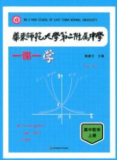

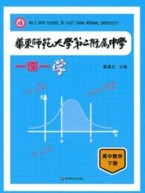

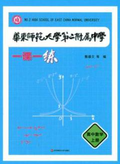

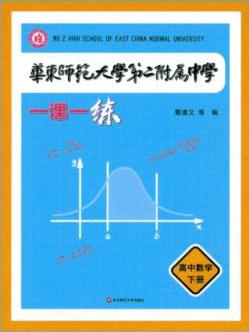

NO.2 HIGH SCHOOL OF EAST CHINA NORMAL UNIVERSITY

# 华東师范大学第二附属中学

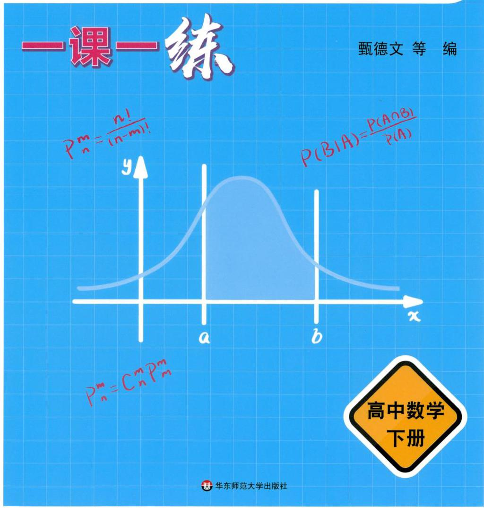

NO.2 HIGH SCHOOL OF EAST CHINA NORMAL UNIVERSITY

# 事更師第二批属中学

一课一途

## 高中数学 下册

甄德文 等 编

牛车东师范大学出版社

## 图书在版编目(CIP)数据

华东师范大学第二附属中学一课一练. 高中数学 下册/甄德文等编. 一上海:华东师范大学出版社,2023

ISBN 978-7-5760-4330-3

I. ①华… II. ①甄... Ⅲ. ①中学数学课-高中-教学参考资料 IV. ①G634

中国国家版本馆 CIP 数据核字(2024)第 003373 号

HUADONGSHIFANDAXUE DI-ER FUSHU ZHONGXUE YIKEYILIAN 华东师范大学第二附属中学一课一练高中数学下册

编 者 甄德文等

组稿编辑 应向阳 芮 磊

责任编辑 陈 震 应向阳

特约审读 石 岩

责任校对 时东明

装帧设计 刘怡霖

出版发行 华东师范大学出版社

社 址 上海市中山北路 3663 号 邮编 200062

网 址 www. ecnupress. com. cn

电 话 021-60821666 行政传真 021-62572105

客服电话 021-62865537 门市(邮购) 电话 021-62869887

地址 上海市中山北路 3663 号华东师范大学校内先锋路口

网 店 http://hdsdcbs.tmall.com

印 刷 者 常熟高专印刷有限公司

开本 889 毫米 × 1194 毫米 1/16

印 张 30

字 数 798 千字

版 次 2024 年 6 月第 1 版

印 次 2024 年 6 月第 1 次

书 号 ISBN 978-7-5760-4330-3

定 价 98.00 元

出版人 王 焰

(如发现本版图书有印订质量问题，请寄回本社客服中心调换或电话021-62865537联系)

## 目 录

第 10 章 空间直线与平面 / 1

10.1 平面及其基本性质(1)/1

10.1 平面及其基本性质(2)/ 3

10.1 平面及其基本性质(3)/ 5

10.2 空间直线与直线之间的位置关系(1) / 7

10.2 空间直线与直线之间的位置关系(2) / 9

10.2 空间直线与直线之间的位置关系(3) / 11

10.3 直线与平面的位置关系(1) / 13

10.3 直线与平面的位置关系(2) / 15

10.3 直线与平面的位置关系(3) / 17

10.3 直线与平面的位置关系(4) / 19

10.4 平面与平面的位置关系(1) / 21

10.4 平面与平面的位置关系(2) / 23

10.4 平面与平面的位置关系(3) / 25

10.5 异面直线间的距离 / 27

第 11 章 简单几何体 / 29

11.1 柱体(1)/ 29

11.1 柱体(2)/ 31

11.1 柱体(3)/ 34

11.2 锥体(1)/ 37

11.2 锥体(2)/ 40

11.2 锥体(3)/ 43

11.3 多面体与旋转体 / 46

11.4 球(1) / 50

11.4 球(2) / 52

11.4 球(3) / 54

第 12 章 空间向量及其应用 / 57

12.1 空间向量(1) / 57

12.1 空间向量(2) / 59

12.2 空间向量的坐标表示(1)/ 61

12.2 空间向量的坐标表示(2)/ 63

12.3 空间向量在立体几何中的应用(1)/ 66

12.3 空间向量在立体几何中的应用(2)/ 69

12.3 空间向量在立体几何中的应用(3)/ 73

第 13 章 坐标平面上的直线 / 76

13.1 直线的倾斜角和斜率(1) / 76

13.1 直线的倾斜角和斜率(2) / 78

13.2 直线的方程(1) / 80

13.2 直线的方程(2) / 82

13.2 直线的方程(3) / 84

13.3 两条直线的位置关系(1) / 86

13.3 两条直线的位置关系(2) / 88

13.3 两条直线的位置关系(3) / 90

13.4 点到直线的距离(1) / 92

13.4 点到直线的距离(2) / 94

第 14 章 圆锥曲线 / 96

14.1 圆(1) / 96

14.1 圆(2) / 98

14.1 圆(3) / 100

14.1 圆(4) / 102

14.2 椭圆(1) / 104

14.2 椭圆(2) / 106

14.2 椭圆(3) / 109

14.3 双曲线(1) / 112

14.3 双曲线(2) / 114

14.3 双曲线(3) / 116

14.4 抛物线(1) / 118

14.4 抛物线(2) / 120

14.4 抛物线(3) / 122

14.5 曲线与方程(1) / 125

14.5 曲线与方程(2) / 127

14.5 曲线与方程(3) / 129

第 15 章 导数及其应用 / 131

15.1 导数的概念及意义(1) / 131

15.1 导数的概念及意义(2) / 134

15.2 导数的运算(1)/ 136

15.2 导数的运算(2)/ 138

15.2 导数的运算(3)/ 140

15.3 导数的应用(1)/ 142

15.3 导数的应用(2)/ 144

15.3 导数的应用(3) / 146

15.3 导数的应用(4) / 148

第 16 章 计数原理 / 151

16.1 乘法原理与加法原理(1)/ 151

16.1 乘法原理与加法原理(2) / 153

16.2 排列(1) / 155

16.2 排列(2) / 157

16.3 组合(1) / 159

16.3 组合(2) / 161

16.3 组合(3) / 163

16.4 二项式定理(1)/ 165

16.4 二项式定理(2)/ 167

16.4 二项式定理(3)/ 169

第 17 章 概率初步 / 171

17.1 古典概型 / 171

17.2 频率与概率 / 173

17.3 事件和与积的概率 / 176

17.4 条件概率与相关公式 / 178

17.5 随机变量的分布与特征 / 180

17.6 常用分布 / 183

第 18 章 统计初步 / 186

18.1 总体与样本 抽样方法 / 186

18.2 统计图表 / 189

18.3 统计估计 / 193

18.4 成对统计量及其相关性 / 196

18.5 一元线性回归分析 / 200

18.6 独立性检验 / 204

附录 1 阶段练习卷 / 209

附录 2 参考答案与解析 / 281

## 第 10 章 空间直线与平面

### 10.1 平面及其基本性质(1)

1 点 $M$ 在直线 $l$ 上，可用集合符号表示为___。

2 “直线 $l$ 和平面 $\alpha$ 相交于点 $A$ ”的符号表达为___。

3 不共面的四点可以确定平面的个数是___。

4 一条直线和直线外三点最多可以确定___个平面。

5 由正方体的一条棱和一个不在此棱上的顶点确定的平面有___个。

6 下列几个结论:①铺得很平的一张白纸是一个平面；②平面的形状是平行四边形；③一个平面的面积可以等于 ${25}{\mathrm{\;{cm}}}^{2}$ ; ④平面的厚度 $5\mathrm{\;{cm}}$ ; ⑤一个平面可以长为 $4\mathrm{\;{cm}}$ ，宽为 $2\mathrm{\;{cm}}$ 。其中正确结论的个数是___。

7 下列各图符合立体几何作图规范要求的是( )。

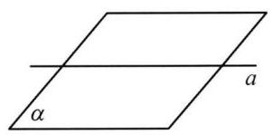

A. 直线在平面内

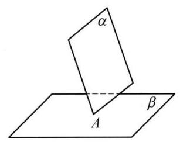

B. 平面与平面相交

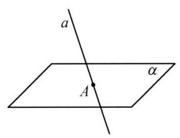

C. 直线与平面相交

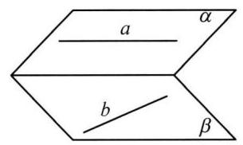

D. 两直线异面

8 如果 $A$ 点在直线 $a$ 上,而直线 $a$ 在平面 $\alpha$ 内,点 $B$ 在 $\alpha$ 内,可以用集合语言和符号表示为 ( )。

A. $A \subset  a, a \subset  \alpha , B \in  \alpha$ B. $A \in  a, a \subset  \alpha , B \in  \alpha$

C. $A \subset  a, a \in  \alpha , B \subset  \alpha$ D. $A \in  a, a \in  \alpha , B \in  \alpha$

9 三个平面不可能将空间分成 ( ) 个部分。

A. 5 B. 6 C. 7 D. 8

10 求证:已知直线 $l$ 与三条平行线 $a\text{ 、 }b\text{ 、 }c$ 都相交 (如图)，求证: $l$ 与 $a\text{ 、 }b\text{ 、 }c$ 共面。

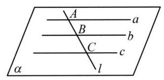

(第 10 题图)

11 已知: $l \subset  \alpha , D \in  \alpha , A \in  l, B \in  l, C \in  l, D \notin  l$ 。求证:直线 ${AD}\text{ 、 }{BD}\text{ 、 }{CD}$ 共面于 $\alpha$ 。

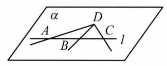

(第 11 题图)

12 若直线 $l$ 与平面 $\alpha$ 相交于点 $O, A\text{ 、 }B \in  l, C\text{ 、 }D \in  \alpha$ ,且 ${AC}//{BD}$ ,求证: $O\text{ 、 }C\text{ 、 }D$ 三点共线。

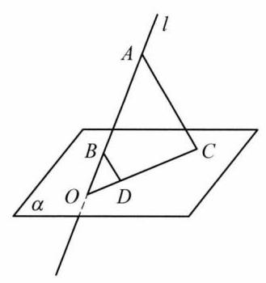

(第 12 题图)

13 (选做) 如图所示， $\bigtriangleup  {ABC}$ 的各顶点都在平面 $\alpha$ 外，且直线 ${AB}$ 、 ${BC}$ 、 ${AC}$ 分别与平面 $\alpha$ 交于 $P\text{ 、 }Q\text{ 、 }R$ ,试找出 $Q$ 点的位置。(保留作图痕迹)

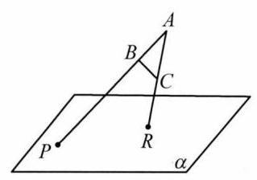

(第 13 题图)

### 10.1 平面及其基本性质(2)

1 我们有如下生活经验:“两个轮子的自行车在停止运动后要加上一个支撑脚才稳定”，可以解释该经验的数学公理是___。

2 在空间四点中，不存在三点共线是四点共面的___条件。

3 相交于同一点的四条直线最多能确定___个平面。

4 用一个平面去截正方体，则截面形状不可能是___。

① 正三角形 ② 正方形 ③ 正五边形 ④ 正六边形

5 下列判断中:① 三点确定一个平面；② 一条直线和一点确定一个平面；③ 两条直线确定一个平面；④三角形和梯形一定是平面图形；⑤四边形一定是平面图形；⑥六边形一定是平面图形； ⑦两两相交的三条直线确定一个平面。其中正确的是___。

6 已知 $M\text{ 、 }N\text{ 、 }P$ 分别是正方体 ${ABCD} - {A}_{1}{B}_{1}{C}_{1}{D}_{1}$ 的棱 ${AB}\text{ 、 }A{A}_{1}\text{ 、 }C{C}_{1}$ 的中点,则平面 ${MNP}$ 截正方体 ${ABCD} - {A}_{1}{B}_{1}{C}_{1}{D}_{1}$ 所得的截面是___边形。

7 下列条件中能确定一个平面的是( )。

A. 空间的任意三点 B. 空间的任意一条直线和任意一点

C. 空间的任意两条直线 D. 梯形的两条腰分别所在的直线

8 已知平面 $\alpha  \cap$ 平面 $\beta  = l$ ，点 $A$ 、 $B \in  \alpha$ ，点 $C \in  \beta$ 且 $C \notin  l$ ， ${AB} \cap  l = R$ ，设过 $A$ 、 $B$ 、 $C$ 三点的平面为 $\gamma$ ,则 $\beta  \cap  \gamma$ 是( )。

A. 直线 ${AC}$ B. 直线 ${BC}$

C. 直线 ${CR}$ D. 以上全错

9 以下描述的空间图形中，不存在的是( )。

A. 空间中的一个四边形, 四边相等, 四角均为直角

B. 空间中的一个五边形, 五边相等, 五角均为直角

C. 空间中的一个六边形, 六边相等, 六角均为直角

D. 空间中的一个八边形, 八边相等, 八角均为直角

10 如图,已知 $\alpha  \cap  \beta  = {EF}, A \in  \alpha , C\text{ 、 }B \in  \beta ,{BC}$ 与 ${EF}$ 相交,在图中画出平面 ${ABC}$ 分别与 $\alpha$ 、 $\beta$ 的交线。

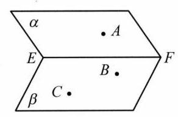

(第 10 题图)

11 一个西瓜切 3 刀，最多可以切成几块？最少可以切成几块?

12 已知点 $A$ 、 $B$ 、 $C$ 在正方体的顶点或棱上，画出下列过点 $A$ 、 $B$ 、 $C$ 的正方体的截面(保留作图痕迹)。

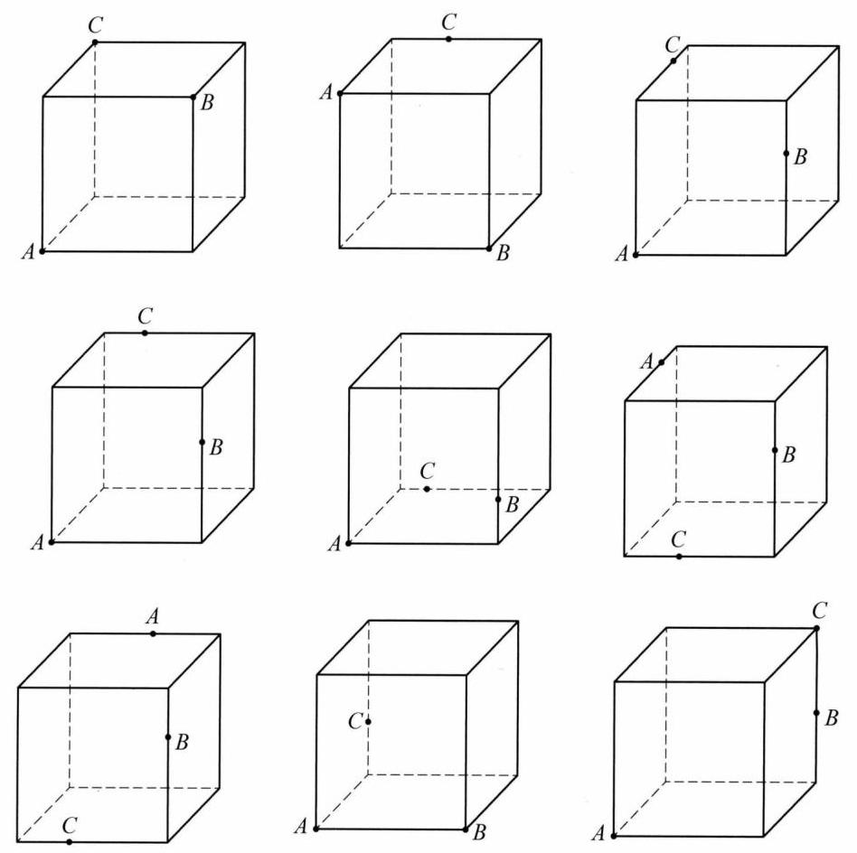

(第 12 题图)

13 (选做)正方体 ${ABCD} - {A}_{1}{B}_{1}{C}_{1}{D}_{1}$ 的棱长为 $2, E\text{ 、 }F$ 分别为棱 ${AB}\text{ 、 }{BC}$ 的中点,过 ${D}_{1}$ 、 $E\text{ 、 }F$ 作该正方体的截面，则截面形状是几边形？周长是多少？

### 10.1 平面及其基本性质 (3)

1 在“斜二测”作图时，1 cm 长的线段，在 $x$ 、 $y$ 方向上直观图的长度分别为___、___。

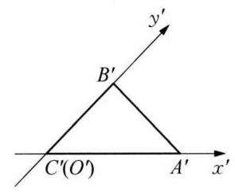

(第 9 题图)

2 如图，水平放置的 $\bigtriangleup  {ABC}$ 的斜二测直观图是图中的。 ${\mathrm{A}}^{\prime }{\mathrm{B}}^{\prime }{\mathrm{C}}^{\prime }$ ，已知 ${A}^{\prime }{C}^{\prime } = 6,{B}^{\prime }{C}^{\prime } = 4$ ，则 ${AB}$ 边的实际长度是___。

3 斜二测画法中，位于平面直角坐标系中的点 $M\left( {4,4}\right)$ 在直观图中对应的点为 ${M}^{\prime }$ ，则 ${M}^{\prime }$ 的坐标为___。

4 一水平位置的平面图形的斜二测直观图是一个底平行于 ${x}^{\prime }$ 轴，底角为 ${45}^{ \circ  }$ ,两腰和上底长均为 2 的等腰梯形,则这个平面图形的面积是 ___。

5 已知 $\bigtriangleup  {ABC}$ 是腰长为 2 的等腰直角三角形，那么 $\bigtriangleup  {ABC}$ 的斜二测平面直观图的面积是 ___。

6 如图，将边长为 20 的正三角形 ${ABC}$ ，按“斜二测”画法在水平放置的平面上画出为 $\bigtriangleup  {{A}^{\prime }{B}^{\prime }{C}^{\prime }}$ ， 则 ${A}^{\prime }{C}^{\prime } =$ ___。

7 如图，一个水平放置的三角形 ${ABO}$ 的斜二测直观图是等腰直角三角形 ${A}^{\prime }{B}^{\prime }{O}^{\prime }$ ，若 ${B}^{\prime }{A}^{\prime } = \; {B}^{\prime }{O}^{\prime } = 1$ ，那么原三角形 ${ABO}$ 的周长是( )。

A. $2\sqrt{2} + 1$ B. $4 + 2\sqrt{2}$

C. $2\sqrt{2} + 2$ D. $\sqrt{2} + 2$

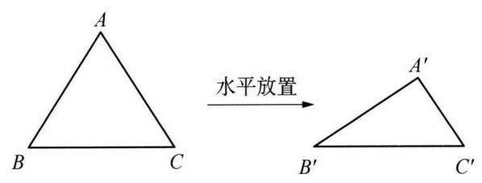

(第 6 题图)

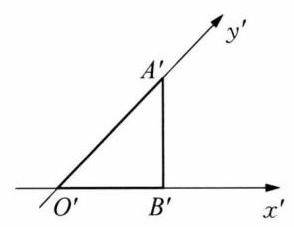

(第 7 题图)

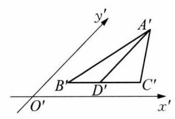

(第 2 题图)

8 如图， $\bigtriangleup  {A}^{\prime }{B}^{\prime }{C}^{\prime }$ 是斜二测画法画出的水平放置的 $\bigtriangleup  {ABC}$ 的直观图， ${D}^{\prime }$ 是 ${B}^{\prime }{C}^{\prime }$ 的中点，且 ${A}^{\prime }{D}^{\prime }//{y}^{\prime }$ 轴， ${B}^{\prime }{C}^{\prime }//{x}^{\prime }$ 轴， ${A}^{\prime }{D}^{\prime } = 2,{B}^{\prime }{C}^{\prime } = 2$ ，则( )。

A. ${BC}$ 的长度大于 ${AC}$ 的长度 B. $\bigtriangleup {ABC}$ 的面积为 4

C. $\bigtriangleup {A}^{\prime }{B}^{\prime }{C}^{\prime }$ 的面积为 2 D. $\angle {ABC} = \frac{\pi }{3}$

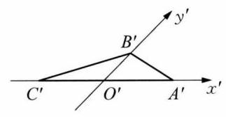

(第 9 题图)

9 如图所示， $\bigtriangleup {A}^{\prime }{B}^{\prime }{C}^{\prime }$ 是水平放置的 $\bigtriangleup {ABC}$ 的斜二测直观图,其中 ${O}^{\prime }{C}^{\prime } = {O}^{\prime }{A}^{\prime } = 2{O}^{\prime }{B}^{\prime } = 2$ ，则以下说法中正确的是( )。

A. $\bigtriangleup  {ABC}$ 是钝角三角形

B. $\bigtriangleup  {ABC}$ 的面积是 $\bigtriangleup  {{A}^{\prime }{B}^{\prime }{C}^{\prime }}$ 的面积的 2 倍

C. $B$ 点的坐标为 $\left( {0,\sqrt{2}}\right)$

D. $\bigtriangleup {ABC}$ 的周长是 $4 + 4\sqrt{2}$

10 如图所示， $\bigtriangleup {A}^{\prime }{B}^{\prime }{C}^{\prime }$ 是水平放置的平面图形的斜二测直观图，将其还原成平面图形。

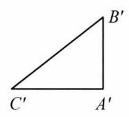

(第 10 题图)

11 在 $\bigtriangleup {ABC}$ 中,角 $A\text{ 、 }B\text{ 、 }C$ 所对边分别为 $a\text{ 、 }b\text{ 、 }c$ ,若 ${a}^{2} + {b}^{2} + {c}^{2} = 2\sqrt{3}{ab}\sin C$ 。

(1)证明: $\bigtriangleup  {ABC}$ 为等边三角形；

(2)若(1)中的等边 $\bigtriangleup  {ABC}$ 边长为 2，试用斜二测法画出其直观图，并求直观图面积。

注:只需画出直观图并求面积，不用写出详细的作图步骤。

12 已知三角形 ${ABC}$ 的斜二测画法的直观图是边长为 2,首证三角形 ${A}^{\prime }{B}^{\prime }{C}^{\prime }$ (如图所示),求 $\overrightarrow{CA} \cdot  \overrightarrow{CB}$ 。

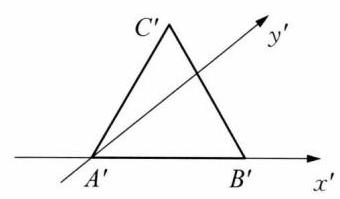

(第 12 题图)

13 (选做) 已知正三棱柱 ${ABC} - {A}_{1}{B}_{1}{C}_{1}$ 的底面边长为 $3\mathrm{\;{cm}}$ ，高为 $3\mathrm{\;{cm}}$ ， $M$ 、 $N$ 、 $P$ 分别是 $A{A}_{1}\text{ 、 }{AC}\text{ 、 }{B}_{1}{C}_{1}$ 的中点。

(1)用“斜二测”画法，作出此正三棱柱的直观图(严格按照直尺刻度)；

(2)在(1)中作出过 $M$ 、 $N$ 、 $P$ 三点的正三棱柱的截面(保留作图痕迹)。

### 10.2 空间直线与直线之间的位置关系( 1 )

1 如果一个角的两边和另一个角的两边分别平行，那么这两个角的关系是___。

2 直线 $a$ 和 $b$ 在正方体 ${ABCD} - {A}_{1}{B}_{1}{C}_{1}{D}_{1}$ 的两个不同面内,能使 $a//b$ 成立的条件是___ ___。(填序号)

① $a$ 和 $b$ 垂直于正方体的同一个面；② $a$ 和 $b$ 在正方体两个相对的面内，且共面；③ $a$ 和 $b$ 平行于同一条棱; ④ $a$ 和 $b$ 在正方体的两个平行面内,且与正方体的同一条棱垂直。

3 已知空间四边形 ${ABCD}$ (即 $A\text{ 、 }B\text{ 、 }C\text{ 、 }D$ 四点不共面) 各边中点分别为 $E\text{ 、 }F\text{ 、 }G\text{ 、 }H$ ,则四边形 EFGH 是___形。

4 下列命题中,正确的是___。(填序号即可)

①有三个角是直角的四边形是矩形; ②有四个角是直角的四边形是矩形; ③四边相等且四个角也相等的四边形一定是正方形; ④两条对角线互相平分的四边形是平行四边形。 5 如图，用平行于空间四边形 ${ABCD}$ 的一组对边 ${AB}$ 、 ${CD}$ 的平面截此空间四边形，如果 ${AB} = {CD} = a$ ，则四边形 MNPQ 的周长为___。

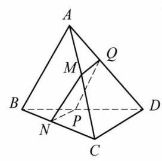

(第 5 题图)

6 若空间中四条直线 ${l}_{1}\text{ 、 }{l}_{2}\text{ 、 }{l}_{3}\text{ 、 }{l}_{4}$ 满足 ${l}_{1} \bot  {l}_{2},{l}_{2}//{l}_{3},{l}_{3} \bot  {l}_{4}$ ,则下列结论一定正确的是___。(填序号即可)

① ${l}_{1}//{l}_{3}$ ; ② ${l}_{1}//{l}_{4}$ ; ③ ${l}_{2}//{l}_{4}$ ; ④ ${l}_{1} \bot  {l}_{3}$ ; ⑤ ${l}_{1} \bot  {l}_{4}$ ; ⑥ ${l}_{2} \bot  {l}_{4}$ 。

7 两等角的一组对应边平行，则( )。

A. 另一组对应边平行

B. 另一组对应边不平行

C. 另一组对应边垂直

D. 以上都不对

8 在空间四边形 ${ABCD}$ 中， $P$ 、 $Q$ 分别是边 ${AB}$ 、 ${CD}$ 的中点，设 ${BD} + {AC} = {2a}$ ，则()。

A. ${PQ} > a$

B. ${PQ} = a$

C. ${PQ} < a$

D. ${PQ}$ 与 $a$ 的大小不确定

9 下列命题中，正确结论的个数是( )。

①如果一个角的两边与另一个角的两边分别平行，那么这两个角相等；②如果两条相交直线和另两条相交直线分别平行，那么这两组直线所成的锐角(或直角)相等；③如果一个角的两边和另一个角的两边分别垂直，那么这两个角相等或互补；④如果两条直线同时平行于第三条直线，那么这两条直线互相平行。

A. 1 个 B. 2 个

C. 3 个 D. 4 个

10 如图，在长方体 ${ABCD} - {A}_{1}{B}_{1}{C}_{1}{D}_{1}$ 中， $M$ 为 ${B}_{1}B$ 上一点，试过点 $M$ 作平面 ${D}_{1}{DC}{C}_{1}$ 的对角线 $D{C}_{1}$ 的平行线，保留作图痕迹并说明理由。

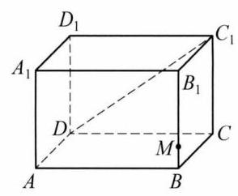

(第 10 题图)

11 如图，在正方体 ${ABCD} - {A}_{1}{B}_{1}{C}_{1}{D}_{1}$ 中， $E$ 、 $F$ 、 $G$ 分别是棱 $C{C}_{1}$ 、 $B{B}_{1}$ 、 $D{D}_{1}$ 的中点。求证:(1) ${GB}//{D}_{1}F$ ；(2) $\angle {BGC} = \angle {F{D}_{1}E}$ 。

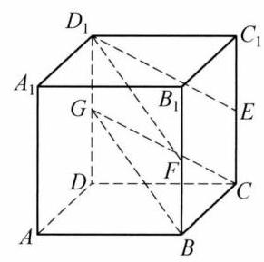

(第 11 题图)

12 如图，将 $\bigtriangleup  {ABC}$ 和 $\bigtriangleup  {{A}_{1}{B}_{1}{C}_{1}}$ 的对应顶点连线， $A{A}_{1}$ 、 $B{B}_{1}$ 、 $C{C}_{1}$ 交于点 $O$ ， $O$ 在平面 ${ABC}$ 和平面 ${A}_{1}{B}_{1}{C}_{1}$ 之间，且 $\frac{AO}{{A}_{1}O} = \frac{BO}{{B}_{1}O} = \frac{CO}{{C}_{1}O} = \frac{2}{3}$ 。

(1)求证: $\angle {CAB} = \angle {{C}_{1}{A}_{1}{B}_{1}}$ ；

(2)求 ${S}_{\bigtriangleup {ABC}} : {S}_{\bigtriangleup {A}_{1}{B}_{1}{C}_{1}}$ 的值。

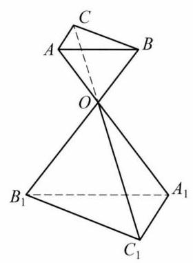

(第 12 题图)

13 (选做)在空间四边形 ${ABCD}$ 的边 ${AB}\text{ 、 }{BC}\text{ 、 }{CD}\text{ 、 }{DA}$ 上分别取 $E\text{ 、 }F\text{ 、 }G\text{ 、 }H$ 四点,如果 ${EF}$ 与 ${HG}$ 交于点 $M$ ，那么( )。

A. $M$ 一定在直线 ${AC}$ 上 B. $M$ 一定在直线 ${BD}$ 上

C. $M$ 可能在 ${AC}$ 上,也可能在 ${BD}$ 上 D. $M$ 不在 ${AC}$ 上,也不在 ${BD}$ 上

### 10.2 空间直线与直线之间的位置关系( 2 )

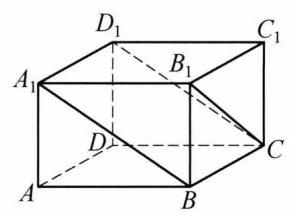

(第 1 题图)

1 如图，在长方体 ${ABCD} - {A}_{1}{B}_{1}{C}_{1}{D}_{1}$ 中，

(1)直线 ${A}_{1}B$ 与直线 ${D}_{1}C$ 的位置关系是___；

(2)直线 ${A}_{1}B$ 与直线 ${B}_{1}C$ 的位置关系是___；

(3)直线 ${D}_{1}D$ 与直线 ${D}_{1}C$ 的位置关系是___；

(4)直线 ${AB}$ 与直线 ${B}_{1}C$ 的位置关系是___。

2 正方体 ${ABCD} - {A}_{1}{B}_{1}{C}_{1}{D}_{1}$ 所有棱所在的直线中,与直线 ${AB}$ 垂直且异面的直线共有 ___条。

3 在正方体 ${ABCD} - {A}_{1}{B}_{1}{C}_{1}{D}_{1}$ 中，与对角线 $A{C}_{1}$ 异面的棱共有___条。

4 若把两条异面直线称为“一对”，在正方体十二条棱中，异面直线对数为___对。

5 在正方体的 8 个顶点中，任意两点可连成直线，其中异面直线有___对。

6 平面内两直线有三种位置关系: 相交、平行与重合。已知两个相交平面 $\alpha \text{ 、 }\beta$ 与两直线 ${l}_{1}$ 、 ${l}_{2}$ ,又知 ${l}_{1}\text{ 、 }{l}_{2}$ 在 $\alpha$ 内的射影为 ${s}_{1}\text{ 、 }{s}_{2}$ ,在 $\beta$ 内的射影为 ${t}_{1}\text{ 、 }{t}_{2}$ 。试写出 ${s}_{1}\text{ 、 }{s}_{2}$ 与 ${t}_{1}\text{ 、 }{t}_{2}$ 满足的条件，使之一定能成为 ${l}_{1}$ 、 ${l}_{2}$ 是异面直线的充分条件:___。

7 垂直于同一条直线的两条直线一定( )。

A. 平行 B. 相交 C. 异面 D. 以上都有可能

8 已知 $a\text{ 、 }b$ 为两条直线， $\alpha \text{ 、 }\beta$ 为两个平面，且满足 $a \subset  \alpha$ ， $b \subset  \beta$ ， $\alpha  \cap  \beta  = l$ ， $a//l$ ，则“ $a$ 与 $b$ 异面”是“直线 $b$ 与 $l$ 相交”的( )。

A. 充分而不必要条件 B. 必要而不充分条件

C. 充分必要条件 D. 既不充分也不必要条件

9 已知 $a\text{ 、 }b$ 是异面直线， $P$ 是 $a\text{ 、 }b$ 外一点，经过点 $P$ 且与 $a\text{ 、 }b$ 都相交的直线有( )。

A. 至少 1 条 B. 最多 1 条

C. 有且只有 1 条 D. 可能为 0 条也有可能多于 1 条

10 如图，点 $A \notin  \alpha , B \in  \alpha , B \notin  l, l \subset  \alpha$ ，求证:直线 ${AB}$ 与直线 $l$ 是异面直线。

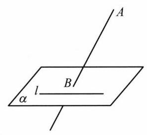

(第 10 题图)

11 已知: 平面 $\alpha  \cap$ 平面 $\beta  = a, b \subset  \alpha , b \cap  a = A, c \subset  \beta$ 且 $c//a$ ,求证: $b\text{ 、 }c$ 是异面直线。

12 如图，在正方体 ${ABCD} - {A}_{1}{B}_{1}{C}_{1}{D}_{1}$ 中， $N$ 为底面 ${ABCD}$ 的中心， $P$ 为线段 ${A}_{1}{D}_{1}$ 上的动点 (不包括两个端点), $M$ 为线段 ${AP}$ 的中点。判断下列结论是否成立,并说明理由。

(1) ${CM}$ 与 ${PN}$ 是异面直线；

(2) ${CM} > {PN}$ ；

(3)过 $P$ 、 $A$ 、 $C$ 三点的正方体的截面一定是等腰梯形。

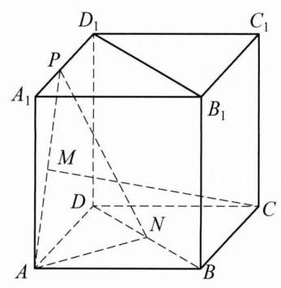

(第 12 题图)

13 (选做)给定不共面的 4 点, 作过其中 3 个点的平面, 所有 4 个这样的平面围成的几何体称为四面体 (如图所示), 预先给定的 4 个点称为四面体的顶点, 2 个顶点的连线称为四面体的棱, 3 个顶点所确定的三角形称为四面体的面。求证: 四面体中任何一对不共顶点的棱所在的直线一定是异面直线。(1)请你用异面直线判定定理证明该结论;(2)请你用反证法证明该结论。

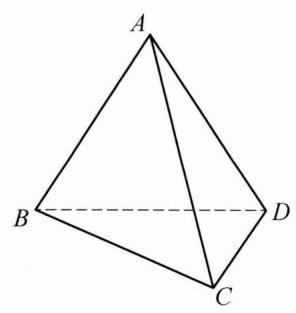

(第 13 题图)

### 10.2 空间直线与直线之间的位置关系( 3 )

1 两条异面直线所成角的范围是___。

2 若直线 $a//b$ ，直线 $c \cap  a = A$ ，则直线 $b\text{ 、 }c$ 的位置关系为___。(用文字表述)

3 在正方体 ${ABCD} - {A}_{1}{B}_{1}{C}_{1}{D}_{1}$ 中，与 $A{D}_{1}$ 成 ${60}^{ \circ  }$ 角的面对角线共有___条。

4 如图，在正方体 ${ABCD} - {A}_{1}{B}_{1}{C}_{1}{D}_{1}$ 中， $E$ 是 ${BC}$ 的中点，则异面直线 $B{C}_{1}$ 和 ${D}_{1}E$ 所成角的大小为___。

5 如图， $\alpha  \bot  \beta$ ， $\alpha  \cap  \beta  = l$ ， $A \in  \alpha$ ， $B \in  \beta$ ，点 $A$ 、 $B$ 在棱 $l$ 上的射影分别是 ${A}_{1}$ 、 ${B}_{1}$ ，若 $A{A}_{1} = \; B{B}_{1} = 2,{AB} = 4$ ，则异面直线 $A{B}_{1}$ 与 ${A}_{1}B$ 所成角的余弦值为___。

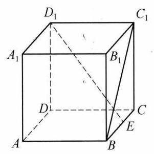

(第 4 题图)

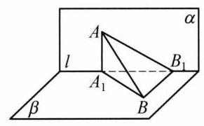

(第 5 题图)

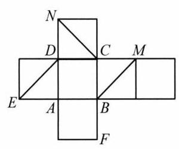

(第 6 题图)

6 如图，是一个正方体的平面展开图，在这个正方体中，① ${BM}$ 与 ${ED}$ 是异面直线；② ${CN}$ 与 ${BE}$ 平行；③ ${CN}$ 与 ${BM}$ 成 ${60}^{ \circ  }$ 角；④ ${DM}$ 与 ${BN}$ 垂直。以上结论中正确的个数为___个。

7 有以下四个结论:①若 $a \subset  \alpha , b \subset  \beta$ ，则 $a\text{ 、 }b$ 为异面直线；②若 $a \subset  \alpha , b \text{ ⊄ } \alpha$ ，则 $a\text{ 、 }b$ 为异面直线；③没有公共点的两条直线是平行直线；④两条不平行的直线就一定相交。其中正确结论的个数是( )。

A. 0 个 B. 1 个 C. 2 个 D. 3 个

8 对于已知直线 $a$ ，假设直线 $b$ 同时满足下列两个条件:①与 $a$ 成异面直线；②与 $a$ 的夹角为定值 $\theta$ 。那么，这样的直线 $b$ 有( )。

A. 1 条 B. 2 条 C. 4 条 D. 无数条

9 已知空间中两条直线的所成角是 ${60}^{ \circ  }$ ,则空间中和这两条直线所成角都是 ${60}^{ \circ  }$ 的直线有( )。

A. 1 条 B. 2 条 C. 3 条 D. 无数条

10 已知正方体 ${ABCD} - {A}_{1}{B}_{1}{C}_{1}{D}_{1}$ 的棱长为 2,点 $E$ 是棱 ${A}_{1}{B}_{1}$ 的中点。

(1)求证: ${A}_{1}B$ 与 $E{C}_{1}$ 是异面直线；

(2)求异面直线 ${A}_{1}B$ 与 $E{C}_{1}$ 所成角的大小。

11 如图所示，在四面体 ${ABCD}$ 中， $E$ 、 $F$ 分别是线段 ${AD}$ 、 ${BC}$ 上的点， $\frac{AE}{ED} = \frac{BF}{FC} = \frac{1}{2}$ 。

(1)求证:直线 ${EF}$ 与 ${BD}$ 是异面直线；

(2)若 ${AB} = {CD} = 3,{EF} = \sqrt{7}$ ，求 ${AB}\text{ 、 }{CD}$ 所成角的大小。

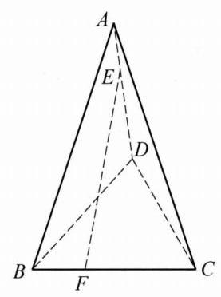

(第 11 题图)

12 在空间四边形 ${ABCD}$ 中， ${AB} = {CD} = 8, E\text{ 、 }F$ 分别为 ${AC}\text{ 、 }{BD}$ 的中点。

(1)若 ${EF} = {4\sqrt{3}}$ ，求 ${AB}$ 与 ${CD}$ 所成的角；

(2)若 ${AB}$ 与 ${CD}$ 所成的角为 ${60}^{ \circ  }$ ，求 ${EF}$ 的长。

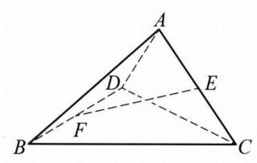

(第 12 题图)

13 (选做)如图，两条异面直线 $a$ 、 $b$ 所成角为 ${60}^{ \circ  }$ ，在直线 $a$ 、 $b$ 上分别取点 ${A}^{\prime }$ 、 $E$ 和点 $A$ 、 $F$ ， 使 $A{A}^{\prime } \bot  a$ 且 $A{A}^{\prime } \bot  b$ 。已知 ${A}^{\prime }E = 2,{AF} = 3,{EF} = \sqrt{23}$ 。求线段 $A{A}^{\prime }$ 的长。

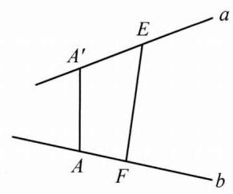

(第 13 题图)

### 10.3 直线与平面的位置关系( 1 )

1 过直线外一点和这条直线平行的平面有___个。

2 若直线 $a//b, a//$ 平面 $\alpha$ ，则 $b$ 与平面 $\alpha$ 的位置关系是___。

3 在正方体 ${ABCD} - {A}_{1}{B}_{1}{C}_{1}{D}_{1}$ 中，和平面 ${A}_{1}{DB}$ 平行的侧面对角线有___，分别是___。 ___。

4 已知直线 $a//$ 平面 $\alpha$ ，点 $A \in  \alpha$ ，点 $A \in$ 直线 $b$ ，且 $a//b$ ，则直线 $b$ 与平面 $\alpha$ 的位置关系是 ___。

5 设 $m\text{ 、 }n$ 是平面 $\alpha$ 外的两条直线，给出三个论断:① $m//n$ ，② $m//\alpha$ ，③ $n//\alpha$ ，以其中两个为条件，余下的一个为结论，写出你认为正确的一个命题:___。

6 已知 $\bigtriangleup {ABC}$ 中， ${AB} = 5,{AC} = 7,\angle A = {60}^{ \circ  }, G$ 是重心,若过 $G$ 的平面 $\alpha$ 与 ${BC}$ 平行， ${AB} \cap \; \alpha  = M,{AC} \cap  \alpha  = N$ ，则 ${MN} =$ ___。

7 直线与平面平行的充要条件是( )。

A. 直线与平面内的一条直线平行

B. 直线与平面内的两条直线不相交

C. 直线与平面内的任一直线都不相交

D. 直线与平面内的无数条直线平行

8 已知直线 $a\text{ 、 }b$ ，平面 $\alpha \text{ 、 }\beta$ ，则下列说法中正确的是( )。

A. $a//b, b \subset  \alpha$ ，则 $a//\alpha$

B. $a//\alpha , b//\alpha$ ,则 $a//b$

C. $a\text{ 、 }b$ 异面，且 $a \subset  \alpha , b \subset  \beta , a//\beta , b//\alpha ,$ 则 $\alpha //\beta$

D. $a//\alpha , a//\beta ,$ 则 $\alpha //\beta$

9 下列四个正方体图形中, $A\text{ 、 }B$ 为正方体的两个顶点, $M\text{ 、 }N\text{ 、 }P$ 分别为其所在棱的中点,能得出 ${AB}//$ 平面 ${MNP}$ 的图形的序号是___(写出所有符合要求的图形序号)。

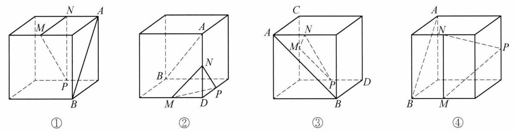

(第 9 题图)

A. ①③ B. ①④

C. ③④ D. ①②③

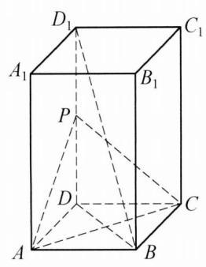

(第 10 题图)

10 如图，长方体 ${ABCD} - {A}_{1}{B}_{1}{C}_{1}{D}_{1}$ 中， ${AB} = {AD} = 1,{AA}_{1} = 2$ ，点 $P$ 为棱 $D{D}_{1}$ 的中点。

(1)求证:直线 $B{D}_{1}//$ 平面 ${PAC}$ ；

(2)求直线 $A{C}_{1}$ 与直线 ${PB}$ 所成角的大小。(用反三角表示)

11 如图，已知四边形 ${ABCD}$ 与四边形 ${BAFE}$ 是两个不共面的正方形，点 $M$ 、 $N$ 分别为对角线 ${AC}$ 、 ${FB}$ 上的点，且 ${AM} = {FN}$ 。

求证: ${MN}//$ 平面 ${BEC}$ 。

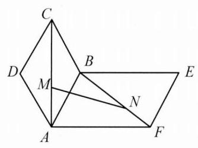

(第 11 题图)

12 如图所示,已知 $P$ 是 $\square {ABCD}$ 所在平面外一点, $M\text{ 、 }N$ 分别是 ${AB}\text{ 、 }{PC}$ 的中点,平面 ${PAD} \cap$ 平面 ${PBC} = l$ 。求证: (1) $l//{BC};\left( 2\right) {MN}//$ 平面 ${PAD}$ 。

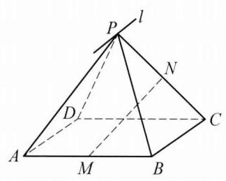

(第 12 题图)

13 (选做)如图所示，在长方形 ${ABCD}$ 中， ${AB} = 2,{AD} = 1, E$ 为 ${CD}$ 的中点，以 ${AE}$ 为折痕，把 $\bigtriangleup {DAE}$ 折起到 $\bigtriangleup {D}^{\prime }{AE}$ 的位置，且平面 ${D}^{\prime }{AE} \bot$ 平面 ${ABCE}$ 。

(1)求证: $A{D}^{\prime } \bot  {BE}$ ；

(2)在棱 $E{D}^{\prime }$ 上是否存在一点 $P$ ，使得 ${D}^{\prime }B//$ 平面 ${PAC}$ ？若存在，求出点 $P$ 的位置；若不存在，请说明理由。

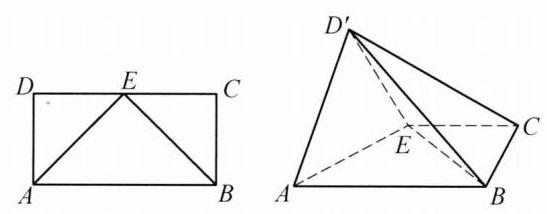

(第 13 题图)

### 10.3 直线与平面的位置关系(2)

1 “直线 $l$ 垂直于平面 $\alpha$ 内的无数条直线”是 “ $l\bot \alpha$ ” 的___条件。

2 已知 $m\text{ 、 }n$ 是空间两条相交直线， ${l}_{1}\text{ 、 }{l}_{2}$ 是与 $m\text{ 、 }n$ 都垂直的两条直线，直线 $l$ 与 ${l}_{1}\text{ 、 }{l}_{2}$ 都相交，则直线 $l$ 与 ${l}_{1}$ 、 ${l}_{2}$ 所成的角的大小关系为___。

3 已知三条相交于一点的线段 ${PA}\text{ 、 }{PB}\text{ 、 }{PC}$ 两两垂直，且 $A\text{ 、 }B\text{ 、 }C$ 在同一平面内， $P$ 在平面 ${ABC}$ 外， ${PH} \bot$ 平面 ${ABC}$ 于 $H$ ，则垂足 $H$ 是 $\bigtriangleup  {ABC}$ 的___心。

4 已知 ${BC}$ 是 $\operatorname{Rt}\bigtriangleup {ABC}$ 的斜边， ${AP}\bot$ 平面 ${ABC}$ ，连接 ${PB}\text{ 、 }{PC}$ ，作 ${PD}\bot {BC}$ 于 $D$ ，连接 ${AD}$ ，则图中共有直角三角形___个， $\bigtriangleup  {PBC}$ 是___，三角形。

5 已知平面 $\alpha$ 、 $\beta$ 和直线 $m$ ，给出以下条件:① $m//\alpha$ ；② $m\bot \alpha$ ；③ $m \subset  \alpha$ ；④ $m//\beta$ 。要想得到 $m \bot  \beta$ ，则所需要的条件是___。(填序号)

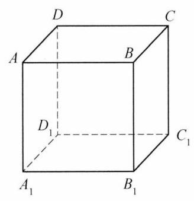

(第 6 题图)

6 如图，在棱长为 $a$ 的正方体 ${ABCD} - {A}_{1}{B}_{1}{C}_{1}{D}_{1}$ 中， $A$ 到直线 ${B}_{1}C$ 的距离为___， $A{A}_{1}$ 到平面 $B{B}_{1}{D}_{1}D$ 的距离为___， $A$ 到平面 ${A}_{1}{BD}$ 的距离为___。

7 下列命题中，假命题是( )。

A. 如果一条直线与一个平面垂直，则这条直线与这个平面内的任意一条直线垂直

B. 如果两条直线同时垂直于一个平面, 则这两条直线平行

C. 平面的垂线与这个平面一定相交

D. 如果一条直线上有两点到一个平面的距离相等,则这条直线与这个平面平行

8 有下列四个命题，①点 $A \notin$ 平面 $\alpha$ ，直线 $a \subset  \alpha$ ，则 $A$ 到 $a$ 的距离等于 $A$ 到 $\alpha$ 的距离；②直线 $a//$ 平面 $\alpha , b \subset  \alpha , a//b$ ,则 $a\text{ 、 }b$ 间的距离等于 $a$ 与 $\alpha$ 间的距离; ③ $A \in$ 直线 $a, a//$ 直线 $b$ ,则 $a\text{ 、 }b$ 间的距离等于 $A$ 到 $b$ 的距离; ④ 直线 $a//$ 平面 $\alpha , A \in  a$ ,则直线 $a$ 与平面 $\alpha$ 间的距离等于 $A$ 到 $\alpha$ 的距离。其中正确命题的个数是( )。

A. 4 个

B. 3 个

C. 2 个

D. 1 个

9 从平面 $\alpha$ 外一点 $P$ 作与 $\alpha$ 相交的直线,使得 $P$ 与交点的距离为 1,则满足条件的直线一定不可能是( )。

A. 0 条

B. 1 条

C. 2 条

D. 无数条

10 如图，四边形 ${ABCD}$ 是矩形， ${PA}\bot$ 平面 ${ABCD}$ ， $\bigtriangleup  {PAD}$ 是等腰三角形， $M$ 、 $N$ 分别是 ${AB}\text{ 、 }{PC}$ 的中点,求证: ${MN}\bot$ 平面 ${PCD}$ 。

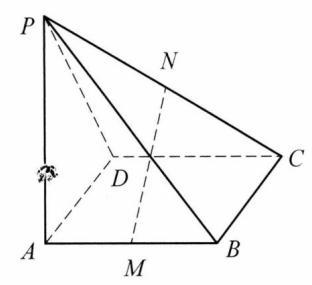

(第 10 题图)

11 如图 1,在五边形 ${ABCDE}$ 中,四边形 ${ABCE}$ 为正方形, ${CD} \bot  {DE},{CD} = {DE}$ ,如图 2,将 $\bigtriangleup {ABE}$ 沿 ${BE}$ 折起,使得 $A$ 至 ${A}_{1}$ 处,且 ${A}_{1}B \bot  {DE}$ 。

证明: ${DE} \bot$ 平面 ${A}_{1}{BE}$ 。

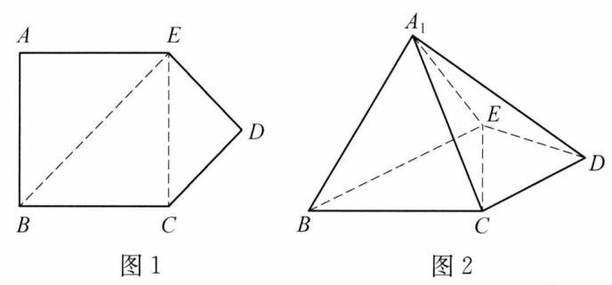

(第 11 题图)

12 如图，已知四边形 ${ABCD}$ 是矩形， ${AB} = a,{AD} = b,{PA} \bot$ 平面 ${ABCD},{PA} = {2c}, Q$ 是 ${PA}$ 的中点。求:(1) $Q$ 到 ${BD}$ 的距离；

(2) $P$ 到平面 ${BQD}$ 的距离。

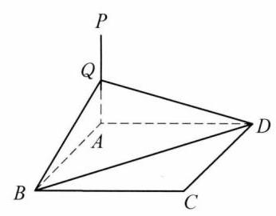

(第 11 题图)

13 (选做)若三角形 ${ABC}$ 三个顶点到平面 $\alpha$ 的距离分别为 $a\text{ 、 }b\text{ 、 }c$ , $\bigtriangleup {ABC}$ 的重心为 $G$ ,则点 $G$ 到平面 $\alpha$ 的距离为___。

### 10.3 直线与平面的位置关系(3)

1 斜线与平面所成角的范围是___。

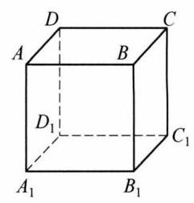

(第 2 题图)

2 如图，在正方体 ${ABCD} - {A}_{1}{B}_{1}{C}_{1}{D}_{1}$ 中，直线 $A{B}_{1}$ 与平面 ${AB}{C}_{1}{D}_{1}$ 所成的角的大小为___。

3 已知 $P$ 是 $\bigtriangleup {ABC}$ 所在平面 $\alpha$ 外一点, $O$ 是 $P$ 点在平面 $\alpha$ 上的射影。若 $P$ 到 $\bigtriangleup {ABC}$ 三边的距离相等,则 $O$ 是 $\bigtriangleup {ABC}$ 的___心; 若 $P$ 到 $\bigtriangleup {ABC}$ 三个顶点的距离相等,则 $O$ 是 $\bigtriangleup {ABC}$ 的___心; 若 ${PA}\text{ 、 }{PB}\text{ 、 }{PC}$ 两两互相垂直，则 $O$ 是 $\bigtriangleup {ABC}$ 的___，

4 长度为 10cm 的线段两个端点到平面 $\alpha$ 的距离分别为 2cm 和 3cm，则这条线段所在直线与平面 $\alpha$ 所成角的正弦值为___。

5 已知 $\bigtriangleup {ABC}$ 为等腰直角三角形,且 ${AC} = {BC} = 5\sqrt{2},{PC} \bot  {AC},{PC} \bot  {BC},{PC} = 5,{AB}$ 的中点为 $M$ ，连接 ${PM}$ 、 ${CM}$ ，则 ${PM}$ 与平面 ${ABC}$ 所成的角的大小为___。

6 关于正方体 ${ABCD} - {A}_{1}{B}_{1}{C}_{1}{D}_{1}$ 有如下说法:①直线 ${A}_{1}B$ 与 ${B}_{1}C$ 所成的角为 ${60}^{ \circ  }$ ；②直线 $C{A}_{1}$ 与 ${C}_{1}D$ 所成的角为 ${60}^{ \circ  }$ ; ③ 直线 $B{C}_{1}$ 与平面 $B{B}_{1}{D}_{1}D$ 所成的角为 ${45}^{ \circ  }$ ; ④ 直线 $B{C}_{1}$ 与平面 ${ABCD}$ 所成的角为 ${45}^{ \circ  }$ 。其中正确的命题是___。

7 下列命题中正确的是( )。

A. 若平面 $M$ 外的两条直线在平面 $M$ 内的射影为一条直线及此直线外的一个点,则这两条直线互为异面直线

B. 若平面 $M$ 外的两条直线在平面 $M$ 内的射影为两条相交直线，则这两条直线相交

C. 若平面 $M$ 外的两条直线在平面 $M$ 内的射影为两条平行直线，则这两条直线平行

D. 若平面 $M$ 外的两条直线在平面 $M$ 内的射影为两条互相垂直的直线，则这两条直线垂直

8 已知正方体 ${ABCD} - {A}_{1}{B}_{1}{C}_{1}{D}_{1}$ ，则下列选项中不正确的是( )。

A. 直线 ${A}_{1}B$ 与 ${B}_{1}C$ 所成的角为 ${60}^{ \circ  }$

B. ${A}_{1}B \bot  D{B}_{1}$

C. $D{B}_{1} \bot$ 平面 ${AC}{D}_{1}$

D. ${B}_{1}C \bot  {B}_{1}D$

9 已知直线 $a$ 与平面 $\alpha$ 所成的角为 ${30}^{ \circ  }$ ，直线 $b$ 在平面 $\alpha$ 内且与 $a$ 是异面直线，若直线 $a$ 与 $b$ 所成的角为 $\varphi$ ，则( )。

A. ${0}^{ \circ  } < \varphi  \leq  {30}^{ \circ  }$ B. ${0}^{ \circ  } < \varphi  \leq  {90}^{ \circ  }$

C. ${30}^{ \circ  } \leq  \varphi  \leq  {90}^{ \circ  }$ D. ${30}^{ \circ  } \leq  \varphi  \leq  {180}^{ \circ  }$

10 已知直角 $\bigtriangleup {ABC}$ 的斜边 ${AB}$ 在平面 $\alpha$ 内， ${AC}$ 、 ${BC}$ 与 $\alpha$ 所成角分别为 ${30}^{ \circ  }$ 、 ${45}^{ \circ  }$ ， ${CD}$ 是斜边 ${AB}$ 上的高,求 ${CD}$ 与平面 $\alpha$ 所成角的正弦值。

11 如图，在长方体 ${ABCD} - {A}_{1}{B}_{1}{C}_{1}{D}_{1}$ 中， ${AB} = 2,{AD} = {A{A}_{1}} = 1$ 。

(1)求证: ${B}_{1}C \bot  B{D}_{1}$ ；

(2)求直线 $A{B}_{1}$ 与平面 ${AB}{C}_{1}{D}_{1}$ 所成角的正弦值。

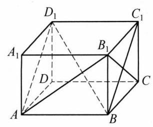

(第 11 题图)

12 如图，在菱形 ${ABCD}$ 中， $\angle {ABC} = {60}^{ \circ  },{AC}$ 与 ${BD}$ 相交于点 $O,{AE} \bot$ 平面 ${ABCD},{CF}// \; {AE},{AB} = {AE} = 2$ 。

(1)求证: ${BD}\bot$ 平面 ${ACFE}$ ；

(2)当直线 ${FO}$ 与平面 ${ABCD}$ 所成的角的余弦值为 $\frac{\sqrt{10}}{10}$ 时,求证: ${EF}\bot {BE}$ ；

(3)在(2)的条件下，求异面直线 ${OF}$ 与 ${DE}$ 所成角的余弦值。

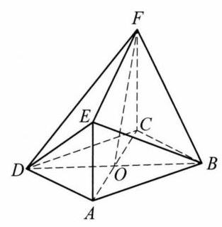

(第 12 题图)

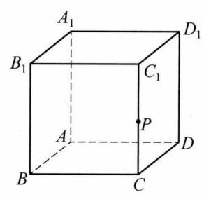

(第 13 题图)

13 (选做) 如图,已知正方体 ${ABCD} - {A}_{1}{B}_{1}{C}_{1}{D}_{1}$ ,点 $P$ 是棱 $C{C}_{1}$ 的中点,设直线 ${AB}$ 为 $a$ ,直线 ${A}_{1}{D}_{1}$ 为 $b$ 。对于下列两个命题: ①过点 $P$ 有且只有一条直线 $l$ 与 $a\text{ 、 }b$ 都相交; ②过点 $P$ 有且只有两条直线 $l$ 与 $a\text{ 、 }b$ 都成 ${75}^{ \circ  }$ 角。以下判断中正确的是( )。

A. ①为真命题，②为真命题

B. ①为真命题，②为假命题

C. ①为假命题，②为真命题

D. ①为假命题，②为假命题

### 10.3 直线与平面的位置关系(4)

1 平面上的一条直线和这个平面的一条斜线垂直的充要条件是它和这条斜线在___垂直。

2 空间中直线 $l$ 和三角形 ${ABC}$ 所在的平面垂直，则这条直线和三角形的边 ${AB}$ 的位置关系是___。

3 已知平面 $\alpha //$ 平面 $\beta$ ，直线 $a \subset  \alpha$ ，直线 $b \subset  \beta$ ，下面四种情形:① $a//b$ ; ② $a\bot b$ ；③ $a$ 与 $b$ 异面；④ $a$ 与 $b$ 相交。其中可能出现的情形有___种。

4 已知 $P$ 为 $\bigtriangleup {ABC}$ 所在平面外一点，且 ${PA}$ 、 ${PB}$ 、 ${PC}$ 两两垂直，有下列命题:① ${PA}\bot {BC}$ ； ② ${PB} \bot  {AC}$ ；③ ${PC} \bot  {AB}$ ；④ ${AB} \bot  {BC}$ 。其中正确的是___。

5 如图， $P$ 为矩形 ${ABCD}$ 所在平面外一点， ${PA} \bot$ 平面 ${ABCD}$ ，若已知 ${AB} = 3$ ， ${AD} = 4$ ， ${PA} = 1$ ，则点 $P$ 到 ${BD}$ 的距离是___。

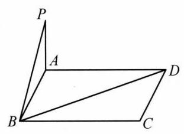

(第 5 题图)

(第 6 题图)

(第 7 题图)

(第 8 题图)

6 如图，在三棱锥 $P - {ABC}$ 中， ${PA}\bot$ 平面 ${ABC}$ ， ${AB}\bot {BC}$ ， ${PA} = {AB}$ ， $D$ 为 ${PB}$ 的中点，则下列结论中正确的是___。

① ${BC}\bot$ 平面 ${PAB}$ ；② ${AD}\bot {PC}$ ；③ ${AD}\bot$ 平面 ${PBC}$ ；④ ${PB}\bot$ 平面 ${ADC}$ 。

7 如图，已知 ${PA} \bot$ 平面 ${ABC}$ ， ${\angle {ABC}} = {120}^{ \circ  }$ ， ${PA} = {AB} = {BC} = 4$ ，则 ${PC}$ 等于()___。

A. 4 B. 2 C. 8 D. 12

8 如图，如果 ${MC} \bot$ 菱形 ${ABCD}$ 所在的平面，那么 ${MA}$ 与 ${BD}$ 的位置关系是( )。

A. 平行 B. 不垂直 C. 垂直 D. 相交

9 若正 $\bigtriangleup  {ABC}$ 的边长为 $\frac{4\sqrt{3}}{3}$ ，则到三个顶点的距离都为 1 的平面有( )。

A. 1 个 B. 3 个 C. 5 个 D. 7 个

10 已知，如图 $P$ 是平面 $\alpha$ 外一点， ${PA}$ 是平面 $\alpha$ 的斜线，交 $\alpha$ 于点 $A$ ，过点 $P$ 作平面 $\alpha$ 的垂线 ${PO}$ ，垂足是 $O$ ，直线 ${OA}$ 是 ${PA}$ 在平面 $\alpha$ 上的投影。求证:对平面 $\alpha$ 上任一直线 $a, a \bot  {OA}$ 是 $a \bot  {PA}$ 的充要条件。

(第 10 题图)

11 如图，在正方体 ${ABCD} - {A}_{1}{B}_{1}{C}_{1}{D}_{1}$ 中， $E$ 、 $F$ 分别是棱 ${AB}$ 、 ${BC}$ 的中点， $O$ 是底面 ${ABCD}$ 的中心，求证: ${EF}\bot$ 平面 $B{B}_{1}O$ 。

(第 11 题图)

12 如图，一条笔直道路东北侧有一条河，河对岸有电塔 ${AB}$ ，现有测角仪和皮尺作为测量工具。

(1)若已知电塔高 $h$ 米，若测角仪只能测水平方向，根据图中提示，请说明还需要测量的数据，然后运用三垂线定理求出电塔塔顶 $A$ 与道路之间的距离；

(2)若电塔 ${AB}$ 高未知，但测角仪水平方向与竖直方向均可测，请你设计一方案，计算出电塔塔顶 $A$ 与道路上任意一点 $P$ 之间的距离；

(3)若电塔 ${AB}$ 意外倒塌，但保留完整，横亘于河对岸，与道路在一平面内，请你用测角仪 (测水平方向)和皮尺作为工具，运用解斜三角形的知识，制定一方案，测量倒塌后的电塔 ${AB}$ 的长度。

(第 12 题图)

13 (选做)在矩形 ${ABCD}$ 中, ${AB} = 1,{BC} = a,{PA} \bot$ 平面 ${ABCD}$ ,且 ${PA} = 1$ ,边 ${BC}$ 上是否存在点 $Q$ ,使得 ${PQ} \bot  {QD}$ ? 为什么?

(第 13 题图)

### 10.4 平面与平面的位置关系(1)

1 过平面 $\alpha$ 外一条直线 $a$ 与 $\alpha$ 平行的平面的个数是___。

2 分别在两个平面内的三角形都有两条边与同一条直线垂直，则这两个三角形所在面的位置关系是___。

3 已知平面 $\alpha //$ 平面 $\beta$ ，直线 $a$ 、 $b$ 分别与 $\alpha$ 、 $\beta$ 所成的角相等，则直线 $a$ 、 $b$ 的位置关系是 ___。

(第 4 题图)

4 如图，平面 $\alpha //$ 平面 $\beta$ ，自点 $O$ 引三条直线分别交 $\alpha$ 、 $\beta$ 于点 $A$ 、 $B$ 、 $C$ 和点 ${A}_{1}\text{ 、 }{B}_{1}\text{ 、 }{C}_{1}$ ，则 $\bigtriangleup  {ABC}$ 与 $\bigtriangleup  {A}_{1}{B}_{1}{C}_{1}$ 的关系是___。

5 已知 $a\text{ 、 }b\text{ 、 }c$ 为三条不重合的直线， $\alpha \text{ 、 }\beta \text{ 、 }\gamma$ 为三个不重合的平面， 现给出六个命题:

① $a//c, b//c \Rightarrow  a//b$ ； ② $a//\gamma , b//\gamma  \Rightarrow  a//b$ ；

③ $c//\alpha , c//\beta  \Rightarrow  \alpha //\beta$ ； ④ $\alpha //\gamma ,\beta //\gamma  \Rightarrow  \alpha //\beta$ ；

⑤ $a//c, c//\alpha  \Rightarrow  a//\alpha$ ； ⑥ $a//\gamma ,\alpha //\gamma  \Rightarrow  a//\alpha$ 。

其中正确的命题是___。

(第 6 题图)

6 如图，平面 $\alpha //\beta$ ， $A$ ， $C \in  \alpha$ ， $B$ ， $D \in  \beta$ ，直线 ${AB}$ 与 ${CD}$ 交于点 $S$ ，且 ${AS} = 3,{BS} = 9,{CD} = {34}$ ，则 ${CS}$ 的长为___。

7 下列条件中，可以判断平面 $\alpha$ 与 $\beta$ 平行的是( )。

A. 直线 $a$ 与 $\alpha \text{ 、 }\beta$ 相交且所成的角相等

B. $\alpha$ 内存在不共线的三点到 $\beta$ 的距离相等

C. $l, m$ 是 $\alpha$ 内两条直线,且 $l//\beta , m//\beta$

D. $l, m$ 是两条异面直线，且 $l//\alpha , m//\alpha , l//\beta , m//\beta$

8 已知 $a \subset  \alpha$ ，则 $\alpha //\beta$ 是 $a//\beta$ 的( )。

A. 充分不必要条件

B. 必要不充分条件

C. 充要条件

D. 既不充分也不必要条件

9 已知 ${AB}\text{ 、 }{CD}$ 是夹在两平行平面 $\alpha \text{ 、 }\beta$ 之间的两条线段, ${AB} \bot  {CD},{AB} = 2,{AB}$ 与平面 $\alpha$ 成 ${30}^{ \circ  }$ 角，则线段 ${CD}$ 的取值范围是( )。

A. $\left( {\frac{2\sqrt{3}}{3},2\sqrt{3}}\right)$ B. $\left\lbrack  {\frac{2\sqrt{3}}{3}, + \infty }\right)$

C. $\left( {1,\frac{2\sqrt{3}}{3}}\right)$ D. $\lbrack 1, + \infty )$

10 如图，正方体 ${ABCD} - {A}_{1}{B}_{1}{C}_{1}{D}_{1}$ 的边长为2，点 $F$ 为棱 $C{C}_{1}$ 的中点，过直线 ${AF}$ 作一平面，与棱 $B{B}_{1}$ 、 $D{D}_{1}$ 分别交于 $E$ 、 $G$ 两点。求证:四边形 ${AEFG}$ 为平行四边形。

(第 10 题图)

11 如图，矩形 ${ACFE}$ 中， ${AE} = 1,{AE}\bot$ 平面 ${ABCD}$ ， ${AB}//{CD}$ ， $\angle {BAD} = {90}^{ \circ  },{AB} = 1,{AD} = {CD} = 2$ ,平面 ${ADF}$ 与棱 ${BE}$ 交于点 $G$ 。 求证: ${AG}//{DF}$ 。

(第 11 题图)

12 如图，已知 $\alpha //\beta //\gamma$ ， $A$ 、 $D \in  \alpha$ ， $C$ 、 $F \in  \gamma$ ， ${AC}$ 、 ${DF}$ 分别交平面 $\beta$ 于 $B$ 、 $E$ 。

(第 12 题图)

(1)求证: $\frac{AB}{BC} = \frac{DE}{EF}$ ；

(2)设 ${AF}$ 交 $\beta$ 于 $M$ ，若 $\frac{AB}{BC} = 1$ ，异面直线 ${AD}$ 与 ${CF}$ 所成角为 ${60}^{ \circ  }$ ， ${AD} = 2,{CF} = 4$ ,求 ${S}_{\bigtriangleup {BEM}}$ 。

(第 13 题图)

13 (选做) 如图,在正方体 ${ABCD} - {A}_{1}{B}_{1}{C}_{1}{D}_{1}$ 中, $E\text{ 、 }F$ 分别为 $C{C}_{1}$ 、 $A{A}_{1}$ 的中点, $M$ 是线段 ${D}_{1}E$ 上的动点 (包括端点),下列说法中不正确的是( )。

A. 对于任意 $M$ 点, ${B}_{1}M$ 与平面 ${DFB}$ 平行

B. 存在 $M$ 点，使得 ${A}_{1}M$ 与平面 ${DFB}$ 平行

C. 存在 $M$ 点，使得直线 ${B}_{1}M$ 与直线 ${DF}$ 平行

D. 对于任意 $M$ 点，直线 ${A}_{1}M$ 与直线 ${BF}$ 异面

### 10.4 平面与平面的位置关系(2)

1 在正三角形 ${ABC}$ 中， ${AD}\bot {BC}$ 于 $D$ ，沿 ${AD}$ 折成二面角 $B - {AD} - C$ 后， ${BC} = \frac{1}{2}{AB}$ ，这时二面角 $B - {AD} - C$ 的大小为___。

2 在正方体 ${ABCD} - {A}_{1}{B}_{1}{C}_{1}{D}_{1}$ 中，平面 ${A}_{1}D{C}_{1}$ 和平面 ${A}_{1}B{C}_{1}$ 所成的二面角(锐角)大小为 ___。

3 如图，60°的二面角的棱上有 $A$ 、 $B$ 两点，直线 ${AC}$ 、 ${BD}$ 分别在二面角两个半平面内,且垂直于 ${AB},{AC} = {BD} = 6,{AB} = 8$ ,则 ${CD} =$ ___。

(第 3 题图)

4 已知菱形的一个内角是 ${60}^{ \circ  }$ ,边长为 $a$ ,沿菱形较短的对角线折成大小为 ${60}^{ \circ  }$ 的二面角，则菱形中含 ${60}^{ \circ  }$ 角的两个顶点间的距离为___。

5 已知二面角 $\alpha  - {AB} - \beta$ 的平面角是锐角 $\theta ,\alpha$ 内一点 $C$ 到 $\beta$ 的距离为 3，点 $C$ 到棱 ${AB}$ 的距离为 4，则 $\tan \theta  =$ ___。

6 在 ${30}^{ \circ  }$ 的二面角的一个面内有一个点，若它到另一个面的距离是 10，则它到棱的距离为 ___。

7 二面角是指( )。

A. 两个平面相交所组成的图形

B. 一个平面绕这个平面内一条直线旋转所组成的图形

C. 从一个平面内的一条直线出发的一个半平面与这个平面所组成的图形

D. 从一条直线出发的两个半平面所组成的图形

8 若分别向小于 90°的二面角的两个半平面作垂线，且它们是异面直线，则这两条直线所成的角与二面角的平面角的关系是( )。

A. 相等 B. 互补 C. 互余 D. 以上都不对

9 已知三个平面 $\alpha$ 、 $\beta$ 、 $\gamma$ ，有下列命题:①若 $\alpha \bot \beta$ ， $\gamma \bot \beta$ ，则 $\alpha \bot \gamma$ ；②若 $\alpha \bot \beta$ ， $\gamma \bot \beta$ ，则 $\alpha //\gamma$ ; ③若 $\alpha //\beta ,\beta \bot \gamma$ ，则 $\alpha \bot \gamma$ 。其中正确的个数是( )。

A. 1 B. 2 C. 3 D. 0

(第 10 题图)

10 如图，在正方体 ${ABCD} - {A}_{1}{B}_{1}{C}_{1}{D}_{1}$ 中。

(1)求证:面 $B{B}_{1}{D}_{1}D \bot$ 面 $A{B}_{1}C$ ；

(2)求二面角 $A - {B}_{1}C - {C}_{1}$ 的平面角的余弦值。

11 如图，在三棱锥 $S - {ABC}$ 中， ${\angle {SAB}} = \angle {SAC} = \angle {ABC} = {90}^{ \circ  },{SA} = {AB},{SB} = {BC}$ 。

(1)证明:平面 ${SBC} \bot$ 平面 ${SAB}$ ；

(2)求二面角 $A - {SC} - B$ 的平面角的正弦值。

(第 11 题图)

12 如图，矩形 ${ABCD}$ 中， ${AB} = 2,{BC} = 1, E$ 为 ${CD}$ 的中点，把 $\bigtriangleup  {ADE}$ 沿 ${AE}$ 翻折，满足 ${AD}\bot \; {BE}$ 。(1)求证:平面 ${ADE} \bot$ 平面 ${ABCE}$ ；

(2)求二面角 $E - {AC} - D$ 的余弦值。

(第 12 题图)

(第 13 题图)

13 (选做) 如图,二面角 $\alpha  - l - \beta$ 的平面角为 ${60}^{ \circ  }, A\text{ 、 }B$ 是棱 $l$ 上的两点, ${AC}\text{ 、 }{BD}$ 分别在半平面 $\alpha \text{ 、 }\beta$ 内, ${AC} \bot  l,{BD} \bot  l$ 且 ${AB} = {AC} = 1$ , ${BD} = 2$ ，则 ${CD}$ 的长为( )。

A. $\sqrt{3}$ B. $2\sqrt{2}$

C. $\sqrt{5}$ D. 2

### 10.4 平面与平面的位置关系(3)

1 正方形 ${ABCD}$ 与 ${ABEF}$ 的边长都为 $a$ ,若二面角 $E - {AB} - C$ 的大小为 ${30}^{ \circ  }$ ,则 ${EF}$ 到平面 ${ABCD}$ 的距离为___。

2 在空间两两垂直的平面最多有___个。

3 已知矩形 ${ABEF}$ 和正方形 ${ABCD}$ 有公共边 ${AB}$ ，它们所在平面成 ${60}^{ \circ  }$ 的二面角，且 ${AB} = \; {CB} = {2a},{BE} = a$ ，则 ${FC} =$ ___。

4 在正方体 ${ABCD} - {A}_{1}{B}_{1}{C}_{1}{D}_{1}$ 中，平面 $A{A}_{1}{C}_{1}C$ 和平面 ${A}_{1}{BC}{D}_{1}$ 所成的二面角 (锐角) 大小为___。

5 已知 $\bigtriangleup  {ABC}$ 和平面 $\alpha ,\angle A = {30}^{ \circ  },\angle B = {60}^{ \circ  },{AB} = 2,{AB} \subset  \alpha$ ，且平面 ${ABC}$ 与 $\alpha$ 所成角为 ${30}^{ \circ  }$ ,则点 $C$ 到平面 $\alpha$ 的距离为___。

6 已知二面角 $\alpha  - l - \beta$ 的平面角是 ${120}^{ \circ  }$ ，在面 $\alpha$ 内， ${AB}\bot l$ 于 $B$ ， ${AB} = 2$ ，在面 $\beta$ 内， ${CD}\bot l$ 于 $D$ ， ${CD} = 3$ ， ${BD} = 1$ ， $M$ 是棱 $l$ 上的一个动点，则 ${AM} + {CM}$ 的最小值是___。 7 如图，在长方体 ${ABCD} - {A}_{1}{B}_{1}{C}_{1}{D}_{1}$ 中， ${AB} = {AD} = 1$ ， $A{A}_{1} = a$ ，记平面 ${A}_{1}C{D}_{1}$ 和平面 ${ABCD}$ 的交线为 $l$ ，已知二面角 ${D}_{1} - l - A$ 的大小为 ${60}^{ \circ  }$ ，则 $a$ 的值为( )。

(第 7 题图)

A. $\frac{\sqrt{3}}{3}$ B. 1

C. $\sqrt{3}$ D. 2

8 坡度是描述地表单元陡缓的程度，通常把坡面的垂直高度和水平方向的距离的比叫做坡度, 就是坡面与水平面成角的正切值。如图所示，已知斜面 ${ABCD}$ 的坡度是 1，某种越野车的最大爬坡度数是 ${30}^{ \circ  }$ ,若这种越野车从 $D$ 点开始爬坡,则行驶方向 ${DE}$ 与直线 ${AD}$ 的最大夹角的度数为( )。

(第 8 题图)

A. ${30}^{ \circ  }$ B. ${45}^{ \circ  }$

C. 60° D. 75°

9 若一个二面角的两个半平面分别垂直于另一个二面角的两个半平面, 则这两个二面角的平面角 ( )。

A. 相等 B. 互补 C. 相等或互补 D. 不能确定

10 斜坡平面与水平面成 ${30}^{ \circ  }$ 的二面角,一条公路与坡脚成 ${15}^{ \circ  }$ 的角,沿坡向上,每公里路基升高多少米?

11 已知二面角 $\alpha  - l - \beta$ 的大小为 ${60}^{ \circ  }$ ,点 $A \in  \alpha ,{AC} \bot  l, C$ 为垂足,点 $B \in  \beta ,{BD} \bot  l, D$ 为垂足。若 ${CD} = \sqrt{3},{AC} = {BD} = 1$ ,则 ${AB}$ 是多少?

12 如图，在四棱锥 $P - {ABMN}$ 中， $\bigtriangleup  {PMN}$ 是边长为 1 的正三角形，面 ${PMN} \bot$ 面 ${AMN}$ ， ${AN}//{BM},{AN} \bot  {NP},{AN} = {2BM} = 2, C$ 为 ${PA}$ 的中点。

(1)求证: ${BC}//$ 平面 ${PMN}$ ；

(2)线段 ${PA}$ 上是否存在点 $F$ ，使二面角 $F - {MN} - P$ 的余弦值为 $\frac{\sqrt{201}}{67}$ ？若存在，求 ${PF}$ ； 若不存在，请说明理由。

(第 12 题图)

13 (选做) 如图，正方体 ${ABCD} - {A}_{1}{B}_{1}{C}_{1}{D}_{1}$ 的棱长为3， $E$ 、 $F$ 分别为棱 ${BC}$ 、 ${CD}$ 上的动点， ${CF} : {DF} = {CE} : {EB}$ 。若直线 $C{C}_{1}$ 与平面 ${EF}{C}_{1}$ 所成角为 $\frac{\pi }{6}$ 。

(1)求二面角 ${C}_{1} - {EF} - C$ 的平面角的大小；

(第 13 题图)

(2)求线段 ${EF}$ 的长度；

(3)求二面角 ${C}_{1} - {BD} - {A}_{1}$ 平面角的余弦值。

### 10.5 异面直线间的距离

1 对于任意给定的两条异面直线，存在___条直线与这两条直线都垂直。

2 长方体 ${ABCD} - {A}_{1}{B}_{1}{C}_{1}{D}_{1}$ 中， ${AB}$ 和 $D{D}_{1}$ 的公垂线段是___， $A{A}_{1}$ 和 $B{C}_{1}$ 的公垂线段是___。

(第 3 题图)

3 如图，长方体 ${ABCD} - {A}_{1}{B}_{1}{C}_{1}{D}_{1}$ 的棱 $A{A}_{1}$ 、 ${AB}$ 、 ${AD}$ 的长分别为 3、4、5，则异面直线 ${A}_{1}B$ 和 $C{C}_{1}$ 的距离为___。

4 空间四边形 ${ABCD}$ 的各边与两条对角线的长都为 1,点 $P$ 在边 ${AB}$ 上移动，点 $Q$ 在边 ${CD}$ 上移动，则点 $P$ 、 $Q$ 的最短距离为___。

5 边长为 1 的两个正方形 ${ABCD}$ 和 ${CDEF}$ 构成大小为 $\frac{2\pi }{3}$ 的二面角, 则异面直线 ${AE}$ 和 ${CD}$ 之间的距离为___。

6 四面体 ${SABC}$ 中, ${SA} = {BC} = {13},{SB} = {AC} = {14},{SC} = {AB} = {15}$ ,则异面直线 ${AS}$ 与 ${BC}$ 的距离为___。

7 空间和两条异面直线同时都垂直且相交的直线 ( )。

A. 不一定存在 B. 有且只有 1 条

C. 有 1 条或不存在 D. 有无数条

8 有下列命题:①两条异面直线的公垂线有无数条；②异面直线之间的距离就是两条异面直线上点之间距离的最小值；③过两条异面直线中的一条有且只有一个平面与另一条直线平行。 其中真命题的个数是( )。

A. 0 个 B. 1 个 C. 2 个 D. 3 个

9 已知平面 $\alpha //$ 平面 $\beta$ ，直线 $m \subset  \alpha$ ，直线 $n \subset  \beta$ ，点 $A \in  m$ ， $B \in  n$ 。记 $A$ 、 $B$ 两点间的距离为 $a$ ， 点 $A$ 到直线 $n$ 的距离为 $b$ ，直线 $m$ 和 $n$ 的距离为 $c$ ，则 $a$ 、 $b$ 、 $c$ 的大小关系为( )。

A. $c \leq  b \leq  a$ B. $c \leq  a \leq  b$

C. $a \leq  c \leq  b$ D. $b \leq  c \leq  a$

10 如图,在空间四边形 ${ABCD}$ 中, ${AB} = {CD} = 4,{BC} = {AD} = 3,{AD} \bot  {DC},{AD} \bot  {BC},{AB} \bot \; {BC}$ ,求异面直线 ${AD}$ 和 ${BC}$ 的距离。

(第 10 题图)

11 空间四边形 ${ABCD}$ 中, ${AB} = {BD} = {AD} = 2,{BC} = {CD} = 3$ ,延长 ${BC}$ 到 $E$ ,使得 ${BC} = {CE}$ , $F$ 为 ${BD}$ 的中点，求异面直线 ${AF}$ 和 ${DE}$ 的距离。

12 如图所示,在直角梯形 ${ABCD}$ 中, ${BC}//{AD},{AD} \bot  {CD},{BC} = 2,{AD} = 3,{CD} = \sqrt{3}$ ,边 ${AD}$ 上一点 $E$ 满足 ${DE} = 1$ 。现将 $\bigtriangleup {ABE}$ 沿 ${BE}$ 折起到 $\bigtriangleup {A}_{1}{BE}$ 的位置,使平面 ${A}_{1}{BE} \bot$ 平面 ${BCDE}$ (如图所示),求异面直线 ${A}_{1}C$ 与 ${BE}$ 的距离。

(第 12 题图)

13 (选做) 正方体 ${ABCD} - {A}_{1}{B}_{1}{C}_{1}{D}_{1}$ 中,边长为 4,求异面直线 ${A}_{1}D$ 与 ${B}_{1}{D}_{1}$ 的距离。

## 第 11 章 简单几何体

### 11.1 柱体(1)

1 已知 $M = \{$ 正四棱柱 $\} , N = \{$ 长方体 $\} , P = \{$ 直四棱柱 $\} , Q = \{$ 正方体 $\} , R = \{$ 凸多面体 $\}$ , 则集合 $M$ 、 $N$ 、 $P$ 、 $Q$ 、 $R$ 之间的关系是___。

2 若正方体的棱长为 $a$ ，则正方体的对角线长为___，对角面的面积为___。

3 下列几何体中，___是正四棱柱。

① 底面是正方形且有两个侧面垂直于底面的棱柱

② 底面是正方形且有两个侧面是矩形的棱柱

③ 底面是菱形且有一个顶点处的三条棱两两垂直的棱柱

④ 每个侧面是全等矩形的棱柱

4 在正方体中，与正方体的一个面上的一条对角线成 60°角的异面的面对角线共有___条。

5 若长方体的一条对角线与一个顶点处的三条棱成的角分别是 $\alpha$ 、 $\beta$ 、 $\gamma$ ，则 ${\sin }^{2}\alpha  + {\sin }^{2}\beta  + \; {\sin }^{2}\gamma  =$ ___；若它与过这个顶点的三个面所成的角分别为 $\theta$ 、 $\varphi$ 、 $\psi$ ，则 ${\sin }^{2}\theta  + {\sin }^{2}\varphi  + \; {\sin }^{2}\psi  =$ ___。

6 在斜棱柱的侧面中，矩形最多有___个。

7 下列几何体中是长方体的是( )。

(第 8 题图)

A. 直平行六面体 B. 侧面是矩形的四棱柱

C. 对角面是全等矩形的四棱柱 D. 底面是矩形的直棱柱

8 如图，棱长为 2 的正方体 ${ABCD} - {A}_{1}{B}_{1}{C}_{1}{D}_{1}$ 中， $E$ 为 $C{C}_{1}$ 的中点，点

$P\text{ 、 }Q$ 分别为面 ${A}_{1}{B}_{1}{C}_{1}{D}_{1}$ 和线段 ${B}_{1}C$ 上的动点,则 $\bigtriangleup {PEQ}$ 周长的最小值为( )。

A. $2\sqrt{2}$ B. $\sqrt{10}$

C. $\sqrt{11}$ D. $\sqrt{12}$

(第 9 题图)

9 如图，在正三棱柱 ${ABC} - {A}_{1}{B}_{1}{C}_{1}$ 中，所有棱长均为2，点 $E$ 、 $F$ 分别为棱 $B{B}_{1}$ 、 ${A}_{1}{C}_{1}$ 的中点，若过点 $A$ 、 $E$ 、 $F$ 作一截面，则截面的周长为( )。

A. $2 + 2\sqrt{5}$ B. $2\sqrt{5} + \frac{2}{3}\sqrt{13}$

C. $2\sqrt{5} + \sqrt{13}$ D. $2\sqrt{5} + \frac{\sqrt{13}}{2}$

(第 10 题图)

10 如图所示,在直三棱柱 ${ABC} - {A}_{1}{B}_{1}{C}_{1}$ 中,底面是等腰直角三角形, $\angle {ACB} = {90}^{ \circ  },{CA} = {CB} = C{C}_{1} = 2$ 。点 $D\text{ 、 }{D}_{1}$ 分别是棱 ${AC}\text{ 、 }{A}_{1}{C}_{1}$ 的中点。

(1)求证: $D$ 、 $B$ 、 ${B}_{1}$ 、 ${D}_{1}$ 四点共面；

(2)求直线 $B{C}_{1}$ 与平面 ${DB}{B}_{1}{D}_{1}$ 所成角的大小。

(第 11 题图)

11 如图，在正三棱柱 ${ABC} - {A}_{1}{B}_{1}{C}_{1}$ 中，各棱长均为4， $M$ 、 $N$ 分别是 ${BC}\text{ 、 }C{C}_{1}$ 的中点。

(1)求证: ${AM}\bot$ 平面 ${BC}{C}_{1}{B}_{1}$ ；

(2)求证: $A{B}_{1} \bot  {BN}$ 。

(第 12 题图)

12 如图，已知点 $P$ 在圆柱 $O{O}_{1}$ 的底面圆 $O$ 上， $\angle {AOP} = {120}^{ \circ  }$ ，圆 $O$ 的直径 ${AB} = 4$ ，圆柱的高 $O{O}_{1} = 3$ 。

(1)求圆柱的轴截面的面积;

(2)求异面直线 ${A}_{1}B$ 与 ${AP}$ 所成角的大小(结果用反三角函数值表示);

(3)由点 $A$ 拉一根细绳绕圆柱侧面达到 ${B}_{1}$ ，求绳长的最小值。

13 (选做)查找并阅读关于蜂房结构的资料, 建立数学模型说明蜂房正面采用正六边形面，底端是封闭的六角棱锥体的底,由三个相同的菱形组成 (菱形的锐角为 ${70}^{ \circ  }{32}^{\prime }$ ,钝角为 ${109}^{ \circ  }{28}^{\prime }$ )的原因。

(第 13 题图)

### 11.1 柱体 (2)

1 有三个命题:①底面是平行四边形的四棱柱是平行六面体；②底面是矩形的平行六面体是长方体；③直四棱柱是直平行六面体；其中真命题的个数是___。

2 若正六棱柱的高为 $h$ ，底面边长为 $a$ ，则这个正六棱柱的体积是___。

3 已知三个平面两两垂直，且交于同一点 $P$ ，空间一点 $Q$ 到三个平面的距离分别为 $3\text{ 、 }4\text{ 、 }{12}$ ， 那么 $P\text{ 、 }Q$ 两点的距离等于___。

4 已知正六棱柱最长的对角线长为 ${13}\mathrm{\;{cm}}$ ,一个侧面的面积为 ${30}{\mathrm{\;{cm}}}^{2}$ ,棱柱的体积是 ___。

5 将一张边长为 1 的正三角形纸片，按如图方法将它拼剪成一个三棱柱，则这个三棱柱的体积为___。

(第 5 题图)

(第 6 题图)

6 如图，在棱长为 2 的正方体 ${ABCD} - {A}_{1}{B}_{1}{C}_{1}{D}_{1}$ 中，点 $P$ 为平面 ${AC}{C}_{1}{A}_{1}$ 上一动点，且满足 ${D}_{1}P \bot  {CP}$ ，则满足条件的所有点 $P$ 围成的平面区域的面积为___。

7 已知斜三棱柱的一个侧面的面积为 10，该侧面与其相对的侧棱的距离为 3，则此斜三棱柱的体积为( )。

A. 30 B. 15 C. 10 D. 5

8 设甲、乙两个圆柱的底面积分别为 ${S}_{1}\text{ 、 }{S}_{2}$ ,体积分别为 ${V}_{1}\text{ 、 }{V}_{2}$ ,若它们的侧面积相等且 $\frac{{S}_{1}}{{S}_{2}} = \frac{9}{4}$ ，则 $\frac{{V}_{1}}{{V}_{2}}$ 的值为( )。

A. $\frac{3}{2}$ B. $\frac{2}{3}$ C. $\frac{1}{2}$ D. $\frac{4}{3}$

9 已知图 1 中的正三棱柱 ${ABC} - {A}_{1}{B}_{1}{C}_{1}$ 的底面边长为 2,体积为 $2\sqrt{2}$ ,去掉其侧棱,将上底面绕上、下底面的中心所在的直线 ${O}_{1}{O}_{2}$ 逆时针旋转 ${180}^{ \circ  }$ 后(下底面位置保持不变)，再添上侧棱， 得到图 2 所示的几何体，则下列说法中正确的是 ( )。

(第 9 题图)

A. ${A}_{2}{B}_{2} \bot  C{C}_{2}$

B. $A{B}_{2} = \frac{2\sqrt{6}}{3}$

C. 四边形 ${AB}{A}_{2}{B}_{2}$ 不一定是正方形

D. 正三棱柱 ${ABC} - {A}_{1}{B}_{1}{C}_{1}$ 与多面体 ${ABC}{A}_{2}{B}_{2}{C}_{2}$ 的体积相同

10 已知长方体 ${ABCD} - {A}_{1}{B}_{1}{C}_{1}{D}_{1}$ 的对角线 $A{C}_{1}$ 长是 $l$ ，且直线 $A{C}_{1}$ 与长方体经过点 $A$ 的三个面所成的角分别为 $\alpha \text{ 、 }\beta \text{ 、 }\gamma$ 。求此长方体的体积。

11 如图，在三棱柱 ${ABC} - {A}_{1}{B}_{1}{C}_{1}$ 中，底面是边长为 $a$ 的正三角形， $A{A}_{1}$ 与 ${AB}\text{ 、 }{AC}$ 所成的角均为 ${60}^{ \circ  }$ ，且 $A{A}_{1} = B{A}_{1} = C{A}_{1}$ ，求该棱柱的体积。

(第 11 题图)

12 如果一个正四棱柱与一个圆柱的体积相等, 那么我们称它们是一对“等积四棱圆柱”。将 “等积四棱圆柱”的正四棱柱、圆柱的表面积与高分别记为 ${S}_{1}$ 、 ${S}_{2}$ 与 ${h}_{1}$ 、 ${h}_{2}$ 。

(1)若 ${h}_{1} = {h}_{2} = 1,{S}_{1} = {16}$ ，求 ${S}_{2}$ 的值；

(2)若 ${h}_{1} = {h}_{2}$ ，求证: ${S}_{1} > {S}_{2}$ ；

(3)若存在一对“等积四棱圆柱”,满足 ${S}_{1} = {S}_{2}$ 与 $\frac{{h}_{2}}{{h}_{1}} = \lambda$ ，求实数 $\lambda$ 的取值范围。

13 (选做)如图 1，有一个圆柱形状的玻璃水杯，底面圆的直径为20cm，高为30cm，杯内有 ${20}\mathrm{\;{cm}}$ 深的溶液，现将水杯倾斜，且倾斜时点 $B$ 始终在桌面上，设直径 ${AB}$ 所在直线与桌面所成的角为 $\alpha$ (图 2)。

(1)求图 2 圆柱的母线与液面所在平面所成的角(用 $\alpha$ 表示)；

(2)要使倾斜后容器内的溶液不会溢出，求角 $\alpha$ 的最大值；

(3)现需要倒出的溶液体积不少于 ${3000}{\mathrm{\;{cm}}}^{3}$ ，当 $\alpha  = {60}^{ \circ  }$ 时，能实现要求吗？请说明理由。

(第 13 题图)

### 11.1 柱体 (3)

1 若一个圆柱的侧面积是 ${a\pi }$ ,高为 $h$ ,则这个圆柱的体积是___。

2 将一个棱长为 $a$ 的正方体切成 27 个全等的小正方体，其表面积增加了___。

3 有一根高为 ${3\pi }$ ,底面半径为 1 的圆柱形铁管,用一段铁丝在铁管上缠绕 1 圈,并使铁丝的两个端点落在圆柱的同一母线的两端，则铁丝的最短长度为___。

4 (1)长方体的全面积为 ${11}{\mathrm{\;{cm}}}^{2}$ ，所有棱长之和为 ${24}\mathrm{\;{cm}}$ ，则其体对角线长为___。

(2)若过一个长方体一顶点的三个面的面积分别为 $\sqrt{2}{\mathrm{\;{cm}}}^{2}$ 、 $\sqrt{3}{\mathrm{\;{cm}}}^{2}$ 、 $\sqrt{6}{\mathrm{\;{cm}}}^{2}$ ，则这个长方体的对角线的长是___。

5 若长方体的高为 $h$ ，底面积为 $P$ ，垂直于底面的对角面的面积为 $Q$ ，则此长方体的侧面积是 ___。

6 如图，有两个相同的直三棱柱，高为 $\frac{2}{a}$ ，底面三角形的三边长分别为 ${3a}\text{ 、 }{4a}\text{ 、 }{5a}\left( {a > 0}\right)$ ，用它们拼成一个三棱柱或四棱柱,在所有可能的情形中,全面积最小的是一个三棱柱,则 $a$ 的取值范围是___。

(第 6 题图)

7 下列各图中不是正方体表面展开图的是( )。

A

B

C

D

8 已知三棱柱 ${ABC} - {A}_{1}{B}_{1}{C}_{1}$ 中，所有棱长均为 6，且 $\angle {A}_{1}{AB} = \angle {A}_{1}{AC} = {60}^{ \circ  }$ ，则该三棱柱的侧面积等于( )。

A. ${36}\sqrt{3}$ B. ${54}\sqrt{3}$ C. ${36} + {36}\sqrt{3}$ D. ${36} + {54}\sqrt{3}$

9 棱长为 1 的正方体 ${ABCD} - {A}_{1}{B}_{1}{C}_{1}{D}_{1}$ 内部有一圆柱 $O{O}_{1}$ ,此圆柱恰好以直线 $A{C}_{1}$ 为轴。 有下列四个命题:①圆柱 $O{O}_{1}$ 的母线与正方体 ${ABCD} - {A}_{1}{B}_{1}{C}_{1}{D}_{1}$ 所有的棱所成的角都相等; ②正方体 ${ABCD} - {A}_{1}{B}_{1}{C}_{1}{D}_{1}$ 所有的面与圆柱 $O{O}_{1}$ 的底面所成的角都相等; ③在正方体

${ABCD} - {A}_{1}{B}_{1}{C}_{1}{D}_{1}$ 内作与圆柱 $O{O}_{1}$ 底面平行的截面,则截面的面积 $S \in  \left( {0,\frac{\sqrt{3}}{2}}\right\rbrack$ ; ④ 圆柱 $O{O}_{1}$ 侧面积的最大值为 $\frac{3\sqrt{2}}{8}\pi$ 。其中真命题的个数是( )。

A. 1 B. 2 C. 3 D. 4

10 如图，四边形 ${BC}{C}_{1}{B}_{1}$ 是圆柱的轴截面， $A{A}_{1}$ 是圆柱的一条母线，已知 ${AB} = 4,{AC} = {2\sqrt{2}}$ ， $A{A}_{1} = 3$ ，求该圆柱的侧面积与表面积。

(第 10 题图)

11 如图，在斜三棱柱 ${ABC} - {DEF}$ 中， $\bigtriangleup  {ABC}$ 是边长为 2 的正三角形， ${BD} = {CD} = \frac{4}{3}\sqrt{3}$ ，侧棱 ${AD}$ 与底面 ${ABC}$ 所成角为 ${60}^{ \circ  }$ ，求三棱柱 ${ABC} - {DEF}$ 的体积和表面积。

(第 11 题图)

12 如图，在直四棱柱 ${ABCD} - {A}_{1}{B}_{1}{C}_{1}{D}_{1}$ 中， ${AB}//{CD},{A{A}_{1}} = 1,{AB} = {3k},{AD} = {4k},{BC} = \; {5k},{DC} = {6k}\left( {k > 0}\right)$ 。

(1)求证: ${CD}\bot$ 平面 ${AD}{D}_{1}{A}_{1}$ ；

(2)现将与四棱柱 ${ABCD} - {A}_{1}{B}_{1}{C}_{1}{D}_{1}$ 形状和大小完全相同的两个四棱柱拼成一个新的四棱柱, 规定: 若拼成的新四棱柱形状和大小完全相同, 则视为同一种拼接方案, 问: 共有几种不同的拼接方案? 在这些拼接成的新四棱柱中,记其中最小的表面积为 $f\left( k\right)$ ,写出 $f\left( k\right)$ 的解析式。(直接写出答案,不必说明理由)

(第 12 题图)

13 (选做) 如图所示,正方体 ${ABCD} - {A}^{\prime }{B}^{\prime }{C}^{\prime }{D}^{\prime }$ 的棱长为 $1, E\text{ 、 }F$ 分别是棱 $A{A}^{\prime }\text{ 、 }C{C}^{\prime }$ 的中点,过直线 ${EF}$ 的平面分别与棱 $B{B}^{\prime }\text{ 、 }D{D}^{\prime }$ 交于 $M\text{ 、 }N$ ,设 ${BM} = x, x \in  \left\lbrack  {0,1}\right\rbrack$ 。

(1)求 ${EF}$ 与面 ${A}^{\prime }{B}^{\prime }{BA}$ 所成的角的大小；

(2)求四棱锥 ${C}^{\prime } - {MENF}$ 的体积 $V = h\left( x\right)$ ，并讨论它的单调性；

(3)若点 $P$ 是正方体棱上一点，试证:满足 ${PA} + {P{C}^{\prime }} = 2$ 成立的点的个数为 6。

(第 13 题图)

### 11.2 锥体 (1)

1 已知 $M = \{$ 正多面体 $\} , N = \{$ 多面体 $\} , R = \{$ 凸多面体 $\} , Q = \{$ 棱长相等的三棱锥 $\}$ ,则集合 $M\text{ 、 }N\text{ 、 }R\text{ 、 }Q$ 之间的关系是___。

2 给出下列命题:①底面是正多边形的棱锥是正棱锥；②侧棱都相等的棱锥是正棱锥；⑤侧棱和底面成等角的棱锥是正棱锥；④侧面和底面所成二面角都相等的棱锥是正棱锥；⑤侧棱和底面成等角、侧面和底面所成二面角都相等的棱锥是正棱锥。其中正确的命题是___。

3 若棱长为 $a$ 的正四面体中，高为 $H$ ，斜高为 $h$ ，相对棱间的距离为 $d$ ，则 $a$ 、 $H$ 、 $h$ 、 $d$ 的大小关系为___。

4 如果正三棱锥的高为 $\sqrt{3}$ ，侧棱长为 $\sqrt{7}$ ，侧面与底面所成的二面角为___。

5 如图，已知底面是正方形的四棱锥，其一条侧棱与底面垂直，它的长与底面边长相等，长度均为 1，那么该棱锥中最长的棱长是___。

(第 5 题图)

(第 6 题图)

6 如图，在四棱锥 $S - {ABCD}$ 中，底面 ${ABCD}$ 是矩形，侧面 ${SCD} \bot$ 底面 ${ABCD}$ ， $\bigtriangleup  {SAB}$ 是边长为 2 的等边三角形,点 $P\text{ 、 }Q$ 分别为侧棱 ${SA}\text{ 、 }{SB}$ 上的动点,记 $s = {DP} + {PQ} + {QC}$ ,则 $s$ 的最小值的取值范围是___。

7 底面是正三角形,且每个侧面是等腰三角形的三棱锥 ( )。

A. 一定是正三棱锥 B. 一定是正四面体

C. 不是斜三棱锥 D. 可能是斜三棱锥

8 如果正三棱锥的侧面都是直角三角形，则侧棱与底面所成的角 $\theta$ 应属于( )。

A. $\left( {0,\frac{\pi }{6}}\right)$ B. $\left( {\frac{\pi }{4},\frac{\pi }{3}}\right)$

C. $\left( {\frac{\pi }{6},\frac{\pi }{4}}\right)$ D. $\left( {\frac{\pi }{3},\frac{\pi }{2}}\right)$

9 已知四面体 ${A}^{\prime } - {ABC}$ 的三组对棱的长分别相等，依次为 $3\text{ 、 }4\text{ 、 }x$ ，则 $x$ 的取值范围是 ( )。

A. $\left( {\sqrt{5},\sqrt{7}}\right)$ B. $\left( {\sqrt{7},5}\right)$ C. $\left( {\sqrt{5},3}\right)$ D. $\left( {4,7}\right)$

10 已知正四棱锥的相邻两侧面所成角为 ${120}^{ \circ  }$ ,它的底面边长为 $a$ 。求棱锥的斜高、高和侧棱长。

11 如图，在三棱锥 $P - {ABC}$ 中， ${PA} = {PB} = {PC} = {AC} = 2\sqrt{2},{BA} = {BC} = 2$ ， $O$ 是线段 ${AC}$ 的中点, $M$ 是线段 ${BC}$ 的中点。

(1)求证: ${PO}\bot$ 平面 ${ABC}$ ；

(2)求直线 ${PM}$ 与平面 ${PBO}$ 所成的角的大小。

(第 11 题图)

12 某中学开展劳动实习，学生对圆台体木块进行平面切割，已知圆台的上底面半径为 1 ，下底面半径为 2,要求切割面经过圆台的两条母线且使得切割面的面积最大。求圆台分别满足下列条件时,所得切割面的面积。

(1)圆台的高为 $\sqrt{\frac{3}{3}}$ ；

(2)圆台的高为 $\sqrt{3}$ 。

13 (选做) 如图 1 所示为一种魔豆吊灯,图 2 为该吊灯的框架结构图,由正六棱锥 ${O}_{1} - \; {ABCDEF}$ 和 ${O}_{2} - {ABCDEF}$ 构成，两个棱锥的侧棱长均相等，且棱锥底面外接圆的直径为 ${1600}\mathrm{\;{mm}}$ ，底面中心为 $O$ ,通过连接线及吸盘固定在天花板上,使棱锥的底面呈水平状态，下顶点 ${O}_{2}$ 与天花板的距离为 ${1300}\mathrm{\;{mm}}$ ,所有的连接线都用特殊的金属条制成,设金属条的总长为 $y$ 。

(第 13 题图)

(1)设 $\angle {O}_{1}{AO} = \theta \left( \mathrm{{rad}}\right)$ ，将 $y$ 表示成 $\theta$ 的函数关系式，并写出 $\theta$ 的范围；

(2)请你设计一下，当角 $\theta$ 正弦值的大小是多少时，金属条总长 $y$ 最小？

### 11.2 锥体 (2)

1 三棱锥的三条侧棱两两垂直，且这三条侧棱长分别是 1、2、3，那么该棱锥的体积为___。

2 在三棱台 ${ABC} - {A}_{1}{B}_{1}{C}_{1}$ 中,三棱锥 $B - {A}_{1}{B}_{1}{C}_{1}$ 体积为 1,三棱锥 ${C}_{1} - {ABC}$ 体积为 4,则该三棱台体积为___。

3 鳖臑是我国古代对四个面均为直角三角形的三棱锥的称呼。如图，三棱锥 $A - {BCD}$ 是一鳖臑,其中 ${AB} \bot  {BC},{AB} \bot  {BD},{BC} \bot  {CD},{AC} \bot  {CD}$ ,且高 ${AB} = 3\sqrt{2},{BC} = \sqrt{2}{CD} = \sqrt{6}$ , 三棱锥 $A - {BCD}$ 的体积为___。

4 如图，在三棱锥 $P - {ABC}$ 中， ${PA}\bot {BC},{PA} = {BC} = 1,{PA}\text{ 、 }{BC}$ 的公垂线段 ${EF} = h$ ，三棱锥 $P - {ABC}$ 的体积为___。

(第 3 题图)

(第 4 题图)

(第 5 题图)

5 如图，棱长为 3 的正方体的顶点 $A$ 在平面 $\alpha$ 上，三条棱 ${AB}\text{ 、 }{AC}\text{ 、 }{AD}$ 都在平面 $\alpha$ 的同侧, 如顶点 $B\text{ 、 }C$ 到平面 $\alpha$ 的距离分别为 $1\text{ 、 }\sqrt{2}$ ，则顶点 $D$ 到平面 $\alpha$ 的距离为___。

6 在三棱锥 $S - {ABC}$ 中， ${SA} = 4,{SB} \geq  7,{SC} \geq  9,{AB} = 5,{BC} \leq  6,{AC} \leq  8$ 。则三棱锥的体积的最大值为___。

7 沙漏是我国古代的一种计时工具，可以视作是用两个完全相同的圆锥顶对顶叠放在一起组成的, 在一个圆锥中装满沙子, 放在上方, 沙子就从顶点处漏到另一个圆锥中, 假定沙子漏下来的速度是恒定的。已知一个沙漏中沙子全部从一个圆锥中漏到另一个圆锥中需总时长为 1 小时，当上方圆锥中沙子漏至圆锥高度的 $\frac{1}{3}$ 时，所需时间为( )。

A. $\frac{1}{3}$ 小时 B. $\frac{7}{8}$ 小时 C. $\frac{26}{27}$ 小时 D. $\frac{8}{9}$ 小时

(第 8 题图)

8 两相同的正四棱锥组成如图所示的几何体，可放入棱长为 1 的正方体内,使正四棱锥的底面 ${ABCD}$ 与正方体的某一个平面平行,且各顶点均在正方体的面上，则这样的几何体体积的可能值有( )。

A. 1 个 B. 2 个

C. 3 个 D. 无穷多个

(第 9 题图)

9 如图，在正方体 ${ABCD} - {A}_{1}{B}_{1}{C}_{1}{D}_{1}$ 中，棱长为 6，动点 $E$ 、 $F$ 在对角线 ${A}_{1}{C}_{1}$ 上，动点 $P$ 在对角线 ${AC}$ 上，动点 $Q$ 在棱 ${BC}$ 上，若 ${EF} = 3,{A}_{1}E = x,{AP} = y,{CQ} = z\left( {z > 0}\right)$ ,则四面体 ${EFPQ}$ 的体积( )。

A. 与 $z$ 有关,与 $x\text{ 、 }y$ 无关

B. 与 $y$ 有关,与 $x\text{ 、 }z$ 无关

C. 与 $x$ 有关,与 $y\text{ 、 }z$ 无关

D. 与 $x\text{ 、 }y\text{ 、 }z$ 都有关

(第 10 题图)

10 在直三棱柱 ${ABC} - {A}_{1}{B}_{1}{C}_{1}$ 中, ${AB} \bot  {BC},{AB} = {BC} = 2, A{A}_{1} = 2\sqrt{3}, M$ 是侧棱 ${C}_{1}C$ 上一点,设 ${MC} = h$ 。

(1)若 $h = \sqrt{3}$ ，求多面体 ${ABM} - {A}_{1}{B}_{1}{C}_{1}$ 的体积；

(2)若异面直线 ${BM}$ 与 ${A}_{1}{C}_{1}$ 所成的角为 ${60}^{ \circ  }$ ，求 $h$ 的值。

11 在梯形 ${ABCD}$ 中， ${AD}//{BC},\angle {ABC} = \frac{\pi }{2},{AB} = a,{AD} = {3a}$ 且 $\angle {ADC} = \arcsin \frac{\sqrt{5}}{5}$ ，又

${PA} \bot$ 平面 ${ABCD},{PA} = a$ 。求:

(1)二面角 $P - {CD} - A$ 的大小；

(2)点 $A$ 到平面 ${PBC}$ 的距离。

(第 11 题图)

12 如图，在四棱锥 $S - {ABCD}$ 中， ${SD}\bot$ 平面 ${ABCD}$ ，底面 ${ABCD}$ 是菱形， $E$ 、 $F$ 分别为 ${SB}$ 、 ${AD}$ 的中点。

(1)证明: ${EF}//$ 平面 ${SCD}$ ；

(2)若 $\angle {BAD} = {60}^{ \circ  },{SD} = 4,{AB} = 2$ ，求三棱锥 $C - {DEF}$ 的体积。

(第 12 题图)

13 (选做) (1) 对于任意给定的四面体 ${A}_{1}{A}_{2}{A}_{3}{A}_{4}$ ,求作四个相互平行的平面 ${\alpha }_{i}$ ,使 ${A}_{i} \in  {\alpha }_{i}$ , 且相邻两平面间距离都相等。

(2)若对一个正四面体 ${A}_{1}{A}_{2}{A}_{3}{A}_{4}$ 作出上题的四个平面，且四个平面间距离为 1，求正四面体的体积。

### 11.2 锥体 (3)

1 已知正四面体的棱长为 1，则该正四面体的表面积为___。

2 一个圆锥的侧面展开图是半径为 2 的半圆，则此圆锥的表面积为___。

3 某圆锥的底面积为 ${4\pi }$ ，侧面积为 ${8\pi }$ ，则该圆锥的母线与底面所成角的大小为___。

4 正三棱锥 $S - {ABC}$ 的高 ${SO} = h$ ，斜高 ${SM} = l$ ，点 $P$ 在 ${SO}$ 上且分 ${SO}$ 所成线段的比是 1:

2，则过点 $P$ 且平行于底面的截面面积是___。

5 若圆锥的侧面积与过轴的截面积之比为 ${2\pi }$ ，则其母线与轴的夹角的大小为___。

6 在四棱锥 $P - {ABCD}$ 中，底面 ${ABCD}$ 是边长为 2 的正方形， ${PA} \bot$ 平面 ${ABCD}$ ，且 ${PA} =$

2。若点 $E$ 、 $F$ 、 $G$ 分别为棱 ${AB}$ 、 ${AD}$ 、 ${PC}$ 的中点，有以下结论:① ${AG}\bot$ 平面 ${PBD}$ ; ② 直线 ${FG}$ 和直线 ${AB}$ 所成的角为 $\frac{\pi }{4}$ ; ③ 当点 $T$ 在平面 ${PBD}$ 内,且 ${TA} + {TG} = 2$ 时,点 $T$ 的轨迹为一个椭圆; ④过点 $E\text{ 、 }F\text{ 、 }G$ 的平面与四棱锥 $P - {ABCD}$ 表面交线的周长为 $2\sqrt{2} + \sqrt{6}$ 。其中正确的是___。

(第 7 题图)

7 如图，某圆锥的轴截面 ${ABC}$ 是等边三角形，点 $D$ 是线段 ${AB}$ 的中点,点 $E$ 在底面圆的圆周上,且 $\overset{\text{ ⏜ }}{BE}$ 的长度等于 $\overset{\text{ ⏜ }}{CE}$ 的长度,则异面直线 ${DE}$ 与 ${BC}$ 所成角的余弦值是( )。

A. $\frac{\sqrt{2}}{4}$ B. $\frac{\sqrt{6}}{4}$

C. $\frac{\sqrt{10}}{4}$ D. $\frac{\sqrt{14}}{4}$

8 设四面体 ${ABCD}$ 的四个面的重心分别为 $E\text{ 、 }F\text{ 、 }G\text{ 、 }H$ ,则四面体 ${EFGH}$ 的表面积与四面体 ${ABCD}$ 的表面积的比值是( )。

A. $\frac{1}{27}$ B. $\frac{1}{16}$

C. $\frac{1}{9}$ D. $\frac{1}{8}$

(第 9 题图)

9 如图，某几何体平面展开图由一个等边三角形和三个等腰直角三角形组合而成， $E$ 为 ${BC}$ 的中点，则在原几何体中，异面直线 ${AE}$ 与 ${CD}$ 所成角的余弦值为( )。

A. $\frac{\sqrt{6}}{6}$ B. $\frac{\sqrt{6}}{3}$

C. $\frac{\sqrt{3}}{3}$ D. $\frac{\sqrt{6}}{12}$

10 如图，已知点 $P$ 在圆柱 $O{O}_{1}$ 的底面圆 $O$ 上， $\angle {AOP} = {120}^{ \circ  }$ ，圆 $O$ 的直径 ${AB} = 4$ ，圆柱的高 $O{O}_{1} = 3$ 。

(1)求圆柱的表面积和三棱锥 ${A}_{1} - {APB}$ 的体积；

(2)求点 $A$ 到平面 ${A}_{1}{PO}$ 的距离。

(第 10 题图)

11 截角四面体是一种半正八面体,可由四面体经过适当的截角,即截去四面体的四个顶点所产生的多面体。如图, 将棱长为 3 的正四面体沿棱的三等分点作平行于对应底面的截面得到所有棱长均为 1 的截角四面体。

(1)求该截角四面体的表面积；

(2)求该截角四面体的体积。

(第 11 题图)

12 如图，两个相同的正四棱锥底面重合组成一个八面体，可放入棱长为 2 的正方体中，重合的底面与正方体的某一个面平行，各顶点均在正方体的表面上，将满足上述条件的八面体称为正方体的“正子体”。

(1)若正子体的六个顶点分别是正方体各面的中心，求该八面体的表面积。

(2)此正子体的表面积 $S$ 是否为定值？若是，求出该定值；若不是，求出表面积的取值范围。 13 (选做)已知正三棱锥 $P - {ABC}$ ，顶点为 $P$ ，底面是三角形 ${ABC}$ 。

(第 12 题图)

(1)若该三棱锥的侧棱长为 1，且两两成角为 $\frac{\pi }{18}$ ，设质点 $W$ 自 $A$ 出发依次沿着三个侧面移动环绕一周直至回到出发点 $A$ ，求质点移动路程的最小值；

(2)若该三棱锥的所有棱长均为 1，试求以 $P$ 为顶点，以三角形 ${ABC}$ 内切圆为底面的圆锥的体积;

(3)若该锥体的体积为定值 $V$ ，求这三棱锥侧面与底面所成的角 $\theta$ ，使该三棱锥的表面积 $S$ 最小。

### 11.3 多面体与旋转体

1 下列命题中正确的是___。

① 将矩形旋转一周所得的几何体是圆柱;

② 平行于圆锥某一母线的截面是等腰三角形;

③ 过圆锥的轴的截面是等腰三角形;

④ 以直角三角形的一边为旋转轴，旋转所得的几何体是圆锥。

2 将一个正方形绕着它的一边所在直线旋转一周，所得几何体的体积为 ${27\pi }$ ，则该几何体的全面积为___。

3 多面体欧拉定理: $V + F = E + 2$ ,其中 $V$ 是顶点数, $F$ 是面数, $E$ 是棱数,并且多面体所有面的内角总和为 $\left( {V - 2}\right)  \cdot  {360}^{ \circ  }$ ,已知某正多面体所有面的内角总和为 ${3600}^{ \circ  }$ ,且各面都为正三角形，则该多面体的顶点数 $V =$ ___，棱数 $E =$ ___。

4 我国古代数学名著《九章算术》中记载的“刍甍”指底面为矩形，顶部只有一条棱的五面体。 如图，五面体 ${ABCDEF}$ 是一个“刍薨”，其中 $\bigtriangleup {BCF}$ 是正三角形， ${AB} = {2BC} = {2EF} = 2$ ， ${BF} \bot \; {ED}$ ，则该五面体的体积为___。

${y}_{4}$

图 1 图 2 图 3

(第 5 题图)

(第 4 题图)

5 运用祖暅原理计算球体积时，构造一个底面半径和高都与球半径相等的圆柱，与半球(如图 1)放置在同一平面上，然后在圆柱内挖去一个以圆柱下底面圆心为顶点，圆柱上底面为底面的圆锥 (如图 2)，用任何一个平行于底面的平面去截它们时，可证得所截得的两个截面面积相等， 由此证明该几何体与半球体积相等(球的体积公式:半径为 $R$ 时， $V = \frac{4}{3}\pi {R}^{3}$ )。现将椭圆 $\frac{{x}^{2}}{4} + \; \frac{{y}^{2}}{9} = 1$ 绕 $y$ 轴旋转一周后得一橄榄状的几何体 (如图 3)，类比上述方法，运用祖暅原理可求得其体积等于___。

6 如图，在四面体 ${ABCD}$ 中， ${AB} = {CD} = 2,{AC} = {BD} = \sqrt{3},{AD} = {BC} = \; \sqrt{5}, E\text{ 、 }F$ 分别是 ${AD}\text{ 、 }{BC}$ 的中点。若用一个与直线 ${EF}$ 垂直，且与四面体的每个面都相交的平面 $\alpha$ 去截该四面体，由此得到一个多边形截面， 则该多边形截面面积的最大值为___。

(第 6 题图)

7 设正多面体的每个面都是正 $n$ 边形,以每个顶点为端点的棱有 $m$ 条,顶点数是 $V$ ,棱数是 $E$ ，面数是 $F$ ，则它们之间的关系不正确的是( )。

A. ${nF} = {2E}$ B. ${mV} = {2E}$ C. $V + F = E + 2$ D. ${mF} = {2E}$

8 如图所示的几何体是由一个圆柱挖去一个以圆柱的上底面为底面，下底面圆心为顶点的圆锥而得到的，现用一个竖直平面去截这个几何体，则截得的图形可能是下图中的( )。

A. ①② B. ①③ C. ①④ D. ③④

(第 8 题图)

9 在正四棱柱 ${ABCD} - {A}_{1}{B}_{1}{C}_{1}{D}_{1}$ 中，顶点 ${B}_{1}$ 到对角线 $B{D}_{1}$ 和到平面 ${A}_{1}{BC}{D}_{1}$ 的距离分别为 $h$ 和 $d$ ，则下列命题中正确的是( )。

A. 若侧棱的长小于底面的边长，则 $\frac{h}{d}$ 的取值范围为 $\left( {0,1}\right)$

B. 若侧棱的长小于底面的边长，则 $\frac{h}{d}$ 的取值范围为 $\left( {\frac{\sqrt{2}}{2},\frac{2\sqrt{3}}{3}}\right)$

C. 若侧棱的长大于底面的边长,则 $\frac{h}{d}$ 的取值范围为 $\left( {\frac{2\sqrt{3}}{3},\sqrt{2}}\right)$

D. 若侧棱的长大于底面的边长，则 $\frac{h}{d}$ 的取值范围为 $\left( {\frac{2\sqrt{3}}{3}, + \infty }\right)$

10 如图，梯形 ${ABCD}$ 满足 ${AB}//{CD},\angle {ABC} = {90}^{ \circ  }$ ，且 ${AB} = {2\sqrt{3}},{BC} = 1,\angle {BAD} = {30}^{ \circ  }$ ，现将梯形 ${ABCD}$ 绕 ${AB}$ 所在的直线旋转一周,所得几何体记作 $\Omega$ 。

(第 10 题图)

(1)求 $\Omega$ 的体积 $V$ ；

(2)求 $\Omega$ 的表面积 $S$ 。

11 在长方体 ${ABCD} - {A}_{1}{B}_{1}{C}_{1}{D}_{1}$ 中(如图)， ${AD} = {A{A}_{1}} = 1,{AB} = 2$ ，点 $E$ 是棱 ${AB}$ 的中点。

(1)求异面直线 $A{D}_{1}$ 与 ${EC}$ 所成角的大小；

(2)《九章算术》中，将四个面都是直角三角形的四面体称为鳖臑。试问四面体 ${D}_{1}{CDE}$ 是否为鳖臑？并说明理由。

(第 11 题图)

12 为了求一个棱长为 $\sqrt{2}$ 的正四面体的体积,某同学设计如下解法: 构造一个棱长为 1 的正方体，如图 1,则四面体 ${AC}{B}_{1}{D}_{1}$ 为棱长是 $\sqrt{2}$ 的正四面体,且有 ${V}_{\text{ 四面体 }{AC}{B}_{1}{D}_{1}} = {V}_{\text{ 正方体 }} - {V}_{B - {AC}{B}_{1}} - \; {V}_{{A}_{1} - A{B}_{1}{D}_{1}} - {V}_{{C}_{1} - {B}_{1}C{D}_{1}} - {V}_{D - {AC}{D}_{1}} = \frac{1}{3}{V}_{\text{ 正方体 }} = \frac{1}{3}$  。

(1)类似此解法，如图2，一个相对棱长都相等的四面体，其三组棱长分别为 $\sqrt{5}\text{ 、 }\sqrt{13}$ 、 $\sqrt{10}$ ，求此四面体的体积；

(2)四面体 ${ABCD}$ 中， ${AB} = {CD},{AC} = {BD},{AD} = {BC}$ 。求证:这个四面体的四个面都是锐角三角形。

(3)有 4 条长为 2 的线段和 2 条长为 $m$ 的线段，用这 6 条线段作为棱且长度为 $m$ 的线段不相邻，构成一个三棱锥。问 $m$ 为何值时，构成三棱锥体积最大？最大值为多少？

(第 12 题图)

13 (选做)近些年来, 三维扫描技术得到了空前发展, 从而催生了数字几何这一新兴学科。数字几何是传统几何和计算机科学相结合的产物。数字几何中的一个重要概念是曲率, 用曲率来刻画几何体的弯曲程度。规定:多面体在顶点处的曲率等于 2 π 与多面体在该点的所有面角之和的差(多面体的面角是指多面体的面上的多边形的内角的大小，用弧度制表示)，多面体在面上非顶点处的曲率均为零。由此可知,多面体的总曲率等于该多面体各顶点的曲率之和。 例如: 正方体在每个顶点有 3 个面角,每个面角是 $\frac{\pi }{2}$ ,所以正方体在各顶点的曲率为 ${2\pi } - 3 \times \; \frac{\pi }{2} = \frac{\pi }{2}$ ,故其总曲率为 ${4\pi }$ 。

(1)求四棱锥的总曲率；

(2)表面经过连续变形可以变为球面的多面体称为简单多面体。关于简单多面体有著名的欧拉定理: 设简单多面体的顶点数为 $D$ ,棱数为 $L$ ,面数为 $M$ ,则有: $D - L + M = 2$ 。利用此定理试证明:简单多面体的总曲率是常数。

### 11.4 球 (1)

1 过球面上任意两点作大圆,可作大圆___个。

2 在半径为 ${10}\mathrm{\;{cm}}$ 的球内，有一个截面距球心 $6\mathrm{\;{cm}}$ ，则该截面面积等于___。

3 已知半径为 13 的球的两个平行截面的周长为 ${10\pi }$ 和 ${24\pi }$ ,则这两个截面间的距离为 ___。

4 过球的某条半径的中点 ${O}_{1}$ 作一个垂直于这条半径的平面，则所得截面面积和球大圆面积之比为___。

5 已知球 $O$ 的半径为 1,四棱锥的顶点为 $O$ ,底面的四个顶点均在球 $O$ 的球面上,则当该四棱锥的体积最大时，其高为___。

6 已知正四棱锥 $O - {ABCD}$ 的底面边长为 $\sqrt{6}$ ，高为 3。以点 $O$ 为球心， $\sqrt{2}$ 为半径的球 $O$ 与过点 $A$ 、 $B$ 、 $C$ 、 $D$ 的球 ${O}_{1}$ 相交，相交圆的面积为 $\pi$ ，则球 ${O}_{1}$ 的半径为___。

7 下列说法中不正确的是( )。

A. 经过圆锥的轴的截面是一个等腰三角形 B. 矩形绕一边旋转一周得到圆柱

C. 圆柱的截面一定是矩形面 D. 球的截面一定是圆面

8 正三棱锥内有一个内切球，经过棱锥的一条侧棱和高作三棱锥的截面，正确的截面图是 ( )。

A

B

C

D

9 连接球面上两点的线段称为球的弦。半径为 4 的球的两条弦 ${AB}\text{ 、 }{CD}$ 的长度分别等于 $2\sqrt{7}\text{ 、 }4\sqrt{3}, M\text{ 、 }N$ 分别为 ${AB}\text{ 、 }{CD}$ 的中点，每条弦的两端都在球面上运动，有下列四个命题: ①弦 ${AB}\text{ 、 }{CD}$ 可能相交于点 $M$ ，②弦 ${AB}\text{ 、 }{CD}$ 可能相交于点 $N$ ，③MN 的最大值为 5，④MN 的最小值为 1 。其中真命题的个数是( )。

A. 1 个 B. 2 个 C. 3 个 D. 4 个

10 已知 $P$ 是半径为 $R$ 的球面上任意一点， ${PA}$ 、 ${PB}$ 、 ${PC}$ 是两两互相垂直的三条弦。求证: $P{A}^{2} + P{B}^{2} + P{C}^{2}$ 是一个定值。

11 已知半径为 $R$ 的半球内有一内接圆柱,求此圆柱的表面积的最大值。

12(1)半径为 $R$ 的 5 个球中的四个放在桌面上，使得任意一个球仅和其中的两个球相切，第五个球放在这四个球上, 使它与这四个球都相切, 求第五个球球心到桌面的距离。

(2)空间中有四个球，它们的半径分别是 2、2、3、3，每个球都与其余三个球外切，另有一个小球与这四个球都外切,求这个小球的半径。

(3)已知有四个半径为 $R$ 的球，每个球都和其他三球相切，求和这四个球都相切的球的半径。

13(选做)若四面体 ${ABCD}$ 的四个顶点均在单位正方体内部或边界上，

(1)求四面体 ${ABCD}$ 的体积最大值；

(2)求四面体 ${ABCD}$ 内切球半径最大值。

### 11.4 球(2)

1 设地球半径为 $R$ ，在北纬 ${30}^{ \circ  }$ 的纬度圈上有 $A$ 、 $B$ 两点，这两点的经度差是 ${90}^{ \circ  }$ ，则这两点之间纬线的长度为___。

2 已知地球半径约为 6371 千米。上海的位置约为东经 121°、北纬 31°，大连的位置约为东经 121°、北纬 39°。若飞机以平均速度 720 千米/时飞行，则从上海到大连的最短飞行时间约为 ___小时。(飞机飞行高度忽略不计，结果精确到 0.1 小时)

3 已知球 $O$ 的半径是 $1, A\text{ 、 }B\text{ 、 }C$ 三点都在球面上， ${OA}\text{ 、 }{OB}\text{ 、 }{OC}$ 两两垂直。若 $E\text{ 、 }F$ 分别为大圆弧 $\overset{\text{ ⏜ }}{AB}\text{ 、 }\overset{\text{ ⏜ }}{AC}$ (劣弧) 的三等分点 (均靠近 $A$ ),则点 $E\text{ 、 }F$ 在该球面上的球面距离是 ___。

4 已知球面上有三个点，其中任意两点的球面距离都等于大圆周的 $\frac{1}{6}$ ，如果经过这三个点的小圆的周长为 ${4\pi }$ ，那么这个球的半径为___。

5 下列___情况下两点间的球面距离是确定的。(填序号)

① 两点的经度、纬度都确定 ② 两点的经度确定，纬度差确定

③ 两点的纬度确定，经度差确定 ④ 两点的经度差确定，纬度差确定

6 在半径为 $R$ 的球内有一内接正三棱锥，它的底面三个顶点恰好都在同一个大圆上，一个动点从三棱锥的一个顶点出发沿球面运动，经过其余三点后返回，则经过的最短路程是___。

7 若纬度为 $\alpha$ 的纬圈上有 $A$ 、 $B$ 两点，弧在纬圈上，弧 ${AB}$ 的长为 ${\pi R}\cos \alpha$ ( $R$ 为球半径)，则 $A\text{ 、 }B$ 两点间的球面距离为( )。

A. ${\pi R}$ B. $\left( {\pi  - \alpha }\right) R$

C. $\left( {{2\pi } - \alpha }\right) R$ D. $\left( {\pi  - {2\alpha }}\right) R$

8 已知高为 $\frac{\sqrt{2}}{4}$ 的四棱锥 $S - {ABCD}$ 的底面是边长为 1 的正方形，点 $S$ 、 $A$ 、 $B$ 、 $C$ 、 $D$ 均在半径为 1 的同一球面上，则底面 ${ABCD}$ 的中心与顶点 $S$ 之间的距离为( )。

A. $\frac{\sqrt{2}}{4}$ B. $\frac{\sqrt{2}}{2}$ C. 1 D. $\sqrt{2}$

(第 9 题图)

9 如图，已知半径为 $R$ 的球 $O$ 的直径 ${AB}$ 垂直于平面 $\alpha$ ，垂足为 $B$ ， $\bigtriangleup {BCD}$ 是平面 $\alpha$ 内边长为 $R$ 的正三角形,线段 ${AC}$ 、 ${AD}$ 分别与球面交于点 $M$ 、 $N$ ，那么 $M$ 、 $N$ 两点间的球面距离是( )。

A. $R\arccos \frac{17}{25}$ B. $R\arccos \frac{18}{25}$

C. $\frac{1}{3}{\pi R}$ D. $\frac{4}{15}{\pi R}$

10 已知地球上 $A$ 、 $B$ 都在北纬 ${45}^{ \circ  }$ 的纬线上， $A$ 、 $B$ 两地之间的球面距离是 $\frac{\pi R}{3}$ (设地球半径为 $R), A$ 在东经 ${20}^{ \circ  }$ ,求 $B$ 的经度。

11 已知地球半径为 $R$ ,城市 $A$ 的位置在东经 ${10}^{ \circ  }$ 北纬 ${30}^{ \circ  }$ ,城市 $B$ 的位置在东经 ${100}^{ \circ  }$ 北纬 ${30}^{ \circ  }$ , 城市 $C$ 的位置在东经 ${10}^{ \circ  }$ 南纬 ${15}^{ \circ  }$ ，城市 $D$ 的位置在东经 ${100}^{ \circ  }$ 北纬 ${60}^{ \circ  }$ 。求:

(1) $A$ 、 $C$ 两城市之间的球面距离；

(2) $A$ 、 $B$ 两城市之间的球面距离；

(3) $A\text{ 、 }D$ 两城市之间的球面距离。

12 宇宙深处有一颗美丽的行星，这个行星是一个半径为 $r\left( {r > 0}\right)$ 的球。人们在行星表面建立了与地球表面同样的经纬度系统。已知行星表面上的 $A$ 点落在北纬 ${60}^{ \circ  }$ ，东经 ${30}^{ \circ  }$ ； $B$ 点落在东经 ${30}^{ \circ  }$ 的赤道上; $C$ 点落在北纬 ${60}^{ \circ  }$ ,东经 ${90}^{ \circ  }$ 。在赤道上有点 $P$ 满足 $P\text{ 、 }B$ 两点间的球面距离等于 $A\text{ 、 }B$ 两点间的球面距离。

(1)求 $A\text{ 、 }C$ 两点间的球面距离；

(2)求 $P$ 点的经度；

(3)求 $A\text{ 、 }P$ 两点间的球面距离。

13 (选做)已知地球上 $A\text{ 、 }B$ 两地分别在北纬 ${\beta }_{1}$ 和 ${\beta }_{2}$ 的纬度圈上，且经度差为 $\alpha$ ，设地球半径为 $R$ ,求 $A\text{ 、 }B$ 两地之间的球面距离。

### 11.4 球 (3)

1 棱长为 1 的正方体的外接球体积为___。

2 两球表面积之差为 ${48\pi }$ ，大圆周长和为 ${12\pi }$ ，则两球的半径差为___。

3 一球的体积和表面积在数值上相等，则该球的半径数值为___。

4 将一个半径为 $R$ 的木球削成一个尽可能大的正方体，则此正方体的体积是___。

5 球面上三点 $A$ 、 $B$ 、 $C$ ， ${AB} = {10}$ ， $\angle {ACB} = {30}^{ \circ  }$ ，球的半径为 20，则球心到平面 ${ABC}$ 的距离为___。

6《九章算术》中记载:将底面为直角三角形的直三棱柱称为堑堵，将一堑堵沿其一顶点与相对的棱剖开，得到一个阳马(底面是长方形，且有一条侧棱与底面垂直的四棱锥) 和一个鳖臑(四个面均为直角三角形的四面体)。在如图所示的堑堵 ${ABC} - {A}_{1}{B}_{1}{C}_{1}$ 中, $B{B}_{1} = {BC} = 2\sqrt{3}$ , ${AB} = 2,{AC} = 4$ ,且有鳖臑 ${C}_{1} - {AB}{B}_{1}$ 和鳖臑 ${C}_{1} - {ABC}$ ,现将鳖臑 ${C}_{1} - \; {ABC}$ 沿线 $B{C}_{1}$ 翻折，使点 $C$ 与点 ${B}_{1}$ 重合，则鳖臑 ${C}_{1} - {ABC}$ 经翻折后， 与鳖臑 ${C}_{1} - {AB}{B}_{1}$ 拼接成的几何体的外接球的表面积是___。

(第 6 题图)

7 体积相等的球、正四面体和正方体，则它们的表面积间的大小关系为( )。

A. ${S}_{\text{ 球 }} < {S}_{\text{ 正四面体 }} < {S}_{\text{ 正方体 }}$ B. ${S}_{\text{ 球 }} < {S}_{\text{ 正方体 }} < {S}_{\text{ 正四面体 }}$

C. ${S}_{\text{ 正四面体 }} < {S}_{\text{ 球 }} < {S}_{\text{ 正方体 }}$ D. ${S}_{\text{ 正方体 }} < {S}_{\text{ 球 }} < {S}_{\text{ 正四面体 }}$

(第 8 题图)

8 如图，有一个水平放置的透明无盖的正方体容器，容器高 8 cm，将一个球放在容器口,再向容器内注水,当球面恰好接触水面时测得水深为 $6\mathrm{\;{cm}}$ ,如果不计容器的厚度,则球的体积为(   )。

A. $\frac{500\pi }{3}{\mathrm{\;{cm}}}^{3}$ B. $\frac{866\pi }{3}{\mathrm{\;{cm}}}^{3}$

C. $\frac{1372\pi }{3}{\mathrm{\;{cm}}}^{3}$ D. $\frac{2048\pi }{3}{\mathrm{\;{cm}}}^{3}$

9 如图，有两个同心球，球心均为点 $O$ ，其中大球与小球的表面积之比为 $3 : 1$ ，线段 ${AB}$ 与 ${CD}$ 是夹在两个球体之间的内弦，其中 $A$ 、 $C$ 两点在小球上， $B$ 、 $D$ 两点在大球上，两内弦均不穿过小球内部。当四面体 ${ABCD}$ 的体积达到最大值时,此时异面直线 ${AD}$ 与 ${BC}$ 的夹角为 $\theta$ ,则 $\sin \frac{\theta }{2} =$ (   )。

A. $\frac{\sqrt{6}}{6}$ B. $\frac{\sqrt{2}}{4}$ C. $\frac{\sqrt{30}}{6}$ D. $\frac{2\sqrt{6}}{33}$ (第 9 题图)

10 已知球面上过 $A$ 、 $B$ 、 $C$ 三点的截面和球心的距离等于球半径的一半，且 ${AB} = {BC} = {CA} =$ 2，求此球的表面积。

11 如图，有一个倒圆锥形容器，它的轴截面是一个正三角形，在容器内放一个半径为 $r$ 的铁球, 再注入水, 使水面与球正好相切 (而且球与倒圆锥相切效果很好, 水不能流到倒圆锥容器底部)，问:球取出后，容器中水的深度是多少？

(第 11 题图)

12 在棱长为 1 的正方体内有两个球相外切且又分别与正方体内切。

(1)求两球半径之和；

(2)两球的半径分别为多少时, 两球体积之和最小。

13 勒洛四面体是一个非常神奇的“四面体”，它能在两个平行平面间自由转动，并且始终保持与两平面都接触，因此它能像球一样来回滚动。勒洛四面体是以正四面体的四个顶点为球心， 以正四面体的棱长为半径的四个球的公共部分，如图所示，若正四面体 ${ABCD}$ 的棱长为 $a$ 。

(1)求能够容纳勒洛四面体的正方体的棱长的最小值；

(第 13 题图)

(2)求勒洛四面体能够容纳的最大球的半径；

(3)求勒洛四面体的截面面积的最大值；

(4)证明:勒洛四面体的体积 $V \in  \left( {\frac{\sqrt{2}}{12}{a}^{3},\frac{\sqrt{6}\pi }{8}{a}^{3}}\right)$ 。

## 第 12 章 空间向量及其应用

### 12.1 空间向量(1)

1 下列说法中正确的是___。

① 空间任意两个共起点的向量是共面的;

② 两个相等向量就是相等长度的两条有向线段表示的向量;

③ 两个相等向量就是起点相同终点也相同的向量;

④ 空间向量满足加法交换律和结合律;

⑤ 首尾相接的若干向量之和等于由起始向量的起点指向末尾向量的终点的向量。

2 已知三棱柱 ${ABC} - {A}^{\prime }{B}^{\prime }{C}^{\prime }$ 中， $M$ 是 ${B}^{\prime }C$ 和 $B{C}^{\prime }$ 的交点，设 $\overrightarrow{A{A}^{\prime }} = \overrightarrow{a},\overrightarrow{AB} = \overrightarrow{b},\overrightarrow{AC} = \overrightarrow{c}$ ，则 $\overrightarrow{AM} =$ ___。

3 若正四面体 ${ABCD}$ 的棱长为 $1, M$ 是 ${AB}$ 中点，则 $\overrightarrow{MC} \cdot  \overrightarrow{MD} =$ ___。

4 设 $\overrightarrow{a}\bot \overrightarrow{b},\langle \overrightarrow{a},\overrightarrow{c}\rangle  = \frac{\pi }{3},\langle \overrightarrow{b},\overrightarrow{c}\rangle  = \frac{\pi }{6}$ ，且 $\left| \overrightarrow{a}\right|  = 1,\left| \overrightarrow{b}\right|  = 2,\left| \overrightarrow{c}\right|  = 3$ ，则 $\left| {\overrightarrow{a} + \overrightarrow{b} + \overrightarrow{c}}\right|  =$ ___。 5 下列条件中一定使点 $P$ 与 $A$ 、 $B$ 、 $C$ 共面的有___。

① $\overrightarrow{PC} = \frac{1}{3}\overrightarrow{PA} + \frac{2}{3}\overrightarrow{PB}$ ② $\overrightarrow{OP} = \frac{1}{3}\overrightarrow{OA} + \frac{1}{3}\overrightarrow{OB} + \frac{1}{3}\overrightarrow{OC}$

③ $\overrightarrow{OP} = \overrightarrow{OA} + \overrightarrow{OB} + \overrightarrow{OC}$ ④ $\overrightarrow{OP} + \overrightarrow{OA} + \overrightarrow{OB} + \overrightarrow{OC} = \overrightarrow{0}$

6 平行六面体 ${ABCD} - {A}_{1}{B}_{1}{C}_{1}{D}_{1}$ 的体对角线 ${B}_{1}D$ 与面 ${A}_{1}B{C}_{1}$ 的交点是 $\bigtriangleup {A}_{1}B{C}_{1}$ 的___ 心。若 $\overrightarrow{A{C}_{1}} = x\overrightarrow{AC} + y\overrightarrow{A{B}_{1}} + z\overrightarrow{A{D}_{1}}$ ，则 $x + y + z =$ ___。若以同一顶点为端点的三条棱长都等于 1，且彼此的夹角都是 ${60}^{ \circ  }$ ，则此平行六面体的对角线 $A{C}_{1}$ 的长为___。

7 下列说法中在平面向量范围中是正确的，但在空间向量中是错误的为( )。

A. $\overrightarrow{a}//\overrightarrow{b},\overrightarrow{b}//\overrightarrow{c} \Rightarrow  \overrightarrow{a}//\overrightarrow{c}$ B. $\overrightarrow{a} \bot  \overrightarrow{b},\overrightarrow{b} \bot  \overrightarrow{c} \Rightarrow  \overrightarrow{a}//\overrightarrow{c}$

C. $\overrightarrow{a}//\overrightarrow{b},\overrightarrow{b}//\overrightarrow{c},\overrightarrow{b} \neq  \overrightarrow{0} \Rightarrow  \overrightarrow{a}//\overrightarrow{c}$ D. $\overrightarrow{a} \bot  \overrightarrow{b},\overrightarrow{b} \bot  \overrightarrow{c},\overrightarrow{b} \neq  \overrightarrow{0} \Rightarrow  \overrightarrow{a}//\overrightarrow{c}$

8 设 $A\text{ 、 }B\text{ 、 }C\text{ 、 }D$ 是空间不共面的四点,且满足 $\overrightarrow{AB} \cdot  \overrightarrow{AC} = 0,\overrightarrow{AB} \cdot  \overrightarrow{AD} = 0,\overrightarrow{AC} \cdot  \overrightarrow{AD} = 0$ , 则 $\bigtriangleup  {BCD}$ 是( )。

A. 钝角三角形 B. 直角三角形 C. 锐角三角形 D. 不能确定

9 正四面体 $A - {BCD}$ 的棱长为 4,空间中的动点 $P$ 满足 $\left| {\overrightarrow{PB} + \overrightarrow{PC}}\right|  = 2\sqrt{2}$ ，则 $\overrightarrow{AP} \cdot  \overrightarrow{PD}$ 的取值范围为( )。

A. $\left\lbrack  {4 - 2\sqrt{3},4 + 2\sqrt{3}}\right\rbrack$ B. $\left\lbrack  {\sqrt{2},3\sqrt{2}}\right\rbrack$

C. $\left\lbrack  {4 - 3\sqrt{2},4 - \sqrt{2}}\right\rbrack$ D. $\left\lbrack  {-{14},2}\right\rbrack$

10 如图，已知 $O$ 、 $A$ 、 $B$ 、 $C$ 、 $D$ 、 $E$ 、 $F$ 、 $G$ 、 $H$ 为空间的 9 个点，且 $\overrightarrow{OE} = k\overrightarrow{OA}$ ， $\overrightarrow{OF} = k\overrightarrow{OB}$ ， $\overrightarrow{OH} = k\overrightarrow{OD},\overrightarrow{AC} = \overrightarrow{AD} + m\overrightarrow{AB},\overrightarrow{EG} = \overrightarrow{EH} + m\overrightarrow{EF}, k \neq  0, m \neq  0$ 。

(第 10 题图)

求证:(1) $A$ 、 $B$ 、 $C$ 、 $D$ 四点共面， $E$ 、 $F$ 、 $G$ 、 $H$ 四点共面；

(2) $\overrightarrow{AC}//\overrightarrow{EG}$ ；

(3) $\overrightarrow{OG} = k\overrightarrow{OC}$ 。

11 已知空间四边形 ${OABC}$ 中， $\angle {AOB} = \angle {BOC} = \angle {AOC}$ ，且 ${OA} = {OB} = {OC}$ 。点 $M$ 、 $N$ 分别是 ${OA}\text{ 、 }{BC}$ 的中点,点 $G$ 是 ${MN}$ 的中点。求证: ${OG} \bot  {BC}$ 。(用向量法)

12 在正方体 ${ABCD} - {A}_{1}{B}_{1}{C}_{1}{D}_{1}$ 中，点 $O$ 为 ${AC}$ 与 ${BD}$ 的交点，点 $G$ 为 $C{C}_{1}$ 的中点。求证: ${A}_{1}O \bot$ 平面 ${GBD}$ 。(用向量法)

13 (选做) (1) 已知空间向量 $\overrightarrow{a}\text{ 、 }\overrightarrow{b}\text{ 、 }\overrightarrow{c}$ 两两的夹角均为 ${60}^{ \circ  }$ ,且 $\left| \overrightarrow{a}\right|  = \left| \overrightarrow{b}\right|  = 1,\left| \overrightarrow{c}\right|  = 2$ 。若向量 $\overrightarrow{x}\text{ 、 }\overrightarrow{y}$ 满足 $\overrightarrow{x} \cdot  \left( {\overrightarrow{x} + \overrightarrow{a}}\right)  = \overrightarrow{x} \cdot  \overrightarrow{b},\overrightarrow{y} \cdot  \left( {\overrightarrow{y} + \overrightarrow{a}}\right)  = \overrightarrow{y} \cdot  \overrightarrow{c}$ ,求 $\left| {\overrightarrow{x} - \overrightarrow{y}}\right|$ 的最大值。

(2)在棱长为 2 的正方体 ${ABCD} - {A}_{1}{B}_{1}{C}_{1}{D}_{1}$ 中， ${EF}$ 是正方体 ${ABCD} - {A}_{1}{B}_{1}{C}_{1}{D}_{1}$ 外接球的直径,点 $P$ 是正方体 ${ABCD} - {A}_{1}{B}_{1}{C}_{1}{D}_{1}$ 表面上的一点,求 $\overrightarrow{PE} \cdot  \overrightarrow{PF}$ 的取值范围。

### 12.1 空间向量 $\left( 2\right)$

1 若 $\overrightarrow{a}\text{ 、 }\overrightarrow{b}\text{ 、 }\overrightarrow{c}$ 为非零向量，则 “存在非零实数 $\alpha \text{ 、 }\beta \text{ 、 }\gamma$ 使得 $\alpha \overrightarrow{a} + \beta \overrightarrow{b} + \gamma \overrightarrow{c} = \overrightarrow{0}$ ” 是 “ $\overrightarrow{a}\text{ 、 }\overrightarrow{b}\text{ 、 }\overrightarrow{c}$ 三向量共面”的___条件。

2 已知 $\overrightarrow{a}\text{ 、 }\overrightarrow{b}\text{ 、 }\overrightarrow{c}$ 不共面，且 $\overrightarrow{d} = 2\overrightarrow{a} + x\overrightarrow{b} - 3\overrightarrow{c}$ ， $\overrightarrow{e} = y\overrightarrow{a} - {12}\overrightarrow{b} + {9\overrightarrow{c}}$ ，对象数 $x =$ ___， $y =$ ___。

3 已知 $\overrightarrow{a}\text{ 、 }\overrightarrow{b}\text{ 、 }\overrightarrow{c}$ 不共面， ${\overrightarrow{d}}_{1} = 2\overrightarrow{a} + 3\overrightarrow{b} - \overrightarrow{c}$ ， ${\overrightarrow{d}}_{2} = \overrightarrow{a} - 4\overrightarrow{b} + 2\overrightarrow{c}$ ， $\overrightarrow{d} = {\overrightarrow{d}}_{1} + m{\overrightarrow{d}}_{2}$ ， $\overrightarrow{d}$ 与 $\overrightarrow{b}\text{ 、 }\overrightarrow{c}$ 共面， 则实数 $m =$ ___。

4 在四面体 ${ABCD}$ 中，“ ${AB}\bot {CD}$ ” 是“ $A{C}^{2} + B{D}^{2} = A{D}^{2} + B{C}^{2}$ ”的___条件。

5 在平行四边形 ${ABCD}$ 中, ${AB} = {AC} = 1,\angle {ACD} = {90}^{ \circ  }$ ,将它沿对角线 ${AC}$ 折起,使 ${AB}$ 与 ${CD}$ 成 ${60}^{ \circ  }$ ，则 $B$ 、 $D$ 的距离是___。

6 在正三棱柱 ${ABC} - {A}_{1}{B}_{1}{C}_{1}$ 中， ${AB} = {A{A}_{1}} = 1$ ，点 $P$ 满足 $\overrightarrow{BP} = \lambda \overrightarrow{BC} + \mu \overrightarrow{B{B}_{1}}$ ，其中 $\lambda  \in  \lbrack 0$ ， $1\rbrack ,\mu  \in  \left\lbrack  {0,1}\right\rbrack$ ，则下列说法中，正确的有___。

① 当 $\lambda  = 1$ 时， $\bigtriangleup  A{B}_{1}P$ 的周长为定值；

② 当 $\mu  = 1$ 时，三棱锥 $P - {A}_{1}{BC}$ 的体积为定值；

③ 当 $\lambda  = \frac{1}{2}$ 时，有且仅有一个点 $P$ ，使得 ${A}_{1}P \bot  {BP}$ ；

④ 当 $\mu  = \frac{1}{2}$ 时，有且仅有一个点 $P$ ，使得 ${A}_{1}B \bot$ 平面 $A{B}_{1}P$ 。

7 在空间四边形 ${ABCD}$ 中，下列结论中正确的是( )。

A. $\overrightarrow{AB} \cdot  \overrightarrow{CD} + \overrightarrow{AC} \cdot  \overrightarrow{DB} + \overrightarrow{AD} \cdot  \overrightarrow{BC} = 0$ B. $\overrightarrow{AB} \cdot  \overrightarrow{CD} + \overrightarrow{AC} \cdot  \overrightarrow{DB} = \overrightarrow{AD} \cdot  \overrightarrow{BC}$

C. $\overrightarrow{AB} \cdot  \overrightarrow{CD} = \overrightarrow{AC} \cdot  \overrightarrow{DB} + \overrightarrow{AD} \cdot  \overrightarrow{BC}$ D. 以上都不对

8 已知向量 $\overrightarrow{a}$ 、 $\overrightarrow{b}$ ，且 $\overrightarrow{AB} = \overrightarrow{a} + 2\overrightarrow{b}$ ， $\overrightarrow{BC} =  - 5\overrightarrow{a} + 6\overrightarrow{b}$ ， $\overrightarrow{CD} = 7\overrightarrow{a} - 2\overrightarrow{b}$ ，则一定共线的三点是( )。

A. $A\text{ 、 }B\text{ 、 }D$ B. $A\text{ 、 }B\text{ 、 }C$ C. $B\text{ 、 }C\text{ 、 }D$ D. $A\text{ 、 }C\text{ 、 }D$

9 若 $\overrightarrow{a}\text{ 、 }\overrightarrow{b}\text{ 、 }\overrightarrow{c}$ 为非零向量，则 “ $\overrightarrow{a} \bot  \overrightarrow{b},\overrightarrow{a} \bot  \overrightarrow{c}$ ” 是 “ $\overrightarrow{a} \bot  \left( {\overrightarrow{b} + \overrightarrow{c}}\right)$ ” 的( )。

A. 充分非必要条件 B. 必要非充分条件

C. 充要条件 D. 既非充分又非必要条件

10 已知平行四边形 ${ABCD}$ ，从平面 ${ABCD}$ 外一点 $O$ 引向量。 $\overrightarrow{OE} = k\overrightarrow{OA}$ ， $\overrightarrow{OF} = k\overrightarrow{OB}$ ， $\overrightarrow{OG} = \; k\overrightarrow{OC},\overrightarrow{OH} = k\overrightarrow{OD}$ 。求证:

(1)四点 $E\text{ 、 }F\text{ 、 }G\text{ 、 }H$ 共面;

(2)平面 ${ABCD}//$ 平面 ${EFGH}$ 。

11 已知 $\left\{  {{\overrightarrow{e}}_{1},{\overrightarrow{e}}_{2},{\overrightarrow{e}}_{3}}\right\}$ 是空间的一组基,且 $\overrightarrow{OP} = 2{\overrightarrow{e}}_{1} - {\overrightarrow{e}}_{2} + 3{\overrightarrow{e}}_{3},\overrightarrow{OA} = {\overrightarrow{e}}_{1} + 2{\overrightarrow{e}}_{2} - {\overrightarrow{e}}_{3},\overrightarrow{OB} =  - 3{\overrightarrow{e}}_{1} + \; \overrightarrow{{e}_{2}} + 2\overrightarrow{{e}_{3}},\overrightarrow{OC} = \overrightarrow{{e}_{1}} + \overrightarrow{{e}_{2}} - \overrightarrow{{e}_{3}}$ 。

(1) $\left\{  {\overrightarrow{OA},\overrightarrow{OB},\overrightarrow{OC}}\right\}$ 能否构成空间的一组基？若能，试用这一组基向量表示 $\overrightarrow{OP}$ ；若不能,请说明理由。

(2)判断 $P$ 、 $A$ 、 $B$ 、 $C$ 四点是否共面。

12 已知在平面上任意不共线三点 $O$ 和 $A\text{ 、 }B$ ,则点 $P$ 在直线 ${AB}$ 上的充要条件是 $\overrightarrow{OP} = \; x\overrightarrow{OA} + y\overrightarrow{OB}\left( {x + y = 1}\right)$ 。对空间任一点 $O$ 和不共线的三点 $A\text{ 、 }B\text{ 、 }C$ ,给出点 $P$ 在平面 ${ABC}$ 上的充要条件并加以证明。

13 (选做) 如图,四棱锥 $T - {ABCD}$ 的底面是平行四边形,平面 $\alpha$ 与直线 ${AD}\text{ 、 }{TA}\text{ 、 }{TC}$ 分别交于点 $P\text{ 、 }Q\text{ 、 }R$ ,且 $\frac{AP}{AD} = \frac{TQ}{TA} = \frac{CR}{CT} = x$ ,点 $M$ 在直线 ${TB}$ 上, $N$ 为 ${CD}$ 的中点,且直线 ${MN}//$ 平面 $\alpha$ 。

(1)设 $\overrightarrow{TA} = \overrightarrow{a},\overrightarrow{TB} = \overrightarrow{b},\overrightarrow{TC} = \overrightarrow{c}$ ，试用基底 $\{ \overrightarrow{a},\overrightarrow{b},\overrightarrow{c}\}$ 表示向量 $\overrightarrow{TD}$ 。

(2)证明:四面体 $T - {ABC}$ 中至少存在一个顶点，从它出发的三条棱能够组成一个三角形。

(3)证明:对所有满足条件的平面 $\alpha$ ，点 $M$ 都落在某一条长为 $\frac{\sqrt{5}}{2}{TB}$ 的线段上。

(第 13 题图)

### 12.2 空间向量的坐标表示( 1 )

1 设 $\{ \overrightarrow{i},\overrightarrow{j},\overrightarrow{k}\}$ 是空间向量的一个单位正交基底,则向量 $\overrightarrow{a} = 3\overrightarrow{i} + 2\overrightarrow{j} - \overrightarrow{k},\overrightarrow{b} =  - 2\overrightarrow{i} + 4\overrightarrow{j} + 2\overrightarrow{k}$ 的坐标分别是___。

2 向量 $\overrightarrow{a} = \left( {0,1,0}\right) ,\overrightarrow{b} = \left( {1, - 1,0}\right)$ 的夹角大小为___。

3 已知 $A$ 、 $B$ 、 $C$ 三点共线，则对空间任一点 $O$ ，存在三个不为 0 的实数 $\lambda$ 、 $m$ 、 $n$ ，使 $\lambda \overrightarrow{OA} + \; m\overrightarrow{OB} + n\overrightarrow{OC} = 0$ ，那么 $\lambda  + m + n$ 的值为___。

4 在空间直角坐标系中，下列结论中正确的是___。

① 点 $\left( {-2,1,4}\right)$ 关于 $x$ 轴对称的点的坐标为 $\left( {2,1,4}\right)$ ；

② 到点 $\left( {1,0,0}\right)$ 的距离小于 1 的点的集合是 $\left\{  {\left( {x, y, z}\right)  \mid  {\left( x - 1\right) }^{2} + {y}^{2} + {z}^{2} < 1}\right\}$ ;

③ 点 $\left( {1,2,3}\right)$ 与点 $\left( {3,2,1}\right)$ 所连线段的中点坐标是 $\left( {2,2,2}\right)$ ;

④ 点 $\left( {1,2,0}\right)$ 关于平面 ${yOz}$ 对称的点的坐标为 $\left( {-1,2,0}\right)$ 。

5 一个四面体的顶点在空间直角坐标系 $O - {xyz}$ 中的坐标分别是 $\left( {0,0,0}\right) \text{ 、 }\left( {a,0, a}\right) \text{ 、 }(0$ , $a$ ， $a$ )、 $\left( {a, a,0}\right)$ ，则该四面体的内切球与外接球体积之比为___。

6 在空间直角坐标系 $O - {xyz}$ 中，正方体的一个顶点在 ${xOy}$ 平面上，还有一个顶点在平面 $z =$ 6 上,那么在所有符合条件的正方体中,棱长的最小值为___。(注: 平面 $z = 6$ 指的是过点 $\left( {0,0,6}\right)$ 且平行于 ${xOy}$ 平面的平面)

7 给出以下三个命题:①如果向量 $\overrightarrow{a}$ 、 $\overrightarrow{b}$ 与任何向量不能构成空间向量的一个基底，那么 $\overrightarrow{a}$ 与 $\overrightarrow{b}$ 不共线；② $O$ 、 $A$ 、 $B$ 、 $C$ 为空间四个点，且向量 $\overrightarrow{OA}$ 、 $\overrightarrow{OB}$ 、 $\overrightarrow{OC}$ 不构成空间的一个基底，那么 $O\text{ 、 }A\text{ 、 }B\text{ 、 }C$ 四点必共面; ③已知向量 $\overrightarrow{a}\text{ 、 }\overrightarrow{b}\text{ 、 }\overrightarrow{c}$ 是空间的一个基底,则向量 $\overrightarrow{a} + \overrightarrow{b}\text{ 、 }\overrightarrow{a} - \overrightarrow{b}\text{ 、 }\overrightarrow{c}$ 也是空间的一个基底。其中正确的命题是( )。

A. ①② B. ①③

C. ②③ D. ①②③

8 在空间直角坐标系 $O - {xyz}$ 中,已知 $A\left( {2,0,0}\right) , B\left( {2,2,\sqrt{2}}\right) , C\left( {0,2,0}\right) , D(1,1$ , $\sqrt{2}$ )。若 ${S}_{1}\text{ 、 }{S}_{2}\text{ 、 }{S}_{3}$ 分别是三棱锥 $D - {ABC}$ 在 ${xOy}\text{ 、 }{yOz}\text{ 、 }{zOx}$ 坐标平面上的正投影图形的面积, 则 ( )。

A. ${S}_{1} = {S}_{2} < {S}_{3}$ B. ${S}_{1} = {S}_{2} > {S}_{3}$

C. ${S}_{1} < {S}_{2} = {S}_{3}$ D. ${S}_{1} > {S}_{2} = {S}_{3}$

(第 9 题图)

9 如图，四个棱长为 1 的正方体排成一个正四棱柱， ${AB}$ 是一条侧棱， ${P}_{i}\left( {i = 1,2,\cdots ,8}\right)$ 是上底面上其余的八个点，则 $\overrightarrow{AB} \cdot  \overrightarrow{A{P}_{i}}(i = 1$ , 2,...,8) 的不同值的个数为( )。

A. 1 B. 2

C. 4 D. 8

10 已知 $\overrightarrow{a} = \overrightarrow{i} + \overrightarrow{j} + \overrightarrow{k},\overrightarrow{b} =  - \overrightarrow{i} + 2\overrightarrow{j} - 2\overrightarrow{k}$ ,求:

(1)向量 $\overrightarrow{a}$ 与 $\overrightarrow{b}$ 的夹角的大小。

(2)向量 $\overrightarrow{a}$ 与 $\overrightarrow{b}$ 所在的直线的夹角大小。

11 已知所有棱长为 $a$ 的正三棱锥 $A - {BCD}$ ,试建立空间直角坐标系,确定向量 $\overrightarrow{AB}$ 与 $\overrightarrow{CD}$ 的坐标。在此三棱锥中, 有哪些棱是互相垂直的? 为什么?

12 已知正三棱柱 ${ABC} - {A}_{1}{B}_{1}{C}_{1}$ 中， ${AB} = a,{A{A}_{1}} = b$ ，问:当 $a$ 与 $b$ 满足什么条件时，侧面对角线 $A{B}_{1}$ 垂直于 $B{C}_{1}$ ?

13 (选做) 如图，以棱长为 1 的正方体的三条棱所在直线为坐标轴，建立空间直角坐标系 $O \; {xyz}$ ,点 $P$ 在线段 ${AB}$ 上,点 $Q$ 在线段 ${DC}$ 上。

(1)当 $\overrightarrow{PB} = 2\overrightarrow{AP}$ ，且点 $P$ 关于 $y$ 轴的对称点为 $M$ 时，求 $\left| \overrightarrow{PM}\right|$ ；

(2)当点 $P$ 是面对角线 ${AB}$ 的中点，点 $Q$ 在面对角线 ${DC}$ 上运动时，探究 $\left| \overrightarrow{PQ}\right|$ 的最小值。

(第 13 题图)

### 12.2 空间向量的坐标表示(2)

1 已知向量 $\overrightarrow{a} = \left( {-m,1,3}\right) ,\overrightarrow{b} = \left( {2, n,1}\right)$ 平行，则 $m =$ ___， $n =$ ___。

2 已知空间向量 $\overrightarrow{a} = \left( {1,0,1}\right)$ ， $\overrightarrow{b} = \left( {1,1,1}\right)$ ，则向量 $\overrightarrow{a}$ 在向量 $\overrightarrow{b}$ 上的投影向量的坐标是 ___。

3 在三角形 ${ABC}$ 中，已知 $\overrightarrow{AB} = \left( {2,4,0}\right)$ ， $\overrightarrow{BC} = \left( {-1,3,0}\right)$ ，则 $\angle {ABC} =$ ___。

4 已知向量 $\overrightarrow{a} = \left( {1, - 3,2}\right) ,\overrightarrow{b} = \left( {2,0, - 8}\right)$ 。若单位向量 $\overrightarrow{c}$ 与向量 $\overrightarrow{a}$ 、 $\overrightarrow{b}$ 都垂直，则 $\overrightarrow{c} =$ ___。

5 已知 $\overrightarrow{OA}\text{ 、 }\overrightarrow{OB}\text{ 、 }\overrightarrow{OC}$ 为空间中两两互相垂直的单位向量， $\overrightarrow{OP} = x\overrightarrow{OA} + y\overrightarrow{OB} + z\overrightarrow{OC}$ ，且 $x + \; {2y} + {4z} = 1$ ，则 $\left| {\overrightarrow{OP} - \overrightarrow{OA} - \overrightarrow{OB}}\right|$ 的最小值为___。

6 已知函数 $f\left( x\right)  = \lambda \sin \left( {\frac{\pi }{2}x + \varphi }\right) \left( {\lambda  > 0,0 < \varphi  < \pi }\right)$ 的部分图像如图 1 所示， $A$ 、 $B$ 分别为图像的最高点和最低点,过 $A$ 作 $x$ 轴的垂线,交 $x$ 轴于 ${A}^{\prime }$ ,点 $C$ 为该部分图像与 $x$ 轴的交点。 将绘有该图像的纸片沿 $x$ 轴折成直二面角，如图 2 所示，此时 $\left| {AB}\right|  = \sqrt{10}$ ，则 $\lambda  =$ ___。

(第 6 题图)

给出下列四个结论: ① $\varphi  = \frac{\pi }{3}$ ; ② 图 2 中， $\overrightarrow{AB} \cdot  \overrightarrow{AC} = 5$ ; ③ 图 2 中，过线段 ${AB}$ 的中点且与 ${AB}$ 垂直的平面与 $x$ 轴交于点 $C$ ; ④ 图 2 中, $S$ 是 $\bigtriangleup {A}^{\prime }{BC}$ 及其内部的点构成的集合,设集合 $T = \{ Q \in \; S\left| \right| {AQ} \mid   \leq  2\}$ ，则 $T$ 表示的区域的面积大于 $\frac{\pi }{4}$ 。其中正确的是___。

7 若 $\overrightarrow{a} = \left( {-1, x + 1, x}\right) ,\overrightarrow{b} = \left( {2 - x,0,3}\right) ,\overrightarrow{a}$ 与 $\overrightarrow{b}$ 的夹角为钝角，则 $x$ 的取值范围是( )。

A. $\left( {-\infty ,\frac{1}{2}}\right)$

B. $\left( {\frac{1}{2}, + \infty }\right)$

C. $\left( {-\infty , - 1}\right)  \cup  \left( {-1,\frac{1}{2}}\right)$

D. $\left( {\frac{1}{2},3}\right)  \cup  \left( {3, + \infty }\right)$

8 已知向量 $\left\{  {\overrightarrow{a},\overrightarrow{b},\overrightarrow{c}}\right\}$ 是空间的一个基底,向量 $\left\{  {\overrightarrow{a} + \overrightarrow{b},\overrightarrow{a} - \overrightarrow{b},\overrightarrow{c}}\right\}$ 是空间的另一个基底,一向量 $\overrightarrow{p}$ 在基底 $\{ \overrightarrow{a},\overrightarrow{b},\overrightarrow{c}\}$ 下的坐标为 $\left( {1,2,3}\right)$ ,则向量 $\overrightarrow{p}$ 在基底 $\{ \overrightarrow{a} + \overrightarrow{b},\overrightarrow{a} - \overrightarrow{b},\overrightarrow{c}\}$ 下的坐标为 ( )。

A. $\left( {\frac{1}{2},\frac{3}{2},3}\right)$ B. $\left( {\frac{3}{2}, - \frac{1}{2},3}\right)$ C. $\left( {3, - \frac{1}{2},\frac{3}{2}}\right)$ D. $\left( {-\frac{1}{2},\frac{3}{2},3}\right)$

9 已知 $O$ 为坐标原点，向量 $\overrightarrow{OA} = \left( {1,2,3}\right)$ ， $\overrightarrow{OB} = \left( {2,1,2}\right)$ ， $\overrightarrow{OP} = \left( {1,1,2}\right)$ ，点 $Q$ 在直线 ${OP}$ 上运动，则当 $\overrightarrow{QA} \cdot  \overrightarrow{QB}$ 取得最小值时，点 $Q$ 的坐标为( )。

A. $\left( {\frac{1}{2},\frac{3}{4},\frac{1}{3}}\right)$ B. $\left( {\frac{1}{2},\frac{3}{2},\frac{4}{3}}\right)$ C. $\left( {\frac{4}{3},\frac{4}{3},\frac{8}{3}}\right)$ D. $\left( {\frac{4}{3},\frac{4}{3},\frac{7}{3}}\right)$

10 已知向量 $\overrightarrow{a} = \left( {2,1, - 2}\right) ,\overrightarrow{b} = \left( {-2,3,1}\right) ,\overrightarrow{c} = \left( {x,3,5}\right)$ 。

(1)当 $\left| {\overrightarrow{a} + \overrightarrow{c}}\right|  = 5\sqrt{2}$ 时，求实数 $x$ 的值；

(2)若向量 $\overrightarrow{c}$ 与向量 $\overrightarrow{a}$ 、 $\overrightarrow{b}$ 共面，求实数 $x$ 的值。

11 已知 $A\left( {1,2,0}\right) , B\left( {0,4,0}\right) , C\left( {2,3,3}\right)$ 。

(1)求 $\overrightarrow{AB}$ 与 $y$ 轴正方向的夹角的余弦值；

(2)已知点 $P\left( {-3, m, n}\right)$ 在直线 ${AC}$ 上，求 $m + n$ 的值；

(3)若 $\overrightarrow{AB}$ 与 $\overrightarrow{AB} + \lambda \overrightarrow{AC}$ 分别是平面 $\alpha$ 与平面 $\beta$ 的法向量且 $\alpha  \bot  \beta$ ，求 $\lambda$ 的值。

12 空间中, 两两互相垂直且有公共原点的三条数轴构成直角坐标系, 如果坐标系中有两条坐标轴不垂直，那么这样的坐标系称为“斜坐标系”。现有一种空间斜坐标系，它任意两条数轴的夹角均为 ${60}^{ \circ  }$ ,我们将这种坐标系称为 “空间斜 ${60}^{ \circ  }$ 坐标系”。我们类比空间直角坐标系，定义 “空间斜 ${60}^{ \circ  }$ 坐标系”下向量的斜 ${60}^{ \circ  }$ 坐标: $\overrightarrow{i}\text{ 、 }\overrightarrow{j}\text{ 、 }\overrightarrow{k}$ 分别为 “斜 ${60}^{ \circ  }$ 坐标系” 下三条数轴(✗) 轴、 $z$ 轴) 正方向的单位向量,若向量 $\overrightarrow{n} = x\overrightarrow{i} + y\overrightarrow{j} + z\overrightarrow{k}$ ,则 $\overrightarrow{n}$ 与有序实数组 $\left( {x, y, z}\right)$ 相对应,称向量 $\overrightarrow{n}$ 的斜 ${60}^{ \circ  }$ 坐标为 $\left\lbrack  {x, y, z}\right\rbrack$ ,记作 $\overrightarrow{n} = \left\lbrack  {x, y, z}\right\rbrack$ 。

(1)若 $\overrightarrow{a} = \left\lbrack  {1,2,3}\right\rbrack  ,\overrightarrow{b} = \left\lbrack  {-1,1,2}\right\rbrack$ ，求 $\overrightarrow{a} + \overrightarrow{b}$ 的斜 ${60}^{ \circ  }$ 坐标；

(2)在平行六面体 ${ABCD} - {A}_{1}{B}_{1}{C}_{1}{D}_{1}$ 中， ${AB} = {AD} = 2, A{A}_{1} = 3,\angle {BAD} = \angle {BA}{A}_{1} = \; \angle {DA}{A}_{1} = {60}^{ \circ  }$ ,如图,以 $\left\{  {\overrightarrow{AB},\overrightarrow{AD},\overrightarrow{A{A}_{1}}}\right\}$ 为基底建立 “空间斜 ${60}^{ \circ  }$ 坐标系”。若 $\overrightarrow{AM} = \left\lbrack  {2, t,0}\right\rbrack$ , 且 $\overrightarrow{AM} \bot  \overrightarrow{A{C}_{1}}$ ,求 $\left| \overrightarrow{AM}\right|$ 。

(第 12 题图)

13 (选做) 正四棱柱 ${ABCD} - {A}_{1}{B}_{1}{C}_{1}{D}_{1}$ 中,底面 ${ABCD}$ 是边长为 4 的正方形, ${A}_{1}{C}_{1}$ 与 ${B}_{1}{D}_{1}$ 交于点 $N, B{C}_{1}$ 与 ${B}_{1}C$ 交于点 $M$ ，且 ${AM}\bot {BN}$ 。

(1)用向量方法求 $A{A}_{1}$ 的长。

(2)对于 $n$ 个向量 $\overrightarrow{{a}_{1}},\overrightarrow{{a}_{2}},\cdots ,\overrightarrow{{a}_{n}}$ ，如果存在不全为零的 $n$ 个实数 ${\lambda }_{1},{\lambda }_{2},\cdots ,{\lambda }_{n}$ ，使得 ${\lambda }_{1}\overrightarrow{{a}_{1}} + {\lambda }_{2}\overrightarrow{{a}_{2}} + \cdots  + {\lambda }_{n}\overrightarrow{{a}_{n}} = \overrightarrow{0}$ ，则称这 $n$ 个向量 $\overrightarrow{{a}_{1}},\overrightarrow{{a}_{2}},\cdots ,\overrightarrow{{a}_{n}}$ 线性相关，否则称为线性无关。试判断 $\overrightarrow{AM}\text{ 、 }\overrightarrow{BN}\text{ 、 }\overrightarrow{CD}$ 是否线性相关。

### 12.3 空间向量在立体几何中的应用 (1)

1 已知直线 ${l}_{1}$ 的方向向量 $\overrightarrow{a} = \left( {2,4, x}\right)$ ，直线 ${l}_{2}$ 的方向向量 $\overrightarrow{b} = \left( {2, y,2}\right)$ 。若 $\left| \overrightarrow{a}\right|  = 6$ 且 $\overrightarrow{a} \bot  \overrightarrow{b}$ ，则 $x + y =$ ___。

2 已知平面 $\alpha$ 经过点 $A\left( {3,1, - 1}\right)$ 、 $B\left( {1, - 1,0}\right)$ ，且平行于向量 $\overrightarrow{a} = \left( {-1,0,2}\right)$ ，则平面 $\alpha$ 的一个法向量是___。

3 已知点 $A\left( {5,1,3}\right) \text{ 、 }B\left( {1,6,2}\right) \text{ 、 }C\left( {5,0,4}\right) \text{ 、 }D\left( {4,0,6}\right)$ ,则过 $A\text{ 、 }B$ 且平行于 ${CD}$ 的平面的一个法向量是___。

4 已知空间中三点 $A\left( {0,2,3}\right) \text{ 、 }B\left( {-2,1,6}\right) \text{ 、 }C\left( {1,0,6}\right)$ ,则 $\bigtriangleup  {ABC}$ 的面积为___。

5 已知梯形 ${CEPD}$ 如图 1 所示，其中 ${PD} = 8,{CE} = 6, A$ 为线段 ${PD}$ 的中点，四边形 ${ABCD}$ 为正方形,现沿 ${AB}$ 进行折叠,使得平面 ${PABE} \bot$ 平面 ${ABCD}$ ,得到如图 2 所示的几何体。已知当 ${AB}$ 上一点 $F$ 满足 $\left| {AF}\right|  = \left| {\lambda AB}\right| \left( {0 < \lambda  < 1}\right)$ 时,平面 ${DEF} \bot$ 平面 ${PCE}$ ,则 $\lambda$ 的值为 ___。

(第 5 题图)

(第 6 题图)

6 如图，正方体 ${ABCD} - {A}_{1}{B}_{1}{C}_{1}{D}_{1}$ 的边长为 1，点 $M$ 、 $N$ 分别为 $D{D}_{1}$ 、 ${BC}$ 边的中点， $P$ 是侧面 ${AD}{D}_{1}{A}_{1}$ 上的动点,若直线 ${BM}$ 与面 ${C}_{1}{PN}$ 的交点位于 $\bigtriangleup {C}_{1}{PN}$ 内(包括边界)，则所有满足要求的点 $P$ 构成的图形面积为___。

7 若直线 ${l}_{1}\text{ 、 }{l}_{2}$ 的方向向量分别为 $\overrightarrow{a} = \left( {1,2,3}\right) ,\overrightarrow{b} = \left( {-\frac{1}{2}, - 1, - \frac{3}{2}}\right)$ ，则直线 ${l}_{1}\text{ 、 }{l}_{2}$ 的位置关系是( )。

A. 垂直 B. 重合

C. 平行 D. 平行或重合

8 已知直线 $l$ 与平面 $\alpha$ ，则 “平面 $\alpha$ 的法向量 $\overrightarrow{n}$ 是直线 $l$ 的方向向量” 是 “ $l\bot \alpha$ ” 的( )。

A. 充分必要条件

B. 充分不必要条件

C. 必要不充分条件

D. 既不充分又不必要条件

9 如图，正方形 ${ABCD}$ 和正方形 ${CDEF}$ 所在的平面互相垂直。 ${\Omega }_{1}$ 是正方形 ${ABCD}$ 及其内部的点构成的集合， ${\Omega }_{2}$ 是正方形 ${CDEF}$ 及其内部的点构成的集合。设 ${AB} = 1$ ,给出下列三个结论: ① $\exists M \in  {\Omega }_{1},\exists N \in \; {\Omega }_{2}$ ,使 ${MN} = 2$ ; ② $\exists M \in  {\Omega }_{1},\exists N \in  {\Omega }_{2}$ ,使 ${EM} \bot  {BN}$ ; ③ $\exists M \in  {\Omega }_{1}$ , $\exists N \in  {\Omega }_{2}$ ,使 ${EM}$ 与 ${BN}$ 所成的角为 ${60}^{ \circ  }$ 。其中所有正确结论的个数是( )。

(第 9 题图)

A. 0 B. 1

C. 2 D. 3

10 确定下列直线与平面的位置关系, 如果相交, 求它们所成角的大小:

(1)直线的一个方向向量为 $\left( {-2, - 7,3}\right)$ ，平面的一个法向量为 $\left( {4, - 2, - 2}\right)$ ；

(2)直线的一个方向向量为 $\left( {\frac{\sqrt{2}}{2}, - 1,\sqrt{2}}\right)$ ，平面的一个法向量为 $\left( {-1,\sqrt{2}, - 2}\right)$ 。 11 如图，在正方体 ${ABCD} - {A}^{\prime }{B}^{\prime }{C}^{\prime }{D}^{\prime }$ 中， $E$ 、 $F$ 分别是 ${A}^{\prime }{C}^{\prime }$ 和 $A{B}^{\prime }$ 的中点。

(1)求证:直线 ${EF}$ 平行于平面 ${BC}{C}^{\prime }{B}^{\prime }$ 。

(2)若正方体的棱长为 8，点 $P$ 在左侧面 ${AD}{D}^{\prime }{A}^{\prime }$ 上，点 $P$ 到 $A{A}^{\prime }$ 的距离为 2，点 $P$ 到 ${AD}$ 的距离为 4 , 问在底面 ${A}^{\prime }{B}^{\prime }{C}^{\prime }{D}^{\prime }$ 上是否存在点 $Q$ ,使得 $\overrightarrow{PQ}$ 是直线 $A{C}^{\prime }$ 的方向向量? 请说明理由。

(第 11 题图)

12 如图，在四棱锥 $P - {ABCD}$ 中， ${PA}\bot$ 平面 ${ABCD}$ ， ${AD}\bot {CD}$ ， ${AD}//{BC}$ ， ${PA} = {AD} = \; {CD} = 2,{BC} = 3$ 。 $E$ 为 ${PD}$ 的中点，点 $F$ 在 ${PC}$ 上，且 $\frac{PF}{PC} = \frac{1}{3}$ 。

(1)求证: ${CD}\bot$ 平面 ${PAD}$ ；

(2)设点 $G$ 在 ${PB}$ 上，且 $\frac{PG}{PB} = \frac{3}{4}$ 。判断直线 ${AG}$ 是否在平面 ${AEF}$ 内，说明理由。

(第 12 题图)

13 (选做) 如图，在棱长为 2 的正方体 ${ABCD} - {EFGH}$ 中，点 $M$ 是正方体的中心，将四棱锥 $M - {BCGF}$ 绕直线 ${CG}$ 逆时针旋转 $\alpha \left( {0 < \alpha  < \pi }\right)$ 后，得到四棱锥 ${M}^{\prime } - {B}^{\prime }{CG}{F}^{\prime }$ 。

(1)若 $\alpha  = \frac{\pi }{2}$ ，求证:平面 ${MCG}//$ 平面 ${M}^{\prime }{B}^{\prime }{F}^{\prime }$ ；

(2)是否存在 $\alpha$ ，使得直线 ${M}^{\prime }{F}^{\prime }\bot$ 平面 ${MBC}$ ？若存在，求出 $\alpha$ 的值；若不存在，请说明理由。

(第 13 题图)

### 12.3 空间向量在立体几何中的应用 (2)

1 已知 $\overrightarrow{a} = \left( {1,0,1}\right) ,\overrightarrow{b} = \left( {x,1,2}\right)$ ，且 $\overrightarrow{a} \cdot  \overrightarrow{b} = 3$ ，则向量 $\overrightarrow{a}$ 与 $\overrightarrow{b}$ 的夹角为___。

2 若平面 $\alpha$ 的法向量 $\overrightarrow{n} = \left( {-1,0,1}\right)$ ，直线 $l$ 的方向向量为 $\overrightarrow{d} = \left( {0,1,1}\right)$ ，则 $l$ 与 $\alpha$ 所成角的大小为___。

3 已知长方体 ${ABCD} - {A}_{1}{B}_{1}{C}_{1}{D}_{1}$ 的棱 ${AB} = {BC} = 3, C{C}_{1} = 4$ ，则异面直线 $A{B}_{1}$ 与 $C{D}_{1}$ 所成角的大小是___。(结果用反三角函数值表示)

(第 3 题图)

(第 4 题图)

4 《九章算术》是我国古代数学名著，它在几何学中的研究比西方早一千多年，书中将四个面均为直角三角形的四面体称为鳖臑。如图，四面体 $P - {ABC}$ 为鳖臑， ${PA} \bot$ 平面 ${ABC},{AB} \bot \; {BC}$ ，且 ${PA} = {AB} = {BC} = 1$ ，则二面角 $A - {PC} - B$ 的平面角的余弦值为___。

5 如图所示，在正方体 ${ABCD} - {A}^{\prime }{B}^{\prime }{C}^{\prime }{D}^{\prime }$ 中， ${AB} = 3$ ， $M$ 是侧面 ${BC}{C}^{\prime }{B}^{\prime }$ 内的动点，满足 ${AM}\bot {B{D}^{\prime }}$ ，若 ${AM}$ 与平面 ${BC}{C}^{\prime }{B}^{\prime }$ 所成的角为 $\theta$ ，则 $\tan \theta$ 的最大值为___。

(第 5 题图)

(第 4 题图)

6 如图所示，在直三棱柱 ${ABC} - {A}_{1}{B}_{1}{C}_{1}$ 中，底面是等腰直角三角形， ${\angle {ACB}} = {90}^{ \circ  }$ ，侧棱 $A{A}_{1} = 2, D\text{ 、 }E$ 分别是 $C{C}_{1}$ 和 ${A}_{1}B$ 的中点，点 $E$ 在平面 ${ABD}$ 上的射影是 $\bigtriangleup {ABD}$ 的重心 $G$ ， 则 ${A}_{1}B$ 与平面 ${ABD}$ 所成角的大小为___。(用反三角函数值表示)

7 设 $\overrightarrow{a}\text{ 、 }\overrightarrow{b}$ 分别是两条异面直线 ${l}_{1}\text{ 、 }{l}_{2}$ 的方向向量，向量 $\overrightarrow{a}\text{ 、 }\overrightarrow{b}$ 夹角的取值范围为 $A,{l}_{1}\text{ 、 }{l}_{2}$ 所成角的取值范围为 $B$ ,则 “ $\alpha  \in  A$ ” 是 “ $\alpha  \in  B$ ” 的( )。

A. 充要条件 B. 充分不必要条件

C. 必要不充分条件 D. 既不充分也不必要条件

(第 8 题图)

8 如图,点 $A\text{ 、 }B\text{ 、 }C$ 分别在空间直角坐标系 $O - {xyz}$ 的三条坐标轴上, $\overrightarrow{OC} = \left( {0,0,2}\right)$ ,平面 ${ABC}$ 的法向量为 $\overrightarrow{n} = \left( {2,1,2}\right)$ ,设二面角 $C - \; {AB} - O$ 的大小为 $\theta$ ，则 $\cos \theta  =$ (   )。

A. $\frac{4}{3}$ B. $\frac{\sqrt{5}}{3}$

C. $\frac{2}{3}$ D. $- \frac{2}{3}$

${9a}\text{ 、 }b$ 为空间两条互相垂直的直线,等腰直角三角形 ${ABC}$ 的直角边 ${AC}$ 所在直线与 $a\text{ 、 }b$ 都垂直,斜边 ${AB}$ 以 ${AC}$ 为旋转轴旋转,有下列结论: ① 当直线 ${AB}$ 与 $a$ 成 ${60}^{ \circ  }$ 角时, ${AB}$ 与 $b$ 成 ${30}^{ \circ  }$ 角; ②当直线 ${AB}$ 与 $a$ 成 ${60}^{ \circ  }$ 角时, ${AB}$ 与 $b$ 成 ${60}^{ \circ  }$ 角; ③直线 ${AB}$ 与 $a$ 所成角的最小值为 ${45}^{ \circ  }$ ; ④直线 ${AB}$ 与 $a$ 所成角的最大值为 ${60}^{ \circ  }$ 。其中正确的是 ( )。

A. ①③ B. ①④

C. ②③ D. ②④

10 如图，直三棱柱 ${A}_{1}{B}_{1}{C}_{1} - {ABC}$ 中， ${AB} = {AC} = 1$ ， $\angle {BAC} = \frac{\pi }{2}$ ， ${A}_{1}A = 4$ ，点 $M$ 为线段 ${A}_{1}A$ 的中点。

(1)求直三棱柱 ${A}_{1}{B}_{1}{C}_{1} - {ABC}$ 的体积；

(2)求异面直线 ${BM}$ 与 ${B}_{1}{C}_{1}$ 所成的角的大小。(结果用反三角函数值表示)

(第 10 题图)

11 如图，四棱锥 $P - {ABCD}$ 中，底面 ${ABCD}$ 为矩形， ${PA}\bot$ 底面 ${ABCD},{AD} = 1,{PA} = {AB} = \; \sqrt{2}$ ,点 $E$ 是棱 ${PB}$ 的中点。

(1)证明: ${AE}\bot$ 平面 ${PBC}$ ；

(2)求二面角 $B - {EC} - D$ 的余弦值。

(第 11 题图)

12 如图，在 Rt $\bigtriangleup  {ABC}$ 中， ${\angle C} = {90}^{ \circ  }$ ， ${BC} = 3$ ， ${AC} = 6$ ， $D$ 、 $E$ 分别是 ${AC}$ 、 ${AB}$ 上的点，且 ${DE}// \; {BC},{DE} = 2$ ,将 $\bigtriangleup {ADE}$ 沿 ${DE}$ 折起到 $\bigtriangleup {A}_{1}{DE}$ 的位置，使 ${A}_{1}C \bot  {CD}$ ，如图 2 。

(1)求证: ${A}_{1}C \bot$ 平面 ${BCDE}$ ；

(2)若 $M$ 是 ${A}_{1}D$ 的中点，求 ${CM}$ 与平面 ${A}_{1}{BE}$ 所成角的大小；

(3)线段 ${BC}$ 上是否存在点 $P$ ，使平面 ${A}_{1}{DP}$ 与平面 ${A}_{1}{BE}$ 垂直？说明理由。

(第 12 题图) 13 (选做)《瀑布》(图 1)是最为人所知的作品之一，图中的瀑布会源源不断地落下，落下的水又逆流而上，荒唐至极，但又会让你百看不腻，画面下方还有一位饶有兴致的观察者，似乎他没发现什么不对劲。此时, 他既是画外的观看者, 也是埃舍尔自己。画面两座高塔各有一个几何体，左塔上方是著名的“三立方体合体”，由三个正方体构成;右塔上的几何体是首次出现，后称 “埃舍尔多面体”(图 2)。埃舍尔多面体可以用两两垂直且中心重合的三个正方形构造，设边长均为 2,定义正方形 ${A}_{n}{B}_{n}{C}_{n}{D}_{n}, n = 1,2,3$ 的顶点为 “框架点”,定义两正方形交线为 “极轴”, 其端点为 “极点”,记为 ${P}_{n}\text{ 、 }{Q}_{n}$ ,将极点 ${P}_{1}\text{ 、 }{Q}_{1}$ 分别与正方形 ${A}_{2}{B}_{2}{C}_{2}{D}_{2}$ 的顶点连线,取其中点记为 ${E}_{m}\text{ 、 }{F}_{m}, m = 1,2,3,4$ (如图 3)。埃舍尔多面体可视部分是由 12 个四棱锥构成,这些四棱锥顶点均为 “框架点”, 底面四边形由两个 “极点” 与两个 “中点”构成, 为了便于理解, 图 4 我们构造了其中两个四棱锥 ${A}_{1} - {P}_{1}{E}_{1}{P}_{2}{E}_{2}$ 与 ${A}_{2} - {P}_{2}{E}_{1}{P}_{3}{F}_{1}$ 。

(1)求异面直线 ${P}_{1}{A}_{2}$ 与 ${Q}_{1}{B}_{2}$ 所成角的余弦值；

(2)求平面 ${P}_{1}{A}_{1}{E}_{1}$ 与平面 ${A}_{1}{E}_{2}{P}_{2}$ 的夹角正弦值；

(3)求埃舍尔体的表面积与体积(直接写出答案)。

图 4

$B$

${A}_{3}$

${D}_{3}$

${A}_{1}$

$Q \; {C}_{2}$

${Q}_{2} \; {D}_{2}$

${P}_{3} \; {B}_{2}$

${P}_{2} \; {A}_{2}$

${B}_{3}$

${D}_{1}$

图 3

(第 13 题图)

图 1

图 2

### 12.3 空间向量在立体几何中的应用 (3)

1 若两平行平面 $\alpha \text{ 、 }\beta$ 分别经过坐标原点 $O$ 和点 $A\left( {2,1,1}\right)$ ,且两平面的一个法向量为 $\overrightarrow{n} = \; \left( {-1,0,1}\right)$ ，则两平面间的距离是___。

2 已知 $A\left( {0,0,2}\right)$ 、 $B\left( {1,0,2}\right)$ 、 $C\left( {0,2,0}\right)$ ，则点 $A$ 到直线 ${BC}$ 的距离为___。

3 如图所示，已知空间四边形 ${ABCD}$ 各边长为 2，连接 ${AC}$ 、 ${BD}$ ， $M$ 、 $G$ 分别是 ${BC}$ 、 ${CD}$ 的中点，若 ${AC} = 1$ ，则 $\left| {\overrightarrow{AB} + \frac{1}{2}\overrightarrow{BC} + \frac{1}{2}\overrightarrow{BD}}\right|  =$ ___。

(第 3 题图)

(第 4 题图)

(第 5 题图)

4 如图，棱长为 1 的正方体上有两个动点分别从顶点 $A$ 、 $C$ 同时出发并做匀速直线运动，最后同时到达顶点 $B$ 、 $D$ ，则在运动的过程中，两个动点间的最小距离为___。 5 如图，在正方体 ${ABCD} - {A}_{1}{B}_{1}{C}_{1}{D}_{1}$ 中， ${AB} = 1, M$ 、 $N$ 分别是棱 ${AB}\text{ 、 }C{C}_{1}$ 的中点， $E$ 是 ${BD}$ 的中点，则异面直线 ${D}_{1}M\text{ 、 }{EN}$ 间的距离为 ___。

(第 6 题图)

6 如图，在棱长为 4 的正方体 ${ABCD} - {A}_{1}{B}_{1}{C}_{1}{D}_{1}$ 中， $E$ 为 ${BC}$ 的中点，点 $P$ 在线段 ${D}_{1}E$ 上，点 $P$ 到直线 $C{C}_{1}$ 的距离的最小值为___。 7 空间中到正方体 ${ABCD} - {A}_{1}{B}_{1}{C}_{1}{D}_{1}$ 棱 ${A}_{1}{D}_{1}\text{ 、 }{AB}\text{ 、 }C{C}_{1}$ 所在的直线距离相等的点有( )。

A. 0 个 B. 2 个

C. 3 个 D. 无数个

(第 8 题图)

8 如图，在棱长为 1 的正方体 ${ABCD} - {A}_{1}{B}_{1}{C}_{1}{D}_{1}$ 中，点 $M$ 、 $N$ 分别是棱 ${BC}\text{ 、 }C{C}_{1}$ 的中点,动点 $P$ 在正方形 ${BC}{C}_{1}{B}_{1}$ (包括边界)内运动。 若 $P{A}_{1}//$ 平面 ${AMN}$ ，则 $P{A}_{1}$ 的最小值是( )。

A. $\frac{3\sqrt{2}}{4}$ B. $\frac{\sqrt{5}}{4}$

C. $\frac{\sqrt{6}}{4}$ D. $\frac{\sqrt{6}}{2}$

9 已知四面体 ${ABCD}$ 的所有棱长均为 $\sqrt{2}, M\text{ 、 }N$ 分别为棱 ${AD}\text{ 、 }{BC}$ 的中点， $F$ 为棱 ${AB}$ 上异于 $A\text{ 、 }B$ 的动点。有下列结论:①线段 ${MN}$ 的长度为 1; ②点 $C$ 到面 ${MFN}$ 的距离范围为 $\left( {0,\frac{\sqrt{2}}{2}}\right)$ ; ③ $\bigtriangleup  {FMN}$ 周长的最小值为 $\sqrt{2} + 1$ ；④ $\angle {MFN}$ 的余弦值的取值范围为 $\left\lbrack  {0,\frac{\sqrt{3}}{3}}\right)$ 。其中正确结论的个数为( )。

A. 1 B. 2 C. 3 D. 4

10 如图，在长方体 ${ABCD} - {A}_{1}{B}_{1}{C}_{1}{D}_{1}$ 中， ${AB} = 4,{AD} = 6,{A{A}_{1}} = 4, M$ 是 ${A}_{1}{C}_{1}$ 的中点， $P$ 在线段 ${BC}$ 上,且 $\left| {CP}\right|  = 2, Q$ 是 $D{D}_{1}$ 的中点,求:

(1) $M$ 到直线 ${PQ}$ 的距离；

(2) $M$ 到平面 $A{B}_{1}P$ 的距离。 11 如图，已知四边形 ${ABCD}$ 是正方形， ${PD} \bot$ 平面 ${ABCD}$ ， ${PD} = {AD} = 2$ 。

(第 10 题图)

(1)求点 $D$ 到平面 ${PAC}$ 的距离；

(2)在线段 ${PB}$ 上是否存在点 $E$ ，使 ${PC}\bot$ 平面 ${ADE}$ ？若存在，求 $\frac{PE}{EB}$ 的值；若不存在，说明理由。

(第 11 题图)

12 如图，平面 ${PAD} \bot$ 平面 ${ABCD}$ ，四边形 ${ABCD}$ 为正方形， $\angle {PAD} = {90}^{ \circ  }$ ，且 ${PA} = {AD} = 2$ ， $E\text{ 、 }F\text{ 、 }G$ 分别是线段 ${PA}\text{ 、 }{PD}\text{ 、 }{CD}$ 的中点。

(1)求证: ${PB}//$ 平面 ${EFG}$ ；

(2)求异面直线 ${EG}$ 与 ${BD}$ 所成的角的余弦值；

(3)在线段 ${CD}$ 上是否存在一点 $Q$ ，使得点 $A$ 到平面 ${EFQ}$ 的距离为 $\frac{4}{5}$ ? 若存在，求出 ${CQ}$ 的值; 若不存在, 请说明理由。

(第 12 题图)

13 (选做)在平面直角坐标系内,我们知道 ${ax} + {by} + c = 0\left( {a\text{ 、 }b\text{ 不全为 0 }}\right)$ 是直线的一般式方程。而在空间直角坐标系内,我们称 ${ax} + {by} + {cz} + d = 0\left( {a\text{ 、 }b\text{ 、 }c\text{ 不全为 0 为平面的一般式 }}\right)$ 方程。

(1)求由点 $A\left( {2,0,0}\right)$ 、 $B\left( {0,3,0}\right)$ 、 $C\left( {0,0,4}\right)$ 确定的平面的一般式方程；

(2)证明: $\overrightarrow{n} = \left( {a, b, c}\right)$ 为平面 ${ax} + {by} + {cz} + d = 0\left( {a\text{ 、 }b\text{ 、 }c\text{ 不全为 0 }}\right)$ 的一个法向量;

(3)若平面 $\alpha$ 的一般式方程为 ${ax} + {by} + {cz} + d = 0\left( {a\text{ 、 }b\text{ 、 }c\text{ 不全为 0 }}\right) , P\left( {{x}_{0},{y}_{0},{z}_{0}}\right)$ 为平面 $\alpha$ 外一点,求点 $P$ 到平面 $\alpha$ 的距离。

## 第 13 章 坐标平面上的直线

### 13.1 直线的倾斜角和斜率(1)

1 直线 $l$ 经过原点和点 $\left( {-1,1}\right)$ ，则它的倾斜角为___。

2 已知经过两点 $\left( {5, m}\right)$ 和 $\left( {m,8}\right)$ 的直线的斜率等于 1，则 $m$ 的值是___。

3 直线 $l$ 经过点 $\left( {-1,0}\right)$ ，倾斜角为 ${150}^{ \circ  }$ ，若将直线 $l$ 绕点 $\left( {-1,0}\right)$ 逆时针旋转 ${60}^{ \circ  }$ 后，得到直线 ${l}^{\prime }$ ，则直线 ${l}^{\prime }$ 的倾斜角为___，斜率为___。

4 下列说法中正确的个数是___。

① 若两直线的倾斜角相等，则它们的斜率一定相等；

② 存在一条直线的倾斜角为 $- {30}^{ \circ  }$ ;

③ 倾斜角为 ${0}^{ \circ  }$ 的直线只有一条;

④ 直线的倾斜角 $\alpha$ 的集合 $\left\{  {\alpha  \mid  {0}^{ \circ  } \leq  \alpha  < {180}^{ \circ  }}\right\}$ 与平面上所有直线的集合建立了一一对应关系。

5 若经过点 $P\left( {1 - a,1 + a}\right)$ 和 $Q\left( {3,{2a}}\right)$ 的直线的倾斜角为钝角，则实数 $a$ 的取值范围为 ___。

6 若点 $P\left( {x, y}\right)$ 在以 $A\left( {-3,1}\right) , B\left( {-1,0}\right) , C\left( {-2,0}\right)$ 为顶点的 $\bigtriangleup {ABC}$ 的内部运动(不包含边界),则 $\frac{y - 2}{x - 1}$ 的取值范围是___。

7 设直线 $l$ 过原点,其倾斜角为 $\alpha$ ,将直线 $l$ 绕坐标原点沿逆时针方向旋转 ${45}^{ \circ  }$ ,得到直线 ${l}_{1}$ , 则直线 ${l}_{1}$ 的倾斜角为( )。

A. $\alpha  + {45}^{ \circ  }$ B. $\alpha  - {135}^{ \circ  }$

(第 8 题图)

C. ${135}^{ \circ  } - \alpha$ D. $\alpha  + {45}^{ \circ  }$ 或 $\alpha  - {135}^{ \circ  }$

8 如图，已知直线 ${l}_{1}$ 、 ${l}_{2}$ 、 ${l}_{3}$ 的斜率分别为 ${k}_{1}$ 、 ${k}_{2}$ 、 ${k}_{3}$ ，则()。

A. ${k}_{1} < {k}_{2} < {k}_{3}$ B. ${k}_{3} < {k}_{1} < {k}_{2}$

C. ${k}_{3} < {k}_{2} < {k}_{1}$ D. ${k}_{1} < {k}_{3} < {k}_{2}$

9 下列命题中正确的是( )。

A. 若两直线的倾斜角相等, 则它们的斜率一定相等

B. 若两直线的斜率相等, 则它们的倾斜角一定相等

C. 若两直线的倾斜角不相等，则它们中倾斜角越大的，斜率也越大

D. 若两直线的斜率不相等, 则它们中斜率越大的, 倾斜角也越大

10 已知两点 $A\left( {-3,4}\right) , B\left( {3,2}\right)$ ，过点 $P\left( {1,0}\right)$ 的直线 $l$ 与线段 ${AB}$ 有公共点。

(1)求直线 $l$ 的斜率 $k$ 的取值范围；

(2)求直线 $l$ 的倾斜角 $\alpha$ 的取值范围。

11 设 $A\left( {{x}_{1},{y}_{1}}\right) \text{ 、 }B\left( {{x}_{2},{y}_{2}}\right) \text{ 、 }C\left( {{x}_{3},{y}_{3}}\right)$ 是函数 $y = {x}^{3}$ 的图像上任意三个不同的点。求证: 若 $A\text{ 、 }B\text{ 、 }C$ 三点共线,则 ${x}_{1} + {x}_{2} + {x}_{3} = 0$ 。

12 已知直线 $l$ 经过点 $P\left( {1,1}\right)$ ，且与线段 ${MN}$ 相交，且点 $M$ 、 $N$ 的坐标分别是 $\left( {2, - 3}\right)$ 、 $\left( {-3, - 2}\right)$ 。

(1)求直线 ${PM}$ 与 ${PN}$ 的斜率；

(2)求直线 $l$ 的斜率 $k$ 的取值范围。

13 (选做)已知动直线 $m : {3x} + {8y} + {3\lambda x} + {\lambda y} + {21} = 0\left( {\lambda  \in  \mathbf{R}}\right)$ 过定点 $M$ ，直线 $l$ 过点 $M$ 且倾斜角 $\alpha$ 满足 $\cos \alpha  = \frac{\sqrt{5}}{5}$ ,数列 $\left\{  {a}_{n}\right\}$ 的前 $n$ 项和为 ${S}_{n}$ ,点 $P\left( {{S}_{n},{a}_{n} + 1}\right)$ 在直线 $l$ 上。

(1)求数列 $\left\{  {a}_{n}\right\}$ 的通项公式 ${a}_{n}$ ；

(2)设 ${b}_{n} - \frac{9}{{a}_{n}} = \frac{1}{2}$ ，数列 $\left\{  {b}_{n}\right\}$ 的前 $n$ 项和 ${T}_{n}$ ，如果对任意正整数 $n$ ，不等式 $\frac{{12}\left( {k - 5}\right) }{{12} + n - 2{T}_{n}} \leq \; {2n} - 7$ 成立,求整数 $k$ 的最大值。

### 13.1 直线的倾斜角和斜率(2)

1 已知点 $P\left( {2,3}\right) \text{ 、 }Q\left( {5, t}\right)$ 在直线 $l$ 上，且直线 $l$ 的一个方向向量是 $\overrightarrow{v} = \left( {1,2}\right)$ ，则 $t =$ ___。

2 若直线 $l$ 的倾斜角为 $\frac{3\pi }{4}$ ，则直线 $l$ 的一个方向向量 $\overrightarrow{d}$ 可以是___(只需填写一个)。

3 已知直线 $l : {mx} + {2y} + 6 = 0$ ，且向量 $\overrightarrow{d} = \left( {1 - m,1}\right)$ 是直线 $l$ 的一个方向向量，则实数 $m$ 的值为___。

4 已知 $\bigtriangleup  {ABC}$ 的顶点 $C$ 的坐标为 $\left( {1,1}\right)$ ， ${AC}$ 所在直线的方向向量为 $\overrightarrow{d} = \left( {1,2}\right)$ ， ${AC}$ 边上的中线所在的直线方程为 $x + y - 1 = 0$ ，则 $A$ 点的坐标为___。

5 若一条直线的斜率为 $k$ ，则该直线的一个方向向量是___，___个法向量是___。 (只需写出一个)

6 已知两条直线 ${l}_{1} : {ax} - {2y} - 3 = 0,{l}_{2} : {4x} + {6y} - 3 = 0$ ，若直线 ${l}_{1}$ 的一个法向量恰为直线 ${l}_{2}$ 的一个方向向量，则 $a =$ ___。

7 若直线 $l$ 经过点 $A\left( {-1,4}\right)$ 、 $B\left( {3,2}\right)$ ，则直线 $l$ 的一个法向量 $\overrightarrow{n} =$ (   )。

A. $\left( {1, - 2}\right)$ B. $\left( {4, - 2}\right)$ C. $\left( {4,2}\right)$ D. $\left( {1,2}\right)$

8 下列说法中正确的是( )。

A. 若直线 $l$ 的一个方向向量为 $\overrightarrow{d} = \left( {u, v}\right)$ ,则直线 $l$ 的斜率为 $\frac{v}{u}$

B. 若直线 $l$ 的斜率为 $\frac{v}{u}$ ,则直线 $l$ 的一个方向向量为 $\overrightarrow{d} = \left( {u, v}\right)$

C. 若直线 $l$ 的斜率为 $k$ ,则直线 $l$ 的一个方向向量为 $\overrightarrow{d} = \left( {k,{k}^{2}}\right)$

D. 若直线 $l$ 的一个方向向量为 $\overrightarrow{d} = \left( {u, v}\right)$ ,则直线 $l$ 的一个法向量为 $\overrightarrow{n} = \left( {v, u}\right)$

9 已知直线 $l$ 的一个方向向量为 $\overrightarrow{u} = \left( {-\frac{\sqrt{3}}{6},\frac{1}{2}}\right)$ ，且直线 $l$ 经过点 $\left( {1, - 2}\right)$ ，则下列结论中正确的是( )。

A. 直线 $l$ 的倾斜角等于 ${150}^{ \circ  }$

B. 直线 $l$ 与 $x$ 轴的交点坐标为 $\left( {\frac{2\sqrt{3}}{3},0}\right)$

C. 直线 $l$ 与直线 $y = \sqrt{3}x + 2$ 垂直 D. 直线 $l$ 与直线 $y =  - \sqrt{3}x + 2$ 平行

10 已知直线 $m$ 的一个方向向量为 $\overrightarrow{v} = \left( {3,\sqrt{3}}\right)$ ，直线 $l$ 的倾斜角为直线 $m$ 的倾斜角的 2 倍。 求当直线 $l$ 分别满足下列条件时直线 $l$ 的点斜式方程。

(1)过点 $P\left( {3, - 4}\right)$ ；

(2)与 $y$ 轴的交点为 $\left( {0, - 3}\right)$ 。

11 已知 $\bigtriangleup  {ABC}$ 的三个顶点的坐标分别为 $A\left( {1,2}\right)$ 、 $B\left( {4, - 1}\right)$ 、 $C\left( {6,5}\right)$ 。求:

(1) ${AB}$ 边所在直线的一个方向向量与一个法向量；

(2) ${AB}$ 边的中垂线的一般式方程。

12 已知直线 $l : \left( {{a}^{2} - {2a} + 4}\right) x - {ay} - 3 = 0$ 。

(1)若直线 $l$ 过点 $A\left( {1,0}\right)$ ，试写出直线 $l$ 的一个方向向量；

(2)若实数 $a \neq  0$ ，求直线斜率的取值范围。

13 (选做)现有一组互不相同且从小到大排列的数据: ${a}_{0}$ 、 ${a}_{1}$ 、 ${a}_{2}$ 、 ${a}_{3}$ 、 ${a}_{4}$ 、 ${a}_{5}$ ，其中 ${a}_{0} = 0$ 。为提取反映数据间差异程度的某种指标,今对它们进行如下加工: 记 $T = {a}_{0} + {a}_{1} + \cdots  + {a}_{5},{x}_{n} = \; \frac{n}{5},{y}_{n} = \frac{1}{T}\left( {{a}_{0} + {a}_{1} + \cdots  + {a}_{n}}\right)$ ,作函数 $y = f\left( x\right)$ ,使其图像为逐点依次连接点 ${P}_{n}\left( {{x}_{n},{y}_{n}}\right) (n = \; 0,1,2,\cdots ,5)$ 的折线。

(1)求 $f\left( 0\right)$ 和 $f\left( 1\right)$ 的值；

(2)设 ${P}_{n - 1}{P}_{n}$ 的斜率为 ${k}_{n}\left( {n = 1,2,3,4,5}\right)$ ，判断 ${k}_{1}$ 、 ${k}_{2}$ 、 ${k}_{3}$ 、 ${k}_{4}$ 、 ${k}_{5}$ 的大小关系；

(3)证明:当 $x \in  \left( {0,1}\right)$ 时， $f\left( x\right)  < x$ ；

(4)求由函数 $y = x$ 与 $y = f\left( x\right)$ 的图像所围成图形的面积。(用 ${a}_{1}\text{ 、 }{a}_{2}\text{ 、 }{a}_{3}\text{ 、 }{a}_{4}\text{ 、 }{a}_{5}$ 表示)

### 13.2 直线的方程 (1)

1 过点 $\left( {3,5}\right) \text{ 、 }\left( {-1,4}\right)$ 的直线的两点式方程为___。

2 已知直线 $l : {ax} + y - 2 = 0$ 在 $x$ 轴和 $y$ 轴上的截距相等，则实数 $a$ 的值是___。

3 已知直线 ${a}_{1}x + {b}_{1}y + 1 = 0$ 和直线 ${a}_{2}x + {b}_{2}y + 1 = 0$ 都过点 $A\left( {2,1}\right)$ ，则过点 ${P}_{1}\left( {{a}_{1},{b}_{1}}\right)$ 和点 ${P}_{2}\left( {{a}_{2},{b}_{2}}\right)$ 的直线一般式方程是___。

4 过点 $\left( {1,2}\right)$ 作直线 $l$ ，则满足在两坐标轴上的截距相等的直线 $l$ 的一般式方程是___。 ___。

5 已知 $A\left( {3,0}\right) , B\left( {0,4}\right)$ ，直线 ${AB}$ 上一动点 $P\left( {x, y}\right)$ ，则 ${xy}$ 的最大值是___。

6 过点 $P\left( {3,2}\right)$ 的直线 $l$ 与 $x$ 、 $y$ 的正半轴分别交于 $A$ 、 $B$ 两点， $O$ 为坐标原点，则 $\bigtriangleup  {AOB}$ 面积的最小值为___。

7 经过两点 $\left( {{x}_{1},{y}_{1}}\right)$ 、 $\left( {{x}_{2},{y}_{2}}\right)$ 的直线方程都可以表示为( )。

A. $\frac{x - {x}_{1}}{{x}_{2} - {x}_{1}} = \frac{y - {y}_{1}}{{y}_{2} - {y}_{1}}$

B. $\frac{x - {x}_{2}}{{x}_{1} - {x}_{2}} = \frac{y - {y}_{2}}{{y}_{1} - {y}_{2}}$

C. $\left( {y - {y}_{1}}\right) \left( {{x}_{2} - {x}_{1}}\right)  = \left( {x - {x}_{1}}\right) \left( {{y}_{2} - {y}_{1}}\right)$

D. $y - {y}_{1} = \frac{{y}_{2} - {y}_{1}}{{x}_{2} - {x}_{1}}\left( {x - {x}_{1}}\right)$

(第 8 题图)

8 已知直线 $l : \frac{x}{A} + \frac{y}{B} = C$ ，则以下四个情况中，可以使直线 $l$ 的图像如下图所示的为( )。

A. $A > 0, B < 0, C > 0$ B. $A < 0, B < 0, C > 0$

C. $A < 0, B < 0, C < 0$ D. $A > 0, B < 0, C < 0$

9 已知直线 $l : y =  - x + 2$ 和 ${P}_{1}\left( {-2, - 5}\right) \text{ 、 }{P}_{2}\left( {3,5}\right)$ 两点,且直线 $l$ 与线段 ${P}_{1}{P}_{2}$ 的交点为 $P$ 。若 $\overrightarrow{{P}_{1}P} = \lambda \overrightarrow{P{P}_{2}}$ ，则 $\lambda$ 的值是( )。

A. $\frac{2}{3}$ B. $\frac{3}{4}$ C. $\frac{3}{2}$ D. $\frac{4}{3}$

10 已知 $\bigtriangleup  {ABC}$ 的三个顶点为 $A\left( {1,1}\right)$ 、 $B\left( {2,0}\right)$ 、 $C\left( {4,4}\right)$ 。

(第 10 题图)

(1)求 ${AB}$ 边所在直线的方程；

(2)求 ${BC}$ 边上的中线所在直线的方程。

11 已知直线经过点 $A\left( {1,0}\right) \text{ 、 }B\left( {m,1}\right)$ ,求这条直线的方程。

12 设直线 $l$ 的方程为 $\left( {a + 1}\right) x + y + 2 - a = 0\left( {a \in  \mathbf{R}}\right)$ 。

(1)若直线 $l$ 在两坐标轴上截距相等,求直线 $l$ 的方程；

(2)若直线 $l$ 不经过第三象限，求实数 $a$ 的取值范围。

13 (选做)在平面直角坐标系中,已知射线 ${OA} : x - y = 0\left( {x \geq  0}\right)$ ,过点 $P\left( {3,1}\right)$ 作直线分别交射线 ${OA}\text{ 、 }x$ 轴正半轴于点 $A\text{ 、 }B$ 。

(1)当 ${AB}$ 的中点为 $P$ 时,求直线 ${AB}$ 的两点式方程;

(2)求 $\bigtriangleup  {OAB}$ 面积的最小值。

### 13.2 直线的方程 (2)

1 经过两点 $A\left( {-3,2}\right) \text{ 、 }B\left( {0, - 3}\right)$ 的直线的点斜式方程为___。

2 已知等边三角形 ${ABC}$ 的两个顶点 $A\left( {0,0}\right) \text{ 、 }B\left( {4,0}\right)$ ,且第三个顶点在第四象限,则 ${BC}$ 边所在直线的点斜式方程是___。

3 直线 $l$ 经过原点 $O$ ，且它的倾斜角是直线 $y = \frac{1}{\sqrt{3}}x$ 的倾斜角的 2 倍，则直线 $l$ 的点斜式方程是___。

4 过点 $P\left( {1,{12}}\right)$ 且倾斜角为 ${45}^{ \circ  }$ 的直线在 $y$ 轴上的截距是___。

5 已知直线 $l$ 与直线 $y + 3 = \frac{3}{2}x$ 的斜率相等,直线 $l$ 与 $x$ 轴的交点为 $\left( {a,0}\right)$ ,且 $a$ 比直线 $l$ 在 $y$ 轴上的截距大 1，则直线 $l$ 的斜截式方程为___。

6 已知直线 $l$ 的斜率为 $\frac{1}{6}$ ，且与两坐标轴围成面积为 3 的三角形，则 $l$ 的斜截式方程为___。 7 方程 $y = k\left( {x - 2}\right)$ 表示( )。

A. 过点 $\left( {2,0}\right)$ 的所有直线 B. 过点 $\left( {2,0}\right)$ 且不垂直于 $y$ 轴的所有直线

C. 过点 $\left( {2,0}\right)$ 且不垂直于 $x$ 轴的所有直线 D. 过点 $\left( {2,0}\right)$ 且除去 $x$ 轴的所有直线

8 直线 ${l}_{1} : y = {ax} + b$ 与直线 ${l}_{2} : y = {bx} + a\left( {{ab} \neq  0, a \neq  b}\right)$ 在同一平面直角坐标系内可能是 ( )。

A

B

C

D

9 已知直线 ${l}_{1} : y =  - \frac{m}{4}x + \frac{1}{2}$ 与直线 ${l}_{2} : y = \frac{2}{5}x + \frac{n}{5}$ 垂直，垂足为 $H\left( {1, p}\right)$ ，则过点 $H$ 且斜率为 $\frac{m + p}{m + n}$ 的直线方程为( )。

A. $y =  - {4x} + 2$ B. $y = {4x} - 2$ C. $y =  - {2x} + 2$ D. $y =  - {2x} - 2$

10 已知直线 $l : y = {ax} + \frac{3 - a}{5}$ 。

(1)求证:无论 $a$ 为何值，直线 $l$ 必经过第一象限；

(2)若直线 $l$ 不经过第二象限，求实数 $a$ 的取值范围。

11 在 $\bigtriangleup  {ABC}$ 中， $A\left( {2,5}\right)$ ， $B\left( {1,3}\right)$ 。

(1)求 ${AB}$ 边的垂直平分线的方程；

(2)若 $\angle {BAC}$ 的平分线所在直线的方程为 $y = x + 3$ ，求 ${AC}$ 边所在直线的方程。

12 已知过原点 $O$ 的直线 $l : y = {4x}$ 和点 $P\left( {6,4}\right)$ ，动点 $Q\left( {m, n}\right) \left( {m > 0}\right)$ 在直线 $l$ 上，且直线 ${QP}$ 与 $x$ 轴的正半轴交于点 $R$ 。

(1)若 $\bigtriangleup  {QOR}$ 为直角三角形，求点 $Q$ 的坐标；

(2)当 $\bigtriangleup  {QOR}$ 的面积取得最小值时,求点 $Q$ 的坐标。

13 (选做) 有一块直角三角形的板置于平面直角坐标系中,如图，已知 ${AB} = {OB} = 1,{AB}\bot \; {OB}$ ，点 $P\left( {\frac{1}{2},\frac{1}{4}}\right)$ 是三角形内一点，现在由于三角板中阴影部分受到损坏，为把损坏部分锯掉， 可用经过点 $P$ 的一条直线 ${MN}$ ，将三角板锯成 $\bigtriangleup  {AMN}$ ，问:应该如何锯，即直线 ${MN}$ 斜率为多少时，可使三角板

(第 13 题图)

### 13.2 直线的方程(3)

1 已知直线 ${kx} - y + 1 - {3k} = 0$ ，当 $k$ 变化时，所有直线都恒过点___。

2 若直线 $l : {ax} + y - 2 - a = 0$ 在 $x$ 轴和 $y$ 轴上的截距相等，则直线 $l$ 的斜率为___。

3 若直线 $l : {ax} + y - 2 = 0$ 在 $x$ 轴和 $y$ 轴上的截距相等，则 $a =$ ___。

4 在 $y$ 轴上的截距为 -6，且倾斜角为 ${45}^{ \circ  }$ 的直线的一般式方程为___。

5 过点 $A\left( {-1,3}\right)$ ，且与向量 $\overrightarrow{n} = \left( {1,2}\right)$ 垂直的直线方程是___。(用一般式表示)

6 已知直线 $x + {2y} = 2$ 分别与 $x$ 轴、 $y$ 轴相交于 $A$ 、 $B$ 两点,若动点 $P\left( {a, b}\right)$ 在线段 ${AB}$ 上, 则 ${ab}$ 的最大值为___。

7 点 $M\left( {{x}_{0},{y}_{0}}\right)$ 是直线 ${Ax} + {By} + C = 0$ 上的点，则直线方程可表示为( )。

A. $A\left( {x - {x}_{0}}\right)  + B\left( {y - {y}_{0}}\right)  = 0$

B. $A\left( {x - {x}_{0}}\right)  - B\left( {y - {y}_{0}}\right)  = 0$

C. $B\left( {x - {x}_{0}}\right)  + A\left( {y - {y}_{0}}\right)  = 0$

D. $B\left( {x - {x}_{0}}\right)  - A\left( {y - {y}_{0}}\right)  = 0$

8 直线 ${mx} + {ny} + 3 = 0$ 在 $y$ 轴上的截距为 -3,而且它的斜率是直线 $\sqrt{3}x - y = 3\sqrt{3}$ 的斜率的相反数，则( )。

A. $m =  - \sqrt{3}, n = 1$ B. $m =  - \sqrt{3}, n =  - 1$

C. $m = \sqrt{3}, n =  - 1$ D. $m = \sqrt{3}, n = 1$

9 过点 $\left( {-1,0}\right)$ ，且与直线 $\frac{x + 1}{5} = \frac{y + 1}{-3}$ 有相同方向向量的直线的方程为( )。

A. ${3x} + {5y} - 3 = 0$ B. ${3x} + {5y} + 3 = 0$

C. ${3x} + {5y} - 1 = 0$ D. ${5x} - {3y} + 5 = 0$

10 三角形 ${ABC}$ 两顶点坐标分别为 $A\left( {-2,1}\right)$ 、 $B\left( {4, - 3}\right)$ 且垂心坐标为 $H\left( {0,2}\right)$ ,求直线 ${AC}$ 与 ${BC}$ 的方程。

11 根据下列条件分别写出直线方程,并化成一般式:

(1)斜率是 $\frac{\sqrt{3}}{3}$ ，经过点 $A\left( {8, - 2}\right)$ ；

(2)经过点 $B\left( {-2,0}\right)$ ，且与 $x$ 轴垂直；

(3)斜率为-4，在 $y$ 轴上的截距为 7 ；

(4)经过点 $A\left( {-1,8}\right)$ 、 $B\left( {4, - 2}\right)$ 。

12 已知直线 $l : {kx} - y + 1 + {2k} = 0\left( {k \in  \mathbf{R}}\right)$ 。

(1)证明:直线 $l$ 过定点;

(2)若直线 $l$ 不经过第四象限，求 $k$ 的取值范围；

(3)若直线 $l$ 交 $x$ 轴负半轴于点 $A$ ，交 $y$ 轴正半轴于点 $B$ ， $O$ 为坐标原点，设 $\bigtriangleup  {AOB}$ 的面积为 $S$ ，求 $S$ 的最小值及此时直线 $l$ 的方程。

13 (选做)已知直线 $l : \left( {{2m} + 1}\right) x + \left( {m - 1}\right) y - {5m} - 1 = 0$ ，且与坐标轴形成的三角形面积为 $S$ 。

(1)不论 $m$ 为何实数，直线 $l$ 过定点 $P$ ，试求出此点的坐标；

(2)分别求 $S = 3$ 和 $S = 5$ 时，所对应的直线条数；

(3)针对 $S$ 的不同取值，讨论集合 $\{ l \mid$ 直线经过 $P$ 且与坐标轴围成的三角形面积为 $S\}$ 中的元素个数。

### 13.3 两条直线的位置关系(1)

1 无论 $k$ 为何值，直线 $\left( {k + 2}\right) x + \left( {1 - k}\right) y - 5 - {4k} = 0$ 都过一个定点 $P$ ，则 $P$ 的坐标是 ___。

2 若直线 $l$ 与直线 ${3x} + {4y} + 1 = 0$ 平行，且过点 $\left( {1,2}\right)$ ，则直线 $l$ 的一般式方程为___。

3 已知两直线 ${l}_{1} : x + y\sin \alpha  + 1 = 0$ 和 ${l}_{2} : {2x}\sin \alpha  + y + 1 = 0$ 。若 ${l}_{1}//{l}_{2}$ ，则 $\alpha  =$ ___。

4 若三条直线 $y = {2x}, x + y = 3,{mx} + {2y} + 5 = 0$ 相交于同一点，则 $m$ 的值为___。

5 已知两条直线的斜率分别为 $\frac{1}{{b}^{2}}$ 和 $- \frac{{b}^{2} - 1}{a}$ ，若这两条直线互相平行，则实数 $a$ 的最大值为 ___。

6 已知 $a\text{ 、 }b$ 为正数，且直线 ${ax} + {by} - 6 = 0$ 与直线 ${2x} + \left( {b - 3}\right) y + 5 = 0$ 互相平行，则 ${2a} + \; {3b}$ 的最小值为___，此时 $a =$ ___， $b =$ ___。

7 已知直线 ${l}_{1} : {ax} + \left( {a + 2}\right) y + 1 = 0,{l}_{2} : x + {ay} + 2 = 0\left( {a \in  \mathbf{R}}\right)$ ，则 “ $a =  - 1$ ” 是 “ ${l}_{1}//{l}_{2}$ ” 的 ( )。

A. 充分不必要条件 B. 必要不充分条件

C. 充要条件 D. 既不充分也不必要条件

8 已知直线 ${kx} - y + {2k} + 1 = 0$ 与直线 ${2x} + y - 2 = 0$ 的交点在第一象限,则实数 $k$ 的取值范围是( )。

A. $\left( {-\frac{3}{2}, - 1}\right)$ B. $\left( {-\infty , - \frac{3}{2}}\right)  \cup  \left( {-1, + \infty }\right)$

C. $\left( {-\infty , - \frac{1}{3}}\right)  \cup  \left( {\frac{1}{2}, + \infty }\right)$ D. $\left( {-\frac{1}{3},\frac{1}{2}}\right)$

9 已知 $a\text{ 、 }b$ 满足 ${2a} + b = 1$ ，则直线 ${ax} + {3y} + b = 0$ 必过定点( )。

A. $\left( {-\frac{1}{3},2}\right)$ B. $\left( {\frac{1}{6},\frac{1}{2}}\right)$ C. $\left( {\frac{1}{2},\frac{1}{6}}\right)$ D. $\left( {2, - \frac{1}{3}}\right)$

10 判断下列命题的真假,并说明理由。

(1)若两条直线斜率相等,则这两条直线平行;

(2)若两直线 ${l}_{1}//{l}_{2}$ ，则两直线的斜率 ${k}_{1} = {k}_{2}$ ；

(3)若两直线中有一条直线的斜率不存在，另一条直线的斜率存在，则两直线相交；

(4)若两直线斜率都不存在，则两直线平行；

(5)方程 $k = \frac{y - 2}{x + 1}$ 与方程 $y - 2 = k\left( {x + 1}\right)$ 可表示同一直线。

11 直线 ${l}_{1} : {9x} - y + a + 2 = 0$ ；直线 ${l}_{2} : {ax} + \left( {a - 2}\right) y + 1 = 0$ ；求当 $a$ 为何值时,直线 ${l}_{1}$ 与 ${l}_{2} :$

(1)相交；

(2)平行;

(3)重合。

12 已知集合 $A = \left\{  {\left( {x, y}\right) \left| {\;\frac{y - 3}{x - 2} = a + 1}\right. }\right\}$ 与 $B = \left\{  {\left( {x, y}\right)  \mid  \left( {{a}^{2} - 1}\right) x + \left( {a - 1}\right) y = {15}}\right\}$ 满足 $A \cap  B = \varnothing$ ,求实数 $a$ 的值。

13 (选做)已知三条直线 ${l}_{1} : {2x} - y + 1 = 0,{l}_{2} : {3x} + y - 6 = 0,{l}_{3} : {kx} - y + k + 1 = 0$ ( $k$ 是常数)。

(1)若 ${l}_{1}\text{ 、 }{l}_{2}\text{ 、 }{l}_{3}$ 相交于一点,求 $k$ 的值；

(2)若 ${l}_{1}\text{ 、 }{l}_{2}\text{ 、 }{l}_{3}$ 不能围成一个三角形,求 $k$ 的值；

(3)若 ${l}_{1}\text{ 、 }{l}_{2}\text{ 、 }{l}_{3}$ 能围成一个直角三角形，求 $k$ 的值。

### 13.3 两条直线的位置关系(2)

1 已知直线 $l$ 经过点 $\left( {1, - 1}\right)$ ，且与直线 ${2x} - y - 5 = 0$ 垂直，则直线 $l$ 的方程为___。

2 已知点 $A\left( {-2, - 5}\right)$ ， $B\left( {6,6}\right)$ ，点 $P$ 在 $y$ 轴上，且 $\angle {APB} = {90}^{ \circ  }$ ，则点 $P$ 的坐标为___。

3 直线 ${5x} - y + 2 = 0$ 和直线 ${3x} + {2y} - 7 = 0$ 的夹角的大小为___。

4 经过两条直线 ${2x} + {3y} + 1 = 0$ 和 $x - {3y} + 4 = 0$ 的交点，并且垂直于直线 ${3x} + {4y} - 7 = 0$ 的直线方程为___。

5 若直线 ${l}_{1} : \left( {k - 3}\right) x + \left( {k + 4}\right) y + 1 = 0$ 与 ${l}_{2} : \left( {k + 1}\right) x + 2\left( {k - 3}\right) y + 3 = 0$ 垂直，则实数 $k$ 的值是___。

6 已知直线 ${l}_{1} : {mx} + y + 4 = 0$ 和直线 ${l}_{2} : \left( {m + 2}\right) x - {ny} + 1 = 0\left( {m > 0, n > 0}\right)$ 互相垂直， 则 $\frac{m}{n}$ 的取值范围为___。

7 已知 ${a}^{2} - {3a} + 2 = 0$ ，则直线 ${l}_{1} : {ax} + \left( {3 - a}\right) y - a = 0$ 和直线 ${l}_{2} : \left( {6 - {2a}}\right) x + \left( {{3a} - 5}\right) y - \; 4 + a = 0$ 的位置关系为( )。

A. 垂直或平行 B. 垂直或相交

C. 平行或相交 D. 垂直或重合

8 若直线 ${l}_{1}\text{ 、 }{l}_{2}$ 的倾斜角分别为 ${\alpha }_{1}\text{ 、 }{\alpha }_{2}$ ,且 ${l}_{1} \bot  {l}_{2}$ ,则有( )。

A. ${\alpha }_{1} - {\alpha }_{2} = {90}^{ \circ  }$ B. ${\alpha }_{2} - {\alpha }_{1} = {90}^{ \circ  }$

C. $\left| {{\alpha }_{2} - {\alpha }_{1}}\right|  = {90}^{ \circ  }$ D. ${\alpha }_{1} + {\alpha }_{2} = {180}^{ \circ  }$

9 设 $a\text{ 、 }b\text{ 、 }c$ 分别是 $\bigtriangleup {ABC}$ 中内角 $A\text{ 、 }B\text{ 、 }C$ 所对边的边长,则直线 $x\sin A + {ay} + c = 0$ 与 ${bx} - y\sin B + \sin C = 0$ 的位置关系是( )。

A. 平行 B. 重合 C. 垂直 D. 相交但不垂直

10 判断下列各组中的直线 ${l}_{1}$ 与 ${l}_{2}$ 是否垂直:

(1) ${l}_{1}$ 经过点 $A\left( {-1, - 2}\right)$ 、 $B\left( {1,2}\right)$ ， ${l}_{2}$ 经过点 $M\left( {-2, - 1}\right)$ 、 $N\left( {2,1}\right)$ ；

(2) ${l}_{1}$ 的斜率为 -10， ${l}_{2}$ 经过点 $A\left( {{10},2}\right)$ 、 $B\left( {{20},3}\right)$ ；

(3) ${l}_{1}$ 经过点 $A\left( {3,4}\right)$ 、 $B\left( {3,{100}}\right)$ ， ${l}_{2}$ 经过点 $M\left( {-{10},{40}}\right)$ 、 $N\left( {{10},{40}}\right)$ 。

11 已知 $\bigtriangleup  {ABC}$ 的顶点分别为 $A\left( {5, - 1}\right)$ 、 $B\left( {1,1}\right)$ 、 $C\left( {2, m}\right)$ ，若 $\bigtriangleup  {ABC}$ 为直角三角形，求实数 $m$ 的值。

12 根据下列条件，分别求直线方程:

(1)经过点 $A\left( {3,0}\right)$ 且与直线 ${2x} + y - 5 = 0$ 垂直的直线方程；

(2)经过直线 $x - y - 1 = 0$ 与 ${2x} + y - 2 = 0$ 的交点，且平行于直线 $x + {2y} - 3 = 0$ 的直线方程;

13 (选做)数学家斐波那契在他所著《计算之书》中，记有“一二鸟饮泉”问题，题意如下: “如图 1 ， 两塔相距 **步，高分别为 **步而 ** 步。两塔间有喷泉，塔顶各有一鸟。两鸟同时自塔顶出发，沿直线飞往喷泉，同时抵达(假设两鸟速度相同)，求两塔与喷泉中心之距。”如图2，现有两塔 ${AC}$ 、 ${BD}$ ，底部 $A$ 、 $B$ 相距 12 米，塔 ${AC}$ 高3米，塔 ${BD}$ 高9米。假设塔与地面垂直，小鸟飞行路线与两塔在同一竖直平面内，

(1)若如《计算之书》所述，有飞行速度相同的两鸟，同时从塔顶出发，同时抵达喷泉所在点 $M$ ，分别求喷泉 $M$ 对塔顶 $C$ 、 $D$ 仰角 $\angle {AMC}$ 、 $\angle {BMD}$ 的大小；

(2)若塔底 $A$ 、 $B$ 之间为喷泉形成的宽阔的水面，一只小鸟从塔顶 $C$ 出发，飞抵水面 $A$ 、 $B$ 之间的某点 $P$ 处饮水,求当小鸟在 $A\text{ 、 }B$ 之间的饮水点 $P$ 观察塔顶 $C\text{ 、 }D$ 的张角 $\angle {CPD}$ 达到最大时,饮水点 $P$ 到塔底 $A$ 的距离,并求 $\angle {CPD}$ 的最大值。

(第 13 题图)

### 13.3 两条直线的位置关系(3)

1 直线 $x - y + 1 = 0$ 关于 $y$ 轴对称的直线的方程为___。

2 若点 $A\left( {a + 2, b + 2}\right)$ 与 $B\left( {b - a, - b}\right)$ 关于直线 ${4x} + {3y} - {11} = 0$ 对称,则实数 $a\text{ 、 }b$ 的值分别为___。

3 点 $\left( {-2,3}\right)$ 关于直线 $y = x + 1$ 的对称点的坐标为___。

4 若直线 ${l}_{1} : y = k\left( {x - 4}\right)$ 与直线 ${l}_{2}$ 关于点 $\left( {2,1}\right)$ 对称，则直线 ${l}_{2}$ 过定点___。

5 已知 $m \in  \mathbf{R}$ ,则直线 ${l}_{1} : \left( {m + 1}\right) x - \left( {m - 3}\right) y - 4 = 0$ 与直线 ${l}_{2} : \left( {m + 1}\right) x - \left( {m - 3}\right) y =$ 0 之间的距离 $d$ 的最大值为___。

6 若三条直线 $y = {2x}, x + y = 3,{mx} + {ny} + 5 = 0$ 相交于同一点，则点 $\left( {m, n}\right)$ 到原点的距离 $d$ 的最小值等于___。

7 一条光线从点 $A\left( {-\frac{1}{2},0}\right)$ 处射到点 $B\left( {0,1}\right)$ 后被 $y$ 轴反射，则反射光线所在直线的方程为 ( )。

A. ${2x} - y - 1 = 0$ B. ${2x} + y - 1 = 0$

C. $x - {2y} - 1 = 0$ D. $x + {2y} + 1 = 0$

8 一束光线从点 $A\left( {2, - 1}\right)$ 出发，经直线 $y = x$ 反射后经过点 $B\left( {3,1}\right)$ ，则反射光线所在直线的一个方向向量是( )。

A. $\left( {1, - 4}\right)$ B. $\left( {4, - 1}\right)$

C. $\left( {1, - 2}\right)$ D. $\left( {2, - 1}\right)$

9 在平面直角坐标系中,点 $A\text{ 、 }B$ 分别是 $x$ 轴、 $y$ 轴上的两个动点,有一定点 $M\left( {3,4}\right)$ ,则 $\left| {MA}\right|  + \left| {AB}\right|  + \left| {BM}\right|$ 的最小值是( )。

A. 9 B. 10

C. 11 D. 12

10 已知点 $A\left( {2,5}\right)$ 与点 $B\left( {4, - 7}\right)$ ,试在 $y$ 轴上求一点 $P$ ,使 $\left| {PA}\right|  + \left| {PB}\right|$ 的值最小,并求出最小值。

11 已知点 $M\left( {3,5}\right)$ ,设点 $P\text{ 、 }Q$ 分别在直线 $l : x - {2y} + 2 = 0$ 和 $y$ 轴上,求当 $\bigtriangleup {MPQ}$ 的周长最小时,点 $P\text{ 、 }Q$ 的坐标。

12 已知 $\bigtriangleup  {ABC}$ 的顶点 $A\left( {3, - 1}\right) ,{AB}$ 边上的中线所在直线的方程为 ${{6x} + {10y} - {59}} = 0$ ， $\angle B$ 的平分线所在直线的方程为 $x - {4y} + {10} = 0$ ，求 ${BC}$ 边所在直线的方程。

13 (选做) 从点 $A\left( {2,1}\right)$ 出发的一束光线依次经过直线 ${l}_{1} : y = \frac{-1 + \sqrt{5}}{2}x + 3$ 和 ${l}_{2} : y = (2 - \; \sqrt{5}) \cdot  \left( {x - 1}\right)$ 反射后回到点 $A$ 。设 ${l}_{1}$ 和 ${l}_{2}$ 上反射点分别为 $P$ 和 $Q$ ,求直线 ${PQ}$ 的方程。

### 13.4 点到直线的距离 (1)

1 过两直线 $x - \sqrt{3}y + 1 = 0$ 和 $\sqrt{3}x + y - \sqrt{3} = 0$ 的交点，并与原点的距离等于 1 的直线共有 ___条。

2 两平行直线 ${l}_{1} : {3x} + {5y} + 1 = 0$ 和 ${l}_{2} : {6x} + {10y} + 5 = 0$ 间的距离为___。

3 与直线 $l : {5x} - {12y} + 6 = 0$ 平行且到 $l$ 的距离为 2 的直线方程为___。

4 已知直线 ${l}_{1} : x + {ay} = 1,{l}_{2} : {ax} + y = 1$ ，若 ${l}_{1}//{l}_{2}$ ，则 ${l}_{1}$ 与 ${l}_{2}$ 的距离为___.

5 设直线 $l : {3x} + {2y} - 6 = 0, P\left( {m, n}\right)$ 为直线 $l$ 上的动点，则 ${\left( m - 1\right) }^{2} + {n}^{2}$ 的最小值为 ___。

6 设两条直线的方程分别为 $x + y + a = 0, x + y + b = 0$ ,已知 $a\text{ 、 }b$ 是方程 ${x}^{2} + x + c = 0$ 的两个实根,且 $0 \leq  c \leq  \frac{1}{8}$ ,则这两条直线之间的距离的最大值为___,最小值为 ___。

7 若点 $P\left( {3, a}\right)$ 到直线 $x + \sqrt{3}y - 4 = 0$ 的距离为 1，则实数 $a$ 的值为( )。

A. $\sqrt{3}$

B. $- \frac{\sqrt{3}}{3}$ C. $- \sqrt{3}$ 或 $\frac{\sqrt{3}}{3}$ D. $- \frac{\sqrt{3}}{3}$ 或 $\sqrt{3}$

8 若点 $P\left( {-2, - 1}\right)$ 到直线 $l : \left( {1 + {3\lambda }}\right) x + \left( {1 + {2\lambda }}\right) y = 2 + {5\lambda }$ 的距离为 $d$ ，则 $d$ 的取值范围是( )。

A. $\lbrack 0,\sqrt{13})$ B. $\left\lbrack  {0,\sqrt{13}}\right\rbrack$

C. $\left( {\sqrt{13}, + \infty }\right)$ D. $\lbrack \sqrt{13}, + \infty )$

9 点 $\left( {0, - 1}\right)$ 到直线 $y = k\left( {x + 1}\right)$ 距离的最大值为 ( )。

A. 1 B. $\sqrt{2}$ C. $\sqrt{3}$ D. 2

10 已知直线 $l$ 经过直线 ${2x} + y - 5 = 0$ 与 $x - {2y} = 0$ 的交点。

(1)点 $A\left( {5,0}\right)$ 到 $l$ 的距离为 3，求 $l$ 的方程；

(2)求点 $A\left( {5,0}\right)$ 到 $l$ 的距离的最大值。

11 已知直线 ${2x} - {3y} + 1 = 0$ 和直线 $x + y - 2 = 0$ 的交点为 $P$ 。

(1)求过点 $P$ 且与直线 ${3x} - y - 1 = 0$ 平行的直线方程；

(2)若直线 ${l}_{1}$ 与直线 ${3x} - y - 1 = 0$ 垂直，且 $P$ 到 ${l}_{1}$ 的距离为 $\frac{2\sqrt{10}}{5}$ ，求直线 ${l}_{1}$ 的方程。

12 在平面直角坐标系中,已知 $\bigtriangleup {ABC}$ 三个顶点的坐标分别为 $A\left( {-1,2}\right) , B\left( {-3,4}\right)$ , $C\left( {0,6}\right)$ 。

(1)求 ${BC}$ 边上的高所在的直线方程；

(2)求 $\bigtriangleup  {ABC}$ 的面积。

13 (选做)已知三条直线 ${l}_{1} : {2ax} - y + 3 = 0,{l}_{2} : {4x} - {2y} - 1 = 0$ 和 ${l}_{3} : x + y - 1 = 0$ 。

(1)若此三条直线不能构成三角形，求实数 $a$ 的取值范围；

(2)已知 ${l}_{1}//{l}_{2}$ ，能否找到一点 $P$ ，使得 $P$ 点同时满足下列三个条件:① $P$ 是第一象限的点; ② $P$ 点到 ${l}_{1}$ 的距离是 $P$ 点到 ${l}_{2}$ 的距离的 $\frac{1}{2}$ ; ③ $P$ 点到 ${l}_{1}$ 的距离与 $P$ 点到 ${l}_{3}$ 的距离之比是 $\frac{\sqrt{10}}{5}$ ? 若能,试求 $P$ 点坐标; 若不能,请说明理由。

### 13.4 点到直线的距离(2)

1 点 $\left( {0, b}\right)$ 到直线 $x + y - 2 = 0$ 的距离为 $\sqrt{2}$ ，则 $b$ 等于___。

2 已知点 $A\left( {1,1}\right)$ 、 $B\left( {3,5}\right)$ 到经过点 $\left( {2,1}\right)$ 的直线 $l$ 的距离相等，则 $l$ 的方程为___。

3 正方形 ${ABCD}$ 的中心为点 $O\left( {-1,0}\right) ,{AB}$ 边所在的直线方程是 $x + {3y} - 5 = 0$ ，则 ${CD}$ 边所在的直线的方程为___。

4 点 $P\left( {x, y}\right)$ 在直线 $x + y - 4 = 0$ 上，则 ${x}^{2} + {y}^{2}$ 的最小值是___。

5 已知实数 $x$ 、 $y$ 满足 $x + y + 3 = 0$ ，则 ${\left( x + 1\right) }^{2} + {\left( y - 2\right) }^{2}$ 的最小值是___。

6 已知点 $\left( {x, y}\right)$ 在直线 ${2x} + y + 5 = 0$ 上运动，则 $\sqrt{{x}^{2} + {y}^{2} - {2x} + 2}$ 的最小值是___。

7 已知直线 $l : {kx} - y + 2 - k = 0$ 过定点 $M$ ，点 $P\left( {x, y}\right)$ 在直线 ${2x} + y - 1 = 0$ 上，则 $\left| {MP}\right|$ 的最小值是( )。

A. $\sqrt{10}$

B. $\frac{3\sqrt{5}}{5}$ C. $\sqrt{6}$ D. $3\sqrt{5}$

8 已知 $a$ 、 $b$ 、 $c$ 为直角三角形中的三边长， $c$ 为斜边长，若点 $M\left( {m, n}\right)$ 在直线 $l : {ax} + {by} + \; {3c} = 0$ 上，则 ${m}^{2} + {n}^{2}$ 的最小值为()。

A. 2 B. 3 C. 4 D. 9

9 在平面直角坐标系 ${xOy}$ 中,直线 ${l}_{1} : {kx} - y + 2 = 0$ 与直线 ${l}_{2} : x + {ky} - 2 = 0$ 相交于点 $P$ ， 则当实数 $k$ 变化时，点 $P$ 到直线 $x - y - 4 = 0$ 的距离的最大值为( )。

A. $2\sqrt{2}$ B. $3\sqrt{2}$ C. $4\sqrt{2}$ D. $\sqrt{2}$

10 已知直线 $l$ 的方程为 $\left( {2 - m}\right) x + \left( {{2m} + 1}\right) y + {3m} + 4 = 0$ 。

(1)证明:直线 $l$ 恒过定点,并求出定点坐标；

(2)当 $m = 1$ 时，求点 $Q\left( {3,4}\right)$ 到直线 $l$ 的距离；

(3)若直线 $l$ 分别与 $x$ 轴、 $y$ 轴的负半轴交于 $A$ 、 $B$ 两点，求 $\bigtriangleup  {AOB}$ 面积的最小值。

11 设 $A\left( {{x}_{1},{y}_{1}}\right) \text{ 、 }B\left( {{x}_{2},{y}_{2}}\right)$ 是平面直角坐标系 ${xOy}$ 上的两点,现定义由点 $A$ 到点 $B$ 的一种折线距离 $\rho \left( {A, B}\right)$ 为 $\rho \left( {A, B}\right)  = \left| {{x}_{2} - {x}_{1}}\right|  + \left| {{y}_{2} - {y}_{1}}\right|$ 。对于平面 ${xOy}$ 上给定的不同的两点 $A\left( {{x}_{1},{y}_{1}}\right) \text{ 、 }B\left( {{x}_{2},{y}_{2}}\right)$ 。

(1)若点 $C\left( {x, y}\right)$ 是平面 ${xOy}$ 上的点,试证明: $\rho \left( {A, C}\right)  + \rho \left( {C, B}\right)  \geq  \rho \left( {A, B}\right)$ ；

(2)若 $A$ 、 $B$ 两点在平行于坐标轴的同一条直线上，在平面 ${xOy}$ 上是否存在点 $C\left( {x, y}\right)$ ， 同时满足: $\oplus  \rho \left( {A, C}\right)  + \rho \left( {C, B}\right)  = \rho \left( {A, B}\right)$ ; ② $\rho \left( {A, C}\right)  = \rho \left( {C, B}\right)$ ? 若存在，请求出所有符合条件的点; 若不存在, 请说明理由。

12 已知平面上的线段 $l$ 及点 $P$ ，任取 $l$ 上一点 $Q$ ，线段 ${PQ}$ 长度的最小值称为点 $P$ 到线段 $l$ 的距离,记作 $d\left( {P, l}\right)$ 。

(1)① 求点 $A\left( {2,2}\right)$ 到线段 $l : x - y - 3 = 0\left( {3 \leq  x \leq  5}\right)$ 的距离 $d\left( {A, l}\right)$ ； ② 求点 $B\left( {1,1}\right)$ 到线段 $l : x - y - 3 = 0\left( {3 \leq  x \leq  5}\right)$ 的距离 $d\left( {B, l}\right)$ ;

(2)若曲线 $C$ 是边长为 6 的等边三角形,则点集 $D = \{ P \mid  d\left( {P, C}\right)  \leq  1\}$ 所表示的图形的面积为多少?

(3)求到两条线段 ${l}_{1}\text{ 、 }{l}_{2}$ 距离相等的点的集合 $C = \left\{  {P \mid  d\left( {P,{l}_{1}}\right)  = d\left( {P,{l}_{2}}\right) }\right\}$ ，其中 ${l}_{1} = \; {AB},{l}_{2} = {BD}, A\left( {0,1}\right) , B\left( {0,0}\right) , D\left( {2,0}\right)$ 。

13 (选做)已知矩形的四个顶点 $A\left( {0,0}\right) \text{ 、 }B\left( {2,0}\right) \text{ 、 }C\left( {2,1}\right)$ 和 $D\left( {0,1}\right)$ ,光线从边 ${AB}$ (不含 $A\text{ 、 }B$ ) 上一点 ${P}_{0}\left( {{x}_{0},0}\right)$ 沿与 ${AB}$ 的夹角 $\theta$ 的方向射到边 ${BC}$ 上的点 ${P}_{1}$ 后,依次反射到 ${CD}$ 、 ${DA}$ 和 ${AB}$ 上的点 ${P}_{2}\text{ 、 }{P}_{3}$ 和 ${P}_{4}$ (入射角等于反射角)。

(1)若 ${x}_{0} = 1,\theta  = \arctan \frac{\sqrt{3}}{3}$ ，求直线 ${P}_{0}{P}_{1}$ 与 ${P}_{2}{P}_{3}$ 的距离；

(2)设 ${P}_{4}$ 的坐标为 $\left( {{x}_{4},0}\right)$ ，若 ${x}_{0} = 1$ ，且 ${x}_{4} \in  \left( {0,1}\right)$ ，求 $\theta$ 的取值范围；

(3)设光线第 $n\left( {n \in  \mathbf{N}}\right)$ 次反射时的入射点为 ${P}_{n}$ 。证明:若 $\theta  = \arctan \frac{1}{2}$ ，则 ${P}_{n}(n = 0,1$ ， $2,3,4,\cdots )$ 必按 ${AB} - {BC} - {CD} - {DA} - {AB} - \cdots$ 的顺序循环出现在矩形的边上，并求由直线 ${P}_{n}{P}_{n + 1}\text{ 、 }{P}_{n + 1}{P}_{n + 2}\text{ 、 }{P}_{n + 2}{P}_{n + 3}\text{ 、 }{P}_{n + 3}{P}_{n + 4}\left( {n \in  \mathbf{N}}\right)$ 围成的四边形面积的取值范围。

## 第 14 章 圆锥曲线

### 14.1 圆(1)

1 圆 ${x}^{2} + {y}^{2} - {2x} - 3 = 0$ 的半径为___。

2 圆 ${x}^{2} + {y}^{2} - {6x} + {10y} + {30} = 0$ 的圆心坐标为___。

3 圆 ${x}^{2} + {y}^{2} = 1$ 关于直线 $x + y - 1 = 0$ 的对称圆的方程为___。

4 平面直角坐标系 ${xOy}$ 中,若定点 $A\left( {1,2}\right)$ 与动点 $P\left( {x, y}\right)$ 满足 $\overrightarrow{OP} \cdot  \overrightarrow{AP} = 4$ ,则点 $P$ 的轨迹方程是___。

5 圆心在直线 $y =  - x + 1$ 上，且与直线 $x + y - 2 = 0$ 相切于点 $\left( {1,1}\right)$ 的圆的方程是___。

6 已知三角形的三边所在直线分别为 $x + y =  - 1\text{ 、 }{2x} - y = 1\text{ 、 }{2x} + y = 3$ ，则三角形的外接圆一般方程为___。

7 圆 ${x}^{2} + {y}^{2} - {2x} - {8y} + {13} = 0$ 的圆心到直线 ${ax} + y - 1 = 0$ 的距离为 1，则 $a =$ ()。

A. $- \frac{4}{3}$ B. $- \frac{3}{4}$ C. $\sqrt{3}$ D. 2

8 圆心在 $y$ 轴上，半径为 2，且过点 $\left( {2,4}\right)$ 的圆的方程为( )。

A. ${x}^{2} + {\left( y - 1\right) }^{2} = 4$ B. ${x}^{2} + {\left( y - 2\right) }^{2} = 4$

C. ${x}^{2} + {\left( y - 3\right) }^{2} = 4$ D. ${x}^{2} + {\left( y - 4\right) }^{2} = 4$

9 设三角形 ${ABC}$ 是位于平面直角坐标系 ${xOy}$ 的第一象限中的一个不等边三角形,该平面上的动点 $P$ 满足: ${\left| PA\right| }^{2} + {\left| PB\right| }^{2} + {\left| PC\right| }^{2} = {\left| OA\right| }^{2} + {\left| OB\right| }^{2} + {\left| OC\right| }^{2}$ ,已知动点 $P$ 的轨迹是一个圆,则该圆的圆心位于三角形 ${ABC}$ 的( )。

A. 内心 B. 外心 C. 重心 D. 垂心

10 圆拱桥的一孔圆拱如图所示，已知该圆拱的跨度 ${AB} = {20}$ 米，拱高 ${OP} = 4$ 米，在建造时每隔 4 米需用一个支柱支撑,求支柱 ${A}_{2}{B}_{2}$ 的长度 (精确到 0.01 米)。

(第 10 题图)

11 在平面直角坐标系中,曲线 $y = {x}^{2} - {6x} + 1$ 与坐标轴的交点都在圆 $C$ 上。

(1)求圆 $C$ 的方程；

(2)若圆 $C$ 与直线 $x - y + a = 0$ 交于 $A$ 、 $B$ 两点，且 ${OA}\bot {OB}$ ，求 $a$ 的值。

12 已知 $a$ 为正整数，在平面直角坐标系中， $\bigtriangleup  {ABC}$ 的三个顶点坐标分别为 $A\left( {a,0}\right)$ 、 $B$ (-2， 2)、 $C\left( {-3,3}\right)$ 。设 $\bigtriangleup {ABC}$ 的外接圆为 $\odot  \Gamma$ 。

(1)若 $a = 2$ ，求 $\odot  \Gamma$ 的标准方程；

(2)求 $\odot  \Gamma$ 面积最小时 $a$ 的值。

13 (选做)如图，在平面直角坐标系 ${xOy}$ 中，已知以 $M$ 为圆心的 $\odot  M$ : ${x}^{2} + {y}^{2} - {12x} - {14y} + \; {60} = 0$ 及其上一点 $A\left( {2,4}\right)$ 。

(1)设 $\odot  N$ 与 $x$ 轴相切，与 $\odot  M$ 外切，且圆心 $N$ 在直线 $x = 6$ 上，求 $\odot  N$ 的标准方程；

(2)设平行于 ${OA}$ 的直线 $l$ 与 $\odot  M$ 相交于 $B$ 、 $C$ 两点，且 ${BC} = {OA}$ ，求直线 $l$ 的方程；

(3)设点 $T\left( {t,0}\right)$ 满足:存在 $\odot  M$ 上的两点 $P$ 和 $Q$ ，使得 $\overrightarrow{TA} + \overrightarrow{TP} = \overrightarrow{TQ}$ ，求实数 $t$ 的取值范围。

(第 13 题图)

### 14.1 圆(2)

1 已知直线 $l : x - y - 5 = 0$ ,圆 $C : {\left( x - 2\right) }^{2} + {\left( y + 2\right) }^{2} = 1$ ,则直线 $l$ 被圆 $C$ 所截得的线段的长为___。

2 已知 $a\text{ 、 }b \in  \mathbf{R},{a}^{2} + {b}^{2} \neq  0$ ,则直线 $l : {ax} + {by} = 0$ 与圆: ${x}^{2} + {y}^{2} + {ax} + {by} = 0$ 的位置关系是___。

3 已知直线 $x + y = a$ 与圆 ${x}^{2} + {y}^{2} = 4$ 交于 $A\text{ 、 }B$ 两点，且 $\overrightarrow{OA} \cdot  \overrightarrow{OB} = 0$ ，其中 $O$ 为原点，则实数 $a$ 的值为___。

4 若直线 $x - {my} + 3 = 0$ 与圆 ${\left( x - 3\right) }^{2} + {y}^{2} = 4$ 相离，则实数 $m$ 的取值范围是___。

5 已知关于 $x$ 的方程 $k\left( {x - 1}\right)  - 1 = \sqrt{4 - {x}^{2}}$ 有解，则实数 $k$ 的取值范围是___。

6 设直线 $M : x\cos \theta  + y\sin \theta  = 1\left( \theta \right.$ 为参数且 $\left. {0 \leq  \theta  \leq  {2\pi }}\right)$ ，下列三个命题:① $M$ 中所有直线均与一个圆相切; ② $M$ 中所有直线均经过一个定点; ③存在定点 $P$ 不在 $M$ 中的任一直线上。其中真命题的序号是___。

7 已知圆的方程为 ${x}^{2} + {y}^{2} = 4$ ，直线的方程为 ${3x} - {4y} - 9 = 0$ ，则直线与圆的位置关系为 ( )。

A. 相离 B. 相交但不过圆心 C. 相切 D. 相交且过圆心

8 在平面直角坐标系中， $A$ 、 $B$ 分别是 $x$ 轴和 $y$ 轴上的动点,若以 ${AB}$ 为直径的圆 $C$ 与直线 ${{3x} + {2y} - 1} = 0$ 相切，则圆 $C$ 面积的最小值为( )。

A. $\frac{\pi }{52}$ B. $\frac{\pi }{54}$ C. $\frac{\pi }{56}$ D. $\frac{\pi }{58}$

9 已知 $\odot  M : {x}^{2} + {y}^{2} - {2x} - {2y} - 2 = 0$ ，直线 $l : {2x} + y + 2 = 0$ ， $P$ 为 $l$ 上的动点，过点 $P$ 作 $\odot  M$ 的切线 ${PA}\text{ 、 }{PB}$ ，切点为 $A\text{ 、 }B$ ，当 $\left| {PM}\right|  \cdot  \left| {AB}\right|$ 最小时，直线 ${AB}$ 的方程为( )。

A. ${2x} - y - 1 = 0$ B. ${2x} + y - 1 = 0$

C. ${2x} - y + 1 = 0$ D. ${2x} + y + 1 = 0$

10 已知圆 $C : {\left( x - a\right) }^{2} + {\left( y - 2\right) }^{2} = 4\left( {a \in  \mathbf{R}}\right)$ 及直线 $L : x - y + 3 = 0$ 。

(1)当 $a = 1$ 时,判断直线 $L$ 与圆 $C$ 的位置关系;

(2)当直线 $L$ 被圆 $C$ 截得的弦长为 $2\sqrt{2}$ 时,求 $a$ 的值。

11 已知直线 ${l}_{1}$ 过点 $\left( {-1,0}\right)$ 且与直线 ${2x} - y = 0$ 垂直，圆 ${x}^{2} + {y}^{2} - {4x} + {8y} = 0$ 与直线 ${l}_{1}$ 相交于 $A\text{ 、 }B$ 。

(1)求弦长 ${AB}$ ；

(2)直线 ${l}_{2}$ 过原点且与已知圆相切,求直线 ${l}_{1}$ 与 ${l}_{2}$ 的夹角。(用反三角函数表示)

12 已知圆 $M$ 的方程为 ${x}^{2} + {\left( y - 2\right) }^{2} = 1$ ，直线 $l$ 的方程为 $x - {3y} = 0$ ，点 $P$ 在直线 $l$ 上，过点 $P$ 作圆 $M$ 的切线 ${PA}\text{ 、 }{PB}$ ,切点为 $A\text{ 、 }B$ 。

(1)若 $\angle {APB} = {60}^{ \circ  }$ ，试求点 $P$ 的坐标；

(2)求四边形 ${PAMB}$ 面积的最小值及此时点 $P$ 的坐标；

(3)求证:经过 $A$ 、 $P$ 、 $M$ 三点的圆必过定点，并求出所有定点的坐标。

13 (选做)如图，经过坐标原点 $O$ 且互相垂直的两条直线 ${AC}$ 和 ${BD}$ 与圆 ${x}^{2} + {y}^{2} - {4x} + {2y} - {20} = 0$ 相交于 $A$ 、 $C$ 、 $B$ 、 $D$ 四点， $M$ 为弦 ${AB}$ 的中点， 有下列结论: ①弦 ${AC}$ 长度的最小值为 $4\sqrt{5}$ ; ②线段 ${BO}$ 长度的最大值为 ${10} - \sqrt{5}$ ; ③点 $M$ 的轨迹是一个圆; ④四边形 ${ABCD}$ 面积的取值范围为 $\left\lbrack  {{20}\sqrt{5},{45}}\right\rbrack$ 。其中结论正确的为___。

(第 13 题图)

### 14.1 圆(3)

1 若圆 ${C}_{1} : {x}^{2} + {y}^{2} = 1$ 和圆 ${C}_{2} : {x}^{2} + {y}^{2} - {6x} - {8y} - k = 0$ 没有公共点,则实数 $k$ 的取值范围是___。

2 若一动圆与两圆 ${x}^{2} + {y}^{2} = 1$ 和 ${x}^{2} + {y}^{2} - {8x} + {12} = 0$ 都外切，则动圆圆心轨迹为___。

3 若圆 ${x}^{2} + {y}^{2} = 4$ 与圆 ${x}^{2} + {y}^{2} - {2ax} + {a}^{2} - 1 = 0$ 内切，则 $a$ 等于___。

4 设集合 $A = \left\{  {\left( {x, y}\right)  \mid  {\left( x - 4\right) }^{2} + {y}^{2} = 1}\right\}  , B = \left\{  {\left( {x, y}\right)  \mid  {\left( x - 2t\right) }^{2} + {\left( y - at + 2\right) }^{2} = 1}\right\}$ , 如果命题“ $\exists t \in  \mathbf{R}, A \cap  B \neq  \varnothing$ ” 是真命题，则实数 $a$ 的取值范围是___。

5 已知点 $P\left( {x, y}\right)$ 是直线 $l : {kx} - y + 4 = 0\left( {k > 0}\right)$ 上的动点,过点 $P$ 作圆 $C : {x}^{2} + {y}^{2} + {2y} =$ 0 的切线 ${PA}, A$ 为切点。若 $\left| {PA}\right|$ 取到最小值 2 时,圆 $M : {x}^{2} + {y}^{2} - {my} = 0$ 与圆 $C$ 外切,且与直线 $l$ 相切，则 $m$ 的值为___。

6 已知圆 ${C}_{1} : {x}^{2} + {y}^{2} = 2$ 关于直线 $l$ 对称的圆为圆 ${C}_{2} : {x}^{2} + {y}^{2} + {2x} - {4y} + 3 = 0$ ,则直线 $l$ 的方程为___。

7 两内切圆的半径长是方程 ${x}^{2} + {px} + q = 0$ 的两根，已知两圆的圆心距为 1，其中一圆的半径为 3，则 $p + q =$ (   )。

A. 2 或 4 B. 4 C. 1 或 5 D. 5

8 已知点 $A\left( {-a,0}\right) , B\left( {a,0}\right)$ ，若圆 ${\left( x - 3\right) }^{2} + {\left( y - 4\right) }^{2} = 1$ 上存在点 $P$ ，使得 $\angle {APB} = {90}^{ \circ  }$ ， 则正数 $a$ 的取值范围是( )。

A. $\left\lbrack  {4,6}\right\rbrack$ B. $\left\lbrack  {5,6}\right\rbrack$ C. $\left\lbrack  {4,5}\right\rbrack$ D. $\left\lbrack  {3,6}\right\rbrack$

9 已知 $x, y \in  \mathbf{R}$ ，且 ${x}^{2} + {y}^{2} + {2x} < 0$ ，则( )。

A. ${x}^{2} + {y}^{2} + {6x} + 8 < 0$ B. ${x}^{2} + {y}^{2} + {6x} + 8 > 0$

C. ${x}^{2} + {y}^{2} + {4x} + 3 < 0$ D. ${x}^{2} + {y}^{2} + {4x} + 3 > 0$

10 已知圆 ${C}_{1} : {\left( x + 3\right) }^{2} + {\left( y - 1\right) }^{2} = 4$ 和圆 ${C}_{2} : {\left( x - 4\right) }^{2} + {\left( y - 5\right) }^{2} = {r}^{2}\left( {r > 0}\right)$ 。

(1)若圆 ${C}_{1}$ 与圆 ${C}_{2}$ 相交,求 $r$ 的取值范围;

(2)若直线 $l : y = {kx} + 1$ 与圆 ${C}_{1}$ 交于 $P\text{ 、 }Q$ 两点，且 $\overrightarrow{OP} \cdot  \overrightarrow{OQ} = 4$ ，求实数 $k$ 的值。

11 已知圆 ${x}^{2} + {y}^{2} - {6x} + {2y} + {15} - {a}^{2} = 0$ 与圆 ${x}^{2} + {y}^{2} - \left( {{2b} - {10}}\right) x - {2by} + 2{b}^{2} - {10b} + \; {16} = 0$ 相交于 $A\left( {{x}_{1},{y}_{1}}\right) \text{ 、 }B\left( {{x}_{2},{y}_{2}}\right)$ 两点,且满足 ${x}_{1}^{2} + {y}_{1}^{2} = {x}_{2}^{2} + {y}_{2}^{2}$ ,求 $b$ 的值。

12 如图，在平面直角坐标系 ${xOy}$ 中，点 $A\left( {0,3}\right)$ ，直线 $l : y = {2x} - 4$ ，设圆 $C$ 的半径为 1，圆心在 $l$ 上。

(1)若圆心 $C$ 也在直线 $y = x - 1$ 上，过点 $A$ 作圆 $C$ 的切线，求切线方程；

(2)若圆 $C$ 上存在点 $M$ ，使 ${MA} = {2MO}$ ，求圆心 $C$ 的横坐标 $a$ 的取值范围。

(第 12 题图)

13 (选做) 如图，在平面直角坐标系 ${xOy}$ 中，已知圆 $O : {x}^{2} + {y}^{2} = 4$ ，直线 $l : x + y - 5 = 0$ 。

(1)若直线 ${l}_{1}$ 过点 $A\left( {-1,2}\right)$ ，且与圆 $O$ 相交所得弦的长度为 $2\sqrt{3}$ ，求直线 ${l}_{1}$ 的方程。

(2)若点 $B$ 为直线 $l$ 上的动点，直线 ${BM}$ 与圆 $O$ 相切于点 $M$ 。

① 记 $\bigtriangleup  {BMO}$ 的外接圆为动圆 $C$ ，证明:动圆 $C$ 过异于原点 $O$ 的定点，并求出定点坐标；

② 设半径为 4 的圆 $D$ 与圆 $O$ 外离，过点 $B$ 作圆 $D$ 的切线，切点为 $N$ ；若对任意的点 $B$ ，都有 $\left| {BM}\right|  = \left| {BN}\right|$ 成立，求圆 $D$ 的方程。

(第 13 题图)

### 14.1 圆( 4 )

1 直径的两个端点是(3,2)、(-1,4)的圆的标准方程为___。

2 若斜率为 $\sqrt{3}$ 的直线与 $y$ 轴交于点 $A$ ，与圆 ${x}^{2} + {\left( y - 1\right) }^{2} = 1$ 相切于点 $B$ ，则 $\left| {AB}\right|  =$ ___。

3 直线 $l : y = x + b$ 与曲线 $C : y = \sqrt{1 - {x}^{2}}$ 有两个公共点，则 $b$ 的取值范围是___。

4 若直线 ${mx} + {2ny} - 4 = 0\left( {m, n \in  \mathbf{R}}\right)$ 始终平分圆 ${x}^{2} + {y}^{2} - {4x} - {2y} = 0$ 的周长，则 ${mn}$ 的取值范围是___。

5 已知实数 $x\text{ 、 }y$ 满足方程 ${x}^{2} + {y}^{2} - {4x} + 1 = 0$ 。

(1) $\frac{y}{x}$ 的最大值为___，最小值为___；

(2) $y - x$ 的最小值为___，

(3) ${x}^{2} + {y}^{2}$ 的最大值为___，最小值为___。

6 已知点 $P\left( {0,2}\right)$ ,圆 $O : {x}^{2} + {y}^{2} = {16}$ 上两点 $M\left( {{x}_{1},{y}_{1}}\right) \text{ 、 }N\left( {{x}_{2},{y}_{2}}\right)$ 满足 $\overrightarrow{MP} = \lambda \overrightarrow{PN}(\lambda  \in$ R),则 $\left| {3{x}_{1} + 4{y}_{1} + {25}}\right|  + \left| {3{x}_{2} + 4{y}_{2} + {25}}\right|$ 的最小值为___。

7 “ $a = 0$ ” 是 “直线 $\left( {a + 1}\right) x + \left( {a - 1}\right) y + {2a} = 0\left( {a \in  \mathbf{R}}\right)$ 与圆 ${x}^{2} + {y}^{2} = 4$ 相交” 的( )。

A. 充分而不必要条件 B. 必要而不充分条件

C. 充分必要条件 D. 既不充分也不必要条件

8 已知两点 $A\left( {1,2}\right) \text{ 、 }B\left( {4, - 2}\right)$ 到直线 $l$ 的距离分别为 $1\text{ 、 }4$ ,则满足条件的直线 $l$ 共有 ( )。

A. 1 条 B. 2 条 C. 3 条 D. 4 条

9 过直线 $y = x + 1$ 上的点向圆 ${\left( x - 3\right) }^{2} + {y}^{2} = 1$ 作切线，则切线长的最小值为( )。

A. 1 B. $\sqrt{7}$ C. $2\sqrt{2}$ D. 3

10 已知 $M\left( {1, - 1}\right) , N\left( {2,2}\right) , P\left( {3,1}\right)$ ,圆 $C$ 经过 $M\text{ 、 }N\text{ 、 }P$ 三点。

(1)求圆 $C$ 的方程，并写出圆心坐标和半径的值；

(2)若过点 $Q\left( {1,1}\right)$ 的直线 $l$ 与圆 $C$ 交于 $A\text{ 、 }B$ 两点，求弦 ${AB}$ 的长度 $\left| {AB}\right|$ 的取值范围。

11 有一种大型商品, $A\text{ 、 }B$ 两地都有出售,且价格相同,某地居民从两地之一购得商品后运回的费用是:每单位距离， $A$ 地的运费是 $B$ 地运费的 2 倍，已知 $A$ 、 $B$ 两地相距 6 千米，顾客购物的唯一标准是总费用较低。根据题意，请你建立适当的平面直角坐标系。

(1)求 $A$ 、 $B$ 两地的售货区域的分界线的方程；

(2)画出分界线的方程表示的曲线的示意图，并指出在方程的曲线上、曲线内、曲线外的居民如何选择购货地。

12 定义:圆心到直线的距离与圆的半径之比称为“直线关于圆的距离比 $\lambda$ ”。

(1)设 ${C}_{0} : {x}^{2} + {y}^{2} = 1$ ，求过点 $P\left( {2,0}\right)$ 的直线关于圆 ${C}_{0}$ 的距离比 $\lambda  = \sqrt{3}$ 的直线方程；

(2)若圆 $C$ 与 $y$ 轴相切于点 $A\left( {0,3}\right)$ ，且直线 $y = x$ 关于圆 $C$ 的距离比 $\lambda  = \sqrt{2}$ ，求出圆 $C$ 的方程。

13 (选做) 如图，在平面直角坐标系 ${xOy}$ 中，已知圆 ${C}_{1} : {\left( x + 3\right) }^{2} + {\left( y - 1\right) }^{2} = 4$ 和圆 ${C}_{2} : (x - \; 4{)}^{2} + {\left( y - 5\right) }^{2} = 4$ 。

(1)若直线 $l$ 过点 $A\left( {4,0}\right)$ ，且被圆 ${C}_{1}$ 截得的弦长为 $2\sqrt{3}$ ，求直线 $l$ 的方程；

(2)设 $P$ 为平面上的点，满足:存在过点 $P$ 的无穷多对互相垂直的直线 ${l}_{1}$ 和 ${l}_{2}$ ，它们分别与圆 ${C}_{1}$ 和圆 ${C}_{2}$ 相交,且直线 ${l}_{1}$ 被圆 ${C}_{1}$ 截得的弦长与直线 ${l}_{2}$ 被圆 ${C}_{2}$ 截得的弦长相等,试求所有满足条件的点 $P$ 的坐标。

(第 13 题图)

### 14.2 椭圆(1)

1 已知椭圆 $\frac{{x}^{2}}{m} + \frac{{y}^{2}}{4} = 1$ 的焦距等于 2，则实数 $m$ 的值为___。

2 一椭圆的对称轴为坐标轴，若该椭圆短轴的一个端点与两焦点是一个正三角形的三个顶点，焦点在 $x$ 轴上，且 $a - c = \sqrt{3}$ ，则椭圆的标准方程是___。

3 已知椭圆 $C$ 的焦点在坐标轴上，且经过 $A\left( {-\sqrt{3}, - 2}\right)$ 和 $B\left( {-2\sqrt{3},1}\right)$ 两点，则椭圆 $C$ 的标准方程为___。

4 若方程 ${x}^{2} - {2m}{y}^{2} = 4$ 表示的曲线是椭圆，则实数 $m$ 的取值范围是___。

5 已知定点 $M\left( {2,0}\right) , N\left( {-2,0}\right) , P$ 是椭圆 $\frac{{x}^{2}}{9} + \frac{{y}^{2}}{5} = 1$ 上的动点，则 $\frac{9}{\left| PM\right| } + \frac{1}{\left| PN\right| }$ 的最小值为___。

6 已知椭圆 $\frac{{x}^{2}}{{a}^{2}} + \frac{{y}^{2}}{{b}^{2}} = 1\left( {a > b > 0}\right) , A\left( {2,0}\right)$ 是长轴的一个端点,弦 ${BC}$ 过椭圆的中心 $O$ ,且 $\overrightarrow{AC} \cdot  \overrightarrow{BC} = 0,\left| {\overrightarrow{OC} - \overrightarrow{OB}}\right|  = 2\left| {\overrightarrow{BC} - \overrightarrow{BA}}\right|$ ，则椭圆的焦距为___。

7 已知命题 $p$ :方程 $\frac{{x}^{2}}{5 - m} + \frac{{y}^{2}}{m - 1} = 1$ 表示焦点在 $y$ 轴上的椭圆，则使命题 $p$ 成立的充分不必要条件是( )。

A. $3 < m < 5$ B. $4 < m < 5$ C. $1 < m < 5$ D. $m > 1$

8 椭圆的焦距为 8,且 ${2a} = {10}$ ，则该椭圆的标准方程是( )。

A. $\frac{{x}^{2}}{25} + \frac{{y}^{2}}{9} = 1$ B. $\frac{{x}^{2}}{25} + \frac{{y}^{2}}{9} = 1$ 或 $\frac{{y}^{2}}{25} + \frac{{x}^{2}}{9} = 1$

C. $\frac{{x}^{2}}{100} + \frac{{y}^{2}}{36} = 1$ D. $\frac{{x}^{2}}{100} + \frac{{y}^{2}}{36} = 1$ 或 $\frac{{y}^{2}}{100} + \frac{{x}^{2}}{36} = 1$

9 在平面直角坐标系 ${xOy}$ 中,已知 $\bigtriangleup {ABC}$ 的顶点 $A\left( {-4,0}\right)$ 和 $C\left( {4,0}\right)$ ,顶点 $B$ 在椭圆 $\frac{{x}^{2}}{25} + \; \frac{{y}^{2}}{9} = 1$ ,则 $\frac{\sin A + \sin C}{\sin B} =$ (   )。

A. $\frac{5}{4}$ B. $\frac{5}{2}$ C. 5

D. $\frac{5}{3}$

10 求适合下列条件的椭圆的标准方程:

(1)两个焦点的坐标分别为 $\left( {-4,0}\right)$ 和 $\left( {4,0}\right)$ ，且椭圆经过点 $\left( {5,0}\right)$ ；

(2)焦点在 $y$ 轴上，且经过两个点 $\left( {0,2}\right)$ 和 $\left( {1,0}\right)$ ；

(3)经过点 $A\left( {\sqrt{3}, - \sqrt{7}}\right)$ 和点 $B\left( {-2\sqrt{3},1}\right)$ 。

11 已知椭圆 $C : \frac{{x}^{2}}{25} + \frac{{y}^{2}}{16} = 1$ 内有一点 $M\left( {2,3}\right) ,{F}_{1}\text{ 、 }{F}_{2}$ 分别为椭圆的左、右焦点, $P$ 为椭圆 $C$ 上的一点,求:

(1) $\left| {PM}\right|  - \left| {P{F}_{1}}\right|$ 的最大值与最小值；

(2) $\left| {PM}\right|  + \left| {P{F}_{1}}\right|$ 的最大值与最小值。

12 已知椭圆 $C : \frac{{x}^{2}}{{a}^{2}} + \frac{{y}^{2}}{{b}^{2}} = 1\left( {a > b > 0}\right)$ 经过点 $M\left( {1,\frac{\sqrt{3}}{2}}\right) ,{F}_{1}\text{ 、 }{F}_{2}$ 是椭圆 $C$ 的两个焦点， $\left| {{F}_{1}{F}_{2}}\right|  = 2\sqrt{3}, P$ 是椭圆 $C$ 上的一个动点。

(1)求椭圆 $C$ 的标准方程；

(2)若点 $P$ 在第一象限，且 $\overrightarrow{P{F}_{1}} \cdot  \overrightarrow{P{F}_{2}} \leq  \frac{1}{4}$ ，求点 $P$ 的横坐标的取值范围。

(第 13 题图)

13 (选做) (1) 已知椭圆的焦点是 ${F}_{1}\text{ 、 }{F}_{2}, P$ 是椭圆上的一个动点。 过点 ${F}_{1}$ 作 $\angle {F}_{1}P{F}_{2}$ 的外角平分线的垂线,垂足为 $Q$ ,则动点 $Q$ 的轨迹是( )。

A. 圆 B. 椭圆

C. 双曲线的一支 D. 抛物线

(2)如图，已知点 $P$ 在焦点为 ${F}_{1}$ 、 ${F}_{2}$ 的椭圆上运动，则与 $\bigtriangleup P{F}_{1}{F}_{2}$ 的边 $P{F}_{2}$ 相切,且与边 ${F}_{1}{F}_{2}$ 、 ${F}_{1}P$ 的延长线相切的圆的圆心 $M$ 一定在( )。

A. 一条直线上 B. 一个圆上

C. 一个椭圆上 D. 一条抛物线上

### 14.2 椭圆 (2)

1 设椭圆 $C : \frac{{x}^{2}}{{a}^{2}} + \frac{{y}^{2}}{{b}^{2}} = 1\left( {a > b > 0}\right)$ 的左、右焦点分别为 ${F}_{1}\text{ 、 }{F}_{2}, P$ 是 $C$ 上的点， $P{F}_{2} \bot \; {F}_{1}{F}_{2}$ ， $\angle P{F}_{1}{F}_{2} = {30}^{ \circ  }$ ，则 $C$ 的离心率为___。

2 已知椭圆 $\frac{{x}^{2}}{4} + \frac{{y}^{2}}{3} = 1$ 的左、右焦点分别为 ${F}_{1}$ 、 ${F}_{2}$ ，点 $P$ 、 $Q$ 均在椭圆上，且均在 $x$ 轴上方， 满足条件 $P{F}_{1}//Q{F}_{2},\left| {P{F}_{1}}\right|  = \frac{3}{2}$ ，则 $\left| {Q{F}_{2}}\right|  =$ ___。

3 在平面直角坐标系 ${xOy}$ 中，椭圆 $C$ 的中心为原点，焦点 ${F}_{1}\text{ 、 }{F}_{2}$ 在 $y$ 轴上，离心率为 $\frac{\sqrt{2}}{2}$ ，过 ${F}_{1}$ 的直线 $l$ 交 $C$ 于 $A$ 、 $B$ 两点，且 $\bigtriangleup  {AB}{F}_{2}$ 的周长为 16，那么椭圆 $C$ 的方程为___。

4 椭圆 $\frac{{x}^{2}}{4} + \frac{{y}^{2}}{3} = 1$ 的左焦点为 $F$ ，点 $P$ 是椭圆上任意一点， $A\left( {1,2}\right)$ ，则 $\left| {PA}\right|  - \left| {PF}\right|$ 的最小值为___。

5 点 $P$ 是椭圆 $\frac{{x}^{2}}{25} + \frac{{y}^{2}}{16} = 1$ 上一点， ${F}_{1}$ 、 ${F}_{2}$ 是椭圆的焦点，且 $\bigtriangleup  P{F}_{1}{F}_{2}$ 的内切圆半径为 1，当 $P$ 在第一象限内时， $P$ 点的纵坐标为___。

(第 6 题图)

6 已知椭圆 $\frac{{x}^{2}}{{a}^{2}} + \frac{{y}^{2}}{{b}^{2}} = 1\left( {a > b > 0}\right)$ 上一点 $A$ 关于原点 $O$ 的对称点为 $B, F$ 为其右焦点,若 ${AF}\bot {BF}$ ,设 $\angle {ABF} = \alpha$ , 且 $\alpha  \in  \left\lbrack  {\frac{\pi }{12},\frac{\pi }{4}}\right\rbrack$ ,则椭圆离心率的取值范围是___。

7 已知椭圆 $E : \frac{{x}^{2}}{{a}^{2}} + \frac{{y}^{2}}{{b}^{2}} = 1\left( {a > b > 0}\right)$ 的右顶点为 $A$ ,直线 $y = {kx}$ 交 $E$ 于第一象限内的点 $B$ 。点 $C$ 在 $E$ 上,若四边形 ${OABC}$ 为平行四边形,则( )。

A. 若 $k$ 越大，则 $E$ 的长轴越长 B. 若 $k$ 越大，则 $E$ 越扁

C. 若 $k = \frac{\sqrt{3}}{3}$ ,则 $E$ 的离心率为 $\frac{2\sqrt{2}}{3}$ D. 若 $k = \sqrt{3}$ ,则 $E$ 的离心率最大

8 椭圆 $C : \frac{{x}^{2}}{4} + {y}^{2} = 1$ 的左、右焦点分别为 ${F}_{1}\text{ 、 }{F}_{2}, O$ 为坐标原点,给出以下四个命题:

① 过点 ${F}_{2}$ 的直线与椭圆 $C$ 交于 $A\text{ 、 }B$ 两点，则 $\bigtriangleup  {AB}{F}_{1}$ 的周长为 8;

② 椭圆 $C$ 上存在点 $P$ ，使得 $\overrightarrow{P{F}_{1}} \cdot  \overrightarrow{P{F}_{2}} = 0$ ；

③ 椭圆 $C$ 的离心率为 $\frac{\sqrt{3}}{2}$ ；

④ $P$ 为椭圆 $C$ 上一点， $Q$ 为圆 ${x}^{2} + {y}^{2} = 1$ 上一点，则点 $P$ 、 $Q$ 的最大距离为 3 。 正确命题的序号为___。

9 已知椭圆 $E : \frac{{x}^{2}}{{a}^{2}} + \frac{{y}^{2}}{{b}^{2}} = 1\left( {a > b > 0}\right)$ 的右顶点为 $A$ ，右焦点为 $F$ ， $B$ 为椭圆在第二象限内的点，直线 ${BO}$ 交椭圆于点 $C$ ， $O$ 为原点。若直线 ${BF}$ 平分线段 ${AC}$ ，则 $\frac{b}{a}$ 的值为( )。

A. $\frac{1}{2}$ B. $\frac{2\sqrt{2}}{3}$ C. $\frac{1}{4}$ D. $\frac{1}{5}$

10 已知椭圆 $\frac{{x}^{2}}{{a}^{2}} + \frac{{y}^{2}}{{b}^{2}} = 1\left( {a > b > 0}\right)$ 的离心率为 $\frac{\sqrt{3}}{2}, F$ 是其右焦点,直线 $y = {kx}$ 与椭圆交于 $A\text{ 、 }B$ 两点, $\left| {AF}\right|  + \left| {BF}\right|  = 8$ 。

(1)求椭圆的标准方程；

(2)设 $Q\left( {3,0}\right)$ ，若 $\angle {AQB}$ 为锐角，求实数 $k$ 的取值范围。

11 设椭圆 $E : \frac{{x}^{2}}{{a}^{2}} + \frac{{y}^{2}}{{b}^{2}} = 1\left( {a > b > 0}\right)$ 过点 $M\left( {2,\sqrt{2}}\right) \text{ 、 }N\left( {\sqrt{6},1}\right)$ 两点, $O$ 为坐标原点。

(1)求椭圆 $E$ 的标准方程；

(2)是否存在圆心为原点的圆，使得该圆的任意一条切线与椭圆 $E$ 恒有两个交点 $A$ 、 $B$ ， 且 $\overrightarrow{OA} \bot  \overrightarrow{OB}$ ? 若存在，写出该圆的方程，并求 $\left| {AB}\right|$ 的取值范围，若不存在，请说明理由。

12 如图，椭圆 $C : \frac{{x}^{2}}{2} + {y}^{2} = 1$ 的左、右焦点分别为 ${F}_{1}$ 、 ${F}_{2}$ ，设 $P\left( {{x}_{0},{y}_{0}}\right)$ 是第一象限内椭圆 $C$ 上的一点, $P{F}_{1}\text{ 、 }P{F}_{2}$ 的延长线分别交椭圆 $C$ 于点 ${Q}_{1}\left( {{x}_{1},{y}_{1}}\right) \text{ 、 }{Q}_{2}\left( {{x}_{2},{y}_{2}}\right)$ 。

(1)若 $P{F}_{2} \bot  x$ 轴,求 $\left| {P{F}_{2}}\right|$ 的值；

(2)若 $\angle {F}_{1}P{F}_{2} = {60}^{ \circ  }$ ，求 $\bigtriangleup {F}_{1}P{F}_{2}$ 的面积及点 $P$ 的坐标；

(3)求 ${y}_{1} - {y}_{2}$ 的最大值。 13 (选做) 已知椭圆 $E : \frac{{x}^{2}}{{a}^{2}} + \frac{{y}^{2}}{{b}^{2}} = 1\left( {a > b > 0}\right)$ 。

(第 12 题图)

(1)若左焦点 ${F}_{1}$ 与椭圆 $E$ 的短轴的两个端点是正三角形的三个顶点,点 $Q\left( {\sqrt{3},\frac{1}{2}}\right)$ 在椭圆 $E$ 上。求椭圆 $E$ 的方程。

(2)过原点且斜率为 $t\left( {t > 0}\right)$ 的直线 ${l}_{1}$ 与(1)中的椭圆 $E$ 交于不同的两点 $G$ 、 $H$ ，设 ${B}_{1}\left( {0,1}\right) ,{A}_{1}\left( {2,0}\right)$ ,求四边形 ${A}_{1}G{B}_{1}H$ 的面积取得最大值时直线 ${l}_{1}$ 的方程。

(3)过左焦点 ${F}_{1}$ 的直线 ${l}_{2}$ 交椭圆 $E$ 于 $M$ 、 $N$ 两点，直线 ${l}_{2}$ 交直线 $x =  - p\left( {p > 0}\right)$ 于点 $P$ ，其中 $p$ 是常数，设 $\overrightarrow{PM} = \lambda \overrightarrow{M{F}_{1}}$ ， $\overrightarrow{PN} = \mu \overrightarrow{N{F}_{1}}$ ，计算 $\lambda  + \mu$ 的值(用 $p$ 、 $a$ 、 $b$ 的代数式表示)。

### 14.2 椭圆(3)

1 直线 $y = {kx} - k + 1$ 与椭圆 $\frac{{x}^{2}}{9} + \frac{{y}^{2}}{4} = 1$ 的位置关系为___。

2 已知过原点的直线 $l$ 与曲线 $C : \frac{{x}^{2}}{3} + {y}^{2} = 1$ 相交，直线 $l$ 被曲线 $C$ 所截得的线段长等于✓鰕角处则直线 $l$ 的斜率等于___。

3 若方程 $\sqrt{1 - \frac{{x}^{2}}{2}} = x + m$ 有实根，则实数 $m$ 的取值范围是___。

4 椭圆 $\frac{{x}^{2}}{16} + \frac{{y}^{2}}{12} = 1$ 上的点到直线 $x - {2y} - {12} = 0$ 的距离的最大值为___，取得最大值时椭圆上该点的坐标为___。

5 已知椭圆 $C : \frac{{x}^{2}}{{a}^{2}} + \frac{{y}^{2}}{{b}^{2}} = 1\left( {a > b > 0}\right)$ 的离心率为 $\frac{\sqrt{3}}{2}$ ，四个顶点构成的四边形的面积为 12 ， 直线 $l$ 与椭圆 $C$ 交于 $A$ 、 $B$ 两点，且线段 ${AB}$ 的中点为 $M\left( {-2,1}\right)$ ，则直线 $l$ 的斜率为 ___。

6 已知 $O$ 为坐标原点，椭圆方程为 $\frac{{x}^{2}}{4} + \frac{{y}^{2}}{3} = 1$ ，斜率为 1 的直线与椭圆交于 $A$ 、 $B$ 两点， $M$ 为线段 ${AB}$ 的中点，则 $\left| {OM}\right|$ 的取值范围是___。

7 若直线 ${mx} + {ny} = 4$ 和圆 ${x}^{2} + {y}^{2} = 4$ 没有交点,则过点 $\left( {m, n}\right)$ 的直线与椭圆 $\frac{{x}^{2}}{9} + \frac{{y}^{2}}{4} = 1$ 的交点的个数为( )。

A. 0 或 1 B. 2 C. 1 D. 0

8 若直线 $y = {2x}$ 与椭圆 $\frac{{x}^{2}}{{a}^{2}} + \frac{{y}^{2}}{{b}^{2}} = 1\left( {a > b > 0}\right)$ 的一个交点的横坐标恰为半焦距 $c$ ,则椭圆离心率为( )。

A. $\frac{2 - \sqrt{2}}{2}$ B. $\frac{2\sqrt{2} - 1}{2}$

C. $\sqrt{3} - 1$ D. $\sqrt{2} - 1$

9 椭圆 $\frac{{x}^{2}}{{a}^{2}} + \frac{{y}^{2}}{{b}^{2}} = 1\left( {a > b > 0}\right)$ 的左、右焦点分别为 ${F}_{1}\text{ 、 }{F}_{2}$ ,过焦点 ${F}_{1}$ 的倾斜角为 ${30}^{ \circ  }$ 的直线交椭圆于 $A\text{ 、 }B$ 两点,弦长 $\left| {AB}\right|  = 8$ ,若三角形 ${AB}{F}_{2}$ 的内切圆的面积为 $\pi$ ,则椭圆的离心率为( )。

A. $\frac{\sqrt{2}}{2}$ B. $\frac{\sqrt{3}}{6}$ C. $\frac{1}{2}$ D. $\frac{\sqrt{3}}{3}$

10 已知椭圆 $C : \frac{{x}^{2}}{25} + \frac{{y}^{2}}{{m}^{2}} = 1\left( {0 < m < 5}\right)$ 的离心率为 $\frac{\sqrt{15}}{4}, A\text{ 、 }B$ 分别为椭圆 $C$ 的左、右顶点。

(1)求椭圆 $C$ 的方程；

(2)若点 $P$ 在椭圆 $C$ 上，点 $Q$ 在直线 $x = 6$ 上，且 $\left| {BP}\right|  = \left| {BQ}\right|$ ， ${BP} \bot  {BQ}$ ，求 $\bigtriangleup  {APQ}$ 的面积。

11 已知椭圆 $C : \frac{{x}^{2}}{{a}^{2}} + \frac{{y}^{2}}{{b}^{2}} = 1\left( {a > b > 0}\right)$ 的离心率为 $\frac{1}{2}$ ，过椭圆 $C$ 右焦点并垂直于 $x$ 轴的直线 ${PM}$ 交椭圆 $C$ 于 $P\text{ 、 }M$ (点 $P$ 位于 $x$ 轴上方)两点,且 $\bigtriangleup {OPM}$ ( $O$ 为坐标原点) 的面积为 $\frac{3}{2}$ 。

(1)求椭圆 $C$ 的标准方程；

(2)若直线 $l$ 交椭圆 $C$ 于 $A$ 、 $B\left( {A\text{ 、 }B}\right.$ 异于点 $P$ ) 两点,且直线 ${PA}$ 与 ${PB}$ 的斜率之积为 $- \frac{9}{4}$ 。

① 证明:直线 $l$ 过定点;

② 求点 $P$ 到直线 $l$ 距离的最大值。

12 如图，在平面直角坐标系中，椭圆 $M : \frac{{x}^{2}}{{a}^{2}} + \frac{{y}^{2}}{{b}^{2}} = 1\left( {a > b > 0}\right)$ 的离心率为 $\frac{1}{2}$ ，左、右顶点分别为 $A\text{ 、 }B$ ,线段 ${AB}$ 的长为 4 。 $P$ 在椭圆 $M$ 上且位于第一象限,过点 $A\text{ 、 }B$ 分别作 ${l}_{1} \bot  {PA},{l}_{2} \bot \; {PB}$ ,直线 ${l}_{1}\text{ 、 }{l}_{2}$ 交于点 $C$ 。

(1)若点 $C$ 的横坐标为 -1，求点 $P$ 的坐标；

(2)若直线 ${l}_{1}$ 与椭圆 $M$ 的另一交点为 $Q$ ，且 $\overrightarrow{AC} = \lambda \overrightarrow{AQ}$ ，求 $\lambda$ 的取值范围。

(第 12 题图)

13 (选做)在平面直角坐标系 ${xOy}$ 中,已知椭圆 $\Gamma  : \frac{{x}^{2}}{4} + {y}^{2} = 1, A$ 为 $\Gamma$ 的上顶点, $P$ 是 $\Gamma$ 上异于上、下顶点的动点, $M$ 为 $x$ 轴正半轴上的动点。

(1)若 $P$ 在第一象限，且 $\left| {OP}\right|  = \sqrt{2}$ ，求点 $P$ 的坐标；

(2)设点 $P\left( {\frac{8}{5},\frac{3}{5}}\right)$ ，且以 $A$ 、 $P$ 、 $M$ 为顶点的三角形为直角三角形，求 $M$ 的横坐标；

(3)若 $\left| {MA}\right|  = \left| {MP}\right|$ ，直线 ${AQ}$ 与 $\Gamma$ 交于另一点 $C$ ，且 $\overrightarrow{AQ} = 2\overrightarrow{AC}$ ， $\overrightarrow{PQ} = 4\overrightarrow{PM}$ ，求直线 ${AQ}$ 的方程。

### 14.3 双曲线 (1)

1 已知平面直角坐标系中有两点 $A\left( {-3,0}\right) \text{ 、 }B\left( {3,0}\right)$ ,若 $\left| \right| {PA}\left| -\right| {PB}\left| \right|  = 4$ ,那么 $P$ 点的轨迹方程是___。

2 若双曲线的一个焦点坐标为 $\left( {5,0}\right)$ ，实轴长为 6，则它的标准方程是___。

3 若方程 $\frac{{x}^{2}}{m + 3} - \frac{{y}^{2}}{1 - m} = 1$ 表示焦点在 $x$ 轴上的双曲线，则实数 $m$ 的取值范围为___。

4 设双曲线 $\frac{{x}^{2}}{{a}^{2}} - \frac{{y}^{2}}{{b}^{2}} = 1\left( {a > b > 0}\right)$ 的虚轴长为 2,焦距为 $2\sqrt{3}$ ,则双曲线的渐近线方程为 ___。

5 已知 ${F}_{1}\text{ 、 }{F}_{2}$ 分别为双曲线 $\frac{{x}^{2}}{{a}^{2}} - \frac{{y}^{2}}{{b}^{2}} = 1\left( {a > 0, b > 0}\right)$ 的左、右焦点,若点 ${F}_{2}$ 到该双曲线的渐近线的距离为 2,点 $P$ 在双曲线上,且 $\angle {F}_{1}P{F}_{2} = {60}^{ \circ  }$ ,则三角形 ${F}_{1}P{F}_{2}$ 的面积为___。

6 已知 ${F}_{1}\text{ 、 }{F}_{2}$ 分别是双曲线 $C : \frac{{x}^{2}}{4} - {y}^{2} = 1$ 的左、右焦点,动点 $P$ 在双曲线的左支上,点 $Q$ 为圆 $G : {x}^{2} + {\left( y + 2\right) }^{2} = 1$ 上一动点，则 $\left| {PQ}\right|  + \left| {P{F}_{2}}\right|$ 的最小值为___。

7 当 ${ab} < 0$ 时，方程 $a{x}^{2} - a{y}^{2} = b$ 所表示的曲线是( )。

A. 焦点在 $x$ 轴上的椭圆 B. 焦点在 $x$ 轴上的双曲线

C. 焦点在 $y$ 轴上的椭圆 D. 焦点在 $y$ 轴上的双曲线

8 若方程 $4{x}^{2} + k{y}^{2} = {4k}$ 表示双曲线，则此双曲线的虚轴长等于( )。

A. $2\sqrt{k}$ B. $2\sqrt{-k}$ C. $\sqrt{k}$ D. $\sqrt{-k}$

9 设 $P\left( {x, y}\right)$ 是双曲线 $\frac{{x}^{2}}{5} - \frac{{y}^{2}}{4} = 1$ 的右支上的点,则代数式 $\sqrt{{x}^{2} + {y}^{2} - {2y} + 1} - \; \sqrt{{x}^{2} + {y}^{2} - {6x} + 9}$ 的最小值为( )。

A. $\sqrt{10}$ B. $2\sqrt{5} - \sqrt{10}$ C. $\sqrt{10} - \sqrt{5}$ D. $\sqrt{5} + \sqrt{6} - 3$

10 如图，在平面直角坐标系中， ${F}_{1}$ 、 ${F}_{2}$ 分别为双曲线 $\Gamma  : {x}^{2} - {y}^{2} = 2$ 的左、右焦点，点 $D$ 为线段 ${F}_{1}O$ 的中点，直线 ${MN}$ 过点 ${F}_{2}$ 且与双曲线右支交于 $M\left( {{x}_{1},{y}_{1}}\right)$ 、 $N\left( {{x}_{2},{y}_{2}}\right)$ 两点，延长 ${MD}$ 、 ${ND}$ ,分别与双曲线 $\Gamma$ 交于 $P\text{ 、 }Q$ 两点。

(第 10 题图)

(1)已知点 $M\left( {3,\sqrt{7}}\right)$ ，求点 $D$ 到直线 ${MN}$ 的距离；

(2)求证: ${x}_{1}{y}_{2} - {x}_{2}{y}_{1} = 2\left( {{y}_{2} - {y}_{1}}\right)$ 。 11 如图，某市在城市东西方向主干道边有两个景点 $A$ 、 $B$ ，它们距离城市中心 $O$ 的距离均为 $8\sqrt{2}\mathrm{\;{km}}, C$ 是正北方向主干道边上的一个景点，且距离城市中心 $O$ 的距离为 $4\mathrm{\;{km}}$ ，为改善市民出行，准备规划道路建设，规划中的道路 $M - N - P$ 如图所示，道路 ${MN}$ 段上的任意一点到景点 $A$ 的距离比到景点 $B$ 的距离都多 ${16}\mathrm{\;{km}}$ ，其中道路起点 $M$ 到东西方向主干道的距离为 $6\mathrm{\;{km}}$ ,道路 ${NP}$ 段上的任意一点到 $O$ 的距离都相等。以 $O$ 为原点,线段 ${AB}$ 所在直线为 $x$ 轴建立平面直角坐标系 ${xOy}$ 。

(1)求道路 $M - N - P$ 的曲线方程；

(2)现要在 $M - N - P$ 上建一站点 $Q$ ，使得 $Q$ 到景点 $C$ 的距离最近，问:如何设置站点 $Q$ 的位置 (即确定点 $Q$ 的坐标)?

(第 11 题图)

12 已知双曲线 $\Gamma  : {x}^{2} - {y}^{2} = 4$ 的右焦点为 $F$ ，圆 $C$ 的圆心在 $y$ 轴正半轴上，且经过坐标原点 $O$ ， 圆 $C$ 与双曲线的右支交于 $A\text{ 、 }B$ 两点。求证: 直线 ${AB}$ 与圆 ${x}^{2} + {y}^{2} = 2$ 相切。

13 (选做)在平面直角坐标系 ${xOy}$ 中,对于直线 $l : {ax} + {by} + c = 0$ 和点 ${P}_{1}\left( {{x}_{1},{y}_{1}}\right) \text{ 、 }{P}_{2}\left( {x}_{2}\right.$ , $\left. {y}_{2}\right)$ ,记 $\eta  = \left( {a{x}_{1} + b{y}_{1} + c}\right) \left( {a{x}_{2} + b{y}_{2} + c}\right)$ 。若 $\eta  < 0$ ,则称点 ${P}_{1}\text{ 、 }{P}_{2}$ 被直线 $l$ 分割。若曲线 $C$ 与直线 $l$ 没有公共点,且曲线 $C$ 上存在点 ${P}_{1}\text{ 、 }{P}_{2}$ 被直线 $l$ 分割,则称直线 $l$ 为曲线 $C$ 的一条分割线。

(1)求证:点 $A\left( {1,2}\right)$ 、 $B\left( {-1,0}\right)$ 被直线 $x + y - 1 = 0$ 分割；

(2)若直线 $y = {kx}$ 是曲线 ${x}^{2} - 4{y}^{2} = 1$ 的分割线，求实数 $k$ 的取值范围；

(3)动点 $M$ 到点 $Q\left( {0,2}\right)$ 的距离与到 $y$ 轴的距离之积为 1，设点 $M$ 的轨迹为曲线 $E$ 。求证:通过原点的直线中，有且仅有一条直线是 $E$ 的分割线。

### 14.3 双曲线(2)

1 已知曲线 $\frac{{x}^{2}}{a} + \frac{{y}^{2}}{16} = 1$ 的焦距是 10，曲线上的点 $P$ 到一个焦点的距离是 2，则点 $P$ 到另一个焦点的距离为___。

2 双曲线 $\frac{{x}^{2}}{{a}^{2}} - \frac{{y}^{2}}{{b}^{2}} = 1\left( {a > 0, b > 0}\right)$ 的其中一条渐近线方程为 $y = {2x}$ ，且焦点到渐近线的距离为 2，则双曲线的方程为___。

3 当双曲线 $\frac{{x}^{2}}{{m}^{2} + 8} - \frac{{y}^{2}}{6 - {2m}} = 1$ 的焦距取得最小值时，其渐近线的斜率是___。

4 已知双曲线 $\frac{{x}^{2}}{m} + \frac{{y}^{2}}{n} = 1\left( {m \neq  n}\right)$ 的离心率为 $\frac{2\sqrt{3}}{3}$ ，则双曲线的两条渐近线所夹的锐角为 ___。

5 $P\left( {{x}_{0},{y}_{0}}\right) \left( {{x}_{0} \neq   \pm  a}\right)$ 是双曲线 $E : \frac{{x}^{2}}{{a}^{2}} - \frac{{y}^{2}}{{b}^{2}} = 1\left( {a > 0, b > 0}\right)$ 上一点， $M$ 、 $N$ 分别是双曲线 $E$ 的左、右顶点,直线 ${PM}\text{ 、 }{PN}$ 的斜率之积为 $\frac{1}{5}$ ，则双曲线的离心率为___。

6 已知双曲线 $C : \frac{{x}^{2}}{{a}^{2}} - \frac{{y}^{2}}{{b}^{2}} = 1\left( {a > 0, b > 0}\right)$ 的左、右焦点分别为 ${F}_{1}\text{ 、 }{F}_{2}$ ，左、右顶点分别为 ${A}_{1}\text{ 、 }{A}_{2}, P$ 为双曲线的左支上一点,且直线 $P{A}_{1}$ 与 $P{A}_{2}$ 的斜率之积等于 3,则下列说法中正确的有___。

①双曲线 $C$ 的离心率为 2; ②若 $P{F}_{1} \bot  P{F}_{2}$ ，且 ${S}_{\bigtriangleup P{F}_{1}{F}_{2}} = 3$ ，则 $a = 2$ ；③分别以线段 $P{F}_{1}$ 、 ${A}_{1}{A}_{2}$ 为直径的两个圆外切; ④若点 $P$ 在第二象限,则 $\angle P{F}_{1}{A}_{2} = 2\angle P{A}_{2}{F}_{1}$ 。

7 设 $F$ 为双曲线 $C : \frac{{x}^{2}}{{a}^{2}} - \frac{{y}^{2}}{{b}^{2}} = 1\left( {a > 0, b > 0}\right)$ 的右焦点， $O$ 为坐标原点，以 ${OF}$ 为直径的圆与圆 ${x}^{2} + {y}^{2} = {a}^{2}$ 交于 $P\text{ 、 }Q$ 两点。若 $\left| {PQ}\right|  = \left| {OF}\right|$ ,则 $C$ 的离心率为( )。

A. $\sqrt{2}$ B. $\sqrt{3}$ C. 2 D. $\sqrt{5}$

8 已知双曲线 $E : \frac{{x}^{2}}{{a}^{2}} - \frac{{y}^{2}}{{a}^{2}} = 1\left( {a > 0}\right)$ ，过右焦点 $F$ 且垂直于 $x$ 轴的直线 $l$ 与双曲线 $E$ 交于 $G$ ， $H$ 两点，与双曲线 $E$ 的两条渐近线交于 $Q$ 、 $R$ 两点，若 $\bigtriangleup  {GOH}$ 的面积为 $\frac{\sqrt{2}}{8}$ (点 $O$ 为坐标原点),则 $\bigtriangleup {OQR}$ 的面积为( )。

A. 1

B. $\frac{1}{2}$ C. $\frac{\sqrt{5}}{3}$ D. $\frac{1}{4}$

9 设 $O$ 为坐标原点,直线 $x = a$ 与双曲线 $C : \frac{{x}^{2}}{{a}^{2}} - \frac{{y}^{2}}{{b}^{2}} = 1\left( {a > 0, b > 0}\right)$ 的两条渐近线分别交于 $D$ 、 $E$ 两点。若 $\bigtriangleup  {ODE}$ 的面积为 8，则 $C$ 的焦距的最小值为( )。

A. 4 B. 8 C. 16 D. 32

10 已知点 ${F}_{1}\text{ 、 }{F}_{2}$ 依次为双曲线 $\frac{{x}^{2}}{{a}^{2}} - \frac{{y}^{2}}{{b}^{2}} = 1\left( {a > 0, b > 0}\right)$ 的左、右焦点,且 $\left| {{F}_{1}{F}_{2}}\right|  = 6$ , $B\left( {0, b}\right)$ 。

(1)若 $a = \sqrt{5}$ ，以 $\overrightarrow{n} = \left( {4,3}\right)$ 为法向量的直线 $l$ 经过 $B$ ，求 ${F}_{2}$ 到 $l$ 的距离；

(2)设双曲线经过第一、三象限的渐近线为 ${l}_{1}$ ，若直线 ${F}_{2}B$ 与直线 ${l}_{1}$ 垂直，求双曲线的离心率。

11 已知双曲线 $C : \frac{{x}^{2}}{{a}^{2}} - \frac{{y}^{2}}{{b}^{2}} = 1\left( {a > 0, b > 0}\right)$ 的渐近线方程为 $\sqrt{3}x \pm  {2y} = 0$ ，且过点 $\left( {{2\sqrt{2}},\sqrt{3}}\right)$ 。

(1)求双曲线 $C$ 的方程；

(2)过双曲线的一个焦点作斜率为 1 的直线 $l$ 交双曲线于 $A\text{ 、 }B$ 两点，求弦长 $\left| {AB}\right|$ 。

12 双曲线 $\frac{{x}^{2}}{{a}^{2}} - \frac{{y}^{2}}{{b}^{2}} = 1\left( {a > 0, b > 0}\right)$ 的右焦点为 $F\left( {c,0}\right)$ 。

(1)若双曲线的一条渐近线方程为 $y = x$ 且 $c = 2$ ，求双曲线的方程；

(2)以原点 $O$ 为圆心， $c$ 为半径作圆，该圆与双曲线在第一象限的交点为 $A$ ，过 $A$ 作圆的切线，斜率为 $- \sqrt{3}$ ，求双曲线的离心率。

13 (选做)已知直线 ${l}_{1} : y = {2x},{l}_{2} : y =  - {2x}$ 。如图， $O$ 为坐标原点， 动直线 $l$ 分别交直线 ${l}_{1}\text{ 、 }{l}_{2}$ 于 $A\text{ 、 }B$ 两点 $\left( {A\text{ 、 }B}\right.$ 分别在第一、四象限 $)$ , 且 $\bigtriangleup {OAB}$ 的面积恒为 8 。是否存在 $k > 0$ ,使得双曲线 $E : 4{x}^{2} - {y}^{2} = \; k$ 与直线 $l$ 总相切? 若存在,求出双曲线 $E$ 的方程; 若不存在,说明理由。

(第 13 题图)

### 14.3 双曲线(3)

1 已知双曲线 $C : {x}^{2} - \frac{{y}^{2}}{4} = 1$ ，过点 $P\left( {1,1}\right)$ 作直线 $l$ ，使直线 $l$ 与双曲线 $C$ 有且仅有一个公共点,则满足上述条件的直线 $l$ 共有___条。

2 已知直线 $l : x - y + 3 = 0$ 与双曲线 $C : \frac{{x}^{2}}{{a}^{2}} - \frac{{y}^{2}}{{b}^{2}} = 1\left( {a > 0, b > 0}\right)$ 交于 $A\text{ 、 }B$ 两点,点 $P(1$ , 4) 是弦 ${AB}$ 的中点，则双曲线 $C$ 的渐近线方程是___。

3 若直线 $y = {kx}$ 与双曲线 $\frac{{x}^{2}}{9} - \frac{{y}^{2}}{4} = 1$ 相交，则 $k$ 的取值范围是___。

4 设 ${F}_{1}\text{ 、 }{F}_{2}$ 是双曲线 $C : \frac{{x}^{2}}{9} - \frac{{y}^{2}}{4} = 1$ 的两个焦点, $P$ 为双曲线 $C$ 上一点,若 $\bigtriangleup P{F}_{1}{F}_{2}$ 是直角三角形，则 $\bigtriangleup  P{F}_{1}{F}_{2}$ 的面积为___。

5 过点 $C\left( {0, - 1}\right)$ 的直线与双曲线 $\frac{{x}^{2}}{3} - \frac{{y}^{2}}{2} = 1$ 右支交于 $A$ 、 $B$ 两点,则直线 ${AB}$ 的斜率取值范围为___。

6 双曲线 $C : \frac{{x}^{2}}{4} - {y}^{2} = 1$ 的左、右顶点分别是 ${A}_{1}\text{ 、 }{A}_{2}, P$ 是 $C$ 上任意一点 $\left( P\right.$ 点异于 $\left. {{A}_{1}\text{ 、 }{A}_{2}}\right)$ , 直线 $P{A}_{1}\text{ 、 }P{A}_{2}$ 分别与直线 $l : x = 1$ 交于 $M\text{ 、 }N$ ,则 $\left| {MN}\right|$ 的最小值是___。

7 已知双曲线 $\frac{{x}^{2}}{{a}^{2}} - \frac{{y}^{2}}{{b}^{2}} = 1\left( {a > 0, b > 0}\right)$ 的右焦点为 $F\left( {c,0}\right)$ ，直线 $y = k\left( {x - c}\right)$ 与双曲线的右支有两个交点，则( )。

A. $\left| k\right|  > \frac{b}{a}$ B. $\left| k\right|  < \frac{b}{a}$ C. $\left| k\right|  > \frac{c}{a}$ D. $\left| k\right|  < \frac{c}{a}$

8 已知双曲线 $C : \frac{{x}^{2}}{{a}^{2}} - \frac{{y}^{2}}{{b}^{2}} = 1\left( {a > 0, b > 0}\right)$ 的离心率为 2,过右焦点 $F$ 的直线 $l$ 交双曲线 $C$ 的两条渐近线于 $A\text{ 、 }B$ 两点，且 $\overrightarrow{FA} + 2\overrightarrow{FB} = 0$ ，则直线 $l$ 的斜率为( )。

A. $3\sqrt{3}$ B. $2\sqrt{3}$ C. $\sqrt{3}$

D. $\frac{\sqrt{3}}{3}$

9 已知 ${F}_{1}\text{ 、 }{F}_{2}$ 分别是双曲线 ${x}^{2} - \frac{{y}^{2}}{15} = 1$ 的左、右焦点, $P$ 是双曲线右支上一点,且 $\angle P{F}_{2}{F}_{1} = {60}^{ \circ  }$ ,则 $\bigtriangleup P{F}_{1}{F}_{2}$ 的面积为( )。

A. ${10}\sqrt{3}$ B. ${15}\sqrt{3}$ C. ${20}\sqrt{3}$ D. ${30}\sqrt{3}$

10 在平面直角坐标系 ${xOy}$ 中,动点 $P$ 到两点 $\left( {0, - \sqrt{3}}\right) \text{ 、 }\left( {0,\sqrt{3}}\right)$ 的距离之差的绝对值等于 $2\sqrt{2}$ 。设点 $P$ 的轨迹为 $C$ 。

(1)求 $C$ 的轨迹方程；

(2)过点 $Q\left( {1,1}\right)$ 的直线 $l$ 与曲线 $C$ 交于 $M\text{ 、 }N$ 两点,且 $Q$ 恰好为线段 ${MN}$ 的中点,求直线 $l$ 的方程。

11 点 $P\left( {{x}_{0},{y}_{0}}\right) \left( {{x}_{0} \neq   \pm  a}\right)$ 是双曲线 $E : \frac{{x}^{2}}{{a}^{2}} - \frac{{y}^{2}}{{b}^{2}} = 1\left( {a > 0, b > 0}\right)$ 上一点, $M\text{ 、 }N$ 分别是双曲线 $E$ 的左、右顶点,直线 ${PM}\text{ 、 }{PN}$ 的斜率之积为 $\frac{1}{5}$ 。

(1)求 $\frac{b}{a}$ 的值；

(2)过双曲线 $E$ 的右焦点且斜率为 1 的直线交双曲线于 $A\text{ 、 }B$ 两点， $O$ 为坐标原点， $C$ 为双曲线上的一点，满足 $\overrightarrow{OC} = \lambda \overrightarrow{OA} + \overrightarrow{OB}$ ，求 $\lambda$ 的值。

12 已知点 ${F}_{1}$ 、 ${F}_{2}$ 为双曲线 $C : {x}^{2} - \frac{{y}^{2}}{{b}^{2}} = 1\left( {b > 0}\right)$ 的左、右焦点,过 ${F}_{2}$ 作垂直于 $x$ 轴的直线, 在 $x$ 轴的上方交双曲线 $C$ 于点 $M$ ，且 $\angle {M{F}_{1}{F}_{2}} = {30}^{ \circ  }$ 。

(1)求双曲线 $C$ 的方程；

(2)若直线 $l$ 过点 $\left( {0,1}\right)$ 且与双曲线 $C$ 交于 $A\text{ 、 }B$ 两点,若 $A\text{ 、 }B$ 中点的横坐标为 1,求直线 $l$ 的方程;

(3)过双曲线 $C$ 上任意一点 $P$ 作该双曲线两条渐近线的垂线，垂足分别为 ${P}_{1}\text{ 、 }{P}_{2}$ ，求证: ${\overrightarrow{PP}}_{1} \cdot  {\overrightarrow{PP}}_{2}$ 为定值。

13 (选做)已知双曲线 $\Gamma  : \frac{{x}^{2}}{4} - \frac{{y}^{2}}{5} = 1$ 的左、右焦点分别是 ${F}_{1}\text{ 、 }{F}_{2}$ ,直线 $l$ 与 $\Gamma$ 的左、右支分别交于 $P\text{ 、 }Q\left( {P\text{ 、 }Q}\right.$ 均在 $x$ 轴上方 $)$ ,若直线 $P{F}_{1}\text{ 、 }Q{F}_{2}$ 的斜率均为 $k$ ,且四边形 ${PQ}{F}_{2}{F}_{1}$ 的面积为 ${20}\sqrt{6}$ ，求 $k$ 的值。

### 14.4 抛物线(1)

1 若抛物线 ${y}^{2} = {4x}$ 上一点 $P$ 到 $y$ 轴的距离是 4，则点 $P$ 到该抛物线焦点的距离是___。

2 过点 $A\left( {-2,4}\right)$ ，且顶点在原点、对称轴为坐标轴的抛物线的标准方程为___。

3 抛物线 ${y}^{2} = {2px}$ 上一点 $Q\left( {1, m}\right)$ 到抛物线焦点的距离为 5，则实数 $m =$ ___。

4 若抛物线 $y = a{x}^{2} - 1$ 上总存在两点关于直线 $x + y = 0$ 对称，则实数 $a$ 的取值范围是 ___。

5 已知 $F$ 是抛物线 $C : {y}^{2} = {4x}$ 的焦点， $A$ 、 $B$ 是 $C$ 上的两个点，线段 ${AB}$ 的中点为 $M\left( {2,2}\right)$ ， 则三角形 ${ABF}$ 的面积等于___。

6 已知抛物线 ${y}^{2} = {2px}\left( {p > 0}\right)$ 上一点 $M\left( {1, m}\right)$ 到其焦点的距离为 5,双曲线 $C : {x}^{2} - \frac{{y}^{2}}{{b}^{2}} = \; 1\left( {b > 0}\right)$ 的左顶点为 $A$ ,若双曲线 $C$ 的一条渐近线与直线 ${AM}$ 垂直,则双曲线 $C$ 的焦距为 ___。

7 抛物线 ${x}^{2} = {4y}$ 的准线方程为( )。

A. $x = 1$ B. $x =  - 1$ C. $y = 1$ D. $y =  - 1$

8 过抛物线 ${y}^{2} = {4x}$ 的焦点作一条直线与抛物线相交于 $A$ 、 $B$ 两点，它们的横坐标之和等于 5，则这样的直线( )。

A. 有且仅有一条 B. 有且仅有两条 C. 有无穷多条 D. 不存在

9 已知 $A\left( {3,2}\right)$ ，点 $F$ 为抛物线 ${y}^{2} = {2x}$ 的焦点，点 $P$ 在抛物线上移动，为使 $\left| {PA}\right|  + \left| {PF}\right|$ 取得最小值，则点 $P$ 的坐标为( )。

A. $\left( {0,0}\right)$ B. $\left( {2,2}\right)$ C. $\left( {1,\sqrt{2}}\right)$ D. $\left( {\frac{1}{2},1}\right)$

10 已知抛物线 $C : {y}^{2} = {6x}$ 。

(1)若抛物线 $C$ 上一点 $P$ 的纵坐标为 $2\sqrt{6}$ ，求点 $P$ 到焦点 $F$ 的距离；

(2)将抛物线 $C$ 按照向量 $\overrightarrow{d} = \left( {3,2}\right)$ 表示的方向和大小平移后得到曲线 ${C}_{1}$ ，求 ${C}_{1}$ 的方程。

11 已知椭圆 $C : \frac{{x}^{2}}{{a}^{2}} + \frac{{y}^{2}}{{b}^{2}} = 1\left( {a > b > 0}\right)$ 与抛物线 ${y}^{2} = {4x}$ 共焦点 $F$ ，且过点 $\left( {1, - \frac{8}{3}}\right)$ ，设 $P\left( x\right.$ ， $y)$ 是椭圆上任意一点， $A$ 、 $B$ 为椭圆的左、右顶点，点 $E$ 满足 $\overrightarrow{PE} = \left( {9 - x,0}\right)$ 。

(1)求椭圆 $C$ 的方程；

(2)判断 $\frac{\left| PE\right| }{\left| PF\right| }$ 是否为定值，并说明理由。

12 如图,已知斜率为 $k$ 的直线 $l$ 经过抛物线 $C : {y}^{2} = {4x}$ 的焦点 $F$ ,且与抛物线 $C$ 交于不同的两点 $A\left( {{x}_{1},{y}_{1}}\right) \text{ 、 }B\left( {{x}_{2},{y}_{2}}\right)$ 。

(1)若点 $A$ 和 $B$ 到抛物线准线的距离分别为 $\frac{3}{2}$ 和 3，求 $\left| {AB}\right|$ ；

(2)若 $\left| {AF}\right|  + \left| {AB}\right|  = 2\left| {BF}\right|$ ，求 $k$ 的值；

(3)点 $M\left( {t,0}\right)$ ， $t > 0$ ，对任意确定的实数 $k$ ，若 $\bigtriangleup  {AMB}$ 是以 ${AB}$ 为斜边的直角三角形，判断符合条件的点 $M$ 有几个，并说明理由。

(第 12 题图)

13 (选做) 定长为 3 的线段 ${AB}$ 的两端点在抛物线 ${y}^{2} = x$ 上移动，记线段 ${AB}$ 的中点为 $M$ ，求点 $M$ 到 $y$ 轴的最短距离,并求此时直线 ${AB}$ 的方程。

### 14.4 抛物线(2)

1 抛物线 ${y}^{2} = {2px}\left( {p > 0}\right)$ 的焦点为 $F, A\text{ 、 }B$ 为此抛物线上的异于坐标原点 $O$ 的两个不同的点,满足 $\left| \overrightarrow{FA}\right|  + \left| \overrightarrow{FB}\right|  + \left| \overrightarrow{FO}\right|  = {12}$ ,且 $\overrightarrow{FA} + \overrightarrow{FB} + \overrightarrow{FO} = \overrightarrow{0}$ ,则 $p =$ ___。

2 已知抛物线的顶点在坐标原点，焦点 $F$ 与双曲线 $\frac{{x}^{2}}{{a}^{2}} - \frac{{y}^{2}}{{b}^{2}} = 1\left( {a > 0, b > 0}\right)$ 的左焦点重合， 若两曲线相交于 $M$ 、 $N$ 两点，且线段 ${MN}$ 的中点是点 $F$ ，则该双曲线的离心率等于___。

3 抛物线 ${y}^{2} = {8x}$ 的焦点为 $F$ ，准线为 $l$ ， $P$ 为抛物线上一点， ${PA} \bot  l$ ， $A$ 为垂足，如果直线 ${AF}$ 斜率为 $- \sqrt{3}$ ，那么 $\left| {PF}\right|  =$ ___。

4 过抛物线 $C : {y}^{2} = {2x}$ 的焦点 $F$ 且斜率为 $\sqrt{3}$ 的直线交抛物线 $C$ 于点 $M\left( M\right.$ 在 $x$ 轴上方 $), l$ 为抛物线 $C$ 的准线，点 $N$ 在 $l$ 上且 ${MN} \bot  l$ ，则 $M$ 到直线 ${NF}$ 的距离为___。

5 已知点 $A\left( {6,0}\right)$ ，点 $P$ 在抛物线 ${y}^{2} = {16x}$ 上运动，点 $B$ 在曲线 ${\left( x - 4\right) }^{2} + {y}^{2} = 1$ 上运动，则 $\frac{{\left| PA\right| }^{2}}{\left| PB\right| }$ 的最小值是___。

6 点 $E$ 是抛物线 $C : {y}^{2} = {2px}\left( {p > 0}\right)$ 的对称轴与准线的交点，点 $F$ 是抛物线的焦点，点 $P$ 在抛物线上，在 $\bigtriangleup  {EFP}$ 中， $\frac{\sin \angle {EFP}}{\sin \angle {FEP}}$ 的最大值为___。

(第 7 题图)

7 如图，过抛物线 ${y}^{2} = {2px}\left( {p > 0}\right)$ 的焦点 $F$ 的直线 $l$ 交抛物线于点 $A$ 、 $B$ ，交其准线于点 $C$ ，准线与对称轴交于点 $M$ ，若 $\left| {BC}\right|  = 2\left| {BF}\right|$ ，且 $\left| {AF}\right|  =$ 3，则此抛物线的标准方程为( )。

A. ${y}^{2} = \frac{3}{2}x$ B. ${y}^{2} = {3x}$

C. ${y}^{2} = \frac{9}{2}x$ D. ${y}^{2} = {9x}$

8 已知点 $A$ 的坐标为 $\left( {0,2}\right)$ ，点 $P$ 是抛物线 $y = 4{x}^{2}$ 上的点，则使得 $\bigtriangleup {OPA}$ 是等腰三角形的点 $P$ 的个数是( )。

A. 2 B. 4 C. 6 D. 8

9 已知 $F$ 为抛物线 $\Gamma  : {y}^{2} = {4x}$ 的焦点,给出以下三个条件: ① 点 $A\text{ 、 }B\text{ 、 }C$ 均在抛物线 $\Gamma$ 上; ② $\overrightarrow{FA} + \overrightarrow{FB} + \overrightarrow{FC} = \overrightarrow{0}$ ；③ $A\text{ 、 }B\text{ 、 }C$ 中存在横坐标大于 2 的点。则同时满足这三个条件的 $\bigtriangleup  {ABC}$ 有( )。

A. 0 个 B. 2 个

C. 有限个且多于 2 个 D. 无限个

10 已知一条曲线 $C$ 在 $y$ 轴右侧, $C$ 上每一点到点 $F\left( {1,0}\right)$ 的距离等于它到 $x =  - 1$ 的距离。 (1)求曲线 $C$ 的方程；

(2)求直线 $y = x - 1$ 被曲线 $C$ 截得的线段长。

11 如图,某飞行器研究基地 $E$ 在指挥中心 $F$ 的正北方向 4 千米处,小镇 $A$ 在 $E$ 的正西方向 8 千米处,小镇 $B$ 在 $F$ 的正南方向 8 千米处。已知一新型飞行器在试飞过程中到点 $F$ 和到直线 ${AE}$ 的距离始终相等，该飞行器产生一定的噪声污染，距离该飞行器 1 千米以内(含边界)为10 级噪声，每远离飞行器 1 千米，噪声污染就会减弱 1 级，直至 0 级为无噪声污染(飞行器的大小及高度均忽略不计)。

(第 11 题图)

(1)该飞行器是否经过线段 ${EF}$ 的中点 $O$ ，小镇 $A$ 是否会受到该飞行器的噪声污染?

(2)小镇 $B$ 受该飞行器噪声污染的最强等级为多少级？

12 已知抛物线 ${y}^{2} = {2px}\left( {p > 0}\right)$ ，其准线方程为 $x + 1 = 0$ ，直线 $l$ 过点 $T\left( {t,0}\right) \left( {t > 0}\right)$ 且与抛物线交于 $A\text{ 、 }B$ 两点, $O$ 为坐标原点。

(1)求抛物线方程；

(2)证明: $\overrightarrow{OA}$ . $\overrightarrow{OB}$ 的值与直线 $l$ 倾斜角的大小无关；

(3)若 $P$ 为抛物线上的动点，记 $\left| {PT}\right|$ 的最小值为函数 $d\left( t\right)$ ，求 $d\left( t\right)$ 的解析式。

13 (选做)设常数 $t > 2$ ，在平面直角坐标系 ${xOy}$ 中，已知点 $F\left( {2,0}\right)$ ，直线 $l : x = t$ ，曲线 $\Gamma  : {y}^{2} = \; {8x}\left( {0 \leq  x \leq  t, y \geq  0}\right) , l$ 与 $x$ 轴交于点 $A$ ,与 $\Gamma$ 交于点 $B\text{ 。 }P\text{ 、 }Q$ 分别是曲线 $\Gamma$ 与线段 ${AB}$ 上的动点。

(1)用 $t$ 表示点 $B$ 到点 $F$ 的距离；

(2)设 $t = 3,\left| {FQ}\right|  = 2$ ，线段 ${OQ}$ 的中点在直线 ${FP}$ 上，求 $\bigtriangleup  {AQP}$ 的面积；

(3)设 $t = 8$ ，是否存在以 ${FP}$ 、 ${FQ}$ 为邻边的矩形 ${FPEQ}$ ，使得点 $E$ 在 $\Gamma$ 上？若存在，求点 $P$ 的坐标；若不存在，说明理由。

### 14.4 抛物线 (3)

1 已知抛物线 $C : {y}^{2} = {4x}$ ,过其焦点 $F$ 作倾斜角为 ${60}^{ \circ  }$ 的直线与 $C$ 交于 $P\text{ 、 }Q$ 两点, $P\text{ 、 }Q$ 在 $C$ 的准线上的投影分别为 $M\text{ 、 }N$ 两点,则 $\left| {MN}\right|  =$ ___。

2 抛物线 ${x}^{2} = {2py}\left( {p > 0}\right)$ 的焦点为 $F$ ，其准线与双曲线 $\frac{{x}^{2}}{3} - \frac{{y}^{2}}{3} = 1$ 相交于 $A\text{ 、 }B$ 两点,若 $\bigtriangleup  {ABF}$ 为等边三角形,则 $p =$ ___。

3 已知双曲线 ${x}^{2} - \frac{{y}^{2}}{2} = 1$ 上存在两点 $M\text{ 、 }N$ 关于直线 $y =  - x + b$ 对称,且 ${MN}$ 的中点在抛物线 ${y}^{2} = {3x}$ 上，则实数 $b$ 的值为___。

4 已知抛物线 $C : {y}^{2} = {2px}\left( {p > 0}\right)$ 的焦点为 $F$ ，点 $M\left( {{x}_{0},2\sqrt{2}}\right) \left( {{x}_{0} > \frac{p}{2}}\right)$ 是抛物线 $C$ 上一点,以点 $M$ 为圆心的圆与直线 $x = \frac{p}{2}$ 交于 $E\text{ 、 }G$ 两点。若 $\sin \angle {MFG} = \frac{1}{3}$ ,则抛物线 $C$ 的方程是___。

5 设抛物线 ${y}^{2} = {2px}\left( {p > 0}\right)$ 的焦点为 $F\left( {1,0}\right)$ ,准线为 $l$ ,过焦点的直线交抛物线于 $A$ 、 $B$ 两点,分别过 $A\text{ 、 }B$ 作 $l$ 的垂线,垂足为 $C\text{ 、 }D$ ,若 $\left| {AF}\right|  = 4\left| {BF}\right|$ ,则 $\bigtriangleup {CDF}$ 的面积为 ___。

6 已知双曲线 ${C}_{1} : \frac{{x}^{2}}{{m}^{2} + 1} - \frac{{y}^{2}}{4 - {2m}} = 1$ ，当双曲线 ${C}_{1}$ 的焦距取得最小值时，其右焦点恰为抛物线 ${C}_{2} : {y}^{2} = {2px}\left( {p > 0}\right)$ 的焦点，若 $A$ 、 $B$ 是抛物线 ${C}_{2}$ 上的两点，且 $\left| {AF}\right|  + \left| {BF}\right|  = 8$ ，则 ${AB}$ 中点的横坐标为___。

(第 7 题图)

7 如图，在抛物线 ${y}^{2} = {2px}$ 的准线上任取一点 $P$ (异于准线与 $x$ 轴的交点),连接 ${PO}$ 并延长交抛物线于点 $A$ ，过点 $P$ 作平行于 $x$ 轴的直线交抛物线于点 $B$ ,则直线 ${AB}$ 与 $x$ 轴的交点坐标为 ( )。

A. 与点 $P$ 位置有关 B. $\left( {{2p},0}\right)$

C. $\left( {p,0}\right)$ D. $\left( {\frac{p}{2},0}\right)$

8 过抛物线 $C : {y}^{2} = {2px}\left( {p > 0}\right)$ 焦点的直线与抛物线 $C$ 交于 $A$ 、 $B$ 两点,其中 $\left| {AB}\right|  = 8,\overrightarrow{AD} = \overrightarrow{DB}$ ,圆 ${C}^{\prime } : {x}^{2} + {y}^{2} - \frac{5}{2}y = 0$ ,若抛物线 $C$ 与圆 ${C}^{\prime }$ 交于 $P\text{ 、 }Q$ 两点,且 $\left| {PQ}\right|  = \sqrt{5}$ ,则点 $D$ 的横坐标为 ( )。

A. 2 B. 3

C. 4 D. 5

9 已知斜率为 $k\left( {k > 0}\right)$ 的直线过抛物线 $C : {y}^{2} = {4x}$ 的焦点 $F$ 且与抛物线 $C$ 相交于 $A$ 、 $B$ 两点,过 $A\text{ 、 }B$ 分别作该抛物线准线的垂线,垂足分别为 ${A}_{1}\text{ 、 }{B}_{1}$ ,若 $\frac{{S}_{\bigtriangleup {AB}{B}_{1}}}{{S}_{\bigtriangleup {AB}{A}_{1}}} = 4$ ,则 $k$ 的值为 ( )。

A. $\frac{3}{4}$ B. $\frac{4}{3}$ C. $\frac{3}{5}$ D. $\frac{4}{5}$

10 已知抛物线 $C : {y}^{2} = {2px}\left( {p > 0}\right) , Q$ 为 $C$ 上一点且纵坐标为 $4,{QP}\bot y$ 轴于点 $P$ ，且 $\left| {QP}\right|  = \frac{1}{2}\left| {QF}\right|$ ,其中点 $F$ 为抛物线的焦点。

(1)求抛物线 $C$ 的方程；

(2)已知 $O$ 为坐标原点， $A$ 、 $B$ 是抛物线 $C$ 上不同的两点，且满足 ${OA}\bot {OB}$ ，证明直线 ${AB}$ 恒过定点,并求出定点的坐标。

11 如图,已知点 $F$ 为抛物线 $E : {y}^{2} = {2px}\left( {p > 0}\right)$ 的焦点,点 $A\left( {2, m}\right)$ 在抛物线 $E$ 上,且 $\left| {AF}\right|  = 3$ 。

(1)求抛物线 $E$ 的方程；

(2)已知点 $G\left( {-1,0}\right)$ ，延长 ${AF}$ 交抛物线 $E$ 于点 $B$ ，以点 $F$ 为圆心作与直线 ${GA}$ 相切的圆 $F$ ,求圆 $F$ 的半径。判断圆 $F$ 与直线 ${GB}$ 的位置关系,并说明理由。

(第11题图)

12 已知抛物线 $\Gamma  : {x}^{2} = {2py}\left( {p > 0}\right)$ 的焦点 $F$ 与椭圆 $\frac{{y}^{2}}{4} + \frac{{x}^{2}}{3} = 1$ 的一个焦点重合。

(1)求抛物线 $\Gamma$ 的方程；

(2)过点 $F$ 作直线 $l$ 交抛物线 $\Gamma$ 于 $A\text{ 、 }C$ 两点,过 $A\text{ 、 }C$ 作 $l$ 的垂线分别与 $y$ 轴交于 $B$ 、 $D$ ,求四边形 ${ABCD}$ 面积的最小值。

13 (选做)已知定点 $H\left( {-3,0}\right)$ ,动点 $P$ 在 $y$ 轴上移动,动点 $Q$ 在 $x$ 轴上移动,动点 $M$ 满足: $\overrightarrow{HP} \cdot  \overrightarrow{PM} = 0,\overrightarrow{PM} =  - \frac{3}{2}\overrightarrow{MQ}$ ,设动点 $M$ 的轨迹为曲线 $C$ ,过定点 $D\left( {m,0}\right) \left( {m > 0}\right)$ 的直线 $l$ 与曲线 $C$ 相交于 $A\text{ 、 }B$ 两点。

(1)求曲线 $C$ 的方程。

(2)若 $E\left( {-m,0}\right)$ ，求证: ${\angle {AED}} = {\angle {BED}}$ 。

(3)是否存在实数 $a$ ，使得以 ${AD}$ 为直径的圆截直线 $x = a$ 所得的弦长恒为定值？若存在， 求 $a$ 的值；若不存在，说明理由。

### 14.5 曲线与方程 (1)

1 动点 $P$ 到点 $A\left( {6,0}\right)$ 的距离是到点 $B\left( {2,0}\right)$ 的距离的 $\sqrt{2}$ 倍,则动点 $P$ 的轨迹方程为___。 ___。

2 已知 $\mathrm{{Rt}} \bigtriangleup  {ABC}$ 的斜边为 ${AB}$ ，且 $A\left( {-1,0}\right)$ ， $B\left( {3,0}\right)$ 。则直角顶点 $C$ 的轨迹方程为___。 ___。

3 设圆 ${x}^{2} + {y}^{2} - {4x} + {2y} - {11} = 0$ 的圆心为 $A$ ，点 $P$ 在圆上，则 ${PA}$ 的中点 $M$ 的轨迹方程为 ___。

4 已知圆 $C : {\left( x - 2\right) }^{2} + {y}^{2} = 4$ ，点 $P$ 在圆 $C$ 上运动，则 ${OP}$ 的中点 $M$ 的轨迹方程 ___。( $O$ 为坐标原点)

5 已知直线 ${Ax} + {By} - {4A} = 0$ 与圆 $O : {x}^{2} + {y}^{2} = {36}$ 交于 $M\text{ 、 }N$ 两点,则线段 ${MN}$ 中点 $G$ 的轨迹方程为___。

6 已知圆 $C : {\left( x + \sqrt{3}\right) }^{2} + {y}^{2} = {16}$ 内一点 $A\left( {\sqrt{3},0}\right)$ ,圆 $C$ 上一动点 $Q,{AQ}$ 的垂直平分线交 ${CQ}$ 于 $P$ 点，则 $P$ 点的轨迹方程为___。

7 设 $M\left( {0,5}\right)$ 、 $N\left( {0, - 5}\right)$ ， $\bigtriangleup  {MNP}$ 的周长为36，则 $\bigtriangleup  {MNP}$ 的顶点 $P$ 的轨迹方程是( )。

A. $\frac{{x}^{2}}{25} + \frac{{y}^{2}}{169} = 1\left( {x \neq  0}\right)$ B. $\frac{{x}^{2}}{144} + \frac{{y}^{2}}{169} = 1\left( {x \neq  0}\right)$

C. $\frac{{x}^{2}}{169} + \frac{{y}^{2}}{25} = 1\left( {y \neq  0}\right)$ D. $\frac{{x}^{2}}{169} + \frac{{y}^{2}}{144} = 1\left( {y \neq  0}\right)$

8 已知点 $A\left( {-2,0}\right)$ 、 $B\left( {3,0}\right)$ 。动点 $P\left( {x, y}\right)$ 满足 $\overrightarrow{PA} \cdot  \overrightarrow{PB} = {x}^{2}$ ，则点 $P$ 的轨迹为( )。

A. 圆 B. 椭圆 C. 双曲线 D. 抛物线

9 古希腊数学家阿波罗尼奥斯证明过这样一个命题:平面内与两定点距离的比为常数 $k$ ( $k > \; 0, k \neq  1$ ) 的点的轨迹是圆,后人将这个圆称为阿波罗尼奥斯圆。在平面直角坐标系中,设 $A\left( {-3,0}\right) , B\left( {3,0}\right)$ ，动点 $M$ 满足 $\frac{\left| MA\right| }{\left| MB\right| } = 2$ ，则动点 $M$ 的轨迹方程为( )。

A. ${\left( x - 5\right) }^{2} + {y}^{2} = {16}$ B. ${x}^{2} + {\left( y - 5\right) }^{2} = 9$

C. ${\left( x + 5\right) }^{2} + {y}^{2} = {16}$ D. ${x}^{2} + {\left( y + 5\right) }^{2} = 9$

10 在 $\bigtriangleup {ABC}$ 中,已知 $\left| {BC}\right|  = 2$ ,且 $\frac{\left| AB\right| }{\left| AC\right| } = m$ ,求点 $A$ 的轨迹方程,并说明轨迹是什么图形。

11 设定点 $M\left( {-3,4}\right)$ ,动点 $N$ 在圆 ${x}^{2} + {y}^{2} = 4$ 上运动,以 ${OM}\text{ 、 }{ON}$ 为两边作平行四边形 ${MONP}$ ,求点 $P$ 的轨迹。

12 已知点 $G$ 是 $\bigtriangleup  {ABC}$ 的重心， $A\left( {0, - 1}\right)$ ， $B\left( {0,1}\right)$ ，在 $x$ 轴上有一点 $M$ ，满足 $\left| \overrightarrow{MA}\right|  = \; \left| \overrightarrow{MC}\right| ,\overrightarrow{GM} = \lambda \overrightarrow{AB}\left( {\lambda  \in  \mathbf{R}}\right)$ 。

(1)求点 $C$ 的轨迹方程；

(2)若斜率为 $k$ 的直线 $l$ 与点 $C$ 的轨迹交于不同的两点 $P\text{ 、 }Q$ ，且满足 $\left| \overrightarrow{AP}\right|  = \left| \overrightarrow{AQ}\right|$ ，试求 $k$ 的取值范围。

13 (选做)在平面直角坐标系中, $O$ 为坐标原点, $M\text{ 、 }N$ 是椭圆 $\frac{{x}^{2}}{2} + \frac{{y}^{2}}{4} = 1$ 上的两个动点,动点 $P$ 满足: $\overrightarrow{OP} = 2\overrightarrow{OM} - \overrightarrow{ON}$ ,直线 ${OM}$ 与直线 ${ON}$ 斜率之积为 -2 。已知平面内存在两定点 ${F}_{1}$ 、 ${F}_{2}$ ,使得 $\left| {P{F}_{1}}\right|  + \left| {P{F}_{2}}\right|$ 为定值,求该定值。

### 14.5 曲线与方程(2)

1 参数方程 $\left\{  \begin{array}{l} x = 4 + \cos \theta , \\  y =  - 1 + \sin \theta  \end{array}\right.$ ( $\theta$ 为参数)化成普通方程是___。

2 若直线的参数方程为 $\left\{  \begin{array}{l} x = 1 + {2t}, \\  y = 2 - {3t} \end{array}\right.$ ( $t$ 为参数),则直线的斜率为___。

3 圆的参数方程为 $\left\{  \begin{array}{l} x = 3\sin \alpha  + 4\cos \alpha , \\  y = 4\sin \alpha  - 3\cos \alpha  \end{array}\right.$ ( $\alpha$ 为参数),则此圆的半径为___。

4 直线 $\left\{  \begin{array}{l} x = t\cos \theta , \\  y = t\sin \theta  \end{array}\right.$ ( $t$ 为参数) 与圆 $\left\{  \begin{array}{l} x = 4 + 2\cos \alpha , \\  y = 2\sin \alpha  \end{array}\right.$ ( $\alpha$ 为参数) 相切,则 $\theta  =$ ___。

5 已知 $P\left( {x, y}\right)$ 是椭圆 $\frac{{x}^{2}}{144} + \frac{{y}^{2}}{25} = 1$ 上的点,则 $x + y$ 的取值范围是___。

6 已知 $P\left( {x, y}\right)$ 是椭圆 $\left\{  \begin{array}{l} x = \sqrt{3}\cos \alpha , \\  y = \sin \alpha  \end{array}\right.$ ( $\alpha$ 为参数) 上任意一点,则点 $P$ 到 $x - \sqrt{3}y - 4 = 0$ 的距离的最大值为___。

7 两圆 $\left\{  \begin{array}{l} x =  - 3 + 2\cos \alpha , \\  y = 4 + 2\sin \alpha  \end{array}\right.$ ( $\alpha$ 为参数) 与 $\left\{  \begin{array}{l} x = 3\cos \theta , \\  y = 3\sin \theta  \end{array}\right.$ ( $\theta$ 为参数)的位置关系是 ( )。

A. 内切 B. 外切 C. 相离 D. 内含

8 点 $P\left( {x, y}\right)$ 是椭圆 $2{x}^{2} + 3{y}^{2} = {12}$ 上的一个动点，则 $x + {2y}$ 的最大值为( )。

A. $2\sqrt{2}$ B. $2\sqrt{3}$ C. $\sqrt{22}$ D. $\sqrt{41}$

9 直线 $\left\{  \begin{array}{l} x =  - 2 + t, \\  y = 1 - t \end{array}\right.$ ( $t$ 为参数) 被圆 ${\left( x - 3\right) }^{2} + {\left( y + 1\right) }^{2} = {25}$ 所截得的弦长为( )。

A. $\sqrt{98}$

B. ${40}\frac{1}{4}$ C. $\sqrt{82}$ D. $\sqrt{{93} + 4\sqrt{3}}$

10 已知直线 $l$ 经过点 $P\left( {1,1}\right)$ ，倾斜角 $\alpha  = \frac{\pi }{6}$ 。

(1)写出直线 $l$ 的参数方程；

(2)设 $l$ 与圆 ${x}^{2} + {y}^{2} = 4$ 相交于 $A\text{ 、 }B$ 两点，求点 $P$ 到 $A\text{ 、 }B$ 两点的距离之积。

11 已知曲线 $C : \frac{{x}^{2}}{4} + \frac{{y}^{2}}{9} = 1$ ，直线 $l : \left\{  \begin{array}{l} x = 2 + t, \\  y = 2 - {2t} \end{array}\right.$ ( $t$ 为参数)。

(1)写出曲线 $C$ 的参数方程，直线 $l$ 的普通方程；

(2)过曲线 $C$ 上任意一点 $P$ 作与 $l$ 夹角为 ${30}^{ \circ  }$ 的直线，交 $l$ 于点 $A$ ，求 $\left| {PA}\right|$ 的最值。

12 在直角坐标系 ${xOy}$ 中,曲线 $C$ 的参数方程为 $\left\{  \begin{array}{l} x = \frac{2\sqrt{5}t}{1 + {t}^{2}}, \\  y = \frac{2 - 2{t}^{2}}{1 + {t}^{2}} \end{array}\right.$ ( $t$ 为参数),直线 $l$ 的普通方程为 $x + y - {10} = 0$ 。

(1)求 $C$ 的普通方程。

(2)过 $C$ 上任意一点 $P$ 作 ${PQ} \bot  l$ 于点 $Q$ ，求 $\left| {PQ}\right|$ 的最大值。

13 (选做)设函数 $f\left( x\right)  = \sqrt{{10} - 6\cos x} + \sqrt{\frac{17}{8} - \frac{3\sqrt{2}}{2}\sin x} + \sqrt{{19} - 2\sqrt{2}\cos x - 8\sin x}$ ,对于所有 $x \in  \mathbf{R}$ ,求 $f\left( x\right)$ 的最小值。

### 14.5 曲线与方程(3)

1 点 $P\left( {1, - \sqrt{3}}\right)$ ，则它的极坐标是___。

2 极坐标方程 $\rho \cos \theta  = 2\sin {2\theta }$ 表示的曲线为___。

3 圆 $\rho  = 5\cos \theta  - 5\sqrt{3}\sin \theta$ 的圆心坐标是___。

4 把曲线的极坐标方程 $\rho  = 4\sin \theta$ 化为直角坐标方程为___。

5 在极坐标系中，圆 $\rho  = 8\sin \theta$ 上的点到直线 $\theta  = \frac{\pi }{3}\left( {\rho  \in  \mathbf{R}}\right)$ 距离的最大值是___。

6 已知极坐标系中，极点为 $O$ ，将点 $A\left( {4,\frac{\pi }{6}}\right)$ 绕极点逆时针旋转 $\frac{\pi }{4}$ 得到点 $B$ ，且 ${OA} = {OB}$ ，则点 $B$ 的直角坐标为___。

7 极坐标方程分别是 $\rho  = \cos \theta$ 和 $\rho  = \sin \theta$ 的两个圆的圆心距是( )。

A. 2 B. $\sqrt{2}$ C. 1

D. $\frac{\sqrt{2}}{2}$

8 在极坐标系中，点 $\left( {2,\frac{\pi }{3}}\right)$ 到直线 $\rho \left( {\cos \theta  + \sqrt{3}\sin \theta }\right)  = 6$ 的距离为( )。

A. 2 B. 1 C. $\sqrt{2}$ D. $\sqrt{3}$

9 在极坐标系中，曲线 $\rho  = 4\sin \left( {\theta  - \frac{\pi }{3}}\right)$ 关于( )。

A. 直线 $\theta  = \frac{\pi }{3}$ 轴对称 B. 直线 $\theta  = \frac{5\pi }{6}$ 轴对称

C. 点 $\left( {2,\frac{\pi }{3}}\right)$ 中心对称 D. 极点中心对称

10 在极坐标系中,已知圆 $\rho  = 2\cos \theta$ 与直线 ${3\rho }\cos \theta  + {4\rho }\sin \theta  + a = 0$ 相切,求实数 $a$ 的值。

11 在极坐标系中,曲线 $C : \rho  = {2a}\cos \theta \left( {a > 0}\right) , l : \rho \cos \left( {\theta  - \frac{\pi }{3}}\right)  = \frac{3}{2}, C$ 与 $l$ 有且仅有一个公共点。(1)求 $a$ ；(2) $O$ 为极点， $A$ 、 $B$ 为 $C$ 上的两点，且 $\angle {AOB} = \frac{\pi }{3}$ ，求 $\left| {OA}\right|  + \left| {OB}\right|$ 的最大值。

12 在直角坐标系 ${xOy}$ 中,直线 $l$ 的参数方程为 $\left\{  \begin{array}{l} x =  - 1 + \frac{\sqrt{2}}{2}t, \\  y = \frac{\sqrt{2}}{2}t \end{array}\right.$ ( $t$ 为参数)。以坐标原点 $O$ 为极点,取相同的单位长度, $x$ 轴正半轴为极轴建立极坐标系,曲线 $C$ 的极坐标方程为 ${\rho }^{2} - \; {2\rho }\cos \theta  - {2\rho }\sin \theta  + 1 = 0$ 。

(1)求直线 $l$ 的普通方程，曲线 $C$ 的直角坐标方程；

(2)设直线 $l$ 与曲线 $C$ 交于 $A, B$ 两点，点 $Q$ 在 $C$ 上运动，求 $\bigtriangleup  {ABQ}$ 面积的最大值。

13 (选做)已知 $A\text{ 、 }B$ 为椭圆 ${b}^{2}{x}^{2} + {a}^{2}{y}^{2} = {a}^{2}{b}^{2}\left( {a > b > 0}\right)$ 上的两点， $O$ 为坐标原点，且 ${AO} \bot \; {BO}$ 。求证:

(1) $\frac{1}{{\left| OA\right| }^{2}} + \frac{1}{{\left| OB\right| }^{2}}$ 为定值，并求此定值。

(2)证明: $\bigtriangleup  {AOB}$ 面积的最大值为 $\frac{1}{2}{ab}$ ，最小值为 $\frac{{a}^{2}{b}^{2}}{{a}^{2} + {b}^{2}}$ 。

## 第 15 章 导数及其应用

### 15.1 导数的概念及意义(1)

1 已知函数 $f\left( x\right)  = {x}^{2} + 1$ ，则在 $x = 2$ ， ${\Delta x} = {0.1}$ 时， ${\Delta y}$ 的值为___。

2 如图，函数 $y = f\left( x\right)$ 在 $\left\lbrack  {1,3}\right\rbrack$ 上的平均变化率为___。

(第 2 题图)

(第 3 题图)

(第 4 题图)

(第 6 题图)

3 汽车行驶的路程 $s$ 和时间 $t$ 之间的函数图像如图所示，在时间段 $\left\lbrack  {{t}_{0},{t}_{1}}\right\rbrack$ ， $\left\lbrack  {{t}_{1},{t}_{2}}\right\rbrack$ ， $\left\lbrack  {{t}_{2},{t}_{3}}\right\rbrack$ 上的平均速度分别为 $\overline{{v}_{1}}\text{ 、 }\overline{{v}_{2}}\text{ 、 }\overline{{v}_{3}}$ ，则三者的大小关系为___。

4 如图，水缸为圆锥形，圆锥底面直径为2.5米，高为5米，水被以 $\pi$ 米 ${}^{3}$ /时的速度注入水缸中， 当水缸中的水深为 2 米时，此时水面上升的瞬时速度(变化率)为___(单位:米/时)。

5 已知 ${f}^{\prime }\left( {x}_{0}\right)  = m$ ,则 $\mathop{\lim }\limits_{{{\Delta x} \rightarrow  0}}\frac{f\left( {{x}_{0} - {3\Delta x}}\right)  - f\left( {x}_{0}\right) }{\Delta x} =$ ___。

6 如图，梯子 ${AB}$ 的一头在水平地面上，另一头靠着竖直的墙壁。随着时间的推移，梯子慢慢下滑，其两头的速度大小分别为 ${v}_{A}$ 、 ${v}_{B}$ ，则 $\frac{{v}_{A}}{{v}_{B}} =$ ___(用 $\theta$ 表示)。

7 一质点做直线运动， $t$ 秒后的位移为 $s = \frac{1}{3}{t}^{3} - \frac{5}{2}{t}^{2} + {4t}$ ，则速度为零的时刻是( )。

A. 1 秒末 B. 4 秒末

C. 1 秒末与 4 秒末 D. 0 秒与 4 秒末

(第 8 题图)

8 函数 $f\left( x\right)$ 的图像如图，则函数 $f\left( x\right)$ 在下列区间上平均变化率最大的是( )。

A. $\left\lbrack  {1,2}\right\rbrack$ B. $\left\lbrack  {2,3}\right\rbrack$

C. $\left\lbrack  {3,4}\right\rbrack$ D. $\left\lbrack  {4,7}\right\rbrack$

9 已知函数 $y = f\left( x\right)$ 的图像如图所示， ${f}^{\prime }\left( x\right)$ 是函数 $f\left( x\right)$ 的导函数，则( )。

(第 9 题图)

A. ${f}^{\prime }\left( 2\right)  < \frac{f\left( 4\right)  - f\left( 2\right) }{2} < {f}^{\prime }\left( 4\right)$

B. ${f}^{\prime }\left( 4\right)  < {f}^{\prime }\left( 2\right)  < \frac{f\left( 4\right)  - f\left( 2\right) }{2}$

C. ${f}^{\prime }\left( 2\right)  < {f}^{\prime }\left( 4\right)  < \frac{f\left( 4\right)  - f\left( 2\right) }{2}$

D. $\frac{f\left( 4\right)  - f\left( 2\right) }{2} < {f}^{\prime }\left( 4\right)  < {f}^{\prime }\left( 2\right)$

10 自由落体运动中，物体下落的距离 $d$ (单位: $\mathrm{m}$ ) 与时间 $t$ (单位: $\mathrm{s}$ )近似满足函数关系 $d = 5{t}^{2}$ 。

(1)求物体在 $\left\lbrack  {2,4}\right\rbrack$ 时间段内的平均速度；

(2)求物体在 $t = 3$ 时的瞬时速度；

(3)求物体在 $t = a\left( {a > 0}\right)$ 时的瞬时速度。

11 某水管的流水量 $y$ (单位: ${\mathrm{m}}^{3}$ )与时间 $t$ (单位: $\mathrm{s}$ )满足函数关系 $y = f\left( t\right)$ ,其中 $f\left( t\right)  = {3t}$ 。

(1)求 $f\left( t\right)$ 在 $t = a$ 处的导数 ${f}^{\prime }\left( a\right)$ ；

(2) ${f}^{\prime }\left( a\right)$ 的实际意义是什么?

(3)随着 $a$ 的变化， ${f}^{\prime }\left( a\right)$ 是否发生变化？为什么？

12 函数 $y = f\left( x\right)$ 的图像如图所示。

(1)求割线 ${PQ}$ 的斜率；

(2)当点 $Q$ 沿曲线向 $P$ 运动时,割线 ${PQ}$ 的斜率会变大还是变小？

(第 12 题图)

13 (选做)判断下列函数在给定点处是否可导？若可导,求出导数值; 若不可导,说明理由。

(1) $y = 2{x}^{3} - 1$ ，点 $x =  - 1$ ；

(2) $y = \sqrt[3]{x}$ ，点 $x = 0$ ；

(3) $y = \left| x\right|$ ，点 $x = 0$ 。

### 15.1 导数的概念及意义 (2)

1 一辆汽车在起步的前 10 秒内，按 $s = 3{t}^{2} + 1$ 做直线运动，则在 $2 \leq  t \leq  3$ 这段时间内的平均速度是___。

2 已知在一次降雨过程中，某地降雨量 $y$ (单位: $\mathrm{{mm}}$ )与时间 $t$ (单位: $\mathrm{{min}}$ )的函数关系可近似表示为 $y = \sqrt{10t}$ ,则在 $t = {40}\mathrm{\;{min}}$ 时的瞬时降雨强度 (某一时刻降雨量的瞬间变化率) 为 ___mm/min。

3 函数 $f\left( x\right)  = \frac{\sqrt{3}}{3}{x}^{3} - 1$ 在 $x = 1$ 处的切线倾斜角是___。

4 抛物线 $\Gamma  : y = {x}^{2}$ 上一点 $M$ 到焦点的距离为 1，抛物线 $\Gamma$ 在点 $M$ 处的切线的斜率为___。 5 已知曲线 $y = 2{x}^{2} + {4x}$ 在点 $P$ 处的切线斜率为 16，则点 $P$ 的坐标为___；___不妨先行程为 ___。

6 为了评估某种治疗肺炎药物的疗效，现有关部门对该药物在人体血液中的药物浓度进行测量。设该药物在人体血液中药物浓度 $c$ 与时间 $t$ 的关系为 $c = f\left( t\right)$ ,甲、乙两人服用该药物后，血液中药物浓度随时间 $t$ 变化的关系如图所示。

(第 6 题图)

给出下列四个结论: ①在 ${t}_{1}$ 时刻,甲、乙两人血液中的药物浓度相同; ②在 ${t}_{2}$ 时刻,甲、乙两人血液中药物浓度的瞬时变化率相同；③在 $\left\lbrack  {{t}_{2},{t}_{3}}\right\rbrack$ 这个时间段内，甲、乙两人血液中药物浓度的平均变化率相同；④在 $\left\lbrack  {{t}_{1},{t}_{2}}\right\rbrack  ,\left\lbrack  {{t}_{2},{t}_{3}}\right\rbrack$ 两个时间段内，甲血液中药物浓度的平均变化率不相同。 其中所有正确结论的序号是___。

7 已知物体做直线运动的方程为 $s = s\left( t\right)$ ，则 ${s}^{\prime }\left( 4\right)  = {10}$ 表示的意义是( )。

A. 经过 $4\mathrm{\;s}$ 后物体向前走了 ${10}\mathrm{\;m}$

B. 物体在前 4 秒内的平均速度为 ${10}\mathrm{\;m}/\mathrm{s}$

C. 物体在第 4 秒内向前走了 ${10}\mathrm{\;m}$

(第 8 题图)

D. 物体在第 4 秒末的瞬时速度为 ${10}\mathrm{\;m}/\mathrm{s}$

8 已知 $y = f\left( x\right)$ 的图像如图，则 ${f}^{\prime }\left( {x}_{A}\right)$ 与 ${f}^{\prime }\left( {x}_{B}\right)$ 的大小关系是( )。

A. ${f}^{\prime }\left( {x}_{A}\right)  > {f}^{\prime }\left( {x}_{B}\right)$ B. ${f}^{\prime }\left( {x}_{A}\right)  < {f}^{\prime }\left( {x}_{B}\right)$

C. ${f}^{\prime }\left( {x}_{A}\right)  = {f}^{\prime }\left( {x}_{B}\right)$ D. 不能确定

9 函数特性 $P$ : “函数的图像上存在两点，使得函数的图像在这两点处的切线互相垂直”，则下列函数中满足特性 $P$ 的函数为( )。

A. $y = {x}^{3}$ B. $y = \sin x$ C. $y = {\mathrm{e}}^{x}$ D. $y = \ln x$

10 如图,已知直线 $l$ 是曲线 $y = f\left( x\right)$ 在 $x = 3$ 处的切线,求 ${f}^{\prime }\left( 3\right)$ 。

(第 10 题图)

11 若一物体运动方程如下: $s = f\left( t\right)  = \left\{  \begin{array}{ll} 3{t}^{2} + 2, & t \geq  3, \\  {29} + 3{\left( t - 3\right) }^{2}, & 0 \leq  t < 3 \end{array}\right.$ (位移单位: $\mathrm{m}$ ,时间单位: s)。求:

(1)物体在 $t \in  \left\lbrack  {3,5}\right\rbrack$ 内的平均速度;

(2)物体的初速度 ${v}_{0}$ ；

(3)物体在 $t = 1\mathrm{\;s}$ 时的瞬时速度。

12 根据导数的几何意义，求函数 $y = \sqrt{4 - {x}^{2}}$ 在下列各点的导数:

(1) $x =  - 1$ ；(2) $x = 0$ ；(3) $x = 1$ 。

13 (选做)已知函数 $f\left( x\right)  = {2}^{x}, g\left( x\right)  = {x}^{2} + {ax}$ (其中 $a \in  \mathbf{R}$ )。对于不相等的实数 ${x}_{1}\text{ 、 }{x}_{2}$ ，设 $m = \frac{f\left( {x}_{1}\right)  - f\left( {x}_{2}\right) }{{x}_{1} - {x}_{2}}, n = \frac{g\left( {x}_{1}\right)  - g\left( {x}_{2}\right) }{{x}_{1} - {x}_{2}}$ ,现有如下命题:

① 对于任意不相等的实数 ${x}_{1}\text{ 、 }{x}_{2}$ ，都有 $m > 0$ ；

② 对于任意的 $a$ 及任意不相等的实数 ${x}_{1}\text{ 、 }{x}_{2}$ ，都有 $n > 0$ ；

③ 对于任意的 $a$ ，存在不相等的实数 ${x}_{1}$ 、 ${x}_{2}$ ，使得 $m = n$ ；

④ 对于任意的 $a$ ,存在不相等的实数 ${x}_{1}\text{ 、 }{x}_{2}$ ,使得 $m =  - n$ 。

其中的真命题有(填序号)___。

### 15.2 导数的运算(1)

1 函数 $f\left( x\right)  = \pi$ 的导数是___。

2 已知 $y = \sqrt[3]{x\sqrt{x}}$ ，则 ${y}^{\prime } =$ ___。

3 质点的运动方程是 $s = \sin t$ ，则质点在 $t = \frac{\pi }{3}$ 时的速度为___；质点运动的加速度为 ___。

4 曲线 $y = {\mathrm{e}}^{x}$ 在点 $\left( {2,{\mathrm{e}}^{2}}\right)$ 处的切线与坐标轴所围三角形的面积为___。

5 已知 $y = {kx}$ 是曲线 $y = {\ln x}$ 的一条切线，则 $k =$ ___。

6 若直线 $y =  - {2x} + \frac{2}{3}$ 与曲线 $y = \frac{1}{3}{x}^{3} - {ax}$ 相切，则实数 $a =$ ___。

7 下列四组函数中，导数相等的是( )。

A. $f\left( x\right)  = 5$ 与 $g\left( x\right)  = {5x}$

B. $f\left( x\right)  = 2{x}^{2} + 1$ 与 $g\left( x\right)  = {x}^{2} + 2$

C. $f\left( x\right)  = 2 + \cos x$ 与 $g\left( x\right)  =  - \sin x$

D. $f\left( x\right)  = 2\left( {1 - {x}^{2}}\right)$ 与 $g\left( x\right)  =  - 2{x}^{2} + 4$

8 设函数 $f\left( x\right)$ 的导数为 ${f}^{\prime }\left( x\right)$ ，且 $f\left( x\right)  = {x}^{2} + {2x}{f}^{\prime }\left( 1\right)$ ，则 ${f}^{\prime }\left( 1\right)  =$ ( )。

A. 0 B. 4 C. -2 D. 2

9 若直线 $l$ 与曲线 $C$ 满足下列两个条件:(i) 直线 $l$ 在点 $P\left( {{x}_{0},{y}_{0}}\right)$ 处与曲线 $C$ 相切; (ii) 曲线 $C$ 在 $P$ 附近位于直线 $l$ 的两侧,则称直线 $l$ 在点 $P$ 处 “切过”曲线 $C$ ,则以下 5 个命题:① 直线 $l$ : $y = 0$ 在点 $P\left( {0,0}\right)$ 处 “切过” 曲线 $C : y = {x}^{3}$ ; ② 直线 $l : x =  - 1$ 在点 $P\left( {-1,0}\right)$ 处 “切过”曲线 $C : y = {\left( x + 1\right) }^{2}$ ; ③ 直线 $l : y = x$ 在点 $P\left( {0,0}\right)$ 处 “切过”曲线 $C : y = \sin x$ ; ④ 直线 $l : y = x$ 在点 $P\left( {0,0}\right)$ 处 “切过” 曲线 $C : y = \tan x$ ; ⑤ 直线 $l : y = x - 1$ 在点 $P\left( {1,0}\right)$ 处 “切过” 曲线 $C : y = \; \ln x$ 。正确的个数是( )。

A. 1 个 B. 2 个 C. 3 个 D. 4 个

10 吹一个球形的气球时,气球半径 $r$ 将随着空气容量 $V$ 的增大而增大。

(1)写出气球半径 $r$ 关于气球内空气容量 $V$ 的函数表达式；

(2)求 $V = 1$ 时，气球的瞬时膨胀率(即气球半径关于气球内空气容量的瞬时变化率)。

11 设 $P$ 是曲线 $y = {\mathrm{e}}^{x}$ 上任意一点,求点 $P$ 到直线 $y = x$ 的最小距离。

(第 11 题图)

12 求满足下列条件的函数 $f\left( x\right)$ 。

(1) $f\left( x\right)$ 是三次函数，且 $f\left( 0\right)  = 3,{f}^{\prime }\left( 0\right)  = 0,{f}^{\prime }\left( 1\right)  =  - 3,{f}^{\prime }\left( 2\right)  = 0$ ；

(2) $f\left( x\right)$ 是二次函数，且 ${x}^{2}{f}^{\prime }\left( x\right)  - \left( {{2x} - 1}\right) f\left( x\right)  = 1$ 。

13 (选做)求证: 双曲线 ${xy} = {a}^{2}$ 上任意一点处的切线与两坐标轴围成的三角形的面积等于常数。

### 15.2 导数的运算(2)

1 函数 $y = {x}^{2} + {3x}$ 的导数为___。

2 若 $f\left( x\right)  = {x}^{2} - {2x} - 4\ln x$ ，则 ${f}^{\prime }\left( x\right)  > 0$ 的解为___。

3 已知函数 $f\left( x\right)  = \frac{\sin x}{{\mathrm{e}}^{x}}$ ，则曲线 $y = f\left( x\right)$ 在 $\left( {0,0}\right)$ 处的切线方程为___。

4 过点 $\left( {2, - 6}\right)$ 作曲线 $y = {x}^{3} - {3x}$ 的切线，所得切线斜率为___。

5 若两函数图像的切线中存在两条切线平行，则称这两个函数具有“局部平行性”。已知函数 $f\left( x\right)  = {ax} + \sin x$ 与 $g\left( x\right)  = \cos x$ 存在局部平行性，则实数 $a$ 的取值范围为___。

6 若过点 $A\left( {a,0}\right)$ 的任意直线都不与曲线 $y = \left( {x - 1}\right) {\mathrm{e}}^{x}$ 相切，则实数 $a$ 的取值范围是 ___。

7 如果函数 $y = \frac{{x}^{2} + {a}^{2}}{x}\left( {a > 0}\right)$ 在 $x = {x}_{0}$ 处的导数为 0,那么 ${x}_{0} =$ (   )。

A. $a$ B. $\pm  a$ C. $- a$ D. ${a}^{2}$

8 已知函数 $f\left( x\right)  = \sin x + {\mathrm{e}}^{x} + {x}^{2020}$ ,令 ${f}_{1}\left( x\right)  = {f}^{\prime }\left( x\right) ,{f}_{n + 1}\left( x\right)  = {f}_{n}^{\prime }\left( x\right) \left( {n\text{ 为正整数 }}\right)$ ,则 ${f}_{2022}\left( x\right)  =$ (   )。

A. $\sin x + {\mathrm{e}}^{x}$ B. $\cos x + {\mathrm{e}}^{x}$

C. $- \sin x + {\mathrm{e}}^{x}$ D. $- \cos x + {\mathrm{e}}^{x}$

9 设函数 ${f}^{\prime }\left( x\right)$ 是奇函数 $f\left( x\right) \left( {x \in  \mathbf{R}}\right)$ 的导函数， $f\left( {-1}\right)  = 0$ ，当 $x > 0$ 时， $x{f}^{\prime }\left( x\right)  - \; f\left( x\right)  < 0$ ，则使得 $f\left( x\right)  > 0$ 成立的 $x$ 的取值范围是( )。

A. $\left( {-\infty , - 1}\right)  \cup  \left( {0,1}\right)$ B. $\left( {-1,0}\right)  \cup  \left( {1, + \infty }\right)$

C. $\left( {-\infty , - 1}\right)  \cup  \left( {-1,0}\right)$ D. $\left( {0,1}\right)  \cup  \left( {1, + \infty }\right)$

10 设 $f\left( 5\right)  = 5,{f}^{\prime }\left( 5\right)  = 3, g\left( 5\right)  = 4,{g}^{\prime }\left( 5\right)  = 1, h\left( x\right)  = \frac{f\left( x\right)  + 2}{g\left( x\right) }$ 。

(1)求 $h\left( 5\right)$ 及 ${h}^{\prime }\left( 5\right)$ ；

(2)求曲线 $y = h\left( x\right)  + \sin \frac{\pi }{6}$ 在 $x = 5$ 处的切线方程。

11 求下列函数的导数:

(1) $y = 3{x}^{2} + x\sin x$ ;

(2) $y = \left( {{x}^{2} + 3}\right) \left( {{\mathrm{e}}^{x} + \ln x}\right)$ ；

(3) $y = \frac{x\ln x}{1 + x}$ 。

12 已知函数 $f\left( x\right)  = \frac{ax}{{x}^{2} + b}$ ，且 $f\left( x\right)$ 的图像在 $x = 1$ 处与直线 $y = 2$ 相切。

(1)求函数 $f\left( x\right)$ 的解析式;

(2)若 $P\left( {{x}_{0},{y}_{0}}\right)$ 为 $f\left( x\right)$ 图像上的任意一点，直线 $l$ 与 $f\left( x\right)$ 的图像切于 $P$ 点，求直线 $l$ 的斜率 $k$ 的取值范围。

13. (选做) 已知定义域都是 $\mathbf{R}$ 的两个不同的函数 $f\left( x\right) , g\left( x\right)$ 满足 ${f}^{\prime }\left( x\right)  = g\left( x\right) ,{g}^{\prime }\left( x\right)  = \; f\left( x\right)$ 。写出一个符合条件的函数 $f\left( x\right)  =$ ___。

### 15.2 导数的运算 (3)

1 已知 $f\left( x\right)  = \cos {2x} + {\mathrm{e}}^{2x}$ ，则 ${f}^{\prime }\left( x\right)  =$ ___。

2 设曲线 $y = {\mathrm{e}}^{ax}$ 在点 $\left( {0,1}\right)$ 处的切线与直线 $x + {2y} + 1 = 0$ 垂直，则 $a =$ ___。

3 函数 $y = \sin {2x}\cos {3x}$ 的导数是___。

4 设函数 $f\left( x\right)  = \cos \left( {\sqrt{3}x + \varphi }\right) \left( {0 < \varphi  < \pi }\right)$ ,若 $y = f\left( x\right)  + {f}^{\prime }\left( x\right)$ 是奇函数，则 $\varphi  =$ ___。

5 已知 $f\left( x\right)  = {x}^{3}$ ，则 ${f}^{\prime }\left( {{2x} + 3}\right)  =$ ___； ${\left\lbrack  f\left( {2x} + 3\right) \right\rbrack  }^{\prime } =$ ___。

(第 6 题图)

6 已知函数 $f\left( x\right)  = \sin \left( {{\omega x} + \varphi }\right) \left( {\omega  > 0, - \frac{\pi }{2} \leq  \varphi  \leq  \frac{\pi }{2}}\right)$ 的导函数 $y = \; {f}^{\prime }\left( x\right)$ 的部分图像如图所示,且导函数 ${f}^{\prime }\left( x\right)$ 有最小值 -2,则导函数 ${f}^{\prime }\left( x\right)  =$ ___， $f\left( {-\frac{3\pi }{4}}\right)$ 的值是___。

7 已知直线 $y = x + 1$ 与曲线 $y = \ln \left( {x + a}\right)$ 相切，则 $a$ 的值为( )。

A. 1 B. 2

C. -1 D. -2

8 设函数 $f\left( x\right)$ ，且 $f\left( {\mathrm{e}}^{x}\right)  = x + {\mathrm{e}}^{2x}$ ，则 ${f}^{\prime }\left( x\right)$ 的最小值为( )。

A. $2\sqrt{2}$ B. 1 C. $\sqrt{2}$

D. $\frac{\sqrt{2}}{2}$

9 已知函数 $f\left( x\right) \text{ 、 }g\left( x\right)$ 的定义域均为 $\mathbf{R},{g}^{\prime }\left( x\right)$ 为 $g\left( x\right)$ 的导函数，若 $g\left( x\right)$ 为偶函数，且 $f\left( x\right)  + {g}^{\prime }\left( x\right)  = 1, f\left( x\right)  - {g}^{\prime }\left( {4 - x}\right)  = 1$ ，则以下命题错误的是( )。

A. ${g}^{\prime }\left( {2022}\right)  = 0$ B. $g\left( x\right)$ 关于直线 $x = 2$ 对称

C. $\mathop{\sum }\limits_{{k = 1}}^{{2022}}f\left( k\right)  = {2022}$ D. $\mathop{\sum }\limits_{{k = 1}}^{{2023}}f\left( k\right)  = {2023}$

10 求曲线 $y = {\mathrm{e}}^{-{2x}} + 1$ 在点 $\left( {0,2}\right)$ 处的切线与直线 $y = 0$ 和 $y = x$ 围成的三角形的面积。

11 已知一罐汽水放入冰箱后的温度 $x$ (单位: $c$ ) 与时间 $t$ (单位: $h$ ) 满足函数关系 $x = 4 + \; {16}{\mathrm{e}}^{-{2t}}$ 。

(1)求 ${x}^{\prime }\left( 1\right)$ ，并解释其实际意义;

(2)已知摄氏度 $x$ 与华氏度 $y$ (单位: $\mathrm{F}$ )满足函数关系 $x = \frac{5}{9}\left( {y - {32}}\right)$ ，求 $y$ 关于 $t$ 的导数，并解释其实际意义。

12 求下列函数的导数:

(1) $y = x{\sin }^{2}x$

(2) $y = \sqrt{{2x} - 1} + {3x}{\log }_{5}x$ ；

(3) $y = \cos x \cdot  \sin {3x}$ ；

(4) $y = \left( {2 + 3{x}^{2}}\right) \sqrt{1 + 5{x}^{2}}$ 。

13 (选做) 已知函数 $f\left( x\right)  = {x}^{2} - \ln x$ 。

(1)求曲线 $y = f\left( x\right)$ 在点 $\left( {1, f\left( 1\right) }\right)$ 处的切线方程；

(2)是否存在 $\frac{1}{2} \leq  {x}_{1} < {x}_{2} \leq  1$ ，使得曲线 $y = f\left( x\right)$ 在 $x = {x}_{1}$ 和 $x = {x}_{2}$ 处的切线互相垂直？若存在,求出 ${x}_{1}\text{ 、 }{x}_{2}$ 的所有可能值; 否则,说明理由。

### 15.3 导数的应用 (1)

1 已知 $f\left( x\right)  = \frac{1}{2}{x}^{2} - {2x} - 3\ln x$ ，则函数 $y = f\left( x\right)$ 的严格减区间为___。

2 函数 $f\left( x\right)  = {x}^{2} - {x}^{3}$ 的严格增区间为___，严格减区间为___。

3 若函数 $f\left( x\right)  = \frac{1}{3}{x}^{3} - \frac{3}{2}{x}^{2} + {ax} + 4$ 的严格减区间为 $\left\lbrack  {-1,4}\right\rbrack$ ，则实数 $a$ 的值为___。

4 若函数 $f\left( x\right)  = {\mathrm{e}}^{x}\left( {2{x}^{2} - x + k}\right)$ 在 $\mathbf{R}$ 上是严格增函数，则实数 $k$ 的取值范围是___。

5 已知定义在 $\mathbf{R}$ 上的奇函数 $f\left( x\right)$ 的导函数 ${f}^{\prime }\left( x\right)  > 0$ ，若 $f\left( {{a}^{2} - {5a}}\right)  \leq  f\left( {-6}\right)$ ，则实数 $a$ 的取值范围为___。

6 若 $f\left( x\right)  = m\ln \left( {x + 1}\right)  + {x}^{2} - {mx}$ 是区间 $\left( {1, + \infty }\right)$ 上的单调函数，则 $m$ 的取值范围为 ___。

7 函数 $y = \left( {x - 3}\right) {\mathrm{e}}^{x}$ 的严格增区间是( )。

A. $\left( {-\infty ,2}\right)$ B. $\left( {0,3}\right)$ C. $\left( {1,4}\right)$ D. $\left( {2, + \infty }\right)$

(第 8 题图)

8 已知函数 $y = x{f}^{\prime }\left( x\right)$ 的图像如图所示，则 $y = f\left( x\right)$ 的图像可能是 ( )。

A

B

C

D

9 若定义在 $\mathbf{R}$ 上的函数 $f\left( x\right)$ 满足 $f\left( 0\right)  =  - 1$ ，其导数 ${f}^{\prime }\left( x\right)$ 满足 ${f}^{\prime }\left( x\right)  > k > 1$ ，则下列结论中一定错误的是( )。

A. $f\left( \frac{1}{k}\right)  < \frac{1}{k}$ B. $f\left( \frac{1}{k}\right)  > \frac{1}{k - 1}$

C. $f\left( \frac{1}{k - 1}\right)  < \frac{1}{k - 1}$ D. $f\left( \frac{1}{k - 1}\right)  > \frac{k}{k - 1}$

10 已知函数 $f\left( x\right)  = \ln x + \frac{1}{2}{x}^{2} + {ax}\left( {a \in  \mathbf{R}}\right)$ ，求 $f\left( x\right)$ 的单调区间。

11 设函数 $f\left( x\right)  =  - {x}^{3} + a{x}^{2} + {bx} + c$ 的导数 ${f}^{\prime }\left( x\right)$ 满足 ${f}^{\prime }\left( {-1}\right)  = 0,{f}^{\prime }\left( 2\right)  = 9$ 。

(1)求 $a, b$ 的值；

(2)若 $f\left( x\right)$ 在区间 $\left\lbrack  {-2,2}\right\rbrack$ 上的最大值为 20，求 $c$ 的值。

12 设 $P$ 是坐标平面 ${xOy}$ 上的一点，曲线 $\Gamma$ 是函数 $y = f\left( x\right)$ 的图像。若过点 $P$ 恰能作曲线 $\Gamma$ 的 $k$ 条切线 $\left( {k \in  \mathbf{N}}\right)$ ,则称 $P$ 是函数 $y = f\left( x\right)$ 的“ $k$ 度点”。已知 $0 < m < \pi , g\left( x\right)  = \sin x$ 。 证明: 点 $B\left( {0,\pi }\right)$ 是 $y = g\left( x\right) \left( {0 < x < m}\right)$ 的“0 度点”。

13 (选做)已知定义域为 $D$ 的函数 $y = f\left( x\right)$ ，其导函数为 ${y}^{\prime } = {f}^{\prime }\left( x\right)$ ，满足对任意的 $x \in  D$ 都有 $\left| {{f}^{\prime }\left( x\right) }\right|  < 1$ 。

(1)若 $f\left( x\right)  = {ax} + \ln x, x \in  \left\lbrack  {1,2}\right\rbrack$ ，求实数 $a$ 的取值范围；

(2)证明:方程 $f\left( x\right)  - x = 0$ 至多只有一个实根；

(3)若 $y = f\left( x\right) , x \in  \mathbf{R}$ 是周期为 2 的周期函数，证明:对任意的实数 ${x}_{1}\text{ 、 }{x}_{2}$ ，都有 $\left| {f\left( {x}_{1}\right)  - f\left( {x}_{2}\right) }\right|  < 1$ 。

### 15.3 导数的应用 (2)

1 函数 $y = 2\sin \frac{x}{2}\cos \frac{x}{2}$ 的驻点为___。

2 函数 $f\left( x\right)  = {x}^{3} + 3{x}^{2} + {3x} - a$ 的极值点的个数是___个。

3 设函数 $f\left( x\right)  = \left\{  \begin{array}{ll} x + a, & x < 1, \\  \frac{1}{x}, & x \geq  1, \end{array}\right.$ 则 “ $f\left( x\right)$ 存在极值点” 是 “ $a \leq  0$ ” 的___条件。

4 已知函数 $a\text{ 、 }b\text{ 、 }c\text{ 、 }d$ 成等比数列,对于函数 $y = \frac{\ln x}{x}$ ,当 $x = b$ 时取到极大值 $c$ ,则 ${ad} =$ ___。

5 函数 $f\left( x\right)  = \frac{1 + x}{{\mathrm{e}}^{x}}$ 的极大值是___。

6 已知函数 $f\left( x\right)  = {x}^{3} - p{x}^{2} - {qx}$ 的图像与 $x$ 轴相切于点 $\left( {1,0}\right)$ ，则 $f\left( x\right)$ 的极小值为 ___。

7 已知函数 $f\left( x\right)$ 的导函数 ${f}^{\prime }\left( x\right)$ 的图像如图所示，则函数 $f\left( x\right)$ 有( )。

(第 7 题图)

A. 两个极大值，一个极小值 B. 两个极大值，无极小值

C. 一个极大值, 一个极小值 D. 一个极大值, 两个极小值

8 设 $a \neq  0$ ，若 $x = a$ 为函数 $f\left( x\right)  = a{\left( x - a\right) }^{2}\left( {x - b}\right)$ 的极大值点，则 ( )。

A. $a < b$ B. $a > b$

C. ${ab} < {a}^{2}$ D. ${ab} > {a}^{2}$

9 记方程 ①: ${x}^{3} - {a}_{1}x + 1 = 0$ ,方程 ②: ${x}^{3} - {a}_{2}x + 2 = 0$ ,方程 ③: ${x}^{3} - {a}_{3}x + 4 = 0$ ,其中正实数 ${a}_{1}\text{ 、 }{a}_{2}\text{ 、 }{a}_{3}$ 依此顺序成等比数列。下列选项中,能成为方程③有正根的充分条件的是 ( )。

A. 方程①有正根，且方程②有正根 B. 方程①有正根，且方程②无正根

C. 方程①无正根，且方程②有正根 D. 方程①无正根，且方程②无正根

10 已知函数 $f\left( x\right)  = x - a\ln x\left( {a \in  \mathbf{R}}\right)$ 。

(1)当 $a = 2$ 时,求曲线 $y = f\left( x\right)$ 在点 $A\left( {1, f\left( 1\right) }\right)$ 处的切线方程;

(2)求函数 $f\left( x\right)$ 的极值。

11 已知函数 $f\left( x\right)  = {x}^{3} - {3ax} - 1\left( {a \neq  0}\right)$ ，若函数 $f\left( x\right)$ 在 $x =  - 1$ 处取得极值，直线 $y = m$ 与 $y = f\left( x\right)$ 的图像有三个不同的交点,求 $m$ 的取值范围。

12 设函数 $f\left( x\right)  = \left( {x - a}\right) \left( {x - b}\right) \left( {x - c}\right) , a, b, c \in  \mathbf{R},{f}^{\prime }\left( x\right)$ 为 $f\left( x\right)$ 的导函数。

(1)若 $a = b = c$ ， $f\left( 4\right)  = 8$ ，求 $a$ 的值；

(2)若 $a \neq  b, b = c$ ，且 $f\left( x\right)$ 和 ${f}^{\prime }\left( x\right)$ 的零点均在集合 $\{  - 3,1,3\}$ 中，求 $f\left( x\right)$ 的极小值。

13 (选做) 已知 $a \in  \mathbf{R}$ ，函数 $f\left( x\right)  = a{\mathrm{e}}^{x - 1} - \ln x + \ln a$ 。

(1)当 $a = \mathrm{e}$ 时,求曲线 $y = f\left( x\right)$ 在点 $\left( {1, f\left( 1\right) }\right)$ 处的切线与两坐标轴围成的三角形的面积;

(2)若 $f\left( x\right)  \geq  1$ 恒成立，求 $a$ 的取值范围。

### 15.3 导数的应用(3)

1 设函数 $f\left( x\right)  = \frac{\ln x}{x}, x \in  \left\lbrack  {1,4}\right\rbrack$ ，则 $f\left( x\right)$ 的最大值为___；最小值为___。

2 已知函数 $f\left( x\right)  = \left( {{x}^{2} + a}\right) {\mathrm{e}}^{x}$ 有最小值，则函数 $y = {f}^{\prime }\left( x\right)$ 的零点个数为___个。

3 函数 $f\left( x\right)  = \cos x + \left( {x + 1}\right) \sin x + 1$ 在区间 $\left\lbrack  {0,{2\pi }}\right\rbrack$ 的最大值为___。

4 已知函数 $f\left( x\right)  = x\ln x + m{\mathrm{e}}^{x}$ ( $\mathrm{e}$ 为自然对数的底数) 有两个极值点,则实数 $m$ 的取值范围是___。

5 已知 $f\left( x\right)  = \ln x - a{x}^{2} + a$ ，若对任意的 $x \geq  1$ ，都有 $f\left( x\right)  \leq  0$ ，则实数 $a$ 的取值范围是 ___。

6 已知 $a, b$ 为实数，不等式 ${ax} + b \geq  \ln x$ 恒成立，则 $\frac{b}{a}$ 的最小值为___。

7 设 $f\left( x\right)$ 是区间 $\left\lbrack  {a, b}\right\rbrack$ 上的连续函数，且在 $\left( {a, b}\right)$ 内可导，则下列结论中正确的是( )。

A. $f\left( x\right)$ 的极值点一定是最值点

B. $f\left( x\right)$ 的最值点一定是极值点

C. $f\left( x\right)$ 在区间 $\left\lbrack  {a, b}\right\rbrack$ 上可能没有极值点

D. $f\left( x\right)$ 在区间 $\left\lbrack  {a, b}\right\rbrack$ 上可能没有最值点

8 设直线 $x = t$ 与函数 $f\left( x\right)  = {x}^{2}, g\left( x\right)  = \ln x$ 的图像分别交于点 $M\text{ 、 }N$ ,则当 $\left| {MN}\right|$ 达到最小时, $t$ 的值为( )。

A. 1

B. $\frac{1}{2}$ C. $\frac{\sqrt{5}}{2}$ D. $\frac{\sqrt{2}}{2}$

9 当 $x \in  \left\lbrack  {-2,1}\right\rbrack$ 时，不等式 $a{x}^{3} - {x}^{2} + {4x} + 3 \geq  0$ 恒成立，则实数 $a$ 的取值范围是( )。

A. $\left\lbrack  {-5, - 3}\right\rbrack$ B. $\left\lbrack  {-6, - \frac{9}{8}}\right\rbrack$ C. $\left\lbrack  {-6, - 2}\right\rbrack$ D. $\left\lbrack  {-4, - 3}\right\rbrack$

10 已知 $c \in  \mathbf{R}$ ，函数 $f\left( x\right)  = x{\left( x - c\right) }^{2}$ 在 $x =  - 1$ 处取得极小值，求 $f\left( x\right)$ 在区间 $\left\lbrack  {-4,0}\right\rbrack$ 上的最值。

11 已知函数 $f\left( x\right)  = {ax} - b{\mathrm{e}}^{x}$ ，且函数 $f\left( x\right)$ 的图像在点 $\left( {0, f\left( 0\right) }\right)$ 处的切线斜率为 $a - 1$ 。

(1)求 $b$ 的值；

(2)求函数 $f\left( x\right)$ 的最值。

12 某电子公司开发一种智能手机配件, 每个配件的成本是 15 元, 销售价是 20 元, 月平均销售 $a$ 件,通过改进工艺,每个配件的成本不变,质量和技术含金量提高,市场分析的结果表明,如果每个配件的销售价提高的百分率为 $x\left( {0 < x < 1}\right)$ ,那么月平均销售量减少的百分率为 ${x}^{2}$ ,记改进工艺后电子公司销售该配件的月平均利润为 $y$ (单位:元)。

(1)写出 $y$ 关于 $x$ 的函数关系式；

(2)改进工艺后, 试确定该智能手机配件的售价, 使电子公司销售该配件的月平均利润最大。

13 (选做) 已知 $a \in  \mathbf{R}$ ,函数 $f\left( x\right)  = \frac{{\mathrm{e}}^{x}}{x} - \ln x + x - a$ 。

(1)若 $f\left( x\right)  \geq  0$ ，求 $a$ 的取值范围；

( 2 )证明:若 $f\left( x\right)$ 有两个零点 ${x}_{1}$ 、 ${x}_{2}$ ，则 ${x}_{1}{x}_{2} < 1$ 。

### 15.3 导数的应用 (4)

1 将一边长为 $6\mathrm{\;m}$ 的正方形铁皮四角各截去一个大小相同的小正方形，然后折起，得到一个无盖长方体容器，若要求所得容器的容积最大，则截去的小正方形边长为___m。

2 如图，某酒杯上半部分的形状为倒立的圆锥，杯深 8 cm，上口宽 6 cm，若以 200 cm ${}^{3}$ /s 匀速往杯中注水，当水深为 $4\mathrm{\;{cm}}$ 时，酒杯中水升高的瞬时变化率 $v =$ ___ $\mathrm{{cm}/s}$ 。

3 如图，现有一个圆锥形的铁质毛坯材料，底面半径为 6 ，高为 8 。某工厂拟将此材料切割加工成一个圆柱形构件，并要求此材料的底面加工成构件的一个底面，则可加工出该圆柱形构件的最大体积为___。

(第 2 题图)

(第 3 题图)

(第 4 题图)

4 在木工实践活动中,要求同学们将横截面半径为 $R$ ,圆心角为 $\frac{\pi }{2}$ 的扇形木块锯成横截面为梯形的木块。如图，甲同学在扇形木块 ${OAB}$ 的 $\overset{\text{ ⏜ }}{AB}$ 上任取一点 $D$ ，作扇形的内接梯形 ${OCDB}$ ， 使点 $C$ 在 ${OA}$ 上，则他能锯出来梯形木块 ${OCDB}$ 面积的最大值为___。

5 已知实数 $a, b, c$ 满足 $\frac{a - 2{\mathrm{e}}^{a}}{b} = \frac{2 - c}{d - 1} = 1$ ，其中 $\mathrm{e}$ 是自然对数的底数，那么 ${\left( a - c\right) }^{2} + (b - \; d{)}^{2}$ 的最小值为___。

6 已知球 $O$ 的半径为 2,四棱锥的顶点均在球 $O$ 的球面上,当该四棱锥的体积最大时,其高为 ___。

7 在“全面脱贫”行动中，某银行向某贫困地区的贫困户提供 10 万元以内的免息贷款，贫困户小李准备向银行贷款 $x$ 万元全部用于农产品土特产的加工与销售，据测算每年利润 $y$ (单位: 万元)与贷款 $x$ 满足关系式 $y = \ln x - x - \frac{12}{x} + 9$ ，要使年利润最大，小李应向银行贷款( )。

A. 3 万元 B. 4 万元 C. 5 万元 D. 6 万元

8 从商业化书店到公益性城市书房，再到“会呼吸的文化森林”——图书馆，建设高水平、现代化、开放式的图书馆一直以来是大众的共同心声。现有一块不规则的地，其平面图形如图 1 所示, ${AC} = 8$ (百米),建立如图 2 所示的平面直角坐标系,将曲线 ${AB}$ 看成函数 $f\left( x\right)  = k\sqrt{x}$ 图像的一部分, ${BC}$ 为一次函数图像的一部分,若在此地块上建立一座图书馆,平面图为直角梯形 CDEF(如图 2)，则图书馆占地面积(万平方米)的最大值为( )。

A. $8\sqrt{3}$

B. $\frac{116}{9}$ C. $\frac{{196}\sqrt{3}}{27}$ D. $\frac{352}{27}$

(第 8 题图)

(第 9 题图)

9 2022 年北京冬奥会山地滑雪比赛滑雪场中某一段滑道的示意图如图， $A$ 点、 $B$ 点分别为这段滑道的起点和终点，它们在竖直方向的高度差为 ${20}\mathrm{\;m}$ 。两点之间为滑雪弯道，相应的曲线可近似看作某三次函数图像的一部分( $A$ 、 $B$ 分别在该三次函数的极值处)。综合考虑安全性与趣味性,在滑道最陡处,滑板与水平面成 ${45}^{ \circ  }$ 的夹角,则 $A\text{ 、 }B$ 两点在水平方向的距离约为 ( )。

A. ${20}\mathrm{\;m}$ B. ${30}\mathrm{\;m}$ C. ${40}\mathrm{\;m}$ D. ${60}\mathrm{\;m}$

10 一艘轮船在航行中的燃料费和它的速度的立方成正比。已知速度为 10 海里/时时，燃料费为每小时 6 元，而其他与速度无关的费用为每小时 96 元。当轮船的速度是多少时，航行 1 海里所需的费用总和最小?

11 某礼品店要制作一批长方体包装盒，材料是边长为 6 dm 的正方形纸板，如图所示，先在正方形的相邻两个角各切去一个边长为 $x\mathrm{\;{dm}}$ 的正方形,然后在余下两角处各切去一个长、宽分别为 $3\mathrm{{dm}}\text{ 、 }x\mathrm{{dm}}$ 的矩形,再将剩余部分沿图中的虚线折起,做成一个有盖的长方体包装盒。

(1)求包装盒的容积 $V\left( x\right)$ 关于 $x$ 的函数表达式，并求出函数的定义域；

(2)当 $x$ 为多少时，包装盒的容积最大？最大容积是多少？

(第 11 题图)

12 如图所示，某风景区在一个直径 ${AB}$ 为 ${400}\mathrm{\;m}$ 的半圆形花园中设计一条观光路线，在点 $A$ 与圆弧上一点 $C$ 之间设计线段小路，在路的两侧边缘种植绿化带；从点 $C$ 到点 $B$ 设计为沿圆弧 ${BC}$ 的弧形小路，在路的一侧边缘种植绿化带。(注:小路及绿化带的宽度忽略不计)

(1)设 $\angle {BAC} = \theta$ (弧度)，将绿化带总长度 $S\left( \theta \right)$ 表示为 $\theta$ 的函数；

(2)试确定 $\theta$ 的值，使得绿化带总长度最大，并求最大值。

(第 12 题图)

13 (选做)已知函数 $y = f\left( x\right)$ 及其导函数 $y = {f}^{\prime }\left( x\right)$ 的定义域均为 $D$ 。设 ${x}_{0} \in  D$ ,曲线 $y = \; f\left( x\right)$ 在点 $\left( {{x}_{0}, f\left( {x}_{0}\right) }\right)$ 处的切线交 $x$ 轴于点 $\left( {{x}_{1},0}\right)$ 。当 $n \geq  1$ 时,设曲线 $y = f\left( x\right)$ 在点 $\left( {x}_{n}\right.$ , $\left. {f\left( {x}_{n}\right) }\right)$ 处的切线交 $x$ 轴于点 $\left( {{x}_{n + 1},0}\right)$ ,称无穷数列 $\left\{  {x}_{n}\right\}  \left( {n \in  \mathbf{N}}\right)$ 为函数 $y = f\left( x\right)$ 关于 ${x}_{0}$ 的 “NR 数列”。(求函数零点近似值的牛顿切线法)

(1)若 ${f}_{1}\left( x\right)  = {\mathrm{e}}^{x}$ ， $\left\{  {a}_{n}\right\}$ 是函数 $y = {f}_{1}\left( x\right)$ 关于 ${a}_{0} = 0$ 的“NR 数列”，求 ${a}_{2}$ ；

(2)设 $a > 2$ ， ${f}_{3}\left( x\right)  = \ln x + {2x} - a$ 。又知 $r \in  \left( {1, a}\right)$ ，使得 $f\left( r\right)  = 0$ 。证明:当 ${c}_{0} \in  (1$ , $r)$ 时,函数 $y = {f}_{3}\left( x\right)$ 关于 ${c}_{0}$ 的 “NR 数列” 严格增,且对任意正整数 $n,{c}_{n} < {c}_{n + 1} < r$ 。

## 第 16 章 计数原理

### 16.1 乘法原理与加法原理(1)

1 “IMO”是国际数学奥林匹克的缩写，若把这三个字母写成三种不同颜色，现有五种不同颜色的笔，则按上述要求能写出___种不同颜色搭配的“IMO”。

2 某市的电话号码是 8 位数, 其中第一个数字不能是 0 和 1, 则这个城市的电话号码共有 ___个。

3 如图所示，电影院有六个门，其中 $A$ 、 $B$ 、 $C$ 、 $D$ 门只供退场时作为出口，甲、乙门作为入口也作为出口，则进出电影院共有___种不同的路线。

(第 3 题图)

(第 4 题图)

4 如图所示是一个棋盘，将一个白子和一个黑子放在棋盘线的交叉点上，但不能在同一条棋盘线上，共有___种不同的放法。

5 4 张卡片正反面分别写有 0、1；2、3；4、5；7、8，将其中 3 张卡片排放在一起，可以组成 ___个不同的 3 位偶数。

6 包含 书的矩形共有___个。

(第 6 题图)

7 有 5 名高中毕业生报考三所重点大学的强基计划，每人限报一所大学，则不同的报名方法共有( )。

A. ${3}^{5}$ 种 B. ${5}^{3}$ 种 C. $5 \times  4 \times  3$ 种 D. $3 \times  2 \times  1$ 种

8 4 个同学各拿一张贺卡，先集中起来，然后每人从中拿出一张别人的贺卡，则四张贺卡的不同分配方式共有( )。

A. 6 种 B. 9 种 C. 11 种 D. 23 种

9 满足 $A \cup  B \cup  C = \{ 1,2,3\}$ 的集合 $A\text{ 、 }B$ 构成的有序对共有( )个。

A. 无数 B. 9 C. 64 D. 49

10 (1)将 3 封信投到 4 个邮筒中，一个邮筒最多投一封信，有多少种投法？

(2)将 3 封信投到 4 个邮筒中，有多少种投法?

11 已知0,1,2,3,4,5这六个数字。

(1)可以组成多少个数字不重复的三位数？

(2)可以组成多少个数字允许重复的三位数?

12 已知直线方程 ${ax} + {by} + c = 0, a\text{ 、 }b\text{ 、 }c$ 不同,并且 $a\text{ 、 }b\text{ 、 }c \in  \{ 1,2,3,7\}$ ,则有多少条不同的直线?

13(选做)对于正整数 2160，求:

(1)它有多少个不同的正偶约数？

(2)它的所有正约数的和是多少？

### 16.1 乘法原理与加法原理(2)

1 某电脑用户计划使用不超过 500 元的资金购买单价分别为 60 元、70 元的单片软盘和盒装磁盘。根据需要，软盘至少买 3 片，磁盘至少买 2 盒，则不同的选购方式共有___种。

2. 由 1、2、3、4、5 组成没有重复数字且 1、2 都不与 5 相邻的五位数的个数是___。

3 运动会组委会要从小张、小赵、小李、小罗、小王五名志愿者中选派四个人分别从事翻译、导游、礼仪、司机四项不同工作，若其中小张和小赵只能从事前两项工作，其余三人均能从事这四项工作，则不同的选派方案共有___种。

4 如图，一个地区分为 5 个行政区域，现给地图着色，要求相邻区域不得使用同一颜色，现有 4 种颜色可供选择，则不同的着色方法共有___种。

(第 4 题图)

5 三边长均为整数，且最大边长为 11 的三角形的个数是 ___。

6 用 1、2、3、4、5、6 组成六位数(没有重复数字)，要求任何相邻两个数字的奇偶性不同，且 1 和 2 相邻，则这样的六位数的个数是___。

7 某信号兵用红、黄、蓝三面旗从上到下挂在旗杆上表示信号，每次可以挂一面、二面或三面， 并且不同的顺序表示不同的信号，则最多可组成不同的信号有( )。

A. 108 种 B. 15 种 C. 9 种 D. 6 种

8 某台小型晚会由 6 个节目组成，演出顺序有如下要求:节目甲必须排在前两位，节目乙不能排在第一位，节目丙必须排在最后一位，该台晚会节目演出顺序的编排方案共有( )。

A. 36 种 B. 42 种 C. 18 种 D. 54 种

9 用 0 到 9 这 10 个数字，可以组成没有重复数字的三位偶数的个数为( )。

A. 324 B. 328 C. 360 D. 648

10 在 $1 \sim  {20}$ 共 20 个整数中取两个数相加:

(1)其和为奇数的不同取法共有多少种？

(2)其和为偶数的不同取法共有多少种？

(3)其和大于 20 的不同取法共有多少种?

(4)其和是 3 的倍数的不同取法共有多少种?

11 用 3 种颜色为正五边形 ${ABCDE}$ 的顶点染色,要求相邻顶点的颜色不同,共有多少种染法?

12 方程 ${ay} = {b}^{2}{x}^{2} + c$ 中的 $a\text{ 、 }b\text{ 、 }c \in  \{  - 3, - 2,0,1,2,3\}$ ，且 $a\text{ 、 }b\text{ 、 }c$ 互不相同，在所有这些方程所表示的曲线中，表示不同的抛物线共有多少条?

13 (选做) 定义域为集合 $\{ 1,2,3,\cdots ,{12}\}$ 上的函数 $f\left( x\right)$ 满足:

(1) $f\left( 1\right)  = 1$ ；

(2) $\left| {f\left( {x + 1}\right)  - f\left( x\right) }\right|  = 1\left( {x = 1,2,3,\cdots ,{11}}\right)$ ；

(3) $f\left( 1\right)$ 、 $f\left( 6\right)$ 、 $f\left( {12}\right)$ 成等比数列。

求这样的不同函数 $f\left( x\right)$ 的个数。

### 16.2 排列(1)

1 北京、广州、上海、天津 4 个城市相互通航，应该有___种不同的机票。

2 不等式 ${\mathrm{P}}_{9}^{x} > 6{\mathrm{P}}_{9}^{x - 2}$ 的解集为___。

3 满足等式 ${\mathrm{P}}_{2n}^{3} = {28}{\mathrm{P}}_{n}^{2}$ 的正整数 $n$ 的值为___。

4 2 位老师和 4 位学生合影留念，2 位老师不相邻的站法有___种。

5 5 个学生围桌而坐，共有___种排法。

6 所有满足 $a! + b! = {5}^{n}$ 的三元正整数对 $\left( {a, b, n}\right)$ 为___。

7 自然对数的底 $\mathrm{e}$ 也称为欧拉数,它是数学上最重要的常数之一, $\mathrm{e}$ 的近似值约为

2.7182818 ...，若用欧拉数的前 6 位数字 $2\text{ 、 }7\text{ 、 }1\text{ 、 }8\text{ 、 }2\text{ 、 }8$ 设置一个 6 位数的密码，则不同的密码有( )个。

A. 180 B. 240 C. 360 D. 720

8 某班新年联欢会原定的 6 个节目已排成节目单，开演前又增加了 3 个新节目，如果将这 3 个节目插入节目单中，那么不同的插法种数为( )。

A. 35 B. 84 C. 210 D. 504

9 下列等式中恒成立的是( )。

A. $\left( {n + 2}\right)  \cdot  \left( {n + 1}\right) ! = \left( {n - m + 1}\right)  \cdot  {\mathrm{P}}_{m + 2}^{m + 1}$ B. $\left( {n + 2}\right)  \cdot  \left( {n + 1}\right) ! = \left( {n - m}\right)  \cdot  {\mathrm{P}}_{n + 2}^{m - 2}$

C. ${\mathrm{P}}_{n + 2}^{m - 1} = \frac{\left( {n + 2}\right) !}{\left( {n - m + 1}\right) !}$ D. $\left( {n + 1}\right)  \cdot  n! = \left( {n - m}\right) ! \cdot  {\mathrm{P}}_{n + 1}^{m + 1}$

10 判断下列问题是不是排列问题。

(1)在中国男子足球超级联赛中，采取“主客场制”(即两个球队分别作为主队和客队各赛一场)。若共有 16 支球队参赛，则共进行多少场比赛？

(2)在某足球赛中，采用“分组循环淘汰制”。若共有 32 支球队参加，分为 8 组，每组 4 支球队进行组内单循环，则共进行多少场比赛?

(3)会场有 50 个座位，要求选出 3 个座位安排 3 位客人就座，有多少种不同的安排方法？

(4)从集合 $M = \{ 2,3,\cdots ,8\}$ 中，任取相异的两个元素作为 $a$ 、 $b$ ，可以得到多少个焦点在 $x$ 轴上的椭圆方程 $\frac{{x}^{2}}{{a}^{2}} + \frac{{y}^{2}}{{b}^{2}} = 1$ ?

11 (1) 把一排 6 张座位编号为 1、2、3、4、5、6 的电影票全部分给 4 个人，每人至少分 1 张， 至多分 2 张，且这 2 张必须连号，求不同分法的总数。

(2)用1、2、、3、4、、5、6、7、8组成无重复数字的八位数，要求1 和2 相邻，3 和 4 相邻，5 和 6 相邻，而 7 和 8 不相邻，求有多少个这样的八位数。

12 有0、1、2、3、4、5六个数字。

(1)能组成多少个无重复数字的四位偶数？

(2)能组成多少个无重复数字且为 5 的倍数的四位数?

(3)能组成多少个无重复数字且比 1230 大的四位数?

13 (选做) (1) 证明: $\frac{n}{\left( {n + 1}\right) !} = \frac{1}{n!} - \frac{1}{\left( {n + 1}\right) !}$ ;

(2)计算: $1 \times  1! + 2 \times  2! + 3 \times  3! + \cdots  + {20} \times  {20}!$ (计算结果用含阶乘的式子表示即可)。

### 16.2 排列(2)

1 数论领域的四平方和定理最早由欧拉提出，后被拉格朗日等数学家证明。四平方和定理的内容是:任意正整数都可以表示为不超过四个自然数的平方和，例如正整数 ${12} = {3}^{2} + {1}^{2} + {1}^{2} + \; {1}^{2} = {2}^{2} + {2}^{2} + {2}^{2} + {0}^{2}$ 。设 ${25} = {a}^{2} + {b}^{2} + {c}^{2} + {d}^{2}$ ，其中 $a$ 、 $b$ 、 $c$ 、 $d$ 均为自然数，则满足条件的有序数组 $\left( {a, b, c, d}\right)$ 的个数是___。

2 2 位教师和 4 名学生站成一排，要求 2 位教师站在正中间，学生甲不站在两边，则不同排法的种数为___。

3 将 8 张连号的门票分给 5 个家庭，甲家庭需要 3 张连号的门票，乙家庭需要 2 张连号的门票,剩余的 3 张门票随机分给其余的 3 个家庭,并且甲、乙两个家庭不能连排在一起(甲、乙两个家庭内部成员的顺序不予考虑)，则这 8 张门票不同的分配方法有___种。

4 现有 7 位同学(分别编号为 $A\text{ 、 }B\text{ 、 }C\text{ 、 }D\text{ 、 }E\text{ 、 }F\text{ 、 }G$ )排成一排拍照，若其中 $A\text{ 、 }B\text{ 、 }C$ 三人互不相邻， $D$ 、 $E$ 两人也不相邻，而 $F$ 、 $G$ 两人必须相邻，则不同的排法总数为___(用数字作答)。

5 现有 2 名学生代表、2 名教师代表和 3 名家长代表合影，则同类代表互不相邻的排法共有 ___种。

6 已知甲校 8 人，乙校 4 人，丙校 4 人，共 16 人排队，则同校不相邻的排法有___种。

7 垃圾分类的目的是提高垃圾的资源价值和经济价值，减少垃圾处理量和处理设备的使用， 降低处理成本，减少土地资源的消耗，具有社会、经济和生态等多方面的效益。为配合垃圾分类在学校的全面展开，某学校举办了一次垃圾分类知识比赛活动。高一、高二、高三年级分别有 2 名、3 名、3 名同学获一等奖。若将上述获一等奖的 8 名同学排成一排合影，要求同年级同学排在一起，则不同的排法共有( )。

A. 432 种 B. 420 种 C. 176 种 D. 72 种

8 三名男生和三名女生站成一排照相，男生甲与男生乙相邻，且三名女生中恰好有两名女生相邻，则不同的站法共有( )。

A. 72 种 B. 108 种 C. 36 种 D. 144 种

9 某班级星期一上午要排 5 节课, 语文、数学、英语、音乐、体育各 1 节，考虑到学生学习的效果，第一节不排数学，语文和英语相邻，且音乐和体育不相邻，则不同的排课方式有( )。

A. 14 种 B. 16 种 C. 20 种 D. 30 种

10(1)解方程: ${\mathrm{P}}_{{2n} + 1}^{4} = {140}{\mathrm{P}}_{n}^{3}$ ；

(2)求证: ${\mathrm{P}}_{n + 1}^{m} = {\mathrm{P}}_{n}^{m} + m{\mathrm{P}}_{n}^{m - 1}$ 。

11 有 3 名男生和 4 名女生，根据下列不同的要求，求不同的排列方法种数。

(1)全体排成一行，其中甲只能在中间或者两端位置；

(2)全体排成一行，其中甲不在最左边，乙不在最右边；

(3)全体排成一行，男、女各不相邻；

(4)全体排成一行，其中甲、乙、丙三人从左至右的顺序不变。

12 某班准备举办迎新晚会，有 4 个歌舞类节目和 2 个语言类节目，要求排出一个节目单。

(1)若 2 个语言类节目不排在第一且不能相邻，有多少种排法?

(2)若前 4 个节目中要有语言类节目，有多少种排法？(计算结果都用数字表示)

13 (选做) 从集合 $\{ 1,2,3,\cdots ,{2009}\}$ 中任取三个不同的数构成一个等差数列,有多少个不同的数列?

### 16.3 组合(1)

1 若 ${\mathrm{P}}_{4}^{m} - {\mathrm{C}}_{6}^{3} - 3 = 0$ !,则 $m$ 的值为___。

2 已知 $n \in  \mathbf{N}$ ，若 ${\mathrm{C}}_{6}^{n} = {\mathrm{P}}_{5}^{2}$ ，则 $n =$ ___。

3 下列问题中，组合问题有___，排列问题有___。(填序号)

① 从 1、3、5、9 中任取两个数相加，所得不同的和；

② 平面内有 10 个点，以其中任意 2 个点为端点的线段的条数；

③ 从甲、乙、丙三名同学中选两名同学参加不同的两项活动。

4 某校从 8 名教师中选派 4 名教师同时去 4 个边远地区支教(每地1人)，其中甲和乙不能同时去，甲和丙只能是同时去或同时不去，则不同的选派方案共有___种。

5 四面体的一个顶点为 $A$ ，从其他顶点与棱的中点中取 3 个点，使它们和点 $A$ 在同一平面上， 不同的取法有___种。

6 从正方体的 6 个面中选取 3 个面，其中有 2 个面不相邻的选法共有___种。

7 设集合 $A = \{ 1,2,3,4,5,6\}$ ，则在集合 $A$ 的子集中，有 2 个元素的子集个数为( )。

A. ${\mathrm{P}}_{6}^{2}$ B. ${\mathrm{C}}_{6}^{2}$ C. ${6}^{2}$ D. ${2}^{6}$

8 下列各式与 ${\mathrm{C}}_{n + 1}^{m}$ 相等的是( )。

A. $\frac{n + 1}{m}{\mathrm{C}}_{n}^{m}$ B. $\frac{n + 1}{n + 1 - m}{\mathrm{C}}_{n}^{m}$

C. $\left( {n + 1}\right) {\mathrm{C}}_{n}^{m}$

D. $\frac{\left( {n + 1}\right)  \cdot  n \cdot  \cdots  \cdot  \left( {n - m + 1}\right) }{m!}$

9 组合数 ${\mathrm{C}}_{n}^{r}\left( {n > r \geq  1, n, r \in  \mathbf{Z}}\right)$ 恒等于( )。

A. $\frac{r + 1}{n + 1}{\mathrm{C}}_{n - 1}^{r - 1}$ B. $\left( {n + 1}\right) \left( {r + 1}\right) {\mathrm{C}}_{n - 1}^{r - 1}$

C. ${nr}{\mathrm{C}}_{n - 1}^{r - 1}$ D. $\frac{n}{r}{\mathrm{C}}_{n - 1}^{r - 1}$

10 下列问题是排列问题, 还是组合问题?

(1)从 9 名学生中选出 4 名学生参加一个联欢会，共有多少种不同的选法？

(2)从2、3、5、7、11这5个质数中，每次取 2 个数分别作为分子和分母构成一个分数，共有多少个不同分数?

(3)已知空间有 8 个点，其中任何 4 点都不共面，则从这 8 个点中任意选取 4 点作为顶点构成一个四面体，可以构成多少个四面体?

11 解不等式: (1) ${\mathrm{C}}_{n}^{2} - n < 5$ ; (2) ${\mathrm{C}}_{8}^{x - 1} > 3{\mathrm{C}}_{8}^{x}$ 。

12 一个口袋内有 4 个不同的红球, 6 个不同的白球。

(1)从中任取 4 个球, 红球的个数不少于白球的取法有多少种?

(2)若取一个红球记 2 分，取一个白球记 1 分，从中任取 5 个球，使总分不少于 7 的取法有多少种?

13 (选做)设集合 $I = \{ 1,2,3,4,\cdots , n\}$ ，选择 $I$ 的两个非空子集 $A$ 和 $B$ ，要使 $B$ 中最小的数大于 $A$ 中最大的数,则不同的选择方法共有多少种?

### 16.3 组合(2)

1 计算 $\left( {{\mathrm{C}}_{100}^{98} + {\mathrm{C}}_{100}^{97}}\right)  \div  {\mathrm{P}}_{101}^{3} =$ ___。

2 已知 ${\mathrm{C}}_{16}^{{3x} - 4} = {\mathrm{C}}_{16}^{x + 8}$ ，则 $x$ 的值是___。

3 若 ${\mathrm{C}}_{17}^{2x} + {\mathrm{C}}_{17}^{{2x} - 1} = {\mathrm{C}}_{18}^{6}$ ，则 $x =$ ___。

4 甲、乙、丙 3 人站到共有 7 级的台阶上，若每级台阶最多可站 2 人，同一级台阶上的人不区分站的位置，则不同的站法种数是___。

5 现有编号为 1、2、3、4 的 4 张电影票,要分给甲、乙两个人,每人至少分得一张,那么不同分法种数为___。

6 我们常常运用对同一个量算两次的方法来证明组合恒等式，如:从装有编号为 1，2，3，...， $n + 1$ 的 $n + 1$ 只小球的口袋中取出 $m$ 只小球 $\left( {0 < m \leq  n, m, n \in  \mathbf{N}}\right)$ ，共有 ${\mathrm{C}}_{n + 1}^{m}$ 种取法。在 ${\mathrm{C}}_{n + 1}^{m}$ 种取法。在 ${\mathrm{C}}_{n + 1}^{m}$ 种取法中,不取 1 号球,有 ${\mathrm{C}}_{n}^{m}$ 种取法; 取 1 号球,有 ${\mathrm{C}}_{n}^{m - 1}$ 种取法。所以 ${\mathrm{C}}_{n}^{m} + {\mathrm{C}}_{n}^{m - 1} = {\mathrm{C}}_{n + 1}^{m}$ 。试运用此方法，写出如下等式的结果: ${\mathrm{C}}_{n}^{3} + {\mathrm{C}}_{3}^{2} \cdot  {\mathrm{C}}_{n - 1}^{3} + {\mathrm{C}}_{4}^{2} \cdot  {\mathrm{C}}_{n - 2}^{3} + \cdots  + {\mathrm{C}}_{n - 2}^{2} \cdot  {\mathrm{C}}_{4}^{3} + {\mathrm{C}}_{n - 1}^{2} =$ ___。

$7{\mathrm{C}}_{10}^{r + 1} + {\mathrm{C}}_{10}^{{17} - r}$ 可能的值的个数为( )。

A. 1 B. 2 C. 3 D. 以上都不对

8 设函数 $f\left( x\right)  = {\mathrm{C}}_{20}^{{10} - x}$ ，集合 $A = \{  - {10}, - 9, - 8,\cdots ,9,{10}\}$ ，判断 $f\left( x\right)$ 在 $A$ 上的奇偶性为( )。

A. 偶函数 B. 奇函数

C. 非奇非偶函数 D. 既是奇函数又是偶函数

9 在 50 件产品中，有 47 件合格品，3 件不合格，从这 50 件产品中任意抽取 4 件，则下列结论中不正确的是( )。

A. 抽取的 4 件产品中至多有 1 件是不合格品的抽法有 $\left( {{\mathrm{C}}_{50}^{4} + {\mathrm{C}}_{3}^{1}{\mathrm{C}}_{47}^{3}}\right)$ 种

B. 抽取的 4 种产品中至少有 1 件是不合格品的抽法有 $\left( {{\mathrm{C}}_{3}^{1}{\mathrm{C}}_{47}^{3} + {\mathrm{C}}_{3}^{2}{\mathrm{C}}_{47}^{2} + {\mathrm{C}}_{3}^{3}{\mathrm{C}}_{47}^{1}}\right)$ 种

C. 抽取的 4 件产品中至少有 1 件是不合格品的抽法有 $\left( {{\mathrm{C}}_{50}^{4} - {\mathrm{C}}_{47}^{4}}\right)$ 种

D. 抽取的 4 件产品中恰好有 1 件是不合格品的抽法有 ${\mathrm{C}}_{3}^{1}{\mathrm{C}}_{47}^{3}$ 种

10(1)解方程 ${\mathrm{C}}_{12}^{{x}^{2} - {2x}} = {\mathrm{C}}_{12}^{{3x} + 6}$ ；

(2)解不等式 ${\mathrm{C}}_{m}^{m - 4} > {\mathrm{C}}_{m - 1}^{5} + {\mathrm{C}}_{m - 1}^{6}$ ;

(3)求值: ${\mathrm{C}}_{2}^{2} + {\mathrm{C}}_{3}^{2} + {\mathrm{C}}_{4}^{2} + \cdots  + {\mathrm{C}}_{18}^{2}$ 。

11 有 10 个点将圆十等分。

(1)以这 10 个点为端点, 共可以作多少条弦?

(2)以这 10 个点为起点，且过其中另一个点的射线共可作多少条?

(3)以这 10 个点为顶点, 共可作多少个三角形？

(4)以这 10 个点为顶点, 共可作多少个直角三角形？

12(1)求 ${x}_{1} + {x}_{2} + {x}_{3} + {x}_{4} = {13}$ 的正整数解的组数；

(2)求 ${x}_{1} + {x}_{2} + {x}_{3} + {x}_{4} = {13}$ 的自然数解的组数；

(3)求 ${x}_{1} + {x}_{2} + {x}_{3} + {x}_{4} \leq  {13}$ 的正整数解的组数。

13 (选做) 设 $\left\lbrack  x\right\rbrack$ 表示不超过 $x$ 的最大整数,对于给定的正整数 $n$ ,定义 ${\mathrm{C}}_{n}^{x} = \; \frac{n\left( {n - 1}\right) \cdots \left( {n - \left\lbrack  x\right\rbrack   + 1}\right) }{x\left( {x - 1}\right) \cdots \left( {x - \left\lbrack  x\right\rbrack   + 1}\right) }, x \in  \lbrack 1, + \infty )$ ,求当 $x \in  \left\lbrack  {\frac{3}{2},3}\right)$ 时函数 ${\mathrm{C}}_{8}^{x}$ 的值域。

### 16.3 组合(3)

1 ${\mathrm{C}}_{4}^{0} + {\mathrm{C}}_{4}^{1} + {\mathrm{C}}_{5}^{2} + {\mathrm{C}}_{6}^{3} + \cdots  + {\mathrm{C}}_{2022}^{2019} =$ ___。

$2{\mathrm{C}}_{3n}^{{38} - n} + {\mathrm{C}}_{{21} + n}^{3n} =$ ___。

3 已知从装有 $n + 1$ 只球 (其中 $n$ 只白球,1 只黑球) 的口袋中取出 $m$ 个球 $(0 < m < n, n, m \in$ N),共有 ${\mathrm{C}}_{n + 1}^{m}$ 种取法。在这 ${\mathrm{C}}_{n + 1}^{m}$ 种取法中,可以分成两类:一类是取出的 $m$ 只球全部为白球,另一类是取出一只黑球和 $\left( {m - 1}\right)$ 只白球,共有 ${\mathrm{C}}_{1}^{0}{\mathrm{C}}_{n}^{m} + {\mathrm{C}}_{1}^{1}{\mathrm{C}}_{n}^{m - 1}$ (种) 取法,即有等式 ${\mathrm{C}}_{n}^{m} + {\mathrm{C}}_{n}^{m - 1} = \; {\mathrm{C}}_{n + 1}^{m}$ 成立。试根据上述结论,化简下列式子: ${\mathrm{C}}_{n}^{m} + {\mathrm{C}}_{k}^{1}{\mathrm{C}}_{n}^{m - 1} + {\mathrm{C}}_{k}^{2}{\mathrm{C}}_{n}^{m - 2} + \cdots  + {\mathrm{C}}_{k}^{k}{\mathrm{C}}_{n}^{m - k} =$ ___ $\left( {1 \leq  k < m \leq  n, k, m, n \in  \mathbf{N}}\right)$ 。

4 6 名研究人员在3个无菌研究舱，同时进行工作，由于空间限制，每个舱至少1人，至多3 人，则不同的安排方案共有___种。

5 因演出需要，身高互不相等的 9 名演员要排成一排呈一个“波浪形”，即演员们的身高从最左边数起:第一个到第三个依次递增，第三个到第七个依次递减，第七、八、九个依次递增，则不同的排列方式有___种。

6 已知 ${\mathrm{C}}_{5}^{1} + {\mathrm{C}}_{5}^{5} = {2}^{3} - 2$ ,

$$
{\mathrm{C}}_{9}^{1} + {\mathrm{C}}_{9}^{5} + {\mathrm{C}}_{9}^{9} = {2}^{7} + {2}^{3},
$$

${\mathrm{C}}_{13}^{1} + {\mathrm{C}}_{13}^{5} + {\mathrm{C}}_{13}^{9} + {\mathrm{C}}_{13}^{13} = {2}^{11} - {2}^{5},$

${\mathrm{C}}_{17}^{1} + {\mathrm{C}}_{17}^{5} + {\mathrm{C}}_{17}^{9} + {\mathrm{C}}_{17}^{13} + {\mathrm{C}}_{17}^{17} = {2}^{15} + {2}^{7},$

......

由以上等式推测到一个一般的结论:

对于正整数 $n,{\mathrm{C}}_{{4n} + 1}^{1} + {\mathrm{C}}_{{4n} + 1}^{5} + {\mathrm{C}}_{{4n} + 1}^{9} + \cdots  + {\mathrm{C}}_{{4n} + 1}^{{4n} + 1} =$ ___。

7 下列等式不正确的是( )。

A. ${\mathrm{C}}_{n}^{m} = \frac{n!}{m!\left( {n - m}\right) !}$ B. ${\mathrm{C}}_{n}^{m} = {\mathrm{C}}_{n}^{n - m}$

C. ${\mathrm{C}}_{n + 1}^{m} = {\mathrm{C}}_{n}^{m} + {\mathrm{C}}_{n}^{m - 1}$ D. $n{\mathrm{C}}_{n}^{m} = m{\mathrm{C}}_{n + 1}^{m + 1}$

(第 8 题图)

8 在如图所示的三角形边上的 9 个点中任取 3 个，可构成三角形的个数是 ( )。

A. 69 B. 84

C. 504 D. 498

9 若方程 ${x}_{1} + {x}_{2} + {x}_{3} + {x}_{4} = 8$ ，其中 ${x}_{2} = 2$ ，则方程的正整数解的个数为 ( )。

A. 10 B. 20

C. 22 D. 44

10(1)求解关于 $x$ 的方程: ${\left( {\mathrm{C}}_{4}^{x}\right) }^{-1} = {\left( {\mathrm{C}}_{5}^{x}\right) }^{-1} + 3 \cdot  {\left( {\mathrm{C}}_{6}^{x}\right) }^{-1}$ ;

(2)求证: $1 \times  2 \times  3 + 2 \times  3 \times  4 + \cdots  + \left( {n - 1}\right)  \times  n \times  \left( {n + 1}\right)  + n \times  \left( {n + 1}\right)  \times  \left( {n + 2}\right)  = \; \frac{n \cdot  \left( {n + 1}\right)  \cdot  \left( {n + 2}\right)  \cdot  \left( {n + 3}\right) }{4}$  。

11 从 7 名男生、5 名女生中选 5 人，分别求符合下列条件的选法总数。

(1) $A$ 、 $B$ 两名学生必须当选；

(2) $A$ 、 $B$ 两名学生不全当选；

(3)选取 3 名男生和 2 名女生分别担任班长、体育委员等 5 种不同的职务，但体育委员必须由男生来担任，班长必须由女生来担任。

12 有 15 本不同的书, 其中 6 本是数学书, 问以下方法数:

(1)分给甲 4 本，且都不是数学书； (2)若平均分为 3 份；

(3)平均分给 3 个不同的人； (4)甲分2本，乙分7本，丙分6本；

(5) 1人2本，1人7本，1人6本。

13 (选做)规定 ${\mathrm{C}}_{x}^{m} = \frac{x \cdot  \left( {x - 1}\right)  \cdot  \cdots  \cdot  \left( {x - m + 1}\right) }{m!}$ ,其中 $x \in  \mathbf{R}, m$ 是正整数,且 ${\mathrm{C}}_{x}^{0} = 1$ ,这是组合数 ${\mathrm{C}}_{n}^{m}\left( {n, m}\right.$ 是正整数,且 $m \leq  n)$ 的一种推广。

(1)求 ${\mathrm{C}}_{-{15}}^{5}$ 的值；

(2)组合数的两个性质:① ${\mathrm{C}}_{n}^{m} = {\mathrm{C}}_{n}^{n - m}$ ; ② ${\mathrm{C}}_{n}^{m} + {\mathrm{C}}_{n}^{m - 1} = {\mathrm{C}}_{n + 1}^{m}$ ，是否都能推广到 ${\mathrm{C}}_{x}^{m}(x \in  \mathbf{R}, m$ 是正整数)的情形？若能推广，请写出推广的形式，并给出证明；若不能，则说明理由；

(3)已知组合数 ${C}_{n}^{m}$ 是正整数，证明:当 $x \in  \mathbf{Z}$ ， $m$ 是正整数时， ${C}_{x}^{m} \in  \mathbf{Z}$ 。

### 16.4 二项式定理(1)

$1{\left( 2 - \frac{1}{\sqrt[3]{x}}\right) }^{6}$ 的展开式中的第四项是___。

2 ${\left( \frac{1}{x} - 2x\right) }^{6}$ 展开式中的常数项是___。

${3x}{\left( 1 + 2x\right) }^{6}$ 的展开式中含 ${x}^{2}$ 项的系数为___。

4 已知常数 $m > 0,{\left( x + \frac{m}{x}\right) }^{6}$ 的二项展开式中 ${x}^{2}$ 项的系数是 60,则 $m$ 的值为___。

5 ${\left( 2 + ax\right) }^{5}\left( {a \neq  0}\right)$ 的展开式中含 $x$ 的项与含 ${x}^{2}$ 的项系数相等，则 $a =$ ___。

6 在 ${\left( x + \sqrt[4]{3}y\right) }^{20}$ 的展开式中，系数为有理数的项共有___项。

7 二项式定理,又称牛顿二项式定理,由艾萨克·牛顿提出。二项式定理可以推广到任意实数次幂,即广义二项式定理:对于任意实数 $\alpha ,{\left( 1 + x\right) }^{\alpha } = 1 + \frac{\alpha }{1!} \cdot  x + \frac{\alpha \left( {\alpha  - 1}\right) }{2!} \cdot  {x}^{2} + \cdots  + \; \frac{\alpha \left( {\alpha  - 1}\right) \cdots \left( {\alpha  - k + 1}\right) }{k!} \cdot  {x}^{k} + \cdots$ ,当 $\left| x\right|$ 比较小的时候,取广义二项式定理展开式的前两项可得: ${\left( 1 + x\right) }^{\alpha } \approx  1 + \alpha  \cdot  x$ ,并且 $\left| x\right|$ 的值越小,所得结果就越接近真实数据。用这个方法计算 $\sqrt{5}$ 的近似值，可以这样操作: $\sqrt{5} = \sqrt{4 + 1} = \sqrt{4\left( {1 + \frac{1}{4}}\right) } = 2\sqrt{1 + \frac{1}{4}} \approx  2 \times  \left( {1 + \frac{1}{2} \times  \frac{1}{4}}\right)  = {2.25}$ 。 用这样的方法，估计 $\sqrt[3]{9}$ 的近似值约为( )。

A. 2.056 B. 2.083 C. 2.125 D. 2.203

899 被 1000 除的余数是( )。

A. -1 B. -99 C. 1 D. 901

9 已知 $f\left( x\right)  = {\left( 2x + 1\right) }^{m} + {\left( 6x + 1\right) }^{n}\left( {m, n \in  \mathbf{N}}\right)$ 的展开式中含 $x$ 的项的系数为 24,则展开式中含 ${x}^{2}$ 项的系数的最小值为( )。

A. 83 B. 90 C. 96 D. 100

10 在 ${\left( 1 + 2x\right) }^{7}$ 的展开式中,求:

(1)第 4 项的二项式系数；

(2)含 ${x}^{3}$ 的项的系数。

11 (1) 证明: $1 - 7 \times  {\mathrm{C}}_{n}^{1} + {7}^{2} \times  {\mathrm{C}}_{n}^{2} - {7}^{3} \times  {\mathrm{C}}_{n}^{3} + \cdots  + {\left( -1\right) }^{n} \times  {7}^{n} \times  {\mathrm{C}}_{n}^{n} = {\left( -6\right) }^{n}$ ;

(2)证明: ${3}^{{2n} + 2} - 1$ 能被 8 整除。

12 在二项式 ${\left( x + \frac{1}{3\sqrt{x}}\right) }^{10}$ 中,求:

(1)展开式中含 ${x}^{4}$ 项的二项式系数；

(2)展开式中系数最大的项。

13 (选做) 已知 ${\left( \frac{1}{2} + 2x\right) }^{n} = {a}_{0} + {a}_{1}x + {a}_{2}{x}^{2} + \cdots  + {a}_{n}{x}^{n}$ ，且展开式中前三项的二项式系数之和为 79 。

(1)求 $n$ ；

(2)求展开式中系数最大的项；

(3)求 ${a}_{1} + 2{a}_{2} + 3{a}_{3} + \cdots  + n{a}_{n}$ 的值。

### 16.4 二项式定理(2)

1 求值: ${\mathrm{C}}_{6}^{1} + {\mathrm{C}}_{6}^{2} + {\mathrm{C}}_{6}^{3} + {\mathrm{C}}_{6}^{4} + {\mathrm{C}}_{6}^{5} =$ ___。

2 求值: ${\mathrm{C}}_{10}^{1} + {\mathrm{C}}_{10}^{3} + {\mathrm{C}}_{10}^{5} + {\mathrm{C}}_{10}^{7} + {\mathrm{C}}_{10}^{9} =$ ___。

3 化简: $1 - 3{\mathrm{C}}_{n}^{1} + {3}^{2} \cdot  {\mathrm{C}}_{n}^{2} - {3}^{3} \cdot  {\mathrm{C}}_{n}^{3} + \cdots  + {\left( -1\right) }^{n}{3}^{n} =$ ___。

4 若 ${2000} < {\mathrm{C}}_{n}^{1} + {\mathrm{C}}_{n}^{2} + \cdots  + {\mathrm{C}}_{n}^{n} < {3000}$ ,则正整数 $n =$ ___。

5 在 ${\left( {x}^{2} + x + y\right) }^{6}$ 的展开式中， ${x}^{5}{y}^{2}$ 的系数为___。

6 设 $\left( {{x}^{2} + 1}\right) {\left( 2x + 1\right) }^{9} = {a}_{0} + {a}_{1}\left( {x + 2}\right)  + {a}_{2}{\left( x + 2\right) }^{2} + \cdots  + {a}_{11}{\left( x + 2\right) }^{11}$ ,则 ${a}_{0} + {a}_{1} + \; {a}_{2} + \cdots  + {a}_{11}$ 的值为___。

7 在 ${\left( 1 + x\right) }^{3} + {\left( 1 + x\right) }^{4} + {\left( 1 + x\right) }^{5} + {\left( 1 + x\right) }^{6}$ 的展开式中，含 ${x}^{3}$ 项的系数是( )。

A. 15 B. 21

C. 35 D. 56

8 如果 ${\left( 3{x}^{2} - \frac{2}{{x}^{3}}\right) }^{n}$ 的展开式中含有不为零的常数项，则正整数 $n$ 的最小值为( )。

A. 3 B. 5

C. 6 D. 10

9 若 ${\left( 1 - 2x\right) }^{2009} = {a}_{0} + {a}_{1}x + \cdots  + {a}_{2009}{x}^{2009}\left( {x \in  \mathbf{R}}\right)$ ，则 $\frac{{a}_{1}}{2} + \frac{{a}_{2}}{{2}^{2}} + \cdots  + \frac{{a}_{2009}}{{2}^{2009}}$ 的值为( )。

A. 2 B. 0

C. -1 D. -2

10 在 ${\left( 2x - 3y\right) }^{10}$ 的展开式中,求:

(1)二项式系数的和；

(2)各项系数的和；

(3)奇数项系数和。

11 已知 ${\left( \sqrt[4]{x} + \frac{1}{2\sqrt{x}}\right) }^{n}$ ( $n$ 为正整数) 的二项展开式中。

(1)若 ${\mathrm{C}}_{n}^{0} + {\mathrm{C}}_{n}^{2} + {\mathrm{C}}_{n}^{4} + \cdots  = {256}$ ，求出所有项的系数之和；

(2)若 ${\mathrm{C}}_{n}^{0} + {\mathrm{C}}_{n}^{1} + {\mathrm{C}}_{n}^{2} = {821}$ ，求展开式中的有理项的个数；

(3)若 $n = {30}$ ，求系数最大的项。

12 已知 ${\left( 2x - 1\right) }^{2023} = {a}_{0} + {a}_{1}x + {a}_{2}{x}^{2} + \cdots  + {a}_{2023}{x}^{2023}$ 。

(1)求 ${a}_{0}$ ；

(2)求 ${a}_{1} + {a}_{2} + {a}_{3} + \cdots  + {a}_{2023}$ ；

(3)求 ${a}_{1} + 2{a}_{2} + 3{a}_{3} + \cdots  + {2023}{a}_{2023}$ 。

13 (选做) 已知 ${a}_{n} = \frac{1}{8}{\left\lbrack  {\left( 1 + \sqrt{2}\right) }^{n} - {\left( 1 - \sqrt{2}\right) }^{n}\right\rbrack  }^{2}, n$ 为正整数,用二项式定理求证: ${a}_{100}$ 能被 9 整除。

### 16.4 二项式定理(3)

1 在 ${\left( 1 + x\right) }^{n}$ ( $n$ 为正整数)的二项展开式中，若只有 ${x}^{5}$ 的系数最大，则 $n =$ ___。

$2{\left( x + \frac{1}{x} + 2\right) }^{6}$ 展开式中的常数项是___。

3 在 ${\left( \sqrt{x} + \frac{2}{x}\right) }^{n}$ 的二项展开式中，若常数项为 60，则 $n$ 等于___。

4. ${\left( 2 - \sqrt{x}\right) }^{8}$ 展开式中不含 ${x}^{4}$ 项的系数的和为___。

5 已知 ${\left( 1 + x\right) }^{5} = {a}_{0} + {a}_{1}x + {a}_{2}{x}^{2} + {a}_{3}{x}^{3} + {a}_{4}{x}^{4} + {a}_{5}{x}^{5}$ ,则 $\left( {{a}_{0} + {a}_{2} + {a}_{4}}\right) \left( {{a}_{1} + {a}_{3} + {a}_{5}}\right)$ 的值等于___。

6 设 $\left( {1 + x}\right)  + {\left( 1 + x\right) }^{2} + \cdots  + {\left( 1 + x\right) }^{n} = {a}_{0} + {a}_{1}x + \cdots  + {a}_{n - 1}{x}^{n - 1} + {a}_{n}{x}^{n}$ ,若 ${a}_{n - 1} = {2009}$ , 则 ${a}_{0} + {a}_{1} + \cdots  + {a}_{n - 1} + {a}_{n} =$ ___。

7 在 ${\left( x + y\right) }^{n}$ 的展开式中，若第七项系数最大，则 $n$ 的值可能等于( )。

A. 13,14 B. 14,15

C.12,13 D.11,12,13

8 ${\left( 1 + ax + by\right) }^{n}$ 展开式中不含 $x$ 的项的系数绝对值的和为 243,不含 $y$ 的项的系数绝对值的和为 32,则 $a, b, n$ 的值可能为( )。

A. $a = 2, b =  - 1, n = 5$

B. $a =  - 2, b =  - 1, n = 6$

C. $a =  - 1, b = 2, n = 6$

D. $a = 1, b = 2, n = 5$

$9{\left( 1 + 2\sqrt{x}\right) }^{3}{\left( 1 - \sqrt[3]{x}\right) }^{5}$ 的展开式中， $x$ 的系数是( )。

A. -4 B. -2 C. 2 D. 4

10 若 ${\left( 1 + mx\right) }^{8} = {a}_{0} + {a}_{1}x + {a}_{2}{x}^{2} + \cdots  + {a}_{8}{x}^{8}$ ,其中 ${a}_{3} =  - {56}$ 。

(1)求实数 $m$ 的值；

(2)求 ${\left( {a}_{0} + {a}_{2} + {a}_{4} + {a}_{6} + {a}_{8}\right) }^{2} - {\left( {a}_{1} + {a}_{3} + {a}_{5} + {a}_{7}\right) }^{2}$ 。

11 已知 ${\left( 2\sqrt{x} + \frac{1}{{x}^{2}}\right) }^{n}$ ( $n$ 为正整数) 的二项展开式。

(1)若 ${\mathrm{C}}_{n}^{0} + {\mathrm{C}}_{n}^{1} + {\mathrm{C}}_{n}^{2} + \cdots  + {\mathrm{C}}_{n}^{n} = {64}$ ，求展开式中所有项的系数之和；

(2)若 ${\mathrm{C}}_{n}^{1} + {\mathrm{C}}_{n}^{n - 2} = {465}$ ，求展开式中的无理项的个数；

(3)若 $n = {20}$ ，求展开式中系数最大的项。

12 在下列两个条件中任选一个条件，补充在问题中的横线上，并解答。

条件①:展开式中前三项的二项式系数之和为 22；

条件②:展开式中所有项的二项式系数之和减去展开式中所有项的系数之和等于 64； 问题:已知二项式 ${\left( \sqrt{x} - \frac{1}{x}\right) }^{n}$ ，若___，求:

(1)展开式中二项式系数最大的项；

(2)展开式中所有的有理项。

13 (选做) 已知数列 $\left\{  {a}_{n}\right\}$ ( $n$ 为正整数) 是首项为 ${a}_{1}$ ,公比为 $q$ 的等比数列。

(1)求和: ${a}_{1}{\mathrm{C}}_{2}^{0} - {a}_{2}{\mathrm{C}}_{2}^{1} + {a}_{3}{\mathrm{C}}_{2}^{2},{a}_{1}{\mathrm{C}}_{3}^{0} - {a}_{2}{\mathrm{C}}_{3}^{1} + {a}_{3}{\mathrm{C}}_{3}^{2} - {a}_{4}{\mathrm{C}}_{3}^{3}$ ；

(2)由(1)的结果归纳概括出关于正整数 $n$ 的一个结论,并加以证明;

(3)设 $q \neq  1$ ， ${S}_{n}$ 是等比数列 $\left\{  {a}_{n}\right\}$ 的前 $n$ 项和，求

$$
{S}_{1}{\mathrm{C}}_{n}^{0} - {S}_{2}{\mathrm{C}}_{n}^{1} + {S}_{3}{\mathrm{C}}_{n}^{2} - {S}_{4}{\mathrm{C}}_{n}^{3} + \cdots  + {\left( -1\right) }^{n}{S}_{n + 1}{\mathrm{C}}_{n}^{n}\text{ 。 }
$$

## 第 17 章 概率初步

### 17.1 古典概型

1 从甲、乙等 5 名同学中随机选 3 名参加社区服务工作，则甲、乙都入选的概率为___。

2 将一颗质地均匀的正方体骰子先后抛掷 2 次，观察向上的点数，则点数和为 5 的概率是 ___。

3 从 2、3、8、9 中任取两个不同的数字，分别记为 $a$ 、 $b$ ，则 ${\log }_{a}b$ 为整数的概率是___。

4 从正方体的 8 个顶点中任选 4 个，则这 4 个点在同一个平面的概率为___。

5 有红、黄、蓝三种颜色的旗帜各 3 面，在每种颜色的 3 面旗帜上分别标上号码 1、2、3，现在从中任取三面，它们的颜色和号码均不相同的概率为___。

6 一个人把六根草紧握在手中，仅露出它们的头和尾。然后随机地把六个头两两相接，六个尾也两两相接，则放开手后六根草恰巧连成一个环的概率为___。

7 小敏打开计算机时,忘记了开机密码的前两位,只记得第一位是 $M\text{ 、 }I\text{ 、 }N$ 中的一个字母, 第二位是 1、2、3、4、5 中的一个数字，则小敏输入一次密码能够成功开机的概率是( )。

A. $\frac{8}{15}$ B. $\frac{1}{8}$ C. $\frac{1}{15}$ D. $\frac{1}{30}$

8 将 4 个1 和 2 个0 随机排成一行，则 2 个0 不相邻的概率为( )。

A. $\frac{1}{3}$ B. $\frac{2}{5}$ C. $\frac{2}{3}$ D. $\frac{4}{5}$

9 我国古代典籍《周易》用“卦”描述万物的变化。每一“重卦”由从下到上排列的 6 个爻组成，爻分为阳爻“___”和阴爻“一一”，下图就是一重卦。在所有重卦中随机取一重卦，则该重卦恰有 3 个阳爻的概率是( )。

(第 9 题图)

A. $\frac{5}{16}$ B. $\frac{11}{32}$ C. $\frac{21}{32}$ D. $\frac{11}{16}$

10 某校夏令营有 3 名男同学 $A\text{ 、 }B\text{ 、 }C$ 和 3 名女同学 $X\text{ 、 }Y\text{ 、 }Z$ ,其年级情况如下表:

<table><tr><td>性别</td><td>一年级</td><td>二年级</td><td>三年级</td></tr><tr><td>男同学</td><td>$A$</td><td>$B$</td><td>$C$</td></tr><tr><td>女同学</td><td>$X$</td><td>Y</td><td>$Z$</td></tr></table>

现从这 6 名同学中随机选出 2 人参加知识竞赛(每人被选到的可能性相同)。

(1)用表中字母列举出所有可能的结果;

(2)设 $M$ 为事件“选出的 2 人来自不同年级且恰有 1 名男同学和 1 名女同学”，求事件 $M$ 发生的概率。

11 某旅游爱好者计划从 3 个亚洲国家 ${A}_{1}\text{ 、 }{A}_{2}\text{ 、 }{A}_{3}$ 和 3 个欧洲国家 ${B}_{1}\text{ 、 }{B}_{2}\text{ 、 }{B}_{3}$ 中选择 2 个国家去旅游。

(1)若从这 6 个国家中任选 2 个，求这 2 个国家都是亚洲国家的概率；

(2)若从亚洲国家和欧洲国家中各任选 1 个，求这 2 个国家包括 ${A}_{1}$ 但不包括 ${B}_{1}$ 的概率。

12 某人有 5 把钥匙，一把是房门钥匙，但忘记了开房门的是哪一把。于是，他逐把不重复地试开, 问:

(1)恰好第三次打开房门锁的概率是多少？

(2)三次内打开的概率是多少？

(3)如果 5 把内有 2 把房门钥匙，那么三次内打开的概率是多少？

13(选做)把 4 个相同的球放进三个不同的盒子，每个球进盒子都是等可能的。求:

(1)没有一个空盒子的概率；

(2)恰有一个空盒子的概率。

### 17.2 频率与概率

1 随机事件 $A$ 的频率 $\frac{m}{n}$ 的取值范围是___。

2 若在同等条件下进行 $n$ 次重复试验得到某个事件 $A$ 发生的频率 $f\left( n\right)$ ，则随着 $n$ 的逐渐增大，下列说法中正确的是___。

① $f\left( n\right)$ 与某个常数越来越接近; ② $f\left( n\right)$ 与某个常数差的绝对值逐渐减少; ③ $f\left( n\right)$ 的值趋于稳定。

3 从自动打包机包装的食盐中，随机抽取 20 袋，测得各袋的质量分别为(单位:克)、494、496、 494、495、498、497、501、502、504、496、497、503、506、508、507、492、496、500、501、 499，据此估计，该打包机包装的食盐质量在 497.5 克~501.5 克之间的概率约为___。

4 某人将一枚硬币连续掷了 10 次，正面朝上的情况出现了 6 次，若用 $A$ 表示正面朝上这一事件，则事件 $A$ 的频率是___。

5 从一堆苹果中任取 20 只，并得到它们的质量(单位:克)数据分布表如下:

<table><tr><td>分组</td><td>[90, 100)</td><td>[100, 110)</td><td>[110, 120)</td><td>[120, 130)</td><td>[130, 140)</td><td>[140, 150)</td></tr><tr><td>频数</td><td>1</td><td>2</td><td>3</td><td>10</td><td>?</td><td>1</td></tr></table>

则这堆苹果中，质量不小于 120 克的苹果数约占苹果总数的___。

6 在一个不透明的盒子中，红色、黑色、白色的球共有 10 个，除颜色外其他完全相同，小明一次从中摸出两个球,通过多次摸球实验发现,摸出两个红球的频率稳定在 ${p}_{1}$ ,一红一黑的频率稳定在 ${p}_{2}$ ，两个白球的频率稳定在 ${p}_{3}$ ，若 ${p}_{1} = 3{p}_{3}$ ， ${p}_{2} = 5{p}_{1}$ ，则袋中白球的个数为___。 7 某机械研究所对新研发的某批次机械元件进行寿命追踪调查，随机抽查的 200 个机械元件情况如下:

<table><tr><td>使用时间/天</td><td>10~20</td><td>21~30</td><td>31~40</td><td>41~50</td><td>51~60</td></tr><tr><td>个数</td><td>10</td><td>40</td><td>80</td><td>50</td><td>20</td></tr></table>

若以频率估计概率, 现从该批次机械元件中随机抽取 3 个, 则至少有 2 个元件的使用寿命在 30 天以上的概率为( )。

A. $\frac{13}{16}$ B. $\frac{27}{64}$ C. $\frac{25}{32}$ D. $\frac{27}{32}$

8 某超市计划按月订购一种冷饮,根据往年销售经验,每天需求量与当天最高气温(单位: ${}^{ \circ  }\mathrm{C}$ ) 有关。如果最高气温不低于 ${25}^{ \circ  }\mathrm{C}$ ，需求量为 600 瓶；如果最高气温位于区间 ${\lbrack {20}^{ \circ  }\mathrm{C},{25}^{ \circ  }\mathrm{C}})$ 内， 需求量为 300 瓶；如果最高气温低于 20°C，需求量为 100 瓶。为了确定 6 月份的订购计划，统计了前三年 6 月份各天的最高气温数据，得到下面的频数分布表:

<table><tr><td>最高气温</td><td>[15, 20)</td><td>[20, 25)</td><td>[25, 30)</td><td>[30, 35)</td><td>[35, 40)</td></tr><tr><td>天数</td><td>3</td><td>6</td><td>25</td><td>38</td><td>18</td></tr></table>

将最高气温位于各区间的频率视为最高气温位于该区间的概率, 若 6 月份这种冷饮一天的需求量不超过 $x$ 瓶的概率估计值为 0.1,则 $x =$ (   )。

A. 100 B. 300 C. 400 D. 600

(第 9 题图)

9 某小组做“用频率估计概率”的试验时，统计了某结果出现的频率，绘制了如图的折线统计图，则符合这一结果的试验最有可能的是( )。

A. 在“石头、剪刀、布”的游戏中，小明随机出的是“剪刀”

B. 一副去掉大小王的普通扑克牌洗匀后，从中任意抽出一张的花色是红桃

C. 袋子中有 1 个红球和 2 个黄球, 它们除颜色外都相同,从中任取一球是黄球

D. 掷一枚质地均匀的骰子,向上的面的点数是偶数

10 两台机床加工同样的零件，第一台出现废品的经验概率是 0.03，第二台出现废品的经验概率是 0.02 ，加工出来的零件放在一起，并且已知第一台加工的零件比第二台加工的零件多一倍。求任意取出的零件是合格品的经验概率。

11 某公司计划买 1 台机器, 该台机器使用三年后即被淘汰。在购进机器时, 可一次性额外购买几次维修服务，每次维修服务费用 200 元，另外实际维修一次还需向维修人员支付工费，工费 50 元。在机器使用期间，如果维修次数超过购机时购买的维修服务次数，则每维修一次需支付维修服务费 500 元，不需支付工费。现需决策在购买机器时应一次性购买几次维修服务， 为此搜集并整理了 100 台这种机器在三年使用期内的维修次数，得到如下统计表。

<table><tr><td>维修次数</td><td>8</td><td>9</td><td>10</td><td>11</td><td>12</td></tr><tr><td>频数</td><td>10</td><td>20</td><td>30</td><td>30</td><td>10</td></tr></table>

以这 100 台机器维修次数的频率代替 1 台机器维修次数发生的概率,记 $X$ 表示 1 台机器三年内共需维修的次数, $n$ 表示购买 1 台机器的同时购买的维修次数。

(1)若要求 $P\left( {X \leq  n}\right)  \geq  {0.8}$ ，确定 $n$ 的最小值；

(2)以在维修上所需费用的期望值为决策依据，在 $n = {10}$ 与 $n = {11}$ 之中选其一,应选用哪个?

12 盒中有 $x$ 枚黑棋和 $y$ 枚白棋,这些棋除颜色外无其他差别。现让若干学生进行摸棋实验, 每次摸出一枚棋(有放回)，下表是活动进行中的一组统计数据。

<table><tr><td>摸棋的次数 $n$</td><td>100</td><td>150</td><td>200</td><td>500</td><td>800</td><td>1000</td></tr><tr><td>摸到黑棋的次数 $m$</td><td>23</td><td>31</td><td>60</td><td>130</td><td>203</td><td>251</td></tr><tr><td>摸到黑棋的频率 $\frac{m}{n}$</td><td>0.23</td><td>0.21</td><td>0.30</td><td>0.26</td><td>0.254</td><td></td></tr></table>

(1)补全上表中的一个空白数据，根据上表数据估计从袋中摸出一枚棋是黑棋的概率是 ___；

(2)写出表示 $x$ 和 $y$ 关系的表达式；

(3)若盒中黑棋与白棋共有 8 枚，某同学一次摸两枚棋，用列表的方法计算这两枚棋颜色不同的概率。

13 (选做)某商店计划每天购进某商品若干件,商店每销售一件该商品可获得利润 50 元,若供大于求, 剩余商品全部退回, 但每件退回商品损失 10 元; 若供不应求, 则从外部调剂, 此时每件调剂商品可获得利润 30 元。

(1)若商店一天购进该商品 10 件，求当天的利润 $y$ (单位:元)关于当天的需求量 $n$ (单位: 件, $n$ 是正整数)的函数解析式;

(2)商店记录了 50 天该商品的日需求量 $n$ (单位:件)，整理得下表:

<table><tr><td>日需求量 $n$ /件</td><td>8</td><td>9</td><td>10</td><td>11</td><td>12</td></tr><tr><td>频数</td><td>9</td><td>11</td><td>15</td><td>10</td><td>5</td></tr></table>

(i) 假设商店在这 50 天内每天购进 10 件该商品,求这 50 天的日利润的平均数;

(ii) 若商店一天购进 10 件该商品, 以 50 天记录的各日需求量的频率作为各日需求量的概率, 求当天的利润大于 500 元的概率。

### 17.3 事件和与积的概率

1 一名工人维护 3 台独立的游戏机，一天内这 3 台需要维护的概率分别为 0.9、0.8 和 0.6 ， 则一天内至少有一台游戏机不需要维护的概率为___(结果用小数表示)。

2 甲、乙两人在每次猜谜活动中各猜一个谜语，若一方猜对且另一方猜错，则猜对的一方获胜，否则本次平局。已知每次活动中，甲、乙猜对的概率分别为 $\frac{5}{6}$ 和 $\frac{3}{5}$ ，且每次活动中甲、乙猜对与否互不影响，各次活动也互不影响，则 3 次活动中，甲至少获胜 2 次的概率为___。

3 甲、乙两队进行篮球决赛，采取七场四胜制(当一队赢得四场胜利时，该队获胜，决赛结束)。 根据前期比赛成绩, 甲队的主客场安排依次为 “主主客客主客主”。设甲队主场取胜的概率为 0.6，客场取胜的概率为0.5，且各场比赛结果相互独立，则甲队以 4:1 获胜的概率是___。

4 某学校选拔新生补进 “篮球”“电子竞技”“国学”三个社团，根据资料统计，新生通过考核选拔进入这三个社团成功与否相互独立。2019 年某新生入学，假设他通过考核选拔进入该校“篮球”“电子竞技”“国学”三个社团的概率依次为 $m$ ， $\frac{1}{3}$ ， $n$ ，已知这三个社团他都能进入的概率为 $\frac{1}{24}$ ，至少进入一个社团的概率为 $\frac{3}{4}$ ，则 $m + n =$ ___。

5 从数字 $1,2,\cdots ,9$ 中可重复地任取 $n$ 次，则 $n$ 次所取数字的乘积能被 10 整除的概率为 ___。

6 七巧板是一种古老的中国传统智力玩具，是古代中国劳动人民的智慧结晶。它是由一块正方形，一块平行四边形和五块等腰直角三角形组成的，可拼成 1600 种以上的图形。如图所示的是一个用七巧板拼成的大正方形飞镖靶盘(靶盘各块上标有分值)，现向靶盘随机投镖两次，每次都没脱靶(不考虑区域边界)，则两次投中分值之和为 2 的概率为___。

(第 6 题图)

7 投篮测试中，每人投 3 次，至少投中 2 次才能通过测试。已知某同学每次投篮投中的概率为 0.6 ，且各次投篮是否投中相互独立，则该同学通过测试的概率为( )。

A. 0.36 B. 0.432 C. 0.648 D. 0.312

8 某地区空气质量监测资料表明，一天的空气质量为优良的概率是 0.75，连续两天为优良的概率是 0.6 , 已知某天的空气质量为优良, 则随后一天的空气质量为优良的概率是 ( )。

A. 0.8 B. 0.75 C. 0.6 D. 0.45

9 某棋手与甲、乙、丙三位棋手各比赛一盘，各盘比赛结果相互独立。已知该棋手与甲、乙、丙比赛获胜的概率分别为 ${p}_{1}\text{ 、 }{p}_{2}\text{ 、 }{p}_{3}$ ,且 ${p}_{3} > {p}_{2} > {p}_{1} > 0$ 。记该棋手连胜两盘的概率为 $p$ ,则 ( )。

A. $p$ 与该棋手和甲、乙、丙的比赛次序无关 B. 该棋手在第二盘与甲比赛, $p$ 最大

C. 该棋手在第二盘与乙比赛, $p$ 最大 D. 该棋手在第二盘与丙比赛, $p$ 最大

10 11 分制乒乓球比赛，每赢一球得 1 分，当某局打成 10:10 平后，每球交换发球权，先多得 2 分的一方获胜，该局比赛结束。甲、乙两位同学进行单打比赛，假设甲发球时甲得分的概率为 0.5 ，乙发球时甲得分的概率为 0.4 ，各球的结果相互独立。在某局双方 10 :10 平后，甲先发球,两人又打了 $X$ 个球该局比赛结束。

(1)求 $P\left( {X = 2}\right)$ ；

(2)求事件“ $X = 4$ 且甲获胜”的概率。

11 已知事件 $A$ 、 $B$ 相互独立，证明: $A$ 与 $\overline{B}$ ， $\overline{A}$ 与 $B$ ， $\overline{A}$ 与 $\overline{B}$ 也相互独立。

12 甲、乙、丙三位同学进行羽毛球比赛，约定赛制如下:累计负两场者被淘汰; 比赛前抽签决定首先比赛的两人，另一人轮空；每场比赛的胜者与轮空者进行下一场比赛，负者下一场轮空，直至有一人被淘汰；当一人被淘汰后，剩余的两人继续比赛，直至其中一人被淘汰，另一人最终获胜，比赛结束。经抽签，甲、乙首先比赛，丙轮空。设每场比赛双方获胜的概率都为 $\frac{1}{2}$ 。

(1)求甲连胜四场的概率；

(2)求需要进行第五场比赛的概率；

(3)求丙最终获胜的概率。

13 (选做)甲、乙各抛若干枚硬币, 甲抛掷的硬币总数恰比乙少一枚. 问甲得到的正面总数比乙得到的正面数少的概率.

### 17.4 条件概率与相关公式

1 从分别写有 1、2、3、4 的 4 张卡片中随机抽取 1 张，放回后再随机抽取 1 张，则抽得的第一张卡片上的数不小于第二张卡片上的数的概率为___。

2 已知某种元件的使用寿命超过 1 年的概率为 0.9 ，超过 2 年的概率为 0.63 ，若一个这种元件使用 1 年时还未失效，则这个元件使用寿命超过 2 年的概率为___。

3 小赵、小钱、小孙、小李四名同学报名参加了甲、乙、丙、丁四个景点的旅游，且每人只参加了其中一个景点的旅游，记事件 $A$ 为“ 4 个人去的景点互不相同”，事件 $B$ 为“只有小赵去了甲景点”,则 $P\left( {A \mid  B}\right)  =$ ___。

4 某次社会实践活动中，甲、乙两个班的同学共同在一社区进行民意调查。参加活动的甲、乙两班的人数之比为 $5 : 3$ ，其中甲班中女生占 $\frac{3}{5}$ ，乙班中女生占 $\frac{1}{3}$ ，则该社区居民遇到一位进行民意调查的同学恰好是女生的概率是___。

5 从混有 5 张假钞的 20 张一百元纸币中任意抽取 2 张，事件 $A$ 为 “取到的两张中至少有一张为假钞”，事件 $B$ 为“取到的两张均为假钞”，则 $P\left( {B \mid  A}\right)  =$ ___。

6 某省 2021 年的高考按照 “3+1+2”的模式设置，“3”为全国统一高考的语文、数学、外语 3 门必考科目；“1”由考生在物理、历史 2 门中选考 1 门科目；“2”由考生在思想政治、地理、化学、 生物学 4 门中选考 2 门科目，则甲、乙两名考生在 6 门选考科目中恰有两门科目相同的条件下， 均选择物理的概率为___。

7 若某地区 60 岁及以上人群的某种疫苗全程(两针)接种率为 60%，加强免疫接种(第三针) 的接种率为 36%, 则在该地区完成该种疫苗全程接种的 60 岁及以上人群中随机抽取一人，此人完成了加强免疫接种的概率为( )。

A. 0.6 B. 0.375 C. 0.36 D. 0.216

8 现有四个医疗小组甲、乙、丙、丁和 4 个需要援助的国家可供选择，每个医疗小组只去一个国家，设事件 $A =$ “4 个医疗小组去的国家各不相同”，事件 $B =$ “小组甲独自去一个国家”，则 $P\left( {A \mid  B}\right)  =$ (   )。

A. $\frac{2}{9}$ B. $\frac{1}{3}$ C. $\frac{4}{9}$ D. $\frac{5}{9}$

9 一枚质地均匀的骰子,其六个面的点数分别为 $1\text{ 、 }2\text{ 、 }3\text{ 、 }4\text{ 、 }5\text{ 、 }6$ 。现将此骰子任意抛掷 2 次,正面向上的点数分别为 ${X}_{1}\text{ 、 }{X}_{2}$ 。设 ${Y}_{1} = \left\{  \begin{array}{ll} {X}_{1}, & {X}_{1} \geq  {X}_{2}, \\  {X}_{2}, & {X}_{1} < {X}_{2}, \end{array}\right.$ 设 ${Y}_{2} = \left\{  \begin{array}{ll} {X}_{1}, & {X}_{1} \leq  {X}_{2}, \\  {X}_{2}, & {X}_{1} > {X}_{2}, \end{array}\right.$ 记事件 $A$ 为“ ${Y}_{1} = 5$ ”， $B$ 为“ ${Y}_{2} = 3$ ”，则 $P\left( {B \mid  A}\right)  =$ ()。

A. $\frac{1}{9}$ B. $\frac{2}{9}$ C. $\frac{1}{5}$ D. $\frac{2}{11}$

10 某班级学生的考试成绩数学不及格的占 15%，语文不及格的占 5%，这两门都不及格的占 3%。

(1)已知一学生数学不及格，他语文也不及格的概率是多少？

(2)已知一学生语文不及格，他数学也不及格的概率是多少？

11 设 10 件产品中有 4 件不合格品, 从中任取两件, 已知其中一件是不合格品, 求另一件也是不合格品的概率。

12 一支医疗团队研究某地的一种地方性疾病与当地居民的卫生习惯(卫生习惯分为良好和不够良好两类)的关系，在已患该疾病的病例中随机调查了 100 例(称为病例组)，同时在未患该疾病的人群中随机调查了 100 人(称为对照组)，得到如下数据:

<table><tr><td>项目</td><td>不够良好</td><td>良好</td></tr><tr><td>病例组</td><td>40</td><td>60</td></tr><tr><td>对照组</td><td>10</td><td>90</td></tr></table>

从该地的人群中任选一人，A 表示事件“选到的人卫生习惯不够良好”，B 表示事件“选到的人患有该疾病”， $\frac{P\left( {B \mid  A}\right) }{P\left( {\bar{B} \mid  A}\right) }$ 与 $\frac{P\left( {B \mid  \bar{A}}\right) }{P\left( {\bar{B} \mid  \bar{A}}\right) }$ 的比值是卫生习惯不够良好对患该疾病风险程度的一项度量指标，记该指标为 $R$ 。

(1)证明: $R = \frac{P\left( {A \mid  B}\right) }{P\left( {\overline{A} \mid  B}\right) } \cdot  \frac{P\left( {\overline{A} \mid  \overline{B}}\right) }{P\left( {A \mid  \overline{B}}\right) }$ ;

(2)利用该调查数据，给出 $P\left( {A \mid  B}\right)$ ， $P\left( {A \mid  \overline{B}}\right)$ 的估计值，并利用(1)的结果给出 $R$ 的估计值。

13 (选做) 某地肝癌发病率为 0.0004，现用甲胎蛋白法进行普查，但是化验结果有存在错误的可能性，已知患肝癌的人化验 99% 呈阳性，而没患肝癌的人 99.9% 呈阴性。某人检查结果呈阳性, 则他患肝癌的概率为多少?

### 17.5 随机变量的分布与特征

1 已知 $E\left\lbrack  X\right\rbrack   =  - 2, E\left\lbrack  {X}^{2}\right\rbrack   = 5$ ,则 $D\left\lbrack  X\right\rbrack   =$ ___。

2 现有 7 张卡片，分别写上数字 1、2、2、3、4、5、6。从这 7 张卡片中随机抽取 3 张，记所抽取卡片上数字的最小值为 $\xi$ ，则 $E\left\lbrack  \xi \right\rbrack   =$ ___。

3 盒中有 4 个球，其中 1 个红球，1 个绿球，2 个黄球，从盒中随机取球，每次取 1 个不放回，直到取出红球为止，设此过程中取到黄球的个数为 $\xi$ ，则 $E\left\lbrack  \xi \right\rbrack   =$ ___。

4 一个均匀小正方体的六个面中，三个面上标以数 0，两个面上标以数 1，一个面上标以数 2， 将这个小正方体抛掷 2 次，则向上的数之积的数学期望是___。

5 赌博有陷阱。某种赌博每局的规则是:赌客先在标记有 1、2、3、4、5 的卡片中随机摸取一张，将卡片上的数字作为其赌金(单位:元)；随后放回该卡片，再随机摸取两张，将这两张卡片上数字之差的绝对值的 1.4 倍作为其奖金 (单位:元)。若随机变量 ${\xi }_{1}$ 和 ${\xi }_{2}$ 分别表示赌客在一局赌博中的赌金和奖金，则 $E\left\lbrack  {\xi }_{1}\right\rbrack   - E\left\lbrack  {\xi }_{2}\right\rbrack   =$ ___(元)。

6 甲口袋中装有 2 个黑球和 1 个白球, 乙口袋中装有 3 个白球。现从甲、乙两口袋中各任取一个球交换放入另一口袋,重复 $n$ 次这样的操作,记甲口袋中黑球个数为 ${X}_{n}$ ,则 $E\left\lbrack  {X}_{n}\right\rbrack   =$ ___(用 $n$ 表示)。

7 设 $0 < a < 1$ ，随机变量 $X$ 的分布是 $\left( \begin{matrix} 0 & a & 1 \\  \frac{1}{3} & \frac{1}{3} & \frac{1}{3} \end{matrix}\right)$ ，则当 $a$ 在 $\left( {0,1}\right)$ 内增大时( )。

A. $D\left\lbrack  X\right\rbrack$ 增大 B. $D\left\lbrack  X\right\rbrack$ 减小 C. $D\left\lbrack  X\right\rbrack$ 先增后减 D. $D\left\lbrack  X\right\rbrack$ 先减后增

8 已知随机变量 ${\xi }_{i}$ 满足 $P\left( {{\xi }_{i} = 1}\right)  = {p}_{i}, P\left( {{\xi }_{i} = 0}\right)  = 1 - {p}_{i}, i = 1,2$ 。若 $0 < {p}_{1} < {p}_{2} < \frac{1}{2}$ , 则( )。

A. $E\left\lbrack  {\xi }_{1}\right\rbrack   < E\left\lbrack  {\xi }_{2}\right\rbrack  , D\left\lbrack  {\xi }_{1}\right\rbrack   < D\left\lbrack  {\xi }_{2}\right\rbrack$

B. $E\left\lbrack  {\xi }_{1}\right\rbrack   < E\left\lbrack  {\xi }_{2}\right\rbrack  , D\left\lbrack  {\xi }_{1}\right\rbrack   > D\left\lbrack  {\xi }_{2}\right\rbrack$

C. $E\left\lbrack  {\xi }_{1}\right\rbrack   > E\left\lbrack  {\xi }_{2}\right\rbrack  , D\left\lbrack  {\xi }_{1}\right\rbrack   < D\left\lbrack  {\xi }_{2}\right\rbrack$

D. $E\left\lbrack  {\xi }_{1}\right\rbrack   > E\left\lbrack  {\xi }_{2}\right\rbrack  , D\left\lbrack  {\xi }_{1}\right\rbrack   > D\left\lbrack  {\xi }_{2}\right\rbrack$

9 已知甲盒中仅有 1 个球且为红球,乙盒中有 $m$ 个红球和 $n$ 个蓝球 $\left( {m \geq  3, n \geq  3}\right)$ ,从乙盒中随机抽取 $i\left( {i = 1,2}\right)$ 个球放入甲盒中。

(a) 放入 $i$ 个球后,甲盒中含有红球的个数记为 ${\xi }_{i}\left( {i = 1,2}\right)$ ;

(b) 放入 $i$ 个球后,从甲盒中取 1 个球是红球的概率记为 ${p}_{i}\left( {i = 1,2}\right)$ ,

则( )。

A. ${p}_{1} > {p}_{2}, E\left\lbrack  {\xi }_{1}\right\rbrack   < E\left\lbrack  {\xi }_{2}\right\rbrack$ B. ${p}_{1} < {p}_{2}, E\left\lbrack  {\xi }_{1}\right\rbrack   > E\left\lbrack  {\xi }_{2}\right\rbrack$

C. ${p}_{1} > {p}_{2}, E\left\lbrack  {\xi }_{1}\right\rbrack   > E\left\lbrack  {\xi }_{2}\right\rbrack$ D. ${p}_{1} < {p}_{2}, E\left\lbrack  {\xi }_{1}\right\rbrack   < E\left\lbrack  {\xi }_{2}\right\rbrack$

10 某小组共 10 人，利用假期参加义工活动，已知参加义工活动次数为 1、2、3 的人数分别为 3、3、4，现从这 10 人中随机选出 2 人作为该组代表参加座谈会。

(1)设 $A$ 为事件“选出的 2 人参加义工活动次数之和为 4”,求事件 $A$ 发生的概率；

(2)设 $X$ 为选出的 2 人参加义工活动次数之差的绝对值，求随机变量 $X$ 的分布与期望。

11 甲、乙两人组成“星队”参加猜成语活动, 每轮活动由甲、乙各猜一个成语, 在一轮活动中, 如果两人都猜对，则“星队”得 3 分；如果只有一个人猜对，则“星队”得 1 分；如果两人都没猜对，则 “星队”得 0 分。已知甲每轮猜对的概率是 $\frac{3}{4}$ ，乙每轮猜对的概率是 $\frac{2}{3}$ ；每轮活动中甲、乙猜对与否互不影响，各轮结果亦互不影响。假设“星队”参加两轮活动，求:

(1)“星队”至少猜对 3 个成语的概率；

(2)“星队”两轮得分之和 $X$ 的分布和期望。

12 为治疗某种疾病，研制了甲、乙两种新药，希望知道哪种新药更有效，为此进行动物试验。 试验方案如下:每一轮选取两只白鼠对药效进行对比试验。对于两只白鼠，随机选一只施以甲药, 另一只施以乙药。一轮的治疗结果得出后,再安排下一轮试验。当其中一种药治愈的白鼠比另一种药治愈的白鼠多 4 只时，就停止试验，并认为治愈只数多的药更有效。为了方便描述问题，约定:对于每轮试验，若施以甲药的白鼠治愈且施以乙药的白鼠未治愈则甲药得 1 分，乙药得一1分；若施以乙药的白鼠治愈且施以甲药的白鼠未治愈则乙药得1分，甲药得-1分；若都治愈或都未治愈则两种药均得 0 分。甲、乙两种药的治愈率分别记为 $\alpha$ 和 $\beta$ ,一轮试验中甲药的得分记为 $X$ 。

(1)求 $X$ 的分布；

(2)若甲药、乙药在试验开始时都赋予 4 分， ${p}_{i}\left( {i = 0,1,\cdots ,8}\right)$ 表示“甲药的累计得分为 $i$ 时,最终认为甲药比乙药更有效”的概率,则 ${p}_{0} = 0,{p}_{8} = 1,{p}_{i} = a{p}_{i - 1} + b{p}_{i} + c{p}_{i + 1}(i = 1$ , $2,\cdots ,7)$ ,其中 $a = P\left( {X =  - 1}\right) , b = P\left( {X = 0}\right) , c = P\left( {X = 1}\right)$ 。假设 $\alpha  = {0.5},\beta  = {0.8}$ 。

(i) 证明: $\left\{  {{p}_{i + 1} - {p}_{i}}\right\}  \left( {i = 0,1,2,\cdots ,7}\right)$ 为等比数列;

(ii) 求 ${p}_{4}$ ,并根据 ${p}_{4}$ 的值解释这种试验方案的合理性。

13 (选做) 在人群中普查某种疾病时，要对所有人采样，如果单人单管采样，则工作量太大，为了减少工作量，按 $k$ 个人一组混管采样，如果呈阴性则说明此 $k$ 人都没有患病，如果呈阳性再对这 $k$ 人分别采样，设发病率为 $p$ ，且是否得病相互独立。当 $p = {0.1}$ 时，用这种检验方式的最佳混管方式是多少(即 $k$ 为多少时检验效率最高)？

### 17.6 常用分布

1 如图，在数轴上，一个质点在外力的作用下，从原点 $O$ 出发，每次等可能地向左或向右移动一个单位，则事件“移动 6 次后，质点位于 2 的位置”的概率为___。

(第 1 题图)

2 设随机变量 $X$ 服从正态分布 $N\left( {1,4}\right)$ ，若 $P\left( {X > a + 1}\right)  = P\left( {X < {2a} - 5}\right)$ ，则 $a =$ ___。

3 一个盒子装有 3 个红球和 2 个蓝球 (小球除颜色外其他均相同), 从盒子中一次性随机取出 3 个小球后, 再将小球放回。重复 50 次这样的实验。记“取出的 3 个小球中有 2 个红球, 1 个蓝球”发生的次数为 $\xi$ ，则 $\xi$ 的方差是___。

4 已知随机变量 $X \sim  B\left( {6,{0.8}}\right)$ ，若 $P\left( {X = k}\right)$ 最大，则 $D\left\lbrack  {{kX} + 1}\right\rbrack   =$ ___。

5 一个袋中装有 8 个红球和 4 个白球, 这些球除颜色外完全相同, 现从袋中任意摸出 5 个球, 用 $X$ 表示摸出白球的个数，则当 $P\left( {X = k}\right)$ 最大时， $k =$ ___。

6 日常生活中，许多现象都服从正态分布。若 $X \sim  N\left( {\mu ,{\sigma }^{2}}\right)$ ，记 ${P}_{1} = P(\mu  - \sigma  < X < \mu  + \; \sigma ),{P}_{2} = P\left( {\mu  - {2\sigma } < X < \mu  + {2\sigma }}\right) ,{P}_{3} = P\left( {\mu  - {3\sigma } < X < \mu  + {3\sigma }}\right)$ 。小明同学一般情况下都是骑自行车上学，路上花费的时间(单位:分)服从正态分布 $N\left( {{18},{2}^{2}}\right)$ 。已知小明骑车上学迟到的概率为 ${P}_{0} = \frac{1 - {P}_{3}}{2}$ 。某天小明的自行车坏了,他打算步行上学,若步行上学路上花费的时间 (单位: 分) 服从正态分布 $N\left( {{35},{3}^{2}}\right)$ ,要使步行上学迟到的概率不大于 ${P}_{0}$ ,则小明应该至少比平时出门的时间早___分钟。

7 下列随机事件中的随机变量 $X$ 服从超几何分布的是( )。

A. 某医生做一次手术，手术成功的次数为随机变量 $X$

B. 从 7 名男生与 3 名女生共 10 名学生干部中选出 5 名优秀学生干部，选出女生的人数为 $X$

C. 某射手的命中率为 0.8,现对目标射击 1 次,记命中目标的次数为 $X$

D. 盒中有 4 个白球和 3 个黑球,每次从中摸出 1 球且不放回, $X$ 是首次摸出黑球时的总次数

(第 8 题图)

8 设 $X \sim  N\left( {{\mu }_{1},{\sigma }_{1}^{2}}\right) , Y \sim  N\left( {{\mu }_{2},{\sigma }_{2}^{2}}\right)$ ,这两个正态分布密度曲线如图所示，则下列结论中正确的是( )。

A. ${\mu }_{1} > {\mu }_{2},{\sigma }_{1} < {\sigma }_{2}$

B. ${\mu }_{1} < {\mu }_{2},{\sigma }_{1} < {\sigma }_{2}$

C. ${\mu }_{1} < {\mu }_{2},{\sigma }_{1} > {\sigma }_{2}$

D. ${\mu }_{1} > {\mu }_{2},{\sigma }_{1} > {\sigma }_{2}$

9 某群体中的每位成员使用移动支付的概率都为 $p$ ，各成员的支付方式相互独立。设 $X$ 为该群体的 10 位成员中使用移动支付的人数, $D\left\lbrack  X\right\rbrack   = {2.4}, P\left( {X = 4}\right)  < P\left( {X = 6}\right)$ ,则 $p =$ (   )。

A. 0.4 B. 0.6 C. 0.5 D. 0.7

10 设甲、乙两位同学上学期间，每天 7:30 之前到校的概率均为 $\frac{2}{3}$ 。假定甲、乙两位同学到校情况互不影响，且任一同学每天到校情况相互独立。

(1)用 $X$ 表示甲同学上学期间的三天中 7:30 之前到校的天数，求随机变量 $X$ 的分布和期望;

(2)设 $M$ 为事件“上学期间的三天中，甲同学在 7:30 之前到校的天数比乙同学在 7:30 之前到校的天数恰好多 2 ”,求事件 $M$ 发生的概率。

11 在心理学研究中,常采用对比试验的方法评价不同心理暗示对人的影响,具体方法如下: 将参加试验的志愿者随机分成两组,一组接受甲种心理暗示,另一组接受乙种心理暗示,通过对比这两组志愿者接受心理暗示后的结果来评价两种心理暗示的作用，现有 6 名男志愿者 ${A}_{1}$ 、 ${A}_{2}\text{ 、 }{A}_{3}\text{ 、 }{A}_{4}\text{ 、 }{A}_{5}\text{ 、 }{A}_{6}$ 和 4 名女志愿者 ${B}_{1}\text{ 、 }{B}_{2}\text{ 、 }{B}_{3}\text{ 、 }{B}_{4}$ ,从中随机抽取 5 人接受甲种心理暗示, 另 5 人接受乙种心理暗示。

(1)求接受甲种心理暗示的志愿者中包含 ${A}_{1}$ 但不包含 ${B}_{1}$ 的概率；

(2)用 $X$ 表示接受乙种心理暗示的女志愿者人数，求 $X$ 的分布与期望。

12 某公司生产的糖果每包标识“净含量 500g”，但公司承认实际的净含量存在误差。已知每包糖果的实际净含量服从正态分布 $N\left( {{500},{2.5}^{2}}\right)$ 。

(1)随机抽取一包该公司生产的糖果,求其净含量误差超过 $5\mathrm{\;g}$ 的概率(精确到 0.001 )；

(2)随机抽取 3 包该公司生产的糖果，记其中净含量小于 497.5g 的包数为 $X$ 。求 $X$ 的分布和期望(精确到 0.001)。

参考数据: $\Phi \left( 1\right)  \approx  {0.8413},\Phi \left( 2\right)  \approx  {0.9772},\Phi \left( 3\right)  \approx  {0.9987}$ ,其中 $y = \Phi \left( x\right)$ 为标准正态分布函数。

13 (选做)某企业对生产设备升级,升级后的生产设备的控制系统由 ${2k} - 1$ 个相同的元件组成 ( $k$ 为正整数),每个元件正常工作的概率均为 $p\left( {0 < p < 1}\right)$ ,各元件之间相互独立。当控制系统有不少于 $k$ 个元件正常工作时,设备正常运行,否则设备停止运行。记设备正常运行的概率为 ${p}_{k}$ (例如 ${p}_{2}$ 表示控制系统由 3 个元件组成时设备正常运行的概率, ${p}_{3}$ 表示控制系统由 5 个元件组成时设备正常运行的概率)。

(1)若每个元件正常工作的概率 $p = \frac{2}{3}$ 且 $k = 2$ 时,求控制系统中正常工作的元件个数 $X$ 的分布和期望;

(2)已知设备升级前，单位时间的产量为 $a$ 件，每件产品的利润为 100 元。设备升级后，在正常运行状态下，单位时间的产量是原来的 4 倍，且出现了高端产品，每件产品成为高端产品的概率为 $\frac{1}{4}$ ,每件高端产品的利润是 200 元。

① 用 ${p}_{k}$ 表示出设备升级后单位时间内的利润 $y$ (单位:元)；

② 在确保控制系统中元件总数为奇数的前提下，分析该设备能否通过增加控制系统中元件的个数来提高利润。

## 第 18 章 统计初步

### 18.1 总体与样本 抽样方法

1 某工厂生产甲、乙、丙、丁四种不同型号的产品，产量分别为 200、400、300、100 件。为检验产品的质量, 现用分层抽样的方法从以上所有的产品中抽取 60 件进行检验, 则应从丙种型号的产品中抽取___件。

2 某地有 2000 人参加自学考试，为了了解他们的成绩，从中抽取了一个样本，若每个考生被抽到的概率都是 0.04 , 则样本容量是___。

3 已知某地区中小学生的人数和近视率情况分别如图 1 和图 2 所示，为了解该地区中小学生的近视形成原因，用分层抽样的方法抽取 2% 的学生进行调查，则由图 2 可估算得抽取的高中生中近视的人数为___。

(第 3 题图)

4 一支田径队共有运动员 98 人，其中女运动员 42 人，用分层抽样的方法抽取一个样本，每名运动员被抽到的概率都是 $\frac{2}{7}$ ，则男运动员应抽取___人。

5 总体由编号为 01,02,...,19,20 的 20 个个体组成。利用下面的随机数表选取 5 个个体, 选取方法是从随机数表第 1 行的第 5 列和第 6 列数字开始由左到右依次选取两个数字, 则选出来的第 5 个个体的编号为___。

$\begin{array}{llllllll} {7816} & {6572} & {0802} & {6314} & {0214} & {4319} & {9714} & {0198} \end{array}$

3204 9234 4936 8200 3623 4869 6938 7181

6 经问卷调查,某班学生对摄影分别持“喜欢”“不喜欢”和“一般”三种态度,其中持“一般”态度的比“不喜欢”态度的多 12 人，按分层抽样方法从全班选出部分学生座谈摄影，如果选出了 5 位“喜欢”摄影的同学、1 位“不喜欢”摄影的同学和 3 位持“一般”态度的同学，那么全班学生中 “喜欢”摄影的比全班人数的一半还多___人。

7 交通管理部门为了解机动车驾驶员(简称驾驶员)对某新法规的知晓情况，对甲、乙、丙、丁四个社区做分层随机抽样调查,假设四个社区驾驶员的总人数为 $N$ ,其中甲社区有驾驶员 96 人。若在甲、乙、丙、丁四个社区抽取驾驶员的人数分别为 12, 21, 25, 43, 则这四个社区驾驶员的总人数 $N$ 为( )。

A. 101 B. 808 C. 1212 D. 2012

8 《西游记》《三国演义》《水浒传》和《红楼梦》是中国古典文学瑰宝，并称为中国古典小说四大名著。某中学为了解本校学生阅读四大名著的情况，随机调查了 100 位学生，其中阅读过《西游记》或《红楼梦》的学生共有 90 位，阅读过《红楼梦》的学生共有 80 位，阅读过《西游记》且阅读过《红楼梦》的学生共有 60 位，则该校阅读过《西游记》的学生人数与该校学生总数比值的估计值为( )。

A. 0.5 B. 0.6 C. 0.7 D. 0.8

9 为更好地做好学生工作, 某校拟调查该校学生早恋的真实情况, 调查者设计了两个问题, 第一个问题是“你出生的月份是偶数吗?”; 第二个问题是“你是否有早恋?”。让被调查者在保密的情况下掷一个均匀的骰子, 其他人不知道掷骰子的结果, 要求: 当出现 1 点或 2 点时, 回答第一个问题; 否则回答第二个问题, 由于其他人不知道他回答的是哪一个问题, 因此, 当他回答 “是”时，你也无法知道他是否有早恋，这种调查保护了他的隐私，调查结果能反映真实的情况， 就可以从调查结果中得到需要的估计。若调查的对象是 1800 个学生，其中有 312 人回答“是”。 由此可估计该校有早恋的学生所占的比例约为( )。

A. $\frac{1}{300}$ B. $\frac{1}{200}$ C. $\frac{1}{150}$ D. $\frac{1}{100}$

10 美国某高校根据毕业生返校情况记录，宣布该校毕业生的年平均工资为 5 万美元，你对此有何评论?

11 2019 年，我国施行个人所得税专项附加扣除办法，涉及子女教育、继续教育、大病医疗、住房贷款利息或者住房租金、赡养老人等六项专项附加扣除。某单位老、中、青员工分别有 72 , 108,120 人，现采用分层抽样的方法，从该单位上述员工中抽取 25 人调查专项附加扣除的享受情况。

(1)应从老、中、青员工中分别抽取多少人？

(2)抽取的 25 人中，享受至少两项专项附加扣除的员工有 6 人，分别记为 $A$ 、 $B$ 、 $C$ 、 $D$ 、 $E\text{ 、 }F$ 。享受情况如表，其中“○”表示享受，“×”表示不享受。现从这 6 人中随机抽取 2 人接受采访。

<table><tr><td rowspan="2">项目</td><td colspan="6">员工</td></tr><tr><td>$A$</td><td>$B$</td><td>$C$</td><td>$D$</td><td>$E$</td><td>$F$</td></tr><tr><td>子女教育</td><td>0</td><td>○</td><td>✘</td><td>0</td><td>✘</td><td>○</td></tr><tr><td>继续教育</td><td>✘</td><td>✘</td><td>0</td><td>✘</td><td>○</td><td>○</td></tr><tr><td>大病医疗</td><td>✘</td><td>✘</td><td>✘</td><td>○</td><td>✘</td><td>✘</td></tr><tr><td>住房贷款利息</td><td>0</td><td>○</td><td>✘</td><td>✘</td><td>○</td><td>○</td></tr><tr><td>住房租金</td><td>✘</td><td>✘</td><td>0</td><td>✘</td><td>✘</td><td>✘</td></tr><tr><td>赡养老人</td><td>○</td><td>○</td><td>✘</td><td>✘</td><td>✘</td><td>0</td></tr></table>

(i)试用所给字母列举出所有可能的抽取结果；

(ii) 设 $M$ 为事件“抽取的 2 人享受的专项附加扣除至少有一项相同”,求事件 $M$ 发生的概率。

12 针对我国老龄化问题日益突出，人社部将推出延迟退休方案。某机构进行了网上调查，所有参与调查的人中，持“支持”“保留”和“不支持”态度的人数如下表所示。

<table><tr><td>年龄</td><td>支持</td><td>保留</td><td>不支持</td></tr><tr><td>50 岁以下</td><td>8000</td><td>4000</td><td>2000</td></tr><tr><td>50 岁以上(含50 岁)</td><td>1000</td><td>2000</td><td>3000</td></tr></table>

(1)在所有参与调查的人中，用分层抽样的方法抽取 $n$ 个人，已知从持“不支持”态度的人中抽取了 30 人,求 $n$ 的值;

(2)在持“不支持”态度的人中，用分层抽样的方法抽取 10 人看成一个总体，从这 10 人中任意选取 3 人，求 50 岁以下人数 $X$ 的分布和期望。

13 (选做)某装订厂平均每小时大约装订图书 362 册,要求检验员每小时抽取 40 册图书,检查其质量状况。请你设计一个调查方案。

### 18.2 统计图表

1 如图茎叶图记录了甲、乙两组各五名学生在一次英语听力测试中的成绩(单位:分)。已知甲组数据的中位数为 15，乙组数据的平均数为 16.8,则 $x, y$ 的值分别为___。

(第 1 题图)

2 为比较甲、乙两地某月 14 时的气温状况，随机选取该月中的 5 天， 将这 5 天中 14 时的气温数据(单位:℃)制成如图所示的茎叶图。考虑以下结论:①甲地该月 14 时的平均气温低于乙地该月 14 时的平均气温；②甲地该月 14 时的平均气温高于乙地该月 14 时的平均气温；③甲地该月 14 时的气温的标准差小于乙地该月 14 时的气温的标准差；④甲地该月 14 时的气温的标准差大于乙地该月 14 时的气温的标准差。其中根据茎叶图能得到的统计结论的序号为___。

(第 2 题图)

3 由于受到网络电商的冲击，某品牌的洗衣机在线下的销售受到影响，承受了一定的经济损失，现将 $A$ 地区 200 家实体店该品牌洗衣机的月经济损失统计如图所示，估算月经济损失的平均数为 $m$ ,中位数为 $n$ ,则 $m - n =$ ___。

(第 3 题图)

4 设某组数据均落在区间 $\left\lbrack  {{10},{60}}\right\rbrack$ 内,共分为 $\lbrack {10},{20}),\lbrack {20},{30}),\lbrack {30},{40}),\lbrack {40},{50})$ , $\left\lbrack  {{50},{60}}\right\rbrack$ 五组，对应频率分别为 ${p}_{1}$ 、 ${p}_{2}$ 、 ${p}_{3}$ 、 ${p}_{4}\text{ 、 }{p}_{5}$ 。已知依据该组数据所绘制的频率分布直方图为轴对称图形,给出下列四个条件:

① ${p}_{1} = {0.1},{p}_{3} = {0.4}$ ；

② ${p}_{2} = 2{p}_{5}$ ；

(第 5 题图)

③ ${p}_{1} + {p}_{4} = {p}_{2} + {p}_{5} = {0.3}$ ；

④ ${p}_{1} \leq  2{p}_{2} \leq  4{p}_{3} \leq  2{p}_{4} \leq  {p}_{5}$ 。

其中能确定该组数据频率分布的条件有___ ___。

5 为了解某地居民的月收入情况，一个机构调查了 20000 人，现按月收入分层，用分层随机抽样的方法在这 20000 人中抽出 200 人进一步调查, 则月收入在 [1500, 3000) (单位: 元)内的应抽取___人。

(第 6 题图)

6 如图是某班一次数学测试成绩的茎叶图(图中仅列出 $\lbrack {50},{60}),\lbrack {90},{100})$ 的数据)和频率分布直方图，则 $x - y =$ ___。

7 分别统计了甲、乙两位同学 16 周的各周课外体育运动时长 (单位:h)，得如图茎叶图，则下列结论中错误的是( )。

A. 甲同学周课外体育运动时长的样本中位数为 7.4

B. 乙同学周课外体育运动时长的样本平均数大于 8

C. 甲同学周课外体育运动时长大于 8 的概率的估计值大于 0.4

D. 乙同学周课外体育运动时长大于 8 的概率的估计值大于 0.6

(第 7 题图)

(第 8 题图)

8 为研究某药品的疗效，选取若干名志愿者进行临床试验，所有志愿者的舒张压数据(单位: kPa)的分组区间为 $\lbrack {12},{13}),\lbrack {13},{14}),\lbrack {14},{15}),\lbrack {15},{16}),\left\lbrack  {{16},{17}}\right\rbrack$ ，将其按从左到右的顺序分别编号为第一组,第二组,……,第五组,如图是根据试验数据制成的频率分布直方图。已知第一组与第二组共有 20 人，第三组中没有疗效的有 6 人，则第三组中有疗效的人数为( )。

A. 8 B. 12 C. 16 D. 18

9 某社区通过公益讲座宣传中国非物质文化遗产保护知识。为了解讲座效果, 随机抽取 10 位社区居民，让他们在讲座前和讲座后各回答一份相关知识问卷，这 10 位社区居民在讲座前和讲座后问卷答题的正确率如下图，则下列选项正确的是( )。

(第 9 题图)

A. 讲座前问卷答题的正确率的中位数小于 70%

B. 讲座后问卷答题的正确率的平均数大于 85%

C. 讲座前问卷答题的正确率的标准差小于讲座后正确率的标准差

D. 讲座后问卷答题的正确率的极差大于讲座前正确率的极差

10 为了解甲、乙两种离子在小鼠体内的残留程度，进行如下试验:将 200 只小鼠随机分成 $A$ 、 $B$ 两组，每组 100 只，其中 $A$ 组小鼠给服甲离子溶液， $B$ 组小鼠给服乙离子溶液。每只小鼠给服的溶液体积相同、摩尔浓度相同。经过一段时间后用某种科学方法测算出残留在小鼠体内离子的百分比。根据试验数据分别得到如图直方图:

(第 10 题图)

记 $C$ 为事件:“乙离子残留在体内的百分比不低于 5.5”，根据直方图得到 $P\left( C\right)$ 的估计值为 0.70 。

(1)求乙离子残留百分比直方图中 $a, b$ 的值；

(2)分别估计甲、乙离子残留百分比的平均值(同一组中的数据用该组区间的中点值为代表)。

(第 11 题图)

11 随机抽取某中学甲、乙两班各 10 名同学, 测量他们的身高 (单位:cm)，获得身高数据的茎叶图如图。

(1)根据茎叶图判断哪个班的平均身高较高；

(2)求甲班 10 名同学身高的方差；

(3)现从乙班这 10 名同学中随机抽取两名身高不低于 ${173}\mathrm{\;{cm}}$ 的同学，求身高为 ${176}\mathrm{\;{cm}}$ 的同学被抽中的概率。

12 某家庭记录了未使用节水龙头 50 天的日用水量数据(单位: ${\mathrm{m}}^{3}$ )和使用了节水龙头 50 天的日用水量数据，得到频数分布表如下:

未使用节水龙头 50 天的日用水量频数分布表

<table><tr><td>日用水量</td><td>$\lbrack 0,{0.1})$</td><td>$\lbrack {0.1},{0.2})$</td><td>[0.2, 0.3)</td><td>[0.3,0.4)</td><td>[0.4,0.5)</td><td>[0.5,0.6)</td><td>[0.6,0.7)</td></tr><tr><td>频数</td><td>1</td><td>3</td><td>2</td><td>4</td><td>9</td><td>26</td><td>5</td></tr></table>

使用了节水龙头 50 天的日用水量频数分布表

<table><tr><td>日用水量</td><td>$\lbrack 0,{0.1})$</td><td>$\lbrack {0.1},{0.2})$</td><td>[0.2,0.3)</td><td>[0.3,0.4)</td><td>[0.4,0.5)</td><td>[0.5,0.6)</td></tr><tr><td>频数</td><td>1</td><td>5</td><td>13</td><td>10</td><td>16</td><td>5</td></tr></table>

(第 12 题图)

(1)作出使用了节水龙头 50 天的日用水量数据的频率分布直方图;

(2)估计该家庭使用节水龙头后，日用水量小于 0.35 ${\mathrm{\;m}}^{3}$ 的概率;

(3)估计该家庭使用节水龙头后，一年能节省多少水。(一年按 365 天计算，同一组中的数据以这组数据所在区间中点的值作代表) 13 (选做) 在某地区进行流行病学调查, 随机调查了 100 位某种疾病患者的年龄, 得到如下的样本数据的频率分布直方图:

(第 13 题图)

(1)估计该地区这种疾病患者的平均年龄 (同一组中的数据用该组区间的中点值为代表);

(2)估计该地区一位这种疾病患者的年龄位于区间 $\lbrack {20},{70})$ 的概率;

(3)已知该地区这种疾病的患病率为 0.1%，该地区年龄位于区间[40,50)的人口占该地区总人口的 16%。从该地区中任选一人， 若此人的年龄位于区间 $\lbrack {40},{50})$ ,求此人患这种疾病的概率 (以样本数据中患者的年龄位于各区间的频率作为患者的年龄位于该区间的概率, 精确到 0.0001 )。

### 18.3 统计估计

1 已知四个数 $1\text{ 、 }2\text{ 、 }4\text{ 、 }a$ 的平均数为 4，则这四个数的中位数是___。

2 已知一组数据 $a$ 、3、-2、6 的中位数为 4，则其总体方差为___。

3 在某次数学测验中，5 位学生的成绩如下:78、85、 $a$ 、82、69，他们的平均成绩为 80，则他们成绩的方差等于___。

4 2022 年 4 月 24 日是第七个“中国航天日”，今年的主题是“航天点亮梦想”。某校组织学生参与航天知识竞答活动,某班 8 位同学成绩如下: $7\text{ 、 }6\text{ 、 }8\text{ 、 }9\text{ 、 }8\text{ 、 }7\text{ 、 }{10}\text{ 、 }m$ 。若去掉 $m$ ,该组数据的第 25 百分位数保持不变，则整数 $m\left( {1 \leq  m \leq  {10}}\right)$ 的值可以是___(写出一个满足条件的 $m$ 值即可)。

5 若已知 30 个数 ${x}_{1},{x}_{2},\cdots ,{x}_{30}$ 的平均数为 6,方差为 9,现从原 30 个数中剔除 ${x}_{1}$ , ${x}_{2},\cdots ,{x}_{10}$ 这 10 个数,且剔除的这 10 个数的平均数为 8,方差为 5,则剩余的 20 个数 ${x}_{11}$ , ${x}_{12},\cdots ,{x}_{30}$ 的方差为___。

6 已知 6 个正整数，它们的平均数是 5，中位数是 4，唯一众数是 3，则这 6 个数方差的最大值为___(精确到小数点后一位)。

7 演讲比赛共有 9 位评委分别给出某选手的原始评分，评定该选手的成绩时，从 9 个原始评分中去掉 1 个最高分、1 个最低分，得到 7 个有效评分。7 个有效评分与 9 个原始评分相比，不变的数字特征是( )。

A. 中位数 B. 平均数

C. 方差 D. 极差

8 为评估一种农作物的种植效果，选了 $n$ 块地作试验田。这 $n$ 块地的亩产量(单位:kg)分别为 ${x}_{1},{x}_{2},\cdots ,{x}_{n}$ ,下面给出的指标中可以用来评估这种农作物亩产量稳定程度的是( )。

A. ${x}_{1},{x}_{2},\cdots ,{x}_{n}$ 的平均数 B. ${x}_{1},{x}_{2},\cdots ,{x}_{n}$ 的标准差

C. ${x}_{1},{x}_{2},\cdots ,{x}_{n}$ 的最大值 D. ${x}_{1},{x}_{2},\cdots ,{x}_{n}$ 的中位数

9 在一组样本数据中，1、2、、3、4 出现的频率分别为 ${p}_{1}$ 、 ${p}_{2}$ 、 ${p}_{3}$ 、 ${p}_{4}$ ，且 $\mathop{\sum }\limits_{{i = 1}}^{4}{p}_{i} = 1$ ，则下面四种情形中，对应样本的标准差最大的一组是( )。

A. ${p}_{1} = {p}_{4} = {0.1},{p}_{2} = {p}_{3} = {0.4}$ B. ${p}_{1} = {p}_{4} = {0.4},{p}_{2} = {p}_{3} = {0.1}$

C. ${p}_{1} = {p}_{4} = {0.2},{p}_{2} = {p}_{3} = {0.3}$ D. ${p}_{1} = {p}_{4} = {0.3},{p}_{2} = {p}_{3} = {0.2}$

10 某厂研制了一种生产高精产品的设备，为检验新设备生产产品的某项指标有无提高，用一台旧设备和一台新设备各生产了 10 件产品，得到各件产品该项指标数据如下: 旧设备和新设备生产产品的该项指标的样本平均数分别记为 $\bar{x}$ 和 $\bar{y}$ ,样本方差分别记为 ${s}_{1}^{2}$ 和 ${s}_{2}^{2}$ 。

<table><tr><td>旧设备</td><td>9.8</td><td>10.3</td><td>10.0</td><td>10.2</td><td>9.9</td><td>9.8</td><td>10.0</td><td>10.1</td><td>10.2</td><td>9.7</td></tr><tr><td>新设备</td><td>10.1</td><td>10.4</td><td>10.1</td><td>10.0</td><td>10.1</td><td>10.3</td><td>10.6</td><td>10.5</td><td>10.4</td><td>10.5</td></tr></table>

(1)求 $\bar{x},\bar{y},{s}_{1}^{2},{s}_{2}^{2}$ ；

(2)判断新设备生产产品的该项指标的均值较旧设备是否有显著提高。(如果 $\bar{y} - \bar{x} \geq \; 2\sqrt{\frac{{s}_{1}^{2} + {s}_{2}^{2}}{10}}$ ,则认为新设备生产产品的该项指标的均值较旧设备有显著提高,否则不认为有显著提高)

11 某班 100 名学生期中考试语文成绩的频率分布直方图如图所示, 其中成绩分组区间是: [50,60), [60, 70), [70, 80), [80, 90), [90, 100]。

(1)求图中 $a$ 的值；

(第 11 题图)

(2)根据频率分布直方图，估计这 100 名学生语文成绩的平均分 (同一组中的数据用该组区间的中点值代替);

(3)若这 100 名学生语文成绩某些分数段的人数 $x$ 与数学成绩相应分数段的人数 $y$ 之比如下表所示，求数学成绩在 [50, 90)之外的人数。

<table><tr><td>分数段</td><td>$\lbrack {50},{60})$</td><td>$\lbrack {60},{70})$</td><td>[70, 80)</td><td>[80, 90)</td></tr><tr><td>$x : y$</td><td>1 : 1</td><td>2 : 1</td><td>3 : 4</td><td>4 : 5</td></tr></table>

12 我国是世界上严重缺水的国家，城市缺水问题较为突出。某市政府为了鼓励居民节约用水，计划在本市试行居民生活用水定额管理，即确定一个合理的居民月用水量标准 $x$ (吨)，用水量不超过 $x$ 的部分按平价收费，超出 $x$ 的部分按议价收费，为了了解全市市民用水量的分布情况,通过抽样,获得了 100 位居民某年的月均用水量 (单位:吨),将数据按照 $\lbrack 0,{0.5}),\lbrack {0.5}$ , 1), ..., [4, 4.5]分成 9 组，制成了如图所示的频率分布直方图。

(第 12 题图)

(1)求频率分布直方图中 $a$ 的值；

(2)若该市政府希望使 85% 的居民每月的用水量不超过标准 $x$ (吨),估计 $x$ 的值,并说明理由(假设数据在组内均匀分布)；

(3)已知平价收费标准为 4 元/吨，议价收费标准为 8 元/吨。当 $x = 3$ 时,估计该市居民的月平均水费。(同一组中的数据用该组区间的中点值代替)

13 (选做)为研究某地区 2021 届大学毕业生毕业三个月后的毕业去向, 某调查公司从该地区 2021 届大学毕业生中随机选取了 1000 人作为样本进行调查, 结果如下:

<table><tr><td>毕业去向</td><td>继续学习深造</td><td>单位就业</td><td>自主创业</td><td>自由职业</td><td>慢就业</td></tr><tr><td>人数</td><td>200</td><td>560</td><td>14</td><td>128</td><td>98</td></tr></table>

假设该地区 2021 届大学毕业生选择的毕业去向相互独立。

(1)若该地区一所高校 2021 届大学毕业生的人数为 2500，试根据样本估计该校 2021 届大学毕业生选择“单位就业”的人数；

(2)从该地区 2021 届大学毕业生中随机选取 3 人，记随机变量 $X$ 为这 3 人中选择“继续学习深造”的人数。以样本的频率估计概率,求 $X$ 的分布和数学期望 $E\left\lbrack  X\right\rbrack$ ;

(3)该公司在半年后对样本中的毕业生进行再调查，发现仅有选择“慢就业”的毕业生中的 $a\left( {0 < a < {98}}\right)$ 人选择了如表中其他的毕业去向，记此时表中五种毕业去向对应人数的方差为 ${s}^{2}$ 。当 $a$ 为何值时， ${s}^{2}$ 最小。

### 18.4 成对统计量及其相关性

1 已知施化肥量 $x$ 与水稻产量 $y$ 的试验数据如下表,则变量 $x$ 与变量 $y$ ___(填“正相关”或“负相关”)。

<table><tr><td>施化肥量 $x$</td><td>15</td><td>20</td><td>25</td><td>30</td><td>35</td><td>40</td><td>45</td></tr><tr><td>水稻产量 $y$</td><td>330</td><td>345</td><td>365</td><td>405</td><td>445</td><td>450</td><td>455</td></tr></table>

2 用线性回归模型求得甲、乙、丙 3 组不同的数据的线性关系数依次为 0.81, -0.98, 0.63, 其中线性相关程度最高的是___(填“甲”“乙”或“丙”)。

3 一组样本数据 $\left( {{x}_{1},{y}_{1}}\right) ,\left( {{x}_{2},{y}_{2}}\right) ,\cdots ,\left( {{x}_{n},{y}_{n}}\right) \left( {n \geq  2,{x}_{1},{x}_{2},\cdots ,{x}_{n}}\right.$ 不全相等) 的散点图中,若所有样本点 $\left( {{x}_{i},{y}_{i}}\right) \left( {i = 1,2,\cdots , n}\right)$ 都在直线 $y =  - {3x} + 1$ 上,则这组样本数据相关系数为___。

4 在 60 分以上的全体学生中随机抽取 8 位，若这 8 位同学的数学、化学分数对应如下表:

<table><tr><td>学生编号</td><td>1</td><td>2</td><td>3</td><td>4</td><td>5</td><td>6</td><td>7</td><td>8</td></tr><tr><td>数学分数 $x$</td><td>60</td><td>65</td><td>70</td><td>75</td><td>80</td><td>85</td><td>90</td><td>95</td></tr><tr><td>化学分数 $y$</td><td>67</td><td>72</td><td>76</td><td>80</td><td>84</td><td>87</td><td>90</td><td>92</td></tr></table>

则变量 $y$ 与 $x$ 的样本相关系数为___(结果保留两位小数)。

5 一唱片公司欲知唱片费用 $x$ (十万元)与唱片销售量 $y$ (千张)之间的关系，从其所发行的唱片中随机抽取了 10 张,得到如下的资料 $\mathop{\sum }\limits_{{i = 1}}^{{10}}{x}_{i} = {28}$ , $\mathop{\sum }\limits_{{i = 1}}^{{10}}{x}_{i}^{2} = {303.4}$ , $\mathop{\sum }\limits_{{i = 1}}^{{10}}{y}_{i} = {75}$ , $\mathop{\sum }\limits_{{i = 1}}^{{10}}{y}_{i}^{2} =$ 598.5, $\mathop{\sum }\limits_{{i = 1}}^{{10}}{x}_{i}{y}_{i} = {237}$ ,则 $y$ 与 $x$ 的相关系数 $r$ 为___。

(第 6 题图)

6 已知变量 $x, y$ 的散点图为如图所示的正六边形六个顶点及其中心,那么 $x$ , $y$ 之间的样本相关系数 $r =$ ___。

7 某统计部门对四组数据进行统计分析后。获得如图所示的散点图, 关于相关系数的比较，其中正确的是( )。

(第 7 题图)

A. ${r}_{4} < {r}_{2} < 0 < {r}_{1} < {r}_{3}$ B. ${r}_{2} < {r}_{4} < 0 < {r}_{1} < {r}_{3}$

C. ${r}_{2} < {r}_{4} < 0 < {r}_{3} < {r}_{1}$ D. ${r}_{4} < {r}_{2} < 0 < {r}_{3} < {r}_{1}$

8 如图是具有相关关系的两个变量的一组数据的散点图和回归直线，若去掉一个点使得余下的 5 个点所对应的数据的相关系数最大，则应当去掉的点是( )。

A. 点 $D$ B. 点 $E$ C. 点 $F$ D. 点 $A$

(第 8 题图)

(第 9 题图)

9 已知某次考试之后，班主任从全班同学中随机抽取一个容量为 8 的样本，他们的数学、物理成绩(单位:分)对应如下表，对应散点图如图所示。

<table><tr><td>学生编号</td><td>1</td><td>2</td><td>3</td><td>4</td><td>5</td><td>6</td><td>7</td><td>8</td></tr><tr><td>数学成绩</td><td>60</td><td>65</td><td>70</td><td>75</td><td>80</td><td>85</td><td>90</td><td>95</td></tr><tr><td>物理成绩</td><td>72</td><td>77</td><td>80</td><td>84</td><td>88</td><td>90</td><td>93</td><td>95</td></tr></table>

根据以上信息,则下列结论: ①根据散点图，可以判断数学成绩与物理成绩具有线性相关关系； ②根据散点图，可以判断数学成绩与物理成绩具有一次函数关系；③从全班随机抽取 2 名同学 (记为甲、乙)，若甲同学的数学成绩为 80 分，乙同学的数学成绩为 60 分，则可以判断出甲同学的物理成绩一定比乙同学的物理成绩高; ④从全班随机抽取 2 名同学 (记为甲、乙), 若甲同学的数学成绩为 80 分，乙同学的数学成绩为 60 分，则不能判断出甲同学的物理成绩一定比乙同学的物理成绩高。其中正确的个数是( )。

A. 1 B. 2 C. 3 D. 4

10 某沙漠地区经过治理，生态系统得到很大改善，野生动物数量有所增加。为调查该地区某种野生动物的数量, 将它分成面积相近的 200 个地块, 从这些地块中用简单随机抽样的方法抽取 20 个作为样区,调查得到样本数据 $\left( {{x}_{i},{y}_{i}}\right) \left( {i = 1,2,\cdots ,{20}}\right)$ ,其中 ${x}_{i}$ 和 ${y}_{i}$ 分别表示第 $i$ 个样区的植物覆盖面积 (单位:公顷) 和这种野生动物的数量,并计算得 $\mathop{\sum }\limits_{{i = 1}}^{{20}}{x}_{i} = {60},\mathop{\sum }\limits_{{i = 1}}^{{20}}{y}_{i} = {1200}$ , $\mathop{\sum }\limits_{{i = 1}}^{{20}}{\left( {x}_{i} - \bar{x}\right) }^{2} = {80},\mathop{\sum }\limits_{{i = 1}}^{{20}}{\left( {y}_{i} - \bar{y}\right) }^{2} = {9000},\mathop{\sum }\limits_{{i = 1}}^{{20}}\left( {{x}_{i} - \bar{x}}\right) \left( {{y}_{i} - \bar{y}}\right)  = {800}$  。

(1)求该地区这种野生动物数量的估计值(这种野生动物数量的估计值等于样区这种野生动物数量的平均数乘以地块数);

(2)求样本 $\left( {{x}_{i},{y}_{i}}\right) \left( {i = 1,2,\cdots ,{20}}\right)$ 的相关系数(精确到0.01)；

(3)根据现有统计资料，各地块间植物覆盖面积差异很大，为提高样本的代表性以获得该地区这种野生动物数量更准确的估计，请给出一种你认为更合理的抽样方法，并说明理由.

11 某地经过多年的环境治理，已将荒山改造成了绿水青山。为估计一林区某种树木的总材积量，随机选取了 10 棵这种树木，测量每棵树的根部横截面积(单位: ${\mathrm{m}}^{2}$ )和材积量(单位: ${\mathrm{m}}^{3}$ )，得到如下数据:

<table><tr><td>样本号 $i$</td><td>1</td><td>2</td><td>3</td><td>4</td><td>5</td><td>6</td><td>7</td><td>8</td><td>9</td><td>10</td><td>总和</td></tr><tr><td>根部横截面积 ${x}_{i}$</td><td>0.04</td><td>0.06</td><td>0.04</td><td>0.08</td><td>0.08</td><td>0.05</td><td>0.05</td><td>0.07</td><td>0.07</td><td>0.06</td><td>0.6</td></tr><tr><td>材积量 ${y}_{i}$</td><td>0.25</td><td>0.40</td><td>0.22</td><td>0.54</td><td>0.51</td><td>0.34</td><td>0.36</td><td>0.46</td><td>0.42</td><td>0.40</td><td>3.9</td></tr></table>

并计算得 $\mathop{\sum }\limits_{{i = 1}}^{{10}}{x}_{i}^{2} = {0.038},\mathop{\sum }\limits_{{i = 1}}^{{10}}{y}_{i}^{2} = {1.6158},\mathop{\sum }\limits_{{i = 1}}^{{10}}{x}_{i}{y}_{i} = {0.2474}$ 。

(1)估计该林区这种树木平均一棵的根部横截面积与平均一棵的材积量；

(2)求该林区这种树木的根部横截面积与材积量的样本相关系数(精确到 0.01)；

(3)现测量了该林区所有这种树木的根部横截面积，并得到所有这种树木的根部横截面积总和为 ${186}{\mathrm{\;m}}^{2}$ 。已知树木的材积量与其根部横截面积近似成正比。利用以上数据给出该林区这种树木的总材积量的估计值。

12 为了监控某种零件的一条生产线的生产过程,检验员每隔 ${30}\mathrm{\;{min}}$ 从该生产线上随机抽取一个零件，并测量其尺寸(单位:cm)。下面是检验员在一天内依次抽取的 16 个零件的尺寸:

<table><tr><td>抽取次序</td><td>1</td><td>2</td><td>3</td><td>4</td><td>5</td><td>6</td><td>7</td><td>8</td></tr><tr><td>零件尺寸</td><td>9.95</td><td>10.12</td><td>9.96</td><td>9.96</td><td>10.01</td><td>9.92</td><td>9.98</td><td>10.04</td></tr><tr><td>抽取次序</td><td>9</td><td>10</td><td>11</td><td>12</td><td>13</td><td>14</td><td>15</td><td>16</td></tr><tr><td>零件尺寸</td><td>10.26</td><td>9.91</td><td>10.13</td><td>10.02</td><td>9.22</td><td>10.04</td><td>10.05</td><td>9.95</td></tr></table>

经计算得 $\bar{x} = \frac{1}{16}\mathop{\sum }\limits_{{i = 1}}^{{16}}{x}_{i} = {9.97}, s = \sqrt{\frac{1}{16}\mathop{\sum }\limits_{{i = 1}}^{{16}}{\left( {x}_{i} - \bar{x}\right) }^{2}} = \sqrt{\frac{1}{16}\left( {\mathop{\sum }\limits_{{i = 1}}^{{16}}{x}_{i}^{2} - {16}{\bar{x}}^{2}}\right) } = {0.212}$ , $\sqrt{\mathop{\sum }\limits_{{i = 1}}^{{16}}{\left( i - {8.5}\right) }^{2}} \approx  {18.439},\mathop{\sum }\limits_{{i = 1}}^{{16}}\left( {{x}_{i} - \bar{x}}\right) \left( {i - {8.5}}\right)  =  - {2.78}$ ,其中 ${x}_{i}$ 为抽取的第 $i$ 个零件的尺寸, $i = 1,2,\cdots ,{16}$ 。

(1)求 $\left( {{x}_{i}, i}\right) \left( {i = 1,2,\cdots ,{16}}\right)$ 的相关系数 $r$ ，并回答是否可以认为这一天生产的零件尺寸不随生产过程的进行而系统地变大或变小(若 $\left| r\right|  < {0.25}$ ，则可以认为零件的尺寸不随生产过程的进行而系统地变大或变小)。

(2)一天内抽检零件中，如果出现了尺寸在 $\left( {\bar{x} - {3s},\bar{x} + {3s}}\right)$ 之外的零件，就认为这条生产线在这一天的生产过程可能出现了异常情况，需对当天的生产过程进行检查。

(i) 从这一天抽检的结果看,是否需对当天的生产过程进行检查?

(ii) 在 $\left( {\bar{x} - {3s},\bar{x} + {3s}}\right)$ 之外的数据称为离群值,试剔除离群值,估计这条生产线当天生产的零件尺寸的均值与标准差。(精确到 0.01)

13 (选做)已知一组成对数据 $\left( {{x}_{1},{y}_{1}}\right) ,\left( {{x}_{2},{y}_{2}}\right) ,\cdots ,\left( {{x}_{n},{y}_{n}}\right)$ 。设 ${x}_{1},{x}_{2},\cdots ,{x}_{n}$ 的平均值为 $\bar{x},{y}_{1},{y}_{2},\cdots ,{y}_{n}$ 的平均值为 $\bar{y}$ 。若存在 $M > m > 0$ ,使得 $\left| {{x}_{i} - \bar{x}}\right|  \in  \left\lbrack  {m, M}\right\rbrack$ , $\left| {{y}_{i} - \bar{y}}\right|  \in  \left\lbrack  {m, M}\right\rbrack$ 对一切正整数 $i = 1,2,\cdots , n$ 成立,证明: $\left( {{x}_{1},{y}_{1}}\right) ,\left( {{x}_{2},{y}_{2}}\right) ,\cdots ,\left( {{x}_{n},}\right. \; \left. {y}_{n}\right)$ 的相关系数 $r$ 满足 $\left| r\right|  \geq  \frac{2mM}{{m}^{2} + {M}^{2}}$ 。

### 18.5 一元线性回归分析

1 某车间为了规定工时定额，需要确定加工零件所花费的时间，为此进行了 5 次试验。根据收集到的数据(如表)，由最小二乘法求得回归方程 $\widehat{y} = {0.67x} + {54.9}$ 。

<table><tr><td>零件数 $x$ 个</td><td>10</td><td>20</td><td>30</td><td>40</td><td>50</td></tr><tr><td>加工时间 $y/\mathrm{{min}}$</td><td>62</td><td>[失效外部图片：bo_d7nicds91nqc7384ghag_204.jpg]</td><td>75</td><td>81</td><td>89</td></tr></table>

现发现表中有一个数据模糊看不清，请你推断出该数据的值为___。

2 根据如表样本数据:

<table><tr><td>$x$</td><td>6</td><td>8</td><td>9</td><td>10</td><td>12</td></tr><tr><td>$y$</td><td>6</td><td>5</td><td>4</td><td>3</td><td>2</td></tr></table>

用最小二乘法求得线性回归方程为 $y = {bx} + {10.3}$ ，则当 $x = 4$ 时， $y$ 的估计值为___。

3 某工厂为研究某种产品产量 $x$ (吨)与所需某种原材料 $y$ (吨)的相关性,在生产过程中收集 4 组对应数据 $\left( {x, y}\right)$ 如下表所示:

<table><tr><td>$x$</td><td>3</td><td>4</td><td>6</td><td>7</td></tr><tr><td>$y$</td><td>2.5</td><td>3</td><td>4</td><td>$m$</td></tr></table>

根据表中数据,得出 $y$ 关于 $x$ 的线性回归方程为: $\widehat{y} = {0.7x} + \widehat{a}$ 。据此计算出在样本 $\left( {4,3}\right)$ 处的离差为 -0.05，则表中 $m$ 的值为___。

4 在一组样本数据 $\left( {{x}_{1},{y}_{1}}\right)$ , $\left( {{x}_{2},{y}_{2}}\right) ,\cdots ,\left( {{x}_{6},{y}_{6}}\right)$ 的散点图中，若所有样本点 $\left( {x}_{i}\right.$ , $\left. {y}_{i}\right) \left( {i = 1,2,\cdots ,6}\right)$ 都在曲线 $y = b{x}^{2} - \frac{1}{3}$ 附近波动。经计算 $\mathop{\sum }\limits_{{i = 1}}^{6}{x}_{i} = {11},\mathop{\sum }\limits_{{i = 1}}^{6}{y}_{i} = {13},\mathop{\sum }\limits_{{i = 1}}^{6}{x}_{i}^{2} =$ 21，则实数 $b$ 的值为___。

5 已知变量 $y$ 关于 $x$ 的回归方程为 $y = {\mathrm{e}}^{{bx} - {0.5}}$ ，若对 $y = {\mathrm{e}}^{{bx} - {0.5}}$ 两边取自然对数，可以发现 $\ln y$ 与 $x$ 线性相关，现有一组数据如下表所示:

<table><tr><td>$x$</td><td>1</td><td>2</td><td>3</td><td>4</td></tr><tr><td>$y$</td><td>e</td><td>${\mathrm{e}}^{3}$</td><td>${\mathrm{e}}^{4}$</td><td>${\mathrm{e}}^{6}$</td></tr></table>

则当 $x = 5$ 时，预测 $y$ 的值为___。

6 已知数据 $x$ 、 $y$ 的取值如表:

<table><tr><td>$x$</td><td>1</td><td>2</td><td>3</td><td>4</td><td>5</td></tr><tr><td>$y$</td><td>13.2</td><td>$m$</td><td>14.2</td><td>15.4</td><td>16.4</td></tr></table>

从散点图可知, $y$ 与 $x$ 呈线性相关关系,已知这组数据的回归直线是 $y = {0.8x} + b$ ,则 $m$ 的取值为___。

7 已知变量 $x$ 和 $y$ 满足相关关系 $y =  - {0.1x} + 1$ ，变量 $y$ 与 $z$ 正相关。下列结论中正确的是 ( )。

A. $x$ 与 $y$ 正相关， $x$ 与 $z$ 负相关 B. $x$ 与 $y$ 正相关, $x$ 与 $z$ 正相关

C. $x$ 与 $y$ 负相关， $x$ 与 $z$ 负相关 D. $x$ 与 $y$ 负相关, $x$ 与 $z$ 正相关

8 已知变量 $x$ 与 $y$ 正相关，且由观测数据算得样本的平均数 $\bar{x} = 3,\bar{y} = {3.5}$ ，则由该观测数据算得的线性回归方程可能为( )。

A. $\widehat{y} = {0.4x} + {2.3}$ B. $\widehat{y} = {2x} - {2.4}$

C. $\widehat{y} =  - {2x} + {9.5}$ D. $\widehat{y} =  - {0.3x} + {4.4}$

9 已知 $x\text{ 、 }y$ 的对应值如下表所示:

<table><tr><td>$x$</td><td>0</td><td>2</td><td>4</td><td>6</td><td>8</td></tr><tr><td>$y$</td><td>1</td><td>$m + 1$</td><td>${2m} + 1$</td><td>${3m} + 3$</td><td>11</td></tr></table>

若 $y$ 与 $x$ 线性相关，且回归直线方程为 $y = {ax} + {0.6}$ ，则 $m$ 的一个可能值是( )。

A. 0 B. 1 C. 2 D. 3

10 如图是某地区 2007 年至 2023 年环境基础设施投资额 $y$ (单位:亿元)的折线图。为了预测该地区 2025 年的环境基础设施投资额, 建立了 $y$ 与时间变量 $t$ 的两个线性回归模型。 根据 2007 年至 2023 年的数据(时间变量 $t$ 的值依次为 $1,2,\cdots ,{17}$ ) 建立模型①: $\widehat{y} =  - {30.4} + {13.5t}$ ; 根据 2017 年至 2023 年的数据 (时间变量 $t$ 的值依次为 $1,2,\cdots$ , 7)建立模型②: $\widehat{y} = {99} + {17.5t}$ 。

(第 10 题图)

(1)分别利用这两个模型, 求该地区 2025 年的环境基础设施投资额的预测值;

(2)你认为用哪个模型得到的预测值更可靠？并说明理由。

11 某企业为确定下一年度投入某种产品的研发费用,需了解年研发费用 $x$ (单位:千万元)对年销售量 $y$ (单位:千万件) 的影响，统计了近 10 年投入的年研发费用 ${x}_{i}$ 与年销售量 ${y}_{i}$ ( $i = 1$ , 2,...,10) 的数据，得到如图散点图。

(1)利用散点图判断， $y = a + {bx}$ 和 $y = c \cdot  {x}^{d}$ (其中 $c$ ， $d$ 为大于 0 的常数)哪一个更适合作为年研发费用 $x$ 和年销售量 $y$ 的回归方程类型(只要给出判断即可，不必说明理由)。

(2)对数据作出如下处理:令 ${u}_{i} = \ln {x}_{i},{v}_{i} = \ln {y}_{i}$ ，得到相关统计量的值如表:

(第 11 题图)

<table><tr><td>$\mathop{\sum }\limits_{{i = 1}}^{{10}}{u}_{i}{v}_{i}$</td><td>$\mathop{\sum }\limits_{{i = 1}}^{{10}}{u}_{i}$</td><td>$\mathop{\sum }\limits_{{i = 1}}^{{10}}{v}_{i}$</td><td>$\mathop{\sum }\limits_{{i = 1}}^{{10}}{u}_{i}^{2}$</td></tr><tr><td>30.5</td><td>15</td><td>15</td><td>46.5</td></tr></table>

根据(1)的判断结果及表中数据，求 $y$ 关于 $x$ 的回归方程；

(3)已知企业年利润 $z$ (单位:千万元)与 $x, y$ 的关系为 $z = \frac{27}{\mathrm{e}}y - x$ (其中 $\mathrm{e}$ 是自然对数的底)，根据(2)的结果，要使得该企业下一年的年利润最大，预计下一年应投入多少研发费用？

附:回归方程系数: $\widehat{a} = \frac{\mathop{\sum }\limits_{{i = 1}}^{n}{x}_{i}{y}_{i} - n\bar{x} \cdot  \bar{y}}{\mathop{\sum }\limits_{{i = 1}}^{n}{x}_{i}^{2} - n{\bar{x}}^{2}},\widehat{b} = \bar{y} - \widehat{a}\bar{x}$ ；

12 下表是某市量子通信关键设备生产企业每月生产的一种核心产品的产量 $x$ 件(3 ≤ $x \leq$

15)与相应的生产总成本 $y$ (万元)的四组对照数据:

<table><tr><td>$x$</td><td>5</td><td>7</td><td>9</td><td>11</td></tr><tr><td>$y$</td><td>200</td><td>299</td><td>430</td><td>611</td></tr></table>

研究人员建立了 $y$ 与 $x$ 的 3 种回归模型,利用计算机求得相应预报值结果如表:

<table><tr><td>$x$</td><td>5</td><td>7</td><td>9</td><td>11</td></tr><tr><td>① ${y}_{1} = {68.2x} - {160.6}$</td><td>180</td><td>317</td><td>453</td><td>590</td></tr><tr><td>② ${y}_{2} = \frac{{x}^{3}}{3} + {173}$</td><td>215</td><td>287</td><td>416</td><td>617</td></tr><tr><td>③ ${y}_{3} = {80.15}{\mathrm{e}}^{0.1857x}$</td><td>203</td><td>294</td><td>426</td><td>618</td></tr></table>

(1)请计算 3 种回归模型的离差(实际值 - 预报值)，据此判断哪一个模型的拟合效果最好并说明理由;

(2)研究人员统计了该核心产品 20 个月的销售单价(万元)，得到频数分布表如表:

<table><tr><td>销售单价分组</td><td>[75,85)</td><td>[85, 95)</td><td>[95, 105)</td></tr><tr><td>频数</td><td>5</td><td>8</td><td>7</td></tr></table>

若以这 20 个月销售单价的平均值定为今后的销售单价 (同一组中的数据用该组区间的中点值作代表)，结合你对(1)的判断，当月产量为 12 件时，预测当月的利润(四舍五入，不保留小数)。

13 (选做)规定抽球试验规则如下:盒子中初始装有白球和红球各一个，每次有放回地任取一个，连续取两次，将以上过程记为一轮。如果每一轮取到的两个球都是白球，则记该轮为成功， 否则记为失败。在抽取过程中，如果某一轮成功，则停止；否则，在盒子中再放入一个红球，然后接着进行下一轮抽球，如此不断继续下去，直至成功。

(1)某人进行该抽球试验时，最多进行三轮，即使第三轮不成功，也停止抽球，记其进行抽球试验的轮次数为随机变量 $X$ ,求 $X$ 的分布和数学期望;

(2)为验证抽球试验成功的概率不超过 $\frac{1}{2}$ ，有 1000 名数学爱好者独立地进行该抽球试验， 记 $t$ 表示成功时抽球试验的轮次数, $y$ 表示对应的人数,部分统计数据如下:

<table><tr><td>$t$</td><td>1</td><td>2</td><td>3</td><td>4</td><td>5</td></tr><tr><td>$y$</td><td>232</td><td>98</td><td>60</td><td>40</td><td>20</td></tr></table>

求 $y$ 关于 $t$ 的回归方程 $\widehat{y} = \frac{\widehat{a}}{t} + \widehat{b}$ ,并预测成功的总人数 (精确到 1);

(3)证明: $\frac{1}{{2}^{2}} + \left( {1 - \frac{1}{{2}^{2}}}\right) \frac{1}{{3}^{2}} + \left( {1 - \frac{1}{{2}^{2}}}\right) \left( {1 - \frac{1}{{3}^{2}}}\right) \frac{1}{{4}^{2}} + \cdots  + \left( {1 - \frac{1}{{2}^{2}}}\right) \left( {1 - \frac{1}{{3}^{2}}}\right)  \cdot  \cdots$ . $\left( {1 - \frac{1}{{n}^{2}}}\right) \frac{1}{{\left( n + 1\right) }^{2}} < \frac{1}{2}$  。

附:回归方程系数: $\widehat{a} = \frac{\mathop{\sum }\limits_{{i = 1}}^{n}{x}_{i}{y}_{i} - n\bar{x} \cdot  \bar{y}}{\mathop{\sum }\limits_{{i = 1}}^{n}{x}_{i}^{2} - n{\bar{x}}^{2}},\widehat{b} = \bar{y} - \widehat{a}\bar{x}$ ； 参考数据: $\mathop{\sum }\limits_{{i = 1}}^{5}{x}_{i}^{2} = {1.46},\bar{x} = {0.46},{\bar{x}}^{2} = {0.212}$ (其中 ${x}_{i} = \frac{1}{{t}_{i}},\bar{x} = \frac{1}{5}\mathop{\sum }\limits_{{i = 1}}^{5}{x}_{i}$ )。

### 18.6 独立性检验

1 下表是一个 $2 \times  2$ 列联表，则 $m + n$ 的值为___。

<table><tr><td rowspan="2">变量 1</td><td colspan="2">变量 2</td><td rowspan="2">合计</td></tr><tr><td>${y}_{1}$</td><td>${y}_{2}$</td></tr><tr><td>${x}_{1}$</td><td>$a$</td><td>35</td><td>45</td></tr><tr><td>${x}_{2}$</td><td>7</td><td>$b$</td><td>$n$</td></tr><tr><td>合计</td><td>$m$</td><td>73</td><td>$S$</td></tr></table>

2 某校对甲、乙两个文科班的数学成绩进行分析，规定:大于或等于 120 分为优秀，120 分以下为非优秀，统计后，得到如下的 $2 \times  2$ 列联表:

<table><tr><td rowspan="2">班级</td><td colspan="2">数学成绩</td><td rowspan="2">合计</td></tr><tr><td>优秀</td><td>非优秀</td></tr><tr><td>甲班</td><td>10</td><td>50</td><td>60</td></tr><tr><td>乙班</td><td>20</td><td>30</td><td>50</td></tr><tr><td>合计</td><td>30</td><td>80</td><td>110</td></tr></table>

据此计算得到统计量 ${\chi }^{2}$ 约为___(精确到 0.001)。

3 有甲、乙两个班级共计 105 人进行数学考试，按照大于等于 85 分为优秀， 85 分以下为非优秀统计成绩，得到如下所示的列联表:

<table><tr><td rowspan="2">班级</td><td colspan="2">数学成绩</td><td rowspan="2">总计</td></tr><tr><td>优秀</td><td>非优秀</td></tr><tr><td>甲班</td><td>10</td><td>$b$</td><td></td></tr><tr><td>乙班</td><td>$c$</td><td>30</td><td></td></tr></table>

已知在全部 105 人中随机抽取 1 人，成绩优秀的概率为 $\frac{2}{7}$ ，则下列说法正确的是___.(在横线上填写全部正确说法的编号)。

① 列联表中 $c$ 的值为 ${30}, b$ 的值为 35 ;

② 列联表中 $c$ 的值为 ${20}, b$ 的值为 45 ;

③ 根据列联表中的数据，若按 95% 的可靠性要求，能认为 “成绩与班级有关系”；

④ 根据列联表中的数据，若按 95% 的可靠性要求，不能认为“成绩与班级有关系”。

4 某市举行了首届阅读大会，为调查市民对阅读大会的满意度，相关部门随机抽取男女市民各 50 名，每位市民对大会给出满意或不满意的评价，得到下面列联表:

<table><tr><td rowspan="2">性别</td><td colspan="2">评价</td></tr><tr><td>满意</td><td>不满意</td></tr><tr><td>男市民</td><td>60-m</td><td>$m - {10}$</td></tr><tr><td>女市民</td><td>$m + {10}$</td><td>${40} - m$</td></tr></table>

若没有 95%的把握认为男、女市民对大会的评价有差异，则正整数 $m$ 可能取值的集合为___。

5 2018 年男足世界杯期间，某电视台对年龄大于 40 岁和不大于 40 岁的人是否喜欢甲队进行调查, 对大于 40 岁的调查了 50 人, 不大于 40 岁的调查了 50 人, 所得数据制成如下列联表:

<table><tr><td rowspan="2">年龄</td><td colspan="2">是否喜欢甲队</td><td rowspan="2">总计</td></tr><tr><td>不喜欢</td><td>喜欢</td></tr><tr><td>大于 40 岁</td><td>$p$</td><td>$q$</td><td>50</td></tr><tr><td>不大于 40 岁</td><td>15</td><td>35</td><td>50</td></tr><tr><td>总计</td><td>$a$</td><td>$b$</td><td>100</td></tr></table>

若有超过 95% 的把握认为年龄与是否喜欢甲队有关,且 $p\text{ 、 }q$ 均不小于 10,则工作人员从所有统计结果中任取一个，取到喜欢甲队的人的概率至多为___。

6 通过随机询问相同数量的不同性别大学生在购买食物时是否看营养说明，得知有 $\frac{1}{5}$ 的男大学生“不看”, 有 40% 的女大学生“不看”, 若有 95% 的把握认为性别与是否看营养说明之间有关，则调查的总人数至少为___。

$7\;2 \times  2$ 列联表独立性检验中使用的统计量 ${\chi }^{2}$ 是( )。

A. $\sum \frac{{\left( \text{ 观察值 } - \text{ 预期值 }\right) }^{2}}{\text{ 预期值 }}$ B. $\sum \frac{{\left( \text{ 观察值 } - \text{ 预期值 }\right) }^{2}}{\text{ 观察值 }}$

C. $\sum \frac{\left| \text{ 观察值 } - \text{ 预期值 }\right| }{\text{ 预期值 }}$ | 观察值 - 预期值 |

观察值

8 利用独立性检验的方法调查高中性别与爱好某项运动是否有关, 通过随机调查 200 名高中生是否爱好某项运动，利用 2×2 列联表，由计算可得 ${\chi }^{2} \approx$ 4.245 ，参照下表:

<table><tr><td>$P\left( {{\chi }^{2} \geq  {k}_{0}}\right)$</td><td>0.01</td><td>0.05</td><td>0.025</td><td>0.010</td><td>0.005</td><td>0.001</td></tr><tr><td>${k}_{0}$</td><td>2.706</td><td>3.841</td><td>5.024</td><td>6.635</td><td>7.879</td><td>10.828</td></tr></table>

得到的正确结论是( )。

A. 有 95%以上的把握认为“爱好该项运动与性别无关”

B. 有 95%以上的把握认为“爱好该项运动与性别有关”

C. 在犯错误的概率不超过 0.5% 的前提下，认为“爱好该项运动与性别有关”

D. 在犯错误的概率不超过 0.5% 的前提下，认为“爱好该项运动与性别无关”

9 在研究是否习惯使用移动支付与年龄之间的关系中，通过收集数据、整理分析数据得出“是否习惯使用移动支付与年龄有关”的结论，并且有 95% 以上的把握认为这个结论是成立的，则下列说法中正确的是( )。

A. 100 个习惯使用移动支付的人中至少有 95 人是年轻人

B. 1 个人习惯使用移动支付，那么这个人有 95%的概率是年轻人

C. 在 100 个习惯使用移动支付的人中一定有年轻人

D. 在 100 个习惯使用移动支付的人中可能一个年轻人都没有

10 某商场为提高服务质量, 随机调查了 50 名男顾客和 50 名女顾客, 每位顾客对该商场的服务给出满意或不满意的评价, 得到下面列联表:

<table><tr><td rowspan="2">性别</td><td colspan="2">评价</td></tr><tr><td>满意</td><td>不满意</td></tr><tr><td>男顾客</td><td>40</td><td>10</td></tr><tr><td>女顾客</td><td>30</td><td>20</td></tr></table>

(1)分别估计男、女顾客对该商场服务满意的概率;

(2)能否有 95%的把握认为男、女顾客对该商场服务的评价有差异？

11 某工厂为提高生产效率, 开展技术创新活动, 提出了完成某项生产任务的两种新的生产方式。为比较两种生产方式的效率, 选取 40 名工人, 将他们随机分成两组, 每组 20 人。第一组工人用第一种生产方式，第二组工人用第二种生产方式。根据工人完成生产任务的工作时间(单位:min)绘制了如下茎叶图:

(第 11 题图)

(1)根据茎叶图判断哪种生产方式的效率更高，并说明理由；

(2)求 40 名工人完成生产任务所需时间的中位数 $m$ ，并将完成生产任务所需时间超过 $m$ 和不超过 $m$ 的工人数填入下面的列联表:

<table><tr><td>生产方式</td><td colspan="2">中位数</td></tr><tr><td>第一种生产方式</td><td>超过 $m$</td><td>不超过 $m$</td></tr><tr><td>第二种生产方式</td><td></td><td></td></tr></table>

(3)根据(2)中的列联表，能否有 95% 的把握认为两种生产方式的效率有差异？

12 某高校共有学生 15000 人，其中男生 10500 人，女生 4500 人，为调查该校学生每周平均体育运动时间的情况，采用分层抽样的方法，收集 300 名学生每周平均体育运动时间的样本数据 (单位:时)。

(1)应收集多少位女生的样本数据？

(2)根据这 300 个样本数据，得到学生每周平均体育运动时间的频率分布直方图(如图所示)，其中样本数据的分组区间为: $\left\lbrack  {0,2}\right\rbrack  ,(2,4\rbrack ,(4,6\rbrack ,(6,8\rbrack ,(8,{10}\rbrack ,({10},{12}\rbrack$ 。

(第 12 题图)

估计该校学生每周平均体育运动时间超过 4 小时的概率;

(3)在样本数据中，有 60 位女生的每周平均体育运动时间超过 4 小时, 请完成每周平均体育运动时间与性别的列联表，并判断是否有 95%的把握认为 “该校学生的每周平均体育运动时间与性别有关”。 13(选做)人们曾经相信，艺术家将是最后被 AI 所取代的职业，但技术的进步已经将这一信念敲出了裂痕，这可能是 AI 第一次引起人类的恐慌，由 novalAI，DALL-E2 等软件创作出来的绘画作品风格各异，乍看之下，已与人类绘画作品无异，AI 会取代人类画师吗？某机构随机对 60 人进行了一次调查, 统计发现认为会取代的有 42 人, 30 岁以下认为不会取代的有 12 人，占 30 岁以下调查人数的 $\frac{2}{5}$ 。

(1)根据以上数据完成如下 $2 \times  2$ 列联表:

<table><tr><td rowspan="2">年龄</td><td colspan="2">理解情况</td><td rowspan="2">总计</td></tr><tr><td>会取代</td><td>不会取代</td></tr><tr><td>30 岁以下</td><td></td><td>12</td><td></td></tr><tr><td>30 岁及以上</td><td></td><td></td><td></td></tr><tr><td>总计</td><td>42</td><td></td><td>60</td></tr></table>

(2)依据小概率值 $\alpha  = {0.010}$ 的独立性检验，能否认为年龄与理解情况有关？并说明原因。

附: 本题中 ${\chi }^{2} = \frac{n{\left( ad - bc\right) }^{2}}{\left( {a + b}\right) \left( {c + d}\right) \left( {a + c}\right) \left( {b + d}\right) }$ ,其中 $n = a + b + c + d$ 。

<table><tr><td>$P\left( {{\chi }^{2} \geq  {k}_{0}}\right)$</td><td>0.10</td><td>0.05</td><td>0.010</td><td>0.005</td><td>0.001</td></tr><tr><td>${k}_{0}$</td><td>2.706</td><td>3.841</td><td>6.635</td><td>7.879</td><td>10.828</td></tr></table>
