## 致力于拔尖创新人才培养 华东师大二附中高中数学学练方案大公开

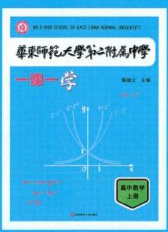

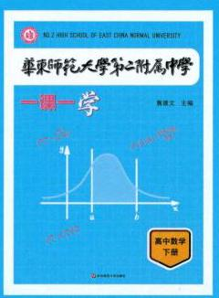

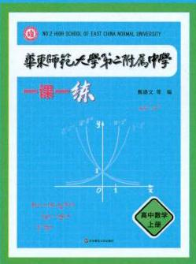

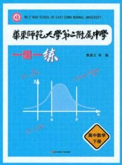

NO.2 HIGH SCHOOL OF EAST CHINA NORMAL UNIVERSITY

# 华東师范大学第二附属中学

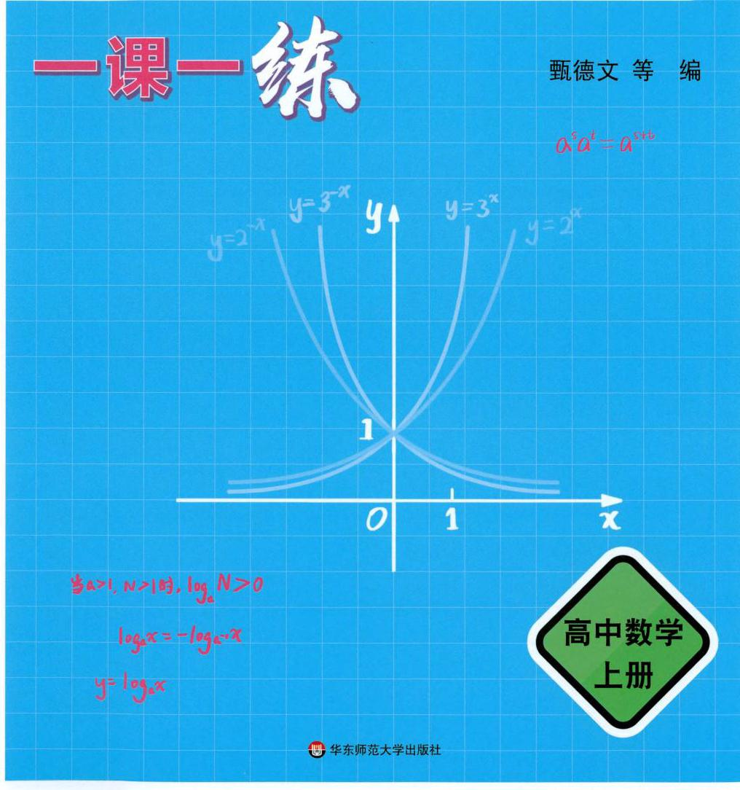

NO.2 HIGH SCHOOL OF EAST CHINA NORMAL UNIVERSITY

# 事更師範大學第二附属中學

一

## 高中数学 上册

## 甄德文 等 编

#华东师范大学出版社

## 图书在版编目(CIP)数据

华东师范大学第二附属中学一课一练. 高中数学 上册/甄德文等编. 一上海:华东师范大学出版社,2023

ISBN 978-7-5760-4304-4

I. ①华… II. ①甄... Ⅲ. ①中学数学课-高中-教学参考资料 IV. ①G634

中国国家版本馆 CIP 数据核字(2024)第 003374 号

HUADONGSHIFANDAXUE DI-ER FUSHU ZHONGXUE YIKEYILIAN

华东师范大学第二附属中学一课一练高中数学上册

编 者 甄德文 等

责任编辑 应向阳 芮 磊

特约审读 王小双 娄 鑫

责任校对 时东明

装帧设计 刘怡霖

封面配图 夏淑桐

出版发行 华东师范大学出版社

社 址 上海市中山北路3663号 邮编 200062

网 址 www. ecnupress.com.cn

电 话 021-60821666 行政传真 021-62572105

客服电话 021-62865537 门市(邮购)电话 021-62869887

地址 上海市中山北路 3663 号华东师范大学校内先锋路口

网 店 http://hdsdcbs.tmall.com

印 刷 者 常熟市大宏印刷有限公司

开本 889 毫米 × 1194 毫米 1/16

印 张 26.5

字 数 645 千字

版 次 2024 年 6 月第 1 版

印 次 2024 年 6 月第 1 次

书 号 ISBN 978-7-5760-4304-4

定 价 89.00 元

出版人 王 焰

(如发现本版图书有印订质量问题,请寄回本社客服中心调换或电话 021-62865537 联系)

## 前言

由华东师范大学第二附属中学数学教研组编写的《数学・高中(上、下册)》自从 2009 年出版以来，深受广大师生的喜爱，也成为了不少高中学子的案头书。不同于一般的教辅书籍，这套校本教学用书在兼顾了全国各版教材内容的同时，通过“大家谈”“自己学”“自己找”等特色栏目，引导同学们畅游数学知识的海洋，体悟学科思想的精妙，发展自主学习的能力。

时光荏苒，岁月如梭，十四年弹指一挥间。随着高中数学六个核心素养的提出和课程标准的改革，我们在原先校本教学用书的基础上又重新做了修订，隆重推出了新版的校本教学用书 (即《一课一学》)，而这本《一课一练》正是《一课一学》的延续和补充。

正如伟大的数学教育家玻利亚所说，解题是一种实践性技能，就像游泳、滑雪或弹钢琴一样，只能通过模仿，练习和钻研来学到它。数学的学习离不开习题的操练，但题海茫茫，如何尽可能避免无效重复，甄别出最有效的题目呈现在同学们面前，一直是我们的努力方向。

在这本《一课一练》的编写过程中我们坚持做到以下几点:

## 一、课时同步，紧扣《一课一学》

学生在初次学习数学概念的过程中往往重结论, 轻过程; 对概念的理解流于表面, 缺乏深层次的思考。这本《一课一练》中的题目紧扣《一课一学》编写，有些是挖掘概念内涵，有些是揭示概念的外延，有些则是对概念的展开和再定义，还有一些是对《一课一学》中所涉及的数学方法的运用和阐释。通过解决这些问题，学生一定能有所启发和收获。

## 二、结构合理，强调基本方法

数学问题总是和数学概念、数学方法相联系。每个数学问题总是通过基本概念编织，用基本方法作为纽带串在一起的。理解基本概念, 掌握基本方法, 就能找到解决问题的钥匙, 解题就变得不那么困难了。本书每节练习中都包含 12 道习题和 1 道选做题。习题思维梯度逐渐递进, 每节练习都几乎囊括了学习该节后所应该具备的基本技能, 对学生有很好的训练作用, 对进一步学习有很好的指引作用。

## 三、突出本质，体现核心素养

学科核心素养是学科育人价值的集中体现，应该是深植在每一本中学数学参考书中的灵魂。新高考改革突出六个核心素养。即:数学抽象、逻辑推理、数学建模、直观想象、数学运算、 数据分析。这本《一课一练》中的压轴题与选做题，有些是原创问题，有些是大型考试经过学生训练后再改编的问题，这些问题内涵丰富，意味深长。六个核心素养在这些问题中有时独立显现，有时也会成为一个有机的整体。学生在解决这些问题的过程中，能够有效地体会研究数学问题的基本路径，为今后的学习打下良好的基础。

参与本书编写的老师主要有:王宇、阮超峰、吴辰骋、刘笙鹤、孙佳琰、疏源源、陈超、何一骏、汪健，书中的期中、期末试卷由数学教研组组织资深教师命题与审题。全书由甄德文老师组织并统稿，孙佳琰、何一骏、吴辰骋等老师进行了校对与审核，赵泽宏老师参与了部分图文编辑工作。在此一并表示感谢!

尽管我们用了心，但限于水平，谬误难免，欢迎读者批评指正。

编 者

2023 年 12 月

## 目 录

第 1 章 集合与逻辑 / 1

1.1 集合及其表示方法 / 1

1.2 集合之间的关系(1)/ 3

1.2 集合之间的关系(2)/ 5

1.3 集合的运算(1)/7

1.3 集合的运算(2)/ 9

1.3 集合的运算(3)/ 11

1.4 充分条件与必要条件(1)/ 13

1.4 充分条件与必要条件(2) / 15

1.4 充分条件与必要条件(3) / 17

1.5 反证法(1)/ 19

1.5 反证法(2)/21

第 2 章 不等式 / 23

2.1 不等式的基本性质 / 23

2.2 一元二次不等式的解法(1)/ 25

2.2 一元二次不等式的解法(2)/ 27

2.3 其他不等式的解法(1)/ 29

2.3 其他不等式的解法(2)/ 31

2.3 其他不等式的解法(3)/ 33

2.3 其他不等式的解法(4)/ 35

2.4 基本不等式及其应用(1)/ 37

2.4 基本不等式及其应用(2) / 39

2.4 基本不等式及其应用(3) / 41

2.4 基本不等式及其应用(4)/ 43

2.5 不等式的证明(1)/ 45

2.5 不等式的证明(2)/ 47

第 3 章 函数的概念、性质与应用 / 49

3.1 函数的概念 / 49

3.2 函数的表示方法 / 51

3.3 函数的奇偶性(1)/ 53

3.3 函数的奇偶性(2)/ 55

3.4 函数的单调性(1)/ 57

3.4 函数的单调性(2)/ 59

3.5 函数的最值与值域(1)/ 61

3.5 函数的最值与值域(2)/ 63

3.6 函数关系的建立 / 65

3.7 用函数的观点求解方程与不等式 / 68

3.8 函数图像及其变换(1) / 70

3.8 函数图像及其变换(2) / 72

第 4 章 幂函数、指数函数与对数函数 / 75

4.1 幂与指数 / 75

4.2 对数(1)/77

4.2 对数(2)/79

4.3 幂函数的图像与性质(1) / 81

4.3 幂函数的图像与性质(2) / 83

4.4 指数函数的图像与性质(1) / 85

4.4 指数函数的图像与性质(2) / 87

4.5 反函数 / 89

4.6 对数函数的图像与性质(1) / 91

4.6 对数函数的图像与性质(2) / 93

4.7 简单的指数方程 / 95

4.8 简单的对数方程 / 97

第 5 章 三角 / 99

5.1 任意角及其度量(1)/ 99

5.1 任意角及其度量(2)/ 101

5.2 任意角的正弦、余弦、正切、余切(1)/ 103

5.2 任意角的正弦、余弦、正切、余切(2)/ 105

5.3 基本三角公式和诱导公式(1)/ 107

5.3 基本三角公式和诱导公式(2) / 109

5.3 基本三角公式和诱导公式(3) / 111

5.4 两角和与差的余弦、正弦和正切公式 (1) / 113

5.4 两角和与差的余弦、正弦和正切公式 (2) / 115

5.4 两角和与差的余弦、正弦和正切公式 (3) / 117

5.5 二倍角与半角的正弦、余弦和正切公式 (1) / 119

5.5 二倍角与半角的正弦、余弦和正切公式 (2) / 121

5.6 积化和差与和差化积公式 / 123

5.7 正弦定理、余弦定理和解斜三角形(1)/ 125

5.7 正弦定理、余弦定理和解斜三角形(2)/ 127

5.7 正弦定理、余弦定理和解斜三角形(3)/ 129

第 6 章 三角函数 / 131

6.1 正弦函数的图像与性质(1) / 131

6.1 正弦函数的图像与性质(2)/ 133

6.2 余弦函数的图像与性质 / 135

6.3 函数 $y = A\sin \left( {{\omega x} + \varphi }\right)$ 的图像与性质(1)/137

6.3 函数 $y = A\sin \left( {{\omega x} + \varphi }\right)$ 的图像与性质(2) / 139

6.3 函数 $y = A\sin \left( {{\omega x} + \varphi }\right)$ 的图像与性质(3) / 142

6.4 正切函数的图像与性质 / 145

6.5 反三角函数 / 147

6.6 最简三角方程(1) / 149

6.6 最简三角方程(2) / 151

第 7 章 平面向量 / 153

7.1 平面向量的概念 / 153

7.2 向量的线性运算(1)/ 155

7.2 向量的线性运算(2)/ 157

7.3 平面向量分解定理 / 159

7.4 向量的数量积(1)/ 161

7.4 向量的数量积(2)/ 163

7.5 向量的坐标表示(1)/ 165

7.5 向量的坐标表示(2)/ 167

7.6 向量的应用(1)/ 169

7.6 向量的应用(2)/ 171

第 8 章 复数 / 173

8.1 复数的概念 / 173

8.2 复数的代数运算(1)/ 175

8.2 复数的代数运算(2)/ 177

8.2 复数的代数运算(3)/ 179

8.3 复数的几何意义(1)/ 181

8.3 复数的几何意义(2)/ 183

8.4 复数的三角形式(1)/ 185

8.4 复数的三角形式(2)/ 187

8.5 复数集内的方程(1)/ 189

8.5 复数集内的方程(2)/ 191

第 9 章 数列与数学归纳法 / 193

9.1 数列(1)/ 193

9.1 数列(2)/ 195

9.2 等差数列(1)/ 197

9.2 等差数列(2)/ 199

9.3 等比数列(1) / 201

9.3 等比数列(2) / 203

9.4 数列的通项与求和(1) / 205

9.4 数列的通项与求和(2) / 207

9.5 数学归纳法(1)/ 209

9.5 数学归纳法(2)/ 211

9.6 数列的极限(1) / 213

9.6 数列的极限(2) / 215

阶段练习卷

参考答案与解析

## 第 1 章 集合与逻辑

### 1.1 集合及其表示方法

1 用符号 $\in$ 、 $\notin$ 填空:

0___ N, 0___ N *, 0___ 0, 3.14___ N,

$- \sqrt{9}$ ___ Z -, $- \frac{1}{2}$ ___ Q, π___ Q, 3.14___ ${\mathbf{R}}^{ + }$ 。

0___ $\left\{  {x\left| {\;{x}^{2} + 1 = 0}\right. }\right\}  ,\sqrt{2}$ ___ $\left\{  {x\left| {\;x \geq  \sqrt[3]{3}}\right. }\right\}  ,\left( {1,1}\right)$ ___ $\left\{  {\left( {x, y}\right) \left| {\;x + y - 1 \leq  0}\right. }\right\}$ 。

2 用适当的方法表示下列集合:

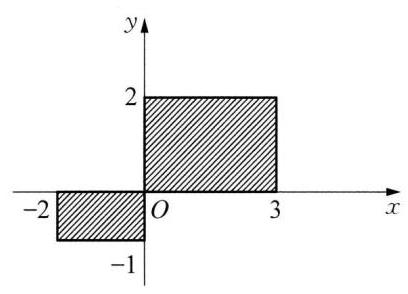

(第 2 题图)

(1)不超过 30 的非负偶数的集合:___；

(2)被 3 除余 2 的非正整数的集合:___；

(3)函数 $y = {x}^{2} + 1$ 的函数值的集合:___；

(4)二次不等式 ${x}^{2} + {2x} - 3 < 0$ 解的集合:___；

(5)方程 ${2x} + y = 5$ 的所有整数解的集合:___；

(6)与原点距离大于 1 的点的集合:___ ；

(7)右图中阴影部分的点:___。

3 若集合 $A = \{ 2,0,1,3\} , B = \left\{  {x \mid   - x \in  A,2 - {x}^{2} \notin  A}\right\}$ ,则集合 $B$ 中元素之和等于___。

4 已知集合 $\{ 1,2,3, x\}$ 中最大元素与最小元素之差等于该集合的所有元素之和,则实数 $x$ 的值为___。

5 已知集合 $\left\{  {1, x,{x}^{2} - x}\right\}$ ，则实数 $x$ 的取值范围是___。

6 数集 $A$ 满足条件:若 $a \in  A$ ，则 $\frac{1}{1 - a} \in  A\left( {a \neq  0,1}\right)$ ，已知 $2 \in  A$ ，试写出 $A$ 中其他元素:___。

7 已知 $a\text{ 、 }b\text{ 、 }c$ 为非零实数，代数式 $\frac{a}{\left| a\right| } + \frac{b}{\left| b\right| } + \frac{c}{\left| c\right| } + \frac{abc}{\left| abc\right| }$ 的值所组成的集合为 $M$ ，则下列判断正确的是( )。

A. $0 \notin  M$ B. $- 4 \notin  M$ C. $2 \in  M$ D. $4 \in  M$

8 已知 $m \in  A, n \in  B$ ，且集合 $A = \{ x \mid  x = {2a}, a \in  \mathbf{Z}\} , B = \{ x \mid  x = {2a} + 1, a \in  \mathbf{Z}\} , C = \; \{ x \mid  x = {4a} + 1, a \in  \mathbf{Z}\}$ ，则( )。

A. $m + n \in  A$ B. $m + n \in  B$ C. $m + n \in  C$ D. 以上都不正确

9 已知集合 $M = \left\{  {x \mid  x = m + \sqrt{2}n, m \in  \mathbf{Z}, n \in  \mathbf{Z}}\right\}$ ，设 ${x}_{1} \in  M,{x}_{2} \in  M$ ，则下列元素不一定属于集合 $M$ 的是( )。

A. ${x}_{1} + {x}_{2}$ B. ${x}_{1} - {x}_{2}$ C. ${x}_{1}{x}_{2}$

D. $\frac{{x}_{1}}{{x}_{2}}\left( {{x}_{2} \neq  0}\right)$

10 已知集合 $S$ 的元素都是正整数，且满足条件“如果 $x \in  S$ ，则 $8 - x \in  S$ ”，请解答下列问题:

(1)试写出只有一个元素的集合 $S$ ；

(2)试写出元素个数为 2 的所有集合 $S$ ；

(3)满足上述条件的集合 $S$ 总共有多少个？请全部写出来。

11 已知集合 $A = \left\{  {x \mid  a{x}^{2} - {3x} + 2 = 0, x \in  \mathbf{R}}\right\}$ 。

(1)若 $A$ 是空集，求 $a$ 的取值范围；

(2)若 $A$ 中只有一个元素，求 $a$ 的值并求出集合 $A$ ；

(3)若 $A$ 中有两个元素且都大于 0，求 $a$ 的取值范围。

12 已知集合 $A = \{ x \mid  a \leq  x \leq  2 - a, a \in  \mathbf{R}\}$ 。

(1)若 $A$ 是空集，求 $a$ 的取值范围；

(2)若 $A$ 中只有一个元素，求 $a$ 的值并求出集合 $A$ ；

(3)若 $A$ 中只有三个元素是整数，求 $a$ 的取值范围。

13 (选做)设符号 “ * ” 是数集 $A$ 中元素的一种运算，如果对于任意的 $x$ ， $y \in  A$ ，都有 $x * y \in \; A$ ，则称运算“ * ”对集合 $A$ 是封闭的。

(1)设集合 $A = \{ x \mid  x = m + \sqrt{2}n, m, n \in  \mathbf{Z}\}$ ，判断 $A$ 对通常的实数的乘法运算是否封闭？

(2)设集合 $B = \{ x \mid  x = m + \sqrt{2}n, m, n \in  \mathbf{Z}, n \neq  0\}$ ，判断 $B$ 对通常的实数的乘法运算是否封闭?

### 1.2 集合之间的关系 (1)

1 用适当的符号 $\left( { \in  \text{ 、 } \notin  \text{ 、 } \subset  \text{ 、 } = \text{ 、 } \supset  \text{ 、 } \supseteq  }\right)$ 填空:

(1) $\varnothing$ ___ $\{ 0\}$ ；(2)0___ $\varnothing$ ；(3) $\infty$ ___ $\{ \varnothing \}$ ；

(4) $\pi$ ___ $\{ x \mid  x \leq  \sqrt{12}\}$ ；(5) $\{ 1\}$ ___ $\{ 1,2,3\}$ ；(6) $\{ 1\}$ ___ $\{ \{ 1\}$ ， $\{ 2\}$ ， $\{ 3\}$ 。

2 设集合 $A = \{  - 1,3,{2m} - 1\} , B = \left\{  {3,{m}^{2}}\right\}$ ，若 $B \subseteq  A$ ，则实数 $m =$ ___。

3 设集合 $A = \left\{  {1, a,\frac{b}{a}}\right\}  , B = \left\{  {0,{a}^{2}, a + b}\right\}$ ，若 $A = B$ ，则 ${a}^{2020} + {b}^{2020} =$ ___。

4 设集合 $A = \left\{  {x \in  \mathbf{N}\left| {\;\frac{8}{6 - x} \in  \mathbf{N}}\right. }\right\}$ ，则集合 $A$ 的子集的个数为___。

5 设集合 $A = \left\{  {\left( {x, y}\right)  \mid  {x}^{2} + {y}^{2} = 1, x, y \in  \mathbf{Z}}\right\}  , B = \{ \left( {x, y}\right) \left| \right| x\left| +\right| y \mid   = 1, x, y \in  \mathbf{Z}\}$ , 那么 $A\text{ 、 }B$ 之间的关系是___。

6 设集合 $A = \{ \left( {x, y}\right)  \mid  y = x\} , B = \{ \left( {x, y}\right)  \mid  {xy} \geq  0\}$ ，那么 $A$ 、 $B$ 之间的关系是___。

7 已知集合 $A = \left\{  {y \mid  y = {x}^{2} + 1}\right\}  , E = \left\{  {x \mid  y = {x}^{2} + 1}\right\}  , F = \left\{  {\left( {x, y}\right)  \mid  y = {x}^{2} + 1}\right\}  , G = \; \{ x \mid  x \geq  1\}$ ，那么( )。

A. $A = E$ B. $A = F$ C. $A = G$ D. $E = G$

8 设集合 $A = \left\{  {x\left| {\;x = \frac{n}{2}}\right. , n \in  \mathbf{Z}}\right\}  , B = \left\{  {x\left| {\;x = n + \frac{1}{2}}\right. , n \in  \mathbf{Z}}\right\}$ ，则下列图形能表示 $A$ 与 $B$ 关系的是( )。

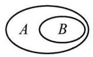

A.

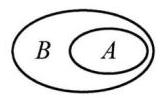

B.

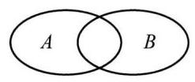

C.

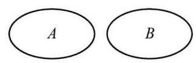

D.

9 设集合 $M = \{ x \mid   - 1 \leq  x < 2\} , N = \{ x \mid  x - k \leq  0\}$ ，若 $M \subseteq  N$ ，则实数 $k$ 的取值范围是 ( )。

A. $k \leq  2$ B. $k \geq   - 1$ C. $k >  - 1$ D. $k \geq  2$

10 已知集合 $A = \{ a,{ab}, a - b\} , B = \{ 0,\left| a\right| , b\}$ ，若 $A = B$ ，求 $a$ 、 $b$ 的值及集合 $A$ 。

11 设集合 $A = \left\{  {x \mid  {x}^{2} + {4x} = 0}\right\}  , B = \left\{  {x \mid  {x}^{2} + 2\left( {a + 1}\right) x + {a}^{2} - 1 = 0, a \in  \mathbf{R}}\right\}$ ,若 $B \subseteq  A$ , 求实数 $a$ 的取值范围。

12 设集合 $A = \left\{  {a \mid  a = {2}^{x}{3}^{y}{5}^{z}, x, y, z \in  \mathbf{N}}\right\}  , B = \{ b \mid  b \in  A,1 \leq  b \leq  {10}\}$ ,求集合 $B$ 的子集个数,使得这些子集中都包含元素 1 和 10 。

13 (选做)设集合 $A = \{ x \mid  x = {2k}, k \in  \mathbf{Z}\} , B = \{ y \mid  y = {14p} + {36q}, p, q \in  \mathbf{Z}\}$ ,求证: $A = \; B$ 。

### 1.2 集合之间的关系(2)

1 用适当的符号 $\left( { \in  \text{ 、 } \notin  \text{ 、 } \subset  \text{ 、 } \subseteq  \text{ 、 } = \text{ 、 } \supset  \text{ 、 } \supseteq  }\right)$ 填空:

\{菱形\}___ \{平行四边形\},\{等腰三角形\}___ \{等边三角形\}, $\varnothing$ ___ $\{ x \in  \mathbf{R} \mid  {x}^{2} + 2 = \; 0\} ,\varnothing$ ___ $\{ 0\} ,\{ x \mid  x = {4m} - 1, m \in  \mathbf{Z}\}$ ___ $\{ x \mid  x = {2n} - 1, n \in  \mathbf{Z}\}$ ，

$\{ x \mid  x = {3m} + 1, m \in  \mathbf{Z}\}$ ___ $\{ x \mid  x = {3n} - 2, n \in  \mathbf{Z}\} ,$

$\{ y \mid  y = {x}^{2} + 1, x \in  \mathbf{R}\}$ ___ $\{ y \mid  y = {x}^{2} - {4x} + 3, x \in  \mathbf{R}\}$ ，

$\{ \left( {x, y}\right) \left| \right| x\left| +\right| y \mid   = 1\} \_ \_ \_ \{ \left( {x, y}\right)  \mid  {x}^{2} + {y}^{2} \leq  1\}$ 。

2 已知集合 $A = \{ x \mid  x <  - 1$ 或 $x > 5\} , B = \{ x \mid  a \leq  x < a + 4\}$ ，若 $A \supset  B$ ，则实数 $a$ 的取值范围是___。

3 若集合 $M = \{ 0,1,2\} , N = \{ \left( {x, y}\right)  \mid  x - {2y} + 1 \geq  0$ 且 $x - {2y} - 1 \leq  0, x, y \in  M\}$ , 则 $N$ 的非空真子集的个数为___。

4 设集合 $A = \{ x \mid  \left( {m - 1}\right) x + 1 = 0\} , B = \left\{  {x \mid  {x}^{2} - {2x} - 3 = 0}\right\}$ ,若 $B \supseteq  A$ ,则实数 $m$ 的值是___。

5 已知集合 $A = \{ a, a + d, a + {2d}\} , B = \left\{  {a,{aq}, a{q}^{2}}\right\}$ ，若 $A = B$ ，则 $q =$ ___。

6 从集合 $U = \{ a, b, c, d\}$ 的子集中选出 4 个不同的子集，需同时满足以下两个条件:

① $\varnothing \text{ 、 }U$ 都要选出；

② 对选出的任意两个子集 $A$ 和 $B$ ，必有 $A \subseteq  B$ 或 $B \subseteq  A$ ；

那么共有___种不同的选法。

7 下列表述中正确的是( )。

A. ${\mathbf{R}}^{ + } \in  \mathbf{R}$ B. $\mathbf{Z} \supseteq  \{ x \mid  x \leq  0, x \in  \mathbf{Z}\}$

C. 空集是任何集合的真子集 D. $\varnothing  \in  \{ \varnothing \}$

8 设集合 $M = \left\{  {x\left| {\;x = \frac{k}{2} + \frac{1}{4}}\right. , k \in  \mathbf{Z}}\right\}  , N = \left\{  {x\left| {\;x = \frac{k}{4} + \frac{1}{2}}\right. , k \in  \mathbf{Z}}\right\}$ ,则( )。

A. $M = N$ B. $M \subset  N$ C. $N \subset  M$ D. 关系不确定

9 设集合 $A = \{ a, b\} , B = \{ x \mid  x \subseteq  A\}$ ,则()。

A. $A \in  B$ B. $A \subseteq  B$ C. $A \subset  B$ D. $A \notin  B$

10 设 $f\left( x\right)  = {x}^{2} + {ax} + b\left( {a, b \in  \mathbf{R}}\right)$ .

(1)若集合 $A = \{ x \mid  f\left( x\right)  = x\}  = \{ a\}$ ，求 $a$ 、 $b$ 的值；

(2)设集合 $A = \{ x \mid  x = f\left( x\right) , x \in  \mathbf{R}\} , B = \{ x \mid  x = f\left( {f\left( x\right) }\right) , x \in  \mathbf{R}\}$ ，求证: $A \subseteq  B$ 。

11 已知集合 $A = \{ x \mid   - 1 \leq  x \leq  4\}$ 。

(1)若 $A \subseteq  B, B = \{ x \mid  m - 6 \leq  x \leq  {2m} - 1\}$ ，求实数 $m$ 的取值范围；

(2)若 $B \subseteq  A, B = \{ x \mid  m + 1 \leq  x \leq  {2m} + 1\}$ ，求实数 $m$ 的取值范围。

12 已知非空集合 $A = \{ x \mid   - 2 \leq  x \leq  a\} , B = \{ y \mid  y = {2x} + 3, x \in  A\} , C = \; \left\{  {y \mid  y = {x}^{2}, x \in  A}\right\}$ ,且 $C \subseteq  B$ ,求实数 $a$ 的取值范围。

13 (选做)定义:一个数集的和就是该集合中所有元素之和。

(1)设集合 $P = \{ x \mid  1 \leq  x \leq  {100}, x \in  \mathbf{Z}\}$ ，求集合 $P$ 的所有子集和的总和；

(2)设 $S$ 是由一些不大于 15 的自然数组成的数集，假设 $S$ 的任意两个没有相同元素的子集有不同的和，求具有这种性质的 $S$ 的和的最大值。

### 1.3 集合的运算(1)

1 设集合 $A = \left\{  {-4,{2a} - 1,{a}^{2}}\right\}  , B = \{ 9, a - 5,1 - a\}$ ,若 $A \cap  B = \{ 9\}$ ,则实数 $a \; =$ ___。

2 设集合 $A = \{ 1,4, x\} , B = \left\{  {1,{x}^{2}}\right\}$ ，且 $A \cap  B = B$ ，则 $x =$ ___。

3 设集合 $A = \left\{  {x \mid  {x}^{2} \leq  4}\right\}  , B = \{ x \mid  x > a\}$ ，若 $A \cap  B = \varnothing$ ，则实数 $a$ 的取值范围是___。

4 设集合 $M = \left\{  {\left( {x, y}\right)  \mid  y = {x}^{2} - 1, x \in  \mathbf{R}}\right\}  , N = \left\{  {\left( {x, y}\right)  \mid  y =  - {x}^{2} + 1, x \in  \mathbf{R}}\right\}$ ,则 $M \; \cap  N =$ ___。

5 设集合 $M = \left\{  {y \mid  y = {x}^{2} - 1, x \in  \mathbf{R}}\right\}  , N = \left\{  {y \mid  y =  - {x}^{2} + 1, x \in  \mathbf{R}}\right\}$ ,则 $M \cap \; N =$ ___。

6 已知集合 $A = \left\{  {\left( {x, y}\right)  \mid  {x}^{2} + {mx} - y + 2 = 0}\right\}  , B = \{ \left( {x, y}\right)  \mid  x - y + 1 = 0\}$ ，又 $A \cap  B \neq \; \varnothing$ ，则实数 $m$ 的取值范围是___。

7 设集合 $A = \{ x \mid   - 2 < x < 1\} , B = \{ x \mid  0 < x < 2\}$ ，则 $A \cap  B =$ ( )。

A. $\{ x \mid   - 1 < x < 1\}$ B. $\{ x \mid   - 2 < x < 1\}$

C. $\{ x \mid   - 2 < x < 2\}$ D. $\{ x \mid  0 < x < 1\}$

8 设集合 $A = \{ \left( {x, y}\right)  \mid  x + y = 2\} , B = \{ \left( {x, y}\right)  \mid  x - y = 4\}$ ，则 $A \cap  B =$ (   )。

A. $x = 3, y =  - 1$ B. $\left( {3, - 1}\right)$

C. $\{ 3, - 1\}$ D. $\{ \left( {3, - 1}\right) \}$

9 设集合 $A = \left\{  {y \mid  y = {x}^{2}}\right\}  , B = \left\{  {y \mid  {x}^{2} + {y}^{2} = 2}\right\}$ ，则 $A \cap  B =$ (   )。

A. $\{ \left( {1,1}\right) ,\left( {-1,1}\right) \}$ B. $\{ 1\}$

C. $\{ x \mid  0 \leq  x \leq  1\}$ D. $\{ x \mid  0 \leq  x \leq  \sqrt{2}\}$

10 已知集合 $A = \left\{  {x \mid  {x}^{2} - {ax} + {a}^{2} - {19} = 0}\right\}  , B = \left\{  {x \mid  {x}^{2} - {5x} + 6 = 0}\right\}  , C = \left\{  {x \mid  {x}^{2} + {2x} - }\right. \; 8 = 0\}$ ,且满足 $A \cap  B \neq  \varnothing , A \cap  C = \varnothing$ ,求实数 $a$ 的值。

11 设集合 $A = \left\{  {x \mid  {x}^{2} + \left( {m + 2}\right) x + 1 = 0, x \in  \mathbf{R}}\right\}$ ，若 $A \cap  {\mathbf{R}}^{ + } = \varnothing$ ，求实数 $m$ 的取值范围。

12 已知集合 $A = \left\{  {\left( {x, y}\right) \left| {\;\frac{y - 3}{x - 2} = a + 1}\right. }\right\}  , B = \left\{  {\left( {x, y}\right)  \mid  \left( {{a}^{2} - 1}\right) x + \left( {a - 1}\right) y = {15}}\right\}$ ,当 $a$ 为何实数时, $A \cap  B = \varnothing$ ?

13 (选做) 已知 $A = \{ x \mid  x = {28m} + {20n}, m, n \in  \mathbf{Z}\} , B = \{ x \mid  x = {12m} + {18n}, m, n \in  \mathbf{Z}\}$ , 求属于 $A \cap  B$ 的最小正整数,并分别求出一组此时在集合 $A$ 和 $B$ 中的 $m\text{ 、 }n$ 的值。

### 1.3 集合的运算 (2)

1 已知关于 $x$ 的方程 $3{x}^{2} + {px} - 7 = 0$ 的解集为 $A$ ,方程 $3{x}^{2} - {7x} + q = 0$ 的解集为 $B$ ,若 $A \cap \; B = \left\{  {-\frac{1}{3}}\right\}$ ,则 $A \cup  B =$ ___。

2. 设集合 $A = \left\{  {y \mid  y = {x}^{2} - {4x} + 5}\right\}  , B = \{ x \mid  y = \sqrt{5 - x}\}$ ，则 $A \cap  B =$ ___， $A \cup  B =$ ___。

3 设集合 $M = \{ \left( {x, y}\right) \left| \right| {xy} \mid   = 1, x > 0\} , N = \{ \left( {x, y}\right)  \mid  {xy} =  - 1\}$ ,则 $M \cup  N =$ ___。

4 设集合 $A = \{ x \mid   - 2 \leq  x \leq  5\} , B = \{ x \mid  m + 1 \leq  x \leq  {2m} - 1\}$ ，若 $A \cup  B = A$ ，则实数 $m$ 的取值范围是___。

5 已知集合 $A = \{ \left| {a + 1}\right| ,3,5\} , B = \left\{  {{{2a} + 1},{a}^{{2a} + 2},{a}^{2} + {2a} - 1}\right\}$ ,若 $A \cap  B = \{ 2,3\}$ ,则 $A \cup  B =$ ___。

6 已知集合 $A = \left\{  {\left( {x, y}\right)  \mid  {x}^{2} + {mx} - y + 2 = 0}\right\}  , B = \{ \left( {x, y}\right)  \mid  x - y + 1 = 0,0 \leq  x \leq$ 2\}，若 $A \cap  B \neq  \varnothing$ ，则实数 $m$ 的取值范围是___。

7 设集合 $A = \left\{  {x\left| {\; - \frac{1}{2} < x < 2}\right. }\right\}  , B = \left\{  {x\left| {\;{x}^{2} \leq  1}\right. }\right\}$ ，则 $A \cup  B =$ (   )。

A. $\{ x \mid   - 1 \leq  x < 2\}$ B. $\left\{  {x\left| {\; - \frac{1}{2} < x \leq  1}\right. }\right\}$

C. $\{ x \mid  x < 2\}$ D. $\{ x \mid  1 \leq  x < 2\}$

8 设集合 $M = \{ \left( {x, y}\right)  \mid  x + y = 0\} , N = \left\{  {\left( {x, y}\right)  \mid  {x}^{2} + {y}^{2} = 0, x, y \in  \mathbf{R}}\right\}$ ,则有( )。

A. $M \cup  N = M$ B. $M \cup  N = N$ C. $M \cap  N = M$ D. $M \cap  N = \varnothing$

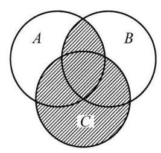

(第 9 题图)

9 下列可以表示图形中的阴影部分的是( )。

A. $\left( {A \cup  C}\right)  \cap  \left( {B \cup  C}\right)$ B. $\left( {A \cup  B}\right)  \cap  \left( {A \cup  C}\right)$

C. $\left( {A \cup  B}\right)  \cap  \left( {B \cup  C}\right)$ D. $\left( {A \cup  B}\right)  \cap  C$

10 设集合 $A = \left\{  {x \mid  {x}^{2} - {3x} + 2 = 0}\right\}  , B = \left\{  {x \mid  {x}^{2} + 2\left( {a + 1}\right) x + \left( {{a}^{2} - }\right. }\right.$ 5) $= 0\}$ 。

(1)若 $A \cap  B = \{ 2\}$ ，求实数 $a$ 的值；

(2)若 $A \cup  B = A$ ，求实数 $a$ 的取值范围。

11 已知集合 $A = \{ x\left| \right| x - a \mid   < 4\} , B = \{ x\left| \right| x - 2 \mid   > 3\}$ 。

(1)若 $a = 1$ ，求 $A \cap  B$ ；(2)若 $A \cup  B = \mathbf{R}$ ，求实数 $a$ 的取值范围。

12 已知集合 $A = \{ \left( {x, y}\right)  \mid  {{ax} + y = 1}\} , B = \{ \left( {x, y}\right)  \mid  x + {ay} = 1\} , C = \left\{  {\left( {x, y}\right)  \mid  {x}^{2} + {y}^{2} = }\right.$ 1 \} 。

(1)当 $a$ 取何值时， $\left( {A \cup  B}\right)  \cap  C$ 为含有 2 个元素的集合？

(2)当 $a$ 取何值时， $\left( {A \cup  B}\right)  \cap  C$ 为含有 3 个元素的集合？

13 (选做)设集合 $A = \left\{  {{a}_{1},{a}_{2},{a}_{3},{a}_{4},{a}_{5}}\right\}  , B = \left\{  {{a}_{1}^{2},{a}_{2}^{2},{a}_{3}^{2},{a}_{4}^{2},{a}_{5}^{2}}\right\}  ,0 < {a}_{1} < {a}_{2} < {a}_{3} < \; {a}_{4} < {a}_{5}, A \subseteq  \mathbf{N}, A \cap  B = \left\{  {{a}_{1},{a}_{4}}\right\}  ,{a}_{1} + {a}_{4} = {10}$ ,且 $A \cup  B$ 中的所有元素之和为 234,求集合 $A\text{ 、 }B$ 。

### 1.3 集合的运算(3)

1 已知集合 $U = \{ 2,3,{a}^{2} + {2a} - 3\} , A = \{ \left| {a + 1}\right| ,2\} ,\overline{A} = \{ a + 3\}$ ，则实数 $a =$ ___。

2 某班有学生 55 人，其中体育爱好者 43 人，音乐爱好者 34 人，还有 4 人既不爱好体育也不爱好音乐，则该班既爱好体育又爱好音乐的人数为___人。

3 设集合 $U = \{ \left( {x, y}\right)  \mid  x \in  \{ 1,2\} , y \in  \{ 1,2\} \} , A = \{ \left( {x, y}\right)  \mid  x\text{ 、 }y$ 是正整数，且 $x + y =$ 3\},则 $\overline{A} =$ ___。

4 设集合 $A = \{ x \mid  \left| {x - 2}\right|  \leq  2, x \in  \mathbf{R}\} , B = \left\{  {y \mid  y = {x}^{2} - {2x} + 2,0 \leq  x \leq  3}\right\}$ ,则 $\overline{A \cap  B} =$ ___。

5 已知集合 $A = \{ x \mid  {100} \leq  x \leq  {1000}, x \in  \mathbf{N}\}$ ，其中是 3 或 4 的倍数但不是 12 的倍数的元素共有___个。

6 设全集 $U = \{ \left( {x, y}\right)  \mid  x, y \in  \mathbf{R}\}$ ,集合 $M = \left\{  {\left( {x, y}\right) \left| {\;\frac{y + 2}{x - 2} = 1}\right. }\right\}  , N = \{ \left( {x, y}\right)  \mid  y \neq  x - 4\}$ , 则 $\bar{M} \cap  \bar{N} =$ ___。

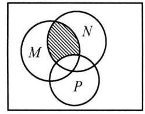

(第 7 题图)

7 若集合 $M\text{ 、 }N\text{ 、 }P$ 是全集 $S$ 的子集，则图中阴影部分表示的集合是 ( )。

A. $\left( {M \cap  N}\right)  \cap  P$ B. $\left( {M \cap  N}\right)  \cup  P$

C. $\left( {M \cap  N}\right)  \cap  \bar{P}$ D. $\left( {M \cap  N}\right)  \cup  \bar{P}$

8 设全集为 $\mathbf{R}, A = \{ x \mid  x < 3$ 或 $x > 5\} , B = \{ x \mid   - 3 < x < 3\}$ ,则 ( )。

A. $\bar{A} \cup  B = \mathbf{R}$ B. $A \cup  \bar{B} = \mathbf{R}$

C. $\bar{A} \cup  \bar{B} = \mathbf{R}$ D. $A \cup  B = \mathbf{R}$

9 已知集合 $A = \{ x \mid  x < a\} , B = \{ x \mid  1 < x < 2\}$ ，且 $A \cup  \bar{B} = \mathbf{R}$ ，则实数 $a$ 的取值范围是 ( )。

A. $a \leq  1$ B. $a < 1$ C. $a \geq  2$ D. $a > 2$

10 已知集合 $A = \{ x \mid  1 \leq  x < 2\}$ ，分别求下列条件下的 $\bar{A}$ 。

(1) $U = {\mathbf{R}}^{ + }$ ；(2) $U = \{ x \mid  x \leq  2\}$ ；(3) $U = \{ x \mid  1 \leq  x \leq  2$ 或 $x > 3\}$ 。

11 设全集 $U = \mathbf{R}$ ,集合 $A = \left\{  {x \mid  {x}^{2} + {3x} + 2 = 0}\right\}  , B = \left\{  {x \mid  {x}^{2} + \left( {m + 1}\right) x + m = 0}\right\}$ ; 若 $\overline{A} \cap \; B = \varnothing$ ,求实数 $m$ 的值。

12 设 $I = \mathbf{R}, A = \{ x \mid  \left| x\right|  > 1\} , B = \left\{  {x \mid  {x}^{2} + {4x} + 3 < 0}\right\}$ ,求集合 $C$ ,使其同时满足下列 3 个条件:

① $C \subseteq  \left( {B \cup  \overline{A}}\right)  \cap  \mathbf{Z}$ ；② $C \cap  B \neq  \varnothing$ ；③ $C$ 中有 2 个元素。

13 (选做)设集合 $A = \left\{  {x \mid  {x}^{2} - {3x} + 2 > 0}\right\}  , B = \left\{  {x \mid  {x}^{2} - {2x} + {2a} - {a}^{2} = 0}\right\}  , U = \mathbf{R}$ 。

(1)若 $B \subseteq  A$ ，求实数 $a$ 的取值范围；

(2)若 $A \cap  \overline{B} = A$ ，求实数 $a$ 的取值范围。

### 1.4 充分条件与必要条件(1)

1 若甲是乙的必要条件，丙是乙的充分非必要条件，则丙是甲的___条件。

2 设 $A$ 、 $B$ 均为非空集合，那么 “ $A \cap  B = A$ ” 是 “ $A = B$ ” 的___，___。

3 若集合 $A \neq  \varnothing$ ，则 “ $B = \varnothing$ ” 是 “ $A \cap  B = \varnothing$ ” 的___。

4 “ $x \geq  1$ ” 是 “ $x > 1$ ” 的___。

5 写出 “ $\left| x\right|  < 1$ ” 的一个充分非必要条件:___。

6 写出 " ${x}^{2} - {3x} + 2 \neq  0$ " 的一个必要非充分条件:___。

7 “ ${xy} \neq  0$ ” 是 “ ${x}^{2} + {y}^{2} \neq  0$ ” 的( )。

A. 充分非必要条件 B. 必要非充分条件

C. 充要条件 D. 既非充分也非必要条件

8 “ $a >  - 1, b >  - 1$ ” 是“ ${ab} > 1$ ” 的( )。

A. 充分非必要条件 B. 必要非充分条件

C. 充要条件 D. 既非充分又非必要条件

9 “ $x \in  M$ 或 $x \in  P$ ” 是 “ $x \in  M \cap  P$ ” 的( )。

A. 充分非必要条件 B. 必要非充分条件

C. 充要条件 D. 既非充分又非必要条件

10 若集合 $A = \left\{  {y \mid  y = {x}^{2} - {4x} + 6}\right\}$ ，集合 $B = \left\{  {x\left| {\;\frac{x}{a} > 1}\right. , a \in  \mathbf{R}}\right\}$ ，试证明 “ $a > 5$ ” 是 “ $B \subset \; {A}^{n}$ 的一个充分非必要条件。

11 已知实数 $x$ 满足 $0 \leq  x \leq  1$ ，判断“ $a + {2b} > 0$ ”是使“ ${ax} + b > 0$ 恒成立”的什么条件，并加以证明。

12 已知关于 $x$ 的实系数一元二次方程 $a{x}^{2} + {bx} + c = 0$ ,求:

(1)有两个正根的充要条件;

(2)有一个正根、一根为零的充要条件;

(3)有一个小于 -2 的根和一个大于 2 的根的充要条件。

13 (选做) 已知关于 $x$ 的方程 $\left( {1 - a}\right) {x}^{2} + \left( {a + 2}\right) x - 4 = 0, a \in  \mathbf{R}$ ,求:

(1)方程有两个正根的充要条件;

(2)方程至少有一个正根的充要条件。

### 1.4 充分条件与必要条件(2)

1 已知 $x \in  \mathbf{R}$ ，则 “ $x > 0$ ” 是 “ $\frac{\left| x\right| }{x} = 1$ ” 的___条件。

2 “ $x = 1$ ” 的___条件是 “ ${x}^{2} = 1$ ”。

3 若 $A$ 是 $B$ 成立的充分条件, $D$ 是 $C$ 成立的必要条件, $C$ 是 $B$ 成立的充要条件,则 $\bar{D}$ 是 $\bar{A}$ 成立的___条件( $\bar{A}$ 、 $\bar{D}$ 分别是 $A$ 、 $D$ 的否定)。

4 若 $x \in  \mathbf{R}$ ,则 “ ${x}^{2} - {2x} - 3$ 是正实数” 的

(1)一个必要非充分条件是:___ ；

(2)一个充分非必要条件是___；

(3)一个充要条件是___。

5 若不等式 $x - a \leq  {2x} - 1 \leq  {2a} + 1$ 成立的一个充分条件是 $- 2 < x < 2$ ，则实数 $a$ 的取值范围为___。

6 设非空集合 $A\text{ 、 }B\text{ 、 }C$ ,若 “ $x \in  A$ ” 的充要条件是 “ $x \in  B$ 且 $x \in  C$ ”,则 “ $x \in  B$ ” 是 “ $x \in \; A$ ” 的___条件。

7 对于集合 $P\text{ 、 }Q$ ，下列四个命题中正确的是( )。

A. “ $P$ 不是 $Q$ 的子集”的充要条件是“对任意 $x \in  P$ ，都有 $x \notin  Q$ ”

B. “ $P$ 不是 $Q$ 的子集”的充要条件是 “ $P \cap  Q = \varnothing$ ”

C. “P 不是 Q 的子集”的充要条件是 “Q 不是 $P$ 的子集”

D. “P 不是 $Q$ 的子集” 的充要条件是 “存在 $x \in  P$ ,使得 $x \notin  Q$ ”

8 已知全集 $U = \{ \left( {x, y}\right)  \mid  x, y \in  \mathbf{R}\}$ ，集合 $A = \{ \left( {x, y}\right)  \mid  {{2x} - y + m} > 0\}$ ，集合 $B = \{ (x$ , $y)\left| {\;x + y - n \leq  0}\right.$ \}，那么点 $P\left( {2,3}\right)  \in  A \cap  \bar{B}$ 的充要条件是( )。

A. $m >  - 1, n < 5$ B. $m <  - 1, n < 5$

C. $m >  - 1, n > 5$ D. $m <  - 1, n > 5$

9 三个数 $x$ 、 $y$ 、 $z$ 不全为负数的充要条件是( )。

A. $x\text{ 、 }y\text{ 、 }z$ 中至少有一个是正数 B. $x\text{ 、 }y\text{ 、 }z$ 全不是负数

C. $x\text{ 、 }y\text{ 、 }z$ 中只有一个是负数 D. $x\text{ 、 }y\text{ 、 }z$ 中至少有一个是非负数

10 求“关于 $x$ 的方程 ${x}^{2} + \left( {{2k} - 1}\right) x + {k}^{2} = 0$ 的两个实根均大于 1 ”的充要条件。

11 已知命题 $\alpha  :  - 2 \leq  x \leq  {10}$ ，命题 $\beta  :  - 1 - m \leq  x \leq   - 1 + m\left( {m > 0}\right)$ 。若 $\overline{\alpha }$ 是 $\overline{\beta }$ 的必要不充分条件,求实数 $m$ 的取值范围。

12 已知 $\bigtriangleup  {ABC}$ 的三边分别为 $a$ 、 $b$ 、 $c$ ，求证:二次方程 ${x}^{2} + {2ax} + {b}^{2} = 0$ 、 ${x}^{2} + {2cx} - {b}^{2} = 0$ 有一个公共根的充要条件是 $\angle A = {90}^{ \circ  }$ 。

13 (选做) 命题 $p :  - 2 < m < 0,0 < n < 1$ ; 命题 $q :$ 关于 $x$ 的方程 ${x}^{2} + {mx} + n = 0$ 有两个小于 1 的正根。试判断 $p$ 是 $q$ 的什么条件,并说明理由。

### 1.4 充分条件与必要条件(3)

1 写出 “ $x < 1$ ” 的一个必要非充分条件为___，一个充分非必要条件为___。

2 已知命题 $\alpha  : {x}^{2} - {4x} + 3 = 0$ ，命题 $\beta  : x = 1$ ，则 $\alpha$ 是 $\beta$ 的___条件。

3 设命题 $\alpha  :  - 2 < x < 4$ ,命题 $\beta  : x \leq  m$ ,若 $\alpha$ 是 $\beta$ 的充分非必要条件，则实数 $m$ 的范围是___。

4 已知命题 $\alpha  : {x}^{2} - {2x} + m = 0, m \in  \mathbf{R}$ 无实根，命题 $\beta  : m > 0$ ，则 $\alpha$ 是 $\beta$ 的___条件。

5 已知命题 $\alpha  : {x}^{2} + {y}^{2} > 0$ ，命题 $\beta  : x \neq  0, y \in  \mathbf{R}$ ，则 $\alpha$ 是 $\beta$ 的___条件。

6 设命题 $\alpha  : {x}^{2} + x - 6 = 0$ ，命题 $\beta  : {ax} + 1 = 0$ ，若 $\alpha$ 是 $\beta$ 的必要非充分条件，则实数 $a$ 的值是___。

7 设 $a \in  \mathbf{R}$ ，则 “ $a > 1$ ” 是 “ $\frac{1}{a} < 1$ ” 的( )。

A. 充分非必要条件 B. 必要非充分条件

C. 充要条件 D. 既非充分也非必要条件

8 设集合 $M = \{ x \mid  0 < x \leq  3\} , N = \{ x \mid  0 < x \leq  2\}$ ，那么 “ $a \in  M$ ” 是 “ $a \in  N$ ” 的( )。

A. 充分非必要条件 B. 必要非充分条件

C. 充要条件 D. 既非充分也非必要条件

9 已知命题甲:“ $x + y \neq  3$ ”，命题乙:“《史 $\neq  2$ 且 $y \neq  1$ ”，则命题甲是命题乙的( )。

A. 充分非必要条件 B. 必要非充分条件

C. 充要条件 D. 既非充分也非必要条件

10 试用集合的包含关系说明各组条件中命题 $\alpha$ 是命题 $\beta$ 的什么条件。

(1) $\alpha$ :正整数 $n$ 被 3 整除； $\beta$ :正整数 $n$ 被 6 整除。

(2) $\alpha  : x = 1$ 且 $y = 2;\beta  : {x + y} = 3$ 。

(3) $\alpha  : x + y > 3;\beta  : {x > 1}$ 且 $y > 2$ 。

(4) $\alpha  : {xy} < 0;\beta  : \left| {x - y}\right|  = \left| x\right|  + \left| y\right|$ 。

11(1)设命题 $\alpha  : 1 \leq  x \leq  3$ ，命题 $\beta  : a + 1 \leq  x \leq  {2a} - 1$ ，若 $\alpha$ 是 $\beta$ 的必要非充分条件，求实数 $a$ 的取值范围;

(2)设命题 $\alpha  : x \geq  1$ 或 $x \leq   - 5$ ，命题 $\beta  : x \geq   - {2m} + 1$ 或 $x \leq  {2m} - 3, m \in  \mathbf{R}$ ，若 $\alpha$ 是 $\beta$ 的充分非必要条件，求实数 $m$ 的取值范围。

12 记实数 ${x}_{1},{x}_{2},\cdots ,{x}_{n}$ 中的最大数为 $\max \left\{  {{x}_{1},{x}_{2},\cdots ,{x}_{n}}\right\}$ ,最小数为 $\min \left\{  {{x}_{1},{x}_{2},\cdots }\right.$ , $\left. {x}_{n}\right\}$ 。已知 $\bigtriangleup {ABC}$ 的三边长为 $a\text{ 、 }b\text{ 、 }c\left( {a \leq  b \leq  c}\right)$ ,定义它的倾斜度为 $l = \max \left\{  {\frac{a}{b},\frac{b}{c},\frac{c}{a}}\right\}$ . $\min \left\{  {\frac{a}{b},\frac{b}{c},\frac{c}{a}}\right\}$ ,求证: ${}^{\prime \prime }l = 1$ ” 是 “ $\bigtriangleup  {ABC}$ 为等边三角形” 的必要而不充分的条件。

13 (选做)某高中学生报考大学的情况是:

① 报考 $A$ 大学的人，未报考 $B$ 大学；② 报考 $B$ 大学的人也报考了 $D$ 大学；③ 报考 $C$ 大学的人未报考 $D$ 大学；④未报考 $C$ 大学的人，报考了 $B$ 大学。

根据以上情况，判断以下命题是否正确:

(1)报考 $D$ 大学的人也报考了 $A$ 大学；

(2)没人同时报考 $B$ 大学和 $C$ 大学；

(3)有人同时报考了 $C$ 大学和 $D$ 大学；

(4)报考 $A$ 大学的人，也报考了 $C$ 大学；

(5)报考 $B$ 大学的人数同报考 $D$ 大学的人数相同。

### 1.5 反证法(1)

1 写出下列语句的否定形式:

(1)“ $a\text{ 、 }b\text{ 、 }c$ 不都是正数”；

(2)“ $a\text{ 、 }b\text{ 、 }c$ 中至少有一个正数”；

(3)“对任意实数 $x$ ，都有 ${x}^{2} + x + 1 < 0$ ”。

2 写出命题“若 $a \neq  1$ 或 $b \neq  2$ ，则 ${a}^{2} + {b}^{2} - {2a} - {4b} + 5 \neq  0$ ”的否命题。

3 有下列四个命题:①命题“若 ${xy} = 1$ ，则 $x$ 、 $y$ 互为倒数”的逆命题；②命题“面积相等的三角形全等”的否命题；③命题“若 $m \leq  1$ ，则 ${x}^{2} - {2x} + m = 0$ 有实根”的逆否命题；④命题“若 $A \cap  B = B$ ,则 $A \subseteq  B$ ” 的逆否命题。

其中是真命题的是___(填上你认为正确的命题的序号)。

4 命题“在 $\bigtriangleup  {ABC}$ 中，若 $A > B$ ，则 $a > b$ ”的结论的否定应该是___。

5 命题“三角形中最多只有一个内角是直角”的结论的否定是___。

6 命题“任何三角形的外角都至少有两个钝角”的否定应是___。

7 下列语句中是命题的是( )。

A. 唐老师真帅啊! B. $\sin {45}^{ \circ  } = 1$

C. ${x}^{2} + {2x} - 1 > 0$ D. 梯形是不是平面图形呢?

8 给出下列四个命题:

①如果 $x > \left| y\right|$ ，那么 ${x}^{2} > {y}^{2}$ ；②互补的两个角不相等；

③如果 $A \cap  C = B \cap  C$ ，那么 $A = B$ ；④关于 $x$ 的方程 ${ax} = x + 2\left( {a \in  \mathbf{R}}\right)$ 有唯一解。 其中假命题的个数是( )。

A. 1 B. 2 C. 3 D. 4

9 用反证法证明一个命题时，下列说法正确的是( )。

A. 将结论与条件同时否定，推出矛盾

B. 肯定条件，否定结论，推出矛盾

C. 将被否定的结论当条件，经过推理得出的结论只与原题条件矛盾，才是反证法的正确运用

D. 将被否定的结论当条件, 原题的条件不能当条件

10 已知 $a \neq  0$ ，试写出命题“若 $a > \frac{1}{a}$ ，则 $\left| a\right|  > 1$ ” 的逆命题、否命题、逆否命题，并判断其真假。

11 求证:√3 为无理数。

12 求证:若 $a\text{ 、 }b\text{ 、 }c$ 为正实数,关于 $x$ 的方程 $8{x}^{2} - 8\sqrt{a}x + b = 0\text{ 、 }8{x}^{2} - 8\sqrt{b}x + c = 0$ 和 $8{x}^{2} - \; 8\sqrt{c}x + a = 0$ 中至少有一个方程有两个不等的实根。

13 (选做) 已知 $a = {x}^{2} + \frac{1}{2}, b = 2 - x, c = {x}^{2} - x + 1, x \in  \mathbf{R}$ ,求证: $a\text{ 、 }b\text{ 、 }c$ 中至少有一个不小于 1 。

### 1.5 反证法(2)

1 用反证法证明命题“若 ${a}^{2} + {b}^{2} = 0$ ，则 $a$ 、 $b$ 全为 0( $a$ 、 $b$ 为实数)”时，其反设为___。 ___。

2 用反证法证明命题“若 ${x}^{2} - \left( {a + b}\right) x + {ab} \neq  0$ ，则 $x \neq  a$ 且 $x \neq  b$ ” 时，应假设___。 3 用反证法证明命题“自然数 $a\text{ 、 }b\text{ 、 }c$ 中恰有一个偶数”时，应假设___。

3 用反证法证明命题“自然数 $a\text{ 、 }b\text{ 、 }c$ 中恰有一个偶数”时，应假设___。

4 用反证法证明命题“三角形的内角中至少有一个不大于 60°”时，应假设___。

5 用反证法证明“一个三角形不能有两个直角”有三个步骤:

① $\angle A + \angle B + \angle C = {90}^{ \circ  } + {90}^{ \circ  } + \angle C > {180}^{ \circ  }$ ，这与三角形内角和为 ${180}^{ \circ  }$ 矛盾，故假设错误;

② 所以一个三角形不能有两个直角;

③ 假设 $\bigtriangleup  {ABC}$ 中有两个直角，不妨设 $\angle A = {90}^{ \circ  }$ ， $\angle B = {90}^{ \circ  }$ 。

上述步骤的正确顺序为___。

6 用反证法证明质数有无限多个的过程如下:假设___。

设全体质数为 ${p}_{1},{p}_{2},\cdots ,{p}_{n}$ ,令 $p = {p}_{1}{p}_{2}\cdots {p}_{n} + 1$ ,

显然， $p$ 不含因数 ${p}_{1},{p}_{2},\cdots ,{p}_{n}$ ，故 $p$ 要么是质数，要么含有___的质因数，

这表明，除质数 ${p}_{1},{p}_{2},\cdots ,{p}_{n}$ 之外，还有质数，因此原假设不成立，

于是，质数有无限多个。

7 实数 $a$ 、 $b$ 、 $c$ 不全为 0 等价于( )。

A. $a\text{ 、 }b\text{ 、 }c$ 均不为 0 B. $a\text{ 、 }b\text{ 、 }c$ 中至多有一个为 0

C. $a\text{ 、 }b\text{ 、 }c$ 中至少有一个为 0 D. $a\text{ 、 }b\text{ 、 }c$ 中至少有一个不为 0

8 有以下结论:

① 已知 ${p}^{3} + {q}^{3} = 2$ ，求证 $p + q \leq  2$ ，用反证法证明时，可假设 $p + q \geq  2$ ；

② 已知 $a, b \in  \mathbf{R},\left| a\right|  + \left| b\right|  < 1$ ，求证方程 ${x}^{2} + {ax} + b = 0$ 的两根的绝对值都小于 1，用反证法证明时可假设方程有一根 ${x}_{1}$ 的绝对值大于或等于 1，即假设 $\left| {x}_{1}\right|  \geq  1$ 。

下列说法中正确的是( )。

A. ①与②的假设都错误 B. ①与②的假设都正确

C. ①的假设正确；②的假设错误 D. ①的假设错误; ②的假设正确

9 与“ $a$ 是一个有理数”等价的命题是( )。

A. ${a}^{2}$ 是一个有理数 B. ${a}^{3}$ 是一个有理数

C. $\frac{1}{a}$ 是一个有理数 D. $\left| a\right|$ 是一个有理数

10 已知 $a$ 、 $b$ 均为有理数，且 $\sqrt{a}$ 和 $\sqrt{b}$ 都是无理数，求证: $\sqrt{a} + \sqrt{b}$ 也是无理数。

11 已知 $k$ 为任意正整数，求证: ${2k} - 1$ 和 ${2k} + 1$ 中至少有一个不等于两整数的平方和。

12 设函数 $f\left( x\right)  = a{x}^{2} + {bx} + c\left( {a \neq  0}\right)$ 中 $a\text{ 、 }b\text{ 、 }c$ 均为整数，且 $f\left( 0\right) \text{ 、 }f\left( 1\right)$ 均为奇数。求证: $f\left( x\right)  = 0$ 无整数根。

13 (选做)若 $p > 0, q > 0,{p}^{3} + {q}^{3} = 2$ ,求证: $p + q \leq  2$ 。

## 第 2 章 不等式

### 2.1 不等式的基本性质

1 下列命题中正确的是___。

① 如果 $a > b, c < d$ ，那么 $a + c > b + d$ ；

② 如果 $a > b, c > d$ ，那么 $a + {2c} > b + {2d}$ ；

③ 如果 $a > b, c > d$ ，那么 ${ac} > {bd}$ 。

2 对于实数 $a\text{ 、 }b\text{ 、 }c$ ，下列命题中真命题有___。

①若 $a > b$ ，则 $a{c}^{2} > b{c}^{2}$ ；②若 $a{c}^{2} > b{c}^{2}$ ，则 $a > b$ ；

③若 $a < b < 0$ ，则 ${a}^{2} > {ab} > {b}^{2}$ ；④若 $a < b < 0$ ，则 $\frac{1}{a} < \frac{1}{b}$ 。

3 已知 $a < 0$ ， $- 1 < b < 0$ ，则 $a$ 、 ${ab}$ 、 $a{b}^{2}$ 的大小关系是___。

4 已知 $a, b \in  \mathbf{R}$ ，那么 “ ${a}^{2} + {b}^{2} < 1$ ” 是 “ ${ab} + 1 > a + b$ ” 的___。

${5b}$ 克糖水中有 $a$ 克糖 $\left( {b > a > 0}\right)$ ，若再加入 $m$ 克糖 $\left( {m > 0}\right)$ ，则糖水更甜了，试根据这个事实写出一个不等式___。

6 设 $a$ 和 $b$ 都是非零实数，则不等式 $a > b$ 和 $\frac{1}{a} > \frac{1}{b}$ 同时成立的充要条件是___。

7 设 $a$ 、 $b$ 、 $c$ 是互不相等的正数，则下列等式中不恒成立的是( )。

A. $\left| {a - b}\right|  \leq  \left| {a - c}\right|  + \left| {b - c}\right|$ B. ${a}^{2} + \frac{1}{{a}^{2}} \geq  a + \frac{1}{a}$

C. $\left| {a - b}\right|  + \frac{1}{a - b} \geq  2$ D. $\sqrt{a + 3} - \sqrt{a + 1} \leq  \sqrt{a + 2} - \sqrt{a}$

8 如果 $a > 0 > b$ 且 $a + b > 0$ ，那么以下不等式正确的个数是( )。

① $\frac{1}{a} < \frac{1}{b}$ ; ② $\frac{1}{a} > \frac{1}{b}$ ; ③ ${a}^{3}b < a{b}^{3}$ ；④ ${a}^{3} < a{b}^{2}$ ；⑤ ${a}^{2}b < {b}^{3}$ 。

A. 2 B. 3 C. 4 D. 5

9 若 $a < b < 0$ ，则下列结论中正确的命题是( )。

A. 不等式 $\frac{1}{a} < \frac{1}{b}$ 和 $\frac{1}{\left| a\right| } > \frac{1}{\left| b\right| }$ 均不能成立

B. 不等式 $\frac{1}{a - b} > \frac{1}{b}$ 和 $\frac{1}{\left| a\right| } > \frac{1}{\left| b\right| }$ 均不能成立

C. 不等式 $\frac{1}{a - b} > \frac{1}{a}$ 和 ${\left( a + \frac{1}{b}\right) }^{2} > {\left( b + \frac{1}{a}\right) }^{2}$ 均不能成立

D. 不等式 $\frac{1}{\left| a\right| } > \frac{1}{\left| b\right| }$ 和 ${\left( a + \frac{1}{a}\right) }^{2} > {\left( b + \frac{1}{b}\right) }^{2}$ 均不能成立

10 比较大小:

(1) $\frac{a}{3} - 3$ 与 $\frac{a}{3} - 4$ ； (2) $a + b$ 与 $a - b$ ； (3) $\frac{{a}^{2} - {b}^{2} + 2}{2}$ 与 $\frac{{a}^{2} - 2{b}^{2} + 1}{3}$ 。

11 已知 $a > b > 0, m > 0, n > 0$ ,若 $p = \frac{b}{a}, q = \frac{a}{b}, r = \frac{b + m}{a + m}, s = \frac{a + n}{b + n}$ ,试由大到小排列 $p\text{ 、 }q\text{ 、 }r\text{ 、 }s$  。

12 已知 $- 1 \leq  a + b \leq  1,1 \leq  a - b \leq  3$ ，求 ${3a} - b$ 的取值范围。

13 (选做) (1) 比较下列两组数的大小:

$\sqrt{2} - 1$ 与 $2 - \sqrt{3};2 - \sqrt{3}$ 与 $\sqrt{6} - \sqrt{5}$ ;

(2)从以上的结果中，你能否得出更一般的结论？并加以证明。

### 2.2 一元二次不等式的解法(1)

1 不等式 $\left( {x - 1}\right) \left( {1 - {2x}}\right)  > 0$ 的解集是___。

2 不等式 $- {x}^{2} - x + 2 \geq  0$ 的解集为___。

3 不等式 ${16} - {24x} \leq   - 9{x}^{2}$ 的解集为___。

4 不等式 $4{x}^{2} + {4x} + 1 > 0$ 的解集为___。

5 已知集合 $M = \left\{  {x \mid  {x}^{2} < 4}\right\}  , N = \left\{  {x \mid  {x}^{2} - {2x} - 3 < 0}\right\}$ ，则集合 $M \cap  N =$ ___。

6 已知集合 $A = \left\{  {x \mid  {3x} - 2 - {x}^{2} < 0}\right\}  , B = \{ x \mid  x - a < 0\}$ ，且 $B \subset  A$ ，则实数 $a$ 的取值范围为___。

7 “ $x > 1$ ”是“ ${x}^{2} > x$ ”的( )。

A. 充分非必要条件 B. 必要非充分条件

C. 充要条件 D. 既非充分也非必要条件

8 已知函数 $f\left( x\right)  = \left\{  \begin{array}{ll}  - {x}^{2} + x, & x \geq  0, \\   - {x}^{2} - x, & x < 0, \end{array}\right.$ 则不等式 $f\left( x\right)  + 2 > 0$ 的解集是 ( )。

A. $\left( {-2,2}\right)$ B. $\left( {-\infty , - 2}\right)  \cup  \left( {2, + \infty }\right)$

C. $\left( {-1,1}\right)$ D. $\left( {-\infty , - 1}\right)  \cup  \left( {1, + \infty }\right)$

9 若 $a{x}^{2} + {bx} + c > 0$ 的解集是 $\left( {-\infty , - 2}\right)  \cup  \left( {4, + \infty }\right)$ ,则对于函数 $f\left( x\right)  = a{x}^{2} + {bx} + c$ 应有( )。

A. $f\left( 5\right)  < f\left( 2\right)  < f\left( {-1}\right)$

B. $f\left( 2\right)  < f\left( 5\right)  < f\left( {-1}\right)$

C. $f\left( {-1}\right)  < f\left( 2\right)  < f\left( 5\right)$

D. $f\left( 2\right)  < f\left( {-1}\right)  < f\left( 5\right)$

10 已知 $A = \left\{  {x \mid  {x}^{2} - {3x} + 2 \leq  0}\right\}  , B = \left\{  {x \mid  {x}^{2} - \left( {a + 1}\right) x + a \leq  0}\right\}$ 。

(1)若 $A \subset  B$ ，求 $a$ 的取值范围；

(2)若 $B \subseteq  A$ ，求 $a$ 的取值范围。

11 设 $m \in  \mathbf{R}$ ,解关于 $x$ 的不等式 ${m}^{2}{x}^{2} + {2mx} - 3 < 0$ 。

12 设 $a \in  \mathbf{R}$ ,解关于 $x$ 的不等式 $a{x}^{2} - \left( {a + 1}\right) x + 1 < 0$ 。

13 (选做) 已知命题 $p$ :存在 ${x}_{0} \in  \left\lbrack  {-1,1}\right\rbrack$ ，使得 ${x}_{0}^{2} - {x}_{0} - m \geq  0$ 是假命题。

(1)求实数 $m$ 的取值集合 $B$ ；

(2)设不等式 $\left( {x - {3a}}\right) \left( {x - a - 2}\right)  < 0$ 的解集为 $A$ ,若 $x \in  B$ 是 $x \in  A$ 的必要非充分条件，求实数 $a$ 的取值范围。

### 2.2 一元二次不等式的解法(2)

1 已知集合 $M = \{ x \mid  0 \leq  x < 2\} , N = \left\{  {x \mid  {x}^{2} - {2x} - 3 < 0}\right\}$ ，则 $M \cap  N =$ ___。

2 若关于 $x$ 的不等式 $a{x}^{2} + {5x} + c > 0$ 的解集为 $\left\{  {x\left| {\;\frac{1}{3} < x < \frac{1}{2}}\right. }\right\}$ ,则 $a\text{ 、 }c$ 的值分别为 ___。

3 若关于 $x$ 的不等式 $- \frac{1}{2}{x}^{2} + {2x} > {mx}$ 的解集为 $\{ x \mid  0 < x < 2\}$ ，则实数 $m$ 的值为 ___。

4 若关于 $x$ 的不等式 $a{x}^{2} + {bx} + c < 0$ 的解集是 $\left( {-\infty , - 2}\right)  \cup  \left( {-\frac{1}{2}, + \infty }\right)$ ,则关于 $x$ 的不等式 $c{x}^{2} - {bx} + a < 0$ 的解集是___。

5 已知关于 $x$ 的方程 ${x}^{2} + \left( {m + 2}\right) x + 1 = 0$ 无正根，则实数 $m$ 的取值范围是___。

6 若关于 $x$ 的方程 ${x}^{2} - \frac{3}{2}x - m = 0$ 在 $x \in  \left\lbrack  {-1,1}\right\rbrack$ 上有实根，则实数 $m$ 的取值范围是 ___。

7 “ $\left| x\right|  < 2$ ” 是 “ ${x}^{2} - x - 6 < 0$ ” 的( )条件。

A. 充分非必要 B. 必要非充分

C. 充要 D. 既非充分也非必要

8 设集合 $A = \left\{  {x \mid  {x}^{2} - {2x} - 3 > 0}\right\}  , B = \left\{  {x \mid  {x}^{2} + {ax} + b \leq  0}\right\}$ ，若 $A \cup  B = \mathbf{R}, A \cap  B = \; (3,4\rbrack$ ,则 $a + b =$ (   )。

A. -7 B. -1

C. 1 D. 7

9 若 $a\text{ 、 }b\text{ 、 }c$ 是常数，则 “ $a > 0$ 且 ${b}^{2} - {4ac} < 0$ ” 是 “对任意 $x \in  \mathbf{R}$ ，有 $a{x}^{2} + {bx} + c > 0$ ” 的 ( )。

A. 充分非必要条件 B. 必要非充分条件

C. 充要条件 D. 既非充分也非必要条件

10 解关于 $x$ 的不等式 ${x}^{2} - x - a\left( {a - 1}\right)  > 0$ 。

11 解关于 $x$ 的不等式: $m{x}^{2} - \left( {m - 2}\right) x - 2 > 0$ 。

12 设集合 $A = \left\{  {x \mid  {x}^{2} - \left( {a + {a}^{2}}\right) x + {a}^{3} < 0}\right\}  , B = \left\{  {x \mid  {x}^{2} - {3x} + 2 < 0}\right\}$ ，且 $A \cup  B = B$ ，求实数 $a$ 的取值范围。

13 (选做) 已知关于 $x$ 的不等式 $\left( {{kx} - {k}^{2} - 4}\right) \left( {x - 4}\right)  > 0$ ，其中 $k \in  \mathbf{R}$ 。

(1)当 $k$ 变化时,试求不等式的解集 $A$ ；

(2)对于不等式的解集 $A$ ,若满足 $A \cap  \mathbf{Z} = B$ (其中 $\mathbf{Z}$ 为整数集)。试探究集合 $B$ 能否为有限集? 若能,求出使集合 $B$ 中元素个数最少的 $k$ 的所有取值,并用列举法表示集合 $B$ ; 若不能, 请说明理由。

### 2.3 其他不等式的解法 (1)

1 不等式 $\frac{1}{x} < 1$ 的解集为___。

2 不等式 $\frac{x - 1}{x} \geq  2$ 的解集为___。

3 如果不等式 $\frac{ax}{x - 1} < 1$ 的解集为 $\{ x \mid  x < 1$ 或 $x > 2\}$ ，那么 $a$ 的值是___。

4 已知 $a > 0, b > 0$ ，则不等式 $a > \frac{1}{x} >  - b$ 的解是___。

5 设集合 $M = \{ x \mid   - 2 < x \leq  6\} , P = \left\{  {x\left| {\;\frac{x + m}{{2x} - 1} > 1}\right. }\right\}$ ，若 $P \subseteq  M$ ，则实数 $m$ 的取值范围是___。

6 研究问题:“已知关于 $x$ 的不等式 $a{x}^{2} - {bx} + c > 0$ 的解集为 $\left( {1,2}\right)$ ，解关于 $x$ 的不等式 $c{x}^{2} - {bx} + a > 0$ ”，有如下解法:

解:由 $a{x}^{2} - {bx} + c > 0$ ,得 $a - b\left( \frac{1}{x}\right)  + c{\left( \frac{1}{x}\right) }^{2} > 0$ ,令 $y = \frac{1}{x}$ ,则 $y \in  \left( {\frac{1}{2},1}\right)$ ,所以不等式 $c{x}^{2} - {bx} + a > 0$ 的解集为 $\left( {\frac{1}{2},1}\right)$ 。

参考上述解法,已知关于 $x$ 的不等式 $\frac{k}{x + a} + \frac{x + b}{x + c} < 0$ 的解集为 $\left( {-2, - 1}\right)  \cup  \left( {2,3}\right)$ ,则关于 $x$ 的不等式 $\frac{kx}{{ax} - 1} + \frac{{bx} - 1}{{cx} - 1} < 0$ 的解集为___。

7 与不等式 $\frac{{2x} - 3}{x - 2} \geq  1$ 同解的不等式是( )。

A. $x - 1 \geq  0$ B. ${x}^{2} - {3x} + 2 \geq  0$

C. ${x}^{2} - {3x} + 2 > 1$

D. $\frac{{x}^{3} - {x}^{2} + x - 1}{x - 2} \geq  0$

8 若集合 $A = \{ x \mid   - 1 \leq  {2x} + 1 \leq  3\} , B = \left\{  {x\left| {\;\frac{x - 2}{x} \leq  0}\right. }\right\}$ ，则 $A \cap  B =$ (   )。

A. $\{ x \mid   - 1 \leq  x < 0\}$ B. $\{ x \mid  0 < x \leq  1\}$ C. $\{ x \mid  0 \leq  x \leq  2\}$ D. $\{ x \mid  0 \leq  x \leq  1\}$

9 若关于 $x$ 的不等式 ${ax} - b > 0$ 的解集是 $\left( {1, + \infty }\right)$ ,则关于 $x$ 的不等式 $\frac{{ax} + b}{x - 2} > 0$ 的解集是( )。

A. $\left( {-\infty , - 1}\right)  \cup  \left( {2, + \infty }\right)$ B. $\left( {-1,2}\right)$

C. $\left( {1,2}\right)$ D. $\left( {-\infty ,1}\right)  \cup  \left( {2, + \infty }\right)$

10 解下列关于 $x$ 的不等式。

(1) $\frac{{3x} - 1}{2 - x} \geq  1$ ； (2) $\frac{x}{x - 1} < 1 - a$ 。

11 解关于 $x$ 的不等式 $\frac{2{x}^{2} + \left( {a - 1}\right) x + 3}{{x}^{2} + {ax}} > 1$ 。

12 当 $k$ 为何值时,不等式 $\frac{2{x}^{2} + {2kx} + k}{4{x}^{2} + {6x} + 3} < 1$ 恒成立。

13 (选做)若关于 $x$ 的不等式 $\frac{x - a}{{x}^{2} + x + 1} < \frac{x - b}{{x}^{2} - x + 1}$ 的解为 $\left( {-\infty ,\frac{1}{3}}\right)  \cup  \left( {1, + \infty }\right)$ ,求 $a$ 、 $b$ 的值。

### 2.3 其他不等式的解法(2)

1 不等式 $\left( {x + 4}\right) {\left( x + 5\right) }^{2} > \left( {{3x} - 2}\right) {\left( x + 5\right) }^{2}$ 的解集是___。

2 方程 $\frac{x + 2}{{x}^{2} + {3x}} \geq  0$ 的解集是___。

3 不等式 ${x}^{3} + 3{x}^{2} > {2x} + 6$ 的解是___。

4 不等式 $x + \frac{2}{x + 2} > 2$ 的解集是___。

5 不等式 $\frac{x{\left( x + 1\right) }^{2}\left( {x - 2}\right) }{{\left( x - 3\right) }^{3}\left( {x - 5}\right) } \leq  0$ 的解集为___。

6 不等式 $\frac{x - 2}{{x}^{2} - {6x} - 7} \geq  0$ 的解集为___。

7 不等式 $\left( {x - 4}\right) \left( {2 - x}\right) \left( {{3x} + 6}\right)  < 0$ 的解集为( )。

A. $\left( {-\infty ,2}\right)  \cup  \left( {4, + \infty }\right)$ B. $\left( {-\infty , - 2}\right)  \cup  \left( {2,4}\right)$

C. $\left( {-2,2}\right)  \cup  \left( {6, + \infty }\right)$ D. $\left( {-2,2}\right)  \cup  \left( {4, + \infty }\right)$

8 若不等式 ${x}^{2} + {px} + q < 0$ 的解为 $\{ x \mid  1 < x < 2\}$ ，则不等式 $\frac{{x}^{2} + {px} + q}{{x}^{2} - {5x} - 6} > 0$ 的解为( )。

A. $\left( {1,2}\right)$ B. $\left( {-\infty , - 1}\right)  \cup  \left( {6, + \infty }\right)$

C. $\left( {-1,1}\right)  \cup  \left( {2,6}\right)$ D. $\left( {-\infty , - 1}\right)  \cup  \left( {1,2}\right)  \cup  \left( {6, + \infty }\right)$

9 若不等式 $\frac{\left( {x + a}\right) \left( {x + b}\right) }{x - c} \geq  0$ 的解集为 $\lbrack  - 1,2) \cup  \lbrack 3, + \infty )$ ，则 $a + b =$ (   )。

A. 0 B. -1 C. -2 D. -3

10 解下列不等式。

(1) $\frac{1}{x + 1} + \frac{2}{x + 3} \leq  \frac{2}{x + 2}$ ;

(2) $\frac{{x}^{2} - {9x} + {11}}{{x}^{2} - {2x} + 1} \geq  7$ 。

11 解下列不等式。

(1) $\frac{x - 5}{{x}^{2} - {2x} - 3} \leq  1$ ;

(2) $\frac{{x}^{2} + {2x} - 2}{3 + {2x} - {x}^{2}} < x$ 。

12 已知集合 $A = \left\{  {x \mid  \left( {x + 3}\right) {\left( x - 1\right) }^{2}{\left( x - 2\right) }^{3} \geq  0}\right\}  , B = \left\{  {x\left| {\;\frac{{2x} + 3}{x - 1} \geq  1}\right. }\right\}$ 。

(1) 求集合 $A\text{ 、 }B$ ;

(2) 求集合 $A \cap  B$ 。

13 (选做)已知 $f\left( x\right)$ 是二次函数，不等式 $f\left( x\right)  < 0$ 的解集是 $\left( {0,5}\right)$ ，且 $f\left( x\right)$ 在区间 $\left\lbrack  {-1,4}\right\rbrack$ 上的最大值是 12 。

(1)求 $f\left( x\right)$ 的解析式;

(2)解关于 $x$ 的不等式 $\frac{2{x}^{2} + \left( {a - {10}}\right) x + 5}{f\left( x\right) } > 1\left( {a < 0}\right)$ 。

### 2.3 其他不等式的解法(3)

1 不等式 $x + \left| {{2x} - 1}\right|  < 3$ 的解集为___。

2 不等式 $\left| {x + {10}}\right|  - \left| {x - 2}\right|  \geq  8$ 的解集为___。

3 已知集合 $A = \{ x \mid  \left| {x - a}\right|  \leq  1\} , B = \left\{  {x \mid  {x}^{2} - {5x} + 4 \geq  0}\right\}$ 。若 $A \cap  B = \varnothing$ ，则实数 $a$ 的取值范围是___。

4 不等式 $\left| {6 - }\right| {2x} + 1\left| \right|  > 1$ 的解集是___。

5 不等式 $\left| {x - 1}\right|  + \left| {x - 2}\right|  > 3 + x$ 的解集是___。

6 若关于 $x$ 的不等式 $\left| a\right|  \geq  \left| {x + 1}\right|  + \left| {x - 2}\right|$ 存在实数解,则实数 $a$ 的取值范围是___。

7 设集合 $A = \{ x\left| \right| x - a \mid   < 1, x \in  \mathbf{R}\} , B = \{ x\left| \right| x - b \mid   > 2, x \in  \mathbf{R}\}$ 。若 $A \subseteq  B$ ，则实数 $a\text{ 、 }b$ 必满足( )。

A. $\left| {a + b}\right|  \leq  3$ B. $\left| {a + b}\right|  \geq  3$ C. $\left| {a - b}\right|  \leq  3$ D. $\left| {a - b}\right|  \geq  3$

8 若关于 $x$ 的不等式 $\left| {x - 4}\right|  + \left| {x - 3}\right|  < a$ 在 $\mathbf{R}$ 上的解集为空集,则常数 $a$ 的取值范围是 ( )。

A. $a < 3$ B. $a \leq  1$ C. $a > 3$ D. $a > 3$ 或 $a <  - 4$

9 若不等式 $\left| {x + 3}\right|  - \left| {x - 1}\right|  \leq  {a}^{2} - {3a}$ 对任意实数 $x$ 恒成立，则实数 $a$ 的取值范围为( )。

A. $\left( {-\infty , - 1\rbrack \cup \lbrack 4, + \infty }\right)$ B. $\left( {-\infty , - 2\rbrack \cup \lbrack 5, + \infty }\right)$

C. $\left\lbrack  {1,2}\right\rbrack$ D. $\left( {-\infty ,1\rbrack \cup \lbrack 2, + \infty }\right)$

10 解下列不等式。

(1) $4 < \left| {{2x} - 3}\right|  \leq  7$ ； (2) $\left| {x - 2}\right|  < \left| {x + 1}\right|$ ；

(3) $\left| {{2x} + 1}\right|  + \left| {x - 2}\right|  > 4$ 。

11 设集合 $A = \{ x\left| \right| {2x} - 1 \mid   > 1\} , B = \{ x\left| \right| {2x} - a \mid   \leq  1\} , A \cap  B = \varnothing , A \cup  B = \mathbf{R}$ ,求实数 $a$ 的值。

12 某段城铁线路上依次有 $A\text{ 、 }B\text{ 、 }C$ 三站, ${AB} = 5\mathrm{\;{km}},{BC} = 3\mathrm{\;{km}}$ ,在列车运行时刻表上,规定列车 8 时整从 $A$ 站发车，8 时 07 分到达 $B$ 站并停车 1 分钟，8 时 12 分到达 $C$ 站，在实际运行中，假设列车从 $A$ 站正点发车，在 $B$ 站停留 1 分钟，并在行驶时以同一速度 $v\mathrm{{km}}/\mathrm{h}$ 匀速行驶， 列车从 $A$ 站到达某站的时间与时刻表上相应时间之差的绝对值称为列车在该站的运行误差。

(1)分别写出列车在 $B$ 、 $C$ 两站的运行误差;

(2)若要求列车在 $B$ 、 $C$ 两站的运行误差之和不超过 2 分钟，求 $v$ 的取值范围。

13 (选做)关于实数 $x$ 的不等式 $\left| {x - \frac{{\left( a + 1\right) }^{2}}{2}}\right|  \leq  \frac{{\left( a - 1\right) }^{2}}{2}$ 与 $\left| {x - a - 1}\right|  \leq  a$ 的解集依次记为 $A$ 与 $B$ ,求使 $A \subseteq  B$ 的 $a$ 的取值范围。

### 2.3 其他不等式的解法(4)

1 不等式 $\sqrt{{3x} - 4} - \sqrt{x - 3} > 0$ 的解集是___。

2 不等式 $\left( {x - 2}\right) \sqrt{{x}^{2} - {2x} - 3} \geq  0$ 的解集是___。

3 不等式 $\sqrt{2{x}^{2} - {6x} + 4} < x + 2$ 的解集是_________。

4 不等式 $\sqrt{{3x} + 1} > \sqrt{{2x} + 1} - 1$ 的解集是_________。

5 不等式 $\left| {x - 1}\right|  + \sqrt{x + 3} > x + 1$ 的解集是________。

6 使关于 $x$ 的不等式 $\sqrt{x - 3} + \sqrt{6 - x} \geq  k$ 有解的实数 $k$ 的最大值是___。

7 不等式 $\sqrt{{x}^{2} - {3x} - {10}} < 8 - x$ 的解集为( )。

A. $\left( {5,\frac{74}{13}}\right\rbrack$ B. $\left( {-\infty , - 2}\right)$

C. $\left( {-\infty , - 2\rbrack \cup \lbrack 5,\frac{74}{13}}\right)$ D. $\left\lbrack  {-2,\frac{74}{13}}\right)$

8 不等式 $\sqrt{{x}^{2} - {5x} + 6} > x - 1$ 的解集是( )。

A. $\left( {-\infty ,1}\right)$ B. $\left( {2, + \infty }\right)$

C. $\left\lbrack  {1,\frac{5}{3}}\right)$ D. $\left( {-\infty ,\frac{5}{3}}\right)$

9. 不等式 $\left( {x - 1}\right) \sqrt{x + 2} \geq  0$ 的解集是( )。

A. $\{ x \mid  x > 1\}$ B. $\{ x \mid  x \geq  1\}$

C. $\{ x \mid  x \geq  1$ 且 $x =  - 2\}$ D. $\{ x \mid  x \geq  1$ 或 $x =  - 2\}$

10 解不等式 $\sqrt{-{x}^{2} + {3x} - 2} > 4 - {3x}$ 。

11 设 $a > 0$ 为常数，解关于 $x$ 的不等式 $\sqrt{{x}^{2} + 1} - {ax} \leq  1$ 。

12 解不等式 $\sqrt{{2x} + 1} > \sqrt{x + 1} - 1$ 。

13 (选做) 解关于 $x$ 的不等式 $\sqrt{{2ax} - {a}^{2}} > 1 - x\left( {a > 0}\right)$ 。

### 2.4 基本不等式及其应用(1)

1 若 $x > 0$ ，则 $x + \frac{1}{x}$ ___2 ；若 $x < 0$ ，则 $x + \frac{1}{x}$ ___2。(填“<”“>”或 “=”)

2 若 $a \cdot  b < 0$ ，则 $\frac{b}{a} + \frac{a}{b}$ 的取值范围是___。

3 若 $x > 0$ ，则 $3 - x - \frac{4}{x}$ 的最大值是___。

4 当 $x < 0$ 时， $\frac{{x}^{2} + 9}{x}$ 有最___值，最值为___，此时 $x =$ ___。

5 若 $a, b \in  {\mathbf{R}}^{ + }$ ,可得: $a + b + \frac{1}{\sqrt{ab}} \geq  2\sqrt{ab} + \frac{1}{\sqrt{ab}} \geq  2\sqrt{2\sqrt{ab}} \cdot  \frac{1}{\sqrt{ab}} = 2\sqrt{2}$ ,则等号成立的条件为___。

6 已知不等式 $a \leq  \frac{{x}^{2} + 2}{\left| x\right| }$ 对 $x$ 取一切非零实数恒成立，则实数 $a$ 的取值范围是___。

7 下列各式中，最小值为 4 的是( )。

A. $x + 2\sqrt{x} + 5$ B. $\frac{{x}^{2} + 5}{\sqrt{{x}^{2} + 1}}$ C. ${x}^{2} + 3 + \frac{4}{{x}^{2} + 3}$ D. $x + \frac{4}{x}$

8 若 $a, b \in  \mathbf{R}$ ，且 ${ab} > 0$ ，则下列不等式中，恒成立的是( )。

A. ${a}^{2} + {b}^{2} > {2ab}$ B. $a + b \geq  2\sqrt{ab}$ C. $\frac{1}{a} + \frac{1}{b} > \frac{2}{\sqrt{ab}}$ D. $\frac{b}{a} + \frac{a}{b} \geq  2$

9 若 $a > 0, b > 0$ 且 $a + b = 1$ ，则下列四个不等式中不成立的是( )。

A. ${ab} \leq  \frac{1}{4}$ B. $\frac{1}{a} + \frac{1}{b} \geq  4$ C. ${a}^{2} + {b}^{2} \geq  \frac{1}{2}$ D. $a \geq  1$

10 已知 $a > 0, b > 0$ ,设 $A = \frac{a + b}{2}, G = \sqrt{ab}, H = \frac{2}{\frac{1}{a} + \frac{1}{b}}, Q = \sqrt{\frac{{a}^{2} + {b}^{2}}{2}}$ ,试比较 $A\text{ 、 }G$ 、

$H\text{ 、 }Q$ 的大小并给出证明。

11 设 $a\text{ 、 }b\text{ 、 }c$ 为不全相等的正数,求证: $a\left( {{b}^{2} + {c}^{2}}\right)  + b\left( {{c}^{2} + {a}^{2}}\right)  + c\left( {{a}^{2} + {b}^{2}}\right)  > {6abc}$ 。

12 已知 $a, b, c \in  \mathbf{R}$ ,求证:

(1) ${\left( a + b + c\right) }^{2} \leq  3\left( {{a}^{2} + {b}^{2} + {c}^{2}}\right)$ ； (2) $3\left( {{ab} + {bc} + {ca}}\right)  \leq  {\left( a + b + c\right) }^{2}$ 。

13 (选做) 已知 $a, b, c \in  {\mathbf{R}}^{ + }$ ,求证: $\frac{{a}^{2}}{b} + \frac{{b}^{2}}{c} + \frac{{c}^{2}}{a} \geq  a + b + c$ 。

### 2.4 基本不等式及其应用(2)

1 设 $a > 0, b > 0, a + {2b} = 1$ ，则 ${ab}$ 的最大值为___。

2 若对任意 $x > 0$ ， $\frac{x}{{x}^{2} + {3x} + 1} \leq  a$ 恒成立，则 $a$ 的取值范围是___。

3 若 $a > 3$ ，则 $a + \frac{1}{a - 3}$ 有最___(填“大”或“小”)值，最值为___，此时 $a =$ ___。

4 若 $x < \frac{3}{2}$ ，则 $x + \frac{8}{{2x} - 3}$ 有最___(填“大”)或“小”)值，最值为___，此时 $x =$ ___。

5 若 $0 < x < 2$ ，则代数式 $x\left( {4 - {2x}}\right)$ 有最___(填“大”或“小”)值，最值为___，此时 $x =$ ___。

6 一批货物随 17 列货车从 $A$ 市以 $v$ 千米/时的速度匀速直达 $B$ 市，两地铁路线长为 400 千米,为了安全,两列货车的间距不得小于 ${\left( \frac{v}{20}\right) }^{2}$ 千米,那么这批货物全部运到 $B$ 市最快需要 ___小时。

7 若 $a > b > 0$ ，则下面不等式正确的是( )。

A. $\frac{2ab}{a + b} < \frac{a + b}{2} < \sqrt{ab}$ B. $\frac{a + b}{2} < \frac{2ab}{a + b} < \sqrt{ab}$

C. $\frac{a + b}{2} < \sqrt{ab} < \frac{2ab}{a + b}$ D. $\frac{2ab}{a + b} < \sqrt{ab} < \frac{a + b}{2}$

8 某种商品将在一段时间内进行提价,提价方案有三种,甲: 先提价 $m\%$ ,再提价 $n\%$ ; 乙: 先提价 $\frac{m + n}{2}\%$ ，再提价 $\frac{m + n}{2}\%$ ；丙:一次性提价: $\left( {m + n}\right) \%$ 。已知 $m > n$ ，那么提价方案中提价幅度最大的是( )。

A. 甲 B. 乙 C. 丙 D. 皆有可能

9 若 $b > a > 0$ ，且 $a + b = 1$ ，则下列不等式正确的是( )。

A. $b > {a}^{2} + {b}^{2} > {2ab} > \frac{1}{2} > a$ B. $b > {a}^{2} + {b}^{2} > \frac{1}{2} > {2ab} > a$

C. ${a}^{2} + {b}^{2} > b > \frac{1}{2} > a > {2ab}$ D. $a < \frac{1}{2} < b < {2ab} < {a}^{2} + {b}^{2}$

10(1)已知 $x > 0, y > 0$ ，且 ${2x} + {8y} - {xy} = 0$ ，求 ${xy}$ 和 $x + y$ 的最小值；

(2)已知 $x > 0, y > 0$ ，且 $x + y = 2$ ，求 ${x}^{2} + {y}^{2}$ 的最小值。

11 (1) 求 $\frac{{x}^{2} + {7x} + {10}}{x + 1}\left( {x >  - 1}\right)$ 的最小值;

(2)求 $\frac{{x}^{4} + 3{x}^{2} + 3}{{x}^{2} + 1}$ 的最小值；

(3)求 $\frac{6\sqrt{{x}^{2} + 1}}{{x}^{2} + 4}$ 的最大值。

12 某村计划建造一个室内面积为 ${800}{\mathrm{\;m}}^{2}$ 的矩形蔬菜温室。在温室内,沿左、右两侧与后侧内墙各保留 $1\mathrm{\;m}$ 宽的通道,沿前侧内墙保留 $3\mathrm{\;m}$ 宽的空地。当矩形温室的边长各为多少时,蔬菜的种植面积最大，最大种植面积是多少？

13 (选做) 已知 $a > 0, b > 0, a + b = 4$ ，求 ${\left( a + \frac{1}{a}\right) }^{2} + {\left( b + \frac{1}{b}\right) }^{2}$ 的最小值。

### 2.4 基本不等式及其应用(3)

1 若正数 $x\text{ 、 }y$ 满足 $x + y = 1$ ，则 $\frac{1}{x} + \frac{2}{y}$ 的最小值为___。

2 若 $a > 0, b > 0, a + b = 2$ ，则下列不等式对一切满足条件的 $a\text{ 、 }b$ 恒成立的是___。

① ${ab} \leq  1$ ；② $\sqrt{a} + \sqrt{b} \leq  \sqrt{2}$ ；③ ${a}^{2} + {b}^{2} \geq  2$ ；④ ${a}^{3} + {b}^{3} \geq  3$ ；⑤ $\frac{1}{a} + \frac{1}{b} \geq  2$ 。

3 若 $a > b > 0$ ，则 ${a}^{2} + \frac{16}{b\left( {a - b}\right) }$ 的最小值是___。

4 已知 ${x}^{2} + {y}^{2} = 3$ ， ${a}^{2} + {b}^{2} = 4$ ，则 ${ax} + {by}$ 的最大值是___，最小值是___。

5 若 $x, y, a \in  {\mathbf{R}}^{ + }$ ，且 $\sqrt{x} + \sqrt{y} \leq  a\sqrt{x + y}$ 恒成立，则 $a$ 的最小值是___。

6 若 $x, y, z$ 是正数，且满足 ${xyz}\left( {x + y + z}\right)  = 1$ ，则 $\left( {x + y}\right) \left( {y + z}\right)$ 的最小值为___。

7 设 $0 < a < b, a + b = 1$ ，则下列不等式正确的是( )。

A. $b < {2ab} < \sqrt{{a}^{2} + {b}^{2}} < {a}^{2} + {b}^{2}$ B. ${2ab} < b < {a}^{2} + {b}^{2} < \sqrt{{a}^{2} + {b}^{2}}$

C. ${2ab} < {a}^{2} + {b}^{2} < b < \sqrt{{a}^{2} + {b}^{2}}$ D. ${2ab} < {a}^{2} + {b}^{2} < \sqrt{{a}^{2} + {b}^{2}} < b$

8 已知正整数 $a$ 、 $b$ 满足 ${4a} + b = {30}$ ，则使得 $\frac{1}{a} + \frac{1}{b}$ 取得最小值的有序数对 $\left( {a, b}\right)$ 是( )。

A. $\left( {5,{10}}\right)$ B. $\left( {6,6}\right)$

C. $\left( {7,2}\right)$ D. $\left( {{10},5}\right)$

9 若 $a, b \in  {\mathbf{R}}^{ + }$ ，满足 ${ab} = a + b + 3$ ，则 $a + b$ 的取值范围是( )。

A. $( - \infty , - 2\rbrack$ B. $\left( {-\infty , - 2\rbrack \cup \lbrack 6, + \infty }\right)$

C. $\left( {6, + \infty }\right)$ D. $\lbrack 6, + \infty )$

10 (1)求 $y = {x}^{2} + \frac{2}{x}\left( {x > 0}\right)$ 的最小值；(2)求 $y = {6x} + \frac{2}{3{x}^{2}}\left( {x > 0}\right)$ 的最小值；

(3)求 $y = {x}^{2}\left( {2 - {3x}}\right) \left( {0 < x < \frac{2}{3}}\right)$ 的最大值；(4)设 $a > b > 0$ ，求 $y = {2a} + \frac{1}{b\left( {a - b}\right) }$ 的最小值。

11(1)已知 $a$ 、 $b$ 、 $c > 0$ ，且满足 $a + b + c = 1$ ，求 ${a}^{2} + {b}^{2} + {c}^{2}$ 的最小值；

(2)已知 $a\text{ 、 }b\text{ 、 }c > 0$ 且 ${a}^{2} + {2ab} + {2ac} + {4bc} = {12}$ ,求 $a + b + c$ 的最小值；

(3)已知 $a\text{ 、 }b\text{ 、 }c > 0$ ，且满足 $\frac{a}{2} + \frac{b}{3} + \frac{c}{4} = 1$ ，求 $\frac{4}{a} + \frac{6}{b} + \frac{8}{c}$ 的最小值。

12(1)已知 $a > 0$ ，求证: ${a}^{3} \geq  {3a} - 2$ ；

(2)已知 $a\text{ 、 }b\text{ 、 }c > 0$ ，且满足 $3{a}^{3} + 2{b}^{3} + 6{c}^{3} = {84}$ ，求 ${2a} + {3b} + c$ 的最大值。

13 (选做)设 $a > b > c$ ，下面给出求使不等式 $\frac{1}{a - b} + \frac{1}{b - c} + \frac{m}{c - a} \geq  0$ 成立的最大自然数 $m$ 的值的一种解法: 由 $a > b > c$ ,得 $a - b > 0, b - c > 0, a - c > 0$ ,所以 $\frac{1}{a - b} + \frac{1}{b - c} + \frac{m}{c - a} \geq  0$ ,得 $\frac{1}{a - b} + \frac{1}{b - c} \geq  \frac{m}{a - c}$ ,即 $\left( {a - c}\right) \left( {\frac{1}{a - b} + \frac{1}{b - c}}\right)  \geq  m$ , 又因为 $\left( {a - c}\right) \left( {\frac{1}{a - b} + \frac{1}{b - c}}\right)  = \frac{a - c}{a - b} + \frac{a - c}{b - c} = \frac{a - b + b - c}{a - b} + \frac{a - b + b - c}{b - c} \; = 2 + \frac{b - c}{a - b} + \frac{a - b}{b - c} \geq  2 + 2\sqrt{\frac{b - c}{a - b} \cdot  \frac{a - b}{b - c}} = 4$  。

即 $\left( {a - c}\right) \left( {\frac{1}{a - b} + \frac{1}{b - c}}\right)  \geq  4$ ,所以 $m \leq  4$ ,所以所求的最大自然数 $m$ 的值为 4 。

(1)正整数 $m\text{ 、 }n\text{ 、 }p$ 满足什么条件时，不等式 $\frac{m}{a - b} + \frac{n}{b - c} > \frac{p}{a - c}$ 对任意的 $a > b > c$ 恒成立，请加以证明；

(2)设 $a > b > c > d$ ，用类似的方法求使不等式 $\frac{1}{a - b} + \frac{1}{b - c} + \frac{1}{c - d} + \frac{p}{d - a} \geq  0$ 成立的最大自然数 $p$ 的值。

### 2.4 基本不等式及其应用(4)

1 不等式 $\left| {x - 1}\right|  + \left| {3 - x}\right|  \geq  2$ 等号成立的 $x$ 的取值范围是___。

2 设 $x \in  \mathbf{R}$ ，求方程 $\left| {x - 2}\right|  + \left| {{2x} - 3}\right|  = \left| {{3x} - 5}\right|$ 的解集为___.

3 设 $x \in  \mathbf{R}$ ，求方程 $\left| {{3x} - 8}\right|  - \left| {5 - x}\right|  = \left| {{2x} - 3}\right|$ 的解集为___。

4 若关于 $x$ 的不等式 $\left| {x + 2}\right|  - \left| {x - 3}\right|  \geq  k$ 的解集为 $\mathbf{R}$ ，则实数 $k$ 的取值范围是___。

5 若不等式 $\left| {x + 4}\right|  - \left| {x - 3}\right|  \leq  a$ 对一切实数 $x \in  \mathbf{R}$ 恒成立，则实数 $a$ 的取值范围是___。

6 (1)若关于 $x$ 的不等式 $\left| {x - 1}\right|  - \left| {x - 2}\right|  < a$ 的解集为 $\mathbf{R}$ ，则实数 $a$ 的取值范围为 ___。

(2)若关于 $x$ 的不等式 $\left| {x - 1}\right|  - \left| {x - 2}\right|  < a$ 有实数解，则实数 $a$ 的取值范围为 ___。

(3)若关于 $x$ 的不等式 $\left| {x - 1}\right|  - \left| {x - 2}\right|  < a$ 的解集为 $\varnothing$ ，则实数 $a$ 的取值范围为 ___。

7 若不等式 $\left| {x - 4}\right|  - \left| {x - 3}\right|  \leq  a$ 对一切 $x \in  \mathbf{R}$ 恒成立，则实数 $a$ 的取值范围为( )。

A. $a > 1$ B. $a < 1$

C. $a \leq  1$ D. $a \geq  1$

8 “ ${ab} \geq  0$ ”是“ $\left| {a + b}\right|  = \left| a\right|  + \left| b\right|$ ”的( )条件。

A. 充分非必要 B. 必要非充分

C. 充要 D. 既非充分又非必要

9 函数 $y = \left| {x + {2024}}\right|  - \left| {x - {2021}}\right|$ 的最小值与最大值分别是( )。

A. -4045、4045 B. -3、4045

C. -4045、3 D. -3、3

10 已知实数 $x\text{ 、 }y,\left| {x - 1}\right|  \leq  1,\left| {y - 2}\right|  \leq  1$ ,求:

(1) $\left| {y - 1}\right|$ 的最大值；

(2) $\left| {x - {2y} + 1}\right|$ 的最大值。

11 已知实数 $x\text{ 、 }y,\left| {x + y}\right|  \leq  \frac{1}{6},\left| {x - y}\right|  \leq  \frac{1}{4}$ ,求证: $\left| {x + {5y}}\right|  \leq  1$ 。

12 已知函数 $f\left( x\right)$ 的定义域为 $\left\lbrack  {0,1}\right\rbrack  , f\left( 0\right)  = f\left( 1\right)$ ,且对任意不同的 ${x}_{1}\text{ 、 }{x}_{2} \in  \left\lbrack  {0,1}\right\rbrack$ ,都有 $\left| {f\left( {x}_{2}\right)  - f\left( {x}_{1}\right) }\right|  < \left| {{x}_{2} - {x}_{1}}\right|$ ,求证: $\left| {f\left( {x}_{2}\right)  - f\left( {x}_{1}\right) }\right|  < \frac{1}{2}$ 。

13. (选做) 已知二次函数 $f\left( x\right)  = {x}^{2} + {ax} + b\left( {a, b \in  \mathbf{R}}\right)$ 的定义域为 $\left\lbrack  {-1,1}\right\rbrack$ ,且 $\left| {f\left( x\right) }\right|$ 的最大值为 $M$ 。

(1)证明: $\left| {1 + b}\right|  \leq  M$ ；

(2)证明: $M \geq  \frac{1}{2}$ ；

(3)当 $M = \frac{1}{2}$ 时，试求出 $f\left( x\right)$ 的解析式。

### 2.5 不等式的证明(1)

1 已知 $\left| {a + b}\right|  <  - c\left( {a, b, c \in  \mathbf{R}}\right)$ ,给出下列不等式:① $a <  - b - c$ ；② $a >  - b + c$ ；③ $a < \; b - c$ ；④ $\left| a\right|  < \left| b\right|  - c$ ；⑤ $\left| a\right|  <  - \left| b\right|  - c$ 。其中一定成立的不等式是___(填写序号即可)。

2 若 $m < n, p < q$ ,且 $\left( {p - m}\right) \left( {p - n}\right)  < 0,\left( {q - m}\right) \left( {q - n}\right)  < 0$ ,则 $m\text{ 、 }n\text{ 、 }p\text{ 、 }q$ 的大小顺序是___。

3 若 $a > b > 0, m > 0$ ，则 $\frac{a}{b}$ 、 $1\text{ 、 }\frac{a + m}{b + m}$ 的大小关系为___。

4 已知 $a\text{ 、 }b$ 均为实数，给出下列四个论断:① $\left| {a + b}\right|  = \left| a\right|  + \left| b\right|$ ；② $\left| {a - b}\right|  \leq  \left| {a + b}\right|$ ； ③ $\left| a\right|  > 2\sqrt{2},\left| b\right|  > 2\sqrt{2}$ ；④ $\left| {a + b}\right|  > 5$ 。以其中两个论断为条件，其余两个论断作为结论，写出一个正确的命题:___(填写序号即可)。

5 设 $a, b, c, d \in  \mathbf{R}$ ，且 $a > b, c > d$ ，则下列结论中正确的是___。

① $a + c > b + d$ ； ② $a - c > b - d$ ； ③ ${ac} > {bd}$ ； ④ $\frac{a}{d} > \frac{b}{c}$ 。

6 在下列不等式中: ${\text{ ① }a}^{2} + {b}^{2} + {c}^{2} \geq  {ab} + {bc} + {ca};$ ② $a\left( {1 - a}\right)  \leq  \frac{1}{4}$ ;

③ $\left( {{a}^{2} + {b}^{2}}\right) \left( {{c}^{2} + {d}^{2}}\right)  \geq  {\left( ac + bd\right) }^{2}$ ；④ $a, b \in  {\mathbf{R}}^{ + },\sqrt{ab} \leq  \frac{a + b}{2} \leq  \sqrt{\frac{{a}^{2} + {b}^{2}}{2}}$ ；

其中恒成立的不等式的个数有___个。

7 下列不等式: $\text{ ① }{x}^{2} + {y}^{4} > 2\left( {{2x} - {y}^{2} - \frac{5}{2}}\right) \left( {x, y \in  \mathbf{R}}\right)$ ; ② ${a}^{2} + \sqrt{3} > {2a}\left( {a \in  \mathbf{R}}\right)$ ; ③ ${x}^{5} + \; {y}^{5} \geq  {x}^{3}{y}^{2} + {x}^{2}{y}^{3}\left( {x, y \in  \mathbf{R}}\right)$ 。其中正确的有( )个。

A. 0 B. 1 C. 2 D. 3

8 已知 $a, b, c \in  \mathbf{R}$ ，那么下列命题中正确的是( )。

A. 若 $a > b$ ,则 $a{c}^{2} > b{c}^{2}$ B. 若 $\frac{a}{c} > \frac{b}{c}$ ，则 $a > b$

C. 若 ${a}^{3} > {b}^{3}$ 且 ${ab} < 0$ ，则 $\frac{1}{a} > \frac{1}{b}$ D. 若 ${a}^{2} > {b}^{2}$ 且 ${ab} > 0$ ，则 $\frac{1}{a} < \frac{1}{b}$

9 已知 $a, b, c, d \in  \mathbf{R},{a}^{2} + {b}^{2} = 1,{c}^{2} + {d}^{2} = 1$ ，则 ${abcd}$ 的最小值为( )。

A. $\frac{1}{2}$ B. $\frac{1}{4}$ C. $- \frac{1}{4}$ D. $- \frac{1}{2}$

10 已知 $x \in  \mathbf{R}, y \in  \mathbf{R}$ ,求证: $2{x}^{2} + {y}^{2} + 6 \geq  {4x} - {4y}$ 。

11 (1) 已知 $a + b > 0$ ，求证: $\frac{b}{{a}^{2}} + \frac{a}{{b}^{2}} \geq  \frac{1}{a} + \frac{1}{b}$ 。

(2)已知 $a, b, c \in  {\mathbf{R}}^{ + }$ ，求证: $\frac{bc}{a} + \frac{ac}{b} + \frac{ab}{c} \geq  a + b + c$ 。

12 设 $a, b, c \in  {\mathbf{R}}^{ + }$ ,求证: $\sqrt{{a}^{2} + {b}^{2}} + \sqrt{{b}^{2} + {c}^{2}} + \sqrt{{c}^{2} + {a}^{2}} \geq  \sqrt{2}\left( {a + b + c}\right)$ 。

13 (选做) (1) 已知 $x, y \in  {\mathbf{R}}^{ + }, a\text{ 、 }b$ 为正整数,试比较 ${x}^{a + b} + {y}^{a + b}$ 与 ${x}^{a}{y}^{b} + {x}^{b}{y}^{a}$ 的大小关系并加以证明;

(2)设 $x, y \in  {\mathbf{R}}^{ + }$ ，求证: ${x}^{5} + {y}^{5} \geq  \frac{\left( {{x}^{3} + {y}^{3}}\right) \left( {{x}^{2} + {y}^{2}}\right) }{2}$ ；

(3)推广(2)中的结论。

### 2.5 不等式的证明(2)

1 对于实数 $a\text{ 、 }b\text{ 、 }c$ 中，下列命题中真命题有___。

① 若 $a < b < 0$ ，则 $\frac{b}{a} > \frac{a}{b}$ ； ② 若 $a < b < 0$ ，则 $\left| a\right|  > \left| b\right|$ ；

③ 若 $c > a > b > 0$ ，则 $\frac{a}{c - a} > \frac{b}{c - b}$ ； ④ 若 $a > b,\frac{1}{a} > \frac{1}{b}$ ，则 $a > 0, b < 0$ 。

2 如果 $a < 0, b > 0$ ，那么下列不等式中正确的是___。

① $\frac{1}{a} < \frac{1}{b}$ ； ② $\sqrt{-a} < \sqrt{b}$ ； ③ ${a}^{2} < {b}^{2}$ ； ④ $\left| a\right|  > \left| b\right|$ 。

3. 若 $\frac{1}{a} < \frac{1}{b} < 0$ ，有下列不等式: $\left( {{\text{ ① }a + b < {ab}}\text{ ； }}\right) \text{ ② }\left| a\right|  > \left| b\right|$ ；③ $a < b$ ；④ $\frac{b}{a} + \frac{a}{b} > 2$ ，其中正确不等式的序号为___。

4 当 $a, b \in  \mathbf{R}$ 时，不等式 $\frac{\left| a + b\right| }{\left| a\right|  + \left| b\right| } \leq  1$ 成立的充要条件是___。

5 已知 $a, b, c \in  {\mathbf{R}}^{ + }$ ，若 $\frac{c}{a + b} < \frac{a}{b + c} < \frac{b}{c + a}$ ，则 $a$ 、 $b$ 、 $c$ 由大到小排列为___。

6 已知正数 $a$ 、 $b$ 、 $c$ 、 $d$ 满足 $a + d = b + c$ ， $\left| {a - d}\right|  < \left| {b - c}\right|$ ，则 ${ad}$ ___ ${bc}$ (填“>”“<”)。 或“ $=$ ”)。

7 设 $a > 0, b > 0$ ，则以下不等式中不恒成立的是( )。

A. $\left( {a + b}\right) \left( {\frac{1}{a} + \frac{1}{b}}\right)  \geq  4$ B. ${a}^{3} + {b}^{3} \geq  {2a}{b}^{2}$

C. ${a}^{2} + {b}^{2} + 2 \geq  {2a} + {2b}$ D. $\sqrt{\left| a - b\right| } \geq  \sqrt{a} - \sqrt{b}$

8 若 $a > b > c$ ，则一定成立的不等式是( )。

A. $a\left| c\right|  > b\left| c\right|$ B. ${ab} > {ac}$

C. $a - \left| c\right|  > b - \left| c\right|$ D. $\frac{1}{a} < \frac{1}{b} < \frac{1}{c}$

9 若 $a, b, c \in  \mathbf{R}, a > b$ ，则下列不等式成立的是( )。

A. $\frac{1}{a} < \frac{1}{b}$ B. ${a}^{2} > {b}^{2}$ C. $\frac{a}{{c}^{2} + 1} > \frac{b}{{c}^{2} + 1}$ D. $a\left| c\right|  > b\left| c\right|$

10 求证: $\sqrt{5} + \sqrt{7} > 1 + \sqrt{15}$ 。

11 设 $a\text{ 、 }b\text{ 、 }c\text{ 、 }d$ 是正实数，求证: $\sqrt{{a}^{2} + {b}^{2}} + \sqrt{{c}^{2} + {d}^{2}} \geq  \sqrt{{\left( a + c\right) }^{2} + {\left( b + d\right) }^{2}}$ 。

12 设实数 ${a}_{1}\text{ 、 }{b}_{1}\text{ 、 }{c}_{1}\text{ 、 }{a}_{2}\text{ 、 }{b}_{2}\text{ 、 }{c}_{2}$ 满足 ${a}_{1}{a}_{2} > 0,{a}_{1}{c}_{1} \geq  {b}_{1}^{2},{a}_{2}{c}_{2} \geq  {b}_{2}^{2}$ ,求证:

$$
\left( {{a}_{1} + {a}_{2}}\right) \left( {{c}_{1} + {c}_{2}}\right)  \geq  {\left( {b}_{1} + {b}_{2}\right) }^{2}\text{ 。 }
$$

13 (选做)若 $0 < a < 2,0 < b < 2,0 < c < 2$ ，求证: $\left( {2 - a}\right) b$ 、 $\left( {2 - b}\right) c$ 、(2-c) $a$ 不能同时大于 1 。

## 第 3 章 函数的概念、性质与应用

### 3.1 函数的概念

1 函数 $f\left( x\right)  = \frac{\sqrt{1 - x}}{x - 1}$ 的定义域是___。

2 函数 $y = f\left( x\right) , x \in  D$ 的图像与直线 $x = a$ ( $a$ 为常数)的交点个数为___。

3 下列各组函数中，把表示同一函数组的序号填在横线上___。

① $y = x, y = {\left( \sqrt{x}\right) }^{2};$ ② $y = \sqrt{{x}^{2}}, y = {\left( \sqrt{x}\right) }^{2}$ ;

③ $y = x + 1, y = \frac{{x}^{2} - 1}{x - 1};$ ④ $y = \left| x\right| , y = \sqrt{{x}^{2}}$ 。

4 已知 $f\left( {x + \frac{1}{x}}\right)  = {x}^{2} + \frac{1}{{x}^{2}}$ ，则 $f\left( 2\right)  =$ ___。

5 若 $f\left( x\right)  = {x}^{2} - {2x} + {2023}$ ，则 $f\left( {x + 1}\right)  =$ ___。

6 已知函数 $y = f\left( {x + 1}\right)$ 的定义域是 $\left\lbrack  {-2,3}\right\rbrack$ ，则 $y = f\left( {{2x} - 1}\right)$ 的定义域是___。

7 设 $M = \{ x \mid  0 \leq  x \leq  2\} , N = \{ y \mid  0 \leq  y \leq  2\}$ ，下列 4 个图形中能表示集合 $M$ 到集合 $N$ 的函数关系的有( )。

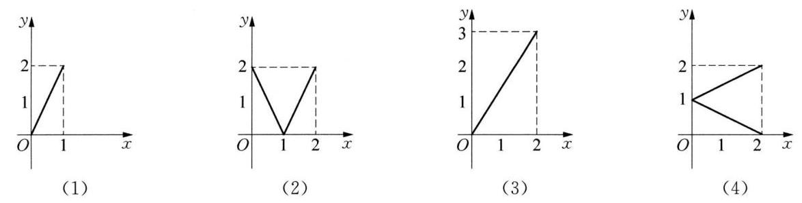

(第 7 题图)

A. 0 个 B. 1 个 C. 2 个 D. 3 个

8 已知函数 $y = {x}^{2} - {4x} - 2$ 的定义域为 $\left\lbrack  {0, m}\right\rbrack$ ，值域为 $\left\lbrack  {-6, - 2}\right\rbrack$ ，则实数 $m$ 的取值范围是 ( )。

A. $(0,4\rbrack$ B. $\left\lbrack  {2,4}\right\rbrack$ C. $(0,2\rbrack$ D. $\left( {2,4}\right)$

9 若一系列函数的解析式相同，值域相同，但其定义域不同，则称这些函数为“同族函数”。那么函数解析式为 $f\left( x\right)  = {x}^{2}$ ，值域为 $\{ 1,4\}$ 的“同族函数”共有( )。

A. 7 个 B. 8 个 C. 9 个 D. 10 个

10 求函数 $y = \sqrt{7 + {6x} - {x}^{2}}$ 的值域。

11 若 $f\left( {x + 1}\right)  = {x}^{2} - {2x} + 3$ ,求函数 $f\left( x\right)$ 的解析式。

12 如果函数 $y = \sqrt{m{x}^{2} - {6mx} + m + 8}$ 的定义域为 $\mathbf{R}$ ，求实数 $m$ 的取值范围。

13 (选做) 已知函数 $f\left( x\right)$ 满足 $f\left( x\right)  + {2f}\left( \frac{2 - x}{x + 1}\right)  = x$ ,求 $f\left( x\right)$ 解析式。

### 3.2 函数的表示方法

1 已知函数 $f\left( x\right)  = x + \frac{1}{\sqrt{x}} + 1, g\left( x\right)  = {x}^{2} - \frac{1}{\sqrt{x}}$ ，则 $f\left( x\right)  + g\left( x\right)  =$ ___。

2 将 6%的盐水与 8%的盐水按质量比 $x : 1$ 的比例混合，得到 $y\%$ 的盐水，则 $y$ 关于 $x$ 的函数关系式是___。

3 已知函数 $f\left( x\right)$ 为一次函数，且 $f\{ f\left\lbrack  {f\left( x\right) }\right\rbrack  \}  = {27x} + {26}$ ，则函数 $f\left( {-1}\right)  =$ ___。

4 已知 $f\left( {x + \frac{1}{x}}\right)  = {x}^{3} + \frac{1}{{x}^{3}}$ ，则 $f\left( x\right)  =$ ___。

5 已知 $f\left( x\right)  = \frac{{x}^{2}}{1 + {x}^{2}}$ ，则 $f\left( \frac{1}{2023}\right)  + f\left( \frac{1}{2022}\right)  + \cdots  + f\left( \frac{1}{2}\right)  + f\left( 1\right)  + f\left( 2\right)  + \cdots  + f\left( {2023}\right)  =$ ___。

6 已知函数 $f\left( x\right)  = {x}^{2} - {53x} + {{196} + \left| {{x}^{2} - {53x} + {196}}\right| }$ ，则 $f\left( 1\right)  + f\left( 2\right)  + f\left( 3\right)  + \cdots  + \; f\left( {50}\right)  =$ ___。

7 下列函数中，不满足 $f\left( {2x}\right)  = {2f}\left( x\right)$ 的是( )。

A. $f\left( x\right)  = \left| x\right|$ B. $f\left( x\right)  = x - \left| x\right|$

C. $f\left( x\right)  = x + 1$ D. $f\left( x\right)  =  - x$

8 设函数 $f\left( x\right)  = \left\{  \begin{array}{ll} {x}^{2} + 1, & x \leq  1, \\  \frac{2}{x}, & x > 1, \end{array}\right.$ 则 $f\left( {f\left( 3\right) }\right)  =$ (   )。

A. $\frac{1}{5}$ B. 3

C. $\frac{2}{3}$ D. $\frac{13}{9}$

9 设函数 $f\left( x\right)  = \left\{  \begin{array}{ll} \sqrt{x}, & 0 < x < 1, \\  2\left( {x - 1}\right) , & x \geq  1, \end{array}\right.$ 若 $f\left( a\right)  = f\left( {a + 1}\right)$ ，则 $f\left( \frac{1}{a}\right)  =$ (   )。

A. 2 B. 4 C. 6 D. 8

10 定义符号函数 $y = \operatorname{sgn}x = \left\{  \begin{array}{ll} 1, & x > 0, \\  0, & x = 0, \\   - 1, & x < 0, \end{array}\right.$ 解不等式 $x + 2 > {\left( x - 2\right) }^{\operatorname{sgn}x}$ 。

11 已知函数 $f\left( x\right)  = \frac{\sqrt[3]{{3x} - 1}}{a{x}^{2} + {ax} - 3}$ 的定义域是 $\mathbf{R}$ ,求实数 $a$ 的取值范围。

12 已知等式 $f\left( {x - y}\right)  = f\left( x\right)  - y\left( {{2x} - y + 1}\right)$ 对一切实数 $x$ 、 $y$ 都成立，且 $f\left( 0\right)  = 1$ ，求 $f\left( x\right)$ 的解析式。

13 (选做)设 $f\left( x\right)$ 是 $\left\lbrack  {0,1}\right\rbrack$ 上的函数, $f\left( x\right)  = \left\{  \begin{array}{ll} {2x} + \frac{1}{3}, & 0 \leq  x < \frac{1}{3}, \\  \frac{3\left( {1 - x}\right) }{2}, & \frac{1}{3} \leq  x \leq  1\text{ 。 } \end{array}\right.$ 试在 $\left\lbrack  {0,1}\right\rbrack$ 上找出五个不同的点 ${x}_{0}\text{ 、 }{x}_{1}\text{ 、 }{x}_{2}\text{ 、 }{x}_{3}\text{ 、 }{x}_{4}$ ,使得 $f\left( {x}_{0}\right)  = {x}_{1}, f\left( {x}_{1}\right)  = {x}_{2}, f\left( {x}_{2}\right)  = {x}_{3}, f\left( {x}_{3}\right)  = \; {x}_{4}, f\left( {x}_{4}\right)  = {x}_{0}$ 。

### 3.3 函数的奇偶性 (1)

1 函数 $f\left( x\right)  = {kx} + b\left( {k \neq  0}\right)$ 是奇函数的充要条件是___。

2 已知函数 $y = f\left( x\right) \left( {x \in  \mathbf{R}}\right)$ ，则函数 $y = f\left( x\right)  + f\left( {-x}\right)$ 是___。(填“奇函数”或“偶函数”)

3 已知函数 $f\left( x\right)  = \frac{x + a}{{x}^{2} + {bx} + 1}\left( {-1 \leq  x \leq  1}\right)$ 为奇函数，则 $a + b =$ ___。

4 已知函数 $f\left( x\right)$ 是定义在 $\mathbf{R}$ 上的偶函数，且当 $x \geq  0$ 时 $f\left( x\right)  = {x}^{2} - {2x} - 1$ ，则 $f\left( {f\left( 0\right) }\right)  =$ ___。

5 已知函数 $f\left( x\right)$ 是定义在 $\mathbf{R}$ 上的奇函数，且当 $x > 0$ 时 $f\left( x\right)  = {x}^{2} - {2x} + 1$ ，则 $f\left( {f\left( 0\right) }\right)  =$ ___。

6 定义函数 $f\left( x\right)$ 在闭区间 $\left\lbrack  {a, b}\right\rbrack$ 上的最大值与最小值之差称为函数 $f\left( x\right)$ 的极差。若定义在区间 $\left\lbrack  {-{2b},{3b} - 1}\right\rbrack$ 上的函数 $f\left( x\right)  = a{x}^{3} - {x}^{2} - \left( {b + 2}\right)$ 是偶函数，则 $a + b =$ ___，函数 $f\left( x\right)$ 的极差为___。

7 若函数 $y = f\left( x\right) \left( {x \in  \mathbf{R}}\right)$ 是奇函数，则下列坐标表示的点一定在 $y = f\left( x\right)$ 图像上的是 ( )。

A. $\left( {a, - f\left( a\right) }\right)$ B. $\left( {-a, - f\left( a\right) }\right)$

C. $\left( {-a, - f\left( {-a}\right) }\right)$ D. $\left( {a, f\left( {-a}\right) }\right)$

8 若 $f\left( x\right)  = a{x}^{2} + {bx} + c\left( {a \neq  0}\right)$ 是偶函数，则 $g\left( x\right)  = a{x}^{3} + b{x}^{2} + {cx}$ 是( )。

A. 奇函数 B. 偶函数

C. 非奇非偶函数 D. 既是奇函数又是偶函数

9 已知 $f\left( x\right)$ 是定义在 $\mathbf{R}$ 上的偶函数， $f\left( {x + 1}\right)$ 是奇函数，当 $x \in  \left\lbrack  {0,1}\right\rbrack$ 时， $f\left( x\right)  = 2{x}^{2} - m$ ， 则 $f\left( \frac{11}{2}\right)  =$ (   )。

A. $\frac{3}{2}$ B. $- \frac{3}{2}$ C. $\frac{1}{2}$ D. $- \frac{1}{2}$

10 定义两种运算: $a \oplus  b = \sqrt{{a}^{2} - {b}^{2}}, a \otimes  b = \sqrt{{\left( a - b\right) }^{2}}$ ,求函数 $f\left( x\right)  = \frac{2 \oplus  x}{\left( {x \otimes  2}\right)  - 2}$ 的定义域,并判断其奇偶性。

11 已知函数 $f\left( x\right)  = 2{x}^{2} + {\left( x - a\right) }^{2}$ 。

(1)若 $f\left( {x + 1}\right)$ 为偶函数，求实数 $a$ 的值；

(2)若 $f\left( x\right)$ 在 $\left\lbrack  {0,1}\right\rbrack$ 上有最小值 9，求实数 $a$ 的值。

12 已知函数 $f\left( x\right)$ 对一切 $x\text{ 、 }y$ 都有 $f\left( {x + y}\right)  = f\left( x\right)  + f\left( y\right)$ 。

(1)求证: $f\left( x\right)$ 是奇函数；

(2)若 $f\left( {-3}\right)  = a$ ，试用 $a$ 表示 $f$ (12)。

13 (选做)设 $f\left( x\right)  = {x}^{3} + a{x}^{2} - {2x}\left( {x \in  \mathbf{R}}\right)$ ，其中常数 $a \in  \mathbf{R}$ 。

(1)判断函数 $y = f\left( x\right)$ 的奇偶性,并说明理由;

(2)若对函数 $y = h\left( x\right)$ 定义域内的任意 $x$ ，都有 $h\left( x\right)  + h\left( {{2m} - x}\right)  = {2n}$ ，则函数 $y = h\left( x\right)$ 的图像有对称中心 $\left( {m, n}\right)$ 。利用以上结论探究: 对于任意的实数 $a$ ,函数 $y = f\left( x\right)$ 是否都有对称中心? 若是,求出对称中心的坐标 (用 $a$ 表示); 若不是,证明你的结论。

### 3.3 函数的奇偶性 (2)

1 函数 $f\left( x\right)  = \left\{  \begin{array}{ll} x\left( {1 - x}\right) , & x > 0, \\   - x\left( {1 + x}\right) , & x < 0 \end{array}\right.$ 的奇偶性是___。

2 若函数 $f\left( x\right)  = \frac{x}{\left( {{2x} + 1}\right) \left( {x - a}\right) }$ 为奇函数，则实数 $a$ 等于___。

3 已知 $f\left( x\right)$ 是定义在 $\mathbf{R}$ 上的奇函数，当 $x < 0$ 时， $f\left( x\right)  = {2x}\left( {x + 1}\right)  + 1$ ，则 $f\left( x\right)$ 的解析式为___。

4 已知 $m\text{ 、 }n \in  \mathbf{R}$ ，函数 $f\left( x\right)  = \left| {x - n}\right|  + 2$ 是定义在 $\left\lbrack  {{4m},{m}^{2} - 5}\right\rbrack$ 上的偶函数，则 $m + n$ 的值是___。

5 若函数 $f\left( x\right)  = {x}^{2023} + a \cdot  {x}^{2025} - \frac{b}{x} - 8, f\left( {-2}\right)  = {10}$ ，则 $f\left( 2\right)  =$ ___。

6 已知函数 $f\left( x\right)  = {x}^{2} - 2\left| x\right|$ ，若 $f\left( {{2m} + 1}\right)  < f\left( 3\right)$ ，则实数 $m$ 的取值范围是___。

7 下列命题中正确的是( )。

A. 奇函数的图像一定过原点 B. $y = {x}^{2} + 1\left( {-4 < x \leq  4}\right)$ 是偶函数

C. $y = \left| {x - 1}\right|  + \left| {x + 1}\right|$ 是偶函数 D. $y = \frac{{x}^{2} - x}{x - 1}$ 是奇函数

8 已知 $f\left( x\right)$ 是奇函数， $g\left( x\right)$ 是偶函数，且 $f\left( {-1}\right)  + g\left( 1\right)  = 2, f\left( 1\right)  + g\left( {-1}\right)  = 4$ ，则 $g\left( 1\right)$ 等于( )。

A. 4 B. 3 C. 2 D. 1

9 函数 $f\left( x\right)  = \frac{2x}{{x}^{2} - 1}$ 的图像大致为( )。

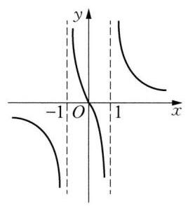

A.

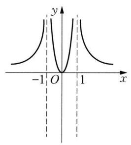

B.

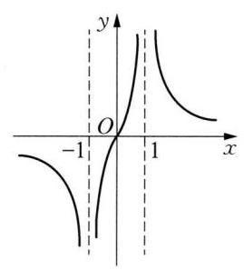

C.

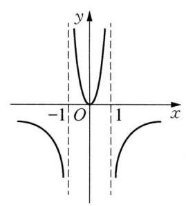

D.

10 已知 $f\left( x\right)$ 是奇函数， $g\left( x\right)$ 是偶函数，且 $f\left( x\right)  + g\left( x\right)  = 2{x}^{2} - {3x} + 1$ ，求 $f\left( x\right)$ 、 $g\left( x\right)$ 的解析式。

11 已知函数 $f\left( x\right)$ 满足 $f\left( {x + y}\right)  = f\left( x\right)  + f\left( y\right)$ ,当 $x < 0$ 时, $f\left( x\right)  > 0$ ,且 $f\left( 1\right)  =  - 2$ ,判断函数 $f\left( x\right)$ 在 $\mathbf{R}$ 上的奇偶性。

12 已知函数 $f\left( x\right)  = \left\{  \begin{array}{ll} {x}^{2} + {2x}, & x \geq  0, \\  {x}^{2} - {2x}, & x < 0, \end{array}\right.$ 若 $f\left( {-a}\right)  + f\left( a\right)  \leq  {2f}\left( 1\right)$ ，求实数 $a$ 的取值范围。

13 (选做) 已知函数 $f\left( x\right)  = x\left| {x + m}\right|  + n\left( {m, n \in  \mathbf{R}}\right)$ 。

(1)求证: “ ${m}^{2} + {n}^{2} = 0$ ” 是 “ $f\left( x\right)$ 是奇函数” 的充要条件；

(2)若常数 $n =  - 4$ ，且 $f\left( x\right)  < 0$ 对任意 $x \in  \left\lbrack  {0,1}\right\rbrack$ 恒成立，求实数 $m$ 的取值范围。

### 3.4 函数的单调性(1)

1 函数 $y = \frac{1}{x - 2}$ 的严格减区间为___。

2 已知函数 $f\left( x\right)  = x\left| x\right|  + {2x}$ ，则严格增区间是___。

3 函数 $y = \frac{1}{{x}^{2} + {2x} + 4}$ 的严格增区间为___。

4 已知函数 $f\left( x\right)$ 为定义在 $\left( {0, + \infty }\right)$ 上的严格增函数，若 $f\left( {{a}^{2} - a}\right)  > f\left( {a + 3}\right)$ ，则实数 $a$ 的取值范围为___。

5 已知函数 $f\left( x\right)  = \left\{  \begin{array}{ll} {x}^{2} - {2ax}, & x \geq  1, \\  {ax} - 1, & x < 1 \end{array}\right.$ 是 $\mathbf{R}$ 上的严格增函数,则实数 $a$ 的取值范围是 ___。

6 已知函数 $f\left( x\right)  = \left\{  \begin{array}{ll} \left( {a - 5}\right) x - 2, & x \geq  2, \\  {x}^{2} - 2\left( {a + 1}\right) x + {3a}, & x < 2, \end{array}\right.$ 若对任意 ${x}_{1},{x}_{2} \in  \mathbf{R}\left( {{x}_{1} \neq  {x}_{2}}\right)$ ，都有 $\frac{f\left( {x}_{1}\right)  - f\left( {x}_{2}\right) }{{x}_{1} - {x}_{2}} < 0$ 成立，则实数 $a$ 的取值范围为___。

7 下列函数在 $\mathbf{R}$ 上为严格增函数的是( )。

A. $y = {x}^{2}$ B. $y = x$ C. $y =  - \sqrt{x}$ D. $y = \frac{1}{x}$

8 “ $a = 2$ ” 是“函数 $f\left( x\right)  = \left| {x - a}\right|$ 在区间 $\lbrack 2, + \infty )$ 上为严格增函数”的( )。

A. 充分非必要条件 B. 必要非充分条件

C. 充要条件 D. 既非充分也非必要条件

9 已知定义在 $\mathbf{R}$ 上的函数 $f\left( x\right)$ 在区间 $\left( {-\infty ,2}\right)$ 上是严格增函数，且 $f\left( {x + 2}\right)$ 的图像关于 $x = 0$ 对称，则( )。

A. $f\left( {-1}\right)  < f\left( 3\right)$ B. $f\left( {-1}\right)  > f\left( 3\right)$

C. $f\left( {-1}\right)  = f\left( 3\right)$ D. $f\left( 0\right)  = f\left( 3\right)$

10 求证:函数 $f\left( x\right)  = x + \frac{4}{x}$ 在 $(0,2\rbrack$ 上是严格减函数。

11 若 $f\left( x\right)$ 是定义在 $\left( {-1,1}\right)$ 上的奇函数，且 $x \in  \lbrack 0,1)$ 时 $f\left( x\right)$ 为严格增函数，求不等式 $f\left( x\right)  + f\left( {x - \frac{1}{2}}\right)  < 0$ 的解集。

12 已知函数 $f\left( x\right)$ 是定义在 $\mathbf{R}$ 上的偶函数，且当 $x \leq  0$ 时， $f\left( x\right)  = {x}^{2} + {2x}$ 。

(1)求出当 $x > 0$ 时， $f\left( x\right)$ 的解析式；

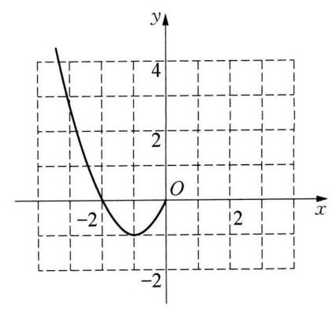

(第 12 题图)

(2)如图所示，请补出函数 $f\left( x\right)$ 的完整图像；

(3)根据图像直接写出函数 $f\left( x\right)$ 的严格增区间及值域。

13 (选做) 已知函数 $f\left( x\right)  = \frac{{ax} + b}{1 + {x}^{2}}$ 是定义在 $\left( {-1,1}\right)$ 上的奇函数，且 $f\left( \frac{1}{2}\right)  = \frac{2}{5}$ 。

(1)确定函数 $f\left( x\right)$ 的解析式并用定义证明 $f\left( x\right)$ 在 $\left( {-1,1}\right)$ 上是严格增函数；

(2)解不等式: $f\left( {t - 1}\right)  + f\left( t\right)  < 0$ 。

### 3.4 函数的单调性(2)

1 若函数 $f\left( x\right)  = \left( {{3a} - 1}\right) x + b$ 在 $\left( {-\infty , + \infty }\right)$ 上是严格增函数，则实数 $a$ 的取值范围是___。

2 若函数 $y = 2{x}^{2} + {ax} + 3$ 在( ) ->___。13. 上述函数，则实数 $a$ 的取值范围是___。

3 函数 $y = \left| {-{x}^{2} + {2x} + 1}\right|$ 的严格增区间是___。

4 函数 $y = \sqrt{-{x}^{2} + {4x}}$ 的严格增区间是___。

5 已知奇函数 $y = f\left( x\right)$ 在定义域 $\mathbf{R}$ 上是严格减函数，且 $f\left( {a + 1}\right)  + f\left( {2a}\right)  > 0$ ，则实数 $a$ 的取值范围是___。

6 已知函数 $f\left( x\right)$ 是定义在 $\left( {0, + \infty }\right)$ 上的严格增函数，且满足 $f\left( 3\right)  = 1, f\left( {xy}\right)  = f\left( x\right)  + \; f\left( y\right) , x > 0, y > 0$ ，则不等式 $f\left( x\right)  + f\left( {x - 3}\right)  \leq  3$ 的解集为___。

7 若函数 $f\left( x\right)  = {x}^{2} + 2\left( {a - 1}\right) x + 2$ 在 $( - \infty ,5\rbrack$ 上是严格减函数，则实数 $a$ 的取值范围是 ( )。

A. $\left( {-\infty , - 5}\right)$ B. $\lbrack 5, + \infty )$ C. $\lbrack 4, + \infty )$ D. $( - \infty , - 4\rbrack$

8 函数 $f\left( x\right)  = \left| {{x}^{2} - {3x} + 2}\right|$ 的严格增区间是( )。

A. $\left\lbrack  {\frac{3}{2}, + \infty }\right)$ B. $\left\lbrack  {1,\frac{3}{2}}\right\rbrack$ 和 $\lbrack 2, + \infty )$

C. $( - \infty ,1\rbrack$ 和 $\left\lbrack  {\frac{3}{2},2}\right\rbrack$ D. $\left( {-\infty ,\frac{3}{2}}\right)$ 和 $\lbrack 2, + \infty )$

9 设 $f\left( x\right)$ 是定义在 $\mathbf{R}$ 上的奇函数，且当 $x \geq  0$ 时， $f\left( x\right)  = {x}^{2}$ ，不等式 $f\left( {x}^{2}\right)  \geq  {4f}\left( x\right)$ 的解集为( )。

A. $( - \infty ,0\rbrack  \cup  \lbrack 4, + \infty )$ B. $\left\lbrack  {0,4}\right\rbrack$

C. $\left( {-\infty ,0\rbrack \cup \lbrack 2, + \infty }\right)$ D. $\left\lbrack  {0,2}\right\rbrack$

10 已知函数 $f\left( x\right)  = x + \frac{4}{x}$ 。

(1)证明: $f\left( x\right)$ 在 $\left( {2, + \infty }\right)$ 上是严格增函数；

(2)解不等式: $f\left( {{x}^{2} - {2x} + 4}\right)  \leq  f\left( 7\right)$ 。

11 已知函数 $f\left( x\right)  = a - \frac{1}{\left| x\right| }\left( {a \neq  0}\right)$ 。

(1)若 $f\left( x\right)  < {2x}$ 在 $\left( {1, + \infty }\right)$ 上恒成立，求实数 $a$ 的取值范围；

(2)若函数 $y = f\left( x\right)$ 在 $\left\lbrack  {m, n}\right\rbrack$ 上的值域是 $\left\lbrack  {m, n}\right\rbrack$ ，求实数 $a$ 的取值范围。

12 已知函数 $f\left( x\right)  = \sqrt{{3x} - 2} - {ax}, a \in  \mathbf{R}$ 。

(1)若 $f\left( x\right)$ 在区间 $\lbrack 1, + \infty )$ 上是严格减函数，求 $a$ 的最小值；

(2)当 $x \geq  1$ 时， $5{x}^{2} + x - {m}^{2} \geq  m\sqrt{{3x} - 2}$ ，求实数 $m$ 的取值范围。

13 (选做)若函数 $y = f\left( x\right)$ 对定义域内的每一个值 ${x}_{1}$ ，在其定义域内都存在唯一的 ${x}_{2}$ ，使 $f\left( {x}_{1}\right)  \cdot  f\left( {x}_{2}\right)  = 1$ 成立，则称函数 $y = f\left( x\right)$ 具有性质 $M$ 。

(1)判断函数 $f\left( x\right)  = \frac{1}{x}$ 是否具有性质 $M$ ,并说明理由;

(2) $f\left( x\right)  = \frac{1}{3}{x}^{2} - \frac{4}{3}x + \frac{4}{3}$ 的定义域为 $\left\lbrack  {m, n}\right\rbrack$ ( $m$ 、 $n$ 为正整数且 $m > 2$ )且具有性质 $M$ ， 求 ${mn}$ 的值;

(3)已知 $a < 2$ ，函数 $f\left( x\right)  = {\left( x - a\right) }^{2}$ 的定义域为 $\left\lbrack  {2,4}\right\rbrack$ 且 $f\left( x\right)$ 具有性质 $M$ ，若存在实数 $x \in  \left\lbrack  {2,4}\right\rbrack$ ,使得对任意的 $t \in  \mathbf{R}$ ,不等式 $f\left( x\right)  \geq  s{t}^{2} + {st} + 4$ 都成立,求实数 $s$ 的取值范围。

### 3.5 函数的最值与值域(1)

1 已知函数 $f\left( x\right)  = 4{x}^{2} - {4mx} + 1$ 在 $\left( {-\infty , - 2}\right)$ 上严格减，在 $\left( {-2, + \infty }\right)$ 上严格增，则 $f\left( x\right)$ 在 $\left\lbrack  {1,2}\right\rbrack$ 上的值域为___。

2 已知函数 $f\left( x\right)  = \sqrt{x} + \frac{k}{\sqrt{x}}$ 在区间 $\left( {0, + \infty }\right)$ 上有最小值 4,则实数 $k =$ ___。

3 若函数 $f\left( x\right)  = \frac{3x}{x - 3}, x \in  \left\lbrack  {4,6}\right\rbrack$ ，则 $f\left( x\right)$ 的最大值与最小值分别为___。

4 已知函数 $f\left( x\right)  = {2x} + b$ 在区间 $\left( {-1,2}\right)$ 上的函数值恒为正，则实数 $b$ 的取值范围为___。

5 设 $a \in  \mathbf{R}$ ，若 $x > 0$ 时均有 $\left\lbrack  {\left( {a - 1}\right) x - 1}\right\rbrack  \left( {{x}^{2} - \frac{3}{2}x - 1}\right)  \geq  0$ ，则 $a =$ ___。

6 已知函数 ${f}_{1}\left( x\right)  = \left| {x - 1}\right| ,{f}_{2}\left( x\right)  = \frac{1}{3}x + 1, g\left( x\right)  = \max \left\{  {{f}_{1}\left( x\right) ,{f}_{2}\left( x\right) }\right\}  ,\max \{ m, n\}$ 表示 $m\text{ 、 }n$ 中的最大值。若 $a, b \in  \left\lbrack  {-1,5}\right\rbrack$ ,且当 ${x}_{1},{x}_{2} \in  \left\lbrack  {a, b}\right\rbrack  \left( {{x}_{1} \neq  {x}_{2}}\right)$ 时, $\frac{g\left( {x}_{1}\right)  - g\left( {x}_{2}\right) }{{x}_{1} - {x}_{2}} > 0$ 恒成立，则 $b - a$ 的最大值为___。

7 下列函数在 $\left\lbrack  {1,4}\right\rbrack$ 上最大值为 3 的是( )。

A. $y = \frac{1}{x} + 2$ B. $y = {3x} - 2$ C. $y = {x}^{2}$ D. $y = {3}^{x}$

8 关于函数 $f\left( x\right)  = \frac{{3x} - 1}{{2x} - 5}$ ，下列说法正确的是( )。

A. 若 $x \in  \mathbf{N}$ ,则函数只有最大值没有最小值 B. 若 $x \in  \mathbf{N}$ ,则函数只有最小值没有最大值

C. 若 $x \in  \mathbf{N}$ ,则函数有最大值没有最小值 D. 若 $x \in  \mathbf{N}$ ,则函数有最小值也有最大值

9 已知 $f\left( x\right)  = {x}^{2} - {ax} + \frac{a}{2}$ 在区间 $\left\lbrack  {0,1}\right\rbrack$ 上的最大值为 $g\left( a\right)$ ，则 $g\left( a\right)$ 的最小值为___3 。

A. 0

B. $\frac{1}{2}$ C. 1 D. 2

10 已知函数 $f\left( x\right)  = 4{x}^{2} - {6x} + 2$ 。

(1)求 $f\left( x\right)$ 的单调区间；

(2)求 $f\left( x\right)$ 在 $\left\lbrack  {2,4}\right\rbrack$ 上的最大值。

11 已知函数 $f\left( x\right)  = {2x} + \frac{1}{2x}$ 。

(1)试判断函数 $f\left( x\right)$ 在区间 $\left( {0,\frac{1}{2}}\right\rbrack$ 上的单调性，并用函数单调性定义证明；

(2)对任意 $x \in  \left( {0,\frac{1}{2}}\right\rbrack$ 时， $f\left( x\right)  \geq  2 - m$ 都成立，求实数 $m$ 的取值范围。

12 已知函数 $f\left( x\right)  =  - {x}^{3} + m{x}^{2} - x$ 是 $\mathbf{R}$ 上的奇函数。

(1)求实数 $m$ 的值；

(2)用函数单调性定义证明 $f\left( x\right)$ 在 $\mathbf{R}$ 上是严格减函数；

(3)若对任意的 $t \in  \left\lbrack  {0,5}\right\rbrack$ ，不等式 $f\left( {{t}^{2} + {2t} + k}\right)  + f\left( {-2{t}^{2} + {2t} - 5}\right)  > 0$ 恒成立，求实数 $k$ 的取值范围。

13 (选做)设函数 $y = f\left( x\right)$ 的定义域为 $D$ ,若存在区间 $\left\lbrack  {a, b}\right\rbrack   \subseteq  D$ ,使得 $\{ y \mid  y = f\left( x\right) , x \in \; \left\lbrack  {a, b}\right\rbrack  \}  = \left\lbrack  {{2a},{2b}}\right\rbrack$ ,则称区间 $\left\lbrack  {a, b}\right\rbrack$ 为函数 $y = f\left( x\right)$ 的“ $H$ 区间”。

(1)写出函数 $f\left( x\right)  = {x}^{3} + x$ 所有的“ $H$ 区间”；

(2)若 $\left\lbrack  {0, m}\right\rbrack  \left( {m > 0}\right)$ 为函数 $f\left( x\right)  = \left| {{2x} - 3}\right|$ 的一个“ $H$ 区间”，求实数 $m$ 的值；

(3)求函数 $f\left( x\right)  = {x}^{2} - {4x}$ 的“ $H$ 区间”。

### 3.5 函数的最值与值域 (2)

1 已知函数 $f\left( x\right)  = {x}^{2} - {2x} - 3, x \in  \left\lbrack  {-2, a}\right\rbrack$ 的值域是 $\left\lbrack  {-4,5}\right\rbrack$ ,则实数 $a$ 的取值范围是 ___。

2 已知函数 $y = x - 2\sqrt{x}$ ，则函数的值域为___。

3 已知函数 $y = \frac{4 + x}{x + 1}, x \in  (a, b\rbrack$ 的最小值为 2,则实数 $a$ 的取值范围是___。

4 设函数 $f\left( x\right)  = \left| {{x}^{2} - {2ax}}\right|$ 在区间 $\left\lbrack  {0,1}\right\rbrack$ 上的最大值为 $g\left( a\right)$ ,则当 $g\left( a\right)$ 取得最小值时,实数 $a =$ ___。

5 设函数 $f\left( x\right)$ 的定义域为 $\mathbf{R}$ ,满足 $f\left( {x + 1}\right)  = {2f}\left( x\right)$ ,且当 $x \in  (0,1\rbrack$ 时, $f\left( x\right)  = x(x -$ 1)。若对任意的 $x \in  ( - \infty , m\rbrack$ ，都有 $f\left( x\right)  \geq   - \frac{3}{2}$ ，则实数 $m$ 的取值范围是___。

6 已知函数 $f\left( x\right)  = x - 1$ 的定义域为 $\left\lbrack  {0,4}\right\rbrack$ ，则函数 $y = f\left( {x}^{2}\right)  + {\left\lbrack  f\left( x\right) \right\rbrack  }^{2}$ 的值域为___。

7 函数 $y = \sqrt{x + 1} - \sqrt{1 - x}$ 的值域为( )。

A. $\left\lbrack  {-\sqrt{2},\sqrt{2}}\right\rbrack$ B. $(0,\sqrt{2}\rbrack$ C. $( - \infty ,\sqrt{2}\rbrack$ D. $\lbrack  - \sqrt{2}, + \infty )$

8 设二次函数 $f\left( x\right)$ 满足下列条件:① $f\left( x\right)  = f\left( {-x - 2}\right) , f\left( {-1}\right)  = 0$ ；② 当 $x \in  \left( {0,2}\right)$ 时，___， ${2x} \leq  f\left( x\right)  \leq  4\left| {x - 1}\right|  + 2$ 恒成立。若 $f\left( x\right)$ 在区间 $\left\lbrack  {m - 1, m}\right\rbrack$ 上恒有 $\left| {f\left( x\right)  - \frac{{x}^{2}}{2}}\right|  \leq  1$ ,则实数 $m$ 的取值范围是( )。

A. $\left\lbrack  {-1,1}\right\rbrack$ B. $\left\lbrack  {-\frac{3}{2},\frac{1}{2}}\right\rbrack$ C. $\left\lbrack  {-\frac{1}{2},\frac{1}{2}}\right\rbrack$ D. $\left\lbrack  {\frac{1}{2},\frac{3}{2}}\right\rbrack$

9 已知函数 $f\left( x\right)  =  - x - {x}^{3} + 1$ ,若对所有 $k \in  \left( {1, + \infty }\right)$ ,都有 $f\left( {{a}^{2} - \frac{3}{2}k}\right)  + \; f\left( {-{ka} - \frac{1}{2}}\right)  < 2$ 成立，则实数 $a$ 的取值范围是( )。

A. $\left( {-\infty , - \frac{3}{2}}\right\rbrack$ B. $( - \infty , - 1\rbrack  \cup  \lbrack 2, + \infty )$

C. $\left( {-\infty , - 1}\right)  \cup  \left( {2, + \infty }\right)$ D. $( - \infty , - 1\rbrack$

10 设函数 $f\left( x\right)  = \frac{x + 1}{x - 1}$ 。

(1)用定义证明函数 $f\left( x\right)$ 在区间 $\left( {1, + \infty }\right)$ 上是严格减函数；

(2)求函数 $f\left( x\right)$ 在区间 $\left\lbrack  {2,6}\right\rbrack$ 上的最大值和最小值。

11 已知函数 $f\left( x\right)$ 在 $\lbrack 2, + \infty )$ 上有定义,且满足 $f\left( {\sqrt{x} + 2}\right)  = x + 2\sqrt{x} + 1$ 。

(1)求函数 $f\left( x\right)$ 的解析式;

(2)若 $\exists x \in  \lbrack 2, + \infty )$ ，对 $\forall a \in  \left\lbrack  {-1,1}\right\rbrack$ 均有 $f\left( x\right)  < m - {2a}m + 2$ 成立，求实数 $m$ 的取值范围。

12 已知函数 $f\left( x\right)  = x + \frac{2}{x}, g\left( x\right)  =  - 2{x}^{2} + {ax}, a \in  \mathbf{R}$ 。

(1)若函数 $y = g\left( {f\left( x\right) }\right)$ 存在零点，求 $a$ 的取值范围；

(2)已知函数 $m\left( x\right)  = \left\{  \begin{array}{ll} f\left( x\right) , & f\left( x\right)  \geq  g\left( x\right) , \\  g\left( x\right) , & f\left( x\right)  < g\left( x\right) , \end{array}\right.$ 若 $m\left( x\right)$ 在区间 $\left( {1,4}\right)$ 上既有最大值又有最小值,求实数 $a$ 的取值范围。

13 (选做)已知定义域为 $D$ 的函数 $y = f\left( x\right)$ 。当 $a \in  D$ 时,若 $g\left( x\right)  = \frac{f\left( x\right)  - f\left( a\right) }{x - a}(x \in  D$ , $x \neq  a)$ 是严格增函数,则称 $f\left( x\right)$ 是一个“ $T\left( a\right)$ 函数”。

(1)判断函数 $y = 2{x}^{2} + x + 2\left( {x \in  \mathbf{R}}\right)$ 是否为 $T\left( 1\right)$ 函数，并说明理由;

(2)若定义域为 $\lbrack 0, + \infty )$ 的 $T\left( 0\right)$ 函数 $y = s\left( x\right)$ 满足 $s\left( 0\right)  = 0$ ，解关于 $\lambda$ 的不等式 $s\left( {2\lambda }\right)  < \; {\lambda s}\left( 2\right)$ ;

(3)设 $P$ 是满足下列条件的定义域为 $\mathbf{R}$ 的函数 $y = W\left( x\right)$ 组成的集合:①对任意 $u \in  \mathbf{R}$ ， $W\left( x\right)$ 都是 $T\left( u\right)$ 函数； $\text{ ② }W\left( 0\right)  = W\left( 2\right)  = 2, W\left( {-1}\right)  = W\left( 3\right)  = 3$ 。若 $W\left( x\right)  \geq  m$ 对一切 $W\left( x\right)  \in  P$ 和所有 $x \in  \mathbf{R}$ 成立，求实数 $m$ 的最大值。

### 3.6 函数关系的建立

1 某城市出租车收费方法如下:起步价为 6 元，可行驶 3 km (含 3 km)，行驶 3 km 到 10 km(含 10 km)每增加 $1\mathrm{\;{km}}$ 车费增加 0.5 元，超过 10 km 每增加 1 km 车费增加 0.8 元，不足 1 km 均按 1 km 计算，若某人乘出租车行驶了 11.5 km，那么他应该付车费___元。

2 一片人工林地，目前可采伐的木材有 10 万立方米，如果封山育林，该森林可采伐木材的年平均增长率为 8%，则经过___年，该片森林可采伐的木材将增加到 50 万立方米。(结果保留整数)

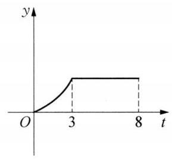

(第 3 题图)

3 某工厂 8 年来某产品的总产量 $y$ (吨)与时间 $t$ (年)的函数关系如图所示，则下述说法中正确的是___(填序号)。

① 前 3 年总产量增长速度越来越快； ② 前 3 年总产量增长速度越来越慢； ③第 3 年后，这种产品停止生产；④第 3 年后，这种产品年产量持续增长。

4 建造一个容积为 $8{\mathrm{\;m}}^{3}$ ,深为 $2\mathrm{\;m}$ 的长方体无盖水池,若池底每平方米 120 元，池壁的造价为每平方米 80 元，这个水池的最低造价为___元。 5 小明用 $A = \left( {{a}_{1},{a}_{2},\cdots ,{a}_{30}}\right)$ 记录 2020 年 4 月份 30 天中每天乘坐公交车是否半小时内到家,方法为: 当第 $k$ 天半小时内到家时,记 ${a}_{k} = 1$ ,当第 $k$ 天不能半小时内到家时,记 ${a}_{k} =  - 1\left( {1 \leq  k \leq  {30}}\right)$ ; 用 $B = \left( {{b}_{1},{b}_{2},\cdots ,{b}_{30}}\right)$ 记录某交通软件预测该月每天乘坐公交车是否半小时内到家,方法为:当预测第 $k$ 天半小时内到家时,记 ${b}_{k} = 1$ ,当预测第 $k$ 天不能半小时内到家时,记 ${b}_{k} =  - 1\left( {1 \leq  k \leq  {30}}\right)$ ; 记录完毕后,小明计算出 $A \cdot  B = {22}$ ,其中 $A \cdot  B = \; {a}_{1}{b}_{1} + {a}_{2}{b}_{2} + \cdots  + {a}_{30}{b}_{30}$ ，那么该交通软件预测准确的总天数是___。

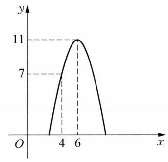

(第 6 题图)

6 某汽车运输公司购买了一批豪华大客车投入运营。据市场分析， 每辆客车营运的利润 $y$ 与营运年数 $x\left( {x \in  \mathbf{N}}\right)$ 为二次函数关系 (如图), 则客车有营运利润的时间不超过___年。

7 已知矩形的周长为 1,它的面积 $S$ 与矩形的一条边长 $x$ 之间的函数关系中，定义域为( )。

A. $\{ x \mid  0 < x < \frac{1}{4}\}$ B. $\left\{  {x\left| {\;0 < x < \frac{1}{2}}\right. }\right. \}$

C. $\left\{  {x\left| {\;\frac{1}{4} < x < \frac{1}{2}}\right. }\right.$ D. $\left\{  {x\left| {\;\frac{1}{4} < x < 1}\right. }\right\}$

8 将进货价为每个 80 元的商品按 90 元一个出售时，能卖出 400 个，每涨价 1 元，销售量就减少20个，为了使商家利润有所增加，则售价 $a$ (元/个)的取值范围应是( )。

A. ${90} < a < {100}$ B. ${90} < a < {110}$ C. ${100} < a < {110}$ D. ${80} < a < {100}$

9 2020 年 9 月 22 日我国在联合国大会提出，二氧化碳排放力争于 2030 年前达到峰值，努力争取在 2060 年前实现碳中和。为了响应党和国家的号召, 某企业在国家科研部门的支持

下，进行技术攻关，把二氧化碳转化为一种可利用的化工产品。经测算，该技术处理总成本 $y$ (单位:万元)与处理量 $x$ (单位:吨) ( $x \in  \left\lbrack  {{120},{500}}\right\rbrack$ ) 之间的函数关系可近似表示为 $y = \; \left\{  \begin{array}{ll} \frac{1}{3}{x}^{3} - {80}{x}^{2} + {5040x}, & x \in  \lbrack {120},{144}), \\  \frac{1}{2}{x}^{2} - {200x} + {80000}, & x \in  \left\lbrack  {{144},{500}}\right\rbrack  , \end{array}\right.$ 当处理量 $x$ 等于多少吨时,每吨的平均处理成本最少( )。

A. 120 B. 200 C. 240 D. 400

10 有研究表明,声音在空气中的传播速度与空气的温度有关,当空气的温度变化,声音的传播速度也将随着变化。声音在空气中传播速度与空气温度关系的一些数据(如下表格):

<table><tr><td>温度/℃</td><td>...</td><td>-20</td><td>-10</td><td>0</td><td>10</td><td>20</td><td>30</td><td>...</td></tr><tr><td>声速/(m/s)</td><td>...</td><td>318</td><td>324</td><td>330</td><td>336</td><td>342</td><td>348</td><td>...</td></tr></table>

(1)指出在这个变化过程中的自变量和因变量;

(2)当声音在空气中传播速度为 ${342}\mathrm{m}/\mathrm{s}$ 时,此时空气的温度是多少?

(3)该数据表明:空气的温度每升高10°C，声音的传播速度将增大(或减少)多少？

(4)用 $y$ 表示声音在空气中的传播速度， $x$ 表示空气温度，根据(3)中你发现的规律，直接写出 $y$ 与 $x$ 之间的关系式。

11 为了保护环境，发展低碳经济，某单位在国家科研部门的支持下，进行技术攻关，采用了新工艺，把二氧化碳转化为一种可利用的化工产品。已知该单位每月的处理量最少为 400 吨，最多为 600 吨,月处理成本 $y$ (元)与月处理量 $x$ (吨)之间的函数关系可近似地表示为 $y = \frac{1}{2}{x}^{2} -$ 200x +80000, 且每处理 1 吨二氧化碳得到价值为 100 元的可利用化工产品。该单位每月能否获利？如果能获利，求出每月最大利润；如果不能获利，则需要国家每月至少补贴多少元才能使该单位不亏损?

12 提高过江大桥的车辆通行能力可改善整个城市的交通状况。在一般情况下, 大桥上的车流速度 $v$ (单位:千米/小时)是车流密度 $x$ (单位:辆/千米) 的函数。当桥上的车流密度达到 200 辆/千米时，造成堵塞，此时车流速度为 0 ；当车流密度不超过 20 辆/千米时，车流速度为 60 千米/小时。研究表明: 当 ${20} \leq  x \leq  {200}$ 时,车流速度 $v$ 是车流密度 $x$ 的一次函数。

(1)当 $0 \leq  x \leq  {200}$ 时,求函数 $v\left( x\right)$ 的表达式;

(2)当车流密度 $x$ 为多大时，车流量(单位时间内通过桥上某观测点的车辆数，单位:辆/小时) $f\left( x\right)  = x \cdot  v\left( x\right)$ 可以达到最大，并求出最大值。(精确到 1 辆/小时) 13 (选做)某市为了鼓励市民节约用水，实行“阶梯式”水价，将该市每户居民的月用水量划分为三档:月用水量不超过 4 吨的部分按 2 元/吨收费，超过 4 吨但不超过 8 吨的部分按 4 元/吨收费，超过 8 吨的部分按 8 元/吨收费。

(1)求居民月用水量费用 $y$ (单位:元)关于月用水量 $x$ (单位:吨)的函数解析式；

(2)为了了解居民的用水情况，通过抽样，获得今年 3 月份 100 户居民每户的用水量，统计分析后得到如图所示的频率分布直方图，若这 100 户居民中，今年 3 月份用水费用不超过 16 元的占 ${60}\%$ ,求 $a\text{ 、 }b$ 的值。

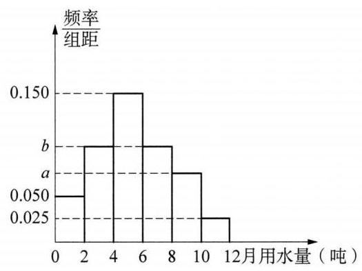

(第 13 题图)

### 3.7 用函数的观点求解方程与不等式

1 用 “二分法” 求方程 ${x}^{3} - {2x} - 5 = 0$ 在区间 $\left\lbrack  {2,4}\right\rbrack$ 内的实根，取区间中点为 ${x}_{0} = 3$ ，那么下一个有根区间是___。

2 若函数 $y = f\left( x\right)$ 的图像关于直线 $x = \frac{3}{2}$ 对称，且 $y = f\left( x\right)$ 共有 3 个零点，则所有零点之和为___。

3 若函数 $f\left( x\right)  = {ax} + b\left( {a \neq  0}\right)$ 有一个零点为 1，则 $g\left( x\right)  = b{x}^{2} - {2ax}$ 的零点是___。

4 若二次函数 $y = {x}^{2} + \left( {a - 3}\right) x + 1$ 的图像与 $x$ 轴的两个交点的横坐标分别为 ${x}_{1}\text{ 、 }{x}_{2}$ ,且 ${x}_{1} < 2,{x}_{2} > 2$ ，则实数 $a$ 的取值范围是___。

5 若三个关于 $x$ 的方程 ${x}^{2} + {4x} - {4a} + 3 = 0\text{ 、 }{x}^{2} + \left( {a - 1}\right) x + \frac{{a}^{2} + 5}{4} = 0\text{ 、 }{x}^{2} + {2ax} + 1 =$ 0 中至少有一个方程有实根，则实数 $a$ 的取值范围为___。

6 函数 $f\left( x\right)  = {x}^{2} - \frac{1}{x} + 1$ 的零点有___个。

7 已知函数 $f\left( x\right)$ 的图像是连续且单调的,有如下对应值表:

<table><tr><td>$x$</td><td>1</td><td>2</td><td>3</td><td>4</td><td>5</td></tr><tr><td>$f\left( x\right)$</td><td>-3</td><td>-1</td><td>1</td><td>2</td><td>5</td></tr></table>

则函数 $f\left( x\right)$ 的零点所在区间是( )。

A. $\left( {1,2}\right)$ B. $\left( {2,3}\right)$

C. $\left( {3,4}\right)$ D. $\left( {4,5}\right)$

8 已知函数 $y = \left\{  \begin{array}{ll} {\left( x - 1\right) }^{2} - 1, & x \leq  3, \\  {\left( x - 5\right) }^{2} - 1, & x > 3, \end{array}\right.$ 则使 $y = k$ 成立的 $x$ 的值恰好有三个,则实数 $k$ 的值为( )。

A. 0 B. 1 C. 2 D. 3

9 若方程 ${x}^{2} - 1 = \frac{a\left| {x - 1}\right| }{x}$ 存在 3 个实数根，则实数 $a$ 的取值范围是( )。

A. $\left\lbrack  {-2,0}\right)  \cup  \left( {0,\frac{1}{4}}\right\rbrack$ B. $\lbrack  - 2,0) \cup  \left( {0,\frac{1}{4}}\right)$

C. $\left( {-2,0}\right)  \cup  \left( {0,\frac{1}{4}}\right\rbrack$ D. $\left( {-2,0}\right)  \cup  \left( {0,\frac{1}{4}}\right)$

10 判断下列命题的真假:

(1)若函数 $f\left( x\right)$ 的图像是连续不断的，且在区间 $\left\lbrack  {1,4}\right\rbrack$ 上有 $f\left( 1\right) f\left( 4\right)  < 0$ ，则函数 $f\left( x\right)$ 在区间 $\left( {1,4}\right)$ 中至少有一个零点;

(2)若函数 $f\left( x\right)$ 的图像是连续不断的，且在区间 $\left\lbrack  {1,4}\right\rbrack$ 上有 $f\left( 1\right) f\left( 4\right)  > 0$ ，则函数 $f\left( x\right)$ 在区间 $\left( {1,4}\right)$ 中一定没有零点。

11 已知关于 $x$ 的方程 ${x}^{2} - {mx} + {2m} - 1 = 0$ 的两个实数根的平方和为 7，求实数 $m$ 的值。

12 已知 $a$ 是实常数且 $a > 0, f\left( x\right)  = {ax} - 1 + \frac{1}{{x}^{2}}$ 。

(1)当 $a = 2$ 时,判断函数 $y = f\left( x\right)$ 在区间 $\lbrack 1, + \infty )$ 上的单调性,并说明理由;

(2)写出一个 $a$ 的值，使得 $f\left( x\right)  = 0$ 在区间 $\left( {0, + \infty }\right)$ 上有至少两个不同的解，并严格证明你的结论。

13 (选做) 已知关于 $x$ 的函数 $f\left( x\right)  = {x}^{2} - {kx} - 2, x \in  \mathbf{R}$ 。

(1)若函数 $f\left( x\right)$ 是 $\mathbf{R}$ 上的偶函数，求实数 $k$ 的值；

(2)若函数 $h\left( x\right)  = f\left( x\right)  + \left| {{x}^{2} - 1}\right|  + 2$ ，且函数 $h\left( x\right)$ 在 $\left( {0,2}\right)$ 上有两个不同的零点 ${x}_{1}$ 、 ${x}_{2}$ ,求证: $\frac{1}{{x}_{1}} + \frac{1}{{x}_{2}} < 4$ 。

### 3.8 函数图像及其变换(1)

1 为了得到函数 $y = \frac{1}{x - 1}$ 的图像，可以把函数 $y = \frac{1}{x}$ 的图像右移___个单位。

2 函数 $f\left( x\right)  = {x}^{3} + 1$ 的图像关于___对称。

3 函数 $y = \frac{{2x} + 1}{x - 2}$ 的图像关于___对称。

4 给出下列说法，正确的有___。

① 集合 $A = \{ x \in  \mathbf{Z} \mid  x = {2k} - 1, k \in  \mathbf{Z}\}$ 与集合 $B = \{ x \in  \mathbf{Z} \mid  x = {2k} + 1, k \in  \mathbf{Z}\}$ 是相等集合；

② 函数 $y = \frac{x}{10} + 1$ 的图像与 $y = \left| {{x}^{2} - 1}\right|$ 的图像恰有 3 个公共点;

③ 函数 $f\left( {\left| x\right|  - 1}\right)$ 的图像是由函数 $f\left( x\right)$ 的图像水平向右平移一个单位后,将所得图像在 $y$ 轴右侧部分沿 $y$ 轴翻折到 $y$ 轴左侧替代 $y$ 轴左侧部分图像,并保留右侧部分而得到。

5 已知函数 $f\left( x\right)  = x\left( {\left| x\right|  - 2}\right) , g\left( x\right)  = \frac{4x}{x + 1}$ ，对于任意 ${x}_{1} \in  \left( {-1, a}\right)$ ，总存在 ${x}_{2} \in  ( - 1$ ， $a)$ ，使得 $f\left( {x}_{1}\right)  \leq  g\left( {x}_{2}\right)$ 成立，则实数 $a$ 的取值范围为___。

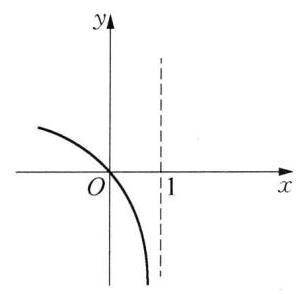

(第 8 题图)

6 若函数 $y = {x}^{2} + \left( {a + 2}\right) x + 3, a \leq  x \leq  b$ 的图像关于直线 $x = 1$ 对称，则实数 $b =$ ___。

7 若函数 $f\left( x\right)$ 在区间 $\left\lbrack  {-2,3}\right\rbrack$ 上是严格增函数，则 $y = f\left( {x + 5}\right)$ 的严格增区间是( )。

A. $\left\lbrack  {3,8}\right\rbrack$ B. $\left\lbrack  {-7, - 2}\right\rbrack$

C. $\left\lbrack  {0,4}\right\rbrack$ D. $\left\lbrack  {-2,3}\right\rbrack$

8 若函数 $y = f\left( x\right)$ 的图像如图所示,则函数 $y = f\left( {1 - x}\right)$ 的图像大致为( )。

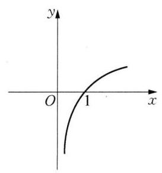

A.

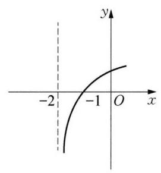

B.

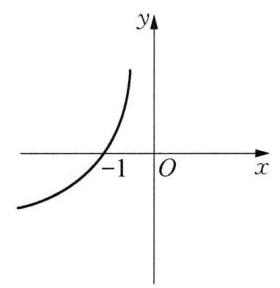

C.

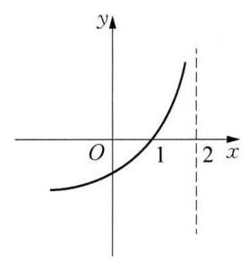

D.

9 已知函数 $y = f\left( {x + 1}\right)  - 2$ 是奇函数，函数 $g\left( x\right)  = \frac{{2x} - 1}{x - 1}$ 的图像与 $f\left( x\right)$ 的图像有 4 个公共点 ${P}_{i}\left( {{x}_{i},{y}_{i}}\right) \left( {i = 1\text{ 、 }2\text{ 、 }3\text{ 、 }4}\right)$ ,且 ${x}_{1} < {x}_{2} < {x}_{3} < {x}_{4}$ ,则 $g\left( {{x}_{1} + {x}_{2} + {x}_{3} + {x}_{4}}\right) g\left( {{y}_{1} + {y}_{2} + }\right. \; \left. {{y}_{3} + {y}_{4}}\right)  =$ (   )。

A. 2 B. 3 C. 4 D. 5

10 画出函数 $f\left( x\right)  = \frac{x}{1 + \left| x\right| }$ 的图像。

11 函数 $y = f\left( x\right)$ 的图像是函数 $y = f\left( {x - 1}\right)  + 2$ 经过怎样的变换得到的?

12 设函数 $f\left( x\right)  = \left| {x - 3}\right|  - \left| {x + 1}\right|$ 。

(1)解不等式 $f\left( x\right)  <  - 1$ ；

(2)若 $f\left( x\right)  \leq  \left| {x + a}\right|$ 恒成立，求实数 $a$ 的取值范围。

13 (选做) 已知函数 $f\left( x\right)  = \left| {\frac{1}{x} - 1}\right|$ 。

(1)画出 $f\left( x\right)$ 的大致图像;

(2)写出 $f\left( x\right)$ 的值域和 $f\left( x\right)$ 的严格增区间; (不必证明)

(3)是否存在正实数 $a\text{ 、 }b\left( {a < b}\right)$ ，使得集合 $\{ y \mid  y = f\left( x\right) , a \leq  x \leq  b\}  = \left\lbrack  {{ma},{mb}}\right\rbrack$ ，如果存在,请求出实数 $m$ 的取值范围; 反之,请说明理由。

### 3.8 函数图像及其变换(2)

1 若函数 $f\left( x\right)$ 是定义在 $\mathbf{R}$ 上的奇函数，且在 $\left( {-\infty ,0}\right)$ 上是严格增函数，又 $f\left( 2\right)  = 0$ ，则不等式 ${xf}\left( {x + 1}\right)  < 0$ 的解集为___。

2 若函数 $f\left( x\right)$ 的图像向右平移 1 个单位长度，所得图像与 $y = {3}^{x}$ 的图像关于 $y$ 轴对称，则 $f\left( x\right)  =$ ___。

3 把函数 $f\left( x\right)  = {a}^{x}\left( {a > 0, a \neq  1}\right)$ 的图像 ${C}_{1}$ 向左平移一个单位，再把所得图像上每一个点的纵坐标扩大为原来的 3 倍，而横坐标不变，得到图像 ${C}_{2}$ ，此时图像 ${C}_{1}$ 恰与 ${C}_{2}$ 重合，则实数 $a =$ ___。

4 若函数 $f\left( x\right)  = \sqrt{a{x}^{2} + {bx} + c}$ 的图像关于任意直线 $l$ 对称后的图像依然为某函数图像,则实数 $a\text{ 、 }b\text{ 、 }c$ 应满足的充要条件为___。

5 已知函数 $f\left( x\right)$ 是定义在 $\mathbf{R}$ 上的奇函数，当 $x \geq  0$ 时， $f\left( x\right)  = \left| {x - a}\right|  + \left| {x - {2a}}\right|  - {3a}$ 。若对任意的 $x \in  \mathbf{R}$ ，都有 $f\left( {x - \sqrt{a}}\right)  \leq  f\left( x\right)$ ，则实数 $a$ 的取值范围为___。

6 设函数 $y = f\left( x\right)$ 的定义域为 $\mathbf{R}$ ，则下列命题:

① 若 $y = f\left( x\right)$ 是偶函数，则 $y = f\left( {x + 2}\right)$ 的图像关于 $y$ 轴对称；

② 若 $y = f\left( {x + 2}\right)$ 是偶函数，则 $y = f\left( x\right)$ 的图像关于直线 $x = 2$ 对称；

③ 若 $f\left( {x - 2}\right)  = f\left( {2 - x}\right)$ ，则函数 $y = f\left( x\right)$ 的图像关于直线 $x = 2$ 对称；

④ $y = f\left( {x - 2}\right)$ 与 $y = f\left( {2 - x}\right)$ 的图像关于直线 $x = 2$ 对称。

其中正确命题的序号为___。

7 把函数 $y = {\left( x - 1\right) }^{2} + 2$ 的图像向右平移 1 个单位长度，平移后图像的函数解析式为( )。

A. $y = {x}^{2} + 2$ B. $y = {\left( x - 1\right) }^{2} + 1$ C. $y = {\left( x - 2\right) }^{2} + 2$ D. $y = {\left( x - 1\right) }^{2} + 3$

8 函数 $f\left( x\right)  = \frac{x}{x - 1}$ 的图像大致为( )。

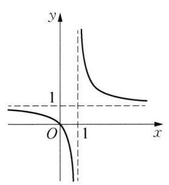

A.

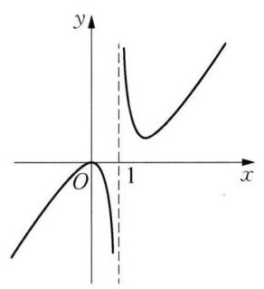

B.

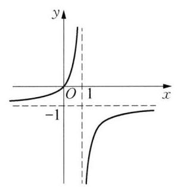

C.

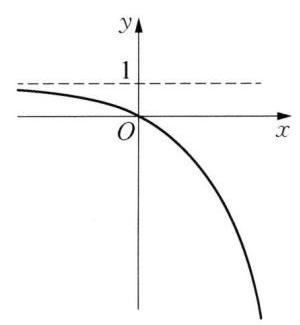

D.

9 定义在 $\mathbf{R}$ 上的函数 $f\left( x\right)$ 满足 $f\left( {x + 1}\right)  = \frac{1}{2}f\left( x\right)$ ，且当 $x \in  (0,1\rbrack$ 时， $f\left( x\right)  = x\left( {1 - x}\right)$ 。 若对任意 $x \in  \lbrack m, + \infty )$ ，都有 $f\left( x\right)  \leq  \frac{1}{18}$ ，则实数 $m$ 的取值范围是( )。

A. $\left\lbrack  {\frac{7}{3}, + \infty }\right)$ B. $\left\lbrack  {\frac{8}{3}, + \infty }\right)$ C. $\left\lbrack  {\frac{11}{4}, + \infty }\right)$ D. $\lbrack 3, + \infty )$

10 作出下列函数的图像。

(1) $y = 1 - x\left( {x \in  \{  - 2, - 1,0,1,2\} }\right)$ ;

(2) $y = \frac{{2x} + 1}{x - 1}$ ；

(3) $y = \left| {{x}^{2} - {2x}}\right|  + 1$ 。

11 已知函数 $f\left( x\right)  = \left| x\right|  + \frac{m}{x} - 3\left( {m \in  \mathbf{R}, x \neq  0}\right)$ 。

(1)判断函数 $y = f\left( x\right)$ 的奇偶性，并说明理由;

(2)讨论函数 $y = f\left( x\right)$ 的零点个数。

12 (1)已知 $x \in  \mathbf{R}$ ，符号 $\left\lbrack  x\right\rbrack$ 表示不超过 $x$ 的最大整数，若 $f\left( x\right)  = \frac{\left\lbrack  x\right\rbrack  }{x} - a\left( {x \neq  0}\right)$ 有且仅有三个零点,求实数 $a$ 的取值范围;

(2)设 $\left\lbrack  x\right\rbrack$ 表示不超过 $x$ 的最大整数，如 $\left\lbrack  \pi \right\rbrack   = 3,\left\lbrack  {-\sqrt{3}}\right\rbrack   =  - 2$ 。已知函数 $f\left( x\right)  = \; \left\{  \begin{array}{ll} x - \left\lbrack  x\right\rbrack  , & x \geq  0, \\  f\left( {x + 1}\right) , & x < 0 \end{array}\right.$ 的图像与函数 $y = {kx} + k\left( {k > 0}\right)$ 的图像恰有三个不同的交点,求实数 $k$ 的取值范围。 13 (选做) 已知函数 $y = \frac{1}{x}$ 。

(1)将函数 $y = \frac{1}{x}$ 的图像进行怎样的平移，能够得到函数 $y =  - \frac{{3x} + 5}{x + 2}$ 的图像;

(2)若函数 $y =  - \frac{{3x} + 5}{x + 2}$ 在 $\lbrack a, + \infty )$ 上是严格减函数，求实数 $a$ 的取值范围；

(3)将函数 $y = \frac{1}{x}$ 图像向右平移一个单位，得函数 $y = g\left( x\right)$ 的图像，已知函数 $y = \; h\left( x\right) \left( {x \neq   \pm  1}\right)$ 的图像关于 $y$ 轴对称,且当 $x \geq  0\left( {x \neq  1}\right)$ 时,它与函数 $y = g\left( x\right)$ 的关系是 $h\left( x\right)  = \left\{  \begin{array}{ll} g\left( x\right) , & x > 1, \\   - g\left( x\right) , & 0 \leq  x < 1\text{ 。 } \end{array}\right.$ 现已知关于 $x$ 的方程 ${h}^{2}\left( x\right)  + {ah}\left( x\right)  + \left( {{a}^{2} - {2a} - {13}}\right)  = 0$ 解集中有 7 个元素,求实数 $a$ 的取值范围。

## 第 4 章 幂函数、指数函数与对数函数

### 4.1 幂与指数

1 计算: ${\left( \frac{1}{2}\right) }^{-3} + {\left( \frac{1}{6\sqrt{2}}\right) }^{0} - {16}^{\frac{3}{4}} + {\left( \frac{\sqrt{3}}{\sqrt[3]{2}}\right) }^{6} =$

2 计算: $\sqrt[3]{{\left( -4\right) }^{3}} - {\left( \frac{1}{2}\right) }^{0} + {0.25}^{\frac{1}{2}} \times  {\left( \frac{-1}{\sqrt{2}}\right) }^{-6} =$ ___。

3 若 ${\left( 1 - 2x\right) }^{-\frac{3}{4}}$ 有意义，则实数 $x$ 的取值范围为___。

$4\sqrt{a\sqrt{a\sqrt{a}}}\left( {a > 0}\right)$ 用分数指数幂表示为___。

5 若 $\sqrt{{x}^{2} + {2x} + 1} + \sqrt{{y}^{2} + {6y} + 9} = 0$ ，则 ${\left( {x}^{2019}\right) }^{y} =$ ___。

6 化简: $\frac{5{x}^{-\frac{2}{3}}{y}^{\frac{1}{2}}}{\left( {\frac{1}{2}{x}^{-1}{y}^{\frac{1}{2}}}\right) \left( {\frac{5}{8}{x}^{\frac{1}{3}}{y}^{\frac{1}{6}}}\right) } \times  \sqrt[3]{\frac{{x}^{2}}{\sqrt{y}}} =$ ___。

7 设 $f\left( x\right)  = \left\{  \begin{array}{ll} {x}^{-2}, & 0 < x \leq  1, \\  {x}^{2}, & x > 1, \end{array}\right.$ 则 $f\left( {f\left( \frac{1}{2}\right) }\right)  =$ (   )。

A. 4 B. 16 C. 64 D. 2

8 将 $\sqrt{2\sqrt{2\sqrt{2}}}$ 化为分数指数幂为( )。

A. ${2}^{\frac{3}{2}}$ B. ${2}^{\frac{3}{4}}$ C. ${2}^{\frac{7}{4}}$ D. ${2}^{\frac{7}{8}}$

9 若 ${2}^{x} = {4}^{y - 1},{27}^{y} = {3}^{x + 1}$ ，则 $x - y$ 等于( )。

A. -5 B. -3 C. -1 D. 1

10 计算:

(1) $\sqrt{{\left( \frac{11}{5} - \pi \right) }^{2}} + {\left\lbrack  {\left( -{0.0016}\right) }^{\frac{2}{6}}\right\rbrack  }^{\frac{3}{4}} - {\left( \sqrt{2} - 1\right) }^{0}$ ；

(2)已知 $a > 0$ ，且 ${a}^{x} = \sqrt{2} - 1$ ，求 $\frac{{a}^{x} + {a}^{-x}}{{a}^{x} - {a}^{-x}}$ 的值。

11 化简下列各式。

(1) ${\left( \sqrt[3]{2} \cdot  \sqrt{3}\right) }^{6} - 4 \cdot  {\left( \frac{16}{49}\right) }^{-\frac{1}{2}} - \sqrt[4]{2} \cdot  {8}^{0.25} - {\left( {2020}\right) }^{0}$ ;

(2) $\frac{\sqrt{{a}^{3}{b}^{2} \cdot  \sqrt[3]{a{b}^{2}}}}{{\left( {a}^{\frac{1}{4}}{b}^{\frac{1}{2}}\right) }^{4} \cdot  \sqrt[3]{\frac{b}{a}}}\left( {a > 0, b > 0}\right)$ 。

12 已知 ${a}^{\frac{1}{2}} - {a}^{-\frac{1}{2}} = 3$ ，求 $\frac{{a}^{\frac{3}{2}} - {a}^{-\frac{3}{2}}}{{a}^{\frac{1}{2}} - {a}^{-\frac{1}{2}}}$ 的值。

13 (选做) 已知 $a + b = {12},{ab} = 9$ 且 $a < b$ ，求 $\frac{{a}^{\frac{1}{2}} + {b}^{\frac{1}{2}}}{{a}^{\frac{1}{2}} - {b}^{\frac{1}{2}}}$ 的值。

### 4.2 对数 (1)

1 计算: $\lg 3 \cdot  {\log }_{3}2 + \lg 5 =$ ___。

2 计算: $2\lg 4 + \lg 5 - \lg 8$ 的值为___。

3 计算: ${8}^{-\frac{1}{3}} + \lg 5 + \lg 2 + {\mathrm{e}}^{\ln 2} + \frac{1}{4}\lg {0.01} =$ ___。

4 已知实数 $a\text{ 、 }b$ 满足等式 ${\log }_{3}a = {\log }_{4}b$ ,给出下列五个关系式:

① $a > b > 1$ ；② $b > a > 1$ ；③ $a < b < 1$ ；④ $b < a < 1$ ；⑤ $a = b$ 。

其中可能的关系式是___。

5 若关于 $x$ 的方程 ${\log }_{2}\left( {{\log }_{a}x}\right)  = 1$ 的解为 $x = 4$ ，则 $a =$ ___。

6 若 ${\log }_{{x}^{2}}y + {\log }_{{y}^{2}}x = 1$ ，则 $y$ 可用 $x$ 表示为___。

7 设 ${5}^{{\log }_{5}\left( {{2x} - 1}\right) } = {25}$ ，则 $x$ 的值等于( )。

A. 10 B. 13 C. 100 D. $\pm  {1001}$

8 某纯净水制造厂在净化水的过程中，每增加一次过滤可减少水中杂质 20%，要使水中杂质减少到原来的 5% 以下，则至少需要过滤的次数为( )。(参考数据 $\lg 2 = {0.3010},\lg 5 =$ 0.699)

A. 10 B. 12 C. 14 D. 16

9 某种汽车安全行驶的稳定性系数 $\mu$ 随使用年数 $t$ 的变化规律是 $\mu  = {\mu }_{0}{\mathrm{e}}^{-{\lambda t}}$ ，其中 ${\mu }_{0}$ 、 $\lambda$ 是正常数。经检测，当 $t = 2$ 时， $\mu  = {0.9}{\mu }_{0}$ ，则当稳定性系数降为 ${0.6}{\mu }_{0}$ 时，该种汽车已使用的年数为 ( )。(四舍五入结果精确到 1，参考数据: $\lg 2 \approx  {0.3010},\lg 3 \approx  {0.4771}$ )

A. 9 年 B. 10 年 C. 11 年 D. 12 年

10 不用计算器求下列各式的值。

(1) ${\left( 2\frac{1}{4}\right) }^{\frac{1}{2}} - {\left( -{9.6}\right) }^{0} - {\left( 3\frac{3}{8}\right) }^{-\frac{2}{3}} + {\left( {1.5}\right) }^{-2}$ ; (2) ${\log }_{3}\frac{\sqrt[4]{27}}{3} + \lg {25} + \lg 4 + {7}^{{\log }_{7}2}$ 。

11 求值:

(1) $\sqrt[3]{3} \cdot  {\left( {3}^{-\frac{1}{3}}\right) }^{-2} + \sqrt{{\left( 2 - \pi \right) }^{2}} - {7}^{0}$ ；

(2) $\frac{1}{2}{\log }_{\sqrt{5}}{100} - {\log }_{5}4 + {\log }_{2}9 \cdot  {\log }_{3}8 - {10}^{\lg 3}$ 。

12 计算: ${\left( \frac{4}{9}\right) }^{-{0.5}} + {8}^{\frac{2}{3}} + {\left( 2\sqrt{2}\right) }^{\frac{4}{3}}{\mathrm{e}}^{0} - \lg {25} - 2\lg 2 + {\log }_{4}{27} \times  {\log }_{3}2$ 。

13 (选做) 已知函数 $f\left( x\right)  = {x}^{2} - {2ax} + {a}^{2} - {2a} + 2$ ( $a$ 为参数)。

(1)若不等式 $f\left( x\right)  \geq  0$ 在 $x \in  \mathbf{R}$ 上恒成立，求实数 $a$ 的取值范围；

(2)求函数在 $x \in  \left\lbrack  {0,2}\right\rbrack$ 上的最小值 $g\left( a\right)$ ；

(3)在(2)的条件下，若关于 $a$ 的不等式 $g\left( a\right)  - {\log }_{\frac{1}{2}}m > 0$ 恒成立，求实数 $m$ 的取值范围。

### 4.2 对数(2)

1 若实数 $x$ 满足 ${\log }_{9}{3}^{x} = 1$ ，则 $x =$ ___。

2 若 ${\log }_{3}\frac{1 - {2x}}{9} = 1$ ，则 $x =$ ___。

3 已知 $a = {\log }_{3}2,{3}^{b} = 5$ ，用 $a$ 、 $b$ 表示 ${\log }_{3}\sqrt{30}$ 为___。

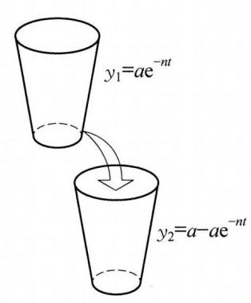

(第 4 题图)

4 如图，开始时桶 $A$ 中有 $a$ 升水， $t$ 分钟后剩余的水量符合指数衰减函数 ${y}_{1} = a{\mathrm{e}}^{-{nt}}$ (其中 $\mathrm{e}$ 、 $n$ 为常数)，此时桶 $B$ 中的水量就是 ${y}_{2} = a - a{\mathrm{e}}^{-{nt}}$ 。 假设过 5 分钟后桶 $A$ 和桶 $B$ 中的水量相等，则再过___分钟，桶 $A$ 中只有水 $\frac{a}{8}$ 升。

5 已知 $m = {\log }_{2}5$ ，则 ${2}^{m} - m\lg 2 - 4 =$ ___。

6 若 $a$ 、 $b$ 是方程 $2{\left( \lg x\right) }^{2} - \lg {x}^{4} + 1 = 0$ 的两个实根，则 $\lg \left( {ab}\right)$ . $\left( {{\log }_{a}b + {\log }_{b}a}\right)$ 的值为___。

7 已知 $0 < a < \frac{1}{2}, x = {\log }_{a}2, y = {\left( \frac{1}{2}\right) }^{a}, z = {a}^{\frac{1}{2}}$ ，则 $x$ 、 $y$ 、 $z$ 的大小关系是( )。

A. $z < y < x$ B. $x < z < y$ C. $z < x < y$ D. $x < y < z$

8 函数 $f\left( x\right)  = \left( {{x}^{2} - 1}\right)  \cdot  \frac{\ln \left| x\right| }{x}$ 的图像可能是( )。

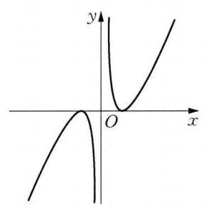

A.

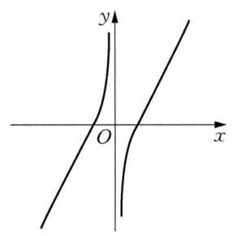

B.

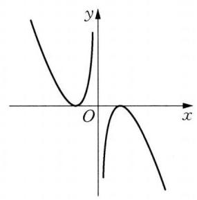

C.

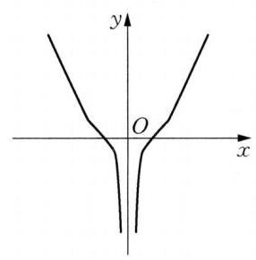

D.

9 科学记数法是一种记数的方法。把一个数 $x$ 表示成 $a$ 与 10 的 $n$ 次幂相乘的形式，其中 $1 \leq  a < {10}, n \in  \mathbf{N}$ 。当 $x > 0$ 时, $\lg x = n + \lg a$ 。若一个正整数 $m$ 的 15 次方是 11 位数,那么这个数是( )。(参考数据: $\lg 2 \approx  {0.30},\lg 3 \approx  {0.48}$ )

A. 4 B. 5 C. 6 D. 7

10 (1)计算: ${\left( 5\frac{1}{16}\right) }^{0.5} - 2 \times  {\left( 2\frac{10}{27}\right) }^{-\frac{2}{3}} - 2 \times  {\left( \sqrt{2 + \pi }\right) }^{0} \div  {\left( \frac{3}{4}\right) }^{-2}$ ;

(2)计算: ${\log }_{5}{35} + 2{\log }_{0.5}\sqrt{2} - {\log }_{5}\frac{1}{50} - {\log }_{5}{14} + {5}^{{\log }_{5}3}$ 。

11 求值。

(1) ${\log }_{2}\left( {{\log }_{3}{81}}\right)  + \ln {\mathrm{e}}^{2} - \lg {1000} + {\log }_{a}1\left( {a > 0\text{ 且 }a \neq  1}\right)$ ;

(2) ${\left( {0.064}\right) }^{-\frac{1}{3}} - {\left( -\frac{7}{8}\right) }^{0} + {\left\lbrack  {\left( -2\right) }^{3}\right\rbrack  }^{-\frac{4}{3}} + {16}^{-{0.75}} + {\left| -{0.01}\right| }^{\frac{1}{2}}$ 。

12 已知函数 $f\left( x\right)  = \frac{6x}{{x}^{2} + 1}$ 。

(1)判断函数 $f\left( x\right)$ 的奇偶性,并证明你的结论;

(2)求满足方程 $f\left( {2}^{x}\right)  = {2}^{x}$ 的实数 $x$ 的值。

13 (选做)近年来,中国自主研发的长征系列运载火箭的频频发射成功,标志着中国在该领域已逐步达到世界一流水平。设火箭推进剂的质量为 $M$ (单位: $\mathrm{t}$ )，去除推进剂后的火箭有效载荷质量为 $m$ (单位: $t$ )，火箭的飞行速度为 $v$ (单位: $\mathrm{{km}}/\mathrm{s}$ )，初始速度为 ${v}_{0}$ (单位: $\mathrm{{km}}/\mathrm{s}$ )，已知其关系式为齐奥尔科夫斯基公式: $v = {v}_{0} + \omega  \cdot  \ln \left( {1 + \frac{M}{m}}\right)$ ,其中 $\omega$ 是火箭发动机喷流相对火箭的速度。假设 ${v}_{0} = 0\mathrm{\;{km}}/\mathrm{s}, m = {25}\mathrm{t}$ 。(参考数据: ${\mathrm{e}}^{\frac{16.7}{3}} \approx  {261.56},\ln {80} \approx  {4.382}$ )

(1)若 $\omega  = {3\mathrm{\;{km}}}/\mathrm{s}$ ，当火箭飞行速度达到第三宇宙速度 (16.7 km/s) 时，求相应的 $M$ ;(精确到小数点后一位)

(2)如果希望火箭飞行速度达到 ${16.7}\mathrm{\;{km}}/\mathrm{s}$ ，但火箭起飞质量的最大值为 ${2000}\mathrm{t}$ ，请问 $\omega$ 的最小值为多少? (精确到小数点后一位)

### 4.3 幂函数的图像与性质 (1)

1 已知幂函数 $f\left( x\right)$ 是奇函数且在 $\left( {0, + \infty }\right)$ 上是严格减函数，请写出 $f\left( x\right)$ 的一个表达式___。

2 写出一个同时具有下列性质①②③的函数 $f\left( x\right)  =$ ___。

① $f\left( {{x}_{1}{x}_{2}}\right)  = f\left( {x}_{1}\right) f\left( {x}_{2}\right)$ ；

② $\left( {{x}_{1} - {x}_{2}}\right) \left\lbrack  {f\left( {x}_{1}\right)  - f\left( {x}_{2}\right) }\right\rbrack   > 0$ ；

③ $\forall x \in  \left( {1, + \infty }\right)$ 时， $f\left( x\right)  > x$ 恒成立。

3 当 $x \in  \left( {0,1}\right)$ 时, $f\left( x\right)  = {x}^{p}\left( {p \geq  0}\right)$ 的图像一直在直线 $y = x$ 上方,则 $p$ 的取值范围是___。

4 给定一组函数解析式:① $y = {x}^{\frac{3}{2}}$ ; ② $y = {x}^{-\frac{3}{2}}$ ; ③ $y = {x}^{\frac{1}{3}}$ ; ④ $y = {x}^{-\frac{1}{3}}$ ，如图所示为一组函数图像,请把图像对应的解析式的序号填在下面的横线上。

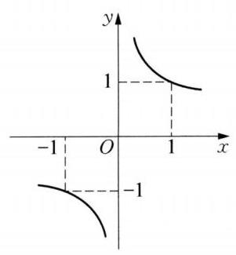

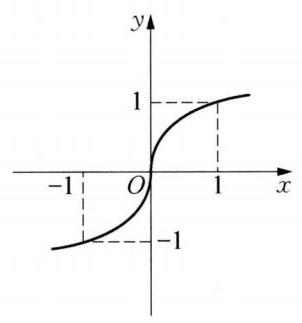

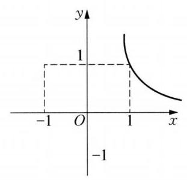

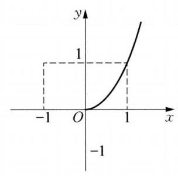

5 若幂函数 $f\left( x\right)  = \left( {a - 1}\right) {x}^{{m}^{2} - {2m} - 3}\left( {a, m \in  \mathbf{N}}\right)$ 为偶函数，且在 $\left( {0, + \infty }\right)$ 上是严格减函数， 则 $a + m =$ ___。

6 不等式 ${\left( {x}^{2} - 1\right) }^{1011} + {x}^{2022} + 2{x}^{2} - 1 \leq  0$ 的解集为___。

7 设 $\alpha  \in  \{  - 1,\frac{1}{2},1,2,3\}$ ，则使 $f\left( x\right)  = {x}^{\alpha }$ 为奇函数且在 $\left( {0, + \infty }\right)$ 上严格减的实数 $\alpha$ 的值的个数是( )。

A. 1 B. 2 C. 3 D. 4

8 若一个幂函数的图像经过点 $\left( {2,\frac{1}{4}}\right)$ ，则它的严格增区间是( )。

A. $\left( {-\infty ,1}\right)$ B. $\left( {0, + \infty }\right)$ C. $\left( {-\infty ,0}\right)$ D. $\mathbf{R}$

9 下列关于幂函数 $y = {x}^{\alpha }$ 的命题中正确的是( )。

A. 幂函数的图像都通过点 $\left( {0,0}\right) \text{ 、 }\left( {1,1}\right)$

B. 当幂指数 $\alpha  = 1\text{ 、 }3\text{ 、 } - 1$ 时,幂函数 $y = {x}^{\alpha }$ 的图像都经过第一、三象限

C. 当幂指数 $\alpha  = 1\text{ 、 }3\text{ 、 } - 1$ 时,幂函数 $y = {x}^{\alpha }$ 是严格增函数

D. 若 $\alpha  < 0$ ，则幂函数图像不通过点 $\left( {0,0}\right)$ 、 $\left( {1,1}\right)$

10 求函数 $f\left( x\right)  = {\left( x + 3\right) }^{-2}$ 的严格增区间。

11 讨论函数 $y = {x}^{\frac{2}{3}}$ 的定义域、奇偶性,通过描点作出它的图像,并根据图像说明函数的单调性。

12 已知幂函数 $f\left( x\right)  = {x}^{{m}^{2} - {4m}}\left( {m \in  \mathbf{Z}}\right)$ 的图像关于 $y$ 轴对称,且 $f\left( 2\right)  > f\left( 3\right)$ 。

(1)求 $m$ 的值及函数 $f\left( x\right)$ 的解析式；

(2)若 $f\left( {a + 2}\right)  < f\left( {1 - {2a}}\right)$ ，求实数 $a$ 的取值范围。

13 (选做) 已知幂函数 $f\left( x\right)  = \left( {{m}^{2} - {2m} + 2}\right) {x}^{{5k} - 2{k}^{2}}\left( {k \in  \mathbf{Z}}\right)$ 是偶函数，且在 $\left( {0, + \infty }\right)$ 上是严格增函数。

(1)求函数 $f\left( x\right)$ 的解析式;

(2)若 $f\left( {{2x} - 1}\right)  < f\left( {2 - x}\right)$ ，求实数 $x$ 的取值范围；

(3)若实数 $a, b\left( {a, b \in  {\mathbf{R}}^{ + }}\right)$ 满足 ${2a} + {3b} = {7m}$ ，求 $\frac{3}{a + 1} + \frac{2}{b + 1}$ 的最小值。

### 4.3 幂函数的图像与性质(2)

1 已知函数 $y = \left( {{m}^{2} - {5m} + 7}\right) {x}^{m + 3}$ 是幂函数且为偶函数，则实数 $m$ 的值为___。

2 已知幂函数 $f\left( x\right)  = {\left( m - 1\right) }^{2}{x}^{{m}^{2} - {3m} + 2}$ 在 $\left( {0, + \infty }\right)$ 上是严格增函数，则 $f\left( x\right)$ 的解析式是___。

3 将 ${\left( \frac{2}{5}\right) }^{0.5}\text{ 、 }{\left( \frac{1}{3}\right) }^{0.5}\text{ 、 }{\left( \frac{2}{5}\right) }^{-2}$ 从小到大排列为___(用“<”)表示)。

4 若幂函数 $f\left( x\right)  = \left( {{m}^{2} - m - 5}\right) {x}^{1 - m}$ 是偶函数，则实数 $m =$ ___。

5 已知幂函数 $f\left( x\right)$ 的图像过点 $\left( {2,\sqrt{2}}\right)$ ，则函数 $g\left( x\right)  = {af}\left( {x - 3}\right)  + 1$ ( $a \in  \mathbf{R}, a \neq  0$ ) 的图像经过定点___。

6 已知实数 $a\text{ 、 }b$ 满足等式 ${a}^{\frac{1}{2}} = {b}^{\frac{1}{3}}$ ，下列五个关系式:

① $0 < b < a < 1$ ; ② $- 1 < a < b < 0$ ; ③ $1 < a < b$ ；④ $- 1 < b < a < 0$ ；⑤ $a = b$ 。 其中可能成立的式子有___(填写序号)。

7 若幂函数 $f\left( x\right)  = {x}^{a}$ 的图像经过第三象限，则实数 $a$ 的值可以是( )。

A. -2 B. 2

C. $\frac{1}{2}$ D. $\frac{1}{3}$

8 已知幂函数 $f\left( x\right)  = \left( {{m}^{2} - m - 1}\right) {x}^{{m}^{2} - {2m} - 1}$ 是偶函数，则实数 $m$ 的值为( )。

A. -1 B. -2

C. -1 或 -2 D. 1 或 -2

9 方程 ${\left( \frac{{x}^{3} + x}{2}\right) }^{3} + \frac{{x}^{3} + x}{2} = {2x}$ 的所有实数根的平方和为( )。

A. 2 B. 0 C. 1 D. 4

10 比较下列各题中两个值的大小:

(1) ${1.5}^{\frac{3}{5}}\text{ 、 }{1.7}^{\frac{3}{5}}$ ； (2) ${\left( -{1.2}\right) }^{-\frac{2}{3}}$ 、(-1.25) ${}^{-\frac{2}{3}}$ 。

11 已知幂函数 $f\left( x\right)  = {x}^{m - 3}$ ( $m$ 为正整数) 的图像关于 $y$ 轴对称,且在 $\left( {0, + \infty }\right)$ 上是严格减函数,求满足 ${\left( a + 1\right) }^{-m} < {\left( 3 - 2a\right) }^{-m}$ 的实数 $a$ 的取值范围。

12 已知幂函数 $f\left( x\right)  = \left( {{m}^{2} + m - {11}}\right) {x}^{m + 7}$ 在 $\left( {-\infty ,0}\right)$ 上是严格增函数。

(1)求 $m$ ；

(2)当满足 $f\left( {2 - a}\right)  > f\left( {a - 1}\right)$ 时，求实数 $a$ 的范围。

13 (选做)已知幂函数 $f\left( x\right)  = \left( {4{t}^{2} + {3t}}\right) {x}^{-t}$ 在区间 $\left( {0, + \infty }\right)$ 上是严格减函数。

(1)求幂函数的解析式及定义域；

(2)若函数 $g\left( x\right)  = {2}^{x} - k$ ，满足对任意的 ${x}_{1} \in  \lbrack 1,{16})$ 时，总存在 ${x}_{2} \in  \left( {1,5}\right)$ 使得 $f\left( {x}_{1}\right)  = g\left( {x}_{2}\right)$ ,求实数 $k$ 的取值范围。

### 4.4 指数函数的图像与性质 (1)

1 已知函数 $f\left( x\right)$ 是指数函数，若 $\frac{f\left( 1\right) }{f\left( 3\right) } = 4$ ，则 $f\left( {-2}\right)$ ___ $f\left( {-3}\right)$ 。(用“>”“<”“=” 填空)

2 ${2}^{-\frac{1}{2}}\text{ 、 }{\left( \frac{1}{2}\right) }^{-\frac{1}{2}}\text{ 、 }{2}^{-1}$ 这三个数从小到大的顺序是___。

3 函数 $y = {\left( \frac{1}{2}\right) }^{{x}^{2} - {3x} - 2}$ 的严格减区间___。

4 不等式 ${\left( \frac{1}{2}\right) }^{{x}^{2} - {2x}} \geq  \frac{1}{8}$ 的解集为___。

5 已知函数 $f\left( x\right)  = {4}^{x} - {3a} \cdot  {2}^{x + 1}$ ，存在实数 ${x}_{0}$ ，使得 $f\left( {-{x}_{0}}\right)  =  - f\left( {x}_{0}\right)$ ，则实数 $a$ 的取值范围是___。

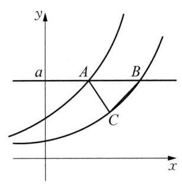

(第 6 题图)

6 已知函数 $f\left( x\right)  = {2}^{x + 1}$ 和 $g\left( x\right)  = {2}^{x}$ 的图像如图所示，直线 $y = a$ 与两函数的图像分别交于 $A$ 、 $B$ 两点,若在函数 $y = g\left( x\right)$ 上存在一点 $C$ ,使得构成等边三角形 $\bigtriangleup  {ABC}$ ，则实数 $a =$ ___。

7 已知集合 $A = \left\{  {y \mid  y = {2}^{x} + 2, x \leq  0}\right\}  , B = \{ x \mid  \ln x < 1\}$ ，则 $A \cup  B =$ ( )。

A. $( - \infty ,3\rbrack$ B. $\left( {-\infty ,\mathrm{e}}\right)$

C. $\left( {2,\mathrm{e}}\right)$ D. $(0,3\rbrack$

8 若函数 $f\left( x\right)  = \left\{  \begin{array}{ll} {ax}, & x > 1, \\  {\left( 4 - \frac{a}{2}\right) }^{x} + 2, & x \leq  1 \end{array}\right.$ 是 $\mathbf{R}$ 上的严格增函数，则实数 $a$ 的取值范围为 ( )。

A. $\left( {1, + \infty }\right)$ B. $\left( {1,6}\right)$ C. $\left( {4,6}\right)$ D. $\lbrack 4,6)$

9 已知全集 $U = \mathbf{R}$ ，集合 $A = \left\{  {x \mid  {\mathrm{e}}^{x} > 1}\right\}  , B = \{ x \mid  x - 3 < 0\}$ ，则 $A \cap  B =$ (   )。

A. $\{ x \mid  x < 3\}$ B. $\{ x \mid  x > 0\}$ C. $\{ x \mid  1 < x < 3\}$ D. $\{ x \mid  0 < x < 3\}$

10 已知函数 $f\left( x\right)  = {a}^{x} + 1\left( {a > 1}\right)$ 在区间 $\left\lbrack  {0,2}\right\rbrack$ 上的最大值与最小值之和为 7 。

(1)求 $a$ 的值；

(2)证明:函数 $F\left( x\right)  = f\left( x\right)  - f\left( {-x}\right)$ 是 $\mathbf{R}$ 上的严格增函数。

11 已知实数 $a > 0$ 且满足不等式 ${3}^{{3a} + 2} > {3}^{{4a} + 1}$ 。

(1)解不等式: ${\log }_{a}\left( {{3x} + 2}\right)  < {\log }_{a}\left( {8 - {5x}}\right)$ ；

(2)若函数 $f\left( x\right)  = {\log }_{\left( a + \frac{1}{8}\right) }\left( {{2x} + 1}\right)$ 在区间 $\left\lbrack  {1,3}\right\rbrack$ 上的最小值为 -1，求实数 $a$ 的值。

12 设全集 $U = \mathbf{R}$ ，集合 $A = \{ x \mid  2 \leq  x < 4\} , B = \left\{  {x\left| {\;{2}^{{3x} - 7} \geq  {\left( \frac{1}{2}\right) }^{{2x} - 8}}\right. }\right\}$ 。

(1)求 $A \cup  B$ 、 $\overline{A} \cap  B$ ；

(2)若集合 $C = \{ x \mid  {{2x} + a} > 0\}$ ，且 $B \cup  C = C$ ，求实数 $a$ 的取值范围。

13 (选做)已知函数 $f\left( x\right)  = {x}^{2} + {bx} + c\left( {b, c \in  \mathbf{R}}\right)$ ，且 $f\left( x\right)  \leq  0$ 的解集为 $\left\lbrack  {-1,2}\right\rbrack$ 。

(1)求函数 $f\left( x\right)$ 的解析式；

(2)解关于 $x$ 的不等式 ${mf}\left( x\right)  > 2\left( {x - m - 1}\right) \left( {m \geq  0}\right)$ ；

(3)设 $g\left( x\right)  = {2}^{f\left( x\right)  + {3x} - 1}$ ，若对于任意的 ${x}_{1},{x}_{2} \in  \left\lbrack  {-2,1}\right\rbrack$ 都有 $\left| {g\left( {x}_{1}\right)  - g\left( {x}_{2}\right) }\right|  \leq  M$ ，求实数 $M$ 的最小值。

### 4.4 指数函数的图像与性质 (2)

1 若函数 $f\left( x\right)  = {a}^{x - 2} + 1$ 的图像一定过定点 $P$ ，则点 $P$ 的坐标是___。

2 函数 $y = {\left( \frac{1}{3}\right) }^{{x}^{2} - 9}$ 的单调增区间是___。

3 设函数 $f\left( x\right)  = \left\{  \begin{array}{ll} {2}^{x}, & x < 2, \\  {x}^{2}, & x \geq  2, \end{array}\right.$ 若 $f\left( {a + 1}\right)  \geq  f\left( {{2a} - 1}\right)$ ，则实数 $a$ 的取值范围是___。

4 设函数 $f\left( x\right)$ 是定义在 $\mathbf{R}$ 上的函数，满足 $f\left( {-x}\right)  - f\left( x\right)  = 0$ ，且对任意的 $x \in  \mathbf{R}$ ，恒有 $f\left( {x + 2}\right)  = f\left( {2 - x}\right)$ ，已知当 $x \in  \left\lbrack  {0,2}\right\rbrack$ 时， $f\left( x\right)  = {2}^{2 - x}$ ，判断以下结论:

① 函数 $f\left( x\right)$ 是周期函数，且周期为 2 ；

② 函数 $f\left( x\right)$ 的最大值是 4，最小值是 1；

③ 当 $x \in  \left\lbrack  {2,4}\right\rbrack$ 时， $f\left( x\right)  = {2}^{x - 2}$ ；

④ 函数 $f\left( x\right)$ 在 $\left\lbrack  {2,4}\right\rbrack$ 上严格增，在 $\left\lbrack  {4,6}\right\rbrack$ 上严格减。

其中正确的是___。(只写正确结论的序号)

5 已知定义在 $\mathbf{R}$ 上的函数 $f\left( x\right)$ 满足: $f\left( x\right)  > 0, f\left( x\right)  \cdot  f\left( y\right)  = f\left( {x + y}\right)$ ,且 $f\left( 1\right)  = \frac{1}{2}$ ; 当 $x \in  \left( {0, + \infty }\right)$ 时 $f\left( x\right)  < 1$ ; 若关于 $x$ 的不等式 $f\left( a\right)  \cdot  f\left( {-2 - \frac{{x}^{2} + 5}{\sqrt{{x}^{2} + 4}}}\right)  - 4 < 0$ 有解,则实数 $a$ 的取值范围为___。

6 设函数 $f\left( x\right)  = \left\{  \begin{array}{ll} {3}^{x} - a, & x < 1, \\  2\left( {x - a}\right) \left( {x - {2a}}\right) , & x \geq  1\text{ 。 } \end{array}\right.$ 若 $f\left( x\right)$ 恰有 2 个零点,则实数 $a$ 的取值范围是___。

7 已知集合 $A = \{  - 2, - 1,1,2\} , B = \left\{  {x \mid  {2}^{x} < 1}\right\}$ ，则 $A \cap  B =$ (   )。

A. $\{  - 2, - 1\}$ B. $\{ 1,2\}$ C. $\{  - 2, - 1,1\}$ D. $\{  - 2, - 1,2\}$

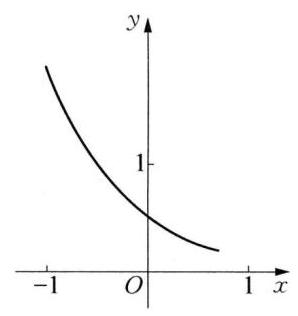

(第 8 题图)

8 若函数 $f\left( x\right)  = {a}^{x - b}$ 的图像如图所示，其中 $a$ 、 $b$ 为常数，则下列结论正确的是( )。

A. $a > 1, b < 0$ B. $a > 1, b > 0$

C. $0 < a < 1, b > 0$ D. $0 < a < 1, b < 0$

9 已知函数 $f\left( x\right)  = \left| {{\mathrm{e}}^{x} - 1}\right|$ 满足 $f\left( a\right)  = f\left( b\right) \left( {a \neq  b}\right)$ ，在区间 $\left\lbrack  {a,{2b}}\right\rbrack$ 上的最大值为 $\mathrm{e} - 1$ ，则实数 $b$ 为( )。

A. $\frac{1}{2}$ B. $\ln \frac{1}{2}$

C. $\frac{1}{3}$ D. $\ln \frac{1}{3}$

10 求下列函数的定义域。

(1) $y = {2}^{3 - x}$ ； (2) $y = {3}^{{2x} + 1}$ ； (3) $y = {\left( \frac{1}{2}\right) }^{5x}$ ； (4) $y = {0.7}^{\frac{1}{x}}$ 。

11 某种产品的年销售量为 10000 件, 由于其他新产品的出现, 估计该产品的市场需求每年下降 10%。写出 $x$ 年后，年销售量 $y$ (单位:件)和 $x$ (单位:年)之间的函数关系式。

12 已知函数 $y = {\left( \frac{1}{3}\right) }^{{x}^{2} + {2x} + 5}$ ,求其单调区间及值域。

13 (选做) 已知定义在 $\mathbf{R}$ 上的函数 $f\left( x\right)  = \frac{-{2}^{x} + b}{{2}^{x + 1} + a}$ 是奇函数。

(1)求实数 $a$ 、 $b$ 的值；

(2)判断函数 $f\left( x\right)$ 的单调性;

(3)若 $\theta  \in  \left( {-\frac{\pi }{2},\frac{\pi }{2}}\right)$ ，不等式 $f\left( k\right)  + f\left( {{\cos }^{2}\theta  - 2\sin \theta }\right)  \leq  0$ 有解，求实数 $k$ 的取值范围。

### 4.5 反函数

1 已知函数 $f\left( x\right)  = {\log }_{2}x + 1, f\left( x\right)$ 的反函数为 ${f}^{-1}\left( x\right)$ ，则 ${f}^{-1}\left( 1\right)  =$ ___。

2 函数 $f\left( x\right)  = {x}^{2} - {2x} + 2$ 在 $\left( {-\infty ,1}\right)$ 上的反函数 ${f}^{-1}\left( x\right)  =$ ___。

3 若函数 $f\left( x\right)  = {a}^{x}\left( {a > 0\text{ 且 }a \neq  1}\right)$ 的反函数的图像过点 $\left( {3, - 1}\right)$ ，则实数 $a =$ ___。

4 已知函数 $f\left( x\right)  = \frac{1 - {3}^{x}}{1 + {3}^{x}}$ ，则 ${f}^{-1}\left( \frac{4}{5}\right)  =$ ___。

5 已知关于 $x$ 的方程 ${3}^{x} = {\log }_{3}x$ 有___个解。

6 给出下列命题，其中正确的序号是___。___(写出所有正确命题的序号)

① 函数 $f\left( x\right)  = {\log }_{a}\left( {x - 3}\right)  + 2$ 的图像恒过定点 $\left( {4,2}\right)$ ；

② 已知集合 $P = \{ a, b\} , Q = \{ 0,1\}$ ，则映射 $f : P \rightarrow  Q$ 中满足 $f\left( b\right)  = 0$ 的映射共有 1 个；

③ 若函数 $f\left( x\right)  = {\log }_{2}\left( {{x}^{2} - {2ax} + 1}\right)$ 的值域为 $\mathbf{R}$ ，则实数 $a$ 的取值范围是 $\left( {-1,1}\right)$ ；

④ 函数 $f\left( x\right)  = {\mathrm{e}}^{x}$ 的图像关于 $y = x$ 对称的函数解析式为 $y = \ln x$ 。

7 函数 $f\left( x\right)  = \frac{1}{x}\left( {x \neq  0}\right)$ 的反函数 ${f}^{-1}\left( x\right)  =$ (   )。

A. $x\left( {x \neq  0}\right)$ B. $\frac{1}{x}\left( {x \neq  0}\right)$ C. $- x\left( {x \neq  0}\right)$ D. $- \frac{1}{x}\left( {x \neq  0}\right)$

8 函数 $y = \ln \left( {x + \sqrt{{x}^{2} + 1}}\right)$ 的反函数是( )。

A. $y = \frac{{\mathrm{e}}^{x} + {\mathrm{e}}^{-x}}{2}$ B. $y =  - \frac{{\mathrm{e}}^{x} + {\mathrm{e}}^{-x}}{2}$ C. $y = \frac{{\mathrm{e}}^{x} - {\mathrm{e}}^{-x}}{2}$ D. $y =  - \frac{{\mathrm{e}}^{x} - {\mathrm{e}}^{-x}}{2}$

9 设函数 $y = f\left( x\right)$ 的定义域是 $\mathbf{R}$ ，对于以下四个命题:

① 若 $y = f\left( x\right)$ 是奇函数，则 $y = f\left( {f\left( x\right) }\right)$ 也是奇函数；

② 若 $y = f\left( x\right)$ 是严格增函数，则 $y = f\left( {f\left( x\right) }\right)$ 也是严格增函数；

③ 若 $y = f\left( x\right)$ 是严格减函数，则 $y = f\left( {f\left( x\right) }\right)$ 也是严格减函数；

④ 若 $y = f\left( x\right)$ 存在反函数 $y = {f}^{-1}\left( x\right)$ ，且函数 $y = f\left( x\right)  - {f}^{-1}\left( x\right)$ 有零点，则函数 $y = f\left( x\right)  - \; x$ 也有零点。

其中正确命题的个数是( )。

A. 1 B. 2 C. 3 D. 4

10 如果点 $\left( {1,2}\right)$ 在函数 $y = f\left( x\right)$ 的图像上,且 $y = f\left( x\right)$ 的反函数存在,指出这个函数的反函数一定过哪个点。

11 判断下列各对函数是否互为反函数,若是,则求出它们的定义域和值域:

(1) $y = \ln x, y = {\mathrm{e}}^{x}$ ;

(2) $y =  - {\log }_{a}x, y = {\left( \frac{1}{a}\right) }^{x}$ 。

12 求下列函数的反函数:

(1) $f\left( x\right)  = \ln \left( {x - 1}\right)$ ；___

(2) $f\left( x\right)  = {2}^{x - 3}\left( {x < 0}\right)$ ；

(3) $f\left( x\right)  = \left\{  \begin{array}{ll} \frac{1}{x}, & x < 0, \\  {x}^{2}, & x \geq  0; \end{array}\right.$

(4) $f\left( x\right)  = \frac{{2}^{x} - 1}{{2}^{x} + 1}$ 。

13. (选做) 已知函数 $f\left( x\right)  = {4}^{x} - a \cdot  {2}^{x} + 1$ 。

(1)当 $a = 2$ 时,求 $f\left( x\right)$ 的反函数 ${f}^{-1}\left( x\right)$ ;

(2)若 $x \in  \left\lbrack  {1,2}\right\rbrack$ 时 $f\left( x\right)$ 的最小值是 $g\left( a\right)$ ，求 $g\left( a\right)$ 的解析式。

### 4.6 对数函数的图像与性质(1)

1 函数 $y = \sqrt{\lg x} + \lg \left( {5 - {3x}}\right)$ 的定义域为___。

2 函数 $y = {\log }_{3}\left( {-{x}^{2} + {2x} + 3}\right)$ 的严格减区间是___。

3 已知集合 $A = \left\{  {x \mid  x - {x}^{2} \geq  0}\right\}  , B = \left\{  {x \mid  y = \lg \left( {{2x} - 1}\right) }\right\}$ ，则集合 $A \cap  B =$ ___。

4 若函数 $f\left( x\right)  = {\log }_{a}\left( {a{x}^{2} - x + 3}\right)$ 在区间 $\left\lbrack  {2,4}\right\rbrack$ 上是增函数，则实数 $a$ 的取值范围是 ___。

5 $f\left( x\right)  = {\log }_{2}\left( {4x}\right)  \cdot  {\log }_{\frac{1}{4}}\left( \frac{x}{2}\right) , x \in  \left\lbrack  {\frac{1}{2},4}\right\rbrack$ 的最大值为___。

6 已知定义域为 $\mathbf{R}$ 的偶函数 $f\left( x\right)$ 在 $\lbrack 0, + \infty )$ 上是严格增函数，且 $f\left( \frac{1}{2}\right)  = 0$ ，则不等式 $f\left( {{\log }_{4}x}\right)  < 0$ 的解集是___。

7 不等式 $\lg x\left( {\lg x - 2}\right)  < 3$ 的解集为( )。

A. $\left( {\frac{1}{1000},{10}}\right)$ B. $\left( {\frac{1}{10},{1000}}\right)$

C. $\left( {{10},{1000}}\right)$ D. $\left( {0,\frac{1}{10}}\right)$

8 函数 $f\left( x\right)  = {\log }_{\frac{1}{3}}\left( {{x}^{2} - {3x} + 2}\right)$ 的严格增区间为( )。

A. $\left( {-\infty ,1}\right)$ B. $\left( {2, + \infty }\right)$

C. $\left( {-\infty ,\frac{3}{2}}\right)$ D. $\left( {\frac{3}{2}, + \infty }\right)$

9 已知函数 $f\left( x\right)  = {x}^{2} + {3}^{\left| x\right| }$ ,设 $a = f\left( {{\log }_{2}\frac{1}{3}}\right) , b = f\left( {100}^{-{0.1}}\right) , c = f\left( {\left( \frac{81}{16}\right) }^{\frac{1}{4}}\right)$ ,则 $a\text{ 、 }b\text{ 、 }c$ 的大小关系为( )。

A. $a > c > b$ B. $c > a > b$

C. $a > b > c$ D. $c > b > a$

10 求函数 $f\left( x\right)  = \sqrt{\lg \left( {x - 1}\right) }$ 的定义域。

11 已知函数 $f\left( x\right)  = {\log }_{2}\left( {{x}^{2} - {2ax} + a}\right)$ 的定义域是 $\mathbf{R}$ 。

(1)求实数 $a$ 的取值范围；

(2)解关于 $m$ 的不等式 ${a}^{-{m}^{2} + {2m} + 1} > {a}^{{3m} - 1}$ 。

12 求函数 $f\left( x\right)  = \lg \left( {a{x}^{2} + {ax} + 1}\right)$ 的定义域为 $\mathbf{R}$ 的充要条件。

13 (选做) 已知函数 $f\left( x\right)  = \lg \frac{1 + {2}^{x} + {4}^{x}a}{3}\left( {a \in  \mathbf{R}}\right)$ 。

(1)若 $a =  - 2$ ，求 $f\left( x\right)$ 的定义域；

(2)若 $0 < a < 1, x \neq  0$ ，求证: $f\left( {2x}\right)  > {2f}\left( x\right)$ 。

### 4.6 对数函数的图像与性质 (2)

1 函数 $f\left( x\right)  = \sqrt{x - 1} + \lg \left( {6 - x}\right)$ 的定义域为___。

2 若函数 $f\left( x\right)  = {\log }_{3}\left( {a{x}^{2} - {ax} + 4}\right)$ 的定义域为___，则实数 $a$ 的取值范围是___。

3 函数 $y = \frac{1}{\sqrt{{\log }_{0.2}x}}$ 的定义域是___。

4 已知函数 $f\left( x\right)  = \left\{  \begin{array}{ll} {\log }_{2}\left( {x + 1}\right) , & x > 3, \\  \frac{1}{3}\left| {x + 3}\right| , &  - 9 \leq  x \leq  3, \end{array}\right.$ 若 ${x}_{1} < {x}_{2},{x}_{1} < {x}_{3}$ 且 $f\left( {x}_{1}\right)  = f\left( {x}_{2}\right)$ , $f\left( {x}_{1}\right)  + f\left( {x}_{3}\right)  = 4$ ，则 $\frac{{x}_{3}}{{x}_{1} + {x}_{2}}$ 的取值范围是___。

5 设函数 $f\left( x\right)  = \frac{{\left( x + 1\right) }^{2} + \ln \left( {\sqrt{{x}^{2} + 1} + x}\right) }{{x}^{2} + 1}$ 的最大值为 $M$ ，最小值为 $N$ ，则 $M + N$ 的值为 ___。

6 已知函数 $y = \lg \left( {\sqrt{{x}^{2} - x + 1} + {ax}}\right)$ 的定义域是 $\mathbf{R}$ ，则实数 $a$ 的取值范围是___。

7 已知 $a > 1$ ,函数 $y = {a}^{x}$ 与 $y = {\log }_{a}x$ 的图像只可能是( )。

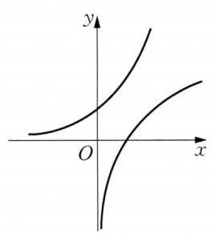

A.

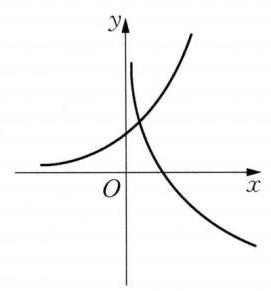

B.

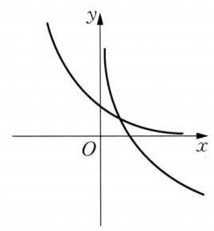

C.

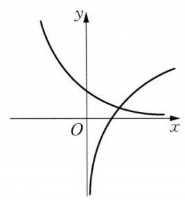

D.

8 已知实数 $a$ 满足 ${\log }_{a}\frac{1}{3} < 1,{\left( \frac{1}{3}\right) }^{a} < 1,{a}^{\frac{1}{2}} < 1$ ，则实数 $a$ 的取值范围是()。

A. $\left( {0,\frac{1}{3}}\right)$ B. $\left( {\frac{1}{3},1}\right)$

C. $\left( {\frac{1}{3}, + \infty }\right)$ D. $\left( {0,1}\right)$

9 若函数 $f\left( x\right)  = {\log }_{a}\left( {4 - {ax}}\right)$ ( $a > 0$ 且 $a \neq  1$ )在区间 $\left( {0,2}\right)$ 上为严格减函数，则实数 $a$ 的取值范围为( )。

A. $0 < a < 1$

B. $1 < a < 2$

C. $1 < a \leq  2$

D. $\frac{1}{2} \leq  a < 1$

10 记函数 $f\left( x\right)  = \ln \left( {1 - {x}^{2}}\right)$ 的定义域为 $M, g\left( x\right)  = \lg \left\lbrack  {\left( {x + a + 2}\right) \left( {-x - a + 1}\right) }\right\rbrack$ 的定义域为 $N$ 。

(1)求 $M$ ；

(2)若 $M \subseteq  N$ ，求实数 $a$ 的取值范围。

11 已知函数 $y = f\left( x\right)$ 是 $\mathbf{R}$ 上的偶函数，且当 $x \leq  0$ 时， $f\left( x\right)  = x + {\log }_{\frac{1}{2}}\left( {1 - x}\right)$ 。

(1)求 $f\left( 1\right)$ 的值；求出函数 $y = f\left( x\right)$ 的表达式，并直接写出其单调区间。(不需要证明)

(2)若 $f\left( {\lg a}\right)  + 2 < 0$ ，求实数 $a$ 的取值范围。

12 已知函数 $f\left( x\right)  = {\log }_{a}x, g\left( x\right)  = 2{\log }_{a}\left( {{2x} + t - 2}\right) \left( {a > 0, a \neq  1, t \in  \mathbf{R}}\right)$ 。

(1)当 $t = 2, x \in  \left\lbrack  {1,2}\right\rbrack$ ，且 $F\left( x\right)  = g\left( x\right)  - f\left( x\right)$ 有最小值 2 时，求实数 $a$ 的值；

(2)当 $0 < a < 1, x \in  \left\lbrack  {1,2}\right\rbrack$ 时，有 $f\left( x\right)  \geq  g\left( x\right)$ 恒成立，求实数 $t$ 的取值范围。

13 (选做) 已知函数 $f\left( x\right)  = {\log }_{a}\left( {{3x} + 2}\right) , g\left( x\right)  = {\log }_{a}\left( {2 - {3x}}\right)$ ，其中 $a > 0, a \neq  1$ 。

(1)求函数 $f\left( x\right)  - g\left( x\right)$ 的定义域；

(2)判断 $f\left( x\right)  - g\left( x\right)$ 的奇偶性，并说明理由;

(3)求使 $f\left( x\right)  - g\left( x\right)  > 0$ 成立的 $x$ 的集合。

### 4.7 简单的指数方程

1 方程 ${3}^{x - 1} = \frac{1}{9}$ 的解集是___。

2 方程 ${\left( \frac{3}{5}\right) }^{x - 1} = {\left( \frac{5}{3}\right) }^{7}$ 的解集为___。

3 方程 ${5}^{{5x} + 1} = {3}^{x - 1}$ 的解集是___。

4 (1)方程 $3 \cdot  {5}^{x + 2} = 5$ ， ${3}^{2x}$ 的解集是______。

(2)方程组 $\left\{  \begin{array}{l} {3}^{x} \cdot  {5}^{y} = {45}, \\  {3}^{y} \cdot  {5}^{x} = {75} \end{array}\right.$ 的解集是________。

5 方程 ${2}^{2 + x} - {2}^{2 - x} = {15}$ 的解集是___。

6 方程 ${9}^{x} + {6}^{x} = {2}^{{2x} + 1}$ 的解集是___。

7 方程 ${2}^{\left| x + 1\right| } = 3$ 的解集是( )。

A. $\left\langle  {{\log }_{\frac{1}{2}}\frac{2}{3}}\right\rangle$ B. $\left\langle  {{\log }_{2}\frac{2}{3}}\right\rangle$

C. $\left\{  {{\log }_{2}\frac{3}{2},{\log }_{2}\frac{1}{6}}\right\}$ D. $\left\{  {{\log }_{2}\frac{1}{3}, - {\log }_{\frac{1}{2}}6}\right\}$

8 若 ${2}^{2x} = 5 \cdot  {2}^{x} - 4$ ，则 ${x}^{2} + 1$ 的值为( )。

A. 5 B. 1

C. 5 或 1 D. 以上都不对

9 若 $x$ 、 $y$ 同时满足 ${2}^{x - 6} = {8}^{y - 1}$ 和 ${9}^{y + 1} = {3}^{x - 7}$ ，则 $x + y$ 的值为( )。

A. 18 B. 24

C. 21 D. 27

10 已知 $f\left( x\right)  = \frac{1 - {2}^{x}}{1 + {2}^{x}}$ ,求 ${f}^{-1}\left( \frac{3}{5}\right)$ 的值。

11 求方程 ${9}^{x} + {4}^{x} = \frac{5}{2} \cdot  {6}^{x}$ 的解集。

12 解方程 ${4}^{x} + {4}^{-x} - 5\left( {{2}^{x} + {2}^{-x}}\right)  + 6 = 0$ 。

13 (选做) 已知关于 $x$ 的方程 $2{a}^{{2x} - 2} - 7{a}^{x - 1} + 3 = 0$ 有一个实数根为 2,求实数 $a$ 的值和方程其余的根。

### 4.8 简单的对数方程

1 方程 ${\log }_{3}\left( {{2x} - 1}\right)  = 1$ 的解 $x =$ ___。

2 已知函数 $f\left( x\right)  = {\log }_{3}\left( {\frac{4}{x} + 2}\right)$ ，则方程 ${f}^{-1}\left( x\right)  = 4$ 的解 $x =$ ___。

3 方程 ${\log }_{4}\left( {{3x} - 1}\right)  = {\log }_{4}\left( {x - 1}\right)  + {\log }_{4}\left( {3 + x}\right)$ 的解集是___。

4 方程 ${\log }_{2}\left( {x - 1}\right)  = 2 - {\log }_{2}\left( {x + 1}\right)$ 的解集是___。

5 方程 ${\log }_{\left( x - 1\right) }\left( {3{x}^{2} - {7x} - 2}\right)  = 2$ 的解集为___。

6 方程 ${\log }_{2}\left( {9 - {2}^{x}}\right)  = 3 - x$ 的解集是___。

7 与方程 $\lg \frac{{x}^{2}}{y} = a$ 同解的方程是( )。

A. $2\lg x - \lg y = a$ B. $2\lg \left| x\right|  - \lg \left| y\right|  = a$

C. $2\lg x - \lg \left| y\right|  = a$ D. $2\lg \left| x\right|  - \lg y = a$

8 方程 ${\log }_{7}\left\lbrack  {{\log }_{2}\left( {{\log }_{x}{16}}\right) }\right\rbrack   = 0$ 的解集是( )。

A. \{4\} B. \{16\}

C. $\{ 4, - 4\}$ D. $\{ {16}, - {16}\}$

9 如果方程 ${\log }_{2}\left( {{x}^{2} - x}\right)  = 1$ 的解集为 $M$ ,方程 ${2}^{{2x} + 1} - 9 \cdot  {2}^{x} + 4 = 0$ 的解集为 $N$ ,那么 $M$ 与 $N$ 的关系是( )。

A. $M = N$ B. $N \subset  M$

C. $M \subset  N$ D. $M \cap  N = \varnothing$

10 解方程:

(1) ${\log }_{4}\left( {{13} - {3x}}\right)  \cdot  {\log }_{\left( x - 1\right) }2 = 1$ ； (2) ${\log }_{2}\left( {{4}^{x} + 4}\right)  = x + {\log }_{2}\left( {{2}^{x + 1} - 3}\right)$ 。

11 解方程: ${\log }_{3}\left( {{3}^{x} - 1}\right)  \cdot  {\log }_{3}\left( {{3}^{x - 1} - \frac{1}{3}}\right)  = 2$ 。

12 若方程 $\lg \left( {2x}\right) \lg \left( {3x}\right)  + {a}^{2} = 0$ 有两个不相等的实数根,求实数 $a$ 的取值范围,并求方程的两根的积。

13 (选做)若关于 $x$ 的方程 ${\log }_{2}\left( {x + \sqrt{{x}^{2} - 1}}\right)  - a = 0$ 有实数解,求实数 $a$ 的取值范围,并求出方程的解。

## 第 5 章 三 角

### 5.1 任意角及其度量(1)

1 若时钟的分针转 2 小时 15 分，则所转的角度是___。

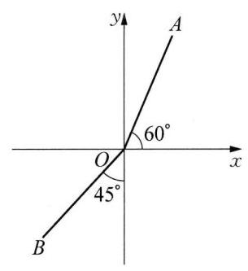

(第 4 题图)

2 -2021°是第___象限角。

3 与 -3020°角的终边相同的最小正角是___。

4 如图所示，终边是射线 ${OA}$ 的角的集合是___；终边是射线 ${OB}$ 的角的集合是___。

5 若角 $\alpha$ 是第二象限角，则 $\frac{\alpha }{3}$ 不是第___象限的角。

6 已知 $\alpha$ 与 $\beta$ 都是锐角， $\alpha  + \beta$ 的终边与 $- {280}^{ \circ  }$ 的终边相同； $\alpha  - \beta$ 的终边与 $- {670}^{ \circ  }$ 的终边相同，则 $\alpha  =$ ___， $\beta  =$ ___。

7 若角 $\alpha$ 是第四象限角，则角 ${180}^{ \circ  } - \alpha$ 是( )。

A. 第一象限角 B. 第二象限角 C. 第三象限角 D. 第四象限角

8 若角 $\alpha$ 与 $\beta$ 是终边相同的角，则 $\alpha  - \beta$ 的终边一定在( )。

A. $x$ 轴的非负半轴上 B. $x$ 轴的非正半轴上

C. $y$ 轴的非正半轴上 D. $y$ 轴的非负半轴上

9 设 $k \in  \mathbf{Z}$ ，终边相同的一组角是( )。

A. $k \cdot  {90}^{ \circ  }$ 与 $k \cdot  {180}^{ \circ  } + {90}^{ \circ  }$ B. $k \cdot  {180}^{ \circ  } + {60}^{ \circ  }$ 与 $k \cdot  {60}^{ \circ  }$

C. $\left( {{2k} - 1}\right)  \cdot  {180}^{ \circ  }$ 与 $\left( {{4k} \pm  1}\right)  \cdot  {180}^{ \circ  }$ D. $k \cdot  {180}^{ \circ  } + {30}^{ \circ  }$ 与 $k \cdot  {360}^{ \circ  } - {150}^{ \circ  }$

10 已知角的顶点在坐标系的原点，始边与 $x$ 轴的正半轴重合，求终边分别在下列位置的角的集合。

(1) $x$ 轴正半轴； (2) $x$ 轴；

(3) $y$ 轴负半轴； (4) $y$ 轴；

(5) 直线 $y =  - x$ ; (6) 直线 $y =  \pm  x$ 。

11 分别写出第一、二、三、四象限角的集合。

12 圆心在坐标原点的圆的圆周上有一点 $P$ (初始位置在 $x$ 轴正半轴上) 依逆时针方向做匀速圆周运动，已知点 $P$ 每分钟转过 $\theta$ 角( ${0}^{ \circ  } < \theta  \leq  {180}^{ \circ  }$ )，2 分钟到达第三象限，15 分钟回到原来的位置。试问:角 $\theta$ 是多少度?

13 (选做)某天下午小明约同学去踢球, 玩了 3 个多小时, 离家时他看了时钟是 2 点多钟, 回家时又看了钟，发现时针与分针正好交换了位置，求小明离开家的时间总长。(精确到分钟)

### 5.1 任意角及其度量(2)

$1\;\frac{\pi }{3} =$ ___度； $- {72}^{ \circ  } =$ ___弧度。

2 与 2021 弧度大小的角的终边相同的角中，绝对值最小的角是___。

3 若角 $\alpha$ 和角 $\beta$ 的和是 1 弧度，差为 ${1}^{ \circ  }$ ，则 $\alpha$ 和 $\beta$ 的弧度数分别为___。

4 若中心角为 ${1}^{ \circ  }$ 的扇形，它的弧长为 ${2\pi }$ ，则该扇形所在圆的半径为___。

5 若在直径为 ${10}\mathrm{\;{cm}}$ 的滑轮上有一条弦，其长为 $6\mathrm{\;{cm}}$ ，且 $P$ 为弦的中点，滑轮以每秒 5 弧度的角速度旋转，则经过 5 秒后， $P$ 点转过的弧长是___。

6 若集合 $A = \left\{  {x\left| {\;{k\pi } + \frac{\pi }{3} \leq  x < {k\pi } + \frac{\pi }{2}}\right. , k \in  \mathbf{Z}}\right\}$ ，集合 $B = \left\{  {x\left| {\;{16} - {x}^{2} \geq  0}\right. }\right\}$ ，则 $A \cap  B =$ ___。

7 集合 $M = \left\{  {x\left| {\;x = \frac{k\pi }{2} \pm  \frac{\pi }{4}}\right. , k \in  \mathbf{Z}}\right\}$ 与集合 $P = \left\{  {x\left| {\;x = \frac{k\pi }{4}}\right. , k \in  \mathbf{Z}}\right\}$ 之间的关系是( )。

A. $M \subset  P$ B. $M \supset  P$ C. $M = P$ D. $M \cap  P = \varnothing$

8 若扇形的周长是 16，圆心角是 2 弧度，则扇形面积是( )。

A. ${16\pi }$ B. ${32\pi }$ C. 16 D. 32

9 如果 1 弧度的圆心角所对的弦长为 2，那么这个圆心角所对的弧长是( )。

A. $\sin \frac{1}{2}$ B. $\frac{\pi }{6}$

C. $\frac{1}{\sin \frac{1}{2}}$ D. $2\sin \frac{1}{2}$

10 写出终边在下列阴影部分内的角的集合(含边界)。

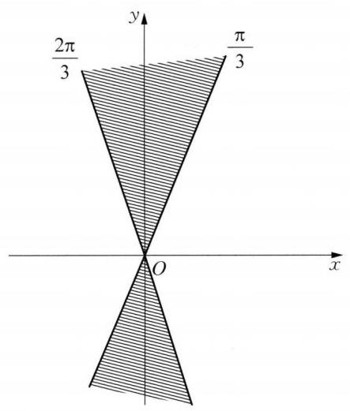

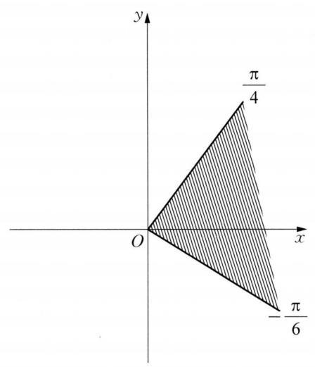

11 一扇形周长是 ${32}\mathrm{\;{cm}}$ ，扇形的圆心角为多少弧度时，这个扇形的面积最大？最大面积是多少?

12 如图，在扇形 ${AOB}$ 中， $\angle {AOB} = \frac{\pi }{2}$ ，弧长为 $l$ ，求此扇形内切圆的面积。

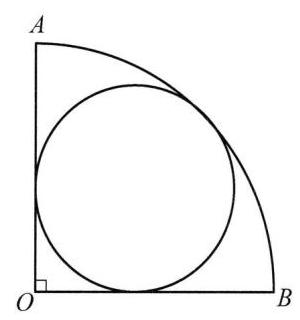

(第 12 题图)

13 (选做) 分别以边长为 3 的正方形 ${ABCD}$ 的顶点 $B$ 、 $C$ 为圆心,3 为半径作圆弧 $\overset{\text{ ⏜ }}{AC}$ 、 $\overset{\text{ ⏜ }}{BD}$ 交于点 $E$ ,求曲边三角形 ${ADE}$ 的周长和面积。

### 5.2 任意角的正弦、余弦、正切、余切 (1)

1 若角 $\alpha$ 的终边过点 $\left( {3, - 4}\right)$ ，则 $\sin \alpha  + \cos \alpha  + \tan \alpha  =$ ___。

2 已知角 $\theta$ 的终边上有一点 $P\left( {4, y}\right)$ ，且 $\sin \theta  =  - \frac{2\sqrt{5}}{5}$ ，则实数 $y =$ ___。

3 已知集合 $A = \left\{  {y\left| {\;y = \frac{\left| \sin x\right| }{\sin x} + \frac{\cos x}{\left| \cos x\right| } + \frac{\left| \tan x\right| }{\tan x}}\right. }\right\}$ ，用列举法表示集合 $A$ 是___。

4 若角 $\alpha$ 是第三象限角，则 $\left( {\sin \alpha  + \cos \alpha  < 0;\text{ ② }\tan \alpha  - \sin \alpha  > 0;\text{ ③ }\cot \alpha  \cdot  \csc \alpha  < 0;\text{ ④ }\sin \alpha \text{ · }}\right) \; \sec \alpha  > 0$ 。其中正确的是___。

5 已知角 $\alpha$ 的终边过点 $\left( {{3a} - 9, a + 2}\right)$ ，且 $\cos \alpha  \leq  0,\sin \alpha  > 0$ ，则 $a$ 的取值范围是___。

6 在 $\bigtriangleup  {ABC}$ 中，若都有 $\cos A \cdot  \tan B \cdot  \cot C < 0$ ，则这三角形是___，___

7 下列各式为正号的是( )。

A. $\cos 2 - \sin 2$ B. $\cos 2 \cdot  \sin 2$

C. $\tan 2 \cdot  \sec 2$ D. $\sin 2 \cdot  \tan 2$

8 设 $y = \sin \alpha  \cdot  \cos \alpha  \cdot  \cot \alpha$ 且角 $\alpha$ 是象限角，则 $y$ 的符号为( )。

A. 恒正 B. 恒负

C. 可能为 0 D. 不确定

9 已知实数 $\alpha \text{ 、 }\beta$ 满足 $\left| {\cos \alpha  - \cos \beta }\right|  = \left| {\cos \alpha }\right|  + \left| {\cos \beta }\right|$ ,且 $\alpha  \in  \left( {\frac{\pi }{2},\pi }\right)$ ,则化简 $\sqrt{{\left( \cos \alpha  - \cos \beta \right) }^{2}}$ 的结果是( )。

A. $\cos \alpha  - \cos \beta$ B. $\left| {\cos \alpha }\right|  - \left| {\cos \beta }\right|$

C. $\cos \beta  - \cos \alpha$ D. $\left| {\cos \beta }\right|  - \left| {\cos \alpha }\right|$

10 判断下列三角式的符号:

(1) $\frac{\sin {330}^{ \circ  } \cdot  \tan {53}^{ \circ  }}{\cos {235}^{ \circ  } \cdot  \tan {145}^{ \circ  }}$ ; (2) $\sin 3 \cdot  \cos 4 \cdot  \tan 5$ 。

11 已知角 $\alpha$ 的终边上一点 $P$ 与点 $A\left( {-3,2}\right)$ 关于 $y$ 轴对称,角 $\beta$ 的终边上一点 $Q$ 与点 $A$ 关于原点对称,求 $2\sin \alpha  + 3\sin \beta$ 的值。

12 已知角 $\theta$ 终边上一点 $P\left( {-\sqrt{3}, m}\right)$ 且 $\sin \theta  = \frac{\sqrt{2}}{4}m$ ，求 $\cos \theta$ 和 $\tan \theta$ 的值。

13 (选做)若 $\theta$ 为第四象限角，试判断 $\sin \left( {\cos \theta }\right)  \cdot  \cos \left( {\sin \theta }\right)$ 的符号。

### 5.2 任意角的正弦、余弦、正切、余切(2)

1 若 $\cos \theta  \cdot  \tan \theta  < 0$ ，则 $\theta$ 是第___象限的角。

2 若函数 $f\left( x\right)$ 的定义域是 $\lbrack 0,1)$ ，则 $f\left( {\cos x}\right)$ 的定义域是___。

3 计算: $\cos \frac{\pi }{3} - \tan \frac{\pi }{4} + \frac{3}{4}{\tan }^{2}\frac{7\pi }{6} - \sin \frac{5\pi }{6} + {\cos }^{2}\frac{\pi }{6} + \sin \frac{3\pi }{2} =$ ___。

4 若 $\sin \theta  = \frac{m - 3}{m + 5},\cos \theta  = \frac{4 - {2m}}{m + 5}$ 都有意义，则实数 $m =$ ___。

5 已知 $\sin \alpha  = \frac{4}{5},\alpha  \in  \left( {0,\pi }\right)$ ，则 $\tan \alpha$ 等于___。

6 若 $\cot \left( {\sin \theta }\right)  \cdot  \tan \left( {\cos \theta }\right)  > 0$ ，则角 $\theta$ 是第___象限的角。

7 已知 $\tan \alpha  = \sqrt{3},\pi  < \alpha  < \frac{3\pi }{2}$ ，那么 $\cos \alpha  - \sin \alpha$ 的值是( )。

A. $- \frac{1 + \sqrt{3}}{2}$ B. $\frac{-1 + \sqrt{3}}{2}$

C. $\frac{1 - \sqrt{3}}{2}$ D. $\frac{1 + \sqrt{3}}{2}$

8 已知 $\sin \alpha  = m\left( {\left| m\right|  < 1}\right) ,\frac{\pi }{2} < \alpha  < \frac{3\pi }{2}$ ,那么 $\tan \alpha  =$ (   )。

A. $\frac{m}{\sqrt{1 - {m}^{2}}}$ B. $- \frac{m}{\sqrt{1 - {m}^{2}}}$

C. $\pm  \frac{m}{\sqrt{1 - {m}^{2}}}$ D. $\pm  \frac{\sqrt{1 - {m}^{2}}}{m}$

9 已知单位圆 $O$ 与 $y$ 轴的正向、负向分别交于点 $A$ 和 $B$ ，角 $\theta$ 的顶点为坐标原点，始边在 $x$ 轴的正半轴上,终边在射线 ${OC}$ 上。过点 $A$ 作直线 ${AC}$ 垂直于 $y$ 轴且与角 $\theta$ 的终边交于点 $C$ , 则有向线段 ${AC}$ 表示的函数值是( )。

A. $\sin \theta$ B. $\cos \theta$ C. $\tan \theta$ D. $\cot \theta$

10 已知 $\sin \alpha  = \frac{{m}^{2} - 1}{{m}^{2} + 1}\left( {m > 0}\right)$ ，求 $\cos \alpha$ 与 $\tan \alpha$ 的值。

11 若 $\alpha$ 、 $\beta$ 是关于 $x$ 的二次方程 ${x}^{2} + 2\left( {\cos \theta  + 1}\right) x + {\cos }^{2}\theta  = 0$ 的两个实数根,且 $\left| {\alpha  - \beta }\right|  \leq \; 2\sqrt{2}$ ,求角 $\theta$ 的取值范围。

12 已知 $0 < x \leq  1, a = \frac{{\sin }^{2}x}{{x}^{2}}, b = \frac{\sin x}{x}$ ,请比较 $a\text{ 、 }b$ 的大小。

13 (选做) (1) 证明: 当 $0 < \alpha  < \frac{\pi }{2}$ 时, $0 < \sin \alpha  < \alpha  < \tan \alpha$ ;

(2)已知锐角 $A\text{ 、 }B$ 互余， $m = {\left( \frac{1}{2}\right) }^{\sin A}$ ， $n = {\left( \frac{1}{2}\right) }^{\cos B}$ ， $p = {\left( \frac{1}{2}\right) }^{\tan A}$ ，请比较 $m\text{ 、 }n\text{ 、 }p$ 的大小。

### 5.3 基本三角公式和诱导公式(1)

1 若 $\sin \alpha  = a,\cos \alpha  = 1 - a$ ，则实数 $a =$ ___。

2 已知 $\alpha$ 是第二象限角，则 $\frac{\sin \alpha }{\sqrt{1 - {\cos }^{2}\alpha }} + \frac{2\sqrt{1 - {\sin }^{2}\alpha }}{\cos \alpha } =$ ___。

3 已知 $\tan \alpha  = \frac{2ab}{{a}^{2} - {b}^{2}}$ ，其中 $a > b > 0$ ， $\alpha  \in  \left( {0,\frac{\pi }{2}}\right)$ ，则 $\sin \alpha  =$ ___。

4 已知 $\frac{\cos \alpha }{1 + \sin \alpha } =  - \frac{1}{2}$ ，则 $\frac{\cos \alpha }{\sin \alpha  - 1} =$ ___。

5 用列举法写出集合 $A = \left\{  {y\left| {\;y = \frac{1}{\cos \alpha \sqrt{1 + {\tan }^{2}\alpha }} + \frac{2\tan \alpha }{\sqrt{{\sec }^{2}\alpha  - 1}}}\right. }\right\}   =$ ___。

6 使函数 $y = \sqrt{\sin x} + \sqrt{{16} - {x}^{2}}$ 有意义的 $x$ 的取值范围是___；使函数 $\lg \sin \left( {\cos x}\right)$ 有意义的 $x$ 的取值范围是___。

7 已知 $\sin x + \cos x = \frac{1}{5}, x \in  \left\lbrack  {0,\pi }\right\rbrack$ ，则 $\tan x =$ ( )。

A. $- \frac{3}{4}$ B. $- \frac{4}{3}$ C. $\pm  \frac{4}{3}$ D. $- \frac{3}{4}$ 或 $- \frac{4}{3}$

8 已知 $\theta  \in  \left( {0,\frac{\pi }{2}}\right)$ ，且 ${\log }_{\tan \theta  + \cot \theta }\sin \theta  =  - \frac{3}{4}$ ，则 ${\log }_{\tan \theta }\cos \theta  =$ ()。

A. 2 B. -2

C. $\frac{1}{2}$ D. $- \frac{1}{2}$

9 若 $\sin \theta  = \frac{m - 3}{m + 5},\cos \theta  = \frac{4 - {2m}}{m + 5}$ ，其中 $\theta$ 为第二象限的角，则实数 $m$ 的取值范围是( )。

A. $m = 8$ B. $3 < m < 9$

C. $m = 0$ 或 $m = 8$ D. $- 5 < m < 9$

10 已知 $\sin \theta  + \cos \theta  = \frac{1}{5}$ ,求 ${\sin }^{3}\theta  + {\cos }^{3}\theta$ 的值。

11 已知 $\sin \theta  + {\sin }^{2}\theta  = 1$ ,求 $3{\cos }^{2}\theta  + {\cos }^{4}\theta  - 2\sin \theta  + 1$ 的值。

12 已知 $\tan \alpha  = 2$ ,求下列各式的值:

(1) $\frac{\sin \alpha  + \cos \alpha }{\sin \alpha  - \cos \alpha }$ ; (2) $3{\sin }^{2}\alpha  - \cos \alpha \sin \alpha  + 1$ 。

13 (选做) (1) 已知 $3{\sin }^{2}\alpha  + 2{\sin }^{2}\beta  = 5\sin \alpha$ ，求 ${\sin }^{2}\alpha  + {\sin }^{2}\beta$ 的范围；

(2)已知 $6\sin {3\alpha } - {\cos }^{2}{2\beta } = 6$ ，求角 $\alpha$ 的值。

### 5.3 基本三角公式和诱导公式(2)

1 若 $\cos \left( {\pi  - \alpha }\right)  = \frac{\sqrt{5}}{3}$ ，且 $\alpha  \in  \left( {\frac{\pi }{2},\pi }\right)$ ，则 $\sin \left( {\pi  + \alpha }\right)  =$ ___。

2 已知 $\sin \left( {\alpha  - \pi }\right)  = \frac{2}{3}$ ，且 $\alpha  \in  \left( {-\frac{\pi }{2},0}\right)$ ，则 $\tan \alpha  =$ ___。

3 若 $\tan \alpha  =  - 2$ ，则 $\sin \left( {\alpha  - \pi }\right)  \cdot  \cos \left( {\pi  + \alpha }\right)  =$ ___。

4 若 $\sin \left( {x + \frac{\pi }{6}}\right)  = \frac{1}{4}$ ，则 $\sin \left( {\frac{7}{6}\pi  + x}\right)  + {\cos }^{2}\left( {\frac{5}{6}\pi  - x}\right)  =$ ___。

5 化简: $\cos 0 + \cos \frac{\pi }{7} + \cos \frac{2\pi }{7} + \cos \frac{3\pi }{7} + \cos \frac{4\pi }{7} + \cos \frac{5\pi }{7} + \cos \frac{6\pi }{7} =$ ___。

6 已知 $\cos \left( {{11\pi } - 3}\right)  = p$ ，用 $p$ 表示 $\tan \left( {-3}\right)  =$ ___。

$7{\sin }^{2}\left( {\alpha  + \pi }\right)  - \cos \left( {\alpha  + \pi }\right) \cos \left( {-\alpha }\right)  + 1$ 的值是( )。

A. 1 B. $2{\sin }^{2}\alpha$ C. 0 D. 2

8 当 $n \in  \mathbf{Z}$ 时，在① $\sin \left( {{n\pi } + \frac{\pi }{3}}\right)$ ; ② $\sin \left( {{2n\pi } \pm  \frac{\pi }{3}}\right)$ ; ③ $\sin \left( {{n\pi } + {\left( -1\right) }^{n}\frac{\pi }{3}}\right)$ ; ④ $\cos \left( {{2n\pi } \pm  \frac{\pi }{6}}\right)$ ； ⑤ $\cos \left( {{n\pi } + {\left( -1\right) }^{n}\frac{\pi }{6}}\right)$ 中与 $\sin \frac{\pi }{3}$ 相等的是( )。

A. ③④ B. ①③ C. ②④⑤ D. ③④⑤

9 若 $f\left( n\right)  = \sin \frac{n}{3}\pi \left( {n \in  \mathbf{Z}}\right)$ ，则 $f\left( 1\right)  + f\left( 2\right)  + \cdots  + f\left( {2011}\right)  =$ (   )。

A. $\sqrt{3}$ B. 1

C. $\frac{\sqrt{3}}{2}$ D. $- \frac{\sqrt{3}}{2}$

10 设 $f\left( x\right)  = a\sin \left( {{\pi x} + \alpha }\right)  - b\cos \left( {{\pi x} + \beta }\right)  + 1$ ,已知 $f\left( {100}\right)  = 5$ ,求 $f\left( {25}\right)$ 的值。

11 已知 $\sin \left( {-\pi  + \alpha }\right)  + 2\cos \left( {{3\pi } - \alpha }\right)  = 0$ ，计算:

(1) $\frac{2\sin \alpha  - \cos \alpha }{\sin \alpha  + 3\cos \alpha }$ ； (2) ${\sin }^{2}\alpha  + \sin \alpha \cos \alpha  - 3{\cos }^{2}\alpha$ 。

12 设 $f\left( \theta \right)  = \frac{2{\cos }^{3}\theta  + {\sin }^{2}\left( {{2\pi } - \theta }\right)  + \cos \left( {-\theta }\right)  - 3}{2 + 2{\cos }^{2}\left( {\pi  + \theta }\right)  + \cos \left( {{2\pi } - \theta }\right) }$ ,求 $f\left( \frac{\pi }{3}\right)$ 的值。

13 (选做) 已知 $\sin \left( {{3\pi } - \alpha }\right)  = \sqrt{2}\sin \left( {{2\pi } + \beta }\right) ,\sqrt{3}\cos \left( {-\alpha }\right)  =  - \sqrt{2}\cos \left( {\pi  + \beta }\right)$ ,且 $0 < \alpha  < \pi ,0 < \; \beta  < \pi$ ,求 $\sin \alpha \text{ 、 }\sin \beta$ 。

### 5.3 基本三角公式和诱导公式(3)

1 已知 $\sin \left( {\frac{\pi }{2} - \alpha }\right)  = \frac{3}{5}$ ，则 $\cos \left( {\pi  + \alpha }\right)$ 的值为___。

2 已知 $\cos \left( {\frac{\pi }{2} + \varphi }\right)  = \frac{\sqrt{3}}{2}$ ，且 $\left| \varphi \right|  < \frac{\pi }{2}$ ，则 $\tan \varphi  =$ ___。

3 已知函数 $f\left( x\right)  = \sqrt{2}\cos \left( {x - \frac{\pi }{12}}\right)$ ，若 $\cos \theta  = \frac{3}{5}$ ， $\theta  \in  \left( {\frac{3\pi }{2},{2\pi }}\right)$ ，则 $f\left( {\theta  - \frac{5\pi }{12}}\right)  =$ ___。

4 若 $\sin \left( {\alpha  - \frac{\pi }{4}}\right)  = \frac{3}{5}$ ，则 $\cos \left( {\alpha  + \frac{\pi }{4}}\right)  =$ ___。

5 已知 $\sin \beta  = \frac{1}{3},\sin \left( {\alpha  + \beta }\right)  = 1$ ，则 $\sin \left( {{2\alpha } + \beta }\right)  =$ ___。

6 设 $f\left( n\right)  = \sin \left( {\frac{n\pi }{4} + \alpha }\right)$ ，则 $f\left( n\right)  \cdot  f\left( {n + 4}\right)  + f\left( {n + 2}\right)  \cdot  f\left( {n + 6}\right)  =$ ___。

7 已知 $\sin \left( {\frac{\pi }{2} + \theta }\right)  + 3\cos \left( {\pi  - \theta }\right)  = \sin \left( {-\theta }\right)$ ，则 $\sin \theta \cos \theta  + {\cos }^{2}\theta  =$ ( )。

A. $\frac{1}{5}$ B. $\frac{2}{5}$ C. $\frac{3}{5}$ D. $\frac{\sqrt{5}}{5}$

8 已知点 $P\left( {\sin \left( {\pi  + \theta }\right) ,\sin \left( {\frac{3\pi }{2} - \theta }\right) }\right)$ 在第三象限,则角 $\theta$ 所在的象限是 ( )。

A. 第一象限 B. 第二象限 C. 第三象限 D. 第四象限

9 设 $n = {4k} + 1\left( {k \in  \mathbf{Z}}\right)$ ，且 $\cos {nx} = f\left( {\cos x}\right)$ ，则 $\sin {nx} =$ ()。

A. $f\left( {\sin x}\right)$ B. $f\left( {\cos x}\right)$ C. $f\left( {\sin {nx}}\right)$ D. $f\left( {\cos {nx}}\right)$

10 已知 $\alpha$ 是第三象限角，且 $\sin \left( {\alpha  - \frac{7}{2}\pi }\right)  =  - \frac{1}{5}$ ，求

$\frac{\sin \left( {\pi  - \alpha }\right) \cos \left( {{2\pi } - \alpha }\right) \tan \left( {-\alpha  + \frac{3}{2}\pi }\right) }{\cot \left( {-\alpha  - {3\pi }}\right) \sin \left( {-\frac{\pi }{2} - \alpha }\right) }$ 的值。

11 已知 $f\left( x\right)  = \frac{\cos \left( {\frac{\pi }{2} + x}\right) \cos \left( {-x}\right) \sin \left( {\frac{3\pi }{2} - x}\right) }{\sin \left( {-\pi  - x}\right) \cos \left( {{2\pi } - x}\right) }$ 。

(1)化简 $f\left( x\right)$ ；

(2)若 $x$ 是第三象限角，且 $\tan x = 2$ ，求 $f\left( x\right)$ 的值。

12 已知 $\sin \alpha$ 是方程 $3{x}^{2} - {10x} - 8 = 0$ 的根，且 $\alpha$ 为第三象限角，求

$$
\frac{\sin \left( {\alpha  + \frac{3\pi }{2}}\right)  \cdot  \sin \left( {\frac{3\pi }{2} - \alpha }\right)  \cdot  {\tan }^{2}\left( {{2\pi } - \alpha }\right)  \cdot  \tan \left( {\pi  - \alpha }\right) }{\cos \left( {\frac{\pi }{2} - \alpha }\right)  \cdot  \cos \left( {\frac{\pi }{2} + \alpha }\right) }\text{ 。 }
$$

13 (选做) 已知锐角 $\alpha$ 、 $\beta$ 满足 $\frac{{\cos }^{4}\alpha }{{\sin }^{2}\beta } + \frac{{\sin }^{4}\alpha }{{\cos }^{2}\beta } = 1$ ,求证: $\alpha  + \beta  = \frac{\pi }{2}$ 。

### 5.4 两角和与差的余弦、正弦和正切公式(1)

1 若 $\alpha$ 是第一象限角， $\sin \alpha  = \frac{1}{4}$ ，则 $\cos \left( {\alpha  + \frac{\pi }{3}}\right)  =$ ___。

2 若 $\bigtriangleup  {ABC}$ 中， $\cos A =  - \frac{5}{13}$ ， $\sin B = \frac{4}{5}$ ，则 $\cos C =$ ___。

3 若 $\cos \left( {x + \frac{\pi }{4}}\right)  = \frac{3}{5},\frac{5\pi }{4} < x < \frac{7\pi }{4}$ ，则 $\cos x =$ ___。

4 若 $\bigtriangleup  {ABC}$ 中，若 $\cos A\cos B > \sin A\sin B$ ，则 $\bigtriangleup  {ABC}$ 是___，三角形。

5 已知 $\cos \left( {\alpha  - \beta }\right)  = \frac{5}{13},\sin \alpha  =  - \frac{4}{5},\alpha  \in  \left( {-\frac{\pi }{2},\frac{\pi }{2}}\right) ,\beta  \in  \left( {0,\pi }\right)$ ，则 $\cos \beta  =$ ___。

6 若 $\sin x + \sin y = 1$ ，则 $\cos x + \cos y$ 的取值范围是___。

7 化简 $\cos \left( {\alpha  + \beta }\right) \cos \beta  + \sin \left( {\alpha  + \beta }\right) \sin \beta$ 的结果为( )。

A. $\cos \left( {\alpha  + {2\beta }}\right)$ B. $\cos \left( {{2\alpha } + \beta }\right)$

C. $\cos \alpha$ D. $\cos \beta$

8 若 $\sin {2x}\sin {3x} = \cos {2x}\cos {3x}$ ，则 $x$ 一个值是( )。

A. ${18}^{ \circ  }$ B. ${36}^{ \circ  }$ C. ${45}^{ \circ  }$ D. ${30}^{ \circ  }$

9 已知 $\cos \alpha  =  - \frac{8}{17},\cos \beta  =  - \frac{12}{13}$ ,且两角为不同象限的角,则 $\cos \left( {\alpha  - \beta }\right)$ 的值为( )。

A. $\frac{171}{221}$ B. $- \frac{21}{221}$ C. $\pm  \frac{21}{221}$ D. $\frac{21}{221}$

10 已知 $\cos \left( {\alpha  + \beta }\right)  = \frac{4}{5},\cos \left( {\alpha  - \beta }\right)  =  - \frac{5}{13},\frac{3\pi }{2} < \alpha  + \beta  < {2\pi },\frac{\pi }{2} < \alpha  - \beta  < \pi$ ,求 $\cos {2\alpha }$ 和 $\cos {2\beta }$ 的值。

11 已知 $\cos \left( {{2\alpha } - \beta }\right)  =  - \frac{11}{14},\sin \left( {\alpha  - {2\beta }}\right)  = \frac{4\sqrt{3}}{7},0 < \beta  < \frac{\pi }{4} < \alpha  < \frac{\pi }{2}$ ,求 $\alpha  + \beta$ 的值。

12 若 $\sin \alpha  + \sin \beta  + \sin \gamma  = 0,\cos \alpha  + \cos \beta  + \cos \gamma  = 0$ ,求 $\cos \left( {\alpha  - \beta }\right)$ 。

13. (选做) 已知 $8\cos \left( {{2\alpha } + \beta }\right)  + 5\cos \beta  = 0$ ,求 $\tan \left( {\alpha  + \beta }\right)  \cdot  \tan \alpha$ 的值。

### 5.4 两角和与差的余弦、正弦和正切公式(2)

1 化简: $\sin \left( {x + {27}^{ \circ  }}\right) \cos \left( {{18}^{ \circ  } - x}\right)  + \sin \left( {{18}^{ \circ  } - x}\right) \cos \left( {x + {27}^{ \circ  }}\right)  =$

2 化简: $\frac{\sin {7}^{ \circ  } + \cos {15}^{ \circ  }\sin {8}^{ \circ  }}{\cos {7}^{ \circ  } - \sin {15}^{ \circ  }\sin {8}^{ \circ  }} =$ ___。

3 化简: $\sin \left( {\frac{\pi }{4} + \alpha }\right)  + \cos \left( {\frac{\pi }{4} + \alpha }\right)  =$ ___。

4 已知 $\cos \alpha  =  - \frac{1}{2},\sin \beta  =  - \frac{\sqrt{3}}{2}$ ，且 $\alpha  \in  \left( {\frac{\pi }{2},\pi }\right)$ ， $\beta  \in  \left( {\frac{3\pi }{2},{2\pi }}\right)$ ，则 $\sin \left( {\alpha  + \beta }\right)  =$ ___。

5 若 $0 < \alpha  < \frac{\pi }{4} < \beta  < \frac{3\pi }{4}$ ， $\sin \left( {\frac{3\pi }{4} + \alpha }\right)  = \frac{5}{13}$ ， $\cos \left( {\frac{\pi }{4} - \beta }\right)  = \frac{3}{5}$ ，则 $\sin \left( {\alpha  + \beta }\right)  =$ ___。

6 下面这道填空题因印刷原因造成在横线上的内容无法认清, 现知结论, 请在横线上填写原题的一个条件。题目:已知 $\alpha$ 、 $\beta$ 均为锐角，且 $\sin \alpha  - \cos \beta  =  - \frac{1}{2}$ ，___，则 $\sin \left( {\alpha  - \beta }\right)  = \frac{59}{72}$  。

7 若 $\sin \alpha  = \frac{3}{5},\alpha  \in  \left( {\frac{\pi }{2},\pi }\right)$ ，则 $\sin \left( {\frac{\pi }{4} - \alpha }\right)  =$ ( )。

A. $\frac{7\sqrt{2}}{10}$ B. $- \frac{7\sqrt{2}}{10}$ C. $\frac{\sqrt{2}}{10}$ D. $- \frac{\sqrt{2}}{10}$

8 若 $\sin \left( {\alpha  + \beta }\right) \sin \left( {\beta  - \alpha }\right)  = m$ ，则 ${\sin }^{2}\beta  - {\sin }^{2}\alpha  =$ ( )。

A. $- m$ B. $m$ C. $- {4m}$ D. ${4m}$

9 在 $\bigtriangleup {ABC}$ 中,已知 $\sin A\sin B + \sin A\cos B + \cos A\sin B + \cos A\cos B = 2$ ,则 $\bigtriangleup {ABC}$ 是

( )。

A. 等腰三角形 B. 直角三角形 C. 等腰直角三角形 D. 等腰或直角三角形

10 化简: (1) $\sin {260}^{ \circ  }\cos {40}^{ \circ  } - \cos \left( {-{260}^{ \circ  }}\right) \cos {130}^{ \circ  }$ ;

(2) $\cos \left( {{15}^{ \circ  } - \alpha }\right) \sin {15}^{ \circ  } - \sin \left( {{165}^{ \circ  } + \alpha }\right) \cos \left( {-{15}^{ \circ  }}\right)$ 。

11 已知 $2\sin \beta  = \sin \left( {{2\alpha } + \beta }\right)$ ，求 $\tan \left( {\alpha  + \beta }\right)  : \tan \alpha$ 的值。

12 已知 ${0}^{ \circ  } < \alpha  < \beta  < {90}^{ \circ  }$ ,且 $\sin \alpha \text{ 、 }\sin \beta$ 是方程 ${x}^{2} - \left( {\sqrt{2}\cos {40}^{ \circ  }}\right) x + {\cos }^{2}{40}^{ \circ  } - \frac{1}{2} = 0$ 的两个实根,求 $\sin \left( {\beta  - {5\alpha }}\right)$ 和 $\sin \left( {\beta  - {2\alpha }}\right)$ 的值。

13 (选做) 已知锐角 $\alpha$ 、 $\beta$ 满足 ${\sin }^{2}\alpha  + {\sin }^{2}\beta  = \sin \left( {\alpha  + \beta }\right)$ ,求证: $\alpha  + \beta  = \frac{\pi }{2}$ 。

5.4 两角和与差的余弦、正弦和正切公式 (3)

1 已知 $\tan \alpha  =  - 2$ ，则 $\tan \left( {\alpha  - \frac{\pi }{3}}\right)  =$ ___。

2 已知 $\tan \alpha  =  - 3,\tan \left( {\alpha  - \beta }\right)  = \frac{1}{2}$ ，则 $\tan \beta  =$ ___。

3 化简: $\left( {1 + \tan {1}^{ \circ  }}\right) \left( {1 + \tan {44}^{ \circ  }}\right)  =$ ___。

4 已知 $\tan \alpha  = \frac{1}{7},\tan \beta  = \frac{1}{3},\alpha \text{ 、 }\beta$ 均为锐角，则 $\alpha  + {2\beta } =$ ___。

5 已知 $\tan \left( {\alpha  + \beta }\right)  = \frac{2}{5},\tan \left( {\beta  - \frac{\pi }{4}}\right)  = \frac{1}{4}$ ，则 $\tan \left( {\alpha  + \frac{\pi }{4}}\right)  =$ ___。

6 已知 $\alpha$ 为第三象限角， $\sin \alpha  =  - \frac{\sqrt{3}}{3}$ ，则 $\frac{\tan \left( {\alpha  + \beta }\right)  - \tan \beta }{1 + \tan \left( {\alpha  + \beta }\right) \tan \beta } =$ ___。

7 若 $\tan \alpha  = 3,\tan \beta  = \frac{4}{3}$ ，则 $\tan \left( {\alpha  - \beta }\right)  =$ ( )。

A. -3

B. $- \frac{1}{3}$ C. 3

D. $\frac{1}{3}$

8 若 $\tan \alpha  = 2$ ，则 $\frac{1 - \tan \left( {\alpha  - {45}^{ \circ  }}\right) }{1 + \tan \left( {\alpha  - {45}^{ \circ  }}\right) }$ 的值为( )。

A. $\frac{1}{2}$ B. 2

C. $\frac{\sqrt{3}}{3}$ D. $\sqrt{3}$

9 化简 $\frac{\tan \left( {x + y}\right)  - \tan x - \tan y}{\tan x\tan \left( {x + y}\right) }$ 得到的结果是( )。

A. $\tan x$ B. $\tan y$ C. $\tan \left( {x + y}\right)$ D. $\tan \left( {x - y}\right)$

10 化简: $\frac{\tan \left( {\frac{\pi }{4} + \alpha }\right)  - \tan \left( {\frac{\pi }{4} - \alpha }\right) }{\tan {2\alpha }} - \tan \left( {\frac{\pi }{4} + \alpha }\right) \tan \left( {\frac{\pi }{4} - \alpha }\right)$ 。

11 化简: $\tan \left( {\frac{\pi }{6} - \theta }\right)  + \tan \left( {\frac{\pi }{6} + \theta }\right)  + \sqrt{3}\tan \left( {\frac{\pi }{6} - \theta }\right) \tan \left( {\frac{\pi }{6} + \theta }\right)$ 。

12 已知关于 $x$ 的方程 $m{x}^{2} + \left( {{2m} - 3}\right) x + \left( {m - 2}\right)  = 0\left( {m \neq  0}\right)$ 的两个根为 $\tan \alpha \text{ 、 }\tan \beta$ ,求 $\tan \left( {\alpha  + \beta }\right)$ 的最小值。

13 (选做) 已知 $\frac{{\sin }^{2}\gamma }{{\sin }^{2}\alpha } = 1 - \frac{\tan \left( {\alpha  - \beta }\right) }{\tan \alpha }$ ,求证: ${\tan }^{2}\gamma  = \tan \alpha \tan \beta$ 。

### 5.5 二倍角与半角的正弦、余弦和正切公式 (1)

1 $\sqrt{2}\sin \frac{\pi }{32}\cos \frac{\pi }{32}\cos \frac{\pi }{16}\cos \frac{\pi }{8} =$ ___。

2 已知 $\cos \left( {\pi  + \alpha }\right)  = \frac{1}{3}\left( {\pi  < \alpha  < {2\pi }}\right)$ ，则 $\sin {2\alpha } =$ ___。

3 若 $\alpha  \in  \left( {0,\pi }\right)$ ， $\sin \alpha  + \cos \alpha  = \frac{1}{3}$ ，则 $\cos {2\alpha } =$ ___。

4 若 $\frac{\sin \alpha  + \cos \alpha }{\sin \alpha  - \cos \alpha } = \frac{1}{2}$ ，则 $\tan {2\alpha } =$ ___。

5 若 $\sin \left( {\frac{\pi }{6} - \alpha }\right)  = \frac{1}{3}$ ，则 $\cos \left( {\frac{2}{3}\pi  + {2\alpha }}\right)  =$ ___。

6 若 $\frac{1 + \tan \alpha }{1 - \tan \alpha } = {2012}$ ，则 $\frac{1}{\cos {2\alpha }} + \tan {2\alpha } =$ ___。

7 若 $\sin \left( {\frac{\pi }{4} - x}\right)  = \frac{5}{13}$ ，且 $0 < x < \frac{\pi }{4}$ ，则 $\frac{\cos {2x}}{\cos \left( {\frac{\pi }{4} + x}\right) } =$ ( )。

A. $\frac{13}{24}$ B. $\frac{12}{13}$ C. $\frac{24}{13}$ D. $\frac{13}{12}$

8 若 $\theta  \in  \left\lbrack  {\frac{5\pi }{4},\frac{3\pi }{2}}\right\rbrack$ ，则 $\sqrt{1 - \sin {2\theta }} - \sqrt{1 + \sin {2\theta }}$ 可化简为( )。

A. $2\sin \theta$ B. $- 2\sin \theta$ C. $- 2\cos \theta$ D. $2\cos \theta$

9 已知 $\alpha$ 、 $\beta$ 都是锐角，且 $3{\sin }^{2}\alpha  + 2{\sin }^{2}\beta  = 1,3\sin {2\alpha } - 2\sin {2\beta } = 0$ ，那么 $\alpha$ 、 $\beta$ 之间的关系是 ( )。

A. $\alpha  + \beta  = \frac{\pi }{4}$ B. $\alpha  - \beta  = \frac{\pi }{4}$ C. $\alpha  + {2\beta } = \frac{\pi }{4}$ D. $\alpha  + {2\beta } = \frac{\pi }{2}$

10 设 $\sin \theta  + \cos \theta  = \frac{\sqrt{2}}{3},\frac{\pi }{2} < \theta  < \pi$ ,求 $\tan \theta  - \cot \theta$ 的值。

11 已知 $\tan \left( {\frac{\pi }{4} + \alpha }\right)  = \frac{1}{2}$ 。

(1)求 $\tan \alpha$ 的值；

(2)求 $\frac{\sin {2\alpha } - {\cos }^{2}\alpha }{1 + \cos {2\alpha }}$ 的值。

12 已知 $\frac{\sin \beta }{\sin \alpha } = \cos \left( {\alpha  + \beta }\right)$ ，其中 $\alpha$ ， $\beta  \in  \left( {0,\frac{\pi }{2}}\right)$ 。

(1)求证: $\tan \beta  = \frac{\sin {2\alpha }}{3 - \cos {2\alpha }}$ ；

(2)求 $\tan \beta$ 的最大值。

13 (选做)已知 $f\left( \theta \right)  = {\sin }^{2}\theta  + {\sin }^{2}\left( {\theta  + \alpha }\right)  + {\sin }^{2}\left( {\theta  + \beta }\right)$ ，其中 $\alpha$ 和 $\beta$ 都是常数，且满足 $0 < \alpha  < \; \beta  < \pi$ ,问:是否存在这样的 $\alpha$ 和 $\beta$ ,使 $f\left( \theta \right)$ 的值是与 $\theta$ 无关的定值? 若存在,求出所有的 $\alpha$ 和 $\beta$ 的值; 若不存在, 说明理由。

### 5.5 二倍角与半角的正弦、余弦和正切公式 (2)

1 在 $\bigtriangleup  {ABC}$ 中，已知 $\cos A =  - \frac{3}{5}$ ，则 $\sin \frac{A}{2} =$ ___。

2 已知 $\tan \alpha  = \frac{4}{3}$ ，且 $\pi  < \alpha  < \frac{3\pi }{2}$ ，则 $\cos \frac{\alpha }{2} =$ ___。

3 已知 $\sin \theta  =  - \frac{3}{5}$ ， ${3\pi } < \theta  < \frac{7\pi }{2}$ ，则 $\tan \frac{\theta }{2} =$ ___。

4 已知 ${25}{\sin }^{2}\theta  + \sin \theta  - {24} = 0$ ， $\theta$ 为第二象限角，则 $\cos \frac{\theta }{2} =$ ___。

5 若 ${\sin }^{2}\left( {x + \frac{\pi }{8}}\right)  - {\cos }^{2}\left( {x - \frac{\pi }{8}}\right)  = \frac{1}{4}, x \in  \left( {\frac{\pi }{4},\frac{\pi }{2}}\right)$ ，则 $\tan x =$ ___。

6 若 $\frac{2\sin \theta  + \cos \theta }{\sin \theta  - 3\cos \theta } =  - 5$ ，则 $3\cos {2\theta } + 4\sin {2\theta } =$ ___。

7 已知 $2\sin x = 1 + \cos x$ 则 $\tan \frac{x}{2}$ 的值为( )。

A. $\frac{1}{2}$ B. $\frac{1}{2}$ 或不存在 C. 2 或 $\frac{1}{2}$ D. 不存在

8 已知 $\frac{\tan \alpha  + 1}{1 - \tan \alpha } = {2007}$ ，则 $\frac{1 + \sin {2\alpha }}{\cos {2\alpha }}$ 的值为( )。

A. 2006 B. 2007 C. 2008 D. 2010

9 若方程 ${x}^{2} + {4ax} + {3a} + 1 = 0\left( {a > 1}\right)$ 的两根分别为 $\tan \alpha \text{ 、 }\tan \beta$ ，且 $\alpha ,\beta  \in  \left( {-\frac{\pi }{2},\frac{\pi }{2}}\right)$ ，则 $\tan \frac{\alpha  + \beta }{2} =$ (   )。

A. $\frac{1}{2}$ B. -2 C. $\frac{4}{3}$ D. $\frac{1}{2}$ 或 -2

10 在 $\bigtriangleup {ABC}$ 中, $\tan \frac{A}{2} + \cot \frac{A}{2} = \frac{10}{3},\cos B = \frac{5}{13}$ 。

(1) 求 $\cos \left( {A - B}\right)$ 的值;

(2)求 $\cos \frac{A - B}{2}$ 的值。

11 已知 $\sin \left( {\frac{\pi }{4} + {2\alpha }}\right)  \cdot  \sin \left( {\frac{\pi }{4} - {2\alpha }}\right)  = \frac{1}{4},\alpha  \in  \left( {\frac{\pi }{4},\frac{\pi }{2}}\right)$ ,求 $2{\sin }^{2}\alpha  + \tan \alpha  - \cot \alpha  - 1$ 的值。

12 已知 $a\sin x + b\cos x = 0, A\sin {2x} + B\cos {2x} = C\left( {a\text{ 、 }b\text{ 不同时为零 }}\right)$ ,求证:

$$
{2abA} + \left( {{b}^{2} - {a}^{2}}\right) B + \left( {{a}^{2} + {b}^{2}}\right) C = 0\text{ 。 }
$$

13 (选做) 已知 $- \frac{\pi }{4} < \alpha  < \frac{\pi }{4},\frac{\pi }{4} < \beta  < \frac{3\pi }{4}$ ,且 $\sin \left( {\frac{3\pi }{4} + \alpha }\right)  = \frac{5}{13},\cos \left( {\frac{\pi }{4} - \beta }\right)  = \frac{3}{5}$ ,求 $\sin \frac{\alpha  - \beta }{2}$ 的值。

### 5.6 积化和差与和差化积公式

1 $\sin {2\theta } + \sin {4\theta }$ 化为积的形式是___。

2 已知 $\alpha  - \beta  = \frac{\pi }{3}$ ，则 $\sin \alpha \sin \beta$ 的最大值为___.

3 已知 $\cos {3\theta } = \frac{1}{4}$ ，则 ${12}{\cos \theta }\cos \left( {\frac{\pi }{3} + \theta }\right) \cos \left( {\frac{\pi }{3} - \theta }\right)  =$ ___.

4 化简: ${\sin }^{2}\alpha  + {\cos }^{2}\left( {\alpha  + {30}^{ \circ  }}\right)  + \sin \alpha \cos \left( {\alpha  + {30}^{ \circ  }}\right)  =$ ___。

5 若 $\bigtriangleup  {ABC}$ 是钝角三角形，则 ${\cos }^{2}A + {\cos }^{2}B + {\cos }^{2}C$ 的取值范围是___。

6 已知 $\frac{1}{\sin \left( {{120}^{ \circ  } - x}\right) } + \frac{1}{\sin \left( {{120}^{ \circ  } + x}\right) } = \frac{4\sqrt{3}}{3}$ ，则 $\cos x =$ ___。

7 若 $\cos \left( {\alpha  + \beta }\right) \cos \left( {\alpha  - \beta }\right)  = \frac{1}{3}$ ，则 ${\cos }^{2}\alpha  - {\sin }^{2}\beta  =$ ( )。

A. $- \frac{2}{3}$ B. $- \frac{1}{3}$

C. $\frac{1}{3}$ D. $\frac{2}{3}$

8 已知 $\sin \alpha  + \sin \beta  = 1$ ,则 $\cos \alpha  + \cos \beta$ 的取值范围是( )。

A. $\left\lbrack  {0,\sqrt{3}}\right\rbrack$ B. $\left\lbrack  {0,2}\right\rbrack$

C. $\left\lbrack  {-\sqrt{3},\sqrt{3}}\right\rbrack$ D. $\left\lbrack  {-2,2}\right\rbrack$

9 在 $\bigtriangleup {ABC}$ 中,若 $\sin C = \cos A + \cos B$ ,则此三角形是 ( )。

A. 直角三角形 B. 等腰三角形

C. 等腰直角三角形 D. 等腰或直角三角形

10 已知 $\cos \alpha  + \cos \beta  = \cos \alpha \cos \beta ,\cos \frac{\alpha  + \beta }{2} = \frac{4}{5}$ ,求 $\cos \frac{\alpha  - \beta }{2}$ 的值。

11 已知 $\tan \frac{\alpha  + \beta }{2} = \frac{\sqrt{2}}{2}$ ,试求:

(1) $\cos {2\alpha }\cos {2\beta } - {\cos }^{2}\left( {\alpha  - \beta }\right)$ 的值；

(2) ${\cos }^{2}\alpha  + {\cos }^{2}\beta  - \frac{1}{3}\cos \left( {\alpha  - \beta }\right)$ 的值。

12 在 $\bigtriangleup  {ABC}$ 中。

(1)已知 ${\sin }^{2}\frac{A}{2} + {\sin }^{2}\frac{B}{2} + {\sin }^{2}\frac{C}{2} = {\cos }^{2}\frac{B}{2}$ ，求 $\tan \frac{A}{2}\tan \frac{C}{2}$ 的值；

(2)求证: $\sin A + \sin B + \sin C = 4\cos \frac{A}{2}\cos \frac{B}{2}\cos \frac{C}{2}$ 。

13 (选做) 已知 $\sin x + \sin y = \sqrt{2},\cos x + \cos y = \frac{2\sqrt{3}}{3}$ ,求 $\cos \left( {x + y}\right)$ 及 $\tan x + \tan y$ 的值。

### 5.7 正弦定理、余弦定理和解斜三角形(1)

1 在 $\bigtriangleup  {ABC}$ 中， $a = 5$ ， $B = {105}^{ \circ  }$ ， $C = {15}^{ \circ  }$ ，则此三角形的最大边的长为___。

2 在 $\bigtriangleup  {ABC}$ 中，若 ${2\cos B\sin A = \sin C}$ ，则 $\bigtriangleup  {ABC}$ 的形状为___。

3 在 $\bigtriangleup  {ABC}$ 中，若 $A = {120}^{ \circ  }$ ， ${AB} = 5$ ， ${BC} = 7$ ，则 $\bigtriangleup  {ABC}$ 的面积为___。

4 在锐角三角形 ${ABC}$ 中， $a = 1$ ， $B = {2A}$ ，则 $\frac{b}{\cos A} =$ ___， $b$ 的取值范围是___。

5 在 $\bigtriangleup  {ABC}$ 中，若 $\left( {\sqrt{3}b - c}\right) \cos A = a\cos C$ ，则 $\cos A =$ ___。

6 在 $\bigtriangleup  {ABC}$ 中，若 $\tan A = \frac{1}{3}$ ， $C = {150}^{ \circ  }$ ， ${BC} = 1$ ，则 ${AB} =$ ___。

7 在 $\bigtriangleup  {ABC}$ 中，若 $A = {2B}$ ，则 $a$ 等于( )。

A. ${2b}\sin A$ B. ${2b}\cos A$

C. ${2b}\sin B$ D. ${2b}\cos B$

8 在 $\bigtriangleup  {ABC}$ 中，若 $\frac{a}{\cos \frac{A}{2}} = \frac{b}{\cos \frac{B}{2}} = \frac{c}{\cos \frac{C}{2}}$ ，则 $\bigtriangleup  {ABC}$ 是( )。

A. 直角三角形 B. 等边三角形

C. 钝角三角形 D. 等腰直角三角形

9 在 $\bigtriangleup  {ABC}$ 中，由已知条件解三角形，其中有两解的是( )。

A. $b = {20}, A = {45}^{ \circ  }, C = {80}^{ \circ  }$

B. $a = {30}, c = {28}, B = {60}^{ \circ  }$

C. $a = {14}, b = {16}, A = {45}^{ \circ  }$

D. $a = {12}, c = {15}, A = {120}^{ \circ  }$

10 在 $\bigtriangleup {ABC}$ 中,已知 $a = \sqrt{3}, b = \sqrt{2}, B = {45}^{ \circ  }$ ,求 $A\text{ 、 }C$ 及边 $c$ 的值。

11 在 $\bigtriangleup {ABC}$ 中, $\sin A + \cos A = \frac{\sqrt{2}}{2},{AC} = 2,{AB} = 3$ ,求 $\tan A$ 的值和 $\bigtriangleup {ABC}$ 的面积。

12 在 $\bigtriangleup {ABC}$ 中,记角 $A\text{ 、 }B\text{ 、 }C$ 所对的边分别为 $a\text{ 、 }b\text{ 、 }c,2{\sin }^{2}\frac{A + B}{2} = 1 + \cos {2C}$ 。

(1)求 $C$ 的大小；

(2)若 ${c}^{2} = 2{b}^{2} - 2{a}^{2}$ ，求 $\cos {2A} - \cos {2B}$ 的值。

13 (选做) 在 $\bigtriangleup  {ABC}$ 中， $\sin A + \sin B + \sin C \leq  1$ ，求证: $\min \{ A + B, B + C, C + A\}  < {30}^{ \circ  }$ 。

### 5.7 正弦定理、余弦定理和解斜三角形(2)

1 在锐角三角形 ${ABC}$ 中，若 $a = 1$ ， $b = 2$ ，则 $c$ 的取值范围是___。

2. 在 $\bigtriangleup {ABC}$ 中，若其面积 $S = \frac{{a}^{2} + {b}^{2} - {c}^{2}}{4\sqrt{3}}$ ，则 $C =$ ___。

3 已知 $\bigtriangleup  {ABC}$ 的面积是 30，且 $\cos A = \frac{12}{13}$ ，若 $c - b = 1$ ，则 $a =$ ___。

4 在 $\bigtriangleup  {ABC}$ 中， $\left( {a + b + c}\right) \left( {\sin A + \sin B - \sin C}\right)  = {3a}\sin B$ ，则 $C =$ ___。

5 在 $\bigtriangleup  {ABC}$ 中， ${AB} = 2,{AC} = 3, A = \frac{\pi }{3}$ ，则 $\bigtriangleup  {ABC}$ 外接圆的半径为___。

6 在锐角 $\bigtriangleup  {ABC}$ 中， $\frac{b}{a} + \frac{a}{b} = 6\cos C$ ，则 $\frac{\tan C}{\tan A} + \frac{\tan C}{\tan B} =$ ___。

7 若 $a - 1$ 、 $a$ 、 $a + 1$ 是钝角三角形的三条边长，则 $a$ 的取值范围是( )。

A. $\left( {1,4}\right)$ B. $\left( {2,4}\right)$

C. $\left( {1,2}\right)$ D. $\left( {2, + \infty }\right)$

8 在 $\bigtriangleup  {ABC}$ 中， ${a}^{2} - {b}^{2} = \sqrt{3}{bc}$ ， $\sin C = {2\sqrt{3}}\sin B$ ，则 $A =$ ( )。

A. ${30}^{ \circ  }$ B. ${60}^{ \circ  }$

C. ${120}^{ \circ  }$ D. ${150}^{ \circ  }$

9 若满足条件 $C = \frac{\pi }{3},{AB} = \sqrt{3},{BC} = a$ 的 ${\bigtriangleup {ABC}}$ 有两个，那么 $a$ 的取值范围是( )。

A. $\left( {1,\sqrt{2}}\right)$ B. $\left( {\sqrt{2},\sqrt{3}}\right)$

C. $\left( {\sqrt{3},2}\right)$ D. $\left( {1,2}\right)$

10 在 $\bigtriangleup {ABC}$ 中,若 ${b}^{2} = {ac}$ ,且 ${a}^{2} - {c}^{2} = {ac} - {bc}$ ,求 $A$ 的大小及 $\frac{b\sin B}{c}$ 的值。

11 在 $\bigtriangleup {ABC}$ 中,已知 $\frac{\cos B}{\cos C} =  - \frac{b}{{2a} + c}$ 。

(1)求 $B$ 的大小；

(2)若 $b = \sqrt{13}, a + c = 4$ ，求 $\bigtriangleup  {ABC}$ 的面积。

12 在 $\bigtriangleup  {ABC}$ 中，若 $\left( {a + b + c}\right) \left( {a - b + c}\right)  = {3ac}$ ，且 $\tan A + \tan C = 3 + \sqrt{3},{AB}$ 边上的高为 $4\sqrt{3}$ ，求角 $A$ 、 $B$ 、 $C$ 的大小与边 $c$ 的长。

13 (选做)设点 $P$ 、 $Q$ 、 $R$ 分别在 $\bigtriangleup  {ABC}$ 的边 ${BC}$ 、 ${CA}$ 、 ${AB}$ 上，且 $\frac{BP}{PC} = \frac{CQ}{QA} = \frac{AR}{RB}$ 。求证:

$$
A{P}^{4} + B{Q}^{4} + C{R}^{4} \geq  \frac{9}{16}\left( {{a}^{4} + {b}^{4} + {c}^{4}}\right) \text{ 。 }
$$

### 5.7 正弦定理、余弦定理和解斜三角形 (3)

1 在 $\bigtriangleup  {ABC}$ 中， $A = \frac{\pi }{6}$ ， $\left( {1 + \sqrt{3}}\right) c = {2b}$ ，则 $C =$ ___。

2 在 $\bigtriangleup  {ABC}$ 中， ${b}^{2} + {c}^{2} = {a}^{2} + \sqrt{2}{bc}$ ，且 $a = \sqrt{2}b$ ，则 $C =$ ___。

3 已知 $\bigtriangleup  {ABC}$ 的周长为 $\sqrt{2} + 1$ ，且 $\sin A + \sin B = \sqrt{2}\sin C$ 。若 $\bigtriangleup  {ABC}$ 的面积为 $\frac{1}{6}\sin C$ ，则 $C =$ ___。

4 在 $\bigtriangleup {ABC}$ 中， $\angle A = {60}^{ \circ  }, b = 1,{S}_{\bigtriangleup {ABC}} = \sqrt{3}$ ，则 $\frac{a + b + c}{\sin A + \sin B + \sin C} =$ ___。

5 海上有 $A$ 、 $B$ 、 $C$ 三个小岛,测得 $A$ 、 $B$ 两岛相距 10 海里， $\angle {BAC} = {60}^{ \circ  }$ ， $\angle {ABC} = {75}^{ \circ  }$ ，则 $B\text{ 、 }C$ 两岛间的距离是___。

6 一船自西向东匀速航行，上午 10 时到达一座灯塔 $P$ 的南偏西 ${75}^{ \circ  }$ 距塔 68 海里的 $M$ 处，下午 2 时到达这座灯塔的东南方向的 $N$ 处，则这只船的航行速度为___，海里/小时。

7 在 $\bigtriangleup  {ABC}$ 中，“ $c\cos B = b\cos C$ ” 是 “ $\bigtriangleup  {ABC}$ 是等腰三角形” 的( )。

A. 充分非必要条件 B. 必要非充分条件

C. 充要条件 D. 既非充分也非必要条件

8 某人在 $C$ 点测得某塔在南偏西 ${80}^{ \circ  }$ ，塔顶仰角为 ${45}^{ \circ  }$ ，此人沿南偏东 ${40}^{ \circ  }$ 方向前进 10 米到 $D$ ， 测得塔顶 $A$ 的仰角为 ${30}^{ \circ  }$ ，则塔高为( )。

A. 15 米 B. 5 米 C. 10 米 D. 12 米

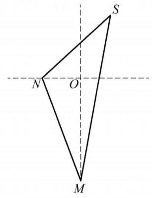

(第 9 题图)

9 如图，一货轮航行到 $M$ 处，测得灯塔 $S$ 在货轮的北偏东 ${15}^{ \circ  }$ ，与灯塔

$S$ 相距 20 海里，随后货轮按北偏西 ${30}^{ \circ  }$ 的方向航行 30 分钟后，又测得灯塔在货轮的东北方向，则货轮的速度为( )。

A. ${20}\left( {\sqrt{2} + \sqrt{6}}\right)$ 海里/时

B. ${20}\left( {\sqrt{6} - \sqrt{2}}\right)$ 海里/时

C. ${20}\left( {\sqrt{6} + \sqrt{3}}\right)$ 海里/时

D. ${20}\left( {\sqrt{6} - \sqrt{3}}\right)$ 海里/时

10 已知半径为 $R$ 的圆外接于 $\bigtriangleup {ABC}$ ,且 ${2R}\left( {{\sin }^{2}A - {\sin }^{2}C}\right)  = \left( {\sqrt{3}a - b}\right) \sin B$ 。

(1)求 $C$ ；

(2)求 $\bigtriangleup  {ABC}$ 面积的最大值。

11 如图，甲船以每小时 30√2 海里的速度向正北方航行，乙船按固定方向匀速直线航行，当甲船位于 ${A}_{1}$ 处时，乙船位于甲船的北偏西 105° 方向的 ${B}_{1}$ 处,此时两船相距 20 海里,当甲船航行 20 分钟到达 ${A}_{2}$ 处时,乙船航行到甲船的北偏西 ${120}^{ \circ  }$ 方向的 ${B}_{2}$ 处,此时两船相距 ${10}\sqrt{2}$ 海里，问乙船每小时航行多少海里?

(第 11 题图)

12 如图,某园林单位准备绿化一块直径为 ${BC}$ 的半圆形空地, $\bigtriangleup {ABC}$ 以外的地方种草, $\bigtriangleup {ABC}$ 的内接正方形 ${PQRS}$ 为一水池,其余的地方种花。若 ${BC} = a,\angle {ABC} = \theta$ ,设 $\bigtriangleup {ABC}$ 的面积为 ${S}_{1}$ ，正方形的面积为 ${S}_{2}$ 。

(1)用 $a\text{ 、 }\theta$ 表示 ${S}_{1}$ 和 ${S}_{2}$ ；

(2)当 $a$ 固定， $\theta$ 变化时，求 $\frac{{S}_{1}}{{S}_{2}}$ 取最小值时的角 $\theta$ 。

(第 12 题图)

13 (选做)在一个特定时段内，以点 $E$ 为中心的 7 海里以内海域被设为警戒水域。点 $E$ 正北 55 海里处有一个雷达观测站 $A$ 。某时刻测得一艘匀速直线行驶的船只位于点 $A$ 北偏东 ${45}^{ \circ  }$ 且与点 $A$ 相距 ${40}\sqrt{2}$ 海里的位置 $B$ ,经过 40 分钟又测得该船已行驶到点 $A$ 北偏东 ${45}^{ \circ  } + \theta$ (其中 $\sin \theta  = \frac{\sqrt{26}}{26},{0}^{ \circ  } < \theta  < {90}^{ \circ  }$ ) 且与点 $A$ 相距 ${10}\sqrt{13}$ 海里的位置 $C$ 。

(1)求该船的行驶速度 (单位:海里/时)；

(2)若该船不改变航行方向继续行驶。判断它是否会进入警戒水域，并说明理由。

(第 13 题图)

## 第 6 章 三角函数

### 6.1 正弦函数的图像与性质(1)

1 用 “五点法” 作函数 $y = \sin x + 1, x \in  \left\lbrack  {0,{2\pi }}\right\rbrack$ 的大致图像，所取的五点是___。

2 已知函数 $f\left( x\right)$ 与函数 $g\left( x\right)  = \sin x$ 的图像关于原点对称，则函数 $f\left( x\right)$ 的解析式为___。

3 函数 $y = 3\left| {\sin x}\right|$ 的最小正周期是___。

4 若函数 $y = \sin {2\omega x}\left( {\omega  > 0}\right)$ 的最小正周期为 $T$ ，且 $\frac{\pi }{4} \leq  T \leq  \pi$ ，则实数 $\omega$ 的取值范围是___。

5 函数 $y = {\sin }^{2}x + \sin x + 1$ 的值域为___。

6 已知函数 $f\left( x\right)  = \sin x + 2\left| {\sin x}\right| , x \in  \left\lbrack  {0,{2\pi }}\right\rbrack$ 的图像与直线 $y = k$ 有且仅有两个不同的交点,则实数 $k$ 的取值范围是___。

7 “ $\omega  = 2$ ” 是“函数 $y = \sin {\omega x}$ 的最小正周期为 $\pi$ ”的( )。

A. 充分非必要条件 B. 必要非充分条件

C. 充要条件 D. 既非充分又非必要条件

8 设函数 $f\left( x\right)  = \sin {3x} + \left| {\sin {3x}}\right|$ ，则 $f\left( x\right)$ 为( )。

A. 周期函数，最小正周期为 $\frac{2\pi }{3}$ B. 周期函数，最小正周期为 $\frac{\pi }{3}$

C. 周期函数,最小正周期为 ${2\pi }$ D. 非周期函数

9 以 $a\text{ 、 }b\text{ 、 }c$ 依次表示方程 $x + \sin x = 1\text{ 、 }x + \sin x = 2$ 及 $x + \frac{1}{2}\sin x = 2$ 的根,且 $0 < x < \; \frac{\pi }{2}$ ，则 $a$ 、 $b$ 、 $c$ 的大小关系为( )。

A. $c < b < a$ B. $a < c < b$ C. $a < b < c$ D. $b < c < a$

10 作出下列函数的大致图像:

(1) $y = 2 - \sin x\left( {x \in  \left\lbrack  {0,{2\pi }}\right\rbrack  }\right)$ ； (2) $y = 1 + \frac{1}{2}\sin x\left( {x \in  \left\lbrack  {-\pi ,\pi }\right\rbrack  }\right)$ ；

(3) $y = \sin x + \left| {\sin x}\right| \left( {x \in  \left\lbrack  {-\pi ,\pi }\right\rbrack  }\right)$ ; (4) $y = \left| {\sin x}\right|  + \left| {\cos x}\right| \left( {x \in  \left\lbrack  {-\pi ,\pi }\right\rbrack  }\right)$ 。

11 已知函数 $f\left( x\right)  = 2{\cos }^{2}x + \sqrt{3}\sin {2x} + a$ ，若 $x \in  \left\lbrack  {0,\frac{\pi }{2}}\right\rbrack$ ，且 $\left| {f\left( x\right) }\right|  < 2$ ，求实数 $a$ 的取值范围。

12 已知函数 $f\left( x\right)  = {\cos }^{2}x - 2\sin x\cos x - {\sin }^{2}x$ 。

(1)求 $f\left( x\right)$ 的最小正周期；

(2)求 $f\left( x\right)$ 的最大值和最小值。

13 (选做) 已知函数 $f\left( x\right)  = 2\sin \frac{x}{4}\cos \frac{x}{4} - 2\sqrt{3}{\sin }^{2}\frac{x}{4} + \sqrt{3}$ 。

(1)求函数 $f\left( x\right)$ 的最小正周期及最值;

(2)令 $g\left( x\right)  = f\left( {x + \frac{\pi }{3}}\right)$ ，判断函数 $g\left( x\right)$ 的奇偶性，并说明理由。

### 6.1 正弦函数的图像与性质(2)

1 若 $f\left( x\right)  = 2\sin {\omega x}\left( {0 < \omega  < 1}\right)$ 在区间 $\left\lbrack  {0,\frac{\pi }{3}}\right\rbrack$ 上的最大值为 $\sqrt{2}$ ，则 $\omega  =$ ___。

2 函数 $y = \cos {2x} + {\sin }^{2}x$ 的值域是___。

3 函数 $y = \frac{1 - \sin x}{2 - 2\sin x + {\sin }^{2}x}$ 的值域为___。

4 函数 $y =  - 2\sin \left( {\frac{\pi }{4} - {3x}}\right)$ 的严格增区间为___。

5 函数 $y = \sqrt{\sin x}$ 的严格减区间为___。

6 已知函数 $f\left( x\right)  = \sqrt{3}\sin \frac{\pi x}{k}$ 的图像上相邻的一个最大值点与一个最小值点恰好在圆 ${x}^{2} + \; {y}^{2} = {k}^{2}$ 上，则 $f\left( x\right)$ 的最小正周期是___。

7 下列函数中，其图像关于原点对称的是( )。

A. $y = {\sin }^{2}x$ B. $y = x\sin x$ C. $y = \frac{\sin x}{x}$ D. $y = x\sin \left( {x + \frac{\pi }{2}}\right)$

8 已知函数 $f\left( x\right)  = \sin \left( {{\omega x} + \frac{\pi }{3}}\right) \left( {\omega  > 0}\right)$ 的最小正周期为 $\pi$ ，则该函数的图像( )。

A. 关于点 $\left( {\frac{\pi }{3},0}\right)$ 对称 B. 关于直线 $x = \frac{\pi }{4}$ 对称

C. 关于点 $\left( {\frac{\pi }{4},0}\right)$ 对称 D. 关于直线 $x = \frac{\pi }{3}$ 对称

9 若不等式 ${\log }_{a}x > \sin {2x}\left( {a > 0\text{ 且 }a \neq  1}\right)$ 对于任意 $x \in  \left( {0,\frac{\pi }{4}}\right\rbrack$ 都成立，则 $a$ 的取值范围是( )。

A. $\left( {0,\frac{\pi }{4}}\right)$ B. $\left( {\frac{\pi }{4},1}\right)$ C. $\left( {\frac{\pi }{4},\frac{\pi }{2}}\right)$ D. $\left( {0,1}\right)$

10 求下列函数的定义域:

(1) $y = \lg \sin x$ ; (2) $y = \frac{\sin x}{\sin x - \cos x}$ ;

(3) $y = \sqrt{\sin x} + \lg \left( {{16} - {x}^{2}}\right)$ 。

11 判断下列函数的奇偶性,并写出它们的单调区间。

(1) $f\left( x\right)  = \sin x\cos x$ ;

(2) $f\left( x\right)  = \sin x + \cos x$ 。

12 已知函数 $f\left( x\right)  = {\sin }^{2}{\omega x} + \sqrt{3}\sin {\omega x}\sin \left( {{\omega x} + \frac{\pi }{2}}\right) \left( {\omega  > 0}\right)$ 的最小正周期为 $\pi$ 。

(1)求 $\omega$ 的值；

(2)求函数 $f\left( x\right)$ 在区间 $\left\lbrack  {0,\frac{2\pi }{3}}\right\rbrack$ 上的取值范围。

13 (选做) 已知函数 $f\left( x\right)  = {2a}{\sin }^{2}x - 2\sqrt{3}a\sin x\cos x + a + b$ 的定义域是 $\left\lbrack  {-\frac{\pi }{2},0}\right\rbrack$ ,值域是 $\left\lbrack  {-5,1}\right\rbrack$ ,求实数 $a\text{ 、 }b$ 的值。

### 6.2 余弦函数的图像与性质

1 若函数 $f\left( x\right)  = \cos \left( {{3x} + \varphi }\right)$ 的图像关于原点对称，则 $\varphi$ 的取值集合为___。

2 函数 $y = \frac{\sqrt{\sin x}}{1 + \cos x}$ 的定义域是___。

3 函数 $y = \sqrt{2}\cos \left( {\frac{\pi }{4} - {2x}}\right)  - 3$ 的严格增区间是___。

4 若函数 $f\left( x\right)  = {\cos }^{4}\left( {{\omega x} - \frac{\pi }{6}}\right)$ 的最小正周期为 $\frac{\pi }{5}$ ，其中 $\omega  > 0$ ，则 $\omega  =$ ___。

5 函数 $y = {\left( \cos x - m\right) }^{2} - 1$ ，当 $\cos x =  - 1$ 时取最大值，当 $\cos x = m$ 时取最小值，则实数 $m$ 的取值范围是___。

6 已知函数 $y = 2\cos x\left( {0 \leq  x \leq  {2\pi }}\right)$ 的图像和直线 $y = 2$ 围成一个封闭的图形，则其面积为___。

7 若函数 $f\left( x\right)$ 满足:① $f\left( {x + \pi }\right)  = f\left( x\right)$ ，② $f\left( \left| x\right| \right)  = f\left( x\right)$ ，则 $f\left( x\right)$ 可以是( )。

A. $\sin {2x}$ B. $\cos x$ C. $\sin \left| x\right|$ D. $\left| {\sin x}\right|$

8 函数 $y = \left| {\cos x}\right|$ 的一个单调增区间是( )。

A. $\left\lbrack  {-\frac{\pi }{4},\frac{\pi }{4}}\right\rbrack$ B. $\left\lbrack  {-\frac{\pi }{4},\frac{3\pi }{4}}\right\rbrack$ C. $\left\lbrack  {\pi ,\frac{3\pi }{2}}\right\rbrack$ D. $\left\lbrack  {\frac{3\pi }{2},{2\pi }}\right\rbrack$

9 已知 $k <  - 4$ ，则函数 $y = \cos {2x} + k\left( {\cos x - 1}\right)$ 的最小值是( )。

A. 1 B. -1 C. ${2k} + 1$ D. $- {2k} + 1$

10 判断下列函数的奇偶性:

(1) $f\left( x\right)  = \left( {{x}^{3} + x}\right) \cos x$ ; (2) $f\left( x\right)  = \cos x - \sin x$ ；

(3) $f\left( x\right)  = \frac{{\sin }^{2}x}{1 - \cos x}$ 。

11 已知函数 $f\left( x\right)  = 2\cos x\left( {\sin x - \cos x}\right)  + 1$

(1)求函数 $f\left( x\right)$ 的最小正周期；

(2)求函数 $f\left( x\right)$ 在 $\left\lbrack  {\frac{\pi }{8},\frac{3\pi }{4}}\right\rbrack$ 上的最大值与最小值。

12 设关于 $x$ 的函数 $y = 2{\cos }^{2}x - {2a}\cos x - \left( {{2a} + 1}\right)$ 的最小值为 $f\left( a\right)$ 。

(1)试用 $a$ 写出 $f\left( a\right)$ 的表达式；

(2)试确定 $f\left( a\right)  = \frac{1}{2}$ 的 $a$ 值，并对此时的 $a$ 求出 $y$ 的最大值。

13 (选做) 已知当 $x \in  \left\lbrack  {0,1}\right\rbrack$ 时，不等式 ${x}^{2}\cos \theta  - x\left( {1 - x}\right)  + {\left( 1 - x\right) }^{2}\sin \theta  > 0$ 恒成立，求 $\theta$ 的取值范围。

### 6.3 函数 $y = A\sin \left( {{\omega x} + \varphi }\right)$ 的图像与性质 (1)

1 函数 $y = \sin \left( {{2x} + \frac{\pi }{3}}\right)$ 的零点是___。

2 函数 $f\left( x\right)  = {\cos }^{2}x + \sqrt{3}\sin x\cos x$ 的值域为___。

3 函数 $f\left( x\right)  = {\sin }^{2}x + 2\sin x\cos x + 3{\cos }^{2}x$ 的周期为___。

4 已知函数 $f\left( x\right)  = 2{\cos }^{2}{\omega x} + 2\sin {\omega x}\cos {\omega x} + 1\left( {x \in  \mathbf{R},\omega  > 0}\right)$ 的最小正周期是 $\frac{\pi }{2}$ ，则函数 $f\left( x\right)$ 取最大值时的 $x$ 的集合为___。

5 已知函数 $f\left( x\right)  = \sqrt{3}\sin {\omega x} + \cos {\omega x}\left( {\omega  > 0}\right) , y = f\left( x\right)$ 的图像与直线 $y = 2$ 的两个相邻交点的距离等于 $\pi$ ，则 $f\left( x\right)$ 的严格增区间是___。

6 函数 $y = x + 4 + \sqrt{5 - {x}^{2}}$ 的最大值是___，最小值是___。

7 函数 $y = 2{\cos }^{2}x + 2\sqrt{3}\sin x\cos x + 5, x \in  \left\lbrack  {-\frac{\pi }{6},\frac{\pi }{3}}\right\rbrack$ 的最大值是( )。

A. 0 B. 4 C. 5 D. 8

8 若函数 $f\left( x\right)  = 3\sin \left( {{\omega x} + \varphi }\right)$ 对任意实数 $x$ ，都有 $f\left( {\frac{\pi }{4} + x}\right)  = f\left( {\frac{\pi }{4} - x}\right)$ ，则 $f\left( \frac{\pi }{4}\right)$ 等于 ( )。

A. 0 B. 3 C. -3 D. 3 或 -3

9 已知函数 $f\left( x\right)  = a\sin x - b\cos x\left( {a\text{ 、 }b\text{ 为常数, }a \neq  0, x \in  \mathbf{R}}\right)$ 在 $x = \frac{\pi }{4}$ 处取得最小值,则函数 $y = f\left( {\frac{3\pi }{4} - x}\right)$ 是( )。

A. 偶函数且它的图像关于点 $\left( {\pi ,0}\right)$ 对称 B. 偶函数且它的图像关于点 $\left( {\frac{3\pi }{2},0}\right)$ 对称

C. 奇函数且它的图像关于点 $\left( {\frac{3\pi }{2},0}\right)$ 对称 D. 奇函数且它的图像关于点 $\left( {\pi ,0}\right)$ 对称

10 已知函数 $y = 2\sin \left( {{2x} + \frac{\pi }{3}}\right)$ 。

(1)求它的振幅、周期和初相;

(2)用五点法作出它的图像。

11 已知函数 $f\left( x\right)  = \cos \left( {{2x} - \frac{\pi }{3}}\right)  + 2\sin \left( {x - \frac{\pi }{4}}\right) \sin \left( {x + \frac{\pi }{4}}\right)$ 。

(1)求函数 $f\left( x\right)$ 的对称轴方程；

(2)求函数 $f\left( x\right)$ 在区间 $\left\lbrack  {-\frac{\pi }{12},\frac{\pi }{2}}\right\rbrack$ 上的值域。

12 已知函数 $f\left( x\right)  = {\sin }^{2}{\omega x} + \sqrt{3}\sin {\omega x}\sin \left( {{\omega x} + \frac{\pi }{2}}\right) \left( {\omega  > 0}\right)$ 的最小正周期为 $\pi$ 。

(1)求 $\omega$ 的值；

(2)求函数 $f\left( x\right)$ 在区间 $\left\lbrack  {0,\frac{2\pi }{3}}\right\rbrack$ 上的取值范围。

13 (选做) 当 $1 \leq  {x}^{2} + {y}^{2} \leq  2$ 时,求 ${x}^{2} - {xy} + {y}^{2}$ 的最值。

### 6.3 函数 $y = A\sin \left( {{\omega x} + \varphi }\right)$ 的图像与性质 (2)

1 函数 $f\left( x\right)  = \sqrt{3}\sin x + \sin \left( {x + \frac{\pi }{2}}\right)$ 的最大值是___。

2 函数 $f\left( x\right)  = \cos \left( {{2x} - \frac{\pi }{3}}\right)  + 2\sin \left( {x - \frac{\pi }{4}}\right) \sin \left( {x + \frac{\pi }{4}}\right)$ 的最小正周期为___。

3 若函数 $y = \sin {2x} + a\cos {2x}$ 的图像关于直线 $x = \frac{\pi }{6}$ 对称，则 $a =$ ___。

4 已知函数 $y = A\sin \left( {{\omega x} + \varphi }\right)  + C\left( {A > 0,\omega  > 0,\left| \varphi \right|  < \frac{\pi }{2}}\right)$ 在同一周期中的最高点坐标为 $\left( {2,2}\right)$ ，最低点坐标为 $\left( {8, - 4}\right)$ ，则 $y$ 的表达式为___。

5 已知函数 $y = A\sin \left( {{\omega x} + \varphi }\right) \left( {A > 0,\omega  > 0,\left| \varphi \right|  < \frac{\pi }{2}}\right)$ 在 $x \in  \left( {0,\frac{2\pi }{3}}\right)$ 内只取到一个最大值和一个最小值,且当 $x = \frac{\pi }{12}$ 时,函数的最大值为 3,当 $x = \frac{7\pi }{12}$ 时,函数的最小值为 -3,则此函数的解析式为___。

6 在平面直角坐标系 ${xOy}$ 中，函数 $f\left( x\right)  = a\sin {ax} + \cos {ax}\left( {a > 0}\right)$ 在一个最小正周期长的区间上的图像与函数 $g\left( x\right)  = \sqrt{{a}^{2} + 1}$ 的图像所围成的封闭图形的面积为___。

(第 7 题图)

7 已知函数 $y = 2\sin \left( {{\omega x} + \varphi }\right) \left( {\varphi  > 0}\right)$ 在区间 $\left\lbrack  {0,{2\pi }}\right\rbrack$ 的图像如图， 那么 $\omega$ 为( )。

A. 1 B. 2

C. $\frac{1}{2}$ D. $\frac{1}{3}$

8 函数 $y = \sin \left( {{\omega x} + \varphi }\right) \left( {x \in  \mathbf{R},\omega  > 0,0 \leq  \varphi  < {2\pi }}\right)$ 的部分图像如图，则( )。

(第 8 题图)

A. $\omega  = \frac{\pi }{2},\varphi  = \frac{\pi }{4}$ B. $\omega  = \frac{\pi }{3},\varphi  = \frac{\pi }{6}$

C. $\omega  = \frac{\pi }{4},\varphi  = \frac{\pi }{4}$ D. $\omega  = \frac{\pi }{4},\varphi  = \frac{5\pi }{4}$

(第 9 题图)

9 函数 $y = A\sin \left( {{\omega x} + \varphi }\right) \left( {\omega  > 0,\left| \varphi \right|  < \frac{\pi }{2}, x \in  \mathbf{R}}\right)$ 的部分图像如图所示，则函数表达式为( )。

A. $y =  - 4\sin \left( {\frac{\pi }{8}x + \frac{\pi }{4}}\right)$ B. $y = 4\sin \left( {\frac{\pi }{8}x - \frac{\pi }{4}}\right)$

C. $y =  - 4\sin \left( {\frac{\pi }{8}x - \frac{\pi }{4}}\right)$ D. $y = 4\sin \left( {\frac{\pi }{8}x + \frac{\pi }{4}}\right)$

10 已知函数 $f\left( x\right)  = A\sin \left( {x + \varphi }\right) \left( {A > 0,0 < \varphi  < \pi }\right) , x \in  \mathbf{R}$ 的最大值是 1,其图像经过点 $M\left( {\frac{\pi }{3},\frac{1}{2}}\right)$ 。

(1)求 $f\left( x\right)$ 的解析式;

(2)已知 $\alpha ,\beta  \in  \left( {0,\frac{\pi }{2}}\right)$ ，且 $f\left( \alpha \right)  = \frac{3}{5}, f\left( \beta \right)  = \frac{12}{13}$ ，求 $f\left( {\alpha  - \beta }\right)$ 的值。

11 已知函数 $f\left( x\right)  = A\sin \left( {{\omega x} + \varphi }\right) , x \in  \mathbf{R}$ (其中 $A > 0,\omega  > 0,0 < \varphi  < \frac{\pi }{2}$ ) 的图像与 $x$ 轴的交点中,相邻两个交点之间的距离为 $\frac{\pi }{2}$ ,且图像上一个最低点为 $M\left( {\frac{2\pi }{3}, - 2}\right)$ 。

(1)求 $f\left( x\right)$ 的解析式;

(2)当 $x \in  \left\lbrack  {\frac{\pi }{12},\frac{\pi }{2}}\right\rbrack$ ，求 $f\left( x\right)$ 的值域。

12 已知函数 $y = A\sin \left( {{\omega x} + \varphi }\right)$ 在一个周期内的图像的最高点的坐标为 $\left( {\frac{5\pi }{24},2}\right)$ ，最低点的坐. 标为 $\left( {\frac{11\pi }{24}, - 2}\right)$ 。

(1)求此函数的解析式；

(2)求此函数的单调增区间。

13 (选做)已知函数 $f\left( x\right)  = a\sin {\omega x} + b\cos {\omega x}\left( {a, b,\omega  \in  \mathbf{R}\text{ ,且 }\omega  > 0}\right)$ 的部分图像如图所示。

(1)求 $a$ 、 $b$ 、 $\omega$ 的值；

(2)若方程 $3{\left\lbrack  f\left( x\right) \right\rbrack  }^{2} - f\left( x\right)  + m = 0$ 在 $x \in  \left( {-\frac{\pi }{3},\frac{2\pi }{3}}\right)$ 内有两个不同的解,求实数 $m$ 的取值范围。

(第 13 题图)

### 6.3 函数 $y = A\sin \left( {{\omega x} + \varphi }\right)$ 的图像与性质 (3)

1 将函数 $y = \sin {2x}$ 的图像向左平移 $\frac{\pi }{4}$ 个单位，再向上平移 1 个单位，所得图像的函数解析式是___。

2 把函数 $y = \sqrt{3}\cos x - \sin x$ 的图像向左平移 $m\left( {m > 0}\right)$ 个单位，所得的图像关于 $y$ 轴对称， 则实数 $m$ 的最小值为___。

3 若函数 $y = f\left( x\right)$ 的图像上每一点的纵坐标保持不变，横坐标伸长到原来的 2 倍，然后将所得图像先向左平移 $\frac{\pi }{2}$ 个单位,再向下平移 1 个单位,得到的曲线与 $y = \frac{1}{2}\cos x$ 的图像相同,则 $y = f\left( x\right)$ 的表达式为___。

4 将函数 $y = f\left( x\right)  \cdot  \sin x\left( {x \in  \mathbf{R}}\right)$ 的图像向右平移 $\frac{\pi }{4}$ 个单位后，再作关于 $x$ 轴的对称变换， 得到函数 $y = 1 - 2{\sin }^{2}x$ 的图像，则 $f\left( x\right)$ 可以是___。

5 设 $\omega  > 0$ ，函数 $y = \sin \left( {{\omega x} + \frac{\pi }{3}}\right)  + 2$ 的图像向右平移 $\frac{4\pi }{3}$ 个单位后与原图像重合，则 $\omega$ 的最小值是___。

6 设函数 $f\left( x\right)  = \sin \left( {{\omega x} + \varphi }\right) \left( {\omega  > 0,\left| \varphi \right|  < \frac{\pi }{2}}\right)$ ，给出以下四个论断:

① 它的图像关于直线 $x = \frac{\pi }{12}$ 对称; ② 它的图像关于点 $\left( {\frac{\pi }{3},0}\right)$ 对称；

③ 它的周期是 $\pi$ ；

④ 它在区间 $\left\lbrack  {-\frac{\pi }{6},0}\right\rbrack$ 上是增函数。

以其中的两个论断作为条件，余下的两个论断作为结论，写出你认为正确的两个命题___ ___；___。

7 已知函数 $f\left( x\right)  = \sin \left( {{\omega x} + \frac{\pi }{4}}\right) \left( {x \in  \mathbf{R},\omega  > 0}\right)$ 的最小正周期为 $\pi$ ，为了得到函数 $g\left( x\right)  = \; \cos {\omega x}$ 的图像，只要将 $y = f\left( x\right)$ 的图像( )。

A. 向左平移 $\frac{\pi }{8}$ 个单位长度 B. 向右平移 $\frac{\pi }{8}$ 个单位长度

C. 向左平移 $\frac{\pi }{4}$ 个单位长度 D. 向右平移 $\frac{\pi }{4}$ 个单位长度

8 把函数 $y =  - 3\cos \left( {{2x} + \frac{\pi }{3}}\right)$ 的图像向右平移 $m\left( {m > 0}\right)$ 个单位，设所得图像的解析式为 $y = f\left( x\right)$ ,则当 $y = f\left( x\right)$ 是偶函数时, $m$ 的值可以是 ( )。

A. $\frac{\pi }{3}$ B. $\frac{\pi }{6}$ C. $\frac{\pi }{4}$ D. $\frac{\pi }{12}$

9 将函数 $f\left( x\right)  = \sin \left( {{\omega x} + \varphi }\right)$ 的图像向左平移 $\frac{\pi }{2}$ 个单位，若所得图像与原图像重合，则 $\omega$ 的值不可能等于( )。

A. 4 B. 6 C. 8 D. 12

10 已知函数 $f\left( x\right)  = \sin \left( {{\omega x} + \varphi }\right)$ ，其中 $\omega  > 0$ ， $\left| \varphi \right|  < \frac{\pi }{2}$ 。

(1)若 $\cos \frac{\pi }{4}\cos \varphi  - \sin \frac{3\pi }{4}\sin \varphi  = 0$ ，求 $\varphi$ 的值；

(2)在(1)的条件下，若函数 $f\left( x\right)$ 的图像的相邻两条对称轴之间的距离等于 $\frac{\pi }{3}$ ，求函数 $f\left( x\right)$ 的解析式；并求最小正实数 $m$ ，使得函数 $f\left( x\right)$ 的图像向左平移 $m$ 个单位所对应的函数是偶函数。

11 已知函数 $f\left( x\right)  = \frac{1}{2}\sin {2x}\sin \varphi  + {\cos }^{2}x\cos \varphi  - \frac{1}{2}\sin \left( {\frac{\pi }{2} + \varphi }\right) \left( {0 < \varphi  < \pi }\right)$ ，其图像过点 $\left( {\frac{\pi }{6},\frac{1}{2}}\right)$ 。

(1)求 $\varphi$ 的值；

(2)将函数 $y = f\left( x\right)$ 的图像上各点的横坐标缩短到原来的 $\frac{1}{2}$ ，纵坐标不变，得到函数 $y = \; g\left( x\right)$ 的图像，求函数 $g\left( x\right)$ 在 $\left\lbrack  {0,\frac{\pi }{4}}\right\rbrack$ 上的最大值和最小值。

12 已知函数 $f\left( x\right)  = \sqrt{3}\sin \left( {{\omega x} + \varphi }\right)  - \cos \left( {{\omega x} + \varphi }\right) \left( {0 < \varphi  < \pi ,\omega  > 0}\right)$ 为偶函数，且函数 $y = \; f\left( x\right)$ 图像的两相邻对称轴间的距离为 $\frac{\pi }{2}$ 。

(1)求 $f\left( \frac{\pi }{8}\right)$ 的值；

(2)将函数 $y = f\left( x\right)$ 的图像向右平移 $\frac{\pi }{6}$ 个单位后,再将得到的图像上各点的横坐标伸长到原来的 4 倍，纵坐标不变，得到函数 $y = g\left( x\right)$ 的图像，求 $g\left( x\right)$ 的严格减区间。

13 (选做)已知 $f\left( x\right)  = \sin \left( {{\omega x} + \varphi }\right) \left( {\omega  > 0,0 \leq  \varphi  \leq  \frac{\pi }{2}}\right)$ 是 $\mathbf{R}$ 上的偶函数，其图像关于点 $M\left( {\frac{3\pi }{4},0}\right)$ 对称,且在区间 $\left\lbrack  {0,\frac{\pi }{2}}\right\rbrack$ 上是单调函数,求 $\varphi$ 和 $\omega$ 的值。

### 6.4 正切函数的图像与性质

1 有人说:“正切函数在整个定义域内是严格增函数。”这句话对吗？为什么？___ ___。

2 函数 $y = \frac{1}{1 + \tan {2x}}$ 的定义域为___。

3 函数 $y = \tan x - \cot x$ 的最小正周期为___。

4 函数 $y = \tan \left( {\frac{\pi }{4} - x}\right)$ 的图像的对称中心的坐标是___。

5 函数 $y = \tan {2x}$ 的单调增区间为___。

6 若将函数 $y = \tan \left( {{\omega x} + \frac{\pi }{4}}\right) \left( {\omega  > 0}\right)$ 的图像向右平移 $\frac{\pi }{6}$ 个单位长度后，与函数 $y = \; \tan \left( {{\omega x} + \frac{\pi }{6}}\right)$ 的图像重合，则实数 $\omega$ 的最小值为___。

7 函数 $y = \left| {\tan x}\right|$ 的最小正周期为( )。

A. 无周期 B. $\frac{\pi }{2}$ C. ${2\pi }$ D. $\pi$

8 函数 $y = \sqrt{1 - {\tan }^{2}x}$ 的定义域为( )。

A. $\left( {{k\pi } - \frac{\pi }{2},{k\pi } - \frac{\pi }{4}}\right\rbrack  , k \in  \mathbf{Z}$ B. $\left\lbrack  {{k\pi } + \frac{\pi }{4},{k\pi } + \frac{\pi }{2}}\right) , k \in  \mathbf{Z}$

C. $\left( {{k\pi } - \frac{\pi }{4},{k\pi } + \frac{\pi }{4}}\right) , k \in  \mathbf{Z}$ D. $\left\lbrack  {{k\pi } - \frac{\pi }{4},{k\pi } + \frac{\pi }{4}}\right\rbrack  , k \in  \mathbf{Z}$

9 关于 $x$ 的不等式 $\tan {2x} \leq   - 1$ 的解集为( )。

A. $\left\lbrack  {\frac{k\pi }{2} + \frac{\pi }{8},\frac{k\pi }{2} + \frac{\pi }{4}}\right\rbrack  , k \in  \mathbf{Z}$ B. $\left( {\frac{k\pi }{2} + \frac{\pi }{8},\frac{k\pi }{2} + \frac{\pi }{4}}\right\rbrack  , k \in  \mathbf{Z}$

C. $\left\lbrack  {\frac{k\pi }{2} - \frac{\pi }{4},\frac{k\pi }{2} - \frac{\pi }{8}}\right\rbrack  , k \in  \mathbf{Z}$ D. $\left( {\frac{k\pi }{2} - \frac{\pi }{4},\frac{k\pi }{2} - \frac{\pi }{8}}\right\rbrack  , k \in  \mathbf{Z}$

10 求下列函数的值域。

(1) $y = \frac{1 + \tan x}{1 - \tan x}, x \in  \left( {-\frac{\pi }{2},0}\right)$ ;

(2) $y = {\tan }^{2}x + 3\tan x - 1, x \in  \left\lbrack  {-\frac{\pi }{3},\frac{\pi }{4}}\right\rbrack$ 。

11 判断函数 $f\left( x\right)  = \lg \frac{\tan x + 1}{\tan x - 1}$ 的奇偶性。

12 已知函数 $y = A\tan \left( {{\omega x} + \varphi }\right) \left( {A > 0,\omega  > 0,\left| \varphi \right|  < \frac{\pi }{2}}\right)$ 的图像过点 $\left( {0, - 3}\right)$ ,与 $x$ 轴的两相邻交点的坐标分别为 $\left( {\frac{\pi }{6},0}\right)$ 和 $\left( {\frac{5\pi }{6},0}\right)$ ,求该函数的解析式。

13 (选做) 求函数 $y = \frac{{\tan }^{2}x - \tan x + 1}{{\tan }^{2}x + \tan x + 1}$ 的最大值、最小值,并求函数取得最大值或最小值时自变量 $x$ 的集合。

### 6.5 反三角函数

1 $y = \sin x$ 在 $\left\lbrack  {-\frac{3}{2}\pi , - \frac{\pi }{2}}\right\rbrack$ 上的反函数是___。

2 $y = \pi  + \arctan \frac{x}{2}$ 的反函数是___。

3 函数 $y = \arccos \sqrt{x} - \arctan x$ 的定义域为___，值域为___。

4 若 $\arcsin x > \frac{\pi }{6}$ ，则 $x \in$ ___；若 $\arccos x > \frac{\sqrt{2}}{2}$ ，则 $x \in$ ___。

$5\sin \left( {\arccos \frac{1}{3}}\right)  =$ ___。

6 已知 $f\left( x\right)$ 在 $\mathbf{R}$ 上是奇函数，当 $x \geq  0$ 时， $f\left( x\right)  = \arccos x$ ，则 $x < 0$ 时， $f\left( x\right)  =$ ___。

7 下列函数中，在定义域内不具有单调性的函数是( )。

A. $y = \cot \left( {\arccos x}\right)$ B. $y = \tan \left( {\arcsin x}\right)$

C. $y = \sin \left( {\arctan x}\right)$ D. $y = \cos \left( {\arctan x}\right)$

8 设 $x$ 为实数，则下列各式正确的是( )。

A. $\sin \left( {\arcsin x}\right)  = x$ B. $\arcsin \left( {\sin x}\right)  = x$

C. $\cos \left( {\arccos x}\right)  = x$ D. $\tan \left( {\arctan x}\right)  = x$

9 设 $M = \{ \left( {x, y}\right) \left| \right| {xy} \mid   = 1\} , N = \left\{  {\left( {x, y}\right) \left| {\;\arctan x + \arctan y = \frac{\pi }{2}}\right. }\right\}$ ,则(   )。

A. $M \cap  N = M$

B. $M \cup  N = M$

C. $M \cup  N = N$

D. $M \cup  N = \{ \left( {x, y}\right) \left| \right| {xy} \mid   = 1$ ,且 $x\text{ 、 }y$ 不同时为负数 $\}$

10 计算 $\tan \left( {\arcsin \frac{1}{2} - \arccos \frac{3}{5}}\right)$ 的值。

11 求函数 $y = \arcsin \left( {{x}^{2} - x}\right)$ 的单调减区间和值域。

12 求证: $\arcsin x + \arccos x = \frac{\pi }{2}, x \in  \left\lbrack  {-1,1}\right\rbrack$ 。

13 (选做)若 $\arccos x + \arccos y + \arccos z = \pi$ ,求证: ${x}^{2} + {y}^{2} + {z}^{2} + {2xyz} = 1$ 。

### 6.6 最简三角方程(1)

1 三角方程 ${\sin }^{2}x - {\cos }^{2}x = \frac{1}{2}$ 的解集是___。

$2\;8{\sin }^{2}x + 3\sin {2x} - 4 = 0$ 的解集为___。

3 方程 $\sqrt{3}\sin {2x} - \cos {2x} + 1 = 0$ 在 $\lbrack 0,{2\pi })$ 上的解集为___。

4 在 $\left\lbrack  {0,\frac{3\pi }{2}}\right\rbrack$ 内，方程 $\cos \left( {\pi \cos x}\right)  = 0$ 的所有解的和为___。

5 方程 $\lg \left( {\sqrt{3}\sin x}\right)  = \lg \left( {-\cos x}\right)$ 的解集为___。

6 已知 $k \in  \mathbf{Z}$ ，使方程 $2{\sin }^{2}x + 6{\cos }^{2}\frac{x}{2} = 5 - {2k}$ 有解的 $k$ 的值为___。

7 方程 $\sin x = \frac{1}{2}\left( {a + \frac{1}{a}}\right) \left( {a \in  \mathbf{R}\text{ 且 }a \neq  0}\right)$ 在 $\lbrack 0,{2\pi })$ 内( )。

A. 可能有一解 B. 可能有两解

C. 有无穷多解 D. 一定无解

8 已知 $2\sin x - 2\sqrt{3}\cos x = \frac{6 - {2m}}{3 + m}$ ，则 $m$ 的取值范围是( )。

A. $\left\lbrack  {-9, - 1}\right\rbrack$ B. $\lbrack  - 9, + \infty )$

C. $\lbrack  - 1, + \infty )$ D. $( - \infty , - 9\rbrack  \cup  \lbrack  - 1, + \infty )$

9 要使 $\sin \left( {\alpha  + \frac{\pi }{7}}\right)  = \sin \alpha  + \sin \frac{\pi }{7}$ 成立，对 $\alpha$ 来说应是:( )。

A. $\alpha$ 可取任意实数 B. 不存在这样的 $\alpha$

C. $\alpha$ 有且仅有一个可取的值 D. $\alpha$ 有无穷多个可取的值

10 解三角方程: ${\log }_{\sin \left( {-x}\right) }\left( {\sin \frac{3x}{2} + \sin \frac{x}{2}}\right)  = 1$ 。

11 解方程: $\sin x + \sin {2x} + \sin {3x} = 1 + \cos x + \cos {2x}$ 。

12 已知 $\alpha$ 、 $\beta$ 是方程 $\sin x + \sqrt{3}\cos x = m$ 在 $\left( {0,{2\pi }}\right)$ 上的两相异实根，试求:

(1)实数 $m$ 的取值范围；

(2) $\alpha  + \beta$ 的值。

13. (选做)若关于 $x$ 的方程 $2{\cos }^{2}\left( {x + \pi }\right)  - \sin x + a = 0$ 有实根，求实数 $a$ 的取值范围。

### 6.6 最简三角方程(2)

1 三角方程 $\tan \left( {\frac{\pi }{4} + x}\right)  = 2\sin \frac{\pi }{4}$ 的解集是___。

2 方程 $3\sin x = 2\cos x$ 的解集为___。

3 方程 ${\tan }^{2}x - 3\tan x + 2 = 0$ 的解集为___。

4 已知 $\sin x + \cos x = \frac{1}{5},0 \leq  x \leq  \pi$ ，则 $\tan x =$ ___。

5 集合 $A = \{ \left( {x, y}\right)  \mid  \arcsin x + \arccos y = 0\}$ 所围成的图形的面积是___。

6 方程 $\arcsin \frac{3x}{5} + \arcsin \frac{4x}{5} = \arcsin x$ 的解是___。

7 三角方程 $\tan {3x} + \tan {2x} = 0$ 在 $\left\lbrack  {0,\pi }\right\rbrack$ 内解的个数为( )。

A. 6 B. 5

C. 4 D. 3

8 方程 $\arcsin \left( {\cos x}\right)  = \frac{\pi }{6}$ 的解的情况是( )。

A. 有一解 B. 有二解

C. 有无穷多解 D. 无解

9 已知方程 $\tan \left( {x + \frac{\pi }{4}}\right)  - \tan \left( {x - \frac{\pi }{4}}\right)  =  - 2$ 的解集为 $M$ ,方程 $\frac{\tan x + 1}{1 - \tan x} - \frac{\tan x - 1}{1 + \tan x} =  - 2$ 的解集为 $N$ ,下面正确的是( )。

A. $M = N$ B. $M \supset  N$

C. $M \subset  N$ D. $M = \varnothing$

10 已知 $1 + \sin x + \cos x + \sin {2x} + \cos {2x} = 0$ ，求 $\tan {2x}$ 的值。

11 已知关于 $x$ 的方程 ${x}^{2} - \left( {\sin \alpha  + \cos \alpha }\right) x + {\sin }^{2}\alpha  - \sin \alpha \cos \alpha  - 1 = 0$ 有两个相等的实根,求实数 $\alpha$ 与 $x$ 的值。

12 已知方程 ${x}^{2} + x\cos \theta  + \sin \theta  = 0$ 和 ${x}^{2} + x\sin \theta  + \cos \theta  = 0$ 有一个公共根，求 $\theta$ 的值 $\left( {{0}^{ \circ  } \leq  }\right. \; \theta  \leq  {360}^{ \circ  }$ )。

13 (选做) 解关于 $x$ 的方程: $\cos {2x} + 2\cos x + {2a} - 3 = 0\left( {a \in  \mathbf{R}}\right)$ 。

## 第 7 章 平面向量

### 7.1 平面向量的概念

1 单位向量的模为___。

2 如果两个向量共线，那么这两个向量的方向___。

3 在四边形 ${ABCD}$ 中，若 $\overrightarrow{AB}//\overrightarrow{CD}$ 且 $\left| \overrightarrow{AB}\right|  \neq  \left| \overrightarrow{CD}\right|$ ，则四边形 ${ABCD}$ 的形状是___。

4 给出下列四个命题:①若| $\overrightarrow{a}$ |=| $\overrightarrow{b}$ |，则 $\overrightarrow{a} = \overrightarrow{b}$ ; ②向量不可以比较大小；③若 $\overrightarrow{a} = \overrightarrow{b},\overrightarrow{b} = \overrightarrow{c}$ ，则 $\overrightarrow{a} = \overrightarrow{c}$ ；④ $\overrightarrow{a} = \overrightarrow{b} \Leftrightarrow  \left| \overrightarrow{a}\right|  = \left| \overrightarrow{b}\right| ,\overrightarrow{a}//\overrightarrow{b}$ 。其中正确的命题为___。

5 我们在物理课中学习过的力就是一种向量，除了数学课中强调的大小、方向这两个要素外， 力还具有第三个要素:___。

6 在中国象棋中，有“马走日”的说法，若棋盘每格的长度为 1 ，将马移动一步看成是一个向量， 则这个向量的模为___。

7 下列物理量中，不能称为向量的是( )。

A. 温度 B. 加速度 C. 重力 D. 位移

8 在 $\bigtriangleup  {ABC}$ 中， ${AB} = {AC}$ ， $D$ 、 $E$ 分别是 ${AB}$ 、 ${AC}$ 的中点，则()。

A. $\overrightarrow{AB}$ 与 $\overrightarrow{AC}$ 共线 B. $\overrightarrow{DE}$ 与 $\overrightarrow{CB}$ 共线

C. $\overrightarrow{AD}$ 与 $\overrightarrow{AE}$ 相等 D. $\overrightarrow{AD}$ 与 $\overrightarrow{BD}$ 相等

9 两个向量共线是两个向量相等的 0 。

A. 充分非必要条件 B. 必要非充分条件

C. 既非充分也非必要条件 D. 充要条件

10 如图，四边形 ${ABCD}$ 为正方形， $\bigtriangleup  {BCE}$ 为等腰直角三角形。

(1)写出图中所有与 $\overrightarrow{AB}$ 共线的向量；

(第 10 题图)

(2)写出图中所有与 $\overrightarrow{AB}$ 相等的向量；

(3)写出图中所有与 $\overrightarrow{AB}$ 模相等的向量。

11 在等腰梯形 ${ABCD}$ 中， ${AB}//{CD}$ ，对角线 ${AC}$ 与 ${BD}$ 相交于点 $O$ ， ${EF}$ 是过点 $O$ 且平行于 ${AB}$ 的线段，在所标的向量中:

(1)写出与 $\overrightarrow{EF}$ 方向相同的向量；

(2)写出与 $\overrightarrow{EF}$ 方向相同的向量；

(3)写出与 $\overrightarrow{OB}$ 、 $\overrightarrow{OD}$ 的模相等的向量。

(第 11 题图)

12 如图所示方格纸由若干个边长为 1 的小正方形并在一起组成，方格纸中有两个定点 $A$ 、 $B$ ， 点 $C$ 为小正方形的顶点，且 $\left| \overrightarrow{AC}\right|  = \sqrt{5}$ 。

(1)画出所有的向量 $\overrightarrow{AC}$ ；

(2)求 $\left| \overrightarrow{BC}\right|$ 的最大值与最小值。

(第 12 题图)

13 (选做) 如图,在四边形 ${ABCD}$ 中, $E\text{ 、 }F\text{ 、 }G\text{ 、 }H$ 分别是边 ${AB}\text{ 、 }{BC}\text{ 、 }{CD}\text{ 、 }{DA}$ 的中点。求证: $\overrightarrow{EH} = \overrightarrow{FG}$ 。

(第 13 题图)

### 7.2 向量的线性运算 (1)

1 化简: $\overrightarrow{AB} + \overrightarrow{BC} + \overrightarrow{CD} =$ ___。

2 化简: $\left( {\overrightarrow{AB} - \overrightarrow{CD}}\right)  + \left( {\overrightarrow{BE} - \overrightarrow{DE}}\right)  =$ ___。

3 在四边形 ${ABCD}$ 中,若 $\overrightarrow{AC} = \overrightarrow{AB} + \overrightarrow{AD}$ ,则四边形 ${ABCD}$ 的形状是___。

4 现有如下两个命题,命题 $A : \overrightarrow{a} + \overrightarrow{b} + \overrightarrow{c} = \overrightarrow{0}$ ; 命题 $B$ : 向量 $\overrightarrow{a}\text{ 、 }\overrightarrow{b}\text{ 、 }\overrightarrow{c}$ 所在的线段能构成三角形。 则命题 $A$ 是命题 $B$ 的___条件。

5 已知 ${AM}$ 是 $\bigtriangleup {ABC}$ 的 ${BC}$ 边上的中线，若 $\overrightarrow{AB} = \overrightarrow{a}$ ， $\overrightarrow{AC} = \overrightarrow{b}$ ，用 $\overrightarrow{a}$ 、 $\overrightarrow{b}$ 表示 $\overrightarrow{AM} =$ ___。

6 已知 $\left| \overrightarrow{AB}\right|  = 8,\left| \overrightarrow{AC}\right|  = {12}$ ，则 $\left| \overrightarrow{BC}\right|$ 的取值范围是___。

(第 7 题图)

7 如图所示，正六边形 ${ABCDEF}$ 中， $\overrightarrow{BA} + \overrightarrow{CD} + \overrightarrow{EF} =$ ( )。

A. $\overrightarrow{AD}$ B. $\overrightarrow{BE}$

C. $\overrightarrow{CF}$ D. $\overrightarrow{0}$

8 在 $\bigtriangleup  {ABC}$ 中， $\left| \overrightarrow{AB}\right|  = \left| \overrightarrow{BC}\right|  = \left| {\overrightarrow{AB} + \overrightarrow{BC}}\right|$ ，则 $\bigtriangleup  {ABC}$ 是( )。

A. 直角三角形

B. 等边三角形

C. 钝角三角形

D. 等腰直角三角形

9 下列四式不能化简为 $\overrightarrow{AD}$ 的是( )。

A. $\overrightarrow{AB} + \overrightarrow{CD} + \overrightarrow{BC}$

B. $\overrightarrow{AD} + \overrightarrow{MB} + \overrightarrow{BC} + \overrightarrow{CM}$

C. $\overrightarrow{MB} + \overrightarrow{AD} - \overrightarrow{BM}$

D. $\overrightarrow{OC} - \overrightarrow{OA} + \overrightarrow{CD}$

10 作图验证不等式: $\left| {\overrightarrow{a} + \overrightarrow{b}}\right|  \leq  \left| \overrightarrow{a}\right|  + \left| \overrightarrow{b}\right|$ ，指明等号成立条件，并阐述其几何意义。

11 在四边形 ${ABCD}$ 中, $M\text{ 、 }N$ 分别为 ${AD}\text{ 、 }{BC}$ 的中点, $G$ 为 ${MN}$ 的中点,求证:

$$
\overrightarrow{GA} + \overrightarrow{GB} + \overrightarrow{GC} + \overrightarrow{GD} = \overrightarrow{0}\text{ 。 }
$$

12 假设在静水中船的速度大小为 20 米/分，水流的速度大小为 10 米/分，方向由东向西，如果船从南岸出发沿垂直于水流的航线到达北岸。

(1)求船航行的方向；

(2)经过 3 小时，该船的实际航程是多少千米？

13 (选做)证明: “点 $G$ 是 $\bigtriangleup  {ABC}$ 的重心的充要条件” 是 “ $\overrightarrow{GA} + \overrightarrow{GB} + \overrightarrow{GC} = \overrightarrow{0}$ ”。

### 7.2 向量的线性运算(2)

1 已知非零向量 $\overrightarrow{a} = \lambda \overrightarrow{b}$ ，且 $\overrightarrow{a}$ 与 $\overrightarrow{b}$ 同向，则实数 $\lambda$ 的取值范围是___。

2 若 $\overrightarrow{AB} = 2\overrightarrow{BC},\overrightarrow{AC} = \lambda \overrightarrow{CB}$ ，则 $\lambda  =$ ___。

3 已知命题 $p$ :向量 $\overrightarrow{b}$ 与 $\overrightarrow{a}$ 共线，命题 $q$ :有且仅有唯一的实数 $\lambda$ 使得 $\overrightarrow{b} = \lambda \overrightarrow{a}$ ，则 $p$ 是 $q$ 的 ___条件。

4 已知 $\overrightarrow{{e}_{1}}\text{ 、 }\overrightarrow{{e}_{2}}$ 不共线， $\overrightarrow{AB} = \overrightarrow{{e}_{1}} + \overrightarrow{{e}_{2}},\overrightarrow{BC} = 2\overrightarrow{{e}_{1}} + 3\overrightarrow{{e}_{2}},\overrightarrow{CD} = 2\overrightarrow{{e}_{1}} + k\overrightarrow{{e}_{2}}, k$ 为实数，若 $A$ 、 $B$ 、 $D$ 三点共线，则实数 $k =$ ___。

5 已知向量 $\overrightarrow{p} = \frac{\overrightarrow{a}}{\left| \overrightarrow{a}\right| } + \frac{\overrightarrow{b}}{\left| \overrightarrow{b}\right| }$ ，其中 $\overrightarrow{a}$ 、 $\overrightarrow{b}$ 均为非零向量，则 $\left| \overrightarrow{p}\right|$ 的取值范围是___。

6 若平行四边形 ${ABCD}$ 的中心为 $O, P$ 为该平面上一点，记 $\overrightarrow{PO} = \overrightarrow{a}$ ，则 $\overrightarrow{PA} + \overrightarrow{PB} + \overrightarrow{PC} + \; \overrightarrow{PD} =$ ___。(用 $\overrightarrow{a}$ 表示)

7 对于实数 $m\text{ 、 }n$ 和向量 $\overrightarrow{a}\text{ 、 }\overrightarrow{b}$ ，则下列命题中真命题的个数是( )。

① $m\left( {\overrightarrow{a} - \overrightarrow{b}}\right)  = m\overrightarrow{a} - m\overrightarrow{b}$ ； ③ 若 $m\overrightarrow{a} = m\overrightarrow{b}$ ，则 $\overrightarrow{a} = \overrightarrow{b}$ ；

② $\left( {m - n}\right) \overrightarrow{a} = m\overrightarrow{a} - n\overrightarrow{a}$ ； ④ 若 $m\overrightarrow{a} = n\overrightarrow{a}$ 且 $\overrightarrow{a} \neq  \overrightarrow{0}$ ，则 $m = n$ 。

A. 1 B. 2 C. 3 D. 4

8 若 $\overrightarrow{a}\text{ 、 }\overrightarrow{b}$ 是不共线的两向量，且 $\overrightarrow{AB} = {\lambda }_{1}\overrightarrow{a} + \overrightarrow{b},\overrightarrow{AC} = \overrightarrow{a} + {\lambda }_{2}\overrightarrow{b}\left( {{\lambda }_{1},{\lambda }_{2} \in  \mathbf{R}}\right)$ ，则 $A$ 、 $B$ 、 $C$ 三点共线的充要条件是( )。

A. ${\lambda }_{1} = {\lambda }_{2} =  - 1$ B. ${\lambda }_{1} = {\lambda }_{2} = 1$

C. ${\lambda }_{1}{\lambda }_{2} =  - 1$ D. ${\lambda }_{1}{\lambda }_{2} = 1$

9 已知 $\overrightarrow{{a}_{0}}$ 为单位向量，下列命题中真命题的个数是( )。

① 若 $\overrightarrow{a}$ 为平面内的某个向量，则 $\overrightarrow{a} = \left| \overrightarrow{a}\right|  \cdot  \overrightarrow{{a}_{0}}$ ；

② 若 $\overrightarrow{a}$ 与 $\overrightarrow{{a}_{0}}$ 平行，则 $\overrightarrow{a} = \left| \overrightarrow{a}\right|  \cdot  \overrightarrow{{a}_{0}}$ ；

③ 若 $\overrightarrow{a}$ 与 $\overrightarrow{{a}_{0}}$ 平行，且 $\left| \overrightarrow{a}\right|  = 1$ ，则 $\overrightarrow{a} = \overrightarrow{{a}_{0}}$ 。

A. 0 B. 1 C. 2 D. 3

10 在正方形 ${ABCD}$ 中,点 $E$ 为 ${DC}$ 的中点,若 $\overrightarrow{AE} = \lambda \overrightarrow{AB} + \mu \overrightarrow{AC}$ ,求 $\lambda  + \mu$ 的值。

11 已知点 $M\text{ 、 }N$ 分别为 $\bigtriangleup {ABC}$ 和 $\bigtriangleup {DEF}$ 的重心,求证: $3\overrightarrow{MN} = \overrightarrow{AD} + \overrightarrow{BE} + \overrightarrow{CF}$ 。

12 在四边形 ${ABCD}$ 中， $M$ 、 $N$ 分别为 ${AD}$ 、 ${BC}$ 的中点， $G$ 为 ${MN}$ 的中点， $O$ 为平面内的任意一点。求证: $\overrightarrow{OG} = \frac{1}{4}\left( {\overrightarrow{OA} + \overrightarrow{OB} + \overrightarrow{OC} + \overrightarrow{OD}}\right)$ 。

13 (选做) 如图,在 $\bigtriangleup {ABC}$ 中,点 $D\text{ 、 }E\text{ 、 }F$ 分别是边 ${BC}\text{ 、 }{CA}\text{ 、 }{AB}$ 上靠近 $B\text{ 、 }C\text{ 、 }A$ 的三等分点,求证: $\overrightarrow{AD} + \overrightarrow{BE} + \overrightarrow{CF} = \overrightarrow{0}$ 。

(第 13 题图)

### 7.3 平面向量分解定理

1 下列命题中是真命题的有___。

① 一个平面内只有一对不共线向量可作为表示该平面所有向量的基底;

② 一个平面内有无数多对不共线向量可表示该平面所有向量的基底;

③ 零向量不能作为基底中的向量。

2 已知向量 $\overrightarrow{a}\text{ 、 }\overrightarrow{b}$ 不平行,实数 $x\text{ 、 }y$ 满足 $\left( {{2x} - y}\right) \overrightarrow{a} + 4\overrightarrow{b} = 5\overrightarrow{a} + \left( {x - {2y}}\right) \overrightarrow{b}$ ,则 $x + y =$ ___。

3 已知 $\overrightarrow{AP} = \frac{4}{3}\overrightarrow{AB}, O$ 为直线 ${AB}$ 外一点，用 $\overrightarrow{OA}\text{ 、 }\overrightarrow{OB}$ 表示 $\overrightarrow{OP} =$ ___。

4 已知梯形 ${ABCD}$ 中， ${AB}//{CD}$ ，且 $\left| \overrightarrow{AB}\right|  = 2\left| \overrightarrow{CD}\right|$ ， $M$ 、 $N$ 分别是 ${DC}\text{ 、 }{AB}$ 的中点，若 $\overrightarrow{AB} = \overrightarrow{a},\overrightarrow{AD} = \overrightarrow{b}$ ，用 $\overrightarrow{a}\text{ 、 }\overrightarrow{b}$ 表示 $\overrightarrow{BC}$ 和 $\overrightarrow{MN}$ ，则 $\overrightarrow{BC} =$ ___； $\overrightarrow{MN} =$ ___。

(第 4 题图)

5 在 $\bigtriangleup {ABC}$ 中,点 $D\text{ 、 }E$ 分别在边 ${AB}\text{ 、 }{BC}$ 上, ${AD} = \frac{1}{2}{AB},{BE} = \; \frac{2}{3}{BC},\overrightarrow{DE} = \lambda \overrightarrow{AB} + \mu \overrightarrow{AC}$ ，则 $\lambda  + \mu  =$ ___。

6 设点 $O$ 在 $\bigtriangleup  {ABC}$ 的外部，且 $\overrightarrow{OA} - 2\overrightarrow{OB} - 3\overrightarrow{OC} = \overrightarrow{0}$ ，则 ${S}_{\bigtriangleup {ABC}}$ : ${S}_{\bigtriangleup {OBC}} =$ ___。

7 若 $\overrightarrow{{e}_{1}}$ 、 $\overrightarrow{{e}_{2}}$ 不平行，则下列四组向量中不能作为平面的一组基底的是( )。

A. $\overrightarrow{{e}_{1}} + \overrightarrow{{e}_{2}}$ 和 $\overrightarrow{{e}_{1}} - \overrightarrow{{e}_{2}}$ B. $3\overrightarrow{{e}_{1}} - \overrightarrow{{e}_{2}}$ 和 $2\overrightarrow{{e}_{2}} - 6\overrightarrow{{e}_{1}}$

C. $\overrightarrow{{e}_{1}} + 2\overrightarrow{{e}_{2}}$ 和 $\overrightarrow{{e}_{2}} + 2\overrightarrow{{e}_{1}}$ D. $\overrightarrow{{e}_{2}}$ 和 $\overrightarrow{{e}_{1}} + \overrightarrow{{e}_{2}}$

8 在 $\bigtriangleup {ABC}$ 中,点 $P$ 是边 ${AB}$ 上一点, $\overrightarrow{CP} = \frac{2}{3}\overrightarrow{CA} + \frac{1}{3}\overrightarrow{CB}, Q$ 是 ${BC}$ 中点, ${AQ}$ 与 ${CP}$ 交点为 $M$ ,设 $\overrightarrow{CM} = t\overrightarrow{CP}$ ,则 $t =$ (   )。

A. $\frac{1}{2}$ B. $\frac{2}{3}$ C. $\frac{3}{4}$ D. $\frac{4}{5}$

9 已知 $\bigtriangleup {ABC}$ 中,点 $D$ 在边 ${AB}$ 上, ${CD}$ 平分 $\angle {ACB}$ ,若 $\overrightarrow{CB} = \overrightarrow{a},\overrightarrow{CA} = \overrightarrow{b},\left| \overrightarrow{a}\right|  = 1,\left| \overrightarrow{b}\right|  = 2$ ,则 $\overrightarrow{CD} =$ (   )。

A. $\frac{1}{3}\overrightarrow{a} + \frac{2}{3}\overrightarrow{b}$ B. $\frac{2}{3}\overrightarrow{a} + \frac{1}{3}\overrightarrow{b}$ C. $\frac{3}{5}\overrightarrow{a} + \frac{4}{5}\overrightarrow{b}$ D. $\frac{4}{5}\overrightarrow{a} + \frac{3}{5}\overrightarrow{b}$

10 已知 $\bigtriangleup {ABC}$ 的重心为 $G, O$ 为平面内任意一点,试用 $\overrightarrow{OA}\text{ 、 }\overrightarrow{OB}\text{ 、 }\overrightarrow{OC}$ 表示 $\overrightarrow{OG}$ 。

11 向量 $\overrightarrow{OA}$ 与 $\overrightarrow{OB}$ 不平行,平面上一点 $P$ 满足 $\overrightarrow{OP} = \lambda \overrightarrow{OA} + \mu \overrightarrow{OB}$ ,证明: 点 $P$ 在直线 ${AB}$ 上的充要条件是 $\lambda  + \mu  = 1$ 。

12 在 $\bigtriangleup {ABC}$ 中, $M$ 在边 ${AB}$ 上, $N$ 在边 ${AC}$ 上, ${AM} : {AB} = 1 : 3,{AN} : {AC} = 1 : 4,{BN}$ 与 ${CM}$ 相交于点 $P$ ,设 $\overrightarrow{AB} = \overrightarrow{a},\overrightarrow{AC} = \overrightarrow{b}$ ,试用 $\overrightarrow{a}\text{ 、 }\overrightarrow{b}$ 表示 $\overrightarrow{AP}$ 。

13 (选做) 如图,已知 $\bigtriangleup  {AOB}$ 的重心为 $G$ ,过点 $G$ 的直线 ${PQ}$ 与边 ${OA}$ 、 ${OB}$ 分别交于点 $P$ 、 $Q$ ， 设 $\overrightarrow{OP} = h\overrightarrow{OA},\overrightarrow{OQ} = k\overrightarrow{OB},\bigtriangleup {AOB}\text{ 、 }\bigtriangleup {POQ}$ 的面积分别为 $S\text{ 、 }T$ 。求证:

(1) $\frac{1}{h} + \frac{1}{k} = 3$ ；

(2) $\frac{4}{9}S \leq  T \leq  \frac{1}{2}S$ 。

(第 13 题图)

### 7.4 向量的数量积(1)

1 已知 $\left| \overrightarrow{a}\right|  = 3,\left| \overrightarrow{b}\right|  = 2$ ，且 $\overrightarrow{a}$ 与 $\overrightarrow{b}$ 的夹角为 ${60}^{ \circ  }$ ，那么 $\overrightarrow{a} \cdot  \overrightarrow{b} =$ ___。

2 已知 $\left| \overrightarrow{a}\right|  = {12},\left| \overrightarrow{b}\right|  = 9$ ，且 $\overrightarrow{a} \cdot  \overrightarrow{b} =  - {54}\sqrt{2}$ ，那么 $\langle \overrightarrow{a},\overrightarrow{b}\rangle  =$ ___。

3 在 $\bigtriangleup  {ABC}$ 中， ${BC} = 5$ ， ${AC} = 4$ ， $\angle C = {45}^{ \circ  }$ ，则 $\overrightarrow{BC} \cdot  \overrightarrow{CA} =$ ___。

4 在 $\bigtriangleup  {ABC}$ 中， $\left| \overrightarrow{AB}\right|  = \left| \overrightarrow{AC}\right|  = 4$ ，且 $\overrightarrow{AB} \cdot  \overrightarrow{AC} = 8$ ，则 $\bigtriangleup  {ABC}$ 的形状是___。

5 已知 $\left| \overrightarrow{a}\right|  = 6,\left| \overrightarrow{b}\right|  = 4,\langle \overrightarrow{a},\overrightarrow{b}\rangle  = \frac{\pi }{3}$ ，那么 $\left( {\overrightarrow{a} + 2\overrightarrow{b}}\right)  \cdot  \left( {\overrightarrow{a} - 3\overrightarrow{b}}\right)  =$ ___。

6 已知 $\left| \overrightarrow{a}\right|  = 2,\left| \overrightarrow{b}\right|  = 3,\langle \overrightarrow{a},\overrightarrow{b}\rangle  = \frac{2\pi }{3}$ ，那么 $\left| {\overrightarrow{a} + 2\overrightarrow{b}}\right|  =$ ___。

7 下面关于向量的数量积的关系式中正确的是( )。

A. $\overrightarrow{0} \cdot  \overrightarrow{0} = \overrightarrow{0}$ B. $\left( {\overrightarrow{a} \cdot  \overrightarrow{b}}\right)  \cdot  \overrightarrow{c} = \overrightarrow{a} \cdot  \left( {\overrightarrow{b} \cdot  \overrightarrow{c}}\right)$

C. $\overrightarrow{a} \cdot  \overrightarrow{b} = \overrightarrow{b} \cdot  \overrightarrow{a}$ D. $\left| {\overrightarrow{a} \cdot  \overrightarrow{b}}\right|  \leq  \overrightarrow{a} \cdot  \overrightarrow{b}$

8 两个非零向量 $\overrightarrow{a}$ 、 $\overrightarrow{b}$ 互相垂直的充要条件是( )。

A. $\overrightarrow{a} \cdot  \overrightarrow{b} = \left| \overrightarrow{a}\right|  \cdot  \left| \overrightarrow{b}\right|$ B. $\overrightarrow{a} \cdot  \overrightarrow{b} = \overrightarrow{0}$

C. $\left| {\overrightarrow{a} + \overrightarrow{b}}\right|  = \left| {\overrightarrow{a} - \overrightarrow{b}}\right|$ D. $\left( {\overrightarrow{a} + \overrightarrow{b}}\right)  \cdot  \left( {\overrightarrow{a} - \overrightarrow{b}}\right)  = 0$

9 已知正三角形 ${ABC}$ 边长为 $1,\overrightarrow{BC} = \overrightarrow{a},\overrightarrow{CA} = \overrightarrow{b},\overrightarrow{AB} = \overrightarrow{c}$ ，则 $\overrightarrow{a} \cdot  \overrightarrow{b} + \overrightarrow{b} \cdot  \overrightarrow{c} + \overrightarrow{c} \cdot  \overrightarrow{a} =$ ( )。

A. $\frac{3}{2}$ B. $- \frac{3}{2}$ C. 0 D. 3

10 已知 $\left| \overrightarrow{a}\right|  = 1,\left| \overrightarrow{b}\right|  = 2,\langle \overrightarrow{a},\overrightarrow{b}\rangle  = \frac{\pi }{3},\overrightarrow{c} = 5\overrightarrow{a} + 3\overrightarrow{b},\overrightarrow{d} = 3\overrightarrow{a} + k\overrightarrow{b}$ 。

(1)若 $\overrightarrow{c}//\overrightarrow{d}$ ，求实数 $k$ 的值；

(2)若 $\overrightarrow{c}\bot \overrightarrow{d}$ ，求实数 $k$ 的值。

11 已知 $\left| \overrightarrow{a}\right|  = 2,\left| \overrightarrow{b}\right|  = 3,\left| {\overrightarrow{a} - \overrightarrow{b}}\right|  = \sqrt{7}$ 。

(1)求 $\overrightarrow{a} \cdot  \overrightarrow{b}$ ；

(2)求 $\left| {\overrightarrow{a} + \overrightarrow{b}}\right|$ 。

12 已知 $\overrightarrow{x} = {2\overrightarrow{b}} - {3\overrightarrow{a}},\overrightarrow{y} = {2\overrightarrow{a}} + \overrightarrow{b},\left| \overrightarrow{a}\right|  = \left| \overrightarrow{b}\right|  = 1,\left\langle  {\overrightarrow{a},\overrightarrow{b}}\right\rangle   = \frac{\pi }{3}$ ，求 $\overrightarrow{x}$ 与 $\overrightarrow{y}$ 的夹角。

13 (选做) 已知非零向量 $\overrightarrow{a}$ 、 $\overrightarrow{b}$ 满足 $\left( {\overrightarrow{a} + 3\overrightarrow{b}}\right)  \bot  \left( {7\overrightarrow{a} - 5\overrightarrow{b}}\right)$ ， $\left( {\overrightarrow{a} - 4\overrightarrow{b}}\right)  \bot  \left( {7\overrightarrow{a} - 2\overrightarrow{b}}\right)$ ，求 $\langle \overrightarrow{a},\overrightarrow{b}\rangle$ 。

### 7.4 向量的数量积(2)

1 已知 $\overrightarrow{a}\text{ 、 }\overrightarrow{b}$ 满足 $\left| {\overrightarrow{a} + \overrightarrow{b}}\right|  = 8,\left| {\overrightarrow{a} - \overrightarrow{b}}\right|  = 6$ ，则 $\overrightarrow{a} \cdot  \overrightarrow{b} =$ ___。

2 在边长为 2 的正三角形中，设 $\overrightarrow{BC} = \overrightarrow{a},\overrightarrow{CA} = \overrightarrow{b},\overrightarrow{AB} = \overrightarrow{c}$ ，则 $\overrightarrow{a} \cdot  \overrightarrow{b} + \overrightarrow{b} \cdot  \overrightarrow{c} + \overrightarrow{c} \cdot  \overrightarrow{a} =$ ___。

3 已知 $\overrightarrow{a}$ 、 $\overrightarrow{b}$ 为非零向量，若 $\left| \overrightarrow{a}\right|  = \left| \overrightarrow{b}\right|  = \left| {\overrightarrow{a} - \overrightarrow{b}}\right|$ ，则 $\overrightarrow{a}$ 与 $\overrightarrow{a} + \overrightarrow{b}$ 的夹角大小为___.

4 在 $\bigtriangleup  {ABC}$ 中，点 $M$ 是边 ${BC}$ 的中点， ${AM} = 3,{BC} = {10}$ ，则 $\overrightarrow{AB} \cdot  \overrightarrow{AC} =$ ___。

5 在 $\bigtriangleup {ABC}$ 中,点 $O$ 为中线 ${AM}$ 上的一个动点,若 ${AM} = 2$ ,则 $\overrightarrow{OA} \cdot  \left( {\overrightarrow{OC} + \overrightarrow{OB}}\right)$ 的最小值为___。

6 已知 $\overrightarrow{a} + \overrightarrow{b} + \overrightarrow{c} = \overrightarrow{0},\left| \overrightarrow{a}\right|  = 3,\left| \overrightarrow{b}\right|  = 5,\left| \overrightarrow{c}\right|  = 7$ ，则 $\overrightarrow{a}$ 与 $\overrightarrow{b}$ 的夹角的大小是___。

7 设向量 $\overrightarrow{b}$ 的模 $\left| \overrightarrow{b}\right|  = 4,\overrightarrow{a} \cdot  \overrightarrow{b} =  - 8\sqrt{3}$ ，则 $\overrightarrow{a}$ 在方向 $\overrightarrow{b}$ 上的数量投影为( )。

A. $2\sqrt{3}$ B. $- 2\sqrt{3}$

C. 2 D. -2

8 在 $\bigtriangleup {ABC}$ 中,若 $\overrightarrow{BC} = \overrightarrow{a},\overrightarrow{CA} = \overrightarrow{b},\overrightarrow{AB} = \overrightarrow{c}$ ,且 $\overrightarrow{a} \cdot  \overrightarrow{b} = \overrightarrow{b} \cdot  \overrightarrow{c} = \overrightarrow{c} \cdot  \overrightarrow{a}$ ,则 $\bigtriangleup {ABC}$ 的形状是 ( )。

A. 等腰三角形 B. 直角三角形

C. 等边三角形 D. 以上均不正确

9 已知向量 $\overrightarrow{a} \neq  \overrightarrow{e}$ ，对任意实数 $t$ ，恒有 $\left| {\overrightarrow{a} - t\overrightarrow{e}}\right|  \leq  \left| {\overrightarrow{a} - \overrightarrow{e}}\right|$ ，则()。

A. $\overrightarrow{a} \bot  \overrightarrow{e}$ B. $\left( {\overrightarrow{a} - \overrightarrow{e}}\right)  \bot  \overrightarrow{e}$

C. $\overrightarrow{a} \bot  \left( {\overrightarrow{a} - \overrightarrow{e}}\right)$ D. $\left( {\overrightarrow{a} - \overrightarrow{e}}\right)  \bot  \left( {\overrightarrow{a} + \overrightarrow{e}}\right)$

10 已知 $\bigtriangleup  {ABC}$ ，根据下列条件回答问题:

(1)若 $\overrightarrow{A{B}^{2}} = \overrightarrow{BA} \cdot  \overrightarrow{BC}$ ，判断 $\bigtriangleup  {ABC}$ 的形状；

(2)若 $\overrightarrow{A{B}^{2}} = \overrightarrow{AB} \cdot  \overrightarrow{AC} + \overrightarrow{BA} \cdot  \overrightarrow{BC} + \overrightarrow{CA} \cdot  \overrightarrow{CB}$ ，判断 $\bigtriangleup  {ABC}$ 的形状。

11 用向量的数量积证明:平行四边形四边的平方和等于两对角线的平方和。

12 在矩形 ${ABCD}$ 中,边 ${AB}\text{ 、 }{AD}$ 的长分别为 $2\text{ 、 }1$ 。若 $M\text{ 、 }N$ 分别是边 ${BC}\text{ 、 }{CD}$ 上的点,且满足 $\frac{BM}{BC} = \frac{CN}{ND}$ ,求 $\overrightarrow{AM} \cdot  \overrightarrow{AN}$ 的取值范围。

13 (选做) 给定两个长度为 1 的平面向量 $\overrightarrow{OA}$ 和 $\overrightarrow{OB}$ ，它们的夹角为 ${120}^{ \circ  }$ ，如图所示，点 $C$ 在以 $O$ 为圆心的圆弧 ${AB}$ 上变动,若 $\overrightarrow{OC} = x\overrightarrow{OA} + y\overrightarrow{OB}$ ,求 $x + y$ 的最大值。

(第 13 题图)

### 7.5 向量的坐标表示(1)

(第 2 题图)

1 若 $\overrightarrow{a} = \left( {1,1}\right) ,\overrightarrow{b} = \left( {3, - 1}\right)$ ，则 $\left| {2\overrightarrow{a} - \overrightarrow{b}}\right|  =$ ___。

2 已知向量 $\overrightarrow{a}$ 、 $\overrightarrow{b}$ 、 $\overrightarrow{c}$ 在正方形网格中的位置如图所示，若 $\overrightarrow{c} = \lambda \overrightarrow{a} + \; \mu \overrightarrow{b}\left( {\lambda ,\mu  \in  \mathbf{R}}\right)$ ，则 $\frac{\lambda }{\mu } =$ ___。

3 在平行四边形 ${ABCD}$ 中，若 $A\left( {0,0}\right)$ 、 $B\left( {1,3}\right)$ 、 $C\left( {5,3}\right)$ ，则 $D$ 的坐标是___。 4 已知 $\overrightarrow{a} = \left( {1,2}\right) ,\overrightarrow{b} = \left( {x,1}\right)$ 。若 $\overrightarrow{a} - 3\overrightarrow{b}$ 与 $2\overrightarrow{a} + \overrightarrow{b}$ 平行，则实数 $x$ 的值为___。

5 设 $\overrightarrow{OA} = \left( {1, - 2}\right) ,\overrightarrow{OB} = \left( {a, - 1}\right) ,\overrightarrow{OC} = \left( {-b,0}\right) , a > 0, b > 0, O$ 为坐标原点，若 $A$ 、 $B\text{ 、 }C$ 三点共线，则 $\frac{1}{a} + \frac{2}{b}$ 的最小值是___。

6 在 $\bigtriangleup  {ABC}$ 中，三个内角 $A$ 、 $B$ 、 $C$ 所对的边分别为 $a$ 、 $b$ 、 $c$ ， 向量 $\overrightarrow{m} = \left( {\sin B,1 - \cos B}\right)$ 与向量 $\overrightarrow{n} = \left( {2,0}\right)$ 夹角的余弦值为 $\frac{1}{2}$ ，且 $b = 2$ ，则 $a + c$ 的取值范围是___。

7 已知点 $A\left( {1,3}\right) , B\left( {4, - 1}\right)$ ，则与向量 $\overrightarrow{AB}$ 同方向的单位向量为( )。

A. $\left( {\frac{3}{5}, - \frac{4}{5}}\right)$ B. $\left( {\frac{4}{5}, - \frac{3}{5}}\right)$ C. $\left( {-\frac{3}{5},\frac{4}{5}}\right)$ D. $\left( {-\frac{4}{5},\frac{3}{5}}\right)$

8 已知 $\overrightarrow{m} = \left( {-1, a}\right) ,\overrightarrow{n} = \left( {{2a},4}\right)$ 。若 $\overrightarrow{p} = \overrightarrow{m} + \frac{1}{2}\overrightarrow{n}$ ，且 $\left| \overrightarrow{p}\right|  = 3$ ，则实数 $a$ 的值等于( )。

A. 1 或 2 B. -2 或 1 C. $\pm  1$ D. $\pm  2$

9 在 $\bigtriangleup {ABC}$ 中, ${AB} = {AC} = 1,{AB} \bot  {AC}$ ,点 $M\text{ 、 }N$ 为 $\bigtriangleup {ABC}$ 所在平面内的一点,且满足 $\overrightarrow{AM} = 2\overrightarrow{AC} - \overrightarrow{AB},\left| \overrightarrow{MN}\right|  = 1$ ，若 $\overrightarrow{AN} = \lambda \overrightarrow{AB} + \mu \overrightarrow{AC}$ ，则 $\lambda  + \mu$ 的最大值为()。

A. $\sqrt{2} + 1$ B. $\sqrt{2} - 1$ C. $\sqrt{2}$ D. 1

10 已知向量 $\overrightarrow{a} = \left( {1,2}\right) ,\overrightarrow{b} = \left( {-2,1}\right) , k, t \in  {\mathbf{R}}^{ + },\overrightarrow{x} = \overrightarrow{a} + \left( {{t}^{2} + 1}\right) \overrightarrow{b},\overrightarrow{y} =  - k\overrightarrow{a} + \frac{1}{t}\overrightarrow{b}$ 。是否存在 $k\text{ 、 }t$ ,使 $\overrightarrow{x}//\overrightarrow{y}$ ? 若存在,求出 $k$ 的取值范围; 若不存在,请说明理由。

11 已知点 $O\text{ 、 }A\text{ 、 }B$ 的坐标分别为 $\left( {0,0}\right) \text{ 、 }\left( {1,2}\right) \text{ 、 }\left( {4,5}\right)$ ,且 $\overrightarrow{OP} = \overrightarrow{OA} + t\overrightarrow{AB}$ 。

(1)当 $t$ 分别为何值时,点 $P$ 在 $x$ 轴上? 点 $P$ 在 $y$ 轴上? 点 $P$ 在第二象限?

(2)四边形 ${OABP}$ 能否为平行四边形？若能，求出相应的 $t$ 值；若不能，请说明理由。

12 已知平面内给定三个向量 $\overrightarrow{a} = \left( {3,2}\right) ,\overrightarrow{b} = \left( {-1,2}\right) ,\overrightarrow{c} = \left( {4,1}\right)$ ，请解答下列问题:

(1)求满足 $\overrightarrow{a} = m\overrightarrow{b} + n\overrightarrow{c}$ 的实数 $m\text{ 、 }n$ ；

(2)若 $\left( {\overrightarrow{a} + k\overrightarrow{c}}\right) //\left( {2\overrightarrow{b} - \overrightarrow{a}}\right)$ ，求实数 $k$ ；

(3)若 $\overrightarrow{d}$ 满足 $\left( {\overrightarrow{d} - \overrightarrow{c}}\right) //\left( {\overrightarrow{a} + \overrightarrow{b}}\right)$ ，且 $\left| {\overrightarrow{d} - \overrightarrow{c}}\right|  = \sqrt{5}$ ，求 $\overrightarrow{d}$ 。

13 (选做) 如图所示， $\bigtriangleup  {AOE}$ 和 $\bigtriangleup  {BOE}$ 都是边长为 1 的正三角形,延长 ${OB}$ 至点 $C$ ，使得 $\left| {BC}\right|  = t$ ,其中 $t$ 为正实数. 连接 ${AC}$ ,交 ${BE}$ 于点 $D$ 。

(1)用 $t$ 分别表示 $\overrightarrow{OC}$ 、 $\overrightarrow{OD}$ 和 $\overrightarrow{EC}$ 的坐标；

(2)求 $\overrightarrow{OD}$ 和 $\overrightarrow{EC}$ 的夹角。

(第 13 题图)

### 7.5 向量的坐标表示(2)

1 若 $A\left( {2,3}\right)$ 、 $B\left( {3,4}\right)$ 、 $C\left( {1,5}\right)$ ，则 $\bigtriangleup  {ABC}$ 的重心 $G$ 的坐标为___。

2 已知 $\overrightarrow{a} = \left( {-1,2}\right) ,\overrightarrow{b} = \left( {1, - 1}\right) ,\overrightarrow{c} = \left( {2,1}\right)$ 。若 $\overrightarrow{c} = p\overrightarrow{a} + q\overrightarrow{b}$ ，其中 $p$ 、 $q$ 均为实数，则向量 $\overrightarrow{m} = \left( {p, q}\right)$ 的单位向量为___。

3 若 $\left| \overrightarrow{a}\right|  = 2\sqrt{13},\overrightarrow{b} = \left( {-2,3}\right)$ ，且 $\overrightarrow{a}\bot \overrightarrow{b}$ ，则 $\overrightarrow{a} =$ ___。

4 在四边形 ${ABCD}$ 中， $\overrightarrow{AC} = \left( {1,2}\right)$ ， $\overrightarrow{BD} = \left( {-4,2}\right)$ ，则四边形的面积为___。

5 已知 $2\overrightarrow{a} + 3\overrightarrow{b} = \left( {-2,4}\right) ,\overrightarrow{c} = \left( {1, - 1}\right)$ ，且 $\overrightarrow{a} \cdot  \overrightarrow{c} = 3$ ， $\left| \overrightarrow{b}\right|  = 4$ ，则向量 $\overrightarrow{b}$ 和 $\overrightarrow{c}$ 的夹角为___。

6 已知点 $A\left( {-1,1}\right)$ 、 $B\left( {1,2}\right)$ 、 $C\left( {-2, - 1}\right)$ 、 $D\left( {3,4}\right)$ ，则向量 $\overrightarrow{AB}$ 在 $\overrightarrow{CD}$ 方向上的数量投影为___。

7 已知 ${P}_{1}\left( {-3,4}\right)$ 、 ${P}_{2}\left( {x, y}\right)$ 。若线段 ${P}_{1}{P}_{2}$ 的中点坐标为 $\left( {1, - 1}\right)$ ,则点 ${P}_{2}$ 的坐标为 ( )。

A. $\left( {-5,6}\right)$ B. $\left( {5, - 6}\right)$

C. $\left( {-5, - 6}\right)$ D. $\left( {5,6}\right)$

8 已知平面向量 $\overrightarrow{a} = \left( {1,2}\right) ,\overrightarrow{b} = \left( {4,2}\right) ,\overrightarrow{c} = m\overrightarrow{a} + \overrightarrow{b}\left( {m \in  \mathbf{R}}\right)$ ，且 $\overrightarrow{c}$ 与 $\overrightarrow{a}$ 的夹角等于 $\overrightarrow{c}$ 与 $\overrightarrow{b}$ 的夹角,则 $m =$ (   )。

A. -2 B. -1

C. 1 D. 2

9 在平面直角坐标系中， $O\left( {0,0}\right)$ ， $P\left( {6,8}\right)$ ，将向量 $\overrightarrow{OP}$ 按逆时针旋转 $\frac{3\pi }{4}$ 后，得向量 $\overrightarrow{OQ}$ ，则点 $Q$ 的坐标是( )。

A. $\left( {-7\sqrt{2}, - \sqrt{2}}\right)$ B. $\left( {-7\sqrt{2},\sqrt{2}}\right)$

C. $\left( {-4\sqrt{6}, - 2}\right)$ D. $\left( {-4\sqrt{6},2}\right)$

10 已知平面向量 $\overrightarrow{a} = \left( {3, - 4}\right) ,\overrightarrow{b} = \left( {2, x}\right) ,\overrightarrow{c} = \left( {2, y}\right) ,\overrightarrow{a}//\overrightarrow{b},\overrightarrow{a} \bot  \overrightarrow{c}$ ,求 $\overrightarrow{b}\text{ 、 }\overrightarrow{c}$ 及 $\overrightarrow{b}$ 与 $\overrightarrow{c}$ 夹角。

11 已知 $\bigtriangleup {ABC}$ 的角 $A\text{ 、 }B\text{ 、 }C$ 所对的边分别是 $a\text{ 、 }b\text{ 、 }c$ ,设向量 $\overrightarrow{m} = \left( {a, b}\right) ,\overrightarrow{n} = \; \left( {\sin B,\sin A}\right) ,\overrightarrow{p} = \left( {b - 2, a - 2}\right)$  。

(1)若 $\overrightarrow{m}//\overrightarrow{n}$ ，求证: $\bigtriangleup  {ABC}$ 为等腰三角形；

(2)若 $\overrightarrow{m}$ 上 $\overrightarrow{p}$ ，边长 $c = 2$ ，角 $C = \frac{\pi }{3}$ ，求 $\bigtriangleup  {ABC}$ 的面积。

12 若向量 $\overrightarrow{a} = \left( {\cos \alpha ,\sin \alpha }\right) ,\overrightarrow{b} = \left( {\cos \beta ,\sin \beta }\right)$ ，且 $\left| {k\overrightarrow{a} + \overrightarrow{b}}\right|  = \sqrt{3}\left| {\overrightarrow{a} - k\overrightarrow{b}}\right| , k$ 为正实数。

(1)用 $k$ 表示 $\overrightarrow{a} \cdot  \overrightarrow{b}$ ；

(2)求 $\overrightarrow{a} \cdot  \overrightarrow{b}$ 的最小值，并求出此时向量 $\overrightarrow{a}$ 、 $\overrightarrow{b}$ 的夹角 $\theta$ 的大小。

13 (选做) 已知向量 $\overrightarrow{a} = \left( {-3,2}\right) ,\overrightarrow{b} = \left( {2,1}\right) ,\overrightarrow{c} = \left( {3, - 1}\right) , t \in  \mathbf{R}$ 。

(1)求 $\left| {\overrightarrow{a} + t\overrightarrow{b}}\right|$ 的最小值及对应的 $t$ ；

(2)若 $\overrightarrow{a} - t\overrightarrow{b}$ 与 $\overrightarrow{c}$ 共线，求实数 $t$ 。

### 7.6 向量的应用(1)

1 已知 $\operatorname{Rt} \bigtriangleup  {ABC}$ 的斜边 ${BC} = 5$ ，则 $\overrightarrow{AB} \cdot  \overrightarrow{BC} + \overrightarrow{BC} \cdot  \overrightarrow{CA} + \overrightarrow{CA} \cdot  \overrightarrow{AB}$ 的值等于___。

2 在 $\bigtriangleup  {ABC}$ 中， $\overrightarrow{AB} \cdot  \overrightarrow{BC} = \overrightarrow{BC} \cdot  \overrightarrow{CA} = \overrightarrow{CA} \cdot  \overrightarrow{AB} =  - 1$ ，则 $\bigtriangleup  {ABC}$ 的周长为___。

3 设 $\overrightarrow{a}$ 、 $\overrightarrow{b}$ 、 $\overrightarrow{c}$ 是单位向量，若 $\overrightarrow{a} + \overrightarrow{b} = \overrightarrow{c}$ ，则 $\overrightarrow{a} \cdot  \overrightarrow{c}$ 的值为___。

4 在 $\bigtriangleup {ABC}$ 中,内角 $A\text{ 、 }B\text{ 、 }C$ 所对的边分别为 $a\text{ 、 }b\text{ 、 }c$ ,若 $c\sin A + \sqrt{3}a\sin \left( {C + \frac{\pi }{2}}\right)  = 0, c = \; \sqrt{3}b = 6$ ，且点 $M$ 满足 $\overrightarrow{AM} = \frac{1}{3}\overrightarrow{AB}$ ，则 ${CM}$ 的长为___。

5 在 $\bigtriangleup  {ABC}$ 中， ${AB} = 3,{AC} = 5$ ，若 $O$ 为 $\bigtriangleup  {ABC}$ 的外心，则 $\overrightarrow{AO} \cdot  \overrightarrow{BC}$ 的值为___。

6 在 $\bigtriangleup {ABC}$ 中, ${AB} = 1,{BC} = \sqrt{7},{AC} = 3$ ,若 $O$ 为 $\bigtriangleup {ABC}$ 的垂心,则 $\overrightarrow{AO} \cdot  \overrightarrow{AC}$ 的值为 ___。

7 已知 $A\text{ 、 }B\text{ 、 }C$ 三点共线，且 $A\text{ 、 }B\text{ 、 }C$ 三点的纵坐标分别为2、5、10，则 $A$ 点分 $\overrightarrow{BC}$ 所成的比是( )。

A. $\frac{3}{8}$ B. $\frac{8}{3}$ C. $- \frac{3}{8}$ D. $- \frac{8}{3}$

8 已知非零向量 $\overrightarrow{AB}$ 与 $\overrightarrow{AC}$ 满足 $\left( {\frac{\overrightarrow{AB}}{\left| \overrightarrow{AB}\right| } + \frac{\overrightarrow{AC}}{\left| \overrightarrow{AC}\right| }}\right)  \cdot  \overrightarrow{BC} = 0$ 且 $\frac{\overrightarrow{AB}}{\left| \overrightarrow{AB}\right| } \cdot  \frac{\overrightarrow{AC}}{\left| \overrightarrow{AC}\right| } = \frac{1}{2}$ ，则 $\bigtriangleup  {ABC}$ 为( )。

A. 三边均不相等的三角形 B. 直角三角形

C. 等腰非等边三角形 D. 等边三角形

9 已知 $O\text{ 、 }N\text{ 、 }P$ 在 $\bigtriangleup {ABC}$ 所在平面内,且 $\left| \overrightarrow{OA}\right|  = \left| \overrightarrow{OB}\right|  = \left| \overrightarrow{OC}\right| ,\overrightarrow{NA} + \overrightarrow{NB} + \overrightarrow{NC} = \overrightarrow{0}$ ,且 $\overrightarrow{PA} \cdot  \overrightarrow{PB} = \overrightarrow{PB} \cdot  \overrightarrow{PC} = \overrightarrow{PC} \cdot  \overrightarrow{PA}$ ，则点 $O$ 、 $N$ 、 $P$ 依次是 $\bigtriangleup  {ABC}$ 的( )。

A. 重心、外心、垂心 B. 重心、外心、内心

C. 外心、重心、垂心 D. 外心、重心、内心

10 已知向量 $\overrightarrow{a}$ 、 $\overrightarrow{b}$ ，求证: ${\left| \overrightarrow{a} + \overrightarrow{b}\right| }^{2} + {\left| \overrightarrow{a} - \overrightarrow{b}\right| }^{2} = 2\left( {{\left| \overrightarrow{a}\right| }^{2} + {\left| \overrightarrow{b}\right| }^{2}}\right)$ ，并解释其几何意义。

11 已知 $\mathrm{{Rt}} \bigtriangleup  {ABC}$ ，两条直角边 ${BA} = 3,{BC} = 4$ ，一动点 $P$ 在平面内运动，点 $P$ 落在何处时， ${\left| PA\right| }^{2} + {\left| PB\right| }^{2} + {\left| PC\right| }^{2}$ 取到最小值？

(第 11 题图)

12 如图所示，线段 ${AB}$ 的中点为 $C$ ，分别以 ${AC}$ 、 ${BC}$ 为对角线作平行四边形 ${AECD}$ 、平行四边形 ${BFCG}$ ,再作平行四边形 ${CFHD}$ 和平行四边形 ${CGKE}$ 。求证: $H\text{ 、 }C\text{ 、 }K$ 三点共线。

(第 12 题图)

13 (选做)已知 $\bigtriangleup {ABC}$ 的外心为 $O$ ,三个内角 $A\text{ 、 }B\text{ 、 }C$ 所对的边分别为 $a\text{ 、 }b\text{ 、 }c,\overrightarrow{AO} \cdot  \overrightarrow{BC} = \; \frac{1}{2}a\left( {a - \frac{8}{5}c}\right) , b = 4$ ,求 $\bigtriangleup {ABC}$ 面积的最大值。

### 7.6 向量的应用(2)

1 若 $\overrightarrow{{e}_{1}}\text{ 、 }\overrightarrow{{e}_{2}}$ 为平面内所有向量的一组基底，且 $\overrightarrow{a} = 3\overrightarrow{{e}_{1}} - 4\overrightarrow{{e}_{2}}$ ， $\overrightarrow{b} = 6\overrightarrow{{e}_{1}} + k\overrightarrow{{e}_{2}}$ 不能作为一组基底， 则 $k$ 的值为___。

2 已知向量 $\overrightarrow{a}$ 、 $\overrightarrow{b}$ ， $\overrightarrow{a} = \left( {\sqrt{3},1}\right)$ ， $\left| \overrightarrow{b}\right|  = \sqrt{2},\left( {2\overrightarrow{a} - \overrightarrow{b}}\right)$ ， $\overrightarrow{b} = {3\mathrm{{\text{ ， }\text{ 则 }}}}\overrightarrow{b}$ 在 $\overrightarrow{a}$ 方向上的数量投影为___。

3 在凸四边形 ${ABCD}$ 中, $\overrightarrow{AB} = \overrightarrow{a},\overrightarrow{BC} = \overrightarrow{b},\overrightarrow{CD} = \overrightarrow{c},\overrightarrow{DA} = \overrightarrow{d}$ ,且 $\overrightarrow{a} \cdot  \overrightarrow{b} = \overrightarrow{b} \cdot  \overrightarrow{c} = \overrightarrow{c} \cdot  \overrightarrow{d} = \overrightarrow{d} \cdot  \overrightarrow{a}$ , 则可判断 ${ABCD}$ 的形状为___。

4 设 $\overrightarrow{a}\text{ 、 }\overrightarrow{b}\text{ 、 }\overrightarrow{c}$ 是单位向量，且 $\overrightarrow{a} \cdot  \overrightarrow{b} = 0$ ，则(á $- \overrightarrow{c}$ )。(✗)-c)。

5 已知平面向量 $\overrightarrow{a}$ 、 $\overrightarrow{b}$ 、 $\overrightarrow{c}$ 满足 $\left| \overrightarrow{a}\right|  = 1$ ， $\overrightarrow{a} \cdot  \overrightarrow{b} = \frac{1}{3}\overrightarrow{b} \cdot  \overrightarrow{c} = \overrightarrow{c} \cdot  \overrightarrow{a} = 1$ ，则 $\left| {\overrightarrow{a} - \overrightarrow{b} - \overrightarrow{c}}\right|$ 的最小值为___。

6 已知圆 $O$ 的半径为 $1,{PA}\text{ 、 }{PB}$ 为该圆的两条切线， $A\text{ 、 }B$ 为两切点，那么 $\overrightarrow{PA} \cdot  \overrightarrow{PB}$ 的最小值为___。

7 已知点 $O$ 在 $\bigtriangleup  {ABC}$ 所在平面内，给出下列关系式:(1) $\overrightarrow{OA} + \overrightarrow{OB} + \overrightarrow{OC} = \overrightarrow{0}$ ；(2) $\overrightarrow{OA} \cdot  \overrightarrow{OB} = \; \overrightarrow{OB} \cdot  \overrightarrow{OC} = \overrightarrow{OC} \cdot  \overrightarrow{OA};\left( 3\right) \left( {\overrightarrow{OA} + \overrightarrow{OB}}\right)  \cdot  \overrightarrow{AB} = \left( {\overrightarrow{OB} + \overrightarrow{OC}}\right)  \cdot  \overrightarrow{BC} = 0$ ，则点 $O$ 依次为 $\bigtriangleup  {ABC}$ 的 ( )。

A. 内心、外心、垂心 B. 重心、外心、垂心

C. 重心、垂心、外心 D. 外心、内心、重心

8 已知非零向量 $\overrightarrow{OA} = \overrightarrow{a},\overrightarrow{OB} = \overrightarrow{b}$ ，若点 $B$ 关于 $\overrightarrow{OA}$ 所在直线的对称点为 ${B}_{1}$ ，则 $\overrightarrow{O{B}_{1}} =$ (   )。

A. $\frac{2\left( {\overrightarrow{a} \cdot  \overrightarrow{b}}\right) \overrightarrow{a}}{{\left| \overrightarrow{a}\right| }^{2}} - \overrightarrow{b}$ B. $2\overrightarrow{a} - \overrightarrow{b}$

C. $\frac{2\left( {\overrightarrow{a} \cdot  \overrightarrow{b}}\right) \overrightarrow{a} - \overrightarrow{b}}{{\left| \overrightarrow{a}\right| }^{2}}$ D. $\frac{2\left( {\overrightarrow{a} \cdot  \overrightarrow{b}}\right) \overrightarrow{a} - \overrightarrow{b}}{\left| \overrightarrow{a}\right| }$

9 已知 $A\text{ 、 }B\text{ 、 }C$ 是平面上不共线的三点，点 $P$ 满足 $\overrightarrow{OP} = \frac{1}{3}\left\lbrack  {\left( {1 - \lambda }\right) \overrightarrow{OA} + \left( {1 - \lambda }\right) \overrightarrow{OB}+(1 + }\right. \; {2\lambda })\overrightarrow{OC}\rbrack$ ，其中 $\lambda$ 为非零实数，则 $P$ 的轨迹通过 $\bigtriangleup  {ABC}$ 的( )。

A. 内心 B. 垂心 C. 重心 D. ${AB}$ 边的中点

10 已知 $\bigtriangleup {ABC},\overrightarrow{AB} \bot  \overrightarrow{AC},\left| \overrightarrow{AB}\right|  = 2,\left| \overrightarrow{AC}\right|  = \frac{1}{2}$ ,如果点 $P$ 是 $\bigtriangleup {ABC}$ 所在平面内一点,且 $\overrightarrow{AP} = \frac{\overrightarrow{AB}}{\left| \overrightarrow{AB}\right| } + \frac{4\overrightarrow{AC}}{\left| \overrightarrow{AC}\right| }$ ,求 $\overrightarrow{PB} \cdot  \overrightarrow{PC}$ 的值。

11 已知向量 $\overrightarrow{a} = \left( {\cos \frac{3}{2}x,\sin \frac{3}{2}x}\right) ,\overrightarrow{b} = \left( {\cos \frac{x}{2}, - \sin \frac{x}{2}}\right)$ ，且 $x \in  \left\lbrack  {0,\frac{\pi }{2}}\right\rbrack$ 。

(1)求 $\overrightarrow{a} \cdot  \overrightarrow{b}$ 及 $\left| {\overrightarrow{a} + \overrightarrow{b}}\right|$ ；

(2)若 $f\left( x\right)  = \overrightarrow{a} \cdot  \overrightarrow{b} - {2\lambda }\left| {\overrightarrow{a} + \overrightarrow{b}}\right|$ 的最小值为 $- \frac{3}{2}$ ，求 $\lambda$ 的值。

12 已知 $O$ 是平面上一定点， $A$ 、 $B$ 、 $C$ 是平面上不共线的三个点，若动点 $P$ 满足: $\overrightarrow{OP} = \overrightarrow{OA} + \; \lambda \left( {\frac{\overrightarrow{AB}}{\left| \overrightarrow{AB}\right| \cos B} + \frac{\overrightarrow{AC}}{\left| \overrightarrow{AC}\right| \cos C}}\right)$ ,求证: 点 $P$ 的轨迹一定通过 $\bigtriangleup {ABC}$ 的垂心。

13 (选做)在 $\bigtriangleup {ABC}$ 中, $O\text{ 、 }G\text{ 、 }H$ 分别是 $\bigtriangleup {ABC}$ 的外心、重心、垂心。

(1)求证: $\overrightarrow{OH} = \overrightarrow{OA} + \overrightarrow{OB} + \overrightarrow{OC}$ ；

(2)求证: $O$ 、 $G$ 、 $H$ 三点共线。

## 第 8 章 复 数

### 8.1 复数的概念

1 ${z}_{1} = {\bar{z}}_{2}$ 是 $\left| {{z}_{1} - {\bar{z}}_{2}}\right|  = 0$ 的___条件。

2 若复数 $z = \frac{{m}^{2} + m - 2}{m - 3} + \left( {{m}^{2} - {4m} + 3}\right) \mathrm{i}$ 是纯虚数，则实数 $m =$ ___。

3 若复数 $m - 3 + \left( {{m}^{2} - 9}\right) \mathrm{i} \geq  0$ ，则实数 $m$ 的值为___。

4 已知 ${z}_{1} = m,{z}_{2} = 2 - \mathrm{i}$ ，若 $\left| {z}_{1}\right|  > \left| {z}_{2}\right|$ ，则实数 $m$ 的取值范围是___。

5 已知 ${z}_{1} = \left( {{a}^{2} - a - 6}\right)  + \left( {1 - {2a}}\right) \mathrm{i},{z}_{2} = \left( {a - 3}\right)  + \left( {{a}^{2} - {2a} + 2}\right) \mathrm{i}$ ，其中 $a \in  \mathbf{R}$ 。若 ${\bar{z}}_{1} = {z}_{2}$ ， 则 $a =$ ___。

6 以下四个式子中，所有正确的式子的序号是___。

① $\left| {a + b\mathrm{i}}\right|  > 0\left( {a, b \in  \mathbf{R}}\right)$ ; ② ${4z} > {3z}$ ，其中 $\left| z\right|  > 2$ ；③ $\left| {a + b\mathrm{i}}\right|  = \left| {b - a\mathrm{i}}\right| \left( {a, b \in  \mathbf{R}}\right)$ ；

④若 $a \in  \mathbf{C}$ ，则 $\sqrt{\left| {a}^{2}\right| } = \left| a\right|$ 。

7 复数 $z = {a}^{2} - {b}^{2} + \left( {a + \left| b\right| }\right) \mathrm{i}\left( {a, b \in  \mathbf{R}}\right)$ 为纯虚数的充要条件是( )。

A. $a =  \pm  b$ B. $a < 0$ 且 $a =  - b$ C. $a > 0$ 且 $a = b$ D. $a > 0$ 且 $a =  \pm  b$

8 “两个复数的和是虚数”的一个必要非充分条件是( )。

A. 两个数都是虚数 B. 两个数中一个是虚数，一个是实数

C. 两个数中至少有一个是虚数 D. 两个数都是纯虚数

9 对任意复数 $z = x + y\mathrm{i}\left( {x, y \in  \mathbf{R},\mathrm{i}}\right)$ 为虚数单位),则下列结论中正确的是( )。

A. $\left| {z - \bar{z}}\right|  = {2y}$ B. ${z}^{2} = {x}^{2} + {y}^{2}$

C. $\left| {z - \bar{z}}\right|  \geq  {2x}$ D. $\left| z\right|  \leq  \left| x\right|  + \left| y\right|$

10 已知复数 ${z}_{1}\text{ 、 }{z}_{2}$ 满足 $\left| {z}_{1}\right|  = \left| {z}_{2}\right|  = 1$ ,且 ${z}_{1} + {z}_{2} = \mathrm{i}$ ,求 ${z}_{1}\text{ 、 }{z}_{2}$ 的值。

11 已知复数 $z = x + y\mathrm{i}\left( {x, y \in  \mathbf{R}}\right)$ 满足 $\left| {z - 4\mathrm{i}}\right|  = \left| {z + 2}\right|$ ,求 ${2}^{x} + {4}^{y}$ 的最小值以及相应 $x$ 、 $y$ 的值。

12 已知复数 ${z}_{1} = m + \left( {4 - {m}^{2}}\right) \mathrm{i}$ ，复数 ${z}_{2} = 2\cos \theta  + \left( {\lambda  + 3\sin \theta }\right) \mathrm{i}$ ，其中 $m$ ， $\lambda  \in  \mathbf{R}$ ，且 ${z}_{1} = {z}_{2}$ ， 求 $\lambda$ 的取值范围。

13 (选做) 在人类认识复数的历史上，邦贝利大胆地将实数的运算法则套用到没有实际意义的 $\sqrt{-1}$ 上,发现了惊人的巧合,于是人们不得不承认复数的存在。

(1)请将实数的运算法则套用到 $\sqrt{-1}$ 上，计算 ${\left( 2 + \sqrt{-1}\right) }^{3}$ ；

(2)套用卡丹公式，能求得三次方程 ${x}^{3} = {{15x} + 4}$ 的一根 $\sqrt[3]{2 + \sqrt{-{121}}} + \sqrt[3]{2 - \sqrt{-{121}}}$ ，而我们容易发现这个方程有一个根是 4，试探究两者的联系。

### 8.2 复数的代数运算 (1)

1 已知复数 $z = \frac{1 + 3\mathrm{i}}{1 - \mathrm{i}},\mathrm{i}$ 为虚数单位,则 $\left| z\right|$ 为___。

2 计算: $\mathrm{i} \cdot  {\mathrm{i}}^{3} \cdot  {\mathrm{i}}^{5} \cdot  \cdots  \cdot  {\mathrm{i}}^{2005} =$ ___。

3 计算: ${\left( 1 + \mathrm{i}\right) }^{10} - {\left( 1 - \mathrm{i}\right) }^{10} =$ ___。

4 已知 $f\left( z\right)  = \bar{z} - 1$ ，且 $f\left( {{z}_{1} - {z}_{2}}\right)  = 4 + 4\mathrm{i}$ 。若 ${z}_{1} = 2 - 3\mathrm{i}$ ，则复数 ${z}_{2} =$ ___， $\left| {{z}_{1} + {z}_{2}}\right|  =$ ___。

5 满足 ${\left( 1 + \mathrm{i}\right) }^{n}$ 是正实数的最小正整数 $n$ 是___。

6 设 $f\left( n\right)  = {\left( \frac{1 + \mathrm{i}}{1 - \mathrm{i}}\right) }^{n} + {\left( \frac{1 - \mathrm{i}}{1 + \mathrm{i}}\right) }^{n}$ ， $n$ 为正整数，则集合 $\{ f\left( n\right) \}$ 中元素个数为___。

7 已知复数 ${z}_{1} = \cos \alpha  + \mathrm{i}\sin \alpha$ 和复数 ${z}_{2} = \cos \beta  + \mathrm{i}\sin \beta$ ，则复数 ${z}_{1} \cdot  {z}_{2}$ 的实部是( )。

A. $\sin \left( {\alpha  - \beta }\right)$ B. $\sin \left( {\alpha  + \beta }\right)$ C. $\cos \left( {\alpha  - \beta }\right)$ D. $\cos \left( {\alpha  + \beta }\right)$

8 若 ${\left( \frac{1 + \mathrm{i}}{1 - \mathrm{i}}\right) }^{n} = \mathrm{i}$ ，则整数 $n$ 等于( )。

A. ${4k}\left( {k \in  \mathbf{Z}}\right)$ B. ${4k} + 1\left( {k \in  \mathbf{Z}}\right)$

C. ${4k} + 2\left( {k \in  \mathbf{Z}}\right)$ D. ${4k} + 3\left( {k \in  \mathbf{Z}}\right)$

9 已知 $x, y \in  \mathbf{R}$ ,若 $P = 2\left( {x + y\mathrm{i}}\right) \left( {x - y\mathrm{i}}\right) , Q = {\left| 2\sqrt{xy} + \left( x - y\right) \mathrm{i}\right| }^{2}$ ,则 $P\text{ 、 }Q$ 的大小关系是( )。

A. $P > Q$ B. $P \geq  Q$ C. $P \leq  Q$ D. 不能确定

10 已知 $\omega  =  - \frac{1}{2} + \frac{\sqrt{3}}{2}\mathrm{i}$ ,求证:

(1) ${\omega }^{3} = 1$ ；

(2) ${\omega }^{2} = \overline{\omega }$ ；

(3) ${\omega }^{2} + \omega  + 1 = 0$ 。

11 已知 ${z}_{1}\text{ 、 }{z}_{2}$ 均为非零复数,且 $\left| {{z}_{1} + {z}_{2}}\right|  = \left| {{z}_{1} - {z}_{2}}\right|$ ,求证: ${\left( \frac{{z}_{1}}{{z}_{2}}\right) }^{2}$ 为负实数。

12 已知复数 $z$ 满足 $z + \left| z\right|  = 2 + \mathrm{i}$ ，求复数 $z$ 。

13. (选做) 已知 ${z}^{2} + {2z} + 3 = {\left| z\right| }^{2}$ ,求复数 $z$ 。

### 8.2 复数的代数运算(2)

1 若 $z = \frac{-3 - \mathrm{i}}{1 + 2\mathrm{i}}$ ，则 ${z}^{2} =$ ___。

2 已知复数 ${z}_{1} =  - \frac{1}{2}\mathrm{i},{z}_{2} = 3 + {4\mathrm{i}}$ 。若复数 $z$ 满足条件 $\left( {\left| {z}_{2}\right|  + z}\right)  \cdot  {z}_{1} = 1$ ，则 $z =$ ___。

3 若 $z\left( {2 + \mathrm{i}}\right)  =  - 5$ ，则 ${z}^{2} + {4z} =$ ___。

4 若 $z = \frac{{\left( 3 - 4\mathrm{i}\right) }^{2}}{{\left( -\sqrt{3} + \mathrm{i}\right) }^{3}}$ ，则 $\left| z\right|  =$ ___。

5 已知 $\left| z\right|  = 1$ ，且 ${z}^{2} + {2z} + \frac{1}{z}$ 是负实数，则复数 $z =$ ___。

6 在复数集内分解因式: ${a}^{2} + {b}^{2} + {c}^{2} + {2ab} =$ ___。

7 使得等式 ${a}^{2} = {\left| a\right| }^{2}$ 成立的数 $a$ 的集合一定是( )。

A. 虚数集 B. 纯虚数集

C. 无理数集 D. 实数集

8 已知 $z \in  \mathbf{C}$ 。若 $A = \frac{{z}^{2} - {\bar{z}}^{2}}{2\mathrm{i}}, B = z \cdot  \bar{z}$ ，则 $A$ 和 $B$ 之间的大小关系是( )。

A. $A \leq  B$ B. $A \geq  B$

C. $A = B$ D. 无法比较大小

9 设 $\mathrm{i}$ 是虚数单位,则 $2\mathrm{i} + 3{\mathrm{i}}^{2} + 4{\mathrm{i}}^{3} + \cdots  + {2020}{\mathrm{i}}^{2019}$ 的值为( )。

A. -1010-1010i B. -1011-1010i

C. -1011-1012i D. 1011-1010i

10 已知 $z \in  \mathbf{C}$ ，且满足 ${\left| z\right| }^{2} + \left( {z + \overline{z}}\right) \mathrm{i} = 5 + {2\mathrm{i}}$ 。

(1)求 $z$ ；

(2)若 $m \in  \mathbf{R}$ ， $w = z\mathrm{i} + m$ ，求 $\left| w\right|$ 的取值范围。

11 已知 $\left| z\right|  = 1$ ,且 $z$ 为虚数, $u = \frac{z - a}{1 - {az}}\left( {a \in  \mathbf{R}}\right)$ ,求复数 $u$ 的模。

12 已知复数 $\left| {z}_{1}\right|  = \left| {z}_{2}\right|  = \left| {z}_{3}\right|  = \sqrt{2}$ ,求 $\frac{\left| {z}_{1} + {z}_{2} + {z}_{3}\right| }{\left| \frac{1}{{z}_{1}} + \frac{1}{{z}_{2}} + \frac{1}{{z}_{3}}\right| }$ 的值。

13 (选做) 已知复数 $z$ 的平方等于 $8 + 6\mathrm{i}$ ，

(1)求 $z$ ；

(2)求 ${z}^{3} - {16z} - \frac{100}{z}$ 的值。

### 8.2 复数的代数运算(3)

1 若复数 $z$ 满足 $\left| z\right|  - 1 - \mathrm{i} = \overline{z}$ ，则 $z =$ ___。

2 复数 $\frac{2 + \mathrm{i}}{\mathrm{i} - 1}$ 的共轭复数是___。

3 若复数 $z$ 满足 $\frac{1 - z}{1 + z} = \mathrm{i}$ ，则 $\left| {z + 1}\right|$ 的值为___。

4 设 $x\text{ 、 }y$ 为实数，且 $\frac{x}{1 - \mathrm{i}} + \frac{y}{1 - 2\mathrm{i}} = \frac{5}{1 - 3\mathrm{i}}$ ，则 $x + y =$ ___。

5 设 ${z}_{1}$ 、 ${z}_{2}$ 为复数， $a$ 为正实数，则下列命题一定成立的有___个。

① 如果 ${z}_{1}^{2} + {z}_{2}^{2} = 0$ ，那么 ${z}_{1} = {z}_{2} = 0$ ；

② 如果 $\left| {z}_{1}\right|  = \left| {z}_{2}\right|$ ，那么 ${z}_{1} =  \pm  {z}_{2}$ ；

③ 如果 $\left| {z}_{1}\right|  = a$ ，那么 ${z}_{1} \cdot  \overline{{z}_{1}} = {a}^{2}$ ；

④ 如果 $\left| {z}_{1}\right|  = 1,\left| {{z}_{2} - 5\mathrm{i}}\right|  = 2$ ,那么 $2 \leq  \left| {{z}_{1} - {z}_{2}}\right|  \leq  8$ 。

6 已知 ${a}^{2} + a + 1 = 0$ ，则 ${a}^{-{16}} + {a}^{16}$ 的值为___。

7 已知 $\mathrm{i}$ 为虚数单位，则 $\frac{3 + 4\mathrm{i}}{1 - \mathrm{i}} =$ (   )。

A. $- 1 + 7\mathrm{i}$ B. $7 + 7\mathrm{i}$

C. $- \frac{1}{2} + \frac{7}{2}\mathrm{i}$ D. $\frac{7}{2} + \frac{7}{2}\mathrm{i}$

8 已知 $\mathrm{i}$ 是虚数单位,若 $\mathrm{i}\left( \frac{2 + \mathrm{i}}{1 + m\mathrm{i}}\right)  < 0\left( {m \in  \mathbf{R}}\right)$ ,则 $m$ 的值为( )。

A. -2

B. $\frac{1}{2}$ C. 2

D. $- \frac{1}{2}$

9 已知复数 $z$ 满足 $z \cdot  \bar{z} = 4$ 且 $z + \bar{z} + \left| z\right|  = 0$ ，则 ${z}^{2019}$ 的值为( )。

A. -1 B. $- {2}^{2019}$ C. 1 D. ${2}^{2019}$

10 已知 $z = 1 + \mathrm{i},\mathrm{i}$ 为虚数单位。

(1)若 $\omega  = {z}^{2} + {3\bar{z}} - 4$ ，求 $\left| \omega \right|$ ；

(2)若 $\frac{{z}^{2} + {az} + b}{{z}^{2} - z + 1} = 1 - \mathrm{i}$ ，求实数 $a$ 、 $b$ 的值。

11 设 $z = a + b\mathrm{i}\left( {a, b \in  \mathbf{R}}\right)$ ,问:

(1) $a$ 、 $b$ 满足什么条件时， $\frac{z}{1 + z}$ 是实数；

(2) $a$ 、 $b$ 满足什么条件时， $\frac{z}{1 + {z}^{2}}$ 是实数。

12 已知复数 ${z}_{1} = 1 + \left( {{a}^{2} - {10}}\right) \mathrm{i},{z}_{2} = \left( {{2a} - 5}\right) \mathrm{i}\left( {a > 0}\right) ,{z}_{1} + {z}_{2} \in  \mathbf{R}$ 。

(1)求实数 $a$ 的值；

(2)若 $z \in  \mathbf{C}$ ， $\left| {z - {z}_{2}}\right|  = 2$ ，求 $\left| z\right|$ 的取值范围。

13 (选做) 已知实数 $x\text{ 、 }y$ 满足 $\left\{  \begin{array}{l} \sqrt{x}\left( {1 + \frac{1}{x + y}}\right)  = \frac{5}{4}, \\  \sqrt{y}\left( {1 - \frac{1}{x + y}}\right)  =  - \frac{3\sqrt{3}}{4}, \end{array}\right.$ 则 $x =$ ___1, $y =$ ___。

### 8.3 复数的几何意义(1)

1 在复平面上，一个正方形的三个顶点对应的复数分别是0、 $1 + 2\mathrm{i}$ 、 $- 2 + \mathrm{i}$ ，则该正方形的第四个顶点对应的复数是___。

2 已知复数 ${z}_{1} =  - 1 + 2\mathrm{i},{z}_{2} = 1 - \mathrm{i},{z}_{3} = 3 - 2\mathrm{i}$ ，它们所对应的点分别为 $A$ 、 $B$ 、 $C$ 。若 $\overrightarrow{OC} = \; x\overrightarrow{OA} + y\overrightarrow{OB}$ ,则 $x + y$ 的值是___。

3 在复平面上，已知正方形 ${OABC}$ (按逆时针方向， $O$ 表示原点) 中的一个顶点 $B$ 对应的复数为 $1 + 2\mathrm{i}$ ，则 $\overrightarrow{BC}$ 对应的复数 $z =$ ___。

4 若复数 ${z}_{1} = 4 - {3\mathrm{i}},{z}_{2} = 4 + {3\mathrm{i}}$ (其中 $\mathrm{i}$ 为虚数单位)所对应的向量分别为 $\overrightarrow{O{Z}_{1}}$ 与 $\overrightarrow{O{Z}_{2}}$ ，则 $\bigtriangleup  O{Z}_{1}{Z}_{2}$ 的周长为___。

5 已知复数 $z = 3 + 4\mathrm{i}$ 所对应的向量为 $\overrightarrow{OZ}$ ，把 $\overrightarrow{OZ}$ 依逆时针旋转 $\theta$ 得到一个新向量为 $\overrightarrow{O{Z}_{1}}$ 。若 $\overrightarrow{O{Z}_{1}}$ 对应一个纯虚数，当 $\theta$ 取最小正角时，这个纯虚数是___。

6 已知复数 $z$ 满足 $\left| z\right|  = 1$ ，且 ${z}^{5} + z = 1$ ，则复数 $z =$ ___。

7 已知复数 $6 + 5\mathrm{i}$ 与 $- 3 + 4\mathrm{i}$ 分别表示向量 $\overrightarrow{OA}\text{ 、 }\overrightarrow{OB}$ ，则表示向量 $\overrightarrow{BA}$ 的复数在复平面内对应的点位于( )。

A. 第一象限 B. 第二象限 C. 第三象限 D. 第四象限

8 复数 $z = \frac{3 + 4\mathrm{i}}{1 - 2\mathrm{i}}$ 在复平面内的对应点位于复平面的( )。

A. 第一象限 B. 第二象限 C. 第三象限 D. 第四象限

9 复数 $z = 3 - {2\mathrm{i}}$ 对应的点关于直线 $y =  - x$ 对称的点所对应的复数为( )。

A. $3 + 2\mathrm{i}$ B. $2 + 3\mathrm{i}$ C. $2 - 3\mathrm{i}$ D. $- 2 - 3\mathrm{i}$

10 在复平面上作出满足下列条件的复数在复平面上对应的点集所表示的图形:

(1) $1 \leq  \left| z\right|  < 3$ ； (2) $1 < \operatorname{Re}z < 2$ 且 $1 < \operatorname{Im}z < 2$ ； (3) $\left| z\right|  > 3$ 且 $\operatorname{Im}z <  - 1$ 。

11 求实数 $m$ 分别取什么数值时,复数 $z = \left( {{m}^{2} + m - 2}\right)  + \left( {m - 1}\right) \mathrm{i}$ 满足下列条件:

(1)对应的点在 $y$ 轴上;

(2)是纯虚数；

(3)对应的点在第一象限内。

12 已知模为 3 的复数 $z$ 所对应的向量为 $\overrightarrow{OZ}$ ，复数 ${z}_{1} = 3 + {2\mathrm{i}}$ 所对应的向量为 ${\overrightarrow{OZ}}_{1}$ ，求使得 $\overrightarrow{OZ} \bot  \overrightarrow{O{Z}_{1}}$ 成立的复数 $z$ 。

13 (选做) 已知 $t \in  \mathbf{R}$ ，复数 $f\left( t\right)  = t + \left( {4{n}^{2} + {tn} + {14}}\right) \mathrm{i}\left( {n \in  \mathbf{Z}}\right)$ 。试问:是否存在实数 $t$ ，使 $f\left( t\right)$ 在复平面上对应的点 $Z \in  A$ ,其中 $A = \left\{  {u\left| {\;\left| {u + 2\mathrm{i}}\right|  = 8\sqrt{3}}\right. , u \in  \mathbf{C}}\right\}$ 。

### 8.3 复数的几何意义 (2)

1 若复数 $z = {m}^{2} - {4m} - 5 + \left( {m + \frac{1}{m} - 2}\right) \mathrm{i}$ 在复平面内对应的点在第二象限，则实数 $m$ 的取值范围是___。

2 已知复数 ${z}_{1} = 1 + \mathrm{i}\cos \theta ,{z}_{2} = \sin \theta  - \mathrm{i}$ ，则 $\left| {{z}_{1} - {z}_{2}}\right|$ 的最大值为___。

3 如果复数 $z$ 满足 $\left| {z + \mathrm{i}}\right|  + \left| {z - \mathrm{i}}\right|  = 2$ ，那么 $\left| {z + \mathrm{i} + 1}\right|$ 的最小值为___。

4 若虚数 $z = \left( {x - 2}\right)  + y\mathrm{i}\left( {x, y \in  \mathbf{R}}\right)$ ，且 $\left| z\right|  = 1$ ，则 $\frac{y}{x}$ 的取值范围为___。

5 已知 $z \in  \mathbf{C}$ 且 $\left| {z + 3 + {4\mathrm{i}}}\right|  \leq  2$ ，则 $\left| z\right|$ 的最大值为___。

6 若 $\mathrm{i}$ 为虚数单位，复数 $z$ 满足 $1 \leq  \left| {z + 1 + \mathrm{i}}\right|  \leq  \sqrt{2}$ ，则 $\left| {z - 1 - \mathrm{i}}\right|$ 的最大值为___。

7 如图，复平面中的阴影部分(含边界)对应的复数集合是( )。

(第 7 题图)

A. $\{ z \mid  \left| z\right|  = 1,\operatorname{Re}z \geq  \frac{1}{2}, z \in  \mathbf{C}\}$

B. $\left\{  {z\left| {\;\left| z\right|  \leq  1}\right. ,\operatorname{Re}z \geq  \frac{1}{2}, z \in  \mathbf{C}}\right\}$

C. $\{ z \mid  \left| z\right|  = 1,\operatorname{Im}z \geq  \frac{1}{2}, z \in  \mathbf{C}\}$

D. $\left\{  {z\left| \right| z \mid   \leq  1,\operatorname{Im}z \geq  \frac{1}{2}, z \in  \mathbf{C}}\right\}$

8 设复数 $z$ 满足 $\left| {z - 1}\right|  = 1$ ，则 $z$ 在复平面内对应的点为 $\left( {x, y}\right)$ ，则()。

A. ${\left( x + 1\right) }^{2} + {y}^{2} = 1$ B. ${\left( x - 1\right) }^{2} + {y}^{2} = 1$

C. ${x}^{2} + {\left( y - 1\right) }^{2} = 1$ D. ${x}^{2} + {\left( y + 1\right) }^{2} = 1$

9 若满足 $\left| {z - 4\mathrm{i}}\right|  = 2$ ，则 $\left| {z - 1}\right|$ 的取值范围是( )。

A. $\left\lbrack  {\sqrt{17} - 2,\sqrt{17} + 2}\right\rbrack$ B. $\left\lbrack  {\sqrt{17} - 1,\sqrt{17} + 1}\right\rbrack$

C. $\left\lbrack  {\sqrt{3} - 2,\sqrt{3} + 2}\right\rbrack$ D. $\left\lbrack  {\sqrt{3} - 1,\sqrt{3} + 1}\right\rbrack$

10 设 ${z}_{1},{z}_{2} \in  \mathbf{C}$ ，已知 $\left| {z}_{1}\right|  = 3,\left| {z}_{2}\right|  = 5,\left| {{z}_{1} - {z}_{2}}\right|  = \sqrt{10}$ ，求 $\left| {{z}_{1} + {z}_{2}}\right|$ 的值。

11 如图，设复数 $z = \left( {{2a} - 1}\right)  + \sqrt{2}a\mathrm{i}, a \in  \mathbf{R}$ 在复平面内的对应点落在如图所示的阴影部分内 (包括边界),求实数 $a$ 的取值范围。

(第 11 题图)

12 已知复平面上点集 $S = \left\{  {z \mid  {\left| z\right| }^{2} - 2\mathrm{i}z + {2a}\left( {1 + \mathrm{i}}\right)  = 0}\right\}  , a \geq  0$ 。

(1)若 $S \neq  \varnothing$ 时,求 $a$ 的范围;

(2)当 $S \neq  \varnothing$ 时,求 $\left| {z - 2}\right|$ 的范围。

13 (选做) 已知复数 ${z}_{1} = 2\sin \theta  - \sqrt{3}\mathrm{i},{z}_{2} = 1 + \left( {2\cos \theta }\right) \mathrm{i},\mathrm{i}$ 为虚数单位, $\theta  \in  \left\lbrack  {\frac{\pi }{3},\frac{\pi }{2}}\right\rbrack$ 。

(1)若 ${z}_{1}{z}_{2}$ 为实数，求 $\cos {2\theta }$ 的值；

(2)若复数 ${z}_{1}\text{ 、 }{z}_{2}$ 对应的向量分别是 $\overrightarrow{a}\text{ 、 }\overrightarrow{b}$ ，存在 $\theta$ 使等式 $\left( {\lambda \overrightarrow{a} - \overrightarrow{b}}\right)  \cdot  \left( {\overrightarrow{a} - \lambda \overrightarrow{b}}\right)  = 0$ 成立，求实数 $\lambda$ 的取值范围。

### 8.4 复数的三角形式(1)

1 辐角主值的范围是___。

2 将下列复数写成代数形式:

$6\left( {\cos \frac{3\pi }{2} + i\sin \frac{3\pi }{2}}\right)  =$ ___； $2\left( {\cos \frac{5\pi }{3} + i\sin \frac{5\pi }{3}}\right)  =$ ___。

3 将下列复数用三角形式表示(用辐角主值):

$\pi \left( {\sin 1 + i\cos 1}\right)  =$ ___。 $- \sqrt{2}\left( {\sin \frac{\pi }{3} + i\cos \frac{\pi }{3}}\right)  =$ ___。

4 计算: ${\left( \cos \frac{\pi }{4} - \mathrm{i}\sin \frac{\pi }{4}\right) }^{3} =$ ___。

5 设 $z = 1 - 2\mathrm{i}$ 对应的向量为 $\overrightarrow{OZ}$ ，将 $\overrightarrow{OZ}$ 绕原点按顺时针方向旋转 ${30}^{ \circ  }$ 所得向量对应的复数的虚部为___。

6 已知 $\alpha  \in  \left( {0,\frac{\pi }{2}}\right)$ ，将下列复数写成三角形式: $\tan \alpha  + \mathrm{i} =$ ___。

${7z} = 2\sqrt{3} - 2\mathrm{i}$ 的辐角主值为( )。

A. $- \frac{\pi }{6}$ B. $\frac{11\pi }{6}$ C. $- \frac{\pi }{3}$ D. $\frac{5\pi }{3}$

8 已知复数 $z$ 满足 $\left| z\right|  = 1$ ，且有 ${z}^{17} + z = 1$ ，则 $z =$ (   )。

A. $\frac{1}{2} \pm  \frac{\sqrt{3}}{2}\mathrm{i}$ B. $\frac{\sqrt{3}}{2} \pm  \frac{1}{2}\mathrm{i}$ C. $\frac{\sqrt{2}}{2} \pm  \frac{\sqrt{2}}{2}\mathrm{i}$ D. 都不对

9 设复数 ${z}_{1} = 2\sin \theta  + \mathrm{i}\cos \theta \left( {\frac{\pi }{4} < \theta  < \frac{\pi }{2}}\right)$ 在复平面上对应向量 $\overrightarrow{O{Z}_{1}}$ ，将向量 $\overrightarrow{O{Z}_{1}}$ ，将向量 $\overrightarrow{O{Z}_{1}}$ 绕原点 $O$ 按顺时针方向旋转 $\frac{3\pi }{4}$ 后得到向量 $\overrightarrow{O{Z}_{2}},\overrightarrow{O{Z}_{2}}$ 对应复数 ${z}_{2} = r\left( {\cos \varphi  + \mathrm{i}\sin \varphi }\right)$ ，则 $\tan \varphi$ 等于( )。

A. $\frac{2\tan \theta  + 1}{2\tan \theta  - 1}$ B. $\frac{2\tan \theta  - 1}{2\tan \theta  + 1}$ C. $\frac{1}{2\tan \theta  + 1}$ D. $\frac{1}{2\tan \theta  - 1}$

10 计算: (1) $\frac{\left( {1 - \sqrt{3}\mathrm{i}}\right) \left( {\cos \theta  + \mathrm{i}\sin \theta }\right) }{\left( {1 - \mathrm{i}}\right) \left( {\cos \theta  - \mathrm{i}\sin \theta }\right) }$ ;

(2) $\frac{\left( {\cos {7\theta } + \mathrm{i}\sin {7\theta }}\right) \left( {\cos {2\theta } + \mathrm{i}\sin {2\theta }}\right) }{\left( {\cos {5\theta } + \mathrm{i}\sin {5\theta }}\right) \left( {\cos {3\theta } + \mathrm{i}\sin {3\theta }}\right) }$ 。

11 已知复数 $z = 1 + \cos \alpha  + \mathrm{i}\sin \alpha ,\alpha  \in  \left( {0,\frac{\pi }{2}}\right)$ 。

(1)求 $\left| z\right|$ ；

(2)将 $z$ 写成三角形式。

12 如图，坐标系内并排三个全等的正方形，边长为 1，试用复数知识证明:

$$
\angle 1 + \angle 2 + \angle 3 = \frac{\pi }{2}\text{ 。 }
$$

(第 12 题图)

13 (选做) 利用棣莫弗公式证明三倍角公式:

$$
\cos {3\theta } = 4{\cos }^{3}\theta  - 3\cos \theta ,\sin {3\theta } = 3\sin \theta  - 4{\sin }^{3}\theta \text{ 。 }
$$

### 8.4 复数的三角形式(2)

1 复数 $z = \sin {50}^{ \circ  } - \mathrm{i}\cos {50}^{ \circ  }$ 的辐角主值是___。

$2\;8\left( {\cos \frac{\pi }{6} + \mathrm{i}\sin \frac{\pi }{6}}\right)  \cdot  2\left( {\cos \frac{\pi }{3} + \mathrm{i}\sin \frac{\pi }{3}}\right)  =$ ___。

3 若复数 ${z}_{1} = \cos {2\theta } - \mathrm{i}\sin {2\theta },{z}_{2} = \cos \theta  - \mathrm{i}\sin \theta$ ，则 ${z}_{1}{z}_{2} =$ ___。

4 已知复数 $z$ 满足 $\left| z\right|  = 2,\arg \left( {z + 2}\right)  = \frac{\pi }{3}$ ，则 $z =$ ___。

5 设复数 ${z}_{1} = \sqrt{3} + \mathrm{i}$ ，复数 ${z}_{2}$ 满足 $\left| {z}_{2}\right|  = 2$ ，已知 ${z}_{1} \cdot  {z}_{2}^{2}$ 的对应点在虚轴的负半轴上，且 $\arg {z}_{2} \in  \left( {0,\pi }\right)$ ,则 ${z}_{2} =$ ___。

6 在复平面上,一个正方形的四个顶点按照逆时针方向依次为 ${Z}_{1}\text{ 、 }{Z}_{2}\text{ 、 }{Z}_{3}\text{ 、 }O(O$ 为坐标原点),已知 ${Z}_{2}$ 对应复数 ${z}_{2} = 1 + \sqrt{3}\mathrm{i}$ ,则 ${Z}_{3}$ 所对应的复数是___。

$7{\left( 1 - \sqrt{3}\mathrm{i}\right) }^{2022} =$ (   )。

A. 1 B. ${2}^{2022}$ C. $- {2}^{2022}$ D. i

8 瑞士数学家欧拉发现的欧拉公式: ${\mathrm{e}}^{\mathrm{i}\theta } = \cos \theta  + \mathrm{i}\sin \theta \left( {\theta  \in  \mathbf{R}}\right)$ ，其中 $\mathrm{i}$ 为虚数单位， $\mathrm{e}$ 是自然对数的底数。公式非常巧妙地将三角函数与复指数函数关联了起来。根据欧拉公式，则 $\left| {{\mathrm{e}}^{\mathrm{i}\theta } - {\mathrm{e}}^{\mathrm{i}\pi }}\right|$ 的最大值为( )。

A. $\frac{\sqrt{2}}{2}$ B. 1 C. $\sqrt{2}$ D. 2

9 方程 ${z}^{7} =  - 1 + \sqrt{3}\mathrm{i}$ 的 7 个根在复平面上对应了 7 个点，第( )象限只包含了其中的一个点。

A. 一 B. 二 C. 三 D. 四

10 (1)直接写出 1 的所有四次方根；

(2)直接写出一i的所有立方根；

(3)直接写出 1 -i 的所有立方根。

11 已知复数 ${z}_{1} = \mathrm{i}{\left( 1 - \mathrm{i}\right) }^{3}$ 。

(1)求 $\arg {z}_{1}$ 及 $\left| {z}_{1}\right|$ ；

(2)当复数 $z$ 满足 $\left| z\right|  = 1$ 时，求 $\left| {z - {z}_{1}}\right|$ 的最大值。

12 已知复数 ${z}_{1}$ 的辐角主值是 $\frac{5\pi }{12}$ ，且有 $\left| {{z}_{1} - {z}_{0}}\right|  = \sqrt{2}$ ， ${z}_{0} = \left( {1 + \mathrm{i}}\right) {z}_{1}$ 。

(1)求复数 ${z}_{0}$ 的代数表示；

(2)求满足 $\left| {z - {z}_{0}}\right|  = \sqrt{2}$ 的复数 $z$ 的辐角主值的最大值。

13 (选做)已知复数 $z$ 的模为 1,辐角主值为 $\theta ,\theta  \in  \left( {0,{2\pi }}\right)$ ,试用 $\theta$ 表示复数 $\omega  = {z}^{2} - z$ 的模及辐角主值。

### 8.5 复数集内的方程(1)

1 若方程 ${x}^{2} - {ax} + 2 = 0\left( {a \in  \mathbf{R}}\right)$ 有虚根 $z$ ，则 $\left| z\right|$ 等于___。

2 若实系数方程 ${x}^{2} + {mx} + m = 0$ 有虚根，则实数 $m$ 的取值范围是___。

3 若 $1 - \mathrm{i}$ 是实系数方程 ${x}^{2} + {px} + q = 0$ 的根，则 $p \cdot  q =$ ___。

4 若 $- 1 + \sqrt{3}\mathrm{i}$ 是实系数方程 ${x}^{2} + {ax} + b = 0$ 的根，则实数 $a =$ ___， $b =$ ___。

5 若 ${x}_{1}\text{ 、 }{x}_{2}$ 为方程 ${x}^{2} - x + 7 = 0$ 的两个解，则 ${\left| {x}_{1} - {x}_{2}\right| }^{2} =$ ___。

6 已知实系数方程 ${x}^{2} - {6x} + m = 0$ 的解为 ${x}_{1}\text{ 、 }{x}_{2}$ ，且 $\left| {{x}_{1} - {x}_{2}}\right|  = 2$ ，则实数 $m =$ ___。

7 若 $\omega  =  - \frac{1}{2} + \frac{\sqrt{3}}{2}\mathrm{i}$ ，则 $\left( {1 + \omega }\right)  \cdot  \left( {1 + \omega  - {\omega }^{2}}\right)  =$ (   )。

A. ${\omega }^{2}$ B. $- \omega$

C. $- 2{\omega }^{2}$ D. ${2\omega }$

8 若 $3 + {2i}$ 为实系数方程 $2{x}^{2} + {bx} + c = 0$ 的一个根，则 $c =$ ()。

A. -13 B. 5

C. 6 D. 26

9 方程 ${z}^{2} - 5\left| z\right|  + 6 = 0$ 在复数集中解的个数为( )。

A. 2 B. 4

C. 6 D. 8

10 已知 $\alpha$ 是非零复数 $z$ 的一个立方根,求证: $z$ 的另外两个立方根分别是 ${\alpha \omega }\text{ 、 }\alpha \overline{\omega }$ (其中 $\omega  = \; \left. {-\frac{1}{2} + \frac{\sqrt{3}}{2}\mathrm{i}}\right)$ 。

11 已知复数 $\omega$ 满足 $\omega  - 4 = \left( {3 - {2\omega }}\right) \mathrm{i}$ ( $\mathrm{i}$ 为虚数单位)， $z = \frac{5}{\omega } + \left| {\omega  - 2}\right|$ 。

(1)求 $z$ ；

(2)写出一个以 $z$ 为根的实系数一元二次方程。

12 已知 $\alpha$ 、 $\beta$ 是方程 ${x}^{2} + {2x} + m = 0\left( {m \in  \mathbf{R}}\right)$ 的两个根,求 $\left| \alpha \right|  + \left| \beta \right|$ 的值。

13 (选做)证明: 如果 $z$ 是某个实系数多项式方程的根,那么 $\bar{z}$ 一定也是它的根。

### 8.5 复数集内的方程(2)

1 若方程 ${x}^{2} + \left( {k + {2\mathrm{i}}}\right) x + 2 + k\mathrm{i} = 0$ 无实数根，则实数 $k$ 的取值范围是___。

2 若关于 $x$ 的方程 ${x}^{2} - {kx} + 2 = 0$ 有一个虚根为 $\mathrm{i}$ ，则这个方程的另一个根为___。

3 已知 $m \in  \mathbf{C}$ ，关于 $x$ 的方程 ${x}^{2} + {mx} + 3 + {4i} = 0$ 有实数解，则复数 $m$ 的模的取值范围是___。

4 已知 $z \in  \mathbf{C}$ ,关于 $x$ 的方程 ${x}^{2} - {zx} + 4 + 3\mathrm{i} = 0$ 有实数解。若 $\left| z\right|  = 3\sqrt{2}$ ,则复数 $z =$ ___。

5 已知方程 $3{x}^{2} - 6\left( {m - 1}\right) x + {m}^{2} + 1 = 0$ 的两根均为虚数，且两根的模的和为 2，则实数 $m =$ ___。

6 已知方程 ${x}^{5} - 3{x}^{4} + 5{x}^{3} - 5{x}^{2} + {4x} - 2 = 0$ 有两个根 1 和 i，则方程的其他根为___。

7 二次方程 ${x}^{2} - {3x} - 3 = 0$ 的根的情况为( )。

A. 有两个不相等的实根 B. 有两个虚根

C. 有一对共轭虚根 D. 有一个实根和一个虚根

8 设 ${z}_{1}\text{ 、 }{z}_{2}$ 是非零复数，且满足 ${z}_{1}^{2} - \sqrt{3}{z}_{1}{z}_{2} + {z}_{2}^{2} = 0$ ，则 $\left| {z}_{1}\right|$ 、 $\left| {z}_{2}\right|$ 的关系是( )。

A. $\left| {z}_{1}\right|  > \left| {z}_{2}\right|$ B. $\left| {z}_{1}\right|  < \left| {z}_{2}\right|$

C. $\left| {z}_{1}\right|  = \left| {z}_{2}\right|$ D. 不能确定

9 关于一元二次方程 $a{x}^{2} + {bx} + c = 0\left( {a \neq  0}\right)$ 的正确结论是( )。

A. 若 $a, b, c \in  \mathbf{R}$ ,且 $\Delta  = {b}^{2} - {4ac} \geq  0$ 时,方程在复数范围内才有解

B. 若 $a, b, c \in  \mathbf{R}$ ,则方程在复数范围内总有解

C. 若 $a, b, c \in  \mathbf{C}$ ,则方程的两根不适合韦达定理

D. 若 $b = 0$ 时,则方程的两根互为共轭复数

10 在复数集内解关于 $x$ 的方程 ${x}^{2} - {5x} + 6 + \left( {x - 2}\right) \mathrm{i} = 0$ 。

11 已知方程 ${x}^{2} - {zx} + 1 \div  \sqrt{15}\mathrm{i} = 0$ 有实根,求 $\left| z\right|$ 的最小值。

12 已知方程 $2{x}^{2} - {3ax} + {a}^{2} - a = 0$ 至少有一个根模为 1,求实数 $a$ 的取值范围。

13 (选做) 已知方程 ${x}^{2} - {6x} + m = 0$ 的解为 ${x}_{1}\text{ 、 }{x}_{2}$ ，且 $\left| {{x}_{1} - {x}_{2}}\right|  = 2$ ，求复数 $m$ 的模的取值范围。

## 第 9 章 数列与数学归纳法

### 9.1 数列(1)

1 下列命题中，所有真命题的序号是___。

① 数列的通项公式是唯一的;

② 每个数列可以看作是一个定义在正整数集或其子集上的一个函数;

③ 在平面直角坐标系中，表示数列的图像是一列离散的点；

④ 每个数列都有通项公式。

2 下列命题中，所有真命题的序号是___。

① 数列2,3,4与数列4,3,2是同一数列；

② 数列1,2,3与数列 $1,2,3,\cdots$ 是同一数列；

③ 分别以 ${a}_{n} = \sin \frac{\left( {n + 1}\right) \pi }{2}$ ( $n$ 为正整数) 和 ${b}_{n} = \frac{1}{2}\left\lbrack  {{\left( -1\right) }^{\frac{n\left( {n + 1}\right) }{2}} + {\left( -1\right) }^{\frac{n\left( {n - 1}\right) }{2}}}\right\rbrack$ ( $n$ 为正整数) 为通项公式的数列是同一数列;

④ 若数列 $\left\{  {a}_{n}\right\}$ ( $n$ 为正整数) 的前三项为 2、4、8,则该数列的通项公式一定是 ${a}_{n} = {2}^{n}$ 。

3 已知数列 $\left\{  {a}_{n}\right\}$ 满足 ${a}_{0} = 0,{a}_{1} =  - \frac{1}{2},{a}_{2} = 6,{a}_{3} =  - \frac{3}{4},{a}_{4} = {20},{a}_{5} =  - \frac{5}{6},{a}_{6} = {42}$ , ${a}_{7} =  - \frac{7}{8},{a}_{8} = {72}$ ，则此数列的一个通项公式为 ${a}_{n} =$ ___。

4 已知数列 $\left\{  {a}_{n}\right\}$ ( $n$ 为正整数) 是严格增数列且 ${a}_{n} = 2{n}^{2} + {\lambda n}$ ，则实数 $\lambda$ 的取值范围为___。

5 设 ${S}_{n}$ 表示数列 $\left\{  {a}_{n}\right\}$ ( $n$ 为正整数) 的前 $n$ 项和,若 ${S}_{n} = {n}^{2} + 1$ ,则该数列的通项公式为___。

6 若数列 $\left\{  {a}_{n}\right\}$ ( $n$ 为正整数) 的一个通项公式是 ${a}_{n} = {2}^{n} - {2n} + 1$ ,则将此数列中所有奇数项按项数从小到大顺序构成的数列 $\left\{  {b}_{k}\right\}$ ( $k$ 为正整数) 的一个通项公式是___。

7 下列说法中，正确的个数有( )。

①集合\{1,2,3,4\}与集合\{1,3,2,4\}是同一集合; ②数列1、2、3、4 与数列1、3、2、4是同一数列；③数列1、1、2、3共有三项。

A. 0 B. 1 C. 2 D. 3

8 已知数列 $\left\{  {a}_{n}\right\}$ 满足 ${a}_{n} = \frac{an}{{bn} + c}, n$ 为正整数， $a$ 、 $b$ 、 $c$ 均为正数，那么 ${a}_{n}$ 与 ${a}_{n - 1}$ 的大小关系是( )。

A. ${a}_{n} > {a}_{n - 1}$ B. ${a}_{n} < {a}_{n - 1}$ C. ${a}_{n} = {a}_{n - 1}$ D. 不确定

9 已知数列 $\left\{  {a}_{n}\right\}$ 的一个通项公式为 ${a}_{n} = \frac{n - \sqrt{98}}{n - \sqrt{99}}$ ( $n$ 为正整数),则数列 $\left\{  {a}_{n}\right\}$ 的最大项和最小项分别是( )。

A. 最小项是 ${a}_{1}$ ,最大项是 ${a}_{30}$ B. 最大项是 ${a}_{1}$ ,最小项不存在

C. 最小项是 ${a}_{9}$ ,最大项是 ${a}_{10}$ D. 最小项是 ${a}_{10}$ ,最大项是 ${a}_{9}$

10 已知两个数列的前 5 项如下: $\left\{  {a}_{n}\right\}   : {25},{37},{49},{61},{73},\cdots ;\left\{  {b}_{n}\right\}   : 1,4,9,{16},{25},\cdots$ 。

(1)根据两数列前 5 项的特征，分别写出它们的一个通项公式;

(2)根据第(1)题的两个通项公式，判断这两个数列是否有序号与项都相同的项。如果没有, 请说明理由; 如果有, 指明它们是第几项。

11 已知数列 $\left\{  {a}_{n}\right\}$ 满足 ${a}_{1} + 3{a}_{2} + {3}^{2}{a}_{3} + \cdots  + {3}^{n - 1}{a}_{n} = \frac{n}{3}, n$ 为正整数。

(1)求 ${a}_{1}$ 、 ${a}_{2}$ 、 ${a}_{3}$ ；

(2)求数列 $\left\{  {a}_{n}\right\}$ 的通项。

12 已知数列 $\left\{  {a}_{n}\right\}$ 的通项公式为 ${a}_{n} = \left( {n + 2}\right)  \cdot  {\left( \frac{9}{10}\right) }^{n}$ ,求这个数列中的最大值的项。

13 (选做) 已知数列 $\left\{  {a}_{n}\right\}$ 的通项公式为 ${a}_{n} = \frac{{n}^{2}}{{n}^{2} + 1}$ ,试判断该数列的增减性与有界性。

### 9.1 数列(2)

1 数列 ${2023},{2024},1, - {2023}, - {2024}, - 1,\cdots$ 中自第二项起的每一项均为其前后两项之和，则第 2024 项的值为___。

2 已知数列 $\left\{  {a}_{n}\right\}$ 满足 ${a}_{{4n} - 3} = 1,{a}_{{4n} - 1} = 0,{a}_{2n} = {a}_{n}, n$ 为正整数，则 ${a}_{2023} =$ ___， ${a}_{2024} =$ ___。

3 通过在平面上画图我们可以知道:两条直线相交，最多有 1 个交点；三条直线相交，最多有 3 个交点; 四条直线相交,最多有 6 个交点……那么 10 条直线相交,交点的个数最多有___个。

4 已知数列 $\left\{  {a}_{n}\right\}$ 满足: ${a}_{1} = m\left( {m\text{ 为正整数 }}\right) ,{a}_{n + 1} = \left\{  \begin{array}{ll} \frac{{a}_{n}}{2}, & \text{ 当 }{a}_{n}\text{ 为偶数时, } \\  3{a}_{n} + 1, & \text{ 当 }{a}_{n}\text{ 为奇数时。 } \end{array}\right\}$ 若 ${a}_{6} = 1$ ,则 $m$ 所有可能的取值为___。

5 已知数列 $\left\{  {a}_{n}\right\}$ 满足 ${a}_{1} = 0,{a}_{n + 1} = \frac{{a}_{n} - \sqrt{3}}{\sqrt{3}{a}_{n} + 1}\left( {n\text{ 为正整数 }}\right)$ ，则 ${a}_{20} =$ ___。

6 下表是用列表法定义的函数 $f\left( x\right)$ :

<table><tr><td>$x$</td><td>1</td><td>2</td><td>3</td><td>4</td><td>5</td><td>6</td></tr><tr><td>$f\left( x\right)$</td><td>3</td><td>4</td><td>6</td><td>2</td><td>1</td><td>5</td></tr></table>

如果在数列 $\left\{  {a}_{n}\right\}$ 中， ${a}_{n + 1} = f\left( {a}_{n}\right)$ ( $n$ 为正整数)，且 ${a}_{1} = 3$ ，则 ${a}_{2011}$ 等于___。

7 下列各式中，可以作为数列 $\left\{  {a}_{n}\right\}$ ( $n$ 为正整数) 的递推公式的是()。

A. ${a}_{n} = 2{a}_{n - 1} - 1$ B. ${a}_{1} = a,{a}_{n + 2} = 2{a}_{n} + 1$

C. ${a}_{1} = a,{a}_{n + 2} = {a}_{n + 1} + {a}_{n}$ D. ${a}_{1} = a,{a}_{2} = b,{a}_{n + 2} = 2{a}_{n} + 1$

8 数列 $1,3,7,{15},{31},{63},\cdots$ 所满足的递推关系式为( )。

A. ${a}_{n + 1} = {a}_{n} + 2$ B. ${a}_{n + 1} = 2{a}_{n} + 1$ C. ${a}_{n + 1} = 3{a}_{n}$ D. ${a}_{n + 1} = {a}_{n} + {2}^{n - 1}$

9 若数列前 12 项之值各异，且 ${a}_{n + {12}} = {a}_{n}$ ，对任意 $n$ 为正整数都成立，则下列数列( $k$ 为正整数) 中可取遍 ${a}_{n}$ 中前 12 项值的数列有( )。

A. $\left\{  {a}_{{2k} + 1}\right\}$ B. $\left\{  {a}_{{3k} + 1}\right\}$ C. $\left\{  {a}_{{4k} + 1}\right\}$ D. $\left\{  {a}_{{5k} + 1}\right\}$

10 已知数列 $\left\{  {a}_{n}\right\}$ ( $n$ 为正整数) 的一个通项公式是 ${a}_{n} = {\sin }^{n}\alpha  + {\cos }^{n}\alpha$ 。试写出数列的一个递推公式 (可用 ${a}_{1}\text{ 、 }{a}_{n - 1}\text{ 、 }{a}_{n}$ 表示 ${a}_{n + 1}$ ),并求使数列为非零常数数列的 $\alpha$ 的值。

11 已知数列 $\left\{  {a}_{n}\right\}$ 满足 ${a}_{1} = 2$ ,且 ${a}_{n + 1} = {a}_{n}^{2} - {a}_{n} + 1\left( {n = 1,2,\cdots }\right)$ 。求证:

$$
{a}_{n} \geq  {2}^{n - 1} + 1\left( {n = 2,3,\cdots }\right) \text{ 。 }
$$

12 已知数列 $\left\{  {a}_{n}\right\}$ 满足 ${a}_{1} > 0$ ，且 ${a}_{n + 1} = \sqrt{\frac{3 + {a}_{n}}{2}}$ 。

(1)试求 ${a}_{1}$ 的取值范围，使得 ${a}_{n + 1} > {a}_{n}$ 对任何正整数 $n$ 都成立；

(2)若 ${a}_{1} = 4$ ，设 ${b}_{n} = \left| {{a}_{n + 1} - {a}_{n}}\right| \left( {n = 1,2,\cdots }\right)$ ，并以 ${S}_{n}$ 表示数列 $\left\{  {b}_{n}\right\}$ 的前 $n$ 项的和，证明: ${S}_{n} < \frac{5}{2}$ 。

13 (选做) 已知数列 $\left\{  {a}_{n}\right\}$ 满足 ${a}_{1} = a,{a}_{n + 1} = 1 + \frac{1}{{a}_{n}}$ 。我们知道当 $a$ 取不同的值时,得到不同的数列,如当 $a = 1$ 时,得到无穷数列: $1,2,\frac{3}{2},\frac{5}{3},\cdots$ ; 当 $a =  - \frac{1}{2}$ 时,得到有穷数列: $- \frac{1}{2}\text{ 、 } - 1\text{ 、 }0$ 。

(1)求当 $a$ 为何值时 ${a}_{4} = 0$ ；

(2)若 $\frac{3}{2} < {a}_{n} < 2\left( {n \geq  4}\right)$ ，求 $a$ 的取值范围。

### 9.2 等差数列(1)

1 如果一个三角形的三个内角 $A$ 、 $B$ 、 $C$ 成等差数列，那么 $\tan \left( {A + C}\right)  =$ ___。

2 在数列 $\left\{  {a}_{n}\right\}$ 中， $3{a}_{n + 1} = 3{a}_{n} + 2$ ，且 ${a}_{2} + {a}_{4} + {a}_{7} + {a}_{9} = {20}$ ，则 ${a}_{10} =$ ___。

3 已知首项为 -24 的等差数列从第 10 项开始为正数，则公差 $d$ 的取值范围为___。

4 已知两等差数列 $x\text{ 、 }{a}_{2}\text{ 、 }{a}_{3}\text{ 、 }y$ 与 ${b}_{1}\text{ 、 }y\text{ 、 }{b}_{3}\text{ 、 }{b}_{4}\text{ 、 }{b}_{5}\text{ 、 }{b}_{6}\text{ 、 }x\left( {x \neq  y}\right)$ 的公差分别为 ${d}_{1}\text{ 、 }{d}_{2}$ , 则 $\frac{{d}_{1}}{{d}_{2}} =$ ___。

5 在等差数列 $\left\{  {a}_{n}\right\}$ 中， ${a}_{5} = {10}$ ， ${a}_{7}^{2} = {a}_{5} \cdot  {a}_{10}$ ，则数列 $\left\{  {a}_{n}\right\}$ 的通项公式为 ${a}_{n} =$ ___。

6 在等差数列 $\left\{  {a}_{n}\right\}$ 中， ${a}_{n} = m$ ， ${a}_{m} = n$ ，其中 $m \neq  n$ ， $m$ 、 $n$ 是正整数，则 ${a}_{m + n} =$ ___。

7 下列数列中，成等差数列的是( )。

A. $1,1,2,3,5,8,{13},{21},\cdots$ B. $x,2{x}^{2},3{x}^{3},4{x}^{4},\cdots \left( {x \in  \mathbf{R}}\right)$

C. $\frac{\sqrt{3}}{3},1,\sqrt{3},3,3\sqrt{3},9,\cdots$ D. $\lg 3,\lg 9,\lg {27},\lg {81},\lg {243},\cdots$

8 若数列 $\left\{  {a}_{n}\right\}$ 是各项均为正数的等差数列,公差 $d \neq  0$ ,则 ${a}_{1}{a}_{8}\left( \;\right) {a}_{4}{a}_{5}$ 。

A. < B. = C. $>$ D. 以上均不对

9 若三角形的三个角和三条边均成等差数列，则此三角形为( )。

A. 等边三角形 B. 等腰非等边三角形

C. 直角三角形 D. 以上均不对

10 若三个实数依次成等差数列, 公差为 2 , 且它们的和等于它们的积, 求这三个数。

11 在 $\bigtriangleup {ABC}$ 中,若 $\lg \sin A\text{ 、 }\lg \sin B\text{ 、 }\lg \sin C$ 成等差数列,且 $A\text{ 、 }B\text{ 、 }C$ 也成等差数列,判断 $\bigtriangleup  {ABC}$ 的形状，并说明理由。

12 已知方程 $\left( {{x}^{2} - {2x} + m}\right) \left( {{x}^{2} - {2x} + n}\right)  = 0$ 的四个根组成一个首项为 $\frac{1}{4}$ 的等差数列,求 $\left| {m - n}\right|$ 的值。

13 (选做) 已知数列 $\left\{  {a}_{n}\right\}$ 是等差数列,公差 $d \neq  0,{a}_{n} \neq  0$ ,方程 ${a}_{k}{x}^{2} + 2{a}_{k + 1}x + {a}_{k + 2} = 0$ 。

(1)求证:不论 $k$ 取何正整数，方程有公共根；

(2)设方程不同的根依次为 ${x}_{1},{x}_{2},{x}_{3},\cdots ,{x}_{n}$ 。求证: $\frac{1}{1 + {x}_{1}},\frac{1}{1 + {x}_{2}},\frac{1}{1 + {x}_{3}},\cdots$ , $\frac{1}{1 + {x}_{n}}$ 是等差数列。

### 9.2 等差数列(2)

1 在等差数列 $\left\{  {a}_{n}\right\}$ 中，前 $n$ 项和为 ${S}_{n}$ ，若 ${S}_{3} = {21}$ ， ${S}_{8} = {136}$ ，则 ${S}_{n} =$ ___。

2 设等差数列 $\left\{  {a}_{n}\right\}$ 的前 $n$ 项和为 ${S}_{n}$ ，若 ${a}_{6} = {S}_{3} = {12}$ ，则 ${a}_{n} =$ ___。

3 在等差数列 $\left\{  {a}_{n}\right\}$ 中，若前 6 项和为 36，前 $n$ 项和为 324，且 ${S}_{n - 6} = {144}$ ，则 $n =$ ___。

4 已知等差数列 $\left\{  {a}_{n}\right\}$ 的前 $m$ 项和为 30，前 ${2m}$ 项和为 70，则前 ${3m}$ 项和为___。

5 设等差数列 $\left\{  {a}_{n}\right\}$ 和 $\left\{  {b}_{n}\right\}$ 的前 $n$ 项和分别为 ${S}_{n}$ 和 ${T}_{n}$ ，且 $\frac{{S}_{n}}{{T}_{n}} = \frac{{7n} + 1}{{4n} + {27}}$ ( $n$ 为正整数)，则 $\frac{{a}_{11}}{{b}_{11}} =$ ___。

6 在等差数列 $\left\{  {a}_{n}\right\}$ 中,满足 $3{a}_{4} = 7{a}_{7}$ ,且 ${a}_{1} > 0,{S}_{n}$ 为数列 $\left\{  {a}_{n}\right\}$ 的前 $n$ 项和。若 ${S}_{n}$ 取得最大值,则 $n =$ ___。

7 数列 $\left\{  {a}_{n}\right\}$ 的前 $n$ 项和 ${S}_{n} = a{n}^{2} + {bn}$ ( $a\text{ 、 }b$ 为常数, $n$ 为正整数) 是数列 $\left\{  {a}_{n}\right\}$ 成等差数列的 ( )。

A. 充分非必要条件 B. 必要非充分条件

C. 充要条件 D. 既非充分又非必要条件

8 已知等差数列 $\left\{  {a}_{n}\right\}$ 的前 $n$ 项和为 ${S}_{n}\left( {n = 1,2,3,\cdots }\right)$ ,若当首项 ${a}_{1}$ 和公差 $d$ 变化时, ${a}_{5} + \; {a}_{8} + {a}_{11}$ 是一个定值，则下列选项中为定值的是( )。

A. ${S}_{17}$ B. ${S}_{18}$

C. ${S}_{15}$ D. ${S}_{14}$

9 设等差数列 $\left\{  {a}_{n}\right\}$ 的前 $n$ 项和为 ${S}_{n}$ ,且 ${S}_{15} > 0,{S}_{16} < 0$ ,则 $\frac{{S}_{1}}{{a}_{1}},\frac{{S}_{2}}{{a}_{2}},\cdots ,\frac{{S}_{15}}{{a}_{15}}$ 中最大的是 ( )。

A. $\frac{{S}_{15}}{{a}_{15}}$ B. $\frac{{S}_{9}}{{a}_{9}}$

C. $\frac{{S}_{8}}{{a}_{8}}$ D. $\frac{{S}_{1}}{{a}_{1}}$

10 在项数为奇数的等差数列 $\left\{  {a}_{n}\right\}$ 中,所有奇数项之和为 44,所有偶数项之和为 33,求这个数列的项数和中间项的值。

11 记等差数列 $\left\{  {a}_{n}\right\}$ 的前 $n$ 项和为 ${S}_{n}$ ,已知 ${a}_{3} = {12},{S}_{12} > 0,{S}_{13} < 0$ 。

(1)求公差 $d$ 的取值范围；

(2)指出 ${S}_{1},{S}_{2},\cdots ,{S}_{12}$ 中哪一个值最大，并说明理由。

12 (1)在公差不为零的等差数列 $\left\{  {a}_{n}\right\}$ 中， ${S}_{m} = {S}_{n}\left( {m \neq  n}\right)$ ，求 ${S}_{m + n}$ 的值；

(2)在等差数列 $\left\{  {a}_{n}\right\}$ 中， ${S}_{m} = n$ ， ${S}_{n} = m\left( {m \neq  n}\right)$ ，求 ${S}_{m + n}$ 的值。

13 (选做) 已知数列 $\left\{  {a}_{n}\right\}$ 满足 ${S}_{n} = \frac{n\left( {{a}_{1} + {a}_{n}}\right) }{2}$ ,求证:数列 $\left\{  {a}_{n}\right\}$ 为等差数列。

### 9.3 等比数列(1)

1 在等比数列 $\left\{  {a}_{n}\right\}$ 中， ${a}_{2} = 5$ ， ${a}_{4} = \frac{1}{5}$ ，则 ${a}_{1} =$ ___。

2 在等比数列 $\left\{  {a}_{n}\right\}$ 中， ${a}_{1} + {a}_{2} + {a}_{3} = {26}$ ， ${a}_{4} - {a}_{1} = {52}$ ，则 ${a}_{n} =$ ___。

3 设 $a + {\log }_{2}3\text{ 、 }a + {\log }_{4}3\text{ 、 }a + {\log }_{8}3$ 成等比数列，则此数列的公比为___。

4 若互不相等的实数 $a\text{ 、 }b\text{ 、 }c$ 成等差数列， $c\text{ 、 }a\text{ 、 }b$ 成等比数列，且 $a + {3b} + c = {10}$ ，则 $a =$ ___。

5 设 $1 = {a}_{1} \leq  {a}_{2} \leq  \cdots  \leq  {a}_{7}$ ，其中 ${a}_{1}$ 、 ${a}_{3}$ 、 ${a}_{5}$ 、 ${a}_{7}$ 成公比为 $q$ 的等比数列， ${a}_{2}$ 、 ${a}_{4}$ 、 ${a}_{6}$ 成公差为 1 的等差数列,则 $q$ 的最小值是___。

6 已知数列 $\left\{  {a}_{n}\right\}$ 是等比数列，公比为 $q$ ，则下列数列一定是等比数列的是___。

① $\left\{  {{a}_{n}{a}_{n + 1}}\right\}$ ; ② $\left\{  {{a}_{n} + {a}_{n + 1}}\right\}$ ; ③ $\left\{  {{a}_{n} - {a}_{n + 1}}\right\}$ ; ④ $\left\{  \frac{1}{{a}_{n}}\right\}$ ; ⑤ $\left\{  {a}_{n}^{2}\right\}$ ；⑥ $\left\{  {{a}_{n} + 6}\right\}$ 。

7 “ $G = \sqrt{ab}$ ” 是 “ $G$ 是 $a\text{ 、 }b$ 的等比中项”的( )条件。

A. 充分必要 B. 充分非必要 C. 必要非充分 D. 既非充分也非必要

8 已知正项等比数列 $\left\{  {a}_{n}\right\}$ 的公比不是 1,则()。

A. ${a}_{2} + {a}_{8} > {a}_{3} + {a}_{7}$ B. ${a}_{2} + {a}_{8} < {a}_{3} + {a}_{7}$

C. 仅当 $q > 1$ 时, ${a}_{2} + {a}_{8} > {a}_{3} + {a}_{7}$ D. 仅当 $0 < q < 1$ 时, ${a}_{2} + {a}_{8} > {a}_{3} + {a}_{7}$

9 设数列 $\left\{  {a}_{n}\right\}$ 是各项为正数的无穷数列, ${A}_{i}$ 是边长为 ${a}_{i}\text{ 、 }{a}_{i + 1}$ 的矩形面积 $\left( {i = 1,2,\cdots }\right)$ ,则数列 $\left\{  {A}_{n}\right\}$ 为等比数列的充要条件为 ( )。

A. 数列 $\left\{  {a}_{n}\right\}$ 是等比数列

B. ${a}_{1},{a}_{3},\cdots ,{a}_{{2n} - 1},\cdots$ 或 ${a}_{2},{a}_{4},\cdots ,{a}_{2n},\cdots$ 是等比数列

C. ${a}_{1},{a}_{3},\cdots ,{a}_{{2n} - 1},\cdots$ 和 ${a}_{2},{a}_{4},\cdots ,{a}_{2n},\cdots$ 均是等比数列

D. ${a}_{1},{a}_{3},\cdots ,{a}_{{2n} - 1},\cdots$ 和 ${a}_{2},{a}_{4},\cdots ,{a}_{2n},\cdots$ 均是等比数列,且公比相同

10 已知 $a = {243}, b = 3, c$ 是 $a\text{ 、 }b$ 的等比中项。

(1)若 $d$ 和 $e$ 分别是 $a\text{ 、 }c$ 和 $c\text{ 、 }b$ 的等差中项，求 $a + b + c + d + e$ ；

(2)若 $d$ 和 $e$ 分别是 $a\text{ 、 }c$ 和 $c\text{ 、 }b$ 的等比中项，求 $a + b + c + d + e$ 。

11 在等比数列 $\left\{  {a}_{n}\right\}$ 中， ${a}_{1} + {a}_{6} = {11},{a}_{3} \cdot  {a}_{4} = \frac{32}{9}$ ，且 $\frac{2}{3}{a}_{2}$ 、 ${a}_{3}^{2}$ 、 ${a}_{4} + \frac{4}{9}$ 依次成等差数列，求数列 $\left\{  {a}_{n}\right\}$ 的通项公式。

12 已知 $a\text{ 、 }b\text{ 、 }c\text{ 、 }x\text{ 、 }y\text{ 、 }z$ 都是不等于 1 的正数,且 ${a}^{x} = {b}^{y} = {c}^{z}$ ,如果 $\frac{1}{x}\text{ 、 }\frac{1}{y}\text{ 、 }\frac{1}{z}$ 成等差数列,求证: $a$ 、 $b$ 、 $c$ 成等比数列。

13 (选做)已知数列 $\left\{  {a}_{n}\right\}$ 、 $\left\{  {b}_{n}\right\}$ 是等比数列。

(1) $\left\{  {{a}_{n}{b}_{n}}\right\}$ 是否是等比数列？请说明理由；

(2)若数列 $\left\{  {a}_{n}\right\}$ 、 $\left\{  {b}_{n}\right\}$ 的公比不同， $\left\{  {{a}_{n} + {b}_{n}}\right\}$ 是否是等比数列？若数列 $\left\{  {a}_{n}\right\}$ 、 $\left\{  {b}_{n}\right\}$ 的公比相同,且 ${a}_{1} + {b}_{1} \neq  0,\left\{  {{a}_{n} + {b}_{n}}\right\}$ 是否是等比数列? 请说明理由。

### 9.3 等比数列(2)

1 在等比数列 $\left\{  {a}_{n}\right\}$ 中, ${a}_{1} = \frac{1}{2},{a}_{4} =  - 4$ ,则公比 $q =$ ___; $\left| {a}_{1}\right|  + \left| {a}_{2}\right|  + \cdots  + \; \left| {a}_{n}\right|  =$ ___。

2 已知数列 $\left\{  {a}_{n}\right\}$ 为等比数列， ${a}_{1} = 2$ ，公比 $q =  - \frac{1}{2}$ ， ${S}_{n} = \frac{21}{16}$ ，则 $n =$ ___。

3 在等比数列 $\left\{  {a}_{n}\right\}$ 中，已知 ${a}_{1} + {a}_{2} + {a}_{3} = 8,{a}_{4} + {a}_{5} + {a}_{6} =  - 4$ ，则 ${S}_{15} =$ ___。

4 设等差数列 $\left\{  {a}_{n}\right\}$ 的前 $n$ 项和为 ${S}_{n}$ ,则 ${S}_{4}\text{ 、 }{S}_{8} - {S}_{4}\text{ 、 }{S}_{12} - {S}_{8}\text{ 、 }{S}_{16} - {S}_{12}$ 成等差数列。类比以上结论有: 设等比数列 $\left\{  {b}_{n}\right\}$ 的前 $n$ 项积为 ${T}_{n}$ ,则 ${T}_{4}$  、 ___、___、 $\frac{{T}_{16}}{{T}_{12}}$ 成等比数列。

5 已知数列 $\left\{  {a}_{n}\right\}$ 的前 $n$ 项和 ${S}_{n} = {2}^{n} - 1$ ，则数列 $\left\{  {a}_{n}^{2}\right\}$ 的前 $n$ 项和等于___。

6 在数列 $\left\{  {a}_{n}\right\}$ 中， ${a}_{n + 1} = \frac{{a}_{n}^{2}}{2{a}_{n} - 5}$ ，已知数列 $\left\{  {a}_{n}\right\}$ 既是等差数列，又是等比数列，则数列 $\left\{  {a}_{n}\right\}$ 的前 20 项的和为___。

7 若等比数列 $\left\{  {a}_{n}\right\}$ 的公比 $q < 0$ ，前 $n$ 项和为 ${S}_{n}$ ，则 ${S}_{8}{a}_{9}$ 和 ${S}_{9}{a}_{8}$ 的大小关系是( )。

A. ${S}_{8}{a}_{9} > {S}_{9}{a}_{8}$ B. ${S}_{8}{a}_{9} < {S}_{9}{a}_{8}$ C. ${S}_{8}{a}_{9} = {S}_{9}{a}_{8}$ D. 无法确定

8 已知等比数列 $\left\{  {a}_{n}\right\}$ 的公比 $q > 1$ ，第 19 项的平方等于第 26 项，则使 ${a}_{1} + {a}_{2} + \cdots  + {a}_{n} > \frac{1}{{a}_{1}} + \; \frac{1}{{a}_{2}} + \cdots  + \frac{1}{{a}_{n}}$ 成立的 $n$ 的范围是( )。

A. $1 \leq  n \leq  {22}$ B. $n \geq  {23}$ C. $1 \leq  n \leq  {23}$ D. $n \geq  {24}$

9 已知数列 $\left\{  {a}_{n}\right\}$ 的前 $n$ 项和 ${S}_{n} = 2 + \left( {n - 1}\right) {\left( \frac{1}{2}\right) }^{n - 1}$ ( $n$ 为正整数),则存在数列 $\left\{  {x}_{n}\right\}  \text{ 、 }\left\{  {y}_{n}\right\}$ ,使得( )。

A. ${a}_{n} = {x}_{n} + {y}_{n}, n$ 为正整数,其中 $\left\{  {x}_{n}\right\}  \text{ 、 }\left\{  {y}_{n}\right\}$ 为等差数列

B. ${a}_{n} = {x}_{n}{y}_{n}, n$ 为正整数,其中 $\left\{  {x}_{n}\right\}  \text{ 、 }\left\{  {y}_{n}\right\}$ 为等比数列

C. ${a}_{n} = {x}_{n} + {y}_{n}, n$ 为正整数,其中 $\left\{  {x}_{n}\right\}$ 为等差数列, $\left\{  {y}_{n}\right\}$ 为等比数列

D. ${a}_{n} = {x}_{n}{y}_{n}, n$ 为正整数,其中 $\left\{  {x}_{n}\right\}$ 为等差数列, $\left\{  {y}_{n}\right\}$ 为等比数列

10 设 $y = f\left( x\right)$ 是一次函数,若 $f\left( 0\right)  = 1$ ,且 $f\left( 1\right) \text{ 、 }f\left( 4\right) \text{ 、 }f\left( {13}\right)$ 成等比数列,求 $f\left( 2\right)  + \; f\left( 4\right)  + \cdots  + f\left( {2n}\right)$  。

11 已知数列 $\left\{  {a}_{n}\right\}$ 的前 $n$ 项和为 ${S}_{n}$ ,且 ${S}_{n} = 1 - {a}_{n}$ 。

(1)求数列 $\left\{  {a}_{n}\right\}$ 的通项公式；

(2)求数列 $\left\{  {{a}_{n}{S}_{n}}\right\}$ 的前 $n$ 项和 ${T}_{n}$ 。

12 (1)设数列 $\left\{  {a}_{n}\right\}$ 的前 $n$ 项和为 ${S}_{n}$ ，已知 ${a}_{1} = 1,{a}_{n + 1} = \frac{n + 2}{n}{S}_{n}\left( {n = 1,2,3,\cdots }\right)$ ，求证:数列 $\left\{  \frac{{S}_{n}}{n}\right\}$ 是等比数列；

(2)设数列 $\left\{  {a}_{n}\right\}$ 的前 $n$ 项的和为 ${S}_{n},{S}_{1} = 1,{S}_{2} = 2$ ，且 ${S}_{n + 1} - 3{S}_{n} + 2{S}_{n - 1} = 0$ ( $n \geq  2$ 且 $n$ 为正整数),判断数列 $\left\{  {a}_{n}\right\}$ 是不是等比数列。

13 (选做)已知数列 $\left\{  {a}_{n}\right\}$ 中, ${a}_{1} = 1,{a}_{2} = r\left( {r > 0, r \neq  1}\right)$ ,且数列 $\left\{  {{a}_{n}{a}_{n + 1}}\right\}$ 是公比为 $q(q > 0$ 且 $q \neq  1$ ) 的等比数列,又 ${b}_{n} = {a}_{{2n} - 1} - {a}_{2n}\left( {n\text{ 为正整数 }}\right)$ 。

(1)求数列 $\left\{  {b}_{n}\right\}$ 的通项公式及其前 $n$ 项和 ${S}_{n}$ ；

(2)设对任意 $n > 1$ 都有 ${S}_{n} > {b}_{n}$ ，求 $r$ 的取值范围。

### 9.4 数列的通项与求和(1)

1 在数列 $\left\{  {a}_{n}\right\}$ 中， ${a}_{1} = 2$ ， ${a}_{n + 1} - {a}_{n} = {3n}$ ， $n$ 为正整数，则数列 $\left\{  {a}_{n}\right\}$ 的通项公式 ${a}_{n} =$ ___。

2 在数列 $\left\{  {a}_{n}\right\}$ 中， ${a}_{n + 1} = \frac{n}{n + 2}{a}_{n}$ ，且 ${a}_{1} = 2$ ，则数列 $\left\{  {a}_{n}\right\}$ 的通项公式 ${a}_{n} =$ ___。

3 已知数列 $\left\{  {a}_{n}\right\}  ,{a}_{1} = 1,{a}_{n + 1} = \frac{2}{3}{a}_{n} + 1$ ，则 ${a}_{n} =$ ___1___。

4 已知数列 $\left\{  {a}_{n}\right\}$ 满足 ${a}_{1} = 1,{a}_{n + 1} = \frac{{a}_{n}}{3{a}_{n} + 1}$ ，则 ${a}_{n} =$ ___。

5 在数列 $\left\{  {a}_{n}\right\}$ 中， ${a}_{1} = 1$ ，对所有的 $n \geq  2$ 都有 ${a}_{1}{a}_{2}{a}_{3}\cdots {a}_{n} = {n}^{2}$ ，则 ${a}_{n} =$ ___。

6 已知数列 $\left\{  {a}_{n}\right\}$ 满足 ${a}_{1} + 2{a}_{2} + 3{a}_{3} + \cdots  + n{a}_{n} = \left( {n + 1}\right) \left( {n + 2}\right) , n$ 为正整数,则 $\left\{  {a}_{n}\right\}$ 的通项公式 ${a}_{n} =$ ___。

7 已知 ${a}_{1} = 1,{a}_{n} = n\left( {{a}_{n + 1} - {a}_{n}}\right)$ ，则数列 $\left\{  {a}_{n}\right\}$ 的通项公式 ${a}_{n} =$ ( )。

A. ${2n} - 1$

B. ${\left( \frac{n + 1}{n}\right) }^{n - 1}$ C. ${n}^{2}$ D. $n$

8 已知数列 $\left\{  {x}_{n}\right\}$ 满足 ${x}_{1} = 6,{x}_{2} = 4,{x}_{n + 2} = \frac{{x}_{n + 1}^{2} - 4}{{x}_{n}}$ ,则可知数列 $\left\{  {x}_{n}\right\}$ (   )。

A. 只有有限项,且满足 ${x}_{n + 2} = 2{x}_{n + 1} - {x}_{n}$

B. 有无限项,且满足 ${x}_{n + 2} = 2{x}_{n + 1} - {x}_{n}$

C. 只有有限项,且满足 ${x}_{n + 2} \neq  2{x}_{n + 1} - {x}_{n}$

D. 有无限项,且满足 ${x}_{n + 2} \neq  2{x}_{n + 1} - {x}_{n}$

9 已知数列 $\left\{  {x}_{n}\right\}$ 满足 ${x}_{n + 1} = {x}_{n} - {x}_{n - 1}\left( {n \geq  2}\right) ,{x}_{1} = a,{x}_{2} = b$ ,记 $S = {x}_{1} + {x}_{2} + \cdots  + {x}_{n}$ ,下列结论正确的是( )。

A. ${x}_{100} =  - a,{S}_{100} = {2b} - a$ B. ${x}_{100} =  - b,{S}_{100} = {2b} - a$

C. ${x}_{100} =  - b,{S}_{100} = b - a$ D. ${x}_{100} = a,{S}_{100} = b - a$

10 求满足下列关系的数列的通项公式:

(1) ${a}_{1} = 2,{a}_{n + 1} = 2{a}_{n} + {3}^{n + 1}$ ;

(2) ${a}_{1} = 2,{a}_{n} = \sqrt{{a}_{n - 1}}$ ；

(3) ${a}_{2} = 6,\left( {n - 1}\right) {a}_{n + 1} = \left( {n + 1}\right) \left( {{a}_{n} - 1}\right)$ 。

11 在数列 $\left\{  {a}_{n}\right\}$ 中， ${a}_{1} = \frac{1}{3},{a}_{n} + {a}_{n + 1} = \frac{4}{{3}^{n + 1}}, n$ 为正整数，求数列 $\left\{  {a}_{n}\right\}$ 的通项公式。

12 设数列 $\left\{  {a}_{n}\right\}$ 的首项为 1,前 $n$ 项和为 ${S}_{n}$ ,满足关系: ${3t}{S}_{n} - \left( {{2t} + 3}\right) {S}_{n - 1} = {3t}(t > 0, n \geq  2$ , $n$ 为正整数)。

(1)求证:数列 $\left\{  {a}_{n}\right\}$ 是等比数列；

(2)设数列 $\left\{  {a}_{n}\right\}$ 的公比为 $f\left( t\right)$ ，作数列 $\left\{  {b}_{n}\right\}$ ，使 ${b}_{1} = 1,{b}_{n} = f\left( \frac{1}{{b}_{n - 1}}\right) \left( {n = 2,3,4,\cdots }\right)$ ，求数列 $\left\{  {b}_{n}\right\}$ 的通项公式。

13 (选做)设数列 ${a}_{n} = \min \left\{  {\left. {k + \frac{n}{4k}}\right| \;k\text{ 是正整数 }}\right\}$ ,定义“优数列”: $\Delta {a}_{n} = {a}_{n} - \left\lbrack  {a}_{n}\right\rbrack  (n = 1$ , $2,\cdots )$ ,其中 $\left\lbrack  x\right\rbrack$ 表示不超过 $x$ 的最大整数。

(1)求 ${a}_{1}$ 、 ${a}_{2}$ 、 ${a}_{3}$ 、 ${a}_{4}$ 的值；

(2)设 ${S}_{n} = \Delta {a}_{1} + \Delta {a}_{2} + \cdots  + \Delta {a}_{n}$ 为优数列的前 $n$ 项和，试求 ${S}_{2024}$ 的值。

### 9.4 数列的通项与求和(2)

$1\;5 + {55} + {555} + {5555} + \cdots  =$ ___。(前 $n$ 项和的表达式)

2 数列 $\frac{1}{1 + 2},\frac{1}{1 + 2 + 3},\frac{1}{1 + 2 + 3 + 4},\cdots$ 的前 $n$ 项之和为___。

3 设 $S = {1}^{2} - {2}^{2} + {3}^{2} - {4}^{2} + \cdots  + {\left( -1\right) }^{n - 1}{n}^{2}$ ( $n$ 为正整数),则 $S =$ ___。

4 设 $m$ 为正整数， ${\log }_{2}m$ 的整数部分用 $F\left( m\right)$ 表示，则 $F\left( 1\right)  + F\left( 2\right)  + F\left( 3\right)  + \cdots  + F\left( {1024}\right)  =$ ___。

5 已知函数 $f\left( x\right)  = \frac{1}{2 + {4}^{x}}$ ，令 ${a}_{n} = f\left( \frac{n}{k}\right)$ ( $k$ 为正整数)， $n = 1,2,3,\cdots$ ， $k$ ，则数列 $\left\{  {a}_{n}\right\}$ 的前 $k$ 项和 ${S}_{k} =$ ___。

6 已知数列 $\left\{  {a}_{n}\right\}$ 的通项公式为 ${a}_{n} = \frac{1}{\left( {n + 1}\right) \sqrt{n} + n\sqrt{n + 1}}\left( {n\text{ 为正整数 }}\right)$ ，其前 $n$ 项和为 ${S}_{n}$ ， 则在数列 ${S}_{1}$ ， ${S}_{2}$ ， $\cdots$ ， ${S}_{2009}$ 中，有理数项共有___项。

7 数列 $1,\left( {1 + 2}\right) ,\left( {1 + 2 + {2}^{2}}\right) ,\cdots ,\left( {1 + 2 + {2}^{2} + \cdots  + {2}^{n - 1}}\right)$ 的前 $n$ 项和是( )。

A. ${2}^{n}$ B. ${2}^{n} - 2$ C. ${2}^{n + 1} - n - 2$ D. $n \cdot  {2}^{n}$

8 若数列 $\left\{  {a}_{n}\right\}$ 的通项 ${a}_{n} = {n}^{2}\left( {{\cos }^{2}\frac{n\pi }{3} - {\sin }^{2}\frac{n\pi }{3}}\right)$ ，其前 $n$ 项和为 ${S}_{n}$ ，则 ${S}_{30}$ 为( )。

A. 470 B. 490 C. 495 D. 510

$9\frac{4}{1 \times  2 \times  3} + \frac{5}{2 \times  3 \times  4} + \cdots  + \frac{n + 3}{n\left( {n + 1}\right) \left( {n + 2}\right) } =$ (   ) 。

A. $\frac{n\left( {{5n} + {11}}\right) }{4\left( {n + 1}\right) \left( {n + 2}\right) }$ B. $\frac{n\left( {{4n} + {11}}\right) }{\left( {n + 1}\right) \left( {n + 2}\right) }$ C. $\frac{n\left( {{3n} + {11}}\right) }{\left( {n + 2}\right) \left( {n + 3}\right) }$ D. $\frac{n\left( {{2n} + {11}}\right) }{4\left( {n + 1}\right) \left( {n + 2}\right) }$

10 已知数列 $\left\{  {a}_{n}\right\}$ 的通项公式 ${a}_{n} = \left\{  \begin{array}{ll} {6n} - 5, & n\text{ 为奇数,求数列 }\left\{  {a}_{n}\right\}  \text{ 的前 }n\text{ 项的和 }{S}_{n}\text{ 。 } \\  {2}^{n}, & n\text{ 为偶数,求数列 }\left\{  {a}_{n}\right\}  \text{ 的前 }n\text{ 项的和 }{S}_{n}\text{ 。 } \end{array}\right.$

11 已知数列 $\left\{  {a}_{n}\right\}  ,{a}_{1} = 1,{a}_{n} = {3}^{n - 1} \cdot  {a}_{n - 1}\left( {n \geq  2, n \in  \mathbf{N}}\right)$ ,数列 $\left\{  {b}_{n}\right\}$ 的前 $n$ 项的和 ${S}_{n} = \; {\log }_{3}\left( \frac{{a}_{n}}{{9}^{n}}\right)$ ( $n$ 为正整数)。

(1)求数列 $\left\{  {a}_{n}\right\}$ 的通项公式；

(2)求数列 $\left\{  {b}_{n}\right\}$ 的通项公式；

(3)求数列 $\left\{  \left| {b}_{n}\right| \right\}$ 的前 $n$ 项和 ${T}_{n}$ 。

12 在各项为负的非等比数列 $\left\{  {a}_{n}\right\}$ 中,前 $n$ 项和 ${S}_{n} =  - \frac{1}{4}{\left( {a}_{n} - 1\right) }^{2}$ 。

(1)求数列 $\left\{  {a}_{n}\right\}$ 的通项公式；

(2)设 ${b}_{n} = \frac{1}{n\left( {3 - {a}_{n}}\right) }\left( n\right.$ 为正整数 $),{T}_{n} = {b}_{1} + {b}_{2} + \cdots  + {b}_{n}$ ，是否存在最大的整数 $m$ ，使得对任意的 $n$ 均有 ${T}_{n} > \frac{m}{32}$ 总成立? 若存在,求出 $m$ ; 若不存在,请说明理由。

13(选做)把正奇数数列 $\left\{  {{2n} - 1}\right\}$ 中的数按上小下大、左小右大的原则排成如下三角形数表:

设 ${a}_{ij}$ ( $i$ 、 $j$ 为正整数) 是位于这个三角形数表中从上往下数第 $i$ 行、从左往右数第 $j$ 个数。

(1)若 ${a}_{mn} = {2025}$ ，求 $m$ 、 $n$ 的值；

(2)已知函数 $f\left( x\right)$ 的反函数为 ${f}^{-1}\left( x\right)  = {8}^{n}{x}^{3}\left( {x > 0}\right)$ ，若记三角形数表中从上往下数第 $n$ 行各数的和为 ${b}_{n}$ ，求数列 $\left\{  {f\left( {b}_{n}\right) }\right\}$ 的前 $n$ 项和 ${S}_{n}$ 。

### 9.5 数学归纳法(1)

1 用数学归纳法证明 “对于足够大的正整数 $n$ ，总有 ${2}^{n} > {n}^{3}$ ” 时，验证第一步使不等式成立所取的最小值应当是___。

2 用数学归纳法证明 $\frac{1}{{2}^{2}} + \frac{1}{{3}^{2}} + \cdots  + \frac{1}{{\left( n + 1\right) }^{2}} > \frac{1}{2} - \frac{1}{n + 2}$ 时，假设 $n = k$ 时结论成立，则当 $n = \; k + 1$ 时，应推证的目标不等式是___。

3 若 $f\left( n\right)  = \frac{1}{n + 1} + \frac{1}{n + 2} + \cdots  + \frac{1}{{3n} - 1}\left( {n\text{ 为正整数 }}\right)$ ，则 $f\left( {n + 1}\right)  - f\left( n\right)  =$ ___。

4 平面内有 $n$ 个圆，其中每两个圆都相交于两点，且每三个圆都不相交于同一点，记这 $n$ 个圆把平面分成 $f\left( n\right)$ 个区域，则 $f\left( {k + 1}\right)  = f\left( k\right)  +$ ___。

5 下面是某同学用数学归纳法证明命题: $\frac{1}{1 \cdot  2} + \frac{1}{2 \cdot  3} + \cdots  + \frac{1}{n \cdot  \left( {n + 1}\right) } = \frac{n}{n + 1}$ 的过程。

(1)当 $n = 1$ 时,左边 $= \frac{1}{1 \cdot  2} = \frac{1}{2}$ ,右边 $= \frac{1}{1 + 1} = \frac{1}{2}$ ,左边 $=$ 右边。

(2)假设 $n = k$ 时命题成立，即 $\frac{1}{1 \cdot  2} + \frac{1}{2 \cdot  3} + \cdots  + \frac{1}{k \cdot  \left( {k + 1}\right) } = \frac{k}{k + 1}$ ，

那么 $n = k + 1$ 时,左边 $= \left( {1 - \frac{1}{2}}\right)  + \left( {\frac{1}{2} - \frac{1}{3}}\right)  + \cdots  + \left( {\frac{1}{k + 1} - \frac{1}{k + 2}}\right)  = 1 - \frac{1}{k + 2} = \; \frac{k + 1}{\left( {k + 1}\right)  + 1} =$ 右边,即 $n = k + 1$ 时,命题也成立。

由(1)(2)知，对一切自然数，命题均正确。

你认为他的证法正确吗？为什么？___。

6 小明从 1 楼走到 2 楼，共 10 级台阶，他每步走 1 级台阶或者 2 级台阶，总共有___种可能的走法。

7 在用数学归纳法证明一个对一切非负整数都成立的命题时，第一步应验证( )。

A. $n = 0$ B. $n = 1$ C. $n = 2$ D. $n = 3$

8 某个命题与自然数 $n$ 有关,如当 $n = k\left( {k \in  \mathbf{N}}\right)$ 时该命题成立,那么可推得当 $n = k + 1$ 时该命题也成立，则在已知 $n = 5$ 时该命题不成立，那么( )。

A. $n = 6$ 时该命题不成立 B. $n = 4$ 时该命题不成立

C. $n = 6$ 时该命题成立 D. $n = 4$ 时该命题成立

9 用数学归纳法证明 “ $1 + \frac{1}{2} + \frac{1}{3} + \cdots  + \frac{1}{{2}^{n} - 1} < n$ ( $n$ 是大于 1 的正整数)” 时,由 $n = k$ ( $k >$

1) 不等式成立，推证 $n = k + 1$ 时，左边应增加的项数是( )。

A. ${2}^{k - 1}$ B. ${2}^{k} - 1$ C. ${2}^{k}$ D. ${2}^{k} + 1$

10 已知数列 $\left\{  {a}_{n}\right\}$ 满足: ${a}_{1} = \sqrt{2},{a}_{n + 1} = \sqrt{2 + {a}_{n}}\left( {n\text{ 为正整数 }}\right)$ ,证明: 数列 $\left\{  {a}_{n}\right\}$ 是严格增数列。

11 用数学归纳法证明: ${1}^{2} - {2}^{2} + {3}^{2} - {4}^{2} + \cdots  + {\left( 2n - 1\right) }^{2} - {\left( 2n\right) }^{2} =  - n\left( {{2n} + 1}\right)$ 。

12 用数学归纳法证明: ${3}^{{4n} + 2} + {5}^{{2n} + 1}$ 能被 14 整除。

13 (选做)设 $0 < a < 1,{a}_{1} = 1 + a,{a}_{n + 1} = \frac{1}{{a}_{n}} + a$ 。证明:对一切正整数 $n$ 都有 ${a}_{n} > 1$ 。

### 9.5 数学归纳法(2)

1 观察下表:

设第 $n$ 行的各数之和为 ${S}_{n}$ ,则 ${S}_{n} =$ ___。

2 已知数列 $\left\{  {a}_{n}\right\}$ ， ${a}_{1} = \frac{1}{2}$ ， ${a}_{n}{a}_{n + 1} = \frac{n}{n + 2}$ ( $n$ 为正整数)，则 ${a}_{n} =$ ___。

3 已知 $f\left( x\right)  = \frac{x}{\sqrt{1 - {x}^{2}}},{f}_{1}\left( x\right)  = f\left( x\right) ,{f}_{2}\left( x\right)  = f\left( {{f}_{1}\left( x\right) }\right) ,\cdots ,{f}_{n}\left( x\right)  = f\left( {{f}_{n - 1}\left( x\right) }\right)$ ,则 ${f}_{n}\left( x\right)  =$ ___。

4 已知数列 $\left\{  {a}_{n}\right\}$ 的前 $n$ 项和为 ${S}_{n}$ ，且 ${a}_{1} = 1,{S}_{n} = {n}^{2}{a}_{n}\left( {n \in  {\mathbf{N}}^{ * }}\right)$ ，归纳出 ${S}_{n}$ 的表达式为___。

5 观察下列式子: $1 + \frac{1}{{2}^{2}} < \frac{3}{2},1 + \frac{1}{{2}^{2}} + \frac{1}{{3}^{2}} < \frac{5}{3},1 + \frac{1}{{2}^{2}} + \frac{1}{{3}^{2}} + \frac{1}{{4}^{2}} < \frac{7}{4},\cdots$ ,则可归纳出___。

6 若对任意正整数 $n,{3}^{{4n} + 2} + {a}^{{2n} + 1}$ 都能被 14 整除，则最小的自然数 $a =$ ___。

7 某同学回答用数学归纳法证明 “ $\sqrt{{n}^{2} + n} < n + 1$ ( $n$ 为正整数)” 的过程如下:

(1)当 $n = 1$ 时， $\sqrt{2} < 2$ ，命题成立。

(2)若 $n = k$ 时， $\sqrt{{k}^{2} + k} < k + 1$ ，则 $n = k + 1$ 时，

$\sqrt{{\left( k + 1\right) }^{2} + \left( {k + 1}\right) } = \sqrt{{k}^{2} + {3k} + 2} < \sqrt{{k}^{2} + {4k} + 4} = \left( {k + 1}\right)  + 1$  。

以上证法(   )。

A. 是正确的 B. 归纳假设的写法不正确

C. 从 $k$ 到 $k + 1$ 的推理不严密 D. 没有使用归纳假设

8 用数学归纳法证明，“当 $n$ 为正奇数时， ${x}^{n} + {y}^{n}$ 能被 $x + y$ 整除”时，第二步归纳假设应写成 ( )。

A. 假设 $n = {2k} + 1$ ( $k$ 为正整数) 时正确,再推证 $n = {2k} + 3$ 正确

B. 假设 $n = {2k} - 1$ ( $k$ 为正整数) 时正确,再推证 $n = {2k} + 1$ 正确

C. 假设 $n = k$ ( $k \geq  1, k$ 为正整数) 时正确,再推证 $n = k + 2$ 正确

D. 假设 $n \leq  k\left( {k \geq  1, k\text{ 为正整数 }}\right)$ 时正确,再推证 $n = k + 2$ 正确

9 用数学归纳法证明 ${3}^{{4n} + 1} + {5}^{{2n} + 1}\left( {n \in  \mathbf{N}}\right)$ 能被 8 整除时,当 $n = k + 1$ 时,对于 ${3}^{4\left( {k + 1}\right)  + 1} + {5}^{{2\left( {k + 1}\right) } + 1}$

可变形为( )。

A. ${56} \cdot  {3}^{{4k} + 1} + {25}\left( {{3}^{{4k} + 1} + {5}^{{2k} + 1}}\right)$ B. ${3}^{4} \cdot  {3}^{{4k} + 1} + {5}^{2} \cdot  {5}^{2k}$

C. ${3}^{{4k} + 1} + {5}^{{2k} + 1}$ D. ${25}\left( {{3}^{{4k} + 1} + {5}^{{2k} + 1}}\right)$

10 在数列 $\left\{  {a}_{n}\right\}$ 中,已知 ${a}_{n} > 0$ ,且前 $n$ 项和 ${S}_{n} = \frac{1}{2}\left( {{a}_{n} + \frac{1}{{a}_{n}}}\right) , n$ 为正整数。

(1)求 ${a}_{1}$ 、 ${a}_{2}$ 、 ${a}_{3}$ ，并猜想 $\left\{  {a}_{n}\right\}$ 的通项公式；

(2)用数学归纳法证明你的猜想。

11 是否存在常数 $a\text{ 、 }b\text{ 、 }c$ 使等式 $1 \cdot  \left( {{n}^{2} - {1}^{2}}\right)  + 2 \cdot  \left( {{n}^{2} - {2}^{2}}\right)  + \cdots  + n \cdot  \left( {{n}^{2} - {n}^{2}}\right)  = a{n}^{4} + b{n}^{2} + \; c$ 对一切正整数 $n$ 成立? 证明你的结论。

12 在 1 和 9 两数之间插入 ${2n} - 1$ 个正数 ${a}_{1},{a}_{2},{a}_{3},\cdots ,{a}_{{2n} - 1}$ ,使这 ${2n} + 1$ 个正数成等比数列,又在 1 和 9 两数之间插入 ${2n} - 1$ 个正数 ${b}_{1},{b}_{2},{b}_{3},\cdots ,{b}_{{2n} - 1}$ ,使这 ${2n} + 1$ 个正数成等差数列,设 ${A}_{n} = {a}_{1}{a}_{2}{a}_{3}\cdots {a}_{{2n} - 1}$ 及 ${B}_{n} = {b}_{1} + {b}_{2} + {b}_{3} + \cdots  + {b}_{{2n} - 1}$ 。

(1)求数列 $\left\{  {A}_{n}\right\}$ 及 $\left\{  {B}_{n}\right\}$ 的通项；

(2)若 $f\left( n\right)  = 9{A}_{n} + 4{B}_{n} + {17}$ (n为正整数)，试求出最大的自然数 $p$ ，使得 $f\left( n\right)$ 均能被 $p$ 整除。

13 (选做)在等差数列 $\left\{  {b}_{n}\right\}$ 中, ${b}_{1} = 1,{b}_{1} + {b}_{2} + \cdots  + {b}_{10} = {145}$ 。

(1)求数列 $\left\{  {b}_{n}\right\}$ 的通项公式 ${b}_{n}$ ；

(2)设数列 $\left\{  {a}_{n}\right\}$ 的通项 ${a}_{n} = {\log }_{a}\left( {1 + \frac{1}{{b}_{n}}}\right) \left( {a > 0\text{ 且 }a \neq  1}\right)$ ， ${S}_{n}$ 是数列 $\left\{  {a}_{n}\right\}$ 的前 $n$ 项和， 试比较 ${S}_{n}$ 与 $\frac{1}{3}{\log }_{a}{b}_{n + 1}$ 的大小,并证明你的结论。

### 9.6 数列的极限(1)

1 $\mathop{\lim }\limits_{{n \rightarrow  \infty }}\frac{3{n}^{2} + {7n} + 4}{5{n}^{2} + {2n} + 6} =$ ___。

2 $\mathop{\lim }\limits_{{n \rightarrow  \infty }}\left( {\sqrt{{n}^{2} + {2013}} - n}\right)  =$ ___。

3 $\mathop{\lim }\limits_{{n \rightarrow  \infty }}\left\lbrack  {\frac{1}{4} + \frac{1}{28} + \frac{1}{70} + \frac{1}{130} + \frac{1}{208} + \cdots  + \frac{1}{\left( {{3n} - 2}\right) \left( {{3n} + 1}\right) }}\right\rbrack   =$ ___。

4 若 $\mathop{\lim }\limits_{{n \rightarrow  \infty }}\left( {2{a}_{n} + {b}_{n}}\right)  = 5,\mathop{\lim }\limits_{{n \rightarrow  \infty }}\left( {{a}_{n} - 3{b}_{n}}\right)  =  - 1$ ,则 $\mathop{\lim }\limits_{{n \rightarrow  \infty }}\left( {{a}_{n}{b}_{n}}\right)  =$ ___。

5 已知 $\mathop{\lim }\limits_{{n \rightarrow  \infty }}\frac{{a}^{n} + p \cdot  {3}^{n} + c}{{a}^{n} - {3}^{n}} =  - 5\left( {1 < a < 3, c\text{ 、 }p\text{ 、 }a\text{ 均为常数 }}\right)$ ，则 $p$ 的值是___。

6 已知无穷等比数列 $\left\{  {a}_{n}\right\}$ ，公比为 $q$ ， $\mathop{\lim }\limits_{{n \rightarrow  \infty }}\left( {\frac{{a}_{1}}{1 + q} - {q}^{n}}\right)  = \frac{1}{2}$ ，则 ${a}_{1}$ 的取值范围是___。

7 在数列 $\left\{  {a}_{n}\right\}$ 中， ${a}_{n} = \left\{  \begin{array}{ll} 1 + \frac{1}{n}, & n\text{ 为奇数, } \\  \frac{{2}^{n}}{{2}^{n} + 1}, & n\text{ 为偶数, } \end{array}\right.$ 则 $\mathop{\lim }\limits_{{n \rightarrow  \infty }}{a}_{n}$ (   )。

A. 等于 1 B. 等于 2 C. 0 D. 不存在

8 已知 $a$ 、 $b$ 都是实数，且 $a > 0$ ，如果 $\mathop{\lim }\limits_{{n \rightarrow  \infty }}{\left( \frac{b}{a + b}\right) }^{n} = 0$ ，那么 $a$ 与 $b$ 的关系是( )。

A. $a < {2b}$ B. $- a < {2b}$ C. $- a < b$ D. $- a < b < \frac{a}{2}$

9 下列四个命题中正确的是( )。

A. 若 $\mathop{\lim }\limits_{{n \rightarrow  \infty }}{a}_{n}{}^{2} = {A}^{2}$ ,则 $\mathop{\lim }\limits_{{n \rightarrow  \infty }}{a}_{n} = A$ B. 若 ${a}_{n} > 0,\mathop{\lim }\limits_{{n \rightarrow  \infty }}{a}_{n} = A$ ,则 $A > 0$

C. 若 $\mathop{\lim }\limits_{{n \rightarrow  \infty }}{a}_{n} = A$ ,则 $\mathop{\lim }\limits_{{n \rightarrow  \infty }}{a}_{n}{}^{2} = {A}^{2}$ D. 若 $\mathop{\lim }\limits_{{n \rightarrow  \infty }}\left( {{a}_{n} - {b}_{n}}\right)  = 0$ ,则 $\mathop{\lim }\limits_{{n \rightarrow  \infty }}{a}_{n} = \mathop{\lim }\limits_{{n \rightarrow  \infty }}{b}_{n}$

10 若 $\mathop{\lim }\limits_{{n \rightarrow  \infty }}\frac{a{n}^{2} + {bn} + c}{{2n} - 3} =  - 2$ ,求 $a + b$ 的值。

11 已知数列 $\left\{  {a}_{n}\right\}$ 是由正数构成的数列， ${a}_{1} = 3$ ，且满足 $\lg {a}_{n} = \lg {a}_{n - 1} + \lg c$ ，其中 $n$ 是大于 1 的整数， $c$ 是正数，求 $\mathop{\lim }\limits_{{n \rightarrow  \infty }}\frac{{2}^{n - 1} - {a}_{n}}{{2}^{n} + {a}_{n + 1}}$ 的值。

12 已知数列 $\left\{  {a}_{n}\right\}$ 、 $\left\{  {b}_{n}\right\}$ 都是无穷等差数列,其中 ${a}_{1} = 3,{b}_{1} = 2,{b}_{2}$ 是 ${a}_{2}$ 与 ${a}_{5}$ 的等差中项，且 $\mathop{\lim }\limits_{{n \rightarrow  \infty }}\frac{{a}_{n}}{{b}_{n}} = \frac{1}{2}$ ,求极限 $\mathop{\lim }\limits_{{n \rightarrow  \infty }}\left( {\frac{1}{{a}_{1}{b}_{1}} + \frac{1}{{a}_{2}{b}_{2}} + \cdots  + \frac{1}{{a}_{n}{b}_{n}}}\right)$ 的值。

13 (选做) 计算: $\mathop{\lim }\limits_{{n \rightarrow  \infty }}\left\lbrack  {{n}^{4}\left( {\frac{1}{{n}^{2} + 1} + \frac{1}{{n}^{2} + 2} + \cdots  + \frac{1}{{n}^{2} + m}}\right)  - m{n}^{2}}\right\rbrack$ (其中 $m$ 为正整数)。

### 9.6 数列的极限(2)

1 若 $f\left( n\right)  = 1 + 2 + 3 + \cdots  + n$ ，则 $\mathop{\lim }\limits_{{n \rightarrow  \infty }}\frac{f\left( {n}^{2}\right) }{{\left\lbrack  f\left( n\right) \right\rbrack  }^{2}} =$ ___。

2 已知 $0 < a < 1$ ，计算: $\mathop{\lim }\limits_{{n \rightarrow  \infty }}\left( {1 + a}\right) \left( {1 + {a}^{2}}\right) \left( {1 + {a}^{4}}\right) \cdots \left( {1 + {a}^{{2}^{n}}}\right)  =$ ___。

3 已知首项为 1,公比为 $q\left( {q > 0}\right)$ 的等比数列前 $n$ 项和为 ${S}_{n}$ ,则 $\mathop{\lim }\limits_{{n \rightarrow  \infty }}\frac{{S}_{n}}{{S}_{n + 1}} =$ ___。

4 设等比数列 $\left\{  {a}_{n}\right\}$ 的公比 $q =  - \frac{1}{2}$ ，且 $\mathop{\lim }\limits_{{n \rightarrow  \infty }}\left( {{a}_{1} + {a}_{3} + \cdots  + {a}_{{2n} - 1}}\right)  = \frac{8}{3}$ ，则 ${a}_{2} =$ ___。

5 已知在数列 $\left\{  {a}_{n}\right\}$ 中， ${a}_{1} = \frac{1}{5}$ ， ${a}_{n} + {a}_{n + 1} = \frac{6}{{5}^{n + 1}}$ ， $n$ 为正整数，则 $\mathop{\lim }\limits_{{n \rightarrow  \infty }}\left( {{a}_{1} + {a}_{2} + {a}_{3} + \cdots  + {a}_{n}}\right)  =$ ___。

6 若数列 $\left\{  {a}_{n}\right\}$ 的通项公式是 ${a}_{n} = \frac{{3}^{-n} + {2}^{-n} + {\left( -1\right) }^{n}\left( {{3}^{-n} - {2}^{-n}}\right) }{2}, n$ 为正整数,则 $\mathop{\lim }\limits_{{n \rightarrow  \infty }}\left( {{a}_{1} + }\right. \; \left. {{a}_{2} + {a}_{3} + \cdots  + {a}_{n}}\right)  =$ ___。

7 若无穷等比数列各项和为 15，各项平方和为 45，则数列首项为( )。

A. 6 B. 5

C. 4 D. 3

8 已知无穷等比数列 $\left\{  {a}_{n}\right\}$ 的公比 $q \neq   - 1$ ，前 $n$ 项和为 ${S}_{n}$ ，若集合 $P = \left\{  {x\left| {x = \mathop{\lim }\limits_{{n \rightarrow  \infty }}\frac{{S}_{n}}{{S}_{2n}}}\right. }\right\}$ ，则 $P$ 为( )。

A. $\{ 0\}$

B. $\{ 0,\frac{1}{2},1\}$

C. $\left\{  {\frac{1}{2},1}\right\}$ D. $\left\{  {0,\frac{1}{2}}\right\}$

9 下列命题中错误的命题的个数为( )。

① $\mathop{\lim }\limits_{{n \rightarrow  \infty }}{\sin }^{n}k = 0\left( {k \in  \mathbf{Z}}\right)$ ；

② $\mathop{\lim }\limits_{{n \rightarrow  \infty }}\left( {\frac{1}{n + 1} + \frac{1}{n + 2} + \cdots  + \frac{1}{n + n}}\right)  = \mathop{\lim }\limits_{{n \rightarrow  \infty }}\frac{1}{n + 1} + \mathop{\lim }\limits_{{n \rightarrow  \infty }}\frac{1}{n + 2} + \cdots  + \mathop{\lim }\limits_{{n \rightarrow  \infty }}\frac{1}{n + n}$

$= 0 + 0 + \cdots  + 0 = 0;$

③ 若 ${k}_{1}\text{ 、 }{k}_{2}\text{ 、 }{l}_{1}\text{ 、 }{l}_{2} \neq  0$ ,则 $\mathop{\lim }\limits_{{n \rightarrow  \infty }}\frac{{k}_{1}{3}^{n} + {l}_{1}{\left( -3\right) }^{n}}{{k}_{2}{3}^{n} + {l}_{2}{\left( -3\right) }^{n}}$ 必不存在;

④ 无限循环小数都可以写成有理数, 有理数都可以写成有限小数 (包括整数) 或者无限循环小数。

A. 1 个 B. 2 个

C. 3 个 D. 4 个

10 一个无穷等比数列的公比 $q$ 满足 $0 < q < 1$ ，前 $n$ 项和为 ${S}_{n}$ ，且它的第 4 项与第 8 项之和等于 $\frac{17}{8}$ ,第 5 项与第 7 项之积等于 $\frac{1}{4}$ ,求 $\mathop{\lim }\limits_{{n \rightarrow  \infty }}{S}_{n}$ 。

11 以正方形 ${ABCD}$ 的四个顶点为圆心,以边长 $a$ 为半径,在正方形内画弧,得四个交点 ${A}_{1}$ 、 ${B}_{1}\text{ 、 }{C}_{1}\text{ 、 }{D}_{1}$ ,再在正方形 ${A}_{1}{B}_{1}{C}_{1}{D}_{1}$ 内用同样的方法得到又一个正方形 ${A}_{2}{B}_{2}{C}_{2}{D}_{2}$ ,这样无限继续下去,求所有这些正方形面积之和 (包括原正方形)。

12 已知数列 $\left\{  {a}_{n}\right\}$ 满足 ${a}_{1} = a,{a}_{2} = b,2{a}_{n + 2} = {a}_{n + 1} + {a}_{n}$ 。

(1)设 ${b}_{n} = {a}_{n + 1} - {a}_{n}$ ，证明:若 $a \neq  b$ ，则数列 $\left\{  {b}_{n}\right\}$ 是等比数列；

(2)若 $\mathop{\lim }\limits_{{n \rightarrow  \infty }}\left( {{a}_{1} + {a}_{2} + \cdots  + {a}_{n}}\right)  = 4$ ，求 $a$ 、 $b$ 的值。

13 (选做) 已知数列 $\left\{  {a}_{n}\right\}$ 中的 ${a}_{n}$ 、 ${a}_{n + 1}$ 是方程 ${x}^{2} - {c}_{n}x + {\left( \frac{1}{3}\right) }^{n} = 0$ 的两个根，且 ${a}_{1} = 2$ ，求无穷数列 $\left\{  {c}_{n}\right\}$ 的各项和。
